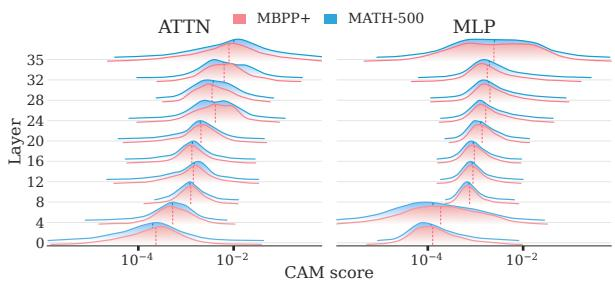
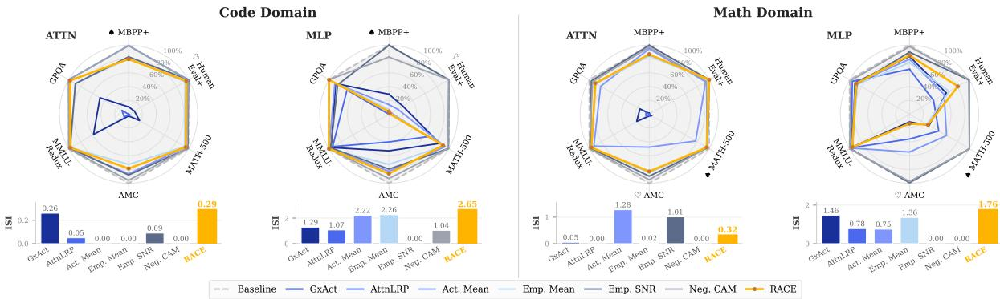
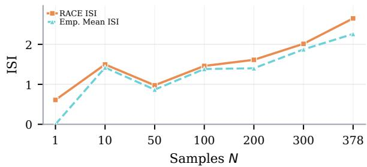
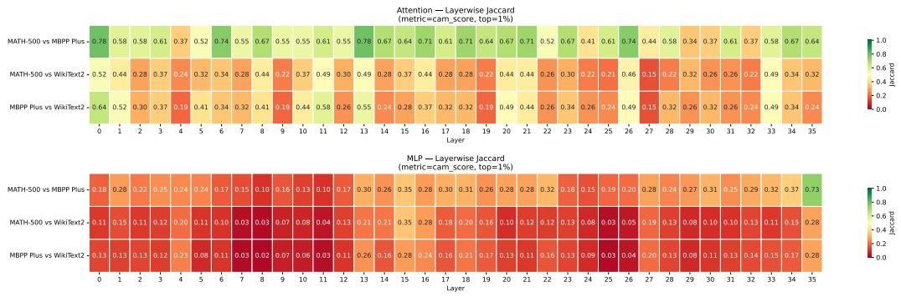

# RACE: Scalable Statistical Estimation of Functional Consistency in LLM Neurons

Runyu Wang<sup>1</sup> Bo Liu<sup>2</sup> Xiaxin Zhang<sup>1</sup> Yu Han<sup>1</sup> Jiawei Cao<sup>1</sup>

Xiaoye Zhang<sup>3</sup> Zhe Zhang<sup>4</sup> Yifan Yang<sup>4</sup> Peng Ping<sup>1</sup>\*

<sup>1</sup>School of Transportation and Civil Engineering, Nantong University

<sup>2</sup>Chongqing University of Post and Telecommunications

<sup>3</sup>China Southern Power Grid Company Limited <sup>4</sup>Meituan

2430310032@stmail.ntu.edu.cn s250201066@stu.cqupt.edu.cn 2433320001@stmail.ntu.edu.cn 2433320018@stmail.ntu.edu.cn

2233110297@stmail.ntu.edu.cn xiaoyz@whu.edu.cn zhangzhecnjs@gmail.com yangyifan@meituan.com pingpeng@ntu.edu.cn

## Abstract

Discovering stable neuron behavior across entire domains remains a challenge in mechanistic interpretability. Existing methods often rely on instance-level point estimates or computationally expensive procedures, which either obscure population-level variability or limit scalable domain-wide analysis. We present RACE (Residual Alignment for Consistency Estimation), a forward-pass statistical framework that evaluates the domain-wide functional consistency of Transformer neurons. Perturbation experiments demonstrate that RACE achieves superior domain specificity compared to gradient-based point estimates. Meanwhile, token-distribution-level results verify the association between the selected neurons and the target domain. Furthermore, its computational overhead is three orders of magnitude lower than that of gradient-based methods.

## 1 Introduction

Recent advances in mechanistic interpretability have improved our understanding of Transformerbased Large Language Models (LLMs) (Zhao et al., 2024; Rai et al., 2024). Three dominant approaches have emerged: causal tracing and knowledge localization techniques that identify critical model pathways (Dai et al., 2021; Meng et al., 2022), gradient-based attribution methods that quantify parameter importance (Sundararajan et al., 2017; Achtibat et al., 2024), and sparse autoencoders that extract interpretable neuron activations (Bricken et al., 2023; Shu et al., 2025).

While these methods excel at providing instancelevel explanations, they face a limitation: many real-world applications, including model capability auditing, domain-specific pruning, and behavioral steering, demand population-level characterizations of model components. Specifically, these tasks require rankings of task-relevant neurons that remain consistent across diverse inputs.

Recent work has attempted to bridge this gap through task-neuron mapping strategies: causal gradient variation localizes neurons that selectively affect target tasks (Song et al., 2024), while gradient attribution links task-specific neuron overlap to cross-task generalization (Leng and Xiong, 2025). However, existing pipelines suffer from two constraints: computational inefficiency stems from iterative gradient calculations and intervention operations, creating prohibitive overhead. Meanwhile, statistical oversimplification emerges when aggregating neuron contributions into task-level averages, which obscures sample-to-sample variation patterns.

To overcome these limitations, we draw upon two empirical observations: specific LLM capabilities rely on sparse subsets of neurons (Frankle and Carbin, 2019; Frantar and Alistarh, 2023), and these neurons respond uniquely to semantically coherent inputs (Voita et al., 2024; Huang et al., 2025). Since neuron activations directly modulate the residual stream, we hypothesize that during the forward pass, neurons serving consistent domainspecific functions will deposit contribution distributions over this stream that differ from those of non-domain-specific neurons in a statistically significant manner.

Accordingly, we introduce RACE (Residual Alignment for Consistency Estimation), a statistical estimation framework that scores every neuron at every layer forfunctional consistency with respect to a target-domain observation set (§2.1). RACE consists of two stages: (1) decomposing each module’s residual stream update into per-neuron contributions and evaluating their alignment with the module’s output direction via Residual-Direction Alignment (RDA) at forward-pass cost; and (2) distilling noisy per-observation signals into posterior distributions over each neuron’s mean alignment and variance through Bayesian aggregation.

We validate on 4B–32B LLMs across code generation, mathematical reasoning, and fine-grained behavioral control. Targeted suppression shows RACE selectively disrupts target capabilities while preserving non-target behaviors. Empirical results confirm RACE’s computational efficiency and demonstrate its superiority over gradient-based baselines. Ablation studies validate the contribution of each RACE component.

## 2 Method

## 2.1 Problem Formulation

Let $\mathcal { M } : \mathcal { X } \ :  \ : \mathcal { Y }$ be a trained Transformer with layers $l ~ = ~ 1 , \ldots , L$ and modules $m \in$ {ATTN, MLP}, denoting attention and multilayer perceptron modules, respectively. We write $u =$ (l, m, j) for a neuron in a fixed layer–module pair. Target-Domain Observation Set. A target domain c is specified by a predicate $\phi _ { c } : \mathcal { X } \mathrm { ~  ~ }$ {True, False} that induces the input population ${ \mathcal { D } } _ { c } ~ = ~ \{ { \mathbf { x } } ~ \in ~ { \mathcal { X } } ~ : ~ \phi _ { c } ( { \mathbf { x } } ) ~ = ~ { \mathrm { T r u e } } \}$ . In practice, we approximate this with a finite sample $D _ { c } = \{ \mathbf { x } _ { i } \} _ { i = 1 } ^ { N } \subseteq \mathcal { D } _ { c }$ . Because the Transformer is token-position dependent, the auditing protocol evaluates one or more positions per input, yielding the operational observation set

$$
\begin{array} { r l } & { T _ { c } = \{ ( \mathbf { x } _ { i } , p ) : \mathbf { x } _ { i } \in D _ { c } , p \in \mathcal { P } _ { c } ( \mathbf { x } _ { i } ) \} , } \\ & { n _ { c } = | T _ { c } | , } \end{array}\tag{1}
$$

where ${ \mathcal { P } } _ { c } ( \mathbf { x } )$ denotes the analyzed token positions. Functional Consistency. The functional consistency score of neuron $j$ with respect to $D _ { c }$ reflects how well its contribution distribution satisfies two desiderata. Specifically, let $e _ { j } ^ { ( t ) } \in \mathbb { R }$ denote neuron $j ^ { \dag } \mathrm { s }$ signed contribution for observation $t \in T _ { c }$ , with the sign defined relative to the target alignment direction. The score evaluates:

• Magnitude: $\mathbb { E } _ { t \in T _ { c } } [ e _ { j } ^ { ( t ) } ]$ is large and positive relative to other neurons in the same module.

• Stability: $\mathrm { V a r } _ { t \in T _ { c } } [ e _ { j } ^ { ( t ) } ]$ is small—the contribution is not driven by a few outlier observations.

Neurons that activate strongly on a handful of observations but are silent on most, or whose signed contributions change direction across observations, fail to satisfy these conditions despite potentially high average unsigned magnitude. We denote by $\mathcal { A } _ { \mathcal { M } } ( U _ { l , m } , T _ { c } ) \in \bar { \mathbb { R } } ^ { | U _ { l , m } | }$ the vector of functional consistency scores for all neurons in module m at layer l, given observation set $T _ { c }$

To estimate $\mathscr { A } _ { \mathcal { M } } ( U _ { l , m } , T _ { c } )$ across all layers and modules, RACE frames consistency evaluation as a problem of statistical inference over the evidence set $\{ e _ { j } ^ { ( t ) } \} _ { t \in T _ { c } }$ (hereafter, we drop the layer and module subscripts for readability and simply write $j$ for the audited neuron). Specifically, we model each neuron as possessing latent evidencedistribution parameters $\theta _ { j } = ( \mu _ { j } , \sigma _ { j } ^ { 2 } )$ , treating its per-observation evidence as noisy realizations from an underlying distribution:

$$
e _ { j } ^ { ( t ) } \mid \theta _ { j } \sim P ( \cdot \mid \mu _ { j } , \sigma _ { j } ^ { 2 } ) , \quad \forall t \in T _ { c }\tag{2}
$$

Functional consistency scoring then becomes a matter of posterior inference:

$$
P ( \theta _ { j } \mid T _ { c } ) \propto \prod _ { t \in T _ { c } } P \Big ( e _ { j } ^ { ( t ) } \mid \mu _ { j } , \sigma _ { j } ^ { 2 } \Big ) \cdot P ( \mu _ { j } , \sigma _ { j } ^ { 2 } ) .\tag{3}
$$

Crucially, this posterior formulation directly conceptually maps to our two desiderata: the posterior over $\mu _ { j }$ captures the functional magnitude and direction, while the posterior over $\sigma _ { j } ^ { 2 }$ and the epistemic uncertainty in $\mu _ { j }$ jointly encode stability.

To estimate this posterior in practice, RACE employs a two-stage pipeline. First, RDA computes the module-local evidence $e _ { j } ^ { ( t ) }$ from a single forward pass for each observation (§2.2). Second, Bayesian aggregation infers $\theta _ { j }$ from this evidence population (§2.3) using a Normal-Inverse-Gamma (NIG) conjugate model. This aggregation yields closed-form posterior mean estimates and variance-calibrated Conservative Alignment Magnitude (CAM) scores for neuron selection (§2.4). Finally, for intervention settings that require disentangling target-specific neurons from broadly active ones, we introduce Reference-Set Filtering (RSF) as a filtration step (§2.5).

## 2.2 Residual-Direction Alignment

RDA provides the per-observation evidence for Bayesian aggregation. It projects each neuron’s weighted output onto the normalized residual update of its host module, thereby avoiding rawactivation proxies (Shrikumar et al., 2017; Meng et al., 2022) and the computational overhead of gradient-based attribution (Sundararajan et al., 2017).

## 2.2.1 Neuron-Level Residual Decomposition

The residual stream r flows from layer to layer, with each module contributing $\Delta \mathbf { r } _ { \mathrm { m o d u l e } } \colon \mathbf { r } _ { \mathrm { o u t } } =$

${ \bf r } _ { \mathrm { i n } } + \Delta { \bf r } _ { \mathrm { m o d u l e } }$ . For a fixed observation and layer, this update decomposes naturally into per-neuron contributions:

$$
\Delta \mathbf { r } _ { \mathrm { A T T N } } = \mathbf { W } _ { \mathrm { O h } } = \sum _ { i } h _ { i } \mathbf { W } _ { \mathrm { O } _ { [ : , i ] } }\tag{4}
$$

$$
\Delta \mathbf { r } _ { \mathrm { M L P } } = \mathbf { W } _ { \mathrm { d o w n } } \mathbf { a } = \sum _ { j } a _ { j } \mathbf { W } _ { \mathrm { d o w n } _ { [ : , j ] } }\tag{5}
$$

where $\mathbf { h } \in \mathbb { R } ^ { d _ { \mathrm { m o d e l } } }$ is the concatenated attention head output and $\mathbf { a } \in \mathbb { R } ^ { d _ { \mathrm { M L P } } }$ is the MLP intermediate activation before the down projection. Each term is a rank-1 sub-update to the residual stream, scaled by activation magnitude. This sub-update view follows prior work (Geva et al., 2021, 2022). RACE audits these same additive units: an MLP neuron $j$ is the intermediate channel contributing $a _ { j } \mathbf { W } _ { \mathrm { d o w n } _ { [ : , j ] } } ,$ , while an attention neuron denotes an output-channel contribution $h _ { i } \mathbf { W } _ { \mathrm { O } _ { [ : , i ] } }$ (Elhage et al., 2021; Dai et al., 2021; Yu and Ananiadou, 2024).

## 2.2.2 Module-Local Alignment Evidence

RDA uses each module’s output $\Delta \mathbf { r }$ as the evaluation axis. Appendix A discusses why this modulelocal choice is better matched to the evidence that RACE aims to collect. For an observation t at layer l, we define:

$$
\hat { \mathbf { d } } _ { \mathrm { A T T N } } = \frac { \Delta \mathbf { r } _ { \mathrm { A T T N } } } { \| \Delta \mathbf { r } _ { \mathrm { A T T N } } \| _ { 2 } + \varepsilon }\tag{6}
$$

$$
\hat { \mathbf { d } } _ { \mathrm { M L P } } = \frac { \Delta \mathbf { r } _ { \mathrm { M L P } } } { \| \Delta \mathbf { r } _ { \mathrm { M L P } } \| _ { 2 } + \varepsilon }\tag{7}
$$

where ε is a small constant for numerical stability. The unit vector d<sup>ˆ</sup> represents the direction of the module’s additive update to the residual stream.

Each neuron’s alignment with this axis is then computed as a signed, activation-modulated score:

$$
\mathbf { s } _ { \mathrm { A T T N } } = \mathbf { W } _ { 0 } ^ { T } \hat { \mathbf { d } } _ { \mathrm { A T T N } } , \quad \xi _ { \mathrm { A T T N } _ { i } } = h _ { i } \cdot s _ { \mathrm { A T T N } _ { i } }\tag{8}
$$

$$
\begin{array} { r } { \mathbf { s } _ { \mathrm { M L P } } = \mathbf { W } _ { \mathrm { d o w n } } ^ { T } \hat { \mathbf { d } } _ { \mathrm { M L P } } , \quad \boldsymbol { \xi } _ { \mathrm { M L P } _ { j } } = \boldsymbol { a } _ { j } \cdot \boldsymbol { s } _ { \mathrm { M L P } _ { j } } } \end{array}\tag{9}
$$

The per-observation evidence is $e _ { j } ^ { ( t ) } = \xi _ { j } \in \mathbb { R }$ . Its sign records whether the neuron’s weighted output is aligned with or opposed to the module’s output direction for that observation. Sign fluctuation across $T _ { c }$ is naturally handled by the Bayesian aggregation stage (§2.3), where unstable evidence increases posterior uncertainty. Because the module update is an exact linear sum of per-neuron writes, the signed scores partition the module’s output norm rather than merely approximating importance, which is why alignment to the realized module direction serves as a faithful per-observation measure of functional contribution; Appendix B develops this argument in full. Appendix C details how these observations are logged for experiments.

## 2.3 Evidence Aggregation

We aggregate the noisy per-observation evidence $\{ e _ { j } ^ { ( t ) } \} _ { t = 1 } ^ { n }$ over the selected domain set $D _ { c }$ into calibrated consistency estimates via a NIG conjugate model, where $n = | T _ { c } |$ is the induced tokenposition evidence count for the fixed domain.

## 2.3.1 Modeling Functional Consistency

For each neuron j in a given module at layer l, we model the signed alignment scores as:

$$
e _ { j } ^ { ( t ) } \sim \mathcal { N } ( \mu _ { j } , \sigma _ { j } ^ { 2 } ) , \quad t = 1 , \dots , n\tag{10}
$$

where n counts all token-position observations induced by the N input samples in $D _ { c }$ Treating the Gaussian likelihood as a conjugate working model for the evidence mean and dispersion, we place a conjugate NIG prior $( \mu _ { j } , \sigma _ { j } ^ { 2 } )$ ∼ $\mathrm { N I G } ( \mu _ { 0 } , \lambda _ { 0 } , \alpha _ { 0 } , \beta _ { 0 } )$ , where $\sigma _ { j } ^ { 2 } \sim$ Inv-Gamma $( \alpha _ { 0 } , \beta _ { 0 } )$ and $\mu _ { j } \quad \mid \quad \sigma _ { j } ^ { 2 } \quad \sim$ $\dot { \mathcal { N } } ( \mu _ { 0 } , \sigma _ { j } ^ { 2 } / \lambda _ { 0 } )$

This conjugate specification yields analytic posterior updates for each neuron.

## 2.3.2 Posterior Updates

The closed-form update produces two quantities used by RACE scoring. The first is a posterior mean $\mu _ { n , j }$ that estimates signed alignment strength. The second is a posterior uncertainty term that penalizes noisy or scarce evidence.

Sufficient Statistics. Given n alignment scores $\{ e _ { j } ^ { ( t ) } \} _ { t = 1 } ^ { n }$ for neuron $j ,$ the posterior update requires only the empirical mean and centred sum of squares:

$$
{ \bar { e } } _ { j } = \frac { 1 } { n } \sum _ { t = 1 } ^ { n } e _ { j } ^ { ( t ) } , \quad { \mathrm { S S } } _ { j } = \sum _ { t = 1 } ^ { n } \left( e _ { j } ^ { ( t ) } - { \bar { e } } _ { j } \right) ^ { 2 } ,\tag{11}
$$

from which the empirical standard deviation is $\hat { \sigma } _ { j } = \sqrt { \mathrm { S S } _ { j } / ( n - 1 ) }$

Posterior Update. The NIG conjugacy yields a closed-form posterior with the same functional form:

$$
( \mu _ { j } , \sigma _ { j } ^ { 2 } ) \mid \{ e _ { j } ^ { ( t ) } \} \sim \mathrm { N I G } ( \mu _ { n , j } , \lambda _ { n } , \alpha _ { n } , \beta _ { n , j } )\tag{12}
$$

where the posterior hyperparameters are updated via simple arithmetic:

$$
\lambda _ { n } = \lambda _ { 0 } + n ,\tag{13}
$$

$$
\begin{array} { r } { \alpha _ { n } = \alpha _ { 0 } + \frac { n } { 2 } , } \end{array}\tag{14}
$$

$$
\mu _ { n , j } = \frac { \lambda _ { 0 } \mu _ { 0 } \bar { + } n \bar { e } _ { j } } { \lambda _ { n } } ,\tag{15}
$$

$$
\small \beta _ { n , j } = \beta _ { 0 } + \frac { \mathrm { S S } _ { j } } { 2 } + \frac { \lambda _ { 0 } n ( \bar { e } _ { j } - \mu _ { 0 } ) ^ { 2 } } { 2 \lambda _ { n } } .\tag{16}
$$

Maintaining these sufficient statistics costs $O ( 1 )$ per neuron per observation. The posterior parameters are then obtained in closed form.

Posterior Mean Evidence. The group-level score is the signed posterior mean, directly instantiating Eq. (3):

$$
\Phi _ { c } ( j ) = \mu _ { n , j } = \frac { \lambda _ { 0 } \mu _ { 0 } + n \bar { e } _ { j } } { \lambda _ { 0 } + n }\tag{17}
$$

The sign records the dominant alignment direction of the evidence, while values near zero indicate weak or inconsistent average alignment. The next subsection converts this posterior mean and its marginal uncertainty into CAM.

## 2.4 Uncertainty Quantification

Posterior Uncertainty over Mean Evidence. Integrating out $\sigma _ { j } ^ { 2 } .$ , the marginal posterior for the mean evidence follows a Student’s t-distribution:

$$
\mu _ { j } \mid \{ e _ { j } ^ { ( t ) } \} \sim t _ { 2 \alpha _ { n } } ( \mu _ { n , j } , \sigma _ { \mu , j } ) , \quad \sigma _ { \mu , j } ^ { 2 } = \frac { \beta _ { n , j } } { \alpha _ { n } \lambda _ { n } }
$$

where the second argument is the Student’s t scale parameter. This scale $\sigma _ { \mu , j }$ quantifies uncertainty regarding the average signed contribution, producing wider intervals for scarce or noisy evidence.

Variance Sources. The same $\beta _ { n , j }$ term also determines the posterior expected observation variance, $\mathbb { E } [ \sigma _ { i } ^ { 2 } \mid \{ e _ { i } ^ { ( t ) } \} ] = \beta _ { n , j } / ( \alpha _ { n } - 1 )$ for $\alpha _ { n } > 1$ Its data-driven component $\mathrm { S S } _ { j } / 2$ captures crossobservation variability in the alignment evidence. The prior-data term $\lambda _ { 0 } n ( \bar { e } _ { j } - \mu _ { 0 } ) ^ { 2 } / ( 2 \lambda _ { n } )$ regularizes evidence relative to the neutral prior $\mu _ { 0 } = 0$ Thus bursty, noisy, or sign-fluctuating evidence inflates $\beta _ { n , j }$ , increasing $\sigma _ { \mu , j }$ and reducing confidence in the neuron’s mean alignment strength. As n grows, $\lambda _ { n }$ and $\alpha _ { n }$ increase, shrinking the posterior uncertainty over $\mu _ { j }$ when the evidence remains stable.

Conservative Alignment Magnitude. We define a scoring criterion that provides a one-sided conservative lower credible bound on each neuron’s positive module-output alignment. The default RACE

score is:

$$
\rho _ { j } ( \gamma ) = \mu _ { n , j } - t _ { 1 - \gamma , 2 \alpha _ { n } } \sigma _ { \mu , j } ,
$$

$$
\mathbf { C A M } _ { j } ( \gamma ) = \mathbb { I } [ \mu _ { n , j } > 0 ] \operatorname* { m a x } ( 0 , \rho _ { j } ( \gamma ) )\tag{19}
$$

where $t _ { 1 - \gamma , 2 \alpha _ { n } }$ is the (1−γ)-quantile of the Student’s t with $2 \alpha _ { n }$ degrees of freedom. Formally, $\mathrm { C A M } _ { j } ( \gamma )$ is the lower $( 1 - \gamma )$ -credible bound on the positive posterior mean evidence under the marginal Student’s t-posterior in Eq. (18). Neurons with large positive mean evidence and small posterior uncertainty receive high CAM scores, whereas neurons with few observations, unstable alignment, or negative posterior mean evidence are excluded or penalized through the confidence radius. Throughout the paper, RACE denotes the default CAM ranking. As an ablation, we also report Neg. $\mathbf { C A M } _ { j } ( \gamma ) \ = \ \mathbb { I } [ \mu _ { n , j } \ < \ 0 ] \operatorname* { m a x } ( 0 , - \mu _ { n , j } \ -$ $t _ { 1 - \gamma , 2 \alpha _ { n } \sigma _ { \mu , j } ) }$

## 2.5 Reference-Set Filtering

Because features represented in superposition can make individual neurons polysemantic (Elhage et al., 2022; Scherlis et al., 2022; Templeton et al., 2024), unfiltered target rankings may include neurons that support broad capabilities rather than neurons whose behavior is specific only to the target domain. To disentangle domain-specific behavior from general capabilities during targeted interventions, we introduce RSF as an explicit filtering step. We denote direct RACE scoring on dataset D by $\mathbf { R } _ { D } .$ , and reference-set filtered scoring by ${ \bf R } _ { D _ { \mathrm { t a r } } \backslash D _ { \mathrm { r e f } } }$ . For each layer ℓ and module type, let $U ^ { \ell }$ be the layer-local neuron universe, $B _ { \mathrm { r e f } } ^ { \ell } = \mathrm { T o p } _ { M } ^ { s _ { \mathrm { r e f } } } ( U ^ { \ell } )$ be a reference exclusion set, and $\Pi _ { \mathrm { t a r } } ^ { \ell }$ be the full target-domain ranking. RSF selects

$$
\begin{array} { r l } & { \Pi _ { \mathrm { R S F } } ^ { \ell } = \left[ j \in \Pi _ { \mathrm { t a r } } ^ { \ell } : j \notin B _ { \mathrm { r e f } } ^ { \ell } \right] , } \\ & { S _ { \mathrm { s p e c } } ^ { \ell } = \mathrm { F i r s t } _ { k } \Big ( \Pi _ { \mathrm { R S F } } ^ { \ell } \Big ) . } \end{array}\tag{20}
$$

Here M is the reference top-M or top-p-percent threshold. Operationally, RSF traverses the target ranking, skips reference-selected neurons, and stops when k neurons are selected; this preserves exactly k neurons per layer whenever $| U ^ { \ell } \backslash B _ { \mathrm { r e f } } ^ { \ell } | \geq$ k. Appendix D provides a cross-domain overlap analysis.

## 3 Experiments

We evaluate RACE across multiple domains and models. Our experiments address two main questions: (1) Efficacy: Do RACE-selected neurons cause a disproportionate performance drop on target domains versus non-target domains when suppressed? (2) Ablation: Does Bayesian uncertainty quantification (CAM) outperform deterministic scoring heuristics?

## 3.1 Experimental Setup

Evaluated Models. We evaluate on Qwen3- 4B-it (Qwen Team, 2025) (Qwen3-4B-it-2507), OLMo-3.1-32B-it (Team OLMo et al., 2025), and Llama-3.1-8B-it (AI at Meta, 2024) (Appendix E); full model details are in Appendix F.

Domain & Benchmark Settings. Each domain is instantiated by a scoring set for RACE-based neuron selection, a same-domain out-of-distribution (OOD) benchmark for validation, and non-target benchmarks for retention.

• Code: MBPP+ (Austin et al., 2021; Liu et al., 2023) for scoring and HumanEval+ (Chen et al., 2021; Liu et al., 2023) for OOD validation.

• Math: MATH-500 (Hendrycks et al., 2021) for scoring and AMC (EvalScope, 2024) for OOD validation.

• Fine-grained Behavioral: We construct PyComp-1K, a set of 1,000 AST-verified Python comprehension-containing statements from bigcode/the-stack (Kocetkov et al., 2022; BigCode, 2026), as a narrow codebehavior scoring domain (Appendix I).

Detailed benchmark evaluation setup, including evaluator configurations and scoring definitions, is provided in Appendix F. Evidence logging strategies on corpora are summarized in Appendix C.

RACE Hyperparameters. Unless otherwise specified, all experiments use the same RACE hyperparameter settings: $\mu _ { 0 } = 0 , \lambda _ { 0 } = 1 , \alpha _ { 0 } = 1 , \beta _ { 0 } = 1$ and $\gamma = 0 . 0 5$ . We further discuss the robustness to prior settings and confidence levels in Appendix K. Baselines & Ablations. Table 1 reports the scoring formula used by each baseline or ablation. We consider two groups of methods: external baselines and internal RACE ablations. For external baselines, GxAct (Kokhlikyan et al., 2020) and AttnLRP (Achtibat et al., 2024) serve as typical gradient attribution methods over the same $T _ { c }$ , with the attribution target set to the benchmark answer token. Act. Mean serves as an activation-only control. To isolate the effect of Bayesian uncertainty modeling, we introduce three internal ablations operating on the same evidence $\{ e _ { j } ^ { ( t ) } \} _ { t = 1 } ^ { n }$ as RACE. Emp. Mean removes both the uncertainty penalty and prior regularization, thereby reducing to the raw empirical average. Emp. SNR replaces the Bayesian penalty with a frequentist variance penalty computed via $\hat { \sigma } _ { j } = \sqrt { \mathrm { S S } _ { j } / ( n - 1 ) }$ , and Neg. CAM acts as a negative-direction ablation. Regarding the evaluation protocol, instance-level scores are lifted to domain-level neuron rankings by averaging positive neuron-level contributions over the induced token-position observation set $T _ { c }$ matching RACE’s evidence aggregation granularity. All methods adopt identical per-layer/per-module selection budgets and suppression protocols. Under RSF, target and reference rankings are computed using the same method-specific scoring rule.

Table 1: Baselines and ablations. Each row gives the neuron score $S _ { j }$ used for ranking neuron $j ,$ with $n = | T _ { c } |$ $\mathrm { G x A c t } _ { j } ^ { ( t ) }$ and $\mathrm { L R P } _ { j } ^ { ( t ) }$ denote per-observation attribution scores for the two external baselines.
<table><tr><td>Method</td><td>Neuron score  $S _ { j }$ </td></tr><tr><td>GxAct</td><td> $\begin{array} { r } { 1 / n \sum _ { t \in T _ { c } } \operatorname* { m a x } ( 0 , \operatorname { G x A c t } _ { j } ^ { ( t ) } ) } \end{array}$ </td></tr><tr><td>AttnLRP Act. Mean</td><td> $1 / n \textstyle \sum _ { t \in T _ { c } } \operatorname* { m a x } ( 0 , \mathrm { L R P } _ { j } ^ { ( t ) } )$   $\begin{array} { r } { 1 / n \sum _ { t \in T _ { c } } | a _ { j } ^ { ( t ) } | } \end{array}$ </td></tr><tr><td>Neg. CAM</td><td> $\mathbb { I } [ \mu _ { n , j } < 0 ] \operatorname* { m a x } ( 0 , - \mu _ { n , j } - t _ { 1 - \gamma , 2 \alpha _ { n } } \sigma _ { \mu , j } )$ </td></tr><tr><td>Emp. Mean</td><td></td></tr><tr><td></td><td> $\bar { e } _ { j }$ </td></tr><tr><td>Emp. SNR</td><td> $\operatorname* { m a x } ( 0 , \bar { e } _ { j } ) / ( \hat { \sigma } _ { j } + \varepsilon )$ </td></tr></table>

## 3.2 Depth-Wise Organization of CAM Scores

  
Figure 1: Layer-wise kernel density estimate (KDE) ridgeline distributions of RACE results. On Qwen3- 4B-it, ridges under $\mathbf { R } _ { \mathrm { M B P P } } .$ <sub>+</sub> and R<sub>MATH-500</sub> visualize the KDE of CAM scores for neurons in each module across selected layers.

Figure 1 visualizes the CAM RACE score landscape across layers and modules. The ridgelines reveal a progressive rightward shift in positive CAM density with increasing depth, showing that highconfidence evidence concentrates in later layers. Compared to the shallow and deep layers, the middle layers exhibit a sparser distribution of highscoring neurons, especially in MLP modules. This depth-wise organization is remarkably consistent across MBPP+ and MATH-500, suggesting it reflects broad architectural properties rather than domain-specific quirks.

Consistent with prior analyses on Transformers’ functionally stratified computation (Tenney et al., 2019; Jawahar et al., 2019; Geva et al., 2022, 2023), this observation implies that CAM scores are not directly comparable across layers. A globally sorted list would be dominated by late-layer neurons, conflating alignment magnitude with network depth. We therefore adopt a stratified selection protocol in the following interventions: neurons are ranked by CAM within each layer and module, and a fixed budget is allocated to every layer. This per-layer selection rule preserves coverage over the model’s hierarchical computation.

## 3.3 Effectiveness Validation

We validate the intervention relevance of the selected neurons through targeted suppression: during inference, we set their corresponding activation values to zero and measure the resulting performance changes.

To jointly quantify target-domain suppression effectiveness and general selectivity in a single scalar, we define the Intervention Specificity Index (ISI):

$$
\mathrm { I S I } = \operatorname* { m a x } \left\{ 0 , \log \left( \frac { \Delta _ { T } } { \Delta _ { G } + \delta } \right) \right\} , \quad \delta = 0 . 0 1 .\tag{21}
$$

Here $\Delta _ { T }$ and $\Delta _ { G }$ are the average nonnegative relative accuracy drops over the target-domain (including OOD benchmarks) and general (nontarget) benchmarks respectively, computed from the per-benchmark drop $\Delta = \mathrm { m a x } \{ 0 , ( \mathrm { A c c } _ { \mathrm { b e f o r e } } -$ $\mathrm { A c c } _ { \mathrm { a f t e r } } \big ) / \mathrm { A c c } _ { \mathrm { b e f o r e } } \big \}$

The constant δ is used for smoothing. Higher ISI indicates stronger target-domain suppression with minimal non-target degradation.

## 3.3.1 Domain-Specific Intervention

We evaluate two intervention strategies. The Vanilla Selection strategy relies solely on the CAM scores computed on the target domain. In contrast, the RSF strategy (§2.5) explicitly controls for broadly shared language capabilities by filtering the candidate set against a general reference corpus.

Vanilla Selection. Table 2 reports the Codedomain results; the corresponding Qwen3-4B-it Math-domain results are provided in Appendix Table 21. We find that neurons selected under this setting cause severe overall generation degradation once the suppression budget reaches $k { \geq } 1 0$ per layer. We thus report $k { = } 5$ to observe distinct effects.

Table 2: Code domain with ${ \bf R } _ { \mathrm { M B P P + } }$ : Benchmark Acc. (%) and ISI on Qwen3-4B-it after suppressing top-k=5 neurons per layer. Superscript <sup>♠</sup> marks the target domain $D ,$ and <sup>♡</sup> marks the same-domain OOD benchmark. All reported scores are averaged over three runs; subsequent tables follow the same setting unless specified.

<table><tr><td colspan="2">Module Method</td><td>MBPP+</td><td>HumanEval+</td><td>MATH-500 AMC MMLU-Redux GPQA ISI↑</td><td></td><td></td><td></td><td></td></tr><tr><td rowspan="7"></td><td>GxAct</td><td>57.94</td><td>49.39</td><td>76.35</td><td>42.54</td><td>77.79</td><td>44.95</td><td>0.57</td></tr><tr><td>AttnLRP</td><td>47.09</td><td>43.90</td><td>90.25</td><td>77.61</td><td>76.79</td><td>45.96</td><td>2.00</td></tr><tr><td>Act. Mean</td><td>80.69</td><td>46.34</td><td>93.89</td><td>81.34</td><td>80.82</td><td>41.92</td><td>1.54</td></tr><tr><td>Emp. Mean</td><td>78.31</td><td>51.83</td><td>93.24</td><td>84.33</td><td>80.47</td><td>39.97</td><td>1.37</td></tr><tr><td>Emp. SNR</td><td>74.34</td><td>50.00</td><td>93.13</td><td>84.33</td><td>81.14</td><td>41.41</td><td>1.71</td></tr><tr><td>Neg. CAM</td><td>78.84</td><td>83.54</td><td>93.77</td><td>83.58</td><td>80.53</td><td>41.92</td><td>0.00</td></tr><tr><td>RACE</td><td>55.03</td><td>45.73</td><td>89.00</td><td>72.39</td><td>78.91</td><td>44.95</td><td>1.62</td></tr><tr><td rowspan="7">MLP</td><td>GxAct</td><td>10.32</td><td>5.49</td><td>1.80</td><td>0.75</td><td>15.25</td><td>15.15</td><td>0.04</td></tr><tr><td>AttnLRP</td><td>74.87</td><td>83.54</td><td>95.04</td><td>85.82</td><td>81.84</td><td>49.49</td><td>1.15</td></tr><tr><td>Act. Mean</td><td>81.75</td><td>3.66</td><td>93.42</td><td>81.34</td><td>81.18</td><td>41.47</td><td>2.22</td></tr><tr><td>Emp. Mean</td><td>75.13</td><td>0.00</td><td>89.86</td><td>87.31</td><td>81.33</td><td>43.43</td><td>2.79</td></tr><tr><td>Emp. SNR</td><td>80.95</td><td>86.59</td><td>93.62</td><td>82.09</td><td>81.23</td><td>45.96</td><td>0.00</td></tr><tr><td>Neg. CAM</td><td>75.13</td><td>85.37</td><td>91.81</td><td>84.33</td><td>81.58</td><td>45.96</td><td>0.54</td></tr><tr><td>RACE</td><td>74.34</td><td>0.00</td><td>92.80</td><td>82.83</td><td>81.79</td><td>44.95</td><td>2.91</td></tr><tr><td colspan="2">Qwen3-4B-it</td><td>82.28</td><td>83.54</td><td>94.40</td><td>87.31</td><td>81.37</td><td>45.45</td><td></td></tr></table>

RSF Selection. On Qwen3-4B-it, Figure 2 summarizes the RSF intervention results for both the code and math domains. The corresponding tabular details are reported in Appendix Tables 20 and 22. To demonstrate that RACE’s effectiveness scales to larger models, we further evaluate $\mathbf { R } _ { \mathrm { M A T H - 5 0 0 \backslash W i k i T e x t - 2 } }$ on OLMo-3.1-32B-it.

Table 3: Math domain with $\mathbf { R } _ { \mathrm { M A T H - 5 0 0 } \backslash \mathrm { W i k i T e x t - 2 } } \colon$ Benchmark Acc. (%) and ISI on OLMo-3.1-32B-it after suppressing top-1% and top-5% neurons per layer.
<table><tr><td rowspan="2" colspan="2">Module Method</td><td colspan="2">MATH-500</td><td colspan="2">AMC</td><td colspan="2">GPQA</td><td colspan="2">MMLU-Redux</td><td colspan="2">ISI↑</td></tr><tr><td>1%</td><td>5%</td><td>1%</td><td>5%</td><td>1%</td><td>5%</td><td>1%</td><td>5%</td><td>1%</td><td>5%</td></tr><tr><td rowspan="5">ATTN</td><td>Act. Mean</td><td>88.32</td><td>84.85</td><td>76.12</td><td>71.64</td><td>38.10</td><td>35.99</td><td>79.91</td><td>73.18</td><td>0.00</td><td>0.00</td></tr><tr><td>Emp. Mean</td><td>85.01</td><td>87.84</td><td>70.93</td><td>68.66</td><td>45.03</td><td>43.52</td><td>81.54</td><td>77.12</td><td>0.00</td><td>0.00</td></tr><tr><td>Emp. SNR</td><td>86.41</td><td>86.25</td><td>71.64</td><td>67.91</td><td>44.02</td><td>44.54</td><td>83.47</td><td>79.95</td><td>0.00</td><td>0.00</td></tr><tr><td>Neg. CAM</td><td>85.97</td><td>86.62</td><td>77.61</td><td>73.13</td><td>47.56</td><td>45.53</td><td>84.01</td><td>84.67</td><td>0.00</td><td>0.01</td></tr><tr><td>RACE</td><td>85.61</td><td>84.43</td><td>76.86</td><td>65.67</td><td>47.74</td><td>42.49</td><td>82.63</td><td>80.35</td><td>0.00</td><td>0.00</td></tr><tr><td rowspan="5">MLP</td><td>Act. Mean</td><td>63.87</td><td>14.71</td><td>21.64</td><td>10.45</td><td>40.40</td><td>36.36</td><td>81.32</td><td>75.65</td><td>1.47</td><td>1.50</td></tr><tr><td>Emp. Mean</td><td>73.95</td><td>21.43</td><td>25.37</td><td>13.43</td><td>41.41</td><td>38.89</td><td>80.81</td><td>73.46</td><td>1.35</td><td>1.50</td></tr><tr><td>Emp. SNR</td><td>76.89</td><td>44.54</td><td>23.88</td><td>18.66</td><td>23.74</td><td>21.72</td><td>52.81</td><td>46.21</td><td>0.00</td><td>0.20</td></tr><tr><td>Neg. CAM</td><td>92.40</td><td>97.48</td><td>79.85</td><td>79.85</td><td>52.02</td><td>50.51</td><td>84.32</td><td>85.16</td><td>0.00</td><td>0.00</td></tr><tr><td>RACE</td><td>56.80</td><td>6.72</td><td>14.18</td><td>7.46</td><td>39.83</td><td>37.79</td><td>82.72</td><td>77.79</td><td>1.65</td><td>1.73</td></tr><tr><td colspan="2">OLMo-3.1-32B-it</td><td colspan="2">86.40</td><td colspan="2">79.85</td><td colspan="2">48.6</td><td colspan="2">84.70</td><td colspan="2"></td></tr></table>

Observation: RACE consistently outperforms gradient-based methods, confirming RDA as a reliable gradient-free evidence source. The pronounced OOD degradation further validates RACE scores as an effective target-domain proxy. RSF substantially improves neuron suppression tolerance, with target performance dropping more steeply under higher budgets—indicating successful isolation of domain-specific neurons.

  
Figure 2: Suppression under the RSF strategies ${ \bf R } _ { \mathrm { M B P P + } \backslash \mathrm { W i k i T e x t - } 2 }$ for the code domain and R<sub>MATH-500\WikiText-2</sub> for the math domain on Qwen3-4B-it. All interventions suppress the top-1% target-selected neurons within the corresponding module at each layer. Radar plots report post-suppression benchmark accuracy as a percentage of the original model baseline, separately for ATTN and MLP interventions. Bars below each radar report the corresponding ISI.

Figure 2 confirms this specificity: for both code and math, RACE-selected suppression under RSF hurts target-domain more than non-target performance. However, effects vary by module: MLP interventions cause significant same-domain OOD drops, while attention interventions show weaker domain-specific degradation.

This asymmetry is clearer when comparing vanilla selection to RSF: Under vanilla selection, ATTN interventions produce marked target drops even at low budgets, but RSF’s ISI for ATTN remains substantially lower than for MLP, especially on the 32B model. We attribute this to ATTN’s high-scoring neurons being sparse yet broadly reusable: RSF removes these general-purpose neurons via reference filtering, leaving a weaker domain-specific signal. This aligns with known sparsity in ATTN’s $\mathbf { W } _ { O }$ (Michel et al., 2019), suggesting ATTN’s target-domain high-activation neurons also serve broader linguistic functions.

## 3.3.2 Distributional Verification

Table 4: Distributional disruption on Qwen3-4B-it under $\mathbf { R } _ { D _ { \mathrm { t a r } } \backslash \mathrm { W i k i T e x t - 2 } }$ , after suppressing the top-1% neurons within the selected module at each layer.
<table><tr><td></td><td></td><td colspan="3">(a) RMBPP+\ WikiTex-2</td><td colspan="3">(b) RMATH-500\ WikiText-2</td></tr><tr><td></td><td>Metric Module</td><td>MBPP+</td><td>MATH-500</td><td>WikiText-2</td><td>MBPP+</td><td>MATH-500*</td><td>WikiText-2</td></tr><tr><td rowspan="2">∆PPL</td><td>ATTN</td><td>+6.17%</td><td>+6.18%</td><td>-2.49%</td><td>+4.52%</td><td>+7.29%</td><td>-2.74%</td></tr><tr><td>MLP</td><td>+77.31%</td><td>+23.98%</td><td>+2.76%</td><td>+25.41%</td><td>+129.04%</td><td>+2.60%</td></tr><tr><td rowspan="2">DKL</td><td>ATTN</td><td>0.10</td><td>0.08</td><td>0.03</td><td>0.09</td><td>0.09</td><td>0.03</td></tr><tr><td>MLP</td><td>0.58</td><td>0.22</td><td>0.02</td><td>0.22</td><td>0.86</td><td>0.03</td></tr></table>

Beyond coarse accuracy drops, we examine the mechanism of disruption at the token-distribution level using relative perplexity degradation $\Delta _ { \mathrm { P P I } }$ (Eq. 27) and mean forward Kullback–Leibler divergence $\bar { D } _ { \mathrm { K L } } ( \mathrm { E q . }$ 28).

The distributional metrics (Table 4) reveal a drastic asymmetric disruption, particularly for MLP interventions. Suppressing RACE-selected MLP neurons triggers severe target-domain distribution collapse $( \Delta _ { \mathrm { P P L } }$ reaching 77.31% on MBPP+ and 129.04% on MATH-500, alongside massive $\bar { D } _ { \mathrm { K L } }$ shifts), while leaving the reference corpus (WikiText-2) almost entirely unperturbed. This targeted disruption validates the effectiveness of RACE in decoupling and localizing function-specific neurons without collapsing the model’s fundamental linguistic competence. As a byproduct, ATTN interventions exhibit significantly weaker distributional contrasts, suggesting lower functional sparsity and weaker sensitivity to perturbations compared to the MLP module. Appendix M reports w/o-RSF distributional disruption results.

## 3.3.3 Fine-Grained Behavioral Steering

Table 5: Fine-grained suppression of Python comprehension generation on Qwen3-4B-it. Records: outputs containing $\geq 1$ comprehension. Total: aggregate comprehension instances. Pass%: pass@1 functional correctness on the subset of generated solutions that use comprehensions.

<table><tr><td></td><td colspan="3">MBPP+</td><td colspan="3">HumanEval+</td></tr><tr><td>Strategy</td><td>Records</td><td>Total</td><td>Pass%</td><td>Records</td><td>Total</td><td>Pass%</td></tr><tr><td>Qwen3-4B-it</td><td>55</td><td>59</td><td>92.73</td><td>36</td><td>45</td><td>86.11</td></tr><tr><td>RMBPP+\WikiText-2</td><td>44</td><td>56</td><td>97.73</td><td>33</td><td>46</td><td>81.82</td></tr><tr><td>RpyComp-1K\WikiText-2</td><td>16-70.9%</td><td>18. -69.5%</td><td>87.50</td><td>14-61.1%</td><td>19-57.8%</td><td>85.71</td></tr></table>

To test RACE’s resolution on narrow stylistic behaviors, we target Qwen3-4B-it’s generation of

Python comprehensions. These are semantically optional but syntactically idiomatic constructs.

Using PyComp-1K as the narrow scoring set, we apply ${ \bf R } _ { \mathrm { P y C o m p - 1 K \backslash W i k i T e x t - 2 } }$ and ${ \bf R } _ { \mathrm { M B P P + } }$ \WikiText-2 with a small intervention budget of k=10 neurons per layer.

Suppressing PyComp-1K neurons drastically reduces comprehension usage (-70.9% on MBPP+, -61.1% on HumanEval+) while largely preserving functional correctness (Table 5). This specific decline without catastrophic forgetting confirms that RACE-selected neurons steer behavior rather than cause mere disruption. The generation-level effect of this targeted perturbation suggests that RACE can use a deliberately designed dataset to localize a specific model behavior. Appendix J provides a comparison of model outputs before and after perturbation.

## 3.4 Computational Efficiency

Table 6 reports the additional FLOPs required by each scoring method, measured with a profiler on Qwen3-4B-it using 64 input tokens and 16 generated tokens. Appendix H gives the profiling protocol.

Table 6: Profiler-measured scoring overhead relative to forward inference on Qwen3-4B-it.
<table><tr><td>Method</td><td>Extra FLOPs</td><td>Forward-equivalent overhead</td></tr><tr><td>GxAct</td><td>18.77 TFLOPs</td><td>144.29×</td></tr><tr><td>AttnLRP</td><td>18.82 TFLOPs</td><td>144.62×</td></tr><tr><td>RDA</td><td>81.5 GFLOPs</td><td>0.63×</td></tr></table>

## 3.5 Discussion

We analyze how scoring-set size and variance regularization affect RACE, using Qwen3-4B-it with MBPP+ unless stated otherwise.

Scoring-set sample size N. The scoring-set sample size N controls how reliably RACE estimates intervention-worthy neurons from the target domain. Figure 3 evaluates this effect through downstream ISI rather than ranking correlation: for each N, we construct ${ \bf R } _ { \mathrm { M B P P + } \backslash \mathrm { W i k i T e x t - } 2 }$ , suppress the top-1% MLP neurons per layer, and compare RACE with Emp. Mean. The ISI curves are nonmonotonic under small and mid-sized scoring sets, but both methods improve as more MBPP+ examples are used and reach their strongest selectivity on the full scoring set (N=378). Notably, under the default prior, the posterior mean is a monotonic rescaling of the empirical mean $( \mu _ { n , j } \propto \bar { e } _ { j } )$

  
Figure 3: Sample efficiency on Qwen3-4B-it under ${ \bf R } _ { \mathrm { M B P P + } \backslash \mathrm { W i k i T e x t - } 2 } \mathrm { : }$ ISI after suppressing top-1% MLP neurons per layer as the scoring-set size N varies, comparing RACE with Emp. Mean.

The finite-sample difference between RACE and empirical averaging therefore arises from CAM’s uncertainty penalty.

Bayesian variance regularization. The samplesize behavior clarifies that RACE’s low-data advantage comes from calibrated uncertainty rather than a different mean estimator. Sparse module evidence traces can make empirical variance-based ratios over-rank weak nonzero fluctuations, consistent with the poor MLP intervention specificity of Emp. SNR in Table 2. CAM avoids this failure mode by retaining a finite uncertainty margin under the default NIG prior. It becomes prior-insensitive once the induced evidence count n is large. Appendix P gives the short derivation.

## 4 Related Work

Current research in mechanistic interpretability primarily focuses on analyzing individual instances through gradient-based methods, residual stream analysis (Belrose et al., 2023; Ghandeharioun et al., 2024), and circuit discovery (Conmy et al., 2023; Gu et al., 2025). While sparse autoencoders (Bricken et al., 2023; Templeton et al., 2024) offer detailed feature-level analysis, scaling these methods for dataset-level evaluation remains computationally challenging. Recent work has identified specific neural patterns linked to particular skills (Wang et al., 2022; Song et al., 2024; Leng and Xiong, 2025), languages (Tang et al., 2024; Zhang et al., 2024), and factual knowledge (Dai et al., 2021; Meng et al., 2022; Chen et al., 2024). However, existing approaches often struggle to reliably separate meaningful patterns from random noise (Niu et al., 2024), limiting their effectiveness for applications like model pruning (Ma et al., 2023; Sun et al., 2024) or behavior control (Turner et al., 2024; Zou et al., 2023). RACE addresses these limitations with a more robust statistical framework for model auditing.

## 5 Conclusion

To assess functional consistency, RACE recasts neuron analysis as inference over latent alignment distributions. The resulting posterior isolates neurons whose domain contributions are directionally aligned and statistically stable. Targeted perturbations confirm this population is causally loadbearing. Designed with linear computational complexity, the approach remains practical for realworld applications.

## Limitations

We discuss the currently identified limitations in the formulation of RACE. The extraction of alignment evidence relies on linear residual-stream projections, which means the framework may miss complex non-linear synergies among multiple neurons or distributed polysemantic features that require non-linear decoding. Additionally, our experimental results indicate that RACE, alongside other evaluated baselines, demonstrates limited effectiveness in identifying functionally consistent neurons within attention modules. This suggests that attention mechanisms may encode information in a fundamentally different manner than MLPs, making the development of statistical audit strategies specifically tailored to attention an important direction for future work.

## Acknowledgements

This work was supported in part by the National Natural Science Foundation of China under Grants 52202496, 52442218, and U2433216; The Key Research and Development Project of Nantong City, China (Special Project for Prospective Technology Innovation, No. GZ2024001); and the Key Laboratory of Target Cognition and Application Technology (2023-CXPT-LC-005).

## References

Reduan Achtibat, Sayed Mohammad Vakilzadeh Hatefi, Maximilian Dreyer, Aakriti Jain, Thomas Wiegand, Sebastian Lapuschkin, and Wojciech Samek. 2024. Attnlrp: attention-aware layer-wise relevance propagation for transformers. arXiv preprint arXiv:2402.05602.

AI at Meta. 2024. The llama 3 herd of models. arXiv preprint arXiv:2407.21783.

Jacob Austin, Augustus Odena, Maxwell Nye, Maarten Bosma, Henryk Michalewski, David Dohan, Ellen Jiang, Carrie Cai, Michael Terry, Quoc Le, and Charles Sutton. 2021. Program synthesis with large language models. arXiv preprint arXiv:2108.07732.

Nora Belrose, Zach Furman, Logan Smith, Danny Halawi, Igor Ostrovsky, Lev McKinney, Stella Biderman, and Jacob Steinhardt. 2023. Eliciting latent predictions from transformers with the tuned lens. Advances in Neural Information Processing Systems, 36.

BigCode. 2026. The Stack: BigCode dataset documentation. https://www.bigcode-project.org/ docs/about/the-stack/. Accessed 2026-05-14.

Trenton Bricken, Adly Templeton, Joshua Batson, Brian Chen, Adam Jermyn, Tom Conerly, Nick Turner, Cem Anil, Carson Denison, Amanda Askell, Robert Lasenby, Yifan Wu, Shauna Kravec, Nicholas Schiefer, Tim Maxwell, Nicholas Joseph, Zac Hatfield-Dodds, Alex Tamkin, Karina Nguyen, and 6 others. 2023. Towards monosemanticity: Decomposing language models with dictionary learning. Transformer Circuits Thread.

Mark Chen, Jerry Tworek, Heewoo Jun, Qiming Yuan, Henrique Ponde de Oliveira Pinto, Jared Kaplan, Harri Edwards, Yuri Burda, Nicholas Joseph, Greg Brockman, Alex Ray, Ramesh Puri, Gretchen Krueger, Michael Petrov, Heidy Khlaaf, Girish Sastry, Pamela Mishkin, Brooke Chan, Scott Gray, and 39 others. 2021. Evaluating large language models trained on code. arXiv preprint arXiv:2107.03374.

Yuheng Chen, Pengfei Cao, Yubo Chen, Kang Liu, and Jun Zhao. 2024. Journey to the center of the knowledge neurons: Discoveries of language-independent knowledge neurons and degenerate knowledge neurons. In Proceedings ofthe AAAI Conference on Artificial Intelligence, volume 38, pages 17817–17825.

Arthur Conmy, Augustine N Mavor-Parker, Aidan Lynch, Stefan Heimersheim, and Adrià Garriga-Alonso. 2023. Towards automated circuit discovery for mechanistic interpretability. Advances in Neural Information Processing Systems, 36.

Damai Dai, Li Dong, Yaru Hao, Zhifang Sui, Baobao Chang, and Furu Wei. 2021. Knowledge neurons in pretrained transformers. arXiv preprint arXiv:2104.08696.

Nelson Elhage, Tristan Hume, Catherine Olsson, Nicholas Schiefer, Tom Henighan, Shauna Kravec, Zac Hatfield-Dodds, Robert Lasenby, Dawn Drain, Carol Chen, Chris Olah, and 1 others. 2022. Toy models of superposition. Transformer Circuits Thread.

Nelson Elhage, Neel Nanda, Catherine Olsson, Tom Henighan, Nicholas Joseph, Ben Mann, Amanda Askell, Yuntao Bai, Anna Chen, Tom Conerly, Nova DasSarma, Dawn Drain, Deep Ganguli, Zac Hatfield-Dodds, Danny Hernandez, Andy Jones, Jackson

Kernion, Liane Lovitt, Kamal Ndousse, and 6 others. 2021. A mathematical framework for transformer circuits. Transformer Circuits Thread.

EvalScope. 2024. AMC: American mathematics competitions benchmark. https: //evalscope.readthedocs.io/zh-cn/latest/ benchmarks/amc.html. Benchmark based on AMC 10/12 problems from 2022–2024.

EvalScope. 2026a. ARC: EvalScope benchmark card. https://evalscope.readthedocs.io/ zh-cn/latest/benchmarks/arc.html. Accessed 2026-05-14.

EvalScope. 2026b. GPQA-Diamond: EvalScope benchmark card. https://evalscope.readthedocs. io/zh-cn/latest/benchmarks/gpqa\_diamond. html. Accessed 2026-05-14.

EvalScope. 2026c. HumanEvalPlus: EvalScope benchmark card. https://evalscope.readthedocs. io/zh-cn/latest/benchmarks/humaneval\_plus. html. Accessed 2026-05-14.

EvalScope. 2026d. MATH-500: EvalScope benchmark card. https://evalscope.readthedocs.io/ zh-cn/latest/benchmarks/math\_500.html. Accessed 2026-05-14.

EvalScope. 2026e. MBPP-Plus: EvalScope benchmark card. https://evalscope.readthedocs.io/ zh-cn/latest/benchmarks/mbpp\_plus.html. Accessed 2026-05-14.

EvalScope. 2026f. MMLU-Redux: EvalScope benchmark card. https://evalscope.readthedocs. io/zh-cn/latest/benchmarks/mmlu\_redux. html. Accessed 2026-05-14.

Jonathan Frankle and Michael Carbin. 2019. The lottery ticket hypothesis: Finding sparse, trainable neural networks. In International Conference on Learning Representations.

Elias Frantar and Dan Alistarh. 2023. SparseGPT: Massive language models can be accurately pruned in one-shot. In Proceedings of the 40th International Conference on Machine Learning, volume 202 of Proceedings of Machine Learning Research, pages 10323–10337. PMLR.

Mor Geva, Jasmijn Bastings, Katja Filippova, and Amir Globerson. 2023. Dissecting recall of factual associations in auto-regressive language models. In Proceedings of the 2023 Conference on Empirical Methods in Natural Language Processing, pages 12216–12235.

Mor Geva, Avi Caciularu, Kevin Wang, and Yoav Goldberg. 2022. Transformer feed-forward layers build predictions by promoting concepts in the vocabulary space. In Proceedings of the 2022 Conference on Empirical Methods in Natural Language Processing, pages 30–45.

Mor Geva, Roei Schuster, Jonathan Berant, and Omer Levy. 2021. Transformer feed-forward layers are key-value memories. In Proceedings of the 2021 Conference on Empirical Methods in Natural Language Processing, pages 5484–5495.

Asma Ghandeharioun, Avi Caciularu, Adam Pearce, Lucas Dixon, and Mor Geva. 2024. Patchscopes: A unifying framework for inspecting hidden representations of language models. In Proceedings of the 41st International Conference on Machine Learning, volume 235 of Proceedings of Machine Learning Research, pages 15466–15490. PMLR.

Hao Gu, Vibhas Nair, Amrithaa Ashok Kumar, Jayvart Sharma, and Ryan Lagasse. 2025. Discovering transformer circuits via a hybrid attribution and pruning framework. arXiv preprint arXiv:2510.03282v1.

Dan Hendrycks, Collin Burns, Saurav Kadavath, Akul Arora, Steven Basart, Eric Tang, Dawn Song, and Jacob Steinhardt. 2021. Measuring mathematical problem solving with the MATH dataset. In Thirtyfifth Conference on Neural Information Processing Systems Datasets and Benchmarks Track.

Ko-Wei Huang, Yi-Fu Fu, Ching-Yu Tsai, Yu-Chieh Tu, Tzu-ling Cheng, Cheng-Yu Lin, Yi-Ting Yang, Heng-Yi Liu, Keng-Te Liao, Da-Cheng Juan, and Shou-De Lin. 2025. Neuron-level differentiation of memorization and generalization in large language models. In Proceedings ofthe 2025 Conference on Empirical Methods in Natural Language Processing, pages 16066–16080, Suzhou, China. Association for Computational Linguistics.

Jett Janiak, Can Rager, James Dao, and Yeu-Tong Lau. 2024. An adversarial example for direct logit attribution: Memory management in gelu-4l. In Proceedings of the 7th BlackboxNLP Workshop: Analyzing and Interpreting Neural Networks for NLP, pages 232–237.

Ganesh Jawahar, Benoît Sagot, and Djamé Seddah. 2019. What does BERT learn about the structure of language? In Proceedings of the 57th Annual Meeting of the Association for Computational Linguistics, pages 3651–3657.

Denis Kocetkov, Raymond Li, Loubna Ben Allal, Jia Li, Chenghao Mou, Carlos Muñoz Ferrandis, Yacine Jernite, Margaret Mitchell, Sean Hughes, Thomas Wolf, Dzmitry Bahdanau, Leandro von Werra, and Harm de Vries. 2022. The Stack: 3 tb of permissively licensed source code. arXiv preprint arXiv:2211.15533.

Narine Kokhlikyan, Vivek Miglani, Miguel Martin, Edward Wang, Bilal Alsallakh, Jonathan Reynolds, Alexander Melnikov, Natalia Kliushkina, Carlos Araya, Siqi Yan, and Orion Reblitz-Richardson. 2020. Captum: A unified and generic model interpretability library for pytorch. CoRR, abs/2009.07896.

Yongqi Leng and Deyi Xiong. 2025. Towards understanding multi-task learning (generalization) of

LLMs via detecting and exploring task-specific neurons. In Proceedings ofthe 31st International Conference on Computational Linguistics, pages 2969– 2987, Abu Dhabi, UAE. Association for Computational Linguistics.

Jiawei Liu, Chunqiu Steven Xia, Yuyao Wang, and Lingming Zhang. 2023. Is your code generated by Chat-GPT really correct? rigorous evaluation of large language models for code generation. In Advances in Neural Information Processing Systems.

Xinyin Ma, Gongfan Fang, and Xinchao Wang. 2023. LLM-pruner: On the structural pruning of large language models. Advances in Neural Information Processing Systems, 36.

Kevin Meng, David Bau, Alex Andonian, and Yonatan Belinkov. 2022. Locating and editing factual associations in GPT. arXiv preprint arXiv:2202.05262.

Stephen Merity, Caiming Xiong, James Bradbury, and Richard Socher. 2016. Pointer sentinel mixture models. arXiv preprint arXiv:1609.07843.

Paul Michel, Omer Levy, and Graham Neubig. 2019. Are sixteen heads really better than one? In Advances in Neural Information Processing Systems, volume 32.

Jingcheng Niu, Andrew Liu, Zining Zhu, and Gerald Penn. 2024. What does the knowledge neuron thesis have to do with knowledge? In International Conference on Learning Representations.

Qwen Team. 2025. Qwen3 technical report. arXiv preprint arXiv:2505.09388.

Daking Rai, Yilun Zhou, Shi Feng, Abulhair Saparov, and Ziyu Yao. 2024. A practical review of mechanistic interpretability for transformer-based language models. arXiv preprint arXiv:2407.02646.

Adam Scherlis, Kshitij Sachan, Adam S. Jermyn, Joe Benton, and Buck Shlegeris. 2022. Polysemanticity and capacity in neural networks. arXiv preprint arXiv:2210.01892.

Avanti Shrikumar, Peyton Greenside, and Anshul Kundaje. 2017. Learning important features through propagating activation differences. In International conference on machine learning, pages 3145–3153. PMlR.

Dong Shu, Xuansheng Wu, Haiyan Zhao, Daking Rai, Ziyu Yao, Ninghao Liu, and Mengnan Du. 2025. A survey on sparse autoencoders: Interpreting the internal mechanisms of large language models. In Findings ofthe Associationfor Computational Linguistics: EMNLP 2025, pages 1690–1712, Suzhou, China. Association for Computational Linguistics.

Ran Song, Shizhu He, Shuting Jiang, Yantuan Xian, Shengxiang Gao, Kang Liu, and Zhengtao Yu. 2024. Does large language model contain task-specific neurons? In Proceedings of the 2024 Conference on

Empirical Methods in Natural Language Processing, pages 7101–7113, Miami, Florida, USA. Association for Computational Linguistics.

Mingjie Sun, Zhuang Liu, Anna Bair, and J Zico Kolter. 2024. A simple and effective pruning approach for large language models. In International Conference on Learning Representations.

Mukund Sundararajan, Ankur Taly, and Qiqi Yan. 2017. Axiomatic attribution for deep networks. In International conference on machine learning, pages 3319– 3328. PMLR.

Tianyi Tang, Wenyang Luo, Haoyang Huang, Dongdong Zhang, Xiaolei Wang, Xin Zhao, Furu Wei, and Ji-Rong Wen. 2024. Language-specific neurons: The key to multilingual capabilities in large language models. In Proceedings of the 62nd Annual Meeting of the Association for Computational Linguistics (Volume 1: Long Papers), pages 5701–5715, Bangkok, Thailand. Association for Computational Linguistics.

Team OLMo, Allyson Ettinger, Amanda Bertsch, Bailey Kuehl, David Graham, David Heineman, Dirk Groeneveld, Faeze Brahman, Finbarr Timbers, Hamish Ivison, Jacob Morrison, Jake Poznanski, Kyle Lo, Luca Soldaini, Matt Jordan, Mayee Chen, Michael Noukhovitch, Nathan Lambert, Pete Walsh, and 49 others. 2025. OLMo 3. Preprint, arXiv:2512.13961.

Adly Templeton, Tom Conerly, Jonathan Marcus, Jack Lindsey, Trenton Bricken, Brian Chen, Adam Pearce, Craig Citro, Emmanuel Ameisen, Andy Jones, Hoagy Cunningham, Nicholas L Turner, Callum McDougall, Monte MacDiarmid, C Daniel Freeman, Theodore R Sumers, Edward Rees, Joshua Batson, Adam Jermyn, and 3 others. 2024. Scaling monosemanticity: Extracting interpretable features from Claude 3 Sonnet. Transformer Circuits Thread.

Ian Tenney, Dipanjan Das, and Ellie Pavlick. 2019. BERT rediscovers the classical NLP pipeline. In Proceedings of the 57th Annual Meeting of the Association for Computational Linguistics, pages 4593– 4601, Florence, Italy. Association for Computational Linguistics.

Alexander Matt Turner, Lisa Thiergart, Gavin Leech, David Udell, Ulisse Mini, and Monte MacDiarmid. 2024. Activation addition: Steering language models without optimization. arXiv preprint arXiv:2308.10248.

Elena Voita, Javier Ferrando, and Christoforos Nalmpantis. 2024. Neurons in large language models: Dead, n-gram, positional. In Findings of the Association for Computational Linguistics: ACL 2024, pages 1288–1301, Bangkok, Thailand. Association for Computational Linguistics.

Xiaozhi Wang, Kaiyue Wen, Zhengyan Zhang, Lei Hou, Zhiyuan Liu, and Juanzi Li. 2022. Finding skill neurons in pre-trained transformer-based language models. In Proceedings ofthe 2022 Conference on Empirical Methods in Natural Language Processing,

pages 11132–11152, Abu Dhabi, United Arab Emirates. Association for Computational Linguistics.

Zeping Yu and Sophia Ananiadou. 2024. Neuron-level knowledge attribution in large language models. In Proceedings of the 2024 Conference on Empirical Methods in Natural Language Processing, pages 3267–3280.

Zhihao Zhang, Jun Zhao, Qi Zhang, Tao Gui, and Xuanjing Huang. 2024. Unveiling linguistic regions in large language models. In Proceedings ofthe 62nd Annual Meeting of the Association for Computational Linguistics (Volume 1: Long Papers), pages 6228– 6247, Bangkok, Thailand. Association for Computational Linguistics.

Haiyan Zhao, Hanjie Chen, Fan Yang, Ninghao Liu, Huiqi Deng, Hengyi Cai, Shuaiqiang Wang, Dawei Yin, and Mengnan Du. 2024. Explainability for large language models: A survey. ACM Trans. Intell. Syst. Technol., 15(2):20:1–20:38.

Andy Zou, Long Phan, Sarah Chen, James Campbell, Phillip Guo, Richard Ren, Alexander Pan, Xuwang Yin, Mantas Mazeika, Ann-Kathrin Dombrowski, Shashwat Goel, Nathaniel Li, Michael J Byun, Zifan Wang, Alex Mallen, Steven Basart, Sanmi Koyejo, Dawn Song, Matt Fredrikson, and 2 others. 2023. Representation engineering: A top-down approach to AI transparency. arXiv preprint arXiv:2310.01405.

## A Why Use a Module-Local Axis Instead of a Global Logit Axis

A natural alternative to RDA is to score every neuron against a single global direction derived from the final next-token prediction. For example, one could replace the module-local axis in Eq. (7) with a normalized unembedding or contrastive logit direction $\hat { \bf g } _ { t }$ , and score a neuron by

$$
e _ { j } ^ { \mathrm { g l o b a l } } ( t ) = a _ { j } ^ { ( t ) } \mathbf { w } _ { j } ^ { \top } \hat { \mathbf { g } } _ { t } ,\tag{22}
$$

where $\mathbf { w } _ { j }$ is the neuron’s output vector and $a _ { j } ^ { ( t ) }$ is its activation at observation t. This resembles vocabulary-projection analyses such as the logit lens and direct logit attribution. RACE instead uses the module-local residual update $\Delta \mathbf { r } _ { l , m } ^ { ( t ) }$ as the evaluation direction because the global-logit alternative answers a different question. It asks whether a neuron already points toward the final prediction, whereas RACE asks whether the neuron consistently contributes to the computation being performed by its own module at its own depth.

Depth-local computations are not exchangeable. Prior work repeatedly shows that Transformer layers are functionally stratified rather than interchangeable. In BERT, lower layers capture phraselevel or surface information, middle layers capture syntactic structure, and upper layers capture more semantic information (Jawahar et al., 2019). Tenney et al. similarly find a localized progression resembling the classical NLP pipeline, from POS tagging and parsing through semantic roles and coreference (Tenney et al., 2019). For decoder language models, Geva et al. show that FFN memories differ across depth: lower layers tend to match shallower patterns, while upper layers encode more semantic patterns and more directly induce output-vocabulary distributions (Geva et al., 2021). Follow-up work further views FFN outputs as additive updates to a changing vocabulary distribution (Geva et al., 2022), and factual-recall analyses identify distinct early-MLP enrichment and later information-routing phases (Geva et al., 2023). These results imply that an intermediate neuron can be important because it constructs, routes, erases, or transforms information that is not yet aligned with the final answer token. A final-logit axis therefore imposes a late-stage semantic criterion on layers whose local role may be lexical, syntactic, relational, or preparatory.

Raw logit projections are diagnostic tools, not layer-invariant objectives. Lens-style methods are useful precisely because they expose how predictions evolve across depth, but their behavior also reveals the limits of using the final unembedding as a universal coordinate system. The tuned lens was introduced as a refinement of the logit lens because the raw logit lens is often brittle; the tuned lens learns a separate affine translator for each layer and is reported to produce more predictive, reliable, and less biased intermediate predictions (Belrose et al., 2023). Patchscopes reaches a similar conclusion from another direction: many vocabulary-projection methods can be viewed as special cases of a broader representation-inspection framework, and their shortcomings include failures in early layers and limited expressivity (Ghandeharioun et al., 2024). If intermediate states required no layer-specific decoding correction, these layerwise translators or richer patching contexts would be unnecessary. Thus, raw alignment with the final unembedding is best interpreted as a probe of whether a layer has become linearly readable in vocabulary space, not as a universal measure of neuron importance.

Direct logit attribution can mis-rank intermediate components. Direct logit attribution projects intermediate residual components onto final logit directions, but this projection ignores the fact that later layers can overwrite, rotate, or erase earlier residual directions. Janiak et al. provide a concrete adversarial example in GELU-4L: the model uses a memory-management mechanism in which later heads and MLPs remove directions written by earlier heads, and DLA becomes misleading because it does not account for this erasure (Janiak et al., 2024). For RACE, this failure mode is especially relevant. A globally positive logit projection at layer l may be a transient direction that later modules remove, while a globally weak projection may be a necessary intermediate feature that later modules transform into the final prediction. Ranking neurons by final-logit projection would therefore mix three factors: local functional contribution, survival through subsequent computation, and proximity to the output head.

Global axes conflate alignment magnitude with depth. Because later representations are closer to the output distribution, a global logit axis tends to favor late-layer neurons whose effects have already been rotated into vocabulary-readable directions.

This creates a numerical depth bias: the sorted list of “important” features can be dominated by latelayer units even when earlier and middle layers contain indispensable local computations. Such a ranking confounds two quantities that RACE keeps separate: the strength of a neuron’s contribution to its module’s current update, and the downstream fate of that update after many additional nonlinear transformations.

Implication for RACE. The module-local axis does not claim that local alignment alone proves final-output causality. It deliberately produces a stable, layer-appropriate observation variable for population-level statistical inference. Final behavioral relevance is then tested separately through targeted suppression and reference-set filtering. This separation matches the evidence from prior work: intermediate layers perform different computations, raw logit projections require careful layer-specific interpretation, and direct logit attribution can be misleading when later layers erase or transform earlier residual directions.

## B Why Residual Alignment Measures Functional Role

We first state two formal properties of the RDA evidence that anchor the discussion, then supply the conceptual premises that make them carry functional meaning and close the gap between perobservation geometry and the population-level definition of functional consistency.

Two formal properties of the alignment evidence. Writing each neuron’s contribution as $\mathbf { v } _ { j } = a _ { j } \mathbf { w } _ { j }$ gives the exact linear sum $\begin{array} { r } { \Delta \mathbf { r } = \sum _ { j } \mathbf { v } _ { j } ; } \end{array}$ with the realized output direction $\hat { \mathbf { d } } = \Delta \mathbf { r } / \lVert \Delta \mathbf { r } \rVert _ { 2 } \ : ( \mathrm { E q . } 7 )$ the RDA score is $e _ { j } = \langle \mathbf { v } _ { j } , \hat { \mathbf { d } } \rangle$ . Because the decomposition is exact, the scores satisfy a completeness identity—each write splits into an aligned part and an orthogonal part that cancels in aggregate:

$$
\begin{array} { c c } { \displaystyle \mathbf { v } _ { j } = e _ { j } \hat { \mathbf { d } } + \mathbf { q } _ { j } , } & { \mathbf { q } _ { j } \perp \hat { \mathbf { d } } , } \\ { \displaystyle \sum _ { j } \mathbf { q } _ { j } = \mathbf { 0 } , } & { \displaystyle \sum _ { j } e _ { j } = \| \Delta \mathbf { r } \| _ { 2 } , } \end{array}\tag{23}
$$

so the scores do not approximate importance but partition it: $\textstyle \sum _ { j } e _ { j }$ exhausts the module’s output norm. The score is also the local-sensitivity of that norm to rescaling the neuron: with $\Delta { \bf r } _ { j } ( \alpha ) =$ $\Delta \mathbf { r } + ( \alpha - 1 ) \mathbf { v } _ { j }$

$$
\frac { \partial } { \partial \alpha } \| \Delta \mathbf { r } _ { j } ( \alpha ) \| _ { 2 } \bigg | _ { \alpha = 1 } = e _ { j } ,\tag{24}
$$

$\mathrm { i } . \mathrm { e } . , \boldsymbol { e } _ { j }$ is the first-order effect of the neuron on the strength of its module’s realized update.

The residual stream is the sole functional medium. Modules communicate only through a shared residual stream, so a neuron’s entire downstream effect is mediated by its write $\mathbf { v } _ { j }$ , the natural unit of functional contribution—not the scalar preactivation $a _ { j }$ (Elhage et al., 2021; Geva et al., 2021, 2022). This licenses the projection: a neuron’s contribution to its module’s computation is exactly how much of its write survives into the net update, and d<sup>ˆ</sup> is the axis along which that survival is measured. Raw activation $| a _ { j } |$ answers a weaker question— how strongly the channel fired—silent on whether the fired vector supports, opposes, or is orthogonal to the computation the module performs.

The cancelling orthogonal component is superposition interference. The completeness decomposition (Eq. 23) has a direct reading under feature superposition (Elhage et al., 2022). When many features are packed into fewer dimensions, individual neuron writes are rarely aligned with the net update; most of their energy lives in the orthogonal component ${ \bf q } _ { j }$ and is cancelled by opposing writes from other neurons before it reaches the residual stream. Scoring by $e _ { j }$ deliberately discards this cancelled energy and retains only the component that the module’s combinatorics let through. This is the geometric reason RDA is robust to the polysemantic firing that inflates activation-based scores: a neuron may fire vigorously on a domain input yet contribute nothing to the module’s domain update because its write is spent in directions the rest of the module cancels. The sign of $e _ { j }$ further separates a neuron that reinforces the realized update from one that counteracts it and must be overpowered for the net $\Delta \mathbf { r }$ to emerge.

From per-observation alignment to population functional role. Functional role is not a property of a single observation; it is a population property— a neuron serves a domain function to the extent that it contributes consistently across that domain. The generative model of Eq. 2 is built so that this population property is exactly what the posterior recovers. A neuron whose write reliably reinforces the module’s domain-relevant update produces a stream of positive $e _ { j } ^ { ( t ) }$ with small spread, yielding a high posterior mean $\mu _ { n , j }$ together with low dispersion ${ \mathrm { S S } } _ { j }$ ; both enter CAM, the former through the location and the latter through the credible-bound penalty in Eq. 19. The two functional-consistency desiderata of §2.1—magnitude and stability—are therefore not imposed after the fact but are inherited from the alignment geometry: magnitude is the signed share of executed module work (Eq. 23), and stability is the cross-observation reproducibility of that share. Neurons that participate only on a handful of domain inputs, or whose write reinforces the update on some observations and opposes it on others, see positive and negative shares cancel, inflating ${ \mathrm { S S } } _ { j }$ and shrinking CAM regardless of their peak activation. Alignment supplies the per-observation evidence; Bayesian aggregation promotes a reproducible positive share into the statistical notion of a role. The match is by construction, since $e _ { j } ^ { ( t ) }$ is precisely the quantity whose stable positive population mean defines “this neuron reliably drives the module’s domain computation.”

Why the module increment, not the full residual. The completeness and sensitivity identities (Eqs. 23–24) hold because the evaluation axis is the module’s own increment ∆r rather than the full residual $\mathbf { r } _ { \mathrm { i n } } + \Delta \mathbf { r }$ . The full residual is dominated by the accumulated output of all prior layers, so projecting onto it would credit a neuron for agreement with computation performed upstream rather than for the work this module performs at its own depth. Using the increment keeps $\begin{array} { r } { \sum _ { j } e _ { j } = \| \Delta \mathbf { r } \| _ { 2 } } \end{array}$ an identity of the module’s local job, so that alignment measures contribution to what the module itself does—leaving final-output relevance to be tested separately by suppression and reference-set filtering (Appendix A). Local alignment alone does not establish causality for the final model output; it deliberately produces a stable, layer-appropriate observation variable for population-level statistical inference.

## C RACE Evidence Computation Strategies

RACE supports two primary evidence tracking strategies based on the nature of the evaluation corpus:

• Generative Evidence (Autoregressive): For task-solving benchmarks like MBPP+ and MATH-500, we perform full autoregressive generation. Only the output tokens generated by the model are logged as evidence. The prompt/prefill tokens provide necessary conditioning but are not counted in the targetdomain evidence, focusing the scoring on the model’s active generation behavior.

• Non-Generative Evidence (Teacher Forcing): For continuous text corpora (WikiText-2) or fixed structural behaviors (PyComp-1K), we execute a single forward pass over the provided text sequences using teacher forcing. In this setting, all input tokens within the sequence are tracked as valid evidence. This strategy relies on the intrinsic sequence structure without requiring the model to sequentially produce new tokens.

Under the generative evidence strategy, the Qwen3-4B-it auditing runs induce token-position evidence counts of n = 705,426 for MATH-500 and n = 98,560 for MBPP+.

## D Cross-Domain Consistency of RACE-Selected Neurons

This appendix analyzes whether the top-k neurons identified by RACE are shared across distinct task domains. The goal is to distinguish broadly shared selected neurons from neurons selected primarily for a single target distribution. We evaluate three domains: mathematical reasoning, code generation, and general language modeling, as summarized in Table 7.

Table 7: Domains used for cross-domain consistency analysis.
<table><tr><td>Domain</td><td>Type</td><td>Description</td></tr><tr><td>Math-500</td><td>Reasoning</td><td>Mathematical problem solving</td></tr><tr><td>MBPP+</td><td>Code</td><td>Python programming tasks</td></tr><tr><td>WikiText-2</td><td>Language</td><td>General text modeling</td></tr></table>

Analyzed Modules. For each configuration, we analyze both ATTN and MLP. For each layer and module, RACE ranks neurons by CAM. We then select the top-k neurons under thresholds $k \in$ {1%, 5%, 10%}.

Metrics. Let $S _ { d } ^ { ( l , m , k ) }$ denote the top-k neuron set selected for domain d, layer l, and module m. For each pair of domains $d _ { 1 } , d _ { 2 }$ , we compute the layerwise Jaccard similarity:

$$
J ( d _ { 1 } , d _ { 2 } ) = \frac { | S _ { d _ { 1 } } ^ { ( l , m , k ) } \cap S _ { d _ { 2 } } ^ { ( l , m , k ) } | } { | S _ { d _ { 1 } } ^ { ( l , m , k ) } \cup S _ { d _ { 2 } } ^ { ( l , m , k ) } | } .\tag{25}
$$

We additionally compute an all-domain overlap score that requires a neuron to be shared by all three domains:

$$
J _ { \mathrm { { a l l } } } = { \frac { | S _ { \mathrm { { m a t h 5 0 0 } } } \cap S _ { \mathrm { { m b p p } \mathrm { { - p l u s } } } } \cap S _ { \mathrm { { w i k i t e x t 2 } } } | } { | S _ { \mathrm { { m a t h 5 0 0 } } } \cup S _ { \mathrm { { m b p p } \mathrm { { - p l u s } } } } \cup S _ { \mathrm { { w i k i t e x t 2 } } } | } } .\tag{26}
$$

All reported values are averaged over layers, with standard deviations computed across layers.

Main Finding. Attention neurons are substantially more domain-general than MLP neurons. Under CAM with a Top-1% threshold, attention neurons obtain an all-domain Jaccard of 0.264 (std = 0.099), meaning that roughly 26% of the selected attention neurons are shared across all three domains. In contrast, MLP neurons obtain an all-domain Jaccard of only 0.085 (std = 0.052), meaning that only about 8.5% of the selected MLP neurons are shared. This gives a 3.1× gap between attention and MLP modules.

Table 8: All-domain Jaccard similarity of top-k neurons under R<sub>MATH-500</sub>, R<sub>MBPP+</sub>, and R<sub>WikiText-2</sub>. Attention neurons are consistently more shared across domains than MLP neurons.
<table><tr><td>Configuration</td><td>Attention</td><td>MLP</td><td>Ratio</td></tr><tr><td>CAM, Top-1%</td><td>0.264</td><td>0.085</td><td>3.1×</td></tr><tr><td>CAM, Top-5%</td><td>0.249</td><td>0.110</td><td>2.3×</td></tr><tr><td>CAM, Top-10%</td><td>0.258</td><td>0.137</td><td>1.9×</td></tr></table>

Table 8 shows that the gap is robust across both scoring metrics and all top-k thresholds. As k increases, the MLP all-domain overlap rises moderately, but attention remains consistently higher. This suggests that attention output channels contain a larger population of reusable cross-domain routing or integration neurons, whereas MLP downprojection neurons are less shared across tasks and show narrower response patterns under RACE scoring.

## E Math Domain Intervention with Reference-Set Filtering on Llama-3.1-8B-it

This appendix reports additional k=50 ATTN and MLP suppression results for R<sub>MATH-500\WikiText-2</sub> on Llama-3.1-8B-it in Table 9. Neurons are scored on MATH-500, and the intervention set removes neurons that overlap with a reference RACE result computed on WikiText-2 before suppression.

Table 9: Math domain with R<sub>MATH-500\WikiText-2</sub>: accuracy on Llama-3.1-8B-it after suppressing top-k=50 neurons per layer.
<table><tr><td>Module Method</td><td></td><td>MATH-500* ↓ AMC</td><td></td><td>GPQA</td><td>MMLU-Redux</td><td>ARC ISI↑</td></tr><tr><td rowspan="2">ATTN</td><td>Neg. CAM</td><td>47.00</td><td>15.67</td><td>28.79</td><td>71.35</td><td>86.10 2.02</td></tr><tr><td>RACE</td><td>27.00</td><td>6.72</td><td>22.73</td><td>67.35</td><td>86.16 1.65</td></tr><tr><td rowspan="2">MLP</td><td>Neg. CAM</td><td>51.00</td><td>23.14</td><td>31.31</td><td>72.61</td><td>86.22 0.98</td></tr><tr><td>RACE</td><td>8.80</td><td>2.24</td><td>24.75</td><td>69.89</td><td>85.71 2.36</td></tr><tr><td colspan="2">Llama-3.1-8B-it</td><td>50.40</td><td>24.63</td><td>29.80</td><td>72.91</td><td>86.16</td></tr></table>

## F Model, Generation, and Evaluation Details

This appendix summarizes the model configurations, decoding parameters, and benchmark evaluation protocol used in the experiments. Benchmark evaluation is conducted with EvalScope 1.5.0 using vLLM 0.15.1 as the inference backend. Unless otherwise specified, benchmark scores follow the official metric implementation exposed by EvalScope. We report the resulting benchmark score as Domain Accuracy (DA) in the main tables. Model generation settings, architectural dimensions, benchmark roles, EvalScope benchmark metadata, and corpus statistics are reported in Tables 10, 11, 12, 13, 14, and 15.

Table 10: Model and decoding settings used for benchmark evaluation. Parameters not listed are left at the evaluator or backend default; “—” indicates that the parameter is unset.
<table><tr><td>Model</td><td>Scale</td><td>Temperature</td><td>Top-p</td><td>Top-k</td></tr><tr><td>Qwen3-4B-it-2507</td><td>4B</td><td>0.7</td><td>0.8</td><td>20</td></tr><tr><td>Llama-3.1-8B-it</td><td>8B</td><td>0.6</td><td>0.9</td><td></td></tr><tr><td>OLMo-3.1-32B-it</td><td>32B</td><td>0.6</td><td>0.95</td><td></td></tr></table>

Table 11: Architectural dimensions of all evaluated models.
<table><tr><td>Model</td><td></td><td>Layers ATTN neurons / layer</td><td>MLP neurons / layer</td></tr><tr><td>Qwen3-4B-it-2507</td><td>36</td><td>2560</td><td>9728</td></tr><tr><td>Llama-3.1-8B-it</td><td>32</td><td>4096</td><td>14336</td></tr><tr><td>OLMo-3.1-32B-it</td><td>64</td><td>5120</td><td>27648</td></tr></table>

## G Computational Architecture

This appendix reports the compute environments used for the main experiments. Experiments on Qwen3-4B-it were executed on the 8-GPU NVIDIA RTX 4090 machine. Experiments on Llama-3.1-8B-it and OLMo-3.1-32B-it were executed on the 8-GPU NVIDIA A100 80GB machine. The full hardware and system configuration is given in Table 16.

  
Figure 4: Layer-wise cross-domain overlap of top-k neurons (CAM score, top-1%). Heatmaps show Jaccard similarity between domain pairs across transformer layers for the selected module, attribution metric, and top-k threshold. Each cell reports the overlap between the two domains’ top-ranked neuron sets in that layer, with higher values indicating greater cross-domain consistency in the identified important neurons. Top: attention neurons exhibit substantially higher cross-domain overlap, consistent with the all-domain Jaccard of 0.264. Bottom: MLP neurons show markedly lower inter-domain agreement, reflecting more domain-specific response patterns (all-domain Jaccard 0.085).

Table 12: Benchmark evaluation setup.
<table><tr><td>Benchmark</td><td>Role</td><td>Reported score</td><td>Evaluator</td></tr><tr><td>MBPP+</td><td>Code scoring / in-distribution validation</td><td>EvalScope benchmark score</td><td>EvalScope + vLLM</td></tr><tr><td>HumanEval+</td><td>Code out-of-distribution validation</td><td>EvalScope benchmark score</td><td>EvalScope + vLLM</td></tr><tr><td>MATH-500</td><td>Math scoring / in-distribution validation</td><td>EvalScope benchmark score</td><td>EvalScope + vLLM</td></tr><tr><td>AMC</td><td>Math out-of-distribution validation</td><td>EvalScope benchmark score</td><td>EvalScope + vLLM</td></tr><tr><td>ARC</td><td>Non-target retention / reasoning control</td><td>EvalScope benchmark score</td><td>EvalScope + vLLM</td></tr><tr><td>MMLU-Redux</td><td>General-knowledge retention</td><td>EvalScope benchmark score</td><td>EvalScope + vLLM</td></tr><tr><td>GPQA</td><td>General-knowledge retention</td><td>EvalScope benchmark score</td><td>EvalScope + vLLM</td></tr></table>

Table 13: EvalScope benchmark metadata for all benchmark datasets used in the paper, extracted from the corresponding EvalScope benchmark cards (EvalScope, 2026e,c,d, 2024, 2026a,f,b).
<table><tr><td>Benchmark</td><td>EvalScope key</td><td>Task type</td><td>Split</td><td>Metric / aggregation</td></tr><tr><td>MBPP+</td><td>mbpp_plus</td><td>Python code generation</td><td>test</td><td>acc; mean_and_pass_at_k</td></tr><tr><td>HumanEval+</td><td>humaneval_plus</td><td>Python code generation</td><td>test</td><td>acc; mean_and_pass_at_k</td></tr><tr><td>MATH-500</td><td>math_500</td><td>Mathematical problem solving</td><td>test</td><td>acc</td></tr><tr><td>AMC</td><td>amc</td><td>Competition math multiple choice</td><td>N/A</td><td>acc</td></tr><tr><td>ARC</td><td>arc</td><td>Multiple-choice science QA</td><td>test</td><td>acc</td></tr><tr><td>MMLU-Redux</td><td>mmlu_redux</td><td>Multiple-choice knowledge QA</td><td>test</td><td>acc</td></tr><tr><td>GPQA</td><td>gpqa_diamond</td><td>Expert-level science MCQ</td><td>train</td><td>acc</td></tr></table>

## H Profiler-Based Scoring Cost Measurement

We measure the computationalefficiency numbers in Table 6 with torch.profiler(with\_flops=True) on Qwen3- 4B-it. The forward reference is the profiled cost of the same 64-input/16-output window, including the prefill-to-generation increment and the selected lm\_head projections. This reference costs 130.100 GFLOPs.

Protocol. All methods use the same WikiText-2 token window, target positions, target token ids, and target modules. We use one lookahead token to define the next-token target for the 16th generated position, but do not increase the model input length. For GxAct and AttnLRP, we batch all target layers together by default, avoiding artificial repetition of the same forward/backward computation once per layer. The profiler records only the extra scoring computation; CAM, NIG updates, HDF5 writes, and CPU aggregation are excluded. We use eager attention so that PyTorch’s FLOP profiler can observe the attention matrix multiplications instead of hiding them inside fused kernels.

Table 14: Dataset statistics for all EvalScope benchmarks used in the paper. Prompt lengths are measured in characters as reported by the EvalScope benchmark cards (EvalScope, 2026e,c,d, 2024, 2026a,f,b).
<table><tr><td>Benchmark</td><td>Samples</td><td>Mean prompt length</td><td>Min / max prompt length</td><td>Subset / coverage notes</td></tr><tr><td>MBPP+</td><td>378</td><td>375.53</td><td>222 / 2801</td><td>Python programming tasks with expanded tests</td></tr><tr><td>HumanEval+</td><td>164</td><td>609.57</td><td>274 / 1519</td><td>Original HumanEval problems with enhanced tests</td></tr><tr><td>MATH-500</td><td>500</td><td>266.89</td><td>91 / 1804</td><td>Levels 1–5: 43 / 90 / 105 / 128 / 134 examples</td></tr><tr><td>AMC</td><td>134</td><td>324.58</td><td>98 / 1218</td><td>AMC22 / AMC23 / AMC24: 43 / 46 / 45 examples</td></tr><tr><td>ARC</td><td>3548</td><td>424.43</td><td>253 / 1157</td><td>ARC-Easy / ARC-Challenge: 2376 / 1172 examples</td></tr><tr><td>MMLU-Redux</td><td>5700</td><td>600.81</td><td>255 / 5082</td><td>57 subjects; 100 examples per subject</td></tr><tr><td>GPQA</td><td>198</td><td>841.15</td><td>340 / 5845</td><td>GPQA-Diamond expert science subset</td></tr></table>

Table 15: Non-EvalScope corpora and locally constructed datasets appearing in the paper. WikiText-2 provides $D _ { \mathrm { r e f } }$ for $\mathbf { R } _ { D _ { \mathrm { t a r } } \backslash \mathrm { W i k i T e x t - 2 } } .$ , The Stack (Kocetkov et al., 2022; BigCode, 2026) is the source corpus for constructing PyComp-1K, and PyComp-1K provides $D _ { \mathrm { t a r } }$ in the fine-grained ${ \bf R } _ { \mathrm { P y C o m p - 1 K \backslash W i k i T e x t - 2 } }$ intervention.

## I PyComp-1K Dataset

To evaluate model behaviors on specific Python structural patterns, we utilize the PyComp-1K dataset. This dataset contains 1,000 Python statements extracted from the Python subset of bigcode/the-stack (Kocetkov et al., 2022; Big-Code, 2026). Each example consists of the nearest enclosing Python statement around one or more comprehension expressions.

Table 16: Computational architecture used in the experiments. CPU, memory, operating system, and GPU information are reported from the execution environments.  
Environment System CPU Memory GPU /experiments   
RTX 4090 server Ubuntu, Linux 6.8.0-107-generic Intel Xeon Gold 6138 125GiB RAM 8× NVIDIA GeForce RTX 4090; Qwen3-4B-it   
A100 server Linux 4.18.0-147 AMD EPYC 7713 368GiB RAM 8× NVIDIA A100 80GB; Llama-3.1-8B-it and OLMo-3.1-32B-it

Table 17: Profiler-measured FLOPs for Qwen3-4B-it under the 64-input/16-output protocol.
<table><tr><td>Measurement</td><td>Profiler FLOPs</td><td>Relative to forward</td></tr><tr><td>Forward reference</td><td>130.100 GFLOPs</td><td>100.000%</td></tr><tr><td>RDA extra</td><td>81.545 GFLOPs</td><td>62.679%</td></tr><tr><td>GxAct extra</td><td>18.772 TFLOPs</td><td>14428.812%</td></tr><tr><td>AttnLRP extra</td><td>18.815 TFLOPs</td><td>14461.987%</td></tr></table>

## I.1 Construction Process

The dataset construction process streamed Python files from The Stack (Kocetkov et al., 2022; Big-Code, 2026) and parsed each source file using Python’s ast module. The extraction logic specifically targeted four types of AST comprehension nodes: ListComp, SetComp, DictComp, and GeneratorExp. For each unique comprehension span identified, the nearest enclosing statement was extracted and saved. Rows that could not be parsed as valid Python source were skipped.

## I.2 Dataset Statistics

The 1,000 extracted statements exhibit the following distribution of comprehension types (note that a single statement may contain multiple comprehensions):

Table 18: Distribution of comprehension types in the Python Comprehension Statements 1K dataset.
<table><tr><td>Comprehension Type</td><td>Count</td></tr><tr><td>List Comprehension (ListComp)</td><td>754</td></tr><tr><td>Generator Expression (GeneratorExp)</td><td>181</td></tr><tr><td>Dictionary Comprehension (DictComp)</td><td>76</td></tr><tr><td>Set Comprehension (SetComp)</td><td>9</td></tr></table>

Each row in the dataset provides the extracted statement, the corresponding line numbers in the original source, the set of AST comprehension types present, and the source metadata from The Stack (Kocetkov et al., 2022; BigCode, 2026) (e.g., commit hash, repository name, and file path).

## J Qualitative Outputs under the PyComp-1K Perturbation

This section reports five representative Pythongeneration samples under the PyComp-1K perturbation setting. For each pair, the first block shows a correct unmodified model output, while the second block shows an incorrect output after perturbing RACE-selected PyComp-1K neurons.

## Example 1: square individual list elements.

Original model (correct).

\`\`\`python   
def square\_nums(nums):   
n nn   
Takes a list of numbers and returns a new list containing   
the square of each element.   
Args:   
nums (list): A list of integers or floats   
Returns:   
list: A list where each element is the square of the   
corresponding element in the input list   
Examples:   
>>> square\_nums([1, 2, 3, 4, 5, 6, 7, 8, 9, 10])   
[1, 4, 9, 16, 25, 36, 49, 64, 81, 100]   
>>> square\_nums([10, 20, 30])   
[100, 400, 900]   
>>> square\_nums([12, 15])   
[144, 225]   
n nn   
return [num \*\* 2 for num in nums]

Perturbed model (incorrect).

\`\`\`python   
def square\_nums(nums):   
n nn   
Takes a list of numbers and returns a new list with the   
square of each element.   
Args:   
nums (list): A list of integers or floats   
Returns:   
list: A list containing the square of each element   
from the input list   
1 nn   
return [num\*\*2]

## Example 2: extract strings of a specified length.

Original model (correct).

\`\`\`python   
def extract\_string(string\_list, size):   
nnn   
Extract strings from a list that have a specified length.   
Args:   
string\_list: List of strings to filter   
size: The length to check for (strings of this exact   
length will be returned)   
Returns:   
List of strings that have the specified length   
nnn   
return [s for s in string\_list if len(s) == size]

## Perturbed model (incorrect).

\`\`\`python   
def extract\_string(string\_list, size):   
nnn   
Extract strings from a list that have the specified   
length.   
Args:   
string\_list: List of strings to filter   
size: The length to filter by (only strings of this   
exact length are returned)   
Returns:   
List of strings that have the exact specified length   
nnn   
return [string for len(string) == size]

## Example 3: sort a dictionary by value.

## Original model (correct). 5

```python
```python
def sort_counter(d):
n n n
Sort a dictionary by value in descending order and return
a list of tuples.
Args:
d (dict): A dictionary with keys and values to be
sorted
Returns:
list: A list of tuples (key, value) sorted by value
in descending order
n n
return sorted(d.items(), key=lambda item: item[1],
reverse=True)
```

## Perturbed model (incorrect).

\`\`\`python   
def sort\_counter(dict\_input):   
nnn   
Sort a dictionary of key-value pairs by value in   
descending order.   
Args:   
dict\_input (dict): A dictionary where each key-value   
pair is a tuple or key-value pair   
Returns:   
list: A list of tuples sorted by value in descending   
order   
nnn   
# Convert the dictionary to a list of tuples and sort by   
value (second element) in descending order   
return sorted(dict\_input, key=lambda x: x[1], reverse=   
True)

## Example 4: sorted union of two tuples.

## Original model (correct).

```python
```python
def union_elements(tuple1, tuple2):
nnn
Find the union of elements from two tuples and return
them in sorted order.
Args:
tuple1: First tuple of elements
tuple2: Second tuple of elements
Returns:
A tuple containing the union of elements from both
tuples, sorted in ascending order
n n n
# Convert tuples to sets to find union (automatically
removes duplicates)
union_set = set(tuple1) | set(tuple2)
# Convert back to sorted tuple
sorted_union = tuple(sorted(union_set))
return sorted_union
```

## Perturbed model (incorrect).

```python
`python
def union_elements(tuple1, tuple2):
un
Find the union of elements from two tuples and return
them in sorted order.
Args:
tuple1: First tuple of elements
tuple2: Second tuple of elements
Returns:
A tuple containing the union of elements from both
input tuples, sorted in ascending order
nnn
# Convert tuples to sets to find union (remove duplicates
)
set1 = set(tuple1)
set2 = set(tuple2
# Find union of both sets
union_set = set1.union(set2)
# Convert back to sorted tuple
sorted_union = tuple(sorted(union_set))
return sorted_union
```

## Example 5: retrieve the k-th array element.

## Original model (correct).

\`\` \`python   
def kth\_element(arr, k):   
nnn   
Find the kth element in the given array using 1-based   
indexing.   
Args:   
arr: List of integers   
k: 1-based index of the element to find   
Returns:   
The kth element in the array   
Raises:   
IndexError: If k is out of bounds (k > length of   
array)   
n nn   
if k < 1:   
raise IndexError("k must be a positive integer")   
if k > len(arr):   
raise IndexError(f"k ({k}) is greater than array   
length ({len(arr)})")   
return arr[k - 1] # Convert 1-based index to 0-based   
index

Perturbed model (incorrect).

\`\`\`python   
def kth\_element(arr, k):   
n n n   
Find the kth element in the given array using 1-based   
indexing.   
Args:   
arr: List of numbers   
k: 1-based index of the element to find   
Returns:   
The kth element in the array   
Raises:   
IndexError: If k is out of bounds (k < 1 or k > len(   
arr))   
  
# Validate input   
if k < 1:   
raise IndexError("k must be a positive integer (1-   
based indexing)")   
if k > len(arr):   
raise IndexError(f"k ({k}) is greater than array   
length ({len(arr})")   
# Return the kth element (k-1 index in 0-based indexing)   
return arr[k - 1]

## K Robustness to Prior Settings and Confidence Levels

When the sample size is sufficiently large $( n \gg$ $\lambda _ { 0 } )$ , the posterior distribution is dominated by empirical statistics, rendering the choice of prior parameters largely inconsequential. Empirically, across a wide range of prior configurations $( \lambda _ { 0 } , \beta _ { 0 } \in [ 1 0 ^ { - 3 } , 1 0 ^ { 3 } ] , \alpha _ { 0 } \in [ 0 . 5 , 5 0 ] )$ , the top-1% selected neurons remain highly stable (Jaccard similarity $\geq 0 . 9 8 )$ . Regarding the CAM confidence level γ, it primarily acts as an absolute verification threshold rather than altering the relative ranking of the top candidates. Consequently, the sets of top-k neurons selected under fixed budgets remain largely identical across different $\gamma$ values. In practice, adopting a more stringent confidence level (e.g., tightening $\gamma$ from 0.05 to 0.001) effectively filters out marginal candidates, shrinking the pool of valid positive-CAM neurons from 81.75% to 62.24% (at $N = 1 0 )$ , without displacing the most prominent neurons.

## L Distributional Disruption Metrics

The main paper evaluates token-distribution-level disruption using relative perplexity degradation $\Delta _ { \mathrm { P P I } }$ <sub>L</sub> and mean forward Kullback–Leibler divergence $\bar { D } _ { \mathrm { K L } } . \ \Delta _ { \mathrm { P P L } }$ is reported in percentage form:

$$
\Delta _ { \mathrm { P P L } } = \frac { \mathrm { P P L } _ { \mathrm { s u p } } - \mathrm { P P L } _ { \mathrm { b a s e } } } { \mathrm { P P L } _ { \mathrm { b a s e } } } .\tag{27}
$$

This aggregates the increase in per-token surprisal and quantifies the overall deterioration in predictive

quality. $\bar { D } _ { \mathrm { K I } }$ is computed as

$$
\bar { D } _ { \mathrm { K L } } = \frac { 1 } { T } \sum _ { t = 1 } ^ { T } D _ { \mathrm { K L } } \bigl ( P _ { \mathrm { b a s e } } ( \cdot \mid \mathbf { x } _ { < t } ) \mid \bigr |\tag{28}
$$

This measures the mean distributional shift per token position and can detect behavioral changes even when aggregate likelihood is largely preserved.

## M Without RSF (w/o-RSF) Distributional Disruption on Qwen3-4B-it

This appendix reports distributional disruption results w/o-RSF for Qwen3-4B-it. All checkpoints use top-k=5 RACE-selected neurons per layer with the suppression operation. They are evaluated by direct model comparison against the unmodified model on the first 100 samples per dataset in order. The resulting $\Delta _ { \mathrm { P P I } }$ and $\bar { D } _ { \mathrm { K I } }$ measurements are summarized in Table 19.

Table 19: w/o-RSF domain perplexity degradation $( \Delta _ { \mathrm { P P L } } , \mathrm { E q . } 2 7 )$ and mean per-token forward KL divergence $( \bar { D } _ { \mathrm { K L } } , \mathrm { E q } . 2 8 )$ on Qwen3-4B-it after suppressing top-k=5 RACE-selected neurons per layer. Columns report interventions under ${ \bf R } _ { \mathrm { M B P P + } }$ and ${ \mathbf { R } } _ { \mathrm { M A T H - 5 0 0 } } ;$ all evaluations use direct model comparison against the unmodified model.
<table><tr><td></td><td></td><td colspan="3">(a) RMBPP+</td><td colspan="3">(b) RMATH-500</td></tr><tr><td>Metric</td><td>Module</td><td>MBPP+</td><td>MATH-500</td><td>WikiText-2</td><td>MBPP+</td><td>MATH-500*</td><td>WikiText-2</td></tr><tr><td>∆PPL</td><td>ATTN</td><td>+30.16%</td><td>+25.97%</td><td>+5.82%</td><td>+28.43%</td><td>+27.50%</td><td>+4.84%</td></tr><tr><td></td><td>MLP</td><td>+263.82%</td><td>+170.24%</td><td>+740.63%</td><td>+16.86%</td><td>+34.57%</td><td>+58.56%</td></tr><tr><td></td><td>ATTN</td><td>0.2913</td><td>0.2793</td><td>0.2036</td><td>0.2793</td><td>0.2823</td><td>0.2027</td></tr><tr><td> $\bar { D } _ { \mathrm { K L } }$ </td><td>MLP</td><td>1.4031</td><td>1.1246</td><td>2.4549</td><td>0.1721</td><td>0.3280</td><td>0.3476</td></tr></table>

## N Code Domain Intervention with Reference-Set Filtering on Qwen3-4B-it

This appendix reports the code-domain Qwen3-4Bit results summarized by the radar plot in Figure 2. Neurons are selected with ${ \bf R } _ { \mathrm { M B P P + } \backslash \mathrm { W i k i T e x t - } 2 } .$ , and Table 20 provides the full benchmark and ISI values.

## O Math Domain Intervention on Qwen3-4B-it

This appendix reports additional math-domain suppression results on Qwen3-4B-it in Tables 21 and 22.

Table 20: Code domain with ${ \bf R } _ { \mathrm { M B P P + } \backslash \mathrm { W i k i T e x t - } 2 } \mathrm { : }$ accuracy (%) and ISI on Qwen3-4B-it after suppressing top-1% ATTN or MLP target-selected neurons per layer.
<table><tr><td>Module Method</td><td></td><td>MBPP+</td><td>HumanEval+</td><td>MATH-500</td><td>AMC</td><td>MMLU-Redux</td><td>GPQA</td><td>ISI↑</td></tr><tr><td rowspan="7">ATTN</td><td>GxAct</td><td>8.73</td><td>7.93</td><td>17.20</td><td>2.24</td><td>47.67</td><td>21.72</td><td>0.26</td></tr><tr><td>AttnLRP</td><td>0.00</td><td>0.00</td><td>2.60</td><td>0.75</td><td>6.07</td><td>5.05</td><td>0.05</td></tr><tr><td>Act. Mean</td><td>81.75</td><td>86.59</td><td>90.03</td><td>75.37</td><td>80.67</td><td>46.97</td><td>0.00</td></tr><tr><td>Emp. Mean</td><td>66.40</td><td>78.66</td><td>88.34</td><td>63.43</td><td>78.54</td><td>40.40</td><td>0.00</td></tr><tr><td>Emp. SNR</td><td>68.52</td><td>84.15</td><td>93.44</td><td>76.86</td><td>79.49</td><td>40.40</td><td>0.09</td></tr><tr><td>Neg. CAM</td><td>81.75</td><td>82.93</td><td>92.61</td><td>83.58</td><td>81.53</td><td>45.45</td><td>0.00</td></tr><tr><td>RACE</td><td>65.87</td><td>80.49</td><td>90.30</td><td>68.66</td><td>79.07</td><td>44.41</td><td>0.29</td></tr><tr><td rowspan="7">MLP</td><td>GxAct</td><td>23.81</td><td>19.51</td><td>79.23</td><td>46.27</td><td>78.49</td><td>40.40</td><td>1.29</td></tr><tr><td>AttnLRP</td><td>0.00</td><td>3.05</td><td>61.37</td><td>35.07</td><td>76.39</td><td>31.82</td><td>1.07</td></tr><tr><td>Act. Mean</td><td>11.38</td><td>12.21</td><td>88.73</td><td>72.09</td><td>82.61</td><td>40.98</td><td>2.22</td></tr><tr><td>Emp. Mean</td><td>5.82</td><td>2.44</td><td>86.44</td><td>63.43</td><td>82.30</td><td>55.05</td><td>2.26</td></tr><tr><td>Emp. SNR</td><td>83.33</td><td>84.76</td><td>93.83</td><td>69.40</td><td>78.98</td><td>38.89</td><td>0.00</td></tr><tr><td>Neg. CAM</td><td>68.25</td><td>84.76</td><td>93.23</td><td>81.34</td><td>81.72</td><td>48.99</td><td>1.04</td></tr><tr><td>RACE</td><td>3.17</td><td>1.22</td><td>85.41</td><td>75.11</td><td>82.35</td><td>52.53</td><td>2.65</td></tr><tr><td colspan="2">Qwen3-4B-it</td><td>82.28</td><td>83.54</td><td>94.40</td><td>87.31</td><td>81.37</td><td>45.45</td><td></td></tr></table>

Table 21: Math domain with R<sub>MATH-500</sub>: accuracy (%) on Qwen3-4B-it after suppressing top-k=5 neurons per layer.
<table><tr><td>Module Method</td><td></td><td>MATH-500</td><td>AMC®</td><td>MBPP+</td><td></td><td>HumanEval+ MMLU-Redux</td><td>GPQA</td><td>ISI↑</td></tr><tr><td rowspan="7">ATTN</td><td>GxAct</td><td>80.00</td><td>47.01</td><td>59.79</td><td>49.39</td><td>78.39</td><td>37.37</td><td>0.27</td></tr><tr><td>AttnLRP</td><td>89.60</td><td>73.88</td><td>48.15</td><td>47.56</td><td>76.98</td><td>43.94</td><td>0.00</td></tr><tr><td>Act. Mean</td><td>92.80</td><td>86.57</td><td>70.11</td><td>63.41</td><td>79.54</td><td>45.96</td><td>0.00</td></tr><tr><td>Emp. Mean</td><td>93.60</td><td>86.56</td><td>72.22</td><td>56.71</td><td>79.14</td><td>44.95</td><td>0.00</td></tr><tr><td>Emp. SNR</td><td>94.20</td><td>84.33</td><td>76.72</td><td>49.39</td><td>80.07</td><td>41.41</td><td>0.00</td></tr><tr><td>Neg. CAM</td><td>94.20</td><td>85.82</td><td>73.28</td><td>83.54</td><td>79.56</td><td>43.94</td><td>0.00</td></tr><tr><td>RACE</td><td>94.20</td><td>84.33</td><td>73.28</td><td>51.83</td><td>80.18</td><td>42.42</td><td>0.00</td></tr><tr><td rowspan="7">MLP</td><td>GxAct</td><td>89.60</td><td>70.15</td><td>80.42</td><td>71.34</td><td>80.07</td><td>41.41</td><td>0.46</td></tr><tr><td>AttnLRP</td><td>90.40</td><td>80.60</td><td>83.60</td><td>83.54</td><td>81.42</td><td>43.43</td><td>1.04</td></tr><tr><td>Act. Mean</td><td>92.00</td><td>80.60</td><td>78.57</td><td>71.95</td><td>81.19</td><td>53.03</td><td>0.00</td></tr><tr><td>Emp. Mean</td><td>57.40</td><td>35.08</td><td>78.31</td><td>85.37</td><td>80.30</td><td>42.42</td><td>2.47</td></tr><tr><td>Emp. SNR</td><td>93.80</td><td>80.60</td><td>71.96</td><td>83.54</td><td>80.30</td><td>42.93</td><td>0.00</td></tr><tr><td>Neg. CAM</td><td>56.00</td><td>35.07</td><td>79.63</td><td>85.37</td><td>79.98</td><td>40.40</td><td>2.31</td></tr><tr><td>RACE</td><td>63.60</td><td>29.11</td><td>79.89</td><td>85.98</td><td>80.14</td><td>44.44</td><td>2.93</td></tr><tr><td colspan="2">Qwen3-4B-it</td><td>94.40</td><td>87.31</td><td>82.28</td><td>83.54</td><td>81.37</td><td>45.45</td><td></td></tr></table>

## P Bayesian Variance Regularization in Low-Data Regimes

This appendix expands the variance-regularization argument summarized in §3.5. Let $N = | D _ { c } |$ denote the number of input samples. Let $n = \left| T _ { c } \right|$ denote the induced token-position evidence count for a fixed scoring set. Under the default RACE prior $\mu _ { 0 } = 0 , \lambda _ { 0 } = 1 , \alpha _ { 0 } = 1$ , and $\beta _ { 0 } = 1$ , the NIG update in Eq. (16) becomes

$$
\beta _ { n , j } = 1 + \frac { \mathrm { S S } _ { j } } { 2 } + \frac { n \bar { e } _ { j } ^ { 2 } } { 2 ( 1 + n ) } \geq 1 .\tag{29}
$$

This lower bound holds even when the empirical dispersion collapses to $\mathrm { S S } _ { j } = 0$ . Since $\alpha _ { n } = 1 +$ $n / 2$ and $\lambda _ { n } = 1 + n$ , the posterior scale for mean evidence satisfies

$$
\sigma _ { \mu , j } = \sqrt { \frac { \beta _ { n , j } } { \alpha _ { n } \lambda _ { n } } } \geq \sqrt { \frac { 1 } { ( 1 + n / 2 ) ( 1 + n ) } } > 0 .\tag{30}
$$

Thus CAM retains a finite conservative margin against weak or sparsity-induced evidence at finite n. This prevents near-zero empirical variance from eliminating the uncertainty penalty. As n grows, this lower bound decays, matching the main-text observation that the prior becomes negligible in large-evidence regimes.

Table 22: Math domain with R<sub>MATH-500\WikiText-2</sub>: accuracy (%) on Qwen3-4B-it after suppressing top-1% ATTN or MLP target-selected neurons per layer.
<table><tr><td></td><td>Module Method</td><td>MATH-500</td><td>AMC</td><td>MBPP+</td><td></td><td>HumanEval+ MMLU-Redux</td><td>GPQA</td><td>ISI↑</td></tr><tr><td rowspan="7">ATTN</td><td>GxAct</td><td>4.00</td><td>2.24</td><td>1.06</td><td>0.00</td><td>16.98</td><td>7.07</td><td>0.05</td></tr><tr><td>AttnLRP</td><td>1.00</td><td>1.49</td><td>0.00</td><td>0.00</td><td>4.33</td><td>2.53</td><td>0.00</td></tr><tr><td>Act. Mean</td><td>73.20</td><td>41.60</td><td>78.04</td><td>78.66</td><td>75.23</td><td>36.87</td><td>1.28</td></tr><tr><td>Emp. Mean</td><td>92.20</td><td>73.88</td><td>69.31</td><td>83.54</td><td>78.33</td><td>40.40</td><td>0.02</td></tr><tr><td>Emp. SNR</td><td>91.80</td><td>78.36</td><td>82.54</td><td>84.76</td><td>79.61</td><td>43.94</td><td>1.01</td></tr><tr><td>Neg. CAM</td><td>91.20</td><td>82.84</td><td>79.89</td><td>79.88</td><td>81.26</td><td>42.93</td><td>0.00</td></tr><tr><td>RACE</td><td>90.60</td><td>72.39</td><td>71.43</td><td>84.76</td><td>78.54</td><td>40.91</td><td>0.32</td></tr><tr><td rowspan="7">MLP</td><td>GxAct</td><td>30.80</td><td>9.70</td><td>69.02</td><td>51.39</td><td>77.19</td><td>41.41</td><td>1.46</td></tr><tr><td>AttnLRP</td><td>46.00</td><td>31.34</td><td>53.70</td><td>33.54</td><td>79.16</td><td>43.43</td><td>0.78</td></tr><tr><td>Act. Mean</td><td>58.40</td><td>47.76</td><td>65.61</td><td>48.17</td><td>79.79</td><td>40.91</td><td>0.75</td></tr><tr><td>Emp. Mean</td><td>27.20</td><td>12.69</td><td>61.64</td><td>55.49</td><td>77.74</td><td>39.39</td><td>1.36</td></tr><tr><td>Emp. SNR</td><td>95.00</td><td>86.57</td><td>74.07</td><td>82.93</td><td>80.70</td><td>39.90</td><td>0.00</td></tr><tr><td>Neg. CAM</td><td>95.60</td><td>85.08</td><td>80.69</td><td>85.98</td><td>81.44</td><td>44.44</td><td>0.00</td></tr><tr><td>RACE</td><td>29.00</td><td>11.94</td><td>70.20</td><td>67.49</td><td>77.79</td><td>40.40</td><td>1.76</td></tr><tr><td colspan="2">Qwen3-4B-it</td><td>94.40</td><td>87.31</td><td>82.28</td><td>83.54</td><td>81.37</td><td>45.45</td><td></td></tr></table>