# Reinforcement Learning-Guided Evolutionary Policy Optimization for Preference-Adjustable Heterogeneous Agile Earth Observation Satellite Scheduling

He Wang, Junyu Wu, Hui Li, Yanjie Song, Senior Member, IEEE, Witold Pedrycz, Life Fellow, IEEE and Liang Li

Abstract—Heterogeneous agile Earth observation satellite (AEOS) scheduling requires task selection, satellite assignment, and observation sequencing under satellite-dependent visibility windows, attitude maneuvering requirements, energy consumption, and onboard storage constraints. Since satellites differ in orbital access, maneuvering capability, and payload resources, the same task may have different feasible windows, transition costs, and resource-consumption patterns on different platforms, which increases the difficulty of unified modeling and efficient optimization. To address this problem, this paper proposes an evolutionary policy optimization framework for heterogeneous AEOS scheduling with preference-adjustable weighted objectives. In the modeling layer, assignment-based indirect encoding is combined with decoder-based equivalent-cost evaluation to retain satellite-dependent constraints while integrating task gain, energy saving, and load balance into an interpretable scalar utility. In the optimization layer, schedule decoding, population-based search, and online actor–critic operator control are decoupled, so that reinforcement learning selects high-level search operators rather than constructing schedules directly. Based on this framework, a reinforcement-learning-assisted operator-selection memetic evolutionary algorithm (RLOSMEA) is developed to coordinate global exploration, feasibility recovery, and local refinement under a limited function-evaluation budget. Experiments on different heterogeneous AEOS scenarios show that RLOSMEA achieves higher overall weighted utility and more stable convergence than representative metaheuristic baselines. Sensitivity and learning-behavior analyses further confirm the robustness of the proposed method and the effectiveness of reinforcement-learning-guided operator selection.

Index Terms—Satellite scheduling, Earth observation, reinforcement learning, evolutionary policy optimization, Multi-

objective optimization.

## I. INTRODUCTION

GILE Earth observation satellites (AEOSs) provide flexible and time-sensitive observation capabilities for a broad range of applications, such as disaster response, environmental monitoring, infrastructure inspection, and wide-area surveillance [1]–[4]. With rapid multi-axis attitude maneuverability, AEOSs can dynamically adjust their observation geometry and access geographically distributed ground targets within flexible visibility windows. Compared with conventional Earth observation satellites with relatively fixed observation geometries, this agility significantly enlarges the set of feasible observation opportunities; however, it also increases the complexity of task scheduling [5]. This complexity becomes more pronounced in heterogeneous multi-satellite systems, where observation opportunities, maneuvering requirements, and onboard resources are no longer uniform across different platforms.

In such a heterogeneous AEOS setting, scheduling starts from a set of geographically distributed observation tasks and satellite-specific resources. Each satellite has its own orbit, sensor coverage, maneuvering capability, energy budget, and storage capacity. Consequently, the same task may be observable only by a subset of satellites, and even when it is accessible to multiple satellites, it may correspond to different visibility windows, attitude-transition costs, and resource-consumption patterns. Based on these satellite-task relationships, the scheduler must determine task selection, satellite assignment, observation-window choice, and execution sequence while satisfying visibility, attitude-transition, temporal-conflict, energy, storage, and load-distribution constraints. Owing to the strong coupling among these decisions and constraints, heterogeneous AEOS scheduling is generally regarded as a highly constrained combinatorial optimization problem [6].

Early studies on Earth observation satellite scheduling mainly formulated the problem as task selection and sequencing under visibility-window and resource constraints. Lemaitre et al. [7] investigated the selection and scheduling of observations for agile satellites and showed that satellite agility increases both observation opportunities and scheduling complexity. Wolfe and Sorensen [8] compared dispatching, lookahead, and genetic scheduling methods in the Earth observing systems domain. Bianchessi and Righini [9] studied planning and scheduling algorithms for the COSMO-SkyMed system, where acquisition and download operations must be jointly arranged. Habet et al. [10] further analyzed the difficulty of agile satellite observation scheduling and developed bounding techniques for this constrained problem. These studies established the basic modeling and algorithmic foundations of satellite scheduling. However, most early formulations mainly focused on task selection, sequencing, and visibilitywindow feasibility, while large-scale tasks, attitude transitions, coupled resources, and satellite heterogeneity were not fully emphasized.

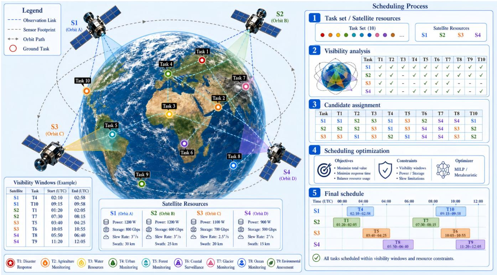  
Fig. 1. Overall scheduling process for heterogeneous AEOS systems, including visibility analysis, satellite–task assignment, scheduling optimization, and final schedule generation.

To improve solution quality and provide optimality guarantees, exact optimization methods have been developed for several AEOS scheduling formulations. Branch-and-bound, dynamic programming, mixed-integer programming, branchand-price, and branch-and-cut-and-price methods can exploit mathematical structures and obtain high-quality or optimal solutions for medium-scale or specially structured cases [11]– [14]. Peng et al. [13] interpreted AEOS scheduling as an orienteering problem with time-dependent profits and travel times. Recent branch-and-cut-and-price studies [14] further showed that time-dependent transition times and variable observation windows make AEOS scheduling substantially different from classical team orienteering problems. Nevertheless, exact methods usually face rapidly increasing computational costs as the numbers of satellites, tasks, candidate windows, and temporal coupling relationships grow. This limits their direct use in large-scale or repeatedly updated AEOS scheduling scenarios that require high-quality solutions within a limited

computational budget.

In addition to computational complexity, heterogeneous modeling remains insufficiently addressed in practical multisatellite AEOS scheduling. Although recent studies have improved the modeling of visibility windows, transition times, and resource constraints, many formulations still focus on single-satellite or homogeneous multi-satellite settings [13], [17]–[19]. As illustrated in Fig. 1, heterogeneous AEOS scheduling involves visibility analysis, satellite–task assignment, scheduling optimization, and sequence generation under coupled temporal, attitude-transition, energy, storage, and load-distribution constraints. Since satellites may differ in orbital access, maneuvering capability, energy budget, and storage capacity, the same task can correspond to different feasible windows, maneuvering burdens, and resource-consumption patterns on different platforms. Optimization studies that explicitly preserve these satellite-dependent visibility, transition, and resource characteristics remain relatively limited.

Because of these computational and modeling challenges, heuristic and metaheuristic algorithms have become widely used for AEOS scheduling and related mission-planning problems. Classical heuristics, such as greedy insertion, local search, and tabu search, together with metaheuristics, such as adaptive large neighborhood search, genetic algorithms, particle swarm optimization, ant colony optimization, differential evolution, and memetic algorithms, can produce feasible and competitive schedules more efficiently than exact methods in large-scale cases [15]–[20]. Liu et al. [18] modeled agile satellite scheduling with time-dependent transition times and developed an adaptive large neighborhood search method. Wu et al. [19] proposed a data-driven improved genetic algorithm for AEOS scheduling with time-dependent transition times. These methods can incorporate problem-specific knowledge, including task priority, observation-window availability, transition feasibility, and resource constraints. However, many existing metaheuristics still rely on fixed operator probabilities, predefined neighborhood structures, or manually designed adaptive rules [21]. Under low population diversity, severe constraint violations, or insufficient capture of rare high-value tasks, such fixed or manually tuned mechanisms may lead to premature convergence, weak feasibility recovery, or unstable performance across different scenarios.

Another related research direction is multi-objective or preference-oriented satellite scheduling. Multi-objective formulations have been used to optimize observation profit, energy consumption, image quality, failure risk, and load balance simultaneously [22]. Recent multi-objective AEOS scheduling studies have considered total observation profit and satellite energy consumption as separate objectives and solved the problem using strategy-fusion evolutionary optimization methods [23]–[25]. Song et al. [26] proposed a learning-guided NSGA-II for multi-objective satellite range scheduling. These studies demonstrate the value of multi-objective modeling and strategy fusion. However, Pareto-based methods usually return a set of non-dominated schedules rather than a single deployable schedule under a given operational preference. In practical mission planning, decision makers often require one schedule corresponding to a specific preference, such as gain-prioritized, energy-saving, or load-balanced scheduling. Therefore, a preference-adjustable scalar utility model is more convenient for operational decision making, provided that the individual utility components remain interpretable.

Reinforcement learning (RL) has also been introduced into satellite scheduling to capture sequential decision-making patterns. Existing studies have combined RL with Monte Carlo tree search for on-board AEOS planning, modeled agile satellite scheduling as an MDP with value-based learning, and developed RL-based models for fair or quality-aware satellite scheduling [19], [27], [28]. More recent studies have employed deep RL architectures, attention-based networks, graph-based policies and RL-controlled neighborhood search to improve scheduling performance. These studies show the potential of RL for adaptive decision making in complex scheduling environments. However, most RL-based AEOS scheduling methods use the learned policy to directly construct schedules or control local neighborhood transformations. Such formulations often involve large discrete action spaces, strict feasibility constraints, sparse or unstable rewards, and substantial training costs. Moreover, a policy trained or tuned for one scenario may not generalize reliably when task density, satellite resources, visibility-window structures, or operational preferences change.

Compared with direct RL schedulers, evolutionary and swarm intelligence algorithms provide mature populationbased search mechanisms for constrained combinatorial optimization. Their global exploration capability and derivativefree nature make them suitable for AEOS scheduling without requiring a pre-trained policy. Nevertheless, conventional evolutionary algorithms still need effective control over operator selection, parameter adaptation, feasibility recovery, and local refinement. To this end, RL-assisted evolutionary algorithms have been investigated in broader optimization fields, where RL is commonly used for operator selection, parameter control, subpopulation management, or heuristic coordination [29]. Successful applications have been reported in photovoltaic model parameter identification, UAV path planning, distributed flexible job-shop scheduling, and vehicle scheduling [30]–[32]. These studies suggest that RL can improve the adaptability of evolutionary search without replacing the optimizer itself. However, in the AEOS scheduling field, the integration of RL and evolutionary optimization is still mainly limited to direct RL schedulers, learning-guided construction methods, or RL-controlled local neighborhood search. A systematic framework that embeds an online actorcritic policy into memetic evolutionary search for high-level AEOS-specific operator-mode selection remains insufficiently explored.

To address these limitations, this paper develops an Evolutionary Policy Optimization (EPO) framework for heterogeneous AEOS scheduling. The proposed framework combines a preference-adjustable weighted scheduling model, decoderbased equivalent-cost evaluation, population-based evolutionary search, and online actor-critic operator-mode selection. The policy does not construct schedules directly; instead, it selects high-level search-operator modes that coordinate exploration, feasibility recovery, and schedule refinement. This design keeps the RL action space compact, preserves the strengths of population-based optimization, and provides a modular interface for incorporating additional constraints, utility components, and AEOS-specific operators.

The main contributions of this paper are summarized as follows.

1) We formulate a preference-adjustable heterogeneous AEOS scheduling model that combines assignmentbased indirect encoding, decoder-based schedule construction, and equivalent-cost evaluation. The model retains satellite-dependent visibility, attitude-transition, energy, storage, and load characteristics while integrating task gain, energy saving, and load balance into an interpretable weighted utility.

2) We propose a modular evolutionary policy optimization framework that separates schedule decoding, populationbased search, and online actor-critic operator control. By selecting high-level operator modes rather than constructing schedules directly, the policy layer keeps the reinforcement-learning action space compact and supports extensible constraint, utility, and operator designs.

3) A RL-assisted operator-selection memetic evolutionary algorithm (RLOSMEA) is developed for heterogeneous AEOS scheduling. The algorithm adaptively coordinates global exploration, feasibility recovery, schedule refinement, and diversity maintenance, and its effectiveness is verified on different heterogeneous scheduling scenarios under different preference settings.

The remainder of this paper is organized as follows. Section II presents the preference-adjustable weighted AEOS scheduling model, including the utility components, objective function, and constraints. Section III describes the proposed evolutionary policy optimization framework and the RLOS-MEA algorithm. Section IV reports the experimental settings, comparative results, and sensitivity analyses. Section V concludes this paper and discusses future work.

## II. SCHEDULING MODEL FOR HETEROGENEOUS AEOS

## A. Problem Description

Heterogeneous AEOS scheduling aims to determine task selection, satellite assignment, observation-window selection, and execution sequencing under coupled visibility, temporal, attitude-transition, energy, and storage constraints. In the considered setting, satellites differ in orbital access, sensor availability, maneuvering capability, energy budget, and onboard storage capacity. Consequently, the same task may correspond to different feasible windows, transition requirements, and resource-consumption patterns on different satellites.

To represent these heterogeneous characteristics while maintaining a compact search space, this paper adopts a preferenceadjustable weighted-utility model with three normalized components, namely task gain, energy saving, and load balance. Candidate schedules are encoded indirectly as task-to-satellite assignment vectors, and a schedule decoder is used to determine feasible observation intervals and execution sequences according to satellite-specific visibility windows, task time windows, temporal conflicts, attitude-transition requirements, and onboard resource limits. For compatibility with the minimization interface of the optimizer, the weighted utility is further transformed into an equivalent cost by incorporating penalties for constraint violation and unscheduled feasible tasks. This decoder-centered formulation separates physical feasibility evaluation from search-space representation, thereby facilitating the incorporation of additional satellitedependent resources, mission rules, and utility components.

## B. Notation

The main notation used in the proposed scheduling model is summarized in Table I.

## C. Assignment-Based Scheduling Representation

An assignment-based indirect encoding is adopted to represent candidate schedules. Compared with a full mixed-integer representation, this encoding reduces the search dimension by leaving the exact observation timing and sequencing decisions to the schedule decoder. Each individual is represented by a task-to-satellite assignment vector:

$$
\mathbf { x } = [ x _ { 1 } , x _ { 2 } , \ldots , x _ { N _ { t } } ] ,\tag{1}
$$

where

$$
x _ { j } \in \{ 0 , 1 , \ldots , N _ { s } \} , \quad \forall j \in \mathcal { T } .\tag{2}
$$

Here, $x _ { j } ~ = ~ 0$ indicates that task $j$ is not assigned to any satellite, whereas $x _ { j } ~ = ~ i$ indicates that task $j$ is assigned

to satellite i. For a compact mathematical description, the corresponding binary assignment indicator is defined as

$$
y _ { i j } = { \left\{ \begin{array} { l l } { 1 , } & { x _ { j } = i , } \\ { 0 , } & { { \mathrm { o t h e r w i s e } } , } \end{array} \right. } i \in S , \ j \in { \mathcal { T } } .\tag{3}
$$

After decoding, the scheduling state of task $j$ is given by

$$
u _ { j } = { \left\{ \begin{array} { l l } { 1 , } & { { \mathrm { i f ~ t a s k ~ } } j { \mathrm { ~ i s ~ s c h e d u l e d } } , } \\ { 0 , } & { { \mathrm { o t h e r w i s e } } . } \end{array} \right. }\tag{4}
$$

The assignment vector only specifies the candidate satellite for each task and does not directly determine the observation start time or execution order. Given x, the schedule decoder constructs the observation intervals and satellite-specific task sequences by enforcing visibility windows, task time windows, temporal-conflict constraints, attitude-transition feasibility, and onboard resource limits.

## D. Utility Components

The quality of a decoded schedule is evaluated using three normalized utility components: task gain, energy saving, and load balance. These components are introduced to represent different operational preferences in heterogeneous AEOS scheduling. The task-gain utility measures the value of the scheduled observations, the energy-saving utility reflects the resource efficiency of the schedule, and the load-balance utility characterizes the distribution of scheduling workload among satellites.

1) Task-Gain Utility: The raw observation gain is defined as

$$
P ( \mathbf { x } ) = \sum _ { j \in \mathcal { T } } p _ { j } d _ { j } u _ { j } ,\tag{5}
$$

where $p _ { j }$ and $d _ { j }$ denote the priority coefficient and required observation duration of task $j ,$ respectively. The ideal maximum gain is given by

$$
P ^ { \operatorname* { m a x } } = \sum _ { j \in \mathcal { T } } p _ { j } d _ { j } .\tag{6}
$$

Accordingly, the normalized task-gain utility is defined as

$$
U _ { g } ( \mathbf { x } ) = \frac { P ( \mathbf { x } ) } { P ^ { \mathrm { m a x } } + \varepsilon } ,\tag{7}
$$

where $\varepsilon$ is a small positive constant used to avoid division by zero. A larger $U _ { g } ( \mathbf { x } )$ indicates that more high-priority observation tasks are successfully scheduled.

2) Energy-Saving Utility: Let $E _ { i } ^ { \mathrm { o b s } } ( { \bf x } )$ and $E _ { i } ^ { \mathrm { t r } } ( { \bf x } )$ denote the observation and attitude-transition energy consumptions of satellite i, respectively. In a heterogeneous satellite system, these quantities are satellite dependent because different platforms may have different observation-energy rates, maneuvering efficiencies, and available energy budgets. The total energy consumption of the schedule is expressed as

$$
E _ { \mathrm { t o t } } ( \mathbf { x } ) = \sum _ { i \in \mathcal { S } } \left( E _ { i } ^ { \mathrm { o b s } } ( \mathbf { x } ) + E _ { i } ^ { \mathrm { t r } } ( \mathbf { x } ) \right) .\tag{8}
$$

The normalized energy-saving utility is then defined as

$$
U _ { e } ( \mathbf { x } ) = \operatorname* { m a x } \left\{ 0 , 1 - \frac { E _ { \mathrm { { t o t } } } ( \mathbf { x } ) } { E _ { \mathrm { { r e f } } } + \varepsilon } \right\} ,\tag{9}
$$

TABLE I MAIN NOTATION
<table><tr><td>Symbol</td><td>Description</td></tr><tr><td> $s$ </td><td>Set of agile satellites</td></tr><tr><td> $\tau$ </td><td>Set of observation tasks</td></tr><tr><td> $N _ { s } , N _ { t }$ </td><td>Numbers of satellites and tasks</td></tr><tr><td> $x _ { j }$ </td><td>Assignment variable of task  $j$ </td></tr><tr><td> $y _ { i j }$ </td><td>Binary indicator that task  $j$  is assigned to satellite i</td></tr><tr><td> $\mathcal { W } _ { i j }$ </td><td>Visibility window set between satellite i and task j</td></tr><tr><td> $E _ { i } ^ { \mathrm { m a x } } , D _ { i } ^ { \mathrm { m a x } }$ </td><td>Energy budget and storage capacity of satellite i</td></tr><tr><td> $\rho _ { i } ^ { \mathrm { { o b s } } } , \rho _ { i } ^ { \mathrm { { t r } } }$ </td><td>Observation and maneuver energy coefficients of satellite ¿</td></tr><tr><td> $b _ { j } , \ f _ { j }$ </td><td>Start and finish times of task j</td></tr><tr><td> $d _ { j }$ </td><td>Required observation duration of task  $j$ </td></tr><tr><td> $p _ { j }$ </td><td>Priority coefficient of task  $j$ </td></tr><tr><td> $\dot { U _ { g } } , U _ { e } , U _ { b }$ </td><td>Gain, energy-saving, and load-balance utilities</td></tr><tr><td> $U _ { \mathbf { w } }$ </td><td>Weighted scheduling utility</td></tr><tr><td> $C V _ { \mathrm { n o r m } }$ </td><td>Normalized constraint violation</td></tr><tr><td> $N _ { t } ^ { \mathrm { f e a s } }$ </td><td>Number of tasks observable by at least one satellite</td></tr></table>

where $E _ { \mathrm { r e f } }$ is the energy-normalization scale. A larger $U _ { e } ( \mathbf { x } )$ corresponds to lower energy consumption and therefore better resource efficiency.

3) Load-Balance Utility: Let $L _ { i } ( \mathbf { x } )$ denote the normalized scheduling load of satellite i, which is calculated from its scheduled observation workload and resource usage relative to its service capability. The average load over all satellites is defined as

$$
\bar { L } ( \mathbf { x } ) = \frac { 1 } { N _ { s } } \sum _ { i \in \mathcal { S } } { L _ { i } ( \mathbf { x } ) } .\tag{10}
$$

The load dispersion is given by

$$
D _ { L } ( \mathbf { x } ) = \sum _ { i \in \cal { S } } \left( L _ { i } ( \mathbf { x } ) - \bar { L } ( \mathbf { x } ) \right) ^ { 2 } .\tag{11}
$$

The normalized load-balance utility is defined as

$$
\begin{array} { r } { U _ { b } ( \mathbf { x } ) = \operatorname* { m a x } \left\{ 0 , 1 - \frac { D _ { L } ( \mathbf { x } ) } { \frac { N _ { s } - 1 } { N _ { s } } \left( \sum _ { i \in \mathcal { S } } { L _ { i } ( \mathbf { x } ) } \right) ^ { 2 } + \varepsilon } \right\} . } \end{array}\tag{12}
$$

The denominator normalizes the maximum load dispersion under a fixed total load. Thus, a larger $U _ { b } ( { \mathbf x } )$ indicates a more balanced utilization of satellite resources.

## E. Preference-Adjustable Weighted Objective

To support different operational preferences, the three utility components are integrated through a preference weight vector:

$$
\begin{array} { r } { \mathbf { w } = ( w _ { g } , w _ { e } , w _ { b } ) , w _ { g } + w _ { e } + w _ { b } = 1 , \quad w _ { g } , w _ { e } , w _ { b } \geq 0 , } \end{array}\tag{13}
$$

where $w _ { g } , w _ { e }$ , and $w _ { b }$ denote the weights assigned to task gain, energy saving, and load balance, respectively. The weighted scheduling utility is then defined as

$$
U _ { w } ( \mathbf { x } ) = w _ { g } U _ { g } ( \mathbf { x } ) + w _ { e } U _ { e } ( \mathbf { x } ) + w _ { b } U _ { b } ( \mathbf { x } ) .\tag{14}
$$

The theoretical scheduling objective is to maximize the weighted utility:

$$
\operatorname* { m a x } _ { \mathbf { x } } ~ U _ { w } ( \mathbf { x } ) .\tag{15}
$$

In the experiments, the best weighted utility obtained in one independent run is reported as

$$
U _ { \mathrm { b e s t } } = \operatorname* { m a x } _ { \mathbf { x } \in \Omega } U _ { w } ( \mathbf { x } ) ,\tag{16}
$$

where Ω denotes the set of candidate schedules generated during the search. By adjusting w, the same model can represent different scheduling preferences, such as gain-prioritized, energy-saving, or load-balanced operation.

## F. Constraints and Constraint Handling

A feasible schedule must satisfy task-assignment uniqueness, visibility-window feasibility, observation-duration consistency, temporal-conflict avoidance, attitude-transition feasibility, and onboard resource constraints. Since the proposed method adopts an indirect assignment encoding, these constraints are enforced and evaluated during schedule decoding rather than being explicitly embedded in the chromosome representation.

1) Task Assignment Constraint: Each task can be assigned to at most one satellite:

$$
\sum _ { i \in S } y _ { i j } \leq 1 , \quad \forall j \in \mathcal { T } .\tag{17}
$$

This constraint is naturally satisfied by the integer assignment encoding in 2, where each task has only one assignment variable.

2) Visibility and Observation-Window Constraint: Let $W _ { i j }$ denote the set of visibility windows between satellite i and task $j .$ If task $j$ is assigned to satellite $i ,$ at least one feasible visibility window must exist:

$$
y _ { i j } \le v _ { i j } , \quad \forall i \in \mathcal { S } , \ j \in \mathcal { T } ,\tag{18}
$$

where $v _ { i j } = 1$ if $W _ { i j } \neq \emptyset$ , and $v _ { i j } = 0$ otherwise.

Let $[ a _ { j } , c _ { j } ]$ be the allowable time window of task $j ,$ , and let $d _ { j }$ be its required observation duration. For a scheduled task, there must exist a visibility window $[ \ell , u ] \in W _ { i j }$ such that

$$
\begin{array} { r } { \operatorname* { m a x } ( a _ { j } , \ell ) \leq b _ { j } , \quad f _ { j } = b _ { j } + d _ { j } \leq \operatorname* { m i n } ( c _ { j } , u ) . } \end{array}\tag{19}
$$

This condition ensures that the decoded observation interval is simultaneously compatible with the task time window and the satellite-task visibility window.

3) Temporal and Attitude-Transition Constraint: For satellite i, let $\pi _ { i } = ( j _ { 1 } , j _ { 2 } , \ldots , j _ { m _ { i } } )$ denote the decoded execution sequence. For any two consecutive tasks $j _ { k }$ and $j _ { k + 1 }$ in $\pi _ { i } ,$ the following condition must hold:

$$
b _ { j _ { k + 1 } } \geq f _ { j _ { k } } + \tau _ { i , j _ { k } , j _ { k + 1 } } , \quad k = 1 , . . . , m _ { i } - 1 ,\tag{20}
$$

where $\tau _ { i , j _ { k } , j _ { k + 1 } }$ denotes the required attitude-transition time from task $j _ { k }$ to task $j _ { k + 1 }$ on satellite i. This constraint prevents temporal overlap and accounts for the maneuvering time required between consecutive observations.

4) Energy and Storage Constraints: Let $E _ { i } ^ { \mathrm { m a x } }$ and $D _ { i } ^ { \mathrm { m a x } }$ denote the available energy budget and onboard storage capacity of satellite i over the planning horizon, respectively. Let $E _ { i } ( t )$ and $D _ { i } ( t )$ denote the remaining energy and onboard data amount of satellite i at time t. The resource constraints are expressed as

$$
E _ { i } ( t ) \geq 0 , \quad D _ { i } ( t ) \leq D _ { i } ^ { \operatorname* { m a x } } , \quad \forall i \in \mathcal { S } , t \in [ 0 , T _ { \mathrm { s i m } } ] .\tag{21}
$$

Because satellites are heterogeneous, the energy budgets, storage capacities, and resource-consumption processes are evaluated separately for each satellite during decoding.

5) Constraint-Violation Measure and Equivalent Cost: Instead of directly discarding infeasible schedules, a normalized constraint-violation measure is introduced to guide the

search toward feasible regions. The total constraint violation is defined as

$$
C V ( \mathbf { x } ) = C V _ { \mathrm { w i n } } + C V _ { \mathrm { d u r } } + C V _ { \mathrm { t r } } + C V _ { \mathrm { e n e } } + C V _ { \mathrm { d a t a } } ,\tag{22}
$$

where the five terms denote violations of the time-window, observation-duration, attitude-transition, energy, and datastorage constraints, respectively. A strictly feasible schedule satisfies $C V ( \mathbf { x } ) \ = \ 0$ , and the corresponding normalized violation is denoted by $C V _ { \mathrm { n o r m } } ( \mathbf { x } )$

For compatibility with the minimization interface of the optimizer, the weighted utility is converted into an equivalent cost:

$$
C _ { w } ( { \bf x } ) = 1 - U _ { w } ( { \bf x } ) + \lambda _ { \mathrm { c v } } C V _ { \mathrm { n o r m } } ( { \bf x } ) + \lambda _ { \mathrm { u n s } } R _ { \mathrm { u n s } } ( { \bf x } ) ,\tag{23}
$$

where $\lambda _ { \mathrm { c v } }$ and $\lambda _ { \mathrm { u n s } }$ are penalty coefficients. The unscheduledtask ratio is defined as

$$
R _ { \mathrm { u n s } } ( \mathbf { x } ) = 1 - \frac { 1 } { N _ { t } ^ { \mathrm { f e a s } } + \varepsilon } \sum _ { j \in \mathcal { T } } u _ { j } ,\tag{24}
$$

where $N _ { t } ^ { \mathrm { f e a s } }$ denotes the number of tasks observable by at least one satellite. The optimization problem solved by the proposed algorithm is therefore

$$
\operatorname* { m i n } _ { \mathbf { x } } ~ C _ { w } ( \mathbf { x } ) .\tag{25}
$$

The schedule with the largest weighted utility is finally $\mathrm { r e \mathrm { - } }$ ported as the scheduling result.

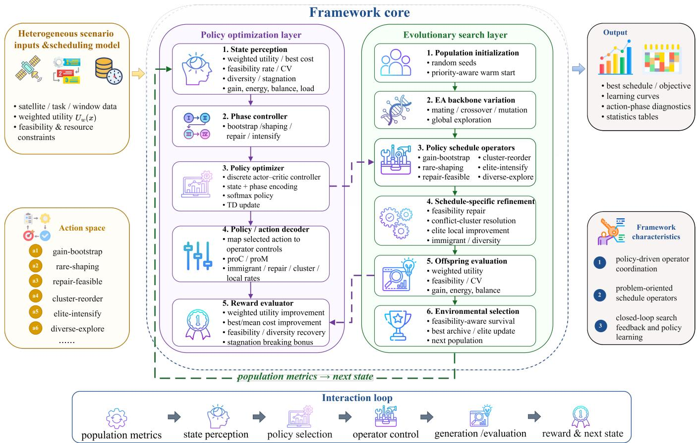  
Fig. 2. Evolutionary policy optimization framework for heterogeneous AEOS scheduling

## III. EPO FRAMEWORK AND RLOSMEA

## A. Framework Motivation and Overview

The proposed EPO framework follows the assignmentbased scheduling model in Section II. Each individual encodes a task-to-satellite assignment vector, and a shared schedule decoder converts it into observation intervals, satellite-specific execution sequences, resource consumption, and constraintviolation information. This decoder-centered design allows the optimizer to search in a compact assignment space while preserving the heterogeneous feasibility and resource characteristics of the original scheduling problem.

As shown in Fig. 2, the framework combines populationbased evolutionary search with online actor–critic policy control. The evolutionary module generates and updates candidate assignments, whereas the policy module observes the population state and selects a high-level operator mode for offspring generation and schedule modification. Instead of constructing schedules directly, the policy acts as an adaptive operator controller, which keeps the reinforcement-learning action space compact and preserves the global search capability of evolutionary optimization.

RLOSMEA is developed as an AEOS-oriented implementation of the proposed framework. It integrates a memetic evolutionary backbone with online operator-mode selection and schedule-specific modification operators, including warm start, feasibility repair, conflict resolution, local improvement, elite intensification, immigrant injection, and diversity rescue. All schedule-oriented modifications are applied before decoding, so each offspring is evaluated only once by the shared decoder. This single-evaluation workflow is suitable for a fixed function-evaluation budget and supports the extension of additional problem-specific operators.

## B. The MDP Formulation

The adaptive operator-mode selection process is formulated as an online Markov decision process (MDP). To distinguish it from the AEOS scheduling model in Section II, the MDP for operator selection is defined as

$$
\mathcal { M } _ { \mathrm { R L } } = ( \mathcal { X } , \mathcal { U } , \mathcal { K } , r , \gamma ) ,\tag{26}
$$

where $\mathcal { X }$ is the population-state space, U is the operatormode action space, $\mathcal { K } ( \xi _ { t + 1 } \vert \xi _ { t } , \alpha _ { t } )$ denotes the transition kernel induced by action $\alpha _ { t } , r ( \xi _ { t } , \alpha _ { t } , \xi _ { t + 1 } )$ is the reward function, and $\gamma$ is the discount factor.

At generation t, the actor–critic controller observes the population state $\xi _ { t } \in \mathcal { X }$ and selects an operator-mode action $\alpha _ { t } \in \mathcal { U } .$ . After offspring generation, schedule modification, decoding evaluation, and environmental selection, the controller receives the immediate reward

$$
\varrho _ { t } = r ( \xi _ { t } , \alpha _ { t } , \xi _ { t + 1 } ) .\tag{27}
$$

Learning is performed online in each independent run without using an offline training dataset. The controller is updated generation by generation using the transition tuple

$$
( \xi _ { t } , \alpha _ { t } , \varrho _ { t } , \xi _ { t + 1 } ) .\tag{28}
$$

Thus, the operator-selection policy can adapt to the current search trajectory and scheduling scenario.

## C. Population-State Representation

The population state provides compact contextual information for online operator-mode selection. Instead of encoding a complete schedule, it summarizes the current search condition from four aspects: search progress, scheduling quality, feasibility, and population structure. The state vector observed by the actor–critic controller at generation t is written as

$$
\xi _ { t } = \left[ \xi _ { t } ^ { p } , \xi _ { t } ^ { u } , \xi _ { t } ^ { f } , \xi _ { t } ^ { s } \right] ^ { T } ,\tag{29}
$$

where $\xi _ { t } ^ { p } , \xi _ { t } ^ { u } , \xi _ { t } ^ { f }$ , and $\xi _ { t } ^ { s }$ denote the progress, utility, feasibility, and population-structure features, respectively. These features are used only to guide operator-mode selection and do not modify the scheduling objective defined in Section II.

## D. Search-Phase Descriptor

A search-phase descriptor is introduced to provide stagedependent information for policy evaluation. The phase set is defined as

$$
\mathcal { H } = \{ \mathrm { b o o t s t r a p } , \mathrm { s h a p i n g } , \mathrm { r e p a i r } , \mathrm { i n t e n s i f y } \} .\tag{30}
$$

The current phase is determined from the population state and recent search diagnostics, including progress, feasibility, constraint violation, diversity, priority capture, load balance, stagnation, and offspring success rate. The phase descriptor is encoded as a one-hot vector $\psi _ { t }$ and concatenated with the population state before action selection.

The bootstrap phase promotes the rapid construction of promising assignment structures. The shaping phase emphasizes rare-task enhancement and structural adjustment. The repair phase is activated when feasibility is poor or constraint violation is high. The intensification phase is used when the population enters a promising region and local refinement becomes more beneficial.

A rule-based recovery mode is retained as a safeguard against severe stagnation or diversity collapse. When recovery is triggered, the selected action $\alpha _ { t }$ can be replaced by an exploration-oriented or restructuring action in U. Such recovery-forced actions are not used to update the actor policy, thereby preventing externally forced decisions from biasing policy learning.

## E. Operator-Mode Action Space

The actor policy selects a high-level operator-mode action rather than a direct scheduling decision. The action space is defined as

$$
\mathcal { U } = \{ \alpha _ { 1 } , \alpha _ { 2 } , \alpha _ { 3 } , \alpha _ { 4 } , \alpha _ { 5 } , \alpha _ { 6 } \} .\tag{31}
$$

The six operator modes are summarized in Table II. Each action represents a coordinated search mode for modifying offspring assignment vectors. After action $\alpha _ { t }$ is selected, it is decoded into the operator-control vector

$$
\begin{array} { r } { \Theta _ { t } = ( p _ { c , t } , p _ { m , t } , \eta _ { t } ) , } \end{array}\tag{32}
$$

where $p _ { c , t }$ and $p _ { m , t }$ denote the crossover and mutation parameters, respectively, and $\pmb { \eta } _ { t }$ denotes the vector of schedulespecific operator rates. These rates control the activation intensities of warm start, feasibility repair, conflict resolution, local improvement, elite intensification, immigrant injection, rare-task shaping, and diversity rescue.

The action decoder follows a sparse-control principle. For each selected action, one dominant problem-oriented operator is activated, whereas the remaining operators are retained as weak background safeguards. This design improves the interpretability of the selected action and provides a clearer reward signal for policy learning.

## F. Actor–Critic Policy Optimization

Let $\pi _ { \boldsymbol { \theta } } ( \alpha \vert \xi _ { t } , \psi _ { t } )$ denote the actor policy parameterized by θ. The input feature vector for the actor–critic controller is constructed as

$$
\phi _ { t } = [ \xi _ { t } ; \psi _ { t } ; 1 ] ,\tag{33}
$$

where the last entry is a bias term. The actor computes the action logits as

$$
\mathbf { o } _ { t } = \mathbf { W } \phi _ { t } + \mathbf { b } _ { \psi _ { t } } ,\tag{34}
$$

where W is the actor parameter matrix, and $\mathbf { b } _ { \psi _ { t } }$ is the phasedependent bias vector.

A temperature-controlled softmax function is first used to obtain the preliminary policy:

$$
\pi _ { \boldsymbol { \theta } } ^ { 0 } ( \alpha | \xi _ { t } , \psi _ { t } ) = \frac { \exp ( o _ { \alpha , t } / \sigma ) } { \sum _ { \alpha ^ { \prime } \in \mathcal { U } } \exp \left( o _ { \alpha ^ { \prime } , t } / \sigma \right) } ,\tag{35}
$$

where $\sigma$ is the temperature parameter. The phase prior $q _ { \psi _ { t } } ( \alpha )$ is then incorporated as

$$
\pi _ { \boldsymbol { \theta } } ( \alpha | \xi _ { t } , \psi _ { t } ) = \frac { \pi _ { \boldsymbol { \theta } } ^ { 0 } ( \alpha | \xi _ { t } , \psi _ { t } ) q _ { \psi _ { t } } ( \alpha ) } { \sum _ { \alpha ^ { \prime } \in \mathcal { U } } \pi _ { \boldsymbol { \theta } } ^ { 0 } ( \alpha ^ { \prime } | \xi _ { t } , \psi _ { t } ) q _ { \psi _ { t } } ( \alpha ^ { \prime } ) } .\tag{36}
$$

To maintain exploration, an ϵ-mixed policy is adopted:

$$
\pi _ { \boldsymbol { \theta } } ( \alpha | \xi _ { t } , \psi _ { t } ) = ( 1 - \epsilon ) \pi _ { \boldsymbol { \theta } } ( \alpha | \xi _ { t } , \psi _ { t } ) + \epsilon \frac { 1 } { | \mathcal { U } | } .\tag{37}
$$

The critic estimates the state value using a linear approximation:

$$
V _ { \omega } ( \xi _ { t } , \psi _ { t } ) = \mathbf { v } ^ { T } \phi _ { t } ,\tag{38}
$$

where v is the critic parameter vector. After action $\alpha _ { t }$ is applied and the next state is obtained, the temporal-difference error is computed as

$$
\delta _ { t } = \varrho _ { t } + \gamma V _ { \omega } ( \xi _ { t + 1 } , \psi _ { t + 1 } ) - V _ { \omega } ( \xi _ { t } , \psi _ { t } ) .\tag{39}
$$

For numerical stability, $\delta _ { t }$ is clipped within a finite interval in the implementation.

TABLE II  
OPERATOR-MODE ACTIONS
<table><tr><td>Action</td><td>Mode</td><td>Main Function</td></tr><tr><td>α1</td><td>gain-bootstrap</td><td>Gain construction</td></tr><tr><td> $\alpha _ { 2 }$ </td><td>rare-shaping</td><td>Rare-task enhancement</td></tr><tr><td> $\alpha _ { 3 }$ </td><td>repair-feasible</td><td>Feasibility recovery</td></tr><tr><td> $\alpha _ { 4 }$ </td><td>cluster-reorder</td><td>Conflict resolution</td></tr><tr><td> $\alpha _ { 5 }$ </td><td>elite-intensify</td><td>Elite exploitation</td></tr><tr><td> $\alpha _ { 6 }$ </td><td>diverse-explore</td><td>Diversity recovery</td></tr></table>

For a policy-sampled action, the actor and critic are updated as

$$
\mathbf { W }  \mathbf { W } + \alpha _ { a } \delta _ { t } ( \mathbf { e } _ { \alpha _ { t } } - \tilde { \pi } _ { t } ) \phi _ { t } ^ { T } ,\tag{40}
$$

$$
\mathbf { v }  \mathbf { v } + \alpha _ { c } \delta _ { t } \phi _ { t } ,\tag{41}
$$

where $\alpha _ { a }$ and $\alpha _ { c }$ are the actor and critic learning rates, respectively, $\mathbf { e } _ { \alpha _ { t } }$ is the one-hot vector of the selected action, and $\tilde { \pi } _ { t }$ is the mixed action-probability vector. If action $\alpha _ { t }$ is forced by the recovery mode, the actor update is skipped to avoid biasing the learned policy with safeguard decisions.

## G. Reward Function

The reward function is designed to align online operatormode selection with the weighted scheduling objective in Section II. It consists of four terms: weighted-utility improvement, best-cost improvement, mean-cost improvement, and offspring success rate. Feasibility, diversity, and stagnation are included in the state and phase descriptors rather than being directly added as separate reward terms.

Let $U _ { t }$ and $U _ { t + 1 }$ denote the population-level weighted utilities before and after applying the selected operator mode. The weighted-utility improvement is defined as

$$
\Delta U _ { t } = U _ { t + 1 } - U _ { t } .\tag{42}
$$

Since the optimizer minimizes the equivalent cost $C _ { w } ( \mathbf { x } )$ , the best- and mean-cost improvements are defined as

$$
\Delta C _ { t } ^ { \mathrm { b e s t } } = \frac { C _ { t } ^ { \mathrm { b e s t } } - C _ { t + 1 } ^ { \mathrm { b e s t } } } { \operatorname* { m a x } ( | C _ { t } ^ { \mathrm { b e s t } } | , \varepsilon _ { c } ) } ,\tag{43}
$$

$$
\Delta C _ { t } ^ { \mathrm { m e a n } } = \frac { C _ { t } ^ { \mathrm { m e a n } } - C _ { t + 1 } ^ { \mathrm { m e a n } } } { \operatorname* { m a x } ( | C _ { t } ^ { \mathrm { m e a n } } | , \varepsilon _ { c } ) } ,\tag{44}
$$

where $C _ { t } ^ { \mathrm { { b e s t } } }$ and $C _ { t } ^ { \mathrm { m e a n } }$ denote the best and mean equivalent costs of the population at generation t, respectively.

The offspring success rate is defined as

$$
Q _ { t } ^ { \mathrm { s u c c } } = \frac { 1 } { | \mathcal { Q } _ { t } | } \sum _ { \mathbf { x } _ { i } \in \mathcal { Q } _ { t } } \mathbb { I } \left( C _ { w } ( \mathbf { x } _ { i } ) < \mathrm { m e d i a n } \left( \{ C _ { w } ( \mathbf { x } ) | \mathbf { x } \in \mathcal { P } _ { t } \} \right) \right) ,\tag{45}
$$

where $\mathcal { P } _ { t }$ and $\mathcal { Q } _ { t }$ denote the parent and offspring populations, respectively, and I(·) is the indicator function.

The immediate reward is then written as

$$
\varrho _ { t } = \mathrm { c l i p } \left( \sum _ { j = 1 } ^ { 4 } \lambda _ { j } \Gamma _ { j } ( t ) , - 1 , 1 \right) ,\tag{46}
$$

where

$$
\Gamma _ { 1 } ( t ) = \operatorname { t a n h } \left( \frac { \Delta U _ { t } } { s _ { 1 } } \right) , \Gamma _ { 2 } ( t ) = \operatorname { t a n h } \left( \frac { \Delta C _ { t } ^ { \mathrm { b e s t } } } { s _ { 2 } } \right) ,\tag{47}
$$

$$
\Gamma _ { 3 } ( t ) = \operatorname { t a n h } \left( \frac { \Delta C _ { t } ^ { \mathrm { m e a n } } } { s _ { 3 } } \right) , \Gamma _ { 4 } ( t ) = \operatorname { t a n h } \left( \frac { Q _ { t } ^ { \mathrm { s u c c } } - q _ { 0 } } { s _ { 4 } } \right) _ { . }\tag{48}
$$

This compact reward preserves consistency with both the weighted-utility objective and the equivalent-cost minimization interface.

$$
N _ { \mathrm { F E } } ^ { \mathrm { m a x } }
$$

$$
\mathbf { w } .
$$

$$
\mathbf { x } ^ { * }
$$

2: Prepare problem-guidance information ${ \mathcal { G } } ,$ including task priorities, task durations, feasible satellites, and feasiblewindow counts.

3: Initialize and evaluate the population ${ \mathcal { P } } _ { 0 } ;$ extract the initial population state $\xi _ { 0 }$

4: Initialize the incumbent best solution $\mathbf { x } ^ { * }$ and set $N _ { \mathrm { F E } } =$ $| \mathcal { P } _ { 0 } |$

5: Initialize the actor–critic controller with actor parameters W, phase-dependent bias, critic parameter v, exploration rate $\epsilon ,$ and temperature $\sigma .$

6: Initialize search diagnostics and set $t = 0$

7: Evolutionary policy search:

8: while $N _ { \mathrm { F E } } < N _ { \mathrm { F E } } ^ { \mathrm { m a x } }$ do

9: Determine the search-phase descriptor $\psi _ { t }$ from the current population state and search diagnostics.

10: Construct the feature vector $\phi _ { t } = [ \xi _ { t } ; \psi _ { t } ; 1 ]$ by (33).

11: Compute the phase-aware mixed policy by (35)–(37), and sample an operator-mode action $\alpha _ { t } \in \mathcal { U } .$

13: Activate the recovery mode and replace $\alpha _ { t }$ with an exploration-oriented or restructuring action.

$$
\alpha _ { t }
$$

$$
\Theta _ { t }
$$

$$
\mathcal { Q } _ { t }
$$

$$
\mathbf { \Theta } _ { \mathbf { e } } .
$$

17: Preserve elite individuals and evaluate each modified offspring once using the shared schedule decoder.

$$
N _ { \mathrm { F E } }  N _ { \mathrm { F E } } + \vert \mathcal { Q } _ { t } \vert
$$

19: Merge $\mathcal { P } _ { t }$ and $\mathcal { Q } _ { t }$ , and perform feasibility-aware environmental selection to obtain $\mathcal { P } _ { t + 1 }$

20: Update the incumbent best solution $\mathbf { x } ^ { * }$ according to the decoded scheduling utility.

21: Extract the next population state $\xi _ { t + 1 }$ and compute the immediate reward $\varrho _ { t }$ by (46)–(48).

22: Compute the temporal-difference error $\delta _ { t }$ by (39), and update the critic by (41).

23: $\mathbf { i f } \ \alpha _ { t }$ is not forced by the recovery mode then

26: Record search diagnostics and set $t \gets t + 1$

28: Output: Return the best scheduling solution $\mathbf { x } ^ { * }$

## H. Policy-Controlled Evolutionary Search

After action $\alpha _ { t }$ is selected, the action decoder maps it to the operator-control vector $\mathbf { \Theta } _ { \mathbf { e } } ,$ which specifies the offspringgeneration and refinement strategy. Preliminary offspring are first generated through mating selection, crossover, and mutation, and are then refined by schedule-specific operators, including warm start, feasibility repair, conflict resolution, local improvement, elite intensification, immigrant injection, and diversity rescue.

All schedule-specific modifications are performed before objective evaluation. Thus, each offspring is decoded and evaluated only once by the shared schedule decoder, avoiding repeated evaluations after individual sub-operators. This workflow is suitable for fixed function-evaluation budgets and maintains a clear interface between operator control and schedule evaluation.

After evaluation, the parent and offspring populations are merged and processed by feasibility-aware environmental selection. Feasible individuals are ranked according to the equivalent cost, whereas infeasible individuals are ranked according to normalized constraint violation. The selected individuals form the next population $\mathcal { P } _ { t + 1 }$ and define the next state $\xi _ { t + 1 }$ Algorithm 1 summarizes the overall procedure.

## I. Methodological Discussion

The proposed EPO framework separates evolutionary search from policy learning. The evolutionary component searches over assignment vectors and relies on the decoder for feasibility checking and equivalent-cost evaluation. The policy component adjusts the search behavior by selecting high-level operator modes, rather than constructing schedules directly.

In RLOSMEA, the population-state representation, phase descriptor, and compact reward jointly enable the controller to switch among construction, repair, exploitation, and exploration under a fixed function-evaluation budget. The optimizer operates on the equivalent cost, whereas scheduling performance is reported using the weighted utility. This separation keeps the optimization interface compatible with minimization-based evolutionary search while retaining an interpretable utility-based evaluation of scheduling quality.

## IV. SIMULATION EXPERIMENTS AND ANALYSIS

## A. Experimental Settings

To evaluate the effectiveness and scalability of the proposed method, six heterogeneous AEOS scheduling scenarios, denoted as scenario 01–scenario 06, are constructed. As listed in Table III, the number of candidate tasks increases from 100 to 350, and the number of agile satellites increases from 5 to 12. The increasing task and satellite scales enlarge the assignment space and strengthen the coupling among task selection, satellite assignment, observation-window selection, and execution sequencing.

Each task is associated with a ground target, a priority value, an observation duration, and a task time window. Satellite– task visibility windows are generated before optimization by considering orbital motion, target motion, sensor-access constraints, and Earth rotation. Each satellite follows a nearcircular low-Earth orbit, with altitude and inclination defined as $h _ { i } = 4 5 0 + 5 0$ mod (i − 1, 5) km and $I _ { i } = 3 0 + 1 0$ mod (i−1, 6) deg, respectively. Initial longitudes and orbital phases are randomly distributed within each scenario to diversify ground-track coverage. The simulation horizon is 86400 s, the preprocessing time step is 1 s, and the maximum observation deviation angle is set to 30 deg. Only satellite–task pairs with valid visibility windows are retained.

TABLE III  
HETEROGENEOUS AEOS SCENARIOS
<table><tr><td>Scenario</td><td> $N _ { \mathrm { t a s k } }$ </td><td> $N _ { \mathrm { s a t } }$ </td></tr><tr><td>scenario_01</td><td>100</td><td>5</td></tr><tr><td>scenario_02</td><td>150</td><td>5</td></tr><tr><td>scenario_03</td><td>200</td><td>7</td></tr><tr><td>scenario_04</td><td>250</td><td>9</td></tr><tr><td>scenario_05</td><td>300</td><td>10</td></tr><tr><td>scenario_06</td><td>350</td><td>12</td></tr></table>

Heterogeneity is introduced through both orbital access and onboard resources. Different satellite altitudes, inclinations, initial longitudes, and orbital phases lead to different visibility-window sets, while satellite-specific energy budgets, storage capacities, and resource-consumption parameters result in different execution costs. Thus, the same task may have different feasibility conditions, attitude-transition requirements, and resource-consumption patterns on different satellites. During decoding, each assignment is evaluated under the corresponding satellite parameters and must satisfy visibility, observation-duration, temporal-conflict, attitude-transition, energy, and storage constraints. The target set contains both static and moving targets, where 15% of the targets are static and the remaining targets move at speeds up to 45 m/s. Task priorities are uniformly sampled from the integer range [1, 5].

All compared algorithms use the same scenario files, visibility windows, decoder, objective function, constraint-evaluation rules, and stopping criterion. The compared methods include the Memetic Evolutionary Algorithm (MemeticEA) [33], Adaptive Large Neighborhood Search (ALNS) [19], Adaptive Exploration State-Space Particle Swarm Optimization (AESSPSO) [34], Grey Wolf Optimizer (GWO) [35], and the proposed RLOSMEA. The baseline parameter settings follow the corresponding original references and commonly used default configurations, without scenario-specific tuning. For RLOSMEA, all actor–critic and operator-control parameters are fixed across the different scenarios. Specifically, the actor– critic parameters are (actorLR, criticLR) = (0.035, 0.08) and (epsilon, temperature) = (0.10, 0.82). The operator-control base rates are (immigrantBase, repairBase) = (0.10, 0.10) and (clusterBase, localBase) = (0.10, 0.07).

Each algorithm is independently run 30 times for each scenario with a budget of 10000 objective evaluations. The convergence curves report the average best-so-far weighted utility, and the shaded bands denote the corresponding standard deviations. All experiments are conducted on a 64-bit Windows platform equipped with an Intel(R) Core(TM) Ultra 9 285H CPU at 2.90 GHz and 64 GB RAM.

## B. Comparative Results in Different Heterogeneous Scenarios

This subsection compares RLOSMEA with AESSPSO, ALNS, GWO, and MemeticEA on six heterogeneous AEOS scheduling scenarios. Since all algorithms obtain feasible schedules in all scenarios, the comparison focuses on weighted utility, convergence behavior, and component-wise scheduling performance.

1) Convergence Behavior: Fig. 3 shows the best-so-far weighted-utility convergence curves in the six scenarios. The solid curves denote the mean values over 30 independent runs, and the shaded bands indicate the corresponding standard deviations.

RLOSMEA achieves the highest weighted utility in all scenarios and maintains this advantage during most stages of the search. AESSPSO and ALNS usually show rapid early improvement but tend to stagnate earlier, whereas GWO remains less competitive in most scenarios. MemeticEA is the strongest baseline, indicating the benefit of local refinement; however, RLOSMEA still obtains consistently better final utilities.

This behavior is closely related to the heterogeneous scheduling structure. Because visibility opportunities, attitudetransition costs, and resource budgets vary across satellites, assigning high-value tasks only to a few favorable platforms can quickly introduce conflicts and resource pressure. The policy-guided operator selection in RLOSMEA helps exploit favorable assignments while maintaining the ability to redistribute tasks when feasibility or diversity becomes limiting. The relatively narrow shaded bands further indicate that the proposed method has stable run-to-run performance.

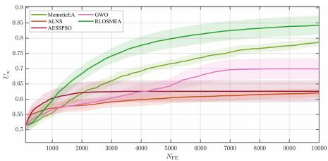  
(a) Scenario 01

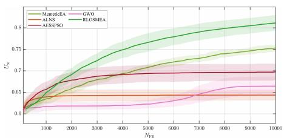  
(d) Scenario 04

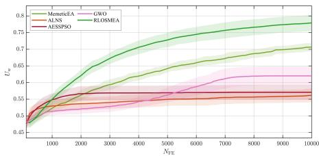  
(b) Scenario 02

  
(e) Scenario 05

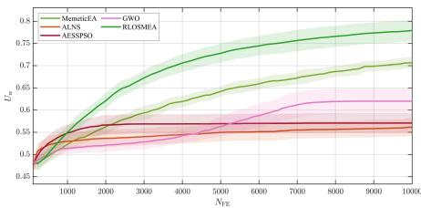  
(c) Scenario 03

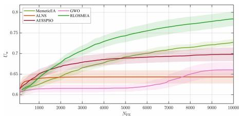  
(f) Scenario 06  
Fig. 3. Weighted-utility convergence curves in six representative heterogeneous scenarios. The solid curves show the mean results over 30 independent runs, and the shaded bands indicate the corresponding standard deviations.

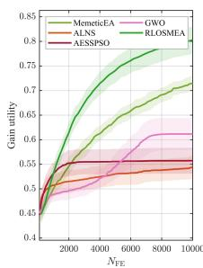

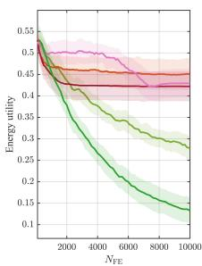  
(a) scenario 02

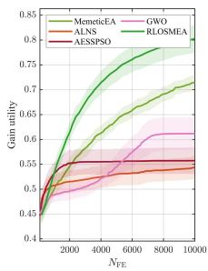

  
(b) scenario 04

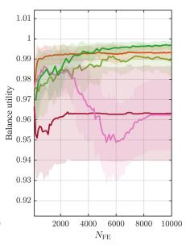

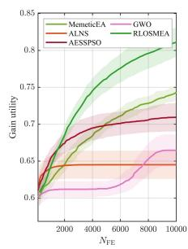

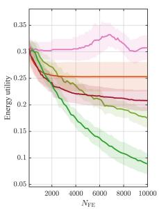  
(c) scenario 06

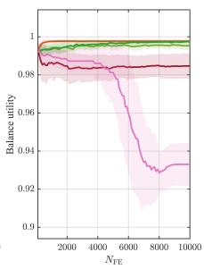  
Fig. 4. Component-wise utility evolution in representative heterogeneous scenarios. The solid curves show the mean results over 30 independent runs, and the shaded bands indicate the corresponding standard deviations.

2) Component-Wise Utility Analysis: Fig. 4 presents the evolution of the three utility components in representative small-, medium-, and large-scale scenarios. The componentwise results provide further insight into the source of the weighted-utility improvement.

The main advantage of RLOSMEA comes from task-gain utility. Across the representative scenarios, RLOSMEA consistently schedules more valuable task-assignment structures than the compared methods. Meanwhile, it maintains a high load-balance utility, indicating that the improvement is not obtained by excessively concentrating tasks on a small number of satellites. This property is important for heterogeneous constellations, where satellites with better access opportunities or stronger resource capacities may otherwise be overused.

The energy-saving utility is not always the best among all methods. This result is consistent with the gain-oriented weight setting used in the main comparison, where a moderate increase in energy consumption can be acceptable if it leads to a larger overall weighted utility. Therefore, the advantage of RLOSMEA should be interpreted as a better global tradeoff among task gain, energy consumption, and load distribution, rather than simultaneous dominance in every individual component.

3) Discussion: Overall, RLOSMEA achieves the best weighted utility across all six heterogeneous scenarios and preserves its advantage as the problem scale increases. The improvement mainly results from stronger task-gain capture while maintaining acceptable energy-saving and load-balance performance. These results indicate that online operator-mode selection improves both solution quality and convergence stability for preference-adjustable heterogeneous AEOS scheduling.

## C. Weight Sensitivity

Weight sensitivity is examined on scenario 01, scenario 03, and scenario 05, which represent small-, medium-, and largescale heterogeneous scheduling cases, respectively. The tested weight vectors gradually shift the scheduling preference from gain-dominant operation to a more balanced tradeoff among task gain, energy saving, and load balance. For all plots, the solid curves denote the mean results over 30 independent runs, and the shaded bands indicate the corresponding standard deviations.

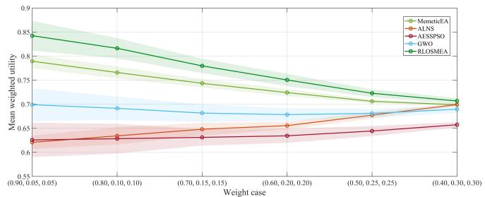  
(a) scenario 01

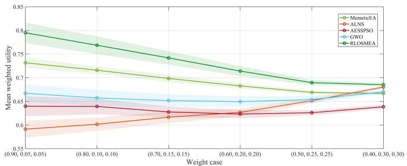  
(b) scenario 03

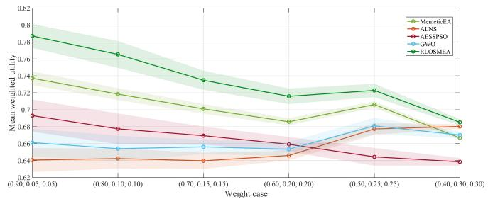  
(c) scenario 05  
Fig. 5. Mean weighted utility under different weight settings in three representative heterogeneous scenarios. The solid curves show the mean results over 30 independent runs, and the shaded bands indicate the corresponding standard deviations.

1) Overall Performance Across Weight Settings: Fig. 5 shows the weighted-utility results under different preference weight settings. RLOSMEA achieves the best performance across all tested weights in the three representative scenarios. This indicates that its advantage is not tied to a particular manually selected weight vector, but remains stable when the objective emphasis changes.

Although the absolute weighted-utility values vary with the scalarization weights, the ranking pattern is generally consistent. RLOSMEA remains ahead of the compared methods when the preference shifts from task-gain-oriented scheduling toward a more balanced consideration of gain, energy consumption, and load distribution. The relatively narrow shaded bands further suggest that this advantage is repeatable across independent runs.

2) Component-Wise Response Under Different Preferences: Fig. 6 shows the response of the three utility components obtained by RLOSMEA under different weight settings. As the gain weight decreases and the energy-saving and load-balance weights increase, the task-gain utility decreases gradually, whereas the energy-saving utility improves. The load-balance utility remains at a high level over the tested range.

These trends are consistent with the intended role of the preference-adjustable weighted model. RLOSMEA does not simply optimize one dominant component under all settings; instead, it adjusts the tradeoff among task gain, energy consumption, and load distribution according to the prescribed weights. The same pattern is observed in scenario 01, scenario 03, and scenario 05, indicating that the preference response is not limited to a specific problem scale.

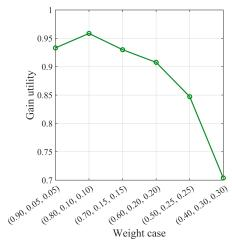

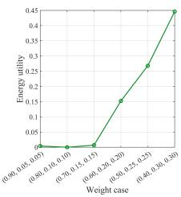  
(a) scenario 01

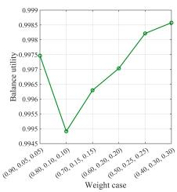

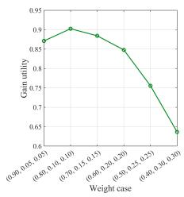

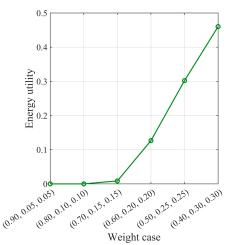  
(b) scenario 03

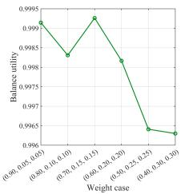

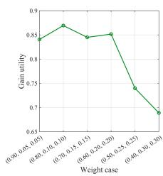

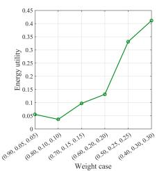

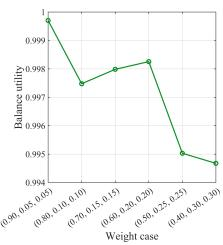  
(c) scenario 05  
Fig. 6. Component-wise response of RLOSMEA under different weight settings in three representative heterogeneous scenarios.

3) Discussion: The weight-sensitivity results lead to two observations. First, RLOSMEA maintains superior weighted utility under all tested preference settings, showing robust performance with respect to scalarization changes. Second, the component-wise responses vary smoothly and consistently with the weight vector, suggesting that the proposed method can adjust its search emphasis without destabilizing the decoded schedules. These results support the use of RLOSMEA for preference-adjustable multi-objective scheduling in heterogeneous AEOS systems.

## D. Parameter Sensitivity and Learning Behavior

After the cross-scenario and weight-sensitivity comparisons, this subsection further examines the internal behavior of RLOSMEA on scenario 04. The analysis focuses on parameter sensitivity and the learning dynamics of the RL-assisted operator-selection mechanism.

1) Parameter Sensitivity: Fig. 7 reports the parametersensitivity results of RLOSMEA on scenario 04. Each marker denotes the mean objective value over repeated runs, and the shaded band indicates the corresponding standard deviation.

The results show that RLOSMEA maintains stable performance over the tested parameter ranges. The actor learning rate, critic learning rate, and exploration rate only lead to mild variations in the objective value, indicating that the proposed method does not rely on delicate parameter tuning. The softmax temperature has a relatively stronger influence because it directly controls the sharpness of action selection. The conflict-cluster and local-improvement rates also affect the results to some extent, reflecting the importance of structural refinement in heterogeneous scheduling.

Nevertheless, no abrupt performance degradation is observed within the tested ranges. This suggests that the default parameter setting lies in a relatively stable region rather than near an isolated optimum.

2) Learning Behavior of Operator Selection: Fig. 8 illustrates the learning behavior of RLOSMEA on scenario 04, including optimization progress and the policy action mixture.

Fig. 8(a) shows that the weighted utility increases steadily during the search. The gain utility is improved while the loadbalance utility remains at a high level, indicating that the algorithm improves the scalar objective mainly by capturing more valuable task assignments without seriously damaging the workload distribution among satellites.

Fig. 8(b) shows that the selected operator modes remain diversified throughout the optimization process. No single action dominates the entire search, and several operator modes remain active at different stages. This indicates that the actor– critic controller does not degenerate into a fixed operator pattern. Instead, it adjusts the operator-selection tendency according to the current search condition, thereby maintaining a balance among exploration, feasibility recovery, and exploitation.

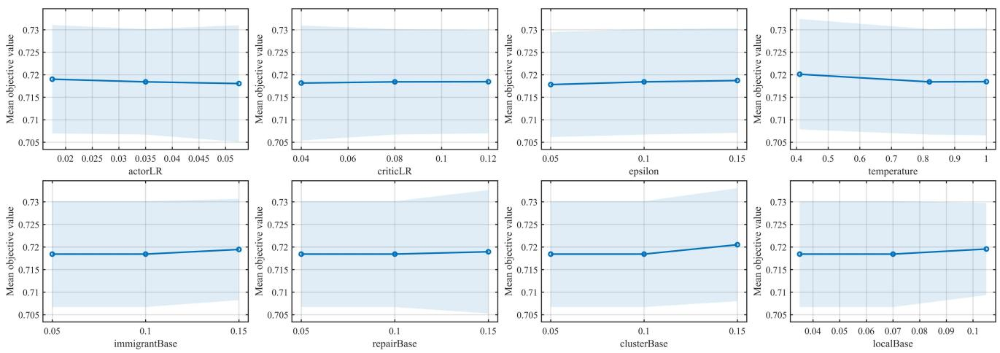  
Fig. 7. Parameter sensitivity of RLOSMEA on representative heterogeneous scenario 04. Each marker denotes the mean objective value over repeated runs, and the shaded band indicates the corresponding standard deviation.

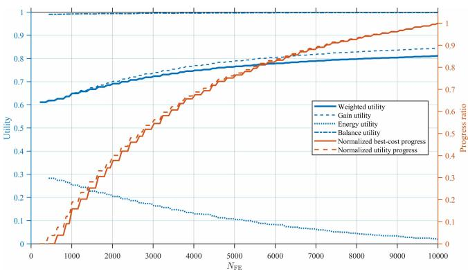  
(a) Optimization progress

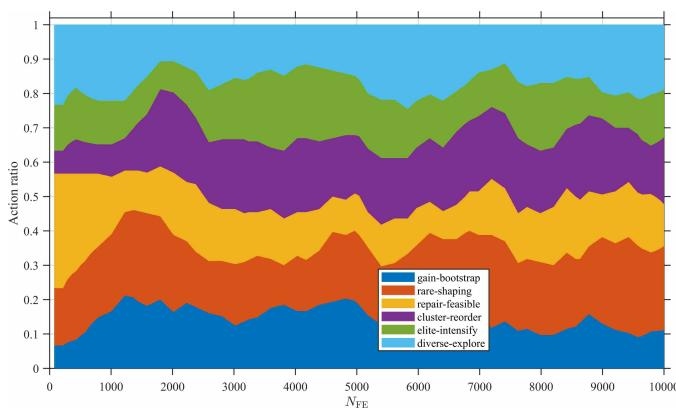  
(b) Policy action mixture  
Fig. 8. RL diagnostics of RLOSMEA in representative scenario 04

3) Discussion: The parameter and learning analyses provide two observations. First, RLOSMEA is robust to moderate variations in key control parameters, which supports its practical applicability under different scheduling settings. Second, the RL-assisted controller maintains a diversified and adaptive operator-selection pattern rather than repeatedly selecting one dominant operator. These results support the use of online actor–critic control for coordinating search operators in preference-adjustable heterogeneous AEOS scheduling.

## E. Summary

The experimental results demonstrate the effectiveness of RLOSMEA for heterogeneous AEOS scheduling. Across different scenarios, the proposed method achieves higher weighted utility and more stable convergence than the representative metaheuristic baselines. The component-wise analysis shows that the improvement mainly comes from stronger task-gain capture while maintaining acceptable energy-saving and load-balance performance.

The weight-sensitivity study further shows that RLOSMEA remains competitive under different preference settings, and the utility components respond consistently to changes in the weight vector. In addition, the parameter-sensitivity and learning-behavior analyses indicate that the method is robust to moderate parameter variations and that the online actor– critic controller provides adaptive operator coordination during the search. Overall, these results verify the effectiveness of the proposed evolutionary policy optimization framework in preference-adjustable heterogeneous AEOS scheduling.

## V. CONCLUSION

This paper investigated heterogeneous AEOS scheduling under coupled visibility, attitude-transition, energy, storage, and load-distribution constraints. A preference-adjustable weighted scheduling model was established by combining assignment-based indirect encoding, decoder-based schedule construction, and equivalent-cost evaluation, thereby preserving satellite-dependent feasibility and resource characteristics while integrating task gain, energy saving, and load balance into an interpretable scalar utility. Based on this model, an evolutionary policy optimization framework was proposed, where reinforcement learning selects high-level operator modes rather than directly constructing schedules. The resulting RLOSMEA coordinates exploration, feasibility recovery, local refinement, and diversity maintenance through online actor–critic operator-mode selection.

Experiments on different heterogeneous AEOS scheduling scenarios showed that RLOSMEA achieved higher weighted utility and more stable convergence than representative metaheuristic baselines under the same function-evaluation budget. The component-wise, sensitivity, and learning-behavior analyses further verified the robustness of the proposed method and the effectiveness of reinforcement-learning-guided operator selection. Future work will consider dynamic and uncertain scheduling conditions, including emergency task insertion, cloud-induced visibility changes, and rolling-horizon replanning.

## REFERENCES

[1] S. Kai, C. YingWu, and W. Pei, “Agile earth observing satellites mission scheduling for disaster and environment monitoring,” Research Journal of Chemistry and Environment, vol. 16, no. 2, pp. 139–146, NOV 2012.

[2] S. Wang, D. Zhou, M. Sheng, W. Yue, W. Zhang, and B. Pulatov, “Satellite Remote Sensing Mission Scheduling for Ecological Monitoring: A Learning-Based Multi-region Collaborative Approach,” IEEE Transactions on Aerospace and Electronic Systems, vol. 62, pp. 4570–4585, 2026.

[3] X. Shen, Z. Lu, L. Li, Y. Chen, X. Li, J. Wang, and Y. Wei, “Multistrip Stitching Imaging Mission Planning Method for SAR Satellite Regional Mapping Considering Onboard Energy Consumption,” IEEE Transactions on Geoscience and Remote Sensing, vol. 63, pp. 1–13, 2025.

[4] Y. Gu, C. Han, Y. Chen, S. Liu, and X. Wang, “Large region targets observation scheduling by multiple satellites using resampling particle swarm optimization,” IEEE Transactions on Aerospace and Electronic Systems, vol. 59, no. 2, pp. 1800–1815, 2023.

[5] R. Kandepi, H. Saini, R. K. George, S. Konduri, and R. Karidhal, “Agile earth observation satellite constellations scheduling for large area target imaging using heuristic search,” Acta Astronautica, vol. 219, pp. 670–677, 2024.

[6] L. Wang, Y. Xiang, H. Huang, D. Li, C. Gao, and S. Liu. “Towards Realistic Earth-Observation Constellation Scheduling: Benchmark and Methodology,” in Advances in Neural Information Processing Systems, vol. 38, pp. 85923–85944, 2025.

[7] M. Lemaitre, G. Verfaillie, F. Jouhaud, J. M. Lachiver, and N. Bataille, “Selecting and scheduling observations of agile satellites,” Aerospace Science and Technology, vol. 6, no. 5, pp. 367–381, 2002.

[8] W. J. Wolfe and S. E. Sorensen, “Three Scheduling Algorithms Applied to the Earth Observing Systems Domain,” Management Science, vol. 46, no. 1, pp. 148–166, 2000.

[9] N. Bianchessi and G. Righini, “Planning and scheduling algorithms for the COSMO-SkyMed constellation,” Aerospace Science and Technology, vol. 12, no. 7, pp. 535–544, 2008.

[10] D. Habet, M. Vasquez, and Y. Vimont, “Bounding the optimum for the problem of scheduling the photographs of an Agile Earth Observing Satellite,” Computational Optimization and Applications, vol. 47, no. 2, pp. 307–333, 2010.

[11] L. O. Seman, C. A. Rigo, E. Camponogara, P. Munari, and E. A. Bezerra, “Improving energy aware nanosatellite task scheduling by a branch-cutand-price algorithm,” Computers & Operations Research, vol. 158, p. 106292, 2023.

[12] C. A. Rigo, L. O. Seman, E. Camponogara, E. Morsch Filho, E. A. Bezerra, and P. Munari, “A branch-and-price algorithm for nanosatellite task scheduling to improve mission quality-of-service,” European Journal of Operational Research, vol. 303, no. 1, pp. 168–183, 2022.

[13] G. Peng, R. Dewil, C. Verbeeck, A. Gunawan, L. Xing, and P. Vansteenwegen, “Agile earth observation satellite scheduling: An orienteering problem with time-dependent profits and travel times,” Computers & Operations Research, vol. 111, pp. 84–98, 2019.

[14] G. Peng, J. Wang, G. Song, A. Gunawan, L. Xing, and P. Vansteenwegen, “Branch-and-Cut-and-Price for Agile Earth Observation Satellite Scheduling,” European Journal of Operational Research, vol. 326, no. 3, pp. 427–438, 2025.

[15] C. Han, Y. Gu, G. Wu, and X. Wang, “Simulated annealing-based heuristic for multiple agile satellites scheduling under cloud coverage uncertainty,” IEEE Transactions on Systems, Man, and Cybernetics: Systems, vol. 53, no. 5, pp. 2863–2874, 2023.

[16] R. Kandepi, H. Saini, R. K. George, S. Konduri, and R. Karidhal, “Agile earth observation satellite constellations scheduling for large area target imaging using heuristic search,” Acta Astronautica, vol. 219, pp. 670–677, 2024.

[17] X. Wang, G. Wu, L. Xing, and W. Pedrycz, “Agile earth observation satellite scheduling over 20 years: Formulations, methods, and future directions,” IEEE Systems Journal, vol. 15, no. 3, pp. 3881–3892, 2021.

[18] X. Liu, G. Laporte, Y. Chen, and R. He, “An adaptive large neighborhood search metaheuristic for agile satellite scheduling with time-dependent transition time,” Computers & Operations Research, vol. 86, pp. 41–53, 2017.

[19] Y. Du, T. Wang, B. Xin, L. Wang, Y. Chen, and L. Xing, “A datadriven parallel scheduling approach for multiple agile earth observation satellites,” IEEE Transactions on Evolutionary Computation, vol. 24, no. 4, pp. 679–693, 2020.

[20] H. Wang, W. Huang, S. Magnusson, T. Lindgren, R. Wang, and Y. Song,´ “A Strategy Fusion-Based Multiobjective Optimization Approach for Agile Earth Observation Satellite Scheduling Problem,” IEEE Transactions on Geoscience and Remote Sensing, vol. 62, pp. 1–14, Art. no. 5930214, 2024.

[21] Y. He, L. Xing, Y. Chen, W. Pedrycz, L. Wang, and G. Wu, “A generic markov decision process model and reinforcement learning method for scheduling agile earth observation satellites,” IEEE Transactions on Systems, Man, and Cybernetics: Systems, vol. 52, no. 3, pp. 1463–1474, 2022.

[22] M. Qin, X. Zhao, Z. Xu, et al., “A multi-objective scheduling method for agile satellites based on nonlinear utility and deep reinforcement learning,” International Journal of Digital Earth, vol. 19, no. 1, Art. no. 2643501, 2026.

[23] L. Wei, M. Chen, L. Xing, Q. Wan, Y. Song, Y. Chen, and Y. Chen, “Knowledge-transfer based genetic programming algorithm for multiobjective dynamic agile earth observation satellite scheduling problem,” Swarm and Evolutionary Computation, vol. 85, p. 101460, 2024.

[24] H. Chen, Y. Tian, W. Pedrycz, G. Wu, R. Wang, and L. Wang, “Hyperplane assisted evolutionary algorithm for many-objective optimization problems,” IEEE Transactions on Cybernetics, vol. 50, no. 7, pp. 3367– 3380, 2020.

[25] Y. Du, L. Xing, J. Zhang, Y. Chen, and Y. He, “Moea based memetic algorithms for multi-objective satellite range scheduling problem,” Swarm and Evolutionary Computation, vol. 50, p. 100576, 2019.

[26] Y. Song, X. Ma, X. Li, L. Xing, and P. Wang, “Learning-guided nondominated sorting genetic algorithm ii for multi-objective satellite range scheduling problem,” Swarm and Evolutionary Computation, vol. 49, pp. 194–205, 2019.

[27] Y. Zuo, M. Chen, X. Liu, Y. Du, A. Qamar, and Y. Shang, “A Deep Reinforcement Learning-Based Self-Repair Method for Solving the Agile Satellite Scheduling Problem,” Tsinghua Science and Technology, vol. 31, no. 1, pp. 180–198, 2026.

[28] A. Herrmann and H. Schaub, “Reinforcement Learning for the Agile Earth-Observing Satellite Scheduling Problem,” IEEE Transactions on Aerospace and Electronic Systems, vol. PP, pp. 1–13, 2023.

[29] Y. Song, Y. Wu, Y. Guo, R. Yan, P. N. Suganthan, Y. Zhang, W. Pedrycz, S. Das, R. Mallipeddi, O. S. Ajani, and Q. Feng, “Reinforcement learningassisted evolutionary algorithm: A survey and research opportunities,” Swarm and Evolutionary Computation, vol. 86, Art. no. 101517, pp. 1–?, 2024.

[30] X. Zhang, S. Xia, X. Li, and T. Zhang, “Multi-objective particle swarm optimization with multi-mode collaboration based on reinforcement learning for path planning of unmanned air vehicles,” Knowledge-Based Systems, vol. 250, Art. no. 109075, 2022.

[31] Z.-Q. Zhang, F.-C. Wu, B. Qian, R. Hu, L. Wang, and H.-P. Jin, “A Qlearning-based hyper-heuristic evolutionary algorithm for the distributed flexible job-shop scheduling problem with crane transportation,” Expert Systems with Applications, vol. 234, Art. no. 121050, 2023.

[32] B. Zhou and Z. Zhao, “An adaptive artificial bee colony algorithm enhanced by Deep Q-Learning for milk-run vehicle scheduling problem based on supply hub,” Knowledge-Based Systems, vol. 264, Art. no. 110367, 2023.

[33] F. Neri and C. Cotta, “Memetic algorithms and memetic computing optimization: A literature review,” Swarm and Evolutionary Computation, vol. 2, pp. 1–14, 2012.

[34] M. Alimohammadi and M.-R. Akbarzadeh-T., “State-space adaptive exploration for explainable particle swarm optimization,” Swarm and Evolutionary Computation, vol. 94, Art. no. 101868, 2025.

[35] S. Mirjalili, S. M. Mirjalili, and A. Lewis. “Grey Wolf Optimizer,” Advances in Engineering Software, vol. 69, pp. 46–61, 2014.