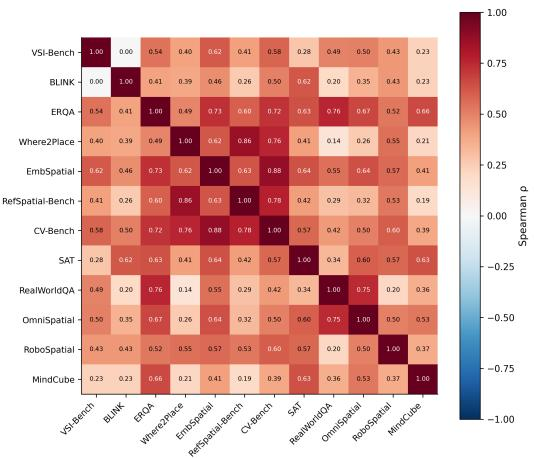
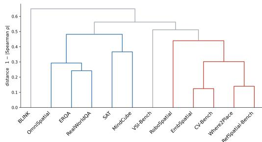
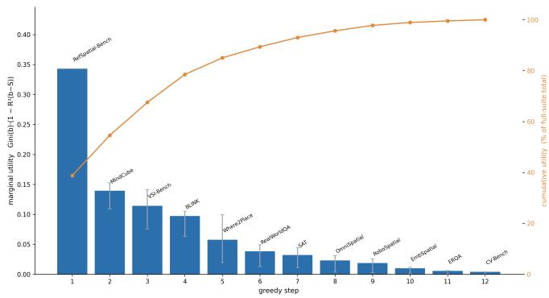

# A STATISTICAL AUDIT OF PHYSICAL-AI BENCHMARK REDUNDANCY

Zaruhi Navasardyan Metric zaruhi@metric.am

Hrant Davyan Metric hrant@metric.am

## ABSTRACT

Physical AI models are evaluated on suites of benchmarks that differ across model reports, leaving the model-by-benchmark matrix sparse and the relationship between benchmarks unmeasured. We construct a matrix of 51 models on 12 physical AI benchmarks, selected from a registry of 51 benchmarks and 152 models by reporting density, combining scores from model cards and benchmark papers with our own evaluation runs under each benchmark’s official protocol. We measure how much information the benchmarks share and show quantitative evidence of Redundancy. Redundancy affects reported rankings: collapsing the two substitute pairs into single columns moves 22 of 51 models by three or more places under an equally weighted average. We then select benchmarks greedily under a utility combining score dispersion with variance not explained by the already-selected set, and obtain a four-benchmark subset retaining 78.5% of the utility of all 12, on which we fit a Bradley–Terry ranking. The procedure requires only benchmarklevel scores with sufficient overlap and is not specific to physical AI.

## 1 INTRODUCTION

Physical AI is young enough that its evaluation has no common ground. Vendors report each new model on a hand-picked set of benchmarks, and the sets barely overlap: the model × benchmark matrix implied by public reports is mostly empty. Two consequences follow. First, models cannot be compared, there is no shared axis, no MTEB-style leaderboard, on which competing systems line up. Second, the numbers that are reported can mislead: a headline score is typically an average over the chosen benchmarks, and if those benchmarks measure overlapping abilities, the average silently double-counts the shared signal.

The overlap is not hypothetical. Consider pointing - outputting a location to identify an object, find free space, or resolve a referring expression. This single capability is routinely evaluated several times within one report: Gemini Robotics-ER 1.5 reports Point-Bench, RefSpatial, RoboSpatial-Pointing, and Where2Place (Gemini Robotics Team, 2025a); RoboBrain 2.0 evaluates RoboSpatial, RefSpatial-Bench, and Where2Place (BAAI RoboBrain Team, 2025); Qwen3-VL reports RefSpatial, RoboSpatial-Home (Qwen Team, 2025). The same repetition appears in 3D layout reasoning and relational question answering. A recent survey catalogs over 45 spatial-reasoning benchmarks and finds coverage heavily concentrated in relational-static questions and sparse elsewhere (Liu et al., 2025).

New benchmarks appear for good reasons: older ones saturate, leak into pre-training data, or admit shortcuts. But each new benchmark is introduced on the premise that it measures something the existing ones do not, and this premise is not checked. To date, no one has quantified how much unique signal a physical-AI benchmark adds beyond the benchmarks already in use.

We treat this as a measurement problem. We assemble a dense matrix of 51 models on 12 physical-AI benchmarks combining scores from official model cards and benchmark papers with our own evaluation runs under each benchmark’s official protocol. On this matrix we ask two questions, each targeting one of the frictions above:

RQ1 - Redundancy. How much information do the 12 benchmarks share, and how strongly does this redundancy inflate pooled averages?

RQ2 - Sufficiency. How small can a benchmark suite be while still separating models and covering the non-redundant abilities of the full suite?

Statistical auditing of this kind exists for text LLMs. Metabench (Kipnis et al., 2024) fits item response theory to 28,632 items from six LLM benchmarks across >5,000 models and shows that under 3% of items suffice to reconstruct full scores; Burnell et al. (2023) factor-analyze 29 LLMs over 27 HELM tasks and recover three capability factors explaining 82% of variance. These audits, however, require dense item-level response data — a setting unavailable in physical AI, where results are published as benchmark-level aggregates. We show that a meaningful audit is possible at the benchmark level, and that it answers both questions. The twelve benchmarks carry far less independent information than their count suggests: the closest substitutes agree at $\rho = 0 . 8 8 ,$ , and the median benchmark has roughly half its variance reconstructible from the other eleven. That redundancy is not inert — collapsing just the two substitute pairs moves 22 of 51 models by three or more places, so part of a model’s standing reflects how often the suite happens to measure what it is good at. It is also compressible: four benchmarks retain 78.5% of the suite’s discriminating power.

Our contributions are as follows:

1. A dense evaluation matrix for physical AI. Scores for 51 models on 12 physical AI benchmarks, assembled from model cards and benchmark papers and completed by our own runs under each benchmark’s official protocol, plus 9 general benchmarks for the same models. This makes previously non-comparable models directly comparable and enables the audit below.

2. Redundancy (RQ1). We quantify shared and unique information across the 12 benchmarks, identify close substitutes, and show how averaging correlated benchmarks inflates pooled scores — a standard practice in vendor reporting.

3. Sufficiency (RQ2). We give selection criteria — sharp model separation, distance from saturation, information beyond the selected set — and forward-select a 4-benchmark suite that preserves the non-redundant signal of the full suite. We use it to produce a Bradley– Terry ranking.

## 2 THE BENCHMARK–MODEL MATRIX

We start our analysis by indexing 51 physical AI benchmarks assembled from model cards, papers, and official blogs. Considering our analysis objectives, we apply three criteria for selection. (i) Density. A benchmark has to be reported for at least 5 candidate models to ensure overlapping scores for covariance analysis. (ii) Recency. Each benchmark recurs across recent model reports, so the suite reflects what the field actually uses to make claims. (iii) Diversity. Together they span the key tasks measured by physical-AI benchmarks, so a finding of redundancy cannot be attributed to having picked twelve versions of the same task.

Table 1 provides the final list of the 12 benchmarks that satisfy these criteria (out of 51), including the ability each claims to measure, its task format, its size, and how many of the models have a score on it. The benchmark definitions and evaluation splits follow the introducing sources: VSI-BENCH (Yang et al., 2024), EMBSPATIAL-BENCH (Du et al., 2024), REFSPATIAL-BENCH (Zhou et al., 2025), WHERE2PLACE (Yuan et al., 2024), ERQA (Gemini Robotics Team, 2025b), CV-BENCH (Tong et al., 2024), SAT (Ray et al., 2024), ROBOSPATIAL (Song et al., 2024), REAL-WORLDQA (xAI, 2024), OMNISPATIAL (Jia et al., 2025), MINDCUBE (Wang et al., 2025), and BLINK (Fu et al., 2024b). Ten of them are multiple-choice; the remaining two (REFSPATIAL-BENCH and WHERE2PLACE) instead require the model to emit image coordinates, and a prediction is scored correct when the point falls inside a target mask. All 12 report model performance on a 0–100 scale.

As can be seen from Table 1, the benchmark means span from 30 to 82 points. If several benchmarks measure the same skill yet differ in difficulty, their raw scores will differ in level and spread but not in ranking models identically. Thus, a correlation computed on ranks will be unaffected, yet any analysis in score units would confound difficulty with information. Therefore, we z-score every benchmark column before multivariate steps, and separately keep Spearman rank correlations as the default pairwise measure. Difficulty itself is not discarded, it re-enters as a selection criterion in Section 4, where a benchmark near its ceiling is penalized regardless of what it measures.

Table 1: The 12 physical-AI benchmarks. Items = number of samples in the benchmark; n = models with a score in our matrix, of 51. g = Gini coefficient.
<table><tr><td>Benchmark</td><td>Claimed ability</td><td>Items</td><td>n</td><td>Mean</td><td>SD</td><td>Min-Max</td><td>g</td></tr><tr><td>VSI-BENCH</td><td>Visual-spatial intelligence (video)</td><td>5,130</td><td>51</td><td>46.9</td><td>12.8</td><td>12.6-69.5</td><td>0.153</td></tr><tr><td>EMBSPATIAL</td><td>Egocentric spatial relations</td><td>3,640</td><td>51</td><td>73.2</td><td>8.0</td><td>43.2-84.1</td><td>0.057</td></tr><tr><td>REFSPATIAL-BENCH</td><td>Spatial referring (pointing)</td><td>200</td><td>51</td><td>29.9</td><td>18.1</td><td>0.3-72.2</td><td>0.343</td></tr><tr><td>WHERE2PLACE</td><td>Affordance pointing / free space</td><td>100</td><td>50</td><td>42.3</td><td>19.8</td><td>7.6-76.0</td><td>0.265</td></tr><tr><td>ERQA</td><td>Embodied reasoning, planning</td><td>400</td><td>49</td><td>44.5</td><td>8.5</td><td>25.7–65.0</td><td>0.104</td></tr><tr><td>CV-BENCH</td><td>Classical CV as VQA (depth, count)</td><td>2,638</td><td>49</td><td>81.7</td><td>6.1</td><td>61.0–89.2</td><td>0.039</td></tr><tr><td>SAT</td><td>Dynamic spatial aptitude</td><td>150</td><td>49</td><td>68.6</td><td>11.7</td><td>45.3-88.0</td><td>0.097</td></tr><tr><td>ROBOSPATIAL</td><td>Robot-centric spatial reasoning</td><td>350</td><td>47</td><td>50.5</td><td>9.5</td><td>29.4-72.6</td><td>0.103</td></tr><tr><td>REALWORLDQA</td><td>Real-world spatial QA</td><td>765</td><td>42</td><td>68.0</td><td>9.0</td><td>40.6–80.4</td><td>0.069</td></tr><tr><td>OMNISPATIAL</td><td>Comprehensive spatial cognition</td><td>1,533</td><td>42</td><td>46.4</td><td>6.1</td><td>26.5–59.6</td><td>0.071</td></tr><tr><td>MINDCUBE</td><td>Spatial mental models (multi-view)</td><td>21,154</td><td>42</td><td>42.2</td><td>11.7</td><td>18.7-69.2</td><td>0.153</td></tr><tr><td>BLINK</td><td>Multi-image visual perception</td><td>3,807</td><td>41</td><td>65.4</td><td>12.3</td><td>43.8–86.3</td><td>0.106</td></tr></table>

In terms of diversity, we design the matrix by selecting benchmarks that cover diverse tasks and settings. We classify them into 5 groups. Pointing benchmarks (REFSPATIAL-BENCH, WHERE2PLACE) ask for a location that satisfies a referring expression or an affordance — the format closest to what a robot policy consumes. Single-image relational benchmarks (EMBSPATIAL, CV-BENCH, OMNISPATIAL, REALWORLDQA) show one view and ask about relative position, depth, count, or the scene from another viewpoint. Multi-view and video benchmarks (MINDCUBE, SAT, VSI-BENCH) cannot be answered from a single frame: MindCube supplies two to four views of one scene, VSI-Bench a walkthrough video, and both require integrating evidence across them. Embodied benchmarks (ERQA, ROBOSPATIAL) frame questions from a robot’s point of view: what can be grasped, where an object may be placed, whether a configuration is feasible. BLINK stands apart as a general visual perception benchmark. We use this grouping only as the taxonomy a reader would expect, not as base for grouping them during the analysis.

Similarly, we index 152 models with at least one physical-AI benchmark score. We then use the final list of 12 benchmarks to select the 51 models from the registry that have at least two thirds (8 of 12) of the scores reported. The final list includes models released between 2024 and 2026, from 15 different providers, both open-weight and closed, ranging from 1B to 241B in size (counted for openweight models only). While some of the models are generalist VLMs, others are specifically trained for robotics or spatial tasks. Those models are usually post-trained on a named open base model, allowing comparison before and after domain post-training. The full list of models is described in Appendix A.

We extract scores from model cards and papers. However, published reporting alone leaves the matrix too sparse for a covariance analysis, so we run the missing evaluations. For all models we use each benchmark’s official evaluation code and prompts whenever available, with greedy decoding and the benchmark’s own answer-parsing rule. This contributes 159 additional data points to the matrix. We did not conduct a systematic reproduction study: our runs targeted missing scores, and while we validated our implementation on models with published results, we do not claim to have verified the published part of the matrix.

## 3 REDUNDANCY (RQ1)

A benchmark suite is informative only when its benchmarks provide distinct evidence about model capabilities. Redundancy arises when adding a benchmark contributes little new information. Beyond unnecessary evaluation cost, such redundancy can also give disproportionate weight to capabilities measured repeatedly when benchmark scores are aggregated.

  
Figure 1: Left: pairwise Spearman ρ across the 12 benchmarks, computed on pairwise-complete rows. Right: average-linkage hierarchical clustering under $D = 1 - \rho .$

We start our redundancy analysis by computing Spearman pairwise correlations. The rank correlations allow us to measure how similarly two benchmarks rank models, independent of benchmark difficulty, which is inherently present in absolute score values. The average pairwise $\rho$ is 0.487, with all correlations being positive. The full correlation matrix is available in Figure 1. Additionally, the figure shows the dendrogram from hierarchical clustering on the benchmark–model matrix using $1 - \rho$ as the distance metric. The dendrogram itself does not add new information; rather, it serves as an easy way to visually observe the benchmark groupings.

Analyzing Figure 1 shows that two pairs stand out as substitutes with Spearman correlation above 0.8: EMBSPATIAL ↔ CV-BENCH $( \rho ~ = ~ 0 . 8 7 6$ , 95% CI [0.78, 0.93], $ { n _ { \mathrm { ~ \scriptsize ~ = ~ } } } 4 9 )$ and WHERE2PLACE ↔ REFSPATIAL-BENCH $( \rho = 0 . 8 6 0 , [ 0 . 7 3 , 0 . 9 3 ] , n = 5 0 )$

BLINK appears to be the most unique benchmark in terms of rank correlations, forming an individual branch in the dendrogram. Other notable pairs are ERQA + REALWORLDQA at $\rho = 0 . 7 5 8$ and REALWORLDQA + OMNISPATIAL at 0.748.

We dive deeper into the redundancy analysis and study how reconstructable a benchmark is from all of its peers, rather than from a single one. To do that, we apply ridge regression to predict each benchmark from the other 11 and compute the leave-one-out cross-validated $R ^ { 2 } \colon$ at each iteration, we hold a single model out and calculate its prediction from a model trained on the remaining model scores. The lower the $\mathrm { L O O } R ^ { 2 }$ , the more unique the benchmark.

Table 2 reports the results of the regression. The benchmarks exhibit substantial variation in redundancy. Where2Place, RefSpatial-Bench, and ERQA are the most predictable from the remaining suite $( R ^ { 2 } { = } 0 . 7 2 7 , 0 . 7 2 1$ , and 0.706), indicating considerable overlap in the evidence they provide. Their predictor sets are also strongly interconnected, with these three benchmarks repeatedly predicting one another. This agrees with our findings from pairwise analysis, where WHERE2PLACE and REFSPATIAL-BENCH formed the highest Spearman-correlated pair. MindCube emerges most often (7 times out of 11) among the strongest predictors of other benchmarks, with ERQA and RefSpatial-Bench next (5 times each), suggesting that they act as hubs of shared benchmark behavior. In contrast, RealWorldQA, RoboSpatial, and BLINK are substantially less predictable $( R ^ { 2 } { = } 0 . 3 1 9 , 0 . 3 5 1$ , and 0.378). We attribute this to the distinct information that those benchmarks add to the rest of the benchmarks, yet we acknowledge that a low $R ^ { 2 }$ can also be caused by noise in the benchmark and the resulting measurement error. The remaining benchmarks occupy an intermediate regime. Thus, benchmark redundancy is not one-dimensional: highly redundant bench marks may nevertheless be valuable as representatives of shared capability structure, whereas highly unique benchmarks provide complementary evidence. This distinction is important when constructing a compact suite, where benchmark selection should balance unique information against coverage of shared structure.

Table 2: Leave-one-model-out predictability of each benchmark from its eleven physical peers. $1 - \operatorname { L O O } R ^ { 2 }$ is the benchmark’s uniqueness. Top 3 predictors are the benchmarks which contribute most to explaining current benchmark’s variance.
<table><tr><td>Benchmark</td><td>n</td><td>LOO R2</td><td>Uniqueness 1 – R2</td><td>Top 3 predictors</td></tr><tr><td>WHERE2PLACE</td><td>50</td><td>0.727</td><td>0.273</td><td>RefSpatial-Bench, MindCube, BLINK</td></tr><tr><td>REFSPATIAL-BENCH</td><td>51</td><td>0.721</td><td>0.279</td><td>Where2Place, ERQA, MindCube</td></tr><tr><td>ERQA</td><td>49</td><td>0.706</td><td>0.294</td><td>MindCube, RefSpatial-Bench, RealWorldQA</td></tr><tr><td>CV-BENCH</td><td>49</td><td>0.614</td><td>0.386</td><td>EmbSpatial, ERQA, RefSpatial-Bench</td></tr><tr><td>MINDCUBE</td><td>42</td><td>0.599</td><td>0.401</td><td>ERQA, RefSpatial-Bench, SAT</td></tr><tr><td>SAT</td><td>49</td><td>0.468</td><td>0.532</td><td>OmniSpatial, MindCube, BLINK</td></tr><tr><td>EMBSPATIAL</td><td>51</td><td>0.463</td><td>0.537</td><td>CV-Bench, OmniSpatial, Where2Place</td></tr><tr><td>OMNISPATIAL</td><td>42</td><td>0.453</td><td>0.547</td><td>EmbSpatial, SAT, RealWorldQA</td></tr><tr><td>VSI-BENCH</td><td>51</td><td>0.421</td><td>0.579</td><td>ERQA, MindCube, BLINK</td></tr><tr><td>BLINK</td><td>41</td><td>0.378</td><td>0.622</td><td>RefSpatial-Bench, MindCube, VSI-Bench</td></tr><tr><td>ROBOSPATIAL</td><td>47</td><td>0.351</td><td>0.649</td><td>VSI-Bench, MindCube, RealWorldQA</td></tr><tr><td>REALWORLDQA</td><td>42</td><td>0.319</td><td>0.681</td><td>ERQA, OmniSpatial, RoboSpatial</td></tr></table>

To substantiate our claim that aggregated measurement is misleading under a correlated benchmark suite, we compute the arithmetic average score per model and rank models from highest to lowest. Weighting 12 benchmarks equally weights an ability in proportion to how many times the suite happens to measure it (in our case, pointing receives 2/12 of the weight while video-spatial reasoning gets 1/12).

We then use the insights from the redundancy analysis to collapse each substitute pair into a single benchmark. Specifically, we replace each of the two pairs that RQ1 flags as substitutes (REFSPATIAL-BENCH/WHERE2PLACE, EMBSPATIAL/CV-BENCH) with the mean of its two columns, leaving ten columns: eight untouched benchmarks and two collapsed abilities. The arithmetic average and the ranking are recomputed accordingly. We observe that among 51 models, 22 change their positions by 3 or more places. For example, MIMO-EMBODIED-7B drops 9 places and GEMINI ROBOTICS-ER 1.5 drops 8. Similarly, models that are strong elsewhere and relatively weak at pointing rise: GPT-4O gains 9 places and CLAUDE-SONNET-4 gains 8. We do not propose the de-duplicated ranking as the correct leaderboard — collapsing pairs is itself a choice. However, this comparison isolates how much of a model’s position is an artifact of the suite’s composition rather than of its capability.

This section shows that redundancy exists, Appendix B goes one step further and examines what the shared variance consists of: a single principal component explains 55.2% of the suite’s variance and tracks general vision–language capability, estimated from nine non-physical benchmarks on the same models, at $\rho = 0 . 9 5 ;$ ; residualizing every benchmark on that external axis roughly halves the mean pairwise correlation, from 0.487 to 0.250. Roughly half of what the 12 benchmarks share is therefore general capability rather than anything specific to physical AI.

## 4 A MINIMAL BENCHMARK SUITE (RQ2)

Section 3 establishes that the 12 benchmarks share most of their signal, which implies that some subset of them reproduces most of the evidence the full suite provides. It does not tell us which subset, or how small it can be. However, informativeness is not a property a benchmark holds on its own: it depends on which benchmarks are already included in the suite. A benchmark that would be indispensable in isolation is worthless next to a substitute, as the pointing pair of Section 3 demonstrates. Therefore, this section builds the minimal benchmark suite greedily: benchmarks are added one at a time based on their marginal gain conditional on already selected benchmarks in the suite.

We require two properties of a benchmark before it earns a place in the suite. First, it must separate models. A benchmark that assigns nearly the same score to every model orders them by noise, and contributes nothing to a leaderboard however distinct the ability it measures. Second, it must carry information the selected benchmarks do not. A benchmark that is reconstructable from the selected set adds no evidence. We score each candidate b against the selected set $S$ as the product of the two:

$$
U ( b \mid S ) = a ( b ) \big ( 1 - R ^ { 2 } ( b \sim S ) \big ) .\tag{1}
$$

We take the product rather than a weighted sum because the two properties are not substitutes: a benchmark that fails either one is not worth running, and the product sends its utility to zero, whereas a sum would let a high value on one term compensate for a near-zero value on the other.

Discrimination $g ( b )$ measures how widely a benchmark spreads models. We use the Gini coefficient of the benchmark score distribution across models (Table 1). A benchmark with high g separates models sharply; one with low g scores them all alike.

Marginal information $1 - R ^ { 2 } ( b \sim S )$ is the share of $b \mathbf { \bar { s } }$ variance the selected set cannot already reproduce. $R ^ { 2 } ( b \sim S )$ is the fit of an OLS regression of b on all of S.

## 4.1 SELECTED BENCHMARK SUITE

We start from $S = \emptyset .$ , where $R ^ { 2 } = 0$ and the utility reduces to discrimination alone, so the first pick is simply the benchmark that separates models most sharply. We then repeatedly add $\mathrm { a r g m a x } _ { b } \bar { U } ( b \mid$ S) and recompute the utility of every remaining candidate against the enlarged set. We run the path through all 12 benchmarks rather than stopping at a preset size, so that the point at which the suite stops gaining is something we read off the curve instead of fixing in advance (Figure 2). At each step we record the cumulative utility of the selected set and report it as a percentage of the all-12 total, so that each benchmark’s contribution can be read relative to the whole suite rather than in absolute units of $U .$

Selection opens on REFSPATIAL-BENCH, the suite’s most discriminating benchmark, then takes MINDCUBE, VSI-BENCH, and BLINK. Those four reach 78.5% of the utility of all 12. WHERE2PLACE carries the second-highest Gini coefficient in Table 1 yet the procedure passes over it three times: with REFSPATIAL-BENCH already selected, most of its variance is reproducible, and the utility discounts it accordingly. This is the substitute relationship of Section 3 acting exactly as the utility intends, and it is the clearest illustration of why marginal information cannot be judged benchmark by benchmark in isolation. WHERE2PLACE enters fifth, at 85.0% cumulative. The remaining seven benchmarks share the last 15.0%, and the final four add 4.4% between them. We therefore take the first four as the minimal suite. Appendix C gives further details on the forward selection and tests the stability of the core against the opening pick.

The four benchmarks we obtain also cover complementary skills, which we did not impose and which the utility has no way to encode: precise localization (REFSPATIAL-BENCH), consistency of a spatial model across limited views (MINDCUBE), spatial reasoning over video (VSI-BENCH), and multi-image perceptual primitives (BLINK). The core also balances the two kinds of value the leave-one-out analysis distinguished. MINDCUBE is the suite’s hub, the most frequent top predictor of the other benchmarks, so its score carries information about the columns the core drops. BLINK is the most isolated benchmark in the suite, and contributes evidence no other benchmark supplies.

## 4.2 RANKING MODELS

We rank models on the four selected benchmarks with a Bradley–Terry model fit in the style of a preference arena (Chiang et al., 2024), where each benchmark plays the role of a judge. For every pair of models and every benchmark both have been scored on, we record one binary observation: the benchmark votes for whichever model scored higher, regardless of the size of the gap. Each vote carries equal weight, giving 4,231 observations over the 51 models. We then fit $P ( i \succ j ) =$ $\sigma ( r _ { i } - r _ { j } )$ by maximum likelihood with an $L _ { 2 }$ penalty of $1 0 ^ { - 3 }$ , center the strengths, and map them to the familiar scale as $\mathrm { E l o } _ { i } = 1 5 0 0 + 4 0 0 r _ { i } /$ ln 10 (Table 3).

The leaderboard shows that top 10 models include both open weight and closed API systems. Three out of ten models in the top 10 (2 sizes of HY-EMBODIED-0.5 and ROBOBRAIN-32B-2.0) are models specifically post-trained for embodied or spatial tasks. If physical AI scores were driven purely by general capability, the ranking would reproduce a general-purpose leaderboard and domain post-training would provide no additional gain.

  
Figure 2: Forward-selection path. Bars are the per-step marginal utility $U ( b \mid S ) = g ( b ) ( 1 - R ^ { 2 } ( b \sim$ S)); the line is cumulative utility as a percentage of the 12-benchmark total. Four benchmarks reach 78.5%.

Table 3: The compact leaderboard: top 10 of 51 models under a benchmark-as-judge Bradley–Terry fit on the four selected benchmarks. Core is how many of the four the model has a score on.
<table><tr><td>Rank</td><td>Model</td><td>Elo</td><td>Core</td></tr><tr><td>1</td><td>HY-EMBODIED-0.5 MoE-407B-A32B</td><td>2251</td><td>3</td></tr><tr><td>2</td><td>QWEN3.5-397B-A17B</td><td>2032</td><td>3</td></tr><tr><td>3</td><td>QWEN3-VL-235B-A22B-INSTRUCT</td><td>1828</td><td>3</td></tr><tr><td>4</td><td>SEED 2.0</td><td>1790</td><td>3</td></tr><tr><td>5</td><td>KIMI K2.5</td><td>1750</td><td>4</td></tr><tr><td>6</td><td>HY-EMBODIED-0.5 MOT-4B-A2B</td><td>1744</td><td>4</td></tr><tr><td>7</td><td>GEMINI 3.0 PRO</td><td>1716</td><td>4</td></tr><tr><td>8</td><td>QWEN3-VL-32B-INSTRUCT</td><td>1662</td><td>3</td></tr><tr><td>9</td><td>GEMINI-2.5-PRO-PREVIEW-05-06</td><td>1643</td><td>3</td></tr><tr><td>10</td><td>ROBOBRAIN-32B-2.0</td><td>1630</td><td>4</td></tr></table>

Interestingly, the leaderboard shows that the scale improves physical ability within a training recipe but not between recipes. While within the QWEN-VL family the ordering is monotone in size, leaderboard places HY-EMBODIED-0.5 MOT-4B-A2B sixth and above models significantly larger in terms of parameter count.

## 5 LIMITATIONS

The insights gained from this research are subject to a few limitations that simultaneously point toward compelling directions for future study.

Benchmark-level analysis. We operate on aggregate scores because that is what the field publishes. Item-level audits can localize redundancy to specific items and estimate measurement error directly (Kipnis et al., 2024).

Matrix score verification and possible heterogeneity and noise. Cells come from model cards, benchmark papers, and our own runs. We aligned to official evaluation code and prompts where available, but we have no systematic reproduction study and do not claim one. The usable evidence on comparability is published-versus-published already revealed some inconsistencies. Moreover, a benchmark can be unpredictable from its peers because it measures something distinct or because it is noisy. Distinguishing the two requires repeated evaluation under resampled prompts, decoding seeds, and parsing rules — data current reporting does not provide.

Sample size. We acknowledge that fifty-one models over 12 benchmarks matrix may be thin for some statistical analysis but try to rely on the findings supported by statistical significance.

The compact suite is one defensible choice, not the optimum. Forward selection is greedy and carries no optimality guarantee, and the recovered core depends on the utility. All four slots survive when any core member is forced into the opening slot; forcing a benchmark the unconstrained path rejects displaces one member to fifth and lowers the utility captured at four (Appendix C). We have not varied the discrimination measure itself, so the core is robust to where selection starts but untested against a different definition of g.

Observational evidence only. Every result here is observational. We do not intervene on training data or objectives, so we cannot claim the dominant axis causes performance on any benchmark, only that the two covary tightly across the models that exist today. Finally, none of the 12 benchmarks measures downstream task success on a physical system, so we cannot say whether the residual physical signal we isolate is the part that transfers to manipulation or navigation.

## 6 CONCLUSION

We audited a 12-benchmark physical AI suite as a measurement instrument rather than a scoreboard, using a matrix of 51 models assembled from published reports and our own evaluation runs. The suite is substantially redundant: correlations are uniformly positive, averaging 0.487, and roughly half of what the benchmarks share is general vision–language capability (shared with general benchmark) rather than anything specific to physical AI (Appendix B). The redundancy is compressible: four benchmarks selected for discrimination and marginal uniqueness retain 78.5% of the suite’s discriminating power. The audit itself uses no property specific to physical AI: it needs only a set of benchmarks and a set of models scored on enough of them to overlap and can be applied to any field.

## REFERENCES

BAAI RoboBrain Team. Robobrain 2.0 technical report. arXiv preprint arXiv:2507.02029, 2025. URL https://arxiv.org/abs/2507.02029.

Ryan Burnell, Han Hao, Andrew R. A. Conway, and Jose Hernandez-Orallo. Revealing the struc-´ ture of language model capabilities. arXiv preprint arXiv:2306.10062, 2023. URL https: //arxiv.org/abs/2306.10062.

Lin Chen, Jinsong Li, Xiaoyi Dong, Pan Zhang, Yuhang Zang, Zehui Chen, Haodong Duan, Jiaqi Wang, Yu Qiao, Dahua Lin, and Feng Zhao. Are we on the right way for evaluating large visionlanguage models? arXiv preprint arXiv:2403.20330, 2024. URL https://arxiv.org/ abs/2403.20330.

Wei-Lin Chiang, Lianmin Zheng, Ying Sheng, Anastasios Nikolas Angelopoulos, Tianle Li, Dacheng Li, Hao Zhang, Banghua Zhu, Michael Jordan, Joseph E. Gonzalez, and Ion Stoica. Chatbot arena: An open platform for evaluating LLMs by human preference. arXiv preprint arXiv:2403.04132, 2024. URL https://arxiv.org/abs/2403.04132.

Christopher Chou, Lisa Dunlap, Koki Mashita, Krishna Mandal, Trevor Darrell, Ion Stoica, Joseph E. Gonzalez, and Wei-Lin Chiang. VisionArena: 230k real world user-VLM conversations with preference labels. arXiv preprint arXiv:2412.08687, 2024. URL https: //arxiv.org/abs/2412.08687.

Mengfei Du, Binhao Wu, Zejun Li, Xuanjing Huang, and Zhongyu Wei. EmbSpatial-Bench: Benchmarking spatial understanding for embodied tasks with large vision-language models. arXiv preprint arXiv:2406.05756, 2024. URL https://arxiv.org/abs/2406.05756.

Chaoyou Fu, Yuhan Dai, Yongdong Luo, Lei Li, Shuhuai Ren, Renrui Zhang, Zihan Wang, Chenyu Zhou, Yunhang Shen, Mengdan Zhang, Peixian Chen, Yanwei Li, Shaohui Lin, Sirui Zhao, Ke Li, Tong Xu, Xiawu Zheng, Enhong Chen, Caifeng Shan, Ran He, and Xing Sun. Video-MME: The first-ever comprehensive evaluation benchmark of multi-modal LLMs in video analysis. arXiv preprint arXiv:2405.21075, 2024a. URL https://arxiv.org/abs/2405.21075.

Xingyu Fu, Yushi Hu, Bangzheng Li, Yu Feng, Haoyu Wang, Xudong Lin, Dan Roth, Noah A. Smith, Wei-Chiu Ma, and Ranjay Krishna. BLINK: Multimodal large language models can see but not perceive. arXiv preprint arXiv:2404.12390, 2024b. URL https://arxiv.org/abs/ 2404.12390.

Gemini Robotics Team. Gemini robotics 1.5: Pushing the frontier of generalist robots. arXiv preprint arXiv:2510.03342, 2025a. URL https://arxiv.org/abs/2510.03342.

Gemini Robotics Team. Gemini robotics: Bringing AI into the physical world. arXiv preprint arXiv:2503.20020, 2025b. URL https://arxiv.org/abs/2503.20020.

Mengdi Jia, Zekun Qi, Shaochen Zhang, Wenyao Zhang, Xinqiang Yu, Jiawei He, He Wang, and Li Yi. OmniSpatial: Towards comprehensive spatial reasoning benchmark for vision language models. arXiv preprint arXiv:2506.03135, 2025. URL https://arxiv.org/abs/2506. 03135.

Alex Kipnis, Konstantinos Voudouris, Luca M. Schulze Buschoff, and Eric Schulz. metabench – a sparse benchmark to measure general ability in large language models. arXiv preprint arXiv:2407.12844, 2024. URL https://arxiv.org/abs/2407.12844.

Weichen Liu, Qiyao Xue, Haoming Wang, Xiangyu Yin, Boyuan Yang, and Wei Gao. Spatial reasoning in multimodal large language models: A survey of tasks, benchmarks and methods. arXiv preprint arXiv:2511.15722, 2025.

Yuliang Liu, Zhang Li, Mingxin Huang, Biao Yang, Wenwen Yu, Chunyuan Li, Xucheng Yin, Cheng-lin Liu, Lianwen Jin, and Xiang Bai. OCRBench: On the hidden mystery of OCR in large multimodal models. Science China Information Sciences, 2024. URL https://arxiv.org/ abs/2305.07895.

Minesh Mathew, Dimosthenis Karatzas, and C. V. Jawahar. DocVQA: A dataset for VQA on document images. arXiv preprint arXiv:2007.00398, 2021. URL https://arxiv.org/abs/ 2007.00398.

Qwen Team. Qwen3-vl technical report. arXiv preprint arXiv:2511.21631, 2025. URL https: //arxiv.org/abs/2511.21631.

Arijit Ray, Jiafei Duan, Ellis Brown, Reuben Tan, Dina Bashkirova, Rose Hendrix, Kiana Ehsani, Aniruddha Kembhavi, Bryan A. Plummer, Ranjay Krishna, Kuo-Hao Zeng, and Kate Saenko. SAT: Dynamic spatial aptitude training for multimodal language models. arXiv preprint arXiv:2412.07755, 2024. URL https://arxiv.org/abs/2412.07755.

David Rein, Betty Li Hou, Asa Cooper Stickland, Jackson Petty, Richard Yuanzhe Pang, Julien Dirani, Julian Michael, and Samuel R. Bowman. GPQA: A graduate-level google-proof q&a benchmark. arXiv preprint arXiv:2311.12022, 2023. URL https://arxiv.org/abs/2311. 12022.

Chan Hee Song, Valts Blukis, Jonathan Tremblay, Stephen Tyree, Yu Su, and Stan Birchfield. RoboSpatial: Teaching spatial understanding to 2d and 3d vision-language models for robotics. arXiv preprint arXiv:2411.16537, 2024. URL https://arxiv.org/abs/2411.16537.

Shengbang Tong, Ellis Brown, Penghao Wu, Sanghyun Woo, Manoj Middepogu, Sai Charitha Akula, Jihan Yang, Shusheng Yang, Adithya Iyer, Xichen Pan, Ziteng Wang, Rob Fergus, Yann LeCun, and Saining Xie. Cambrian-1: A fully open, vision-centric exploration of multimodal LLMs. arXiv preprint arXiv:2406.16860, 2024. URL https://arxiv.org/abs/2406. 16860.

Qineng Wang, Baiqiao Yin, Pingyue Zhang, Jianshu Zhang, Kangrui Wang, Zihan Wang, Jieyu Zhang, Keshigeyan Chandrasegaran, Han Liu, Ranjay Krishna, Saining Xie, Jiajun Wu, Li Fei-Fei, and Manling Li. MindCube: Spatial mental modeling from limited views. arXiv preprint arXiv:2506.21458, 2025. URL https://arxiv.org/abs/2506.21458.

Yubo Wang, Xueguang Ma, Ge Zhang, Yuansheng Ni, Abhranil Chandra, Shiguang Guo, Weiming Ren, Aaran Arulraj, Xuan He, Ziyan Jiang, Tianle Li, Max Ku, Kai Wang, Alex Zhuang, Rongqi Fan, Xiang Yue, and Wenhu Chen. MMLU-Pro: A more robust and challenging multi-task language understanding benchmark. arXiv preprint arXiv:2406.01574, 2024. URL https://arxiv.org/abs/2406.01574.

xAI. Grok-1.5 vision preview. Online, 2024. URL https://x.ai/news/grok-1.5v. Introduces RealWorldQA; accessed 2026-08-20.

Jihan Yang, Shusheng Yang, Anjali W. Gupta, Rilyn Han, Li Fei-Fei, and Saining Xie. Thinking in space: How multimodal large language models see, remember, and recall spaces. arXiv preprint arXiv:2412.14171, 2024. URL https://arxiv.org/abs/2412.14171.

Wentao Yuan, Jiafei Duan, Valts Blukis, Wilbert Pumacay, Ranjay Krishna, Adithyavairavan Murali, Arsalan Mousavian, and Dieter Fox. RoboPoint: A vision-language model for spatial affordance prediction for robotics. arXiv preprint arXiv:2406.10721, 2024. URL https://arxiv.org/ abs/2406.10721.

Xiang Yue, Yuansheng Ni, Kai Zhang, Tianyu Zheng, Ruoqi Liu, Ge Zhang, Samuel Stevens, Dongfu Jiang, Weiming Ren, Yuxuan Sun, Cong Wei, Botao Yu, Ruibin Yuan, Renliang Sun, Ming Yin, Boyuan Zheng, Zhenzhu Yang, Yibo Liu, Wenhao Huang, Huan Sun, Yu Su, and Wenhu Chen. MMMU: A massive multi-discipline multimodal understanding and reasoning benchmark for expert AGI. arXiv preprint arXiv:2311.16502, 2023. URL https://arxiv. org/abs/2311.16502.

Enshen Zhou, Jingkun An, Cheng Chi, Yi Han, Shanyu Rong, Chi Zhang, Pengwei Wang, Zhongyuan Wang, Tiejun Huang, Lu Sheng, and Shanghang Zhang. RoboRefer: Towards spatial referring with reasoning in vision-language models for robotics. arXiv preprint arXiv:2506.04308, 2025. URL https://arxiv.org/abs/2506.04308.

## A COMPLETE MODEL LIST AND SCORE SOURCES

Table 4 lists every model in the matrix with its provider, parameter count, release date and base checkpoint, together with how its twelve scores were obtained. Of the 564 filled cells, 405 are grouped as published: 379 are direct transcriptions from a model card or paper, 25 are medians of conflicting published values, and one is borrowed from a twin model. The remaining 159 cells are our own runs.

Table 4: The 51 models in the matrix: provider, parameter count (open-weight only), release date, base model where the checkpoint is a post-train of a named model, and how many of its 12 benchmark scores are grouped as published versus produced by our own runs.
<table><tr><td>Model</td><td>Provider</td><td>Size</td><td>Released</td><td>Base model</td><td>Pub.</td><td>Own</td></tr><tr><td>Claude-Sonnet-4-2025-05-14</td><td>Anthropic</td><td></td><td>2025-05</td><td></td><td>10</td><td>0</td></tr><tr><td>RoboBrain-32B-2.0</td><td>BAAI</td><td>32B</td><td>2025-07</td><td>Qwen2.5-VL-32B-Instruct</td><td>8</td><td>3</td></tr><tr><td>RoboBrain-7B-2.0</td><td>BAAI</td><td>7B</td><td>2025-07</td><td>Qwen2.5-VL-7B-Instruct</td><td>9</td><td>3</td></tr><tr><td>RoboBrain-7B-1.0</td><td>BAAI</td><td>7B</td><td>2025-02</td><td>LLaVA-OneVision-7B</td><td>10</td><td>2</td></tr><tr><td>RoboBrain-2.5-4B</td><td>BAAI</td><td>4B</td><td>2026-01</td><td>Qwen3-VL-4B-Instruct</td><td>8</td><td>3</td></tr><tr><td>Seed 2.0 (ByteDance)</td><td>ByteDance</td><td></td><td>2026-01</td><td></td><td>8</td><td>0</td></tr><tr><td>Gemini 2.5 Pro</td><td>Google</td><td></td><td>2025-03</td><td></td><td>11</td><td>1</td></tr><tr><td>Gemini 2.5 Flash</td><td>Google</td><td></td><td>2025-05</td><td></td><td>11</td><td>1</td></tr><tr><td>Gemini Robotics-ER 1.5</td><td>Google</td><td></td><td>2025-09</td><td>gemini_2_5</td><td>10</td><td>0</td></tr><tr><td>Gemini 3.0 Pro</td><td>Google</td><td></td><td>2025-11</td><td></td><td>9</td><td>0</td></tr><tr><td>Gemini-2.5-Pro-preview-05-06</td><td>Google</td><td></td><td>2025-05</td><td></td><td>9</td><td>0</td></tr><tr><td>Gemini Robotics-ER (original)</td><td>Google</td><td></td><td>2025-03</td><td>gemini_2_0</td><td>9</td><td>0</td></tr><tr><td>HY-Embodied-0.5 MoT-4B-A2B</td><td>Tencent</td><td>2B</td><td>2026-04</td><td></td><td>10</td><td>2</td></tr><tr><td>HY-Embodied-0.5 MoE-407B-A32B</td><td>Tencent</td><td></td><td>2026-04</td><td></td><td>8</td><td>0</td></tr><tr><td>InternVL3.5-241B-A28B</td><td>Shanghai AI Lab</td><td>241B</td><td>2025-08</td><td></td><td>9</td><td>0</td></tr></table>

continued on the next page

Table 4 continued from the previous page.
<table><tr><td>Model</td><td>Provider</td><td>Size</td><td>Released</td><td>Base model</td><td>Pub.</td><td>Own</td></tr><tr><td>InternVL3.5-38B</td><td>Shanghai AI Lab</td><td>38B</td><td>2025-08</td><td></td><td>9</td><td>0</td></tr><tr><td>InternVL3.5-30B-A3B</td><td>Shanghai AI Lab</td><td>30B</td><td>2025-08</td><td></td><td>5</td><td>7</td></tr><tr><td>InternVL3.5-20B-A4B</td><td>Shanghai AI Lab</td><td>20B</td><td>2025-08</td><td></td><td>5</td><td>7</td></tr><tr><td>InternVL3.5-14B</td><td>Shanghai AI Lab</td><td>14B</td><td>2025-08</td><td></td><td>5</td><td>7</td></tr><tr><td>InternVL3.5-8B</td><td>Shanghai AI Lab</td><td>8B</td><td>2025-08</td><td></td><td>5</td><td>7</td></tr><tr><td>InternVL2-8B</td><td>Shanghai AI Lab</td><td>8B</td><td>2024-07</td><td></td><td>4</td><td>7</td></tr><tr><td>InternVL3.5-4B</td><td>Shanghai AI Lab</td><td>4B</td><td>2025-08</td><td></td><td>5</td><td>7</td></tr><tr><td>InternVL2-2B</td><td>Shanghai AI Lab</td><td>2B</td><td>2024-07</td><td></td><td>3</td><td>9</td></tr><tr><td>InternVL3.5-2B</td><td>Shanghai AI Lab</td><td>2B</td><td>2025-08</td><td></td><td>5</td><td>6</td></tr><tr><td>InternVL3.5-1B</td><td>Shanghai AI Lab</td><td>1B</td><td>2025-08</td><td></td><td>5</td><td>7</td></tr><tr><td>Kimi K2.5</td><td>Moonshot</td><td></td><td>2026-02</td><td></td><td>9</td><td>3</td></tr><tr><td>LLaVA-OneVision-7B</td><td>LLaVA</td><td>7B</td><td>2024-08</td><td></td><td>3</td><td>9</td></tr><tr><td>VeBrain-8B</td><td>Meta</td><td>8B</td><td>2025-05</td><td>Qwen2.5-VL-7B-Instruct</td><td>9</td><td>3</td></tr><tr><td>Cosmos-Reason2-8B</td><td>NVIDIA</td><td>8B</td><td>2026-04</td><td>Qwen3-VL-8B-Instruct</td><td>4</td><td>8</td></tr><tr><td>Magma-8B</td><td>NVIDIA</td><td>8B</td><td>2025-02</td><td></td><td>9</td><td>3</td></tr><tr><td>Cosmos-Reason1-7B</td><td>NVIDIA</td><td>7B</td><td>2025-03</td><td>Qwen2.5-VL-7B-Instruct</td><td>9</td><td>3</td></tr><tr><td>Cosmos-Reason2-2B</td><td>NVIDIA</td><td>2B</td><td>2026-04</td><td>Qwen3-VL-2B-Instruct</td><td>4</td><td>8</td></tr><tr><td>GPT-4o-2024-11-20</td><td>OpenAI</td><td></td><td>2024-11</td><td></td><td>11</td><td>1</td></tr><tr><td>GPT-5-mini</td><td>OpenAI</td><td></td><td>2025-08</td><td>GPT-5</td><td>11</td><td>1</td></tr><tr><td>GPT-5</td><td>OpenAI</td><td></td><td>2025-08</td><td></td><td>11</td><td>1</td></tr><tr><td>GPT-5.4</td><td>OpenAI</td><td></td><td></td><td></td><td>8</td><td>1</td></tr><tr><td>GPT-o4-mini-2025-05-16 Qwen3-VL-235B-A22B-Instruct</td><td>OpenAI</td><td></td><td>2025-05</td><td></td><td>8</td><td>0</td></tr><tr><td>Qwen2.5-VL-72B-Instruct</td><td>Alibaba</td><td>235B</td><td>2025-09</td><td></td><td>7</td><td>4</td></tr><tr><td>Qwen3-VL-32B-Instruct</td><td>Alibaba</td><td>72B</td><td>2025-01</td><td></td><td>11</td><td>1</td></tr><tr><td>Qwen2.5-VL-32B-Instruct</td><td>Alibaba</td><td>32B</td><td>2025-09</td><td></td><td>4</td><td>7</td></tr><tr><td></td><td>Alibaba</td><td>32B</td><td>2025-01</td><td></td><td>11</td><td>0</td></tr><tr><td>Qwen3-VL-8B-Instruct Qwen2.5-VL-7B-Instruct</td><td>Alibaba</td><td>8B</td><td>2025-09</td><td></td><td>7</td><td>5</td></tr><tr><td></td><td>Alibaba</td><td>7B</td><td>2025-01</td><td></td><td>12</td><td>0</td></tr><tr><td>Qwen3-VL-4B-Instruct Qwen2.5-VL-3B</td><td>Alibaba</td><td>4B</td><td>2025-09</td><td></td><td>8</td><td>3</td></tr><tr><td>Qwen3-VL-2B-Instruct</td><td>Alibaba</td><td>3B</td><td>2025-01</td><td></td><td>5</td><td>7</td></tr><tr><td>Qwen3.5-397B-A17B</td><td>Alibaba Alibaba</td><td>2B</td><td>2025-09 2026-02</td><td></td><td>10</td><td>2</td></tr><tr><td>Embodied-R1.5</td><td>Tianjin Univ.</td><td>8B</td><td>2026</td><td>Qwen3-VL-8B-Instruct</td><td>8</td><td>3</td></tr><tr><td>Embodied-R1</td><td>Tianjin Univ.</td><td></td><td>2025</td><td>Qwen2.5-VL-3B</td><td>9 8</td><td>2 3</td></tr><tr><td>Pelican-VL</td><td>X Humanoid</td><td></td><td></td><td></td><td>10</td><td>0</td></tr><tr><td>MiMo-Embodied-7B</td><td>Xiaomi</td><td>7B</td><td>2025-12</td><td></td><td>9</td><td>2</td></tr><tr><td></td><td></td><td></td><td></td><td></td><td></td><td></td></tr></table>

## B STRUCTURE: HOW THE PHYSICAL SUITE RELATES TO GENERAL CAPABILITY

Section 3 establishes that the 12 benchmarks share a great deal of variance but does not qualify what that shared variance is. The benchmarks may share a physical competence or they may share general model capability, in which case the suite is a vision–language leaderboard wearing a physical label. The two are not distinguishable from inside the suite, because any axis estimated from the 12 benchmarks inherits whatever they have in common. This appendix separates them using evidence the suite does not contain.

A set of 9 general language and vision benchmarks not designed to measure spatial or 3D reasoning are added to the main matrix for this analysis: MMMU (Yue et al., 2023) and MMSTAR (Chen et al., 2024) (multi-discipline multimodal reasoning), MMLU-PRO (Wang et al., 2024) and GPQA-DIAMOND (Rein et al., 2023) (text-only knowledge and graduate-level reasoning), DOCVQA (Mathew et al., 2021) and OCRBENCH (Liu et al., 2024) (document and text-in-image reading), VIDEO-MME (Fu et al., 2024a) (general video understanding), and the text (Chiang et al., 2024) and vision (Chou et al., 2024) LM-ARENA Elo ratings (human preference). They were chosen on two criteria: they are not intended to test physical or spatial understanding, and they are widely reported for the same models that populate the physical-AI matrix.

Before the general anchors enter the analysis, it is important to understand the structure of the physical benchmarks matrix. PCA on the matrix of the 12 z-scored benchmarks yields a first component explaining 55.2% of total variance, and every benchmark loads on it positively — from 0.48 (REALWORLDQA) to 0.88 (CV-BENCH).

The general anchors are held out of the PCA entirely: PC1 is estimated from the 12 physical benchmarks alone and only then correlated against general performance, so no anchor can influence the component it is being compared to. The alignment turns out to be near-complete (Table 5). Physical PC1 tracks the first principal component of the anchors at Spearman $\rho = 0 . 9 5 2$ , and it reaches 0.950 against MMSTAR and 0.942 against VIDEO-MME. In other words, a model’s score on a document-reading benchmark predicts its position on the physical suite’s principal axis about as well as the physical benchmarks predict one another.  
Table 5: Spearman correlation between the physical suite’s PC1 — estimated from the 12 physical benchmarks alone — and each general anchor, over the models reporting both. n = overlapping models; CI = bootstrap interval with the PCA refit inside each resample. General PC1 is a separate PC1-physical-vs-PC1-general comparison.
<table><tr><td>General anchor</td><td>n</td><td>ρ</td><td>95% CI</td></tr><tr><td>MMSTAR</td><td>29</td><td>0.950</td><td>[0.85, 0.98]</td></tr><tr><td>VIDEO-MME</td><td>26</td><td>0.942</td><td>[0.81, 0.99]</td></tr><tr><td>MMLU-PRO</td><td>16</td><td>0.871</td><td>[0.59, 0.98]</td></tr><tr><td>MMMU</td><td>37</td><td>0.820</td><td>[0.58, 0.95]</td></tr><tr><td>OCRBENCH</td><td>27</td><td>0.774</td><td>[0.46, 0.94]</td></tr><tr><td>DoCVQA</td><td>22</td><td>0.754</td><td>[0.42, 0.93]</td></tr><tr><td>LM-ARENA (VISION)†</td><td>12</td><td>0.741</td><td>[0.34, 0.95]</td></tr><tr><td>GPQA-DIAMOND</td><td>23</td><td>0.733</td><td>[0.38, 0.92]</td></tr><tr><td>LM-ARENA (TEXT)†</td><td>10</td><td>0.624</td><td>[−0.14, 0.97]</td></tr><tr><td>GENERAL PC1</td><td>32</td><td>0.952</td><td>[0.82, 0.97]</td></tr></table>

† underpowered (n < 15).

That result is about the suite as a whole. It does not say which individual pairs of benchmarks agree because both track general capability, and which agree for some other reason. To separate the two, we residualize each benchmark on an externally estimated general axis — the first PC of the 9 anchors — and recompute the correlations among the 12 residual vectors. Removing that single external axis halves the suite’s internal structure: mean pairwise |ρ| falls from 0.487 to 0.250, and the number of pairs correlating above 0.5 drops from 34 of 66 to 6. Roughly half of all benchmark-to-benchmark agreement in physical AI is general capability. Three bonds survive at nearly full strength and are therefore specific rather than general (Table 6): the pointing pair, the 2D-perception pair, and ERQA ↔ MINDCUBE. The first two are exactly the substitute pairs flagged in Section 3: they duplicate each other because they measure the same specific ability, not because both are loaded on general capability. Pairs that looked substantial in RQ1 but were mostly general capability collapse instead. Another findings is that VSI-BENCH and BLINK are uncorrelated in raw scores $( \rho = 0 . 0 0 2 )$ but correlate at −0.363 in the residuals, so among models of equal general capability, strength in video-spatial reasoning trades off against strength in multi-image perception.

Table 6: Benchmark-pair correlations before and after removing an externally estimated general axis (the first PC of the 9 anchors). Residual = correlation of the two benchmarks’ residuals, all 51 models; Dense block = the same using only the 32 models with ≥ 4 observed anchors and no imputation. Top: the three bonds that survive. Middle: the VSI/BLINK suppression, which appears only after conditioning. Bottom: two representative collapses.
<table><tr><td>Benchmark A</td><td>Benchmark B</td><td>Rawρ</td><td>Residual ρ</td><td>Dense block</td></tr><tr><td>EMBSPATIAL</td><td>CV-BENCH</td><td>0.876</td><td>0.784</td><td>0.836</td></tr><tr><td>WHERE2PLACE</td><td>REFSPATIAL-BENCH</td><td>0.860</td><td>0.801</td><td>0.773</td></tr><tr><td>ERQA</td><td>MINDCUBE</td><td>0.656</td><td>0.613</td><td>0.658</td></tr><tr><td>VSI-BENCH</td><td>BLINK</td><td>0.002</td><td>-0.363</td><td>-0.425</td></tr><tr><td>ERQA</td><td>EMBSPATIAL</td><td>0.729</td><td>0.197</td><td>-0.095</td></tr><tr><td>ERQA</td><td>CV-BENCH</td><td>0.725</td><td>0.243</td><td>-0.055</td></tr></table>

## C FORWARD SELECTION DETAILS

This appendix supports Section 4.1. It reports the full 12-step selection path behind the compact suite, and then asks whether that suite is an artifact of the one arbitrary choice greedy selection makes: its opening pick.

Table 7 gives all 12 steps of the greedy selection under $U ( b \mid S ) = g ( b ) ( 1 - R ^ { 2 } ( b \sim S ) )$ ). Marginal utility decays sharply — the last four benchmarks contribute 4.4% of the total between them.  
Table 7: Full greedy selection path. g is the Gini coefficient of the raw score spread, $R ^ { 2 }$ is the fit of the candidate on the already-selected set, U their product, and Cum. the running total as a percentage of the all-12 sum. n is the number of models on which $\dot { R } ^ { 2 }$ is estimated.
<table><tr><td>Step</td><td>Benchmark</td><td>g</td><td> $R ^ { 2 }$ </td><td>U</td><td>Cum. %</td><td>n</td></tr><tr><td>1</td><td>REFSPATIAL-BENCH</td><td>0.343</td><td>0.000</td><td>0.3431</td><td>38.8</td><td>51</td></tr><tr><td>2</td><td>MINDCUBE</td><td>0.153</td><td>0.087</td><td>0.1396</td><td>54.6</td><td>42</td></tr><tr><td>3</td><td>VSI-BENCH</td><td>0.153</td><td>0.254</td><td>0.1144</td><td>67.5</td><td>42</td></tr><tr><td>4</td><td>BLINK</td><td>0.106</td><td>0.087</td><td>0.0972</td><td>78.5</td><td>33</td></tr><tr><td>5</td><td>WHERE2PLACE</td><td>0.265</td><td>0.783</td><td>0.0576</td><td>85.0</td><td>32</td></tr><tr><td>6</td><td>REALWORLDQA</td><td>0.069</td><td>0.442</td><td>0.0383</td><td>89.4</td><td>28</td></tr><tr><td>7</td><td>SAT</td><td>0.097</td><td>0.668</td><td>0.0323</td><td>93.0</td><td>28</td></tr><tr><td>8</td><td>OMNISPATIAL</td><td>0.071</td><td>0.673</td><td>0.0232</td><td>95.6</td><td>27</td></tr><tr><td>9</td><td>ROBOSPATIAL</td><td>0.103</td><td>0.816</td><td>0.0189</td><td>97.8</td><td>27</td></tr><tr><td>10</td><td>EMBSPATIAL</td><td>0.057</td><td>0.824</td><td>0.0100</td><td>98.9</td><td>27</td></tr><tr><td>11</td><td>ERQA</td><td>0.104</td><td>0.946</td><td>0.0056</td><td>99.5</td><td>27</td></tr><tr><td>12</td><td>CV-BENCH</td><td>0.039</td><td>0.895</td><td>0.0041</td><td>100.0</td><td>27</td></tr></table>

Greedy selection commits to its first pick, so we force different benchmarks into the opening slot and let the argmax proceed from there (Table 8). Forcing a member of the core returns the identical set of four in a different order. Forcing WHERE2PLACE — the substitute of the natural opening pick — does not keep REFSPATIAL-BENCH out: even with 75% of its variance already reproducible from the first three selections, its dispersion buys it back at step 4 $( U = 0 . 3 4 3 \times 0 . 2 4 8 = 0 . 0 8 5 )$ , so the path carries both pointing benchmarks and BLINK is the member displaced to fifth. Forcing a benchmark the unconstrained path rejects (ROBOSPATIAL, SAT) likewise displaces one core member to fifth place but leaves the other three standing. Every forced start lowers the utility captured at four benchmarks, and the ordering is informative: seeding with a core member costs almost nothing (78.5 to 77.8–78.3), seeding with the substitute of a core member costs about four points (74.5), and seeding with a rejected benchmark costs seven to nine (69.2–71.6). MINDCUBE and VSI-BENCH enter within the first four in every run, and REFSPATIAL-BENCH is never kept out — not even by its own substitute. Physical specificity alone does not earn a place: ROBOSPATIAL carries the least general-capability signal in the suite (Appendix B finds it the benchmark least aligned with the suite’s general-capability axis), yet its own dispersion $( g = 0 . 1 0 3 )$ is too low for it to anchor a ranking.

Table 8: Seed robustness of the selection path. Kept counts how many of the four unseeded core benchmarks survive in the first four slots; Cum. % @4 is the utility captured at four benchmarks.
<table><tr><td>Forced first</td><td>First four selected</td><td>Kept</td><td>Cum. % @4</td></tr><tr><td>(none)</td><td>RefSpatial-Bench, MindCube, VSI-Bench, BLINK</td><td>4/4</td><td>78.5</td></tr><tr><td>VSI-BENCH</td><td>VSI-Bench, RefSpatial-Bench, MindCube, BLINK</td><td>4/4</td><td>77.8</td></tr><tr><td>BLINK</td><td>BLINK, RefSpatial-Bench, MindCube, VSI-Bench</td><td>4/4</td><td>78.3</td></tr><tr><td>WHERE2PLACE</td><td>Where2Place, MindCube, VSI-Bench, RefSpatial-Bench</td><td>3/4</td><td>74.5</td></tr><tr><td>ROBOSPATIAL</td><td>RoboSpatial, RefSpatial-Bench, MindCube, VSI-Bench</td><td>3/4</td><td>69.2</td></tr><tr><td>SAT</td><td>SAT, RefSpatial-Bench, VSI-Bench, MindCube</td><td>3/4</td><td>71.6</td></tr></table>

Forward selection is greedy and carries no optimality guarantee, and the ablation above tests only one of its degrees of freedom. The core should therefore be considered as a compact suite under this utility, not as the unique optimum.