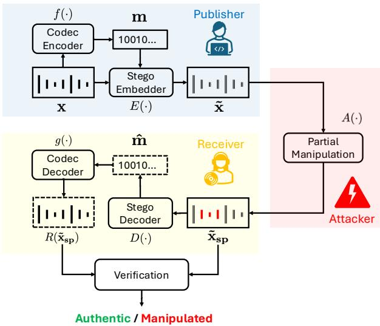
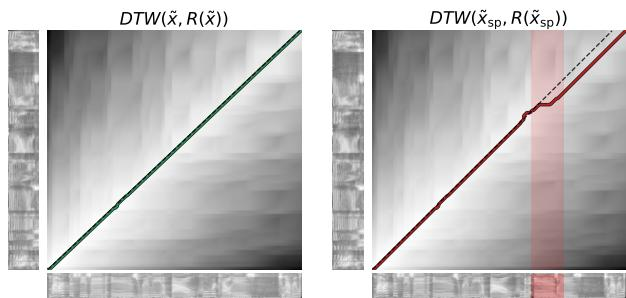
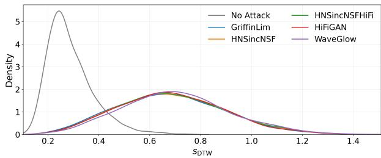
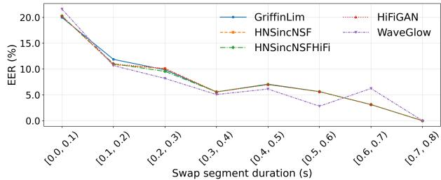

# A Training-Free Proactive Defense Against Partial Speech Manipulation via Self-Embedding Steganography

Yigitcan Ozer ¨ ID , Zhe Zhang ID , Wanying Ge ID , Xin Wang ID , Junichi Yamagishi ID

National Institute of Informatics, Tokyo, Japan

{yiitozer, zhe, gewanying, wangxin, jyamagis}@nii.ac.jp

## Abstract

Partial deepfake speech, where only limited segments of an utterance are synthesized or manipulated, poses a significant challenge to existing deepfake detection systems. As the proportion of spoofed regions decreases, passive detectors become increasingly unreliable, and accurate detection and restoration remain challenging. In this paper, we revisit audio steganography from a new perspective and propose its use as a proactive defense against partially deepfaked audio. In particular, we consider a self-embedding strategy in which a clean speech signal embeds a compressed representation of itself, enabling post-hoc extraction of reference content. We demonstrate how existing audio steganography methods can be repurposed to support detection of partial deepfakes through codec-based restoration. Experiments on a benchmark dataset show that the proposed approach complements passive defenses. Remarkably, the proposed method operates without any training, providing a robust and data-efficient alternative for partial deepfake detection.

Index Terms: audio steganography, partial deepfake detection, audio watermarking, self-embedding steganography

## 1. Introduction

Recent advances in text-to-speech (TTS) and voice conversion (VC) technologies have enabled highly realistic deepfake audio [1, 2]. While fully synthesized speech can often be detected reliably [3], real-world attacks increasingly involve partial manipulation, where only short segments of an otherwise authentic utterance are replaced [4]. Such localized manipulations substantially reduce the reliability of passive detection systems [5], which struggle especially when spoofed regions are brief or sparse. Moreover, identifying manipulated segments and recovering the original content remains difficult under this setting, limiting the practical utility of existing countermeasures [6]. To address these challenges, recent studies have investigated partial deepfake detection and localization [7, 8, 9, 10, 11]. Furthermore, benchmark datasets such as HalfTruth [12], Partial-Spoof [13], PartialEdit [14], LlamaPartialSpoof [15], and AV-Deepfake1M [16] have facilitated research in partial deepfake detection.

In parallel, audio steganography has been widely studied for secure communication and data hiding [17]. Beyond covert communication, steganography also provides a natural mechanism for proactive defense, as auxiliary information can be embedded into signals prior to distribution and later extracted for verification and recovery [18]. Recent neural methods further improve fidelity and capacity, enabling high-quality speech hiding and recovery [19, 20, 21, 22, 23, 24]. Relatedly, several audio watermarking systems, e.g., AudioSeal [25], also enable provenance verification and tampering localization. However, these approaches primarily focus on authorship and attribution, and do not directly support fine-grained content recovery under partial manipulation.

  
Figure 1: Overview of the proposed self-embedding-based audio steganography framework against partial deepfake manipulation. Discrepancies between the received spoofed signal ˜xsp and its reconstruction R(˜xsp) enable detection while restoration is ensured through neural codec-based reconstruction.

In this work, we build upon this perspective and investigate a proactive defense paradigm grounded in audio steganography. Rather than attempting to identify synthesis artifacts after a manipulation has already occurred, we embed auxiliary information into the signal prior to distribution. In particular, we adopt a self-embedding strategy (see Figure 1), in which the embedded payload consists of a compact representation of the carrier signal itself. Self-embedding steganography has previously been explored in related domains, including video authentication [26] and digital image data hiding and reconstruction [27, 28, 29]. However, to the best of our knowledge, this paper constitutes the first systematic investigation of self-embedding as a proactive defense mechanism in the audio domain. By embedding a self-referential description of the signal, obtained via a compact neural speech codec representation, our approach enables a direct comparison between the received waveform and its selfreconstruction, thereby facilitating the detection of manipulated regions.

As our main contribution, we propose a temporally repetitive adaptation of the classical least significant bit (LSB) scheme [30, 31] to embed a neural codec-derived representation of the carrier signal. Conceptually, the proposed method is related to the deep learning-based speech hiding method WavIn-Wav [32]. Different from this approach, we adopt a lightweight, training-free strategy that enables robust self-recovery under partial manipulation without requiring large-scale model training or specialized architectures. Through systematic experiments on a subset of the AV-Deepfake1M dataset [16], we demonstrate that the proposed method complements existing passive defenses and outperforms open-source baselines under partial deepfake attacks.

## 2. Self-Embedding Steganography Against Partial Speech Manipulation

This section formalizes the proposed self-embedding framework for partial speech manipulation, describes the temporally repetitive LSB embedding scheme, analyzes its embedding capacity and repetition behavior, and introduces the computation of the self-reconstruction-based detection score.

## 2.1. Problem Formulation

Let $\textbf { x } ~ \in ~ \mathbb { R } ^ { T }$ denote a clean discrete-time speech signal of length $T .$ In general audio steganography, an embedder $\boldsymbol { E } : \mathbb { R } ^ { \breve { T } } \times \mathbb { R } ^ { M }  \mathbf { \breve { R } } ^ { T }$ hides an arbitrary message m $\mathbf { \Psi } \in \mathbb { R } ^ { M }$ in the carrier signal x, producing a stego signal $\tilde { \mathbf { x } } = E ( \mathbf { x } , \mathbf { m } )$ which is intended to remain perceptually indistinguishable from the original carrier. A corresponding stego decoder $D : \mathbb { R } ^ { T }  \mathbb { R } ^ { \breve { M } }$ attempts to recover the embedded message, resulting in mˆ $\mathbf { \tau } _ { \mathbf { i } } = D ( \tilde { \mathbf { x } } )$

As depicted in Figure 1, this work departs from generic steganography by using a non-arbitrary message m. We adopt the neural speech codec SNAC [33] with encoder $f : { \dot { \mathbb { R } } } ^ { T } \to { \mathbb { R } } ^ { M }$ , which maps the carrier to a compact latent representation $\mathbf { m } = f ( \mathbf { x } )$ . Under this self-embedding setting, the steganographic embedder hides the codec representation of the signal itself, producing $\tilde { \mathbf { x } } = E ( \mathbf { x } , \mathbf { m } )$ . Decoding the stego signal yields an estimate $\hat { \bf m } = D ( \tilde { \bf x } )$ A synthesis function $\boldsymbol { g } : \mathbb { R } ^ { M }  \mathbb { R } ^ { T }$ is then applied to the recovered message mˆ to obtain a codec-based reconstruction of the waveform.

To analyze the robustness of self-embedding under partial deepfake manipulations, we introduce a spoofing operator $A ( \cdot )$ that replaces single or multiple localized time intervals of a signal. Let $\{ \mathcal { T } _ { k } \} _ { k = 1 } ^ { K }$ denote a collection of word-level intervals, with each interval given by $\mathcal { T } _ { k } = [ t _ { \mathrm { s t a r t } } ^ { ( k ) } , t _ { \mathrm { e n d } } ^ { ( k ) } ]$ , where K denotes the number of intervals. For each interval, a corresponding manipulated segment is inserted. Importantly, the proposed framework makes no assumptions about the internal mechanism of the spoofing operator. In contrast to passive deepfake detectors that are often trained for specific synthesis artifacts, our formulation treats $A ( \cdot )$ as a generic replacement operator. The manipulated segment may be generated by a TTS or VC model, or obtained through simple signal processing operations such as waveform splicing and segment-level temporal replacement from arbitrary audio recordings.

Building on these definitions, we obtain the following variants of the utterance that serve as the basis for our analysis. The real signal is the clean carrier x. Embedding the self-referential message yields the stego signal ˜x. Applying the partial spoofing operator $A ( \cdot )$ to the clean signal produces the spoofed signal ${ \bf { x } _ { s p } } ^ { 1 } .$ , while applying the same operator to the stego signal yields the spoofed stego signal $\tilde { \mathbf { x } } _ { \mathrm { s p } }$

At verification time, let y denote the received signal, where $\mathbf { y } = \tilde { \mathbf { x } }$ in the absence of manipulation and $\mathbf { y } = \tilde { \mathbf { x } } _ { \mathrm { s p } }$ under partial spoofing. We define the self-reconstruction operator as $R ( \mathbf { y } ) = g { \big ( } D ( \mathbf { y } ) { \big ) }$ . Given a dissimilarity measure $d ,$ the reconstruction mismatch score is defined as $s ( \mathbf { y } ) = d ( R ( \mathbf { y } ) , \mathbf { y } )$ . Detection is then formulated as a binary hypothesis test,

$$
\delta ( \mathbf { y } ) = { \left\{ \begin{array} { l l } { 0 , } & { s ( \mathbf { y } ) \leq \tau , } \\ { 1 , } & { s ( \mathbf { y } ) > \tau , } \end{array} \right. }
$$

where $\delta ( \mathbf { y } ) = 0$ indicates an authentic signal, $\delta ( \mathbf { y } ) = 1$ indicates a manipulated signal, and τ is a decision threshold.

## 2.2. Temporally Repetitive LSB Adaptation

As a proactive defense mechanism, we adopt LSB embedding, which encodes binary information by modifying the least significant bit of each audio sample while introducing only minimal amplitude distortion. Specifically, we employ an LSBbased scheme with temporal repetition. For the binary message m $\in \{ 0 , 1 \} ^ { M }$ , the embedder integrates the message bits into the LSB of the audio samples repeatedly at fixed temporal offsets. In particular, the $r ^ { \mathrm { t h } }$ repetition begins at sample index $r P .$ where $\bar { P }$ is the repetition period (in samples) and $P \ge M$ ensures that repetitions do not overlap. Given the carrier signal x of length T, the maximum number of repetitions is then

$$
R = 1 + \left\lfloor { \frac { T - M } { P } } \right\rfloor .
$$

At decoding time, the decoder reads the LSB stream from the stego audio. If only a single copy is present, the first M bits are returned. When multiple repetitions are available, which is the case in our approach, the decoder retrieves all R copies and applies majority voting across repetitions for each bit:

$$
{ \hat { m } } _ { i } = { \left\{ \begin{array} { l l } { 1 , } & { { \mathrm { i f ~ } } { \frac { 1 } { R } } \sum _ { r = 1 } ^ { R } m _ { i } ^ { ( r ) } \geq 0 . 5 , } \\ { 0 , } & { { \mathrm { o t h e r w i s e } } . } \end{array} \right. }
$$

## 2.3. Capacity and Repetition Analysis

In our experiments, the carrier waveform is sampled at 16 kHz, while the self-embedding payload is obtained by resampling to $2 4 \mathrm { k H z }$ and encoding with the SNAC 24 kHz model at 0.98 kbps [33]. The resulting bitstream is embedded in the 16 kHz carrier via temporally repetitive LSB encoding, and the same resampling is applied when decoding the payload for selfreconstruction.

At 0.98 kbps, a one-second speech signal produces approximately 980 payload bits. Including the 64-bit synchronization preamble and setting $P = M$ yields a frame length of 1044 bits. Since LSB embedding uses one bit per sample, a onesecond utterance offers 16,000 embedding positions, allowing $\lfloor 1 6 , 0 0 0 / 1 0 4 4 \rfloor = 1 5$ non-overlapping frame repetitions. This redundancy yields error-free payload recovery in all our experiments, both for unmodified stego signals (˜x) and after the partial manipulation attacks $( \mathbf { \tilde { x } _ { \mathrm { s p } } } ) .$ , described in § 3.1, resulting in 100% bit-exact payload reconstruction and successful waveform decoding in all evaluated cases.

## 2.4. Detection Score via Dynamic Time Warping

For the proposed self-embedding steganography approach, a detection score is computed on the basis of the dynamic time warping (DTW) [34] between the received signal y and its selfreconstruction $R ( \mathbf { y } ) = g ( D ( \mathbf { y } ) )$ (see § 2.1). DTW provides a mechanism for aligning two time sequences under possible local temporal distortions. This is particularly suitable in our setting, as partial speech manipulations introduce temporal inconsistencies between y and R(y). Consequently, by allowing non-linear temporal alignment, DTW isolates structural mismatches beyond trivial timing offsets.

  
Figure 2: Warping paths computed with dynamic time warping (DTW), left: the stego signal ˜x and the reconstructed audio $R ( { \tilde { \mathbf { x } } } )$ , without no manipulation, right: the stego signal after manipulation $( \mathbf { \tilde { x } _ { \mathrm { s p } } } )$ and the reconstructed audio $( R ( \tilde { \mathbf { x } } _ { \mathrm { { s p } } } ) ,$ )from the manipulated stego signal.

As illustrated in Figure 2, we apply the DTW to normalized mel-log spectrogram features using cosine distance as the local dissimilarity measure. Here, the accumulated cost matrix is shown in grayscale, and the optimal warping path is overlaid in black, while the manipulated segment is highlighted in red. In the absence of manipulation, the warping path closely follows the diagonal, reflecting near one-to-one temporal correspondence. In contrast, partial manipulations result in higher accumulated costs and localized deviations from the diagonal.

Let $\pi ^ { * }$ denote the optimal warping path obtained by $\mathrm { D T W } ( R ( \mathbf { y } ) , \mathbf { y } )$ . We define the per-utterance score as

$$
s _ { \mathrm { D T W } } ( \mathbf { y } ) = \frac { 1 } { \left| \pi ^ { * } \right| } \sum _ { t \in \pi ^ { * } } c _ { t }
$$

where $c _ { t }$ denotes the local cosine distance between two frames of the mel-log spectrum along the optimal warping path. Overall, the scalar sDTW(y) quantifies the average alignment mismatch between self-reconstruction and the received signal, with higher values indicating a higher chance of being manipulated.

## 3. Experiments

This section describes the experimental setup and reports quantitative results for evaluating the proposed self-embeddingbased defense against partial deepfake attacks.

## 3.1. Dataset and Threat Model

The evaluation is conducted on a subset of the validation $s p l i t ^ { 2 }$ of the AV-Deepfake1M Dataset [16], whose first release is derived from the VoxCeleb2 corpus [35]. Although the database was originally designed for audio–visual deepfake research, our study focuses exclusively on the audio modality. Furthermore, we only use the real recordings for the experiments.

Although we impose no restrictions on the spoofing operator A(·) (§ 2.1), and the proposed method can be applied to broader cases. For the proof-of-concept experiment in this paper, we assume that the attacker manipulates a part of the real recording. In particular, the attacker replaces one or two target words with re-synthesized segments drawn from other utterances of the same speaker, thereby preserving speaker identity while altering the linguistic content. In our experiments, the re-synthesis is conducted using publicly available pre-trained vocoders or waveform reconstruction algorithms: GriffinLim [36], HiFiGAN [37], HNSincNSF [38], HNSincNSFHiFi [39], and WaveGlow [40]. The attacker is also assumed to use a time-domain cross-correlation method when replacing the swapped word [4], which helps to reduce the artifacts around the swapped word segments and the chance of being detected. Note again that the attacker assumed in the experiment is for the proof-of-concept purpose. Testing against diverse attacking methods is left to future work.

## 3.2. Evaluation Methodology and Baseline Systems

To assess the detection capability of the proposed selfembedding steganography approach, we quantify the performance using the equal error rate (EER). The scores s (y) of the positive data are computed between the signals without manipulation and their self-reconstruction (i.e., DTW(R(˜x), ˜x)); those of the negative data are computed between the manipulated signals and the reconstructed versions $( \mathrm { i . e . , D T W } ( R ( \tilde { \mathbf { x } } _ { \mathrm { s p } } ) , \tilde { \mathbf { x } } _ { \mathrm { s p } } ) )$ . The decision threshold of EER (τ in § 2.1) corresponds to the operating point at which the false positive rate equals the false negative rate. Lower EER values indicate better discriminative capacity between authentic and manipulated signals.

For comparison, we consider the LAV-DF [7] and LAV-DF+ [8] models, which were originally proposed for audio– visual partial deepfake detection and jointly exploit both modalities. To the best of our knowledge, these models are among the few partial deepfake detectors with publicly available pretrained checkpoints, enabling reproducible evaluation3. In our experiments, we operate them in an audio-only setting. Detection for these two baseline systems relies on the predicted boundary maps produced by the model when the spoofed signal $\mathbf { x } _ { \mathrm { s p } }$ is provided as input (see § 2.1). A detection score, indicating the chance that the recording is manipulated, is computed as the mean of the boundary map. The EERs are then computed in the same manner as that for the proposed method.

In addition, we include a pretrained ResNet-based model designed for deepfake word detection [41]. Unlike LAV-DF and LAV-DF+, this model operates purely on acoustic features without cross-modal information. Including this model allows us to assess whether a strong audio-only detector can identify the word-level attacks considered in our setting. Note that the model, by design, produces frame-level detection logits, averages the logits corresponding to each word segment into a single value, and makes a real/fake decision for each word. For the experimental comparison, wherein an utterance-level score is needed, we compute the mean of the frame-level logits and use it as the utterance-level score. The EER is then computed in the same manner as for the other methods.

## 3.3. Detection Performance

We evaluate the detection performance under the wordswapping attack, which represents the primary and realistic partial deepfake threat model considered in this study. Table 1 reports detection performance under the word-swapping attack for the proposed self-embedding method and the LAV-DF [7], LAV-DF+ [8], and ResNet [41] baselines.

Table 1: Detection performance under the word-swapping attack, reported as EER (%). The pooled result is followed by results for each re-synthesis model. Lower EER values indicate better detection performance.
<table><tr><td></td><td>Ours</td><td>LAV-DF [7]</td><td>LAV-DF+[8]</td><td>ResNet [41]</td></tr><tr><td colspan="5">Single-word swapping</td></tr><tr><td>GriffinLim [36]</td><td>9.95</td><td>50.17</td><td>49.90</td><td>47.46</td></tr><tr><td>HiFiGAN [37]</td><td>9.38</td><td>50.04</td><td>49.90</td><td>47.52</td></tr><tr><td>HNSincNSF [38]</td><td>9.52</td><td>50.10</td><td>49.90</td><td>46.97</td></tr><tr><td>HNSincNSFHiFi [39]</td><td>9.52</td><td>50.31</td><td>49.90</td><td>47.52</td></tr><tr><td>WaveGlow [40]</td><td>8.91</td><td>50.37</td><td>50.03</td><td>43.98</td></tr><tr><td colspan="5">Two-word swapping</td></tr><tr><td>GriffinLim</td><td>4.97</td><td>50.07</td><td>48.34</td><td>45.89</td></tr><tr><td>HiFiGAN</td><td>5.00</td><td>50.03</td><td>48.56</td><td>46.44</td></tr><tr><td>HNSincNSF</td><td>5.07</td><td>49.96</td><td>48.34</td><td>45.67</td></tr><tr><td>HNSincNSFHiFi</td><td>5.07</td><td>50.03</td><td>48.34</td><td>45.45</td></tr><tr><td>WaveGlow</td><td>4.44</td><td>50.11</td><td>48.62</td><td>42.07</td></tr></table>

For the single-word swapping case, LAV-DF and LAV-DF+ operate close to a random performance level, with EER values consistently around 50% across all vocoders. The pretrained ResNet detector achieves slightly lower EERs in the range of 44%–47.5%, yet its performance remains near-random, indicating limited sensitivity to localized word-level manipulations. In contrast, the proposed method consistently reduces the EER to approximately 8.9%–10.0% across all re-synthesis models. This margin shows that self-reconstruction yields more discriminative cues for detecting content-level manipulations.

For the two-word swapping case, a similar trend is observed. LAV-DF and LAV-DF+ remain at a random performance level, while the ResNet detector shows moderate improvement, with EER values decreasing to approximately 42.07%–46.44%. The proposed method further reduces the EER to 4.4%–5.1%, indicating increased detection capability as the extent of manipulation increases. Replacing two temporally separated words induces a larger discrepancy between the manipulated waveform and the self-reconstruction of the authentic signal, which the proposed method captures effectively, whereas passive detectors remain largely insensitive to such localized alterations.

The DTW-based analysis further supports this observation. Figure 3 illustrates this behavior by showing the distribution of sDTW for authentic speech and single-word swap manipulations across all vocoders. Authentic samples are tightly concentrated at lower score values, while word-swapping attacks consistently shift the distribution toward higher scores. Importantly, this separation persists across different re-synthesis methods, indicating that the proposed self-embedding mechanism captures partial manipulation-induced inconsistencies that remain detectable after vocoder reconstruction.

Figure 4 shows detection performance as a function of the swapped word duration, computed in non-overlapping 0.1 s bins for each vocoder. A clear monotonic trend emerges: shorter manipulations are harder to detect, while longer swaps yield progressively lower EERs. For very short insertions (< 0.1 s), the EER exceeds 20%, whereas it drops below 10% once the duration of the swapped segment exceeds 0.3 s. This pattern aligns with the self-reconstruction-based verification mechanism: longer manipulations lead to a stronger mismatch between R(y) and y and consequently lower error rates.

The results reveal a fundamental difference between proactive and passive defenses for partial deepfake detection. Passive detectors depend on synthesis artifacts that diminish as the manipulated region becomes shorter, which explains their near-random performance in the word-swapping scenario. In contrast, the proposed self-embedding approach evaluates the temporal consistency between the received signal and the selfreconstruction of the authentic waveform, making it capable of detecting even brief semantic or temporal disruptions. However, when the manipulated segment becomes extremely short, the resulting mismatch becomes weaker, making such manipulations more difficult to detect.

  
Figure 3: Score distributions computed via DTW-based dissimilarity metric (sDTW) for authentic signals and single-word swap manipulations under various vocoder conditions.

  
Figure 4: Detection performance as a function of swappedword duration. Each point reports the EER within a 0.1 s duration binfor different vocoders.

## 4. Conclusion

In this paper, we investigated audio steganography as a proactive defense mechanism against partial manipulations in speech signals. By adopting a self-embedding strategy based on temporally repetitive LSB encoding, we showed that a speech signal can reliably carry a compact representation of itself, enabling post-hoc detection of manipulated regions through codec-based restoration. Practically, the method is lightweight, training-free, and compatible with existing codecs and embedding schemes, making it readily deployable within current audio processing pipelines. Experimental results on a benchmark dataset demonstrated that the proposed approach is effective even when manipulated segments are sparse, without requiring any spoofed training data. These findings highlight the complementary roles of proactive and passive defenses for mitigating partial deepfakes. Future work will explore more advanced and robust embedding strategies as well as tighter integration with neural codecs to further improve resilience against increasingly sophisticated manipulation attacks.

## 5. Acknowledgements

This work was supported by JSPS MEXT KAKENHI Grant (24H00732). We thank NII visiting researchers Sunan Zou and Yassine El Kheir for their valuable feedback on the article’s visualizations.

## 6. Generative AI Use Disclosure

Generative AI tools were used only for language editing and polishing (e.g., grammar, wording, and readability improvements) in this manuscript. No generative AI tool was used to write major parts of the paper, generate scientific claims, or make research decisions. All technical content, analyses, results, and conclusions were produced and verified by the authors, and the authors take full responsibility for the final manuscript.

## 7. References

[1] Y. Patel, S. Tanwar, R. Gupta, P. Bhattacharya, I. E. Davidson, R. Nyameko, S. Aluvala, and V. Vimal, “Deepfake generation and detection: Case study and challenges,” IEEE Access, pp. 143 296– 143 323, 2023.

[2] K. Bhagtani, A. K. S. Yadav, P. Bestagini, and E. J. Delp, “Are recent deepfake speech generators detectable?” in Proceedings of the ACM Workshop on Information Hiding and Multimedia Security (IH&MMSec), Baiona, Spain, 2024, pp. 277–282.

[3] M. Li, Y. Ahmadiadli, and X.-P. Zhang, “A survey on speech deepfake detection,” ACM Computing Surveys, vol. 57, no. 7, pp. 1–38, 2025.

[4] L. Zhang, X. Wang, E. Cooper, J. Yamagishi, J. Patino, and N. W. D. Evans, “An initial investigation for detecting partially spoofed audio,” in Proceedings of the Annual Conference of the International Speech Communication Association (Interspeech), Brno, Czechia, 2021, pp. 4264–4268.

[5] J. He, J. Yi, J. Tao, S. Zeng, and H. Gu, “Manipulated regions localization for partially deepfake audio: A survey,” arXiv, 2025.

[6] X. Wang and J. Yamagishi, “A comparative study on recent neural spoofing countermeasures for synthetic speech detection,” in Proceedings of the Annual Conference of the International Speech Communication Association (Interspeech), Brno, Czech Republic, 2021, pp. 4259–4263.

[7] Z. Cai, K. Stefanov, A. Dhall, and M. Hayat, “Do you really mean that? Content-driven audio-visual deepfake dataset and multimodal method for temporal forgery localization,” in Proceedings of the International Conference on Digital Image Computing: Techniques and Applications (DICTA), Sydney, Australia, 2022.

[8] Z. Cai, S. Ghosh, A. Dhall, T. Gedeon, K. Stefanov, and M. Hayat, “Glitch in the matrix: A large-scale benchmark for content-driven audio-visual forgery detection and localization,” Computer Vision and Image Understanding, p. 103818, 2023.

[9] A. Khan, K. M. Malik, and S. Nawaz, “Frame-to-utterance convergence: A spectra-temporal approach for unified spoofing detection,” in Proceedings of the IEEE International Conference on Acoustics, Speech and Signal Processing (ICASSP), Seoul, Republic of Korea, 2024, pp. 10 761–10 765.

[10] Y. Xie, H. Cheng, Y. Wang, and L. Ye, “An efficient temporary deepfake location approach based on embeddings for partially spoofed audio detection,” in Proceedings of the IEEE Interna tional Conference on Acoustics, Speech and Signal Processing (ICASSP), Seoul, Republic of Korea, 2024, pp. 966–970.

[11] N. Klein, H. Tak, J. Fullwood, K. Regmi, L. Spinoulas, G. Sivaraman, T. Chen, and E. Khoury, “Pindrop it! audio and visual deepfake countermeasures for robust detection and fine-grained localization,” in Proceedings of the ACM International Conference on Multimedia (ACMMM), Dublin, Ireland, 2025, pp. 13 700–13 706.

[12] J. Yi, Y. Bai, J. Tao, H. Ma, Z. Tian, C. Wang, T. Wang, and R. Fu, “Half-truth: A partially fake audio detection dataset,” in Proceedings ofthe Annual Conference ofthe International Speech Communication Association (Interspeech), Brno, Czechia, 2021, pp. 1654–1658.

[13] L. Zhang, X. Wang, E. Cooper, N. W. D. Evans, and J. Yamagishi, “The PartialSpoof database and countermeasures for the detection of short fake speech segments embedded in an utterance,” IEEE/ACM Transactions on Audio, Speech, and Language Processing, pp. 813–825, 2023.

[14] Y. Zhang, B. Tian, L. Zhang, and Z. Duan, “PartialEdit: Identifying partial deepfakes in the era of neural speech editing,” in Proceedings of the Annual Conference of the International Speech Communication Association (Interspeech), Rotterdam, The Netherlands, 2025, pp. 5353–5357.

[15] H. Luong, H. Li, L. Zhang, K. A. Lee, and E. S. Chng, “Llama PartialSpoof: An LLM-driven fake speech dataset simulating dis information generation,” in Proceedings of the IEEE International Conference on Acoustics, Speech, and Signal Processing (ICASSP), Hyderabad, India, 2025, pp. 1–5.

[16] Z. Cai, S. Ghosh, A. P. Adatia, M. Hayat, A. Dhall, T. Gedeon, and K. Stefanov, “AV-Deepfake1M: A large-scale LLM-driven audio-visual deepfake dataset,” in Proceedings of the ACM International Conference on Multimedia (ACMMM), Melbourne, Australia, 2024, pp. 7414–7423.

[17] F. Djebbar and B. Ayad, “Comparative study of digital audio steganography techniques,” EURASIP Journal on Audio, Speech, and Music Processing, 2012.

[18] Z. Wang, O. Byrnes, H. Wang, R. Sun, C. Ma, H. Chen, Q. Wu, and M. Xue, “Data hiding with deep learning: A survey unifying digital watermarking and steganography,” IEEE Transactions on Computational Social Systems, pp. 2985–2999, 2023.

[19] F. Kreuk, Y. Adi, B. Raj, R. Singh, and J. Keshet, “Hide and Speak: Towards deep neural networks for speech steganography,” in Proceedings of the Annual Conference of the International Speech Communication Association (Interspeech), Shanghai, China, 2020, pp. 4656–4660.

[20] W. Cui, S. Liu, F. Jiang, Y. Liu, and D. Zhao, “Multi-stage residual hiding for image-into-audio steganography,” in Proceedings ofthe IEEE International Conference on Acoustics, Speech, and Signal Processing (ICASSP), Barcelona, Spain, 2020, pp. 2832–2836.

[21] Y. Kong and J. Zhang, “Adversarial audio: A new information hiding method,” in Proceedings of the Annual Conference of the International Speech Communication Association (Interspeech), Shanghai, China, 2020, pp. 2287–2291.

[22] M. Geleta, C. Punti, K. McGuinness, J. Pons, C. Canton, and X. Giro-i-Nieto, “PixInWav: Residual steganography for hiding´ pixels in audio,” in Proceedings of the IEEE International Conference on Acoustics, Speech, and Signal Processing (ICASSP), Singapore, 2022, pp. 2485–2489.

[23] C.-C. Chang and I. Echizen, “Steganography beyond space-time with chain of multimodal AI,” Scientific Reports, vol. 15, p. 12908, 2025.

[24] S. Zhang, B. Tian, Y. Gao, X. Liu, and W. Yang, “HIFI-Stego: A high-fidelity embedding audio steganography based on audio features decoupling,” IEEE/ACM Transactions on Audio, Speech and Language Processing, pp. 2032–2044, 2025.

[25] R. S. Roman, P. Fernandez, H. Elsahar, A. Defossez, T. Furon,´ and T. Tran, “Proactive detection of voice cloning with localized watermarking,” in Proceedings ofthe International Conference on Machine Learning (ICML), Vienna, Austria, 2024.

[26] P. Yogarajah, J. V. Condell, K. Curran, and P. McKevitt, “Video authentication: A self-embedding steganography approach,” in Proceedings of the International Machine Vision and Image Processing Conference (IMVIP), United Kingdom, 2011, pp. 174– 189.

[27] A. Cheddad, J. V. Condell, K. Curran, and P. McKevitt, “A secure and improved self-embedding algorithm to combat digital document forgery,” Signal Processing, vol. 89, no. 12, pp. 2324–2332, 2009.

[28] L. Rakhmawati, S. Suwadi, and W. Wirawan, “Blind robust and self-embedding fragile image watermarking for image authenti cation and copyright protection with recovery capability,” International Journal of Intelligent Engineering & Systems, vol. 13, no. 5, 2020.

[29] L. Wang, S. Banerjee, Y. Cao, J. Mou, and B. Sun, “A new selfembedding digital watermarking encryption scheme,” Nonlinear Dynamics, vol. 112, no. 10, pp. 8637–8652, 2024.

[30] W. Bender, D. Gruhl, N. Morimoto, and A. Lu, “Techniques for data hiding,” IBM Systems Journal, vol. 35, no. 3–4, pp. 313–336, 1996.

[31] E. Franz, A. Jerichow, S. Moller, A. Pfitzmann, and I. Stierand,¨ “Computer-based steganography: How it works and why therefore any restrictions on cryptography are nonsense, at best,” in Proceedings of Information Hiding, Cambridge, UK, 1996, pp. 7–21.

[32] W. Fan, K. Chen, X. Wang, W. Zhang, and N. Yu, “WavInWav: Time-domain speech hiding via invertible neural network,” arXiv, 2025.

[33] H. Siuzdak, F. Grotschla, and L. A. Lanzend¨ orfer, “SNAC: Multi-¨ scale neural audio codec,” in Audio Imagination: NeurIPS 2024 Workshop on AI-Driven Speech, Music, and Sound Generation, Vancouver, Canada, 2024.

[34] M. Muller, “Dynamic time warping,” in¨ Information Retrievalfor Music and Motion. Springer, 2007, pp. 69–84.

[35] J. S. Chung, A. Nagrani, and A. Zisserman, “VoxCeleb2: Deep speaker recognition,” in Proceedings of the Annual Conference of the International Speech Communication Association (Interspeech), Hyderabad, India, 2018, pp. 1086–1090.

[36] D. W. Griffin and J. S. Lim, “Signal estimation from modified short-time Fourier transform,” IEEE Transactions on Acoustics, Speech, and Signal Processing, vol. 32, no. 2, pp. 236–243, 1984.

[37] J. Kong, J. Kim, and J. Bae, “HiFi-GAN: Generative adversarial networks for efficient and high fidelity speech synthesis,” in Advances in Neural Information Processing Systems (NeurIPS), 2020, pp. 17 022–17 033.

[38] X. Wang and J. Yamagishi, “Neural harmonic-plus-noise waveform model with trainable maximum voice frequency for text-tospeech synthesis,” in Proceedings of the 10th ISCA Speech Synthesis Workshop (SSW), Vienna, Austria, 2019, pp. 1–6.

[39] N. Tomashenko, X. Wang, X. Miao, H. Nourtel, P. Champion, M. Todisco, E. Vincent, N. Evans, J. Yamagishi, and J. Bonastre, “The VoicePrivacy 2022 challenge evaluation plan,” arXiv, 2022.

[40] R. Prenger, R. Valle, and B. Catanzaro, “WaveGlow: A Flowbased Generative Network for Speech Synthesis,” in Proceedings of the IEEE International Conference on Acoustics, Speech and Signal Processing (ICASSP), Brighton, UK, May 2019, pp. 3617– 3621.

[41] H. M. Tran, X. Wang, W. Ge, X. Liu, and J. Yamagishi, “Deepfake word detection by next-token prediction using fine-tuned whisper,” arXiv, 2026.