# Beyond Frequency: Dissonance Spectrum for Perceptually Motivated Music Understanding

Tianle Wang1,2, Xinyi Tong1,2, Liangke Zhao1,2, Jishang CHEN1,2, Sirui Zhang1,2, Haoxin Zhang1,2, Xin Jin1, Duo XU1, Xiaobing Li2, Song-Chun Zhu1,3

1Beijing Institute for General Artificial Intelligence, Beijing, China 2Central Conservatory of Music, Beijing, China 3Peking University, Beijing, China

## Abstract

Conventional music representations describe acoustic energy over time and frequency but do not explicitly expose relations among simultaneous frequency components. We introduce the Dissonance Spectrum (DS), a nonnegative timefrequency representation that applies a tolerance-based rational pitch-relation kernel with logarithmic harmonic distance to a constant-Q spectrum and attributes aggregate pairwise interactions back to individual frequency bins. Controlled music-theory tests show strong ordinal agreement for intervals, harmonic-function connections, and church modes, and moderate positive agreement across diverse chord voicings. DS is then encoded by a lightweight parallel branch whose zero-initialized residual projection preserves the baseline function at initialization. Across six paired training seeds in open-ended music question answering and categorical and dimensional music emotion recognition, DS obtains the highest mean on every reported endpoint relative to the unchanged baseline, a parameter-matched Gaussian-input branch, and an architecture-matched magnitude-CQT branch. These results support DS as an interpretable, complementary representation, while listener-specific perception and broader task coverage remain open problems.

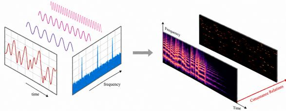  
Figure 1: DS converts spectral energy into a time-frequency map of modeled consonance-dissonance relations.

## Introduction

Music understanding extends beyond detecting acoustic events: listeners also respond to relations among simultaneous frequency components. Beating, critical-band interactions, periodicity, and harmonic organization contribute to consonance, dissonance, stability, tension, and emotion (von Helmholtz 1954; Plomp and Levelt 1965; Langner 1992;

Stolzenburg 2015; Harrison and Pearce 2020). Neural systems learn rich musical information from waveforms, time— frequency representations, and audio-text supervision (Lu et al. 2021; Li et al. 2024; Won, Hung, and Le 2024; Huang et al. 2022; Elizalde et al. 2023; Liu et al. 2024; Deng et al. 2024). Yet spectral magnitude mainly marks active components, while learned embeddings entangle multiple attributes; neither explicitly localizes simultaneous relations under a specified consonance-dissonance model.

Music-specific inductive biases can complement end-toend learning. Chroma and tonal features expose pitch-class organization, perceptual mid-level attributes connect audio to emotion, MERT uses a CQT teacher, and consonanceaware supervision improves chord estimation (Harte, Sandler, and Gasser 2006; Korzeniowski and Widmer 2016; Aljanaki and Soleymani 2018; Chowdhury et al. 2019; Li et al. 2024; Poltronieri, Serra, and Rocamora 2025). Lightweight mode injection likewise benefits symbolic emotion recognition (Xia et al. 2026). These results motivate a relational representation that makes information already present in the signal easier to inspect and learn.

We introduce the Dissonance Spectrum (Figure 1). DS combines tolerance-based rational approximation (Stolzenburg 2015) with logarithmic harmonic distance (Tenney 1984), applies the resulting kernel across a magnitude CQT, and attributes weighted pair relations back to their timefrequency locations. It is a deterministic reorganization of the signal, not an additional observed modality, and is computed efficiently by frequency-axis correlation.

We validate the operator on intervals, chord qualities, functional chord connections, and scales, then add a lightweight DS encoder to MU-LLaMA for open-ended music question answering and to Music2Emo for categorical and dimensional emotion recognition. Parameter-matched Gaussian and architecture-matched magnitude-CQT branches control for added capacity and a second pitch-resolved pathway. Six paired seeds and exploratory mechanism variants test whether gains are consistent with ordered relational structure rather than input resolution or model size alone.

Our contributions are threefold:

• We formulate a nonnegative time-frequency DS that localizes amplitude-weighted rational pitch relations and derive an efficient correlation implementation.

• We establish controlled evidence that the kernel and audio representation reproduce predefined ordinal trends across intervals, chord qualities, functional connections, and modes.

• We design lightweight plug-and-play adapters and show that DS achieves higher six-seed mean performance than the baseline, a parameter-matched Gaussian branch, and an architecture-matched CQT branch in two model families.

## Related Work

Music representations and perceptual priors. The CQT provides a logarithmic frequency axis aligned with musical pitch, chroma folds energy into pitch classes, and tonal-space descriptors encode harmonic proximity (Brown 1991; Harte, Sandler, and Gasser 2006; Müller and Ewert 2011). Neural models learn broader musical attributes: SpecTNT separates spectral and temporal attention, MERT and MusicFM provide transferable music embeddings, and MuLan, CLAP, MU-LLaMA, and MusiLingo connect audio representations to language (Lu et al. 2021; Li et al. 2024; Won, Hung, and Le 2024; Huang et al. 2022; Elizalde et al. 2023; Liu et al. 2024; Deng et al. 2024). These representations are effective for downstream tasks but do not provide a stable, directly inspectable account of local consonance or dissonance. Recent human-written music-QA evaluation further emphasizes robustness to unimodal shortcuts, motivating cautious interpretation of automatically generated references and lexicaloverlap metrics (Weck et al. 2026).

Music-specific priors remain complementary to learned representations. Chroma-based networks improve chord recognition; listener-rated mid-level attributes bridge audio and emotion; MERT uses a CQT teacher; and consonanceaware distances and label smoothing improve chord estimation (Korzeniowski and Widmer 2016; Aljanaki and Soleymani 2018; Chowdhury et al. 2019; Li et al. 2024; Poltronieri, Serra, and Rocamora 2025). DS follows this knowledgeguided direction but is computed continuously from audio and preserves time-frequency attribution.

Consonance perception and computational models. Consonance and dissonance denote related but nonidentical acoustic, perceptual, and music-theoretical concepts (Cazden 1980; Wand 2012). Interference accounts relate sensory dissonance to beating among nearby partials and auditory critical bands (von Helmholtz 1954; Plomp and Levelt 1965; Hutchinson and Knopoff 1978). Periodicity and harmonicity accounts associate consonance with compact common periods, virtual fundamentals, or harmonic templates (Langner 1992; Parncutt 1989; Stolzenburg 2015). Many implementations reduce these relations to a scalar, which supports ranking but does not identify the frequency regions responsible for the value.

Timbre can reshape consonance curves by changing partial locations and amplitudes (Sethares 2005; Marjieh et al. 2024). Comparative modeling and listener studies further indicate that roughness, periodicity, spectral structure, experience, register, and listener characteristics all contribute to consonance judgments (Cousineau, McDermott, and Peretz

2012; Harrison and Pearce 2020; Eerola and Lahdelma 2021; McDermott et al. 2016; Kaklamani and Simserides 2026). We therefore treat DS as a perceptually motivated low-level cue rather than a complete model of musical preference.

Recorded music and consonance-aware music AI. Applying dissonance models to recordings is difficult because real audio contains overlapping sources, transients, noise, tuning variation, and time-varying balance. Schwär, Balke, and Müller (2025) estimate time-varying sensory dissonance in multitrack recordings and attribute mixture-level dissonance to tracks. Scalar roughness descriptors and learned mid-level dissonance ratings have also supported music emotion recognition (Aljanaki and Soleymani 2018; Panda, Malheiro, and Paiva 2023). DS instead attributes aggregate relations to time-frequency bins, requires no stems or chord labels, and can be encoded as an additional input to pretrained music systems.

## Method

## Overview

Our method has two parts. First, the Dissonance Spectrum (DS) assigns each active CQT bin its amplitudeweighted relation to the other active components. A continuous kernel combines tolerance-based rational approximation (Stolzenburg 2015) with Tenney's harmonic distance (Tenney 1984); sampling it on the CQT grid permits efficient one-dimensional frequency correlation instead of a $K \times K \times T$ pair tensor. Second, a lightweight encoder and shape-preserving gated residual adapter inject cached DS maps into a host representation without changing the host outputs, heads, or losses. Zero initialization preserves the pretrained baseline function at the start of fine-tuning. We next define intrinsic and cross-reference DS, derive the correlation form, and describe both host integrations; full index derivations and optional temporal variants are in the supplement.

## Pitch-Relation Kernel

Rational candidates and complexity. For a maximum numerator and denominator Q, the reduced rational candidate set is

$$
\mathcal { R } _ { Q } = \left\{ \frac { p } { q } \bigg | 1 \leq p \leq q \leq Q , p , q \in \mathbb { Z } ^ { + } , \operatorname* { g c d } ( p , q ) = 1 \right\} .\tag{1}
$$

For a reduced ratio, we use the complexity function

$$
C \left( { \frac { p } { q } } \right) = \log _ { 2 } ( p q ) ,\tag{2}
$$

which is the logarithmic product form of Tenney's harmonic distance (Tenney 1984). Here Q is a finite search-resolution hyperparameter rather than a direct estimate of a listener attribute. For visualization only, simplicity is the reversed complexity scale,

$$
S \left( { \frac { p } { q } } \right) = \operatorname* { m a x } _ { r \in { \mathcal { R } } _ { Q } } C ( r ) - C \left( { \frac { p } { q } } \right) .\tag{3}
$$

Given two frequencies, we order their ratio as

$$
r = \frac { \operatorname* { m i n } ( f _ { 1 } , f _ { 2 } ) } { \operatorname* { m a x } ( f _ { 1 } , f _ { 2 } ) } ,\tag{4}
$$

and define the relative-error neighborhood

$$
\begin{array} { r } { \mathcal { N } _ { \alpha } ( r ) = \left\{ { \boldsymbol x } \in \mathbb { R } ^ { + } \vert \vert { \boldsymbol x } - r \vert \leq \alpha r \right\} . } \end{array}\tag{5}
$$

We use $\alpha = . 0 1$ , following the 1% relative tolerance used in Stolzenburg's smoothed periodicity formulation (Stolzenburg 2015). Let

$$
\frac { p ^ { * } } { q ^ { * } } = \arg \operatorname* { m i n } _ { \frac { p } { q } \in \mathcal { R } _ { Q } } \left| r - \frac { p } { q } \right| .\tag{6}
$$

The pairwise value is then

$$
D ( f _ { 1 } , f _ { 2 } ) = \left\{ \begin{array} { l l } { \underset { q \in \mathcal { R } _ { Q } \cap \mathcal { N } _ { \alpha } ( r ) } { \operatorname* { m i n } } C \left( \frac { p } { q } \right) , } & { \mathrm { i f } \mathcal { R } _ { Q } \cap \mathcal { N } _ { \alpha } ( r ) \not = \emptyset , } \\ { C \left( \frac { p ^ { * } } { q ^ { * } } \right) , } & { \mathrm { o t h e r w i s e } . } \end{array} \right.\tag{7}
$$

Thus ratios admitting a simpler approximation inside the tolerance receive a lower value; otherwise the closest candidate is used. This is a periodicity/harmonic-distance cue, not a critical-band roughness model.

Continuous pitch intervals and octave folding. We map pitch to frequency by

$$
\mathrm { f r e q ( p i t c h ) } = 4 4 0 \cdot 2 ^ { \frac { \mathrm { p i t c h - 6 9 } } { 1 2 } }\tag{8}
$$

and evaluate

$$
D _ { \mathrm { i n t e r v a l } } ( \Delta p ) = D \big ( \mathrm { f r e q ( p i t c h } _ { \mathrm { r e f } } + \Delta p ) , \mathrm { f r e q ( p i t c h } _ { \mathrm { r e f } } ) \big ) .
$$

With

(9)

$$
D _ { \mathrm { i n t , m a x } } = \operatorname* { m a x } _ { \Delta p \in [ 0 , 1 2 ) } D _ { \mathrm { i n t e r v a l } } ( \Delta p ) ,\tag{10}
$$

for $\Delta p \in [ 0 , 1 2 )$ , the normalized function is

$$
D _ { \mathrm { n o r m } } ( \Delta p ) = \frac { D _ { \mathrm { i n t e r v a l } } ( \Delta p ) } { D _ { \mathrm { i n t , m a x } } } \in [ 0 , 1 ] .\tag{11}
$$

Let $\delta _ { 1 2 } ( \Delta p ) = | \Delta p |$ mod $1 2 \in [ 0 , 1 2 )$ denote the octavefolded interval magnitude. The resulting even function is

$$
\bar { D } ( \Delta p ) = D _ { \mathrm { n o r m } } \big ( \delta _ { 1 2 } ( \Delta p ) \big ) , \qquad \bar { D } ( 0 ) = 0 .\tag{12}
$$

The continuous pitch argument allows evaluation between equal-tempered bins, while octave folding implements a pitch-chroma assumption. Because pitch height and pitch chroma can both affect perception (Wagner et al. 2022), folding is an explicit modeling choice rather than a claim that register never matters. The resulting curve is shown in the supplement.

## Intrinsic Dissonance Spectrum

CQT representation and preprocessing. Let $\mathbf { X } \in \mathbb { R } _ { > 0 } ^ { K \times T }$ be a magnitude CQT and $\vec { x } ^ { t } = \mathbf { X } ( : , t )$ . With B bins per octave, its pitch and frequency grids are

$$
\vec { p } = \left[ \mathrm { p i t c h } _ { \mathrm { m i n } } + \frac { 1 2 k } { B } \right] _ { k = 0 } ^ { K - 1 } , \qquad \vec { f } = [ \mathrm { f r e q } ( \mathrm { p i t c h } _ { k } ) ] _ { k = 0 } ^ { K - 1 } .\tag{13}
$$

Values below a fixed floor are set to zero, and a local spectralpeak mask may suppress nonpeak bins. We use excerpt-level global-maximum normalization in the downstream experiments and the context-dependent normalization specified for the controlled validation. DS and its magnitude-CQT control always share the same normalization within a comparison.

Amplitude-weighted attribution. Motivated by the pairwise aggregation of spectral partials in dissonance-curve models (Sethares 1994, 2005), we use the simple amplitudeproduct coefficient and pair value

$$
A ( x _ { 1 } , x _ { 2 } ) = x _ { 1 } x _ { 2 } , \qquad \bar { D } ( \Delta p ; x _ { 1 } , x _ { 2 } ) = x _ { 1 } x _ { 2 } \bar { D } ( \Delta p ) .\tag{14}
$$

We define the intrinsic DS element at bin k and frame t as

$$
d _ { k } ^ { t } = \frac { 1 } { K } \sum _ { l = 0 } ^ { K - 1 } x _ { k } ^ { t } x _ { l } ^ { t } \bar { D } ( p _ { l } - p _ { k } ) ,\tag{15}
$$

and collect the frame vectors as

$$
\mathbf { D } = \left[ \vec { d } ^ { 0 } \quad \cdot \cdot \cdot \quad \vec { d } ^ { T - 1 } \right] \in \mathbb { R } ^ { K \times T } .\tag{16}
$$

The factor $1 / K$ averages the K reference-bin contributions. Equation 15 differs from a frame-level scalar: every pair contributes to both participating locations through their own target factors, so the map preserves where the modeled relations occur. All terms are nonnegative; inactive bins have zero attribution.

## Cross-Reference Dissonance Spectrum

The same operator can attribute the relation between a target spectrum  and a separate reference spectrum $\vec { x } ^ { ( \mathrm { r e f } ) }$ . In vector form,

$$
\vec { d } ^ { \vec { x }  \vec { x } ^ { \mathrm { ( r e f ) } } } = \frac { 1 } { K } ( \vec { \mathcal { D } ^ { \pm } } \star _ { \mathrm { v a l i d } , f } \vec { x } ^ { \mathrm { ( r e f ) } } ) \odot \vec { x } .\tag{17}
$$

Here ${ \star } _ { \mathrm { v a l i d } , f }$ denotes the target-aligned valid frequency-axis correlation defined below. Intrinsic DS is the special case $\vec { x } ^ { ( \mathrm { r e f } ) } = \vec { x } . \mathrm { ~ A ~ }$ fixed tonic, chord, or spectral template can instead provide an explicit harmonic reference while the final factor $\bar { \vec { x } }$ preserves attribution to the target bins. Figure 2 contrasts the two constructions.

## Efficient Correlation Form

Because D depends only on pitch difference, the $K ^ { 2 }$ pair table need not be stored. Define the length- $( 2 K - 1 )$ sampled kernel

$$
\begin{array} { r l } & { \mathcal { D } _ { m } ^ { \pm } = \bar { D } \bigg ( \frac { 1 2 m } { B } \bigg ) , } \\ & { ~ m = - ( K - 1 ) , \ldots , K - 1 , \qquad \vec { D ^ { \pm } } \in \mathbb { R } ^ { 2 K - 1 } . } \end{array}\tag{18}
$$

stored in increasing m order, with center $\bar { D } ( 0 ) = 0$ The target-aligned index convention is given in the supplement. Since

$$
\bar { D } ( p _ { l } - p _ { k } ) = \vec { D ^ { \pm } } _ { K + l - k - 1 } ,\tag{19}
$$

Equation 15 becomes

$$
\vec { d } ^ { t } = \frac { 1 } { K } \left( \vec { D ^ { \pm } } \star _ { \mathrm { v a l i d } , f } \vec { x } ^ { t } \right) \odot \vec { x } ^ { t } .\tag{20}
$$

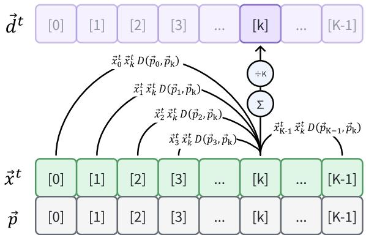

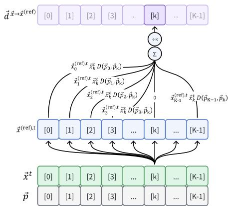  
Figure 2: Conceptual DS attribution. Left: intrinsic DS aggregates pairwise relations within one spectrum. Right: cross-reference DS evaluates the target spectrum against a separate reference while retaining target-bin attribution.

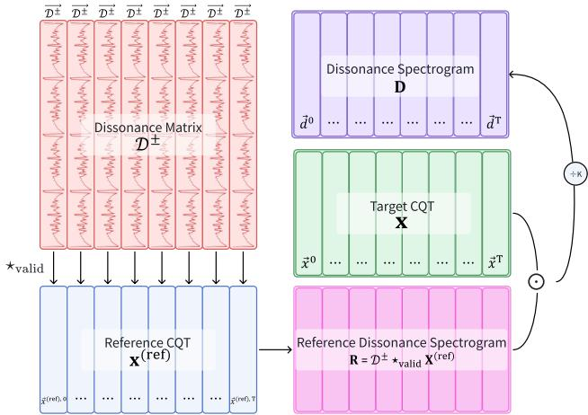  
Figure 3: Frequency-axis matrix implementation of crossreference DS. Intrinsic DS follows by setting the reference and target CQT matrices equal.

For all frames, repeat the same kernel across time as

$$
\mathcal { D } ^ { \pm } = \left[ \vec { \mathcal { D } } ^ { \pm } \quad \vec { \mathcal { D } } ^ { \pm } \quad \cdots \quad \vec { \mathcal { D } } ^ { \pm } \right] \in \mathbb { R } ^ { ( 2 K - 1 ) \times T } ,\tag{21}
$$

and compute

$$
{ \bf D } = \frac { 1 } { K } \left( { \cal D } ^ { \pm } \star _ { \mathrm { v a l i d } , f } { \bf X } \right) \odot { \bf X } .\tag{22}
$$

The correlation is one-dimensional along frequency and returns $K \times T$ values. It avoids the $O ( \breve { K } ^ { 2 } T )$ intermediate storage of direct pairwise attribution and can be batched with standard correlation operators. Figure 3 shows the corresponding matrix computation; the full index derivation and optional temporal variants are included in the supplement.

## Representation Properties and Extraction

Local attribution rather than a scalar score. A conventional spectrum reports energy at (k, t); DS reports how strongly that component participates in the modeled relations of its frame. Unlike a scalar score that collapses register and can only modulate a representation globally, the $\check { K } \times T$ map preserves register and instrumentation cues. A downstream encoder can therefore distinguish a narrow high-valued interaction among upper partials from a broad interaction spanning the bass and midrange. Each high value coincides with nonzero target magnitude and can be traced to the reference components selected by the shifted kernel.

Nonnegativity, symmetry, and translation structure. Nonnegative magnitudes and kernel values make DS nonnegative. The ordered ratio and octave-folded difference make the pair relation symmetric, while the final target factor restores bin-specific attribution. Because coefficients depend on pitch difference rather than absolute bin index, equal intervals share coefficients across register. This translation structure permits cross-correlation and differs from an unconstrained learned two-dimensional filter: before training, the same specified relation is treated consistently throughout the CQT range, subject to octave folding.

Continuous pitch grid. The observed frequency ratio is not quantized to the rational candidate set. Equation 7 selects a candidate within tolerance or the nearest candidate, and Equation 12 is sampled at 12/B-semitone CQT increments. DS therefore responds to detuning, expressive variation, and inharmonic partials rather than only twelve integer pitch classes. The supplement gives qualitative microtonal and timbral examples without assigning a perceptual ranking.

Offline extraction procedure. For each excerpt, we compute magnitude CQT with the shared floor, peak mask, and normalization; sample $\vec { \mathcal { D } } ^ { \pm }$ from $Q , \alpha ,$ and the CQT grid; and evaluate Equation 22. Finite outputs are transformed by log(1 + D) and cached with the audio hash, sample rate, hop, pitch range, B, Q, α, and preprocessing flags. Training retrieves the DS segment at the baseline branch's temporal indices, with deterministic validation and test crops. This avoids repeated spectral computation and ensures that the baseline and DS branches observe the same recording portion.

## Plug-and-Play Augmentation of Music Understanding Models

DS supplements rather than replaces the host waveform encoder or task representation. Let $\mathbf { H } ^ { ( l ) } \in \mathbb { R } ^ { N \times d }$ be the hidden sequence, or a pooled token when $N = 1$ , at insertion layer l. A lightweight encoder maps the cached feature to temporal tokens,

$$
\begin{array} { r } { \mathbf { Z } = E _ { \phi } ( \log ( 1 + \mathbf { D } ) ) \in \mathbb { R } ^ { M \times d _ { s } } , } \end{array}\tag{23}
$$

using convolutional frequency compression followed by temporal convolution or attention. DS tokens share the baseline branch's excerpt indices and valid-frame mask.

A shape-preserving adapter lets the module attach to host representations of different dimensions. The baseline tokens query the DS tokens and receive a gated residual update:

$$
\mathbf { C } = \mathrm { s o f t m a x } \left( \frac { ( \mathbf { H } ^ { ( l ) } \mathbf { W } _ { Q } ) ( \mathbf { Z } \mathbf { W } _ { K } ) ^ { \top } } { \sqrt { d _ { a } } } \right) ( \mathbf { Z } \mathbf { W } _ { V } ) ,\tag{24}
$$

$$
\mathbf { G } = \sigma \Big ( \mathbf { W } _ { G } [ \mathbf { H } ^ { ( l ) } ; \mathbf { C } ] + \mathbf { b } _ { G } \Big ) ,\tag{25}
$$

$$
\widetilde { \mathbf { H } } ^ { ( l ) } = \mathbf { H } ^ { ( l ) } + \mathbf { G } \odot ( \mathbf { C } \mathbf { W } _ { O } ) .\tag{26}
$$

When $N = 1$ , the same equations give a pooled adapter. The unchanged output shape preserves the decoder, heads, losses, and evaluation. We initialize $\mathbf { W } _ { O }$ to zero and bG negatively, SO $\widetilde { \mathbf { H } } ^ { ( l ) } = \mathbf { H } ^ { ( l ) }$ initially. Disabling the branch recovers the baseline checkpoint without conversion. Independent extraction, shape-preserving insertion, and exact fallback define the plug-and-play property.

For MU-LLaMA, the 576-bin map is pooled to 144 channels and processed by three convolutional blocks, a 128- dimensional temporal encoder, depthwise temporal convolution, and single-head attention. The pooled adapter follows the original audio projection while MERT and LLaMA remain frozen. For Music2Emo, temporal DS tokens are queried after the unchanged 512-dimensional projection of MERT, chord, and key-mode features, before the original emotion heads. Figure 4 shows both insertion paths and frozen versus trainable modules.

To control for adding capacity or a second pitch-resolved pathway, the CQT and Gaussian conditions reuse the same encoder, fusion point, output dimension, and trainableparameter budget. They replace D with the aligned normalized magnitude CQT or a fixed random input, respectively.

Interpretive scope. DSoperationalizes one periodicity/harmonic-distance-inspired relation and its amplitude-weighted localization. It does not explicitly model auditory-filter bandwidths, masking, learned tonal syntax, or cultural preference. The task experiments therefore test whether this representation is useful as an inductive bias, not whether it is a complete perceptual theory of consonance.

## Experiments

## Experimental Setup

Implementation, compute, and reproducibility. Controlled calculations are deterministic and parameter-free. Py-Torch downstream systems run on a Slurm-managed Linux cluster with one NVIDIA A100 per job and no multi-GPU parallelism. CQT and DS features are extracted once per exact excerpt, cached with metadata, and reused across conditions; the submitted environment lock records software and pretrained-model revisions.

Table 1: Controlled validation. Parentheses give two-sided p-values; the four-class row is an ordering check.
<table><tr><td>Test</td><td>n</td><td>Spearman ρ</td><td>Kendall  $\tau _ { b }$ </td></tr><tr><td>Intervals</td><td>13</td><td> $9 5 1 ( 6 . 3 6 \times 1 0 ^ { - 7 } )$ </td><td> $. 8 4 6 ( 5 . 2 0 \times 1 0 ^ { - 6 } )$ </td></tr><tr><td>Chord quality (4 exemplars)</td><td>4</td><td>1.000 (−)</td><td>1.000 (−)</td></tr><tr><td>Chord quality (13 voicings)</td><td>13</td><td>.626 (.022)</td><td>.462 (.030)</td></tr><tr><td>Functional connections</td><td>7</td><td>.794 (.033)</td><td>.655 (.054)</td></tr><tr><td>Church modes</td><td>7</td><td>.893 (.0068)</td><td>.810 (.0107)</td></tr></table>

We use paired seeds {17, 42, 101, 2025, 2026, 3407}. Within each dataset and seed, all four conditions share splits, excerpts, masks, minibatch order, optimization, early stopping, checkpoint selection, and evaluation; random generators use the listed seed. Except for PMEmo's released chorus clips, inputs are $2 4 \mathrm { - k H z } ,$ 45-second excerpts with zero padding or one deterministic crop shared by all branches. CQT uses a 1,024-sample hop, eight octaves, 72 bins per octave, $f _ { \mathrm { m i n } } ~ = ~ \mathrm { C 1 }$ , and 576 bins; DS applies the proposed transform and $\log ( 1 + \mathbf { D } )$ . Primary endpoints are BERTScore-R for MusicQA and $\overline { { R ^ { 2 } } } _ { \mathrm { V A } }$ , the mean of six valence/arousal $R ^ { 2 }$ values, for Music2Emo. Tests use unrounded seed-level values.

## Controlled Music-Theory Validation

We first test whether the relation operator recovers controlled musical structure from rendered piano audio: 13 dyads from unison through the octave, four representative and 13 extended chord voicings, seven diatonic connections to C major, and seven church modes. CQT uses 22.05 kHz audio, four frames per second, eight octaves, 72 bins per octave, $f _ { \mathrm { m i n } } = \mathrm { C 1 }$ , and $K = 5 7 6 ;$ the rational search uses $Q = 6 0$ and $\alpha = . 0 1$ . Intervals and scales use a C4 reference, chord qualities equally average tonic-reference and intrinsic DS, and connections use C major. These settings test the same operator under phenomenon-specific reference contexts; downstream models use intrinsic DS.

Interval, chord, and connection maps are reduced to $\begin{array} { r } { D _ { \operatorname* { m a x } } = \operatorname* { m a x } _ { t } \sum _ { k } \mathbf { D } ( k , t ) } \end{array}$ ; sequential scales use $D _ { \mathrm { s u m } } =$ $\begin{array} { r } { \sum _ { t } \sum _ { k } \mathbf { D } ( k , t ) } \end{array}$ . Spearman $\rho$ and Kendall $\tau _ { b }$ compare these summaries with predefined orders. The interval order broadly agrees with classic dyad studies (Malmberg 1918; Schwartz, Howe, and Purves 2003); chord, function, and mode orders are theory-derived hypotheses, so they test internal musictheoretical consistency rather than population-level perception.

Intervals show the strongest agreement: $\mathrm { C - C \sharp }$ is maximal, the tritone is high, and the perfect fifth and octave are among the lowest (Figure 5). Audio DS maxima track both the sampled curve and predefined ranks. Four chord exemplars follow major $< \mathrm { m i n o r } <$ suspended < diminished; across 13 voicings the positive but nonmonotonic association reflects spacing and inversion rather than chord labels alone. Tonic-function connections are generally below predominant and dominant connections, while Ionian is near the low end and Locrian highest among modes, with local reversals. Item values, spectral maps, loudness sensitivity, timbre, and microtonal analyses are in the supplement.

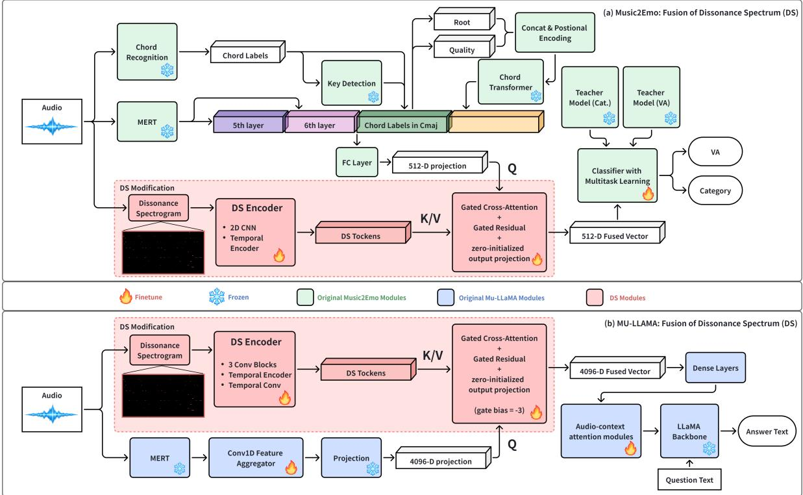  
Figure 4: Plug-and-play DS integration in Music2Emo (top) and MU-LLaMA (bottom). The DS branch provides key/value tokens to a gated residual adapter while the original projection provides the query; snowflakes and flames mark frozen and fine-tuned modules.

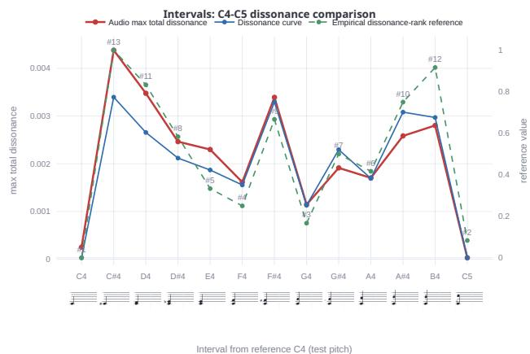  
Figure 5: Interval validation: audio DS maxima align with the sampled dissonance curve and the predefined rank reference.

Table 2: MusicQA results over six paired training seeds (mean±SD). ∆ is DS minus Baseline.
<table><tr><td>Metric</td><td>Baseline</td><td>Gaussian</td><td>CQT</td><td>DS</td><td>∆</td></tr><tr><td>BLEU ↑</td><td>.2987±.0019</td><td>.2985±.0019</td><td>.3056±.0015</td><td>.3074±.0014</td><td>+.0087</td></tr><tr><td>METEOR ↑</td><td>.3761±.0017</td><td>.3759±.0018</td><td>.3838±.0014</td><td>.3857±.0013</td><td>+.0096</td></tr><tr><td>ROUGE-L ↑</td><td>.4556±.0018</td><td>.4554±.0019</td><td>.4643±.0016</td><td>.4671±.0015</td><td>+.0115</td></tr><tr><td>BERTScore-R ↑</td><td>.8952±.0007</td><td>.8950±.0006</td><td>.8996±.0006</td><td>.9024±.0015</td><td>+.0072</td></tr><tr><td>Test loss ↓</td><td>.625±.004</td><td>.626±.004</td><td>.607±.003</td><td>.600±.002</td><td>-.025</td></tr><tr><td>Perplexity ↓</td><td>1.868±.008</td><td>1.870±.008</td><td>1.836±.005</td><td>1.822±.004</td><td>-.046</td></tr></table>

## Music Question Answering

Protocol. MU-LLaMA is fine-tuned on 70,011 questionanswer pairs from 7,779 tracks and evaluated on 5,040 pairs from 560 audio-disjoint MTG-Jamendo tracks. All conditions use frozen LLaMA-2 7B and MERT-v1-330M with the released initialization (Touvron et al. 2023; Li et al. 2024; Liu et al. 2024). The Baseline has 4.21M trainable parameters; each matched branch has 5.57M. BF16 AdamW uses gradient accumulation to an effective batch of 32, at most four epochs, and validation-loss early stopping; the best checkpoint is evaluated once on the held-out set. One fixed evaluator reports BLEU, METEOR, ROUGE-L, BERTScore-R, loss, and perplexity (Papineni et al. 2002; Banerjee and Lavie 2005; Lin 2004; Zhang et al. 2020); exact tokenization, generation, and package settings are in the supplement.

DS has the highest six-seed mean on every MusicQA metric. BERTScore-R increases by .0072 over Baseline, .0074 over Gaussian, and .0028 over CQT, with positive paired differences for all six seeds. The largest Holm-adjusted pairedt p-value is .0017, but the exact two-sided sign test gives .03125 per comparison and .09375 after Holm correction across the three DS-versus-control comparisons. We therefore emphasize repeated-seed direction and effect size, not familywise distribution-free significance. Text metrics measure reference similarity rather than factual musical understanding.

Table 3: Music2Emo results over six paired seeds. J-PR/J-ROC are macro tag averages; V/A denote valence/arousal $R ^ { 2 } .$ Only $\overline { { R ^ { 2 } } } _ { \mathrm { V A } }$ reports mean±SD.
<table><tr><td>Metric</td><td>Baseline</td><td>Gaussian</td><td>CQT</td><td>DS</td></tr><tr><td>J-PR</td><td>.1539</td><td>.1537</td><td>.1564</td><td>.1580</td></tr><tr><td>J-ROC</td><td>.7806</td><td>.7801</td><td>.7828</td><td>.7841</td></tr><tr><td>DEAM-V</td><td>.5169</td><td>.5164</td><td>.5272</td><td>.5355</td></tr><tr><td>DEAM-A</td><td>.6209</td><td>.6202</td><td>.6260</td><td>.6291</td></tr><tr><td>Emo-V</td><td>.6487</td><td>.6479</td><td>.6575</td><td>.6642</td></tr><tr><td>Emo-A</td><td>.7598</td><td>.7590</td><td>.7642</td><td>.7668</td></tr><tr><td>PM-V</td><td>.5451</td><td>.5445</td><td>.5532</td><td>.5587</td></tr><tr><td>PM-A</td><td>.7926</td><td>.7920</td><td>.7970</td><td>.7992</td></tr><tr><td> $\overline { { R ^ { 2 } } } _ { \mathrm { V A } }$ </td><td>.6473±.0014</td><td>.6467±.0014</td><td>.6542±.0016</td><td>.6589±.0018</td></tr></table>

## Music Emotion Recognition

Model and data. Music2Emo projects MERT layers five and six, chord features, and key mode to 512 dimensions before the DS adapter (Kang and Herremans 2025). The Baseline task network has 1.07M trainable parameters; each matched branch adds 0.21M while the 95M-parameter MERT remains frozen. We retain the official MTG-Jamendo split (Bogdanov et al. 2019) and fixed 70/15/15 track splits for DEAM, EmoMusic, and PMEmo (Aljanaki, Yang, and Soleymani 2017; Soleymani et al. 2013; Zhang et al. 2018; Kang and Herremans 2025). Weighted binary cross-entropy covers 56 tags, and mean squared error covers valence and arousal. All conditions share the knowledge-distillation objective, Adam at 10−4, early stopping, and checkpoint rule; details are in the supplement.

DS has the highest mean on every Music2Emo endpoint. $\overline { { R ^ { 2 } } } _ { \mathrm { V A } }$ increases by .0116 over Baseline, .0122 over Gaussian, and .0047 over CQT, with positive differences for all six seeds. The Holm-adjusted exact sign-test value is .09375, so we again emphasize direction and effect size. Average valence $\scriptstyle { \bar { R ^ { 2 } } }$ rises from .5702 to .5861, and arousal $R ^ { 2 }$ from .7244 to .7317. CQT is second; the further DS gain is consistent with useful pairwise organization, although compression and normalization differences mean the comparison does not isolate the relation transform alone.

## Conclusion

This work addresses a gap between energy-based spectra and latent learned representations by making one class of simultaneous frequency relations explicit. As a spectrogram reorganizes a waveform without adding a new observation, DS reorganizes magnitude information so that modeled pair relations become directly visible to both researchers and downstream encoders. It applies a continuous, tolerancebased harmonic-distance kernel to magnitude CQT, localizes amplitude-weighted pair relations in time and frequency, and avoids a quadratic pair tensor through frequency-axis correlation. A shape-preserving, zero-initialized adapter then adds this representation to existing systems without changing their output interfaces or baseline function at initialization. Controlled tests recovered strong ordinal agreement for intervals, functional connections, and church modes, with moderate positive agreement across diverse chord voicings. Across six paired seeds, DS also achieved the highest mean on every reported MusicQA and Music2Emo endpoint relative to the baseline, a parameter-matched Gaussian branch, and an architecture-matched magnitude-CQT branch. The Gaussian control indicates that capacity alone is insufficient, while the smaller advantage over magnitude CQT suggests value beyond an added pitch-resolved pathway, within the stated compression and normalization caveat. Together, these results support explicit relational structure as a useful and inspectable complement to learned music representations.

Beyond aggregate scores, the retained time-frequency layout gives DS a diagnostic role that scalar dissonance summaries cannot provide. Researchers can inspect when and where a modeled relation is concentrated, while the crossreference construction can condition that attribution on an explicit tonic, chord, or spectral template. Because extraction is deterministic and cached, and the adapter preserves host shapes and offers exact fallback, the representation can be evaluated alongside existing systems without replacing their audio encoders. These properties make DS a concrete basis for theory-conditioned probing and model comparison, although their practical value outside the evaluated tasks remains to be tested.

The evidence does not establish DS as a complete model of consonance or musical preference. The kernel encodes one periodicity/harmonic-distance prior with deliberate octave folding and omits auditory-filter bandwidths, masking, tonal syntax, harsh high-frequency content, rhythmic tension, and culturally or individually learned preference. The controlled rankings are partly theory-derived, no new listening study was conducted, and automatic MusicQA references measure similarity rather than factual or expert-level harmonic reasoning. Evaluation is also limited to two host families and does not fully isolate the relation transform from branch-input compression and normalization. Future work should package the extraction and visualization pipeline as a reusable library, calibrate the representation with listener data and individual perceptual variation, and test its transfer to broader audio and symbolic tasks such as generation, style analysis, and standardized symbolic dissonance encoding.

## References

Aljanaki, A.; and Soleymani, M. 2018. A Data-Driven Approach to Mid-Level Perceptual Musical Feature Modeling. In Proceedings of the 19th International Society for Music Information Retrieval Conference, 615–621.

Aljanaki, A.; Yang, Y.-H.; and Soleymani, M. 2017. Developing a Benchmark for Emotional Analysis of Music. PLOS ONE, 12(3): e0173392.

Banerjee, S.; and Lavie, A. 2005. METEOR: An Automatic Metric for MT Evaluation with Improved Correlation with Human Judgments. In Proceedings of the ACL Workshop on Intrinsic and Extrinsic Evaluation Measures for Machine Translation and/or Summarization, 65–72.

Bogdanov, D.; Won, M.; Tovstogan, P.; Porter, A.; and Serra, X. 2019. The MTG-Jamendo Dataset for Automatic Music Tagging. In Machine Learning for Music Discovery Workshop at the 36th International Conference on Machine Learning.

Brown, J. C. 1991. Calculation of a Constant-Q Spectral Transform. The Journal of the Acoustical Society of America, 89(1): 425–434.

Cazden, N. 1980. The Definition of Consonance and Dissonance. International Review of the Aesthetics and Sociology of Music, 11(2): 123–168.

Chowdhury, S.; Vall, A.; Haunschmid, V.; and Widmer, G. 2019. Towards Explainable Music Emotion Recognition: The Route via Mid-Level Features. In Proceedings of the 20th International Society for Music Information Retrieval Conference, 237–243.

Cousineau, M.; McDermott, J. H.; and Peretz, I. 2012. The Basis of Musical Consonance as Revealed by Congenital Amusia. Proceedings of the National Academy of Sciences, 109(48): 19858–19863.

Deng, Z.; Ma, Y.; Liu, Y.; Guo, R.; Zhang, G.; Chen, W.; Huang, W.; and Benetos, E. 2024. MusiLingo: Bridging Music and Text with Pre-trained Language Models for Music Captioning and Query Response. In Findings of the Association for Computational Linguistics: NAACL 2024, 3643-3655.

Eerola, T.; and Lahdelma, I. 2021. The Anatomy of Consonance/Dissonance: Evaluating Acoustic and Cultural Predictors Across Multiple Datasets with Chords. Music & Science, 4: 1–19.

Elizalde, B.; Deshmukh, S.; Al Ismail, M.; and Wang, H. 2023. CLAP: Learning Audio Concepts from Natural Language Supervision. In Proceedings of the IEEE International Conference on Acoustics, Speech and Signal Processing, 1– 5.

Harrison, P. M. C.; and Pearce, M. T. 2020. Simultaneous Consonance in Music Perception and Composition. Psychological Review, 127(2): 216–244.

Harte, C.; Sandler, M.; and Gasser, M. 2006. Detecting Harmonic Change in Musical Audio. In Proceedings of the 1st ACM Workshop on Audio and Music Computing Multimedia, 21–26.

Huang, Q.; Jansen, A.; Lee, J.; Ganti, R.; Li, J. Y.; and Ellis, D. P. W. 2022. MuLan: A Joint Embedding of Music Audio and Natural Language. In Proceedings of the 23rd International Society for Music Information Retrieval Conference, 559–566.

Hutchinson, W.; and Knopoff, L. 1978. The Acoustic Component of Western Consonance. Interface, 7(1): 1–29.

Kaklamani, S.; and Simserides, C. 2026. Psychoacoustic Study of Simple-Tone Dyads: Frequency Ratio and Pitch. Acoustics, 8(1): 14.

Kang, J.; and Herremans, D. 2025. Towards Unified Music Emotion Recognition across Dimensional and Categorical Models. arXiv:2502.03979.

Korzeniowski, F.; and Widmer, G. 2016. Feature Learning for Chord Recognition: The Deep Chroma Extractor. In Proceedings of the 17th International Society for Music Information Retrieval Conference, 37–43.

Langner, G. 1992. Periodicity Coding in the Auditory System. Hearing Research, 60(2): 115–142.

Li, Y.; Yuan, R.; Zhang, G.; Ma, Y.; Chen, X.; Yin, H.; Xiao C.; Lin, C.; Ragni, A.; Benetos, E.; Gyenge, N.; Dannenberg, R. B.; Liu, R.; Chen, W.; Xia, G.; Shi, Y.; Huang, W.; Wang, Z.; Guo, Y.; and Fu, J. 2024. MERT: Acoustic Music Understanding Model with Large-Scale Self-Supervised Training. In International Conference on Learning Representations.

Lin, C.-Y. 2004. ROUGE: A Package for Automatic Evaluation of Summaries. In Text Summarization Branches Out, 74–81.

Liu, S.; Hussain, A. S.; Sun, C.; and Shan, Y. 2024. Music Understanding LLaMA: Advancing Text-to-Music Generation with Question Answering and Captioning. In Proceedings of the IEEE International Conference on Acoustics, Speech and Signal Processing, 286–290.

Lu, W.-T.; Wang, J.-C.; Won, M.; Choi, K.; and Song, X. 2021. SpecTNT: A Time-Frequency Transformer for Music Audio. In Proceedings of the 22nd International Society for Music Information Retrieval Conference, 396–403.

Malmberg, C. F. 1918. The Perception of Consonance and Dissonance. Psychological Monographs, 25(2): 93–133.

Marjieh, R.; Harrison, P. M. C.; Lee, H.; Deligiannaki, F.; and Jacoby, N. 2024. Timbral Effects on Consonance Disentangle Psychoacoustic Mechanisms and Suggest Perceptual Origins for Musical Scales. Nature Communications, 15: 1482.

McDermott, J. H.; Schultz, A. F.; Undurraga, E. A.; and Godoy, R. A. 2016. Indifference to Dissonance in Native Amazonians Reveals Cultural Variation in Music Perception. Nature, 535(7613): 547–550.

Müller, M.; and Ewert, S. 2011. Chroma Toolbox: Matlab Implementations for Extracting Variants of Chroma-Based Audio Features. In Proceedings of the 12th International Society for Music Information Retrieval Conference, 215— 220.

Panda, R.; Malheiro, R.; and Paiva, R. P. 2023. Audio Features for Music Emotion Recognition: A Survey. IEEE Transactions on Affective Computing, 14(1): 68–88.

Papineni, K.; Roukos, S.; Ward, T.; and Zhu, W.-J. 2002. BLEU: A Method for Automatic Evaluation of Machine Translation. In Proceedings of the 40th Annual Meeting of the Association for Computational Linguistics, 311–318.

Parncutt, R. 1989. Harmony: A Psychoacoustical Approach. Berlin: Springer-Verlag.

Plomp, R.; and Levelt, W. J. M. 1965. Tonal Consonance and Critical Bandwidth. The Journal of the Acoustical Society of America, 38(4): 548–560.

Poltronieri, A.; Serra, X.; and Rocamora, M. 2025. From Discord to Harmony: Decomposed Consonance-Based Training for Improved Audio Chord Estimation. In Proceedings of the 26th International Society for Music Information Retrieval Conference, 492–502. Daejeon, South Korea.

Schwär, S.; Balke, S.; and Müller, M. 2025. Measuring Sensory Dissonance in Multi-Track Music Recordings: A Case Study with Wind Quartets. In Proceedings of the 26th International Society for Music Information Retrieval Conference, 117–126. Daejeon, South Korea.

Schwartz, D. A.; Howe, C. Q.; and Purves, D. 2003. The Statistical Structure of Human Speech Sounds Predicts Musical Universals. The Journal of Neuroscience, 23(18): 7160– 7168.

Sethares, W. A. 1994. Adaptive Tunings for Musical Scales. The Journal of the Acoustical Society of America, 96(1): 10-18.

Sethares, W. A. 2005. Tuning, Timbre, Spectrum, Scale. London: Springer, 2 edition.

Soleymani, M.; Caro, M. N.; Schmidt, E. M.; Sha, C.-Y.; and Yang, Y.-H. 2013. 1000 Songs for Emotional Analysis of Music. In Proceedings of the 2nd ACM International Workshop on Crowdsourcing for Multimedia, 1–6.

Stolzenburg, F. 2015. Harmony Perception by Periodicity Detection. Journal of Mathematics and Music, 9(3): 215– 238.

Tenney, J. 1984. John Cage and the Theory of Harmony. In Garland, P., ed., Soundings 13: The Music of James Tenney, 55–83. Santa Fe, New Mexico: Soundings Press.

Touvron, H.; Martin, L.; Stone, K.; Albert, P.; Almahairi, A.; Babaei, Y.; Bashlykov, N.; Batra, S.; Bhargava, P.; Bhosale, S.; et al. 2023. Llama 2: Open Foundation and Fine-Tuned Chat Models. arXiv preprint arXiv:2307.09288.

von Helmholtz, H. L. F. 1954. On the Sensations of Tone as a Physiological Basis for the Theory of Music. New York: Dover Publications. Second English edition, translated by Alexander J. Ellis; original German work published in 1863.

Wagner, B.; Czoschke, S.; Tillmann, B.; Koelsch, S.; Vuust, P.; and Brattico, E. 2022. Pitch Chroma Information Is Processed in Addition to Pitch Height Information with More Than Two Pitch-Range Categories. Attention, Perception, & Psychophysics, 84(5): 1757–1771.

Wand, A. 2012. On the Conception and Measure of Consonance. Leonardo Music Journal, 22: 73–78.

Weck, B.; Puentes, P.; Poltronieri, A.; Prabhu, S.; and Bogdanov, D. 2026. HumMusQA: A Human-written Music Understanding QA Benchmark Dataset. In Proceedings of the

4th Workshop on NLP for Music and Audio (NLP4MusA 2026), 58–67. Rabat, Morocco: Association for Computational Linguistics.

Won, M.; Hung, Y.-N.; and Le, D. 2024. A Foundation Model for Music Informatics. In Proceedings of the IEEE International Conference on Acoustics, Speech and Signal Processing, 1226–1230.

Xia, H.; Huang, Z.; Tan, Y.; and Song, S. 2026. Let the Model Learn to Feel: Mode-Guided Tonality Injection for Symbolic Music Emotion Recognition. Proceedings of the AAAI Conference on Artificial Intelligence, 40(3): 2182–2190.

Zhang, K.; Zhang, H.; Li, S.; Yang, C.; and Sun, L. 2018. The PMEmo Dataset for Music Emotion Recognition. In Proceedings of the 2018 ACM International Conference on Multimedia Retrieval, 135–142.

Zhang, T.; Kishore, V.; Wu, F.; Weinberger, K. Q.; and Artzi, Y. 2020. BERTScore: Evaluating Text Generation with BERT. In International Conference on Learning Representations.

# Supplementary Material: Beyond Frequency: Dissonance Spectrum for Perceptually Motivated Music Understanding

Tianle Wang1,2, Xinyi Tong1,2, Liangke Zhao1,2, Jishang CHEN1,2, Sirui Zhang1,2, Haoxin Zhang1,2 9 Xin Jin1, Duo XU1, Xiaobing Li2, Song-Chun Zhu1,3

1Beijing Institute for General Artificial Intelligence, Beijing, China 2Central Conservatory of Music, Beijing, China 3Peking University, Beijing, China

## Reproducibility Package

The separately submitted Code and Data Archive contains the DS implementation, extraction configuration, cached-feature metadata schema, fixed dataset manifests, audio hashes, training configurations, environment lock files, checkpointselection rules, evaluation scripts, seed-level predictions, and scripts that regenerate every reported table. It includes scripts and instructions for obtaining public datasets and pretrained models from their cited official sources. The archive is packaged without author-identifying repository metadata.

## Full Derivation and Extensions of Dissonance Spectrum

This section records the complete algebra and optional variants underlying the concise main-paper description and clarifies implementation shapes and experimental conventions.

## Preprocessing Conventions

Let $\mathbf { X } ( k , t )$ denote the magnitude $\mathbf { C Q T } , \vec { x } ^ { t } = \mathbf { X } ( : , t ) \in$ $\mathbb { R } ^ { K }$ , and $x _ { k } ^ { t } = \mathbf { X } ( k , t )$ . The denoising and peak-selection operators are

$$
\mathbf { X } _ { \mathrm { d e n o i s e d } } ( k , t ) = \mathbf { X } ( k , t ) \cdot \mathbf { 1 } \left( \mathbf { X } ( k , t ) \geq \theta \right) ,\tag{1}
$$

$$
\vec { x } _ { \mathrm { p e a k } } ^ { t } = \vec { x } ^ { t } \odot \left[ \mathbf { 1 } \left( x _ { k } ^ { t } \mathrm { i s } \mathrm { a p e a k p o i n t i n } \vec { x } ^ { t } \right) \right] _ { k = 0 } ^ { K - 1 } .\tag{2}
$$

Two normalization choices are useful in different settings:

$$
\begin{array} { r l } { m ( t ) = \displaystyle \operatorname* { m a x } _ { k } x _ { k } ^ { t } , ~ } & { { } \vec { x } _ { \mathrm { f r a m e } } ^ { t } = \vec { x } ^ { t } / m ( t ) , } \\ { m = \displaystyle \operatorname* { m a x } _ { k , t } x _ { k } ^ { t } , } & { { } \mathbf { X } _ { \mathrm { g l o b a l } } = \mathbf { X } / m . } \end{array}\tag{3}
$$

The downstream model comparisons use excerpt-level global-maximum normalization m, matching the magnitude-CQT control and avoiding framewise loudness equalization. The controlled music-theory tests instead use the contextwindow normalization described below, with target and reference spectra normalized separately. Each comparison uses one fixed convention recorded in its configuration.

## Direct Pairwise Form

The intrinsic element is

$$
d _ { k } ^ { t } = \frac { 1 } { K } \sum _ { l = 0 } ^ { K - 1 } x _ { k } ^ { t } x _ { l } ^ { t } \bar { D } ( p _ { l } - p _ { k } ) ,\tag{4}
$$

and the complete representation is

$$
{ \bf D } = \left[ \vec { d } ^ { 0 } \quad \vec { d } ^ { 1 } \quad \cdot \cdot \cdot \quad \vec { d } ^ { T - 1 } \right] \in \mathbb { R } ^ { K \times T } .\tag{5}
$$

The factor $1 / K$ averages the reference-bin contributions and removes their direct linear count factor under otherwise matched grids; it is not a guarantee of invariance to CQT resolution. The direct pair-attribution concept is visualized in the main paper.

## Index Derivation of the Correlation Form

The CQT pitch grid and the zero-indexed stored relation vector are

$$
\begin{array} { r l r } & { } & { p _ { k } = \mathrm { p i t c h } _ { \operatorname* { m i n } } + \displaystyle \frac { 1 2 k } { B } , \qquad k = 0 , \dots , K - 1 , \quad ( 6 ) } \\ & { } & { \left[ \vec { D ^ { \pm } } \right] _ { j } = \bar { D } \left( \displaystyle \frac { 1 2 ( j - K + 1 ) } { B } \right) , \qquad j = 0 , \dots , 2 K - 2 . } \end{array}\tag{7}
$$

Because the kernel depends only on pitch difference,

$$
\bar { D } ( p _ { l } - p _ { k } ) = \vec { D ^ { \pm } } _ { K + l - k - 1 } .\tag{8}
$$

For a length- $\left( 2 K - 1 \right)$ vector $\vec { a }$ and a length-K vector $\vec { b , }$ the implementation uses the target-aligned convention

$$
[ \vec { a } \star _ { \mathrm { v a l i d } , f } \vec { b } ] _ { k } = \sum _ { l = 0 } ^ { K - 1 } a _ { K + l - k - 1 } b _ { l } , \quad k = 0 , \ldots , K - 1 .\tag{9}
$$

With increasing-lag storage, this equals a standard valid cross-correlation followed by a fixed frequency-axis reversal; an equivalent lag-reversed layout avoids the explicit reversal. Consequently,

$$
\begin{array} { r } { d _ { k } ^ { t } = \displaystyle \frac { 1 } { K } x _ { k } ^ { t } \sum _ { l = 0 } ^ { K - 1 } x _ { l } ^ { t } \bar { D } ( p _ { l } - p _ { k } ) } \\ { = \displaystyle \frac { 1 } { K } x _ { k } ^ { t } \sum _ { l = 0 } ^ { K - 1 } x _ { l } ^ { t } \mathcal { D } _ { K + l - k - 1 } ^ { \pm } . } \end{array}\tag{10}
$$

(11)

Sliding the complete relation vector over the CQT gives the reference-relation frame

$$
\vec { r } ^ { t } = \vec { D ^ { \pm } } \star _ { \mathrm { v a l i d } , f } \vec { x } ^ { t } ,\tag{12}
$$

and therefore

$$
\vec { d } ^ { t } = \frac { 1 } { K } \vec { r } ^ { t } \odot \vec { x } ^ { t } = \frac { 1 } { K } \left( \vec { \mathcal { D } ^ { \pm } } \star _ { \mathrm { v a l i d } , f } \vec { x } ^ { t } \right) \odot \vec { x } ^ { t } .\tag{13}
$$

Figure 1 visualizes the index alignment. Equation 9 is applied independently at every time frame and returns the K target locations in their original frequency order.

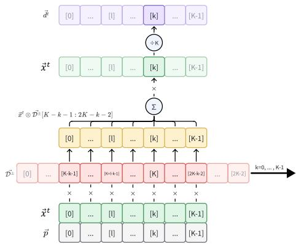  
Figure 1: Index alignment for the frequency-axis correlation form of intrinsic DS.

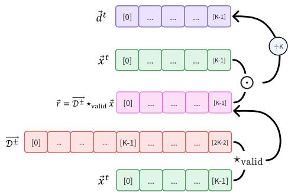  
Figure 2: Vectorized intrinsic-DS computation after replacing the explicit pairwise sum by valid correlation.

## Cross Dissonance Spectrum

For target $\vec { x }$ and an arbitrary reference spectrum ${ \vec { x } } ^ { ( \mathrm { r e f } ) }$ , the cross-spectrum is

$$
\begin{array} { r } { d _ { k } ^ { \vec { x }  \vec { x } ^ { \mathrm { ( r e f ) } } } = \displaystyle \frac { 1 } { K } \sum _ { l = 0 } ^ { K - 1 } x _ { k } x _ { l } ^ { \mathrm { ( r e f ) } } \bar { D } ( p _ { l } - p _ { k } ) } \\ { = \displaystyle \frac { 1 } { K } x _ { k } \sum _ { l = 0 } ^ { K - 1 } x _ { l } ^ { \mathrm { ( r e f ) } } \mathcal { D } _ { K + l - k - 1 } ^ { \pm } . } \end{array}\tag{14}
$$

(15)

Its reusable reference map and final attribution are

$$
\vec { r } = \vec { D ^ { \pm } } \star _ { \mathrm { v a l i d } , f } \vec { x } ^ { ( \mathrm { r e f } ) } ,\tag{16}
$$

$$
\vec { d } ^ { \vec { x }  \vec { x } ^ { \mathrm { ( r e f ) } } } = \frac { 1 } { K } ( \vec { \mathcal { D } ^ { \pm } } \star _ { \mathrm { v a l i d } , f } \vec { x } ^ { \mathrm { ( r e f ) } } ) \odot \vec { x } .\tag{17}
$$

Intrinsic DS is the special case $\vec { x } ^ { ( \mathrm { r e f } ) } = \vec { x } . \mathbf { A }$ fixed reference may instead encode a tonic template or an instrument tone.

Figure 3 shows the corresponding cross-reference computation.

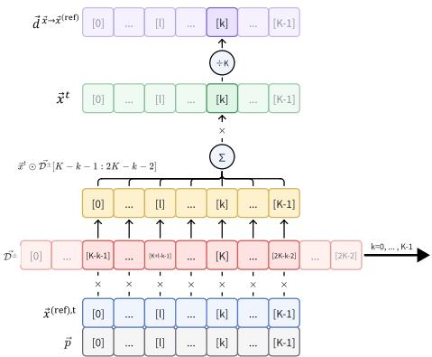  
Figure 3: Index alignment for cross-DS correlation using a fixed or time-varying reference spectrum.

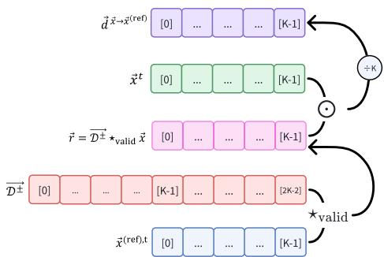  
Figure 4: Vectorized cross-DS computation using a reusable reference-relation vector.

## Matrix and Temporal Variants

Repeating the same relation vector across time gives

$$
\mathcal { D } ^ { \pm } = \left[ \vec { \mathcal { D } } ^ { \pm } \quad \vec { \mathcal { D } } ^ { \pm } \quad \cdots \quad \vec { \mathcal { D } } ^ { \pm } \right] \in \mathbb { R } ^ { ( 2 K - 1 ) \times T } .\tag{18}
$$

For a general reference CQT,

$$
{ \bf R } = { \mathcal { D } ^ { \pm } } \star _ { \mathrm { v a l i d } , f } { \bf X } ^ { \mathrm { ( r e f ) } } ,\tag{19}
$$

$$
\mathbf { D } = \frac { 1 } { K } \mathbf { R } \odot \mathbf { X } = \frac { 1 } { K } ( \mathcal { D } ^ { \pm } \star _ { \mathrm { v a l i d } , f } \mathbf { X } ^ { \mathrm { ( r e f ) } } ) \odot \mathbf { X } .\tag{20}
$$

Both R and D have shape $K \times T$ under the frequency-axis valid-correlation convention used here. Optional temporal DS averages references from the preceding n frames:

$$
\vec { d } ^ { ( \mathrm { t e m p o r a l } ) , t } = \frac { 1 } { n } \sum _ { i = 0 } ^ { n - 1 } \vec { d } ^ { ( \vec { x } ^ { t }  \vec { x } ^ { t - i } ) } = \vec { d } ^ { ( \vec { x } ^ { t }  \frac { 1 } { n } \sum _ { i = 0 } ^ { n - 1 } \vec { x } ^ { t - i } ) } .\tag{21}
$$

A tonic-intrinsic combination is

$$
\vec { d } ^ { ( \mathrm { c o m b i n e } ) , t } = w _ { \mathrm { i n t r i n s i c } } \vec { d } ^ { t } + w _ { \mathrm { t o n i c } } \vec { d } ^ { ( \mathrm { t o n i c } ) , t } .\tag{22}
$$

The downstream model comparisons use intrinsic DS. The controlled music-theory tests use tonic, chord, or tonicintrinsic references to isolate the relation being examined.

## Controlled Music-Theory Validation Details

## Stimuli, References, and Aggregation

The validation suite uses MIDI-rendered stimuli with fixed note events and piano timbre unless otherwise stated. Nominal durations describe MIDI events; WAV files include onset and release tails. The controlled tests are not a listener study. They ask whether the relation operator and its audio realization reproduce predefined ordinal structures under transparent reference choices.

Table 1: Controlled-validation configuration.
<table><tr><td>Item</td><td>Setting</td></tr><tr><td>Audio / frame rate</td><td>22.05 kHz mono / 4 frames s -1</td></tr><tr><td>CQT grid</td><td>8 octaves, 72 bins octave  $^ { - 1 } , K = 5 7 6 , f _ { \mathrm { m i n } } = \mathrm { C 1 }$ </td></tr><tr><td>Kernel</td><td> $Q = 6 0 ,$  relative tolerance α = .01, octave folding</td></tr><tr><td>Preprocessing</td><td>linear magnitude, relative-frame soft gate at 0.1, context window 4 s</td></tr><tr><td>Peak selection</td><td>prominence .015; other peak filters disabled</td></tr><tr><td>Scaling</td><td>target and reference normalized separately; final factor 1/ K</td></tr><tr><td>Intervals / scales</td><td>C4 tonic reference</td></tr><tr><td>Chord qualities</td><td>equal-weight C4-tonic and intrinsic DS</td></tr><tr><td>Chord connections</td><td>C-major chord reference</td></tr><tr><td>Aggregation</td><td> $D _ { \mathrm { m a x } }$  for intervals/chords/connections;  $D _ { \mathrm { s u m } }$  for scales</td></tr></table>

For a frame, $\begin{array} { r } { D ( t ) \ = \ \sum _ { k } \mathbf { D } ( k , t ) } \end{array}$ . We use $D _ { \mathrm { m a x } } \ =$ maxt D(t) when a stimulus contains a sustained interval or chord event and $\begin{array} { r } { D _ { \mathrm { s u m } } = \sum _ { t } D ( t ) } \end{array}$ when an entire sequential scale is the analysis unit. Rank hypotheses are min-max mapped only for visualization; all reported correlations use the original ranks and unscaled DS summaries.

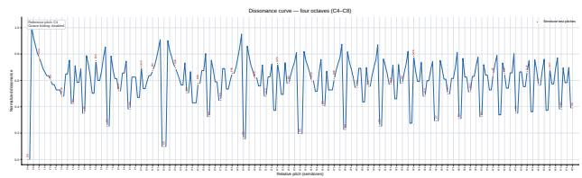  
Figure 5: Four-octave view of the normalized relation kernel, illustrating its octave-folded repetition. Integer-semitone samples are marked for reference.

## Intervals

Thirteen notes from C4 to C5 are compared against a C4 reference. The historical order used by the validation assets is related to classic dyad-consonance experiments (Malmberg 1918; Schwartz, Howe, and Purves 2003), but it is not presented as a direct transcription of any single published table.

Table 2: Interval results under the C4 tonic reference.
<table><tr><td>Note</td><td>Rank</td><td> $D _ { \mathrm { m a x } }$ </td><td>Note</td><td>Rank</td><td> $D _ { \mathrm { m a x } }$ </td></tr><tr><td>C4</td><td>1</td><td>.000253</td><td>G4</td><td>3</td><td>.001145</td></tr><tr><td>C#4</td><td>13</td><td>.004379</td><td>G#4</td><td>7</td><td>.001913</td></tr><tr><td>D4</td><td>11</td><td>.003476</td><td>A4</td><td>6</td><td>.001703</td></tr><tr><td>D#4</td><td>8</td><td>.002463</td><td>A#4</td><td>10</td><td>.002583</td></tr><tr><td>E4</td><td>5</td><td>.002298</td><td>B4</td><td>12</td><td>.002802</td></tr><tr><td>F4</td><td>4</td><td>.001614</td><td>C5</td><td>2</td><td>.000030</td></tr><tr><td>F#4</td><td>9</td><td>.003391</td><td></td><td></td><td></td></tr></table>

Spearman $\rho = . 9 5 0 5 5 \ : ( p = 6 . 3 6 \times 1 0 ^ { - 7 } )$ and Kendall $\tau _ { b } = . 8 4 6 1 5 ( p = 5 . 2 0 \times 1 0 ^ { - 6 } )$ . The minor second is maximal, the tritone is high, the perfect fifth is low, and the octave is minimal. The small nonzero unison value reflects slight differences between independently rendered target and reference recordings.

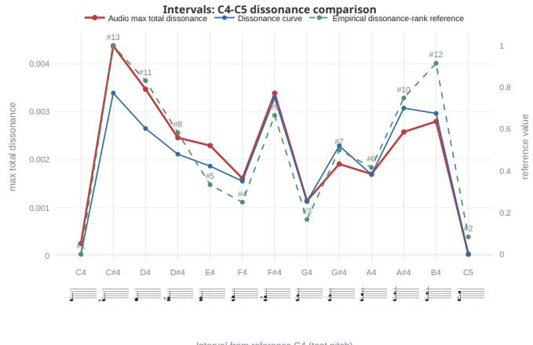  
Figure 6: Interval validation details: audio DS maxima, sampled kernel values, and the predefined rank reference.

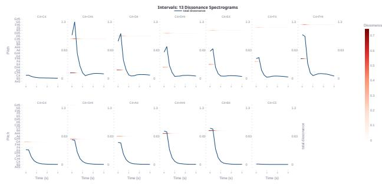  
Figure 7: Representative interval DS maps for unison, minor second, perfect fifth, and octave.

## Chord Qualities

The four representative classes are perfectly ordered as major < minor < suspended < diminished. Because $n = 4 ,$ this is treated as an ordering check rather than a meaningful significance test. The larger set varies chord quality and voicing and therefore provides a stricter test.

Table 3: Extended chord-quality validation. Semitone arrays are relative to C4.
<table><tr><td>Chord</td><td>Semitones</td><td>Rank</td><td> $D _ { \mathrm { m a x } }$ </td><td>Chord</td><td>Semitones</td><td>Rank</td><td> $D _ { \mathrm { m a x } }$ </td></tr><tr><td>Major-1</td><td>[0,4,7]</td><td>1</td><td>.005691</td><td>Sus-1</td><td>[0,7,17]</td><td>7</td><td>.005641</td></tr><tr><td>Major-2</td><td>[0,3,8]</td><td>5</td><td>.006941</td><td>Sus-2</td><td>[0,2,7]</td><td>6</td><td>.006758</td></tr><tr><td>Major-3</td><td>[0,9,17]</td><td>3</td><td>.006299</td><td>Sus-3</td><td>[0,10,17]</td><td>4</td><td>.007769</td></tr><tr><td>Minor-1</td><td>[0,3,7]</td><td>2</td><td>.006058</td><td>Dim-1</td><td>[0,3,6]</td><td>12</td><td>.015950</td></tr><tr><td>Minor-2</td><td>[0,4,9]</td><td>10</td><td>.006738</td><td>Dim-2</td><td>[0,9,15]</td><td>9</td><td>.008581</td></tr><tr><td>Minor-3</td><td>[0,8,17]</td><td>8</td><td>.006363</td><td>Dim-3</td><td>[0,9,18]</td><td>11</td><td>.008172</td></tr><tr><td>Aug</td><td>[0,4,8]</td><td>13</td><td>.007305</td><td></td><td></td><td></td><td></td></tr></table>

Across 13 voicings, Spearman $\rho = . 6 2 6 3 7 \ : ( p = . 0 2 1 9 9 )$ and Kendall $\tau _ { b } = . 4 6 1 5 4 ( p = . 0 3 0 4 8 )$ . The positive association coexists with local reversals, such as Sus-1 below Major-1 and the augmented triad below Dim-1. These deviations are informative rather than errors: DS analyzes realized spectra and therefore responds to spacing and inversion instead of assigning one constant to a chord label.

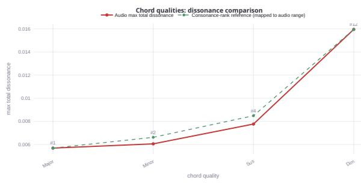  
Figure 8: Representative chord-quality ordering.

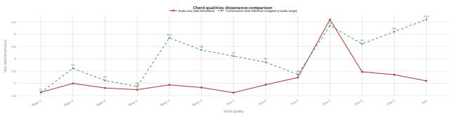  
Figure 9: Extended chord-quality and voicing results.

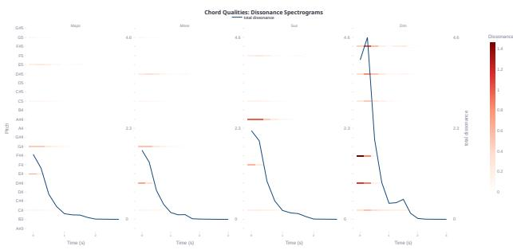  
Figure 10: Representative tonic-referenced chord-quality spectra.

## Functional Chord Connections

Each stimulus plays one diatonic chord followed by C major. The ordinal code assigns 1 to tonic-function chords (I, iii, vi), 2 to predominant chords (ii, IV), and 3 to dominant-function chords (V7, vii°). This reference-conditioned construction operationalizes a connection as the first chord's relation to C major; it does not model voice leading or learned temporal expectation. The code is a theory-derived trend hypothesis, not a psychophysical scale.

Table 4: Chord connections to C major.
<table><tr><td>File</td><td>First chord</td><td>Group</td><td>Rank</td><td> $D _ { \mathrm { m a x } }$ </td></tr><tr><td>CC</td><td>C-E-G</td><td>tonic</td><td>1</td><td>.003848</td></tr><tr><td>DC</td><td>D-F-A</td><td>predominant</td><td>2</td><td>.009701</td></tr><tr><td>EC</td><td>E-G-B</td><td>tonic</td><td>1</td><td>.005311</td></tr><tr><td>FC</td><td>F-A-C</td><td>predominant</td><td>2</td><td>.008495</td></tr><tr><td>G7C</td><td>G-B-D-F</td><td>dominant</td><td>3</td><td>.010312</td></tr><tr><td>AC</td><td>A-C-E</td><td>tonic</td><td>1</td><td>.005695</td></tr><tr><td>BC</td><td>B-D-F</td><td>dominant</td><td>3</td><td>.006699</td></tr></table>

Spearman $\rho = . 7 9 3 7 3 \ : ( p = . 0 3 3 1 0 )$ and Kendall $\tau _ { b } =$ .65465 $( p = . 0 5 3 6 3 )$ . The overall group trend is recovered, although vii° and V7 differ substantially, showing that group membership does not determine the complete spectral value.

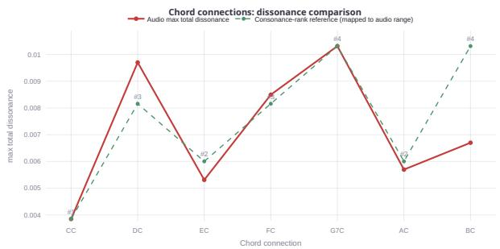  
Figure 11: Functional chord-connection results.

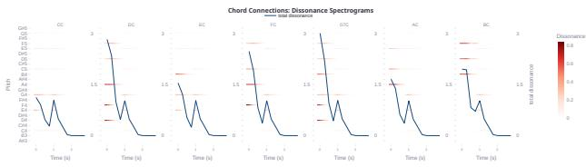  
Figure 12: Reference-conditioned spectra for the seven chord connections.

## Scales and Modes

Scale stimuli ascend from C4 with one second per note. For the seven church modes, $D _ { \mathrm { s u m } }$ correlates with the predefined order at Spearman $\rho = . 8 9 2 8 6 \ : ( p = . 0 0 6 8 1 )$ and Kendall $\tau _ { b } = . 8 0 9 5 2 ( p = . 0 1 0 7 )$

Table 5: Church-mode results.
<table><tr><td>Mode</td><td>Rank</td><td> $D _ { \mathrm { s u m } }$ </td></tr><tr><td>Ionian</td><td>1</td><td>.030220</td></tr><tr><td>Mixolydian</td><td>2</td><td>.030273</td></tr><tr><td>Lydian</td><td>3</td><td>.033697</td></tr><tr><td>Dorian</td><td>4</td><td>.030704</td></tr><tr><td>Aeolian</td><td>5</td><td>.031444</td></tr><tr><td>Phrygian</td><td>6</td><td>.033937</td></tr><tr><td>Locrian</td><td>7</td><td>.038779</td></tr></table>

Figure 13: Church-mode total DS and the predefined ordinal reference used in the main-paper correlation.

The trend is strong but not strictly monotonic because Dorian lies below Lydian. This test aggregates tonic-relative interval content and should not be read as a complete model of modal perception. Figure 14 includes all 33 available scale files. For scales without an externally grounded rank, the values should be interpreted as a quantitative “consonance palette": DS can compare and visualize their realized interval content, but the ordering is not claimed as a universal preference scale. The code defines a natural-minor file that is absent; the equivalent Aeolian pitch-class set is available.

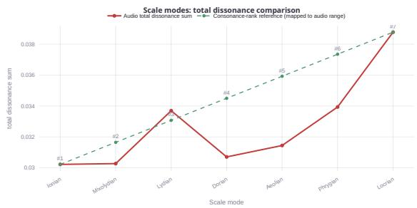

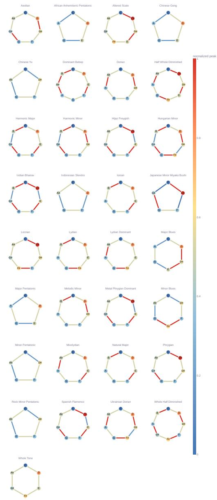  
Figure 14: Circular peak patterns for all available scale recordings. Only the seven church modes are used for the ordinal correlation in the main paper.

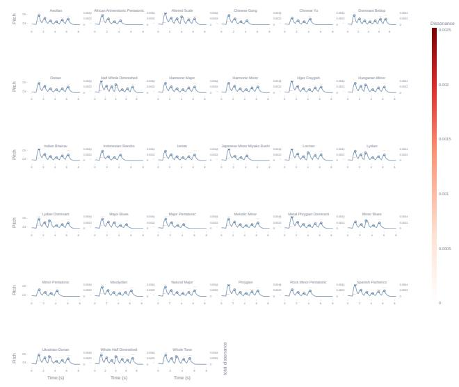  
Figure 15: DS curves for the available scale recordings, illustrating scale-dependent consonance profiles.

## Timbre and Microtonal Examples

The same C4–C5 chromatic sequence yields different maxima across seven software instruments, demonstrating sensitivity to partial amplitudes, envelopes, and noise. Because loudness, spectral centroid, and envelope are not matched, these values are descriptive comparisons of complete rendered sounds rather than a causal timbre ranking. A 24-toneequal-temperament sequence further demonstrates that the continuous kernel can analyze 50-cent steps; no experiential ranking is imposed.

Table 6: Exploratory timbre and microtonal examples.
<table><tr><td>Audio</td><td>Duration (s)</td><td> $D _ { \mathrm { m a x } }$ </td><td>Audio</td><td>Duration (s)</td><td> $D _ { \mathrm { m a x } }$ </td></tr><tr><td>Saxophone</td><td>14.005</td><td>.003134</td><td>Violins</td><td>15.531</td><td>.005633</td></tr><tr><td>Guitar</td><td>14.005</td><td>.003170</td><td>Alto</td><td>15.214</td><td>.007333</td></tr><tr><td>Piano</td><td>14.099</td><td>.004385</td><td>Trumpet</td><td>14.005</td><td>.011913</td></tr><tr><td>Flute</td><td>15.724</td><td>.029903</td><td>24-TET sequence</td><td>26.005</td><td>.003751</td></tr></table>

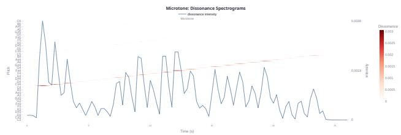  
Figure 16: Exploratory 24-TET spectra at 50-cent resolution. The timbre values in Table 6 are descriptive and are not assigned a universal ranking.

## Loudness Disentanglement under the Normalized Pipeline

The primary quantitative test uses seven independently rendered C4-C#4 dyads spanning the configured level conditions $( n ~ = ~ 7 )$ . Let $\begin{array} { r } { \dot { L } _ { i } ~ = ~ \sum _ { n } | y _ { i } [ n ] | } \end{array}$ be the absoluteamplitude level proxy used by the validation suite (not a perceptual loudness measure), and let $Y _ { i }$ be the DS peak. For positive $L _ { i }$ and $Y _ { i } ,$ we fit the robust log-log relation

$$
\ln Y _ { i } = a + \beta \ln L _ { i } + \epsilon _ { i } ,\tag{23}
$$

$$
D _ { \mathrm { e l a s t i c } } = \operatorname* { m a x } ( 0 , 1 - | \beta | ) ,\tag{24}
$$

where $\beta$ is the Theil-Sen slope and a larger $D _ { \mathrm { e l a s t i c } }$ indicates lower proportional sensitivity. The estimate is $\beta \ : =$ $- . 0 0 0$ with a Theil–Sen 95% CI of [−.014, .000], giving $D _ { \mathrm { e l a s t i c } } = 1$ .000 after rounding. The DS peak varies by only .94% relative standard deviation and 2.49%\_relative range, defined as $s _ { Y } / \bar { Y }$ and (maxi $Y _ { i } - \operatorname* { m i n } _ { i } Y _ { i } ) / { \bar { Y } }$ , respectively. Thus even the lower confidence bound corresponds to approximately a .014% DS change per 1% loudness change. Pearson $r = - . 7 4 4 ( p = . 0 5 5 1 )$ is also reported, but it describes the ordering of small residual deviations rather than their proportional magnitude; a sizeable $| r |$ can therefore coexist with near-zero elasticity. Because the controlled target and reference contexts are normalized, this sanity check supports near gain-invariance of the normalized DS summary over the tested range rather than universal statistical independence from perceptual loudness.

The companion crescendo stimulus visualizes the timeresolved behavior within one file. It is not included in the seven-sample elasticity estimate because adjacent events share a rendering and temporal context. Future tests should expand the number of independent levels and instruments, report LUFS and clipping diagnostics, and repeat rendering under multiple gain and normalization conventions.

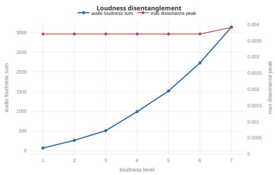  
Figure 17: Primary seven-level result: the absolute-amplitude level proxy changes substantially while the maximum DS peak remains tightly concentrated.

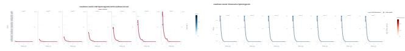  
Figure 18: Level-controlled stimuli. Left: CQT magnitude. Right: intrinsic DS.

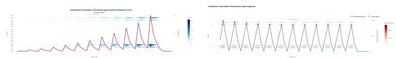  
Figure 19: Within-file crescendo visualization. Left: CQT magnitude. Right: intrinsic DS.

## Detailed Configuration

Compute and software. All downstream runs use one NVIDIA A100 GPU per Slurm job on Linux; no multi-GPU parallelism is used. The implementations are in PyTorch. CQT and DS extraction is cached before training, and the environment lock file in the code archive records exact framework, CUDA, evaluation-package, and pretrained-model revisions.

Shared preprocessing. Except for PMEmo's released chorus clips, all branches use 24-kHz, 45-second excerpts. Magnitude CQT uses a 1,024-sample hop, eight octaves, 72 bins per octave, $f _ { \mathrm { m i n } } = \mathrm { C 1 }$ , and excerpt-level global-maximum normalization. DS is nonnegative and uses log(1 + D) compression after the relation transform. CQT and DS use the same 576-bin grid and identical 576-to-144 pooling, temporal masks, encoder, fusion location, parameter count, optimizer, schedule, and checkpoint selection. The comparison therefore matches architecture and spectral grid but does not isolate the relation transform from branch-input compression and normalization. Fixed Gaussian inputs are generated once per excerpt and training seed and reused across epochs.

MU-LLaMA parameters. The Baseline contains 4,205,568 trainable parameters. The matched parallel branch adds 1,360,193 parameters, yielding 5,565,761 trainable parameters in Gaussian, CQT, and DS. The branch uses three convolutional blocks, a 128-dimensional temporal encoder, a kernel-3 depthwise temporal convolution, single-head temporal attention, and gated residual fusion. The output projection is zero-initialized and the gate bias is -3.

Music2Emo parameters. The Baseline task network contains 1,071,617 trainable parameters. The parallel encoder and gated cross-attention residual module add 209,345 parameters, yielding 1,280,962 parameters in Gaussian, CQT, and DS. The added branch is 0.22% of the frozen 95M-parameter MERT encoder and 19.5% of the trainable task network. Following the Music2Emo 70/15/15 protocol (Kang and Herremans 2025), we generate the track-level split once and keep it fixed across all conditions: 1,261/271/270 for DEAM, 495/124/125 for EmoMusic, and 536/116/115 for the 767-track labeled PMEmo subset. These are experimentspecific splits, not official dataset splits. PMEmo contains 794 items in total and uses the released chorus clip.

## Evaluation Implementation

MusicQA uses the archive's explicitly specified evaluator, which differs from the released MU-LLaMA scoring script. NLTK word-punctuation tokenization is applied before sentence BLEU with weights (.25, .25, .25, .25) and method-1 smoothing. METEOR uses exact, stem, and Word-Net synonym matching. ROUGE-L uses rouge-score with stemming and reports F-measure. BERTScore uses roberta-large in English without IDF or baseline rescaling and reports recall. Loss covers answer tokens; perplexity is exponentiated per seed before averaging. For MTG-Jamendo, PR-AUC and ROC-AUC are macro-averaged over the 56 tags. The Music2Emo weighted binary cross-entropy uses $w _ { i } ~ = ~ 2 / ( 1 + p _ { i } )$ for the positive term and $\bar { w } _ { i } ~ =$ $2 p _ { i } / ( 1 + p _ { i } )$ for the negative term, where $p _ { i }$ is the training prevalence of tag i. The lock file records exact package and model revisions.

## Additional MusicQA Comparisons

The MusicQA references and model outputs are free-form text. To avoid cherry-picking fluent examples, we summarize additional corpus-level comparisons rather than selecting answers by visual inspection. The questions follow the MU-LLaMA data-generation setting and cover attributes such as mood, instrumentation, tempo, genre, and overall tone (Liu et al. 2024). Table 7 reports the difference between the DS condition and each matched control using the six-seed means from the fixed 5,040-pair evaluation set. Higher is better for text-similarity metrics and lower is better for loss and perplexity. Seed-level predictions, questions, and references are included in the separately submitted archive for answer-level inspection.

Table 7: Additional MusicQA comparisons. Entries are DS minus the indicated control; negative values are improvements for loss and perplexity.
<table><tr><td>Metric</td><td>vs. Baseline</td><td>vs. Gaussian</td><td>vs. CQT</td></tr><tr><td>BLEU↑</td><td>+.0087</td><td>+.0089</td><td>+.0018</td></tr><tr><td>METEOR↑</td><td>+.0096</td><td>+.0098</td><td>+.0019</td></tr><tr><td>ROUGE-L ↑</td><td>+.0115</td><td>+.0117</td><td>+.0028</td></tr><tr><td>BERTScore-R ↑</td><td>+.0072</td><td>+.0074</td><td>+.0028</td></tr><tr><td>Test loss ↓</td><td>-.025</td><td>-.026</td><td>-.007</td></tr><tr><td>Perplexity ↓</td><td>-.046</td><td>-.048</td><td>-.014</td></tr></table>

The Gaussian comparison shows that the improvement is not explained by the added parameter budget alone. The smaller but consistently favorable mean difference over the architecture-matched CQT branch indicates that the pitchresolved input accounts for part, but not all, of the gain. These comparisons remain reference-similarity analyses: automatically generated references can reward paraphrase overlap and do not by themselves establish factual correctness or expertlevel harmonic reasoning. We therefore treat the qualitative prediction files as audit material and the paired BERTScore-R endpoint as the prespecified aggregate comparison.

Answer-level audit examples. Tables 8-10 reproduce all ten rows in the supplied audit set rather than selecting a fluent subset. Table 8 maps each case to the audio identifier and MTG-Jamendo track index recorded by the accompanying demo. The Original Token F1 column is the token-overlap score between the original MU-LLaMA output and the reference answer; it is not a score for the DS-augmented output. Tables 9 and 10 provide the corresponding questions, reference answers, and both inference outputs. Relative to the original outputs, the DS-augmented outputs tend to replace generic genre labels, inferred lyric narratives, or vague “weird" descriptions with more specific acoustic, stylistic, and affective attributes. These examples are qualitative audit material and do not replace the aggregate paired evaluation.

## Exploratory Mechanism Analysis

The mechanism analyses are secondary and are not used to select the reported architecture. MusicQA uses seeds {17, 42, 101 }; Music2Emo uses all six paired seeds. Global pooling removes temporal localization, temporal shuffling preserves marginal token statistics while destroying order, pre-projection or early fusion changes the insertion point, and the randomized kernel preserves symmetry and its value distribution while permuting frequency correspondence.

Table 11: Exploratory MusicQA mechanism analysis.
<table><tr><td>Variant</td><td>BERTScore-R ↑</td><td>∆ vs. proposed</td></tr><tr><td>Global DS</td><td> $. 8 9 8 5 { \pm } . 0 0 0 7$ </td><td>-.0030</td></tr><tr><td>Randomized kernel</td><td> $. 8 9 9 2 { \scriptstyle \pm . 0 0 0 9 }$ </td><td>-.0023</td></tr><tr><td>Temporal DS, shuffled</td><td> $. 8 9 9 7 { \scriptstyle \pm . 0 0 0 7 }$ </td><td>-.0018</td></tr><tr><td>Temporal DS, pre-projection</td><td>.9004±.0006</td><td>-.0011</td></tr><tr><td>Temporal DS, proposed</td><td>.9015±.0013</td><td></td></tr></table>

Table 12: Exploratory Music2Emo mechanism analysis.
<table><tr><td>Variant</td><td>Emotion  $\overline { { R ^ { 2 } } } _ { \mathrm { V A } }$  ↑</td></tr><tr><td>Global DS</td><td> $. 6 5 2 4 { \pm } . 0 0 1 5$ </td></tr><tr><td>Temporal DS, shuffled</td><td> $. 6 5 5 0 { \scriptstyle \pm . 0 0 1 7 }$ </td></tr><tr><td>Global DS, early concatenation</td><td> $. 6 5 5 8 { \pm } . 0 0 1 6$ </td></tr><tr><td>Temporal DS, proposed</td><td> $\mathbf { 6 5 8 9 \pm . 0 0 1 8 }$ </td></tr></table>

All perturbations reduce the mean relative to the proposed ordered temporal configuration. These results are consistent with a contribution from frequency correspondence and temporal organization, but they do not isolate a single causal mechanism and support no inferential claim.

Table 8: Provenance and score ownership for the MusicQA audit examples. Audio ID and dataset track index reproduce the audio and t rack Id fields in the accompanying demo. Original Token F1 applies only to the original MU-LLaMA output.
<table><tr><td>ID</td><td>Audio ID</td><td>Dataset track index</td><td>Original Token F1</td><td>ID</td><td>Audio ID</td><td>Dataset track index</td><td>Original Token F1</td></tr><tr><td>01</td><td>012895.wav</td><td>661609</td><td>.000</td><td>06</td><td>013055.wav</td><td>873804</td><td>.071</td></tr><tr><td>02</td><td>012815.wav</td><td>477309</td><td>.038</td><td>07</td><td>012553.wav</td><td>8308</td><td>.111</td></tr><tr><td>03</td><td>012725.wav</td><td>267904</td><td>.063</td><td>08</td><td>012986.wav</td><td>796003</td><td>.073</td></tr><tr><td>04</td><td>012786.wav</td><td>387501</td><td>.087</td><td>09</td><td>012972.wav</td><td>768506</td><td>.094</td></tr><tr><td>05</td><td>012750.wav</td><td>345903</td><td>.000</td><td>10</td><td>013063.wav</td><td>875005</td><td>.103</td></tr></table>

Table 9: MusicQA answer-level audit examples, cases 01–05. Reference answers and dataset identifiers are reproduced from the accompanying demo.
<table><tr><td>ID</td><td>Question</td><td>Reference answer</td><td>Original MU-LLaMA</td><td>DS-augmented MU-LLaMA</td></tr><tr><td>01</td><td>melody and harmony?</td><td>What is the term used to de- Acoustic rock is a term used to describe a style of music Classical. scribe a style of music that that features a strong emphasis on melody and harmony. features a strong emphasis on Acoustic rock typically combines elements of rock and folk music, with acoustic guitar, harmonica, and vocals as</td><td></td><td>Acoustic rock.</td></tr><tr><td>02</td><td></td><td>the main instruments. What type of orchestral mu- Progressive orchestral. Progressive orchestral music in- Symphonic music. sic is characterized by complex corporates elements of progressive rock, avant-garde, and harmonies and intricate com- experimental music, and is characterized by complex har-</td><td></td><td>Progressive orchestral music.</td></tr><tr><td>03</td><td>positions? audio?</td><td>monies and intricate compositions. uses acoustic guitars, bass, drums, and occasional brass for a woman. and strings, with gruff vocals, harmonies, and call-and-</td><td></td><td>What can be inferred from the The audio blends folk, punk rock, rock, and ska. It The song is about a man&#x27;s love The music blends folk, punk rock, ska, and acoustic instrumentation.</td></tr><tr><td>04</td><td>Describe the audio in detail.</td><td>response sections. melody and harmonious vocals. Harp, synthesizer, and and weird. piano create an elegant, layered, and enjoyable arrange-</td><td></td><td>The audio is a soothing and upbeat tune with a catchy The music is described as slow The music is described as soothing, upbeat, and harmonious.</td></tr><tr><td>05</td><td>smooth rhythm, often played smooth rhythm. on a saxophone?</td><td>ment. What is the genre of music that Bossanova. It originated in Brazil and is known for its Jazz. is characterized by a slow and relaxed and romantic sound, often featuring a slow and</td><td></td><td>Bossanova.</td></tr></table>

## Reference Comparisons under Modified Protocols

Table 14: Contextual Music2Emo comparison. The original report uses its 30-second segment augmentation and original training protocol (Kang and Herremans 2025); our baseline uses the modified fixed-excerpt protocol described here.  
Table 13: Contextual MU-LLaMA comparison. The original values use the released scoring script on 4,500 QA pairs from 500 tracks (Liu et al. 2024); our values use the explicitly specified evaluator and are six-seed means on the custom 5,040-pair, 560-track set.
<table><tr><td>Source</td><td>J-PR</td><td>J-ROC</td><td>DEAM-V</td><td>DEAM-A</td><td>Emo-V</td><td>Emo-A</td><td>PM-V</td><td>PM-A</td></tr><tr><td>Original report</td><td>.1543</td><td>.7810</td><td>.5184</td><td>.6228</td><td>.6512</td><td>.7616</td><td>.5473</td><td>.7940</td></tr><tr><td>Our baseline</td><td>.1539</td><td>.7806</td><td>.5169</td><td>.6209</td><td>.6487</td><td>.7598</td><td>.5451</td><td>.7926</td></tr><tr><td>Absolute difference</td><td>.0004</td><td>.0004</td><td>.0015</td><td>.0019</td><td>.0025</td><td>.0018</td><td>.0022</td><td>.0014</td></tr></table>

<table><tr><td>Source</td><td>BLEU</td><td>METEOR</td><td>ROUGE-L</td><td>BERTScore-R</td></tr><tr><td>Original report (released script)</td><td>.3060</td><td>.3850</td><td>.4660</td><td>.9010</td></tr><tr><td>Our baseline (specified metrics)</td><td>.2987</td><td>.3761</td><td>.4556</td><td>.8952</td></tr><tr><td>Absolute difference</td><td>.0073</td><td>.0089</td><td>.0104</td><td>.0058</td></tr></table>

The rows are not treated as a direct reproduction comparison because both the evaluation set and metric implementation differ.

Table 10: MusicQA answer-level audit examples, cases 06–10 (continued).
<table><tr><td>ID</td><td>Question</td><td>Reference answer</td><td>Original MU-LLaMA</td><td>DS-augmented MU-LLaMA</td></tr><tr><td>06</td><td>audio?</td><td>What can be inferred from the The audio appears to be a movie or TV soundtrack with The song is about love and heart- The music feels moody, mellow, nostalgic, a moody, atmospheric character. Its slow, mellow melody break. and layered guitars and piano evoke longing, nostalgia, and introspection.</td><td></td><td>and introspective.</td></tr><tr><td>07</td><td>Describe the audio in detail.</td><td>tronic, lounge, and oriental music. Its slow, smooth tempo a weird and otherworldly quality. and gently oriental. and minimal instrumentation create a calming atmo-</td><td></td><td>A relaxing instrumental composition combining elec- The music is described as having The music is described as relaxing, smooth,</td></tr><tr><td>08</td><td>audio?</td><td>sphere. What can be inferred from the A relaxing and upbeat trip-hop track for chilling out. Syn- The song is about love and heart- The track is relaxing, upbeat, dreamy, and so- thesizer, strings, bass, drums, Rhodes, and trumpet create break. a dreamy, smooth, and sophisticated atmosphere.</td><td></td><td>phisticated.</td></tr><tr><td>09</td><td>Describe the audio in detail.</td><td>ano, violin, bell, and oboe create a warm, elegant, magical, a weird and otherworldly quality. gant, and serene. and serene piece for relaxing.</td><td></td><td>A calm orchestral composition. Acoustic bass, cello, pi- The music is described as having The music is described as calm, warm, ele-</td></tr><tr><td>10</td><td>Describe the audio in detail.</td><td>A fusion of classical and ambient music with flute and The music is described as having The music is described as slow, mellow, soul- synthesizer, a slow and mellow pace, bass and electric a weird and scary atmosphere. guitar foundation, and soulful background vocals.</td><td></td><td>ful, and ambient.</td></tr></table>

## Seed-Level Primary Endpoints

Table 15: MusicQA BERTScore-R for the six paired seeds.
<table><tr><td>Seed</td><td>Baseline</td><td>Gaussian</td><td>CQT</td><td>DS</td></tr><tr><td>17</td><td>.8943</td><td>.8942</td><td>.8990</td><td>.9001</td></tr><tr><td>42</td><td>.8950</td><td>.8948</td><td>.8996</td><td>.9017</td></tr><tr><td>101</td><td>.8954</td><td>.8951</td><td>.8998</td><td>.9027</td></tr><tr><td>2025</td><td>.8948</td><td>.8947</td><td>.8989</td><td>.9028</td></tr><tr><td>2026</td><td>.8962</td><td>.8960</td><td>.8997</td><td>.9024</td></tr><tr><td>3407</td><td>.8955</td><td>.8952</td><td>.9006</td><td>.9047</td></tr><tr><td>Mean</td><td>.8952</td><td>.8950</td><td>.8996</td><td>.9024</td></tr><tr><td>SD</td><td>.0007</td><td>.0006</td><td>.0006</td><td>.0015</td></tr></table>

Table 16: Music2Emo $\overline { { R ^ { 2 } } } _ { \mathrm { V A } }$ for the six paired seeds.
<table><tr><td>Seed</td><td>Baseline</td><td>Gaussian</td><td>CQT</td><td>DS</td></tr><tr><td>17</td><td>.6453</td><td>.6449</td><td>.6519</td><td>.6560</td></tr><tr><td>42</td><td>.6472</td><td>.6466</td><td>.6542</td><td>.6587</td></tr><tr><td>101</td><td>.6481</td><td>.6476</td><td>.6552</td><td>.6596</td></tr><tr><td>2025</td><td>.6464</td><td>.6457</td><td>.6525</td><td>.6580</td></tr><tr><td>2026</td><td>.6494</td><td>.6488</td><td>.6557</td><td>.6602</td></tr><tr><td>3407</td><td>.6476</td><td>.6468</td><td>.6555</td><td>.6609</td></tr><tr><td>Mean</td><td>.6473</td><td>.6467</td><td>.6542</td><td>.6589</td></tr><tr><td>SD</td><td>.0014</td><td>.0014</td><td>.0016</td><td>.0018</td></tr></table>

## Paired Comparisons

Table 17: Paired comparisons on the two designated primary endpoints using unrounded seed-level values. $p _ { \mathrm { H } } ^ { ( t ) }$ is Holmadjusted paired-t; $p _ { \mathrm { H } } ^ { ( \mathrm { s i g n } ) }$ is the Holm-adjusted exact twosided sign test based only on paired directions. Each task has one three-comparison Holm family.
<table><tr><td>Task</td><td>Comparison</td><td>Mean ∆</td><td> $p _ { \mathrm { H } } ^ { ( t ) }$ </td><td> $p _ { \mathrm { H } } ^ { \mathrm { ( s i g n ) } }$ </td></tr><tr><td>MusicQA</td><td>DS vs. Baseline</td><td>+.0072</td><td>&lt; .001</td><td>.0938</td></tr><tr><td>MusicQA</td><td>DS vs. Gaussian</td><td>+.0074</td><td>&lt; .001</td><td>.0938</td></tr><tr><td>MusicQA</td><td>DS vs. CQT</td><td>+.0028</td><td>.0017</td><td>.0938</td></tr><tr><td>Music2Emo</td><td>DS vs. Baseline</td><td>+.0116</td><td>&lt; .001</td><td>.0938</td></tr><tr><td>Music2Emo</td><td>DS vs. Gaussian</td><td>+.0122</td><td>&lt; .001</td><td>.0938</td></tr><tr><td>Music2Emo</td><td>DS vs. CQT</td><td>+.0047</td><td>&lt; .001</td><td>.0938</td></tr></table>

## References

Kang, J.; and Herremans, D. 2025. Towards Unified Music Emotion Recognition across Dimensional and Categorical Models. arXiv:2502.03979.

Liu, S.; Hussain, A. S.; Sun, C.; and Shan, Y. 2024. Music Understanding LLaMA: Advancing Text-to-Music Generation with Question Answering and Captioning. In Proceedings of the IEEE International Conference on Acoustics, Speech and Signal Processing, 286–290.

Malmberg, C. F. 1918. The Perception of Consonance and Dissonance. Psychological Monographs, 25(2): 93–133.

Schwartz, D. A.; Howe, C. Q.; and Purves, D. 2003. The Statistical Structure of Human Speech Sounds Predicts Musical Universals. The Journal of Neuroscience, 23(18): 7160– 7168.