# Can your AI agent be cheaper? Investigating the efects of task specifications on token spend in agentic coding tasks

Jakub Smékal Stanford University

## Abstract

Agentic coding workflows are now widely deployed in real-world systems. With long-horizon reasoning and tool use, token usage has become an important consideration for both cost and eficiency. Two engineers using AI will solve the same problem diferently. How the specification of a task shapes an agent’s token spend, and whether that spend can be predicted in advance, are open questions. Here, we study the efects of diferent task specifications on agentic token spend with the Kimi K3 model at three thinking eforts. Across 2, 700 runs, we show that reducing a full task specification to a bare user story raises token spend by 29.7%, while run-to-run variance remains unafected by any prompt changes. We show that prompt-sensitivity is task-dependent, running from 13% to 115%. We fit a simple predictor that can price a full distribution of task specifications and thinking efort configurations from a single cheap probe on an unseen task within 36%, improving over prior work in predicting token spend. Our work provides initial results quantifying the efects of task specification on agentic token spend and introduces a method that can be used to systematically evaluate the cost of AI coding workflows.

## 1 Introduction

Token spend has become a central consideration in deploying agentic coding systems. Rising model capability unlocks longer-horizon autonomy, in which an agent works from a single task description without further human supervision. Recent work shows that agentic token usage is both large relative to single-shot use and inherently stochastic: two identical runs of the same prompt can difer by a factor of 30 in tokens [4].

Studies of agentic spend have varied the model, holding each task’s problem statement fixed [4]. A separate line of work has varied the prompt, but only its surface form, holding its meaning constant [17, 18]. The efect of a specific task description on token spend remains largely unmeasured. This poses two questions for practitioners:

• To what extent is token spend controllable through the task specification and the thinking efort setting?

• To what extent is token spend predictable on a previously unseen task?

We hold the model fixed and vary the prompt. We construct a distribution of task specifications for a set of agentic coding tasks from SWE-bench Verified [6, 11], bounded by an oracle specification that hands the agent the fix and a raw prompt of unstructured failing-test output, with structured variants in between that strip either most of the specification or one section at a time. Every specification is run at three thinking eforts, and each is repeated multiple times to estimate run-to-run token spread. Our results are summarized as follows:

• The prompt moves the mean. Cutting a full specification down to a plain prose description of the problem raises token spend by 29.7% and turns to success by 16.4%, in the same direction on every task we measure.

• The prompt does not move the variance. Rerunning an identical specification produces ×1.34 spread in token spend, and no specification we tested widens or narrows it.

• The cost distribution is cheaply predictable. A single probe run costing eleven cents on an unseen task predicts its spend across every other specification and thinking efort to typically 36%, against 161% with no measurement at all.

The rest of the paper describes our experimental methodology and results in greater detail. Section 3 describes how we construct a set of task specifications and our experimental setup, and Section 4 presents our findings analyzing and predicting agentic token spend. We conclude with a discussion of takeaways for practitioners deploying agentic coding workflows.

## 2 Related work

Cost as an outcome. Inference cost is increasingly reported as a result rather than an implementation detail [12, 20]. Closest to our work, [4] studies eight frontier models on SWE-bench Verified and shows that runs on the same task difer by up to 30× in tokens, that higher spend does no reliably buy accuracy, and that models estimate their own consumption poorly. That study varies the model while holding each task’s problem statement fixed; we invert the design.

The prompt as a variable. Single-prompt benchmarks are fragile: performance swings by several points across paraphrases of one task [17, 18]. Prior work held task-relevant information fixed and varied surface form, without repeated sampling and without a cost outcome. We vary task detail deliberately and price each increment. The distinction matters because task-relevant information is not monotonically beneficial: removing detail can improve correctness by disrupting misleading lexical cues [2], and packaged skill documents may raise token spend without improving performance [10].

What a task description should contain. Bettenburg et al. [5] showed that the most valued elements of a bug report are also the hardest to supply. Khatib et al. [13] transpose this to agents over 433 SWE-bench Verified issues, finding that fix suggestions, reproduction scripts and localization are associated with higher resolution odds. SWE-Bench Pro [7] pairs each task with human-written requirements. Related work lets the agent request additional information rather than varying the input prompt [8, 15, 19]. Here, we address the complementary question of how variations in the input task specification afect token spend.

Thinking efort. A parallel literature treats reasoning budget as the quantity to optimize [3], either benchmarking allocation [1] or learning it [16, 22]. All of it takes the query as given, which our results suggest is incomplete, since how much a thinking budget buys depends on how the task was described.

To our knowledge, no prior work varies the level of detail in a task description while measuring token cost and its run-to-run variance.

## 3 Methods

## 3.1 Tasks and prompts

We take five tasks from SWE-bench Verified [6, 11]. Where prior benchmarking describes each task with a single prompt, we use fewer tasks but construct a distribution of prompts spanning diferent levels of task-relevant information, which aims to more closely mimic the variety of task specifications in real-world workflows and to let us attribute changes in token spend to the removal of specific task sections.

The specification set comprises ten spec variations and two anchor prompts. Each spec variation is constructed from the task’s original SWE-bench problem statement, with structure derived from the GitHub Spec Kit template [9]. A full specification has eight sections: header, user story, acceptance scenarios as Given/When/Then cases, edge cases, functional requirements, key entities, success criteria, and assumptions. The ten variations are the full specification, seven removing one section each, and two partial specifications retaining the header plus the user story, or the header plus requirements and success criteria. One variation removes the User Scenarios and Testing block entirely, meaning both the user story and its scenarios, since the scenarios are written in terms of the story; another removes the scenarios but keeps the story prose. The diference between these two variants is the Given/When/Then cases alone. Appendix B gives the ablation matrix and the length of every specification.

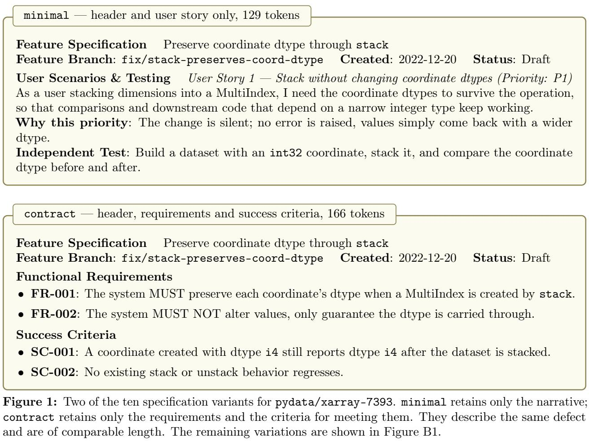

The two anchors are constructed to bound the specification set. The raw anchor provides contrast on structure; it is the failing test output, the least structured description that still converges on the correct fix. It is a realistic specification, since it is what an engineer pasting a raw error log would supply, and we include it in the analyses. The oracle anchor bounds task-relevant information; it states the solution and asks only that it be applied. We report the oracle as a sanity check that it is indeed the cheapest prompt, at 0.05 to 0.19 times the cost of the full specification, but exclude it from the analyses, as a real specification is unlikely to contain the solution, and including a variant that cheap by construction would inflate every efect we report. Analyses below therefore use eleven specifications. The exception is the token accounting in Figure 5, which covers every run.

Specifications were drafted with a language model, Fable 5, from the original task descriptions, then hand-edited for consistency and faithfulness to the template.

## 3.2 Grid and execution

Each task is paired with each of the twelve specifications at three thinking eforts (low, high, max), with fifteen repeats, giving $5 \times 1 2 \times 3 \times 1 5 = 2 { , } 7 0 0$ runs. All use Kimi K3 [14] through a Modal endpoint at temperature 1.0. The scafold is mini-swe-agent, running each task in the standard SWE-bench Docker image. Runs execute without network access, and every task is screened for solution leakage.

## 3.3 Outcomes and analysis

We record cost in USD at list prices, input, cached and output tokens, agent turns, and whether the patch resolves the task under the SWE-bench harness. Cost and tokens are near-equivalent on one price schedule, so we report cost and give token figures in Appendix E.

For each section and outcome we fit one Bayesian hierarchical model, estimating a typical efect across tasks together with how far the tasks disagree about it, and report a posterior median and 90% credible interval. Appendix C gives the model, its priors, and a sensitivity analysis.

## 3.4 Prediction model

Holding out one task at a time, let $y _ { t b e }$ be the mean log cost of task t under specification b at efort $e ,$ and $\bar { y } _ { t }$ its mean over all cells. From the four training tasks $T ^ { \prime }$ we learn a shared shape

$$
\hat { s } _ { b e } = \frac { 1 } { | T ^ { \prime } | } \sum _ { t \in T ^ { \prime } } \left( y _ { t b e } - \bar { y } _ { t } \right) ,\tag{1}
$$

which records which configurations are relatively expensive while carrying no information about any task’s overall level. For held-out task h we take k probe runs at a fixed configuration $( b _ { 0 } , e _ { 0 } )$ with log costs $z _ { 1 } , \ldots , z _ { k }$ , and estimate that level as

$$
\hat { \delta } = \frac { 1 } { k } \sum _ { i = 1 } ^ { k } z _ { i } - \hat { s } _ { b _ { 0 } e _ { 0 } } , \qquad \hat { y } _ { h b e } = \hat { \delta } + \hat { s } _ { b e } ,\tag{2}
$$

setting $\hat { \delta } = 0$ when $k = 0$ . We configured the probe with a full task specification run at low thinking efort.

## 4 Results

## 4.1 Prompt content and token spend

Prompt variation moves average token spend, in two forms that are near-interchangeable: across the 2,390 solved runs of the eleven specification variations, log turns and log cost correlate at r = 0.953, so turns serve as a unit-free proxy for spend. Here, we report both. Every efect below carries a 90% credible interval from a single hierarchical model (Appendix C).

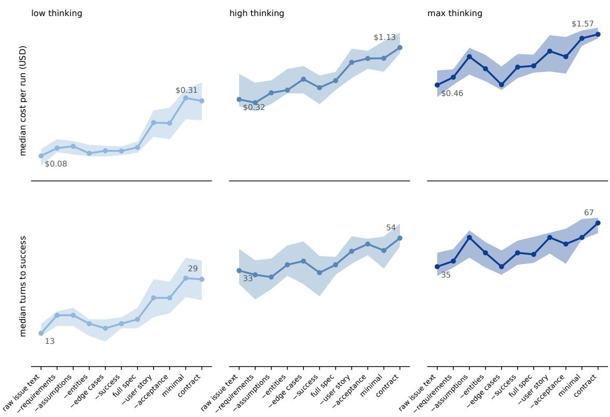  
Figure 2: Median cost per run (top) and turns to success (bottom) for xarray-7393, across eleven specification variants at three thinking eforts. Bands are interquartile ranges over 15 repeats.

Per-section diferences are small. Removing any one of functional requirements, assumptions, edge cases, key entities or success criteria changes cost by between −5.4% and −2.4% and turns by between −1.6% and −0.4%. Larger ablations have a greater efect. Reducing the specification to a bare user story raises cost by 29.7% and turns by 16.4%, positive on all five tasks. On xarray-7393 the same ablation raises cost by 115%, four times the pooled efect; that task is an outlier, but it establishes that tasks exist on which the prompt has considerable leverage, which is why a practitioner should measure their own task rather than assume its cost sensitivity a priori. The only single section whose removal consistently has an isolated efect is the acceptance scenarios, at 7.0% additional turns. Between-task disagreement rises with the size of the ablation: 4% to 8% for the five minor single-section removals, 22% and 26% for acceptance scenarios and user story-with-scenarios, and 29% and 40% for the two largest cuts (Appendix D). Notably, user story-with-scenarios shows this elevated disagreement despite having no established average efect on any outcome.

Acceptance scenarios and success criteria state the same requirement at diferent levels of abstraction: the first as executable Given/When/Then cases, the second as prose assertions about the same behavior. Removing the concrete form costs turns on all five tasks; removing the abstract form has no measurable efect on any outcome. What matters is concreteness about which cases must pass, not the presence of a stated requirement. The raw anchor supports this interpretation. The least structured prompt is the cheapest of the eleven variations at low efort on four of five tasks, at 0.73× to 1.10× the full specification pooled over eforts. A failing-test transcript names the file and test that must pass, and that localization substitutes for the discovery turns a prose specification leaves to the agent.

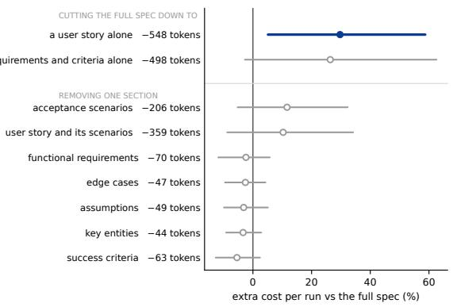

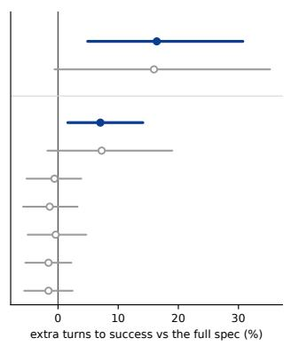

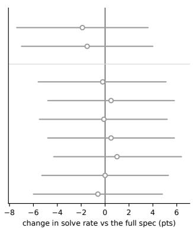  
Figure 3: Efect of cutting the full specification, pooled across five tasks and three thinking eforts. The upper pair cuts many sections from the full specification; the rest remove a single section at a time. Each label provides the number of tokens removed in the variation, averaged over the five tasks. Dots are posterior medians, lines are 90% credible intervals, and blue marks intervals excluding zero. No section measurably changes solve rate, every interval lying within 7.5 points of zero, so diferences in cost and turns are attributable to the prompt rather than to some variants solving an easier version of the task.

## 4.2 Thinking efort

Prompt variation matters more at low thinking efort than at max. Pooled over tasks, the ratio between the most and least expensive specification narrows from ×2.13 at low efort to ×1.67 at high and ×1.61 at max, and the cost of removing the acceptance scenarios falls from 20.1% additional turns to 4.5%, and then 2.1%, respectively. The pattern holds on four of the five tasks; on astropy-14365 the ratio only moves from ×1.57 at low to ×1.47 at max efort.

The reading is that thinking efort and specification detail are substitutes only where thinking is scarce. At low efort, information withheld from the prompt is recovered by model reasoning, and that reasoning is what the missing section costs. At max efort the model reasons extensively regardless of the prompt details, so supplying the same information changes little. Geometric mean spend rises from 0.117 USD per run at low efort to 0.561 USD at max, so the gap in USD between cheapest and most expensive specification widens even as the relative ratio falls.

Specification had no credible efect on solve rate: the 90% credible interval for every section removed includes zero (Table D1), unlike cost and turns, where the two largest cuts are credibly positive. Four of the five tasks solve at 98% or above; django-15503, at 86.3%, is the only task below that range. Per-task and per-efort solve rates are given in Table A1 and Figure E3.

## 4.3 Run-to-run spread

Prompt variation had no measurable efect on variance. Within a single specification and efort, repeats have a median geometric standard deviation of ×1.34. Taking each specification separately, median geometric standard deviation ranges from ×1.29 to $\times 1 . 4 0$ , which is a small enough gap that the underlying per-task-and-efort values overlap heavily across specifications (Figure 4A). What variation exists is explained by cost level: absolute spread scales almost proportionally with average cost, at a log-log slope of 1.08 and $r = 0 . 9 5$ (Figure 4B), so more expensive settings are inherently more stochastic in cost. A per-cell comparison against a null built from sampling noise alone found no reliable excess beyond what finite-sample estimation error predicts, consistent with cost-driven variance.

A  
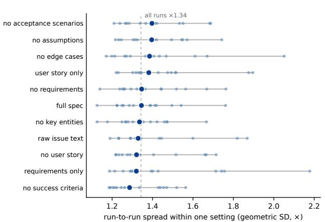

B  
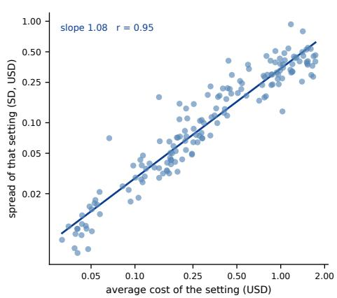  
Figure 4: A: run-to-run spread within a single setting, one dot per task and thinking efort; the dark marker is each specification’s median and the dashed line the median across all settings, ×1.34. B: spread of a setting in dollars against its average cost. The slope of 1.08 is close to proportionality, so how much a run varies in absolute terms is set by its mean cost, not by the task description.

This is consistent with prior work that agentic spend is inherently stochastic; Bai et al. [4] find identical repeats difering by up to a factor of 30 across all eight models they evaluate. The most reliable regimes we found were simply the cheapest, since absolute variance falls with the mean. This suggests that the only route to a more predictable agentic token spend is a smaller one.

One structural feature determines which cost optimizations can matter (Figure 5). In our experiments with Kimi K3, output tokens are 2.7% of tokens processed but 51.1% of dollars at a 96.3% cache hit rate, and fresh input is 13.4% of spend. Optimizations aimed at the input, such as prompt compression or context trimming, therefore address a small fraction of spend, whereas reducing turns addresses the majority of cost. The split depends on the price schedule and cache hit rate rather than on the agent alone, so these percentages do not directly apply to other models or inference stacks.

## 4.4 Predicting the cost of an unseen task

We learn a shared shape over the prompt × efort grid from four tasks, hold out the fifth, and use k probe runs at one fixed setting to fix its level. Holding out one task at a time leaves 32 other settings per task to predict, from 11 specifications × 3 eforts minus the probe, or 160 held-out settings in total across the five folds. Each figure below is a median over those 160 settings, averaged over 400 independent probe draws. Median error is the typical gap between predicted and actual cost; the budget multiplier is the factor by which a prediction must be inflated for the true cost to fall under it in 90% of settings.

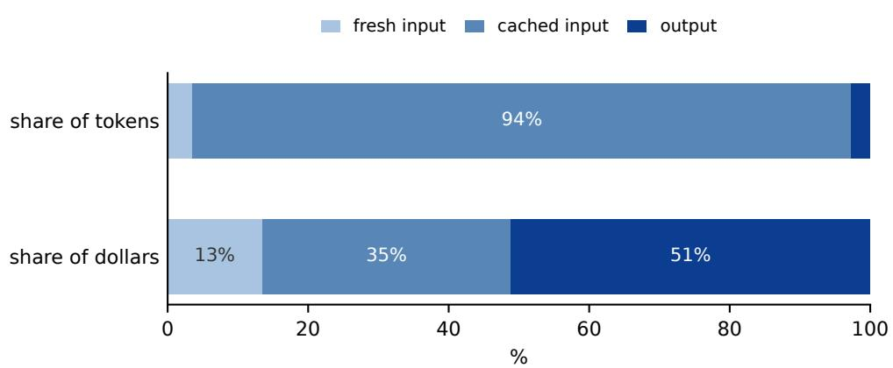  
Figure 5: Share of tokens against share of dollars, by token class, over all 2,700 runs at Kimi K3 list prices.

A  
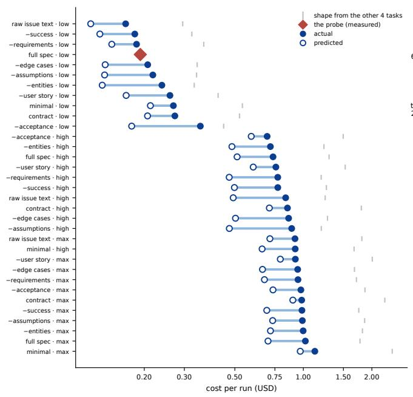

B  
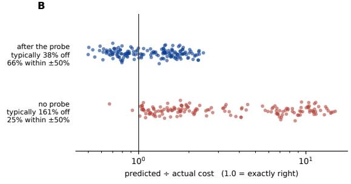

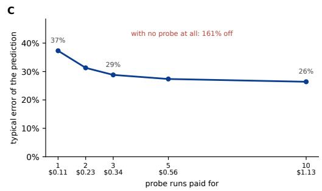  
Figure 6: Prediction of held-out task cost. A: worked example on astropy-13579, actual against predicted cost for every setting, with the probe marked. B: prediction error with and without the probe. C: error against the number of probe runs.

<table><tr><td></td><td></td><td></td><td></td><td>probe runs probe cost (USD) median error settings within ±50% budget multiplier for 90%</td></tr><tr><td>0</td><td>0</td><td>161%</td><td>25%</td><td></td></tr><tr><td>1</td><td>0.11</td><td>36%</td><td>67%</td><td>1.9×</td></tr><tr><td>3</td><td>0.34</td><td>29%</td><td>74%</td><td>1.8×</td></tr><tr><td>10</td><td>1.13</td><td>25%</td><td>76%</td><td>1.7×</td></tr></table>

Table 1: Prediction of held-out task cost against the number of probe runs.

The probe determines the level of a task rather than the relative cost of its configurations, which is fit from previous tasks. Without the probe, predicting a new task from the other four is a median of 161% of; one run at 0.11 USD cuts that to 36% and brings two thirds of settings within ±50%, while ten probes reach 25% median error, as shown in Table 1.

Bai et al. [4] asked the agent to estimate its own usage before executing the task and reported the correlation between predicted token spend and actual token spend. We now report our results using the same metric, where we once again see a gap between inferring the cost from previous tasks without measuring vs. calibrating the cost curve to an unseen task by running a measurement probe. Scoring individual runs within a single thinking level, prediction without a probe reaches $r = 0 . 0 8$ (0.04 to 0.12, bootstrapped over runs), at or below the 0.04 to 0.39 in prior work [4]. One probe run takes the same predictor to r = 0.72 (0.67 to 0.78 across draws of the probe run), improving over prior work, although it requires measuring the unseen task rather than asking a model to reason about its cost before running it.

## 5 Discussion

Mean token spend can be shifted by changes in task specification, but the size of that shift varies considerably from task to task: the same cut costs 13% on one task and 115% on another. Our study uses a single model, which is a core limitation. Where comparison is possible, however, our findings agree with studies that vary the model while fixing one prompt per task [4]: repeated runs of an identical input remain highly stochastic in token spend, and prior work established that greater spend does not reliably buy correctness.

For practitioners, our results support the utility of measuring against a prompt distribution to evaluate and predict token cost for a given task. A small set of tasks, sampled across specification variants and thinking eforts, gives the shape of the cost curve for a workload; one probe run then calibrates it to a new task. This method may help practitioners quantify which AI usage patterns are expensive and how much of that expense is recoverable by prompt choice.

Specification detail and thinking efort interact. Prompt leverage falls as efort rises, from ×2.13 to ×1.61, while the cost of removing the acceptance scenarios falls from 20.1% additional turns to 2.1%. This bears on the practice of shipping large packaged instruction sets, such as skill documents and prompting frameworks, alongside every request: those are paid for on every run, whereas the work they save is realized only where the model would not otherwise have reasoned its way to the same outcome, and that margin narrows precisely in the high and max-efort configurations where such packages are most often deployed. This is consistent with reports that added skill documents raise token spend without improving performance [10].

Predicting a new task by inferring a cost shape from four others, without running it, is a median of 161% of, and on the correlation metric used by prior work it is no better than a model’s own estimate of its consumption [4]. A single run at 0.11 USD reduces that to 36%. Cheap measurement can therefore be useful whenever the cost of a counterfactual matters, e.g., if a first prompt variation did not produce the desired result and the cost of another must be weighed, or when an agentic workflow must be judged against the rest of the distribution, as in repeatable asynchronous tasks running from the same base prompt. A single probe fixes the cost level for the other configurations of a task, so the measurement is made once per task rather than once per configuration.

Run-to-run spread appears to be a property of the serving stack and the model rather than the prompt. Repeats of an identical specification vary by ×1.34, no specification narrows that, and absolute spread scales almost exactly with mean cost, so a more predictable spend is obtained by making runs cheaper. At a 96.3% cache hit rate, output tokens are 2.7% of tokens processed and 51.1% of money spent, so optimizations aimed at shortening the input address a minority of cost while reducing turns addresses the majority.

Our work considers a sparse set of agentic coding tasks while increasing the number of perconfiguration repeats, more than 3× over prior work [4]. Task sparsity and the use of a single model remain the key limitations on generalizing to a broader set of models and real-world tasks. Currently, our method for inferring a shared cost structure across prompt variants omits any efect of task-specific prompt sensitivity. We leave this to future work.

Our findings quantify a question that arises frequently in practice but is rarely measured: two engineers handed the same task will describe it diferently and use diferent model configurations, both of which carry diferent costs. The method we introduce measures the spread in token spend across diferent descriptions of the same task, and we predict the cost of a new task from a single cheap probe run. We hope to extend our work to more tasks and models, as well as to real workflows, where task dificulty varies more widely and specifications can be collected from engineers rather than constructed.

## 6 Conclusion

With increasing adoption of agentic coding workflows, token usage becomes a primary consideration for many practitioners. Here, we evaluated token spend in agentic coding tasks across a set of diferent task specifications, and showed how a cheap probe can be used to predict the cost of a new task. Our results suggest that there are tasks for which token spend can be substantially improved through careful task specification. We hope our method motivates a more systematic evaluation of how usage patterns afect token spend in agentic coding workflows.

## References

[1] Pranjal Aggarwal, Seungone Kim, Jack Lanchantin, Sean Welleck, Jason Weston, Ilia Kulikov, and Swarnadeep Saha. OptimalThinkingBench: Evaluating over and underthinking in LLMs. arXiv preprint arXiv:2508.13141, 2025.

[2] Amal Akli, Mike Papadakis, Maxime Cordy, and Yves Le Traon. When prompt underspecification improves code correctness: An exploratory study of prompt wording and structure efects on LLM-based code generation. arXiv preprint arXiv:2604.24712, 2026.

[3] Mohammad Ali Alomrani, Yingxue Zhang, Derek Li, Qianyi Sun, Soumyasundar Pal, Zhanguang Zhang, Yaochen Hu, Rohan Deepak Ajwani, Antonios Valkanas, Raika Karimi, Peng Cheng, Yunzhou Wang, Pengyi Liao, Hanrui Huang, Bin Wang, Jianye Hao, and Mark Coates. Reasoning on a budget: A survey of adaptive and controllable test-time compute in LLMs. arXiv preprint arXiv:2507.02076, 2025.

[4] Longju Bai, Zhemin Huang, Xingyao Wang, Jiao Sun, Rada Mihalcea, Erik Brynjolfsson, Alex Pentland, and Jiaxin Pei. How do AI agents spend your money? Analyzing and predicting token consumption in agentic coding tasks. arXiv preprint arXiv:2604.22750, 2026.

[5] Nicolas Bettenburg, Sascha Just, Adrian Schröter, Cathrin Weiss, Rahul Premraj, and Thomas Zimmermann. What makes a good bug report? In Proceedings of the 16th ACM SIGSOFT

International Symposium on Foundations of Software Engineering (FSE), pages 308–318. ACM, 2008. doi: 10.1145/1453101.1453146.

[6] Neil Chowdhury, James Aung, Jun Shern Chan, Oliver Jafe, Dane Sherburn, Giulio Starace, Evan Mays, Rachel Dias, Marwan Aljubeh, Mia Glaese, Carlos E. Jimenez, John Yang, Leyton Ho, Tejal Patwardhan, Kevin Liu, and Aleksander Madry. Introducing SWE-bench Verified. https://openai.com/index/introducing-swe-bench-verified/, 2024. OpenAI blog post, August 13, 2024.

[7] Xiang Deng, Jef Da, Edwin Pan, Yannis Yiming He, Charles Ide, Kanak Garg, Niklas Laufer, Andrew Park, Nitin Pasari, Chetan Rane, Karmini Sampath, Maya Krishnan, Srivatsa Kundurthy, Sean Hendryx, Zifan Wang, Vijay Bharadwaj, Jef Holm, Raja Aluri, Chen Bo Calvin Zhang, Noah Jacobson, Bing Liu, and Brad Kenstler. SWE-bench pro: Can AI agents solve long-horizon software engineering tasks? arXiv preprint arXiv:2509.16941, 2025.

[8] Yijiang River Dong, Tiancheng Hu, Zheng Hui, Caiqi Zhang, Ivan Vulić, Andreea Bobu, and Nigel Collier. Value of information: A framework for human-agent communication. arXiv preprint arXiv:2601.06407, 2026.

[9] GitHub. Spec kit. https://github.com/github/spec-kit, 2025. Software.

[10] Tingxu Han, Yi Zhang, Wei Song, Chunrong Fang, Zhenyu Chen, Youcheng Sun, and Lijie Hu. SWE-skills-bench: Do agent skills actually help in real-world software engineering? arXiv preprint arXiv:2603.15401, 2026.

[11] Carlos E. Jimenez, John Yang, Alexander Wettig, Shunyu Yao, Kexin Pei, Ofir Press, and Karthik Narasimhan. SWE-bench: Can language models resolve real-world GitHub issues? In International Conference on Learning Representations (ICLR), 2024. URL https://arxiv. org/abs/2310.06770.

[12] Sayash Kapoor, Benedikt Stroebl, Zachary S. Siegel, Nitya Nadgir, and Arvind Narayanan. AI agents that matter. arXiv preprint arXiv:2407.01502, 2024.

[13] Lara Khatib, Noble Saji Mathews, Meiyappan Nagappan, Pengyu Nie, and Thomas Zimmermann. What makes a good bug report for an AI agent? arXiv preprint arXiv:2607.07593, 2026.

[14] Kimi Team. Kimi k3: Open frontier intelligence, 2026. URL https://arxiv.org/abs/2607. 24653.

[15] Jialin Li, Yuan Wu, and Yi Chang. ClarEval: A benchmark for evaluating clarification skills of code agents under ambiguous instructions. arXiv preprint arXiv:2603.00187, 2026.

[16] Zheng Li, Qingxiu Dong, Jingyuan Ma, Di Zhang, Kai Jia, and Zhifang Sui. SelfBudgeter: Adaptive token allocation for eficient LLM reasoning. arXiv preprint arXiv:2505.11274, 2025.

[17] Zhiyuan Pan, Xing Hu, Xin Xia, and Xiaohu Yang. Re-evaluating code LLM benchmarks under semantic mutation. arXiv preprint arXiv:2506.17369, 2025.

[18] Felipe Maia Polo, Ronald Xu, Lucas Weber, Mírian Silva, Onkar Bhardwaj, Leshem Choshen, Allysson Flavio Melo de Oliveira, Yuekai Sun, and Mikhail Yurochkin. Eficient multi-prompt evaluation of LLMs. In Advances in Neural Information Processing Systems (NeurIPS), 2024.

[19] Sanidhya Vijayvargiya, Xuhui Zhou, Akhila Yerukola, Maarten Sap, and Graham Neubig. Ambig-SWE: Interactive agents to overcome underspecificity in software engineering. In International Conference on Learning Representations (ICLR), 2026.

[20] Chunqiu Steven Xia, Yinlin Deng, Soren Dunn, and Lingming Zhang. Agentless: Demystifying LLM-based software engineering agents. arXiv preprint arXiv:2407.01489, 2024.

[21] John Yang, Carlos E Jimenez, Alexander Wettig, Kilian Lieret, Shunyu Yao, Karthik R Narasimhan, and Ofir Press. SWE-agent: Agent-computer interfaces enable automated software engineering. In The Thirty-eighth Annual Conference on Neural Information Processing Systems, 2024. URL https://arxiv.org/abs/2405.15793.

[22] Zhiyuan Zhai, Bingcong Li, Bingnan Xiao, Ming Li, and Xin Wang. Adaptive test-time compute allocation for reasoning LLMs via constrained policy optimization. arXiv preprint arXiv:2604.14853, 2026.

## A Experimental parameters and task selection

All runs use Kimi K3 through a Modal endpoint with an OpenAI-compatible interface, at temperature 1.0, with reasoning\_effort set to low, high or max. The scafold is mini-swe-agent [21], executing each task inside the standard SWE-bench Verified Docker image for that instance. Repeats are independent samples: the endpoint accepts a seed parameter but does not return deterministic output for a fixed seed, so seeds index repetitions rather than reproducible draws.

Each run is bounded by a limit of 120 agent turns and a ceiling of 4.00 USD. We initially ran with a 60-turn limit, which censored sparse specifications preferentially, since they take more turns and were therefore terminated more often. Every afected run was re-executed at 120 turns, at which 108 of the 112 previously capped runs completed successfully.
<table><tr><td>task</td><td>pooled solve rate median cost median turns</td><td></td><td></td><td>cost, low to max effort</td></tr><tr><td>scikit-learn-14053</td><td>99.8%</td><td>0.111</td><td>12</td><td>×3.62</td></tr><tr><td>astropy-13579</td><td>99.6%</td><td>0.717</td><td>30</td><td>×4.35</td></tr><tr><td>xarray-7393</td><td>99.2%</td><td>0.461</td><td>35</td><td>×6.02</td></tr><tr><td>django-15503</td><td>86.3%</td><td>1.164</td><td>38</td><td>×4.19</td></tr><tr><td>astropy-14365</td><td>98.0%</td><td>0.181</td><td>15</td><td>×6.47</td></tr></table>

Table A1: The five tasks. Solve rate, cost and turns are pooled over the eleven analyzed specifications and three thinking eforts. Costs are USD at list prices.

## B The prompt set

Specifications follow the GitHub Spec Kit template [9] and are stored as structured sections, from which all variants are emitted programmatically, so that a variant difers from the full specification only by the removal of whole sections. The eight sections are header, user story, acceptance scenarios, edge cases, functional requirements, key entities, success criteria, and assumptions. Figure 1 shows two variants of one task; the following matrix gives the full design.

<table><tr><td>variant</td><td>sections retained</td></tr><tr><td>full</td><td>all eight</td></tr><tr><td>no_assumptions</td><td>all but assumptions</td></tr><tr><td>no_entities</td><td>all but key entities</td></tr><tr><td>no_edge</td><td>all but edge cases</td></tr><tr><td>no success</td><td>all but success criteria</td></tr><tr><td>no_requirements</td><td>all but functional requirements</td></tr><tr><td>no_acceptance</td><td>all but the acceptance scenarios, story prose retained</td></tr><tr><td>no_userstory</td><td>all but the User Scenarios and Testing block, story and scenarios both</td></tr><tr><td>contract</td><td>header, functional requirements, success criteria</td></tr><tr><td>minimal</td><td>header, user story</td></tr><tr><td>raw</td><td>none; the original failing test output</td></tr><tr><td>oracle</td><td>none; the solution, with an instruction to apply it</td></tr></table>

Table B1: The twelve specifications, including two anchor prompts and ten structured variations comprising diferent specification sections.
<table><tr><td>variant</td><td>astropy-13579</td><td>astropy-14365</td><td>django-15503</td><td>scikit-learn-14053</td><td>xarray-7393</td></tr><tr><td>full</td><td>938</td><td>563</td><td>624</td><td>648</td><td>600</td></tr><tr><td>no_entities</td><td>888</td><td>518</td><td>586</td><td>603</td><td>556</td></tr><tr><td>no_edge</td><td>885</td><td>517</td><td>579</td><td>603</td><td>556</td></tr><tr><td>no_assumptions</td><td>891</td><td>515</td><td>571</td><td>602</td><td>549</td></tr><tr><td>no_success</td><td>854</td><td>501</td><td>561</td><td>595</td><td>546</td></tr><tr><td>no_requirements</td><td>845</td><td>508</td><td>556</td><td>581</td><td>532</td></tr><tr><td>no acceptance</td><td>572</td><td>424</td><td>449</td><td>445</td><td>455</td></tr><tr><td>no_userstory</td><td>372</td><td>294</td><td>310</td><td>298</td><td>305</td></tr><tr><td>contract</td><td>222</td><td>156</td><td>174</td><td>163</td><td>166</td></tr><tr><td>minimal</td><td>149</td><td>109</td><td>120</td><td>125</td><td>129</td></tr><tr><td>raw</td><td>573</td><td>957</td><td>957</td><td>983</td><td>483</td></tr><tr><td>oracle</td><td>295</td><td>273</td><td>865</td><td>173</td><td>185</td></tr></table>

Table B2: Specification length in tokens, excluding a shared scafold and system-prompt floor of approximately 1,100 tokens present in every run. Counts are exact Kimi K3 tokens, derived from the server’s first-turn input counts.

Header — 88 tokens

Feature Branch: fix/stack-preserves-coord-dtype Created: 2022-12-20 Status: Draft

User story — 111 tokens

User Story 1 - Stack without changing coordinate dtypes (Priority: P1)   
As a user stacking dimensions into a MultiIndex, I need the coordinate dtypes to survive the operation, so that comparisons and downstream code that depend on a narrow integer type keep working. Why this priority: The change is silent — no error is raised, values simply come back with a wider dtype.   
Independent Test: Build a dataset with an int32 coordinate, stack it, and compare the coordinate dtype before and after.

Functional requirements — 52 tokens

```python
ds = xr.Dataset(coords={'a': np.array([0], dtype='i4')})
ds['a'].values.dtype == ds.stack(b=('a',))['a'].values.dtype # expected: True
```

## Acceptance scenarios — 152 tokens

Acceptance Scenarios

• Given a dataset whose a coordinate has dtype i4, When the dataset is stacked with stack(b=(’a’,)), Then the a coordinate still has dtype i4.

• Given the same dataset, When the stacked result is unstacked, Then the coordinate dtype is still i4.

## Edge cases — 27 tokens

• Stacking several coordinates of difering dtypes must preserve each one independently.

• Float and datetime coordinates must be unafected.

## Functional Requirements

• FR-001: The system MUST preserve each coordinate’s dtype when a MultiIndex is created by stack.

• FR-002: The system MUST NOT alter values, only guarantee the dtype is carried through.

## Key entities — 35 tokens

• stack — combines dimensions into a MultiIndex.

• MultiIndex level — the per-level array a stacked coordinate is read back from.

## Success criteria — 48 tokens

• SC-001: A coordinate created with dtype i4 still reports dtype i4 after the dataset is stacked.

• SC-002: No existing stack or unstack behaviour regresses.

## Assumptions — 57 tokens

• Observed with xarray 2022.10.0, pandas 1.5.1, numpy 1.23.4.

• pandas widens integer index types on MultiIndex construction; the fix is assumed to belong in xarray.

Raw anchor — the test output alone, 483 tokens

```python
test session starts
platform linux -- Python 3.10.15, pytest-7.4.0, pluggy-1.5.0
rootdir: /testbed
configfile: setup.cfg
plugins: env-1.1.5, xdist-3.6.1, cov-5.0.0, timeout-2.3.1, hypothesis-6.115.5
collected 73 items
xarray/tests/test_indexes.py .. [ 58%]
...FF [100%]
FAILURES
test_restore_dtype_on_multiindexes[int32]
[ ... ]
foo = xr.Dataset(coords={"bar": ("bar", np.array([0, 1], dtype=dtype))})
foo = foo.stack(baz=("bar",))
```

```diff
> assert str(foo["bar"].values.dtype) == dtype
AssertionError: assert 'float64' == 'float32'
- float32
+ float64
/testbed/xarray/tests/test_indexes.py:706: AssertionError
=== short test summary info =====
FAILED xarray/tests/test_indexes.py::test_restore_dtype_on_multiindexes[int32]
FAILED xarray/tests/test_indexes.py::test_restore_dtype_on_multiindexes[float32]
=============== 2 failed, 71 passed in 1.07s =====
Oracle anchor — 185 tokens
Make exactly this change to `xarray/core/indexing.py`, then submit. No investigation, reproduction, ←-
or verification is needed.
```diff
diff --git a/xarray/core/indexing.py b/xarray/core/indexing.py
--- a/xarray/core/indexing.py
+++ b/xarray/core/indexing.py
@@ -1531,8 +1531,12 @@ def __init__(
self.level = level
def __array__(self, dtype: DTypeLike = None) -> np.ndarray:
+ if dtype is None:
+ dtype = self.dtype
if self.level is not None:
return self.array.get_level_values(self.level).values
+ return np.asarray(
+ self.array.get_level_values(self.level).values, dtype=dtype
+ )
else:
return super().__array__(dtype)
```  
Figure B1: The full specification for pydata/xarray-7393, section by section, with both anchors. Each of the seven single-section variants removes exactly one of the first eight boxes; contract keeps the header, requirements and success criteria, and minimal keeps the header and user story, as set out in Table B1. Token counts exclude the shared scafold floor.

Two features of this table qualify the reading of the anchors. The raw anchor is sparse in specification structure but is not short: on three of five tasks it is longer than the full specification, because a raw test transcript carries session headers, tracebacks and repeated assertions that a specification compresses. The oracle is short on four tasks but long on django-15503, where the fix itself is substantial. Neither anchors nor spec ablations are length-controlled.

Specifications were drafted with Fable 5 from the original task descriptions and then hand-edited for consistency and for faithfulness to the template.

## C Statistical model

For each section and each outcome we fit

$$
d _ { t } \sim \operatorname { N o r m a l } ( \theta _ { t } , s _ { t } ^ { 2 } ) , \qquad \theta _ { t } \sim \operatorname { N o r m a l } ( \theta , \sigma ^ { 2 } ) ,\tag{3}
$$

where $d _ { t }$ is the efect measured on task t, the diference in mean log cost or log turns against the full specification averaged over the three thinking eforts, and $s _ { t } ^ { 2 }$ is its sampling variance. Priors are $\theta \sim \mathrm { N o r m a l } ( 0 , 0 . 5 ^ { 2 } )$ and $\sigma \sim \mathrm { H a l f N o r m a l } ( 0 . 3 )$ . The task-level efects integrate out in closed form, so the posterior is evaluated on a $1 2 0 1 \times 1 3 0$ grid over $( \theta , \sigma )$ rather than sampled. For solve rate, which is a proportion rather than a log quantity, both prior scales are halved and per-task proportions use the Agresti-Coull adjustment, without which a cell at 100% contributes zero variance.

Both priors are weakly informative and stated in log units, so their scales are multiplicative. The prior on θ is centered at zero, with one standard deviation spanning a factor of 0.61 to 1.65; it expresses only that removing one section is unlikely to change cost by more than roughly a factor of 2.7. The prior on $\sigma$ carries more weight, because with five tasks the between-task variance is barely identified and an unconstrained $\sigma$ drifts to implausible values, inflating every interval. Its median of 0.20 corresponds to typical disagreement between tasks of around 22%.
<table><tr><td>prior</td><td colspan="2">wholesale cut, cost</td><td colspan="2"></td><td colspan="2">wholesale cut, turns acceptance scenarios, turns</td></tr><tr><td> $\tau = 0 . 5 , s = 0 . 3$ </td><td>(reported) +29.7%</td><td> $[ + 5 . 1 , + 5 8 . 7 ]$ </td><td>+16.4%</td><td> $[ + 4 . 9 , + 3 0 . 7 ]$ </td><td>+7.0%</td><td> $[ + 1 . 6 , + 1 4 . 1 ]$ </td></tr><tr><td> $\tau = 1 . 0 , s = 0 . 6$ </td><td>+31.0%</td><td> $[ + 3 . 3 , + 6 7 . 5 ]$ </td><td>+16.6%</td><td> $[ + 4 . 1 , + 3 2 . 8 ]$ </td><td>+7.0%</td><td> $[ + 1 . 4 , + 1 4 . 6 ]$ </td></tr><tr><td> $\tau = 0 . 2 5 , s = 0 . 1 5$ </td><td>+26.6%</td><td> $[ + 7 . 7 , + 4 6 . 8 ]$ </td><td>+16.0%</td><td> $[ + 6 . 0 , + 2 7 . 1 ]$ </td><td>+7.0%</td><td> $[ + 2 . 0 , + 1 3 . 2 ]$ </td></tr><tr><td>flat σ (improper)</td><td>+29.2%</td><td> $[ + 0 . 6 , + 6 3 . 2 ]$ </td><td>+16.6%</td><td> $[ + 3 . 3 , + 3 2 . 3 ]$ </td><td>+7.0%</td><td> $[ + 1 . 4 , + 1 4 . 6 ]$ </td></tr></table>

Table C1: Prior sensitivity. Every efect reported as established survives all four specifications. One efect we do not report as established, removing everything except requirements and success criteria, clears zero under the tightest prior alone at +22.4% $[ + 1 . 0 , + 4 6 . 5 ]$ ; excluding it is therefore a conservative choice rather than a clean verdict.

We report 90% intervals rather than 95%. At 95%, two of the three efects we describe as established include zero: everything beyond the user story on cost runs from -0.3% to +66.8%, and the acceptance scenarios on turns from $- 0 . 1 \% \mathrm { t o } + 1 6 . 7 \%$ . Because the verdict is sensitive to the threshold, we also report the posterior probability that each efect exceeds zero, which is 0.97 for cost and 0.98 for turns on everything beyond the user story, and 0.97 for the acceptance scenarios on turns.

Finally, we can contrast specifications against a fixed baseline but cannot rank them. Splitting the fifteen repeats of each cell in half and comparing the two orderings gives a mean Spearman correlation of $\rho = 0 . 4 1$ , which the Spearman-Brown formula projects to $\rho = 0 . 5 8$ at the full fifteen. A stable ranking would need repeats an order of magnitude beyond what we ran.

## D Per-section and per-task results

<table><tr><td>removing</td><td>∆ cost</td><td>∆ turns</td><td>∆ solve rate (pts)</td><td></td><td>task disagreement</td><td>tasks positive</td></tr><tr><td>everything except the user story</td><td>+29.7%[+5.1, +58.7]</td><td>+16.4% [+4.9, +30.7]</td><td></td><td>−1.9 [−7.4, +3.6]</td><td>29%</td><td>5/5</td></tr><tr><td>everything except requirements and success criteria</td><td>+26.4% [−2.8, +62.6]</td><td>+16.0% [−0.6, +35.3]</td><td></td><td>−1.5 [−7.0, +4.0]</td><td>40%</td><td>5/5</td></tr><tr><td>acceptance scenarios</td><td>+11.6% [-5.3, +32.3]</td><td>+7.0% [+1.6, +14.1]</td><td></td><td>−0.2 [−5.6, +5.1]</td><td>22%</td><td>4/5</td></tr><tr><td>user story and its scenarios</td><td>+10.3% [−8.8, +34.2]</td><td>+7.3% [−1.8, +19.0]</td><td></td><td>+0.5 [−4.8, +5.8]</td><td>26%</td><td>4/5</td></tr><tr><td>functional requirements</td><td>-2.4% [−11.8, +5.8]</td><td>-0.6% [−5.3, +3.9]</td><td></td><td>−0.1 [−5.5, +5.2]</td><td>8%</td><td>2/5</td></tr><tr><td>edge cases</td><td>−2.6% [−9.5, +4.3]</td><td>−1.4% [−5.8, +3.3]</td><td></td><td>+0.5 [−4.8, +5.8]</td><td>4%</td><td>1/5</td></tr><tr><td>assumptions</td><td>-3.1% [−9.9, +5.1]</td><td>−0.4% [−5.1, +4.7]</td><td></td><td>+1.0 [−4.3, +6.4]</td><td>6%</td><td>1/5</td></tr><tr><td>key entities</td><td>-3.3% [−9.2, +2.8]</td><td>−1.6% [−5.4, +2.2]</td><td></td><td>+0.0 [−5.3, +5.3]</td><td>4%</td><td>1/5</td></tr><tr><td>success criteria</td><td>-5.4% [−12.7, +2.4]</td><td>−1.6% [−5.6, +2.4]</td><td></td><td>−0.6 [−6.0, +4.8]</td><td>7%</td><td>1/5</td></tr></table>

Table D1: Efect of removing each part of the specification, with 90% credible intervals. Bold marks an interval that excludes zero. Task disagreement is the posterior median of $\sigma ,$ the spread of the efect between tasks, expressed on the same multiplicative scale as the cost column; the two largest cuts disagree between tasks by more than their own pooled efect, which is why we treat sensitivity as a property of the task. The final column counts tasks on which the cost efect is positive.

Table D1 pools across tasks. Broken out by task, the two largest cuts are positive on all five. Reducing the specification to a bare user story raises cost by 13% on scikit-learn-14053, 16% on astropy-14365, 21% on django-15503, 24% on astropy-13579 and 115% on xarray-7393. The acceptance-scenario efect is positive on four of the five, running from −8% on scikit-learn-14053 to +53% on xarray-7393. The five sections we cannot separate from noise move cost by no more than 18% in absolute value on any task, and their signs difer between tasks, which is what the small between-task disagreement in Table D1 reflects.

Per-task solve rates appear in Table A1 and, by specification and thinking efort, in Figure E3. The same estimates expressed in tokens rather than dollars track the cost estimates closely, since log turns and log cost correlate at $r = 0 . 9 5 3$ over the solved runs.

## E Token-denominated and supplementary figures

Cost and tokens are near-equivalent under a single price schedule, but the mapping is provider-specific.   
Figure E1 repeats the cost figure, Figure 2, in tokens.

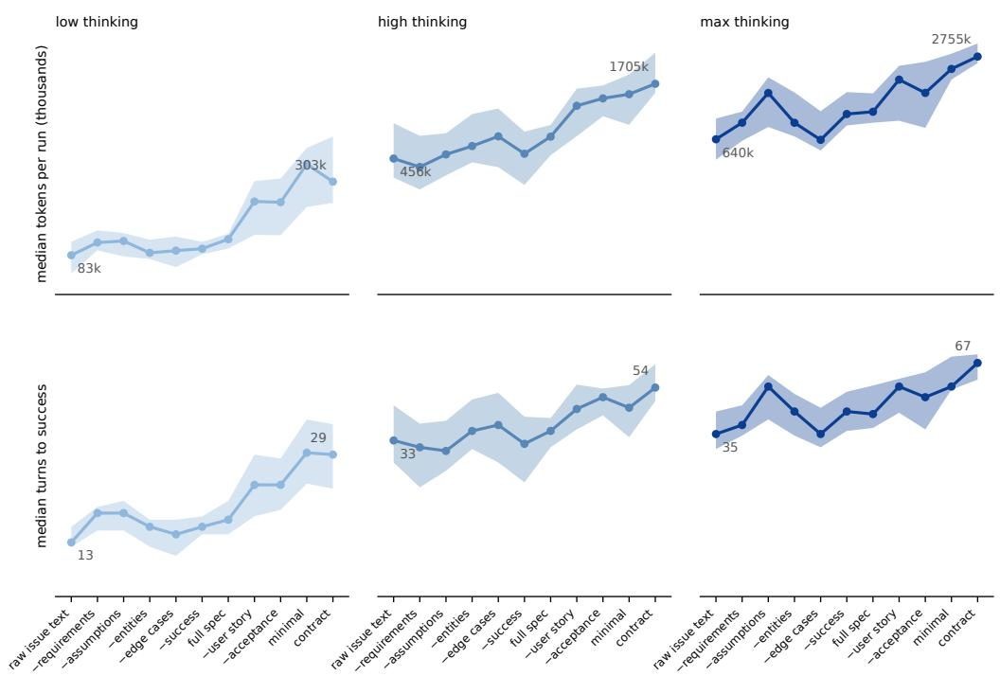  
Figure E1: Median tokens per run for xarray-7393, across the eleven specifications at each thinking efort.

The composition of spend shifts slightly with thinking efort, as more reasoning buys more output tokens at the most expensive rate, but the shift is small relative to the efect of the price schedule.

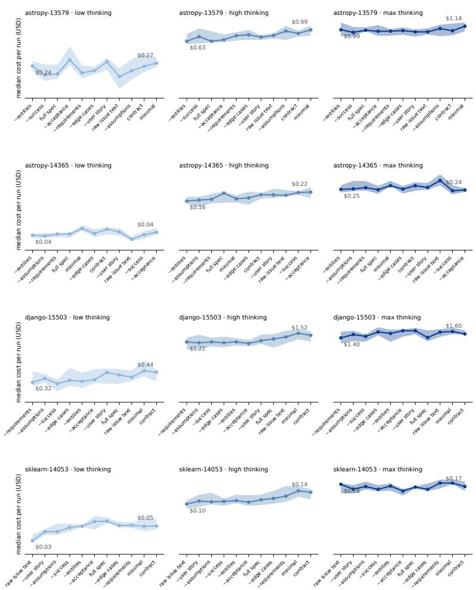  
Figure E2: Cost and turns for the four tasks not shown in Figure 2.

<table><tr><td></td><td>fresh input cached input</td><td></td><td>output</td></tr><tr><td>tokens, low effort</td><td>6.6%</td><td>89.9%</td><td>3.6%</td></tr><tr><td>tokens, max effort</td><td>3.1%</td><td>94.4%</td><td>2.5%</td></tr><tr><td>dollars, low effort</td><td>19.6%</td><td>26.8%</td><td>53.6%</td></tr><tr><td>dollars, max effort</td><td>12.3%</td><td>37.6%</td><td>50.0%</td></tr></table>

Table E1: Composition of tokens and of spend, by thinking efort, at Kimi K3 list prices.

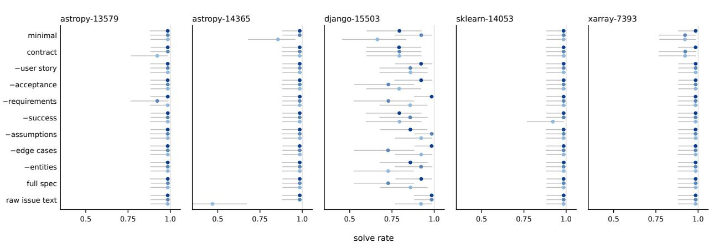  
Figure E3: Solve rate by specification and thinking efort for all five tasks, posterior median with 90% credible intervals. Four of the five sit at or near the ceiling throughout. django-15503 has headroom under every specification and the raw issue text on astropy-14365 at low thinking efort resolves 47% of the time against 99% at high and max efort and 99.6% pooled across the ten structured specifications on that task.