# ConfAL-WM: Confidence-Guided Active Learning for Action-Conditioned World Models

Xiang Liu xiang-liu25@ mail.tsinghua.edu.cn

Sen Cui‡ cuis@ mail.tsinghua.edu.cn

Changshui Zhang† zcs@ mail.tsinghua.edu.cn

Tsinghua University

‡ Project Leader & Corresponding Author

† Corresponding Author

## Abstract

Action-conditioned world models have become an important foundation for embodied prediction, planning, and synthetic data generation, but their errors under new task and scene distributions are often concentrated in localized spatiotemporal regions such as robot arms, manipulated objects, contact areas, and occluded objects. This paper presents ConfAL-WM, a confidence-guided active learning framework for post-training embodied world models. Built upon EVAC, we attach a lightweight confidence probe to UNet decoder features and predict dense confidence maps in the latent space. These maps are aggregated into task-, frame-, and patch-level scores, enabling both efficient data selection and localized training enhancement. Our pipeline first retrains the confidence probe and warms up EVAC with a small subset of target-domain data, then performs task-level prescreening to allocate sampling budgets, and finally applies selected-data retraining with optional frame or patch weighted data enhancement. Experiments on RoboTwin2.0 show that confidence-guided selection improves post-training efficiency, while dense frame and patch weighting further enhances prediction quality and embodied trajectory consistency compared with scalar reward, progress, and judge-based scoring baselines. A quick visual overview of this work is available at https://ConfAL-WM.github.io.

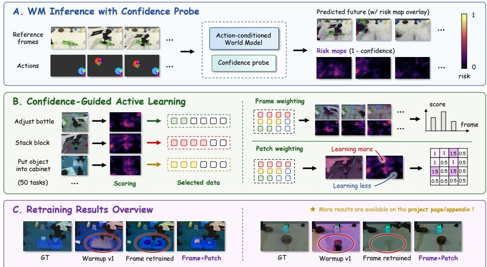  
Figure 1: An introduction of our work. (A) Given reference frames and action conditions, we use a UNet-based latent diffusion world model as the backbone and train a confidence probe on decoder features to predict dense future risk maps. (B) Confidence guides active learning in two ways: selecting more informative post-training data and enhancing supervision on unreliable frames or patches. (C) Two representative episodes compare the same predicted frame from the ground truth, warmup model, frame-weighted retraining, and frame-and-patch-weighted retraining.

## 1 Introduction

Action-conditioned embodied world models aim to predict future visual observations under given robot actions, enabling offline policy evaluation, synthetic data generation, and planning without direct environment interaction. EnerVerse-AC (EVAC) is a representative action-conditioned world model that generates future multi-view observations conditioned on robot actions (Jiang et al., 2025). However, whether under zero-shot transfer to new datasets or during post-training on existing domains, prediction errors are rarely uniformly distributed over the whole video. They often concentrate around moving robot arms, manipulated objects, contact regions, occlusions, and long-horizon interaction errors. Recent studies on confidence-aware video generation and physics-reinforced world simulation also suggest that unreliable or physically inconsistent regions are usually spatially and temporally localized (Mei et al., 2025b; Zhang et al., 2026). This motivates a post-training pipeline that does not merely add more data globally, but selects and enhances data according to where the world model is likely to fail.

In this work, we study confidence-guided active learning for action-conditioned world models, and refer to the overall framework as ConfAL-WM. We build upon EVAC as the backbone world model and attach a lightweight confidence probe to its UNet decoder features. Unlike prior DiT-based dense confidence estimation, where each latent token naturally corresponds to a video patch (Mei et al., 2025b), EVAC requires an explicit feature-tapping design. We use decoder features rather than the bottleneck features, because they retain stronger spatial locality while still carrying global contextual information from the latent diffusion backbone. The probe predicts dense confidence maps in the latent space, which are further aggregated into patch-, frame-, and task-level scores for selection and retraining. To stabilize probe supervision, we also replace the random binary threshold range used in previous confidence training with an adaptive EMA-based thresholding strategy.

Our active learning pipeline uses confidence in a staged and budget-aware manner. EVAC is originally pretrained on AgiBot World, a large-scale real-world manipulation dataset (Bu et al., 2025), and we use RoboTwin2.0 as the post-training dataset to evaluate the effectiveness of active learning under a new task and scene distribution (Chen et al., 2025). First, a small subset of data is used to retrain the confidence probe and warm up EVAC, producing a domain-adapted EVAC-v1. Second, we perform fast task-level prescreening with the confidence probe: harder tasks are assigned larger sampling budgets, while easier tasks receive fewer selected scenes. Third, after scene selection, there are two possible retraining paths. The selected data can be directly used for EVAC-v2 retraining, or it can be further processed by EVAC-v1 and the confidence probe to obtain frame- and patch-level confidence scores. The latter path introduces additional inference and scoring cost, but enables confidence-guided data enhancement during retraining.

This design gives confidence two roles. At the selection level, it estimates which tasks and scenes deserve more retraining budget. At the training level, it localizes which frames and patches should receive stronger supervision. This differs from scalar reward, progress, or judge-based scoring models, which can rank trajectories or frames but usually cannot provide patch-level prediction risk for world-model retraining (Lee et al., 2026; Liang et al., 2026; Ma et al., 2024; Ji et al., 2026). In our comparison, these scoring models are used as alternative selection signals, and part of them are further equipped with frame-weighted retraining. Confidence is used as our main signal, and we additionally study frame-and-patch-weighted retraining as a stronger dense enhancement strategy. Following the EWMBench-style evaluation protocol (Yue et al., 2025), our results show that confidence-guided selection and confidence-guided frame/patch weighting consistently improve prediction quality and embodied trajectory consistency over scalar scoring baselines.

## Our contributions are summarized as follows:

1. We propose ConfAL-WM, a staged confidence-guided active learning pipeline for efficient post-training of embodied action-conditioned world models.

2. We adapt dense confidence estimation to a UNet-based action-conditioned world model by designing a decoder-feature confidence probe and a more stable EMA-based training target.

3. We introduce confidence-guided data enhancement, especially frame-and-patch-weighted retraining, to focus supervision on unreliable spatiotemporal regions.

4. We show that confidence improves both data selection and weighted retraining compared with existing scalar reward, progress, and judge-based scoring methods.

## 2 Related Work

Action-conditioned world models and evaluation. Action-conditioned world models predict future observations under robot actions. EnerVerse-AC (EVAC), pretrained on AgiBot World, is the UNet-based backbone of our framework (Jiang et al., 2025; Bu et al., 2025); we post-train it on RoboTwin2.0 under new tasks, scenes, and robot embodiments (Chen et al., 2025). Recent alternatives improve action controllability or latent prediction, including IRASim and DINO-WM (Zhu et al., 2025; Zhou et al., 2025). Most closely related, Mei et al. (2025b) introduce $C ^ { 3 }$ for dense confidence estimation in DiT-based video models.

EWMBench evaluates embodied world models through reconstruction, scene, motion, and semantic metrics, and provides our main evaluation protocol (Yue et al., 2025). Other benchmarks connect generated futures with policy performance or assess instruction following and physical plausibility (Jang et al., 2025; Li et al., 2025b; NVIDIA, 2025).

Dense confidence, reward, progress, and judge signals. Dense uncertainty is the closest signal to our method. S3 analyzes uncertainty in generative video models, while C3 introduces dense calibrated confidence maps for controllable video generation (Mei et al., 2025a;b). PRM-as-a-Judge provides process-level robotic auditing with macro- and micro-level signals (Ji et al., 2026). Our confidence additionally serves as an acquisition score and a local training weight.

We compare against several scalar scoring methods. GVL estimates temporal progress through in-context value learning (Ma et al., 2024); RoboReward learns general-purpose vision-language rewards for robotics (Lee et al., 2026); Robometer combines frame-level progress with trajectory preferences (Liang et al., 2026); and LRMs generate process and completion rewards online (Wu et al., 2026). These methods score trajectories or frames, whereas we also localizes patch errors.

Localized supervision has recently been explored from complementary perspectives. CD-LAM reduces action-irrelevant latent bias through embodiment-focused reconstruction and action-aware objectives (Wei et al., 2026). PhysisForcing strengthens physical consistency by emphasizing physicsinformative interaction regions (Zhang et al., 2026). Our method identifies such regions through world-model confidence and uses them for active selection and patch-weighted retraining.

Active learning, uncertainty-aware robot learning, and auxiliary world-model objectives. Classical active learning selects samples using uncertainty, disagreement, or coverage (Settles, 2009; Seung et al., 1992; Sener & Savarese, 2018). Robotics-specific methods extend these principles to view selection, rollout control, and demonstration curation (Eren & Oztop, 2024; Dasgupta et al., 2024; Li et al., 2025a; Dass et al., 2025). Most closely related, Romer et al. ¨ (2026) derive velocity-field disagreement (VFD) to quantify epistemic uncertainty in flow-based VLAs, and further introduce SAVE, which uses this uncertainty to prioritize tasks and initial scenes for active multitask fine-tuning. This shares our goal of using model uncertainty to reduce adaptation cost and focus supervision on informative data, but operates on action-policy uncertainty, whereas our method estimates dense video-prediction confidence and uses it for both data selection and localized world-model retraining. Future-aware auxiliary objectives can also improve embodied representations (Yuan et al., 2026; Lv et al., 2026; Luo et al., 2026).

## 3 Method

In this section, we first introduce a dense confidence probe for a UNet-based action-conditioned world model, which estimates patch-level prediction reliability from intermediate decoder features. We then describe how the resulting dense risk maps are aggregated into task-level acquisition scores and further converted into weights for confidence-guided EVAC retraining.

## 3.1 Dense Confidence Probe for UNet World Models

Confidence definition. Given an action-conditioned world model, we define confidence as the predicted probability that a local prediction error is below a threshold. In EVAC, the diffusion model predicts a denoising direction $\hat { v } ^ { ( \tau ) }$ for the ground-truth target v(τ). For a predicted future frame t

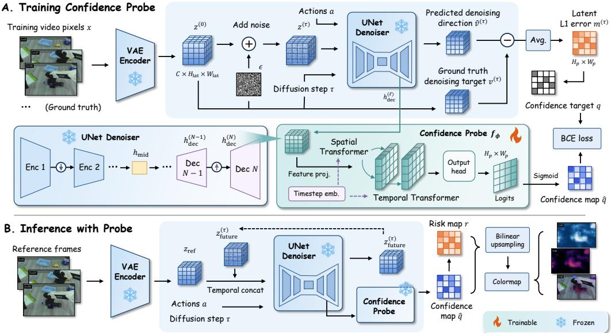  
Figure 2: Training and inference of the confidence probe in the UNet latent diffusion world model. Video pixels are encoded into latent variables, diffused into $z ^ { ( \tau ) }$ , processed by the UNet denoiser, and supervised by the denoising target $v ^ { ( \tau ) }$ . The confidence probe is attached to selectable decoder features $h _ { \mathrm { d e c } } ^ { ( \ell ) }$ and predicts dense confidence maps.

and latent patch (i, j), we compute a local mean absolute error as

$$
m _ { t , ( i , j ) } ^ { ( \tau ) } = \frac { \sqrt { 1 - \bar { \alpha } _ { \tau } } } { | \mathcal { P } _ { i , j } | } \sum _ { p \in \mathcal { P } _ { i , j } } \left| \hat { v } _ { t , p } ^ { ( \tau ) } - v _ { t , p } ^ { ( \tau ) } \right| = \frac { 1 } { | \mathcal { P } _ { i , j } | } \sum _ { p \in \mathcal { P } _ { i , j } } \left| \hat { z } _ { t , p } ^ { ( \tau ) } - z _ { t , p } ^ { ( 0 ) } \right| .\tag{1}
$$

Here, $p = ( c , x , y )$ indexes one channel-spatial entry in the latent tensor: $c$ is the latent feature channel and (x, y) is a spatial location in the latent grid. The set $\mathcal { P } _ { i , j }$ denotes the latent region corresponding to probe patch $( i , j ) . \ z _ { t , p } ^ { ( 0 ) }$ is the clean video latent encoded from the ground-truth video, and $\hat { z } _ { t , p } ^ { ( \tau ) }$ is its closed-form prediction recovered from $\hat { v } _ { t , p } ^ { ( \tau ) }$ at diffusion timestep τ. This equivalent form avoids executing a complete reverse diffusion trajectory when constructing the confidence target. $\bar { \alpha } _ { \tau }$ is the cumulative noise-schedule coefficient at timestep τ .

The binary confidence target at frame t is defined as

$$
\begin{array} { r } { q _ { t } = \big \{ q _ { t , ( i , j ) } \big \} _ { i , j } \in \big \{ 0 , 1 \} ^ { H _ { p } \times W _ { p } } , \qquad q _ { t , ( i , j ) } = \mathbb { I } \{ m _ { t , ( i , j ) } ^ { ( \tau ) } < \theta _ { t } \} , } \end{array}\tag{2}
$$

where $\theta _ { t }$ is a stochastic threshold sampled from an adaptive interval. Further architectural details of the latent-space error construction are provided in Appendix A.1.

Decoder-feature confidence probe. Let $h _ { \mathrm { d e c } } ^ { ( \ell ) }$ denote the feature map extracted from the ℓ-th UNet decoder block. For each predicted future frame, the confidence probe prediction is

$$
\hat { q } _ { t } = \sigma \Bigl ( f _ { \phi } \Bigl ( h _ { \mathrm { d e c } } ^ { ( \ell ) } , e _ { \tau } , e _ { \theta } \Bigr ) \Bigr ) \in [ 0 , 1 ] ^ { H _ { p } \times W _ { p } } .\tag{3}
$$

where $e _ { \tau }$ denotes the diffusion-timestep embedding, $e _ { \theta }$ denotes the sampled error threshold embedding, $f _ { \phi }$ is the trainable confidence probe parameterized by ϕ, and $\sigma ( \cdot )$ is the element-wise sigmoid function. Internally, the probe applies channel projection, spatial Transformer layers, temporal Transformer layers, and a patch-wise output head. The decoder index ℓ allows the probe to trade coarse semantic context for finer spatial resolution, as shown in Figure 3.

GT (RGB frame)  
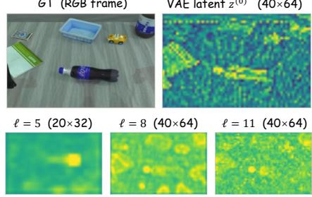  
Figure 3: Direct comparison for a single frame. All operations are performed in the VAE latent space. The three below visualize the channel-averaged Ec $\left[ \left| h _ { \mathrm { d e c } } ^ { ( \ell ) } \right| \right]$

EMA-calibrated random thresholding. At training step s, we compute the lower and upper percentiles of the batch-wise local error distribution, and we update the threshold bounds as

$$
p _ { l } ^ { ( s ) } = \mathrm { Q u a n t i l e } _ { 0 . 1 } \Big ( m ^ { ( s ) } \Big ) , \qquad p _ { h } ^ { ( s ) } = \mathrm { Q u a n t i l e } _ { 0 . 9 } \Big ( m ^ { ( s ) } \Big ) ,\tag{4}
$$

$$
l ^ { ( s ) } = ( 1 - \gamma _ { s } ) l ^ { ( s - 1 ) } + \gamma _ { s } p _ { l } ^ { ( s ) } , \qquad h ^ { ( s ) } = ( 1 - \gamma _ { s } ) h ^ { ( s - 1 ) } + \gamma _ { s } p _ { h } ^ { ( s ) } .\tag{5}
$$

The update rate $\gamma _ { s }$ is larger during learning-rate warmup and becomes substantially smaller afterwards, enabling rapid initialization followed by stable online calibration.

A separate threshold is sampled for each predicted future frame t as $\theta _ { t } \sim \mathcal { U } \big ( l ^ { ( s ) } , h ^ { ( s ) } \big )$ . The sampled threshold $\theta _ { t }$ is shared by all spatial patches $( i , j )$ within the same frame. Further implementation details and the conditional interpretation of $\theta _ { t }$ are provided in Appendix A.2.

Probe training objective. The probe is trained with binary cross-entropy over all supervised patches in the predicted future frames:

$$
\mathcal { L } _ { \mathrm { c o n f } } = - \mathbb { E } _ { t , ( i , j ) } \biggl [ q _ { t , ( i , j ) } \log \hat { q } _ { t , ( i , j ) } + \left( 1 - q _ { t , ( i , j ) } \right) \log ( 1 - \hat { q } _ { t , ( i , j ) } ) \biggr ] ,\tag{6}
$$

During probe training, the EVAC backbone remains frozen and gradients are propagated only through $f _ { \phi } .$ At inference time, the frame-wise dense risk map is defined as $r _ { t , ( i , j ) } = 1 - \hat { q } _ { t , ( i , j ) }$

## 3.2 Confidence-Guided Active Learning

Full pipeline. Given a candidate data pool, our active learning pipeline uses confidence for both sample acquisition and localized retraining. First, we train the confidence probe and warm up EVAC on a small subset of the data pool. The resulting EVAC-v1 is used for task-level prescreening, where representative episodes estimate task difficulty and determine the per-task candidate quota, according to which episodes are randomly sampled within each task.

Second, the resulting candidate subset can then be directly used for selection-only EVAC-v2 retraining. Alternatively, we perform an additional inference and confidence-scoring stage on the selected episodes, and use the resulting confidence maps to weight the EVAC-v2 retraining objective.

Risk-based selection criteria. We consider three confidence-based selection criteria: 1. mean risk, 2. tail risk, and 3. persistent risk. Mean risk measures the overall prediction difficulty by averaging the dense risk map over all spatial locations and predicted future frames, whereas tail risk emphasizes severe localized failures. For tail risk, we flatten all patch risks $\{ r _ { t , ( i , j ) } \}$ into a vector of length $K = T H _ { p } W _ { p }$ and sort its entries in ascending order as $r _ { [ 1 ] } \le r _ { [ 2 ] } \le \cdots \le r _ { [ K ] }$ . Let η denotes the selected high-risk tail ratio, the two scores are defined as

$$
S _ { \mathrm { m e a n } } = \mathbb { E } _ { t , ( i , j ) } \left[ r _ { t , ( i , j ) } \right] , \quad S _ { \mathrm { t a i l } } = \frac { 1 } { \lceil \eta K \rceil } \sum _ { n = K - \lceil \eta K \rceil + 1 } ^ { K } r _ { [ n ] } .\tag{7}
$$

Persistent risk captures high-risk local failures that recur across multiple frames. Let $K _ { p } = H _ { p } W _ { p } ,$ for frame t, we sort its patch risks as $r _ { t , [ 1 ] } \leq \cdot \cdot \cdot \leq r _ { t , [ K _ { p } ] }$ and average the largest fraction of them to obtain a frame-level score $u _ { t }$ . We then sort these frame scores as $u _ { [ 1 ] } \leq \dots \leq u _ { [ T ] }$ and average the highest-scoring frames:

$$
u _ { t } = \frac { 1 } { \left\lceil \eta _ { p } K _ { p } \right\rceil } \sum _ { \substack { n = K _ { p } - \left\lceil \eta _ { p } K _ { p } \right\rceil + 1 } } ^ { K _ { p } } r _ { t , [ n ] } , \quad S _ { \mathrm { p e r s i s t e n t } } = \frac { 1 } { \left\lceil \eta _ { t } T \right\rceil } \sum _ { \substack { n = T - \left\lceil \eta _ { t } T \right\rceil + 1 } } ^ { T } u _ { [ n ] } .\tag{8}
$$

Here, $\eta _ { p }$ denotes the fraction of high-risk patches retained within each frame, and $\eta _ { t }$ denotes the fraction of high-risk frames retained across the predicted video.

Confidence-guided frame and patch weighting. For weighted EVAC-v2 retraining, we perform an additional inference and confidence-scoring stage on the selected episodes. Frame weighting assigns the spatially averaged risk uniformly to all patches within frame t, whereas patch weighting retains the original dense risk $r _ { t , ( i , j ) }$ . We unify the two forms as

$$
r _ { t , ( i , j ) } ^ { ( \alpha ) } = \mathbb { E } _ { ( i ^ { \prime } , j ^ { \prime } ) } \left[ r _ { t , ( i ^ { \prime } , j ^ { \prime } ) } \right] + \alpha \left( r _ { t , ( i , j ) } - \mathbb { E } _ { ( i ^ { \prime } , j ^ { \prime } ) } \left[ r _ { t , ( i ^ { \prime } , j ^ { \prime } ) } \right] \right) , \qquad \alpha \in [ 0 , 1 ] .\tag{9}
$$

When $\alpha \ : = \ : 0$ , all patches within a frame receive the same frame-level risk; when $\alpha = 1$ , the original patch-level risk map is recovered. Intermediate values preserve the frame-level baseline while introducing local residual modulation.

After quantile normalization and clipping, we denote the resulting risk by $\boldsymbol { \widetilde { r } } _ { t , ( i , j ) } ^ { ( \alpha ) } \in [ 0 , 1 ]$ . It is converted into a local loss multiplier and applied to the world-model objective as

$$
w _ { t , ( i , j ) } = 1 + \lambda _ { \mathrm { e f f } } ( s ) \widetilde { r } _ { t , ( i , j ) } ^ { ( \alpha ) } , \qquad \mathscr { L } _ { \mathrm { W M } } = \frac { \mathbb { E } _ { t , ( i , j ) } \left[ w _ { t , ( i , j ) } \ell _ { t , ( i , j ) } \right] } { \mathbb { E } _ { t , ( i , j ) } \left[ w _ { t , ( i , j ) } \right] } .\tag{10}
$$

Here, $\ell _ { t , ( i , j ) }$ is the local world-model training loss, and $\lambda _ { \mathrm { e f f } } ( s ) = \lambda _ { \mathrm { c o n f } } \operatorname* { m i n } ( 1 , s / s _ { \mathrm { w a r m } } )$ linearly increases the weighting strength during the first $s _ { \mathrm { w a r m } } \mathrm { \mathbf { E } V A C - v } 2$ retraining steps. Thus, higher-risk frames and patches receive larger optimization weights. The confidence maps are detached during EVAC retraining, so gradients are propagated only through the world model.

## 4 Experiments

Our experiments are designed to answer two questions. 1. Why Confidence? Is the confidence signal a meaningful indicator of world-model prediction errors? 2. Why Active Learning? Can confidence-guided active learning improve post-training efficiency and final world-model quality?

## 4.1 Experimental Setup

Data setting. In our setting, EVAC is pretrained on AgiBot World (Bu et al., 2025), while active learning and post-training are conducted on a subset of RoboTwin2.0 (Chen et al., 2025). This creates a transfer setting involving new tasks, scenes, and robot embodiments. We use data from the Aloha-AgileX dual-arm robot, covering 50 manipulation tasks. Each task contains 500 randomized scenes, resulting in 24,992 videos in total. The video length ranges from 98 to 578 frames.

Implementation details. During confidence-probe training, the entire EVAC backbone is frozen and only the confidence probe $f _ { \phi }$ is optimized. During EVAC-v1 warmup and EVAC-v2 retraining, the UNet denoiser and two projection modules are trainable, while the VAE, CLIP embedder, and action-conditioning resampler remain frozen. The full EVAC model has about 2.33B parameters, and the confidence probe has about 8.2M parameters.

We use 6,248 episodes, about 25% of the data, for confidence-probe training and EVAC-v1 warmup. The remaining 18,244 episodes form the candidate pool, from which 7,298 episodes are selected for EVAC-v2 retraining. We use AdamW with learning rate $5 \times 1 0 ^ { - 5 }$ , fp16 training, and 4,000 default optimization steps on two A800 GPUs. For confidence scoring, EVAC-v1 averages probe scores over three diffusion timesteps τ ∈ [50, 200]. The main active-learning comparison is repeated with three random seeds, 42, 3407, and 123, and the main text reports the mean across these runs. Detailed per-seed results and bootstrap statistics are provided in Appendix B.2.

Baselines. For evaluating confidence quality, directly comparing with the original $C ^ { 3 }$ is not fully fair because it is designed for DiT-style video world models (Mei et al., 2025b). Our main comparisons focus on the scoring method of active learning: RoboReward1, a general-purpose visionlanguage reward model for robotics (Lee et al., 2026); GVL2, which uses VLMs as in-context value learners (Ma et al., 2024); Robometer-Prog and Robometer-Pref3, trajectory progress and preference models (Liang et al., 2026); PRM-as-Judge4, a dense process-level robotic auditing method (Ji et al., 2026); and LRMs5, large reward models for online robot reward generation (Wu et al., 2026).

World-model evaluation. We follow the EWMBench evaluation pipeline (Yue et al., 2025). PSNR and SSIM measure low-level reconstruction quality. Scene consistency measures layout and object preservation. Logics evaluates higher-level physical and interaction plausibility. Sem.-CLIP and Sem.-BLEU measure visual-semantic and textual-semantic agreement. Traj-HSD, Traj-Dyn, and Traj-nDTW evaluate robot-trajectory, and higher values indicate better trajectory consistency.

Beyond quantitative evaluation, Appendix B.3 and Appendix B.4 provide qualitative examples of retraining evolution and confidence-map visualization, respectively.

(a)  
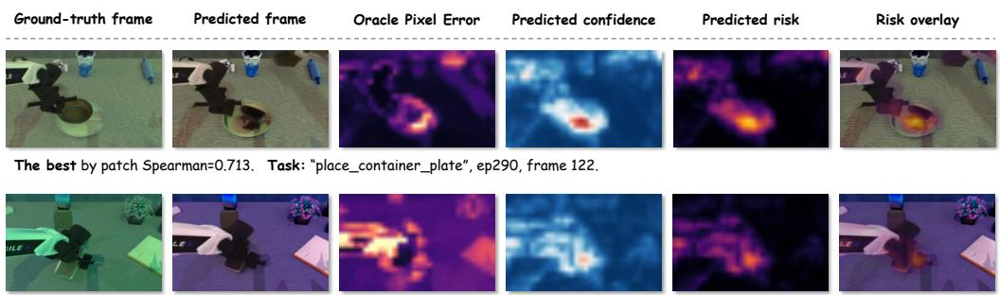  
The worst by patch Spearman=0.241. Task: “place\_phone\_stand”, ep308, frame 73.  
Figure 4: Qualitative confidence visualization. Two representative high-agreement episodes from different manipulation tasks are shown. High-risk regions generally coincide with errors around robot arms, manipulated objects, contacts, and occlusions. More results see Appendix B.4.

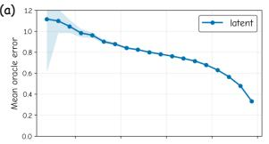

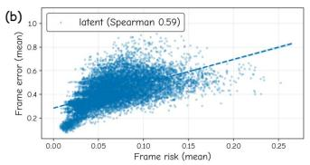

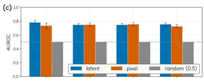

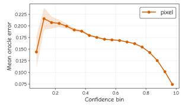

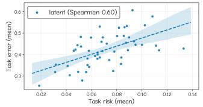

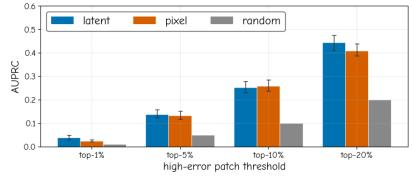  
Figure 5: Validity of confidence as a multi-scale risk signal. (a) Mean oracle error across confidence bins in latent space (top) and pixel space (bottom). (b) Mean risk versus oracle error at the frame-level (top) and task-level (bottom) in latent space. (c) AUROC (top) and AUPRC (bottom) for detecting the top-Q% highest-error patches in latent and pixel spaces.

## 4.2 Why Confidence?

Before using confidence for active learning, we examine whether the predicted risk $r _ { t , ( i , j ) }$ provides a meaningful estimate of world-model prediction error. We evaluate one episode from each of the 50 prescreened tasks using confidence maps and predictions generated by the EVAC-v1.

Qualitative localization. Figure 4 shows that the predicted risk maps respond to spatially localized failures rather than reflecting only global video quality. High-risk regions commonly appear around moving manipulators, object interactions, contacts, and temporarily occluded objects. Their agreement with latent prediction-error maps indicates that the probe captures local failures.

Confidence as a multi-scale ranking signal. We quantitatively compare risk with oracle error across patch-, frame-, and task-levels. As shown in Figure 5, oracle error generally decreases as confidence increases in both spaces, with a clearer monotonic trend in latent space. In latent space, risk achieves Spearman correlations of 0.540, 0.590, and 0.595 at the patch-, frame-, and task-levels, respectively. For detecting the top-5% highest-error patches, it obtains an AUROC of 0.761 and an AUPRC of 0.146, compared with random baselines of 0.5 and 0.05. These results show that dense risk can be reliably aggregated into frame- and task-level scores for active data selection.

Spatial and temporal behavior. Table 1 further shows that risk maps are temporally stable: adjacent frames obtain a top-region IoU of 0.740, while the flicker score is only 0.005. Risk and latent error are also temporally synchronized, with a peak correlation of 0.602 occurring near zero lag. Nevertheless, the top-5% spatial IoU is 0.130, suggesting that confidence reliably identifies error-prone regions but does not precisely reproduce their boundaries.

Overall, the probe provides a strong ordinal risk signal for ranking patches, frames, and tasks, although its output should not necessarily be interpreted as an absolutely calibrated probability. Additional pixel-space comparisons, calibration diagnostics, per-task results, failure cases, and parameter sensitivity analyses are provided in Appendix B.1.

Table 1: Summary of latent-space confidence validity. Frame- and task-level statistics use mean aggregation.
<table><tr><td>Property</td><td>Metric</td><td>Result</td></tr><tr><td>Multi-scale ranking High-error detection Spatial agreement</td><td>Patch / Frame / Episode Spearman (↑) AUROC / AUPRC@top-5% (↑) Top-5% IoU (↑)</td><td>0.540/0.590/0.595 0.761/0.146 0.130</td></tr></table>

## 4.3 Why Active Learning?

We evaluate whether confidence-guided selection and retraining improve the action-conditioned world model under a fixed data budget. We report selection-only retraining and selection with additional weighting, since the latter requires an extra inference and scoring stage after selection.

For compact comparison, all component metrics are normalized to [0, 1] and aggregated into four dimensions: Reconstruction = (PSNR + SSIM)/2, Scene = Scene Consistency, Semantics = (Logics + Sem.-CLIP + Sem.-BLEU)/3, and $\mathrm { \Delta M o t i o n = T r a j - H S D + T r a j - D y n + T r a j - n D T W }$

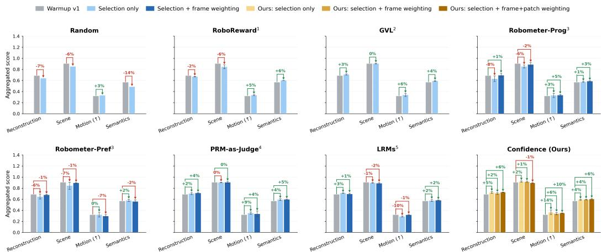  
Figure 6: Main comparison of active-learning scoring and retraining strategies. Each panel compares EVAC-v1 with selection-only retraining and additional frame weighting. Confidence additionally enables frame+patch weighting. Bars report the mean over three seeds, and arrows report relative changes from EVAC-v1. Error bars indicate paired-bootstrap 95% confidence intervals.

Main comparison. Figure 6 and Table 2 show that the acquisition signal substantially affects post-training performance under the same data budget. Under selection-only retraining, confidenceguided mean-risk selection achieves the best result on eight of the nine component metrics, including PSNR, SSIM, Scene Consistency, Sem.-CLIP, Sem.-BLEU, and all three trajectory metrics.

Additional confidence-guided weighting further strengthens this result. Among methods with ad ditional weighting, confidence with frame weighting achieves the best Scene Consistency, while confidence with frame-and-patch weighting achieves the best PSNR, SSIM, Logics, Sem.-CLIP, Sem.-BLEU, Traj-HSD, Traj-Dyn, and Traj-nDTW. These results support the two roles of confidence in our framework: 1. Efficient data selection: the mean risk estimation provides an effective acquisition signal for selecting training data; 2. Effective data enhancement: dense confidence maps further identify unreliable frames and local regions that benefit from stronger supervision.

A minor discrepancy remains in Scene Consistency: frame-and-patch weighting is slightly lower than frame-only weighting, despite improving Reconstruction, Semantics, and Motion. This discrepancy is consistent with the known tension between visual consistency and motion-oriented metrics, which may favor different characteristics of generated videos (Liao et al., 2024; Dou et al., 2026; Ye et al., 2026). It also highlights the limitations of using such proxy metrics to indirectly assess downstream embodied performance.

Table 2: Detailed normalized results under the same active-learning setting. The results are averaged over three seeds (42, 3407, and 123). Methods are separated into selection-only retraining and selection with additional weighting. Green, yellow, and red indicate the best, second-best, and third-best results within each block, respectively.
<table><tr><td rowspan="2">Scoring</td><td rowspan="2">Weighting</td><td colspan="2">Reconstruction (↑)</td><td colspan="2">Scene (↑)</td><td colspan="2">Semantics (↑)</td><td colspan="3">Motion (↑)</td></tr><tr><td>| PSNR (↑)</td><td>SSIM (↑)</td><td>Scene Cons. (↑)</td><td>Logics (↑)</td><td>Sem.-CLIP (↑)</td><td>Sem.-BLEU (↑)</td><td>Traj-HSD (↑)</td><td>Traj-Dyn (↑)</td><td>Traj-nDTW (↑)</td></tr><tr><td>Base EVAC</td><td></td><td>0.5532</td><td>0.5778</td><td>0.8757</td><td>0.4298</td><td>0.8523</td><td>0.1799</td><td>0.0007</td><td>0.0001</td><td>0.0006</td></tr><tr><td colspan="2">Base EVAC (Warmup v1)</td><td>0.6446</td><td>0.7309</td><td>0.9047</td><td>0.5537</td><td>0.8824</td><td>0.2708</td><td>0.1045</td><td>0.0721</td><td>0.1439</td></tr><tr><td colspan="9">Selection-only retraining: no additional weighting after selection</td><td></td><td></td></tr><tr><td>Random</td><td>|None</td><td>0.5968</td><td>0.6849</td><td>0.8524</td><td>0.3554</td><td>0.8689</td><td>0.2372</td><td>0.1067</td><td>0.0725</td><td>0.1518</td></tr><tr><td>GVL2</td><td>None</td><td>0.6630</td><td>0.7546</td><td>0.9057</td><td>0.5992</td><td>0.8898</td><td>0.2849</td><td>0.1114</td><td>0.0688</td><td>0.1592</td></tr><tr><td>RoboReward1</td><td>None</td><td>0.6266</td><td>0.7158</td><td>0.8470</td><td>0.6391</td><td>0.8861</td><td>0.2815</td><td>0.1113</td><td>0.0693</td><td>0.1554</td></tr><tr><td>Robometer-Prog³</td><td>None</td><td>0.5809</td><td>0.6825</td><td>0.8532</td><td>0.5840</td><td>0.8810</td><td>0.2627</td><td>0.1090</td><td>0.0690</td><td>0.1526</td></tr><tr><td>Robometer-Pref3</td><td>None</td><td>0.5919</td><td>0.7029</td><td>0.8443</td><td>0.5813</td><td>0.8859</td><td>0.2695</td><td>0.1046</td><td>0.0638</td><td>0.1524</td></tr><tr><td>PRM-as-Judge4</td><td>None</td><td>0.6467</td><td>0.7580</td><td>0.9033</td><td>0.6033</td><td>0.8880</td><td>0.2852</td><td>0.1154</td><td>0.0746</td><td>0.1606</td></tr><tr><td>LRMs5 Confidence (Ours)</td><td>None None</td><td>0.6617 0.6746</td><td>0.7603 0.7692</td><td>0.8966 0.9196</td><td>0.5744 0.5923</td><td>0.8827 0.8903</td><td>0.2756 0.2865</td><td>0.0946 0.1181</td><td>0.0587 0.0812</td><td>0.1352 0.1650</td></tr><tr><td colspan="9">Selection + additional weighting: extra scoring after selection</td></tr><tr><td></td><td></td><td></td><td></td><td></td><td></td><td></td><td></td><td></td><td></td><td></td></tr><tr><td>Robometer-Prog³ Robometer-Pref3</td><td>Frame Frame</td><td>0.6439 0.6317</td><td>0.7449 0.7289</td><td>0.8882 0.8945</td><td>0.5882 0.5289</td><td>0.8893 0.8849</td><td>0.2878 0.2665</td><td>0.1097 0.0974</td><td>0.0697 0.0654</td><td>0.1563 0.1342</td></tr><tr><td>PRM-as-Judge4</td><td>Frame</td><td>0.6584</td><td>0.7661</td><td>0.9053</td><td>0.6226</td><td>0.8868</td><td>0.2795</td><td>0.1082</td><td>0.0728</td><td>0.1536</td></tr><tr><td>LRMs5</td><td>Frame</td><td>0.6463</td><td>0.7448</td><td>0.8882</td><td>0.5826</td><td>0.8869</td><td>0.2750</td><td>0.1053</td><td>0.0635</td><td>0.1483</td></tr><tr><td>Confidence (Ours)</td><td>Frame</td><td>0.6595</td><td>0.7500</td><td>0.9143</td><td>0.6171</td><td>0.8874</td><td>0.2789</td><td>0.1106</td><td>0.0684</td><td>0.1608</td></tr><tr><td>Confidence (Ours)</td><td>Fr.+Patch</td><td>0.6772</td><td>0.7758</td><td>0.8942</td><td>0.6226</td><td>0.8925</td><td>0.2952</td><td>0.1118</td><td>0.0759</td><td>0.1633</td></tr></table>

Table 3: Ablation of selection criteria. All experiments use the default seed 42 and no additional weighting. Green, yellow, and red indicate the best, second-best, and third-best results.
<table><tr><td rowspan="2">Variant</td><td colspan="2">Reconstruction (↑)</td><td colspan="2">Scene (↑)</td><td colspan="2">Semantics (↑)</td><td colspan="3">Motion (↑)</td></tr><tr><td>PSNR (↑)</td><td>SSIM (↑)</td><td>Scene Cons. (↑)</td><td>Logics (↑)</td><td>Sem.-CLIP (↑)</td><td>Sem.-BLEU (↑) | Traj-HSD (↑)</td><td></td><td>Traj-Dyn (↑)</td><td>Traj-nDTW (↑)</td></tr><tr><td>Random</td><td>0.5968</td><td>0.6849</td><td>0.8523</td><td>0.3554</td><td>0.8689</td><td>0.2372</td><td>0.1067</td><td>0.0725</td><td>0.1518</td></tr><tr><td>Mean Risk</td><td>0.6838</td><td>0.7797</td><td>0.9322</td><td>0.6198</td><td>0.8894</td><td>0.2754</td><td>0.1313</td><td>0.0921</td><td>0.1780</td></tr><tr><td>Tail Risk</td><td>0.6317</td><td>0.7197</td><td>0.9218</td><td>0.5579</td><td>0.8890</td><td>0.3047</td><td>0.1207</td><td>0.0711</td><td>0.1630</td></tr><tr><td>Persistent Risk</td><td>0.6529</td><td>0.7470</td><td>0.9230</td><td>0.5496</td><td>0.8928</td><td>0.2858</td><td>0.0926</td><td>0.0608</td><td>0.1342</td></tr></table>

Ablation studies. Table 3 isolates the effect of the confidence-risk aggregation used for data selection, without additional frame or patch weighting. Mean risk gives the strongest overall result, achieving the best performance on seven of the nine component metrics, including both reconstruction metrics, Scene Consistency, Logics, and all three trajectory metrics. Tail risk obtains the highest Sem.-BLEU, while persistent risk obtains the highest Sem.-CLIP. We therefore use mean risk as the default acquisition criterion in our main experiments.

## 5 Conclusion

We presented ConfAL-WM, a confidence-guided active learning framework for post-training actionconditioned world models. By attaching a lightweight confidence probe to UNet decoder features, our method supports task-level data selection as well as frame- and patch-level weighted retraining. Experiments on RoboTwin2.0 show that confidence provides an effective risk signal and improves reconstruction, scene consistency, and semantic quality over scalar scoring baselines.

Our current approach still has several limitations. First, the confidence probe is designed around the internal decoder features of a UNet diffusion backbone and is trained only with EVAC on RoboTwin2.0, making it difficult to transfer directly across world-model architectures and domains. Future work could train a general-purpose world confidence model using multiple backbone world models and diverse embodied datasets. Such a model would also require a more universal input interface. Second, confidence representations are difficult to evaluate directly: their usefulness is mainly inferred from error correlation, data ranking, and downstream retraining performance, rather than from an independent measure of whether the desired reliability representation has been learned. More explicit representation diagnostics and controlled causal evaluations are therefore needed. Third, current world-model evaluation remains incomplete, particularly because visual fidelity and motion accuracy may conflict. Future protocols could separately evaluate robot-arm motion, manipulated-object dynamics, interaction regions, and static backgrounds, providing a more precise account of both local reconstruction quality and action-conditioned physical evolution.

## Impact Statement

This work aims to improve the data efficiency and reliability of embodied world-model post-training by focusing computation on informative data and unreliable regions. More accurate world models may benefit robotic simulation, planning, and synthetic-data generation, but their predictions should not be treated as guaranteed physical outcomes, especially under distribution shifts or safety-critical deployment.

## References

Qingwen Bu, Jisong Cai, Li Chen, Xiuqi Cui, Yan Ding, Siyuan Feng, Shenyuan Gao, Xindong He, Xu Huang, et al. Agibot world colosseo: A large-scale manipulation platform for scalable and intelligent embodied systems. In 2025 IEEE/RSJ International Conference on Intelligent Robots and Systems (IROS). IEEE, 2025.

Tianxing Chen, Zanxin Chen, Baijun Chen, Zijian Cai, Yibin Liu, Zixuan Li, Qiwei Liang, Xianliang Lin, Yiheng Ge, Zhenyu Gu, et al. Robotwin 2.0: A scalable data generator and benchmark with strong domain randomization for robust bimanual robotic manipulation. arXiv preprint arXiv:2506.18088, 2025.

Saptarshi Dasgupta, Akshat Gupta, Shreshth Tuli, and Rohan Paul. Uncertainty-aware active learning of nerf-based object models for robot manipulators using visual and re-orientation actions, 2024. URL https://arxiv.org/abs/2404.01812.

Shivin Dass, Alaa Khaddaj, Logan Engstrom, Aleksander Madry, Andrew Ilyas, and Roberto Mart´ın-Mart´ın. Datamil: Selecting data for robot imitation learning with datamodels. arXiv preprint arXiv:2505.09603, 2025.

Weijia Dou, Wenzhao Zheng, Weiliang Chen, Yu Zheng, Jie Zhou, and Jiwen Lu. Measuring 3d spatial geometric consistency in dynamic generated videos. arXiv preprint arXiv:2603.19048, 2026.

Mehmet Arda Eren and Erhan Oztop. Sample efficient robot learning in supervised effect prediction tasks, 2024. URL https://arxiv.org/abs/2412.02331.

Joel Jang, Seonghyeon Ye, Zongyu Lin, Jiannan Xiang, Johan Bjorck, Yu Fang, Fengyuan Hu, Spencer Huang, Kaushil Kundalia, Yen-Chen Lin, Loic Magne, Ajay Mandlekar, Avnish Narayan, You Liang Tan, Guanzhi Wang, Jing Wang, Qi Wang, Yinzhen Xu, Xiaohui Zeng, Kaiyuan Zheng, Ruijie Zheng, Ming-Yu Liu, Luke Zettlemoyer, Dieter Fox, Jan Kautz, Scott Reed, Yuke Zhu, and Linxi Fan. Dreamgen: Unlocking generalization in robot learning through video world models. In Proceedings of the 9th Conference on Robot Learning, volume 305 of Proceedings of Machine Learning Research, pp. 5170–5194. PMLR, 2025. URL https: //proceedings.mlr.press/v305/jang25a.html.

Yuheng Ji, Yuyang Liu, Huajie Tan, Xuchuan Huang, Fanding Huang, Yijie Xu, Cheng Chi, Yuting Zhao, Huaihai Lyu, Peterson Co, Mingyu Cao, Qiongyu Zhang, Zhe Li, Enshen Zhou, Pengwei Wang, Zhongyuan Wang, Shanghang Zhang, and Xiaolong Zheng. Prm-as-a-judge: A dense evaluation paradigm for fine-grained robotic auditing, 2026. URL https://arxiv.org/ abs/2603.21669.

Yuxin Jiang, Shengcong Chen, Siyuan Huang, Liliang Chen, Pengfei Zhou, Yue Liao, Xindong He, Chiming Liu, Hongsheng Li, Maoqing Yao, and Guanghui Ren. Enerverse-ac: Envisioning embodied environments with action condition, 2025. URL https://arxiv.org/abs/2505. 09723.

Tony Lee, Andrew Wagenmaker, Karl Pertsch, Percy Liang, Sergey Levine, and Chelsea Finn. Roboreward: General-purpose vision-language reward models for robotics, 2026. URL https: //arxiv.org/abs/2601.00675.

Chenhao Li, Andreas Krause, and Marco Hutter. Uncertainty-aware robotic world model makes offline model-based reinforcement learning work on real robots, 2025a. URL https://arxiv. org/abs/2504.16680.

Daquan Li et al. Worldmodelbench: Judging video generation models as world models, 2025b. URL https://arxiv.org/abs/2502.20694.

Anthony Liang, Yigit Korkmaz, Jiahui Zhang, Minyoung Hwang, Abrar Anwar, Sidhant Kaushik, Aditya Shah, Alex S. Huang, Luke Zettlemoyer, Dieter Fox, Yu Xiang, Anqi Li, Andreea Bobu, Abhishek Gupta, Stephen Tu, Erdem Biyik, and Jesse Zhang. Robometer: Scaling generalpurpose robotic reward models via trajectory comparisons, 2026. URL https://arxiv. org/abs/2603.02115.

Mingxiang Liao, Hannan Lu, Xinyu Zhang, Fang Wan, Tianyu Wang, Yuzhong Zhao, Wangmeng Zuo, Qixiang Ye, and Jingdong Wang. Evaluation of text-to-video generation models: A dynamics perspective. arXiv preprint arXiv:2407.01094, 2024.

Hao Luo, Wanpeng Zhang, Yicheng Feng, Sipeng Zheng, Haiweng Xu, Chaoyi Xu, Ziheng Xi, Yuhui Fu, and Zongqing Lu. Being-h0.7: A latent world-action model from egocentric videos, 2026. URL https://arxiv.org/abs/2605.00078.

Jindi Lv, Hao Li, Jie Li, Yifei Nie, Fankun Kong, Yang Wang, Xiaofeng Wang, Zheng Zhu, Chaojun Ni, Qiuping Deng, Hengtao Li, Jiancheng Lv, and Guan Huang. Viva: A video-generative value model for robot reinforcement learning, 2026. URL https://arxiv.org/abs/2604. 08168.

Yecheng Jason Ma, Joey Hejna, Ayzaan Wahid, Chuyuan Fu, Dhruv Shah, Jacky Liang, Zhuo Xu, Sean Kirmani, Peng Xu, Danny Driess, Ted Xiao, Jonathan Tompson, Osbert Bastani, Dinesh Jayaraman, Wenhao Yu, Tingnan Zhang, Dorsa Sadigh, and Fei Xia. Vision language models are in-context value learners, 2024. URL https://arxiv.org/abs/2411.04549.

Zhiting Mei, Ola Shorinwa, and Anirudha Majumdar. How confident are video models? empowering video models to express their uncertainty, 2025a. URL https://arxiv.org/abs/2510. 02571.

Zhiting Mei, Tenny Yin, Micah Baker, Ola Shorinwa, and Anirudha Majumdar. World models that know when they don’t know: Controllable video generation with calibrated uncertainty, 2025b. URL https://arxiv.org/abs/2512.05927.

NVIDIA. Pbench: A physical ai benchmark for world models. https://research.nvidia. com/labs/cosmos-lab/pbench/, 2025.

Ralf Romer, Maximilian Seeliger, Saida Liu, Ben Sturgis, Marco Bagatella, Daniel Marta, Andreas¨ Krause, and Angela P. Schoellig. Uncertainty quantification for flow-based vision-languageaction models. arXiv preprint arXiv:2606.18043, 2026.

Ozan Sener and Silvio Savarese. Active learning for convolutional neural networks: A core-set approach. In International Conference on Learning Representations, 2018. URL https:// arxiv.org/abs/1708.00489.

Burr Settles. Active learning literature survey. University of Wisconsin–Madison Computer Sciences Technical Report, (1648), 2009. URL https://burrsettles.com/pub/settles. activelearning.pdf.

H. Sebastian Seung, Manfred Opper, and Haim Sompolinsky. Query by committee. In Proceedings of the Fifth Annual Workshop on Computational Learning Theory, pp. 287–294, 1992. doi: 10. 1145/130385.130417.

Yufan Wei, Kun Zhou, Lingjun Mao, Zijun Zhang, Ziming Xu, Ziqiao Xi, Shuang Liang, Ruobing Han, Yuchen Yan, Xinyue Wang, Fan Feng, and Biwei Huang. Causally debiased latent action model for embodied action conditioned world models. arXiv preprint arXiv:2607.09185, 2026.

Yanru Wu, Weiduo Yuan, Ang Qi, Vitor Guizilini, Jiageng Mao, and Yue Wang. Large reward models: Generalizable online robot reward generation with vision-language models, 2026. URL https://arxiv.org/abs/2603.16065.

Xi Ye, Wenjia Yang, Yangyang Xu, Xiaoyang Liu, Duo Su, Mengfei Xia, and Jun Zhu. Shift: Motion alignment in video diffusion models with adversarial hybrid fine-tuning. arXiv preprint arXiv:2603.17426, 2026.

Tianyuan Yuan, Zibin Dong, Yicheng Liu, and Hang Zhao. Fast-wam: Do world action models need test-time future imagination?, 2026. URL https://arxiv.org/abs/2603.16666.

Hu Yue, Siyuan Huang, Yue Liao, Shengcong Chen, Pengfei Zhou, Liliang Chen, Maoqing Yao, and Guanghui Ren. Ewmbench: Evaluating scene, motion, and semantic quality in embodied world models, 2025. URL https://arxiv.org/abs/2505.09694.

Peiwen Zhang, Yufan Deng, Shangkun Sun, Juncheng Ma, Duomin Wang, Jonas Du, Zilin Pan, Ye Huang, Hao Liang, Songyan Huang, Ruihua Zhang, Enze Xie, Ming-Yu Liu, and Daquan Zhou. Physisforcing: Physics reinforced world simulator for robotic manipulation. arXiv preprint arXiv:2606.28128, 2026.

Gaoyue Zhou, Hengkai Pan, Yann LeCun, and Lerrel Pinto. DINO-WM: World models on pretrained visual features enable zero-shot planning. In Proceedings of the 42nd International Conference on Machine Learning, volume 267 of Proceedings of Machine Learning Research, pp. 79115–79135. PMLR, 2025.

Fangqi Zhu, Hongtao Wu, Song Guo, Yuxiao Liu, Chilam Cheang, and Tao Kong. Irasim: A fine-grained world model for robot manipulation. In Proceedings of the IEEE/CVF International Conference on Computer Vision, pp. 9834–9844, 2025.

## A More Details on Methods

## A.1 Patch-level Error Construction

Figure 7 illustrates the overall architecture used to construct the patch-level confidence target.

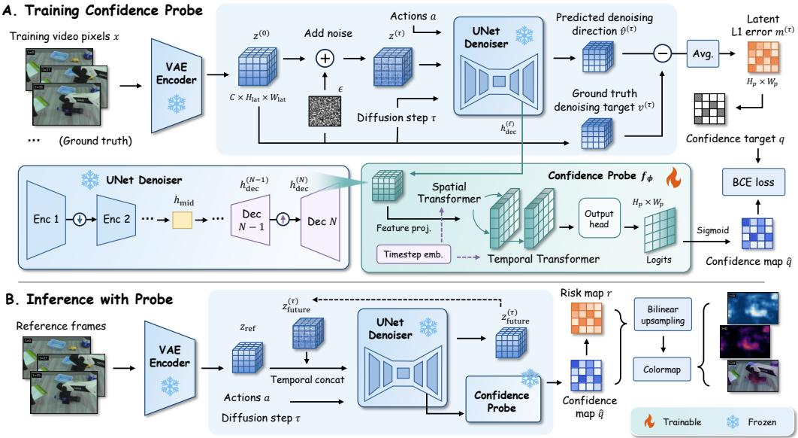  
Figure 7: Training and inference of the confidence probe in the UNet latent diffusion world model. The figure follows the same training and inference pipeline as Figure 2.

Latent diffusion and velocity target. Given a ground-truth training video x, the frozen VAE encoder first maps it into a clean latent representation

$$
\begin{array} { r } { z ^ { ( 0 ) } = \mathrm { E n c } _ { \mathrm { V A E } } ( x ) , \qquad z ^ { ( 0 ) } \in \mathbb { R } ^ { C \times H _ { \mathrm { l a t } } \times W _ { \mathrm { l a t } } } , } \end{array}\tag{11}
$$

where $C$ denotes the latent channel dimension and $( H _ { \mathrm { l a t } } , W _ { \mathrm { l a t } } )$ denotes the spatial resolution of the latent grid. For simplicity, the batch and video-time dimensions are omitted in this subsection.

At diffusion timestep $\tau ,$ , Gaussian noise $\varepsilon \sim \mathcal { N } ( 0 , I )$ is sampled and added according to the forward diffusion schedule:

$$
z ^ { ( \tau ) } = \sqrt { \bar { \alpha } _ { \tau } } z ^ { ( 0 ) } + \sqrt { 1 - \bar { \alpha } _ { \tau } } \varepsilon ,\tag{12}
$$

where $\bar { \alpha } _ { \tau }$ is the cumulative noise-schedule coefficient at timestep $\tau .$ The action-conditioned UNet predicts the corresponding velocity parameterization as

$$
\hat { v } ^ { ( \tau ) } = \mathrm { U N e t } _ { \Theta } \left( z ^ { ( \tau ) } , a , e _ { \tau } \right) , \qquad \hat { v } ^ { ( \tau ) } \in \mathbb { R } ^ { C \times H _ { \mathrm { l a t } } \times W _ { \mathrm { l a t } } } ,\tag{13}
$$

where a is the robot-action condition and $e _ { \tau }$ is the diffusion-timestep embedding. Under the velocity-prediction formulation, the ground-truth denoising target is analytically constructed as

$$
\begin{array} { r } { v ^ { ( \tau ) } = \sqrt { \bar { \alpha } _ { \tau } } \varepsilon - \sqrt { 1 - \bar { \alpha } _ { \tau } } z ^ { ( 0 ) } , \qquad v ^ { ( \tau ) } \in \mathbb { R } ^ { C \times H _ { \mathrm { l a t } } \times W _ { \mathrm { l a t } } } . } \end{array}\tag{14}
$$

Therefore, $\hat { v } ^ { ( \tau ) }$ and $v ^ { ( \tau ) }$ have the same tensor shape and lie in the same velocity-prediction latent space. The action a and timestep embedding $e _ { \tau }$ condition the prediction $\hat { v } ^ { ( \tau ) }$ , whereas the target $v ^ { ( \tau ) }$ is directly determined by $z ^ { ( 0 ) }$ , ε, and the diffusion schedule.

Equivalent clean-latent reconstruction. Rather than executing the complete reverse diffusion trajectory, we can directly recover the predicted clean latent from the current noisy latent and the velocity prediction:

$$
\hat { z } ^ { ( \tau ) } = \sqrt { \bar { \alpha } _ { \tau } } z ^ { ( \tau ) } - \sqrt { 1 - \bar { \alpha } _ { \tau } } \hat { v } ^ { ( \tau ) } .\tag{15}
$$

This provides an equivalent way to measure the local prediction error in the clean-latent space. Specifically, substituting equation 12 and equation 15 into $\left| \hat { z } ^ { ( \tau ) } - z ^ { ( 0 ) } \right|$ gives

$$
\begin{array} { r l } & { \left| \hat { z } ^ { ( \tau ) } - z ^ { ( 0 ) } \right| = \left| \sqrt { \bar { \alpha } _ { \tau } } z ^ { ( \tau ) } - \sqrt { 1 - \bar { \alpha } _ { \tau } } \hat { v } ^ { ( \tau ) } - z ^ { ( 0 ) } \right| } \\ & { \qquad = \left| \left( \bar { \alpha } _ { \tau } - 1 \right) z ^ { ( 0 ) } + \sqrt { \bar { \alpha } _ { \tau } \left( 1 - \bar { \alpha } _ { \tau } \right) } \varepsilon - \sqrt { 1 - \bar { \alpha } _ { \tau } } \hat { v } ^ { ( \tau ) } \right| } \\ & { \qquad = \sqrt { 1 - \bar { \alpha } _ { \tau } } \left| \sqrt { 1 - \bar { \alpha } _ { \tau } } z ^ { ( 0 ) } - \sqrt { \bar { \alpha } _ { \tau } } \varepsilon + \hat { v } ^ { ( \tau ) } \right| . } \end{array}\tag{16}
$$

Using the velocity target in equation 14, we therefore obtain

$$
\Big \vert \hat { z } ^ { ( \tau ) } - z ^ { ( 0 ) } \Big \vert = \sqrt { 1 - \bar { \alpha } _ { \tau } } \left. \hat { v } ^ { ( \tau ) } - v ^ { ( \tau ) } \right. .\tag{17}
$$

Hence, at a fixed diffusion timestep τ , the clean-latent reconstruction error and the velocityprediction error differ only by the scalar factor $\sqrt { 1 - \bar { \alpha } _ { \tau } }$ . This allows confidence supervision to use velocity-prediction error directly, without running the full reverse diffusion process.

Patch-level latent prediction error. We now restore the frame index t. For each latent spatial location $( x , y )$ , we first average the absolute cleanlatent reconstruction error over the C latent channels:

$$
\begin{array} { r l r } {  { E _ { t , ( x , y ) } ^ { ( \tau ) } = \frac { \sqrt { 1 - \bar { \alpha } _ { \tau } } } { C } \sum _ { c = 1 } ^ { C } | \hat { v } _ { t , p } ^ { ( \tau ) } - v _ { t , p } ^ { ( \tau ) } | } } \\ & { } & { = \frac { 1 } { C } \sum _ { c = 1 } ^ { C } | \hat { z } _ { t , p } ^ { ( \tau ) } - z _ { t , p } ^ { ( 0 ) } | , } \end{array}
$$

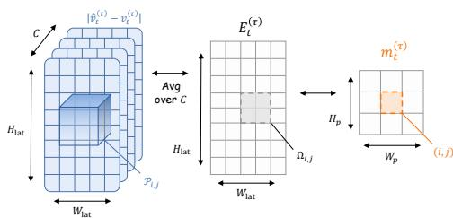

(18)

Here $p = ( c , x , y )$ denotes a latent entry, c indexes the latent channel and $( x , y )$ denotes the spatial location on the latent grid. Thus, $E _ { t } ^ { ( \tau ) } \in \mathbb { R } ^ { H _ { \mathrm { l a t } } \times W _ { \mathrm { l a t } } }$ f

Figure 8: Patch-level latent error construction. Channel-wise latent prediction errors are first averaged into a spatial error map and then pooled over the region aligned with each confidence-probe patch.

orms a spatial error map for frame t.

As illustrated in Figure 8, let $\Omega _ { i , j }$ denote the latent spatial region aligned with confidence-probe output location $( i , j )$ . The corresponding patch-level error is obtained by spatially averaging $E _ { t } ^ { ( \tau ) }$ over this region. Equivalently, defining

$$
\mathcal { P } _ { i , j } = \{ 1 , \ldots , C \} \times \Omega _ { i , j } ,\tag{19}
$$

the same quantity can be written directly over all latent entries within the patch:

$$
\begin{array} { l } { m _ { t , ( i , j ) } ^ { ( \tau ) } = \displaystyle \frac { 1 } { \left| \Omega _ { i , j } \right| } \sum _ { ( x , y ) \in \Omega _ { i , j } } E _ { t , ( x , y ) } ^ { ( \tau ) } } \\ { = \displaystyle \frac { 1 } { C \cdot \left| \Omega _ { i , j } \right| } \sum _ { ( x , y ) \in \Omega _ { i , j } } \sum _ { c = 1 } ^ { C } \left| \hat { z } _ { t , p } ^ { ( \tau ) } - z _ { t , p } ^ { ( 0 ) } \right| } \\ { = \displaystyle \frac { 1 } { \left| \mathcal { P } _ { i , j } \right| } \sum _ { p \in \mathcal { P } _ { i , j } } \left| \hat { z } _ { t , p } ^ { ( \tau ) } - z _ { t , p } ^ { ( 0 ) } \right| . } \end{array}\tag{20}
$$

Hence, $m _ { t } ^ { ( \tau ) } = \{ m _ { t , ( i , j ) } ^ { ( \tau ) } \} _ { i , j } \in \mathbb { R } ^ { H _ { p } \times W _ { \tau } }$ has the same spatial indexing as the confidence output.

Binary confidence target. The binary supervision target is obtained by comparing each local prediction error with the adaptive threshold $\theta _ { t }$ :

$$
\begin{array} { r l r } { \boldsymbol { q } _ { t , ( i , j ) } = \mathbb { I } \left\{ \boldsymbol { m } _ { t , ( i , j ) } ^ { ( \tau ) } < \theta _ { t } \right\} , } & { { } } & { \boldsymbol { q } _ { t } = \left\{ \boldsymbol { q } _ { t , ( i , j ) } \right\} _ { i , j } \in \left\{ 0 , 1 \right\} ^ { H _ { p } \times W _ { p } } . } \end{array}\tag{21}
$$

A value $q _ { t , ( i , j ) } = 1$ indicates that the corresponding latent patch is treated as reliable, while $q _ { t , ( i , j ) } =$ 0 denotes a high-error prediction. The adaptive construction of $\theta _ { t }$ is described in the following subsection.

UNet feature tapping and confidence prediction. The denoising UNet contains multiple encoder blocks, a bottleneck, and multiple decoder blocks:

$$
z ^ { ( \tau ) } \to h _ { \mathrm { e n c } } ^ { ( 1 ) } \to \cdot \cdot \cdot \to h _ { \mathrm { e n c } } ^ { ( K ) } \to h _ { \mathrm { m i d } } \to h _ { \mathrm { d e c } } ^ { ( 1 ) } \to \cdot \cdot \cdot \to h _ { \mathrm { d e c } } ^ { ( L ) } \to \hat { v } ^ { ( \tau ) } .\tag{22}
$$

Our confidence probe taps a selectable decoder feature $h _ { \mathrm { d e c } } ^ { ( \ell ) }$ , where the layer index ℓ controls the balance between global context and spatial locality. Earlier decoder layers provide coarser, more global representations, whereas later layers retain finer spatial information.

For future frame $t ,$ the dense confidence prediction is

$$
\hat { q } _ { t } = \sigma \left( f _ { \phi } \left( h _ { \mathrm { d e c } } ^ { ( \ell ) } , e _ { \tau } , e _ { \theta } \right) \right) , \qquad \hat { q } _ { t } \in [ 0 , 1 ] ^ { H _ { p } \times W _ { p } } ,\tag{23}
$$

where $e _ { \tau }$ denotes the diffusion-timestep embedding, $e _ { \theta }$ denotes the sampled error threshold embedding, $f _ { \phi }$ is the trainable confidence probe and $\sigma ( \cdot )$ denotes the element-wise sigmoid function. Each output location $( i , j )$ is spatially aligned with $\Omega _ { i , j } ,$ , and therefore predicts the confidence associated with the local error $m _ { t , ( i , j ) } ^ { ( \tau ) }$

## A.2 EMA-Calibrated Random Threshold Supervision

The numerical scale of the local prediction error can vary across datasets and training regimes, making a fixed confidence threshold difficult to transfer. We therefore estimate the threshold interval online from the batch-wise error distribution and stabilize it using exponential moving averages (EMA). For notational simplicity, the derivation below considers a fixed training sample and omits the sample index; the percentile statistics $p _ { l } ^ { ( s ) }$ and $p _ { h } ^ { ( s ) }$ are still computed from all local errors in the current training batch.

Batch-wise percentile estimation. At training step s, let $m ^ { ( s ) }$ denote the collection of patchlevel latent errors in the current batch, where each element follows the definition of $m _ { t , ( i , j ) } ^ { ( \tau ) }$ in Eq. equation 20. We estimate the lower and upper error statistics as

$$
p _ { l } ^ { ( s ) } = \mathrm { Q u a n t i l e } _ { 0 . 1 } \Big ( m ^ { ( s ) } \Big ) , \qquad p _ { h } ^ { ( s ) } = \mathrm { Q u a n t i l e } _ { 0 . 9 } \Big ( m ^ { ( s ) } \Big ) .\tag{24}
$$

These percentiles adapt the supervision range to the current error scale without manually specifying dataset-dependent MAE thresholds.

Two-stage EMA update. The lower and upper threshold bounds are updated as

$$
l ^ { ( s ) } = ( 1 - \gamma _ { s } ) l ^ { ( s - 1 ) } + \gamma _ { s } p _ { l } ^ { ( s ) } , \qquad h ^ { ( s ) } = ( 1 - \gamma _ { s } ) h ^ { ( s - 1 ) } + \gamma _ { s } p _ { h } ^ { ( s ) } .\tag{25}
$$

We use a two-stage update schedule,

$$
\gamma _ { s } = \left\{ \begin{array} { l l } { 0 . 2 0 , \quad s < S _ { \mathrm { w a r m } } , } \\ { 0 . 0 0 2 , \quad s \geq S _ { \mathrm { w a r m } } , } \end{array} \right. \quad \quad \beta _ { s } = 1 - \gamma _ { s } = \left\{ \begin{array} { l l } { 0 . 8 0 , \quad s < S _ { \mathrm { w a r m } } , } \\ { 0 . 9 9 8 , \quad s \geq S _ { \mathrm { w a r m } } , } \end{array} \right.\tag{26}
$$

where $\gamma _ { s }$ is the injection rate of the current batch statistics and $\beta _ { s }$ is the equivalent EMA momentum. Thus, the conventional EMA form is $\mu ^ { ( s ) } = \beta _ { s } \mu ^ { ( s - 1 ) } + ( 1 - \beta _ { s } ) p ^ { ( s ) }$ . The larger update rate during warmup rapidly adapts the threshold range to the target-domain error scale, while the smaller rate afterwards tracks slower distributional changes with stronger smoothing.

Random threshold sampling and interpretation. After updating the bounds, a separate threshold is sampled for each predicted future frame t:

$$
\theta _ { t } ^ { ( s ) } \sim \mathcal { U } \left( l ^ { ( s ) } , h ^ { ( s ) } \right) , \qquad q _ { t , ( i , j ) } ^ { ( s ) } = \mathbb { I } \left\{ m _ { t , ( i , j ) } ^ { ( \tau ) } < \theta _ { t } ^ { ( s ) } \right\} .\tag{27}
$$

The same $\theta _ { t } ^ { ( s ) }$ is shared by all spatial patches $( i , j )$ within frame $t ,$ while different future frames receive independently sampled thresholds.

For a fixed local error $m ,$ the binary target becomes random only through $\theta _ { t } ^ { ( s ) }$ . Since $\theta _ { t } ^ { ( s ) }$ ∼ $\mathcal { U } ( l ^ { ( s ) } , h ^ { ( s ) } )$ ), its density is $1 / ( h ^ { ( s ) } - l ^ { ( s ) } )$ over the current threshold interval. Marginalizing over the sampled threshold gives

$$
\begin{array} { r l } & { \mathbb { E } _ { \theta } [ q = 1 \ | \ m ] = \mathbb { P } _ { \theta } ( m < \theta ) = \int _ { l ^ { ( s ) } } ^ { h ^ { ( s ) } } { \mathbb { I } \{ m < \theta \} \frac { 1 } { h ^ { ( s ) } - l ^ { ( s ) } } \mathrm { d } \theta } } \\ & { \qquad = \frac { [ h ^ { ( s ) } - \operatorname* { m a x } \{ m , l ^ { ( s ) } \} ] _ { + } } { h ^ { ( s ) } - l ^ { ( s ) } } = \mathrm { c l a m p } ( \frac { h ^ { ( s ) } - m } { h ^ { ( s ) } - l ^ { ( s ) } } , 0 , 1 ) } \\ & { \qquad = \{ \frac { 1 , } { h ^ { ( s ) } - l ^ { ( s ) } } , \ l ^ { ( s ) } < m < h ^ { ( s ) } , } \\ & { \qquad = \{ \frac { h ^ { ( s ) } - m } { h ^ { ( s ) } - l ^ { ( s ) } } , \ l ^ { ( s ) } < m < h ^ { ( s ) } ,  } \\ & { \qquad = 0 , \ m \geq h ^ { ( s ) } . } \end{array}\tag{28}
$$

Hence, although each training target is binary, averaging over random thresholds induces a continuous target that decreases monotonically with prediction error.

In the threshold-marginalized case, the optimal prediction under binary cross-entropy is exactly this conditional probability:

$$
\begin{array} { l } { { \displaystyle \hat { q } ^ { * } ( m ) = \arg \operatorname* { m i n } _ { \hat { q } \in ( 0 , 1 ) } \mathbb { E } _ { q | m } \left[ - q \log \hat { q } - ( 1 - q ) \log ( 1 - \hat { q } ) \right] } } \\ { ~ } \\ { { \displaystyle = \mathbb { E } [ q \mid m ] = \mathrm { c l a m p } \left( \frac { h ^ { ( s ) } - m } { h ^ { ( s ) } - l ^ { ( s ) } } , 0 , 1 \right) . } } \end{array}\tag{29}
$$

In our implementation, $\theta _ { t } ^ { ( s ) }$ is additionally embedded into the confidence probe as described in the main method, so the probe learns threshold-conditioned reliability rather than only this marginalized form. Equation equation 28 nevertheless explains why randomized binary supervision naturally induces a continuous confidence ordering.

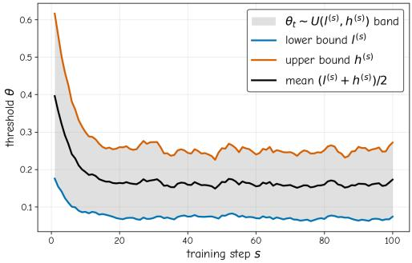  
(a) Zoom-in of the first 100 training steps

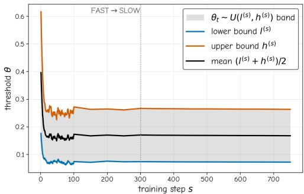  
(b) Extended training-step evolution

Figure 9: Dynamics of the EMA-based adaptive threshold band. The probe uses a stochastic threshold $\theta \sim \mathcal { U } ( l ^ { ( s ) } , h ^ { ( s ) } )$ , where $l ^ { ( s ) }$ and $h ^ { ( s ) }$ are the EMA-tracked lower and upper bounds at training step s, and the black curve shows their midpoint $( l ^ { ( s ) } + h ^ { ( s ) } ) / 2$ . (a) During the first 100 steps, both bounds decrease rapidly and quickly approach a stable range, reflecting fast adaptation to the current error scale. (b) Over a longer set of sampled training steps, the threshold band shows a clear transition from a fast-changing warmup regime to a slower and more stable regime.

Implementation and EMA dynamics. For RoboTwin2.0, we initialize $l ^ { ( 0 ) } = 0 . 2 0$ and $h ^ { ( 0 ) } =$ 0.70, use $S _ { \mathrm { w a r m } } = 3 0 0$ , and continue updating the EMA bounds throughout the 6000-step probe training. The bounds eventually stabilize around $l \approx 0 . 0 7 0 5$ and $h \approx 0 . 2 6 1 0$ , illustrating why online calibration is preferable to manually transferring fixed thresholds across datasets or error spaces.

Figure 9 visualizes the adaptation process. During the initial stage, the threshold band rapidly contracts toward the observed target-domain error scale. Over a longer range of sampled training steps, the evolution becomes substantially slower and more stable, showing the intended transition from fast initialization to long-term tracking.

## B More Experimental Results

## B.1 Additional Confidence Evaluation Details

This subsection supplements the confidence evaluation in Section 4.2. We report additional results for alternative risk aggregations, spatial localization, operational calibration, and parameter sensitivity. Latent-space errors remain our primary oracle, while pixel-space results are included as an external visual-domain reference.

Alternative task-level risk aggregations. Figure 10 compares mean, tail, and persistent risk aggregation in latent and pixel spaces. Mean risk achieves the strongest global Spearman correlation because averaging suppresses local noise and measures the overall prediction difficulty of an episode. Tail risk instead emphasizes sparse severe errors, while persistent risk targets failures that recur across multiple frames; consequently, they need not correlate as strongly with the episode-wide mean error. These correlations therefore verify that each score contains a meaningful error signal, but do not by themselves determine which acquisition rule yields the best post-training model. Their downstream differences are evaluated separately in Table 3.

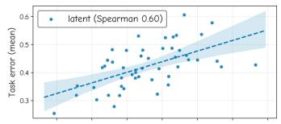

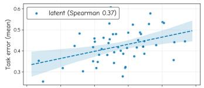

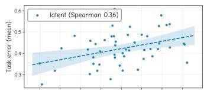

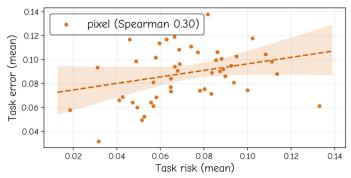

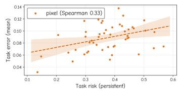

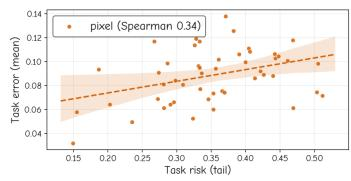  
Figure 10: Task-level risk aggregation in latent and pixel spaces. Mean, tail, and persistent risk scores are compared with their corresponding oracle-error statistics over the 50 prescreened tasks. Dashed lines show linear fits, shaded regions denote confidence intervals, and each panel reports the Spearman correlation. Mean aggregation gives the strongest global correlation, whereas tail and persistent aggregation emphasize different failure patterns.

Spatial localization agreement. We further compare the spatial locations selected by risk and oracle error. For each ratio k, top-k IoU measures the intersection-over-union between the highestrisk and highest-error patch sets, while overlap@k measures the fraction of high-error patches recovered by the high-risk set. Figure 11 shows that both metrics increase as the selected region becomes larger. At top-5%, latent-space localization reaches approximately 0.13 IoU and 0.22 overlap, with slightly lower values in pixel space. The relatively high overlap but moderate IoU indicates that risk identifies many relevant error regions without exactly reproducing their boundaries. This supports soft patch weighting rather than hard spatial selection.

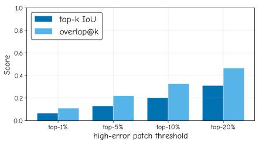  
(a) Latent-space localization

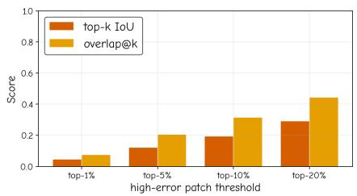  
(b) Pixel-space localization  
Figure 11: Spatial agreement between high-risk and high-error patches. Top-k IoU and overlap@k are reported for the top-1%, 5%, 10%, and 20% patches in (a) latent and (b) pixel spaces. The increasing scores at larger ratios reflect coarser spatial coverage and should not be interpreted as improved localization resolution.

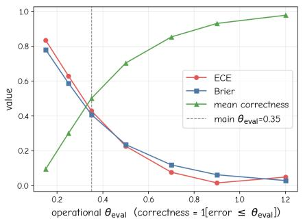  
(a) Latent-space calibration sweep

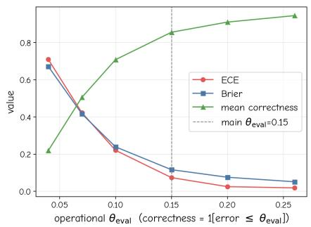  
(b) Pixel-space calibration sweep

Figure 12: ECE and Brier scores under different operational thresholds. Calibration is evaluated by sweeping the correctness threshold $\theta _ { \mathrm { e v a l } }$ in (a) latent space and (b) pixel space. The confidence maps are fixed throughout; only the binary correctness definition changes.  
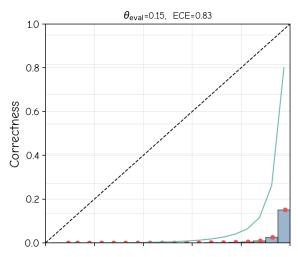

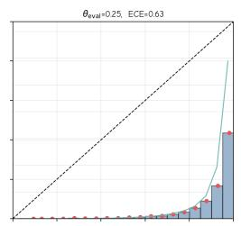

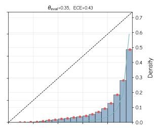

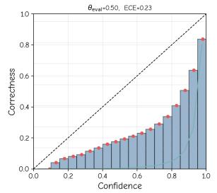

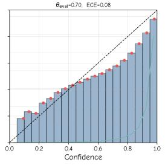

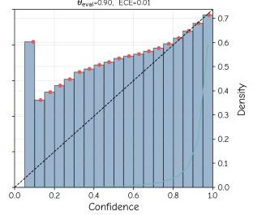  
(a) Latent-space reliability diagrams

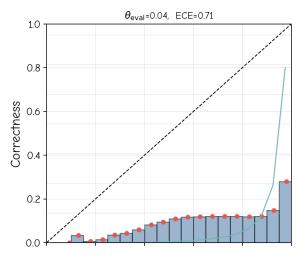

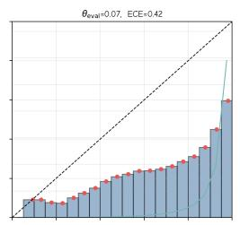

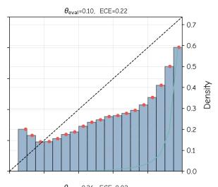

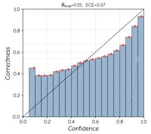

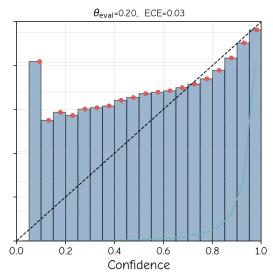  
(b) Pixel-space reliability diagrams

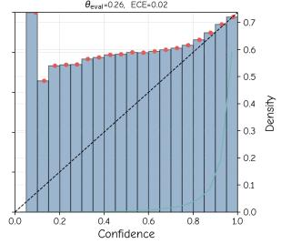

Figure 13: Reliability diagrams across operational thresholds. Each subfigure contains reliability diagrams under different choices of $\theta _ { \mathrm { e v a l } } \colon$ (a) latent space and (b) pixel space. As the threshold becomes looser, the observed correctness generally moves closer to the predicted confidence, although the latent-space probe remains more overconfident near the main operating point.

Operational calibration. Although the confidence probe is trained with stochastic binary targets, its calibration at test time depends on how prediction correctness is defined. To avoid confusion with the diffusion timestep τ, we denote the operational error threshold by $\theta _ { \mathrm { e v a l } }$ and define correctness as $\mathbb { I } \{ m _ { t , ( i , j ) } ^ { ( \tau ) } \leq \theta _ { \mathrm { e v a l } } \}$ . Varying $\theta _ { \mathrm { e v a l } }$ does not change the predicted confidence maps; it only changes the post-hoc definition of whether a prediction is counted as correct.

Figure 12 summarizes calibration quality under different choices of $\theta _ { \mathrm { e v a l } }$ . In latent space, ECE and Brier improve as the threshold becomes looser, but the probe remains noticeably overconfident around the main operating point. Pixel-space calibration appears better under its own selected threshold, although the latent and pixel settings are not directly comparable because they rely on different error scales. Figure 13 further visualizes the corresponding reliability diagrams. In both spaces, the curves become closer to the diagonal as $\theta _ { \mathrm { e v a l } }$ increases, confirming that the apparent calibration quality depends strongly on the operational correctness definition. Overall, these results support using confidence mainly as an ordinal ranking signal rather than as an absolutely calibrated probability.

Parameter sensitivity. We examine two implementation choices that are not reported in the main text. First, Figures 14(a–b) compare mean, maximum, percentile, and top-k frame aggregation. Mean aggregation provides the strongest frame- and task-level Spearman correlations in both latent and pixel spaces, whereas extreme-value aggregation amplifies isolated noisy patches. This motivates the mean aggregation adopted in our main evaluation.

Second, Figures 14(c–d) vary the probe conditioning threshold $\theta _ { \mathrm { c o n d } }$ and regenerate the confidence maps. Low-to-moderate thresholds provide the strongest spatial discrimination, while large thresholds make most patches highly confident and reduce localization contrast. The default threshold lies near the best-performing range, and the overall variation remains moderate, indicating that the confidence-ranking conclusion is not sensitive to a narrowly tuned threshold.

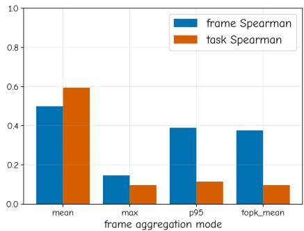  
(a) Frame aggregation in latent space

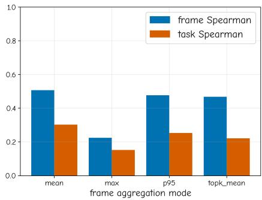  
(b) Frame aggregation in pixel space

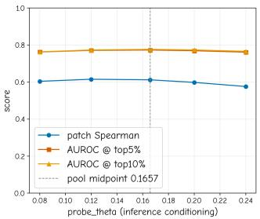

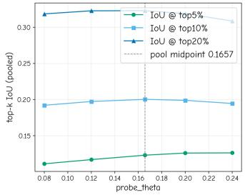  
(c) Localization sensitivity

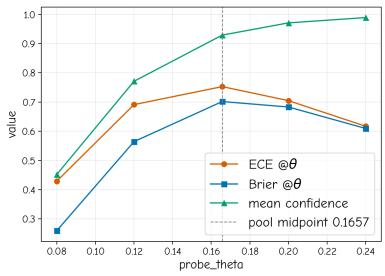  
(d) Calibration sensitivity  
Figure 14: Sensitivity to confidence aggregation and probe conditioning. (a–b) Frame- and task-level Spearman correlations under mean, maximum, percentile, and top-k aggregation in latent and pixel spaces. (c) High-error detection and spatial localization under different probe conditioning thresholds $\theta _ { \mathrm { c o n d } }$ . (d) ECE, Brier score, and mean confidence under the same thresholds. Unlike the operational threshold $\theta _ { \mathrm { { e v a l } } } .$ , changing $\theta _ { \mathrm { c o n d } }$ regenerates the confidence maps.

## B.2 Additional Numerical Results for Active Learning

This subsection provides the complete numerical results underlying the active-learning comparison in Section 4.2. We first report the four aggregated dimensions used in the main comparison, followed by paired-bootstrap improvements relative to EVAC-v1. We then provide the complete seed-wise component metrics for seeds 42, 3407, and 123.

Aggregated results and paired-bootstrap evidence. Table 4 reports the aggregated activelearning results. Reconstruction, Scene, Motion, and Semantics follow the same definitions as in Section 4.3. For learned scoring methods, the reported values are averaged over seeds 42, 3407, and 123. Table 5 further reports paired-bootstrap improvements over EVAC-v1. For each learned scoring method, we concatenate the episode-level paired differences from all three seeds and perform 10,000 percentile-bootstrap resamples at 95% confidence. The pairing with EVAC-v1 is preserved within each seed before pooling. Positive values indicate improvement for all four dimensions.

Table 4: Aggregated active-learning results. Each entry reports the aggregated mean followed by its relative change from EVAC-v1. Results for learned scoring methods are averaged over three seeds.
<table><tr><td rowspan=1 colspan=4>Scoring           Weighting  Reconstruction (↑)    Scene (↑)      Motion (↑)    Semantics (↑)</td></tr><tr><td rowspan=1 colspan=2>Base EVACBase EVAC (Warmup v1)</td><td rowspan=1 colspan=2>0.5655 (-17.8%)  0.8757 (-3.2%)  0.0014 (-99.6%) 0.4873 (-14.3%)0.6878 (0.0%)    0.9047 (0.0%)   0.3205 (0.0%)   0.5690 (0.0%)</td></tr><tr><td rowspan=1 colspan=4>Selection-only retraining: no additional weighting after selection</td></tr><tr><td rowspan=1 colspan=1>Random</td><td rowspan=1 colspan=1>None</td><td rowspan=1 colspan=2>0.6409 (-6.8%)   0.8524 (-5.8%)  0.3310(+3.3%)  0.4872 (-14.4%)</td></tr><tr><td rowspan=1 colspan=1>RoboReward1</td><td rowspan=1 colspan=1>None</td><td rowspan=1 colspan=2>0.6712 (-2.4%)   0.8470 (-6.4%)  0.3360 (+4.8%)  0.6022 (+5.8%)</td></tr><tr><td rowspan=1 colspan=1>GVL²</td><td rowspan=1 colspan=1>None</td><td rowspan=1 colspan=2>0.7088 (+3.1%)   0.9057 (+0.1%)  0.3393 (+5.9%)  0.5913 (+3.9%)</td></tr><tr><td rowspan=1 colspan=1>Robometer-Prog³</td><td rowspan=1 colspan=1>None</td><td rowspan=1 colspan=2>0.6317 (-8.2%)   0.8532 (-5.7%)  0.3307 (+3.2%)  0.5759 (+1.2%)</td></tr><tr><td rowspan=2 colspan=1>Robometer-Pref3PRM-as-Judge4</td><td rowspan=1 colspan=1>None</td><td rowspan=1 colspan=2>0.6474 (-5.9%)   0.8443 (-6.7%)  0.3208 (+0.1%)  0.5789 (+1.7%)</td></tr><tr><td rowspan=1 colspan=1>None</td><td rowspan=1 colspan=2>0.7024 (+2.1%)   0.9033 (-0.2%)  0.3505 (+9.4%)  0.5922 (+4.1%)</td></tr><tr><td rowspan=1 colspan=1>LRMs5</td><td rowspan=1 colspan=1>None</td><td rowspan=1 colspan=2>0.7110(+3.4%)   0.8966 (-0.9%)  0.2885 (-10.0%)  0.5776(+1.5%)</td></tr><tr><td rowspan=1 colspan=1>Confidence (Ours)</td><td rowspan=1 colspan=1>None</td><td rowspan=1 colspan=2>0.7219 (+5.0%)  0.9196(+1.6%)0.3643 (+13.7%) 0.5897 (+3.6%)</td></tr><tr><td rowspan=1 colspan=4>Selection + additional weighting: extra scoring after selection</td></tr><tr><td rowspan=3 colspan=1>Robometer-Prog³Robometer-Pref3PRM-as-Judge4</td><td rowspan=1 colspan=1>Frame</td><td rowspan=1 colspan=2>0.6944 (+1.0%)   0.8882 (-1.8%)  0.3357 (+4.7%)  0.5884 (+3.4%)</td></tr><tr><td rowspan=1 colspan=1>Frame</td><td rowspan=1 colspan=1>0.6803 (-1.1%)   0.8945 (-1.1%)</td><td rowspan=1 colspan=1>0.2969 (-7.4%)  0.5601 (-1.6%)</td></tr><tr><td rowspan=1 colspan=1>Frame</td><td rowspan=1 colspan=1>0.7123 (+3.6%)   0.9053 (+0.1%)</td><td rowspan=1 colspan=1>0.3347 (+4.4%)  0.5963 (+4.8%)</td></tr><tr><td rowspan=1 colspan=1>LRMs5</td><td rowspan=1 colspan=1>Frame</td><td rowspan=1 colspan=1>0.6955(+1.1%)   0.8882 (-1.8%)</td><td rowspan=1 colspan=1>0.3171 (-1.1%)  0.5815 (+2.2%)</td></tr><tr><td rowspan=2 colspan=1>Confidence (Ours)Confidence (Ours)</td><td rowspan=1 colspan=1>Frame</td><td rowspan=1 colspan=1>0.7047 (+2.5%)  0.9143 (+1.1%)</td><td rowspan=1 colspan=1>0.3398 (+6.0%)  0.5944 (+4.5%)</td></tr><tr><td rowspan=1 colspan=1>Fr.+Patch</td><td rowspan=1 colspan=1>0.7265 (+5.6%)   0.8942 (-1.2%)</td><td rowspan=1 colspan=1>0.3510 (+9.5%) 0.6034(+6.1%)</td></tr></table>

Table 5: Paired-bootstrap improvements over EVAC-v1. For each learned scoring method, episodelevel paired differences from seeds 42, 3407, and 123 are pooled before bootstrap resampling. Each entry gives the 95% confidence interval followed by the paired mean in parentheses.
<table><tr><td>Scoring</td><td>Weighting</td><td>∆ Reconstruction (↑)</td><td>∆ Scene (↑)</td><td>∆ Motion (↑)</td><td>∆ Semantics (↑)</td></tr><tr><td colspan="2">Base EVAC Base EVAC (Warmup v1)</td><td>[-0.133,-0.112](-0.122)</td><td>[-0.038, -0.020] (-0.029)</td><td></td><td>[-0.113, -0.049](-0.081)</td></tr><tr><td colspan="6">Selection-only retraining: no additional weighting after selection</td></tr><tr><td>Random</td><td>None</td><td>[-0.055, -0.039](-0.047)</td><td>[-0.060, -0.045](-0.052)</td><td>[-0.035, +0.056](+0.011)</td><td>[-0.112, -0.046](-0.079)</td></tr><tr><td>RoboReward1</td><td>None</td><td>[-0.020,-0.013](-0.017)</td><td>[-0.063, -0.052](-0.058)</td><td>[-0.006, +0.038](+0.015)</td><td>[+0.016,+0.053](+0.035)</td></tr><tr><td>GVL²</td><td>None</td><td>[+0.018,+0.024](+0.021)</td><td>[-0.001,+0.003](+0.001)</td><td>[-0.008, +0.046](+0.019)</td><td>[+0.003,+0.042](+0.023)</td></tr><tr><td>Robometer-Prog³</td><td>None</td><td>[-0.061, -0.051](-0.056)</td><td>[-0.056, -0.047](-0.051)</td><td>[-0.017, +0.038](+0.010)</td><td>[-0.014, +0.024](+0.006)</td></tr><tr><td>Robometer-Pref3</td><td>None</td><td>[-0.046, -0.035](-0.040)</td><td>[-0.067, -0.054](-0.060)</td><td>[-0.024, +0.025](+0.000)</td><td>[-0.012, +0.028](+0.008)</td></tr><tr><td>PRM-as-Judge4</td><td>None</td><td>[+0.011,+0.018](+0.015)</td><td>[-0.004,+0.001](-0.001)</td><td>[+0.005,+0.056](+0.030)</td><td>[+0.001,+0.040](+0.021)</td></tr><tr><td>LRMs5</td><td>None</td><td>[+0.020,+0.027](+0.023)</td><td>[-0.011, -0.006] (-0.008)</td><td>[-0.057, -0.008](-0.032)</td><td>[-0.010, +0.029](+0.010)</td></tr><tr><td>Confidence (Ours)</td><td>None</td><td>[+0.031,+0.037](+0.034)</td><td>[+0.012,+0.018](+0.015)</td><td>[+0.018,+0.070](+0.044)</td><td>[-0.002, +0.038](+0.018)</td></tr><tr><td colspan="6">Selection + additional weighting: extra scoring after selection</td></tr><tr><td>Robometer-Prog³</td><td>Frame</td><td>[+0.003, +0.011](+0.007)</td><td>[-0.021,-0.012](-0.017)</td><td>[-0.010,+0.041](+0.015)</td><td>[-0.000, +0.038](+0.019)</td></tr><tr><td>Robometer-Pref3</td><td>Frame</td><td>[-0.011, -0.004](-0.007)</td><td>[-0.013,-0.007](-0.010)</td><td>[-0.049, +0.002](-0.024)</td><td>[-0.031, +0.008](-0.011)</td></tr><tr><td>PRM-as-Judge4</td><td>Frame</td><td>[+0.021,+0.028](+0.024)</td><td>[-0.003,+0.004](+0.001)</td><td>[-0.010,+0.039](+0.014)</td><td>[+0.008,+0.046](+0.027)</td></tr><tr><td>LRMs5</td><td>Frame</td><td>[+0.004, +0.011](+0.008)</td><td>[-0.020, -0.013](-0.016)</td><td>[-0.027,+0.020] (-0.003)</td><td>[-0.005, +0.033](+0.014)</td></tr><tr><td>Confidence (Ours)</td><td>Frame</td><td>[+0.014,+0.020](+0.017)</td><td>[+0.007,+0.012](+0.010)</td><td>[-0.007,+0.045](+0.019)</td><td>[+0.007,+0.044](+0.026)</td></tr><tr><td>Confidence (Ours)</td><td>Fr.+Patch</td><td>[+0.036,+0.042](+0.039)</td><td>[-0.013, -0.008](-0.010)</td><td>[+0.008,+0.054](+0.031)</td><td>[+0.011,+0.049](+0.030)</td></tr></table>

Seed-wise detailed results. Tables 6–8 report the complete normalized component metrics for seeds 42, 3407, and 123, respectively. Seed 42 is the default seed. Base EVAC, EVAC-v1, and Random are shared reference results and are repeated in each table for ease of comparison.

Table 6: Detailed normalized active-learning results for seed 42.
<table><tr><td rowspan="2">Scoring</td><td rowspan="2">Weighting</td><td colspan="2">Reconstruction (↑)</td><td colspan="2">Scene (↑)</td><td colspan="2">Semantics (↑)</td><td colspan="3">Motion (↑)</td></tr><tr><td>PSNR (↑) Scene Cons. (↑) Logics (↑)</td><td>SSIM (↑)</td><td></td><td></td><td></td><td></td><td>Sem.-CLIP (↑) Sem.-BLEU (↑) | Traj-HSD (↑) Traj-Dyn (↑)</td><td></td><td>Traj-nDTW (↑)</td></tr><tr><td>Base EVAC</td><td></td><td>0.5532</td><td>0.5778</td><td>0.8757</td><td>0.4298</td><td>0.8523</td><td>0.1799</td><td>0.0007</td><td>0.0001</td><td>0.0006</td></tr><tr><td colspan="2">Base EVAC (Warmup v1)</td><td>0.6446</td><td>0.7309</td><td>0.9047</td><td>0.5537</td><td>0.8824</td><td>0.2708</td><td>0.1045</td><td>0.0721</td><td>0.1439</td></tr><tr><td colspan="9">Selection-only retraining: no additional weighting after selection</td><td></td><td></td></tr><tr><td>Random</td><td>None</td><td>0.5968</td><td>0.6849</td><td>0.8524</td><td>0.3554</td><td>0.8689</td><td>0.2372</td><td>0.1067</td><td>0.0725</td><td>0.1518</td></tr><tr><td>RoboReward1</td><td>None</td><td>0.6276</td><td>0.7067</td><td>0.8712</td><td>0.6322</td><td>0.8895</td><td>0.2832</td><td>0.1076</td><td>0.0662</td><td>0.1501</td></tr><tr><td>GVL2</td><td>None</td><td>0.6550</td><td>0.7449</td><td>0.9136</td><td>0.5826</td><td>0.8885</td><td>0.2733</td><td>0.1033</td><td>0.0607</td><td>0.1381</td></tr><tr><td>Robometer-Prog³ Robometer-Pref3</td><td>None</td><td>0.5547</td><td>0.6711</td><td>0.8208</td><td>0.5496</td><td>0.8800</td><td>0.2680</td><td>0.1166</td><td>0.0774</td><td>0.1805</td></tr><tr><td>PRM-as-Judge4</td><td>None</td><td>0.6047 0.6523</td><td>0.7005</td><td>0.9005</td><td>0.6157</td><td>0.8866</td><td>0.2729</td><td>0.0912 0.1095</td><td>0.0492 0.0696</td><td>0.1242 0.1495</td></tr><tr><td>LRMs5</td><td>None None</td><td>0.6577</td><td>0.7641 0.7528</td><td>0.9102</td><td>0.6405 0.5785</td><td>0.8926</td><td>0.3023 0.2550</td><td>0.0960</td><td>0.0595</td><td>0.1422</td></tr><tr><td>Confidence (Ours)</td><td>None</td><td>0.6838</td><td>0.7797</td><td>0.8869 0.9322</td><td>0.6198</td><td>0.8803 0.8894</td><td>0.2754</td><td>0.1313</td><td>0.0921</td><td>0.1780</td></tr><tr><td colspan="9">Selection + additional weighting: extra scoring after selection</td><td></td></tr><tr><td>Robometer-Prog³ Frame</td><td></td><td>0.5932</td><td>0.6981</td><td>0.8399</td><td>0.6074</td><td>0.8883</td><td>0.2976</td><td>0.1151</td><td>0.0703</td><td>0.1655</td></tr><tr><td>Robometer-Pref3</td><td>Frame</td><td>0.6412</td><td>0.7324</td><td>0.8948</td><td>0.6033</td><td>0.8868</td><td>0.2805</td><td>0.0981</td><td>0.0678</td><td>0.1291</td></tr><tr><td>PRM-as-Judge4</td><td>Frame</td><td>0.6695</td><td>0.7733</td><td>0.9193</td><td>0.6281</td><td>0.8880</td><td>0.2937</td><td>0.1000</td><td>0.0592</td><td>0.1443</td></tr><tr><td>LRMs5</td><td>Frame</td><td>0.6716</td><td>0.7616</td><td>0.8958</td><td>0.5785</td><td>0.8896</td><td>0.2733</td><td>0.0985</td><td>0.0623</td><td>0.1497</td></tr><tr><td>Confidence (Ours)</td><td>Frame</td><td>0.6737</td><td>0.7650</td><td>0.9295</td><td>0.6405</td><td>0.8867</td><td>0.2843</td><td>0.1179</td><td>0.0728</td><td>0.1706</td></tr><tr><td>Confidence (Ours)</td><td>Fr.+Patch</td><td>0.6795</td><td>0.7746</td><td>0.9014</td><td>0.6240</td><td>0.8945</td><td>0.2859</td><td>0.1066</td><td>0.0761</td><td>0.1665</td></tr></table>

Table 7: Detailed normalized active-learning results for seed 3407.
<table><tr><td rowspan="2">Scoring</td><td rowspan="2">Weighting</td><td colspan="2">Reconstruction (↑)</td><td colspan="2">Scene (↑)</td><td colspan="2">Semantics (↑)</td><td colspan="3">Motion (↑)</td></tr><tr><td>|PSNR (↑)</td><td>SSIM (↑)</td><td>Scene Cons. (↑)</td><td>Logics (↑)</td><td>Sem.-CLIP (↑)</td><td>Sem.-BLEU (↑)</td><td>Traj-HSD (↑)</td><td>Traj-Dyn (↑)</td><td>Traj-nDTW (↑)</td></tr><tr><td>Base EVAC</td><td></td><td>0.5532</td><td>0.5778</td><td>0.8757</td><td>0.4298</td><td>0.8523</td><td>0.1799</td><td>0.0007</td><td>0.0001</td><td>0.0006</td></tr><tr><td colspan="2">Base EVAC (Warmup v1)</td><td>0.6446</td><td>0.7309</td><td>0.9047</td><td>0.5537</td><td>0.8824</td><td>0.2708</td><td>0.1045</td><td>0.0721</td><td>0.1439</td></tr><tr><td colspan="9">Selection-only retraining: no additional weighting after selection</td><td></td><td></td></tr><tr><td>Random</td><td>| None</td><td>0.5968</td><td>0.6849</td><td>0.8524</td><td>0.3554</td><td>0.8689</td><td>0.2372</td><td>0.1067</td><td>0.0725</td><td>0.1518</td></tr><tr><td>RoboReward1</td><td>None</td><td>0.6262</td><td>0.7290</td><td>0.7985</td><td>0.6488</td><td>0.8863</td><td>0.2775</td><td>0.1089</td><td>0.0732</td><td>0.1554</td></tr><tr><td>GVL2</td><td>None</td><td>0.6546</td><td>0.7503</td><td>0.8959</td><td>0.6157</td><td>0.8892</td><td>0.2868</td><td>0.1200</td><td>0.0759</td><td>0.1681</td></tr><tr><td>Robometer-Prog³ Robometer-Pref3</td><td>None</td><td>0.6492</td><td>0.7490</td><td>0.8857</td><td>0.6033</td><td>0.8814</td><td>0.2580</td><td>0.1148</td><td>0.0715</td><td>0.1491</td></tr><tr><td>PRM-as-Judge4</td><td>None</td><td>0.6442 0.6714</td><td>0.7535 0.7728</td><td>0.8779</td><td>0.6033 0.5950</td><td>0.8895</td><td>0.2877</td><td>0.1066 0.1197</td><td>0.0671 0.0784</td><td>0.1565 0.1757</td></tr><tr><td>LRMs5</td><td>None None</td><td>0.6619</td><td>0.7658</td><td>0.9020 0.8991</td><td>0.5331</td><td>0.8896 0.8817</td><td>0.2873 0.2672</td><td>0.0925</td><td>0.0564</td><td>0.1299</td></tr><tr><td>Confidence (Ours)</td><td>None</td><td>0.6521</td><td>0.7443</td><td>0.9029</td><td>0.5537</td><td>0.8891</td><td>0.2953</td><td>0.0998</td><td>0.0618</td><td>0.1469</td></tr><tr><td colspan="9">Selection + additional weighting: extra scoring after selection</td><td></td></tr><tr><td>Robometer-Prog³</td><td>|Frame</td><td>0.6785</td><td>0.7739</td><td>0.9148</td><td>0.5661</td><td>0.8896</td><td>0.2925</td><td>0.1042</td><td>0.0683</td><td>0.1454</td></tr><tr><td>Robometer-Pref3</td><td>Frame</td><td>0.6329</td><td>0.7343</td><td>0.9000</td><td>0.5372</td><td>0.8875</td><td>0.2796</td><td>0.0867</td><td>0.0542</td><td>0.1241</td></tr><tr><td>PRM-as-Judge4</td><td>Frame</td><td>0.6544</td><td>0.7606</td><td>0.8816</td><td>0.6364</td><td>0.8861</td><td>0.2681</td><td>0.1276</td><td>0.0949</td><td>0.1827</td></tr><tr><td>LRMs5</td><td>Frame</td><td>0.6391</td><td>0.7323</td><td>0.8984</td><td>0.5868</td><td>0.8872</td><td>0.2884</td><td>0.1047</td><td>0.0582</td><td>0.1508</td></tr><tr><td>Confidence (Ours)</td><td>Frame</td><td>0.6644</td><td>0.7518</td><td>0.9127</td><td>0.6074</td><td>0.8887</td><td>0.2734</td><td>0.1121</td><td>0.0704</td><td>0.1663</td></tr><tr><td>Confidence (Ours)</td><td>Fr.+Patch</td><td>0.6798</td><td>0.7822</td><td>0.8948</td><td>0.6612</td><td>0.8926</td><td>0.2979</td><td>0.1161</td><td>0.0679</td><td>0.1665</td></tr></table>

Table 8: Detailed normalized active-learning results for seed 123.
<table><tr><td rowspan="2">Scoring</td><td rowspan="2">Weighting</td><td colspan="2">Reconstruction (↑)</td><td rowspan="2">Scene (↑)</td><td colspan="3">Semantics (↑)</td><td colspan="3">Motion (↑)</td></tr><tr><td>SSIM (↑)</td><td>Scene Cons. (↑)</td><td>Logics (↑) Sem.-CLIP (↑)</td><td></td><td>Sem.-BLEU (↑)</td><td>Traj-HSD (↑)</td><td>Traj-Dyn (↑)</td><td>Traj-nDTW (↑)</td></tr><tr><td>Base EVAC</td><td>PSNR (↑)</td><td>0.5532</td><td>0.5778</td><td>0.8757</td><td>0.4298</td><td>0.8523</td><td>0.1799</td><td>0.0007</td><td>0.0001</td><td>0.0006</td></tr><tr><td>Base EVAC (Warmup v1)</td><td></td><td>0.6446</td><td>0.7309</td><td>0.9047</td><td>0.5537</td><td>0.8824</td><td>0.2708</td><td>0.1045</td><td>0.0721</td><td>0.1439</td></tr><tr><td colspan="9">Selection-only retraining: no additional weighting after selection</td><td></td><td></td></tr><tr><td>Random</td><td>|None</td><td>0.5968</td><td>0.6849</td><td>0.8524</td><td>0.3554</td><td>0.8689</td><td>0.2372</td><td>0.1067</td><td>0.0725</td><td>0.1518</td></tr><tr><td>RoboReward1</td><td>None</td><td>0.6260</td><td>0.7117</td><td>0.8712</td><td>0.6364</td><td>0.8825</td><td>0.2838</td><td>0.1174</td><td>0.0685</td><td>0.1607</td></tr><tr><td>GVL2</td><td>None</td><td>0.6795</td><td>0.7686</td><td>0.9075</td><td>0.5992</td><td>0.8918</td><td>0.2946</td><td>0.1109</td><td>0.0698</td><td>0.1713</td></tr><tr><td>Robometer-Prog³</td><td>None</td><td>0.5388</td><td>0.6272</td><td>0.8532</td><td>0.5992</td><td>0.8815</td><td>0.2620</td><td>0.0955</td><td>0.0582</td><td>0.1282</td></tr><tr><td>Robometer-Pref3</td><td>None</td><td>0.5267</td><td>0.6546</td><td>0.7544</td><td>0.5248</td><td>0.8816</td><td>0.2479</td><td>0.1160</td><td>0.0752</td><td>0.1764</td></tr><tr><td>PRM-as-Judge4 LRMs5</td><td>None</td><td>0.6164</td><td>0.7372</td><td>0.8977</td><td>0.5744</td><td>0.8817</td><td>0.2659</td><td>0.1168</td><td>0.0758</td><td>0.1565</td></tr><tr><td>Confidence (Ours)</td><td>None None</td><td>0.6655 0.6878</td><td>0.7624 0.7836</td><td>0.9037 0.9237</td><td>0.6116 0.6033</td><td>0.8862 0.8924</td><td>0.3046 0.2889</td><td>0.0952 0.1232</td><td>0.0603 0.0896</td><td>0.1335</td></tr><tr><td></td><td></td><td></td><td></td><td></td><td></td><td></td><td></td><td></td><td></td><td>0.1702</td></tr><tr><td colspan="9">Selection + additional weighting: extra scoring after selection</td><td></td><td></td></tr><tr><td>Robometer-Prog³</td><td>Frame</td><td>0.6600</td><td>0.7626</td><td>0.9099</td><td>0.5909</td><td>0.8899</td><td>0.2734</td><td>0.1097</td><td>0.0706</td><td>0.1582</td></tr><tr><td>Robometer-Pref3</td><td>Frame</td><td>0.6210</td><td>0.7199</td><td>0.8887</td><td>0.4463</td><td>0.8804</td><td>0.2395</td><td>0.1073</td><td>0.0741</td><td>0.1493</td></tr><tr><td>PRM-as-Judge4</td><td>Frame</td><td>0.6514</td><td>0.7645</td><td>0.9150</td><td>0.6033</td><td>0.8862</td><td>0.2766</td><td>0.0971</td><td>0.0643</td><td>0.1339</td></tr><tr><td>LRMs5</td><td>Frame</td><td>0.6282</td><td>0.7404</td><td>0.8706</td><td>0.5826</td><td>0.8839</td><td>0.2634</td><td>0.1128</td><td>0.0700</td><td>0.1443</td></tr><tr><td>Confidence (Ours)</td><td>Frame</td><td>0.6403</td><td>0.7332</td><td>0.9008</td><td>0.6033</td><td>0.8867</td><td>0.2790</td><td>0.1019</td><td>0.0620</td><td>0.1455</td></tr><tr><td>Confidence (Ours)</td><td>Fr.+Patch</td><td>0.6723</td><td>0.7705</td><td>0.8864</td><td>0.5826</td><td>0.8903</td><td>0.3017</td><td>0.1126</td><td>0.0837</td><td>0.1570</td></tr></table>

## B.3 Qualitative Evolution from Base EVAC to EVAC-v2

We further visualize how world-model predictions evolve throughout the post-training pipeline. We select six representative RoboTwin2.0 episodes covering object placement, cabinet interaction, block stacking, bowl stacking, and switch manipulation. These examples expose a consistent progression from severe zero-shot cross-embodiment failure to target-domain adaptation and, finally, confidenceguided refinement.

Per-episode progression. Table 9 summarizes the four aggregated evaluation dimensions for the six selected episodes. All relative changes are computed with respect to EVAC-v1, which serves as the common post-warmup baseline. Across the selected examples, Base EVAC performs substantially worse under zero-shot cross-embodiment transfer, while EVAC-v1 already recovers much of the target-domain prediction quality. Confidence-guided EVAC-v2 further improves most dimensions, with frame-and-patch weighting achieving the strongest Reconstruction in all six episodes.

For this per-episode analysis, Semantics is aggregated from normalized Sem.-CLIP and Sem.-BLEU only; the binary Logics score is omitted because a single 0/1 decision would disproportionately affect an individual episode.

Table 9: Aggregated evolution on six representative RoboTwin2.0 episodes. Each entry reports the normalized aggregate followed by its relative change from EVAC-v1. Green and red percentages indicate improvement and degradation, respectively. For Motion, relative changes are omitted when the EVAC-v1 score is zero. Green, yellow, and red cells indicate the best, second-best, and third-best values within each episode.
<table><tr><td>Episode</td><td>Variant</td><td>Reconstruction (↑)</td><td>Scene (↑)</td><td>Semantics (↑)</td><td>Motion (↑)</td></tr><tr><td rowspan="4">place burger fries (ep130)</td><td>Base EVAC EVAC-v1</td><td>0.4592 (-27.3%)</td><td>0.7890 (-10.0%)</td><td>0.3591 (-28.9%)</td><td>0.0000(-100.0%)</td></tr><tr><td>EVAC-v2 Frame</td><td>0.6318 (0.0%)</td><td>0.8770 (0.0%)</td><td>0.5050 (0.0%)</td><td>0.4570 (0.0%)</td></tr><tr><td></td><td>0.6618(+4.7%)</td><td>0.9430 (+7.5%)</td><td>0.5221 (+3.4%)</td><td>1.0830 (+137.0%)</td></tr><tr><td>EVAC-v2 Fr.+Patch</td><td>0.7020(+11.1%)</td><td>0.9370(+6.8%)</td><td>0.5486(+8.6%)</td><td>1.3080 (+186.2%)</td></tr><tr><td rowspan="4">place empty cup (ep294)</td><td>Base EVAC EVAC-v1</td><td>0.4605 (-38.6%) 0.7503 (0.0%)</td><td>0.7120 (-27.0%) 0.9750 (0.0%)</td><td>0.5454(+2.0%)</td><td>0.0000 (-100.0%) 0.5600 (0.0%)</td></tr><tr><td>EVAC-v2 Frame</td><td>0.7353 (-2.0%)</td><td>0.9700 (-0.5%)</td><td>0.5349 (0.0%)</td><td>0.4150(-25.9%)</td></tr><tr><td>EVAC-v2 Fr.+Patch</td><td>0.7558 (+0.7%)</td><td>0.9610 (-1.4%)</td><td>0.2604 (-51.3%)</td><td></td></tr><tr><td></td><td></td><td></td><td>0.6015(+12.5%)</td><td>0.5900 (+5.4%)</td></tr><tr><td rowspan="4">put object cabinet (ep282)</td><td>Base EVAC EVAC-v1</td><td>0.4372 (-23.2%) 0.5693 (0.0%)</td><td>0.7770 (-10.4%)</td><td>0.4856 (-0.5%)</td><td>0.0000(−) 0.0000 (0.0%)</td></tr><tr><td>EVAC-v2 Frame</td><td>0.6178(+8.5%)</td><td>0.8670 (0.0%) 0.9260 (+6.8%)</td><td>0.4879 (0.0%)</td><td>0.0000(−)</td></tr><tr><td>EVAC-v2 Fr.+Patch</td><td>0.6207 (+9.0%)</td><td>0.8950(+3.2%)</td><td>0.5264(+7.9%) 0.5651 (+15.8%)</td><td>0.0000(−)</td></tr><tr><td>Base EVAC</td><td></td><td></td><td></td><td></td></tr><tr><td rowspan="4">stack blocks two (ep325)</td><td>EVAC-v1</td><td>0.3793 (-38.4%)</td><td>0.7970 (-10.4%)</td><td>0.4391 (-4.6%)</td><td>0.0000 (-100.0%)</td></tr><tr><td>EVAC-v2 Frame</td><td>0.6160 (0.0%) 0.6937(+12.6%)</td><td>0.8900 (0.0%)</td><td>0.4603 (0.0%)</td><td>1.1470 (0.0%)</td></tr><tr><td>EVAC-v2 Fr.+Patch</td><td>0.7053(+14.5%)</td><td>0.9220 (+3.6%)</td><td>0.4606(+0.1%)</td><td>1.1770(+2.6%)</td></tr><tr><td>Base EVAC</td><td></td><td>0.9240 (+3.8%)</td><td>0.4622(+0.4%)</td><td>1.2470 (+8.7%)</td></tr><tr><td rowspan="4">stack bowls three (ep087)</td><td>EVAC-v1</td><td>0.5532 (-15.5%) 0.6545 (0.0%)</td><td>0.8000(+12.5%)</td><td>0.4340(+4.8%)</td><td>0.0000(-100.0%)</td></tr><tr><td>EVAC-v2 Frame</td><td>0.7407(+13.2%)</td><td>0.7110 (0.0%)</td><td>0.4143 (0.0%)</td><td>0.3390 (0.0%)</td></tr><tr><td>EVAC-v2 Fr.+Patch</td><td></td><td>0.9060(+27.4%)</td><td>0.4403 (+6.3%)</td><td>0.0000(-100.0%)</td></tr><tr><td>Base EVAC</td><td>0.7555(+15.4%)</td><td>0.8880 (+24.9%)</td><td>0.4687 (+13.1%)</td><td>0.4550 (+34.2%)</td></tr><tr><td rowspan="4">turn switch (ep310)</td><td>EVAC-v1</td><td>0.5578 (-19.4%)</td><td>0.8260 (-11.2%)</td><td>0.4431 (-31.5%)</td><td>0.0000(−)</td></tr><tr><td>EVAC-v2 Frame</td><td>0.6923 (0.0%)</td><td>0.9300 (0.0%)</td><td>0.6464 (0.0%)</td><td>0.0000 (0.0%)</td></tr><tr><td></td><td>0.7028(+1.5%)</td><td>0.9560 (+2.8%)</td><td>0.6869(+6.3%)</td><td>0.0000(−)</td></tr><tr><td>EVAC-v2 Fr.+Patch</td><td>0.7350 (+6.2%)</td><td>0.9410(+1.2%)</td><td>0.8269(+27.9%)</td><td>0.0000(−)</td></tr></table>

Representative visual evolution. Figures 15–20 provide matched temporal comparisons for the six representative episodes. Base EVAC is strongly out-of-distribution under the RoboTwin2.0 embodiment and often fails to preserve a recognizable robot arm or coherent interaction trajectory. After warmup, EVAC-v1 recovers the robot embodiment and basic scene structure, but noticeable color drift, object corruption, temporal flickering, and interaction errors remain. EVAC-v2 with frame weighting substantially improves the overall rollout, although local object geometry and gripper–object interactions can still fail. Frame-and-patch weighting further concentrates learning on these difficult local regions and most clearly improves manipulated objects, gripper geometry, and fine interaction details in the selected cases.

place\_burger\_fries\_aloha-agilex\_randomized\_500\_ep130  
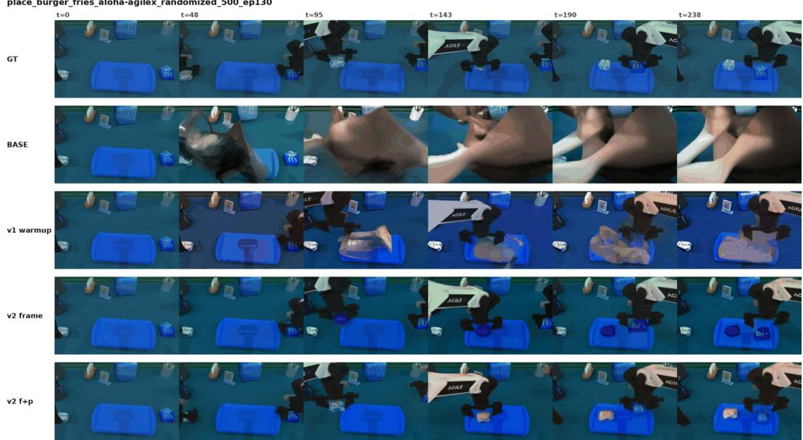  
Figure 15: Training evolution on place burger fries (ep130). EVAC-v1 develops a strong blue color shift and the tray contents collapse from the middle of the rollout. EVAC-v2 Frame removes most tray corruption, but the left arm hallucinates an object instead of grasping the burger and the object held by the right arm is visibly deformed. EVAC-v2 Fr.+Patch correctly grasps and places the burger while preserving the fries most faithfully.

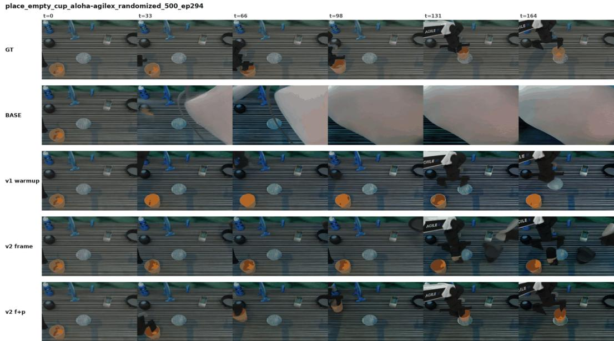  
Figure 16: Training evolution on place empty cup (ep294). In both EVAC-v1 and EVACv2 Frame, the arm only partially appears near the image boundary and fails to grasp the cup at the beginning; EVAC-v2 Frame additionally deteriorates toward the end of the rollout. EVAC-v2 Fr.+Patch correctly grasps the cup from the boundary, places it on the plate, and maintains a coherent scene throughout the prediction.

stack blocks two aloha-agilex\_randomized 500\_ep325  
put\_object\_cabinet\_aloha-agilex\_randomized\_500\_ep282  
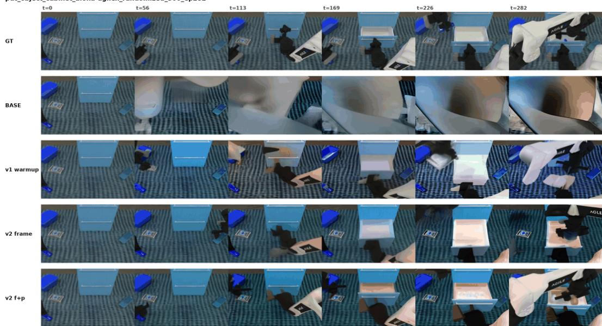  
Figure 17: Training evolution on put object cabinet (ep282). EVAC-v1 shows moderate color bias and eventually produces a floating arm together with a corrupted cabinet. EVAC-v2 Frame does not resolve these failures: the blue box in the upper-left region disappears and the arm is generated at an incorrect location. EVAC-v2 Fr.+Patch preserves the objects, cabinet structure, and robot geometry most consistently.

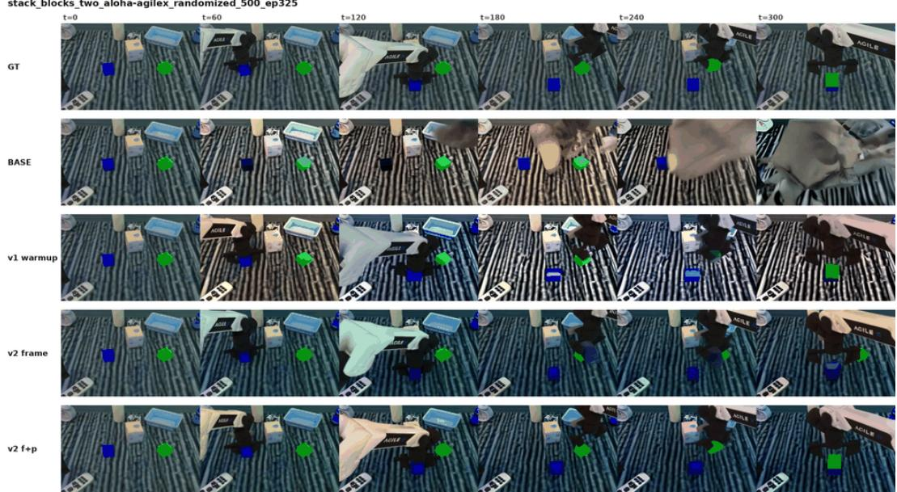  
Figure 18: Training evolution on stack blocks two (ep325). EVAC-v1 exhibits strong color flickering, and the lower blue block disappears when the green block is lifted and stacked. EVACv2 Frame largely removes the color shift but fails to keep the green block attached to the gripper and consequently misses the stacking interaction. EVAC-v2 Fr.+Patch resolves both the object persistence and grasping failures.

stack\_bowls\_three\_aloha-agilex\_randomized\_500\_ep087  
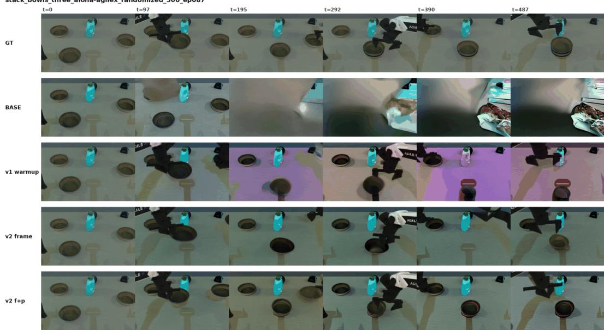  
Figure 19: Training evolution on stack bowls three (ep087). EVAC-v1 suffers from pronounced color drift and repeated red flickering, followed by severe object corruption late in the rollout. EVAC-v2 Frame removes the color shift but still produces substantial bowl deformation, disappearance, and reappearance. EVAC-v2 Fr.+Patch better preserves the bowl geometry and maintains object persistence through the later frames.

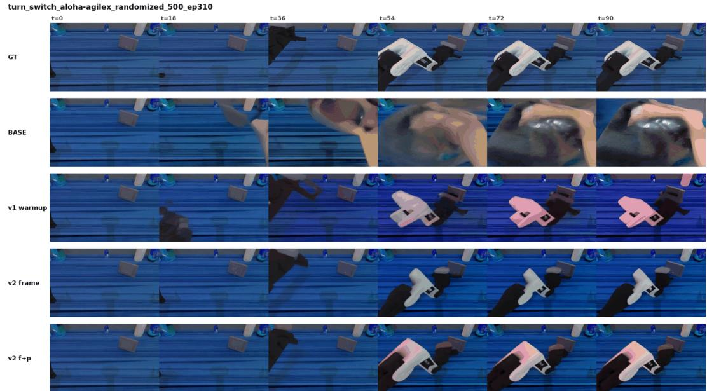  
Figure 20: Training evolution on turn switch (ep310). EVAC-v1 produces a reddish robot arm, a bluish background, and implausible floating-arm geometry. EVAC-v2 Frame substantially reduces the color bias, but the arm shape remains distorted. EVAC-v2 Fr.+Patch further improves the local arm geometry and produces an embodiment substantially closer to the ground truth.

Detailed EWMBench measurements. Table 10 reports the normalized component metrics underlying these representative examples. Overall, the transition from Base EVAC to EVAC-v1 substantially improves target-domain prediction quality, while confidence-guided EVAC-v2 provides further gains across reconstruction, scene, semantic, and trajectory dimensions. Among the selected episodes, frame-and-patch weighting gives the strongest overall progression, particularly for semantic quality and Motion when valid trajectory signals are available. These quantitative trends are consistent with the qualitative improvements shown above.

Table 10: Detailed normalized EWMBench results for the qualitative evolution study. All metrics are higher-is-better. Green, yellow, and red indicate the best, second-best, and third-best distinct values within each episode, respectively.
<table><tr><td rowspan="2">Episode</td><td>Variant</td><td>Reconstruction (↑)</td><td>Scene (↑)</td><td></td><td colspan="2">Semantics (↑)</td><td colspan="3">Motion (↑)</td></tr><tr><td></td><td colspan="8">PSNR (↑) SSIM (↑) Scene Cons. (↑) | Sem.-CLIP (↑) Sem.-BLEU (↑) | Traj-HSD (↑)</td></tr><tr><td rowspan="5">place burger fries (ep130)</td><td>Base EVAC</td><td>0.4413</td><td>0.477</td><td>0.789</td><td>0.7183</td><td>0.000</td><td>0.000</td><td>0.000</td><td>0.000</td></tr><tr><td>EVAC-v1</td><td>0.5957</td><td>0.668</td><td>0.877</td><td>0.7879</td><td>0.222</td><td>0.095</td><td>0.001</td><td>0.361</td></tr><tr><td>EVAC-v2 Frame</td><td>0.6777</td><td>0.646</td><td>0.943</td><td>0.8121</td><td>0.232</td><td>0.545</td><td>0.024</td><td>0.514</td></tr><tr><td>EVAC-v2 Fr.+Patch</td><td>0.6980</td><td>0.706</td><td>0.937</td><td>0.8182</td><td>0.279</td><td>0.761</td><td>0.002</td><td>0.545</td></tr><tr><td>Base EVAC</td><td>0.5100</td><td>0.411</td><td>0.712</td><td>0.8448</td><td>0.246</td><td>0.000</td><td>0.000</td><td>0.000</td></tr><tr><td rowspan="4">place empty cup (ep294)</td><td>EVAC-v1</td><td>0.7217</td><td>0.779</td><td>0.975</td><td>0.8038</td><td>0.266</td><td>0.108</td><td>0.365</td><td>0.087</td></tr><tr><td>EVAC-v2 Frame</td><td>0.7117</td><td>0.759</td><td>0.970</td><td>0.3568</td><td>0.164</td><td>0.097</td><td>0.238</td><td>0.080</td></tr><tr><td>EVAC-v2 Fr.+Patch</td><td>0.7197</td><td>0.792</td><td>0.961</td><td>0.8760</td><td>0.327</td><td>0.117</td><td>0.379</td><td>0.094</td></tr><tr><td>Base EVAC</td><td>0.4593</td><td>0.415</td><td>0.777</td><td>0.8081</td><td>0.163</td><td>0.000</td><td>0.000</td><td>0.000</td></tr><tr><td rowspan="4">put object cabinet (ep282)</td><td>EVAC-v1</td><td>0.5377</td><td>0.601</td><td>0.867</td><td>0.7927</td><td>0.183</td><td>0.000</td><td>0.000</td><td>0.000</td></tr><tr><td>EVAC-v2 Frame</td><td>0.5727</td><td>0.663</td><td>0.926</td><td>0.8708</td><td>0.182</td><td>0.000</td><td>0.000</td><td>0.000</td></tr><tr><td>EVAC-v2 Fr.+Patch</td><td>0.5903</td><td>0.651</td><td>0.895</td><td>0.9262</td><td>0.204</td><td>0.000</td><td>0.000</td><td>0.000</td></tr><tr><td>Base EVAC</td><td></td><td>0.305</td><td></td><td></td><td></td><td></td><td></td><td>0.000</td></tr><tr><td rowspan="4">stack blocks two (ep325)</td><td>EVAC-v1</td><td>0.4537 0.5650</td><td>0.667</td><td>0.797 0.890</td><td>0.7823 0.8246</td><td>0.096 0.096</td><td>0.000 0.303</td><td>0.000 0.205</td><td>0.639</td></tr><tr><td>EVAC-v2 Frame</td><td>0.6313</td><td>0.756</td><td>0.922</td><td>0.8052</td><td>0.116</td><td>0.304</td><td>0.218</td><td>0.655</td></tr><tr><td>EVAC-v2 Fr.+Patch</td><td>0.6447</td><td>0.766</td><td>0.924</td><td>0.8244</td><td>0.100</td><td>0.319</td><td>0.259</td><td>0.669</td></tr><tr><td>Base EVAC</td><td></td><td>0.611</td><td></td><td></td><td></td><td></td><td></td><td></td></tr><tr><td rowspan="4">stack bowls three (ep087)</td><td>EVAC-v1</td><td>0.4953</td><td>0.746</td><td>0.800</td><td>0.7860 0.8287</td><td>0.082</td><td>0.000 0.063</td><td>0.000 0.161</td><td>0.000 0.115</td></tr><tr><td>EVAC-v2 Frame</td><td>0.5630 0.6803</td><td></td><td>0.711</td><td>0.8116</td><td>0.000</td><td>0.000</td><td>0.000</td><td>0.000</td></tr><tr><td>EVAC-v2 Fr.+Patch</td><td>0.7160</td><td>0.801 0.795</td><td>0.906 0.888</td><td>0.8204</td><td>0.069 0.117</td><td>0.062</td><td>0.225</td><td>0.168</td></tr><tr><td></td><td></td><td></td><td></td><td></td><td></td><td></td><td></td><td></td></tr><tr><td rowspan="4">turn switch (ep310)</td><td>Base EVAC EVAC-v1</td><td>0.5507</td><td>0.565</td><td>0.826</td><td>0.7632 0.9108</td><td>0.123</td><td>0.000 0.000</td><td>0.000 0.000</td><td>0.000 0.000</td></tr><tr><td>EVAC-v2 Frame</td><td>0.6587 0.6807</td><td>0.726 0.725</td><td>0.930</td><td>0.9308</td><td>0.382 0.443</td><td>0.000</td><td>0.000</td><td>0.000</td></tr><tr><td></td><td></td><td>0.753</td><td>0.956</td><td>0.9318</td><td>0.722</td><td>0.000</td><td>0.000</td><td>0.000</td></tr><tr><td>EVAC-v2 Fr.+Patch</td><td>0.7170</td><td></td><td>0.941</td><td></td><td></td><td></td><td></td><td></td></tr></table>

## B.4 More Results of Qualitative Confidence Visualization

We provide additional qualitative examples to complement the confidence analysis in the main text. Figures 21 and 22 show the two episodes with the highest patch-level Spearman correlations, reaching 0.713 and 0.695, respectively. Across different future frames, the predicted risk maps consistently concentrate around manipulators, operated objects, and interaction regions, and largely agree with both pixel- and latent-space oracle errors. The corresponding risk overlays further illustrate that confidence provides spatially localized signals rather than merely reflecting global video quality.

Figures 23 and 24 show two challenging cases with lower patch-level Spearman correlations of 0.241 and 0.265. In these examples, oracle errors are more spatially diffuse and the predicted risk maps do not precisely reproduce their local boundaries, although they still respond to many of the dominant high-error regions. Together, the best and worst cases illustrate both the localization capability and the remaining limitations of the confidence probe, consistent with our quantitative finding that confidence reliably captures the relative severity and spatial concentration of prediction errors, even when the predicted risk map does not exactly reproduce the oracle error boundaries.

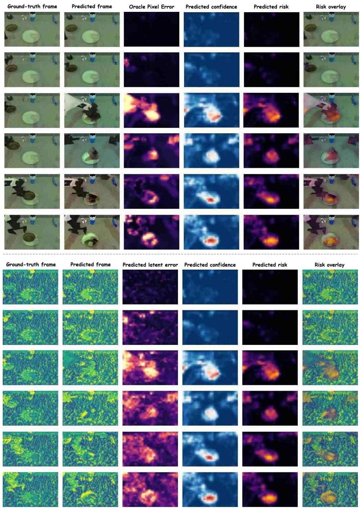  
Figure 21: More results of qualitative confidence visualization. Best-ranked example (top 1) by patch-level Spearman correlation.

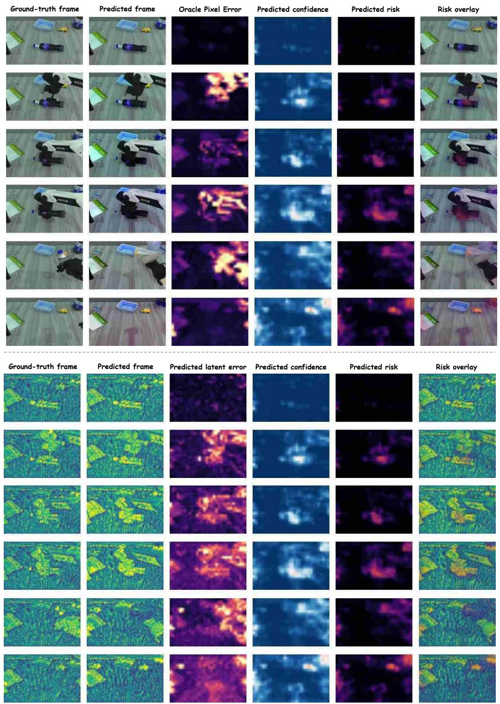  
Figure 22: More results of qualitative confidence visualization. Best-ranked example (top 2) by patch-level Spearman correlation.

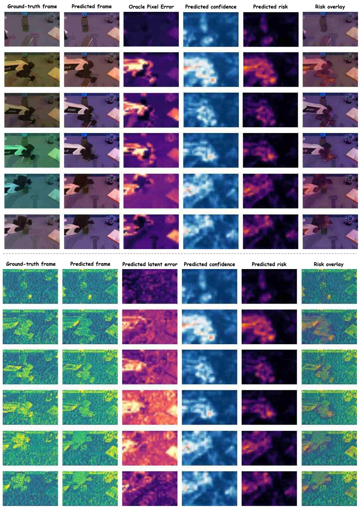  
Figure 23: More results of qualitative confidence visualization. Lowest-ranked example (top 1) by patch-level Spearman correlation.

The worst (top 2) by patch Spearman=0.265. Task: “move\_pillbottle\_pad”, ep025, frame 0, 26, 53, 79, 106, 132.  
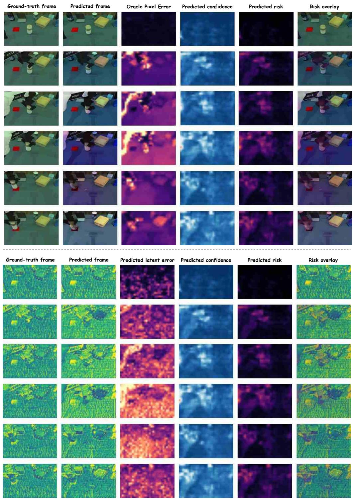  
Figure 24: More results of qualitative confidence visualization. Lowest-ranked example (top 2) by patch-level Spearman correlation.