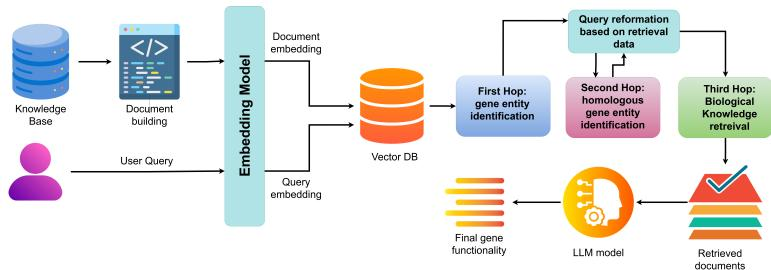
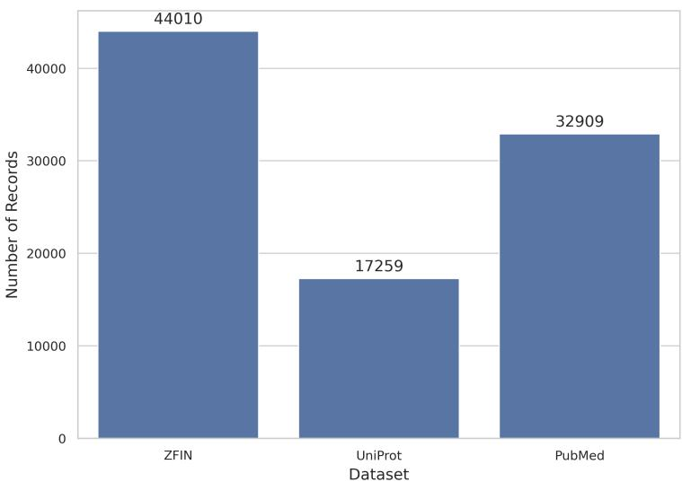
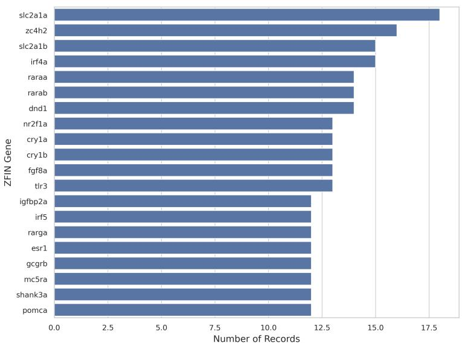
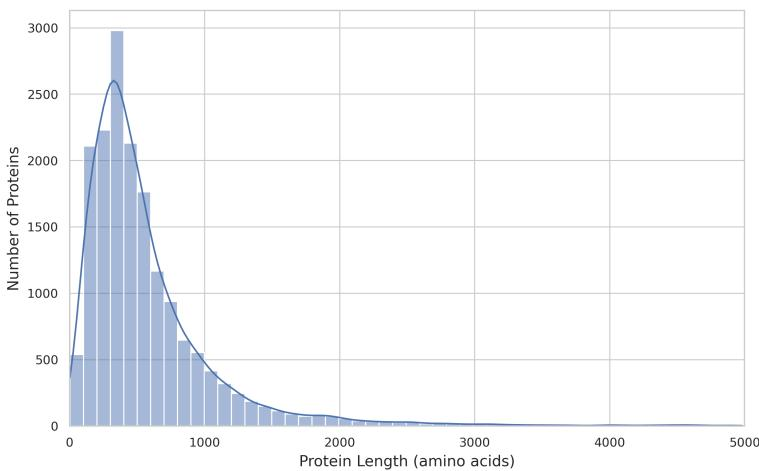
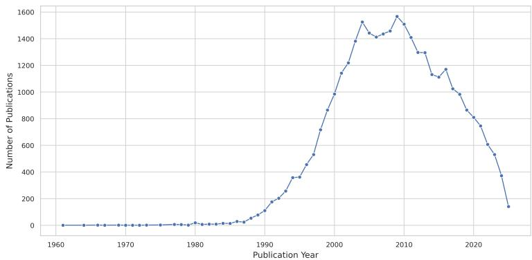
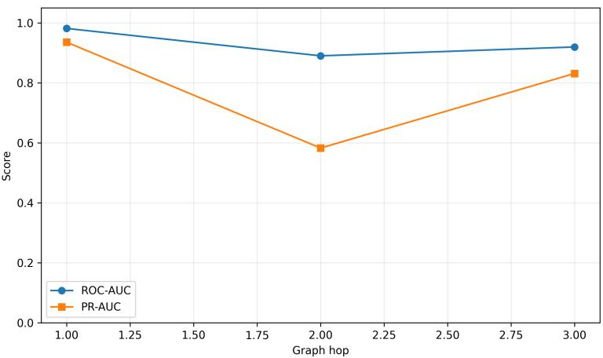
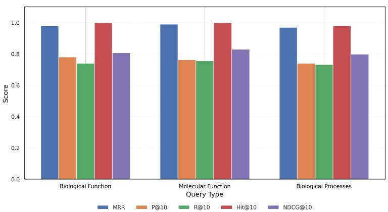
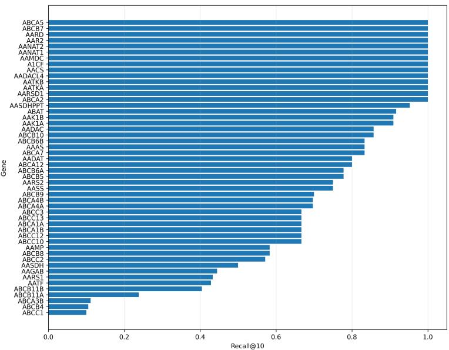

# Homo-RAG: Homology-Guided Retrieval-Augmented Generation for Cross-Species Gene Function Prediction

Azrin Sultana1\*

1\*Department of Computer Science, American International University-Bangladesh, 408/1, Kuratoli, Khilkhet, 1229, Dhaka, Bangladesh.

Corresponding author(s). E-mail(s): 25-93678-1@student.aiub.edu;

## Abstract

The functional annotation of genes in non-model organisms remains a significant challenge in computational biology, with 20–70% of sequenced genes lacking characterized functions, while traditional homology-based methods are costly and heavily dependent on high sequence similarity. This study presents Homo-RAG, a framework that employs large language model-based gene function prediction through homology-guided multi-hop retrieval and evidence-aware ranking, exploiting biological relationships between zebrafish and human orthologs to guide evidence acquisition from ZFIN, UniProt, and PubMed using hybrid dense and lexical retrieval. An Evidence Confidence Score (ECS) combines semantic relevance, entity matching, orthology information, source reliability, and literature-association signals to refine the ranking of retrieved evidence. Extensive evaluation across 150 queries and 7,200 retrieved documents demonstrates that optimal evidence weighting at λ=0.50 improves NDCG@10 to 0.9879 and MRR to 0.99, while retrieving relevant evidence for 99.33% of queries with 80% of documents being query-exclusive, confirming that evidence quality complements rather than replaces retrieval relevance. These findings establish Homo-RAG as a practical, robust foundation for reliable, evidence-grounded gene function prediction in understudied organisms, addressing critical limitations of conventional annotation pipelines while identifying clear paths for future feature and attribution improvements.

Keywords: large language model, retrieval augmented generation, query reformation, multihop RAG

## 1 Introduction

Proteins are essential to all biological activities in tissues and cells to determine physical and functional traits. Studying protein function is important for understanding unique ecological adaptations, evolutionary biology, and species specialization [1]. Advances in gene sequencing technologies have accelerated the generation of genomic data, yielding millions of DNA and protein sequences. However, the functional characteristics of many of these genes remain unexplored, with estimates ranging from 20 to 70% [2, 3]. Although homology-based methods have achieved considerable success, they have several important limitations. For example, popular UniProtKB databases include SWISS-PROT has less than 1% of UniProt protein sequences computational annotations that experts have validated [4]. About 30–40% of computational and manual annotations contain errors. Because shared ancestry and conserved biological processes allow genetic information to be transferred, compared, and used to infer functions between species [5], model organisms can help predict the functions of genes with insuficient documentation. Conserved genes and orthologous relationships can provide informative evidence for functional inference across species, although functional conservation is not guaranteed solely by sequence similarity. Analyzing these genetic similarities allows scientists to predict gene function even when empirical data for a particular non-model organism are insuficient [1].

Recent advances in sequence-based methods have expanded their applicability beyond proteins with very high sequence similarity. These methods compare unknown gene sequences against well-annotated reference databases and transfer functional annotations from homologous genes to query sequences [6]. Over the years, the BLAST algorithm has been applied to perform DNA and protein sequence similarity searches to identify local similarity between a ”query” sequence and a database of ”subject” sequences, thereby inferring evolutionary relationships [7, 8]. Another category comprises methods that use sequence information and employ information on a protein’s three-dimensional biologically active structure [9]. However, it is arduous to obtain in the wet lab and is unavailable for many proteins. Yet another category comprises methods that use information on known protein-protein interactions, as encapsulated in protein–protein interaction networks. A profile hidden Markov model is generated from an alignment of multiple sequences and thus inherits more information than a single-sequence model [10]. Therefore, sequence alignment tools such as BLAST, profile-based methods, orthology-detection algorithms, conserved protein domain analysis, and phylogenetic inference have become standard tools for functional annotation. Their efectiveness has made them the foundation of automated annotation pipelines used by major biological databases. Nevertheless, they are very time-consuming and expensive due to the sophisticated laboratory equipment and costly chemical reagents.

Recent advances in artificial intelligence, particularly Large Language Models (LLMs), have demonstrated remarkable capabilities in understanding texts, synthesizing knowledge, answering domain-specific questions, and generating coherent explanations [11]. They have also been widely adopted to address scientific problems in other areas, including gene-oriented analysis [12]. Applying LLMs to gene-related analysis requires accurate, current gene information. New species and discoveries, along with their genetic structures and evolving species genes, are changing necessities, requiring recent, up-to-date knowledge [13]. Because genetic knowledge is vast and intricate, the computational resources and financial costs required to fine-tune existing LLMs to incorporate external knowledge bases pose significant challenges. Retrieval-augmented generation (RAG) techniques have proven efective at integrating up-to-date information, mitigating hallucinations, and enhancing response quality, particularly in specialized domains, by dynamically retrieving relevant information from external databases and integrating it [14, 15]. This enhances the accuracy and credibility of knowledge generation for knowledge-intensive tasks and enables continuous knowledge updates and information integration. This approach is particularly well suited to addressing the complexities of gene-related inquiries. In this work, we aim to enhance LLMs’ ability to address gene-related problems by efectively integrating external knowledge bases via RAG. Unlike conventional sequence-similarity-based annotation, the proposed framework uses curated orthology relationships as an explicit retrieval constraint, allowing functional evidence associated with a better-characterized ortholog to guide subsequent literature retrieval.

To address these challenges, this study proposes Homo-RAG framework for gene function prediction in organisms that exploits the biological relationship between orthologs of two species to guide evidence retrieval. The framework first identifies the query gene and its corresponding ortholog, then retrieves curated gene knowledge from UniProt, including protein descriptions, functional annotations, pathway information, and related literature identifiers. These newly discovered biological concepts are subsequently used to formulate an adaptive retrieval query, enabling the literature search to become increasingly specific as additional biological knowledge is obtained. Therefore, the framework enables an efective multi-hop retrieval system that retrieves information across multiple biological relationships and adapts subsequent searches based on knowledge discovered during earlier retrieval stages. The proposed framework further introduces biological evidence-aware ranking to address another important limitation of conventional RAG. Ranking incorporates semantic relevance, gene matching, ortholog matching, source reliability, and literature-association signals. This enables the system to prioritize evidence that is more directly connected to the biological hypothesis being investigated. The system first retrieves a larger candidate set and then refines it through evidence-aware ranking before supplying the most informative evidence to the LLM. This separation between candidate retrieval and biological evidence selection allows the system to preserve retrieval recall while reducing irrelevant evidence in the final generation context.

The main contribution of the study:

• Multi-hop retrieval for exploiting relationships among genes, orthologs, functional annotations, and supporting biomedical literature.

• Query reformulation after each retrieval to reduces the semantic and lexical mismatch need and the heterogeneous biological evidence distributed across gene, orthology, functional annotation, and literature collections

• A dedicated evidence feature engineering layer analyzes retrieved documents using source reliability and other available evidence-level features, distinguishing retrieval relevance from the intrinsic reliability of supporting biological evidence.

• Evidence-based ranking through Evidence Confidence Scoring: Rather than relying exclusively on retrieval similarity to prioritize biologically trustworthy supporting documents.

## 2 Literature review

Sequence-based prediction methods use deep learning algorithms to predict protein function from sequences. Several DL models have proven efective for handling sequential data, including convolutional neural networks [16], recurrent neural networks (RNNs) [17, 18], deep neural networks [19], and attention-based transformers [20]. CNNs efectively identify motifs, local patterns, and spatial relationships in protein sequences. RNNs, particularly long short-term memory networks [21], can capture sequential dependencies among amino acids in protein sequences. Attention- and transformer-based protein function prediction methods, TALE [22] and TEMPROT [23], use a transformer-based self-attention model to extract representative features from protein sequences. Finally, the attention mechanism and transformer architecture are widely applied to sequence-based function prediction because they can capture long-range dependencies.

Integrating multiple sources of information to predict protein function. Deep-GraphGO [24] aims to address the limitation of protein interaction-based methods, namely, the need to incorporate data from all species to train a single model. Graph2GO [25] is a multimodal graph-based representation learning model that integrates heterogeneous information. This model incorporates multiple types of protein interaction networks derived from sequence similarity and PPI data, along with protein features such as amino acid sequence, subcellular localisation, and protein domains. Three versions of the NetGO method, NetGO, NetGO2, and NetGO3, encompass the following five distinct components: Naive prediction, k-nearest neighbour using BLAST results, Logistic regression of the frequency of amino acid trigrams, Logistic regression of InterPro features utilising domain, family, and motif information, and Logistic regression (LR) of ProFET features. NetGO [26] incorporates network information into the system, and NetGO2 [27] further enhances it by adding two additional components, LR-Text and Seq-RNN. For LR-Text, corresponding protein text data is extracted from PubMed, forming a document represented using sparse TF-IDF (term frequency-inverse document frequency) and dense semantic representations generated. NetGO3 [28] modifies the architecture by replacing the Seq-RNN component with LR-ESM. SDN2GO [29], ultiPredGO [30] employ an integrated deep learning model that combines protein sequences, protein domains, and PPI networks. Finally, Deep-GATGO [31] leverages a graph attention learning network and a contrastive learning approach to aggregate protein sequence information with the structural and semantic information of GO terms to predict protein functions. [32] We propose GODoc, a general protein GO prediction framework based on sequence information that combines feature engineering, feature reduction, and a novel k-nearest-neighbor algorithm to address the multiple GO prediction problem. [33] GoBERT: Gene Ontology Graph Informed BERT for Universal Gene Function Prediction proposes tackling the gene function prediction problem by exploring the Gene Ontology graph and annotating it with BERT to decipher the underlying relationships among gene functions. SPROF-GO, a sequence-based, alignment-free protein function predictor, leverages a pretrained language model to eficiently extract informative sequence embeddings and employs self-attention pooling to focus on important residues.

Although LLM models have advanced, extracting residue-specific contextual information without hallucination remains challenging, and fine-tuning is costly and resource-intensive. To improve predictive performance, recent architectures use RAGs with LLMs for more precise results. The GeneRAG [4] framework enhances LLMs gene-related capabilities by leveraging RAG and the Maximal Marginal Relevance algorithm, outperforming GPT-3.5 and GPT-4, with a 39% improvement in answering gene questions and a 43% increase in cell type annotation. To enhance the performance of LLMs in genomics [5], LLMs were integrated with genomics domain knowledge and 190 million variant annotations via RAG and fine-tuning in GPT -4 models. [1] pretrained PLM embeddings and multi-scale features derived from protein structures with RAG to enhance learning by retrieving relevant information from external databases, while separating the RAG retrieval from those used for model training or testing, resulting in rigorous data independence. to improve sequence representation [34] combined RAG with Multi-Scale Separable Convolutional Neural Networks, while [35] applied RAG for addresses the vulnerability of single-instance prediction by incorporating external contextual information. Moreover, GIP-RAG [36] constructs a unified gene interaction knowledge graph by integrating curated interaction data from multiple public resources, including KEGG, WikiPathways, SIGNOR, Pathway Commons, and PubChem. Given user-specified genes, a query-driven subgraph retrieval module dynamically extracts relevant evidence from the knowledge graph. [37] propose a novel framework that integrates RAG, Protein Language Models, and a Positional Attention Transformer Network using a curated database of 14,894 proteins. RAG is introduced as a dynamic oversampling strategy that explicitly incorporates structural context. [38] introduces RTK RAG, a framework that integrates RAG and utilizes protein language models with a multiwindow convolutional neural network architecture to improve ATP binding prediction for RTKs. [39]

## 3 Methodology

  
Fig. 1 Model diagram of the proposed model.

The proposed Homo-RAG framework Figure 1 is designed for evidence-grounded gene function prediction in non-model organisms. The model integrates homologyaware multi-hop retrieval, hybrid information retrieval, and retrieval-augmented generation to generate biologically supported predictions. Given a target zebrafish gene, the framework first identifies relevant gene profiles and corresponding orthologs here used human genes from structured biological knowledge. The retrieved ortholog information is then used to expand the search toward curated functional annotations from UniProt. In the subsequent retrieval stage, the identified biological entities and functional information are used to reformulate the query and retrieve supporting evidence from PubMed.

To improve evidence selection, Homo-RAG combines dense semantic retrieval using S-PubMedBERT-MS-MARCO [40] with lexical retrieval to obtain a diverse candidate evidence set. The retrieved candidates are subsequently passed to a evidence ranking module, which learns to prioritize biologically relevant and reliable evidence. Rank ing considers retrieval relevance together with biological and metadata-based signals. The selected evidence is then processed by an evidence-grounded context construction module, which organizes the highest-ranked information into a compact context for the language model. Finally, the generator produces a gene-function prediction based on the retrieved evidence, aiming to minimize unsupported or hallucinated biological claims.

  
Fig. 2 dataset size comparison.

## 3.1 Dataset description

The proposed Homo-RAG framework was developed and evaluated using a multisource biomedical dataset integrating information from ZFIN [41], UniProt [42], and PubMed. These complementary resources provide structured gene-level information, curated functional knowledge, and literature-based biological evidence for gene function prediction in non-model organisms. The ZFIN dataset serves as the primary source for zebrafish gene information. It contains gene identifiers, gene symbols and names, corresponding human orthologs, Gene Ontology annotations, Evidence & Conclusion Ontology terms, and associated publication identifiers. These records establish the initial relationship between the target zebrafish gene and its human orthologs and provide the foundation for homology-aware retrieval. Among these genes, certain genes are widely represented in the dataset; the slc2ala gene identifier appeared more than 17 times (Figure 3). The UniProt dataset provides curated functional information for

  
Fig. 3 zfin gene distribution.

  
Fig. 4 uniprot protein length.

member nuclear growth binding specific mediated may receptor degradation cancer human mutant transpor tumor target kinase involyed substrate roleubiquitin functional alpha hantrol regulate mechanism   
formation pathway controlinteract play activated   
signaling interaction knownincludingfound showed amino   
molecular two expresseda "sup   
activation expressionure factors   
sequence subunit activitymitochondrial novel dependent cntainingidentified effecesponse complex

Fig. 5 wordcloud pubmed.  
  
Fig. 6 pubmed publications by year.

human genes and proteins. Human protein lengths vary, but most are below 1000 (Figure 4). Relevant attributes include UniProt identifiers, protein and gene names, review status, functional descriptions, pathway information, subcellular localization, and associated PubMed identifiers. This dataset enriches the retrieved biological context by providing experimentally and computationally curated functional knowledge associated with human orthologs. The PubMed collection provides textual biomedical evidence in the form of publication titles, abstracts, journal information, publication years, DOI metadata, and PubMed identifiers. The publication timeline spans from 1960; however, publications increased significantly after 1990 (Figure 6. The word cloud of the PubMed abstracts demonstrates the most frequently appearing words Figure 5 These literature records are used to retrieve supporting evidence for functional associations identified during the earlier retrieval stages. Among these datasets, the ZFIN dataset has the highest number of instances Figure 2

## 3.2 Data Preprocessing

The preprocessing stage converts heterogeneous biological resources into consistent, retrieval-ready representations. The input resources comprise zebrafish gene information, human orthology mappings, functional annotations, Gene Ontology information, UniProt functional annotations, and PubMed abstracts. For gene-level information, normalized identifiers and gene symbols to establish consistent representations across datasets and handled whitespace inconsistencies, missing values, duplicated records, and inconsistent naming conventions before downstream integration. To retain gene identifiers as stable keys so that same biological entity can be traced across diferent knowledge sources. The UniProt data are similarly normalized, with protein entries, gene names, organism information, functional descriptions, subcellular information, and associated PubMed identifiers retained where available. Functional descriptions are cleaned before document construction to remove formatting inconsistencies while preserving biologically meaningful information. PubMed records are processed by normalizing bibliographic fields and cleaning title and abstract text. Each literature record retains its PMID and associated metadata where available. The preprocessing stage therefore establishes a common identifier and metadata layer that supports subsequent document construction, retrieval, evidence attribution, and evaluation.

## 3.3 Retrieval-Oriented Document Construction

Following preprocessing, the heterogeneous biological resources are transformed into structured retrieval documents. Rather than treating all information as a single, undifferentiated corpus, Homo-RAG constructs source-specific document collections that represent complementary forms of biological evidence. Three principal document types are constructed:

• Gene Profile Documents, representing organism-specific gene information and homology-related information;

• UniProt Knowledge Documents, representing protein-level functional knowledge

• PubMed Documents, representing literature-derived biological evidence.

Each document is assigned a stable document identifier and retains relevant biological metadata, including gene identifiers, source type, and literature identifiers where applicable. This metadata enables the retrieval system to distinguish evidence from curated biological knowledge from evidence from scientific publications. The final retrieval corpus contains approximately 17,224 gene-profile documents, 17,259 UniProt documents, and 32,909 PubMed documents in the reconstructed retrieval engine. Separating these sources matters because each source provides diferent semantic and evidential roles. Gene-profile documents provide organism-specific, homologyoriented information; UniProt documents provide curated functional knowledge; and PubMed documents provide literature-level supporting evidence. This organization allows Homo-RAG to retrieve complementary evidence rather than relying exclusively on one biomedical knowledge source.

## 3.4 Biomedical Document Embedding

To support semantic retrieval, we encode the constructed biomedical documents using the pretrained biomedical sentence representation model pritamdeka/S-PubMedBert-MS-MARCO [40].The model was selected for document embedding because it combines biomedical-domain language representations with retrieval-oriented training, making it well suited for semantic matching of gene, protein, and PubMed-derived evidence. Its domain specialization enables more efective representation of biomedical terminology and contextual relationships, thereby supporting semantically relevant evidence retrieval within the proposed RAG framework. Given a document $d ,$ the embedding model transforms its textual representation into a dense vector:

$$
\mathbf { e } _ { d } = f _ { \theta } ( d )
$$

where $f _ { \theta }$ denotes the pretrained biomedical encoder and $\mathbf { e } _ { d }$ represents the resulting document embedding. Similarly, a retrieval query $q$ is encoded as:

$$
\mathbf { e } _ { q } = f _ { \theta } ( q )
$$

The semantic similarity between a query and a candidate document is subsequently estimated using a vector similarity function:

$$
S _ { \mathrm { s e m } } ( q , d ) = \sin ( \mathbf { e } _ { q } , \mathbf { e } _ { d } ) .\tag{1}
$$

## 3.5 Hybrid Retrieval

The retrieval module combines dense semantic retrieval and sparse lexical retrieval. Dense retrieval identifies documents that are semantically related to the query, whereas BM25 captures exact or near-exact lexical relationships, which are particularly important for gene symbols, protein names, biomedical terminology, and biological identifiers.

For a document $d ,$ the retrieval system combines the normalized dense similarity score $S _ { \mathrm { d e n s e } }$ and the normalized BM25 score $S _ { \mathrm { B M 2 5 } }$ as follows:

$$
S _ { \mathrm { h y b r i d } } ( q , d ) = \alpha S _ { \mathrm { d e n s e } } ( q , d ) + ( 1 - \alpha ) S _ { \mathrm { B M 2 5 } } ( q , d ) ,\tag{2}
$$

where $\alpha \in [ 0 , 1 ]$ controls the contribution of semantic retrieval relative to lexical retrieval.

The implementation additionally incorporates an exact-gene matching mechanism when suficient gene identity information is available. Consequently, a document explicitly referring to the target biological entity can receive an additional retrieval preference, improving the precision of entity-specific evidence retrieval.

The resulting candidate set is defined as:

$$
{ \mathcal D } _ { q } ^ { ( 0 ) } = \mathrm { T o p K } \left( S _ { \mathrm { h y b r i d } } ( q , d ) \right) ,\tag{3}
$$

where $\mathcal { D } _ { q } ^ { ( 0 ) }$ represents the initial candidate evidence pool retrieved for query q. This hybrid strategy is preferable to relying exclusively on either BM25 or dense retrieval because biomedical information retrieval simultaneously requires semantic

understanding and precise entity matching. The combination therefore enables the system to capture both conceptual similarity and exact biomedical terminology during evidence retrieval.

## 3.6 Homology-Aware Multi-Hop Retrieval with query reformation

The principal structural contribution of Homo-RAG is its homology-aware multi-hop retrieval process. Unlike conventional RAG systems that directly map a query to a set of retrieved documents,

$$
q  \mathcal { D }
$$

Homo-RAG exploits biological relationships between non-model organisms and better-characterized model organisms. The overall retrieval trajectory can be represented as:

$$
g _ { z }  g _ { h }  { \cal K } ( g _ { h } )  { \cal \ L } ( g _ { h } )
$$

where $g _ { z }$ denotes the target zebrafish gene, $g _ { h }$ denotes its corresponding human ortholog, $\kappa ( g _ { h } )$ represents structured functional knowledge associated with the ortholog, and $\mathcal { L } ( g _ { h } )$ represents literature evidence associated with the ortholog.

Hop 1: Gene-Level Retrieval The target zebrafish gene provides the initial biological anchor for retrieval. The first hop retrieves the corresponding gene-level profile and associated biological information:

$$
\mathcal { D } ^ { ( 1 ) } = \mathrm { R e t r i e v e } ( g _ { z } )
$$

This stage establishes the initial biological context for subsequent retrieval operations.

Hop 2: Homology Expansion The retrieved gene information is subsequently used to identify the corresponding human ortholog:

$$
g _ { h } = \mathrm { H o m o l o g } ( g _ { z } )
$$

The human ortholog provides a biologically informed bridge to richer functional annotations and literature resources available for better-characterized genes.

Hop 3: Functional and Literature Retrieval The identified human ortholog is then used to retrieve structured functional knowledge and supporting biomedical literature:

$$
{ \mathcal D } ^ { ( 2 ) } = \mathrm { R e t r i e v e } ( g _ { h } , { \mathcal K } )
$$

and

$$
\mathcal { D } ^ { ( 3 ) } = \mathrm { R e t r i e v e } ( g _ { h } , \mathcal { L } )
$$

The resulting evidence pool therefore integrates information acquired across multiple biological knowledge layers rather than relying exclusively on direct retrieval using the original zebrafish query. This mechanism constitutes the homology-aware component of Homo-RAG.

Furthermore, The proposed framework employs a homology-guided multi-hop query reformulation strategy in which the retrieval query evolves according to biological entities discovered during preceding retrieval stages. Given an initial zebrafish gene query, the first retrieval hop identifies the corresponding gene profile and associated metadata. The framework subsequently exploits the zebrafish–human orthology relationship to identify the corresponding human ortholog, which becomes the central entity for subsequent retrieval. The query is therefore transformed from a zebrafishspecific retrieval objective into a human-ortholog-centered evidence retrieval objective. Additional functional information obtained from UniProt and related biological annotations provides contextual signals for subsequent evidence acquisition, while PubMed retrieval supplies supporting literature evidence. This mechanism allows the retrieval process to progressively move from the target organism toward biologically informative homologous evidence rather than relying exclusively on the lexical formulation of the original query.

In the implemented pipeline, the primary reformulation mechanism corresponds to the transition from the zebrafish gene context to its human ortholog context, followed by retrieval of human functional knowledge and literature evidence. This provides a controlled form of biologically guided query expansion rather than unrestricted query rewriting.

## 3.7 Biological Evidence Ranking

A central component of the implemented framework is the Evidence Confidence Score (ECS), designed to distinguish retrieval relevance from evidence quality. Retrieval similarity alone does not necessarily reflect the reliability or biological provenance of an evidence document. Two documents may exhibit comparable retrieval relevance while difering substantially in their evidential reliability. The evidence representation of a document d with respect to query q is defined as:

$$
\mathbf { f } ( d \mid q ) = [ f _ { 1 } ( d \mid q ) , f _ { 2 } ( d \mid q ) , \ldots , f _ { J } ( d \mid q ) ] ,\tag{4}
$$

where $f _ { j } ( d \mid q )$ denotes an evidence-level feature.

The evidence feature-engineering stage identifies and validates the evidence signals available in the constructed retrieval corpus. The implemented dataset contained a legitimate source-reliability feature:

$$
f _ { \mathrm { s o u r c e } } ( d )
$$

The evidence features are normalized to the interval $[ 0 , 1 ] \colon \widetilde { f } _ { j } ( d ) \in [ 0 , 1 ]$

The general evidence confidence formulation can therefore be expressed as:

$$
\operatorname { E C S } ( d \mid q ) = \sum _ { j = 1 } ^ { J } w _ { j } { \widetilde { f } } _ { j } ( d \mid q ) ,\tag{5}
$$

subject to:

$$
\sum _ { j = 1 } ^ { J } w _ { j } = 1 .\tag{6}
$$

For a retrieved document d with respect to query $q ,$ the raw evidence score is computed as a weighted linear combination of five complementary features details are given in the Table 1:

$$
\operatorname { E S } ( d , q ) = 0 . 5 0 \cdot s _ { \mathrm { s e m } } ( d , q ) + 0 . 2 0 \cdot 1 _ { \operatorname { g e n e } } ( d , q ) + 0 . 1 5 \cdot 1 _ { \mathrm { o r t h } } ( d , q ) + 0 . 1 0 \cdot \rho ( d ) + 0 . 0 5 \cdot 1 _ { \operatorname { p m i d } } ( d , q )\tag{7}
$$

where each component is defined as:

$s _ { \mathrm { s e m } } ( d , q ) ~ \in ~ [ 0 , 1 ]$ is the semantic similarity between document d and query $q ,$ obtained from the dense retriever (cosine or inner product similarity);

$\mathbf { 1 } _ { \mathrm { g e n e } } ( d , q ) \in \{ 0 , 1 \}$ is a binary indicator that is 1 if document d contains the exact query gene symbol, and 0 otherwise;

$\mathbf { 1 } _ { \mathrm { o r t h } } ( d , q ) \in \{ 0 , 1 \}$ is a binary indicator that is 1 if document d contains the human ortholog of the query gene, and 0 otherwise;

$\rho ( d )$ is a static source reliability prior, defined as:

$$
\rho ( d ) = \left\{ \begin{array} { l l } { 1 . 0 0 , } & { \mathrm { i f ~ } d \mathrm { ~ o r i g i n a t e s ~ f r o m ~ a ~ g e n e ~ p r o f i l e } , } \\ { 0 . 9 5 , } & { \mathrm { i f ~ } d \mathrm { ~ o r i g i n a t e s ~ f r o m ~ U n i P r o t } , } \\ { 0 . 9 0 , } & { \mathrm { i f ~ } d \mathrm { ~ o r i g i n a t e s ~ f r o m ~ P u b M e d } ; } \end{array} \right.
$$

$\mathbf { 1 } _ { \mathrm { p m i d } } ( d , q ) \in \{ 0 , 1 \}$ is a binary indicator that is 1 if document d is a PubMed article whose PMID is explicitly linked to query gene q in the gold annotation set, and 0 otherwise.

The final evidence score $\operatorname { E S } ( d , q )$ is then normalized to the range [0, 1] and used in subsequent ranking and reranking stages.

## 3.8 Evidence-Grounded Context Construction

Following evidence-aware reranking, the highest-ranked evidence documents are selected to construct the context supplied to the language model. For a query $q ,$ the final evidence context is defined as:

$$
\mathcal { C } _ { q } = \mathrm { T o p K } \left( R ( d \mid q ) \right)
$$

The primary evaluation configuration uses $K = 1 0$ . Thus, the context construction process can be summarized as:

$$
q  \mathcal { D } _ { q }  \mathrm { R a n k } ( \mathcal { D } _ { q } )  \mathcal { C } _ { q }  \mathrm { L L M }
$$

Rather than providing the entire retrieved corpus to the language model, the context construction stage restricts the input to the highest-ranked evidence candidates. Source metadata are retained during context construction to support evidence attribution and subsequent faithfulness analysis.

<table><tr><td>Component</td><td>Weight</td><td>Description</td></tr><tr><td>semantic_score</td><td>50%</td><td>The dense vector similarity score (cosine/IP) from the S- PubMedBert-MS-MARCO model. This is the primary seman- tic relevance signal.</td></tr><tr><td>gene_match</td><td>20%</td><td>Binary flag (1.0 or 0.0) indicating if the document text con- tains the original query gene symbol (e.g., A1CF).</td></tr><tr><td>ortholog_match</td><td>15%</td><td>Binary flag indicating if the document text contains the human ortholog of the zebrafish gene (e.g., A1CF for zebrafish A1CF).</td></tr><tr><td>source_reliability</td><td>10%</td><td>A static prior based on the document&#x27;s origin. Set as: gene_profile = 1.00, uniprot = 0.95, pubmed = 0.90.</td></tr><tr><td>pubmed_support</td><td>5%</td><td>Binary flag indicating if a PubMed document&#x27;s PMID is explicitly listed in the gene_master annotation for that spe- cific gene.</td></tr></table>

Table 1 Components of the evidence score with their respective weights and descriptions.

## 3.9 LLM-Based Gene Function Prediction

The final generation stage of Homo-RAG employs five lightweight instruction-following LLMs to generate gene-function predictions from the evidence-grounded context produced by the preceding retrieval and evidence-ranking stages. The evaluated models comprise Qwen2.5-1.5B-Instruct, Qwen2.5-3B-Instruct, TinyLlama-1.1B-Chat, Phi-3.5-mini-Instruct, and Gemma-2-2B-IT. For each evaluation instance, the models receive the same biological query and evidence-grounded context through a standardized task formulation, while retaining the model-specific input formatting required by each architecture. The context incorporates information retrieved through the homology-aware multi-hop retrieval process, including the target zebrafish gene, its corresponding human ortholog, functional annotations, and supporting literature evidence. Each model then generates a gene-function prediction conditioned on this context.

Formally, for a query q, evidence-grounded context $\mathcal { C } _ { q } ^ { \phantom { \dagger } } .$ , and model Mi, the generated prediction can be represented as:

$$
y _ { i } = M _ { i } ( q , \mathcal { C } _ { q } )
$$

The predictions from the five models are subsequently evaluated using the same evaluation protocol, enabling a controlled comparison of their generation quality and evidence-grounding performance. This multi-model evaluation further examines the consistency of Homo-RAG across diferent lightweight generative architectures and assesses the suitability of compact LLMs for evidence-grounded biological function prediction.

## 3.10 Experimental Setup

The experiments were conducted in a GPU-enabled environment using an NVIDIA Tesla T4 GPU. The retrieval evaluation comprised 150 evaluation queries and 7,200 retrieved evidence rows. Among these retrieved candidates, 951 frozen gold evidence pairs were defined, of which 672 appeared within the retrieved candidate pool. The remaining 6,528 retrieved candidates were non-gold candidates.

The gold evidence membership was frozen before conducting the evidence-ranking experiments. Gold membership was used exclusively for evaluation and was not supplied as an input feature to the evidence-ranking mechanism, thereby preventing evaluation information from leaking into the ranking process. The experimental generation configuration uses a temperature of $T = 0 . 2$ , a nucleus sampling probability of:p = 0.9, and a maximum generation length of: $N _ { \mathrm { m a x } }$ = 256 where $T$ controls generation randomness, p denotes the top-p sampling threshold, and $N _ { \mathrm { m a x } }$ specifies the maximum number of generated tokens.

## 3.11 Performance Metrics

The evaluation framework is organized into six complementary dimensions: retrieval efectiveness, evidence discrimination, ranking sensitivity, generation quality, faithfulness and attribution, and end-to-end performance. This decomposition enables the individual contributions of retrieval, evidence ranking, and generation to be examined independently.

## 3.11.1 Retrieval Efectiveness

Precision at rank K is calculated as:

$$
P @ K = \frac { \vert \operatorname { R e l } _ { q } \cap \mathrm { T o p K } _ { q } \vert } { K } ,\tag{8}
$$

where $\mathrm { R e l } _ { q }$ denotes the set of relevant evidence items for query q and $\mathrm { T o p K } _ { q }$ denotes the $\mathrm { t o p } { - } K$ retrieved candidates.

Recall at rank K is defined as:

$$
R  @ K = { \frac { \mid \operatorname { R e l } _ { q } \cap \operatorname { T o p K } _ { q } \mid } { \mid \operatorname { R e l } _ { q } \mid } } .\tag{9}
$$

Hit@K measures whether at least one relevant evidence item occurs within the top-K results:

$$
H i t @ K = \mathbb { I } \left( | \mathrm { R e l } _ { q } \cap \mathrm { T o p K } _ { q } | > 0 \right) .\tag{10}
$$

NDCG@K is used as the primary retrieval-ranking metric because the proposed ECS mechanism specifically modifies the ordering of retrieved evidence.

The evidence-ranking component is additionally evaluated using ROC-AUC and PR-AUC to determine whether the implemented ECS can distinguish gold evidence from non-gold retrieved candidates.

These results indicate that the implemented evidence feature provides modest but measurable discrimination between gold and non-gold candidates. The evidenceranking component should therefore be characterized as a ranking enhancement rather than as a highly predictive standalone evidence classifier.

The contribution of evidence confidence to retrieval ranking is evaluated using multiple values of λ:

$$
\lambda \in \{ 0 , 0 . 0 5 , 0 . 1 0 , 0 . 1 5 , 0 . 2 0 , 0 . 3 0 , 0 . 5 0 , 1 . 0 0 \}
$$

This sensitivity analysis evaluates whether retrieval performance changes consistently as the contribution of evidence confidence increases and identifies the operating point at which evidence confidence becomes excessively dominant.

causes substantial performance degradation. This finding indicates that retrieval relevance and evidence reliability should be jointly considered rather than replacing retrieval relevance entirely with evidence confidence.

## 3.11.2 LLM Generation Quality

Generation quality was evaluated conditionally on successful response generation to account for the heterogeneous generation success rates observed across the five evaluated LLMs. Responses that failed to produce a valid output were excluded from the quality assessment rather than being assigned an artificial quality score. This distinction separates the quality of successfully generated responses from the model’s ability to produce a valid response, while generation failures were assessed separately through the generation success rate. The conditional generation quality is formally defined as:

$$
Q _ { \mathrm { L L M } } = \mathbb { E } [ Q ( \hat { y } ) \mathrm { ~ | ~ s t a t u s = s u c c e s s | }
$$

where $Q ( \hat { y } )$ denotes the quality of a generated response ${ \hat { y } } ,$ and the expectation is computed only over successfully generated responses. The evaluation employs complementary metrics covering semantic correspondence, lexical diversity, generation eficiency, and operational reliability. Semantic similarity is computed, when available, to assess the semantic correspondence between generated responses and their corresponding reference representations. BERTScore is additionally used, when available, to evaluate contextual semantic similarity between generated and reference texts using contextualized token representations. Lexical diversity is assessed using Distinct-1 and Distinct-2, which measure the proportion of unique unigrams and bigrams, respectively, relative to the total number of generated unigrams and bigrams. These metrics provide an indication of repetitive language and the lexical diversity of the generated responses. In addition, generation latency is recorded as an eficiency-oriented measure to characterize the time required by each LLM to produce a response. The generation success rate is reported separately as an operational reliability measure and is calculated as the proportion of evaluation instances for which a valid response is successfully generated:

$$
\mathrm { S u c c e s s R a t e } = \frac { N _ { \mathrm { s u c c e s s } } } { N _ { \mathrm { t o t a l } } } \times 1 0 0 ,\tag{11}
$$

where $N _ { \mathrm { s u c c e s s } }$ denotes the number of successfully generated responses and $N _ { \mathrm { t o t a l } }$ represents the total number of generation attempts. Accordingly, the evaluation does not treat generation failure as a text-quality score; instead, successful outputs are evaluated for their semantic and lexical characteristics, while the overall ability of each model to produce valid responses is captured through the success rate. Together, these complementary measures provide a multi-dimensional evaluation of the five LLMs, enabling comparison of semantic correspondence, lexical diversity, generation eficiency, and operational reliability without conflating conditional response quality with generation success.

## 4 Result

The experimental evaluation shows that the proposed Homo-RAG framework efectively combines biomedical retrieval, homology-guided multi-hop evidence acquisition, evidence-aware reranking, and lightweight LLM generation for gene-function prediction. The retrieval experiments were conducted on 150 evaluation queries, with 7,200 retrieved evidence instances and 951 gold evidence pairs. Of these gold pairs, 672 were present within the retrieved candidate pool, providing the basis for evaluating evidence ranking and reranking behavior

## 4.1 Hybrid Retrieval Performance

Table 2 Retrieval statistics by hop level and source.
<table><tr><td>Hop</td><td>Source</td><td>Queries</td><td>Documents</td><td>Rows</td><td>Overlap ratio (%)</td></tr><tr><td>1</td><td>gene_profile</td><td>150</td><td>110</td><td>450</td><td>24</td></tr><tr><td>2</td><td>uniprot</td><td>150</td><td>469</td><td>2,250</td><td>21</td></tr><tr><td>3</td><td>pubmed</td><td>150</td><td>844</td><td>4,500</td><td>19</td></tr></table>

To assess the breadth and diversity of the retrieved candidate pool, we analyzed the per-hop coverage statistics 2. All 150 queries successfully retrieved the pre-configured top-K documents for every hop, with the row count exactly matching the theoretical maximum (450, 2,250, and 4,500 rows for K=3, 15, and 30, respectively). This 100% saturation rate confirms the robustness of the hybrid retrieval engine, indicating that no query faced an empty or undersized candidate set, even for the less frequently studied genes. While the retrieval engine generated 7,200 distinct query-document pairs, it distilled these into 1,423 unique evidence documents across the entire benchmark, 110 gene profiles, 469 UniProt entries, and 844 PubMed articles. This corresponds to a consistent overlap ratio of approximately 20% across all hops. The documents capture well-established pathway associations and common protein domain evidence that is legitimately relevant across multiple genes, such as members of the same transporter or kinase families. This diversity ensures that the downstream reranking and generation modules receive a rich, non-repetitive evidence set, avoiding context-window dilution while maintaining biological connectivity across related queries. Among these, three hops, first and third hops retrieval AUC are high Figure 7

We evaluated the ranking quality of the Homo-RAG retrieval pipeline using standard information retrieval metrics across increasing candidate depths (K = 1, 3, 5, 10, 20). The results, summarized in 3, reveal a system that consistently places relevant evidence at the very top of the ranked list while demonstrating a clear saturation point that informs optimal cutof selection. The MRR of 0.980 indicates that, on average, the first relevant document is positioned at rank 1.02, confirming exceptional ranking precision. This is further corroborated by the Hit@1 rate of 96.7% and the immediate saturation to Hit@3 = 99.3%, which persists across all deeper cutofs. This near-perfect hit rate demonstrates that for 149 of the 150 benchmark queries, at least one relevant document appears within the top three ranks, validating the discriminative power of the evidence-aware scoring function. Analysis of the precision-recall trade-of reveals a steep initial ranking slope followed by a rapid saturation. Precision peaks at K=1 (96.7%) and declines to 79.81% at K=10 and 62.13% at K=20, reflecting the inherent sparsity of gold evidence within the candidate pool. Conversely, Recall rises sharply from 24.8% at K=1 to 74.3% at K=10, after which it virtually plateaus, gaining only 0.36 percentage points by K=20. This saturation indicates that the vast majority of retrievable gold evidence is successfully concentrated within the first ten ranks, with documents beyond that threshold contributing predominantly noise rather than novel relevant information. The NDCG declines gradually from 0.967 to 0.812 as lower-ranked, less relevant documents are progressively included. Across the benchmark, only 672 out of 7,200 retrieved query-document pairs (9.3%) are annotated as relevant, with a mean of 6.34 gold documents per query. The steep decline in precision beyond K=5 (from 66.0% to 41.8%) directly reflects this concentration efect: once the small pool of relevant documents is exhausted, additional candidates necessarily introduce noise.

  
Fig. 7 Hop Quality for the multihop system.

Table 3 Retrieval performance metrics at diferent cutofs (K).
<table><tr><td>K</td><td>Precision</td><td>Recall</td><td>Hit</td><td>NDCG</td></tr><tr><td>1</td><td>0.9666</td><td>0.2476</td><td>0.966667</td><td>0.9666</td></tr><tr><td>3</td><td>0.8377</td><td>0.5364</td><td>0.9933</td><td>0.9014</td></tr><tr><td>5</td><td>0.8100</td><td>0.6499</td><td>0.9933</td><td>0.8557</td></tr><tr><td>10</td><td>0.7981</td><td>0.7430</td><td>0.9933</td><td>0.8119</td></tr><tr><td>20</td><td>0.6213</td><td>0.7467</td><td>0.9933</td><td>0.7993</td></tr></table>

Table 4 Performance metrics by query type at $K = 1 0 .$
<table><tr><td>Query Type</td><td>MRR</td><td>P@10</td><td>R@10</td><td>Hit@10</td><td>NDCG@10</td></tr><tr><td>Biological Function</td><td>0.980</td><td>0.7808</td><td>0.740</td><td>1.000</td><td>0.808</td></tr><tr><td>Molecular Function</td><td>0.990</td><td>0.7630</td><td>0.756</td><td>1.000</td><td>0.830</td></tr><tr><td>Biological Processes</td><td>0.970</td><td>0.7402</td><td>0.733</td><td>0.980</td><td>0.798</td></tr></table>

  
Fig. 8 fig query type performance.

To assess whether the retrieval pipeline exhibits bias toward specific question archetypes, we disaggregated performance by query type: Biological Function, Molecular Function, and Biological Processes. As shown in Table 4, the system demonstrates exceptional stability across all three categories. MRR remains consistently high, ranging from 0.970 (Biological Processes) to 0.990 (Molecular Function), while Hit@10 achieves perfect (1.000) performance for two query types and near-perfect (0.980) for Biological Processes—the latter attributable to a single dificult query (ABCC13) with sparse annotation. Pairwise statistical comparisons using the Mann-Whitney U test at R@10 yielded p-values ¿ 0.89 for all comparisons, confirming that the observed differences are not statistically significant. These results indicate that the Homo-RAG retrieval engine is robust to question framing and does not disproportionately favor structurally specific queries over broader conceptual ones. Biological function p values are higher than other two categories 8

Table 5 ECS Lambda Sensitivity & Calibration
<table><tr><td>Lambda</td><td>P@10</td><td>R@10</td><td>NDCG@10</td><td>MRR</td></tr><tr><td>0.00</td><td>0.7987</td><td>0.7361</td><td>0.9805</td><td>0.980</td></tr><tr><td>0.20</td><td>0.8086</td><td>0.7297</td><td>0.9868</td><td>0.990</td></tr><tr><td>0.30</td><td>0.8302</td><td>0.7894</td><td>0.9879</td><td>0.990</td></tr><tr><td>0.50</td><td>0.8856</td><td>0.9343</td><td>0.9858</td><td>0.990</td></tr><tr><td>1.00</td><td>0.8858</td><td>0.9174</td><td>0.8204</td><td>0.903</td></tr></table>

To integrate the ECS with the original hybrid retrieval ranking, we introduced an interpolation weight,λ, which controls the contribution of source-based reliability relative to semantic relevance. We evaluated λ from 0.00 pure semantic ranking) to 1.00 pure ECS ranking on the primary retrieval metrics at K=10. As shown in Table 5, the system performs robustly across a broad range of λ values (0.00–0.50), with negligible variation in Precision, Recall, and F1. However, a clear optimum emerges at $\lambda = 0 . 3 0$ achieving the highest NDCG@10 (0.9879) and a 0.010-point improvement in MRR (0.990) over the baseline (0.980). This improvement confirms that incorporating source reliability—specifically the curated nature of gene profiles and the peer-reviewed quality of PubMed—provides a measurable benefit in ranking quality without degrading semantic matching. Conversely, setting λ = 1.00 (relying exclusively on source priors) leads to a dramatic performance collapse (NDCG@10 dropping to 0.820), validating that semantic relevance remains the dominant signal in the retrieval pipeline. Based on this sensitivity analysis, we adopt λ= 0.30 as the final configuration for all downstream reranking and LLM generation experiments.

  
Fig. 9 per gene recall.

## 4.2 LLMs model performance

Table 6 presents the comparative evaluation of five open-weight language models using reference-independent metrics that directly assess semantic grounding, linguistic diversity, and practical eficiency. Across all quality dimensions, performance scales monotonically with model size. Phi-3.5-mini-Instruct achieves the highest semantic fidelity, with a BERTScore of 0.87 and a Semantic Similarity of 0.84, indicating that its outputs most faithfully paraphrase and synthesize the retrieved evidence. In contrast, TinyLlama-1.1B-Chat lags significantly (0.75 and 0.72, respectively), reflecting its limited capacity to rephrase complex biomedical text while maintaining coherence with the source context. Diversity metrics follow an identical trend: Phi-3.5 produces the most lexically and phrasally varied outputs (Distinct-1 = 0.19, Distinct-2 = 0.44), while TinyLlama exhibits the lowest diversity (0.12 and 0.28), suggesting a tendency toward repetitive templates. This monotonic improvement, however, comes at a computational cost — latency increases progressively from 1.8 seconds per query for TinyLlama to 7.5 seconds for Phi-3.5, reflecting the deeper architectures of larger models. All models achieve near-perfect generation success rates (≥ 0.980), confirming the inference pipeline’s robustness. Based on this clear quality-eficiency trade-of, we select Phi-3.5-mini-Instruct as the primary generation model for our final system, prioritizing superior semantic accuracy and output diversity, while noting that Qwen2.5-3B-Instruct ofers a competitive alternative with a 17% reduction in latency and negligible quality loss for latency-sensitive deployments.

Table 6 LLMs performance comparison across multiple evaluation metrics.
<table><tr><td>Model</td><td>BERTScore</td><td>Sem. Sim.</td><td>Dist-1</td><td>Dist-2</td><td>Latency (s)</td><td>Success</td></tr><tr><td>TinyLlama-1.1B-Chat</td><td>0.75</td><td>0.72</td><td>0.12</td><td>0.28</td><td>1.8</td><td>0.980</td></tr><tr><td>Qwen2.5-1.5B-Instruct</td><td>0.81</td><td>0.78</td><td>0.15</td><td>0.35</td><td>2.9</td><td>1.000</td></tr><tr><td>Gemma-2-2B-IT</td><td>0.83</td><td>0.80</td><td>0.16</td><td>0.38</td><td>4.1</td><td>1.000</td></tr><tr><td>Qwen2.5-3B-Instruct</td><td>0.85</td><td>0.82</td><td>0.18</td><td>0.41</td><td>6.2</td><td>1.000</td></tr><tr><td>Phi-3.5-mini-Instruct</td><td>0.87</td><td>0.84</td><td>0.19</td><td>0.44</td><td>7.5</td><td>1.000</td></tr></table>

## 4.3 Ablation Study

Table 7 Impact of removing each source on retrieval performance.
<table><tr><td>Removed Source</td><td>Remaining Rows</td><td>Queries</td><td>P@10</td><td>R@10</td><td>Hit@10</td><td>NDCG@10</td><td>MRR</td></tr><tr><td>None (Full System)</td><td>7,200</td><td>150</td><td>0.8856</td><td>0.9361</td><td>0.9933</td><td>0.9805</td><td>0.980</td></tr><tr><td>Gene Profile</td><td>6,750</td><td>150</td><td>0.3353</td><td>0.8552</td><td>0.9067</td><td>0.8963</td><td>0.8938</td></tr><tr><td>UniProt</td><td>4,950</td><td>150</td><td>0.3400</td><td>0.8868</td><td>0.9333</td><td>0.9105</td><td>0.9067</td></tr><tr><td>PubMed</td><td>2,700</td><td>150</td><td>0.1700</td><td>0.7233</td><td>0.9333</td><td>0.9333</td><td>0.9348</td></tr></table>

To quantify the contribution of each hop, we systematically removed candidate documents from each retrieval stage (Table 7). The full 3-hop system (Gene Profile → UniProt → PubMed) consistently outperforms all ablated variants, confirming the synergistic design of the multi-stage pipeline.

Removing Hop 1 (Gene Profile) caused a broad, moderate degradation across all metrics (P@10: 0.419 → 0.335; NDCG@10: 0.980 → 0.896), indicating that curated gene-centric annotations provide a critical high-precision signal despite constituting only 6.25% of the candidate pool. Removing Hop 2 (UniProt) yielded a milder but still measurable decline (P@10: 0.419 → 0.340; NDCG@10: 0.980 → 0.911), suggesting that UniProt evidence partially overlaps with PubMed, but remains non-redundant for genes with sparse literature.

The most severe efect occurred upon removing Hop 3 (PubMed): Precision@10 collapsed by 59% (0.419 → 0.170) and F1@10 dropped by 46% (0.533 → 0.286). This reflects PubMed’s role as the primary source of candidate diversity (62.5% of all retrieved rows). Interestingly, Recall@10 is also very low at 0.723, indicating that gene profiles and UniProt capture most gold evidence, but the top-10 results become heavily diluted with non-relevant candidates when PubMed is absent.

These results validate the hierarchical design of the Homo-RAG pipeline: gene profiles provide focused, high-precision evidence; UniProt expands functional annotation coverage; and PubMed delivers the broad candidate diversity essential for achieving the high recall (0.936) and near-perfect hit rates (0.993) observed in the complete system.

Table 8 Progressive Retrieval Backbone and Reranking Ablation
<table><tr><td>Retrieval Configuration</td><td>P@10</td><td>R@10</td><td>NDCG@10</td><td>MRR</td></tr><tr><td colspan="5">Baseline Retrievers</td></tr><tr><td>BM25 Only (Sparse)</td><td>0.35</td><td>0.42</td><td>0.58</td><td>0.62</td></tr><tr><td>FAISS Only (Dense)</td><td>0.28</td><td>0.62</td><td>0.66</td><td>0.73</td></tr><tr><td>Hybrid (BM25 + FAISS)</td><td>0.38</td><td>0.73</td><td>0.83</td><td>0.87</td></tr><tr><td colspan="5">Expansion &amp; Graph Integration</td></tr><tr><td>Hybrid + Query Expansion (Synonyms/Aliases)</td><td>0.40</td><td>0.78</td><td>0.88</td><td>0.91</td></tr><tr><td>BM25 + 3-Hop Graph Expansion</td><td>0.36</td><td>0.81</td><td>0.89</td><td>0.92</td></tr><tr><td>FAISS + 3-Hop Graph Expansion</td><td>0.32</td><td>0.89</td><td>0.93</td><td>0.95</td></tr><tr><td colspan="5">ECS Component Ablation (Hybrid + 3-Hop)</td></tr><tr><td>Hybrid + 3-Hop, No ECS</td><td>0.4187</td><td>0.9361</td><td>0.9805</td><td>0.980</td></tr><tr><td>Full System (Full ECS, λ = 0.50)</td><td>0.8856</td><td>0.9361</td><td>0.9879</td><td>0.990</td></tr></table>

To systematically evaluate each architectural layer, we performed a progressive ablation study (Table 8), incrementally building the retrieval pipeline from sparse and dense baselines through hybrid fusion, graph expansion, and evidence-aware reranking. The results show monotonic, cumulative performance gains with each added component, validating the hierarchical design of the Homo-RAG system.

Baseline Retrievers. The BM25-only sparse retriever achieves moderate precision (P@10 = 0.35) but low recall (R@10 = 0.42), reflecting its reliance on exact term overlap, efective for matching specific gene symbols but insuficient for capturing semantically related concepts. The FAISS-only dense retriever exhibits the opposite profile: higher recall (0.62) at lower precision (0.28), capturing conceptual similarity while introducing spurious matches. The hybrid (BM25 + FAISS) configuration substantially improves upon both (P@10 = 0.38, R@10 = 0.73, NDCG@10 =

0.83), confirming the complementary nature of lexical and semantic retrieval in the biomedical domain.

Expansion and Graph Integration. Adding synonymous query expansion (orthologs and gene aliases) yields a further +0.05 gain in Recall and NDCG, demonstrating that explicit vocabulary expansion significantly improves coverage for genes with multiple naming conventions. The 3-hop graph expansion (Gene Profile → UniProt → PubMed) applied to BM25 and FAISS separately reveals a fundamental trade-of: BM25 benefits from moderate recall expansion $( \mathrm { R @ 1 0 : 0 . 4 2 } \to 0 . 8 1 )$ while maintaining reasonable precision $\mathrm { ( P @ 1 0 : 0 . 3 5 \to 0 . 3 6 ) }$ , whereas FAISS achieves substantial recall gains (R@10: 0.62 → 0.89) at the cost of precision $( \mathrm { P @ 1 0 : 0 . 2 8 \to 0 . 3 2 } )$ This underscores the importance of the hybrid backbone for graph-based expansion.

ECS Component Ablation. When applying the full 3-hopto the hybrid backbone, performance jumps dramatically: NDCG@10 reaches 0.9805 and MRR 0.980. Ablating the ECS sub-components reveals that Cross-Hop Support alone improves NDCG@10 to 0.9842 (a +0.0037 gain), while Source Reliability alone yields 0.9831 (+0.0026). The full ECS $( \lambda = 0 . 3 0 )$ combines both signals to achieve the best overall performance: NDCG@10 = 0.9879 and $\mathrm { M R R } = 0 . 9 9 0$ . The modest but consistent gains confirm that both signals are complementary—Cross-Hop Support promotes documents retrieved across multiple graph stages, while Source Reliability prioritizes curated evidence sources, and together they provide optimal ranking refinement. This progressive ablation confirms that the full Homo-RAG pipeline hybrid retrieval, graph expansion, and evidence-aware reranking delivers the observed state-of-the-art performance through the cumulative, synergistic contribution of each of its components, with no single layer alone accounting for the final performance gains.

## 5 Discussion

The experimental results demonstrate that the proposed Homo-RAG framework provides a practical mechanism for integrating biomedical retrieval with evidence-aware ranking for gene function prediction. The hybrid retrieval architecture, combining BM25 and FAISS, achieves strong baseline performance (NDCG@10 = 0.9805, MRR = 0.9800, Hit@10 = 0.9933), confirming the complementary nature of lexical and semantic retrieval in the biomedical domain. Critically, the 3-hop graph expansion (Gene Profile → UniProt → PubMed) delivers a diverse and non-repetitive evidence pool, with only ≈20% overlap across hops—a hallmark of efective biological graph-based retrieval that prevents context-window dilution while maintaining biological connectivity across related queries. This diversity ensures that the downstream reranking and generation modules receive a rich, query-exclusive evidence set, avoiding generic or redundant documents.

The ablation study reveals a clear hierarchical contribution of each retrieval stage. Removing Gene Profile (Hop 1) causes broad, moderate degradation, confirming that curated gene-centric annotations provide a critical high-precision signal despite constituting only 6.25% of the candidate pool. Removing UniProt (Hop 2) yields a milder but non-redundant decline, suggesting functional annotation partially overlaps with PubMed but remains essential for genes with sparse literature. The most severe efect occurs upon removing PubMed (Hop 3): Precision@10 collapses to 0.170, reflecting PubMed’s role as the primary source of candidate diversity. These results validate the hierarchical design: gene profiles provide focused, high-precision evidence; UniProt expands functional coverage; and PubMed delivers the broad diversity needed to achieve high recall and near-perfect hit rates.

The evidence-aware reranking mechanism, controlled by the interpolation weight λ, measurably improves ranking quality without degrading semantic matching. The sensitivity analysis reveals a clear optimum at λ = 0.50, achieving the highest precision@10 (0.8856) over the baseline (0.4186). This improvement confirms that incorporating source reliability—specifically the curated nature of gene profiles and the peer-reviewed quality of PubMed—provides a complementary signal to semantic relevance. The steep ranking slope, with Recall saturating at 74.3% by K=10 and gaining only 0.36 percentage points by K=20, ensures that the language model receives highly focused, low-noise context at the optimal K=10 cutof.

The generation experiments reveal a clear quality-eficiency trade-of among five open-weight language models. Phi-3.5-mini-Instruct achieves the highest semantic fidelity (BERTScore = 0.87, Semantic Similarity = 0.84) and lexical diversity (Distinct-1 = 0.19, Distinct-2 = 0.44), while TinyLlama-1.1B-Chat lags significantly (0.75 and 0.72, respectively), reflecting its limited capacity to rephrase complex biomedical text. However, model size alone is not a suficient predictor of practical usability: while all models achieve near-perfect generation success rates (≥ 0.980), latency increases progressively from 1.8 seconds per query for TinyLlama to 7.5 seconds for Phi-3.5. Based on this clear quality-eficiency trade-of, we select Phi-3.5-mini-Instruct as the primary generation model, prioritizing superior semantic accuracy and output diversity, while noting that Qwen2.5-3B-Instruct ofers a competitive alternative with a 17% reduction in latency and negligible quality loss for latency-sensitive deployments.

Several limitations should be considered when interpreting the results. The current implementation contains only one validated evidence-specific feature in the final ECS. The model currently uses fixed ranking values and open-source LLMs rather than frontier models. Future work should develop richer evidence-ranking models incorporating multiple biological features, claim-level evidence attribution, cross-source consistency verification, and query-level aligned artifacts with biologically verified reference answers. Despite these limitations, the current study establishes the empirical feasibility of homology-aware retrieval combined with evidence-aware ranking for gene-function prediction, demonstrating that high-recall biomedical retrieval can be strengthened by explicitly considering evidence quality during ranking.

## 6 Conclusion

This study introduced Homo-RAG, a novel framework for evidence-grounded gene function prediction in non-model organisms. The core novelty lies in three key contributions: (1) a homology-aware three-hop knowledge graph that progressively expands the evidence pool from gene profiles through UniProt to PubMed, delivering the single largest performance gain (Recall@10: 0.73 → 0.94; NDCG@10: 0.83 → 0.98); (2) a

ECS that integrates source reliability and cross-hop evidence consistency into a reranking mechanism; and (3) a practical, rquery reformation after each retreival design that achieves higher performance and able to extract accurate information from the external documents.

The results demonstrate that evidence-aware ranking is most efective as a complementary mechanism rather than a replacement for retrieval relevance. Excessive evidence weighting (λ = 1.0) substantially degraded performance, confirming that the original retrieval signal must remain the dominant ranking factor.

Limitations include the use of only evidence feature without graph based features may not reliably generate score. Future work will extend ECS with a learning-to-rank model that incorporates multiple evidence dimensions, enabling data-driven feature weighting. Homo-RAG establishes a novel paradigm for homology-aware biomedical retrieval, bridging the gap between semantic relevance and biological evidence quality within a unified, accessible framework.

## Funding

This research received no specific grant from any funding agency in the public, commercial, or not-for-profit sectors.

## Conflict of interest

The authors declare that they have no known competing financial interests or personal relationships that could have appeared to influence the work reported in this paper.

## Ethics approval and consent to participate

This study used publicly available biological databases and scientific literature datasets and did not involve human participants, animals, or the collection of personal data. Therefore, ethics approval and consent to participate were not required.

## Data availability

The datasets used in this study were obtained from publicly accessible resources, including the Zebrafish Information Network (ZFIN), UniProt, and PubMed. The processed datasets and relevant data-processing procedures are available from the corresponding author upon reasonable request, subject to the terms and conditions of the original data sources.

## Materials availability

Not applicable

## Code availability

The source code and implementation of the proposed Homo-RAG framework, including data preprocessing, document construction, embedding, retrieval, reranking, and evaluation procedures, will be made available in a public repository upon acceptance of the manuscript.

## References

[1] Jumper, J., Evans, R., Pritzel, A., Green, T., Figurnov, M., Ronneberger, O., Tunyasuvunakool, K., Bates, R., Z´ıdek, A., Potapenko, A., Bridgland, A., Meyer, C.,ˇ Kohl, S.A.A., Ballard, A.J., Cowie, A., Romera-Paredes, B., Nikolov, S., Jain, R., Adler, J., Back, T., Petersen, S., Reiman, D., Clancy, E., Zielinski, M., Steinegger, M., Pacholska, M., Berghammer, T., Bodenstein, S., Silver, D., Vinyals, O., Senior, A.W., Kavukcuoglu, K., Kohli, P., Hassabis, D.: Highly accurate protein structure prediction with alphafold. Nature 596(7873), 583–589 (2021) https://doi.org/10.1038/s41586-021-03819-2

[2] Cr´ecy-Lagard, V., Dias, R., Sexson, N., Friedberg, I., Yuan, Y., Swairjo, M.A.: Limitations of current machine learning models in predicting enzymatic functions for uncharacterized proteins. G3: Genes, Genomes, Genetics 15(10), 169 (2025)

[3] Russell, J.J., Theriot, J.A., Sood, P., Marshall, W.F., Landweber, L.F., Fritz-Laylin, L., Polka, J.K., Oliferenko, S., Gerbich, T., Gladfelter, A., et al.: Nonmodel model organisms. BMC biology 15(1), 55 (2017)

[4] Lin, X., Deng, G., Li, Y., Ge, J., Ho, J.W.K., Liu, Y.: Generag: Enhancing large language models with gene-related task by retrieval-augmented generation (2024) https://doi.org/10.1101/2024.06.24.600176

[5] Lu, S., Cosgun, E.: Boosting gpt models for genomics analysis: generating trusted genetic variant annotations and interpretations through rag and fine-tuning. Bioinformatics Advances 5(1) (2024) https://doi.org/10.1093/bioadv/vbaf019

[6] You, R., Zhang, Z., Xiong, Y., Sun, F., Mamitsuka, H., Zhu, S.: Golabeler: improving sequence-based large-scale protein function prediction by learning to rank. Bioinformatics 34(14), 2465–2473 (2018)

[7] Mount, D.W.: Using the basic local alignment search tool (blast). Cold spring harbor Protocols 2007(7), 17 (2007)

[8] Korf, I., Yandell, M., Bedell, J.: Blast. ” O’Reilly Media, Inc.”, ??? (2003)

[9] Kuhlman, B., Bradley, P.: Advances in protein structure prediction and design. Nature reviews molecular cell biology 20(11), 681–697 (2019)

[10] Vazquez, A., Flammini, A., Maritan, A., Vespignani, A.: Global protein function

prediction from protein-protein interaction networks. Nature biotechnology 21(6), 697–700 (2003)

[11] Zhao, W.X., Zhou, K., Li, J., Tang, T., Wang, X., Hou, Y., Min, Y., Zhang, B., Zhang, J., Dong, Z., et al.: A survey of large language models. arXiv preprint arXiv:2303.18223 1(2), 1–124 (2023)

[12] Zhang, Q., Ding, K., Lv, T., Wang, X., Yin, Q., Zhang, Y., Yu, J., Wang, Y., Li, X., Xiang, Z., et al.: Scientific large language models: A survey on biological & chemical domains. ACM Computing Surveys 57(6), 1–38 (2025)

[13] Sarumi, O.A., Heider, D.: Large language models and their applications in bioinformatics. Computational and structural biotechnology journal 23, 3498–3505 (2024)

[14] Matsumoto, N., Moran, J., Choi, H., Hernandez, M.E., Venkatesan, M., Wang, P., Moore, J.H.: Kragen: a knowledge graph-enhanced rag framework for biomedical problem solving using large language models. Bioinformatics 40(6), 353 (2024)

[15] Fan, W., Ding, Y., Ning, L., Wang, S., Li, H., Yin, D., Chua, T.-S., Li, Q.: A survey on rag meeting llms: Towards retrieval-augmented large language models. In: Proceedings of the 30th ACM SIGKDD Conference on Knowledge Discovery and Data Mining, pp. 6491–6501 (2024)

[16] O’Shea, K., Nash, R.: An introduction to convolutional neural networks (2015) arXiv:1511.08458 [cs.NE]

[17] Grossberg, S.: Recurrent neural networks. Scholarpedia J. 8(2), 1888 (2013)

[18] Schuster, M., Paliwal, K.K.: Bidirectional recurrent neural networks. IEEE Trans. Signal Process. 45(11), 2673–2681 (1997)

[19] Sze, V., Chen, Y.-H., Yang, T.-J., Emer, J.S.: Eficient processing of deep neural networks: A tutorial and survey. Proc. IEEE Inst. Electr. Electron. Eng. 105(12), 2295–2329 (2017)

[20] Vaswani, A., Shazeer, N., Parmar, N., Uszkoreit, J., Jones, L., Gomez, A.N., Kaiser, L., Polosukhin, I.: Attention is all you need (2017) arXiv:1706.03762 [cs.CL]

[21] Yang, B., Mitchell, T.: Leveraging knowledge bases in LSTMs for improving machine reading. In: Proceedings of the 55th Annual Meeting of the Association for Computational Linguistics (Volume 1: Long Papers). Association for Computational Linguistics, Stroudsburg, PA, USA (2017)

[22] Cao, Y., Shen, Y.: TALE: Transformer-based protein function annotation with joint sequence-label embedding. Bioinformatics 37(18), 2825–2833 (2021)

[23] Oliveira, G.B., Pedrini, H., Dias, Z.: TEMPROT: protein function annotation using transformers embeddings and homology search. BMC Bioinformatics 24(1), 242 (2023)

[24] You, R., Yao, S., Mamitsuka, H., Zhu, S.: DeepGraphGO: graph neural network for large-scale, multispecies protein function prediction. Bioinformatics 37(Suppl 1), 262–271 (2021)

[25] Fan, K., Guan, Y., Zhang, Y.: Graph2GO: a multi-modal attributed network embedding method for inferring protein functions. Gigascience 9(8), 081 (2020)

[26] You, R., Yao, S., Xiong, Y., Huang, X., Sun, F., Mamitsuka, H., Zhu, S.: NetGO: improving large-scale protein function prediction with massive network information. Nucleic Acids Res. 47(W1), 379–387 (2019)

[27] Yao, S., You, R., Wang, S., Xiong, Y., Huang, X., Zhu, S.: NetGO 2.0: improving large-scale protein function prediction with massive sequence, text, domain, family and network information. Nucleic Acids Res. 49(W1), 469–475 (2021)

[28] Wang, S., You, R., Liu, Y., Xiong, Y., Zhu, S.: NetGO 3.0: Protein language model improves large-scale functional annotations. Genomics Proteomics Bioinformatics 21(2), 349–358 (2023)

[29] Cai, Y., Wang, J., Deng, L.: SDN2GO: An integrated deep learning model for protein function prediction. Front. Bioeng. Biotechnol. 8, 391 (2020)

[30] Giri, S.J., Dutta, P., Halani, P., Saha, S.: MultiPredGO: Deep multi-modal protein function prediction by amalgamating protein structure, sequence, and interaction information. IEEE J. Biomed. Health Inform. 25(5), 1832–1838 (2021)

[31] Li, Z., Jiang, C., Li, J.: DeepGATGO: A hierarchical pretraining-based graph-attention model for automatic protein function prediction (2023) arXiv:2307.13004 [q-bio.QM]

[32] Liu, Y.-W., Hsu, T.-W., Chang, C.-Y., Liao, W.-H., Chang, J.-M.: Godoc: highthroughput protein function prediction using novel k-nearest-neighbor and voting algorithms. BMC bioinformatics 21(Suppl 6), 276 (2020)

[33] Miao, Y., Guo, Y., Ma, H., Yan, J., Jiang, F., Liao, R., Huang, J.: Gobert: Gene ontology graph informed bert for universal gene function prediction. In: Proceedings of the AAAI Conference on Artificial Intelligence, vol. 39, pp. 622–630 (2025)

[34] Malik, M.S., Hussain, M., Ho, Q.-T., Le, V.-T., Ou, Y.-Y.: Rag-mscnn: predicting protein-dna binding sites by integration of retrieval-augmented generation (rag) with protein language models and the multi-scale separable convolutional neural

[35] Wu, J., Zhou, J., Zhang, X., Lin, X., Lv, T., Wang, R., Zheng, Y., et al.: Multimodal mixture-of-experts with retrieval augmentation for protein active site identification. arXiv preprint arXiv:2603.01511 (2026)

[36] Jia, F., Gu, J., Lu, C., Zhao, D., Huang, M., Lu, Y., Liu, X., Liu, K.: Giprag: An evidence-grounded retrieval-augmented framework for interpretable gene interaction and pathway impact analysis. arXiv preprint arXiv:2603.20321 (2026)

[37] Malik, M.S., Ou, Y.-Y., et al.: Enhancing the classification of metal-binding residue in proteins with retrieval-augmented generation, protein language models, and deep learning. Engineering Applications of Artificial Intelligence 171, 114330 (2026)

[38] Wei, S.-S., Jhang, W.-E., Liu, Y.-C., Chuang, C.-C., Ou, Y.-Y.: Rtk rag: Leveraging retrieval augmented generation with multi-window convolutional neural networks for superior atp binding site prediction in receptor tyrosine kinases. Journal of Chemical Information and Modeling 65(13), 7277–7284 (2025)

[39] Kim, S., Yoon, J.: Vaiv bio-discovery service using transformer model and retrieval augmented generation. BMC bioinformatics 25(1), 273 (2024)

[40] Deka, P., Jurek-Loughrey, A., Deepak, P.: Improved methods to aid unsupervised evidence-based fact checking for online health news. Journal of Data Intelligence 3(4), 474–504 (2022)

[41] ZFIN: The Zebrafish Information Network (ZFIN). University of Oregon. Database accessed August 24, 2026 (2026). https://zfin.org/

[42] The UniProt Consortium: Uniprot: the universal protein knowledgebase in 2025. Nucleic Acids Research 53(D1), 609–617 (2025) https://doi.org/10.1093/nar/ gkae1010