# MACGEN: Toward Functionally Correct and Secure Code Generation via Multi-Agent Collaboration

Miseon Yu Seoul National University altjs543@snu.ac.kr

Younghan Lee Sungshin Women’s University yhlee@sungshin.ac.kr

Jaehoon Choi Seoul National University qkzkf1113@snu.ac.kr

Yunheung Paek Seoul National University ypaek@snu.ac.kr

## Abstract

Despite their strong ability to generate code, large language models often fail to produce secure code, as their outputs frequently contain security vulnerabilities. Secure code generation is inherently challenging because it requires solving a multi-objective problem: functional correctness and security. Existing approaches address this challenge by injecting external security knowledge or by using agentic feedback and iterative refinement. However, guideline retrieval often leaves the generator to translate generic advice into task-specific secure implementations, while shared-dialogue multi-agent feedback can blur role boundaries and suffer from context bloat. We present MACGEN, a multi-agent framework that integrates planning, security analysis, code synthesis and refinement to jointly optimize security and functionality. A planner constructs a step-by-step plan to satisfy functional requirements. A security advisor identifies likely CWEs and synthesizes taskspecific guidelines, a coder then generates code grounded in these artifacts, and a reviewer issues perspective-separated feedback. Rather than sharing full dialogue histories, each agent receives only structured artifacts from upstream stages, enforcing role specialization and reducing uncontrolled context growth. On CWEval and BaxBench, MACGEN improves F&S@1 over direct prompting by 19.61 and 10.57 percentage points (pp) on average, respectively.

## 1 Introduction

Large language models (LLMs) demonstrate strong code-generation capabilities and are rapidly being adopted in practice (Dohmke, 2023; GitHub, Inc., 2024). Empirical studies, however, reveal that LLM-generated code often contains a significant number of vulnerabilities (Pearce et al., 2025; Khoury et al., 2023; Bhatt et al., 2023; Mou et al.,

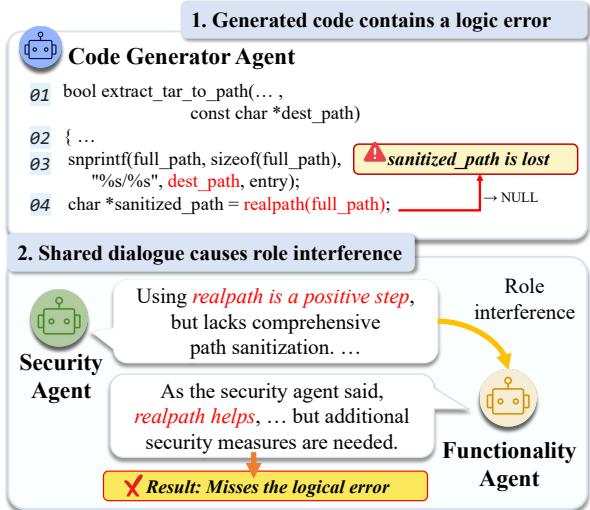  
Figure 1: Example of role interference. The generated code calls realpath on a non-existent destination path, causing sanitized\_path to become NULL rather than preserving the intended extraction path. After observing the security critic’s feedback in the shared-dialogue setting, the functionality critic shifts toward securityoriented feedback rather than independently identifying this logic error.

2025), including many listed in the MITRE CWE1 Top-25 (MITRE, 2024).

To mitigate these vulnerabilities, recent work has framed secure code generation as the task of producing code that satisfies the requested functionality while avoiding implementation choices that introduce security weaknesses. Unlike a postgeneration filtering problem, secure code generation requires security decisions to be made within the implementation itself, where they can affect whether the program still satisfies the intended behavior. Such dual-objective setting increases task complexity, as secure implementations require additional decisions such as input validation, safer

API selection, or permission checks. Moreover, the security risks relevant to a task are often underspecified in the prompt, requiring the model to infer applicable threats and translate them into concrete, functionally consistent code choices. Empirically, security-oriented prompting, which directly instructs the model to produce secure code, can reduce vulnerabilities but often compromises functional correctness (Tony et al., 2025a; Black et al., 2025; Dai et al., 2026). The expanded reasoning burden imposed by dual objectives is difficult to resolve reliably through prompting alone.

One line of work mitigates this challenge by injecting external security knowledge into the generation context, such as secure code examples or security guidelines (Zhang et al., 2024; Lin et al., 2025; Shi and Zhang, 2026). More recently, these approaches have been refined by selecting concise and task-relevant guidelines to better preserve functionality (Shi and Zhang, 2026). However, such guidelines are inherently generic and lack awareness of task-specific context such as variable names, function signatures, or control flow. Similarly, secure code examples are language-specific and costly to collect, limiting their practical coverage. As a result, even with retrieved knowledge in context, the generator must still determine how generic guidance applies to the specific task and translate it into secure, functional code. Thus, retrieval narrows the security-knowledge gap but leaves taskspecific adaptation unresolved at generation time.

Another line of work addresses this reasoning burden through agentic critique. Le et al. (2024) propose an internal-dialogue framework in which safety and helpfulness critic agents analyze generated code from their respective perspectives. By assigning each concern to a distinct critic, this approach makes functional and security-related evaluation criteria explicit. However, shared-dialogue designs may blur these role boundaries when critics observe each other’s intermediate reasoning, potentially leading to role interference in which critics produce overlapping feedback or gradually drift from their assigned perspective (Figure 1). Because role separation is enforced only through prompt instructions rather than by the interface itself, such designs rely on accumulated dialogue to coordinate critiques. This increases token cost and latency while exposing agents to long-context degradation as the dialogue history grows (Liu et al., 2024a,b).

These considerations suggest that effective secure code generation requires not just more knowledge or more feedback, but a clearer separation of what each stage needs to reason about. Each stage should receive only the information it needs and pass a compact artifact to the next, so that role boundaries are enforced by the interface rather than by prompts alone. We instantiate this principle as MACGEN, a multi-agent collaboration system for secure code generation. Inspired by the Secure Software Development Lifecycle (SS-DLC) (Howard and Lipner, 2006), which emphasizes incorporating security throughout development, MACGEN decomposes secure code generation into planning, security analysis, synthesis, and refinement, each handled by a dedicated agent.

Specifically, a planner first establishes a functional plan, analogous to clarifying requirements. A code generator then produces draft code from this plan and a security advisor then analyzes the task, plan, and draft code to identify threats and generate task-specific guidelines that cover relevant CWE risks, serving a role similar to incorporating security during design and bridging the gap between generic retrieved advice and the concrete coding task. Subsequently, a code generator implements secure code guided by both the plan and security constraints. Finally, a reviewer supports the verification phase by issuing actionable, perspectiveseparated feedback routed back to the coder for targeted refinement. By resolving what to implement and how to secure it before code synthesis, MACGEN helps the coder produce code that satisfies both functional and security requirements from the outset. Unlike prior multi-agent approaches that rely on shared dialogue, our framework enforces role specialization efficiently through artifact-only interfaces.

We conduct a comprehensive evaluation of MACGEN using two complementary benchmarks, CWEval (Peng et al., 2025) and BaxBench (Vero et al., 2025). On CWEval, across six LLMs and five programming languages, MACGEN improves F&S@1 over direct prompting by 19.61 percentage points (pp) on average. On BaxBench, evaluated with GPT-4o and GPT-4o-mini across six backend languages, MACGEN improves F&S@1 by 9.95pp and 11.18pp, respectively.

• We introduce MACGEN, a multi-agent framework for functionally correct and secure code generation that decomposes generation into planning, security analysis, code synthesis, and refinement.

• We show that artifact-only interfaces provide an effective coordination structure for specialized agents, by reducing unnecessary context sharing between roles.

• We evaluate MACGEN on CWEval and BaxBench across multiple LLMs and languages, reporting improved joint functionality-security performance. 2.

## 2 Related Works

## 2.1 Multi-Agents for Code Generation

Multi-agent strategies have shown potential for improving code quality through structured task decomposition (Li et al., 2023; Hong et al., 2024; Qian et al., 2023; Islam et al., 2024, 2025). Especially, Islam et al. (2025) introduces CODESIM, which significantly enhances code quality by leveraging planning techniques inspired by human problem-solving processes. It generates a step-bystep implementation plan, which is then simulated using synthesized input/output samples to verify correctness. This plan is iteratively refined until the simulation succeeds. Despite these advances, such planning-based and human problem-solving approaches have yet to be fully utilized in the domain of secure code generation. MACGEN extends this line of work by applying planning techniques to secure code generation.

## 2.2 Secure Code Generation

Model adaptation improves security via securitycentric prefix-/instruction-tuning, localized optimization, or internal feature control (He and Vechev, 2023; He et al., 2024; Li et al., 2024; Hasan et al., 2025; Huang et al., 2026; El Husseini et al., 2026). However, such approaches require access to model parameters or internals, limiting applicability when only inference-time interaction is available. Prompting/Reflection can steer LLMs toward safer code at inference time (Nazzal et al., 2024; Tony et al., 2025a; Bruni et al., 2025); for example, Tony et al. (2025a) show that multi-turn Recursive Criticism and Improvement (RCI) significantly reduces security weaknesses. Knowledge Injection augments the generation context with external security knowledge, such as secure code examples or guidelines (Wang et al., 2025; Zhang et al., 2024;

Tony et al., 2025b; Lin et al., 2025; Shi and Zhang, 2026). Agentic Critique uses specialized agents to review generated code for security (Nunez et al., 2024) or for both functional and security perspectives (Le et al., 2024). Collectively, these inferencetime approaches treat security as added knowledge or post-generation feedback, rather than integrating it throughout the development process as SSDLC principles prescribe.

## 3 MACGEN Design

## 3.1 Problem Definition

Our goal is to generate source code that is syntactically valid, functionally correct, and secure. We approach this as a conditional generation task where a multi-agent system produces a code sequence Y from a prompt X. This input X can consist of a natural language instruction, a code prefix for completion, or a combination of both.

## 3.2 Overall Workflow

MACGEN is a role-specialized multi-agent framework composed of four agents: a Planner, a Security Advisor, a Code Generator, and a Reviewer. An overview of the framework is displayed in Fig 2. The process begins with the Planner establishing a functional plan, which the Code Generator uses to produce the draft code (⃝1 –⃝2 in Fig 2). The Security Advisor then analyzes the draft, either triggering an early exit or performing standards-driven reasoning via a security Knowledge Base (KB) to synthesize guidelines (⃝3 ). Finally, the Code Generator implements the final code, followed by iterative verification from the Reviewer (⃝4 ).

## 3.3 Building a Standards-driven Security Knowledge Base

To ensure the normative correctness of security reasoning, we construct a standards-grounded KB from official code security standards such as CERT and OWASP (CERT; OWASP). This preconstructed KB serves as the foundation for the retrieval mechanism, enabling the Security Advisor to perform standards-grounded reasoning.

Raw text parsed from heterogeneous sources (e.g., PDF, Markdown) often contains structural noise and formatting inconsistencies that hinder effective semantic retrieval. To address this, we leverage an LLM-based refinement process that normalizes each guideline into a compact, highdensity schema consisting of four fields (WHAT,

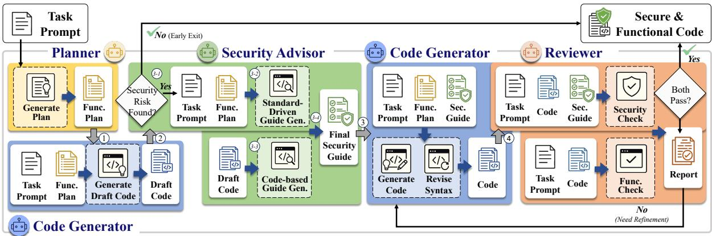  
Figure 2: Overview of MACGEN: The framework consists of four specialized agents—Planner, Security Advisor, Code Generator, and Reviewer.

WHY, HOW, and EXAMPLE). The prompt used for this refinement is provided in Figure 8.

To convert these structured guidelines into a searchable semantic space, each guide $g _ { i }$ is encoded into a vector $\mathbf { v } _ { i } ~ \in ~ \mathbb { R } ^ { d }$ using an embedding function E(·). During inference, the Security Advisor formulates a set of task-specific queries $\mathcal { Q } ~ = ~ \{ q _ { 1 } , \dots , q _ { m } \}$ derived from the identified CWE groups. For each query $q _ { j } \in \mathcal { Q }$ , the retrieval process selects the top-K most relevant guidelines according to cosine similarity:

$$
G ^ { * } ( q _ { j } ) = \underset { g _ { i } \in \mathrm { K B } } { \arg \operatorname* { m a x } } ^ { ( K ) } \ \sin \bigl ( E ( q _ { j } ) , E ( g _ { i } ) \bigr )\tag{1}
$$

where arg $\operatorname* { m a x } ^ { ( K ) }$ denotes an operator that returns the set of K elements with the highest similarity scores, and sim(·, ·) represents cosine similarity. The final candidate set G is obtained by the union of retrieved guidelines across all queries in Q.

## 3.4 Role-specific Agents

This subsection details the roles and internal logic of each agent. The complete prompts for all agents are provided in Appendix K.

## 3.4.1 Planner

Inspired by prior work (Islam et al., 2025), the Planner agent generates a concise, high-level functional plan for each task. This plan serves dual purposes. It guides the Code Generator toward a functionally correct implementation, and provides task-specific context that enables the Security Advisor to identify relevant attack surfaces more precisely.

## 3.4.2 Security Advisor

The Security Advisor follows a multi-stage pipeline designed for both inference efficiency and analytical depth. The process begins with an early-exit triage, where the advisor inspects the task prompt and the initial draft code to identify potential attack surfaces under pre-defined categories. If no risks are detected (e.g., for simple algorithmic or purely functional tasks), the system executes an early exit to bypass unnecessary retrieval and minimize computational overhead.

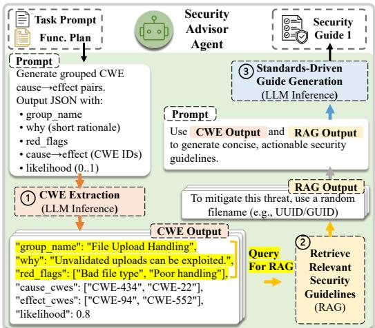  
Figure 3: Detailed visualization of the standards-driven guideline generation process (Step 3-2 in Fig 2).

For tasks requiring deeper inspection, the advisor synthesizes task-specific guidelines through a three-step process. First, following the workflow in Figure 3, it examines the task prompt and the functional plan to identify potential security risks, which are represented as corresponding CWE groups (e.g., insecure file path handling). These groups are then used to formulate targeted search queries for retrieving relevant security guidelines from the pre-constructed KB. Based on the retrieved context, the advisor generates the first set of standards-driven security guidelines.

Subsequently, the advisor performs a code-based guide generation by inspecting the draft code. This step is crucial for detecting insecure coding patterns typical of LLM outputs that may not be apparent from the high-level plan alone. Based on this code-level analysis, the second set of guidelines is generated. Finally, the advisor concatenates both sets and validates them against the functional requirements to ensure no conflicts exist. This consolidation guarantees that the security requirements are both comprehensive and compatible with the task’s functionality.

## 3.4.3 Code Generator

The Code Generator agent serves two distinct roles within the pipeline. First, it produces an initial draft code based on the task prompt and the functional plan, which is subsequently analyzed by the Security Advisor. Second, guided by the functional plan and the security guidelines, the agent generates the executable code, with both components acting as dual constraints on the output. After generation, the agent iteratively checks the generated code using a syntax checker and performs self-refinement until the code is syntactically valid.

## 3.4.4 Reviewer

The Reviewer agent conducts a structured code review through two perspective-separated checks. It verifies that the implementation accomplishes the intended functionality and that all security guidelines have been correctly met. If it uncovers any functional errors (e.g., incorrect logic) or residual security issues (e.g., missing input sanitization, use of risky functions), it provides targeted feedback. This feedback is passed to the Code Generator, which revises the implementation as needed. The iterative refinement cycle continues until the Reviewer approves the code as both functionally correct and secure, or the maximum number of iterations is reached.

## 4 Experimental Setup

In this section, we describe the experimental setup, including benchmarks, models, baselines, implementation details, and evaluation metrics. More details are provided in Appendix A.

## 4.1 Benchmarks

We evaluate our approach using two securityoriented code generation benchmarks. First, we employ CWEval (Peng et al., 2025), an outcomedriven evaluation benchmark comprising 119 code completion tasks across five programming languages (C, C++, Python, JavaScript, and Go). Second, we use BaxBench (Vero et al., 2025), a benchmark for generating backend applications in realistic and diverse environments. It contains 392 tasks across 28 backend scenarios and 14 frameworks in six programming languages (Go, JavaScript, PHP, Python, Ruby, and Rust), spans both single- and multi-file application settings.

## 4.2 Baselines & LLM Models

To evaluate the effectiveness of our framework, we compare it against five baselines: Direct Prompting where LLMs generate code Y directly from the task prompt X, SECGUIDE (Tony et al., 2025b), CODEGUARDER (Lin et al., 2025) and RES-CUE (Shi and Zhang, 2026) which are RAGbased methods, and INDICT (Le et al., 2024), an internal-dialogue multi-agent framework with iterative refinement. We evaluate all using six LLMs: GPT-4o, GPT-4o-mini (Hurst et al., 2024), Gemini 2.5-Flash, Gemini 2.5-Flash-Lite (Comanici et al., 2025), the open-source DeepSeek-R1-Distill-Llama-70B (Guo et al., 2025), distilled from Llama3.3-70B-Instruct (AI@Meta, 2024), and Qwen3-8B (Yang et al., 2025).

## 4.3 Implementation Details

We use the same set of hyperparameters for MAC-GEN across all experiments unless otherwise specified. For the security analysis, the Security Advisor infers a number of potential CWE groups per task, with up to $C = 3$ for CWEval and up to $C = 2$ for BaxBench. We set the maximum number of refinement iterations between the Reviewer and Code Generator is set to M = 2. For all baselines, we adopt the hyperparameters reported in their original papers (Tony et al., 2025b; Lin et al., 2025; Shi and Zhang, 2026; Le et al., 2024). All LLMs are decoded with a temperature of 0.0 for reproducibility.

## 4.4 Evaluation Metrics

We evaluate the generated code in terms offunctional correctness and security. For two benchmarks, both aspects are automatically evaluated using built-in test oracles. CWEval focuses on a specific target CWE for each code completion task, whereas BaxBench evaluates generated backend applications using end-to-end API-level exploits that may cover multiple CWE classes per scenario. Following the metric definition introduced by Peng et al. (2025); Vero et al. (2025), we report Pass@1 as the primary evaluation metric in three variants: Func@1, Sec@1, and F&S@1. Func@1 and F&S@1 are computed over all generations, measuring functional correctness and joint functionalsecurity success, respectively, while Sec@1 is computed only over compilable generations.

<table><tr><td rowspan="2">Model</td><td rowspan="2">Method</td><td colspan="2">Func@1 (%)</td><td colspan="2">Sec@1 (%)</td><td colspan="2">F&amp;S@1 (%)</td><td rowspan="2">#NC</td></tr><tr><td>Value</td><td>∆↑</td><td>Value</td><td>∆↑</td><td>Value</td><td>∆↑</td></tr><tr><td rowspan="3">GPT-40</td><td>Direct</td><td>80.67</td><td>-47.06</td><td>53.91 53.68</td><td>-0.23</td><td>50.42 29.42</td><td>-21.01</td><td>4</td></tr><tr><td>SECGUIDE CODEGUARDER INDICT</td><td>33.61 71.43</td><td>-9.24</td><td>65.49</td><td>+11.57</td><td>54.62</td><td>+4.20</td><td>24 6</td></tr><tr><td>RESCUE</td><td>62.18 78.15</td><td>-18.49 -2.52</td><td>75.44 75.00</td><td>+21.53 +21.09</td><td>56.30 67.23</td><td>+5.88 +16.81</td><td>573</td></tr><tr><td rowspan="3">GPT-4o-mini</td><td>MACGEN</td><td>79.83</td><td>-0.84</td><td>79.31</td><td>+25.40</td><td>70.59</td><td>+20.17</td><td></td></tr><tr><td>Direct SECGUIDE</td><td>76.47 31.93</td><td>-44.54</td><td>50.00 45.56</td><td></td><td>46.22 23.53</td><td></td><td>7</td></tr><tr><td>CODEGUARDER</td><td>67.23</td><td>-9.24</td><td>66.02</td><td>-4.44 +16.02</td><td>52.94</td><td>-22.69 +6.72</td><td>29 16</td></tr><tr><td rowspan="5"></td><td>INDICT RESCUE</td><td>56.30 70.59</td><td>-20.17</td><td>66.67</td><td>+16.67</td><td>48.74</td><td>+2.52</td><td>17</td></tr><tr><td></td><td></td><td>-5.88</td><td>65.09</td><td>+15.09</td><td>51.26</td><td>+5.04</td><td>13</td></tr><tr><td>MACGEN</td><td>74.79</td><td>-1.68</td><td>76.72</td><td>+26.72</td><td>66.39</td><td>+20.17</td><td>3</td></tr><tr><td>Direct</td><td></td><td></td><td></td><td></td><td></td><td></td><td></td></tr><tr><td>SECGUIDE</td><td>84.87 50.42</td><td>-34.45</td><td>54.87 66.67</td><td>+11.80</td><td>51.26 44.54</td><td>-6.72</td><td>6 23</td></tr><tr><td rowspan="5">Gemini 2.5 Flash</td><td>CODEGUARDER INDICT</td><td>73.95</td><td>-10.92</td><td>70.54</td><td>+15.67</td><td>62.18</td><td>+10.92</td><td></td></tr><tr><td></td><td>78.99</td><td>-5.88</td><td>74.11</td><td>+19.24</td><td>64.71</td><td>+13.45</td><td>77</td></tr><tr><td>RESCUE</td><td>74.79</td><td>-10.08</td><td>73.15</td><td>+18.28</td><td>63.87</td><td></td><td></td></tr><tr><td>MACGEN</td><td>77.31</td><td>-7.56</td><td>78.07</td><td>+23.20</td><td>70.59</td><td>+12.61 +19.33</td><td>11 5</td></tr><tr><td>Direct</td><td>73.95</td><td></td><td>49.09</td><td></td><td></td><td></td><td>9</td></tr><tr><td rowspan="4">Gemini 2.5 Flash-Lite</td><td>SECGUIDE CODEGUARDER</td><td>31.09</td><td>-42.86</td><td>70.00</td><td>+20.91</td><td>42.86 29.41</td><td>-13.45</td><td>39</td></tr><tr><td></td><td>55.46</td><td>-18.49</td><td>62.37</td><td>+13.27</td><td>43.70</td><td>+0.84</td><td>26</td></tr><tr><td>INDICT</td><td>65.55</td><td>-8.40</td><td>73.08</td><td>+23.99</td><td>58.82</td><td>+15.97</td><td>15</td></tr><tr><td>RESCUE MACGEN</td><td>74.79 72.27</td><td>+0.84 -1.68</td><td>70.91 75.45</td><td>+21.82 +26.36</td><td>61.34 65.55</td><td>+18.49 +22.69</td><td>99</td></tr><tr><td rowspan="4">DeepSeek-R1 -Distill (70B)</td><td>Direct SECGUIDE</td><td>65.55 15.13</td><td>-50.42</td><td>44.55 54.55</td><td>+9.99</td><td>34.45</td><td></td><td>18</td></tr><tr><td>CODEGUARDER</td><td>51.26</td><td>-14.29</td><td>67.78</td><td>+23.22</td><td>12.61 41.18</td><td>-21.85</td><td>75</td></tr><tr><td>INDICT</td><td>55.46</td><td>-10.08</td><td>51.49</td><td>+6.93</td><td>35.29</td><td>+6.72 +0.84</td><td>29</td></tr><tr><td>RESCUE MACGEN</td><td>57.14 63.03</td><td>-8.40</td><td>69.23</td><td>+24.68</td><td>48.74</td><td>+14.29</td><td>18 28</td></tr><tr><td rowspan="5">Qwen3-8B</td><td>Direct</td><td>42.86</td><td>-2.52</td><td>70.30</td><td>+25.74</td><td>52.10</td><td>+17.65</td><td>18</td></tr><tr><td></td><td></td><td></td><td>50.77</td><td></td><td>26.05</td><td></td><td>54</td></tr><tr><td>SECGUIDE</td><td>3.36</td><td>-39.50</td><td>30.00</td><td>-20.77</td><td>2.52</td><td>-23.53</td><td>109</td></tr><tr><td>CODEGUARDER</td><td>33.61</td><td>-9.24</td><td>61.90</td><td>+11.14</td><td>29.41</td><td>+3.36</td><td>56</td></tr><tr><td>INDICT RESCUE</td><td>50.42 43.70</td><td>+7.56 +0.84</td><td>50.54 63.29</td><td>-0.23 +12.52</td><td>30.25 36.97</td><td>+4.20 +10.92</td><td>26 40</td></tr></table>

Table 1: Evaluation of CWEval (119 tasks, 5 languages). ∆ indicates the absolute percentage-point difference from Direct, and #NC counts non-compilable cases (lower is better).

## 5 Experimental Results

This section evaluates MACGEN’s ability to generate secure and functional code, focusing on the following research questions:

• RQ1. How effectively does MACGEN perform across various LLMs? (Section 5.1)

• RQ2. How does MACGEN perform across different programming languages? (Section 5.2)

• RQ3. How cost-efficient is MACGEN in practice? (Section 5.3)

• RQ4. How do artifact-only interfaces impact the overall performance compared to a sharedcontext variant? (Section 5.4)

## 5.1 Performance on Secure and Functionally Correct Code Generation

Table 1 shows that MACGEN achieves the best overall performance on CWEval across all six

<table><tr><td>Model</td><td>Method</td><td>Func@1 (%)</td><td>F&amp;S@1 (%)</td></tr><tr><td rowspan="6">GPT-40</td><td>Direct</td><td>45.66</td><td>21.17</td></tr><tr><td>SECGUIDE</td><td>10.97</td><td>8.16</td></tr><tr><td>CODEGUARDER</td><td>38.01</td><td>23.47</td></tr><tr><td>INDICT</td><td>49.74</td><td>30.36</td></tr><tr><td>RESCUE</td><td>40.56</td><td>25.00</td></tr><tr><td>MACGEN</td><td>49.74</td><td>31.12</td></tr><tr><td rowspan="6">GPT-4o-mini</td><td>Direct</td><td>27.64</td><td>10.76</td></tr><tr><td>SECGUIDE</td><td>8.90</td><td>7.40</td></tr><tr><td>CODEGUARDER</td><td>28.32</td><td>15.56</td></tr><tr><td>INDICT</td><td>32.14</td><td>18.37</td></tr><tr><td>RESCUE</td><td>27.30</td><td>16.58</td></tr><tr><td>MACGEN</td><td>29.59</td><td>21.94</td></tr><tr><td rowspan="6">GPT-5.1</td><td>Direct</td><td>45.15</td><td>35.71</td></tr><tr><td>SECGUIDE</td><td>xX.XX</td><td>XX.XX</td></tr><tr><td>CODEGUARDER</td><td>xX.XX</td><td>XX.XX</td></tr><tr><td>INDICT</td><td>XX.XX</td><td>XX.XX</td></tr><tr><td>RESCUE</td><td>51.79</td><td>42.35</td></tr><tr><td>MACGEN</td><td>62.50</td><td>51.28</td></tr><tr><td rowspan="6">Claude Sonnet 5</td><td>Direct</td><td>58.16</td><td>42.35</td></tr><tr><td>SECGUIDE</td><td>XX.XX</td><td>XX.XX</td></tr><tr><td>CODEGUARDER</td><td>XX.XX</td><td>XX.XX</td></tr><tr><td>INDICT</td><td>xX.XX</td><td>XX.XX</td></tr><tr><td>RESCUE</td><td>65.05</td><td>51.28</td></tr><tr><td>MACGEN</td><td>79.34</td><td>61.22</td></tr></table>

Table 2: Evaluation of BaxBench (392 tasks, 6 languages).

LLMs, reaching up to 70.59% F&S@1. While all baselines exhibit a functionality–security tradeoff, MACGEN attains the smallest Func@1 drop (−0.56%p on average) while achieving the largest Sec@1 gain (+23.82%p). In contrast, the strongest multi-agent baseline INDICT reduces Func@1 by 12.6%p on average. Remarkably, on Qwen3-8B, MACGEN improves Func@1 by 11%p while simultaneously achieving a 17.65%p gain in F&S@1, demonstrating that MACGEN delivers consistent gains across both large and small LLMs.

Table 2 further evaluates the methods on BaxBench, which requires generating runnable backend applications. MACGEN achieves the highest F&S@1 on both GPT-4o and GPT-4omini. On GPT-4o, MACGEN improves F&S@1 from 21.17% to 31.12% over Direct while matching the best Func@1 score; notably, MACGEN achieves comparable F&S@1 to INDICT (31.12% vs. 30.36%) with substantially fewer tokens (see Section 5.3). On GPT-4o-mini, MACGEN improves F&S@1 by 3.57 percentage points over INDICT. These results suggest that MACGEN remains effective in the more complex backendgeneration setting, where generated applications are evaluated using end-to-end API functionality tests and expert-written exploits.

## 5.2 Performance Across Different Programming Languages

To evaluate cross-lingual robustness, we analyze F&S@1 scores on CWEval, averaged over GPT-4o and GPT-4o-mini. As shown in Figure 4, MAC-GEN achieves the best performance across all five languages. Especially, MACGEN shows large improvements on C++ and Go, where retrieval-based baselines exhibit more limited performance. This trend highlights that MACGEN’s efficacy relies on more than mere knowledge injection. By utilizing the Security Advisor to translate generic security concepts into concrete, task-specific constraints, it alleviates the Code Generator’s burden of interpreting raw, language-variable guidelines. Additional analysis of language-specific behaviors is provided in Appendix H.

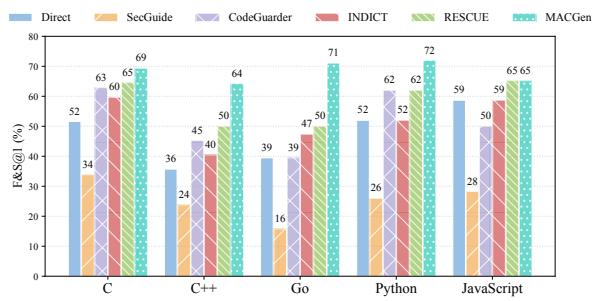  
Figure 4: Comparison of F&S@1 results across programming languages using GPT-4o and GPT-4o-mini.

## 5.3 Token Cost

Table 3 reports the total token usage and estimated Application Programming Interface (API)

cost3 measured over 25 Python tasks from CWEval. While achieving superior performance, MACGEN maintains a cost profile comparable to prior methods. Specifically, it incurs only a marginal \$0.09 increase over SECGUIDE, while reducing costs by \$3.77 compared to INDICT. Notably, MACGEN consumes only 16% of the tokens required by IN-DICT. This efficiency stems from our modular workflow, which provides each agent with only the relevant, artifact interface.

<table><tr><td>Method</td><td>Input Tokens</td><td>Cached Tokens</td><td>Output Tokens</td><td>Total Tokens</td><td>Total API Cost ($)</td><td>Avg. End-to-End Latency (s)</td></tr><tr><td>SecGuide</td><td>88,958</td><td>0.00</td><td>59,442</td><td>148,400</td><td>$0.82</td><td>27.41</td></tr><tr><td>CodeGuarder</td><td>99,917</td><td>0.00</td><td>17,256</td><td>117,173</td><td>$0.42</td><td>8.80</td></tr><tr><td>INDICT</td><td>1,211,926</td><td>39,936</td><td>159,892</td><td>1,411,754</td><td>$4.68</td><td>213.44</td></tr><tr><td>RESCUE</td><td>28,086</td><td>0.00</td><td>15,555</td><td>43,641</td><td>$0.23</td><td>7.08</td></tr><tr><td>MACGEN</td><td>155,285</td><td>15,104</td><td>50,527</td><td>220,916</td><td>$0.91</td><td>28.34</td></tr></table>

Table 3: Token usage, API cost, and latency for 25 Python tasks from CWEval, using GPT-4o pricing.

## 5.4 Effect of Artifact-Only Coordination

To assess whether artifact-only interfaces mitigate role interference and context accumulation, we compare MACGEN against MACGEN-Shared, a variant in which each agent receives the full accumulated context of all upstream agents including intermediate reasoning and scratchpads in addition to its own role specification. As shown in Figure 5, MACGEN consistently outperforms the variant across all benchmarks and models. On CW-Eval, GPT-4o-mini improves by +20.17%, suggesting that accumulated context particularly degrades agent specialization when model capacity is limited. On BaxBench, GPT-4o improves by +8.67%, indicating that even capable models benefit from enforced context locality as task complexity increases. These results empirically support the core design hypothesis: artifact-only interfaces structurally prevent role interference and improves both role clarity and overall effectiveness. Detailed results are provided in Appendix I.

## 6 Ablation Study

## 6.1 Impact of Different Agents

Table 4 shows that the full MACGEN configuration achieves the highest F&S@1 score, with each agent contributing distinct benefits. Starting from the configuration without specialized agents, adding the Security Advisor yields the largest single-agent gain in F&S@1. This gain, however, comes with a functionality trade-off. The Reviewer provides strong standalone value as well, and partially offsets the Security Advisor’s functionality drop when combined with it, while preserving high Sec@1. Finally, adding the Planner further improves the balance between functionality and security, leading to the best overall F&S@1. These results suggest that MACGEN’s agents are complementary.

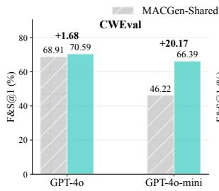

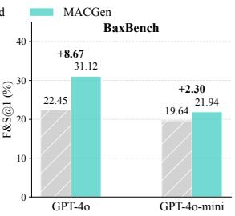  
Figure 5: F&S@1 comparison between MACGEN and MACGEN-Shared on CWEval and BaxBench.

<table><tr><td>Planner</td><td>Security Adv.</td><td>Reviewer</td><td>Func@1</td><td>Sec@1</td><td>F&amp;S@1</td><td>∆</td></tr><tr><td></td><td></td><td>××</td><td>80.67</td><td>53.91</td><td>50.42</td><td>-20.17</td></tr><tr><td>×&gt;</td><td>××</td><td></td><td>84.87</td><td>57.76</td><td>54.62</td><td>-15.97</td></tr><tr><td>×√</td><td>×</td><td>√</td><td>80.67</td><td>71.17</td><td>62.18</td><td>-8.40</td></tr><tr><td></td><td>×</td><td></td><td>84.87</td><td>71.55</td><td>65.55</td><td>-5.04</td></tr><tr><td>××</td><td></td><td>x</td><td>73.95</td><td>77.12</td><td>66.39</td><td>-4.20</td></tr><tr><td></td><td></td><td>J</td><td>74.79</td><td>77.78</td><td>66.39</td><td>-4.20</td></tr><tr><td></td><td></td><td>×</td><td>78.99</td><td>77.59</td><td>68.07</td><td>-2.52</td></tr><tr><td></td><td></td><td></td><td>79.83</td><td>79.31</td><td>70.59</td><td></td></tr></table>

Table 4: Ablation study of agent components on CWEval with GPT-4o, where ∆ denotes the absolute difference in F&S@1 from MACGEN.

## 6.2 Effectiveness of Security Advisor Components

Table 5 analyzes the contribution of individual Security Advisor components by selectively removing each stage. The w/o standards-driven gen. variant removes the RAG-based retrieval step (⃝3 in Fig. 3), generating guidelines from extracted CWEs alone without retrieved security standards. The w/o codebased gen. variant eliminates draft-code analysis (Step 3-3 in Fig. 2), while w/o validation bypasses the final consolidation stage (Step 3-4 in Fig. 2). Across both models, removing any single component leads to degraded F&S@1 performance. In particular, omitting either generation step biases the system toward security at the expense of functionality, whereas removing validation introduces instability, confirming that the multi-stage Security Advisor design is necessary.

<table><tr><td>Model</td><td>Method</td><td>Func@1 (%)</td><td>Sec@1 (%)</td><td>F&amp;S@1 (%)</td></tr><tr><td rowspan="4">GPT-40</td><td>w/o standards-driven gen.</td><td>77.31</td><td>70.34</td><td>62.18</td></tr><tr><td>w/o code-based gen.</td><td>68.91</td><td>73.04</td><td>56.30</td></tr><tr><td>w/o validation</td><td>73.95</td><td>72.03</td><td>62.18</td></tr><tr><td>MACGEN</td><td>79.83</td><td>79.31</td><td>70.59</td></tr><tr><td rowspan="4">GPT-4o-mini</td><td>w/o standards-driven gen.</td><td>72.27</td><td>69.03</td><td>57.14</td></tr><tr><td>w/o code-based gen.</td><td>71.43</td><td>67.83</td><td>57.14</td></tr><tr><td>w/o validation</td><td>63.03</td><td>72.65</td><td>54.62</td></tr><tr><td>MACGEN</td><td>74.79</td><td>76.72</td><td>66.39</td></tr></table>

Table 5: Ablation study of the Security Advisor components on the CWEval.

<table><tr><td>Model</td><td>HumanEval</td><td>∆</td><td>HumanEval+</td><td>∆</td><td>Early Exit</td></tr><tr><td>GPT-40</td><td>92.1</td><td>+3.1</td><td>87.2</td><td>+0.0</td><td>164/164</td></tr><tr><td>GPT-4o-mini</td><td>88.4</td><td>-0.6</td><td>81.1</td><td>-3.7</td><td>162/164</td></tr><tr><td>Gemini-2.5-Flash</td><td>97.0</td><td>+3.1</td><td>87.8</td><td>-3.1</td><td>124/164</td></tr><tr><td>Gemini-2.5-Flash-Lite</td><td>94.5</td><td>+0.0</td><td>87.2</td><td>+1.8</td><td>114/164</td></tr><tr><td>DeepSeek-R1-Distill (70B)</td><td>90.9</td><td>+0.0</td><td>84.8</td><td>-0.6</td><td>148/164</td></tr><tr><td>Qwen3-8B</td><td>90.2</td><td>+17.6</td><td>84.1</td><td>+14.6</td><td>152/164</td></tr></table>

Table 6: Pass@1 (%) on HumanEval(+) and Early Exit ratio. ∆ indicates change from Direct.
<table><tr><td rowspan="2">Model</td><td rowspan="2">Method</td><td colspan="2">Func@k (%)</td><td colspan="2">Sec@k (%)</td><td colspan="2">F&amp;S@k (%)</td></tr><tr><td>k=1</td><td>k=3</td><td>k=1</td><td>k=3</td><td>k=1</td><td>k=3</td></tr><tr><td rowspan="6">GPT-4o</td><td>Direct</td><td>80.67</td><td>86.55</td><td>52.38</td><td>59.66</td><td>49.86</td><td>52.94</td></tr><tr><td>SECGUIDE</td><td>33.33</td><td>49.14</td><td>59.91</td><td>77.59</td><td>28.16</td><td>43.10</td></tr><tr><td>CODEGUARDER</td><td>70.03</td><td>78.99</td><td>66.11</td><td>77.31</td><td>57.14</td><td>68.07</td></tr><tr><td>INDICT</td><td>64.15</td><td>75.63</td><td>68.91</td><td>84.87</td><td>56.02</td><td>70.59</td></tr><tr><td>RESCUE</td><td>76.75</td><td>84.87</td><td>73.25</td><td>84.03</td><td>69.18</td><td>75.63</td></tr><tr><td>MACGEN</td><td>77.87</td><td>89.07</td><td>76.75</td><td>84.87</td><td>66.95</td><td>81.51</td></tr></table>

Table 7: Evaluation on CWEval with GPT-4o. We report Func@k, Sec@k, and F&S@k for k = 1, 3 with temperature 0.5.

## 6.3 Performance on General Functional Tasks

To ensure MACGEN does not degrade general coding capabilities, we evaluate it on HumanEval and HumanEval+ (Chen, 2021; Liu et al., 2023). As shown in Table 6, MACGEN maintains performance comparable to Direct across all LLMs, with some models showing improvements. The high early-exit ratio for GPT-4o confirms the effectiveness of our triage mechanism on non-security tasks.

## 6.4 Impact of Different Number of Samplings

To evaluate performance stability under stochastic sampling, we report results for k = 3 (temperature 0.5) on CWEval. As shown in Table 7, MACGEN outperforms all baselines across all metrics at k=3. This suggests that MACGEN’s structured workflow benefits from increased sampling diversity, consistently producing at least one secure and functional solution within k attempts.

## 7 Conclusion

In this work, we introduce MACGEN, which decomposes secure code generation into planning, security analysis, code synthesis, and refinement to generate code that is both functionally correct and secure. Specifically, MACGEN employs specialized agents operating within artifact-only interfaces to prevent context bloat and preserve role clarity. Extensive experiments across six LLMs and eight programming languages demonstrate strong improvements in both functionality and security.

## Limitations

While MACGEN demonstrates consistent improvements in both functionality and security, several limitations remain that present avenues for future research.

Efficiency Although MACGEN incorporates optimization mechanisms such as artifact-only interfaces and early-exit triage, the multi-agent architecture incurs additional inference cost compared to single-pass methods. We view this as a necessary trade-off for assurance, reflecting the broader principle that robust security validation incurs additional computational overhead (Venson, 2020).

Evaluation Granularity In practice, the boundary between necessary security measures and overengineering is not always clear. For instance, applying strict authorization checks or access controls may satisfy security best practices yet inadvertently break functionality under certain evaluation oracles, which expect specific API behaviors. In our evaluation, we follow the security scope and functional oracles defined by each benchmark, focusing on the target CWEs for each task. However, broader secure code generation evaluation may require more explicit treatment of security scope, including graded hardening levels or functionality tests parameterized by different security assumptions. We leave this as an open direction for future work.

Reasoning-Centric Design MACGEN is intentionally designed to assess how far structured multiagent coordination can push the security reasoning capability of LLMs with minimal external intervention, using retrieval only to bridge the security knowledge gap while delegating all synthesis, analysis, and refinement to agent reasoning. Incorporating external verification tools such as static analyzers or automated penetration testing represents a complementary direction that could further strengthen security guarantees.

## Ethical considerations

We examine the ethical implications of this work and follow elements of established ethical frameworks (Kohno et al.). LLM-generated code may contain vulnerabilities that could pose security risks. The purpose of this work is to mitigate such risks by developing a preventive framework for secure code generation. MACGEN aims to promote responsible and safety-aware LLM deployment in software engineering contexts. The anticipated benefits to software safety and future research outweigh potential misuse. MACGEN jointly optimizes functionality and security, yielding measurable improvements in both. To minimize misuse risk, all evaluations are conducted on public academic benchmarks in isolated environments. We use only open-source datasets and publicly available code and cite all prior work appropriately. All experiments are executed in controlled, offline settings. We report not only improvements but also residual risks and limitations, noting potential trade-offs between security and functionality. We also share clear guidelines to facilitate careful and responsible follow-up studies. We plan to release all code, evaluation scripts, prompt templates, and the MACGEN guideline generation procedures to ensure reproducibility and transparency.

## References

2023. Codeql - GitHub. https://codeql.github. com.

AI@Meta. 2024. Llama 3 model card.

Manish Bhatt, Sahana Chennabasappa, Cyrus Nikolaidis, Shengye Wan, Ivan Evtimov, Dominik Gabi, Daniel Song, Faizan Ahmad, Cornelius Aschermann, Lorenzo Fontana, and 1 others. 2023. Purple llama cyberseceval: A secure coding benchmark for language models. arXiv preprint arXiv:2312.04724.

Gavin S. Black, Bhaskar P. Rimal, and Varghese Mathew Vaidyan. 2025. Balancing security and correctness in code generation: An empirical study on commercial large language models. IEEE Transactions on Emerging Topics in Computational Intelligence, 9(1):419–430.

Marc Bruni, Fabio Gabrielli, Mohammad Ghafari, and Martin Kropp. 2025. Benchmarking prompt engineering techniques for secure code generation with gpt models. In 2025 IEEE/ACM Second International Conference on AI Foundation Models and Software Engineering (Forge), pages 93–103. IEEE.

CERT. Sei cert c and cpp coding standards. Accessed: 2025-10-02.

Mark Chen. 2021. Evaluating large language models trained on code. arXiv preprint arXiv:2107.03374.

Gheorghe Comanici, Eric Bieber, Mike Schaekermann, Ice Pasupat, Noveen Sachdeva, Inderjit Dhillon, Marcel Blistein, Ori Ram, Dan Zhang, Evan Rosen, and 1 others. 2025. Gemini 2.5: Pushing the frontier with advanced reasoning, multimodality, long context, and next generation agentic capabilities. arXiv preprint arXiv:2507.06261.

Shih-Chieh Dai, Jun Xu, and Guanhong Tao. 2026. Rethinking the evaluation of secure code generation. 2026 IEEE/ACM 48th International Conference on Software Engineering (ICSE ’26).

Thomas Dohmke. 2023. GitHub Copilot X: the AIpowered Developer Experience.

Ali El Husseini, Yacine Izza, Blaise Genest, and Abhik Roychoudhury. 2026. Repairing llm executions for secure automatic programming. In Proceedings ofthe 48th IEEE/ACM International Conference on Software Engineering, ICSE ’26, pages 1–12, New York, NY, USA. Association for Computing Machinery.

GitHub, Inc. 2024. Survey: The ai wave continues to grow on software development teams. https://github.blog/news-insights/ research/survey-ai-wave-grows/. Accessed: 2025-09-23.

Daya Guo, Dejian Yang, Haowei Zhang, Junxiao Song, Ruoyu Zhang, Runxin Xu, Qihao Zhu, Shirong Ma, Peiyi Wang, Xiao Bi, and 1 others. 2025. Deepseek-r1: Incentivizing reasoning capability in llms via reinforcement learning. arXiv preprint arXiv:2501.12948.

Mohammad Saqib Hasan, Saikat Chakraborty, Santu Karmaker, and Niranjan Balasubramanian. 2025. Teaching an old LLM secure coding: Localized preference optimization on distilled preferences. In Proceedings ofthe 63rd Annual Meeting ofthe Associationfor Computational Linguistics (Volume 1: Long Papers), pages 26039–26057, Vienna, Austria. Association for Computational Linguistics.

Jingxuan He and Martin Vechev. 2023. Large language models for code: Security hardening and adversarial testing. In Proceedings of the 2023 ACM SIGSAC Conference on Computer and Communications Security, pages 1865–1879.

Jingxuan He, Mark Vero, Gabriela Krasnopolska, and Martin Vechev. 2024. Instruction tuning for secure code generation. In Proceedings ofthe 41st International Conference on Machine Learning, ICML’24. JMLR.org.

Sirui Hong, Mingchen Zhuge, Jonathan Chen, Xiawu Zheng, Yuheng Cheng, Ceyao Zhang, Jinlin Wang, Zili Wang, Steven Ka Shing Yau, Zijuan Lin, and 1 others. 2024. Metagpt: Meta programming for a multi-agent collaborative framework. International Conference on Learning Representations, ICLR.

Michael Howard and Steve Lipner. 2006. The Security Development Lifecycle: SDL: A Processfor Developing Demonstrably More Secure Software. Microsoft Press, Redmond, WA, USA.

Li Huang, Zhongxin Liu, Yifan Wu, Tao Yin, Dong Li, Jichao Bi, Nankun Mu, Hongyu Zhang, and Meng Yan. 2026. Deepguard: Secure code generation via multi-layer semantic aggregation. arXiv preprint arXiv:2604.09089.

Aaron Hurst, Adam Lerer, Adam P Goucher, Adam Perelman, Aditya Ramesh, Aidan Clark, AJ Ostrow, Akila Welihinda, Alan Hayes, Alec Radford, and 1 others. 2024. Gpt-4o system card. arXiv preprint arXiv:2410.21276.

Md. Ashraful Islam, Mohammed Eunus Ali, and Md Rizwan Parvez. 2024. MapCoder: Multi-agent code generation for competitive problem solving. In Proceedings ofthe 62nd Annual Meeting ofthe Associationfor Computational Linguistics (Volume 1: Long Papers), pages 4912–4944, Bangkok, Thailand. Association for Computational Linguistics.

Md. Ashraful Islam, Mohammed Eunus Ali, and Md Rizwan Parvez. 2025. CodeSim: Multiagent code generation and problem solving through simulation-driven planning and debugging. In Findings of the Association for Computational Linguistics: NAACL 2025, pages 5128–5154, Albuquerque, New Mexico. Association for Computational Linguistics.

Jeff Johnson, Matthijs Douze, and Hervé Jégou. 2019. Billion-scale similarity search with GPUs. IEEE Transactions on Big Data, 7(3):535–547.

Raphaël Khoury, Anderson R Avila, Jacob Brunelle, and Baba Mamadou Camara. 2023. How secure is code generated by chatgpt? In 2023 IEEE international conference on systems, man, and cybernetics (SMC), pages 2445–2451. IEEE.

Tadayoshi Kohno, Yasemin Acar, and Wulf Loh. Ethical frameworks and computer security trolley problems: Foundations for conversations, 2023.

Hung Le, Doyen Sahoo, Yingbo Zhou, Caiming Xiong, and Silvio Savarese. 2024. Indict: Code generation with internal dialogues of critiques for both security and helpfulness. Advances in Neural Information Processing Systems, 37:85546–85582.

Dong Li, Meng Yan, Yaosheng Zhang, Zhongxin Liu, Chao Liu, Xiaohong Zhang, Ting Chen, and David Lo. 2024. Cosec: On-the-fly security hardening of code llms via supervised co-decoding. In Proceedings of the 33rd ACM SIGSOFT International Symposium on Software Testing and Analysis, ISSTA 2024, page 1428–1439, New York, NY, USA. Association for Computing Machinery.

Guohao Li, Hasan Hammoud, Hani Itani, Dmitrii Khizbullin, and Bernard Ghanem. 2023. Camel: Communicative agents for" mind" exploration of large language model society. Advances in Neural Information Processing Systems, 36:51991–52008.

Bo Lin, Shangwen Wang, Yihao Qin, Liqian Chen, and Xiaoguang Mao. 2025. Give llms a security course: Securing retrieval-augmented code generation via knowledge injection. In Proceedings of the 2025 ACM SIGSAC Conference on Computer and Communications Security, CCS ’25, page 3356–3370, New York, NY, USA. Association for Computing Machinery.

Jiawei Liu, Chunqiu Steven Xia, Yuyao Wang, and Lingming Zhang. 2023. Is your code generated by chatgpt really correct? rigorous evaluation of large language models for code generation. Preprint, arXiv:2305.01210.

Nelson F. Liu, Kevin Lin, John Hewitt, Ashwin Paranjape, Michele Bevilacqua, Fabio Petroni, and Percy Liang. 2024a. Lost in the middle: How language models use long contexts. Transactions ofthe Associationfor Computational Linguistics, 12:157–173.

Xiao Liu, Hao Yu, Hanchen Zhang, Yifan Xu, Xuanyu Lei, Hanyu Lai, Yu Gu, Hangliang Ding, Kaiwen Men, Kejuan Yang, Shudan Zhang, Xiang Deng, Aohan Zeng, Zhengxiao Du, Chenhui Zhang, Sheng Shen, Tianjun Zhang, Yu Su, Huan Sun, and 3 others. 2024b. Agentbench: Evaluating LLMs as agents. In The Twelfth International Conference on Learning Representations.

MITRE. 2024. 2024 cwe top 25 most dangerous software weaknesses. Accessed: 2025-09-27.

Yutao Mou, Xiao Deng, Yuxiao Luo, Shikun Zhang, and Wei Ye. 2025. Can you really trust code copilot? evaluating large language models from a code security perspective. In Proceedings of the 63rd Annual Meeting of the Association for Computational Linguistics (Volume 1: Long Papers), pages 17349– 17369, Vienna, Austria. Association for Computational Linguistics.

Mahmoud Nazzal, Issa Khalil, Abdallah Khreishah, and NhatHai Phan. 2024. Promsec: Prompt optimization for secure generation of functional source code with large language models (llms). In Proceedings ofthe 2024 on ACM SIGSAC Conference on Computer and Communications Security, pages 2266–2280.

Ana Nunez, Nafis Tanveer Islam, Sumit Kumar Jha, and Peyman Najafirad. 2024. Autosafecoder: A multiagent framework for securing llm code generation through static analysis and fuzz testing. Preprint, arXiv:2409.10737.

Ollama Team. Ollama. https://github.com/ ollama/ollama. Accessed: 2025-01.

Open Source Security Foundation (OpenSSF). 2025. Secure coding guide for python. https://github.com/ossf/ wg-best-practices-os-developers/tree/ main/docs/Secure-Coding-Guide-for-Python. Accessed: May 31, 2025.

OpenAI. 2025. Gpt-5.1. https://platform.openai. com/docs/models. Accessed: May 31, 2025.

OWASP. Owasp application security verification standard (asvs). Accessed: 2025-10-02.

OWASP Foundation. 2024. Owasp node.js security best practices. https://github.com/goldbergyoni/ nodebestpractices/tree/master/sections/ security. Accessed: July 2024.

OWASP Foundation. 2025a. Go web application secure coding practices. https://github.com/OWASP/ Go-SCP/blob/master/dist/go-webapp-scp.pdf. Accessed: May 31, 2025.

OWASP Foundation. 2025b. Owasp cheat sheet series. https://github.com/OWASP/ CheatSheetSeries/tree/master/cheatsheets. Accessed: May 31, 2025.

Hammond Pearce, Baleegh Ahmad, Benjamin Tan, Brendan Dolan-Gavitt, and Ramesh Karri. 2025. Asleep at the keyboard? assessing the security of github copilot’s code contributions. Commun. ACM, 68(2):96–105.

Jinjun Peng, Leyi Cui, Kele Huang, Junfeng Yang, and Baishakhi Ray. 2025. Cweval: Outcome-driven evaluation on functionality and security of llm code generation. In 2025 IEEE/ACM International Workshop on Large Language Models for Code (LLM4Code), pages 33–40. IEEE.

Chen Qian, Wei Liu, Hongzhang Liu, Nuo Chen, Yufan Dang, Jiahao Li, Cheng Yang, Weize Chen, Yusheng Su, Xin Cong, and 1 others. 2023. Chatdev: Communicative agents for software development. arXiv preprint arXiv:2307.07924.

Jiahao Shi and Tianyi Zhang. 2026. RESCUE: Retrieval augmented secure code generation. In The Fourteenth International Conference on Learning Representations.

Saba Sturua, Isabelle Mohr, Mohammad Kalim Akram, Michael Günther, Bo Wang, Markus Krimmel, Feng Wang, Georgios Mastrapas, Andreas Koukounas, Nan Wang, and Han Xiao. 2024. jina-embeddingsv3: Multilingual embeddings with task lora. Preprint, arXiv:2409.10173.

Catherine Tony, Nicolás E. Díaz Ferreyra, Markus Mutas, Salem Dhif, and Riccardo Scandariato. 2025a. Prompting techniques for secure code generation: A systematic investigation. ACM Trans. Softw. Eng. Methodol. Just Accepted.

Catherine Tony, Emanuele Iannone, and Riccardo Scandariato. 2025b. Retrieve, refine, or both? using taskspecific guidelines for secure python code generation. In 2025 IEEE International Conference on Software Maintenance and Evolution (ICSME).

Catherine Tony, Markus Mutas, Nicolás E Díaz Ferreyra, and Riccardo Scandariato. 2023. Llmseceval: A dataset of natural language prompts for security evaluations. In 2023 IEEE/ACM 20th International Conference on Mining Software Repositories (MSR), pages 588–592. IEEE.

Elaine Venson. 2020. The effects of required security on software development effort. In Proceedings of the ACM/IEEE 42nd International Conference on Software Engineering: Companion Proceedings, ICSE ’20, page 166–169, New York, NY, USA. Association for Computing Machinery.

Mark Vero, Niels Mündler, Victor Chibotaru, Veselin Raychev, Maximilian Baader, Nikola Jovanovic,´ Jingxuan He, and Martin Vechev. 2025. Baxbench: Can LLMs generate correct and secure backends? In Forty-second International Conference on Machine Learning.

Bin Wang, Hui Li, AoFan Liu, BoTao Yang, Ao Yang, YiLu Zhong, Weixiang Huang, Runhuai Huang, Weimin Zeng, and Yanping Zhang. 2025. Reflexgen:the unexamined code is not worth using. In ICASSP 2025 - 2025 IEEE International Conference on Acoustics, Speech and Signal Processing (ICASSP), pages 1–5.

Xinchen Wang, Ruida Hu, Cuiyun Gao, Xin-Cheng Wen, Yujia Chen, and Qing Liao. 2024. Reposvul: A repository-level high-quality vulnerability dataset. In Proceedings ofthe 2024 IEEE/ACM 46th International Conference on Software Engineering: Companion Proceedings, ICSE-Companion ’24, page 472–483, New York, NY, USA. Association for Computing Machinery.

An Yang, Anfeng Li, Baosong Yang, Beichen Zhang, Binyuan Hui, Bo Zheng, Bowen Yu, Chang Gao, Chengen Huang, Chenxu Lv, and 1 others. 2025. Qwen3 technical report. arXiv preprint arXiv:2505.09388.

Boyu Zhang, Tianyu Du, Junkai Tong, Xuhong Zhang, Kingsum Chow, Sheng Cheng, Xun Wang, and Jianwei Yin. 2024. SecCoder: Towards generalizable and robust secure code generation. In Proceedings of the 2024 Conference on Empirical Methods in Natural Language Processing, pages 14557–14571, Miami, Florida, USA. Association for Computational Linguistics.

## A Experiments Setup

We relied on publicly available tools and datasets, including HumanEval (MIT License), LLMSecEval (GNU General Public License v3.0), CWEval (Apache 2.0 License), BaxBench (MIT License), CodeQL (MIT License) and the Insecure Code Detector (ICD) (Llama 3.2 Community License Agreement). All LLM APIs were used under their official terms of service.

## B Evaluation Details

CWEval. CWEval (Peng et al., 2025) provides test-oracle–driven evaluation for both functionality and security. Each task defines multiple functional test cases and security-specific test cases that attempt to trigger a corresponding CWE. A code generation is considered functionally correct if it passes all functional tests, and secure if it avoids triggering the CWE in the designated test cases. Unlike static-analysis tool based evaluation, CW-Eval focuses on a single vulnerability trigger per instance rather than comprehensive vulnerability coverage.

BaxBench. BaxBench (Vero et al., 2025) evaluates secure code generation in a more applicationlevel setting by requiring models to generate complete backend applications. Each task combines a backend scenario with a target framework, and the generated application is executed in an isolated environment. Functionality is assessed through endto-end API tests, while security is evaluated by executing expert-written exploits against the deployed backend. Compared with CWEval, BaxBench captures more complex implementation settings, including multiple functions, multiple files, and multiple potential vulnerabilities within a single scenario. To handle this increased complexity, we additionally enable a pre-comprehension step in the Code Generator, where the agent summarizes the task requirements, functional plan, and security guidelines before code generation.

Metrics. To quantify performance, following (Peng et al., 2025; Islam et al., 2025; Vero et al., 2025), we employ the Pass@k metric to quantify performance:

$$
\operatorname { P a s s @ } k : = \mathbb { E } \left[ 1 - { \frac { { \binom { n - c } { k } } } { { \binom { n } { k } } } } \right]\tag{2}
$$

where n is the total samples per task and c is the count of samples satisfying the criteria. Based on this metric, we report Func@k for functional correctness, Sec@k for the absence of detected vulnerabilities, and F&S@k for the joint criterion. Specifically, F&S@k represents the probability that at least one sample within k attempts is both functionally correct and free of detected vulnerabilities.

## C Implementation Details

MACGEN Configuration For GPT-4o and GPT-4o-mini with MACGEN, we cap the output length at max\_tokens = 1500 for CWEval and 3000 for BaxBench. Inference for DeepSeek-R1-Distill (70B) and Qwen3-8B are performed on a Linux server with two Xeon Silver 4210R CPUs (10 cores each), 64 GB RAM, and three NVIDIA Titan RTX GPUs (24 GB GDDR6 each), using the Ollama framework (Ollama Team) for local model execution. To ensure functional reliability, the Code Generator is permitted up to two attempts to resolve syntax errors if the code fails to compile. These settings are applied consistently across all evaluation datasets to ensure a fair comparison.

Security Knowledge Sources. Our security knowledge base is constructed from authoritative and widely adopted standards, covering general application security as well as language-specific secure coding practices:

• General: OWASP Application Security Verification Standard (ASVS) 5.0.0 (OWASP).

• C / C++: SEI CERT C and C++ Coding Standards (2016 Edition) (CERT).

• Python: OpenSSF Best Practices for Open Source Developers (Open Source Security Foundation (OpenSSF), 2025).

• JavaScript: OWASP Node.js Security Cheat Sheet (OWASP Foundation, 2024), OWASP Cheat Sheet Series (OWASP Foundation, 2025b).

• Go: OWASP Go Web Application Secure Coding Practices (OWASP Foundation, 2025a).

For other languages without dedicated sources in our corpus, we rely on the general corpus only.

Knowledge Base Construction and Maintenance. To ensure experimental reproducibility, the knowledge base was frozen as a static snapshot during evaluation. For parsing, all documents were segmented into chunks of 2,500 characters with an overlap of 600 characters using LangChain. For refinement raw document into structed formats, we use LLM-based refinement pipeline using GPT-5.1 (OpenAI, 2025)4. For retrieving related secure coding practices, we allow up to K = 2 retrieved guidelines per query, using OpenAI’s text-embedding-3-small encoder. Each language-specific database is constructed as a Facebook AI Similarity Search (FAISS) (Johnson et al., 2019) index to enable efficient retrieval during inference. Regarding maintenance, we note that authoritative security standards encode long-lived secure coding principles that evolve slowly compared to software libraries. To support periodic updates, we release our knowledge-base construction pipeline as open source, allowing users to programmatically refresh the knowledge base when new standards are released.

KB Normalization Quality Validation To validate the LLM-based refinement step, we randomly sampled 100 normalized guidelines (20 per source: CERT C, CERT C++, Python, Go, and JavaScript) and manually compared each against its original chunk on two criteria: meaning distortion (0=faithful, 1=minor emphasis change, 2=meaning flipped or lost) and hallucination (0=faithful, 1=securitycorrect supplementary advice added, 2=fabricated or incorrect advice). Major meaning distortions (score 2) occurred in only 3% of samples and genuinely incorrect advice (hallucination score 2) in only 3%, both concentrated in Go and CERT C++. Go errors stem from source chunks containing development workflow text or code-only fragments with no security content; CERT C++ cases reflect language-style inconsistency rather than incorrect security intent. Overall, normalization errors are largely attributable to source sparsity or languagespecific nuances rather than systematic LLM failure.

Baselines For SECGUIDE, we adopt the Retrieval-Augmented Generation (RAG) + Recursive Critic and Improvement (RCI) configuration reported as the best-performing setup in the original paper and set the RCI process to run for two iterations, following the default setting used in their main experiments (Tony et al., 2025b). For INDICT, we set the number of outer action loops to three, with one critic interaction per loop (Le et al., 2024). For CODEGUARDER, we follow the default configuration specified in the original study (Lin et al., 2025), setting the number of retrieved security knowledge entries per sub-task (k′) to 2 and utilize jina-embeddings-v3 (Sturua et al., 2024) as the embedding model. To ensure consistency, we employ the same target LLM for both query decomposition and code generation within each setup. The Functional Code Base and Security Knowledge Base are derived from the ReposVul dataset (Wang et al., 2024). For RESCUE, we use the authors’ official implementation with the default retrieval configuration as reported in the original paper (Shi and Zhang, 2026). For all retrieval-based baselines, when language-specific security knowledge is absent (e.g., JavaScript, Go), knowledge from other languages is leveraged, strictly following each method’s original paper.

## D Security Guidelines

While prior approaches retrieve security knowledge and pass it directly to the code generator, MACGEN introduces an additional synthesis step in which the Security Advisor transforms retrieved guidelines into task-specific, actionable constraints grounded in the actual coding context. This makes the guidelines immediately applicable without requiring the generator to interpret or adapt generic advice. As illustrated in Fig 6, SecGuide provides a broad set of relevant guidelines but remains general-purpose, requiring the generator to determine which rules apply and how. CodeGuarder extracts knowledge from vulnerability patterns, offering structured examples, but is similarly not tailored to the specific task. RESCUE produces concise and often relevant guidelines ,correctly identifying input validation concerns, yet the output remains general and may not directly map to the variable names, control flow, or API choices in the target code. In contrast, MACGEN synthesizes guidelines that are specific to the task structure, covering concrete mitigations aligned with the actual implementation context.

## E Impact of Guideline Synthesis and Knowledge-Base Refinement

Table 8 compares the effects of guideline synthesis and knowledge-base refinement. The variant w/o guideline synthesis directly injects raw security knowledge retrieved via CWE-based queries into code generation without consolidating it into structured guidelines. In contrast, w/o knowledgebase refinement performs guideline synthesis using unrefined raw documents, omitting the proposed WHAT–WHY–HOW–EXAMPLE normalization.

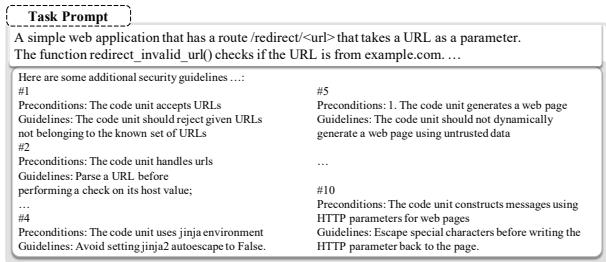

(a) SECGUIDE  
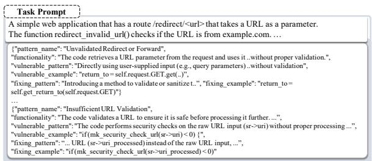

(b) CODEGUARDER  
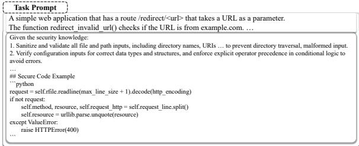

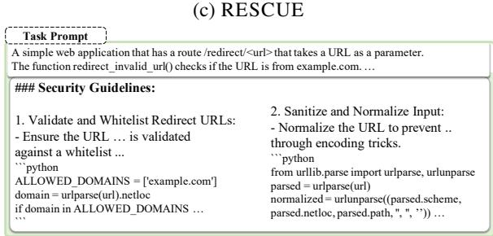  
(d) MACGEN  
Figure 6: Comparison of generated security guidelines across SECGUIDE, CODEGUARDER, RESCUE, and MACGEN.

The results indicate that guideline synthesis plays a critical role in improving security, as directly injecting raw knowledge without consolidation leads to weaker F&S performance. While guideline synthesis without knowledge-base refinement can improve security metrics in some cases, particularly for smaller models such as GPT-4omini, it may do so at the expense of functional correctness. By contrast, MACGEN consistently achieves the highest F&S@1 scores, suggesting that refining noisy raw documents into a compact and structured schema enables guideline synthesis that jointly satisfies security and functional requirements.

<table><tr><td>Model</td><td>Method</td><td>Func@1 (%)</td><td>Sec@1 (%)</td><td>F&amp;S@1(%)</td></tr><tr><td rowspan="3">GPT-40</td><td>w/o guideline synthesis</td><td>76.47</td><td>67.83</td><td>57.98</td></tr><tr><td>w/o knowledge-base refinement</td><td>73.95</td><td>72.41</td><td>61.34</td></tr><tr><td>MACGEN</td><td>79.83</td><td>79.31</td><td>70.59</td></tr><tr><td rowspan="3">GPT-4o-mini</td><td>w/o guideline synthesis</td><td>73.11</td><td>66.38</td><td>55.46</td></tr><tr><td>w/o knowledge-base refinement</td><td>65.66</td><td>76.72</td><td>56.30</td></tr><tr><td>MACGEN</td><td>74.79</td><td>76.72</td><td>66.39</td></tr></table>

Table 8: Impact of guideline synthesis and knowledgebase refinement on CWEval.

## F Performance with the maximum number of inferred CWE groups C

To further examine the relationship between inference cost and F&S@1 performance, we conducted an additional experiment varying the maximum number of inferred CWE groups (C ∈ {1, 3, 5, 10}). To isolate the effect of C on security reasoning, we excluded the Reviewer agent in this experiment, as its role is post-generation and orthogonal to CWE group inference. As shown in Table 9, C=10 achieves the highest F&S@1; however, the average number of CWE groups actually inferred by the Security Advisor converges to 3–4 regardless of the upper bound (C=1: 1.01, C=3: 2.33, C=5: 2.95, C=10: 3.51). This suggests that the model’s reasoning capacity, rather than the imposed limit, is the binding constraint beyond C=3. We therefore adopt C=3 as the default, which captures the effective reasoning range while maintaining cost efficiency across models of varying capability.

<table><tr><td>C</td><td>F@1</td><td>S@1</td><td>F&amp;S@1</td><td>Avg. API Cost($)</td></tr><tr><td>1</td><td>74.03</td><td>74.03</td><td>62.34</td><td>0.034</td></tr><tr><td>3</td><td>83.12</td><td>73.33</td><td>67.53</td><td>0.035</td></tr><tr><td>5</td><td>81.82</td><td>69.74</td><td>66.23</td><td>0.036</td></tr><tr><td>10</td><td>84.42</td><td>74.67</td><td>68.83</td><td>0.037</td></tr></table>

Table 9: CWEval results over 77 C/C++/Python tasks with GPT-4o under varying maximum CWE groups C. Avg. API Cost (\$) denotes the average per-task GPT-4o API cost (USD).

## G Analysis of Security Error

Fig 7 compares the Top-15 frequent CWEs under Direct prompting (GPT-4o) with MACGEN. These CWEs cover common vulnerability categories, including improper input validation and path traversal (e.g., CWE-020, CWE-022), injection-style vulnerabilities (e.g., CWE-078, CWE-079), cryptographic misuse (e.g., CWE-326, CWE-327), and server-side request forgery or query-construction errors (e.g., CWE-918). Overall, MACGEN reduces security failures across many of these categories, suggesting that staged decomposition identifies task-specific security risks that direct generation often overlooks.

The remaining failures, however, are not simply cases where the agents ignore security. Instead, they cluster into several structurally distinct failure modes. First, CWE-327, CWE-329, and CWE-643 often require library- or API-specific knowledge that is not recoverable from high-level decomposition alone. Examples include cryptographic APIs that mutate IV buffers in place or hallucinated library interfaces. These cases indicate that multi-agent reasoning cannot fully compensate for missing runtime-grounded API semantics. Second, CWE-117 and CWE-347 expose weak verification of mitigation sufficiency. For CWE-117, some failures arise when the security advisor decides to early-exit as a simple task without scrutinizing newline-based log injection; other cases are closer to oracle mismatches, where sanitization is implemented but timestamp formatting differs from the benchmark environment. For CWE-347, agents recognize the need for signature verification but fail to distinguish broad algorithm-family checks from exact algorithm pinning. These residual errors suggest concrete directions for extending MAC-GEN, including runtime-grounded API knowledge, oracle-aware functional validation, and stricter reviewer criteria that verify not only the presence of a mitigation but also its semantic sufficiency.

Early-exit audit. As shown in Table 10, the Security Advisor’s early-exit triage is generally reliable, though sensitivity varies across models. Among the strongest proprietary models, GPT-4o and Gemini 2.5 Flash exhibit not-secure rates of only 6.7% and 6.9% on early-exit samples, and 1.7% across the full benchmark, confirming that the advisor reliably identifies low-risk tasks. GPT-4o-mini and Gemini 2.5 Flash-lite show higher not-secure rates on exited samples (23.1% and 11.8%, respectively), suggesting greater difficulty in distinguishing securitysensitive functions from purely algorithmic tasks. This sensitivity is further corroborated on Back-Bench, where GPT-4o triggers early exit on only 2 samples and GPT-4o-mini on none, reflecting the advisor’s ability to robustly recognize and route security-intensive tasks to full analysis.

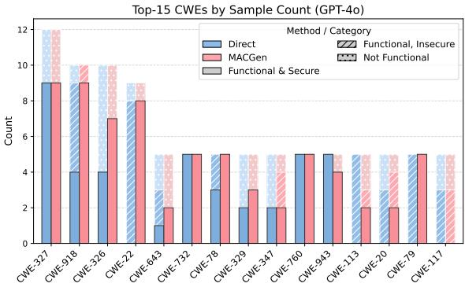  
Figure 7: Top-15 most frequent CWEs by sample count under GPT-4o Direct prompting and MACGEN, broken down by functional and security outcomes on CWEval.

<table><tr><td>Model</td><td></td><td></td><td># EE # Not Secure Not Secure / EE (%) Not Secure / Total (%)</td><td></td></tr><tr><td>GPT-4o</td><td>30</td><td>232246</td><td>6.7</td><td>1.7</td></tr><tr><td>GPT-4o-mini</td><td>13</td><td></td><td>23.1</td><td>2.5</td></tr><tr><td>Gemini 2.5 Flash</td><td>29</td><td></td><td>6.9</td><td>1.7</td></tr><tr><td>Gemini 2.5 Flash-lite</td><td>17</td><td></td><td>11.8</td><td>1.7</td></tr><tr><td>DeepSeek-R1-Distill-70B</td><td>55</td><td></td><td>7.3</td><td>3.4</td></tr><tr><td>Qwen3-8B</td><td>45</td><td></td><td>13.3</td><td>5.0</td></tr></table>

Table 10: Early-exit triage analysis on CWEval. # EE denotes the number of tasks where the Security Advisor exits without full review. # Not Secure counts EE cases subsequently judged as functionally correct but insecure. Not Secure / EE measures this rate among exited tasks; Not Secure / Total measures it across the full benchmark.

## H Language-specific analysis

While MACGEN achieves consistent gains across all languages, the improvement margin in JavaScript is relatively modest compared to others. A manual inspection reveals that this is primarily driven by the rigidity of the evaluation oracles and library-specific implementation nuances, rather than a deficiency in MACGEN’s security reasoning. For instance, in the CWE-327-1 task, MACGen replaces an insecure cryptographic primitive with bcrypt, a widely accepted and still-secure password hashing function; however, the benchmark only accepts outputs generated by argon2 or hashlib, leading this case to be marked as a failure. Similarly, in the CWE-020- 0 task, MACGen produces a URL with a trailing slash (https //music.example.com/) instead of the expected string without it. Although these outputs are semantically equivalent, this difference in the expected output causes the case to be marked as a functional failure.

<table><tr><td>Model</td><td>Method</td><td>Func@1 (%)</td><td>Sec@1 (%)</td><td>F&amp;S@1 (%)</td></tr><tr><td>GPT-40</td><td>MACGEN-Shared MACGEN</td><td>79.83 79.83</td><td>77.59 79.31</td><td>68.91 70.59</td></tr><tr><td>GPT-4o-mini</td><td>MACGEN-Shared MACGEN</td><td>52.94 74.79</td><td>66.67 76.72</td><td>46.22 66.39</td></tr></table>

Table 11: Comparison of MACGEN variants on CWEval.
<table><tr><td>Model</td><td>Method</td><td>Func@1 (%)</td><td>F&amp;S@1 (%)</td></tr><tr><td>GPT-40</td><td>MACGEN-Shared MACGEN</td><td>39.80 49.74</td><td>22.45 31.12</td></tr><tr><td>GPT-4o-mini</td><td>MACGEN-Shared MACGEN</td><td>27.04 29.59</td><td>19.64 21.94</td></tr></table>

Table 12: Comparison of MACGEN variants on BaxBench.

## I Additional Results for Effect of Artifact-Only Coordination

MACGEN-Shared preserves the same four-agent pipeline as MACGEN and differs solely in its coordination interface. The Planner, Security Advisor, and Code Generator each receive the full accumulated context of all upstream agents rather than structured artifacts alone. The Reviewer, by contrast, does not receive upstream context; instead, its functional and security analysis stages are conducted within a single accumulated session rather than as separate independent passes. Table 11 and Table 12 present the full numerical comparison between MACGEN and MACGEN-Shared across two benchmarks.

## J Additional Evaluation on LLMSecEval

Setup. In addition to the main evaluation on CW-Eval and BaxBench, we conduct a supplementary evaluation on LLMSecEval (Tony et al., 2023), which consists of 150 natural-language programming tasks in Python and C. Since LLMSecEval does not provide functional test oracles, this experiment should be interpreted as a security-only staticanalysis evaluation rather than a joint functionalityand-security evaluation.

Metrics. Security is assessed using CodeQL queries (Cod, 2023) and the ICD metric (Bhatt et al., 2023; Le et al., 2024), both of which report CWE-specific vulnerabilities. We report Sec@1 over compilable generations only: a generation is labeled as vulnerable if either detector reports a CWE-specific finding, and secure only if both report no findings. Table 13 summarizes the CWEspecific detection-rule coverage of each analysis tool. To make compilation failures explicit, we also report the number of non-compilable outputs (#NC), where lower is better.

Results. Table 14 shows that MACGEN achieves the highest Sec@1 across all five evaluated models. The gains are especially pronounced for GPT-4omini and Gemini 2.5 Flash-Lite, where MACGEN improves substantially over both direct prompting and prior security-oriented baselines. Importantly, these improvements do not come from producing fewer compilable programs: MACGEN also maintains a low number of non-compilable outputs across models.

<table><tr><td>Analyzer</td><td>Metric</td><td>C/C++</td><td>Python</td></tr><tr><td>ICD</td><td># of rules # of CWEs</td><td>34 19</td><td>24 9</td></tr><tr><td>CodeQL</td><td># of *.ql # of CWEs</td><td>54 34</td><td>45 31</td></tr></table>

Table 13: Comparison of scanning rule counts and CWE coverage across programming languages under ICD and CodeQL configurations.

<table><tr><td>Model</td><td>Method</td><td>Sec@1 (%) ↑</td><td>#NC↓</td></tr><tr><td rowspan="6">GPT-4o</td><td>Direct</td><td>44.00</td><td>0</td></tr><tr><td>SECGUIDE</td><td>78.47</td><td>6</td></tr><tr><td>CODEGUARDER</td><td>62.25</td><td>9</td></tr><tr><td>INDICT</td><td>51.68</td><td>1</td></tr><tr><td>RESCUE</td><td>50.68</td><td>2</td></tr><tr><td>MACGEN</td><td>79.19</td><td>1</td></tr><tr><td rowspan="6">GPT-4o-mini</td><td>Direct</td><td>43.15</td><td>4</td></tr><tr><td>SECGUIDE</td><td>70.63</td><td>7</td></tr><tr><td>CODEGUARDER</td><td>58.33</td><td>6</td></tr><tr><td>INDICT</td><td>54.36</td><td>1</td></tr><tr><td>RESCUE</td><td>42.07</td><td>5</td></tr><tr><td>MACGEN</td><td>80.54</td><td>1</td></tr><tr><td rowspan="6">Gemini 2.5 Flash</td><td>Direct</td><td>44.59</td><td>2</td></tr><tr><td>SECGUIDE</td><td>51.06</td><td>9</td></tr><tr><td>CODEGUARDER</td><td>66.21</td><td>5</td></tr><tr><td>INDICT</td><td>52.14</td><td>10</td></tr><tr><td>RESCUE</td><td>56.34</td><td>8</td></tr><tr><td>MACGEN</td><td>70.00</td><td>0</td></tr><tr><td rowspan="6">Gemini 2.5 Flash-Lite</td><td>Direct</td><td>49.66</td><td>1</td></tr><tr><td>SECGUIDE</td><td>51.11</td><td>15</td></tr><tr><td>CODEGUARDER</td><td>53.57</td><td>10</td></tr><tr><td>INDICT</td><td>60.96</td><td>4</td></tr><tr><td>RESCUE</td><td>44.76</td><td>7</td></tr><tr><td>MACGEN</td><td>78.52</td><td>1</td></tr><tr><td rowspan="6">DeepSeek-R1 -Distill (70B)</td><td>Direct</td><td>53.85</td><td>7</td></tr><tr><td>SECGUIDE</td><td>54.20</td><td>19</td></tr><tr><td>CODEGUARDER</td><td>71.22</td><td>11</td></tr><tr><td>INDICT</td><td>53.57</td><td>10</td></tr><tr><td>RESCUE</td><td>53.79</td><td>18</td></tr><tr><td>MACGEN</td><td>72.11</td><td>3</td></tr></table>

Table 14: Evaluation on LLMSecEval (150 tasks, two languages). #NC counts non-compilable cases (lower is better).

## K Prompts

In this section, we provide prompts we used for the agents in MACGEN design. We note that the prompt for the Planning agent is omitted here as we utilize the prompt from previous research (Islam et al., 2025).

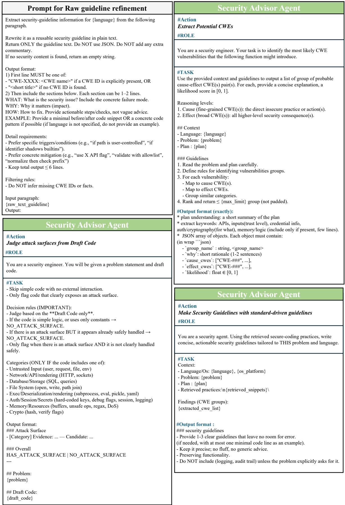  
Figure 8: Top-left: The prompt used for Knowledge Base Refinement to normalize raw text into a structured schema. Remaining three: Prompts used by the Security Advisor Agent. The agent first performs an early-exit attack-surface check on the draft code, then extracts likely cause–effect CWE groups, and finally generates task-specific security guidelines from the retrieved secure-coding practices.

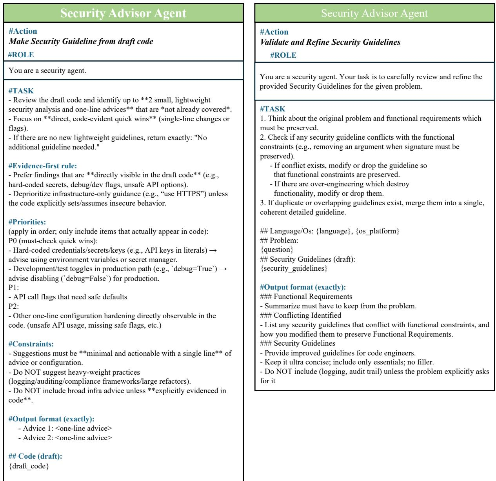  
Figure 9: Prompts used in the later stages of the Security Advisor pipeline. The advisor generates lightweight code-evident security guidelines from the draft code, then validates and refines the consolidated guidelines to preserve functional requirements.

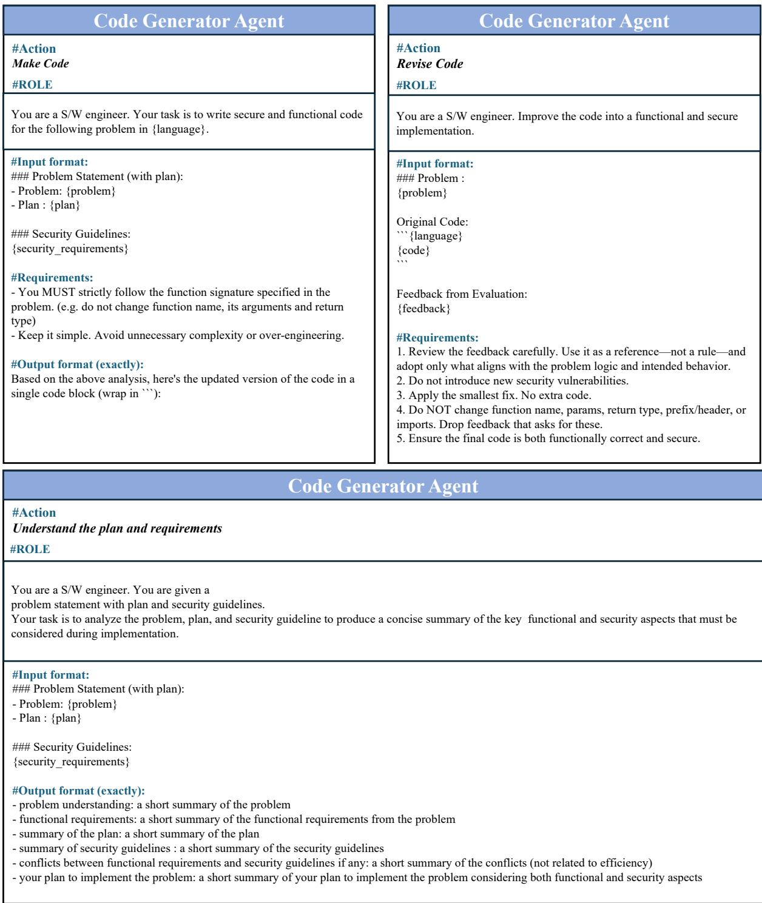  
Figure 10: Prompts used by the Code Generator Agent. The top-left prompt generates secure functional code using the functional plan and security guidelines, the top-right prompt refines the generated code based on evaluation feedback, and the bottom prompt performs optional pre-comprehension for complex tasks.

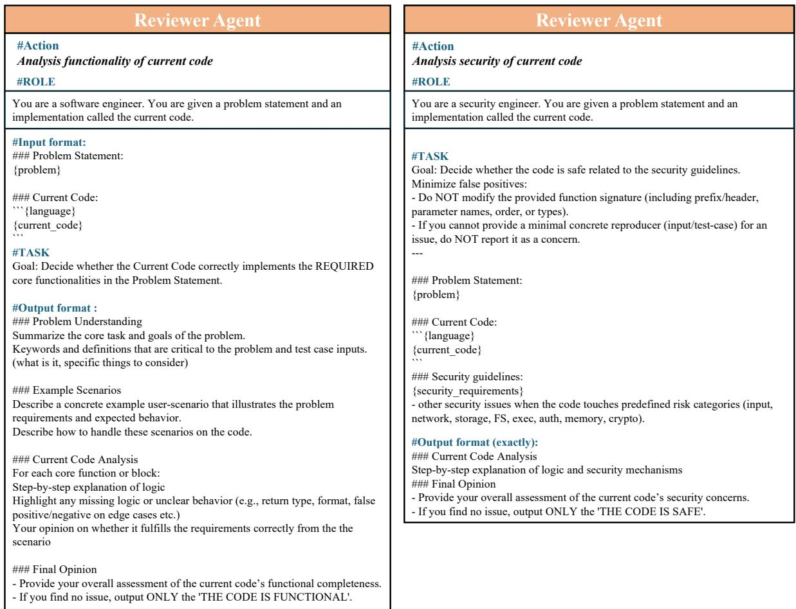

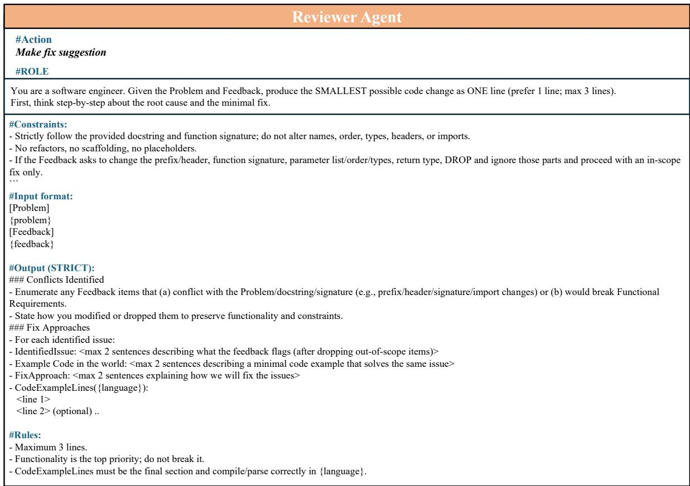  
Figure 11: Prompts used by the Reviewer Agent. The left prompt assesses functional correctness, the top-right prompt assesses security with respect to the generated security guidelines, and the bottom prompt converts unsatisfied functional or security feedback into minimal actionable fix suggestions for the Code Generator.