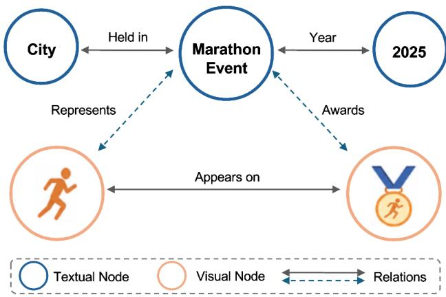
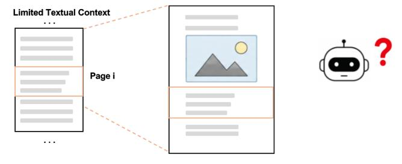
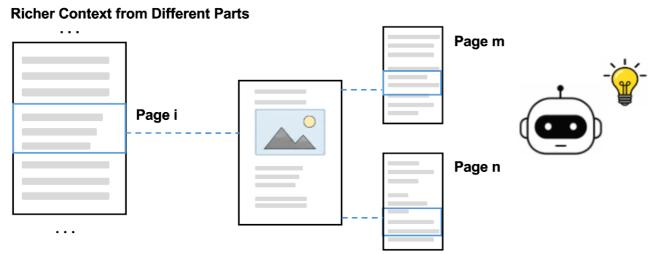
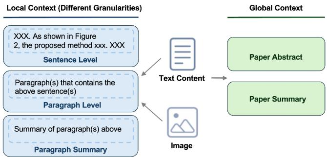
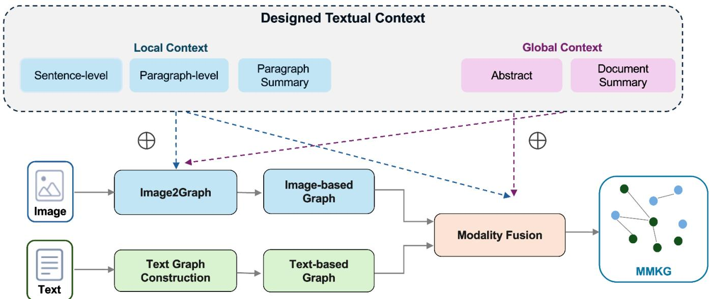

# Multi-Granularity Context-Enhanced RAG over Multimodal Knowledge Graphs

Zongyu Wu∗   
The Pennsylvania State University   
University Park, Pennsylvania, USA zongyuwu@psu.edu Minhua Lin   
The Pennsylvania State University   
University Park, Pennsylvania, USA mfl5681@psu.edu Yilong Wang∗   
The Pennsylvania State University   
University Park, Pennsylvania, USA yvw5769@psu.edu   
Zhichao Xu   
University of Utah   
Salt Lake City, Utah, USA   
zhichao.xu@utah.edu Xiang Zhang   
The Pennsylvania State University   
University Park, Pennsylvania, USA xzz89@psu.edu Xiaochen Wang   
The Pennsylvania State University   
University Park, Pennsylvania, USA xcwang@psu.edu Fenglong Ma   
The Pennsylvania State University   
University Park, Pennsylvania, USA fenglong@psu.edu Suhang Wang✉   
The Pennsylvania State University   
University Park, Pennsylvania, USA szw494@psu.edu

## Abstract

Retrieval-augmented generation (RAG) is widely used to mitigate hallucination issues in large language models (LLMs) and multimodal large language models (MLLMs). In particular, knowledge graph (KG)-based RAG leverages structured knowledge to provide (M)LLMs with high-quality external information. Building on these works, recent studies have explored multimodal knowledge graphs (MMKGs) as knowledge bases for GraphRAG. This enables Graph RAG to integrate knowledge across multiple modalities, thereby fur ther enhancing its performance. However, existing MMKG-based RAG methods generally follow a common pipeline in which diferent modalities are largely processed independently before being fusion. As a result, textual context is only used to a limited extent during visual information extraction and subsequent multimodal knowledge fusion. This brings a semantic gap between images and text which limits the multimodal GraphRAG performance. To address this issue, we propose a novel framework for constructing a Context-Enhanced MMKG (CEMMKG) to better support multimodal GraphRAG. The proposed CEMMKG enriches each image with complementary textual context at both local and global scopes. Local context goes beyond the surrounding text by incorporating sentences that are semantically related to the image, while global context provides a summary of the entire passage. We further introduce a multi-granularity design for the local context, allowing it to capture semantically relevant information at diferent levels of detail. Extensive experiments on the selected vision-centric dataset validate that CEMMKG is efective in leveraging contextual information to improve MMKG-based RAG performance. Moreover, its efectiveness across diferent MMKG-based RAG methods demonstrates its broad applicability.

## CCS Concepts

• Information systems → Information retrieval; • Computing methodologies → Natural language processing.

## Keywords

Knowledge Graph, Retrieval-Augmented Generation, Multimodal Learning

ACM Reference Format: Zongyu Wu, Yilong Wang, Xiaochen Wang, Minhua Lin, Zhichao Xu, Fenglong Ma, Xiang Zhang, and Suhang Wang. 2026. Multi-Granularity Context-Enhanced RAG over Multimodal Knowledge Graphs. In . ACM, New York, NY, USA, 11 pages. https://doi.org/10.1145/nnnnnnn.nnnnnnn

## 1 Introduction

  
Figure 1: An illustration of node-based Multimodal Knowledge Graph where image is also treated as a node.

Although Multimodal Large Language Models (MLLMs) [35, 36, 64] have demonstrated strong performance across a wide range of domains, they are still prone to generate hallucinated content [5] due to several factors such as outdated training knowledge. Retrieval-Augmented Generation (RAG), originally developed for LLMs [18, 29, 60] and subsequently extended to multimodal settings [1], has been widely adopted to enhance the performance of MLLMs and alleviate hallucinations. By retrieving relevant information from external data sources [1], RAG can augment MLLMs with external knowledge which can support response generation . Among RAG approaches, GraphRAG [45] has gained increasing attention for leveraging structured data, such as knowledge graphs (KGs) [28], as external knowledge sources. By explicitly modeling entities and the relations among them, KGs provide structured knowledge that can efectively support information retrieval and model generation.

Despite the success of KGs to represent knowledge, most existing GraphRAG methods [16] primarily operate on textual KGs, with graph construction and retrieval largely centered on textual information. This text-centric paradigm leaves rich information from other modalities, such as visual content and tabular data, largely underexplored. Information from diferent modalities could provide valuable knowledge beyond text, enabling a more comprehensive representation of KG. Consequently, the potential of GraphRAG remains constrained by its limited use of multimodal information. To incorporate multimodal information into KGs, recent works such as RAG-Anything [20] and MMGraphRAG [53] explore the construction of retrieval-oriented multimodal knowledge graphs (MMKGs) and modality fusion strategies for multimodal GraphRAG. As shown in Figure 1, an MMKG represents information from different modalities as nodes within a unified graph. For instance, the logo of the marathon event serves as a visual node in the MMKG and can be connected to other related entities.

However, existing MMKG-based RAG methods [20, 53] typically follow a pipeline in which information from each modality is largely processed separately before being fused into a unified MMKG. Such modality-specific processing may overlook the rich contextual relationships between information from diferent modalities. For example, when processing visual information, existing methods often utilize only limited textual context, such as surrounding text chunks. Visual information is often closely related to textual information distributed across diferent parts of a document. Such textual information may provide important context for interpreting the semantics of visual elements. An example is shown in Figure 2. Therefore, such limited textual context may result in suboptimal visual knowledge extraction and inefective cross-modal knowledge fusion, thereby constraining the performance of MMKGbased RAG. Simply incorporating more textual context does not necessarily improve the quality of MMKG. Therefore, efectively leveraging textual context for selected images requires appropriate design throughout the MMKG construction process. Diferent context granularities capture information at varying levels of detail. Local context may ofer details closely related to a visual element, whereas global context can provide a more holistic high-level understanding. Moreover, their efectiveness also depends on how they are utilized during MMKG construction. These considerations introduce several important questions that remain underexplored: (i) what textual information should be selected as context for visual elements, (ii) what level of granularity is most appropriate for constructing such context, and (iii) how the designed context can be efectively utilized during MMKG construction process.

To answer these questions, we propose CEMMKG, a multi-granular context-enhanced MMKG construction framework that systemat ically explores the design and utilization of textual context for visual elements. Specifically, we first investigate diferent designs and granularities of contextual information for visual elements, considering both local and global context to facilitate cross-modal alignment. Second, we explore how the resulting textual context can be efectively leveraged at diferent stages of MMKG construction. Extensive experiments on a vision-centric subset selected from MMLongBench-Doc demonstrate the efectiveness of CEMMKG in improving the performance of MMKG-based RAG. The proposed CEMMKG is also applicable to diferent MMKG-based RAG methods.

  
Figure 2: An illustration of textual context for a selected visual element, where useful contextual information may be distributed across diferent parts of a document rather than being limited to the immediate surroundings of the visual element. Such contextual information may provide richer semantics and strengthen the connections between image and text, thereby facilitating the construction of higher-quality MMKGs.

In summary, this work has the following main contributions:

• We present a comprehensive study of multi-granular context mapping between multi-modal elements in the MMKG construction process.

• We propose CEMMKG, which systematically designs textual context for visual elements at diferent granularities and flexibly utilizes the resulting context across diferent stages of MMKG construction.

• Extensive experiments across diferent context configurations on a vision-centric subset selected from MMLongBench-Doc demonstrate the efectiveness of CEMMKG in improving the performance of MMKG-based RAG. Furthermore, CEMMKG can be efectively integrated with diferent methods, demonstrating its broad applicability.

## 2 Related Work

## 2.1 Multimodal Large Language Models

Large Language Models (LLMs) [41, 68] have demonstrated impressive capabilities, benefiting from techniques such as large-scale pretraining [6] and reinforcement learning [48, 49]. Multimodal Large Language Models (MLLMs) [35, 64] extend the capabilities of LLMs to the visual domain by aligning a vision encoder [46] with an LLM backbone [52], either through lightweight projection layers [3, 4, 35, 36] or through cross-attention and learned query modules [11, 30]. Because they can reason jointly over interleaved images and texts, MLLMs have become a common tool for translating visual information into textual content, and are widely used to populates multimodal knowledge graphs with visual entities and relations. However, MLLMs inherit the hallucination problem of LLMs [27] and may describe objects, attributes, and relations that are absent from or inconsistent with the input image [5, 31]. Simply providing more textual information may not efectively address these errors, since these models may under-utilize evidence in the middle of long inputs [38] and could be distracted by irrelevant passages [14].

## 2.2 Multimodal RAG

Multimodal RAG extends retrieval-augmented generation beyond text, so that the information in other modalities such as images and charts can also ground generation [1]. Early work retrieves image– text pairs with a jointly trained encoder and conditions a generator on the retrieved information [9, 62]. Subsequent methods further improve retrieval for knowledge-intensive visual question answering through late interaction over fine-grained visual tokens [33], hierarchical retrieval from external knowledge sources [7], or learned filtering of the retrieved evidence [34]. For documents containing rich visual information, two main strategies have emerged. One directly operates on visual content by encoding rendered document pages with vision–language retrievers, thereby preserving layout and visual information during retrieval [13, 17, 50, 65]. The other converts documents into text using a parser [54] and applies standard text retrieval, ofering a more eficient and modality-agnostic solution at the cost offine-grained visual information. Beyond these two strategies, recent work also explores routing queries to diferent retrieval sources and granularities based on their information needs [63]. Nevertheless, these approaches rely on flat retrieval of independently scored units, without explicitly modeling the relations among the retrieved information. Moreover, the concatenated evidence may not be fully utilized by the model [37].

## 2.3 Graph RAG

Graph RAG addresses the fragmentation and redundancy in general RAG by retrieving over structure [23, 45], and existing methods divide into those that first induce a graph over an unstructured corpus and retrieve at varying granularity, from communities and summary trees to relational paths [8, 16, 21, 22, 32, 47], and those that assume a curated graph and focus on reasoning over it via path planning, agentic exploration, subgraph selection, etc. [24, 57–59]; both families remain text-centric. Combining structure with modality has therefore motivated multimodal GraphRAG, which builds MMKGs to support structure-aware multimodal retrieval [15, 20, 25, 26, 44, 53, 56, 66]. Nevertheless, these methods majorly share one indexing pipeline in which visual and textual graphs are produced independently and merged only at a later fusion stage, so the textual context accompanying visual-to-graph conversion is either absent or restricted to a fixed window of positionally adjacent chunks. Context is thus selected by proximity rather than relevance, admitting unrelated neighboring text while ignoring a sentence that explicitly discusses the target figure from elsewhere in the document, which induces the modality gap we address.

## 2.4 Multimodal Knowledge Graphs

Knowledge graphs (KGs) [28] are structured representations of knowledge that organize information as entities and their relations, providing a high-quality knowledge source for LLMs [42]. Multimodal Knowledge Graphs (MMKGs) extend this representation so that visual evidence becomes part of the graph itself [12, 69]. Existing MMKGs can be roughly categorized along two categories. By representation, attribute-based MMKGs attach images to symbolic entities as an additional attribute [2, 39, 55], without explicitly modeling the fine-grained content within each image, whereas node-based MMKGs promote visual content to first-class nodes so that objects and their relations are explicitly modeled and traversable [15, 56]; we adopt the latter. By provenance, encyclopedic MMKGs are built by augmenting a pre-existing knowledge graph, which bounds their coverage and leaves them prone to becoming outdated [43], whereas document-derived MMKGs are constructed from a target corpus by parsing a document into texts, tables, figures, and equations [54] before extracting entities and relations from these units [20, 53, 61].

Recent multimodal GraphRAG methods [20, 53] mainly focus on node-based MMKGs constructed from multimodal documents, where textual context is important because visual elements are often dificult to fully understand in isolation and are closely related to the textual content that describes or discusses them. The quality of MMKG directly afect the performance of multimodal GraphRAG. However, existing works often utilize only limited textual context when processing visual information, which may not suficiently capture the semantic connections between visual elements and the textual information. This motivates a more systematic design of textual context for visual information processing and modality fusion. Diferent from previous works, we provide a fine-grained definition of textual context and investigate how diferent forms of textual context can support MMKG construction.

## 3 Background and Preliminaries

In this section, we start from the the general formulation of multimodal knowledge graph (MMKG)-based RAG and then progressively focus on the specific problem studied in this work.

## 3.1 MMKG-based RAG

MMKG-based RAG extends conventional GraphRAG to support knowledge sources spanning multiple modalities, such as text and images. Given a multimodal document D, its textual content T and visual elements $\mathcal { I } = I _ { 1 } , \ldots , I _ { N }$ can be extracted using a document parser such as MinerU [54]. An MMKG-RAG system then constructs an MMKG $\mathcal { G } _ { M } = ( \mathcal { V } , \mathcal { E } )$ based on ${ \mathcal { D } } ,$ where $_ \textmd { ‰}$ and E denote the sets of entities and relations, respectively. Given a user query $q ,$ the relevant multimodal knowledge in $\mathcal { G } _ { M }$ is then retrieved and provided to an LLM or MLLM $\mathcal { F } _ { \mathrm { m o d e l } }$ as external evidence to produce a more accurate response:

$$
\hat { y } = \mathcal { F } _ { \mathrm { m o d e l } } \mathopen { } \mathclose \bgroup \mathopen { } \mathclose \bgroup \mathopen { } \mathclose \bgroup \mathopen { } \mathclose \bgroup \mathopen { } \mathclose \bgroup \mathopen { } \mathclose \bgroup \mathopen { } \mathclose \bgroup \mathopen { } \mathclose \bgroup \mathopen { } \mathclose \bgroup \mathopen { } \mathclose \bgroup \mathopen { } \mathclose \bgroup \left( q , \mathcal { R } _ { \mathrm { M } } \aftergroup \egroup \aftergroup \egroup \aftergroup \egroup \aftergroup \egroup \aftergroup \egroup \aftergroup \egroup \aftergroup \egroup \aftergroup \egroup \aftergroup \egroup \aftergroup \egroup \aftergroup \egroup \aftergroup \egroup \right) ,\tag{1}
$$

where R denotes the retriever and �ˆ is the generated answer.

## 3.2 Multimodal Knowledge Graph Construction

Eq. (1) highlights two key factors that influence the quality of the final answer: the retriever R and the underlying knowledge graph $\mathcal { G } _ { M }$ on which it operates. Since retrieval can only operate on the knowledge represented in the graph, the quality of $\mathcal { G } _ { M }$ plays a fundamental role in the overall performance of MMKG-based RAG. Accordingly, we focus on the construction of $\mathcal { G } _ { M }$ from the document D, rather than on the retrieval stage.

Existing MMKG-RAG methods construct $\mathcal { G } _ { M }$ by processing each modality separately and merging the results: a text-based graph $\mathcal { G } ^ { \mathrm { t } }$ is built from T and an image-based graph $\mathcal { G } ^ { \mathrm { v } }$ from I, independently of each other. The two graphs are then integrated into a unified MMKG:

$$
\boldsymbol { \mathcal { G } } _ { M } = f _ { \mathrm { f u s i o n } } \left( \boldsymbol { \mathcal { G } } ^ { \mathrm { t } } , \boldsymbol { \mathcal { G } } ^ { \mathrm { v } } \right) ,\tag{2}
$$

where $f _ { \mathrm { f u s i o n } }$ is a modality fusion module which can identify entities of $\mathcal { G } ^ { \mathrm { v } }$ and $\mathcal { G } ^ { \mathrm { t } }$ that denote the same underlying object and then pair them. For $f _ { \mathrm { f u s i o n } } .$ , we follow the fusion procedure proposed in previous work [53] and keep its overall workflow fixed throughout this study. For each visual entity, candidate textual entities are collected from neighboring text chunks and partitioned by clustering, after which an LLM identifies its textual counterpart from the most relevant cluster. Unmatched visual entities are enriched with textual context, and the resulting cross-modal alignments are used to fuse the image and text KGs into a unified MMKG. Constructing $\mathcal { G } _ { M }$ from D therefore involves constructing the textual and visual branches and subsequently fusing them.

Among the two branches, textual graph construction inherits the well-established pipeline of text-based GraphRAG [16], whereas vision-based graph construction encounters a greater challenge, as visual information is more susceptible to information loss during its transformation into graph representations. Visual information also needs to be transformed into entities and relations, and information not captured during this process may be unavailable to subsequent stages, including modality fusion and information retrieval. We therefore further narrow our focus to the construction of the visionbased graph $\mathcal { G } ^ { \mathrm { v } }$ , while also considering its subsequent integration with the textual graph through modality fusion.

Building $\mathcal { G } ^ { \mathrm { v } }$ , however, is not a purely visual problem. Although the pipeline above treats each modality largely independently, a figure or table can rarely be interpreted on its own, since much of its meaning is carried by the prose that introduces and discusses it. Existing methods consider such textual context only to a limited extent, primarily using text chunks located near the image in the image-to-graph module. However, richer contextual information that is semantically relevant to the image may be distributed across other parts of the document and remains largely underexplored.

  
Figure 3: An overview of the designed textual context in our work. Given a target image and texts in the document, we design diferent levels of contextual information, including local context with diferent granularities and global context.

Textual context for visual elements therefore has the potential to improve both the quality of $\mathcal { G } ^ { \mathrm { v } }$ and its subsequent fusion with textual knowledge, yet its design and utilization remain underexplored by existing methods.

Thus, starting from the end-to-end MMKG-based RAG formulation in Eq. (1), we progressively narrow our focus to the construction of $\mathcal { G } _ { M }$ , and more specifically, to the definition of textual context associated with visual elements and its utilization during vision-based graph construction and modality fusion. Accordingly, the problem studied in this work can be stated as follows: given a multimodal document D with textual content $\mathcal { T }$ and a set of visual elements I, how can we establish meaningful and comprehensive textual context from T for each visual element $I _ { i } \in \mathcal { I }$ and efectively utilize such context to construct a higher-quality MMKG? Our framework for addressing this problem is presented in the following section.

## 4 Method

In this section, we present CEMMKG, our proposed framework for the problem defined in Section 3.2. Given a visual element of a document, CEMMKG constructs a textual context for it and then utilizes that context across the stages of MMKG construction. An overview of the framework is shown in Figure 4. Section 4.1 addresses what textual information should be selected as context for a visual element and at what granularity it should be organized, and Section 4.2 addresses how the resulting context is utilized during MMKG construction. Throughout this section, we reuse the textual content T and visual content set I introduced in Section 3.1, and additionally leveraging their internal structure recovered by the parser. The textual content T is an ordered sequence of paragraphs, with each paragraph being an ordered sequence of sentences, and we use S to denote the set of all sentences in T. Each visual element $I _ { i } \in \mathcal { I }$ carries an identifier id(��) recovered from its caption, such as Figure 3 or Table 2.

## 4.1 Multi-Granularity Textual Context

We construct the context from two complementary types of contextual information, distinguished by which part of T they draw upon: local context, which captures fine-grained details tied to a specific visual element, and global context, which captures the overall content of the document at a coarse-grained level. An overview of the designed context is shown in Figure 3. Next, we will introduce more details about each type.

  
Figure 4: An overview of context utilization during MMKG construction. The designed textual contexts can be incorporated into both the Image2Graph and modality fusion stages, individually or jointly, to support visual knowledge extraction and cross-modal knowledge fusion. In practice, an image-based graph is constructed for each visual element and subsequently fused with the text-based graph. For clarity, only one image-based graph is illustrated in the figure.

4.1.1 Local Context. For each visual element ��, we define its local context as textual information drawn from a specific region of $\mathcal { T } ,$ such as a set of sentences within a certain paragraph. Local context focuses on specific details of the document rather than its overall content, and is particularly important for understanding visual information, since figures and tables often cannot be fully interpreted in isolation. We draw it from two complementary sources: the text that immediately surrounds a visual element, and the text that explicitly refers to it.

The latter source requires locating the sentences that mention the target element. A visual element is typically introduced at one point of a document and then discussed in detail elsewhere, and the discussing text is often far more informative about it than its positional neighbors. Using the identifier $\operatorname { i d } ( I _ { i } )$ recovered during document parsing, we therefore define the reference set of $I _ { i }$ as

$$
\mathcal { R } _ { i } = \left\{ s \in S \vert \mathrm { i d } ( I _ { i } ) \mathrm { i s m e n t i o n e d } \mathrm { i n } s \right\} .\tag{3}
$$

That is, all sentences that contain a textual reference to $I _ { i } ,$ , such as “Figure 3 shows $\therefore \cdot \cdot ^ { \mathfrak { s } } .$ Note that $\mathcal { R } _ { i }$ is determined by mention rather than by position. Hence, its elements may lie far away from $I _ { i }$ in the document.

On this basis, we define the components oflocal context. The first is inherited from previous work and always retained; the remaining three are reference-based and describe the same reference set at diferent scopes and information densities:

• Surrounding Text $c _ { i , \mathrm { s u r r } } ^ { L } ;$ : the text chunks lying immediately before and after $I _ { i }$ in the document. Previous work [20, 53] has demonstrated the importance of involving the text surrounding an image as meaningful context of the image, since a visual element and its adjacent narrative are usually introduced together. To this point, we involve it as part of the local context to provide more comprehensive information concerning the image. This component captures the local context used by existing methods, as discussed in Section 3.2, while our overall context design further incorporates additional richer contextual information beyond this local scope.

• Reference Sentence $c _ { i , \mathrm { s e n t } } ^ { L } ;$ : for every sentence in $\mathcal { R } _ { i } .$ , that sentence together with the sentences immediately preceding and following it. This is the most concise form of reference-based context, providing fine-grained textual information that directly describes or complements the information presented in the corresponding image.

• Reference Paragraph $c _ { i , \mathrm { p a r a } } ^ { L } .$ the full paragraphs in which the sentences of $\mathcal { R } _ { i }$ appear. Paragraphs cover a broader scope, ofering additional background and supporting information that may not be fully captured by the reference sentences alone, at the cost of a lower information density.

• Reference Paragraph Summary $c _ { i , \mathrm { s u m } } ^ { L } \colon$ a summary of the reference paragraphs generated by a large language model (LLM), which is designed to retain the information relevant to the target image while filtering out redundant content from the original paragraphs. It thus sits between the two forms above, seeking the coverage of a paragraph at a density closer to that of a sentence.

Since the three reference-based components provide contextual information for the same references at diferent granularities, they are considered alternative context configurations rather than being used jointly. Let $c _ { i , \mathrm { r e f } } ^ { L }$ denote the selected reference-based compo nent. The local context of $I _ { i }$ is then defined as:

$$
c _ { i } ^ { L } = \left\{ c _ { i , \mathrm { s u r r } } ^ { L } , \ c _ { i , \mathrm { r e f } } ^ { L } \right\} , \quad c _ { i , \mathrm { r e f } } ^ { L } \in \left\{ c _ { i , \mathrm { s e n t } } ^ { L } , \ c _ { i , \mathrm { p a r a } } ^ { L } , \ c _ { i , \mathrm { s u m } } ^ { L } \right\} .\tag{4}
$$

The optimal granularity is not immediately clear, as a broader context could provide more supporting information but may also dilute the information most relevant to $I _ { i } .$ We therefore treat the granularity as a design dimension of CEMMKG and characterize its efect empirically in Section 5.2.1.

Because a visual element may be referenced multiple times throughout a long document, $\mathcal { R } _ { i }$ can become large, resulting in a correspondingly long context. As overly long context degrades how efectively (M)LLMs utilize the supplied evidence [14, 38], we bound the local context in two ways. First, we retain only the leading reference sites in document order, and use fewer of them at the fusion stage than at the image-to-graph stage, since alignment needs only enough text to name the entities involved. Second, we cap the length of the reference-based component and that of the global context separately, so that neither can crowd out the other.

4.1.2 Global Context. We define global context as textual information derived from the entire textual content $\mathcal { T } .$ In contrast to the previously defined local context, global context refers to a document-level semantic representation that captures the overarching knowledge ofthe entire document. Global context could provide broader semantic information that might help interpret visual elements beyond local-level information and facilitates cross-modal knowledge integration. To be specific, we define the following two alternative forms of global context:

• Abstract $c _ { \mathrm { a b s } } ^ { G }$ : the document’s original abstract extracted from T and directly used as global context.

• Document Summary $c _ { \mathrm { s u m } } ^ { G } \mathrm { : }$ a summary of the whole textual content T generated by a LLM, which captures and integrates information distributed throughout the document into a unified summary.

Unlike the local components, which are used jointly, the two global forms are interchangeable and are determined by document availability: we use $c _ { \mathrm { a b s } } ^ { G }$ for documents that provide an abstract and fall back to $c _ { \mathrm { s u m } } ^ { G }$ otherwise. Since many real-world documents fall outside the academic domain and may not contain an abstract, the latter case is common in practice. We use $c ^ { G }$ to denote the selected form of global context. Note that $c ^ { G }$ is defined at the document level and is therefore shared by all visual elements in $\mathcal { D } ,$ , whereas $c _ { i } ^ { L }$ is specific to $I _ { i } .$

4.1.3 Constructed Context. Combining the two components above, the context constructed for visual element $I _ { i }$ is

$$
\widetilde { \boldsymbol { C } } _ { i } = f _ { \mathrm { c o n t e x t } } ( \boldsymbol { I } _ { i } , \mathcal { T } ) = \left\{ \boldsymbol { c } _ { i } ^ { L } , \boldsymbol { c } ^ { G } \right\} ,\tag{5}
$$

where $f _ { \mathrm { c o n t e x t } }$ denotes the context construction procedure defined in this subsection. Every component of $\widetilde { C } _ { i }$ is grounded in the textual content of the document: ${ c _ { i , \mathrm { s u r r } } ^ { L } , \ : c _ { i , \mathrm { s e n t } } ^ { L } , \ : c _ { i , \mathrm { p a r a } } ^ { L } }$ and $c _ { \mathrm { a b s } } ^ { G }$ are subsequences of T, whereas $c _ { i , \mathrm { s u m } } ^ { L }$ and $c _ { \mathrm { s u m } } ^ { G }$ are LLM-generated compressions of such subsequences. The distinction between the two types therefore reduces to which part of $\mathcal { T }$ is drawn upon: local context is localized around $I _ { i } ,$ either by position through $c _ { i , \mathrm { s u r r } } ^ { L }$ or by reference through $\mathcal { R } _ { i } ,$ , whereas global context spans $\mathcal { T }$ as a whole. The next subsection describes how the two components of $\widetilde { C } _ { i }$ are utilized across the stages of MMKG construction.

## 4.2 Multi-Stage Context Utilization

Having constructed ${ \widetilde { C } } _ { i } ,$ we next introduce how it can be used for MMKG construction. As illustrated in Figure 4, an MMKG is assembled along two branches that meet at modality fusion, and the constructed context can be injected at the two points marked by ⊕: when a visual element is turned into an image-based graph, and when that graph is fused with the text-based graph. Rather than incorporating the constructed context only once, we propose multistage context utilization, where diferent construction stages utilize diferent components of $\widetilde { C } _ { i }$ according to their specific objectives. For image-to-graph construction, both image-specific information and document-level context can facilitate a more comprehensive understanding of the visual element; therefore, we provide the full context $\widetilde { C } _ { i }$ at this stage. In contrast, the fusion stage aims to establish correspondences between image- and text-derived entities. We therefore provide only the local context $c _ { i } ^ { L }$ , which provides more focused evidence for entity alignment.

4.2.1 Context-Augmented Image-to-Graph Construction. Images in documents are often dificult to interpret in isolation, as their semantics are closely related to both specific textual descriptions and the overall topic of the document. We therefore augment each visual element with both local and global contextual information during image-to-graph construction.

Existing methods build the image-based graph ofa visual element �� as $\mathcal { G } _ { i } ^ { \mathrm { v } } = f _ { \mathrm { v } } ( I _ { i } , C _ { i } )$ , where $f _ { \mathrm { v } }$ is an image-to-graph module, such as the Image2Graph module of MMGraphRAG [53], and $C _ { i }$ is the limited surrounding text discussed in Section 3.2. We leave the backbone $f _ { \mathrm { v } }$ unchanged and replace only its context argument with the constructed context:

$$
\mathcal { G } _ { i } ^ { \mathrm { v } } = f _ { \mathrm { v } } \left( I _ { i } , \widetilde { C } _ { i } \right) ,\tag{6}
$$

where $\mathcal { G } _ { i } ^ { \mathrm { v } }$ denotes the resulting image-based entity-relation graph. This corresponds to the left ⊕ of Figure 4. Inside $f _ { \mathrm { v } } ,$ the context conditions the MLLM that describes the visual element before entities and relations are extracted from that description, so a richer context propagates into every node and edge of $\mathcal { G } _ { i } ^ { \mathrm { v } }$ . Our modification is thus confined to the context supplied to the backbone.

The two levels of context provide complementary semantic information for visual knowledge extraction. Local context provides fine-grained evidence directly related to the target image, supporting the interpretation of image-specific concepts and relations. In contrast, global context provides a document-level semantic reference that connects the image to the broader topic of the document. By jointly incorporating both levels of context, the image-to-graph process can extract visual knowledge that is consistent with both image-specific textual evidence and the overall semantics of the document.

4.2.2 Context-Guided Multimodal Knowledge Graph Fusion. After constructing the image-based graphs, we explore how to better use the designed contexts to integrate them with the text-based knowledge graph extracted from the document. At this stage, the objective shifts from interpreting individual images to establishing correspondences between image- and text-derived knowledge. We utilize the local contexts as additional evidence to guide cross-modal knowledge integration.

Let $\mathcal { G } ^ { \mathrm { t } }$ denote the text-based knowledge graph constructed from document D, and recall that $| { \cal T } | = N$ . The unified MMKG is then obtained as

$$
\mathcal { G } _ { \mathcal { M } } = f _ { \mathrm { f u s i o n } } \left( \mathcal { G } ^ { \dagger } , \{ \mathcal { G } _ { i } ^ { \mathrm { v } } \} _ { i = 1 } ^ { N } , \{ c _ { i } ^ { L } \} _ { i = 1 } ^ { N } \right) ,\tag{7}
$$

where $f _ { \mathrm { f u s i o n } } ( \cdot )$ denotes the cross-modal knowledge integration process. Relative to the generic formulation in Eq. (2), the local contexts $\{ c _ { i } ^ { L } \} _ { i = 1 } ^ { N }$ are supplied as an additional argument. This corresponds to the right ⊕ of Figure 4, and we now make explicit how $\bar { c } _ { i } ^ { L }$ acts there. Recall from Section 3.2 that $f _ { \mathrm { f u s i o n } }$ aligns each visual entity with candidate textual entities derived from its associated textual context. In the backbone method, this context is limited to text chunks surrounding $I _ { i } ,$ , which may exclude relevant information distributed elsewhere in the document. We therefore augment the available context with the designed local context $c _ { i } ^ { L } ,$ which incorporates relevant information beyond these surrounding chunks. This allows a broader range of relevant textual entities to be considered as potential alignment candidates. The LLM then determines the final alignment following the original fusion procedure. In this way, $c _ { i } ^ { L }$ facilitates the alignment of image-derived entities with their counterparts in the text-based knowledge graph, thereby supporting more efective cross-modal knowledge integration and reducing ambiguity during modality fusion.

Across the two stages, the constructed context serves two complementary roles: it supports a more comprehensive understanding of each visual element during Image2Graph construction and provides relevant textual evidence for aligning the resulting visual entities with their textual counterparts during modality fusion.

## 5 Experiments

In this section, we evaluate the efectiveness of our CEMMKG to answer the following research questions: (i) (RQ1): How do diferent granularities of local textual context defined in CEMMKG afect the performance of MMKG-based RAG? (ii) (RQ2): Can CEMMKG be efectively applied to diferent MMKG-based RAG methods?

## 5.1 Experimental Setup

5.1.1 Datasets. Following previous work [20, 53], we evaluate our method on MMLongBench-Doc [40], a document question answering benchmark covering diverse document types. However, a portion of the questions in MMLongBench-Doc are either unanswerable or can be answered without visual information. Meanwhile, conducting a single experiment on the complete MMLongBench-Doc benchmark is highly time-consuming which makes it impractical to evaluate all model configurations. Therefore, we select a subset named VisionHeavy from MMLongBench-Doc. The selection follows two criteria: First, a document should be vision-intensive, meaning that a high proportion of its answerable questions require evidence from visual information such as figures. Second, a document should contain non-local evidence dependencies, meaning that answering its questions requires connecting visual elements with evidence beyond their neighboring textual context.

The resulting VisionHeavy subset contains 106 questions. Among the answerable questions, 80.2% require visual information, and 43.2% rely on information distributed across multiple pages. The selected subset spans six of the seven document types in the original MMLongBench-Doc benchmark [40], including academic paper, administration&industry files, brochure, guideline, research report, and tutorial/workshop.

5.1.2 Baseline Methods. We include the following two types of methods as baselines for comparison:

• Direct Inference: A multimodal large language model directly answers the question based on the provided document.

• MMKG-based RAG: Multimodal RAG methods that can construct unified multimodal knowledge graph and perform retrieval over the resulting graph. We consider RAG-Anything [20] and MMGraphRAG [53] in our work.

5.1.3 Evaluation Metrics. Following the released MMLongBench-Doc evaluation protocol [40], we first use Llama-3.1-70B-Instruct to extract a canonical answer from each free-form response and then apply the released type-aware deterministic scorer. Let $s _ { i } \in [ 0 , 1 ]$ denote the resulting per-question score. We report the released benchmark accuracy, $\begin{array} { r } { \bar { \frac { 1 } { N } } \sum _ { i = 1 } ^ { \bar { N } } s _ { i } , } \end{array}$ as soft accuracy, and additionally report a derived strict full-credit accuracy, $\begin{array} { r } { \frac { 1 } { N } \sum _ { i = 1 } ^ { N } \mathbf { 1 } \big [ s _ { i } = 1 \big ] } \end{array}$ . Fractional scores arise from ANLS for eligible string and list answers, whereas integer, floating-point, and exact-match cases are scored binarily. Table 1 reports results as strict / soft accuracy.

5.1.4 Implementation Details. All experiments are conducted on servers equipped with four NVIDIA A6000 48GB GPUs. Following previous works [20, 53], we use MinerU [54] to parse PDF documents and extract content from diferent modalities. In our experiments, we adopt both RAG-Anything [20] and MMGraphRAG [53] as backbone frameworks to demonstrate the efectiveness of the proposed CEMMKG.

When using MMGraphRAG as the backbone, We employ Qwen2.5- 72B-Instruct-AWQ [51] for text-based knowledge graph construction, text summarization, and textual generation. InternVL2.5-38B-MPO-AWQ [10] is used to generate image descriptions, and perform multimodal question answering. We use stella-en-1.5B-v5 [67] to encode graph nodes and user queries. Llama-3.1-70B-Instruct [19] is used to extract final answers from generated responses. We use deterministic decoding across all generation stages, setting the temperature to 0 and top-p to 1. We set the maximum output length of the answer extractor to 1,024 tokens. We retain up to five explicit textual references for image description and up to three for graph fusion. We modify the retrieval stage in MMGraphRAG by introducing a visual selection policy that prioritizes explicitly referenced Figure or Table identifiers. When no such reference is available, BM25 is used to identify visuals with strong lexical matches to the query; otherwise, the original dense graph retrieval results are retained. For RAG-Anything, we retain its native mix-mode retrieval and use GPT-4o-mini as the backbone model.

To ensure a fair comparison, we use the same retrieval procedure and hyperparameters across all CEMMKG context configurations for each backbone framework.

Table 1: Main results of diferent textual context designs on the VisionHeavy subset. Results are reported as strict full-credit accuracy / oficial MMLongBench-Doc soft accuracy (%). We additionally report results by visual-content type for a more fine-grained comparison, where each question may be associated with multiple types (Figure, Chart, and Table). Misc contains the remaining questions without any of these three labels.
<table><tr><td>Method</td><td>Additional Local Context</td><td>Global Context</td><td>Figure</td><td>Table</td><td>Chart</td><td>Misc</td><td>Overall</td></tr><tr><td>Direct Inference MMGraphRAG</td><td>一</td><td>一</td><td>6.25 / 6.25 6.25 / 6.25</td><td>4.00 / 4.00 20.00 /  22.46</td><td>0.00 / 0.00 31.25 / 31.25</td><td>21.95 / 21.95 34.15 / 34.15</td><td>11.32 / 11.32 23.58 / 24.17</td></tr><tr><td></td><td>Ref Paragraph</td><td>Doc-level</td><td>12.50 / 12.50</td><td>16.00 / 16.00</td><td>31.25 / 31.25</td><td>26.83 / 26.83</td><td>22.64 / 22.64</td></tr><tr><td></td><td></td><td></td><td></td><td></td><td></td><td>43.90 / 46.76</td><td></td></tr><tr><td>Ours + MMGraphRAG</td><td>Ref Paragraph Summary</td><td>Doc-level</td><td>15.63 / 15.63</td><td></td><td></td><td></td><td></td></tr><tr><td></td><td></td><td></td><td></td><td>24.00 / 26.46</td><td>25.00 / 25.00</td><td></td><td>31.13 / 32.82</td></tr><tr><td></td><td>Ref Sentence</td><td>Doc-level</td><td>21.88 / 24.70</td><td>24.00 / 24.00</td><td>31.25 / 31.25</td><td>51.22 / 54.01</td><td>34.91 / 36.84</td></tr></table>

## 5.2 Multimodal GraphRAG Performance

5.2.1 Overall Performance. To asnwer RQ1, we conduct comprehensive experiments based on diferent textual context configurations. Table 1 presents the overall performance of using diferent textual context designs on the VisionHeavy subset. Among all evaluated configurations, incorporating the reference sentence(s) as additional local context together with document-level global context delivers the best overall performance, achieving a hard accuracy of 34.91% and a soft accuracy of 36.84%. This substantially outperforms MMGraphRAG, which achieves 23.58% hard accuracy and 24.17% soft accuracy. Similarly, when we use the ref erence paragraph summary, the performance is also strong with a hard accuracy of 31.13% and a soft accuracy of 32.82%. These results demonstrate that incorporating appropriately designed textual context during MMKG construction can efectively improve downstream multimodal GraphRAG performance.

However, we can observe that directly using the full reference paragraph(s) as additional local context achieves an overall soft accuracy ofonly 22.64%, even lower than the 24.17% ofMMGraphRAG. This result suggests that simply introducing more textual context does not necessarily lead to better performance. The possible reason is that the complete paragraph(s) could contain information that is only weakly related to the corresponding visual content, introducing irrelevant or redundant context during MMKG construction, which might afect both the visual information processing and modality fusion. This observation indicates that the efectiveness of local context depends not only on the amount of contextual information provided, but also on its granularity and information density.

This suggests that efective local context should be appropriately scoped and closely aligned with the visual content, providing suficient relevant information while minimizing contextual noise. Overall, these results underscore the importance of choosing an appropriate level of textual granularity for high-quality MMKG construction and improved downstream multimodal GraphRAG performance.

5.2.2 Performance across Diferent Types. To better understand the efectiveness of CEMMKG, we further conduct experiments according to the types of visual content involved in each question, including Figure, Chart, and Table. Please note that these labels are not mutually exclusive, as a single question may involve multiple types of visual content. The per-type results are reported to provide a more fine-grained understanding of CEMMKG performance.

Table 2: Performance of CEMMKG with RAG-Anything as the backbone under diferent context configurations. Results are reported as strict / soft accuracy (%).
<table><tr><td>Method</td><td>Additional Local Context Strict / Soft Acc. (%)</td><td></td></tr><tr><td>RAG-Anything</td><td></td><td>28.89 / 36.18</td></tr><tr><td>Ours + RAG-Anything Ref Paragraph</td><td></td><td>28.89 / 34.49</td></tr><tr><td></td><td>Ours + RAG-Anything Ref Paragraph Summary</td><td>31.11 / 33.13</td></tr><tr><td>Ours + RAG-AnythingRef Sentence</td><td></td><td>35.56 / 41.12</td></tr></table>

As shown in Table 1, the reference-sentence context brings the most substantial improvement on Figure-related questions, increasing soft accuracy from 6.25% to 24.70%, while maintaining the same soft accuracy of 31.25% as MMGraphRAG on Chart-related questions. For Table-related questions, the reference paragraph summary achieves the best soft accuracy of 26.46%, compared with 22.46% for MMGraphRAG. These results suggest that diferent textual context designs could provide diferent benefits depending on the category of visual information involved.

Interestingly, the proposed context design also yields substantial improvements on the Misc questions, increasing soft accuracy from 34.15% to 54.01% and hard accuracy from 34.15% to 51.22%. Please note that Misc refers to questions without Figure, Chart, or Table labels, but these questions may still involve multimodal information. One possible explanation for this improvement is that the designed contextual information enhances not only the representation of individual image-based graphs but also their integration with textual knowledge during MMKG construction. These improvements may therefore also benefit questions that rely on textual knowledge or cross-modal semantic connections, even when they do not explicitly require visual content.

## 5.3 Applicability to Diferent Methods

The results of CEMMKG reported in Table 1 are primarily based on MMGraphRAG. To investigate whether CEMMKG is also applicable to other multimodal GraphRAG methods (RQ2), we further conduct experiments with RAG-Anything. We integrate CEMMKG into RAG-Anything’s visual representation stage by augmenting the description prompt for each image or table with the document-level summary and any available explicit reference sentence(s) before generating the structured visual description. The resulting description is then processed by RAG-Anything’s original multimodal graph construction pipeline. Unlike MMGraphRAG, RAG-Anything already supplies each visual with native contextual text that can span neighboring pages. Therefore, to better evaluate the efectiveness of the designed textual context, we select from VisionHeavy a subset of questions that require cross-page references. As shown in Table 2, the original RAG-Anything achieves a strict accuracy of 28.89% and a soft accuracy of 36.18%. Incorporating our designed reference sentence(s) as extra contextual information further improves these results to 35.56% and 41.12%, respectively, demonstrating its efectiveness even on a strong MMKG-based RAG baseline. We also observe a trend consistent with MMGraphRAG: performance improves progressively from reference paragraphs, to their LLMgenerated summaries, and further to reference-sentence context.

## 6 Conclusion

In this work, we systematically investigate the role of textual con text in GraphRAG-oriented MMKG construction. We introduce CEMMKG, a framework that systematically defines and utilizes textual context in both visual information processing and modality fusion. Specifically, CEMMKG designs textual context for visual elements from complementary perspectives, including local context at diferent granularities and global context based on diferent document-level representations. We further explore how the designed context can be efectively incorporated across diferent stages of MMKG construction. Extensive experiments based on diferent context configurations demonstrate that appropriately designed textual context can efectively improve the performance of MMKG-based RAG. Moreover, CEMMKG can be efectively applied to diferent MMKG-based RAG methods, demonstrating its broader applicability. Overall, our findings highlight the importance of explicitly considering and leveraging contextual information when constructing MMKGs for multimodal Graph RAG. Future work could extend our framework to a broader range of modalities, such as video and audio, and investigate how contextual information should be defined and utilized for diferent modality combinations.

## A GenAI Usage Disclosure

The authors used generative AI for writing assistance and all the generated content was reviewed by the authors. GenAI tools were also used to generate several icons for visualization purposes in the figures. AI is also an integral part of the proposed method, where it is used for textual graph generation, visual information processing, multimodal information fusion, and related tasks. These uses are described in detail in the Method section. GenAI tools were also used to assist with the implementation of parts of the code. In addition, AI was used to evaluate method performance, as described in the Experiments section.

## Ethical Considerations

In this work, we study how to define and utilize textual context information to support multimodal knowledge graph construction. All experiments are conducted using publicly available models and datasets. We do not see any significant ethical concerns or negative societal impacts arising from this work.

## References

[1] Mohammad Mahdi Abootorabi, Amirhosein Zobeiri, Mahdi Dehghani, Mohammadali Mohammadkhani, Bardia Mohammadi, Omid Ghahroodi, Mahdieh Soleymani Baghshah, and Ehsaneddin Asgari. 2025. Ask in Any Modality: A Comprehensive Survey on Multimodal Retrieval-Augmented Generation. In Findings of the Association for Computational Linguistics: ACL 2025. 16776–16809.

[2] Houda Alberts, Ningyuan Huang, Yash Deshpande, Yibo Liu, Kyunghyun Cho, Clara Vania, and Iacer Calixto. 2021. VisualSem: A High-quality Knowledge Graph for Vision and Language. In Proceedings of the 1st Workshop on Multilingual Representation Learning (MRL). 138–152.

[3] Jinze Bai, Shuai Bai, Shusheng Yang, Shijie Wang, Sinan Tan, Peng Wang, Junyang Lin, Chang Zhou, and Jingren Zhou. 2023. Qwen-VL: A Versatile Vision-Language Modelfor Understanding, Localization, Text Reading, and Beyond. arXiv:2308.12966

[4] Shuai Bai, Keqin Chen, Xuejing Liu, Jialin Wang, Wenbin Ge, Sibo Song, Kai Dang, Peng Wang, Shijie Wang, Jun Tang, Humen Zhong, Yuanzhi Zhu, Mingkun Yang, Zhaohai Li, Jianqiang Wan, Pengfei Wang, Wei Ding, Zheren Fu, Yiheng Xu, Jiabo Ye, Xi Zhang, Tianbao Xie, Zesen Cheng, Hang Zhang, Zhibo Yang, Haiyang Xu, and Junyang Lin. 2025. Qwen2.5-VL Technical Report. arXiv:2502.13923

[5] Zechen Bai, Pichao Wang, Tianjun Xiao, Tong He, Zongbo Han, Zheng Zhang, and Mike Zheng Shou. 2024. Hallucination ofMultimodal Large Language Models: A Survey. arXiv:2404.18930

[6] Tom B. Brown, Benjamin Mann, Nick Ryder, Melanie Subbiah, Jared Kaplan, Prafulla Dhariwal, Arvind Neelakantan, Pranav Shyam, Girish Sastry, Amanda Askell, Sandhini Agarwal, Ariel Herbert-Voss, Gretchen Krueger, Tom Henighan, Rewon Child, Aditya Ramesh, Daniel M. Ziegler, Jefrey Wu, Clemens Winter, Christopher Hesse, Mark Chen, Eric Sigler, Mateusz Litwin, Scott Gray, Benjamin Chess, Jack Clark, Christopher Berner, Sam McCandlish, Alec Radford, Ilya Sutskever, and Dario Amodei. 2020. Language Models are Few-Shot Learners. In Advances in Neural Information Processing Systems, Vol. 33. 1877–1901.

[7] Davide Cafagni, Federico Cocchi, Nicholas Moratelli, Sara Sarto, Marcella Cornia, Lorenzo Baraldi, and Rita Cucchiara. 2024. Wiki-LLaVA: Hierarchical Retrieval-Augmented Generation for Multimodal LLMs. In Proceedings ofthe IEEE/CVF Conference on Computer Vision and Pattern Recognition (CVPR) Workshops. 1818– 1826.

[8] Boyu Chen, Zirui Guo, Zidan Yang, Yuluo Chen, Junze Chen, Zhenghao Liu, Chuan Shi, and Cheng Yang. 2026. PathRAG: Pruning Graph-based Retrieval Augmented Generation with Relational Paths. In Proceedings ofthe AAAI Conference on Artificial Intelligence, Vol. 40. 30183–30191.

[9] Wenhu Chen, Hexiang Hu, Xi Chen, Pat Verga, and William W. Cohen. 2022. MuRAG: Multimodal Retrieval-Augmented Generator for Open Question Answering over Images and Text. In Proceedings ofthe 2022 Conference on Empirical Methods in Natural Language Processing (EMNLP). 5558–5570.

[10] Zhe Chen, Weiyun Wang, Yue Cao, Yangzhou Liu, Zhangwei Gao, Erfei Cui, Jinguo Zhu, Shenglong Ye, Hao Tian, Zhaoyang Liu, Lixin Gu, Xuehui Wang, Qingyun Li, Yiming Ren, Zixuan Chen, Jiapeng Luo, Jiahao Wang, Tan Jiang, Bo Wang, Conghui He, Botian Shi, Xingcheng Zhang, Han Lv, Yi Wang, Wenqi Shao, Pei Chu, Zhongying Tu, Tong He, Zhiyong Wu, Huipeng Deng, Jiaye Ge, Kai Chen, Kaipeng Zhang, Limin Wang, Min Dou, Lewei Lu, Xizhou Zhu, Tong Lu, Dahua Lin, Yu Qiao, Jifeng Dai, and Wenhai Wang. 2024. Expanding Performance Boundaries of Open-Source Multimodal Models with Model, Data, and Test-Time Scaling. arXiv:2412.05271

[11] Zhe Chen, Jiannan Wu, Wenhai Wang, Weijie Su, Guo Chen, Sen Xing, Muyan Zhong, Qinglong Zhang, Xizhou Zhu, Lewei Lu, Bin Li, Ping Luo, Tong Lu, Yu Qiao, and Jifeng Dai. 2024. InternVL: Scaling up Vision Foundation Models and Aligning for Generic Visual-Linguistic Tasks. In Proceedings of the IEEE/CVF Conference on Computer Vision and Pattern Recognition (CVPR). 24185–24198.

[12] Zhuo Chen, Yichi Zhang, Yin Fang, Yuxia Geng, Lingbing Guo, Xiang Chen, Qian Li, Wen Zhang, Jiaoyan Chen, Yushan Zhu, Jiaqi Li, Xiaoze Liu, Jef Z. Pan, Ningyu Zhang, and Huajun Chen. 2024. Knowledge Graphs Meet Multi-Modal Learning: A Comprehensive Survey. arXiv:2402.05391

[13] Jaemin Cho, Debanjan Mahata, Ozan Irsoy, Yujie He, and Mohit Bansal. 2024. M3DocRAG: Multi-modal Retrieval is What You Need for Multi-page Multidocument Understanding. arXiv:2411.04952

[14] Florin Cuconasu, Giovanni Trappolini, Federico Siciliano, Simone Filice, Cesare Campagnano, Yoelle Maarek, Nicola Tonellotto, and Fabrizio Silvestri. 2024. The Power of Noise: Redefining Retrieval for RAG Systems. In Proceedings ofthe 47th International ACM SIGIR Conference on Research and Development in Information Retrieval. 719–729.

[15] Sijun Dai, Qiang Huang, Xiaoxing You, and Jun Yu. 2026. MG2-RAG: Multi-Granularity Graph for Multimodal Retrieval-Augmented Generation. arXiv:2604.04969

[16] Darren Edge, Ha Trinh, Newman Cheng, Joshua Bradley, Alex Chao, Apurva Mody, Steven Truitt, Dasha Metropolitansky, Robert Osazuwa Ness, and Jonathan Larson. 2024. From Local to Global: A Graph RAG Approach to Query-Focused Summarization. arXiv:2404.16130

[17] Manuel Faysse, Hugues Sibille, Tony Wu, Bilel Omrani, Gautier Viaud, Céline Hudelot, and Pierre Colombo. 2025. ColPali: Eficient Document Retrieval with

Vision Language Models. In The Thirteenth International Conference on Learning Representations (ICLR).

[18] Yunfan Gao, Yun Xiong, Xinyu Gao, Kangxiang Jia, Jinliu Pan, Yuxi Bi, Yi Dai, Ji awei Sun, Meng Wang, and Haofen Wang. 2023. Retrieval-Augmented Generation for Large Language Models: A Survey. arXiv:2312.1099

[19] Aaron Grattafiori, Abhimanyu Dubey, Abhinav Jauhri, Abhinav Pandey, Abhishek Kadian, Ahmad Al-Dahle, et al. 2024. The Llama 3 HerdofModels. arXiv:2407.21783

[20] Zirui Guo, Xubin Ren, Lingrui Xu, Jiahao Zhang, and Chao Huang. 2025. RAG-Anything: All-in-One RAG Framework. arXiv:2510.12323

[21] Zirui Guo, Lianghao Xia, Yanhua Yu, Tu Ao, and Chao Huang. 2024. LightRAG: Simple and Fast Retrieval-Augmented Generation. arXiv:2410.05779

[22] Bernal Jiménez Gutiérrez, Yiheng Shu, Yu Gu, Michihiro Yasunaga, and Yu Su. 2024. HippoRAG: Neurobiologically Inspired Long-Term Memory for Large Language Models. In Advances in Neural Information Processing Systems, Vol. 37. 59532–59569.

[23] Haoyu Han, Yu Wang, Harry Shomer, Kai Guo, Jiayuan Ding, Yongjia Lei, Mahantesh Halappanavar, Ryan A. Rossi, Subhabrata Mukherjee, Xianfeng Tang, Qi He, Zhigang Hua, Bo Long, Tong Zhao, Neil Shah, Amin Javari, Yinglong Xia, and Jiliang Tang. 2024. Retrieval-Augmented Generation with Graphs (GraphRAG). arXiv:2501.00309

[24] Xiaoxin He, Yijun Tian, Yifei Sun, Nitesh V. Chawla, Thomas Laurent, Yann LeCun, Xavier Bresson, and Bryan Hooi. 2024. G-Retriever: Retrieval-Augmented Generation for Textual Graph Understanding and Question Answering. In Advances in Neural Information Processing Systems, Vol. 37. 132876–132907.

[25] Xin He, Yili Wang, Wenqi Fan, Qing Li, Qinggang Zhang, Yi Chang, and Xin Wang. 2026. HVM-GraphRAG: Holistic-View Multimodal Graph Retrieval-Augmented Generation on Complex Document. arXiv:2607.24861

[26] Chi-Hsiang Hsiao, Yi-Cheng Wang, Tzung-Sheng Lin, Yi-Ren Yeh, and Chu-Song Chen. 2026. MegaRAG: Multimodal Knowledge Graph-Based Retrieval Aug mented Generation. In Proceedings ofthe 64th Annual Meeting ofthe Association for Computational Linguistics (ACL).

[27] Lei Huang, Weijiang Yu, Weitao Ma, Weihong Zhong, Zhangyin Feng, Haotian Wang, Qianglong Chen, Weihua Peng, Xiaocheng Feng, Bing Qin, and Ting Liu. 2025. A Survey on Hallucination in Large Language Models: Principles, Taxonomy, Challenges, and Open Questions. ACM Transactions on Information Systems 43, 2 (2025).

[28] Shaoxiong Ji, Shirui Pan, Erik Cambria, Pekka Marttinen, and Philip S. Yu. 2022. A Survey on Knowledge Graphs: Representation, Acquisition, and Applications. IEEE Transactions on Neural Networks and Learning Systems 33, 2 (2022), 494–514.

[29] Patrick Lewis, Ethan Perez, Aleksandra Piktus, Fabio Petroni, Vladimir Karpukhin, Naman Goyal, Heinrich Küttler, Mike Lewis, Wen-tau Yih, Tim Rocktäschel, Sebastian Riedel, and Douwe Kiela. 2020. Retrieval-Augmented Generation for Knowledge-Intensive NLP Tasks. In Advances in Neural Information Processing Systems, Vol. 33. Curran Associates, Inc., 9459–9474.

[30] Junnan Li, Dongxu Li, Silvio Savarese, and Steven Hoi. 2023. BLIP-2: Bootstrapping Language-Image Pre-training with Frozen Image Encoders and Large Language Models. In Proceedings of the 40th International Conference on Machine Learning (ICML). 19730–19742.

[31] Yifan Li, Yifan Du, Kun Zhou, Jinpeng Wang, Wayne Xin Zhao, and Ji-Rong Wen. 2023. Evaluating Object Hallucination in Large Vision-Language Models. In Proceedings ofthe 2023 Conference on Empirical Methods in Natural Language Processing (EMNLP). 292–305.

[32] Lei Liang, Zhongpu Bo, Zhengke Gui, Zhongshu Zhu, Ling Zhong, Peilong Zhao, Mengshu Sun, Zhiqiang Zhang, Jun Zhou, Wenguang Chen, Wen Zhang, and Huajun Chen. 2025. KAG: Boosting LLMs in Professional Domains via Knowledge Augmented Generation. In Companion Proceedings ofthe ACM Web Conference 2025. 334–343.

[33] Weizhe Lin, Jinghong Chen, Jingbiao Mei, Alexandru Coca, and Bill Byrne. 2023. Fine-grained Late-interaction Multi-modal Retrieval for Retrieval Augmented Visual Question Answering. In Advances in Neural Information Processing Systems, Vol. 36. 22820–22840.

[34] Zihan Ling, Zhiyao Guo, Yixuan Huang, Yi An, Shuai Xiao, Jinsong Lan, Xiaoyong Zhu, and Bo Zheng. 2025. MMKB-RAG: A Multi-Modal Knowledge-Based Retrieval-Augmented Generation Framework. arXiv:2504.10074

[35] Haotian Liu, Chunyuan Li, Yuheng Li, and Yong Jae Lee. 2024. Improved Baselines with Visual Instruction Tuning. In Proceedings ofthe IEEE/CVF Conference on Computer Vision and Pattern Recognition (CVPR). 26296–26306.

[36] Haotian Liu, Chunyuan Li, Qingyang Wu, and Yong Jae Lee. 2023. Visual Instruction Tuning. In Advances in Neural Information Processing Systems, Vol. 36. 34892–34916.

[37] Jieyuan Liu, Jianyang Gu, Shijie Chen, Jeferson Chen, and Zhen Wang. 2026. Lost at the End: Primacy Bias in Multimodal Retrieval-Augmented Question Answering. arXiv:2606.16494

[38] Nelson F. Liu, Kevin Lin, John Hewitt, Ashwin Paranjape, Michele Bevilacqua, Fabio Petroni, and Percy Liang. 2024. Lost in the Middle: How Language Models Use Long Contexts. Transactions of the Association for Computational Linguistics 12 (2024), 157–173. doi:10.1162/tacl\_a\_00638

[39] Ye Liu, Hui Li, Alberto Garcia-Duran, Mathias Niepert, Daniel Onoro-Rubio, and David S. Rosenblum. 2019. MMKG: Multi-modal Knowledge Graphs. In The Semantic Web – 16th International Conference (ESWC). 459–474. doi:10.1007/978- 3-030-21348-0\_30

[40] Yubo Ma, Yuhang Zang, Liangyu Chen, Meiqi Chen, Yizhu Jiao, Xinze Li, Xinyuan Lu, Ziyu Liu, Yan Ma, Xiaoyi Dong, Pan Zhang, Liangming Pan, Yu-Gang Jiang, Jiaqi Wang, Yixin Cao, and Aixin Sun. 2024. MMLONGBENCH-DOC: Benchmarking Long-context Document Understanding with Visualiza tions. In Advances in Neural Information Processing Systems, Vol. 37. 95963–96010. doi:10.52202/079017-3041

[41] OpenAI. 2023. GPT-4 Technical Report. arXiv:2303.08774

[42] Shirui Pan, Linhao Luo, Yufei Wang, Chen Chen, Jiapu Wang, and Xindong Wu. 2024. Unifying Large Language Models and Knowledge Graphs: A Roadmap. IEEE Transactions on Knowledge and Data Engineering 36, 7 (2024), 3580–3599. doi:10.1109/TKDE.2024.3352100

[43] Hyeongcheol Park, Jiyoung Seo, MinHyuk Jang, Hogun Park, Ha Dam Baek, Gyusam Chang, Hyeonsoo Im, and Sangpil Kim. 2025. VAT-KG: Knowledge-Intensive Multimodal Knowledge Graph Datasetfor Retrieval-Augmented Generation. arXiv:2506.21556

[44] Hyeongcheol Park, Jiyoung Seo, Jaewon Mun, Hogun Park, Wonmin Byeon, Sung June Kim, Hyeonsoo Im, JeungSub Lee, and Sangpil Kim. 2026. M3KG-RAG: Multi-hop Multimodal Knowledge Graph-enhanced Retrieval-Augmented Generation. In Proceedings of the IEEE/CVF Conference on Computer Vision and Pattern Recognition (CVPR).

[45] Boci Peng, Yun Zhu, Yongchao Liu, Xiaohe Bo, Haizhou Shi, Chuntao Hong, Yan Zhang, and Siliang Tang. 2024. Graph Retrieval-Augmented Generation: A Survey. arXiv:2408.08921

[46] Alec Radford, Jong Wook Kim, Chris Hallacy, Aditya Ramesh, Gabriel Goh, Sandhini Agarwal, Girish Sastry, Amanda Askell, Pamela Mishkin, Jack Clark, Gretchen Krueger, and Ilya Sutskever. 2021. Learning Transferable Visual Models From Natural Language Supervision. In Proceedings of the 38th International Conference on Machine Learning. PMLR, 8748–8763.

[47] Parth Sarthi, Salman Abdullah, Aditi Tuli, Shubh Khanna, Anna Goldie, and Christopher D. Manning. 2024. RAPTOR: Recursive Abstractive Processing for Tree-Organized Retrieval. In The Twelfth International Conference on Learning Representations (ICLR).

[48] John Schulman, Filip Wolski, Prafulla Dhariwal, Alec Radford, and Oleg Klimov. 2017. Proximal Policy Optimization Algorithms. arXiv:1707.06347

[49] Zhihong Shao, Peiyi Wang, Qihao Zhu, Runxin Xu, Junxiao Song, Xiao Bi, Haowei Zhang, Mingchuan Zhang, Y. K. Li, Y. Wu, and Daya Guo. 2024. DeepSeek-Math: Pushing the Limits of Mathematical Reasoning in Open Language Models. arXiv:2402.03300

[50] Manan Suri, Puneet Mathur, Franck Dernoncourt, Kanika Goswami, Ryan A. Rossi, and Dinesh Manocha. 2024. VisDoM: Multi-Document QA with Visually Rich Elements Using Multimodal Retrieval-Augmented Generation. arXiv:2412.10704

[51] Qwen Team. 2024. Qwen2.5 Technical Report. arXiv:2412.15115

[52] Hugo Touvron, Louis Martin, Kevin Stone, Peter Albert, Amjad Almahairi, Yasmine Babaei, Nikolay Bashlykov, Soumya Batra, Prajjwal Bhargava, Shruti Bhosale, Dan Bikel, Lukas Blecher, Cristian Canton Ferrer, Moya Chen, Guillem Cucurull, David Esiobu, Jude Fernandes, Jeremy Fu, Wenyin Fu, Brian Fuller, Cynthia Gao, Vedanuj Goswami, Naman Goyal, Anthony Hartshorn, Saghar Hosseini, Rui Hou, Hakan Inan, Marcin Kardas, Viktor Kerkez, Madian Khabsa, Isabel Kloumann, Artem Korenev, Punit Singh Koura, Marie-Anne Lachaux, Thibaut Lavril, Jenya Lee, Diana Liskovich, Yinghai Lu, Yuning Mao, Xavier Martinet, Todor Mihaylov, Pushkar Mishra, Igor Molybog, Yixin Nie, Andrew Poulton, Jeremy Reizenstein, Rashi Rungta, Kalyan Saladi, Alan Schelten, Ruan Silva, Eric Michael Smith, Ranjan Subramanian, Xiaoqing Ellen Tan, Binh Tang, Ross Taylor, Adina Williams, Jian Xiang Kuan, Puxin Xu, Zheng Yan, Iliyan Zarov, Yuchen Zhang, Angela Fan, Melanie Kambadur, Sharan Narang, Aurelien Rodriguez, Robert Stojnic, Sergey Edunov, and Thomas Scialom. 2023. Llama 2: Open Foundation and Fine-Tuned Chat Models. arXiv:2307.09288

[53] Xueyao Wan and Hang Yu. 2025. MMGraphRAG: Bridging Vision and Language with Interpretable Multimodal Knowledge Graphs. arXiv:2507.20804

[54] Bin Wang, Chao Xu, Xiaomeng Zhao, Linke Ouyang, Fan Wu, Zhiyuan Zhao, Rui Xu, Kaiwen Liu, Yuan Qu, Fukai Shang, Bo Zhang, Liqun Wei, Zhihao Sui, Wei Li, Botian Shi, Yu Qiao, Dahua Lin, and Conghui He. 2024. MinerU: An Open-Source Solution for Precise Document Content Extraction. arXiv:2409.18839

[55] Meng Wang, Haofen Wang, Guilin Qi, and Qiushuo Zheng. 2020. Richpedia: A Large-Scale, Comprehensive Multi-Modal Knowledge Graph. Big Data Research 22 (2020), 100159. doi:10.1016/j.bdr.2020.100159

[56] Xiaochen Wang, Bao Hoang, Han Liu, Ting Wang, and Fenglong Ma. 2026. MKG-RAG-Bench: Benchmarking Retrieval in Multimodal Knowledge Graph-Augmented Generation. In Proceedings ofthe 32nd ACM SIGKDD Conference on Knowledge Discovery and Data Mining (KDD).

[57] Xiaochen Wang, Zongyu Wu, Yuan Zhong, Xiang Zhang, Suhang Wang, and Fenglong Ma. 2026. GPR: Empowering Generation with Graph-Pretrained Retriever. In Proceedings ofthe ACM Web Conference 2026. 8349–8352.

[58] Xiaochen Wang, Yuan Zhong, Haoyu Wang, Ting Wang, and Fenglong Ma. 2026. KAMR: Grounding Generation via Knowledge-Aligned Multi-hop Retrieval. arXiv:2607.27136

[59] Yu Wang, Nedim Lipka, Ryan A. Rossi, Alexa Siu, Ruiyi Zhang, and Tyler Derr. 2024. Knowledge Graph Prompting for Multi-Document Question Answering. In Proceedings of the AAAI Conference on Artificial Intelligence, Vol. 38. 19206–19214. doi:10.1609/aaai.v38i17.29889

[60] Zhichao Xu, Zongyu Wu, Yun Zhou, Aosong Feng, Kang Zhou, Sangmin Woo, Kiran Ramnath, Yijun Tian, Xuan Qi, Weikang Qiu, Lin Lee Cheong, and Haibo Ding. 2026. Beyond Correctness: Rewarding Faithful Reasoning in Retrieval-Augmented Generation. Transactions on Machine Learning Research (2026).

[61] Mengzheng Yang, Yanfei Ren, David Osei Opoku, Ruochang Li, Peng Ren, and Chunxiao Xing. 2025. DSRAG: A Domain-Specific Retrieval Framework Based on Document-derived Multimodal Knowledge Graph. In Web Information Systems and Applications – 22nd International Conference (WISA).

[62] Michihiro Yasunaga, Armen Aghajanyan, Weijia Shi, Rich James, Jure Leskovec, Percy Liang, Mike Lewis, Luke Zettlemoyer, and Wen-tau Yih. 2023. Retrieval Augmented Multimodal Language Modeling. In Proceedings ofthe 40th International Conference on Machine Learning (ICML). 39755–39769.

[63] Woongyeong Yeo, Kangsan Kim, Soyeong Jeong, Jinheon Baek, and Sung Ju Hwang. 2025. UniversalRAG: Retrieval-Augmented Generation over Corpora of Diverse Modalities and Granularities. arXiv:2504.20734

[64] Shukang Yin, Chaoyou Fu, Sirui Zhao, Ke Li, Xing Sun, Tong Xu, and Enhong Chen. 2024. A Survey on Multimodal Large Language Models. National Science

Review 11, 12 (2024). doi:10.1093/nsr/nwae403

[65] Shi Yu, Chaoyue Tang, Bokai Xu, Junbo Cui, Junhao Ran, Yukun Yan, Zhenghao Liu, Shuo Wang, Xu Han, Zhiyuan Liu, and Maosong Sun. 2024. Vis-RAG: Vision-based Retrieval-augmented Generation on Multi-modality Documents. arXiv:2410.10594

[66] Xu Yuan, Liangbo Ning, Qingqing Ye, Wenqi Fan, and Qing Li. 2026. mKG-RAG: Leveraging Multimodal Knowledge Graphs in Retrieval-Augmented Generation for Knowledge-intensive VQA. In Proceedings of the 49th International ACM SIGIR Conference on Research and Development in Information Retrieval. doi:10.1145/ 3805712.3809680

[67] Dun Zhang, Jiacheng Li, Ziyang Zeng, and Fulong Wang. 2024. Jasper and Stella: distillation of SOTA embedding models. arXiv:2412.19048

[68] Wayne Xin Zhao, Kun Zhou, Junyi Li, Tianyi Tang, Xiaolei Wang, Yupeng Hou, Yingqian Min, Beichen Zhang, Junjie Zhang, Zican Dong, Yifan Du, Chen Yang, Yushuo Chen, Zhipeng Chen, Jinhao Jiang, Ruiyang Ren, Yifan Li, Xinyu Tang, Zikang Liu, Peiyu Liu, Jian-Yun Nie, and Ji-Rong Wen. 2026. A Survey of Large Language Models. Frontiers ofComputer Science (2026). doi:10.1007/s11704-026- 60308-3

[69] Xiangru Zhu, Zhixu Li, Xiaodan Wang, Xueyao Jiang, Penglei Sun, Xuwu Wang, Yanghua Xiao, and Nicholas Jing Yuan. 2024. Multi-Modal Knowledge Graph Construction and Application: A Survey. IEEE Transactions on Knowledge and Data Engineering 36, 2 (2024), 715–735. doi:10.1109/TKDE.2022.3224228

Received 20 February 2018; revised 12 March 2018; accepted 5 June 2018