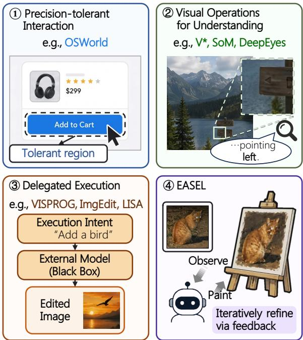
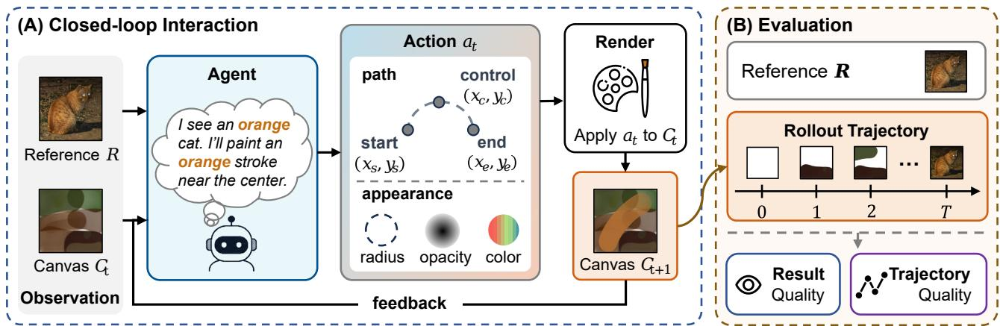
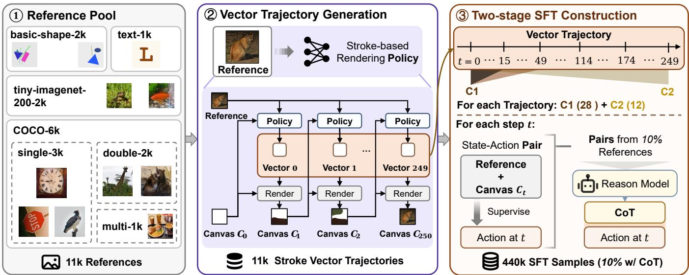
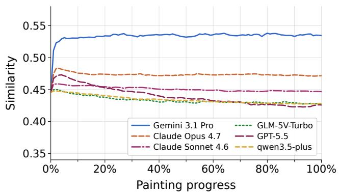
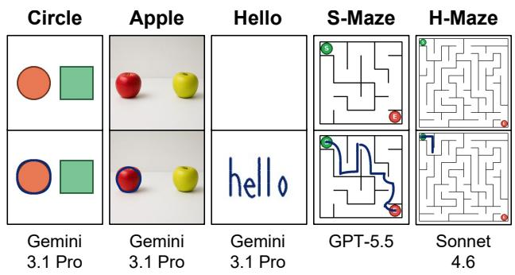

# Paint What You See: Benchmarking Dexterous Visual Tool Use in Multimodal Agents

Shudong Liu∗1,3, Dongyang Chen∗2,3, Enci Zhang1, Jinwei Liang3, Zheng Ma3, Lewei Lu3†

1Peking University,

2Tsinghua University,

3SenseTime Research

{shooo, eczhang}@stu.pku.edu.cn, chen-dy25@mails.tsinghua.edu.cn, {liangjinwei, mazheng2, luotto}@sensetime.com https://github.com/OOOHS/EASEL https://huggingface.co/EASEL-Bench

## Abstract

Evaluation is shifting from static QA toward agentic settings where models act through external tools. We identify a critical yet underexplored capability within this space—dexterous visual tool use: fine-grained, closed-loop parameterized visual action in which models infer tool parameters from visual evidence, and those parameters directly govern the final result. Existing benchmarks cover web navigation, GUI operation, and software engineering, but rarely target this coupling between visual evidence and execution precision. We propose EASEL, a benchmark evaluating a controlled instance of dexterous visual tool use that adopts reference-guided visual reconstruction as its primary proxy task: the agent incrementally paints a canvas to match a reference image. EASEL additionally includes semantic tasks spanning region annotation, handwriting, and path planning. We further provide EASEL Data, a 440k-sample two-stage curriculum dataset for trajectory supervision, and EASEL-9B to investigate its efect on this capability. Evaluation of 25 models reveals that current multimodal agents systematically struggle on EASEL. Reconstruction similarity bottlenecks at low levels (0.40–0.54), while trajectory diagnostics expose severe closed-loop instability—models typically saturate early or degrade post-peak. Semantic tasks reveal sharp capability boundaries in precision annotation and path planning. EASEL-9B, trained on EASEL-Data, surpasses the base model by a relative 6.3%, ranking third among all evaluated models.

## 1 Introduction

Multimodal models increasingly complete tasks through external tools in complex digital environments. Evaluation has followed suit, expanding beyond answer-only QA toward tool-mediated execution in software engineering (Jimenez et al. 2024), web navigation (Deng et al. 2023; Zhou et al. 2024), desktop GUI use (Xie et al. 2024), and API calling (Patil et al. 2025). Even in the most visual of these settings, however, interaction remains precision-tolerant: actions succeed as long as they fall within a generous bounding region, so precise spatial control is never strictly demanded.

Beyond such structured interfaces, recent eforts have extended agent capabilities into open-ended visual domains through visual search (Wu and Xie 2024; Shen et al. 2025; Yu, Guan, and Gu 2025), region annotation (Yang et al. 2023; You et al. 2024; Chen et al. 2023), pixel-level segmentation via specialized decoders (Lai et al. 2024; Zhang et al. 2024; Chen et al. 2024), code-driven visual programs (Gupta and Kembhavi 2023; Surís, Menon, and Vondrick 2023), and generative editing (Zhang et al. 2023; Sheynin et al. 2024; Ye et al. 2026). As Figure 1 illustrates, these approaches either aid understanding without producing persistent visual output, or delegate execution to external segmentation and generative models. Neither paradigm requires the agent to precisely control action parameters that directly form the result. To genuinely manipulate visual content, agents must go beyond high-level delegation to perform fine-grained spatial actions, which demands translating fine-grained visual understanding directly into precise execution parameters.

  
Figure 1: Approaches to visual task execution. Existing paradigms each avoid precise execution—through tolerance margins, understanding-only operation, or delegation to external models. EASEL requires the agent to directly produce parameterized actions through closed-loop refinement.

By analogy with dexterous manipulation in robotics, where the manipulator’s own motor actions directly shape physical outcomes through continuous feedback rather than issuing commands to an external actuator, we term this capability dexterous visual tool use. We operationalize it asfinegrained, closed-loop parameterized visual action: at each step, the model reads pixel-level visual cues to infer explicit tool parameters, those parameters directly govern the visual output, and the updated state drives subsequent refinement. What makes this demanding is not per-step perfection, but the need to continuously read fine-grained visual signals and translate them into corrective parameterized actions, without delegating to an external executor.

Parameterized visual action is achievable in restricted settings: neural painting (Huang, Heng, and Zhou 2019; Liu et al. 2021) and SVG generation (Li et al. 2020) via task-specific architectures, and SimpleSeg (Song et al. 2026) via direct polygon prediction in general-purpose models. SimpleSeg demonstrates that highly fine-grained, even pixel-level perception is achievable natively within generalpurpose MLLMs—but in a one-shot, static setting. Whether such perception can sustain across multi-step closed-loop execution, where each action changes the visual state and demands fresh spatial reasoning, remains untested; current evaluations center on task completion, where tolerance margins, abstraction, or external models absorb imprecision.

Painting ofers a natural proxy for this capability: each stroke visibly changes the canvas and shapes the next decision, while parameter errors are not absorbed by a tolerant interface or external generator. Evaluation instances moreover require no manual annotation: reference images can be sourced freely, and stroke trajectories are derived automatically, making the setting easy to scale.

Guided by these properties, we introduce EASEL, whose primary task is reference-guided visual reconstruction: the agent observes a reference image and the current canvas, then issues incremental drawing actions, exposing the gap between semantic understanding and geometric precision. EASEL further probes the same parameterized-action interface through annotation, handwriting, and path-planning tasks driven by natural-language instructions; its annotation setting ofers, to our knowledge, the first closed-loop evaluation in which general-purpose agents perform segmentationstyle action without dedicated segmentation models. To examine whether trajectory-level supervision can improve this capability, we additionally construct EASEL-Data and train EASEL-9B via a two-stage curriculum: first on early-phase strokes, then extending supervision to mid-to-late steps.

1. We propose EASEL, operationalizing dexterous visual tool use as fine-grained, closed-loop parameterized visual action through 110 reference-guided reconstruction samples and 5 instruction-conditioned semantic tasks, covering up to 11,392 interactions per full evaluation.

2. We construct EASEL-Data via a scalable two-stage curriculum pipeline that converts stroke-based rendering trajectories into 440k next-action supervision samples (C1: early reconstruction; C2: light completion), and train EASEL-9B to examine the efect of trajectory supervision on closed-loop visual action.

3. We systematically evaluate 25 representative multimodal agents across both result quality and trajectory quality, revealing two distinct failure modes in closed-loop visual action—early saturation and post-peak degradation—and sharp capability boundaries on semantic tasks invisible to reconstruction metrics alone.

## 2 Related Work

## 2.1 Agent Evaluation and Visual Tool Use

Agent benchmarks evaluate goal-directed execution in interactive environments, covering software engineering (Jimenez et al. 2024), web and GUI navigation (Deng et al. 2023; Zhou et al. 2024; Xie et al. 2024), and long-horizon visual tool use (Su et al. 2026). GUI grounding work such as SeeClick and ScreenSpot-Pro studies screen coordinate prediction (Cheng et al. 2024; Li et al. 2025b), but coordinates typically locate high-tolerance interactive elements and their precision does not directly determine result quality.

A separate line of work lets models operate directly on images for understanding and reasoning: through active visual search and region refinement (Wu and Xie 2024; Shen et al. 2025; Zheng et al. 2025; Yu, Guan, and Gu 2025), region annotation and grounding (Yang et al. 2023; You et al. 2024), drawable workspaces (Hu et al. 2024; Li et al. 2025a), and program or tool invocation (Gupta and Kembhavi 2023; Surís, Menon, and Vondrick 2023; Zhang et al. 2025; Hong et al. 2025). Segmentation-capable MLLMs such as LISA, PSALM, and SAM4MLLM further extend to pixel-level annotation through mask decoders (Lai et al. 2024; Zhang et al. 2024; Chen et al. 2024), where segmentation is produced by a specialized interface rather than the agent’s own actions. SimpleSeg instead predicts polygon coordinate sequences directly (Song et al. 2026), instantiating parameterized visual action without decoder delegation—the closest existing paradigm to dexterous visual tool use, though it operates one-shot without closed-loop refinement.

In visual editing and production, instruction-based image editing modifies images from text instructions (Zhang et al. 2023; Sheynin et al. 2024; Liu et al. 2025; Ye et al. 2026), and tool-augmented design benchmarks connect VLMs to real design software (Jeong et al. 2026). These works extend agent capability from “look and answer” to “use visual tools to complete tasks.” EASEL shares this trend but difers in that parameter precision directly determines result quality.

## 2.2 Parameterized Drawing and Generation

Neural painting and stroke-based rendering are closest to EASEL in task form. Learning to Paint and Paint Transformer decompose target images into stroke sequences via RL and feed-forward prediction respectively (Huang, Heng, and Zhou 2019; Liu et al. 2021). These works optimize taskspecific models for reconstruction quality, whereas EASEL uses reconstruction as a diagnostic lens to evaluate generalpurpose agents under a unified tool interface. Draw with Thought reconstructs scientific diagrams as structured code (Cui et al. 2025); SketchAgent drives sketch creation from language descriptions (Vinker et al. 2025). Neither targets closed-loop refinement toward an explicit visual goal, which is EASEL’s distinguishing focus.

  
Figure 2: EASEL overview. (A) At each step, the agent observes reference R and current canvas $C _ { t } ,$ outputs a parameterized brush\_stroke action, and receives the updated canvas as feedback. (B) The full rollout is evaluated along two axes: Result Quality and Trajectory Quality.

## 3 EASEL

## 3.1 Task Formulation

EASEL centers on a reconstruction task; semantic tasks extend the same closed-loop framework to instruction-guided drawing (Figure 2).

Reconstruction. Given a reference R and blank canvas $C _ { 0 } ,$ at each step t the agent observes $( R , C _ { t } )$ and outputs a brush\_stroke action $a _ { t }$ in JSON; the renderer updates $C _ { t + 1 } = \mathrm { R e n d e r } ( C _ { t } , a _ { t } )$ . The episode runs for T steps with the goal of making $C _ { T }$ as visually close to R as possible.

Semantic tasks. The agent observes a task image R and a text instruction l, aiming to produce a drawing that satisfies the instruction l (region outline, handwriting, or maze path). The action space extends to {brush\_stroke, undo, submit}. The brush appearance is fixed (fully opaque dark-blue, medium width), and the model predicts only the path parameters. In maze tasks, wall-colliding actions are rejected as no-ops but consume one step, with collision feedback passed to subsequent context.

Model interface. The default interface is minimal: in reconstruction, the model observes the reference image, the current canvas, and the brush tool schema. Semantic tasks additionally preserve a 3-turn history window.

## 3.2 Benchmark Construction

EASEL includes 110 reconstruction samples and 5 semantic tasks across five categories (Table 1).

The four reconstruction categories form a dificulty gradient along geometric structure, color distribution, and semantic prior strength. Programmatic provides the cleanest baseline for tool format and spatial parameterization; Spatial

<table><tr><td>Category</td><td>#Samples</td><td>Resolution</td><td>Budget</td></tr><tr><td>Programmatic</td><td>15</td><td> $6 4 \times 6 4$ </td><td>32</td></tr><tr><td>Spatial Geometry</td><td>40</td><td> $1 2 8 \times 1 2 8$ </td><td>96</td></tr><tr><td>Abstract/Cartoon</td><td>15</td><td> $1 2 8 \times 1 2 8$ </td><td>96</td></tr><tr><td>Natural Images</td><td>40</td><td> $1 2 8 \times 1 2 8$ </td><td>128</td></tr><tr><td>Semantic Tasks</td><td>5</td><td>64-512</td><td>64-128</td></tr></table>

Table 1: EASEL benchmark categories.

Geometry tests multi-object layout; Abstract/Cartoon weakens semantic priors, forcing reliance on visual evidence; Natural Images is the primary source of dificulty variation. Semantic Tasks are reported separately and include two regionannotation tasks (circle outline and left-apple outline), one handwriting task (write “hello”), and two constrained pathplanning tasks (simple maze and harder maze path). For annotation and maze tasks, the initial canvas is the task image itself and the model draws over it; for handwriting, the model writes on a blank canvas. Programmatic, maze, and Circle Outline tasks are procedurally synthesized; remaining categories are generated via GPT-image-2.

## 3.3 Evaluation Metrics

Overview. EASEL evaluates each rollout along two axes. Result Quality measures whether the final visual output satisfies the target; Trajectory Quality diagnoses how the model uses intermediate feedback over the action sequence.

Reconstruction. We compute SSIM, normalized RGB $L _ { 1 }$ distance, and Edge IoU, and define the similarity $S _ { t }$ as:

$$
\begin{array} { r l } & { S _ { t } = 0 . 5 \cdot \mathrm { S S I M } } \\ & { ~ + ~ 0 . 3 \cdot ( 1 - \mathrm { R G B } _ { L _ { 1 } } ) } \\ & { ~ + ~ 0 . 2 \cdot \mathrm { E d g e ~ I o U } } \end{array}\tag{1}
$$

Weights encode the intended balance: SSIM primary, RGB fidelity for appearance, Edge IoU for boundary structure. Ranking sensitivity across alternative weightings is reported in the supplementary material.

  
Figure 3: EASEL-Data construction pipeline. (1) Reference Pool: 11k reference images spanning four source domains. (2) Vector Trajectory Generation: a stroke-based rendering policy produces a 250-step vector trajectory per reference. (3) Twostage SFT Construction: C1 densely covers early strokes (0–49, with full retention through stroke 16); C2 spans the full trajectory (0–249), yielding 440k next-action prediction samples. For 10% of references, a reasoning model annotates all corresponding trajectory samples with CoT supervision (44k CoT samples).

For standard reconstruction, Result Quality is measured by Final Similarity $S _ { T }$ , the primary ranking metric. Trajectory Quality is measured by four diagnostics: Similarity@50% $( S _ { \lfloor T / 2 \rfloor } )$ , Trajectory $\begin{array} { r } { \mathrm { \bar { A U C } } \left( \frac { 1 } { T } \sum _ { t } S _ { t } \right) } \end{array}$ , Best Similarity $( \operatorname* { m a x } _ { t } \mathbf { \bar { \mathbf { \Gamma } } } \mathbf { \tilde { \mathbf { \Gamma } } } _ { t } ) ,$ , and Final-Best Gap $\dot { ( \operatorname* { m a x } _ { t } } S _ { t } - S _ { T } )$ . F-B Gap diagnoses retention of the best achieved state and should be interpreted jointly with Final Similarity: a small gap can indicate either a strong result that was preserved or limited progress with little post-peak loss.

Semantic Tasks. For semantic tasks, Result Quality is the task-specific score ∈ [0, 1]: (1) outline tasks (Circle Outline, Apple Outline) use the Dice coeficient between the model’s drawn region and the target mask; (2) handwriting (Hello) uses a multimodal LLM to recognize each letter and compute positional match rate; (3) maze tasks (Simple Maze, Maze) compute the normalized progress of the model’s path along the reference route. Semantic trajectories also log action traces, invalid action rate, undo/submit behavior, and intermediate canvases for failure analysis. Full semantic task specifications are in the supplementary material.

## 3.4 Tool Semantics

The brush\_stroke action comprises 13 continuous normalized parameters:

$$
\begin{array} { r } { a = ( \underbrace { x _ { s } , y _ { s } , x _ { c } , y _ { c } , x _ { e } , y _ { e } } _ { \mathrm { p a t h } } , } \\ { \underbrace { r _ { s } , \alpha _ { s } , r _ { e } , \alpha _ { e } } _ { \mathrm { r a d i u s \ : \& \ o p a c i t y } } , \underbrace { c _ { r } , c _ { g } , c _ { b } } _ { \mathrm { c o l o r } } ) } \end{array}\tag{2}
$$

The path parameters $( x _ { s } , y _ { s } ) , \ ( x _ { c } , y _ { c } ) , \ ( x _ { e } , y _ { e } )$ define a quadratic Bézier curve in normalized canvas coordinates. Appearance parameters include per-endpoint radius and opacity $\left( r _ { s } , \alpha _ { s } , r _ { e } , \alpha _ { e } \right)$ , linearly interpolated along the stroke, and a shared RGB color $\left( c _ { r } , c _ { g } , c _ { b } \right)$ . A quadratic Bézier primitive keeps the schema compact while exposing the continuous path and appearance parameters that constitute the target capability. Semantic tasks provide a reducedschema setting by fixing appearance and requiring only the six path coordinates. The stroke is composited onto the canvas via alpha blending. The full schema and renderer specification are in the supplementary material.

## 4 EASEL-Data

EASEL-Data construction proceeds in three stages: reference image preparation, vector trajectory generation, and two-stage SFT construction (Figure 3).

Reference pool. We prepare 11k reference images from four sources: procedurally generated geometry and text/glyphs, single-/dual-/multi-subject crops from COCO (Lin et al. 2014), and natural images from Tiny ImageNet (Le and Yang 2015), spanning a visual complexity spectrum from simple geometry to complex natural scenes. Detailed category specifications are in the supplementary material.

Vector trajectory pool. For each reference image, we generate a 250-step brush\_stroke trajectory using a strokebased painting policy (data policy) (Huang, Heng, and Zhou 2019). This 250-step run is the data-native setting; a budgetaligned variant (⌈B/5⌉ policy steps, five raster strokes each) serves as a score anchor in Section 5.

Two-stage SFT construction. We convert trajectories into next-action prediction: given the reference and current canvas, the model predicts the next stroke, with canvases produced by replaying prior actions. Each supervision target is one observed continuation from the rendering policy.

<table><tr><td>Control / Agent</td><td>Final Sim.↑</td><td>Edge IoU↑</td></tr><tr><td>Blank-white canvas</td><td>0.446</td><td>0.000</td></tr><tr><td>Reference mean-color fill</td><td>0.534</td><td>0.000</td></tr><tr><td>Reference dominant-color fill</td><td>0.531</td><td>0.000</td></tr><tr><td>Gemini 3.1 Pro (best MLLM)</td><td>0.535</td><td>0.053</td></tr><tr><td>Data policy, budget-aligned</td><td>0.665</td><td>0.281</td></tr><tr><td>Data policy, native (250-step)</td><td>0.715</td><td>0.563</td></tr></table>

Table 2: Reconstruction score anchors. Uniform fills score zero on Edge IoU; the data policy provides a reference point for attainable scores under two step-budget settings.

We construct a two-stage curriculum: C1 (Early Reconstruction, 308k samples) retains all steps from strokes 0– 15 and samples from strokes 16–49, ensuring every blankcanvas state is covered and training the model to establish coarse structure and color; C2 (Light Completion, 132k samples) spans the full trajectory with decreasing density to cover mid-to-late refinement. Spatial coordinates are quantized to integers in [0, 1000] to align with MLLM tokenization. A reasoning model additionally generates CoT supervision for 10% of references, yielding 44k CoT samples. Full construction specifications are in the supplementary material.

## 4.1 EASEL-9B

We fine-tune Qwen3.5-9B (Team 2026) in two stages using LoRA (rank 64, alpha 128, all-linear targets). Stage 1 trains on C1 with learning rate $1 \times 1 0 ^ { - 4 } ;$ Stage 2 continues from Stage 1 adapters on C2 with 15% C1 replay at a reduced learning rate $\mathrm { \bar { 5 } } \times 1 0 ^ { - 5 }$ . Both stages use bf16 precision, DeepSpeed ZeRO-2, efective batch size 64 (8 GPUs), max sequence length 8192, AdamW with weight decay 0.1 and cosine schedule. The ViT last four blocks and merger layers receive full gradient updates via modules\_to\_save. EASEL-9B is not intended as an upper bound on painting quality, but as a diagnostic probe for the efect of the twostage curriculum. Full training hyperparameters are in the supplementary material.

## 5 Experiments

We evaluate 25 multimodal agents, including 6 closed-source APIs and 19 open-source models spanning 4B–90B parameters selected to cover the current performance frontier. The evaluated model families include proprietary Gemini, Claude, GPT, GLM, and Qwen APIs (Google DeepMind 2026; Anthropic 2026; OpenAI 2026; GLM-V Team 2026; Team 2026), as well as open-source Qwen, InternVL, Llama, Gemma, DeepSeek-VL, MiMo-VL, and Kimi models (Team 2026; Bai et al. 2025; Qwen Team 2026; Zhu et al. 2025; Meta AI 2025, 2024; Gemma Team et al. 2025; Wu et al. 2024; LLM-Core-Team Xiaomi 2025; Kimi Team et al. 2026).

## 5.1 Standard Reconstruction

Table 3 reports reconstruction results and trajectory diagnostics; Figure 4 plots the average reconstruction curves for the six closed-source models.

  
Figure 4: Average similarity over painting progress across reconstruction tasks. Most gains occur within the first 10% of the step budget, after which trajectories plateau or degrade.

Score anchors and task solvability. Table 2 anchors the absolute score range. The best agent, Gemini 3.1 Pro (0.535), approximately matches the reference mean-color fill (0.534) in composite similarity, although Gemini captures edge structure (Edge IoU 0.053) while all uniform fills score zero on Edge IoU. The data policy reaches 0.665 under the budgetaligned setting (Edge IoU 0.281) and 0.715 in the data-native setting (Edge IoU 0.563). Both substantially exceed every evaluated agent, confirming that the task is not inherently unsolvable at this score range. The continuous span from uniform fills (Edge IoU 0) to Gemini (Edge IoU 0.053) to the data policy (Edge IoU 0.281–0.563) also confirms that the composite metric retains discriminative range well above current MLLMs, rather than saturating near 0.53.

Overall performance. Overall performance is low and clearly stratified. Gemini 3.1 Pro achieves the best Final Similarity (0.535), followed by Claude Opus 4.7 (0.472), while open-source models cluster in the 0.40–0.45 range with small inter-model variance and no clear correlation with parameter count. EASEL-9B (full curriculum) reaches 0.459, ranking third overall and the highest score among non-proprietary models, outperforming its base model Qwen3.5-9B (0.432) by +0.027. Across categories, Natural Images is hardest due to complex textures and fine-grained color distributions, whereas Programmatic is easiest due to strong geometric priors. These results show that EASEL exposes a systematic weakness in closed-loop visual action.

Trajectory patterns. Trajectory diagnostics reveal two qualitatively distinct behavioral patterns among closedsource models. Gemini 3.1 Pro, Claude Opus 4.7, and Claude Sonnet 4.6 rise sharply within the first 5% of steps and then plateau: their @50%, AUC, and Final scores are nearly identical, indicating these models efectively stop making meaningful changes after early gains. By contrast, GPT-5.5, GLM-5V-Turbo, and qwen3.5-plus continue acting but degrade: AUC exceeds Final in all three cases, with GPT-5.5 showing the strongest degradation (F-B Gap 0.073; AUC 0.440 vs. Final 0.426). The distinction reflects diferent local action tendencies: plateau models tend toward conservative outputs once visual gain diminishes, while degrading models continue generating novel actions regardless of canvas state. Across all closed-source models, the efective peak is reached within the first 10% of the step budget, indicating that neither strategy exploits the remaining feedback signal.

<table><tr><td rowspan="2">Model Model</td><td colspan="4">Category Breakdown</td><td rowspan="2">Overall</td><td colspan="4">Trajectory</td></tr><tr><td>Prog.</td><td>Spatial</td><td>Abs.</td><td>Nat.</td><td>Final↑ @50%↑</td><td>AUC↑</td><td>Best↑</td><td>F-B Gap↓</td></tr><tr><td>Gemini 3.1 Pro</td><td>0.598</td><td>0.579</td><td>0.521</td><td>0.472</td><td>0.535</td><td>0.532</td><td>0.534</td><td>0.566</td><td>0.032</td></tr><tr><td>Claude Opus 4.7</td><td>0.469</td><td>0.531</td><td>0.468</td><td>0.415</td><td>0.472</td><td>0.473</td><td>0.474</td><td>0.506</td><td>0.035</td></tr><tr><td>Claude Sonnet 4.6</td><td>0.439</td><td>0.496</td><td>0.475</td><td>0.390</td><td>0.447</td><td>0.450</td><td>0.451</td><td>0.478</td><td>0.031</td></tr><tr><td>GLM-5V-Turbo</td><td>0.367</td><td>0.495</td><td>0.430</td><td>0.382</td><td>0.428</td><td>0.431</td><td>0.433</td><td>0.487</td><td>0.060</td></tr><tr><td>GPT-5.5</td><td>0.434</td><td>0.467</td><td>0.430</td><td>0.380</td><td>0.426</td><td>0.436</td><td>0.440</td><td>0.499</td><td>0.073</td></tr><tr><td>qwen3.5-plus</td><td>0.412</td><td>0.482</td><td>0.464</td><td>0.367</td><td>0.428</td><td>0.433</td><td>0.434</td><td>0.460</td><td>0.032</td></tr><tr><td>Qwen3.6-27B</td><td>0.489</td><td>0.476</td><td>0.498</td><td>0.364</td><td>0.440</td><td>0.440</td><td>0.441</td><td>0.454</td><td>0.014</td></tr><tr><td>Qwen3.5-35B-A3B</td><td>0.483</td><td>0.490</td><td>0.495</td><td>0.359</td><td>0.442</td><td>0.442</td><td>0.442</td><td>0.451</td><td>0.009</td></tr><tr><td>Qwen3.5-27B</td><td>0.469</td><td>0.473</td><td>0.486</td><td>0.361</td><td>0.433</td><td>0.433</td><td>0.434</td><td>0.451</td><td>0.018</td></tr><tr><td>Qwen3.5-9B</td><td>0.473</td><td>0.474</td><td>0.475</td><td>0.359</td><td>0.432</td><td>0.432</td><td>0.433</td><td>0.447</td><td>0.015</td></tr><tr><td>Qwen3.5-4B</td><td>0.482</td><td>0.484</td><td>0.486</td><td>0.362</td><td>0.440</td><td>0.440</td><td>0.420</td><td>0.448</td><td>0.008</td></tr><tr><td>Qwen3-VL-32B-Thinking</td><td>0.482</td><td>0.481</td><td>0.490</td><td>0.360</td><td>0.438</td><td>0.438</td><td>0.416</td><td>0.447</td><td>0.008</td></tr><tr><td>Qwen3-VL-30B-A3B-Inst.</td><td>0.421</td><td>0.491</td><td>0.469</td><td>0.361</td><td>0.431</td><td>0.433</td><td>0.433</td><td>0.464</td><td>0.032</td></tr><tr><td>Qwen3-VL-30B-A3B-Think.</td><td>0.416</td><td>0.478</td><td>0.484</td><td>0.355</td><td>0.426</td><td>0.428</td><td>0.410</td><td>0.455</td><td>0.029</td></tr><tr><td>kimi-k2.5</td><td>0.459</td><td>0.490</td><td>0.481</td><td>0.374</td><td>0.442</td><td>0.444</td><td>0.445</td><td>0.464</td><td>0.022</td></tr><tr><td>InternVL3-14B</td><td>0.472</td><td>0.438</td><td>0.448</td><td>0.344</td><td>0.420</td><td>0.420</td><td>0.420</td><td>0.451</td><td>0.019</td></tr><tr><td>InternVL3-8B</td><td>0.483</td><td>0.448</td><td>0.466</td><td>0.346</td><td>0.418</td><td>0.418</td><td>0.420</td><td>0.447</td><td>0.029</td></tr><tr><td>Llama 4 Maverick</td><td>0.480</td><td>0.475</td><td>0.490</td><td>0.360</td><td>0.437</td><td>0.437</td><td>0.437</td><td>0.445</td><td>0.008</td></tr><tr><td>Llama 4 Scout</td><td>0.473</td><td>0.470</td><td>0.480</td><td>0.355</td><td>0.430</td><td>0.430</td><td>0.430</td><td>0.438</td><td>0.008</td></tr><tr><td>Llama 3.2 Vision 90B</td><td>0.460</td><td>0.455</td><td>0.465</td><td>0.348</td><td>0.422</td><td>0.422</td><td>0.422</td><td>0.435</td><td>0.013</td></tr><tr><td>Llama 3.2 Vision 11B</td><td>0.455</td><td>0.450</td><td>0.460</td><td>0.345</td><td>0.415</td><td>0.415</td><td>0.415</td><td>0.428</td><td>0.013</td></tr><tr><td>Gemma3-27B</td><td>0.470</td><td>0.465</td><td>0.472</td><td>0.352</td><td>0.426</td><td>0.426</td><td>0.426</td><td>0.440</td><td>0.014</td></tr><tr><td>DeepSeek-VL2</td><td>0.452</td><td>0.445</td><td>0.455</td><td>0.342</td><td>0.414</td><td>0.414</td><td>0.414</td><td>0.428</td><td>0.014</td></tr><tr><td>Mio-VL-7B-RL</td><td>0.411</td><td>0.442</td><td>0.444</td><td>0.348</td><td>0.404</td><td>0.406</td><td>0.409</td><td>0.451</td><td>0.047</td></tr><tr><td>EASEL-9B (w/o C2)</td><td>0.505</td><td>0.491</td><td>0.486</td><td>0.391</td><td>0.456</td><td>0.455</td><td>0.456</td><td>0.475</td><td>0.020</td></tr><tr><td>EASEL-9B</td><td>0.495</td><td>0.499</td><td>0.501</td><td>0.390</td><td>0.459</td><td>0.460</td><td>0.459</td><td>0.478</td><td>0.019</td></tr></table>

Table 3: EASEL standard reconstruction results and trajectory diagnostics. Final is the primary ranking metric; @50%, AUC, Best, and F-B Gap are trajectory diagnostics defined in Section 3.3. Models are grouped by family; EASEL-9B variants are listed separately as a curriculum ablation. Bold indicates the best result in each column; underline indicates the second best.

F-B Gap interpretation. F-B Gap measures retention, not quality, and its interpretation depends on the underlying behavior. The five open-weight models with F-B Gap below 0.01 have exact-repeat rates of 82.3%–92.4%, so their small gaps reflect near-total inaction rather than active quality maintenance. Closed-source plateau models achieve comparable F-B Gaps (≤0.035) through selectively conservative actions, which—unlike verbatim repetition—implies genuine sensitivity to canvas state; Final Similarity separately captures the quality of what is being preserved. The gap between closed-source plateau models (0.47–0.54) and open-source near-inaction models (0.40–0.45) suggests stronger models read visual evidence more efectively early on. Yet even top closed-source models plateau well below the data policy’s 0.665–0.715: the bottleneck is not initial perception but sustained, feedback-driven correction across the trajectory.

Trajectory supervision. We compare Qwen3.5-9B (base, 0.432) with EASEL-9B trained on C1 only (0.456, +0.024) and the full C1+C2 curriculum (0.459, +0.027 over base). C1 training alone accounts for the majority of the gain, establishing coarse structure and color from early strokes; adding C2 contributes a further +0.003, indicating that mid-to-late completion supervision provides modest but measurable improvement. Final-Best Gap increases slightly from 0.015 (base) to 0.019–0.020 (trained), suggesting that trajectory supervision improves local action quality while long-horizon feedback correction remains limited under the current setup.

## 5.2 Semantic Task Analysis

We analyze five representative models with nontrivial and diferentiated semantic behavior (Table 4); models producing near-zero scores on all tasks are omitted. Semantic tasks reveal sharper capability boundaries than reconstruction.

Outline and handwriting. Top closed-source models can perform segmentation-style annotation through direct stroke control: Gemini 3.1 Pro and GPT-5.5 lead both outline tasks and achieve perfect handwriting, while weaker models produce partial or zero scores. Claude Opus 4.7 fails on Circle Outline entirely due to persistent draw-undo loops—action strategy stability is a prerequisite for tasks requiring cumulative canvas accumulation.

Path planning. GPT-5.5 achieves a perfect score on Simple Maze despite weaker reconstruction performance, confirming that reconstruction precision and instructionfollowing are partially orthogonal dimensions. The harder Maze Path remains unsolved across all models.

<table><tr><td>Model</td><td colspan="5">Result Quality</td><td colspan="4">Trajectory</td></tr><tr><td>Model</td><td>Circle↑</td><td>Apple↑</td><td>Hello↑</td><td>S-Maze↑</td><td>H-Maze↑</td><td>Maze Inv.↓</td><td>Maze Undo</td><td>Non-Maze Undo</td><td>Avg. Submit (%)</td></tr><tr><td>Gemini 3.1 Pro</td><td>0.919</td><td>0.783</td><td>1.000</td><td>0.183</td><td>0.007</td><td>0.21</td><td>87</td><td>0</td><td>43.5</td></tr><tr><td>GPT-5.5</td><td>0.785</td><td>0.761</td><td>1.000</td><td>1.000</td><td>0.031</td><td>0.19</td><td>81</td><td>0</td><td>41.6</td></tr><tr><td>Claude Sonnet 4.6</td><td>0.521</td><td>0.491</td><td>0.200</td><td>0.157</td><td>0.047</td><td>0.93</td><td>0</td><td>1</td><td>48.7</td></tr><tr><td>Claude Opus 4.7</td><td>0.000</td><td>0.602</td><td>0.200</td><td>0.026</td><td>0.000</td><td>0.87</td><td>3</td><td>124</td><td>87.7</td></tr><tr><td>GLM-5V-Turbo</td><td>0.484</td><td>0.722</td><td>0.000</td><td>0.000</td><td>0.000</td><td>1.00</td><td>0</td><td>0</td><td>43.0</td></tr></table>

Table 4: Semantic task results and trajectory diagnostics. Circle and Apple are outline Dice scores; Hello is letter-level recognition accuracy; S-Maze and H-Maze are normalized path-progress scores. Maze Inv.: fraction of invalid actions on maze tasks; Maze Undo / Non-Maze Undo: undo counts on maze vs. outline+handwriting tasks; Avg. Submit%: mean of per-episode submit percentile (submit step ÷ episode budget ×100), with budget-exhausted episodes counted as 100%. Bold indicates best result per quality column and lowest Maze Inv.

  
Figure 5: Best results on each semantic task. Top row: starting canvas. Bottom row: model output (Gemini 3.1 Pro for Circle, Apple, and Hello; GPT-5.5 for S-Maze; Claude Sonnet 4.6 for H-Maze).

Action traces. Gemini 3.1 Pro and GPT-5.5 use undo almost exclusively on maze tasks, suggesting targeted collision recovery rather than general uncertainty; GPT-5.5 shows iterative correction on Simple Maze, submitting after 25 undos with a perfect score—the clearest example of closed-loop self-correction in our evaluation. Claude Opus 4.7 inverts this pattern, with 124 non-maze undos and only 3 maze undos, consistent with unstable draw-undo loops that erase useful strokes and prevent accumulation. Claude Sonnet 4.6 almost never uses undo yet produces near-maximal invalid rates on maze tasks, indicating it neither detects nor responds to constraint violations—a diferent failure mode in which the model proceeds confidently despite errors.

## 6 Discussion

Scope and proxy validity. EASEL trades breadth for control: the 2D canvas isolates visual goals, parameterized actions, and closed-loop feedback from confounding variables, enabling focused diagnosis of fine-grained visual manipulation and closed-loop correction under a controllable protocol.

Applications. In our setting, agents act on visual content through explicit, editable strokes rather than delegating execution to specialized modules or generative systems. The semantic tasks demonstrate breadth within this interface through annotation, handwriting, and path planning. Medical annotation, CAD sketching, diagram authoring, and embodied manipulation motivate the broader capability because they share visual state observation, structured action prediction, and potential closed-loop feedback. Beyond evaluation, the explicit action traces and environment feedback make EASEL compatible with outcome-based optimization, reinforcement learning, and planning methods.

Generalization of trajectory supervision. EASEL-9B preserves visual perception after training: on standard perception benchmarks it matches or modestly improves upon the base model—MMVP +0.7%, POPE +2.0%, Hallusion-Bench +0.6% (Tong et al. 2024; Li et al. 2023; Guan et al. 2024), and on BLINK’s spatial reasoning and counting subtasks +0% and +1.7% respectively (Fu et al. 2024)— suggesting that closed-loop action training preserves and modestly broadens fine-grained multimodal perception. This raises the possibility that EASEL-style tasks, combined with more targeted supervision design, could serve as a training signal for fine-grained visual perception.

## 7 Conclusion

We present EASEL, a benchmark that operationalizes dexterous visual tool use as precision-critical, closed-loop parameterized visual action. By combining reference-guided reconstruction with instruction-conditioned semantic tasks and trajectory diagnostics, EASEL exposes failures obscured by answer-only QA and high-level tool-use benchmarks: models plateau early, degrade after initial gains, and rarely exploit corrective feedback. A two-stage curriculum (EASEL-9B) improves over the base model by a relative 6.3%, with early-phase training accounting for most of the gain and fine-grained visual perception improved, while long-horizon feedback correction remains limited.

## References

Anthropic. 2026. Model System Cards. https://www. anthropic.com/system-cards.

Bai, S.; Cai, Y.; Chen, R.; et al. 2025. Qwen3-VL Technical Report. arXiv:2511.21631.

Chen, K.; Zhang, Z.; Zeng, W.; Zhang, R.; Zhu, F.; and Zhao, R. 2023. Shikra: Unleashing multimodal llm’s referential dialogue magic. arXiv preprint arXiv:2306.15195.

Chen, Y.-C.; Li, W.-H.; Sun, C.; Wang, Y.-C. F.; and Chen, C.-S. 2024. Sam4mllm: Enhance multi-modal large language model for referring expression segmentation. In European Conference on Computer Vision, 323–340. Springer.

Cheng, K.; Sun, Q.; Chu, Y.; Xu, F.; YanTao, L.; Zhang, J.; and Wu, Z. 2024. Seeclick: Harnessing gui grounding for advanced visual gui agents. In Proceedings of the 62nd Annual Meeting of the Association for Computational Linguistics (Volume 1: Long Papers), 9313–9332.

Cui, Z.; Yuan, J.; Wang, H.; Li, Y.; Du, C.; and Ding, Z. 2025. Draw with Thought: Unleashing Multimodal Reasoning for Scientific Diagram Generation. In Proceedings of the 33rd ACM International Conference on Multimedia, 5050–5059.

Deng, X.; Gu, Y.; Zheng, B.; Chen, S.; Stevens, S.; Wang, B.; Sun, H.; and Su, Y. 2023. Mind2web: Towards a generalist agent for the web. Advances in Neural Information Processing Systems, 36: 28091–28114.

Fu, X.; Hu, Y.; Li, B.; Feng, Y.; Wang, H.; Lin, X.; Roth, D.; Smith, N. A.; Ma, W.-C.; and Krishna, R. 2024. Blink: Multimodal large language models can see but not perceive. In European Conference on Computer Vision, 148–166. Springer.

Gemma Team; Kamath, A.; Ferret, J.; Pathak, S.; et al. 2025. Gemma 3 Technical Report. arXiv:2503.19786.

GLM-V Team. 2026. GLM-5V-Turbo: Toward a Native Foundation Model for Multimodal Agents. arXiv:2604.26752.

Google DeepMind. 2026. Gemini 3.1 Pro Model Card. https: //deepmind.google/models/model-cards/gemini-3-1-pro/.

Guan, T.; Liu, F.; Wu, X.; Xian, R.; Li, Z.; Liu, X.; Wang, X.; Chen, L.; Huang, F.; Yacoob, Y.; Manocha, D.; and Zhou, T. 2024. HallusionBench: An Advanced Diagnostic Suite for Entangled Language Hallucination and Visual Illusion in Large Vision-Language Models. In Proceedings of the IEEE/CVF Conference on Computer Vision and Pattern Recognition (CVPR), 14375–14385.

Gupta, T.; and Kembhavi, A. 2023. Visual programming: Compositional visual reasoning without training. In Proceedings of the IEEE/CVF conference on computer vision and pattern recognition, 14953–14962.

Hong, J.; Zhao, C.; Zhu, C.; Lu, W.; Xu, G.; and Yu, X. 2025. Deepeyesv2: Toward agentic multimodal model. arXiv preprint arXiv:2511.05271.

Hu, Y.; Shi, W.; Fu, X.; Roth, D.; Ostendorf, M.; Zettlemoyer, L.; Smith, N. A.; and Krishna, R. 2024. Visual sketchpad: Sketching as a visual chain of thought for multimodal language models. Advances in Neural Information Processing Systems, 37: 139348–139379.

Huang, Z.; Heng, W.; and Zhou, S. 2019. Learning to paint with model-based deep reinforcement learning. In Proceedings of the IEEE/CVF international conference on computer vision, 8709–8718.

Jeong, D.; Byun, S.; Son, K.; Kim, D. H.; and Kim, J. 2026. CANVAS: A Benchmark for Vision-Language Models on Tool-Based User Interface Design. Proceedings ofthe AAAI Conference on Artificial Intelligence, 40(26): 22182–22190.

Jimenez, C. E.; Yang, J.; Wettig, A.; Yao, S.; Pei, K.; Press, O.; and Narasimhan, K. 2024. Swe-bench: Can language models resolve real-world github issues? In International Conference on Learning Representations, volume 2024, 54107–54157.

Kimi Team; Bai, T.; Bai, Y.; Bao, Y.; et al. 2026. Kimi K2.5: Visual Agentic Intelligence. arXiv:2602.02276.

Lai, X.; Tian, Z.; Chen, Y.; Li, Y.; Yuan, Y.; Liu, S.; and Jia, J. 2024. Lisa: Reasoning segmentation via large language model. In Proceedings of the IEEE/CVF conference on computer vision and pattern recognition, 9579–9589.

Le, Y.; and Yang, X. 2015. Tiny ImageNet Visual Recognition Challenge. CS 231N, 7(7): 3.

Li, C.; Wu, W.; Zhang, H.; Xia, Y.; Mao, S.; Dong, L.; Vulić, I.; and Wei, F. 2025a. Imagine while reasoning in space: Multimodal visualization-of-thought. arXiv preprint arXiv:2501.07542.

Li, K.; Meng, Z.; Lin, H.; Luo, Z.; Tian, Y.; Ma, J.; Huang, Z.; and Chua, T.-S. 2025b. Screenspot-pro: Gui grounding for professional high-resolution computer use. In Proceedings of the 33rd ACM International Conference on Multimedia, 8778–8786.

Li, T.-M.; Lukáč, M.; Gharbi, M.; and Ragan-Kelley, J. 2020. Diferentiable vector graphics rasterization for editing and learning. ACM Transactions on Graphics (TOG), 39(6): 1– 15.

Li, Y.; Du, Y.; Zhou, K.; Wang, J.; Zhao, W. X.; and Wen, J.-R. 2023. Evaluating Object Hallucination in Large Vision-Language Models. In The 2023 Conference on Empirical Methods in Natural Language Processing.

Lin, T.-Y.; Maire, M.; Belongie, S.; Hays, J.; Perona, P.; Ramanan, D.; Dollár, P.; and Zitnick, C. L. 2014. Microsoft COCO: Common Objects in Context. In European Conference on Computer Vision (ECCV). Zürich.

Liu, S.; Han, Y.; Xing, P.; Yin, F.; Wang, R.; Cheng, W.; Liao, J.; Wang, Y.; Fu, H.; Han, C.; et al. 2025. Step1xedit: A practical framework for general image editing. arXiv preprint arXiv:2504.17761.

Liu, S.; Lin, T.; He, D.; Li, F.; Deng, R.; Li, X.; Ding, E.; and Wang, H. 2021. Paint transformer: Feed forward neural painting with stroke prediction. In Proceedings ofthe IEEE/CVF international conference on computer vision, 6598–6607.

LLM-Core-Team Xiaomi. 2025. MiMo-VL Technical Report. arXiv:2506.03569.

Meta AI. 2024. Llama 3.2 Vision Model Card. Accessed: 2026-05-26.

Meta AI. 2025. Llama 4 Model Card. Accessed: 2026-05-26.

OpenAI. 2026. GPT-5.5 System Card. https://openai.com/ index/gpt-5-5-system-card/.

Patil, S. G.; Mao, H.; Yan, F.; Ji, C. C.-J.; Suresh, V.; Stoica, I.; and Gonzalez, J. E. 2025. The berkeley function calling leaderboard (bfcl): From tool use to agentic evaluation of large language models. In Forty-second International Conference on Machine Learning.

Qwen Team. 2026. Qwen3.6-27B Model Card. https: //huggingface.co/Qwen/Qwen3.6-27B. Accessed: 2026-05- 26.

Shen, H.; Zhao, K.; Zhao, T.; Xu, R.; Zhang, Z.; Zhu, M.; and Yin, J. 2025. Zoomeye: Enhancing multimodal llms with human-like zooming capabilities through tree-based image exploration. In Proceedings of the 2025 Conference on Empirical Methods in Natural Language Processing, 6613– 6629.

Sheynin, S.; Polyak, A.; Singer, U.; Kirstain, Y.; Zohar, A.; Ashual, O.; Parikh, D.; and Taigman, Y. 2024. Emu edit: Precise image editing via recognition and generation tasks. In Proceedings of the IEEE/CVF Conference on Computer Vision and Pattern Recognition, 8871–8879.

Song, T.; Lu, H.; Yang, H.; Sui, L.; Wu, H.; Zhou, Z.; Huang, Z.; Bao, Y.; Charles, Y.; Zhou, X.; and Wang, L. 2026. Towards Pixel-Level VLM Perception via Simple Points Prediction. arXiv:2601.19228.

Su, Z.; Gao, J.; Guo, H.; Liu, Z.; Zhang, L.; Geng, X.; Huang, S.; Xia, P.; Jiang, G.; Wang, C.; et al. 2026. Agentvista: Evaluating multimodal agents in ultra-challenging realistic visual scenarios. arXiv preprint arXiv:2602.23166.

Surís, D.; Menon, S.; and Vondrick, C. 2023. Vipergpt: Visual inference via python execution for reasoning. In Proceedings ofthe IEEE/CVF international conference on computer vision, 11888–11898.

Team, Q. 2026. Qwen3.5: Accelerating Productivity with Native Multimodal Agents.

Tong, S.; Liu, Z.; Zhai, Y.; Ma, Y.; LeCun, Y.; and Xie, S. 2024. Eyes wide shut? exploring the visual shortcomings of multimodal llms. In Proceedings of the IEEE/CVF conference on computer vision and pattern recognition, 9568– 9578.

Vinker, Y.; Shaham, T. R.; Zheng, K.; Zhao, A.; E Fan, J.; and Torralba, A. 2025. Sketchagent: Language-driven sequential sketch generation. In Proceedings of the Computer Vision and Pattern Recognition Conference, 23355–23368.

Wu, P.; and Xie, S. 2024. V?: Guided visual search as a core mechanism in multimodal llms. In Proceedings of the IEEE/CVF Conference on Computer Vision and Pattern Recognition, 13084–13094.

Wu, Z.; Chen, X.; Pan, Z.; et al. 2024. DeepSeek-VL2: Mixture-of-Experts Vision-Language Models for Advanced Multimodal Understanding. arXiv:2412.10302.

Xie, T.; Zhang, D.; Chen, J.; Li, X.; Zhao, S.; Cao, R.; Hua, T. J.; Cheng, Z.; Shin, D.; Lei, F.; et al. 2024. Osworld: Benchmarking multimodal agents for open-ended tasks in real computer environments. Advances in Neural Information Processing Systems, 37: 52040–52094.

Yang, J.; Zhang, H.; Li, F.; Zou, X.; Li, C.; and Gao, J. 2023. Set-of-mark prompting unleashes extraordinary visual grounding in gpt-4v. arXiv preprint arXiv:2310.11441.

Ye, Y.; He, X.; Li, Z.; Yuan, S.; Yan, Z.; Hou, B.; Yuan, L.; et al. 2026. Imgedit: A unified image editing dataset and benchmark. Advances in Neural Information Processing Systems, 38.

You, H.; Zhang, H.; Gan, Z.; Du, X.; Zhang, B.; Wang, Z.; Cao, L.; Chang, S.-F.; and Yang, Y. 2024. Ferret: Refer and ground anything anywhere at any granularity. In International Conference on Learning Representations, volume 2024, 57153–57180.

Yu, X.; Guan, D.; and Gu, Y. 2025. Zoom-Refine: Boosting High-Resolution Multimodal Understanding via Localized Zoom and Self-Refinement. arXiv preprint arXiv:2506.01663.

Zhang, K.; Mo, L.; Chen, W.; Sun, H.; and Su, Y. 2023. Magicbrush: A manually annotated dataset for instruction-guided image editing. Advances in Neural Information Processing Systems, 36: 31428–31449.

Zhang, Y.-F.; Lu, X.; Yin, S.; Fu, C.; Chen, W.; Hu, X.; Wen, B.; Jiang, K.; Liu, C.; Zhang, T.; et al. 2025. Thyme: Think beyond images. arXiv preprint arXiv:2508.11630.

Zhang, Z.; Ma, Y.; Zhang, E.; and Bai, X. 2024. Psalm: Pixelwise segmentation with large multi-modal model. In European Conference on Computer Vision, 74–91. Springer.

Zheng, Z.; Yang, M.; Hong, J.; Zhao, C.; Xu, G.; Yang, L.; Shen, C.; and Yu, X. 2025. Deepeyes: Incentivizing" thinking with images" via reinforcement learning. arXiv preprint arXiv:2505.14362.

Zhou, S.; Xu, F. F.; Zhu, H.; Zhou, X.; Lo, R.; Sridhar, A.; Cheng, X.; Ou, T.; Bisk, Y.; Fried, D.; et al. 2024. Webarena: A realistic web environment for building autonomous agents. In International Conference on Learning Representations, volume 2024, 15585–15606.

Zhu, J.; Wang, W.; Chen, Z.; et al. 2025. InternVL3: Exploring Advanced Training and Test-Time Recipes for Open-Source Multimodal Models. arXiv:2504.10479.