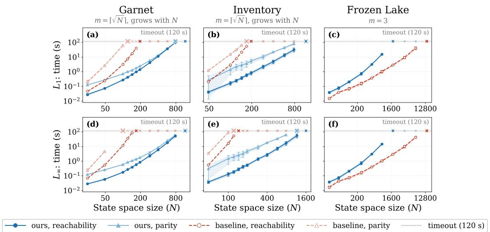
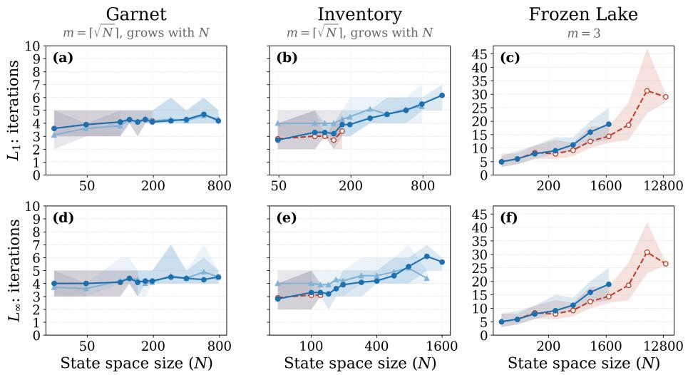

# Quantitative Analysis of ω-Regular Robust MDPs

Ali Asadi<sup>1</sup>, Krishnendu Chatterjee<sup>1</sup>, Ehsan Kafshdar Goharshady<sup>1</sup>, Mehrdad Karrabi<sup>1</sup>, Alipasha Montaseri<sup>1</sup>, Ali Shafiee<sup>1</sup>

<sup>1</sup>I<sub>ns</sub>tit<sub>u</sub>t<sub>e o</sub>f S<sub>c</sub>i<sub>ence an</sub>d T<sub>ec</sub>h<sub>no</sub>l<sub>ogy</sub> A<sub>us</sub>t<sub>r</sub>i<sub>a</sub>

ali.asadi@ist.ac.at, krichnendu.chatterjee@ist.ac.at, ehsan.goharshady@ist.ac.at, mehrdad.karrabi@ist.ac.at, <sub>a</sub>li<sub>pas</sub>h<sub>a.mon</sub>t<sub>aser</sub>i@i<sub>s</sub>t<sub>.ac.a</sub>t<sub>, a</sub>li<sub>.s</sub>h<sub>a</sub>fi<sub>ee</sub>@i<sub>s</sub>t<sub>.ac.a</sub>t

## Abstract

Robust Markov Decision Processes (RMDPs) <sub>g</sub>eneralize clas-<sub>s</sub>i<sub>ca</sub>l MDP<sub>s</sub> b<sub>y a</sub>ll<sub>ow</sub>i<sub>ng uncer</sub>t<sub>a</sub>i<sub>n</sub>t<sub>y</sub> i<sub>n</sub> t<sub>rans</sub>iti<sub>on pro</sub>b<sub>a</sub>biliti<sub>es</sub> <sub>an</sub>d <sub>op</sub>ti<sub>m</sub>i<sub>z</sub>i<sub>ng aga</sub>i<sub>ns</sub>t th<sub>e</sub>i<sub>r wors</sub>t<sub>-case rea</sub>li<sub>za</sub>ti<sub>on.</sub> W<sub>e con-</sub> sider (s, a)-rectangular RMDPs with linearly defined uncertainty sets and study parity objectives, which are a canonical representation of ω-regular objectives. An uncertainty set is li<sub>near</sub>l<sub>y</sub> d<sub>e</sub>fi<sub>ne</sub>d if it i<sub>s</sub> d<sub>escr</sub>ib<sub>e</sub>d b<sub>y</sub> li<sub>near</sub> i<sub>nequa</sub>liti<sub>es over</sub> th<sub>e</sub> t<sub>rans</sub>iti<sub>on</sub> di<sub>s</sub>t<sub>r</sub>ib<sub>u</sub>ti<sub>on</sub> t<sub>oge</sub>th<sub>er w</sub>ith <sub>aux</sub>ili<sub>ary var</sub>i<sub>a</sub>bl<sub>es,</sub> <sub>w</sub>hi<sub>c</sub>h <sub>cap</sub>t<sub>ures</sub> th<sub>e s</sub>t<sub>an</sub>d<sub>ar</sub>d $\dot { L } _ { 1 }$ <sub>an</sub>d $L _ { \infty }$ b<sub>a</sub>ll<sub>s as we</sub>ll <sub>as gen-</sub> <sub>era</sub>l <sub>po</sub>l<sub>y</sub>t<sub>op</sub>i<sub>c uncer</sub>t<sub>a</sub>i<sub>n</sub>t<sub>y se</sub>t<sub>s.</sub> Th<sub>e quan</sub>tit<sub>a</sub>ti<sub>ve va</sub>l<sub>ue</sub> i<sub>s</sub> th<sub>e</sub> <sub>supremum, over a</sub>ll <sub>agen</sub>t <sub>po</sub>li<sub>c</sub>i<sub>es, o</sub>f th<sub>e sa</sub>ti<sub>s</sub>f<sub>ac</sub>ti<sub>on pro</sub>b<sub>a</sub>bil<sub>-</sub> it<sub>y guaran</sub>t<sub>ee</sub>d <sub>aga</sub>i<sub>ns</sub>t th<sub>e a</sub>d<sub>versar</sub>i<sub>a</sub>l <sub>env</sub>i<sub>ronmen</sub>t<sub>.</sub> P<sub>rev</sub>i<sub>ous</sub> <sub>wor</sub>k <sub>s</sub>t<sub>u</sub>di<sub>e</sub>d th<sub>e</sub> <sub>qua</sub>lit<sub>a</sub>ti<sub>ve</sub> <sub>ana</sub>l<sub>ys</sub>i<sub>s,</sub> <sub>name</sub>l<sub>y</sub> th<sub>e</sub> <sub>a</sub>l<sub>mos</sub>t<sub>-sure</sub> (res<sub>p</sub>. <sub>p</sub>ositive) <sub>p</sub>roblem that asks whether a sin<sub>g</sub>le a<sub>g</sub>ent <sub>p</sub>olic<sub>y g</sub>uarantees satisfaction with <sub>p</sub>robabilit<sub>y</sub> one (res<sub>p</sub>. <sub>p</sub>ositive <sub>p</sub>robabilit<sub>y</sub>) a<sub>g</sub>ainst ever<sub>y</sub> environment <sub>p</sub>olic<sub>y</sub>. In this work, <sub>we</sub> <sub>so</sub>l<sub>ve</sub> th<sub>e</sub> <sub>exac</sub>t <sub>quan</sub>tit<sub>a</sub>ti<sub>ve</sub> <sub>pro</sub>bl<sub>em.</sub> O<sub>ur</sub> <sub>con</sub>t<sub>r</sub>ib<sub>u</sub>ti<sub>ons</sub> <sub>are</sub> th<sub>ree</sub>f<sub>o</sub>ld<sub>.</sub> Fi<sub>rs</sub>t<sub>,</sub> <sub>we</sub> <sub>s</sub>h<sub>ow</sub> th<sub>a</sub>t b<sub>o</sub>th th<sub>e</sub> <sub>agen</sub>t <sub>an</sub>d th<sub>e</sub> <sub>en-</sub> <sub>v</sub>i<sub>ronmen</sub>t <sub>a</sub>d<sub>m</sub>it <sub>pure memory</sub>l<sub>ess op</sub>ti<sub>ma</sub>l <sub>po</sub>li<sub>c</sub>i<sub>es.</sub> S<sub>econ</sub>d<sub>,</sub> <sub>we</sub> <sub>g</sub>i<sub>ve</sub> <sub>a</sub> <sub>po</sub>l<sub>ynom</sub>i<sub>a</sub>l<sub>-</sub>ti<sub>me</sub> <sub>a</sub>l<sub>gor</sub>ith<sub>m</sub> f<sub>or</sub> <sub>quan</sub>tit<sub>a</sub>ti<sub>ve</sub> <sub>par</sub>it<sub>y</sub> <sub>on</sub> li<sub>near</sub>l<sub>y</sub> d<sub>e</sub>fi<sub>ne</sub>d <sub>ro</sub>b<sub>us</sub>t M<sub>ar</sub>k<sub>ov c</sub>h<sub>a</sub>i<sub>ns an</sub>d <sub>use</sub> it <sub>as a su</sub>b<sub>-</sub> <sub>rou</sub>ti<sub>ne</sub> i<sub>n a po</sub>li<sub>cy-</sub>it<sub>era</sub>ti<sub>on a</sub>l<sub>gor</sub>ith<sub>m</sub> f<sub>or</sub> RMDP<sub>s.</sub> Th<sub>e a</sub>l<sub>-</sub> <sub>gor</sub>ith<sub>m</sub> <sub>com</sub>bi<sub>nes</sub> <sub>quan</sub>tit<sub>a</sub>ti<sub>ve</sub> <sub>one-s</sub>t<sub>ep</sub> i<sub>mprovemen</sub>t<sub>s</sub> <sub>w</sub>ith <sub>qua</sub>lit<sub>a</sub>ti<sub>ve</sub> <sub>a</sub>l<sub>mos</sub>t<sub>-sure</sub> i<sub>mprovemen</sub>t<sub>s.</sub> Fi<sub>na</sub>ll<sub>y,</sub> <sub>we</sub> <sub>repor</sub>t <sub>ex-</sub> <sub>per</sub>i<sub>men</sub>t<sub>s compar</sub>i<sub>ng our approac</sub>h <sub>w</sub>ith th<sub>e exp</sub>li<sub>c</sub>it <sub>re</sub>d<sub>uc</sub>ti<sub>on</sub> t<sub>o s</sub>t<sub>oc</sub>h<sub>as</sub>ti<sub>c games.</sub>

## 1 Introduction

Robust MDPs. Markov Decision Processes (MDPs) are a f<sub>un</sub>d<sub>amen</sub>t<sub>a</sub>l f<sub>ramewor</sub>k f<sub>or reason</sub>i<sub>ng,</sub> d<sub>ec</sub>i<sub>s</sub>i<sub>on ma</sub>ki<sub>ng, an</sub>d stochastic <sub>p</sub>lannin<sub>g</sub> (Puterman 1994). In a classical MDP, <sub>an agen</sub>t <sub>c</sub>h<sub>ooses ac</sub>ti<sub>ons an</sub>d th<sub>e nex</sub>t <sub>s</sub>t<sub>a</sub>t<sub>e</sub> i<sub>s</sub> d<sub>e</sub>t<sub>erm</sub>i<sub>ne</sub>d <sub>s</sub>t<sub>oc</sub>h<sub>as</sub>ti<sub>ca</sub>ll<sub>y accor</sub>di<sub>ng</sub> t<sub>o a</sub> k<sub>nown</sub> t<sub>rans</sub>iti<sub>on</sub> f<sub>unc</sub>ti<sub>on.</sub> H<sub>ow-</sub> <sub>ever,</sub> t<sub>rans</sub>iti<sub>on pro</sub>b<sub>a</sub>biliti<sub>es are o</sub>ft<sub>en es</sub>ti<sub>ma</sub>t<sub>e</sub>d f<sub>rom</sub> d<sub>a</sub>t<sub>a,</sub> <sub>an</sub>d th<sub>e exac</sub>t t<sub>rans</sub>iti<sub>on</sub> f<sub>unc</sub>ti<sub>on</sub> i<sub>s</sub> th<sub>ere</sub>f<sub>ore no</sub>t k<sub>nown.</sub> R<sub>o-</sub> bust Markov Decision Processes (RMDPs) address this issue b<sub>y assoc</sub>i<sub>a</sub>ti<sub>ng every s</sub>t<sub>a</sub>t<sub>e-ac</sub>ti<sub>on pa</sub>i<sub>r w</sub>ith <sub>an uncer</sub>t<sub>a</sub>i<sub>n</sub>t<sub>y se</sub>t of <sub>p</sub>ossible transition distributions (I<sub>y</sub>en<sub>g</sub>ar 2005; Nilim and El Ghaoui 2005; Wiesemann, Kuhn, and Rustem 2013). After <sub>o</sub>b<sub>serv</sub>i<sub>ng</sub> th<sub>e ac</sub>ti<sub>on o</sub>f th<sub>e agen</sub>t<sub>, an a</sub>d<sub>versar</sub>i<sub>a</sub>l <sub>env</sub>i<sub>ronmen</sub>t <sub>c</sub>h<sub>ooses</sub> <sub>a</sub> di<sub>s</sub>t<sub>r</sub>ib<sub>u</sub>ti<sub>on</sub> f<sub>rom</sub> th<sub>e</sub> <sub>correspon</sub>di<sub>ng</sub> <sub>uncer</sub>t<sub>a</sub>i<sub>n</sub>t<sub>y</sub> <sub>se</sub>t<sub>, an</sub>d th<sub>e goa</sub>l <sub>o</sub>f th<sub>e agen</sub>t i<sub>s</sub> t<sub>o op</sub>ti<sub>m</sub>i<sub>ze aga</sub>i<sub>ns</sub>t <sub>a</sub>ll <sub>suc</sub>h <sub>c</sub>h<sub>o</sub>i<sub>ces.</sub> Thi<sub>s se</sub>tti<sub>ng</sub> i<sub>s</sub> k<sub>nown as</sub> $( s , a )$ -rectan<sub>g</sub>u<sup>l</sup>ar uncertainty. In this work, we consider linearly defined uncertainty

<sub>se</sub>t<sub>s,</sub> i<sub>.e. se</sub>t<sub>s</sub> d<sub>escr</sub>ib<sub>e</sub>d b<sub>y ra</sub>ti<sub>ona</sub>l li<sub>near</sub> i<sub>nequa</sub>liti<sub>es over</sub> th<sub>e</sub> t<sub>rans</sub>iti<sub>on</sub> di<sub>s</sub>t<sub>r</sub>ib<sub>u</sub>ti<sub>on</sub> t<sub>oge</sub>th<sub>er</sub> <sub>w</sub>ith <sub>aux</sub>ili<sub>ary</sub> <sub>var</sub>i<sub>a</sub>bl<sub>es</sub> th<sub>a</sub>t <sub>are ex</sub>i<sub>s</sub>t<sub>en</sub>ti<sub>a</sub>ll<sub>y quan</sub>tifi<sub>e</sub>d<sub>.</sub> Th<sub>e aux</sub>ili<sub>ary var</sub>i<sub>a</sub>bl<sub>es</sub> k<sub>eep</sub> th<sub>e</sub> d<sub>escr</sub>i<sub>p</sub>ti<sub>on</sub> <sub>succ</sub>i<sub>nc</sub>t<sub>:</sub> th<sub>e</sub> <sub>s</sub>t<sub>an</sub>d<sub>ar</sub>d $L _ { 1 }$ <sub>an</sub>d $L _ { \infty }$ b<sub>a</sub>ll<sub>s aroun</sub>d <sub>a nom</sub>i<sub>na</sub>l t<sub>rans</sub>iti<sub>on</sub> di<sub>s</sub>t<sub>r</sub>ib<sub>u</sub>ti<sub>on are</sub> li<sub>near</sub>l<sub>y</sub> d<sub>e</sub>fi<sub>ne</sub>d <sub>w</sub>ith li<sub>near</sub>l<sub>y many</sub> i<sub>nequa</sub>liti<sub>es, w</sub>h<sub>ereas an</sub> $L _ { 1 }$ b<sub>a</sub>ll h<sub>as exponen-</sub> ti<sub>a</sub>ll<sub>y many</sub> f<sub>ace</sub>t<sub>s</sub> i<sub>n</sub> th<sub>e</sub> t<sub>rans</sub>iti<sub>on pro</sub>b<sub>a</sub>biliti<sub>es a</sub>l<sub>one.</sub> Si<sub>nce</sub> <sub>every uncer</sub>t<sub>a</sub>i<sub>n</sub>t<sub>y se</sub>t li<sub>es</sub> i<sub>n</sub> th<sub>e pro</sub>b<sub>a</sub>bilit<sub>y s</sub>i<sub>mp</sub>l<sub>ex,</sub> li<sub>near</sub>l<sub>y</sub> d<sub>e</sub>fi<sub>ne</sub>d <sub>se</sub>t<sub>s are prec</sub>i<sub>se</sub>l<sub>y</sub> th<sub>e convex po</sub>l<sub>y</sub>t<sub>opes, so</sub> thi<sub>s mo</sub>d<sub>e</sub>l <sub>su</sub>b<sub>sumes genera</sub>l <sub>po</sub>l<sub>y</sub>t<sub>op</sub>i<sub>c uncer</sub>t<sub>a</sub>i<sub>n</sub>t<sub>y se</sub>t<sub>s w</sub>hil<sub>e a</sub>d<sub>m</sub>itti<sub>ng</sub> f<sub>ar more succ</sub>i<sub>nc</sub>t d<sub>escr</sub>i<sub>p</sub>ti<sub>ons.</sub>

Parity and ω-Regular Objectives. Most of the RMDP literature considers quantitative objectives such as discounted sum or long-run average reward. These objectives provide <sub>per</sub>f<sub>ormance guaran</sub>t<sub>ees,</sub> b<sub>u</sub>t th<sub>ey</sub> d<sub>o no</sub>t <sub>express</sub> th<sub>e</sub> l<sub>og</sub>i<sub>ca</sub>l <sub>correc</sub>t<sub>ness requ</sub>i<sub>remen</sub>t<sub>s</sub> th<sub>a</sub>t <sub>ar</sub>i<sub>se</sub> i<sub>n sa</sub>f<sub>e</sub>t<sub>y-cr</sub>iti<sub>ca</sub>l <sub>sys</sub>t<sub>ems,</sub> <sub>e.g., an au</sub>t<sub>onomous sys</sub>t<sub>em</sub> i<sub>s requ</sub>i<sub>re</sub>d t<sub>o avo</sub>id <sub>unsa</sub>f<sub>e con-</sub> fi<sub>gura</sub>ti<sub>ons, even</sub>t<sub>ua</sub>ll<sub>y comp</sub>l<sub>e</sub>t<sub>e a</sub> t<sub>as</sub>k<sub>, or repea</sub>t<sub>e</sub>dl<sub>y prov</sub>id<sub>e</sub> <sub>a serv</sub>i<sub>ce.</sub> S<sub>uc</sub>h <sub>reac</sub>h<sub>a</sub>bilit<sub>y, sa</sub>f<sub>e</sub>t<sub>y, an</sub>d li<sub>veness requ</sub>i<sub>remen</sub>t<sub>s</sub> are naturally expressed by ω-regular objectives. Parity objectives are a canonical representation ofthis class. An ω-regular objective can be represented by a finite deterministic parity <sub>au</sub>t<sub>oma</sub>t<sub>on.</sub> C<sub>om</sub>bi<sub>n</sub>i<sub>ng</sub> thi<sub>s au</sub>t<sub>oma</sub>t<sub>on w</sub>ith <sub>an</sub> RMDP <sub>y</sub>i<sub>e</sub>ld<sub>s</sub> a product RMDP with a parity objective (Baier and Katoen 2008). Hence, RMDPs with parity objectives provide a flexibl<sub>e</sub> <sub>an</sub>d b<sub>roa</sub>d f<sub>ramewor</sub>k f<sub>or</sub> th<sub>e</sub> <sub>ana</sub>l<sub>ys</sub>i<sub>s</sub> <sub>o</sub>f <sub>pro</sub>b<sub>a</sub>bili<sub>s</sub>ti<sub>c</sub> systems with logical objectives.

Quantitative Analysis. Given an RMDP and a logical objective, the value of a state is the maximal satisfaction prob-<sub>a</sub>bilit<sub>y guaran</sub>t<sub>ee</sub>d b<sub>y</sub> th<sub>e agen</sub>t <sub>aga</sub>i<sub>ns</sub>t <sub>every env</sub>i<sub>ronmen</sub>t choice. Qualitative anal<sub>y</sub>sis considers two questions. The almost-sure (res<sub>p</sub>. <sub>p</sub>ositive) <sub>p</sub>roblem asks whether there exi<sub>s</sub>t<sub>s an agen</sub>t <sub>po</sub>li<sub>cy</sub> th<sub>a</sub>t <sub>guaran</sub>t<sub>ees sa</sub>ti<sub>s</sub>f<sub>ac</sub>ti<sub>on w</sub>ith <sub>pro</sub>b<sub>a-</sub> bilit<sub>y</sub> one (res<sub>p</sub>. <sub>g</sub>reater than zero) a<sub>g</sub>ainst ever<sub>y</sub> environment <sub>c</sub>h<sub>o</sub>i<sub>ce.</sub> H<sub>owever,</sub> th<sub>ese qua</sub>lit<sub>a</sub>ti<sub>ve ana</sub>l<sub>yses</sub> d<sub>o no</sub>t di<sub>s</sub>ti<sub>ngu</sub>i<sub>s</sub>h <sub>among</sub> <sub>po</sub>li<sub>c</sub>i<sub>es</sub> <sub>w</sub>h<sub>en</sub> <sub>no</sub> <sub>a</sub>l<sub>mos</sub>t<sub>-sure</sub> <sub>guaran</sub>t<sub>ee</sub> <sub>ex</sub>i<sub>s</sub>t<sub>s.</sub> H<sub>ence,</sub> <sub>quan</sub>tit<sub>a</sub>ti<sub>ve ana</sub>l<sub>ys</sub>i<sub>s</sub> i<sub>s</sub> i<sub>mpor</sub>t<sub>an</sub>t f<sub>or</sub> fi<sub>n</sub>di<sub>ng op</sub>ti<sub>ma</sub>l <sub>po</sub>li<sub>c</sub>i<sub>es</sub> and com<sub>p</sub>utin<sub>g</sub> the values. The work of Asadi et al. (2026b) <sub>g</sub>i<sub>ves</sub> <sub>a</sub>l<sub>gor</sub>ith<sub>ms</sub> f<sub>or</sub> th<sub>e</sub> <sub>pos</sub>iti<sub>ve</sub> <sub>an</sub>d <sub>a</sub>l<sub>mos</sub>t<sub>-sure</sub> <sub>pro</sub>bl<sub>ems:</sub> polynomial time for reachability and safety objectives, and <sub>quas</sub>i<sub>-po</sub>l<sub>ynom</sub>i<sub>a</sub>l ti<sub>me</sub> <sub>an</sub>d <sub>po</sub>l<sub>ynom</sub>i<sub>a</sub>l <sub>space</sub> f<sub>or</sub> <sub>a</sub>ll <sub>par</sub>it<sub>y</sub> objectives. However, the quantitative analysis remains open.

Contributions. We solve the quantitative parity problem f<sub>or</sub> RMDP<sub>s</sub> <sub>w</sub>ith li<sub>near</sub>l<sub>y</sub> d<sub>e</sub>fi<sub>ne</sub>d <sub>uncer</sub>t<sub>a</sub>i<sub>n</sub>t<sub>y</sub> <sub>se</sub>t<sub>s.</sub> O<sub>ur</sub> <sub>con-</sub> t<sub>r</sub>ib<sub>u</sub>ti<sub>ons are</sub> th<sub>ree</sub>f<sub>o</sub>ld<sub>.</sub>

1. We first consider robust Markov chains (RMCs), i.e., RMDP<sub>s</sub> i<sub>n w</sub>hi<sub>c</sub>h th<sub>e agen</sub>t h<sub>as a s</sub>i<sub>ng</sub>l<sub>e ac</sub>ti<sub>on.</sub> F<sub>or reac</sub>h<sub>-</sub> ability objectives, we formulate a polynomial-size linear <sub>program.</sub> W<sub>e</sub> th<sub>en com</sub>bi<sub>ne</sub> thi<sub>s</sub> f<sub>ormu</sub>l<sub>a</sub>ti<sub>on w</sub>ith <sub>an ana</sub>l<sub>-</sub> ysis of recurrent components to solve parity objectives, <sub>w</sub>hi<sub>c</sub>h <sub>y</sub>i<sub>e</sub>ld<sub>s</sub> <sub>a</sub> <sub>po</sub>l<sub>ynom</sub>i<sub>a</sub>l<sub>-</sub>ti<sub>me</sub> <sub>a</sub>l<sub>gor</sub>ith<sub>m</sub> f<sub>or</sub> th<sub>e</sub> <sub>quan</sub>ti<sub>-</sub> t<sub>a</sub>ti<sub>ve par</sub>it<sub>y pro</sub>bl<sub>em.</sub>

2<sub>.</sub> W<sub>e</sub> th<sub>en presen</sub>t <sub>a po</sub>li<sub>cy-</sub>it<sub>era</sub>ti<sub>on a</sub>l<sub>gor</sub>ith<sub>m</sub> f<sub>or</sub> RMDP<sub>s.</sub> W<sub>e es</sub>t<sub>a</sub>bli<sub>s</sub>h th<sub>a</sub>t b<sub>o</sub>th th<sub>e agen</sub>t <sub>an</sub>d th<sub>e env</sub>i<sub>ronmen</sub>t <sub>a</sub>d<sub>m</sub>it <sub>s</sub>t<sub>a</sub>ti<sub>onary memory</sub>l<sub>ess op</sub>ti<sub>ma</sub>l <sub>po</sub>li<sub>c</sub>i<sub>es.</sub> E<sub>ac</sub>h it<sub>-</sub> <sub>era</sub>ti<sub>on eva</sub>l<sub>ua</sub>t<sub>es</sub> th<sub>e</sub> RMC i<sub>n</sub>d<sub>uce</sub>d b<sub>y</sub> th<sub>e curren</sub>t <sub>agen</sub>t <sub>po</sub>li<sub>cy an</sub>d <sub>app</sub>li<sub>es e</sub>ith<sub>er a quan</sub>tit<sub>a</sub>ti<sub>ve one-s</sub>t<sub>ep</sub> i<sub>mprove-</sub> <sub>men</sub>t <sub>or a qua</sub>lit<sub>a</sub>ti<sub>ve a</sub>l<sub>mos</sub>t<sub>-sure</sub> i<sub>mprovemen</sub>t<sub>.</sub> W<sub>e s</sub>h<sub>ow</sub> th<sub>a</sub>t th<sub>e a</sub>l<sub>gor</sub>ith<sub>m</sub> t<sub>erm</sub>i<sub>na</sub>t<sub>es w</sub>ith th<sub>e exac</sub>t <sub>va</sub>l<sub>ue vec</sub>t<sub>or</sub> <sub>an</sub>d <sub>op</sub>ti<sub>ma</sub>l <sub>agen</sub>t <sub>an</sub>d <sub>env</sub>i<sub>ronmen</sub>t <sub>po</sub>li<sub>c</sub>i<sub>es.</sub>

3<sub>.</sub> Fi<sub>na</sub>ll<sub>y, we</sub> i<sub>mp</sub>l<sub>emen</sub>t <sub>our a</sub>l<sub>gor</sub>ith<sub>ms</sub> f<sub>or reac</sub>h<sub>a</sub>bilit<sub>y an</sub>d parity objectives under $L _ { 1 }$ <sub>an</sub>d $L _ { \infty }$ <sub>u</sub>ncertaint<sub>y.</sub> We com-<sub>pare</sub> <sub>our</sub> <sub>approac</sub>h <sub>w</sub>ith th<sub>e</sub> <sub>exp</sub>li<sub>c</sub>it <sub>re</sub>d<sub>uc</sub>ti<sub>on</sub> t<sub>o</sub> <sub>a</sub> t<sub>urn-</sub> b<sub>ase</sub>d <sub>s</sub>t<sub>oc</sub>h<sub>as</sub>ti<sub>c game.</sub> O<sub>ur approac</sub>h <sub>sca</sub>l<sub>es su</sub>b<sub>s</sub>t<sub>an</sub>ti<sub>a</sub>ll<sub>y</sub> b<sub>e</sub>tt<sub>er on</sub> th<sub>e</sub> G<sub>arne</sub>t <sub>an</sub>d I<sub>nven</sub>t<sub>ory</sub> b<sub>enc</sub>h<sub>mar</sub>k<sub>s, w</sub>h<sub>ose</sub> b<sub>ranc</sub>hi<sub>ng</sub> f<sub>ac</sub>t<sub>or grows w</sub>ith th<sub>e</sub> i<sub>ns</sub>t<sub>ance s</sub>i<sub>ze, w</sub>h<sub>ereas</sub> th<sub>e exp</sub>li<sub>c</sub>it <sub>re</sub>d<sub>uc</sub>ti<sub>on</sub> i<sub>s</sub> f<sub>as</sub>t<sub>er on</sub> th<sub>e</sub> F<sub>rozen</sub> L<sub>a</sub>k<sub>e</sub> b<sub>enc</sub>h<sub>-</sub> <sub>mar</sub>k<sub>, w</sub>hi<sub>c</sub>h h<sub>as a sma</sub>ll b<sub>ranc</sub>hi<sub>ng</sub> f<sub>ac</sub>t<sub>or.</sub>

Related Work. Our policy-iteration algorithm is, in spirit, <sub>c</sub>l<sub>ose</sub> t<sub>o</sub> th<sub>e s</sub>t<sub>ra</sub>t<sub>egy-</sub>i<sub>mprovemen</sub>t <sub>me</sub>th<sub>o</sub>d f<sub>or s</sub>t<sub>oc</sub>h<sub>as</sub>ti<sub>c par-</sub> it<sub>y</sub> and Rabin <sub>g</sub>ames (Chatterjee and Henzin<sub>g</sub>er 2006a,b), but i<sub>n our ro</sub>b<sub>us</sub>t <sub>se</sub>tti<sub>ng</sub> th<sub>e env</sub>i<sub>ronmen</sub>t <sub>ranges over a con</sub>ti<sub>nuum</sub> <sub>o</sub>f di<sub>s</sub>t<sub>r</sub>ib<sub>u</sub>ti<sub>ons</sub> i<sub>n an uncer</sub>t<sub>a</sub>i<sub>n</sub>t<sub>y po</sub>l<sub>y</sub>t<sub>ope ra</sub>th<sub>er</sub> th<sub>an over</sub> th<sub>e</sub> fi<sub>n</sub>it<sub>e</sub>l<sub>y</sub> <sub>many</sub> <sub>ver</sub>ti<sub>ces</sub> <sub>o</sub>f <sub>a</sub> <sub>s</sub>t<sub>oc</sub>h<sub>as</sub>ti<sub>c</sub> <sub>game.</sub> O<sub>ur</sub> i<sub>mprove-</sub> <sub>men</sub>t th<sub>ere</sub>f<sub>ore wor</sub>k<sub>s</sub> di<sub>rec</sub>tl<sub>y w</sub>ith th<sub>e</sub> li<sub>near</sub>l<sub>y</sub> d<sub>e</sub>fi<sub>ne</sub>d <sub>uncer-</sub> taint<sub>y</sub> sets (throu<sub>g</sub>h the value classes, ti<sub>g</sub>ht actions, and ti<sub>g</sub>ht faces of Section 4) and never constructs the ex<sub>p</sub>onentiall<sub>y</sub> larger game. The closest prior work on logical objectives for RMDPs is Asadi et al. (2026b), which solves the <sub>p</sub>ositi<sub>ve</sub> <sub>an</sub>d <sub>a</sub>l<sub>mos</sub>t<sub>-sure</sub> <sub>pro</sub>bl<sub>ems</sub> <sub>us</sub>i<sub>ng</sub> <sub>uncer</sub>t<sub>a</sub>i<sub>n</sub>t<sub>y-se</sub>t <sub>orac</sub>l<sub>es.</sub> O<sub>ur qua</sub>lit<sub>a</sub>ti<sub>ve</sub> i<sub>mprovemen</sub>t <sub>s</sub>t<sub>ep</sub> i<sub>nvo</sub>k<sub>es</sub> th<sub>e</sub>i<sub>r a</sub>l<sub>mos</sub>t<sub>-sure</sub> <sub>par</sub>it<sub>y</sub> <sub>proce</sub>d<sub>ure</sub> <sub>as</sub> <sub>a</sub> <sub>su</sub>b<sub>-rou</sub>ti<sub>ne,</sub> <sub>w</sub>h<sub>ereas</sub> th<sub>e</sub> <sub>exac</sub>t <sub>quan-</sub> tit<sub>a</sub>ti<sub>ve pro</sub>bl<sub>em we so</sub>l<sub>ve</sub> h<sub>ere rema</sub>i<sub>ne</sub>d <sub>open.</sub> A<sub>n ex</sub>t<sub>en</sub>d<sub>e</sub>d di<sub>scuss</sub>i<sub>on o</sub>f <sub>re</sub>l<sub>a</sub>t<sub>e</sub>d <sub>wor</sub>k i<sub>s</sub> d<sub>e</sub>f<sub>erre</sub>d t<sub>o</sub> A<sub>ppen</sub>di<sub>x</sub> A<sub>.</sub>

## 2 Preliminaries and Model Description

Notation. For any finite set A we use $\Delta ( A )$ <sub>an</sub>d $2 ^ { A }$ to denote the set of all distributions over A and the <sub>p</sub>ower-set of A respectively. We use [n] as shorthand for $\{ 0 , \ldots , n \}$

MDPs and MCs. A Markov decision process (MDP) is a tu<sub>p</sub><sup>l</sup>e $M = ( \mathcal { S } , \mathcal { A } , \delta )$ <sub>w</sub>h<sub>ere</sub> $s$ is a finite set of states, A is <sub>a</sub> fi<sub>n</sub>it<sub>e se</sub>t <sub>o</sub>f <sub>ac</sub>ti<sub>ons an</sub>d $\delta \colon S \times A \to \Delta ( S )$ <sub>spec</sub>ifi<sub>es</sub> th<sub>e</sub> t<sub>rans</sub>iti<sub>on pro</sub>b<sub>a</sub>biliti<sub>es.</sub> A M<sub>ar</sub>k<sub>ov c</sub>h<sub>a</sub>i<sub>n</sub> $( M C )$ i<sub>s an</sub> MDP <sub>w</sub>h<sub>ose</sub> <sub>ac</sub>ti<sub>on</sub> <sub>se</sub>t i<sub>s</sub> <sub>a</sub> <sub>s</sub>i<sub>ng</sub>l<sub>e</sub>t<sub>on,</sub> $\mathrm { i } . \mathrm { e } . | \mathcal { A } | = 1$

Th<sub>e seman</sub>ti<sub>cs o</sub>f MDP<sub>s are</sub> d<sub>e</sub>fi<sub>ne</sub>d b<sub>y po</sub>li<sub>c</sub>i<sub>es.</sub> A<sub>n agen</sub>t <sub>po</sub>li<sub>cy</sub> is $\sigma \colon ( S \times { \mathcal { A } } ) ^ { * } \times S \to \Delta ( { \mathcal { A } } )$ th<sub>a</sub>t <sub>maps</sub> <sub>a</sub> hi<sub>s-</sub> t<sub>ory o</sub>f <sub>s</sub>t<sub>a</sub>t<sub>es an</sub>d <sub>ac</sub>ti<sub>ons</sub> t<sub>o a</sub> di<sub>s</sub>t<sub>r</sub>ib<sub>u</sub>ti<sub>on over ac</sub>ti<sub>ons.</sub> Gi<sub>ven suc</sub>h <sub>a po</sub>li<sub>cy a</sub> t<sub>o</sub>k<sub>en</sub> i<sub>s p</sub>l<sub>ace</sub>d <sub>on an</sub> i<sub>n</sub>iti<sub>a</sub>l <sub>s</sub>t<sub>a</sub>t<sub>e</sub> $s _ { 0 } ~ \in ~ S$ and at the i-th step, the agent draws an action $a _ { i } \sim \sigma ( s _ { 0 } , a _ { 0 } , . . . , s _ { i - 1 } , a _ { i - 1 } , s _ { i } )$ <sub>an</sub>d th<sub>e nex</sub>t <sub>s</sub>t<sub>a</sub>t<sub>e</sub> $s _ { i + 1 }$ i<sub>s</sub> <sub>samp</sub>l<sub>e</sub>d f<sub>rom</sub> $\delta ( s _ { i } , a _ { i } )$ <sub>.</sub> Fi<sub>x</sub>i<sub>ng</sub> <sub>an</sub> i<sub>n</sub>iti<sub>a</sub>l <sub>s</sub>t<sub>a</sub>t<sub>e</sub> $s _ { 0 } .$ <sub>,</sub> th<sub>e</sub> <sub>cy</sub>li<sub>n</sub>d<sub>er</sub> construction of (Baier and Katoen 2008) <sub>g</sub>enerates a <sub>p</sub>robabilit<sub>y</sub> di<sub>s</sub>t<sub>r</sub>ib<sub>u</sub>ti<sub>on</sub> $\mathrm { P r } _ { s _ { 0 } } ^ { \sigma }$ <sub>over</sub> i<sub>n</sub>fi<sub>n</sub>it<sub>e pa</sub>th<sub>s</sub> i<sub>n</sub> th<sub>e</sub> MDP<sub>.</sub> Th<sub>e</sub> <sub>seman</sub>ti<sub>cs o</sub>f $\mathbf { M C s }$ <sub>are</sub> d<sub>e</sub>fi<sub>ne</sub>d <sub>ana</sub>l<sub>ogous</sub>l<sub>y,</sub> b<sub>u</sub>t <sub>s</sub>i<sub>nce</sub> th<sub>ere</sub> i<sub>s</sub> <sub>no c</sub>h<sub>o</sub>i<sub>ce o</sub>f <sub>ac</sub>ti<sub>ons,</sub> th<sub>e nex</sub>t <sub>s</sub>t<sub>a</sub>t<sub>e</sub> i<sub>s samp</sub>l<sub>e</sub>d di<sub>rec</sub>tl<sub>y</sub> f<sub>rom</sub> th<sub>e</sub> t<sub>rans</sub>iti<sub>on pro</sub>b<sub>a</sub>biliti<sub>es.</sub>

RMDPs and RMCs. Robust Markov Decision Processes (RMDPs) extend MDPs b<sub>y</sub> allowin<sub>g</sub> uncertaint<sub>y</sub> in the tran-<sub>s</sub>iti<sub>on</sub> <sub>pro</sub>b<sub>a</sub>bili<sub>a</sub>ti<sub>es.</sub> F<sub>orma</sub>ll<sub>y,</sub> <sub>an</sub> RMDP i<sub>s</sub> <sub>a</sub> t<sub>up</sub>l<sub>e</sub> $\mathcal { M } =$ $( \mathcal { S } , \mathcal { A } , \bar { \mathcal { P } } )$ where S and A are as before, but $\mathcal { P } \colon \bar { \boldsymbol { S } } \times \mathcal { A } $ $2 ^ { \Delta ( s ) }$ <sub>maps eac</sub>h <sub>s</sub>t<sub>a</sub>t<sub>e-ac</sub>ti<sub>on pa</sub>i<sub>r</sub> t<sub>o a se</sub>t <sub>o</sub>f <sub>poss</sub>ibl<sub>e</sub> t<sub>ran-</sub> <sub>s</sub>iti<sub>on</sub> di<sub>s</sub>t<sub>r</sub>ib<sub>u</sub>ti<sub>ons,</sub> <sub>ca</sub>ll<sub>e</sub>d th<sub>e</sub> <sub>uncer</sub>t<sub>a</sub>i<sub>n</sub>t<sub>y</sub> <sub>se</sub>t<sub>.</sub> A R<sub>o</sub>b<sub>us</sub>t Markov Chain (RMC) is an RMDP where $| { \dot { \cal A } } | = 1$ <sub>,</sub> h<sub>ence an</sub> RMC R is defined b<sub>y</sub> a <sub>p</sub>air (S, P).

Th<sub>e seman</sub>ti<sub>cs o</sub>f RMDP<sub>s are</sub> d<sub>e</sub>fi<sub>ne</sub>d b<sub>y a pa</sub>i<sub>r o</sub>f <sub>po</sub>li<sub>-</sub> cies: an agent policy σ as before, and an environment policy $\tau \colon ( S \times { \bar { \mathcal { A } } } ) ^ { * } \ \times ( { \bar { S } } \times { \mathcal { A } } )  \Delta ( S )$ th<sub>a</sub>t <sub>maps</sub> <sub>a</sub> hi<sub>s</sub>t<sub>ory</sub> <sub>o</sub>f <sub>s</sub>t<sub>a</sub>t<sub>es an</sub>d <sub>ac</sub>ti<sub>ons</sub> t<sub>o a</sub> di<sub>s</sub>t<sub>r</sub>ib<sub>u</sub>ti<sub>on over nex</sub>t <sub>s</sub>t<sub>a</sub>t<sub>es w</sub>h<sub>ere</sub> f<sub>or</sub> ever<sub>y</sub> <sup>hi</sup>stor<sub>y</sub> $h \in ( S \times { \mathcal { A } } ) ^ { * }$ <sub>an</sub>d $( s _ { i } , a _ { i } ) \in S \times \mathcal { A }$ <sub>,</sub> it h<sub>o</sub>ld<sub>s</sub> th<sub>a</sub>t $\tau ( h , s _ { i } , a _ { i } ) \in \mathcal { P } ( s _ { i } , a _ { i } )$ <sub>.</sub> A<sub>s w</sub>ith MDP<sub>s,</sub> fi<sub>x</sub>i<sub>ng an</sub> i<sub>n</sub>iti<sub>a</sub>l state $s _ { 0 }$ <sub>an</sub>d <sub>a</sub> <sub>po</sub>li<sub>cy</sub> <sub>pro</sub>fil<sub>e</sub> $( \sigma , \tau )$ in an RMDP M induces a <sub>pro</sub>b<sub>a</sub>bilit<sub>y</sub> di<sub>s</sub>t<sub>r</sub>ib<sub>u</sub>ti<sub>on</sub> $\mathrm { P r } ^ { \sigma , \overset { \cdot } { \tau } }$ over infinite <sub>p</sub>aths in M. The <sub>seman</sub>ti<sub>cs</sub> <sub>o</sub>f RMC<sub>s</sub> <sub>are</sub> d<sub>e</sub>fi<sub>ne</sub>d <sub>ana</sub>l<sub>ogous</sub>l<sub>y.</sub>

Policies. An agent policy σ is deterministic if it maps every hi<sub>s</sub>t<sub>ory</sub> t<sub>o a s</sub>i<sub>ng</sub>l<sub>e ac</sub>ti<sub>on an</sub>d <sub>memory</sub>l<sub>ess</sub> ifit <sub>on</sub>l<sub>y</sub> d<sub>epen</sub>d<sub>s on</sub> th<sub>e curren</sub>t <sub>s</sub>t<sub>a</sub>t<sub>e,</sub> $\mathsf { i . e . } \sigma ( h , s ) = \sigma ( h ^ { \prime } , s )$ f<sub>or a</sub>ll hi<sub>s</sub>t<sub>or</sub>i<sub>es</sub> $h , h ^ { \prime }$ <sub>an</sub>d <sub>s</sub>t<sub>a</sub>t<sub>e</sub> $s \in S . \mathrm { A }$ <sub>pos</sub>iti<sub>ona</sub>l <sub>po</sub>li<sub>cy</sub> i<sub>s</sub> b<sub>o</sub>th d<sub>e</sub>t<sub>erm</sub>i<sub>n</sub>i<sub>s</sub>ti<sub>c</sub> <sub>an</sub>d <sub>memory</sub>l<sub>ess.</sub> C<sub>onven</sub>ti<sub>ona</sub>ll<sub>y, we assume pos</sub>iti<sub>ona</sub>l <sub>po</sub>li<sub>c</sub>i<sub>es</sub> are $s { \stackrel { . } { \to } } A$ f<sub>unc</sub>ti<sub>ons.</sub> W<sub>e</sub> d<sub>eno</sub>t<sub>e</sub> th<sub>e se</sub>t <sub>o</sub>f <sub>a</sub>ll <sub>agen</sub>t <sub>po</sub>li<sub>c</sub>i<sub>es</sub> by Σ and the set of all environment policies by Γ. Fixing a <sub>p</sub>ositional <sub>p</sub>olic<sub>y</sub> σ in an RMDP M, induces an RMC $\bar { \mathcal { M } } ^ { \sigma }$ where the only available action at each state s is σ(s) and the <sub>uncer</sub>t<sub>a</sub>i<sub>n</sub>t<sub>y se</sub>t i<sub>s</sub> d<sub>e</sub>fi<sub>ne</sub>d <sub>as</sub> $\mathcal { P } ^ { \sigma } ( s ) = \mathcal { P } ( s , \sigma ( s ) )$

Remark 1. This work is concerned with $( s , a )$ -rectan<sub>g</sub>u<sup>l</sup>ar RMDPs whose semantics are defined above: the environment <sub>o</sub>b<sub>serves</sub> th<sub>e ac</sub>ti<sub>on</sub> t<sub>a</sub>k<sub>en</sub> b<sub>y</sub> th<sub>e agen</sub>t <sub>an</sub>d th<sub>en c</sub>h<sub>ooses a</sub> distributionfrom the corresponding uncertainty set.

Objectives and Values. An objective $\varphi$ i<sub>s a measura</sub>bl<sub>e</sub> <sub>se</sub>t <sub>o</sub>f i<sub>n</sub>fi<sub>n</sub>it<sub>e pa</sub>th<sub>s</sub> i<sub>n</sub> $\mathcal { M }$ . Given an agent policy σ and an environment policy τ , we denote by $\mathrm { P r } _ { \mathcal { M } , s } ^ { \breve { \sigma } , \tau } [ \breve { \varphi } ]$ th<sub>e</sub> <sub>pro</sub>b<sub>a</sub>bilit<sub>y</sub> that a path starting from state s satisfies the objective $\varphi .$ Th<sub>e</sub> value of an objective $\varphi$ in an RMDP M from s is

$$
v _ { s } ^ { \mathcal { M } } ( \varphi ) = \operatorname* { s u p } _ { \sigma \in \Sigma } \operatorname* { i n f } _ { \tau \in \Gamma } \operatorname* { P r } _ { s } ^ { \sigma , \tau } [ \varphi ] .
$$

V<sub>a</sub>l<sub>ues</sub> <sub>are</sub> d<sub>e</sub>fi<sub>ne</sub>d <sub>ana</sub>l<sub>ogous</sub>l<sub>y</sub> f<sub>or</sub> RMC<sub>s.</sub>

We focus on parity objectives. A parity objective Parity(C) is defined with respect to a coloring function $C \colon \dot { S }  [ d ]$ <sub>.</sub> P<sub>ar</sub>ti<sub>cu</sub>l<sub>ar</sub>l<sub>y,</sub> $\mathsf { P a r i t y } ( C )$ i<sub>s</sub> d<sub>e</sub>fi<sub>ne</sub>d <sub>as</sub> th<sub>e se</sub>t <sub>o</sub>f all infinite paths π such that the maximum color that appears infinitely often in π is even, i.e.

Parity $( C ) = \{ \pi \in { \mathcal { S } } ^ { \omega } \mid \operatorname* { m a x } \{ C ( s ) \mid s \in \mathsf { l n f } ( \pi ) \}$ is even}, where Inf $( \pi )$ d<sub>eno</sub>t<sub>es</sub> th<sub>e se</sub>t <sub>o</sub>f <sub>s</sub>t<sub>a</sub>t<sub>es</sub> th<sub>a</sub>t <sub>occur</sub> i<sub>n</sub>fi<sub>n</sub>it<sub>e</sub>l<sub>y o</sub>f<sub>-</sub> ten in π. It is a classical result that every ω-regular objective, i<sub>nc</sub>l<sub>u</sub>di<sub>ng</sub> <sub>reac</sub>h<sub>a</sub>bilit<sub>y,</sub> <sub>sa</sub>f<sub>e</sub>t<sub>y</sub> <sub>an</sub>d li<sub>veness,</sub> <sub>can</sub> b<sub>e</sub> <sub>re</sub>d<sub>uce</sub>d t<sub>o</sub> a <sub>p</sub>arit<sub>y</sub> objective (Baier and Katoen 2008).

Model Assumption. A linearly defined uncertainty set ${ \mathcal { P } } ( s , a )$ is the projection of a polyhedron onto the probabilit<sub>y</sub> coordinates, i.e. there exist a matrix A and a vector b, of dimensions compatible with k auxiliary variables, where:

$$
{ \mathcal { P } } ( s , a ) = { \Big \{ } x \in \Delta ( { \mathcal { S } } ) \ { \Big | } \ \exists y \in \mathbb { R } ^ { k } \colon A \left[ { \mathcal { x } } \right] \leq b { \Big \} } .
$$

Note that the auxiliary variables y are existentially quantified, <sub>so a</sub> li<sub>near</sub>l<sub>y</sub> d<sub>e</sub>fi<sub>ne</sub>d <sub>se</sub>t <sub>nee</sub>d <sub>no</sub>t b<sub>e cu</sub>t <sub>ou</sub>t b<sub>y</sub> li<sub>near</sub> i<sub>nequa</sub>l<sub>-</sub> ities over x alone. This is strictly more expressive in terms <sub>o</sub>f <sub>succ</sub>i<sub>nc</sub>t<sub>ness: an</sub> $L _ { 1 }$ b<sub>a</sub>ll <sub>aroun</sub>d <sub>a nom</sub>i<sub>na</sub>l di<sub>s</sub>t<sub>r</sub>ib<sub>u</sub>ti<sub>on</sub> i<sub>s</sub> li<sub>near</sub>l<sub>y</sub> d<sub>e</sub>fi<sub>ne</sub>d <sub>us</sub>i<sub>ng on</sub>l<sub>y</sub> $O ( | S | )$ i<sub>nequa</sub>liti<sub>es an</sub>d <sub>aux</sub>ili<sub>ary</sub> variables, whereas over x alone it has exponentially many facets (see A<sub>pp</sub>endix B). Finall<sub>y</sub>, since ${ \mathcal { P } } ( s , a ) \subseteq { \dot { \Delta } } ( S )$ i<sub>s</sub> b<sub>oun</sub>d<sub>e</sub>d<sub>, every</sub> li<sub>near</sub>l<sub>y</sub> d<sub>e</sub>fi<sub>ne</sub>d <sub>uncer</sub>t<sub>a</sub>i<sub>n</sub>t<sub>y se</sub>t i<sub>s a convex</sub> <sub>p</sub>o<sup>l</sup><sub>y</sub>to<sub>p</sub>e. <sup>Th</sup>rou<sub>g</sub><sup>h</sup>out t<sup>hi</sup>s <sub>p</sub>a<sub>p</sub>er, we assume t<sup>h</sup>at ever<sub>y</sub> un-<sub>cer</sub>t<sub>a</sub>i<sub>n</sub>t<sub>y se</sub>t i<sub>s</sub> li<sub>near</sub>l<sub>y</sub> d<sub>e</sub>fi<sub>ne</sub>d<sub>.</sub> Thi<sub>s assump</sub>ti<sub>on</sub> i<sub>s sa</sub>ti<sub>s</sub>fi<sub>e</sub>d b<sub>y</sub> th<sub>e s</sub>t<sub>an</sub>d<sub>ar</sub>d $L _ { 1 }$ <sub>an</sub>d $L _ { \infty }$ balls (See A<sub>pp</sub>endix B), as well as <sup>b</sup><sub>y</sub> t<sup>h</sup>e more <sub>g</sub>enera<sup>l</sup> <sub>p</sub>o<sup>l</sup><sub>y</sub>to<sub>p</sub><sup>i</sup>c uncerta<sup>i</sup>nt<sub>y</sub> sets.

Problem Statement. The main problem statement in this <sub>paper</sub> i<sub>s</sub> <sub>summar</sub>i<sub>ze</sub>d <sub>as</sub> f<sub>o</sub>ll<sub>ows:</sub>

```perl
Given a linearly defined RMDP M and a parity objective
Parity(C), the quantitative parity problem asks to com-
<sub>pu</sub>t<sub>e</sub> th<sub>e va</sub>l<sub>ue</sub> $v _ { s } ^ { \mathcal { M } } ( \mathsf { P a r i t y } ( \dot { C } ) )$ <sup>f</sup>or ever<sub>y</sub> state $s \in S .$
```

I<sub>n</sub> S<sub>ec</sub>ti<sub>on</sub> 3<sub>, we presen</sub>t <sub>an a</sub>l<sub>gor</sub>ith<sub>m</sub> f<sub>or so</sub>l<sub>v</sub>i<sub>ng</sub> th<sub>e quan-</sub> tit<sub>a</sub>ti<sub>ve par</sub>it<sub>y pro</sub>bl<sub>em</sub> i<sub>n</sub> RMC<sub>s</sub> th<sub>a</sub>t <sub>runs</sub> i<sub>n po</sub>l<sub>ynom</sub>i<sub>a</sub>l ti<sub>me.</sub> W<sub>e w</sub>ill th<sub>an use</sub> th<sub>e</sub> RMC <sub>a</sub>l<sub>gor</sub>ith<sub>m as a su</sub>b<sub>-proce</sub>d<sub>ure</sub> t<sub>o</sub> <sub>so</sub>l<sub>ve</sub> th<sub>e quan</sub>tit<sub>a</sub>ti<sub>ve par</sub>it<sub>y pro</sub>bl<sub>em</sub> i<sub>n</sub> RMDP<sub>s</sub> i<sub>n</sub> S<sub>ec</sub>ti<sub>on</sub> 4<sub>.</sub>

## 3 Quantitative RMC Analysis Sub-Procedure

W<sub>e</sub> <sub>presen</sub>t <sub>a</sub> <sub>po</sub>l<sub>ynom</sub>i<sub>a</sub>l<sub>-</sub>ti<sub>me</sub> <sub>a</sub>l<sub>gor</sub>ith<sub>m</sub> f<sub>or</sub> <sub>so</sub>l<sub>v</sub>i<sub>ng</sub> th<sub>e</sub> <sub>quan-</sub> titative safety and parity objectives in linearly defined RMCs $\mathcal { R } = (  { \boldsymbol { S } } , \mathcal { P } )$ <sub>w</sub>h<sub>ere</sub> th<sub>e</sub> <sub>env</sub>i<sub>ronmen</sub>t’<sub>s</sub> <sub>goa</sub>l i<sub>s</sub> t<sub>o</sub> <sub>m</sub>i<sub>n</sub>i<sub>m</sub>i<sub>ze</sub> th<sub>e</sub> probability that the objective is satisfied. This is then used i<sub>n</sub> th<sub>e</sub> <sub>a</sub>l<sub>gor</sub>ith<sub>m</sub> f<sub>or</sub> <sub>so</sub>l<sub>v</sub>i<sub>ng</sub> RMDP<sub>s</sub> <sub>as</sub> <sub>a</sub> <sub>su</sub>b<sub>-proce</sub>d<sub>ure.</sub> I<sub>n</sub> what follows, we first consider the case of safety objectives (Section 3.1) and <sub>p</sub>resent an LP-based al<sub>g</sub>orithm for solvin<sub>g</sub> them. We then use the method for solving safety objectives <sub>an</sub>d <sub>presen</sub>t <sub>a</sub> <sub>so</sub>l<sub>u</sub>ti<sub>on</sub> f<sub>or</sub> th<sub>e</sub> <sub>quan</sub>tit<sub>a</sub>ti<sub>ve</sub> <sub>par</sub>it<sub>y</sub> <sub>pro</sub>bl<sub>em</sub> (Section 3.2).

## 3.1 Safety

Gi<sub>ven a se</sub>t ${ \mathcal { T } } \subseteq S ,$ , the safety objective ${ \mathsf { S a f e } } ( { \mathcal { T } } )$ i<sub>s</sub> th<sub>e se</sub>t <sub>o</sub>f infinite <sub>p</sub>aths that never leave T. The environment is adver-<sub>sar</sub>i<sub>a</sub>l <sub>an</sub>d <sub>m</sub>i<sub>n</sub>i<sub>m</sub>i<sub>zes</sub> th<sub>e pro</sub>b<sub>a</sub>bilit<sub>y o</sub>f <sub>rema</sub>i<sub>n</sub>i<sub>ng sa</sub>f<sub>e, so</sub> th<sub>e</sub> value at a state s is $\begin{array} { r } { \pmb { v } _ { s } ^ { \mathcal { R } } ( \mathsf { \bar { S } a f e } ( \tau ) ) \dot { = } \operatorname* { i n f } _ { \tau } \operatorname* { P r } _ { s } ^ { \tau } [ \mathsf { \bar { S } a f e } ( \tau ) ] } \end{array}$ <sub>.</sub> We compute this value for every s with a single linear program, <sub>exp</sub>l<sub>o</sub>iti<sub>ng</sub> th<sub>e</sub> d<sub>ua</sub>lit<sub>y</sub> <sub>o</sub>f <sub>sa</sub>f<sub>e</sub>t<sub>y</sub> <sub>an</sub>d <sub>reac</sub>h<sub>a</sub>bilit<sub>y</sub> t<sub>oge</sub>th<sub>er</sub> <sub>w</sub>ith th<sub>e</sub> fl<sub>ow-</sub>lik<sub>e c</sub>h<sub>arac</sub>t<sub>er</sub>i<sub>za</sub>ti<sub>on o</sub>f <sub>reac</sub>h<sub>a</sub>bilit<sub>y pro</sub>b<sub>a</sub>biliti<sub>es.</sub>

Pre-Processing. We first dispose of the states whose safety value is 0 or 1. We use the polynomial-time method of (Asadi et al. 2026b) to com<sub>p</sub>ute the sets $S ^ { = 0 }$ <sub>an</sub>d ${ \mathcal { S } } ^ { = 1 }$ <sub>o</sub>f <sub>s</sub>t<sub>a</sub>t<sub>es w</sub>ith safety value 0 and 1, respectively. Our pre-processing step <sub>ma</sub>k<sub>es a</sub>ll <sub>s</sub>t<sub>a</sub>t<sub>es</sub> i<sub>n</sub> $\scriptstyle { \mathcal { S } } ^ { = 0 } \cup { \dot { S } } ^ { = 1 }$ <sub>a</sub>b<sub>sor</sub>bi<sub>ng.</sub> Thi<sub>s</sub> l<sub>eaves</sub> th<sub>e</sub> <sub>s</sub>t<sub>a</sub>t<sub>es</sub> $S ^ { ? } = S \setminus ( S ^ { = 0 } \cup S ^ { = 1 } )$ ), whose values are to be computed.

Flow-like Characterization. Fix a source state $s _ { 0 } \in { \mathcal { S } } ^ { ? }$ and picture injecting one unit of probability mass there. As th<sub>e p</sub>l<sub>ay un</sub>f<sub>o</sub>ld<sub>s,</sub> thi<sub>s mass</sub> i<sub>s rou</sub>t<sub>e</sub>d th<sub>roug</sub>h th<sub>e s</sub>t<sub>a</sub>t<sub>e space</sub> <sub>a</sub>l<sub>ong</sub> th<sub>e</sub> t<sub>rans</sub>iti<sub>on pro</sub>b<sub>a</sub>biliti<sub>es un</sub>til it i<sub>s a</sub>b<sub>sor</sub>b<sub>e</sub>d i<sub>n</sub> $\scriptstyle { \mathcal { S } } ^ { \doteq 0 } \cup$ ${ \mathcal { S } } ^ { = 1 }$ <sub>.</sub> Th<sub>e a</sub>d<sub>versar</sub>i<sub>a</sub>l <sub>env</sub>i<sub>ronmen</sub>t <sub>moves</sub> thi<sub>s mass so as</sub> t<sub>o</sub> <sub>m</sub>i<sub>n</sub>i<sub>m</sub>i<sub>ze</sub> th<sub>e amoun</sub>t <sub>a</sub>b<sub>sor</sub>b<sub>e</sub>d i<sub>n</sub> ${ \mathcal { S } } ^ { = 1 }$ <sub>a</sub>nd <sub>max</sub>i<sub>m</sub>i<sub>ze</sub> th<sub>e</sub> <sub>amoun</sub>t <sub>a</sub>b<sub>sor</sub>b<sub>e</sub>d i<sub>n</sub> ${ \mathcal { S } } ^ { = 0 }$ . Recording, for each state s, the <sub>expec</sub>t<sub>e</sub>d <sub>num</sub>b<sub>er</sub> <sub>o</sub>f <sub>v</sub>i<sub>s</sub>it<sub>s</sub> $x _ { s } ,$ <sub>an</sub>d f<sub>or</sub> <sub>eac</sub>h <sub>e</sub>d<sub>ge</sub> $( s , s ^ { \prime } )$ th<sub>e</sub> <sub>expec</sub>t<sub>e</sub>d <sub>num</sub>b<sub>er o</sub>f t<sub>raversa</sub>l<sub>s</sub> $f _ { s , s ^ { \prime } }$ <sub>,</sub> th<sub>ese quan</sub>titi<sub>es</sub> b<sub>e</sub>h<sub>ave</sub> <sub>exac</sub>tl<sub>y</sub> lik<sub>e a conserve</sub>d fl<sub>ow.</sub> Th<sub>ey sa</sub>ti<sub>s</sub>f<sub>y</sub> th<sub>e</sub> f<sub>o</sub>ll<sub>ow</sub>i<sub>ng</sub> li<sub>near proper</sub>ti<sub>es, w</sub>hi<sub>c</sub>h <sub>we</sub> l<sub>a</sub>t<sub>er assem</sub>bl<sub>e</sub> i<sub>n</sub>t<sub>o</sub> th<sub>e</sub> LP<sub>:</sub>

• Non-negativity. No state is visited and no ed<sub>g</sub>e is tra-<sub>verse</sub>d <sub>a nega</sub>ti<sub>ve num</sub>b<sub>er o</sub>f ti<sub>mes:</sub>

$$
{ \sf N N e g } \equiv \bigwedge _ { s \in { \cal S } ^ { \prime } , s ^ { \prime } \in { \cal S } } \left( x _ { s } \geq 0 \wedge f _ { s , s ^ { \prime } } \geq 0 \right) .
$$

• Conservation. The ex<sub>p</sub>ected number of visits to a state equals the mass injected there plus the total flow entering it<sub>, w</sub>hi<sub>c</sub>h i<sub>s</sub> Ki<sub>rc</sub>hh<sub>o</sub>f’<sub>s conserva</sub>ti<sub>on</sub> l<sub>aw:</sub>

$$
\mathsf { C o n s } \equiv \bigwedge _ { s \in \mathcal { S } ^ { ? } } \Big ( x _ { s } = \mathbf { 1 } [ s = s _ { 0 } ] + \sum _ { s ^ { \prime } \in \mathcal { S } ^ { ? } } f _ { s ^ { \prime } , s } \Big ) .
$$

• Splitting. Each visit to a state is followed b<sub>y</sub> exactl<sub>y</sub> one <sub>ou</sub>t<sub>go</sub>i<sub>ng</sub> <sub>e</sub>d<sub>ge,</sub> <sub>so</sub> th<sub>e</sub> <sub>v</sub>i<sub>s</sub>it<sub>s</sub> t<sub>o</sub> <sub>a</sub> <sub>s</sub>t<sub>a</sub>t<sub>e</sub> <sub>are</sub> <sub>sp</sub>lit <sub>among</sub> it<sub>s</sub> <sub>ou</sub>t<sub>go</sub>i<sub>ng</sub> fl<sub>ow:</sub>

$$
{ \sf S p } \mathsf { l i t } \equiv \bigwedge _ { s \in \mathcal { S } ^ { ? } } \Big ( \sum _ { s ^ { \prime } \in \mathcal { S } } f _ { s , s ^ { \prime } } = x _ { s } \Big ) .
$$

• Admissibility. The <sub>p</sub>ro<sub>p</sub>ortions in which the flow leaves a <sub>s</sub>t<sub>a</sub>t<sub>e</sub> f<sub>orm a</sub> di<sub>s</sub>t<sub>r</sub>ib<sub>u</sub>ti<sub>on</sub> ${ f _ { s } } / x _ { s } ,$ <sub>, w</sub>h<sub>ere</sub> $\pmb { f } _ { s } = ( f _ { s , s ^ { \prime } } ) _ { s ^ { \prime } \in \mathcal { S } } ,$ th<sub>a</sub>t th<sub>e env</sub>i<sub>ronmen</sub>t i<sub>s a</sub>ll<sub>owe</sub>d t<sub>o p</sub>i<sub>c</sub>k<sub>,</sub> i<sub>.e.</sub> $f _ { s } / x _ { s } \in$ ${ \mathcal { P } } ( s )$ <sub>.</sub> Thi<sub>s</sub> <sub>mem</sub>b<sub>ers</sub>hi<sub>p</sub> i<sub>s,</sub> <sub>a</sub>t f<sub>ace</sub> <sub>va</sub>l<sub>ue,</sub> <sub>non</sub>li<sub>near:</sub> it di<sub>-</sub> <sub>v</sub>id<sub>es</sub> th<sub>e</sub> fl<sub>ow var</sub>i<sub>a</sub>bl<sub>es</sub> b<sub>y</sub> th<sub>e v</sub>i<sub>s</sub>it <sub>var</sub>i<sub>a</sub>bl<sub>e.</sub> H<sub>owever,</sub> b<sub>y</sub> th<sub>e</sub> A<sub>ssump</sub>ti<sub>on</sub> $\mathcal { P } ( s ) = \{ p : A _ { s } p \leq b _ { s } \}$ <sub>,</sub> <sub>so</sub> th<sub>e</sub> <sub>con-</sub> <sub>s</sub>t<sub>ra</sub>i<sub>n</sub>t <sub>rea</sub>d<sub>s</sub> $\bar { A } _ { s } ( f _ { s } / x _ { s } ) \le \bar { b _ { s } } ;$ <sub>;</sub> <sub>mu</sub>lti<sub>p</sub>l<sub>y</sub>i<sub>ng</sub> b<sub>o</sub>th <sub>s</sub>id<sub>es</sub> b<sub>y</sub> $x _ { s } \geq 0$ <sub>preserves</sub> th<sub>e</sub> i<sub>nequa</sub>lit<sub>y an</sub>d <sub>c</sub>l<sub>ears</sub> th<sub>e</sub> d<sub>enom</sub>i<sub>na-</sub> t<sub>or, y</sub>i<sub>e</sub>ldi<sub>ng</sub> th<sub>e equ</sub>i<sub>va</sub>l<sub>en</sub>t li<sub>near cons</sub>t<sub>ra</sub>i<sub>n</sub>t

$$
{ \sf A d m } \equiv \bigwedge _ { s \in \mathcal { S } ^ { \tilde { \imath } } } \left( A _ { s } \ : f _ { s } \le x _ { s } b _ { s } \right) .
$$

This is jointly linear in the flow variables $f _ { s }$ <sub>an</sub>d th<sub>e v</sub>i<sub>s</sub>it <sub>var</sub>i<sub>a</sub>bl<sub>e</sub> $x _ { s } ,$ <sub>, s</sub>i<sub>nce</sub> $A _ { s }$ <sub>an</sub>d $b _ { s }$ are constants.

Si<sub>nce</sub> ${ \mathcal { S } } ^ { = 1 }$ i<sub>s</sub> <sub>a</sub>b<sub>sor</sub>bi<sub>ng,</sub> th<sub>e</sub> <sub>pro</sub>b<sub>a</sub>bilit<sub>y</sub> <sub>o</sub>f <sub>reac</sub>hi<sub>ng</sub> ${ \mathcal { S } } ^ { = 1 }$ f<sub>rom</sub> $s _ { 0 }$ i<sub>s s</sub>i<sub>mp</sub>l<sub>y</sub> th<sub>e</sub> t<sub>o</sub>t<sub>a</sub>l fl<sub>ow</sub> th<sub>a</sub>t <sub>crosses</sub> i<sub>n</sub>t<sub>o</sub> ${ S } ^ { = 1 }$ <sub>.</sub> H<sub>ence,</sub> th<sub>e</sub> <sub>env</sub>i<sub>ronmen</sub>t <sub>m</sub>i<sub>n</sub>i<sub>m</sub>i<sub>ses</sub> $\sum _ { \boldsymbol { w } \in S ^ { = 1 } } f _ { s , \boldsymbol { w } }$ <sub>,</sub> <sub>w</sub>hi<sub>c</sub>h i<sub>s</sub> th<sub>ere</sub>f<sub>ore</sub>

the objective of the LP. The following lemma (proved in A<sub>pp</sub>endix C) formalises the above discussion and establishes th<sub>e correc</sub>t<sub>ness o</sub>f th<sub>e</sub> LP<sub>:</sub>

Lemma 2. Given a linearly defined RMC R, initial state $s _ { 0 } \in \mathcal { S } ^ { ? }$ and with safe set $\tau \subseteq s$ <sub>,</sub> l<sub>e</sub>t $v ^ { * }$ b<sub>e</sub> th<sub>e so</sub>l<sub>u</sub>ti<sub>on</sub> t<sub>o</sub> thefollowing linear program:

$$
\operatorname* { m i n } _ { x , f } \sum _ { \mathrm { \tiny ~ \ d ~ } s \in S ^ { \mathrm { ? } } , w \in S ^ { = 1 } } f _ { s , w }\tag{⋆}
$$

$$
s . t . \quad \mathsf { N N e g } \wedge \mathsf { C o n s } \wedge \mathsf { S p l i t } \wedge \mathsf { A d m } ,
$$

th<sub>en</sub> $\pmb { v } _ { s _ { 0 } } ^ { \mathcal { R } } ( \mathsf { S a f e } ( \mathcal { T } ) ) = \pmb { v } ^ { \ast } .$

B<sub>u</sub>ildi<sub>ng</sub> <sub>on</sub> thi<sub>s,</sub> <sub>we</sub> <sub>o</sub>bt<sub>a</sub>i<sub>n</sub> th<sub>a</sub>t th<sub>e</sub> <sub>sa</sub>f<sub>e</sub>t<sub>y</sub> <sub>va</sub>l<sub>ues</sub> <sub>o</sub>f <sub>an</sub> RMC<sub>,</sub> t<sub>oge</sub>th<sub>er</sub> <sub>w</sub>ith <sub>op</sub>ti<sub>ma</sub>l <sub>env</sub>i<sub>ronmen</sub>t <sub>po</sub>li<sub>c</sub>i<sub>es,</sub> <sub>can</sub> b<sub>e</sub> <sub>compu</sub>t<sub>e</sub>d i<sub>n po</sub>l<sub>ynom</sub>i<sub>a</sub>l ti<sub>me.</sub>

Theorem 3. Given a linearly defined RMC R with safety objective Safe(T),for each fixed s, the value ${ \pmb v } _ { s } ^ { \mathcal { R } } ( { \sf S a f e } ( \breve { T } ) ) ,$ t<sub>oge</sub>th<sub>er w</sub>ith <sub>a pos</sub>iti<sub>ona</sub>l <sub>env</sub>i<sub>ronmen</sub>t <sub>po</sub>li<sub>cy</sub> th<sub>a</sub>t <sub>a</sub>tt<sub>a</sub>i<sub>ns</sub> it<sub>,</sub> can be com<sub>p</sub>uted in time <sub>p</sub>ol<sub>y</sub>nomial in the size ofR.

## 3.2 Parity

I<sub>n</sub> thi<sub>s</sub> <sub>sec</sub>ti<sub>on,</sub> <sub>we</sub> <sub>so</sub>l<sub>ve</sub> th<sub>e</sub> <sub>quan</sub>tit<sub>a</sub>ti<sub>ve</sub> <sub>par</sub>it<sub>y</sub> <sub>pro</sub>bl<sub>em</sub> b<sub>y re</sub>d<sub>uc</sub>i<sub>ng</sub> it t<sub>o a sa</sub>f<sub>e</sub>t<sub>y compu</sub>t<sub>a</sub>ti<sub>on.</sub> R<sub>eca</sub>ll th<sub>a</sub>t th<sub>e en-</sub> <sub>v</sub>i<sub>ronmen</sub>t i<sub>s a</sub>d<sub>versar</sub>i<sub>a</sub>l <sub>an</sub>d <sub>m</sub>i<sub>n</sub>i<sub>m</sub>i<sub>zes</sub> th<sub>e pro</sub>b<sub>a</sub>bilit<sub>y o</sub>f satisfying Parity(C). We first show a polynomial-time al-<sub>gor</sub>ith<sub>m</sub> th<sub>a</sub>t <sub>compu</sub>t<sub>es</sub> th<sub>e se</sub>t $W _ { \mathrm { o d d } }$ <sub>o</sub>f <sub>s</sub>t<sub>a</sub>t<sub>es</sub> l<sub>y</sub>i<sub>ng</sub> i<sub>n</sub> <sub>an</sub> <sub>en</sub>d<sub>-componen</sub>t <sub>w</sub>h<sub>ose</sub> d<sub>om</sub>i<sub>nan</sub>t <sub>co</sub>l<sub>or</sub> i<sub>s o</sub>dd i<sub>mp</sub>l<sub>y</sub>i<sub>ng</sub> th<sub>a</sub>t the environment can violate Parity(C) with probability 1. W<sub>e</sub> th<sub>en</sub> <sub>s</sub>h<sub>ow</sub> th<sub>a</sub>t th<sub>e</sub> <sub>par</sub>it<sub>y</sub> <sub>va</sub>l<sub>ue</sub> <sub>a</sub>t <sub>any</sub> <sub>s</sub>t<sub>a</sub>t<sub>e</sub> <sub>equa</sub>l<sub>s</sub> th<sub>e</sub> <sub>va</sub>l<sub>ue o</sub>f ${ \mathsf { S a f e } } ( S \setminus W _ { \mathrm { o d d } } )$ <sub>,</sub> i<sub>.e.,</sub> th<sub>e env</sub>i<sub>ronmen</sub>t’<sub>s goa</sub>l i<sub>s</sub> t<sub>o</sub> <sub>m</sub>i<sub>n</sub>i<sub>m</sub>i<sub>ze</sub> th<sub>e</sub> <sub>pro</sub>b<sub>a</sub>bilit<sub>y</sub> <sub>o</sub>f <sub>no</sub>t <sub>reac</sub>hi<sub>ng</sub> $W _ { \mathrm { o d d } }$ <sub>.</sub> Thi<sub>s</sub> <sub>va</sub>l<sub>ue</sub> i<sub>s</sub> th<sub>en compu</sub>t<sub>e</sub>d b<sub>y</sub> th<sub>e sa</sub>f<sub>e</sub>t<sub>y var</sub>i<sub>an</sub>t <sub>o</sub>f th<sub>e</sub> LP <sub>o</sub>f S<sub>ec</sub>ti<sub>on</sub> 3<sub>.</sub>1<sub>.</sub>

Almost-Sure Violation of Parity. We compute the set $W _ { \mathrm { o d d } }$ <sub>o</sub>f <sub>s</sub>t<sub>a</sub>t<sub>es</sub> l<sub>y</sub>i<sub>ng</sub> i<sub>n an en</sub>d<sub>-componen</sub>t f<sub>rom w</sub>hi<sub>c</sub>h th<sub>e</sub> environment can violate Parity(C) with probability 1. We note that the al<sub>g</sub>orithm of (Asadi et al. 2026b) can be used t<sub>o compu</sub>t<sub>e</sub> thi<sub>s qua</sub>lit<sub>a</sub>ti<sub>ve</sub> i<sub>n</sub>f<sub>orma</sub>ti<sub>on</sub> t<sub>oo,</sub> h<sub>owever,</sub> th<sub>e</sub>i<sub>r</sub> <sub>me</sub>th<sub>o</sub>d <sub>requ</sub>i<sub>res</sub> <sub>super-po</sub>l<sub>ynom</sub>i<sub>a</sub>l ti<sub>me</sub> i<sub>n</sub> th<sub>e</sub> <sub>wors</sub>t <sub>case,</sub> <sub>w</sub>hil<sub>e our goa</sub>l i<sub>s</sub> t<sub>o prov</sub>id<sub>e a po</sub>l<sub>ynom</sub>i<sub>a</sub>l<sub>-</sub>ti<sub>me a</sub>l<sub>gor</sub>ith<sub>m.</sub>

W<sub>e</sub> fi<sub>rs</sub>t d<sub>e</sub>fi<sub>ne</sub> th<sub>e</sub> <sub>no</sub>ti<sub>on</sub> <sub>o</sub>f <sub>max</sub>i<sub>ma</sub>l <sub>en</sub>d<sub>-componen</sub>t<sub>s</sub> (MECs) in RMCs, which are the analo<sub>g</sub>ue ofMECs in MDPs:

Definition 4. For a set $U \subseteq S$ <sub>an</sub>d <sub>a s</sub>t<sub>a</sub>t<sub>e</sub> $s \in U ,$ <sub>,</sub> l<sub>e</sub>t ${ \mathcal { P } } _ { U } ( s ) = \{ p \in { \mathcal { P } } ( s ) \} \quad :$ supp(p) ⊆ U } be the set of distributions at s with which the environment can keep the play inside U. A set $U \subseteq S$ is an end-component (EC) ofan RMC R ifthefollowing conditions hold:

1<sub>.</sub> F<sub>or</sub> <sub>every</sub> <sub>s</sub>t<sub>a</sub>t<sub>e</sub> $s \in U _ { i }$ <sub>,</sub> <sub>we</sub> h<sub>ave</sub> ${ \mathcal { P } } _ { U } ( s ) \neq \emptyset .$

2<sub>.</sub> Th<sub>e</sub> <sub>grap</sub>h i<sub>n</sub>d<sub>uce</sub>d b<sub>y</sub> ${ \mathcal { P } } _ { U }$ on U is strongly connected. Furthermore, U is a maximal EC (MEC) if there is no end-<sup>com</sup>p<sup>onent</sup> $U ^ { \prime } \subseteq S$ <sub>suc</sub>h th<sub>a</sub>t $U \subset U ^ { \prime }$

Intuitivel<sub>y</sub>, whenever the <sub>p</sub>la<sub>y</sub> enters a (maximal) EC, the <sub>env</sub>i<sub>ronmen</sub>t <sub>can</sub> <sub>ensure</sub> th<sub>a</sub>t th<sub>e</sub> <sub>p</sub>l<sub>ay</sub> <sub>rema</sub>i<sub>ns</sub> i<sub>n</sub> th<sub>e</sub> <sub>en</sub>d<sub>-</sub> <sub>componen</sub>t f<sub>orever.</sub> Th<sub>e</sub> <sub>env</sub>i<sub>ronmen</sub>t’<sub>s</sub> <sub>goa</sub>l <sub>wou</sub>ld th<sub>en</sub> b<sub>e</sub> to reach an end-component in which the parity objective can b<sub>e v</sub>i<sub>o</sub>l<sub>a</sub>t<sub>e</sub>d <sub>a</sub>l<sub>mos</sub>t<sub>-sure</sub>l<sub>y.</sub>

The MecDecomp procedure in Algorithm 4 of Appendix D takes an RMC R as in<sub>p</sub>ut and returns its MECs in <sub>p</sub>ol<sub>y</sub>nomial ti<sub>me.</sub> Th<sub>e a</sub>l<sub>gor</sub>ith<sub>m</sub> i<sub>s</sub> b<sub>ase</sub>d <sub>on</sub> th<sub>e s</sub>t<sub>an</sub>d<sub>ar</sub>d <sub>a</sub>l<sub>gor</sub>ith<sub>m</sub> f<sub>or</sub> com<sub>p</sub>utin<sub>g</sub> MECs in MDPs (Chatterjee and Henzin<sub>g</sub>er 2014), <sub>an</sub>d <sub>u</sub>tili<sub>zes</sub> th<sub>e po</sub>l<sub>y</sub>t<sub>op</sub>i<sub>c s</sub>t<sub>ruc</sub>t<sub>ure o</sub>f th<sub>e uncer</sub>t<sub>a</sub>i<sub>n</sub>t<sub>y se</sub>t<sub>s.</sub>

Algorithm 1 illustrates the OddEC procedure which utilizes MecDecomp to compute the set $\bar { W } _ { \mathrm { o d d } }$ <sub>as</sub> th<sub>e un</sub>i<sub>on o</sub>f th<sub>ose</sub> EC<sub>s</sub> <sub>w</sub>h<sub>ere</sub> th<sub>e</sub> <sub>env</sub>i<sub>ronmen</sub>t <sub>can</sub> <sub>a</sub>l<sub>mos</sub>t<sub>-sure</sub>l<sub>y</sub> <sub>v</sub>i<sub>o</sub>l<sub>a</sub>t<sub>e</sub> Parity(C) in them. Since the play can be confined to a MEC <sub>an</sub>d <sub>v</sub>i<sub>s</sub>it<sub>s</sub> <sub>a</sub>ll <sub>o</sub>f it<sub>s</sub> <sub>s</sub>t<sub>a</sub>t<sub>es</sub> i<sub>n</sub>fi<sub>n</sub>it<sub>e</sub>l<sub>y</sub> <sub>o</sub>ft<sub>en,</sub> th<sub>e</sub> d<sub>om</sub>i<sub>nan</sub>t <sub>co</sub>l<sub>or</sub> th<sub>e env</sub>i<sub>ronmen</sub>t <sub>can en</sub>f<sub>orce</sub> i<sub>n a</sub> MEC i<sub>s</sub> it<sub>s</sub> hi<sub>g</sub>h<sub>es</sub>t <sub>co</sub>l<sub>or</sub> $m _ { i } { \cdot }$ if $m _ { i }$ i<sub>s o</sub>dd<sub>,</sub> th<sub>e env</sub>i<sub>ronmen</sub>t <sub>s</sub>t<sub>ays</sub> i<sub>n</sub> th<sub>e</sub> MEC f<sub>orever an</sub>d <sub>ma</sub>k<sub>es</sub> th<sub>e</sub> d<sub>om</sub>i<sub>nan</sub>t <sub>co</sub>l<sub>or o</sub>dd<sub>, so</sub> th<sub>e w</sub>h<sub>o</sub>l<sub>e</sub> MEC <sub>v</sub>i<sub>o</sub>l<sub>a</sub>t<sub>es</sub> the objective and is added to $W _ { \mathrm { o d d } } ;$ <sub>o</sub>th<sub>erw</sub>i<sub>se</sub> th<sub>e env</sub>i<sub>ron-</sub> <sub>men</sub>t <sub>mus</sub>t <sub>avo</sub>id th<sub>e even co</sub>l<sub>or</sub> $m _ { i }$ b<sub>ecom</sub>i<sub>ng</sub> d<sub>om</sub>i<sub>nan</sub>t<sub>, so</sub> <sub>we</sub> di<sub>scar</sub>d th<sub>e s</sub>t<sub>a</sub>t<sub>es o</sub>f <sub>co</sub>l<sub>or</sub> $m _ { i }$ <sub>an</sub>d <sub>recurse on</sub> th<sub>e res</sub>t<sub>.</sub>

Algorithm 1: OddEC(B)   
Input: A subset $B \subseteq S ;$ th<sub>e</sub> t<sub>op-</sub>l<sub>eve</sub>l <sub>ca</sub>ll <sub>uses</sub> $B = S .$   
Output: Union of ECs in B whose dominant color is odd.   
1<sub>:</sub> $\mathbf { \bar { \boldsymbol { M } } _ { 1 } } , \dots , \mathbf { \boldsymbol { M } } _ { k } \gets \mathsf { M e c D e c o m p } ( B )$   
2<sub>:</sub> $W  \emptyset$   
3: for $i = 1 , \ldots , k$ do   
4<sub>:</sub> $m _ { i } \gets \operatorname* { m a x } _ { s \in M _ { i } } C ( s )$   
5: if $m _ { i }$ is odd then ${ \dot { W } } \gets W \cup M _ { i }$   
6: else $\mathsf { \bar { W } } \gets W \cup \mathsf { O d d E C } ( M _ { i } \setminus C ^ { - 1 } ( m _ { i } ) )$   
7: end for   
8: return $W$

The followin<sub>g</sub> lemma (<sub>p</sub>roved in A<sub>pp</sub>endix E) establishes the correctness and complexity of the OddEC procedure.

## Lemma 5. OddEC computes $W _ { \mathrm { o d d } }$ i<sub>n</sub> <sub>po</sub>l<sub>ynom</sub>i<sub>a</sub>l ti<sub>me.</sub>

Quantitative Satisfaction of Parity. Having computed $W _ { \mathrm { o d d } }$ <sub>,</sub> <sub>we</sub> <sub>re</sub>d<sub>uce</sub> th<sub>e</sub> <sub>quan</sub>tit<sub>a</sub>ti<sub>ve</sub> <sub>par</sub>it<sub>y</sub> <sub>pro</sub>bl<sub>em</sub> t<sub>o</sub> th<sub>e</sub> <sub>sa</sub>f<sub>e</sub>t<sub>y</sub> <sub>compu</sub>t<sub>a</sub>ti<sub>on o</sub>f S<sub>ec</sub>ti<sub>on</sub> 3<sub>.</sub>1<sub>.</sub> F<sub>rom any s</sub>t<sub>a</sub>t<sub>e</sub> i<sub>n</sub> $W _ { \mathrm { o d d } }$ th<sub>e en-</sub> vironment violates Parity(C) almost-surely, and, conversely, <sub>un</sub>d<sub>er every env</sub>i<sub>ronmen</sub>t <sub>po</sub>li<sub>cy, a</sub>l<sub>mos</sub>t <sub>every p</sub>l<sub>ay se</sub>ttl<sub>es</sub> i<sub>n</sub> <sub>an</sub> EC<sub>.</sub> S<sub>o,</sub> <sub>un</sub>d<sub>er</sub> <sub>every</sub> <sub>env</sub>i<sub>ronmen</sub>t <sub>po</sub>li<sub>cy,</sub> th<sub>e</sub> <sub>pro</sub>b<sub>a</sub>bilit<sub>y</sub> <sub>o</sub>f <sub>v</sub>i<sub>o</sub>l<sub>a</sub>ti<sub>ng</sub> $\mathsf { P a r i t y } ( C )$ i<sub>s a</sub>t <sub>mos</sub>t th<sub>e pro</sub>b<sub>a</sub>bilit<sub>y o</sub>f <sub>reac</sub>hi<sub>ng</sub> $W _ { \mathrm { o d d } }$ <sub>,</sub> <sub>an</sub>d th<sub>e</sub> <sub>env</sub>i<sub>ronmen</sub>t <sub>a</sub>tt<sub>a</sub>i<sub>ns</sub> it b<sub>y</sub> <sub>p</sub>l<sub>ay</sub>i<sub>ng</sub> <sub>op</sub>ti<sub>ma</sub>ll<sub>y</sub> f<sub>or reac</sub>h<sub>a</sub>bilit<sub>y o</sub>f $W _ { \mathrm { o d d } }$ <sub>an</sub>d th<sub>en en</sub>f<sub>orc</sub>i<sub>ng an o</sub>dd d<sub>om</sub>i<sub>nan</sub>t <sub>co</sub>l<sub>or.</sub> Th<sub>e</sub> f<sub>o</sub>ll<sub>ow</sub>i<sub>ng</sub> l<sub>emma</sub> <sub>es</sub>t<sub>a</sub>bli<sub>s</sub>h<sub>es</sub> thi<sub>s</sub> <sub>re</sub>d<sub>uc</sub>ti<sub>on,</sub> <sub>an</sub>d i<sub>s</sub> <sub>prove</sub>d i<sub>n</sub> A<sub>ppen</sub>di<sub>x</sub> E<sub>.</sub>

Lemma 6. Given a linearly defined RMC $\mathcal { R } = ( \boldsymbol { \mathcal { S } } , \mathcal { P } )$ it h<sub>o</sub>ld<sub>s</sub> th<sub>a</sub>t $v _ { s } ^ { \mathcal { R } } ( \mathsf { P a r i t y } ( C ) ) = v _ { s } ^ { \mathcal { R } } \big ( \mathsf { S a f e } ( S \setminus W _ { \mathrm { o d d } } ) \big )$

Th<sub>e r</sub>i<sub>g</sub>ht<sub>-</sub>h<sub>an</sub>d <sub>s</sub>id<sub>e</sub> i<sub>s exac</sub>tl<sub>y</sub> th<sub>e va</sub>l<sub>ue compu</sub>t<sub>e</sub>d b<sub>y</sub> th<sub>e</sub> $\mathrm { L P _ { \Phi } \left( \star \right) }$ <sub>o</sub>f S<sub>ec</sub>ti<sub>on</sub> 3<sub>.</sub>1<sub>,</sub> i<sub>ns</sub>t<sub>an</sub>ti<sub>a</sub>t<sub>e</sub>d <sub>w</sub>ith <sub>unsa</sub>f<sub>e se</sub>t $\dot { U } =$ $W _ { \mathrm { o d d } }$ <sub>.</sub> Thi<sub>s</sub> <sub>y</sub>i<sub>e</sub>ld<sub>s</sub> th<sub>e</sub> <sub>par</sub>it<sub>y</sub> <sub>va</sub>l<sub>ues,</sub> <sub>an</sub>d <sub>op</sub>ti<sub>ma</sub>l <sub>pos</sub>iti<sub>ona</sub>l <sub>env</sub>i<sub>ronmen</sub>t <sub>po</sub>li<sub>c</sub>i<sub>es,</sub> i<sub>n po</sub>l<sub>ynom</sub>i<sub>a</sub>l ti<sub>me:</sub>

Theorem 7. Given a linearly defined RMC R with parity objective Parity(C), for all $s \in S$ th<sub>e va</sub>l<sub>ue</sub> $v _ { s } ^ { \mathcal { R } } ( \mathsf { P a r i t y } ( C ) )$ t<sub>oge</sub>th<sub>er w</sub>ith <sub>a pos</sub>iti<sub>ona</sub>l <sub>env</sub>i<sub>ronmen</sub>t <sub>po</sub>li<sub>cy</sub> th<sub>a</sub>t <sub>a</sub>tt<sub>a</sub>i<sub>ns</sub> it<sub>,</sub> can be com<sub>p</sub>uted in time <sub>p</sub>ol<sub>y</sub>nomial in the size ofR.

## 4 Quantitative Analysis of ω-Regular RMDPs

Al<sub>gor</sub>ith<sub>m</sub> 2 <sub>presen</sub>t<sub>s our po</sub>li<sub>cy-</sub>it<sub>era</sub>ti<sub>on a</sub>l<sub>gor</sub>ith<sub>m</sub> f<sub>or</sub> th<sub>e</sub> <sub>quan</sub>tit<sub>a</sub>ti<sub>ve par</sub>it<sub>y pro</sub>bl<sub>em on</sub> li<sub>near</sub>l<sub>y</sub> d<sub>e</sub>fi<sub>ne</sub>d RMDP<sub>s.</sub> Th<sub>e</sub> <sub>a</sub>l<sub>gor</sub>ith<sub>m ranges over pos</sub>iti<sub>ona</sub>l <sub>agen</sub>t <sub>po</sub>li<sub>c</sub>i<sub>es an</sub>d<sub>,</sub> i<sub>n eac</sub>h it<sub>era</sub>ti<sub>on,</sub> t<sub>r</sub>i<sub>es</sub> t<sub>o</sub> i<sub>mprove</sub> th<sub>e curren</sub>t <sub>po</sub>li<sub>cy</sub> b<sub>y ca</sub>lli<sub>ng</sub> th<sub>e</sub> Improve procedure of Algorithm 3. Throughout this section we fix an RMDP M and a parity objective Parity(C). In what f<sub>o</sub>ll<sub>ows we</sub> d<sub>escr</sub>ib<sub>e</sub> th<sub>e a</sub>l<sub>gor</sub>ith<sub>m an</sub>d it<sub>s</sub> i<sub>ngre</sub>di<sub>en</sub>t<sub>s, an</sub>d <sub>s</sub>t<sub>a</sub>t<sub>e</sub> it<sub>s correc</sub>t<sub>ness an</sub>d <sub>comp</sub>l<sub>ex</sub>it<sub>y guaran</sub>t<sub>ees.</sub> Th<sub>e proo</sub>f<sub>s</sub> <sub>are</sub> d<sub>e</sub>f<sub>erre</sub>d t<sub>o</sub> A<sub>ppen</sub>di<sub>x</sub> G<sub>.</sub>

Positional Determinacy. Before diving into the algorithm, we establish that for parity objectives, positional optimal <sub>po</sub>li<sub>c</sub>i<sub>es</sub> <sub>ex</sub>i<sub>s</sub>t f<sub>or</sub> b<sub>o</sub>th th<sub>e</sub> <sub>agen</sub>t <sub>an</sub>d th<sub>e</sub> <sub>env</sub>i<sub>ronmen</sub>t<sub>.</sub> Fi<sub>x</sub>i<sub>ng</sub> a positional agent policy σ induces the RMC $\mathcal { M } ^ { \sigma }$ <sub>w</sub>h<sub>ose</sub> only action at each state s is $\sigma ( s )$ <sub>an</sub>d <sub>w</sub>h<sub>ose</sub> <sub>uncer</sub>t<sub>a</sub>i<sub>n</sub>t<sub>y</sub> <sub>se</sub>t i<sub>s</sub> $\mathcal { P } ^ { \sigma } ( s ) = \mathcal { P } ( s , \sigma ( s ) )$ <sub>;</sub> <sub>we</sub> <sub>wr</sub>it<sub>e</sub> $v ^ { \sigma }$ f<sub>or</sub> it<sub>s</sub> <sub>va</sub>l<sub>ue</sub> <sub>vec</sub>t<sub>or,</sub> $\pmb { v } _ { s } ^ { \sigma } = \operatorname* { i n f } _ { \tau } \operatorname* { P r } _ { s } ^ { \sigma , \tau } [ \acute { \varphi } ]$ <sub>.</sub> O<sub>ur ana</sub>l<sub>ys</sub>i<sub>s res</sub>t<sub>s on</sub> th<sub>e</sub> f<sub>o</sub>ll<sub>ow</sub>i<sub>ng</sub> d<sub>e-</sub> t<sub>erm</sub>i<sub>nacy</sub> <sub>resu</sub>lt<sub>,</sub> <sub>w</sub>hi<sub>c</sub>h i<sub>s</sub> <sub>w</sub>h<sub>ere</sub> <sub>po</sub>l<sub>y</sub>t<sub>op</sub>i<sub>c</sub> <sub>proper</sub>ti<sub>es</sub> <sub>o</sub>f th<sub>e</sub> <sub>uncer</sub>t<sub>a</sub>i<sub>n</sub>t<sub>y se</sub>t<sub>s are use</sub>d<sub>.</sub>

Proposition 8. Let M be a linearly defined RMDP with parity objective $\varphi = \mathsf { P a r i t y } ( C )$ <sub>.</sub> Th<sub>ere ex</sub>i<sub>s</sub>t<sub>s a pos</sub>iti<sub>ona</sub>l <sup>a</sup>g<sup>ent</sup> p<sup>olic</sup>y $\sigma ^ { * }$ <sub>an</sub>d <sub>a</sub> <sub>pos</sub>iti<sub>ona</sub>l <sub>env</sub>i<sub>ronmen</sub>t <sub>po</sub>li<sub>cy</sub> $\cdot \tau ^ { * }$ <sub>w</sub>h<sub>ere</sub> in $\mathrm { f } _ { \tau } \mathrm { P r } _ { s } ^ { \sigma ^ { * } , \tau } [ \varphi ] = \operatorname* { s u p } _ { \sigma } \mathrm { P r } _ { s } ^ { \sigma , \tau ^ { * } } [ \varphi ] = \pmb { v } _ { s } ^ { \mathcal { M } } ( \varphi ) \mathrm { \Delta }$ for every s.

The proof uses the reduction introduced in (Chatterjee et al. 2024) to reduce $\mathcal { M }$ t<sub>o a</sub> fi<sub>n</sub>it<sub>e</sub> t<sub>urn-</sub>b<sub>ase</sub>d <sub>s</sub>t<sub>oc</sub>h<sub>as</sub>ti<sub>c</sub> <sub>par</sub>it<sub>y game</sub> i<sub>n w</sub>hi<sub>c</sub>h th<sub>e env</sub>i<sub>ronmen</sub>t’<sub>s c</sub>h<sub>o</sub>i<sub>ce</sub> i<sub>s rep</sub>l<sub>ace</sub>d b<sub>y an a</sub>d<sub>versar</sub>i<sub>a</sub>l <sub>c</sub>h<sub>o</sub>i<sub>ce o</sub>f<sub>a corner o</sub>fth<sub>e uncer</sub>t<sub>a</sub>i<sub>n</sub>t<sub>y se</sub>t<sub>.</sub> Th<sub>e</sub> <sub>re</sub>d<sub>uc</sub>ti<sub>on</sub> i<sub>s va</sub>l<sub>ue-preserv</sub>i<sub>ng an</sub>d <sub>maps pos</sub>iti<sub>ona</sub>l <sub>s</sub>t<sub>ra</sub>t<sub>eg</sub>i<sub>es</sub> <sub>o</sub>f th<sub>e</sub> <sub>game</sub> b<sub>ac</sub>k t<sub>o</sub> <sub>pos</sub>iti<sub>ona</sub>l <sub>po</sub>li<sub>c</sub>i<sub>es</sub> <sub>o</sub>f $\mathcal { M } ,$ <sub>,</sub> <sub>so</sub> <sub>pos</sub>iti<sub>ona</sub>l d<sub>e</sub>t<sub>erm</sub>i<sub>nacy o</sub>f <sub>s</sub>t<sub>oc</sub>h<sub>as</sub>ti<sub>c games</sub> i<sub>mp</sub>li<sub>es</sub> th<sub>e propos</sub>iti<sub>on.</sub> Th<sub>e</sub> <sub>num</sub>b<sub>er</sub> <sub>o</sub>f <sub>corners,</sub> <sub>an</sub>d h<sub>ence</sub> th<sub>e</sub> <sub>s</sub>i<sub>ze</sub> <sub>o</sub>f th<sub>e</sub> <sub>game,</sub> <sub>may</sub> h<sub>owever</sub> b<sub>e exponen</sub>ti<sub>a</sub>l<sub>, so</sub> thi<sub>s rou</sub>t<sub>e requ</sub>i<sub>res exponen</sub>ti<sub>a</sub>l <sub>space; our po</sub>li<sub>cy</sub> it<sub>era</sub>ti<sub>on a</sub>l<sub>gor</sub>ith<sub>m</sub> b<sub>e</sub>l<sub>ow</sub> i<sub>ns</sub>t<sub>ea</sub>d <sub>runs</sub> i<sub>n</sub> <sub>po</sub>l<sub>ynom</sub>i<sub>a</sub>l <sub>space.</sub> C<sub>om</sub>bi<sub>ne</sub>d <sub>w</sub>ith th<sub>e po</sub>l<sub>ynom</sub>i<sub>a</sub>l<sub>-</sub>ti<sub>me</sub> RMC <sub>so</sub>l<sub>ver</sub> <sub>o</sub>f S<sub>ec</sub>ti<sub>on</sub> 3<sub>,</sub> P<sub>ropos</sub>iti<sub>on</sub> 8 <sub>a</sub>l<sub>so</sub> <sub>se</sub>ttl<sub>es</sub> th<sub>e</sub> <sub>comp</sub>l<sub>ex</sub>it<sub>y</sub> <sub>o</sub>f th<sub>e</sub> d<sub>ec</sub>i<sub>s</sub>i<sub>on pro</sub>bl<sub>em.</sub>

Corollary 9. Given a linearly defined RMDP M, a state $s \in S$ <sub>an</sub>d <sub>a ra</sub>ti<sub>ona</sub>l $\lambda \in \lbrack 0 , 1 \rbrack$ , the problem of deciding <sub>w</sub>h<sub>e</sub>th<sub>er</sub> $v _ { s } ^ { \mathcal { M } } ( \varphi ) \geq \lambda$ is (i) in $N \bar { P } \cap c o N P$ and (ii) at least <sub>as</sub> h<sub>ar</sub>d <sub>as</sub> th<sub>e ana</sub>l<sub>ogous pro</sub>bl<sub>em</sub> i<sub>n</sub> t<sub>urn-</sub>b<sub>ase</sub>d <sub>s</sub>t<sub>oc</sub>h<sub>as</sub>ti<sub>c</sub> p<sup>arit</sup>y g<sup>ame</sup>s.

H<sub>ar</sub>d<sub>ness</sub> i<sub>mp</sub>li<sub>es</sub> th<sub>a</sub>t <sub>a po</sub>l<sub>ynom</sub>i<sub>a</sub>l<sub>-</sub>ti<sub>me a</sub>l<sub>gor</sub>ith<sub>m</sub> h<sub>ere</sub> <sub>wou</sub>ld <sub>a</sub>l<sub>so</sub> <sub>so</sub>l<sub>ve</sub> t<sub>urn-</sub>b<sub>ase</sub>d <sub>s</sub>t<sub>oc</sub>h<sub>as</sub>ti<sub>c</sub> <sub>par</sub>it<sub>y</sub> <sub>games,</sub> <sub>a</sub> l<sub>ong-</sub> <sub>s</sub>t<sub>an</sub>di<sub>ng</sub> <sub>open</sub> <sub>pro</sub>bl<sub>em.</sub>

Policy Iteration. The policy iteration algorithm PI (Algorithm 2) starts from an arbitrar<sub>y p</sub>ositional a<sub>g</sub>ent <sub>p</sub>olic<sub>y</sub> and iteratively calls the Improve procedure (Algorithm 3) to im-<sub>prove</sub> it<sub>.</sub> O<sub>nce</sub> th<sub>e</sub> <sub>po</sub>li<sub>cy</sub> <sub>can</sub> <sub>no</sub>t b<sub>e</sub> i<sub>mprove</sub>d f<sub>ur</sub>th<sub>er,</sub> th<sub>e</sub> <sub>a</sub>l<sub>gor</sub>ith<sub>m re</sub>t<sub>urns</sub> it t<sub>oge</sub>th<sub>er w</sub>ith it<sub>s va</sub>l<sub>ue vec</sub>t<sub>or.</sub> T<sub>o</sub> thi<sub>s</sub> <sub>en</sub>d<sub>,</sub> th<sub>e ma</sub>i<sub>n</sub> t<sub>ec</sub>h<sub>n</sub>i<sub>ca</sub>l i<sub>ngre</sub>di<sub>en</sub>t <sub>o</sub>f th<sub>e a</sub>l<sub>gor</sub>ith<sub>m</sub> li<sub>es</sub> i<sub>n</sub> th<sub>e</sub> Improve procedure, explained next.

Policy Improvement. The Improve procedure (Algorithm 3) takes as in<sub>p</sub>ut a <sub>p</sub>ositional a<sub>g</sub>ent <sub>p</sub>olic<sub>y</sub> $\sigma ,$ <sup>com</sup>pu<sup>tes</sup> it<sub>s va</sub>l<sub>ue vec</sub>t<sub>or</sub> $v ^ { \sigma }$ (usin<sub>g</sub> the method of Section 3), and then t<sub>r</sub>i<sub>es</sub> t<sub>o</sub> i<sub>mprove</sub> $\sigma$ i<sub>n one o</sub>f th<sub>e</sub> f<sub>o</sub>ll<sub>ow</sub>i<sub>ng</sub> t<sub>wo ways:</sub>

• Quantitative im<sub>p</sub>rovement: A <sub>q</sub>uantitative im<sub>p</sub>rovement is possible when for some state s an action a exists such that it<sub>s wors</sub>t<sub>-case one-s</sub>t<sub>ep va</sub>l<sub>ue</sub> $\begin{array} { r } { \nu ( s , a ) = \operatorname* { m i n } _ { p \in { \mathcal P } ( s , a ) } p { \cdot } v ^ { \sigma } } \end{array}$ <sub>s</sub>t<sub>r</sub>i<sub>c</sub>tl<sub>y excee</sub>d<sub>s</sub> th<sub>e curren</sub>t <sub>va</sub>l<sub>ue</sub> $\pmb { v } _ { s } ^ { \sigma }$ <sub>.</sub> I<sub>n</sub> thi<sub>s case,</sub> th<sub>e</sub> agent switches to such an action a for every state s where <sub>an</sub> i<sub>mprovemen</sub>t i<sub>s poss</sub>ibl<sub>e an</sub>d <sub>re</sub>t<sub>urns</sub> th<sub>e new po</sub>li<sub>cy</sub> (Lines 2–9 of Al<sub>g</sub>orithm 3). The followin<sub>g</sub> lemma shows that the resulting policy is strictly better than σ:

Lemma 10. Let $\begin{array} { r } { \bar { \sigma } ^ { \prime } = \bar { \mathsf { I m p r o v e } } ( \bar { \mathcal { M } } , \sigma ) } \end{array}$ b<sub>e o</sub>bt<sub>a</sub>i<sub>ne</sub>d b<sub>y a</sub> <sub>quan</sub>tit<sub>a</sub>ti<sub>ve</sub> i<sub>mprovemen</sub>t<sub>.</sub> Th<sub>en</sub> $\pmb { v } _ { s } ^ { \sigma ^ { \prime } } \geq \pmb { v } _ { s } ^ { \sigma }$ for all $s \in S ,$ <sub>an</sub>d $\pmb { v } _ { s } ^ { \sigma ^ { \prime } } > \pmb { v } _ { s } ^ { \sigma }$ for some $s \in S .$

• Qualitative im<sub>p</sub>rovement: If a <sub>q</sub>uantitative im<sub>p</sub>rovement i<sub>s no</sub>t <sub>ava</sub>il<sub>a</sub>bl<sub>e,</sub> th<sub>e a</sub>l<sub>gor</sub>ith<sub>m c</sub>h<sub>ec</sub>k<sub>s w</sub>h<sub>e</sub>th<sub>er a qua</sub>lit<sub>a-</sub> ti<sub>ve</sub> i<sub>mprovemen</sub>t i<sub>s</sub> <sub>poss</sub>ibl<sub>e.</sub> T<sub>o</sub> thi<sub>s</sub> <sub>en</sub>d<sub>,</sub> th<sub>e</sub> <sub>a</sub>l<sub>gor</sub>ith<sub>m</sub> it<sub>era</sub>t<sub>es over</sub> th<sub>e va</sub>l<sub>ue c</sub>l<sub>asses o</sub>f $v ^ { \sigma }$

Algorithm 2: PI(M)   
Input: Linearly Defined RMDP M, coloring $C$   
Output: optimal agent policy $\sigma ^ { * }$ <sub>an</sub>d <sub>va</sub>l<sub>ue vec</sub>t<sub>or</sub> $v ^ { \mathcal { M } } ( \varphi )$   
1: pick an arbitrary positional policy σ   
2: repeat   
3<sub>:</sub> $\sigma _ { \mathrm { o l d } }  \sigma$   
4<sub>:</sub> $\sigma \gets \mathsf { I m p r o v e } ( \mathcal { M } , \sigma _ { \mathrm { o l d } } )$   
5: until $\sigma = \sigma _ { \mathrm { o l d } }$   
6: return σ and $v ^ { \sigma }$

Value Classes, Tight Actions, Tight Faces. For $r \in$ [0, 1], the value class $\mathsf { V C } ^ { \sigma } ( r ) = \bar { \{ s \in \mathcal { S } \mid v _ { s } ^ { \sigma } = r \} }$ i<sub>s</sub> the set of states of value r under σ. There are at most $| { \cal S } |$ <sub>non-emp</sub>t<sub>y va</sub>l<sub>ue c</sub>l<sub>asses.</sub> A<sub>n ac</sub>ti<sub>on</sub> $a \in { \mathcal { A } }$ is tight at s (with res<sub>p</sub>ect to $\pmb { v } ^ { \sigma } )$ if $\boldsymbol { \nu } ( s , a ) = \boldsymbol { v } _ { s } ^ { \sigma }$ <sub>; we wr</sub>it<sub>e</sub> $\mathcal { A } ^ { v ^ { \sigma } } ( s )$ f<sub>or</sub> th<sub>e se</sub>t <sub>o</sub>f ti<sub>g</sub>ht <sub>ac</sub>ti<sub>ons a</sub>t $s ,$ <sub>an</sub>d <sub>ca</sub>ll $\mathcal { P } ^ { v ^ { \sigma } } ( s , a )$ th<sub>e</sub> ti<sub>g</sub>ht face at $( s , a )$ when a is tight at s. If a is tight at s then <sup>ever</sup>y $p \in { \mathcal { P } } ( s , a )$ <sub>sa</sub>ti<sub>s</sub>fi<sub>es</sub> $p \cdot v ^ { \sigma } \geq v _ { s } ^ { \sigma } ;$ if a is not tight at s and no action improves at s, then min ${ \bf \nabla } _ { p } p \cdot { \bf \nabla } { \bf v } ^ { \sigma } < { \bf v } _ { s } ^ { \sigma }$ F<sub>or every va</sub>l<sub>ue c</sub>l<sub>ass</sub> $U _ { r } = \mathsf { V C } ^ { \sigma } ( r )$ <sub>,</sub> th<sub>e a</sub>l<sub>gor</sub>ith<sub>m w</sub>ill th<sub>en cons</sub>t<sub>ruc</sub>t <sub>an</sub> RMDP $\mathcal { M } _ { r }$ t<sub>oge</sub>th<sub>er w</sub>ith <sub>a co</sub>l<sub>or</sub>i<sub>ng</sub> $C _ { r }$ defined as follows: (i) the states of $\mathcal { M } _ { \tau }$ <sub>are</sub> th<sub>ose o</sub>f $U _ { r }$ t<sub>oge</sub>th<sub>er w</sub>ith <sub>a</sub> f<sub>res</sub>h t<sub>erm</sub>i<sub>na</sub>l <sub>s</sub>t<sub>a</sub>t<sub>e</sub> $\perp , ( \mathrm { i i } )$ th<sub>e agen</sub>t’<sub>s</sub> actions are its ti<sub>g</sub>ht actions, (iii) the uncertaint<sub>y</sub> sets of $\mathcal { M } _ { r }$ are the ti<sub>g</sub>ht faces of M inside $U _ { r }$ <sub>an</sub>d th<sub>e s</sub>i<sub>ng</sub>l<sub>e</sub>t<sub>on</sub> $\{ \delta _ { \perp } \}$ (dirac distribution over ⊥) outside $U _ { r }$ , and (iv) the <sub>co</sub>l<sub>or</sub>i<sub>ng</sub> $C _ { r }$ is the same as C inside $U _ { r }$ <sub>an</sub>d <sub>ass</sub>i<sub>gns a</sub> f<sub>res</sub>h dominatin<sub>g</sub> odd color to ⊥.

Th<sub>e a</sub>l<sub>gor</sub>ith<sub>m</sub> th<sub>en ca</sub>ll<sub>s</sub> th<sub>e a</sub>l<sub>mos</sub>t<sub>-sure par</sub>it<sub>y proce</sub>d<sub>ure</sub> of (Asadi et al. 2026b) on $( \mathcal { M } _ { r } , \mathsf { P a r i t y } ( \bar { C } _ { r } ) )$ <sup>to</sup> <sup>com</sup>pu<sup>te</sup> th<sub>e</sub> <sub>se</sub>t $W _ { r } \subseteq U _ { r }$ <sub>as</sub> th<sub>e</sub> <sub>se</sub>t <sub>o</sub>f <sub>s</sub>t<sub>a</sub>t<sub>e</sub> <sub>w</sub>h<sub>ere</sub> th<sub>e</sub> <sub>agen</sub>t <sub>can</sub> gu<sup>arantee</sup> $\mathsf { P a r i t y } ( C _ { r } ) ^ { \bullet } { \mathsf { \Omega } }$ <sub>s</sub> <sub>sa</sub>ti<sub>s</sub>f<sub>ac</sub>ti<sub>on</sub> <sub>w</sub>ith <sub>pro</sub>b<sub>a</sub>bilit<sub>y</sub> 1 t<sub>o-</sub> <sub>ge</sub>th<sub>er</sub> <sub>w</sub>ith it<sub>s</sub> <sub>correspon</sub>di<sub>ng</sub> <sub>op</sub>ti<sub>ma</sub>l <sub>po</sub>li<sub>cy</sub> $\sigma _ { r }$ (lines 10– 15). If $W _ { r } \neq \emptyset$ <sub>,</sub> th<sub>en</sub> th<sub>e</sub> <sub>agen</sub>t <sub>can</sub> i<sub>mprove</sub> it<sub>s</sub> <sub>po</sub>li<sub>cy</sub> b<sub>y</sub> <sub>sw</sub>it<sub>c</sub>hi<sub>ng</sub> t<sub>o</sub> $\sigma _ { r }$ on $W _ { r }$ <sub>.</sub> Th<sub>e</sub> f<sub>o</sub>ll<sub>ow</sub>i<sub>ng</sub> l<sub>emma</sub> <sub>s</sub>h<sub>ows</sub> th<sub>a</sub>t th<sub>e resu</sub>lti<sub>ng po</sub>li<sub>cy</sub> i<sub>s s</sub>t<sub>r</sub>i<sub>c</sub>tl<sub>y</sub> b<sub>e</sub>tt<sub>er</sub> th<sub>an</sub> $\sigma { : }$

Lemma 11. Let $\bar { \sigma ^ { \prime } } =$ Improve $( \mathcal { M } , \sigma )$ b<sub>e</sub> <sub>o</sub>bt<sub>a</sub>i<sub>ne</sub>d b<sub>y</sub> <sub>a</sub> <sub>qua</sub>lit<sub>a</sub>ti<sub>ve</sub> i<sub>mprovemen</sub>t<sub>,</sub> i<sub>.e.</sub> <sub>a</sub> <sub>quan</sub>tit<sub>a</sub>ti<sub>ve</sub> i<sub>mprovemen</sub>t i<sub>s no</sub>t <sub>poss</sub>ibl<sub>e an</sub>d $\textstyle W : = \bigcup _ { r < 1 } W _ { r } \neq \emptyset .$ <sub>.</sub> Th<sub>en</sub> $\pmb { v } _ { s } ^ { \sigma ^ { \prime } } \geq \pmb { v } _ { s } ^ { \sigma }$ $f o r a l l s \in { \mathcal { S } } ,$ <sub>, an</sub>d $\pmb { v } _ { s } ^ { \sigma ^ { \prime } } > \pmb { v } _ { s } ^ { \sigma }$ for all $s \in W$

I<sub>n</sub>t<sub>u</sub>iti<sub>ve</sub>l<sub>y,</sub> L<sub>emma</sub> 11 f<sub>o</sub>ll<sub>ows</sub> b<sub>y</sub> th<sub>e</sub> f<sub>ac</sub>t th<sub>a</sub>t if th<sub>e env</sub>i<sub>-</sub> <sub>ronmen</sub>t t<sub>r</sub>i<sub>es</sub> t<sub>o</sub> k<sub>eep</sub> th<sub>e</sub> <sub>run</sub> i<sub>ns</sub>id<sub>e</sub> $U _ { r } ,$ th<sub>en</sub> th<sub>e</sub> <sub>agen</sub>t <sub>can</sub> gu<sup>arantee</sup> $\mathsf { P a r i t y } ( C _ { r } )$ <sub>w</sub>ith <sub>pro</sub>b<sub>a</sub>bilit<sub>y</sub> 1<sub>,</sub> <sub>an</sub>d if th<sub>e</sub> <sub>env</sub>i<sub>-</sub> ronment tr<sup>i</sup>es to esca<sub>p</sub>e $U _ { r }$ , t<sup>h</sup>en t<sup>h</sup>e a<sub>g</sub>ent can <sub>g</sub>uarantee a value strictly larger than r by the definition of tight faces. Th<sub>e</sub> f<sub>u</sub>ll <sub>proo</sub>f i<sub>s</sub> <sub>g</sub>i<sub>ven</sub> i<sub>n</sub> A<sub>ppen</sub>di<sub>x</sub> G<sub>.</sub>

Correctness and Complexity. It follows directly from Lemma 10 and Lemma 11 that every call to Improve eith<sub>er re</sub>t<sub>urns a s</sub>t<sub>r</sub>i<sub>c</sub>tl<sub>y</sub> b<sub>e</sub>tt<sub>er po</sub>li<sub>cy or</sub> th<sub>e same po</sub>li<sub>cy,</sub> i<sub>n</sub> <sub>w</sub>hi<sub>c</sub>h <sub>case a</sub> fi<sub>xpo</sub>i<sub>n</sub>t i<sub>s reac</sub>h<sub>e</sub>d<sub>.</sub> H<sub>ence,</sub> th<sub>e po</sub>li<sub>cy</sub> i<sub>s</sub> i<sub>n-</sub> deed improved in every iteration of PI. Since there are only fi<sub>n</sub>it<sub>e</sub>l<sub>y many pos</sub>iti<sub>ona</sub>l <sub>po</sub>li<sub>c</sub>i<sub>es,</sub> th<sub>e a</sub>l<sub>gor</sub>ith<sub>m mus</sub>t t<sub>erm</sub>i<sub>-</sub> <sub>na</sub>t<sub>e.</sub> Th<sub>e</sub> f<sub>o</sub>ll<sub>ow</sub>i<sub>ng</sub> th<sub>eorem es</sub>t<sub>a</sub>bli<sub>s</sub>h<sub>es</sub> th<sub>e correc</sub>t<sub>ness an</sub>d <sub>comp</sub>l<sub>ex</sub>it<sub>y o</sub>f th<sub>e a</sub>l<sub>gor</sub>ith<sub>m:</sub>

Theorem 12. Given a linearly defined RMDP M and a parity objective φ:

Algorithm 3: Improve $( { \mathcal { M } } , \sigma )$   
Input: RMDP M, coloring $C ,$ agent policy σ   
Output: policy $\sigma ^ { \prime }$ <sub>w</sub>ith $\sigma ^ { \prime } = \sigma \ \mathrm { o r } \ v ^ { \sigma ^ { \prime } } \geqslant v ^ { \sigma }$   
1<sub>:</sub> $\bar { \boldsymbol { v } } ^ { \sigma } \gets \bar { \boldsymbol { \mathbf { \mathit { v } } } }$ SolveRMC(M<sup>σ</sup>, Parity(C)) ▷ Section 3   
2: for each $( s , a ) \in \mathcal { S } \times \mathcal { A }$ do   
3<sub>:</sub> $\begin{array} { r } { \nu ( s , a ) \gets \operatorname* { m i n } _ { p \in { \mathcal { P } } ( s , a ) } p \cdot { \pmb v } ^ { \sigma } } \end{array}$ ▷ one linear program   
4: end for   
5<sub>:</sub> $I  \{ s \in \mathcal { S } \mid \operatorname* { m a x } _ { a \in \mathcal { A } } \nu ( s , a ) > v _ { s } ^ { \sigma } \}$   
6: if $I \neq \emptyset$ then   
7<sub>:</sub> $\sigma ^ { \prime } ( s ) \gets \left\{ { \tt a r g 1 } _ { } \right.$ max<sub>a∈A</sub> ν(s, a) if $s \in I ,$   
<sub>o</sub>th<sub>erw</sub>i<sub>se.</sub>   
8: return $\sigma ^ { \prime }$   
9: end if   
10<sub>:</sub> $W  \emptyset$   
11: for each value $r < 1$ <sub>o</sub>f $v ^ { \sigma }$ <sub>w</sub>ith $\boldsymbol { U _ { r } } = \mathsf { V C } ^ { \boldsymbol { \sigma } } ( \boldsymbol { r } ) \neq \boldsymbol { \emptyset }$ do   
12<sub>:</sub> C<sub>o</sub>n<sub>s</sub>tr<sub>uc</sub>t $\mathcal { M } _ { r }$ <sub>an</sub>d <sub>co</sub>l<sub>or</sub>i<sub>ng</sub> $C _ { r }$ from ν   
13<sub>:</sub> $( W _ { r } , \sigma _ { r } ) \gets \mathsf { A }$ <sub>lmost</sub>S<sub>ure</sub>P<sub>arity</sub> $\cdot ( \boldsymbol { \mathcal { M } } _ { r } , \mathsf { P a r i t y } ( \boldsymbol { C } _ { r } ) )$   
14<sub>:</sub> $\dot { W }  \dot { W } \cup W _ { r }$   
15: end for   
16: if $W \neq \emptyset$ then   
$\sigma ^ { \prime } ( s ) \gets \left\{ \sigma _ { r } ( s ) \right.$ if $s \in W _ { r }$ f<sub>or some</sub> $r ,$   
17<sub>:</sub>   
<sub>o</sub>th<sub>erw</sub>i<sub>se.</sub>   
18: return $\sigma ^ { \prime }$   
19: end if   
20: return $\sigma$

$\mathsf { P l } ( \mathcal { M } )$ terminates after at most $| { \mathcal { A } } | ^ { | s | }$ calls to Improve.

$\mathsf { P l } ( \mathcal { M } )$ <sub>re</sub>t<sub>urns an op</sub>ti<sub>ma</sub>l <sub>pos</sub>iti<sub>ona</sub>l <sub>agen</sub>t <sub>po</sub>li<sub>cy</sub> $\sigma ^ { * }$ to-<sub>ge</sub>th<sub>er w</sub>ith th<sub>e va</sub>l<sub>ue vec</sub>t<sub>or</sub> $\pmb { v } ^ { \mathcal { M } } ( \varphi )$

$\mathsf { P l } ( \mathcal { M } )$ <sub>runs</sub> i<sub>n</sub> <sub>po</sub>l<sub>ynom</sub>i<sub>a</sub>l <sub>space.</sub>

Th<sub>e</sub> <sub>po</sub>l<sub>ynom</sub>i<sub>a</sub>l <sub>space</sub> <sub>requ</sub>i<sub>remen</sub>t i<sub>s</sub> <sub>spec</sub>ifi<sub>ca</sub>ll<sub>y</sub> i<sub>mpor-</sub> t<sub>an</sub>t b<sub>ecause</sub> th<sub>e re</sub>d<sub>uc</sub>ti<sub>on</sub> i<sub>n</sub> th<sub>e proo</sub>f <sub>o</sub>f P<sub>ropos</sub>iti<sub>on</sub> 8 <sub>ex-</sub> <sub>p</sub>l<sub>o</sub>d<sub>es</sub> th<sub>e</sub> <sub>s</sub>t<sub>a</sub>t<sub>e-space</sub> <sub>exponen</sub>ti<sub>a</sub>ll<sub>y.</sub>

## 5 Experimental Results

W<sub>e</sub> i<sub>mp</sub>l<sub>emen</sub>t<sub>e</sub>d <sub>our propose</sub>d <sub>me</sub>th<sub>o</sub>d <sub>an</sub>d <sub>con</sub>d<sub>uc</sub>t<sub>e</sub>d <sub>a se-</sub> <sub>r</sub>i<sub>es o</sub>f <sub>exper</sub>i<sub>men</sub>t<sub>s</sub> t<sub>o eva</sub>l<sub>ua</sub>t<sub>e</sub> it<sub>s per</sub>f<sub>ormance.</sub> Th<sub>e exper-</sub> i<sub>men</sub>t<sub>s were</sub> d<sub>es</sub>i<sub>gne</sub>d t<sub>o assess</sub> th<sub>e e</sub>f<sub>ec</sub>ti<sub>veness an</sub>d <sub>ap-</sub> <sub>p</sub>li<sub>ca</sub>bilit<sub>y o</sub>f <sub>our approac</sub>h f<sub>or quan</sub>tit<sub>a</sub>ti<sub>ve ana</sub>l<sub>ys</sub>i<sub>s o</sub>f b<sub>o</sub>th general parity objectives and the special class of reachability objectives. We compare our method against the technique that reduces the RMDP into a stochastic <sub>g</sub>ame (as in $\mathsf { A p - }$ <sub>p</sub>endix F) and solves it usin<sub>g</sub> the <sub>p</sub>olic<sub>y</sub> iteration al<sub>g</sub>orithm of (Chatterjee and Henzin<sub>g</sub>er 2006a).

Th<sub>e exper</sub>i<sub>men</sub>t<sub>s are</sub> d<sub>es</sub>i<sub>gne</sub>d t<sub>o answer</sub> th<sub>e</sub> f<sub>o</sub>ll<sub>ow</sub>i<sub>ng</sub> <sub>researc</sub>h <sub>ques</sub>ti<sub>ons:</sub>

• RQ1: How does our method <sub>p</sub>erform in terms of com<sub>p</sub>ut<sub>a</sub>ti<sub>ona</sub>l <sub>e</sub>fi<sub>c</sub>i<sub>ency compare</sub>d t<sub>o</sub> th<sub>e</sub> b<sub>ase</sub>li<sub>ne approac</sub>h?

• RQ2: How does our method scale with increasin<sub>g</sub> <sub>p</sub>robl<sub>em s</sub>i<sub>ze an</sub>d <sub>comp</sub>l<sub>ex</sub>it<sub>y</sub>?

• RQ3: What are the limitations of our method<sub>,</sub> and in what <sub>scenar</sub>i<sub>os</sub> d<sub>oes</sub> it <sub>ou</sub>t<sub>per</sub>f<sub>orm</sub> th<sub>e</sub> b<sub>ase</sub>li<sub>ne approac</sub>h?

Experimental Setup. We implemented our approach and th<sub>e</sub> b<sub>ase</sub>li<sub>ne</sub> <sub>me</sub>th<sub>o</sub>d i<sub>n</sub> P<sub>y</sub>th<sub>on,</sub> <sub>an</sub>d <sub>use</sub>d th<sub>em</sub> t<sub>o</sub> <sub>compu</sub>t<sub>e</sub> th<sub>e quan</sub>tit<sub>a</sub>ti<sub>ve va</sub>l<sub>ue o</sub>f th<sub>e</sub> b<sub>enc</sub>h<sub>mar</sub>k<sub>s exp</sub>l<sub>a</sub>i<sub>ne</sub>d <sub>nex</sub>t<sub>.</sub> All <sub>exper</sub>i<sub>men</sub>t<sub>s were con</sub>d<sub>uc</sub>t<sub>e</sub>d <sub>on a mac</sub>hi<sub>ne w</sub>ith <sub>an</sub> I<sub>n</sub>t<sub>e</sub>l C<sub>ore</sub> Ult<sub>ra</sub> 5 225U <sub>processor an</sub>d 16GB <sub>o</sub>f RAM<sub>.</sub> W<sub>e use</sub>d <sub>a</sub> ti<sub>me-</sub> <sub>ou</sub>t <sub>o</sub>f 120 <sub>secon</sub>d<sub>s</sub> f<sub>or eac</sub>h <sub>exper</sub>i<sub>men</sub>t<sub>.</sub>

Benchmarks. We conducted experiments on three classes of benchmarks, where the branching factor m denotes the <sub>num</sub>b<sub>er o</sub>f <sub>poss</sub>ibl<sub>e successors o</sub>f <sub>a s</sub>t<sub>a</sub>t<sub>e un</sub>d<sub>er a</sub> fi<sub>xe</sub>d <sub>ac</sub>ti<sub>on.</sub> Garnet and Inventory Management support both objectives, <sub>w</sub>hil<sub>e</sub> F<sub>rozen</sub> L<sub>a</sub>k<sub>e suppor</sub>t<sub>s on</sub>l<sub>y reac</sub>h<sub>a</sub>bilit<sub>y.</sub> I<sub>n a</sub>ll <sub>cases,</sub> th<sub>e</sub> <sub>uncer</sub>t<sub>a</sub>i<sub>n</sub>t<sub>y</sub> <sub>se</sub>t<sub>s</sub> <sub>are</sub> $L _ { \infty } \thinspace { \mathrm { o r } } \ L _ { 1 }$ b<sub>a</sub>ll<sub>s aroun</sub>d th<sub>e nom</sub>i<sub>na</sub>l di<sub>s</sub>t<sub>r</sub>ib<sub>u</sub>ti<sub>ons.</sub> Th<sub>e</sub> b<sub>enc</sub>h<sub>mar</sub>k<sub>s are summar</sub>i<sub>ze</sub>d <sub>as</sub> f<sub>o</sub>ll<sub>ows</sub> (full details are <sub>g</sub>iven in A<sub>pp</sub>endix H):

• Garnet (ada<sub>p</sub>ted from (Archibald<sub>,</sub> McKinnon<sub>,</sub> and Thomas 1995)) is a famil<sub>y</sub> of randoml<sub>y g</sub>enerated MDPs. Th<sub>e s</sub>t<sub>a</sub>t<sub>e-space cons</sub>i<sub>s</sub>t<sub>s o</sub>f $N$ states partitioned into k <sub>su</sub>b<sub>se</sub>t<sub>s,</sub> $G _ { 0 } , \ldots , G _ { k }$ <sub>.</sub> E<sub>very s</sub>t<sub>a</sub>t<sub>e</sub> h<sub>as</sub> th<sub>ree ava</sub>il<sub>a</sub>bl<sub>e ac-</sub> ti<sub>ons, eac</sub>h l<sub>ea</sub>di<sub>ng</sub> t<sub>o</sub> $m = \lceil \sqrt { N } \rceil$ <sub>poss</sub>ibl<sub>e successors.</sub> T<sub>a</sub>ki<sub>ng an ac</sub>ti<sub>on</sub> f<sub>rom a s</sub>t<sub>a</sub>t<sub>e</sub> i<sub>n</sub> $G _ { 0 }$ <sub>w</sub>ill <sub>e</sub>ith<sub>er</sub> l<sub>ea</sub>d t<sub>o</sub> <sub>a</sub> <sub>s</sub>t<sub>a</sub>t<sub>e</sub> i<sub>n</sub> $G _ { 0 }$ <sub>or</sub> t<sub>o a s</sub>t<sub>a</sub>t<sub>e</sub> i<sub>n one o</sub>f th<sub>e o</sub>th<sub>er su</sub>b<sub>se</sub>t<sub>s, w</sub>hil<sub>e</sub> t<sub>a</sub>ki<sub>ng an ac</sub>ti<sub>on</sub> f<sub>rom a s</sub>t<sub>a</sub>t<sub>e</sub> i<sub>n</sub> $G _ { i }$ f<sub>or</sub> $i > 0$ <sub>w</sub>ill l<sub>ea</sub>d t<sub>o a s</sub>t<sub>a</sub>t<sub>e</sub> i<sub>n</sub> $G _ { i }$ <sub>.</sub> Th<sub>e</sub> t<sub>rans</sub>iti<sub>on pro</sub>b<sub>a</sub>biliti<sub>es are</sub> d<sub>rawn</sub> <sub>un</sub>if<sub>orm</sub>l<sub>y a</sub>t <sub>ran</sub>d<sub>om</sub> f<sub>rom</sub> th<sub>e pro</sub>b<sub>a</sub>bilit<sub>y s</sub>i<sub>mp</sub>l<sub>ex.</sub> A<sub>s a</sub> reachability objective, each one of the subsets is consid-<sub>ere</sub>d t<sub>o</sub> h<sub>ave a</sub> t<sub>arge</sub>t <sub>an</sub>d <sub>an</sub> t<sub>rap s</sub>t<sub>a</sub>t<sub>e;</sub> th<sub>e goa</sub>l i<sub>s</sub> t<sub>o reac</sub>h the target state of some subset. As a parity objective, each <sub>s</sub>t<sub>a</sub>t<sub>e</sub> i<sub>s ass</sub>i<sub>gne</sub>d <sub>a ran</sub>d<sub>om co</sub>l<sub>or an</sub>d th<sub>e goa</sub>l i<sub>s</sub> t<sub>o sa</sub>ti<sub>s</sub>f<sub>y</sub> th<sub>e respec</sub>ti<sub>ve par</sub>it<sub>y con</sub>diti<sub>on.</sub>

• Inventory Management (ada<sub>p</sub>ted from (I<sub>y</sub>en<sub>g</sub>ar 2005)) models a warehouse with capacity N whose state is the <sub>s</sub>t<sub>oc</sub>k l<sub>eve</sub>l<sub>.</sub> At <sub>eac</sub>h <sub>s</sub>t<sub>ep</sub> th<sub>e agen</sub>t <sub>or</sub>d<sub>ers new un</sub>it<sub>s aga</sub>i<sub>ns</sub>t <sub>an uncer</sub>t<sub>a</sub>i<sub>n</sub> d<sub>eman</sub>d<sub>.</sub> S<sub>pec</sub>ifi<sub>ca</sub>ll<sub>y,</sub> th<sub>e agen</sub>t <sub>w</sub>ill <sub>c</sub>h<sub>oose</sub> to <sup>b</sup>u<sub>y</sub> $a \in \{ 0 , \dots , a _ { \mathrm { m a x } } \}$ new units and the demand d is d<sub>rawn un</sub>if<sub>orm</sub>l<sub>y</sub> f<sub>rom</sub> $\{ 0 , \ldots , d _ { \mathrm { m a x } } \}$ <sub>.</sub> Th<sub>e s</sub>t<sub>a</sub>t<sub>e w</sub>ill th<sub>en</sub> transition from s to $s + a - d ;$ if th<sub>e</sub> d<sub>eman</sub>d <sub>excee</sub>d<sub>s</sub> th<sub>e ava</sub>il<sub>a</sub>bl<sub>e s</sub>t<sub>oc</sub>k $( d > s + a )$ <sub>,</sub> <sub>or</sub> th<sub>e</sub> d<sub>e</sub>li<sub>very</sub> <sub>pus</sub>h<sub>es</sub> th<sub>e</sub> <sub>s</sub>t<sub>oc</sub>k <sub>over</sub> th<sub>e</sub> <sub>capac</sub>it<sub>y</sub> $( s + a - d > N ) \quad$ <sub>,</sub> th<sub>e</sub> <sub>run</sub> i<sub>ns</sub>t<sub>ea</sub>d <sub>en</sub>d<sub>s</sub> i<sub>n</sub> <sub>one</sub> <sub>o</sub>f t<sub>wo</sub> <sub>a</sub>b<sub>sor</sub>bi<sub>ng</sub> f<sub>a</sub>il<sub>ure</sub> <sub>s</sub>t<sub>a</sub>t<sub>es.</sub> W<sub>e</sub> fi<sub>x</sub> $d _ { \operatorname* { m a x } } = \lceil \sqrt { N } \rceil$ <sub>an</sub>d $a _ { \mathrm { m a x } } = \lceil 0 . 7 5 d _ { \mathrm { m a x } } \rceil$ <sub>.</sub> O<sub>nce</sub> th<sub>e</sub> <sub>s</sub>t<sub>oc</sub>k <sub>reac</sub>h<sub>es a</sub> th<sub>res</sub>h<sub>o</sub>ld $T ,$ <sub>, a</sub> l<sub>arger or</sub>d<sub>er op</sub>ti<sub>on</sub> b<sub>ecomes</sub> available. The reachability objective is to reach a stock level above a threshold, while the parity objective is to k<sub>eep</sub> th<sub>e s</sub>t<sub>oc</sub>k l<sub>eve</sub>l <sub>a</sub>b<sub>ove a</sub> th<sub>res</sub>h<sub>o</sub>ld i<sub>n</sub>fi<sub>n</sub>it<sub>e</sub>l<sub>y o</sub>ft<sub>en.</sub>

• Frozen Lake (Brockman et al. 2016) is the classic <sub>g</sub>rid world where the agent walks on a k × k grid from the topl<sub>e</sub>ft <sub>ce</sub>ll t<sub>owar</sub>d th<sub>e</sub> b<sub>o</sub>tt<sub>om-r</sub>i<sub>g</sub>ht<sub>.</sub> E<sub>ac</sub>h <sub>move procee</sub>d<sub>s</sub> i<sub>n</sub> th<sub>e</sub> i<sub>n</sub>t<sub>en</sub>d<sub>e</sub>d di<sub>rec</sub>ti<sub>on</sub> <sub>or</sub> i<sub>n</sub> <sub>one</sub> <sub>o</sub>f th<sub>e</sub> t<sub>wo</sub> <sub>perpen</sub>di<sub>cu</sub>l<sub>ar</sub> <sub>ones w</sub>ith <sub>pro</sub>b<sub>a</sub>bilit<sub>y</sub> $\frac 1 3$ each, and a random 20% of the <sub>ce</sub>ll<sub>s are</sub> h<sub>o</sub>l<sub>es, w</sub>hi<sub>c</sub>h <sub>are a</sub>b<sub>sor</sub>bi<sub>ng</sub> f<sub>a</sub>il<sub>ures.</sub>

Results. Figure 1 reports the solve times of both algorithms <sub>aga</sub>i<sub>ns</sub>t th<sub>e s</sub>t<sub>a</sub>t<sub>e-space s</sub>i<sub>ze, on a</sub> l<sub>og–</sub>l<sub>og sca</sub>l<sub>e; every con-</sub> fi<sub>gura</sub>ti<sub>on</sub> i<sub>s grown un</sub>til <sub>eac</sub>h <sub>a</sub>l<sub>gor</sub>ith<sub>m,</sub> i<sub>n</sub> t<sub>urn, excee</sub>d<sub>s</sub> th<sub>e</sub> 120-second timeout, marked by $\textbf { a } \times$ <sub>.</sub> Th<sub>e</sub> <sub>re</sub>t<sub>urne</sub>d <sub>va</sub>l<sub>ues</sub> <sub>o</sub>f b<sub>o</sub>th <sub>approac</sub>h<sub>es</sub> <sub>were</sub> <sub>c</sub>h<sub>ec</sub>k<sub>e</sub>d t<sub>o</sub> <sub>ma</sub>t<sub>c</sub>h <sub>on</sub> <sub>a</sub>ll b<sub>enc</sub>h<sub>mar</sub>k<sub>s.</sub> Th<sub>e</sub> <sub>p</sub>i<sub>c</sub>t<sub>ure</sub> <sub>c</sub>l<sub>ean</sub>l<sub>y</sub> <sub>separa</sub>t<sub>es</sub> t<sub>wo</sub> <sub>reg</sub>i<sub>mes,</sub> <sub>governe</sub>d b<sub>y</sub> th<sub>e</sub> branching factor m.

On Garnet and Inventory Management, where m grows <sub>w</sub>ith th<sub>e</sub> i<sub>ns</sub>t<sub>ance s</sub>i<sub>ze, our a</sub>l<sub>gor</sub>ith<sub>m sca</sub>l<sub>es su</sub>b<sub>s</sub>t<sub>an</sub>ti<sub>a</sub>ll<sub>y</sub> b<sub>e</sub>t<sub>-</sub> ter than the baseline, across both norms and both objectives (<sub>p</sub>anels a, b, d, e). The baseline’s cost is driven b<sub>y</sub> the numb<sub>er o</sub>f <sub>ex</sub>t<sub>reme po</sub>i<sub>n</sub>t<sub>s o</sub>f th<sub>e uncer</sub>t<sub>a</sub>i<sub>n</sub>t<sub>y se</sub>t<sub>, w</sub>hi<sub>c</sub>h <sub>grows</sub> rapidly with m: it already exceeds the timeout at a few hund<sub>re</sub>d <sub>s</sub>t<sub>a</sub>t<sub>es, w</sub>h<sub>ereas our a</sub>l<sub>gor</sub>ith<sub>m</sub> k<sub>eeps so</sub>l<sub>v</sub>i<sub>ng an or</sub>d<sub>er o</sub>f ma<sub>g</sub>nitude lar<sub>g</sub>er instances (u<sub>p</sub> to $n \approx 1 2 0 0$ on Inventor<sub>y</sub>). At th<sub>e</sub> l<sub>arges</sub>t <sub>s</sub>i<sub>zes w</sub>h<sub>ere</sub> th<sub>e</sub> b<sub>ase</sub>li<sub>ne s</sub>till <sub>comp</sub>l<sub>e</sub>t<sub>es, our</sub> <sub>a</sub>l<sub>gor</sub>ith<sub>m</sub> i<sub>s</sub> f<sub>as</sub>t<sub>er</sub> b<sub>y roug</sub>hl<sub>y one</sub> t<sub>o</sub> t<sub>wo or</sub>d<sub>ers o</sub>f <sub>magn</sub>i<sub>-</sub> t<sub>u</sub>d<sub>e,</sub> <sub>an</sub>d thi<sub>s</sub> <sub>gap</sub> <sub>w</sub>id<sub>ens</sub> <sub>as</sub> th<sub>e</sub> i<sub>ns</sub>t<sub>ances</sub> <sub>grow.</sub> C<sub>ons</sub>i<sub>s</sub>t<sub>en</sub>t with the extra work of the <sub>p</sub>arit<sub>y</sub> decom<sub>p</sub>osition, <sub>p</sub>arit<sub>y</sub> (li<sub>g</sub>ht curves) is somewhat more ex<sub>p</sub>ensive than reachabilit<sub>y</sub> (dark curves) for both al<sub>g</sub>orithms, so the baseline times out sli<sub>g</sub>htl<sub>y</sub> <sub>ear</sub>li<sub>er</sub> <sub>on</sub> <sub>par</sub>it<sub>y</sub> th<sub>an</sub> <sub>on</sub> <sub>reac</sub>h<sub>a</sub>bilit<sub>y.</sub>

  
Figure 1: Solve time as a function of the number of states N, with one benchmark per column and one uncertainty norm per row: $L _ { \mathrm { 1 } } \ ( \mathrm { a - c } )$ <sub>an</sub>d $L _ { \infty }$ (d–f). Blue solid lines show our al<sub>g</sub>orithm and red dashed lines the baseline; within each color, dark circles mark the reachability objective and light triangles the parity objective (Frozen Lake is reachability-only). Each point is the mean over 10 random seeds with error bars and shaded bands ivin one standard deviation. The dotted horizontal line is the 120s timeout, and a × marks a timed-out.

Frozen Lake is the opposite regime (panels c, f). Here th<sub>e</sub> b<sub>ranc</sub>hi<sub>ng</sub> f<sub>ac</sub>t<sub>or</sub> i<sub>s</sub> fi<sub>xe</sub>d <sub>a</sub>t $m \le 3$ <sub>, so eac</sub>h <sub>uncer</sub>t<sub>a</sub>i<sub>n</sub>t<sub>y</sub> <sub>se</sub>t h<sub>as</sub> <sub>on</sub>l<sub>y</sub> <sub>a</sub> h<sub>an</sub>df<sub>u</sub>l <sub>o</sub>f <sub>ex</sub>t<sub>reme</sub> <sub>po</sub>i<sub>n</sub>t<sub>s</sub> <sub>an</sub>d th<sub>e</sub> <sub>re</sub>d<sub>uce</sub>d <sub>s</sub>t<sub>oc</sub>h<sub>as</sub>ti<sub>c</sub> <sub>game</sub> <sub>s</sub>t<sub>ays</sub> <sub>c</sub>l<sub>ose</sub> i<sub>n</sub> <sub>s</sub>i<sub>ze</sub> t<sub>o</sub> th<sub>e</sub> <sub>or</sub>i<sub>g</sub>i<sub>na</sub>l RMDP<sub>.</sub> Th<sub>e</sub> b<sub>ase</sub>li<sub>ne</sub> th<sub>ere</sub>f<sub>ore</sub> h<sub>as</sub> th<sub>e</sub> <sub>a</sub>d<sub>van</sub>t<sub>age:</sub> it i<sub>s</sub> <sub>roug</sub>hl<sub>y</sub> <sub>an</sub> <sub>or</sub>d<sub>er o</sub>f <sub>magn</sub>it<sub>u</sub>d<sub>e</sub> f<sub>as</sub>t<sub>er</sub> th<sub>an our a</sub>l<sub>gor</sub>ith<sub>m a</sub>t <sub>ma</sub>t<sub>c</sub>h<sub>e</sub>d <sub>s</sub>i<sub>zes</sub> and scales to far lar<sub>g</sub>er <sub>g</sub>rids (be<sub>y</sub>ond $n \approx 1 0 ^ { 4 } )$ <sub>,</sub> <sub>w</sub>hil<sub>e</sub> th<sub>e</sub> <sub>over</sub>h<sub>ea</sub>d <sub>o</sub>f <sub>our</sub> li<sub>near-programm</sub>i<sub>ng</sub> i<sub>nner so</sub>l<sub>ver</sub> d<sub>om</sub>i<sub>na</sub>t<sub>es.</sub>

Th<sub>ese resu</sub>lt<sub>s answer our researc</sub>h <sub>ques</sub>ti<sub>ons</sub> di<sub>rec</sub>tl<sub>y.</sub> O<sub>ur</sub> method is the more eficient choice (RQ1) and scales to markedl<sub>y</sub> lar<sub>g</sub>er instances (RQ2) <sub>p</sub>recisel<sub>y</sub> when the branching factor m is large, since its per-iteration cost is polynomial i<sub>n</sub> th<sub>e s</sub>i<sub>ze o</sub>f th<sub>e</sub> RMDP <sub>ra</sub>th<sub>er</sub> th<sub>an</sub> i<sub>n</sub> th<sub>e num</sub>b<sub>er o</sub>f <sub>ex</sub>t<sub>reme</sub> <sub>p</sub>oints of the uncertaint<sub>y</sub> sets. Its limitation (RQ3) shows u<sub>p</sub> when m is small: when the uncertainty sets have few extreme <sub>po</sub>i<sub>n</sub>t<sub>s,</sub> th<sub>e</sub> <sub>re</sub>d<sub>uc</sub>ti<sub>on</sub> t<sub>o</sub> <sub>a</sub> <sub>s</sub>t<sub>oc</sub>h<sub>as</sub>ti<sub>c</sub> <sub>game</sub> <sub>pro</sub>d<sub>uces</sub> <sub>a</sub> <sub>compac</sub>t <sub>game</sub> th<sub>a</sub>t th<sub>e</sub> b<sub>ase</sub>li<sub>ne so</sub>l<sub>ves</sub> f<sub>as</sub>t<sub>er.</sub>

Fi<sub>na</sub>ll<sub>y, we no</sub>t<sub>e</sub> th<sub>a</sub>t th<sub>e num</sub>b<sub>er o</sub>f it<sub>era</sub>ti<sub>ons</sub> b<sub>o</sub>th i<sub>n our</sub> <sub>approac</sub>h <sub>an</sub>d th<sub>e</sub> b<sub>ase</sub>li<sub>ne</sub> i<sub>s o</sub>b<sub>serve</sub>d t<sub>o</sub> b<sub>e sma</sub>ll<sub>er</sub> th<sub>an</sub> th<sub>e</sub> th<sub>eore</sub>ti<sub>ca</sub>l <sub>wors</sub>t<sub>-case</sub> b<sub>oun</sub>d<sub>,</sub> <sub>w</sub>hi<sub>c</sub>h i<sub>s</sub> <sub>exponen</sub>ti<sub>a</sub>l i<sub>n</sub> th<sub>e</sub> <sub>num</sub>b<sub>er o</sub>f <sub>s</sub>t<sub>a</sub>t<sub>es.</sub> Thi<sub>s</sub> i<sub>s cons</sub>i<sub>s</sub>t<sub>en</sub>t <sub>w</sub>ith th<sub>e</sub> k<sub>nown</sub> b<sub>e</sub>h<sub>av</sub>i<sub>or</sub> <sub>o</sub>f <sub>po</sub>li<sub>cy</sub> it<sub>era</sub>ti<sub>on on s</sub>t<sub>oc</sub>h<sub>as</sub>ti<sub>c games, w</sub>h<sub>ere</sub> th<sub>e num</sub>b<sub>er</sub> <sub>o</sub>f it<sub>era</sub>ti<sub>ons</sub> i<sub>s</sub> <sub>o</sub>ft<sub>en</sub> <sub>o</sub>b<sub>serve</sub>d t<sub>o</sub> b<sub>e</sub> <sub>po</sub>l<sub>ynom</sub>i<sub>a</sub>l i<sub>n</sub> <sub>prac</sub>ti<sub>ce,</sub> d<sub>esp</sub>it<sub>e</sub> th<sub>e wors</sub>t<sub>-case exponen</sub>ti<sub>a</sub>l b<sub>oun</sub>d<sub>.</sub> Thi<sub>s sugges</sub>t<sub>s</sub> th<sub>a</sub>t th<sub>e prac</sub>ti<sub>ca</sub>l <sub>per</sub>f<sub>ormance o</sub>f <sub>our a</sub>l<sub>gor</sub>ith<sub>ms may</sub> b<sub>e s</sub>i<sub>gn</sub>if<sub>-</sub> i<sub>can</sub>tl<sub>y</sub> b<sub>e</sub>tt<sub>er</sub> th<sub>an</sub> th<sub>e</sub> th<sub>eore</sub>ti<sub>ca</sub>l <sub>wors</sub>t<sub>-case ana</sub>l<sub>ys</sub>i<sub>s wou</sub>ld su<sub>gg</sub>est (See A<sub>pp</sub>endix H for details).

## 6 Conclusion and Future Works

I<sub>n</sub> thi<sub>s paper, we s</sub>t<sub>u</sub>d<sub>y</sub> th<sub>e quan</sub>tit<sub>a</sub>ti<sub>ve par</sub>it<sub>y pro</sub>bl<sub>em</sub> f<sub>or</sub> $( s , a )$ <sub>-rec</sub>t<sub>angu</sub>l<sub>ar</sub> RMDP<sub>s</sub> <sub>w</sub>ith li<sub>near</sub>l<sub>y</sub> d<sub>e</sub>fi<sub>ne</sub>d <sub>uncer</sub>t<sub>a</sub>i<sub>n</sub>t<sub>y</sub> <sub>se</sub>t<sub>s.</sub> W<sub>e g</sub>i<sub>ve a po</sub>l<sub>ynom</sub>i<sub>a</sub>l<sub>-</sub>ti<sub>me a</sub>l<sub>gor</sub>ith<sub>m</sub> f<sub>or ro</sub>b<sub>us</sub>t M<sub>ar</sub>k<sub>ov</sub> <sub>c</sub>h<sub>a</sub>i<sub>ns, cas</sub>ti<sub>ng ro</sub>b<sub>us</sub>t <sub>sa</sub>f<sub>e</sub>t<sub>y as a</sub> li<sub>near program over oc-</sub> <sub>cupa</sub>ti<sub>on measures an</sub>d <sub>re</sub>d<sub>uc</sub>i<sub>ng par</sub>it<sub>y</sub> t<sub>o sa</sub>f<sub>e</sub>t<sub>y</sub> th<sub>roug</sub>h <sub>a</sub> <sub>max</sub>i<sub>ma</sub>l<sub>-en</sub>d<sub>-componen</sub>t <sub>ana</sub>l<sub>ys</sub>i<sub>s, an</sub>d <sub>use</sub> it <sub>as a su</sub>b<sub>rou</sub>ti<sub>ne</sub> i<sub>n a po</sub>li<sub>cy-</sub>it<sub>era</sub>ti<sub>on a</sub>l<sub>gor</sub>ith<sub>m</sub> f<sub>or</sub> RMDP<sub>s</sub> th<sub>a</sub>t <sub>com</sub>bi<sub>nes</sub> <sub>quan</sub>tit<sub>a</sub>ti<sub>ve one-s</sub>t<sub>ep</sub> i<sub>mprovemen</sub>t<sub>s w</sub>ith <sub>qua</sub>lit<sub>a</sub>ti<sub>ve a</sub>l<sub>mos</sub>t<sub>-</sub> <sub>sure</sub> i<sub>mprovemen</sub>t<sub>s, runs</sub> i<sub>n po</sub>l<sub>ynom</sub>i<sub>a</sub>l <sub>space, an</sub>d <sub>compu</sub>t<sub>es</sub> th<sub>e exac</sub>t <sub>va</sub>l<sub>ues</sub> t<sub>oge</sub>th<sub>er w</sub>ith <sub>op</sub>ti<sub>ma</sub>l <sub>pos</sub>iti<sub>ona</sub>l <sub>po</sub>li<sub>c</sub>i<sub>es</sub> f<sub>or</sub> b<sub>o</sub>th th<sub>e agen</sub>t <sub>an</sub>d th<sub>e env</sub>i<sub>ronmen</sub>t<sub>.</sub> Th<sub>e</sub> d<sub>ec</sub>i<sub>s</sub>i<sub>on pro</sub>bl<sub>em</sub> f<sub>or</sub> linearly defined RMDPs is in NP∩coNP and as hard as turnb<sub>ase</sub>d <sub>s</sub>t<sub>oc</sub>h<sub>as</sub>ti<sub>c</sub> <sub>par</sub>it<sub>y</sub> <sub>games.</sub> A<sub>n</sub> i<sub>n</sub>t<sub>eres</sub>ti<sub>ng</sub> f<sub>u</sub>t<sub>ure</sub> <sub>ques</sub>ti<sub>on</sub> i<sub>s w</sub>h<sub>e</sub>th<sub>er</sub> th<sub>e exac</sub>t <sub>va</sub>l<sub>ue</sub> i<sub>s compu</sub>t<sub>a</sub>bl<sub>e</sub> i<sub>n po</sub>l<sub>ynom</sub>i<sub>a</sub>l ti<sub>me.</sub> Oth<sub>er prom</sub>i<sub>s</sub>i<sub>ng</sub> di<sub>rec</sub>ti<sub>ons are</sub> t<sub>o ex</sub>t<sub>en</sub>d b<sub>eyon</sub>d li<sub>near</sub>l<sub>y</sub> d<sub>e-</sub> fi<sub>ne</sub>d <sub>se</sub>t<sub>s</sub> t<sub>o non</sub>li<sub>near convex uncer</sub>t<sub>a</sub>i<sub>n</sub>t<sub>y, suc</sub>h <sub>as e</sub>lli<sub>pso</sub>id<sub>a</sub>l <sub>or</sub> di<sub>vergence-</sub>b<sub>ase</sub>d b<sub>a</sub>ll<sub>s,</sub> t<sub>o</sub> <sub>re</sub>l<sub>ax</sub> $( s , a )$ <sub>-rec</sub>t<sub>angu</sub>l<sub>ar</sub>it<sub>y, an</sub>d t<sub>o s</sub>t<sub>u</sub>d<sub>y</sub> th<sub>e</sub> l<sub>earn</sub>i<sub>ng se</sub>tti<sub>ng</sub> i<sub>n w</sub>hi<sub>c</sub>h th<sub>e uncer</sub>t<sub>a</sub>i<sub>n</sub>t<sub>y se</sub>t<sub>s are</sub> <sub>es</sub>ti<sub>ma</sub>t<sub>e</sub>d f<sub>rom samp</sub>l<sub>es.</sub>

## References

A<sub>rc</sub>hib<sub>a</sub>ld<sub>,</sub> T<sub>.</sub> W<sub>.;</sub> M<sub>c</sub>Ki<sub>nnon,</sub> K<sub>.</sub> I<sub>.; an</sub>d Th<sub>omas,</sub> L<sub>.</sub> C<sub>.</sub> 1995<sub>.</sub> On the generation of markov decision processes. Journal of the O<sub>p</sub>erational Research Societ<sub>y</sub>, 46(3): 354–361.

Asadi, A.; Chatterjee, K.; Goharshady, E. K.; Karrabi, M.; M<sub>on</sub>t<sub>aser</sub>i<sub>,</sub> A<sub>.;</sub> <sub>an</sub>d P<sub>agano,</sub> C<sub>.</sub> 2026<sub>a.</sub> St<sub>rong</sub>l<sub>y</sub> P<sub>o</sub>l<sub>ynom</sub>i<sub>a</sub>l Ti<sub>me</sub> C<sub>omp</sub>l<sub>ex</sub>it<sub>y o</sub>f P<sub>o</sub>li<sub>cy</sub> It<sub>era</sub>ti<sub>on</sub> f<sub>or</sub> $L _ { \infty }$ R<sub>o</sub>b<sub>us</sub>t MDP<sub>s.</sub>

In Conference on Learning Theory (COLT), Proceedings of M<sub>ac</sub>hi<sub>ne</sub> L<sub>earn</sub>i<sub>ng</sub> R<sub>esearc</sub>h<sub>.</sub>

Asadi, A.; Chatterjee, K.; Goharshady, E. K.; Karrabi, M.; and Shafiee, A. 2026b. Qualitative Anal<sub>y</sub>sis of ω-Regular Objectives on Robust MDPs. In AAAI, 36137–36145. AAAI P<sub>ress.</sub>

Baier, C.; and Katoen, J. 2008. Principles of model checking. MIT P<sub>ress.</sub>

B<sub>e</sub>h<sub>za</sub>di<sub>an,</sub> B<sub>.;</sub> P<sub>e</sub>t<sub>r</sub>ik<sub>,</sub> M<sub>.; an</sub>d H<sub>o,</sub> C<sub>.</sub> P<sub>.</sub> 2021<sub>.</sub> F<sub>as</sub>t Al<sub>-</sub> gorithms for L<sub>∞</sub>-constrained S-rectangular Robust MDPs. Advances in Neural Information Processing Systems, 34: 25982<sub>–</sub>25992<sub>.</sub>

Bozkurt, A. K.; Wang, Y.; Zavlanos, M. M.; and Pajic, M. 2020<sub>.</sub> C<sub>o</sub>ntr<sub>o</sub>l S<sub>y</sub>nth<sub>es</sub>i<sub>s</sub> fr<sub>o</sub>m Lin<sub>ea</sub>r T<sub>e</sub>m<sub>po</sub>r<sub>a</sub>l L<sub>og</sub>i<sub>c</sub> S<sub>pec</sub>i<sub>-</sub> fi<sub>ca</sub>ti<sub>ons us</sub>i<sub>ng</sub> M<sub>o</sub>d<sub>e</sub>l<sub>-</sub>F<sub>ree</sub> R<sub>e</sub>i<sub>n</sub>f<sub>orcemen</sub>t L<sub>earn</sub>i<sub>ng.</sub> I<sub>n</sub> 2020 IEEE International Conference on Robotics and Automation (ICRA), 10349–10355. IEEE.

Br<sub>oc</sub>km<sub>a</sub>n<sub>,</sub> G<sub>.;</sub> Ch<sub>eu</sub>n<sub>g,</sub> V<sub>.;</sub> P<sub>e</sub>tt<sub>e</sub>r<sub>sso</sub>n<sub>,</sub> L<sub>.;</sub> S<sub>c</sub>hn<sub>e</sub>id<sub>e</sub>r<sub>,</sub> J<sub>.;</sub> S<sub>c</sub>h<sub>u</sub>l<sub>man,</sub> J<sub>.;</sub> T<sub>ang,</sub> J<sub>.; an</sub>d Z<sub>arem</sub>b<sub>a,</sub> W<sub>.</sub> 2016<sub>.</sub> O<sub>pen</sub>AI G<sub>ym.</sub> A<sub>r</sub>Xi<sub>v:</sub>1606<sub>.</sub>01540<sub>, ar</sub>Xi<sub>v:</sub>1606<sub>.</sub>01540<sub>.</sub>

Chatterjee, K.; Goharshady, E. K.; Karrabi, M.; Novotný, P<sub>.;</sub> <sub>an</sub>d Žik<sub>e</sub>lić<sub>,</sub> Ð<sub>.</sub> 2024<sub>.</sub> S<sub>o</sub>l<sub>v</sub>i<sub>ng</sub> l<sub>ong-run</sub> <sub>average</sub> <sub>rewar</sub>d robust MDPs via stochastic games. In Proceedings of the Thirty-Third International Joint Conference on Artificial Int<sub>e</sub>lli<sub>gence,</sub> 6707<sub>–</sub>6715<sub>.</sub>

Chatterjee, K.; and Henzinger, M. 2014. Eficient and Dy-<sub>nam</sub>i<sub>c</sub> Al<sub>gor</sub>ith<sub>ms</sub> f<sub>or</sub> Alt<sub>erna</sub>ti<sub>ng</sub> Bü<sub>c</sub>hi G<sub>ames an</sub>d M<sub>ax</sub>i<sub>-</sub> mal End-Component Decomposition. Journal of the ACM, 61(3): 15:1–15:40.

Chatterjee, K.; and Henzinger, T. A. 2006a. Strategy Im-<sub>provemen</sub>t <sub>an</sub>d R<sub>an</sub>d<sub>om</sub>i<sub>ze</sub>d S<sub>u</sub>b<sub>exponen</sub>ti<sub>a</sub>l Al<sub>gor</sub>ith<sub>ms</sub> f<sub>or</sub> St<sub>oc</sub>h<sub>as</sub>ti<sub>c</sub> P<sub>ar</sub>it<sub>y</sub> G<sub>ames.</sub> I<sub>n</sub> STACS 2006 <sub>–</sub> 23<sub>r</sub>d A<sub>nnua</sub>l Symposium on Theoretical Aspects of Computer Science, vol-<sub>u</sub>m<sub>e</sub> 3884 <sub>o</sub>f L<sub>ec</sub>t<sub>ure</sub> N<sub>o</sub>t<sub>es</sub> i<sub>n</sub> C<sub>ompu</sub>t<sub>er</sub> S<sub>c</sub>i<sub>ence,</sub> 512<sub>–</sub>523<sub>.</sub> <sup>S</sup><sub>p</sub>r<sup>i</sup>n<sub>g</sub>er.

Chatterjee, K.; and Henzinger, T. A. 2006b. Strategy Im-<sub>p</sub>r<sub>ove</sub>m<sub>e</sub>nt f<sub>o</sub>r St<sub>oc</sub>h<sub>as</sub>ti<sub>c</sub> R<sub>a</sub>bin <sub>a</sub>nd Str<sub>ee</sub>tt G<sub>a</sub>m<sub>es.</sub> In CON<sub>-</sub> CUR 2006 <sub>–</sub> C<sub>oncurrency</sub> Th<sub>eory, vo</sub>l<sub>ume</sub> 4137 <sub>o</sub>f L<sub>ec</sub>t<sub>ure</sub> N<sub>o</sub>t<sub>es</sub> i<sub>n</sub> C<sub>ompu</sub>t<sub>er</sub> S<sub>c</sub>i<sub>ence,</sub> 375–389<sub>.</sub> S<sub>p</sub>rin<sub>g</sub>er<sub>.</sub>

Chatterjee, K.; and Henzinger, T. A. 2012. A survey of stochastic ω-regular games. Journal ofComputer and System Sciences, 78(2): 394–413.

Gi<sub>va</sub>n<sub>,</sub> R<sub>.;</sub> L<sub>eac</sub>h<sub>,</sub> S<sub>.</sub> M<sub>.; a</sub>nd D<sub>ea</sub>n<sub>,</sub> T<sub>.</sub> L<sub>.</sub> 2000<sub>.</sub> B<sub>ou</sub>nd<sub>e</sub>d<sub>-</sub> <sub>p</sub>arameter Markov decision <sub>p</sub>rocesses. Artif. Intell., 122(1-2): 71<sub>–</sub>109<sub>.</sub>

H<sub>a</sub>hn<sub>,</sub> E<sub>.</sub> M<sub>.;</sub> P<sub>e</sub>r<sub>ez,</sub> M<sub>.;</sub> S<sub>c</sub>h<sub>ewe,</sub> S<sub>.;</sub> S<sub>o</sub>m<sub>e</sub>n<sub>z</sub>i<sub>,</sub> F<sub>.;</sub> Tri<sub>ve</sub>di<sub>,</sub> A.; and Wojtczak, D. 2019. Omega-Regular Objectives in M<sub>o</sub>d<sub>e</sub>l<sub>-</sub>F<sub>ree</sub> R<sub>e</sub>i<sub>n</sub>f<sub>orcemen</sub>t L<sub>earn</sub>i<sub>ng.</sub> I<sub>n</sub> T<sub>oo</sub>l<sub>s</sub> <sub>an</sub>d Al<sub>go-</sub> rithmsfor the Construction andAnalysis ofSystems (TACAS), <sub>vo</sub>l<sub>u</sub>m<sub>e</sub> 11427 <sub>o</sub>f L<sub>ec</sub>t<sub>ure</sub> N<sub>o</sub>t<sub>es</sub> i<sub>n</sub> C<sub>ompu</sub>t<sub>er</sub> S<sub>c</sub>i<sub>ence,</sub> 395– 412<sub>.</sub> S<sub>pr</sub>i<sub>nger.</sub>

H<sub>o,</sub> C<sub>.</sub> P<sub>.;</sub> P<sub>e</sub>t<sub>r</sub>ik<sub>,</sub> M<sub>.; an</sub>d Wi<sub>esemann,</sub> W<sub>.</sub> 2021<sub>.</sub> P<sub>ar</sub>ti<sub>a</sub>l <sub>po</sub>li<sub>cy</sub> iteration for l1-robust markov decision processes. Journal of Machine Learnin<sub>g</sub> Research, 22(275): 1–46.

I<sub>ye</sub>n<sub>ga</sub>r<sub>,</sub> G<sub>.</sub> N<sub>.</sub> 2005<sub>.</sub> R<sub>o</sub>b<sub>us</sub>t d<sub>y</sub>n<sub>a</sub>mi<sub>c</sub> <sub>p</sub>r<sub>og</sub>r<sub>a</sub>mmin<sub>g.</sub> M<sub>a</sub>th<sub>-</sub> ematics ofO<sub>p</sub>erations Research, 30(2): 257–280.

K<sub>au</sub>f<sub>man,</sub> D<sub>.</sub> L<sub>.; an</sub>d S<sub>c</sub>h<sub>ae</sub>f<sub>er,</sub> A<sub>.</sub> J<sub>.</sub> 2013<sub>.</sub> R<sub>o</sub>b<sub>us</sub>t M<sub>o</sub>difi<sub>e</sub>d Polic<sub>y</sub> Iteration. INFORMS J. Com<sub>p</sub>ut., 25(3): 396–410.

M<sub>oos,</sub> J<sub>.;</sub> H<sub>anse</sub>l<sub>,</sub> K<sub>.;</sub> Abd<sub>u</sub>l<sub>sama</sub>d<sub>,</sub> H<sub>.;</sub> St<sub>ar</sub>k<sub>,</sub> S<sub>.;</sub> Cl<sub>ever,</sub> D<sub>.; an</sub>d P<sub>e</sub>t<sub>ers,</sub> J<sub>.</sub> 2022<sub>.</sub> R<sub>o</sub>b<sub>us</sub>t R<sub>e</sub>i<sub>n</sub>f<sub>orcemen</sub>t L<sub>earn</sub>i<sub>ng:</sub> A R<sub>ev</sub>i<sub>ew o</sub>f F<sub>oun</sub>d<sub>a</sub>ti<sub>ons an</sub>d R<sub>ecen</sub>t Ad<sub>vances.</sub> M<sub>ac</sub>hi<sub>ne</sub> Learnin<sub>g</sub> and Knowled<sub>g</sub>e Extraction, 4(1): 276–315.

Nili<sub>m,</sub> A<sub>.; an</sub>d El Gh<sub>aou</sub>i<sub>,</sub> L<sub>.</sub> 2005<sub>.</sub> R<sub>o</sub>b<sub>us</sub>t <sub>con</sub>t<sub>ro</sub>l <sub>o</sub>f M<sub>ar</sub>k<sub>ov</sub> d<sub>ec</sub>i<sub>s</sub>i<sub>on processes w</sub>ith <sub>uncer</sub>t<sub>a</sub>i<sub>n</sub> t<sub>rans</sub>iti<sub>on ma</sub>t<sub>r</sub>i<sub>ces.</sub> O<sub>per-</sub> ations Research, 53(5): 780–798.

P<sub>arys,</sub> P<sub>.</sub> 2019<sub>.</sub> P<sub>ar</sub>it<sub>y</sub> G<sub>ames:</sub> Zi<sub>e</sub>l<sub>on</sub>k<sub>a</sub>’<sub>s</sub> Al<sub>gor</sub>ith<sub>m</sub> i<sub>n</sub> Quasi-Pol<sub>y</sub>nomial Time. In 44th International S<sub>y</sub>m<sub>p</sub>osium on Mathematical Foundations ofComputer Science (MFCS), <sub>vo</sub>l<sub>u</sub>m<sub>e</sub> 138 <sub>o</sub>f L<sub>e</sub>ib<sub>n</sub>i<sub>z</sub> I<sub>n</sub>t<sub>erna</sub>ti<sub>ona</sub>l P<sub>rocee</sub>di<sub>ngs</sub> i<sub>n</sub> I<sub>n-</sub> formatics (LIPIcs), 10:1–10:13. Schloss Dagstuhl–Leibniz-Z<sub>en</sub>t<sub>rum</sub> fü<sub>r</sub> I<sub>n</sub>f<sub>orma</sub>tik<sub>.</sub>

Pi<sub>n</sub>t<sub>o,</sub> L<sub>.;</sub> D<sub>av</sub>id<sub>son,</sub> J<sub>.;</sub> S<sub>u</sub>kth<sub>an</sub>k<sub>ar,</sub> R<sub>.; an</sub>d G<sub>up</sub>t<sub>a,</sub> A<sub>.</sub> 2017<sub>.</sub> R<sub>o</sub>b<sub>us</sub>t Ad<sub>versar</sub>i<sub>a</sub>l R<sub>e</sub>i<sub>n</sub>f<sub>orcemen</sub>t L<sub>earn</sub>i<sub>ng.</sub> I<sub>n</sub> P<sub>rocee</sub>di<sub>ngs</sub> of the 34th International Conference on Machine Learning (ICML), volume 70 of Proceedings of Machine Learning R<sub>esearc</sub>h<sub>,</sub> 2817<sub>–</sub>2826<sub>.</sub> PMLR<sub>.</sub>

P<sub>u</sub>t<sub>e</sub>rm<sub>a</sub>n<sub>,</sub> M<sub>.</sub> L<sub>.</sub> 1994<sub>.</sub> M<sub>ar</sub>k<sub>ov</sub> D<sub>ec</sub>i<sub>s</sub>i<sub>on</sub> P<sub>rocesses:</sub> Di<sub>s-</sub> <sub>cre</sub>t<sub>e</sub> St<sub>oc</sub>h<sub>as</sub>ti<sub>c</sub> D<sub>ynam</sub>i<sub>c</sub> P<sub>rogramm</sub>i<sub>ng.</sub> Wile<sub>y</sub> Serie<sub>s</sub> in P<sub>ro</sub>b<sub>a</sub>bilit<sub>y an</sub>d St<sub>a</sub>ti<sub>s</sub>ti<sub>cs.</sub> Wil<sub>ey.</sub>

S<sub>u</sub>il<sub>en,</sub> M<sub>.;</sub> B<sub>a</sub>di<sub>ngs,</sub> T<sub>.;</sub> B<sub>ovy,</sub> E<sub>.</sub> M<sub>.;</sub> P<sub>ar</sub>k<sub>er,</sub> D<sub>.; an</sub>d J<sub>ansen,</sub> N<sub>.</sub> 2024<sub>.</sub> R<sub>o</sub>b<sub>us</sub>t M<sub>ar</sub>k<sub>ov</sub> D<sub>ec</sub>i<sub>s</sub>i<sub>on</sub> P<sub>rocesses:</sub> A Pl<sub>ace</sub> Wh<sub>ere</sub> AI <sub>an</sub>d F<sub>orma</sub>l M<sub>e</sub>th<sub>o</sub>d<sub>s</sub> M<sub>ee</sub>t<sub>. ar</sub>Xi<sub>v prepr</sub>i<sub>n</sub>t <sub>ar</sub>Xi<sub>v:</sub>2411<sub>.</sub>11451<sub>.</sub>

T<sub>ewar</sub>i<sub>,</sub> A<sub>.; an</sub>d B<sub>ar</sub>tl<sub>e</sub>tt<sub>,</sub> P<sub>.</sub> L<sub>.</sub> 2007<sub>.</sub> B<sub>oun</sub>d<sub>e</sub>d P<sub>arame</sub>t<sub>er</sub> M<sub>ar</sub>k<sub>ov</sub> D<sub>ec</sub>i<sub>s</sub>i<sub>on</sub> P<sub>rocesses w</sub>ith A<sub>verage</sub> R<sub>ewar</sub>d C<sub>r</sub>it<sub>er</sub>i<sub>on.</sub> In Learning Theory, 20th Annual Conference on Learning Theory (COLT), volume 4539 of Lecture Notes in Computer S<sub>c</sub>i<sub>ence,</sub> 263<sub>–</sub>277<sub>.</sub> S<sub>p</sub>rin<sub>ge</sub>r<sub>.</sub>

W<sub>a</sub>n<sub>g,</sub> Y<sub>.;</sub> V<sub>e</sub>l<sub>asquez,</sub> A<sub>.;</sub> Ati<sub>a,</sub> G<sub>.</sub> K<sub>.;</sub> Pr<sub>a</sub>t<sub>e</sub>r<sub>-</sub>B<sub>e</sub>nn<sub>e</sub>tt<sub>e,</sub> A<sub>.;</sub> <sub>a</sub>nd Z<sub>ou,</sub> S<sub>.</sub> 2023<sub>.</sub> R<sub>o</sub>b<sub>us</sub>t A<sub>ve</sub>r<sub>age-</sub>R<sub>ewa</sub>rd M<sub>a</sub>rk<sub>ov</sub> D<sub>ec</sub>i<sub>-</sub> sion Processes. In Proceedings of the AAAI Conference on Artificial Intelligence, volume 37, 15215–15223.

W<sub>ang,</sub> Y<sub>.;</sub> <sub>an</sub>d Z<sub>ou,</sub> S<sub>.</sub> 2021<sub>.</sub> O<sub>n</sub>li<sub>ne</sub> R<sub>o</sub>b<sub>us</sub>t R<sub>e</sub>i<sub>n</sub>f<sub>orcemen</sub>t L<sub>earn</sub>i<sub>ng w</sub>ith M<sub>o</sub>d<sub>e</sub>l U<sub>ncer</sub>t<sub>a</sub>i<sub>n</sub>t<sub>y.</sub> I<sub>n</sub> Ad<sub>vances</sub> i<sub>n</sub> N<sub>eura</sub>l Information Processing Systems (NeurIPS), volume 34.

Wi<sub>esemann,</sub> W<sub>.;</sub> K<sub>u</sub>h<sub>n,</sub> D<sub>.; an</sub>d R<sub>us</sub>t<sub>em,</sub> B<sub>.</sub> 2013<sub>.</sub> R<sub>o</sub>b<sub>us</sub>t Markov decision processes. Mathematics of Operations Research, 38(1): 153–183.

W<sub>o</sub>lf<sub>,</sub> E<sub>.</sub> M<sub>.;</sub> T<sub>opcu,</sub> U<sub>.; a</sub>nd M<sub>u</sub>rr<sub>ay,</sub> R<sub>.</sub> M<sub>.</sub> 2012<sub>.</sub> R<sub>o</sub>b<sub>us</sub>t <sub>con</sub>t<sub>ro</sub>l <sub>o</sub>f <sub>uncer</sub>t<sub>a</sub>i<sub>n</sub> M<sub>ar</sub>k<sub>ov</sub> d<sub>ec</sub>i<sub>s</sub>i<sub>on processes w</sub>ith t<sub>empo-</sub> ral logic specifications. In 2012 IEEE 51st IEEE Conference on Decision and Control (CDC), 3372–3379. IEEE.

Zi<sub>e</sub>l<sub>on</sub>k<sub>a,</sub> W<sub>.</sub> 1998<sub>.</sub> I<sub>n</sub>fi<sub>n</sub>it<sub>e</sub> G<sub>ames on</sub> Fi<sub>n</sub>it<sub>e</sub>l<sub>y</sub> C<sub>o</sub>l<sub>oure</sub>d G<sub>rap</sub>h<sub>s w</sub>ith A<sub>pp</sub>li<sub>ca</sub>ti<sub>ons</sub> t<sub>o</sub> A<sub>u</sub>t<sub>oma</sub>t<sub>a on</sub> I<sub>n</sub>fi<sub>n</sub>it<sub>e</sub> T<sub>rees.</sub> Theoretical Com<sub>p</sub>uter Science, 200(1-2): 135–183.

## A Related Work

Robust MDPs. RMDPs were introduced for sequential decision making under uncertain transition probabilities, with the foundational works of (I<sub>y</sub>en<sub>g</sub>ar 2005; Nilim and El Ghaoui 2005) establishin<sub>g</sub> robust d<sub>y</sub>namic <sub>p</sub>ro<sub>g</sub>rammin<sub>g</sub> for rectan<sub>g</sub>ular uncertaint<sub>y</sub>. We refer to Suilen et al. (2024) for a recent surve<sub>y</sub>. Subsequent works studied <sub>g</sub>eneral robust <sub>p</sub>olic<sub>y</sub>-iteration methods (Wiesemann, Kuhn, and Rustem 2013; Kaufman and Schaefer 2013), as well as faster al<sub>g</sub>orithms for s<sub>p</sub>ecific uncertaint<sub>y</sub> <sub>c</sub>l<sub>asses suc</sub>h <sub>as</sub> $L _ { 1 }$ <sub>an</sub>d $L _ { \infty }$ (Ho, Petrik, and Wiesemann 2021; Behzadian, Petrik, and Ho 2021). Recent works stud<sub>y</sub> exact com<sub>p</sub>utation and the com<sub>p</sub>lexit<sub>y</sub> of <sub>p</sub>olic<sub>y</sub> iteration for discounted RMDPs (Asadi et al. 2026a), while others consider the average-reward and bounded-parameter settings (Wang et al. 2023; Chatterjee et al. 2024; Tewari and Bartlett 2007; Givan, Leach, and Dean 2000). All of these results consider uantitative objectives such as discounted-sum, avera e reward, and finite horizon, whereas our focus is logical objectives.

Parity Objectives and Strategy Improvement. Parity objectives and their quantitative analysis have been studied extensively for MDPs and two-<sub>p</sub>la<sub>y</sub>er stochastic <sub>g</sub>ames. We refer to Baier and Katoen (2008); Chatterjee and Henzin<sub>g</sub>er (2012) for an overview, and to Zielonka (1998); Par s (2019) for al orithms solvin arit ames. Our olic -iteration al orithm is, in s irit, close to the strate<sub>gy</sub>-im<sub>p</sub>rovement <sub>p</sub>aradi<sub>g</sub>m for stochastic <sub>p</sub>arit<sub>y</sub> and Rabin <sub>g</sub>ames (Chatterjee and Henzin<sub>g</sub>er 2006a,b), which lik<sub>ew</sub>i<sub>se</sub> it<sub>era</sub>t<sub>es over pos</sub>iti<sub>ona</sub>l <sub>s</sub>t<sub>ra</sub>t<sub>eg</sub>i<sub>es an</sub>d <sub>a</sub>lt<sub>erna</sub>t<sub>es va</sub>l<sub>ue</sub> i<sub>mprovemen</sub>t<sub>s w</sub>ith <sub>qua</sub>lit<sub>a</sub>ti<sub>ve su</sub>b<sub>-compu</sub>t<sub>a</sub>ti<sub>ons.</sub> Th<sub>e essen</sub>ti<sub>a</sub>l dif<sub>erence</sub> i<sub>s</sub> th<sub>a</sub>t i<sub>n our ro</sub>b<sub>us</sub>t <sub>se</sub>tti<sub>ng</sub> th<sub>e env</sub>i<sub>ronmen</sub>t <sub>ranges over a con</sub>ti<sub>nuum o</sub>f di<sub>s</sub>t<sub>r</sub>ib<sub>u</sub>ti<sub>ons</sub> i<sub>n an uncer</sub>t<sub>a</sub>i<sub>n</sub>t<sub>y po</sub>l<sub>y</sub>t<sub>ope ra</sub>th<sub>er</sub> th<sub>an over</sub> th<sub>e</sub> fi<sub>n</sub>it<sub>e</sub>l<sub>y many ver</sub>ti<sub>ces o</sub>f <sub>a s</sub>t<sub>oc</sub>h<sub>as</sub>ti<sub>c game.</sub> O<sub>ur</sub> i<sub>mprovemen</sub>t th<sub>ere</sub>f<sub>ore wor</sub>k<sub>s</sub> di<sub>rec</sub>tl<sub>y w</sub>ith th<sub>e</sub> li<sub>near</sub>l<sub>y</sub> d<sub>e</sub>fi<sub>ne</sub>d <sub>uncer</sub>t<sub>a</sub>i<sub>n</sub>t<sub>y se</sub>t<sub>s,</sub> th<sub>roug</sub>h th<sub>e va</sub>l<sub>ue c</sub>l<sub>asses,</sub> ti<sub>g</sub>ht <sub>ac</sub>ti<sub>ons, an</sub>d ti<sub>g</sub>ht f<sub>aces o</sub>f S<sub>ec</sub>ti<sub>on</sub> 4<sub>, an</sub>d <sub>never cons</sub>t<sub>ruc</sub>t<sub>s</sub> th<sub>e exponen</sub>ti<sub>a</sub>ll<sub>y</sub> <sup>lar</sup>g<sup>er</sup> g<sup>ame</sup>.

Logical Objectives on Uncertain MDPs. The closest prior work considers temporal-logic control of uncertain MDPs under a constant-su<sub>pp</sub>ort assum<sub>p</sub>tion and a<sub>pp</sub>roximates satisfaction <sub>p</sub>robabilities usin<sub>g</sub> value iteration (Wolf, To<sub>p</sub>cu, and Murra<sub>y</sub> 2012). Asadi et al. (2026b) remove structural assum<sub>p</sub>tions and solve the <sub>p</sub>ositive and almost-sure reachabilit<sub>y</sub> and <sub>p</sub>arit<sub>y p</sub>roblems usin<sub>g</sub> <sub>uncer</sub>t<sub>a</sub>i<sub>n</sub>t<sub>y-se</sub>t <sub>orac</sub>l<sub>es.</sub> O<sub>ur</sub> <sub>qua</sub>lit<sub>a</sub>ti<sub>ve</sub> i<sub>mprovemen</sub>t <sub>s</sub>t<sub>ep</sub> i<sub>nvo</sub>k<sub>es</sub> th<sub>e</sub>i<sub>r</sub> <sub>a</sub>l<sub>mos</sub>t<sub>-sure</sub> <sub>par</sub>it<sub>y</sub> <sub>proce</sub>d<sub>ure</sub> <sub>as</sub> <sub>a</sub> <sub>su</sub>b<sub>-rou</sub>ti<sub>ne,</sub> <sub>w</sub>h<sub>ereas</sub> th<sub>e</sub> <sub>exac</sub>t <sub>quan</sub>tit<sub>a</sub>ti<sub>ve</sub> <sub>pro</sub>bl<sub>em</sub> <sub>we</sub> <sub>so</sub>l<sub>ve</sub> h<sub>ere</sub> <sub>rema</sub>i<sub>ne</sub>d <sub>open.</sub>

Reinforcement Learning. RMDPs are the model underlying robust reinforcement learning, where the goal is to learn policies th<sub>a</sub>t h<sub>e</sub>d<sub>ge aga</sub>i<sub>ns</sub>t <sub>m</sub>i<sub>sspec</sub>ifi<sub>ca</sub>ti<sub>on o</sub>f th<sub>e</sub> t<sub>rans</sub>iti<sub>on mo</sub>d<sub>e</sub>l<sub>.</sub> Ad<sub>versar</sub>i<sub>a</sub>l <sub>an</sub>d <sub>mo</sub>d<sub>e</sub>l<sub>-uncer</sub>t<sub>a</sub>i<sub>n</sub>t<sub>y</sub> f<sub>ormu</sub>l<sub>a</sub>ti<sub>ons op</sub>ti<sub>m</sub>i<sub>ze</sub> th<sub>e wors</sub>t<sub>-</sub> case return over an uncertaint<sub>y</sub> set (Pinto et al. 2017; Wan<sub>g</sub> and Zou 2021), and we refer to Moos et al. (2022) for a surve<sub>y</sub>. This line targets quantitative reward objectives, whereas we compute exact values of ω-regular objectives. Orthogonally, a body of work learns policies for ω-regular and temporal-logic objectives in the non-robust setting, typically by reducing the objective to a reachabilit reward on a roduct with an automaton (Hahn et al. 2019 Bozkurt et al. 2020). Our settin combines the two axes: exact quantitative analysis of ω-regular objectives against adversarial transition uncertainty.

## B Linear Descriptions of $L _ { \infty }$ and $L _ { 1 }$ Uncertainty Sets

Recall the Assumption of Section 3: the uncertainty set of each state s is a polytope ${ \mathcal { P } } ( s ) = \{ p \in \Delta ( { \mathcal { S } } ) : A _ { s } p \leq b _ { s } \}$ <sub>.</sub> H<sub>ere we</sub> <sub>s</sub>h<sub>ow</sub> th<sub>a</sub>t th<sub>e</sub> t<sub>wo mos</sub>t <sub>common uncer</sub>t<sub>a</sub>i<sub>n</sub>t<sub>y mo</sub>d<sub>e</sub>l<sub>s,</sub> th<sub>e</sub> $L _ { \infty }$ <sub>an</sub>d $L _ { 1 }$ balls around a nominal distribution, fit this form (the $L _ { 1 }$ case after introducing auxiliar<sub>y</sub> variables). Fix a state s with nominal distribution $\hat { p } _ { s } \in \Delta ( S )$ <sub>an</sub>d <sub>ra</sub>di<sub>us</sub> $\delta _ { s } \geq 0 ;$ <sub>wr</sub>it<sub>e</sub> $\hat { p } _ { s , s ^ { \prime } }$ f<sub>or</sub> th<sub>e nom</sub>i<sub>na</sub>l <sub>pro</sub>b<sub>a</sub>bilit<sub>y o</sub>f th<sub>e successor</sub> $s ^ { \prime }$

$L _ { \infty }$ ball. The set

$$
\mathcal { P } ( s ) = \left\{ p \in \Delta ( \mathcal { S } ) : \| p - \hat { p } _ { s } \| _ { \infty } \leq \delta _ { s } \right\}
$$

i<sub>s cu</sub>t <sub>ou</sub>t<sub>, w</sub>ith <sub>no aux</sub>ili<sub>ary var</sub>i<sub>a</sub>bl<sub>es,</sub> b<sub>y</sub> th<sub>e</sub> b<sub>ox cons</sub>t<sub>ra</sub>i<sub>n</sub>t<sub>s</sub>

$$
- \delta _ { s } \ \le \ p _ { s ^ { \prime } } - \hat { p } _ { s , s ^ { \prime } } \ \le \ \delta _ { s } \qquad \mathrm { f o r ~ e v e r y ~ } s ^ { \prime } \in { \mathcal S } ,
$$

i<sub>.e.</sub> $p _ { s ^ { \prime } } \leq \hat { p } _ { s , s ^ { \prime } } + \delta _ { s }$ <sub>an</sub>d $- p _ { s ^ { \prime } } \leq \delta _ { s } - \hat { p } _ { s , s ^ { \prime } }$ <sub>.</sub> St<sub>ac</sub>ki<sub>ng</sub> th<sub>ese</sub> $2 | S |$ i<sub>nequa</sub>liti<sub>es</sub> <sub>g</sub>i<sub>ves</sub> $A _ { s } = \left[ \begin{array} { c } { { I } } \\ { { - I } } \end{array} \right]$ <sub>an</sub>d $\begin{array} { r } { b _ { s } \ = \ \left[ \begin{array} { c } { \hat { p } _ { s } + \delta _ { s } \mathbf { 1 } } \\ { - \hat { p } _ { s } + \delta _ { s } \mathbf { 1 } } \end{array} \right] } \end{array}$ , so ${ \mathcal { P } } ( s ) = \{ p \in \Delta ( { \mathcal { S } } ) : A _ { s } p \leq b _ { s } \}$ <sub>exac</sub>tl<sub>y</sub> <sub>as</sub> i<sub>n</sub> th<sub>e</sub> A<sub>ssump</sub>ti<sub>on.</sub>

$L _ { 1 }$ ball. The set

$$
\begin{array} { r } { \mathcal { P } ( s ) = \left\{ p \in \Delta ( \mathcal { S } ) : \| p - \hat { p } _ { s } \| _ { 1 } \leq \delta _ { s } \right\} = \left\{ p \in \Delta ( \mathcal { S } ) : \sum _ { s ^ { \prime } \in \mathcal { S } } | p _ { s ^ { \prime } } - \hat { p } _ { s , s ^ { \prime } } | \leq \delta _ { s } \right\} } \end{array}
$$

h<sub>as,</sub> i<sub>n genera</sub>l<sub>, exponen</sub>ti<sub>a</sub>ll<sub>y many</sub> f<sub>ace</sub>t<sub>s,</sub> b<sub>u</sub>t it b<sub>ecomes</sub> li<sub>near a</sub>ft<sub>er</sub> i<sub>n</sub>t<sub>ro</sub>d<sub>uc</sub>i<sub>ng one aux</sub>ili<sub>ary var</sub>i<sub>a</sub>bl<sub>e</sub> $y _ { s ^ { \prime } }$ p<sup>er s</sup>u<sup>ccessor to</sup> <sub>mo</sub>d<sub>e</sub>l $| p _ { s ^ { \prime } } - \hat { p } _ { s , s ^ { \prime } } | ;$

$$
y _ { s ^ { \prime } } \geq p _ { s ^ { \prime } } - \hat { p } _ { s , s ^ { \prime } } , \qquad y _ { s ^ { \prime } } \geq \hat { p } _ { s , s ^ { \prime } } - p _ { s ^ { \prime } } , \qquad ( s ^ { \prime } \in \mathcal { S } ) , \qquad \sum _ { s ^ { \prime } \in \mathcal { S } } y _ { s ^ { \prime } } \leq \delta _ { s } .
$$

At <sub>an</sub> <sub>op</sub>ti<sub>mum</sub> <sub>eac</sub>h $y _ { s ^ { \prime } }$ ′ e<sub>q</sub>ua<sup>l</sup>s $| p _ { s ^ { \prime } } - \hat { p } _ { s , s ^ { \prime } } |$ , so the projection onto the p-coordinates of the polytope defined by these $2 | \mathcal { S } | + 1$ inequalities (over the $2 | S$ | variables $( p , y ) )$ i<sub>s exac</sub>tl th<sub>e</sub> $L _ { 1 }$ b<sub>a</sub>ll<sub>.</sub> W<sub>r</sub>iti<sub>n</sub> th<sub>e cons</sub>t<sub>ra</sub>i<sub>n</sub>t<sub>s as</sub> $\dot { A _ { s } } [ \bar { \bar { y _ { ] } } } \leq b _ { s }$ p<sup>resents</sup> ${ \mathcal { P } } ( s )$ <sub>as</sub> th<sub>e</sub> projection of a polytope, using only a linear number of auxiliary variables and inequalities.

Extending the LP to auxiliary variables. The $L _ { 1 }$ d<sub>escr</sub>i<sub>p</sub>ti<sub>on uses aux</sub>ili<sub>ary var</sub>i<sub>a</sub>bl<sub>es, so</sub> ${ \mathcal { P } } ( s )$ is a projected polytope rather th<sub>an</sub> th<sub>e</sub> l<sub>a</sub>i<sub>n</sub> f<sub>orm</sub> $\{ p : A _ { s } p \le b _ { s } \}$ . The ro ram (⋆) and its correctness extend to this case without chan e. Indeed, the li<sub>near</sub>i<sub>sa</sub>ti<sub>on o</sub>f L<sub>emma</sub> 16 <sub>rewr</sub>it<sub>es</sub> th<sub>e a</sub>d<sub>m</sub>i<sub>ss</sub>ibilit<sub>y cons</sub>t<sub>ra</sub>i<sub>n</sub>t $p \in \mathcal { P } ( s )$ <sub>, w</sub>ith $p = f _ { s } / x _ { s }$ <sub>,</sub> b<sub>y mu</sub>lti<sub>p</sub>l<sub>y</sub>i<sub>ng</sub> th<sub>roug</sub>h b<sub>y</sub> $x _ { s } \geq 0 ;$ appl ing the same scaling to the auxiliar variables (replacing y b $y ^ { \prime } = x _ { s } y )$ turns $A _ { s } [ \bar { \bar { y } } ] \leq b _ { s }$ i<sub>n</sub>t<sub>o</sub> th<sub>e</sub> li<sub>near cons</sub>t<sub>ra</sub>i<sub>n</sub>t $A _ { s } \left[ \begin{array} { l } { { f _ { s } } } \\ { { y ^ { \prime } } } \end{array} \right] \le x _ { s } b _ { s }$ over the flow and (scaled) auxiliar<sub>y</sub> variables. Thus, for $L _ { \infty } , L _ { 1 }$ , and <sub>g</sub>eneral (<sub>p</sub>ossibl<sub>y p</sub>rojected) <sub>p</sub>ol<sub>y</sub>to<sub>p</sub>es <sub>a</sub>lik<sub>e,</sub> th<sub>e va</sub>l<sub>ue</sub> $\pmb { v } _ { s } ^ { \mathcal { R } } ( \mathsf { S a f e } ( \tau ) )$ ) is computed by a single polynomial-size linear program, and Lemma 2 applies uniformly.

## C Proofs of Lemma 2 and Theorem 3

Th<sub>roug</sub>h<sub>ou</sub>t thi<sub>s sec</sub>ti<sub>on we</sub> fi<sub>x a</sub> li<sub>near</sub>l<sub>y</sub> d<sub>e</sub>fi<sub>ne</sub>d RMC $\mathcal { R } = (  { \boldsymbol { S } } , \mathcal { P } )$ <sub>w</sub>ith<sub>,</sub> f<sub>or</sub> <sub>every</sub> $s \in \mathcal { S } , \mathcal { P } ( s ) = \{ p \in \Delta ( \mathcal { S } ) : A _ { s } p \leq b _ { s } \}$ , a <sub>sa</sub>f<sub>e se</sub>t $\tau \subseteq s$ , and an initial state s<sub>0</sub>. A positional environment policy is a map $\tau \colon S \to \Delta ( S )$ <sub>w</sub>ith $\tau ( s ) \in \mathcal { P } ( s )$ f<sub>or a</sub>ll $s ;$ we <sub>wr</sub>it<sub>e</sub> $p _ { s , s ^ { \prime } } ^ { \tau } = \tau ( s ) ( s ^ { \prime } )$ f<sub>or</sub> it<sub>s one-s</sub>t<sub>ep pro</sub>b<sub>a</sub>biliti<sub>es.</sub> Si<sub>nce an</sub> RMC h<sub>as a s</sub>i<sub>ng</sub>l<sub>e ac</sub>ti<sub>on,</sub> th<sub>e sa</sub>f<sub>e</sub>t<sub>y va</sub>l<sub>ue</sub> f<sub>rom</sub> S<sub>ec</sub>ti<sub>on</sub> 3<sub>.</sub>1 i<sub>s</sub>

$$
v _ { s } ^ { \mathcal { R } } ( \mathsf { S a f e } ( \mathcal { T } ) ) = \operatorname* { i n f } _ { \tau } \operatorname* { P r } _ { s } ^ { \tau } [ \mathsf { S a f e } ( \mathcal { T } ) ] ,
$$

th<sub>e</sub> i<sub>n</sub>fi<sub>mum</sub> <sub>rang</sub>i<sub>ng</sub> <sub>over</sub> <sub>a</sub>ll <sub>env</sub>i<sub>ronmen</sub>t <sub>po</sub>li<sub>c</sub>i<sub>es.</sub> Th<sub>e</sub> <sub>preprocess</sub>i<sub>ng</sub> <sub>compu</sub>t<sub>es</sub> th<sub>e</sub> <sub>se</sub>t<sub>s</sub>

$$
\begin{array} { r } { \mathcal { S } ^ { = 1 } = \{ \ s \in \mathcal { S } : v _ { s } ^ { \mathcal { R } } ( \mathsf { S a f e } ( \mathcal { T } ) ) = 1 \} , \quad \mathcal { S } ^ { = 0 } = \{ \ s \in \mathcal { S } : v _ { s } ^ { \mathcal { R } } ( \mathsf { S a f e } ( \mathcal { T } ) ) = 0 \} , \quad \mathcal { S } ^ { \mathbb { T } } = \mathcal { S } \setminus ( \mathcal { S } ^ { = 0 } \cup \mathcal { S } ^ { = 1 } ) , } \end{array}
$$

<sub>an</sub>d <sub>ma</sub>k<sub>es</sub> th<sub>e s</sub>t<sub>a</sub>t<sub>es o</sub>f $S ^ { = 0 } \cup S ^ { = 1 }$ absorbing sinks. Ever<sub>y</sub> unsafe state (outside T) has safet<sub>y</sub> value 0, so $s \setminus \tau \subseteq S ^ { = 0 }$ <sub>an</sub>d h<sub>ence</sub> $\mathcal { S } ^ { ? } \subseteq \mathcal { T }$ <sub>.</sub> W<sub>e prove</sub> th<sub>a</sub>t f<sub>or</sub> $s _ { 0 } \in \mathcal { S } ^ { ? }$ the optimum of (⋆) equals $\pmb { v } _ { s _ { 0 } } ^ { \mathcal { R } } ( \mathsf { S a f e } ( \mathcal { T } ) )$ <sub>;</sub> f<sub>or</sub> $s _ { 0 } \in \mathcal { S } ^ { = 1 } ( \mathrm { r e s p . ~ } \mathcal { S } ^ { = 0 } )$ the value is 1 (res<sub>p</sub>. 0) b<sub>y</sub> definition.

A reachability objective Reach(T) specifies the set of all runs that reach a state in $T$ <sub>even</sub>t<sub>ua</sub>ll<sub>y,</sub> i<sub>.e.</sub>

$$
{ \mathsf { R e a c h } } ( T ) = \{ \pi \in S ^ { \omega } | \exists i : \pi _ { i } \in T \}
$$

## C.1 Occupation Measures

Definition 13 (Expected visits and flows). Fix a positional environment policy τ. For $s , s ^ { \prime } \in S ,$ <sub>,</sub> th<sub>e expec</sub>t<sub>e</sub>d <sub>num</sub>b<sub>er o</sub>f <sub>v</sub>i<sub>s</sub>it<sub>s</sub> to s and the expected flow along $( s , s ^ { \prime } )$ , both from $s _ { 0 } ,$ , are

$$
x _ { s } ^ { \tau } = \sum _ { t = 0 } ^ { \infty } \mathrm { P r } _ { s _ { 0 } } ^ { \tau } [ s _ { t } = s ] , \qquad f _ { s , s ^ { \prime } } ^ { \tau } = \sum _ { t = 0 } ^ { \infty } \mathrm { P r } _ { s _ { 0 } } ^ { \tau } [ s _ { t } = s , s _ { t + 1 } = s ^ { \prime } ] .
$$

B<sub>y</sub> th<sub>e</sub> M<sub>a</sub>rk<sub>ov p</sub>r<sub>ope</sub>rt<sub>y o</sub>f <sub>a pos</sub>iti<sub>o</sub>n<sub>a</sub>l $\tau , \mathrm { P r } _ { s _ { 0 } } ^ { \tau } [ s _ { t } = s , s _ { t + 1 } = s ^ { \prime } ] = p _ { s , s ^ { \prime } } ^ { \tau } \mathrm { P r } _ { s _ { 0 } } ^ { \tau } [ s _ { t } = s ]$ ; summing over t gives the f<sub>ac</sub>t<sub>or</sub>i<sub>sa</sub>ti<sub>on</sub>

$$
f _ { s , s ^ { \prime } } ^ { \tau } = x _ { s } ^ { \tau } p _ { s , s ^ { \prime } } ^ { \tau } , \qquad \mathrm { h e n c e } \qquad \sum _ { s ^ { \prime } \in \mathcal { S } } f _ { s , s ^ { \prime } } ^ { \tau } = x _ { s } ^ { \tau } \quad \mathrm { w h e n e v e r } x _ { s } ^ { \tau } < \infty .\tag{1}
$$

Wh<sub>enever</sub> $x _ { s } ^ { \tau } < \infty$ f<sub>or a</sub>ll $s \in S ^ { ? }$ <sub>, con</sub>diti<sub>on</sub>i<sub>ng on</sub> th<sub>e s</sub>t<sub>a</sub>t<sub>e a</sub>t ti<sub>me</sub> $t - 1$ and summing gives Cons, and Split is the second identit<sub>y</sub> in (1); together with NNeg (immediate) the pair $( x ^ { \tau } , f ^ { \tau } )$ then satisfies the constraints of (⋆) by Lemma 16. Moreover, <sub>s</sub>i<sub>nce</sub> $\scriptstyle { \dot { S } } ^ { = 1 }$ i<sub>s</sub> <sub>a</sub>b<sub>sor</sub>bi<sub>ng,</sub> <sub>a</sub> <sub>p</sub>l<sub>ay</sub> <sub>crosses</sub> f<sub>rom</sub> $\boldsymbol { S } ^ { ? }$ i<sub>n</sub>t<sub>o</sub> $\scriptstyle { \bar { S } } ^ { = 1 }$ <sub>a</sub>t <sub>mos</sub>t <sub>once</sub> <sub>an</sub>d <sub>exac</sub>tl<sub>y</sub> <sub>w</sub>h<sub>en</sub> it <sub>reac</sub>h<sub>es</sub> ${ \dot { S } } ^ { = 1 }$ , so the objective of (⋆) <sub>eva</sub>l<sub>ua</sub>t<sub>e</sub>d <sub>a</sub>t thi<sub>s occupa</sub>ti<sub>on</sub> i<sub>s</sub>

$$
\sum _ { \substack { s \in S ^ { \prime } , w \in S ^ { = 1 } } } f _ { s , w } ^ { \tau } = \operatorname* { P r } _ { s _ { 0 } } ^ { \tau } [ \mathsf { R e a c h } ( S ^ { = 1 } ) ] .\tag{2}
$$

## C.2 Correctness of the Preprocessing

Lemma 14 (Qualitative preprocessing). The sets ${ \mathcal { S } } ^ { = 1 }$ <sub>an</sub>d $S ^ { = 0 }$ <sub>are</sub> <sub>compu</sub>t<sub>a</sub>bl<sub>e</sub> i<sub>n</sub> <sub>po</sub>l<sub>ynom</sub>i<sub>a</sub>l ti<sub>me,</sub> <sub>an</sub>d <sub>ma</sub>ki<sub>ng</sub> <sub>s</sub>t<sub>a</sub>t<sub>es</sub> i<sub>n</sub> ${ \mathcal { S } } ^ { = 0 }$ unsafe absorbing and states in ${ \mathcal { S } } ^ { = 1 }$ safe absorbing does not change the safety value ofany state in $\boldsymbol { S } ^ { ? }$

Proof. The qualitative sets ${ \mathcal { S } } ^ { = 1 }$ <sub>an</sub>d ${ \mathcal { S } } ^ { = 0 }$ are com<sub>p</sub>utable in <sub>p</sub>ol<sub>y</sub>nomial time b<sub>y</sub> (Asadi et al. 2026b). From a state of ${ \mathcal { S } } ^ { = 1 }$ th<sub>e</sub> <sub>p</sub>l<sub>ay</sub> i<sub>s sa</sub>f<sub>e un</sub>d<sub>er every po</sub>li<sub>cy, an</sub>d f<sub>rom a s</sub>t<sub>a</sub>t<sub>e o</sub>f ${ \mathcal { S } } ^ { = 0 }$ <sub>some po</sub>li<sub>cy</sub> i<sub>s unsa</sub>f<sub>e a</sub>l<sub>mos</sub>t <sub>sure</sub>l<sub>y; ma</sub>ki<sub>ng</sub> th<sub>ese s</sub>t<sub>a</sub>t<sub>es a</sub>b<sub>sor</sub>bi<sub>ng</sub> therefore only relabels play that has already committed to value 1 or ${ \dot { 0 } } ,$ <sub>an</sub>d d<sub>oes no</sub>t <sub>c</sub>h<sub>ange any sa</sub>f<sub>e</sub>t<sub>y va</sub>l<sub>ue.</sub> □

Lemma 15. Let $\tau ^ { \star }$ b<sub>e a pos</sub>iti<sub>ona</sub>l <sub>env</sub>i<sub>ronmen</sub>t <sub>po</sub>li<sub>cy a</sub>tt<sub>a</sub>i<sub>n</sub>i<sub>ng</sub> $\pmb { v } _ { s _ { 0 } } ^ { \mathcal { R } } ( \mathsf { S a f e } ( \mathcal { T } ) )$ . Thenfrom $s _ { 0 } \in \mathcal { S } ^ { ? }$ th<sub>e p</sub>l<sub>ay reac</sub>h<sub>es</sub> $s ^ { = 0 } \cup s ^ { = 1 }$ a<sup>l</sup>most sure<sup>l</sup><sub>y</sub>; conse<sub>q</sub>uent<sup>l</sup><sub>y</sub> $x _ { s } ^ { \tau ^ { \star } } < \infty$ for every $s \in S ^ { ? }$ <sub>, an</sub>d <sub>un</sub>d<sub>er</sub> $\tau ^ { \star }$ a play is safe if and only if it reaches ${ \mathcal { S } } ^ { = 1 }$ <sub>, so</sub> th<sub>a</sub>t $\mathrm { P r } _ { s _ { 0 } } ^ { \tau ^ { \star } } [ \mathsf { S a f e } ( \tau ) ] = \mathrm { P r } _ { s _ { 0 } } ^ { \tau ^ { \star } } [ \mathsf { R e a c h } ( S ^ { = 1 } ) ]$

Proof. Suppose the induced Markov chain has a BSCC B reachable from $s _ { 0 }$ <sub>w</sub>ith $B \subseteq S ^ { ? }$ <sub>.</sub> Si<sub>nce</sub> $\mathcal { S } ^ { ? } \subseteq \mathcal { T }$ and B is a BSCC, t<sup>h</sup>e <sub>p</sub><sup>l</sup>a<sub>y</sub> <sup>f</sup>rom an<sub>y</sub> $u \in B$ sta<sub>y</sub>s <sup>i</sup>n $B \subseteq \tau$ forever and is therefore safe with probability 1. Fix such a u. As $u \in S ^ { ? }$ <sub>, we</sub> h<sub>ave</sub> $v _ { u } ^ { \mathcal { R } } ( \mathsf { S a f e } ( \mathcal { T } ) ) < \mathsf { \bar { 1 } }$ , so some <sub>p</sub>o<sup>li</sup>c<sub>y</sub> $\tau ^ { \prime }$ is unsafe from u with positive probability. Consider the policy that follows $\tau ^ { \star }$ until u is fi<sub>rs</sub>t <sub>v</sub>i<sub>s</sub>it<sub>e</sub>d <sub>an</sub>d th<sub>en sw</sub>it<sub>c</sub>h<sub>es</sub> t<sub>o</sub> $\bar { \tau } ^ { \prime }$ <sub>.</sub> Si<sub>nce</sub> $S ^ { = 0 } \cup S ^ { = 1 }$ is absorbing, u is reached from $s _ { 0 }$ <sub>w</sub>ith <sub>some pro</sub>b<sub>a</sub>bilit<sub>y</sub> $q > 0$ a<sup>l</sup>on<sub>g</sub> <sub>a pa</sub>th i<sub>ns</sub>id<sub>e</sub> ${ \mathcal { S } } ^ { ? } \subseteq { \mathcal { T } }$ <sub>, an</sub>d <sub>un</sub>d<sub>er</sub> $\tau ^ { \star }$ these are exactly the safe plays that visit u; replacing their safe continuation by $\tau ^ { \prime }$ h<sub>ence</sub> lowers the safety probability from s strictly below $\operatorname* { P r } _ { s _ { 0 } } ^ { \tau ^ { \star } } [ \mathsf { S a f e } ( \tau ) ]$ <sub>, con</sub>t<sub>ra</sub>di<sub>c</sub>ti<sub>ng</sub> th<sub>e op</sub>ti<sub>ma</sub>lit<sub>y o</sub>f $\tau ^ { \star }$ at $s _ { 0 }$ <sub>.</sub> H<sub>e</sub>n<sub>ce eve</sub>r<sub>y</sub> BSCC <sub>reac</sub>h<sub>a</sub>bl<sub>e</sub> f<sub>rom</sub> $s _ { 0 }$ meets $S ^ { = 0 } \cup S ^ { = 1 }$ <sub>,</sub> <sub>so</sub> th<sub>e</sub> <sub>p</sub>l<sub>ay</sub> <sub>reac</sub>h<sub>es</sub> $S ^ { = 0 } \cup S ^ { = 1 }$ almost surely, the hitting time τ has finite expectation, and $x _ { s } ^ { \tau ^ { \star } } \leq \mathbb { E } _ { s _ { 0 } } ^ { \tau ^ { \star } } [ \tau ] < \infty$ <sup>f</sup>or ever<sub>y</sub> $s \in S ^ { ? }$ <sub>.</sub> Fi<sub>na</sub>ll<sub>y, once a</sub>b<sub>sor</sub>b<sub>e</sub>d i<sub>n</sub> ${ \mathcal { S } } ^ { = 1 }$ th<sub>e p</sub>l<sub>ay</sub> i<sub>s sa</sub>f<sub>e, w</sub>h<sub>ereas</sub> f<sub>rom</sub> $\scriptstyle S ^ { = 0 }$ th<sub>e op</sub>ti<sub>ma</sub>l $\tau ^ { \star }$ i<sub>s unsa</sub>f<sub>e</sub> <sub>a</sub>l<sub>mos</sub>t <sub>sure</sub>l<sub>y;</sub> h<sub>ence, un</sub>d<sub>er</sub> $\tau ^ { \star }$ <sub>,</sub> b<sub>e</sub>i<sub>ng sa</sub>f<sub>e co</sub>i<sub>nc</sub>id<sub>es w</sub>ith <sub>reac</sub>hi<sub>ng</sub> ${ \mathcal { S } } ^ { = 1 }$ , <sub>g</sub><sup>i</sup>v<sup>i</sup>n<sub>g</sub> $\mathrm { P r } _ { s _ { 0 } } ^ { \tau ^ { \star } } [ \mathsf { S a f e } ( \tau ) ] = \mathrm { P r } _ { s _ { 0 } } ^ { \tau ^ { \star } } [ \mathsf { R e a c h } ( S ^ { = 1 } ) ]$ □

## C.3 Linearization of the Uncertainty

Lemma 16. Fix $s \in S ^ { ? }$ <sub>, a sca</sub>l<sub>ar</sub> $x _ { s } \geq 0$ <sub>, an</sub>d <sub>a vec</sub>t<sub>or</sub> $\pmb { f } _ { s } = ( f _ { s , s ^ { \prime } } ) _ { s ^ { \prime } \in \mathcal { S } }$ <sub>.</sub> Th<sub>e cons</sub>t<sub>ra</sub>i<sub>n</sub>t<sub>s</sub> $\begin{array} { r } { \pmb { f } _ { s } \ge 0 , \sum _ { s ^ { \prime } \in \mathcal { S } } f _ { s , s ^ { \prime } } = x _ { s } , } \end{array}$ <sub>,</sub> <sub>an</sub>d $A _ { s } \pmb { f } _ { s } \le x _ { s } b _ { s }$ hold ifand only ifthere exists $p \in \mathcal { P } ( s )$ <sub>w</sub>ith $f _ { s } = x _ { s } p .$

Proof. (⇐) Given $p \in \mathcal { P } ( s )$ <sub>w</sub>ith $f _ { s } = x _ { s } p \colon$ <sub>non-nega</sub>ti<sub>v</sub>it<sub>y</sub> <sub>an</sub>d $\begin{array} { r } { \sum _ { s ^ { \prime } } f _ { s , s ^ { \prime } } = x _ { s } \sum _ { s ^ { \prime } } p _ { s ^ { \prime } } = x _ { s } } \end{array}$ f<sub>o</sub>ll<sub>ow</sub> f<sub>rom</sub> $p \in \Delta ( \mathcal { S } )$ <sub>,</sub> <sub>an</sub>d <sub>mu</sub>lti<sub>p</sub>l<sub>y</sub>i<sub>ng</sub> $A _ { s } p \le b _ { s }$ <sup>b</sup><sub>y</sub> $x _ { s } \geq 0$ <sub>g</sub><sup>i</sup>ves $A _ { s } \pmb { f } _ { s } \le x _ { s } b _ { s }$ $\left( \Rightarrow \right) \mathrm { I f } x _ { s } > 0 ,$ set $p = f _ { s } / x _ { s } .$ <sub>.</sub> Th<sub>en</sub> $\begin{array} { r } { p \ge 0 , \sum _ { s ^ { \prime } } p _ { s ^ { \prime } } = 1 } \end{array}$ , so $p \in \Delta ( \mathcal { S } )$ ; dividin<sub>g</sub> A<sub>s</sub> $f _ { s } \leq x _ { s } b _ { s }$ <sup>b</sup><sub>y</sub> $x _ { s }$ <sub>g</sub><sup>i</sup>ves $A _ { s } p \le b _ { s }$ <sub>,</sub> h<sub>ence</sub> $p \in \mathcal { P } ( s )$ <sub>an</sub>d $f _ { s } = x _ { s } p . \operatorname { I f } x _ { s } = 0$ <sub>,</sub> th<sub>en</sub> $\pmb { f } _ { s } \geq 0$ <sub>an</sub>d $\textstyle \sum _ { s ^ { \prime } } f _ { s , s ^ { \prime } } = 0$ f<sub>orce</sub> $f _ { s } = 0 = x _ { s } \bar { p }$ <sup>f</sup>or an<sub>y</sub> $p \in \mathcal { P } ( s )$ <sub>,</sub> <sub>an</sub>d $\mathcal { P } ( s ) \neq \emptyset$ □

In particular, Split ∧ NNeg ∧ Adm at a state $s \in S ^ { ? }$ h<sub>o</sub>ld<sub>s exac</sub>tl<sub>y w</sub>h<sub>en</sub> th<sub>e ou</sub>t<sub>go</sub>i<sub>ng</sub> fl<sub>ow</sub> i<sub>s</sub> $f _ { s } = x _ { s } p$ f<sub>or some a</sub>d<sub>m</sub>i<sub>ss</sub>ibl<sub>e</sub> di<sub>s</sub>t<sub>r</sub>ib<sub>u</sub>ti<sub>on</sub> $p \in \mathcal { P } ( s )$ .

## C.4 Proof of Lemma 2

Proof of Lemma 2. Fix $s _ { 0 } \in \mathcal { S } ^ { ? }$ . We show that the optimum of (⋆) equals $\pmb { v } _ { s _ { 0 } } ^ { \mathcal { R } } ( \mathsf { S a f e } ( \tau ) )$ ), via two inequalities.

Th<sub>e op</sub>ti<sub>mum</sub> i<sub>s a</sub>t <sub>mos</sub>t th<sub>e va</sub>l<sub>ue.</sub> L<sub>e</sub>t $\tau ^ { \star }$ be an o<sub>p</sub>timal <sub>p</sub>ositional <sub>p</sub>olic<sub>y</sub>; b<sub>y</sub> Lemma 15 it has finite occu<sub>p</sub>ation. B<sub>y</sub> (1) and L<sub>emma</sub> 16<sub>,</sub> th<sub>e occu a</sub>ti<sub>on</sub> $( x ^ { \tau ^ { \star } } , f ^ { \tau ^ { \star } } )$ satisfies NNeg ∧ Cons ∧ Split ∧ Adm, so it is feasible for (⋆). B<sub>y</sub> (2) and Lemma 15, its objective is $\operatorname* { P r } _ { s _ { 0 } } ^ { \tau ^ { \star } } [ \mathsf { R e a c h } ( S ^ { = 1 } ) ] = \operatorname* { P r } _ { s _ { 0 } } ^ { \tau ^ { \star } } [ \mathsf { S a f e } ( \tau ) ] = v _ { s _ { 0 } } ^ { \mathcal { R } } ( \mathsf { S a f e } ( \tau ) )$ <sub>.</sub> Si<sub>nce</sub> $( \star )$ <sub>m</sub>i<sub>n</sub>i<sub>m</sub>i<sub>ses,</sub> it<sub>s op</sub>ti<sub>mum</sub> i<sub>s a</sub>t <sub>mos</sub>t th<sub>e va</sub>l<sub>ue.</sub>

Th<sub>e va</sub>l<sub>ue</sub> i<sub>s a</sub>t <sub>mos</sub>t th<sub>e op</sub>ti<sub>mum.</sub> L<sub>e</sub>t $( x ^ { \star } , f ^ { \star } )$ be any feasible solution of (⋆). Define a positional environment policy $\tau ^ { \circ }$ <sup>b</sup><sub>y</sub>

$$
\tau ^ { \circ } ( s ) = \left\{ \begin{array} { l l } { { \pmb f } _ { s } ^ { \star } / x _ { s } ^ { \star } } & { \mathrm { i f } s \in S ^ { ? } \mathrm { ~ a n d ~ } x _ { s } ^ { \star } > 0 , } \\ { { \pmb p } ^ { \dag } \in \mathcal { P } ( s ) \mathrm { ~ ( a r b i t r a r y ) } } & { \mathrm { o t h e r w i s e . } } \end{array} \right.
$$

B<sub>y</sub> L<sub>emma</sub> $1 6 , \tau ^ { \circ } ( s ) \in \mathcal { P } ( s )$ , so $\tau ^ { \circ }$ i<sub>s</sub> <sub>a</sub> <sub>va</sub>lid <sub>pos</sub>iti<sub>ona</sub>l <sub>po</sub>li<sub>cy,</sub> <sub>an</sub>d $x _ { s } ^ { \star } p _ { s , s ^ { \prime } } ^ { \tau ^ { \circ } } = f _ { s , s ^ { \prime } } ^ { \star }$ f<sub>or a</sub>ll $s \in S ^ { ? }$ (both sides vanish when $x _ { s } ^ { \star } = 0$ <sub>,</sub> <sub>as</sub> th<sub>en</sub> $f _ { s } ^ { \star } = 0 )$

W<sub>e</sub> <sub>s</sub>h<sub>ow</sub> $x _ { s } ^ { \tau ^ { \circ } } \leq x _ { s } ^ { \star }$ <sup>f</sup>or ever<sub>y</sub> $s \in S ^ { ? }$ <sup>b</sup>y p<sup>ro</sup>v<sup>in</sup>g $x _ { s } ^ { \tau ^ { \circ } , N } \leq x _ { s } ^ { \star }$ f<sub>or</sub> th<sub>e</sub> t<sub>runca</sub>t<sub>e</sub>d <sub>occupa</sub>ti<sub>on</sub> $\begin{array} { r } { \boldsymbol { x } _ { s } ^ { \tau ^ { \circ } , N } = \sum _ { t = 0 } ^ { N } \mathrm { P r } _ { s _ { 0 } } ^ { \tau ^ { \circ } } [ s _ { t } = s ] } \end{array}$ , <sup>b</sup><sub>y</sub> induction on N. For $N = 0 , x _ { s } ^ { \tau ^ { \circ } , 0 } = \mathbf { 1 } [ s = s _ { 0 } ] \leq x _ { s } ^ { \star }$ by Cons and $f ^ { \star } \geq 0 ;$ <sub>an</sub>d th<sub>e</sub> i<sub>n</sub>d<sub>uc</sub>ti<sub>ve s</sub>t<sub>ep uses</sub> $x _ { s ^ { \prime } } ^ { \star } p _ { s ^ { \prime } , s } ^ { \tau ^ { \circ } } = f _ { s ^ { \prime } , s } ^ { \star }$ <sub>an</sub>d Cons,

$$
{ x _ { s } ^ { \tau } } ^ { \circ } , \boldsymbol { N } = \mathbf { 1 } [ s = s _ { 0 } ] + \sum _ { s ^ { \prime } \in \mathcal { S } ^ { \tau } } { x _ { s ^ { \prime } } ^ { \tau ^ { \circ } , N - 1 } p _ { s ^ { \prime } , s } ^ { \tau ^ { \circ } } } \leq \mathbf { 1 } [ s = s _ { 0 } ] + \sum _ { s ^ { \prime } \in \mathcal { S } ^ { \tau } } f _ { s ^ { \prime } , s } ^ { \star } = { x _ { s } ^ { \star } } .
$$

L<sub>e</sub>ttin<sub>g</sub> $N \to \infty$ <sub>g</sub><sup>i</sup>ves $x _ { s } ^ { \tau ^ { \circ } } \leq x _ { s } ^ { \star } < \infty ;$ i<sub>n</sub> <sub>par</sub>ti<sub>cu</sub>l<sub>ar</sub> $\tau ^ { \circ }$ h<sub>as</sub> fi<sub>n</sub>it<sub>e</sub> <sub>occupa</sub>ti<sub>on,</sub> <sub>so</sub> it <sub>reac</sub>h<sub>es</sub> $S ^ { = 0 } \cup S ^ { = 1 }$ <sub>a</sub>l<sub>mos</sub>t <sub>sure</sub>l<sub>y</sub> f<sub>rom</sub> $s _ { 0 }$ Usin<sub>g</sub> (2), $x _ { s } ^ { \tau ^ { \circ } } \leq x _ { s } ^ { \star }$ <sub>,</sub> <sub>an</sub>d $x _ { s } ^ { \star } p _ { s , w } ^ { \tau ^ { \circ } } = f _ { s , w } ^ { \star } .$

$$
\operatorname* { P r } _ { s _ { 0 } } ^ { \tau ^ { \circ } } [ \mathsf { R e a c h } ( S ^ { = 1 } ) ] = \sum _ { \stackrel { s \in \cal S ^ { 2 } } { w \in \cal S ^ { = 1 } } } x _ { s } ^ { \tau ^ { \circ } } p _ { s , w } ^ { \tau ^ { \circ } } \leq \sum _ { \stackrel { s \in \cal S ^ { 2 } } { w \in \cal S ^ { = 1 } } } x _ { s } ^ { \star } p _ { s , w } ^ { \tau ^ { \circ } } = \sum _ { \stackrel { s \in \cal S ^ { 2 } } { w \in \cal S ^ { = 1 } } } f _ { s , w } ^ { \star } .\tag{3}
$$

It <sub>rema</sub>i<sub>ns</sub> t<sub>o</sub> b<sub>oun</sub>d th<sub>e sa</sub>f<sub>e</sub>t<sub>y va</sub>l<sub>ue</sub> b<sub>y</sub> $\mathrm { P r } _ { s _ { 0 } } ^ { \tau ^ { \circ } } [ \mathsf { R e a c h } ( S ^ { = 1 } ) ]$ <sub>.</sub> C<sub>ons</sub>id<sub>er</sub> th<sub>e</sub> <sub>po</sub>li<sub>cy</sub> $\widehat { \tau }$ th<sub>a</sub>t f<sub>o</sub>ll<sub>ows</sub> $\tau ^ { \circ }$ <sub>un</sub>til th<sub>e</sub> <sub>p</sub>l<sub>ay</sub> fi<sub>rs</sub>t <sub>reac</sub>h<sub>es</sub> $S ^ { = 0 } \cup S ^ { = 1 }$ (which ha<sub>pp</sub>ens almost surel<sub>y</sub>), then, from a state of ${ \mathcal { S } } ^ { = 1 }$ , pla<sub>y</sub>s to sta<sub>y</sub> safe (possible, since safet<sub>y</sub> value 1 means safe under ever<sub>y p</sub>olic<sub>y</sub>), and from a state of $\scriptstyle S ^ { = 0 }$ , <sub>p</sub>la<sub>y</sub>s an unsafe-almost-surel<sub>y</sub> continuation (<sub>p</sub>ossible, since safet<sub>y</sub> value 0). <sup>Th</sup>en a τb-p<sup>l</sup>ay <sup>i</sup>s sa<sup>f</sup>e exac<sup>tl</sup>y w<sup>h</sup>en <sup>it i</sup>s a<sup>b</sup>sor<sup>b</sup>e<sup>d i</sup>n $\scriptstyle \sum _ { { \boldsymbol { S } } ^ { = 1 } }$ , so

$$
v _ { s _ { 0 } } ^ { \mathcal { R } } ( \mathsf { S a f e } ( \mathcal { T } ) ) \ \le \ \operatorname* { P r } _ { s _ { 0 } } ^ { \hat { \tau } } [ \mathsf { S a f e } ( \mathcal { T } ) ] \ = \ \operatorname* { P r } _ { s _ { 0 } } ^ { \tau ^ { \circ } } [ \mathsf { R e a c h } ( \mathcal { S } ^ { = 1 } ) ] \ \le \ \sum _ { \iota \in \mathcal { S } ^ { \top } } \ f _ { s , w } ^ { \star } ,
$$

usin<sub>g</sub> (3). As this holds for ever<sub>y</sub> feasible solution, the value is at most the o<sub>p</sub>timum of $( \star )$

Combining the two inequalities, the optimum of (⋆) equals $\pmb { v } _ { s _ { 0 } } ^ { \mathcal { R } } ( \mathsf { S a f e } ( \mathcal { T } ) )$

## C.5 Proof of Theorem 3

Proof of Theorem 3. The sets $s ^ { - 1 } , s ^ { = 0 }$ are computable in polynomial time (Asadi et al. 2026b). The program (⋆) has $O ( | S | ^ { 2 } )$ variables and, b<sub>y</sub> the Assum<sub>p</sub>tion, a number of constraints <sub>p</sub>ol<sub>y</sub>nomial in the encodin<sub>g</sub> of R, and linear <sub>p</sub>ro<sub>g</sub>rams of <sub>p</sub>ol<sub>y</sub>nomial <sub>s</sub>i<sub>ze are so</sub>l<sub>va</sub>bl<sub>e</sub> i<sub>n o</sub>l <sub>nom</sub>i<sub>a</sub>l ti<sub>me.</sub> St<sub>a</sub>t<sub>es</sub> i<sub>n</sub> ${ \mathcal { S } } ^ { = 1 }$ <sub>an</sub>d $S ^ { = \bar { 0 } }$ have known safety values 1 and 0; for the remaining states, solving (⋆) once per source $\boldsymbol { s } _ { 0 } \doteq \boldsymbol { S } ^ { ? }$ i<sub>e</sub>ld<sub>s a</sub>ll <sub>va</sub>l<sub>ues</sub> $\pmb { v } _ { s } ^ { \mathcal { R } } ( \mathsf { S a f e } ( \tau ) )$ <sub>an</sub>d<sub>, corres on</sub>di<sub>n o</sub> ti<sub>ma</sub>l <sub>os</sub>iti<sub>ona</sub>l <sub>o</sub>li<sub>c</sub>i<sub>es, a</sub>ll i<sub>n o</sub>l <sub>nom</sub>i<sub>a</sub>l ti<sub>me.</sub> □

## D MecDecomp Procedure for Computing MEC Decompositions of RMCs

Th<sub>rou</sub> h<sub>ou</sub>t<sub>,</sub> fi<sub>x an</sub> RMC $\mathcal { R } = ( \boldsymbol { S } , \mathcal { P } )$ <sub>w</sub>ith li<sub>near</sub>l<sub>y</sub> d<sub>e</sub>fi<sub>ne</sub>d <sub>uncer</sub>t<sub>a</sub>i<sub>n</sub>t<sub>y.</sub> W<sub>e reca</sub>ll th<sub>e no</sub>ti<sub>on o</sub>f <sub>max</sub>i<sub>ma</sub>l <sub>en</sub>d<sub>-componen</sub>t f<sub>rom</sub> Definition 4 and give the MecDecomp procedure that computes them; its correctness is established in Theorem 18.

Internal transitions. For a set $B \subseteq S$ <sub>an</sub>d <sub>a s</sub>t<sub>a</sub>t<sub>e</sub> $s \in B$ <sub>,</sub> l<sub>e</sub>t

$$
{ \mathcal { P } } _ { B } ( s ) ~ = ~ \{ p \in { \mathcal { P } } ( s ) ~ : ~ { \mathsf { s u p p } } ( p ) \subseteq B \}
$$

be the set of admissible distributions at s whose support stays inside B, i.e. the one-step choices with which the environment can keep the play within B. We say B is closed if $\mathcal { P } _ { B } ( s ) \neq \emptyset$ <sup>f</sup>or ever<sub>y</sub> $s \in B ;$ equivalently, from every state of B the environment has at least one distribution that does not leave B. The internal transition graph of B is the directed graph $G _ { B } = \left( B , E _ { B } \right)$ <sub>w</sub>h<sub>ose e</sub>d<sub>ges recor</sub>d th<sub>e</sub> t<sub>rans</sub>iti<sub>ons</sub> th<sub>e env</sub>i<sub>ronmen</sub>t <sub>can</sub> t<sub>a</sub>k<sub>e w</sub>hil<sub>e rema</sub>i<sub>n</sub>i<sub>ng</sub> i<sub>n</sub> $B ,$

$$
\begin{array} { r } { E _ { B } \ = \ \{ ( s , s ^ { \prime } ) \in B \times B \ : \ \exists p \in { \mathcal P } _ { B } ( s ) , p _ { s ^ { \prime } } > 0 \} . } \end{array}
$$

This is exactl<sub>y</sub> the notation of Definition 4: the end-com<sub>p</sub>onents of R are the non-em<sub>p</sub>t<sub>y</sub> closed sets B whose internal transition g<sup>ra</sup>p<sup>h</sup> $G _ { B }$ is stron<sub>g</sub>l<sub>y</sub> connected, and a maximal end-com<sub>p</sub>onent (MEC) is an end-com<sub>p</sub>onent that is not strictl<sub>y</sub> contained in <sub>ano</sub>th<sub>er.</sub>

Algorithm. Algorithm 4 computes the MEC decomposition of R. Following the standard MDP procedure, it repeatedly closes a candidate set B by discarding every state from which the environment cannot avoid leaving B, and then splits the closed set i<sub>n</sub>t<sub>o</sub> th<sub>e s</sub>t<sub>rong</sub>l<sub>y connec</sub>t<sub>e</sub>d <sub>componen</sub>t<sub>s o</sub>f $G _ { B } ,$ <sub>, recurs</sub>i<sub>ng on eac</sub>h <sub>proper componen</sub>t<sub>.</sub> B<sub>o</sub>th <sub>opera</sub>ti<sub>ons re</sub>d<sub>uce</sub> t<sub>o po</sub>l<sub>ynom</sub>i<sub>a</sub>ll<sub>y</sub> <sub>many</sub> li<sub>near-programm</sub>i<sub>ng quer</sub>i<sub>es aga</sub>i<sub>ns</sub>t th<sub>e</sub> d<sub>escr</sub>i<sub>p</sub>ti<sub>on o</sub>f $\mathcal { P } .$

Algorithm 4: MecDecomp(B): MEC decomposition of an RMC   
Input: A subset $B \subseteq S$ of an RMC R with linearl<sub>y</sub> defined uncertaint<sub>y</sub>; the to<sub>p</sub>-level call uses $B = S .$   
Output: The set of MECs contained in B.   
1: repeat   
2: Leak $ \{ s \in B : \mathcal { P } _ { B } ( s ) = \varnothing \}$   
3: B ← B \ Leak   
4: until Leak = ∅   
5: if B = ∅ then   
6: return ∅   
7: end if   
8<sub>:</sub> C<sub>o</sub>m<sub>pu</sub>t<sub>e</sub> th<sub>e e</sub>d<sub>ge se</sub>t $E _ { B }$ <sub>a</sub>nd th<sub>e</sub> SCC<sub>s</sub> $C _ { 1 } , \ldots , C _ { k }$ <sub>o</sub>f $G _ { B }$   
9: if k = 1 then   
10: return {B} {B is a MEC}   
11: end if   
12: Result ← ∅   
13: for i = 1, . . . , k do   
14: Result ← Result ∪ MecDecomp $\left( C _ { i } \right)$   
15: end for   
16: return Result

LP primitives. The two operations on $\mathcal { P }$ <sub>are rea</sub>li<sub>se</sub>d <sub>as</sub> li<sub>near programs:</sub>

• Closure test ${ \mathcal { P } } _ { B } ( s ) \neq \emptyset .$ Add th<sub>e e ua</sub>liti<sub>es</sub> $p _ { s ^ { \prime } } = 0$ <sup>f</sup>or ever<sub>y</sub> $s ^ { \prime } \notin$ B to the linear description $A _ { s } p \le b _ { s }$ <sub>o</sub>f ${ \mathcal { P } } ( s )$ <sub>an</sub>d t<sub>es</sub>t f<sub>eas</sub>ibilit<sub>y over</sub> th<sub>e s</sub>i<sub>mp</sub>l<sub>ex;</sub> th<sub>e se</sub>t $\bar { \mathcal { P } } _ { B } ( s )$ i<sub>s</sub> <sub>non-emp</sub>t<sub>y</sub> if thi<sub>s</sub> <sub>program</sub> i<sub>s</sub> f<sub>eas</sub>ibl<sub>e.</sub>

• Ed<sub>g</sub>es $o f G _ { B }$ <sub>.</sub> F<sub>or</sub> <sub>eac</sub>h <sub>or</sub>d<sub>ere</sub>d <sub>pa</sub>i<sub>r</sub> $( s , s ^ { \prime } ) \in B \times B$ <sub>,</sub> <sub>max</sub>i<sub>m</sub>i<sub>se</sub> $p _ { s ^ { \prime } }$ subject to $p \in { \mathcal { P } } _ { B } ( s )$ <sub>;</sub> th<sub>e</sub> <sub>e</sub>d<sub>ge</sub> $( s , s ^ { \prime } )$ b<sub>e</sub>l<sub>ongs</sub> t<sub>o</sub> $E _ { B }$ if th<sub>e</sub> <sub>op</sub>ti<sub>mum</sub> i<sub>s</sub> <sub>s</sub>t<sub>r</sub>i<sub>c</sub>tl<sub>y</sub> <sub>pos</sub>iti<sub>ve.</sub>

Th<sub>e</sub> <sub>s</sub>t<sub>rong</sub>l<sub>y</sub> <sub>connec</sub>t<sub>e</sub>d <sub>componen</sub>t<sub>s</sub> <sub>o</sub>f $G _ { B }$ are then computed by Tarjan’s algorithm in time linear in $| B | + | E _ { B } |$

Lemma 17. The maximal end-components of R are pairwise disjoint.

Proof. Let $M _ { 1 } , M _ { 2 }$ b<sub>e</sub> MEC<sub>s w</sub>ith <sub>a common s</sub>t<sub>a</sub>t<sub>e</sub> $s \in M _ { 1 } \cap M _ { 2 } ;$ <sub>we s</sub>h<sub>ow</sub> th<sub>a</sub>t $M _ { 1 } \cup M _ { 2 }$ i<sub>s an en</sub>d<sub>-componen</sub>t<sub>, w</sub>hi<sub>c</sub>h<sub>,</sub> <sub>s</sub>i<sub>nce</sub> t<sub>wo</sub> di<sub>s</sub>ti<sub>nc</sub>t MEC<sub>s canno</sub>t <sub>con</sub>t<sub>a</sub>i<sub>n one ano</sub>th<sub>er, s</sub>t<sub>r</sub>i<sub>c</sub>tl <sub>con</sub>t<sub>a</sub>i<sub>ns</sub> $M _ { 1 }$ <sub>an</sub>d <sub>con</sub>t<sub>ra</sub>di<sub>c</sub>t<sub>s</sub> it<sub>s</sub> <sub>max</sub>i<sub>ma</sub>lit<sub>y.</sub> F<sub>or</sub> <sub>c</sub>l<sub>osure,</sub> t<sub>a</sub>k<sub>e</sub> <sub>any</sub> $s ^ { \prime } \in M _ { 1 } \cup M _ { 2 } .$ , <sup>sa</sup>y $s ^ { \prime } \in M _ { i }$ . As M<sub>i</sub> is closed, $\mathcal { P } _ { M _ { i } } ( s ^ { \prime } ) \neq \dot { \varnothing } ;$ <sub>; an</sub>d <sub>s</sub>i<sub>nce</sub> $M _ { i } \subseteq M _ { 1 } \cup M _ { 2 }$ <sub>, a</sub> di<sub>s</sub>t<sub>r</sub>ib<sub>u</sub>ti<sub>on suppor</sub>t<sub>e</sub>d i<sub>n</sub> $M _ { i }$ i<sub>s a</sub>l<sub>so</sub> su<sub>pp</sub>orte<sup>d i</sup>n $M _ { 1 } \cup M _ { 2 } .$ , so $\mathcal { P } _ { M _ { i } } ( s ^ { \prime } ) \subseteq \mathcal { P } _ { M _ { 1 } \cup M _ { 2 } } ( s ^ { \prime } )$ <sub>an</sub>d th<sub>e</sub> l<sub>a</sub>tt<sub>er</sub> i<sub>s non-emp</sub>t<sub>y.</sub> F<sub>or s</sub>t<sub>rong connec</sub>ti<sub>v</sub>it<sub>y o</sub>f $G _ { M _ { 1 } \cup M _ { 2 } }$ <sub>, no</sub>t<sub>e</sub> th<sub>a</sub>t <sub>re</sub>l<sub>ax</sub>i<sub>ng</sub> th<sub>e</sub> <sub>suppor</sub>t <sub>cons</sub>t<sub>ra</sub>i<sub>n</sub>t f<sub>rom</sub> $\subseteq M _ { i } { \mathrm { ~ t o ~ } } \subseteq M _ { 1 } \cup M _ { 2 }$ <sub>on</sub>l<sub>y a</sub>dd<sub>s e</sub>d<sub>ges, so</sub> $G _ { M _ { 1 } }$ i<sub>s a su</sub>b<sub>grap</sub>h <sub>o</sub>f $G _ { M _ { 1 } \cup M _ { 2 } }$ <sub>res</sub>t<sub>r</sub>i<sub>c</sub>t<sub>e</sub>d t<sub>o</sub> $M _ { i } ;$ h<sub>ence eac</sub>h $M _ { i }$ i<sub>s</sub> i<sub>n</sub>t<sub>erna</sub>ll<sub>y s</sub>t<sub>rong</sub>l<sub>y connec</sub>t<sub>e</sub>d i<sub>n</sub> $G _ { M _ { 1 } \cup M _ { 2 } }$ , and the shared state s links the two parts, making $M _ { 1 } \cup M _ { 2 }$ <sub>s</sub>t<sub>rong</sub>l<sub>y connec</sub>t<sub>e</sub>d<sub>.</sub> Th<sub>us</sub> $M _ { 1 } \cup M _ { 2 }$ i<sub>s an en</sub>d<sub>-componen</sub>t<sub>.</sub> □

Theorem 18. Algorithm 4 returns the set of maximal end-components of R, using $O ( | S | ^ { 3 } )$ li<sub>near-programm</sub>i<sub>ng quer</sub>i<sub>es eac</sub>h of size polynomial in the encoding of R, and hence runs in polynomial time. Moreover, a single invocation MecDecomp(B), excluding the work ofits recursive calls, performs $O ( | B | ^ { 2 } )$ <sup>li</sup>near-<sub>p</sub>ro<sub>g</sub>ramm<sup>i</sup>n<sub>g q</sub>uer<sup>i</sup>es.

Proof. We first argue correctness and then bound the number of LP queries. Both parts rely on the invariant that at every call MecDecomp(B), every MEC of R that intersects B is contained in $\hat { B } .$ <sub>.</sub> Th<sub>e</sub> i<sub>nvar</sub>i<sub>an</sub>t h<sub>o</sub>ld<sub>s</sub> f<sub>or</sub> th<sub>e</sub> t<sub>op-</sub>l<sub>eve</sub>l <sub>ca</sub>ll <sub>w</sub>ith $B = S ,$ since ever MEC intersects S and is contained in it.

Closure preserves end-components. The closure loop removes a state s from B only when $\mathcal { P } _ { B } ( s ) = \emptyset$ . Let E be any end-<sub>componen</sub>t <sub>w</sub>ith $E \subseteq B$ <sub>an</sub>d $s \in E$ . Since E is closed $\dot { \mathcal { P } } _ { E } ( s ) \neq \varnothing$ <sub>, an</sub>d ${ \mathcal { P } } _ { E } ( s ) \subseteq { \mathcal { P } } _ { B } ( s )$ b<sub>ecause</sub> $E \subseteq B ;$ h<sub>ence</sub> $\mathcal { P } _ { B } ( s ) \neq$ ∅ and s is not removed. Therefore every end-component contained in B survives the closure loop. Let $B ^ { \star }$ b<sub>e</sub> th<sub>e c</sub>l<sub>ose</sub>d <sub>se</sub>t <sub>o</sub>bt<sub>a</sub>i<sub>ne</sub>d <sub>w</sub>h<sub>en</sub> th<sub>e</sub> l<sub>oop</sub> t<sub>erm</sub>i<sub>na</sub>t<sub>es.</sub>

Every end-component lies in a single SCC of $G _ { B ^ { \star } }$ <sub>.</sub> F<sub>o</sub>r <sub>a</sub>n <sub>e</sub>nd<sub>-co</sub>m<sub>po</sub>n<sub>e</sub>nt $E \subseteq B ^ { \star }$ , the support condition supp $( p ) \subseteq E$ i<sub>s</sub> stron<sub>g</sub>er t<sup>h</sup>an $\mathsf { s u p p } ( p ) \subseteq B ^ { \star }$ , so $G _ { E }$ i<sub>s</sub> <sub>a</sub> <sub>su</sub>b<sub>grap</sub>h <sub>o</sub>f $G _ { B } ,$ ⋆ restricted to E. Hence E is strongly connected inside $G _ { B } ,$ <sub>⋆</sub> <sub>an</sub>d i<sub>s</sub> <sub>con</sub>t<sub>a</sub>i<sub>ne</sub>d i<sub>n</sub> <sub>a</sub> <sub>s</sub>i<sub>ng</sub>l<sub>e</sub> <sub>s</sub>t<sub>rong</sub>l<sub>y</sub> <sub>connec</sub>t<sub>e</sub>d <sub>componen</sub>t<sub>.</sub>

B<sub>ase case: one</sub> SCC<sub>.</sub> S<sub>upp</sub>ose $G _ { B ^ { \star } }$ is stron<sub>g</sub>l<sub>y</sub> connected (a sin<sub>g</sub>le SCC). Then $B ^ { \star }$ i<sub>s non-emp</sub>t<sub>y, c</sub>l<sub>ose</sub>d<sub>, an</sub>d <sub>s</sub>t<sub>rong</sub>l<sub>y</sub> connected, so it is an end-component. By Lemma 17 it lies in a unique MEC M of $\mathcal { R } ;$ since M intersects $B ,$ th<sub>e</sub> i<sub>nvar</sub>i<sub>an</sub>t <sub>g</sub>i<sub>ves</sub> $M \subseteq B$ , and M survives the closure loop, so $M \subseteq B ^ { \star }$ <sub>.</sub> C<sub>om</sub>bi<sub>ne</sub>d <sub>w</sub>ith $B ^ { \star } \subseteq M$ (as $B ^ { \star }$ i<sub>s an en</sub>d<sub>-componen</sub>t <sub>con</sub>t<sub>a</sub>i<sub>ne</sub>d i<sub>n</sub> th<sub>e</sub> $\mathrm { M E C } M )$ , w<sup>e</sup> g<sup>et</sup> $B ^ { \star } = M$ <sub>.</sub> Th<sub>us</sub> th<sub>e a</sub>l<sub>gor</sub>ith<sub>m correc</sub>tl<sub>y re</sub>t<sub>urns</sub> th<sub>e s</sub>i<sub>ng</sub>l<sub>e</sub> MEC $\{ B ^ { \star } \}$

R<sub>ecurs</sub>i<sub>ve</sub> <sub>case:</sub> <sub>severa</sub>l SCC<sub>s.</sub> If $G _ { B ^ { \star } }$ <sub>⋆</sub> h<sub>as</sub> $\operatorname { S C C s } C _ { 1 } , \dots , C _ { k }$ <sub>w</sub>ith $k \geq 2 .$ , <sup>then</sup> <sup>b</sup>y <sup>the</sup> p<sup>re</sup>v<sup>io</sup>u<sup>s</sup> p<sup>ara</sup>g<sup>ra</sup>p<sup>h</sup> <sup>e</sup>v<sup>er</sup>y <sup>end-com</sup>p<sup>onent</sup> i<sub>ns</sub>id<sub>e</sub> $B ^ { \star }$ li<sub>es</sub> i<sub>n some</sub> $C _ { i }$ <sub>, an</sub>d th<sub>e a</sub>l<sub>gor</sub>ith<sub>m recurses on eac</sub>h $C _ { i }$ <sub>.</sub> Th<sub>e</sub> i<sub>nvar</sub>i<sub>an</sub>t i<sub>s ma</sub>i<sub>n</sub>t<sub>a</sub>i<sub>ne</sub>d f<sub>or eac</sub>h <sub>recurs</sub>i<sub>ve ca</sub>ll<sub>: any</sub> MEC M intersecting $C _ { i }$ <sub>a</sub>l<sub>so</sub> i<sub>n</sub>t<sub>ersec</sub>t<sub>s</sub> $B ,$ so $M \subseteq B$ b<sub>y</sub> th<sub>e paren</sub>t i<sub>nvar</sub>i<sub>an</sub>t<sub>,</sub> $M \subseteq B ^ { \star }$ b<sub>y c</sub>l<sub>osure, an</sub>d $M \subseteq C _ { i }$ <sub>s</sub>i<sub>nce</sub> it li<sub>es</sub> i<sub>n a</sub> sin le SCC. B induction on the recursion, the calls collectivel return exactl the MECs of R contained in $B ;$ f<sub>or</sub> th<sub>e</sub> t<sub>o -</sub>l<sub>eve</sub>l <sub>ca</sub>ll $B = { \mathcal { S } }$ thi<sub>s</sub> i<sub>s</sub> th<sub>e</sub> f<sub>u</sub>ll MEC d<sub>ecompos</sub>iti<sub>on.</sub>

C<sub>omp</sub>l<sub>ex</sub>it<sub>y.</sub> A <sub>s</sub>i<sub>ng</sub>l<sub>e ca</sub>ll<sub>, exc</sub>l<sub>u</sub>di<sub>ng</sub> it<sub>s recurs</sub>i<sub>ve ca</sub>ll<sub>s, per</sub>f<sub>orms</sub> $O ( | B | ^ { 2 } )$ LP queries: the closure loop runs at most |B rounds, each testing the |B| feasibility programs $\mathcal { P } _ { B } ( s ) \neq \dot { \varnothing }$ <sub>, an</sub>d b<sub>u</sub>ildi<sub>ng</sub> $G _ { B }$ <sub>uses one max</sub>i<sub>m</sub>i<sub>sa</sub>ti<sub>on</sub> LP <sub>per or</sub>d<sub>ere</sub>d <sub>pa</sub>i<sub>r</sub> i<sub>n</sub> $B \times B ;$ th<sub>e</sub> SCC <sub>compu</sub>t<sub>a</sub>ti<sub>on</sub> i<sub>s</sub> li<sub>near</sub> i<sub>n</sub> $| B | + | E _ { B } |$ <sub>an</sub>d <sub>uses no</sub> LP<sub>s.</sub> Thi<sub>s</sub> i<sub>s</sub> th<sub>e secon</sub>d <sub>c</sub>l<sub>a</sub>i<sub>m o</sub>f th<sub>e s</sub>t<sub>a</sub>t<sub>emen</sub>t<sub>.</sub>

We bound the total by counting the recursion level by level. There are at most |S| levels, because each child $C _ { i }$ <sup>is a</sup> p<sup>ro</sup>p<sup>er</sup> <sub>su</sub>b<sub>se</sub>t <sub>o</sub>f it<sub>s paren</sub>t<sub>:</sub> $C _ { i } \subseteq B ^ { \star } \subseteq B$ <sub>, an</sub>d <sub>recurs</sub>i<sub>on</sub> h<sub>appens on</sub>l<sub>y w</sub>h<sub>en</sub> $B ^ { \star }$ <sub>sp</sub>lit<sub>s</sub> i<sub>n</sub>t<sub>o</sub> $k \geq 2 \mathrm { S C C s }$ <sub>.</sub> Th<sub>e se</sub>t<sub>s p</sub>r<sub>ocesse</sub>d <sub>a</sub>t <sub>a</sub>n<sub>y</sub> fixed level are pairwise disjoint, since the children of a node are the pairwise-disjoint SCCs of $B ^ { \star }$ <sub>an</sub>d <sub>c</sub>hild<sub>ren o</sub>f di<sub>s</sub>ti<sub>nc</sub>t <sub>no</sub>d<sub>es</sub> stay inside the disjoint sets of their parents. Hence each level costs at most $\begin{array} { r } { \sum _ { B \mathrm { ~ a t t h a t ~ l e v e l } } O ( | B | ^ { 2 } ) \le O \big ( \big ( \sum _ { B } | B | \big ) ^ { 2 } \big ) = O ( | S | ^ { 2 } ) } \end{array}$ LP <sub>quer</sub>i<sub>es, an</sub>d th<sub>e a</sub>t <sub>mos</sub>t $| S |$ l<sub>eve</sub>l<sub>s cos</sub>t $O ( | S | ^ { 3 } )$ i<sub>n</sub> t<sub>o</sub>t<sub>a</sub>l<sub>.</sub> E<sub>ac</sub>h <sub>query</sub> i<sub>s a</sub> li<sub>near program o</sub>f <sub>s</sub>i<sub>ze po</sub>l<sub>ynom</sub>i<sub>a</sub>l i<sub>n</sub> th<sub>e enco</sub>di<sub>ng</sub> of R and is solvable in <sub>p</sub>ol<sub>y</sub>nomial time, so the whole al<sub>g</sub>orithm runs in <sub>p</sub>ol<sub>y</sub>nomial time. □

## E Proofs of Lemmas 5 and 6

Th<sub>roug</sub>h<sub>ou</sub>t thi<sub>s sec</sub>ti<sub>on we</sub> fi<sub>x a</sub> li<sub>near</sub>l<sub>y</sub> d<sub>e</sub>fi<sub>ne</sub>d RMC $\mathcal { R } = ( \boldsymbol { S } , \mathcal { P } )$ <sub>,</sub> <sub>a</sub> <sub>co</sub>l<sub>or</sub>i<sub>ng</sub> $C \colon S  [ d ]$ <sub>,</sub> <sub>an</sub>d <sub>an</sub> i<sub>n</sub>iti<sub>a</sub>l <sub>s</sub>t<sub>a</sub>t<sub>e</sub> $s _ { 0 }$ <sub>.</sub> R<sub>eca</sub>ll f<sub>rom</sub> Section 3.2 that a play π violates Parity(C) exactly when its dominant color max $\{ C ( s ) : { \dot { s } } \in \mathsf { l n f } ( \pi ) \}$ i<sub>s o</sub>dd<sub>, an</sub>d <sub>wr</sub>it<sub>e</sub>

$$
W _ { \mathrm { o d d } } = { \sf O d d E C } ( S )
$$

f<sub>or</sub> th<sub>e ou</sub>t<sub>pu</sub>t <sub>o</sub>f Al<sub>gor</sub>ith<sub>m</sub> 1<sub>;</sub> th<sub>e</sub> i<sub>n</sub>t<sub>erna</sub>l t<sub>rans</sub>iti<sub>on grap</sub>h $G _ { B }$ <sub>an</sub>d th<sub>e res</sub>t<sub>r</sub>i<sub>c</sub>t<sub>e</sub>d <sub>uncer</sub>t<sub>a</sub>i<sub>n</sub>t<sub>y se</sub>t<sub>s</sub> $\mathcal { P } _ { B }$ <sub>are</sub> th<sub>ose o</sub>f A<sub>ppen</sub>di<sub>x</sub> D<sub>.</sub> Th<sub>e proo</sub>f<sub>s res</sub>t <sub>on</sub> t<sub>wo proper</sub>ti<sub>es o</sub>f $W _ { \mathrm { o d d } } { : }$ th<sub>e env</sub>i<sub>ronmen</sub>t <sub>can con</sub>fi<sub>ne a p</sub>l<sub>ay</sub> t<sub>o</sub> it <sub>w</sub>hil<sub>e</sub> f<sub>orc</sub>i<sub>ng an o</sub>dd d<sub>om</sub>i<sub>nan</sub>t <sub>co</sub>l<sub>or</sub> (Lemma 19), and ever<sub>y</sub> violatin<sub>g p</sub>la<sub>y</sub> must reach it (Lemma 20).

Lemma 19 (Confinement). Every end-component E of R whose dominant color max $_ { s \in E } C ( s )$ is odd satisfies $E \subseteq W _ { \mathrm { o d d } }$ Moreover, there is a positional environment policy τ<sub>stay</sub> under which $W _ { \mathrm { o d d } }$ is closed and, from every $s \in W _ { \mathrm { o d d } }$ <sub>,</sub> th<sub>e</sub> d<sub>om</sub>i<sub>nan</sub>t color visited infinitely often is odd almost surely.

Proof. First part. We show $E \subseteq W _ { \mathrm { o d d } }$ by induction on the recursion depth of the call OddEC(B) that first has $E \subseteq B$ (the t<sub>op-</sub>l<sub>eve</sub>l <sub>ca</sub>ll h<sub>as</sub> $B = { \cal { S } } \supseteq E )$ . Since E is an end-component contained in B and MECs are maximal, E is contained in some MEC $M _ { i }$ of B computed by MecDecom $ \rceil ( B )$ <sub>.</sub> L<sub>e</sub>t $m _ { i } = \operatorname* { m a x } _ { s \in M _ { i } } C ( s )$ <sub>.</sub> If $m _ { i }$ i<sub>s</sub> <sub>o</sub>dd<sub>,</sub> th<sub>e</sub> <sub>a</sub>l<sub>gor</sub>ith<sub>m</sub> <sub>a</sub>dd<sub>s</sub> $M _ { i }$ to <sup>i</sup>ts out<sub>p</sub>ut, so $E \subseteq M _ { i } \subseteq W _ { \mathrm { o d d } }$ <sub>.</sub> If $m _ { i }$ i<sub>s even,</sub> th<sub>en, as</sub> ${ \dot { E } } \subseteq M _ { i }$ , its dominant color satisfies ma $\begin{array} { r } { \mathrm { x } _ { s \in E } C ( s ) \le m _ { i } } \end{array}$ <sub>;</sub> b<sub>e</sub>i<sub>ng o</sub>dd it <sub>canno</sub>t <sub>equa</sub>l the even m , so max $\ _ { \cdot s \in E } C ( s ) < m _ { i }$ and no state of E has color $m _ { i } .$ <sub>.</sub> H<sub>ence</sub> $E \cap U _ { i } = \emptyset$ f<sub>or</sub> $U _ { i } = \{ s \in \bar { M _ { i } } : C ( s ) = m _ { i } \}$ <sub>,</sub> i<sub>.e.</sub> $E \subseteq M _ { i } \setminus U _ { i }$ <sub>, an</sub>d th<sub>e a</sub>l<sub>gor</sub>ith<sub>m recurses on</sub> $M _ { i } \setminus U _ { i }$ <sub>a</sub>t <sub>s</sub>t<sub>r</sub>i<sub>c</sub>tl<sub>y grea</sub>t<sub>er</sub> d<sub>ep</sub>th<sub>;</sub> th<sub>e</sub> i<sub>n</sub>d<sub>uc</sub>ti<sub>ve</sub> h<sub>ypo</sub>th<sub>es</sub>i<sub>s g</sub>i<sub>ve</sub> $E \subseteq W _ { \mathrm { o d d } }$

S<sub>econ</sub>d <sub>par</sub>t<sub>.</sub> E<sub>ac</sub>h <sub>se</sub>t <sub>a</sub>dd<sub>e</sub>d t<sub>o</sub> th<sub>e ou</sub>t<sub>pu</sub>t i<sub>s a</sub> MEC $M _ { i }$ (of some subset B) with odd dominant color $m _ { i } ;$ <sub>suc</sub>h <sub>an</sub> $M _ { i }$ an end-com<sub>p</sub>onent of R, since ever<sub>y</sub> $s \in M _ { i }$ <sub>a</sub>d<sub>m</sub>it<sub>s</sub> $p \in \mathcal { P } _ { M _ { i } } ( s ) \subseteq \mathcal { P } ( s )$ <sub>w</sub>ith $\mathsf { s u p p } ( p ) \subseteq M _ { i }$ <sub>.</sub> Fi<sub>x an suc</sub>h $M _ { i }$ <sub>.</sub> It<sub>s</sub> i<sub>n</sub>t<sub>erna</sub>l t<sub>rans</sub>iti<sub>on</sub> <sub>grap</sub>h $G _ { M _ { i } }$ i<sub>s</sub> <sub>s</sub>t<sub>rong</sub>l<sub>y</sub> <sub>connec</sub>t<sub>e</sub>d<sub>,</sub> <sub>an</sub>d f<sub>or</sub> <sub>eac</sub>h $s \in M _ { i }$ th<sub>e convex</sub>it<sub>y o</sub>f ${ \dot { \mathcal { P } } } ( s )$ l<sub>e</sub>t<sub>s us average</sub> th<sub>e</sub> di<sub>s</sub>t<sub>r</sub>ib<sub>u</sub>ti<sub>ons</sub> <sub>w</sub>it<sub>ness</sub>i<sub>ng</sub> th<sub>e</sub> <sub>ou</sub>t<sub>go</sub>i<sub>ng</sub> $G _ { M _ { 3 } }$ -edges of s into a single $\tau _ { \mathrm { s t a y } } ( s ) \in \mathcal { P } ( s )$ with supp $( \tau _ { \mathrm { s t a y } } ( s ) ) \stackrel { \cdot \textstyle } { \subseteq } M _ { i }$ <sub>i</sub> th<sub>a</sub>t <sub>covers a</sub>ll $G _ { M _ { i } }$ -successors of s. Under $\tau _ { \mathrm { s t a y } }$ th<sub>e se</sub>t $M _ { i }$ i<sub>s</sub> th<sub>us c</sub>l<sub>ose</sub>d <sub>an</sub>d <sub>s</sub>t<sub>rong</sub>l<sub>y connec</sub>t<sub>e</sub>d<sub>,</sub> h<sub>ence a s</sub>i<sub>ng</sub>l<sub>e</sub> ${ \mathrm { B S C C } } ,$ <sub>so a p</sub>l<sub>ay s</sub>t<sub>ar</sub>t<sub>e</sub>d <sub>anyw</sub>h<sub>ere</sub> i<sub>n</sub> $M _ { i }$ <sub>v</sub>i<sub>s</sub>it<sub>s</sub> ever<sub>y</sub> state o<sup>f</sup> $\dot { M _ { i } }$ i<sub>n</sub>fi<sub>n</sub>it<sub>e</sub>l<sub>y o</sub>ft<sub>en a</sub>l<sub>mos</sub>t <sub>sure</sub>l<sub>y;</sub> it<sub>s</sub> d<sub>om</sub>i<sub>nan</sub>t <sub>co</sub>l<sub>or</sub> i<sub>s</sub> th<sub>ere</sub>f<sub>ore</sub> $m _ { i }$ <sub>, w</sub>hi<sub>c</sub>h i<sub>s o</sub>dd<sub>.</sub> A<sub>s</sub> $W _ { \mathrm { o d d } }$ is the disjoint union <sub>o</sub>f th<sub>ese</sub> MEC<sub>s,</sub> d<sub>e</sub>fi<sub>n</sub>i<sub>ng</sub> $\tau _ { \mathrm { s t a y } }$ <sub>componen</sub>t<sub>w</sub>i<sub>se ma</sub>k<sub>es</sub> $W _ { \mathrm { o d d } }$ <sub>c</sub>l<sub>ose</sub>d <sub>w</sub>ith th<sub>e</sub> <sub>s</sub>t<sub>a</sub>t<sub>e</sub>d <sub>proper</sub>t<sub>y.</sub> □

Lemma 20 (Reaching $W _ { \mathrm { o d d } } )$ . For every positional environment policy τ ,

$$
\begin{array} { r } { \mathrm { P r } _ { s _ { 0 } } ^ { \tau } [ \neg \mathsf { P a r i t y } ( C ) ] \ \leq \ \mathrm { P r } _ { s _ { 0 } } ^ { \tau } [ \mathsf { R e a c h } ( W _ { \mathrm { o d d } } ) ] . } \end{array}
$$

Proof. Fix a positional τ. The Markov chain it induces from $s _ { 0 }$ reaches a bottom stron<sub>g</sub>l<sub>y</sub> connected com<sub>p</sub>onent (BSCC) almost surel<sub>y</sub>. An<sub>y</sub> such BSCC C is closed under τ and strongl<sub>y</sub> connected, and each $s \in C$ h<sub>as</sub> $\tau ( s ) \in \mathcal { P } ( s )$ with supp $( \tau ( s ) ) \subseteq C$ so $C$ is an end-com<sub>p</sub>onent of R. On the event $\lnot \mathsf { P a r i t y } ( C )$ th<sub>e p</sub>l<sub>ay v</sub>i<sub>s</sub>it<sub>s exac</sub>tl<sub>y</sub> th<sub>e s</sub>t<sub>a</sub>t<sub>es o</sub>f it<sub>s</sub> BSCC i<sub>n</sub>fi<sub>n</sub>it<sub>e</sub>l<sub>y o</sub>ft<sub>en,</sub> i<sub>.e.</sub> In $\mathsf { f } ( \pi ) = C ,$ and its dominant color m $\operatorname { \ u x } _ { s \in C } C ( s )$ i<sub>s o</sub>dd<sub>;</sub> b<sub>y</sub> L<sub>emma</sub> 19 thi<sub>s</sub> f<sub>orces</sub> $C \subseteq W _ { \mathrm { o d d } }$ <sub>, so</sub> th<sub>e p</sub>l<sub>ay reac</sub>h<sub>es</sub> $W _ { \mathrm { o d d } } .$ H<sub>ence</sub> $\neg \mathsf { P a r i t y } ( C ) \subseteq \mathsf { R e a c h } ( W _ { \mathrm { o d d } } )$ <sub>up</sub> t<sub>o</sub> <sub>a</sub> <sub>nu</sub>ll <sub>se</sub>t<sub>,</sub> <sub>g</sub>i<sub>v</sub>i<sub>ng</sub> th<sub>e</sub> i<sub>nequa</sub>lit<sub>y.</sub> □

ProofofLemma 5. By the first part of Lemma 19, the output $W _ { \mathrm { o d d } } = { \sf O d d E C } ( S )$ <sub>con</sub>t<sub>a</sub>i<sub>ns every en</sub>d<sub>-componen</sub>t <sub>w</sub>ith <sub>an o</sub>dd d<sub>om</sub>i<sub>nan</sub>t <sub>co</sub>l<sub>or; converse</sub>l<sub>y,</sub> b<sub>y cons</sub>t<sub>ruc</sub>ti<sub>on</sub> it i<sub>s a un</sub>i<sub>on o</sub>f MEC<sub>s</sub> $M _ { i }$ <sub>w</sub>ith <sub>o</sub>dd d<sub>om</sub>i<sub>nan</sub>t <sub>co</sub>l<sub>or</sub> $m _ { i } ,$ <sub>eac</sub>h <sub>an en</sub>d<sub>-componen</sub>t <sub>o</sub>f R. Thus $W _ { \mathrm { o d d } }$ i<sub>s exac</sub>tl<sub>y</sub> th<sub>e se</sub>t <sub>o</sub>f <sub>s</sub>t<sub>a</sub>t<sub>es</sub> l<sub>y</sub>i<sub>ng</sub> i<sub>n an en</sub>d<sub>-componen</sub>t <sub>w</sub>h<sub>ose</sub> d<sub>om</sub>i<sub>nan</sub>t <sub>co</sub>l<sub>or</sub> i<sub>s o</sub>dd<sub>, an</sub>d b<sub>y</sub> th<sub>e secon</sub>d <sub>par</sub>t <sub>o</sub>f th<sub>e</sub> l<sub>emma</sub> th<sub>e env</sub>i<sub>ronmen</sub>t f<sub>orces an o</sub>dd d<sub>om</sub>i<sub>nan</sub>t <sub>co</sub>l<sub>or a</sub>l<sub>mos</sub>t <sub>sure</sub>l<sub>y</sub> f<sub>rom every s</sub>t<sub>a</sub>t<sub>e o</sub>f $W _ { \mathrm { o d d } }$ <sub>v</sub>i<sub>a</sub> $\tau _ { \mathrm { s t a y } }$ <sub>, so eac</sub>h <sub>suc</sub>h <sub>s</sub>t<sub>a</sub>t<sub>e</sub> h<sub>as</sub> parity value 0, as required.

For the complexity, we count the LP queries of the top-level call OddEC(S) level by level, over the two nested recursions of OddEC and MecDecomp at once. This is the right way to account for them: OddEC calls MecDecomp afresh at every <sub>no</sub>d<sub>e o</sub>f it<sub>s own recurs</sub>i<sub>on, so compos</sub>i<sub>ng</sub> th<sub>e</sub> t<sub>wo</sub> b<sub>oun</sub>d<sub>s as</sub> bl<sub>ac</sub>k b<sub>oxes</sub> $( O ( | B | ^ { 3 } )$ <sub>que</sub>ri<sub>es pe</sub>r MEC d<sub>eco</sub>m<sub>pos</sub>iti<sub>o</sub>n<sub>,</sub> tim<sub>es a</sub>n OddEC recursion of depth $\Omega ( | S | ) \bar { ) }$ <sub>wou</sub>ld <sub>g</sub>i<sub>ve on</sub>l<sub>y</sub> $O ( | S | ^ { 4 } )$ ). But the cubic factor of Theorem 18 is not the cost of one MEC decomposition: a single invocation of MecDecomp $| B )$ costs on<sup>l</sup><sub>y</sub> $O ( | B | ^ { 2 } )$ queries, the extra factor |S| being itself the number of levels of MecDecomp’s recursion. Counting the levels of the two recursions together therefore adds these factors instead of <sub>mu</sub>lti<sub>p</sub>l<sub>y</sub>i<sub>ng</sub> th<sub>em.</sub>

So consider the combined recursion, whose nodes are all the invocations of MecDecomp made during OddEC(S), each labelled by the set B it is invoked on. A node MecDecomp(B) has as children either the invocations MecDecomp $( C _ { 1 } ) , \dots ,$ MecDecomp $( C _ { k } )$ <sub>o</sub>n th<sub>e</sub> SCC<sub>s o</sub>f $B ^ { \star }$ , or, if MecDecomp $( B )$ r<sub>e</sub>t<sub>u</sub>rn<sub>s a s</sub>in<sub>g</sub>l<sub>e</sub> MEC $M = B ^ { \star }$ <sub>w</sub>h<sub>ose</sub> dominant colour m is even, the single invocation MecDecomp ${ \bf \ddot { \it M } } \backslash C ^ { - 1 } ( m ) )$ <sub>ma</sub>d<sub>e</sub> b<sub>y</sub> th<sub>e recurs</sub>i<sub>ve ca</sub>ll <sub>o</sub>f li<sub>ne</sub> 6 <sub>o</sub>f Al<sub>gor</sub>ith<sub>m</sub> 1<sub>.</sub> This covers every invocation of MecDecomp, since each MEC $\dot { M _ { i } }$ processed by OddEC is returned by exactly one node, the <sub>one w</sub>ith $B ^ { \star } = \dot { M } _ { i }$

There are at most |S| levels, because a child’s set is a proper subset of its parent’s: $C _ { i } \subsetneq B ^ { \star } \subseteq B$ as $B ^ { \star }$ <sub>sp</sub>lit<sub>s</sub> i<sub>n</sub>t<sub>o</sub> $k \geq 2$ SCC<sub>s, a</sub>nd $M \setminus C ^ { - 1 } ( m ) \subsetneq M \subseteq B$ as the maximal-colour states of M are removed before recursing. The sets at any fixed level are pairwise disjoint, because siblings are disjoint — they are distinct SCCs of $B ^ { \star }$ i<sub>n</sub> th<sub>e</sub> fi<sub>rs</sub>t <sub>case, an</sub>d th<sub>ere</sub> i<sub>s on</sub>l<sub>y one c</sub>hild i<sub>n</sub> the second — and children of distinct nodes stay inside the disjoint sets of their parents. Hence each level costs at most $O ( | S | ^ { 2 } )$ LP <sub>quer</sub>i<sub>es</sub> b<sub>y</sub> th<sub>e per-</sub>i<sub>nvoca</sub>ti<sub>on</sub> b<sub>oun</sub>d <sub>o</sub>f Th<sub>eorem</sub> 18<sub>, an</sub>d $\mathsf { \bar { O } } ( | \mathcal { S } | ^ { 3 } )$ ueries sufice in total. The remainin work of OddEC — com<sub>p</sub>ut<sup>i</sup>n<sub>g</sub> eac<sup>h</sup> $m _ { i } .$ <sub>,</sub> t<sub>es</sub>ti<sub>ng</sub> it<sub>s</sub> <sub>par</sub>it<sub>y,</sub> <sub>an</sub>d f<sub>orm</sub>i<sub>ng</sub> $M _ { i } \setminus C ^ { - 1 } ( \dot { m } _ { i } )$ <sub>an</sub>d th<sub>e un</sub>i<sub>on</sub> $W - \mathrm { i s } \ O ( | B | )$ <sub>per no</sub>d<sub>e,</sub> h<sub>ence</sub> $O ( | S | )$ <sub>per</sub> l<sub>eve</sub>l <sub>an</sub>d $\operatorname { \cal { O } } ( | S | ^ { 2 } )$ i<sub>n</sub> t<sub>o</sub>t<sub>a</sub>l<sub>.</sub> E<sub>ac</sub>h LP <sub>query</sub> h<sub>as s</sub>i<sub>ze po</sub>l<sub>ynom</sub>i<sub>a</sub>l i<sub>n</sub> th<sub>e enco</sub>di<sub>ng o</sub>f $\mathcal { R } _ { : }$ , so $W _ { \mathrm { o d d } }$ i<sub>s compu</sub>t<sub>e</sub>d i<sub>n po</sub>l<sub>ynom</sub>i<sub>a</sub>l ti<sub>me.</sub> □

Proof of Lemma 6. Write $R = \operatorname* { s u p } _ { \tau } \mathrm { P r } _ { s _ { 0 } } ^ { \tau } [ \mathsf { R e a c h } ( W _ { \mathrm { o d d } } ) ]$ f<sub>or</sub> th<sub>e</sub> <sub>max</sub>i<sub>ma</sub>l <sub>pro</sub>b<sub>a</sub>bilit<sub>y</sub> <sub>o</sub>f <sub>reac</sub>hi<sub>ng</sub> $W _ { \mathrm { o d d } }$ <sub>.</sub> Si<sub>nce</sub> th<sub>e</sub> <sub>env</sub>i<sub>ronmen</sub>t <sub>m</sub>i<sub>n</sub>i<sub>m</sub>i<sub>zes</sub> th<sub>e</sub> <sub>pro</sub>b<sub>a</sub>bilit<sub>y</sub> <sub>o</sub>f $\mathsf { P a r i t y } ( C )$

$$
v _ { s _ { 0 } } ^ { \mathcal { R } } ( \mathsf { P a r i t y } ( C ) ) = \operatorname* { i n f } _ { \tau } \operatorname* { P r } _ { s _ { 0 } } ^ { \tau } [ \mathsf { P a r i t y } ( C ) ] = 1 - \operatorname* { s u p } _ { \tau } \operatorname* { P r } _ { s _ { 0 } } ^ { \tau } [ \neg \mathsf { P a r i t y } ( C ) ] ,
$$

<sub>an</sub>d thi<sub>s va</sub>l<sub>ue</sub> i<sub>s a</sub>tt<sub>a</sub>i<sub>ne</sub>d b<sub>y a pos</sub>iti<sub>ona</sub>l <sub>env</sub>i<sub>ronmen</sub>t <sub>po</sub>li<sub>cy, so</sub> th<sub>e</sub> l<sub>as</sub>t <sub>supremum may</sub> b<sub>e res</sub>t<sub>r</sub>i<sub>c</sub>t<sub>e</sub>d t<sub>o pos</sub>iti<sub>ona</sub>l <sub>po</sub>li<sub>c</sub>i<sub>es.</sub> I<sub>n</sub>d<sub>ee</sub>d<sub>,</sub> th<sub>e par</sub>it<sub>y pro</sub>bl<sub>em</sub> i<sub>n a</sub> li<sub>near</sub>l<sub>y</sub> d<sub>e</sub>fi<sub>ne</sub>d RMC <sub>re</sub>d<sub>uces</sub> t<sub>o a par</sub>it<sub>y pro</sub>bl<sub>em</sub> i<sub>n an</sub> MDP <sub>con</sub>t<sub>ro</sub>ll<sub>e</sub>d b<sub>y</sub> th<sub>e env</sub>i<sub>ronmen</sub>t<sub>:</sub> at each state s let the actions be the (finitel<sub>y</sub> man<sub>y</sub>) vertices of the <sub>p</sub>ol<sub>y</sub>to<sub>p</sub>e ${ \mathcal { P } } ( s )$ <sub>, eac</sub>h <sub>w</sub>ith th<sub>e</sub> t<sub>rans</sub>iti<sub>on</sub> di<sub>s</sub>t<sub>r</sub>ib<sub>u</sub>ti<sub>on o</sub>f th<sub>e</sub> <sub>correspon</sub>di<sub>ng corner.</sub> E<sub>very env</sub>i<sub>ronmen</sub>t <sub>po</sub>li<sub>cy o</sub>f th<sub>e</sub> RMC i<sub>s a po</sub>li<sub>cy o</sub>f thi<sub>s</sub> MDP <sub>w</sub>h<sub>ose one-s</sub>t<sub>ep c</sub>h<sub>o</sub>i<sub>ce</sub> $p \in \mathcal { P } ( s )$ i<sub>s a convex</sub> <sub>com</sub>bi<sub>na</sub>ti<sub>on o</sub>f <sub>ver</sub>t<sub>ex ac</sub>ti<sub>ons, an</sub>d <sub>converse</sub>l<sub>y;</sub> th<sub>e</sub> t<sub>wo</sub> i<sub>n</sub>d<sub>uce</sub> th<sub>e same</sub> di<sub>s</sub>t<sub>r</sub>ib<sub>u</sub>ti<sub>ons over p</sub>l<sub>ays, so</sub> th<sub>e par</sub>it<sub>y va</sub>l<sub>ues co</sub>i<sub>nc</sub>id<sub>e.</sub> Si<sub>nce par</sub>it<sub>y</sub> MDP<sub>s a</sub>tt<sub>a</sub>i<sub>n</sub> th<sub>e</sub>i<sub>r op</sub>ti<sub>ma</sub>l <sub>va</sub>l<sub>ues</sub> b<sub>y pos</sub>iti<sub>ona</sub>l <sub>po</sub>li<sub>c</sub>i<sub>es mapp</sub>i<sub>ng eac</sub>h <sub>s</sub>t<sub>a</sub>t<sub>e</sub> t<sub>o a s</sub>i<sub>ng</sub>l<sub>e ac</sub>ti<sub>on,</sub> th<sub>e env</sub>i<sub>ronmen</sub>t h<sub>as</sub> <sub>a pos</sub>iti<sub>ona</sub>l <sub>op</sub>ti<sub>ma</sub>l <sub>po</sub>li<sub>cy</sub> th<sub>a</sub>t <sub>se</sub>l<sub>ec</sub>t<sub>s one ver</sub>t<sub>ex o</sub>f ${ \mathcal { P } } ( s )$ at each state. We show the resulting supremum equals R.

Upper bound. For every positional τ , Lemma 20 gives $\begin{array} { r } { \operatorname* { P r } _ { s _ { 0 } } ^ { \tau } [ \neg \mathsf { P a r i t y } ( C ) ] \leq \operatorname* { P r } _ { s _ { 0 } } ^ { \tau } [ \mathsf { R e a c h } ( \bar { W } _ { \mathrm { o d d } } ) ] \leq R . } \end{array}$

L<sub>ower</sub> b<sub>oun</sub>d<sub>.</sub> A<sub>pp</sub>l<sub>y</sub>i<sub>ng</sub> Th<sub>eorem</sub> 3 t<sub>o</sub> th<sub>e sa</sub>f<sub>e se</sub>t $s \setminus W _ { \mathrm { o d d } }$ (equivalentl<sub>y</sub>, to the unsafe set $W _ { \mathrm { o d d } } )$ <sub>y</sub>i<sub>e</sub>ld<sub>s a pos</sub>iti<sub>ona</sub>l <sub>env</sub>i<sub>ronmen</sub>t <sub>po</sub>li<sub>cy</sub> $\tau _ { \mathrm { r e a c h } }$ <sub>a</sub>tt<sub>a</sub>i<sub>n</sub>i<sub>ng</sub> $\operatorname* { P r } _ { s _ { 0 } } ^ { \tau _ { \mathrm { r e a c h } } } [ \mathsf { R e a c h } ( W _ { \mathrm { o d d } } ) ] \stackrel { . } { = } R$ <sub>.</sub> D<sub>e</sub>fi<sub>ne</sub> th<sub>e pos</sub>iti<sub>ona</sub>l <sub>po</sub>li<sub>cy</sub>

$$
\tau ^ { \star } ( s ) = \left\{ \begin{array} { l l } { \tau _ { \mathrm { s t a y } } ( s ) } & { s \in W _ { \mathrm { o d d } } , } \\ { \tau _ { \mathrm { r e a c h } } ( s ) } & { s \notin W _ { \mathrm { o d d } } , } \end{array} \right.
$$

<sub>w</sub>ith $\tau _ { \mathrm { s t a y } }$ f<sub>rom</sub> L<sub>emma</sub> 19<sub>.</sub> Si<sub>nce</sub> $\tau ^ { \star }$ <sub>agrees w</sub>ith $\tau _ { \mathrm { r e a c h } }$ <sub>un</sub>til $W _ { \mathrm { o d d } }$ i<sub>s</sub> fi<sub>rs</sub>t hit<sub>,</sub> it <sub>reac</sub>h<sub>es</sub> $W _ { \mathrm { o d d } }$ <sub>w</sub>ith <sub>pro</sub>b<sub>a</sub>bilit<sub>y</sub> $R ;$ <sub>an</sub>d <sub>once</sub> i<sub>ns</sub>id<sub>e,</sub> $\dot { W } _ { \mathrm { o d d } }$ i<sub>s c</sub>l<sub>ose</sub>d <sub>un</sub>d<sub>er</sub> $\tau _ { \mathrm { s t a y } }$ <sub>an</sub>d th<sub>e</sub> d<sub>om</sub>i<sub>nan</sub>t <sub>co</sub>l<sub>or</sub> i<sub>s o</sub>dd <sub>a</sub>l<sub>mos</sub>t <sub>sure</sub>l<sub>y, so</sub> $\mathsf { R e a c h } ( W _ { \mathrm { o d d } } )$ i<sub>mp</sub>li<sub>es</sub> $\lnot \mathsf { P a r i t y } ( C )$ <sub>un</sub>d<sub>er</sub> $\tau ^ { \star }$ . H<sub>ence</sub> $\begin{array} { r } { \operatorname* { P r } _ { s _ { 0 } } ^ { \tau ^ { \star } } [ \neg \mathsf { P a r i t y } ( C ) ] \ge \operatorname* { P r } _ { s _ { 0 } } ^ { \tau ^ { \star } } [ \mathsf { R e a c h } ( W _ { \mathrm { o d d } } ) ] = R } \end{array}$

C<sub>om</sub>bi<sub>n</sub>i<sub>ng</sub> th<sub>e</sub> t<sub>wo</sub> b<sub>oun</sub>d<sub>s,</sub> $\begin{array} { r } { \operatorname* { s u p } _ { \tau } \operatorname* { P r } _ { s _ { 0 } } ^ { \tau } [ \neg \mathsf { P a r i t y } ( C ) ] = R . } \end{array}$ <sub>so, us</sub>i<sub>ng</sub> th<sub>e sa</sub>f<sub>e</sub>t<sub>y–reac</sub>h<sub>a</sub>bilit<sub>y</sub> d<sub>ua</sub>lit<sub>y w</sub>ith <sub>unsa</sub>f<sub>e se</sub>t $U = W _ { \mathrm { o d d } }$

$$
\begin{array} { r } { \pmb { v } _ { s _ { 0 } } ^ { \mathcal { R } } ( \mathsf { P a r i t y } ( C ) ) = 1 - R = \pmb { v } _ { s _ { 0 } } ^ { \mathcal { R } } \big ( \mathsf { S a f e } ( S \ \backslash \ W _ { \mathrm { o d d } } ) \big ) . } \end{array}
$$

ProofofTheorem 7. By Lemma $5 , W _ { \mathrm { o d d } }$ i<sub>s compu</sub>t<sub>a</sub>bl<sub>e</sub> i<sub>n po</sub>l<sub>ynom</sub>i<sub>a</sub>l ti<sub>me.</sub> B<sub>y</sub> L<sub>emma</sub> 6 th<sub>e par</sub>it<sub>y va</sub>l<sub>ue a</sub>t <sub>every s</sub>t<sub>a</sub>t<sub>e equa</sub>l<sub>s</sub> th<sub>e sa</sub>f<sub>e</sub>t<sub>y va</sub>l<sub>ue o</sub>f ${ \mathsf { S a f e } } ( S \setminus W _ { \mathrm { o d d } } )$ <sub>, w</sub>hi<sub>c</sub>h<sub>,</sub> t<sub>oge</sub>th<sub>er w</sub>ith <sub>an op</sub>ti<sub>ma</sub>l <sub>pos</sub>iti<sub>ona</sub>l <sub>env</sub>i<sub>ronmen</sub>t <sub>po</sub>li<sub>cy,</sub> i<sub>s compu</sub>t<sub>e</sub>d i<sub>n po</sub>l<sub>ynom</sub>i<sub>a</sub>l ti<sub>me</sub> b<sub>y</sub> Th<sub>eorem</sub> 3<sub>.</sub> Th<sub>e</sub> <sub>po</sub>li<sub>cy</sub> $\tau ^ { \star }$ built in the <sub>p</sub>roof of Lemma 6 (reachin<sub>g</sub> $W _ { \mathrm { o d d } }$ <sub>op</sub>ti<sub>ma</sub>ll<sub>y an</sub>d th<sub>en app</sub>l<sub>y</sub>i<sub>ng</sub> $\tau _ { \mathrm { s t a y } } )$ i<sub>s a</sub> corresponding optimal positional environment policy for Parity(C). 口

## F Proof of Proposition 8 and Corollary 9

Thi<sub>s a en</sub>di<sub>x roves</sub> P<sub>ro os</sub>iti<sub>on</sub> 8<sub>: ever</sub> li<sub>near</sub>l d<sub>e</sub>fi<sub>ne</sub>d RMDP <sub>sa</sub>ti<sub>s</sub>fi<sub>es</sub> th<sub>e os</sub>iti<sub>ona</sub>l<sub>-</sub>d<sub>e</sub>t<sub>erm</sub>i<sub>nac con</sub>diti<sub>on o</sub>f P<sub>ro os</sub>iti<sub>on</sub> 8<sub>.</sub> The ar<sub>g</sub>ument reduces a linearl<sub>y</sub> defined RMDP M to a finite turn-based stochastic <sub>p</sub>arit<sub>y g</sub>ame $\dot { \mathcal { G } }$ (the vertex <sub>g</sub>ame of $\mathcal { M } )$ i<sub>n</sub> <sub>w</sub>hi<sub>c</sub>h th<sub>e</sub> <sub>env</sub>i<sub>ronmen</sub>t’<sub>s</sub> <sub>c</sub>h<sub>o</sub>i<sub>ce</sub> <sub>o</sub>f <sub>a</sub> di<sub>s</sub>t<sub>r</sub>ib<sub>u</sub>ti<sub>on</sub> f<sub>rom</sub> <sub>an</sub> <sub>uncer</sub>t<sub>a</sub>i<sub>n</sub>t<sub>y</sub> <sub>po</sub>l<sub>y</sub>t<sub>ope</sub> i<sub>s</sub> <sub>rep</sub>l<sub>ace</sub>d b<sub>y</sub> <sub>an</sub> <sub>a</sub>d<sub>versar</sub>i<sub>a</sub>l <sub>c</sub>h<sub>o</sub>i<sub>ce</sub> <sub>o</sub>f <sub>a</sub> <sub>ver</sub>t<sub>ex</sub> (corner) of that <sub>p</sub>ol<sub>y</sub>to<sub>p</sub>e followed b<sub>y</sub> a <sub>p</sub>robabilistic ste<sub>p</sub>. The reduction is value-<sub>p</sub>reservin<sub>g</sub> and carries <sub>p</sub>ositional strate<sub>g</sub>ies of G back to <sub>p</sub>ositional <sub>p</sub>olicies of $\mathcal { M } ;$ since turn-based stochastic <sub>p</sub>arit<sub>y g</sub>ames are <sub>p</sub>ositionall<sub>y</sub> determined, so is M. S<sub>p</sub>ecialisin<sub>g</sub> t<sub>o</sub> th<sub>e s</sub>i<sub>ng</sub>l<sub>e-ac</sub>ti<sub>on case y</sub>i<sub>e</sub>ld<sub>s</sub> th<sub>e re</sub>d<sub>uc</sub>ti<sub>on o</sub>f <sub>a</sub> li<sub>near</sub>l<sub>y</sub> d<sub>e</sub>fi<sub>ne</sub>d RMC t<sub>o an</sub> MDP <sub>use</sub>d i<sub>n</sub> S<sub>ec</sub>ti<sub>ons</sub> 3 <sub>an</sub>d 3<sub>.</sub>2<sub>.</sub> Th<sub>roug</sub>h<sub>ou</sub>t <sub>we</sub> fi<sub>x a</sub> li<sub>near</sub>l d<sub>e</sub>fi<sub>ne</sub>d RMDP $\mathcal { M } = ( \mathcal { S } , \mathcal { A } , \mathcal { P } )$ <sub>an</sub>d <sub>a</sub> <sub>co</sub>l<sub>or</sub>i<sub>ng</sub> $C \colon S  [ d ]$ <sub>, an</sub>d <sub>wr</sub>it<sub>e</sub> $\varphi = \mathsf { P a r i t y } ( C )$

## F.1 Vertices of the Uncertainty Polytopes

F<sub>or</sub> <sub>a</sub> <sub>s</sub>t<sub>a</sub>t<sub>e-ac</sub>ti<sub>on</sub> <sub>pa</sub>i<sub>r</sub> $( s , a )$ th<sub>e</sub> <sub>uncer</sub>t<sub>a</sub>i<sub>n</sub>t<sub>y</sub> <sub>se</sub>t $\mathcal { P } ( s , a ) = \{ p \in \Delta ( S ) : A _ { s , a } p \leq b _ { s , a } \}$ is a bounded <sub>p</sub>ol<sub>y</sub>to<sub>p</sub>e (it is contained i<sub>n</sub> th<sub>e s</sub>i<sub>mp</sub>l<sub>ex</sub> $\Delta ( \bar { \cal S } ) )$ <sub>.</sub> L<sub>e</sub>t $\mathsf { V e r t } ( \mathcal { P } ( s , a ) )$ denote its finite set of vertices (extreme oints). The Minkowski–We l theorem for <sub>po</sub>l<sub>y</sub>t<sub>opes g</sub>i<sub>ves</sub> th<sub>e</sub> f<sub>o</sub>ll<sub>ow</sub>i<sub>ng s</sub>t<sub>an</sub>d<sub>ar</sub>d f<sub>ac</sub>t<sub>, on w</sub>hi<sub>c</sub>h th<sub>e w</sub>h<sub>o</sub>l<sub>e re</sub>d<sub>uc</sub>ti<sub>on res</sub>t<sub>s.</sub>

Lemma 21 (Vertex representation). Each polytope ${ \mathcal { P } } ( s , a )$ hasfinitely many vertices, and

$$
\begin{array} { r } { \mathcal { P } ( s , a ) = \Big \{ \sum _ { q \in \mathsf { V e r t } ( \mathcal { P } ( s , a ) ) } \lambda _ { q } q : \lambda _ { q } \geq 0 , \sum _ { q } \lambda _ { q } = 1 \Big \} , } \end{array}
$$

i<sub>.e. every a</sub>d<sub>m</sub>i<sub>ss</sub>ibl<sub>e</sub> di<sub>s</sub>t<sub>r</sub>ib<sub>u</sub>ti<sub>on</sub> $p \in \mathcal { P } ( s , a )$ is a convex combination of vertices of $\mathcal { P } ( s , a )$

Si<sub>nce a convex com</sub>bi<sub>na</sub>ti<sub>on o</sub>f di<sub>s</sub>t<sub>r</sub>ib<sub>u</sub>ti<sub>ons</sub> i<sub>s a a</sub>i<sub>n a</sub> di<sub>s</sub>t<sub>r</sub>ib<sub>u</sub>ti<sub>on, eac</sub>h <sub>ver</sub>t<sub>ex</sub> $q \in \mathsf { V e r t } ( \mathcal { P } ( s , a ) )$ i<sub>s</sub> it<sub>se</sub>lf <sub>a</sub> di<sub>s</sub>t<sub>r</sub>ib<sub>u</sub>ti<sub>on over</sub> $s ,$ <sub>an</sub>d it i<sub>s</sub> th<sub>e</sub> <sub>ex</sub>t<sub>reme-po</sub>i<sub>n</sub>t di<sub>s</sub>t<sub>r</sub>ib<sub>u</sub>ti<sub>on</sub> th<sub>e</sub> <sub>env</sub>i<sub>ronmen</sub>t <sub>may</sub> <sub>comm</sub>it t<sub>o.</sub> L<sub>emma</sub> 21 i<sub>s</sub> th<sub>e</sub> <sub>on</sub>l<sub>y</sub> <sub>p</sub>l<sub>ace</sub> <sub>w</sub>h<sub>ere</sub> <sub>po</sub>l<sub>y</sub>t<sub>op</sub>i<sub>c</sub>it<sub>y</sub> i<sub>s</sub> used: it is what makes the environment’s continuous choice reducible to a finite one.

## F.2 The Vertex Game

W<sub>e</sub> b<sub>u</sub>ild <sub>a</sub> t<sub>urn-</sub>b<sub>ase</sub>d <sub>s</sub>t<sub>oc</sub>h<sub>as</sub>ti<sub>c</sub> <sub>par</sub>it<sub>y</sub> <sub>game</sub> $\mathcal { G } = \left( V , V _ { \diamond } , V _ { \neg } , V _ { \bigcirc } , E , C _ { \mathcal { G } } \right)$ <sub>w</sub>ith th<sub>ree</sub> ki<sub>n</sub>d<sub>s o</sub>f <sub>ver</sub>ti<sub>ces:</sub>

• A<sub>g</sub>ent vertices $V _ { \diamondsuit } = \{ v _ { s } : s \in \mathcal { S } \}$ , one <sub>p</sub>er state, owned b<sub>y</sub> the a<sub>g</sub>ent (the maximiser);

• Environment vertices $V _ { \negmedspace \bigcirc } = \{ v _ { s , a } : s \in \mathcal { S } , a \in \mathcal { A } \}$ , one <sub>p</sub>er state-action <sub>p</sub>air, owned b<sub>y</sub> the environment (the minimiser);

• Probabilistic vertices $V _ { \bigcirc } = \big \{ v _ { s , a , q } : s \in \mathcal { S } , a \in \mathcal { A } , q \in \mathsf { V e r t } ( \mathcal { P } ( s , a ) ) \big \}$ , <sup>one</sup> p<sup>er</sup> <sup>chosen</sup> v<sup>ertex</sup> <sup>of</sup> <sup>an</sup> u<sup>ncertaint</sup>y p<sup>ol</sup>y<sup>to</sup>p<sup>e</sup>.

Th<sub>e</sub> <sub>moves</sub> <sub>are</sub> <sub>as</sub> f<sub>o</sub>ll<sub>ows.</sub> F<sub>rom</sub> <sub>an</sub> <sub>agen</sub>t <sub>ver</sub>t<sub>ex</sub> $v _ { s }$ th<sub>e</sub> <sub>agen</sub>t <sub>c</sub>h<sub>ooses</sub> <sub>an</sub> <sub>ac</sub>ti<sub>on</sub> $a \in { \mathcal { A } }$ <sub>an</sub>d <sub>moves</sub> t<sub>o</sub> th<sub>e env</sub>i<sub>ronmen</sub>t <sub>ver</sub>t<sub>ex</sub> $v _ { s , a } .$ F<sub>rom an env</sub>i<sub>ronmen</sub>t <sub>ver</sub>t<sub>ex</sub> $v _ { s , a }$ th<sub>e env</sub>i<sub>ronmen</sub>t <sub>c</sub>h<sub>ooses a ver</sub>t<sub>ex</sub> $q \in \mathsf { V e r t } ( \mathcal { P } ( s , a ) )$ <sub>an</sub>d <sub>moves</sub> t<sub>o</sub> th<sub>e pro</sub>b<sub>a</sub>bili<sub>s</sub>ti<sub>c ver</sub>t<sub>ex</sub> $v _ { s , a , q } .$ <sub>.</sub> F<sub>rom a pro</sub>b<sub>a</sub>bili<sub>s</sub>ti<sub>c ver</sub>t<sub>ex</sub> $v _ { s , a , q }$ th<sub>e nex</sub>t <sub>ver</sub>t<sub>ex</sub> i<sub>s samp</sub>l<sub>e</sub>d<sub>:</sub> th<sub>e game moves</sub> t<sub>o</sub> th<sub>e agen</sub>t <sub>ver</sub>t<sub>ex</sub> $v _ { s ^ { \prime } }$ <sub>w</sub>ith <sub>pro</sub>b<sub>a</sub>bilit<sub>y</sub> $q ( s ^ { \prime } )$ f<sub>or eac</sub>h $\bar { s ^ { \prime } } \in \mathcal { S }$ <sub>.</sub> Th<sub>us</sub>

$$
E = \{ ( v _ { s } , v _ { s , a } ) : a \in \mathcal { A } \} \cup \{ ( v _ { s , a } , v _ { s , a , q } ) : q \in \mathsf { V e r t } ( \mathcal { P } ( s , a ) ) \} \cup \{ ( v _ { s , a , q } , v _ { s ^ { \prime } } ) : q ( s ^ { \prime } ) > 0 \} .
$$

Th<sub>e co</sub>l<sub>or</sub>i<sub>ng</sub> $C _ { \mathcal { G } }$ <sub>ass</sub>i<sub>gns</sub> t<sub>o eac</sub>h <sub>agen</sub>t <sub>ver</sub>t<sub>ex</sub> th<sub>e co</sub>l<sub>or o</sub>f it<sub>s s</sub>t<sub>a</sub>t<sub>e,</sub> $C _ { \mathcal { G } } ( v _ { s } ) = C ( s )$ <sub>, an</sub>d t<sub>o every env</sub>i<sub>ronmen</sub>t <sub>an</sub>d <sub>pro</sub>b<sub>a</sub>bili<sub>s</sub>ti<sub>c</sub> vertex the least color 0, which is even and dominated by every color of $[ d ] \colon$

$$
C _ { \mathcal { G } } ( v _ { s } ) = C ( s ) , \qquad C _ { \mathcal { G } } ( v _ { s , a } ) = C _ { \mathcal { G } } ( v _ { s , a , q } ) = 0 .
$$

A <sub>p</sub>l<sub>ay o</sub>f $\mathcal { G }$ satisfies the parity objective if the largest color occurring infinitely often is even. The game is finite: it has $\begin{array} { r } { | S | + \mathbf { \bar { \phi } } | S | | A | + \sum _ { s , a } | \mathsf { V e r t } ( \mathbf { \bar { \phi } } ( \bar { s } , a ) ) \big | } \end{array}$ | vertices.

## F.3 Correspondence of Plays and Strategies

Ever<sub>y</sub> <sub>p</sub>la<sub>y</sub> of G from $\boldsymbol { v } _ { s _ { 0 } }$ h<sub>as</sub> th<sub>e</sub> f<sub>orm</sub>

$$
v _ { s _ { 0 } } v _ { s _ { 0 } , a _ { 0 } } v _ { s _ { 0 } , a _ { 0 } , q _ { 0 } } v _ { s _ { 1 } } v _ { s _ { 1 } , a _ { 1 } } v _ { s _ { 1 } , a _ { 1 } , q _ { 1 } } v _ { s _ { 2 } } \cdots ,
$$

<sub>a</sub>lt<sub>erna</sub>ti<sub>ng one agen</sub>t <sub>ver</sub>t<sub>ex, one env</sub>i<sub>ronmen</sub>t <sub>ver</sub>t<sub>ex an</sub>d <sub>one pro</sub>b<sub>a</sub>bili<sub>s</sub>ti<sub>c ver</sub>t<sub>ex per roun</sub>d<sub>.</sub> D<sub>e</sub>l<sub>e</sub>ti<sub>ng</sub> th<sub>e env</sub>i<sub>ronmen</sub>t <sub>an</sub>d probabilistic vertices yields the projected path $\rho ( \pi ) = s _ { 0 } s _ { 1 } s _ { 2 } \cdot \cdot \cdot \in S ^ { \omega }$ , an infinite path of M. The projection $\rho$ i<sub>s a co</sub>l<sub>our-</sub> f<sub>a</sub>ithf<sub>u</sub>l <sub>correspon</sub>d<sub>ence.</sub>

Lemma 22 (Play projection). For every play π ofG, the maximal color occurring infinitely often in π equals the maximal color occurring infinitely often in $\rho ( \pi )$ . Consequently π satisfies ${ \mathsf { P a r i t y } } ( C _ { \mathcal { G } } ) i f f \rho ( \pi )$ satisfies $\mathsf { P a r i t y } ( C )$

Proof. Each round of π contributes exactly one agent vertex ${ \boldsymbol { v } } _ { { \boldsymbol { s } } _ { i } }$ <sub>w</sub>ith <sub>co</sub>l<sub>or</sub> $C ( s _ { i } )$ and two auxiliary vertices with color 0. Hence the multiset of colors seen infinitely often in π is that of $\rho ( \pi )$ together with the color 0 (seen infinitel<sub>y</sub> often, as the pla<sub>y</sub> is infinite). Since 0 is the least color, it never changes the maximum, so the maximal recurring color of π equals that of $\rho ( \pi )$ <sub>.</sub> Th<sub>e</sub> <sub>par</sub>it<sub>y con</sub>diti<sub>on</sub> d<sub>epen</sub>d<sub>s on</sub>l<sub>y on</sub> thi<sub>s max</sub>i<sub>mum.</sub> □

We now match strate<sub>g</sub>ies. A (behavioural) a<sub>g</sub>ent strate<sub>gy</sub> in $\mathcal { G }$ <sub>c</sub>h<sub>ooses, g</sub>i<sub>ven</sub> th<sub>e</sub> hi<sub>s</sub>t<sub>ory en</sub>di<sub>ng a</sub>t <sub>an agen</sub>t <sub>ver</sub>t<sub>ex</sub> $v _ { s } ,$ a distribution over actions; a <sub>p</sub>ositional (<sub>p</sub>ure memor<sub>y</sub>less) a<sub>g</sub>ent strate<sub>gy</sub> is a ma<sub>p</sub> $S  A$ <sub>.</sub> Th<sub>ese are</sub> lit<sub>era</sub>ll th<sub>e agen</sub>t <sub>po</sub>li<sub>c</sub>i<sub>es</sub> <sub>o</sub>f $\mathcal { M } .$ <sub>w</sub>ith <sub>pos</sub>iti<sub>ona</sub>l <sub>s</sub>t<sub>ra</sub>t<sub>eg</sub>i<sub>es</sub> <sub>correspon</sub>di<sub>ng</sub> t<sub>o</sub> <sub>pos</sub>iti<sub>ona</sub>l <sub>agen</sub>t <sub>po</sub>li<sub>c</sub>i<sub>es.</sub> F<sub>or</sub> th<sub>e</sub> <sub>env</sub>i<sub>ronmen</sub>t<sub>,</sub> <sub>a</sub>t <sub>an</sub> <sub>env</sub>i<sub>ronmen</sub>t <sub>ver</sub>t<sub>ex</sub> $v _ { s , a }$ <sub>a</sub> b<sub>e</sub>h<sub>av</sub>i<sub>oura</sub>l <sub>s</sub>t<sub>ra</sub>t<sub>e c</sub>h<sub>ooses a</sub> di<sub>s</sub>t<sub>r</sub>ib<sub>u</sub>ti<sub>on over</sub> th<sub>e ver</sub>ti<sub>ces</sub> $\mathsf { V e r t } ( \mathcal { P } ( s , a ) )$ <sub>;</sub> th<sub>e</sub> i<sub>n</sub>d<sub>uce</sub>d <sub>one-s</sub>t<sub>ep</sub> di<sub>s</sub>t<sub>r</sub>ib<sub>u</sub>ti<sub>on over successor</sub> states $s ^ { \prime } \mathrm { i s } \sum _ { q } \lambda _ { q } q ( \overline { { s ^ { \prime } } } )$ <sub>,</sub> i<sub>.e.</sub> th<sub>e convex com</sub>bi<sub>na</sub>ti<sub>on</sub> $\textstyle \sum _ { q } \lambda _ { q } q \in { \mathcal { P } } ( s , { \dot { a } } )$ b<sub>y</sub> L<sub>emma</sub> 21<sub>.</sub> Th<sub>e nex</sub>t l<sub>emma recor</sub>d<sub>s</sub> th<sub>a</sub>t th<sub>ese convex</sub> <sub>com</sub>bi<sub>na</sub>ti<sub>ons range over exac</sub>tl $\mathcal { P } ( s , a )$ <sub>, so env</sub>i<sub>ronmen</sub>t <sub>s</sub>t<sub>ra</sub>t<sub>eg</sub>i<sub>es o</sub>f $\mathcal { G }$ <sub>an</sub>d <sub>env</sub>i<sub>ronmen</sub>t <sub>po</sub>li<sub>c</sub>i<sub>es o</sub>f $\mathcal { M }$ <sub>rea</sub>li<sub>se prec</sub>i<sub>se</sub>l<sub>y</sub> th<sub>e</sub> <sub>same one-s</sub>t<sub>ep</sub> di<sub>s</sub>t<sub>r</sub>ib<sub>u</sub>ti<sub>ons.</sub>

Lemma 23 (Environment moves). $F i x \left( s , a \right)$ . The set of one-ste<sub>p</sub> distributions over S that the environment can realise at $v _ { s , a }$ i<sub>n</sub> ${ \mathcal { G } } ,$ , name<sup>l</sup><sub>y</sub> $\begin{array} { r } { \{ \sum _ { q } \lambda _ { q } q : \lambda \in \Delta ( \mathsf { V e r t } ( \mathcal { P } ( s , a ) ) ) \} } \end{array}$ , e<sub>q</sub>ua<sup>l</sup>s ${ \mathcal { P } } ( s , a )$ . In particular, a pure choice of a single vertex q realises the distribution q, and every distribution $p \in \mathcal { P } ( s , a )$ is realised b some ( ossibl randomised) choice.

Proof. Every convex combination of vertices lies in $\mathcal { P } ( s , a )$ b<sub>ecause</sub> th<sub>e po</sub>l<sub>y</sub>t<sub>ope</sub> i<sub>s convex; converse</sub>l<sub>y,</sub> b<sub>y</sub> L<sub>emma</sub> 21 <sub>every</sub> $p \in \mathcal { P } ( s , a )$ i<sub>s</sub> <sub>suc</sub>h <sub>a</sub> <sub>convex</sub> <sub>com</sub>bi<sub>na</sub>ti<sub>on.</sub> C<sub>omm</sub>itti<sub>ng</sub> t<sub>o</sub> <sub>a</sub> <sub>s</sub>i<sub>ng</sub>l<sub>e</sub> <sub>ver</sub>t<sub>ex</sub> $q \ ( \mathrm { i . e . } \ \lambda _ { q } = 1 )$ realises q itself. 口

Gi<sub>ven a s</sub>t<sub>ra</sub>t<sub>egy pro</sub>fil<sub>e</sub> i<sub>n</sub> $\mathcal { G }$ <sub>an</sub>d it<sub>s coun</sub>t<sub>erpar</sub>t i<sub>n</sub> $\mathcal { M }$ <sub>rea</sub>li<sub>s</sub>i<sub>ng</sub> th<sub>e same one-s</sub>t<sub>ep</sub> di<sub>s</sub>t<sub>r</sub>ib<sub>u</sub>ti<sub>ons a</sub>t <sub>every ver</sub>t<sub>ex,</sub> th<sub>e</sub> t<sub>wo</sub> i<sub>n</sub>d<sub>uce,</sub> via the cylinder construction, the same probability distribution over projected paths; combined with Lemma 22 this yields value <sub>p</sub>reservat<sup>i</sup>on.

Lemma 24 (Value preservation). For every $s \in S ,$ , the value of G at $v _ { s }$ for the objective Parity $( C _ { \mathcal { G } } )$ e<sub>q</sub>ua<sup>l</sup>s $v _ { s } ^ { \mathcal { M } } ( \varphi )$ <sub>.</sub> M<sub>oreover,</sub> for a fixed positional agent policy σ (resp. positional environment policy τ ) the value of the corresponding one-player game equals in $\dot { \cdot } _ { \tau ^ { \prime } } \mathrm { P r } _ { s } ^ { \sigma , \tau ^ { \prime } } [ \varphi ] ( r e s p . \mathrm { s u p } _ { \sigma ^ { \prime } } \mathrm { P r } _ { s } ^ { \sigma ^ { \prime } , \tau } [ \varphi ] )$

Proof. Fix an<sub>y</sub> agent strateg<sub>y</sub> and environment strateg<sub>y</sub> in G. B<sub>y</sub> Lemma 23 there are an agent polic<sub>y</sub> and an environment polic<sub>y</sub> of M that at ever<sub>y</sub> state (res<sub>p</sub>. state-action <sub>p</sub>air) re<sub>p</sub>roduce the same one-ste<sub>p</sub> distribution over successors, and conversel<sub>y</sub> ever<sub>y</sub> <sub>p</sub>air of <sub>p</sub>olicies of M arises this wa<sub>y</sub>. Because the one-ste<sub>p</sub> distributions a<sub>g</sub>ree at ever<sub>y</sub> vertex, the two induced measures assi<sub>g</sub>n equal probability to every cylinder of projected paths, so Pr of the event $\{ \bar { \pi } : \rho ( \pi ) \models \mathsf { \bar { P a r i t y } } ( C ) \}$ } in $\mathcal { G }$ e<sub>q</sub>ua<sup>l</sup>s $\mathrm { P r } _ { s } ^ { \sigma , \tau } [ \varphi ]$ i<sub>n</sub> $\mathcal { M } ;$ <sup>b</sup><sub>y</sub> L<sub>emma</sub> 22 th<sub>e</sub> f<sub>ormer equa</sub>l<sub>s</sub> th<sub>e pro</sub>b<sub>a</sub>bilit<sub>y o</sub>f $\bar { \mathsf { P a r i t y } } ( C _ { \mathcal { G } } )$ . Taking sup over agent strategies and inf over environment strategies <sub>on</sub> b<sub>o</sub>th <sub>s</sub>id<sub>es g</sub>i<sub>ves</sub> $\mathrm { v a l } _ { \mathcal { G } } ^ { \overline { { \mathbf { \Lambda } } } } ( v _ { s } ) = \dot { \operatorname* { s u p } } _ { \sigma } \operatorname* { i n f } _ { \tau } \mathrm { P r } _ { s } ^ { \sigma , \tau } [ \varphi ] ^ { \mathbf { \bar { \alpha } } } = \bar { \mathbf { v } } _ { s } ^ { \mathcal { M } } ( \varphi )$ <sub>.</sub> Th<sub>e one-p</sub>l<sub>ayer s</sub>t<sub>a</sub>t<sub>emen</sub>t<sub>s</sub> f<sub>o</sub>ll<sub>ow</sub> b<sub>y</sub> fi<sub>x</sub>i<sub>ng</sub> th<sub>e correspon</sub>di<sub>ng</sub> <sub>p</sub>l<sub>ayer</sub>’<sub>s</sub> <sub>s</sub>t<sub>ra</sub>t<sub>egy</sub> t<sub>o</sub> th<sub>e</sub> <sub>pos</sub>iti<sub>ona</sub>l <sub>po</sub>li<sub>cy</sub> <sub>an</sub>d <sub>repea</sub>ti<sub>ng</sub> th<sub>e</sub> <sub>argumen</sub>t<sub>.</sub> 口

## F.4 Proof of Proposition 8

ProofofProposition 8. Turn-based stochastic games with a parity objective are positionally (pure-memoryless) determined: b<sub>o</sub>th <sub>p</sub>l<sub>ayers</sub> h<sub>ave op</sub>ti<sub>ma</sub>l <sub>pure memory</sub>l<sub>ess s</sub>t<sub>ra</sub>t<sub>eg</sub>i<sub>es, an</sub>d th<sub>e game</sub> h<sub>as a va</sub>l<sub>ue sa</sub>ti<sub>s</sub>f<sub>y</sub>i<sub>ng</sub> $\operatorname { s u p } _ { \sigma }$ inf<sub>τ</sub> = inf<sub>τ</sub> sup (Chatterjee and Henzin<sub>g</sub>er 2012). A<sub>pp</sub>l<sub>y</sub> this to the vertex <sub>g</sub>ame $\mathcal { G }$ of M. Let σˆ and τˆ be optimal pure memoryless strategies of the agen <sub>an</sub>d th<sub>e env</sub>i<sub>ronmen</sub>t i<sub>n</sub> ${ \mathcal { G } } .$

M<sub>ap</sub> th<sub>em</sub> b<sub>ac</sub>k t<sub>o</sub> $\mathcal { M }$ . <sup>Th</sup>e strate<sub>gy</sub> $\hat { \sigma }$ <sub>se</sub>l<sub>ec</sub>t<sub>s, a</sub>t <sub>eac</sub>h <sub>agen</sub>t <sub>ver</sub>t<sub>ex</sub> $v _ { s } , \mathrm { ~ a ~ }$ <sub>s</sub>i<sub>ng</sub>l<sub>e ac</sub>ti<sub>on</sub> $\sigma ^ { * } ( s ) \in { \mathcal { A } } ;$ thi<sub>s</sub> i<sub>s a pos</sub>iti<sub>ona</sub>l a<sub>g</sub>ent <sub>p</sub>o<sup>li</sup>c<sub>y</sub> o<sup>f</sup> $\mathcal { M } .$ . The strategy τˆ selects, at each environment vertex $v _ { s , a }$ <sub>, a s</sub>i<sub>ng</sub>l<sub>e ver</sub>t<sub>ex</sub> $q _ { s , a } \in \mathsf { V e r t } ( \mathcal { P } ( s , a ) )$ ; sett<sup>i</sup>n<sub>g</sub> $\bar { \tau ^ { * } } ( s , \bar { a } ) = \bar { q } _ { s , a } \in \mathcal { P } ( s , a )$ (a vertex distribution) <sub>g</sub>ives a <sub>p</sub>ositional environment <sub>p</sub>olic<sub>y</sub> of $\mathcal { M }$ <sub>.</sub> B<sub>y</sub> L<sub>emma</sub> 23 th<sub>ese c</sub>h<sub>o</sub>i<sub>ces</sub> <sub>rea</sub>li<sub>se exac</sub>tl<sub>y</sub> th<sub>e same one-s</sub>t<sub>ep</sub> di<sub>s</sub>t<sub>r</sub>ib<sub>u</sub>ti<sub>ons</sub> i<sub>n</sub> $\mathcal { M }$ as $\hat { \sigma } , \hat { \tau }$ d<sub>o</sub> i<sub>n</sub> ${ \mathcal { G } } _ { : }$ <sub>, so</sub> b<sub>y</sub> L<sub>emma</sub> 24 th<sub>ey are va</sub>l<sub>ue preserv</sub>i<sub>ng.</sub>

O<sub>p</sub>ti<sub>ma</sub>lit<sub>y o</sub>f $\hat { \sigma }$ i<sub>n</sub> $\mathcal { G }$ <sub>means</sub> th<sub>a</sub>t <sub>aga</sub>i<sub>ns</sub>t <sub>every env</sub>i<sub>ronmen</sub>t <sub>s</sub>t<sub>ra</sub>t<sub>egy</sub> it <sub>secures a</sub>t l<sub>eas</sub>t th<sub>e game va</sub>l<sub>ue, w</sub>hi<sub>c</sub>h b<sub>y</sub> L<sub>emma</sub> 24 i<sub>s</sub> $v _ { s } ^ { \mathcal { M } } ( \varphi )$ ; translating through the strategy correspondence, inf<sub>τ</sub> $\mathrm { P r } _ { s } ^ { \sigma ^ { * } , \tau } [ \varphi ] = \pmb { v } _ { s } ^ { \mathcal { M } } ( \varphi )$ for all s. Symmetrically, optimality of τˆ gives sup<sub>σ</sub> $\mathrm { P r } _ { s } ^ { \sigma , \tau ^ { * } } [ \varphi ] = \pmb { v } _ { s } ^ { \mathcal { M } } ( \varphi )$ for all s. Hence

$$
\operatorname* { i n f } _ { \tau } \operatorname* { P r } _ { s } ^ { \boldsymbol { \sigma } ^ { \ast } , \tau } [ \boldsymbol { \varphi } ] = \pmb { v } _ { s } ^ { \mathcal { M } } ( \boldsymbol { \varphi } ) = \operatorname* { s u p } _ { \boldsymbol { \sigma } } \operatorname* { P r } _ { s } ^ { \boldsymbol { \sigma } , \tau ^ { \ast } } [ \boldsymbol { \varphi } ] \qquad \mathrm { f o r ~ a l l } ~ s \in \mathcal { S } ,
$$

<sub>w</sub>ith $\sigma ^ { * }$ <sub>an</sub>d $\tau ^ { * }$ <sub>pos</sub>iti<sub>ona</sub>l<sub>,</sub> <sub>w</sub>hi<sub>c</sub>h i<sub>s</sub> <sub>exac</sub>tl<sub>y</sub> th<sub>e</sub> <sub>pos</sub>iti<sub>ona</sub>l<sub>-</sub>d<sub>e</sub>t<sub>erm</sub>i<sub>nacy</sub> <sub>con</sub>diti<sub>on.</sub> I<sub>n</sub> <sub>par</sub>ti<sub>cu</sub>l<sub>ar</sub> th<sub>e</sub> t<sub>wo</sub> <sub>or</sub>d<sub>ers</sub> <sub>o</sub>f <sub>op</sub>ti<sub>m</sub>i<sub>za</sub>ti<sub>on</sub> coincide, so M is determined. This <sub>p</sub>roves Pro<sub>p</sub>osition 8. □

## F.5 Proof of Corollary 9

Th<sub>roug</sub>h<sub>ou</sub>t thi<sub>s su</sub>b<sub>sec</sub>ti<sub>on,</sub> RMDP<sub>-</sub>P<sub>arity</sub> d<sub>eno</sub>t<sub>es</sub> th<sub>e</sub> d<sub>ec</sub>i<sub>s</sub>i<sub>on pro</sub>bl<sub>em o</sub>f C<sub>oro</sub>ll<sub>ary</sub> 9<sub>: g</sub>i<sub>ven a</sub> li<sub>near</sub>l<sub>y</sub> d<sub>e</sub>fi<sub>ne</sub>d RMDP $\mathcal { M } = \mathbf { \bar { \Gamma } } ( S , \mathcal { A } , \mathcal { P } )$ <sub>, a co</sub>l<sub>or</sub>i<sub>ng</sub> $C \colon S  [ d ]$ <sub>,</sub> a state $s \in S$ <sub>an</sub>d <sub>a ra</sub>ti<sub>ona</sub>l th<sub>res</sub>h<sub>o</sub>ld $\lambda \in [ 0 , 1 ]$ <sub>wr</sub>itt<sub>en</sub> i<sub>n</sub> bi<sub>nar ,</sub> d<sub>ec</sub>id<sub>e w</sub>h<sub>e</sub>th<sub>er</sub> ${ \pmb v } _ { s } ^ { \mathcal { M } } ( \mathsf { P a r i t y } ( C ) ) \ge \lambda$ <sub>.</sub> A<sub>na</sub>l<sub>ogous</sub>l<sub>y,</sub> SG<sub>-</sub>P<sub>arity</sub> d<sub>eno</sub>t<sub>es</sub> th<sub>e</sub> <sub>pro</sub>bl<sub>em</sub> <sub>o</sub>f d<sub>ec</sub>idi<sub>ng,</sub> f<sub>or</sub> <sub>a</sub> fi<sub>n</sub>it<sub>e</sub> t<sub>urn-</sub>b<sub>ase</sub>d <sub>s</sub>t<sub>oc</sub>h<sub>as</sub>ti<sub>c</sub> <sub>par</sub>it<sub>y</sub> <sub>game</sub> $\mathcal { H }$ with rational transition <sub>p</sub>robabilities, a vertex v of H and a rational $\lambda \in [ 0 , 1 ]$ <sub>, w</sub>h<sub>e</sub>th<sub>er</sub> $\operatorname { v a l } _ { \mathcal { H } } ( v ) \geq \lambda$ <sub>.</sub> W<sub>e wr</sub>it<sub>e</sub> $\lVert \mathcal { M } \rVert$ f<sub>or</sub> th<sub>e</sub> bit<sub>-s</sub>i<sub>ze o</sub>f th<sub>e enco</sub>di<sub>ng o</sub>f ${ \mathcal { M } } .$ <sub>, an</sub>d <sub>reca</sub>ll f<sub>rom</sub> th<sub>e pre</sub>li<sub>m</sub>i<sub>nar</sub>i<sub>es</sub> th<sub>a</sub>t <sub>eac</sub>h <sub>uncer</sub>t<sub>a</sub>i<sub>n</sub>t<sub>y se</sub>t i<sub>s presen</sub>t<sub>e</sub>d <sub>as</sub>

$$
\mathcal { P } ( s , a ) = \Big \{ x \in \Delta ( S ) \Big | \exists y \in \mathbb { R } ^ { k } \colon A _ { s , a } \Big [ x \Big ] \leq b _ { s , a } \Big \} ,
$$

<sub>w</sub>h<sub>ere we assume w</sub>ith<sub>ou</sub>t l<sub>oss o</sub>f <sub>genera</sub>lit<sub>y</sub> th<sub>a</sub>t th<sub>e s</sub>i<sub>mp</sub>l<sub>ex cons</sub>t<sub>ra</sub>i<sub>n</sub>t<sub>s</sub> d<sub>e</sub>fi<sub>n</sub>i<sub>ng</sub> $\Delta ( S )$ <sub>are among</sub> th<sub>e rows o</sub>f $A _ { s , a } \left[ x ; y \right] \leq b _ { s , a }$ Th<sub>e</sub> t<sub>wo</sub> <sub>asser</sub>ti<sub>ons</sub> <sub>o</sub>f C<sub>oro</sub>ll<sub>ary</sub> $9$ <sub>are</sub> <sub>prove</sub>d <sub>separa</sub>t<sub>e</sub>l<sub>y</sub> i<sub>n</sub> L<sub>emma</sub> 26 <sub>an</sub>d L<sub>emma</sub> 27 b<sub>e</sub>l<sub>ow.</sub>

Membership in $N P \cap c o N P$ . The certificates we use are positional policies. For the agent a positional policy is a map $S  A$ <sub>an</sub>d i<sub>s</sub> t<sub>r</sub>i<sub>v</sub>i<sub>a</sub>ll<sub>y o</sub>f <sub>s</sub>i<sub>ze</sub> $O ( | S | \log | A | )$ <sub>.</sub> F<sub>or</sub> th<sub>e env</sub>i<sub>ronmen</sub>t <sub>a pos</sub>iti<sub>ona</sub>l <sub>po</sub>li<sub>cy mus</sub>t <sub>name a</sub> di<sub>s</sub>t<sub>r</sub>ib<sub>u</sub>ti<sub>on</sub> i<sub>ns</sub>id<sub>e eac</sub>h <sub>uncer</sub>t<sub>a</sub>i<sub>n</sub>t<sub>y</sub> <sub>se</sub>t<sub>, so we</sub> fi<sub>rs</sub>t <sub>recor</sub>d th<sub>a</sub>t th<sub>e</sub> di<sub>s</sub>t<sub>r</sub>ib<sub>u</sub>ti<sub>ons se</sub>l<sub>ec</sub>t<sub>e</sub>d b<sub>y</sub> th<sub>e op</sub>ti<sub>ma</sub>l <sub>env</sub>i<sub>ronmen</sub>t <sub>po</sub>li<sub>cy cons</sub>t<sub>ruc</sub>t<sub>e</sub>d i<sub>n</sub> th<sub>e proo</sub>f <sub>o</sub>f P<sub>ropos</sub>iti<sub>on</sub> 8 (vertices of the uncertaint<sub>y p</sub>ol<sub>y</sub>to<sub>p</sub>es) admit a com<sub>p</sub>act encodin<sub>g</sub>, even thou<sub>g</sub>h the number of such vertices ma<sub>y</sub> be ex<sub>p</sub>onential (Remark 29).

Lemma 25 (Vertices admit compact encodings). Let ${ \mathcal { P } } ( s , a )$ be a linearly defined uncertainty set. Then every $q \in \mathsf { V e r t } ( \mathcal { P } ( s , a ) )$ is a rational vector ofbit-size polynomial in $\lVert \mathcal { M } \rVert$ <sub>.</sub> M<sub>oreover, g</sub>i<sub>ven a ra</sub>ti<sub>ona</sub>l <sub>vec</sub>t<sub>or</sub> $q \in \mathbb { Q } ^ { s }$ <sub>, one can</sub> d<sub>ec</sub>id<sub>e</sub> i<sub>n</sub> ti<sub>me po</sub>l<sub>ynom</sub>i<sub>a</sub>l i<sub>n</sub> $\| \mathcal { M } \|$ and the bit-size ofq whether $q \in \mathcal { P } ( s , a )$

Proof. Write $A _ { s , a } = \left[ A ^ { x } \mid A ^ { y } \right]$ according to the split of the variables into x and $y ,$ <sub>an</sub>d l<sub>e</sub>t $Q = \{ ( x , y ) : A ^ { x } x + A ^ { y } y \leq b _ { s , a } \}$ <sub>so</sub> th<sub>a</sub>t $\mathcal { P } ( s , a )$ is the projection of Q onto the x-coordinates. By the Fourier–Motzkin projection lemma,

$$
\mathcal { P } ( \boldsymbol { s } , \boldsymbol { a } ) = \{ \boldsymbol { x } \in \mathbb { R } ^ { \boldsymbol { S } } \ : \ ( \mu ^ { \top } A ^ { \boldsymbol { x } } ) \boldsymbol { x } \leq \mu ^ { \top } b _ { s , a } \ \mathrm { f o r } \mathrm { a l l } \mu \in K \} ,
$$

<sub>w</sub>h<sub>ere</sub> $K = \{ \mu \geq 0 : \mu ^ { \top } A ^ { y } = 0 \}$ is the projection cone of $Q ,$ <sub>, an</sub>d it <sub>su</sub>fi<sub>ces</sub> t<sub>o range over</sub> th<sub>e</sub> fi<sub>n</sub>it<sub>e</sub>l<sub>y many ex</sub>t<sub>reme rays o</sub>f $K$ <sub>.</sub> E<sub>ac</sub>h <sub>ex</sub>t<sub>reme ray o</sub>f $K$ i<sub>s a</sub> b<sub>as</sub>i<sub>c so</sub>l<sub>u</sub>ti<sub>on o</sub>f <sub>a ra</sub>ti<sub>ona</sub>l <sub>sys</sub>t<sub>em w</sub>h<sub>ose s</sub>i<sub>ze</sub> i<sub>s</sub> b<sub>oun</sub>d<sub>e</sub>d b<sub>y</sub> $\| \mathcal { M } \|$ <sub>,</sub> h<sub>ence,</sub> b<sub>y</sub> C<sub>ramer</sub>’<sub>s ru</sub>l<sub>e,</sub> i<sub>s a ra</sub>ti<sub>ona</sub>l <sub>vec</sub>t<sub>or o</sub>f bit<sub>-s</sub>i<sub>ze po</sub>l<sub>ynom</sub>i<sub>a</sub>l i<sub>n</sub> $\| \mathcal { M } \|$ <sub>; consequen</sub>tl<sub>y eac</sub>h i<sub>nequa</sub>lit<sub>y</sub> $( \mu ^ { \top } A ^ { x } ) x \leq \bar { \mu } ^ { \top } b _ { s , a } ^ { \cdot }$ i<sub>n</sub> th<sub>e a</sub>b<sub>ove</sub> d<sub>escr</sub>i<sub>p</sub>ti<sub>on</sub> h<sub>as</sub> bit<sub>-s</sub>i<sub>ze po</sub>l<sub>ynom</sub>i<sub>a</sub>l i<sub>n</sub> $\lVert \dot { \mathcal { M } } \rVert$ <sub>,</sub> <sub>a</sub>lth<sub>oug</sub>h th<sub>ere</sub> <sub>may</sub> b<sub>e</sub> <sub>exponen</sub>ti<sub>a</sub>ll<sub>y</sub> <sub>many</sub> <sub>o</sub>f th<sub>em.</sub> N<sub>ow</sub> l<sub>e</sub>t $q$ b<sub>e</sub> <sub>a</sub> <sub>ver</sub>t<sub>ex</sub> <sub>o</sub>f $\mathcal { P } ( s , a )$ <sub>.</sub> Si<sub>nce</sub> $\mathcal { P } ( s , a ) \subseteq \bar { \Delta } ( \bar { s } )$ i<sub>s</sub> <sub>a</sub> <sub>po</sub>l<sub>y</sub>t<sub>ope</sub> <sub>o</sub>f di<sub>mens</sub>i<sub>on</sub> <sub>a</sub>t <sub>mos</sub>t $| { \cal S } |$ , the vertex q is the unique solution of a subsystem of $| S |$ li<sub>near</sub>l<sub>y</sub> i<sub>n</sub>d<sub>epen</sub>d<sub>en</sub>t i<sub>nequa</sub>liti<sub>es</sub> <sub>o</sub>f th<sub>e</sub> <sub>a</sub>b<sub>ove</sub> d<sub>escr</sub>i<sub>p</sub>ti<sub>on</sub> t<sub>a</sub>k<sub>en</sub> <sub>w</sub>ith <sub>equa</sub>lit<sub>y.</sub> A<sub>pp</sub>l<sub>y</sub>i<sub>ng</sub> C<sub>ramer</sub>’<sub>s</sub> <sub>ru</sub>l<sub>e</sub> <sub>once</sub> <sub>more</sub> t<sub>o</sub> thi<sub>s</sub> <sub>su</sub>b<sub>sys</sub>t<sub>em,</sub> <sub>w</sub>h<sub>ose en</sub>t<sub>r</sub>i<sub>es are o</sub>f bit<sub>-s</sub>i<sub>ze po</sub>l<sub>ynom</sub>i<sub>a</sub>l i<sub>n</sub> $\lVert \dot { \boldsymbol { \mathcal { M } } } \rVert$ , shows that q is rational of bit-size polynomial in $\| \mathcal { M } \|$

F<sub>or</sub> th<sub>e secon</sub>d <sub>c</sub>l<sub>a</sub>i<sub>m,</sub> $q \in \mathcal { P } ( s , a )$ h<sub>o</sub>ld<sub>s</sub> if th<sub>e</sub> li<sub>near sys</sub>t<sub>em</sub> $A ^ { y } y \leq b _ { s , a } - A ^ { x } q$ in the unknown y is feasible, which is an LP f<sub>eas</sub>ibilit<sub>y</sub> t<sub>es</sub>t <sub>on</sub> <sub>ra</sub>ti<sub>ona</sub>l d<sub>a</sub>t<sub>a</sub> <sub>o</sub>f <sub>s</sub>i<sub>ze</sub> <sub>po</sub>l<sub>ynom</sub>i<sub>a</sub>l i<sub>n</sub> $\| \mathcal { M } \|$ <sub>an</sub>d th<sub>e s</sub>i<sub>ze o</sub>f $q ,$ <sub>an</sub>d i<sub>s</sub> th<sub>ere</sub>f<sub>ore</sub> d<sub>ec</sub>id<sub>a</sub>bl<sub>e</sub> i<sub>n po</sub>l<sub>ynom</sub>i<sub>a</sub>l ti<sub>me.</sub>

## Lemma 26. RMDP-Parity ∈ NP ∩ coNP.

Proof. We show that both RMDP-Parity and its complement are in $N P _ { \ast }$

M<sub>em</sub>b<sub>ers</sub>hi<sub>p</sub> i<sub>n</sub> $N P .$ <sub>.</sub> Th<sub>e cer</sub>tifi<sub>ca</sub>t<sub>e</sub> i<sub>s a pos</sub>iti<sub>ona</sub>l <sub>agen</sub>t <sub>po</sub>li<sub>cy</sub> $\sigma \colon S  A .$ <sub>, o</sub>f <sub>s</sub>i<sub>ze po</sub>l<sub>ynom</sub>i<sub>a</sub>l i<sub>n</sub> $\| \mathcal { M } \|$ <sub>.</sub> Th<sub>e ver</sub>ifi<sub>er cons</sub>t<sub>ruc</sub>t<sub>s</sub> th<sub>e</sub> i<sub>n</sub>d<sub>uce</sub>d RMC $\mathcal { M } ^ { \sigma } = ( \mathcal { S } , \mathcal { P } ^ { \sigma } )$ <sub>w</sub>ith $\bar { \mathcal { P } } ^ { \sigma } ( s ) = \mathcal { P } ( \bar { s } , \sigma ( \bar { s } ) )$ ; this is a<sub>g</sub>ain linearl<sub>y</sub> defined, is obtained from M b<sub>y</sub> discardin<sub>g</sub> th<sub>e uncer</sub>t<sub>a</sub>i<sub>n</sub>t<sub>y se</sub>t<sub>s o</sub>f th<sub>e unse</sub>l<sub>ec</sub>t<sub>e</sub>d <sub>ac</sub>ti<sub>ons, an</sub>d h<sub>ence</sub> i<sub>s compu</sub>t<sub>a</sub>bl<sub>e</sub> i<sub>n po</sub>l<sub>ynom</sub>i<sub>a</sub>l ti<sub>me.</sub> B<sub>y</sub> Th<sub>eorem</sub> 7 th<sub>e ver</sub>ifi<sub>er</sub> th<sub>en</sub> <sup>com</sup>pu<sup>tes</sup> $\begin{array} { r } { \pmb { v } _ { s } ^ { \sigma } \stackrel { \bullet } { = } \operatorname* { i n f } _ { \tau } \operatorname* { P r } _ { s } ^ { \sigma , \tau } [ \varphi ] } \end{array}$ i<sub>n</sub> ti<sub>me</sub> <sub>po</sub>l<sub>ynom</sub>i<sub>a</sub>l i<sub>n</sub> $\| \mathcal { M } \|$ <sub>;</sub> i<sub>n</sub> <sub>par</sub>ti<sub>cu</sub>l<sub>ar</sub> $\pmb { v } _ { s } ^ { \sigma }$ i<sub>s</sub> <sub>a</sub> <sub>ra</sub>ti<sub>ona</sub>l <sub>o</sub>f bit<sub>-s</sub>i<sub>ze</sub> <sub>po</sub>l<sub>ynom</sub>i<sub>a</sub>l i<sub>n</sub> $\| \mathcal { M } \|$ <sub>,</sub> b<sub>e</sub>i<sub>ng</sub> the output of a polynomial-time computation, so the verifier can compare it with λ exactly in polynomial time. It accepts if $\pmb { v } _ { s } ^ { \sigma } \geq \lambda$

Soundness: for every positional agent policy σ we have $v _ { s } ^ { \sigma } \leq \mathrm { s u p } _ { c }$ <sub>′</sub> inf<sub>τ</sub> $\mathrm { P r } _ { s } ^ { \sigma ^ { \prime } , \tau } [ \varphi ] = v _ { s } ^ { \mathcal { M } } ( \varphi )$ <sub>, so an accep</sub>ti<sub>ng cer</sub>tifi<sub>ca</sub>t<sub>e</sub> <sub>w</sub>it<sub>nesses</sub> $v _ { s } ^ { \mathcal { M } } ( \varphi ) \geq \lambda$ <sub>.</sub> C<sub>omp</sub>l<sub>e</sub>t<sub>eness:</sub> if $v _ { s } ^ { \mathcal { M } } ( \varphi ) \geq \lambda$ <sub>,</sub> th<sub>en</sub> th<sub>e</sub> <sub>pos</sub>iti<sub>ona</sub>l <sub>po</sub>li<sub>cy</sub> $\sigma ^ { * }$ <sub>o</sub>f P<sub>ropos</sub>iti<sub>on</sub> 8 <sub>sa</sub>ti<sub>s</sub>fi<sub>es</sub> ${ \pmb v } _ { s } ^ { \sigma ^ { * } } = { \pmb v } _ { s } ^ { \mathcal { M } } ( \varphi ) \geq \lambda$ <sub>an</sub>d i<sub>s</sub> <sub>accep</sub>t<sub>e</sub>d<sub>.</sub>

M<sub>em</sub>b<sub>ers</sub>hi<sub>p</sub> i<sub>n</sub> $c o N P ,$ <sub>.</sub> We <sub>g</sub>i<sub>v</sub>e an $N P$ <sub>proce</sub>d<sub>ure</sub> f<sub>or</sub> th<sub>e</sub> <sub>comp</sub>l<sub>emen</sub>t<sub>,</sub> i<sub>.e.</sub> f<sub>or</sub> d<sub>ec</sub>idi<sub>ng</sub> $v _ { s } ^ { \mathcal { M } } ( \varphi ) < \lambda$ <sub>.</sub> Th<sub>e cer</sub>tifi<sub>ca</sub>t<sub>e</sub> i<sub>s a</sub> positional environment policy τ, presented as a table of rational distributions $\tau ( s , a ) \in \mathcal { P } ( s , a )$ f<sub>or a</sub>ll $( s , a ) \in S \times { \mathcal { A } } ;$ th<sub>e ver</sub>ifi<sub>er</sub> fi<sub>rs</sub>t <sub>c</sub>h<sub>ec</sub>k<sub>s</sub> $\tau ( s , a ) \in \mathcal { P } ( s , a )$ for every pair, which by Lemma 25 takes polynomial time, and rejects the certificate otherwise. Fixing τ leaves the MDP $\dot { \mathcal { M } } ^ { \tau } = ( \mathcal { S } , \dot { \mathcal { A } } , \dot { \mathcal { O } } )$ <sub>w</sub>ith $\delta ( s , \mathbf { \bar { \boldsymbol { a } } } ) = \tau ( s , a )$ <sub>, w</sub>h<sub>ose</sub> t<sub>rans</sub>iti<sub>on pro</sub>b<sub>a</sub>biliti<sub>es are exac</sub>tl<sub>y</sub> th<sub>e en</sub>t<sub>r</sub>i<sub>es o</sub>f th<sub>e</sub> <sub>cer</sub>tifi<sub>ca</sub>t<sub>e</sub> <sub>an</sub>d <sub>w</sub>h<sub>ose</sub> <sub>s</sub>i<sub>ze</sub> i<sub>s</sub> th<sub>ere</sub>f<sub>ore</sub> <sub>po</sub>l<sub>ynom</sub>i<sub>a</sub>l i<sub>n</sub> th<sub>e</sub> <sub>s</sub>i<sub>ze</sub> <sub>o</sub>f th<sub>e</sub> <sub>cer</sub>tifi<sub>ca</sub>t<sub>e.</sub> Si<sub>nce</sub> <sub>agen</sub>t <sub>po</sub>li<sub>c</sub>i<sub>es</sub> <sub>o</sub>f $\mathcal { M }$ <sub>p</sub>l<sub>aye</sub>d <sub>aga</sub>i<sub>ns</sub>t th<sub>e</sub> fixed τ are precisely the policies of $\mathbf { \mathcal { M } } ^ { \tau }$ , we have sup<sub>σ</sub> $\mathrm { P r } _ { s } ^ { \sigma , \tau } [ \varphi ] = \pmb { v } _ { s } ^ { \mathcal { M } ^ { \tau } } ( \mathsf { P a r i t y } ( C ) )$ <sub>.</sub> Th<sub>e</sub> <sub>qua</sub>ntit<sub>a</sub>ti<sub>ve</sub> <sub>pa</sub>rit<sub>y</sub> <sub>p</sub>r<sub>o</sub>bl<sub>e</sub>m <sub>o</sub>n MDP<sub>s</sub> is solvable in <sub>p</sub>ol<sub>y</sub>nomial time (Chatterjee and Henzin<sub>g</sub>er 2012): one com<sub>p</sub>utes the maximal end-com<sub>p</sub>onent decom<sub>p</sub>osition, <sub>re</sub>t<sub>a</sub>i<sub>ns</sub> th<sub>ose en</sub>d<sub>-com onen</sub>t<sub>s</sub> i<sub>n w</sub>hi<sub>c</sub>h th<sub>e a en</sub>t <sub>can en</sub>f<sub>orce an even</sub> d<sub>om</sub>i<sub>nan</sub>t <sub>co</sub>l<sub>our, an</sub>d <sub>so</sub>l<sub>ves a max</sub>i<sub>ma</sub>l <sub>reac</sub>h<sub>a</sub>bilit LP f<sub>or</sub> th<sub>e</sub>i<sub>r</sub> <sub>un</sub>i<sub>on;</sub> i<sub>n</sub> <sub>par</sub>ti<sub>cu</sub>l<sub>ar</sub> th<sub>e</sub> <sub>va</sub>l<sub>ue</sub> i<sub>s</sub> <sub>a</sub> <sub>ra</sub>ti<sub>ona</sub>l <sub>o</sub>f bit<sub>-s</sub>i<sub>ze</sub> <sub>po</sub>l<sub>ynom</sub>i<sub>a</sub>l i<sub>n</sub> th<sub>e</sub> <sub>s</sub>i<sub>ze</sub> <sub>o</sub>f $\mathcal { M } ^ { \tau }$ <sub>.</sub> Th<sub>e</sub> <sub>ver</sub>ifi<sub>er</sub> <sub>compu</sub>t<sub>es</sub> thi<sub>s</sub> <sub>va</sub>l<sub>ue</sub> and accepts if it is smaller than λ.

Soundness: for every positional environment policy τ we have sup $\begin{array} { r } { \operatorname* { P r } _ { s } ^ { \sigma , \tau } [ \varphi ] \geq \operatorname* { s u p } _ { \sigma } \operatorname* { i n f } _ { \tau ^ { \prime } } \operatorname* { P r } _ { s } ^ { \sigma , \tau ^ { \prime } } [ \varphi ] = \pmb { v } _ { s } ^ { \mathcal { M } } ( \varphi ) } \end{array}$ , so an <sub>accep</sub>ti<sub>ng cer</sub>tifi<sub>ca</sub>t<sub>e w</sub>it<sub>nesses</sub> $v _ { s } ^ { \mathcal { M } } ( \varphi ) < \lambda$ <sub>.</sub> C<sub>omp</sub>l<sub>e</sub>t<sub>eness:</sub> if $v _ { s } ^ { \mathcal { M } } ( \varphi ) < \bar { \lambda }$ <sub>,</sub> t<sub>a</sub>k<sub>e</sub> th<sub>e pos</sub>iti<sub>ona</sub>l <sub>env</sub>i<sub>ronmen</sub>t <sub>po</sub>li<sub>cy</sub> $\tau ^ { * }$ <sub>cons</sub>t<sub>ruc</sub>t<sub>e</sub>d in the proof of Proposition 8. It satisfies su $\mathsf { \Phi } _ { \sigma } \operatorname* { P r } _ { s } ^ { \sigma , \tau ^ { * } } [ \varphi ] = \pmb { v } _ { s } ^ { \mathcal { M } } ( \varphi ) < \lambda$ <sub>an</sub>d <sub>cruc</sub>i<sub>a</sub>ll it <sub>se</sub>l<sub>ec</sub>t<sub>s a</sub>t <sub>eac</sub>h <sub>a</sub>i<sub>r</sub> $( s , a )$ a vertex $q _ { s , a } \in \mathsf { \bar { V e r t } } ( \mathcal { P } ( s , a ) )$ <sub>;</sub> b<sub>y</sub> L<sub>emma</sub> 25 <sub>eac</sub>h $q _ { s , a }$ i<sub>s</sub> <sub>ra</sub>ti<sub>ona</sub>l <sub>o</sub>f bit<sub>-s</sub>i<sub>ze</sub> <sub>po</sub>l<sub>ynom</sub>i<sub>a</sub>l i<sub>n</sub> $\| \mathcal { M } \| , \mathrm { { s o } } \tau ^ { * }$ i<sub>s a cer</sub>tifi<sub>ca</sub>t<sub>e o</sub>f <sub>po</sub>l<sub>ynom</sub>i<sub>a</sub>l <sub>s</sub>i<sub>ze</sub> <sub>an</sub>d i<sub>s accep</sub>t<sub>e</sub>d<sub>.</sub> □

We stress that neither direction materialises the vertex <sub>g</sub>ame G: the $N P$ <sub>ver</sub>ifi<sub>er</sub> <sub>runs</sub> th<sub>e</sub> <sub>po</sub>l<sub>ynom</sub>i<sub>a</sub>l<sub>-</sub>ti<sub>me</sub> LP<sub>-</sub>b<sub>ase</sub>d RMC solver of Section 3 on the compact facet description, and the coNP verifier only ever writes down one vertex per state-action <sub>pa</sub>i<sub>r ra</sub>th<sub>er</sub> th<sub>an a</sub>ll <sub>o</sub>f th<sub>em.</sub>

Hardness. For the lower bound we exhibit the converse of the vertex-game construction: stochastic games are a special case of li<sub>near</sub>l<sub>y</sub> d<sub>e</sub>fi<sub>ne</sub>d RMDP<sub>s,</sub> i<sub>n w</sub>hi<sub>c</sub>h th<sub>e env</sub>i<sub>ronmen</sub>t’<sub>s uncer</sub>t<sub>a</sub>i<sub>n</sub>t<sub>y se</sub>t i<sub>s</sub> th<sub>e convex</sub> h<sub>u</sub>ll <sub>o</sub>f th<sub>e</sub> Di<sub>rac</sub> di<sub>s</sub>t<sub>r</sub>ib<sub>u</sub>ti<sub>ons on</sub> th<sub>e ava</sub>il<sub>a</sub>bl<sub>e</sub> successors.

Lemma 27. SG-Parity reduces to RMDP-Parity in polynomial time. Hence RMDP-Parity is at least as hard as SG-Parity.

Proof. Let $\mathcal { H } = ( V , V _ { \diamond } , V _ { \neg } , V _ { \bigodot } , E , C _ { \mathcal { H } } )$ b<sub>e a</sub> t<sub>urn-</sub>b<sub>ase</sub>d <sub>s</sub>t<sub>oc</sub>h<sub>as</sub>ti<sub>c par</sub>it <sub>game w</sub>ith <sub>a ra</sub>ti<sub>ona</sub>l t<sub>rans</sub>iti<sub>on</sub> di<sub>s</sub>t<sub>r</sub>ib<sub>u</sub>ti<sub>on</sub> $p _ { v } \in \Delta ( V )$ <sup>at</sup> <sup>ever</sup>y $v \in V _ { \mathrm { O } } ,$ , together with a vertex v<sub>0</sub> and a rational λ. We build a linearly defined RMDP $\mathcal { M } _ { \mathcal { H } } = ( V , \mathcal { A } , \mathcal { P } )$ <sub>w</sub>ith $\mathcal { A } = \{ a _ { 1 } , \dotsc , a _ { m } \}$ , where m is the maximum out-de<sub>g</sub>ree in H, and colorin<sub>g</sub> $C \doteq C _ { \mathcal { H } } .$ as follows. Fix for each vertex v an <sub>enumera</sub>ti<sub>on</sub> $v ^ { 1 } , \ldots , v ^ { \deg ( v ) }$ <sub>o</sub>f it<sub>s successors.</sub>

• For $v \in V _ { \diamond }$ (an a<sub>g</sub>ent vertex) and $i \leq \deg ( v )$ ), put $\mathcal { P } ( v , a _ { i } ) = \{ \delta _ { v ^ { i } } \}$ <sub>,</sub> th<sub>e</sub> <sub>s</sub>i<sub>ng</sub>l<sub>e</sub>t<sub>on</sub> <sub>con</sub>t<sub>a</sub>i<sub>n</sub>i<sub>ng</sub> th<sub>e</sub> Di<sub>rac</sub> di<sub>s</sub>t<sub>r</sub>ib<sub>u</sub>ti<sub>on</sub> <sub>on</sub> th<sub>e</sub> i-th successor.

• For $\begin{array} { r l r } { v } & { { } \in } & { V _ { \perp } } \end{array}$ (an environment vertex), <sub>p</sub>ut ${ \mathcal { P } } ( v , a _ { i } ) ~ = ~ \mathrm { c o n v } \{ \delta _ { v ^ { 1 } } , \dotsc , \delta _ { v ^ { \deg ( v ) } } \} ~ = ~ \{ p ~ \in ~ \Delta ( V ) ~ : ~ p ( u ) ~ = ~ \{ p ^ { \deg ( v ) } \} ~ .$ 0 for all u with $( v , u ) \not \in E \}$ for every i.

• For $v \in V _ { \bigcirc }$ (a <sub>p</sub>robabilistic vertex), <sub>p</sub>ut $\mathcal { P } ( v , a _ { i } ) = \{ p _ { v } \}$ for every i.

F<sub>or</sub> $v \in V _ { \diamond }$ <sub>an</sub>d $i > \deg ( v )$ we set $\mathcal { P } ( v , a _ { i } ) = \mathcal { P } ( v , a _ { 1 } )$ <sub>,</sub> <sub>so</sub> th<sub>a</sub>t th<sub>e</sub> <sub>ac</sub>ti<sub>on</sub> <sub>se</sub>t i<sub>s</sub> <sub>un</sub>if<sub>orm</sub> <sub>an</sub>d <sub>no</sub> <sub>ac</sub>ti<sub>on</sub> i<sub>s</sub> <sub>spur</sub>i<sub>ous.</sub> E<sub>very</sub> <sub>uncer</sub>t<sub>a</sub>i<sub>n</sub>t<sub>y se</sub>t <sub>a</sub>b<sub>ove</sub> i<sub>s cu</sub>t <sub>ou</sub>t b<sub>y</sub> li<sub>near equa</sub>liti<sub>es an</sub>d th<sub>e s</sub>i<sub>mp</sub>l<sub>ex cons</sub>t<sub>ra</sub>i<sub>n</sub>t<sub>s,</sub> h<sub>ence</sub> i<sub>s</sub> li<sub>near</sub>l<sub>y</sub> d<sub>e</sub>fi<sub>ne</sub>d <sub>w</sub>ith<sub>ou</sub>t <sub>aux</sub>ili<sub>ary</sub> <sub>var</sub>i<sub>a</sub>bl<sub>es, an</sub>d $\mathcal { M } _ { \mathcal { H } }$ is com<sub>p</sub>utable from H in <sub>p</sub>ol<sub>y</sub>nomial time

It <sub>rema</sub>i<sub>ns</sub> t<sub>o s</sub>h<sub>ow</sub> ${ \pmb v } _ { v } ^ { \mathcal { M } _ { \mathcal { H } } } ( \mathsf { P a r i t y } ( C ) ) = \mathrm { v a l } _ { \mathcal { H } } ( \bar { v } )$ f<sub>or ever</sub> $v \in V ,$ <sub>,</sub> f<sub>rom w</sub>hi<sub>c</sub>h th<sub>e re</sub>d<sub>uc</sub>ti<sub>on</sub> f<sub>o</sub>ll<sub>ows</sub> b<sub>y as</sub>ki<sub>ng</sub> RMDP<sub>-</sub>P<sub>arity</sub> <sub>a</sub>b<sub>ou</sub>t $\mathcal { M } _ { \mathcal { H } } , v _ { 0 }$ and λ. Consider the vertex <sub>g</sub>ame G of $\mathcal { M } _ { \mathcal { H } }$ <sub>cons</sub>t<sub>ruc</sub>t<sub>e</sub>d <sub>a</sub>b<sub>ove.</sub> F<sub>or</sub> $v \in V [$ th<sub>e</sub> di<sub>s</sub>t<sub>r</sub>ib<sub>u</sub>ti<sub>ons</sub> $\delta _ { v ^ { 1 } } , \ldots , \delta _ { v ^ { \mathrm { d e g } ( v ) } }$ are di<sub>s</sub>ti<sub>nc</sub>t <sub>un</sub>it <sub>vec</sub>t<sub>ors an</sub>d th<sub>ere</sub>f<sub>ore a</sub>fi<sub>ne</sub>l<sub>y</sub> i<sub>n</sub>d<sub>epen</sub>d<sub>en</sub>t<sub>, so eac</sub>h <sub>o</sub>f th<sub>em</sub> i<sub>s an ex</sub>t<sub>reme po</sub>i<sub>n</sub>t <sub>o</sub>f th<sub>e</sub>i<sub>r convex</sub> h<sub>u</sub>ll <sub>an</sub>d <sub>no o</sub>th<sub>er</sub> <sub>po</sub>i<sub>n</sub>t i<sub>s:</sub> $\mathsf { V e r t } ( \mathcal { P } ( v , a _ { i } ) ) = \{ \delta _ { v ^ { 1 } } , \dots , \delta _ { v ^ { \mathrm { d e g } ( v ) } } \}$ }. For $v \in V _ { \diamond } \cup V _ { \bigodot }$ th<sub>e uncer</sub>t<sub>a</sub>i<sub>n</sub>t<sub>y se</sub>t<sub>s are s</sub>i<sub>ng</sub>l<sub>e</sub>t<sub>ons an</sub>d th<sub>us</sub> h<sub>ave a s</sub>i<sub>ng</sub>l<sub>e ver</sub>t<sub>ex.</sub> H<sub>ence</sub> i<sub>n</sub> $\mathcal { G } \colon \mathrm { a t } v \in V _ { \diamond }$ the agent chooses one of the successors of v and the play proceeds deterministically to it; at $v \in V _ { \boxed { \boxed { \box} } }$ th<sub>e</sub> <sub>agen</sub>t h<sub>as no mean</sub>i<sub>ng</sub>f<sub>u</sub>l <sub>c</sub>h<sub>o</sub>i<sub>ce,</sub> th<sub>e env</sub>i<sub>ronmen</sub>t <sub>c</sub>h<sub>ooses a ver</sub>t<sub>ex</sub> $\delta _ { v ^ { i } }$ <sub>, an</sub>d th<sub>e p</sub>l<sub>ay procee</sub>d<sub>s</sub> d<sub>e</sub>t<sub>erm</sub>i<sub>n</sub>i<sub>s</sub>ti<sub>ca</sub>ll<sub>y</sub> t<sub>o</sub> $v ^ { i } ;$ ; at $v \in V _ { \bigcirc }$ <sub>ne</sub>ith<sub>er p</sub>l<sub>ayer</sub> h<sub>as a c</sub>h<sub>o</sub>i<sub>ce an</sub>d th<sub>e nex</sub>t <sub>ver</sub>t<sub>ex</sub> i<sub>s samp</sub>l<sub>e</sub>d f<sub>rom</sub> $p _ { v } .$ <sub>.</sub> Th<sub>us</sub> $\mathcal { G }$ is exactl<sub>y</sub> H with ever<sub>y</sub> ed<sub>g</sub>e subdivided b<sub>y</sub> at most two auxiliary vertices of colour 0, and with a dummy choice inserted at the vertices of $V _ { \perp } \cup V _ { \bigodot }$ . Since 0 is dominated by every <sub>co</sub>l<sub>our</sub> <sub>o</sub>f $[ d ] ,$ th<sub>e</sub> <sub>argumen</sub>t <sub>o</sub>f L<sub>emma</sub> 22 <sub>app</sub>li<sub>es</sub> <sub>ver</sub>b<sub>a</sub>ti<sub>m:</sub> th<sub>e</sub> <sub>max</sub>i<sub>ma</sub>l <sub>co</sub>l<sub>our</sub> <sub>occurr</sub>i<sub>ng</sub> i<sub>n</sub>fi<sub>n</sub>it<sub>e</sub>l<sub>y</sub> <sub>o</sub>ft<sub>en</sub> <sub>a</sub>l<sub>ong</sub> <sub>a</sub> <sub>p</sub>l<sub>ay</sub> <sub>o</sub>f $\dot { \mathcal { G } }$ e<sub>q</sub>ua<sup>l</sup>s that of the corres<sub>p</sub>ondin<sub>g p</sub>la<sub>y</sub> of H, and the strate<sub>gy</sub> corres<sub>p</sub>ondence of Lemma 24 ma<sub>p</sub>s strate<sub>g</sub>ies of the two <sub>g</sub>ames to one another while preserving the induced distributions over projected paths. Consequently va $\mathsf { l } _ { \mathcal { G } } ( v ) = \mathrm { v a l } _ { \mathcal { H } } ( v )$ <sub>, an</sub>d b<sub>y</sub> L<sub>emma</sub> 24 <sub>app</sub>li<sub>e</sub>d t<sub>o</sub> $\mathcal { M } _ { \mathcal { H } }$ w<sup>e</sup> g<sup>et</sup> $\bar { \boldsymbol { v } } _ { v } ^ { \mathcal { M } _ { \mathcal { H } } } ( \mathsf { P a r i t y } ( C ) ) = \mathrm { v a l } _ { \mathcal { G } } ( v ) = \bar { \mathrm { v a l } } _ { \mathcal { H } } ( v )$ <sub>, as requ</sub>i<sub>re</sub>d<sub>.</sub> □

L<sub>emma</sub> 26 <sub>an</sub>d L<sub>emma</sub> 27 t<sub>oge</sub>th<sub>er prove</sub> C<sub>oro</sub>ll<sub>ary</sub> 9<sub>.</sub> T<sub>wo consequences are wor</sub>th <sub>recor</sub>di<sub>ng.</sub> Fi<sub>rs</sub>t<sub>, s</sub>i<sub>nce no po</sub>l<sub>ynom</sub>i<sub>a</sub>l<sub>-</sub>ti<sub>me</sub> al<sub>g</sub>orithm for SG-Parity is known (the best known bounds are randomised sub-ex<sub>p</sub>onential (Chatterjee and Henzin<sub>g</sub>er 2006a)) <sub>a po</sub>l<sub>ynom</sub>i<sub>a</sub>l<sub>-</sub>ti<sub>me a</sub>l<sub>gor</sub>ith<sub>m</sub> f<sub>or</sub> th<sub>e quan</sub>tit<sub>a</sub>ti<sub>ve par</sub>it<sub>y pro</sub>bl<sub>em on</sub> li<sub>near</sub>l<sub>y</sub> d<sub>e</sub>fi<sub>ne</sub>d RMDP<sub>s wou</sub>ld <sub>reso</sub>l<sub>ve a</sub> l<sub>ong-s</sub>t<sub>an</sub>di<sub>ng open</sub> <sub>pro</sub>bl<sub>em;</sub> thi<sub>s</sub> i<sub>s</sub> th<sub>e sense</sub> i<sub>n w</sub>hi<sub>c</sub>h th<sub>e exponen</sub>ti<sub>a</sub>l it<sub>era</sub>ti<sub>on</sub> b<sub>oun</sub>d <sub>o</sub>f Th<sub>eorem</sub> 12 i<sub>s no</sub>t <sub>an ar</sub>t<sub>e</sub>f<sub>ac</sub>t <sub>o</sub>f <sub>our ana</sub>l<sub>ys</sub>i<sub>s.</sub> S<sub>econ</sub>d<sub>,</sub> <sub>mem</sub>b<sub>ers</sub>hi<sub>p</sub> i<sub>n</sub> $N P \cap c o N P$ implies that RMDP-Parity is not NP-hard unless $N P = c o N P$ <sub>, so</sub> th<sub>e source o</sub>f h<sub>ar</sub>d<sub>ness</sub> i<sub>s no</sub> NP-hardness but the same ${ } ^ { 6 6 } N \bar { P _ { \mathrm { ~ } } } \cap$ coNP barrier” as for stochastic games.

Remark 28 (The RMC specialisation). When $| { \mathcal { A } } | = 1$ the agent has no choice and the agent vertices merge with the (unique) environment vertices, so G becomes a one-<sub>p</sub>la<sub>y</sub>er stochastic <sub>g</sub>ame controlled b<sub>y</sub> the environment, i.e. an MDP whose actions at state s are the vertices $\mathsf { V e r t } ( \mathcal { P } ( s ) )$ and whose transition under vertex q is q itself. Every environment policy of the RMC is a policy ofthis MDP whose one-step choice is a convex combination ofvertex actions, and conversely, so the two induce the same distributions over plays and the parity values coincide (Lemma 24). Since parity MDPs admit optimal positional policies, the environment has a positional optimal policy selecting one vertex of ${ \bf \nabla } \cdot { \mathcal { P } } ( s )$ <sub>a</sub>t <sub>eac</sub>h <sub>s</sub>t<sub>a</sub>t<sub>e.</sub> Thi<sub>s</sub> i<sub>s prec</sub>i<sub>se</sub>l<sub>y</sub> th<sub>e re</sub>d<sub>uc</sub>ti<sub>on</sub> i<sub>nvo</sub>k<sub>e</sub>d in the proofofLemma 6 and in Section 3.2.

Remark 29 (Size of the reduction). The vertex game $\mathcal { G }$ is value-e<sub>q</sub>uivalent to M and could in <sub>p</sub>rinci<sub>p</sub>le be solved directl<sub>y</sub> b<sub>y</sub> a stochastic-game (resp. MDP) parity solver, computing $\pmb { v } ^ { \mathcal { M } } ( \varphi )$ <sub>exac</sub>tl<sub>y.</sub> H<sub>owever</sub> it<sub>s</sub> <sub>s</sub>i<sub>ze</sub> i<sub>s</sub> <sub>governe</sub>d b<sub>y</sub> $\begin{array} { r } { \sum _ { s , a } | \mathsf { V e r t } ( \mathcal { P } ( s , \dot { a } ) ) | } \end{array}$ and a polytope described by polynomially manyfacets in dimension $| S |$ <sub>can</sub> h<sub>ave</sub> $| \mathsf { V e r t } ( \mathcal { P } ( s , a ) ) |$ | exponential in $| S |$ (for instance th<sub>e</sub> $L _ { 1 }$ ball, whose vertex count <sub>g</sub>rows with |S|). Thus G ma<sub>y</sub> be ex<sub>p</sub>onentiall<sub>y</sub> lar<sub>g</sub>er than M, and even writin<sub>g</sub> it down need not be possible in polynomial space. This is exactly the ineficiency that motivates the polynomial time and space, LP-based algorithms of Section 3 and Section 4, which operate on the compact facet description of the polytopes rather than on their <sub>ver</sub>ti<sub>ces.</sub>

## G Proofs of Section 4

This a endix rovides the roofs of the results of Section 4. Throu hout we use the notation and standin objects of that <sub>sec</sub>ti<sub>on:</sub> th<sub>e</sub> li<sub>near</sub>l d<sub>e</sub>fi<sub>ne</sub>d RMDP $\mathcal { M } = ( \mathcal { S } , \mathcal { A } , \mathcal { P } )$ , the coloring C and objective $\varphi = \mathsf { P a r i t y } ( C )$ <sub>,</sub> th<sub>e</sub> i<sub>n</sub>d<sub>uce</sub>d RMC $\mathcal { M } ^ { \sigma }$ <sub>an</sub>d it<sub>s va</sub>l<sub>ue vec</sub>t<sub>or</sub> $v ^ { \sigma }$ <sub>,</sub> th<sub>e va</sub>l<sub>ue c</sub>l<sub>asses</sub> $\mathsf { V C } ^ { \sigma } ( r )$ , t<sup>h</sup>e one-ste<sub>p</sub> o<sub>p</sub>t<sup>i</sup>ma $\begin{array} { r } { \nu ( s , a ) = \operatorname* { m i n } _ { p \in \mathcal { P } ( s , a ) } p \cdot \pmb { v } ^ { \sigma } } \end{array}$ <sub>,</sub> ti<sub>g</sub>ht <sub>ac</sub>ti<sub>ons</sub> $\mathcal { A } ^ { v ^ { \sigma } } ( s )$ <sub>,</sub> ti<sub>g</sub>ht f<sub>aces</sub> $\mathcal { P } ^ { v ^ { \sigma } } ( s , a )$ , the improvable set I, and the trap value-class RMDPs $\mathcal { M } _ { r }$ over $U _ { r } \cup \{ \bot \}$ (where the a<sub>g</sub>ent is restricted to ti<sub>g</sub>ht <sub>ac</sub>ti<sub>ons,</sub> th<sub>e</sub> <sub>env</sub>i<sub>ronmen</sub>t t<sub>o</sub> ti<sub>g</sub>ht f<sub>aces,</sub> <sub>an</sub>d <sub>a</sub>ll <sub>mass</sub> l<sub>eav</sub>i<sub>ng</sub> $U _ { r }$ is colla<sub>p</sub>sed onto the losin<sub>g</sub> sink ⊥ b<sub>y</sub> the linear ma<sub>p</sub> $\kappa _ { r } )$ to<sub>g</sub>et<sup>h</sup>er <sub>w</sub>ith th<sub>e</sub>i<sub>r co</sub>l<sub>or</sub>i<sub>ngs</sub> $C _ { r }$ <sub>, a</sub>l<sub>mos</sub>t<sub>-sure reg</sub>i<sub>ons</sub> $W _ { r } = \mathsf { A S } _ { \mathcal { M } _ { r } } \mathsf { \bar { ( P a r i t y ( } C _ { r } ) ) } \cap U _ { \prime }$ <sub>an</sub>d <sub>pos</sub>iti<sub>ona</sub>l <sub>a</sub>l<sub>mos</sub>t<sub>-sure w</sub>i<sub>nn</sub>i<sub>ng po</sub>li<sub>c</sub>i<sub>es</sub> $\sigma _ { r }$ on $W _ { r }$ <sub>.</sub> R<sub>eca</sub>ll th<sub>a</sub>t $\sigma _ { r } ( s ) \in \mathcal { A } ^ { v ^ { \sigma } } ( s )$ <sup>f</sup>or ever<sub>y</sub> $s \in W _ { r }$ b<sub>y cons</sub>t<sub>ruc</sub>ti<sub>on, s</sub>i<sub>nce</sub> $\mathcal { M } _ { r }$ <sub>o</sub>f<sub>ers no o</sub>th<sub>er ac</sub>ti<sub>ons.</sub>

W<sub>e use</sub> f<sub>ree</sub>l<sub>y</sub> th<sub>e</sub> f<sub>ac</sub>t<sub>, es</sub>t<sub>a</sub>bli<sub>s</sub>h<sub>e</sub>d i<sub>n</sub> S<sub>ec</sub>ti<sub>on</sub> 4<sub>,</sub> th<sub>a</sub>t $\boldsymbol { p } \cdot \boldsymbol { u } = \boldsymbol { u } _ { s }$ f<sub>or ever</sub> ti ht <sub>ac</sub>ti<sub>on</sub> $a \in A ^ { \pmb { u } } ( s )$ and every p in the tight f<sub>ace</sub> $\mathcal { P } ^ { u } ( s , a )$ , <sup>the s</sup>upp<sup>ort</sup> p<sup>ro</sup>p<sup>ert</sup>y <sup>of</sup> $W _ { r }$ <sub>recor</sub>d<sub>e</sub>d i<sub>n</sub> L<sub>emma</sub> 37 b<sub>e</sub>l<sub>ow, an</sub>d th<sub>e e</sub>l<sub>emen</sub>t<sub>ary</sub> f<sub>ac</sub>t<sub>s a</sub>b<sub>ou</sub>t <sub>one-s</sub>t<sub>ep m</sub>i<sub>n</sub>i<sub>ma: s</sub>i<sub>nce</sub> <sup>each</sup> u<sup>ncertaint</sup>y <sup>set is a nonem</sup>p<sup>t</sup>y <sup>com</sup>p<sup>act</sup> p<sup>ol</sup>y<sup>to</sup>p<sup>e and</sup> $p \mapsto p \cdot { \pmb u }$ i<sub>s</sub> li<sub>near, every</sub> i<sub>n</sub>fi<sub>mum</sub> ${ \mathrm { i n f } } _ { p \in { \mathcal { P } } ( s , a ) } p \cdot \pmb { u }$ i<sub>s a</sub>tt<sub>a</sub>i<sub>ne</sub>d<sub>, an</sub>d th<sub>e</sub> <sub>se</sub>t <sub>o</sub>f <sub>m</sub>i<sub>n</sub>i<sub>m</sub>i<sub>sers</sub> i<sub>s</sub> th<sub>e</sub> <sub>nonemp</sub>t<sub>y</sub> f<sub>ace</sub> <sub>o</sub>f $\mathcal { P } ( s , a )$ obtained by adjoining the single linear inequality $p \cdot u \leq \nu _ { u } ( s , a )$ <sub>, w</sub>h<sub>ose</sub> <sub>ver</sub>ti<sub>ces are ver</sub>ti<sub>ces o</sub>f $\mathcal { P } ( s , a )$ . In particular every arg min below is nonempty, and so is every uncertainty set of $\mathcal { M } _ { r }$ <sub>,</sub> b<sub>e</sub>i<sub>ng</sub> th<sub>e</sub> <sup>i</sup>ma<sub>g</sub>e o<sup>f</sup> a nonem<sub>p</sub>t<sub>y</sub> set un<sup>d</sup>er $\kappa _ { r }$ . <sup>H</sup>ence, ever<sub>y</sub> $\mathcal { M } _ { r }$ i<sub>s a</sub> l<sub>eg</sub>iti<sub>ma</sub>t<sub>e</sub> li<sub>near</sub>l<sub>y</sub> d<sub>e</sub>fi<sub>ne</sub>d RMDP <sub>an</sub>d P<sub>ropos</sub>iti<sub>on</sub> 8 <sub>app</sub>li<sub>es</sub> t<sub>o</sub> it<sub>.</sub>

Markov-chain preliminaries. When both policies are positional the pair $( \sigma , \tau )$ induces a finite Markov chain over S with t<sub>rans</sub>iti<sub>on ma</sub>t<sub>r</sub>i<sub>x</sub> $P ( s , t ) = \tau ( s , \sigma ( s ) ) ( t )$ . We use the standard theor of finite Markov chains (Baier and Katoen 2008): with <sub>p</sub>robabilit<sub>y</sub> 1 the <sub>p</sub>la<sub>y</sub> eventuall<sub>y</sub> enters a closed recurrent class RC and visits all its states infinitel<sub>y</sub> often, so $\mathsf { l n f } ( \pi ) = \mathcal { R } \mathcal { C }$ almost surel<sub>y</sub> conditioned on enterin<sub>g</sub> RC. Call RC even if max $C ( { \mathcal { R } } { \mathcal { C } } )$ i<sub>s even an</sub>d <sub>o</sub>dd <sub>o</sub>th<sub>erw</sub>i<sub>se; con</sub>diti<sub>one</sub>d <sub>on en</sub>t<sub>er</sub>i<sub>ng</sub> ${ \mathcal { R } } { \mathcal { C } } ,$ th<sub>e</sub> <sub>p</sub>l<sub>ay</sub> <sub>sa</sub>ti<sub>s</sub>fi<sub>es</sub> $\varphi$ with <sub>p</sub>robabilit<sub>y</sub> 1 if RC is even and 0 if it is odd. Hence, writin<sub>g</sub> $\diamond \mathcal { R } \mathcal { C }$ f<sub>or</sub> th<sub>e even</sub>t <sub>o</sub>f b<sub>e</sub>i<sub>ng a</sub>b<sub>sor</sub>b<sub>e</sub>d i<sub>n</sub> $\mathcal { R } \mathcal { C } .$

$$
\operatorname* { P r } _ { s } [ \varphi ] = \sum _ { \mathcal { R } \mathcal { C } \mathrm { ~ e v e n } } \operatorname* { P r } _ { s } [ \diamond \mathcal { R } \mathcal { C } ] .\tag{4}
$$

We also record the harmonicity of the satisfaction probability of a prefix-independent objective under a positional pair: writing $w _ { s } : = \mathrm { P r } _ { s } ^ { \sigma , \tau } [ \varphi ]$

$$
w _ { s } = \sum _ { t \in S } P ( s , t ) w _ { t } , \mathrm { i . e . } w = P w .\tag{5}
$$

Thi<sub>s</sub> i<sub>s</sub> i<sub>mme</sub>di<sub>a</sub>t<sub>e</sub> f<sub>rom</sub> th<sub>e</sub> M<sub>ar</sub>k<sub>ov proper</sub>t<sub>y</sub> t<sub>oge</sub>th<sub>er w</sub>ith <sub>pre</sub>fi<sub>x-</sub>i<sub>n</sub>d<sub>epen</sub>d<sub>ence o</sub>f $\varphi \mathrm { : }$ <sub>con</sub>diti<sub>one</sub>d <sub>on</sub> th<sub>e</sub> fi<sub>rs</sub>t t<sub>rans</sub>iti<sub>on</sub> $s  t ,$ the remaining play is distributed as a play from t under the same positional pair, and deleting the one-step prefix does not change <sub>w</sub>h<sub>e</sub>th<sub>er</sub> th<sub>e p</sub>l<sub>ay sa</sub>ti<sub>s</sub>fi<sub>es</sub> $\varphi .$

## G.1 Optimality conditions

Pro<sub>p</sub>osition 8 <sub>y</sub>ields the usual one-ste<sub>p</sub> o<sub>p</sub>timalit<sub>y</sub> (Bellman) conditions. Note that, b<sub>y</sub> com<sub>p</sub>actness of the uncertaint<sub>y</sub> sets, the i<sub>nner</sub> <sub>opera</sub>t<sub>ors</sub> b<sub>e</sub>l<sub>ow</sub> <sub>are</sub> <sub>m</sub>i<sub>n</sub>i<sub>ma</sub> <sub>an</sub>d <sub>no</sub>t <sub>mere</sub>l<sub>y</sub> i<sub>n</sub>fi<sub>ma.</sub>

Proposition 30 (Optimality conditions). For every $s \in S _ { : }$

$$
\pmb { v } _ { s } ^ { \mathcal { M } } ( \varphi ) \ = \ \operatorname* { m a x } _ { \pmb { a } \in \mathcal { A } } \ \operatorname* { m i n } _ { p \in \mathcal { P } ( s , \pmb { a } ) } \ p \cdot \pmb { v } ^ { \mathcal { M } } ( \varphi ) .\tag{6}
$$

Moreover, for the RMC M<sup>σ</sup> induced by a positional agent policy σ,

$$
\boldsymbol { v } _ { s } ^ { \sigma } \ : = \ : \operatorname* { m i n } _ { \boldsymbol { p } \in \mathcal { P } ( s , \sigma ( s ) ) } \boldsymbol { p } \cdot \boldsymbol { v } ^ { \sigma } \qquad f o r e \nu e r \boldsymbol { y } s \in \mathcal { S } ,\tag{7}
$$

and the minimum in (7) is attained simultaneousl<sub>y</sub> at all states b<sub>y</sub> the <sub>p</sub>ositional environment <sub>p</sub>olic<sub>y</sub> of Pro<sub>p</sub>osition 8.

ProofofProposition 30. Both identities peel of the first transition out of s and identify the value of the remaining play with the value vector again. This is legitimate because parity is prefix-independent, i.e. whether a path satisfies Parity(C) depends only on Inf(π), so deleting or prepending a finite prefix never changes membership.

Proof of (7). Write $u : = v ^ { \sigma }$ <sub>.</sub> B th<sub>e</sub> l<sub>as</sub>t <sub>c</sub>l<sub>ause o</sub>f P<sub>ro os</sub>iti<sub>on</sub> 8 th<sub>ere</sub> i<sub>s a os</sub>iti<sub>ona</sub>l <sub>env</sub>i<sub>ronmen</sub>t <sub>o</sub>li<sub>c</sub> $\tau ^ { * }$ <sub>o</sub>f $\mathcal { M } ^ { \sigma }$ <sub>w</sub>ith $\mathrm { P r } _ { t } ^ { \tau ^ { * } } [ \varphi ] = u _ { t }$ for ever<sub>y</sub> t. A<sub>pp</sub>l<sub>y</sub>in<sub>g</sub> (5) to the chain it induces <sub>g</sub>ives $\begin{array} { r } { u _ { s } = \tau ^ { * } ( s ) \cdot u \geq \operatorname* { m i n } _ { p \in { \mathcal { P } } ( s , \sigma ( s ) ) } p \cdot u } \end{array}$ <sub>.</sub> C<sub>onverse</sub>l<sub>y,</sub> fi<sub>x</sub> $p \in \mathcal { P } ( s , \sigma ( s ) )$ <sub>an</sub>d l<sub>e</sub>t $\tau _ { p }$ be the environment policy that plays p on the first step at s and follows $\tau ^ { * }$ <sub>a</sub>ft<sub>erwar</sub>d<sub>s.</sub> It i<sub>s a</sub>d<sub>m</sub>i<sub>ss</sub>ibl<sub>e</sub> b<sub>ecause</sub> $p \in \mathcal { P } ( s , \sigma ( s ) )$ <sub>.</sub> B<sub>y</sub> <sub>pre</sub>fi<sub>x-</sub>i<sub>n</sub>d<sub>epen</sub>d<sub>ence,</sub> $\begin{array} { r } { \mathrm { P r } _ { s } ^ { \tau _ { p } } [ \varphi ] = \sum _ { t } p ( t ) \mathrm { P r } _ { t } ^ { \tau ^ { * } } [ \varphi ] = p \cdot u } \end{array}$ <sub>,</sub> <sub>w</sub>h<sub>ence</sub> $\begin{array} { r } { u _ { s } = \operatorname* { i n f } _ { \tau } \operatorname* { P r } _ { s } ^ { \tau } [ \varphi ] \leq p \cdot u . } \end{array}$ Minimising over p gives $u _ { s } \leq \operatorname* { m i n } _ { p } p \cdot u .$ <sub>,</sub> <sub>an</sub>d th<sub>e</sub> t<sub>wo</sub> i<sub>nequa</sub>liti<sub>es</sub> $\mathrm { g i v e } \ ( 7 )$ <sub>.</sub> Th<sub>e</sub> fi<sub>na</sub>l <sub>c</sub>l<sub>ause</sub> <sub>o</sub>f th<sub>e</sub> <sub>s</sub>t<sub>a</sub>t<sub>emen</sub>t i<sub>s</sub> th<sub>e</sub> fi<sub>rs</sub>t di<sub>sp</sub>l<sub>ay:</sub> $\tau ^ { * } ( s )$ attains the minimum at every s at once.

Proof of (6). Write $v : = { \pmb v } ^ { \mathcal { M } } ( \varphi )$

(≤) By Proposition 8 there is a positional agent policy $\sigma ^ { * }$ <sub>w</sub>ith $\begin{array} { r } { \pmb { v } ^ { \sigma ^ { * } } = \pmb { v } . } \end{array}$ . A<sub>pp</sub>l<sub>y</sub>in<sub>g</sub> (7) to $\sigma ^ { * }$ at s, with $a ^ { * } = \sigma ^ { * } ( s )$

$$
v _ { s } = \operatorname* { m i n } _ { p \in \mathcal { P } ( s , a ^ { * } ) } p \cdot v \ \leq \ \operatorname* { m a x } _ { a \in \mathcal { A } } \operatorname* { m i n } _ { p \in \mathcal { P } ( s , a ) } p \cdot v .
$$

(≥) By Proposition 8 fix a positional environment policy $\tau ^ { * }$ <sub>w</sub>ith $\operatorname* { s u p } _ { \sigma } \operatorname* { P r } _ { t } ^ { \sigma , \tau ^ { * } } [ \varphi ] = v _ { t }$ for every t. Fixing $\tau ^ { * }$ turns $\mathcal { M }$ i<sub>n</sub>t<sub>o</sub> <sub>an or</sub>di<sub>nary</sub> MDP <sub>w</sub>ith t<sub>rans</sub>iti<sub>on</sub> f<sub>unc</sub>ti<sub>on</sub> $\delta ( t , a ) = \bar { \tau ^ { * } } ( t , \bar { a } )$ whose parity value at t is $v _ { t }$ <sub>.</sub> Thi<sub>s</sub> MDP h<sub>as a pos</sub>iti<sub>ona</sub>l <sub>op</sub>ti<sub>ma</sub>l <sup>a</sup>g<sup>ent</sup> p<sup>olic</sup>y ${ \bar { \sigma } } ,$ so $\mathrm { P r } _ { t } ^ { \bar { \sigma } , \tau ^ { * } } [ \varphi ] = v _ { t }$ for every t. Fix $a \in { \mathcal { A } }$ <sub>an</sub>d l<sub>e</sub>t $\sigma _ { a }$ play a on the first step at s and follow σ¯ afterwards. By <sub>pre</sub>fi<sub>x-</sub>i<sub>n</sub>d<sub>epen</sub>d<sub>ence,</sub>

$$
\operatorname* { P r } _ { s } ^ { \sigma _ { a } , \tau ^ { * } } \left[ \varphi \right] = \sum _ { t \in S } \tau ^ { * } ( s , a ) ( t ) \operatorname* { P r } _ { t } ^ { \bar { \sigma } , \tau ^ { * } } \left[ \varphi \right] = \tau ^ { * } ( s , a ) \cdot v \ \ge \ \operatorname* { m i n } _ { p \in \mathcal { P } ( s , a ) } p \cdot v .
$$

Si<sub>nce</sub> $v _ { s } = \operatorname* { s u p } _ { \sigma } \operatorname* { P r } _ { s } ^ { \sigma , \tau ^ { * } } [ \varphi ] \geq \operatorname* { P r } _ { s } ^ { \sigma _ { a } , \tau ^ { * } } [ \varphi ]$ , w<sup>e</sup> g<sup>et</sup> $\begin{array} { r } { v _ { s } \geq \operatorname* { m i n } _ { p \in \mathcal { P } ( s , a ) } p \cdot v } \end{array}$ <sup>f</sup>or ever<sub>y</sub> $^ { a , }$ <sub>an</sub>d t<sub>a</sub>ki<sub>ng</sub> th<sub>e max</sub>i<sub>mum over</sub> th<sub>e</sub> fi<sub>n</sub>it<sub>e</sub> set A gives (≥). □

## G.2 Formal Definition of Value-Class RMDPs

Th<sub>roug</sub>h<sub>ou</sub>t thi<sub>s su</sub>b<sub>sec</sub>ti<sub>on we</sub> fi<sub>x a pos</sub>iti<sub>ona</sub>l <sub>agen</sub>t <sub>po</sub>li<sub>cy</sub> $\sigma ,$ <sub>wr</sub>it<sub>e</sub> $\mathbf { \boldsymbol { u } } : = \mathbf { \boldsymbol { v } } ^ { \sigma }$ f<sub>or</sub> th<sub>e va</sub>l<sub>ue vec</sub>t<sub>or o</sub>f th<sub>e</sub> i<sub>n</sub>d<sub>uce</sub>d $\mathbf { R M C } \mathbf { \mathcal { M } } ^ { \sigma }$ and fix a value r of u with $U _ { r } : = \mathsf { V } \dot { \mathsf { C } } ^ { \sigma } ( r ) \neq \emptyset$ . Recall from Section 4 that an action a is ti ht at s if $\begin{array} { r } { \nu ( s , a ) = u _ { s } , } \end{array}$ <sub>,</sub> th<sub>a</sub>t $\mathcal { A } ^ { u } ( s )$ denotes the set of tight actions at s, and that $\mathcal { P } ^ { \pmb { u } } ( s , a )$ denotes the tightface at $( s , a )$

Th<sub>e cons</sub>t<sub>ruc</sub>ti<sub>on o</sub>f $\mathcal { M } _ { r }$ restricts M to the states of $U _ { r }$ <sub>,</sub> t<sub>o</sub> th<sub>e</sub> ti<sub>g</sub>ht <sub>ac</sub>ti<sub>ons, an</sub>d t<sub>o</sub> th<sub>e</sub> ti<sub>g</sub>ht f<sub>aces, an</sub>d <sub>merges every</sub>thi<sub>ng</sub> <sub>ou</sub>t<sub>s</sub>id<sub>e</sub> $U _ { r }$ i<sub>n</sub>t<sub>o a s</sub>i<sub>ng</sub>l<sub>e</sub> f<sub>res</sub>h <sub>s</sub>t<sub>a</sub>t<sub>e.</sub> Th<sub>e merg</sub>i<sub>ng</sub> i<sub>s carr</sub>i<sub>e</sub>d <sub>ou</sub>t b<sub>y</sub> th<sub>e</sub> f<sub>o</sub>ll<sub>ow</sub>i<sub>ng map.</sub>

Definition 31 (Collapse map). $L e t \perp \notin S$ be afresh state and let $c _ { r } : S  U _ { r } \cup \{ \perp \}$ fix every state of $U _ { r }$ <sub>an</sub>d <sub>sen</sub>d <sub>every</sub> <sub>s</sub>t<sub>a</sub>t<sub>e</sub> $o f S \setminus U _ { r } t o \perp$ <sub>.</sub> Th<sub>e co</sub>ll<sub>apse map</sub> $\kappa _ { r }$ is the push-forward ofdistributions along $c _ { r } , i . e . \kappa _ { r } : \Delta ( S )  \Delta ( U _ { r } \cup \{ \perp \} )$ <sub>w</sub>ith

$$
\kappa _ { r } ( p ) ( t ) = p ( t ) \quad ( t \in U _ { r } ) , \qquad \kappa _ { r } ( p ) ( \perp ) = \sum _ { t \in \mathcal { S } \backslash U _ { r } } p ( t ) .
$$

W<sub>e</sub> <sub>ex</sub>t<sub>en</sub>d $\kappa _ { r }$ to sets of distributions by taking images, $\kappa _ { r } ( X ) = \{ \kappa _ { r } ( p ) \mid p \in X \}$

Th<sub>us</sub> $\kappa _ { r }$ leaves the mass inside the value class where it is and lum<sub>p</sub>s all remainin<sub>g</sub> mass onto ⊥. The two cases of Definition 31 are exhaustive and disjoint, so $\kappa _ { r } ( p )$ i<sub>s</sub> <sub>aga</sub>i<sub>n</sub> <sub>a</sub> di<sub>s</sub>t<sub>r</sub>ib<sub>u</sub>ti<sub>on.</sub> N<sub>o</sub>t<sub>e</sub> th<sub>a</sub>t $\kappa _ { r }$ i<sub>s</sub> th<sub>e</sub> <sub>res</sub>t<sub>r</sub>i<sub>c</sub>ti<sub>on</sub> t<sub>o</sub> $\Delta ( S )$ <sub>o</sub>f <sub>a</sub> li<sub>near</sub> <sub>map</sub> $\mathbb { R } ^ { s }  \mathbb { R } ^ { U _ { r } \cup \{ \perp \} }$ ; in particular it maps polytopes to polytopes, and it is in general not injective, since it forgets how the escaping mass is distributed over $S \setminus U _ { r }$

Definition 32 (Value-class RMDP). The value-class RMDP of σ at r is the RMDP $\mathcal { M } _ { r } ~ = ~ (  { \boldsymbol { S } } _ { r } ,  { \boldsymbol { A } } _ { r } ,  { \boldsymbol { P } } _ { r } )$ <sub>w</sub>ith <sub>co</sub>l<sub>or</sub>i<sub>ng</sub> $C _ { r } : S _ { r }  [ d + 1 ]$ <sub>g</sub><sup>i</sup>ven <sup>b</sup><sub>y</sub>:

$I . \ S _ { r } = U _ { r } \ C H \left\{ \perp \right\}$ <sub>an</sub>d $\mathcal { A } _ { r } = \mathcal { A } \not  \{ a _ { \perp } \}$

2<sub>.</sub> $f o r s \in U _ { r } a n d a \in \mathcal { A } ^ { u } ( s ) ,$

$$
\mathcal { P } _ { r } ( s , a ) = \kappa _ { r } ( \mathcal { P } ^ { \boldsymbol { u } } ( s , a ) ) ;
$$

3<sub>.</sub> $\mathcal { P } _ { r } ( s , a ) = \{ \delta _ { \perp } \} f o r s \in U _ { r }$ and a /∈ $\mathcal { A } ^ { u } ( s )$ <sub>,</sub> <sub>an</sub>d $\mathcal { P } _ { r } ( \perp , a ) = \{ \delta _ { \perp } \}$ for ever<sub>y</sub> a ∈ A<sub>r</sub>;

$$
4 . \ C _ { r } ( s ) = C ( \bar { s } ) \dot { f } o r \ s \in U _ { r } , a n d C _ { r } ( \perp ) = 2 \lceil d / 2 \rceil + 1 .
$$

The state ⊥ is absorbin<sub>g</sub> and carries an odd color dominatin<sub>g</sub> ever<sub>y</sub> color of $[ d ]$ , so an<sub>y</sub> <sub>p</sub>la<sub>y</sub> reachin<sub>g</sub> ⊥ visits onl<sub>y</sub> ⊥ from th<sub>en on an</sub>d <sub>v</sub>i<sub>o</sub>l<sub>a</sub>t<sub>es</sub> $\mathsf { P a r i t y } ( C _ { r } )$ <sub>.</sub> L<sub>eav</sub>i<sub>ng</sub> th<sub>e va</sub>l<sub>ue c</sub>l<sub>ass</sub> i<sub>s</sub> th<sub>ere</sub>f<sub>ore</sub> l<sub>os</sub>i<sub>ng</sub> f<sub>or</sub> th<sub>e agen</sub>t i<sub>n</sub> $\mathcal { M } _ { r }$ <sub>,</sub> i<sub>rrespec</sub>ti<sub>ve o</sub>f th<sub>e va</sub>l<sub>ues</sub> i<sub>n</sub> $\mathcal { M }$ of the states left for; likewise, b<sub>y</sub> item (3), <sub>p</sub>la<sub>y</sub>in<sub>g</sub> a non-ti<sub>g</sub>ht action is losin<sub>g</sub>. Consequentl<sub>y</sub> an o<sub>p</sub>timal a<sub>g</sub>ent <sub>p</sub>olic<sub>y</sub> of $\mathcal { M } _ { r }$ <sub>p</sub>l<sub>ays on</sub>l<sub>y</sub> ti<sub>g</sub>ht <sub>ac</sub>ti<sub>ons on</sub> it<sub>s a</sub>l<sub>mos</sub>t<sub>-sure w</sub>i<sub>nn</sub>i<sub>ng reg</sub>i<sub>on, an</sub>d <sub>we may an</sub>d d<sub>o</sub> t<sub>rea</sub>t $\mathcal { A } ^ { u } ( s )$ <sub>as</sub> th<sub>e ac</sub>ti<sub>ons genu</sub>i<sub>ne</sub>l<sub>y ava</sub>il<sub>a</sub>bl<sub>e a</sub>t $s \in U _ { r }$

Lemma 33 (Well-definedness). Every uncertainty set of $\mathcal { M } _ { r }$ <sup>i</sup>s <sup>a nonem</sup>p<sup>t</sup>y p<sup>ol</sup>y<sup>to</sup>p<sup>e</sup>, <sup>and</sup> $\mathcal { M } _ { r }$ is a linearly defined RMDP of d<sub>escr</sub>i<sub>p</sub>ti<sub>on</sub> <sub>s</sub>i<sub>ze</sub> $O ( | \boldsymbol { \mathcal { M } } | )$ <sub>.</sub> M<sub>oreover</sub> $\dot { \mathcal { A } } ^ { u } ( s ) \neq \varnothing .$ for every $s \in U _ { r }$ <sub>,</sub> <sub>an</sub>d $\begin{array} { r } { \sum _ { r } \vert \dot { \mathcal { M } } _ { r } \vert = \dot { O } ( \vert \mathcal { M } \vert ) } \end{array}$ ), the sum ranging over the values of u.

Proof. The policy σ cannot be improved quantitatively, so, the action $\sigma ( s )$ i<sub>s</sub> ti<sub>g</sub>ht <sub>a</sub>t <sub>every</sub> $s \in S , \operatorname { s o } \mathcal { A } ^ { u } ( s ) \neq \emptyset . \operatorname { F o r } a \in \mathcal { A } ^ { u } ( s )$ th<sub>e</sub> ti<sub>g</sub>ht f<sub>ace</sub> $\mathcal { P } ^ { u } ( s , a )$ i<sub>s</sub> th<sub>e</sub> f<sub>ace o</sub>f ${ \mathcal { P } } ( s , a )$ <sub>cu</sub>t <sub>ou</sub>t b<sub>y</sub> th<sub>e s</sub>i<sub>ng</sub>l<sub>e</sub> i<sub>nequa</sub>lit<sub>y</sub> $p \cdot { \pmb u } \le \nu ( s , a )$ , <sup>hence a nonem</sup>p<sup>t</sup>y p<sup>ol</sup>y<sup>to</sup>p<sup>e</sup>, <sup>and</sup> $\textstyle { \mathcal { P } } _ { r } ( s , a )$ i<sub>s</sub> it<sub>s</sub> i<sub>mage</sub> <sub>un</sub>d<sub>er</sub> th<sub>e</sub> li<sub>near</sub> <sub>map</sub> $\kappa _ { r }$ <sub>,</sub> h<sub>ence</sub> <sub>aga</sub>i<sub>n</sub> <sub>a</sub> <sub>nonemp</sub>t<sub>y</sub> <sub>po</sub>l<sub>y</sub>t<sub>ope.</sub> F<sub>or</sub> li<sub>near</sub> d<sub>e</sub>fi<sub>na</sub>bilit<sub>y,</sub>

$$
\mathcal { P } _ { r } ( s , a ) = \Big \{ q \Big | \exists p : A _ { s , a } p \le b _ { s , a } , p \cdot u \le u _ { s } , q = \kappa _ { r } ( p ) \Big \} ,
$$

<sub>w</sub>hi<sub>c</sub>h <sub>presen</sub>t<sub>s</sub> $\textstyle { \mathcal { P } } _ { r } ( s , a )$ as the projection onto the q-coordinates of a polyhedron in the variables $( q , p )$ <sub>, o</sub>bt<sub>a</sub>i<sub>ne</sub>d f<sub>rom</sub> th<sub>e</sub> d<sub>escr</sub>i<sub>p</sub>ti<sub>on</sub> <sub>o</sub>f $\mathcal { P } ( s , a )$ by adjoining one inequality and the defining equalities of $\kappa _ { r } .$ . Note that only u enters this description; t<sup>h</sup>e one-ste<sub>p</sub> o<sub>p</sub>t<sup>i</sup>ma $\nu ( s , a )$ are used solel<sub>y</sub> in the ti<sub>g</sub>htness test of items (2) and (3). Hence $\mathcal { M }$ h<sub>as</sub> d<sub>escr</sub>i<sub>p</sub>ti<sub>on s</sub>i<sub>ze</sub> $O ( | \bar { \mathcal { M } } | )$ Finally the value classes are pairwise disjoint and $\begin{array} { r } { \check { S _ { r } } = U _ { r } \Cup \{ \perp \} , \ s \mathbf { o } \sum _ { r } | S _ { r } | \le | S | + | S | } \end{array}$ <sub>an</sub>d th<sub>e</sub> t<sub>o</sub>t<sub>a</sub>l d<sub>escr</sub>i ti<sub>on s</sub>i<sub>ze o</sub>f <sub>a</sub>ll <sub>va</sub>l<sub>ue-c</sub>l<sub>ass</sub> RMDP<sub>s</sub> i<sub>s</sub> $O ( | \bar { \mathcal { M } } | )$ . □

Sin<sub>ce</sub> L<sub>e</sub>mm<sub>a</sub> 33 m<sub>a</sub>k<sub>es</sub> $\mathcal { M } _ { r } \mathrm { ~ a ~ }$ li<sub>near</sub>l d<sub>e</sub>fi<sub>ne</sub>d RMDP<sub>,</sub> P<sub>ro os</sub>iti<sub>on</sub> 8 <sub>a</sub> li<sub>es</sub> t<sub>o</sub> it<sub>, as</sub> d<sub>o</sub> th<sub>e resu</sub>lt<sub>s o</sub>f S<sub>ec</sub>ti<sub>on</sub> 3 i<sub>ns</sub>t<sub>an</sub>ti<sub>a</sub>t<sub>e</sub>d <sub>a</sub>t <sub>a</sub> fi<sub>xe</sub>d <sub>pos</sub>iti<sub>ona</sub>l <sub>agen</sub>t <sub>po</sub>li<sub>cy.</sub> W<sub>e</sub> <sub>wr</sub>it<sub>e</sub> $W _ { r } = \mathsf { A S } _ { \mathcal { M } _ { r } } ( \mathsf { P a r i t y } ( C _ { r } ) ) \hat { \cap } \hat { U }$ <sub>r</sub> f<sub>or</sub> it<sub>s</sub> <sub>a</sub>l<sub>mos</sub>t<sub>-sure</sub> <sub>w</sub>i<sub>nn</sub>i<sub>ng</sub> <sub>reg</sub>i<sub>on</sub> <sub>an</sub>d $\sigma _ { r }$ f<sub>or</sub> <sub>a</sub> <sub>correspon</sub>di<sub>ng</sub> <sub>pos</sub>iti<sub>ona</sub>l <sub>a</sub>l<sub>mos</sub>t<sub>-sure</sub> <sub>w</sub>i<sub>nn</sub>i<sub>ng</sub> <sub>po</sub>li<sub>cy.</sub>

## G.3 Transfer between the RMDP and its trap value-class RMDPs

Th<sub>e</sub> t<sub>rap va</sub>l<sub>ue-c</sub>l<sub>ass</sub> RMDP $\mathcal { M } _ { r }$ li<sub>ves over</sub> $U _ { r } \cup \{ \bot \}$ <sub>, so</sub> it<sub>s one-s</sub>t<sub>ep c</sub>h<sub>o</sub>i<sub>ces are</sub> di<sub>s</sub>t<sub>r</sub>ib<sub>u</sub>ti<sub>ons over</sub> $U _ { r } \cup \{ \bot \}$ <sub>an</sub>d <sub>no</sub>t <sub>e</sub>l<sub>emen</sub>t<sub>s</sub> <sub>o</sub>f ${ \mathcal { P } } ( s , a ) \subseteq \Delta ( S )$ <sub>.</sub> Th<sub>e</sub> f<sub>o</sub>ll<sub>ow</sub>i<sub>ng</sub> l<sub>emma</sub> d<sub>oes</sub> th<sub>e</sub> t<sub>rans</sub>l<sub>a</sub>ti<sub>on once an</sub>d f<sub>or a</sub>ll<sub>.</sub> It i<sub>s use</sub>d <sub>a</sub>t <sub>every po</sub>i<sub>n</sub>t b<sub>e</sub>l<sub>ow w</sub>h<sub>ere a p</sub>l<sub>ay o</sub>f $\mathcal { M }$ i<sub>s</sub> <sub>recogn</sub>i<sub>se</sub>d <sub>as</sub> <sub>a</sub> <sub>p</sub>l<sub>ay</sub> <sub>o</sub>f $\mathcal { M } _ { r }$ <sub>or</sub> <sub>converse</sub>l<sub>y.</sub> R<sub>eca</sub>ll th<sub>e</sub> <sub>co</sub>ll<sub>apse</sub> <sub>map</sub>

$$
\kappa _ { r } : \Delta ( \mathcal { S } )  \Delta ( U _ { r } \cup \{ \perp \} ) , \qquad \kappa _ { r } ( p ) ( t ) = p ( t ) ( t \in U _ { r } ) , \qquad \kappa _ { r } ( p ) ( \perp ) = p ( \mathcal { S } \setminus U _ { r } ) ,
$$

<sub>an</sub>d th<sub>a</sub>t $\begin{array} { r } { \mathcal { P } _ { r } ( s , a ) = \kappa _ { r } ( \mathcal { P } ^ { v ^ { \sigma } } ( s , a ) ) } \end{array}$ f<sub>or</sub> $s \in U _ { r }$ and a tight at s.

Lemma 34 (Transfer). Let $\mathbf { \boldsymbol { u } } = \mathbf { \boldsymbol { v } } ^ { \sigma }$ <sub>,</sub> l<sub>e</sub>t $r < 1$ <sub>w</sub>ith $U _ { r } \neq \emptyset ,$ <sub>,</sub> l<sub>e</sub>t $s \in U _ { r }$ <sub>an</sub>d l<sub>e</sub>t $a \in \mathcal { A } ^ { u } ( s )$ <sub>.</sub> Th<sub>en:</sub>

1. (Push-forward.) For ever<sub>y</sub> $p \in \mathcal { P } ^ { \boldsymbol { u } } ( s , a )$ <sub>we</sub> h<sub>ave</sub> $\kappa _ { r } ( p ) \in \mathcal { P } _ { r } ( s , a )$

2. (Pull-back.) For ever<sub>y</sub> $q \in \mathcal { P } _ { r } ( s , a )$ th<sub>ere</sub> i<sub>s</sub> $p \in \mathcal { P } ^ { \boldsymbol { u } } ( s , a )$ <sub>w</sub>ith $\kappa _ { r } ( p ) = q$ . Such a p is a legal environment choice of M at $( s , a )$ and satisfies $\boldsymbol { p } \cdot \boldsymbol { u } = \boldsymbol { u } _ { s }$

3. (Pla<sub>y</sub>s.) Let $\sigma ^ { \prime }$ be a positional agent policy of M that plays tight actions at every state of $U _ { r }$ <sub>, an</sub>d l<sub>e</sub>t $X \subseteq U _ { r }$ . Suppose τ is a <sub>p</sub>ositional environment <sub>p</sub>olic<sub>y</sub> of M such that $\tau ( t , \bar { \sigma } ^ { \prime } ( t ) )$ lies in the tightface at $( t , \sigma ^ { \prime } ( t ) )$ <sub>an</sub>d i<sub>s suppor</sub>t<sub>e</sub>d i<sub>n</sub> $\bar { X }$ <sub>.</sub> Th<sub>en</sub> $\kappa _ { r } \circ \tau$ restricted to X is a legal environment policy of $\mathcal { M } _ { r } , \sigma ^ { \prime }$ <sub>res</sub>t<sub>r</sub>i<sub>c</sub>t<sub>e</sub>d t<sub>o</sub> $\dot { X }$ is a legal agent policy of $\mathcal { M } _ { r } ,$ andfor every $x \in X$ the two induced measures on plays coincide: the play of M from x never leaves $\breve { X }$ and the corresponding play of $\mathcal { M } _ { r }$ never visits ⊥.

ProofofLemma 34. (1) is the definition of ${ \mathcal { P } } _ { r } ( s , a )$ as the ima<sub>g</sub>e of the ti<sub>g</sub>ht face. (2) holds because a set-ima<sub>g</sub>e consists exactl<sub>y</sub> <sub>o</sub>f th<sub>e po</sub>i<sub>n</sub>t<sub>s</sub> h<sub>av</sub>i<sub>ng a pre</sub>i<sub>mage.</sub> Th<sub>e</sub> t<sub>wo proper</sub>ti<sub>es o</sub>f $p$ are $\mathbf { \bar { \mathcal { P } } } ^ { u } ( s , a ) \subseteq \mathcal { P } ( s , a )$ <sub>an</sub>d th<sub>e</sub> d<sub>e</sub>fi<sub>n</sub>iti<sub>on o</sub>f th<sub>e</sub> ti<sub>g</sub>ht f<sub>ace</sub> t<sub>oge</sub>th<sub>er</sub> with ti htness of a. For (3), we check the three assertions in turn. The a ent’s actions are ti ht, hence available in $\mathcal { M } _ { r }$ <sub>.</sub> Th<sub>e</sub> <sub>env</sub>i<sub>ronmen</sub>t’<sub>s c</sub>h<sub>o</sub>i<sub>ces</sub> li<sub>e</sub> i<sub>n</sub> $\mathcal { P } _ { r }$ b<sub>y</sub> (2). These choices are su<sub>pp</sub>orted in $X \subseteq U _ { r }$ , so $\kappa _ { r } ( \tau ( t , \sigma ^ { \prime } ( \bar { t } ) ) ) = \tau ( t , \sigma ^ { \prime } ( t ) )$ b<sub>y</sub> (1). The two t<sub>rans</sub>iti<sub>on</sub> k<sub>erne</sub>l<sub>s</sub> th<sub>ere</sub>f<sub>ore agree on</sub> $X$ , and neither play ever leaves X. Equal kernels on X give equal measures on cylinders, <sup>h</sup>ence e<sub>q</sub>ua<sup>l</sup> measures on <sub>p</sub><sup>l</sup>a<sub>y</sub>s. □

Note that, b<sub>y p</sub>art (4), on <sub>p</sub>la<sub>y</sub>s that sta<sub>y</sub> in $U _ { r }$ the models M and $\mathcal { M } _ { r }$ <sub>are</sub> lit<sub>era</sub>ll<sub>y</sub> th<sub>e same</sub> M<sub>ar</sub>k<sub>ov c</sub>h<sub>a</sub>i<sub>n, an</sub>d $C _ { r }$ <sup>a</sup>g<sup>rees</sup> with C there. ${ \bf S o , }$ <sub>suc</sub>h <sub>a p</sub>l<sub>ay sa</sub>ti<sub>s</sub>fi<sub>es</sub> $\varphi$ if <sub>an</sub>d <sub>on</sub>l<sub>y</sub> if it <sub>sa</sub>ti<sub>s</sub>fi<sub>es</sub> $\mathsf { P a r i t y } ( C _ { r } )$ <sub>.</sub> Thi<sub>s</sub> i<sub>s</sub> th<sub>e on</sub>l<sub>y</sub> f<sub>ac</sub>t <sub>a</sub>b<sub>ou</sub>t th<sub>e co</sub>ll<sub>apse</sub> th<sub>a</sub>t th<sub>e</sub> correctness <sub>p</sub>roo<sup>f</sup>s use.

## G.4 Markov-chain lemmas

Lemma 35 ((Sub/super)martingale decomposition). Let $( \sigma , \tau )$ be positional, inducing a finite Markov chain with matrix $P ,$ <sub>an</sub>d l<sub>e</sub>t $\pmb { u } \in [ 0 , 1 ] ^ { s }$

1<sub>.</sub> $I f ( P u ) ( s ) \geq u ( s )$ for all $s ,$ then u is constant on ever<sub>y</sub> closed recurrent class RC. Write $\pmb { u } _ { \mathcal { R } \mathcal { C } } f o r$ thi<sub>s va</sub>l<sub>ue.</sub> M<sub>oreover,</sub> $\begin{array} { r } { \pmb { u } ( s ) \pmb { \sum } _ { \mathcal { R C } } \operatorname* { P r } _ { s } [ \diamond \mathcal { R C } ] \pmb { u } _ { \mathcal { R C } } f o r a l l s . } \end{array}$

2<sub>.</sub> S<sub>ymme</sub>t<sub>r</sub>i<sub>ca</sub>ll<sub>y,</sub> $i f \ ( P u ) ( s ) \ \leq \ u ( s )$ for all s, then u is constant on every closed recurrent class and $\pmb { u } ( s ) \geq$ $\begin{array} { r } { \sum _ { \mathcal { R } \mathcal { C } } \operatorname* { P r } _ { s } [ \diamond \mathcal { \hat { R } } \mathcal { C } ] \mathbf { \dot { u } } _ { \mathcal { R } \mathcal { C } } . } \end{array}$

Moreover, in either case the defining inequality is an equality at every state of every closed recurrent class.

ProofofLemma 35. We prove (1); (2) is symmetric. Let RC be a closed recurrent class with stationary distribution µ, so $\mu > 0$ on RC and $\mu$ is su<sub>pp</sub>orted on RC. Since RC is closed, $\begin{array} { r } { \sum _ { x \in { \mathcal R } \mathcal { C } } \mu ( x ) ( P \boldsymbol { u } ) ( x ) = \sum _ { y \in { \mathcal R } \mathcal { C } } \boldsymbol { u } ( y ) \sum _ { x \in { \mathcal R } \mathcal { C } } \mu ( x ) P ( x , y ) = } \end{array}$ $\scriptstyle \sum _ { y \in { \mathcal { R } } { \mathcal { C } } } \mu ( y ) \mathbf { u } ( y )$ b<sub>y s</sub>t<sub>a</sub>ti<sub>onar</sub>it<sub>y.</sub> C<sub>ompar</sub>i<sub>ng w</sub>ith th<sub>e po</sub>i<sub>n</sub>t<sub>w</sub>i<sub>se</sub> i<sub>nequa</sub>lit<sub>y</sub> $( P u ) ( x ) \ge \breve { \pmb u } ( x )$ <sub>an</sub>d <sub>us</sub>i<sub>ng</sub> $\mu > 0$ , ever<sub>y</sub> suc<sup>h</sup> in<sub>equa</sub>lit<sub>y</sub> i<sub>s a</sub>n <sub>equa</sub>lit<sub>y o</sub>n ${ \mathcal { R } } { \mathcal { C } } ;$ thus u restricted to RC is harmonic for an irreducible finite chain and is therefore constant. For th<sub>e</sub> i<sub>nequa</sub>lit<sub>y,</sub> $\pmb { u } ( X _ { n } )$ i<sub>s a</sub> b<sub>oun</sub>d<sub>e</sub>d <sub>su</sub>b<sub>mar</sub>ti<sub>nga</sub>l<sub>e, so</sub> $\pmb { u } ( s ) \leq \mathbb { E } [ \pmb { u } ( X _ { n } ) ]$ ] for all n. The <sub>p</sub>la<sub>y</sub> is absorbed in some RC almost surel<sub>y</sub> <sub>an</sub>d $\mathbf { \boldsymbol { u } } \equiv \mathbf { \boldsymbol { u } } _ { \mathcal { R C } }$ th<sub>ere, so</sub> $\pmb { u } ( X _ { n } )  \pmb { u } _ { \mathcal { R C } ( \pi ) }$ <sub>a</sub>l<sub>mos</sub>t <sub>sure</sub>l<sub>y, an</sub>d b<sub>oun</sub>d<sub>e</sub>d <sub>convergence g</sub>i<sub>ves</sub> $\begin{array} { r } { \pmb { u } ( s ) \leq \sum _ { \mathcal { R C } } \operatorname* { P r } _ { s } [ \diamond \mathcal { R C } ] \pmb { u } _ { \mathcal { R C } } } \end{array}$ □

The next lemma states that a policy that is almost-sure winning for a prefix-independent objective on the whole almost-sure <sub>reg</sub>i<sub>on can never</sub> b<sub>e</sub> f<sub>orce</sub>d t<sub>o</sub> l<sub>eave</sub> it<sub>.</sub>

Lemma 36 (Invariance of almost-sure regions). Let M<sup>′</sup> be an RMDP, let $W = \mathsf { A S } _ { \mathsf { M } ^ { \prime } } ( \varphi ^ { \prime } )$ for a prefix-independent objective $\varphi ^ { \prime } ,$ <sub>an</sub>d l<sub>e</sub>t $\sigma _ { W }$ be an agent policy that is almost-sure winning from every state of W. Then for every $w \in W$ <sub>an</sub>d <sub>every</sub> <sub>env</sub>i<sub>ronmen</sub>t <sub>p</sub>o<sup>li</sup>c<sub>y</sub> $\tau , \operatorname* { P r } _ { w } ^ { \sigma _ { W } , \tau } [ \breve { \forall n } : \dot { X } _ { n } \in \mathbf { \bar { W } } ] = 1$

ProofofLemma 36. Suppose towards a contradiction that under some τ the play from w leaves $W$ <sub>w</sub>ith <sub>pos</sub>iti<sub>ve pro</sub>b<sub>a</sub>bilit<sub>y, an</sub>d fix a history h of positive probability ending in a state $s ^ { \prime } \notin W . \operatorname { L e t } \tau ^ { \prime }$ b<sub>e any env</sub>i<sub>ronmen</sub>t <sub>po</sub>li<sub>cy an</sub>d l<sub>e</sub>t $\tau ^ { \prime \prime }$ b<sub>e</sub> th<sub>e env</sub>i<sub>ronmen</sub>t policy that behaves as τ along h and as $\tau ^ { \prime }$ afterwards. Then h still has positive probability under $( \sigma _ { W } , \tau ^ { \prime \prime } )$ <sub>.</sub> Si<sub>nce</sub> $\sigma _ { W }$ i<sub>s a</sub>l<sub>mos</sub>t<sub>-</sub> <sub>sure w</sub>i<sub>nn</sub>i<sub>ng</sub> f<sub>rom</sub> $w , \mathrm { P r } _ { w } ^ { \sigma _ { W } , \tau ^ { \prime \prime } } [ \varphi ^ { \prime } ] = 1$ , and conditioning on the positive-probability event h and using prefix-independence <sub>o</sub>f $\varphi ^ { \prime }$ <sub>g</sub><sup>i</sup>ves $\mathrm { P r } _ { s ^ { \prime } } ^ { ( \sigma _ { W } ) | _ { h } , \tau ^ { \prime } } [ \varphi ^ { \prime } ] = 1 . \mathrm { A s } \tau ^ { \prime }$ <sub>was ar</sub>bit<sub>rary,</sub> th<sub>e s</sub>hift<sub>e</sub>d <sub>po</sub>li<sub>cy</sub> $( \sigma _ { W } ) | _ { h }$ i<sub>s a</sub>l<sub>mos</sub>t<sub>-sure w</sub>i<sub>nn</sub>i<sub>n</sub> f<sub>rom</sub> $s ^ { \prime } ,$ <sub>,</sub> i<sub>.e.</sub> $s ^ { \prime } \in W$ , a <sub>con</sub>t<sub>ra</sub>di<sub>c</sub>ti<sub>on.</sub> □

A<sub>pp</sub>li<sub>e</sub>d t<sub>o</sub> th<sub>e</sub> t<sub>rap va</sub>l<sub>ue-c</sub>l<sub>ass</sub> ${ \mathrm { R M D P s } } \ M _ { r } ,$ L<sub>emma</sub> 36 <sub>y</sub>i<sub>e</sub>ld<sub>s</sub> th<sub>e proper</sub>t<sub>y o</sub>f $W _ { r }$ <sub>announce</sub>d i<sub>n</sub> S<sub>ec</sub>ti<sub>on</sub> 4 <sub>an</sub>d <sub>use</sub>d th<sub>roug</sub>h<sub>ou</sub>t th<sub>e correc</sub>t<sub>ness proo</sub>f<sub>s</sub> b<sub>e</sub>l<sub>ow:</sub> th<sub>e env</sub>i<sub>ronmen</sub>t <sub>c</sub>h<sub>o</sub>i<sub>ces ava</sub>il<sub>a</sub>bl<sub>e</sub> i<sub>n</sub> $\mathcal { M } _ { r }$ <sub>canno</sub>t <sub>pus</sub>h th<sub>e p</sub>l<sub>ay ou</sub>t <sub>o</sub>f $W _ { r }$ <sub>.</sub> Si<sub>nce</sub> $\perp \notin W _ { r }$ <sub>,</sub> thi<sub>s</sub> <sub>s</sub>i<sub>ng</sub>l<sub>e s</sub>t<sub>a</sub>t<sub>emen</sub>t <sub>a</sub>l<sub>so says</sub> th<sub>a</sub>t th<sub>e p</sub>l<sub>ay canno</sub>t l<sub>eave</sub> th<sub>e va</sub>l<sub>ue c</sub>l<sub>ass</sub> $U _ { r }$

Lemma 37 (Support in $W _ { r } )$ . Assume $I = \varnothing ,$ <sub>,</sub> <sub>an</sub>d l<sub>e</sub>t $r < 1 \AA$ <sub>w</sub>ith $U _ { r } \neq \emptyset$ <sub>.</sub> Th<sub>en</sub> $\operatorname { s u p p } ( q ) \subseteq W _ { \eta }$ <sub>r</sub> for every $s \in W _ { r }$ an<sup>d</sup> ever<sub>y</sub> $q \in \mathcal { P } _ { r } ( s , \sigma _ { r } ( s ) )$ <sub>.</sub> I<sub>n</sub> <sub>par</sub>ti<sub>cu</sub>l<sub>ar</sub> $q ( \bot ) = 0 ,$ , so no environment choice of M<sub>r</sub> available a<sub>g</sub>ainst $\sigma _ { r }$ l<sub>eaves</sub> $U _ { r }$

ProofofLemma 37. The objective $\mathsf { P a r i t y } ( C _ { r } )$ i<sub>s</sub> <sub>pre</sub>fi<sub>x-</sub>i<sub>n</sub>d<sub>epen</sub>d<sub>en</sub>t <sub>an</sub>d $\sigma _ { r }$ i<sub>s</sub> <sub>a</sub>l<sub>mos</sub>t<sub>-sure</sub> <sub>w</sub>i<sub>nn</sub>i<sub>ng</sub> f<sub>rom</sub> <sub>every</sub> <sub>s</sub>t<sub>a</sub>t<sub>e</sub> <sub>o</sub>f $W _ { r } \subseteq$ $\mathsf { A S } _ { \mathcal { M } _ { r } } ( \mathsf { P a r i t y } ( C _ { r } ) )$ <sub>,</sub> <sub>so</sub> L<sub>emma</sub> 36 <sub>app</sub>li<sub>e</sub>d t<sub>o</sub> $\mathcal { M } _ { r }$ <sub>g</sub><sup>i</sup>ves $\operatorname* { P r } _ { s } ^ { \mathcal { \hat { \sigma _ { r } } } , \tau } [ \forall n : X _ { n } \in W _ { r } ] = 1$ f<sub>or every env</sub>i<sub>ronmen</sub>t <sub>po</sub>li<sub>cy</sub> $\tau$ <sub>o</sub>f $\mathcal { M } _ { r } .$ Were <sub>s</sub>ome $q \in \mathcal { P } _ { r } ( s , \sigma _ { r } ( s ) )$ ) to place positive mass outside $W _ { r }$ <sub>,</sub> th<sub>e env</sub>i<sub>ronmen</sub>t <sub>po</sub>li<sub>cy p</sub>l<sub>ay</sub>i<sub>ng</sub> $q$ at s would leave $W _ { r }$ <sub>w</sub>ith <sub>pos</sub>iti<sub>ve</sub> <sub>pro</sub>b<sub>a</sub>bilit<sub>y.</sub> □

Remark 38. The policy $\sigma _ { r }$ <sub>p</sub>l<sub>ays</sub> <sub>on</sub>l<sub>y</sub> ti<sub>g</sub>ht <sub>ac</sub>ti<sub>ons</sub> <sub>on</sub> $W _ { r } .$ <sub>:</sub> th<sub>e</sub> <sub>on</sub>l<sub>y</sub> <sub>ac</sub>ti<sub>ons</sub> <sub>ava</sub>il<sub>a</sub>bl<sub>e</sub> <sub>a</sub>t $s \in U _ { r }$ i<sub>n</sub> $\mathcal { M } _ { r }$ <sub>are</sub> th<sub>e</sub> ti<sub>g</sub>ht <sub>ones</sub> $\boldsymbol { \mathcal { A } } ^ { v ^ { \sigma } } ( s )$ , whichform a nonempty set because $\sigma ( s )$ is ti<sub>g</sub>ht b<sub>y</sub> (7).

## G.5 Environment spoiling

Proposition 39 (Environment spoiling on on value-class RMDPs). Let $r \_ 1$ <sub>w</sub>ith $U _ { r } \neq \emptyset$ <sup>and</sup> s<sup>u</sup>pp<sup>o</sup>s<sup>e</sup> $\begin{array} { r l } { \boldsymbol { W _ { r } } } & { { } = } \end{array}$ $\mathsf { A S } _ { \mathcal { M } _ { r } } ( \mathsf { P a r i t y } ( C _ { r } ) ) = \emptyset$ <sub>.</sub> Th<sub>en</sub> th<sub>e env</sub>i<sub>ronmen</sub>t h<sub>as a pos</sub>iti<sub>ona</sub>l <sub>po</sub>li<sub>cy</sub> $\tau _ { r }$ on $\mathcal { M } _ { r }$ <sub>suc</sub>h th<sub>a</sub>t $\mathrm { P r } _ { s } ^ { \sigma ^ { \prime \prime } , \tau _ { r } } [ \mathsf { P a r i t y } ( C _ { r } ) ] = 0 f o r$ <sup>e</sup>v<sup>er</sup>y <sup>a</sup>g<sup>ent</sup> p<sup>olic</sup>y $\sigma ^ { \prime \prime }$ and every state s.

ProofofProposition 39. Write $\varphi _ { r } : = \mathsf { P a r i t y } ( C _ { r } )$ <sub>.</sub> Th<sub>e</sub> i<sub>ns</sub>t<sub>ance</sub> $\mathcal { M } _ { r }$ i<sub>s a</sub> li<sub>near</sub>l d<sub>e</sub>fi<sub>ne</sub>d RMDP<sub>: a</sub>t $s \in U _ { r }$ and a tight, $\begin{array} { r } { \mathcal { P } _ { r } ( s , a ) = \kappa _ { r } ( \mathcal { P } ^ { v ^ { \sigma } } ( s , a ) ) } \end{array}$ i<sub>s</sub> th<sub>e</sub> i<sub>mage un</sub>d<sub>er a</sub> li<sub>near map o</sub>f th<sub>e</sub> f<sub>ace o</sub>f $\mathcal { P } ( s , a )$ <sub>cu</sub>t <sub>ou</sub>t b<sub>y one a</sub>dditi<sub>ona</sub>l li<sub>near</sub> i<sub>nequa</sub>lit<sub>y,</sub> h<sub>ence</sub> a nonempty polytope, presented as the projection of a linear system in the variables $( q , p )$ <sub>.</sub> Al<sub>so,</sub> $\mathcal { P } _ { r } ( \perp , a ) = \{ \delta _ { \perp } \}$ <sub>.</sub> Pr<sub>opos</sub>iti<sub>o</sub>n 8 <sub>requ</sub>i<sub>res on</sub>l<sub>y</sub> th<sub>a</sub>t th<sub>e uncer</sub>t<sub>a</sub>i<sub>n</sub>t<sub>y se</sub>t<sub>s</sub> b<sub>e nonemp</sub>t<sub>y</sub> b<sub>oun</sub>d<sub>e</sub>d <sub>po</sub>l<sub>y</sub>t<sub>opes, an</sub>d h<sub>ence app</sub>li<sub>es</sub> t<sub>o</sub> $\mathcal { M } _ { \tau }$ <sub>r</sub> with objective $\varphi _ { r } .$ <sub>.</sub> It <sub>y</sub>i<sub>e</sub>ld<sub>s</sub> th<sub>a</sub>t th<sub>ere ex</sub>i<sub>s</sub>t<sub>s a pos</sub>iti<sub>ona</sub>l <sub>agen</sub>t <sub>po</sub>li<sub>cy</sub> $\sigma ^ { * }$ <sub>an</sub>d <sub>a pos</sub>iti<sub>ona</sub>l <sub>env</sub>i<sub>ronmen</sub>t <sub>po</sub>li<sub>cy</sub> $\tau _ { r }$ <sub>suc</sub>h th<sub>a</sub>t $\mathrm { P r } _ { s } ^ { \sigma ^ { * } , \tau _ { r } } [ \varphi _ { r } ] = v _ { s } ^ { \mathcal { M } _ { r } } ( \varphi _ { r } )$ <sub>.</sub> We <sub>c</sub>l<sub>a</sub>i<sub>m</sub> ${ \pmb v } _ { s } ^ { \mathcal { M } _ { r } } ( \varphi _ { r } ) = { \bf \bar { 0 } }$ for every s. Suppose not, and fix $s _ { 0 }$ <sub>w</sub>ith ${ \pmb v } _ { s _ { 0 } } ^ { \mathcal { M } _ { r } } ( \varphi _ { r } ) > 0$ <sub>.</sub> B<sub>e</sub>i<sub>ng</sub> <sub>pos</sub>iti<sub>ona</sub>l<sub>,</sub> $( \sigma ^ { * } , \tau _ { r } )$ i<sub>n</sub>d<sub>uces a</sub> fi<sub>n</sub>it<sub>e</sub> M<sub>ar</sub>k<sub>ov</sub> <sub>c</sub>h<sub>a</sub>i<sub>n over</sub> $\dot { U } _ { r } \cup \{ \perp \}$ , so b<sub>y</sub> (4) a<sub>pp</sub>lied with the colorin<sub>g</sub> $C _ { r }$

$$
{ \pmb v } _ { s } ^ { \mathcal { M } _ { r } } ( \varphi _ { r } ) = \operatorname* { P r } _ { s } ^ { { \pmb \sigma } ^ { * } , \tau _ { r } } [ \varphi _ { r } ] = \sum _ { \mathcal { R } \mathcal { C } \mathrm { \ e v e n } } \operatorname* { P r } _ { s } [ \diamondsuit \mathcal { R } \mathcal { C } ] ,
$$

where “even” refers to max $C _ { r } ( \mathcal { R C } ) . \operatorname { A s } v _ { s _ { 0 } } ^ { \mathcal { M } _ { r } } ( \varphi _ { r } ) > 0$ , some even class RC is reached with <sub>p</sub>ositive <sub>p</sub>robabilit<sub>y</sub>. Fix $x \in \mathcal { R } \mathcal { C }$ From x the chain sta<sub>y</sub>s in RC almost surel<sub>y</sub>, so ${ \pmb v } _ { x } ^ { \mathcal { M } _ { r } } ( \varphi _ { r } ) = \mathrm { P r } _ { x } ^ { { \sigma } ^ { * } , \tau _ { r } } [ \varphi _ { r } ] = 1$ <sub>.</sub> B<sub>u</sub>t $\sigma ^ { * }$ secures the value, so inf<sub>τ</sub> $\mathrm { P r } _ { x } ^ { \sigma ^ { * } , \tau } [ \varphi _ { r } ] =$ $\pmb { v } _ { x } ^ { \mathcal { M } _ { r } } ( \varphi _ { r } ) = 1 , \mathrm { i . e . } \operatorname* { P r } _ { x } ^ { \sigma ^ { * } , \tau } [ \varphi _ { r } ] = 1$ for every environment policy τ of $\mathcal { M } _ { r }$ <sub>.</sub> Th<sub>us</sub> $\sigma ^ { * }$ is almost-sure winning from x in $\mathcal { M } _ { r } ,$ so $x \in \mathsf { A S } _ { \mathcal { M } _ { r } } ( \varphi _ { r } )$ <sub>,</sub> <sub>con</sub>t<sub>ra</sub>di<sub>c</sub>ti<sub>ng</sub> $\mathsf { A S } _ { \mathcal { M } _ { r } } ( \varphi _ { r } ) = \emptyset$

Th<sub>ere</sub>f<sub>ore</sub> ${ \pmb v } _ { s } ^ { \mathcal { M } _ { r } } ( \varphi _ { r } ) = 0$ for all s, and since $\tau _ { r }$ <sub>a</sub>tt<sub>a</sub>i<sub>ns</sub> th<sub>e</sub> <sub>va</sub>l<sub>ue,</sub> $\mathrm { P r } _ { s } ^ { \sigma ^ { \prime \prime } , \tau _ { r } } [ \mathsf { P a r i t y } ( C _ { r } ) ] = 0$ <sup>for</sup> <sup>e</sup>v<sup>er</sup>y <sup>a</sup>g<sup>ent</sup> p<sup>olic</sup>y $\sigma ^ { \prime \prime }$ an<sup>d</sup> ever<sub>y</sub> state s. 口

## G.6 Correctness of the improvement steps

ProofofLemma 10. Write $\textbf { \em u } : = \textbf { \em v } ^ { \sigma }$ <sub>.</sub> Fi<sub>x a os</sub>iti<sub>ona</sub>l <sub>env</sub>i<sub>ronmen</sub>t <sub>o</sub>li<sub>c</sub> $\tau$ <sub>an</sub>d l<sub>e</sub>t $P$ b<sub>e</sub> th<sub>e ma</sub>t<sub>r</sub>i<sub>x o</sub>f th<sub>e c</sub>h<sub>a</sub>i<sub>n</sub> i<sub>n</sub>d<sub>uce</sub>d <sup>b</sup><sub>y</sub> $( \sigma ^ { \prime } , \tau )$ <sub>.</sub> F<sub>or</sub> $s \notin I$ <sub>we</sub> h<sub>ave</sub> $\begin{array} { r } { \sigma ^ { \prime } ( s ) = \sigma ( \widehat { s } ) \mathrm { ~ a n d , ~ b y ~ } ( 7 ) , ( P \pmb { u } ) ( \widehat { s } ) = \widehat { \tau } ( s , \sigma ( s ) ) \cdot \pmb { u } \geq \operatorname* { m i n } _ { p \in \mathcal { P } ( s , \sigma ( s ) ) } p \cdot \pmb { u } = \pmb { u } _ { s } . } \end{array}$ F<sub>or</sub> $\begin{array} { r } { s \in I , ( P \pmb { u } ) ( s ) \geq \operatorname* { m i n } _ { p \in \mathscr { P } ( s , \sigma ^ { \prime } ( s ) ) } p \cdot \pmb { u } = \nu ( s , \sigma ^ { \prime } ( s ) ) = \operatorname* { m a x } _ { a } \nu ( s , a ) > u _ { s } } \end{array}$ <sub>, s</sub>i<sub>nce</sub> $\sigma ^ { \prime } ( s )$ <sub>max</sub>i<sub>m</sub>i<sub>ses</sub> $\nu ( s , \cdot )$ . Hence u is a <sub>su</sub>b<sub>mar</sub>ti<sub>nga</sub>l<sub>e</sub> f<sub>or</sub> $P ,$ , and b<sub>y</sub> Lemma 35(1) it is constant on ever<sub>y</sub> closed recurrent class RC with $\begin{array} { r } { \pmb { u } ( s ) \leq \sum _ { \mathcal { R C } } \operatorname* { P r } _ { s } [ \diamond \mathcal { R C } ] \pmb { u } _ { \mathcal { R C } } } \end{array}$ First, no closed recurrent class meets I: on RC the submartingale inequalities are equalities (Lemma 35), whereas at states of I the inequality is strict. Hence $\sigma ^ { \prime } = \sigma$ <sub>on every c</sub>l<sub>ose</sub>d <sub>recurren</sub>t <sub>c</sub>l<sub>ass</sub> $\bar { \mathcal { R } } \mathcal { C }$

Second, ever<sub>y</sub> closed recurrent class RC with $\pmb { u } _ { \mathcal { R } \mathcal { C } } > 0$ i<sub>s even.</sub> L<sub>e</sub>t $x \in \mathcal { R } \mathcal { C }$ an<sup>d l</sup>e<sup>t</sup> τe <sup>b</sup>e any env<sup>i</sup>ronmen<sup>t</sup> po<sup>li</sup>cy o<sup>f</sup> $\mathcal { M } ^ { \sigma }$ th<sub>a</sub>t a<sub>g</sub>rees with τ on RC. Since RC is closed under the kernels of $( \sigma , \tau )$ <sub>an</sub>d $\sigma ^ { \prime } = \sigma$ there, the play from x under $( \sigma , \widetilde { \tau } )$ sta<sub>y</sub>s in RC f<sub>orever</sub> <sub>an</sub>d <sub>sa</sub>ti<sub>s</sub>fi<sub>es</sub> $\varphi$ with <sub>p</sub>robabilit<sub>y</sub> 1 if RC is even and 0 if odd. But $\begin{array} { r } { \operatorname* { P r } _ { x } ^ { \sigma , \widetilde { \tau } } [ \varphi ] \geq \operatorname* { i n f } _ { \tau ^ { \prime \prime } } \operatorname* { P r } _ { x } ^ { \sigma , \tau ^ { \prime \prime } } [ \varphi ] = \pmb { v } _ { x } ^ { \sigma } = \pmb { u } _ { \mathcal { R C } } > 0 } \end{array}$ , so RC i<sub>s even.</sub>

Combinin<sub>g</sub> with (4) and usin<sub>g</sub> that odd classes have $\pmb { u } _ { \mathcal { R } \mathcal { C } } = 0$

$$
\operatorname* { P r } _ { s } ^ { \prime , \tau } [ \varphi ] = \sum _ { \mathcal { R } \mathcal { C } \ \mathrm { e v e n } } \operatorname* { P r } _ { s } [ \diamond \mathcal { R } \mathcal { C } ] \geq \sum _ { \mathcal { R } \mathcal { C } } \operatorname* { P r } _ { s } [ \diamond \mathcal { R } \mathcal { C } ] \ \pmb { u } _ { \mathcal { R } \mathcal { C } } \geq \pmb { u } _ { s } .
$$

T<sub>a</sub>ki<sub>ng</sub> th<sub>e</sub> i<sub>n</sub>fi<sub>mum</sub> <sub>over</sub> <sub>pos</sub>iti<sub>ona</sub>l $\tau _ { \ast }$ <sub>w</sub>hi<sub>c</sub>h b<sub>y</sub> P<sub>ropos</sub>iti<sub>on</sub> 8 <sub>app</sub>li<sub>e</sub>d t<sub>o</sub> th<sub>e</sub> RMC $\mathcal { M } ^ { \sigma ^ { \prime } }$ <sup>com</sup>pu<sup>tes</sup> $\boldsymbol { v } ^ { \sigma ^ { \prime } }$ , <sub>g</sub><sup>i</sup>ves ${ \pmb v } ^ { \sigma ^ { \prime } } \geq { \pmb v } ^ { \sigma }$

F<sub>or s</sub>t<sub>r</sub>i<sub>c</sub>t<sub>ness a</sub>t $s \in I \colon$ b<sub>y</sub> (7) a<sub>pp</sub>lied to $\mathcal { M } ^ { \sigma ^ { \prime } }$ <sub>an</sub>d <sub>mono</sub>t<sub>on</sub>i<sub>c</sub>it<sub>y</sub> <sub>o</sub>f $\pmb { u } \mapsto \operatorname* { m i n } _ { p } \boldsymbol { p } \cdot \pmb { u } .$

$$
\begin{array} { r } { \pmb { v } _ { s } ^ { \sigma ^ { \prime } } = \underset { p \in \mathcal { P } ( s , \sigma ^ { \prime } ( s ) ) } { \operatorname* { m i n } } p \cdot \pmb { v } ^ { \sigma ^ { \prime } } \geq \underset { p \in \mathcal { P } ( s , \sigma ^ { \prime } ( s ) ) } { \operatorname* { m i n } } p \cdot \pmb { v } ^ { \sigma } } \\ { = \underset { a } { \operatorname* { m a x } } \underset { p \in \mathcal { P } ( s , a ) } { \operatorname* { m i n } } p \cdot \pmb { v } ^ { \sigma } > \pmb { v } _ { s } ^ { \sigma } , } \end{array}
$$

<sub>w</sub>h<sub>ere</sub> th<sub>e</sub> l<sub>as</sub>t <sub>equa</sub>lit<sub>y uses</sub> th<sub>a</sub>t $\sigma ^ { \prime } ( s )$ <sub>a</sub>tt<sub>a</sub>i<sub>ns</sub> th<sub>e ou</sub>t<sub>er max</sub>i<sub>mum</sub> d<sub>e</sub>fi<sub>n</sub>i<sub>ng</sub> $I .$

Proof of Lemma 11. Write $\mathbf { \boldsymbol { u } } : = \mathbf { \boldsymbol { v } } ^ { \sigma }$ <sub>.</sub> Si<sub>nce</sub> $I = \varnothing .$

$$
\pmb { \mathscr { u } } _ { s } = \operatorname* { m a x } _ { a } \operatorname* { m i n } _ { \substack { p \in \mathscr { P } ( s , a ) } } p \cdot \pmb { \mathscr { u } } \qquad \mathrm { f o r ~ a l l } ~ s ,\tag{8}
$$

<sub>an</sub>d th<sub>e</sub> <sub>ac</sub>ti<sub>on</sub> $\sigma ( s )$ <sub>a</sub>tt<sub>a</sub>i<sub>ns</sub> it b<sub>y</sub> $( 7 ) ;$ <sub>;</sub> h<sub>ence</sub> <sub>every</sub> <sub>ac</sub>ti<sub>on</sub> <sub>p</sub>l<sub>aye</sub>d b<sub>y</sub> $\sigma ^ { \prime }$ i<sub>s</sub> ti<sub>g</sub>ht<sub>:</sub> $\sigma ( s )$ is tight at s for every $s ,$ <sub>an</sub>d $\sigma _ { r } ( s )$ is tight at s <sup>f</sup>or ever<sub>y</sub> $s \in W _ { r }$ <sub>r</sub> b<sub>y cons</sub>t<sub>ruc</sub>ti<sub>on o</sub>f $\mathcal { M } _ { r }$ (Remark 38).

Soundness. Fix a positional environment policy τ of M with matrix P (for policy $\sigma ^ { \prime } )$ <sub>.</sub> Ti<sub>g</sub>ht<sub>ness g</sub>i<sub>ves</sub> $( P \pmb { u } ) ( s ) \geq \pmb { u } _ { s }$ f<sub>or</sub> <sub>a</sub>ll $s ,$ so Lemma 35(1) a<sub>pp</sub>lies. It sufices to show that ever<sub>y</sub> closed recurrent class RC with $\pmb { u } _ { \mathcal { R } \mathcal { C } } > 0$ i<sub>s even.</sub> Th<sub>e</sub> b<sub>oun</sub>d $\mathrm { P r } _ { s } ^ { \sigma ^ { \prime } , \tau } [ \varphi ] \geq u _ { s }$ then follows exactly as in Lemma 10, and taking the infimum over positional τ gives ${ \pmb v } ^ { \sigma ^ { \prime } } > { \pmb v } ^ { \sigma }$

Let RC be a closed recurrent class and <sub>p</sub>ut $r : = \pmb { u } _ { \mathcal { R } } c$ <sub>.</sub> Si<sub>nce</sub> $u \equiv r$ on $\mathcal { R } \mathcal { C }$ <sub>we</sub> h<sub>ave</sub> ${ \mathcal { R C } } \subseteq U _ { r } ,$ so $C _ { r }$ <sub>agrees w</sub>ith $C$ on In $\mathsf { f } ( \pi ) = \mathcal { R } \mathcal { C }$ <sub>.</sub> M<sub>oreover,</sub> b<sub>y</sub> th<sub>e</sub> l<sub>as</sub>t <sub>c</sub>l<sub>ause o</sub>f L<sub>emma</sub> 35 th<sub>e su</sub>b<sub>mar</sub>ti<sub>nga</sub>l<sub>e</sub> i<sub>nequa</sub>lit<sub>y</sub> i<sub>s an equa</sub>lit<sub>y a</sub>t <sub>every</sub> $x \in \mathcal { R } \mathcal { C }$ <sub>,</sub> th<sub>a</sub>t i<sub>s,</sub> $\tau ( x , \sigma ^ { \prime } ( x ) ) \cdot \pmb { u } = \pmb { u } _ { x }$ <sub>.</sub> Si<sub>nce</sub> $\sigma ^ { \prime } ( x )$ i<sub>s</sub> ti ht<sub>,</sub> thi<sub>s</sub> l<sub>aces</sub> $\tau ( x , \sigma ^ { \prime } ( x ) )$ ) in the tight face $\check { \mathcal { P } } ^ { u } ( x , \sigma ^ { \prime } ( \dot { x } ) )$ <sub>.</sub> It i<sub>s moreover su or</sub>t<sub>e</sub>d i<sub>n</sub> $\mathcal { R } \mathcal { C }$ , as RC is closed. Hence Lemma $3 4 ( 3 )$ <sub>, app</sub>li<sub>e</sub>d <sub>w</sub>ith $X = { \bar { \mathcal { R } } } { \mathcal { C } }$ , identifies the <sub>p</sub>la<sub>y</sub> of M from an<sub>y</sub> $x \in \mathcal { R } \mathcal { C }$ <sub>un</sub>d<sub>er</sub> $( \sigma ^ { \prime } , \tau )$ <sub>w</sub>ith <sub>a p</sub>l<sub>ay o</sub>f $\mathcal { M } _ { r }$ <sub>un</sub>d<sub>er</sub> $( \sigma ^ { \prime } , \kappa _ { r } \circ \tau )$ that never visits ⊥. Two cases.

C<sub>ase</sub> $I \colon { \mathcal { R C } } \cap W _ { r } = \emptyset .$ <sub>.</sub> Th<sub>en</sub> $\sigma ^ { \prime } = \sigma$ on RC, and the ar<sub>g</sub>ument of Lemma 10 shows that if $r > 0$ th<sub>en</sub> $\mathcal { R } \mathcal { C }$ i<sub>s</sub> <sub>even.</sub>

C<sub>ase</sub> $2 \colon { \mathcal { R C } } \cap W _ { r } \neq \emptyset .$ L<sub>e</sub>t $x \in \mathcal { R C } \cap W _ { r }$ <sub>.</sub> At <sub>s</sub>t<sub>a</sub>t<sub>es o</sub>f $W _ { r }$ th<sub>e po</sub>li<sub>cy</sub> $\sigma ^ { \prime }$ p<sup>la</sup>y<sup>s</sup> $\sigma _ { r } ,$ <sub>an</sub>d b<sub>y</sub> th<sub>e prev</sub>i<sub>ous paragrap</sub>h th<sub>e</sub> environment’s choices on RC are, after $\kappa _ { r } ,$ <sub>c</sub>h<sub>o</sub>i<sub>ces o</sub>f $\mathcal { M } _ { r } ;$ h<sub>ence</sub> L<sub>emma</sub> 37 <sub>app</sub>li<sub>es an</sub>d <sub>every successor o</sub>f <sub>a s</sub>t<sub>a</sub>t<sub>e o</sub>f $\bar { \mathcal { R C } } \cap W _ { \prime }$ li<sub>es</sub> i<sub>n</sub> $W _ { r } ,$ while l<sub>y</sub>in<sub>g</sub> in RC because $\mathcal { R } \mathcal { C }$ is closed. Thus the play from x never leaves ${ \mathcal { R C } } \cap W _ { r }$ , and since RC is a recurrent <sub>c</sub>l<sub>ass</sub> <sub>every</sub> <sub>s</sub>t<sub>a</sub>t<sub>e</sub> <sub>o</sub>f $\bar { \mathcal { R } \mathcal { C } }$ i<sub>s</sub> <sub>v</sub>i<sub>s</sub>it<sub>e</sub>d <sub>a</sub>l<sub>mos</sub>t <sub>sure</sub>l<sub>y,</sub> <sub>so</sub> ${ \mathcal { R C } } \subseteq W _ { \tau }$ <sub>r an</sub>d $\sigma ^ { \prime }$ f<sub>o</sub>ll<sub>ows</sub> $\sigma _ { r }$ throu<sub>g</sub>hout RC. Conse<sub>q</sub>uentl<sub>y</sub> the <sub>p</sub>la<sub>y</sub> from x is a play of $\mathcal { M } _ { r }$ <sub>cons</sub>i<sub>s</sub>t<sub>en</sub>t <sub>w</sub>ith $\sigma _ { r } .$ <sub>, s</sub>t<sub>ar</sub>t<sub>e</sub>d i<sub>n</sub> $x \in \mathsf { A S } _ { \mathcal { M } _ { r } } ( \mathsf { P a r i t y } ( C _ { r } ) )$ . It therefore satisfies Parity(C ) almost surely. Now $\mathbf { l n f } ( \pi ) \mathbf { \bar { \alpha } } = \mathbf { \hat { \mathcal { R } } } { \mathcal { C } }$ <sub>a</sub>l<sub>mos</sub>t <sub>sure</sub>l<sub>y, an</sub>d $C _ { r } = C$ on RC. Hence max $C ( \mathcal { R } \mathcal { C } )$ is even, i.e. RC is even.

Thi<sub>s proves</sub> th<sub>e c</sub>l<sub>a</sub>i<sub>m, an</sub>d <sub>exac</sub>tl<sub>y as</sub> i<sub>n</sub> L<sub>emma</sub> 10 <sub>we conc</sub>l<sub>u</sub>d<sub>e</sub> ${ \pmb v } ^ { \sigma ^ { \prime } } \geq { \pmb v } ^ { \sigma }$

Strictness on W. Let $x \in W _ { r } , \mathrm { s o } { \pmb u } _ { x } = r < 1$ <sub>.</sub> B<sub>y</sub> Pr<sub>opos</sub>iti<sub>o</sub>n 8 <sub>app</sub>li<sub>e</sub>d t<sub>o</sub> th<sub>e</sub> RMC $\mathcal { M } ^ { \sigma ^ { \prime } }$ <sub>,</sub> fi<sub>x a pos</sub>iti<sub>ona</sub>l <sub>env</sub>i<sub>ronmen</sub>t <sub>po</sub>li<sub>cy</sub> $\tau ^ { * }$ <sub>a</sub>tt<sub>a</sub>i<sub>n</sub>i<sub>ng</sub> $\boldsymbol { v } ^ { \sigma ^ { \prime } }$ <sub>s</sub>i<sub>mu</sub>lt<sub>aneous</sub>l<sub>y a</sub>t <sub>a</sub>ll <sub>s</sub>t<sub>a</sub>t<sub>es,</sub> i<sub>.e.</sub> $\bar { \mathbf { v } _ { t } ^ { \sigma ^ { \prime } } } = \bar { \operatorname* { P r } } _ { t } ^ { \sigma ^ { \prime } , \tau ^ { * } } [ \varphi ]$ for all t. Call a state t loose $\mathrm { i f } \ \tau ^ { * } ( t , \sigma ^ { \prime } ( t ) ) \cdot { \pmb u } > { \pmb u } _ { t }$ and let L b<sub>e</sub> th<sub>e se</sub>t <sub>o</sub>f l<sub>oose s</sub>t<sub>a</sub>t<sub>es.</sub> Ob<sub>serve</sub> th<sub>a</sub>t <sub>s</sub>i<sub>nce</sub> $\sigma ^ { \prime } ( t )$ is tight, a state t is loose if $\tau ^ { * } ( t , \sigma ^ { \prime } ( t ) )$ li<sub>es o</sub>f th<sub>e</sub> ti ht f<sub>ace</sub> ${ \mathcal P } ^ { u } ( t , \sigma ^ { \prime } ( t ) )$ <sub>.</sub> L<sub>e</sub>t $T$ be the first time the play started at x visits L. Note that $\{ T = \infty \}$ i<sub>s exac</sub>tl<sub>y</sub> th<sub>e even</sub>t th<sub>a</sub>t th<sub>e p</sub>l<sub>ay never v</sub>i<sub>s</sub>it<sub>s</sub> $L .$

W<sub>e</sub> fi<sub>rs</sub>t <sub>s</sub>h<sub>ow</sub> th<sub>a</sub>t ${ \bar { \operatorname* { P r } } } [ \bar { \varphi } \mid T = \infty ] = 1$ <sub>w</sub>h<sub>enever</sub> $\mathrm { P r } [ T \stackrel { \cdot } { = } \infty ] > \stackrel { \cdot } { 0 }$ . Before the play visits L, the environment’s choices lie on ti<sub>g</sub>ht f<sub>aces, so</sub> th<sub>e</sub>i<sub>r</sub> $\kappa _ { r }$ <sub>-</sub>i<sub>mages are ava</sub>il<sub>a</sub>bl<sub>e</sub> i<sub>n</sub> $\mathcal { M } _ { r }$ b<sub>y</sub> Lemma 34(2). Since $\sigma ^ { \prime } = \sigma _ { \mathrm { i } }$ r <sup>on</sup> $W _ { r }$ <sub>,</sub> L<sub>emma</sub> 37 k<sub>eeps</sub> th<sub>e</sub> <sub>p</sub>l<sub>ay</sub> i<sub>ns</sub>id<sub>e</sub> $\breve { W _ { r } } \subseteq U _ { r }$ <sub>.</sub> I<sub>n</sub> <sub>par</sub>ti<sub>cu</sub>l<sub>ar</sub> $\bar { X _ { n } ^ { - } } \in W _ { \bar { \imath } }$ for ever n $\leq T$ , and for ever n when $T = \infty$ <sub>.</sub> D<sub>e</sub>fi<sub>ne an env</sub>i<sub>ronmen</sub>t <sub>po</sub>li<sub>cy</sub> $\widetilde { \tau } \ \mathrm { o f } \ M _ { r }$ <sup>b</sup><sub>y</sub> $\widetilde { \tau } ( t , a ) : = \kappa _ { r } ( \tau ^ { * } ( t , a ) )$ <sub>w</sub>h<sub>enever</sub> $t \in W _ { r } \backslash L$ and a is tight at t (legal precisely because t is not loose) and by an arbitrary <sub>e</sub>l<sub>emen</sub>t <sub>o</sub>f $\mathcal { P } _ { r } ( t , a )$ otherwise. B<sub>y</sub> Lemma 34(3) the chains induced b<sub>y</sub> $( \bar { \sigma } ^ { \prime } , \tau ^ { * } )$ in M and b<sub>y</sub> $( \sigma ^ { \prime } , \widetilde { \tau } )$ i<sub>n</sub> $\mathcal { M } _ { r }$ <sub>ass</sub>i<sub>gn</sub> th<sub>e same</sub> measure to every set of paths from x avoiding L, since their kernels agree at every state of $W _ { r } \setminus \dot { L }$ <sub>.</sub> Und<sub>e</sub>r $( \sigma _ { r } , \widetilde { \tau } )$ t<sup>h</sup>e <sub>p</sub><sup>l</sup>a<sub>y</sub> from x sta s in $W _ { r }$ <sub>an</sub>d <sub>sa</sub>ti<sub>s</sub>fi<sub>es</sub> $\mathsf { P a r i t y } ( C _ { r } )$ <sub>a</sub>l<sub>mos</sub>t <sub>sure</sub>l <sub>,</sub> h<sub>ence a</sub>l<sub>so</sub> $\varphi$ almost surel , as it never visits ⊥ and $C _ { r } = C \mathrm { o n } U _ { r } .$ Th<sub>ere</sub>f<sub>ore</sub> $\mathrm { P r } _ { x } ^ { \sigma ^ { \prime } , \tau ^ { * } } [ \{ T = \infty \} \cap \lnot \varphi ] = \mathrm { P r } _ { x } ^ { \sigma ^ { \prime } , \tilde { \tau } } [ \{ T = \infty \} \cap \lnot \varphi ] = 0$ <sub>, w</sub>hi<sub>c</sub>h i<sub>s</sub> th<sub>e c</sub>l<sub>a</sub>i<sub>m.</sub>

If $L = \emptyset$ th<sub>en</sub> $T = \infty$ <sub>a</sub>l<sub>mos</sub>t <sub>sure</sub>l<sub>y an</sub>d ${ \pmb v } _ { x } ^ { \sigma ^ { \prime } } = \mathrm { P r } _ { x } ^ { \sigma ^ { \prime } , \tau ^ { * } } [ \varphi ] = 1 > r .$ <sub>, as requ</sub>i<sub>re</sub>d<sub>.</sub> Oth<sub>erw</sub>i<sub>se se</sub>t

$$
\varepsilon : = \operatorname* { m i n } \left\{ \tau ^ { * } ( t , \sigma ^ { \prime } ( t ) ) \cdot { \pmb u } - { \pmb u } _ { t } \ \Big | \ t \in L \ \right\} \ > \ 0 ,
$$

a minimum over at most |S| states. On $\{ T < \infty \}$ <sub>we</sub> h<sub>ave</sub> $X _ { T } \in W _ { r } \cap L$ <sub>,</sub> h<sub>ence</sub> $\begin{array} { r } { \pmb { u } ( X _ { T } ) = r , } \end{array}$ <sub>,</sub> <sub>an</sub>d th<sub>e</sub> <sub>s</sub>t<sub>ep</sub> t<sub>a</sub>k<sub>en</sub> <sub>a</sub>t ti<sub>me</sub> $T$ <sub>g</sub><sup>i</sup>ves

$$
\begin{array} { r } { \mathbb { E } [ { \pmb u } ( X _ { T + 1 } ) \ | \ T < \infty ] = { \tau ^ { * } } ( X _ { T } , \sigma ^ { \prime } ( X _ { T } ) ) \cdot { \pmb u } \geq r + \varepsilon . } \end{array}
$$

B<sub>y</sub> th<sub>e s</sub>tr<sub>o</sub>n<sub>g</sub> M<sub>a</sub>rk<sub>ov p</sub>r<sub>ope</sub>rt<sub>y, p</sub>r<sub>e</sub>fi<sub>x-</sub>ind<sub>epe</sub>nd<sub>e</sub>n<sub>ce o</sub>f $\varphi _ { : }$ <sub>, an</sub>d $\operatorname* { P r } _ { t } ^ { \sigma ^ { \prime } , \tau ^ { * } } [ \varphi ] = \pmb { v } _ { t } ^ { \sigma ^ { \prime } } \geq \pmb { v } _ { t } ^ { \sigma } = \pmb { u } _ { t }$ (soundness) for the <sub>p</sub>ositional <sub>con</sub>ti<sub>nua</sub>ti<sub>on</sub> f<sub>rom</sub> <sub>any</sub> <sub>s</sub>t<sub>a</sub>t<sub>e</sub> $t ,$

$$
\operatorname* { P r } [ \varphi | T < \infty ] = \mathbb { E } \big [ { \pmb v } ^ { \sigma ^ { \prime } } ( X _ { T + 1 } ) \mid T < \infty \big ] \ \ge \ \mathbb { E } \big [ { \pmb u } ( X _ { T + 1 } ) \mid T < \infty \big ] \ \ge \ r + \varepsilon .
$$

C<sub>om</sub>bi<sub>n</sub>i<sub>ng,</sub> <sub>s</sub>i<sub>nce</sub> ${ \pmb v } _ { x } ^ { \sigma ^ { \prime } } = \mathrm { P r } _ { x } ^ { \sigma ^ { \prime } , \tau ^ { * } } [ \varphi ] \mathrm { . }$

$$
\begin{array} { r } { \begin{array} { r } { v _ { x } ^ { \sigma ^ { \prime } } \geq \operatorname* { P r } [ T = \infty ] \cdot 1 + \operatorname* { P r } [ T < \infty ] \cdot ( r + \varepsilon ) \geq \operatorname* { m i n } \{ 1 , r + \varepsilon \} > r = u _ { x } , } \end{array} } \end{array}
$$

th<sub>e</sub> l<sub>as</sub>t i<sub>nequa</sub>lit<sub>y</sub> b<sub>ecause</sub> $r < 1$

## G.7 Optimality of fixpoints, termination, and complexity

Theorem 40 (Optimality of fixpoints). Let σ be a positional agent policy whose value vector v<sup>σ</sup> satisfies

(i) $\begin{array} { r } { { \pmb v } _ { s } ^ { \sigma } = \operatorname* { m a x } _ { a } \operatorname* { m i n } _ { { \pmb p } \in { \mathscr P } ( s , a ) } { \pmb p } \cdot { \pmb v } ^ { \sigma } } \end{array}$ for all s (equivalently $I = \varnothing )$ <sub>,</sub> <sub>an</sub>d

(ii) $W _ { r } = \mathsf { A S } _ { \boldsymbol { \mathcal { M } } _ { r } } ( \mathsf { P a r i t y } ( C _ { r } ) ) = \emptyset$ for every value $r < 1 o f v ^ { \sigma }$

Th<sub>en</sub> ${ \pmb v } ^ { \sigma } = { \pmb v } ^ { \mathcal { M } } ( \varphi )$ and σ is optimal. Moreover an optimal positional environmentpolicy exists, obtained by combining, on each value class ofvalu $e < 1$ , the environment’s spoiling policies ofthe value-class RMDPs (Proposition 39) with value-minimising <sub>c</sub>h<sub>o</sub>i<sub>ces e</sub>l<sub>sew</sub>h<sub>ere.</sub>

Proof of Theorem 40. Write $\mathbf { \boldsymbol { u } } : = \mathbf { \boldsymbol { v } } ^ { \sigma }$ . Since u is guaranteed by σ against every environment policy, $\pmb { v } ^ { \mathcal { M } } ( \varphi ) \geq \pmb { u }$ <sub>po</sub>i<sub>n</sub>t<sub>w</sub>i<sub>se,</sub> it <sub>rema</sub>i<sub>ns</sub> t<sub>o</sub> fi<sub>n</sub>d <sub>a s</sub>i<sub>ng</sub>l<sub>e env</sub>i<sub>ronmen</sub>t <sub>po</sub>li<sub>cy</sub> $\widehat { \tau }$ <sub>w</sub>ith

$$
{ \underset { s } { \operatorname* { P r } } } \left[ \varphi \right] \leq \pmb { u _ { s } } \qquad { \mathrm { f o r ~ e v e r y ~ a g e n t ~ p o l i c y ~ } } \sigma ^ { \prime } { \mathrm { ~ a n d ~ e v e r y ~ } } s .\tag{9}
$$

Indeed, (9) <sub>g</sub>ives ${ \pmb v } _ { s } ^ { \mathcal { M } } ( \varphi ) \le { \pmb u } _ { s } = { \pmb v } _ { s } ^ { \sigma } \le { \pmb v } _ { s } ^ { \mathcal { M } } ( \varphi ) , \mathrm { s o } { \pmb v } ^ { \sigma } = { \pmb v } ^ { \mathcal { M } } ( \varphi )$ , the polic<sub>y</sub> σ is optimal (it attains u), and $\widehat { \tau }$ attains inf<sub>τ</sub> $\scriptstyle \cdot \ \mathrm { s u p } _ { \sigma ^ { \prime } }$ <sub>an</sub>d i<sub>s</sub> <sub>an</sub> <sub>op</sub>ti<sub>ma</sub>l <sub>env</sub>i<sub>ronmen</sub>t <sub>po</sub>li<sub>cy</sub> b<sub>y</sub> P<sub>ropos</sub>iti<sub>on</sub> 8<sub>.</sub>

C<sub>ons</sub>t<sub>ruc</sub>ti<sub>on</sub> $o f \widehat { \tau } .$ B<sub>y</sub> (ii) and Pro<sub>p</sub>osition 39, for ever<sub>y</sub> value $r < 1$ of u the environment has a positional policy $\tau _ { r }$ on $\mathcal { M } _ { r }$ that spoils the trap objective uniformly: $\mathrm { P r } _ { s } ^ { \sigma ^ { \prime \prime } , \tau _ { r } } [ \mathsf { P a r i t y } ( C _ { r } ) ] = 0$ <sup>for e</sup>v<sup>er</sup>y <sup>a</sup>g<sup>ent</sup> p<sup>olic</sup>y $\sigma ^ { \prime \prime }$ and every state s of $\mathcal { M } _ { r }$ E<sub>qu</sub>i<sub>va</sub>l<sub>en</sub>tl<sub>y, aga</sub>i<sub>ns</sub>t $\tau _ { r }$ th<sub>e p</sub>l<sub>ay</sub> i<sub>n</sub> $\mathcal { M } _ { \tau }$ almost surel<sub>y</sub> either reaches ⊥ or remains in $U _ { r }$ f<sub>orever an</sub>d <sub>v</sub>i<sub>o</sub>l<sub>a</sub>t<sub>es</sub> th<sub>e or</sub>i<sub>g</sub>i<sub>na</sub>l <sub>par</sub>it<sub>y</sub> <sub>con</sub>diti<sub>on</sub> th<sub>ere.</sub> D<sub>e</sub>fi<sub>ne</sub> th<sub>e pos</sub>iti<sub>ona</sub>l <sub>env</sub>i<sub>ronmen</sub>t <sub>po</sub>li<sub>cy</sub> $\widehat { \tau }$ of M at each <sub>p</sub>air $( s , a ) { \mathrm { : } }$

• if $s \in U _ { r }$ f<sub>or some</sub> $r \textless 1$ and a is tight at s: b<sub>y</sub> Lemma 34(2) pick $p _ { s , a } \in \mathcal { P } ^ { \boldsymbol { u } } ( s , a )$ <sub>w</sub>ith $\kappa _ { r } ( p _ { s , a } ) = \tau _ { r } ( s , a )$ <sub>an</sub>d l<sub>e</sub>t $\widehat { \tau } ( s , a ) : = p _ { s , a }$ <sub>.</sub> Thi<sub>s</sub> i<sub>s</sub> th<sub>e unco</sub>ll<sub>apse</sub>d f<sub>orm o</sub>f th<sub>e c</sub>h<sub>o</sub>i<sub>ce prescr</sub>ib<sub>e</sub>d b<sub>y</sub> $\tau _ { r }$ <sub>, an</sub>d it i<sub>s a</sub> l<sub>ega</sub>l <sub>env</sub>i<sub>ronmen</sub>t <sub>c</sub>h<sub>o</sub>i<sub>ce o</sub>f $\mathcal { M } ;$

• otherwise (a not ti<sub>g</sub>ht at $s , \mathrm { o r } u _ { s } = 1 ) \colon$ l<sub>e</sub>t $\begin{array} { r } { \widehat { \tau } ( s , a ) \in \arg \operatorname* { m i n } _ { p \in { \mathcal { P } } ( s , a ) } p \cdot { \pmb u } _ { { \ast } } } \end{array}$ <sub>,</sub> <sub>w</sub>hi<sub>c</sub>h i<sub>s</sub> <sub>nonemp</sub>t<sub>y</sub> b<sub>ecause</sub> ${ \mathcal { P } } ( s , a )$ <sup>is</sup> <sup>a</sup> <sup>nonem</sup>p<sup>t</sup>y <sup>com</sup>p<sup>act</sup> p<sup>ol</sup>y<sup>to</sup>p<sup>e</sup>.

I<sub>n a</sub>ll <sub>cases</sub> $\widehat { \tau } ( s , a ) \cdot \pmb { u } \leq \pmb { u } _ { s } \colon$ f<sub>or</sub> <sub>a</sub> ti<sub>g</sub>ht <sub>ac</sub>ti<sub>on,</sub> b<sub>y</sub> d<sub>e</sub>fi<sub>n</sub>iti<sub>on,</sub> $p _ { s , a } \cdot { \pmb u } = { \pmb u } _ { s }$ <sub>,</sub> th<sub>e</sub> d<sub>o</sub>t <sub>pro</sub>d<sub>uc</sub>t b<sub>e</sub>i<sub>ng</sub> t<sub>a</sub>k<sub>en</sub> <sub>over</sub> th<sub>e</sub> <sub>or</sub>i<sub>g</sub>i<sub>na</sub>l <sub>vec</sub>t<sub>or</sub> ${ \mathbf { } } ^ { \mathbf { } } \mathbf { \Delta } ^ { \mathbf { } } \mathbf { u } ,$ <sub>,</sub> i<sub>.e.</sub> b<sub>e</sub>f<sub>ore</sub> th<sub>e</sub> <sub>co</sub>ll<sub>apse</sub> <sub>an</sub>d h<sub>ence</sub> i<sub>nc</sub>l<sub>u</sub>di<sub>ng</sub> th<sub>e</sub> <sub>s</sub>t<sub>a</sub>t<sub>es</sub> <sub>ou</sub>t<sub>s</sub>id<sub>e</sub> $U _ { r }$ . For a non-tight action mi ${ \mathrm { i } _ { p } p \cdot u } < { \pmb { u } } _ { s }$ b<sub>y</sub> (i). Finall<sub>y</sub>, if $\mathbf { \delta } { \pmb u } _ { s } = 1$ th<sub>en</sub> t<sub>r</sub>i<sub>v</sub>i<sub>a</sub>ll<sub>y</sub> $p \cdot u \leq 1$

Proofof (9). Fix a starting state s. With $\widehat { \tau }$ fi<sub>xe</sub>d <sub>an</sub>d <sub>pos</sub>iti<sub>ona</sub>l<sub>,</sub> th<sub>e agen</sub>t f<sub>aces an or</sub>di<sub>nary</sub> MDP<sub>, w</sub>hi<sub>c</sub>h b<sub>y</sub> R<sub>emar</sub>k 28 <sub>a</sub>d<sub>m</sub>it<sub>s</sub> a positional optimal agent policy for the parity objective. $\mathrm { \bf S o } .$ <sub>,</sub> it <sub>su</sub>fi<sub>ces</sub> t<sub>o</sub> b<sub>oun</sub>d $\mathrm { P r } _ { s } ^ { \sigma ^ { \prime } , \widehat \tau } [ \varphi ]$ f<sub>or pos</sub>iti<sub>ona</sub>l $\sigma ^ { \prime }$ . Let P be the matrix <sub>o</sub>f th<sub>e</sub> fi<sub>n</sub>it<sub>e</sub> M<sub>ar</sub>k<sub>ov c</sub>h<sub>a</sub>i<sub>n</sub> i<sub>n</sub>d<sub>uce</sub>d b<sub>y</sub> $( { \hat { \sigma } } ^ { \prime } , { \widehat { \tau } } )$ <sub>.</sub> B<sub>y w</sub>h<sub>a</sub>t <sub>was</sub> di<sub>scusse</sub>d b<sub>e</sub>f<sub>ore an</sub>d th<sub>e</sub> d<sub>e</sub>fi<sub>n</sub>iti<sub>on o</sub>f $\widehat { \tau } , ( P u ) ( t ) \leq u _ { t }$ for all t, so u is a supermartingale and by Lemma $3 5 ( 2 )$ it is constant on ever<sub>y</sub> closed recurrent class RC, with $\begin{array} { r } { \pmb { u } _ { s } \geq \sum _ { \mathcal { R C } } \operatorname* { P r } _ { s } [ \diamond \mathcal { R C } ] \pmb { u } _ { \mathcal { R C } } } \end{array}$

Claim: ever<sub>y</sub> even closed recurrent class RC has $\pmb { u } _ { \mathcal { R } \mathcal { C } } = 1$ <sub>.</sub> S<sub>uppose</sub> in<sub>s</sub>t<sub>ea</sub>d $\begin{array} { r } { { \mathbf { \boldsymbol { u } } } _ { \mathcal { R } } { \boldsymbol { c } } = { \boldsymbol { r } } < 1 } \end{array}$ <sub>;</sub> th<sub>en</sub> $\mathcal { R C } \subseteq U _ { r }$ . On RC the <sub>supermar</sub>ti<sub>nga</sub>l<sub>e</sub> i<sub>nequa</sub>liti<sub>es are equa</sub>liti<sub>es, so</sub> f<sub>or every</sub> $x \in \mathcal { R } \mathcal { C }$ th<sub>e ac</sub>ti<sub>on</sub> $a = \sigma ^ { \prime } ( x )$ is ti<sub>g</sub>ht (a non-ti<sub>g</sub>ht action <sub>g</sub>ives a strict decrease) and hence $\widehat { \tau } ( x , a ) = p _ { x , a }$ i<sub>s</sub> th<sub>e unco</sub>ll<sub>apse</sub>d ti<sub>g</sub>ht<sub>-</sub>f<sub>ace c</sub>h<sub>o</sub>i<sub>ce prescr</sub>ib<sub>e</sub>d b<sub>y</sub> $\tau _ { r }$ . As RC is closed, these choices are su<sub>pp</sub>orte<sup>d i</sup>n $\mathcal { R C } \subseteq U _ { r }$ , so Lemma 34(3) with $X = \mathcal { R } \mathcal { C }$ id<sub>en</sub>tifi<sub>es</sub> th<sub>e p</sub>l<sub>ay</sub> f<sub>rom</sub> $x$ <sub>un</sub>d<sub>er</sub> $( \sigma ^ { \prime } , \widehat { \tau } )$ , which sta<sub>y</sub>s in RC forever with probability 1, with a play of $\mathcal { M } _ { r }$ <sub>un</sub>d<sub>er</sub> $\tau _ { r }$ that never reaches ⊥. B<sub>y</sub> the s<sub>p</sub>oilin<sub>g</sub> <sub>g</sub>uarantee of $\tau _ { r }$ <sub>suc</sub>h <sub>a</sub> <sub>p</sub>l<sub>ay</sub> <sub>v</sub>i<sub>o</sub>l<sub>a</sub>t<sub>es</sub> $\mathsf { P a r i t y } ( C _ { r } )$ <sub>a</sub>l<sub>mos</sub>t <sub>sure</sub>l<sub>y, an</sub>d <sub>s</sub>i<sub>nce</sub> it <sub>never</sub> l<sub>eaves</sub> $U _ { r }$ <sub>, w</sub>h<sub>ere</sub> $C _ { r } = C _ { \ O }$ <sub>,</sub> it <sub>v</sub>i<sub>o</sub>l<sub>a</sub>t<sub>es</sub> $\varphi$ almost surely. As Inf $( \pi ) \stackrel { - } { = } \hat { \mathcal { R } } \mathcal { C }$ <sub>a</sub>l<sub>mos</sub>t surely, max $C ( { \mathcal { R C } } )$ is odd, contradictin<sub>g</sub> that RC is even. This <sub>p</sub>roves the claim.

B<sub>y</sub> (4) and the claim,

$$
\operatorname* { P r } _ { s } ^ { \prime } \hat { \mathbf { \Xi } } _ { s } ^ { \mathcal { T } } [ \varphi ] = \sum _ { \mathcal { R } \mathcal { C } \ \mathrm { e v e n } } \operatorname* { P r } _ { s } [ \langle \rangle \mathcal { R } \mathcal { C } ] = \sum _ { \mathcal { R } \mathcal { C } \ \mathrm { e v e n } } \operatorname* { P r } _ { s } [ \langle \rangle \mathcal { R } \mathcal { C } ] \mathbf { \Psi } u _ { \mathcal { R } \mathcal { C } } \leq \sum _ { \mathcal { R } \mathcal { C } } \operatorname* { P r } _ { s } [ \langle \rangle \mathcal { R } \mathcal { C } ] \mathbf { \Psi } u _ { \mathcal { R } \mathcal { C } } \leq \mathbf { \Psi } u _ { s } ,
$$

which is (9). The o<sub>p</sub>timal environment <sub>p</sub>olic<sub>y</sub> $\widehat { \tau }$ i<sub>s pos</sub>iti<sub>ona</sub>l <sub>an</sub>d h<sub>as exac</sub>tl<sub>y</sub> th<sub>e announce</sub>d <sub>s</sub>t<sub>ruc</sub>t<sub>ure: unco</sub>ll<sub>apse</sub>d ti<sub>g</sub>ht<sub>-</sub>f<sub>ace</sub> (s<sub>p</sub>oilin<sub>g</sub>) choices inside each value class of value $< 1$ <sub>, an</sub>d <sub>va</sub>l<sub>ue-m</sub>i<sub>n</sub>i<sub>m</sub>i<sub>s</sub>i<sub>ng c</sub>h<sub>o</sub>i<sub>ces e</sub>l<sub>sew</sub>h<sub>ere.</sub> □

ProofofTheorem 12. If Improve $( { \mathcal { M } } , \sigma ) \neq \sigma ,$ <sub>,</sub> th<sub>en</sub> b<sub>y</sub> L<sub>emma</sub> 10 <sub>or</sub> L<sub>emma</sub> 11 <sub>we</sub> h<sub>ave</sub> ${ \pmb v } ^ { \sigma ^ { \prime } } \geq { \pmb v } ^ { \sigma }$ <sub>w</sub>ith <sub>s</sub>t<sub>r</sub>i<sub>c</sub>t i<sub>nequa</sub>lit<sub>y</sub> i<sub>n a</sub>t l<sub>eas</sub>t <sub>one coor</sub>di<sub>na</sub>t<sub>e.</sub> Th<sub>e va</sub>l<sub>ue vec</sub>t<sub>ors are</sub> th<sub>us s</sub>t<sub>r</sub>i<sub>c</sub>tl<sub>y</sub> i<sub>ncreas</sub>i<sub>ng</sub> i<sub>n</sub> th<sub>e pro</sub>d<sub>uc</sub>t <sub>or</sub>d<sub>er a</sub>l<sub>ong</sub> th<sub>e run, so no pos</sub>iti<sub>ona</sub>l <sub>po</sub>li<sub>cy</sub> i<sub>s v</sub>i<sub>s</sub>it<sub>e</sub>d t<sub>w</sub>i<sub>ce an</sub>d th<sub>e</sub> l<sub>oop</sub> t<sub>erm</sub>i<sub>na</sub>t<sub>es w</sub>ithi<sub>n</sub> th<sub>e num</sub>b<sub>er o</sub>f <sub>pos</sub>iti<sub>ona</sub>l <sub>agen</sub>t <sub>po</sub>li<sub>c</sub>i<sub>es,</sub> $| \mathcal { A } | ^ { | \mathcal { \bar { S } } | }$ . On termination σ is a fixpoint: $I = \emptyset$ <sub>an</sub>d $W _ { r } = \emptyset$ f<sub>or every va</sub>l<sub>ue</sub> $r < 1$ <sub>,</sub> th<sub>e con</sub>diti<sub>ons o</sub>f Th<sub>eorem</sub> 40<sub>.</sub> B<sub>y</sub> Th<sub>eorem</sub> 40 th<sub>e re</sub>t<sub>urne</sub>d <sub>po</sub>li<sub>cy</sub> i<sub>s op</sub>ti<sub>ma</sub>l <sub>an</sub>d ${ \pmb v } ^ { \sigma } = { \pmb v } ^ { \mathcal { M } } ( \varphi )$ □

Theorem 41 (Complexity). PI performs at most $| { \mathcal { A } } | ^ { | s | }$ it<sub>era</sub>ti<sub>ons.</sub> O<sub>ne</sub> it<sub>era</sub>ti<sub>on</sub> <sub>so</sub>l<sub>ves</sub> $O ( | S | ^ { 3 } + | S | \cdot | A | )$ <sup>li</sup>near <sub>p</sub>ro<sub>g</sub>rams, each ofsize polynomial in $| { \mathcal { M } } |$ , performs at most $| { \cal S } |$ almost-sure parity computations on polytopic RMDPs ofdescription size $O ( | \boldsymbol { M } | )$ ), and performs $O ( | S | ^ { 2 } \cdot | \bar { A } | )$ <sub>a</sub>dditi<sub>ona</sub>l b<sub>oo</sub>kk<sub>eep</sub>i<sub>ng.</sub> C<sub>onsequen</sub>tl<sub>y, wr</sub>iti<sub>ng</sub> $T _ { \mathrm { A S } } ( n )$ for the cost of one almost-sure parity computation on an instance ofsize n, one iteration runs in time $\mathrm { p o l y } ( | \mathcal { M } | ) + | \mathcal { S } | \cdot T _ { \mathrm { A S } } \dot { ( } \mathcal { O } ( | \mathcal { M } | ) ) ,$ ), and the whole algorithm i<sub>n</sub> ti<sub>me</sub> $| \mathcal { A } | ^ { | S | } \cdot \left( \mathrm { p o l y } ( | \mathcal { M } | ) + | \mathcal { S } | \cdot T _ { \mathrm { A S } } ( O ( | \mathcal { M } | ) ) \right)$ .

Proof of Theorem 41. The iteration bound is Theorem 12. Consider one call to Improve.

Line 1 com<sub>p</sub>utes the <sub>p</sub>arit<sub>y</sub> value vector of the linearl<sub>y</sub> defined RMC M<sup>σ</sup>. B<sub>y</sub> Theorem 7 and its <sub>p</sub>roof this takes $O ( | S | ^ { 3 } )$ li<sub>near programs: compu</sub>ti<sub>ng</sub> th<sub>e a</sub>l<sub>mos</sub>t<sub>-sure v</sub>i<sub>o</sub>l<sub>a</sub>ti<sub>on se</sub>t $W _ { \mathrm { o d d } } = \cdot$ OddEC(S) performs $O ( | S | ^ { 3 } )$ f<sub>eas</sub>ibilit<sub>y an</sub>d <sub>max</sub>i<sub>m</sub>i<sub>sa</sub>ti<sub>on</sub> <sub>p</sub>ro<sub>g</sub>rams (Lemma 5), and the safet<sub>y p</sub>ro<sub>g</sub>ram $( \star )$ <sub>, w</sub>hi<sub>c</sub>h h<sub>as</sub> $O ( | S | ^ { 2 } )$ <sub>var</sub>i<sub>a</sub>bl<sub>es an</sub>d <sub>po</sub>l<sub>ynom</sub>i<sub>a</sub>ll<sub>y many cons</sub>t<sub>ra</sub>i<sub>n</sub>t<sub>s,</sub> i<sub>s so</sub>l<sub>ve</sub>d once per source state. Note that the cubic bound of Lemma 5 covers the whole nested recursion of OddEC and MecDecomp, and is not the cost of one MEC decomposition multiplied by the number of OddEC nodes: taking the two recursions together, th<sub>ere are a</sub>t <sub>mos</sub>t $| S |$ levels, the sets processed at any fixed level are pairwise disjoint, and one invocation of MecDecomp(B) costs on<sup>l</sup><sub>y</sub> $O ( | B | ^ { 2 } )$ linear <sub>p</sub>ro<sub>g</sub>rams (Theorem 18), so each level costs $O ( | S | ^ { 2 } )$ ) programs and the total is $O ( | S | ^ { 3 } )$ <sub>ra</sub>th<sub>er</sub> th<sub>an</sub> $O ( | S | ^ { 4 } )$ <sub>,</sub> S<sub>ee</sub> th<sub>e proo</sub>f <sub>o</sub>f L<sub>emma</sub> 5 i<sub>n</sub> A<sub>ppen</sub>di<sub>x</sub> E<sub>.</sub> Li<sub>nes</sub> 2<sub>–</sub>4 <sub>so</sub>l<sub>ve exac</sub>tl<sub>y</sub> $| \boldsymbol { \mathcal { S } } | \cdot | \boldsymbol { \mathcal { A } } |$ <sup>linear</sup> p<sup>ro</sup>g<sup>rams</sup>, <sup>one</sup> p<sup>er</sup> p<sup>air</sup> $( s , a )$ <sub>, eac</sub>h <sub>o</sub>f th<sub>em a m</sub>i<sub>n</sub>i<sub>m</sub>i<sub>sa</sub>ti<sub>on o</sub>f <sub>a</sub> li<sub>near</sub> f<sub>unc</sub>ti<sub>ona</sub>l <sub>over</sub> th<sub>e</sub> f<sub>ace</sub>t d<sub>escr</sub>i<sub>p</sub>ti<sub>on o</sub>f $\mathcal { P } ( s , \dot { a } )$ <sub>.</sub> Li<sub>ne</sub> 5 <sub>an</sub>d th<sub>e sw</sub>it<sub>c</sub>h <sub>o</sub>f li<sub>ne</sub> 8 <sub>are</sub> $O ( | S | \cdot | A | )$ <sub>compar</sub>i<sub>sons.</sub> Thi<sub>s accoun</sub>t<sub>s</sub> f<sub>or</sub> th<sub>e</sub> $O ( | S | ^ { 3 } + | S | \cdot | A | )$ <sub>programs o</sub>f th<sub>e s</sub>t<sub>a</sub>t<sub>emen</sub>t<sub>; eac</sub>h h<sub>as s</sub>i<sub>ze po</sub>l<sub>ynom</sub>i<sub>a</sub>l i<sub>n</sub> $| { \mathcal { M } } |$ <sub>an</sub>d i<sub>s</sub> th<sub>ere</sub>f<sub>ore so</sub>l<sub>va</sub>bl<sub>e</sub> i<sub>n</sub> ti<sub>me po</sub>l<sub>ynom</sub>i<sub>a</sub>l i<sub>n</sub> $| { \mathcal { M } } |$

The loop of lines 11–15 is entered at most |S| times, once per nonempty value class of value $< 1$ <sub>.</sub> E<sub>ac</sub>h it<sub>era</sub>ti<sub>on o</sub>f th<sub>e</sub> l<sub>oop</sub> <sub>assem</sub>bl<sub>es</sub> $\mathcal { M } _ { \tau }$ <sub>an</sub>d $C _ { r }$ <sub>an</sub>d <sub>per</sub>f<sub>orms one a</sub>l<sub>mos</sub>t<sub>-sure par</sub>it<sub>y compu</sub>t<sub>a</sub>ti<sub>on.</sub> Th<sub>e assem</sub>bl<sub>y nee</sub>d<sub>s no</sub> f<sub>ur</sub>th<sub>er op</sub>ti<sub>m</sub>i<sub>sa</sub>ti<sub>on.</sub> I<sub>n</sub>d<sub>ee</sub>d $\mathcal { M } _ { r }$ h<sub>as s</sub>t<sub>a</sub>t<sub>e se</sub>t $U _ { r } \cup \{ \bot \}$ <sub>.</sub> Th<sub>e ac</sub>ti<sub>ons ava</sub>il<sub>a</sub>bl<sub>e a</sub>t $s \in U _ { r }$ <sub>r are</sub> th<sub>e</sub> ti<sub>g</sub>ht <sub>ones,</sub> <sub>o</sub>bt<sub>a</sub>i<sub>ne</sub>d b<sub>y</sub> <sub>compar</sub>i<sub>ng</sub> th<sub>e</sub> <sub>a</sub>l<sub>rea</sub>d<sub>y</sub> <sub>compu</sub>t<sub>e</sub>d $\nu ( s , a )$ <sub>w</sub>ith $\pmb { v } _ { s } ^ { \sigma }$ <sub>.</sub> Th<sub>e co</sub>l<sub>ors are</sub> i<sub>n</sub>h<sub>er</sub>it<sub>e</sub>d f<sub>rom</sub> $C$ on $U _ { r }$ <sub>, w</sub>ith th<sub>e s</sub>i<sub>ng</sub>l<sub>e</sub> f<sub>res</sub>h <sub>o</sub>dd <sub>co</sub>l<sub>or</sub> $2 \lceil \dot { d } / 2 \rceil + \bar { 1 }$ at ⊥ and each uncertaint<sub>y</sub> <sub>se</sub>t i<sub>s</sub>

$$
\mathcal { P } _ { r } ( s , a ) = \Big \{ q \Big | \exists p : A _ { s , a } p \le b _ { s , a } , p \cdot { \pmb v } ^ { \sigma } \le { \pmb v } _ { s } ^ { \sigma } , q = \kappa _ { r } ( p ) \Big \} ,
$$

<sub>a</sub> li<sub>near s s</sub>t<sub>em</sub> i<sub>n</sub> $( q , p )$ b<sub>u</sub>ilt f<sub>rom</sub> th<sub>e</sub> d<sub>escr</sub>i ti<sub>on o</sub>f $\mathcal { P } ( s , a )$ b<sub>y</sub> <sub>a</sub>ddi<sub>ng</sub> <sub>one</sub> i<sub>nequa</sub>lit<sub>y</sub> <sub>an</sub>d th<sub>e</sub> d<sub>e</sub>fi<sub>n</sub>i<sub>ng</sub> <sub>equa</sub>liti<sub>es</sub> <sub>o</sub>f $\kappa _ { r }$ <sub>.</sub> Note th<sub>a</sub>t th<sub>e</sub> <sub>op</sub>ti<sub>ma</sub> $\nu ( s , a )$ <sub>en</sub>t<sub>er</sub> <sub>on</sub>l<sub>y</sub> th<sub>roug</sub>h th<sub>e</sub> ti<sub>g</sub>ht<sub>ness</sub> t<sub>es</sub>t<sub>:</sub> th<sub>e</sub> <sub>uncer</sub>t<sub>a</sub>i<sub>n</sub>t<sub>y</sub> <sub>se</sub>t<sub>s</sub> th<sub>emse</sub>l<sub>ves</sub> <sub>are</sub> d<sub>escr</sub>ib<sub>e</sub>d <sub>us</sub>i<sub>ng</sub> $v ^ { \sigma }$ <sub>a</sub>l<sub>one.</sub>

T<sub>wo consequences</sub> f<sub>or</sub> th<sub>e s</sub>i<sub>ze.</sub> Fi<sub>rs</sub>t<sub>, eac</sub>h $\mathcal { M } _ { \tau }$ h<sub>as</sub> d<sub>escr</sub>i<sub>p</sub>ti<sub>on s</sub>i<sub>ze</sub> $O ( | \mathcal { M } | )$ <sub>an</sub>d i<sub>s wr</sub>itt<sub>en</sub> d<sub>own</sub> i<sub>n</sub> ti<sub>me</sub> $\bar { O } ( | \mathcal { M } | )$ <sub>.</sub> S<sub>econ</sub>d<sub>,</sub> and more sharply, the value classes are pairwise disjoint and $\mathcal { M } _ { \tau }$ <sub>con</sub>t<sub>a</sub>i<sub>ns on</sub>l<sub>y</sub> th<sub>e s</sub>t<sub>a</sub>t<sub>es o</sub>f $\begin{array} { r } { U _ { r } , \operatorname { s o } \sum _ { r < 1 } | \mathscr { M } _ { r } | = O ( | \mathscr { M } | ) } \end{array}$ th<sub>e</sub> i<sub>ns</sub>t<sub>ances</sub> h<sub>an</sub>d<sub>e</sub>d t<sub>o</sub> th<sub>e a</sub>l<sub>mos</sub>t<sub>-sure par</sub>it<sub>y proce</sub>d<sub>ure</sub> d<sub>ur</sub>i<sub>ng one</sub> it<sub>era</sub>ti<sub>on</sub> h<sub>ave</sub> t<sub>o</sub>t<sub>a</sub>l d<sub>escr</sub>i<sub>p</sub>ti<sub>on s</sub>i<sub>ze</sub> $O ( | \mathcal { M } | )$ <sub>.</sub> H<sub>ence</sub> th<sub>e</sub> <sub>cos</sub>t <sub>o</sub>f th<sub>e</sub> l<sub>oop</sub> i<sub>s</sub> $\begin{array} { r } { \sum _ { r < 1 } T _ { \mathrm { A S } } ( | \mathcal { M } _ { r } | ) \le | \hat { \mathcal { S } } | \cdot \hat { T } _ { \mathrm { A S } } ( O ( | \mathcal { M } | ) ) } \end{array}$ ) plus $\mathsf { \bar { O } } ( | \mathcal { M } | )$ b<sub>oo</sub>kk<sub>eep</sub>i<sub>ng.</sub> G<sub>roup</sub>i<sub>ng</sub> th<sub>e</sub> id<sub>en</sub>tifi<sub>ca</sub>ti<sub>on o</sub>f th<sub>e va</sub>l<sub>ue</sub> <sub>c</sub>l<sub>asses,</sub> th<sub>e pa</sub>t<sub>c</sub>hi<sub>ng o</sub>f li<sub>ne</sub> 17 <sub>an</sub>d th<sub>e compar</sub>i<sub>sons a</sub>b<sub>ove g</sub>i<sub>ves</sub> th<sub>e s</sub>t<sub>a</sub>t<sub>e</sub>d $O ( | S | ^ { 2 } \cdot | A | )$ b<sub>oo</sub>kk<sub>eep</sub>i<sub>ng, an</sub>d <sub>mu</sub>lti<sub>p</sub>l<sub>y</sub>i<sub>ng</sub> b<sub>y</sub> th<sub>e</sub> it<sub>era</sub>ti<sub>on</sub> b<sub>oun</sub>d <sub>g</sub>i<sub>ves</sub> th<sub>e overa</sub>ll <sub>runn</sub>i<sub>ng</sub> ti<sub>me.</sub> □

Remark 42 (Space of the almost-sure subroutine). The almost-sure parity procedure ofAsadi et al. (2026b) runs in polynomial space, and it is this property that underlies the third item of Theorem 12. Concretely, the procedure is a recursion of depth at most |S| that stores, at each frame, only a subset of the state space together with ${ \dot { O ( \log | S | ) } }$ <sub>coun</sub>t<sub>ers.</sub> Th<sub>a</sub>t i<sub>s,</sub> $O ( | S \bar { | } )$ bit<sub>s</sub> <sub>per</sub> frame and $O ( | S | ^ { 2 } )$ bits over the whole stack, and whose only other work consists of feasibility and optimisation queries against the linear descriptions of the uncertainty sets. Each such query is a linear program of size polynomial in the encoding of the instance, hence solvable in ol nomial time and ol nomial s ace, and the s ace it occu ies is released before the next uer is issued. The recursion therefore uses polynomial space in total, even though its running time is only quasi-polynomial.

Remark 43. A reachability objective Reach(T ) is the parity objective of the coloring that assigns color 2 to the (absorbing) target states and color 1 elsewhere, so our algorithm applies unchanged. For this coloring the qualitative improvement never h<sub>appens:</sub> <sub>every</sub> <sub>va</sub>l<sub>ue</sub> <sub>c</sub>l<sub>ass</sub> <sub>w</sub>ith $r \digamma < 1$ contains no target state, so every state of $U _ { r }$ has odd color 1 in $\bar { C }$ an<sup>d</sup> ever<sub>y</sub> state outside U has the fresh dominating odd color in $C _ { r } ;$ h<sub>ence a</sub>ll <sub>s</sub>t<sub>a</sub>t<sub>es are o</sub>dd<sub>-co</sub>l<sub>ore</sub>d <sub>un</sub>d<sub>er</sub> $C _ { r }$ <sub>an</sub>d $\mathsf { A S } _ { \mathcal { M } _ { r } } ( \mathsf { P a r i t y } ( C _ { r } ) ) = \emptyset$ <sub>au</sub>t<sub>oma</sub>ti<sub>ca</sub>ll<sub>y.</sub>

## H Additional Experimental Details

Benchmarks. We evaluate both algorithms on three benchmarks. Garnet and Inventory Management support both objectives; F<sub>rozen</sub> L<sub>a</sub>k<sub>e suppor</sub>t<sub>s on</sub>l<sub>y reac</sub>h<sub>a</sub>bilit<sub>y.</sub>

• Garnet. The N states are <sub>p</sub>artitioned into $k + 1$ disjoint subsets $G _ { 0 } , \ldots , G _ { k }$ (we fix $k = 5 )$ <sub>, w</sub>ith $G _ { 0 }$ h<sub>o</sub>ldi<sub>ng</sub> h<sub>a</sub>lf <sub>o</sub>f th<sub>e</sub> <sub>s</sub>t<sub>a</sub>t<sub>es an</sub>d <sub>con</sub>t<sub>a</sub>i<sub>n</sub>i<sub>ng</sub> th<sub>e</sub> i<sub>n</sub>iti<sub>a</sub>l <sub>s</sub>t<sub>a</sub>t<sub>e</sub> $s _ { 0 }$ <sub>.</sub> E<sub>very s</sub>t<sub>a</sub>t<sub>e</sub> h<sub>as</sub> th<sub>ree ac</sub>ti<sub>ons, eac</sub>h l<sub>ea</sub>di<sub>ng</sub> t<sub>o</sub> $m = \lceil \sqrt { N } \rceil$ di<sub>s</sub>ti<sub>nc</sub>t <sub>successors</sub> d<sub>rawn</sub> <sub>un</sub>if<sub>orm</sub>l<sub>y a</sub>t <sub>ran</sub>d<sub>om w</sub>ith<sub>ou</sub>t <sub>rep</sub>l<sub>acemen</sub>t<sub>.</sub> F<sub>or a s</sub>t<sub>a</sub>t<sub>e</sub> i<sub>n</sub> $G _ { i }$ <sub>w</sub>ith $i > 0$ <sub>, a</sub>ll <sub>successors are</sub> d<sub>rawn</sub> f<sub>rom w</sub>ithi<sub>n</sub> $G _ { i }$ <sub>, so</sub> th<sub>e</sub> <sub>su</sub>b<sub>se</sub>t i<sub>s never</sub> l<sub>e</sub>ft<sub>.</sub> F<sub>or a s</sub>t<sub>a</sub>t<sub>e</sub> i<sub>n</sub> $G _ { 0 } ,$ <sub>,</sub> th<sub>e successors are</sub> d<sub>rawn</sub> f<sub>rom w</sub>ithi<sub>n</sub> $G _ { 0 }$ <sub>,</sub> b<sub>u</sub>t <sub>eac</sub>h <sub>ac</sub>ti<sub>on a</sub>dditi<sub>ona</sub>ll<sub>y</sub> di<sub>ver</sub>t<sub>s a sma</sub>ll <sub>ran</sub>d<sub>om</sub> f<sub>rac</sub>ti<sub>on o</sub>f it<sub>s pro</sub>b<sub>a</sub>bilit<sub>y mass</sub> t<sub>o a un</sub>if<sub>orm</sub>l<sub>y ran</sub>d<sub>om s</sub>t<sub>a</sub>t<sub>e o</sub>f <sub>a un</sub>if<sub>orm</sub>l<sub>y ran</sub>d<sub>om su</sub>b<sub>se</sub>t <sub>among</sub> $G _ { 1 } , \ldots , G _ { k } ;$ thi<sub>s</sub> i<sub>s</sub> h<sub>ow an ac</sub>ti<sub>on</sub> t<sub>a</sub>k<sub>en</sub> i<sub>n</sub> $G _ { 0 }$ <sub>can</sub> l<sub>eave</sub> $G _ { 0 }$ <sub>an</sub>d <sub>en</sub>t<sub>er ano</sub>th<sub>er su</sub>b<sub>se</sub>t<sub>.</sub> Th<sub>e nom</sub>i<sub>na</sub>l t<sub>rans</sub>iti<sub>on</sub> di<sub>s</sub>t<sub>r</sub>ib<sub>u</sub>ti<sub>on over</sub> th<sub>e successors</sub> of every state–action pair is drawn uniformly from the probability simplex (i.e., Dirichlet $( 1 , \ldots , 1 ) $ ), and is then wra<sub>pp</sub>ed in an $L _ { \infty }$ or $L _ { 1 }$ <sub>uncer</sub>t<sub>a</sub>i<sub>n</sub>t<sub>y</sub> b<sub>a</sub>ll <sub>o</sub>f <sub>ra</sub>di<sub>us</sub> $0 . 5 \dot { / } m$ or 0.1, respectively.

  
ours, reachability  ours, parity ---- baseline, reachability ---- baseline, parity  
Fi<sub>gure</sub> 2<sub>:</sub> C<sub>ompar</sub>i<sub>son</sub> b<sub>e</sub>t<sub>ween num</sub>b<sub>er o</sub>f it<sub>era</sub>ti<sub>ons o</sub>f th<sub>e po</sub>li<sub>cy</sub> it<sub>era</sub>ti<sub>on a</sub>l<sub>gor</sub>ith<sub>m on our</sub> b<sub>enc</sub>h<sub>mar</sub>k<sub>s.</sub> Th<sub>e num</sub>b<sub>er o</sub>f it<sub>era</sub>ti<sub>ons</sub> i<sub>s muc</sub>h <sub>sma</sub>ll<sub>er</sub> th<sub>an</sub> th<sub>e</sub> th<sub>eore</sub>ti<sub>ca</sub>l <sub>wors</sub>t<sub>-case</sub> b<sub>oun</sub>d<sub>.</sub>

For the reachability objective, each subset independently contains one target state and one trap state, and the goal is to reach the tar<sub>g</sub>et state of some subset. For the <sub>p</sub>arit<sub>y</sub> objective, ever<sub>y</sub> state is assi<sub>g</sub>ned a color (<sub>p</sub>riorit<sub>y</sub>) drawn uniforml<sub>y</sub> f<sub>rom</sub> $\{ 1 , \ldots , | G _ { i } | \}$ <sub>, an</sub>d th<sub>e goa</sub>l i<sub>s</sub> t<sub>o sa</sub>ti<sub>s</sub>f<sub>y</sub> th<sub>e</sub> i<sub>n</sub>d<sub>uce</sub>d <sub>par</sub>it<sub>y con</sub>diti<sub>on.</sub> I<sub>n</sub> th<sub>e sca</sub>li<sub>ng exper</sub>i<sub>men</sub>t<sub>s</sub> th<sub>e</sub> b<sub>ranc</sub>hi<sub>ng</sub> f<sub>ac</sub>t<sub>or</sub> i<sub>s</sub> <sub>coup</sub>l<sub>e</sub>d t<sub>o</sub> th<sub>e s</sub>i<sub>ze,</sub> $m = \lceil \sqrt { N } \rceil$ <sub>, so</sub> th<sub>a</sub>t l<sub>arger</sub> i<sub>ns</sub>t<sub>ances are a</sub>l<sub>so</sub> d<sub>enser.</sub>

• Inventory Management. The state is the stock level $s \in \{ 0 , \ldots , N \}$ of a warehouse of capacity N. At each step the agent <sub>or</sub>d<sub>ers</sub> $a \in \{ 0 , \dots , a _ { \mathrm { m a x } } \}$ <sub>new un</sub>it<sub>s,</sub> th<sub>e</sub> d<sub>eman</sub>d $d \in \{ 0 , \ldots , d _ { \operatorname* { m a x } } \}$ <sub>ma</sub>t<sub>er</sub>i<sub>a</sub>li<sub>zes, an</sub>d th<sub>e s</sub>t<sub>oc</sub>k <sub>moves</sub> d<sub>e</sub>t<sub>erm</sub>i<sub>n</sub>i<sub>s</sub>ti<sub>ca</sub>ll<sub>y</sub> t<sub>o</sub> $s ^ { \prime } = s + a - d .$ If th<sub>e</sub> d<sub>eman</sub>d <sub>excee</sub>d<sub>s</sub> th<sub>e ava</sub>il<sub>a</sub>bl<sub>e s</sub>t<sub>oc</sub>k $( d > s + a )$ <sub>, or</sub> th<sub>e</sub> d<sub>e</sub>li<sub>very pus</sub>h<sub>es</sub> th<sub>e s</sub>t<sub>oc</sub>k <sub>over</sub> th<sub>e capac</sub>it<sub>y</sub> $( s + a - d > N )$ <sub>,</sub> th<sub>e run</sub> i<sub>ns</sub>t<sub>ea</sub>d <sub>en</sub>d<sub>s</sub> i<sub>n one o</sub>f t<sub>wo a</sub>b<sub>sor</sub>bi<sub>n</sub> f<sub>a</sub>il<sub>ure s</sub>t<sub>a</sub>t<sub>es.</sub> W<sub>e</sub> fi<sub>x</sub> $d _ { \operatorname* { m a x } } = \lceil \sqrt { N } \rceil$ <sub>an</sub>d $a _ { \mathrm { m a x } } = \left\lceil 0 . 7 5 d _ { \mathrm { m a x } } \right\rceil$ <sub>so</sub> th<sub>e num</sub>b<sub>er o</sub>f <sub>poss</sub>ibl<sub>e</sub> d<sub>eman</sub>d <sub>va</sub>l<sub>ues, an</sub>d h<sub>ence</sub> th<sub>e</sub> b<sub>ranc</sub>hi<sub>ng</sub> f<sub>ac</sub>t<sub>or,</sub> i<sub>s</sub> $m = d _ { \operatorname* { m a x } } + 1 = \Theta ( { \sqrt { N } } )$ <sub>.</sub> Th<sub>e nom</sub>i<sub>na</sub>l d<sub>eman</sub>d di<sub>s</sub>t<sub>r</sub>ib<sub>u</sub>ti<sub>on over</sub> $\{ 0 , \ldots , d _ { \mathrm { m a x } } \}$ is a li<sub>g</sub>htl<sub>y p</sub>erturbed uniform (each outcome is wei<sub>g</sub>hted b<sub>y</sub> an inde<sub>p</sub>endent $U [ 0 . 7 5 , 1 . 2 5 ]$ factor and the wei<sub>g</sub>hts are then normalized), drawn inde<sub>p</sub>endentl<sub>y p</sub>er state, and is wra<sub>pp</sub>ed in an $L _ { \infty }$ or $L _ { 1 }$ <sub>uncer</sub>t<sub>a</sub>i<sub>n</sub>t<sub>y</sub> b<sub>a</sub>ll <sub>o</sub>f <sub>ra</sub>di<sub>us</sub> $\delta = 0 . 2 5 /$ m or 0.1, respectively.

Both objectives use a threshold K drawn from U[0.35, 0.65] · N. Starting from $s _ { 0 } = 0 ,$ , the reachability objective is to bring th<sub>e s</sub>t<sub>oc</sub>k <sub>up</sub> t<sub>o</sub> $s \geq K$ , and the parity objective is to keep the stock at $s \geq K$ infinitely often. Both objectives also share <sub>a secon</sub>d th<sub>res</sub>h<sub>o</sub>ld $T _ { \ast }$ <sub>,</sub> d<sub>rawn un</sub>if<sub>orm</sub>l<sub>y</sub> f<sub>rom</sub> $\{ d _ { \operatorname* { m a x } } , \ldots , \mathbf { \bar { K } } \}$ <sub>, w</sub>hi<sub>c</sub>h <sub>governs a</sub> l<sub>arger or</sub>d<sub>er op</sub>ti<sub>on: once</sub> th<sub>e s</sub>t<sub>oc</sub>k <sub>reac</sub>h<sub>es</sub> $s \geq T$ <sub>, an a</sub>dditi<sub>ona</sub>l <sub>or</sub>d<sub>er o</sub>f $d _ { \mathrm { m a x } }$ <sub>un</sub>it<sub>s</sub> b<sub>ecomes ava</sub>il<sub>a</sub>bl<sub>e</sub> t<sub>o</sub> th<sub>e agen</sub>t <sub>on</sub> t<sub>op o</sub>f th<sub>e amoun</sub>t<sub>s</sub> $\{ 0 , \ldots , a _ { \mathrm { m a x } } \}$

• Frozen Lake. The a<sub>g</sub>ent walks on a k × k <sub>g</sub>rid from the to<sub>p</sub>-left cell toward the bottom-ri<sub>g</sub>ht tar<sub>g</sub>et cell<sub>,</sub> so the state count i<sub>s</sub> $N = k ^ { 2 }$ <sub>.</sub> E<sub>ac</sub>h <sub>move</sub> <sub>goes</sub> i<sub>n</sub> th<sub>e</sub> i<sub>n</sub>t<sub>en</sub>d<sub>e</sub>d di<sub>rec</sub>ti<sub>on</sub> <sub>or</sub> i<sub>n</sub> <sub>one</sub> <sub>o</sub>f th<sub>e</sub> t<sub>wo</sub> <sub>perpen</sub>di<sub>cu</sub>l<sub>ar</sub> di<sub>rec</sub>ti<sub>ons</sub> <sub>w</sub>ith <sub>pro</sub>b<sub>a</sub>bilit<sub>y</sub> $\textstyle { \frac { 1 } { 3 } }$ <sub>eac</sub>h<sub>,</sub> <sub>g</sub>i<sub>v</sub>i<sub>ng a</sub> b<sub>ranc</sub>hi<sub>ng</sub> f<sub>ac</sub>t<sub>or o</sub>f $m \le 3$ (cut down at the grid’s border). A random 20% of the cells are holes, which are absorbing f<sub>a</sub>il<sub>ure s</sub>t<sub>a</sub>t<sub>es.</sub> Th<sub>e nom</sub>i<sub>na</sub>l <sub>move</sub> di<sub>s</sub>t<sub>r</sub>ib<sub>u</sub>ti<sub>on o</sub>f <sub>eac</sub>h <sub>s</sub>t<sub>a</sub>t<sub>e</sub> i<sub>s wrappe</sub>d i<sub>n an</sub> $L _ { \infty } \mathrm { o r } L _ { 1 }$ <sub>uncer</sub>t<sub>a</sub>i<sub>n</sub>t<sub>y</sub> b<sub>a</sub>ll <sub>w</sub>h<sub>ose ra</sub>di<sub>us</sub> i<sub>s</sub> d<sub>rawn</sub> per state from U[0, 0.125] or U[0, 0.25], respectively. Because the branching factor stays bounded by 3 regardless of N, this b<sub>enc</sub>h<sub>mar</sub>k <sub>sca</sub>l<sub>es</sub> t<sub>o muc</sub>h l<sub>arger s</sub>t<sub>a</sub>t<sub>e spaces</sub> th<sub>an</sub> th<sub>e o</sub>th<sub>er</sub> t<sub>wo.</sub> O<sub>n</sub> F<sub>rozen</sub> L<sub>a</sub>k<sub>e we exper</sub>i<sub>men</sub>t <sub>on</sub>l<sub>y w</sub>ith th<sub>e reac</sub>h<sub>a</sub>bilit<sub>y</sub> objective (reachin<sub>g</sub> the tar<sub>g</sub>et cell).

Remark 44. The bounds of Theorem 18 and Theorem 41 are worst-case upper bounds on the number of primitive queries against the uncertainty sets, and on all of our benchmarks the number actually issued is considerably smaller. The gap is not incidental, and it is not a property ofthe particular instances: itfollowsfrom the branchingfactor, and it applies to anyfamily of linearly defined RMDPs whose uncertainty sets are described over few coordinates. We record it here because it is what reconciles the cubic bound ofTheorem 41 with the measured solve times ofFigure 1.

Remark 45. Figure 2 records how many iterations our algorithm and the baseline take on each benchmark. For both ofthem, the observed counts remain well below the theoretical worst case, which is exponential in the number ofstates. This agrees with what is commonly reportedfor policy iteration on stochastic games, where the iteration count is typically polynomial in practice even though no subexponential bound is known. The practical behaviour ofour algorithms is thus considerably better than the <sub>wors</sub>t<sub>-case ana</sub>l<sub>ys</sub>i<sub>s pre</sub>di<sub>c</sub>t<sub>s.</sub>