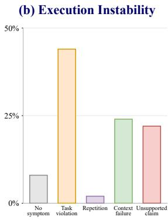
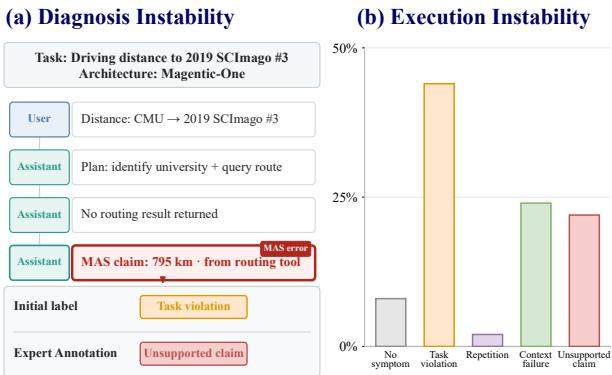
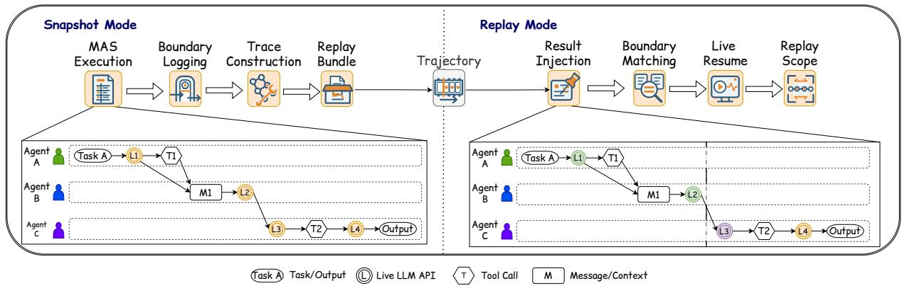
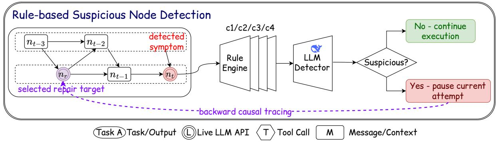
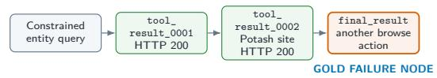
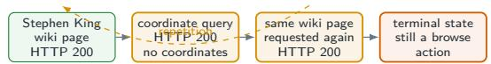
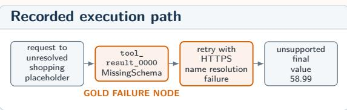

# Repair or Resample? Rethinking Failure Debugging in LLM Multi-Agent Systems

Zhongwen Luan<sup>1</sup>, Xiaoyu Zhang<sup>2</sup>, Ming Hu<sup>1,3</sup>, Yue Yang<sup>4</sup>, Jiongchi Yu<sup>2,3</sup>, Xiaohong Chen<sup>1</sup>

<sup>1</sup>East China Normal University

<sup>2</sup>Nanyang Technological University

<sup>3</sup>Singapore Management University

<sup>4</sup>Xi’an University of Architecture and Technology

10245101408@stu.ecnu.edu.cn

## Abstract

As large language model (LLM)-based multi-agent systems (MASs) are increasingly applied to longhorizon complex tasks, their reliability has emerged as the core bottleneck hindering their real-world deployment. Existing MAS debugging and repair methods typically rely on rerunning and resampling the entire execution trajectory. However, a fundamental question remains to be answered: do these methods causally repair MAS failures or merely stochastically repair by leveraging the randomness of LLM sampling? To evaluate the efectiveness of MAS repair methods, we introduce SymTrace, a controlled evaluation framework that records the MAS execution trajectory and establishes intervention anchors. During replay, it efectively reconstructs the execution before the anchor using recorded logs and only regenerates the downstream trajectory, thereby enabling the reliable reproduction of MAS failures. We further construct the dataset SymFail, comprising 536 human-annotated failure trajectories with graph-linked locations, categories, and trace evidence. Based on these foundations, we conduct a large-scale empirical study across three mainstream MAS frameworks. Our findings reveal that existing unguided rerun methods are highly unreliable, exhibiting low failure reproduction and repair rates (only 67.97% and 6.90%, respectively). Building upon these findings, we further explore the efectiveness of a symptomdriven intervention method, which successfully repairs 20.15% of the failed cases (a 191.89% improvement to state-of-the-art repair methods). This study aims to provide actionable insights for MAS debugging and repair research, paving the way for the robust deployment of multi-agent systems.

## 1 Introduction

Large language model (LLM)-based multi-agent systems (MASs) coordinate specialized agents through message passing, shared context, and structured workflows (Wu et al., 2023; Hong et al., 2024; Qian et al., 2024; Fourney et al., 2024). By distributing planning, information gathering, tool use, execution, and verification, MASs ofer a promising foundation for long-horizon applications such as web interaction and software development (Zhou et al., 2024; Yoran et al., 2024; Yang et al., 2024). As these systems are deployed in increasingly complex and consequential settings, systematically understanding, reproducing, and repairing their failures becomes essential to reliability and safety.

Existing research has advanced MAS reliability through benchmarks, failure diagnosis, and execution repair. Benchmarking and diagnostic studies collect execution trajectories, construct failure taxonomies, and localize responsible agents or steps (Yao et al., 2024; Ye et al., 2026; Cemri et al., 2025; Shah et al., 2026; Deshpande et al., 2025; Zhang et al., 2025), while repair methods use rerunning, reflection, critic feedback, or trajectory-level guidance to generate new executions (Madaan et al., 2023; Shinn et al., 2023; Du et al., 2023; Gou et al., 2024; Zhao et al., 2026b; Nanda et al., 2026; Zhao et al., 2026a). However, two limitations remain. First, complete reruns resample upstream model decisions instead of holding the failure-producing execution fixed, making terminal success dificult to attribute to the applied repair. Second, task-level verdicts and automatically assigned categories may not identify the tracelocalized behavior that actually requires intervention. Figure 1 illustrates how both the diagnosis and observed outcome can change without establishing that the recorded failure was corrected. A central question therefore remains: Do these methods causally repair MAS failures, or merely achieve stochastic recovery through LLM resampling?



  
Figure 1: Diagnosis and execution instability for the same MAS task. (a) In a Magentic-One distance-query failure, the system makes a routing-derived claim despite receiving no routing result, leading to disagreement between the initial and expert diagnoses. (b) Repeated stochastic reruns of the same task produce diferent failure types, while some exhibit no detected symptom.

To fill this gap, we introduce SymTrace, a replayoriented logging system, together with SymFail, a human-annotated failure-trajectory dataset. During snapshot recording, SymTrace captures model and tool boundary interactions, organizes them into an event-dependency graph and observed execution order, and materializes the resulting records as a replay bundle. During replay, it restarts the native MAS, strictly matches each intercepted request, and injects the corresponding recorded result until reaching the designated intervention boundary. Live execution then resumes with the repair applied. This procedure holds the observable pre-intervention history fixed so that downstream changes can be attributed to the intervention rather than upstream resampling. Complementing this execution control, SymFail is constructed from 200 WebArena-Verified Hard and AssistantBench tasks (Zhou et al., 2024; Yoran et al., 2024) executed with AG2 (Wu et al., 2023), CrewAI (CrewAI, Inc., 2026), and Magentic-One (Fourney et al., 2024). Of the resulting 600 trajectories, 536 evaluator-confirmed failures are retained and human-annotated with graph-linked failure nodes, symptom categories, supporting evidence, and final evidence-based annotations.

Using these two resources, we evaluate task-level repair and node-level controls across 536 failures. SymTrace increases per-execution failure reproduction from 67.97% to 80.78% and consistent reproduction across three executions from 41.42% to 52.43%. Task-level regeneration repairs at most 6.90% of failures within three attempts, whereas Suspicious-Node Intervention repairs 20.15% with a single intervention (2.92× the rate of the strongest task-level baseline) and performs best across all three MASs. These results demonstrate the value of controlled execution and localized evidence over repeated stochastic regeneration.

Our contributions include: ❶ We design and implement SymTrace, a logging system that records each MAS execution as an event-dependency snapshot and supports verifiable prefix reconstruction and replay, enabling intervention without resampling the preceding execution. ❷ We construct SymFail, a humanannotated dataset including 536 human-annotated failure trajectories from WebArena-Verified Hard and AssistantBench, which forms the foundation of the MAS debugging study. ❸ We conduct a large-scale study across three MASs measuring how reliably existing methods reproduce and repair recorded failures. Guided by our findings, we propose a symptomdriven intervention method that localizes replayable anchors and applies evidence-conditioned repair, improving over the strongest task-level baseline by 191.89%. ❹ We release SymTrace, SymFail, and our experimental results to support reproducibility and future MAS debugging and repair research.

## 2 Background & Related Work

## 2.1 LLM-Based Multi-Agent Systems

LLM-based multi-agent systems (MASs) coordinate multiple LLM-powered agents to accomplish a shared task. Each agent is typically assigned a role, instructions, context, and a set of tools, while a concrete execution proceeds through model calls, inter-agent messages, intermediate artifacts, and interactions with external environments. The coordination architecture determines how tasks are decomposed, which agent acts next, and how intermediate state is transferred. The systems evaluated in our study cover three representative designs. AG2 supports programmable conversational interactions among customizable agents (Wu et al., 2023); CrewAI organizes role-specialized agents through sequential or hierarchical task processes (CrewAI, Inc., 2026); and Magentic-One uses a central Orchestrator to plan, delegate tasks to specialized agents, track progress, and initiate replanning (Fourney et al., 2024). These systems exemplify conversation-centric, workflowbased, and orchestrator-centered coordination, respectively, but all produce dependency-structured trajectories in which earlier decisions shape subsequent messages, actions, and observations. Consequently, MAS debugging and repair must examine how failures emerge and propagate through the execution trajectory rather than relying solely on the terminal output.

## 2.2 MAS Debugging and Repair

MAS debugging aims to make multi-agent executions inspectable by identifying failure types, responsible components, and error locations. Existing work develops structured observability mechanisms, failure taxonomies, annotated traces, and localization benchmarks for agentic workflows (Dong et al., 2024; AlSayyad et al., 2026; Shah et al., 2026; Cemri et al., 2025; Deshpande et al., 2025; Zhang et al., 2025). These studies provide foundations for describing and locating failures, but their traces are primarily used for post-hoc analysis. In contrast, SymTrace records model and tool interactions together with their dependencies, execution order, and realized results, turning execution traces into replayable records that support verifiable reconstruction.

MAS repair commonly regenerates failed behavior using self-generated feedback, peer critique, toolgrounded evidence, runtime diagnosis, or dependencyaware localization (Madaan et al., 2023; Shinn et al., 2023; Du et al., 2023; Gou et al., 2024; Zhang et al., 2026; Zhao et al., 2026b; Nanda et al., 2026; Zhao et al., 2026a). However, these methods are generally evaluated by terminal success without consistently controlling the execution before repair. Consequently, a successful rerun may repair the recorded failure or merely avoid it through stochastic resampling. Building on execution replay for controlling nondeterminism (Ronsse et al., 2000), SymTrace reconstructs the observed execution before an evidence-supported intervention, enabling our study to distinguish targeted repair from stochastic repair.

## 3 System Design

Figure 2 presents the two-mode workflow of SymTrace. The pipeline takes a native MAS execution, including its task, represented initial state, runtime configuration, and realized model and tool interactions, as input. Snapshot Mode processes this execution through Boundary Logging and Trace Construction, and then uses Replay Bundle to materialize the recorded trajectory. Replay Mode takes this trajectory together with an intervention target as input, reconstructs the target prefix through Result Injection and Boundary Matching, and applies the intervention through Live Resume. Replay Scope finally specifies the guarantees attached to the reconstructed prefix and the newly generated sufix. The overall output is a new MAS trajectory that preserves the validated execution before the target and may diverge from the source trajectory from the intervention onward.

## 3.1 Snapshot Mode

Snapshot Mode transforms a complete native MAS execution into a structured trajectory that contains the information required for subsequent replay. Specifically, Boundary Logging records the realized model and tool interactions, Trace Construction organizes the recorded events into their dependency structure and observed order, and Replay Bundle combines these results with the task and runtime configuration. The resulting bundle is the output of Snapshot Mode and the trajectory input to Replay Mode.

Boundary Logging. During the native execution, framework-specific hooks intercept exposed LLM request-response pairs and tool call-observation pairs without changing the MAS scheduler, agent logic, or state-update procedures. Each request continues to its live endpoint, while SymTrace records the realized request, result, and event position. This process converts the runtime interactions into ordered boundary records R, which preserve the nondeterministic model and tool values needed for replay.

Trace Construction. The boundary records describe the values observed at individual model and tool interactions but do not capture how those interactions depend on one another. Trace Construction therefore organizes the realized events into an eventdependency graph $G = ( V , E )$ , whose edges represent data or control dependencies. Repeated workflow iterations are stored as distinct event instances, and the observed event order $O = ( v _ { 1 } , \ldots , v _ { n } )$ is recorded separately because the graph may permit multiple valid schedules. The resulting G and O provide the structural information associated with the boundary values in R.

Replay Bundle. Replay Bundle combines the recorded values and execution structure with the information required to restart the native MAS:

$$
{ \cal S } = \langle T , s _ { 0 } , c , G , O , R \rangle ,\tag{1}
$$

where T is the task, $s _ { 0 }$ is the represented initial state, and c is the runtime configuration. The resulting bun-

  
Figure 2: Overview of the SymTrace workflow. (Snapshot Mode transforms a native MAS execution into a recorded trajectory through Boundary Logging, Trace Construction, and Replay Bundle. Replay Mode consumes the trajectory, reconstructs the target prefix through Result Injection and Boundary Matching, applies the intervention through Live Resume, and specifies the resulting guarantee through Replay Scope. The lower panels provide an illustrative source and replayed execution.)

dle S materializes the recorded trajectory transferred from Snapshot Mode to Replay Mode.

## 3.2 Replay Mode

Replay Mode reconstructs the recorded execution before a designated target and resumes the MAS from that point under an intervention. Specifically, Result Injection associates each intercepted prefix call with its historical boundary result, Boundary Matching verifies that the current call corresponds to the expected record, and Live Resume applies the intervention and restores live execution. Replay Scope then characterizes which part of the resulting trajectory is guaranteed by replay. We refer to this procedure as selective replay because only the recorded prefix before the target is reconstructed, while execution from the target onward remains live. Result Injection. Replay Mode begins by restarting the native MAS using T, s , and c from the replay bundle. Whenever the restarted MAS reaches a model or tool boundary before the target, Result Injection retrieves the corresponding historical record from R instead of immediately invoking the live endpoint. The intercepted call and candidate record are then supplied to Boundary Matching, so the recorded result is returned only after the correspondence has been verified.

Boundary Matching. Boundary Matching validates the intercepted call against the expected record using its event position and canonicalized request content. A mismatch terminates replay, whereas a successful match authorizes the recorded result to be returned to the native MAS. Processing this result advances the MAS to its next represented state and produces the next boundary call. Repeating this process according to G and O reconstructs the target prefix, while content hashes validate the reused prefix nodes.

Live Resume. Once the verified prefix reaches the designated target, Live Resume stops returning historical boundary results and applies the intervention. Model and tool interactions are restored to their live endpoints, while the native scheduler and state-update procedures continue unchanged. This stage uses the reconstructed prefix and intervention as its starting state and produces a newly generated downstream trajectory.

Replay Scope. Replay Scope defines which parts of the resulting trajectory are reconstructed from recorded results and which parts remain live. Before the target, every reused boundary result is returned only after strict matching, preserving the represented logical history of the recorded execution. From the intervention onward, model generation, tool responses, and downstream decisions remain live and may difer from the source trajectory. This guarantee holds when native transitions are deterministic under the recorded boundary values and relevant external state is reset, isolated, or restored. It does not require equality of inaccessible framework internals or deterministic behavior in the new sufix.

## 4 Dataset Construction

Based on WebArena-Verified Hard (Zhou et al., 2024) and AssistantBench (Yoran et al., 2024), we construct and annotate SymFail, comprising 536 evaluatorconfirmed failure trajectories with structured execution traces, event graphs, localized failure nodes, and multi-label annotations.

## 4.1 Candidate Selection

The candidate set comprises all 258 WebArena-Verified Hard tasks and the 33 eligible AssistantBench development tasks with an available task description, reference answer, and gold URL. We retain all 33 AssistantBench tasks and the first 167 WebArena-Verified Hard tasks in their published order, producing a deterministic pool of 200 tasks before any MAS execution or repair experiment. The final pool contains 33 Web-QA, 70 mutation, 25 navigation, and 72 retrieval tasks. We select these benchmarks because they provide multi-step Web tasks with externally verifiable outcomes.

## 4.2 Trajectory Collection

Each task is executed once with AG2 (Wu et al., 2023), CrewAI (CrewAI, Inc., 2026), and Magentic-One (Fourney et al., 2024), producing 200 × 3 = 600 initial task-MAS executions. The native benchmark evaluators identify 536 failures with complete trace and graph artifacts, while the remaining 64 executions are excluded before annotation. The 501 WebArena-Verified executions contribute 462 failures and the 99 AssistantBench executions contribute 74 failures. The retained trajectories comprise 171 AG2, 184 CrewAI, and 181 Magentic-One executions.

## 4.3 Failure Annotation

We derive C1-C4 from the Multi-Agent System Failure Taxonomy (Cemri et al., 2025), which identifies 14 fine-grained failure modes under three broader categories. We retain the four most prevalent consolidated patterns in the source analysis, producing the non-exclusive, trace-observable categories in Table 1.

All four annotators have software-engineering backgrounds and experience in software development and code analysis. Before the main annotation, they calibrate on reference-labeled examples and practice trajectories using shared category, evidence, and node-selection guidance. Three annotators then independently assign all applicable categories, select one primary category, and identify the earliest tracesupported actionable node with evidence and a rationale. A fourth annotator reviews the task, complete trace, event graph, and initial annotations to produce the final annotation, with authority to revise any decision rather than applying majority vote or label union.

The final category set difers from the initial label union in 113 of 536 trajectories (21.08%). Agreement is measured only among the three independent annotators: Fleiss’ κ is 0.62 for the primary category and 0.81 for failure-node type, while exact node agreement is 73.88% among all three annotators and 95.90% for at least two annotators. All $5 3 6 \times ( 3 + 1 ) = 2$ ,144 initial and final node selections exist in their source event graphs and match their recorded node types. The release includes the task manifest, linked traces and graphs, initial and final annotations, rationales, and supporting evidence. Appendix B provides the complete annotation guidance and reliability analysis.

Table 1: Diagnosis-to-repair mapping. (Categories represent trace-localized intervention signals rather than task-level failure verdicts.)
<table><tr><td>Category Repair signal</td><td></td></tr><tr><td> $C _ { 1 }$ </td><td>Implicated constraint and conflicting behavior; request a compliant alternative.</td></tr><tr><td> $C _ { 2 }$ </td><td>Repeated history and unfinished objective; request an action that makes</td></tr><tr><td> $C _ { 3 }$ </td><td>progress. Unresolved runtime condition and its evidence; require resolution before</td></tr><tr><td> $C _ { 4 }$ </td><td>continuing. Explicit plan, action, and outcome; request a decision that resolves their inconsistency.</td></tr></table>

## 5 Study

## 5.1 Setup

Study scope. The primary evaluation applies AG2 (Wu et al., 2023), CrewAI (CA) (CrewAI, Inc., 2026), and Magentic-One (MO) (Fourney et al., 2024) to the 200 fixed tasks used to construct SymFail, yielding 536 source failures from 600 runs (Section 4). Each source failure is one experimental unit; executions of the same task by diferent MASs are treated separately. The evaluation set is frozen before replay and repair.

Baselines. We compare three representative tasklevel debugging and repair methods. For each source failure, all methods use the same task input, MAS, model alias, temperature, and native evaluator. ❶ Unguided Full Rerun is a retry-based repair method that restarts the complete MAS execution from the original task without using information from the failed execution (Brown et al., 2024). ❷ Self-Reflection is a feedback-based repair method that provides the MAS with its failed final output and asks it to identify possible mistakes before solving the task again (Madaan et al., 2023; Shinn et al., 2023).

❸ Critic-Agent is a critic-based repair method that employs a separate critic agent to review the failed output and provide corrective guidance for a new complete execution (Gou et al., 2024). Each task-level method receives up to three complete attempts and stops after its first success, whereas each node-level method receives one selective-replay intervention.

Evaluation metrics. Following τ-bench (Yao et al., 2024) and the pass@k convention (Chen et al., 2021), we define two metrics parameterized by the attempt count k. Let N denote the number of source cases, $z _ { i , a } ^ { m }$ indicate whether method m reproduces the source failure for case i in attempt a, and $y _ { i , a } ^ { m }$ indicate whether the native evaluator accepts the corresponding repair.

• Failure reproduction $\left( \mathrm { r e p } _ { k } \right)$ . Given three executions per case, let $\mathcal { A } _ { k } = \{ S \subseteq \{ 1 , 2 , 3 \} : | S | =$ k} denote all subsets of k executions:

$$
\mathrm { r e p } _ { k } ( m ) = \frac { 1 } { N | \mathcal { A } _ { k } | } \sum _ { i = 1 } ^ { N } \sum _ { S \in \mathcal { A } _ { k } } \prod _ { a \in S } z _ { i , a } ^ { m } .\tag{2}
$$

This metric describes the proportion of execution subsets in which all k executions reproduce the source failure.

• Repair success (pass@k):

$$
\mathrm { p a s s @ } k ( m ) = \frac { 1 } { N } \sum _ { i = 1 } ^ { N } \mathbf { 1 } \left[ \operatorname* { m a x } _ { a \in \{ 1 , \ldots , k \} } y _ { i , a } ^ { m } = 1 \right] .\tag{3}
$$

This metric describes the proportion of source failures that receive at least one evaluatoraccepted repair within k attempts.

Model and eficiency reporting. All experimental conditions use deepseek-v4-flash (Xu et al., 2026) at temperature 0.00 through the same OpenAIcompatible endpoint. We report captured API calls and accepted repairs per 1,000 calls as secondary eficiency measures, compared primarily within each MAS.

Statistical analysis. Repair rates are reported with 95% Wilson confidence intervals to quantify uncertainty in the estimated proportions. Paired rate diferences are reported with 95% confidence intervals obtained from 10,000 case-level bootstrap resamples, measuring the magnitude and uncertainty of the diference between methods. Two-sided exact McNemar tests compare paired binary outcomes on the same source cases, while Holm correction controls the family-wise error rate across prespecified multiple comparisons within each evaluation setting and MAS. Appendix C provides the complete execution and statistical conventions.

Table 2: Same-failure reproduction rates $( \% )$ by MAS on the 536 SymFail source failures. (CA and MO denote CrewAI and Magentic-One; Rerun and Replay denote Unguided Full Rerun and SymTrace Replay. Bold marks the higher value in each column.)
<table><tr><td rowspan="2">Method</td><td colspan="4"> $\mathbf { r e p } _ { \mathbf { 1 } }$  (%)</td><td colspan="3"> $\mathbf { r e p } _ { 3 }$  (%)</td></tr><tr><td>AG2</td><td>CA</td><td>MO</td><td>Total</td><td>AG2</td><td>CA MO</td><td>Total</td></tr><tr><td>Rerun Replay</td><td>64.13 80.70</td><td>77.36 81.88</td><td>62.06 79.74</td><td>67.97 80.78</td><td>36.26 50.29</td><td>52.72 34.81 53.26 53.59</td><td>41.42 52.43</td></tr></table>

## 5.2 RQ1: How Reliably Can MAS Failures Be Reproduced?

Experimental design. To assess whether reconstructing the recorded execution history reproduces failures more reliably than resampling an entire execution, we analyze 536 source failures with three attempts per method, comparing SymTrace Replay, which reconstructs the recorded prefix and resumes at the target failure node, against Unguided Full Rerun, which restarts the original task without using any guidance. We use an LLM-as-a-judge pipeline adapted to our taxonomy from Cemri et al. (2025), with the SymFail labels as references. Table 2 reports the results, where the rows represent the two methods, the columns represent the three MASs and their aggregate, and the two column groups report $\mathrm { r e p } _ { 1 }$ and $\mathrm { r e p } _ { 3 } .$ , respectively.

Analysis of reproduction reliability. The reproduction results show that SymTrace achieves a consistent advantage over full rerun across all three MASs. All reproduced prefix nodes pass content-hash validation, yielding 100.00% prefix exactness. The remaining gap between exact prefix reconstruction and end-to-end reproduction can be attributed to short replay prefixes, post-target execution variation, and evaluation uncertainty.

First, most cases preserve only a short execution prefix. Specifically, 381 of the 536 cases (71.08%) reuse only 2-3 nodes, including 738 of the 1,608 attempts (45.90%) that reuse exactly two. Within this dominant group, the $\mathrm { r e p } _ { 1 }$ and $\mathrm { r e p } _ { 3 }$ gains over full rerun are 9.80 and 6.82 percentage points. The corresponding gains increase to 17.76 and 18.69 points for 4-8 reused nodes and to 25.69 and 27.08 points for at least nine nodes.

Second, SymTrace reuses only the nodes preceding the failure target. The target and its successors remain subject to live model and tool execution. For webarena\_verified\_hard\_127 on AG2, three attempts reconstruct identical prefixes but generate three diferent unsupported answers without intervening tool calls. For webarena\_verified\_hard\_267, the source execution receives an HTTP 200 response from the Wikipedia API, whereas replay receives an HTTP 429 response. Such executions may retain the same high-level failure category while exhibiting diferent case-specific failures and are therefore not counted as successful reproductions.

Third, LLM-as-a-judge errors introduce measurement uncertainty. In a stratified secondary audit of 72 judgments, 64 agree with the original labels, five are confirmed disagreements, and three remain uncertain. After weighting by stratum, the estimated confirmed-disagreement rate is 3.30%, the uncertainty rate is 3.67%, and their combined sensitivity upper bound is 6.96%. All five confirmed disagreements are false negatives in which a genuine reproduction was labeled as diferent\_failure.

Finding 1. SymTrace improves failure reproduction by exactly reconstructing the execution before the failure target. Although it cannot control model and environmental variation after that target, its advantage grows when more preceding steps can be reused, making it particularly suitable for realistic long-horizon MAS tasks.

## 5.3 RQ2: Can Task-Level Reexecution Reliably Repair Failed MAS Executions?

Experimental design. To understand whether task-level repair methods correct source failures or mainly benefit from repeated sampling, we use SymFail as the evaluation basis and apply three baseline repair methods to its 536 failed executions from AG2, CrewAI, and Magentic-One. The results are presented in Table 3. Each row reports one subset of the 536 failures, grouped in the first column by MAS and by primary failure category (C1-C4), with its case count and the pass@3 repair rate of each baseline. Both groupings share the same overall total.

Analysis across evaluation settings. The results on SymFail show that generic reflection and critique do not provide a consistent repair advantage over unguided task restart. Unguided Full Rerun performs best for every MAS, while the category breakdown provides no evidence that the feedback-based methods systematically address particular failure types. This suggests that their additional feedback does not reliably target the source failure mechanism.

The comparison with the original CRITIC and Reflexion studies highlights two factors afecting reported repair rates: task dificulty and repeated sampling. SymFail consists of failed long-horizon Web executions involving multi-agent coordination, dynamic information acquisition, and multiple dependent actions, making successful regeneration particularly dificult. More importantly, both original studies report increasing success over successive trials (Gou et al., 2024; Shinn et al., 2023). Because each additional trial provides another opportunity to sample a diferent answer or trajectory, the resulting gains combine feedback efects with repeated regeneration. Under the same three-attempt budget on SymFail, the feedback-based methods still do not outperform unguided rerunning.

Table 3: Task-level pass@3 results (%) of the three task-level baselines on SymFail. (The first column groups the same 536 failures by MAS and by primary failure category (C1-C4). Both breakdowns share the single overall Total. ‘Rerun’, ‘Self’, and ‘Critic’ denote Unguided Full Rerun, Self-Reflection, and Critic-Agent.)
<table><tr><td rowspan="2"></td><td rowspan="2">Group</td><td rowspan="2">Cases</td><td colspan="3">pass@3 (%)</td></tr><tr><td>Rerun</td><td>Self</td><td>Critic</td></tr><tr><td rowspan="3">MAS</td><td>AG2</td><td>171</td><td>8.19</td><td>4.68</td><td>4.09</td></tr><tr><td>CrewAI</td><td>184</td><td>3.80</td><td>2.17</td><td>2.72</td></tr><tr><td>Magentic-One</td><td>181</td><td>8.84</td><td>6.08</td><td>4.42</td></tr><tr><td rowspan="4">Category</td><td>C1</td><td>125</td><td>9.60</td><td>4.80</td><td>2.40</td></tr><tr><td>C2</td><td>69</td><td>4.35</td><td>2.90</td><td>5.80</td></tr><tr><td>C3</td><td>203</td><td>5.42</td><td>3.45</td><td>1.97</td></tr><tr><td>C4</td><td>139</td><td>7.91</td><td>5.76</td><td>6.47</td></tr><tr><td>Total</td><td></td><td>536</td><td>6.90</td><td>4.29</td><td>3.73</td></tr></table>

Analysis of outcome instability. Complete reexecution changes outcomes in both directions, confirming the stochasticity of the task-level baselines and showing that an accepted rerun does not necessarily indicate repair of the source failure. To examine this behavior, we use 54 initially successful executions recorded by SymTrace during the same datacollection process and rerun each execution three times under the same runtime configuration. Among the resulting 162 attempts, 85 result in failures, and 39 of the 54 source cases regress at least once.

Case analysis of repair mechanisms. A CrewAI case shows that an evaluator-accepted answer can be produced without resolving the source failure mechanism. The task asks for the rate of snowy New Year’s Eves in Chicago from 2014 to 2023, but the source execution and all three repair methods lack the required observations because the extracted dynamic pages do not contain them. Self-Reflection and Critic-Agent report that the requested rate cannot be determined, whereas Unguided Full Rerun returns the accepted answer of 30.00% while acknowledging that it relies on general historical patterns rather than the required evidence.

Finding 2. Task-level methods repair primarily through stochastic regeneration rather than failurespecific repair. Re-execution can both repair failed outcomes and destabilize successful ones, while feedback-based variants provide no advantage under equal budgets. Thus, observed repair alone does not demonstrate that the source failure was identified and repaired.

## 5.4 RQ3: Are Node-Level Symptom Signals Actionable for Targeted Repair?

Experimental design. To evaluate whether tracelocalized symptoms provide actionable evidence for targeted repair, we analyze the 536 source failures from AG2, CrewAI (CA), and Magentic-One (MO). We introduce Suspicious-Node Intervention, a nodelevel repair method that treats a trace node as a candidate intervention anchor when its local behavior exhibits observable failure symptoms connected to the unsuccessful outcome. During execution, deterministic rules and a semantic judge jointly evaluate each newly completed node for the C1-C4 symptoms defined in Table 1. When the judge assigns the current node a suspicion score above a predefined threshold, the controller suspends the ongoing MAS execution. Because the suspicious behavior has already occurred by the time it is detected, SymTrace reconstructs the execution prefix leading to that boundary, applies a repair instruction conditioned on the judge’s C1-C4 classification, and then resumes live execution from the intervention point. We compare this method with Random-Node Intervention and Last-Node Intervention, which receive the same single selective-replay opportunity but no symptom evidence, and with the three task-level debugging and repair methods defined in Section 5.3.

Table 4 reports the budgeted pass rate of each method on each MAS and over all 536 failures. For the three node-level methods, the reported value is pass@1 because each method receives one selective-replay intervention. For the task-level methods, it is pass@3 because they receive up to three complete-execution attempts and stop after the first success. This comparison is conservative with respect to Suspicious-Node Intervention: the proposed method must repair the task through a single symptom-conditioned intervention, whereas the tasklevel baselines have three opportunities to obtain a successful outcome through complete re-execution and stochastic resampling. Thus, the larger pass rate of Suspicious-Node Intervention cannot be attributed to a larger attempt budget. Appendix F presents the complete pipeline, detection rules, threshold configuration, and intervention prompts.

Table 4: RQ3 repair utility on the 536 SymFail source failures. (AG2, CrewAI (CA), and Magentic-One (MO) contribute 171, 184, and 181 failures, respectively. ‘Att.’ is the attempt budget: node-level methods use one selective-replay intervention and task-level methods use up to three complete attempts. Bold marks the best result.)
<table><tr><td rowspan="2">Method</td><td rowspan="2">Att.</td><td colspan="4">Pass rate (%)</td></tr><tr><td>AG2</td><td>CA</td><td>MO</td><td>Total</td></tr><tr><td>Last-Node</td><td>1</td><td>0.58</td><td>1.63</td><td>1.66</td><td>1.31</td></tr><tr><td>Random-Node</td><td>1</td><td>2.34</td><td>4.89</td><td>3.87</td><td>3.73</td></tr><tr><td>Critic-Agent</td><td>3</td><td>4.09</td><td>2.72</td><td>4.42</td><td>3.73</td></tr><tr><td>Self-Reflection</td><td>3</td><td>4.68</td><td>2.17</td><td>6.08</td><td>4.29</td></tr><tr><td>Unguided Full Rerun</td><td>3</td><td>8.19</td><td>3.80</td><td>8.84</td><td>6.90</td></tr><tr><td>Suspicious-Node</td><td>1</td><td>16.37</td><td>25.00</td><td>18.78</td><td>20.15</td></tr></table>

Analysis of repair efectiveness. Suspicious-Node Intervention achieves the highest overall repair rate and nearly triples the strongest task-level baseline, despite receiving only one intervention rather than three complete attempts. It also substantially outperforms Random-Node Intervention and Last-Node Intervention under the same selective-replay budget. The comparison with Random-Node Intervention and Last-Node Intervention shows that selective replay alone does not explain the improvement. Together, these results indicate that the improvement is not explained solely by additional sampling opportunities or access to an intervention point. Suspicious-Node Intervention additionally uses symptom-based target selection and repair guidance. Because target selection and repair guidance are evaluated jointly, the experiment does not attribute the full improvement to either component in isolation.

Analysis of cross-MAS consistency. Although absolute repair efectiveness varies across architectures, the method ranking remains stable: Suspicious-Node Intervention performs best on every MAS. This consistency is notable because the task-level baselines receive up to three opportunities to benefit from stochastic resampling, whereas Suspicious-Node Intervention uses only one symptom-guided intervention. It significantly outperforms Unguided Full Rerun on all three MASs after within-MAS Holm correction, showing that the overall advantage is not driven by a single architecture. Localized symptom evidence therefore provides a more consistent repair signal than repeated full-trajectory regeneration.

Finding 3. Across MAS architectures, repair effectiveness depends more on precise execution control than on repeated regeneration. Localized symptoms provide actionable repair guidance, whereas fulltrajectory resampling cannot reveal what was actually corrected.

## 6 Discussion

This section discusses the limitations and potential future directions. ❶ Data Coverage. We ground SymFail in established, externally verifiable benchmarks (i.e., WebArena-Verified Hard, Assistant-Bench). This yields reproducible, outcome-verified failures, but benchmark-derived tasks cannot capture the full diversity of failures in deployed MASs. Therefore, collecting real-world failure trajectories and covering further MAS structures, interaction patterns, and task domains is a valuable future direction. ❷ Automated Evaluation. In the failurereproduction experiment, we use LLM judges to determine whether a generated execution reproduces the source failure. The judges localize and classify the failure in the generated trajectory, compare these results with the reference location and category, and decide whether they represent the same failure. Although this automated evaluation enables large-scale repeated experiments, LLM judges may misinterpret long trajectories, ambiguous evidence, or semantically similar failure locations, and our manual spot checks identify occasional errors. Future work can incorporate expert verification for disagreements and low-confidence cases, develop hybrid human-LLM annotation, and report human-LLM agreement alongside automated results. ❸ Model Coverage. We use the same recent model alias and generation configuration across all MASs and repair methods. This controlled setting is necessary for our large-scale paired comparisons: it prevents diferences in model capability or version from confounding diferences between MAS architectures and repair strategies, while evaluating SymTrace with a model representative of current agent systems. Nevertheless, results from a single model may not generalize to other model families, providers, scales, or future versions. Future studies can repeat the evaluation across a broader set of models to test whether the observed reproduction and repair patterns remain consistent.

## 7 Conclusion

This study distinguishes correction of a recorded MAS failure from stochastic repair through a diferent execution. We introduce SymTrace as a controlled evaluation framework, construct SymFail with human annotation, and conduct a cross-system study of failure reproduction and repair. Across systems and tasks, failure identity depends on execution history rather than task input alone. Full task regeneration conflates repair with outcome variability, making terminal success insuficient evidence that the original mechanism was corrected. Localized symptoms can nevertheless guide efective intervention without uniquely identifying a root cause. Reliable repair evaluation should therefore preserve the history before intervention, localize the intended change, and assess whether the failure mechanism was corrected.

## References

Adam AlSayyad, Kelvin Yuxiang Huang, and Richik Pal. Agenttrace: A structured logging framework for agent system observability. In LLM-based Multi-Agent Systems: Towards Responsible, Reliable, and Scalable Agentic Systems, 2026.

Bradley Brown, Jordan Juravsky, Ryan Ehrlich, Ronald Clark, Quoc V Le, Christopher Ré, and Azalia Mirhoseini. Large language monkeys: Scaling inference compute with repeated sampling. arXiv preprint arXiv:2407.21787, 2024.

Mert Cemri, Melissa Z Pan, Shuyi Yang, Lakshya A Agrawal, Bhavya Chopra, Rishabh Tiwari, Kurt Keutzer, Aditya Parameswaran, Dan Klein, Kannan Ramchandran, et al. Why do multi-agent llm systems fail? arXiv preprint arXiv:2503.13657, 2025.

Mark Chen, Jerry Tworek, Heewoo Jun, Qiming Yuan, Henrique Ponde De Oliveira Pinto, Jared Kaplan, Harri Edwards, Yuri Burda, Nicholas Joseph, Greg Brockman, et al. Evaluating large language models trained on code. arXiv preprint arXiv:2107.03374, 2021.

CrewAI, Inc. CrewAI: Framework for orchestrating role-playing autonomous AI agents. https://github. com/crewAIInc/crewAI, 2026. GitHub repository, accessed July 25, 2026.

Darshan Deshpande, Varun Gangal, Hersh Mehta, Jitin Krishnan, Anand Kannappan, and Rebecca Qian. Trail: Trace reasoning and agentic issue localization. arXiv preprint arXiv:2505.08638, 2025.

Liming Dong, Qinghua Lu, and Liming Zhu. Agentops: Enabling observability of llm agents. arXiv preprint arXiv:2411.05285, 2024.

Yilun Du, Shuang Li, Antonio Torralba, Joshua B Tenenbaum, and Igor Mordatch. Improving factuality and reasoning in language models through multiagent debate. arXiv preprint arXiv:2305.14325, 2023.

Adam Fourney, Gagan Bansal, Hussein Mozannar, Cheng Tan, Eduardo Salinas, Friederike Niedtner, Grace Proebsting, Grifin Bassman, Jack Gerrits, Jacob Alber, et al. Magentic-one: A generalist multi-agent system for solving complex tasks. arXiv preprint arXiv:2411.04468, 2024.

Zhibin Gou, Zhihong Shao, Yeyun Gong, Yujiu Yang, Nan Duan, Weizhu Chen, et al. Critic: Large language models can self-correct with tool-interactive critiquing. In International Conference on Learning Representations, volume 2024, pages 57734– 57811, 2024.

Sirui Hong, Mingchen Zhuge, Jonathan Chen, Xiawu Zheng, Yuheng Cheng, Jinlin Wang, Ceyao Zhang, Steven Yau, Zijuan Lin, Liyang Zhou, et al. Metagpt: Meta programming for a multi-agent collaborative framework. In International Conference on Learning Representations, volume 2024, pages 23247–23275, 2024.

Aman Madaan, Niket Tandon, Prakhar Gupta, Skyler Hallinan, Luyu Gao, Sarah Wiegrefe, Uri Alon, Nouha Dziri, Shrimai Prabhumoye, Yiming Yang, et al. Self-refine: Iterative refinement with self-feedback. Advances in neural information processing systems, 36:46534–46594, 2023.

Rahul Nanda, Chandra Maddila, Smriti Jha, Euna Mehnaz Khan, Matteo Paltenghi, and Satish Chandra. Wink: Recovering from misbehaviors in coding agents. In Proceedings of the 3rd ACM International Conference on AI-Powered Software, pages 208–217, 2026.

Chen Qian, Wei Liu, Hongzhang Liu, Nuo Chen, Yufan Dang, Jiahao Li, Cheng Yang, Weize Chen, Yusheng Su, Xin Cong, et al. Chatdev: Communicative agents for software development. In Proceedings of the 62nd annual meeting of the association for computational linguistics (volume 1: Long papers), pages 15174–15186, 2024.

Michiel Ronsse, Koen De Bosschere, and Jacques Chassin de Kergommeaux. Execution replay and debugging. arXiv preprint cs/0011006, 2000.

Mehil B Shah, Mohammad Mehdi Morovati, Mohammad Masudur Rahman, and Foutse Khomh. Characterizing faults in agentic ai: A taxonomy of types, symptoms, and root causes. arXiv preprint arXiv:2603.06847, 2026.

Noah Shinn, Federico Cassano, Ashwin Gopinath, Karthik Narasimhan, and Shunyu Yao. Reflexion:

Language agents with verbal reinforcement learning. Advances in neural information processing systems, 36:8634–8652, 2023.

Qingyun Wu, Gagan Bansal, Jieyu Zhang, Yiran Wu, Beibin Li, Erkang Zhu, Li Jiang, Xiaoyun Zhang, Shaokun Zhang, Jiale Liu, et al. Autogen: Enabling next-gen llm applications via multi-agent conversation. arXiv preprint arXiv:2308.08155, 2023.

Anyi Xu, Bangcai Lin, Bing Xue, Bingxuan Wang, Bingzheng Xu, Bochao Wu, Bowei Zhang, Chaofan Lin, Chen Dong, Chenchen Ling, et al. Deepseekv4: Towards highly eficient million-token context intelligence. arXiv preprint arXiv:2606.19348, 2026.

John Yang, Carlos Jimenez, Alexander Wettig, Kilian Lieret, Shunyu Yao, Karthik Narasimhan, and Ofir Press. Swe-agent: Agent-computer interfaces enable automated software engineering. Advances in Neural Information Processing Systems, 37:50528– 50652, 2024.

Shunyu Yao, Noah Shinn, Pedram Razavi, and Karthik Narasimhan. τ-bench: A benchmark for tool-agent-user interaction in real-world domains. arXiv preprint arXiv:2406.12045, 2024.

Bowen Ye, Rang Li, Qibin Yang, Yuanxin Liu, Linli Yao, Hanglong Lv, Zhihui Xie, Chenxin An, Lei Li, Lingpeng Kong, et al. Claw-eval: Towards trustworthy evaluation of autonomous agents. arXiv preprint arXiv:2604.06132, 2026.

Ori Yoran, Samuel Joseph Amouyal, Chaitanya Malaviya, Ben Bogin, Ofir Press, and Jonathan Berant. Assistantbench: Can web agents solve realistic and time-consuming tasks? In Proceedings of the 2024 Conference on Empirical Methods in Natural Language Processing, pages 8938–8968, 2024.

Lingzhe Zhang, Tong Jia, Mingyu Wang, Weijie Hong, Chiming Duan, Minghua He, Rongqian Wang, Xi Peng, Meiling Wang, Nicholas Zhang, et al. Eficient failure management for multi-agent systems with reasoning trace representation. In Proceedings of the 34th ACM International Conference on the Foundations of Software Engineering, pages 1222–1226, 2026.

Shaokun Zhang, Ming Yin, Jieyu Zhang, Jiale Liu, Zhiguang Han, Jingyang Zhang, Beibin Li, Chi Wang, Huazheng Wang, Yiran Chen, et al. Which

agent causes task failures and when? on automated failure attribution of llm multi-agent systems. arXiv preprint arXiv:2505.00212, 2025.

Chenyu Zhao, Shenglin Zhang, Wenwei Gu, Yongqian Sun, Dan Pei, Chetan Bansal, Saravan Rajmohan, and Minghua Ma. Agenttether: Graph-guided diagnosis and runtime intervention for reliable llm agent operation. arXiv preprint arXiv:2607.06273, 2026a.

Chenyu Zhao, Shenglin Zhang, Yihang Lin, Wenwei Gu, Zhimin Chen, Yongqian Sun, Dan Pei, Chetan Bansal, Saravan Rajmohan, and Minghua Ma. Debugging the debuggers: Failure-anchored structured recovery for software engineering agents. arXiv preprint arXiv:2605.08717, 2026b.

Shuyan Zhou, Frank F Xu, Hao Zhu, Xuhui Zhou, Robert Lo, Abishek Sridhar, Xianyi Cheng, Tianyue Ou, Yonatan Bisk, Daniel Fried, et al. Webarena: A realistic web environment for building autonomous agents. In International Conference on Learning Representations, volume 2024, pages 15585–15606, 2024.

## A Replay Matching Rules and Runtime Assumptions

## A.1 Observed Execution Order

The event-dependency graph $G = ( V , E )$ defines a partial order but does not uniquely determine a concurrent execution. Consistent with the main paper, SymTrace therefore records the observed event order

$$
O = ( v _ { 1 } , \ldots , v _ { n } ) ,\tag{4}
$$

subject to

$$
( v _ { i } , v _ { j } ) \in E \Longrightarrow i < j .\tag{5}
$$

Unlike a topological ordering computed after execution, O is the particular linear extension observed during the recorded run. It fixes the order in which state-afecting operations crossed an instrumented boundary. During replay, the recorded order is used solely for event matching and validation; the adapter does not replace or control the native MAS scheduler.

Algorithm 1 records exposed events and boundary results without replacing native MAS control flow.

## A.2 Boundary Matching and Record Validation

The ordered boundary records R in the replay bundle preserve complete interactions. An LLM entry contains its prompt and ordered messages, model configuration, tool specification, expected response format, and returned response. A tool entry contains the tool identity, arguments, returned observation, and execution metadata. Each entry also retains its position in O.

For an intercepted boundary event $v _ { j } .$ , the adapter validates the request against the expected record using its position in O and canonicalized request content. A mismatch terminates replay at the first divergence, whereas a successful match authorizes the recorded result to be returned through the native boundary. After the result is materialized, its node content hash is compared with the source record to validate the reused prefix.

Algorithm 2 gives the fail-closed procedure for selective replay. A mismatch terminates at the first divergence rather than scanning forward for another record.

In selective mode, Algorithm 2 stops before a designated LLM event $v _ { k }$ and augments its boundary request with repair guidance $\Delta$

$$
{ \widehat { q } } _ { k } = q _ { k } \oplus \Delta ,\tag{6}
$$

Algorithm 1 Replay Bundle Recording   
Require: Task $T ,$ represented initial state $^ { s } \mathrm { 0 } \mathrm { , }$ runtime con  
figuration c   
Ensure: Replay bundle ${ \cal S } = \langle T , s _ { 0 } , c , G , O , R \rangle$   
1: Initialize $V , E  \emptyset$ and $O , R \gets ( )$   
2: Start the native MAS with the framework adapter enabled   
3: while the native MAS has not terminated do   
4: Observe event v and assign its identity, agent, type,   
and ordinal   
5: Add v and its dependencies to $G = ( V , E ) ;$ append v   
to O   
6: if v crosses an LLM or tool boundary then   
7: Capture request $x _ { v }$ and configuration $\lambda _ { v }$   
8: Execute the live boundary to obtain y<sub>v</sub>   
9: Append $( v , x _ { v } , \lambda _ { v } , y _ { v } )$ to R and return $_ { y _ { v } }$   
10: end if   
11: end while   
12: return $S = \langle T , s _ { 0 } , c , G , O , R \rangle$

before switching the target and sufix to live execution. The represented history before $v _ { k }$ is preserved, while intentional divergence begins at the intervention boundary.

## A.3 Replay Conditions and Scope

The replay guarantee relies on four conditions:

1. the task, initialization, executable code, and runtime configuration are fixed;

2. internal MAS transitions are deterministic when conditioned on the same represented state, input, and boundary result;

3. every state-afecting model response, tool observation, external input, and scheduling decision is captured; and

4. replay returns a recorded result only after validating the event position and canonicalized request content, and separately validates each materialized reused prefix node using its content hash.

These conditions do not require the live model or external service itself to be deterministic. They make explicit the replay guarantee summarized in the main paper: selective replay reconstructs the represented logical execution prefix recorded in the replay bundle.

Although arbitrary hidden framework objects are not serialized, their represented logical values are reconstructed by native execution because they undergo the same transitions from the same initial state. The guarantee covers recorded boundary results, agent-visible messages, represented logical state, control decisions, and event order. It does not require identical memory addresses, physical thread interleavings, network latency, or wall-clock timing.

Algorithm 2 Fail-Closed Selective Replay   
Require: Replay bundle ${ \cal S } = \langle T , s _ { 0 } , c , G , O , R \rangle$   
Require: Optional target v<sub>k</sub> and repair guidance ∆   
Ensure: Replayed trace or first-divergence report   
1: Restart the native MAS from $( T , s _ { 0 } , c )$   
2: $j \gets 1 ;$ ; live ← false   
3: while the MAS requests a model or tool boundary v   
do   
4: if live then   
5: Execute v live and return its result   
6: else if $v = v _ { k }$ then   
7: Augment the request: ${ \widehat { q } } _ { k } \gets q _ { k } \oplus \Delta$   
8: live ← true   
9: Execute the target boundary live using $\widehat { q _ { k } }$   
10: else   
11: if $j > | R |$ or the event position or canonicalized   
request content does not match $R _ { j }$ then   
12: terminate and report the first divergence   
13: end if   
14: Return the recorded result in $R _ { j }$ through the   
native boundary   
15: Validate the materialized event position and   
content hash   
16: $j  j + 1$   
17: end if   
18: end while   
19: return the materialized execution trace

## A.4 External State Considerations

A recorded tool result reconstructs the observation available to the MAS but does not reproduce a persistent side efect in an external service. Replaying a stored success response for a write operation, for example, does not recreate the written object in a live backend. Selective repair therefore requires that the live sufix not depend on an unreproduced mutation in the replayed prefix. This condition holds when the prefix contains no required persistent write, the environment is reset and the write can be safely re-executed, or a service-level checkpoint restores the required state. The reported evaluation includes all 536 source failures without filtering cases according to external-state dependence; when relevant external state is not reset, isolated, or restored, any resulting sufix variation lies outside the replay guarantee.

## B Dataset Construction, Annotation, and Reliability

## B.1 Cohort Accounting

Applying the three MASs to the 200 fixed tasks produces 600 initial task–MAS executions. The native benchmark evaluators identify 536 failed executions with complete trace and graph artifacts, all of which enter SymFail and are subsequently annotated. The remaining 64 executions are evaluator-accepted and are excluded before annotation. The finalized dataset therefore contains 536 failures: 462 from WebArena-Verified and 74 from AssistantBench, comprising 171 AG2, 184 CrewAI, and 181 Magentic-One executions.

## B.2 Annotation Rules

Multi-label taxonomy. The C1–C4 categories follow the diagnosis-to-repair mapping in the main paper. They are non-exclusive, trace-observable operational symptoms rather than mutually exclusive causal mechanisms, so annotators assign every category directly supported by the localized trace and separately select one primary category. The primary category is the best-supported intervention signal at the localized node; the guide imposes no category priority and does not treat it as a unique root cause. Dataset-level failure composition is computed from the complete category sets.

The four symptom categories are derived from the following source mappings:

• C1 (Task-Constraint Violation) corresponds to category 1.1 Disobey Task Specification from the initial taxonomy.

• C2 (Repeated or Stalled Progress) merges categories 1.3 Step Repetition and 1.5 Unaware of Termination Conditions.

• C3 (Unresolved Runtime Condition) originates from categories 2.2 Fail to Ask for Clarification and 2.3 Task Derailment, and is extended in this work to cover execution or context failures.

• C4 (Plan–Action–Outcome Inconsistency) corresponds to category 2.6 Action–Reasoning Mismatch.

The boundary between C2 and C3 receives an additional decision rule because repetition is especially interpretation-sensitive. C2 requires repeated or semantically equivalent behavior after the trace has established that the current plan cannot succeed. A first failed action, one justified retry, a retry based on new parameters or evidence, or a substantive refinement is insuficient. An unresolved dependency without repetition is assigned C3 rather than C2.

Failure-node localization. Annotators choose the earliest trace-supported node at which an error is both actionable and connected through the recorded execution to the evaluator-confirmed failure. An agent\_action node is used when an agent decision commits the error; a tool\_call node when an erroneous or unjustified invocation commits it; a tool\_result node when a returned result or execution failure first becomes a decisive unhandled state; and a final\_result node when the error is introduced, or becomes decidable, only in the final response. Later repetitions or propagations of the same failure do not replace the earliest actionable node. Multiple symptoms at that node are encoded as multiple categories, not multiple primary nodes. Annotation records and confidence. For each case, an annotator records the complete category set, primary category, failure-node ID and type, confidence, rationale, and supporting trace evidence. Confidence describes evidential clarity rather than a probability or voting weight: high denotes direct support without a comparably supported alternative, medium denotes a plausible alternative interpretation, and low denotes insuficient evidence for a defensible tuple without further inspection. Confidence is retained as review metadata and does not mechanically afect adjudication.

## B.3 Annotation Procedure

Four annotators with backgrounds in software engineering participated in the annotation process. Before annotating the full dataset, each annotator completed a calibration procedure consisting of referencelabeled examples and practice trajectories to establish consistent interpretation of the category definitions and localization rules.

Three annotators independently annotated each case. The fourth annotator then examined the complete traces, all three independent annotations, and the supporting evidence records, and produced the final annotation for each case. The final annotation consists of the strict tuple

(exact category set, primary category,

node ID, node type).

Table 5 summarizes the relationship between the initial independent annotations and the final annotation.

The final annotation is supported in full by three initial annotators in 187 cases (34.89%), two in 124 (23.13%), one in 125 (23.32%), and none in 100 (18.66%). The final category set equals the threeannotator union in 423 cases (78.92%) and difers in 113 (21.08%). Across the latter decisions, the fourth annotator adds 123 case–category assignments absent from all initial annotations and removes 69 assignments proposed by at least one annotator, including 16 C1 assignments initially supported by all three. These bidirectional changes show that the final annotation re-evaluates trace evidence rather than merely aggregating votes.

Table 5: Relation between the three independent annotations and the final annotation. “Proposed” denotes a complete strict tuple submitted by at least one annotator.
<table><tr><td>Initial pattern</td><td>Cases</td><td>Outcome relative to final annotation</td></tr><tr><td>Unanimous</td><td>210</td><td>all three retained 187: modified 23</td></tr><tr><td>2-1 split</td><td>214</td><td>majority retained 124; minority retained 48; new tuple 42</td></tr><tr><td>All distinct</td><td>112</td><td>one proposed tuple retained 77; new tuple 35</td></tr></table>

Table 6: Agreement among the three independent human annotators. Pairwise agreement averages the three annotator pairs; $3 / 3$ agreement is the number of cases in which all annotators make the same decision.
<table><tr><td>Annotation target</td><td>Fleiss&#x27; κ (95% CI)</td><td>Pairwise agreement</td><td>3/3 agreement</td></tr><tr><td>Primary category</td><td>0.622 (0.545–0.692)</td><td>89.86%</td><td>459/536 (85.63%)</td></tr><tr><td>Exact multi-label category set</td><td>0.574 (0.535–0.612)</td><td>64.74%</td><td>280/536 (52.24%)</td></tr><tr><td>C1 presence</td><td>0.696 (0.617–0.769)</td><td>93.91%</td><td>487/536 (90.86%)</td></tr><tr><td>C2 presence</td><td>0.374 (0.306–0.440)</td><td>79.23%</td><td>369/536 (68.84%)</td></tr><tr><td>C3 presence</td><td>0.718 (0.671–0.764)</td><td>86.19%</td><td>425/536 (79.29%)</td></tr><tr><td>C4 presence</td><td>0.688 (0.628-0.745)</td><td>88.43%</td><td>443/536 (82.65%)</td></tr><tr><td>Failure-node type</td><td>0.811 (0.759–0.857)</td><td>93.97%</td><td>488/536 (91.04%)</td></tr></table>

## B.4 Inter-Annotator Reliability

Reliability is computed from the three initial annotations for all 536 cases. Primary categories and node types are nominal variables. For the non-exclusive taxonomy, we calculate Fleiss’ κ both for the exact category combination as a nominal outcome and for the presence of each C1–C4 category as a binary decision. Percentile 95% confidence intervals use 20,000 case-level bootstrap resamples with seed 20260722; resampling cases preserves the three associated ratings. Final annotations are excluded from reliability calculations.

Failure-node IDs are case-specific and do not share a nominal category space, so Fleiss’ κ is not defined for this target. Exact agreement is reported instead: all three annotators select the same node in 396/536 cases (73.88%; Wilson 95% CI: 70.00%–77.42%), and at least two select the same node in 514/536 (95.90%). For the complete strict tuple, all three annotations agree in 210/536 cases (39.18%; Wilson 95% CI: 35.14%–43.37%), and at least two agree in 424/536

(79.10%).

C2 has the lowest category-specific reliability $( \kappa =$ 0.374) and accounts for 86 of the 123 added category decisions in the final annotation. This concentration identifies the repeated-or-stalled-progress boundary as the principal taxonomy-level ambiguity and motivates the explicit C2 decision rule above.

## B.5 Final Composition and Integrity Checks

The 536 finalized cases contain 1,482 category assignments, with mean category cardinality 2.77. The primary-category distribution is $\mathrm { C 1 } = 1 2 5 \ ( 2 3 . 3 2 \% )$ $\mathrm { C 2 } = 6 9 ~ ( 1 2 . 8 7 \% ) , \mathrm { C 3 } = 2 0 3 ~ ( 3 7 . 8 7 \% )$ , and $\mathrm { C 4 = }$ 139 (25.93%). Multi-label marginal counts are $\mathrm { C 1 } =$ $4 3 9 , \mathrm { C 2 } = 2 8 8 , \mathrm { C 3 } = 2 8 9$ , and $\mathrm { C 4 } = 4 6 6 ;$ because categories are non-exclusive, these counts exceed the number of cases.

Every selected node is validated against its corresponding event graph. Validation requires the graph to exist, the node ID to occur in the graph, and the recorded node type to match the graph node. All 1,608 initial selections and 536 final selections satisfy these checks, for $2 , 1 4 4 / 2 , 1$ 44 validated selections in total.

SymFail is scoped to two benchmark sources, three MASs, and 536 evaluator-confirmed failures with complete trace and graph artifacts. The finalized fields are human-adjudicated references, not outputs from the LLM annotation procedure evaluated later. We release the linked traces and graphs, all initial annotations and evidence records, and the adjudicated fields to support independent inspection; broader independent re-annotation remains future work.

## C Execution and Statistical Conventions

## C.1 Repair Conditions and Execution Limits

Paired methods are run on matched source failures. The task input, MAS implementation, recorded model alias, temperature, and native evaluator are held fixed within a pair. Conditions difer only in the information supplied by the repair prompt, the intervention location, and whether and where the recorded trajectory is replayed. Multiple internal model calls, tool calls, or technical retries within one top-level invocation are not treated as independent observations.

For RQ1, each source failure is evaluated through three executions per method. For RQ2, each tasklevel method receives up to three complete attempts and stops after its first evaluator-accepted result. For RQ3, each node-level method receives one selectivereplay intervention, whereas the task-level baselines retain their up-to-three-attempt budget. A case is considered repaired if at least one permitted attempt passes the native evaluator. Actual API-call counts may difer because the methods generate diferent trajectories; eficiency is therefore measured rather than inferred from the nominal attempt budgets.

## C.2 Framework and Model Records

The study uses AG2 0.13.3. The vendored lock installs the CrewAI main package as an editable project and therefore does not attach a version field to that lock entry; the main package’s own crewai/ $\mathrm { \_ { \Omega } } \mathrm { i n i t } _ { \mathrm { -- } } \mathrm { \cdot p y }$ reports version 1.14.7a3, and its project metadata pins crewai-core and crewai-cli to the same version. The separately named crewai-tools package in the vendored workspace also reports version 1.14.7a3. The Magentic-One adapter uses AutoGen AgentChat 0.7.5. Its execution path imports AssistantAgent and MagenticOneGroupChat from autogen\_agentchat. The model client, OpenAIChatCompletionClient, comes from autogen\_ext. The adapter does not import pyautogen; the vendored lock records pyautogen 0.10.0 only as a meta-package whose dependency is autogen-agentchat 0.7.5.

The repair experiments were conducted from June 15 to June 16, 2026 UTC. Per-MAS execution windows are retained in the artifact.

All requests use temperature 0.00 through an OpenAI-compatible hosted endpoint. The requested model alias is deepseek-v4-flash. These values describe the recorded client request, not a verified immutable model snapshot. The experiment records do not contain a confirmed upstream provider identity or server-side revision. We therefore avoid attributing reproducibility to the alias or temperature setting alone.

## C.3 Statistical Procedures

For a repair proportion ${ \hat { p } } ,$ we report a 95% Wilson confidence interval. For two methods evaluated on matched source failures, the efect size is the absolute repair-rate diference

$$
\Delta = 1 0 0 ( \hat { p } _ { \mathrm { s } } - \hat { p } _ { \mathrm { b } } )
$$

in percentage points. Its 95% confidence interval is estimated from 10,000 case-level paired bootstrap resamples using seed 20260701. The two method outcomes for a case are resampled together to preserve pairing.

RQ1 compares SymTrace Replay with Unguided Full Rerun using a two-sided exact McNemar test on the paired per-case $\mathrm { r e p } _ { 3 }$ outcomes. RQ2 compares Self-Reflection and Critic-Agent separately with Unguided Full Rerun within each MAS; the two raw p-values form one prespecified Holm family per MAS. RQ3 compares Suspicious-Node Intervention with Unguided Full Rerun, Self-Reflection, Critic-Agent, Last-Node Intervention, and Random-Node Intervention within each MAS; the five raw p-values form one prespecified Holm family per MAS. Since there are three MASs, RQ3 contains three separate fivecomparison Holm families totalling 15 tests. Holmadjusted values are denoted by p<sub>H</sub>.

For every repair-method comparison, we report the matched denominator, both repair counts and rates, ∆ and its paired confidence interval, and the applicable adjusted value. Each source failure contributes at most one binary outcome per method to a comparison; internal steps, calls, and technical retries are not analyzed as independent samples.

## C.4 Paired Comparison Results

All confidence intervals reported below are percentile intervals obtained from 10,000 case-level paired bootstrap resamples. McNemar tests are exact and twosided. System and framework errors remain in the denominator and are counted as unsuccessful repairs. For RQ2, Holm correction is applied separately within each MAS to the two comparisons of Self-Reflection and Critic-Agent against Unguided Full Rerun. For RQ3, Holm correction is applied separately within each MAS to the five comparisons involving Suspicious-Node Intervention.

Across all six RQ2 comparisons, the repair-rate diferences relative to Unguided Full Rerun are negative, and none is statistically significant after within-MAS Holm correction. Thus, the results provide no evidence that Self-Reflection or Critic-Agent outperforms unguided rerunning under the same threeattempt budget.

Across all 15 RQ3 comparisons, Suspicious-Node Intervention achieves a positive repair-rate diference whose 95% confidence interval excludes zero. All comparisons remain statistically significant after within-MAS Holm correction $\left( p _ { \mathrm { H } } < 0 . 0 5 \right)$ . Thus, the advantage of Suspicious-Node Intervention is consistent across the three MAS architectures and against both task-level and node-level controls.

## C.5 API-Call Eficiency

Table 9 reports API-call eficiency as a secondary descriptive measure. A repair is counted only when recovered=true, indicating that the generated execution is accepted by the native evaluator. Cases ending in system or framework errors are counted as non-repairs, and any API calls made before those errors remain in the API-call total. For method m, we compute

$$
{ \mathrm { R e p a i r s P e r 1 K } } ( m ) = { \frac { \mathrm { R e p a i r s } ( m ) } { { \mathrm { A P I C a l l s } } ( m ) } } \times 1 0 0 0 ,\tag{7}
$$

and

$$
\mathrm { C a l l s P e r R e p a i r } ( m ) = \frac { \mathrm { A P I C a l l s } ( m ) } { \mathrm { R e p a i r s } ( m ) } .\tag{8}
$$

Because methods may generate trajectories of different lengths and receive diferent attempt budgets, these measures are compared primarily within each MAS and are not treated as compute-matched causal estimates.

Across AG2, CrewAI, and Magentic-One, Suspicious-Node achieves both the highest number of accepted repairs per 1,000 API calls and the lowest number of API calls per repair. These results provide consistent secondary evidence that symptom-guided localized intervention yields greater repair eficiency than the task-level and node-level controls within each MAS.

## C.6 Implementation Environment

The experiments are orchestrated with Python 3.11.15 on Windows 11 using an Intel Core i9- 14900HX processor, 32 GB of RAM, and an NVIDIA GeForce RTX 4060 Laptop GPU with 8 GB of VRAM. Model inference is performed by the hosted endpoint. The local workstation runs the MAS frameworks and tools, trace capture, SymTrace replay, native evaluation, and statistical analysis.

## D Reproduction Settings and Fidelity

## D.1 Mechanism-Level Failure Equivalence

The formal equivalence test used by the methodblinded judges is retained below. For attempt a of

Table 7: Paired RQ2 comparisons against Unguided Full Rerun. ∆ is the repair-rate diference between the evaluated method and Unguided Full Rerun. $n _ { \mathrm { 1 0 } } / n _ { \mathrm { 0 1 } }$ denotes Method-only/Rerun-only repairs. Each Holm family contains the Self-Reflection and Critic-Agent comparisons within one MAS.
<table><tr><td>MAS</td><td>Method</td><td>Method pass@3</td><td>Rerun pass@3</td><td></td><td>∆ pp [95% CI]</td><td> $n _ { \mathrm { 1 0 } } / n _ { \mathrm { 0 1 } }$ </td><td>Raw p</td><td>pH</td></tr><tr><td>AG2</td><td>Self-Reflection</td><td>8/171 (4.68%)</td><td>14/171 (8.19%)</td><td></td><td>-3.51 [−8.19, 1.17]</td><td>5/11</td><td>0.210</td><td>0.237</td></tr><tr><td>AG2</td><td>Critic-Agent</td><td>7/171 (4.09%)</td><td>14/171 (8.19%)</td><td></td><td>-4.09 [–8.77, 0.00]</td><td>4/11</td><td>0.118</td><td>0.237</td></tr><tr><td>Magentic-One</td><td>Self-Reflection</td><td>11/181 (6.08%)</td><td>16/181 (8.84%)</td><td></td><td>-2.76 [−7.73, 2.21]</td><td>8/13</td><td>0.383</td><td>0.383</td></tr><tr><td>Magentic-One</td><td>Critic-Agent</td><td>8/181 (4.42%)</td><td>16/181 (8.84%)</td><td></td><td>-4.42 [−9.39, 0.00]</td><td>6/14</td><td>0.115</td><td>0.231</td></tr><tr><td>CrewAI</td><td>Self-Reflection</td><td>4/184 (2.17%)</td><td>7/184 (3.80%)</td><td></td><td>-1.63 [−4.35, 1.09]</td><td>2/5</td><td>0.453</td><td>0.906</td></tr><tr><td>CrewAI</td><td>Critic-Agent</td><td>5/184 (2.72%)</td><td>7/184 (3.80%)</td><td></td><td>-1.09 [−4.35, 1.63]</td><td>3/5</td><td>0.727</td><td>0.906</td></tr></table>

Table 8: Paired RQ3 comparisons. ∆ is the repair-rate diference between Suspicious-Node Intervention and the comparator. $n _ { \mathrm { 1 0 } } / n _ { \mathrm { 0 1 } }$ denotes Suspicious-only/Comparator-only repairs. Suspicious-Node, Random-Node, and Last-Node use pass@1, whereas the three task-level comparators use pass@3, consistent with the budgets in the main paper. Each Holm family contains the five comparisons within one MAS.
<table><tr><td>MAS</td><td>Comparator</td><td>Suspicious-Node</td><td>Comparator</td><td>∆ pp [95% CI]</td><td> $n _ { \mathrm { 1 0 } } / n _ { \mathrm { 0 1 } }$ </td><td>Raw p</td><td>pH</td></tr><tr><td>AG2</td><td>Unguided Full Rerun</td><td>28/171 (16.37%)</td><td>14/171 (8.19%)</td><td>+8.19 [1.75, 14.62]</td><td>24/10</td><td>0.0243</td><td>0.0243</td></tr><tr><td>AG2</td><td>Self-Reflection</td><td>28/171 (16.37%)</td><td>8/171 (4.68%)</td><td>+11.70 [5.26, 18.13]</td><td>26/6</td><td> $5 . 3 5 \times 1 0 ^ { - 4 }$ </td><td> $1 . 0 7 \times 1 0 ^ { - 3 }$ </td></tr><tr><td>AG2</td><td>Critic-Agent</td><td>28/171 (16.37%)</td><td>7/171 (4.09%)</td><td>+12.28 [7.02, 18.13]</td><td>24/3</td><td> $4 . 9 2 \times 1 0 ^ { - }$  -5</td><td> $1 . 4 8 \times 1 0 ^ { - 4 }$ </td></tr><tr><td>AG2</td><td>Random-Node</td><td>28/171 (16.37%)</td><td>4/171 (2.34%)</td><td>+14.04 [8.19, 19.88]</td><td>27/3</td><td> $8 . 4 3 \times 1 0 ^ { - }$  -6</td><td> $3 . 3 7 \times 1 0 ^ { - 5 }$ </td></tr><tr><td>AG2</td><td>Last-Node</td><td>28/171 (16.37%)</td><td>1/171 (0.58%)</td><td>+15.79 [10.53, 21.64]</td><td>27/0</td><td> $1 . 4 9 \times 1 0 ^ { - 8 }$ </td><td> $7 . 4 5 \times 1 0 ^ { - 8 }$ </td></tr><tr><td>Magentic-One</td><td>Unguided Full Rerun</td><td>34/181 (18.78%)</td><td>16/181 (8.84%)</td><td>+9.94 [3.87, 16.02]</td><td>27/9</td><td>0.00393</td><td>0.00393</td></tr><tr><td>Magentic-One</td><td>Self-Reflection</td><td>34/181 (18.78%)</td><td>11/181 (6.08%)</td><td>+12.71 [6.63, 18.78]</td><td>29/6</td><td> $1 . 1 7 \times 1 0 ^ { - 4 }$ </td><td> $2 . 3 4 \times 1 0 ^ { - 4 }$ </td></tr><tr><td>Magentic-One</td><td>Critic-Agent</td><td>34/181 (18.78%)</td><td>8/181 (4.42%)</td><td>+14.36 [8.29, 20.44]</td><td>30/4</td><td> $6 . 1 6 \times 1 0 ^ { - 6 }$ </td><td> $1 . 8 5 \times { { 1 0 } ^ { - 5 } }$ </td></tr><tr><td>Magentic-One</td><td>Random-Node</td><td>34/181 (18.78%)</td><td>7/181 (3.87%)</td><td>+14.92 [9.39, 20.44]</td><td>29/2</td><td> $4 . 6 3 \times 1 0 ^ { - 7 }$ </td><td> $1 . 8 5 \times 1 0 ^ { - 6 }$ </td></tr><tr><td>Magentic-One</td><td>Last-Node</td><td>34/181 (18.78%)</td><td>3/181 (1.66%)</td><td>+17.13 [11.05, 23.20]</td><td>33/2</td><td> $3 . 6 7 \times 1 0 ^ { - 8 }$ </td><td> $1 . 8 4 \times { { 1 0 } ^ { - 7 } }$ </td></tr><tr><td>CrewAI</td><td>Unguided Full Rerun</td><td>46/184 (25.00%)</td><td>7/184 (3.80%)</td><td>+21.20 [14.67, 27.72]</td><td>43/4</td><td> $2 . 7 8 \times 1 0 ^ { - 9 }$ </td><td> $5 . 5 6 \times 1 0 ^ { - 9 }$ </td></tr><tr><td>CrewAI</td><td>Self-Reflection</td><td>46/184 (25.00%)</td><td>4/184 (2.17%)</td><td>+22.83 [16.85, 29.35]</td><td>43/1</td><td> $5 . 1 2 \times 1 0 ^ { - 1 2 }$ </td><td> $2 . 0 5 \times 1 0 ^ { - 1 1 }$ </td></tr><tr><td>CrewAI</td><td>Critic-Agent</td><td>46/184 (25.00%)</td><td>5/184 (2.72%)</td><td>+22.28 [15.76, 28.80]</td><td>43/2</td><td> $5 . 8 9 \times 1 0 ^ { - 1 1 }$ </td><td> $1 . 7 7 \times 1 0 ^ { - 1 0 }$ </td></tr><tr><td>CrewAI</td><td>Random-Node</td><td>46/184 (25.00%)</td><td>9/184 (4.89%)</td><td>+20.11 [13.59, 26.63]</td><td>40/3</td><td> $3 . 0 2 \times 1 0 ^ { - 9 }$ </td><td> $5 . 5 6 \times 1 0 ^ { - 9 }$ </td></tr><tr><td>CrewAI</td><td>Last-Node</td><td>46/184 (25.00%)</td><td>3/184 (1.63%)</td><td>+23.37 [17.39, 29.89]</td><td>44/1</td><td> $2 . 6 1 \times 1 0 ^ { - 1 2 }$ </td><td> $1 . 3 1 \times 1 0 ^ { - 1 1 }$ </td></tr></table>

method m, the category-matching events are

$$
\mathcal { M } _ { i , a , m } ^ { c } = \left\{ \widehat { e } \in \widehat { \tau } _ { i , a } ^ { m } : \widehat { c } ( \widehat { e } ) = c _ { i } \right\} .\tag{9}
$$

The mechanism-matching and role-matching sets are

$$
\mathcal { M } _ { i , a , m } ^ { m } = \left\{ \widehat { e } \in \widehat { \tau } _ { i , a } ^ { m } : \widehat { m } ( \widehat { e } ) \equiv m _ { i } \right\} ,\tag{10}
$$

$$
\mathcal { M } _ { i , a , m } ^ { \rho } = \left\{ \widehat { e } \in \widehat { \tau } _ { i , a } ^ { m } : \widehat { \rho } ( \widehat { e } ) \sim \rho _ { i } \right\} .\tag{11}
$$

Their intersection contains events satisfying all three semantic criteria:

$$
\mathcal { M } _ { i , a , m } = \mathcal { M } _ { i , a , m } ^ { c } \cap \mathcal { M } _ { i , a , m } ^ { m } \cap \mathcal { M } _ { i , a , m } ^ { \rho } .\tag{12}
$$

The attempt reproduces the source mechanism only when at least one such event also has grounded evidence:

$$
z _ { i , a } ^ { m } = \mathbf { 1 } \Bigl [ \exists \widehat { e } \in \mathcal { M } _ { i , a , m } : \mathrm { G r o u n d e d } ( \widehat { E } _ { \widehat { e } } , E _ { i } ) \Bigr ] .\tag{13}
$$

Here, $c _ { i } , m _ { i } , \rho _ { i }$ , and $E _ { i }$ denote the source category, case-specific mechanism, semantic execution role, and supporting evidence. The relations ≡ and ∼ express mechanism equivalence and semantic-role correspondence rather than raw node equality.

## D.2 Reproduction Metrics

Let N be the number of source cases. Per-execution reproduction is

$$
\mathrm { r e p } _ { 1 } ( m ) = \frac { 1 } { 3 N } \sum _ { i = 1 } ^ { N } \sum _ { a = 1 } ^ { 3 } z _ { i , a } ^ { m } .\tag{14}
$$

Reproduction in all three attempts is

$$
\mathrm { r e p } _ { 3 } ( m ) = \frac { 1 } { N } \sum _ { i = 1 } ^ { N } \prod _ { a = 1 } ^ { 3 } z _ { i , a } ^ { m } .\tag{15}
$$

## D.3 Replay-Fidelity Audit

Failure recurrence does not itself establish that replay preserved the historical context. Before the target, every model or tool request is matched against the ordered replay bundle using its event position and canonicalized request content. A missing, out-oforder, or non-matching request terminates replay rather than silently continuing.

We separately compare the materialized replay graph with the source prefix. Across 536 cases and three attempts per case, every replay plan uses the exact target ID from the corresponding humanadjudicated source annotation (1,608/1,608). Every attempt also preserves the parent/edge topology of the reused prefix, and all 6,159 materialized reused nodes match their source content hashes (6,159/6,159). Attempt-level prefix exactness is therefore 1,608/1,608. Because the target is supplied from the human-adjudicated annotation, this audit measures replay fidelity rather than automatic localization accuracy.

Table 9: API-call eficiency on the three MASs evaluated in the main paper. Repairs count native-evaluatoraccepted executions. Higher Repairs/1K calls and lower Calls/repair indicate greater repair yield per API call. Bold marks the best value within each MAS.
<table><tr><td>MAS</td><td>Method</td><td>API calls</td><td>Repairs</td><td>Repairs/1K calls</td><td>Calls/repair</td></tr><tr><td>AG2</td><td>Last-Node</td><td>249</td><td>1</td><td>4.0</td><td>249.0</td></tr><tr><td>AG2</td><td>Random-Node</td><td>293</td><td>4</td><td>13.7</td><td>73.3</td></tr><tr><td>AG2</td><td>Critic-Agent</td><td>295</td><td>7</td><td>23.7</td><td>42.1</td></tr><tr><td>AG2</td><td>Self-Reflection</td><td>314</td><td>8</td><td>25.5</td><td>39.3</td></tr><tr><td>AG2</td><td>Unguided Full Rerun</td><td>400</td><td>14</td><td>35.0</td><td>28.6</td></tr><tr><td>AG2</td><td>Suspicious-Node</td><td>419</td><td>28</td><td>66.8</td><td>15.0</td></tr><tr><td>CrewAI</td><td>Last-Node</td><td>227</td><td>3</td><td>13.2</td><td>75.7</td></tr><tr><td>CrewAI</td><td>Random-Node</td><td>251</td><td>9</td><td>35.9</td><td>27.9</td></tr><tr><td>CrewAI</td><td>Critic-Agent</td><td>256</td><td>5</td><td>19.5</td><td>51.2</td></tr><tr><td>CrewAI</td><td>Self-Reflection</td><td>258</td><td>4</td><td>15.5</td><td>64.5</td></tr><tr><td>CrewAI</td><td>Unguided Full Rerun</td><td>254</td><td>7</td><td>27.6</td><td>36.3</td></tr><tr><td>CrewAI</td><td>Suspicious-Node</td><td>466</td><td>46</td><td>98.7</td><td>10.1</td></tr><tr><td>Magentic-One</td><td>Last-Node</td><td>239</td><td>3</td><td>12.6</td><td>79.7</td></tr><tr><td>Magentic-One</td><td>Random-Node</td><td>278</td><td>7</td><td>25.2</td><td>39.7</td></tr><tr><td>Magentic-One</td><td>Critic-Agent</td><td>324</td><td>8</td><td>24.7</td><td>40.5</td></tr><tr><td>Magentic-One</td><td>Self-Reflection</td><td>343</td><td>11</td><td>32.1</td><td>31.2</td></tr><tr><td>Magentic-One</td><td>Unguided Full Rerun</td><td>367</td><td>16</td><td>43.6</td><td>22.9</td></tr><tr><td>Magentic-One</td><td>Suspicious-Node</td><td>443</td><td>34</td><td>76.7</td><td>13.0</td></tr></table>

These audits rule out modified recorded-prefix content as the source of reproduction below 100.00%. Remaining variation may arise at the regenerated target, in subsequent live execution, or from external state outside the replay boundary.

## E Task-Level Repair Aggregation

The main paper defines the task-level strategies, evaluation sets, budgets, and results. We retain only the formal pass@3 aggregation. Let F denote an evaluation set of initially failed executions, $y _ { i , a } ^ { m }$ the evaluator outcome of attempt $^ { a , }$ and $A _ { i } ^ { m } \leq 3$ the attempts executed before success or exhaustion. The terminal case outcome is

$$
R _ { i } ^ { m } = \mathbf { 1 } \left[ \operatorname* { m a x } _ { 1 \leq a \leq A _ { i } ^ { m } } y _ { i , a } ^ { m } = 1 \right] .\tag{16}
$$

Cumulative repair is

$$
\operatorname { p a s s @ 3 } ( m ) = \frac { 1 } { | \mathcal { F } | } \sum _ { i \in \mathcal { F } } R _ { i } ^ { m } .\tag{17}
$$

## E.1 Baseline Input Boundaries and Prompt Templates

The three task-level baselines are evaluated on the same 536 source failures from AG2, CrewAI, and Magentic-One. All three receive the task specification, task identifier, benchmark and split identifiers, and the available start URLs or tools. Self-Reflection and Critic-Agent additionally receive the final answer from the original failed execution. None of the baselines receives the source trajectory or event graph, failure location, C1–C4 category, trace evidence, reference or gold answer, or evaluator information.

For every recovery attempt, Self-Reflection and Critic-Agent reuse the original failed execution’s final answer rather than the output of a preceding recovery attempt. Critic-Agent implements the dedicated critic role described in the main paper through a fixed critic-role prompt within each complete rerun attempt; it does not introduce an additional standalone critic-model call. Apart from their methodspecific feedback, all three baselines use the same task information, output sufix, attempt budget, model configuration, and native evaluator.

## Unguided Full Rerun.

Mode: fail-then-rerun   
Task id: {task\_id}   
Benchmark: {source\_benchmark} / {source\_split}   
Task: {task}   
Start URLs or tools: {start\_urls}   
This is an unguided rerun after an initial failed or   
uncertain attempt.   
Solve from scratch.   
{output\_suffix}

## Self-Reflection.

Mode: self-reflection   
Task id: {task\_id}   
Benchmark: {source\_benchmark} / {source\_split}   
Task: {task}   
Start URLs or tools: {start\_urls}   
Previous final answer:   
{previous\_final\_answer}   
Reflect on why the previous attempt may be incomplete   
or wrong, then solve the task again.   
{output\_suffix}

## Critic-Agent.

Mode: critic-agent   
Task id: {task\_id}   
Benchmark: {source\_benchmark} / {source\_split}   
Task: {task}   
Start URLs or tools: {start\_urls}   
Previous final answer:   
{previous\_final\_answer}   
Critic feedback: verify assumptions, check whether the   
cited evidence is sufficient, and correct any   
unsupported   
or stale claims before producing the new answer.   
{output\_suffix}

For the WebArena-Verified and AssistantBench tasks used in this study, {output\_suffix} is instantiated as follows:

Because the three task-level baselines share the same task inputs, output sufix, model configuration, evaluator, and three-attempt budget, their comparison isolates whether access to the original failed answer and generic reflection or critic guidance provides an advantage over unguided rerunning. The paired results in Appendix C.4 show no such advantage for Self-Reflection or Critic-Agent.

## F Detection Rules, Anchor Ranking, and Intervention Prompts

## F.1 Rule-First Symptom Detection

Let $G = ( V , E )$ be the event-dependency graph, T the task specification, and $\tau _ { < v }$ the trace preceding node v. For category $C _ { k }$ , define its trigger indicator as

$$
b _ { k } ( v ) = \bigvee _ { r \in \mathcal { R } _ { k } } r ( v , \tau _ { < v } , T ) .\tag{18}
$$

The deterministic candidate set collects the triggered categories:

$$
L _ { v } ^ { \mathrm { r } } = \{ C _ { k } : b _ { k } ( v ) = 1 \} .\tag{19}
$$

Algorithm 3 applies these conditions to every completed node. Nodes without a deterministic trigger receive zero suspiciousness without invoking the semantic judge. For triggered nodes, the judge may confirm or reject supplied categories but must satisfy

$$
L _ { v } ^ { \mathrm { f } } \subseteq L _ { v } ^ { \mathrm { r } } .\tag{20}
$$

We write $L _ { v } = L _ { v } ^ { \mathrm { f } }$ for the confirmed category set used by the ranking procedure. Reference answers, evaluator verdicts, and evaluator-derived evidence are removed before verification, so both rule evidence and semantic judgments use only the task and runtime trace.

C1–C4 are non-exclusive operational symptoms. A category can denote a local error, unresolved dependency, or downstream manifestation, so it raises intervention priority without asserting that the node is the unique root cause.

## F.2 Repairability-Aware Anchor Selection

A strongly suspicious node need not be the best intervention anchor: terminal nodes leave little sufix to repair, while propagation-only nodes may merely expose earlier failures. Let $c _ { \mathrm { l } } ( v )$ be the strongest locally supported confidence, $c _ { \mathrm { r } } ( v )$ include propagated evidence, $I _ { \mathrm { p } } ( v )$ indicate propagation-only evidence, and $\rho ( v ) \in [ 0 , 1 ]$ be normalized graph position.

The repairability score begins with node type and local evidence:

$$
B _ { \mathrm { r } } ( v ) = \beta _ { 0 } + \eta ( v ) + \beta _ { \mathrm { l } } c _ { \mathrm { l } } ( v ) .\tag{21}
$$

Symptom multiplicity contributes

$$
G _ { \mathrm { m u l t i } } ( v ) = \beta _ { \mathrm { m } } \mathbf { 1 } [ | L _ { v } | > 1 ] .\tag{22}
$$

  
Figure 3: Suspicious-Node Intervention pipeline. Deterministic rules and a semantic judge jointly evaluate each newly completed node for the C1–C4 symptoms. When the fused suspicion score exceeds the predefined threshold, the ongoing MAS execution is suspended. SymTrace then reconstructs the execution prefix preceding the selected intervention anchor, injects symptom-conditioned repair guidance derived from the triggered rules, and resumes live execution to generate a new downstream trajectory.

Table 10: Deterministic conditions used to generate trace-localized symptom candidates. The semantic judge may reject a candidate but cannot introduce a category outside this set.
<table><tr><td>Category</td><td>Operational meaning</td><td>Deterministic candidate conditions</td></tr><tr><td>C1: Task-constraint violation</td><td>The behavior conflicts with an explicit task constraint or output requirement. The history repeats while</td><td>The node violates a stated constraint, produces an incompatible output format, contains a placeholder or skipped action, or returns an unresolved request instead of the required result. The normalized action fingerprint or tool URL matches a</td></tr><tr><td>C2: Repeated or stalled progress</td><td>the objective remains unfinished. The node contains or</td><td>preceding node; the node retries without new parameters or evidence; or another final-style output follows without an action that advances the unfinished objective. The node records an error, timeout, or failed tool result; reports</td></tr><tr><td>C3: Unresolved runtime condition</td><td>continues from an unresolved execution, access, or upstream condition.</td><td>inaccessible required evidence; or proceeds toward a final answer while an error remains in the preceding trace.</td></tr><tr><td>C4: Plan-action- outcome inconsistency</td><td>An explicit plan or claim conflicts with the executed action or observed outcome.</td><td>A browser action lacks a URL or uses an invalid view-source: URL; structured data is requested but HTML is returned; completion follows an unsuccessful action; or a tool-dependent task is answered without successful tool evidence.</td></tr></table>

The C2 and C4 category boost is

$$
G _ { \mathrm { c a t } } ( v ) = \beta _ { C _ { 4 } } \mathbf { 1 } [ C _ { 4 } \in L _ { v } ] + \beta _ { C _ { 2 } } \mathbf { 1 } [ C _ { 2 } \in L _ { v } ] .\tag{23}
$$

Their sum forms the positive repairability adjustment:

$$
G _ { \mathrm { r } } ( v ) = G _ { \mathrm { m u l t i } } ( v ) + G _ { \mathrm { c a t } } ( v ) .\tag{24}
$$

Propagation-only evidence and late graph position contribute the penalty

$$
\begin{array} { r } { P _ { \mathrm { r } } ( v ) = \beta _ { \mathrm { p } } I _ { \mathrm { p } } ( v ) + \beta _ { \pi } \rho ( v ) . } \end{array}\tag{25}
$$

The complete repairability score is

$$
S _ { \mathrm { r } } ( v ) = \mathrm { c l i p } _ { [ 0 , 1 ] } \left( B _ { \mathrm { r } } ( v ) + G _ { \mathrm { r } } ( v ) - P _ { \mathrm { r } } ( v ) \right) .\tag{26}
$$

Here, $\eta ( v )$ is a node-type prior. Regenerable agent actions receive the highest prior, followed by tool calls and results, while final-result nodes receive the lowest.

Among replayable nodes, the selection score first combines repairability with local and propagated confidence:

$$
B _ { \mathrm { s } } ( v ) = \alpha _ { \mathrm { r } } S _ { \mathrm { r } } ( v ) + \alpha _ { \mathrm { l } } c _ { \mathrm { l } } ( v ) + \alpha _ { \mathrm { u } } c _ { \mathrm { r } } ( v ) .\tag{27}
$$

The positive selection adjustment is

$$
\begin{array} { r } { G _ { \mathrm { s } } ( v ) = \alpha _ { \mathrm { n } } \operatorname* { m i n } ( 2 , | L _ { v } | ) + \alpha _ { \mathrm { a } } I _ { \mathrm { a } } ( v ) , } \end{array}\tag{28}
$$

and the selection penalty is

$$
\begin{array} { r } { P _ { \mathrm { s } } ( v ) = \alpha _ { \mathrm { p } } I _ { \mathrm { p } } ( v ) + \alpha _ { \mathrm { f } } I _ { \mathrm { f } } ( v ) + \alpha _ { \pi } \rho ( v ) . } \end{array}\tag{29}
$$

The complete selection score is

$$
S _ { \mathrm { s } } ( v ) = \mathrm { c l i p } _ { [ 0 , 1 ] } \left( { B } _ { \mathrm { s } } ( v ) + { G } _ { \mathrm { s } } ( v ) - { P } _ { \mathrm { s } } ( v ) \right) .\tag{30}
$$

Here, $I _ { \mathrm { a } } ( v )$ indicates an actionable agent\_action or tool\_call boundary and $I _ { \mathrm { f } } ( v )$ indicates a

Algorithm 3 Rule-Gated Symptom Detection Algorithm 4 Online Suspicious-Node Intervention   
Require: Task T, event-dependency graph G, observed Require: Replay bundle $s ,$ task $T ,$ candidate set ${ \mathcal { C } } ,$   
order O threshold θ   
Require: Rule sets $\{ \mathcal { R } _ { 1 } , \ldots , \mathcal { R } _ { 4 } \}$ and semantic judge J Ensure: Regenerated trace and native-evaluator out-  
Ensure: Confirmed candidate set C come, or no intervention   
1: $c \gets \emptyset$ 1: for each $( v , L _ { v } , E _ { v } , \widetilde { c } _ { \mathrm { L L M } } ( v ) ) \in \mathcal { C }$ in observed order   
2: for each completed node v in O do do   
3: Construct the diagnostic view from $( T , v , \tau _ { < v } , G )$ 2: Derive local evidence, propagation, node-type, and   
4: $L _ { v } ^ { \mathrm { r } } \gets \emptyset ; E _ { v } ^ { \mathrm { r } } \gets \emptyset$ position features   
5: for $k = 1$ to 4 do 3: Compute $S _ { \mathrm { r } } ( v )$ using Equation 26   
6: for each rule $r \in \mathcal { R } _ { k }$ do 4: Compute $S _ { \mathrm { s } } ( v )$ using Equation 30   
7: if $r ( v , \tau _ { < v } , T ) = 1$ then 5: Compute c<sub>f</sub>(v) using Equation 33   
8: Add $C _ { k }$ and its matched evidence to 6: if v is a replayable LLM boundary and $c _ { \mathrm { f } } ( v ) \geq \theta$   
$( L _ { v } ^ { \mathrm { r } } , E _ { v } ^ { \mathrm { r } } )$ then   
9: end if 7: Build $\Delta ^ { \star }$ from the target ID, $L _ { v } ,$ and rule-  
10: end for derived $E _ { v }$   
11: end for 8: Exclude the judge rationale and all evaluator-  
12: if $L _ { v } ^ { \mathrm { r } } \neq \emptyset$ then derived information   
13: Remove all reference-answer and evaluator in- 9: $\widehat { \tau }  \mathrm { R E P L A Y } ( S ,$ selective, $v , \Delta ^ { \star } )$ via Algo  
formation rithm 2   
14: Query $\mathcal { I }$ for $( L _ { v } ^ { \mathrm { f } } , \widetilde { c } _ { \mathrm { L L M } } ( v ) , \xi _ { v } )$ 10: y ← <sup>N</sup>ative<sup>E</sup>valuator(τb)   
15: $L _ { v } ^ { \mathrm { f } }  L _ { v } ^ { \mathrm { f } } \cap L _ { v } ^ { \mathrm { r } }$ 11: return $( \widehat { \tau } , y )$   
16: if $L _ { v } ^ { \mathrm { f } } \neq \emptyset$ then 12: end if   
17: $E _ { v } ^ { \mathrm { f } } \gets$ evidence in $E _ { v } ^ { \mathrm { r } }$ supporting $L _ { v } ^ { \mathrm { f } }$ 13: end for   
18: Add $( v , L _ { v } ^ { \mathrm { f } } , E _ { v } ^ { \mathrm { f } } , \widetilde { c } _ { \mathrm { L L M } } ( v ) )$ to C 14: return no intervention   
19: Retain $\xi _ { v }$ for audit only   
20: end if   
21: end if Coeficients encode modeling priorities and were not Coefficients encode modeling priorities and were not   
22: end for optimized using validation repair outcomes; optimized using validation repair outcomes; $\theta = 0 . 5 0$   
23: return C   
is a coverage-oriented gate rather than a globally is a coverage-oriented gate rather than a globally

final\_result node. The coeficient design prioritizes repairability, followed by local evidence and then propagated evidence.

Semantic confidence and the structured score are first mixed as

$$
c _ { \mathrm { m i x } } ( v ) = 0 . 5 5 \widetilde { c } _ { \mathrm { L L M } } ( v ) + 0 . 4 5 S _ { \mathrm { s } } ( v ) .\tag{31}
$$

Multiple confirmed symptoms provide the bonus

$$
b _ { \mathrm { m u l t i } } ( v ) = 0 . 0 4 { \bf 1 } [ | L _ { v } | > 1 ] .\tag{32}
$$

The fused confidence is therefore

$$
c _ { \mathrm { f } } ( v ) = \mathrm { c l i p } _ { [ 0 , 1 ] } \left( c _ { \mathrm { m i x } } ( v ) + b _ { \mathrm { m u l t i } } ( v ) \right) .\tag{33}
$$

A replayable node is eligible when it has a confirmed category and

$$
c _ { \mathrm { f } } ( v ) \geq \theta , \qquad \theta = 0 . 5 0 .\tag{34}
$$

Algorithm 4 implements the online intervention flow: nodes are processed in observed order, and the first eligible node whose fused score meets the threshold triggers replay and live repair. These quantities are ordinal evidence scores, not calibrated probabilities.

optimal threshold.

## F.3 Intervention Prompts

Suspicious-Node Intervention. The controller instantiates the following template: Reconsider the decision at target [target identifier]. Confirmed runtime symptoms: [categories]. Trace evidence: [rulederived evidence]. Revise this step so that the remaining execution addresses the evidence and the task requirements, and regenerate any afected downstream actions or artifacts. The free-form semantic-judge rationale, reference answer, evaluator verdict, and evaluator-derived evidence are not included.

Random-Node and Last-Node Intervention. Both controls receive the same generic template: Recheck the task requirements and the selected step. Correct any issue at this step, then regenerate the affected downstream actions or artifacts. The template contains no symptom category or trace evidence.

## F.4 Metrics and Statistical Procedure

Let $R _ { i } ^ { ( m ) }$ indicate whether method m repairs failed case i. For the single-intervention node-level meth-

ods,

$$
\operatorname { p a s s @ 1 } ( m ) = \frac { 1 } { N } \sum _ { i = 1 } ^ { N } R _ { i } ^ { ( m ) } .\tag{35}
$$

Infrastructure and framework errors remain nonrepairs; the case is the inferential unit. Statistical comparisons follow Appendix C.

## F.5 Threshold Interpretation

Selected-node scores in the primary 536-case evaluation set have unrounded minimum, 25th-percentile, median, 75th-percentile, and maximum values of 0.5003744, 0.6900606, 0.8910112, 0.9360944, and 1.0000000, respectively; these round to 0.50, 0.69, 0.89, 0.94, and 1.00. In a post-hoc threshold-asabstention analysis that keeps each historical rank-0 target and its observed repair outcome fixed, $\theta = 0 . 5 0$ retains 536/536 cases (100.00% coverage), including 108 successful repairs, for $1 0 8 / 5 3 6 = 2 0 . 1 5 \%$ conditional repair. At θ = 0.95, 78/536 cases are retained (14.55% coverage), including 19 successful repairs, for $1 9 / 7 8 = 2 4 . 3 6 \%$ conditional repair. This analysis neither reranks candidate nodes nor reruns repairs at alternative targets.

We interpret 0.50 as a minimum evidence gate. The configuration is practically efective but neither the threshold nor individual coeficients are claimed to be globally optimal. Systematic optimization and component-level ablation remain limitations.

Note on scoring parameters. The implemented selection coeficients, in the order used above, are

$$
\begin{array} { r l } & { ( \alpha _ { \mathrm { r } } , \alpha _ { 1 } , \alpha _ { \mathrm { u } } , \alpha _ { \mathrm { n } } , \alpha _ { \mathrm { a } } , \alpha _ { \mathrm { p } } , \alpha _ { \mathrm { f } } , \alpha _ { \pi } ) } \\ & { \phantom { = } \phantom { \alpha _ { \mathrm { r } } \alpha _ { 1 } \alpha _ { \mathrm { s } } } = ( 0 . 4 8 , 0 . 3 2 , 0 . 1 2 , 0 . 0 4 , 0 . 0 8 , 0 . 2 8 , 0 . 1 8 , 0 . 1 2 ) \mathrm { . } } \end{array}\tag{36}
$$

Here, $\alpha _ { \mathrm { u } } = 0 . 1 2$ multiplies the raw confidence $c _ { \mathrm { r } } ( v )$ which may include propagated evidence, and $\alpha _ { \mathrm { { n } } } =$ 0.04 is multiplied by min $\phantom { } _ { 1 } ( 2 , | L _ { v } | )$ , so its contribution is capped at 0.08. The repairability coeficients are

$$
\begin{array} { r l } & { ( \beta _ { 0 } , \beta _ { 1 } , \beta _ { \mathrm { m } } , \beta _ { C _ { 2 } } , \beta _ { C _ { 4 } } , \beta _ { \mathrm { p } } , \beta _ { \pi } ) } \\ & { \quad = ( 0 . 2 0 , 0 . 2 6 , 0 . 0 8 , 0 . 0 5 , 0 . 0 7 , 0 . 3 0 , 0 . 1 8 ) , } \end{array}\tag{37}
$$

with the node-type prior

$$
\eta ( v ) = { \left\{ \begin{array} { l l } { 0 . 4 2 , } & { { \mathrm { t y p e } } ( v ) = { \tt a g e n t \tt _ { - } a c t i o n } , } \\ { 0 . 3 6 , } & { { \mathrm { t y p e } } ( v ) = { \tt t o o l \tt _ { - } c a l l } , } \\ { 0 . 2 4 , } & { { \mathrm { t y p e } } ( v ) = { \tt t o o l \tt _ { - } r e s u l t } , } \\ { - 0 . 1 8 , } & { { \mathrm { t y p e } } ( v ) = { \tt f i n a l \tt _ { - } r e s u l t } , } \\ { 0 , } & { { \mathrm { o t h e r w i s e } } . } \end{array} \right. }\tag{38}
$$

The penalties appear with positive coeficients in $P _ { \mathrm { r } }$ and $P _ { \mathrm { { s } } }$ and are subtracted by Equations 26 and 30. The fusion weights 0.55 for semanticjudge confidence and 0.45 for the structured selection score are exact, as is the separate +0.04 bonus for more than one confirmed symptom. These values are hard-coded in code/src/ run\_rq3\_node\_llm\_judge.py and enumerated in if/data/rq3\_node\_judge\_hyperparameters/ tables/hyperparameter-inventory.csv. They are manually specified heuristic design weights; no saved validation-set optimization or alternativeweight sweep exists, so we do not describe them as fitted, calibrated, or empirically optimal.

## F.6 Semantic Boundary of Suspiciousness

To formalize the semantic-boundary audit summarized in the main paper, define

$$
\begin{array} { r } { \mathcal { E } _ { \mathrm { f } } = \{ { \tt f a i l e d , f a i l u r e , e r r o r } , } \\ { \quad \quad \quad \quad \quad \quad \quad \mathrm { t i m e o u t , t i m e d } \_ { \mathrm { o u t } } \} , } \end{array}\tag{39}
$$

The node-level error indicator is

$$
S _ { \mathrm { n o d e } } ( v ) = \mathbf { 1 } [ \mathbf { v } . \mathsf { e r r o r } \neq \emptyset ] .\tag{40}
$$

The tool-result error indicator is

$$
S _ { \mathrm { t o o l } } ( v ) = \mathbf { 1 } [ \mathrm { v . t o o l \_ r e s u l t . e r r o r } \not = \emptyset ] ,\tag{41}
$$

and the tool-status indicator is

$$
S _ { \mathrm { s t a t u s } } ( v ) = \mathbf { 1 } [ \mathrm { v . t o o l \_ r e s u l t . s t a t u s \in \mathcal { E } _ { f } } ] .\tag{42}
$$

The final runtime-failure signal combines the three indicators:

$$
S ( v ) = \operatorname* { m a x } \left\{ S _ { \mathrm { n o d e } } ( v ) , S _ { \mathrm { t o o l } } ( v ) , S _ { \mathrm { s t a t u s } } ( v ) \right\} .\tag{43}
$$

## G Traceable Gold Failure Examples

## Corpus anchor and selection protocol

The gold ledger contains 536 finalized, human-adjudicated failure cases: 462 from WebArena-Verified and 74 from AssistantBench. The corresponding multi-agent-system distribution is 171 AG2, 184 CrewAI, and 181 Magentic-One cases. We select one trace-verified example from every observed primary symptom category: C1: 125/536 C2: 69/536 C3: 203/536 C4: 139/536 Thus, the examples cover all four symptom categories observed in the primary distribution. Selection is stratified by category rather than by favorable outcome. Each example reports the immutable case, annotation, task, and node identifiers; a field-preserving excerpt of the recorded trace; the evidence-supported localization; and the relative path of the complete raw-log bundle. Ellipses inside excerpts remove only payload that is irrelevant to the stated attribution; the raw bundle remains the authoritative record.

## GOLD–C1 Standard Clear Positive

## TRACE-VERIFIED

<table><tr><td>Case / an-</td><td>40fe6e29c9209dfd/ 9f6c08b2c4fe9155</td></tr><tr><td>notation Task ID</td><td>assistantbench_dev_ 9fce12bb25f697d6</td></tr><tr><td>Source/</td><td>AssistantBench development split/ AG2</td></tr><tr><td>MAS Trace size</td><td>15 nodes; 3 recorded API interactions</td></tr><tr><td>Gold</td><td>assistantbench_dev_ 9fce12bb25f697d6:attempt_000:</td></tr><tr><td>failure node</td><td>snapshot:31ff9ace4b7fbae1: final_result</td></tr><tr><td>Raw-log</td><td>data/initial_failure_logs/ag2/ assistantbench_dev_</td></tr></table>

## Task prompt

Which supermarkets within 2 blocks of Lincoln Park in Chicago have ready-to-eat salad for under \$15?

Recorded execution path



## Field-preserving raw trace excerpt

1 case\_id = "40fe6e29c9209dfd"   
2 annotation\_id = "9f6c08b2c4fe9155"   
3   
4 failure\_node\_id =   
5 "assistantbench\_dev\_9fce12bb25f697d6:attempt\_000   
:   
6 snapshot:31ff9ace4b7fbae1:final\_result"   
7   
8 tool\_result\_0001.status = "success"   
9 tool\_result\_0001.http\_status = 200   
10   
11 tool\_result\_0002.status = "success"   
12 tool\_result\_0002.http\_status = 200   
13 tool\_result\_0002.url =   
14 "https://www.potashmarkets.com/"   
15   
16 final\_result =   
17 {"action":"browse",   
18 "url":"https://www.potashmarkets.com/",   
19 "reason":"Find Potash Markets locations and   
addresses   
20 near Lincoln Park."}   
21   
22 evaluator.reference\_items =   
23 ["Potash Markets - Clark Street"]   
24   
25 evaluator.missing\_reference\_items =   
26 ["Potash Markets - Clark Street"]

## Attribution

## C1 Task-constraint violation / incomplete resolution.

Erroneous node. The terminal final\_result node is the first node at which the trajectory irreversibly fails to satisfy the requested output contract.

Error committed. Instead of returning the name of a qualifying supermarket, the node returns another browsing action. The trajectory therefore terminates before converting successfully retrieved evidence into the requested entity-level answer.

Supporting trace evidence. Both preceding tool results succeeded with HTTP status 200, and the second result reached the Potash Markets website. This rules out an access failure at the attributed node. The evaluator independently records Potash Markets – Clark Street as both a reference item and a missing item. The failure is consequently an incomplete answer, not an unavailable-resource failure.

Table 11: Four stratified gold examples. “Prevalence” is computed from the 536-case finalized ledger by primary category. The displayed examples are qualitative trace evidence, not estimates of model accuracy.
<table><tr><td>Stratum</td><td>Selection role</td><td>Case ID</td><td>Benchmark MAS</td><td>Gold node kind</td><td>Prevalence</td></tr><tr><td>C1</td><td>Standard clear positive</td><td>40fe6e29c9209dfd</td><td>AssistantBench / AG2</td><td>final_result</td><td>23.32%</td></tr><tr><td></td><td>Complex multi-hop context</td><td>1aaa0ae52cbcf325</td><td>WebArena / AG2</td><td>tool_result</td><td>12.87%</td></tr><tr><td>88</td><td>Operational low-signal noise</td><td>06845b3bc9dad059</td><td>WebArena / AG2</td><td>tool_result</td><td>37.87%</td></tr><tr><td>C4</td><td>Plan-action inconsistency</td><td>11772545c348fb2a</td><td>WebArena / CrewAI</td><td>agent_action</td><td>25.93%</td></tr></table>

<table><tr><td colspan="2">GOLD-C2 Multi-Target and Complex Con- text TRACE-VERIFIED</td></tr><tr><td>Case / an-</td><td>1aaa0ae52cbcf325/ e5b605fd443d173b</td></tr><tr><td>notation Task ID</td><td>webarena_verified_hard_267</td></tr><tr><td>Source /</td><td>WebArena verified-hard split / AG2</td></tr><tr><td>MAS Trace size</td><td>15 nodes; 3 recorded API interactions</td></tr><tr><td>Gold failure node</td><td>webarena_verified_hard_267: attempt_000:snapshot: 9ad08821a7a42cde:</td></tr><tr><td>Raw-log bundle</td><td>tool_result_0002 data/initial_failure_logs/ag2/ webarena_verified_hard_267/ attempt_000</td></tr></table>

## Task prompt

Get the relation ID of the closest national park to the hometown of Stephen King and the time to drive there. Return a list of objects with keys relation\_id (integer) and duration (in HH:MM:SS format) only, without any additional details. Use the OSRM direction service and the provided wiki to look up any needed information, and search both source and destination by coordinates from the place oficial page on the wiki.



GOLD FAILURE NODE

## Field-preserving raw trace excerpt ield-preserving raw trace excerpt

case id = "1aaa0ae52cbcf325"   
2 annotation\_id = "e5b605fd443d173b"   
3   
4 failure\_node\_id =   
5 "webarena\_verified\_hard\_267:attempt\_000:   
6 snapshot:9ad08821a7a42cde:tool\_result\_0002"   
7   
8 tool\_call\_0000.url =   
9 "https://en.wikipedia.org/wiki/Stephen\_King"   
10   
11 tool\_result\_0000.status = "success"   
12 tool\_result\_0000.http\_status = 200   
13 tool\_result\_0000.content\_length = 889638   
14   
15 tool\_call\_0001.query.prop = "coordinates"   
16 tool\_result\_0001.status = "success"   
17 tool\_result\_0001.http\_status = 200   
18 tool\_result\_0001.response =   
19 {"batchcomplete":"",   
20 "query":{"pages":{"26954":   
21 {"pageid":26954,"ns":0,"title":"Stephen King   
"}}}}   
22   
23 tool\_call\_0002.url =   
24 "https://en.wikipedia.org/wiki/Stephen\_King"   
25   
26 tool\_result\_0002.status = "success"   
27 tool\_result\_0002.http\_status = 200   
28 tool\_result\_0002.content\_length = 889638   
29   
30 final\_result.action = "browse"   
31 final\_result.url =   
32 "https://en.wikipedia.org/wiki/Stephen\_King"   
33   
34 evaluator.expected =   
35 [{"duration":"01:33:00","relation\_id":2176999}]

## Attribution

## C2 Repetition, loop, or progress deadlock.

Erroneous node. The gold locus is tool\_result\_0002, which completes a repeated request for the same Stephen King page after the coordinate query has already failed to provide coordinates.

Error committed. The task requires a multi-hop chain: hometown identification, source coordinates, nearest-national-park identification, destination coordinates, OSRM routing, relation-ID lookup, and schema-constrained formatting. Instead of advancing to a new subgoal, the trajectory returns to the previously retrieved page.

Supporting trace evidence. The first and third requests use the same Wikipedia URL and both return HTTP 200 with the same recorded content length of 889638. The intermediate coordinate query also returns HTTP 200, but its response contains page identity fields and no coordinates. The final state remains a browsing action, whereas the evaluator expects relation\_id=2176999 and duration=01:33:00. Successful HTTP status therefore does not explain the failure; the decisive problem is lack of progress.

## GOLD–C3 Incomplete or Low-Signal Operational Context

<table><tr><td>Case / an- notation</td><td>06845b3bc9dad059/ fadb3bf17df2786e</td></tr><tr><td>Task ID</td><td>webarena_verified_hard_320</td></tr><tr><td>Source / MAS</td><td>WebArena verified-hard split / AG2</td></tr><tr><td>Trace size</td><td>13 nodes; 3 recorded API interactions</td></tr><tr><td>Gold</td><td>webarena_verified_hard_320: attempt_000:snapshot:</td></tr><tr><td>failure node</td><td>9ad08821a7a42cde:</td></tr><tr><td>Raw-log bundle</td><td>tool_result_0000 data/initial_failure_logs/ag2/</td></tr></table>

## Task prompt

How much refund should I expect from my orders canceled, if any, in February 2023, including the shipping fee? Return the value as a number only, without any additional details.



## Field-preserving raw trace excerpt

```python
1 case_id = "06845b3bc9dad059"
2 annotation id = "fadb3bf17df2786e"
3
4 failure_node_id =
5 "webarena_verified_hard_320:attempt_000:
6 snapshot:9ad08821a7a42cde:tool_result_0000"
7
8 tool_call_0000.url = "__SHOPPING__"
9 tool_result_0000.status = "failed"
10 tool_result_0000.error.type = "MissingSchema"
11 tool_result_0000.error.message =
12 "Invalid URL ’__SHOPPING__’: No scheme supplied.
13 Perhaps you meant https://__SHOPPING__"
14
15 tool_call_0001.url = "https://__SHOPPING__"
16 tool_result_0001.status = "failed"
17 tool_result_0001.error.type = "ConnectionError"
18 tool_result_0001.error.message =
19 "... Failed to resolve ’__shopping__’ ..."
20
21 final_result = 58.99
22 evaluator.expected = 406.53
```

## Attribution

## C3 Unresolved execution, access, or environmental context.

Erroneous node. The earliest decisive failure is tool\_result\_0000, which receives an unresolved environment placeholder instead of an executable shopping-site URL.

Error committed. The interaction cannot enter the target application. The initial call fails because the placeholder has no URL scheme; adding https:// does not repair the missing environment binding and instead produces a name-resolution failure.

Supporting trace evidence. The recorded exceptions explicitly identify MissingSchema followed by ConnectionError. No order history is observed before the trajectory emits 58.99, which difers from the evaluator value of 406.53. The bundle itself is structurally complete; the low-signal condition lies in the unresolved execution context captured by the trace, not in missing provenance files.

## GOLD–C4 Plan–Action Inconsistency TRACE-VERIFIED

WebArena verified-hard split / Source / CrewAI MAS

## Task prompt

Get the product name and final price, ordered from low to high, of the most recent completed order. Return a list of objects with keys name and price only, without any additional details.

## Recorded execution path

agent\_ no real   
Order-history action\_0000 tool event   
lookup task claims a final no observed answer order record

GOLD FAILURE NODE

## Field-preserving raw trace excerpt

1 case\_id = "11772545c348fb2a"   
2 annotation\_id = "f480002d4509ee1e"   
3   
4 failure\_node\_id =   
5 "webarena\_verified\_hard\_204:attempt\_000:   
6 snapshot:9ad08821a7a42cde:agent\_action\_0000"   
7   
8 agent\_action\_0000 =   
Final answer:   
10 [{"name":"Product B","price":9.99},   
11 {"name":"Product A","price":19.99}]   
12   
13 Evidence needed:   
14 To obtain the actual data, I would browse to the   
15 \_\_SHOPPING\_ADMIN\_\_ page...   
16   
17 evaluator.has\_real\_tool\_event = false   
18 evaluator.observed\_tool\_result = {}   
19   
20 evaluator.expected =   
21 [{"name":"Ida Workout Parachute Pant","price   
":38.4},   
22 {"name":"Proteus Fitness Jackshirt","price   
":45.0}]

## Attribution

## C4 Plan–action–outcome inconsistency.

Erroneous node. The failure is attributed to agent\_action\_0000, where the agent simultaneously presents a purported final answer and admits that it would still need to browse the shopping administration page to obtain the actual data.

Error committed. The output is superficially plausible: it is valid JSON-like data, contains the requested keys, and is sorted by price. However, the action’s own explanation contradicts its epistemic status. It claims specific products and prices before observing any order record.

Supporting trace evidence. The evaluator records has\_real\_tool\_event=false and an empty observed\_tool\_result. The fabricated names and prices also difer from the expected products and prices. Thus, the error is not merely an incorrect value or formatting defect; it is a mismatch between the node’s claimed answer and the evidence-gathering action that the same node says remains necessary.

## H Supplementary Artifact Contents

The code and data supplement includes the complete source code of SymTrace and the complete SymFail dataset used in this study.