# A Table Is Worth 64 Tokens: Pixel-level Compression for Multi-Table Document Question Answering

Iñigo Alonso and Mirella Lapata School of Informatics University of Edinburgh Edinburgh, UK {ialonso, mlap}@ed.ac.uk

## Abstract

Answering questions over real-world documents requires processing long inputs that interleave text with tables. Optical context compression, which represents context as images, promises to reduce token cost, but its effect on table understanding remains unclear. We study pixel-level table compression for question answering over documents with multiple tables, evaluating five VLMs across two benchmarks and five visual-token budgets. Representing tables as images at native resolution matches text in both performance and efficiency, but downscaling them makes models compensate the loss in readability with longer, less effective reasoning traces that cancel the expected savings. Highly downscaled tables, however, preserve enough signal to identify whether they are relevant to a question. We exploit this asymmetry with a training-free, two-step method: the model first identifies the tables needed to answer a question from a pixel-compressed context, and then reasons over those at native resolution. On long documents, our method saves 41% of total tokens and gains 7 accuracy points over single-step QA with native resolution tables. It also uses 15% fewer tokens than the most efficient single-step compressed configuration, with no accuracy loss.1

## 1 Introduction

Real-world documents are long and heterogeneous, mixing free-form text with structured elements such as tables. Despite advances in efficient attention, processing long inputs remains computationally costly (Liu et al., 2025), and performance degrades once contexts approach or exceed the lengths seen during pre-training (Liu et al., 2024; Hsieh et al., 2024). Representing the input efficiently is therefore not just an optimization goal but a requirement for handling documents at scale.

Recent work on optical context compression has shown that text rendered as an image typically consumes fewer tokens than the same text represented as raw text (Wei et al., 2025). Originally tested on OCR-style reconstruction, these findings have since been extended to downstream tasks, both with dedicated training (Xing et al., 2025a; Cheng et al., 2026) and with off-the-shelf VLMs (Li et al., 2025). This evidence, however, is limited to plain text which motivates our central question: can pixellevel table compression improve efficiency at no performance cost?

To answer it, we focus on question answering (QA) over financial documents, a task representative of real-world challenges: long context, heterogeneous information (text and tables), and questions requiring numerical reasoning. We evaluate 5 open-weight models spanning fixed- and nativeresolution visual encoders, under a common framework of five visual token budgets (64, 128, 256, 512, and 1,024 tokens per image), using the number of tokens processed by the decoder backbone as a proxy for efficiency. Our experiments show that simply lowering the resolution is not enough: under aggressive compression, models cannot decipher fine-grained cell values, and compensate by reasoning more, to the point where the extra reasoning eats into the input savings that motivated the compression in the first place. At the same budgets, however, models remain able to identify which tables are needed to answer a question.

Drawing on these findings, we propose a simple two-stage method (see Figure 1). The model first receives the document with every table compressed to a given budget and, instead of answering directly, it identifies the relevant tables first; these tables are then supplied as images at native resolution, and the model reasons over them to produce an answer. Concurrent work shows that decoupling evidence identification from reasoning can improve longcontext reasoning (Guan et al., 2026; Zhao et al.,

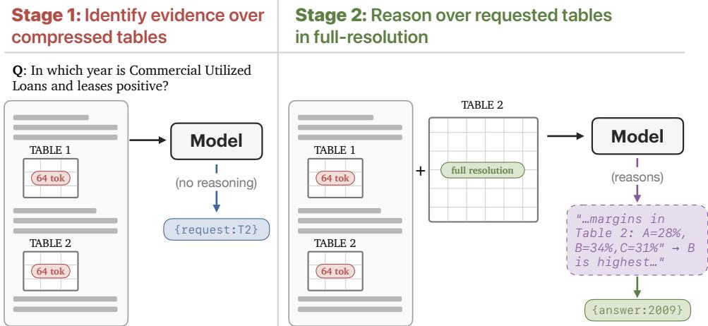  
Figure 1: Our two-stage identifyfirst, reason later method. Stage 1: the model receives the document with every table compressed to a small visual token budget and, instead of answering, identifies the tables it needs. Stage 2: the identified tables are supplied at native resolution and the model reasons over them to answer.

2026). Our method shows that compression makes the identification step cheap, since it preserves the coarse information needed to locate relevant tables. Our contributions can be summarised as follows:

• We characterize the accuracy-efficiency trade-off of pixel-level table compression in multi-table document QA, across 5 VLMs, two datasets, and five visual-token budgets. At native resolution, table images match their HTML serialization in accuracy while using fewer tokens; under aggressive compression, however, the rendered tables become illegible, models can no longer read individual cell values, and accuracy drops.

• We identify an asymmetry in how compression affects model behaviour. Lower resolutions degrade fine-grained reading and induce longer reasoning traces that offset part of the inputtoken savings, yet even heavily downscaled tables retain enough coarse signal for questionconditioned identification of the relevant tables.

• We exploit this asymmetry with a two-stage method that follows an identify first, reason later recipe: it first identifies relevant tables in a compressed context and then reasons over only those tables at native resolution. On long documents it saves 41% of total tokens while gaining 7 accuracy points over single-step QA with nativeresolution tables, and matches the accuracy of the most efficient single-step compressed configuration using 15% fewer tokens.

• We situate the method against external retrieval. A dedicated retriever identifies evidence tables more accurately than a model reading a compressed context, but this advantage does not carry through to a better accuracy-efficiency trade-off; our method matches or exceeds retrieval at lower token cost, and continues to save tokens when applied on top of retrieved context.

## 2 Related Work

Efficient Long-context Inference Long-context models remain costly and often struggle to use evidence distributed across long inputs (Liu et al., 2025, 2024). Complementary approaches reduce the context processed in each forward pass through prompt compression (Yoon et al., 2024), memory (Chen et al., 2024c), agentic reading (Zhang et al., 2024), or retrieval (Günther et al., 2025). Recent work further shows that separating evidence identification from reasoning improves long-context performance (Guan et al., 2026; Zhao et al., 2026). Our method adopts this separation but uses pixel compression to make evidence identification over multi-table documents inexpensive; it can be applied to either full or retrieved contexts.

Optical Context Compression Recent work has explored representing language through rendered pixels (Rust et al., 2023; Lee et al., 2023; Lotz et al., 2023; Gao et al., 2024). A related line treats this representtion as a form of context compression, since visual encoders may represent rendered text with fewer tokens (Wei et al., 2025). This idea has been extended to downstream tasks through specialised training (Wang et al., 2024a; Xing et al., 2025a; Cheng et al., 2026) and, more recently, with off-the-shelf VLMs (Li et al., 2025). Related approaches prune visual tokens (Chen et al., 2024b;

<table><tr><td></td><td>MultiHiertt</td><td>FinLongDocQA</td></tr><tr><td>Examples</td><td>1,044</td><td>400</td></tr><tr><td>Tables / doc</td><td>3 [2, 7]</td><td>80 [3, 122]</td></tr><tr><td>Pages / doc</td><td>4 [2, 8]</td><td>100 [16, 156]</td></tr><tr><td>Max. Tokens (HTML)</td><td>12,264</td><td>127,816</td></tr><tr><td>Evidence tables</td><td>1 [0, 3]</td><td>2 [1, 8]</td></tr><tr><td>Evidence pages</td><td>1 [1, 4]</td><td>2 [2, 3]</td></tr><tr><td>Answer in Text</td><td>11.0%</td><td>0.0%</td></tr><tr><td>Answer in Table</td><td>32.4%</td><td>100.0%</td></tr><tr><td>Answer in Text and Table</td><td>56.6%</td><td>0.0%</td></tr><tr><td>Questions / doc</td><td>3 [2, 6]</td><td>1 [1, 6]</td></tr></table>

Table 1: Statistics of the evaluation subsets (mode, with [min, max] intervals, except ‘Max. Tokens’, which reports the true maximum). FinLongDocQA annotates evidence at the page level; we treat every table on an evidence page as an evidence table. Answer in ‘Text/Table/Text and Table’ gives the percentage of questions answerable from text alone, from a table alone, or both.

Shang et al., 2025; Choi et al., 2026), but are often tied to particular architectures. In contrast, we study training-free pixel compression for structured, information-dense tables across both fixedand variable-resolution visual encoders.

Table Representation and Reasoning Tables are commonly linearised for language models (Herzig et al., 2020; Sui et al., 2023; Wang et al., 2024b; Zou et al., 2025), although linearisation can impair structural reasoning over long tables (Wang et al., 2025). Other work compares visual and textual table representations (Deng et al., 2024; Zheng et al., 2024; Alonso et al., 2024; Kim et al., 2024; Singh et al., 2025) or dynamically routes between them (Xing et al., 2025b; Wu et al., 2025). Most closely related, Kwok et al. (2026) dynamically select visual or textual representations for portions of a table during reasoning. Their method targets latency in single-table, multi-turn QA at a fixed image resolution; we instead study token efficiency under controlled compression in documents containing multiple interleaved tables and introduce a training-free method that separates table identification from full-resolution reasoning.

## 3 Experimental Framework

## 3.1 Datasets

Existing table-understanding benchmarks (Chen et al., 2020; Parikh et al., 2020; Kim et al., 2024; Alonso et al., 2026) often present tables in isolation, whereas real-world document QA requires models to identify and reason over relevant tables embedded within surrounding text. Our study also requires tables that can be represented faithfully as both text and images, so that differences between modalities reflect the representation rather than differences in content. We therefore focus on benchmarks that contain multiple tables interleaved with text and provide tables in a structured form that can be rendered into images with content parity.

These criteria lead us to two benchmarks: MultiHiertt (Zhao et al., 2022) and FinLongDocQA (Wang et al., 2026). Both combine multiple tables with surrounding text, but differ substantially in scale. We use MultiHiertt as a short-context setting, with typically three tables and four pages per document, and FinLongDocQA as a long-context setting, with typically 80 tables and 100 pages per document. Dataset statistics are shown in Table 1.

MultiHiertt test labels are private, so we evaluate on the development set. Although current models may have encountered this split during pre-training, our analysis compares configurations within each model rather than absolute performance across models. For FinLongDocQA, we evaluate 400 randomly sampled questions from the table category, ensuring that the answer evidence is grounded in tables.2 We sample from documents whose HTML serialization fits within 128k tokens under the Qwen 3.5 tokenizer, allowing all configurations to be evaluated within the models’ supported context windows. We report confidence intervals throughout.

## 3.2 Input Settings

We compare two input settings that differ only in how tables are represented; the document, question, and the prompt are always provided as text.

Text (HTML) Tables are serialized as HTML, which is a strong textual representation that preserves hierarchical structure, including multi-level headers and spanning cells (Sui et al., 2023). This setting serves as the performance reference for both accuracy and token usage.

Hybrid (Text + Images) Document text is provided as text, while tables are rendered as images from the same HTML used in the textual setting. This gives the two modalities identical content and structure, allowing us to isolate the effect of representation. Tables are rendered in black and white using a uniform typeface.3

<table><tr><td colspan="4">Model Tokenization Context Reasoning</td></tr><tr><td>Gemma 4 E4B</td><td>Fixed</td><td>128k</td><td></td></tr><tr><td>Gemma 4 26B-A4B</td><td>Fixed</td><td>256k</td><td></td></tr><tr><td>Qwen 3 VL-8B Instruct</td><td>Variable</td><td>256k</td><td>X</td></tr><tr><td>Qwen 3 VL-8B Thinking</td><td>Variable</td><td>256k</td><td></td></tr><tr><td>Qwen 3.5-9B</td><td>Variable</td><td>256k</td><td></td></tr></table>

Table 2: The five open-weight VLMS we evaluate. $T o -$ kenisation is whether the visual encoder emits a fixed or variable number of visual tokens per image; Context is the supported context-window length; Reasoning $( \checkmark / \pmb { X } )$ marks test-time reasoning mode.

## 3.3 Models

Fixed-length Visual Tokenization Gemma 4 (Gemma Team, 2026) represents each image using a fixed number of visual tokens selected from a discrete grid: 64, 121, 256, 529, or 1,089 tokens, independent of the image’s dimensions. We evaluate Gemma 4 E4B and Gemma 4 26B-A4B, with context windows of 128k and 256k tokens, respectively. The latter is a mixture-of-experts model with 4B active parameters (see Table 2).

Variable-length Visual Tokenization Qwen 3 VL (Bai et al., 2025) and Qwen 3.5 represent images with a number of visual tokens that scales with their pixel area. Qwen 3 VL pairs a Qwen 3 backbone with a SigLIP 2 encoder (Tschannen et al., 2025) continued-trained at dynamic input resolutions; Qwen 3.5 is natively multimodal, pre-trained end-to-end on text interleaved with visual data, but retains an encoder of the same family. In both models, a visual token corresponds to a $3 2 \times 3 2$ pixel region, determined by the encoder’s patch size (16) and spatial merge factor (2); so an image of size $h \times w$ yields $\lceil h / 3 2 \rceil \times \lceil w / 3 2 \rceil$ tokens. We evaluate the Instruct and Thinking variants of Qwen 3 VL-8B and Qwen 3.5-9B. All three configurations support 256k-token contexts. Table 2 summarizes our models; for the precise mapping from image dimensions to visual-token budgets, see Section 3.4.

## 3.4 Visual Token Budgets

To compare compression across visual encoders, we define five nominal visual-token budgets for each table image: $B \in \{ 6 4 , 1 2 8 , 2 5 6 , 5 1 2 , 1 , 0 2 4 \}$ Each budget is applied independently to every table image. For the Qwen models, an image of size $h \times w$ produces $\lceil h / 3 2 \rceil \times \lceil w / 3 2 \rceil$ visual tokens. If this exceeds B, we downscale the image, preserving its aspect ratio, to the largest resolution whose token count does not exceed the budget; images already below the budget are not upscaled. For Gemma 4, which supports only a discrete set of visual-token configurations, we map the nominal budgets to 64, 121, 256, 529, and 1,089 tokens, respectively. All reported token counts use the actual number of visual tokens entering the language decoder rather than the nominal budget.

We measure efficiency by the total number of tokens processed by the language decoder: textual input tokens, visual tokens, and generated tokens. Counting both input and output captures not only the savings from compressing tables but also any additional test-time reasoning induced by compression. Decoder-token count provides a common measure across model families, although it does not include the cost of visual encoding or directly measure latency.

## 4 Does Pixel-Level Compression Affect Table Comprehension?

We examine how pixel-level compression affects two capabilities required for table question answering: fine-grained reading and downstream reasoning. We first use transcription to test whether models can recover table structure and individual cell values, and then evaluate whether compressed tables remain useful for answering numerical questions. For each configuration, we plot task performance against the median number of input or generated tokens across examples. Later sections combine these quantities into total token cost.

## 4.1 Table Transcription

Table transcription tests whether the model can read every detail of a table, including its structure and all cell values, without requiring reasoning beyond format conversion. Models receive the full document, including its multiple tables and surrounding text, and are asked to transcribe every table into standard HTML. We evaluate the similarity between generated and reference tables using TEDS (Zhong et al., 2020), a similarity metric based on tree-edit distance. Tables are represented as trees following their HTML structure, and TEDS is computed as one minus the tree-edit distance between the generated and reference trees, normalized by the larger tree’s size, giving a score in [0, 1] that jointly reflects structural and cell-content accuracy.

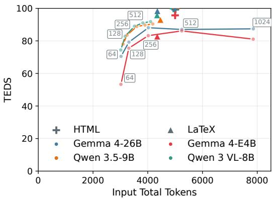  
Figure 2: Table transcription performance against input tokens on MultiHiertt. The HTML→HTML control is nearly perfect, while LATEX→HTML shows that format conversion introduces error even without visual perception. Transcription from images degrades progressively as the visual-token budget decreases.

We compare three settings. In HTML→HTML, models copy the original HTML, providing a control for the generation task itself. In LA-TEX→HTML, models convert between two textual representations, allowing us to measure the difficulty of format conversion without visual perception. Finally, IMG→HTML evaluates transcription from table images across the five visual-token budgets. An example is provided in Appendix A.1.

Figure 2 shows TEDS against input tokens. The HTML→HTML control is nearly perfect, confirming that copying is not the bottleneck. LATEX→HTML already incurs a measurable drop, showing that part of the transcription error arises from format conversion rather than visual perception. Transcription from images remains strong at larger budgets but degrades steadily as compression increases, indicating that increasingly compressed representations lose fine-grained information about table structure and cell values.

For Gemma 4, the largest visual-token setting also substantially increases input cost without improving over the 512-token budget. This illustrates that allocating more visual tokens does not necessarily improve transcription once sufficient resolution has been reached.

## 4.2 Question Answering

Reduced transcription fidelity does not necessarily imply lower downstream performance: answering a question may require reading only a small portion of a table rather than reconstructing it in full. We therefore evaluate both input settings (Section 3.2) on the MultiHiertt and FinLongDocQA dataset.

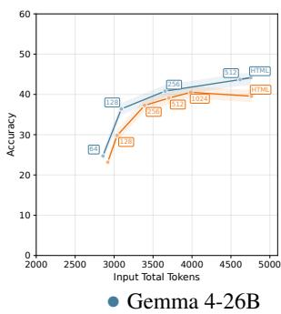

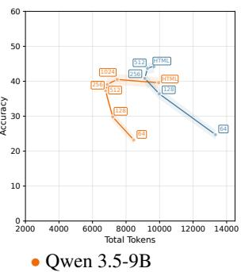  
Figure 3: QA accuracy on MultiHiertt (test-time reasoning enabled) for Gemma 4 26B-A4B and Qwen 3.5- 9B, plotted against median input tokens (left) and generated tokens (right). At large budgets, table images match HTML accuracy (left) using fewer input tokens; stronger compression reduces accuracy and produces longer reasoning traces (right). Results for all models and FinLongDocQA are in Appendix E.

In this analysis, the model receives the complete document; contexts assembled by an external retriever are considered in Section 5.3. Because both datasets emphasize numerical reasoning, we enable test-time reasoning in the main experiments and report results without it in Appendix D.

Figure 3 reports QA accuracy against input tokens and generated tokens on MultiHiertt for the latest and largest model in each family. Results for all models and for FinLongDocQA are provided in Appendix E. At sufficiently large visual-token budgets, tables represented as images match and sometimes exceed the accuracy of their HTML serialization while using fewer input tokens. Below this point, however, accuracy generally falls as the token budget tightens. This pattern is consistent with the transcription results: once compression removes the detail needed to read cell values reliably, models can no longer perform the numerical operations required to answer the question.

Generated tokens reveal a second, less visible cost of compression: lower visual-token budgets produce longer reasoning traces, without improving performance. Inspection of the traces shows repeated misreadings of cell values and uncertainty over illegible entries, causing models to deliberate for longer. This pattern also holds for FinLong-DocQA, although its much larger number of tables means that input-token savings still outweigh the additional generation. Even so, measuring input tokens alone overstates the efficiency gains of aggressive compression. Full results for both datasets and all models are reported in Appendix E.

Taken together, the results expose an important limitation of direct QA over compressed tables. Moderate compression can provide useful input savings without sacrificing accuracy, but aggressive compression removes the fine-grained information needed for reasoning and induces additional generation that offsets part of those savings. This raises a different possibility: heavily compressed tables may still preserve enough coarse information to identify which tables are relevant, even when they are no longer legible enough to answer from directly. We test this possibility in the next section.

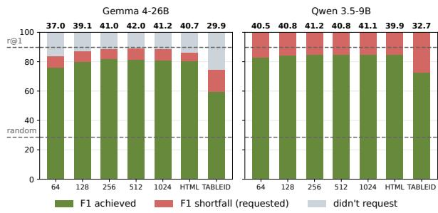  
Figure 4: Relevant-table identification (F1) for Multi-Hiertt across token budgets and table representations (Gemma 4-26B, Qwen 3.5-9B). Bars (y axis), decompose F1 into achieved vs. shortfall on requested tables; HTML and TABLEID are references; the horizontal lines mark random choice and ColQwen2@1, its best-F1 op erating point. The percentage above each bar is the overall downstream QA accuracy, so identification gains carry through to the downstream task, not just retrieval (see Appendix E for more detail).

## 5 Our Two-Stage Method: Identify first, Reason Later

We test whether low-resolution table images retain enough information for a model to identify the tables required to answer a question. Our two-step procedure is illustrated in Figure 1. In the first step, the model receives the document text together with all tables compressed to a fixed visual-token budget. Each table is preceded by a [TABLE\_n] marker, and the model identifies the tables it requires using "request\_table": n. In the second step, the requested tables are appended to the conversation at native resolution, after which the model reasons and produces the answer. The requested tables are returned at 1,024 visual tokens, which amounts to no compression on our datasets (we ablate this choice for Qwen models in Appendix G). Only the tables change between steps; the document text is always provided as text. Our prompts are provided in Appendix A.

The identification step is performed without testtime reasoning, minimising its token overhead; in preliminary experiments, enabling reasoning produced no significant improvement. The resulting method is training-free, prompt-level, and modelagnostic. It builds on evidence that separating identification from reasoning benefits long-context QA (Guan et al., 2026; Zhao et al., 2026), while using pixel compression to make identification over the full set of document tables inexpensive.

We include two controls to isolate the information supplied by the compressed images. The HTML condition applies the same two-step procedure with tables represented as text. In TABLEID, each table is replaced by its identifier, removing its contents while preserving its position and surrounding context. Performance above TABLEID therefore indicates that compressed table images provide useful evidence-identification signals.

## 5.1 Stage 1: Relevant-Table Identification

We first evaluate evidence identification independently of downstream reasoning, using F1 over the requested tables. Our main analysis uses Multi-Hiertt, which provides direct table-level evidence annotations. FinLongDocQA instead annotates evidence pages, so treating every table on an evidence page as relevant produces only an upper bound on the true evidence set (we nevertheless report these results in Appendix F). Figure 4 reports results for Gemma 4 26B-A4B and Qwen 3.5-9B; results for all models are provided in Appendix F. A randomselection baseline achieves 27.4% F1.

Table identification is robust to compression. Identification performance varies little across visual-token budgets: tables compressed to 64 tokens are identified nearly as accurately as tables at higher resolutions or in HTML form. This contrasts with transcription and direct QA, both of which degrade at the same budget (Figures 2 and 3). Aggressive compression therefore removes the finegrained information needed to read cell values but preserves the broader cues that reveal what a table is about and whether it is relevant to the question.

Compressed images provide useful evidence. The TABLEID control replaces every table with its identifier, preserving its position and surrounding text while removing its contents. Adding 64-token images improves F1 by 16 for Gemma 4 26B-A4B and 10 points for Qwen 3.5-9B over this control, confirming that the model uses information retained in the compressed renderings rather than relying only on positional or textual cues. The TABLEID condition nevertheless remains above chance because surrounding passages often introduce or describe the adjacent tables.

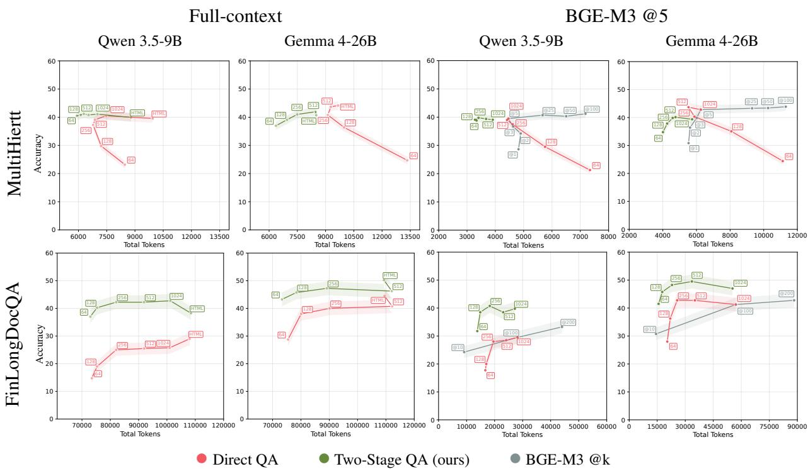  
Figure 5: Accuracy against total tokens for direct QA and our two-step method, on MultiHiertt (top) and FinLong-DocQA (bottom), for Gemma 4 26B-A4B and Qwen 3.5-9B. The two left columns feed the full document; the two right columns feed a context retrieved by BGE-M3, with single-step QA over the retrieved units at increasing k as reference. Markers along each line correspond to visual token budgets, and bands show ±1 standard error of the mean across examples (Appendix B). Results for all models are provide in Appendix E.

## 5.2 Stage 2: Full-Resolution Reasoning

Figure 5 (left panel) reports accuracy against total decoder tokens, and Table 3 summarises the token savings of our method at budget 64 against single-step references: the cheapest configuration it matches in accuracy (Matched) and single-step QA over native-resolution images (Image). The Retrieval column is discussed in Section 5.3. All configurations include a fixed cost of 2,655±28 tokens on MultiHiertt and 61,261±348 on FinLong-DocQA for the encoding of the surrounding document text. We include this cost in all reported totals but subtract it from the plot axes for readability.

On MultiHiertt, the two-step procedure avoids much of the reasoning-token inflation observed in Section 4.2 at budgets of 512 tokens or fewer. The largest gain is for Gemma 4 26B-A4B: at 256 tokens, our method uses 33.8% fewer tokens than single-step QA over native-resolution images, with a loss of 3.9 accuracy points. It is also consistently more efficient than representing tables as HTML;

for Qwen 3.5-9B, it matches the accuracy of nativeresolution images while using 20.9% fewer tokens. At budget 64, our method matches the cheapest equivalent single-step configuration while saving 6.1% of tokens on average, and trails nativeresolution images by only 4.4 accuracy points at 28.7% lower cost (Table 3).

On FinLongDocQA, the method improves accuracy at every budget. Its gains at 1,024 tokens show that separating evidence identification from reasoning helps even without compression; reducing the budget then adds further efficiency while degrading much less than single-step QA. At 64 tokens, our method exceeds native-resolution single-step QA by 3.0 accuracy points while using 53.4% fewer tokens for Gemma 4 26B-A4B, and by 11.2 points while using 27.7% fewer tokens for Qwen 3.5-9B. On average across both models, it gains 7.1 accuracy points over native-resolution images while using 40.6% fewer tokens (Table 3).

## 5.3 Relationship to External Retrieval

In this section we consider the relationship between our method and external retrieval. Specifically, we examine whether a dedicated retriever can replace compressed relevant-table identification, and whether our method remains useful after retrieval has already reduced the context. All retrievers are used zero-shot with their default pretrained weights and the original question as the query; tables are treated as atomic units.

<table><tr><td>Identify first (64) Reason later vs.</td><td>Matched</td><td colspan="2">Image</td><td colspan="2">Retrieval</td></tr><tr><td></td><td>Tok.</td><td>Tok.</td><td>Acc.</td><td>Tok.</td><td>Acc.</td></tr><tr><td colspan="6">MultiHiertt</td></tr><tr><td>Qwen 3.5-9B</td><td>14.0</td><td>20.9</td><td>0.0</td><td>25.2</td><td>-0.7</td></tr><tr><td>Qwen 3 VL-8B</td><td>7.8</td><td>14.8</td><td>-7.8</td><td>17.3</td><td>-2.7</td></tr><tr><td>Gemma 4 26B</td><td>8.8</td><td>43.8</td><td>-8.0</td><td>35.9</td><td>-8.0</td></tr><tr><td>Gemma 4 E4B</td><td>-6.2</td><td>35.2</td><td>-1.8</td><td>24.1</td><td>-3.4</td></tr><tr><td>Average</td><td></td><td>6.1 |28.7</td><td>-4.4</td><td>25.6</td><td>-3.7</td></tr><tr><td colspan="6">FinLongDocQA</td></tr><tr><td>Qwen 3.5-9B</td><td>11.1</td><td>27.7</td><td>+11.2</td><td>51.0</td><td>+2.2</td></tr><tr><td>Gemma4 26B</td><td>18.7</td><td>53.4</td><td>+3.0</td><td>72.5</td><td>+0.2</td></tr><tr><td>Average</td><td>14.9</td><td>|40.6</td><td>+7.1</td><td>61.8</td><td>+1.2</td></tr></table>

Table 3: Percentage of tokens saved (Tok.) and accuracy difference in points (Acc.; positive favours our method) of our two-stage method against three singlestep references. Matched is the cheapest single-step configuration our method matches in accuracy, judged by the confidence intervals of Appendix C; Image is single-step QA over table images at native resolution; Retrieval is single-step QA over a context retrieved by BGE-M3.

External retrieval identifies better but costs more. We replace the identification stage with ColQwen2 (Faysse et al., 2024), a multi-vector retriever designed for visually represented text and the stronger retriever in our table-retrieval experiments (Appendix H). Retrieved tables are supplied uncompressed alongside the document text, and we evaluate several values of k on both datasets.

ColQwen2 identifies evidence tables more accurately than models reading a compressed context (Figure 4), but this advantage does not carry through to downstream accuracy. On MultiHiertt, retrieval plateaus at the accuracy our method already reaches: for Qwen 3.5-9B, our 64-token configuration matches the accuracy of the cheapest most accurate ColQwen2 configuration, using 19% fewer tokens. Only for Gemma 4 26B-A4B does retrieval overtake our method, but never by more than 7.3 accuracy points, which our method reaches using 45.3% of the tokens. On FinLongDocQA our method exceeds retrieval by 16 accuracy points at the same cost. External retrieval therefore identifies better without delivering a better end-to-end trade-off. Full curves are in Appendix I.

Our two-step method still helps after retrieval. We next apply our two-step method to contexts retrieved by BGE-M3 (Chen et al., 2024a) from a unified pool of paragraphs and tables. We use k=5 on MultiHiertt and k=100 on FinLongDocQA, render the retrieved tables at each visual-token budget, and compare against single-step QA over the same retrieved context (see Figure 5 right panel).

On MultiHiertt, retrieval performance falls sharply below k=5, limiting how far retrieval alone can reduce the context. Our method moves beyond this limit: Qwen 3.5-9B matches the accuracy of single-step QA at k=5 using 25.2% less tokens, while Gemma 4 26B-A4B at a budget of 256 uses 26.6% fewer tokens at a cost of 2.9 accuracy points. The same general pattern holds for the remaining models except Gemma 4 E4B. As in Section 5.2, compression alone does not achieve these gains; they arise from identifying and restoring only the tables needed for reasoning. On FinLongDocQA, our method matches the accuracy of retrieval using 51.0% and 72.5% fewer tokens respectively (see Table 3, Retrieval column).

## 6 Conclusions

We investigated whether pixel-level compression can reduce the cost of question answering over multi-table documents. Moderate compression allows table images to match their HTML serialization while using fewer tokens. Under aggressive compression, however, models lose the cell-level information needed for numerical reasoning and reason for longer, eroding the efficiency gains.

Our central finding is that compression affects reading and identification differently. Even when a table is too compressed to support accurate reasoning, it retains enough information for identifying whether it is relevant. We exploit this asymmetry with a training-free, two-step method that first identifies relevant tables in a compressed context and then restores only those tables for full-resolution reasoning. The method improves the accuracyefficiency trade-off in full-context QA and on top of retrieval, using 41% fewer tokens while gaining 7 accuracy points over single-step QA with native-resolution tables on long documents.

More broadly, our results suggest that pixel compression is most effective not as a representation from which models must reason over directly, but as an inexpensive intermediate step for locating evidence before native-resolution computation.

## Limitations

Our experiments are limited to English-language financial documents and two datasets; moreover, MultiHiertt results are reported on the development set for the reasons discussed in Section 3.1. We render tables from clean structured representations using a uniform style in order to preserve information parity between the textual and visual settings. Real-world table images may contain varied fonts, complex layouts, scanning artifacts, and recognition errors. Our experiments also assume that table boundaries are known; applying the method to raw documents may require an additional tabledetection or extraction stage.

The effective compression level depends on table dimensions, information density, rendering style, and the model’s visual encoder. The specific token budgets identified here may therefore not transfer directly to other domains or document formats, although the evaluation procedure can be used to determine suitable budgets in new settings.

Finally, we use the number of decoder tokens as an architecture-independent proxy for efficiency. This measure captures both input and generated tokens, but not visual-encoder computation, the latency and overhead of the additional inference pass, or hardware-dependent differences in cost. Measuring wall-clock latency, memory use, and FLOPs would be necessary to establish the full computational trade-off.

## References

Iñigo Alonso, Eneko Agirre, and Mirella Lapata. 2024. PixT3: Pixel-based table-to-text generation. In Proceedings of the 62nd Annual Meeting of the Association for Computational Linguistics (Volume 1: Long Papers), pages 6721–6736, Bangkok, Thailand. Association for Computational Linguistics.

Iñigo Alonso, Imanol Miranda, Eneko Agirre, and Mirella Lapata. 2026. Tablet: A large-scale dataset for robust visual table understanding. Preprint, arXiv:2509.21205.

Shuai Bai, Yuxuan Cai, Ruizhe Chen, Keqin Chen, Xionghui Chen, Zesen Cheng, Lianghao Deng, Wei Ding, Chang Gao, Chunjiang Ge, Wenbin Ge, Zhifang Guo, Qidong Huang, Jie Huang, Fei Huang, Binyuan Hui, Shutong Jiang, Zhaohai Li, Mingsheng Li, and 45 others. 2025. Qwen3-vl technical report. Preprint, arXiv:2511.21631.

Jianlyu Chen, Shitao Xiao, Peitian Zhang, Kun Luo, Defu Lian, and Zheng Liu. 2024a. M3- embedding: Multi-linguality, multi-functionality,

multi-granularity text embeddings through selfknowledge distillation. In Findings of the Association for Computational Linguistics: ACL 2024, pages 2318–2335, Bangkok, Thailand. Association for Computational Linguistics.

Liang Chen, Haozhe Zhao, Tianyu Liu, Shuai Bai, Junyang Lin, Chang Zhou, and Baobao Chang. 2024b. An image is worth 1/2 tokens after layer 2: Plug-andplay inference acceleration for large vision-language models. Preprint, arXiv:2403.06764.

Tong Chen, Hao Fang, Patrick Xia, Xiaodong Liu, Benjamin Van Durme, Luke Zettlemoyer, Jianfeng Gao, and Hao Cheng. 2024c. Generative adapter: Contextualizing language models in parameters with a single forward pass. Preprint, arXiv:2411.05877.

Wenhu Chen, Hongmin Wang, Jianshu Chen, Yunkai Zhang, Hong Wang, Shiyang Li, Xiyou Zhou, and William Yang Wang. 2020. Tabfact: A large-scale dataset for table-based fact verification. In International Conference on Learning Representations (ICLR), Addis Ababa, Ethiopia.

Jiale Cheng, Yusen Liu, Xinyu Zhang, Yulin Fei, Wenyi Hong, Ruiliang Lyu, Weihan Wang, Zhe Su, Xiaotao Gu, Xiao Liu, Yushi Bai, Jie Tang, Hongning Wang, and Minlie Huang. 2026. Glyph: Scaling context windows via visual-text compression. In Proceedings of the 64th Annual Meeting of the Association for Computational Linguistics (Volume 1: Long Papers), pages 37145–37158, San Diego, California, United States. Association for Computational Linguistics.

Joonmyung Choi, Sanghyeok Lee, Jongha Kim, Sehyung Kim, Dohwan Ko, Jihyung Kil, and Hyunwoo J. Kim. 2026. Docprune:efficient document question answering via background, question, and comprehension-aware token pruning. Preprint, arXiv:2604.22281.

Naihao Deng, Zhenjie Sun, Ruiqi He, Aman Sikka, Yulong Chen, Lin Ma, Yue Zhang, and Rada Mihalcea. 2024. Tables as texts or images: Evaluating the table reasoning ability of LLMs and MLLMs. In Findings of the Association for Computational Linguistics: ACL 2024, pages 407–426, Bangkok, Thailand. Association for Computational Linguistics.

Manuel Faysse, Hugues Sibille, Tony Wu, Bilel Omrani, Gautier Viaud, Céline Hudelot, and Pierre Colombo. 2024. Colpali: Efficient document retrieval with vision language models. Preprint, arXiv:2407.01449.

Tianyu Gao, Zirui Wang, Adithya Bhaskar, and Danqi Chen. 2024. Improving language understanding from screenshots. arXiv preprint arXiv:2402.14073.

Gemma Team. 2026. Gemma 4 technical report. Preprint, arXiv:2607.02770.

Xin Guan, Zijian Li, Shen Huang, Pengjun Xie, Jingren Zhou, and Jiuxin Cao. 2026. Evidence-augmented policy optimization with reward co-evolution for long-context reasoning. Preprint, arXiv:2601.10306.

Michael Günther, Isabelle Mohr, Daniel James Williams, Bo Wang, and Han Xiao. 2025. Late chunking: Contextual chunk embeddings using long-context embedding models. Preprint, arXiv:2409.04701.

Jonathan Herzig, Pawel Krzysztof Nowak, Thomas Müller, Francesco Piccinno, and Julian Eisenschlos. 2020. TaPas: Weakly supervised table parsing via pre-training. In Proceedings ofthe 58th Annual Meeting ofthe Associationfor Computational Linguistics, pages 4320–4333, Online. Association for Computational Linguistics.

Cheng-Ping Hsieh, Simeng Sun, Samuel Kriman, Shantanu Acharya, Dima Rekesh, Fei Jia, Yang Zhang, and Boris Ginsburg. 2024. Ruler: What’s the real context size of your long-context language models? arXiv preprint arXiv:2404.06654.

Yoonsik Kim, Moonbin Yim, and Ka Yeon Song. 2024. Tablevqa-bench: A visual question answering benchmark on multiple table domains. Preprint, arXiv:2404.19205.

Tung Sum Thomas Kwok, Xinyu Wang, Xiaofeng Lin, Peng Lu, Chunhe Wang, Changlun Li, Hanwei Wu, Nan Tang, Elisa Kreiss, and Guang Cheng. 2026. Tabqaworld: Optimizing multimodal reasoning for multi-turn table question answering. Preprint, arXiv:2604.03393.

Kenton Lee, Mandar Joshi, Iulia Turc, Hexiang Hu, Fangyu Liu, Julian Eisenschlos, Urvashi Khandelwal, Peter Shaw, Ming-Wei Chang, and Kristina Toutanova. 2023. Pix2struct: screenshot parsing as pretraining for visual language understanding. In Proceedings ofthe 40th International Conference on Machine Learning, ICML’23. JMLR.org.

Yanhong Li, Zixuan Lan, and Jiawei Zhou. 2025. Text or pixels? evaluating efficiency and understanding of LLMs with visual text inputs. In Findings ofthe Associationfor Computational Linguistics: EMNLP 2025, pages 10564–10578, Suzhou, China. Association for Computational Linguistics.

Jiaheng Liu, Dawei Zhu, Zhiqi Bai, Yancheng He, Huanxuan Liao, Haoran Que, Zekun Wang, Chenchen Zhang, Ge Zhang, Jiebin Zhang, Yuanxing Zhang, Zhuo Chen, Hangyu Guo, Shilong Li, Ziqiang Liu, Yong Shan, Yifan Song, Jiayi Tian, Wenhao Wu, and 18 others. 2025. A comprehensive survey on long context language modeling. Preprint, arXiv:2503.17407.

Nelson F. Liu, Kevin Lin, John Hewitt, Ashwin Paranjape, Michele Bevilacqua, Fabio Petroni, and Percy Liang. 2024. Lost in the middle: How language models use long contexts. Transactions ofthe Association for Computational Linguistics, 12:157–173.

Jonas Lotz, Elizabeth Salesky, Phillip Rust, and Desmond Elliott. 2023. Text rendering strategies for pixel language models. In Proceedings ofthe 2023 Conference on Empirical Methods in Natural Lan guage Processing, pages 10155–10172, Singapore. Association for Computational Linguistics.

Ankur Parikh, Xuezhi Wang, Sebastian Gehrmann, Manaal Faruqui, Bhuwan Dhingra, Diyi Yang, and Dipanjan Das. 2020. ToTTo: A controlled table-to-text generation dataset. In Proceedings of the 2020 Conference on Empirical Methods in Natural Language Processing (EMNLP), pages 1173–1186, Online. Association for Computational Linguistics.

Phillip Rust, Jonas F. Lotz, Emanuele Bugliarello, Elizabeth Salesky, Miryam de Lhoneux, and Desmond Elliott. 2023. Language modelling with pixels. Preprint, arXiv:2207.06991.

Yuzhang Shang, Mu Cai, Bingxin Xu, Yong Jae Lee, and Yan Yan. 2025. Llava-prumerge: Adaptive token reduction for efficient large multimodal models. ICCV.

Anshul Singh, Chris Biemann, and Jan Strich. 2025. MTabVQA: Evaluating multi-tabular reasoning of language models in visual space. In Findings ofthe Associationfor Computational Linguistics: EMNLP 2025, pages 19866–19891, Suzhou, China. Association for Computational Linguistics.

Yuan Sui, Mengyu Zhou, Mingjie Zhou, Shi Han, and Dongmei Zhang. 2023. Table meets llm: Can large language models understand structured table data? a benchmark and empirical study. Web Search and Data Mining.

Michael Tschannen, Alexey Gritsenko, Xiao Wang, Muhammad Ferjad Naeem, Ibrahim Alabdulmohsin, Nikhil Parthasarathy, Talfan Evans, Lucas Beyer, Ye Xia, Basil Mustafa, Olivier Hénaff, Jeremiah Harmsen, Andreas Steiner, and Xiaohua Zhai. 2025. Siglip 2: Multilingual vision-language encoders with improved semantic understanding, localization, and dense features. Preprint, arXiv:2502.14786.

Alex Jinpeng Wang, Linjie Li, Yiqi Lin, Min Li, Lijuan Wang, and Mike Zheng Shou. 2024a. Leveraging visual tokens for extended text contexts in multi-modal learning. Preprint, arXiv:2406.02547.

Lanrui Wang, Mingyu Zheng, Hongyin Tang, Zheng Lin, Yanan Cao, Jingang Wang, Xunliang Cai, and Weiping Wang. 2025. Needleinatable: Exploring long-context capability of large language models towards long-structured tables. Preprint, arXiv:2504.06560.

Yi-Cheng Wang, Wei-An Wang, and Chu-Song Chen. 2026. Document-level numerical reasoning across single and multiple tables in financial reports. arXiv preprint arXiv:2604.03664.

Zilong Wang, Hao Zhang, Chun-Liang Li, Julian Martin Eisenschlos, Vincent Perot, Zifeng Wang, Lesly Miculicich, Yasuhisa Fujii, Jingbo Shang, Chen-Yu Lee, and Tomas Pfister. 2024b. Chain-of-table: Evolving tables in the reasoning chain for table understanding. ICLR.

Haoran Wei, Yaofeng Sun, and Yukun Li. 2025. Deepseek-ocr: Contexts optical compression. arXiv preprint arXiv:2510.18234.

Mingyuan Wu, Jingcheng Yang, Jize Jiang, Meitang Li, Kaizhuo Yan, Hanchao Yu, Minjia Zhang, Chengxiang Zhai, and Klara Nahrstedt. 2025. Vtool-r1: Vlms learn to think with images via reinforcement learning on multimodal tool use. Preprint, arXiv:2505.19255.

Ling Xing, Alex Jinpeng Wang, Rui Yan, Xiangbo Shu, and Jinhui Tang. 2025a. Vision-centric token compression in large language model. arXiv preprint arXiv:2502.00791.

Xiaobo Xing, Wei Yuan, Tong Chen, Quoc Viet Hung Nguyen, Xiangliang Zhang, and Hongzhi Yin. 2025b. Tabledart: Dynamic adaptive multi-modal routing for table understanding. Preprint, arXiv:2509.14671.

Chanwoong Yoon, Taewhoo Lee, Hyeon Hwang, Minbyul Jeong, and Jaewoo Kang. 2024. CompAct: Compressing retrieved documents actively for question answering. In Proceedings ofthe 2024 Conference on Empirical Methods in Natural Language Processing, pages 21424–21439, Miami, Florida, USA. Association for Computational Linguistics.

Yusen Zhang, Ruoxi Sun, Yanfei Chen, Tomas Pfister, Rui Zhang, and Sercan Ö. Arik. 2024. Chain of agents: Large language models collaborating on longcontext tasks. Preprint, arXiv:2406.02818.

Yanjun Zhao, Ruizhong Qiu, Tianxin Wei, Yuanchen Bei, Zhining Liu, Lingjie Chen, Ismini Lourentzou, Hanghang Tong, and Jingrui He. 2026. Recontext: Recursive evidence replay as llm harness for longcontext reasoning. Preprint, arXiv:2607.02509.

Yilun Zhao, Yunxiang Li, Chenying Li, and Rui Zhang. 2022. MultiHiertt: Numerical reasoning over multi hierarchical tabular and textual data. In Proceedings of the 60th Annual Meeting of the Association for Computational Linguistics (Volume 1: Long Papers), pages 6588–6600, Dublin, Ireland. Association for Computational Linguistics.

Mingyu Zheng, Xinwei Feng, Qingyi Si, Qiaoqiao She, Zheng Lin, Wenbin Jiang, and Weiping Wang. 2024. Multimodal table understanding. In Proceedings of the 62nd Annual Meeting of the Association for Computational Linguistics (Volume 1: Long Papers), pages 9102–9124, Bangkok, Thailand. Association for Computational Linguistics.

Xu Zhong, Elaheh ShafieiBavani, and Antonio Jimeno Yepes. 2020. Image-based table recognition: data, model, and evaluation. Preprint, arXiv:1911.10683.

Jiaru Zou, Soumya Roy, Vinay Kumar Verma, Ziyi Wang, David Wipf, Pan Lu, Sumit Negi, James Zou, and Jingrui He. 2025. Tattoo: Tool-grounded thinking prm for test-time scaling in tabular reasoning. Preprint, arXiv:2510.06217.

## A Prompts

This appendix shows the prompts used in our experiments Figures 6–8). For readability, each prompt shows a single table image, but every <image> placeholder in the actual prompts is accompanied by its corresponding table image. The tables shown here are included for reference only and are not rendered at the pixel dimensions of any particular visual-token budget.

## A.1 Transcription (OCR)

Figure 6 shows the prompt used for table transcription, in the IMG→HTML setting. In the HTML→HTML and LATEX→HTML settings, each <image> placeholder is replaced by the HTML or LaTeX serialization of the same table, respectively, and the rest of the prompt remains unchanged.

## A.2 Question Answering (QA)

Figures 7 and 8 show the prompts used for direct QA and for our two-stage method, both in the hybrid setting. The HTML setting replaces each <image> placeholder with the HTML serialization of the same table, and the rest of the prompt remains unchanged.

## B Confidence intervals

Every score we report is a mean over a fixed set of N test examples. We take the test example as the unit of analysis and report the standard error of the mean (s.e.m.). Let $s _ { i } \in \{ 0 , 1 \}$ be a model’s exact-match accuracy on example i. We report the mean $\begin{array} { r } { \hat { \mu } = \frac { 1 } { N } \sum _ { i } s _ { i } } \end{array}$ (shown as a percentage) with a band of ±1 s.e.m., a 68% interval under a normal approximation, which captures the sampling uncertainty of each plotted mean:

$$
{ \mathrm { s . e . m . } } = { \frac { \hat { \sigma } } { \sqrt { N } } } , { \hat { \sigma } } ^ { 2 } = { \frac { 1 } { N - 1 } } \sum _ { i = 1 } ^ { N } { \left( { { s _ { i } } - { \hat { \mu } } } \right) ^ { 2 } } .\tag{1}
$$

## C Quantifying Token Savings

Each configuration in this work gives us two numbers, accuracy and token cost. We know that the Pareto frontier lies in the upper-left corner of our accuracy per token graphs, but defining its precise gradient requires choosing which of the two to prioritize. When selecting a point of reference to compare our method against, we prioritize accuracy. That is, we compare the cheapest and most accurate configuration of each method, first selecting the most accurate and then, among the results at equivalent performance, the cheapest. We define equivalence using the confidence intervals of Appendix B.

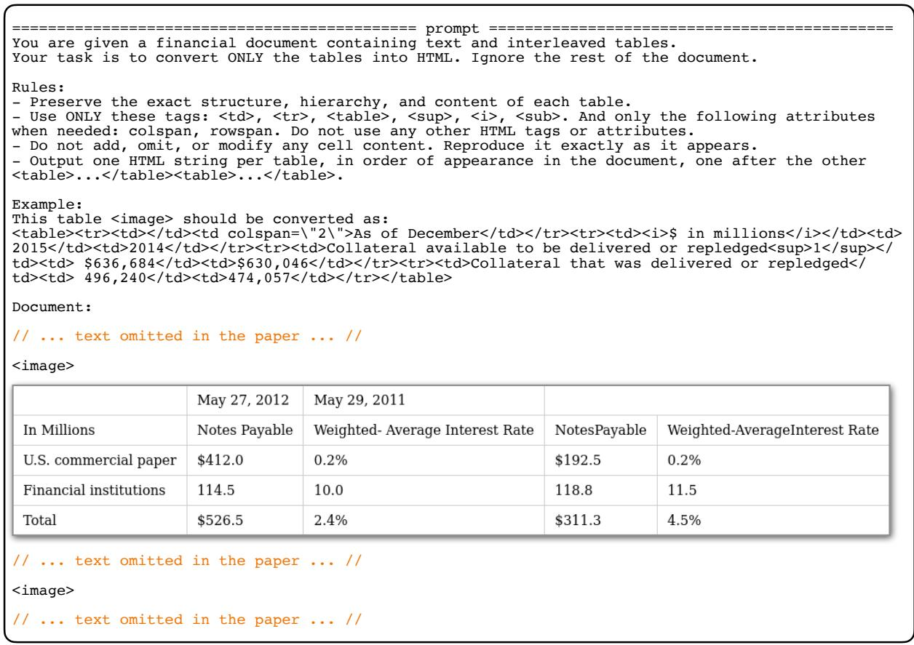  
Figure 6: Prompt used for table transcription.

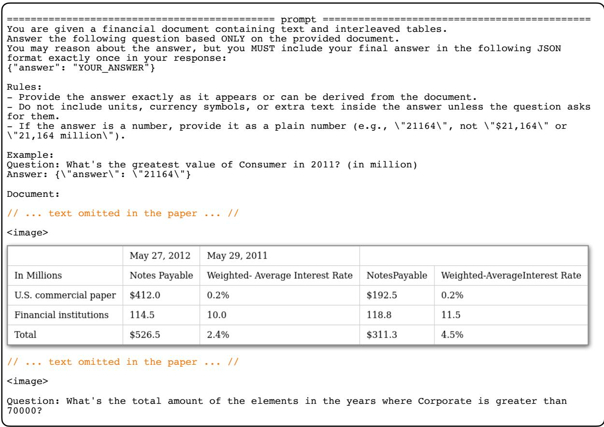  
Figure 7: Prompt used for direct QA.

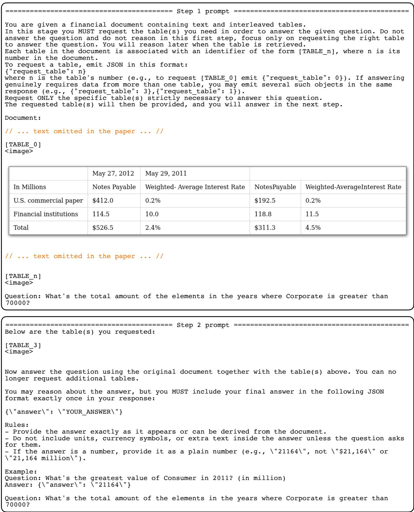  
Figure 8: Prompt used for our two-stage method.

<table><tr><td>Algorithm 1 Token savings at matched accuracy</td></tr><tr><td>1: Order the baseline results by accuracy, highest first, and take each in turn as the target level. 2: Collect every configuration, from either method, whose accuracy is not below the target once error intervals are accounted for.</td></tr><tr><td>3: If none of our method&#x27;s configurations quali- fies, the target is out of reach; skip to the next. 4: Otherwise take the cheapest qualifying config- uration of our method and the cheapest quali-</td></tr><tr><td>fying baseline. 5: Report the percentage of tokens the former</td></tr></table>

We also assume that the baseline can represent tables as images and that pixel-level compression is available to it as well. Note that this strips from our results the improvements that come from those two techniques alone, so what remains comes solely from the two-stage procedure itself, making this a conservative estimate and, in our view, a fairer and more realistic comparison. Algorithm 1 states the procedure.

## D Effect of Test-Time Reasoning

Figure 9 compares direct QA with and without testtime reasoning across visual token budgets. Two patterns emerge. First, the token cost of reasoning grows as tables are compressed, so the gap between the two conditions widens towards the lower budgets, which is the effect discussed in Section 4.2. Second, the accuracy benefit of reasoning varies by model, but is predominantly positive across all models. We enable test-time reasoning in the main experiments because both datasets emphasize numerical reasoning, and because it is the stronger of the two conditions for most models.

## E Full Results

This appendix reports the complete results for Sections 4.2, 5.2, and 5.3, for all models and both datasets. Figures show accuracy against total tokens; tables give the underlying numbers, including the breakdown of token counts into their textual, visual, and generated tokens. On FinLongDocQA we evaluate only the largest and most recent model of each family, as Gemma 4 E4B’s 128k context window cannot accommodate these documents alongside reasoning traces, and each configuration is considerably more expensive to run at this length.

## E.1 Full-Context QA

In this setting, the complete document is provided to the model, with tables represented as images at each visual token budget (Figure 10). Direct QA answers from this context in a single step, while our two-stage method first identifies the tables it needs and then reasons over them at native resolution.

## E.2 QA over Retrieved Context

In this setting, the context is assembled by BGE-M3 rather than fed in full, using k=5 on Multi-Hiertt and k=100 on FinLongDocQA (Figure 11). Direct QA and our two-stage method operate over this reduced context, with single-step QA over retrieved units at increasing k included as a reference for what retrieval alone achieves.

## F Table Identification: All Models

Figures 12 and 13 extend the identification results of Section 5.1 to every model. Robustness to compression holds across the board: identification varies little across visual token budgets for all models. The gain over the TABLEID is clear for Qwen 3.5 and the Gemma 4 models, but marginal for Qwen 3 VL.

On FinLongDocQA, identification F1 is almost identical between low image budgets and TABLEID. As noted in Section 5.1, this dataset annotates evidence at the page level, so treating every table on an evidence page as relevant yields an upper bound on the true evidence set. The downstream accuracies printed above each bar tell a different story. Removing table contents costs Qwen 3.5 a large amount of accuracy (37.0 at 64 tokens against 17.8 for TABLEID) and Gemma 4 26B-A4B a smaller one (43.2 against 41.2), even though the two conditions are indistinguishable under F1. This is consistent with the annotation being too coarse to separate them: a model that locates the right page scores well whether or not it can tell which of its tables matters, while the answer still depends on getting that distinction right.

## G At What Resolution to Return the Requested Table

The two stages of our method have independent budgets: the first compresses every table in the context, while the second returns the requested table at a chosen resolution. The main text fixes the return budget at 1,024 visual tokens, which amounts to no compression on our datasets. Figure 14 justifies this choice on Qwen 3.5-9B, sweeping the return budget over HTML and the five visual-token budgets for each of the five context budgets.

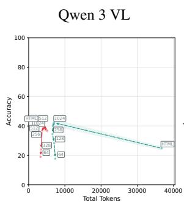

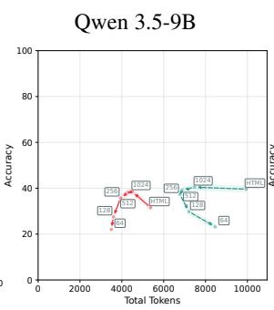  
• Without test-time reasoning

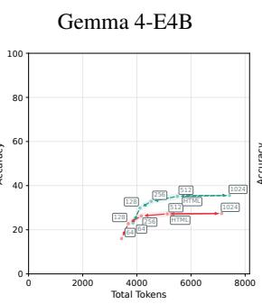  
• With test-time reasoning

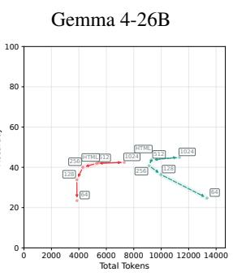  
Figure 9: Direct QA with and without test-time reasoning across visual token budgets on MultiHiertt, for all four reasoning-capable models. Compression widens the gap between the two conditions, as lower budgets induce longer reasoning traces.

Accuracy holds up as long as the returned table is legible: HTML and 1,024 visual tokens perform equally, and accuracy begins to degrade from 512 tokens onwards—slightly at first, then more clearly at the lower budgets. Generated tokens mirror the finding of Section 4.2: returning the evidence at a low budget reintroduces the longer reasoning traces that compression induces, so the second stage loses the very property that motivates it. We therefore return the requested table at 1,024 tokens, which preserves accuracy and keeps reasoning traces short, and which on our datasets is equivalent to returning it uncompressed.

## H Retriever Comparison

This appendix compares the two retrievers used in the paper and justifies where each is applied. BGE-M3 (Chen et al., 2024a) indexes linearised text, while ColQwen2 (Faysse et al., 2024) indexes rendered images, so only the former can operate over a pool that mixes paragraphs and tables. Figure 15 reports average recall and F1 against the number of retrieved units, under three settings. In any (paragraph) and any (table), the pool contains both the document’s paragraphs and its tables, and we measure how well the retriever recovers paragraph evidence and table evidence respectively; only BGE-M3 applies here. In tables, the pool contains tables alone, which allows both retrievers to be compared directly, BGE-M3 over their textual serialization and ColQwen2 over their rendered images.

ColQwen2 outperforms BGE-M3 at retrieving tables from a table-only pool, which is why we use it in the table-retrieval setting of Section 5.3 and as the reference operating point in the identification results of Section 5.1. BGE-M3 is used wherever the pool mixes modalities, since ColQwen2 cannot index text.

On FinLongDocQA we omit the any (paragraph) setting, as the dataset annotates evidence at the page level rather than per passage. For the same reason, we treat every table on an evidence page as an evidence table, which inflates the size of the evidence set and is part of why recall approaches 1.0 more slowly than on MultiHiertt; the far larger candidate pool, around 80 tables per document against three, accounts for the rest.

## I Retriever for Identification

Section 5.3 asks whether a dedicated retriever can replace the identification stage of our method. Figure 16 reports the full curves behind that comparison, for every model and both datasets. In the retrieval condition the document text is fed in full, as in our hybrid setting, but the tables are supplied by ColQwen2 at increasing k and left uncompressed, so the retriever assumes the role our first stage otherwise plays.

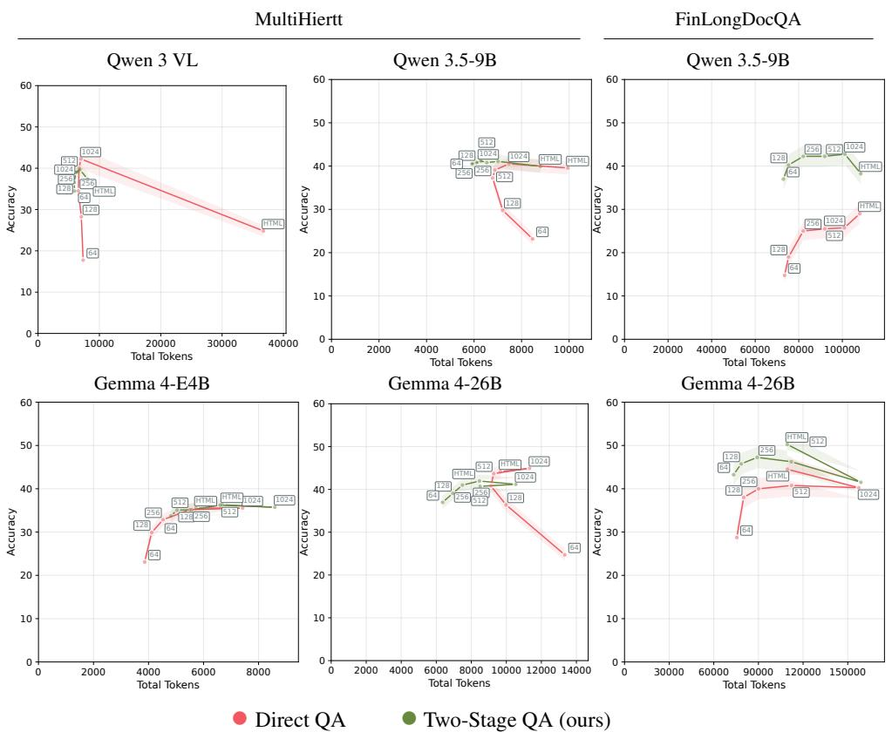

Figure 10: Accuracy against total tokens for direct QA and our two-step method, on MultiHiertt (top) and FinLongDocQA (bottom), for Qwen 3 VL 8B, Qwen 3.5 9B, Gemma 4 E4B, and Gemma 4 26B-A4B for full document. Markers along each line correspond to visual token budgets, and bands show ±1 s.e.m. across examples (Appendix B).  
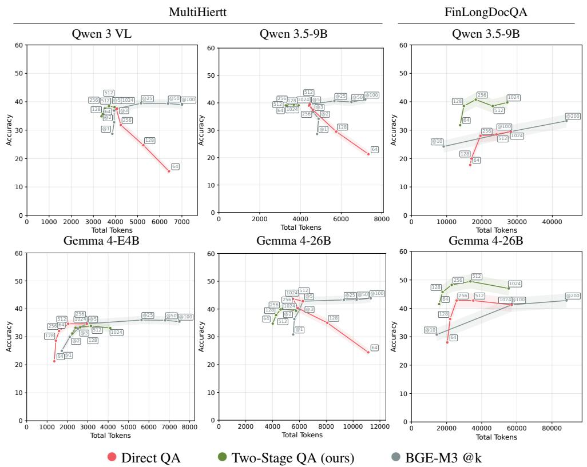  
Figure 11: Accuracy against total tokens for direct QA, our two-step method, on MultiHiertt (top) and FinLong-DocQA (bottom), for Qwen 3 VL 8B, Qwen 3.5 9B, Gemma 4 E4B, and Gemma 4 26B-A4B. We feed a context retrieved by BGE-M3, with single-step QA over the retrieved units at increasing k as reference. Markers along each line correspond to visual token budgets, and bands show ±1 s.e.m. across examples (Appendix B).

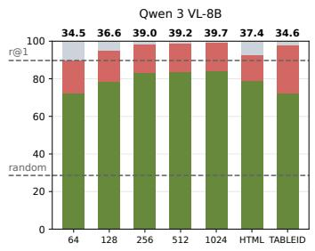

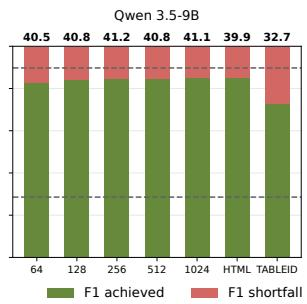

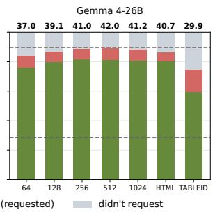

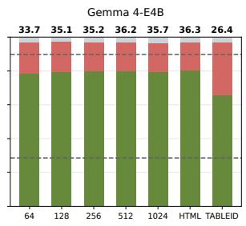  
Figure 12: Relevant-table identification (F1) on MultiHiertt across token budgets and table representations, for all models. Bars show identification F1 (y axis), decomposed into F1 achieved vs. shortfall on requested tables; HTML and TABLEID are references, and the horizontal lines mark random choice and ColQwen2@1, its best-F1 operating point. The percentage above each bar is the overall downstream QA accuracy.

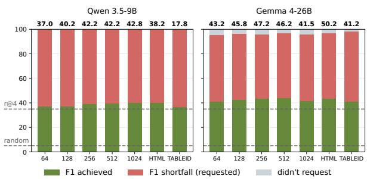  
Figure 13: Relevant-table identification (F1) on Fin-LongDocQA for the two models evaluated on this dataset. Bars and references are as in Figure 12, except that the retrieval line marks ColQwen2@4, its best-F1 operating point on this dataset. FinLongDocQA annotates evidence at the page level, so every table on an evidence page counts as relevant and the resulting scores are an upper bound on true identification performance. These results are shown for reference and are not used to support any claim in the paper.

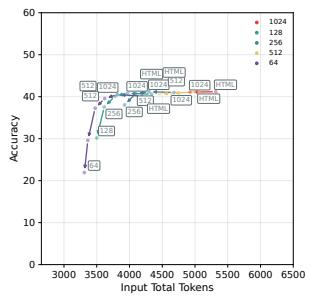

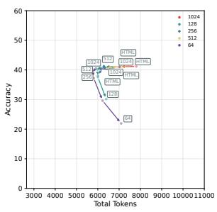  
Figure 14: Accuracy against input tokens (left) and generated tokens (right) as a function of the budget at which the requested table is returned, for Qwen 3.5-9B on MultiHiertt. Colours distinguish the visual token budget applied to the context, and each labelled point is the budget at which the requested table is returned (HTML, or images at 1,024 to 64 tokens).

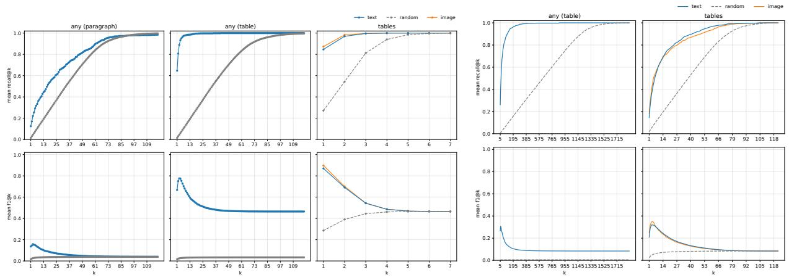  
Figure 15: Retrieval performance on MultiHiertt (left) and FinLongDocQA (right), reporting average recall (top row) and average F1 (bottom row) against the number of retrieved units. Text is BGE-M3 and image is ColQwen2. In any (paragraph) and any (table) the pool contains both paragraphs and tables, and only the text retriever applies; in tables the pool contains tables alone and both retrievers are compared. FinLongDocQA omits any (paragraph), as its evidence is annotated at the page level.

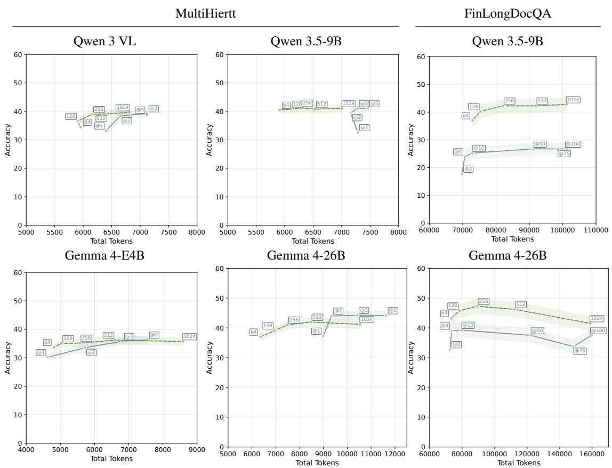  
• Two-Stage QA with model-based evidence identification (ours) • ColQwen2 @k

Figure 16: Accuracy against total tokens for our two-stage method with model-based table identification, and for direct QA over a context in which the tables are supplied by ColQwen2 at increasing k, on MultiHiertt (top) and FinLongDocQA (bottom). Both conditions receive the full document text; they differ only in how the tables reach the model. Markers along our curves correspond to visual token budgets, and bands show ±1 s.e.m. across examples (Appendix B).

<table><tr><td>Model</td><td>Budget Task</td><td></td><td>Acc.</td><td>Input text</td><td>Input visual</td><td>Output text</td><td>Total</td></tr><tr><td>Qwen 3 VL-8B</td><td></td><td>Dir. QA</td><td>24.8</td><td>4696</td><td>0</td><td>32768</td><td>36752</td></tr><tr><td>Qwen 3 VL-8B</td><td>1024</td><td>Dir. QA</td><td>42.2</td><td>2601</td><td>1351</td><td>2745</td><td>6990</td></tr><tr><td>Qwen 3 VL-8B</td><td>512</td><td>Dir. QA</td><td>40.0</td><td>2601</td><td>1089</td><td>2563</td><td>6682</td></tr><tr><td>Qwen 3 VL-8B</td><td>256</td><td>Dir. QA</td><td>34.5</td><td>2601</td><td>722</td><td>3100</td><td>6574</td></tr><tr><td>Qwen 3 VL-8B</td><td>128</td><td>Dir. QA</td><td>28.2</td><td>2601</td><td>430</td><td>3526</td><td>7053</td></tr><tr><td>Qwen 3 VL-8B</td><td>64</td><td>Dir. QA</td><td>17.8</td><td>2601</td><td>294</td><td>4522</td><td>7346</td></tr><tr><td>Qwen 3 VL-8B</td><td></td><td>2Stage QA</td><td>37.4</td><td>5987</td><td>0</td><td>3920</td><td>8094</td></tr><tr><td>Qwen 3 VL-8B</td><td>1024</td><td>2Stage QA</td><td>39.7</td><td>2884</td><td>1923</td><td>3457</td><td>6812</td></tr><tr><td>Qwen 3 VL-8B</td><td>512</td><td>2Stage QA</td><td>39.2</td><td>2886</td><td>1742</td><td>3688</td><td>6435</td></tr><tr><td>Qwen 3 VL-8B</td><td>256</td><td>2Stage QA</td><td>39.0</td><td>2886</td><td>1344</td><td>3982</td><td>6162</td></tr><tr><td>Qwen 3 VL-8B</td><td>128</td><td>2Stage QA</td><td>36.6</td><td>2878</td><td>966</td><td>4991</td><td>5901</td></tr><tr><td>Qwen 3 VL-8B</td><td>64</td><td>2Stage QA</td><td>34.5</td><td>2872</td><td>766</td><td>5990</td><td>5956</td></tr><tr><td>Qwen 3.5-9B</td><td></td><td>Dir. QA</td><td>39.6</td><td>4765</td><td>0</td><td>4958</td><td>9946</td></tr><tr><td>Qwen 3.5-9B</td><td>1024</td><td>Dir. QA</td><td>40.5</td><td>2650</td><td>1358</td><td>2974</td><td>7472</td></tr><tr><td>Qwen 3.5-9B</td><td>512</td><td>Dir. QA</td><td>39.1</td><td>2650</td><td>1070</td><td>2818</td><td>6874</td></tr><tr><td>Qwen 3.5-9B</td><td>256</td><td>Dir. QA</td><td>37.3</td><td>2650</td><td>717</td><td>3140</td><td>6780</td></tr><tr><td>Qwen 3.5-9B</td><td>128</td><td>Dir. QA</td><td>29.8</td><td>2650</td><td>425</td><td>3804</td><td>7206</td></tr><tr><td>Qwen 3.5-9B</td><td>64</td><td>Dir. QA</td><td>23.2</td><td>2650</td><td>292</td><td>5238</td><td>8466</td></tr><tr><td>Qwen 3.5-9B</td><td>=</td><td>2Stage QA</td><td>39.9</td><td>6064</td><td>0</td><td>2190</td><td>8795</td></tr><tr><td>Qwen 3.5-9B</td><td>1024</td><td>2Stage QA</td><td>41.1</td><td>2959</td><td>1891</td><td>1772</td><td>7008</td></tr><tr><td>Qwen 3.5-9B</td><td>512</td><td>2Stage QA</td><td>40.8</td><td>2962</td><td>1716</td><td>1695</td><td>6536</td></tr><tr><td>Qwen 3.5-9B</td><td>256</td><td>2Stage QA</td><td>41.2</td><td>2960</td><td>1338</td><td>1824</td><td>6282</td></tr><tr><td>Qwen 3.5-9B</td><td>128</td><td>2Stage QA</td><td>40.8</td><td>2960</td><td>984</td><td>1882</td><td>6110</td></tr><tr><td>Qwen 3.5-9B</td><td>64</td><td>2Stage QA</td><td>40.5</td><td>2959</td><td>822</td><td>1868</td><td>5910</td></tr><tr><td>Gemma 4-E4B</td><td></td><td>Dir. QA</td><td>35.5</td><td>4756</td><td>0</td><td>790</td><td>5723</td></tr><tr><td>Gemma 4-E4B</td><td>1024</td><td>Dir. QA</td><td>35.5</td><td>2632</td><td>4292</td><td>688</td><td>7422</td></tr><tr><td>Gemma 4-E4B</td><td>512</td><td>Dir. QA</td><td>35.2</td><td>2632</td><td>2114</td><td>758</td><td>5498</td></tr><tr><td>Gemma 4-E4B</td><td>256</td><td>Dir. QA</td><td>32.9</td><td>2632</td><td>1028</td><td>786</td><td>4528</td></tr><tr><td>Gemma 4-E4B</td><td>128</td><td>Dir. QA</td><td>29.9</td><td>2632</td><td>494</td><td>839</td><td>4115</td></tr><tr><td>Gemma 4-E4B</td><td>64</td><td>Dir. QA</td><td>23.1</td><td>2632</td><td>235</td><td>902</td><td>3858</td></tr><tr><td>Gemma 4-E4B</td><td></td><td>2Stage QA</td><td>36.3</td><td>5978</td><td>0</td><td>560</td><td>6679</td></tr><tr><td>Gemma 4-E4B</td><td>1024</td><td>2Stage QA</td><td>35.7</td><td>3841</td><td>4292</td><td>574</td><td>8590</td></tr><tr><td>Gemma 4-E4B</td><td>512</td><td>2Stage QA</td><td>36.2</td><td>3839</td><td>2114</td><td>557</td><td>6600</td></tr><tr><td>Gemma 4-E4B</td><td>256</td><td>2Stage QA</td><td>35.2</td><td>3830</td><td>1028</td><td>566</td><td>5566</td></tr><tr><td>Gemma 4-E4B</td><td>128</td><td>2Stage QA</td><td>35.1</td><td>3820</td><td>494</td><td>598</td><td>5034</td></tr><tr><td>Gemma 4-E4B</td><td>64</td><td>2Stage QA</td><td>33.7</td><td>3816</td><td>235</td><td>615</td><td>4810</td></tr><tr><td>Gemma 4-26B A4B</td><td></td><td>Dir. QA</td><td>44.2</td><td>4756</td><td>0</td><td>4332</td><td>9666</td></tr><tr><td>Gemma 4-26B A4B</td><td>1024</td><td>Dir. QA</td><td>44.9</td><td>2632</td><td>4292</td><td>3874</td><td>11326</td></tr><tr><td>Gemma 4-26B A4B</td><td>512</td><td>Dir. QA</td><td>43.7</td><td>2632</td><td>2114</td><td>4112</td><td>9280</td></tr><tr><td>Gemma 4-26B A4B</td><td>256</td><td>Dir. QA</td><td>40.8</td><td>2632</td><td>1028</td><td>5138</td><td>9118</td></tr><tr><td>Gemma 4-26B A4B</td><td>128</td><td>Dir. QA</td><td>36.4</td><td>2632</td><td>494</td><td>6739</td><td>9982</td></tr><tr><td>Gemma 4-26B A4B</td><td>64</td><td>Dir. QA</td><td>24.7</td><td>2632</td><td>235</td><td>10288</td><td>13339</td></tr><tr><td>Gemma 4-26B A4B</td><td></td><td>2Stage QA</td><td>40.7</td><td>5983</td><td>0</td><td>1869</td><td>8508</td></tr><tr><td>Gemma 4-26B A4B</td><td>1024</td><td>2Stage QA</td><td>41.2</td><td>3886</td><td>4292</td><td>1956</td><td>10540</td></tr><tr><td>Gemma 4-26B A4B</td><td>512</td><td>2Stage QA</td><td>42.0</td><td>3886</td><td>2114</td><td>1968</td><td>8468</td></tr><tr><td>Gemma 4-26B A4B</td><td>256</td><td>2Stage QA</td><td>41.0</td><td>3870</td><td>1028</td><td>2230</td><td>7492</td></tr><tr><td>Gemma 4-26B A4B</td><td>128</td><td>2Stage QA</td><td>39.1</td><td>3852</td><td>494</td><td>2138</td><td>6948</td></tr><tr><td>Gemma 4-26B A4B</td><td>64</td><td>2Stage QA</td><td>37.0</td><td>3778</td><td>235</td><td>1948</td><td>6360</td></tr><tr><td>Model</td><td>Budget</td><td>Task</td><td></td><td>Acc. Input text</td><td>Input visual</td><td>Output text</td><td>Total</td></tr><tr><td>Qwen 3.5-9B</td><td></td><td>Dir. QA</td><td>29.0</td><td>102782</td><td>0</td><td>4760</td><td>108016</td></tr><tr><td>Qwen 3.5-9B</td><td>1024</td><td>Dir. QA</td><td>25.8</td><td>61050</td><td>33444</td><td>3690</td><td>100936</td></tr><tr><td>Qwen 3.5-9B</td><td>512</td><td>Dir. QA</td><td>25.5</td><td>61050</td><td>24916</td><td>3844</td><td>91947</td></tr><tr><td>Qwen 3.5-9B</td><td>256</td><td>Dir. QA</td><td>25.0</td><td>61050</td><td>15950</td><td>4116</td><td>82064</td></tr><tr><td>Qwen 3.5-9B</td><td>128</td><td>Dir. QA</td><td>19.0</td><td>61050</td><td>8914</td><td>5006</td><td>75332</td></tr><tr><td>Qwen 3.5-9B</td><td>64</td><td>Dir. QA</td><td>14.8</td><td>61050</td><td>6064</td><td>5252</td><td>73452</td></tr><tr><td>Qwen 3.5-9B</td><td></td><td>2Stage QA</td><td>38.2</td><td>104222</td><td>0</td><td>3949</td><td>108494</td></tr><tr><td>Qwen 3.5-9B</td><td>1024</td><td>2Stage QA</td><td>42.8</td><td>61973</td><td>33732</td><td>2342</td><td>101184</td></tr><tr><td>Qwen 3.5-9B</td><td>512</td><td>2Stage QA</td><td>42.2</td><td>61974</td><td>25564</td><td>2434</td><td>91910</td></tr><tr><td>Qwen 3.5-9B</td><td>256</td><td>2Stage QA</td><td>42.2</td><td>61974</td><td>16652</td><td>2336</td><td>82077</td></tr><tr><td>Qwen 3.5-9B</td><td>128</td><td>2Stage QA</td><td>40.2</td><td>61974</td><td>9398</td><td>2404</td><td>75324</td></tr><tr><td>Qwen 3.5-9B</td><td>64</td><td>2Stage QA</td><td>37.0</td><td>61974</td><td>6562</td><td>2923</td><td>72930</td></tr><tr><td>Gemma 4-26B A4B</td><td></td><td>Dir. QA</td><td>44.5</td><td>102562</td><td>0</td><td>4984</td><td>109496</td></tr><tr><td>Gemma 4-26B A4B</td><td>1024</td><td>Dir. QA</td><td>40.2</td><td>60829</td><td>85892</td><td>4642</td><td>157397</td></tr><tr><td>Gemma 4-26B A4B</td><td>512</td><td>Dir. QA</td><td>40.8</td><td>60829</td><td>42340</td><td>5398</td><td>112222</td></tr><tr><td>Gemma 4-26B A4B</td><td>256</td><td>Dir. QA</td><td>40.0</td><td>60829</td><td>20630</td><td>5686</td><td>90110</td></tr><tr><td>Gemma 4-26B A4B</td><td>128</td><td>Dir. QA</td><td>38.0</td><td>60829</td><td>9990</td><td>6712</td><td>80083</td></tr><tr><td>Gemma 4-26B A4B</td><td>64</td><td>Dir. QA</td><td>28.7</td><td>60829</td><td>4814</td><td>8182</td><td>75411</td></tr><tr><td>Gemma 4-26B A4B</td><td></td><td>2Stage QA</td><td>50.2</td><td>104154</td><td>0</td><td>2796</td><td>109296</td></tr><tr><td>Gemma 4-26B A4B</td><td>1024</td><td>2Stage QA</td><td>41.5</td><td>62219</td><td>85892</td><td>3154</td><td>158804</td></tr><tr><td>Gemma 4-26B A4B</td><td>512</td><td>2Stage QA</td><td>46.2</td><td>62948</td><td>42340</td><td>3088</td><td>112073</td></tr><tr><td>Gemma 4-26B A4B</td><td>256</td><td>2Stage QA</td><td>47.2</td><td>62468</td><td>20630</td><td>3368</td><td>89158</td></tr><tr><td>Gemma 4-26B A4B</td><td>128</td><td>2Stage QA</td><td>45.8</td><td>62764</td><td>9990</td><td>3248</td><td>78417</td></tr><tr><td>Gemma 4-26B A4B</td><td>64</td><td>2Stage QA</td><td>43.2</td><td>62696</td><td>4814</td><td>3444</td><td>73280</td></tr></table>

Table 4: Full-context results on MultiHiertt. Budget is the visual token budget applied to each table image, with ‘–’ denoting the HTML setting in which tables are serialized as text; Task is the QA setting. Acc. is exact-match accuracy; the remaining columns report median token counts per example, split into input text tokens, input visua tokens, and generated tokens, with their sum in Total.

Table 5: Full-context results on FinLongDocQA. Budget is the visual token budget applied to each table image, with ‘–’ denoting the HTML setting in which tables are serialized as text; Task is the QA setting. Acc. is exact-match accuracy; the remaining columns report median token counts per example, split into input text tokens, input visual tokens, and generated tokens, with their sum in Total. Gemma 4 E4B and Qwen3-VL-8B are omitted, as this dataset exceeds the context window of the former and makes every configuration considerably more expensive to run.
<table><tr><td>Model</td><td>Budget</td><td>Task</td><td>Acc.</td><td>Input text Input visual</td><td></td><td>Output text</td><td>Total</td></tr><tr><td>Qwen 3 VL-8B</td><td>1024@100</td><td>Re. QA</td><td>39.0</td><td>2583</td><td>1358</td><td>2828</td><td>7005</td></tr><tr><td>Qwen 3 VL-8B</td><td>1024@50</td><td>Re. QA</td><td>39.4</td><td>1927</td><td>1348</td><td>2901</td><td>6372</td></tr><tr><td>Qwen 3 VL-8B</td><td>1024@25</td><td>Re. QA</td><td>39.5</td><td>1091</td><td>1260</td><td>2679</td><td>5153</td></tr><tr><td>Qwen 3 VL-8B</td><td>1024@5</td><td>Re. QA</td><td>37.5</td><td>358</td><td>768</td><td>2934</td><td>4066</td></tr><tr><td>Qwen 3 VL-8B</td><td>1024@3</td><td>Re. QA</td><td>36.9</td><td>290</td><td>616</td><td>2952</td><td>3936</td></tr><tr><td>Qwen 3 VL-8B</td><td>1024@2</td><td>Re. QA</td><td>32.8</td><td>255</td><td>531</td><td>3188</td><td>3940</td></tr><tr><td>Qwen 3 VL-8B</td><td>1024@1</td><td>Re. QA</td><td>28.7</td><td>221</td><td>336</td><td>3318</td><td>3858</td></tr><tr><td>Qwen 3.5-9B</td><td>1024@100</td><td>Re. QA</td><td>41.2</td><td>2650</td><td>1358</td><td>2889</td><td>7184</td></tr><tr><td>Qwen 3.5-9B</td><td>1024@50</td><td>Re. QA</td><td>40.3</td><td>1978</td><td>1348</td><td>2991</td><td>6502</td></tr><tr><td>Qwen 3.5-9B</td><td>1024@25</td><td>Re. QA</td><td>40.7</td><td>1122</td><td>1260</td><td>3201</td><td>5668</td></tr><tr><td>Qwen 3.5-9B</td><td>1024@5</td><td>Re. QA</td><td>39.5</td><td>372</td><td>768</td><td>3341</td><td>4462</td></tr><tr><td>Qwen 3.5-9B</td><td>1024@3</td><td>Re. QA</td><td>36.7</td><td>302</td><td>616</td><td>3775</td><td>4630</td></tr><tr><td>Qwen 3.5-9B</td><td>1024@2</td><td>Re. QA</td><td>34.2</td><td>267</td><td>531</td><td>4208</td><td>4896</td></tr><tr><td>Qwen 3.5-9B</td><td>1024@1</td><td>Re. QA</td><td>28.6</td><td>232</td><td>336</td><td>4318</td><td>4818</td></tr><tr><td>Gemma 4-E4B</td><td>1024@100</td><td>Re. QA</td><td>35.4</td><td>2632</td><td>4292</td><td>744</td><td>7498</td></tr><tr><td>Gemma 4-E4B</td><td>1024@50</td><td>Re. QA</td><td>35.9</td><td>1979</td><td>4284</td><td>728</td><td>6798</td></tr><tr><td>Gemma 4-E4B</td><td>1024@25</td><td>Re. QA</td><td>36.0</td><td>1126</td><td>3276</td><td>758</td><td>5637</td></tr><tr><td>Gemma 4-E4B</td><td>1024@5</td><td>Re. QA</td><td>34.7</td><td>381</td><td>2144</td><td>719</td><td>2950</td></tr><tr><td>Gemma 4-E4B</td><td>1024@3</td><td>Re. QA</td><td>33.0</td><td>311</td><td>1100</td><td>686</td><td>2514</td></tr><tr><td>Gemma 4-E4B</td><td>1024@2</td><td>Re. QA</td><td>30.0</td><td>276</td><td>1085</td><td>671</td><td>2114</td></tr><tr><td>Gemma 4-E4B</td><td>1024@1</td><td>Re. QA</td><td>25.0</td><td>241</td><td>1078</td><td>656</td><td>1720</td></tr><tr><td>Gemma 4-26B A4B</td><td>1024@100</td><td>Re. QA</td><td>43.9</td><td>2632</td><td>4292</td><td>4117</td><td>11314</td></tr><tr><td>Gemma 4-26B A4B</td><td>1024@50</td><td>Re. QA</td><td>43.4</td><td>1979</td><td>4284</td><td>4036</td><td>10262</td></tr><tr><td>Gemma 4-26B A4B</td><td>1024@25</td><td>Re. QA</td><td>43.3</td><td>1126</td><td>3276</td><td>4257</td><td>9310</td></tr><tr><td>Gemma 4-26B A4B</td><td>1024@5</td><td>Re. QA</td><td>42.8</td><td>381</td><td>2144</td><td>3955</td><td>6256</td></tr><tr><td>Gemma 4-26B A4B</td><td>1024@3</td><td>Re. QA</td><td>39.8</td><td>311</td><td>1100</td><td>4368</td><td>6011</td></tr><tr><td>Gemma 4-26B A4B</td><td>1024@2</td><td>Re. QA</td><td>36.4</td><td>276</td><td>1085</td><td>4201</td><td>5616</td></tr><tr><td>Gemma 4-26B A4B</td><td>1024@1</td><td>Re. QA</td><td>30.8</td><td>241</td><td>1078</td><td>4766</td><td>5532</td></tr><tr><td></td><td></td><td></td><td></td><td></td><td></td><td></td><td></td></tr><tr><td>Model</td><td>Budget</td><td>Task</td><td> $\operatorname { A c c } .$ </td><td>Input text</td><td>Input visual</td><td>Output text</td><td>Total</td></tr><tr><td>Qwen 3.5-9B</td><td>1024@200</td><td>Re. QA</td><td>33.2</td><td>14574</td><td>24480</td><td>3188</td><td>44049</td></tr><tr><td>Qwen 3.5-9B</td><td>1024@100</td><td>Re. QA</td><td>29.5</td><td>6266</td><td>16518</td><td>3908</td><td>28185</td></tr><tr><td>Qwen 3.5-9B</td><td>1024@10</td><td>Re. QA</td><td>24.2</td><td>782</td><td>1870</td><td>6042</td><td>9134</td></tr><tr><td>Gemma 4-26B A4B</td><td>1024@200</td><td>Re. QA</td><td>42.8</td><td>14688</td><td>64844</td><td>5413</td><td>88282</td></tr><tr><td> $\mathrm { G e m m a } ~ 4 { - } 2 6 \mathrm { B } ~ \mathrm { A } 4 \mathrm { B }$ </td><td>1024@100</td><td>Re. QA</td><td>41.2</td><td>6370</td><td>42202</td><td>6561</td><td>57069</td></tr><tr><td> $\mathrm { G e m m a } ~ 4 { - } 2 6 \mathrm { B } ~ \mathrm { A } 4 \mathrm { B }$ </td><td>1024@10</td><td>Re. QA</td><td>30.8</td><td>804</td><td>4351</td><td>8650</td><td>14367</td></tr></table>

Table 6: Results on MultiHiertt with a context retrieved by BGE-M3. Budget reports the visual token budget applied to each table image and the number of retrieved units k, in the form budget@k; Task is the QA setting. Acc. is exact-match accuracy; the remaining columns report median token counts per example, split into input text tokens, input visual tokens, and generated tokens, with their sum in Total.

Table 7: Results on FinLongDocQA with a context retrieved by BGE-M3. Budget reports the visual token budget applied to each table image and the number of retrieved units k, in the form budget@k; Task is the QA setting. Acc. is exact-match accuracy; the remaining columns report median token counts per example, split into input text tokens, input visual tokens, and generated tokens, with their sum in Total. Gemma 4 E4B and Qwen3-VL-8B are omitted for the reasons given in Table 5.