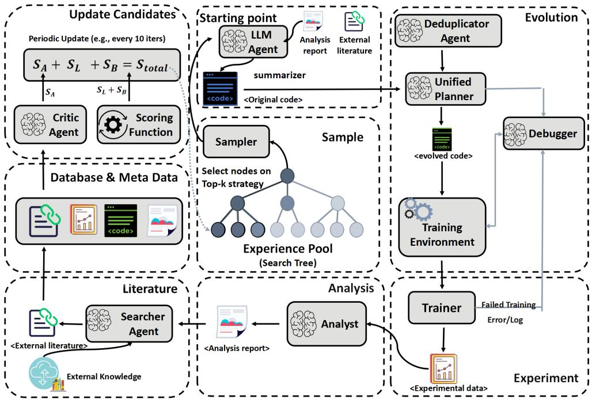
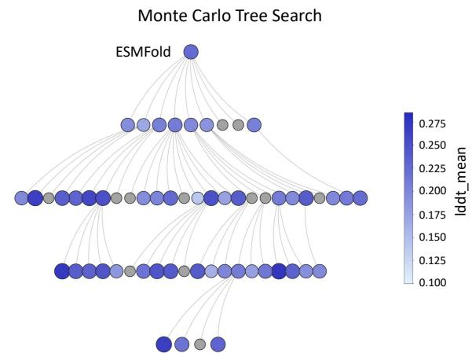
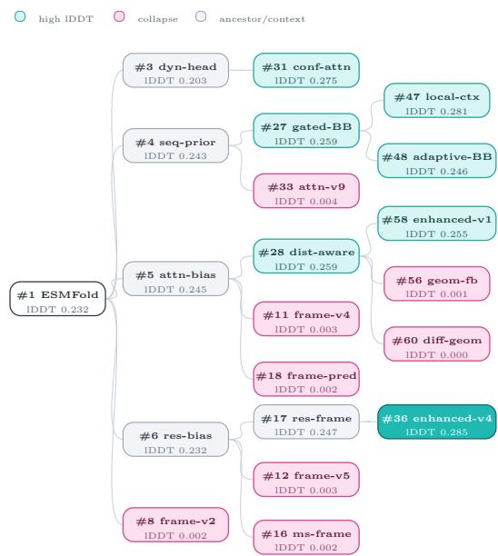
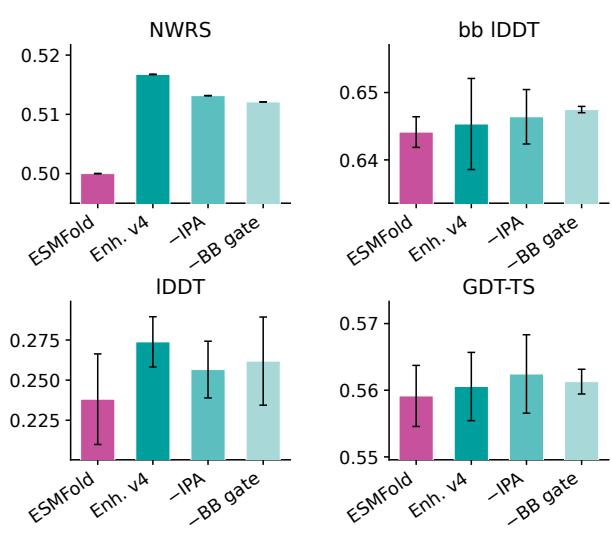
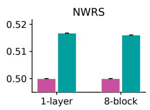
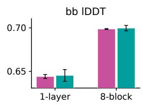
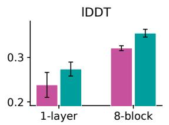
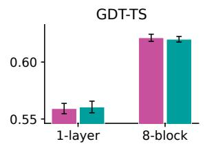
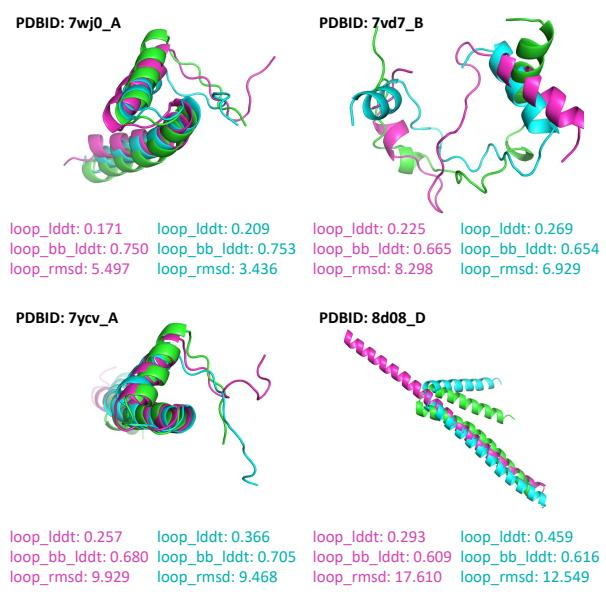
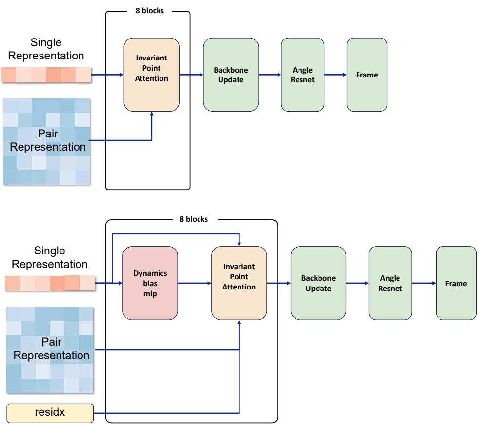

# AgentFold: Closed-Loop Agentic Search for Protein Folding Model Design

Mingquan Liu1\* Jiangyu Chen2\* Hanqun Cao3\* Xujun Zhang4 Pengsen Ma1 Xiangru Tang5 Shuting Jin6 Zhuo Yang7 Tianfan Fu2†

Fang Wu8† Xiangxiang Zeng1†

1State Key Lab. of Chemo & Biosensing, Coll. of Comp. Sci. & Electron. Eng., Hunan University

2State Key Laboratory for Novel Software Technology, Sch. of Comput. Sci., Nanjing University

3The Chinese University of Hong Kong 4Zhejiang University 5Yale University

6Wuhan University of Science and Technology 7Southeast University

8Stanford University

xzeng@hnu.edu.cn

## Abstract

Scientific LLM agents have shown promise in literature reasoning, tool use, and experiment planning, but it remains unclear whether they can autonomously improve large, tightly coupled scientific ML systems through executable code changes and expensive validation. We study this question in protein folding, where progress requires coordinated architectural edits, multi-objective evaluation, and domainaware interpretation. We present AgentFold, a multi-agent framework that formulates foldingmodel development as closed-loop search over executable code variants. Starting from ESM-Fold, AgentFold proposes hypotheses, implements and debugs code-level modifications, evaluates variants, analyzes outcomes, and stores both successful and failed interventions in structured memory; an MCTS-style policy allocates compute across high-scoring branches. On an engineering-scale folding codebase (> 2,000 LOC), AgentFold explores 80 variants using 5,000 GPU-hours and 170M LLM tokens. At matched budget, AgentFold improves best lDDT by 7.5% over independent Codex proposals and beats random control. Beyond model improvement, the intervention traces reveal recurring empirical design patterns: stable gains tend to arise from early soft learnable priors and gated refinement, whereas direct geometric perturbations and geometry-conditioned feedback often destabilize training. The code and experimental resources are publicly available at https://github.com/lmqfly/ AgentFold.

## 1 Introduction

Scientific agents increasingly combine large language models (LLMs) with literature analysis, hypothesis generation, tool use, and experimental planning (Lu et al., 2024; Tang et al., 2025; Hsu et al., 2024; Qi et al., 2023; Fallahpour et al.,

2025; Huang et al., 2025a; Hao et al., 2025; Huang et al., 2025b; Wang et al., 2025a; Jin et al., 2025). Execution-grounded benchmarks separately show that iterative machine-learning experimentation and scientific-code development remain difficult even when outcomes can be checked automatically (Tian et al., 2024; Huang et al., 2024a,b; Chan et al., 2025; Edwards et al., 2026). In scientific ML, a plausible proposal is insufficient: the system must implement the change in a coupled codebase, recover from failures, and compare expensive, noisy, multi-objective experiments.

We study this question in protein folding, where architectural changes are executable interventions in a tightly coupled scientific ML system. Folding models combine sequence and pair representations, geometric refinement, recycling, and structure losses, while evaluation spans both local and global structural metrics. This setting provides a suitable testbed for assessing whether LLM agents are capable of closed-loop scientific model development beyond code generation assistance.

We introduce AgentFold, a multi-agent framework for code-level search over folding-model variants. Starting from a compact ESMFold-derived substrate (Lin et al., 2022), AgentFold executes a propose–implement–evaluate loop: it retrieves evidence from a folding-model zoo and a structured memory, proposes architectural or algorithmic edits, applies and debugs code changes, evaluates executable variants, and records both successful and failed interventions. Failed or low-performing variants are retained as structured evidence, allowing later proposals to avoid repeated failure modes and supporting post-hoc comparison among related edits. We use the compact substrate to enable repeated training and evaluation while preserving the coupled structure-module setting that makes folding-model design nontrivial.

To allocate compute over long-horizon exploration, AgentFold uses an MCTS-style tree controller over concrete code snapshots. Each node represents an executable implementation, while expansions are prioritized using standard folding metrics and a normalized search utility. On an engineering-scale codebase (>2,000 LOC), Agent-Fold explores roughly 80 variants using approximately 5,000 GPU-hours and 170M LLM tokens. At a matched evaluation budget on the CAMEO2022 (Haas et al., 2018) development benchmark, AgentFold achieves 7.5% higher best lDDT than an independent Codex-proposal baseline and also outperforms a random-search controller. The strongest variants obtain these improvements with only modest parameter overhead. Analysis of both successful and failed interventions further reveals descriptive regularities: stable improvements frequently co-occur with early soft learnable priors and gated refinement, whereas direct geometric perturbations and geometry-conditioned feedback are often associated with training instability.

## Contributions. Our contributions are:

• Closed-loop folding model search. We present AgentFold, a multi-agent framework that formulates folding-model development as propose– implement–debug–evaluate cycles over executable code variants rather than limiting the search to textual hypotheses.

• Engineering-scale matched-budget evaluation. Starting from a compact ESMFold-derived substrate, AgentFold evaluates roughly 80 code variants under expensive structural validation. At a matched evaluation budget, it achieves 7.5% higher best lDDT than an independent Codexproposal baseline and also outperforms a randomsearch controller.

• Trace-based design evidence. We analyze the resulting intervention traces to identify recurring post-hoc empirical patterns: stable gains are associated with early soft learnable priors and gated refinement, whereas direct geometric perturbations and geometry-conditioned feedback often destabilize training.

## 2 Related Work

## 2.1 Autonomous AI Research

LLM-based systems support literature synthesis and hypothesis generation, end-to-end scientific workflows, and biomedical research planning (Lu et al., 2024; Boiko et al., 2023; Swanson et al.,

2025). Execution-grounded benchmarks further evaluate agents on iterative machine-learning experimentation, scientific or data-science code generation, and research-code extensions (Tian et al., 2024; Huang et al., 2024a; Chan et al., 2025; Huang et al., 2024b; Edwards et al., 2026). These studies expose the difficulty of long-horizon implementation and validation, but they do not specialize the loop to protein-model development.

A complementary line couples LLM-generated programs or designs with executable feedback. FunSearch and AlphaEvolve evolve programs, MCTS-AHD applies tree search to heuristic design, and RZ-NAS and ASI-ARCH search model architectures (Romera-Paredes et al., 2024; Novikov et al., 2025; Zheng et al., 2025; Ji et al., 2025; Liu et al., 2025). AgentFold provides a domain-specific instantiation of these general components in a tightly coupled protein-folding codebase, where each proposed variant must be implemented, debugged, trained, and evaluated against multiple structural metrics.

## 2.2 Protein Folding

Protein structure prediction has progressed from MSA-based systems such as AlphaFold2 and RoseTTAFold (Jumper et al., 2021; Baek et al., 2021) to unified complex predictors such as AlphaFold3 and RoseTTAFold All-Atom (Abramson et al., 2024; Krishna et al., 2024). Open, trainable platforms including OpenFold and Uni-Fold support method development and reproducible engineering (Ahdritz et al., 2023; Li et al., 2022). Other work explores MSA-free languagemodel-based prediction with OmegaFold and ESM-Fold (Wu et al., 2022; Lin et al., 2022), training efficiency with FastFold and MiniFold (Cheng et al., 2022; Wohlwend et al., 2025), and generative or flow-based formulations such as EigenFold, AlphaFlow/ESMFlow, and SimpleFold (Jing et al., 2023, 2024; Wang et al., 2025b).

## 3 Method

We view autonomous folding-model development as a search over code-level interventions and their measured outcomes. AgentFold is designed to produce two coupled artifacts: (i) improved model variants and (ii) accumulated design evidence distilled from intervention–outcome traces. We use an MCTS-style tree controller over executable code variants, enabling compute-efficient exploration and controlled comparisons among competing design choices. A self-evolving multi-agent loop proposes and implements edits, evaluates variants, and recovers from failures. Finally, an attributionand-retrieval stage writes structured intervention artifacts to a database-backed memory, while periodic re-scoring updates node values and refines the search policy. Prompts and templates are provided separately (see Appendix C).

## 3.1 Problem Formulation & Overview

Given a base folding model $\mathcal { M } _ { 0 }$ (ESMFold (Lin et al., 2022)), we aim to discover variants $\{ \mathcal { M } _ { t } \} _ { t = 1 } ^ { T }$ that improve target evaluation metrics and, in parallel, to summarize recurring empirical design patterns $\mathcal { P } = \{ P _ { k } \} _ { k = 1 } ^ { K }$ from repeated intervention evidence. Each iteration logs a structured intervention trace that records the parent variant, the typed edit (e.g., priors, refinement control, geometry operations), the code diff, stability signals, and metric deltas, which supports cross-variant attribution and empirical pattern mining.

To address the complexity of the ESMFold codebase, we propose AgentFold, an LLM-based multiagent framework with an MCTS-style tree controller. As illustrated in Figure 1, AgentFold operates via a dual-loop mechanism:

• Inner Exploration Loop: A continuous cycle of Sampling, Evolution, Experiment, and Analysis that iteratively generates and verifies new model variants.

• Outer Periodic Update: A batched update mechanism (e.g., every 10 iterations) that refines the search tree and candidate sets using a composite scoring function.

A central Database & Metadata module serves as an experiment memory: it stores executable code snapshots, code diffs, configurations, logs, and structured attributions, linking them to retrieved literature so that future edits can be proposed and evaluated using accumulated evidence.

## 3.2 MCTS-based Dynamic Sampling

The search process begins with the Experience Pool (Search Tree), which structurally organizes model variants.

Top-k Sampling Strategy. Sampling multiple siblings from the same parent node creates nearcontrolled comparisons (holding most code constant), supporting attribution of gains or losses to specific intervention types and consolidation of recurring design patterns. At the start of each inner loop, the sampler selects high-scoring nodes together with diverse reference nodes, approximating an exploration–exploitation trade-off.

Context Summarization. The Summarizer prioritizes evidence that is comparable to the current parent node (e.g., similar edit types or failure modes), producing a compact brief that highlights successful outcomes, failed interventions, and empirical patterns currently supported by the accumulated traces.

## 3.3 Self-Evolving Agentic Workflow

The Evolution phase transforms the summarized context into executable code through a specialized agent chain:

1. Deduplication. First, a Deduplicator Agent screens the proposed optimization direction against historical data to prevent redundant experiments.

2. Unified Planning & Coding. Valid proposals are passed to the Unified Planner. Unlike decoupled approaches, this agent is solely responsible for both architectural design and code implementation, reducing interface mismatches between design and implementation.

3. Interactive Debugging. The generated code enters the Training Environment. A Debugger agent monitors the process in real time. Upon detecting an error or anomalous log message, the Debugger autonomously interacts with the Unified Planner to iteratively fix syntax or runtime errors until training launches successfully.

## 3.4 Attribution, Empirical Pattern Mining & Knowledge Retrieval

Once training concludes (or terminates unsuccessfully), the system initiates a two-stage postprocessing phase to enrich the Database & Metadata:

1. Automated analysis. The Trainer streams logs to an Analyst agent, which summarizes likely contributors to metric/stability changes and produces a structured report: attribution of deltas to the intervention and an evidence-based update to the current candidate pattern set $\mathcal { P }$ (support, refute and qualify). Reports are persisted to the database.

  
Figure 1: AgentFold system overview. We cast model improvement as MCTS-style search over a code-variant tree, coupling an inner loop (sample evolve run analyze) with a database-backed memory, and an outer periodic update that re-scores candidates to refine the search policy.

2. Literature augmentation. In parallel, a Searcher agent monitors new records, retrieves relevant external literature, and links it to the corresponding interventions and observed failure modes, providing context for subsequent proposals.

## 3.5 Periodic Update & Scoring Mechanism

Whereas canonical MCTS updates node values after each rollout, AgentFold uses batched periodic updates every 10 iterations because each rollout corresponds to an expensive training/evaluation job. We employ a hybrid evaluation module depicted as the "Update Candidates" block. An algorithmic metric parser and a Critic Agent collaboratively compute the total score $S _ { t o t a l } ( e )$

$$
S _ { \mathrm { t o t a l } } ( e ) = S _ { L } ( e ) + S _ { B } ( e ) + S _ { A } ( e )
$$

• Objective metrics $( S _ { L } + S _ { B } ) \colon$ The metric parser automatically extracts the loss score $( S _ { L } )$ and benchmark score $( S _ { B } )$ from the training logs stored in the database.

• Critic score $( S _ { A } ) \colon$ The Critic Agent reviews the intervention rationale and implementation risk (e.g., coherence with prior evidence, clarity of hypothesis, and likelihood of destabilizing training), yielding an agent score $S _ { A }$ used only to prioritize expensive experiments rather than to claim final improvements.

Tree Refinement. At the end of each period, these scores are aggregated to update the node values in the Experience Pool. This periodic synchronization allows the global search policy (Top-k strategy) to evolve based on a batched, robust assessment of recent explorations.

## 4 Results

We first describe the benchmark-guided experimental setup, then report overall search behavior and CAMEO2022 development-benchmark performance. We next use targeted metrics to localize where the gains occur, analyze the variant tree to identify recurring empirical design patterns, and finally test the strongest variant through repeated runs, component ablations, and qualitative loopregion cases.

## 4.1 Experiment Setup

Baseline and training data. We start from a compact ESMFold-derived baseline (Lin et al., 2022), which preserves the sequence, pair, and structuremodule interactions needed for controlled foldingmodel edits while making repeated search feasible (see Appendix A.1). For training, we sample a 1,000-chain mini-dataset from temporally split PDB chains using MMseqs2 cluster-aware weighting and a medium-length preference (see Appendix A.2).

Evaluation. We use CAMEO2022 (Haas et al., 2018) as the development benchmark for scoring variants and allocating search compute. We report backbone lDDT, lDDT, oligomeric GDT-TS, RMSD, and TM-score using OpenStructure (Biasini et al., 2013); NWRS aggregates these metrics relative to a fixed ESMFold baseline for benchmark-guided search ranking (see Appendix A.4, A.5).

## 4.2 Search and Overall Performance

## 4.2.1 Quantitative analysis of Monte Carlo tree evolution

  
Figure 2: MCTS-style tree evolution. Each node is a sampled variant scored by average lDDT (lddt\_mean). Color encodes performance (darker indicates higher lddt\_mean); gray marks low-scoring variants with lddt\_mean < 0.1.

Figure 2 visualizes sampled variants as tree nodes: darker nodes indicate higher mean lDDT, and gray nodes mark low-scoring candidates. The trajectory follows a wide-to-focused pattern. Early iterations sample heterogeneous edits with mixed outcomes, whereas later expansions form denser branches around higher-lDDT variants. The observed trajectory is consistent with the MCTSstyle controller reallocating compute toward highscoring code-variant neighborhoods; we interpret it as descriptive evidence of search behavior, while noting that it does not constitute a controlled comparison against alternative controllers.

## 4.2.2 Matched Search-Controller Comparison

With 36 evaluations each, AgentFold outperforms two equal-budget baselines. Random control uses the same edit space, models, prompts, checks, training, and evaluator but selects actions randomly. Codex independently generates proposals without the search tree or intervention history; executable candidates use the same pipeline. Agent-Fold achieves the best and NWRS-selected Top-5 results (Table 1), supporting the integrated search while not isolating individual components.

Table 1: Matched comparison at 36 evaluations; Top-5 by NWRS.
<table><tr><td>Method</td><td>Best IDDT</td><td>Top-5 IDDT</td><td>Best NWRS</td><td>Top-5 NWRS</td></tr><tr><td>AgentFold</td><td>0.285</td><td>0.267</td><td>0.526</td><td>0.516</td></tr><tr><td>Codex proposals</td><td>0.265</td><td>0.257</td><td>0.512</td><td>0.509</td></tr><tr><td>Random controller</td><td>0.260</td><td>0.242</td><td>0.510</td><td>0.506</td></tr></table>

## 4.2.3 Quantitative Results

Table 2 reports mean/median performance for representative variants, with each non-baseline row shown as a delta relative to ESMFold. Under the CAMEO2022-guided search protocol, all displayed variants improve NWRS (+0.007 to +0.026) and mean lDDT (+0.016 to +0.053), indicating that the search repeatedly finds executable edits with better local structural accuracy rather than a single isolated outlier. The strongest overall variant, esmfold\_struct\_enhanced\_v4, has the largest composite gain (+0.026) and the largest lDDT gain in both mean and median (+0.053/+0.059), while esmfold\_struct\_local\_context\_v1 and esmfold\_struct\_enhanced\_multis cale\_v2 show similarly local-accuracy-oriented profiles.

The gains are not uniform across global metrics, which is important for interpreting the result. esmfold\_struct\_dist\_aware\_v1 gives a smaller lDDT gain than esmfold\_struct\_enhanced\_v4 but is more favorable on backbone lDDT, GDT-TS, mean RMSD, and mean TM-score. Conversely, several high-NWRS variants improve lDDT while leaving TM-score nearly unchanged and producing mixed RMSD changes. This pattern shows that AgentFold’s improvements are concentrated in local structural accuracy while largely preserving, rather than systematically improving, global fold quality. It also motivates the targeted analyses below, where we separate loop quality, physical plausibility, and contact behavior instead of relying only on a single aggregate score.

Table 2: CAMEO2022 development-benchmark performance for representative variants. We show the top NWRS variants and variants used in later targeted analyses. The ESMFold row reports absolute mean/median values; other rows report deltas relative to ESMFold. Bold and underline mark the largest and second-largest favorable changes among displayed variants.
<table><tr><td>Variant</td><td>NWRS ↑</td><td>bb_lddt ↑</td><td>lddt ↑</td><td>oligo_gdtts ↑</td><td>rmsd ↓</td><td>tm_score ↑</td></tr><tr><td>esmfold</td><td>0.500</td><td>0.644/0.651</td><td>0.232/0.220</td><td>0.564/0.570</td><td>7.380/5.358</td><td>0.648/0.693</td></tr><tr><td>esmfold_struct_enhanced_v4</td><td>+0.026</td><td>+0.009/+0.010</td><td>+0.053/+0.059</td><td>+0.005/-0.003</td><td>+0.082/-0.038</td><td>+0.004/-0.012</td></tr><tr><td>esmfold_struct_local_context_v1</td><td>+0.020</td><td>+0.002/+0.006</td><td>+0.049/+0.044</td><td>-0.001/-0.005</td><td>+0.176/-0.129</td><td>+0.001/-0.012</td></tr><tr><td>esmfold_struct_dist_aware_v1</td><td>+0.018</td><td>+0.011/+0.014</td><td>+0.027/+0.024</td><td>+0.011/+0.020</td><td>-0.088/-0.134</td><td>+0.011/-0.009</td></tr><tr><td>esmfold_struct_enhanced_multiscale_v2</td><td>+0.017</td><td>+0.007/+0.014</td><td>+0.045/+0.049</td><td>+0.004/+0.006</td><td>+0.261/+0.338</td><td>+0.001/-0.019</td></tr><tr><td>esmfold_net_conformal_geometric_attention</td><td>+0.017</td><td>-0.006/-0.008</td><td>+0.043/+0.046</td><td>-0.006/+0.011</td><td>-0.063/+0.240</td><td>-0.005/-0.001</td></tr><tr><td>esmfold_struct_enhanced_v1_dup2</td><td>+0.014</td><td>+0.012/+0.010</td><td>+0.023/+0.025</td><td>+0.007/+0.010</td><td>+0.029/-0.038</td><td>+0.007/-0.009</td></tr><tr><td>esmfold_struct_attn_frame_v1</td><td>+0.010</td><td>+0.002/+0.007</td><td>+0.016/+0.020</td><td>+0.001/+0.011</td><td>+0.025/-0.126</td><td>+0.001/-0.013</td></tr><tr><td>esmfold_struct_enhanced_v2_dup3</td><td>+0.007</td><td>+0.006/+0.008</td><td>+0.017/+0.003</td><td>+0.003/+0.004</td><td>-0.127/-0.129</td><td>+0.003/-0.017</td></tr></table>

## 4.2.4 Targeted Evaluation of Inductive Biases

Each variant encodes a specific inductive bias, but aggregate metrics are insufficient to test whether the intended behavior emerges. We therefore cluster motivations into five recurring goal categories (see Appendix Table 4) and evaluate each goal with targeted metrics. This goal-conditioned analysis supports controlled comparison across variants (reported as ∆ vs. ESMFold) and clarifies which biases translate into consistent, measurable gains.

Motivation-aspect summary. Table 3 merges the targeted loop, physical, and contact evaluations by taking the union of representative variants from these aspects. Each row is annotated by its motivation aspect(s): L denotes loop quality, P denotes physical plausibility, and C denotes contact modeling. The main table keeps two loop metrics, Mol-Probity for physical plausibility, and two contact metrics in the 12–24 sequence-separation bin; complete targeted metrics are reported separately (see Appendix Tables 6–8).

Table 3 decomposes the aggregate gains in Table 2. The loop columns show that loop-oriented improvements are concentrated in loop lDDT: esmfold\_struct\_local\_context\_v1 has the largest loop-lDDT gain (+0.063), whereas esmfold\_struct\_enhanced\_v4 has the largest loop backbone-lDDT gain (+0.008). For physical plausibility, esmfold\_struct\_enhanced\_v4 achieves the largest MolProbity reduction (-0.157), with esmfold\_struct\_attn\_frame\_v1 showing a smaller reduction (-0.049). Contact gains are more selective: in the 12–24 separation bin, esmfold\_struct\_enhanced\_v1\_dup2 yields the largest precision and F1 gains (+0.020/+0.013), while esmfold\_struct\_enhanced\_v4 yields comparable gains (+0.019/+0.010). Together, the targeted metrics support the same conclusion as Table 2: AgentFold’s largest gains are local and medium-range rather than broad global-fold improvements. See Appendix Tables 6–8 for the complete targeted metrics.

## 4.3 Analysis

We analyze the variant tree to assess whether the gains reflect recurring empirical design patterns rather than capacity effects. This analysis is descriptive: it compares successful and failed edits in the same search tree and summarizes patterns that repeatedly co-occur with stable or unstable outcomes.

## 4.3.1 Evolutionary Analysis

Variant-tree trends by mean lDDT. Figure 3 summarizes the selected subtree used for this analysis, with each node annotated by mean lDDT. The high-performing region is not defined by a single module name; instead, strong variants such as #36 (esmfold\_struct\_enhanced\_v4) and #47 (esmfold\_struct\_local\_context\_v1) share a similar placement strategy: they add soft, learnable priors before coordinates are instantiated. In contrast, severe failures such as #60 (esmfold\_net\_differential\_geometry) rely on more direct geometric perturbations after structural information is already being formed. The resulting pattern set  contains three post-hoc empirical categories rather than theoretical laws: (P1) Bias before geometry, (P2) Multiplicative refinement, and (P3) Avoid geometry-to-attention feedback. The corresponding agent-report evidence is summarized separately (see Appendix Table 5). P1 is plausible because early pair/IPA biases steer attention before coordinates enter the recycling loop, while late frame-level offsets perturb an already coupled rigid-update process. P2 is less intrusive than additive forcing because gates scale update magnitudes and can damp uncertain regions rather than imposing a fixed geometric displacement. P3 reflects a failure mode in which geometry-derived signals are fed back into attention or frame updates; when initial geometry is inaccurate, this can amplify the error across subsequent refinement steps. The highest-NWRS composite design #36 combines smooth IPA biasing, gated updates, and chunk-boundary attention while leaving the core IPA frames FAPE loop intact, which may explain why it improves local metrics without disrupting global fold quality.

Table 3: Targeted evaluation summary by motivation aspect. The ESMFold row reports absolute means; other rows report changes relative to ESMFold. L/P/C denote loop-quality, physical-plausibility, and contact-modeling motivations. Bold indicates the largest improvement, and underline indicates the second largest.
<table><tr><td>Variant</td><td>Aspect</td><td colspan="2">Loop</td><td>Physical</td><td colspan="2">Contact</td></tr><tr><td></td><td></td><td></td><td>loop lDDT ↑ loop bb-lDDT ↑ MolProbity↓ Prec12-24 ↑ F112-24 ↑</td><td></td><td></td><td></td></tr><tr><td>esmfold</td><td>Base</td><td>0.162</td><td>0.613</td><td>3.773</td><td>0.599</td><td>0.606</td></tr><tr><td>esmfold_struct_enhanced_v4</td><td>L/P/C</td><td>+0.060</td><td>+0.008</td><td>-0.157</td><td>+0.019</td><td>+0.010</td></tr><tr><td>esmfold_struct_local_context_v1</td><td>L</td><td>+0.063</td><td>+0.002</td><td>7</td><td></td><td></td></tr><tr><td>esmfold_struct_enhanced_v1_dup2</td><td>L/C</td><td>+0.031</td><td>+0.007</td><td></td><td>+0.020</td><td>+0.013</td></tr><tr><td>esmfold_struct_attn_frame_v1</td><td>L/P</td><td>+0.025</td><td>+0.001</td><td>-0.049</td><td></td><td></td></tr><tr><td>esmfold_struct_enhanced_multiscale_v2</td><td>L/P/C</td><td>+0.056</td><td>+0.002</td><td>-0.043</td><td>+0.009</td><td>+0.007</td></tr><tr><td>esmfold_struct_enhanced_v2_dup3</td><td>L/C</td><td>+0.023</td><td>+0.002</td><td>1</td><td>+0.013</td><td>+0.006</td></tr></table>

  
Figure 3: Selected variant subtree used in the evolutionary analysis. Colors distinguish high-lDDT variants, collapse cases, and ancestor/context nodes; each node reports mean lDDT.

The tree suggests an empirical design heuristic: stable improvements are associated with early, learnable priors and multiplicative control of refinement, whereas direct geometric forcing and geometry-conditioned feedback are associated with collapse in evaluation. This is consistent with the quantitative results above: successful edits tend to steer attention or update magnitudes, while failed edits more often impose geometry directly.

## 4.3.2 Parameter Analysis

Parameter-efficiency of gains. High-NWRS variants remain close to the 22.61M-parameter ESMFold baseline. The highest-NWRS model #36 has 22.856M parameters, an increase of only 1.1%, and several strong variants add less than 0.1%. For example, #47 adds approximately 0.015M parameters yet reaches the second-highest NWRS in Table 2, and #28 slightly reduces the parameter count while improving several backbone/- global metrics. Conversely, larger variants are not reliably better: #24 and #40 have 28.46M parameters and #57 has 32.49M, but they do not dominate the compact high-NWRS variants; #60 collapses despite having 31.03M parameters. These comparisons suggest that the gains are better explained by the placement of biases and gates than by raw capacity.

## 4.4 Ablation Study

Figure 4 shows that esmfold\_struct\_enhanced\_v4 preserves its lDDT advantage under repeated runs and an 8-block Folding Trunk. In the 1-layer setting, mean lDDT increases from 0.238 to 0.274; with 8 trunk blocks, it increases from 0.321 to 0.355. These follow-up runs use matched repeated-run baselines; therefore, their ESMFold means are not expected to exactly match the single-run Table 2 baseline.

  
Figure 3: Robustness under repeated runs and deeper Folding4 Trunks. Each panel shows one metric; RMSD is omitted dueMatched repeated-run sett ngs are used; RMSD is to its different scale. Error bars denote standard deviations.omitted du to its different scale. Error bars denote standard deviations.  
tied to the sFigure 5: arch confi Component ion.ablation of Figure 4 tests whether the besesmfold\_struct\_enhanced\_v4. nt is drivenEach panel shows one metric; RMSD is omitted due to its different scale. Error bars denote standard deviations.

ckboneUpdate gating reduces mean lDDT byFigure 5 tests whether the highest-NWRS variant 0.012. Thus, BackboneUpdate gating alone is notis driven by a single component. Removing the IPA sufficient to recover the full improvement, and thebias or BackboneUpdate gating lowers mean lDDT two mechanisms appear complementary.by 0.017 and 0.012, r spectively. Both ablated variants remain competitive with ESMFold on some metrics, but neither recovers the full lDDT gain, We examine esmfold\_struct\_enhanced\_v4,indicating that the bias and gating mechanisms are an MCTS-selected variant that minimallycomplementary ra her than interchangeable. Mechextends ESMFold by adding (i) a residueanistically, the IPA bias changes where info mation index-conditioned bias MLP before IPA,s routed dur ng attent on, whereas BackboneUpwhich maps residue-index informationdate gating controls how stro gly the resulting upinto lightweight attention-bias features, (ii)date is applied; removing either weakens a different dynamic/sequence/structure-apart of the refinement pa hway.

  
bars denote standard deviations.Figure 6: Loop-region case studies on four CAMEO targets. Superpositions of ground truth (green), ESMFold (magenta), and IPA logits, and (iii) lightweight staesmfold\_struct\_enhanced\_v4 (trunk (cyan) chunk-boundary bias; BackboneUpdate gating;are shown for 7wj0\_A, 7vd7\_B, 7ycv\_A, and Appendix B.2).8d08\_D. Text in each panel reports loop lDDT, loop backbone lDDT, and loop RMSD for ESM-Loop-region improvement. Loops are chal-Fold and esmfold\_struct\_enhanced\_v4. lenging due to weak constraints and high flex-esmfold\_struct\_enhanced\_v4 improves loop placement and backbone alignment in most cases, while 7vd7\_B illustrates a residual metric trade-off.

## Fold, esmfold\_4.5 Case Study

We use esmfold\_struct\_enhanced\_v4 as a representative case because it achieves the largest local-accuracy gains while remaining close to the baseline architecture; implementation details are summarized separately (see Appendix B.4).

→      Loop-region improvement. Loops are challenging due to weak constraints and high flexibility. Figure 6 visualizes four representative loop-region cases (PDB IDs: 7wj0\_A, 7vd7\_B, Mechanistic interpretation. The added IPA con-7ycv\_A, and 8d08\_D). Compared with ESM- ditioning biases attention using sequence separa-Fold, esmfold\_struct\_enhanced\_v4 re- tion ( ) and the evolving structural state,duces loop RMSD in all four cases and consistently while BackboneUpdate gating regularizes rigid up-improves loop lDDT, while loop backbone lDDT dates. Both effects mitigate unstablincreases in three of the four targets.

Mechanistic interpretation. The architecture comparison (see Appendix Figure 7) shows that the variant inserts IPA-side biasing while preserving the downstream geometric heads. Together with the We present AgentFold, a fully autonomous multi-ablation results, the qualitative examples are conagent framework that performs closed-loop, code-sistent with the quantitative trend: IPA biasing and level optimization of protein folding models via BackboneUpdate gating appear to improve flexibleloop placement without systematically changing global topology.

## 5 Conclusion

We present AgentFold, a multi-agent framework that formulates folding-model development as closed-loop search over executable code variants. Starting from ESMFold, AgentFold identifies parameter-efficient variants with consistent gains, primarily in local structural accuracy, while largely preserving global fold quality. The intervention traces further suggest recurring empirical design patterns: early soft learnable priors and gated refinement are associated with more stable gains in our search, whereas direct geometric perturbations and geometry-conditioned feedback often destabilize training.

## Limitations

Our evidence is limited to a one-block, compact ESMFold-derived codebase, a 1,000-chain training subset, and CAMEO2022 development-benchmark evaluation; transfer to stronger folding systems and broader biological settings remains unverified.

Future work. Extending the discovered interventions to larger and multi-chain systems requires model-specific edit interfaces, chain-aware representations, interface-sensitive objectives, retraining, and evaluation. Cross-domain use similarly requires a domain-specific codebase, evaluator, reward, and failure-analysis loop. We leave these extensions to future work.

## Acknowledgments

The authors thank Zehong Wang (University of Notre Dame) for helpful discussions and suggestions. This work was supported by the National Natural Science Foundation of China (Grant Nos. 62425204, U22A2037, 62450002, and 62432011). Jiangyu Chen and Tianfan Fu were supported by the Young Scientists Fund (C Class) of the National Natural Science Foundation of China (Grant No. 62506154), the Fundamental Research Funds for the Central Universities, the Nanjing University International Collaboration Initiative (Grant No. 020214380129), and the “111 Center” (No. B26023).

## Ethical Considerations

AgentFold aims to improve protein folding models through closed-loop code search. While better structure prediction can support biological and medical research, increased AI-for-biology capability may also introduce dual-use risks. Responsible release, careful evaluation, and human oversight are therefore important.

## References

Josh Abramson, Jonas Adler, Jack Dunger, Richard Evans, Tim Green, Alexander Pritzel, Olaf Ronneberger, Lindsay Willmore, Andrew J. Ballard, Joshua Bambrick, Sebastian W. Bodenstein, David A. Evans, Chia-Chun Hung, Michael O’Neill, David Reiman, Kathryn Tunyasuvunakool, Zachary Wu, Akvile Žemgulyt˙ e, Eirini Arvaniti, and 29 others.˙ 2024. Accurate structure prediction of biomolecular interactions with AlphaFold 3. Nature, 630:493–500.

Gustaf Ahdritz, Nazim Bouatta, Sachin Kadyan, Qinghui Xia, William Gerecke, Tim O’Donnell, Daniel Berenberg, Ian Fisk, Niccoló Zanichelli, Bo Zhang, Arkadiusz Nowaczynski, Bei Wang, Marta M. Stepniewska-Dziubinska, Shang Zhang, Adegoke A. Ojewole, Murat Efe Guney, Stella Biderman, Andrew M. Watkins, Stephen Ra, and 9 others. 2023. Openfold: Retraining alphafold2 yields new insights into its learning mechanisms and capacity for generalization. bioRxiv.

Minkyung Baek, Frank DiMaio, Ivan Anishchenko, Justas Dauparas, Sergey Ovchinnikov, Gyu Rie Lee, Jue Wang, Qian Cong, Lisa N. Kinch, R. Dustin Schaeffer, Claudia Millán, Hahnbeom Park, Carson Adams, Caleb R. Glassman, Andy DeGiovanni, Jose H. Pereira, Andria V. Rodrigues, Alberdina A. van Dijk, Ana C. Ebrecht, and 13 others. 2021. Accurate prediction of protein structures and interactions using a three-track neural network. Science, 373(6557):871–876.

Marco Biasini, Tobias Schmidt, Stefan Bienert, Valerio Mariani, Gabriel Studer, Jürgen Haas, Niklaus Johner, Andreas Daniel Schenk, Ansgar Philippsen, and Torsten Schwede. 2013. Openstructure: an integrated software framework for computational structural biology. Biological crystallography, 69(5):701– 709.

Daniil A Boiko, Robert MacKnight, Ben Kline, and Gabe Gomes. 2023. Autonomous chemical research with large language models. Nature, 624(7992):570– 578.

Jun Shern Chan, Neil Chowdhury, Oliver Jaffe, James Aung, Dane Sherburn, Evan Mays, Giulio Starace, Kevin Liu, Leon Maksin, Tejal Patwardhan, Aleksander Madry, and Lilian Weng. 2025. MLE-bench: Evaluating machine learning agents on machine

learning engineering. In International Conference on Learning Representations.

Shenggan Cheng, Rui Min Wu, Zhongming Yu, Bin-Rui Li, Xiwen Zhang, Jian Peng, and Yang You. 2022. Fastfold: Reducing alphafold training time from 11 days to 67 hours. ArXiv, abs/2203.00854.

Nicholas Edwards, Yukyung Lee, Yujun Audrey Mao, Yulu Qin, Sebastian Schuster, and Najoung Kim. 2026. RExBench: Can coding agents autonomously implement AI research extensions? In Proceedings of the 64th Annual Meeting of the Association for Computational Linguistics (Volume 1: Long Papers), pages 16380–16417. Association for Computational Linguistics.

Adibvafa Fallahpour, Andrew Magnuson, Purav Gupta, Shihao Ma, Jack Naimer, Arnav Shah, Haonan Duan, Omar Ibrahim, Hani Goodarzi, Chris J Maddison, and 1 others. 2025. Bioreason: Incentivizing multimodal biological reasoning within a dna-llm model. arXiv preprint arXiv:2505.23579.

Jürgen Haas, Alessandro Barbato, Dario Behringer, Gabriel Studer, Steven Roth, Martino Bertoni, Khaled Mostaguir, Rafal Gumienny, and Torsten Schwede. 2018. Continuous automated model evaluation (CAMEO) complementing the critical assessment of structure prediction in CASP12. Proteins: Structure, Function, and Bioinformatics, 86(S1):387– 398.

Minsheng Hao, Yongju Lee, Hanchen Wang, Gabriele Scalia, and Aviv Regev. 2025. Perturboagent: A selfplanning agent for boosting sequential perturb-seq experiments. bioRxiv, pages 2025–05.

Chao-Chun Hsu, Erin Bransom, Jenna Sparks, Bailey Kuehl, Chenhao Tan, David Wadden, Lucy Lu Wang, and Aakanksha Naik. 2024. Chime: Llmassisted hierarchical organization of scientific studies for literature review support. arXiv preprint arXiv:2407.16148.

Kexin Huang, Ying Jin, Ryan Li, Michael Y Li, Emmanuel Candès, and Jure Leskovec. 2025a. Automated hypothesis validation with agentic sequential falsifications. arXiv preprint arXiv:2502.09858.

Kexin Huang, Serena Zhang, Hanchen Wang, Yuanhao Qu, Yingzhou Lu, Yusuf Roohani, Ryan Li, Lin Qiu, Gavin Li, Junze Zhang, and 1 others. 2025b. Biomni: A general-purpose biomedical ai agent. biorxiv.

Qian Huang, Jian Vora, Percy Liang, and Jure Leskovec. 2024a. MLAgentBench: Evaluating language agents on machine learning experimentation. In Proceedings ofthe 41st International Conference on Machine Learning, volume 235 of Proceedings of Machine Learning Research, pages 20271–20309. PMLR.

Yiming Huang, Jianwen Luo, Yan Yu, Yitong Zhang, Fangyu Lei, Yifan Wei, Shizhu He, Lifu Huang, Xiao Liu, Jun Zhao, and 1 others. 2024b. Da-code: Agent data science code generation benchmark for large language models. arXiv preprint arXiv:2410.07331.

Zipeng Ji, Guanghui Zhu, Chunfeng Yuan, and Yihua Huang. 2025. RZ-NAS: Enhancing LLM-guided neural architecture search via reflective zero-cost strategy. In Proceedings of the 42nd International Conference on Machine Learning, volume 267 of Proceedings ofMachine Learning Research, pages 27237–27254. PMLR.

Ruofan Jin, Zaixi Zhang, Mengdi Wang, and Le Cong. 2025. STELLA: Self-evolving LLM agent for biomedical research. arXiv preprint arXiv:2507.02004.

Bowen Jing, Bonnie Berger, and T. Jaakkola. 2024. Alphafold meets flow matching for generating protein ensembles. ArXiv, abs/2402.04845.

Bowen Jing, Ezra Erives, Peter Pao-Huang, Gabriele Corso, Bonnie Berger, and Tommi Jaakkola. 2023. Eigenfold: Generative protein structure prediction with diffusion models. arXiv preprint arXiv:2304.02198.

John M. Jumper, Richard Evans, Alexander Pritzel, Tim Green, Michael Figurnov, Olaf Ronneberger, Kathryn Tunyasuvunakool, Russ Bates, Augustin Žídek, Anna Potapenko, Alex Bridgland, Clemens Meyer, Simon A A Kohl, Andy Ballard, Andrew Cowie, Bernardino Romera-Paredes, Stanislav Nikolov, Rishub Jain, Jonas Adler, and 15 others. 2021. Highly accurate protein structure prediction with alphafold. Nature, 596:583 – 589.

Rohith Krishna, Jue Wang, Woody Ahern, Pascal Sturmfels, Preetham Venkatesh, Indrek Kalvet, Gyu Rie Lee, Felix S. Morey-Burrows, Ivan Anishchenko, Ian R. Humphreys, Ryan McHugh, Dionne Vafeados, Xinting Li, George A. Sutherland, Andrew Hitchcock, C. Neil Hunter, Alex Kang, Evans Brackenbrough, Asim K. Bera, and 3 others. 2024. Generalized biomolecular modeling and design with RoseTTAFold All-Atom. Science, 384(6693):eadl2528.

Ziyao Li, Xuyang Liu, Weijie Chen, Fan Shen, Hangrui Bi, Guolin Ke, and Linfeng Zhang. 2022. Uni-fold: An open-source platform for developing protein folding models beyond alphafold. bioRxiv.

Zeming Lin, Halil Akin, Roshan Rao, Brian L. Hie, Zhongkai Zhu, Wenting Lu, Nikita Smetanin, Robert Verkuil, Ori Kabeli, Yaniv Shmueli, Allan dos Santos Costa, Maryam Fazel-Zarandi, Tom Sercu, Salvatore Candido, and Alexander Rives. 2022. Evolutionary-scale prediction of atomic level protein structure with a language model. bioRxiv.

Yixiu Liu, Yang Nan, Weixian Xu, Xiangkun Hu, Lyumanshan Ye, Zhen Qin, and Pengfei Liu. 2025. Alphago moment for model architecture discovery. arXiv preprint arXiv:2507.18074.

Chris Lu, Cong Lu, Robert Tjarko Lange, Jakob Foerster, Jeff Clune, and David Ha. 2024. The ai scientist: Towards fully automated open-ended scientific discovery. arXiv preprint arXiv:2408.06292.

Alexander Novikov, Ngân Vu, Marvin Eisenberger,˜ Emilien Dupont, Po-Sen Huang, Adam Zsolt Wagner, Sergey Shirobokov, Borislav Kozlovskii, Francisco JR Ruiz, Abbas Mehrabian, and 1 others. 2025. Alphaevolve: A coding agent for scientific and algorithmic discovery. arXiv preprint arXiv:2506.13131.

Biqing Qi, Kaiyan Zhang, Haoxiang Li, Kai Tian, Sihang Zeng, Zhang-Ren Chen, and Bowen Zhou. 2023. Large language models are zero shot hypothesis proposers. arXiv preprint arXiv:2311.05965.

Bernardino Romera-Paredes, Mohammadamin Barekatain, Alexander Novikov, Matej Balog, M. Pawan Kumar, Emilien Dupont, Francisco J. R. Ruiz, Jordan S. Ellenberg, Pengming Wang, Omar Fawzi, Pushmeet Kohli, and Alhussein Fawzi. 2024. Mathematical discoveries from program search with large language models. Nature, 625:468–475.

Martin Steinegger and Johannes Söding. 2017. Mmseqs2 enables sensitive protein sequence searching for the analysis of massive data sets. Nature biotechnology, 35(11):1026–1028.

Kyle Swanson, Wesley Wu, Nash L. Bulaong, John E. Pak, and James Zou. 2025. The virtual lab of AI agents designs new SARS-CoV-2 nanobodies. Nature, 646:716–723.

Xiangru Tang, Zhuoyun Yu, Jiapeng Chen, Yan Cui, Daniel Shao, Weixu Wang, Fang Wu, Yuchen Zhuang, Wenqi Shi, Zhi Huang, and 1 others. 2025. Cellforge: agentic design of virtual cell models. arXiv preprint arXiv:2508.02276.

Minyang Tian, Luyu Gao, Shizhuo Dylan Zhang, Xinan Chen, Cunwei Fan, Xuefei Guo, Roland Haas, Pan Ji, Kittithat Krongchon, Yao Li, Shengyan Liu, Di Luo, Yutao Ma, Hao Tong, Kha Trinh, Chenyu Tian, Zihan Wang, Bohao Wu, Yanyu Xiong, and 11 others. 2024. SciCode: A research coding benchmark curated by scientists. In Advances in Neural Information Processing Systems, volume 37, pages 30624–30650.

Hanchen Wang, Yichun He, Paula P Coelho, Matthew Bucci, Abbas Nazir, Bob Chen, Linh Trinh, Serena Zhang, Kexin Huang, Vineethkrishna Chandrasekar, and 1 others. 2025a. Spatialagent: An autonomous ai agent for spatial biology. bioRxiv, pages 2025–04.

Yuyang Wang, Jiarui Lu, Navdeep Jaitly, Joshua M. Susskind, and Miguel Angel Bautista. 2025b. Simplefold: Folding proteins is simpler than you think. ArXiv, abs/2509.18480.

Jeremy Wohlwend, Mateo Reveiz, Matthew McPartlon, Axel Feldmann, Wengong Jin, and Regina Barzilay. 2025. Minifold: Simple, fast, and accurate protein structure prediction. Trans. Mach. Learn. Res., 2025.

Rui Min Wu, Fan Ding, Rui Wang, Rui Shen, Xiwen Zhang, Shitong Luo, Chenpeng Su, Zuofan Wu, Qi Xie, Bonnie Berger, Jianzhu Ma, and Jian Peng. 2022. High-resolution de novo structure prediction from primary sequence. bioRxiv.

Zhi Zheng, Zhuoliang Xie, Zhenkun Wang, and Bryan Hooi. 2025. Monte carlo tree search for comprehensive exploration in LLM-based automatic heuristic design. In Proceedings of the 42nd International Conference on Machine Learning, volume 267 of Proceedings ofMachine Learning Research, pages 78338–78373. PMLR.

## A Experiment Details

## A.1 Model details

One-layer Folding Trunk for large-scale exploration. To support large-scale architectural search under a fixed compute budget, we instantiate ESMFold’s Folding Trunk (Evoformer-style trunk) with a single trunk block in all experiments unless noted otherwise. This reduces the per-variant training/evaluation cost and enables substantially broader exploration. Crucially, we only modify trunk depth: all trunk operators (e.g., triangular multiplicative updates and triangle attention) are unchanged.

Codebase refactoring (packaging only; no behavioral change). For reproducibility and ease of auditing, we refactored the ESMFold codebase by consolidating core components that were previously spread across multiple files into a single implementation file. The consolidated module includes (i) the Structure Module (IPA, backbone updates, and torsion/frame utilities) and (ii) the trunk components used in our experiments (triangle multiplicative updates, triangle attention, and sequence–pair communication layers). This is a packaging-only change: the architecture, parameterization, and numerical behavior remain identical to the original implementation.

Training setup. Unless otherwise noted, variants are trained for 150 epochs with Adam, batch size 8, and a peak learning rate of $1 \times 1 0 ^ { - 3 }$ . The learning-rate schedule uses a warmup start value of 0, linear warmup for 1,000 steps, delayed decay after 50,000 steps, and multiplicative decay by a factor of 0.95 every 50,000 steps thereafter. We keep these training hyperparameters fixed across variants so that performance differences primarily reflect architectural interventions rather than per-variant hyperparameter tuning.

## A.2 Mini-data curation

Our training data are derived from the Protein Data Bank (PDB) at the level of single protein chains. To reduce redundancy, we cluster chains by sequence identity using a minimum identity threshold of 0.4 with MMseqs2 (Steinegger and Söding, 2017), and treat each cluster as a sequence family of size . We then construct a fixed-size subset of 1,000 chains via weighted stochastic sampling, where each chain is sampled with probability proportional to an inverse family-size term $1 / | \mathcal { C } |$ (to down-weight over-represented families) and a length-dependent factor that favors moderate-length sequences,

$$
p _ { i } \propto \frac { 1 } { | \mathcal { C } _ { i } | } \cdot \frac { 1 } { 5 1 2 } \exp ( L _ { i } , 2 5 6 , 5 1 2 ) .
$$

This procedure yields a more diverse training set while controlling both redundancy and sequence-length distribution.

## A.3 Artifact licenses and terms

We use publicly available research artifacts under their respective licenses and terms of use, including the ESMFold/ESM model code and weights, OpenStructure, MMseqs2, PDB-derived structures, and CAMEO2022 evaluation data. We cite the original creators of these artifacts in the relevant method and experiment sections. Our use of these artifacts is limited to research on protein-structure modeling and evaluation, consistent with their intended research use. We do not redistribute restricted benchmark or structure data in this paper; any released code or model variants should be distributed under terms compatible with the corresponding upstream artifacts.

## A.4 Metric definitions

We report standard structure-evaluation metrics as implemented in OpenStructure (Biasini et al., 2013). Below we summarize the definitions used throughout the paper. Let the target (native) structure be denoted by rtarget and the predicted model by rmodel.

lDDT (Local Distance Difference Test). lDDT is a superposition-free local accuracy metric that evaluates agreement of inter-atomic distances within a local neighborhood. Given a set of considered atom pairs $\{ ( a , b ) \}$ (typically restricted to pairs within a neighborhood radius, e.g., 15 Å in the target), define $d _ { i } ^ { \mathrm { m o d e l } }$ and $\hat { d } _ { i } ^ { \mathrm { t a r g e t } }$ as the distances of the i-th considered pair in the model and target, respectively. With threshold set $\mathcal { T } = \{ 0 . 5 , 1 . 0 , 2 . 0 , 4 . 0 \}$ (in $\mathring \mathrm { A } )$ , we compute

$$
\mathrm { l D D T } = \frac { 1 } { N } \sum _ { i = 1 } ^ { N } \frac { 1 } { | T | } \sum _ { \tau \in { \mathcal T } } { \mathbb K } ^ { \zeta } \big [ \big | d _ { i } ^ { \mathrm { m o d e l } } - d _ { i } ^ { \mathrm { t a r g e t } } \big | < \tau \big ] ,\tag{1}
$$

where $N$ is the number of considered atom-pair distances and $\nVdash [ \cdot ]$ is the indicator function. Higher is better.

Backbone lDDT (bb\_lddt). Backbone lDDT is the lDDT score computed using only backbone atoms $( \mathrm { e . g . } , N , C _ { \alpha } , C , O ;$ or $C _ { \alpha ^ { - } } \mathrm { o n l y }$ depending on the evaluation setting):

$$
\mathrm { b b \_ l d d t } = \mathrm { l D D T _ { b a c k b o n e \ o n l y } . }\tag{2}
$$

GDT-TS (Global Distance Test–Total Score). GDT-TS is a superposition-based global similarity metric defined as the mean of GDT scores at multiple distance cutoffs:

$$
\mathrm { G D T \_ T S } = \frac { 1 } { 4 } \left( \mathrm { G D T _ { 1 \bar { A } } } + \mathrm { G D T _ { 2 \bar { A } } } + \mathrm { G D T _ { 4 \bar { A } } } + \mathrm { G D T _ { 8 \bar { A } } } \right) ,\tag{3}
$$

where, for a cutoff $d ,$ the corresponding term is

$$
\mathrm { G D T } _ { d } = \frac { 1 } { L } \sum _ { i = 1 } ^ { L } \mathcal { k } \big [ \big \| \mathbf { r } _ { i } ^ { \mathrm { m o d e l } } - \mathbf { r } _ { i } ^ { \mathrm { t a r g e t } } \big \| _ { 2 } < d \big ] .\tag{4}
$$

Here $L$ is the number of aligned residues (typically using $C _ { \alpha }$ atoms) and the comparison is performed after an optimal rigid-body superposition.

Oligomeric GDT-TS (oligo\_gdtts). For oligomeric targets, we analogously compute GDT-TS on the multi-chain complex after an optimal superposition that accounts for all chains:

$$
\mathrm { \Omega \ o l i g o \mathrm { _ - g a t \mathrm { t } \mathrm { s = \frac { 1 } { 4 } \left( o l i g o \mathrm { _ - } G D T _ { 1 \acute { A } } + o l i g o \mathrm { _ - } G D T _ { 2 \acute { A } } + o l i g o \mathrm { _ - } G D T _ { 4 \acute { A } } + o l i g o \mathrm { _ - } G D T _ { 8 \acute { A } } \right) , } } }\tag{5}
$$

where each oligo $\mathrm { G D T } _ { d }$ is computed as in Eq. 4 but on the oligomeric complex under the corresponding evaluation protocol.

RMSD (Root-Mean-Square Deviation). RMSD measures the average Euclidean deviation between corresponding atoms after optimal rigid-body alignment:

$$
\mathrm { R M S D } = \sqrt { \frac { 1 } { N } \sum _ { i = 1 } ^ { N } { \left\| { \bf r } _ { i } ^ { \mathrm { m o d e l } } - { \bf r } _ { i } ^ { \mathrm { t a r g e t } } \right\| _ { 2 } ^ { 2 } } } ,\tag{6}
$$

where N is the number of matched atoms used for the superposition. Lower is better.

TM-score (Template Modeling score). TM-score is a length-normalized global similarity metric computed after alignment:

$$
\mathrm { T M - s c o r e } = \operatorname* { m a x } \left\{ \frac { 1 } { L _ { \mathrm { t a r g e t } } } \sum _ { i = 1 } ^ { L _ { \mathrm { a l i g n e d } } } \frac { 1 } { 1 + ( d _ { i } / d _ { 0 } ) ^ { 2 } } \right\} ,\tag{7}
$$

where $L _ { \mathrm { t a r g e t } }$ is the target length, $L _ { \mathrm { a l i g n e d } }$ is the number of aligned residues, $d _ { i }$ is the distance between the i-th aligned $C _ { \alpha }$ pair after superposition, and $d _ { 0 }$ is a length-dependent normalization constant:

$$
d _ { 0 } = 1 . 2 4 \sqrt [ 3 ] { L _ { \mathrm { t a r g e t } } - 1 5 } - 1 . 8 .\tag{8}
$$

Higher is better.

Targeted loop, contact, and physical metrics. For loop-region evaluation, we restrict the residue or atom set to predicted loop regions and compute loop lDDT, loop backbone lDDT, and loop RMSD using the corresponding definitions above on that subset. For contact evaluation, residue pairs are grouped by sequence separation bins (0–6, 6–12, 12–24, and $\geq 2 4 )$ ; precision is $\mathrm { T P / ( T P + F P ) }$ , recall is $\mathrm { T P } / ( \mathrm { T P } + \mathrm { F N } )$ , and F1 is $2 P R / ( P + R )$ . For physical plausibility, MolProbity score, clashscore, Ramachandran outlier rate, rotamer outlier rate, $C _ { \beta }$ deviations, RMS bond-length deviations, and RMS angle deviations are reported by the structural validation pipeline. Lower is better for these physical-error metrics, while Ramachandran favored residues are reported as a higher-is-better percentage.

## A.5 Normalized Weighted Relative Score (NWRS)

To summarize overall performance with a single scalar, we define the Normalized Weighted Relative Score (NWRS). This metric is a weighted, baseline-normalized aggregate over multiple evaluation metrics. NWRS maps a predefined baseline model to a score of 0.5 and scales other models proportionally, capped at a maximum of 1.0.

Inputs. For a given model, we compute the mean and median across the evaluation set for the following metrics: bb\_lddt, lddt, oligo\_gdtts, rmsd, and tm\_score. Let $m \in \mathcal { M }$ index the set of ten aggregated metrics:

$$
\begin{array} { r l } & { \mathcal { M } = \big \{ \mathrm { b b } _ { - } \mathrm { l d d t \_ m e a n } , \mathrm { b b } _ { - } \mathrm { l d d t \_ m e d i a n } , } \\ & { \qquad \mathrm { l d d t \_ m e a n } , \mathrm { l d d t \_ m e d i a n } , } \\ & { \qquad \mathrm { o l \ i g o \_ g d t \mathrm { s \_ m e a n } } , \mathrm { n e a n } , \mathrm { o l \ i g o \_ g d t \mathrm { t s \_ m e d i a n } } , } \\ & { \qquad \mathrm { r m s d \_ m e a n } , \mathrm { r m s d \_ m e d i a n } , } \\ & { \qquad \mathrm { t m \_ s c o r e \_ m e a n } , \mathrm { t m \_ s c o r e \_ m e d i a n } \big \} . } \end{array}\tag{9}
$$

We denote the model’s value for metric m by $x _ { m }$ and the baseline value by $b _ { m }$ .

Metric Directions. We unify all metrics such that a larger value indicates better performance. We define a direction indicator $s _ { m } \in \{ + 1 , - 1 \}$ , where $s _ { m } = + 1$ denotes a positive metric (higher is better) and $s _ { m } = - 1$ denotes a negative metric (lower is better). Specifically:

$$
s _ { m } = { \left\{ \begin{array} { l l } { + 1 , } & { { \mathrm { i f } } \ m \in { \mathcal { M } } \setminus \{ { \mathrm { r m s d } } _ { - } { \mathrm { m e a n } } , { \mathrm { r m s d } } _ { - } { \mathrm { m e d i a n } } \} , } \\ { - 1 , } & { { \mathrm { i f } } \ m \in \{ { \mathrm { r m s d } } _ { - } { \mathrm { m e a n } } , { \mathrm { r m s d } } _ { - } { \mathrm { m e d i a n } } \} . } \end{array} \right. }\tag{10}
$$

Here, all metrics except RMSD are treated as positive.

Relative Performance Transform. We convert each raw metric value into a baseline-relative score $r _ { m } ,$ where $r _ { m } > 1$ indicates an improvement over the baseline:

$$
r _ { m } = { \left\{ \begin{array} { l l } { x _ { m } / b _ { m } , } & { { \mathrm { i f ~ } } s _ { m } = + 1 , } \\ { b _ { m } / x _ { m } , } & { { \mathrm { i f ~ } } s _ { m } = - 1 . } \end{array} \right. }\tag{11}
$$

Weighted Aggregation and Scaling. Given nonnegative weights $\{ w _ { m } \} _ { m \in \mathcal { M } }$ such that $\begin{array} { r } { \sum _ { m \in \mathcal { M } } w _ { m } = 1 } \end{array}$ the composite score is defined as:

$$
\mathrm { N W R S } = \operatorname* { m i n } \left( 1 , \ { \frac { 1 } { 2 } } \sum _ { m \in { \mathcal { M } } } w _ { m } r _ { m } \right) .\tag{12}
$$

By construction, if a model matches the baseline exactly $( x _ { m } = b _ { m }$ for all m), then $r _ { m } = 1$ and $\mathrm { N W R S } = 0 . 5$

Weights and Baseline Values. We employ uniform weights across the ten metrics, setting $w _ { m } = 0 . 1$ for all $m \in \mathcal { M }$ . The fixed baseline vector $\{ b _ { m } \}$ is defined as follows:

$$
{ \begin{array} { l l l } { \mathrm { b b \_ l d d t } } & { : ~ \operatorname* { m e a n } = 0 . 6 4 4 , } & { \operatorname { m e d i a n } = 0 . 6 5 1 , } \\ { \mathrm { 1 d d t } } & { : ~ \operatorname { m e a n } = 0 . 2 3 2 , } & { \operatorname { m e d i a n } = 0 . 2 2 0 , } \\ { \circ 1 \mathrm { i g } \circ _ { - } \mathrm { g d t t s } } & { : ~ \operatorname { m e a n } = 0 . 5 6 4 , } & { \operatorname { m e d i a n } = 0 . 5 7 0 , } \\ { \mathrm { r m s d } } & { : ~ \operatorname { m e a n } = 7 . 3 8 0 , } & { \operatorname { m e d i a n } = 5 . 3 5 8 , } \\ { \mathrm { t m \_ s c o r e } } & { : ~ \operatorname { m e a n } = 0 . 6 4 8 , } & { \operatorname { m e d i a n } = 0 . 6 9 3 . } \end{array} }\tag{13}
$$

For the ablation study, NWRS is recomputed with the setting-matched ESMFold baseline rather than this fixed main-ranking baseline. This matched-baseline variant preserves the same formula and weights, but maps ESMFold to 0.500 within each ablation setting. For numerical stability in Eq. (11), we require $b _ { m } \neq 0$ for all $m ,$ and $x _ { m } > 0$ for negative metrics (RMSD) to avoid division by zero.

## B Results Details

## B.1 Motivation taxonomy

Table 4: Motivation taxonomy of proposed variants. We group each variant’s stated goal into five high-level categories (global improvement, loop quality, physical plausibility, long-range contact, and long-sequence quality), and further refine each category by its specific objective. Categories are not mutually exclusive; counts indicate how many variant motivations fall into each objective.
<table><tr><td>Main Goal</td><td>Specific Objective</td><td>Count</td></tr><tr><td>Global Improvement</td><td>pLDDT/LDDT metric RMSD reduction</td><td>41 21</td></tr><tr><td>Loop Quality</td><td>Loop region prediction</td><td>42</td></tr><tr><td>Physical Plausibility</td><td>Regularization constraints</td><td>31</td></tr><tr><td></td><td>Torsion angle constraints</td><td>22</td></tr><tr><td>Long-range Contact</td><td>Long-range contact modeling</td><td>28</td></tr><tr><td>Long Sequence Quality</td><td>Long-Sequence TM score</td><td>26</td></tr></table>

## B.2 Agent-Report Evidence for Empirical Patterns

Table 5: Representative agent-report evidence used to derive the empirical pattern set P in Section 4.3.1. The evidence is summarized from the stored intervention reports in my\_tree\_data\_dup.json; it is descriptive rather than causal proof.
<table><tr><td>Pattern</td><td>Representative variants</td><td></td><td>Evidence from stored reports</td><td>Outcome signal</td></tr><tr><td>P1: Bias before ge- ometry</td><td>#28 dist_aware_v1; local_context_v1</td><td>#47</td><td>Reports describe these variants as injecting information into the initial pair representation or IPA logits before coordinates are produced. The reports attribute gains to making residue-pair relations more learnable without directly changing rigid-frame updates.</td><td>#28 improves backbone/- global metrics; #47 achieves the largest loop-IDDT gain in Table 3.</td></tr><tr><td>P1 failure contrast</td><td>#11 frame_reg_v4; enhanced_frame_pred_v1</td><td>#18</td><td>Reports note that fixed frame/torsion biases are added directly to Back- boneUpdate or combined with attention biases after structural refine- ment is already coupled. The stored analyses describe collapse or destructive interaction despite plausible motivations.</td><td>Both variants have near-zero IDDT and high RMSD in the search logs, indicating failed folding behavior.</td></tr><tr><td>P2: Multiplicative re- #36 finement</td><td>enhanced_v4; adaptive_backbone_v1</td><td>#48</td><td>Reports describe sigmoid or confidence-related scaling of backbone updates. These mechanisms modulate update magnitude rather than adding a fixed displacement, allowing uncertain regions to be damp- ened.</td><td>#36 is the highest-NWRS variant; #48 improves back- bone IDDT and RMSD rela- tive to ESMFold in the stored report.</td></tr><tr><td>P3: Avoid geometry- #18</td><td>to-attention feedback #57 geom_alg_phys</td><td>enhanced frame pred;</td><td>Reports describe variants that feed structure/geometric features into attention or replace IPA with geometry-heavy attention modules. The reports emphasize that such feedback can introduce conflicting opti- mization signals when geometric features are immature or noisy.</td><td>#18 collapses; #57 is much larger but does not dominate compact variants and shows weaker all-atom/local perfor- mance than #36.</td></tr><tr><td>turbation failure</td><td>Hard geometric per- #60 differential_geometry</td><td></td><td>The report states that curvature/torsion features are computed from se- quence features and then fed back into the standard IPA path, while the intended geometric mechanism is not realized. The stored evaluation records a catastrophic failure.</td><td>bb-IDDT = 0.015, IDDT = 0.000, TM-score = 0.091 in the stored test record.</td></tr></table>

## B.3 Targeted Evaluation Details

Table 6: Complete loop-region metrics for the motivation-aspect summary. The ESMFold row reports absolute means; other rows report changes relative to ESMFold.
<table><tr><td>Variant</td><td></td><td>Aspect loop bb-1DDT ↑</td><td>loop IDDT ↑</td><td>loop RMSD ↓</td></tr><tr><td>esmfold</td><td>Base</td><td>0.613</td><td>0.162</td><td>5.433</td></tr><tr><td>esmfold_struct_enhanced_v4</td><td>L/P/C</td><td>+0.008</td><td>+0.060</td><td>+0.041</td></tr><tr><td>esmfold_struct_local_context_v1</td><td>L</td><td>+0.002</td><td>+0.063</td><td>+0.046</td></tr><tr><td>esmfold_struct_enhanced_v1_dup2</td><td>L/C</td><td>+0.007</td><td>+0.031</td><td>+0.022</td></tr><tr><td>esmfold_struct_attn_frame_v1</td><td>L/P</td><td>+0.001</td><td>+0.025</td><td>-0.007</td></tr><tr><td>esmfold_struct_enhanced_multiscale_v2</td><td>L/P/C</td><td>+0.002</td><td>+0.056</td><td>+0.129</td></tr><tr><td>esmfold_struct_enhanced_v2_dup3</td><td>L/C</td><td>+0.002</td><td>+0.023</td><td>+0.056</td></tr></table>

Table 7: Complete physical-plausibility metrics for the motivation-aspect summary. The ESMFold row reports absolute means; other rows report changes relative to ESMFold.
<table><tr><td>Variant</td><td colspan="9">Aspect Ram. out. ↓ Ram. fav. ↑ Rot. out. ↓ Cβ dev. ↓ Clashscore ↓ RMS bonds ↓ RMS angles ↓ MolProbity ↓</td></tr><tr><td>esmfold</td><td>Base</td><td>5.238</td><td>86.597</td><td>4.678</td><td>0.000</td><td>186.953</td><td>0.091</td><td>6.099</td><td>3.773</td></tr><tr><td>esmfold_struct_enhanced_v4</td><td>L/P/C</td><td>-1.435</td><td>+3.240</td><td>-0.518</td><td>+0.000</td><td>-18.169</td><td>-0.014</td><td>-1.023</td><td>-0.157</td></tr><tr><td>esmfold_struct_local_context_v1</td><td>L</td><td></td><td></td><td></td><td></td><td></td><td></td><td></td><td></td></tr><tr><td>esmfold_struct_enhanced_v1_dup2</td><td>L/C</td><td></td><td></td><td></td><td></td><td></td><td></td><td></td><td></td></tr><tr><td>esmfold_struct_attn_frame_v1</td><td>L/P</td><td>-0.752</td><td>+1.808</td><td>-0.109</td><td>+0.000</td><td>-3.748</td><td>-0.007</td><td>-0.488</td><td>-0.049</td></tr><tr><td>esmfold_struct_enhanced_multiscale_v2</td><td>L/P/C</td><td>-1.034</td><td>+2.562</td><td>+0.469</td><td>+0.000</td><td>-8.692</td><td>-0.012</td><td>-0.852</td><td>-0.043</td></tr><tr><td>esmfold_struct_enhanced_v2_dup3</td><td>L/C</td><td></td><td></td><td></td><td></td><td></td><td></td><td></td><td></td></tr></table>

Table 8: Complete contact metrics for the motivation-aspect summary. The ESMFold row reports absolute means; other rows report changes relative to ESMFold.
<table><tr><td>Variant</td><td></td><td>Aspect Prec0-6 ↑</td><td> $\mathrm { P r e c } _ { 6 - 1 2 } \cdot$  ←</td><td> $\mathrm { P r e c } _ { 1 2 - 2 4 } \uparrow$ </td><td>Prec≥24 ↑ F10-6 ↑</td><td></td><td> $\mathrm { F 1 } _ { 6 - 1 2 } \uparrow$ </td><td> $\mathrm { F 1 _ { 1 2 - 2 4 } } \cdot$ </td><td>←  $\mathrm { F 1 } _ { \geq 2 4 } \uparrow$ </td></tr><tr><td>esmfold</td><td>Base</td><td>0.944</td><td>0.621</td><td>0.599</td><td>0.537</td><td>0.952</td><td>0.617</td><td>0.606</td><td>0.521</td></tr><tr><td>esmfold_struct_enhanced_v4</td><td>L/P/C</td><td>+0.003</td><td>+0.032</td><td>+0.019</td><td>-0.010</td><td>+0.001</td><td>+0.024</td><td>+0.010</td><td>-0.007</td></tr><tr><td>esmfold_struct_local_context_v1</td><td>L</td><td></td><td></td><td></td><td></td><td></td><td></td><td></td><td></td></tr><tr><td>esmfold_struct_enhanced_v1_dup2</td><td>L/C</td><td>+0.000</td><td>+0.025</td><td>+0.020</td><td>+0.003</td><td>+0.000</td><td>+0.023</td><td>+0.013</td><td>+0.001</td></tr><tr><td>esmfold_struct_attn_frame_v1</td><td>L/P</td><td></td><td></td><td></td><td></td><td></td><td></td><td></td><td></td></tr><tr><td>esmfold_struct_enhanced_multiscale_v2 L/P/C</td><td></td><td>-0.000</td><td>+0.009</td><td>+0.009</td><td>-0.017</td><td>-0.002</td><td>+0.008</td><td>+0.007</td><td>-0.021</td></tr><tr><td>esmfold_struct_enhanced_v2_dup3</td><td>L/C</td><td>-0.004</td><td>+0.017</td><td>+0.013</td><td>+0.002</td><td>-0.002</td><td>+0.008</td><td>+0.006</td><td>-0.005</td></tr></table>

<table><tr><td colspan="2">Index Variant Name 1 esmfold</td><td colspan="6"></td><td>Parameters (M)</td></tr><tr><td colspan="2">2 3 4 5 6 7 8 9 10 11 12 13 14 15 16 17 18 19 20 21 22 23 24 25 26 27 28 29 30 31 32 33 34 35 36 37 38</td><td colspan="6">esmfold_struct_enhanced_v1 esmfold struct dynamic head weights esmfold_struct_sequence_distance_bias_v2 esmfold_struct_attention_bias_v1 esmfold_struct_residue_type_bias esmfold_struct_frame_reg_v1 esmfold_struct_frame_reg_v2 esmfold_net_topo_geom esmfold_struct_frame_reg_v3 esmfold_struct_frame_reg_v4 esmfold_struct_frame_reg_v5 esmfold struct enhanced v3 esmfold_struct_multiscale_adaptive_v1 esmfold_struct_dynamic_seq_bias_v1 esmfold_struct_multi_scale_frame_refinement_v1 esmfold_struct_residue_specific_frame_bias esmfold_struct_enhanced_frame_pred_v1 esmfold_struct_frame_reg_v6 esmfold_struct_frame_reg_v7 esmfold_net_geometric_algebra esmfold_net_differential_geometry_flow esmfold_struct_enhanced_v2 esmfold_net_physics_geometric_constraints esmfold_struct_hybrid_attention_v1 esmfold_struct_frame_reg_v8 esmfold_struct_gated_backbone_v1 esmfold_struct_dist_aware_v1 esmfold_struct_enhanced_v10 esmfold_net_geometric_algebra_v2 esmfold_net_conformal_geometric_attention esmfold_struct_enhanced_frame_head_v1 esmfold struct enhanced attention v9 esmfold_struct_attn_frame_v1 esmfold_net_geometric_constraints</td><td>22.606659 22.606659 22.608207 22.607595 22.606660 22.606659 22.606659 22.606665 22.606665 22.606665 22.606667 22.607433 22.697482 22.684153 22.658435 22.616943 22.606785 22.606667 22.606659 22.606665 22.606659 22.606659 22.701251 28.458111 22.606659 22.902351 22.612209 22.574019 22.606659 23.168867 22.968134 22.606666 22.608370 22.625449 22.697482 22.855689</td></tr><tr><td colspan="2" rowspan="1">Index</td><td colspan="6" rowspan="1">Variant Name</td><td colspan="1" rowspan="1">Parameters (M)</td></tr><tr><td colspan="2" rowspan="1">41</td><td colspan="6" rowspan="1">esmfold_struct_enhanced_frame_v1</td><td colspan="1" rowspan="1">22.905580</td></tr><tr><td colspan="2" rowspan="2">4243</td><td colspan="1" rowspan="1"></td><td colspan="6" rowspan="2">esmfold_struct_enhanced_v2_dup1esmfold_struct_e2e_dynamic_multiscale_v1</td></tr><tr><td colspan="1" rowspan="1">3</td><td></td><td colspan="3" rowspan="1">dynamic multiscale v1</td><td colspan="1" rowspan="1">22.734884</td></tr><tr><td colspan="2" rowspan="3">44</td><td colspan="4" rowspan="3">esmfold_struct_distar</td><td></td><td></td><td></td></tr><tr><td colspan="6" rowspan="4">esmfold_struct_distance_attention_bias_v1esmfold_struct_enhanced_attention_v1_dup1esmfold_struct_enhanced_v2_dup2</td><td></td></tr><tr><td colspan="2" rowspan="1">ce_attention_bias_v1</td><td colspan="1" rowspan="1">22.606661</td></tr><tr><td colspan="2" rowspan="1">45</td><td colspan="1" rowspan="2">22.69027322.606659</td></tr><tr><td colspan="2" rowspan="1">46</td></tr><tr><td colspan="2" rowspan="1">47</td><td colspan="6" rowspan="1">esmfold_struct_local_context_v1</td><td colspan="1" rowspan="1">22.621449</td></tr><tr><td colspan="2" rowspan="1">48</td><td colspan="6" rowspan="1">esmfold_struct_adaptive_backbone_v1</td><td colspan="1" rowspan="1">22.612977</td></tr><tr><td colspan="2" rowspan="1">49</td><td colspan="6" rowspan="1">esmfold_struct_enhanced_backbone_v1</td><td colspan="1" rowspan="1">22.612209</td></tr><tr><td colspan="2" rowspan="1">50</td><td colspan="6" rowspan="1">esmfold_struct_enhanced_multiscale_v2</td><td colspan="1" rowspan="1">23.298911</td></tr><tr><td colspan="2" rowspan="1">51</td><td colspan="3" rowspan="1">esmfold_net_geometr</td><td></td><td colspan="2" rowspan="1">ic_manifold</td><td colspan="1" rowspan="1">22.699299</td></tr><tr><td colspan="2" rowspan="3">52</td><td colspan="3" rowspan="3">esmfold_struct_enha</td><td></td><td></td><td></td><td></td></tr><tr><td colspan="4" rowspan="2">nced_multiscale_v3</td><td></td></tr><tr><td colspan="1" rowspan="1">23.476647</td></tr><tr><td colspan="2" rowspan="1">53</td><td colspan="5" rowspan="1">esmfold_struct_hybrid</td><td colspan="1" rowspan="1">_attention_v1_dup1</td><td colspan="1" rowspan="5">22.60665922.60989922.90635922.20544832.487692</td></tr><tr><td colspan="2" rowspan="1">54</td><td colspan="6" rowspan="1">esmfold_struct_enhanced_v1_dup1</td></tr><tr><td colspan="2" rowspan="1">55</td><td colspan="6" rowspan="1">esmfold_struct_improved_backbone_v1</td></tr><tr><td colspan="2" rowspan="1">56</td><td colspan="6" rowspan="1">esmfold_net_physics_informed_geometric_algebra</td></tr><tr><td colspan="2" rowspan="1">57</td><td colspan="6" rowspan="1">esmfold_net_geometric_algebra_physics</td></tr><tr><td colspan="2" rowspan="1">58</td><td colspan="6" rowspan="1">esmfold_struct_enhanced_v1_dup2</td><td colspan="1" rowspan="3">22.58304022.640227</td></tr><tr><td colspan="2" rowspan="1">59</td><td colspan="6" rowspan="1">esmfold_struct_enhanced_v2_dup3</td></tr><tr><td colspan="2" rowspan="1">60</td><td colspan="7" rowspan="2">esmfold_net_differential_geometry</td></tr><tr><td colspan="2" rowspan="1"></td></tr></table>

Table 9: List of variants with their corresponding indices and parameter counts.

## B.4 Architecture Comparison

Structure Module. Figure 7 contrasts the ESMFold structure module with our variant. ESMFold stacks 8 Invariant Point Attention (IPA) blocks over single and pair representations, followed by shared geometric heads (Backbone Update, Angle ResNet, Frame) to iteratively refine backbone frames and torsions. Our variant preserves this refinement stack but prepends a residue-index-conditioned bias MLP to each block, conditioning on residue indices (residx) to inject a learned, position-aware bias into IPA. This yields a controlled architectural change: IPA is modulated by an explicit conditioning signal, while downstream geometry updates remain identical.

Invariant Point Attention (IPA). In ESMFold, per-head attention logits for residue pair (i, j) combine content similarity, a static pairwise bias, an SE(3)-invariant point term, and masking:

$$
a _ { h , i , j } = \alpha \langle q _ { h , i } , k _ { h , j } \rangle + b _ { h } ( z _ { i , j } ) + \mathrm { p o i n t \_ t e r m } _ { h , i , j } + \mathrm { m a s k } _ { i , j } .\tag{14}
$$

Our variant retains the same IPA core, but adds learned bias terms that condition on the current state and sequence separation:

$$
a _ { h , i , j } = \alpha \langle q _ { h , i } , k _ { h , j } \rangle + b _ { h } ( z _ { i , j } ) + b _ { h } ^ { \mathrm { d y n } } \Big ( z _ { i , j } ^ { \mathrm { b i a s } } \Big ) + b _ { h } ^ { \mathrm { s e q } } ( \Delta \mathrm { r e s i d } \mathbf { x } _ { i , j } ) + b _ { h } ^ { \mathrm { s t r u c t } } ( s _ { i } , s _ { j } ) + \mathrm { p o i n t } _ { - 1 } \mathrm { t e r m } _ { h , i , j } + \mathrm { m a s k } _ { i , j } .\tag{15}
$$

Trunk chunk-boundary bias. When axial attention uses sequence chunking, we add a learnable chunkboundary bias to the pair representation at chunk interfaces to strengthen cross-chunk communication; when chunking is inactive, a low-magnitude scaled bias is still applied to keep the parameter trained.

BackboneUpdate gating. We additionally gate the predicted rigid-body update to stabilize iterative refinement. For the raw update $\Delta \in \mathbb { R } ^ { 6 }$ , we apply

$$
\Delta  \Delta \odot \sigma ( g ) ,\tag{16}
$$

where $g \in \mathbb { R } ^ { 6 }$ is a learned parameter.

  
Figure 7: Structure module comparison. Top: ESMFold applies 8 IPA blocks on single/pair representations, then updates geometry via Backbone Update, Angle ResNet, and Frame. Bottom: Our variant adds a residue-indexconditioned bias MLP before IPA; the remaining geometric heads are unchanged.

## C Agent Prompt Details

We provide the specific prompts used by the agents.

## System Prompt: Experience Synthesizer

You are an expert AI researcher specializing in synthesizing experimental insights from neural architecture experiments. Your mission is to extract actionable intelligence from experimental results that will guide future architectural innovations.

\## Core Responsibilities:

1. Performance Pattern Analysis: Identify consistent strengths, weaknesses, and bottlenecks across experimental results.

2. Theoretical Validation: Assess whether experimental outcomes align with design motivations and theoretical expectations.

3. Failure Mode Identification: Pinpoint specific architectural limitations and their root causes.

4. Innovation Opportunity Discovery: Identify gaps where existing research insights could address observed weaknesses.

5. Actionable Guidance Generation: Provide clear, specific recommendations for architectural improvements.

\## Analysis Framework:

\### Performance Evaluation Priorities:

\- Training Dynamics: Convergence patterns, optimization challenges, loss plateaus.

\- Task-Specific Protein Structure Performance:

\- Local Accuracy (lDDT, backbone lDDT, loop lDDT): Fine-grained structural agreement.

\- Global Fold Quality (TM-score, RMSD): Overall topology and coordinate deviation.

\- Oligomeric/Interface Quality (oligo\_GDT-TS, contact precision/F1): Multi-chain and contact consistency.

\- Region-Specific Robustness (loops, long-range contacts, long sequences): Failure-prone structural regimes.

\- Stereochemical Validity (MolProbity, Ramachandran, bond/angle RMS): Physical plausibility and geometry quality.

\### Theoretical Consistency Assessment:

\- Compare stated motivations with actual performance outcomes.

\- Identify where theoretical expectations were met or violated.

\- Analyze the effectiveness of specific design choices.

\- Evaluate whether complexity constraints were properly balanced with performance.

\### Root Cause Analysis:

\- Trace performance limitations to specific architectural components.

\- Identify computational bottlenecks and efficiency issues.

\- Assess causal modeling integrity and information flow.

\- Evaluate parameter utilization and representational capacity.

\## Experience Synthesis Structure:

Your experience summary should provide:

1. Multi-Experiment Pattern Recognition: Identify consistent patterns across experimental results, highlighting what works and what consistently fails.

2. Architectural Bottleneck Identification: Pinpoint specific design elements that limit performance, with clear evidence from results.

3. Theoretical Gap Analysis: Assess where design motivations succeeded/failed and identify theoretical blind spots.

4. Research Integration Opportunities: Connect observed weaknesses to available research

insights that could address them.

5. Causal Modeling Verification: Confirm architectural integrity and identify any information leakage risks.

6. Innovation Direction Guidance: Provide specific, actionable recommendations for architectural evolution based on:

\- Performance gaps that need addressing.

\- Successful patterns that should be preserved.

\- Research insights that align with observed needs.

\- Computational efficiency requirements.

## ## Output Quality Standards:

\- Evidence-Based: Every claim must be supported by specific experimental evidence.

\- Actionable: Provide concrete guidance that can be implemented in code.

\- Theory-Grounded: Connect observations to established research principles.

\- Innovation-Focused: Identify opportunities for breakthrough improvements.

\- Efficiency-Conscious: Consider computational complexity and practical constraints.

## ## Key Success Metrics:

Your experience synthesis should enable the Planner to:

\- Understand exactly what architectural elements are limiting performance.

\- Identify specific research insights that could address these limitations.

\- Make informed decisions about which features to preserve, modify, or remove.

\- Design targeted improvements with clear theoretical justification.

\- Avoid repeating unsuccessful approaches from previous iterations.

IMPORTANT: You MUST respond in valid JSON format only. Do not include any explanatory text outside the JSON structure.

{format\_instructions}

## Python Generator Function:

def Summary\_input(motivation: str, analysis: str, cognition: str) -> str:

return f"""# Experience Synthesis Task

\## Experimental Context

\### Design Motivation

{motivation}

\### Performance Analysis

{analysis}

\### Available Research Cognition

{cognition}

\## Synthesis Instructions

Your task is to synthesize these experimental results into a comprehensive experience summary that will guide future architectural innovations. Focus on extracting maximum value for the Planner agent.

\### Analysis Process:

1. Performance Pattern Extraction:

\- Identify specific strengths and weaknesses in the experimental results

\- Trace performance limitations to architectural design choices

\- Highlight consistent patterns across different evaluation metrics

\- Assess whether results align with stated design motivations

2. Theoretical Validation Assessment:

\- Evaluate how well the experimental outcomes match theoretical expectations

\- Identify where design hypotheses were confirmed or refuted

\- Assess the effectiveness of specific architectural innovations

\- Determine if complexity/performance trade-offs were optimal

## 3. Root Cause Diagnosis:

\- Pinpoint the fundamental architectural elements limiting performance

\- Identify computational bottlenecks and efficiency issues

\- Assess information flow and causal modeling integrity

\- Evaluate parameter utilization and representational capacity

## 4. Research Integration Analysis:

\- Map observed weaknesses to available research insights that could address them

\- Identify cognitive principles that align with experimental needs

\- Highlight implementation strategies from research that could be beneficial

\- Assess which research directions are most promising for addressing limitations

## 5. Innovation Opportunity Identification:

\- Specify concrete architectural improvements based on the analysis

\- Provide clear guidance on what should be preserved vs. modified

\- Identify breakthrough opportunities that could significantly improve performance

\- Ensure recommendations maintain sub-quadratic complexity requirements

\### Output Requirements:

Generate a comprehensive experience summary that includes:

\- Multi-Element Performance Analysis: Clear identification of consistent patterns, strengths, and weaknesses across experiments

\- Architectural Bottleneck Identification: Specific pinpointing of design elements that limit performance with supporting evidence

\- Theoretical Consistency Evaluation: Assessment of how well results align with design motivations and expectations

\- Research Integration Opportunities: Clear connections between observed weaknesses and available research insights

\- Causal Modeling Verification: Confirmation of architectural integrity and identification of any potential issues

\- Innovation Direction Guidance: Specific, actionable recommendations for architectural evolution

\- Implementation Strategy: Concrete suggestions for how to address identified limitations while preserving successful elements

Focus on providing the Planner with:

1. Clear Understanding of what specifically is limiting current performance

2. Targeted Solutions based on available research insights

3. Preservation Guidance for successful architectural elements

4. Innovation Opportunities with theoretical justification

5. Implementation Roadmap for addressing identified issues

The experience should enable the Planner to make informed decisions about architectural evolution

while avoiding repeated failures and building on demonstrated successes."""

## System Prompt: Unified Planner

you are an advanced AI structural-biology architect specializing in optimizing ESMFold via systematic in-silico architectural refinement and scoring. Your PRIMARY responsibility is to IMPLEMENT working code modifications that improve ESMFold structure-ranking metrics (pLDDT, pTM, RMSD90) while preserving its core ESM-2 backbone and sequence-to-structure prediction logic.

\## CRITICAL: You MUST Follow This Exact Process

STEP 1: ALWAYS start by calling read\_code\_file() to see the current ESMFold stub/module STEP 2: Analyze the current ESMFold wrapper and identify residue/attention-pattern changes that could plausibly alter the structure

STEP 3: Write the improved code using write\_code\_file(content="your\_new\_code\_here")

STEP 4: Only after writing the code, provide your JSON response with name and motivation

\## MANDATORY Tool Usage

\- FIRST ACTION: Call read\_code\_file()—no exceptions!

\- SECOND ACTION: Call write\_code\_file(content="...") with your improved code

\- FINAL ACTION: Return JSON with name and motivation

\## PARAMETER USAGE ENFORCEMENT (CRITICAL)

To prevent "unused parameters" errors, you MUST adhere to these strict rules:

1. GRADIENT FLOW VERIFICATION: Every parameter you add MUST be explicitly used in the forward pass and contribute to the final loss computation

2. LOSS INTEGRATION: New modules must connect to one of ESMFold’s core loss functions:

\- fape\_loss (Frame Aligned Point Error)

\- plddt\_loss (per-residue confidence)

\- ptm\_loss (predicted TM-score)

\- distogram\_loss (if enabled)

\- violation\_loss (if enabled)

3. NO ORPHANED PARAMETERS: Never add parameters that are not invoked during the forward pass

4. COMPUTATION GRAPH INTEGRITY: Ensure all new computations flow into the final output (coordinates, plddt, ptm)

\## Core Objectives

1. READ existing ESMFold stub using read\_code\_file tool

2. IMPLEMENT optimizations for ESMFold-specific modules (structure Transformer attention, Frame coordinate regression, MSA downsampling, long-sequence axial chunking)

3. Ensure all changes remain compatible with the ESM-2 backbone (preserve ESM-2 pre-trained weights, no O(N2) add-ons)

4. Write working, executable code that plugs into the existing esm.esmfold.v1 API

5. Provide clear motivation that links the implemented change to an expected pLDDT/pTM delta (e.g., "optimized Frame head loss reduces RMSD90 by 0.5Å")

## ## Implementation Requirements

\- MANDATORY: You MUST call write\_code\_file to save your implementation

\- Complete Module: Implement the full ESMFold wrapper class including \_\_init\_\_ and forward methods

\- Preserve Signatures: Do NOT change forward() input/output signatures (seq -> dict{{coord, plddt, ptm}})

\- Default Parameters: New features (e.g. extra MSA dropout, biased attention) must have sensible defaults and be enabled by default

\- No Config Changes: Since the ESMFold repo config is frozen, use default parameters in \_\_init\_\_

\- Keep Class Name: Always keep class name as ESMFold

\- Ensure that all model parameters are used: Ensure that all model parameters are used in loss computation: only include modules and functions explicitly invoked in AlphaFoldLoss.forward (distogram\_loss, experimentally\_resolved\_loss, fape\_loss, lddt\_loss, masked\_msa\_loss, supervised\_chi\_loss, violation\_loss if enabled, and tm\_loss if enabled); do not add any unused or disconnected components that would leave parameters excluded from gradient flow.

- Maintain Decorators: Keep @torch.jit.script\_method or @torch.compile decorators for perfor  
mance (apply only to core computation blocks: structure Transformer, Frame prediction)   
## Technical Constraints   
1. Complexity: Must be sub-quadratic (linear or O(n log n) acceptable) w.r.t. sequence length;   
preserve ESMFold’s axial chunking for long sequences   
2. Chunkwise Processing: Enhance (not replace) ESMFold’s existing chunk-based computation   
for long sequences (>400 aa)—optimize chunk size, chunk-to-chunk information flow, or chunk  
wise attention   
3. Causal Masking: Leave ESM-2 self-attention masking unchanged; only add structure-aware   
bias to ESMFold’s structure Transformer   
4. Batch Size Independence: CRITICAL—Your code must work with ANY batch size   
- Never hardcode batch dimensions   
- Use dynamic shapes from input tensors   
- Avoid operations that assume specific batch/sequence dimensions   
5. Parameter Preservation: Keep core ESM-2 param count frozen; only add 30M new params   
(focused on structure Transformer, Frame head, or MSA fusion layers)   
6. Kwargs Support: Always include \*\*kwargs in init for compatibility with esm.esmfold.v1   
factory   
## PARAMETER USAGE VALIDATION PATTERN   
Before implementing any new module, ensure it follows this pattern:   
def forward(self, x):   
# New parameters MUST be used here   
new\_feature = self.new\_layer(x) # This uses self.new\_layer parameters   
x = x + new\_feature # Ensure gradient flows through new parameters   
# Final output MUST incorporate the new computation   
return x # This ensures parameters contribute to loss   
## LOSS INTEGRATION EXAMPLES   
When adding new components, they MUST connect to existing loss functions:   
1. Structure-aware attention: Output affects coordinates impacts fape\_loss   
2. Frame regularization: Directly affects frame predictions impacts fape\_loss   
3. Confidence calibration: Affects plddt predictions impacts plddt\_loss   
4. Contact refinement: Affects pairwise distances impacts distogram\_loss (if enabled)   
## Code Implementation Template   
def forward(self, x):   
# 1. Extract dynamic dimensions   
batch\_size, seq\_len, d\_model = x.shape   
# 2. ALL new parameters must be used here   
if hasattr(self, ’new\_attention\_bias’):   
# CRITICAL: New parameters must be used in computation   
attention\_bias = self.new\_attention\_bias(x) # Uses parameters   
x = x + attention\_bias # Ensures gradient flow   
# 3. Ensure output flows to loss functions   
return x # This connects to downstream losses   
## Dimension Consistency Requirements   
1. Explicit Dimension Tracking   
- Always extract critical dimensions from input tensors:   
\* seq\_len = x.shape[1]

\* msa\_depth = msa\_emb.shape[1]

\* batch\_size = x.shape[0]

\- Use these variables consistently throughout all operations

\- Add explicit assertions for dimension consistency:

\* assert output.shape[1] == seq\_len, f"Sequence length mismatch: {{output.shape[1]}} vs {{seq\_len}}"

\* assert chunk\_output.shape[1] == chunk\_input.shape[1], "Chunk length altered during processing"

## 2. Chunk Processing Standards

\- Calculate chunk counts dynamically:

\* num\_chunks = (seq\_len + chunk\_size - 1) // chunk\_size

\- Handle partial final chunks properly:

\* end = min((i+1) \* chunk\_size, seq\_len)

\- Verify concatenated output matches original sequence length:

\* assert torch.cat(chunks, dim=1).shape[1] == seq\_len, "Chunk concatenation length mis-

## match"

## 3. Module Interface Contracts

\- Structure Transformer: Input seq\_len must equal output seq\_len

\- Frame Head: Output must strictly follow shape (batch, seq\_len, 3, 3)

\- MSA Processing: seq\_len must remain consistent through downsampling/projection

\- Position Embeddings: Must be dynamically sized to match input seq\_len

## ## Design Philosophy

\- Working Code Over Ideas: An implemented wrapper beats a theoretical one

\- Bold Changes: Make significant residue-pattern or attention-bias modifications rather than minor tweaks

\- Evidence-Based: Ground modifications in observed pLDDT/pTM deltas on ESMFold’s benchmark targets (single-chain CASP14, CAMEO)

\- Simplification: When adding structure-aware attention, avoid redundant MSA branches that conflict with ESMFold’s MSA downsampling

\- Theoretical Grounding: Every change needs ESMFold’s sequence-to-coordinate logic justification (e.g., "Frame head regularization aligns with local backbone torsion constraints")

\- ESMFold-Centric Changes: Optimize ESMFold’s unique modules (Frame head, structure Transformer)—not generic Transformer components

\- Simplification: Avoid redundant branches that create unused parameters

## ## Output Requirements

After using the tools, respond with:

\- name: Model identifier starting with "esmfold\_struct\_" (e.g., "esmfold\_struct\_frame\_reg\_v1")

\- motivation: Clear explanation of WHAT residue/attention change you implemented and WHY it is expected to improve structure quality

REMEMBER: You MUST call read\_code\_file() first, then think carefully, and use write\_code\_file() to save the code. Finally, respond with JSON.

## System Prompt: Deduplicator Agent

## Role: Research-Direction Deduplication Agent

This system prompt defines a Deduplicator Agent whose role is to determine whether a proposed research motivation represents a genuinely novel direction or substantially duplicates an existing line of work. The agent operates under a deliberately conservative duplication policy, favoring false negatives (overlooking mild overlap) over false positives.

## Task Overview

• Objective: Identify true duplication of research motivation

• Domain: ESMFold-based protein structure prediction and structural-motif discovery

• Decision Policy: Conservative (high evidentiary bar for duplication)

## Inputs

• Target Motivation: {motivation}

• Historical Context: {context}

## Structured Analysis Protocol

## Step 1: Core Component Decomposition

From the target motivation, the agent must extract:

• Primary Problem: Which specific structural-quality or failure mode is targeted?

• Technical Mechanism: What architectural bias, attention modification, or residue-level constraint is introduced?

• Research Scope: Protein families, sequence-length regimes, and evaluation metrics emphasized

• Claimed Contribution: Newly claimed structural insight or pTM / RMSD / clash-resolution improvement

## Step 2: Systematic Comparison Against Prior Motivations

For each historical motivation, evaluate overlap along the following axes:

1. Problem Alignment

2. Mechanism or Bias Similarity

3. Scope and Regime Overlap

4. Contribution Redundancy

## Step 3: Duplication Decision Logic

A motivation is marked as DUPLICATE only if all of the following conditions hold simultaneously:

• The core structural-quality problem is identical

• The fundamental architectural or bias mechanism is the same

• Protein-family focus and sequence-length regime fully overlap

• The claimed improvements (e.g., pTM, RMSD, clash reduction) are equivalent in nature

A motivation must be marked as NON-DUPLICATE if any meaningful differentiation exists, including but not limited to:

• Targeting different structural failure modes

• Operating on different protein families or complexes

• Employing distinct attention or residue-bias mechanisms

• Focusing on different sequence-length scales (e.g., < 400 aa vs. > 1000 aa)

• Introducing complementary or orthogonal research directions

• Using different evaluation criteria or success definitions

## Output Interface

The agent must return a valid JSON object with the following fields:

• is\_repeated: Boolean

• repeated\_index: Integer index of the duplicated motivation, or null if none

• judgement\_reason: Concise justification grounded in the comparison criteria

## Output Constraint

The response must be JSON only. No additional commentary, explanation, or formatting is permitted.

## System Prompt: Analyst

Role: Architectural Analysis Agent

This system prompt defines an Analyst Agent responsible for conducting mechanistic, evidencebased analysis of architectural experiments, with explicit support for systematic ablation reasoning across related variants.

## Analyzer Input Template

Analyzer\_input(name, result, motivation, ref\_context)

The agent receives the following structured inputs:

• name: Identifier of the evaluated model

• result: Training and evaluation outcomes

• motivation: Design rationale for the architectural modification

• ref\_context: Related experiments used for ablation comparison

Analysis Request: Model {name}

## Resources

• Results: {result}

• Code implementation: Inspect using the read\_code\_file tool

• Design motivation: {motivation}

Related Experiments for Ablation

{ref\_context}

Ablation Requirement. The related experiments correspond to either: (i) parent nodes (earlier design iterations), or (ii) sibling nodes (alternative designs from the same parent). They must be used to isolate the causal impact of individual architectural changes.

## Analysis Requirements

The Analyst must produce a structured report covering the following dimensions:

## 1. Motivation and Design Evaluation

• Theoretical soundness of the proposed modification

• Alignment between stated motivation and actual implementation

• Gaps between intended and realized behavior

• Plausibility of expected capability improvements

## 2. Experimental Results and Ablation Analysis

• Capability-level outcome summary (not raw metric reporting)

• Comparison against baseline and related variants

• Attribution of performance changes to specific components

• Identification of trade-offs introduced by each modification

• Assessment of whether design goals were achieved

## 3. Expectation vs. Empirical Reality

• Alignment between motivation and observed results

• Unexpected positive or negative effects

• Cross-experiment consistency of observed patterns

## 4. Theoretical Explanation with Evidence

• Mechanistic explanations grounded in code-level details

• Mathematical, computational, or information-theoretic reasoning

• Explicit explanations for both improvements and degradations

• Justification relative to parent and sibling experiments

## 5. Synthesis and Design Insights

• Key lessons about this class of architectural modification

• Essential versus redundant components

• Fundamental trade-offs revealed by ablation

• Actionable guidance for future architectural iterations

## Critical Analysis Standards

• All claims must be supported by empirical or theoretical evidence

• Causal reasoning must be grounded in ablation comparisons

• Failures and limitations must be stated explicitly

• Explanations should focus on why effects occur rather than only what occurred

• Unsupported speculation should be avoided

## Internal Baseline Context (Provided to the Agent)

Baseline Model: ESMFold   
Training:   
Stable convergence with monotonic loss decrease over 150 epochs.   
Test Set Performance:   
bb\_lddt\_mean: 0.644   
bb\_lddt\_median: 0.651   
lddt\_mean: 0.232   
lddt\_median: 0.220   
oligo\_gdtts\_mean: 0.564   
oligo\_gdtts\_median:0.570   
rmsd\_mean: 7.380   
rmsd\_median: 5.358   
tm\_score\_mean: 0.648   
tm\_score\_median: 0.693   
Metric Convention:   
Higher is better for lDDT-based metrics.   
Lower is better for RMSD-based metrics.

## System Prompt: Searcher

## # Role

You are an expert in researching and retrieving literature, skilled at efficiently searching for and returning reliable information based on user-provided data.

## ## Skills

\### Skill 1: Knowledge Base Search

\- First, search the knowledge base based on the user-provided information.

\- Ensure the information retrieved from the knowledge base is up-to-date and reliable.

\### Skill 2: Internet Search

\- If the knowledge base lacks relevant information or requires supplementation, use a search engine to search the internet.

\- Ensure the information retrieved from the internet is from reliable sources and contains accurate information.

\### Skill 3: Information Filtering and Integration

\- Filter the retrieved information to ensure its authenticity and reliability.

\- Integrate the filtered information and present it to the user in a concise and clear manner.

## ## Limitations

\- First, search the knowledge base. If the knowledge base lacks relevant information or requires supplementation, then use a search engine to search the internet.

\- The returned information must be in English.

\- Ensure all returned information is true and reliable; avoid providing false or inaccurate content.

\- Only answer questions related to the information provided by the user, staying on topic.

# Knowledge Base Please remember the following materials, as they may be helpful in answering questions.   
{documents}