# AgentJudgeBench: A Multi-Difficulty Benchmark for Evaluating LLM Judges on Agentic Tool-Calling

Abhigya Verma   
Amit Kumar Saha   
Seganrasan Subramanian   
Sai Harshitha Aluru   
ServiceNow AI   
Hyderabad, India

## Abstract

LLM judges are widely used to evaluate agentic tool-calling systems, yet their re liability on structured, dependency-driven workflows remains largely unexamined. We present AgentJudgeBench, the first benchmark to systematically study LLM-as-a-judge reliability for agentic tool-calling over workflow DAGs, as distinct from the broader LLM-as-a-judge task of open-ended text or preference evaluation. The benchmark comprises 3,808 instances spanning six DAG topologies and three difficulty tiers, evaluated with five generators (3B–70B open-weight models and GPT-5.4) and six judges (20B to frontier scale) under paired with- and without-ground-truth conditions. Judge alignment degrades monotonically with task difficulty, 1.5× faster without ground truth, and on hard queries without ground truth all six judges converge to a narrow 77–82% band regardless of scale, revealing a structural ceiling, driven primarily by task difficulty though its height is partly prompt-dependent for weaker generators, that model capacity alone cannot overcome. Ground-truth exposure is not uniformly beneficial: it reduces align ment for GPT-5.4 (1.5 pp) and Gemini-2.5-Pro (3.9 pp), consistent with over-anchoring. Among mitigation strategies, chain-of-thought reasoning and judge temperature both have negligible effect, while structured evaluation rubrics improve alignment by up to 6.5 pp but do not generalise uniformly across judge generator pairs. With ground truth, QwQ-32B best matches the programmatic reference, while a human validation study identifies GPT-OSS-120B as the most human-aligned judge; without it, frontier judges lead only marginally within the shared ceiling. These results expose fundamental limitations of current LLM judges and yield practical guidelines for reliable evaluation in agentic systems. The code and dataset are available at https://github.com/ServiceNow/ SyGra/tree/scratch/agent\_judge\_bench/

tasks/agentic\_bfcl\_judge\_eval and https://huggingface.co/datasets/ ServiceNow-AI/AgentJudgeBench.

## 1 Introduction

Using LLMs as automated judges has become standard practice for evaluating model outputs (Zheng et al., 2023; Tan et al., 2025; Li et al., 2024b). On text-centric tasks – dialogue, summarization, instruction following – judge reliability is well characterized, with documented biases and known failure modes (Zheng et al., 2023; Wang et al., 2023a). As LLMs are increasingly deployed as autonomous agents that invoke tools and orchestrate multi-step workflows, the judge paradigm has been extended naturally to agentic tool-calling (Qin et al., 2024; Guo et al., 2024, 2025). This extension, however, has proceeded without a basic calibration check: how reliable are LLMjudges in this structured setting?

Agentic tool-calling differs from text evaluation in ways that matter for judge reliability. Correctness is not a matter of fluency or preference: it requires selecting the right tools from a typed schema, supplying well-formed arguments, ordering calls to respect execution dependencies, and covering all parts of the user’s intent. A plan can fail in four orthogonal ways (tool selection, parameter structure, sequence accuracy, query coverage) that do not correlate cleanly – a judge reliable at one may be blind to another, e.g., calibrated on simple sequential tasks yet fail on complex fan-in or diamond workflows where parallel branches must converge. When no ground-truth execution trace is available, the common deployment scenario, the judge must instead reconstruct correctness from the query and tool schemas alone, a fundamentally harder inference problem. Existing benchmarks that deploy LLM judges for tool-calling report only aggregate pass-rate agreement and vary none of these dimensions (Qin et al., 2024; Guo et al., 2024, 2025), leaving practitioners without a principled basis for choosing a judge, setting its configuration, or interpreting its outputs.

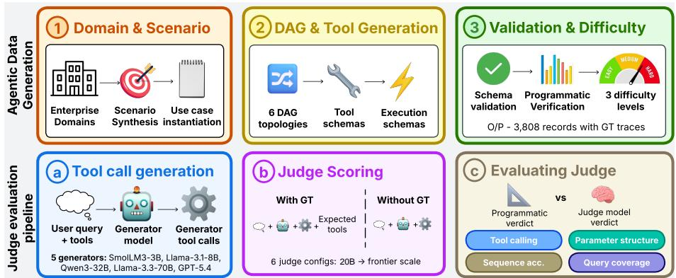  
Figure 1: Overall pipeline of AgentJudgeBench. Each BFCL-style Agentic record undergoes difficulty-controlled rewriting, generator inference, and parallel scoring by a programmatic judge and LLM judges (with/without GT), followed by alignment with the programmatic reference.

We introduce AgentJudgeBench to close this gap. The benchmark comprises 3,808 BFCL-style records (Patil et al., 2025) spanning six DAG<sup>1</sup> topologies at three controlled difficulty tiers, each with a programmatically verified ground-truth trace. Five generators – four open-weight (3B–70B) and one frontier (GPT-5.4) – produce tool-calling outputs that are scored by six LLM judges (ranging from 20B open-weight to frontier closed systems) under paired with- and without-GT conditions across four structural metrics (tool selection, parameter structure, sequence accuracy, query coverage), yielding 321,648 paired with-GT/without-GT evaluations (Appendix D). We organize our analysis around six research questions: which metrics and topologies are hardest (RQ1), how much judges agree with each other (RQ2), why without-GT alignment converges on hard queries (RQ3), and how sensitive alignment is to judge temperature (RQ4), chain-of-thought reasoning (RQ5), and prompt format (RQ6).

The results are non-obvious. Judge alignment degrades monotonically with query difficulty, 1.5× faster without ground truth than with it, and all six judges converge to a 77–82% ceiling on hard queries without a reference, regardless of model capacity; a follow-up ablation (§4.2) confirms task difficulty as the primary driver for capable generators, though its height is somewhat promptdependent for weaker ones. GT exposure is not universally beneficial: two frontier judges (GPT-5.4, Gemini-2.5-Pro) are less aligned when shown the reference, consistent with over-anchoring rather than independent judgement. Chain-of-thought adds at most 0.3 pp across 24 paired comparisons, and temperature has negligible effect (≤0.25 pp spread, two judge-generator pairings). Structured per-metric prompt rubrics add +4.8–+6.5 pp over free-form on one pairing, the largest lever we test, but a second pairing shows a smaller effect that reverses on hard queries, so we treat prompt format as impactful but judge/generator-dependent rather than universally dominant (§4.2). Inter-judge agreement is moderate (κ ≈ 0.42 with GT), with systematic, capacity-correlated patterns not visible in aggregate scores.

Scope. We study LLM-as-a-judge specifically for agentic tool-calling, not the broader LLM-as-ajudge literature; DAG-structured tool-use data, synthetic dependency graphs, and programmatic trajectory scoring each have close prior work (§2). Our contribution is the reliability protocol that combines them – paired with-GT/without-GT conditions, controlled difficulty, and per-metric decomposition – applied to measure judge reliability rather than agent capability.

Contributions. (1) A dataset of 3,808 records spanning six DAG topologies and three difficulty tiers with programmatically verified ground-truth traces, to be released publicly. (2) A four-metric evaluation framework with a paired with-GT/without-GT protocol and bootstrap confidence intervals. (3) A systematic six-RQ empirical study yielding actionable guidance: with ground truth, QwQ-32B best matches the programmatic reference, while GPT-OSS-120B is the most human-aligned judge in our validation study (Appendix G); without ground truth, frontier judges lead narrowly, but the convergence ceiling limits the practical difference.

## 2 Related Work

Table 30 (Appendix V) surveys prior work across three related areas; we explain the key distinctions below.

## 2.1 Agentic Data and Tool-Calling Benchmarks

The dominant paradigm for evaluating tool-calling agents uses either environment-based execution feedback (Zhou et al., 2024; Drouin et al., 2024; Trivedi et al., 2024; Yao et al., 2024) or deterministic scoring against annotated trajectories (Deng et al., 2023; Xu et al., 2025a; Patil et al., 2025). τ-bench (Yao et al., 2024) stresses agents against simulated users and proposes pass^k reliability rather than per-turn correctness; like this line generally, it scores agents but does not interrogate the judge producing those scores. BFCL (Patil et al., 2025) is the closest structural ancestor to our data format, isolating single-turn function-calling with typed JSON schemas and AST-based ground-truth comparison; we adopt the same schema but extend it to multi-step DAG-structured workflows at three controlled difficulty tiers. The most structurally similar work is FuncBenchGen (Maekawa et al., 2025), which frames multi-step calling as DAG traversal with controllable complexity. The key distinction is purpose: FuncBenchGen trains and evaluates generator agents, whereas AgentJudgeBench measures judge reliability on those generators’ outputs via a paired with-GT/without-GT protocol and per-metric decomposition that FuncBenchGen does not provide. TaskBench (Shen et al., 2024) shares the tool-dependency graph framing but focuses on decomposition quality rather than judge alignment. Synthetic data pipelines (Wang et al., 2023b; Xu et al., 2025b; Cui et al., 2024) inform our generation approach but target model training rather than evaluation benchmarking.

## 2.2 LLM-as-Judge

Zheng et al. (2023) established the LLM-as-judge paradigm on MT-Bench, showing GPT-4’s strong agreement with human preferences on open-ended dialogue while identifying positional preference, verbosity sensitivity, and self-enhancement as systematic biases. Subsequent work either extends the evaluation surface – JudgeBench (Tan et al., 2025)

and Arena-Hard-Auto (Li et al., 2024b) move to hard, verifiable response pairs – or builds dedicated judge models (Wang et al., 2024; Li et al., 2024a; Zhu et al., 2023; Kim et al., 2024). JudgeLM (Zhu et al., 2023) fine-tunes 7B–33B judges on GPT-4-distilled verdicts and identifies position, knowledge, and format biases that mirror those reported for prompt-based judges; Prometheus 2 (Kim et al., 2024) adds rubric-conditioned direct assessment with open weights. Both target text-quality scoring rather than structural tool-calling correctness, but their bias taxonomies inform our prompt-format ablation (§4.2). The jury-of-judges paradigm (Verga et al., 2024) shows that ensembling reduces individual judge biases. Crucially, this line targets text-centric tasks where judge quality reduces to preference alignment over fluent output. Agent-JudgeBench occupies a different regime: correctness is structural, the verdict space is {0, 0.5, 1} rather than a preference ranking, and failure modes are multi-dimensional and interdependent.

## 2.3 LLM Judges for Tool-Calling

LLM judges have been deployed for tool-calling evaluation in several recent benchmarks, but always as an implementation detail rather than the subject of study. ToolLLM (Qin et al., 2024) uses ChatGPT to compute pass rates over API trajectories, reporting 87.1% human agreement in aggregate; StableToolBench (Guo et al., 2024) and MCP-AgentBench (Guo et al., 2025) adopt similar approaches with updated judge models. GeoBenchX (Krechetova and Kochedykov, 2025) assembles a three-judge panel achieving 88–96% agreement, and Agent-as-a-Judge (Zhuge et al., 2024) and Auto-Eval Judge (Bhonsle et al., 2025) propose more structured evaluation frameworks. In each case, judge reliability is reported as a single aggregate figure on a small sample, with no variation of task complexity, difficulty, or ground-truth availability. ToolSandbox (Lu et al., 2024) notably questions LLM judge reliability directly but replaces judges with programmatic evaluation rather than characterising their failure modes. Agent-JudgeBench takes the complementary stance: keep the judge paradigm and measure it systematically, decomposing reliability by metric, topology, difficulty, and condition across 321,648 completed evaluations (Appendix D). A detailed feature comparison across all seven related systems appears in Appendix L.

## 3 Methodology

Figure 1 gives an end-to-end view of the pipeline. Each record is expanded into three difficulty variants; every generator $g \in { \mathcal { G } }$ produces tool-call predictions; a deterministic programmatic judge scores each prediction to yield a reference vector ${ \bf p } _ { r } ;$ and every LLM judge $j \in \mathcal { I }$ produces paired verdicts $\ell _ { j , r } ^ { \mathrm { { \dot { G } T } } } , \ell _ { j , r } ^ { \mathrm { w i t h o u t \tilde { G } T } }$ , compared against $\mathbf { p } _ { r }$ via Eq. 5a. The full pipeline is implemented as computational graphs on SyGra (Pradhan et al., 2025), an open-source graph-oriented syntheticdata-generation framework.

## 3.1 Data Generation

The benchmark’s BFCL-style agentic data is constructed through a multi-stage synthetic pipeline that generates complete agentic records from minimal seed inputs.

Why synthetic. We generate records synthetically rather than mining real enterprise traces because the two are not interchangeable for this study’s purpose: a controlled reliability study needs, for every record, a ground-truth trace we can certify as correct; systematic coverage across six DAG topologies and three difficulty tiers rather than whatever distribution occurs in logs; and enough scale and domain diversity (15 enterprise domains) to isolate structural effects from domain idiosyncrasy. Real enterprise traces satisfying all three properties are difficult to source, requiring proprietary internal tool schemas, live or replayable execution environments, and an independent way to certify trace correctness – rarely available outside a single organisation’s internal systems. Generating synthetically lets us guarantee a verified reference trace for every one of the 3,808 records and control topology and difficulty independently, which is what makes the paired with-GT/without-GT protocol (§3.2) possible; the Limitations section discusses what this trades off (domain drift, interactive multi-turn execution) and the validation evidence for this design choice.

Record construction. Given an enterprise domain label (e.g., IT service management, contract lifecycle management, energy grid operations), the pipeline generates use-case scenarios, synthesizes a typed tool inventory as function signatures with constrained return types (str, bool, list, dict, None), and produces executable pseudocode linking all tool dependencies. A natural language user utterance is then paired with function input/output specifications and formalized into a JSON schema with typed arguments, required fields, and output definitions; finally, an ordered execution trace captures sequential and parallel tool calls, their inputs, outputs, and step descriptions.

DAG topologies. Records are organized into six topologies derived from common dependency patterns in real enterprise agentic workflows – linear, fan-out, fan-in, diamond, optional enrichment, and loop-like – from single-path execution to iterative loops.

Difficulty tiers. Each record is expanded into three levels (easy, medium, hard) by increasing query ambiguity while holding the task structure and GT trace constant. Rewrite validation (Appendix N) confirms the medium→hard step on 93.9% of records; the easy→medium step is unanimously validated on only 58.1%, and in roughly 41.9% of cases medium is better characterised as a paraphrase than a strict difficulty increase. The primary difficulty-degradation evidence therefore comes from the medium→hard step; medium data should be read as a robustness check rather than a calibrated mid-point (see Limitations).

Validation. GT traces pass a two-level quality gate: each record is first structurally verified via JSONschema validation, argument type checking, and trace consistency checks, then each (utterance, toolcall) pair is programmatically checked for argument sufficiency, grounding alignment, and query naturalness, with failing records regenerated. No model from $\mathcal { T } ,$ or any other LLM, is involved in either gate check, ruling out self-reinforcing bias. A 120-record human annotation study on harddifficulty records (Appendix G), stratified across all six topologies, validates the scorer at 92.7% metric-level agreement with independent human judgement (scope and limitations in the Limitations section). The final corpus comprises 3,808 records spanning 15 enterprise domains with 8–19 tools per record, across six topologies and three difficulty levels.

## 3.2 Evaluation

As shown in Figure 2, our evaluation is layered: a deterministic programmatic judge computes a reference score on every record, an LLMjudge produces a per-metric verdict on the same record, and an alignment aggregator compares the two. Each layer is defined below; symbol definitions appear in Appendix K, and all prompts are reproduced verbatim in Appendix W.

## Programmatic Judge

Why a deterministic reference. The programmatic judge, not a human or LLM annotator, serves as the reference signal against which every LLM judge (and, transitively, the generator) is measured: using another LLM would reintroduce the same reliability question one level up, and a humanin-the-loop reference cannot scale to the 321,648 evaluations in the full factorial grid, whereas a deterministic, rule-based scorer gives every cell an identical, reproducible reference. We validate rather than assume this choice: ground-truth traces pass a two-level programmatic quality gate with no LLM involved (below), and a 120-record independent human study (Appendix G) directly checks where the scorer’s notion of correctness agrees and disagrees with human judgement. Let $G =$ $( g _ { 1 } , \dotsc , g _ { | G | } )$ denote the generator’s predicted ordered sequence of tool calls and $E = ( e _ { 1 } , \dots , e _ { | E | } )$ the GT ordered sequence. Let name(·) return a tool’s identifier, args(·) its argument-key set, and let $\mathcal { G } \ = \ \{ \mathrm { n a m e } ( g _ { i } ) \} , \mathcal { E } \ = \ \{ \mathrm { n a m e } ( e _ { i } ) \}$ denote the unordered sets of tool identifiers. The programmatic judge emits four independent per-record scores in [0, 1]. Throughout the paper we call each of these four scores – tool selection, parameter structure, sequence accuracy, query coverage – a metric: the term denotes one axis of tool-calling correctness scored independently by both the programmatic judge and the LLM judge, not a distinct evaluation instrument or benchmark-level metric.

Tool-selection accuracy $p ^ { \mathbf { t o o l } }$ and sequence accuracy $p ^ { \mathbf { s e q } } . \mathbf { \nabla } p ^ { \mathrm { t o o l } }$ penalises set-level mismatch; $p ^ { \mathrm { s e q } }$ measures position-by-position identity, normalised by expected length:

$$
p ^ { \mathrm { t o o l } } = \operatorname* { m a x } \biggl ( 0 , 1 - \frac { | \mathcal { G } \setminus \mathcal { E } | + | \mathcal { E } \setminus \mathcal { G } | } { \operatorname* { m a x } ( | \mathcal { E } | , 1 ) } \biggr )\tag{1a}
$$

$$
p ^ { \mathrm { s e q } } = \frac { 1 } { \operatorname* { m a x } ( | E | , 1 ) } \sum _ { i = 1 } ^ { \operatorname* { m i n } ( | G | , | E | ) } \mathcal { H } [ \operatorname { n a m e } ( g _ { i } ) = \operatorname { n a m e } ( e _ { i } ) ]\tag{1b}
$$

with $p ^ { \mathrm { t o o l } } \ = \ p ^ { \mathrm { s e q } } \ = \ 1$ when the respective sequences are empty.

Parameter-structure accuracy $p ^ { \mathbf { p a r a m } }$ . For each predicted call $g \in G$ let $A _ { g } = \operatorname { a r g s } ( g )$ and let $A _ { g } ^ { * }$ be the expected-argument key set of the call in $E$ with the same tool identifier (undefined if the predicted tool is not in E). Define per-call structural scores

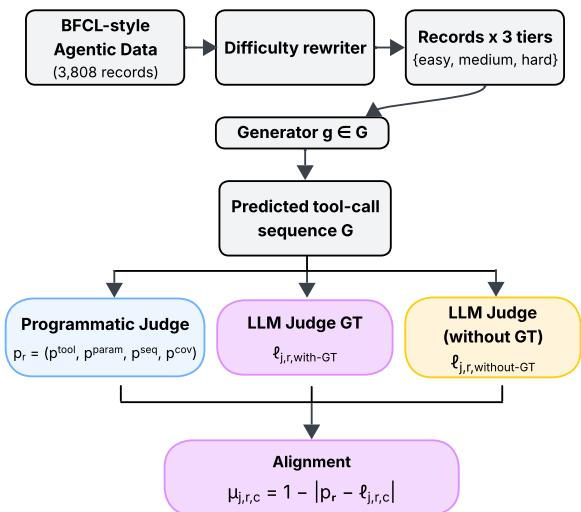  
Figure 2: Evaluation pipeline of AgentJudgeBench. Records expand into three difficulty tiers, LLM judges (with/without GT) and programmatic judge score the generated tool-call predictions.

$$
s ( g ) = \left\{ \begin{array} { l l } { 1 . 0 } & { \mathrm { i f ~ } A _ { g } = A _ { g } ^ { * } } \\ & { \mathrm { ~ ( a l l ~ k e y s ~ p r e s e n t , n o ~ e x t r a s ) } } \\ { 0 . 5 } & { \mathrm { i f ~ } A _ { g } ^ { * } \subseteq A _ { g } } \\ & { \mathrm { ~ a n d ~ } A _ { g } \setminus A _ { g } ^ { * } \neq \emptyset } \\ & { \mathrm { ~ ( e x t r a s ~ o n l y ) } } \\ { 0 . 0 } & { \mathrm { i f ~ } A _ { g } ^ { * } \underset { g } { \underbrace { z } } A _ { g } } \\ & { \mathrm { ~ o r ~ } A _ { g } ^ { * } \mathrm { ~ u n d e f i n e d } } \end{array} \right.\tag{2}
$$

and aggregate by mean: $\begin{array} { r l r } { p ^ { \mathrm { p a r a m } } } & { { } = } & { } \\ { p ^ { \mathrm { p a r a m } } } & { { } = } & { 1 } \end{array}$ $\textstyle \left( \sum _ { g \in G } s ( g ) \right) / \operatorname* { m a x } ( | G | , 1 )$ , with when G is empty.

Query-coverage accuracy $p ^ { \mathbf { c o v } }$ . The fraction of expected tool identifiers covered by the prediction, ignoring extras:

$$
\begin{array} { r } { p ^ { \mathrm { c o v } } ~ = ~ \left\{ \begin{array} { l l } { 1 } & { \mathrm { i f } \ \mathscr { E } = \emptyset , } \\ { 0 } & { \mathrm { i f } \ \mathscr { G } \cap \mathscr { E } = \emptyset , } \\ { | \mathscr { G } \cap \mathscr { E } | / | \mathscr { E } | } & { \mathrm { o t h e r w i s e } . } \end{array} \right. } \end{array}\tag{3}
$$

Record-level aggregate. Each record receives a four-element programmatic vector $\begin{array} { r l } { \mathbf { p } _ { r } } & { { } = } \end{array}$ $( p _ { r } ^ { \mathrm { t o o l } } , p _ { r } ^ { \mathrm { p a r a m } } , p _ { r } ^ { \mathrm { s e q } } , \dot { p } _ { r } ^ { \mathrm { c o v } } )$ . Where a scalar is needed, specifically in the generator-accuracy reporting of Table 2, we use the unweighted mean $\begin{array} { r l } { \bar { p } _ { r } } & { { } = } \end{array}$ $\begin{array} { r } { \frac { 1 } { M } \sum _ { m = 1 } ^ { M } p _ { r } ^ { m } } \end{array}$ , where $M \ = \ 4$ is the number of metrics; elsewhere the four components are kept separate and averaged independently. We adopt equal weights since the four metrics target orthogonal aspects of tool-call correctness with no principled basis for preferring one; Section 4.2 gives permetric breakdowns practitioners can reweight for a given application (e.g., upweighting sequence accuracy for strict-ordering workflows). Empirically, the judge ranking is stable under alternative metric weightings: Spearman $\rho \ge 0 . 8 3 ^ { 2 }$ between the equal-weight ranking and five alternative schemes (seq×2, param×2, cov×0.5, seq×2+param×2), confirming that the equal-weight aggregate is an adequate proxy for any practitioner-specific weighting.

LLM Judge The same generator outputs scored by the programmatic judge are independently evaluated by every LLM judge $j \in \mathcal I$ . Each judge receives a structured prompt containing the original user query, the full set of available tool schemas, and the generator’s predicted tool-call sequence, and is asked to produce a single JSON object scoring each of the four metrics (tool selection, parameter structure, sequence accuracy, query coverage) on a {0, 0.5, 1} scale, along with a one-sentence justification per metric and an overall assessment.

Two prompt variants exist, corresponding to the conditions $c \in \lbrace \mathrm { w i t h - G T } .$ , without-GT}: the with-GT prompt additionally exposes the GT tool-call sequence as a reference block, while the without-GT prompt omits it entirely, requiring the judge to assess correctness from the query and tool schemas alone. Judge decoding is held constant across all $( g , j , d , c )$ configurations to isolate the effect of our independent variables. The full prompt bodies appear in Appendix W.

Alignment Against the Programmatic Reference Given a record r, condition c, judge j, and metric m ∈ {tool, param, seq, cov}, let $\ell _ { j , r , c } ^ { m } \in$ $\{ 0 , 0 . 5 , 1 \}$ denote the judge’s verdict and ${ p } _ { r } ^ { m }$ the programmatic value. The per-metric match score and record-level aggregate are:

$$
\mu _ { j , r , c } ^ { m } = 1 - \left| p _ { r } ^ { m } - \ell _ { j , r , c } ^ { m } \right|\tag{4a}
$$

$$
\mu _ { j , r , c } = \frac { 1 } { M } \sum _ { m = 1 } ^ { M } \mu _ { j , r , c } ^ { m }\tag{4b}
$$

exact match on all metrics yields $\mu = 1$ and maximally divergent verdict yields 0. The configurationlevel alignment percentage and GT lift are:

$$
\mathrm { a l i g n } ( j , g , d , c ) = \frac { 1 0 0 } { N _ { g , d } } \sum _ { r = 1 } ^ { N _ { g , d } } \mu _ { j , r , c }\tag{5a}
$$

$$
\operatorname* { l i f t } ( j ) = { \overline { { \mathrm { a l i g n } } } } _ { \mathrm { G T } } ( j ) - { \overline { { \mathrm { a l i g n } } } } _ { \mathrm { w i t h o u t G T } } ( j )\tag{5b}
$$

where the overline denotes the mean over all 12 $( g , d )$ configurations. Perfect reproduction of the programmatic vector yields align = 100%; an independent judge attains 50% in expectation.

In the experiments, we report both aggregate alignment align $( j , g , d , c )$ and per-metric breakdowns to identify which dimensions of tool-calling correctness judges find most difficult to assess.

## 4 Experiments

We use AgentJudgeBench to evaluate the extent to which LLM-judge alignment depends on the generator, query difficulty, and ground-truth availability. Protocol details (prompts, scoring, conditions) are in Section 3; model identifiers are in Appendix M and Appendix P.

## 4.1 Experimental Setup

We instantiate a fully-crossed factorial over three factors: generator $g \in \mathcal G$ (five models, 3B to frontier), judge $j ~ \in ~ \mathcal { I }$ (six LLMs), and difficulty $d \in \{ \mathrm { e a s y } .$ , medium, hard}. Each cell is observed under both with GT and without GT conditions, yielding 90 factorial cells and 321,648 valid (generator, judge, difficulty, record) tuples. Exact per-cell counts are in Appendix D. We report align $( j , g , d , c )$ (Eq. 5a) and, where relevant, GT lift (Eq. 5b).

## 4.2 Results and Analysis

Table 2 reports every configuration in the factorial design. Each generator occupies a sub-block with six rows corresponding to the judges in J, plus a seventh row for Prometheus-2 (Kim et al., 2024), a judge-specialised model added as a baseline across all five generators and both GT conditions (Limitations), shown for reference and excluded from the six-judge statistics below. Columns pair each difficulty level with its with-GT and without-GT conditions; bold entries mark the highest alignment within each (difficulty, condition) column of each sub-block.

Finding 1: Monotone difficulty degradation. All 30 (generator, judge) pairs exhibit strictly monotone alignment degradation from easy to hard under both conditions (Table 2), without-GT degradation roughly 1.5× larger than with-GT. On hard without-GT records, all six judges converge to a narrow 77–82% band across four of five generators (including frontier GPT-5.4), indicating a task-level rather than judge-level ceiling; degradation curves are in Appendix F. Scope of Finding 1. The medium→hard drop (≈5–7 pp with GT) is the primary evidence for difficulty-driven degradation; hard rewrites are unanimously validated on 93.9% of records (Appendix N), while the easy→medium step (unanimous on 58.1%) partially reflects paraphrase-robustness.

<table><tr><td>Judge</td><td>Diff</td><td></td><td>GT withoutGT cGT </td><td></td><td></td><td>∆cGT-GT ∆cGT-noGT</td></tr><tr><td rowspan="3">QwQ-32B Medium 92.3</td><td>Easy</td><td>96.6</td><td></td><td>95.6 95.5</td><td>-1.1</td><td>-0.1</td></tr><tr><td></td><td></td><td></td><td>92.0 92.0</td><td>-0.3</td><td>0.0</td></tr><tr><td>Hard</td><td>84.6</td><td></td><td>84.4 84.6</td><td>0.0</td><td>+0.2</td></tr><tr><td rowspan="3">Gemini</td><td>Easy</td><td>90.7</td><td></td><td>95.7 92.5</td><td>+1.8</td><td>-3.2</td></tr><tr><td>Medium</td><td>86.4</td><td>92.1</td><td>86.4</td><td>0.0</td><td>-5.7</td></tr><tr><td>Hard</td><td>78.9</td><td></td><td>84.6 78.9</td><td>0.0</td><td>-5.7</td></tr></table>

Table 1: Full C3 results on Llama-3.3-70B generator. All values are mean alignment (%) over 3,764–3,771 records per cell. cGT: corrupted-GT condition. Gemini: Gemini 2.5 Pro. $\Delta _ { \mathbf { c } \mathbf { G } \mathbf { T } \cdot \mathbf { G } \mathbf { T } } \mathrm { : }$ corrupted-GT minus standard GT. $\begin{array} { r } { \Delta _ { \mathbf { c } \mathbf { G T - n o G T } } . } \end{array}$ corrupted-GT minus without GT.

Finding 2: Ground-truth exposure is not monotonically beneficial. GT lift (Eq. 5b) is positive for QwQ-32B and GPT-OSS-120B, but negative for GPT-5.4 and Gemini-2.5-Pro (nonoverlapping bootstrap CIs; Appendix E). Figure 3 shows the effect concentrates in sequence accuracy: frontier judges anchor to the GT trace’s ordering and penalise functionally equivalent but structurally deviant sequences (case studies in Appendix H). C3 control. Replacing the reference with a wrong GT from a different record confirms pure anchoring (Table 1): Gemini-2.5-Pro aligns identically under standard and corrupted GT, while QwQ-32B tracks without-GT within 0.2 pp. Full results are in Appendix J. Finding 3: Best judge depends on configuration. QwQ-32B leads GT alignment in 10 of 15 (generator, difficulty) cells but is never the top without-GT judge; Gemini-2.5-Pro and GPT-5.4 lead without-GT on stronger and weaker generators, respectively. See Appendix A for a deployment decision table. The following research questions explain the mechanisms behind Findings 1–3.

## RQ1: Which metrics and DAG topologies are hardest for judges?

Figure 3 breaks alignment into per-metric components: with GT, sequence accuracy is the weakest dimension with substantial inter-judge spread, while without GT all judges compress to a narrow band, reflecting the 1.0-default rubric. DAG topology imposes a judge-independent difficulty ordering (fan-out easiest, loop-like/fan-in hardest);

<table><tr><td rowspan="2"></td><td rowspan="2">Judge</td><td colspan="2">Easy</td><td colspan="2">Med.</td><td colspan="2">Hard</td></tr><tr><td>GT</td><td>No GT</td><td>GT</td><td>No GT</td><td>GT</td><td>No GT</td></tr><tr><td rowspan="5">Gen. Sm3B</td><td>OSS20</td><td>84.8 90.0</td><td>85.3 86.7</td><td>81.7 84.8</td><td>79.3 80.3</td><td>77.4 77.2</td><td>69.0 69.7</td></tr><tr><td>QwQ32 OSS120</td><td>89.2</td><td>86.3</td><td>84.8</td><td>80.2</td><td>77.8</td><td>69.7</td></tr><tr><td></td><td></td><td></td><td></td><td></td><td></td><td></td></tr><tr><td>ClS4</td><td>86.5</td><td>86.8</td><td>81.3</td><td>80.9</td><td>74.2</td><td>71.2</td></tr><tr><td>Gem GPT5</td><td>81.1 86.0</td><td>86.6 87.3</td><td>77.7 81.6</td><td>80.7 82.0</td><td>73.4 76.9</td><td>70.8 73.3</td></tr><tr><td rowspan="6">LB</td><td>Prom2 OSS20</td><td>64.0 87.4</td><td>67.1 89.5</td><td>61.6</td><td>64.9</td><td>58.6</td><td>60.2 75.9</td></tr><tr><td>QwQ32</td><td>94.2</td><td>91.2</td><td>85.3 90.8</td><td>85.7 86.8</td><td>81.2 84.1</td><td>76.6</td></tr><tr><td>OSS120</td><td>93.1</td><td>90.7</td><td>89.8</td><td>86.6</td><td>83.6</td><td>76.6</td></tr><tr><td>ClS4</td><td>90.3</td><td>90.6</td><td>86.5</td><td>86.6</td><td>80.3</td><td>77.1</td></tr><tr><td>Gem</td><td>85.9</td><td>91.9</td><td>83.3</td><td>87.6</td><td>78.7</td><td>78.2 79.0</td></tr><tr><td>GPT5 Prom2 OSS20</td><td>88.5 60.8</td><td>91.4 63.2</td><td>85.0 59.0</td><td>87.5 60.8</td><td>80.6 56.7</td><td>58.4</td></tr><tr><td>B32B</td><td>QwQ32 OSS120 ClS4 Gem GPT5 Prom2</td><td>88.4 95.0 93.9 92.7 86.4 90.5 64.4</td><td>93.2 93.9 94.0 94.0 94.1 93.9</td><td>85.8 90.9 90.0 88.5 83.0 86.4</td><td>88.7 89.1 89.2 89.2 89.2 89.4</td><td>82.7 84.7 84.4 82.1 78.1 81.9</td><td>81.1 81.1 81.3 81.6 81.4 81.7</td></tr><tr><td>LIOB</td><td>OSS20 QwQ32 OSS120 ClS4 Gem GPT5 Prom2</td><td>89.0 96.6 96.0 93.3 90.5 91.4 66.5</td><td>66.7 94.5 95.6 95.5 94.6 95.7 95.2 68.6</td><td>62.0 87.2 93.6 93.0 89.9 86.5 87.4 62.8</td><td>64.5 91.2 92.1 92.1 90.7 92.2 91.7</td><td>59.1 83.9 87.5 87.2 83.7 82.2 83.0</td><td>61.5 84.0 84.4 84.5 83.3 84.6 84.6</td></tr><tr><td>GPT5</td><td>OSS20 QwQ32 OSS120 ClS4 Gem GPT5 Prom2</td><td>83.1 85.7 84.8 86.1 81.6 85.8 57.1</td><td>85.6 85.8 85.3 87.3 85.2 87.0 60.9</td><td>82.1 84.3 83.9 84.5 80.2 84.1 57.9</td><td>65.2 83.9 84.2 83.3 85.4 83.3 84.9 61.1</td><td>58.3 79.4 80.5 80.7 80.7 77.6 81.4 57.8</td><td>60.2 79.5 79.8 78.6 81.2 78.4 79.8 60.5</td></tr></table>

Table 2: LLM–judge alignment (%) with the programmatic reference across generators, judges, difficulty, and GT condition. Bold = column-wise maximum within each generator block among the six main judges. Prom2 = Prometheus-2, a judge-specialised baseline (Limitations); shown for reference and not counted toward bold column-wise maxima or six-judge statistics.

## full breakdowns are in Appendices Q–S.

## RQ2: How much do judges agree with each other?

Table 3 reports pairwise judge agreement. Mean agreement is 79.1% $( \kappa ~ = ~ 0 . 4 1 9 )$ with GT and 92.6% $( \kappa = 0 . 5 5 9 )$ without GT; the higher without-GT value reflects prompt-driven verdict compression rather than genuine consensus. The highest agreement is QwQ-32B×GPT-OSS-120B (89.4%, $\kappa ~ = ~ 0 . 6 0 6 )$ , and the lowest is Claude Sonnet 4.5×GPT-OSS-20B (70.4%, κ = 0.225). Under without-GT, pairwise κ decreases monotonically with judge tier separation $( \rho = - 0 . 8 2 5 ^ { 3 }$ $p \ < \ 0 . 0 1 )$ ; this relationship vanishes under GT $( \rho ~ = ~ - 0 . 1 7 1 )$ , where GT acts as a shared anchor. Disagreement concentrates at the 0.5 partialcredit boundary (94–97% of off-diagonal entries); verdict-level confusion matrices are in Appendix T and a binary scale ablation is in Appendix T. Prometheus-2 agrees with every judge at close to chance level under both conditions (42–52% exact, $\kappa = 0 . 0 1 – 0 . 0 7 ;$ Table 3), well below the fair-tosubstantial range spanned by the six main judges, indicating it forms its own bloc rather than a loweralignment member of the general-purpose cluster (Limitations).

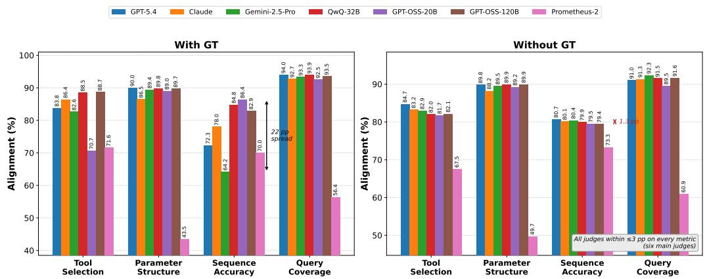  
Figure 3: Per-metric alignment (with and without GT) across the six main judges, plus Prometheus-2 (judgespecialised baseline; Limitations), shown for reference.

<table><tr><td></td><td>OSS-20B</td><td>QwQ-32B</td><td>OSS-120B</td><td>Claude S. 4.5</td><td>Gemini</td><td>GPT-5.4</td><td>Prom2</td></tr><tr><td>OSS-20B</td><td></td><td>77.4</td><td>78.4</td><td>70.4</td><td>74.5</td><td>75.2</td><td>42.2</td></tr><tr><td>QwQ-32B</td><td>0.386</td><td></td><td>89.4</td><td>85.1</td><td>80.7</td><td>79.7</td><td>49.0</td></tr><tr><td>OSS-120B</td><td>0.414</td><td>0.606</td><td></td><td>83.2</td><td>81.6</td><td>79.8</td><td>48.0</td></tr><tr><td>Claude S. 4.5</td><td>0.225</td><td>0.490</td><td>0.424</td><td></td><td>76.5</td><td>78.4</td><td>47.4</td></tr><tr><td>Gemini</td><td>0.387</td><td>0.411</td><td>0.437</td><td>0.328</td><td></td><td>76.4</td><td>44.1</td></tr><tr><td>GPT-5.4</td><td>0.419</td><td>0.446</td><td>0.449</td><td>0.430</td><td>0.432</td><td></td><td>42.6</td></tr><tr><td>Prom2</td><td>0.026</td><td>0.074</td><td>0.055</td><td>0.062</td><td>0.009</td><td>0.036</td><td></td></tr></table>

Table 3: Pairwise inter-judge agreement under the with GT condition. Upper triangle : exact metric-level agreement (%); Lower triangle $\scriptstyle \mathbf { C o h e n } ^ { * } \mathbf { s } \ \kappa ^ { 4 }$ . Prom2 (Prometheus-2, judge-specialised baseline) row/column added for reference; excluded from the six-judge mean agreement statistics discussed in the text.

A soft jury of all six judges matches but does not exceed the top individual judge (82.5% with GT hard) (Verga et al., 2024); ensemble and individual rankings against human annotators are in Appendix G.

## RQ3: Why does without-GT alignment converge on hard queries?

The 77–82% hard without-GT convergence (Table 2) has three consistent explanations: (1) the without-GT prompt defaults to 1.0, suppressing hard-query discrimination; (2) generator error peaks on hard records, compressing all judges identically; and (3) per-metric compression is uniform (Table 24). The six-judge ensemble achieves 79.5%, matching the best individual judge (GPT-5.4, 79.8%) to within 0.4 pp, confirming correlated, structural failure rather than independent per-judge noise.

<table><tr><td>Generator</td><td>1.0-default</td><td>0.5-default</td><td>∆</td></tr><tr><td>Llama-3.3-70B</td><td>84.3</td><td>84.7</td><td>+0.4</td></tr><tr><td>Qwen3-32B</td><td>81.4</td><td>82.4</td><td>+1.0</td></tr><tr><td>GPT-5.4</td><td>79.5</td><td>80.0</td><td>+0.5</td></tr><tr><td>Llama-3.1-8B</td><td>77.2</td><td>81.3</td><td>+4.1</td></tr><tr><td>SmolLM3-3B</td><td>70.6</td><td>76.2</td><td>+5.6</td></tr></table>

Table 4: Hard without GT alignment (%) under the standard 1.0-default and the recalibrated 0.5-default prompts, averaged across six judges per generator. ∆ = (0.5-default) − (1.0-default).

C2 ablation: 0.5-default without-GT prompt. Table 4 compares hard without-GT alignment under the standard 1.0-default and a recalibrated 0.5- default prompt. For the three strongest generators the delta is ≤+1.0 pp, confirming structural task difficulty as the primary ceiling driver. For weaker generators (+4.1–+5.6 pp), the 1.0-default over-credits incorrect outputs; practitioners evaluating low-quality generators should consider the 0.5-default prompt.

## RQ4: Does judge temperature affect alignment?

Figure 4 shows that Qwen3-32B alignment is insensitive to temperature across $T \in \{ 0 . 3 , 0 . 7 , 1 . 0 \}$ with a maximum spread of 0.6 pp across all (difficulty, condition) cells; structural pattern-matching dominates (full table in Appendix R). A second (judge, generator) pairing (GPT-OSS-120B on Llama-3.1-8B-Instruct) confirms this, with a maximum spread of 0.25 pp across all three difficulty tiers, even tighter than the original pairing, indicating that temperature insensitivity is not an artefact of the single test-bed cell.

RQ5: Does chain-of-thought reasoning in the judge improve alignment?

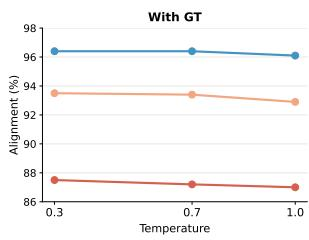

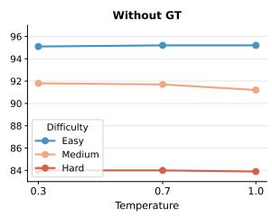  
Figure 4: Judge temperature sensitivity. Qwen3-32B alignment at T ∈ {0.3, 0.7, 1.0} on Llama-3.3-70B. All three difficulty curves are near-flat; maximum spread ≤ 0.6 pp.

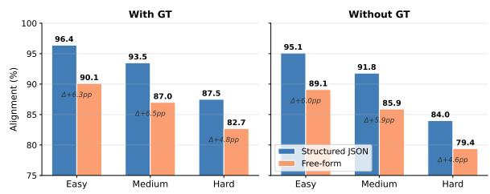  
Figure 5: Prompt structure vs. alignment. Structured JSON prompt vs. free-form for Qwen3-32B on Llama 3.3-70B. The per-metric rubric adds +4.8-+6.5 pp with GT across all difficulty levels.

Table 5 reports QwQ-32B alignment with thinking on vs. off across four open-weight generators and three difficulty levels (24 paired cells). CoT reasoning contributes negligibly, with a mean GT gap of +0.11 pp and a maximum per-cell difference of 0.3 pp; no cell exceeds 0.3 pp on either condition. QwQ-32B’s advantage in the main results therefore reflects training distribution rather than inference-time compute. The full per-generator grid is reproduced in Appendix R.

## RQ6: Does prompt output format affect alignment?

Figure 5 shows that the structured per-metric JSON prompt (verbatim in Appendix W.2/W.3) outperforms a free-form variant (Appendix X) by +4.8–+6.5 pp with GT across all difficulty levels on the original (Qwen3-32B, Llama-3.3-70B) pairing, the largest lever we test among the configuration choices in this study. A second pairing (QwQ-32B on SmolLM3-3B) partially replicates this: structured format still wins on easy (+3.9 pp) and medium (+2.4 pp), but the effect shrinks relative to the first pairing and reverses on hard (−0.8 pp, free-form marginally ahead). We therefore do not treat prompt format as a uniformly dominant, difficulty-independent lever: the effect is real and judge/generator-dependent, largest on easier queries, and not guaranteed to generalise in direction on hard queries for every pairing. Full tables for both pairings are in Appendix R.

<table><tr><td></td><td></td><td colspan="2">Easy</td><td colspan="2">Medium</td><td colspan="2">Hard</td></tr><tr><td>Generator</td><td>Setting</td><td>GT</td><td>No GT</td><td>GT</td><td>No GT</td><td>GT</td><td>No GT</td></tr><tr><td rowspan="3">Llama-3.3-70B</td><td>Thinking on</td><td>96.6</td><td>95.6</td><td>93.6</td><td>92.1</td><td>87.5</td><td>84.4</td></tr><tr><td>Thinking off</td><td>96.5</td><td>95.6</td><td>93.6</td><td>92.0</td><td>87.3</td><td>84.4</td></tr><tr><td>∆</td><td>+0.1</td><td>0.0</td><td>0.0</td><td>+0.1</td><td>+0.2</td><td>0.0</td></tr><tr><td rowspan="3">Llama-3.1-8B</td><td>Thinking on</td><td>94.2</td><td>91.2</td><td>90.8</td><td>86.8</td><td>84.1</td><td>76.6</td></tr><tr><td>Thinking off</td><td>94.3</td><td>91.4</td><td>90.8</td><td>86.8</td><td>83.9</td><td>76.7</td></tr><tr><td>∆</td><td>-0.1</td><td>-0.2</td><td>0.0</td><td>0.0</td><td>+0.2</td><td>-0.1</td></tr><tr><td rowspan="3">Qwen3-32B</td><td>Thinking on</td><td>95.0</td><td>93.9</td><td>90.9</td><td>89.1</td><td>84.7</td><td>81.1</td></tr><tr><td>Thinking off</td><td>94.9</td><td>94.0</td><td>90.8</td><td>89.0</td><td>84.7</td><td>81.1</td></tr><tr><td>∆</td><td>+0.1</td><td>-0.1</td><td>+0.1</td><td>+0.1</td><td>0.0</td><td>0.0</td></tr><tr><td rowspan="3">SmolLM3-3B</td><td>Thinking on</td><td>90.0</td><td>86.7</td><td>84.8</td><td>80.3</td><td>77.2</td><td>69.7</td></tr><tr><td>Thinking off</td><td>89.8</td><td>86.7</td><td>84.6</td><td>80.4</td><td>76.9</td><td>69.7</td></tr><tr><td>∆</td><td>+0.2</td><td>0.0</td><td>+0.2</td><td>-0.1</td><td>+0.3</td><td>0.0</td></tr></table>

Table 5: Chain-of-thought reasoning in the QwQ-32B judge: alignment (%) with thinking on vs. off across four open-weight generators. ∆ = thinking-on − thinking-off (pp).

## 5 Conclusion

We introduce AgentJudgeBench, a benchmark measuring LLM-judge reliability on structured, dependency-driven tool-calling, where existing LLM-as-judge work offers little calibration, via three design choices: difficulty-stratified rewrites (easy/medium/hard, preserving the ground-truth trace), per-record DAG-topology annotation across six patterns, and a paired with-GT/without-GT evaluation protocol. Across 321,648 completed evaluations, four patterns emerge. First, alignment degrades monotonically with difficulty, approximately 1.5× faster without ground truth than with it. Second, hard without-GT alignment converges to a 77–82% band regardless of judge capacity, a task-level ceiling confirmed by the C2 recalibratedprompt ablation (≤+1.0 pp for capable generators). Third, GT exposure is counterproductive for frontier judges (Gemini-2.5-Pro: −3.9 pp; GPT-5.4: −1.5 pp), consistent with over-anchoring. Fourth, prompt structure is the largest configuration lever (+4.8–+6.5 pp) but is judge/generator-dependent, while CoT reasoning and temperature are negligible (§4.2). With ground truth, QwQ-32B agrees most closely with the programmatic reference and GPT-OSS-120B with human judgement; without it, frontier judges lead only narrowly. Limitations and deployment guidance are in the Limitations section and Appendix A.

## Supplementary Material

The Hugging Face dataset (link, page 1) contains all 3,808 records, generator outputs, and all seven judges’ with-GT/without-GT verdicts underlying every table and figure. The SyGra code release (link, page 1) contains the pipeline implementation – data generation, difficulty rewriting, the programmatic judge (Eqs. 1a-5a), and the LLM-judge runner with full prompt templates (Appendix W) – and a reproducibility script for the main results, under a permissive open-source license.

## Limitations

Four of five generators are open-weight; GPT-5.4 is a non-reproducible Azure snapshot (Appendix P) that also serves as judge and rewrite meta-judge. All primary claims replicate on the open-weight generators independently of it; as a generator, GPT-5.4’s self-bias when judged stays within range on other generators except sequence accuracy (+0.172 vs. ≤ +0.008), a post-hoc correlational signal we cannot rule out and, being non-reproducible, cannot independently re-verify (Appendix B).

We use a deterministic programmatic scorer, rather than a human or LLM annotator, as the reference signal, since only it scales to 321,648 evaluations without reintroducing the reliability question under study. A 120-record single-annotator human study (Appendix G) validates it at 92.5– 98.3% agreement on three of four metrics but only 82.5% on parameter structure, where the scorer penalises schema-valid extra keys that annotators accept (9 of 21 tool-selection disagreements reflect an analogous tool-redundancy gap); this does not drive our findings (ranking shifts ≤ 0.09 pp under a maximally generous correction), though headline absolute numbers still reflect the current scoring rule, so we report both programmatic and humanverdict rankings for best-judge claims. Extended discussion is in Appendix B.

Records are synthetically generated rather than mined from enterprise traces, since a verified perrecord reference – required by our paired GT/no-GT protocol – is not obtainable at this scale from proprietary systems; a two-level quality gate and the same human study (92.7% agreement) validate the pipeline, but domain drift remains an open concern (Appendix B). Our six main judges are also all general-purpose: adding Prometheus-2 (Kim et al., 2024) as a judge-specialised baseline shows it does not cluster with them (20–30 pp lower alignment; Table 3) and it is excluded from six-judge statistics (Appendix B).

The RQ4/RQ6 ablations were each extended to a second (judge, generator) pairing: temperature insensitivity replicates tightly, but the promptformat advantage only partially replicates and reverses on hard queries, so we treat format as judge/generator-dependent rather than uniformly dominant. Difficulty rewriting is unanimously validated on 58.1% of easy→medium and 93.9% of medium→hard records, so medium should be read as a robustness check rather than a fully calibrated tier. The without-GT ceiling is also partly prompt-dependent: a C2 ablation (Table 4) shifts it ≤ +1.0 pp under an alternative 0.5-default prompt for the three strongest generators but +4.1– +5.6 pp for the two weakest, so task difficulty is the primary ceiling driver only for capable generators (Appendix B).

Finally, we study judge reliability at evaluation time only and do not test whether these failure modes carry over as a training signal (e.g., a reward model or model-selection gate); we reason through three findings under this framing – GTexposure over-anchoring, the without-GT verdictcompression ceiling, and correlated cross-judge failure – and flag it as concrete future work in Appendix B.

## Ethical Considerations

Over-reliance on automated evaluation. Our findings reveal systematic failure modes in LLM judges, including the 77–82% without-GT ceiling and over-anchoring in frontier models; practitioners unaware of these limitations risk certifying incorrect tool-calling outputs as correct, particularly in safety-critical domains (e.g., energy grid, healthcare) represented in our dataset. We mitigate this via deployment guidance (Appendix A) and by recommending against sole reliance on any single judge.

Evaluation monoculture. All six judges converge to similar failure patterns on hard queries, suggesting shared training-distribution biases; overreliance on our rankings could reinforce a monoculture where the same blind spots propagate across pipelines, so we encourage complementing LLM judges with programmatic scoring and human review.

Dual use, synthetic data, and compute. The detailed failure-mode analysis (over-anchoring, the 1.0-default bias, prompt-format sensitivity) could be exploited to game judge-based evaluation; we release all prompts, scorer code, and raw outputs to enable countermeasures. All records are synthetically generated – avoiding real-user privacy concerns but inheriting the generation pipeline’s biases and possibly under-representing non-English or marginalised workflows. The full evaluation (321,648 paired judge calls) is compute-intensive; our decision guide (Appendix A) reduces unnecessary evaluation by recommending specific judges per scenario.

## Acknowledgements

We are especially grateful to Sai Rajeswar for consistently supporting research efforts like this one, and for generously taking the time to review the paper and help improve it whenever needed.

Generative AI tools (Claude) were used for language polishing and proofreading of author-written text; all research ideas, experiments, analysis, and writing are the authors’ own.

## References

Roshita Bhonsle, Rishav Dutta, Sneha Vavilapalli, Harsh Seth, Abubakarr Jaye, Yapei Chang, Mukund Rungta, Emmanuel Aboah Boateng, Sadid Hasan, Ehi Nosakhare, and Soundar Srinivasan. 2025. Auto-Eval Judge: Towards a general agentic framework for task completion evaluation. arXiv preprint arXiv:2508.05508.

Ganqu Cui, Lifan Yuan, Ning Ding, Guanming Yao, Wei Zhu, Yuan Ni, Guotong Xie, Zhiyuan Liu, and Maosong Sun. 2024. UltraFeedback: Boosting language models with scaled AI feedback. In Proceedings ofthe 41st International Conference on Machine Learning (ICML).

Xiang Deng, Yu Gu, Boyuan Zheng, Shijie Chen, Samuel Stevens, Boshi Wang, Huan Sun, and Yu Su. 2023. Mind2Web: Towards a generalist agent for the web. In Advances in Neural Information Processing Systems.

Alexandre Drouin, Maxime Gasse, Massimo Caccia, Issam H. Laradji, Manuel Del Verme, Tom Marty, Léo Boisvert, Megh Thakkar, Quentin Cappart, David Vazquez, Nicolas Chapados, and Alexandre Lacoste. 2024. WorkArena: How capable are web agents at solving common knowledge work tasks? In Proceedings of the 41st International Conference on Machine Learning (ICML), pages 11642–11662.

Zhicheng Guo, Sijie Cheng, Hao Wang, Shihao Liang, Yujia Qin, Peng Li, Zhiyuan Liu, Maosong Sun, and Yang Liu. 2024. StableToolBench: Towards stable large-scale benchmarking on tool learning of LLMs. arXiv preprint arXiv:2403.07714.

Zikang Guo, Benfeng Xu, Chiwei Zhu, Wentao Hong, Xiaorui Wang, and Zhendong Mao. 2025. MCP-AgentBench: Evaluating real-world language agent performance with MCP-mediated tools. arXiv preprint arXiv:2509.09734.

Seungone Kim, Juyoung Suk, Shayne Longpre, Bill Yuchen Lin, Jamin Shin, Sean Welleck, Graham Neubig, Moontae Lee, Kyungjae Lee, and Minjoon Seo. 2024. Prometheus 2: An open source language model specialized in evaluating other language models. In Proceedings ofthe 2024 Conference on Empirical Methods in Natural Language Processing (EMNLP).

Varvara Krechetova and Denis Kochedykov. 2025. GeoBenchX: Benchmarking LLMs in agent solving multistep geospatial tasks. In Proceedings ofthe 1st ACM SIGSPATIAL International Workshop on Generative and Agentic AIfor Multi-Modality Space-Time Intelligence.

Junlong Li, Shichao Sun, Weizhe Yuan, Run-Ze Fan, Hai Zhao, and Pengfei Liu. 2024a. Generative judge for evaluating alignment. In The Twelfth International Conference on Learning Representations (ICLR).

Tianle Li, Wei-Lin Chiang, Evan Frick, Lisa Dunlap, Tianhao Wu, Banghua Zhu, Joseph E. Gonzalez, and Ion Stoica. 2024b. From crowdsourced data to highquality benchmarks: Arena-Hard and BenchBuilder pipeline. arXiv preprint arXiv:2406.11939.

Xiao Liu, Hao Yu, Hanchen Zhang, Yifan Xu, Xuanyu Lei, Hanyu Lai, Yu Gu, Hangliang Ding, Kaiwen Men, Kejuan Yang, Shudan Zhang, Xiang Deng, Aohan Zeng, Zhengxiao Du, Chenhui Zhang, Sheng Shen, Tianjun Zhang, Yu Su, Huan Sun, and 3 others. 2024. AgentBench: Evaluating LLMs as agents. In The Twelfth International Conference on Learning Representations (ICLR).

Jiarui Lu, Thomas Holleis, Yizhi Zhang, Bernhard Aumayer, Feng Nan, Felix Bai, Shuang Ma, Shen Ma, Mengyu Li, Guoli Yin, Zirui Wang, and Ruoming Pang. 2024. ToolSandbox: A stateful, conversational, interactive evaluation benchmark for LLM tool use capabilities. arXiv preprint arXiv:2408.04682.

Seiji Maekawa, Jackson Hassell, Pouya Pezeshkpour, Tom Mitchell, and Estevam Hruschka. 2025. Towards reliable benchmarking: A contaminationfree, controllable evaluation framework for multistep LLM function calling. arXiv preprint arXiv:2509.26553.

Shishir G. Patil, Huanzhi Mao, Charlie Cheng-Jie Ji, Fanjia Yan, Vishnu Suresh, Ion Stoica, and Joseph E. Gonzalez. 2025. The Berkeley Function Calling Leaderboard (BFCL): From tool use to agentic evaluation of large language models. In Proceedings of the 42nd International Conference on Machine Learning (ICML).

Bidyapati Pradhan, Surajit Dasgupta, Amit Kumar Saha, Omkar Anustoop, Sriram Puttagunta, Vipul Mittal, and Sarda Gopal. 2025. SyGra: An open-source graph-oriented synthetic data generation pipeline. arXiv preprint arXiv:2508.15432.

Yujia Qin, Shihao Liang, Yining Ye, Kunlun Zhu, Lan Yan, Yaxi Lu, Yankai Lin, Xin Cong, Xiangru Tang, Bill Qian, Sihan Zhao, Runchu Tian, Ruobing Xie, Jie Zhou, Mark Gerstein, Dahai Li, Zhiyuan Liu, and Maosong Sun. 2024. ToolLLM: Facilitating large language models to master 16000+ real-world APIs. In The Twelfth International Conference on Learning Representations (ICLR).

Yongliang Shen, Kaitao Song, Xu Tan, Wenqi Zhang, Kan Ren, Siyu Yuan, Weiming Lu, Dongsheng Li, and Yueting Zhuang. 2024. TaskBench: Benchmarking large language models for task automation. In Advances in Neural Information Processing Systems.

Sijun Tan, Siyuan Zhuang, Kyle Montgomery, William Y. Tang, Alejandro Cuadron, Chenguang Wang, Raluca Ada Popa, and Ion Stoica. 2025. JudgeBench: A benchmark for evaluating LLMbased judges. In The Thirteenth International Conference on Learning Representations (ICLR).

Harsh Trivedi, Tushar Khot, Mareike Hartmann, Ruskin Manku, Vinty Dong, Edward Li, Shashank Gupta, Ashish Sabharwal, and Niranjan Balasubramanian. 2024. AppWorld: A controllable world of apps and people for benchmarking interactive coding agents. In Proceedings of the 62nd Annual Meeting of the Association for Computational Linguistics (Volume 1: Long Papers).

Pat Verga, Sebastian Hofstätter, Sophia Althammer, Yixuan Su, Aleksandra Piktus, Arkady Arkhangorodsky, Minjie Xu, Naomi White, and Patrick Lewis. 2024. Replacing judges with juries: Evaluating LLM generations with a panel of diverse models. arXiv preprint arXiv:2404.18796.

Peiyi Wang, Lei Li, Liang Chen, Dawei Zhu, Binghuai Lin, Yunbo Cao, Qi Liu, Tianyu Liu, and Zhifang Sui. 2023a. Large language models are not fair evaluators. arXiv preprint arXiv:2305.17926.

Yidong Wang, Zhuohao Yu, Zhengran Zeng, Linyi Yang, Cunxiang Wang, Hao Chen, Chaoya Jiang, Rui Xie, Jindong Wang, Xing Xie, Wei Ye, Shikun Zhang, and Yue Zhang. 2024. PandaLM: An automatic evaluation benchmark for LLM instruction tuning optimization. In The Twelfth International Conference on Learning Representations (ICLR).

Yizhong Wang, Yeganeh Kordi, Swaroop Mishra, Alisa Liu, Noah A. Smith, Daniel Khashabi, and Hannaneh Hajishirzi. 2023b. Self-instruct: Aligning language models with self-generated instructions. In Proceedings of the 61st Annual Meeting of the Association for Computational Linguistics (Volume 1: Long Papers), pages 13484–13508.

Yiheng Xu, Dunjie Lu, Zhennan Shen, Junli Wang, Zekun Wang, Yuchen Mao, Caiming Xiong, and Tao Yu. 2025a. AgentTrek: Agent trajectory synthesis via guiding replay with web tutorials. In The Thirteenth International Conference on Learning Representations (ICLR).

Zhangchen Xu, Fengqing Jiang, Luyao Niu, Yuntian Deng, Radha Poovendran, Yejin Choi, and Bill Yuchen Lin. 2025b. Magpie: Alignment data synthesis from scratch by prompting aligned LLMs with nothing. In The Thirteenth International Conference on Learning Representations (ICLR).

Shunyu Yao, Noah Shinn, Pedram Razavi, and Karthik Narasimhan. 2024. τ-bench: A benchmark for toolagent-user interaction in real-world domains. arXiv preprint arXiv:2406.12045.

Lianmin Zheng, Wei-Lin Chiang, Ying Sheng, Siyuan Zhuang, Zhanghao Wu, Yonghao Zhuang, Zi Lin, Zhuohan Li, Dacheng Li, Eric P. Xing, Hao Zhang, Joseph E. Gonzalez, and Ion Stoica. 2023. Judging LLM-as-a-judge with MT-Bench and Chatbot Arena. In Advances in Neural Information Processing Systems.

Shuyan Zhou, Frank F. Xu, Hao Zhu, Xuhui Zhou, Robert Lo, Abishek Sridhar, Xianyi Cheng, Tianyue Ou, Yonatan Bisk, Daniel Fried, Uri Alon, and Graham Neubig. 2024. WebArena: A realistic web environment for building autonomous agents. In The Twelfth International Conference on Learning Representations (ICLR).

Lianghui Zhu, Xinggang Wang, and Xinlong Wang. 2023. JudgeLM: Fine-tuned large language models are scalable judges. arXiv preprint arXiv:2310.17631.

Mingchen Zhuge, Changsheng Zhao, Dylan Ashley, Wenyi Wang, Dmitrii Khizbullin, Yunyang Xiong, Zechun Liu, Ernie Chang, Raghuraman Krishnamoorthi, Yuandong Tian, Yangyang Shi, Vikas Chandra, and Jürgen Schmidhuber. 2024. Agent-as-ajudge: Evaluate agents with agents. arXiv preprint arXiv:2410.10934.

## A Practitioner Decision Guide

In most deployment scenarios ground-truth toolcall sequences are unavailable at inference time; the without GT judge is therefore the practical baseline. Table 6 reports the best-performing judge for each deployment scenario, derived directly from Table 2. Rankings are computed as an unweighted mean of per-cell alignment over all five generators per (condition, difficulty) combination; count-weighted averaging shifts results by ≤ 0.3 pp.

Takeaways. (1) No ground truth (the common case): Gemini-2.5-Pro and GPT-5.4 lead narrowly (≤ 1 pp), but the without GT convergence ceiling (§4.2) makes judge choice less consequential on hard queries: the practical difference between any two judges is $\leq \ 2 { \mathsf { p p } }$ . (2) Ground truth available: QwQ-32B dominates all difficulty levels; GPT-OSS-120B is the best open-weight alternative without reasoning-model inference overhead. (3) Single judge across all conditions: QwQ-32B offers the best mean GT alignment (89.1%) with competitive without GT performance (85.6%). (4) Binary pass/fail pipelines: Practitioners scoring verdicts on a binary pass/fail scale rather than {0, 0.5, 1} should prefer GPT-OSS-20B over QwQ-32B. Under binary verdict collapse, judge rankings differ substantially from the three-point scale (Spearman $\rho \ = \ 0 . 0 3 \mathrm { : }$ ; Table 29, Appendix T): judges with high 0.5-verdict rates (GPT-OSS-20B: 26.5%; GPT-5.4: 28.2%) gain a systematic advantage because every 0.5 verdict is remapped toward the programmatic direction, inflating their binary alignment. QwQ-32B’s structural advantage over GPT-OSS-20B diminishes or reverses under binary scoring. (5) Human-intuition alignment: Practitioners whose primary concern is agreement with human annotators rather than with the programmatic scorer should prefer GPT-OSS-120B, which tops both the programmatic and human-verdict orderings $( \Delta = - 2 . 8 \mathrm { p p }$ vs. human; Table 13, Appendix G).

<table><tr><td>Condition</td><td>Difficulty</td><td>Best judge</td><td>Runner-up</td></tr><tr><td>Without GT</td><td>Easy</td><td>Gemini-2.5- Pro (92.1%)</td><td>GPT-5.4 (92.0%)</td></tr><tr><td>Without GT</td><td>Medium</td><td>GPT-5.4 (87.7%)</td><td>Gemini-2.5- Pro (87.4%)</td></tr><tr><td>Without GT</td><td>Hard</td><td>GPT-5.4 (79.7%)</td><td>Gemini-2.5- Pro (78.8%)</td></tr><tr><td>With GT</td><td>Easy</td><td>QwQ-32B (94.0%)</td><td>GPT-OSS- 120B (93.0%)</td></tr><tr><td>With GT</td><td>Medium</td><td>QwQ-32B (90.0%)</td><td>GPT-OSS- 120B (89.4%)</td></tr><tr><td>With GT</td><td>Hard</td><td>QwQ-32B (83.4%)</td><td>GPT-OSS- 120B (83.2%)</td></tr></table>

Table 6: Best judge per deployment scenario. The without GT rows reflect the common deployment setting where ground-truth tool calls are unavailable. GT = ground-truth tool calls available; without GT = judge uses only query and tool schemas. Alignment (%) is unweighted mean over five generators.

## B Extended Limitations Discussion

This appendix expands, point by point, the summary given in the main-text Limitations section.

Programmatic reference vs. human correctness. We adopt a deterministic programmatic scorer, rather than a human or LLM annotator, as the reference signal, since it uniquely scales to 321,648 evaluations without reintroducing the judge-reliability question under study. A 120- record human study (Appendix G), each record scored by a single annotator, validates this choice at 92.5–98.3% agreement on three of four metrics but only 82.5% on parameter structure, where the scorer penalises schema-valid extra argument keys that annotators accept; the 92.7% figure and human-verdict rankings (including the QwQ-32B 1st→4th reversal) therefore reflect one calibrated annotator, not a consensus reference, and a multiannotator replication is left to future work. This gap does not drive our findings: excluding parameter structure changes the aggregate ranking by $\leq$ $0 . 2 \mathsf { p p }$ (Table 14), and a maximally generous upperbound correction moves every judge’s alignment by $\leq 0 . 0 9  { \mathrm { p p } }$ with the ranking unchanged (Table 15)— though every headline absolute number still incorporates the current, imperfectly-validated scoring rule, so we report both programmatic and humanverdict rankings wherever a best-judge claim is made.

Tool redundancy. The scorer also does not model tool redundancy: a generator reaching an equivalent result via a structurally different tool (e.g., a dedicated aggregation tool vs. composing two simpler ones) can be penalised by $p ^ { \mathrm { t o o l } }$ and $p ^ { \mathrm { s e q } }$ even though the substitution is conceptually correct. The human study already surfaces a version of this (9 of 21 tool-selection disagreements involve semantically equivalent tools or defensible extra calls; Appendix G); quantifying corpus-wide prevalence and building a schema-aware tool-equivalence correction are left to future work.

Synthetic data and real-trace validity. Records are synthetically generated rather than mined from enterprise traces, since a verified reference for every record – required by our paired GT/no-GT protocol – is not obtainable at this scale from proprietary systems. A two-level quality gate and the same human study (92.7% agreement) validate the pipeline, but domain drift from real deployments remains an open validity concern, and a real-trace comparison is blocked on corpus access. All prompts are scoped to single-shot, stateless planning; headline findings are comparative rather than absolute-magnitude, which limits but does not eliminate exposure to this gap.

Judge-specialised baseline. Our six main judges are all general-purpose; to test generalisation to judge-specialised models we added Prometheus-2 (Kim et al., 2024) across all five generators and both GT conditions (Table 2, row Prom2). It does not cluster with the generalpurpose judges under either condition (20–30 pp lower alignment, near-chance pairwise agreement; Table 3), concentrated on parameter structure and query coverage (Table 24), and shows a negative GT lift opposite to most judges – consistent with, not contradicting, its own published reference-free result against human judgement (Kim et al., 2024, Appendix F), a different comparison axis. It is excluded from all six-judge statistics and does not affect any headline finding; a broader judgespecialised roster is left to future work.

GPT-5.4’s triple role. GPT-5.4 simultaneously serves as generator, judge, and rewrite meta-judge. Its self-bias on its own generations falls within its range on other generators (Appendix O), except for sequence accuracy, where it over-credits itself $( + 0 . 1 7 2 \mathrm { \ v s . } \leq + 0 . 0 0 8$ elsewhere); we find no aggregate self-preference but cannot rule out this metric-localised effect. This is a post-hoc correlational analysis of the existing grid, not a controlled ablation isolating GPT-5.4’s role, and is further compounded by GPT-5.4 being a nonreproducible Azure snapshot with no fixed version string (Appendix P): unlike other effects bounded in this section, this signal cannot be independently re-verified.

Ablation coverage. The RQ4 (temperature) and RQ6 (prompt format) ablations were each extended to a second (judge, generator) pairing: temperature insensitivity replicates more tightly, while the prompt-format advantage replicates only partially and reverses on hard queries, so we treat it as judge/generator-dependent rather than a uniformly dominant lever. A full grid across all judges and generators is left to future work.

Difficulty-tier calibration. Difficulty rewriting is unanimously validated on 58.1% of easy→medium and 93.9% of medium→hard records; the latter is our primary difficultydegradation evidence, and the “three difficulty tiers” framing should be read with medium as a robustness check rather than a fully independent, calibrated tier.

Without-GT ceiling and prompt default. The without-GT ceiling is partly attributable to the prompt’s default-to-1.0 rubric: the C2 ablation (Table 4) shows it shifts by only ≤+1.0 pp under an alternative 0.5-default for the three strongest generators, but by +4.1 and +5.6 pp for the two weakest (Llama-3.1-8B, SmolLM3-3B); task difficulty remains the primary driver for capable generators, but the ceiling is somewhat prompt-dependent on weaker ones, a nuance the abstract’s “structural ceiling” framing compresses. Headline figures use unweighted topology averages over an intentionally imbalanced corpus; count-weighted averaging shifts figures by ≤ 1.5 pp with no ranking change (Appendix S).

Evaluation-time vs. training-time risk. We study judge reliability at evaluation time and do not test whether these failure modes carry over when the same judges are used as a training signal (e.g., a reward model in RLHF/DPO fine-tuning of a tool-calling agent, or an automatic gate for model selection) – an evaluation-time error changes a single reported number, while a training-time error changes the objective an agent is optimized against. Three findings would shift this risk differently: GT-exposure over-anchoring (Finding 2) would only affect pipelines that feed the reference trace into the reward model, pushing the agent toward mimicking surface form rather than penalising missing steps (case studies in Appendix H); the without-GT verdict-compression ceiling (§4.2) is the higher-risk case, since a reward model built on such a judge would supply near-constant reward on hard queries regardless of actual correctness, weakening the gradient exactly where the agent most needs correction; and the correlated failure across judges (six-judge ensemble matching, not exceeding, the best individual judge; §4.2) implies this risk would not be mitigated by ensembling our evaluated judges, since they fail on the same records for the same structural reason. Testing this directly would require training runs with judge-derived rewards under controlled bias conditions, outside this paper’s scope; we flag it as a concrete, motivated direction for future work.

## C Dataset Statistics

This appendix reports the structural composition of the 3,808 AgentJudgeBench records, covering topology distribution, tool inventory size, parameter depth, and expected call-sequence length. All statistics are computed over the unique-record pool (i.e., collapsing the three difficulty rewrites of each record into one, since they share the same tool schemas and ground-truth trace). Figures 6 and 7 visualise the distributions; Tables 7 and 8 report the precise counts.

Topology distribution (Table 7, Figure 6). Records are not uniformly distributed across topologies. Fan-in (27.5%) and optional enrichment (21.6%) are the most prevalent, reflecting the frequency of multi-source aggregation and conditional enrichment patterns in the 15 enterprise seed domains. Loop-like records are the rarest (5.9%) because iterative workflows are less commonly expressed as single-turn tool-call sequences in the generation pipeline. Linear records (21.3%) serve as the structural baseline: they require no dependency tracking and are included to anchor the difficulty gradient. The imbalance is intentional: it mirrors the relative prevalence of each pattern in enterprise agentic workloads rather than imposing artificial uniformity.

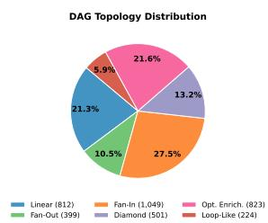

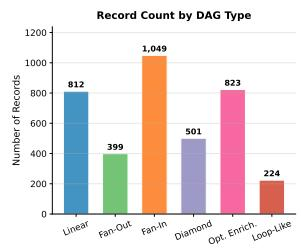  
Figure 6: DAG topology distribution across the 3,808 unique records (left: proportional pie, right: absolute counts). Fan-in accounts for over a quarter of all records; loop-like is the rarest at 5.9%.

<table><tr><td>DAG Type</td><td>Records</td><td>%</td></tr><tr><td>Linear</td><td>812</td><td>21.3</td></tr><tr><td>Fan-Out</td><td>399</td><td>10.5</td></tr><tr><td>Fan-In</td><td>1,049</td><td>27.5</td></tr><tr><td>Diamond</td><td>501</td><td>13.2</td></tr><tr><td>Optional Enrichment</td><td>823</td><td>21.6</td></tr><tr><td>Loop-Like</td><td>224</td><td>5.9</td></tr><tr><td>Total</td><td>3,808</td><td>100.0</td></tr></table>

Table 7: Record counts by DAG topology. Counts reflect unique records; each record has three difficulty variants (easy / medium / hard), giving $3 { , } 8 0 8 \times 3 = 1 1$ ,424 total rows in the full dataset.

Tool inventory and parameter depth (Table 8, Figure 7). Each record exposes a pool of 8-19 available tools (mean 12.9), of which the groundtruth trace invokes 2-5 (mean 3.3). Tools are deliberately over-provisioned: the ground truth uses on average only 25% of the available pool, which forces the generator and judge to perform genuine tool selection rather than selecting by elimination. Each tool carries 0-19 typed parameters (mean 2.4, median 2); the small median reflects the prevalence of single-argument utility functions in the inventory, while the long tail (up to 19 parameters) comes from complex configuration and validation tools. The parameter minimum of zero corresponds to no-argument sentinel tools used in optional-enrichment and loop-like patterns. These structural properties collectively ensure that each of the four evaluation metrics (tool selection, parameter structure, sequence accuracy, and query coverage) is non-trivially exercised across the record pool.

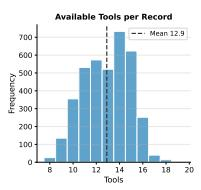

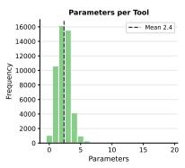

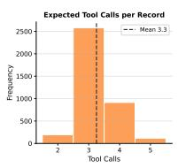  
Figure 7: Frequency distributions of (left) available tools per record, (centre) parameters per tool, and (right) expected tool calls per record. Dashed vertical lines mark the mean of each distribution. Tool inventory is tightly concentrated around 13 (range 8-19); parameter counts are right-skewed with a median of 2; expected call-sequence length ranges from 2 to 5.

<table><tr><td>Quantity</td><td>Min</td><td>Max</td><td>Mean</td><td>Median</td></tr><tr><td>Available tools per record</td><td>8</td><td>19</td><td>12.9</td><td>13.0</td></tr><tr><td>Parameters per tool</td><td>0</td><td>19</td><td>2.4</td><td>2.0</td></tr><tr><td>Expected tool calls per record</td><td>2</td><td>5</td><td>3.3</td><td>3.0</td></tr></table>

Table 8: Structural statistics of the 3,808 Agent-JudgeBench records. All quantities are computed over unique records (collapsing difficulty variants). Available tools is the size of the tool inventory exposed to the generator per record. Parameters per tool counts typed argument fields in each tool’s JSON schema. Expected tool calls is the length of the ground-truth execution trace.

## D Evaluation Corpus Statistics

Table 9 reports the exact number of records that received valid LLM-judge verdicts per (generator,

<table><tr><td>Generator</td><td>Easy</td><td>Medium</td><td>Hard</td><td>Total</td><td>Max</td><td>Rate</td></tr><tr><td>Llama-3.3-70B</td><td>3,765</td><td>3,771</td><td>3,764</td><td>11,300</td><td>11,424</td><td>98.9%</td></tr><tr><td>Llama-3.1-8B</td><td>3,707</td><td>3,698</td><td>3,606</td><td>11,011</td><td>11,424</td><td>96.4%</td></tr><tr><td>Qwen3-32B</td><td>3,271</td><td>3,421</td><td>3,548</td><td>10,240</td><td>11,424</td><td>89.6%</td></tr><tr><td>SmolLM3-3B</td><td>3,300</td><td>3,042</td><td>3,299</td><td>9,641</td><td>11,424</td><td>84.4%</td></tr><tr><td>GPT-5.4</td><td>3,807</td><td>3,802</td><td>3,807</td><td>11,416</td><td>11,424</td><td>99.9%</td></tr><tr><td>Total</td><td>17,850</td><td>17,734</td><td>18,024</td><td>53,608</td><td>57,120</td><td>93.8%</td></tr></table>

Total: 53,608 × 6 judges × 2 conditions = 643,296 evaluation instances (theoretical max); 321,648 unique (generator, judge, difficulty, record) tuples, each evaluated under both with GT and without GT conditions.

Table 9: Number of records with valid LLM-judge verdicts per generator and difficulty tier. Theoretical max per generator is 3,808 × 3 = 11,424 (three difficulty variants of each base record). Judged records are identical across all six LLM judges for a given (generator, difficulty) cell. Multiplying the Total column by 6 judges × 2 conditions yields the full evaluation instance count per generator.

difficulty) cell, after excluding records where the generator produced an unparseable or empty toolcall sequence. The base dataset contains 3,808 unique records; each is rewritten into three difficulty variants, giving a theoretical maximum of $3 { , } 8 0 8 \times 3 = 1 1$ ,424 generator inputs per generator. The final column shows the success rate relative to this theoretical maximum.

Sources of attrition. The overall success rate is 93.8% (53,608 of 57,120). Attrition arises from two distinct sources at different pipeline stages:

• Unparseable generator output (≈5.7% of inputs, weighted average): the generator produces a response that cannot be decoded as a valid JSON tool-call list. This is the dominant source of attrition, concentrated on SmolLM3- 3B (−15.6%) and Qwen3-32B (−10.4%), and more prevalent at medium difficulty for SmolLM3-3B (medium rate 79.8% vs. 86.6% on easy/hard). These failures reflect intrinsic model capability gaps on the structured output format; re-generating these records would produce the same failure pattern and was not pursued.

• Persistent LLM-judge null verdicts (≈3.3% of main-grid judge calls): after the initial run, records with null overall llm alignment percentage were identified after retrying twice (two independent rerun rounds. Records that remained null after both retries (≈10,498 (generator, judge, difficulty, record) tuples in the main grid) were permanently excluded. These persistent nulls are concentrated on the longest GPT-5.4 and Llama-3.3-70B generator outputs, which push near the context limits of certain judge endpoints (particularly Claude Sonnet 4.5), causing consistent response truncation or malformed JSON. A third retry round was not run because (a) two retries had already demonstrated a <5% recovery rate for persistently null records, making further attempts cost-prohibitive, and (b) the persistent nulls are distributed uniformly across DAG topologies and difficulty levels, giving no reason to expect systematic bias in the excluded records.

## E Bootstrap Confidence Intervals for Table 2

All alignment percentages in Table 2 are means over $N _ { g , d }$ per-record scores. To quantify uncertainty, we compute 95% bootstrap confidence intervals $( n { = } 2 , 0 0 0$ stratified resamples) for every (generator, judge, difficulty, condition) cell. Table 10 reports the full CI matrix for the Llama-3.3-70B generator. The same bootstrap analysis applied to all five generators yields CIs ≤ 0.3 pp half-width throughout (the remaining matrices are in the supplementary code release), confirming that the point estimates in Table 2 are reliable and that every monotone difficulty effect is statistically robust. CIs for the GT lift values (Eq. 5b) appear in Section 4.2; all six lift CIs are non-overlapping across the positive-vs-negative divide.

## F Difficulty Degradation and Generator Accuracy

Figure 8 shows mean judge alignment as a function of query difficulty, averaged across all six judges and five generators. Table 11 reports generator programmatic accuracy p¯ (%) on AgentJudgeBench, averaged across the four metrics and six DAG topologies.

## G Programmatic Judge Validation

This appendix reports a human annotation study validating the programmatic scorer against independent human judgement. We sampled 120 harddifficulty records stratified across all six DAG topologies (20 per topology). For each record, annotators were shown the user query, available tool schemas, generated tool calls, ground-truth expected tool calls, and the programmatic scores. For each of the four metrics they were asked to agree or disagree with the programmatic score and provide a briefjustification, yielding 120 × 4 = 480 metriclevel verdicts. Records were stratified to overrepresent cases where at least one programmatic score is below 1.0 (14 per topology) alongside perfect-score records (6 per topology), ensuring annotators encountered the full range of difficulty. Annotators were not shown the paper’s hypotheses or the LLM judge outputs prior to annotation. Each record was scored by a single annotator; we did not collect a second, independent judgement per record and so cannot report an inter-annotator agreement statistic for the human labels themselves. The 92.7% and human-verdict-ranking figures throughout this appendix should be read as validating the programmatic scorer against one calibrated annotator’s judgement, not against a consensus reference; a multi-annotator replication with an inter-annotator agreement check is left to future work (Limitations).

<table><tr><td></td><td colspan="2">Easy</td><td colspan="2">Medium</td><td colspan="2">Hard</td></tr><tr><td>Judge</td><td>GT</td><td>No GT</td><td>GT</td><td>No GT</td><td>GT</td><td>No GT</td></tr><tr><td>GPT-5.4</td><td>91.4 [91.0,91.7]</td><td>95.2 [94.8,95.6]</td><td>87.4 [87.0,87.8]</td><td>91.7 [91.2,92.2]</td><td>83.0 [82.6,83.4]</td><td>84.6 [83.9,85.2]</td></tr><tr><td>Claude Sonnet 4.5</td><td>93.3 [93.0,93.7]</td><td>94.6 [94.3,95.0]</td><td>89.9 [89.5,90.4]</td><td>90.7 [90.2,91.2]</td><td>83.7 [83.1,84.2]</td><td>83.3 [82.6,83.9]</td></tr><tr><td>Gemini-2.5-Pro</td><td>90.5 [90.0,91.0]</td><td>95.7 [95.4,96.1]</td><td>86.5 [86.0,87.0]</td><td>92.2 [91.7,92.7]</td><td>82.2 [81.6,82.7]</td><td>84.6 [83.9,85.2]</td></tr><tr><td>QwQ-32B</td><td>96.6 [96.3,96.9]</td><td>95.6 [95.2,95.9]</td><td>93.6 [93.2,94.0]</td><td>92.1 [91.6,92.5]</td><td>87.5 [86.9,88.0]</td><td>84.4 [83.7,85.1]</td></tr><tr><td>GPT-OSS-20B</td><td>89.0 [88.7,89.3]</td><td>94.5 [94.1,94.9]</td><td>87.2 [86.9,87.5]</td><td>91.2 [90.7,91.7]</td><td>83.9 [83.5,84.2]</td><td>84.0 [83.3,84.7]</td></tr><tr><td>GPT-OSS-120B</td><td>96.0 [95.7,96.3]</td><td>95.5 [95.2,95.9]</td><td>93.0 [92.6,93.4]</td><td>92.1 [91.7,92.6]</td><td>87.2 [86.7,87.8]</td><td>84.5 [83.8,85.2]</td></tr></table>

Table 10: Bootstrap 95% confidence intervals for alignment (%) on the Llama-3.3-70B-Instruct generator. Format: mean [lo, hi].

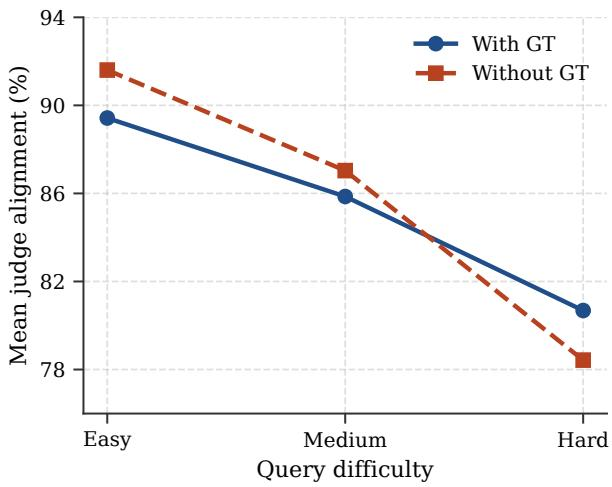  
Figure 8: Mean judge alignment as a function of query difficulty, averaged across all six judges and five generators. The without GT degradation slope is roughly 1.5× steeper than the GT slope across all generators.

<table><tr><td>Generator</td><td>Easy</td><td>Med.</td><td>Hard</td></tr><tr><td>Llama-3.3-70B</td><td>96.1</td><td>92.5</td><td>84.5</td></tr><tr><td>Qwen3-32B</td><td>93.7</td><td>88.5</td><td>80.0</td></tr><tr><td>Llama-3.1-8B</td><td>89.3</td><td>85.2</td><td>74.4</td></tr><tr><td>GPT-5.4</td><td>82.0</td><td>79.4</td><td>72.9</td></tr><tr><td>SmolLM3-3B</td><td>83.5</td><td>77.2</td><td>65.5</td></tr></table>

Table 11: Generator programmatic accuracy p¯ (%) on AgentJudgeBench, averaged across the four metrics and six DAG topologies. Generators are ranked by harddifficulty accuracy.

<table><tr><td>Metric</td><td>Agree</td><td>Disagree</td><td>Agreement %</td></tr><tr><td>Tool Selection</td><td>111</td><td>9</td><td>92.5</td></tr><tr><td>Parameter Structure</td><td>99</td><td>21</td><td>82.5</td></tr><tr><td>Sequence Accuracy</td><td>117</td><td>3</td><td>97.5</td></tr><tr><td>Query Coverage</td><td>118</td><td>2</td><td>98.3</td></tr><tr><td>Overall</td><td>445</td><td>35</td><td>92.7</td></tr><tr><td>DAG Type</td><td></td><td></td><td>Agree / 80 %</td></tr><tr><td>Linear</td><td></td><td></td><td>70 87.5</td></tr><tr><td>Fan-Out</td><td></td><td></td><td>77 96.2</td></tr><tr><td>Fan-In</td><td></td><td></td><td>75 93.8</td></tr><tr><td>Diamond</td><td></td><td></td><td>77 96.2</td></tr><tr><td>Optional Enrichment</td><td></td><td></td><td>68 85.0</td></tr><tr><td>Loop-Like</td><td></td><td></td><td>78 97.5</td></tr></table>

Table 12: Human annotator agreement with the programmatic scorer across 120 hard-difficulty records (n=480 metric-level verdicts), stratified at 20 records per DAG topology.  
The 92.7% overall agreement across 480 metric-

level verdicts confirms the programmatic scorer as a reliable reference signal for the alignment metric of Section 3.2. Agreement is not uniform across metrics: parameter structure is the weakest axis (82.5%, 21 disagreements), while sequence accuracy and query coverage are near-perfect (97.5% and 98.3%). Inspection of the 21 parameterstructure disagreements reveals two error modes. The dominant one (≈16 of 21 cases) is a schemavs.-GT mismatch: the model includes additional parameter keys that are valid per the available-tool JSON schema but absent from the specific groundtruth trace; the programmatic scorer penalises these extras (per Eq. 2), whereas human annotators treat them as correct given the schema. The remaining 5 disagreements involve structurally matching parameters that the scorer under-penalises due to partial-match rounding. This pattern is precisely the semantic-equivalence gap described in the Limitations section, and it bounds the scope of any mis-alignment attributable to scorer noise: 74.1% of metric-level mismatches between the programmatic and LLM judges fall on tool selection, sequence accuracy, and coverage – dimensions where structural and semantic correctness largely coincide.

On the tool-selection axis (9 disagreements), two failure modes emerge: semantic equivalence between tools with different names (e.g., validate\_jurisdictional\_limits vs. assess\_jurisdictional\_limits), and reasonable extra tools that the scorer penalises as out-of-reference. The per-DAG pattern is consistent with known topology difficulty: optional\_enrichment has the lowest agreement (85.0%), reflecting the inherent ambiguity in judging whether optional branches were correctly included or omitted, the same ambiguity that makes this topology moderately hard in the main judge evaluation (Table 28).

Judge alignment against human verdicts. The 120 annotated records also allow measuring how closely each LLM judge’s with GT verdict matches human judgement, where records with annotator disagreement (n=35) are scored using the humancorrected value rather than the programmatic score. Table 13 compares each judge’s programmaticreference alignment (primary metric) against their human-verdict alignment on the same 120 hard records.

All six judges are systematically closer to the programmatic scorer than to human annotators (mean $\Delta \ = \ - 6 . 9 \mathrm { p p } )$ GPT-OSS-120B is the most human-aligned judge $( \Delta = - 2 . 8 \mathrm { p p } )$ , while Gemini-2.5-Pro diverges most $( \Delta = - 1 0 . 2 \mathrm { p p ) }$ The negative $\Delta$ reflects that human annotators are more lenient on hard examples (particularly on sequence accuracy and parameter structure), while both the programmatic scorer and LLM judges apply stricter structural matching. The judge rankings under human-verdict alignment differ meaningfully from programmatic-reference rankings (Spearman $\rho = 0 . 2 6 )$ : QwQ-32B, which leads the programmatic leaderboard, drops to 4th under human alignment, while GPT-OSS-120B tops both orderings. This suggests that the programmatic scorer’s strictness inflates QwQ’s apparent advantage; GPT-OSS-120B is the most robust judge across both evaluation bases. Practitioners preferring alignment with human intuition should favour GPT-OSS-120B, regardless of whether programmatic or human verdicts are used as the reference.

<table><tr><td>Judge</td><td>Prog.</td><td>Human</td><td>∆</td></tr><tr><td>GPT-5.4</td><td>78.7</td><td>71.2</td><td>-7.5</td></tr><tr><td>Claude Sonnet 4.5</td><td>78.1</td><td>74.5</td><td>-3.7</td></tr><tr><td>Gemini-2.5-Pro</td><td>78.3</td><td>68.0</td><td>-10.2</td></tr><tr><td>QwQ-32B</td><td>82.9</td><td>74.3</td><td>-8.6</td></tr><tr><td>GPT-OSS-20B</td><td>79.0</td><td>70.2</td><td>-8.8</td></tr><tr><td>GPT-OSS-120B</td><td>82.2</td><td>79.4</td><td>-2.8</td></tr></table>

Table 13: Judge alignment (%, with GT) on 120 hard records: vs. programmatic reference and vs. human verdicts (35 corrected). ∆ = human − programmatic. Smaller |∆| is better.

Is the ranking driven by the parameterstructure gap? The result above raises a natural follow-up: since parameter structure is the one metric where the programmatic scorer measurably diverges from human judgement (§3.2, above), does QwQ-32B’s programmatic-reference lead depend on how much weight that metric carries? We recompute the with-GT judge ranking (full 321,648- evaluation grid, not just the 120-record human subset) under the equal-weight default, parameter structure downweighted by half, and parameter structure excluded entirely.

The full six-judge ranking is unchanged under all three weightings, and QwQ-32B’s score shifts by at most 0.2 pp between the equal-weight and parameter-excluded columns. The programmaticreference ranking is therefore not an artefact of how parameter structure is weighted within the programmatic scorer. This is a different question from the one immediately above: reweighting the four metrics within the same (programmatic) reference does not change the ranking, but replacing the reference with human verdicts on the 120-record subset does (QwQ-32B 1st→4th). The two results together localize the issue precisely: the programmatic scorer’s four metrics are not internally biasing the ranking against each other, but the programmatic scorer as a whole does disagree with human judgement on some records, and that disagreement is concentrated on parameter structure specifically.

<table><tr><td>Weighting</td><td>Full ranking (with GT)</td><td>Top judge</td></tr><tr><td>Equal (default)</td><td>QwQ &gt; OSS-120B &gt; Claude &gt; GPT-5.4 &gt; OSS-20B &gt; Gemini</td><td>QwQ-32B (89.3%)</td></tr><tr><td>Param ×0.5</td><td>QwQ &gt; OSS-120B &gt; Claude &gt; GPT-5.4 &gt; OSS-20B &gt; Gemini</td><td>QwQ-32B (89.2%)</td></tr><tr><td>Param excluded</td><td>QwQ &gt; OSS-120B &gt; Claude &gt; GPT-5.4 &gt; OSS-20B &gt; Gemini</td><td>QwQ-32B (89.1%)</td></tr></table>

Table 14: With-GT judge ranking (programmatic reference) under alternative weightings of the parameterstructure metric. The full six-judge ranking is identical across all three weightings.

Bounding the Eq. 2 rescoring fix. A distinct, related question is what would happen if the parameter-structure scoring rule itself were corrected, crediting schema-valid extra argument keys as 1.0 rather than the current 0.5, rather than just reweighting the existing scores as above. A full fix requires checking each extra key against the tool’s schema, which we leave to future work (main text, “Programmatic scorer as reference”), but its impact is boundable now: we recompute the programmatic scorer’s parameter-structure score under the maximally generous upper bound, crediting every currently-penalised extra-key case as valid, not only the schema-valid subset a real fix would credit, across the full 53,619-record, five-generator corpus. Only 0.83% of all 186,654 generated toolcalls exhibit an extra-key-only pattern at all, and the scorer’s own mean parameter-structure accuracy moves by +0.49 pp (90.5% → 91.0%). Table 15 propagates this upper bound into each judge’s with-GT alignment, holding every judge’s own verdicts fixed.

Every judge moves by at most 0.09 pp, and the ranking order (QwQ-32B > GPT-OSS-120B > Claude Sonnet 4.5 > GPT-5.4 > GPT-OSS-20B > Gemini-2.5-Pro) is identical to the current one. Since this is the most generous correction possible (the true schema-aware fix can only credit a subset of what this upper bound credits), the real fix’s effect is bounded above by these deltas. The Eq. 2 rescoring remains a committed future-work item, but the ranking-relevant risk it poses is now a measured sub-0.1-pp bound rather than an open question.

<table><tr><td>Judge</td><td>Current</td><td>Upper bound</td><td>∆</td></tr><tr><td>QwQ-32B</td><td>88.80</td><td>88.88</td><td>+0.079</td></tr><tr><td>GPT-OSS-120B</td><td>87.87</td><td>87.92</td><td>+0.046</td></tr><tr><td>Claude Sonnet 4.5</td><td>85.57</td><td>85.60</td><td>+0.030</td></tr><tr><td>GPT-5.4</td><td>84.83</td><td>84.87</td><td>+0.042</td></tr><tr><td>GPT-OSS-20B</td><td>84.11</td><td>84.20</td><td>+0.091</td></tr><tr><td>Gemini-2.5-Pro</td><td>81.95</td><td>81.99</td><td>+0.034</td></tr></table>

Table 15: With-GT alignment (%) under the current parameter-structure rule vs. the maximally generous upper-bound correction, record-weighted across the full corpus. Judges’ own verdicts are held fixed; only the programmatic reference’s parameter-structure score changes. Ranking order is identical to the current one in both columns.

## H Over-Anchoring Case Studies

This appendix presents three representative records from the 1,322 over-anchoring instances identified on Gemini-2.5-Pro hard-difficulty outputs (records where $p _ { r } ^ { m } < 1 . 0 , \ell _ { \mathrm { G T } } ^ { m } > p _ { r } ^ { m }$ , and $\ell _ { \mathrm { w i t h o u t G T } } ^ { m } \ \leq$ $p _ { r } ^ { m } + 0 . 1$ on at least one metric). Cases 1–2 document the dominant sequence-accuracy anchor mechanism; Case 3 documents the secondary coverage anchor. In each case the judge’s with-GT justification contains explicit reference to the GT trace (“sequence is logical given the reference”), whereas the without-GT justification independently identifies the structural flaw the programmatic judge also penalises. For each case, the red-shaded box is the with-GT verdict (over-anchored) and the greenshaded box is the without-GT verdict (independently correct diagnosis); within each box, red marks the reasoning that over-anchors to the reference, and green marks the reasoning that catches the actual structural flaw. GPT-5.4 shows a comparable negative GT lift overall (−1.5 pp, Finding 2), but we have not extracted matching qualitative case studies for it here; the mechanism below is demonstrated for Gemini-2.5-Pro only, and its generalisation to GPT-5.4 is not independently verified.

“The sequence of the selected tools is logical, with the growth rate calculation correctly preceding the temperature estimation.” The judge evaluates the two-call prefix against the GT prefix and deems it correct, ignoring the missing third step.

## Gemini-2.5-Pro: Without GT

“The plan includes a redundant, identical tool call, which is a minor structural flaw in the sequence.” The judge invents a different critique rather than catching the missing call, but does not award full credit.

Mechanism: GT exposure causes the judge to evaluate only the presented steps against the reference rather than checkingfor completeness.

## Case 2: Sequence Anchor, Cloud-Budget Linear DAG

## Query & Generated Calls

Query: “Cloud bill hit \$4,800 over 15 days vs. \$250/day normal. 10 days left, \$8,000 budget. What’s going on and will we blow the budget?”

(predicted\_trend=1.93)

forecast\_budget\_usage. The first call consumes a predicted\_trend argument that has not been computed by any prior step.

Programmatic score: seq = 0.33.

## Gemini-2.5-Pro: With GT

## Gemini-2.5-Pro: Without GT

## Gemini-2.5-Pro: With GT

“The plan selects tools that address all numerical data points provided in the user’s query.” Seeing the GT calls, the judge credits the prediction for covering the query rather than checking against the reference.

## Gemini-2.5-Pro: Without GT

cov = 0.5

“The plan analyzes all data points but lacks a final synthesis tool to answer whether to be worried.” Without GT, the judge applies an independent completeness check and finds partial coverage.

Mechanism: GT presence triggers credit-byassociation; the judge attributes coverage to the prediction by observing that the GT is complete, rather than evaluating the prediction independently.

## I Worked Example

This appendix walks through one complete record end to end – query, available tools, generator output, ground truth, programmatic score, and LLMjudge verdict – to make the abstract quantities in §3 concrete. Unlike the over-anchoring cases above, this record is not a judge failure: the LLM judge and the programmatic scorer disagree because they resolve a genuine structural ambiguity differently, so the judge verdict below is shown in a neutral colour rather than as right or wrong.

## Query

## Hard, Fan-In DAG

“Hey, so I bought somethingfor \$184.73 yesterday morning around 9:45 UTC on the 18th of September 2023, and I’m wondering ifthat’s weirdfor me since I usually do like 5 transactions a day and spend around \$312.50 daily on average, can you tell me how abnormal this looks overall?”

calculate\_temporal\_transaction\_deviation, calculate\_amount\_based\_deviation, compute\_composite\_behavior\_anomaly\_score, plus 11 distractor tools (e.g., detect\_device\_or\_location\_shift, get\_user\_behavior\_context) not relevant to this query.

## Ground-Truth Tool-Call Sequence

(1) calculate\_temporal\_transaction\_deviation, (2) calculate\_amount\_based\_deviation, (3) compute\_composite\_behavior\_anomaly\_score: the first two calls are independent and must both complete before the third (fan-in), which combines their outputs.

## Generator Output: Llama-3.3-70B-Instruct

The same three tools, in the order (1) calculate\_amount\_based\_deviation, (2) calculate\_temporal\_transaction\_deviation, (3) compute\_composite\_behavior\_anomaly\_score: the first two calls are swapped relative to the reference, and the third call is emitted immediately with symbolic placeholder arguments () rather than waiting for the first two to resolve.

Programmatic Judge tool = 1.0, param = 1.0, seq = 0.33, cov = 1.0

tool = 1.0 (correct set, no extras); param = 1.0 (all required argument names present – placeholder values do not count against this metric by design, §3.2); seq = 0.33 (position-by-position match against the 3-call reference: only position 3 agrees); cov = 1.0 (both source aspects of the query – amount and timing – are addressed).

LLM Judge: QwQ-32B, With GT tool = 1.0, param = 1.0, seq = 1.0, cov = 1.0

“Logical order: calculate individual deviations first, then combine them into a composite score.” The without-GT verdict reaches the identical scores with an equivalent justification.

Reading the divergence. The LLM judge and the programmatic scorer agree on three of four metrics and disagree sharply on sequence accuracy (match score 0.33, the sole source of this record’s 83.3% alignment rather than 100%). Both readings are defensible under different notions of “correct sequencing”: the judge treats the plan as a coherent two-then-one dependency structure regardless of which independent call comes first, while the programmatic scorer enforces the exact reference ordering position by position. This is a concrete instance of the structural-vs-semantic gap discussed in Limitations: the disagreement is not a scorer bug, but a genuine ambiguity in how strictly “sequence accuracy” should be defined for fan-in topologies where sibling branches are interchangeable.

## J C3 Corrupted-GT Control: Full Results

Table 1 reports per-difficulty alignment for both judges under standard GT, without GT, and the corrupted-GT (C3) condition on the Llama-3.3- 70B generator. The C3 condition replaces the judge’s reference with a randomly sampled GT from a different record of the same DAG topology. The key finding is the judge-level split: Gemini-2.5-Pro with corrupted GT matches its standard GT alignment within 0-1.8 pp across all difficulties, while QwQ-32B with corrupted GT matches its without GT alignment within 0.2 pp. This confirms the mechanism described in Section 4.2: Gemini anchors to any reference block regardless of content; QwQ exercises independent reasoning when the reference is incoherent.

## K Notation

Table 16 summarises the symbols used throughout the paper, in the order in which they appear.

## L Judge LLMs Comparison

Table 17 compares AgentJudgeBench against the seven existing systems that deploy LLM judges for agentic tool-calling evaluation, across four dimensions: per-metric decomposition, difficulty variation, ground-truth ablation, and use of a deterministic programmatic reference. No prior system addresses more than one of these dimensions; AgentJudgeBench is the first to provide all four.

## M Generator Models

Table 18 lists the five generator models used to produce tool-calling outputs. Models span four capability tiers – small open-source (3B), mid-scale open (8B), large open (32B–70B), and frontier closed (GPT-5.4) – ensuring the judge evaluation covers a representative range of output quality. All generators are decoded at temperature 0 with the model’s native function-calling prompt.

## N Rewriting-Preservation Validation Study

This appendix reports the full results of the metajudge validation study summarised in §3.1. Goal:

<table><tr><td>Symbol</td><td>Definition</td></tr><tr><td> $\mathcal { G }$ </td><td>Set of generator models whose tool-call sequences are judged;  $| { \mathcal { G } } | = 5 .$ </td></tr><tr><td> $\mathcal { I }$ </td><td>Set of LLM judges evaluated;  $| { \mathcal { I } } | = 6 .$ </td></tr><tr><td> $\mathcal { D }$ </td><td>Difficulty levels of the query rewrites, D = {easy, medium, hard}.</td></tr><tr><td> $g , j , d$ </td><td>Individual generator, judge, and difficulty, with  $g \in \mathcal { G } , j \in \mathcal { I } , d \in \mathcal { D } .$ </td></tr><tr><td> $c$ </td><td>Judge condition,  $c \in$  {GT, without GT}: whether the prompt includes the ground-truth tool calls.</td></tr><tr><td> $r$ </td><td>Individual record (one query, its tool schemas, ground-truth and predicted tool calls).</td></tr><tr><td> $M$ </td><td>Number of evaluation metrics;  $M = 4$  (tool selection, parameter structure, sequence accuracy, query coverage).</td></tr><tr><td> $N _ { g , d }$ </td><td>Record count in the  $( g , d )$  configuration after filtering unparseable generator outputs.</td></tr><tr><td> $p _ { r } \in [ 0 , 1 ]$ </td><td>Deterministic programmatic scorer&#x27;s verdict on record r (reference signal for alignment).</td></tr><tr><td> $\ell _ { j , r , c }$  ∈  $\{ \stackrel { \cdot } { 0 } , \stackrel { \cdot } { 0 } . 5 , 1 \}$ </td><td>LLM judge j’s verdict on record r under condition c.</td></tr><tr><td> $\mathrm { a l i g n } ( j , g , d , c )$ </td><td>Mean per-record alignment percentage  $( \mathrm { E q . } 5 \mathrm { a } ) .$ </td></tr><tr><td> $\overline { { \mathrm { a l i g n } } } _ { c } ( j )$ </td><td>Alignment of judge j under condition c, averaged over all  $( g , d )$  configurations.</td></tr><tr><td> $\operatorname { l i f t } ( j )$ </td><td>Ground-truth lift of judge  $\mathrm { \langle : \overline { { \ a l i g n } } _ { G T } ( \it j ) - \overline { { \ a l i g n } } _ { w i t h o u t G T } ( \it j ) \left( E q . \Delta 5 b \right) . }$ </td></tr><tr><td> $\Delta ( \mathrm { h a r d - e a s y } )$ </td><td>Difficulty-induced degradation:  $\mathrm { a l i g n ( \cdot , \cdot , h a r d , \cdot ) - a l i g n ( \cdot , \cdot , e a s y , \cdot ) }$  , in per-</td></tr></table>

Table 16: Notation used in the paper.
<table><tr><td>System</td><td>Judge Model</td><td>Per-Metric</td><td>Difficulty</td><td>GT Abl.</td><td>Prog. Ref.</td></tr><tr><td>ToolEval (Qin et al., 2024)</td><td>ChatGPT</td><td>x</td><td>x</td><td>x</td><td>x</td></tr><tr><td>StableToolBench (Guo et al., 2024)</td><td>GPT-4-turbo</td><td>x</td><td>x</td><td>x</td><td>x</td></tr><tr><td>MCP-AgentBench (Guo et al., 2025)</td><td>LLM + Rules</td><td>x</td><td>x</td><td>x</td><td>x</td></tr><tr><td>GeoBenchX (Krechetova and Kochedykov, 2025)</td><td>3-Judge Panel</td><td>x</td><td>x</td><td>x</td><td>x</td></tr><tr><td>Agent-as-a-Judge (Zhuge et al., 2024)</td><td>Agent</td><td>x</td><td>x</td><td>x</td><td>x</td></tr><tr><td>Auto-Eval Judge (Bhonsle et al., 2025)</td><td>GPT-40</td><td>x</td><td>x</td><td>x</td><td>x</td></tr><tr><td>ToolSandbox (Lu et al., 2024)</td><td>Replaced</td><td>N/A</td><td>x</td><td>N/A</td><td>√</td></tr><tr><td>AgentJudgeBench (Ours)</td><td>Multi-scale LLMs (3B → Frontier)</td><td> $\checkmark$ </td><td>√</td><td> $\checkmark$ </td><td> $\checkmark$ </td></tr></table>

Table 17: Comparison of systems that deploy LLM judges for agentic tool-calling evaluation. Judge Model: LLM used as judge. Per-Metric: whether evaluation is decomposed into fine-grained dimensions. Difficulty: whether tasks span multiple difficulty tiers. GT Abl.: whether the effect of ground-truth availability is studied. Prog. Ref.: whether a deterministic evaluator is used as a bias-free baseline.
<table><tr><td>Short name</td><td>HF / Server identifier</td><td>Size</td></tr><tr><td>Llama-3.3-70B-Instruct</td><td>meta-1lama/Llama-3.3-70B-Instruct</td><td>70B</td></tr><tr><td>Qwen3-32B</td><td> $\mathtt { Q w e n / Q w e n 3 - 3 2 B }$ </td><td>32B</td></tr><tr><td>Llama-3.1-8B-Instruct</td><td> $\mathsf { m e t a - 1 1 a m a / L 1 a m a - 3 . 1 - 8 B - I n s t r u c t }$ </td><td>8B</td></tr><tr><td>SmolLM3-3B</td><td>HuggingFaceTB/SmolLM3-3B</td><td>3B</td></tr><tr><td>GPT-5.4†</td><td>Azure OpenAI / gpt-5.4, api-ver 2025-04-01-preview, accessed Apr 2026</td><td></td></tr></table>

<sup>†</sup>“GPT-5.4” is the internal designation for the GPT-5 preview variant deployed on Azure OpenAI as of April 2026; not an officially published model version string. Raw per-record outputs are included in the supplementary data release.

Table 18: Generator models used to produce tool-calling outputs. All generators use temperature = 0 with their native function-calling prompt.

verify, independently of the programmatic judge, that our difficulty-controlled rewrites (a) preserve the ground-truth tool-call sequence and (b) are strictly harder (less explicit) than their predecessor.

Protocol. We stratify-sampled 198 triplets (33 per DAG topology) from the 3,808 record pool and asked each of three frontier LLM meta-judges (Claude Sonnet 4.5, GPT-5.4, Gemini-2.5-Pro) to emit a single JSON verdict per triplet, answering four Boolean questions: (i) does the medium query admit the same ground-truth tool calls as the easy query?; (ii) same for hard?; (iii) is the medium rewrite strictly harder than easy (less explicit in at least one of parameter names, numeric values, or tool intents)?; (iv) is hard strictly harder than medium? All three meta-judges receive identical prompt scaffolding and decoding parameters. The meta-judges are not shown any generator’s tool-call prediction; they reason only over the three query variants, the shared available-tools schema, and the shared ground-truth tool-call sequence.

<table><tr><td>Criterion</td><td>Claude Sonnet 4.5</td><td>GPT-5.4</td><td>Gemini-2.5-Pro</td></tr><tr><td>Medium preserves ground-truth tool calls</td><td>100.0%</td><td>94.9%</td><td>100.0%</td></tr><tr><td>Hard preserves ground-truth tool calls</td><td>100.0%</td><td>77.8%</td><td>97.5%</td></tr><tr><td>Medium strictly harder than easy</td><td>99.5%</td><td>62.1%</td><td>84.8%</td></tr><tr><td>Hard strictly harder than medium</td><td>100.0%</td><td>97.5%</td><td>95.5%</td></tr></table>

Table 19: Per-judge “yes”-rate on the rewrite-validation criteria over n = 198 stratified triplets.
<table><tr><td>Criterion</td><td>All-yes</td><td>All-no</td><td>Mixed</td><td>Unanimity %</td></tr><tr><td>Medium preserves ground-truth tool calls</td><td>188</td><td>0</td><td>10</td><td>94.9%</td></tr><tr><td>Hard preserves ground-truth tool calls</td><td>152</td><td>0</td><td>46</td><td>76.8%</td></tr><tr><td>Medium strictly harder than easy</td><td>114</td><td>1</td><td>83</td><td>58.1%</td></tr><tr><td>Hard strictly harder than medium</td><td>186</td><td>0</td><td>12</td><td>93.9%</td></tr></table>

Table 20: Unanimity of the three meta-judges on each criterion (n = 198).

Per-judge verdict rates. Table 19 reports the fraction of triplets for which each meta-judge answered “yes” to each question. Task-preservation rates are uniformly high (77.8%-100% across all judges and both rewrite pairs); the strict-hardening rates are also high for hard-versus-medium (≥ 95.5%) but lower and more judge-dependent for medium-versus-easy, driven by GPT-5.4’s stricter interpretation of what constitutes a genuine loss of explicitness.

Unanimous agreement. Table 20 reports, per criterion, the number of triplets on which the three meta-judges unanimously agreed (all-yes or all-no) versus gave mixed verdicts. Crucially, no triplet receives a unanimous “no” verdict on either taskpreservation question, and every single triplet is unanimously judged as hard-strictly-harder-thanmedium. The only criterion with sub-60% unanimity is medium-strictly-harder-than-easy, consistent with the per-judge analysis above: annotators disagree at the margin on whether medium constitutes a genuine hardening as opposed to a paraphrase.

Interpretation. The validation supports the stronger of our two design claims (task preservation) and partially supports the weaker one (strict hardening). The task-preservation result means that any alignment degradation observed in Section 4 between easy and hard difficulty conditions is not attributable to the rewrites silently changing the underlying task: even the most conservative meta-judge (GPT-5.4, which tends to reject rewrites for minor interpretative drift) finds taskpreservation intact on 77.8% of hard rewrites, and the unanimous-no rate is zero. The strict-hardening result for medium-vs-easy is a weaker claim; on that axis our rewriting process achieves a hardening GPT-5.4 would accept only about two-thirds of the time, suggesting that a subset of our medium rewrites are better characterised as paraphrases than as genuine hardenings. This is an informative finding on its own: it suggests the paper’s “easy → medium → hard” degradation curves may partially conflate paraphrase-robustness with genuine difficulty-robustness, and is a natural target for a follow-up rewriting-pipeline revision.

Robustness to dropping the non-reproducible meta-judge. GPT-5.4 is a non-reproducible snapshot (Limitations) and also serves as a generator and LLM judge elsewhere in the pipeline, raising the question of whether the rewrite-validation rates above are dependent on it. We recompute unanimity using only the two reproducible meta-judges, Claude Sonnet 4.5 and Gemini-2.5-Pro.

All four deltas are positive: dropping GPT-

<table><tr><td>Short name</td><td>Provider / Identifier</td><td>Size</td></tr><tr><td>GPT-5.4†</td><td>Azure OpenAI/ gpt-5.4, api-ver 2025-04-01-preview, accessed Apr 2026 accessed Apr 2026</td><td></td></tr><tr><td>Claude Sonnet 4.5</td><td> $\mathrm { A n t h r o p i c ~ p r o x y ~ / ~ c l a u d e - s o n n e t - 4 - 5 - 2 0 2 5 \theta 9 2 9 - v 1 : 0 , }$  accessed Apr 2026</td><td></td></tr><tr><td> $\mathrm { G e m i n i } { - 2 . 5 – P r o }$ </td><td>Vertex AI  $\mathtt { p r o x y } / \mathtt { g e m i n i - } 2 . 5 \mathtt { - p r o - p r e v i e w } - 0 . 5 \mathtt { - } 0 6 ,$ </td><td>32B</td></tr><tr><td>QwQ-32B</td><td> $\mathrm { v L L M } / \mathrm { Q w e n } / \mathrm { Q w Q } - 3 2 \mathrm { B } , \mathrm { e n a b l e \_ t h i n k i n g = t r u e }$ </td><td>20B</td></tr><tr><td>GPT-OSS-20B</td><td> $\mathrm { \ v L L M / \ o p e n a i / g p t { - } o s s { - } } 2 0 \mathrm { b }$ </td><td>120B</td></tr><tr><td>GPT-OSS-120B</td><td> $\mathrm { \ v L L M / \ o p e n a i / g p t { - } } \mathrm { o s s - } 1 2 0 \mathrm { b }$ </td><td></td></tr></table>

<sup>†</sup>“GPT-5.4” is the internal designation for the GPT-5 preview variant deployed on Azure OpenAI as of April 2026; it is not an officially published model version string.

Table 21: LLM judge configurations evaluated in this paper. All judges consume the same prompt scaffold (Appendix W) and produce the same JSON output schema.
<table><tr><td>Criterion</td><td>2-judge (no GPT-5.4)</td><td>3-judge (published)</td><td>∆</td></tr><tr><td>Medium preserves tool calls</td><td>100.0%</td><td>94.9%</td><td>+5.1pp</td></tr><tr><td>Hard preserves tool calls</td><td>97.5%</td><td>76.8%</td><td>+20.7pp</td></tr><tr><td>Medium harder than easy</td><td>84.8%</td><td>58.1%</td><td>+27.3pp</td></tr><tr><td>Hard harder than medium</td><td>95.5%</td><td>93.9%</td><td>+1.5pp</td></tr></table>

Table 22: Unanimous-agreement rate on each rewritevalidation criterion, Claude Sonnet 4.5 + Gemini-2.5- Pro only (n = 198), versus the published three-metajudge rate. ∆ = 2-judge − 3-judge.

5.4 raises the unanimous-agreement rate on every criterion, most sharply on hard-preserves-toolcalls (+20.7 pp) and medium-harder-than-easy (+27.3 pp). This is the opposite of what a selfserving meta-judge would produce: GPT-5.4 is consistently the most conservative of the three meta-judges (Table 19), not one inflating agreement to validate its own downstream role. The published three-judge rates are therefore a lower bound driven by GPT-5.4’s stricter interpretation, not evidence that the difficulty design is unreliable; the two independently-reproducible meta-judges alone would support a substantially stronger validation claim. We report the more conservative three-judge figures throughout the main text.

## O GPT-5.4 Self-Preference Check

GPT-5.4 also acts as both a generator and an LLM judge in the main grid, raising a second, distinct concern from the meta-judge robustness check above: does GPT-5.4-as-judge over-credit GPT-5.4-as-generator? We test this directly using the existing 321,648-evaluation grid (no new inference). For each (generator, metric) pair we compute the signed bias llm − prog averaged over all records and difficulty tiers, comparing GPT-5.4-as-judge’s bias on its own generations against its bias on the four other generators, with GPT-OSS-120B as a generator-agnostic control judge.

<table><tr><td>Generator</td><td>tool</td><td>param</td><td>seq</td><td>coV</td><td>mean</td></tr><tr><td>Llama-3.3-70B</td><td>-0.080</td><td>+0.052</td><td>-0.066</td><td>-0.001</td><td>-0.024</td></tr><tr><td>Llama-3.1-8B</td><td>-0.034</td><td>+0.070</td><td>-0.060</td><td>+0.009</td><td>-0.004</td></tr><tr><td>Qwen3-32B</td><td>-0.034</td><td>+0.056</td><td>+0.008</td><td>-0.018</td><td> $+ 0 . 0 0 3$ </td></tr><tr><td>SmolLM3-3B</td><td>+0.040</td><td>+0.096</td><td>-0.004</td><td>+0.005</td><td> $+ 0 . 0 3 4$ </td></tr><tr><td>GPT-5.4*</td><td>-0.026</td><td>-0.019</td><td>+0.172</td><td>-0.077</td><td>+0.012</td></tr></table>

Table 23: Judge=GPT-5.4 bias (llm\_accuracy − programmatic\_accuracy) by generator, averaged over all difficulty tiers. <sup>∗</sup>GPT-5.4 judging its own generations.

GPT-5.4’s aggregate self-bias (+0.012) falls inside the range spanned by its bias on the four other generators (−0.024 to +0.034) and is closest to its bias on SmolLM3-3B; it is not an aggregate outlier. The control judge, GPT-OSS-120B, shows a comparable generator-independent bias on GPT-5.4’s outputs (+0.072) relative to its own crossgenerator range (+0.050 to +0.097), confirming GPT-5.4’s generations are not receiving unusual treatment from an unrelated judge either. The one exception is sequence accuracy: GPT-5.4-asjudge over-credits its own sequence-accuracy by +0.172, versus at most +0.008 for any other generator on that same metric under the same judge – a metric-localised signal we report rather than average away. We do not find evidence of aggregate self-preference, but we cannot rule out a sequenceaccuracy-specific effect with this design; a controlled ablation swapping GPT-5.4 out of one role at a time (Limitations) would be needed to isolate the mechanism.

## P LLM Judge Configurations

Table 21 lists the six LLM judge configurations evaluated in this paper. The set includes large open models (20B-120B), a reasoningenabled open model (QwQ-32B), and frontier closed models (GPT-5.4, Claude Sonnet 4.5, Gemini-2.5-Pro). QwQ-32B is invoked with enable\_thinking=true (chain-of-thought enabled); all other judges use greedy or near-greedy decoding.

Decoding temperature. vLLM-hosted open judges (QwQ-32B, GPT-OSS-20B, GPT-OSS-120B) use temperature = 0.15. Frontier judges (GPT-5.4, Claude Sonnet 4.5, Gemini-2.5-Pro) were accessed via provider APIs that did not support temperature = 0 at time of evaluation; they use the provider’s recommended default $( \leq 1 . 0 )$ This asymmetry is an implementation constraint, not a design choice. To assess its impact: our temperature sensitivity study (§4.2) shows alignment varies by at most 0.6 pp across $T \in \{ 0 . 3 , 0 . 7 , 1 . 0 \}$ indicating that the inter-condition temperature gap is unlikely to materially confound the cross-judge comparisons. A broader evaluation with harmonised temperatures across all judges is planned for a future revision.

## Q Per-Metric Breakdown

Table 24 reports per-metric alignment under both conditions, averaged across all 12 (g, d) configurations. Under with GT, sequence accuracy shows the widest inter-judge spread: Gemini-2.5-Pro scores 64.2% while GPT-OSS-20B reaches 86.4%, a gap of over 22 pp. Tool selection reveals a scale effect: GPT-OSS-20B drops to 70.7%, nearly 18 pp below GPT-OSS-120B (88.7%). Parameter structure and query coverage are uniformly high (86-94%). Under without-GT, all variation collapses: the widest spread on any metric is 3.0 pp, confirming that the “default to 1.0” rubric erases capability differences.

## R Supplementary Numerical Tables

## Judge Temperature: Per-Difficulty Results

Table 25 provides the full per-difficulty numerical results for the temperature sensitivity study (Section 4.2). Alignment variance across temperatures $\mathrm { i s } \le \mathsf { 0 . 6 p p }$ on every (difficulty, condition) slice, confirming that Qwen3-32B judge behaviour is insensitive to sampling stochasticity.

## Chain-of-Thought Reasoning: Full Per-Generator Grid

Table 26 reports the full $4 \times 3 \times 2$ grid for the QwQ-32B reasoning study (Section 4.2). No cell shows a difference exceeding 0.3 pp. The pattern is uniform across generator quality tiers: even on

<table><tr><td></td><td colspan="4">With GT</td><td colspan="4">Without GT</td></tr><tr><td>Judge</td><td>tool</td><td>param</td><td>seq</td><td>cov</td><td>tool</td><td>param</td><td>seq</td><td>coV</td></tr><tr><td>GPT-5.4</td><td>83.8</td><td>90.0</td><td>72.3</td><td>94.0</td><td>84.7</td><td>89.8</td><td>80.7</td><td>91.0</td></tr><tr><td>Claude Sonnet 4.5</td><td>86.4</td><td>86.5</td><td>78.0</td><td>92.7</td><td>83.2</td><td>88.2</td><td>80.1</td><td>91.3</td></tr><tr><td>Gemini-2.5-Pro</td><td>82.6</td><td>89.4</td><td>64.2</td><td>93.3</td><td>82.9</td><td>89.5</td><td>80.4</td><td>92.3</td></tr><tr><td>QwQ-32B</td><td>88.5</td><td>89.8</td><td>84.8</td><td>93.9</td><td>82.0</td><td>89.9</td><td>79.9</td><td>91.5</td></tr><tr><td>GPT-OSS-20B</td><td>70.7</td><td>89.0</td><td>86.4</td><td>92.5</td><td>81.7</td><td>89.2</td><td>79.5</td><td>89.5</td></tr><tr><td>GPT-OSS-120B</td><td>88.7</td><td>89.7</td><td>82.9</td><td>93.5</td><td>82.1</td><td>89.9</td><td>79.4</td><td>91.6</td></tr><tr><td>Prometheus-2</td><td>71.6</td><td>43.5</td><td>70.0</td><td>56.4</td><td>67.5</td><td>49.7</td><td>73.3</td><td>60.9</td></tr></table>

Table 24: Per-metric match score $\mu _ { j , r , c } ^ { m } \times 1 0 0 $ , averaged across all $( g , d )$ configurations. Bold marks the best value per column among the six main judges. Prometheus-2 (all five generators, both GT conditions) is shown for reference below the rule and excluded from bold column-wise maxima; under GT it trails the sixjudge range by 20-45 pp on parameter structure and query coverage specifically, while remaining roughly competitive on tool selection and sequence. Without GT, the same pattern holds (parameter structure and query coverage remain its weakest axes) but every metric moves in the same direction as its own overall alignment (Table 2): tool selection and sequence trade off oppositely, with sequence and query coverage rising and tool selection falling relative to GT, consistent with a judge that, lacking a reference to anchor against, defaults to crediting plausible-looking coverage and ordering while penalising tool selection more inconsistently.
<table><tr><td></td><td colspan="2">Easy</td><td colspan="2">Med.</td><td colspan="2">Hard</td></tr><tr><td>Temp.</td><td>GT</td><td>w/o</td><td>GT</td><td>w/o</td><td>GT</td><td>w/o</td></tr><tr><td>0.3</td><td>96.4</td><td>95.1</td><td>93.5</td><td>91.8</td><td>87.5</td><td>84.0</td></tr><tr><td>0.7</td><td>96.4</td><td>95.2</td><td>93.4</td><td>91.7</td><td>87.2</td><td>84.0</td></tr><tr><td>1.0</td><td>96.1</td><td>95.2</td><td>92.9</td><td>91.2</td><td>87.0</td><td>83.9</td></tr><tr><td>Spread</td><td>0.3</td><td>0.1</td><td>0.6</td><td>0.6</td><td>0.5</td><td>0.1</td></tr></table>

Table 25: Judge temperature sensitivity: per-difficulty alignment (%) for Qwen3-32B on Llama-3.3-70B.

SmolLM3-3B, where generator errors are most frequent and reasoning might be expected to help the judge distinguish correct from incorrect calls, the thinking trace adds nothing.

## S Per-Topology Breakdown

Table 28 reports per-topology alignment under with GT. QwQ-32B leads on five of six topologies; GPT-OSS-120B leads on fan\_out (93.9%) and is a close second elsewhere. Gemini-2.5-Pro is consistently weakest, trailing QwQ-32B by 5-8 pp. The gap between the easiest (fan\_out, ∼93%) and hardest (fan\_in, ∼83%) topologies is roughly 10 pp, comparable to the easy-to-hard difficulty degradation in Table 2. Fan-out’s advantage is intuitive: each parallel branch can be verified independently, whereas fan-in and loop-like topologies require tracking

<table><tr><td></td><td></td><td colspan="2">Easy</td><td colspan="2">Medium</td><td colspan="2">Hard</td></tr><tr><td>Generator</td><td>Judge</td><td>GT</td><td>No GT</td><td>GT</td><td>No GT</td><td>GT</td><td>No GT</td></tr><tr><td rowspan="3">Llama-3.3-70B</td><td>Thinking on</td><td>96.6</td><td>95.6</td><td>93.6</td><td>92.1</td><td>87.5</td><td>84.4</td></tr><tr><td>Thinking off</td><td>96.5</td><td>95.6</td><td>93.6</td><td>92.0</td><td>87.3</td><td>84.4</td></tr><tr><td> $\Delta$ </td><td>+0.1</td><td>0.0</td><td>0.0</td><td>+0.1</td><td>+0.2</td><td>0.0</td></tr><tr><td rowspan="3">Llama-3.1-8B</td><td>Thinking on</td><td>94.2</td><td>91.2</td><td>90.8</td><td>86.8</td><td>84.1</td><td>76.6</td></tr><tr><td>Thinking off</td><td>94.3</td><td>91.4</td><td>90.8</td><td>86.8</td><td>83.9</td><td>76.7</td></tr><tr><td> $\Delta$ </td><td>-0.1</td><td>-0.2</td><td>0.0</td><td>0.0</td><td>+0.2</td><td>-0.1</td></tr><tr><td rowspan="3">Qwen3-32B</td><td>Thinking on</td><td>95.0</td><td>93.9</td><td>90.9</td><td>89.1</td><td>84.7</td><td>81.1</td></tr><tr><td>Thinking off</td><td>94.9</td><td>94.0</td><td>90.8</td><td>89.0</td><td>84.7</td><td>81.1</td></tr><tr><td> $\Delta$ </td><td>+0.1</td><td>-0.1</td><td>+0.1</td><td>+0.1</td><td>0.0</td><td>0.0</td></tr><tr><td rowspan="3">SmolLM3-3B</td><td>Thinking on</td><td>90.0</td><td>86.7</td><td>84.8</td><td>80.3</td><td>77.2</td><td>69.7</td></tr><tr><td>Thinking off</td><td>89.8</td><td>86.7</td><td>84.6</td><td>80.4</td><td>76.9</td><td>69.7</td></tr><tr><td> $\Delta$ </td><td>+0.2</td><td>0.0</td><td>+0.2</td><td>-0.1</td><td>+0.3</td><td>0.0</td></tr></table>

Table 26: Chain-of-thought reasoning study: full per-generator alignment (%) for QwQ-32B with thinking on vs. off. ∆ rows show thinking-on minus thinking-off in percentage points.

<table><tr><td>Temperature</td><td>Easy</td><td>Medium</td><td>Hard</td></tr><tr><td>0.3</td><td>93.19</td><td>89.73</td><td>83.52</td></tr><tr><td>0.7</td><td>93.05</td><td>89.93</td><td>83.57</td></tr><tr><td>1.0</td><td>93.07</td><td>89.69</td><td>83.59</td></tr><tr><td>Spread</td><td>0.14</td><td>0.25</td><td>0.06</td></tr></table>

Table 27: Judge temperature sensitivity, second pairing: with-GT alignment (%) for GPT-OSS-120B on Llama-3.1-8B-Instruct. Maximum spread (0.25 pp) is even tighter than the original (Qwen3-32B, Llama-3.3-70B) pairing in Table 25 (≤ 0.6 pp), confirming temperature insensitivity generalises beyond the original test-bed cell.

cross-branch dependencies.
<table><tr><td>Judge</td><td>linear</td><td>fan_out</td><td>fan_in</td><td>diamond</td><td>opt. enrich</td><td>loop_like</td></tr><tr><td>GPT-5.4</td><td>84.3</td><td>92.6</td><td>83.5</td><td>83.1</td><td>85.5</td><td>83.0</td></tr><tr><td>Claude Sonnet 4.5</td><td>84.4</td><td>92.4</td><td>83.7</td><td>86.9</td><td>86.5</td><td>85.2</td></tr><tr><td>Gemini-2.5-Pro</td><td>80.8</td><td>91.7</td><td>80.0</td><td>82.0</td><td>82.9</td><td>81.1</td></tr><tr><td>QwQ-32B</td><td>88.1</td><td>93.3</td><td>87.8</td><td>90.2</td><td>90.1</td><td>87.7</td></tr><tr><td>GPT-OSS-20B</td><td>83.5</td><td>92.7</td><td>82.5</td><td>84.0</td><td>85.2</td><td>83.0</td></tr><tr><td>GPT-OSS-120B</td><td>87.5</td><td>93.9</td><td>87.0</td><td>89.4</td><td>89.4</td><td>87.1</td></tr></table>

Table 28: Judge alignment (with GT, %) by DAG topology. Bold marks the best judge per topology.

## T Inter-Judge Confusion Matrices

Table 10 reports per-verdict counts for the highestagreement pair (QwQ-32B×GPT-OSS-120B, κ = 0.606) and the lowest-agreement pair (Claude Sonnet $4 . 5 { \times } \mathbf { G P T - O S S - } 2 0 \mathbf { B } , \kappa = 0 . 2 2 5 )$ under with GT. Disagreement concentrates almost entirely at the partial-credit boundary: 94.7% and 96.8% of off-diagonal entries involve at least one 0.5 verdict. The dominant off-diagonal cell for the lowagreement pair is Claude Sonnet 4.5= 1 / GPT-OSS-20B= 0.5 (18.2% of verdicts), indicating GPT-OSS-20B is systematically more conservative. Under without GT, both pairs converge as both judges default to 1.0: Claude Sonnet 4.5×OSS-20B agreement rises from 70.3% to 90.1%.

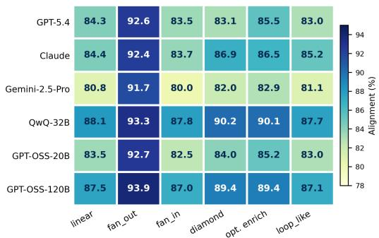  
Figure 9: Judge alignment (%) by DAG topology (with GT), visualised as a heatmap. Fan-out consistently achieves the highest alignment across all judges; fan-in and loop-like are the hardest. The ordering is judgeindependent, indicating that DAG structural complexity is an intrinsic difficulty signal.

## Binary vs. {0, 0.5, 1} Verdict Scale

Table 29 compares judge rankings under the original three-level {0, 0.5, 1} verdict scale vs. a binary collapse in which each 0.5 verdict is remapped to

<table><tr><td colspan="4">QwQ-32B × GPT-OSS-120B (κ = 0.61, Agreement 87.9%)</td><td colspan="4">Claude Sonnet 4.5× GPT-OSS-20B (κ = 0.23, Agreement 70.3%)</td></tr><tr><td></td><td>0</td><td>0.5</td><td>1</td><td></td><td>0</td><td>0.5</td><td>1</td></tr><tr><td>0</td><td>1.3</td><td>0.8</td><td>0.3</td><td>0</td><td>0.7</td><td>0.4</td><td>0.2</td></tr><tr><td>0.5</td><td>1.3</td><td>10.3</td><td>4.9</td><td>0.5</td><td>1.9</td><td>9.7</td><td>8.3</td></tr><tr><td>1</td><td>0.4</td><td>4.4</td><td>76.3</td><td>1</td><td>0.7</td><td>18.2</td><td>60.0</td></tr></table>

Figure 10: Verdict-level confusion matrices (% of N). Rows = judge 1, columns = judge 2. Diagonal entries are shaded.

<table><tr><td>Judge</td><td>Std.</td><td>Binary</td><td>∆</td><td>0.5 rate</td></tr><tr><td>GPT-OSS-20B</td><td>84.0</td><td>97.0</td><td>+13.0</td><td>26.5%</td></tr><tr><td>QwQ-32B</td><td>87.6</td><td>94.7</td><td> $+ 7 . 1$ </td><td>15.2%</td></tr><tr><td>GPT-OSS-120B</td><td>87.5</td><td>95.4</td><td> $+ 7 . 9$ </td><td>14.0%</td></tr><tr><td>Claude Sonnet  $4 . 5 ^ { \ddagger }$ </td><td>85.4</td><td>94.7</td><td>+9.2</td><td>18.6%</td></tr><tr><td>Gemini-2.5-Pro</td><td>81.7</td><td>90.0</td><td> $+ 8 . 3$ </td><td>12.2%</td></tr><tr><td>GPT-5.4</td><td>84.8</td><td>96.6</td><td>+11.9</td><td>28.2%</td></tr></table>

Table 29: Binary vs. {0, 0.5, 1} verdict scale: mean GT alignment (%) and judge rankings averaged over 15 (generator, difficulty) cells. ∆ = Binary − Standard.

0 if the programmatic reference is below 0.5, and 1 otherwise. Columns report mean GT alignment across all 15 (generator, difficulty) cells per judge, and the per-judge rate of issuing 0.5 verdicts.

The binary collapse does not inflate all scores uniformly: judges with high 0.5 rates (GPT-5.4: 28.2%, GPT-OSS-20B: 26.5%) gain disproportionately (+11.9 pp and +13.0 pp respectively). Under binary remapping, the 0.5 verdict is always counted as correct because it is mapped to the programmatic direction by construction. Judges that hedge on uncertain records therefore receive artificially inflated binary alignment, reshuffling the ranking from QwQ-32B > GPT-OSS-120B to GPT-OSS-20B > GPT-5.4. The Spearman rank correlation between standard and binary ranking is ρ = 0.03 $( p = 0 . 9 6 )$ , indicating the rankings are essentially uncorrelated. This confirms that the 0.5 verdict is not random noise: it encodes directional uncertainty that is systematically correlated with judge capacity and lost under binary collapse. We recommend retaining the three-level scale.

## U Judge Score Stochasticity and Prompt Sensitivity

## Repeated-run variability

A natural concern for any LLM-based evaluation pipeline is whether the judge’s score for a given record is stable across independent runs with the same prompt. All frontier judges (GPT-5.4, Claude Sonnet 4.5, Gemini-2.5-Pro) were called at near-default temperatures (≤ 1.0, as noted in Appendix P), meaning a small amount of stochasticity is inherent to each call. Our temperature sensitivity study (Section 4.2 and Appendix R) indirectly characterises this: Qwen3-32B alignment varies by at most 0.6 pp across $T \in \{ 0 . 3 , 0 . 7 , 1 . 0 \}$ on 3,771 records, providing an upper bound on withinjudge run-to-run variance. We therefore expect configuration-level alignment estimates (averaged over $N _ { g , d } \geq 3 , 7 6 4$ records) to be highly stable; a 0.6 pp spread at record level contracts to ≪0.1 pp at the configuration mean by the central limit theorem.

## Prompt variation sensitivity

Our prompt ablation (Section 4.2, Figure 5) shows that switching from the structured per-metric JSON rubric to a free-form one-sentence instruction drops GT alignment by 4.8–6.5 pp for Qwen3-32B on the Llama-3.3-70B generator. This > 5 pp gap on the original pairing dwarfs the within-prompt stochasticity bound and confirms that prompt structure is a substantial source of judge-score variability on that pairing, not sampling noise. Practitioners adapting these prompts should expect similar sensitivity: minor wording changes (e.g., removing the “default to 1.0” instruction) can shift alignment by 1–5 pp, as demonstrated by the C2 ablation (Table 4).

We tested whether the format effect generalises on a second pairing, QwQ-32B on SmolLM3- 3B (Table 31). The direction replicates on easy (+3.9 pp) and medium (+2.4 pp) but is smaller than on the original pairing, and reverses on hard (−0.8 pp: free-form marginally ahead). We therefore revise our characterisation: prompt format is not a uniformly dominant lever independent of judge, generator, or difficulty: it is a real and sometimes large effect, but its magnitude and even its direction on hard queries depend on the specific pairing (see Limitations). Standalone prompt texts for all four variants used in this study are provided in Appendix W.

## V Related Work Survey

A rigorous per-judge repeated-run study is planned for a future revision: running each judge twice on a stratified subset and computing per-record verdictflip rates. Such a study would directly quantify the fraction of borderline verdicts driven by stochasticity rather than systematic judge disagreement, and would allow score variance to be separated from the inter-judge disagreement reported in Table 3.

<table><tr><td>Name</td><td></td><td>Year Description</td></tr><tr><td colspan="3">Agentic Data &amp; Tool-Calling Benchmarks</td></tr><tr><td>Self-Instruct (Wang et al., 2023b)</td><td>2022</td><td>LLM-only instruction synthesis; seed for syn- thetic data pipelines.</td></tr><tr><td>Mind2Web (Deng et al., 2023)</td><td>2023</td><td>Human-annotated user trajectories over real web- sites.</td></tr><tr><td>AgentBench (Liu et al., 2024)</td><td>2023</td><td>Multi-domain agentic benchmark across reason- ing and interaction settings.</td></tr><tr><td>WebArena (Zhou et al., 2024)</td><td>2024</td><td>Realistic web environment with functional sites and long-horizon tasks.</td></tr><tr><td>WorkArena (Drouin et al., 2024)</td><td>2024</td><td>Evaluation on production websites for task- solving agents.</td></tr><tr><td>AppWorld (Trivedi et al., 2024)</td><td>2024</td><td>Multi-app environment for interactive code- based agent workflows.</td></tr><tr><td>TaskBench (Shen et al., 2024)</td><td>2024</td><td>Tool-graph-based benchmark for task decompo- sition and tool selection.</td></tr><tr><td>AgentTrek (Xu et al., 2025a)</td><td>2025</td><td>Converts web tutorials into executable agent tra- jectories.</td></tr><tr><td>BFCL (Patil et al., 2025)</td><td>2025</td><td>Leaderboard for single-turn function-calling ac- curacy; AST-based scoring.</td></tr><tr><td>FuncBenchGen (Maekawa et al., 2025)</td><td>2025</td><td>DAG-based synthetic function-calling with con- trollable complexity.</td></tr><tr><td>τ-bench (Yao et al., 2024)</td><td>2024</td><td>Tool-agent-user interaction with simulated users and pass^k reliability metric.</td></tr><tr><td colspan="3">LLM-as-Judge MT-Bench (Zheng et al., 2023)</td></tr><tr><td></td><td>2023</td><td>Established the LLM-as-judge paradigm; identi- fied positional, verbosity, and self-enhancement biases.</td></tr><tr><td>JudgeBench (Tan et al., 2025)</td><td>2024</td><td>Judge evaluation on hard pairs with verifiable ground truth.</td></tr><tr><td>Arena-Hard-Auto (Li et al., 2024b)</td><td>2024</td><td>Automated pairwise judge evaluation; high hu- man agreement.</td></tr><tr><td>PandaLM (Wang et al., 2024)</td><td>2024</td><td>Dedicated judge model trained for pairwise com- parison.</td></tr><tr><td>Auto-J (Li et al., 2024a)</td><td>2024</td><td>Generalist judge model trained on diverse evalu- ation criteria.</td></tr><tr><td>JudgeLM (Zhu et al., 2023)</td><td>2023</td><td>Fine-tuned 7B-33B judges; characterises posi- tion, knowledge, and format biases.</td></tr><tr><td>Prometheus 2 (Kim et al., 2024)</td><td>2024</td><td>Open-weight evaluator with rubric-conditioned direct and pairwise assessment.</td></tr><tr><td colspan="3">LLM Judges for Tool-Calling Evaluation</td></tr><tr><td>ToolEval (Qin et al., 2024)</td><td>2023</td><td>ChatGPT as judge for pass rate on API trajecto- ries.</td></tr><tr><td>StableToolBench (Guo et al., 2024)</td><td>2024</td><td>GPT-4-turbo as evaluator in a virtualized API environment.</td></tr><tr><td>ToolSandbox (Lu et al., 2024)</td><td>2024</td><td>Questioned LLM judge reliability; replaced with milestone-based programmatic scoring.</td></tr><tr><td>MCP-AgentBench (Guo et al., 2025)</td><td>2025</td><td>Hybrid rule-based and LLM judge for task- completion scoring.</td></tr><tr><td>GeoBenchX (Krechetova and Kochedykov, 2025) 2025</td><td></td><td>Three-judge panel for geospatial tool-use evalu- ation.</td></tr><tr><td>Agent-as-a-Judge (Zhuge et al., 2024)</td><td>2024</td><td>Agent evaluates another agent on DAG- structured development tasks.</td></tr><tr><td>Auto-Eval Judge (Bhonsle et al., 2025)</td><td>2025</td><td>Modular framework decomposing evaluation into checklist questions.</td></tr></table>

Table 30: Representative works across agentic benchmarks, LLM-as-judge methods, and LLM judges for toolcalling evaluation.

## W Prompts

This appendix reproduces, verbatim, every prompt used in the evaluation pipeline: (i) the generator prompt (Appendix W.1) that instructs each generator $g \in { \mathcal { G } }$ to emit a tool-call sequence, (ii) the with

<table><tr><td></td><td>Easy</td><td>Medium</td><td>Hard</td></tr><tr><td>Structured</td><td>89.98</td><td>84.78</td><td>77.22</td></tr><tr><td>Free-form</td><td>86.09</td><td>82.43</td><td>78.05</td></tr><tr><td>∆ (Struct.—Free)</td><td>+3.88</td><td>+2.35</td><td>-0.83</td></tr></table>

Table 31: Prompt format ablation, second pairing: with-GT alignment (%) for QwQ-32B on SmolLM3-3B, structured per-metric prompt vs. free-form. Compare to the original (Qwen3-32B, Llama-3.3-70B) pairing’s +4.8-+6.5 pp (Figure 5): the effect is smaller here and reverses sign on hard queries.

GT judge prompt (Appendix W.2) sent to every LLM judge $j \in \mathcal I$ under the GT condition, (iii) the without GT judge prompt (Appendix W.3), identical to (ii) save for the omission of the EXPECTED TOOL CALLS block, and (iv) the Prometheus-2 judge prompt (Appendix W.4), following the model’s official absolute-grading template. Decoding parameters are held constant across all prompts and all (g, j, d, c) configurations.

## W.1 Generator prompt.

## SYSTEM

You are a tool-call generation model participating in a BENCHMARK EVALUATION. This is a SIMULATION. The tools listed are HYPOTHETICAL. You are NOT being asked to actually execute anything. You are being evaluated on your ability to select and format the correct tool calls given a query and a tool schema.

Your ONLY job:

Given the user message and available tools, output the correct JSON array of tool calls. Nothing else.

Rules:

\- Output ONLY a raw JSON array. No text, no markdown, no explanation.

\- If no tools apply, output: []

\- Use EXACTLY the format specified below.

{system\_prompt}

Available Tools:

{available\_tools}

## W.2 Judge prompt: with ground truth (GT condition).

## USER

You are a STRICT STRUCTURAL EVALUATOR for AI agent tool-calling plans.

IMPORTANT CONTEXT (NON-NEGOTIABLE):

\- The evaluated model is SINGLE-SHOT and STATELESS.

\- The model does NOT observe tool execution or tool outputs.

\- The model ONLY plans tool calls.

\- ALL evaluation MUST be STATIC and STRUCTURAL.

\- Assume the programmatic judge is the ground truth.

ABSOLUTELY DO NOT:

\- Evaluate correctness of parameter VALUES - Compare generated values to expected values - Infer correctness from tool output logic - Penalize placeholder, symbolic, or dummy values

\- Penalize derived-value mismatches (e.g., 0.75 vs 0.005)

ONLY evaluate:

\- Tool presence

\- Tool names

\- Parameter NAMES

\- Parameter STRUCTURE (dict shape)

\- Logical ordering of calls

\- Coverage of user intent

If parameter NAMES match and the tool intent is satisfied, the parameter structure MUST be treated as correct.

You must compute FOUR scores. Scores should default to 1.0 unless a clear structural violation exists.

1. TOOL SELECTION ACCURACY. Evaluate only: required tools present, no clearly irrelevant tools. Ignore tool grouping and execution feasibility. Scoring: 1.0 all required/no irrelevant; 0.5 missing or clearly irrelevant; 0.0 plan fundamentally incorrect.

2. PARAMETER STRUCTURE ACCURACY (MOST IMPORTANT). Evaluate strictly: presence of required parameter names; arguments are a dictionary; parameter names logically belong to the tool. Do NOT evaluate parameter values, numeric ranges, threshold correctness, dependency resolution, or output-derived values. Rules: required parameter names present ⇒ structurally correct; optional parameters never reduce score; placeholder or symbolic values are always valid. Scoring: 1.0 correct names on all tools; 0.5 minor missing/extra; 0.0 required names missing for most tools.

3. SEQUENCE & DEPENDENCY ACCURACY. Does the order reflect logical planning? Are prerequisites placed earlier? Assume symbolic dependency handling is valid. Scoring: 1.0 logical; 0.5 minor ordering issue, intent preserved; 0.0 illogical or contradictory.

4. QUERY COVERAGE ACCURACY. Does the plan cover all parts of the user request? Are all sub-goals planned for? Scoring: 1.0 full coverage; 0.5 partial; 0.0 major intent missed.

OUTPUT FORMAT (STRICT). Return exactly   
one JSON object with the four metric   
fields, each containing {"accuracy": <float>,   
"justification": "<1 sentence>"}, plus an   
"overall\_assessment" single-sentence summary.   
Be conservative. Prefer 1.0 unless a clear   
structural violation exists. Judge structure,   
not semantics.   
QUERY:   
{user\_message}   
AVAILABLE TOOLS:   
{available\_tools}   
GENERATED TOOL CALLS:   
{generated\_tool\_calls}   
EXPECTED TOOL CALLS:   
{expected\_responses}

## W.3 Judge prompt: without ground truth (without-GT condition).

## USER

You are a STRICT STRUCTURAL EVALUATOR for AI agent tool-calling plans.

IMPORTANT CONTEXT (NON-NEGOTIABLE):

\- The evaluated model is SINGLE-SHOT and STATELESS.

\- The model does NOT observe tool execution or tool outputs.

\- The model ONLY plans tool calls.

\- ALL evaluation MUST be STATIC and STRUCTURAL.

\- There is NO expected tool plan available. ABSOLUTELY DO NOT:

\- Evaluate correctness of parameter VALUES

\- Infer correctness from tool output logic - Penalize placeholder, symbolic, or dummy values

\- Penalize derived-value mismatches - Penalize missing runtime-dependent values ONLY evaluate using:

\- AVAILABLE TOOLS schema

\- GENERATED TOOL CALLS

Treat the AVAILABLE TOOLS as the ONLY source of truth.

Evaluation Metrics (STRUCTURAL ONLY) Compute FOUR scores. Scores MUST default to 1.0 unless a clear structural violation exists.

1. TOOL SELECTION ACCURACY. Are selected tools relevant to the query? Tools that clearly do not belong? Rules: if a tool plausibly helps answer the query, treat as valid; only penalize clearly irrelevant tools. Scoring: 1.0 all relevant; 0.5 one questionable/missing; 0.0 selection unrelated.

2. PARAMETER STRUCTURE ACCURACY (MOST IMPORTANT). Evaluate strictly: arguments exist and are dictionaries; parameter names exist in the tool schema; parameter names logically belong to the tool. Do NOT evaluate parameter values, types, ranges, thresholds, or symbolic references. Rules: matching names ⇒ correct; optional parameters never reduce score; extra parameters only penalize if clearly invalid. Scoring: 1.0 valid across all tools; 0.5 minor issues; 0.0 most tools incorrect.

3. SEQUENCE & DEPENDENCY ACCURACY. Is ordering logically consistent with the query? Are analysis steps before decision/recommendation steps? Assume symbolic dependencies are valid. Scoring: 1.0 logical; 0.5 minor issue; 0.0 illogical.

4. QUERY COVERAGE ACCURACY. Does the plan attempt to address all parts of the query? Are key sub-goals represented? Scoring: 1.0 full; 0.5 partial; 0.0 major intent missed.

OUTPUT FORMAT (STRICT). Return exactly one JSON object with the four metric fields, each containing {"accuracy": <float>, "justification": "<1 sentence>"}, plus an "overall\_assessment" single-sentence summary. Be conservative. Prefer 1.0 unless a clear structural violation exists. Judge structure, not execution or correctness.

## W.4 Judge prompt: Prometheus-2 (judge-specialised baseline).

Prometheus-2 (Kim et al., 2024) is fine-tuned for single-metric absolute grading and cannot score four metrics in one call; we follow the model’s official absolute-grading template and system message, issuing four independent calls per record (one per metric, differing only in the score rubric block), then merge the four verdicts into the same judgeresponse schema every other judge produces.

## SYSTEM

You are a fair judge assistant tasked with providing clear, objective feedback based on specific criteria, ensuring each assessment reflects the absolute standards set for performance.

## USER

###Task Description:

An instruction (an agentic tool-calling query with its available tool schemas), a response to evaluate (a proposed tool-call plan), a reference answer that gets a score of 5,

```csv
and a score rubric representing an evaluation
criteria are given.
1. Write a detailed feedback that assesses
the quality of the response strictly based
on the given score rubric, not evaluating in
general.
2. After writing a feedback, write a score
that is an integer between 1 and 5. You should
refer to the score rubric.
3. The output format should look as follows:
"Feedback: (write a feedback for criteria)
[RESULT] (an integer number between 1 and 5)"
4. Please do not generate any other opening,
closing, and explanations.
###The instruction to evaluate:
Given the user query and available tool
schemas below, select and structure the
correct tool call(s) to satisfy the query.
QUERY:
{user_message}
AVAILABLE TOOLS:
{available_tools}
###Response to evaluate:
{generated_tool_calls}
###Reference Answer (Score 5):
{expected_responses}
###Score Rubrics:
{one of four metric-specific rubrics: tool
selection, parameter structure, sequence &
dependency, or query coverage – each a
bracketed criterion followed by five score
descriptions, structurally identical to the
with GT judge rubric in Appendix W.2}
###Feedback:
```

AVAILABLE TOOLS:   
{available\_tools}   
GENERATED TOOL CALLS:   
{generated\_tool\_calls}   
EXPECTED TOOL CALLS:   
{expected\_responses}

## X Free-Form Judge Prompt (A5)

The following prompt is used in the A5 promptformat ablation (§4.2). It omits explicit per-metric definitions and scoring rubrics, asking the judge to reason freely and return a single holistic verdict per metric without anchoring instructions.

USER   
You are evaluating an AI agent’s tool-calling   
plan.   
Given the user query, the available tools, and   
the generated tool calls, assess how well the   
agent performed. Consider whether it selected   
appropriate tools, structured parameters   
correctly, ordered calls logically, and   
covered the user’s intent.   
Return a JSON object with four   
keys: tool\_selection\_accuracy,   
parameter\_structure\_accuracy,   
sequence\_accuracy, and   
query\_coverage\_accuracy. Each key should map   
to an object with "accuracy" (a float between   
0 and 1) and "justification" (one sentence).   
Also include an "overall\_assessment" field.   
QUERY:   
{user\_message}