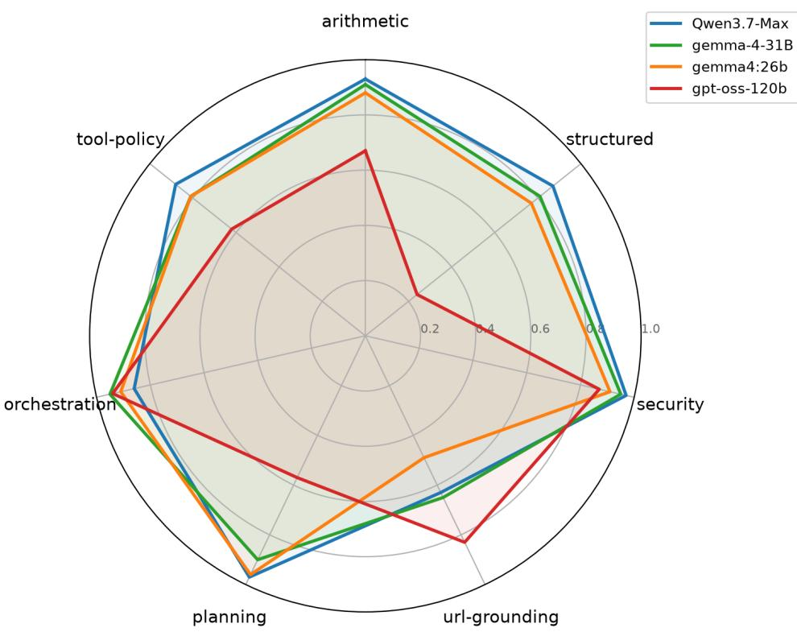

# BEKCHIAI: MEASURING, OBSERVING, AND CONTROLLING LLM AGENTS IN ONE CLICK

Mesut Toruk Istanbul, Turkiye m.mesut.toruk@gmail.com

## ABSTRACT

Large-language-model agents reason, call tools, and act autonomously over many steps, but their agentic skills—correctly sequencing tools, planning under dependencies, judging untrusted inputs, and grounding generated arguments—are hard to measure with accuracy-only leaderboards. We present BekchiAI, which addresses both sides: a benchmark for measuring agentic skill and a platform for observing and controlling live agents. The BekchiAI-Benchmark, a suite of 13 tool-using ReAct agents across 7 task categories (arithmetic, structured/SQL, security detection, URL grounding, planning, orchestration, and tool-policy), totalling 2,057 deterministic, committed test tasks. Every task is verifier-checkable—gold answers are computed by running canonical SQL against a real database, computing the exact schedule of a directed acyclic graph (DAG), or evaluating closed-form lambdas including adversarial security samples paired with deliberately imperfect signature scanners so a score reflects the model’s own judgment, not the copying of an oracle. We define a small set of behavioral metrics beyond accuracy—tool-call adherence, URL hallucination and source-match, and per-model token cost—and report a four-model comparison (Qwen3.7-Max, gemma-4-31B-it, gemma4:26b, gpt-oss-120b) whose story is in the per-family spread, not the aggregate. The benchmark runs are executed using the provided evaluation scripts. BekchiAI-Platform is a complementary web-based observability and control layer for deployed agents, providing full token and latency telemetry as well as remote run termination. The benchmark, evaluation tools, and platform are publicly released.

Keywords LLM agents · benchmark · tool use · planning · agent security · evaluation · telemetry

## 1 Introduction

Large language models (LLMs) are increasingly deployed not as single-shot text generators but as agents: systems that interleave model calls with tool use, memory, and multi-step planning to pursue goals with limited human supervision [Yao et al., 2023, Schick et al., 2023, Wang et al., 2024, Xi et al., 2023]. This paradigm has moved quickly from research demonstrations into consequential applications. In software engineering, agents equipped with shell, editor, and search tools resolve real GitHub issues end-to-end [Jimenez et al., 2024, Yang et al., 2024]; on the web, they navigate live sites to complete multi-step tasks such as booking, form-filling, and shopping [Deng et al., 2023, Zhou et al., 2024]; and in the sciences, LLM-driven systems autonomously design, plan, and execute laboratory experiments [Boiko et al., 2023]. Industry adoption is following: Gartner projects the share of enterprise applications embedding task-specific AI agents to rise from under 5% in 2025 to roughly 40% by 2026, with a growing fraction of routine decisions delegated to agents [Gartner, 2025]. As agents take real actions—writing code, moving money, calling external services—the practical question shifts from “how fluent is the model?” to “how good are its agentic skills?”

These skills—does the agent select and sequence the right tools, respect dependencies when planning, refuse a poisoned input, and ground the arguments (URLs, queries) it fabricates?—are precisely what a single accuracy number over a mixed test set fails to isolate. Worse, many popular agent tasks are easily gamed by pattern-matching or leak their gold through an oracle tool, so a high score need not reflect real competence or safe judgment.

We address this with the BekchiAI-Benchmark: 13 tool-using ReAct agents, each a self-contained task family with a verifier-checkable gold answer, spanning 7 categories and 2,057 committed test tasks (Section 3). Three design choices make the suite hard to game: (i) gold is computed by a verifier—canonical SQL over a real database, the exact schedule of a directed acyclic graph (DAG), or a closed-form lambda—so it cannot drift; (ii) the hard cases adversarial security inputs, homoglyph URL traps, deep dependency graphs) are hand-authored one by one, not templated; and (iii) the security detectors the agent may call are deliberately imperfect signature scanners, so accuracy measures the model’s judgment rather than its ability to echo an oracle. The agents run on a small, purpose-built tool library (Section 4). We report each model’s accuracy and per-model token cost; the harness additionally computes behavioral metrics—tool-call adherence, and URL hallucination and source-match (Section 5)—that we release with the benchmark.

The benchmark runs on a self-contained evaluation harness that logs per-call token and latency next to each outcome, so capability and cost come from a single run. Our four-model comparison (Section 6) shows that the ranking: a model that leads overall can collapse on structured or multi-step tool tasks while another inverts the order on grounding. Complementing the benchmark, the BekchiAI-Platform (Section 7) is a web-based observability and control layer for deployed agents—streaming the same per-call telemetry live and letting an operator stop, pause, resume, or revoke a running agent with one click.

We run every rollout under the BekchiAI-Platform, an observability and control layer that instruments the benchmark drop-in—streaming per-call token/latency telemetry and enabling a remote kill-switch—so capability and cost are measured from one stream (Section 7). Our four-model comparison (Section 6) shows that the ranking lives in the per-family spread: a model that leads overall can collapse on structured or multi-step tool tasks while another inverts the order on grounding.

## Contributions.

• The BekchiAI-Benchmark: 13 verifier-checked, tool-using ReAct task families (2,057 committed tasks) with hand-authored adversarial samples and imperfect-by-design security tools (Section 3).

• A released tool library of arithmetic, SQL, security-scanner, web/URL, and business tools the agents call (Section 4), and a set of behavioral metrics beyond accuracy (Section 5).

• A four-model agentic-skill comparison read from a single instrumented stream, capturing both capability (per family) and cost (Section 6).

• The BekchiAI-Platform: a drop-in observability + control layer (agent-native event model, grounding and plan-vs-actual analytics, policy enforcement, remote control) used to run the benchmark (Section 7).

## 2 Related Work

Agent and tool-use benchmarks. A growing body of benchmarks evaluates LLM agents. General suites such as AgentBench [Liu et al., 2024] and GAIA [Mialon et al., 2023] probe multi-step reasoning and tool use across heterogeneous environments, while domain benchmarks target software engineering (SWE-bench [Jimenez et al., 2024]), web navigation (Mind2Web [Deng et al., 2023], WebArena [Zhou et al., 2024]), and function/API calling (ToolLLM [Qin et al., 2024], τ-bench [Yao et al., 2024]). Most report a single end-to-end success rate per task, which conflates distinct skills and is sensitive to prompt formatting and to gold that can leak through an oracle tool. The BekchiAI-Benchmark is complementary: it isolates seven skill categories into verifier-checked families, computes gold from a real database, scheduling DAG, or closed-form lambda so it cannot drift, and reports behavioral metrics—tool-call adherence, plan-vs-actual consistency, and grounding—alongside accuracy.

Agent security. InjecAgent [Zhan et al., 2024] and AgentDojo [Debenedetti et al., 2024] measure whether an agent is hijacked by malicious instructions injected into tool outputs or retrieved content. Our three security families ask a related but distinct question: given an untrusted artifact—a form value, a retrieved passage, a generated output, or a dependency—and a deliberately imperfect detector, does the model correctly decide to block or proceed? Because the scanner agrees with the truth only 40–55% of the time, the score reflects the model’s own judgment rather than oracle-echoing, and it penalises over-blocking benign inputs as well as missing real threats.

Agent observability. Orthogonally, generic tracing and metrics stacks capture service calls but not agentic structure— sessions, tool trees, per-call token usage, and argument provenance—and offer no remote control of an autonomous process. The BekchiAI-Platform targets that gap and lets us read capability and cost from one instrumented stream.

Table 1: The 13 agents of the BekchiAI-Benchmark, their category, committed test-set size n, the tools they call, and the skill each isolates.
<table><tr><td>Agent</td><td>Category</td><td>Tools</td><td>n</td><td>Skill probed</td></tr><tr><td>ar_math</td><td>arithmetic</td><td>calc</td><td>154</td><td>multi-step computation</td></tr><tr><td>ar_multistep</td><td>arithmetic</td><td>lookup, calc</td><td>152</td><td>constant lookup + compute</td></tr><tr><td>sql_analytics</td><td>structured</td><td>list_tables, schema, run_sq1</td><td>157</td><td>SQL analytics (joins, group-by)</td></tr><tr><td>sec_sqli</td><td>security</td><td>scan_sql</td><td>154</td><td>SQL-injection judgment</td></tr><tr><td>sec_context_poison</td><td>security</td><td>scan_context</td><td>154</td><td>prompt-injection judgment</td></tr><tr><td>sec_guard</td><td>security</td><td>security_scan</td><td>151</td><td>LLM security-risk gating</td></tr><tr><td>ug_fetch</td><td>url-grounding</td><td>websearch, fetch</td><td>155</td><td>argument generation (no URL given)</td></tr><tr><td>ug_imposter</td><td>url-grounding</td><td>websearch, fetch</td><td>150</td><td>homoglyph/typosquat resistance</td></tr><tr><td>dependency_planning</td><td>planning</td><td>customer-record lookups</td><td>180</td><td>dependency resolution</td></tr><tr><td>multi_tool_planning</td><td>planning</td><td>customer, fx_rate, calc, discount</td><td>152</td><td>multi-tool orchestration</td></tr><tr><td>orchestrator</td><td>orchestration</td><td></td><td>196</td><td>as-soon-as-possible scheduling</td></tr><tr><td>tool_error_recovery</td><td>tool-policy</td><td>cache, mirror, authdb</td><td>150</td><td>failover / retry policy</td></tr><tr><td>tool_arguments</td><td>tool-policy</td><td>5 record-creation tools</td><td>152 2,057</td><td>correct argument construction</td></tr><tr><td colspan="5">Total</td></tr></table>

## 3 The BekchiAI-Benchmark

Structure. The suite is 13 agents grouped into 7 categories (Table 1). Each agent is a strict-JSON ReAct loop: the model emits one JSON action per turn—a tool call with arguments, or a final answer—against a commodity LLM API, and the harness executes tools and feeds results back until the model answers or a step budget is reached. Every task family ships a deterministic test set committed as JSONL; the 13 files total 2,057 held-out tasks, so a run is exactly reproducible and inspectable.

Verifier-checked gold. For sql\_analytics, each question’s canonical SQL is run against the same in-memory database the agent queries, so the gold reflects the schema conventions (amounts in integer cents; cancelled orders excluded) exactly. For orchestrator, the gold is the unique as-soon-as-possible level-partition of a dependency DAG, computed from the scenario graph. Arithmetic families evaluate closed-form lambdas over the sampled constants. Because the verifier and the agent see the same world, gold cannot silently drift, and a numeric tolerance (a cent for money, tight relative tolerance for arithmetic) absorbs only formatting noise.

Adversarial samples. Planning and orchestration scenarios use asymmetric-join DAGs, long idle-span dependencies, and mid-graph dead-end distractors that must be pruned by transitive reachability. The URL-grounding families pair each question with a different real host and, for ug\_imposter, a pasted homoglyph link (e.g. examp1e.com) the agent must ignore in favour of the authoritative host.

Imperfect-by-design security tools. The three security families (sec\_sqli, sec\_context\_poison, and sec\_guard, whose risk classes follow the OWASP Top-10 for LLM Applications) present a realistic operation (process this form value, use this retrieved context, ship this generated output) carrying an untrusted artifact, and expose a scanner tool the agent may call. Crucially the scanner is a signature heuristic that disagrees with the truth: it misses obfuscated attacks (false negatives) and fires on benign look-alikes (false positives), agreeing with the curated gold labels only ∼ 40–55% of the time. A model that blindly trusts or inverts the tool therefore scores near chance; the correct behavior is to read the artifact and decide. This converts a would-be oracle into a genuine judgment test.

## 4 Benchmark Tools

The agents run on a small, shared tool library which exist in github repo of benchmark; every agent imports its tools from this library rather than defining its own, so tool behavior is consistent and independently testable (Table 2). Two properties matter for the benchmark. First, the data-backed tools operate over real deterministic state: run\_sql executes against an in-memory SQLite database of customers/products/orders, and fetch serves an offline index of real canonical web pages (404-ing everything else), so the verifier and the agent share one ground truth. Second, the security scanners are deliberately heuristic (Section 3), returning a hint (SUSPICIOUS / NO SIGNAL), never a verdict.

Table 2: The shared tool library the agents call.
<table><tr><td>Family</td><td>Tools</td><td>Backing</td></tr><tr><td>arithmetic</td><td>calc, lookup</td><td>evaluator + constant table</td></tr><tr><td>SQL</td><td>list_tables, schema, run_sql</td><td>in-memory SQLite (3 tables)</td></tr><tr><td>security</td><td>scan_sql, scan_context, security_scan</td><td>signature scanners (imper- fect)</td></tr><tr><td>web / URL</td><td>websearch, fetch</td><td>offline index of real pages</td></tr><tr><td>business</td><td>find_customer,list_invoices, get_payment,</td><td>customer / finance store</td></tr><tr><td>failover</td><td>fx_rate, account_discount cache_get, mirror_get, authdb_get</td><td>tiered read with faults</td></tr><tr><td>records</td><td>create_invoice, schedule_shipment, book_appointment, configure_alert,</td><td>typed record creation</td></tr></table>

## 5 Metrics

Beyond a single accuracy number, each rollout emits a small set of canonical behavioral metrics that aggregate across families:

• Accuracy (success rate): fraction of tasks whose extracted answer matches the verifier gold, reported per family and per category with Wilson 95% score intervals [Wilson, 1927, Brown et al., 2001], which are well-behaved at the small per-family sample sizes here.

• URL grounding: for the grounding families, the hallucination rate [Ji et al., 2023] (a fabricated argument that is neither a real indexed URL nor was returned by any search) and the source-match rate (the cited answer host equals the gold host).

• Safety: for the security families, a violation rate (proceeding on a truly unsafe artifact) and, where applicable, an over-refusal rate (blocking a benign one).

• Cost: LLM calls and input/output token counts per model, captured by the platform on the same runs (Section 6).

All metrics come from the github repo, so every reported number is reproducible and the released harness.

## 6 Results: Four Models on the Benchmark

We evaluate all 13 families across four models —Qwen3.7-Max, gemma-4-31B-it, gemma4:26b, and gpt-oss-120b—each on the same 2,057 held-out tasks. Task conventions (e.g. the SQL cents/cancelled rules) are stated in the prompt, so a score measures the underlying skill.

Findings. Table 3 gives each model a distinct capability profile (Figure 1), and the story is in the per-family spread rather than the aggregate. Overall the four models rank Qwen3.7-Max (0.88) > gemma-4-31B (0.86) > gemma4:26b (0.82) > gpt-oss-120b (0.71), but the top two are within two points and no model dominates everywhere. gpt-oss-120b is a telling outlier that inverts the usual ordering: it is the best of the four on both grounding families (ug\_fetch 0.78, where every other model sits at 0.43–0.53; ug\_imposter 0.89) yet by far the worst on the structured and multi-step families (sql\_analytics 0.24, tool\_error\_recovery 0.25, multi\_tool\_planning 0.44)—a pro file an overall score would hide entirely. The families that discriminate most widely are exactly these tool/structured tasks: sql\_analytics spans 0.24–0.87, tool\_error\_recovery 0.25–0.76, and multi\_tool\_planning 0.44–0.96, so a single family separates the field by more than sixty points. gemma-4-31B leads on orchestrator (0.95) and ties for the top on the security and dependency-planning families, while the small local gemma4:26b is competitive throughout (0.82 overall) and even leads ar\_math (0.91) and multi\_tool\_planning (0.96). A few families are saturated across all four (sec\_sqli 0.94–0.99) and serve as sanity checks rather than ranking signal. The platform captures the operational side of the same runs (Table 5): every model issues 7k–8k LLM calls over the suite, but token usage varies almost 2×—gemma-4-31B spends the most (10.1M) and gemma4:26b the least (5.4M), and gpt-oss-120b burns 8.8M for the lowest accuracy. Capability and cost are thus read from one instrumented stream rather than separate experiments.

Table 3: Test-set accuracy (success rate on [0, 1]) per family across four models, computed from the committed test sets in data/eval (2,057 tasks per model). Best per family in bold. The wide per-family spread—not an aggregate—is the benchmark’s ranking signal.
<table><tr><td>Family</td><td>Category</td><td>Qwen3.7-Max</td><td>gemma-4-31B</td><td>gemma4:26b</td><td>gpt-oss-120b</td></tr><tr><td>ar_math</td><td>arithmetic</td><td>0.90</td><td>0.86</td><td>0.91</td><td>0.69</td></tr><tr><td>ar_multistep</td><td>arithmetic</td><td>0.97</td><td>0.97</td><td>0.85</td><td>0.65</td></tr><tr><td>sql_analytics</td><td>structured</td><td>0.87</td><td>0.81</td><td>0.77</td><td>0.24</td></tr><tr><td>sec_sqli</td><td>security</td><td>0.99</td><td>0.99</td><td>0.95</td><td>0.94</td></tr><tr><td>sec_guard</td><td>security</td><td>0.99</td><td>0.96</td><td>0.93</td><td>0.85</td></tr><tr><td>sec_context_poison</td><td>security</td><td>0.92</td><td>0.91</td><td>0.84</td><td>0.82</td></tr><tr><td>ug_fetch</td><td>url-grounding</td><td>0.45</td><td>0.53</td><td>0.43</td><td>0.78</td></tr><tr><td>ug_imposter</td><td>url-grounding</td><td>0.82</td><td>0.78</td><td>0.56</td><td>0.89</td></tr><tr><td>dependency_planning</td><td>planning</td><td>0.99</td><td>0.99</td><td>0.96</td><td>0.68</td></tr><tr><td>multi_tool_planning</td><td>planning</td><td>0.94</td><td>0.80</td><td>0.96</td><td>0.44</td></tr><tr><td>orchestrator</td><td>orchestration</td><td>0.86</td><td>0.95</td><td>0.91</td><td>0.94</td></tr><tr><td>tool_error_recovery</td><td>tool-policy</td><td>0.76</td><td>0.74</td><td>0.65</td><td>0.25</td></tr><tr><td>tool_arguments</td><td>tool-policy</td><td>0.99</td><td>0.88</td><td>0.97</td><td>0.99</td></tr><tr><td>overall</td><td>(task-weighted)</td><td>0.88</td><td>0.86</td><td>0.82</td><td>0.71</td></tr></table>

Table 4: The same accuracies collapsed to the seven task categories (each cell is the task-weighted mean over that category’s families; n is its total test tasks). This is the level the radar in Figure 1 plots; best per category in bold.
<table><tr><td>Category</td><td>n</td><td>Qwen3.7-Max</td><td>gemma-4-31B</td><td>gemma4:26b</td><td>gpt-oss-120b</td></tr><tr><td>arithmetic</td><td>306</td><td>0.93</td><td>0.91</td><td>0.88</td><td>0.67</td></tr><tr><td>structured</td><td>157</td><td>0.87</td><td>0.81</td><td>0.77</td><td>0.24</td></tr><tr><td>security</td><td>459</td><td>0.97</td><td>0.95</td><td>0.91</td><td>0.87</td></tr><tr><td>url-grounding</td><td>305</td><td>0.63</td><td>0.65</td><td>0.49</td><td>0.83</td></tr><tr><td>planning</td><td>332</td><td>0.97</td><td>0.90</td><td>0.96</td><td>0.57</td></tr><tr><td>orchestration</td><td>196</td><td>0.86</td><td>0.95</td><td>0.91</td><td>0.94</td></tr><tr><td>tool-policy</td><td>302</td><td>0.88</td><td>0.81</td><td>0.81</td><td>0.62</td></tr><tr><td>overall</td><td>2,057</td><td>0.88</td><td>0.86</td><td>0.82</td><td>0.71</td></tr></table>

## 7 The BekchiAI-Platform

BekchiAI-Platform is a drop-in observability and control layer. Enabling telemetry points a lightweight SDK at the platform; the agent’s task logic is unchanged. This is what lets us read capability and cost (Section 6) from the same run, and it adds security observability and a remote kill-switch on top.

Architecture and event model. The platform has four parts: a client SDK that emits telemetry and polls for control commands; an ingestion + API and REST endpoints for agents, sessions, traces, and findings; a store with a wide events table (JSONB payloads plus relational metadata); and a React dashboard. Ingestion is idempotent on a event id, authenticated with per-project API keys, and multi-tenant. Agent activity is modelled as sessions of linked events forming a trace tree. Core types are session\_start; llm\_call (model, input/output tokens, latency); tool\_call / tool\_result (name, arguments, success); url\_access (host, status, allowlisted); plan (intended tools and URLs); denied (policy events); and outcome. Table 6 shows how each benchmark behavior maps onto these events, so no separate evaluation harness is needed.

Behavioral-security analytics. Over the event store the platform computes two signals. Argument grounding: from each session’s plan and allowlisted accesses it builds a trusted-host set and labels each accessed host grounded, ungrounded, or imposter\_url (an ungrounded host within Levenshtein distance ≤ 2 of a trusted one—a likely typosquat), reporting the grounding rate.

Plan-vs-actual consistency: it compares the intended tool set to the executed tool\_call sequence, yielding intersection / unplanned / missing sets and a per-session verdict. These are the platform-side counterparts of the benchmark’s grounding and tool-adherence metrics.

Accuracy by task category across four models  
  
Figure 1: Zero-shot accuracy by task category for the four models—one axis per category (the task-weighted mean over its families of Table 4; radius = success rate on [0, 1]). The polygons expose each model’s profile: gpt-oss-120b (red) caves in on the structured (0.24), planning (0.57), and tool-policy (0.62) categories yet reaches farthest on url-grounding (0.83), while the other three trace a broadly similar high envelope—a shape an overall score cannot convey.

Table 5: Operational cost of the same runs, measured by the platform: LLM calls and token usage per model over the full 2,057-task suite (input + output tokens in millions). Read alongside Table 3, this shows capability and cost from one instrumented stream: gemma-4-31B and gpt-oss-120b spend the most tokens without leading on accuracy, while gemma4:26b is the leanest.
<table><tr><td>Model</td><td>LLM calls</td><td>input (M)</td><td>output (M)</td><td>total (M)</td></tr><tr><td>Qwen3.7-Max</td><td>6,965</td><td>3.86</td><td>1.96</td><td>5.83</td></tr><tr><td>gemma-4-31B</td><td>7,715</td><td>8.32</td><td>1.80</td><td>10.12</td></tr><tr><td>gemma4:26b</td><td>7,258</td><td>4.61</td><td>0.82</td><td>5.43</td></tr><tr><td>gpt-oss-120b</td><td>7,158</td><td>6.56</td><td>2.25</td><td>8.81</td></tr></table>

Policy enforcement and remote control. Operators define allow/block/alert policies over host globs and tool names; at ingest, block matches emit a synthetic denied event, giving a durable audit of prevented actions. The platform is also bidirectional: an operator issues stop/pause/resume/revoke from the dashboard, the agent polls the control endpoint, applies pending commands, and acknowledges; commands move pending→delivered→applied with timestamps. In the benchmark run this let us abort a running agent remotely within a single poll cycle. Enforcement is cooperative: an agent that cannot reach the channel is not controllable.

## 8 Conclusion

We introduced the BekchiAI-Benchmark, a suite of 13 tool-using ReAct agents across seven categories (2,057 committed tasks) that measures the agentic skills of LLMs—tool selection and sequencing, planning under dependencies, security judgment, and argument grounding—rather than a single blended accuracy. Three design choices keep the suite honest: gold is computed by a verifier (canonical SQL, the exact schedule of a dependency DAG, or a closed-form lambda) and so cannot drift; the discriminating cases are hand-authored one by one rather than templated; and the security families replace the usual oracle detector with a deliberately imperfect signature scanner, so a score reflects the model’s own judgment rather than tool-copying. We pair accuracy with behavioral metrics—tool-call adherence, plan-vs-actual consistency, URL grounding, and per-model token cost—all read from one instrumented stream via the drop-in BekchiAI-Platform.

Table 6: How each benchmark behavior maps onto BekchiAI-Platform signals. One instrumented run yields all four.
<table><tr><td>Model behaviour</td><td>Platform signal (event)</td><td>Reveals</td></tr><tr><td>task correctness</td><td>outcome (success/mismatch)</td><td>accuracy, per family</td></tr><tr><td>model call</td><td>11m_cal1 (input/output tokens, latency)</td><td>token usage and speed</td></tr><tr><td>tool use</td><td>tool_call, plan-vs-actual</td><td>tool competence, adherence</td></tr><tr><td>URL arguments</td><td>url_access (grounded/hallucinated)</td><td>URL-hallucination, source-match</td></tr></table>

Across four models, the results argue for reporting the per-family spread rather than an aggregate. The top two models finish within two points overall, yet no model dominates every skill: gpt-oss-120b leads both grounding families while collapsing on the structured and multi-step tool tasks (e.g. sql\_analytics 0.24 vs. 0.87)—an inversion a single leaderboard number erases. The tool and structured families discriminate most sharply, separating the field by more than sixty points. Because the platform records token cost on the same runs, capability and efficiency can be weighed together—and the most accurate model is not the cheapest. As agents take on real, consequential actions, we argue that skill- and cost-resolved, hard-to-game evaluation of this kind is a prerequisite for trustworthy deployment.

The benchmark is deliberately compact and evaluates one task per rollout; natural extensions include broader model coverage, additional adversarial rounds and skill categories, longer-horizon and multi-turn interactions, and applying the platform’s grounding and plan-vs-actual analytics to live agent deployments. We release the benchmark, tool library, metric scripts, and we released to platform on web and mobile markets to support this work.

Reproducibility. The benchmark—provided test sets, the tool library, harness, and metrics—is released at https: //github.com/bekchiai/bekchiai-benchmark.

## References

Shunyu Yao, Jeffrey Zhao, Dian Yu, Nan Du, Izhak Shafran, Karthik Narasimhan, and Yuan Cao. ReAct: Synergizing reasoning and acting in language models. In International Conference on Learning Representations (ICLR), 2023.

Timo Schick, Jane Dwivedi-Yu, Roberto Dessi, Roberta Raileanu, Maria Lomeli, Eric Hambro, Luke Zettlemoyer, Nicola Cancedda, and Thomas Scialom. Toolformer: Language models can teach themselves to use tools. In Thirty-seventh Conference on Neural Information Processing Systems, 2023.

Lei Wang, Chen Ma, Xueyang Feng, Zeyu Zhang, Hao Yang, Jingsen Zhang, Zhiyuan Chen, Jiakai Tang, Xu Chen, Yankai Lin, Wayne Xin Zhao, Zhewei Wei, and Jirong Wen. A survey on large language model based autonomous agents. Frontiers ofComputer Science, 18(6):186345, 2024.

Zhiheng Xi, Wenxiang Chen, Xin Guo, Wei He, Yiwen Ding, Boyang Hong, Ming Zhang, Junzhe Wang, Senjie Jin, Enyu Zhou, et al. The rise and potential of large language model based agents: A survey. arXiv preprint arXiv:2309.07864, 2023.

Carlos E Jimenez, John Yang, Alexander Wettig, Shunyu Yao, Kexin Pei, Ofir Press, and Karthik Narasimhan. SWE-bench: Can language models resolve real-world GitHub issues? In International Conference on Learning Representations (ICLR), 2024.

John Yang, Carlos E Jimenez, Alexander Wettig, Kilian Lieret, Shunyu Yao, Karthik Narasimhan, and Ofir Press. SWE-agent: Agent-computer interfaces enable automated software engineering. In Advances in Neural Information Processing Systems (NeurIPS), 2024.

Xiang Deng, Yu Gu, Boyuan Zheng, Shijie Chen, Samuel Stevens, Boshi Wang, Huan Sun, and Yu Su. Mind2Web: Towards a generalist agent for the web. In Advances in Neural Information Processing Systems (NeurIPS), 2023.

Shuyan Zhou, Frank F Xu, Hao Zhu, Xuhui Zhou, Robert Lo, Abishek Sridhar, Xianyi Cheng, Tianyue Ou, Yonatan Bisk, Daniel Fried, Uri Alon, and Graham Neubig. WebArena: A realistic web environment for building autonomous agents. In International Conference on Learning Representations (ICLR), 2024.

Daniil A Boiko, Robert MacKnight, Ben Kline, and Gabe Gomes. Autonomous chemical research with large language models. Nature, 624(7992):570–578, 2023.

Gartner. Gartner predicts 40% of enterprise apps will feature task-specific AI agents by 2026, up from less than 5% in 2025. Gartner Newsroom, press release, 2025.

Xiao Liu, Hao Yu, Hanchen Zhang, Yifan Xu, Xuanyu Lei, Hanyu Lai, Yu Gu, Hangliang Ding, Kaiwen Men, Kejuan Yang, et al. AgentBench: Evaluating LLMs as agents. In International Conference on Learning Representations (ICLR), 2024.

Grégoire Mialon, Clémentine Fourrier, Craig Swift, Thomas Wolf, Yann LeCun, and Thomas Scialom. GAIA: A benchmark for general AI assistants. arXiv preprint arXiv:2311.12983, 2023.

Yujia Qin, Shihao Liang, Yining Ye, Kunlun Zhu, Lan Yan, Yaxi Lu, Yankai Lin, Xin Cong, Xiangru Tang, Bill Qian, et al. ToolLLM: Facilitating large language models to master 16000+ real-world APIs. In International Conference on Learning Representations (ICLR), 2024.

Shunyu Yao, Noah Shinn, Pedram Razavi, and Karthik Narasimhan. τ -bench: A benchmark for tool-agent-user interaction in real-world domains. arXiv preprint arXiv:2406.12045, 2024.

Qiusi Zhan, Zhixiang Liang, Zifan Ying, and Daniel Kang. InjecAgent: Benchmarking indirect prompt injections in tool-integrated large language model agents. In Findings of the Association for Computational Linguistics (ACL), 2024.

Edoardo Debenedetti, Jie Zhang, Mislav Balunovic, Luca Beurer-Kellner, Marc Fischer, and Florian Tramèr. AgentDojo:´ A dynamic environment to evaluate prompt injection attacks and defenses for LLM agents. In Advances in Neural Information Processing Systems (NeurIPS), 2024.

Edwin B Wilson. Probable inference, the law of succession, and statistical inference. Journal ofthe American Statistical Association, 22(158):209–212, 1927.

Lawrence D Brown, T Tony Cai, and Anirban DasGupta. Interval estimation for a binomial proportion. Statistical Science, 16(2):101–133, 2001.

Ziwei Ji, Nayeon Lee, Rita Frieske, Tiezheng Yu, Dan Su, Yan Xu, Etsuko Ishii, Ye Jin Bang, Andrea Madotto, and Pascale Fung. Survey of hallucination in natural language generation. ACM Computing Surveys, 55(12):1–38, 2023.