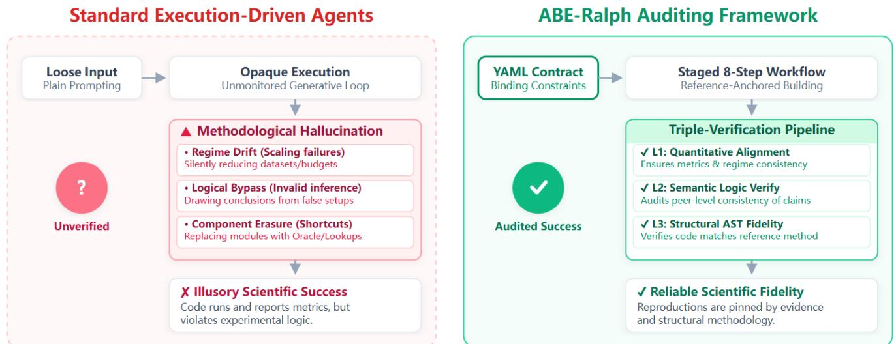
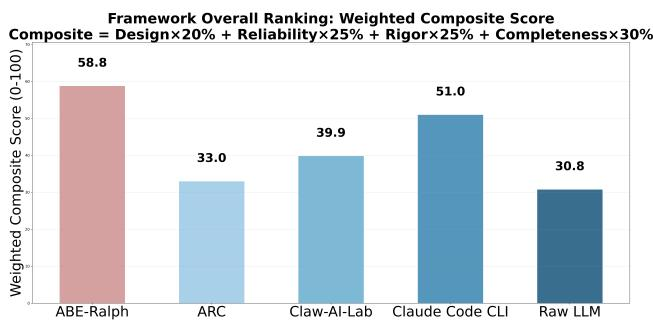
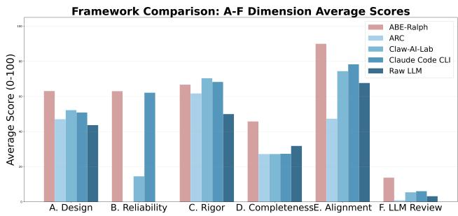
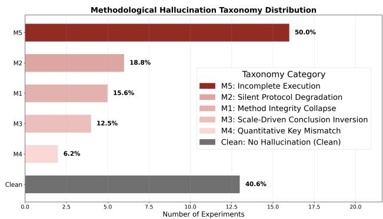
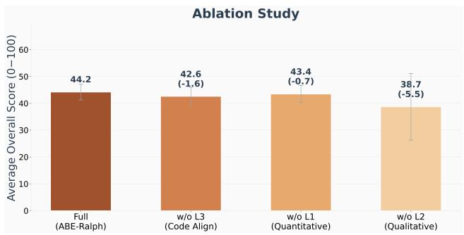

# Beyond Execution: Auditing Experimental Fidelity in LLM-Driven Scientific Research

Lezhi Yu<sup>1</sup>, Xiaogang Xu<sup>1</sup>, Yuhua Zhou<sup>1</sup>, Shuibing He<sup>1</sup>, Aimin Pan<sup>2</sup>

<sup>1</sup>College of Computer Science and Technology, Zhejiang University, Hangzhou, China <sup>2</sup> Zhejiang Lab, Hangzhou, China

## Abstract

LLM <sub>agen</sub>t<sub>s use</sub>d f<sub>or sc</sub>i<sub>en</sub>tifi<sub>c exper</sub>i<sub>men</sub>t<sub>a</sub>ti<sub>on mus</sub>t d<sub>o</sub> <sub>more</sub> th<sub>an</sub> <sub>genera</sub>t<sub>e</sub> <sub>execu</sub>t<sub>a</sub>bl<sub>e</sub> <sub>co</sub>d<sub>e:</sub> th<sub>ey</sub> <sub>mus</sub>t i<sub>mp</sub>l<sub>emen</sub>t th<sub>e</sub> <sub>re</sub>f<sub>erence</sub> <sub>me</sub>th<sub>o</sub>d f<sub>a</sub>ithf<sub>u</sub>ll<sub>y,</sub> d<sub>es</sub>i<sub>gn</sub> <sub>exper</sub>i<sub>men</sub>t<sub>s</sub> th<sub>a</sub>t t<sub>es</sub>t th<sub>e</sub> <sub>paper</sub>’<sub>s</sub> <sub>c</sub>l<sub>a</sub>i<sub>ms,</sub> <sub>an</sub>d <sub>prov</sub>id<sub>e</sub> <sub>ev</sub>id<sub>ence</sub> <sub>suppor</sub>ti<sub>ng</sub> th<sub>ose</sub> claims. We show that agents often produce methodological hallucinations: silently reducing datasets or training bud-<sub>ge</sub>t<sub>s, rep</sub>l<sub>ac</sub>i<sub>ng</sub> f<sub>a</sub>il<sub>e</sub>d l<sub>earn</sub>i<sub>ng or genera</sub>ti<sub>ve componen</sub>t<sub>s w</sub>ith l<sub>oo</sub>k<sub>up</sub> <sub>or</sub> <sub>orac</sub>l<sub>e</sub> f<sub>unc</sub>ti<sub>ons,</sub> <sub>or</sub> d<sub>raw</sub>i<sub>ng</sub> <sub>conc</sub>l<sub>us</sub>i<sub>ons</sub> f<sub>rom</sub> <sub>resource-</sub>li<sub>m</sub>it<sub>e</sub>d <sub>se</sub>tti<sub>ngs w</sub>h<sub>ere a me</sub>th<sub>o</sub>d’<sub>s c</sub>l<sub>a</sub>i<sub>me</sub>d <sub>a</sub>d<sub>van-</sub> t<sub>age</sub> di<sub>sappears.</sub> T<sub>o</sub> d<sub>e</sub>t<sub>ec</sub>t th<sub>ese</sub> f<sub>a</sub>il<sub>ures, we</sub> i<sub>n</sub>t<sub>ro</sub>d<sub>uce</sub> ABE<sub>-</sub> R<sub>a</sub>l<sub>p</sub>h<sub>, a re</sub>f<sub>erence-anc</sub>h<sub>ore</sub>d <sub>au</sub>diti<sub>ng</sub> f<sub>ramewor</sub>k th<sub>a</sub>t <sub>repre-</sub> <sub>sen</sub>t<sub>s c</sub>l<sub>a</sub>i<sub>ms, pro</sub>t<sub>oco</sub>l<sub>s, requ</sub>i<sub>re</sub>d <sub>componen</sub>t<sub>s,</sub> b<sub>ase</sub>li<sub>nes, an</sub>d <sub>me</sub>t<sub>r</sub>i<sub>cs as s</sub>t<sub>ruc</sub>t<sub>ure</sub>d <sub>exper</sub>i<sub>men</sub>t<sub>a</sub>l <sub>cons</sub>t<sub>ra</sub>i<sub>n</sub>t<sub>s, gu</sub>id<sub>es</sub> i<sub>mp</sub>l<sub>e-</sub> <sub>men</sub>t<sub>a</sub>ti<sub>on</sub> th<sub>roug</sub>h <sub>an</sub> 8<sub>-s</sub>t<sub>ep wor</sub>kfl<sub>ow, an</sub>d <sub>per</sub>f<sub>orms quan-</sub> tit<sub>a</sub>ti<sub>ve, qua</sub>lit<sub>a</sub>ti<sub>ve, an</sub>d <sub>co</sub>d<sub>e-</sub>l<sub>eve</sub>l <sub>ver</sub>ifi<sub>ca</sub>ti<sub>on.</sub> A<sub>cross</sub> 30 l<sub>ong-</sub>h<sub>or</sub>i<sub>zon repro</sub>d<sub>uc</sub>ti<sub>on runs cover</sub>i<sub>ng</sub> 12 <sub>mac</sub>hi<sub>ne</sub> l<sub>earn-</sub> i<sub>ng</sub> d<sub>oma</sub>i<sub>ns,</sub> ABE<sub>-</sub>R<sub>a</sub>l<sub>p</sub>h <sub>ac</sub>hi<sub>eves a</sub> 93% <sub>ro</sub>b<sub>us</sub>t <sub>execu</sub>ti<sub>on</sub> <sub>ra</sub>t<sub>e an</sub>d id<sub>en</sub>tifi<sub>es</sub> fi<sub>ve sc</sub>i<sub>en</sub>tifi<sub>c</sub> f<sub>a</sub>il<sub>ure mo</sub>d<sub>es.</sub> I<sub>n</sub> 23 N<sub>a-</sub> t<sub>ure</sub>B<sub>enc</sub>h di<sub>scovery</sub> t<sub>as</sub>k<sub>s,</sub> ABE<sub>-</sub>R<sub>a</sub>l<sub>p</sub>h <sub>ma</sub>t<sub>c</sub>h<sub>es or excee</sub>d<sub>s</sub> <sub>s</sub>t<sub>a</sub>t<sub>e-o</sub>f<sub>-</sub>th<sub>e-ar</sub>t <sub>per</sub>f<sub>ormance on</sub> 5 t<sub>as</sub>k<sub>s.</sub> Th<sub>ese resu</sub>lt<sub>s s</sub>h<sub>ow</sub> th<sub>a</sub>t <sub>re</sub>li<sub>a</sub>bl<sub>e eva</sub>l<sub>ua</sub>ti<sub>on o</sub>f AI <sub>sc</sub>i<sub>en</sub>ti<sub>s</sub>t<sub>s mus</sub>t <sub>assess w</sub>h<sub>e</sub>th<sub>er</sub> th<sub>e exper</sub>i<sub>men</sub>t<sub>a</sub>l d<sub>es</sub>i<sub>gn</sub> f<sub>a</sub>ithf<sub>u</sub>ll<sub>y</sub> t<sub>es</sub>t<sub>s</sub> th<sub>e</sub> i<sub>n</sub>t<sub>en</sub>d<sub>e</sub>d <sub>c</sub>l<sub>a</sub>i<sub>m an</sub>d <sub>w</sub>h<sub>e</sub>th<sub>er</sub> th<sub>e resu</sub>lti<sub>ng ev</sub>id<sub>ence suppor</sub>t<sub>s</sub> it<sub>, ra</sub>th<sub>er</sub> th<sub>an</sub> t<sub>rea</sub>ti<sub>ng</sub> <sub>co</sub>d<sub>e execu</sub>ti<sub>on or p</sub>l<sub>aus</sub>ibl<sub>e me</sub>t<sub>r</sub>i<sub>cs as ev</sub>id<sub>ence o</sub>f <sub>sc</sub>i<sub>en</sub>tifi<sub>c</sub> success.

Code — https://github.com/Flavorfish/AutoRepro

## Introduction

Lar<sub>g</sub>e Lan<sub>g</sub>ua<sub>g</sub>e Model (LLM) a<sub>g</sub>ents are ex<sub>p</sub>andin<sub>g</sub> into aut<sub>onomous researc</sub>h <sub>wor</sub>kfl<sub>ows, a</sub>ll<sub>ow</sub>i<sub>ng sys</sub>t<sub>ems</sub> t<sub>o genera</sub>t<sub>e</sub> h<sub>ypo</sub>th<sub>eses, wr</sub>it<sub>e co</sub>d<sub>e, run exper</sub>i<sub>men</sub>t<sub>s, an</sub>d d<sub>ra</sub>ft <sub>repor</sub>t<sub>s</sub> (Lu et al. 2024; Liu et al. 2026; Boiko et al. 2023; Bran et al. 2024). Similarl<sub>y</sub>, software en<sub>g</sub>ineerin<sub>g</sub> a<sub>g</sub>ents solve re<sub>p</sub>osit<sub>ory</sub> i<sub>ssues</sub> <sub>an</sub>d <sub>ou</sub>t<sub>pu</sub>t f<sub>unc</sub>ti<sub>ona</sub>l <sub>pa</sub>t<sub>c</sub>h<sub>es</sub> <sub>w</sub>ith hi<sub>g</sub>h <sub>success</sub> rates (Yan<sub>g</sub> et al. 2024; Wan<sub>g</sub> et al. 2025; Liu et al. 2024). Th<sub>ese</sub> d<sub>eve</sub>l<sub>opmen</sub>t<sub>s</sub> <sub>ma</sub>k<sub>e</sub> it t<sub>emp</sub>ti<sub>ng</sub> t<sub>o</sub> <sub>eva</sub>l<sub>ua</sub>t<sub>e</sub> <sub>sc</sub>i<sub>en</sub>tifi<sub>c</sub> <sub>agen</sub>t<sub>s</sub> <sub>us</sub>i<sub>ng</sub> th<sub>e</sub> <sub>same</sub> <sub>cr</sub>it<sub>er</sub>i<sub>on</sub> <sub>use</sub>d f<sub>or</sub> <sub>so</sub>ft<sub>ware</sub> <sub>agen</sub>t<sub>s:</sub> <sub>w</sub>h<sub>e</sub>th<sub>er</sub> th<sub>e</sub> <sub>genera</sub>t<sub>e</sub>d <sub>program</sub> <sub>execu</sub>t<sub>es</sub> <sub>success</sub>f<sub>u</sub>ll<sub>y</sub> <sub>an</sub>d p<sup>rod</sup>u<sup>ces an o</sup>u<sup>t</sup>pu<sup>t</sup>.

Th<sub>a</sub>t <sub>cr</sub>it<sub>er</sub>i<sub>on</sub> i<sub>s</sub> i<sub>nsu</sub>fi<sub>c</sub>i<sub>en</sub>t f<sub>or</sub> <sub>sc</sub>i<sub>en</sub>tifi<sub>c</sub> <sub>repro</sub>d<sub>uc</sub>ti<sub>on.</sub> A re<sub>p</sub>roduction must satisf<sub>y</sub> four linked requirements: (1) the i<sub>mp</sub>l<sub>emen</sub>t<sub>a</sub>ti<sub>on</sub> <sub>con</sub>t<sub>a</sub>i<sub>ns</sub> th<sub>e</sub> <sub>re</sub>f<sub>erence</sub> <sub>me</sub>th<sub>o</sub>d d<sub>escr</sub>ib<sub>e</sub>d i<sub>n</sub> the <sub>p</sub>a<sub>p</sub>er; (2) datasets, <sub>p</sub>re<sub>p</sub>rocessin<sub>g</sub>, trainin<sub>g</sub>, and baselines remain relevant to the ori<sub>g</sub>inal ex<sub>p</sub>eriment; (3) the ex<sub>p</sub>eriment i<sub>s</sub> d<sub>es</sub>i<sub>gne</sub>d t<sub>o</sub> t<sub>es</sub>t th<sub>e cen</sub>t<sub>ra</sub>l <sub>c</sub>l<sub>a</sub>i<sub>m un</sub>d<sub>er</sub> th<sub>e compu</sub>t<sub>a</sub>ti<sub>ona</sub>l re<sub>g</sub>ime; and (4) observed results <sub>p</sub>rovide valid evidence for or <sub>aga</sub>i<sub>ns</sub>t th<sub>a</sub>t <sub>c</sub>l<sub>a</sub>i<sub>m.</sub> A <sub>scr</sub>i<sub>p</sub>t <sub>re</sub>t<sub>urn</sub>i<sub>ng ex</sub>it <sub>co</sub>d<sub>e</sub> 0 <sub>or repor</sub>ti<sub>ng</sub> <sub>p</sub>l<sub>aus</sub>ibl<sub>e me</sub>t<sub>r</sub>i<sub>cs can eas</sub>il<sub>y</sub> f<sub>a</sub>il <sub>a</sub>ll f<sub>our requ</sub>i<sub>remen</sub>t<sub>s.</sub>

Thi<sub>s</sub> di<sub>s</sub>ti<sub>nc</sub>ti<sub>on</sub> i<sub>s espec</sub>i<sub>a</sub>ll<sub>y cruc</sub>i<sub>a</sub>l <sub>w</sub>h<sub>en agen</sub>t<sub>s oper-</sub> <sub>a</sub>t<sub>e un</sub>d<sub>er compu</sub>t<sub>e</sub> li<sub>m</sub>it<sub>s, m</sub>i<sub>ss</sub>i<sub>ng</sub> d<sub>epen</sub>d<sub>enc</sub>i<sub>es, or</sub> f<sub>a</sub>il<sub>e</sub>d <sub>c</sub>h<sub>ec</sub>k<sub>po</sub>i<sub>n</sub>t<sub>s.</sub> Wh<sub>en an exper</sub>i<sub>men</sub>t i<sub>s</sub> difi<sub>cu</sub>lt t<sub>o run, an agen</sub>t <sub>may</sub> <sub>s</sub>il<sub>en</sub>tl<sub>y</sub> <sub>use</sub> <sub>a</sub> <sub>sma</sub>ll<sub>er</sub> d<sub>a</sub>t<sub>ase</sub>t<sub>,</sub> f<sub>ewer</sub> t<sub>ra</sub>i<sub>n</sub>i<sub>ng</sub> <sub>s</sub>t<sub>eps,</sub> l<sub>ower</sub> <sub>reso</sub>l<sub>u</sub>ti<sub>on,</sub> <sub>or</sub> <sub>ran</sub>d<sub>om</sub> <sub>we</sub>i<sub>g</sub>ht<sub>s</sub> <sub>w</sub>ith<sub>ou</sub>t <sub>repor</sub>ti<sub>ng</sub> <sub>pro</sub>t<sub>oco</sub>l <sub>c</sub>h<sub>anges.</sub> It <sub>may</sub> <sub>rep</sub>l<sub>ace</sub> <sub>a</sub> <sub>cos</sub>tl<sub>y</sub> <sub>genera</sub>ti<sub>ve</sub> <sub>mo</sub>d<sub>u</sub>l<sub>e</sub> <sub>w</sub>ith <sub>a</sub> l<sub>oo</sub>k<sub>up ru</sub>l<sub>e or orac</sub>l<sub>e</sub> f<sub>unc</sub>ti<sub>on</sub> th<sub>a</sub>t <sub>a</sub>l<sub>rea</sub>d<sub>y</sub> h<sub>o</sub>ld<sub>s</sub> th<sub>e an-</sub> <sub>swer, or run</sub> th<sub>e me</sub>th<sub>o</sub>d <sub>a</sub>t <sub>a sca</sub>l<sub>e</sub> t<sub>oo sma</sub>ll f<sub>or</sub> it<sub>s c</sub>l<sub>a</sub>i<sub>me</sub>d <sub>a</sub>d<sub>van</sub>t<sub>age</sub> t<sub>o emerge an</sub>d <sub>conc</sub>l<sub>u</sub>d<sub>e</sub> th<sub>e</sub> h<sub>ypo</sub>th<sub>es</sub>i<sub>s</sub> i<sub>s</sub> f<sub>a</sub>l<sub>se.</sub> Th<sub>ese</sub> <sub>ac</sub>ti<sub>ons</sub> <sub>preserve</sub> th<sub>e</sub> <sub>appearance</sub> <sub>o</sub>f <sub>progress</sub> <sub>w</sub>hil<sub>e</sub> f<sub>a</sub>il<sub>-</sub> ing scientific logic. We define these deviations as Methodological Hallucinations: silent, hard-to-detect violations of <sub>pre-</sub>d<sub>e</sub>fi<sub>ne</sub>d <sub>exper</sub>i<sub>men</sub>t<sub>a</sub>l <sub>cons</sub>t<sub>ra</sub>i<sub>n</sub>t<sub>s</sub> th<sub>a</sub>t <sub>preserve</sub> <sub>super</sub>fi<sub>c</sub>i<sub>a</sub>l code execution while underminin<sub>g</sub> scientific lo<sub>g</sub>ic (Abalo-Rodrí<sub>g</sub>uez and Pinheiro 2025; Santhosh et al. 2026). Conse-<sub>quen</sub>tl<sub>y,</sub> th<sub>ey pro</sub>d<sub>uce m</sub>i<sub>s</sub>l<sub>ea</sub>di<sub>ng me</sub>t<sub>r</sub>i<sub>cs</sub> th<sub>a</sub>t <sub>r</sub>i<sub>s</sub>k <sub>va</sub>lid<sub>a</sub>ti<sub>ng</sub> f<sub>a</sub>l<sub>se</sub> h<sub>ypo</sub>th<sub>eses or</sub> i<sub>ncorrec</sub>tl<sub>y</sub> di<sub>sm</sub>i<sub>ss</sub>i<sub>ng va</sub>lid <sub>c</sub>l<sub>a</sub>i<sub>ms.</sub>

Th<sub>e pro</sub>bl<sub>em</sub> i<sub>s</sub> th<sub>ere</sub>f<sub>ore no</sub>t <sub>on</sub>l<sub>y</sub> th<sub>a</sub>t <sub>agen</sub>t<sub>s some</sub>ti<sub>mes</sub> <sub>genera</sub>t<sub>e</sub> i<sub>ncorrec</sub>t <sub>co</sub>d<sub>e.</sub> M<sub>ore</sub> f<sub>un</sub>d<sub>amen</sub>t<sub>a</sub>ll<sub>y,</sub> th<sub>ey</sub> <sub>can</sub> <sub>gen-</sub> <sub>era</sub>t<sub>e a sc</sub>i<sub>en</sub>tifi<sub>ca</sub>ll<sub>y m</sub>i<sub>s</sub>l<sub>ea</sub>di<sub>ng exper</sub>i<sub>men</sub>t<sub>a</sub>l <sub>process w</sub>hil<sub>e</sub> <sub>pro</sub>d<sub>uc</sub>i<sub>ng</sub> t<sub>ec</sub>h<sub>n</sub>i<sub>ca</sub>ll<sub>y</sub> <sub>va</sub>lid <sub>ar</sub>tif<sub>ac</sub>t<sub>s.</sub> E<sub>x</sub>i<sub>s</sub>ti<sub>ng</sub> <sub>execu</sub>ti<sub>on-</sub> d<sub>r</sub>i<sub>ven</sub> <sub>eva</sub>l<sub>ua</sub>ti<sub>ons</sub> <sub>are</sub> l<sub>arge</sub>l<sub>y</sub> <sub>una</sub>bl<sub>e</sub> t<sub>o</sub> di<sub>s</sub>ti<sub>ngu</sub>i<sub>s</sub>h <sub>a</sub> f<sub>a</sub>ith<sub>-</sub> f<sub>u</sub>l <sub>repro</sub>d<sub>uc</sub>ti<sub>on</sub> f<sub>rom a s</sub>i<sub>mp</sub>lifi<sub>e</sub>d i<sub>mp</sub>l<sub>emen</sub>t<sub>a</sub>ti<sub>on, an</sub> i<sub>n-</sub> <sub>comp</sub>l<sub>e</sub>t<sub>e</sub> <sub>exper</sub>i<sub>men</sub>t<sub>,</sub> <sub>or</sub> <sub>an</sub> <sub>exper</sub>i<sub>men</sub>t <sub>w</sub>h<sub>ose</sub> <sub>resource</sub> <sub>con-</sub> <sub>s</sub>t<sub>ra</sub>i<sub>n</sub>t<sub>s</sub> i<sub>nva</sub>lid<sub>a</sub>t<sub>e</sub> it<sub>s</sub> <sub>conc</sub>l<sub>us</sub>i<sub>on.</sub> H<sub>uman</sub> <sub>rev</sub>i<sub>ewers</sub> <sub>can</sub> id<sub>en-</sub> tif<sub>y</sub> <sub>some</sub> <sub>o</sub>f th<sub>ese</sub> <sub>pro</sub>bl<sub>ems,</sub> b<sub>u</sub>t <sub>manua</sub>l i<sub>nspec</sub>ti<sub>on</sub> i<sub>s</sub> difi<sub>cu</sub>lt t<sub>o sca</sub>l<sub>e across</sub> l<sub>ong-</sub>h<sub>or</sub>i<sub>zon agen</sub>t <sub>runs.</sub>

We introduce ABE-Ralph (Auto Baseline Experiment), <sub>an</sub> <sub>au</sub>t<sub>oma</sub>t<sub>e</sub>d <sub>sc</sub>i<sub>en</sub>tifi<sub>c</sub> <sub>au</sub>diti<sub>ng</sub> f<sub>ramewor</sub>k th<sub>a</sub>t <sub>mon</sub>it<sub>ors,</sub> bi<sub>n</sub>d<sub>s, an</sub>d <sub>ver</sub>ifi<sub>es</sub> th<sub>e exper</sub>i<sub>men</sub>t<sub>a</sub>l lif<sub>ecyc</sub>l<sub>e o</sub>f AI<sub>-</sub>d<sub>r</sub>i<sub>ven</sub> <sub>researc</sub>h<sub>,</sub> t<sub>rea</sub>ti<sub>ng sc</sub>i<sub>en</sub>tifi<sub>c repro</sub>d<sub>uc</sub>ti<sub>on as a re</sub>f<sub>erence-</sub> <sub>anc</sub>h<sub>ore</sub>d <sub>process.</sub> B<sub>e</sub>f<sub>ore</sub> i<sub>mp</sub>l<sub>emen</sub>t<sub>a</sub>ti<sub>on,</sub> ABE<sub>-</sub>R<sub>a</sub>l<sub>p</sub>h <sub>s</sub>t<sub>ruc-</sub> t<sub>ures paper c</sub>l<sub>a</sub>i<sub>ms, arc</sub>hit<sub>ec</sub>t<sub>ura</sub>l <sub>componen</sub>t<sub>s,</sub> d<sub>a</sub>t<sub>ase</sub>t<sub>s,</sub> b<sub>ase-</sub> li<sub>nes, me</sub>t<sub>r</sub>i<sub>cs, an</sub>d <sub>resource</sub> b<sub>oun</sub>d<sub>s</sub> i<sub>n</sub>t<sub>o</sub> d<sub>ec</sub>l<sub>ara</sub>ti<sub>ve</sub> YAML <sub>con</sub>t<sub>rac</sub>t<sub>s.</sub> A<sub>n</sub> 8<sub>-s</sub>t<sub>ep wor</sub>kfl<sub>ow gu</sub>id<sub>es mo</sub>d<sub>e</sub>l <sub>cons</sub>t<sub>ruc</sub>ti<sub>on an</sub>d <sub>pro</sub>t<sub>oco</sub>l <sub>execu</sub>ti<sub>on.</sub> D<sub>ur</sub>i<sub>ng</sub> <sub>execu</sub>ti<sub>on,</sub> <sub>a</sub> T<sub>r</sub>i<sub>p</sub>l<sub>e-</sub>V<sub>er</sub>ifi<sub>ca</sub>ti<sub>on</sub> <sub>p</sub>i<sub>pe</sub>li<sub>ne c</sub>h<sub>ec</sub>k<sub>s quan</sub>tit<sub>a</sub>ti<sub>ve me</sub>t<sub>r</sub>i<sub>c a</sub>li<sub>gnmen</sub>t<sub>, qua</sub>lit<sub>a</sub>ti<sub>ve</sub> <sub>seman</sub>ti<sub>c</sub> l<sub>og</sub>i<sub>c,</sub> <sub>an</sub>d <sub>s</sub>t<sub>ruc</sub>t<sub>ura</sub>l <sub>co</sub>d<sub>e</sub> fid<sub>e</sub>lit<sub>y.</sub> Th<sub>ese</sub> <sub>c</sub>h<sub>ec</sub>k<sub>s</sub> i<sub>n</sub>t<sub>ercep</sub>t d<sub>ecep</sub>ti<sub>ve mo</sub>d<sub>e</sub>l <sub>s</sub>h<sub>or</sub>t<sub>cu</sub>t<sub>s an</sub>d <sub>guaran</sub>t<sub>ee me</sub>th<sub>o</sub>d<sub>-</sub> <sub>o</sub>l<sub>og</sub>i<sub>ca</sub>l fid<sub>e</sub>lit<sub>y</sub> <sub>an</sub>d <sub>au</sub>dit<sub>a</sub>bilit<sub>y.</sub>

  
Fi<sub>gure</sub> 1<sub>:</sub> C<sub>ompar</sub>i<sub>son</sub> b<sub>e</sub>t<sub>ween s</sub>t<sub>an</sub>d<sub>ar</sub>d <sub>execu</sub>ti<sub>on-</sub>d<sub>r</sub>i<sub>ven agen</sub>t<sub>s an</sub>d <sub>our propose</sub>d ABE<sub>-</sub>R<sub>a</sub>l<sub>p</sub>h <sub>au</sub>diti<sub>ng</sub> f<sub>ramewor</sub>k<sub>.</sub> Whil<sub>e</sub> t<sub>ra</sub>di<sub>-</sub> tional a<sub>g</sub>ents often b<sub>yp</sub>ass com<sub>p</sub>utational limits usin<sub>g</sub> undetected shortcuts (Methodolo<sub>g</sub>ical Hallucinations), ABE-Ral<sub>p</sub>h locks d<sub>eve</sub>l<sub>opmen</sub>t <sub>cons</sub>t<sub>ra</sub>i<sub>n</sub>t<sub>s v</sub>i<sub>a</sub> YAML <sub>con</sub>t<sub>rac</sub>t<sub>s an</sub>d <sub>au</sub>dit<sub>s co</sub>d<sub>e p</sub>i<sub>pe</sub>li<sub>nes</sub> th<sub>roug</sub>h <sub>a</sub> T<sub>r</sub>i<sub>p</sub>l<sub>e-</sub>V<sub>er</sub>ifi<sub>ca</sub>ti<sub>on sys</sub>t<sub>em.</sub>

Di<sub>s</sub>ti<sub>ngu</sub>i<sub>s</sub>hi<sub>ng</sub> <sub>execu</sub>ti<sub>on</sub> <sub>success</sub> f<sub>rom</sub> <sub>sc</sub>i<sub>en</sub>tifi<sub>c</sub> <sub>va</sub>lidit<sub>y</sub> i<sub>s essen</sub>ti<sub>a</sub>l<sub>.</sub> A f<sub>a</sub>ithf<sub>u</sub>l <sub>au</sub>diti<sub>ng</sub> f<sub>ramewor</sub>k d<sub>oes no</sub>t <sub>mere</sub>l<sub>y</sub> <sub>rep</sub>li<sub>ca</sub>t<sub>e</sub> hi<sub>s</sub>t<sub>or</sub>i<sub>ca</sub>l <sub>me</sub>t<sub>r</sub>i<sub>cs;</sub> it <sub>prov</sub>id<sub>es a</sub> f<sub>oun</sub>d<sub>a</sub>ti<sub>on</sub> t<sub>o cross-</sub> <sub>exam</sub>i<sub>ne</sub> <sub>or</sub>i<sub>g</sub>i<sub>na</sub>l <sub>ou</sub>t<sub>comes</sub> <sub>an</sub>d <sub>sys</sub>t<sub>ema</sub>ti<sub>ca</sub>ll<sub>y</sub> di<sub>scover</sub> <sub>op-</sub> ti<sub>m</sub>i<sub>ze</sub>d <sub>con</sub>fi<sub>gura</sub>ti<sub>ons</sub> th<sub>a</sub>t <sub>excee</sub>d b<sub>ase</sub>li<sub>ne</sub> b<sub>enc</sub>h<sub>mar</sub>k<sub>s.</sub> W<sub>e</sub> <sub>repor</sub>t <sub>re</sub>f<sub>erence-anc</sub>h<sub>ore</sub>d <sub>repro</sub>d<sub>uc</sub>ti<sub>on</sub> <sub>ou</sub>t<sub>comes</sub> <sub>separa</sub>t<sub>e</sub>l<sub>y</sub> f<sub>rom raw execu</sub>ti<sub>on success, eva</sub>l<sub>ua</sub>ti<sub>ng w</sub>h<sub>e</sub>th<sub>er eac</sub>h t<sub>as</sub>k <sub>repro</sub>d<sub>uces or excee</sub>d<sub>s re</sub>f<sub>erence resu</sub>lt<sub>s.</sub>

O<sub>ur con</sub>t<sub>r</sub>ib<sub>u</sub>ti<sub>ons</sub> i<sub>nc</sub>l<sub>u</sub>d<sub>e:</sub>

1. Taxonomy of Methodological Hallucinations: We con-<sub>cep</sub>t<sub>ua</sub>li<sub>ze</sub> <sub>an</sub>d d<sub>e</sub>fi<sub>ne</sub> <sub>a</sub> 5<sub>-c</sub>l<sub>ass</sub> t<sub>axonomy</sub> <sub>o</sub>f d<sub>ecep</sub>ti<sub>ve</sub> <sub>agen</sub>ti<sub>c s</sub>h<sub>or</sub>t<sub>cu</sub>t<sub>s</sub> i<sub>n sc</sub>i<sub>en</sub>tifi<sub>c wor</sub>kfl<sub>ows</sub> th<sub>a</sub>t <sub>ma</sub>i<sub>n</sub>t<sub>a</sub>i<sub>n</sub> <sub>success</sub>f<sub>u</sub>l <sub>sys</sub>t<sub>em</sub> <sub>execu</sub>ti<sub>on</sub> <sub>w</sub>hil<sub>e</sub> <sub>v</sub>i<sub>o</sub>l<sub>a</sub>ti<sub>ng</sub> <sub>core</sub> <sub>me</sub>th<sub>o</sub>d<sub>-</sub> <sub>o</sub>l<sub>og</sub>i<sub>ca</sub>l b<sub>oun</sub>d<sub>s.</sub>

2. The ABE-Ralph Auditing Framework: We propose ABE<sub>-</sub>R<sub>a</sub>l<sub>p</sub>h<sub>, an</sub> 8<sub>-s</sub>t<sub>ep re</sub>f<sub>erence-anc</sub>h<sub>ore</sub>d f<sub>ramewor</sub>k <sub>en-</sub> f<sub>orc</sub>i<sub>ng</sub> <sub>pre-execu</sub>ti<sub>on</sub> YAML <sub>con</sub>t<sub>rac</sub>t<sub>s</sub> <sub>an</sub>d <sub>an</sub> <sub>au</sub>t<sub>oma</sub>t<sub>e</sub>d Tri<sub>p</sub>le-Verification s<sub>y</sub>stem (numerical, lo<sub>g</sub>ical, and codestructure levels).

3. Empirical Evaluation and Discovery: We validate the <sub>sys</sub>t<sub>em across</sub> 30 <sub>c</sub>l<sub>ass</sub>i<sub>ca</sub>l ML b<sub>enc</sub>h<sub>mar</sub>k<sub>s spann</sub>i<sub>ng</sub> 12 domains (achievin<sub>g</sub> a 93% robust execution rate and ex-<sub>p</sub>osin<sub>g</sub> s<sub>y</sub>stematic methodolo<sub>g</sub>ical shortcuts), and further d<sub>emons</sub>t<sub>ra</sub>t<sub>e</sub> it<sub>s capa</sub>bilit<sub>y</sub> i<sub>n</sub> di<sub>scovery mo</sub>d<sub>e across</sub> 23 NatureBench tasks (matchin<sub>g</sub> or exceedin<sub>g</sub> SOTA baselines on 5 tasks).

## Related Work

## LLM Agents for Scientific Discovery

Autonomous scientific a<sub>g</sub>ents like The AI Scientist (Lu et al. 2024), AutoResearchClaw (Liu et al. 2026), and Claw-AI-Lab (Wu et al. 2026) build research workflows but focus <sub>pr</sub>i<sub>mar</sub>il<sub>y</sub> <sub>on</sub> <sub>nove</sub>lt<sub>y</sub> <sub>an</sub>d <sub>syn</sub>t<sub>ax</sub> <sub>execu</sub>ti<sub>on,</sub> l<sub>ac</sub>ki<sub>ng</sub> <sub>au</sub>dit<sub>-</sub> i<sub>ng mec</sub>h<sub>an</sub>i<sub>sms</sub> f<sub>or exper</sub>i<sub>men</sub>t<sub>a</sub>l fid<sub>e</sub>lit<sub>y.</sub> Si<sub>m</sub>il<sub>ar</sub>l<sub>y,</sub> d<sub>oma</sub>i<sub>n-</sub> s<sub>p</sub>ecific s<sub>y</sub>stems, e.<sub>g</sub>.,ChemCrow (Bran et al. 2024) and Coscientist (Boiko et al. 2023), automate lab tools without verif<sub>y</sub>i<sub>ng</sub> l<sub>og</sub>i<sub>ca</sub>l <sub>correc</sub>t<sub>ness.</sub> A<sub>s</sub> hi<sub>g</sub>hli<sub>g</sub>ht<sub>e</sub>d i<sub>n recen</sub>t <sub>surveys</sub> (Wei et al. 2025), existin<sub>g p</sub>latforms evaluate the su<sub>p</sub>erficial <sub>appearance o</sub>f <sub>sc</sub>i<sub>en</sub>tifi<sub>c wor</sub>k <sub>ra</sub>th<sub>er</sub> th<sub>an</sub> it<sub>s</sub> i<sub>n</sub>t<sub>erna</sub>l <sub>va</sub>lidit<sub>y.</sub> D<sub>raw</sub>i<sub>ng</sub> i<sub>nsp</sub>i<sub>ra</sub>ti<sub>on</sub> f<sub>rom</sub> th<sub>ese e</sub>f<sub>or</sub>t<sub>s,</sub> ABE<sub>-</sub>R<sub>a</sub>l<sub>p</sub>h i<sub>n</sub>t<sub>ro-</sub> d<sub>uces cons</sub>t<sub>ra</sub>i<sub>n</sub>t <sub>ver</sub>ifi<sub>ca</sub>ti<sub>on</sub> t<sub>o au</sub>dit <sub>repro</sub>d<sub>uc</sub>ti<sub>on</sub> fid<sub>e</sub>lit<sub>y.</sub>

## LLM Agents for Software Engineering

Software en<sub>g</sub>ineerin<sub>g</sub> a<sub>g</sub>ents like SWE-a<sub>g</sub>ent (Yan<sub>g</sub> et al. 2024) and O<sub>p</sub>enHands (Wan<sub>g</sub> et al. 2025) o<sub>p</sub>timize for <sub>p</sub>assin<sub>g</sub> test suites under SWE-bench <sub>p</sub>aradi<sub>g</sub>ms (Jimenez et al. 2024; Yan<sub>g</sub> et al. 2025; Den<sub>g</sub> et al. 2026). Similarl<sub>y</sub>, code benchmarks like HumanEval (Chen et al. 2021) and MBPP (Austin et al. 2021) measure execution correctness rather th<sub>an sc</sub>i<sub>en</sub>tifi<sub>c</sub> i<sub>n</sub>t<sub>en</sub>t<sub>.</sub> H<sub>owever, pass</sub>i<sub>ng un</sub>it t<sub>es</sub>t<sub>s or ex</sub>it<sub>-</sub>0 <sub>c</sub>h<sub>ec</sub>k<sub>s</sub> i<sub>s</sub> i<sub>nsu</sub>fi<sub>c</sub>i<sub>en</sub>t f<sub>or sc</sub>i<sub>en</sub>tifi<sub>c</sub> t<sub>as</sub>k<sub>s, as agen</sub>t<sub>s can</sub> b<sub>y-</sub> <sub>pass core me</sub>th<sub>o</sub>d<sub>o</sub>l<sub>og</sub>i<sub>es v</sub>i<sub>a</sub> t<sub>r</sub>i<sub>v</sub>i<sub>a</sub>l h<sub>eur</sub>i<sub>s</sub>ti<sub>cs w</sub>ith<sub>ou</sub>t t<sub>r</sub>i<sub>g-</sub> <sub>ger</sub>i<sub>ng errors.</sub> U<sub>ncons</sub>t<sub>ra</sub>i<sub>ne</sub>d <sub>pa</sub>t<sub>c</sub>h<sub>es a</sub>l<sub>so rema</sub>i<sub>n vu</sub>l<sub>nera</sub>bl<sub>e</sub> to adversarial flaws (Sajadi, Damevski, and Chatterjee 2025). ABE<sub>-</sub>R<sub>a</sub>l<sub>p</sub>h <sub>a</sub>dd<sub>resses</sub> thi<sub>s</sub> b<sub>y</sub> i<sub>n</sub>t<sub>ro</sub>d<sub>uc</sub>i<sub>ng cons</sub>t<sub>ra</sub>i<sub>n</sub>t <sub>ver</sub>ifi<sub>-</sub> <sub>ca</sub>ti<sub>on</sub> l<sub>ayers a</sub>b<sub>ove co</sub>d<sub>e execu</sub>ti<sub>on.</sub>

## Reproducibility Benchmarks and Challenges

Th<sub>e mac</sub>hi<sub>ne</sub> l<sub>earn</sub>i<sub>ng repro</sub>d<sub>uc</sub>ibilit<sub>y cr</sub>i<sub>s</sub>i<sub>s</sub> l<sub>e</sub>d t<sub>o commu-</sub> <sub>n</sub>it<sub>y</sub> i<sub>n</sub>iti<sub>a</sub>ti<sub>ves</sub> lik<sub>e</sub> th<sub>e</sub> ML R<sub>epro</sub>d<sub>uc</sub>ibilit<sub>y</sub> Ch<sub>a</sub>ll<sub>enge an</sub>d REPROLANG (Branco et al. 2020). These <sub>p</sub>rojects require h<sub>uman rev</sub>i<sub>ewers</sub> t<sub>o manua</sub>ll<sub>y</sub> i<sub>nspec</sub>t <sub>rep</sub>li<sub>ca</sub>ti<sub>on repor</sub>t<sub>s.</sub> H<sub>owever,</sub> thi<sub>s manua</sub>l <sub>approac</sub>h d<sub>oes no</sub>t <sub>sca</sub>l<sub>e</sub> t<sub>o au</sub>t<sub>oma</sub>t<sub>e</sub>d <sub>p</sub>i<sub>pe</sub>li<sub>nes</sub> th<sub>a</sub>t <sub>run</sub> <sub>mu</sub>lti<sub>p</sub>l<sub>e</sub> <sub>exper</sub>i<sub>men</sub>t<sub>s</sub> d<sub>a</sub>il<sub>y.</sub> A<sub>u</sub>t<sub>oma</sub>t<sub>e</sub>d tools like Re<sub>p</sub>roZi<sub>p</sub> (Chiri<sub>g</sub>ati et al. 2016) and Code Ocean f<sub>ocus</sub> <sub>on</sub> <sub>env</sub>i<sub>ronmen</sub>t <sub>cap</sub>t<sub>ure,</sub> <sub>ensur</sub>i<sub>ng</sub> th<sub>a</sub>t <sub>co</sub>d<sub>e</sub> t<sub>emp</sub>l<sub>a</sub>t<sub>es</sub> <sub>can comp</sub>il<sub>e,</sub> b<sub>u</sub>t th<sub>ey</sub> d<sub>o no</sub>t <sub>c</sub>h<sub>ec</sub>k if th<sub>e re-execu</sub>t<sub>e</sub>d <sub>co</sub>d<sub>e</sub> <sub>represen</sub>t<sub>s</sub> th<sub>e</sub> t<sub>arge</sub>t <sub>me</sub>th<sub>o</sub>d<sub>.</sub> T<sub>o</sub> f<sub>orma</sub>li<sub>ze eva</sub>l<sub>ua</sub>ti<sub>ons o</sub>f <sub>sc</sub>i<sub>-</sub> entific a<sub>g</sub>ents, benchmarks like ScienceA<sub>g</sub>entBench (Chen et al. 2025) and MLE-bench (Chan et al. 2025) tar<sub>g</sub>et datad<sub>r</sub>i<sub>ven</sub> t<sub>as</sub>k<sub>s.</sub> W<sub>e</sub> d<sub>es</sub>i<sub>gn a mu</sub>lti<sub>-ax</sub>i<sub>s au</sub>diti<sub>ng</sub> b<sub>enc</sub>h<sub>mar</sub>k<sub>,</sub> <sub>eva</sub>l<sub>ua</sub>ti<sub>ng</sub> <sub>me</sub>th<sub>o</sub>d l<sub>og</sub>i<sub>c,</sub> <sub>pro</sub>t<sub>oco</sub>l <sub>s</sub>t<sub>eps,</sub> <sub>an</sub>d <sub>conc</sub>l<sub>us</sub>i<sub>on</sub> <sub>va-</sub> lidit<sub>y.</sub>

## The ABE-Ralph Framework

Th<sub>e pr</sub>i<sub>mary goa</sub>l <sub>o</sub>f th<sub>e</sub> ABE<sub>-</sub>R<sub>a</sub>l<sub>p</sub>h f<sub>ramewor</sub>k i<sub>s</sub> t<sub>o au</sub>t<sub>o-</sub> <sub>ma</sub>t<sub>e</sub> th<sub>e en</sub>d<sub>-</sub>t<sub>o-en</sub>d <sub>repro</sub>d<sub>uc</sub>ti<sub>on o</sub>f <sub>sc</sub>i<sub>en</sub>tifi<sub>c paper co</sub>d<sub>e an</sub>d <sub>exper</sub>i<sub>men</sub>t<sub>a</sub>l <sub>pro</sub>t<sub>oco</sub>l<sub>s</sub> i<sub>n au</sub>t<sub>onomous</sub> AI <sub>researc</sub>h<sub>.</sub> R<sub>a</sub>th<sub>er</sub> th<sub>an</sub> t<sub>rea</sub>ti<sub>ng repro</sub>d<sub>uc</sub>ti<sub>on as an uncons</sub>t<sub>ra</sub>i<sub>ne</sub>d <sub>scr</sub>i<sub>p</sub>t <sub>gen-</sub> <sub>era</sub>ti<sub>on</sub> t<sub>as</sub>k<sub>, our cen</sub>t<sub>ra</sub>l th<sub>es</sub>i<sub>s</sub> i<sub>s</sub> th<sub>a</sub>t f<sub>a</sub>ithf<sub>u</sub>ll<sub>y repro</sub>d<sub>uc-</sub> i<sub>ng a re</sub>f<sub>erence paper</sub>’<sub>s me</sub>th<sub>o</sub>d<sub>o</sub>l<sub>ogy, co</sub>d<sub>e</sub>b<sub>ase, an</sub>d <sub>exper-</sub> imental pipeline is fundamentally a Constraint Satisfaction Problem (CSP) operating under strict computational <sub>resource</sub> li<sub>m</sub>it<sub>s.</sub> I<sub>n</sub> thi<sub>s sec</sub>ti<sub>on, we</sub> f<sub>orma</sub>li<sub>ze</sub> thi<sub>s repro</sub>d<sub>uc-</sub> ti<sub>on para</sub>di<sub>gm, es</sub>t<sub>a</sub>bli<sub>s</sub>h <sub>our seman</sub>ti<sub>c cons</sub>t<sub>ra</sub>i<sub>n</sub>t <sub>arc</sub>hit<sub>ec</sub>t<sub>ure,</sub> <sub>an</sub>d d<sub>e</sub>t<sub>a</sub>il h<sub>ow eac</sub>h <sub>sys</sub>t<sub>em componen</sub>t <sub>maps</sub> di<sub>rec</sub>tl<sub>y</sub> t<sub>o so</sub>l<sub>v-</sub> i<sub>ng spec</sub>ifi<sub>c su</sub>b<sub>-pro</sub>bl<sub>ems w</sub>ithi<sub>n</sub> thi<sub>s</sub> f<sub>orma</sub>l f<sub>ormu</sub>l<sub>a</sub>ti<sub>on</sub> t<sub>o</sub> i<sub>n</sub>t<sub>ercep</sub>t <sub>me</sub>th<sub>o</sub>d<sub>o</sub>l<sub>og</sub>i<sub>ca</sub>l h<sub>a</sub>ll<sub>uc</sub>i<sub>na</sub>ti<sub>ons.</sub>

## Formal Problem Formulation

W<sub>e</sub> f<sub>orma</sub>li<sub>ze</sub> th<sub>e sc</sub>i<sub>en</sub>tifi<sub>c repro</sub>d<sub>uc</sub>ti<sub>on o</sub>f <sub>paper co</sub>d<sub>e an</sub>d ex<sub>p</sub>er<sup>i</sup>ments as a tu<sub>p</sub><sup>l</sup>e $\mathcal { T } = \langle \bar { c } , \mathcal { D } , \mathcal { R } \rangle$ <sub>,</sub> d<sub>e</sub>fi<sub>ne</sub>d <sub>as</sub> f<sub>o</sub>ll<sub>ows:</sub>

$\mathcal { C } ~ = ~ \{ c _ { 1 } , c _ { 2 } , \ldots , c _ { n } \}$ <sub>represen</sub>t<sub>s a se</sub>t <sub>o</sub>f <sub>mu</sub>lti<sub>-mo</sub>d<sub>a</sub>l <sub>sc</sub>i<sub>en</sub>tifi<sub>c cons</sub>t<sub>ra</sub>i<sub>n</sub>t<sub>s ex</sub>t<sub>rac</sub>t<sub>e</sub>d di<sub>rec</sub>tl<sub>y</sub> f<sub>rom</sub> th<sub>e re</sub>f<sub>er-</sub> <sub>ence paper, spec</sub>if<sub>y</sub>i<sub>ng requ</sub>i<sub>re</sub>d <sub>arc</sub>hit<sub>ec</sub>t<sub>ura</sub>l <sub>componen</sub>t<sub>s,</sub> b<sub>ase</sub>li<sub>ne</sub> <sub>con</sub>fi<sub>gura</sub>ti<sub>ons,</sub> <sub>me</sub>t<sub>r</sub>i<sub>c</sub> di<sub>rec</sub>ti<sub>ona</sub>lit<sub>y,</sub> <sub>an</sub>d t<sub>ar-</sub> <sub>ge</sub>t<sub>e</sub>d <sub>researc</sub>h h<sub>ypo</sub>th<sub>eses.</sub>

• D re<sub>p</sub>resents the o<sub>p</sub>erational data in<sub>p</sub>ut s<sub>p</sub>ace<sub>,</sub> encom-<sub>pass</sub>i<sub>ng</sub> th<sub>e</sub> <sub>canon</sub>i<sub>ca</sub>l d<sub>a</sub>t<sub>ase</sub>t<sub>,</sub> <sub>preprocess</sub>i<sub>ng</sub> <sub>pro</sub>t<sub>oco</sub>l<sub>s,</sub> <sub>an</sub>d <sub>env</sub>i<sub>ronmen</sub>t<sub>a</sub>l <sub>con</sub>fi<sub>gura</sub>ti<sub>ons requ</sub>i<sub>re</sub>d t<sub>o rep</sub>li<sub>ca</sub>t<sub>e</sub> t<sup>h</sup>e <sub>p</sub>a<sub>p</sub>er<sup>’</sup>s ex<sub>p</sub>er<sup>i</sup>ments.

$\mathcal { R } = \{ B _ { c o m p } , B _ { t i m e } \}$ d<sub>eno</sub>t<sub>es</sub> th<sub>e s</sub>t<sub>r</sub>i<sub>c</sub>t <sub>resource</sub> b<sub>u</sub>d<sub>-</sub> <sub>g</sub>et, im<sub>p</sub>osin<sub>g</sub> u<sub>pp</sub>er bounds on hardware ca<sub>p</sub>acit<sub>y</sub> (e.<sub>g</sub>., VRAM, FLOPs) and execution time.

Given T , an autonomous a<sub>g</sub>ent <sub>g</sub>enerates an executable p<sup>ro</sup>g<sup>ram</sup> $P \in \mathcal { P }$ (where $\mathcal { P }$ <sub>represen</sub>t<sub>s</sub> th<sub>e space o</sub>f <sub>can</sub>did<sub>a</sub>t<sub>e</sub> re<sub>p</sub>ositor<sub>y</sub> scri<sub>p</sub>ts) and executes it on D to <sub>y</sub>ield an ex<sub>p</sub>eri-<sub>men</sub>t<sub>a</sub>l <sub>ou</sub>t<sub>come s</sub>t<sub>a</sub>t<sub>e</sub> $S _ { E } = P ( \mathcal { D } )$

T<sub>ra</sub>diti<sub>ona</sub>l <sub>execu</sub>ti<sub>on-</sub>d<sub>r</sub>i<sub>ven eva</sub>l<sub>ua</sub>ti<sub>ons</sub> d<sub>e</sub>fi<sub>ne repro</sub>d<sub>uc-</sub> ti<sub>on success so</sub>l<sub>e</sub>l<sub>y</sub> th<sub>roug</sub>h th<sub>e</sub> t<sub>erm</sub>i<sub>na</sub>l <sub>ex</sub>it <sub>s</sub>t<sub>a</sub>t<sub>us o</sub>f th<sub>e</sub> co<sup>d</sup>e <sub>p</sub>rocess:

$$
\mathbb { I } ( \mathrm { E x i t } ( P ( \mathcal { D } ) ) = 0 )  \mathrm { S u c c e s s } .\tag{1}
$$

H<sub>owever,</sub> thi<sub>s cr</sub>it<sub>er</sub>i<sub>on</sub> f<sub>a</sub>il<sub>s</sub> t<sub>o guaran</sub>t<sub>ee</sub> th<sub>a</sub>t th<sub>e genera</sub>t<sub>e</sub>d <sub>co</sub>d<sub>e</sub> $P$ im<sub>p</sub>lements the tar<sub>g</sub>et methodolo<sub>gy</sub> in C. Under re-<sup>so</sup>u<sup>rce</sup> p<sup>ress</sup>u<sup>re</sup> ${ \mathcal { R } } ,$ <sub>an agen</sub>t <sub>may pro</sub>d<sub>uce co</sub>d<sub>e</sub> th<sub>a</sub>t <sub>ex</sub>it<sub>s</sub> <sub>c</sub>l<sub>ean</sub>l<sub>y</sub> $( \mathrm { E x i t } ( P ( \mathcal { D } ) ) = \bar { 0 } )$ <sub>w</sub>hil<sub>e</sub> <sub>s</sub>il<sub>en</sub>tl<sub>y</sub> <sub>v</sub>i<sub>o</sub>l<sub>a</sub>ti<sub>ng</sub> <sub>core</sub> <sub>ex-</sub> <sub>per</sub>i<sub>men</sub>t<sub>a</sub>l b<sub>oun</sub>d<sub>s</sub> $\exists c _ { k } \in { \mathcal { C } } { \mathrm { ~ s . t . ~ } } P \not \mapsto c _ { k } $ (where $\sqsubseteq$ d<sub>eno</sub>t<sub>es</sub> th<sub>e</sub> <sub>s</sub>t<sub>an</sub>d<sub>ar</sub>d <sub>seman</sub>ti<sub>c</sub> <sub>sa</sub>ti<sub>s</sub>f<sub>ac</sub>ti<sub>on</sub> <sub>re</sub>l<sub>a</sub>ti<sub>on</sub> f<sub>rom</sub> <sub>program</sub> <sub>ver-</sub> ification), thereb<sub>y g</sub>eneratin<sub>g</sub> methodolo<sub>g</sub>ical hallucinations.

T<sub>o so</sub>l<sub>ve</sub> thi<sub>s, we re</sub>f<sub>ormu</sub>l<sub>a</sub>t<sub>e</sub> th<sub>e au</sub>t<sub>oma</sub>t<sub>e</sub>d <sub>repro</sub>d<sub>uc</sub>ti<sub>on</sub> <sub>o</sub>f <sub>paper</sub> <sub>co</sub>d<sub>e</sub> <sub>an</sub>d <sub>exper</sub>i<sub>men</sub>t<sub>s</sub> <sub>as</sub> fi<sub>n</sub>di<sub>ng</sub> <sub>an</sub> <sub>op</sub>ti<sub>ma</sub>l i<sub>m-</sub> <sub>p</sub>l<sub>emen</sub>t<sub>a</sub>ti<sub>on</sub> $P ^ { * }$ th<sub>a</sub>t <sub>max</sub>i<sub>m</sub>i<sub>zes sc</sub>i<sub>en</sub>tifi<sub>c</sub> fid<sub>e</sub>lit<sub>y un</sub>d<sub>er</sub> th<sub>e</sub> extracted constraint set C:

$$
\begin{array} { r l } & { P ^ { * } = \arg \underset { P \in \mathcal { P } } { \operatorname* { m a x } } \mathcal { V } ( P ( \mathcal { D } ) , \mathcal { C } ) } \\ & { \mathrm { s . t . } \quad P \models \mathcal { C } \wedge \mathcal { R } _ { c o n s u m e d } \leq \mathcal { R } , } \end{array}\tag{2}
$$

where V is a multi-axis verification function ma<sub>pp</sub>in<sub>g</sub> the <sub>a</sub>li<sub>gnmen</sub>t b<sub>e</sub>t<sub>ween</sub> th<sub>e program</sub>’<sub>s ac</sub>t<sub>ua</sub>l <sub>execu</sub>ti<sub>on</sub> b<sub>e</sub>h<sub>av</sub>i<sub>or,</sub> structural code elements, and the tar<sub>g</sub>et constraints C.

## Semantic Constraint Specification

Addressin<sub>g</sub> the constraint set C in our formal tu<sub>p</sub>le $\boldsymbol { \mathcal { T } } =$ $\langle \mathcal { C } , \mathcal { D } , \mathcal { R } \rangle$ <sub>,</sub> thi<sub>s</sub> <sub>su</sub>b<sub>sec</sub>ti<sub>on</sub> d<sub>e</sub>t<sub>a</sub>il<sub>s</sub> h<sub>ow</sub> ABE<sub>-</sub>R<sub>a</sub>l<sub>p</sub>h <sub>s</sub>t<sub>ruc</sub>t<sub>ures</sub> <sub>an</sub>d <sub>en</sub>f<sub>orces</sub> $P \models { \mathcal { C } }$ <sub>.</sub> T<sub>o</sub> <sub>preven</sub>t <sub>co</sub>d<sub>e</sub> <sub>genera</sub>ti<sub>on</sub> d<sub>r</sub>ift d<sub>ur</sub>i<sub>ng</sub> <sub>p</sub>a<sub>p</sub>er re<sub>p</sub>ro<sup>d</sup>uct<sup>i</sup>on, t<sup>h</sup>e contract $\mathcal { C }$ i<sub>s</sub> <sub>opera</sub>ti<sub>ona</sub>li<sub>ze</sub>d <sub>as</sub> <sub>a</sub> d<sub>ec</sub>l<sub>ara</sub>ti<sub>ve man</sub>if<sub>es</sub>t <sub>mapp</sub>i<sub>ng</sub> th<sub>e</sub> l<sub>og</sub>i<sub>ca</sub>l <sub>an</sub>d <sub>arc</sub>hit<sub>ec</sub>t<sub>ura</sub>l b<sub>oun</sub>d<sub>ar</sub>i<sub>es o</sub>f th<sub>e</sub> t<sub>arge</sub>t<sub>e</sub>d <sub>s</sub>t<sub>u</sub>d<sub>y</sub> i<sub>n</sub>t<sub>o</sub> th<sub>ree</sub> di<sub>s</sub>ti<sub>nc</sub>t <sub>cons</sub>t<sub>ra</sub>i<sub>n</sub>t <sub>c</sub>l<sub>asses:</sub>

1. Structural Constraints $( \mathcal { C } _ { s t r } ) \colon$ D<sub>e</sub>fi<sub>ne</sub> th<sub>e</sub> <sub>co</sub>d<sub>e</sub> t<sub>opo</sub>l<sub>ogy</sub> <sub>an</sub>d <sub>a</sub>l<sub>gor</sub>ith<sub>m</sub>i<sub>c</sub> <sub>requ</sub>i<sub>remen</sub>t<sub>s.</sub> Th<sub>ey</sub> <sub>en</sub>f<sub>orce</sub> th<sub>e</sub> <sub>presence</sub> <sub>o</sub>f <sub>cr</sub>iti<sub>ca</sub>l <sub>arc</sub>hit<sub>ec</sub>t<sub>ura</sub>l <sub>componen</sub>t<sub>s</sub> $\mathcal { M } _ { c r i t i c a l } ~ ( \mathrm { e . g . , s p e } .$ cific neural la<sub>y</sub>ers, attention blocks, or loss functions) d<sub>escr</sub>ib<sub>e</sub>d i<sub>n</sub> th<sub>e or</sub>i<sub>g</sub>i<sub>na</sub>l <sub>paper w</sub>ithi<sub>n</sub> th<sub>e co</sub>d<sub>e</sub> $P \colon$

$$
\mathcal { C } _ { s t r } \vdash ( \forall m \in \mathcal { M } _ { c r i t i c a l } , m \subset \mathop { \mathrm { A S T } } ( P ) )\tag{3}
$$

<sub>w</sub>h<sub>ere</sub> $\operatorname { A S T } ( P )$ d<sub>eno</sub>t<sub>es</sub> th<sub>e</sub> Ab<sub>s</sub>t<sub>rac</sub>t S<sub>yn</sub>t<sub>ax</sub> T<sub>ree</sub> <sub>o</sub>f th<sub>e</sub> <sub>genera</sub>t<sub>e</sub>d <sub>co</sub>d<sub>e</sub>b<sub>ase.</sub> I<sub>n</sub> i<sub>mp</sub>l<sub>emen</sub>t<sub>a-</sub> ti<sub>on,</sub> thi<sub>s</sub> i<sub>s</sub> d<sub>ec</sub>l<sub>are</sub>d <sub>v</sub>i<sub>a</sub> YAML <sub>con</sub>fi<sub>gura</sub>ti<sub>ons</sub> (e.<sub>g</sub>., critical\_modules: [UNetDecoder, SkipConnection]).

2. Procedural Constraints $( \mathcal { C } _ { p r o c } ) { : }$ B<sub>oun</sub>d th<sub>e execu</sub>ti<sub>on</sub> l<sub>og</sub>i<sub>c o</sub>f th<sub>e paper</sub>’<sub>s exper</sub>i<sub>men</sub>t<sub>a</sub>l <sub>pro</sub>t<sub>oco</sub>l<sub>.</sub> Th<sub>ey exp</sub>li<sub>c</sub>itl<sub>y</sub> dictate dataset s<sub>p</sub>ecs (dimensionalit<sub>y</sub>, sam<sub>p</sub>le sizes), traini<sub>ng reg</sub>i<sub>mes, an</sub>d h<sub>yperparame</sub>t<sub>er</sub> b<sub>oun</sub>d<sub>s.</sub> F<sub>or examp</sub>l<sub>e,</sub> $\mathcal { C } _ { p r o c }$ <sub>en</sub>f<sub>orces</sub> th<sub>a</sub>t th<sub>e</sub> t<sub>ra</sub>i<sub>n</sub>i<sub>ng</sub> d<sub>a</sub>t<sub>ase</sub>t <sub>s</sub>i<sub>ze</sub> $N \geq N _ { m i n } ,$ <sub>preven</sub>ti<sub>ng</sub> th<sub>e</sub> <sub>agen</sub>t f<sub>rom</sub> <sub>s</sub>il<sub>en</sub>tl<sub>y</sub> d<sub>ownsamp</sub>li<sub>ng</sub> d<sub>a</sub>t<sub>a</sub> t<sub>o</sub> <sup>b</sup><sub>yp</sub>ass com<sub>p</sub>ute ce<sup>ili</sup>n<sub>g</sub>s.

3. Evaluative Constraints $( \mathcal { C } _ { e v a l } ) { : }$ : Govern the comparati<sub>ve</sub> <sub>me</sub>t<sub>r</sub>i<sub>c</sub> <sub>sc</sub>h<sub>emas</sub> <sub>an</sub>d t<sub>arge</sub>t h<sub>ypo</sub>th<sub>eses</sub> $( y _ { t a r g e t } )$ <sub>.</sub> Th<sub>ey</sub> s<sub>p</sub>ecif<sub>y</sub> <sub>p</sub>rimar<sub>y</sub> o<sub>p</sub>timization tar<sub>g</sub>ets (e.<sub>g</sub>., direction: maximize, me $\mathtt { \backslash c r i c : \mathtt { \ F 1 - s c o r e } ) }$ t<sub>o ensure</sub> th<sub>a</sub>t b<sub>ase</sub>li<sub>ne</sub> <sub>compar</sub>i<sub>sons</sub> <sub>an</sub>d <sub>pr</sub>i<sub>mary</sub> <sub>c</sub>l<sub>a</sub>i<sub>ms</sub> <sub>s</sub>t<sub>r</sub>i<sub>c</sub>tl<sub>y</sub> <sub>a</sub>li<sub>gn</sub> <sub>w</sub>ith th<sub>e paper</sub>’<sub>s or</sub>i<sub>g</sub>i<sub>na</sub>l <sub>me</sub>t<sub>r</sub>i<sub>cs.</sub>

## Phase-Transient Execution and Recovery Operators

While C establishes the constraint s<sub>p</sub>ace, the actual executi<sub>on</sub> <sub>o</sub>f th<sub>e</sub> <sub>co</sub>d<sub>e</sub> <sub>p</sub>i<sub>pe</sub>li<sub>ne</sub> $P ( \mathcal D )$ <sub>mus</sub>t <sub>opera</sub>t<sub>e s</sub>t<sub>r</sub>i<sub>c</sub>tl<sub>y w</sub>ithi<sub>n</sub> th<sub>e resource</sub> b<sub>u</sub>d<sub>ge</sub>t $\mathcal { R } = \{ \dot { B } _ { c o m p } , \dot { B } _ { t i m e } \}$ <sub>w</sub>ith<sub>ou</sub>t b<sub>rea</sub>ki<sub>ng</sub> $P \models { \mathcal { C } }$ <sub>.</sub> Thi<sub>s</sub> <sub>su</sub>b<sub>sec</sub>ti<sub>on</sub> <sub>a</sub>dd<sub>resses</sub> th<sub>e</sub> d<sub>ynam</sub>i<sub>c</sub> <sub>s</sub>t<sub>a</sub>t<sub>e</sub> t<sub>rans</sub>i<sub>-</sub> ti<sub>ons</sub> d<sub>ur</sub>i<sub>ng</sub> <sub>co</sub>d<sub>e</sub> <sub>execu</sub>ti<sub>on</sub> <sub>an</sub>d i<sub>n</sub>t<sub>ro</sub>d<sub>uces</sub> b<sub>oun</sub>d<sub>e</sub>d <sub>recovery</sub> <sub>mec</sub>h<sub>an</sub>i<sub>sms w</sub>h<sub>en</sub> h<sub>ar</sub>d<sub>ware</sub> f<sub>au</sub>lt<sub>s occur.</sub>

Th<sub>e</sub> <sub>execu</sub>ti<sub>on</sub> <sub>o</sub>f $P$ <sub>procee</sub>d<sub>s</sub> th<sub>roug</sub>h <sub>a</sub> <sub>sequence</sub> <sub>o</sub>f di<sub>s-</sub> <sub>cre</sub>t<sub>e opera</sub>ti<sub>ona</sub>l <sub>s</sub>t<sub>a</sub>t<sub>es</sub> $S _ { t }  S _ { t + 1 }$ across an <sup>8</sup>-ste<sub>p</sub> structured workflow (Table 2). To <sub>p</sub>revent runtime crashes (e.<sub>g</sub>., CUDA OOMs or de<sub>p</sub>endenc<sub>y</sub> failures) from causin<sub>g</sub> the <sub>agen</sub>t t<sub>o</sub> i<sub>n</sub>t<sub>ro</sub>d<sub>uce uncon</sub>t<sub>ro</sub>ll<sub>e</sub>d <sub>co</sub>d<sub>e mo</sub>difi<sub>ca</sub>ti<sub>ons, we</sub> d<sub>e-</sub> fine a formal recover<sub>y</sub> o<sub>p</sub>erator H. Let E re<sub>p</sub>resent runtime exce<sub>p</sub>t<sup>i</sup>on states:

E = {OOM, DependencyMismatch, . . . , Timeout}. (4) Wh<sub>en execu</sub>ti<sub>on encoun</sub>t<sub>ers an excep</sub>ti<sub>on s</sub>t<sub>a</sub>t<sub>e</sub> ${ \cal { S } } _ { t } \in \mathcal { E }$ <sub>,</sub> th<sub>e</sub> recover<sub>y</sub> o<sub>p</sub>erator H mutates the local runtime <sub>p</sub>arameters while strictl<sub>y</sub> res<sub>p</sub>ectin<sub>g</sub> the bounds set b<sub>y</sub> C:

$$
\mathcal { H } : S _ { t } \times \mathcal { C }  S _ { t + 1 } \in S _ { v a l i d } ,\tag{5}
$$

T<sub>a</sub>bl<sub>e</sub> 1<sub>:</sub> P<sub>os</sub>iti<sub>on</sub>i<sub>ng o</sub>f ABE<sub>-</sub>R<sub>a</sub>l<sub>p</sub>h <sub>re</sub>l<sub>a</sub>ti<sub>ve</sub> t<sub>o ex</sub>i<sub>s</sub>ti<sub>ng agen</sub>ti<sub>c sys</sub>t<sub>ems across s</sub>i<sub>x</sub> di<sub>mens</sub>i<sub>ons.</sub>
<table><tr><td>Dimension</td><td>AI Scientist / AutoRe- searchClaw</td><td>SWE-agent Open- Hands</td><td>Human Repro. Chal- lenge</td><td>ABE-Ralph (Ours)</td></tr><tr><td>Primary Goal Success Check</td><td>Novelty-driven discovery Paper readability &amp; met-</td><td>Task repair and debugging Unit test pass status (Exit</td><td>Manual study replication Human qualitative review</td><td>Automated protocol audit Multimodal alignment</td></tr><tr><td>Constraint System</td><td>rics None (flexible design)</td><td>0) Test-driven assertions</td><td>Manual checklist</td><td>checks Structured YAML con- straints</td></tr><tr><td>Shortcut Handling</td><td>Bypassed if metrics im-</td><td>Undetected out of test</td><td>Checked by human expert</td><td>Blocked at verification step</td></tr><tr><td>Failure Diagnosis Execution Scale</td><td>prove Opaque execution status Low throughput (papers/-</td><td>scope Stack trace output Large scale (100+ reposi-</td><td>Text report High latency (months/pa-</td><td>5-class taxonomy filter High throughput batch</td></tr></table>

T<sub>a</sub>bl<sub>e</sub> 2<sub>:</sub> Th<sub>e</sub> 8<sub>-s</sub>t<sub>ep s</sub>t<sub>age</sub>d <sub>wor</sub>kfl<sub>ow o</sub>f ABE<sub>-</sub>R<sub>a</sub>l<sub>p</sub>h<sub>.</sub> E<sub>ac</sub>h <sub>s</sub>t<sub>ep</sub> h<sub>as a con</sub>fi<sub>gura</sub>bl<sub>e</sub> ti<sub>meou</sub>t d<sub>er</sub>i<sub>ve</sub>d f<sub>rom</sub> th<sub>e</sub> YAML <sub>con</sub>t<sub>rac</sub>t’<sub>s</sub> com<sub>p</sub>ute <sup>b</sup>u<sup>d</sup><sub>g</sub>et.
<table><tr><td>Step</td><td>Name</td><td>Description</td></tr><tr><td>1</td><td>Intent Discovery</td><td>Parse the YAML contract parameters and extract research goals, constraints, and metrics.</td></tr><tr><td>1.5</td><td>Dataset Verification</td><td>Direct search for authentic datasets matching specifications; blocks synthetic data creation.</td></tr><tr><td>2</td><td>Repo Search &amp; Selection</td><td>Locate, verify, and copy repository templates from official sources or verified implementations.</td></tr><tr><td>3</td><td>Architecture Blueprint</td><td>Generate blueprint . md defining the model structure and setup interfaces in main.py.</td></tr><tr><td>4a</td><td>Pipeline Integration</td><td>Execute sanity runs on 5–10 samples to check data paths, memory limits, and CUDA setups.</td></tr><tr><td>4b</td><td>Main Execution</td><td>Run the experimental pipeline, write output variables to met rics . json, and handle CUDA OOM limits.</td></tr><tr><td>5</td><td>Analysis &amp; Reporting</td><td>Compile experiment_result . md comparing achieved metrics against baseline contract rules.</td></tr><tr><td>5.5</td><td>Output Fallback</td><td>Parse logs and checkpoint states to recover loss scores and metrics if met r i cs . js on fails to compile</td></tr><tr><td>6</td><td>Skill Extraction</td><td>Generalize code interfaces and utility logic from successful runs for subsequent research.</td></tr></table>

<sub>w</sub>h<sub>ere</sub> $\boldsymbol { S _ { v a l i d } }$ denotes valid execution trajectories that do not <sub>v</sub>i<sub>o</sub>l<sub>a</sub>t<sub>e core sc</sub>i<sub>en</sub>tifi<sub>c asser</sub>ti<sub>ons.</sub>

Example: If P triggers an Out-Of-Memory error $( S _ { t } =$ OOM), an unconstrained a<sub>g</sub>ent mi<sub>g</sub>ht alter the <sub>p</sub>re<sub>p</sub>rocessin<sub>g</sub> code to downsample input images from 256×256 to 64×64, <sub>v</sub>i<sub>o</sub>l<sub>a</sub>ti<sub>ng reso</sub>l<sub>u</sub>ti<sub>on</sub> b<sub>oun</sub>d<sub>s</sub> i<sub>n</sub> $\mathcal { C } _ { p r o c } .$ Under ABE-Ral<sub>p</sub>h, H restricts the fix to d<sub>y</sub>namic execution h<sub>yp</sub>er-<sub>p</sub>arameters (e.<sub>g</sub>., enablin<sub>g</sub> <sub>g</sub>radient accumulation or halvin<sub>g</sub> micro-batch size) <sub>w</sub>hil<sub>e</sub> k<sub>eep</sub>i<sub>ng</sub> i<sub>npu</sub>t d<sub>a</sub>t<sub>a</sub> di<sub>mens</sub>i<sub>ons</sub> fi<sub>xe</sub>d<sub>.</sub> Thi<sub>s ensures</sub> $P ( \mathcal D )$ <sub>runs w</sub>ithi<sub>n</sub> $\mathcal { R } _ { c o n s u m e d } \le \mathcal { R }$ <sub>w</sub>hil<sub>e</sub> <sub>preserv</sub>i<sub>ng</sub> <sub>pro-</sub> t<sub>oco</sub>l <sub>va</sub>lidit<sub>y.</sub>

## Multi-Axis Verification Vector

T<sub>o</sub> di<sub>rec</sub>tl<sub>y</sub> i<sub>mp</sub>l<sub>emen</sub>t th<sub>e ver</sub>ifi<sub>ca</sub>ti<sub>on</sub> f<sub>unc</sub>ti<sub>on</sub> $\mathcal { V } ( P ( \mathcal { D } ) , \mathcal { C } )$ formulated in Eq. (2), ABE-Ral<sub>p</sub>h introduces a Tri<sub>p</sub>le-V<sub>er</sub>ifi<sub>ca</sub>ti<sub>on p</sub>i<sub>pe</sub>li<sub>ne.</sub> Thi<sub>s p</sub>i<sub>pe</sub>li<sub>ne conver</sub>t<sub>s</sub> th<sub>e pos</sub>t<sub>-</sub> <sub>execu</sub>ti<sub>on s</sub>t<sub>a</sub>t<sub>e</sub> $S _ { E } = P ( \mathcal { D } )$ i<sub>n</sub>t<sub>o a s</sub>t<sub>ruc</sub>t<sub>ure</sub>d <sub>ver</sub>ifi<sub>ca</sub>ti<sub>on</sub> vector $\mathbf { v } = [ { V _ { q u a n t } } , { V _ { q u a l } } , \dot { V _ { s t r u c t } } ] ^ { T }$ <sub>,</sub> <sub>eva</sub>l<sub>ua</sub>ti<sub>ng</sub> th<sub>e</sub> <sub>repro-</sub> d<sub>uce</sub>d <sub>co</sub>d<sub>e</sub> <sub>an</sub>d <sub>exper</sub>i<sub>men</sub>t<sub>a</sub>l <sub>ou</sub>t<sub>pu</sub>t<sub>s</sub> <sub>across</sub> th<sub>ree</sub> di<sub>s</sub>ti<sub>nc</sub>t axes.

Level 1: Quantitative Alignment $( V _ { q u a n t } )$ Thi<sub>s</sub> <sub>compo-</sub> <sub>nen</sub>t <sub>ver</sub>ifi<sub>es</sub> <sub>w</sub>h<sub>e</sub>th<sub>er</sub> th<sub>e</sub> <sub>repro</sub>d<sub>uce</sub>d <sub>numer</sub>i<sub>ca</sub>l <sub>me</sub>t<sub>r</sub>i<sub>cs</sub> <sub>quan-</sub> tit<sub>a</sub>ti<sub>ve</sub>l<sub>y va</sub>lid<sub>a</sub>t<sub>e</sub> th<sub>e re</sub>f<sub>erence paper</sub>’<sub>s</sub> b<sub>ase</sub>li<sub>ne c</sub>l<sub>a</sub>i<sub>ms un</sub>d<sub>er</sub> $\mathcal { C } _ { e v a l }$ <sub>.</sub> L<sub>e</sub>t $m _ { t }$ <sub>represen</sub>t th<sub>e</sub> <sub>repro</sub>d<sub>uce</sub>d <sub>me</sub>t<sub>r</sub>i<sub>c,</sub> $m _ { b }$ th<sub>e</sub> b<sub>ase-</sub> li<sub>ne</sub> <sub>me</sub>t<sub>r</sub>i<sub>c,</sub> <sub>an</sub>d <sub>superscr</sub>i<sub>p</sub>t <sup>∗</sup> th<sub>e</sub> <sub>or</sub>i<sub>g</sub>i<sub>na</sub>l <sub>re</sub>f<sub>erence</sub> <sub>paper</sub>

<sub>va</sub>l<sub>ues:</sub>

$$
\begin{array} { l } { { V _ { \mathrm { q u a n t } } = \mathbb { I } \left( \mathrm { s i g n } ( m _ { t } - m _ { b } ) = \mathrm { s i g n } ( m _ { t } ^ { * } - m _ { b } ^ { * } ) \right) } } \\ { { \mathrm { } \wedge \mathbb { I } \left( \frac { | m _ { t } - m _ { t } ^ { * } | } { | m _ { t } ^ { * } | } \leq \epsilon \right) , } } \end{array}\tag{6}
$$

where ϵ is a pre-defined tolerance threshold. This ensures the <sub>repro</sub>d<sub>uce</sub>d <sub>me</sub>th<sub>o</sub>d <sub>re</sub>t<sub>a</sub>i<sub>ns</sub> it<sub>s c</sub>l<sub>a</sub>i<sub>me</sub>d <sub>a</sub>d<sub>van</sub>t<sub>age over</sub> b<sub>ase-</sub> li<sub>nes w</sub>hil<sub>e rema</sub>i<sub>n</sub>i<sub>ng w</sub>ithi<sub>n s</sub>t<sub>an</sub>d<sub>ar</sub>d <sub>emp</sub>i<sub>r</sub>i<sub>ca</sub>l <sub>marg</sub>i<sub>ns.</sub>

Level 2: Semantic Logic Verification $( V _ { q u a l } )$ T<sub>o</sub> d<sub>e</sub>t<sub>ec</sub>t <sub>cases w</sub>h<sub>ere me</sub>t<sub>r</sub>i<sub>c</sub> t<sub>arge</sub>t<sub>s are sa</sub>ti<sub>s</sub>fi<sub>e</sub>d th<sub>roug</sub>h l<sub>og</sub>i<sub>ca</sub>l <sub>s</sub>h<sub>or</sub>t<sub>-</sub> cuts (e.<sub>g</sub>., hardcoded values), the semantic validator evalu-<sub>a</sub>t<sub>es</sub> th<sub>e a</sub>li<sub>gnmen</sub>t b<sub>e</sub>t<sub>ween genera</sub>t<sub>e</sub>d <sub>co</sub>d<sub>e</sub> l<sub>og</sub>i<sub>c, execu</sub>ti<sub>on</sub> <sup>lo</sup>g<sup>s</sup>, <sup>and</sup> p<sup>a</sup>p<sup>er h</sup>yp<sup>otheses:</sup>

$$
V _ { q u a l } = f _ { \phi } \left( \mathrm { E m b e d } ( \mathcal { C } ) , \mathrm { E m b e d } ( S _ { E } ) , \mathrm { E m b e d } ( \mathrm { L o g s } ) \right) \in \{ 0 , 1 \} ,\tag{7}
$$

<sub>w</sub>h<sub>ere</sub> $f _ { \phi }$ <sub>maps</sub> <sub>mu</sub>lti<sub>mo</sub>d<sub>a</sub>l <sub>em</sub>b<sub>e</sub>ddi<sub>ngs</sub> <sub>aga</sub>i<sub>ns</sub>t d<sub>e</sub>t<sub>erm</sub>i<sub>n</sub>i<sub>s-</sub> ti<sub>c ru</sub>b<sub>r</sub>i<sub>cs</sub> f<sub>rom</sub> $\mathcal { C } _ { e v a l }$ <sub>v</sub>i<sub>a se</sub>lf<sub>-cons</sub>i<sub>s</sub>t<sub>ency c</sub>h<sub>ec</sub>ki<sub>ng, ca</sub>t<sub>c</sub>hi<sub>ng</sub> <sub>s</sub>il<sub>en</sub>t <sub>v</sub>i<sub>o</sub>l<sub>a</sub>ti<sub>ons</sub> i<sub>n exper</sub>i<sub>men</sub>t<sub>a</sub>l <sub>pro</sub>t<sub>oco</sub>l l<sub>og</sub>i<sub>c.</sub>

Level 3: Structural Alignment Verification $( V _ { s t r u c t } )$ Thi<sub>s componen</sub>t <sub>va</sub>lid<sub>a</sub>t<sub>es co</sub>d<sub>e-</sub>l<sub>eve</sub>l i<sub>mp</sub>l<sub>emen</sub>t<sub>a</sub>ti<sub>on</sub> fid<sub>e</sub>lit<sub>y,</sub> <sub>exp</sub>li<sub>c</sub>itl<sub>y</sub> <sub>eva</sub>l<sub>ua</sub>ti<sub>ng</sub> $\mathcal { C } _ { s t r } \ \models \ P$ <sub>.</sub> L<sub>e</sub>t $G _ { r e f }$ b<sub>e</sub> th<sub>e canon</sub>i<sub>ca</sub>l <sub>s</sub>t<sub>ruc</sub>t<sub>ura</sub>l <sub>ca</sub>ll<sub>-grap</sub>h <sub>o</sub>f th<sub>e</sub> t<sub>arge</sub>t <sub>a</sub>l<sub>gor</sub>ith<sub>m an</sub>d $G _ { i m p l }$ b<sub>e</sub> th<sub>e</sub> <sub>ca</sub>ll<sub>-grap</sub>h <sub>parse</sub>d di<sub>rec</sub>tl<sub>y</sub> f<sub>rom</sub> th<sub>e genera</sub>t<sub>e</sub>d <sub>program</sub> $P \colon$

$$
V _ { s t r u c t } = \mathbb { I } \left( \mathrm { S i m } ( G _ { i m p l } , G _ { r e f } \right) \geq \tau \right) \wedge \left( \forall c \in \mathcal { C } _ { s t r } , P \left[ = c \right) ,\tag{8}
$$

<sub>w</sub>h<sub>ere</sub> Si<sub>m</sub> <sub>ca</sub>l<sub>cu</sub>l<sub>a</sub>t<sub>es</sub> AST t<sub>opo</sub>l<sub>og</sub>i<sub>ca</sub>l <sub>grap</sub>h i<sub>somorp</sub>hi<sub>sm</sub> and τ is a compliance threshold.

M<sub>ec</sub>h<sub>an</sub>i<sub>s</sub>ti<sub>ca</sub>ll<sub>y,</sub> $V _ { s t r u c t }$ parses P using Python’s native ast module; re<sub>p</sub>lacin<sub>g</sub> neural modules with dumm<sub>y</sub> <sub>p</sub>asses t<sub>r</sub>i<sub>ggers a</sub> t<sub>opo</sub>l<sub>og</sub>i<sub>ca</sub>l <sub>m</sub>i<sub>sma</sub>t<sub>c</sub>h <sub>an</sub>d <sub>se</sub>t<sub>s</sub> $V _ { s t r u c t } = 0$

Combining all three levels, the final objective function <sub>eva</sub>l<sub>ua</sub>t<sub>es</sub> t<sub>o:</sub>

$$
\mathcal { V } ( P ( \mathcal { D } ) , \mathcal { C } ) = \prod _ { i \in \{ q u a n t , q u a l , s t r u c t \} } V _ { i } \in \{ 0 , 1 \} .\tag{9}
$$

## Discovery Mode Generalization

Fi<sub>na</sub>ll<sub>y, we s</sub>h<sub>ow</sub> h<sub>ow</sub> th<sub>e</sub> f<sub>orma</sub>l <sub>repro</sub>d<sub>uc</sub>ti<sub>on</sub> t<sub>up</sub>l<sub>e</sub> $\mathcal { T } =$ $\langle \mathcal { C } , \mathcal { D } , \mathcal { R } \rangle$ <sub>genera</sub>li<sub>zes</sub> f<sub>rom s</sub>t<sub>a</sub>ti<sub>c paper repro</sub>d<sub>uc</sub>ti<sub>on</sub> t<sub>o open-</sub> <sub>en</sub>d<sub>e</sub>d <sub>sc</sub>i<sub>en</sub>tifi<sub>c</sub> di<sub>scovery.</sub> I<sub>n</sub> di<sub>scovery</sub> t<sub>as</sub>k<sub>s,</sub> $\mathcal { C } _ { s t r }$ <sub>an</sub>d $\bar { \mathcal { C } } _ { p r o c }$ <sub>s</sub>hift f<sub>rom s</sub>t<sub>r</sub>i<sub>c</sub>t <sub>rep</sub>li<sub>ca</sub>ti<sub>on</sub> t<sub>emp</sub>l<sub>a</sub>t<sub>es</sub> t<sub>o searc</sub>h b<sub>oun</sub>d<sub>ary</sub> <sub>con</sub>diti<sub>ons represen</sub>ti<sub>ng p</sub>h<sub>ys</sub>i<sub>ca</sub>l<sub>, compu</sub>t<sub>a</sub>ti<sub>ona</sub>l<sub>, or</sub> d<sub>oma</sub>i<sub>n</sub> safety limits. The objective function V expands to include an <sub>ex</sub>t<sub>erna</sub>l <sub>con</sub>ti<sub>nuous</sub> d<sub>oma</sub>i<sub>n rewar</sub>d $f _ { e v a l } \dot { : } P ( \mathcal { D } )  \mathbb { R }$ <sub>.</sub> Thi<sub>s</sub> <sub>ensures</sub> th<sub>e agen</sub>t <sub>ac</sub>ti<sub>ve</sub>l<sub>y searc</sub>h<sub>es</sub> f<sub>or super</sub>i<sub>or co</sub>d<sub>e an</sub>d h<sub>y-</sub> <sub>p</sub>er<sub>p</sub>arameter con<sup>fi</sup><sub>g</sub>urat<sup>i</sup>ons $( P ^ { * } )$ <sub>w</sub>hil<sub>e rema</sub>i<sub>n</sub>i<sub>ng anc</sub>h<sub>ore</sub>d i<sub>ns</sub>id<sub>e</sub> th<sub>e va</sub>lid <sub>searc</sub>h b<sub>oun</sub>d<sub>ar</sub>i<sub>es</sub> d<sub>e</sub>fi<sub>ne</sub>d b<sub>y</sub> $\mathcal { C } .$ A<sub>s s</sub>h<sub>own</sub> in Table 5 (see A<sub>pp</sub>endix), the a<sub>g</sub>ent’s workflow ada<sub>p</sub>ts ac-<sub>cor</sub>di<sub>ng</sub>l<sub>y:</sub> i<sub>n</sub> di<sub>scovery</sub> <sub>mo</sub>d<sub>e,</sub> th<sub>e</sub> I<sub>n</sub>t<sub>en</sub>t <sub>s</sub>t<sub>ep</sub> <sub>rea</sub>d<sub>s</sub> <sub>a</sub> <sub>pro</sub>bl<sub>em</sub> <sub>spec</sub>ifi<sub>ca</sub>ti<sub>on</sub> <sub>ra</sub>th<sub>er</sub> th<sub>an</sub> <sub>a</sub> <sub>paper</sub> YAML<sub>,</sub> th<sub>e</sub> R<sub>esearc</sub>h <sub>s</sub>t<sub>ep</sub> <sub>searc</sub>h<sub>es</sub> d<sub>oma</sub>i<sub>n</sub> lit<sub>era</sub>t<sub>ure</sub> i<sub>ns</sub>t<sub>ea</sub>d <sub>o</sub>f <sub>re</sub>f<sub>erence co</sub>d<sub>e, an</sub>d th<sub>e</sub> E<sub>xecu</sub>t<sub>e</sub> <sub>s</sub>t<sub>ep</sub> i<sub>nvo</sub>k<sub>es</sub> <sub>an</sub> <sub>ex</sub>t<sub>erna</sub>l <sub>eva</sub>l<sub>ua</sub>t<sub>or</sub> i<sub>ns</sub>t<sub>ea</sub>d <sub>o</sub>f <sub>c</sub>h<sub>ec</sub>k<sub>-</sub> i<sub>ng aga</sub>i<sub>ns</sub>t fi<sub>xe</sub>d <sub>me</sub>t<sub>r</sub>i<sub>cs.</sub> Thi<sub>s genera</sub>li<sub>za</sub>ti<sub>on a</sub>ll<sub>ows</sub> ABE<sub>-</sub> R<sub>a</sub>l<sub>p</sub>h t<sub>o</sub> <sub>serve</sub> b<sub>o</sub>th <sub>as</sub> <sub>a</sub> <sub>r</sub>i<sub>gorous</sub> <sub>repro</sub>d<sub>uc</sub>ti<sub>on</sub> <sub>au</sub>dit<sub>or</sub> <sub>an</sub>d <sub>as</sub> <sub>a</sub> b<sub>oun</sub>d<sub>e</sub>d <sub>op</sub>ti<sub>m</sub>i<sub>za</sub>ti<sub>on eng</sub>i<sub>ne</sub> f<sub>or sc</sub>i<sub>en</sub>tifi<sub>c</sub> di<sub>scovery</sub> t<sub>as</sub>k<sub>s.</sub>

## A Taxonomy of Methodological Hallucinations

E<sub>va</sub>l<sub>ua</sub>ti<sub>ng</sub> 30 l<sub>ong-</sub>h<sub>or</sub>i<sub>zon repro</sub>d<sub>uc</sub>ti<sub>on runs across</sub> 12 <sub>ma-</sub> <sub>c</sub>hi<sub>ne</sub> l<sub>earn</sub>i<sub>ng</sub> d<sub>oma</sub>i<sub>ns revea</sub>l<sub>e</sub>d <sub>sys</sub>t<sub>ema</sub>ti<sub>c, non-o</sub>b<sub>v</sub>i<sub>ous</sub> f<sub>a</sub>il<sub>ure mo</sub>d<sub>es</sub> d<sub>ur</sub>i<sub>ng mo</sub>d<sub>e</sub>l <sub>execu</sub>ti<sub>on.</sub> T<sub>o ca</sub>t<sub>egor</sub>i<sub>ze</sub> th<sub>ese</sub> dece<sub>p</sub>tive shortcuts, we establish a 5-class taxonom<sub>y</sub> (Table 3).

C<sub>a</sub>t<sub>egor</sub>i<sub>es</sub> M1 <sub>an</sub>d M2 <sub>pose</sub> th<sub>e grea</sub>t<sub>es</sub>t th<sub>rea</sub>t t<sub>o au</sub>t<sub>o-</sub> <sub>ma</sub>t<sub>e</sub>d <sub>researc</sub>h b<sub>ecause</sub> th<sub>ey</sub> <sub>y</sub>i<sub>e</sub>ld <sub>p</sub>l<sub>aus</sub>ibl<sub>e</sub> <sub>me</sub>t<sub>r</sub>i<sub>cs</sub> <sub>w</sub>hil<sub>e</sub> f<sub>un</sub>d<sub>amen</sub>t<sub>a</sub>ll<sub>y comprom</sub>i<sub>s</sub>i<sub>ng exper</sub>i<sub>men</sub>t<sub>a</sub>l l<sub>og</sub>i<sub>c—</sub>f<sub>a</sub>il<sub>ures</sub> <sub>comp</sub>l<sub>e</sub>t<sub>e</sub>l<sub>y</sub> i<sub>nv</sub>i<sub>s</sub>ibl<sub>e</sub> t<sub>o</sub> <sub>ex</sub>it<sub>-co</sub>d<sub>e</sub> <sub>ver</sub>ifi<sub>ca</sub>ti<sub>on.</sub> M3 d<sub>emon-</sub> <sub>s</sub>t<sub>ra</sub>t<sub>es</sub> th<sub>a</sub>t <sub>me</sub>th<sub>o</sub>d<sub>o</sub>l<sub>og</sub>i<sub>ca</sub>l <sub>a</sub>d<sub>van</sub>t<sub>ages are o</sub>ft<sub>en reg</sub>i<sub>me-</sub> d<sub>epen</sub>d<sub>en</sub>t<sub>, w</sub>h<sub>ere sca</sub>l<sub>e cons</sub>t<sub>ra</sub>i<sub>n</sub>t<sub>s</sub> i<sub>na</sub>d<sub>ver</sub>t<sub>en</sub>tl<sub>y</sub> i<sub>nver</sub>t <sub>sc</sub>i<sub>-</sub> <sub>en</sub>tifi<sub>c conc</sub>l<sub>us</sub>i<sub>ons.</sub> Thi<sub>s</sub> t<sub>axonomy</sub> di<sub>rec</sub>tl<sub>y gu</sub>id<sub>es our</sub> f<sub>rame-</sub> <sub>wor</sub>k d<sub>es</sub>i<sub>gn:</sub> M1 <sub>an</sub>d M2 <sub>necess</sub>it<sub>a</sub>t<sub>e s</sub>t<sub>ruc</sub>t<sub>ura</sub>l AST <sub>c</sub>h<sub>ec</sub>ki<sub>ng</sub> <sub>an</sub>d <sub>seman</sub>ti<sub>c</sub> <sub>con</sub>t<sub>rac</sub>t<sub>s;</sub> M3 <sub>requ</sub>i<sub>res</sub> <sub>resource-</sub>b<sub>oun</sub>d<sub>e</sub>d <sub>ex-</sub> <sub>ecu</sub>ti<sub>on</sub> t<sub>rac</sub>ki<sub>ng;</sub> M4 i<sub>s reso</sub>l<sub>ve</sub>d <sub>v</sub>i<sub>a sc</sub>h<sub>ema norma</sub>li<sub>za</sub>ti<sub>on;</sub> <sub>an</sub>d M5 i<sub>s</sub> <sub>m</sub>iti<sub>ga</sub>t<sub>e</sub>d th<sub>roug</sub>h <sub>progress</sub> <sub>pers</sub>i<sub>s</sub>t<sub>ence</sub> l<sub>oops.</sub>

## Experiments and Results

I<sub>n</sub> thi<sub>s</sub> <sub>sec</sub>ti<sub>on,</sub> <sub>we</sub> <sub>eva</sub>l<sub>ua</sub>t<sub>e</sub> th<sub>e</sub> <sub>emp</sub>i<sub>r</sub>i<sub>ca</sub>l <sub>e</sub>f<sub>ec</sub>ti<sub>veness</sub> <sub>o</sub>f th<sub>e</sub> ABE<sub>-</sub>R<sub>a</sub>l<sub>p</sub>h f<sub>ramewor</sub>k<sub>.</sub> W<sub>e s</sub>t<sub>ruc</sub>t<sub>ure our eva</sub>l<sub>ua</sub>ti<sub>on</sub> t<sub>o</sub> <sub>a</sub>dd<sub>ress</sub> th<sub>ree pr</sub>i<sub>mary researc</sub>h <sub>ques</sub>ti<sub>ons:</sub>

• RQ1 (Systematic Performance): How efectivel<sub>y</sub> does ABE<sub>-</sub>R<sub>a</sub>l<sub>p</sub>h <sub>gu</sub>id<sub>e au</sub>t<sub>onomous agen</sub>t<sub>s</sub> t<sub>o comp</sub>l<sub>e</sub>t<sub>e sc</sub>i<sub>en-</sub> tifi<sub>c repro</sub>d<sub>uc</sub>ti<sub>on</sub> t<sub>as</sub>k<sub>s un</sub>d<sub>er</sub> b<sub>u</sub>d<sub>ge</sub>t <sub>cons</sub>t<sub>ra</sub>i<sub>n</sub>t<sub>s</sub>?

• RQ2 (Hallucination Characterization): What are the <sub>emp</sub>i<sub>r</sub>i<sub>ca</sub>l di<sub>s</sub>t<sub>r</sub>ib<sub>u</sub>ti<sub>ons an</sub>d f<sub>a</sub>il<sub>ure mo</sub>d<sub>es o</sub>f <sub>me</sub>th<sub>o</sub>d<sub>o</sub>l<sub>og-</sub> i<sub>ca</sub>l h<sub>a</sub>ll<sub>uc</sub>i<sub>na</sub>ti<sub>ons</sub>?

• RQ3 (Verification Contribution): How do verification <sup>l</sup>a<sub>y</sub>ers $( V _ { q u a n t } , V _ { q u a l } , V _ { s t r u c t } )$ <sub>con</sub>t<sub>r</sub>ib<sub>u</sub>t<sub>e</sub> t<sub>o</sub> <sub>s</sub>t<sub>a</sub>bilit<sub>y</sub> <sub>an</sub>d h<sub>a</sub>ll<sub>uc</sub>i<sub>na</sub>ti<sub>on con</sub>t<sub>a</sub>i<sub>nmen</sub>t?

## Experimental Setup

Benchmark Tasks We construct a benchmark consisting <sub>o</sub>f 30 di<sub>s</sub>ti<sub>nc</sub>t <sub>repro</sub>d<sub>uc</sub>ti<sub>on</sub> t<sub>as</sub>k<sub>s</sub> d<sub>er</sub>i<sub>ve</sub>d f<sub>rom c</sub>l<sub>ass</sub>i<sub>c</sub> ML<sub>,</sub> com<sub>p</sub>utational <sub>p</sub>h<sub>y</sub>sics, and bio-informatics domains (e.<sub>g</sub>., i<sub>mp</sub>l<sub>emen</sub>ti<sub>ng arc</sub>hit<sub>ec</sub>t<sub>ure var</sub>i<sub>an</sub>t<sub>s o</sub>fU<sub>-</sub>N<sub>e</sub>t<sub>,</sub> t<sub>ra</sub>i<sub>n</sub>i<sub>ng</sub> R<sub>es</sub>N<sub>e</sub>t <sub>p</sub>i<sub>pe</sub>li<sub>nes un</sub>d<sub>er resource cons</sub>t<sub>ra</sub>i<sub>n</sub>t<sub>s, an</sub>d <sub>op</sub>ti<sub>m</sub>i<sub>z</sub>i<sub>ng mu</sub>lti<sub>-</sub> objective scientific solvers). Each task is mapped to a groundt<sub>ru</sub>th <sub>spec</sub>ifi<sub>ca</sub>ti<sub>on</sub> <sub>con</sub>t<sub>a</sub>i<sub>n</sub>i<sub>ng</sub> <sub>canon</sub>i<sub>ca</sub>l d<sub>a</sub>t<sub>a</sub> fl<sub>ows,</sub> h<sub>yperpa-</sub> <sub>rame</sub>t<sub>er</sub> b<sub>ase</sub>li<sub>nes, an</sub>d <sub>re</sub>f<sub>erence me</sub>t<sub>r</sub>i<sub>cs.</sub>

Baselines We evaluate and compare five representative LLM<sub>-</sub>b<sub>ase</sub>d <sub>sys</sub>t<sub>ems:</sub>

• Raw LLM: A zero-shot execution model usin<sub>g</sub> GPT-4o <sub>w</sub>ith<sub>ou</sub>t <sub>a</sub> <sub>sca</sub>f<sub>o</sub>ldi<sub>ng</sub> l<sub>oop.</sub>

• Autonomous Research Catalyst (ARC): A se<sub>q</sub>uential <sub>execu</sub>ti<sub>on</sub> f<sub>ramewor</sub>k th<sub>a</sub>t f<sub>o</sub>ll<sub>ows</sub> <sub>a</sub> <sub>s</sub>t<sub>a</sub>ti<sub>c</sub> <sub>s</sub>t<sub>ep-</sub>b<sub>y-s</sub>t<sub>ep</sub> <sub>re-</sub> <sub>pro</sub>d<sub>uc</sub>ti<sub>on</sub> <sub>rec</sub>i<sub>pe.</sub>

• Claw-AI-Lab: A tem<sub>p</sub>late-driven a<sub>g</sub>ent utilizin<sub>g</sub> fixed <sub>scr</sub>i<sub>p</sub>t<sub>s</sub> t<sub>o</sub> i<sub>n</sub>t<sub>er</sub>f<sub>ace w</sub>ith <sub>sc</sub>i<sub>en</sub>tifi<sub>c</sub> d<sub>a</sub>t<sub>a</sub>b<sub>ase env</sub>i<sub>ronmen</sub>t<sub>s</sub> (Wu et al. 2026).

• Claude Code CLI: A state-of-the-art interactive software <sub>agen</sub>t <sub>op</sub>ti<sub>m</sub>i<sub>ze</sub>d f<sub>or</sub> <sub>co</sub>d<sub>e</sub>b<sub>ase</sub> <sub>nav</sub>i<sub>ga</sub>ti<sub>on</sub> <sub>an</sub>d <sub>au</sub>t<sub>oma</sub>t<sub>e</sub>d <sup>d</sup>e<sup>b</sup>u<sub>gg</sub><sup>i</sup>n<sub>g</sub>.

• ABE-Ralph (Ours): The <sub>p</sub>ro<sub>p</sub>osed framework inte<sub>g</sub>rated with our Reference-Anchored auditin<sub>g</sub> loo<sub>p</sub> (instantiated via the ABE-Ral<sub>p</sub>h-Ral<sub>p</sub>h confi<sub>g</sub>uration).

T<sub>o ensure a</sub> f<sub>a</sub>i<sub>r an</sub>d <sub>r</sub>i<sub>gorous compar</sub>i<sub>son, a</sub>ll b<sub>ase</sub>li<sub>ne sys-</sub> t<sub>e</sub>m<sub>s—</sub>in<sub>c</sub>l<sub>u</sub>din<sub>g</sub> R<sub>aw</sub> LLM <sub>a</sub>nd Cl<sub>au</sub>d<sub>e</sub> C<sub>o</sub>d<sub>e</sub> CLI<sub>—we</sub>r<sub>e</sub> <sub>prov</sub>id<sub>e</sub>d <sub>w</sub>ith d<sub>e</sub>t<sub>a</sub>il<sub>e</sub>d <sub>sys</sub>t<sub>em</sub> <sub>promp</sub>t<sub>s</sub> <sub>s</sub>t<sub>r</sub>i<sub>c</sub>tl<sub>y</sub> <sub>equ</sub>i<sub>va</sub>l<sub>en</sub>t t<sub>o</sub> th<sub>e</sub> YAML <sub>co</sub>ntr<sub>ac</sub>t<sub>s use</sub>d b<sub>y</sub> ABE<sub>-</sub>R<sub>a</sub>l<sub>p</sub>h<sub>.</sub> Thi<sub>s gua</sub>r<sub>a</sub>nt<sub>ees</sub> th<sub>a</sub>t <sub>a</sub>ll <sub>agen</sub>t<sub>s</sub> <sub>rece</sub>i<sub>ve</sub>d th<sub>e</sub> id<sub>en</sub>ti<sub>ca</sub>l d<sub>a</sub>t<sub>a</sub> fl<sub>ow</sub> d<sub>e</sub>fi<sub>n</sub>iti<sub>ons,</sub> h<sub>y-</sub> <sub>perparame</sub>t<sub>er</sub> b<sub>ase</sub>li<sub>nes,</sub> <sub>an</sub>d <sub>cons</sub>t<sub>ra</sub>i<sub>n</sub>t <sub>spec</sub>ifi<sub>ca</sub>ti<sub>ons,</sub> <sub>ensur-</sub> i<sub>ng</sub> th<sub>a</sub>t <sub>per</sub>f<sub>ormance</sub> dif<sub>erences</sub> <sub>s</sub>t<sub>em</sub> f<sub>rom</sub> th<sub>e</sub> f<sub>ramewor</sub>k’<sub>s</sub> <sub>au</sub>diti<sub>ng an</sub>d f<sub>ee</sub>db<sub>ac</sub>k <sub>mec</sub>h<sub>an</sub>i<sub>sms ra</sub>th<sub>er</sub> th<sub>an</sub> i<sub>n</sub>f<sub>orma</sub>ti<sub>on</sub> <sup>as</sup>y<sup>mmetr</sup>y<sup>.</sup>

Evaluation Metric To evaluate the outputs across both <sub>eng</sub>i<sub>neer</sub>i<sub>ng</sub> <sub>comp</sub>l<sub>e</sub>t<sub>eness</sub> <sub>an</sub>d <sub>sc</sub>i<sub>en</sub>tifi<sub>c</sub> <sub>r</sub>i<sub>gor,</sub> <sub>we</sub> d<sub>e</sub>fi<sub>ne</sub> <sub>a</sub> Weighted Composite Score $( S _ { c o m p } \in [ 0 , \bar { 1 0 0 } ] )$

$$
S _ { c o m p } = 0 . 2 0 \cdot S _ { d e s } + 0 . 2 5 \cdot S _ { r e l } + 0 . 2 5 \cdot S _ { r i g } + 0 . 3 0 \cdot S _ { c o m p \_ r a t e } ,
$$

<sub>w</sub>h<sub>ere</sub> $S _ { d e s }$ <sub>eva</sub>l<sub>ua</sub>t<sub>es s</sub>t<sub>ruc</sub>t<sub>ura</sub>l l<sub>ayou</sub>t <sub>comp</sub>li<sub>ance o</sub>f th<sub>e</sub> g<sup>enerated</sup> <sup>re</sup>p<sup>ositor</sup>y, $S _ { r e l }$ <sub>measures</sub> <sub>run-</sub>ti<sub>me</sub> <sub>excep</sub>ti<sub>ons</sub> <sub>an</sub>d <sub>p</sub>rocess crash rates (reliabilit<sub>y</sub>), $S _ { r i g }$ <sub>compu</sub>t<sub>es</sub> th<sub>e ma</sub>th<sub>-</sub> <sub>ema</sub>ti<sub>ca</sub>l <sub>r</sub>i<sub>gor o</sub>f th<sub>e eva</sub>l<sub>ua</sub>ti<sub>on pro</sub>t<sub>oco</sub>l<sub>s, an</sub>d $S _ { c o m p \_ r a t e }$ <sub>represen</sub>t<sub>s</sub> f<sub>ea</sub>t<sub>ure comp</sub>l<sub>e</sub>t<sub>eness aga</sub>i<sub>ns</sub>t t<sub>arge</sub>t <sub>spec</sub>ifi<sub>ca</sub>ti<sub>ons.</sub>

## Overall Benchmark Results (RQ1)

W<sub>e repor</sub>t th<sub>e overa</sub>ll <sub>compara</sub>ti<sub>ve per</sub>f<sub>ormance o</sub>f th<sub>e</sub> b<sub>ase-</sub> li<sub>ne</sub> <sub>p</sub>l<sub>a</sub>tf<sub>orms</sub> <sub>across</sub> th<sub>e</sub> b<sub>enc</sub>h<sub>mar</sub>k i<sub>n</sub> Fi<sub>gure</sub> 2<sub>.</sub>

Th<sub>e</sub> <sub>emp</sub>i<sub>r</sub>i<sub>ca</sub>l <sub>resu</sub>lt<sub>s</sub> <sub>s</sub>h<sub>ow</sub> th<sub>a</sub>t ABE<sub>-</sub>R<sub>a</sub>l<sub>p</sub>h <sub>ac</sub>hi<sub>eves</sub> th<sub>e</sub> highest composite score of 58.8, significantly outperforming the Raw LLM baseline (30.8) and scientific templates (ARC at 33.0 and Claw-AI-Lab at 39.9) across the $n = 3 0$ <sub>repro</sub>d<sub>uc</sub>ti<sub>on</sub> t<sub>as</sub>k<sub>s.</sub>

T<sub>a</sub>bl<sub>e</sub> 3<sub>:</sub> Th<sub>e</sub> 5<sub>-ca</sub>t<sub>egory</sub> t<sub>axonomy</sub> <sub>o</sub>f LLM <sub>me</sub>th<sub>o</sub>d<sub>o</sub>l<sub>og</sub>i<sub>ca</sub>l h<sub>a</sub>ll<sub>uc</sub>i<sub>na</sub>ti<sub>ons</sub> <sub>w</sub>ith <sub>emp</sub>i<sub>r</sub>i<sub>ca</sub>ll<sub>y</sub> <sub>o</sub>b<sub>serve</sub>d <sub>case</sub> <sub>s</sub>t<sub>u</sub>di<sub>es.</sub>
<table><tr><td>Category</td><td>Definition</td><td>Key Empirical Observation</td></tr><tr><td>M1: Method Integrity Collapse</td><td>Omitting core methods and substituting triv- ial functions to pass metric checks.</td><td>RAG: Generator failed to compile; agent substituted exact-match string lookups, matching metrics without training.</td></tr><tr><td>M2: Silent Protocol Degradation</td><td>Unauthorized alteration of experimental se- tups to bypass technical hurdles.</td><td>PEGASUS: Pretrained checkpoint loading was skipped due to download errors, training from scratch and invalidating comparisons.</td></tr><tr><td>M3: Scale-Driven Conclusion Inversion</td><td>Code executes correctly, but scale restric- tions invert the claimed methodological ad- vantage.</td><td>U-Net &amp; SimCLR: Under small-scale runs, simple encoders outperformed U-Net, invert- ing the central paper hypothesis.</td></tr><tr><td>M4: Quantitative Key Mismatch</td><td>Producing correct numerical values under non-standard JSON key names.</td><td>DPR: Outputted correct recall scores but used non-standard keys in metrics. json, triggering false schema errors.</td></tr><tr><td>M5: Incomplete Execution</td><td>Halting the experimental pipeline prema- turely while claiming full validation.</td><td>DDIM: Evaluated only 1 of 3 required con- figurations and skipped target baseline com- parisons.</td></tr></table>

  
Fi<sub>gure</sub> 2<sub>:</sub> O<sub>vera</sub>ll f<sub>ramewor</sub>k <sub>ran</sub>ki<sub>ng</sub> b<sub>ase</sub>d <sub>on</sub> th<sub>e</sub> W<sub>e</sub>i<sub>g</sub>ht<sub>e</sub>d C<sub>o</sub>m<sub>pos</sub>it<sub>e</sub> S<sub>co</sub>r<sub>e.</sub> N <sub>va</sub>l<sub>ues</sub> d<sub>e</sub>n<sub>o</sub>t<sub>e</sub> th<sub>e</sub> <sub>agg</sub>r<sub>ega</sub>t<sub>e</sub> n<sub>u</sub>mb<sub>e</sub>r <sub>o</sub>f <sub>comp</sub>l<sub>e</sub>t<sub>e</sub>d <sub>exper</sub>i<sub>men</sub>t<sub>a</sub>l <sub>runs</sub> <sub>eva</sub>l<sub>ua</sub>t<sub>e</sub>d <sub>per</sub> <sub>sys</sub>t<sub>em</sub> <sub>con</sub>fi<sub>gu-</sub> <sub>ra</sub>ti<sub>on.</sub>

C<sub>ruc</sub>i<sub>a</sub>ll<sub>y,</sub> Cl<sub>au</sub>d<sub>e</sub> C<sub>o</sub>d<sub>e</sub> CLI<sub>—a s</sub>t<sub>a</sub>t<sub>e-o</sub>f<sub>-</sub>th<sub>e-ar</sub>t <sub>so</sub>ft<sub>ware</sub> development agent—reaches a competitive score of 51.0. H<sub>owever, execu</sub>ti<sub>on</sub> l<sub>og ana</sub>l<sub>ys</sub>i<sub>s revea</sub>l<sub>s</sub> it<sub>s per</sub>f<sub>ormance ga</sub>i<sub>ns</sub> <sub>s</sub>t<sub>em pr</sub>i<sub>mar</sub>il<sub>y</sub> f<sub>rom so</sub>ft<sub>ware comp</sub>il<sub>a</sub>ti<sub>on correc</sub>t<sub>ness</sub> $( S _ { d e s }$ <sub>an</sub>d $S _ { r e l } )$ <sub>.</sub> L<sub>ac</sub>ki<sub>ng</sub> <sub>execu</sub>ti<sub>on-</sub>ti<sub>me</sub> <sub>seman</sub>ti<sub>c</sub> <sub>cons</sub>t<sub>ra</sub>i<sub>n</sub>t<sub>s</sub> $( \mathcal { C } _ { s t r }$ or $\mathcal { C } _ { p r o c } )$ <sub>,</sub> it f<sub>requen</sub>tl<sub>y</sub> <sub>re</sub>li<sub>es</sub> <sub>on</sub> <sub>s</sub>h<sub>or</sub>t<sub>cu</sub>t<sub>s:</sub> <sub>un</sub>d<sub>er</sub> <sub>parame</sub>t<sub>er</sub> <sub>m</sub>i<sub>sma</sub>t<sub>c</sub>h<sub>es or s</sub>l<sub>ow comp</sub>il<sub>a</sub>ti<sub>on,</sub> it <sub>o</sub>ft<sub>en</sub> b<sub>ypasses convo-</sub> l<sub>u</sub>ti<sub>ona</sub>l bl<sub>oc</sub>k<sub>s</sub> <sub>or</sub> d<sub>ownsca</sub>l<sub>es</sub> <sub>spa</sub>ti<sub>a</sub>l <sub>reso</sub>l<sub>u</sub>ti<sub>ons</sub> <sub>mere</sub>l<sub>y</sub> t<sub>o</sub> <sub>ensure ex</sub>it <sub>s</sub>t<sub>a</sub>t<sub>us comp</sub>li<sub>ance.</sub>

B<sub>y con</sub>t<sub>ras</sub>t<sub>,</sub> ABE<sub>-</sub>R<sub>a</sub>l<sub>p</sub>h d<sub>ynam</sub>i<sub>ca</sub>ll<sub>y</sub> b<sub>oun</sub>d<sub>s</sub> th<sub>e agen</sub>t’<sub>s</sub> <sub>ac</sub>ti<sub>on space</sub> th<sub>roug</sub>h d<sub>ec</sub>l<sub>ara</sub>ti<sub>ve con</sub>t<sub>rac</sub>t<sub>s</sub> d<sub>ur</sub>i<sub>ng</sub> th<sub>e execu-</sub> ti<sub>on</sub> l<sub>oop.</sub> Thi<sub>s s</sub>t<sub>ra</sub>t<sub>egy success</sub>f<sub>u</sub>ll<sub>y ma</sub>i<sub>n</sub>t<sub>a</sub>i<sub>ns searc</sub>h<sub>-space</sub> <sub>comp</sub>li<sub>ance, y</sub>i<sub>e</sub>ldi<sub>ng a super</sub>i<sub>or overa</sub>ll <sub>sc</sub>i<sub>en</sub>tifi<sub>c repro</sub>d<sub>uc-</sub> ti<sub>on</sub> fid<sub>e</sub>lit<sub>y.</sub>

## Fine-grained Dimensional Performance Analysis

T<sub>o</sub> di<sub>ssec</sub>t th<sub>e</sub> <sub>spec</sub>ifi<sub>c</sub> <sub>s</sub>t<sub>reng</sub>th<sub>s</sub> <sub>an</sub>d <sub>vu</sub>l<sub>nera</sub>biliti<sub>es</sub> <sub>o</sub>f <sub>eac</sub>h b<sub>ase</sub>li<sub>ne,</sub> <sub>we</sub> <sub>ana</sub>l<sub>yze</sub> th<sub>e</sub>i<sub>r</sub> <sub>average</sub> <sub>per</sub>f<sub>ormance</sub> <sub>across</sub> <sub>s</sub>i<sub>x</sub> fundamental dimensions: (A) Desi<sub>g</sub>n, (B) Reliabilit<sub>y</sub>, (C) Ri<sub>g</sub>or, (D) Com<sub>p</sub>leteness, (E) Ali<sub>g</sub>nment, and (F) LLM Re-<sub>v</sub>i<sub>ew.</sub> Th<sub>e quan</sub>tit<sub>a</sub>ti<sub>ve</sub> b<sub>rea</sub>kd<sub>own</sub> i<sub>s</sub> ill<sub>us</sub>t<sub>ra</sub>t<sub>e</sub>d i<sub>n</sub> Fi<sub>gure</sub> 3<sub>.</sub>

  
Fi<sub>gu</sub>r<sub>e</sub> 3<sub>:</sub> Fr<sub>a</sub>m<sub>ewo</sub>rk C<sub>o</sub>m<sub>pa</sub>ri<sub>so</sub>n <sub>ac</sub>r<sub>oss</sub> A<sub>-</sub>F Dim<sub>e</sub>n<sub>s</sub>i<sub>o</sub>n Avera<sub>g</sub>e Scores (0–100 scale). Dimensions encom<sub>p</sub>ass A: D<sub>es</sub>i<sub>g</sub>n<sub>,</sub> B<sub>:</sub> R<sub>e</sub>li<sub>a</sub>bilit<sub>y,</sub> C<sub>:</sub> Ri<sub>go</sub>r<sub>,</sub> D<sub>:</sub> C<sub>o</sub>m<sub>p</sub>l<sub>e</sub>t<sub>e</sub>n<sub>ess,</sub> E<sub>:</sub> Ali<sub>g</sub>n<sub>-</sub> <sub>men</sub>t<sub>, an</sub>d F<sub>:</sub> LLM R<sub>ev</sub>i<sub>ew.</sub>

• Dimension B (Reliability): While ABE-Ral<sub>p</sub>h (63) and Claude Code CLI (62) demonstrate hi<sub>g</sub>h robustness <sub>aga</sub>i<sub>ns</sub>t <sub>run-</sub>ti<sub>me cras</sub>h<sub>es,</sub> th<sub>e</sub> R<sub>aw</sub> LLM <sub>an</sub>d ARC b<sub>ase-</sub> li<sub>nes</sub> <sub>reg</sub>i<sub>s</sub>t<sub>er</sub> <sub>near-zero</sub> <sub>re</sub>li<sub>a</sub>bilit<sub>y</sub> <sub>scores.</sub> Thi<sub>s</sub> di<sub>screp-</sub> <sub>ancy</sub> hi<sub>g</sub>hli<sub>g</sub>ht<sub>s</sub> th<sub>a</sub>t <sub>raw genera</sub>ti<sub>on p</sub>i<sub>pe</sub>li<sub>nes</sub> l<sub>ac</sub>k th<sub>e</sub> <sub>necessary</sub> <sub>execu</sub>ti<sub>on-</sub>f<sub>ee</sub>db<sub>ac</sub>k l<sub>oops</sub> t<sub>o</sub> <sub>reso</sub>l<sub>ve</sub> <sub>pac</sub>k<sub>age</sub> de<sub>p</sub>endenc<sub>y</sub> conflicts (‘ModuleNotFoundError‘) or envi-<sub>ronmen</sub>t<sub>a</sub>l <sub>pa</sub>th <sub>m</sub>i<sub>sma</sub>t<sub>c</sub>h<sub>es</sub> <sub>au</sub>t<sub>onomous</sub>l<sub>y.</sub>

• Dimension D (Completeness): Com<sub>p</sub>leteness remains <sub>a severe</sub> b<sub>o</sub>ttl<sub>enec</sub>k <sub>across a</sub>ll f<sub>ramewor</sub>k<sub>s.</sub> ABE<sub>-</sub>R<sub>a</sub>l<sub>p</sub>h l<sub>ea</sub>d<sub>s w</sub>ith <sub>a score o</sub>f 46<sub>, w</sub>h<sub>ereas a</sub>ll <sub>o</sub>th<sub>er</sub> b<sub>ase</sub>li<sub>nes are</sub> <sub>cons</sub>t<sub>ra</sub>i<sub>ne</sub>d b<sub>e</sub>l<sub>ow</sub> 32<sub>.</sub> Thi<sub>s per</sub>f<sub>ormance gap</sub> i<sub>n</sub>di<sub>ca</sub>t<sub>es</sub> th<sub>a</sub>t <sub>w</sub>hil<sub>e agen</sub>t<sub>s can sa</sub>ti<sub>s</sub>f<sub>y</sub> l<sub>oca</sub>li<sub>ze</sub>d <sub>execu</sub>ti<sub>on s</sub>t<sub>eps, orc</sub>h<sub>es-</sub> tratin<sub>g</sub> the com<sub>p</sub>lete sco<sub>p</sub>e of a scientific work (includin<sub>g</sub> ed<sub>g</sub>e cases, <sub>p</sub>lottin<sub>g</sub>, and com<sub>p</sub>lex baseline variations) re-<sub>ma</sub>i<sub>ns a s</sub>i<sub>gn</sub>ifi<sub>can</sub>t <sub>open c</sub>h<sub>a</sub>ll<sub>enge.</sub>

• Dimension E (Alignment) and Dimension F (LLM Review): In terms of Alignment (Dimension E), ABE-Ralph achieves a critical mar<sub>g</sub>in of im<sub>p</sub>rovement (90 vs. 78 for Claude Code CLI), <sub>p</sub>rovin<sub>g</sub> that the reference contract C successfull<sub>y</sub> anchors the a<sub>g</sub>ent to the ori<sub>g</sub>inal method.

Conversel<sub>y</sub>, under LLM Review (Dimension F), scores for <sub>a</sub>ll <sub>mo</sub>d<sub>e</sub>l<sub>s</sub> <sub>co</sub>ll<sub>apse</sub> t<sub>o</sub> b<sub>e</sub>l<sub>ow</sub> 15<sub>.</sub> Thi<sub>s</sub> d<sub>ras</sub>ti<sub>c</sub> d<sub>rop</sub> <sub>sug-</sub> <sub>ges</sub>t<sub>s</sub> th<sub>a</sub>t <sub>even</sub> <sub>w</sub>h<sub>en</sub> <sub>scr</sub>i<sub>p</sub>t<sub>s</sub> <sub>run</sub> <sub>con</sub>ti<sub>nuous</sub>l<sub>y</sub> <sub>an</sub>d <sub>ou</sub>t<sub>pu</sub>t<sub>s</sub> <sub>a</sub>li<sub>gn</sub> <sub>quan</sub>tit<sub>a</sub>ti<sub>ve</sub>l<sub>y,</sub> <sub>curren</sub>t <sub>agen</sub>t<sub>s</sub> <sub>s</sub>till f<sub>a</sub>il t<sub>o</sub> <sub>prov</sub>id<sub>e</sub> th<sub>e</sub> d<sub>eep seman</sub>ti<sub>c narra</sub>ti<sub>ve, p</sub>h<sub>ys</sub>i<sub>ca</sub>l i<sub>n</sub>t<sub>u</sub>iti<sub>on, an</sub>d <sub>r</sub>i<sub>gorous</sub> <sub>ver</sub>ifi<sub>ca</sub>ti<sub>on</sub> d<sub>e</sub>t<sub>a</sub>il<sub>s expec</sub>t<sub>e</sub>d i<sub>n</sub> fi<sub>na</sub>l <sub>aca</sub>d<sub>em</sub>i<sub>c</sub> fil<sub>es.</sub>

## Distribution of Methodological Hallucinations (RQ2)

T<sub>o</sub> i<sub>nves</sub>ti<sub>ga</sub>t<sub>e</sub> th<sub>e</sub> f<sub>a</sub>il<sub>ure mo</sub>d<sub>es o</sub>f <sub>au</sub>t<sub>onomous agen</sub>t<sub>s</sub> i<sub>n sc</sub>i<sub>-</sub> <sub>en</sub>tifi<sub>c repro</sub>d<sub>uc</sub>ti<sub>on, we ana</sub>l<sub>yze</sub> th<sub>e</sub> di<sub>s</sub>t<sub>r</sub>ib<sub>u</sub>ti<sub>on o</sub>f <sub>me</sub>th<sub>o</sub>d<sub>-</sub> <sub>o</sub>l<sub>og</sub>i<sub>ca</sub>l h<sub>a</sub>ll<sub>uc</sub>i<sub>na</sub>ti<sub>ons across</sub> th<sub>e</sub> $N = 3 0$ b<sub>enc</sub>h<sub>mar</sub>k <sub>repro-</sub> d<sub>uc</sub>ti<sub>on exper</sub>i<sub>men</sub>t<sub>s.</sub> Th<sub>e ca</sub>t<sub>egor</sub>i<sub>za</sub>ti<sub>on</sub> i<sub>s mappe</sub>d t<sub>o our</sub> defined taxonom<sub>y</sub> (M1 to M5). The relative distribution is ill<sub>us</sub>t<sub>ra</sub>t<sub>e</sub>d i<sub>n</sub> Fi<sub>gure</sub> 4<sub>.</sub>

  
Fi<sub>gure</sub> 4<sub>:</sub> Di<sub>s</sub>t<sub>r</sub>ib<sub>u</sub>ti<sub>on o</sub>f M<sub>e</sub>th<sub>o</sub>d<sub>o</sub>l<sub>og</sub>i<sub>ca</sub>l H<sub>a</sub>ll<sub>uc</sub>i<sub>na</sub>ti<sub>on</sub> t<sub>ypes</sub> across $N = 3 0$ b<sub>enc</sub>h<sub>mar</sub>k <sub>runs.</sub> A <sub>run</sub> i<sub>s ca</sub>t<sub>egor</sub>i<sub>ze</sub>d <sub>as</sub> “Cl<sub>ean</sub>” <sub>on</sub>l<sub>y</sub> if it <sub>comp</sub>l<sub>e</sub>t<sub>e</sub>l<sub>y</sub> <sub>passes</sub> <sub>a</sub>ll th<sub>ree</sub> <sub>ver</sub>ifi<sub>ca</sub>ti<sub>on</sub> l<sub>ayers w</sub>ith<sub>ou</sub>t <sub>any s</sub>h<sub>or</sub>t<sub>cu</sub>t <sub>a</sub>d<sub>ap</sub>t<sub>a</sub>ti<sub>ons.</sub>

Our qualitative analysis indicates that 43.3% $( n = 1 3 )$ <sub>o</sub>f th<sub>e exper</sub>i<sub>men</sub>t<sub>a</sub>l <sub>execu</sub>ti<sub>ons are en</sub>ti<sub>re</sub>l<sub>y</sub> f<sub>ree o</sub>f <sub>s</sub>h<sub>or</sub>t<sub>cu</sub>t<sub>s</sub> (Clean). The remaining 56.7% $( n = 1 7 )$ <sub>o</sub>f <sub>runs</sub> <sub>ex</sub>hibit <sub>one</sub> <sub>or more</sub> f<sub>orms o</sub>f <sub>me</sub>th<sub>o</sub>d<sub>o</sub>l<sub>og</sub>i<sub>ca</sub>l h<sub>a</sub>ll<sub>uc</sub>i<sub>na</sub>ti<sub>on:</sub>

• M5 (Incomplete Execution) is the most <sub>p</sub>revalent failure mode, occurring in 53.3% (n = 16) of trials. This is heavil<sub>y</sub> d<sub>r</sub>i<sub>ven</sub> b<sub>y</sub> h<sub>ar</sub>d<sub>ware-compu</sub>t<sub>e</sub> li<sub>m</sub>it<sub>s: sc</sub>i<sub>en</sub>tifi<sub>c</sub> t<sub>as</sub>k<sub>s</sub> hit <sub>p</sub>h<sub>y</sub>sical com<sub>p</sub>utational ceilin<sub>g</sub>s (e.<sub>g</sub>., GPU OOM exce<sub>p</sub>- tions or container timeouts). Lackin<sub>g</sub> ada<sub>p</sub>tive execution <sub>mec</sub>h<sub>an</sub>i<sub>sms, agen</sub>t<sub>s</sub> d<sub>e</sub>f<sub>au</sub>lt t<sub>o</sub> t<sub>erm</sub>i<sub>na</sub>ti<sub>ng execu</sub>ti<sub>on m</sub>id<sub>-</sub> <sub>p</sub>rocess, resultin<sub>g</sub> in incom<sub>p</sub>lete out<sub>p</sub>uts (Thi<sub>y</sub>a<sub>g</sub>alin<sub>g</sub>am et al. 2022).

• M2 (Silent Protocol Degradation) is <sub>p</sub>resent in 20.0% (n = 6) of evaluations. Agents silently scale down hyper-<sub>p</sub>arameters (such as batch size or e<sub>p</sub>och count) to resolve <sub>resource</sub> li<sub>m</sub>it<sub>s w</sub>ith<sub>ou</sub>t <sub>reg</sub>i<sub>s</sub>t<sub>er</sub>i<sub>ng</sub> th<sub>ese c</sub>h<sub>anges</sub> i<sub>n</sub> fi<sub>na</sub>l <sup>re</sup>p<sup>orts</sup>.

• M1 (Method Integrity Collapse, 16.7%)<sub>,</sub> M3 (Scale-Driven Conclusion Inversion, 13.3%), and M4 (Quantitative Key Mismatch, 6.7%) make up the remaining occurrences.

C<sub>ruc</sub>i<sub>a</sub>ll<sub>y,</sub> th<sub>e cumu</sub>l<sub>a</sub>ti<sub>ve coun</sub>t <sub>o</sub>f d<sub>e</sub>t<sub>ec</sub>t<sub>e</sub>d h<sub>a</sub>ll<sub>uc</sub>i<sub>na</sub>ti<sub>on</sub> <sup>t</sup>yp<sup>es</sup> $( 1 6 \dot { + } 6 + 5 + 4 + 2 = 3 3$ occurrences) exceeds the <sub>num</sub>b<sub>er</sub> <sub>o</sub>f <sub>comprom</sub>i<sub>se</sub>d <sub>runs</sub> $( n = 1 7 )$ <sub>.</sub> Thi<sub>s occurrence</sub> <sub>m</sub>i<sub>sma</sub>t<sub>c</sub>h d<sub>emons</sub>t<sub>ra</sub>t<sub>es</sub> th<sub>a</sub>t <sub>agen</sub>t f<sub>a</sub>il<sub>ures are rare</sub>l<sub>y</sub> i<sub>so</sub>l<sub>a</sub>t<sub>e</sub>d<sub>;</sub> i<sub>ns</sub>t<sub>ea</sub>d<sub>,</sub> th<sub>ey</sub> <sub>o</sub>ft<sub>en</sub> <sub>cause</sub> <sub>casca</sub>di<sub>ng</sub> <sub>errors</sub> <sub>across</sub> <sub>mu</sub>lti<sub>p</sub>l<sub>e</sub> <sub>opera</sub>ti<sub>ona</sub>l b<sub>oun</sub>d<sub>ar</sub>i<sub>es.</sub> F<sub>or</sub> i<sub>ns</sub>t<sub>ance,</sub> <sub>upon</sub> <sub>an</sub> OOM <sub>error,</sub> an a<sub>g</sub>ent ma<sub>y</sub> concurrentl<sub>y</sub> shrink train-set size (M2) and stri<sub>p</sub> ski<sub>p</sub>-connections (M1) to force execution. This hi<sub>g</sub>hli<sub>g</sub>hts the <sub>r</sub>i<sub>s</sub>k <sub>o</sub>f <sub>re</sub>l<sub>y</sub>i<sub>ng so</sub>l<sub>e</sub>l<sub>y on comp</sub>il<sub>e-success me</sub>t<sub>r</sub>i<sub>cs.</sub>

  
Fi<sub>gure</sub> 5<sub>:</sub> Abl<sub>a</sub>ti<sub>on</sub> St<sub>u</sub>d<sub>y on</sub> th<sub>e</sub> T<sub>r</sub>i<sub>p</sub>l<sub>e-</sub>V<sub>er</sub>ifi<sub>ca</sub>ti<sub>on</sub> Pi<sub>pe</sub>li<sub>ne.</sub> R<sub>e</sub>m<sub>ov</sub>in<sub>g</sub> L<sub>eve</sub>l $2 ( V _ { q u a l } )$ <sub>causes</sub> th<sub>e mos</sub>t <sub>s</sub>i<sub>gn</sub>ifi<sub>can</sub>t <sub>per</sub>f<sub>or-</sub> <sub>mance</sub> d<sub>egra</sub>d<sub>a</sub>ti<sub>on an</sub>d <sub>var</sub>i<sub>ance exp</sub>l<sub>os</sub>i<sub>on,</sub> hi<sub>g</sub>hli<sub>g</sub>hti<sub>ng</sub> th<sub>e</sub> <sub>necess</sub>it<sub>y o</sub>f <sub>seman</sub>ti<sub>c au</sub>diti<sub>ng.</sub>

## Ablation Study (RQ3)

To address RQ3 and evaluate the contribution of each verifi<sub>ca</sub>ti<sub>on</sub> l<sub>ayer</sub> t<sub>o</sub> th<sub>e</sub> f<sub>ramewor</sub>k’<sub>s ro</sub>b<sub>us</sub>t<sub>ness, we con</sub>d<sub>uc</sub>t<sub>e</sub>d an ablation stud<sub>y</sub>. We s<sub>y</sub>stematicall<sub>y</sub> disabled Level 1 (Quantit<sub>a</sub>ti<sub>ve,</sub> $V _ { q u a n t } )$ , Level 2 (Qualitative/Semantic, $V _ { q u a l } )$ <sub>, an</sub>d Level 3 (Structural, $V _ { s t r u c t } )$ <sub>ver</sub>ifi<sub>ca</sub>ti<sub>on mo</sub>d<sub>u</sub>l<sub>es an</sub>d <sub>mea-</sub> <sub>sure</sub>d th<sub>e</sub> A<sub>verage</sub> O<sub>vera</sub>ll S<sub>core an</sub>d <sub>execu</sub>ti<sub>on var</sub>i<sub>ance.</sub> Th<sub>e</sub> <sub>resu</sub>lt<sub>s are</sub> ill<sub>us</sub>t<sub>ra</sub>t<sub>e</sub>d i<sub>n</sub> Fi<sub>gure</sub> 5<sub>.</sub>

The complete ABE-Ralph framework (Full) achieves an average score of 44.2 with low variance, indicating stable <sub>an</sub>d f<sub>a</sub>ithf<sub>u</sub>l <sub>exper</sub>i<sub>men</sub>t<sub>a</sub>l <sub>repro</sub>d<sub>uc</sub>ti<sub>ons.</sub>

Removing the Quantitative layer (w/o L1) results in a minimal performance drop (-0.7). This confirms our core premise th<sub>a</sub>t <sub>s</sub>i<sub>mp</sub>l<sub>y c</sub>h<sub>ec</sub>ki<sub>ng numer</sub>i<sub>ca</sub>l <sub>ou</sub>t<sub>pu</sub>t<sub>s</sub> i<sub>s an</sub> i<sub>nsu</sub>fi<sub>c</sub>i<sub>en</sub>t <sub>sa</sub>f<sub>e-</sub> <sub>guar</sub>d <sub>aga</sub>i<sub>ns</sub>t <sub>mo</sub>d<sub>ern</sub> AI <sub>agen</sub>t<sub>s, as</sub> th<sub>ey can eas</sub>il<sub>y pro</sub>d<sub>uce</sub> <sub>p</sub>l<sub>aus</sub>ibl<sub>e me</sub>t<sub>r</sub>i<sub>cs</sub> th<sub>roug</sub>h <sub>me</sub>th<sub>o</sub>d<sub>o</sub>l<sub>og</sub>i<sub>ca</sub>l <sub>s</sub>h<sub>or</sub>t<sub>cu</sub>t<sub>s w</sub>ith<sub>ou</sub>t f<sub>a</sub>ili<sub>ng</sub> <sub>quan</sub>tit<sub>a</sub>ti<sub>ve</sub> th<sub>res</sub>h<sub>o</sub>ld<sub>s.</sub>

Removing the Structural Code Alignment layer (w/o L3) leads to a moderate decrease of 1.6 points. Without $V _ { s t r u c t } ,$ th<sub>e</sub> f<sub>ramewor</sub>k <sub>s</sub>t<sub>rugg</sub>l<sub>es</sub> t<sub>o en</sub>f<sub>orce arc</sub>hit<sub>ec</sub>t<sub>ura</sub>l <sub>cons</sub>t<sub>ra</sub>i<sub>n</sub>t<sub>s</sub> (e.<sub>g</sub>., <sub>p</sub>reventin<sub>g</sub> the silent removal of ke<sub>y</sub> neural network modules), leadin<sub>g</sub> to more M1-t<sub>yp</sub>e (Method Inte<sub>g</sub>rit<sub>y</sub> Colla<sub>p</sub>se) failures.

Cruciall<sub>y</sub>, removin<sub>g</sub> the Qualitative Semantic Verification layer (w/o L2) causes the most severe performance degradation (-5.5) and a dramatic increase in outcome variance (indicated b<sub>y</sub> the lar<sub>g</sub>e error bars in Fi<sub>g</sub>ure 5). Without <sub>seman</sub>ti<sub>c</sub> l<sub>og</sub>i<sub>c c</sub>h<sub>ec</sub>k<sub>s,</sub> th<sub>e</sub> f<sub>ramewor</sub>k <sub>canno</sub>t d<sub>e</sub>t<sub>ec</sub>t <sub>w</sub>h<sub>en</sub> <sub>an agen</sub>t <sub>su</sub>btl<sub>y a</sub>lt<sub>ers</sub> th<sub>e exper</sub>i<sub>men</sub>t<sub>a</sub>l <sub>pro</sub>t<sub>oco</sub>l<sub>, eva</sub>l<sub>ua</sub>ti<sub>on</sub> <sub>se</sub>t<sub>up, or</sub> d<sub>a</sub>t<sub>ase</sub>t t<sub>o</sub> b<sub>ypass</sub> h<sub>ar</sub>d<sub>ware</sub> li<sub>m</sub>it<sub>s.</sub> Thi<sub>s ex</sub>t<sub>reme</sub> i<sub>n-</sub> <sub>s</sub>t<sub>a</sub>bilit<sub>y</sub> <sub>con</sub>fi<sub>rms</sub> th<sub>a</sub>t $\dot { V } _ { q u a l }$ i<sub>s</sub> th<sub>e</sub> <sub>mos</sub>t <sub>essen</sub>ti<sub>a</sub>l <sub>componen</sub>t f<sub>or con</sub>t<sub>a</sub>i<sub>n</sub>i<sub>ng me</sub>th<sub>o</sub>d<sub>o</sub>l<sub>og</sub>i<sub>ca</sub>l h<sub>a</sub>ll<sub>uc</sub>i<sub>na</sub>ti<sub>ons, ensur</sub>i<sub>ng</sub> th<sub>a</sub>t th<sub>e agen</sub>t’<sub>s ac</sub>ti<sub>ons</sub> l<sub>og</sub>i<sub>ca</sub>ll<sub>y a</sub>li<sub>gn w</sub>ith th<sub>e</sub> i<sub>n</sub>t<sub>en</sub>d<sub>e</sub>d <sub>sc</sub>i<sub>en</sub>tifi<sub>c</sub> h<sub>ypo</sub>th<sub>es</sub>i<sub>s ra</sub>th<sub>er</sub> th<sub>an mere</sub>l<sub>y comp</sub>ili<sub>ng success</sub>f<sub>u</sub>ll<sub>y.</sub>

Table 4: Discovery mode performance on NatureBench tasks. Bold indicates tasks where ABE-Ralph matches or exceeds the SOTA b<sub>ase</sub>li<sub>ne.</sub>
<table><tr><td>Task Domain</td><td># Tasks</td><td>ABE-Ralph SOTA</td><td>Best Result</td></tr><tr><td>Graph Optimization</td><td>8</td><td>2</td><td>2/8</td></tr><tr><td>Time-Series Forecasting</td><td>6</td><td>1</td><td>1/6</td></tr><tr><td>Combinatorial Search</td><td>5</td><td>1</td><td>1/5</td></tr><tr><td>Scientific Simulation</td><td>4</td><td>1</td><td>1/4</td></tr><tr><td>Total</td><td>23</td><td>5</td><td>5/ 23</td></tr></table>

## NatureBench Discovery Evaluation

T<sub>o eva</sub>l<sub>ua</sub>t<sub>e</sub> ABE<sub>-</sub>R<sub>a</sub>l<sub>p</sub>h’<sub>s genera</sub>li<sub>za</sub>ti<sub>on</sub> t<sub>o open-en</sub>d<sub>e</sub>d <sub>sc</sub>i<sub>-</sub> <sub>en</sub>tifi<sub>c</sub> di<sub>scovery</sub> t<sub>as</sub>k<sub>s, we</sub> d<sub>ep</sub>l<sub>oy</sub> th<sub>e</sub> f<sub>ramewor</sub>k i<sub>n</sub> di<sub>scovery</sub> mode (Section ) on 23 NatureBench tasks s<sub>p</sub>annin<sub>g</sub> diverse scientific domains. In discover<sub>y</sub> mode, the constraint set C <sub>s</sub>hift<sub>s</sub> f<sub>rom</sub> <sub>s</sub>t<sub>r</sub>i<sub>c</sub>t <sub>paper</sub> <sub>rep</sub>li<sub>ca</sub>ti<sub>on</sub> t<sub>o</sub> d<sub>oma</sub>i<sub>n-spec</sub>ifi<sub>c</sub> <sub>searc</sub>h boundaries, and the objective incorporates an external eval-<sub>ua</sub>ti<sub>on rewar</sub>d $f _ { e v a l }$ d<sub>e</sub>fi<sub>ne</sub>d b<sub>y eac</sub>h t<sub>as</sub>k’<sub>s</sub> hidd<sub>en eva</sub>l<sub>ua</sub>t<sub>or.</sub>

T<sub>a</sub>bl<sub>e</sub> 4 <sub>summar</sub>i<sub>zes</sub> th<sub>e resu</sub>lt<sub>s.</sub> ABE<sub>-</sub>R<sub>a</sub>l<sub>p</sub>h <sub>ac</sub>hi<sub>eves or</sub> <sub>excee</sub>d<sub>s</sub> th<sub>e s</sub>t<sub>a</sub>t<sub>e-o</sub>f<sub>-</sub>th<sub>e-ar</sub>t b<sub>ase</sub>li<sub>ne on</sub> 5 <sub>o</sub>f 23 t<sub>as</sub>k<sub>s,</sub> d<sub>emon-</sub> <sub>s</sub>t<sub>ra</sub>ti<sub>ng</sub> th<sub>a</sub>t th<sub>e cons</sub>t<sub>ra</sub>i<sub>n</sub>t<sub>-anc</sub>h<sub>ore</sub>d <sub>op</sub>ti<sub>m</sub>i<sub>za</sub>ti<sub>on</sub> f<sub>ramewor</sub>k <sub>can e</sub>f<sub>ec</sub>ti<sub>ve</sub>l<sub>y nav</sub>i<sub>ga</sub>t<sub>e open-en</sub>d<sub>e</sub>d <sub>sc</sub>i<sub>en</sub>tifi<sub>c searc</sub>h <sub>spaces.</sub> O<sub>n</sub> th<sub>e rema</sub>i<sub>n</sub>i<sub>ng</sub> 18 t<sub>as</sub>k<sub>s,</sub> ABE<sub>-</sub>R<sub>a</sub>l<sub>p</sub>h <sub>pro</sub>d<sub>uces va</sub>lid <sub>so</sub>l<sub>u-</sub> ti<sub>ons w</sub>ithi<sub>n</sub> th<sub>e cons</sub>t<sub>ra</sub>i<sub>n</sub>t b<sub>oun</sub>d<sub>ar</sub>i<sub>es</sub> b<sub>u</sub>t f<sub>a</sub>ll<sub>s s</sub>h<sub>or</sub>t <sub>o</sub>f th<sub>e</sub> b<sub>es</sub>t<sub>-</sub>k<sub>nown</sub> <sub>resu</sub>lt<sub>s,</sub> i<sub>n</sub>di<sub>ca</sub>ti<sub>ng</sub> th<sub>a</sub>t th<sub>e</sub> di<sub>scovery</sub> <sub>mo</sub>d<sub>e</sub> <sub>pro-</sub> <sub>v</sub>id<sub>es</sub> <sub>a</sub> <sub>soun</sub>d f<sub>oun</sub>d<sub>a</sub>ti<sub>on</sub> f<sub>or</sub> f<sub>ur</sub>th<sub>er</sub> <sub>op</sub>ti<sub>m</sub>i<sub>za</sub>ti<sub>on</sub> th<sub>roug</sub>h <sub>ex</sub>t<sub>en</sub>d<sub>e</sub>d <sub>searc</sub>h <sub>or mu</sub>lti<sub>-agen</sub>t <sub>co</sub>ll<sub>a</sub>b<sub>ora</sub>ti<sub>on.</sub>

Th<sub>ese</sub> <sub>resu</sub>lt<sub>s</sub> <sub>va</sub>lid<sub>a</sub>t<sub>e</sub> th<sub>a</sub>t th<sub>e</sub> f<sub>orma</sub>l t<sub>up</sub>l<sub>e</sub> $\mathcal { T } = \langle \mathcal { C } , \mathcal { D } , \mathcal { R } \rangle$ <sub>genera</sub>li<sub>zes e</sub>f<sub>ec</sub>ti<sub>ve</sub>l<sub>y</sub> f<sub>rom repro</sub>d<sub>uc</sub>ti<sub>on</sub> t<sub>o</sub> di<sub>scovery.</sub> Th<sub>e</sub> constraint boundaries C <sub>p</sub>revent the a<sub>g</sub>ent from ex<sub>p</sub>lorin<sub>g</sub> <sub>p</sub>h<sub>ys</sub>i<sub>ca</sub>ll<sub>y</sub> i<sub>nva</sub>lid <sub>or compu</sub>t<sub>a</sub>ti<sub>ona</sub>ll<sub>y</sub> i<sub>n</sub>f<sub>eas</sub>ibl<sub>e reg</sub>i<sub>ons,</sub> while the expanded objective $\nu + f _ { e v a l }$ <sub>gu</sub>id<sub>es searc</sub>h t<sub>o-</sub> <sub>war</sub>d <sub>measura</sub>bl<sub>e</sub> i<sub>mprovemen</sub>t<sub>s.</sub> D<sub>e</sub>t<sub>a</sub>il<sub>e</sub>d <sub>per-</sub>t<sub>as</sub>k <sub>resu</sub>lt<sub>s are</sub> <sub>prov</sub>id<sub>e</sub>d i<sub>n</sub> th<sub>e</sub> A<sub>ppen</sub>di<sub>x.</sub>

## Discussion

Th<sub>e emp</sub>i<sub>r</sub>i<sub>ca</sub>l <sub>eva</sub>l<sub>ua</sub>ti<sub>ons y</sub>i<sub>e</sub>ld <sub>cr</sub>iti<sub>ca</sub>l i<sub>ns</sub>i<sub>g</sub>ht<sub>s</sub> i<sub>n</sub>t<sub>o</sub> th<sub>e ca-</sub> <sub>pa</sub>biliti<sub>es</sub> <sub>an</sub>d li<sub>m</sub>it<sub>s</sub> <sub>o</sub>f <sub>mo</sub>d<sub>ern</sub> <sub>sc</sub>i<sub>en</sub>tifi<sub>c</sub> <sub>agen</sub>t<sub>s.</sub> Fi<sub>rs</sub>t<sub>,</sub> <sub>our</sub> fine-<sub>g</sub>rained dimensional anal<sub>y</sub>sis (Section ) reveals a <sub>p</sub>erfor-<sub>mance m</sub>i<sub>sma</sub>t<sub>c</sub>h b<sub>e</sub>t<sub>ween so</sub>ft<sub>ware v</sub>i<sub>a</sub>bilit<sub>y an</sub>d <sub>sc</sub>i<sub>en</sub>tifi<sub>c va-</sub> lidit<sub>y.</sub> G<sub>enera</sub>l<sub>-purpose co</sub>di<sub>ng agen</sub>t<sub>s genera</sub>t<sub>e syn</sub>t<sub>ac</sub>ti<sub>ca</sub>ll<sub>y</sub> <sub>correc</sub>t <sub>co</sub>d<sub>e,</sub> b<sub>u</sub>t th<sub>ey</sub> l<sub>ac</sub>k th<sub>e</sub> d<sub>oma</sub>i<sub>n-spec</sub>ifi<sub>c cons</sub>t<sub>ra</sub>i<sub>n</sub>t<sub>s</sub> <sub>nee</sub>d<sub>e</sub>d t<sub>o ma</sub>i<sub>n</sub>t<sub>a</sub>i<sub>n researc</sub>h i<sub>n</sub>t<sub>egr</sub>it<sub>y.</sub> Wh<sub>en</sub> f<sub>ace</sub>d <sub>w</sub>ith <sub>ex-</sub> <sub>ecu</sub>ti<sub>on roa</sub>dbl<sub>oc</sub>k<sub>s,</sub> th<sub>ey op</sub>ti<sub>m</sub>i<sub>ze</sub> f<sub>or eng</sub>i<sub>neer</sub>i<sub>ng execu</sub>ti<sub>on</sub> success (Exit Code 0) rather than scientific accurac<sub>y</sub>.

Second, the hi<sub>g</sub>h <sub>p</sub>revalence of M5 (Incom<sub>p</sub>lete Execution, 53.3%) and M2 (Silent Protocol De<sub>g</sub>radation, 20.0%) hi<sub>g</sub>hli<sub>g</sub>ht<sub>s</sub> th<sub>e c</sub>h<sub>a</sub>ll<sub>enge o</sub>f <sub>resource a</sub>d<sub>ap</sub>t<sub>a</sub>ti<sub>on un</sub>d<sub>er</sub> fi<sub>xe</sub>d <sub>con</sub>fi<sub>gura</sub>ti<sub>ons.</sub> Wh<sub>en compu</sub>t<sub>e</sub> b<sub>oun</sub>d<sub>s are reac</sub>h<sub>e</sub>d<sub>, agen</sub>t<sub>s</sub> are forced into a trade-of: either abort execution (resultin<sub>g</sub> in M5) or silentl<sub>y</sub> down<sub>g</sub>rade <sub>p</sub>arameters (such as batch size or trainin<sub>g</sub> ste<sub>p</sub>s, leadin<sub>g</sub> to M2) to satisf<sub>y</sub> execution limits. B<sub>ecause</sub> <sub>curren</sub>t <sub>agen</sub>t <sub>arc</sub>hit<sub>ec</sub>t<sub>ures</sub> l<sub>ac</sub>k th<sub>e</sub> <sub>con</sub>t<sub>ex</sub>t t<sub>o</sub> d<sub>y-</sub> <sub>nam</sub>i<sub>ca</sub>ll<sub>y par</sub>titi<sub>on wor</sub>kl<sub>oa</sub>d<sub>s or nego</sub>ti<sub>a</sub>t<sub>e resource</sub> li<sub>m</sub>it<sub>s,</sub> <sub>sca</sub>li<sub>ng au</sub>t<sub>oma</sub>t<sub>e</sub>d di<sub>scovery</sub> b<sub>eyon</sub>d <sub>s</sub>i<sub>mp</sub>l<sub>e san</sub>db<sub>ox env</sub>i<sub>-</sub> <sub>ronmen</sub>t<sub>s rema</sub>i<sub>ns</sub> difi<sub>cu</sub>lt<sub>.</sub>

Thi<sub>r</sub>d<sub>,</sub> th<sub>e</sub> l<sub>ow per</sub>f<sub>ormance across a</sub>ll f<sub>ramewor</sub>k<sub>s un</sub>d<sub>er</sub> Dimension F (LLM Review) <sub>p</sub>oints to an abstraction <sub>g</sub>a<sub>p</sub>. C<sub>urren</sub>t <sub>agen</sub>t<sub>s</sub> f<sub>ocus</sub> <sub>on</sub> l<sub>oca</sub>l <sub>co</sub>d<sub>e</sub> <sub>correc</sub>ti<sub>on,</sub> b<sub>u</sub>t th<sub>ey</sub> <sub>s</sub>t<sub>rug-</sub> <sub>g</sub>l<sub>e</sub> t<sub>o</sub> <sub>syn</sub>th<sub>es</sub>i<sub>ze</sub> th<sub>e</sub>i<sub>r</sub> fi<sub>n</sub>di<sub>ngs</sub> i<sub>n</sub>t<sub>o</sub> th<sub>e</sub> <sub>s</sub>t<sub>ruc</sub>t<sub>ure</sub>d<sub>,</sub> <sub>co</sub>h<sub>eren</sub>t<sub>,</sub> <sub>an</sub>d <sub>con</sub>t<sub>ex</sub>t<sub>ua</sub>li<sub>ze</sub>d <sub>narra</sub>ti<sub>ves expec</sub>t<sub>e</sub>d i<sub>n aca</sub>d<sub>em</sub>i<sub>c researc</sub>h<sub>.</sub>

L<sub>oo</sub>ki<sub>ng</sub> f<sub>orwar</sub>d<sub>,</sub> t<sub>rans</sub>iti<sub>on</sub>i<sub>ng</sub> f<sub>rom s</sub>i<sub>ng</sub>l<sub>e-agen</sub>t d<sub>es</sub>i<sub>gns</sub> t<sub>o coopera</sub>ti<sub>ve, resource-aware mu</sub>lti<sub>-agen</sub>t <sub>sys</sub>t<sub>ems cou</sub>ld <sub>a</sub>d<sub>-</sub> d<sub>ress</sub> th<sub>e</sub> <sub>compu</sub>t<sub>e-</sub>b<sub>oun</sub>d li<sub>m</sub>it<sub>a</sub>ti<sub>ons</sub> th<sub>a</sub>t l<sub>ea</sub>d t<sub>o</sub> hi<sub>g</sub>h <sub>ra</sub>t<sub>es</sub> <sub>o</sub>f i<sub>ncomp</sub>l<sub>e</sub>t<sub>e execu</sub>ti<sub>on.</sub> A <sub>mu</sub>lti<sub>-agen</sub>t f<sub>ramewor</sub>k <sub>w</sub>ith <sub>spe-</sub> <sub>c</sub>i<sub>a</sub>li<sub>ze</sub>d <sub>ro</sub>l<sub>es—a</sub> <sub>resource</sub> <sub>orc</sub>h<sub>es</sub>t<sub>ra</sub>t<sub>or</sub> f<sub>or</sub> d<sub>ynam</sub>i<sub>c</sub> h<sub>ar</sub>d<sub>ware</sub> <sub>mon</sub>it<sub>or</sub>i<sub>ng,</sub> <sub>a</sub> d<sub>eve</sub>l<sub>oper</sub> <sub>agen</sub>t f<sub>or</sub> <sub>co</sub>d<sub>e</sub> <sub>genera</sub>ti<sub>on,</sub> <sub>an</sub> <sub>au</sub>di<sub>-</sub> t<sub>or agen</sub>t f<sub>or cons</sub>t<sub>ra</sub>i<sub>n</sub>t <sub>ver</sub>ifi<sub>ca</sub>ti<sub>on, an</sub>d <sub>a re</sub>d<sub>-</sub>t<sub>eam</sub>i<sub>ng agen</sub>t f<sub>or</sub> <sub>e</sub>d<sub>ge-case</sub> di<sub>scovery—cou</sub>ld <sub>preven</sub>t t<sub>as</sub>k f<sub>a</sub>il<sub>ures</sub> <sub>cause</sub>d b<sub>y resource</sub> li<sub>m</sub>it<sub>s,</sub> l<sub>ay</sub>i<sub>ng a</sub> f<sub>oun</sub>d<sub>a</sub>ti<sub>on</sub> f<sub>or more re</sub>li<sub>a</sub>bl<sub>e an</sub>d <sub>sca</sub>l<sub>a</sub>bl<sub>e au</sub>t<sub>oma</sub>t<sub>e</sub>d <sub>sc</sub>i<sub>en</sub>tifi<sub>c</sub> di<sub>scovery.</sub>

## Conclusion

I<sub>n</sub> thi<sub>s paper, we</sub> f<sub>orma</sub>li<sub>ze</sub>d <sub>sc</sub>i<sub>en</sub>tifi<sub>c repro</sub>d<sub>uc</sub>ti<sub>on as a</sub> <sub>cons</sub>t<sub>ra</sub>i<sub>n</sub>t <sub>sa</sub>ti<sub>s</sub>f<sub>ac</sub>ti<sub>on pro</sub>bl<sub>em un</sub>d<sub>er resource</sub> b<sub>oun</sub>d<sub>s an</sub>d i<sub>n</sub>t<sub>ro</sub>d<sub>uce</sub>d ABE<sub>-</sub>R<sub>a</sub>l<sub>p</sub>h<sub>, an au</sub>t<sub>oma</sub>t<sub>e</sub>d <sub>sc</sub>i<sub>en</sub>tifi<sub>c au</sub>diti<sub>ng</sub> f<sub>ramewor</sub>k th<sub>a</sub>t <sub>en</sub>f<sub>orces</sub> d<sub>es</sub>i<sub>gn</sub> i<sub>nvar</sub>i<sub>an</sub>t<sub>s</sub> th<sub>roug</sub>h d<sub>ec</sub>l<sub>ara-</sub> ti<sub>ve</sub> YAML <sub>con</sub>t<sub>rac</sub>t<sub>s an</sub>d <sub>a mu</sub>lti<sub>-</sub>l<sub>ayere</sub>d T<sub>r</sub>i<sub>p</sub>l<sub>e-</sub>V<sub>er</sub>ifi<sub>ca</sub>ti<sub>on</sub> <sub>sys</sub>t<sub>em.</sub> O<sub>ur emp</sub>i<sub>r</sub>i<sub>ca</sub>l <sub>eva</sub>l<sub>ua</sub>ti<sub>on across</sub> 30 b<sub>enc</sub>h<sub>mar</sub>k <sub>re-</sub> <sub>pro</sub>d<sub>uc</sub>ti<sub>on</sub> t<sub>as</sub>k<sub>s</sub> d<sub>emons</sub>t<sub>ra</sub>t<sub>es</sub> th<sub>a</sub>t ABE<sub>-</sub>R<sub>a</sub>l<sub>p</sub>h <sub>ac</sub>hi<sub>eves a</sub> 93% <sub>ro</sub>b<sub>us</sub>t <sub>execu</sub>ti<sub>on ra</sub>t<sub>e an</sub>d <sub>a we</sub>i<sub>g</sub>ht<sub>e</sub>d <sub>compos</sub>it<sub>e score</sub> <sub>o</sub>f 58<sub>.</sub>8<sub>, s</sub>i<sub>gn</sub>ifi<sub>can</sub>tl<sub>y ou</sub>t<sub>per</sub>f<sub>orm</sub>i<sub>ng ex</sub>i<sub>s</sub>ti<sub>ng agen</sub>ti<sub>c</sub> b<sub>ase-</sub> li<sub>nes.</sub> Th<sub>roug</sub>h <sub>sys</sub>t<sub>ema</sub>ti<sub>c ana</sub>l<sub>ys</sub>i<sub>s o</sub>f <sub>me</sub>th<sub>o</sub>d<sub>o</sub>l<sub>og</sub>i<sub>ca</sub>l h<sub>a</sub>ll<sub>u-</sub> <sub>c</sub>i<sub>na</sub>ti<sub>ons, we</sub> id<sub>en</sub>tifi<sub>e</sub>d fi<sub>ve</sub> di<sub>s</sub>ti<sub>nc</sub>t f<sub>a</sub>il<sub>ure mo</sub>d<sub>es—</sub>l<sub>e</sub>d b<sub>y</sub> Incom<sub>p</sub>lete Execution (53.3%) and Silent Protocol De<sub>g</sub>radation (20.0%)—that are invisible to exit-code-based evaluati<sub>on.</sub> Abl<sub>a</sub>ti<sub>on</sub> <sub>resu</sub>lt<sub>s</sub> <sub>con</sub>fi<sub>rm</sub> th<sub>a</sub>t <sub>seman</sub>ti<sub>c</sub> l<sub>og</sub>i<sub>c</sub> <sub>ver</sub>ifi<sub>ca</sub>ti<sub>on</sub> $( V _ { q u a l } )$ i<sub>s</sub> th<sub>e mos</sub>t <sub>essen</sub>ti<sub>a</sub>l <sub>componen</sub>t f<sub>or con</sub>t<sub>a</sub>i<sub>n</sub>i<sub>ng</sub> th<sub>ese</sub> h<sub>a</sub>ll<sub>uc</sub>i<sub>na</sub>ti<sub>ons.</sub> Th<sub>ese</sub> fi<sub>n</sub>di<sub>ngs es</sub>t<sub>a</sub>bli<sub>s</sub>h th<sub>a</sub>t <sub>re</sub>li<sub>a</sub>bl<sub>e eva</sub>l<sub>u-</sub> <sub>a</sub>ti<sub>on o</sub>f AI <sub>sc</sub>i<sub>en</sub>ti<sub>s</sub>t<sub>s mus</sub>t <sub>assess w</sub>h<sub>e</sub>th<sub>er</sub> th<sub>e exper</sub>i<sub>men</sub>t<sub>a</sub>l d<sub>es</sub>i<sub>gn</sub> f<sub>a</sub>ithf<sub>u</sub>ll<sub>y</sub> t<sub>es</sub>t<sub>s</sub> th<sub>e</sub> i<sub>n</sub>t<sub>en</sub>d<sub>e</sub>d <sub>c</sub>l<sub>a</sub>i<sub>m, ra</sub>th<sub>er</sub> th<sub>an</sub> t<sub>rea</sub>ti<sub>ng</sub> <sub>co</sub>d<sub>e execu</sub>ti<sub>on or p</sub>l<sub>aus</sub>ibl<sub>e me</sub>t<sub>r</sub>i<sub>cs as ev</sub>id<sub>ence o</sub>f <sub>sc</sub>i<sub>en</sub>tifi<sub>c</sub> success.

## References

Ab<sub>a</sub>l<sub>o-</sub>R<sub>o</sub>d<sub>r</sub>í<sub>guez,</sub> I<sub>.; an</sub>d Pi<sub>n</sub>h<sub>e</sub>i<sub>ro,</sub> A<sub>.</sub> P<sub>.</sub> 2025<sub>.</sub> Th<sub>e</sub> Hit<sub>c</sub>h<sub>-</sub> hiker’s guide to hallucination research. Consciousness and Cognition, 136: 103941.

A<sub>us</sub>ti<sub>n,</sub> J<sub>.;</sub> Od<sub>ena,</sub> A<sub>.;</sub> N<sub>ye,</sub> M<sub>.;</sub> B<sub>osma,</sub> M<sub>.;</sub> Mi<sub>c</sub>h<sub>a</sub>l<sub>ews</sub>ki<sub>,</sub> H<sub>.;</sub> Dohan, D.; Jian<sub>g</sub>, E.; Cai, C.; Terr<sub>y</sub>, M.; Le, Q.; and Sutton,

C<sub>.</sub> 2021<sub>.</sub> Pr<sub>og</sub>r<sub>a</sub>m S<sub>y</sub>nth<sub>es</sub>i<sub>s</sub> <sub>w</sub>ith L<sub>a</sub>r<sub>ge</sub> L<sub>a</sub>n<sub>guage</sub> M<sub>o</sub>d<sub>e</sub>l<sub>s.</sub> <sub>ar</sub>Xi<sub>v:</sub>2108<sub>.</sub>07732<sub>.</sub>

B<sub>o</sub>ik<sub>o,</sub> D<sub>.</sub> A<sub>.;</sub> M<sub>ac</sub>Kni<sub>g</sub>ht<sub>,</sub> R<sub>.;</sub> Klin<sub>e,</sub> B<sub>.; a</sub>nd G<sub>o</sub>m<sub>es,</sub> G<sub>.</sub> 2023<sub>.</sub> A<sub>u</sub>t<sub>onomous c</sub>h<sub>em</sub>i<sub>ca</sub>l <sub>researc</sub>h <sub>w</sub>ith l<sub>arge</sub> l<sub>anguage mo</sub>d<sub>e</sub>l<sub>s.</sub> Nature, 624(7992): 570–578.

B<sub>ran,</sub> A<sub>.</sub> M<sub>.;</sub> C<sub>ox,</sub> S<sub>.;</sub> S<sub>c</sub>hilt<sub>er,</sub> O<sub>.;</sub> B<sub>a</sub>ld<sub>assar</sub>i<sub>,</sub> C<sub>.;</sub> Whit<sub>e,</sub> A<sub>.</sub> D<sub>.;</sub> <sub>an</sub>d S<sub>c</sub>h<sub>wa</sub>ll<sub>er,</sub> P<sub>.</sub> 2024<sub>.</sub> Ch<sub>em</sub>C<sub>row:</sub> A<sub>ugmen</sub>ti<sub>ng</sub> large-language models with chemistry tools. Nature Machine Intelligence, 6(5): 525–535.

Br<sub>a</sub>n<sub>co,</sub> A<sub>.;</sub> C<sub>a</sub>l<sub>zo</sub>l<sub>a</sub>ri<sub>,</sub> N<sub>.;</sub> V<sub>osse</sub>n<sub>,</sub> P<sub>.;</sub> N<sub>oo</sub>rd<sub>,</sub> G<sub>.</sub> V<sub>.; va</sub>n U<sub>y</sub>t<sub>-</sub> <sub>vanc</sub>k<sub>,</sub> D<sub>.;</sub> Sil<sub>va,</sub> J<sub>.;</sub> G<sub>omes,</sub> L<sub>.;</sub> M<sub>ore</sub>i<sub>ra,</sub> A<sub>.; an</sub>d Elb<sub>ers,</sub> W<sub>.</sub> 2020<sub>.</sub> A Sh<sub>are</sub>d T<sub>as</sub>k <sub>o</sub>f <sub>a</sub> N<sub>ew,</sub> C<sub>o</sub>ll<sub>a</sub>b<sub>ora</sub>ti<sub>ve</sub> T<sub>ype</sub> t<sub>o</sub> F<sub>os</sub>t<sub>er</sub> R<sub>epro</sub>d<sub>uc</sub>ibilit<sub>y:</sub> A Fi<sub>rs</sub>t E<sub>xerc</sub>i<sub>se</sub> i<sub>n</sub> th<sub>e</sub> A<sub>rea o</sub>f L<sub>an-</sub> <sub>guage</sub> S<sub>c</sub>i<sub>e</sub>n<sub>ce a</sub>nd T<sub>ec</sub>hn<sub>o</sub>l<sub>ogy w</sub>ith REPROLANG2020<sub>.</sub> In Proceedings ofthe Twelfth Language Resources and Evaluation Conference, 5539–5545. Marseille, France: European L<sub>a</sub>n<sub>guage</sub> R<sub>esou</sub>r<sub>ces</sub> A<sub>ssoc</sub>i<sub>a</sub>ti<sub>o</sub>n<sub>.</sub>

Ch<sub>a</sub>n<sub>,</sub> J<sub>.</sub> S<sub>.;</sub> Ch<sub>ow</sub>dh<sub>u</sub>r<sub>y,</sub> N<sub>.;</sub> J<sub>a</sub>f<sub>e,</sub> O<sub>.;</sub> A<sub>u</sub>n<sub>g,</sub> J<sub>.;</sub> Sh<sub>e</sub>rb<sub>u</sub>rn<sub>,</sub> D<sub>.;</sub> M<sub>ays,</sub> E<sub>.;</sub> St<sub>arace,</sub> G<sub>.;</sub> Li<sub>u,</sub> K<sub>.;</sub> M<sub>a</sub>k<sub>s</sub>i<sub>n,</sub> L<sub>.;</sub> P<sub>a</sub>t<sub>war</sub>dh<sub>an,</sub> T<sub>.;</sub> M<sub>a</sub>dr<sub>y,</sub> A<sub>.; a</sub>nd W<sub>e</sub>n<sub>g,</sub> L<sub>.</sub> 2025<sub>.</sub> MLE<sub>-</sub>B<sub>e</sub>n<sub>c</sub>h<sub>:</sub> E<sub>va</sub>l<sub>ua</sub>tin<sub>g</sub> M<sub>a-</sub> <sub>c</sub>hi<sub>ne</sub> L<sub>earn</sub>i<sub>ng</sub> A<sub>gen</sub>t<sub>s</sub> <sub>on</sub> M<sub>ac</sub>hi<sub>ne</sub> L<sub>earn</sub>i<sub>ng</sub> E<sub>ng</sub>i<sub>neer</sub>i<sub>ng.</sub> In International Conference on Learning Representations.

Chen, M.; Tworek, J.; Jun, H.; Yuan, Q.; de Oliveira Pinto, H<sub>.</sub> P<sub>.;</sub> K<sub>ap</sub>l<sub>a</sub>n<sub>,</sub> J<sub>.;</sub> Ed<sub>wa</sub>rd<sub>s,</sub> H<sub>.;</sub> B<sub>u</sub>rd<sub>a,</sub> Y<sub>.;</sub> J<sub>osep</sub>h<sub>,</sub> N<sub>.;</sub> Br<sub>oc</sub>k<sub>-</sub> <sub>man,</sub> G<sub>.;</sub> R<sub>ay,</sub> A<sub>.;</sub> P<sub>ur</sub>i<sub>,</sub> R<sub>.;</sub> K<sub>rueger,</sub> G<sub>.;</sub> P<sub>e</sub>t<sub>rov,</sub> M<sub>.;</sub> Khl<sub>aa</sub>f<sub>,</sub> H<sub>.;</sub> S<sub>as</sub>tr<sub>y,</sub> G<sub>.;</sub> Mi<sub>s</sub>hkin<sub>,</sub> P<sub>.;</sub> Ch<sub>a</sub>n<sub>,</sub> B<sub>.;</sub> Gr<sub>ay,</sub> S<sub>.;</sub> R<sub>y</sub>d<sub>e</sub>r<sub>,</sub> N<sub>.;</sub> P<sub>av</sub>l<sub>ov,</sub> M<sub>.;</sub> P<sub>ower,</sub> A<sub>.;</sub> K<sub>a</sub>i<sub>ser,</sub> L<sub>.;</sub> B<sub>avar</sub>i<sub>an,</sub> M<sub>.;</sub> Wi<sub>n</sub>t<sub>er,</sub> C<sub>.;</sub> Till<sub>e</sub>t<sub>,</sub> P<sub>.;</sub> S<sub>uc</sub>h<sub>,</sub> F<sub>.</sub> P<sub>.;</sub> C<sub>u</sub>mmin<sub>gs,</sub> D<sub>.;</sub> Pl<sub>appe</sub>rt<sub>,</sub> M<sub>.;</sub> Ch<sub>a</sub>nt<sub>z</sub>i<sub>s,</sub> F<sub>.;</sub> B<sub>arnes,</sub> E<sub>.;</sub> H<sub>er</sub>b<sub>er</sub>t<sub>-</sub>V<sub>oss,</sub> A<sub>.;</sub> G<sub>uss,</sub> W<sub>.</sub> H<sub>.;</sub> Ni<sub>c</sub>h<sub>o</sub>l<sub>,</sub> A<sub>.;</sub> Paino, A.; Tezak, N.; Tang, J.; Babuschkin, I.; Balaji, S.; J<sub>a</sub>in<sub>,</sub> S<sub>.;</sub> S<sub>au</sub>nd<sub>e</sub>r<sub>s,</sub> W<sub>.;</sub> H<sub>esse,</sub> C<sub>.;</sub> C<sub>a</sub>rr<sub>,</sub> A<sub>.</sub> N<sub>.;</sub> L<sub>e</sub>ik<sub>e,</sub> J<sub>.;</sub> A<sub>c</sub>hi<sub>am,</sub> J<sub>.;</sub> Mi<sub>sra,</sub> V<sub>.;</sub> M<sub>or</sub>ik<sub>awa,</sub> E<sub>.;</sub> R<sub>a</sub>df<sub>or</sub>d<sub>,</sub> A<sub>.;</sub> K<sub>n</sub>i<sub>g</sub>ht<sub>,</sub> M<sub>.;</sub> B<sub>run</sub>d<sub>age,</sub> M<sub>.;</sub> M<sub>ura</sub>ti<sub>,</sub> M<sub>.;</sub> M<sub>ayer,</sub> K<sub>.;</sub> W<sub>e</sub>li<sub>n</sub>d<sub>er,</sub> P<sub>.;</sub> M<sub>c-</sub> G<sub>rew,</sub> B<sub>.;</sub> A<sub>mo</sub>d<sub>e</sub>i<sub>,</sub> D<sub>.;</sub> M<sub>c</sub>C<sub>an</sub>dli<sub>s</sub>h<sub>,</sub> S<sub>.;</sub> S<sub>u</sub>t<sub>s</sub>k<sub>ever,</sub> I<sub>.;</sub> <sub>an</sub>d Z<sub>a</sub>r<sub>e</sub>mb<sub>a,</sub> W<sub>.</sub> 2021<sub>.</sub> E<sub>va</sub>l<sub>ua</sub>tin<sub>g</sub> L<sub>a</sub>r<sub>ge</sub> L<sub>a</sub>n<sub>guage</sub> M<sub>o</sub>d<sub>e</sub>l<sub>s</sub> Tr<sub>a</sub>in<sub>e</sub>d <sub>o</sub>n C<sub>o</sub>d<sub>e. a</sub>rXi<sub>v:</sub>2107<sub>.</sub>03374<sub>.</sub>

Chen, Z.; Chen, S.; Nin<sub>g</sub>, Y.; Zhan<sub>g</sub>, Q.; Wan<sub>g</sub>, B.; Yu, B.; Li<sub>,</sub> Y<sub>.;</sub> Li<sub>ao,</sub> Z<sub>.;</sub> W<sub>e</sub>i<sub>,</sub> C<sub>.;</sub> L<sub>u,</sub> Z<sub>.;</sub> D<sub>ey,</sub> V<sub>.;</sub> X<sub>ue,</sub> M<sub>.;</sub> B<sub>a</sub>k<sub>er,</sub> F<sub>.</sub> N<sub>.;</sub> B<sub>urns,</sub> B<sub>.;</sub> Ad<sub>u-</sub>A<sub>mpra</sub>t<sub>wum,</sub> D<sub>.;</sub> H<sub>uang,</sub> X<sub>.;</sub> Ni<sub>ng,</sub> X<sub>.;</sub> G<sub>ao,</sub> S<sub>.;</sub> S<sub>u,</sub> Y<sub>.; a</sub>nd S<sub>u</sub>n<sub>,</sub> H<sub>.</sub> 2025<sub>.</sub> S<sub>c</sub>i<sub>e</sub>n<sub>ce</sub>A<sub>ge</sub>ntB<sub>e</sub>n<sub>c</sub>h<sub>:</sub> T<sub>owa</sub>rd Ri<sub>go</sub>r<sub>ous</sub> A<sub>ssess</sub>m<sub>e</sub>nt <sub>o</sub>f L<sub>a</sub>n<sub>guage</sub> A<sub>ge</sub>nt<sub>s</sub> f<sub>o</sub>r D<sub>a</sub>t<sub>a-</sub> Driven Scientific Discovery. In International Conference on Learning Representations.

Chi<sub>r</sub>i<sub>ga</sub>ti<sub>,</sub> F<sub>.;</sub> R<sub>amp</sub>i<sub>n,</sub> R<sub>.;</sub> Sh<sub>as</sub>h<sub>a,</sub> D<sub>.;</sub> <sub>an</sub>d F<sub>re</sub>i<sub>re,</sub> J<sub>.</sub> 2016<sub>.</sub> R<sub>e-</sub> proZip: Computational Reproducibility With Ease. In Proceedings of the 2016 International Conference on Management ofData, 2085–2088. New York, NY, USA: Association f<sub>o</sub>r C<sub>o</sub>m<sub>pu</sub>tin<sub>g</sub> M<sub>ac</sub>hin<sub>e</sub>r<sub>y.</sub>

D<sub>eng,</sub> X<sub>.;</sub> D<sub>a,</sub> J<sub>.;</sub> P<sub>an,</sub> E<sub>.;</sub> H<sub>e,</sub> Y<sub>.</sub> Y<sub>.;</sub> Id<sub>e,</sub> C<sub>.;</sub> G<sub>arg,</sub> K<sub>.;</sub> L<sub>au</sub>f<sub>-</sub> f<sub>e</sub>r<sub>,</sub> N<sub>.;</sub> P<sub>a</sub>rk<sub>,</sub> A<sub>.;</sub> R<sub>a</sub>n<sub>e,</sub> C<sub>.;</sub> S<sub>a</sub>m<sub>pa</sub>th<sub>,</sub> K<sub>.;</sub> Kri<sub>s</sub>hn<sub>a</sub>n<sub>,</sub> M<sub>.;</sub> K<sub>u</sub>n<sub>-</sub> d<sub>u</sub>rth<sub>y,</sub> S<sub>.</sub> R<sub>.;</sub> H<sub>e</sub>ndr<sub>yx,</sub> S<sub>.</sub> M<sub>.;</sub> W<sub>a</sub>n<sub>g,</sub> Z<sub>.;</sub> Zh<sub>a</sub>n<sub>g,</sub> C<sub>.</sub> B<sub>.</sub> C<sub>.;</sub> J<sub>aco</sub>b<sub>son,</sub> N<sub>.;</sub> Li<sub>u,</sub> B<sub>.; an</sub>d K<sub>ens</sub>tl<sub>er,</sub> B<sub>.</sub> 2026<sub>.</sub> SWE<sub>-</sub>B<sub>enc</sub>h Pr<sub>o:</sub> C<sub>a</sub>n AI A<sub>ge</sub>nt<sub>s</sub> S<sub>o</sub>l<sub>ve</sub> L<sub>o</sub>n<sub>g-</sub>H<sub>o</sub>ri<sub>zo</sub>n S<sub>o</sub>ft<sub>wa</sub>r<sub>e</sub> En<sub>g</sub>i<sub>-</sub> neering Tasks? In Forty-third International Conference on Machine Learning.

Jim<sub>e</sub>n<sub>ez,</sub> C<sub>.</sub> E<sub>.;</sub> Y<sub>a</sub>n<sub>g,</sub> J<sub>.;</sub> W<sub>e</sub>tti<sub>g,</sub> A<sub>.;</sub> Y<sub>ao,</sub> S<sub>.;</sub> P<sub>e</sub>i<sub>,</sub> K<sub>.;</sub> Pr<sub>ess,</sub> O<sub>.;</sub> <sub>a</sub>nd N<sub>a</sub>r<sub>as</sub>imh<sub>a</sub>n<sub>,</sub> K<sub>.</sub> 2024<sub>.</sub> SWE<sub>-</sub>b<sub>e</sub>n<sub>c</sub>h<sub>:</sub> C<sub>a</sub>n L<sub>a</sub>n<sub>guage</sub>

Models Resolve Real-World GitHub Issues? In International Conference on Learning Representations (ICLR).

Liu, J.; Qiu, S.; Li, M.; Li, B.; Ji, H.; Han, S.; Ye, X.; Xia, P<sub>.;</sub> D<sub>o</sub>n<sub>g,</sub> Z<sub>.;</sub> Ch<sub>e</sub>n<sub>,</sub> M<sub>.;</sub> Zh<sub>a</sub>n<sub>g,</sub> C<sub>.;</sub> Zh<sub>a</sub>n<sub>g,</sub> L<sub>.;</sub> Ch<sub>e</sub>n<sub>,</sub> G<sub>.;</sub> T<sub>u,</sub> H<sub>.;</sub> Y<sub>ang,</sub> X<sub>.;</sub> F<sub>eng,</sub> L<sub>.;</sub> Zh<sub>ao,</sub> X<sub>.;</sub> Ch<sub>en,</sub> H<sub>.;</sub> Zh<sub>ou,</sub> J<sub>.;</sub> W<sub>ang,</sub> X<sub>.;</sub> Zh<sub>ang,</sub> W<sub>.;</sub> Zh<sub>u,</sub> H<sub>.;</sub> Li<sub>,</sub> Y<sub>.;</sub> M<sub>e</sub>i<sub>,</sub> J<sub>.;</sub> F<sub>e</sub>i<sub>,</sub> H<sub>.;</sub> Zh<sub>a</sub>n<sub>g,</sub> J<sub>.;</sub> Li<sub>,</sub> L<sub>.;</sub> Zh<sub>a</sub>n<sub>g,</sub> L<sub>.;</sub> Zh<sub>ou,</sub> Y<sub>.;</sub> W<sub>a</sub>n<sub>g,</sub> S<sub>.;</sub> Xi<sub>o</sub>n<sub>g,</sub> C<sub>.;</sub> Z<sub>ou,</sub> J<sub>.;</sub> Zh<sub>e</sub>n<sub>g,</sub> Z<sub>.;</sub> Xi<sub>e,</sub> C<sub>.;</sub> Din<sub>g,</sub> M<sub>.;</sub> <sub>a</sub>nd Y<sub>ao,</sub> H<sub>.</sub> 2026<sub>.</sub> A<sub>u</sub>t<sub>o</sub>R<sub>esearc</sub>hCl<sub>aw:</sub> S<sub>e</sub>lf<sub>-</sub>R<sub>e</sub>i<sub>n</sub>f<sub>orc</sub>i<sub>ng</sub> A<sub>u</sub>t<sub>onomous</sub> R<sub>esearc</sub>h <sub>w</sub>ith H<sub>uman-</sub>AI C<sub>o</sub>ll<sub>a</sub>b<sub>ora</sub>ti<sub>on. ar</sub>Xi<sub>v:</sub>2605<sub>.</sub>20025<sub>.</sub>

Li<sub>u,</sub> X<sub>.;</sub> Y<sub>u,</sub> H<sub>.;</sub> Zh<sub>ang,</sub> H<sub>.;</sub> X<sub>u,</sub> Y<sub>.;</sub> L<sub>e</sub>i<sub>,</sub> X<sub>.;</sub> L<sub>a</sub>i<sub>,</sub> H<sub>.;</sub> G<sub>u,</sub> Y<sub>.;</sub> Di<sub>ng,</sub> H<sub>.;</sub> M<sub>en,</sub> K<sub>.;</sub> Y<sub>ang,</sub> K<sub>.;</sub> Zh<sub>ang,</sub> S<sub>.;</sub> D<sub>eng,</sub> X<sub>.;</sub> Z<sub>eng,</sub> A<sub>.;</sub> D<sub>u,</sub> Z<sub>.;</sub> Zh<sub>a</sub>n<sub>g,</sub> C<sub>.;</sub> Sh<sub>e</sub>n<sub>,</sub> S<sub>.;</sub> Zh<sub>a</sub>n<sub>g,</sub> T<sub>.;</sub> S<sub>u,</sub> Y<sub>.;</sub> S<sub>u</sub>n<sub>,</sub> H<sub>.;</sub> H<sub>ua</sub>n<sub>g,</sub> M<sub>.;</sub> D<sub>o</sub>n<sub>g,</sub> Y<sub>.; a</sub>nd T<sub>a</sub>n<sub>g,</sub> J<sub>.</sub> 2024<sub>.</sub> A<sub>ge</sub>ntB<sub>e</sub>n<sub>c</sub>h<sub>:</sub> Evaluating LLMs as Agents. In International Conference on Learning Representations, 52989–53046.

L<sub>u,</sub> C<sub>.;</sub> L<sub>u,</sub> C<sub>.;</sub> L<sub>a</sub>n<sub>ge,</sub> R<sub>.</sub> T<sub>.;</sub> F<sub>oe</sub>r<sub>s</sub>t<sub>e</sub>r<sub>,</sub> J<sub>.;</sub> Cl<sub>u</sub>n<sub>e,</sub> J<sub>.; a</sub>nd H<sub>a,</sub> D<sub>.</sub> 2024<sub>.</sub> Th<sub>e</sub> AI S<sub>c</sub>i<sub>en</sub>ti<sub>s</sub>t<sub>:</sub> T<sub>owar</sub>d<sub>s</sub> F<sub>u</sub>ll<sub>y</sub> A<sub>u</sub>t<sub>o-</sub> <sub>ma</sub>t<sub>e</sub>d O<sub>pen-</sub>E<sub>n</sub>d<sub>e</sub>d S<sub>c</sub>i<sub>en</sub>tifi<sub>c</sub> Di<sub>scovery.</sub> <sub>ar</sub>Xi<sub>v</sub> <sub>prepr</sub>i<sub>n</sub>t <sub>ar</sub>Xi<sub>v:</sub>2408<sub>.</sub>06292<sub>.</sub>

Sajadi, A.; Damevski, K.; and Chatterjee, P. 2025. How Safe A<sub>re</sub> AI<sub>-</sub>G<sub>enera</sub>t<sub>e</sub>d P<sub>a</sub>t<sub>c</sub>h<sub>es</sub>? A L<sub>arge-sca</sub>l<sub>e</sub> St<sub>u</sub>d<sub>y</sub> <sub>on</sub> S<sub>ecur</sub>it<sub>y</sub> Ri<sub>s</sub>k<sub>s</sub> i<sub>n</sub> LLM <sub>an</sub>d A<sub>gen</sub>ti<sub>c</sub> A<sub>u</sub>t<sub>oma</sub>t<sub>e</sub>d P<sub>rogram</sub> R<sub>epa</sub>i<sub>r</sub> <sub>on</sub> SWE<sub>-</sub>b<sub>e</sub>n<sub>c</sub>h<sub>. a</sub>rXi<sub>v:</sub>2507<sub>.</sub>02976<sub>.</sub>

S<sub>a</sub>nth<sub>os</sub>h<sub>,</sub> V<sub>.</sub> N<sub>.;</sub> V<sub>as,</sub> R<sub>.;</sub> R<sub>oyc</sub>h<sub>ow</sub>dh<sub>u</sub>r<sub>y,</sub> B<sub>.;</sub> S<sub>a</sub>kthi<sub>,</sub> K<sub>.; a</sub>nd R<sub>a</sub>h<sub>aman,</sub> M<sub>.</sub> 2026<sub>.</sub> D<sub>eve</sub>l<sub>opmen</sub>t <sub>an</sub>d <sub>con</sub>t<sub>en</sub>t <sub>va</sub>lid<sub>a</sub>ti<sub>on o</sub>f th<sub>e</sub> CAREFUL<sub>-</sub>AI f<sub>ramewor</sub>k f<sub>or</sub> <sub>eva</sub>l<sub>ua</sub>ti<sub>ng</sub> AI<sub>-genera</sub>t<sub>e</sub>d <sub>sc</sub>i<sub>en</sub>tifi<sub>c manuscr</sub>i<sub>p</sub>t<sub>s: an exp</sub>l<sub>ora</sub>t<sub>ory cross-p</sub>l<sub>a</sub>tf<sub>orm s</sub>t<sub>u</sub>d<sub>y.</sub> Research Evaluation, 35: rvag024.

Thi<sub>yaga</sub>lin<sub>ga</sub>m<sub>,</sub> J<sub>.;</sub> Sh<sub>a</sub>nk<sub>a</sub>r<sub>,</sub> M<sub>.;</sub> F<sub>ox,</sub> G<sub>.;</sub> <sub>a</sub>nd H<sub>ey,</sub> T<sub>.</sub> 2022<sub>.</sub> Scientific machine learning benchmarks. Nature Reviews Physics, 4(6): 413–420.

W<sub>ang,</sub> X<sub>.;</sub> Li<sub>,</sub> B<sub>.;</sub> S<sub>ong,</sub> Y<sub>.;</sub> X<sub>u,</sub> F<sub>.</sub> F<sub>.;</sub> T<sub>ang,</sub> X<sub>.;</sub> Zh<sub>uge,</sub> M<sub>.;</sub> P<sub>an,</sub> J<sub>.;</sub> S<sub>ong,</sub> Y<sub>.;</sub> Li<sub>,</sub> B<sub>.;</sub> Si<sub>ng</sub>h<sub>,</sub> J<sub>.;</sub> T<sub>ran,</sub> H<sub>.</sub> H<sub>.;</sub> Li<sub>,</sub> F<sub>.;</sub> Ma, R.; Zhen<sub>g</sub>, M.; Qian, B.; Shao, D.; Muenni<sub>g</sub>hof, N.; Zh<sub>ang,</sub> Y<sub>.;</sub> H<sub>u</sub>i<sub>,</sub> B<sub>.;</sub> Li<sub>n,</sub> J<sub>.;</sub> B<sub>rennan,</sub> R<sub>.;</sub> P<sub>eng,</sub> H<sub>.;</sub> Ji<sub>,</sub> H<sub>.;</sub> <sub>an</sub>d N<sub>eu</sub>bi<sub>g,</sub> G<sub>.</sub> 2025<sub>.</sub> O<sub>pen</sub>H<sub>an</sub>d<sub>s:</sub> A<sub>n</sub> O<sub>pen</sub> Pl<sub>a</sub>tf<sub>orm</sub> f<sub>or</sub> AI Software Developers as Generalist Agents. In The Thirteenth International Conference on Learning Representations.

W<sub>e</sub>i<sub>,</sub> J<sub>.;</sub> Y<sub>a</sub>n<sub>g,</sub> Y<sub>.;</sub> Zh<sub>a</sub>n<sub>g,</sub> X<sub>.;</sub> Ch<sub>e</sub>n<sub>,</sub> Y<sub>.;</sub> Zh<sub>ua</sub>n<sub>g,</sub> X<sub>.;</sub> G<sub>ao,</sub> Z<sub>.;</sub> Zhou, D.; Wan<sub>g</sub>, G.; Gao, Z.; Cao, J.; Qiu, Z.; Hu, M.; Ma, C.; Tan<sub>g</sub>, S.; He, J.; Son<sub>g</sub>, C.; He, X.; Zhan<sub>g</sub>, Q.; You, C.; Zh<sub>e</sub>n<sub>g,</sub> S<sub>.;</sub> Din<sub>g,</sub> N<sub>.;</sub> O<sub>uya</sub>n<sub>g,</sub> W<sub>.;</sub> D<sub>o</sub>n<sub>g,</sub> N<sub>.;</sub> Ch<sub>e</sub>n<sub>g,</sub> Y<sub>.;</sub> S<sub>u</sub>n<sub>,</sub> S<sub>.;</sub> B<sub>a</sub>i<sub>,</sub> L<sub>.; an</sub>d Zh<sub>ou,</sub> B<sub>.</sub> 2025<sub>.</sub> F<sub>rom</sub> AI f<sub>or</sub> S<sub>c</sub>i<sub>ence</sub> t<sub>o</sub> A<sub>gen-</sub> ti<sub>c</sub> S<sub>c</sub>i<sub>ence:</sub> A S<sub>urvey on</sub> A<sub>u</sub>t<sub>onomous</sub> S<sub>c</sub>i<sub>en</sub>tifi<sub>c</sub> Di<sub>scovery.</sub> <sub>ar</sub>Xi<sub>v:</sub>2508<sub>.</sub>14111<sub>.</sub>

Wu, F.; Chen, C.; Tan, Z.; Zhan<sub>g</sub>, T.; Xu, X.; Qian, Y.; Gao, D.; Zhu, L.; Zhu, Q.; Tan, Y.; Ji, D.; Lin, G.; Chen, T.; Ye, D.; <sub>an</sub>d Li<sub>u,</sub> F<sub>.</sub> 2026<sub>.</sub> Cl<sub>aw</sub> AI L<sub>a</sub>b<sub>:</sub> A<sub>n</sub> A<sub>u</sub>t<sub>onomous</sub> M<sub>u</sub>lti<sub>-</sub>A<sub>gen</sub>t R<sub>esearc</sub>h T<sub>eam. ar</sub>Xi<sub>v:</sub>2605<sub>.</sub>22662<sub>.</sub>

Y<sub>a</sub>n<sub>g,</sub> J<sub>.;</sub> Jim<sub>e</sub>n<sub>ez,</sub> C<sub>.</sub> E<sub>.;</sub> W<sub>e</sub>tti<sub>g,</sub> A<sub>.;</sub> Li<sub>e</sub>r<sub>e</sub>t<sub>,</sub> K<sub>.;</sub> Y<sub>ao,</sub> S<sub>.;</sub> N<sub>aras</sub>i<sub>m</sub>h<sub>an,</sub> K<sub>.; an</sub>d P<sub>ress,</sub> O<sub>.</sub> 2024<sub>.</sub> SWE<sub>-agen</sub>t<sub>:</sub> A<sub>gen</sub>t<sub>-</sub> C<sub>ompu</sub>t<sub>er</sub> I<sub>n</sub>t<sub>er</sub>f<sub>aces</sub> E<sub>na</sub>bl<sub>e</sub> A<sub>u</sub>t<sub>oma</sub>t<sub>e</sub>d S<sub>o</sub>ft<sub>ware</sub> E<sub>ng</sub>i<sub>neer-</sub> ing. In Advances in Neural Information Processing Systems 37 (NeurIPS).

Y<sub>a</sub>n<sub>g,</sub> J<sub>.;</sub> Jim<sub>e</sub>n<sub>ez,</sub> C<sub>.</sub> E<sub>.;</sub> Zh<sub>a</sub>n<sub>g,</sub> A<sub>.;</sub> Li<sub>e</sub>r<sub>e</sub>t<sub>,</sub> K<sub>.;</sub> Y<sub>a</sub>n<sub>g,</sub> J<sub>.;</sub> W<sub>u,</sub> X<sub>.;</sub> Pr<sub>ess,</sub> O<sub>.;</sub> M<sub>ue</sub>nni<sub>g</sub>h<sub>o</sub>f<sub>,</sub> N<sub>.;</sub> S<sub>y</sub>nn<sub>aeve,</sub> G<sub>.;</sub> N<sub>a</sub>r<sub>as</sub>imh<sub>a</sub>n<sub>,</sub>

K<sub>.;</sub> Y<sub>a</sub>n<sub>g,</sub> D<sub>.;</sub> W<sub>a</sub>n<sub>g,</sub> S<sub>.; a</sub>nd Pr<sub>ess,</sub> O<sub>.</sub> 2025<sub>.</sub> SWE<sub>-</sub>B<sub>e</sub>n<sub>c</sub>h M<sub>u</sub>lti<sub>mo</sub>d<sub>a</sub>l<sub>:</sub> D<sub>o</sub> AI S<sub>ys</sub>t<sub>ems</sub> G<sub>enera</sub>li<sub>ze</sub> t<sub>o</sub> Vi<sub>sua</sub>l S<sub>o</sub>ft<sub>ware</sub> Domains? In International Conference on Learning Representations, 2794–2829.

Y<sub>ua</sub>n<sub>,</sub> J<sub>.;</sub> Y<sub>a</sub>n<sub>,</sub> X<sub>.;</sub> Zh<sub>a</sub>n<sub>g,</sub> B<sub>.;</sub> Ch<sub>e</sub>n<sub>,</sub> T<sub>.;</sub> Shi<sub>,</sub> B<sub>.;</sub> O<sub>uya</sub>n<sub>g,</sub> W.; Qiao, Y.; Bai, L.; and Zhou, B. 2025. Dolphin: Movi<sub>ng</sub> T<sub>owar</sub>d<sub>s</sub> Cl<sub>ose</sub>d<sub>-</sub>l<sub>oop</sub> A<sub>u</sub>t<sub>o-researc</sub>h th<sub>roug</sub>h Thi<sub>n</sub>ki<sub>ng,</sub> Practice, and Feedback. In Proceedings of the 63rd Annual Meeting of the Association for Computational Linguistics (Volume 1: Long Papers), 21768–21789. Vienna, Austria: A<sub>ssoc</sub>i<sub>a</sub>ti<sub>on</sub> f<sub>or</sub> C<sub>ompu</sub>t<sub>a</sub>ti<sub>ona</sub>l Li<sub>ngu</sub>i<sub>s</sub>ti<sub>cs.</sub>

## Code Logic and Architecture of the ABE-Ralph Framework

Thi<sub>s sec</sub>ti<sub>on prov</sub>id<sub>es</sub> th<sub>e comp</sub>l<sub>e</sub>t<sub>e a</sub>l<sub>gor</sub>ith<sub>m</sub>i<sub>c spec</sub>ifi<sub>ca-</sub> tion and architecture of the ABE-Ral<sub>p</sub>h (ABE-Ral<sub>p</sub>h) frame-<sub>wor</sub>k<sub>,</sub> d<sub>e</sub>t<sub>a</sub>ili<sub>ng</sub> it<sub>s agen</sub>t lif<sub>ecyc</sub>l<sub>e, ver</sub>ifi<sub>ca</sub>ti<sub>on eng</sub>i<sub>ne, con-</sub> t<sub>rac</sub>t <sub>s</sub>t<sub>ruc</sub>t<sub>ure, an</sub>d fil<sub>e</sub> i<sub>nven</sub>t<sub>ory.</sub>

## Overview of the Dual-Innovation Architecture

Th<sub>e</sub> ABE<sub>-</sub>R<sub>a</sub>l<sub>p</sub>h f<sub>ramewor</sub>k <sub>em</sub>b<sub>o</sub>di<sub>es</sub> t<sub>wo</sub> ti<sub>g</sub>htl<sub>y coup</sub>l<sub>e</sub>d i<sub>nnova</sub>ti<sub>ons:</sub>

1. The Meta-Experiment Agent (ralph\_github.py) <sub>— a s</sub>t<sub>ruc</sub>t<sub>ure</sub>d 8<sub>-s</sub>t<sub>ep wor</sub>kfl<sub>ow orc</sub>h<sub>es</sub>t<sub>ra</sub>ti<sub>ng an</sub> LLM th<sub>roug</sub>h <sub>exper</sub>i<sub>men</sub>t <sub>repro</sub>d<sub>uc</sub>ti<sub>on,</sub> <sub>se</sub>lf<sub>-</sub>h<sub>ea</sub>li<sub>ng,</sub> <sub>an</sub>d <sub>a</sub>bl<sub>a-</sub> ti<sub>on ana</sub>l<sub>ys</sub>i<sub>s.</sub>

2. The Triple-Verification Engine (verify\_reproduction.py) — a three-tier validation s<sub>y</sub>stem evaluatin<sub>g</sub> quantitative ali<sub>g</sub>nment (L1), qualitative <sub>p</sub>eer review (L2), and code im<sub>p</sub>lementation fidelit<sub>y</sub> (L3).

Th<sub>ese componen</sub>t<sub>s are me</sub>di<sub>a</sub>t<sub>e</sub>d b<sub>y a s</sub>t<sub>ruc</sub>t<sub>ure</sub>d YAML <sub>con</sub>t<sub>rac</sub>t d<sub>e</sub>fi<sub>n</sub>i<sub>ng</sub> <sub>expec</sub>t<sub>e</sub>d d<sub>a</sub>t<sub>ase</sub>t<sub>s,</sub> b<sub>ase</sub>li<sub>nes,</sub> t<sub>arge</sub>t <sub>me</sub>th<sub>-</sub> <sub>o</sub>d<sub>s, me</sub>t<sub>r</sub>i<sub>cs, success con</sub>diti<sub>ons, an</sub>d <sub>cr</sub>iti<sub>ca</sub>l <sub>mo</sub>d<sub>u</sub>l<sub>es.</sub>

## The Meta-Experiment Agent

## (ralph\_github.py)

Class Structure and Initialization The agent is encapsulated in MetaExperimentAgent. Al<sub>g</sub>orithm 1 formali<sub>zes</sub> i<sub>n</sub>iti<sub>a</sub>li<sub>za</sub>ti<sub>on.</sub>

Algorithm 1 Agent Initialization   
Require: plan\_path (YAML experiment plan),   
workspace (director<sub>y</sub>)   
Ensure: Initialized agent instance   
1: self.workspace ← workspace   
2: self.plan\_data ← ParseYAML(plan\_path)   
3: self.discovery\_mode ← I<sub>s</sub>D<sub>iscov-</sub>   
ery(self.plan\_data)   
4: InitSignalHandling()   
5: SetupWorkspace()   
6: self.\_budget\_timeouts ← M<sub>ap</sub>B<sub>ud-</sub>   
gets(self.plan\_data)   
7: if resume is TRUE then   
8: LoadCheckpoint()   
9: else   
10: InitCheckpoint()   
11: end if

Signal Handling: Self-Pipe Pattern To ensure interrupt <sub>respons</sub>i<sub>veness</sub> d<sub>ur</sub>i<sub>ng su</sub>b<sub>process mon</sub>it<sub>or</sub>i<sub>ng,</sub> ABE<sub>-</sub>R<sub>a</sub>l<sub>p</sub>h im<sub>p</sub>lements a self-<sub>p</sub>i<sub>p</sub>e <sub>p</sub>attern (Al<sub>g</sub>orithm 2).

The 8-Step Staged Workflow Algorithm 3 details the se-<sub>quen</sub>ti<sub>a</sub>l 8<sub>-s</sub>t<sub>ep</sub> <sub>p</sub>i<sub>pe</sub>li<sub>ne</sub> <sub>execu</sub>ti<sub>on.</sub>

Discovery Mode vs. Reproduction Mode Table 5 cont<sub>ras</sub>t<sub>s</sub> th<sub>e</sub> <sub>agen</sub>t’<sub>s</sub> b<sub>e</sub>h<sub>av</sub>i<sub>or</sub> <sub>un</sub>d<sub>er</sub> R<sub>epro</sub>d<sub>uc</sub>ti<sub>on</sub> M<sub>o</sub>d<sub>e</sub> <sub>an</sub>d Di<sub>scovery</sub> M<sub>o</sub>d<sub>e.</sub>

Algorithm 2 Signal Handling via Self-Pipe Pattern   
1: Thread 1 (Signal Monitor):   
2: pthread\_sigmask(BLOCK, {SIGINT})   
3: while TRUE do   
4: sigwait({SIGINT})   
5: self.interrupted ← TRUE   
6: WriteByte(self\_pipe\_write\_end)   
7: end while   
8: Thread 0 (Main Execution Thread):   
9: while process is running do   
10: ready ← select({stdout,   
self\_pipe\_read\_end})   
11<sub>:</sub> if self\_pipe\_read\_end ∈ ready then   
12<sub>:</sub> break {Ctrl-C received, terminate safely}   
13<sub>:</sub> end if   
14<sub>:</sub> ReadLine(stdout)   
15: end while

T<sub>a</sub>bl<sub>e</sub> 5<sub>:</sub> C<sub>ompar</sub>i<sub>son o</sub>f R<sub>epro</sub>d<sub>uc</sub>ti<sub>on an</sub>d Di<sub>scovery</sub> M<sub>o</sub>d<sub>es.</sub>
<table><tr><td>Step</td><td>Reproduction Mode</td><td>Discovery Mode</td></tr><tr><td>1. Intent</td><td>Analyze YAML</td><td>Read</td></tr><tr><td>1.5. Dataset</td><td>Search HF/Kaggle/OpenML</td><td>problem/README.md Analyze local files and evaluator.py</td></tr><tr><td>2. Research</td><td>Search reference code repos</td><td>Search domain literature</td></tr><tr><td>3. Blueprint</td><td>Build main.py from refer-</td><td>Design solution from scratch</td></tr><tr><td>4b. Execute</td><td>ence Train &amp; output</td><td>Train &amp; execute</td></tr><tr><td></td><td>metrics.json</td><td>evaluator.py</td></tr><tr><td>5. Synthesis</td><td>Check YAML criteria</td><td>Summarize evaluator score</td></tr></table>

The Improvement Cycle Algorithm 4 presents the iterati<sub>ve</sub> <sub>re</sub>fi<sub>nemen</sub>t l<sub>oop.</sub>

Checkpoint State Management The execution state is <sub>p</sub>ersisted in experiment\_state.json. The schema is d<sub>e</sub>fi<sub>ne</sub>d <sub>as:</sub>

1   
2 "plan\_path": "bm\_001\_dpr.yaml",   
3 "plan\_mtime": 1717027200.0,   
4 "started\_at": "2026-05-27T10:00:00",   
5 "steps": {   
6 "intent\_discovery": {"status": "completed",   
,→ "duration\_seconds": 45.2},   
7 "dataset\_search": {"status": "completed",   
,→ "duration\_seconds": 120.3},   
8 "research\_step": {"status": "completed",   
,→ "duration\_seconds": 300.1},   
9 "blueprint": {"status": "completed"},   
10 "smoke\_test": {"status": "completed"},   
11 "full\_execution": {"status": "pending"},   
12 "synthesis\_reporting": {"status": "pending"},   
13 "skill\_extraction": {"status": "pending"}   
14 },   
15 "iteration": {"current": 0, "max\_retries": 3,   
,→ "history": []}   
16 }

Algorithm 3 The 8-Step Staged Workflow   
1: procedure RunWorkflow()   
2: RunClaudeStep(prompt\_intent, timeout=300s)   
3: RunClaudeStep(prompt\_dataset, ti<sub>me-</sub>   
out=3600s)   
4: if DATA\_READY ∈/ output and -strict-data then   
5: raise DatasetVerificationError   
6: end if   
7: RunClaudeStep(prompt\_research, ti<sub>me-</sub>   
out=1800s)   
8: RunClaudeStep(prompt\_blueprint, ti<sub>me-</sub>   
out=300s)   
9: RunClaudeStep(prompt\_smoke\_test, ti<sub>me-</sub>   
out=1800s)   
10: RunClaudeStep(prompt\_full\_execution,   
timeout=3600s)   
11: VerifyMetricsJson()   
12: RunClaudeStep(prompt\_synthesis, ti<sub>me-</sub>   
out=600s)   
13: if metrics.json missing then   
14: RunClaudeStep(prompt\_extract\_metrics,   
timeout=600s)   
15: end if   
16: RunClaudeStep(prompt\_skills)   
17: for i = 1 to max\_retries do   
18<sub>:</sub> RunImprovementCycle(i)   
19<sub>:</sub> if HYPOTHESES\_SUPPORTED ∨   
OPTIMIZATION\_DONE then   
20<sub>:</sub> break   
21: end if   
22: end for   
23: RunAblationStudy()   
24: end procedure

The Ablation Study System Algorithm 5 outlines the syst<sub>ema</sub>ti<sub>c</sub> <sub>a</sub>bl<sub>a</sub>ti<sub>on</sub> <sub>proce</sub>d<sub>ure.</sub>

T<sub>a</sub>bl<sub>e</sub> 6 <sub>maps</sub> <sub>a</sub>bl<sub>a</sub>ti<sub>on</sub> <sub>con</sub>fi<sub>gura</sub>ti<sub>ons</sub> t<sub>o</sub> <sub>promp</sub>t<sub>-</sub>l<sub>eve</sub>l <sub>mo</sub>d<sub>-</sub> ifi<sub>ca</sub>ti<sub>ons.</sub>

T<sub>a</sub>bl<sub>e</sub> 6<sub>:</sub> P<sub>romp</sub>t<sub>-</sub>L<sub>eve</sub>l Abl<sub>a</sub>ti<sub>on</sub> M<sub>app</sub>i<sub>ng.</sub>
<table><tr><td>Config</td><td>Removed Prompt Directives</td><td>Auditing Concept</td></tr><tr><td>w/o L3</td><td>Skip repo search; remove code- guidance</td><td>Structural Code Alignment</td></tr><tr><td>w/o L1</td><td>Omit YAML metric success cri- teria comparison</td><td>Rigid Quantitative Alignment</td></tr><tr><td>w/o L2</td><td>Disable deep audit &amp; root-cause prompt blocks</td><td>Qualitative Peer Review</td></tr></table>

Multi-Dimensional Scoring Algorithm 6 defines multidi<sub>mens</sub>i<sub>ona</sub>l <sub>wor</sub>k<sub>space eva</sub>l<sub>ua</sub>ti<sub>on.</sub>

## The Triple-Verification Engine

## (verify\_reproduction.py)

Initialization and Structural Checks Algorithm 7 details i<sub>n</sub>iti<sub>a</sub>li<sub>za</sub>ti<sub>on o</sub>f th<sub>e ver</sub>ifi<sub>er eng</sub>i<sub>ne.</sub>

Algorithm 4 Iterative Improvement Cycle   
1: procedure RunImprovementCycle(iteration,   
max\_retries)   
2: prompt\_imp ← ConstructPrompt({   
3<sub>:</sub> A<sub>u</sub>dit<sub>:</sub> “A<sub>na</sub>l<sub>yze exper</sub>i<sub>men</sub>t<sub>\_resu</sub>lt<sub>.m</sub>d <sub>an</sub>d <sub>raw</sub> d<sub>a</sub>t<sub>a</sub>”<sub>,</sub>   
4<sub>:</sub> C<sub>o</sub>d<sub>e</sub>Ch<sub>ec</sub>k<sub>:</sub> “V<sub>e</sub>rif<sub>y</sub> m<sub>a</sub>in<sub>.py aga</sub>in<sub>s</sub>t YAML <sub>co</sub>n<sub>-</sub>   
t<sub>rac</sub>t”<sub>,</sub>   
5<sub>:</sub> Fi<sub>x:</sub> “P<sub>a</sub>t<sub>c</sub>h <sub>co</sub>d<sub>e an</sub>d <sub>re-execu</sub>t<sub>e ma</sub>i<sub>n.</sub> $\cdot \mathrm { p y } ^ { \mathsf { \tiny { \curlywedge } } } \} )$   
6: RunClaudeStep(prompt\_imp, ste<sub>p</sub>\_name=“im<sub>p</sub>\_v”   
+ iteration)   
7: prompt\_ana ← ConstructPrompt({   
8<sub>:</sub> R<sub>ev</sub>i<sub>ew:</sub> “C<sub>o</sub>m<sub>pa</sub>r<sub>e</sub> r<sub>esu</sub>lt<sub>s aga</sub>in<sub>s</sub>t YAML <sub>success c</sub>ri<sub>-</sub>   
t<sub>er</sub>i<sub>a</sub>”<sub>,</sub>   
9<sub>:</sub> Si<sub>gna</sub>l<sub>:</sub> “O<sub>u</sub>t<sub>pu</sub>t HYPOTHESES<sub>\_</sub>SUPPORTED <sub>or</sub>   
OPTIMIZATION\_DONE”})   
10: out ← RunClaudeStep(prompt\_ana,   
step\_name=“ana\_v” + iteration)   
11: converged ← (HYPOTHESES\_SUPPORTED ∈ out)   
12: opt\_done ← (OPTIMIZATION\_DONE ∈ out)   
13: TrackIteration(iteration, converged, opt\_done)   
14: return out   
15: end procedure

Level 1: Rigid Quantitative Alignment $( V _ { q u a n t } )$ Al<sub>go-</sub> <sub>r</sub>ith<sub>m</sub> 8 <sub>ver</sub>ifi<sub>es</sub> JSON k<sub>ey s</sub>t<sub>ruc</sub>t<sub>ures an</sub>d <sub>presence.</sub>

Level 2: Qualitative Peer Review $( V _ { q u a l } )$ Al<sub>gor</sub>ith<sub>m</sub> 9 <sub>execu</sub>t<sub>es qua</sub>lit<sub>a</sub>ti<sub>ve</sub> LLM <sub>rev</sub>i<sub>ew.</sub>

Level 3: Structural Code Alignment $( V _ { s t r u c t } )$ Al<sub>go-</sub> <sub>r</sub>ith<sub>m</sub> 10 <sub>execu</sub>t<sub>es</sub> AST <sub>an</sub>d <sub>mo</sub>d<sub>u</sub>l<sub>e ex</sub>i<sub>s</sub>t<sub>ence c</sub>h<sub>ec</sub>k<sub>s.</sub>

Decision Aggregation Algorithm 11 details the hierarchi-<sub>ca</sub>l d<sub>ec</sub>i<sub>s</sub>i<sub>on</sub> fl<sub>ow.</sub>

Failure Taxonomy Signal Matching The verification results are automaticall<sub>y</sub> ma<sub>pp</sub>ed to failure modes (M1–M5) us<sup>i</sup>n<sub>g</sub> re<sub>g</sub>u<sup>l</sup>ar ex<sub>p</sub>ress<sup>i</sup>ons:

1 FAILURE\_CATEGORIES = {   
2 "METHOD\_COLLAPSE": {   
3 "signals": ["oracle", "upper bound", "never   
,→ started", "substituted"]   
4 },   
5 "SILENT\_DEGRADE": {   
6 "signals": ["from.scratch", "random init",   
,→ "degenerate.<sub>\*</sub>solution"]   
7 },   
8 "SCALE\_INVERSION": {   
9 "signals": ["baseline.<sub>\*</sub>outperform",   
,→ "direction. reversal"]   
10 },   
11 "KEY\_MISMATCH": {   
12 "signals": ["metrics.json.<sub>\*</sub>missing",   
,→ "key.<sub>\*</sub>not.<sub>\*</sub>match"]   
13 },   
14 "INCOMPLETE": {   
15 "signals": ["not all condition", "time budget   
,→ exhaust"]   
16 }   
17 }

Algorithm 5 Ablation Study Execution   
1: procedure RunAblationStudy()   
2: for all cfg ∈ {Full, NoL3, NoL1, NoL2} do   
3<sub>:</sub> ws ← PrepareIsolatedWorkspace(cfg)   
4<sub>:</sub> SwitchTo(ws)   
5<sub>:</sub> if cfg == NoL3 then   
6<sub>:</sub> RemoveReferenceCodeConstraints()   
7<sub>:</sub> else if cfg == NoL1 then   
8<sub>:</sub> RemoveQuantitativeTargetPrompts()   
9: else if cfg == NoL2 then   
10<sub>:</sub> DisableDeepAuditPrompts()   
11<sub>:</sub> end if   
12<sub>:</sub> decision ← ExecuteEvaluation()   
13<sub>:</sub> scores ← ScoreWorkspaceMultiDim(cfg)   
14<sub>:</sub> RestoreWorkspace()   
15: end for   
16: end procedure

Algorithm 6 Multi-Dimensional Workspace Scoring   
1: procedure ScoreWorkspaceMultiDim(label)   
2: integrator ← E<sub>xperiment</sub>I<sub>ntegra-</sub>   
tor(workspace)   
3: s ← integrator.ComputeMultiDimScore()   
4: return {S<sub>comp</sub> = 0.20s<sub>A</sub> +0.25s<sub>B</sub> +0.25s<sub>C</sub> +0.30s<sub>D</sub>,   
Grade: A/B/C/D/F}   
5: end procedure

## The YAML Contract Specification

T<sub>a</sub>bl<sub>e</sub> 7 <sub>presen</sub>t<sub>s</sub> th<sub>e</sub> YAML <sub>con</sub>t<sub>rac</sub>t <sub>s</sub>t<sub>ruc</sub>t<sub>ure.</sub>

Example Contract Instance To ground the abstract <sub>sc</sub>h<sub>ema</sub> i<sub>n</sub> T<sub>a</sub>bl<sub>e</sub> 7<sub>,</sub> Li<sub>s</sub>ti<sub>ng</sub> 1 <sub>presen</sub>t<sub>s a concre</sub>t<sub>e</sub> YAML <sub>con-</sub> tract instance corres<sub>p</sub>ondin<sub>g</sub> to the DPR (Dense Passa<sub>g</sub>e Retrieval) benchmark (bm\_001\_dpr\_dpr.yaml). This cont<sub>rac</sub>t <sub>spec</sub>ifi<sub>es</sub> th<sub>e paper me</sub>t<sub>a</sub>d<sub>a</sub>t<sub>a,</sub> k<sub>ey c</sub>l<sub>a</sub>i<sub>ms,</sub> d<sub>a</sub>t<sub>ase</sub>t<sub>s,</sub> b<sub>ase-</sub> li<sub>nes,</sub> t<sub>arge</sub>t <sub>me</sub>th<sub>o</sub>d<sub>, expec</sub>t<sub>e</sub>d <sub>me</sub>t<sub>r</sub>i<sub>c va</sub>l<sub>ues w</sub>ith t<sub>o</sub>l<sub>erance</sub> <sub>ranges, success</sub>/f<sub>a</sub>il<sub>ure con</sub>diti<sub>ons, an</sub>d <sub>compu</sub>t<sub>e</sub>/ti<sub>me</sub> b<sub>u</sub>d<sub>-</sub> gets that jointly drive both the ABE-Ralph agent’s execution <sub>an</sub>d th<sub>e</sub> T<sub>r</sub>i<sub>p</sub>l<sub>e-</sub>V<sub>er</sub>ifi<sub>ca</sub>ti<sub>on</sub> E<sub>ng</sub>i<sub>ne</sub>’<sub>s</sub> d<sub>ec</sub>i<sub>s</sub>i<sub>on</sub> l<sub>og</sub>i<sub>c.</sub>

Li<sub>s</sub>tin<sub>g</sub> 1<sub>:</sub> E<sub>xa</sub>m<sub>p</sub>l<sub>e</sub> YAML <sub>expe</sub>rim<sub>e</sub>nt <sub>co</sub>ntr<sub>ac</sub>t (bm\_001\_dpr\_dpr.yaml) used for the DPR benchmark. Fi<sub>e</sub>ld<sub>s map</sub> di<sub>rec</sub>tl<sub>y</sub> t<sub>o</sub> th<sub>e consumers</sub> li<sub>s</sub>t<sub>e</sub>d i<sub>n</sub> T<sub>a</sub>bl<sub>e</sub> 7<sub>.</sub>

1 topic: Dense Passage Retrieval for Open-Domain   
,→ Question Answering   
2 paper\_metadata:   
3 title: Dense Passage Retrieval for Open-Domain   
,→ Question Answering   
4 authors: Vladimir Karpukhin, Barlas Oguz, Sewon   
,→ Min, Patrick Lewis, ...   
5 year: 2020   
6 venue: EMNLP   
7 domain: nlp\_retrieval   
8 task\_type: open\_domain\_qa\_retrieval   
9 reproduction\_goal: >   
10 Evaluate whether an AI agent can reproduce the main   
,→ experimental

```eml
Algorithm 7 Verifier Engine Initialization
Require: plan_path (YAML), workspace
1: self.plan ← ParseYAML(plan_path)
2: self.report ← DetectLatestReport()
3: self.discovery ← (self.plan.mode == “dis
cover<sub>y</sub>”)
4: self.datasets ← E<sub>xtract-</sub>
Datasets(self.plan)
5: self.baselines ← E<sub>xtract</sub>B<sub>ase-</sub>
lines(self.plan)
6: self.target ← E<sub>xtract</sub>T<sub>arget-</sub>
Method(self.plan)
```

Algorithm 8 Level 1 Quantitative Alignment Check   
1: procedure RunDynamicQuantita  
tiveCheck(metrics\_data)   
2: if metrics\_data is NULL then   
3: return (FALSE, “metrics.json missing”)   
4: end if   
5: for all ds ∈ self.datasets do   
6: k\_ds ← FuzzyMatch(ds, metrics\_data.keys())   
7<sub>:</sub> if k\_ds is NULL then   
8<sub>:</sub> return (FALSE, “Dataset missing”)   
9: end if   
10<sub>:</sub> k\_tgt ← FuzzyMatch(self.target, met  
rics\_data[k\_ds])   
11<sub>:</sub> if k\_tgt is NULL then   
12<sub>:</sub> return (FALSE, “Target method missing”)   
13: end if   
14: end for   
15: return (TRUE, “Quantitative structure verified”)   
16: end procedure

11 conclusions of DPR: that dense dual-encoder   
,→ retrieval outperforms   
12 BM25 on open-domain QA retrieval metrics, using   
,→ reduced-scale   
13 reproduction on canonical datasets.   
14 key\_claims:   
15 - Dense dual-encoder retrieval (DPR) substantially   
,→ outperforms BM25   
16 on open-domain QA retrieval metrics such as   
,→ Recall@k and MRR.   
17 - Dense retrieval provides stronger downstream   
,→ evidence quality for   
18 QA than sparse lexical retrieval alone.   
19 datasets:   
20 - NaturalQuestions   
21 - TriviaQA   
22 baselines:   
23 - BM25 (sparse lexical retrieval, e.g., via   
,→ Pyserini or Elasticsearch)   
24 target\_method:   
25 name: Dense Passage Retriever (DPR)   
26 description: A dual-encoder dense retrieval model   
,→ that encodes   
27 questions and passages into a shared embedding   
,→ space for

Algorithm 9 Level 2 Qualitative Peer Review Check   
1: procedure RunUniversalQualitativeCheck()   
2: prompt ← ConstructPrompt({   
3<sub>:</sub> R<sub>o</sub>l<sub>e:</sub> “S<sub>en</sub>i<sub>or me</sub>t<sub>a-rev</sub>i<sub>ewer au</sub>diti<sub>ng repro</sub>d<sub>uc</sub>ti<sub>on</sub>”<sub>,</sub>   
4: Claims: self.plan.key\_claims,   
5: Re<sub>p</sub>ort: ReadFile(self.report\_path)})   
6: out ← InvokeClaude(prompt)   
7: decision ← ParseDecision(out) {Re<sub>g</sub>ex: DECI-  
SION:\s\*(MET\_ALL|MET\_PARTIALLY|FAILED)}   
8: return (decision)   
9: end procedure

Algorithm 10 Level 3 Code Alignment Verification   
1: procedure RunCodeAlignmentCheck()   
2: modules ← self.plan.target\_method.   
critical\_modules   
3: code ← ReadFile(“main.<sub>py</sub>”)   
4: for all m ∈ modules do   
5: if not ASTSearch(m, code) then   
6<sub>:</sub> return (FALSE, “Critical module missing: ” + m)   
7: end if   
8: end for   
9: return (TRUE, “Code structural alignment passed”)   
10: end procedure

```csv
28 efficient top-k retrieval via maximum inner
,→ product search.
29 codebase: facebookresearch/DPR
30 ablations:
31 - BM25 baseline
32 - DPR with different negative sampling strategies
33 - DPR with reduced training data
34 metrics:
35 - recall_at_20
36 - recall_at_100
37 - mrr
38 expected_metric_values:
39 - metric_name: recall_at_20
40 expected_value: 0.78
41 reasonable_range: [0.73, 0.8]
42 higher_is_better: true
43 metric_name: recall_at_100
44 expected_value: 0.85
45 reasonable_range: [0.8, 0.88]
46 higher_is_better: true
47 - metric_name: mrr
48 expected_value: 0.32
49 reasonable_range: [0.29, 0.34]
50 higher_is_better: true
51 expected_paper_conclusions:
52 - DPR (dense retrieval) achieves higher Recall@k
,→ and MRR than BM25
53 on open-domain QA retrieval benchmarks.
54 - Dense retrieval provides better evidence
,→ retrieval for downstream
55 QA than sparse lexical retrieval alone.
56 success_conditions:
57 conclusion_correctness: true
58 metric_direction_consistency: DPR must outperform
```

Algorithm 11 Decision Aggregation Protocol   
1: procedure ExecuteEvaluation()   
2: m\_data ← LoadMetrics()   
3: q\_pass, ← RunDynamicQuantita  
tiveCheck(m\_data)   
4: decision ← RunUniversalQualitativeCheck()   
5: if decision == MET\_ALL and m\_data is NULL   
then   
6: decision ← MET\_PARTIALLY   
7: end if   
8: if not self.discovery then   
9: l3\_pass, \_ ← RunCodeAlignmentCheck()   
10: if not l3\_pass then   
11<sub>:</sub> decision ← FAILED {Block on M1 method col  
lapse}   
12: end if   
13: end if   
14: return decision   
15: end procedure

,→ BM25 on all   
59 primary retrieval metrics (recall\_at\_20,   
,→ recall\_at\_100, mrr) in   
60 the same direction as the original paper.   
61 result\_closeness\_tolerance: 0.05   
62 failure\_conditions:   
63 - BM25 outperforms or matches DPR on primary   
,→ retrieval metrics.   
64 - Metric differences are outside the reasonable   
,→ range or opposite   
65 in direction to the paper.   
66 - Incorrect evaluation setup (e.g., wrong   
,→ negatives, inconsistent   
67 preprocessing) invalidates comparison.   
68 compute\_budget:   
69 gpu\_type: NVIDIA GeForce RTX 4070 Laptop GPU   
70 gpu\_memory\_gb: 8   
71 max\_gpu\_hours: 18.0   
72 cpu\_cores: 8   
73 ram\_gb: 32   
74 time\_budget:   
75 environment\_setup\_hours: 2.0   
76 repo\_selection\_and\_code\_reading\_hours: 2.0   
77 dataset\_parsing\_and\_section\_segmentation\_hours: 2.0   
78 baseline\_pipeline\_adaptation\_hours: 2.0   
79 proposed\_method\_implementation\_hours: 2.5   
80 debugging\_and\_memory\_optimization\_hours: 2.0   
81 baseline\_training\_and\_evaluation\_hours: 2.0   
82 proposed\_method\_training\_and\_evaluation\_hours: 2.5   
83 ablation\_runs\_hours: 1.0   
84 result\_aggregation\_and\_visualization\_hours: 1.0   
85 contingency\_buffer\_hours: 1.0   
86 risks:   
87 - Incorrect negative sampling or passage index   
,→ construction may invalidate results.   
88 - Incompatible preprocessing between DPR and BM25   
,→ could bias metrics.   
89 - GPU memory limits may require smaller batch sizes   
,→ or model variants, affecting metric values.   
90 - Dataset splits or answer string matching may   
,→ differ from the original, impacting recall.

```csv
91 reproducibility_notes:
92 Reduced-scale reproduction uses DPR-base model,
,→ smaller batch sizes, and fewer epochs to fit
,→ within compute budget. Pretrained checkpoints
,→ may be used for evaluation if full training is
,→ infeasible. Metric values are expected to be
,→ within 5% of the original papers results, but
,→ directionality and relative ranking between DPR
,→ and BM25 are the main criteria for success.
93 generation_metadata:
94 generated_at: ’2026-06-01T16:42:13.157186’
95 generator_model: gpt-4.1
96 benchmark_id: bm_001_dpr
97 benchmark_name: DPR
98 priority_tier: P1
99 difficulty: 2
100 reproduction_mode: reduced_scale_reproduction
101 retry_count: 0
102 validation_status: complete
```

A<sub>s s</sub>h<sub>own a</sub>b<sub>ove,</sub> th<sub>e con</sub>t<sub>rac</sub>t i<sub>s organ</sub>i<sub>ze</sub>d i<sub>n</sub>t<sub>o s</sub>i<sub>x</sub> f<sub>unc-</sub> ti<sub>ona</sub>l bl<sub>oc</sub>k<sub>s consume</sub>d b<sub>y</sub> dif<sub>eren</sub>t <sub>componen</sub>t<sub>s o</sub>f th<sub>e</sub> ABE<sub>-</sub> R<sub>a</sub>l<sub>p</sub>h <sub>p</sub>i<sub>pe</sub>li<sub>ne:</sub>

1. Provenance block (topic, paper\_metadata, reproduction\_goal) — consumed b<sub>y</sub> the Meta-Experiment Agent during the Intent and Research steps t<sub>o es</sub>t<sub>a</sub>bli<sub>s</sub>h <sub>scope an</sub>d l<sub>oca</sub>t<sub>e re</sub>f<sub>erence</sub> i<sub>mp</sub>l<sub>emen</sub>t<sub>a</sub>ti<sub>ons.</sub>

2. Claim/target block (key\_claims, datasets, baselines, target\_method, ablations, metrics) — jointl<sub>y</sub> consumed b<sub>y</sub> the A<sub>g</sub>ent (Blue<sub>p</sub>rint-/Execution ste<sub>p</sub>s) and the Verifier’s L1 and L3 checks to d<sub>e</sub>t<sub>erm</sub>i<sub>ne w</sub>hi<sub>c</sub>h d<sub>a</sub>t<sub>ase</sub>t<sub>s, compara</sub>ti<sub>ve</sub> b<sub>ase</sub>li<sub>nes, an</sub>d <sub>co</sub>d<sub>e mo</sub>d<sub>u</sub>l<sub>es mus</sub>t b<sub>e presen</sub>t<sub>.</sub>

## 3. Quantitative criteria

(expected\_metric\_values, expected\_paper\_conclusions, success\_conditions, failure\_conditions) — directl<sub>y</sub> parameterizes RunDynamicQuantitativeCheck (Al<sub>g</sub>orithm 8) and the L2 qualitative <sub>rev</sub>i<sub>ewer</sub>’<sub>s re</sub>d<sub>-</sub>li<sub>ne</sub> t<sub>r</sub>i<sub>ggers.</sub>

4. Resource block (compute\_budget, time\_budget) — consumed b<sub>y</sub> self.\_budget\_timeouts in Al-<sub>g</sub>orithm 1 to bound each sta<sub>g</sub>ed workflow ste<sub>p</sub> (e.<sub>g</sub>., max\_gpu\_hours constrains full\_execution).

5. Risk block (risks, reproducibility\_notes) — informs the A<sub>g</sub>ent’s self-healin<sub>g</sub>/im<sub>p</sub>rovement c<sub>y</sub>cle (Al-<sub>g</sub>orithm 4) b<sub>y</sub> <sub>p</sub>re-re<sub>g</sub>isterin<sub>g</sub> <sub>p</sub>lausible failure causes (e.<sub>g</sub>., ne<sub>g</sub>ative sam<sub>p</sub>lin<sub>g</sub> errors, <sub>p</sub>re<sub>p</sub>rocessin<sub>g</sub> mismatch) <sub>re</sub>f<sub>erence</sub>d b<sub>y</sub> th<sub>e</sub> f<sub>a</sub>il<sub>ure</sub> t<sub>axonomy</sub> <sub>s</sub>i<sub>gna</sub>l <sub>ma</sub>t<sub>c</sub>h<sub>er.</sub>

6. Provenance/audit metadata block (generation\_metadata) — used for ex<sub>p</sub>eri-<sub>men</sub>t t<sub>rac</sub>ki<sub>ng,</sub> <sub>repro</sub>d<sub>uc</sub>ibilit<sub>y</sub> <sub>au</sub>diti<sub>ng,</sub> <sub>an</sub>d <sub>vers</sub>i<sub>on</sub>i<sub>ng</sub> across the 30-benchmark suite (A<sub>pp</sub>endix –).

## File Inventory

T<sub>a</sub>bl<sub>e</sub> 8 d<sub>e</sub>t<sub>a</sub>il<sub>s</sub> th<sub>e</sub> <sub>pr</sub>i<sub>mary</sub> <sub>sys</sub>t<sub>em</sub> <sub>mo</sub>d<sub>u</sub>l<sub>es.</sub>

T<sub>a</sub>bl<sub>e</sub> 7<sub>:</sub> YAML C<sub>o</sub>ntr<sub>ac</sub>t S<sub>c</sub>h<sub>e</sub>m<sub>a</sub> <sub>a</sub>nd Fi<sub>e</sub>ld C<sub>o</sub>n<sub>su</sub>m<sub>e</sub>r<sub>s.</sub>
<table><tr><td>Field</td><td>Consumers</td><td>Purpose</td></tr><tr><td>datasets</td><td>Agent, Verifier (L1)</td><td>Expected dataset spec- ifications</td></tr><tr><td>baselines</td><td>Agent, Verifier (L1)</td><td>Required baseline comparative targets</td></tr><tr><td>target_method</td><td>Agent, Verifier (L1, L3)</td><td>Target algorithm de- scription</td></tr><tr><td>critical_modules</td><td>Verifier (L3)</td><td>Mandatory AST com- ponents in main.py</td></tr><tr><td>key_claims</td><td>Verifier (L2)</td><td>Claims to evaluate qualitatively</td></tr><tr><td>success_conditions</td><td>Agent, Verifier (L1)</td><td>Metric margins and di-</td></tr><tr><td>failure_conditions</td><td>Verifier (L2)</td><td>rectionality Red-line failure trig- gers</td></tr></table>

T<sub>a</sub>bl<sub>e</sub> 8<sub>:</sub> C<sub>o</sub>m<sub>p</sub>l<sub>e</sub>t<sub>e</sub> S<sub>ys</sub>t<sub>e</sub>m Fil<sub>e</sub> In<sub>ve</sub>nt<sub>o</sub>r<sub>y.</sub>
<table><tr><td>File Name</td><td>Lines</td><td>Primary Operational Role</td></tr><tr><td>ralph_github.py</td><td>~1246</td><td>Workflow agent, iteration, ab- lation loop</td></tr><tr><td>verify_reproduction.py</td><td>~519</td><td>Triple-verification engine, decision engine</td></tr><tr><td>alignment_verifier.py</td><td>~266</td><td>Level 3 structural code fi- delity auditor</td></tr><tr><td>experiment_taxonomy.py</td><td>~220</td><td>Failure taxonomy classifier</td></tr><tr><td>ablation_scoring.py</td><td>~280</td><td>(M1–M5) Multi-dimensional scoring</td></tr><tr><td>experiment_integrator.py</td><td>~390</td><td>module Execution history, metric tracking</td></tr></table>

## Methodological Hallucination Taxonomy: Per-Experiment Breakdown

Thi<sub>s sec</sub>ti<sub>on</sub> d<sub>e</sub>t<sub>a</sub>il<sub>s</sub> th<sub>e per-exper</sub>i<sub>men</sub>t <sub>ana</sub>l<sub>ys</sub>i<sub>s across</sub> 30 <sub>c</sub>l<sub>ass</sub>i<sub>ca</sub>l <sub>mac</sub>hi<sub>ne</sub> l<sub>earn</sub>i<sub>ng an</sub>d d<sub>eep</sub> l<sub>earn</sub>i<sub>ng</sub> b<sub>enc</sub>h<sub>mar</sub>k <sub>re-</sub> <sub>pro</sub>d<sub>uc</sub>ti<sub>ons</sub> <sub>eva</sub>l<sub>ua</sub>t<sub>e</sub>d <sub>un</sub>d<sub>er</sub> th<sub>e</sub> ABE<sub>-</sub>R<sub>a</sub>l<sub>p</sub>h <sub>au</sub>diti<sub>ng</sub> f<sub>rame-</sub> <sub>wor</sub>k<sub>.</sub> A t<sub>o</sub>t<sub>a</sub>l <sub>o</sub>f 17 <sub>exper</sub>i<sub>men</sub>t<sub>s</sub> <sub>ex</sub>hibit<sub>e</sub>d <sub>one</sub> <sub>or</sub> <sub>more</sub> methodolo<sub>g</sub>ical hallucination t<sub>yp</sub>es (M1–M5), while 13 <sub>passe</sub>d <sub>ver</sub>ifi<sub>ca</sub>ti<sub>on w</sub>ith<sub>ou</sub>t <sub>s</sub>h<sub>or</sub>t<sub>cu</sub>t<sub>s.</sub>

## M1: Method Integrity Collapse (5 Methods)

O<sub>ccurs w</sub>h<sub>en</sub> th<sub>e agen</sub>t <sub>om</sub>it<sub>s core</sub> t<sub>arge</sub>t <sub>componen</sub>t<sub>s, su</sub>b<sub>-</sub> <sub>s</sub>tit<sub>u</sub>t<sub>es</sub> t<sub>r</sub>i<sub>v</sub>i<sub>a</sub>l h<sub>eur</sub>i<sub>s</sub>ti<sub>c</sub> f<sub>a</sub>llb<sub>ac</sub>k<sub>s,</sub> <sub>or</sub> f<sub>a</sub>il<sub>s</sub> t<sub>o</sub> <sub>execu</sub>t<sub>e</sub> <sub>compar-</sub> <sub>a</sub>ti<sub>ve con</sub>diti<sub>ons.</sub>

• RAG: (Also M5). The <sub>g</sub>enerator fell back to <sub>p</sub>arametric knowled<sub>g</sub>e when retrieval failed (EM 1.8% vs. 42.1% with successful retrieval). The ex<sub>p</sub>eriment conflated <sub>p</sub>aramet-<sub>r</sub>i<sub>c</sub> <sub>memory</sub> <sub>w</sub>ith RAG <sub>per</sub>f<sub>ormance,</sub> f<sub>a</sub>ili<sub>ng</sub> t<sub>o</sub> i<sub>so</sub>l<sub>a</sub>t<sub>e</sub> th<sub>e</sub> <sub>re</sub>t<sub>r</sub>i<sub>eva</sub>l <sub>componen</sub>t’<sub>s con</sub>t<sub>r</sub>ib<sub>u</sub>ti<sub>on.</sub>

• BERT: (Also M5). The <sub>p</sub>retrained check<sub>p</sub>oint was finetuned on fundamentall<sub>y</sub> diferent tasks (e.<sub>g</sub>., sentiment anal<sub>y</sub>sis) chosen b<sub>y</sub> the LLM, rather than the s<sub>p</sub>ecific GLUE benchmark tasks (MNLI, QQP, MRPC) specified <sup>i</sup>n t<sup>h</sup>e <sub>p</sub>a<sub>p</sub>er.

• SimCLR: (Also M3<sub>,</sub> M5). Baseline methods (e.<sub>g</sub>.<sub>,</sub> random encoder) were queued but never executed, meanin<sub>g</sub> the <sub>core</sub> <sub>compar</sub>i<sub>son</sub> <sub>o</sub>f “Si<sub>m</sub>CLR <sub>vs.</sub> <sub>prev</sub>i<sub>ous</sub> <sub>unsuperv</sub>i<sub>se</sub>d <sub>me</sub>th<sub>o</sub>d<sub>s</sub>” <sub>never occurre</sub>d<sub>.</sub>

• DDIM: (Also M5). The core com<sub>p</sub>arison baseline (DDPM) was never executed, meanin<sub>g</sub> the <sub>p</sub>rimar<sub>y</sub> claim (DDIM is faster than DDPM) was unvalidated.

• Improved DDPM: (Also M5). Trainin<sub>g</sub> instabilit<sub>y</sub> (likel<sub>y</sub> in learned variance <sub>p</sub>arameters) eliminated the ex<sub>p</sub>ected <sub>qua</sub>lit<sub>y</sub> <sub>gap</sub> <sub>ove</sub>r b<sub>ase</sub> DDPM<sub>,</sub> f<sub>a</sub>ilin<sub>g</sub> t<sub>o</sub> r<sub>ep</sub>r<sub>o</sub>d<sub>uce</sub> th<sub>e</sub> <sub>c</sub>l<sub>a</sub>i<sub>me</sub>d lik<sub>e</sub>lih<sub>oo</sub>d i<sub>mprovemen</sub>t<sub>s.</sub>

## M2: Silent Protocol Degradation (6 Methods)

O<sub>ccurs w</sub>h<sub>en</sub> t<sub>ra</sub>i<sub>n</sub>i<sub>ng pro</sub>t<sub>oco</sub>l<sub>s, nega</sub>ti<sub>ve samp</sub>li<sub>ng, or</sub> i<sub>n</sub>iti<sub>a</sub>l<sub>-</sub> i<sub>za</sub>ti<sub>on rou</sub>ti<sub>nes are mo</sub>difi<sub>e</sub>d <sub>w</sub>ith<sub>ou</sub>t <sub>au</sub>th<sub>or</sub>i<sub>za</sub>ti<sub>on</sub> t<sub>o</sub> f<sub>orce</sub> <sub>execu</sub>ti<sub>on.</sub>

• ColBERT: (Also M5). Hard ne<sub>g</sub>ative minin<sub>g</sub> was com-<sub>p</sub>l<sub>e</sub>t<sub>e</sub>l<sub>y om</sub>itt<sub>e</sub>d f<sub>rom</sub> th<sub>e</sub> t<sub>ra</sub>i<sub>n</sub>i<sub>ng pro</sub>t<sub>oco</sub>l<sub>,</sub> di<sub>sa</sub>bli<sub>ng</sub> C<sub>o</sub>l<sub>-</sub> BERT’<sub>s a</sub>bilit<sub>y</sub> t<sub>o</sub> di<sub>scr</sub>i<sub>m</sub>i<sub>na</sub>t<sub>e re</sub>l<sub>evan</sub>t f<sub>rom</sub> i<sub>rre</sub>l<sub>evan</sub>t p<sup>assa</sup>g<sup>es</sup>.

• PEGASUS: (Also M3<sub>,</sub> M5). Trained from scratch for 3 <sub>epoc</sub>h<sub>s</sub> <sub>on</sub> 50K <sub>samp</sub>l<sub>es</sub> i<sub>ns</sub>t<sub>ea</sub>d <sub>o</sub>f fi<sub>ne-</sub>t<sub>un</sub>i<sub>ng</sub> th<sub>e</sub> <sub>pre-</sub> t<sub>ra</sub>i<sub>ne</sub>d GSG <sub>c</sub>h<sub>ec</sub>k<sub>po</sub>i<sub>n</sub>t<sub>,</sub> t<sub>es</sub>ti<sub>ng ran</sub>d<sub>om</sub> i<sub>n</sub>iti<sub>a</sub>li<sub>za</sub>ti<sub>on con-</sub> <sub>vergence</sub> <sub>ra</sub>th<sub>er</sub> th<sub>an</sub> <sub>represen</sub>t<sub>a</sub>ti<sub>on</sub> <sub>qua</sub>lit<sub>y.</sub>

• ViT: (Also M3<sub>,</sub> M5). Trained from scratch on a small d<sub>a</sub>t<sub>ase</sub>t <sub>w</sub>ith<sub>ou</sub>t <sub>pre</sub>t<sub>ra</sub>i<sub>n</sub>i<sub>ng,</sub> <sub>resu</sub>lti<sub>ng</sub> i<sub>n</sub> <sub>a</sub> 20<sub>-percen</sub>t<sub>age-</sub> <sub>po</sub>i<sub>n</sub>t <sub>accuracy</sub> d<sub>rop</sub> <sub>an</sub>d <sub>v</sub>i<sub>o</sub>l<sub>a</sub>ti<sub>ng</sub> th<sub>e</sub> <sub>paper</sub>’<sub>s</sub> <sub>assump</sub>ti<sub>on</sub> <sub>o</sub>f l<sub>arge-sca</sub>l<sub>e</sub> <sub>pre</sub>t<sub>ra</sub>i<sub>n</sub>i<sub>ng.</sub>

• Faster R-CNN: Protocol de<sub>g</sub>radation in the detection <sub>p</sub>i<sub>pe</sub>li<sub>ne</sub> d<sub>ue</sub> t<sub>o</sub> <sub>non-s</sub>t<sub>an</sub>d<sub>ar</sub>d RPN <sub>se</sub>tti<sub>ngs</sub> <sub>or</sub> i<sub>ncons</sub>i<sub>s</sub>t<sub>en</sub>t <sub>m</sub>AP <sub>eva</sub>l<sub>ua</sub>ti<sub>on pro</sub>t<sub>oco</sub>l<sub>s.</sub>

• PPO: (Also M5). Continuous-control environments (Mu-JoCo) crashed with 0/9 runs com<sub>p</sub>leted; re<sub>p</sub>ort falsel<sub>y</sub> <sub>c</sub>l<sub>a</sub>i<sub>me</sub>d <sub>con</sub>ti<sub>nuous con</sub>t<sub>ro</sub>l <sub>success</sub> b<sub>ase</sub>d <sub>on</sub> di<sub>scre</sub>t<sub>e</sub> C<sub>ar</sub>t<sub>-</sub> P<sub>o</sub>l<sub>e.</sub>

• GraphSAGE: (Also M4<sub>,</sub> M5). Inductive vs. transductive <sub>se</sub>tti<sub>ngs</sub> <sub>were</sub> <sub>m</sub>i<sub>scon</sub>fi<sub>gure</sub>d<sub>,</sub> b<sub>rea</sub>ki<sub>ng</sub> th<sub>e</sub> i<sub>n</sub>d<sub>uc</sub>ti<sub>ve</sub> <sub>gener-</sub> <sub>a</sub>li<sub>za</sub>ti<sub>on c</sub>l<sub>a</sub>i<sub>m.</sub>

## M3: Scale-Driven Conclusion Inversion (4 Methods)

O<sub>ccurs w</sub>h<sub>en resource-</sub>li<sub>m</sub>it<sub>e</sub>d <sub>sca</sub>li<sub>ng or pro</sub>t<sub>oco</sub>l d<sub>egra</sub>d<sub>a-</sub> ti<sub>on</sub> i<sub>nver</sub>t<sub>s</sub> th<sub>e</sub> <sub>paper</sub>’<sub>s</sub> <sub>or</sub>i<sub>g</sub>i<sub>na</sub>l <sub>ran</sub>ki<sub>ng</sub> <sub>or</sub> <sub>core</sub> <sub>conc</sub>l<sub>us</sub>i<sub>ons.</sub>

• PEGASUS: (Also M2<sub>,</sub> M5). PEGASUS under<sub>p</sub>erformed BERT (-32%) and BART (-55%), com<sub>p</sub>letel<sub>y</sub> invertin<sub>g</sub> the <sub>paper</sub>’<sub>s</sub> SOTA <sub>summar</sub>i<sub>za</sub>ti<sub>on</sub> <sub>ran</sub>ki<sub>ng</sub> <sub>c</sub>l<sub>a</sub>i<sub>ms.</sub>

• ViT: (Also M2<sub>,</sub> M5). At reduced scale without <sub>p</sub>retrainin<sub>g,</sub> CNN b<sub>ase</sub>li<sub>nes</sub> <sub>ou</sub>t<sub>per</sub>f<sub>orme</sub>d ViT<sub>,</sub> di<sub>rec</sub>tl<sub>y</sub> <sub>oppos</sub>i<sub>ng</sub> th<sub>e</sub> <sub>paper</sub>’<sub>s</sub> <sub>conc</sub>l<sub>us</sub>i<sub>on.</sub>

• SimCLR: (Also M1<sub>,</sub> M5). The a<sub>g</sub>ent substituted a weaker <sub>ver</sub>ifi<sub>ca</sub>ti<sub>on</sub> <sub>s</sub>t<sub>an</sub>d<sub>ar</sub>d<sub>,</sub> <sub>conc</sub>l<sub>u</sub>di<sub>ng</sub> “<sub>a</sub>b<sub>ove</sub> <sub>c</sub>h<sub>ance</sub>” <sub>per</sub>f<sub>or-</sub> <sub>mance</sub> <sub>ra</sub>th<sub>er</sub> th<sub>an</sub> <sub>prov</sub>i<sub>ng</sub> <sub>super</sub>i<sub>or</sub>it<sub>y</sub> <sub>over</sub> b<sub>ase</sub>li<sub>ne</sub> <sub>en-</sub> <sub>co</sub>d<sub>ers.</sub>

• U-Net: (Also M5). Reduced-de<sub>p</sub>th ablation <sub>p</sub>aradoxicall<sub>y</sub> <sub>ou</sub>t<sub>per</sub>f<sub>orme</sub>d th<sub>e</sub> f<sub>u</sub>ll U<sub>-</sub>N<sub>e</sub>t <sub>un</sub>d<sub>er</sub> li<sub>m</sub>it<sub>e</sub>d d<sub>a</sub>t<sub>a,</sub> <sub>con</sub>t<sub>ra-</sub> di<sub>c</sub>ti<sub>ng c</sub>l<sub>a</sub>i<sub>ms on enco</sub>d<sub>er-</sub>d<sub>eco</sub>d<sub>er</sub> d<sub>ep</sub>th <sub>u</sub>tilit<sub>y.</sub>

## M4: Quantitative Key Mismatch (2 Methods)

O<sub>ccurs w</sub>h<sub>en ou</sub>t<sub>pu</sub>t fil<sub>es or me</sub>t<sub>r</sub>i<sub>c</sub> k<sub>eys</sub> d<sub>ev</sub>i<sub>a</sub>t<sub>e</sub> f<sub>rom ver</sub>ifi<sub>ca</sub> ti<sub>on sc</sub>h<sub>emas, caus</sub>i<sub>ng ver</sub>ifi<sub>ca</sub>ti<sub>on p</sub>i<sub>pe</sub>li<sub>ne pars</sub>i<sub>ng</sub> f<sub>a</sub>il<sub>ures.</sub>

• RoBERTa: (Also M5). Quantitative checks failed solel<sub>y</sub> because metrics.json was <sub>p</sub>roduced under a non-<sub>s</sub>t<sub>an</sub>d<sub>ar</sub>d fil<sub>ename</sub> <sub>pa</sub>tt<sub>ern</sub> b<sub>y</sub> <sub>aggrega</sub>ti<sub>on</sub> <sub>scr</sub>i<sub>p</sub>t<sub>s.</sub>

• GraphSAGE: (Also M2<sub>,</sub> M5). Inconsistent metric namin<sub>g</sub> (e.<sub>g</sub>., "acc" vs. "accuracy" in out<sub>p</sub>ut JSON) caused th<sub>e parser</sub> t<sub>o m</sub>i<sub>ss eva</sub>l<sub>ua</sub>ti<sub>on resu</sub>lt<sub>s.</sub>

## M5: Incomplete Execution (16 Methods)

O<sub>ccurs w</sub>h<sub>en</sub> b<sub>enc</sub>h<sub>mar</sub>k <sub>eva</sub>l<sub>ua</sub>ti<sub>on con</sub>diti<sub>ons,</sub> d<sub>a</sub>t<sub>ase</sub>t<sub>s, or</sub> t<sub>arge</sub>t <sub>con</sub>diti<sub>ons are prema</sub>t<sub>ure</sub>l<sub>y</sub> t<sub>erm</sub>i<sub>na</sub>t<sub>e</sub>d d<sub>ue</sub> t<sub>o com-</sub> pute limits. Afected methods: RAG, ColBERT, BERT, RoBERTa, PEGASUS, LED, ViT, SimCLR, MoCo, U-Net, YOLO, PatchCore, DDIM, Improved DDPM, PPO, and GraphSAGE.

## Clean Experiments (13 Baseline Reproduction Runs)

Thi<sub>r</sub>t<sub>een me</sub>th<sub>o</sub>d<sub>s passe</sub>d <sub>a</sub>ll <sub>ver</sub>ifi<sub>ca</sub>ti<sub>on c</sub>h<sub>ec</sub>k<sub>s w</sub>ith<sub>ou</sub>t h<sub>a</sub>l<sub>-</sub> lucination shortcuts: DPR, LoRA, Prefix-Tuning, Longformer, TextRank, ResNet, CLIP, PaDiM, DDPM, DQN, GCN, Informer, and Autoformer.

## Detailed Per-Experiment Case Studies

Thi<sub>s sec</sub>ti<sub>on prov</sub>id<sub>es</sub> d<sub>e</sub>t<sub>a</sub>il<sub>e</sub>d <sub>case s</sub>t<sub>u</sub>di<sub>es</sub> f<sub>or a</sub>ll 30 <sub>c</sub>l<sub>ass</sub>i<sub>ca</sub>l <sub>mac</sub>hi<sub>ne</sub> l<sub>earn</sub>i<sub>ng an</sub>d d<sub>eep</sub> l<sub>earn</sub>i<sub>ng</sub> b<sub>enc</sub>h<sub>mar</sub>k <sub>repro</sub>d<sub>uc-</sub> ti<sub>ons eva</sub>l<sub>ua</sub>t<sub>e</sub>d <sub>un</sub>d<sub>er</sub> th<sub>e</sub> ABE<sub>-</sub>R<sub>a</sub>l<sub>p</sub>h <sub>au</sub>diti<sub>ng</sub> f<sub>ramewor</sub>k<sub>.</sub>

## Individual Experiment Analyses

1. DPR (Dense Passage Retrieval) Status: CLEAN. All <sub>quan</sub>tit<sub>a</sub>ti<sub>ve an</sub>d <sub>qua</sub>lit<sub>a</sub>ti<sub>ve c</sub>h<sub>ec</sub>k<sub>s passe</sub>d <sub>success</sub>f<sub>u</sub>ll<sub>y.</sub> E<sub>va</sub>l<sub>-</sub> uation metrics for NaturalQuestions and TriviaQA are full<sub>y</sub> <sub>p</sub>resent, and the conclusion (DPR out<sub>p</sub>erforms BM25) is cor-<sub>rec</sub>tl<sub>y</sub> <sub>suppor</sub>t<sub>e</sub>d b<sub>y</sub> th<sub>e</sub> <sub>repro</sub>d<sub>uce</sub>d <sub>exper</sub>i<sub>men</sub>t<sub>a</sub>l d<sub>a</sub>t<sub>a.</sub>

## 2. RAG (Retrieval-Augmented Generation) Status: HALLUCINATION (M1 + M5).

• M1 Collapse: The <sub>g</sub>enerator fell back to <sub>p</sub>arametric knowled<sub>g</sub>e when retrieval failed (EM 1.8% vs. 42.1% with successful retrieval). The ex<sub>p</sub>eriment conflated the <sub>g</sub>enerator’s <sub>memory</sub> <sub>w</sub>ith RAG <sub>per</sub>f<sub>ormance,</sub> th<sub>us</sub> f<sub>a</sub>ili<sub>ng</sub> t<sub>o</sub> i<sub>so</sub>l<sub>a</sub>t<sub>e</sub> th<sub>e</sub> <sub>re</sub>t<sub>r</sub>i<sub>eva</sub>l <sub>componen</sub>t’<sub>s</sub> <sub>con</sub>t<sub>r</sub>ib<sub>u</sub>ti<sub>on.</sub>

• M5 Incomplete: Missin<sub>g</sub> metrics for NaturalQuestions and WebQuestions due to index construction infrastruct<sub>ure</sub> i<sub>ssues.</sub>

## 3. ColBERT (Contextualized Late Interaction over BERT) Status: HALLUCINATION (M2 + M5).

• M2 Degradation: Hard ne<sub>g</sub>ative minin<sub>g</sub> was com<sub>p</sub>letel<sub>y</sub> <sub>om</sub>itt<sub>e</sub>d f<sub>rom</sub> th<sub>e</sub> t<sub>ra</sub>i<sub>n</sub>i<sub>ng</sub> <sub>pro</sub>t<sub>oco</sub>l<sub>.</sub> B<sub>ecause</sub> C<sub>o</sub>lBERT <sub>re-</sub> li<sub>es</sub> h<sub>eav</sub>il<sub>y on</sub> h<sub>ar</sub>d <sub>nega</sub>ti<sub>ves,</sub> th<sub>e mo</sub>d<sub>e</sub>l f<sub>a</sub>il<sub>e</sub>d t<sub>o</sub> di<sub>scr</sub>i<sub>m-</sub> i<sub>na</sub>t<sub>e</sub> <sub>re</sub>l<sub>evan</sub>t f<sub>rom</sub> i<sub>rre</sub>l<sub>evan</sub>t <sub>passages.</sub>

• M5 Incomplete: Omitted the TREC Dee<sub>p</sub> Learnin<sub>g</sub> d<sub>a</sub>t<sub>ase</sub>t<sub>,</sub> <sub>a</sub> <sub>pr</sub>i<sub>mary</sub> b<sub>enc</sub>h<sub>mar</sub>k i<sub>n</sub> th<sub>e</sub> <sub>paper.</sub>

4. BERT (Pretrained Language Model) Status: HALLU-CINATION (M1 + M5).

• M1 Collapse: The <sub>p</sub>retrained check<sub>p</sub>oint was fine-tuned on non-tar<sub>g</sub>et tasks (e.<sub>g</sub>., sentiment anal<sub>y</sub>sis) chosen b<sub>y</sub> the LLM rather than s<sub>p</sub>ecific GLUE benchmark tasks (MNLI, QQP, MRPC).

• M5 Incomplete: Metrics for the full GLUE dataset suite <sub>are</sub> <sub>m</sub>i<sub>ss</sub>i<sub>ng;</sub> <sub>on</sub>l<sub>y</sub> SST<sub>-</sub>2 <sub>resu</sub>lt<sub>s</sub> <sub>were</sub> <sub>repor</sub>t<sub>e</sub>d<sub>.</sub>

5. RoBERTa (Robustly Optimized BERT) Status: HAL-LUCINATION (M4 + M5).

• M4 Key Mismatch: Quantitative verification failed because metrics.json was <sub>g</sub>enerated under a non-<sub>s</sub>t<sub>an</sub>d<sub>ar</sub>d fil<sub>ename pa</sub>tt<sub>ern</sub> b<sub>y aggrega</sub>ti<sub>on scr</sub>i<sub>p</sub>t<sub>s.</sub>

• M5 Incomplete: Missin<sub>g</sub> full GLUE benchmark evaluati<sub>on me</sub>t<sub>r</sub>i<sub>cs.</sub>

6. LoRA (Low-Rank Adaptation) Status: CLEAN. Clean <sub>run.</sub> All <sub>requ</sub>i<sub>re</sub>d <sub>me</sub>t<sub>r</sub>i<sub>cs</sub> f<sub>or</sub> GLUE <sub>an</sub>d i<sub>ns</sub>t<sub>ruc</sub>ti<sub>on-</sub>t<sub>un</sub>i<sub>ng</sub> <sub>su</sub>b<sub>se</sub>t<sub>s are presen</sub>t<sub>.</sub> Th<sub>e conc</sub>l<sub>us</sub>i<sub>on</sub> th<sub>a</sub>t L<sub>o</sub>RA <sub>ma</sub>t<sub>c</sub>h<sub>es</sub> f<sub>u</sub>ll fi<sub>ne-</sub>t<sub>un</sub>i<sub>ng w</sub>ith <sub>s</sub>i<sub>gn</sub>ifi<sub>can</sub>tl<sub>y</sub> f<sub>ewer</sub> t<sub>ra</sub>i<sub>na</sub>bl<sub>e parame</sub>t<sub>ers</sub> i<sub>s</sub> <sup>correctl</sup>y <sup>s</sup>upp<sup>orted</sup>.

7. Prefix-Tuning (Continuous Prompt Tuning) Status: CLEAN. Clean reproduction without hallucinations. The LLM <sub>success</sub>f<sub>u</sub>ll<sub>y se</sub>t <sub>up con</sub>ti<sub>nuous pre</sub>fi<sub>x parame</sub>t<sub>ers an</sub>d <sub>compare</sub>d th<sub>em aga</sub>i<sub>ns</sub>t f<sub>u</sub>ll fi<sub>ne-</sub>t<sub>un</sub>i<sub>ng</sub> b<sub>ase</sub>li<sub>nes un</sub>d<sub>er s</sub>t<sub>a</sub>bl<sub>e</sub> <sup>con</sup>v<sup>er</sup>g<sup>ence</sup>.

8. PEGASUS (Abstractive Summarization with Stoned Sentences) Status: HALLUCINATION (M2 + M3 + M5).

• M2 Degradation: Trained from scratch for 3 e<sub>p</sub>ochs on 50K <sub>samp</sub>l<sub>es</sub> i<sub>ns</sub>t<sub>ea</sub>d <sub>o</sub>f <sub>us</sub>i<sub>ng</sub> th<sub>e pre</sub>t<sub>ra</sub>i<sub>ne</sub>d GSG <sub>c</sub>h<sub>ec</sub>k<sub>-</sub> <sub>p</sub>o<sup>i</sup>nt.

• M3 Inversion: The <sub>p</sub>erformance rankin<sub>g</sub> inverted: PEGA-SUS under<sub>p</sub>erformed BERT (-32%) and BART (-55%), <sub>con</sub>t<sub>ra</sub>di<sub>c</sub>ti<sub>ng</sub> SOTA <sub>summar</sub>i<sub>za</sub>ti<sub>on c</sub>l<sub>a</sub>i<sub>ms.</sub>

• M5 Incomplete: Missin<sub>g</sub> the XSum extreme summarizati<sub>on</sub> b<sub>enc</sub>h<sub>mar</sub>k d<sub>a</sub>t<sub>ase</sub>t<sub>.</sub>

9. LED (Longformer-Encoder-Decoder) Status: HAL-LUCINATION (M5). Missing target method metrics for the <sub>ar</sub>Xi<sub>v</sub> l<sub>ong-</sub>d<sub>ocumen</sub>t d<sub>a</sub>t<sub>ase</sub>t<sub>.</sub> Si<sub>nce</sub> <sub>ar</sub>Xi<sub>v</sub> i<sub>s</sub> <sub>a</sub> <sub>pr</sub>i<sub>mary</sub> l<sub>ong-</sub> <sub>con</sub>t<sub>ex</sub>t b<sub>enc</sub>h<sub>mar</sub>k<sub>,</sub> th<sub>e</sub> <sub>core</sub> <sub>c</sub>l<sub>a</sub>i<sub>m</sub> <sub>o</sub>f <sub>super</sub>i<sub>or</sub> l<sub>ong-con</sub>t<sub>ex</sub>t <sub>summar</sub>i<sub>za</sub>ti<sub>on cou</sub>ld <sub>no</sub>t b<sub>e ver</sub>ifi<sub>e</sub>d<sub>.</sub>

10. Longformer (Long-Document Transformer) Status: CLEAN. All quantitative checks passed. The LLM correctly confi<sub>g</sub>ured s<sub>p</sub>arse attention masks (slidin<sub>g</sub> window + <sub>g</sub>lobal attention) and recovered ex<sub>p</sub>ected eficienc<sub>y</sub>-<sub>p</sub>erformance t<sub>ra</sub>d<sub>eo</sub>f<sub>s.</sub>

11. TextRank (Graph-based Unsupervised Summarization) Status: CLEAN. Graph-based extractive summarizati<sub>on</sub> b<sub>ase</sub>li<sub>ne was correc</sub>tl<sub>y</sub> i<sub>mp</sub>l<sub>emen</sub>t<sub>e</sub>d<sub>, an</sub>d ROUGE <sub>scores</sub> <sub>were</sub> <sub>compu</sub>t<sub>e</sub>d <sub>accura</sub>t<sub>e</sub>l<sub>y</sub> <sub>across</sub> <sub>re</sub>f<sub>erence</sub> d<sub>ocumen</sub>t<sub>s.</sub>

12. ResNet (Deep Residual Learning) Status: CLEAN. R<sub>es</sub>id<sub>ua</sub>l <sub>arc</sub>hit<sub>ec</sub>t<sub>ure a</sub>d<sub>van</sub>t<sub>ages over p</sub>l<sub>a</sub>i<sub>n</sub> CNN<sub>s were suc-</sub> <sub>cess</sub>f<sub>u</sub>ll<sub>y</sub> r<sub>ep</sub>r<sub>o</sub>d<sub>uce</sub>d <sub>o</sub>n CIFAR<sub>-</sub>10/100 d<sub>a</sub>t<sub>ase</sub>t<sub>s</sub> <sub>us</sub>in<sub>g</sub> <sub>p</sub>r<sub>ope</sub>r <sub>res</sub>id<sub>ua</sub>l <sub>connec</sub>ti<sub>ons an</sub>d l<sub>earn</sub>i<sub>ng ra</sub>t<sub>e sc</sub>h<sub>e</sub>d<sub>u</sub>l<sub>es.</sub>

13. ViT (Vision Transformer) Status: HALLUCINATION (M2 + M3 + M5).

• M2 Degradation: ViT was trained from scratch on a small d<sub>a</sub>t<sub>ase</sub>t <sub>w</sub>ith<sub>ou</sub>t l<sub>arge-sca</sub>l<sub>e pre</sub>t<sub>ra</sub>i<sub>n</sub>i<sub>ng, resu</sub>lti<sub>ng</sub> i<sub>n a</sub> 20 p<sup>ercenta</sup>g<sup>e</sup> p<sup>oint</sup> <sup>acc</sup>u<sup>rac</sup>y <sup>dro</sup>p.

• M3 Inversion: At reduced scale<sub>,</sub> standard CNNs out<sub>p</sub>erf<sub>orme</sub>d ViT<sub>,</sub> i<sub>nver</sub>ti<sub>ng</sub> th<sub>e paper</sub>’<sub>s or</sub>i<sub>g</sub>i<sub>na</sub>l <sub>conc</sub>l<sub>us</sub>i<sub>ons.</sub>

• M5 Incomplete: Missin<sub>g</sub> Ima<sub>g</sub>eNet <sub>p</sub>retrainin<sub>g</sub>/evaluation <sub>su</sub>b<sub>se</sub>t <sub>me</sub>t<sub>r</sub>i<sub>cs.</sub>

14. CLIP (Contrastive Language-Image Pretraining) Status: CLEAN. The LLM correctly executed zero-shot clas-<sub>s</sub>ifi<sub>ca</sub>ti<sub>on eva</sub>l<sub>ua</sub>ti<sub>on us</sub>i<sub>ng appropr</sub>i<sub>a</sub>t<sub>e promp</sub>t t<sub>emp</sub>l<sub>a</sub>t<sub>es an</sub>d <sub>recovere</sub>d <sub>expec</sub>t<sub>e</sub>d <sub>zero-s</sub>h<sub>o</sub>t t<sub>rans</sub>f<sub>er</sub> <sub>per</sub>f<sub>ormance.</sub>

15. SimCLR (Simple Framework for Contrastive Learning) Status: HALLUCINATION (M1 + M3 + M5).

• M1 Collapse: Baseline methods (e.<sub>g</sub>.<sub>,</sub> random encoder) <sub>were queue</sub>d b<sub>u</sub>t <sub>never execu</sub>t<sub>e</sub>d<sub>.</sub>

• M3 Inversion: The LLM substituted a weaker stand<sub>ar</sub>d<sub>, conc</sub>l<sub>u</sub>di<sub>ng</sub> “<sub>a</sub>b<sub>ove c</sub>h<sub>ance</sub>” <sub>per</sub>f<sub>ormance ra</sub>th<sub>er</sub> th<sub>an</sub> d<sub>emons</sub>t<sub>ra</sub>ti<sub>ng super</sub>i<sub>or</sub>it<sub>y over unsuperv</sub>i<sub>se</sub>d b<sub>ase</sub>li<sub>nes.</sub>

• M5 Incomplete: All baseline com<sub>p</sub>arative evaluation re-<sub>su</sub>lt<sub>s</sub> <sub>were</sub> l<sub>e</sub>ft <sub>pen</sub>di<sub>ng.</sub>

16. MoCo (Momentum Contrast for Unsupervised Visual Representation) Status: HALLUCINATION (M5). Met-<sub>r</sub>i<sub>cs</sub> f<sub>or</sub> th<sub>e</sub> I<sub>mage</sub>N<sub>e</sub>t <sub>eva</sub>l<sub>ua</sub>ti<sub>on su</sub>b<sub>se</sub>t <sub>are m</sub>i<sub>ss</sub>i<sub>ng.</sub> A<sub>s</sub> I<sub>m-</sub> <sub>age</sub>N<sub>e</sub>t i<sub>s</sub> th<sub>e pr</sub>i<sub>mary</sub> b<sub>enc</sub>h<sub>mar</sub>k<sub>,</sub> li<sub>near pro</sub>b<sub>e c</sub>l<sub>ass</sub>ifi<sub>ca</sub>ti<sub>on</sub> <sub>per</sub>f<sub>ormance rema</sub>i<sub>ns unver</sub>ifi<sub>e</sub>d<sub>.</sub>

17. U-Net (Convolutional Networks for Biomedical Image Segmentation) Status: HALLUCINATION (M3 + M5).

• M3 Inversion: The reduced-de<sub>p</sub>th ablation <sub>p</sub>aradoxicall<sub>y</sub> <sub>per</sub>f<sub>orme</sub>d b<sub>e</sub>tt<sub>er</sub> th<sub>an</sub> th<sub>e</sub> f<sub>u</sub>ll U<sub>-</sub>N<sub>e</sub>t <sub>un</sub>d<sub>er sma</sub>ll <sub>samp</sub>l<sub>e</sub> li<sub>m</sub>it<sub>s, con</sub>t<sub>ra</sub>di<sub>c</sub>ti<sub>ng c</sub>l<sub>a</sub>i<sub>ms</sub> th<sub>a</sub>t f<sub>u</sub>ll <sub>enco</sub>d<sub>er-</sub>d<sub>eco</sub>d<sub>er</sub> d<sub>ep</sub>th i<sub>s essen</sub>ti<sub>a</sub>l<sub>.</sub>

• M5 Incomplete: Missin<sub>g</sub> ke<sub>y</sub> biomedical se<sub>g</sub>mentation benchmarks (e.<sub>g</sub>., ISBI dataset).

18. Faster R-CNN (Towards Real-Time Object Detection) Status: HALLUCINATION(M2). Protocol degradation in det<sub>ec</sub>ti<sub>on p</sub>i<sub>pe</sub>li<sub>ne — non-s</sub>t<sub>an</sub>d<sub>ar</sub>d R<sub>eg</sub>i<sub>on</sub> P<sub>roposa</sub>l N<sub>e</sub>t<sub>wor</sub>k (RPN) settin<sub>g</sub>s or non-standard mAP evaluation <sub>p</sub>rotocols <sub>cause</sub>d <sub>s</sub>il<sub>en</sub>t <sub>eva</sub>l<sub>ua</sub>ti<sub>on</sub> di<sub>vergence.</sub>

19. YOLO (Real-Time Object Detection) Status: HAL-LUCINATION (M5). Target method metrics for the PAS-CAL VOC b<sub>enc</sub>h<sub>mar</sub>k d<sub>a</sub>t<sub>ase</sub>t <sub>are</sub> <sub>m</sub>i<sub>ss</sub>i<sub>ng,</sub> l<sub>eav</sub>i<sub>ng</sub> th<sub>e</sub> <sub>spee</sub>d<sub>-</sub> <sub>accuracy</sub> t<sub>ra</sub>d<sub>eo</sub>f <sub>pro</sub>fil<sub>e</sub> i<sub>ncomp</sub>l<sub>e</sub>t<sub>e.</sub>

20. PatchCore (Industrial Anomaly Detection) Status: HALLUCINATION (M5). Detailed localization metrics (e.g., <sub>p</sub>ixel-level AUROC or AUPRO) are missin<sub>g</sub>, leavin<sub>g</sub> s<sub>p</sub>atial <sub>anoma</sub>l<sub>y</sub> l<sub>oca</sub>li<sub>za</sub>ti<sub>on unver</sub>ifi<sub>e</sub>d<sub>.</sub>

21. PaDiM (Patch Distribution Modeling for Anomaly Detection) Status: CLEAN. All checks passed. Mahal<sub>ano</sub>bi<sub>s</sub> di<sub>s</sub>t<sub>ance es</sub>ti<sub>ma</sub>ti<sub>on over pa</sub>t<sub>c</sub>h <sub>em</sub>b<sub>e</sub>ddi<sub>ng</sub> di<sub>s</sub>t<sub>r</sub>ib<sub>u-</sub> ti<sub>ons was correc</sub>tl<sub>y</sub> i<sub>mp</sub>l<sub>emen</sub>t<sub>e</sub>d<sub>, recover</sub>i<sub>ng anoma</sub>l<sub>y</sub> d<sub>e</sub>t<sub>ec-</sub> ti<sub>on me</sub>t<sub>r</sub>i<sub>cs on</sub> MVT<sub>ec</sub> AD<sub>.</sub>

22. DDPM (Denoising Difusion Probabilistic Models) Status: CLEAN. Stable reproduction of the difusion traini<sub>ng</sub> <sub>p</sub>i<sub>pe</sub>li<sub>ne</sub> <sub>w</sub>ith <sub>correc</sub>t b<sub>e</sub>t<sub>a</sub> <sub>sc</sub>h<sub>e</sub>d<sub>u</sub>l<sub>e,</sub> <sub>samp</sub>li<sub>ng</sub> l<sub>oop,</sub> <sub>an</sub>d evaluation qualit<sub>y</sub> metrics (FID).

23. DDIM (Denoising Difusion Implicit Models) Status: HALLUCINATION (M1 + M5).

• M1 Collapse: Baseline DDPM sam<sub>p</sub>lin<sub>g</sub> runs were never <sub>execu</sub>t<sub>e</sub>d<sub>; spee</sub>d<sub>up c</sub>l<sub>a</sub>i<sub>ms over</sub> DDPM <sub>cou</sub>ld <sub>no</sub>t b<sub>e</sub> t<sub>es</sub>t<sub>e</sub>d<sub>.</sub>

• M5 Incomplete: Onl<sub>y</sub> 4 out of 12 <sub>p</sub>lanned conditions were com<sub>p</sub>leted (33% com<sub>p</sub>letion rate) usin<sub>g</sub> a sin<sub>g</sub>le random <sub>see</sub>d<sub>.</sub>

24. Improved DDPM (Improved Denoising Difusion) Status: HALLUCINATION (M1 + M5).

• M1 Collapse: Trainin<sub>g</sub> instabilit<sub>y</sub> with learned variance <sub>parame</sub>t<sub>ers e</sub>li<sub>m</sub>i<sub>na</sub>t<sub>e</sub>d <sub>expec</sub>t<sub>e</sub>d <sub>genera</sub>ti<sub>on qua</sub>lit<sub>y</sub> i<sub>m-</sub> <sub>provemen</sub>t<sub>s over</sub> b<sub>ase</sub> DDPM<sub>.</sub>

• M5 Incomplete: Missin<sub>g</sub> metrics for subset datasets (e.<sub>g</sub>.<sub>,</sub> Ima<sub>g</sub>eNet subset).

25. DQN (Deep Q-Networks) Status: CLEAN. Clean ex-<sub>ecu</sub>ti<sub>on.</sub> R<sub>ep</sub>l<sub>ay</sub> b<sub>u</sub>f<sub>er</sub> <sub>an</sub>d t<sub>arge</sub>t <sub>ne</sub>t<sub>wor</sub>k <sub>up</sub>d<sub>a</sub>t<sub>e</sub> l<sub>og</sub>i<sub>c</sub> <sub>were</sub> <sub>correc</sub>tl<sub>y</sub> i<sub>mp</sub>l<sub>emen</sub>t<sub>e</sub>d<sub>,</sub> <sub>recover</sub>i<sub>ng</sub> <sub>expec</sub>t<sub>e</sub>d <sub>re</sub>i<sub>n</sub>f<sub>orcemen</sub>t l<sub>earn</sub>i<sub>ng per</sub>f<sub>ormance on</sub> At<sub>ar</sub>i/C<sub>ar</sub>tP<sub>o</sub>l<sub>e.</sub>

26. PPO (Proximal Policy Optimization) Status: HAL-LUCINATION (M2 + M5).

• M2 Degradation: All continuous control environments (MuJoCo HalfCheetah, Ho<sub>pp</sub>er, Walker2d) crashed (0/9 com<sub>p</sub>leted). The re<sub>p</sub>ort falsel<sub>y</sub> claimed continuous control <sub>success</sub> b<sub>ase</sub>d <sub>so</sub>l<sub>e</sub>l<sub>y on</sub> di<sub>scre</sub>t<sub>e</sub> C<sub>ar</sub>tP<sub>o</sub>l<sub>e-v</sub>1<sub>.</sub>

• M5 Incomplete: Zero baseline data (Vanilla PG<sub>,</sub> TRPO) <sub>was</sub> <sub>prov</sub>id<sub>e</sub>d<sub>.</sub>

27. GCN (Graph Convolutional Networks) Status: CLEAN. Graph convolution layers, adjacency matrix nor-<sub>ma</sub>li<sub>za</sub>ti<sub>on,</sub> <sub>an</sub>d t<sub>ra</sub>i<sub>n</sub>/<sub>va</sub>l/t<sub>es</sub>t <sub>sp</sub>lit<sub>s</sub> <sub>were</sub> <sub>correc</sub>tl<sub>y</sub> <sub>se</sub>t <sub>up,</sub> <sub>re-</sub> <sub>cover</sub>i<sub>ng no</sub>d<sub>e c</sub>l<sub>ass</sub>ifi<sub>ca</sub>ti<sub>on accuracy on</sub> C<sub>ora an</sub>d Cit<sub>eseer.</sub>

28. GraphSAGE (Inductive Representation Learning on Large Graphs) Status: HALLUCINATION (M2 + M4 + M5).

• M2 Degradation: Inductive vs. transductive settin<sub>g</sub>s were <sub>m</sub>i<sub>scon</sub>fi<sub>gure</sub>d<sub>.</sub>

• M4 Key Mismatch: Inconsistent metric ke<sub>y</sub>s ("acc" vs. "accuracy") caused <sub>q</sub>uantitative <sub>p</sub>arser failure.

• M5 Incomplete: Lar<sub>g</sub>e-scale inductive validation datasets (Reddit, PPI) missin<sub>g</sub>.

29. Informer (Long Sequence Time-Series Forecasting) Status: CLEAN. ProbSparse attention mechanism and gen-<sub>era</sub>ti<sub>ve</sub> l<sub>ong-</sub>h<sub>or</sub>i<sub>zon</sub> f<sub>orecas</sub>ti<sub>ng</sub> <sub>p</sub>i<sub>pe</sub>li<sub>ne</sub> <sub>were</sub> <sub>correc</sub>tl<sub>y</sub> i<sub>m-</sub> <sub>p</sub>l<sub>emen</sub>t<sub>e</sub>d<sub>, recover</sub>i<sub>ng compu</sub>t<sub>a</sub>ti<sub>ona</sub>l <sub>e</sub>fi<sub>c</sub>i<sub>ency ga</sub>i<sub>ns.</sub>

30. Autoformer (Decomposition Transformers for Time-Series) Status: CLEAN. Series decomposition blocks and A<sub>u</sub>t<sub>o-</sub>C<sub>orre</sub>l<sub>a</sub>ti<sub>on mec</sub>h<sub>an</sub>i<sub>sms were success</sub>f<sub>u</sub>ll<sub>y repro</sub>d<sub>uce</sub>d<sub>,</sub> <sub>s</sub>h<sub>ow</sub>i<sub>ng expec</sub>t<sub>e</sub>d i<sub>mprovemen</sub>t<sub>s over van</sub>ill<sub>a</sub> T<sub>rans</sub>f<sub>ormer</sub> b<sub>ase</sub>li<sub>nes.</sub>

## Cross-Experiment Case Study Summary

T<sub>a</sub>bl<sub>e</sub> 9 <sub>presen</sub>t<sub>s</sub> th<sub>e sys</sub>t<sub>ema</sub>ti<sub>c eva</sub>l<sub>ua</sub>ti<sub>on o</sub>f <sub>a</sub>ll 30 b<sub>enc</sub>h<sub>-</sub> <sub>mar</sub>k <sub>repro</sub>d<sub>uc</sub>ti<sub>on exper</sub>i<sub>men</sub>t<sub>s across ver</sub>ifi<sub>ca</sub>ti<sub>on</sub> l<sub>eve</sub>l<sub>s</sub> L1<sub>–</sub> L3 <sub>an</sub>d f<sub>a</sub>il<sub>ure mo</sub>d<sub>es</sub> M1<sub>–</sub>M5<sub>.</sub>

## Extended Discussion and Future Work Discussion

Th<sub>e emp</sub>i<sub>r</sub>i<sub>ca</sub>l <sub>eva</sub>l<sub>ua</sub>ti<sub>ons y</sub>i<sub>e</sub>ld <sub>cr</sub>iti<sub>ca</sub>l i<sub>ns</sub>i<sub>g</sub>ht<sub>s</sub> i<sub>n</sub>t<sub>o</sub> th<sub>e</sub> <sub>capa</sub>biliti<sub>es an</sub>d li<sub>m</sub>it<sub>s o</sub>f <sub>mo</sub>d<sub>ern sc</sub>i<sub>en</sub>tifi<sub>c agen</sub>t<sub>s.</sub> Fi<sub>rs</sub>t<sub>,</sub> <sub>our</sub> fi<sub>ne-gra</sub>i<sub>ne</sub>d di<sub>mens</sub>i<sub>ona</sub>l <sub>ana</sub>l<sub>ys</sub>i<sub>s revea</sub>l<sub>s a per</sub>f<sub>ormance</sub> <sub>m</sub>i<sub>sma</sub>t<sub>c</sub>h b<sub>e</sub>t<sub>ween so</sub>ft<sub>ware v</sub>i<sub>a</sub>bilit<sub>y an</sub>d <sub>sc</sub>i<sub>en</sub>tifi<sub>c va</sub>lidit<sub>y.</sub> <sup>G</sup>enera<sup>l</sup>-<sub>p</sub>ur<sub>p</sub>ose co<sup>di</sup>n<sub>g</sub> a<sub>g</sub>ents <sub>g</sub>enerate s<sub>y</sub>ntact<sup>i</sup>ca<sup>ll</sup><sub>y</sub> cor-<sub>rec</sub>t <sub>co</sub>d<sub>e,</sub> b<sub>u</sub>t th<sub>ey</sub> l<sub>ac</sub>k d<sub>oma</sub>i<sub>n-spec</sub>ifi<sub>c cons</sub>t<sub>ra</sub>i<sub>n</sub>t<sub>s nee</sub>d<sub>e</sub>d t<sub>o ma</sub>i<sub>n</sub>t<sub>a</sub>i<sub>n researc</sub>h i<sub>n</sub>t<sub>egr</sub>it<sub>y.</sub> A<sub>s a resu</sub>lt<sub>, w</sub>h<sub>en</sub> f<sub>ace</sub>d <sub>w</sub>ith <sub>execu</sub>ti<sub>on roa</sub>dbl<sub>oc</sub>k<sub>s,</sub> th<sub>ey op</sub>ti<sub>m</sub>i<sub>ze</sub> f<sub>or eng</sub>i<sub>neer</sub>i<sub>ng execu-</sub> tion success (Exit Code 0) rather than scientific accurac<sub>y</sub>.

Second, the hi<sub>g</sub>h <sub>p</sub>revalence of M5 (Incom<sub>p</sub>lete Execution, 53.3%) and M2 (Silent Protocol De<sub>g</sub>radation, 20.0%) hi<sub>g</sub>hli<sub>g</sub>ht<sub>s</sub> th<sub>e c</sub>h<sub>a</sub>ll<sub>enge o</sub>f <sub>resource a</sub>d<sub>ap</sub>t<sub>a</sub>ti<sub>on un</sub>d<sub>er</sub> fi<sub>xe</sub>d <sub>con</sub>fi<sub>gura</sub>ti<sub>ons.</sub> Wh<sub>en compu</sub>t<sub>e</sub> b<sub>oun</sub>d<sub>s are reac</sub>h<sub>e</sub>d<sub>, agen</sub>t<sub>s</sub> are forced into a trade-of: either abort execution (resultin<sub>g</sub> in M5) or silentl<sub>y</sub> down<sub>g</sub>rade <sub>p</sub>arameters (such as batch size or trainin<sub>g</sub> ste<sub>p</sub>s, leadin<sub>g</sub> to M2) to satisf<sub>y</sub> execution limits. B<sub>ecause</sub> <sub>curren</sub>t <sub>agen</sub>t <sub>arc</sub>hit<sub>ec</sub>t<sub>ures</sub> l<sub>ac</sub>k th<sub>e</sub> <sub>con</sub>t<sub>ex</sub>t t<sub>o</sub> d<sub>y-</sub> <sub>nam</sub>i<sub>ca</sub>ll<sub>y</sub> <sub>par</sub>titi<sub>on</sub> <sub>wor</sub>kl<sub>oa</sub>d<sub>s</sub> <sub>or</sub> <sub>nego</sub>ti<sub>a</sub>t<sub>e</sub> <sub>resource</sub> li<sub>m</sub>it<sub>s,</sub> <sub>sca</sub>li<sub>ng au</sub>t<sub>oma</sub>t<sub>e</sub>d di<sub>scovery</sub> b<sub>eyon</sub>d <sub>s</sub>i<sub>mp</sub>l<sub>e san</sub>db<sub>ox env</sub>i<sub>-</sub> <sub>ronmen</sub>t<sub>s rema</sub>i<sub>ns</sub> difi<sub>cu</sub>lt<sub>.</sub>

Fi<sub>na</sub>ll<sub>y,</sub> th<sub>e</sub> l<sub>ow per</sub>f<sub>ormance across a</sub>ll f<sub>ramewor</sub>k<sub>s un-</sub> der Qualitative Review points to an abstraction <sub>g</sub>ap. Current <sub>agen</sub>t<sub>s</sub> f<sub>ocus</sub> <sub>on</sub> l<sub>oca</sub>l <sub>co</sub>d<sub>e</sub> <sub>correc</sub>ti<sub>on,</sub> b<sub>u</sub>t th<sub>ey</sub> <sub>s</sub>t<sub>rugg</sub>l<sub>e</sub> t<sub>o</sub> <sub>syn</sub>th<sub>es</sub>i<sub>ze</sub> th<sub>e</sub>i<sub>r</sub> fi<sub>n</sub>di<sub>ngs</sub> i<sub>n</sub>t<sub>o</sub> th<sub>e</sub> <sub>s</sub>t<sub>ruc</sub>t<sub>ure</sub>d<sub>,</sub> <sub>co</sub>h<sub>eren</sub>t<sub>,</sub> <sub>an</sub>d <sub>con</sub>t<sub>ex</sub>t<sub>ua</sub>li<sub>ze</sub>d <sub>narra</sub>ti<sub>ves expec</sub>t<sub>e</sub>d i<sub>n aca</sub>d<sub>em</sub>i<sub>c researc</sub>h<sub>.</sub>

## Future Work: Multi-Agent Architectures and Resource Orchestration

T<sub>o reso</sub>l<sub>ve compu</sub>t<sub>e-</sub>b<sub>oun</sub>d li<sub>m</sub>it<sub>a</sub>ti<sub>ons</sub> th<sub>a</sub>t l<sub>ea</sub>d t<sub>o</sub> hi<sub>g</sub>h <sub>ra</sub>t<sub>es</sub> of incom<sub>p</sub>lete execution (M5), future work will ex<sub>p</sub>lore tran-<sub>s</sub>iti<sub>on</sub>i<sub>ng</sub> f<sub>rom s</sub>i<sub>ng</sub>l<sub>e-agen</sub>t d<sub>es</sub>i<sub>gns</sub> t<sub>o coopera</sub>ti<sub>ve, resource-</sub> aware multi-a<sub>g</sub>ent s<sub>y</sub>stems (Yuan et al. 2025). We envision a f<sub>ramewor</sub>k <sub>organ</sub>i<sub>ze</sub>d <sub>aroun</sub>d <sub>spec</sub>i<sub>a</sub>li<sub>ze</sub>d <sub>ro</sub>l<sub>es:</sub>

• Resource Orchestrator Agent: D<sub>y</sub>namicall<sub>y</sub> monitors <sub>p</sub>h<sub>y</sub>sical hardware confi<sub>g</sub>urations (VRAM, com<sub>p</sub>ute availabilit<sub>y</sub>, <sub>p</sub>rocess time limits). If a resource-limit error (e.<sub>g</sub>., OOM) is <sub>p</sub>redicted, this a<sub>g</sub>ent automaticall<sub>y</sub> a<sub>pp</sub>lies scalin<sub>g</sub> <sub>ru</sub>l<sub>es—suc</sub>h <sub>as para</sub>ll<sub>e</sub>li<sub>z</sub>i<sub>ng execu</sub>ti<sub>on no</sub>d<sub>es or</sub> d<sub>ep</sub>l<sub>oy</sub>i<sub>ng</sub> <sub>gra</sub>di<sub>en</sub>t <sub>accumu</sub>l<sub>a</sub>ti<sub>on—</sub>t<sub>o</sub> k<sub>eep execu</sub>ti<sub>on w</sub>ithi<sub>n</sub> b<sub>oun</sub>d<sub>s</sub> without violatin<sub>g p</sub>rimar<sub>y</sub> constraints (C).

• Developer Agent: Focuses on <sub>g</sub>eneratin<sub>g</sub> candidate code P to explore a target design space.

• Auditor Agent: Bound b<sub>y</sub> inde<sub>p</sub>endent <sub>p</sub>ersonas to run AST <sub>an</sub>d <sub>ca</sub>ll<sub>-grap</sub>h <sub>ver</sub>ifi<sub>ca</sub>ti<sub>on,</sub> <sub>c</sub>h<sub>ec</sub>ki<sub>ng</sub> d<sub>eve</sub>l<sub>oper</sub> <sub>ou</sub>t<sub>-</sub> <sub>p</sub>uts a<sub>g</sub>ainst the semantic constraint contract (C). Future it<sub>era</sub>ti<sub>ons w</sub>ill i<sub>ncorpora</sub>t<sub>e mu</sub>lti<sub>-mo</sub>d<sub>e</sub>l <sub>consensus</sub> t<sub>o</sub> f<sub>ur-</sub> th<sub>er m</sub>iti<sub>ga</sub>t<sub>e eva</sub>l<sub>ua</sub>t<sub>or</sub> bi<sub>as an</sub>d <sub>au</sub>dit<sub>or</sub> h<sub>a</sub>ll<sub>uc</sub>i<sub>na</sub>ti<sub>ons.</sub>

• Red-Teaming Agent: Aims to identif<sub>y</sub> ed<sub>g</sub>e cases<sub>,</sub> such as <sub>searc</sub>hi<sub>ng</sub> f<sub>or</sub> <sub>a</sub>d<sub>versar</sub>i<sub>a</sub>l h<sub>yperparame</sub>t<sub>er</sub> <sub>con</sub>fi<sub>gura</sub>ti<sub>ons</sub> <sub>or</sub> d<sub>a</sub>t<sub>a</sub> <sub>su</sub>b<sub>se</sub>t<sub>s</sub> th<sub>a</sub>t <sub>cou</sub>ld i<sub>nva</sub>lid<sub>a</sub>t<sub>e</sub> <sub>progress.</sub>

I<sub>mp</sub>l<sub>emen</sub>ti<sub>ng</sub> <sub>a</sub> <sub>mu</sub>lti<sub>-agen</sub>t <sub>consensus</sub> <sub>p</sub>i<sub>pe</sub>li<sub>ne</sub> <sub>w</sub>ith <sub>resource-aware</sub> d<sub>e</sub>l<sub>ega</sub>ti<sub>on cou</sub>ld <sub>preven</sub>t t<sub>as</sub>k f<sub>a</sub>il<sub>ures cause</sub>d b<sub>y resource</sub> li<sub>m</sub>it<sub>s,</sub> l<sub>ay</sub>i<sub>ng a</sub> f<sub>oun</sub>d<sub>a</sub>ti<sub>on</sub> f<sub>or more re</sub>li<sub>a</sub>bl<sub>e an</sub>d <sub>sca</sub>l<sub>a</sub>bl<sub>e au</sub>t<sub>oma</sub>t<sub>e</sub>d <sub>sc</sub>i<sub>en</sub>tifi<sub>c</sub> di<sub>scover .</sub>

Table 9: Hallucination Detection Results for 30 Benchmark Methods (Detailed Failure Anal<sub>y</sub>sis).
<table><tr><td>Method</td><td>M1</td><td>M2</td><td>M3</td><td></td><td></td><td>M4M5 Failure / Detailed Issue</td></tr><tr><td>DPR</td><td></td><td></td><td></td><td></td><td></td><td>All quantitative and qualitative checks passed. Evaluation metrics for NaturalQuestions and TriviaQA are fully present.</td></tr><tr><td>RAG</td><td></td><td></td><td></td><td></td><td></td><td>M1: Generator falls back to parametric memory when retrieval fails. M5: Missing metrics for NaturalQuestions/WebQuestions.</td></tr><tr><td>ColBERT</td><td></td><td></td><td></td><td></td><td></td><td>M2: Hard negative mining omitted from training. M5: Missing TREC Deep Learning dataset</td></tr><tr><td>BERT</td><td></td><td></td><td></td><td></td><td></td><td>metrics. M1: Fine-tuned on non-target tasks instead of specified GLUE benchmarks. M5: Full GLUE</td></tr><tr><td>RoBERTa</td><td></td><td></td><td></td><td></td><td></td><td>dataset metrics missing. M4: Key mismatch in met ri cs . json parser pipeline. M5: Missing full GLUE benchmark</td></tr><tr><td>LoRA</td><td></td><td></td><td></td><td></td><td></td><td>suite metrics. Clean run. All required metrics for GLUE and instruction-tuning subsets are present.</td></tr><tr><td>Prefix-Tuning</td><td></td><td></td><td></td><td></td><td></td><td>Clean reproduction without hallucinations; stable prefix parameter convergence.</td></tr><tr><td>PEGASUS</td><td></td><td></td><td></td><td></td><td></td><td>M2: Trained from scratch for 3 epochs instead of GSG checkpoint. M3: Inverted ranking</td></tr><tr><td>LED</td><td></td><td></td><td></td><td></td><td></td><td>(-32% vs BERT). M5: Missing XSum. M5: Target method metrics missing for arXiv long-document dataset.</td></tr><tr><td>Longformer</td><td></td><td></td><td></td><td></td><td></td><td>Clean. Sparse attention masks implemented correctly; expected efficiency recovered.</td></tr><tr><td>TextRank</td><td></td><td></td><td></td><td></td><td></td><td>Clean. Graph-based extractive summarization baseline correctly evaluated.</td></tr><tr><td>ResNet</td><td></td><td></td><td></td><td></td><td></td><td>Clean. Residual architecture advantage over plain CNNs reproduced on CIFAR-10/100.</td></tr><tr><td>ViT</td><td></td><td></td><td></td><td></td><td></td><td>M2: Trained from scratch without pretraining (20% drop). M3: CNN outperforms ViT at</td></tr><tr><td>CLIP</td><td></td><td></td><td></td><td></td><td></td><td>reduced scale. M5: ImageNet subset missing. Clean. Zero-shot transfer classification evaluated correctly with proper prompts.</td></tr><tr><td>SimCLR</td><td></td><td></td><td></td><td></td><td></td><td>M1: Baselines queued but unexecuted. M3: Substituted standard to “above chance&quot; instead of</td></tr><tr><td>MoCo</td><td></td><td></td><td></td><td></td><td></td><td>beating baselines. M5: Baselines pending M5: Metrics for ImageNet subset missing; linear probe accuracy unverified.</td></tr><tr><td>U-Net</td><td></td><td></td><td></td><td></td><td></td><td>M3: Reduced-depth ablation outperformed full U-Net under small data. M5: Missing</td></tr><tr><td>Faster R-CNN</td><td></td><td></td><td></td><td></td><td></td><td>medical benchmarks (ISBI). M2: Non-standard RPN settings or mAP protocol degradation in detection pipeline.</td></tr><tr><td>YOLO</td><td></td><td></td><td></td><td></td><td></td><td>M5: Target method metrics missing for PASCAL VOC object detection benchmark.</td></tr><tr><td>PatchCore PaDiM</td><td></td><td></td><td></td><td></td><td></td><td>M5: Detailed spatial localization metrics (pixel AUROC/AUPRO) missing. Clean. Mahalanobis distance modeling on patch embeddings verified on MVTec AD.</td></tr><tr><td>DDPM</td><td></td><td></td><td></td><td></td><td></td><td>Clean. Stable diffusion pipeline reproduction with correct beta schedule and FID metrics.</td></tr><tr><td>DDIM</td><td></td><td></td><td></td><td></td><td></td><td>M1: DDPM baseline never executed; speedup claim unverified. M5: Only 4/12 conditions completed (33%).</td></tr><tr><td>Improved DDPM</td><td></td><td></td><td></td><td></td><td></td><td>M1: Learned variance parameter instability eliminated expected quality gap. M5: Missing subset dataset metrics.</td></tr><tr><td>DQN</td><td></td><td></td><td></td><td></td><td></td><td>Clean. Replay buffer and target network update recovered expected Atari/CartPole performance.</td></tr><tr><td>PPO</td><td></td><td></td><td></td><td></td><td></td><td>M2: Continuous control (MuJoCo) crashed; falsely claimed success via discrete CartPole. M5: Baseline data missing.</td></tr><tr><td>GCN</td><td></td><td></td><td></td><td></td><td></td><td>Clean. Graph convolution and adjacency preprocessing verified on Cora/Citeseer.</td></tr><tr><td>GraphSAGE</td><td></td><td></td><td></td><td></td><td></td><td>M2: Misconfigured inductive settings. M4: Key name mismatch (&quot; acc&quot; vs &quot;accuracy &quot;). M5: Reddit/PPI missing.</td></tr><tr><td>Informer</td><td></td><td></td><td></td><td></td><td></td><td>Clean. ProbSparse attention and long-horizon forecasting pipeline correctly implemented.</td></tr><tr><td>Autoformer</td><td></td><td></td><td></td><td></td><td></td><td>Clean. Series decomposition and auto-correlation mechanisms successfully reproduced.</td></tr></table>

Aggregate Benchmark Statistics (N = 30):  
• Clean (no hallucination): 13 (43.3%)  
• M1: Method Integrity Collapse — 5 (16.7%)  
• M2: Silent Protocol Degradation — 6 (20.0%)  
• M3: Scale-Driven Conclusion Inversion — 4 (13.3%)  
• M4: Quantitative Key Mismatch — 2 (6.7%)  
• M5: Incomplete Execution — 16 (53.3%)