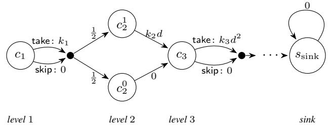

# Categorizer Automata for Discounted-Sum Payofs

Nathalie Bertrand1, Pranav Ghorpade2, Senthil Rajasekaran3, Sasha Rubin2, Moshe Vardi4

1Univ Rennes, Inria, CNRS, IRISA, France

2University of Sydney, Australia

3Université Libre de Bruxelles, Belgium

4 Rice University, USA

## Abstract

Categorizing continuous data into discrete bins is a funda- mental operation in artificial intelligence. We introduce the categorizer automaton, a deterministic automaton that reads an infinite sequence of rewards and identifies which of finitely many bins contains its discounted sum. Categorizer automata generalize comparator automata, the special case of two bins, which have already proven useful in quantitative synthesis. Our main technical contribution is the construction of a cat- egorizer automaton whose state space is linear in the num- ber of bins, rather than exponential as obtained by a cross- product of comparator automata. We then apply categorizer automata to Markov decision processes, where they allow one to synthesize policies that maximize the expected utility of a discounted-sum payof for utility functions that may be discontinuous. For piecewise-constant utility functions, the resulting algorithm is exact and runs in pseudo-polynomial time. For iecewise-Li schitz utilit functions, a class that includes any utility with bounded slope between finitely many jumps, it again runs in pseudo-polynomial time and yields an ε-optimal policy. We also show that the synthesis problem considered is PSPACE-hard already for piecewise-constant utilities.

## 1 Introduction

The fields of verification and sequential decision-making of- ten involve assigning a numerical payof to an infinite-length execution of a system. One of the most popular ways to rea- son about such executions is through the discounted-sum payof (de Alfaro, Henzinger, and Majumdar 2003; Puterman 1994), which aggregates an infinite sequence of rewards along an execution through a discounted sum. For a discount factor $d > 1$ , the discounted-sum payof of an infinite reward sequence $r _ { 0 } r _ { 1 } \ldots$ is $\begin{array} { r } { \mathsf { D S } _ { d } ( r _ { 0 } r _ { 1 } \ldots \dot { } ) : = \sum _ { i = 0 } ^ { \infty } d ^ { - i } r _ { i } } \end{array}$

Representing numerical properties ofdiscounted-sum pay- ofs with finite-state automata allows synthesis and verifica- tion problems involving such properties to be handled using eficient automata-theoretic techniques. A notable example is the development of the comparator automaton (Bansal, Chaudhuri, and Vardi 2018, 2022). A comparator automaton reads an infinite reward sequence w and accepts it if ${ \mathsf { D S } } _ { d } ( w )$ ▷◁ t, for a fixed rational threshold t and a comparison relation ▷◁ such $\mathrm { a s } > \mathrm { o r } \leq$ . Comparator automata have since been used for synthesis for satisficing (synthesize a “good enough” policy rather than an optimal one (Simon 1956)) objectives in two-player discounted-sum games (Bansal, Chatterjee, and Vardi 2021), synthesis that combines discountedsum payofs with temporal specifications (Bansal et al. 2022), and Nash-equilibrium realizability under discounted-sum payofs in deterministic multi-agent systems (Rajasekaran, Bansal, and Vardi 2023).

In many settings, however, comparing the payof with a single threshold does not provide enough information. For example, a decision maker may assign diferent utilities to losses, moderate gains, and large gains, or may wish to si- multaneously track the payof up to a prescribed accuracy.

In this paper, we introduce the categorizer automaton, a generalization of comparator automaton. Instead of reason- ing about a single threshold like the comparator automaton, the categorizer automaton simultaneously considers several thresholds that divide the real line R into a series of disjoint intervals $I _ { 1 } , \ldots , I _ { n }$ . The problem then becomes categorizing an infinite reward sequence by the interval that its discounted sum lies in, as opposed to comparing its discounted sum to a single threshold. That is, a categorizer automaton A reads an infinite reward sequence and identifies the unique interval containing its discounted sum. It does this based on which states repeat infinitely often along the run, a property that is captured by the automata-theoretic Büchi condition.

The comparator automaton is the special case of $n =$ 2 intervals. A single boundary point splits the real line in two, and the automaton computes one bit about the payof: whether ${ \mathsf { D S } } _ { d } ( w )$ lies above or below the threshold. The use of finer partitions reveals more information about the payof. In particular, because the discounted-sum payof is bounded when the rewards are bounded, for every precision $\varepsilon > 0$ the bounded range of possible discounted sums can be divided into finitely many intervals oflength at most ε (with the rest of R covered by two unbounded intervals) so that the resulting categorizer automaton identifies an interval of width at most ε containing ${ \mathsf { D S } } _ { d } ( w )$

A natural way to build a categorizer automaton is to take one comparator automaton per boundary point and construct their cross-product. This works, but the state space grows exponentially with the number n of intervals. This is prohibitively large when n is part of the input, as in the approximation regime above, where reaching precision ε forces a number of intervals that grows as ε shrinks.

Our main technical contribution is a construction of the cate orizer automaton that has a state s ace that is linear in the number n of intervals. As in the comparator automata setting, we assume that rewards are bounded integers, the boundary points are rational, and the discount factor d is an integer. Under these assumptions, for every finite partition of R into intervals, our construction yields a categorizer au- tomaton whose state space is linear in n and polynomial in the numeric value of the largest reward and the largest de- nominator among the boundary points when written in lowest terms. The main idea behind this construction is that the per- boundary comparisons are highly dependent on one another, rather than independent as a cross-product construction via comparator automata would suggest. Exploiting this depen- dence is what allows one to avoid the exponential blowup.

Applications A categorizer automaton can be composed with an arbitrary finite-state model whose executions gener- ate bounded reward sequences, including transition systems, games, Markov decision processes (MDPs), and stochastic games. In the resulting composition, the interval containing the discounted-sum payof is represented by a Büchi condi- tion. Thus, via categorizer automata, objectives depending on the exact payof interval, an approximate payof value, or both, can be reduced to automata-theoretic objectives.

We apply categorizer automata to MDPs, where they allow one to synthesize policies that maximize the expected utility of a discounted-sum payof under utility functions that may be discontinuous. Utility functions provide a standard way to express how a decision maker values diferent outcomes, allowing the model to reflect attitudes toward risk rather than only the payof (Mas-Colell et al. 1995). Abrupt changes in utility (discontinuities) arise naturally when meeting a target or crossing a safety threshold. Using categorizer automata together with existing automata-theoretic techniques (Courcoubetis and Yannakakis 1998; Etessami et al. 2008), we obtain, for integer discount factors, an exact algorithm for piecewise-constant utilities with finitely many rational dis- continuities. The algorithm computes the optimal expected utility and synthesizes a finite-memory policy attaining it. For utilities that are Lipschitz continuous on each of finitely many intervals but may be discontinuous at their boundaries, we build on the piecewise-constant result to compute the op- timal value up to an additive error of ε and synthesize an ε-optimal policy. Both algorithms run in pseudo-polynomial time: their running times are polynomial in certain numer- ical parameter values, but not in the lengths of their binary encodings. This dependence is unlikely to be avoidable, as we also show that the synthesis problem is PSPACE-hard even for piecewise-constant utilities.

We remark that the previous applications of comparator automata discussed above have focused on non-probabilistic models. Our application to MDPs extends the literature to stochastic settings.

Related Work The classical discounted-sum payof objective maximizes the expectation $\mathbb { E } _ { \mathcal { M } } ^ { \theta } [ \mathsf { D } \mathsf { S } _ { d } ]$ over policies θ in an MDP M. This corresponds to the linear utility $u ( x ) = x$ and can be solved using the Bellman equations (Puterman 1994). In general, for a nonlinear utility u, the objective $\mathbb { E } _ { \mathcal { M } } ^ { \theta } [ u ( \mathsf { D } \mathsf { S } _ { d } ) ]$ no longer admits Bellman-style equations on the original state space of the MDP (Kadota, Kurano, and Yasuda 1998). Existing algorithmic approaches typically ex-ploit special structure in the utility, as for exponential util- ity (Bäuerle and Rieder 2014), or augment the state space with accumulated reward and apply discretizations or finite- horizon approximations (Wu and Xu 2023). Such approxi-mations naturally apply to continuous utilities: truncating the discounted sum changes the payof by a vanishing amount, and uniform continuity over the bounded payof range then bounds the resulting change in the utility.

This argument fails for discontinuous utilities. Near a dis- continuity, an arbitrarily small change in the payof can pro- duce a large change in utility. The simplest example is a threshold utility, defined by u(x) = 0 for x < v and $u ( x ) = 1$ for $x \geq v .$ , whose expected value is precisely the probabil- ity that the discounted-sum payof is at least v. Threshold utilities have been studied by White (1993) and Wu and Lin (1999), who characterize Bellman-style equations on an extended, possibly infinite, state space and investigate the conditions under which optimal policies exist. From an algorith- mic perspective, they have been studied in the finite-horizon setting (Xu and Mannor 2011). For the infinite-horizon setting, Randour, Raskin, and Sankur (2015) study percentile queries through an ε-gap formulation, which permits in-stances suficiently close to the payof threshold to remain unresolved. Thus, prior algorithms either restrict the hori- zon or relax the threshold comparison, whereas, for integer discount factors, our algorithm solves the exact problem.

## 2 Categorizer Automata

This section introduces categorizer automata for discountedsum payofs (Definition 1), characterizes when categorizer automata exist (Proposition 1) and for the cases when they exist, establishes a size bound (Theorem 1).

## 2.1 Preliminaries

Words Given a finite alphabet Σ of symbols, a word (resp. finite word) w is an infinite (resp. finite) sequence of symbols. We denote the length of a finite word as |w|, and refer to the unique finite word of length 0 as ε. For a word (resp. finite word) w and index $1 \leq \bar { i }$ (resp. $1 \leq i \leq | w | )$ we denote: $w [ i ]$ as the i-th symbol of $w , w [ 1 . . i ]$ as the length i prefix of w and w[i..] as the sufix starting at position i. For a finite word w and a finite (resp. infinite) word $w ^ { \prime }$ , we denote $w \cdot w ^ { \prime }$ as the finite (resp. infinite) word formed by concatenating w and $w ^ { \prime }$ . We write $\Sigma ^ { \omega }$ (resp. Σ∗) for the set of all words (resp. finite words).

Transition System A (deterministic) transition system is a tuple $\mathcal { T } = ( \dot { Q } , \Sigma , q _ { \mathrm { i n i t } } , \delta )$ , where Q is a finite set of states, $\Sigma$ is a finite alphabet, $q _ { \mathrm { i n i t } } \ \in \ Q$ is the initial state, and $\delta : Q \times \Sigma  \bar { Q }$ is a transition function. The run of $\tau$ on a word $w \in \Sigma ^ { \omega }$ is the se uence of states $\rho = \rho [ 1 ] \rho [ 2 ] \cdots$ with $\rho [ 1 ] = q _ { \mathrm { i n i t } }$ and $\rho [ k + \dot { 1 } ] = \delta ( \rho [ k ] , w [ \dot { k } ] )$ for all $\bar { k } \geq 1$ . We denote $I n f ( \rho )$ for the set of states that occur infinitely of- ten in $\rho .$ Given transition systems $\mathcal { T } _ { i } = ( Q _ { i } , \Sigma , q _ { \mathrm { i n i t } } ^ { i } , \delta _ { i } )$

for $1 \ \leq \ i \ \leq \ n$ , over the same alphabet $\Sigma ,$ their crossproduct is the transition system whose states are tuples $( q _ { 1 } , \ldots , q _ { n } ) \in Q _ { 1 } \times \cdots \times Q _ { n } $ , whose initial state is $( q _ { \mathrm { i n i t } } ^ { 1 } , \ldots , \dot { q } _ { \mathrm { i n i t } } ^ { n } )$ , and whose transition on a symbol σ maps $( q _ { 1 } , \ldots , q _ { n } )$ to $( \delta _ { 1 } ( q _ { 1 } , \sigma ) , \dots , \delta _ { n } ( q _ { n } , \sigma ) )$ .

Büchi Acceptance A Büchi acceptance condition is defined by a set $F \subseteq Q$ of states. A run $\rho$ satisfies the Büchi acceptance condition $F$ if $I n f ( \rho ) \cap F { \dot { \neq } } \emptyset$ , i.e. if at least one state of $F$ occurs infinitely often in the run $\rho . \mathrm { A }$ (deterministic) Büchi automaton is a pair $\mathcal { A } = ( \mathcal { T } , F )$ of a transition system and a Büchi acceptance. Its language, called the language recognized by ${ \mathcal { A } } ,$ is the set of words w $\ r ) \in \Sigma ^ { \omega }$ whose run on $\bar { \tau }$ satisfies $F$ . A language (set of words) is ω-regular if it is recognized by some (possibly nondeterministic) Büchi automaton. Deterministic Büchi automata are efectively closed under intersection: given deterministic Büchi automata with states $Q _ { 1 } , Q _ { 2 }$ recognizing languages $L _ { 1 } , L _ { 2 } ,$ , one can con-struct a deterministic Büchi automaton with $2 | Q _ { 1 } | | Q _ { 2 } |$ states recognizing $L _ { 1 } \cap L _ { 2 }$ (Baier and Katoen 2008).

## 2.2 Discounted-sum and Categorizer Automaton

Discounted-Sum Given an integer alphabet bound $\mu \geq 1 ,$ we denote $\Sigma _ { \mu }$ as the finite alphabet consisting of all the integers from $- \mu ~ { \mathrm { \ t o \ } } + \mu$ . For discount factor $d > 1$ , the dis- counted sum of a word w $\in \Sigma _ { \mu } ^ { \omega }$ (resp. $w \in \Sigma _ { \mu } ^ { * } )$ is $\mathsf { D S } _ { d } ( w ) =$ $\textstyle \sum _ { i = 1 } ^ { \infty } w [ i ] / d ^ { i - 1 }$ (resp. $\begin{array} { r } { \mathsf { D S } _ { d } ( w ) = \sum _ { i = 1 } ^ { | w | } w [ i ] / d ^ { i - 1 } ) } \end{array}$

Binning of R A binning of R is a finite partition $B =$ $\{ I _ { 1 } , \ldots , I _ { n } \}$ of R into $n \geq 2$ nonempty, disjoint intervals, indexed so that every element of $I _ { i }$ is smaller than every element of $I _ { i + 1 }$ . The endpoints of $B$ are the finite infimum and supremum of its intervals: the singleton {t} has the one endpoint $t ,$ whereas $[ t , t ^ { \prime } ) , [ t , t ^ { \prime } ] , ( t , \mathsf { \bar { t } } ^ { \prime } )$ , and $( \dot { t } , t ^ { \prime } ]$ each have the two endpoints $t$ and $t ^ { \prime } .$ . The outer intervals $I _ { 1 }$ and $I _ { n }$ are unbounded and so have one endpoint each. Writing $t _ { 1 } < \cdots < t _ { m }$ for the endpoints of B in increasing order, we have $m \leq n - 1$ , and each $I _ { i }$ is either the singleton $\{ t _ { j } \}$ or an interval with endpoints $t _ { j }$ and $t _ { j + 1 }$ , for some $0 \leq j \leq m$ where $t _ { 0 } = - \infty$ and $t _ { m + 1 } = + \infty . \mathrm { A }$ binning is rational if all its endpoints are rational.

Definition 1 (Categorizer automaton). Let $\mu \geq 1$ be an integer alphabet bound, let d > 1 be a rational discount factor, and let $B ~ = ~ \{ I _ { 1 } , \ldots , I _ { n } \}$ be a rational binning $o f \parallel . A$ categorizer automaton for $( \mu , d , B )$ is a tuple $\overset { \cdot } { A } = ( \mathcal { T } , F _ { 1 } , \ldots , F _ { n } )$ , where $\mathcal { T } = ( Q , \Sigma _ { \mu } , q _ { \mathrm { i n i t } } , \delta )$ is a deterministic transition system and each $F _ { i } \subseteq Q$ is a Büchi acceptance condition, such that,for every word w $\in \Sigma _ { \mu } ^ { \omega }$ and every $1 \leq i \leq n ,$ , it holds that $\mathsf { D S } _ { d } ( w ) \in I _ { i }$ ifand only ifthe run ofT on w satisfies $F _ { i }$

In other words, a categorizer automaton for $( \mu , d , B )$ is one transition system equipped with n Büchi conditions, one per interval of $\mathrm { ~ \textit ~ { ~ B ~ } ~ }$ such that for each $i ,$ the language of the Büchi automaton $( \mathcal { T } , F _ { i } )$ is {w $\in \Sigma _ { \mu } ^ { \omega } \mid \mathsf { D S } _ { d } ( w ) \bar { \in I _ { i } } \}$

Relation to Comparator Automata Categorizer automata generalize comparator automata (Bansal, Chaudhuri, and Vardi 2022). Given an integer alphabet bound $\mu ,$ a rational discount factor $d > 1$ , a rational threshold $t ,$ and a relation ▷◁ $\in \{ < , > , \leq , \geq , = , \neq \}$ , a comparator automaton is a deterministic Büchi automaton that recognizes $\{ w \in \Sigma _ { \mu } ^ { \omega } \mid \mathsf { D S } _ { d } ( w ) \bowtie t \}$ . Bansal, Chaudhuri, and Vardi $( 2 0 2 2 )$ show that, for every relation ▷◁, such automata exist for every rational threshold t if and only if d is an integer.

We now use this result to characterize when categorizer automata exist for every rational binning. To see that the integrality of d is necessary, suppose that d is not an integer. The preceding result gives a rational threshold t for which no comparator automaton recognizes $\{ w \in \Sigma _ { \mu } ^ { \omega } \mid \mathsf { D S } _ { d } ( w ) < t \}$ $\mathbf { A }$ categorizer automaton $( \mathcal { T } , F _ { 1 } , F _ { 2 } )$ for the rational binning $B _ { t } ~ = ~ \bar { \{ ( - \infty , t ) , [ t , + \infty ) \} }$ would make $( \mathcal { T } , F _ { 1 } )$ precisely such a comparator automaton, yielding a contradiction.

Conversely, suppose that d is an integer, and fix a rational binning $B = \{ I _ { 1 } , \ldots , I _ { n } \}$ . We construct a catego-rizer automaton for $( \mu , d , B )$ using comparator automata. For each i, first construct a deterministic Büchi automaton $\mathcal { A } _ { i } = ( T _ { i } , G _ { i } )$ that recognizes the language $L _ { i } = \{ w \in \Sigma _ { \mu } ^ { \omega }$ $\mathsf { D S } _ { d } ( w ) \in I _ { i } \}$ . Such an automaton can be constructed from comparator automata: depending on the form of $I _ { i } ,$ the lan- guage $L _ { i }$ is either a comparator language or the intersection of two comparator languages. Taking the cross-product of $\mathcal { T } _ { 1 } , \ldots , \mathcal { T } _ { n }$ and letting $\bar { F } _ { i }$ consist of the product states whose ith components belong to $G _ { i }$ yields a categorizer automaton for $( \mu , d , B )$ ). Hence, we obtain the following proposition.

Proposition 1 (Existence of categorizer automata). Let $\mu \geq$ 1 be an integer, and let $d > 1$ be rational. Categorizer automata $f o r \left( \mu , d , B \right)$ exist $f o r$ every rational binning B if and only ifd is an integer.

For non-integer $d ,$ the situation is more complex: it is an open problem to characterize the individual rational thresh- olds that admit comparator automata. For integer $d ,$ although the cross-product argument above establishes the existence of a categorizer automaton, it produces one whose size is exponential in the number of bins. In the next section we present a construction that avoids this blowup.

## 2.3 Construction That Avoids Exponential Blowup

In this section, we present a direct construction of a catego- rizer automaton whose size is linear in the number of bins.

Throughout, $q _ { B }$ denotes the largest denominator, in lowest terms, of endpoints of B.

Theorem 1. Let $\mu \geq 1$ be an integer alphabet bound, let $d > 1$ 1 be an integer discount factor, and let $B = \{ I _ { 1 } , \ldots , I _ { n } \}$ be a rational binning. There exists a categorizer automaton $f o r \left( \mu , d , B \right)$ with $\mathcal { O } ( n \mu q _ { B } ( 1 + \log _ { d } ( \mu q _ { B } ) ) )$ many states and it can be constructed in $\mathcal { O } ( n \mu q _ { B } ( 1 + \log _ { d } ( \mu q _ { B } ) ) )$ ) time.

The bound is linear in the number of bins and polynomial in the numerical values of $\mu$ and $q _ { B }$ (thus, it is pseudo-polynomial in $\mu$ and $q _ { B } )$

The remainder of this section proves Theorem 1 by an explicit construction. To that end, fix $\mu , d ,$ , and $B$ as in The- orem 1. Let $t _ { 1 } < \cdots < t _ { m }$ be the endpoints of $B ,$ , set $t _ { 0 } = - \infty$ and $t _ { m + 1 } = + \infty$ , and write each finite endpoint in lowest terms as $t _ { j } = p _ { j } / q _ { j }$ with $q _ { j } > 0$ so that $q _ { B } =$ $\operatorname* { m a x } _ { 1 \leq j \leq m } q _ { j }$ . Define $D \bar { = } \bar { \mathsf { D } } \bar { \mathsf { S } } _ { d } ( \mu \mu \cdot \bar { \cdot } \cdot ) = ( \mu d ) / ( d - 1 )$ so that $\mathsf { \bar { D } } \bar { \mathsf { S } } _ { d } ( \bar { w } ) \in [ - D , D ]$ for every $w \in \Sigma _ { \mu } ^ { \omega }$

High-Level Idea After every finite word u, the states of the categorizer automaton track a gap value for each end-point. Intuitively, the gap value of an endpoint records the discounted sum that a continuation of u must have for the complete word to have a discounted sum exactly equal to that endpoint. Since every continuation has a discounted sum in $[ - \hat { D } , D ]$ , a gap value outside this interval determines on which side of the endpoint every continuation must lie. If the gap value lies below −D (resp. above D), then, for every continuation $w ,$ the discounted sum of u · w lies above (resp. below) the endpoint. Otherwise, diferent continuations can still place the discounted sum below, at, or above the end- point. Tracking how these gap values evolve therefore allows the automaton to locate the discounted sum relative to every endpoint and, consequently, to locate the bin that contains it.

Storing the tuple of all gap values explicitly would produce a state space exponential in the number of endpoints. The key observation behind our construction is that these values are not independent: all gap values can be recovered from the gap value of one endpoint and the length |u|. Their pairwise separations also grow exponentially with |u|. Consequently, after only logarithmically many symbols, at most one end- point has a gap value in $[ \dot { - } D , \dot { D } ]$ . From that point onward, its gap value and index sufice to determine the position of the discounted sum relative to every endpoint. The construction therefore encodes all gap values compactly by using one gap value, its endpoint index, and, during the short initial phase, the length |u|. This encoding gives a construction whose size is linear in the number of bins.

Gap Values Gap values are a standard tool for tracking a discounted sum relative to a single threshold (Boker and Henzinger 2014; Bansal, Chaudhuri, and Vardi 2022). For a finite word u $\in \Sigma _ { \mu } ^ { * }$ and an endpoint $t _ { j }$ , the gap value of $t _ { j }$ after u is defined by the recurrence

$$
g _ { j } ( \varepsilon ) = t _ { j } , \quad g _ { j } ( u \cdot a ) = d \cdot \left( g _ { j } ( u ) - a \right) \quad { \mathrm { f o r ~ } } a \in \Sigma _ { \mu } .\tag{1}
$$

An induction on |u| gives the closed form

$$
g _ { j } ( u ) = d ^ { | u | } \big ( t _ { j } - \mathsf { D S } _ { d } ( u ) \big ) .\tag{2}
$$

Since $\mathsf { D } \mathsf { S } _ { d } ( u \cdot w ) = \mathsf { D } \mathsf { S } _ { d } ( u ) + d ^ { - | u | } \mathsf { D } \mathsf { S } _ { d } ( w )$ for every $w \in$ $\Sigma _ { \mu } ^ { \omega }$ , the gap value is the discounted sum a continuation of u must have in order to reach $t _ { j } { \mathrm { : } }$ for ▷◁ $\in \{ < , = , > \}$ we have $\mathsf { D S } _ { d } ( u \cdot w )$ ▷◁ $t _ { j } \mathrm { i f f } \mathsf { D S } _ { d } ( w )$ ▷◁ $g _ { j } ( u )$ . In particular, if $g _ { j } ( u ) < \dot { - } D \left( \mathrm { r e s p . } g _ { j } ^ { - } ( u ) > D \right)$ then $\mathsf { D } \mathsf { \bar { S } } _ { d } ( u \cdot w ) > t _ { j }$ (resp. $\dot { < } t _ { j } )$ for every continuation w; we then say $t _ { j }$ is resolved to ⊥ (resp. to ⊤) after u. Otherwise, i.e. if $g _ { j } ( \check { u } ) \in [ - D , D ]$ we say $t _ { j }$ is active after u.

The following two propositions follow from the definition of gap values and are proved in the supplementary material. Proposition 2. Let $1 \leq j \leq m$ and let w $\in \Sigma _ { \mu } ^ { \omega }$ . Then $\mathsf { D S } _ { d } ( w ) > t _ { j } \ i f f t _ { j }$ is resolved $t o \perp$ after some prefix of w; $\mathsf { D S } _ { d } ( w ) < i _ { j } ^ { \mathsf { ^ { \prime } } } i f f { \bar { t } } _ { j }$ is resolved $t o \top$ after some prefix of w; and $\mathsf { D S } _ { d } ( w ) \mathbf { \bar { \Psi } } = t _ { j } \mathbf { \bar { \Psi } } ^ { i f f } t _ { j }$ is active after every prefix of w.

For indices $1 ~ \leq ~ j ~ \leq ~ m$ let $G _ { j } ~ = ~ \{ x / q _ { j } ~ | ~ x ~ \in$ $\mathbb { Z } \} \cap [ - D , D ]$ . In the following proposition, P1 bounds the gaps of active endpoints, and P2 justifies the use of the term “resolved”.

Proposition 3. Let $u \in \Sigma _ { \mu } ^ { * }$ and let $1 \leq j \leq m$ . Then:

P1 $i f t _ { j }$ is active after u then $g _ { j } ( u ) \in G _ { j } ;$

P2 $i f t _ { j }$ is resolved to ⊥ (resp. ⊤) after u then $t _ { j }$ is resolved $t o \perp ( r e s p . 7 )$ after u · a,for all $a \in \Sigma _ { \mu }$

We now describe how these facts can be used to construct a categorizer automata.

The Shared Structure of Gap Values By Prop. 2 and Prop. 3, it sufices for the transition system of the categorizer automaton for $( \mu , d , B )$ to track, after every finite word, the status of every endpoint: its gap value (from the finite set $G _ { j } )$ if active, and the value $\bar { \perp } , \bar { \top }$ it resolved to otherwise. However, storing the status of every endpoint explicitly re- quires $\begin{array} { r } { \prod _ { i } ( \left| G _ { j } \right| + 2 ) } \end{array}$ states, which is still exponential in n. The next lemma shows that the statuses of m endpoints are not independent, which gives the ingredients for a transition system to track all of them simultaneously without incurring an exponential blowup.

Lemma 1. Let $u \in \Sigma _ { \mu } ^ { * }$ and let $K _ { 0 } \ = \ \lfloor \log _ { d } ( 2 D q _ { B } { } ^ { 2 } ) \rfloor$ Then:

P1 $g _ { i } ( u ) - g _ { j } ( u ) = d ^ { | u | } ( t _ { i } - t _ { j } ) f o r { a l l } 1 \le i , j \le m ;$ $P 2 i f | u | > K _ { 0 }$ then at most one endpoint is active after u; then at most one endpoint is active after u;

P3 there exist $\ell , r$ with $0 ~ \leq ~ \ell ~ \leq ~ r ~ \leq$ m such that the endpoints $t _ { 1 } , \ldots , t _ { \ell }$ are resolved to ⊥ after u, the endpoints $t _ { \ell + 1 } , \ldots , t _ { r }$ are active after u, and the endpoints $t _ { r + 1 } , \ldots , t _ { m }$ are resolved to ⊤ after u.

Proof. P1 follows from Eq. 2. For P2, let $t _ { i } , t _ { j }$ be the endpoints active after u i.e. $g _ { i } ( u ) , g _ { j } ( u ) ~ \in ~ [ - \bar { D } , D ]$ . It follows that $| g _ { i } ( u ) - g _ { j } ( u ) | \ \leq \ 2 D$ . Moreover, note that $| t _ { i } - t _ { j } | = | p _ { i } q _ { j } - p _ { j } q _ { i } | / q _ { i } q _ { j } \geq 1 / q _ { i } q _ { j } \geq 1 / q _ { B } { } ^ { 2 }$ . Sub- stituting these two inequalities in P1 of the lemma, we get $d ^ { | \boldsymbol { u } | } / q _ { B } ^ { 2 } \le 2 D$ . Rearranging and taking the logarithm gives $| \dot { u | } \le K _ { 0 }$ . For P3, since $t _ { 1 } < \cdots < t _ { m } .$ by Eq. 2, $g _ { 1 } ( u ) < g _ { 2 } ( u ) < \cdot \cdot \cdot < g _ { m } ( u )$ , hence $\mathrm { i f } \ t _ { i }$ is resolved to ⊥ $\mathrm { i . e . } \ g _ { i } ( u ) < - D$ then $t _ { j }$ for all $j < i$ is also resolved to ⊥. Similarly for ⊤. □

The Construction Formally, the categorizer automaton for $( \mu , d , B ) { \mathrm { ~ i s ~ } } A = ( { \mathcal { T } } , F _ { 1 } , \ldots , F _ { n } )$ . We encode the status of every endpoint compactly, using a representation according to the number of endpoints active after u. Informally, after reading a finite word $u ,$ , the state of transition system $\tau$ records the status of every endpoint, using an encoding that depends on how many endpoints remain active after u. Ac-cordingly, the state of $\tau$ takes one of three forms: (a) if two or more endpoints are active, the state is a triple $( j , g _ { j } ( u ) , k )$ where j is the index of smallest active endpoint and $\dot { \boldsymbol k } = | { \boldsymbol u } |$ This triple encodes the status of every endpoint: by P1 of Lemma 1, the gap value of every $t _ { i }$ can be recovered, which in turn determines the resolved endpoints and their status; (b) If exactly one endpoint is active, the state is a pair $( j , g _ { j } ( u ) )$ where j is the index of that endpoint. By P3 of Lemma 1, $t _ { 1 } , \ldots , t _ { j - 1 }$ are resolved to ⊥ and $t _ { j + 1 } , \ldots , t _ { m }$ to ⊤; (c) If no endpoint is active, the state is an integer $\ell ,$ where $t _ { 1 } , \ldots , t _ { \ell }$ are resolved to ⊥ and $t _ { \ell + 1 } , \ldots , t _ { m }$ to ⊤.

Transition System Formally, $\mathcal { T } = ( Q , \Sigma _ { \mu } , q _ { \mathrm { i n i t } } , \delta )$ , where $Q = Q _ { a } \not \in \dot { Q _ { b } } \not \cup Q _ { c }$ is the union of the states of forms (a), (b), and (c), respectively, with

$$
\begin{array} { r l } & { Q _ { a } = \big \{ \left( j , g , k \right) \big | 1 \leq j \leq m , g \in G _ { j } , 0 \leq k \leq K _ { 0 } \big \} , } \\ & { Q _ { b } = \big \{ \left( j , g \right) \big | 1 \leq j \leq m , g \in G _ { j } \big \} , \quad Q _ { c } = \{ 0 , . . . , m \} . } \end{array}
$$

We now describe the initial state $q _ { \mathrm { i n i t } }$ and transition function δ (the formal definition is given in the supplementary material). The initial state $q _ { \mathrm { i n i t } } \in Q$ is determined by the status of the initial gap values, which by (1) coincide with the endpoints. On input $a \in \Sigma _ { \mu } .$ , the transition under $\delta$ can be viewed as follows. First, decode the current state into the status of every endpoint. Second, update these statuses: resolved endpoints are left unchanged (P2 of Prop. 3), whereas active endpoints are updated using their new gap values, computed as $g _ { j } ^ { \prime } =$ $d ( g _ { j } - a )$ , as in (1). Finally, re-encode the resulting status as a state of $Q ,$ , choosing the form according to the number of endpoints that remain active.

Acceptance Conditions Along every run $\rho$ of $\tau$ , resolved endpoints stay resolved (P2 of Prop. 3) and eventually all but at most one of the endpoints become resolved. Hence, for a run $\rho$ of $\tau$ , there exist $x \ge 0$ such that either (i) for all $y >$ x we have $\rho [ y ] = ( j , g )$ for some $1 \leq j \leq m$ and $g \in G _ { j } ,$ or (ii) for all $y > x$ we have $\rho [ y ] = j$ for some $0 \leq j \leq m$ . By Prop. 2, it follows that the run ρ of $\tau$ on $w \in \Sigma _ { \mu } ^ { \omega }$ visits $\left\{ ( j , \bar { g ) } \mid g \in G _ { j } \right\} \subseteq Q _ { b }$ infinitely often if $\mathsf { D S } _ { d } ( w ) = t _ { j }$ , and visits the state $j \in Q _ { c }$ c infinitely often if $\mathsf { D S } _ { d } ( w ) \in ( \bar { t } _ { j } , t _ { j + 1 } )$ . Thus

$$
F _ { i } = \{ ( j , g ) \in Q _ { b } \mid t _ { j } \in I _ { i } \} \cup \{ j \in Q _ { c } \mid ( t _ { j } , t _ { j + 1 } ) \subseteq I _ { i } \} _  \{ 
$$

ensures that the run of T on w satisfies $F _ { i }$ if $\mathsf { D S } _ { d } ( w ) \in I _ { i }$ Size We bound $| Q | = | Q _ { a } | + | Q _ { b } | + | Q _ { c } |$ . Since $| G _ { j } | =$ $2 \lfloor D q _ { j } \rfloor + 1 \leq 2 \lfloor \dot { D } q _ { B } \rfloor ^ { \cdot } +$ 1 for every j, and $m \leq n - 1 !$

$$
\begin{array} { l } { { | Q _ { a } | \leq n \left( 2 \lfloor D q _ { B } \rfloor + 1 \right) ( K _ { 0 } + 1 ) , } } \\ { { | Q _ { b } | \leq n \left( 2 \lfloor D q _ { B } \rfloor + 1 \right) , \mathrm { ~ a n d ~ } | Q _ { c } | \leq n . } } \end{array}
$$

Thus $| Q | \ = \ \mathcal { O } ( n D q _ { B } ( 1 + K _ { 0 } ) )$ . Since $d \ \geq \ 2 , \ D \ =$ $( \mu d ) / ( d \stackrel { . } { - } 1 ) \leq 2 \mu$ and hence $D = { \mathcal O } ( \mu )$ . Moreover, $K _ { 0 } = \mathcal { O } ( 1 + \log _ { d } ( \mu \ q _ { B } ) )$ . Substituting these bounds gives $| Q | = \mathcal { O } ( n \mu q _ { B } ( \overset { \cdot } { 1 } + \log _ { d } ( \mu q _ { B } ) ) )$ . This proves Theorem 1: the above bound gives the size while the correctness follows from the discussion above.

## 3 Application: Policy Synthesis for Maximizing Expected Utility in MDPs

In this section we develop the application of categorizer au- tomata to the problem of maximizing expected utility in Markov decision process (MDP) with discounted-sum pay- ofs. We provide pseudo-polynomial time algorithms and a PSPACE-hard lower bound for the synthesis problem under a broad class of utility functions.

## 3.1 Preliminaries

We follow the standard terminology of (Puterman 1994;   
Baier and Katoen 2008).

MDP A (discounted reward) Markov decision process (MDP) is a tuple $\boldsymbol { \mathcal { M } } = ( S , A c t , s _ { \mathrm { i n i t } } , P , r , d )$ , where S is a finite set of states, Act is a finite set of actions, $s _ { \mathrm { i n i t } } \in S$ is the initial state, $P : S \times A c t \times S \to [ 0 , 1 ] \cap \mathbb { Q }$ is a tran- sition function, $r : S \times A c t  \mathbb { Z }$ is a reward function, and $d > 1$ is an integer discount factor. For every state s and action a we require $\begin{array} { r } { \sum _ { s ^ { \prime } \in S } P ( s , a , s ^ { \prime } ) \in \{ 0 , \bar { 1 } \} } \end{array}$ . When this sum equals 1, we say that a is enabled at $s ,$ and assume that at least one action is enabled at every state. We denote $\mu _ { \mathcal { M } }$ as the reward bound ma $\mathbf { \boldsymbol { x } } _ { s \in S , a \in A c t } | r ( s , a ) |$ of MDP M. Let $D _ { \mathcal { M } } = \mu _ { \mathcal { M } } d / ( d - 1 )$ . We write $| \mathcal { M } |$ for the size of the representation of $\mathcal { M } \colon$ states, actions, and nonzero transitions are counted explicitly, while transition probabilities, rewards, and the discount factor are encoded in binary.

Plays and Policies $\mathrm { ~ A ~ } p l a y$ is an infinite sequence $\pi =$ $s _ { 0 } a _ { 0 } s _ { 1 } a _ { 1 } \cdot \cdot \cdot$ with $s _ { 0 } ~ = ~ s _ { \mathrm { i n i t } }$ and $P ( s _ { k } , a _ { k } , s _ { k + 1 } ) > 0$ for every $k \geq 0 . \mathrm { ~ A ~ }$ history is a finite prefix of a play ending in a state. Writing ${ \dot { H } } _ { \mathcal { M } }$ for the set of all histories, a policy is a function $\bar { \theta } \ : \ H _ { \mathcal { M } } \times A c t \  \ \lceil 0 , 1 \rceil$ such that $\begin{array} { r } { \sum _ { a \in A c t } \dot { \theta } ( h , a ) = 1 } \end{array}$ for every history $h ,$ and $\bar { \theta ( h , a ) } = 0$ whenever a is not enabled at the last state of history h. A policy is finite-memory if it can be implemented by a finite- state machine (Baier and Katoen 2008, Def. 10.97). We write $\Theta _ { \mathcal { M } }$ for the set of all policies. A policy θ induces the standard probability measure $\mathrm { P r } _ { \mathcal { M } } ^ { \theta }$ on the set of plays, equipped with the σ-algebra generated by the cylinder sets of histories.

Discounted-Sum Payof and Expected Utility Every play π determines the reward word $r ( s _ { 0 } , a _ { 0 } ) r ( s _ { 1 } , a _ { 1 } ) \cdot \cdot \cdot \in$ $\Sigma _ { \mu _ { \mathcal { M } } } ^ { \omega }$ . We denote ${ \mathsf { D S } } _ { d } ( \pi )$ as the discounted sum of its re- ward word and refer to it as the discounted-sum payof of π. The map $\pi \mapsto \mathsf { D S } _ { d } ( \pi )$ is measurable, so $\mathsf { D S } _ { d }$ is a random variable under $\mathrm { P r } _ { \mathcal { M } } ^ { \theta }$ for every policy θ. A utility function $u : \mathbb { R }  \mathbb { R }$ assigns a utility value to each discounted- sum payof. We make the standard technical assumptions that u is Borel measurable and bounded on $[ - D _ { \bar { \mathcal { M } } } , \bar { D } _ { \mathcal { M } } ]$ Since every discounted-sum payof generated by M lies in $[ - D _ { \mathcal { M } } , \bar { D _ { \mathcal { M } } } ] , \ u ( \mathsf { D } \mathsf { S } _ { d } )$ is a bounded random variable un- der $\mathrm { P r } _ { \mathcal { M } } ^ { \theta }$ for every policy θ. We denote $V _ { u } ^ { \theta } ( \mathcal { M } )$ as the ex- pectation $\mathbb { E } _ { \mathcal { M } } ^ { \theta } \left[ u ( \bar { \mathsf { D } } \dot { \mathsf { S } } _ { d } ) \right]$ ], and refer to it as the expected utility of θ. We denote $V _ { u } ^ { * } ( { \mathcal { M } } )$ as the supremum of $V _ { u } ^ { \theta } ( \mathcal { M } )$ over all policies $\theta \in \tilde { \Theta } _ { \mathcal { M } } . \ \mathrm { ~ \overset { . } { A } ~ }$ olic θ is called optimal if $V _ { u } ^ { \theta } ( \mathcal { M } ) \stackrel { \cdot } { = } V _ { u } ^ { * } ( \mathcal { M } )$ , and ε-optimal if $V _ { u } ^ { \theta } ( \mathcal { M } ) \geq V _ { u } ^ { * } ( \mathcal { M } ) - \varepsilon .$

Büchi Events Let $Z \subseteq S$ be a set of states. We denote Büchi(Z) to be the event consisting of the plays that visit Z infinitely often.

## 3.2 Problem Statement and Overview

In this subsection, we formalize the synthesis problem, state the results, and give high level ideas used to establish them.

Piecewise-Lipschitz functions Given a rational binning $B = \{ I _ { 1 } , \ldots , I _ { n } \}$ , a function u: $\mathbb { R } \ \to \ \mathbb { R }$ is piecewise-Lipschitz on B with Lipschitz constant $L \ge 0 \mathrm { i f } | u ( x ) - $ $u ( y ) | \leq L | x - y |$ for every i and all $x , y \in I _ { i }$ . In other words, within each interval, a small change in the payof cannot cause a disproportionately large change in its utility.

However, since no such restriction is imposed across difer- ent intervals, u may be discontinuous at their endpoints. The special case $L = 0$ is the piecewise-constant one, in which u takes a single value $u _ { i } \in \mathbb { Q }$ on each $I _ { i }$

Synthesis Problem Instance A synthesis problem instance consists of an MDP M, a rational binning $B =$ $\{ I _ { 1 } , \ldots , I _ { n } \}$ , and a utility u that is piecewise-Lipschitz on B with a given constant $L \geq 0$

For $L = 0$ the utility is piecewise-constant and we assume it is given explicitly, as the list of its values $u _ { 1 } , \ldots , u _ { n } \in$ $\mathbb { Q }$ on the intervals of B. For $L > 0$ the problem instance additionally specifies a rational precision $\varepsilon > 0$ , and the utility is presented by an evaluation oracle uˆ: on rational inputs x and $\eta > 0$ it returns a rational $\widehat { u } ( x , \eta )$ with $\textcircled { x } ( x , \eta ) -$ $u ( x ) | \leq \eta ,$ in time and with output length polynomial in the bit-length of x and in the numerical value $1 / \eta .$ Here and for the rest of the section, the bit-length of a rational number is the sum of the bit-lengths of its numerator and denominator when written in lowest terms.

For $L = 0$ , the task is to compute $V _ { u } ^ { * } ( { \mathcal { M } } )$ exactly together with an optimal policy. For $L > 0$ , the task is to compute an ε-accurate value and an ε-optimal policy.

Recall that $\mu _ { \mathcal { M } }$ is the reward bound of MDP M and qB is the largest denominator, in lowest terms, of endpoints of $B .$

Theorem 2 (Piecewise-constant utility). For every synthesis problem instance with $L \ = \ 0 ,$ , the optimal expected utility $V _ { u } ^ { * } ( { \mathcal { M } } )$ is rational. Moreover, $V _ { u } ^ { * } ( { \mathcal { M } } )$ and an optimal finite-memory policy attaining it, can be computed in time polynomial in $\lvert \mathcal { M } \rvert$ , the number n of bins, and the numerical values $\mu _ { \mathcal { M } }$ and $q _ { B }$ .

Theorem 3 (Piecewise-Lipschitz utility). For every synthesis problem instance with $\bar { L } > 0 ,$ , an ε-optimal finite-memory policy and a rational number $\widehat { V }$ satisfying $| \widehat { V } - V _ { u } ^ { * } ( { \mathcal { M } } ) | \leq \varepsilon$ can be computed in time polynomial in $| { \mathcal { M } } | ,$ , the number n ofbins, and the numerical values $\mu _ { \mathcal { M } } , q _ { B } , \lceil L \rceil , a n d \lceil 1 / \varepsilon \rceil$

For both theorems, the running time additionally depends polynomially on the maximum bit-length ofthe bin endpoints and, as applicable, the values $u _ { 1 } , \ldots , u _ { n } , L$ , and ε.

High-Level Idea We now give a high-level overview of the proofs of the two theorems. The full details are presented in the following subsections. Let S and d be the states and discount factor of MDP $\mathcal { M }$ . For a piecewise-constant utility $u ,$ the expected utility for a policy θ decomposes as

$$
V _ { u } ^ { \theta } ( \mathcal { M } ) = \sum _ { i = 1 } ^ { n } u _ { i } \operatorname* { P r } _ { \mathcal { M } } ^ { \theta } [ \mathsf { D } \mathsf { S } _ { d } \in I _ { i } ] .\tag{3}
$$

Taking the product of M with the categorizer automaton $\overset { \vartriangle } { \boldsymbol { \mathcal { A } } } = ( \dot { T } , F _ { 1 } , \dots , F _ { n } )$ for $( \mu _ { \mathcal { M } } , d , B )$ turns each event $\mathsf { D S } _ { d } \in I _ { i }$ into a Büchi event ${ \mathsf { B i r c h i } } ( S \times { \mathsf { F } } _ { i } )$ . The problem therefore becomes the optimization of a weighted sum of Büchi probabilities in a finite MDP, which can be solved us- ing the techniques of Courcoubetis and Yannakakis (1998).

For a piecewise-Lipschitz utility, we refine the given bin- ning and use the evaluation oracle to construct a piecewise- constant utility $u ^ { \prime }$ satisfying $| u ( x ) - u ^ { \prime } ( x ) | \ \stackrel { . } { \leq } \ \varepsilon / 2$ for $x \in [ - D _ { \mathcal { M } } , D _ { \mathcal { M } } ]$ . An optimal value and policy for $u ^ { \prime }$ are then ε-optimal for u.

Lower Bound The algorithms of Theorems 2 and 3 are pseudo-polynomial: their running times depend on the nu- merical values of $\mu _ { \mathcal { M } }$ and $q _ { B }$ , rather than only on their bit- lengths. We complement these upper bounds with a hardness result that already holds for three bins and $q _ { B } = 1$

The QSubsetSum problem asks, given natural numbers $k _ { 1 } , \ldots , \bar { k } _ { N } , T ,$ with $\dot { N }$ even, whether $\exists x _ { 1 } \in \{ 0 , 1 \} \forall x _ { 2 } \in$ $\begin{array} { r } { \{ 0 , 1 \} \cdots \exists x _ { N - 1 } \in \{ 0 , 1 \} \forall x _ { N } \in \{ 0 , 1 \} : \sum _ { i = 1 } ^ { N } x _ { i } k _ { i } = T } \end{array}$ The problem is PSPACE-complete (Travers 2006, Lem. 4) and, as observed by Haase and Kiefer (2015, §5), can be represented by a layered MDP with one level per number: the agent chooses whether to take reward $k _ { i }$ at odd level $i ,$ while a fair coin makes the choice at even level i. The agent has a policy under which the total reward equals $T$ almost surely exactly when the QSubsetSum instance is positive.

Lemma 2. Deciding whether $V _ { u } ^ { * } ( { \mathcal { M } } ) \geq 1$ for a piecewiseconstant utility u is PSPACE-hard, already for discount factor $d \ : = \ : 2$ and a binning B with three bins and integer endpoints, i.e. $q _ { B } = 1$

Proofsketch. Following the discount-balancing construction of Randour, Raskin, and Sankur (2015), in the layered MDP above set $d = 2$ and multiply each reward at level i by $d ^ { i - 1 }$ . The discounted-sum payof of any play is then exactly the total reward in the original MDP. Finally, take $B = \left\{ ( - \infty , T ) , \{ T \} , ( T , + \infty ) \right\}$ and assign utility 1 to $\{ T \}$ and utility 0 to the other two bins. Thus, $\bar { V _ { u } ^ { * } } ( \mathcal { M } ) \bar { = } 1$ exactly when the QSubsetSum instance is positive. Full details are provided in the supplementary material.

We remark that this strongly suggests that there is no al- gorithm constructing categorizer automata for $( \mu , d , B )$ that runs in polynomial time in the bit-length ofalphabet bound $\mu .$

## 3.3 Proof of Theorem 2

In this subsection we prove Thm. 2. Fix an instance consisting of an MDP $\boldsymbol { \mathcal { M } } = ( \bar { S } , A c t , s _ { \mathrm { i n i t } } , P , r , d )$ , a rational binning $B = \{ I _ { 1 } , \ldots , I _ { n } \}$ , and a piecewise-constant utility u on B with value u on bin $I _ { i }$

Let $\mathcal { A } = ( \mathcal { T } , F _ { 1 } , \ldots , F _ { n } )$ be the categorizer automaton for $( \mu _ { \mathcal { M } } , d , B )$ , with $\mathcal { T } = ( Q , \Sigma _ { \mu _ { \mathcal { M } } } , q _ { \mathrm { i n i t } } , \delta )$

Product with Categorizer Automaton The product M ⊗ A is an MDP that records the current states of both the MDP M and the categorizer automaton A. It has state space $S \times Q$ , action set Act, initial state $( s _ { \mathrm { i n i t } } , q _ { \mathrm { i n i t } } )$ , and transition probability $P ^ { \otimes } ( ( s , q ) , a , ( s ^ { \prime } , q ^ { \prime } ) ) \stackrel { . } { = } P ( s , a , s ^ { \prime } )$ if $\displaystyle q ^ { \prime } = \delta ( q , r ( s , a ) )$ ), and 0 otherwise.

Because the categorizer automaton A is deterministic, ev-ery play $\pi = s _ { 0 } a _ { 0 } s _ { 1 } a _ { 1 } \cdot \cdot \cdot$ of M has a unique correspond-ing play $\pi ^ { \otimes } = ( s _ { 0 } , q _ { 0 } ) a _ { 0 } ( s _ { 1 } , q _ { 1 } ) a _ { 1 } \ldots$ of ${ \mathcal { M } } \otimes { \mathcal { A } }$ , where $q _ { 0 } ~ = ~ q _ { \mathrm { i n i t } }$ and $q _ { k + 1 } = \delta ( q _ { k } , r ( s _ { k } , a _ { k } ) )$ for every $k \geq 0 .$ Conversely, the projection of every play of $\mathcal { M } \otimes \mathcal { A }$ on its S-component yields a unique play of $\mathcal { M }$

The same correspondence holds between finite histories of M and $\mathcal { M } \otimes \mathcal { A }$ and extends to their policies: given a policy θ on $\mathcal { M }$ , define the policy $\theta ^ { \otimes }$ on $\bar { \mathcal { M } } \otimes \mathcal { A }$ by ${ \bf \bar { \theta } } ^ { \otimes } ( h ^ { \otimes } , a ) \stackrel { \bullet } { = }$ $\theta ( h , a )$ for every pair of corresponding histories $h$ and $h ^ { \otimes }$ Conversely, every policy on the product determines a policy on M. Corresponding histories use the same actions and transition probabilities, and hence corresponding measurable events have the same probability.

Reduction By construction, a play π of M satisfies $\mathsf { D S } _ { d } ( \pi ) \in I _ { i }$ if the corresponding play $\pi ^ { \otimes }$ of $\mathcal { M } \otimes \mathcal { A }$ visits $S \times { \overbrace { F _ { i } } }$ infinitely often. With (3) this gives, for corresponding θ and $\theta ^ { \otimes }$ , the expected utility $V _ { u } ^ { \varkappa } ( \mathcal { M } )$ is equal to the weighted sum $\scriptstyle \sum _ { i = 1 } ^ { n } u _ { i } \operatorname* { P r } _ { { \mathcal { M } } \otimes { \mathcal { A } } } ^ { \theta ^ { \otimes } }$ [Büchi(S × Fi)] of Büchi probabilities. When all $u _ { i }$ are nonnegative, maximizing the right-hand side can be done using the following straightfor- ward consequence of (Courcoubetis and Yannakakis 1998).

Proposition 4. For a finite MDP $\mathcal { N }$ with state space $Z ,$ sets $Z _ { 1 } , \bar { \dots } , Z _ { k } \subseteq Z ,$ and weights $v _ { 1 } , \ldots , v _ { k } \in \mathbb { Q } _ { \geq 0 }$ , the optimal value $\begin{array} { r } { \operatorname* { s u p } _ { \theta \in \Theta _ { \mathcal { N } } } \sum _ { i = 1 } ^ { k } v _ { i } \cdot \operatorname* { P r } _ { \mathcal { N } } ^ { \theta } [ B \ddot { u } c h i ( Z _ { i } ) ] } \end{array}$ is rational. Moreover, this value and a finite-memory policy attaining it can be computed in time polynomial in $| \mathcal { N } |$ , k and the maximum bit-length of the weights.

Indeed, in the corresponding theorem in (Courcoubetis and Yannakakis 1998, Thm. 5.1, § 7) the events ${ \mathsf { B i r c h i } } ( Z _ { i } )$ are given by automata that must first be composed with the MDP ${ \mathcal { N } } .$ , and the running time is polynomial in the size of that product. Here, each event is already a Büchi condition on the states of N, so the composition step is not needed and the rest of their proof applies.

If some utility values are negative, we shift all values by a common constant before applying Prop. 4. Let $c =$ max $\{ 0 , - \operatorname* { m i n } _ { i } u _ { i } \}$ and define $\bar { u } ( x ) = u ( x ) + c$ . Then u¯ is piecewise-constant on $B .$ , with value ${ \bar { u } } _ { i } = u _ { i } + c \geq 0$ on $I _ { i } .$ By taking expectations, for every policy $\theta , V _ { \bar { u } } ^ { \theta } ( { \mathcal { M } } ) =$ $V _ { u } ^ { \theta } ( \dot { \mathcal { M } } ) + c \mathrm { . }$ Consequently, u and u¯ have the same optimal policies, and $V _ { \bar { u } } ^ { * } ( { \cal M } ) = \bar { V _ { u } ^ { * } } ( { \cal M } ) + c$

Applying Prop. 4 to ${ \mathcal { M } } \otimes { \mathcal { A } } .$ with Büchi sets $S \times$ $F _ { 1 } , \ldots , S \times F _ { n }$ and nonnegative rational weights ${ \bar { u } } _ { 1 } , \dots , { \bar { u } } _ { n } ,$ computes $V _ { \bar { u } } ^ { * } ( \mathcal { M } )$ and an optimal finite-memory policy $\theta ^ { \otimes }$ on the product. Subtracting c from the computed value gives $V _ { u } ^ { * } ( { \cal M } )$ . Transferring the policy $\theta ^ { \otimes }$ to θ of M yields an optimal finite-memory policy for u: its memory maintains the current state of A together with the memory used by $\theta ^ { \otimes }$ The size of $\mathcal { M } \otimes \mathcal { A }$ is polynomial in $| { \mathcal { M } } |$ and $| { \cal A } |$ . Thm. 1 and Prop. 4 therefore give the complexity bound of Thm. 2.

## 3.4 Proof of Theorem 3

In this subsection, we prove Thm. 3. Fix an instance con- sisting of an MDP $\bar { \mathcal { M } } \bar { \mathbf { \Psi } } = ( S , A c t , s _ { \mathrm { i n i t } } , P , r , d )$ , a rational binning $B = \{ I _ { 1 } , \ldots , I _ { n } \}$ , a rational precision $\varepsilon > 0$ , and a piecewise-Lipschitz utility u on B with Lipschitz constant $L > 0$ , represented by an evaluation oracle ub .

Piecewise-Constant Approximation Let $\hat { L } = \lceil L \rceil , E =$ $[ 1 / \varepsilon ] , \tau = 1 / ( 4 \hat { L } E )$ , and $W = \lceil D _ { \mathcal { M } } / \tau \rceil + 1$ . Thus, $L \leq \hat { L } .$ $1 / E \le \varepsilon .$ , and $[ - D _ { { \mathcal { M } } } , D _ { { \mathcal { M } } } ] \subseteq [ - W \tau , W \tau ]$ Construct a binning $B ^ { \prime } \stackrel { \cdot } { = } \left\{ J _ { 1 } , \ldots , J _ { r } \right\}$ , using the end- points of B and the grid points kτ, for $k \in \{ - W , \ldots , W \}$ such that every bin intersecting $[ - D _ { \mathcal { M } } , D _ { \mathcal { M } } ]$ ] has length at most τ and every bin $J _ { i }$ is contained in a bin of $B$

For every bin $J _ { i }$ intersecting $[ - D _ { \mathcal { M } } , D _ { \mathcal { M } } ]$ , choose a ra- tional point $z _ { i } \in J _ { i } \cap \left[ - D _ { \mathcal { M } } , D _ { \mathcal { M } } \right]$ whose bit-length is poly- nomial in the bit-lengths of the endpoints of $J _ { i }$ . Query the evaluation oracle at $z _ { i }$ with precision $\eta = 1 / ( 4 E )$ , and let $u _ { i } ^ { \prime } = \widehat { u } ( z _ { i } , \eta )$ . Define $u ^ { \prime } ( x ) \bar { = } u _ { i } ^ { \prime }$ for every $x \in J _ { i }$ . On bins disjoint from $[ - D _ { \mathcal { M } } , D _ { \mathcal { M } } ]$ , define $u ^ { \prime }$ to be 0.

The resulting utility $u ^ { \prime }$ is piecewise-constant on $B ^ { \prime }$ and satisfies $| u ( x ) - u ^ { \prime } ( x ) | \leq \varepsilon / 2$ for every $x \in [ - D _ { \mathcal { M } } , D _ { \mathcal { M } } ]$ Indeed, let $J _ { i }$ be the bin containing $x .$ . Since $x , z _ { i } \in J _ { i } , J _ { i }$ has length at most $\tau ,$ and $J _ { i }$ is contained in a bin of $B ,$ the Lipschitz condition gives $| u ( x ) - u ( z _ { i } ) | \leq L \tau$ . The oracle guarantee gives $| u ( z _ { i } ) - u _ { i } ^ { \prime } | \leq \dot { \eta }$ . Therefore, $| u ( x ) - u ^ { \prime } ( x ) | \leq$ $\vert u ( x ) - u \bar { ( } z _ { i } ) \vert + \vert u ( z _ { i } ) - u _ { i } ^ { \prime } \vert \overset { \cdot } { \leq } L \tau + \eta \leq 1 / ( 2 E ) \leq \varepsilon / 2$

Reduction and Complexity Taking expectations, for every policy θ of M, $V _ { u ^ { \prime } } ^ { \theta } \bar { ( } M ) \bar { - } \varepsilon / 2 \leq \mathbf { \bar { \varepsilon } } _ { u } \mathbf { \bar { \varepsilon } } _ { \ast } ( M ) \leq V _ { u ^ { \prime } } ^ { \theta } ( \mathcal { M } ) \bar { + }$ $\varepsilon / 2$ . Thus, the optimal value $\ddot { V } _ { u ^ { \prime } } ^ { * } ( { \mathcal { M } } ) $ satisfies $| V _ { u } ^ { * } ( \mathcal { M } ) -$ $\dot { V } _ { u ^ { \prime } } ^ { * } ( { \mathcal { M } } ) | \le \varepsilon / 2$ , and an optimal policy $\theta ^ { * }$ for u′ is ε-optimal for u (since $V _ { u } ^ { * } ( { \cal M } ) \le V _ { u ^ { \prime } } ^ { \theta ^ { * } } ( { \cal M } ) + \varepsilon / 2 \le V _ { u } ^ { \theta ^ { * } } ( { \cal M } ) + \varepsilon )$ Thm. 2 computes $V _ { u ^ { \prime } } ^ { * } ( { \mathcal { M } } )$ and such a policy $\theta ^ { * }$

Since $d \ge 2$ , we have $D _ { \mathcal { M } } \leq 2 \mu _ { \mathcal { M } }$ , and hence $W =$ $\mathcal { O } ( \mu _ { \mathcal { M } } \hat { L } E )$ . Therefore, the number r of bins of $B ^ { \prime }$ is on the order of $n + \mathcal { O } ( \mu _ { \mathcal { M } } \hat { L } E )$ . Moreover, since every new endpoint is of the form $k / ( 4 \hat { L } E )$ , the largest denominator $q _ { B ^ { \prime } }$ is at most max $\{ q _ { B } , 4 \hat { L } E \}$

Constructing u′ requires r oracle calls, each with precision $\eta ~ = ~ 1 / ( 4 E )$ . By the choice of the query points and the oracle assumption, the total running time of these calls and the bit-lengths of their outputs are polynomial in r, the bitlengths of the endpoints of $B ^ { \prime }$ , and the numerical value $E .$ Together with the bounds on r and $q _ { B ^ { \prime } }$ above, Thm. 2 gives the running-time bound claimed in Thm. 3.

## 4 Conclusion

We introduced categorizer automata and showed how to con- struct them in time and space linear (rather than exponential) in the number of bins. We then applied this construction to obtain algorithms for synthesizing policies that maximize the expected utility of the payof for a broad class of (possibly) discontinuous utilities. We view this as one instance of a broader use of categorizer automata. A natural next step is to synthesize policies in MDPs that optimize soft quantitative preferences, expressed through discounted-sum pay- ofs, subject to hard qualitative requirements, expressed by LTL specifications. These two objectives are typically handled using diferent algorithmic techniques, see (Puterman 1994) and (Baier and Katoen 2008). A categorizer automaton bridges the mismatch by translating the quantitative payof into ω-regular conditions.

Finally, our construction of categorizer automata, like the comparator automata before it, requires the discount factor to be an integer. One potential route to non-integer discount factors is an approximate categorizer automaton, in the spirit of Randour, Raskin, and Sankur (2015), that is required to identify the correct bin only when the payof is at a dis- tance greater than ε from every endpoint. This relaxation introduces only a vanishing utility error when the utility is continuous at the endpoints. At a discontinuity, however, it cannot recover the guarantees of Theorems 2 and $^ { 3 , }$ and new ideas are needed.

## References

Baier, C.; and Katoen, J. 2008. Principles of model checking. MIT Press.

Bansal, S.; Chatterjee, K.; and Vardi, M. Y. 2021. On Satisficing in Quantitative Games. In Groote, J. F.; and Larsen, K. G., eds., Tools and Algorithms for the Construction and Analysis ofSystems TACAS 2021, Lecture Notes in Computer Science, 20–37. Springer.

Bansal, S.; Chaudhuri, S.; and Vardi, M. Y. 2018. Com- parator Automata in Quantitative Verification. In FoSSaCS, volume 10803 of Lecture Notes in Computer Science, 420– 437. Springer.

Bansal, S.; Chaudhuri, S.; and Vardi, M. Y. 2022. Comparator automata in quantitative verification. Logical Methods in Computer Science, 18.

Bansal, S.; Kavraki, L.; Vardi, M.; and Wells, A. 2022. Syn- thesis from Satisficing and Temporal Goals. Proceedings ofthe AAAI Conference on Artificial Intelligence, 36: 9679– 9686.

Boker, U.; and Henzinger, T. A. 2014. Exact and Approx- imate Determinization of Discounted-Sum Automata. Log. Methods Comput. Sci., 10(1).

Bäuerle, N.; and Rieder, U. 2014. More Risk-Sensitive Markov Decision Processes. Mathematics ofOperations Research, 39(1): 105–120.

Courcoubetis, C.; and Yannakakis, M. 1998. Markov de- cision processes and regular events. IEEE Trans. Autom. Control., 43(10): 1399–1418.

de Alfaro, L.; Henzinger, T. A.; and Majumdar, R. 2003. Discounting the Future in Systems Theory. In ICALP, volume 2719 of Lecture Notes in Computer Science, 1022–1037. Springer.

Etessami, K.; Kwiatkowska, M.; Vardi, M. Y.; and Yan- nakakis, M. 2008. Multi-Objective Model Checking of Markov Decision Processes. Logical Methods in Computer Science, Volume 4, Issue 4: 8.

Haase, C.; and Kiefer, S. 2015. The Odds of Staying on Budget. In ICALP (2), volume 9135 of Lecture Notes in Computer Science, 234–246. Springer.

Kadota, Y.; Kurano, M.; and Yasuda, M. 1998. On the Gen- eral Utility of Discounted Markov Decision Processes. International Transactions in Operational Research, 5(1): 27–34.

Mas-Colell, A.; Whinston, M. D.; Green, J. R.; et al. 1995. Microeconomic theory, volume 1. Oxford university press New York.

Puterman, M. L. 1994. Markov Decision Processes: Discrete Stochastic Dynamic Programming. Wiley Series in Probability and Statistics. Wiley.

Rajasekaran, S.; Bansal, S.; and Vardi, M. Y. 2023. Multi-Agent Systems with Quantitative Satisficing Goals. In IJCAI, 280–288. ijcai.org.

Randour, M.; Raskin, J.-F.; and Sankur, O. 2015. Percentile Queries in Multi-dimensional Markov Decision Processes. In Kroening, D.; and Păsăreanu, C. S., eds., Computer Aided Verification, 123–139. Cham: Springer International Publishing. ISBN 978-3-319-21690-4.

Simon, H. A. 1956. Rational choice and the structure of the environment. Psychological Review, 63(2): 129–138.

Travers, S. D. 2006. The complexity of membership prob- lems for circuits over sets of integers. Theor. Comput. Sci., 369(1-3): 211–229.

White, D. J. 1993. Minimizing a Threshold Probability in Discounted Markov Decision Processes. Journal of Mathematical Analysis and Applications, 173(2): 634–646.

Wu, C.; and Lin, Y. 1999. Minimizing Risk Models in Markov Decision Processes with Policies Depending on Tar- get Values. Journal of Mathematical Analysis and Applications, 231(1): 47–67.

Wu, Z.; and Xu, R. 2023. Risk-sensitive Markov Deci- sion Process and Learning under General Utility Functions. CoRR, abs/2311.13589.

Xu, H.; and Mannor, S. 2011. Probabilistic goal Markov de- cision processes. In Proceedings ofthe Twenty-Second international joint conference on Artificial Intelligence - Volume Volume Three, IJCAI’11, 2046–2052. Barcelona, Catalonia, Spain: AAAI Press. ISBN 978-1-57735-515-1.

## A Supplementary Material

## A.1 Categorizer Automata

ProofofProposition 2. Fix j and $w ,$ and abbreviate $g ^ { k } = $ $g _ { j } ( w [ 1 . . k ] )$ and $\sigma ^ { k } = \mathsf { D S } _ { d } \mathsf { \bar { ( } } w [ k + 1 . . ] ) \in \mathsf { [ - } D , D ]$ . Since $\begin{array} { r } { \bar { \mathsf { D S } } _ { d } ( w ) = \mathsf { D S } _ { d } ( w [ 1 . . k ] ) + d ^ { - k } \sigma ^ { k } } \end{array}$ , the closed form (2) gives

$$
t _ { j } - { \mathsf { D } } \mathsf { S } _ { d } ( w ) = d ^ { - k } ( g ^ { k } - \sigma ^ { k } )
$$

$$
k \geq 0\tag{4}
$$

$\mathrm { I f } g ^ { k } < - D$ for some k, then $g ^ { k } { - } \sigma ^ { k } <$ 0 because $\sigma ^ { k } \geq - D$ so $\mathsf { D S } _ { d } ( w ) > t _ { j }$ by (4); symmetrically, $g ^ { k } > D$ for some k implies $\mathsf { D S } _ { d } ( w ) \gets t _ { j }$ . If $g ^ { k } \in [ - D , D ]$ for all $k ,$ then $| g ^ { k } - \sigma ^ { k } | \leq 2 D$ , so $| t _ { j } - \mathsf { D S } _ { d } ( w ) | \leq 2 D d ^ { - k }$ for all k, and the right-hand side tends to 0 as k tends to infinity because $d > 1$ ; hence $\mathsf { D S } _ { d } ( w ) = t _ { j }$

The three hypotheses above say that $t _ { j }$ is resolved to ⊥ after some prefix of $w ,$ resolved to ⊤ after some prefix of w, and active after every prefix of w, respectively. They are exhaustive, since $g ^ { k } \ { \overset { \cdot } { \notin } } \ [ - D , D ]$ means $g ^ { k } < - D$ or $g ^ { k } > D$ , and pairwise disjoint: the third excludes the other two by definition, and the first two exclude each other because their conclusions $\mathsf { D S } _ { d } ( w ) > t _ { j }$ and $\mathsf { D S } _ { d } ( w ) < t _ { j }$ do. Since the three conclusions are likewise exhaustive and pairwise disjoint, each implication is in fact an equivalence. □

ProofofProposition 3. P1. We claim that $\begin{array} { r } { g _ { j } ( u ) \in \frac { 1 } { q _ { j } } \mathbb { Z } } \end{array}$ for every $u \in \Sigma _ { \mu } ^ { * }$ . Indeed, by (2),

$$
g _ { j } ( u ) = \frac { { d ^ { | u | } } { p _ { j } } } { q _ { j } } - \sum _ { i = 1 } ^ { | u | } u [ i ] { d ^ { | u | - i + 1 } } ,
$$

where the sum is an integer because d is an integer and $| u | - i + 1 \geq 1$ for $1 \leq i \leq | u |$ . If $t _ { j }$ is active after u then moreover $g _ { j } ( u ) \in [ - D , D ]$ , so $g _ { j } ( u ) \overset { \vartriangle } { \in } G _ { j }$ P2. Since $\bar { D } - \mu = \bar { \mu } / ( d - \bar { 1 } )$ , the bound D is the gap update at the integer bound µ:

$$
d \left( D - \mu \right) = D \qquad { \mathrm { a n d } } \qquad d \left( - D + \mu \right) = - D .\tag{5}
$$

Let $a \in \Sigma _ { \mu } , \mathrm { s o } - \mu \leq a \leq \mu$ . If tj is resolved to ⊥ after $u ,$ i.e. $g _ { j } ( u ) \stackrel { \cdot } { < } - D$ , then $g _ { j } ( u ) - a < - D + \mu .$ , and multiplying by $d > 0$ and using (5) gives

$$
g _ { j } ( u \cdot a ) \ = \ d ( g _ { j } ( u ) - a ) \ < \ d ( - D + \mu ) \ = \ - D ,
$$

so $t _ { j }$ is resolved to ⊥ after u·a. Symmetrically, $\mathrm { i f } g _ { j } ( u ) > D$ then $g _ { j } ( u ) - a > D - \mu$ and $g _ { j } ( u \cdot a ) > d ( D - \dot { \mu } ) = D ,$ so $t _ { j }$ remains resolved to ⊤. □

Formal Definition of qinit Recall that by (1) we have $g _ { i } ( \varepsilon ) = t _ { i }$ . Let $A _ { \mathrm { i n i t } } = \{ i | t _ { i } \in [ - D , D ] \}$ and $\ell _ { \mathrm { i n i t } } ~ =$ max $\{ i \mid t _ { i } < - D \}$ , where we use the convention max $\varnothing =$ 0. Accordingly,

$$
q _ { \mathrm { i n i t } } = \left\{ \begin{array} { l l } { ( j , t _ { j } , 0 ) , j = \operatorname* { m i n } A _ { \mathrm { i n i t } } } & { \mathrm { i f } | A _ { \mathrm { i n i t } } | \geq 2 , } \\ { ( j , t _ { j } ) } & { \mathrm { i f } A _ { \mathrm { i n i t } } = \{ j \} , } \\ { \ell _ { \mathrm { i n i t } } } & { \mathrm { i f } A _ { \mathrm { i n i t } } = \emptyset . } \end{array} \right.
$$

Formal Definition of δ Let $s \in Q$ be a state and let $r \in$ $\Sigma _ { \mu }$ be an input symbol. The transition $\delta ( s , r )$ is defined as follows:

$\mathbf { \nabla } \cdot \mathbf { s } \in \mathbf { Q } _ { \mathbf { a } }$ Let $s = ( j , g , k )$ . We call s consistent if ${ \bf \dot { \boldsymbol { g } } } - d ^ { k } t _ { j } \in$ Z. If s is not consistent, set $\delta ( s , r ) = s$

Every state in $Q _ { a }$ reachable from $q _ { \mathrm { i n i t } }$ is consistent: if it is reached after a word u of length k, then by (2),

$$
g - d ^ { k } t _ { j } = - d ^ { k } \mathsf { D } \mathsf { S } _ { d } ( u ) \in \mathbb { Z } .
$$

Hence, the self-loops added above do not afect any run from qinit.

Suppose now that s is consistent. First reconstruct $\widehat { g } _ { h } =$ $g + d ^ { k } ( t _ { h } - t _ { j } )$ for $1 \leq h \leq m$ , as in P1 of Lemma 1, and then apply update (1) to obtain $\widehat { g } _ { h } ^ { \prime } = d ( \widehat { g } _ { h } - r )$ . Let

$$
A ^ { \prime } = \{ i \mid { \widehat { g } } _ { i } ^ { \prime } \in [ - D , D ] \} , \quad \ell ^ { \prime } = \operatorname* { m a x } \{ i \mid { \widehat { g } } _ { i } ^ { \prime } < - D \}
$$

The successor $s ^ { \prime } = \delta ( s , r )$ is determined by $| A ^ { \prime } | \colon$

$- \ \operatorname { i f } | A ^ { \prime } | \geq 2 , \operatorname { t h e n } s ^ { \prime } = ( j ^ { \prime } , { \widehat { g } } _ { \ i ^ { \prime } } ^ { \prime } , k { + } 1 )$ with $j ^ { \prime } = \operatorname* { m i n } A ^ { \prime } ;$ – if A′ = {h}, then s′ = (h, gb′h);   
– if A′ = ∅, then s′ = ℓ′.

$\mathbf { s } \in \mathbf { Q } _ { \mathbf { b } }$ Let $s = ( j , g )$ , let $g ^ { \prime } = d ( g - r )$ as in (1), and set

$$
\delta ( s , r ) = { \left\{ \begin{array} { l l } { ( j , g ^ { \prime } ) } & { { \mathrm { i f ~ } } g ^ { \prime } \in [ - D , D ] , } \\ { j } & { { \mathrm { i f ~ } } g ^ { \prime } < - D , } \\ { j - 1 } & { { \mathrm { i f ~ } } g ^ { \prime } > D . } \end{array} \right. }
$$

• s ∈ Qc δ(s, r) = s.

## A.2 Lower Bound

ProofofLemma 2. We give the details of the reduction from QSubsetSum described in the proof sketch. Fix an instance $k _ { 1 } , \ldots , k _ { N } , T$ , where N is even. We construct the MDP $\mathcal { M }$ shown in Figure 1 and set its discount factor to $d = 2$ . For every odd i, the MDP has one state $c _ { i } ,$ while for every even i, it has two states $c _ { i } ^ { 0 }$ and $c _ { i } ^ { 1 }$ . It also has an absorbing state $s _ { \mathrm { s i n k } }$ , and its initial state is c . Thus, M has $3 N / 2 + 1$ states.

At an odd-level state $c _ { i } ,$ the actions take and skip are enabled. Under either action, the next state is $c _ { i + 1 } ^ { 0 }$ or $c _ { i + 1 } ^ { 1 } ,$ each with probability 1/2. The rewards of these actions are

$$
r ( c _ { i } , \mathsf { t a k e } ) = k _ { i } d ^ { i - 1 } \qquad \mathrm { a n d } \qquad r ( c _ { i } , \mathsf { s k i p } ) = 0 .
$$

  
Figure 1: The layered MDP M used in the lower bound. At odd levels, edge labels give the action and its reward. At even levels and at $s _ { \mathrm { s i n k } } .$ , only one action is enabled, so only its reward is shown. Filled dots denote fair probabilistic branching. The repeated levels after level 3 are omitted.

At an even-level state $c _ { i } ^ { b } ,$ where $b \in \{ 0 , 1 \}$ , exactly one action is enabled, and its reward is $b k _ { i } d ^ { i - \tilde { 1 } }$ . For $i < N ,$ , this action leads with probability one to $c _ { i + 1 } ;$ from level N, it leads to $s _ { \mathrm { s i n k } }$ . The only action enabled at $s _ { \mathrm { s i n k } }$ has reward 0 and returns to $s _ { \mathrm { s i n k } }$

For a play π, let $x _ { i } ( \pi ) \in \{ 0 , 1 \}$ indicate whether $k _ { i }$ is taken. At an odd level, this is determined by whether the policy chooses take or skip. At an even level, it is determined by whether the play enters $c _ { i } ^ { 1 }$ or $c _ { i } ^ { 0 }$ . The reward associated with level i is collected at step $i - 1$ . Therefore,

$$
{ \sf D S } _ { d } ( \pi ) = \sum _ { i = 1 } ^ { N } \frac { x _ { i } ( \pi ) k _ { i } d ^ { i - 1 } } { d ^ { i - 1 } } = \sum _ { i = 1 } ^ { N } x _ { i } ( \pi ) k _ { i } .
$$

Thus, the scaling by $d ^ { i - 1 }$ exactly cancels the discounting. The rewards may be exponentially large in value, but mul- tiplying ki by $2 ^ { i - 1 }$ increases its binary encoding length by only $i - 1$ . Hence, M can be constructed in time polynomial in the size of the QSubsetSum instance.

Consider the three-bin binning B $\{ ( - \infty , T ) , \{ T \} , ( T , + \infty ) \} ^ { 1 }$ and the piecewise-constant utility u that is 1 on $\{ T \}$ and 0 on the other two bins. All endpoints are integers, so $q _ { B } = 1$ . Viewing each $x _ { i }$ as a random variable on plays, for every policy θ we have

$$
V _ { u } ^ { \theta } ( \mathcal { M } ) = \operatorname* { P r } _ { \mathcal { M } } ^ { \theta } \left[ \sum _ { i = 1 } ^ { N } x _ { i } k _ { i } = T \right] .
$$

Since u takes values in $\{ 0 , 1 \}$ , we have $V _ { u } ^ { * } ( { \mathcal { M } } ) \leq 1$ . More- over, only the first N steps afect the payof, so an optimal policy exists. It follows that $V _ { u } ^ { * } ( { \mathcal { M } } ) \geq 1$ exactly when some policy makes the sum equal to T almost surely. By (Haase and Kiefer 2015) such a policy exists exactly when the QSub-setSum instance is positive.

The reduction is polynomial and uses the fixed discount factor $d = 2 .$ , three bins, and integer endpoints. The claimed PSPACE-hardness follows. □