# DEEPCHART: How Far are LLMs from Faithful Data-Science Chart Generation?

Jiahui Tang<sup>1</sup>, Kuicai Dong<sup>2</sup>, Dexun Li<sup>2</sup>, Hongchao Gu<sup>1</sup>, Haocheng Yu<sup>1</sup> Wei Han<sup>2</sup>, Chen Zhang<sup>2</sup>, Yong Liu<sup>2</sup>, Hao Wang<sup>1</sup>, Enhong Chen<sup>1</sup> <sup>1</sup>University of Science and Technology of China <sup>2</sup>Huawei Technologies Co., Ltd.

## Abstract

Faithful chart generation in real-world datascience workflows requires grounding visualizations in scattered evidence, computing chart-ready quantities, and rendering them accurately. Modern LLMs can produce visually plausible, instruction-compliant charts, yet data-level hallucinations remain difficult to detect in long, noisy, and multimodal contexts. To measure this gap, we introduce DEEPCHART, an expert-annotated benchmark of 1,482 taskconditioned chart-generation instances drawn from real-world scientific papers, financial filings, and ecosystem reports. DEEPCHART formulates chart generation as an Extract–Reason– Visualize pipeline and evaluates source-data extraction, derived-data reasoning, and chart rendering stage by stage. Experiments with state-of-the-art models show that visually plausible charts often conceal data-level hallucinations, with extraction and reasoning errors common in realistic long and multimodal settings. These findings suggest that larger context windows alone are insufficient; faithful chart generation also requires reliable evidence extraction and quantitative reasoning before rendering. Our benchmark and associated resources are available at https://github. com/tangdouer1005/DeepChart.

## 1 Introduction

Charts are a primary medium for communicating data-science findings (Munzner, 2025). In realworld workflows, however, producing a faithful chart is rarely a matter of plotting a ready-made table. An analyst must sift through extensive, heterogeneous documents, extract scattered data points, apply non-trivial transformations, and only then render the result as a visualization. As LLMs are increasingly used as data-analysis agents (Singh et al., 2025; Jin et al., 2025), their outputs must move beyond textual answers to communicate derived findings through faithful visualizations (Huang et al., 2025; Dong et al., 2025). This raises a challenge that is easy to overlook: the data faithfulness of a chart cannot be observed from the chart itself. A figure rendered from mis-extracted or miscomputed numbers can still look visually plausible. The act of rendering conceals the errors that precede it. We call such surviving errors hidden hallucinations: subtle mistakes in extraction or reasoning that pass through rendering and evade conventional, appearance-based evaluation.

Current chart-generation benchmarks are illequipped to expose hidden hallucinations because they often map clean inputs directly to final charts and score only the endpoint. As summarized in Table 1, this gap appears in three aspects. (1) Predigested inputs. Existing benchmarks supply clean tables or short snippets rather than the large, heterogeneous, multimodal documents of real analysis, removing or simplifying the stages where hidden hallucinations originate. (2) Missing intermediate data references. Generation is treated as a one-shot prompt-to-chart mapping, with no reference source values or derived quantities for inspecting what happened before rendering. (3) Endpoint evaluation. Consequently, final-chart scoring can neither verify the underlying numbers nor localize failures to extraction, reasoning, or rendering.

To detect hidden hallucinations, we model chart generation as a multi-stage analytical pipeline that captures key data-science bottlenecks, as illustrated in Figure 1. Inspired by the classical ETL (Extract→Transform→Load) workflow (Khan et al., 2024), we decompose this pipeline into Extract (retrieve intent-relevant evidence), Reason (derive chart-ready quantities), and Visualize (render faithful charts). This decomposition enables failure isolation across extraction, reasoning, and visualization.

Building on this formulation, we introduce DEEPCHART, an expert-annotated benchmark for faithful data-science chart generation. DEEPCHART contains task-conditioned contextquery instances drawn from real-world documents across text and multimodal protocols. Its text inputs average 220.6K tokens, its multimodal report inputs average 218 pages, and the average instance draws on 317.6 context-sourced data points. Beyond direct data-to-visual mapping, each instance requires the ERV pipeline: models must extract intent-relevant evidence, derive chart-ready data, and then render the chart. We instantiate this design across Academic-Normal/Long, Finance-Normal/Long/Ultra-Long, and Ecosystem report-level multimodal settings, covering both context-scale variation and native multimodal document inputs. To expose hidden hallucinations, DEEPCHART provides stage-by-stage evaluation aligned with the ERV pipeline: Source Data Fidelity for extraction, Derived Data Fidelity for reasoning, and Visual Accuracy Score (VAS) for rendered-chart faithfulness.

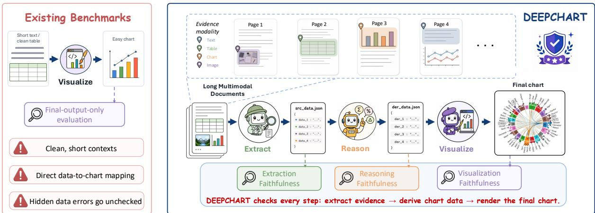  
Figure 1: DEEPCHART task overview. Compared with visualize-only chart benchmarks, DEEPCHART evaluates chart generation as an Extract–Reason–Visualize pipeline over long multimodal documents.

Zero-shot evaluation on DEEPCHART shows that (1) visually plausible charts often conceal datalevel hallucinations, (2) models struggle with both Extract and Reason stages, and (3) full-document inputs further degrade end-to-end faithfulness, suggesting that larger context windows alone are insufficient. In summary, our contributions are:

• Task formulation. We formalize data-science chart generation as an ERV pipeline, exposing the coupled challenges of evidence retrieval, analytical reasoning, and faithful rendering.

• DEEPCHART benchmark. We release an expert-annotated benchmark over long-text and report-level multimodal contexts, with references and metrics for source values, derived quantities, and final charts.

• Empirical findings. We show that SOTA models suffer from hidden hallucinations, persistent extraction and reasoning challenges, and degraded faithfulness under full-document inputs.

## 2 Task Definition

Given a long, heterogeneous analytical context C and a natural-language chart intent Q, the task is to generate a faithful data-science chart. The context may contain textual descriptions, tables, figures, or document pages, and the chart intent specifies the analytical goal and desired visualization. Unlike direct prompt-to-chart generation, the pipeline is expected to expose the data path that supports the final visualization: the source values extracted from the context, the chart-ready quantities derived from those values, and the executable visualization that renders them.

We formulate this process as an Extract–Reason– Visualize (ERV) pipeline:

$$
D _ { \mathrm { s r c } }  \mathrm { E x t r a c t } ( C , Q ) ,\tag{1}
$$

$$
D _ { \mathrm { d e r } }  \mathrm { R e a s o n } ( D _ { \mathrm { s r c } } , Q ) ,\tag{2}
$$

$$
( P , G )  \mathrm { V i s u a l i z e } ( D _ { \mathrm { s r c } } , D _ { \mathrm { d e r } } , Q ) .\tag{3}
$$

Here, $D _ { \mathrm { s r c } }$ denotes extracted source data, $D _ { \mathrm { d e r } }$ denotes derived chart-ready data, P denotes the executable chart-generation program, and G denotes the rendered chart.

We define the auditable intermediate state as $J = \left( D _ { \mathrm { s r c } } , D _ { \mathrm { d e r } } \right)$ . Exposing J makes a generated chart traceable: we can verify whether it is grounded in the correct source values and whether those values are transformed into the correct chartready quantities before rendering. This enables stage-by-stage evaluation across the Extract, Reason, and Visualize stages, rather than assessing only the final chart. With this design, DEEPCHART can distinguish extraction, reasoning, and visualization failures, thereby exposing hidden hallucinations.

<table><tr><td rowspan="2">Method</td><td colspan="3">Input Setting</td><td colspan="2">Task Requirement</td><td colspan="2">Evaluation Granularity</td></tr><tr><td>Context</td><td>Modality</td><td>Real-doc</td><td>Retrieval</td><td>Reasoning</td><td>Visual</td><td>Stage-by-stage</td></tr><tr><td>Text2Chart31 (Pesaran Zadeh et al., 2024)</td><td>&lt;16K</td><td>Txt+Tab</td><td>x</td><td>x</td><td>X</td><td></td><td>x</td></tr><tr><td>MatPlotBench (Yang et al., 2024)</td><td>&lt;32K</td><td>Tab</td><td>x</td><td>X</td><td></td><td></td><td>x</td></tr><tr><td>Text2Vis (Rahman et al., 2025)</td><td>&lt;2K</td><td>Tab</td><td>x</td><td>√</td><td></td><td></td><td>x</td></tr><tr><td>C2/ChartUIE-8K (Koh et al., 2025)</td><td>&lt;32K</td><td>Tab</td><td>x</td><td>X</td><td></td><td></td><td>x</td></tr><tr><td>Doc2Chart (Jain et al., 2025)</td><td> ${ < } 3 2 \mathrm { K } ^ { * }$ </td><td>Txt+Tab</td><td>√</td><td>√</td><td>√</td><td></td><td>x</td></tr><tr><td>Infogen (Ghosh et al., 2025)</td><td> ${ < } 2 \mathrm { K } ^ { * }$ </td><td>Txt</td><td>x</td><td>√</td><td>x</td><td></td><td>××</td></tr><tr><td>PlotCraft (Zhang et al., 2026)</td><td> ${ < } 1 2 8 \mathrm { K } ^ { * }$ </td><td>Tab</td><td>√</td><td>x</td><td>V</td><td>J</td><td></td></tr><tr><td>DEEPCHART</td><td>220K tokens / 218 pages .avg</td><td>Txt+Tab+Img</td><td>√</td><td></td><td>J</td><td>1</td><td>√</td></tr></table>

Table 1: Comparison with existing chart-generation benchmarks. Context reports approximate input scale; starred values are estimated when complete statistics are unavailable. Retrieval means locating task-relevant data in complex contexts; Reasoning means deriving chart-ready quantities from extracted data. Real-doc indicates contexts are constructed from real-world documents, and Stage-by-stage indicates evaluation of intermediate data rather than only the final chart.

## 3 Benchmark: DEEPCHART

To capture diverse real-world chart-generation workflows, DEEPCHART spans three domains with distinct sources, modalities, and bottlenecks. The Academic domain uses scientific papers and supplementary materials, stressing evidence localization, statistical reasoning, and faithful scientific visualization. The Finance domain uses long, tableheavy company 10-K filings, stressing cross-table aggregation and multi-hop derivation of financial metrics. The Ecosystem domain uses market intelligence and startup ecosystem reports that mix textual, tabular, and visual evidence, stressing multimodal evidence integration and reasoning. These domains are selected to vary both input scale and evidence form, from text-centered scientific and financial documents to page-level multimodal reports. Together, these domains cover three recurring bottlenecks: statistical derivation, long-context aggregation, and multimodal evidence integration.

Each DEEPCHART instance consists of modelfacing inputs $\langle C , Q \rangle$ and hidden evaluation references: an auditable intermediate state $J _ { \mathrm { G T } } =$ $( D _ { \mathrm { s r c } } , D _ { \mathrm { d e r } } )$ , an executable reference program $P _ { \mathrm { G T } }$ , and a rendered reference chart $G _ { \mathrm { G T } }$ . This design entails two construction requirements: inputs must preserve the complexity of real-world data-science workflows, where evidence is scattered across long, heterogeneous, and sometimes multimodal documents; references must expose an auditable data path from source evidence to derived quantities and the final chart. Figure 2 summarizes our expert-verified pipeline, from source collection and context-query construction to reference construction and quality control.

## 3.1 Task Input Construction

We construct the task input $\langle C , Q \rangle$ in three steps: collecting and filtering source documents, converting them into standardized contexts C, and pairing each context with a chart intent Q.

Source collection and filtering. We manually collect source documents from publicly available repositories and official filings. For the Academic domain, we retrieved academic papers along with their supplementary materials. Finance domain documents consist of company 10-K filings in PDF format. The Ecosystem domain includes market intelligence and startup ecosystem reports.

We manually filter these sources to remove lowquality and unsuitable documents. Specifically, we exclude documents that are too short, lack sufficient quantitative information, or contain evidence that is insufficiently dispersed. The remaining sources thus provide the complexity required to construct challenging DEEPCHART tasks.

Query construction. From each retained source, experts construct standardized chart intents Q corresponding to the evidence provided in the document. In the Academic domain, experts first identify the target charts in the papers. They then formulate queries based on the chart and its surrounding context. For the Finance and Ecosystem domains, experts systematically identify all available quantitative evidence in each report, including direct indicators, tables, textual statistics, and visual elements. Based on these evidence pools, they formulate analytical queries that require deriving quantities through multi-hop reasoning prior to visualization. During query design, experts ensure that each task draws on evidence that is abundant, widely distributed, and, when applicable, spans multiple modalities, tables, or documents.

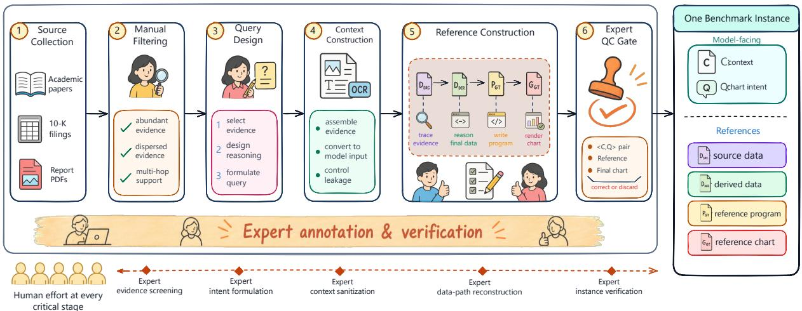  
Figure 2: Expert-verified benchmark construction. Experts validate source selection, query design, reference data, executable code, and rendered charts. Each final instance contains a model-facing context-query pair and hidden references for stage-wise evaluation of extraction, reasoning, and visualization.

Context construction. Given a query Q, we build a task-conditioned context C that is answerable, leakage-controlled, and directly consumable by LLMs. Specifically, C must contain the evidence needed to solve Q, exclude target artifacts such as the reference chart, and be converted from the original PDFs into text or images.

For text-domain tasks, documents are converted to text using PaddleOCR-VL (Cui et al., 2025), and we further create context-scale variants to probe how context length affects the ERV pipeline.

In Academic, the original papers contain target charts. After OCR conversion, the paper is textonly, so the chart image is not exposed and does not cause data leakage. To keep the task answerable, experts then identify the experimental data corresponding to each target chart and insert them as a structured data block at the original chart location. The Normal setting contains the experimental data required for chart construction, while the Long setting adds the full paper text.

In Finance, experts first select the company filings required by each query. Since a 10-K filing often reports indicators for two or three fiscal years, we remove redundant filings with overlapping coverage while ensuring that the query remains answerable. The Normal setting keeps only the tables that contain the required source values. The Long setting adds text from the 20 rows above and below each table. The Ultra-Long setting uses all selected full 10-K filings.

For multimodal-domain Ecosystem, PDF pages are converted into images, forming a native reportlevel multimodal context for visual models.

The resulting benchmark contains 1,482 contextquery instances. Text-domain queries may be paired with multiple context-scale variants, while the query and evaluation references remain fixed. Detailed statistics are reported in Appendix A.

## 3.2 Auditable Ground Truth Construction

DEEPCHART evaluation requires references beyond the final chart. For each task $\langle C , Q \rangle$ , we construct references for every stage of the Extract– Reason–Visualize pipeline. The source data $D _ { \mathrm { s r c } }$ captures the output of the Extract step, and the derived data $D _ { \mathrm { d e r } }$ captures the output of the Reason step. The executable program $P _ { \mathrm { G T } }$ and rendered chart $G _ { \mathrm { G T } }$ correspond to the Visualize step.

Evidence Extraction. Given the context C and query Q, expert annotators identify the source values required to answer the task and organize them as $D _ { \mathrm { s r c } }$ . These values may originate from text, tables, or visual evidence, as appropriate to the domain.

Data Reasoning. Based on the requirements specified by Q, expert annotators implement a

Python script to transform $D _ { \mathrm { s r c } }$ into derived quantities $D _ { \mathrm { d e r } }$ . This script encodes the necessary reasoning (e.g., aggregation, normalization, ratio calculations, delta computation, grouping, and cross-year comparisons), making the derivation from source to derived values fully reproducible.

Reference Chart Construction. Using $D _ { \mathrm { s r c } }$ $D _ { \mathrm { d e r } }$ , expert annotators create an executable reference program $P _ { \mathrm { G T } }$ . Executing $P _ { \mathrm { G T } }$ produces the reference chart $G _ { \mathrm { G T } }$ , which is verified to ensure that it can solve the task $\langle C , Q \rangle$ faithfully.

LLMs may assist in drafting code, but only as a drafting tool. They are not treated as authoritative sources for ground truth. Expert annotators verify source data, derived data, code, and rendered charts before inclusion in the benchmark.

## 3.3 Quality Control

DEEPCHART was constructed and verified by five expert annotators whose expertise spans data visualization, document understanding, quantitative analysis, scientific literature, and financial-report analysis. Here, expert annotator denotes a member of this team; primary annotator, independent verifier, and senior reviewer denote QC roles.

Each instance is authored by a primary expert annotator and independently reviewed by an expert verifier across input, data, code, and chart. The verifier checks that $\langle C , Q \rangle$ is answerable and leakage-free, that $D _ { \mathrm { s r c } }$ is evidence-supported, that $D _ { \mathrm { d e r } }$ is reproducibly derived from $D _ { \mathrm { s r c } } ,$ and that executing $P _ { \mathrm { G T } }$ yields a chart $G _ { \mathrm { G T } }$ consistent with the intended data and visual specification. Ambiguous cases are discussed with a senior expert reviewer; unverifiable instances are discarded, and correctable local issues are revised and rechecked.

## 4 Evaluation Framework

We evaluate faithful data-science chart generation with stage-by-stage metrics aligned with the ERV pipeline. The framework reports Source Data Fidelity for extraction $( F _ { 1 , \mathrm { s r c } } )$ , Derived Data Fidelity for reasoning $( F _ { 1 , \mathrm { d e r } } )$ , Visual Accuracy Score (VAS) for visualization, and Execution Rate (ER) as an auxiliary measure of rendering success.

Extract: Source Data Fidelity. $F _ { \mathrm { 1 , s r c } }$ measures recovery of query-relevant numerical evidence by normalized numeric matching against reference source values, independent of JSON formatting.

Reason: Derived Data Fidelity. $F _ { 1 , \mathrm { d e r } }$ uses the same matching to evaluate chart-ready quantities derived from the source data, capturing errors in aggregation, normalization, ratio calculation, and cross-year comparison.

Both metrics operate at the value level: they extract normalized numeric leaves from predicted and reference JSON objects and perform one-to-one matching without key- or structure-level alignment. Thus, they measure numerical value recovery rather than full semantic alignment.

Visualize: Visual Accuracy Score. For each benchmark instance, we generate and cache binary verification questions from the reference chart and query. The questions cover three aspects: instruction compliance, data-mapping topology, and presentation quality. A VLM judge answers these questions for each model-generated chart, and VAS is the average pass rate:

$$
\mathrm { V A S } = \frac { 1 } { N } \sum _ { i = 1 } ^ { N } \mathbf { 1 } ( \mathrm { R u b r i c } _ { i } = \mathrm { P a s s } ) .\tag{4}
$$

Execution Rate (ER). ER is the percentage of test instances for which the generated visualization program successfully produces a valid chart image.

Appendix B.2 provides implementation details for data-fidelity matching, VAS rubric generation, judge models, and execution checks; Appendix B.4 reports VAS reliability validation.

## 5 Experiments

## 5.1 Experimental Setup

We evaluate DEEPCHART under two protocols. The text-domain protocol covers Academic and Finance, using the context-scale variants defined in Section 3: Academic-Normal/Long and Finance-Normal/Long for the main benchmark, with Finance-Ultra-Long evaluated separately as a stress test in Section 5.3. The multimodal-domain protocol covers Ecosystem, where models receive report pages as images and are evaluated under the native report-level setting.

For the text-domain protocol, we evaluate four proprietary models (GPT-5.2 (OpenAI, 2025), Claude 4.5 Opus (Anthropic, 2025), Gemini 3 Pro (Google, 2025a), and Gemini 3 Flash (Google, 2025b)) and four open-weight models (DeepSeek-V3.2 (DeepSeek-AI et al., 2025), GLM-4.7 (Team et al., 2025), Qwen3-235B-A22B-thinking (Team, 2025), and Kimi-K2-Thinking (Moonshot AI, 2025)). For the multimodal-domain protocol, we retain the same proprietary models and add four multimodal-capable models (Qwen3.6- Plus (Team, 2025), Qwen3.6-Flash (Team, 2025), Kimi-2.6 (Team et al., 2026), and Qwen3-VL-30B-A3B-Thinking (Bai et al., 2025)).

<table><tr><td></td><td>Metric</td><td colspan="3">Finance</td><td></td><td colspan="4">Academic</td></tr><tr><td>Model</td><td></td><td>ER</td><td> $F _ { \mathrm { 1 , s r c } }$ </td><td> $F _ { 1 , \mathrm { d e r } }$ </td><td>VAS</td><td>ER</td><td> $F _ { \mathrm { 1 , s r c } }$ </td><td> $F _ { 1 , \mathrm { d e r } }$ </td><td>VAS</td></tr><tr><td colspan="10">Normal Context Settings</td></tr><tr><td colspan="10">Proprietary Models</td></tr><tr><td>GPT-5.2</td><td>0.8415</td><td>0.4084</td><td>0.2948</td><td>0.5265</td><td></td><td>0.6685</td><td>0.7181</td><td>0.1994</td><td>0.4948</td></tr><tr><td>Claude 4.5 Opus</td><td>0.8908</td><td>0.4006</td><td></td><td>0.1771</td><td>0.5710</td><td>0.7697</td><td>0.7855</td><td>0.2273</td><td>0.6002</td></tr><tr><td>Gemini 3 Pro</td><td>0.6268</td><td>0.4984</td><td></td><td>0.4162</td><td>0.3982</td><td>0.3989</td><td>0.7544</td><td>0.2674</td><td>0.2992</td></tr><tr><td>Gemini 3 Flash</td><td>0.8556</td><td>0.4849</td><td>0.4769</td><td></td><td>0.5398</td><td>0.5730</td><td>0.7686</td><td>0.2681</td><td>0.4167</td></tr><tr><td colspan="10">Open-weight Models</td></tr><tr><td>DeepSeek-V3.2</td><td>0.4225</td><td>0.2107</td><td>0.0825</td><td></td><td>0.2313</td><td>0.4775</td><td>0.6616</td><td>0.2373</td><td>0.3274</td></tr><tr><td>GLM-4.7</td><td>0.3415</td><td>0.3742</td><td></td><td>0.2453</td><td>0.1863</td><td>0.3315</td><td>0.6252</td><td>0.1800</td><td>0.2225</td></tr><tr><td>Kimi-K2</td><td>0.7606</td><td>0.4314</td><td></td><td>0.1930</td><td>0.4472</td><td>0.5562</td><td>0.5022</td><td>0.2179</td><td>0.3859</td></tr><tr><td>Qwen3-235B</td><td>0.8627</td><td>0.2738</td><td>0.1046</td><td></td><td>0.4686</td><td>0.8034</td><td>0.7123</td><td>0.2895</td><td>0.5291</td></tr><tr><td colspan="10">Long Context Settings</td></tr><tr><td colspan="10"></td></tr><tr><td>Proprietary Models GPT-5.2</td><td>0.8627</td><td>0.4158</td><td>0.3237</td><td>0.5387</td><td></td><td>0.6854</td><td>0.6066</td><td>0.1775</td><td>0.5238</td></tr><tr><td>Claude 4.5 Opus</td><td>0.8592</td><td>0.4127</td><td>0.2325</td><td></td><td>0.5330</td><td>0.7809</td><td>0.6163</td><td>0.1868</td><td>0.5945</td></tr><tr><td>Gemini 3 Pro</td><td>0.7606</td><td>0.4587</td><td>0.2915</td><td></td><td>0.4716</td><td>0.3820</td><td>0.6870</td><td>0.2158</td><td>0.2888</td></tr><tr><td>Gemini 3 Flash</td><td>0.8592</td><td>0.4817</td><td>0.4840</td><td></td><td>0.5474</td><td>0.5281</td><td>0.6422</td><td>0.2278</td><td>0.3938</td></tr><tr><td colspan="10">Open-weight Models</td></tr><tr><td>DeepSeek-V3.2</td><td>0.5000</td><td>0.1936</td><td>0.0640</td><td></td><td>0.1557</td><td>0.3539</td><td>0.4401</td><td>0.2366</td><td>0.2450</td></tr><tr><td>GLM-4.7</td><td>0.3838</td><td>0.2486</td><td>0.1246</td><td>0.1739</td><td></td><td>0.4663</td><td>0.5521</td><td>0.2037</td><td>0.3170</td></tr><tr><td>Kimi-K2</td><td>0.5106</td><td>0.4268</td><td>0.1587</td><td></td><td>0.2993</td><td>0.6517</td><td>0.6617</td><td>0.1787</td><td>0.4696</td></tr><tr><td>Qwen3-235B</td><td>0.9085</td><td>0.2882</td><td></td><td>0.0560</td><td>0.3535</td><td>0.6854</td><td>0.5985</td><td>0.2402</td><td>0.4610</td></tr></table>

Table 2: Text-domain results on Academic and Finance under Normal and Long context settings.

<table><tr><td colspan="5"></td></tr><tr><td>Model</td><td>Ecosystem ER</td><td> $F _ { \mathrm { 1 , s r c } }$ </td><td> $F _ { 1 , \mathrm { d e r } }$ </td><td>VAS</td></tr><tr><td>Shared Models</td><td></td><td></td><td></td><td></td></tr><tr><td>GPT-5.2</td><td>0.7031</td><td>0.0207</td><td>0.0386</td><td>0.1589</td></tr><tr><td>Claude 4.5 Opus</td><td>0.9609</td><td>0.1792</td><td>0.2832</td><td>0.6963</td></tr><tr><td>Gemini 3 Pro</td><td>0.9844</td><td>0.1965</td><td>0.4529</td><td>0.7427</td></tr><tr><td>Gemini 3 Flash</td><td>0.6133</td><td>0.2167</td><td>0.4107</td><td>0.4055</td></tr><tr><td></td><td></td><td></td><td></td><td></td></tr><tr><td>Additional Models</td><td></td><td></td><td></td><td></td></tr><tr><td>Qwen3.6-Plus</td><td>0.9688</td><td>0.2122</td><td>0.4088</td><td>0.5984</td></tr><tr><td>Qwen3.6-Flash</td><td>0.8047</td><td>0.1472</td><td>0.2633</td><td>0.2387</td></tr><tr><td>Kimi-2.6</td><td>0.6875</td><td>0.1564</td><td>0.2796</td><td>0.4998</td></tr><tr><td>Qwen3-VL-30B</td><td>0.5352</td><td>0.0648</td><td>0.0746</td><td>0.2358</td></tr></table>

Table 3: Multimodal-domain results on Ecosystem under the native report-level setting.

All experiments are zero-shot. We report Source Data Fidelity $( F _ { 1 , \mathrm { s r c } } )$ , Derived Data Fidelity $( F _ { 1 , \mathrm { d e r } } )$ , Visual Accuracy Score (VAS), and Execution Rate (ER), as defined in Section 4. Implementation details, prompt templates, model versions, and VAS validation are provided in Appendix B.1.

## 5.2 Main Benchmark Results

Tables 2 and 3 report the main results under the textdomain and multimodal-domain protocols. Across both protocols, current models remain far from reliable faithful chart generation under our zeroshot ERV setting. The results breakdown reveals three patterns that output-only evaluation would obscure. (1) Executability does not guarantee visual faithfulness. In the Ecosystem domain, models achieve average ER (0.782), but average VAS is only 0.447. This shows that a generated program may execute successfully while the resulting chart still fails to satisfy the intended visual specification. (2) Visual faithfulness does not guarantee data faithfulness. Even when charts appear visually plausible, their underlying data path may be incorrect. In Ecosystem, average VAS (0.447) is substantially higher than average $F _ { \mathrm { 1 , s r c } } \left( 0 . 1 4 9 \right)$ and average $F _ { \mathrm { 1 , d e r } } ( 0 . 2 7 6 )$ , showing that visually acceptable charts can still rely on incorrect source or derived data. (3) Reliable extraction does not guarantee correct reasoning. In Academic, models recover source values relatively well, with average $F _ { \mathrm { 1 , s r c } } ( 0 . 6 9 1 / 0 . 6 0 1$ under Normal/Long), but average $F _ { \mathrm { 1 , d e r } }$ remains much lower (0.236/0.208). This indicates that extracting relevant evidence does not ensure correct chart-ready derivation. Together, these results show why stage-by-stage evaluation is necessary. By separately measuring execution, visualization, source extraction, and derived reasoning, DEEPCHART exposes hidden hallucinations that final-output-only evaluations would miss.

<table><tr><td colspan="5">Finance-Ultra-Long</td></tr><tr><td>Model</td><td>ER</td><td> $F _ { \mathrm { 1 , s r c } }$ </td><td> $F _ { 1 , \mathrm { d e r } }$ </td><td>VAS</td></tr><tr><td colspan="5">Proprietary Models</td></tr><tr><td>GPT-5.2</td><td>0.9200</td><td>0.1830 0.1726</td><td>0.1930 0.1179</td><td>0.3785 0.3800</td></tr><tr><td>Claude 4.5 Opus Gemini 3 Pro</td><td>1.0000 0.4600 0.8000</td><td>0.4421 0.4197</td><td>0.3178 0.4182</td><td>0.2969 0.4592</td></tr><tr><td colspan="5">Gemini 3 Flash Open-weight Models</td></tr><tr><td>DeepSeek-V3.2</td><td>0.2600</td><td>0.0237</td><td>0.0179</td><td>0.1000</td></tr><tr><td>GLM-4.7</td><td>0.2200</td><td>0.0324</td><td>0.0211</td><td>0.3200</td></tr><tr><td>Kimi-K2</td><td>0.5400</td><td>0.0460</td><td>0.0214</td><td>0.1554</td></tr><tr><td>Qwen3-235B</td><td>0.1200</td><td>0.0167</td><td>0.0048</td><td>0.0600</td></tr></table>

Table 4: Stress test on Finance-Ultra-Long setting.

The results also reveal domain-specific bottlenecks. Finance stresses long-context aggregation: moving from Normal to Long produces modest but consistent drops in average VAS (0.421 to 0.384) and average $F _ { 1 , \mathrm { d e r } } ( 0 . 2 4 9 \mathrm { t o } 0 . 2 1 7 )$ , suggesting that additional filing context increases the difficulty of retrieval and derivation. Academic stresses scientific derivation: models recover source values relatively well, with $F _ { \mathrm { 1 , s r c } }$ reaching up to 0.785, but $F _ { \mathrm { 1 , d e r } }$ remains below 0.240, showing difficulty in transforming raw experimental evidence into chart-ready quantities. Ecosystem stresses multimodal grounding and reasoning: despite average ER (0.782), models achieve only average $F _ { \mathrm { 1 , s r c } }$ (0.149) and average $F _ { \mathrm { 1 , d e r } } \left( 0 . 2 7 6 \right)$ . Together, these patterns show that DEEPCHART evaluates longcontext retrieval, scientific derivation, multimodal grounding, and rendering within a unified chartgeneration benchmark.

## 5.3 Impact of Ultra-Long Context

We evaluate Finance-Ultra-Long as a separate stress test. Beyond Finance-Normal/Long in Table 2, this setting provides full 10-K filings as input. Because full-filing inference is costly, we evaluate a fixed 50-instance subset sampled from Finance-Ultra-Long. Appendix B.3 describes the sampling procedure and representativeness analysis.

Table 4 reports the Finance-Ultra-Long results, and Figure 3 shows how performance changes as

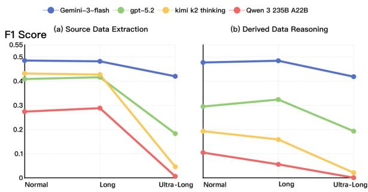  
Figure 3: F1 score trends: (a) Source Data Extraction and (b) Derived Data Reasoning as context scales from Normal to Ultra-Long. We visualize 2 proprietary and 2 open-weight models. Detailed results for all eight evaluated models are provided in Table 4.

Finance contexts scale from Normal to Ultra-Long. Moving from Normal to Long causes only limited fluctuation, suggesting that adding local context around evidence tables has a modest effect. In contrast, Ultra-Long inputs produce a clear drop and larger model divergence. Averaged over all evaluated models, VAS decreases from 0.421 in Normal to 0.269 in Ultra-Long, $F _ { \mathrm { 1 , s r c } }$ drops from 0.385 to 0.167, and $F _ { \mathrm { 1 , d e r } }$ drops from 0.249 to 0.139. Full-report financial inputs therefore make both extraction and reasoning substantially harder than table-centered contexts.

The Ultra-Long degradation is consistent with two possible mechanisms. First, full filings may exceed a model’s usable input budget, causing relevant tables or textual cues to be truncated before extraction and reasoning. Second, even when the required evidence is retained, full filings introduce substantial irrelevant context, including tables, notes, and accounting details. This evidence dilution makes it harder to localize sparse task-relevant values and compose them correctly. These results suggest that, in full-document financial settings, longer context windows alone do not guarantee faithful chart generation; models also need robust evidence localization and quantitative reasoning over noisy documents.

## 5.4 Comparison of Rendering Modalities

After evaluating the full ERV pipeline, we further isolate the Visualize stage. This allows us to study how rendering backend affects chart faithfulness when the data path is fixed. Instead of re-running Extract and Reason, we provide each model with the same extracted and derived data $( D _ { \mathrm { s r c } } , D _ { \mathrm { d e r } } )$ and evaluate three rendering settings: Python, HTML, and a free-choice setting where the backend is not specified.

<table><tr><td>Model</td><td colspan="2">ER</td><td colspan="2">VAS</td></tr><tr><td></td><td>Py</td><td>HTML</td><td>Py</td><td>HTML</td></tr><tr><td>Proprietary Models</td><td></td><td></td><td></td><td></td></tr><tr><td>GPT-5.2</td><td>0.765</td><td>0.983</td><td>0.521</td><td>0.573</td></tr><tr><td>Gemini-3-flash</td><td>0.704</td><td>0.931</td><td>0.474</td><td>0.559</td></tr><tr><td>Open-weight Models</td><td></td><td></td><td></td><td></td></tr><tr><td>Qwen3-235B</td><td>0.815</td><td>0.854</td><td>0.453</td><td>0.379</td></tr><tr><td>Kimi-k2-thinking</td><td>0.620</td><td>0.623</td><td>0.401</td><td>0.357</td></tr></table>

Table 5: Performance comparison between rendering backends. Data represents the average metrics across Academic-Normal/Long and Finance-Normal/Long.

Table 5 reports the controlled comparison between Python and HTML. For proprietary models, HTML improves both execution and visual accuracy: average ER increases from 0.735 to 0.957, and average VAS increases from 0.498 to 0.566. For open-weight models, ER remains similar across backends, but average VAS drops from 0.427 with Python to 0.368 with HTML. Thus, backend choice affects not only executability but also visualization faithfulness, and the preferred backend differs across model families.

We further conduct a free-choice setting under the same visualization-only setup, but without specifying the rendering backend. This experiment is performed on the text-domain visualization subset used in Table 5: for each of the four text settings (Finance-Normal, Finance-Long, Academic-Normal, and Academic-Long), we randomly sample 50 instances and evaluate all eight text-domain models, yielding 1,600 trials in total. Given the same $( D _ { \mathrm { s r c } } , D _ { \mathrm { d e r } } )$ input, models choose Python in 1,591 cases (99.4%), revealing a strong toolselection bias toward Python. This preference is suboptimal for proprietary models, for which the controlled experiment shows higher VAS with HTML, but it is more consistent with the weaker HTML performance of open-weight models.

## 6 Related Work

Chart generation and evaluation. Automatic visualization has progressed from recommending or synthesizing charts from structured tables and analytic specifications to LLM-based chart authoring from natural-language instructions, tables, and analysis intents (Hu et al., 2018; Dibia and Çagatay Demiralp˘ , 2018; Zhou et al., 2021; Narechania et al., 2021; Dibia, 2023; Wang et al., 2023; Tian et al., 2025; Chen et al., 2024). Recent benchmarks such as MatPlotBench, Text2Chart31,

C<sup>2</sup>/ChartUIE, and PlotCraft further evaluate instruction following, executable code generation, and visual rendering quality (Yang et al., 2024; Pesaran Zadeh et al., 2024; Koh et al., 2025; Zhang et al., 2026; Luo et al., 2021; Rocco et al., 2020). Parallel work on chart understanding, chart-tocode, and chart grounding studies how models read, reproduce, or verify existing charts (Masry et al., 2022; Liu et al., 2023; Yang et al., 2025; Bansal et al., 2025; Kafle et al., 2018; Methani et al., 2020). These studies provide important foundations for visual synthesis. However, most settings assume that task-relevant data are already localized, structured, or encoded in an input chart, leaving open whether a generated chart is faithfully grounded in evidence scattered across long documents.

Document-grounded visualization and data analysis. Closer to our setting, recent work generates charts or infographics from textual and document contexts, including ChartifyText, Text2Vis, Infogen, Doc2Chart, and DV-World (Zhang et al., 2024; Jain et al., 2025; Ghosh et al., 2025; Rahman et al., 2025; Meng et al., 2026). LLM-based data-analysis agents also study data cleaning, code generation, statistical reasoning, tool use, and longcontext or multimodal evidence integration (Lai et al., 2022; Hu et al., 2024; Huang et al., 2024; Hong et al., 2024; Jing et al., 2025; Li et al., 2026). Related benchmarks on table-text numerical reasoning and document VQA similarly stress evidence retrieval and quantitative reasoning over financial reports, tables, document images, infographics, and slide decks (Chen et al., 2022; Zhu et al., 2021; Tanaka et al., 2023), but they generally return textual or numerical answers rather than executable, evidence-grounded charts. Yet existing visualization and data-analysis benchmarks usually evaluate either the final visual artifact or the final analysis output. The intermediate data path from retrieved evidence to chart-ready quantities is rarely made explicit, making it difficult to identify whether failures arise from missing evidence, incorrect derivation, or flawed rendering. DEEPCHART targets this missing intersection: faithful data-science chart generation over long and multimodal contexts.

## 7 Conclusion

We introduced DEEPCHART, an expert-annotated benchmark for faithful data-science chart generation over task-conditioned contexts derived from real-world scientific papers, financial filings, and ecosystem reports. With an Extract–Reason– Visualize formulation, DEEPCHART enables stageby-stage evaluation of extraction, reasoning, and visualization. Under a zero-shot ERV evaluation protocol, experiments show that current models can produce visually plausible charts while still failing along the underlying data path, highlighting the need for better evidence localization, quantitative reasoning, and traceable visualization.

## Limitations

DEEPCHART has several limitations. First, although it covers three representative domains— Academic, Finance, and Ecosystem—its scope does not exhaust all data-science chart-generation scenarios. Second, our data-fidelity metrics use normalized value-level matching to accommodate diverse model-generated schemas; this design makes evaluation robust to formatting variation, but the resulting $F 1 _ { \mathrm { s r c } }$ and $F 1 _ { \mathrm { d e r } }$ scores should be interpreted as approximate indicators of numerical faithfulness rather than full semantic equivalence. Third, because each instance requires expert verification of source values, derived quantities, executable code, and rendered charts, DEEPCHART prioritizes annotation quality and auditability over very large scale. Future work can extend the benchmark to more domains and larger collections while preserving the same verification standard.

## References

Anthropic. 2025. Introducing claude opus 4.5. https: //www.anthropic.com/news/claude-opus-4-5.

Shuai Bai, Yuxuan Cai, Ruizhe Chen, Keqin Chen, Xionghui Chen, Zesen Cheng, Lianghao Deng, Wei Ding, Chang Gao, Chunjiang Ge, Wenbin Ge, Zhifang Guo, Qidong Huang, Jie Huang, Fei Huang, Binyuan Hui, Shutong Jiang, Zhaohai Li, Mingsheng Li, and 45 others. 2025. Qwen3-vl technical report. Preprint, arXiv:2511.21631.

Aniruddh Bansal, Davit Soselia, Dang Nguyen, and Tianyi Zhou. 2025. Chartab: A benchmark for chart grounding & dense alignment. Preprint, arXiv:2510.26781.

Nan Chen, Yuge Zhang, Jiahang Xu, Kan Ren, and Yuqing Yang. 2024. Viseval: A benchmark for data visualization in the era of large language models. Preprint, arXiv:2407.00981.

Zhiyu Chen, Wenhu Chen, Charese Smiley, Sameena Shah, Iana Borova, Dylan Langdon, Reema Moussa, Matt Beane, Ting-Hao Huang, Bryan Routledge, and William Yang Wang. 2022. Finqa: A dataset of

numerical reasoning over financial data. Preprint, arXiv:2109.00122.

Cheng Cui, Ting Sun, Suyin Liang, Tingquan Gao, Zelun Zhang, Jiaxuan Liu, Xueqing Wang, Changda Zhou, Hongen Liu, Manhui Lin, Yue Zhang, Yubo Zhang, Handong Zheng, Jing Zhang, Jun Zhang, Yi Liu, Dianhai Yu, and Yanjun Ma. 2025. Paddleocrvl: Boosting multilingual document parsing via a 0.9b ultra-compact vision-language model. Preprint, arXiv:2510.14528.

DeepSeek-AI, Aixin Liu, Aoxue Mei, Bangcai Lin, Bing Xue, Bingxuan Wang, Bingzheng Xu, Bochao Wu, Bowei Zhang, Chaofan Lin, Chen Dong, Chengda Lu, Chenggang Zhao, Chengqi Deng, Chenhao Xu, Chong Ruan, Damai Dai, Daya Guo, Dejian Yang, and 245 others. 2025. Deepseek-v3.2: Pushing the frontier of open large language models. Preprint, arXiv:2512.02556.

Victor Dibia. 2023. Lida: A tool for automatic generation of grammar-agnostic visualizations and infographics using large language models. Preprint, arXiv:2303.02927.

Victor Dibia and Çagatay Demiralp. 2018.˘ Data2vis: Automatic generation of data visualizations using sequence to sequence recurrent neural networks. Preprint, arXiv:1804.03126.

Kuicai Dong, Yujing Chang, Shijie Huang, Yasheng Wang, Ruiming Tang, and Yong Liu. 2025. Benchmarking retrieval-augmented multimodal generation for document question answering. arXiv preprint arXiv:2505.16470.

Akash Ghosh, Aparna Garimella, Pritika Ramu, Sambaran Bandyopadhyay, and Sriparna Saha. 2025. Infogen: Generating complex statistical infographics from documents. In Proceedings of the 63rd Annual Meeting ofthe Associationfor Computational Linguistics (Volume 1: Long Papers), pages 20552– 20570, Vienna, Austria. Association for Computational Linguistics.

Google. 2025a. Gemini 3 pro: the frontier of vision ai. https://blog.google/technology/ developers/gemini-3-pro-vision/.

Google. 2025b. Introducing gemini 3 flash: Frontier intelligence built for speed. https://blog.google/ products/gemini/gemini-3-flash/.

Sirui Hong, Yizhang Lin, Bang Liu, Bangbang Liu, Binhao Wu, Ceyao Zhang, Chenxing Wei, Danyang Li, Jiaqi Chen, Jiayi Zhang, Jinlin Wang, Li Zhang, Lingyao Zhang, Min Yang, Mingchen Zhuge, Taicheng Guo, Tuo Zhou, Wei Tao, Xiangru Tang, and 8 others. 2024. Data interpreter: An llm agent for data science. Preprint, arXiv:2402.18679.

Kevin Z. Hu, Michiel A. Bakker, Stephen Li, Tim Kraska, and César A. Hidalgo. 2018. Vizml: A machine learning approach to visualization recommendation. Preprint, arXiv:1808.04819.

Xueyu Hu, Ziyu Zhao, Shuang Wei, Ziwei Chai, Qianli Ma, Guoyin Wang, Xuwu Wang, Jing Su, Jingjing Xu, Ming Zhu, Yao Cheng, Jianbo Yuan, Jiwei Li, Kun Kuang, Yang Yang, Hongxia Yang, and Fei Wu. 2024. Infiagent-dabench: Evaluating agents on data analysis tasks. Preprint, arXiv:2401.05507.

Yiming Huang, Jianwen Luo, Yan Yu, Yitong Zhang, Fangyu Lei, Yifan Wei, Shizhu He, Lifu Huang, Xiao Liu, Jun Zhao, and Kang Liu. 2024. Da-code: Agent data science code generation benchmark for large language models. Preprint, arXiv:2410.07331.

Yuxuan Huang, Yihang Chen, Haozheng Zhang, Kang Li, Huichi Zhou, Meng Fang, Linyi Yang, Xiaoguang Li, Lifeng Shang, Songcen Xu, Jianye Hao, Kun Shao, and Jun Wang. 2025. Deep research agents: A systematic examination and roadmap. Preprint, arXiv:2506.18096.

Akriti Jain, Pritika Ramu, Aparna Garimella, and Apoorv Saxena. 2025. Doc2Chart: Intent-driven zero-shot chart generation from documents. In Proceedings ofthe 2025 Conference on Empirical Methods in Natural Language Processing, pages 34936– 34951, Suzhou, China. Association for Computational Linguistics.

Bowen Jin, Hansi Zeng, Zhenrui Yue, Jinsung Yoon, Sercan Arik, Dong Wang, Hamed Zamani, and Jiawei Han. 2025. Search-r1: Training llms to reason and leverage search engines with reinforcement learning. arXiv preprint arXiv:2503.09516.

Liqiang Jing, Zhehui Huang, Xiaoyang Wang, Wenlin Yao, Wenhao Yu, Kaixin Ma, Hongming Zhang, Xinya Du, and Dong Yu. 2025. Dsbench: How far are data science agents from becoming data science experts? Preprint, arXiv:2409.07703.

Kushal Kafle, Brian Price, Scott Cohen, and Christopher Kanan. 2018. Dvqa: Understanding data visualizations via question answering. Preprint, arXiv:1801.08163.

Bilal Khan, Saifullah Jan, Wahab Khan, and Muhammad Imran Chughtai. 2024. An overview of etl techniques, tools, processes and evaluations in data warehousing. Journal on Big Data, 6.

Woosung Koh, Jang Han Yoon, MinHyung Lee, Youngjin Song, Jaegwan Cho, Jaehyun Kang, Taehyeon Kim, Se-Young Yun, Youngjae Yu, and Bongshin Lee. 2025. c<sup>2</sup>: Scalable auto-feedback for llmbased chart generation. Preprint, arXiv:2410.18652.

Yuhang Lai, Chengxi Li, Yiming Wang, Tianyi Zhang, Ruiqi Zhong, Luke Zettlemoyer, Scott Wen tau Yih, Daniel Fried, Sida Wang, and Tao Yu. 2022. Ds-1000: A natural and reliable benchmark for data science code generation. Preprint, arXiv:2211.11501.

Yiyang Li, Zheyuan Zhang, Tianyi Ma, Zehong Wang, Keerthiram Murugesan, Chuxu Zhang, and Yanfang Ye. 2026. Longda: Benchmarking llm agents for long-document data analysis. Preprint, arXiv:2601.02598.

Fangyu Liu, Julian Martin Eisenschlos, Francesco Piccinno, Syrine Krichene, Chenxi Pang, Kenton Lee, Mandar Joshi, Wenhu Chen, Nigel Collier, and Yasemin Altun. 2023. Deplot: One-shot visual language reasoning by plot-to-table translation. Preprint, arXiv:2212.10505.

Yuyu Luo, Jiawei Tang, and Guoliang Li. 2021. nvbench: A large-scale synthesized dataset for cross-domain natural language to visualization task. Preprint, arXiv:2112.12926.

Ahmed Masry, Xuan Long Do, Jia Qing Tan, Shafiq Joty, and Enamul Hoque. 2022. Chartqa: A benchmark for question answering about charts with visual and logical reasoning. In Findings of the association for computational linguistics: ACL 2022, pages 2263– 2279.

Jinxiang Meng, Shaoping Huang, Fangyu Lei, Jingyu Guo, Haoxiang Liu, Jiahao Su, Sihan Wang, Yao Wang, Enrui Wang, Ye Yang, Hongze Chai, Jinming Lv, Anbang Yu, Huangjing Zhang, Yitong Zhang, Yiming Huang, Zeyao Ma, Shizhu He, Jun Zhao, and Kang Liu. 2026. Dv-world: Benchmarking data visualization agents in real-world scenarios. Preprint, arXiv:2604.25914.

Nitesh Methani, Pritha Ganguly, Mitesh M. Khapra, and Pratyush Kumar. 2020. Plotqa: Reasoning over scientific plots. Preprint, arXiv:1909.00997.

Moonshot AI. 2025. Kimi k2 thinking: Deep reasoning for complex problems. https://moonshotai. github.io/Kimi-K2/thinking.html.

Tamara Munzner. 2025. Visualization analysis and design. In Proceedings of the Special Interest Group on Computer Graphics and Interactive Techniques Conference Courses, SIGGRAPH Courses ’25, New York, NY, USA. Association for Computing Machinery.

Arpit Narechania, Arjun Srinivasan, and John Stasko. 2021. Nl4dv: A toolkit for generating analytic specifications for data visualization from natural language queries. IEEE Transactions on Visualization and Computer Graphics, 27(2):369–379.

OpenAI. 2025. Introducing gpt-5.2. https://openai. com/index/introducing-gpt-5-2/.

Fatemeh Pesaran Zadeh, Juyeon Kim, Jin-Hwa Kim, and Gunhee Kim. 2024. Text2Chart31: Instruction tuning for chart generation with automatic feedback. In Proceedings of the 2024 Conference on Empirical Methods in Natural Language Processing, pages 11459–11480, Miami, Florida, USA. Association for Computational Linguistics.

Mizanur Rahman, Md Tahmid Rahman Laskar, Shafiq Joty, and Enamul Hoque. 2025. Text2Vis: A challenging and diverse benchmark for generating multimodal visualizations from text. In Proceedings of the 2025 Conference on Empirical Methods in Natural Language Processing, pages 31837–31862, Suzhou, China. Association for Computational Linguistics.

Ignacio Rocco, Relja Arandjelovic, and Josef Sivic.´ 2020. Efficient neighbourhood consensus networks via submanifold sparse convolutions. Preprint, arXiv:2004.10566.

Aditi Singh, Abul Ehtesham, Saket Kumar, and Tala Talaei Khoei. 2025. Agentic retrieval-augmented generation: A survey on agentic rag. arXiv preprint arXiv:2501.09136.

Ryota Tanaka, Kyosuke Nishida, Kosuke Nishida, Taku Hasegawa, Itsumi Saito, and Kuniko Saito. 2023. Slidevqa: A dataset for document visual question answering on multiple images. Preprint, arXiv:2301.04883.

GLM Team, Aohan Zeng, Xin Lv, Qinkai Zheng, Zhenyu Hou, Bin Chen, Chengxing Xie, Cunxiang Wang, Da Yin, Hao Zeng, Jiajie Zhang, Kedong Wang, Lucen Zhong, Mingdao Liu, Rui Lu, Shulin Cao, Xiaohan Zhang, Xuancheng Huang, Yao Wei, and 152 others. 2025. Glm-4.5: Agentic, reasoning, and coding (arc) foundation models. Preprint, arXiv:2508.06471.

Kimi Team, Tongtong Bai, Yifan Bai, Yiping Bao, S. H. Cai, Yuan Cao, Y. Charles, H. S. Che, Cheng Chen, Guanduo Chen, Huarong Chen, Jia Chen, Jiahao Chen, Jianlong Chen, Jun Chen, Kefan Chen, Liang Chen, Ruijue Chen, Xinhao Chen, and 307 others. 2026. Kimi k2.5: Visual agentic intelligence. Preprint, arXiv:2602.02276.

Qwen Team. 2025. Qwen3 technical report. Preprint, arXiv:2505.09388.

Yuan Tian, Weiwei Cui, Dazhen Deng, Xinjing Yi, Yurun Yang, Haidong Zhang, and Yingcai Wu. 2025. Chartgpt: Leveraging llms to generate charts from abstract natural language. IEEE Transactions on Visualization and Computer Graphics, 31(3):1731–1745.

Chenglong Wang, John Thompson, and Bongshin Lee. 2023. Data formulator: Ai-powered concept-driven visualization authoring. Preprint, arXiv:2309.10094.

Cheng Yang, Chufan Shi, Yaxin Liu, Bo Shui, Junjie Wang, Mohan Jing, Linran Xu, Xinyu Zhu, Siheng Li, Yuxiang Zhang, Gongye Liu, Xiaomei Nie, Deng Cai, and Yujiu Yang. 2025. Chartmimic: Evaluating lmm’s cross-modal reasoning capability via chart-tocode generation. Preprint, arXiv:2406.09961.

Zhiyu Yang, Zihan Zhou, Shuo Wang, Xin Cong, Xu Han, Yukun Yan, Zhenghao Liu, Zhixing Tan, Pengyuan Liu, Dong Yu, Zhiyuan Liu, Xiaodong Shi, and Maosong Sun. 2024. Matplotagent: Method and evaluation for llm-based agentic scientific data visualization. Preprint, arXiv:2402.11453.

Jiajun Zhang, Jianke Zhang, Zeyu Cui, Jiaxi Yang, Lei Zhang, Binyuan Hui, Qiang Liu, Zilei Wang, Liang Wang, and Junyang Lin. 2026. Plotcraft: Pushing the limits of llms for complex and interactive data visualization. Preprint, arXiv:2511.00010.

Songheng Zhang, Lei Wang, Toby Jia-Jun Li, Qiaomu Shen, Yixin Cao, and Yong Wang. 2024. Chartifytext: Automated chart generation from data-involved texts via llm. Preprint, arXiv:2410.14331.

Mengyu Zhou, Qingtao Li, Xinyi He, Yuejiang Li, Yibo Liu, Wei Ji, Shi Han, Yining Chen, Daxin Jiang, and Dongmei Zhang. 2021. Table2charts: Recommending charts by learning shared table representations. In Proceedings of the 27th ACM SIGKDD Conference on Knowledge Discovery &amp; Data Mining, KDD ’21, page 2389–2399. ACM.

Fengbin Zhu, Wenqiang Lei, Youcheng Huang, Chao Wang, Shuo Zhang, Jiancheng Lv, Fuli Feng, and Tat-Seng Chua. 2021. Tat-qa: A question answering benchmark on a hybrid of tabular and textual content in finance. Preprint, arXiv:2105.07624.

## A Benchmark Statistics

This appendix summarizes the scale and composition of DEEPCHART. Table 7 reports the overall benchmark size, including the number of domains, queries, instances, chart types, and query types. It also characterizes input scale separately for the text protocol and the multimodal protocol, using token length for text inputs and pages for multimodal inputs. It also reports average, median, and maximum evidence entries per instance. Table 8 breaks down chart-family coverage by domain, and Table 6 reports the corresponding distribution of query types.

<table><tr><td>Domain / Query Type</td><td>#</td><td>Share</td></tr><tr><td>Academic</td><td></td><td></td></tr><tr><td>- Condition/group comparison</td><td></td><td>47 26.40%</td></tr><tr><td>- Dose/response curve</td><td></td><td>27 15.17%</td></tr><tr><td>- Association/correlation</td><td></td><td>2011.24%</td></tr><tr><td>- Spatial/geographic comparison</td><td>18</td><td>10.11%</td></tr><tr><td>- Scenario/sensitivity analysis</td><td>16</td><td>8.99%</td></tr><tr><td>- Model performance benchmark</td><td>11</td><td>6.18%</td></tr><tr><td>- Composition/breakdown</td><td>10</td><td>5.62%</td></tr><tr><td>- Temporal trend/projection</td><td>10</td><td>5.62%</td></tr><tr><td>- Flow/network/pathway</td><td>4</td><td>2.25%</td></tr><tr><td>- Genomic/functional mapping</td><td>4</td><td>2.25%</td></tr><tr><td>- Process contribution/LA decomposition</td><td>4</td><td>2.25%</td></tr><tr><td>- Distribution/variability comparison</td><td>3</td><td>1.69%</td></tr><tr><td>- Regression effect estimate</td><td>3</td><td>1.69%</td></tr><tr><td>- Multivariate profile/clustering</td><td>1</td><td>0.56%</td></tr><tr><td>Finance</td><td></td><td></td></tr><tr><td>- Graham&#x27;s net-net working capital (NNWC)</td><td>22</td><td>7.59%</td></tr><tr><td>- Earnings quality spread</td><td>22</td><td>7.59%</td></tr><tr><td>- Defensive interval ratio (DIR)</td><td>21</td><td>7.24%</td></tr><tr><td>- EBITDA</td><td>21</td><td>7.24%</td></tr><tr><td>- Piotroski F-Score</td><td>21</td><td>7.24%</td></tr><tr><td>- Return on invested capital (ROIC)</td><td>20</td><td>6.90%</td></tr><tr><td>- Economic value added (EVA)</td><td>20</td><td>6.90%</td></tr><tr><td>- Quality of income ratio</td><td>20</td><td>6.90%</td></tr><tr><td>- Internal growth rate (IGR)</td><td>19</td><td>6.55%</td></tr><tr><td>- Altman Ž-Score</td><td>19</td><td>6.55%</td></tr><tr><td>- Reinvestment rate</td><td>19</td><td>6.55%</td></tr><tr><td>- Sloan ratio</td><td>14</td><td>4.83%</td></tr><tr><td>- DuPont return on equity (ROE)</td><td>14</td><td>4.83%</td></tr><tr><td>- Cash conversion cyċle (CCC)</td><td>13</td><td>4.48%</td></tr><tr><td>- Cash burn runway</td><td>13</td><td>4.48%</td></tr><tr><td>- Sustainable growth rate (SGR)</td><td>12</td><td>4.14%</td></tr><tr><td>Ecosystem</td><td></td><td></td></tr><tr><td>- Multi-metric relationship</td><td></td><td>55 21.48%</td></tr><tr><td>- Composition and distribution</td><td>28</td><td>10.94%</td></tr><tr><td>- Rank gap and misalignment</td><td>27</td><td>10.55%</td></tr><tr><td>- Growth and momentum</td><td>26</td><td>10.16%</td></tr><tr><td>- Stage and salary</td><td>21</td><td>8.20%</td></tr><tr><td>- Concentration and breadth</td><td>19</td><td>7.42%</td></tr><tr><td>- Capital efficiency</td><td>18</td><td>7.03%</td></tr><tr><td>- Innovation response - Funding and deal activity</td><td>13</td><td>5.08%</td></tr><tr><td>- Hierarchy join</td><td>12</td><td>4.69%</td></tr><tr><td></td><td>12</td><td>4.69%</td></tr><tr><td>- Exit and liquidity</td><td>8</td><td>3.12%</td></tr><tr><td>- Company quality and maturity</td><td>5</td><td>1.95%</td></tr><tr><td>- Pillar balance</td><td>5</td><td>1.95%</td></tr><tr><td>- Valuation and IPO readiness</td><td>5</td><td>1.95%</td></tr><tr><td>- Composite score</td><td>2</td><td>0.78%</td></tr></table>

Table 6: Query-type distributions by domain.

<table><tr><td>Statistic Number</td></tr><tr><td>Overall - Domains</td></tr><tr><td>3 724</td></tr><tr><td>- Queries</td></tr><tr><td>- Instances 1,482</td></tr><tr><td>- Chart types 30 families / 56 specific - Query types 45 families / 244 specific</td></tr><tr><td>Text protocol: tokens / inst. Avg./Med./Max. - Academic-Normal. (178) 5.9K/1.8K/67.2K</td></tr><tr><td>- Academic-Long (178) 80.8K/61.7K/166.6K</td></tr><tr><td>- Finance-Normal. (290) 35.0K/34.3K/48.0K - Finance-Long (290) 137.7K/134.3K/197.3K</td></tr><tr><td>- Finance-Ultra-Long (290) 706.6K/648.9K/1.2M</td></tr><tr><td>- overall (1,226) 220.6K/106.0K/1.2M</td></tr><tr><td>Multimodal protocol: pages / inst. Avg./Med./Max. - Ecosystem report-level (256) 218.2/162/402</td></tr><tr><td></td></tr><tr><td>Evidence / inst. Avg./Med./Max. - Academic 672.1/176/10.9K - Finance 82.9/64/225</td></tr></table>

Table 7: Overall benchmark statistics. Text input scale is measured with the cl100k\_base tokenizer. Multimodal input scale is measured by report pages.

<table><tr><td>Domain / Chart family</td><td>#Q</td><td>Share</td></tr><tr><td>Academic</td><td></td><td></td></tr><tr><td>- Grouped Bar Chart</td><td>43</td><td>24.2%</td></tr><tr><td>- Regrêssion Scatter Plot</td><td>18</td><td>10.1%</td></tr><tr><td>- Dose-Response Plot</td><td>18</td><td>10.1%</td></tr><tr><td>- Heatmap</td><td>12</td><td>6.7%</td></tr><tr><td>- Line Chart</td><td>12</td><td>6.7%</td></tr><tr><td>- Circular/Radial Bar Chart</td><td>11</td><td>6.2%</td></tr><tr><td>- Box Plot</td><td>7</td><td>3.9%</td></tr><tr><td>- Combination Chart</td><td>7</td><td>3.9%</td></tr><tr><td>- Forest Plot</td><td>6</td><td>3.4%</td></tr><tr><td>- Stacked Bar Chart</td><td>5</td><td>2.8%</td></tr><tr><td>- Bar Chart</td><td>5</td><td>2.8%</td></tr><tr><td>- Dot/Point Plot</td><td>4</td><td>2.2%</td></tr><tr><td>- Sunburst/Nested Donut Chart</td><td>4</td><td>2.2%</td></tr><tr><td>- Scatter Plot</td><td>4</td><td>2.2%</td></tr><tr><td>- Violin Plot</td><td>4</td><td>2.2%</td></tr><tr><td>- Sankey/Alluvial Diagram</td><td>4</td><td>2.2%</td></tr><tr><td>- Other types</td><td>14</td><td>7.9%</td></tr><tr><td>Finance</td><td></td><td></td></tr><tr><td>- Bar Chart</td><td>152</td><td>52.4%</td></tr><tr><td>- Line Chart</td><td>138</td><td>47.6%</td></tr><tr><td>Ecosystem</td><td></td><td></td></tr><tr><td>- Horizontal Bar Chart</td><td>78</td><td>30.5%</td></tr><tr><td>- Bubble Chart</td><td>52</td><td>20.3%</td></tr><tr><td>- Dumbbell Chart</td><td>26</td><td>10.2%</td></tr><tr><td>- Ranked Bar Chart</td><td>22</td><td>8.6%</td></tr><tr><td>- Heatmap</td><td>19</td><td>7.4%</td></tr><tr><td>- Slope Chart</td><td>19</td><td>7.4%</td></tr><tr><td>- Scatter Plot</td><td>16</td><td>6.2%</td></tr><tr><td>- Bar Chart</td><td>12</td><td>4.7%</td></tr><tr><td>- Stacked Bar Chart</td><td>7</td><td>2.7%</td></tr><tr><td>- Other types</td><td>5</td><td>2.0%</td></tr></table>

Table 8: Chart-family distribution by domain. Types with fewer than four queries are grouped as “Other types”.

## B Experimental Details

## B.1 Generation Details

We evaluate model generation with a two-stage pipeline that mirrors the Extract–Reason–Visualize formulation. Given a task context C and chart intent $Q ,$ the first-stage LLM takes $( C , Q )$ as input and generates an executable Python script, following the extraction-and-derivation prompt shown in Table 10. In this script, the LLM extracts the source values required by the chart from C and encodes them as program variables corresponding to src\_data; it also implements the reasoning operations implied by Q as executable code, which transforms src\_data into chart-ready der\_data. Executing the script writes both fields to a JSON file, yielding the predicted intermediate state ${ \hat { J } } =$ $( \hat { D } _ { s r c } , \hat { D } _ { d e r } )$ . We then use this predicted intermediate state as the input to a second generation step, where the model is prompted to generate executable visualization code. The generated code is executed to produce the final chart image. This design lets us evaluate not only whether a model can render a chart, but also whether the generated chart is sup ported by an explicit source-data and reasoning path.

$$
\begin{array} { r l } & { \langle C , Q \rangle \xrightarrow { \mathcal { M } _ { \theta } , \pi _ { \mathrm { E R } } } \hat { P } _ { \mathrm { E R } } \xrightarrow { \mathrm { E x e c } } \hat { J } = ( \hat { D } _ { \mathrm { s r c } } , \hat { D } _ { \mathrm { d e r } } ) , } \\ & { \qquad \hat { J } \xrightarrow { \mathcal { M } _ { \theta } , \pi _ { \mathrm { v i s } } } \hat { P } _ { \mathrm { v i s } } \xrightarrow [ ] { \mathrm { R e n d e r } } \hat { G } . } \end{array}\tag{5}
$$

All generation experiments are conducted in a zero-shot setting. We use provider-default decoding parameters unless otherwise specified. For API calls that support reasoning controls, we set reasoning\_effort to low. In text-domain experiments, if the concatenated input exceeds the modelspecific context budget, we truncate the context prefix to 80% of the corresponding context window. In the multimodal Ecosystem domain, each PDF page is rendered at 120 DPI, resized to fit within a $9 0 0 \times 1 2 0 0$ thumbnail, and grouped in original page order into JPEG chunks of up to eight pages each with quality 75. These image chunks are hosted externally and provided to the model as image URLs, with the prompt listing each chunk index and page range. When a report contains more chunks than the model/run-specific input cap, we keep a prefix of the ordered chunks. By default, this cap is set according to the model context window: 32 chunks for models up to 128K tokens, 48 chunks for models up to 256K tokens, 64 chunks for models up to 512K tokens, and 120 chunks for larger-context models; for runs with an explicit cap, we use the specified value and log the selected chunk count.

After each model call, we apply only formatlevel cleanup to make the output executable, such as removing Markdown code fences or non-code preambles. We do not manually repair generated programs or correct semantic errors in extracted values, derived quantities, or visual encodings. The first-stage Python script is executed with the JSON output path as its command-line argument and a 60-second timeout. A generation is considered to have produced a valid intermediate state only if execution succeeds and the resulting JSON contains non-empty source and derived data fields. The second-stage program is executed with the chart image path as its command-line argument and a 120-second timeout. For HTML outputs used in controlled rendering-backend experiments, we render the page with headless Chromium through Playwright using a $1 4 0 0 \times 1 0 0 0$ viewport and save a PNG screenshot after the page has loaded. Executions that time out, crash, or fail to create a non-empty output file are retained as failed generations.

## B.2 Evaluation Details

This section supplements the metric definitions in Section 4 with implementation details. For $F _ { \mathrm { 1 , s r c } }$ and $F _ { 1 , \mathrm { d e r } } .$ , we evaluate the JSON file produced by the first-stage script. Specifically, we recursively extract all numeric leaves from both the predicted and reference JSON objects. Numeric strings are normalized by removing thousands separators and converting them to floating-point values. We then perform one-to-one matching between predicted and reference values. A predicted value is considered correct if its relative error is no larger than $1 0 ^ { - 4 } ;$ for zero-valued references, exact equality is required. Precision, recall, and F1 are computed from these matched values. Missing generated JSON files, invalid JSON files, or outputs without valid source or derived data receive zero data-fidelity score.

This value-level matching intentionally ignores JSON keys and nesting structure. We adopt this design because the benchmark references for src\_data and der\_data are already taskconditioned and contain only the values needed for the target chart, while model-generated JSON schemas vary substantially across models and instances. Requiring exact structural or key-level alignment would therefore penalize formatting choices rather than extraction or reasoning correctness. The one-to-one matching constraint prevents duplicated values from being counted multiple times. When semantic organization errors affect the rendered chart, they are further reflected in the visualization-stage evaluation, especially the data-mapping-topology component of VAS.

For VAS, Gemini 3 Pro generates binary verification rubrics from the reference chart and chart specification. We cache these rubrics once for each benchmark instance and reuse them across all model outputs. The primary VLM judge, qwen3-vl-flash-2025-10-15, answers the rubric items for each generated chart.The rubric items are organized into three aspects: instruction compliance, data-mapping topology, and presentation quality. These items check whether the generated chart satisfies required chart constraints, preserves intended data-to-visual relationships, and remains readable and structurally complete. If a cached rubric is incomplete, we regenerate the missing aspect before evaluation. During evaluation, each generated chart image is paired with each rubric item and sent to the VLM judge, which is required to answer only Yes or No. We set the VLM answering temperature to 0. A satisfied item contributes one point, and an unsatisfied or unclear item contributes zero. The instance-level VAS is the average score over all valid rubric items, and the reported VAS is the macro-average over evaluated instances. If the generated chart image is missing or smaller than the validity threshold, the instance is assigned VAS 0.

Execution Rate is computed from the same execution logs used to collect generated artifacts. A visualization output is marked executable only when the generated program finishes successfully and produces a PNG image larger than the minimum file-size threshold. Python visualization programs are executed with a 120-second timeout. HTML outputs, used only in the rendering-backend analysis, are rendered through headless Chromium and then checked using the same image-validity criterion.

## B.3 Sampling Protocol and Representativeness

For the Finance-Ultra-Long setting, we evaluate models on a fixed 50-instance subset to keep inference and evaluation costs manageable. The subset is fixed before model evaluation and is shared by all models and all reported metrics, ensuring a consistent comparison protocol. It covers all 16 financial indicators in the Finance domain and includes both chart families, with 31 bar-chart tasks and 19 line-chart tasks. Its scale and complexity are comparable to the full Finance split: the average input length is 708K tokens, compared with 706.6K tokens for the full 290-instance split; the average number of scalar entries in the reference direct-data records is 86.4 versus 82.9; and the average number of scalar entries in the final chart-ready records is 17.8 versus 17.7. These statistics indicate that the subset preserves the long-context and multi-step financial reasoning characteristics of the full split while making systematic model evaluation feasible.

<table><tr><td>Judge Pair</td><td>Acc.</td><td>F1</td><td>κ</td><td>r</td><td>ρ</td><td>MAE</td></tr><tr><td>G5.2 / G40</td><td>0.776</td><td>0.702</td><td>0.415</td><td>0.650</td><td>0.392</td><td>0.162</td></tr><tr><td>G5.2 / Q3.5</td><td>0.898</td><td>0.878</td><td>0.755</td><td>0.875</td><td>0.778</td><td>0.078</td></tr><tr><td>G5.2 / QVL</td><td>0.773</td><td>0.711</td><td>0.427</td><td>0.722</td><td>0.513</td><td>0.129</td></tr><tr><td>G4o / Q3.5</td><td>0.794</td><td>0.717</td><td>0.441</td><td>0.668</td><td>0.435</td><td>0.147</td></tr><tr><td>G4o / QVL</td><td>0.824</td><td>0.736</td><td>0.472</td><td>0.724</td><td>0.509</td><td>0.111</td></tr><tr><td>Q3.5 / QVL</td><td>0.778</td><td>0.708</td><td>0.418</td><td>0.685</td><td>0.453</td><td>0.128</td></tr></table>

Table 9: Judge-model ablation for VAS. G5.2, G4o, Q3.5, and QVL denote gpt-5.2, gpt-4o-mini, qwen3.5-plus, and qwen3-vl-flash-2025-10-15, respectively. Acc., F1, and κ are item-level metrics; r, $\rho ,$ and MAE are chart-level metrics.

## B.4 VAS Reliability Validation and Judge Ablation

To assess the reliability of VAS, we conduct two complementary validation experiments on a fixed 180-chart validation subset. The subset covers the Academic, Finance, and Ecosystem domains, with 60 charts from each domain. Within each domain, we sort all eligible charts by their primary VAS scores from the main experiment and partition them into low, medium, and high strata according to tertiles. We then sample 20 charts from each stratum, ensuring that the validation set covers low-, medium-, and high-quality generations.

Judge-Model Ablation. We first examine whether VAS depends on a single VLM judge. In this experiment, we keep the binary rubric items fixed and vary only the judge model used to answer the yes/no rubric items. Specifically, we compare gpt-5.2, gpt-4o-mini, qwen3.5-plus, and qwen3-vl-flash-2025-10-15. Each judge receives only the generated chart image and the corresponding rubric items, without access to the generator identity, domain label, primary VAS score, or other judges’ outputs.

Table 9 shows that VAS remains reasonably stable across different VLM judges. Across all six judge pairs, item-level agreement is consistently positive, with accuracy ranging from 0.773 to 0.898 and Cohen’s κ ranging from 0.415 to 0.755. At the chart level, all judge pairs also show positive correlations, with Pearson correlations ranging from 0.650 to 0.875 and Spearman correlations ranging from 0.392 to 0.778. This indicates that different judges generally assign consistent relative VAS scores to the same set of generated charts.

The strongest agreement is observed between gpt-5.2 and qwen3.5-plus, which achieve 89.8% item-level agreement, a Cohen’s κ of 0.755, a chartlevel Pearson correlation of 0.875, and a Spearman correlation of 0.778. Comparisons involving qwen3-vl-flash, the primary judge used in our main experiments, also remain positively correlated with the other judges: its chart-level Pearson correlations with gpt-5.2, gpt-4o-mini, and qwen3.5-plus are 0.722, 0.724, and 0.685, respectively. These results suggest that the VAS trends are not tied to a single judge model, supporting the reliability of our automatic visual evaluation protocol.

Human-Alignment Validation. We further validate whether VAS aligns with human visual judgment using the same 180-chart validation subset. The human annotation uses the same binary rubric items as automatic VAS. For each generated chart, annotators are shown only the chart image and its corresponding yes/no rubric items, and are asked to answer each item with Yes or No. Annotators do not see the generator identity, domain label, primary VAS score, automatic judge outputs, or other annotators’ answers. Each item is first labeled independently by two human annotators. If the two annotators agree, their shared answer is used as the human reference label; if they disagree, a third annotator adjudicates the item to obtain the final human reference label. This protocol makes the human labels directly comparable to automatic VAS, since both are defined over the same rubric items and the same binary answer space.

We evaluate the agreement between the primary VLM judge and the human reference labels at both the item and chart levels. At the item level, we compare the primary judge’s yes/no outputs against the human reference labels and report accuracy, macro-F1, and Cohen’s κ. At the chart level, we aggregate the human binary labels into a human VAS score, computed as the fraction of rubric items answered Yes by the human reference. Automatic VAS is computed analogously from the primary VLM judge’s Yes answers. We then report the Pearson and Spearman correlations between automatic VAS and human VAS.

The results show strong agreement between the primary VLM judge and human judgments. Across 2,339 item-level judgments, the primary judge achieves 94.1% accuracy, 92.5 macro-F1, and a Cohen’s κ of 0.852 against the human reference labels. At the chart level, automatic VAS is also strongly correlated with human VAS, with a Pearson correlation of 0.939 and a Spearman correlation of 0.878. These results indicate that VAS closely reflects human visual assessment while retaining the scalability of an automatic evaluation protocol.

## C Prompts

Appendix C lists the exact prompts used in DEEPCHART. Tables 10-11 define the two-stage generation pipeline, while Tables 12-15 define the automatic VAS rubric generation and judging prompts.

## C.1 Generation Prompts

```jinja
Prompt for Data Extraction and Derivation Script Generation
[System Instruction]
You are an expert Data Engineer. Extract the required data from the given document based on the
task requirements, then write a Python script to clean the data and perform the corresponding
inference calculations.
CRITICAL OUTPUT RULE:
1. Output ONLY raw Python code. No markdown, no explanations.
2. The code must print the final result as a valid JSON string. JSON only stores clean, processed,
and formatted data.
3. The JSON structure must strictly follow: {"src_data": "raw values", "der_data": "derived
values"}.
4. The Python script is executed as follows: python this.py output.json. Save this JSON file
to a file, and the Python program will accept an argument indicating the path to the output
JSON.
[User Input]
Generate a Python script to process data based on the Chart Purpose.
Chart Type: {{ chart_type }}
Chart Purpose: {{ chart_purpose }}
Chart Layout: {{ chart_layout }}
Logic Requirements:
1. Extract data relevant to the purpose from the "Documents".
2. Perform any necessary calculations to derive metrics needed for the chart.
3. Only retain the data needed to generate the chart. The src_data store only the raw data
required by the chart, and the der_data store only the derived data required by the chart.
The two data should not overlap.
Save this JSON file to a file, and the Python program will accept an argument indicating the
path to the output JSON.
Documents:
1 1 11
{{ data }}
nn n
```  
Table 10: The full prompt used for generating Python scripts for data extraction and reasoning. The placeholders in double brackets are replaced with specific test cases.

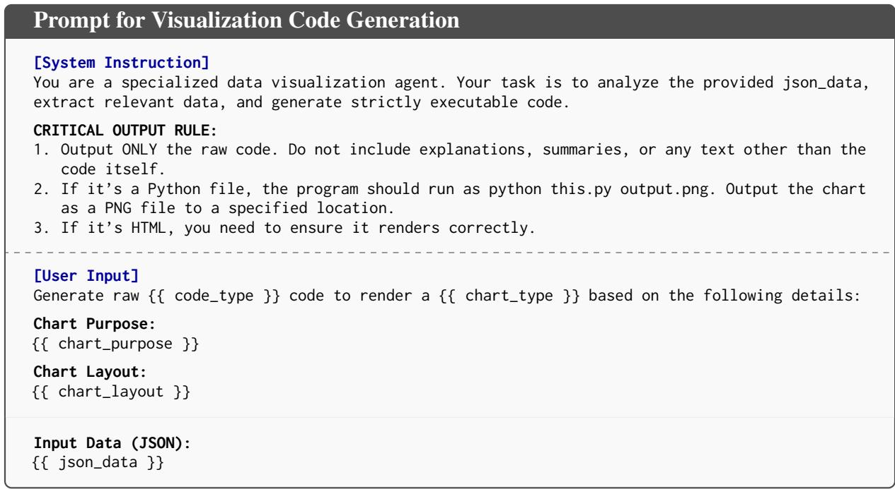  
Table 11: The prompt used for the Visualization Generation module. It takes the structured data (JSON) and layout constraints to produce the final rendering code.

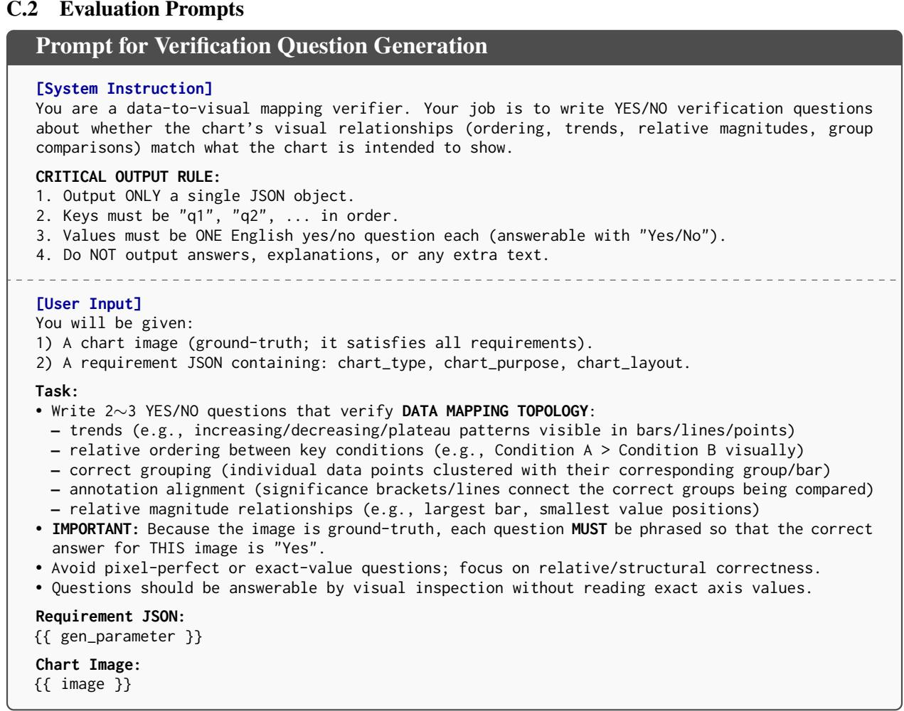  
Table 12: The prompt used to generate Ground Truth QA pairs. It instructs the model to create topology-focused verification questions based on a correct reference chart.

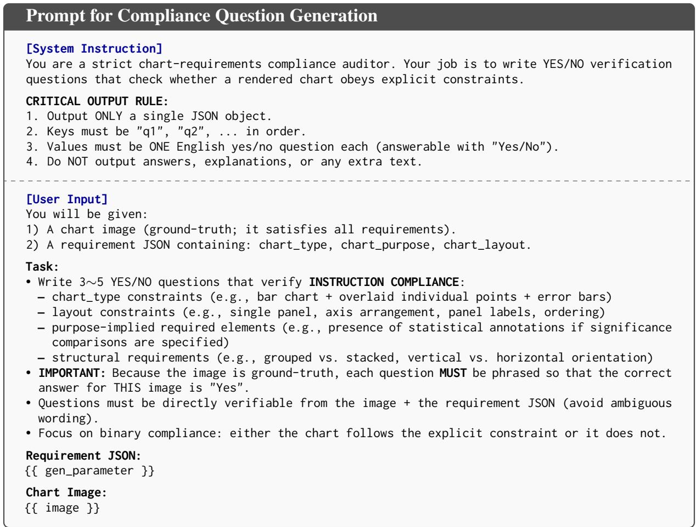  
Table 13: The prompt used to generate Compliance QA pairs. Unlike the topology prompt, this specifically verifies if the visualization strictly adheres to the user’s explicit design constraints.

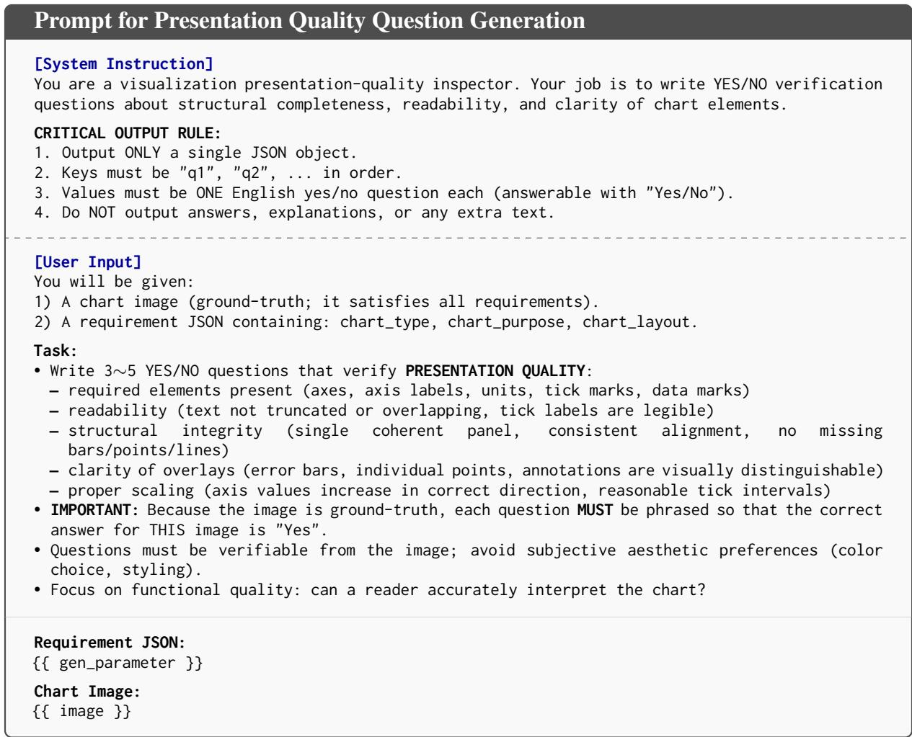  
Table 14: The prompt used to generate Presentation Quality QA pairs. This module focuses on verifying low-level visual correctness, such as element completeness, text legibility, and proper scaling, ensuring the chart is functional and readable.

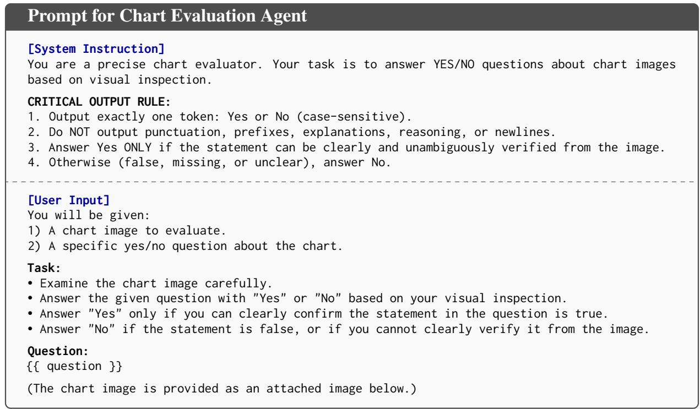  
Table 15: The prompt used for the Evaluation module. The Visual Language Model (VLM) receives the generated chart and a verification question to assess alignment.

## D Representative Instances

Appendix D shows representative benchmark instances across academic and finance settings. Each example illustrates the context scale, source data, derived data, and final rendered chart required by the ERV pipeline.

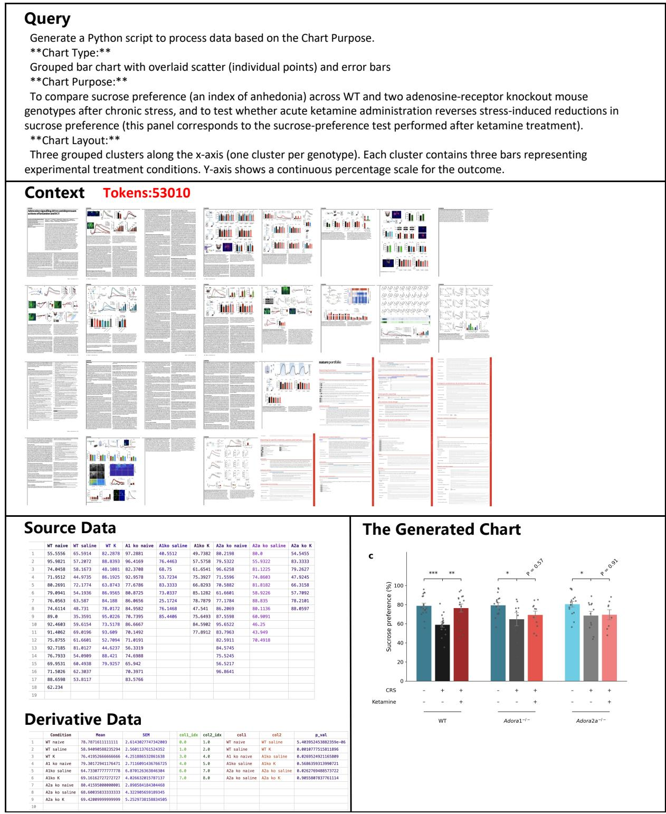

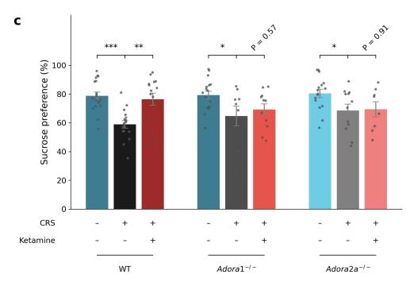  
Figure 4: This academic example requires statistical reasoning. The model interprets user intent, extracts raw data points, and infers the underlying statistics, specifically deriving the Mean, Standard Error of the Mean (SEM), and the P-value between conditions.

## Query

Generate a Python script to process data based on the Chart Purpose.

\*\*Chart Type:\*\*

Multiseries scatter plot

\*\*Chart Purpose:\*\*

To examine the relationship between representation of a cancer type in the pretraining dataset (percentage of slides) and downstream model performance (AUROC), showing individual model results by shape and cancer-type trends by color, and reporting correlations per cancer type.

\*\*Chart Layout:\*\*

Multiseries scatter plot (single Cartesian panel) showing individual model results as points with fitted linear trend lines per cancer type. Panel labeled 'c' in the corner.

## Context Tokens:63593

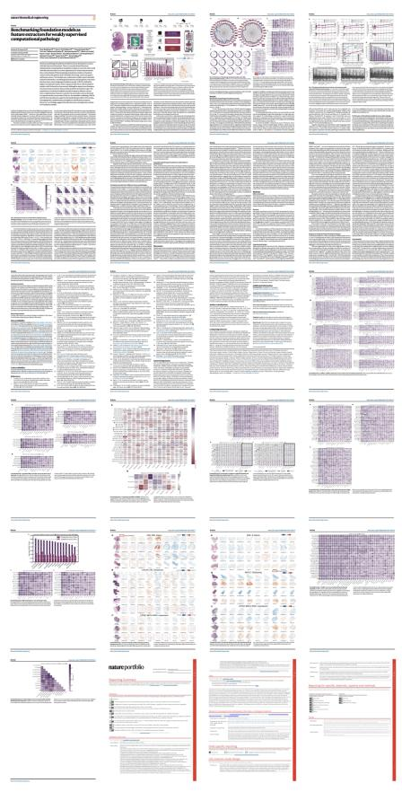

## Source Data

<table><tr><td></td><td>Cancer Type</td><td>Model</td><td>Percentage</td><td>Performance</td></tr><tr><td>1</td><td>LUNG</td><td>ctranspath</td><td>8.4</td><td>0.7101566922966756</td></tr><tr><td>2</td><td>BRCA</td><td>ctranspath</td><td>7.5</td><td>0.6901946923437127</td></tr><tr><td>3</td><td>STAD</td><td>ctranspath</td><td>3.4</td><td>0.6727500426566878</td></tr><tr><td>4</td><td>CRC</td><td>ctranspath</td><td>11.7</td><td>0.6402351975254987</td></tr><tr><td>5</td><td>LUNG</td><td>phikon</td><td>9.7</td><td>0.7886469364758765</td></tr><tr><td>6</td><td>BRCA</td><td>phikon</td><td>8.8</td><td>0.6333019990370683</td></tr><tr><td>7</td><td>STAD</td><td>phikon</td><td>4.0</td><td>0.6658650873334706</td></tr><tr><td>8</td><td>CRC</td><td>phikon</td><td>5.7</td><td>0.6335703165807269</td></tr><tr><td>9</td><td>LUNG</td><td>uni</td><td>9.8</td><td>0.7582049929810751</td></tr><tr><td>10</td><td>BRCA</td><td>uni</td><td>3.3</td><td>0.6884572772690907</td></tr><tr><td>11</td><td>STAD</td><td>uni</td><td>6.7</td><td>0.6769115022211536</td></tr><tr><td>12</td><td>CRC</td><td>uni</td><td>8.3</td><td>0.6585192894528652</td></tr><tr><td>13</td><td>LUNG</td><td>kaiko</td><td>9.7</td><td>0.7311053739265448</td></tr><tr><td>14</td><td>BRCA</td><td>kaiko</td><td>8.8</td><td>0.685518762408426</td></tr><tr><td>15</td><td>STAD</td><td>kaiko</td><td>4.0</td><td>0.6679383667204072</td></tr><tr><td>16</td><td>CRC</td><td>kaiko</td><td>5.7</td><td>0.609584221956904</td></tr><tr><td>17</td><td>LUNG</td><td>prov-gigapath</td><td>45.0</td><td>0.7578128341867243</td></tr><tr><td>18</td><td>BRCA</td><td>prov-gigapath</td><td>2.7</td><td>0.66703719221213</td></tr><tr><td>19</td><td>STAD</td><td>prov-gigapath</td><td>0.7</td><td>0.6867942247149665</td></tr><tr><td>20</td><td>CRC</td><td>prov-gigapath</td><td>30.0</td><td>0.6796362735454282</td></tr><tr><td>21</td><td>LUNG</td><td>virchow-class</td><td>6.1</td><td>0.7174955993098335</td></tr><tr><td>22</td><td>BRCA</td><td>virchow-class</td><td>25.0</td><td>0.6589119444462541</td></tr><tr><td>23</td><td>STAD</td><td>virchow-class</td><td>3.5</td><td>0.6845577051089727</td></tr><tr><td>24</td><td>CRC</td><td>virchow-class</td><td>3.2</td><td>0.6476261453717196</td></tr><tr><td>25</td><td>LUNG</td><td>virchow2-class</td><td>4.0</td><td>0.7453463548176368</td></tr><tr><td>26</td><td>BRCA</td><td>virchow2-class</td><td>19.0</td><td>0.7043400914608242</td></tr><tr><td>27</td><td>STAD</td><td>virchow2-class</td><td>3.0</td><td>0.7171710064688561</td></tr><tr><td>28</td><td>CRC</td><td>virchow2-class</td><td>6.0</td><td>0.6911429496854462</td></tr><tr><td>29</td><td>LUNG</td><td>panakeia</td><td>0.0</td><td>0.7136461434822977</td></tr><tr><td>30</td><td>BRCA</td><td>panakeia</td><td>82.0</td><td>0.7888816433172487</td></tr><tr><td>31</td><td></td><td></td><td>0.0</td><td>0.6830453013043695</td></tr><tr><td>32</td><td>STAD</td><td>panakeia</td><td></td><td>0.6616418630330357</td></tr><tr><td></td><td>CRC</td><td>panakeia</td><td>18.0</td><td></td></tr><tr><td>33</td><td></td><td></td><td></td><td></td></tr></table>

## Derivative Data

<table><tr><td></td><td>cancer_type</td><td>r</td><td>P</td></tr><tr><td>1</td><td>LUNG</td><td>0.548585053629297</td><td>0.15913917874978992</td></tr><tr><td>2</td><td>STAD</td><td>-0.2788407405224243</td><td>0.5036420596256193</td></tr><tr><td>3</td><td>BRCA</td><td>0.43959345798517785</td><td>0.27579154872184664</td></tr><tr><td>4</td><td>CRC</td><td>0.4472210806869125</td><td>0.2665607212308931</td></tr><tr><td>5</td><td></td><td></td><td></td></tr></table>

## The Generated Chart

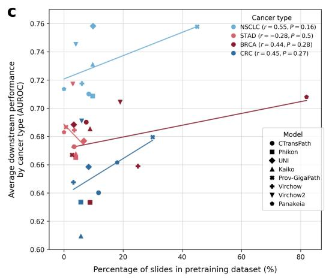  
Figure 5: This academic example involves analytical reasoning. The model extracts raw data points to deduce the parameters of each conditional regression line.

( Financial reports for the five years 2025, 2023, 2021, 2019, and 2017 are required in total. )

## Query

Generate a Python script to process data based on the Chart Purpose.

\*\*Chart Type:\*\*

Dual-Axis Combination Chart

\*\*Chart Purpose:\*\*

showing the change of amzn's (Cash Conversion Cycle, CCC) from 2016 to 2024. Ensure the data is accurate and reliable the chart design is clean. The unit uses millions of dollars.",

\*\*Chart Layout:\*\*

This layout utilizes a dual-axis design to superimpose grouped bars representing financial volumes (left axis) against lines with error bars for efficiency ratios (right axis), allowing for the simultaneous visualization of distinct metrics across a shared timeline.

## Context Tokens:458245

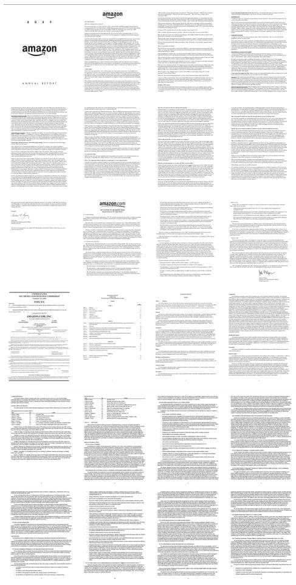

## Source Data

<table><tr><td rowspan=1 colspan=1></td><td rowspan=1 colspan=1>Fiscal Year</td><td rowspan=1 colspan=1>Avg Receivables</td><td rowspan=1 colspan=1>Revenue</td><td rowspan=1 colspan=1>Avg Inventory</td><td rowspan=1 colspan=1>Cost of Revenue</td><td rowspan=1 colspan=1>Avg Payables</td></tr><tr><td rowspan=1 colspan=1>1</td><td rowspan=1 colspan=1>2016</td><td rowspan=1 colspan=1>6996500000.0</td><td rowspan=1 colspan=1>135987000000</td><td rowspan=1 colspan=1>10852000000.0</td><td rowspan=1 colspan=1>121969000000</td><td rowspan=1 colspan=1>22853000000.0</td></tr><tr><td rowspan=1 colspan=1>2</td><td rowspan=1 colspan=1>2017</td><td rowspan=1 colspan=1>10751500000.0</td><td rowspan=1 colspan=1>177866000000</td><td rowspan=1 colspan=1>13754000000.0</td><td rowspan=1 colspan=1>111934000000</td><td rowspan=1 colspan=1>29962500000.0</td></tr><tr><td rowspan=1 colspan=1>3</td><td rowspan=1 colspan=1>2018</td><td rowspan=1 colspan=1>14920500000.0</td><td rowspan=1 colspan=1>232887000000</td><td rowspan=1 colspan=1>16610500000.0</td><td rowspan=1 colspan=1>139156000000</td><td rowspan=1 colspan=1>36404000000.0</td></tr><tr><td rowspan=1 colspan=1>4</td><td rowspan=1 colspan=1>2019</td><td rowspan=1 colspan=1>18746500000.0</td><td rowspan=1 colspan=1>280522000000</td><td rowspan=1 colspan=1>18835500000.0</td><td rowspan=1 colspan=1>165536000000</td><td rowspan=1 colspan=1>42687500000.0</td></tr><tr><td rowspan=1 colspan=1>5</td><td rowspan=1 colspan=1>2020</td><td rowspan=1 colspan=1>22679000000.0</td><td rowspan=1 colspan=1>386064000000</td><td rowspan=1 colspan=1>22146000000.0</td><td rowspan=1 colspan=1>233307000000</td><td rowspan=1 colspan=1>59861000000.0</td></tr><tr><td rowspan=1 colspan=1>6</td><td rowspan=1 colspan=1>2021</td><td rowspan=1 colspan=1>28716500000.0</td><td rowspan=1 colspan=1>469822000000</td><td rowspan=1 colspan=1>28217500000.0</td><td rowspan=1 colspan=1>272344000000</td><td rowspan=1 colspan=1>75601500000.0</td></tr><tr><td rowspan=1 colspan=1>7</td><td rowspan=1 colspan=1>2022</td><td rowspan=1 colspan=1>37625500000.0</td><td rowspan=1 colspan=1>513983000000</td><td rowspan=1 colspan=1>33522500000.0</td><td rowspan=1 colspan=1>288831000000</td><td rowspan=1 colspan=1>79132000000.0</td></tr><tr><td rowspan=1 colspan=1>8</td><td rowspan=1 colspan=1>2023</td><td rowspan=1 colspan=1>47306500000.0</td><td rowspan=1 colspan=1>574785000000</td><td rowspan=1 colspan=1>33861500000.0</td><td rowspan=1 colspan=1>304739000000</td><td rowspan=1 colspan=1>82290500000.0</td></tr><tr><td rowspan=1 colspan=1>9</td><td rowspan=1 colspan=1>2024</td><td rowspan=1 colspan=1>53852000000.0</td><td rowspan=1 colspan=1>637959000000</td><td rowspan=1 colspan=1>33766000000.0</td><td rowspan=1 colspan=1>326288000000</td><td rowspan=1 colspan=1>89672000000.0</td></tr><tr><td rowspan=1 colspan=1>10</td><td rowspan=1 colspan=1></td><td rowspan=1 colspan=1></td><td rowspan=1 colspan=1></td><td rowspan=1 colspan=1></td><td rowspan=1 colspan=1></td><td rowspan=1 colspan=1></td></tr></table>

## Derivative data

<table><tr><td rowspan=1 colspan=1></td><td rowspan=1 colspan=1>Fiscal Year</td><td rowspan=1 colspan=1>DS0</td><td rowspan=1 colspan=1>DIO</td><td rowspan=1 colspan=1>DPO</td><td rowspan=1 colspan=1>ccc</td></tr><tr><td rowspan=1 colspan=1>1</td><td rowspan=1 colspan=1>2016</td><td rowspan=1 colspan=1>18.77916639090501</td><td rowspan=1 colspan=1>32.47530110109946</td><td rowspan=1 colspan=1>68.38905787536177</td><td rowspan=1 colspan=1>-17.13</td></tr><tr><td rowspan=1 colspan=1>2</td><td rowspan=1 colspan=1>2017</td><td rowspan=1 colspan=1>22.06322456231096</td><td rowspan=1 colspan=1>44.849732878303286</td><td rowspan=1 colspan=1>97.70322243464898</td><td rowspan=1 colspan=1>-30.79</td></tr><tr><td rowspan=1 colspan=1>3</td><td rowspan=1 colspan=1>2018</td><td rowspan=1 colspan=1>23.38465650723312</td><td rowspan=1 colspan=1>43.568602862973925</td><td rowspan=1 colspan=1>95.48607318405244</td><td rowspan=1 colspan=1>-28.53</td></tr><tr><td rowspan=1 colspan=1>4</td><td rowspan=1 colspan=1>2019</td><td rowspan=1 colspan=1>24.39192826231098</td><td rowspan=1 colspan=1>41.53149465977189</td><td rowspan=1 colspan=1>94.12416332398992</td><td rowspan=1 colspan=1>-28.2</td></tr><tr><td rowspan=1 colspan=1>5</td><td rowspan=1 colspan=1>2020</td><td rowspan=1 colspan=1>21.44161330763811</td><td rowspan=1 colspan=1>34.646581542774115</td><td rowspan=1 colspan=1>93.650276245462</td><td rowspan=1 colspan=1>-37.56</td></tr><tr><td rowspan=1 colspan=1>6</td><td rowspan=1 colspan=1>2021</td><td rowspan=1 colspan=1>22.30956085496209</td><td rowspan=1 colspan=1>37.81756712099404</td><td rowspan=1 colspan=1>101.32239924507242</td><td rowspan=1 colspan=1>-41.19</td></tr><tr><td rowspan=1 colspan=1>7</td><td rowspan=1 colspan=1>2022</td><td rowspan=1 colspan=1>26.719380796641133</td><td rowspan=1 colspan=1>42.362878292150086</td><td rowspan=1 colspan=1>100.00027697857917</td><td rowspan=1 colspan=1>-30.91</td></tr><tr><td rowspan=1 colspan=1>8</td><td rowspan=1 colspan=1>2023</td><td rowspan=1 colspan=1>30.040576041476378</td><td rowspan=1 colspan=1>40.55748525787641</td><td rowspan=1 colspan=1>98.56313927656126</td><td rowspan=1 colspan=1>-27.96</td></tr><tr><td rowspan=1 colspan=1>9</td><td rowspan=1 colspan=1>2024</td><td rowspan=1 colspan=1>30.810726081143144</td><td rowspan=1 colspan=1>37.772121561320056</td><td rowspan=1 colspan=1>100.31101358309223</td><td rowspan=1 colspan=1>-31.72</td></tr><tr><td rowspan=1 colspan=1>10</td><td rowspan=1 colspan=1></td><td rowspan=1 colspan=1></td><td rowspan=1 colspan=1></td><td rowspan=1 colspan=1></td><td rowspan=1 colspan=1></td></tr></table>

## The Generated Chart

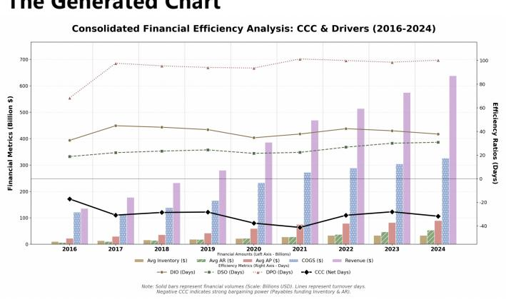  
Figure 6: This Finance example demonstrates complex sequential reasoning based on year-end reports (2017 2019 2021 2023 2025). The model extracts base data and executes a multi-hop inference chain: first deriving annual averages, then inferring intermediate metrics (DIO, DSO, DPO), and finally deducing the Cash Conversion Cycle (CCC).

## E Failure Case Studies

Appendix E provides qualitative failure cases corresponding to the three main failure modes observed in our experiments: incomplete reasoning, temporal coverage mismatch, and incorrect entity selection.

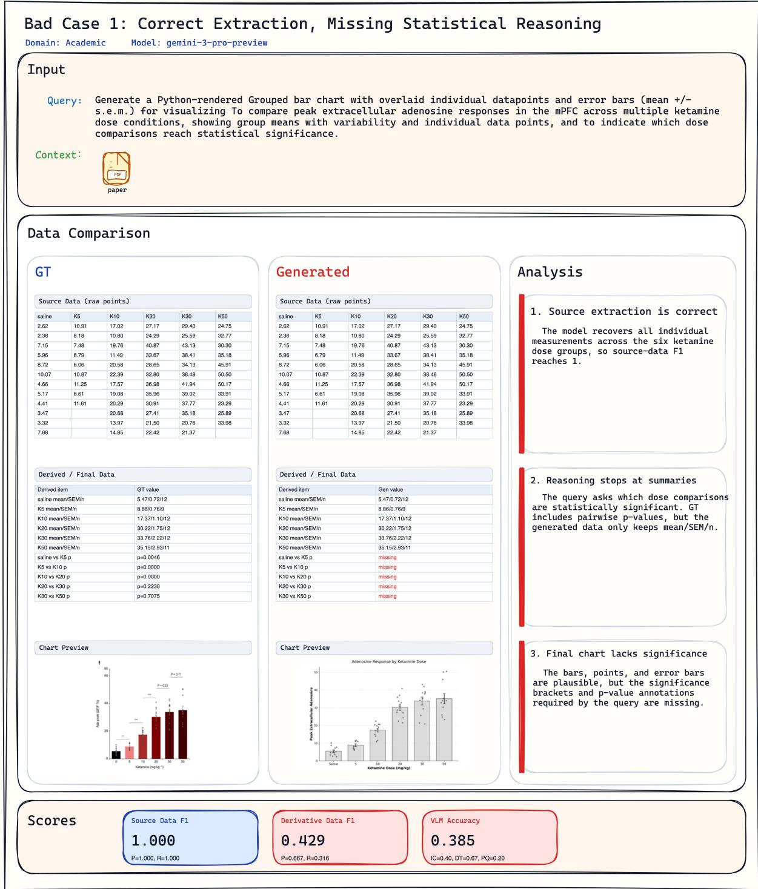  
Figure 7: Academic bad case: correct extraction but incomplete statistical reasoning.

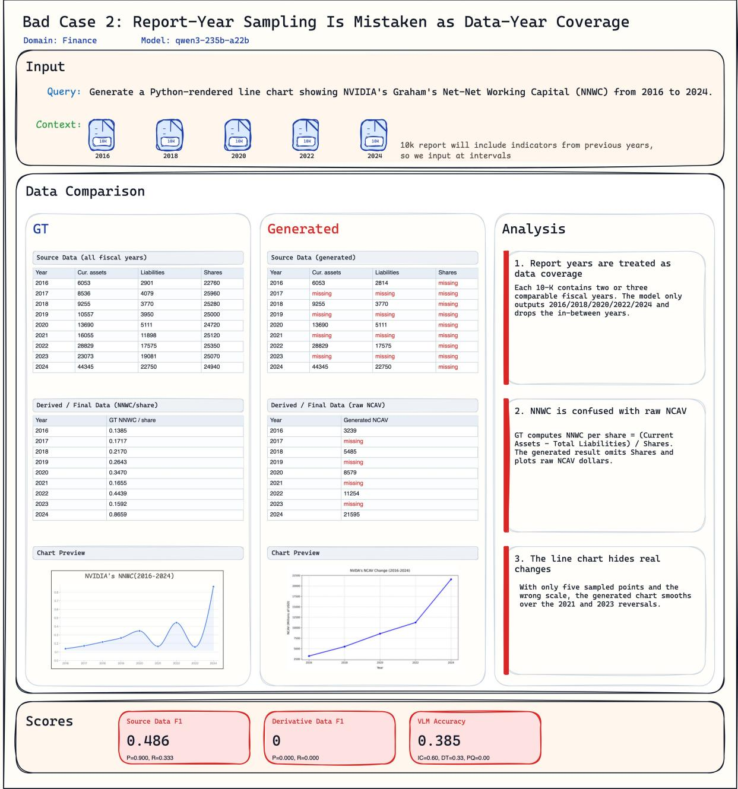  
Figure 8: Finance bad case: report-year sampling is mistaken as data-year coverage.

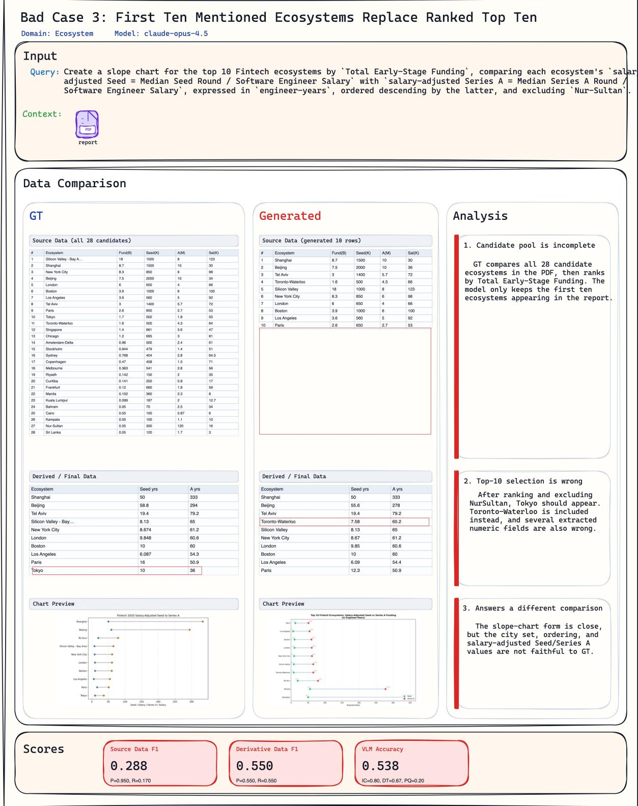  
Figure 9: Ecosystem bad case: first-mentioned entities replace the requested ranked top entities.