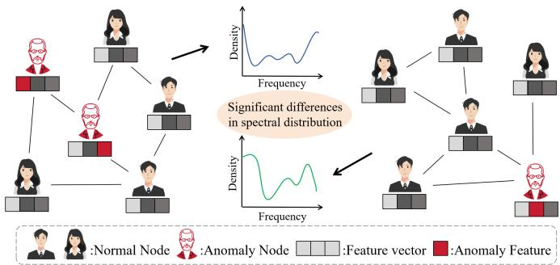
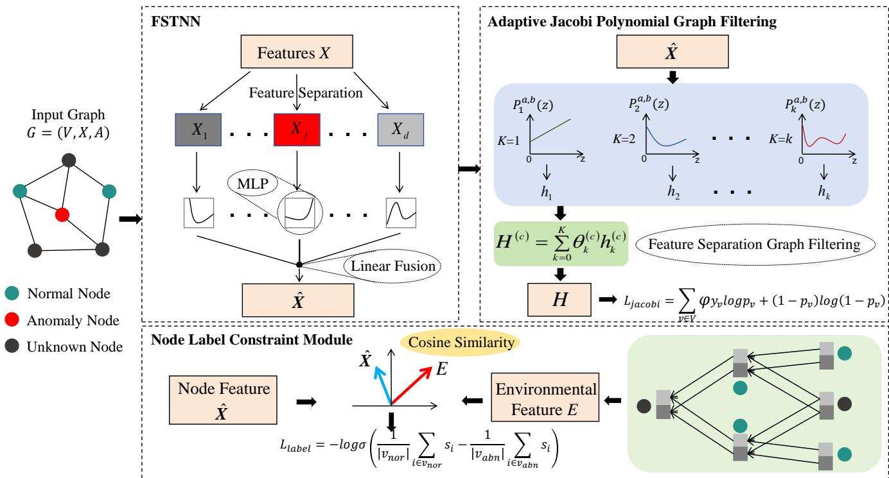
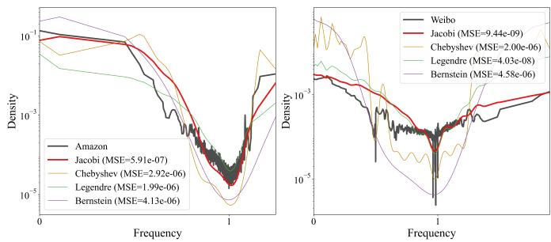
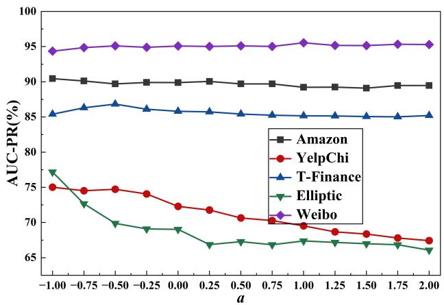
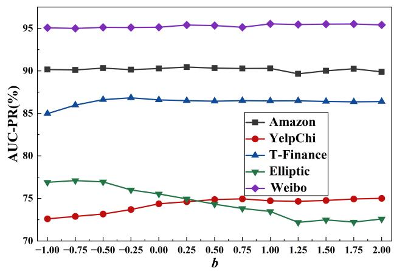
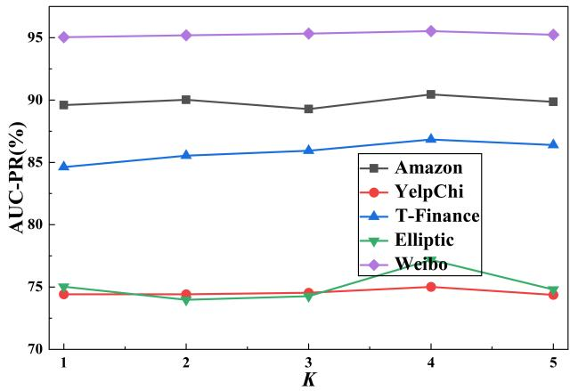
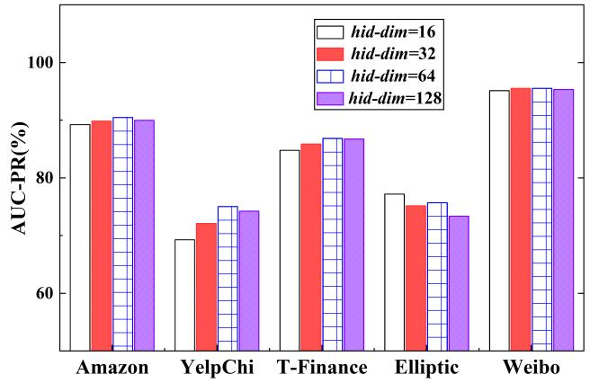
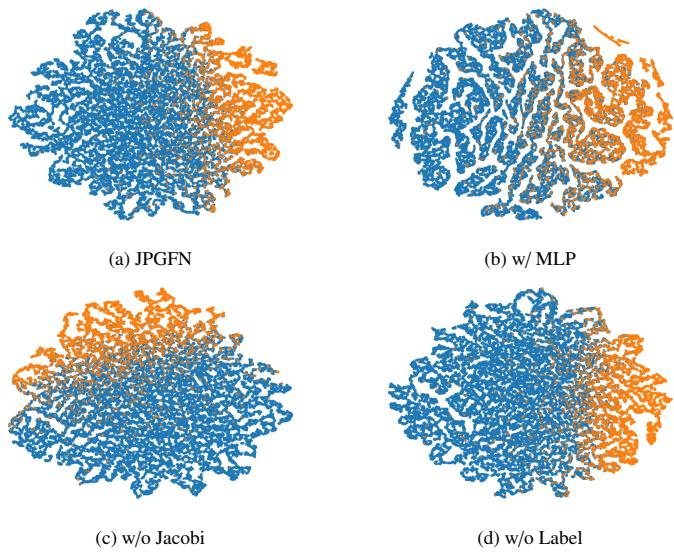

# Feature Transformation Enhanced Jacobi Polynomial Graph Filtering for Graph Anomaly Detection

Xiang Wangb, Zhijun Chenga, Zhenyu Menga,∗

aInstitute of Artificial Intelligence, Fujian University of Technology, Fuzhou, China bSchool of Artificial Intelligence and Transportation Engineering, Fujian University of Technology, Fuzhou, China

## Abstract

In recent years, graph anomaly detection (GAD) based on frequency-domain filtering have achieved promising results. However, existing approaches still face three major challenges: First, they use static basic function to constructed graph filter which can-2 not efectively adapt to the frequency-domain distribution of graph data. Second, they fail to adequately consider the importance0 information of each attribute in the node feature vector, leading to the loss of fine-grained information. Third, they insuficiently2 utilize node labels for GAD. To address these issues, this paper proposes a novel graph anomaly detection method called JPGFNg (Feature Transformation Enhanced Jacobi Polynomial Graph Filtering Network). First, a Feature Separation Transformation Netu work (FSTNN) is developed to better learn fine-grained node features by feature separation and applying nonlinear transformationsA to node features across diferent dimensions. Second, an adaptive Jacobi polynomial graph filtering module is constructed based on Jacobi polynomials to adaptively capture complex frequency-domain features of graph signals. Finally, a node label constraint2 module is developed to facilitate the use of node labels and enhance the performance of GAD. Experimental results on multiple real-world datasets demonstrate that the proposed method significantly outperforms mainstream approaches.

Keywords: Graph anomaly detection, graph neural networks, frequency domain distribution, feature separation transformation,A Jacobi polynomials

## 1. Introduction

4 With the rapid development of the digital society, graph data has found widespread application across multiple fields. For example, in social networks, graph data can be used to analyze the   
complex interactions between diferent users [1]. In the finan-2 cial sector, graph data can efectively represent user transactions. and capital flows [2]. And in bioinformatics, protein interaction   
networks and regulatory relationships between genes can all be6   
represented using graph data [3]. In these applications, the oc-2 currence of various anomalous events has given rise to the critical task of graph anomaly detection, such as fake accounts in social networks, fraudulent activities in financial transactions, and protein abnormalities in biological networks. These phenomena may pose potential risks to users or living organisms, making it imperative to design efective graph anomaly detection methods to identify such events [4].

To detect anomalous events and objects, conventional deep learning approaches typically express objects as attribute vectors and subsequently perform anomaly detection in the feature space [5, 6]. However, these methods often fail to account for the complex interactive relationships between diferent entities, resulting in poor detection performance [7]. With the rapid development of graph neural networks, anomaly detection methods based on graph neural networks have made significant progress [8]. Compared to traditional methods, the effectiveness of graph neural networks lies in their feature aggregation mechanism, which can efectively capture both node features and topological information, thereby more efectively identifying anomalous nodes in complex networks [9–11]. The powerful graph representation learning capabilities enabled by this mechanism allow graph neural networks to demonstrate superior performance over traditional deep learning methods in graph anomaly detection tasks, making them the mainstream approach in this field today [12].

Current mainstream GAD methods based on graph neural networks are primarily classified into two categories: spatialdomain and frequency-domain approaches [12]. The former method mainly rely on message passing mechanisms to learn graph features by iteratively aggregating neighborhood information [13–15]. Although these methods are efective at learning the features and structural information of graph data, they neglect the learning of frequency-domain features in graph signals, resulting in poor performance in detecting anomalous nodes [16]. In contrast, spectral domain-based meth ods, which can capture complex frequency domain information, often demonstrate superior detection performance [17]. These methods primarily employ polynomial approximation strategies to design graph filters capable of efectively learning frequency-domain features. Mainstream approaches include CHRN [18], SEC-GFD [19] and DSGAD [20] etc.

However, spectral domain-based methods still have limitations. First, these methods employ static graph filters, which are unable to efectively adapt to complex spectral distributions of real-world graph data. For example, Figure 1 shows two graphs containing anomalous nodes and their corresponding spectral distributions, revealing significant diferences in spectral distributions across diferent graphs. Existing spectral domain-based methods employ static basis function to construct graph filters for GAD, lacking flexibility and making it dificult to fully capture frequency-domain information. Second,existing methods do not suficiently consider the varying importance of diferent node features in GAD tasks. In Figure 1, node features are represented as vectors where features of diferent dimension have varying important in GAD tasks. Taking the real-world Elliptic dataset, a Bitcoin transaction network where nodes represent users as an example, node features include transaction frequency, age, and address etc. Anomalous nodes typically exhibit multiple consecutive transactions within a short timeframe, strongly correlating with “transaction frequency” while showing weaker associations with features like “age” or “address”. Existing methods often neglect the impact of such factor, leading to the loss of fine-grained node features. Third, these methods often fail to efectively utilize node labels, which can provide additional information for GAD.

  
Figure 1: Graph data and its corresponding frequency domain distribution.

Therefore, this paper proposes a GAD method, namely JPGFN (Feature Transformation Enhanced Jacobi Polynomial Graph Filtering Network). JPGFN primarily consists of FSTNN, adaptive Jacobi polynomial graph filtering module, and node label constraint module. The FSTNN module uses feature separation and nonlinear transformation strategy to learn fine-grained features. The adaptive Jacobi polynomial graph filtering module conducts graph filtering based on parameterized Jacobi basis, enabling flexible adaptation to the frequency domain distribution of graph data and thus extracting richer information. The node label constraint module enhances the model’s anomaly detection performance by comparing the consistency between the representations of a central node and its surrounding nodes. The primary highlights of this paper are summarized as follows:

• To better learn fine-grained features, a Feature Separation Transformation Network (FSTNN) is developed.

• To more efectively learn complex frequency domain information of graph signals, an adaptive graph filtering module based on Jacobi polynomial is designed.

• A node label constraint module is constructed to suficiently use node labels for GAD.

• Experimental results across multiple real-world datasets demonstrate that the proposed method significantly outperforms mainstream approaches.

## 2. Related Work

## 2.1. Graph Neural Networks

The rapid development of graph neural networks (GNNs) has addressed the challenge faced by traditional deep learning methods in efectively modeling the complex interactions between diferent entities. Current GNNs approaches have realized significant outcomes in various tasks, including node classification [21, 22] and graph classification [23, 24]. Among these, GCN [9] stand as a representative approach, learning node representations by aggregating first-order neighbor features. Subsequently, numerous variants emerged based on the message-passing paradigm, including GraphSAGE [25], GAT [10], GIN [26], and PMP [27]. Concurrently, some researchers perform graph data analysis from the perspective of spectral domain filtering, leading to methods such as ChebyNet [28], SEA-GWNN [29], NFGNN [30] and AGFNN [31].

Although existing GNNs methods have achieved remarkable performance across a wide range of graph data mining tasks, their efectiveness generally relies on the assumption that neighboring nodes exhibit similar class labels and features. However, this assumption often does not hold in the context of graph anomaly detection, as anomalous nodes tend to interact with normal nodes rather than with nodes sharing similar characteristics. Therefore, directly applying general-purpose GNNs to graph anomaly detection tasks often yields suboptimal performance. It is necessary to develop dedicated graph anomaly detection methods to enhance the efectiveness and accuracy of anomaly detection.

## 2.2. Graph Anomaly Detection

Recently, GNNs-based methods for GAD have gained widespread attention. They are typically classified into two categories: spatial-domain and frequency-domain approaches.

The GAD approaches based on spatial-domain obtain node embeddings through iterative aggregation of information from neighboring nodes. For example, PC-GNN addresses the problem of category imbalance by designing subgraph sampling and neighbor sampling strategies [32]. GFCN [14] introduces skip connections to captures long-range node features. DiG-In-GNN [33] incorporates a feature guidance module and a neighbor selection module to address feature inconsistency and structural inconsistency issues. CIE-GAD [34] employs hypergraph transformation to uncover association patterns among nodes. HEAug [35] overcomes the issue of high-category homophily variance (CHV) where benign nodes are highly homophilic, but anomalies are not—by generating low-CHV links while using original edges as an auxiliary. Although these methods leverage node attribute information and structures to efectively identify anomalies, they cannot learn the frequency-domain information of graph data.

The spectral-domain methods use graph filtering operations to extract frequency-domain information from graph data. For example, BWGNN [36] introduces wavelet function family to construct filters that addresses the spectral “right shift” phenomenon caused by anomalous nodes. SEC-GFD [19] proposes a hybrid filtering module based on Beta wavelet functions to address heterophily issues. AHFAN [11] designed a graph filtering module based on Chebyshev polynomials and a node representation module based on attention mechanisms to addressing category inconsistency and semantic inconsistency issues, respectively. DSGAD [20] addresses the issue of incomplete capture of anomalous information by traditional wavelet filters through the design of dynamic wavelet filters and dynamic fusion mechanism. EGNN [37] develops a graph learning model based on energy-aware mechanism which can learn spectral characteristics via energy-driven feature aggregation. McGAD [38] employs two types of augmentation method based on structural consistency and learnable unsupervised consistency for GAD. Although these methods achieve satisfactory performance in GAD, they all employ static graph filters that struggle to adapt to the complex frequency-domain distributions of graph data. Furthermore, these approaches do not suficiently consider the influence of diferent node features on anomaly detection. Additionally, they do not suficiently leverage node label information.

## 3. Preliminaries

## 3.1. Notations and Problem Definition

An attributed graph is represented as $G = ( V , X , A )$ , where $\mathcal { V } = \{ \nu _ { 1 } , \nu _ { 2 } , . . . , \nu _ { n } \}$ denotes the set of nodes, N denotes the number of nodes. $X \in \ R ^ { N \times d }$ denotes the feature matrix for graph nodes. d is the feature dimension. $A \in R ^ { N \times N }$ indicates the adjacency matrix for attributed graph. $A _ { i , j } = 1$ indicates that there is an edge connecting nodes vi to node $\nu _ { j }$ , otherwise, $A _ { i , j } = 0 .$

For a given attributed graph G , every node is associated with a corresponding label $y = \{ 0 , 1 \}$ . Label 0 denotes normal nodes, while Label 1 indicates abnormal nodes, with significant differences observed between the features of these two node categories. This study focuses on semi-supervised anomaly detection on attributed graphs, specifically training a classifier to determine node abnormality given partial node labels.

## 3.2. Graph Filtering

Given a graph, its normalized Laplacian matrix is denoted as $L = I - D ^ { - 1 / 2 } \bar { A } D ^ { - 1 / 2 }$ , D is degree matrix of A and I is identity matrix. The matrix L undergoes an eigenvalue decomposition to yield ${ \cal { L } } = { \cal { U } } ^ { T } { \cal { A } } { \cal { U } } ^ { T }$ , where $\boldsymbol { \Lambda } = d i a g \left( [ \lambda _ { 1 } , . . . , \lambda _ { N } ] \right)$ is the diagonal matrix composed of eigenvalues, and $U = [ u _ { 1 } , . . . , u _ { N } ]$ is the orthogonal matrix formed by the corresponding eigenvectors. Let $U ^ { T } X$ and UX denote the Fourier transform of signal X and its inverse transform, respectively. Graph filtering operations are defined by the graph filter $g \left( \varLambda \right)$ . Graph filtering of signal X is written as $U g \left( A \right) U ^ { T } X ,$ , where $g \left( \varLambda \right) =$ $d i a g \left( g \left( \lambda _ { 1 } \right) , g \left( \lambda _ { 2 } \right) . . . , g \left( \lambda _ { N } \right) \right)$ . To avoid the high computational cost associated with eigenvalue decomposition, the filter function $g \left( \cdot \right)$ is typically set as a polynomial with K-order, $g \left( \varLambda \right) =$ $\textstyle \sum _ { k = 0 } ^ { K } \theta _ { k } \boldsymbol { A } ^ { k }$ , thereby simplifying the filtering operation to the following:

$$
g \left( \Lambda \right) X = U \left( \sum _ { k = 0 } ^ { K } \theta _ { k } \Lambda ^ { k } \right) U ^ { T } X = \sum _ { k = 0 } ^ { K } \theta _ { k } L ^ { k } X\tag{1}
$$

## 4. Methodology

This section details the implementation of JPGFN which consists of three modules: Feature Separation Transformation Network (FSTNN), Adaptive Jacobi Polynomial Graph Filtering module, and Node Label Constraint Module. The model diagram is shown in Figure 2.

## 4.1. FSTNN

Given that diferent node features impact anomaly detection diferently, existing methods typically treat all features as equally important when feeding them into graph filters for frequency-domain information learning. This approach fails to efectively leverage node features for anomaly detection, thereby limiting the model’s performance. To address this, nonlinear transformations must be applied to diferent node features prior to graph filtering to better learn fine-grained feature rep resentations. For node $\nu _ { i } ,$ the transformation is as follows:

$$
X _ { i , j } ^ { l + 1 } = \phi _ { j } \left( X _ { i , j } ^ { l } \right)\tag{2}
$$

where, $X _ { i , j } ^ { l + 1 }$ is the transformed output of the j-th attribute for node $\nu _ { i }$ at layer $l + 1 , \phi _ { j } ( )$ denotes the transformation operation for the j-th attribute.

Through feature separation transformation, the model can adaptively learn how diferent features influence anomaly detection, thereby better capturing fine-grained information. To enhance nonlinear transformation capabilities, the Universal Approximation Theorem establishes that a two-layer Multi-Layer Perceptron (MLP) can represents any function [39]. Therefore, an MLP is employed as the nonlinear transformation function to process node features. Specifically:

$$
\phi _ { j } \left( X _ { i , j } ^ { l } \right) = \mathrm { M L P } \left( X _ { i , j } ^ { l } \right)\tag{3}
$$

Through feature separation transformation and learning process, the model can better extract anomaly-related feature information. After transformation, the j-th feature of node $\nu _ { i }$ is represented as $h _ { i , j }$ . All transformed features of diferent dimensions are concatenated:

$$
h _ { i } = c o n c a t \left[ h _ { i , 1 } ; h _ { i , 2 } ; . . . ; h _ { i , d } \right]\tag{4}
$$

here concat () denotes concatenation, which fuses features across all dimensions through concatenation operations.After feature concatenation, the feature matrix of the entire graph data is h. Building upon this, a linear transformation is applied to further capture the semantic information of node features, yielding new node representations:

  
Figure 2: Architecture diagram of JPGFN model.

$$
{ \hat { X } } = W h + b _ { h }\tag{5}
$$

Here, W and $b _ { h }$ denote learnable matrix and bias term, respectively.

Through transformation and learning, this approach provides more discriminative node embeddings for subsequent graph filtering, enabling the model to better capture underlying anomaly patterns.

## 4.2. Adaptive Jacobi Polynomial Graph Filtering

For real-world graphs, their frequency domain distributions vary significantly. Existing spectral domain methods employ static basis functions for graph filtering, such as Chebyshev polynomials and Bernstein polynomials, which sufer from insuficient flexibility and struggle to adaptively learn diferent frequency distributions. Figure 3 illustrates the frequency domain distribution fitting results for diferent datasets using graph filters constructed with diferent polynomials. The MSE metric represents the mean squared error relative to the true graph data distribution. It is evident that the frequency domain curve learned by the Jacobi polynomial more close to the ground truth, with MSE significantly lower than that of other polynomial graph filters. This demonstrates that the Jacobi polynomial possesses superior frequency domain information learning capabilities. Therefore, this paper introduces graph filters constructed using the Jacobi polynomial basis, enabling flexible capture of frequency domain features for diferent graphs and more efective exploration of anomaly patterns in the frequency domain.

## 4.2.1. Jacobi Polynomial Basis Functions

The Jacobi polynomials are orthonormal polynomial family defined on [-1, 1] with weight function $( 1 - \lambda ) ^ { a } \left( 1 + \lambda \right) ^ { b }$ , expressed as (k ≥ 2):

$$
P _ { k } ^ { a , b } \left( x \right) = \left( \alpha _ { k } x + \beta _ { k } \right) P _ { k - 1 } ^ { a , b } \left( x \right) - \gamma _ { k } P _ { k - 2 } ^ { a , b } \left( x \right)\tag{6}
$$

And when k equal to 0 and 1, the Jacobi polynomials is:

$$
\begin{array} { l } { { \displaystyle P _ { 0 } ^ { a , b } \left( x \right) = 1 } } \\ { { \displaystyle P _ { 1 } ^ { a , b } \left( x \right) = \frac { a - b } { 2 } + \frac { a + b + 2 } { 2 } x } } \end{array}\tag{7}
$$

where

$$
\begin{array} { l } { \displaystyle \alpha _ { k } = \frac { \left( 2 k + a + b \right) \left( 2 k + a + b - 1 \right) } { 2 k \left( k + a + b \right) } } \\ { \displaystyle \beta _ { k } = \frac { \left( 2 k + a + b - 1 \right) \left( a ^ { 2 } - b ^ { 2 } \right) } { 2 k \left( k + a + b \right) \left( 2 k + a + b - 2 \right) } } \\ { \displaystyle \gamma _ { k } = \frac { \left( k + a - 1 \right) \left( k + b - 1 \right) \left( 2 k + a + b \right) } { k \left( k + a + b \right) \left( 2 k + a + b - 2 \right) } } \end{array}\tag{8}
$$

here, the range of values for a and b is $a , b > - 1$ . In fact, Jacobi polynomial is a more general class of polynomial family. This is due to the fact that by adjusting the parameters a and $^ { b , }$ Jacobi polynomial can degenerate into other polynomial families, such as Chebyshev polynomial, Legendre polynomial, and so on. Therefore, Compared to static basis functions, using Jacobi polynomials to construct graph filters ofers greater flexibility, facilitating the capture of diverse frequency-domain information for diferent datasets. Exploiting the flexibility of Jacobi polynomials, we treat the parameters a and b as learnable variables, allowing the model to adaptively learn the complex spectral distributions of diverse graph datasets and thereby enhance its capability to model frequency-domain patterns.

  
Figure 3: Signal density functions of diferent datasets and frequency-domain fitting results for diferent polynomial basis functions.

## 4.2.2. Graph Filter Construction

Graph filters constructed based on Jacobi polynomials can capture frequency-domain information of various complex graph data. The graph filter constructed based on Jacobi polynomials is:

$$
g _ { k } \left( \varLambda \right) = \theta _ { k } P _ { k } ^ { a , b } \left( 1 - \varLambda \right)\tag{9}
$$

here, $\boldsymbol { \Lambda } = d i a g \left( [ \lambda _ { 1 } , . . . , \lambda _ { N } ] \right)$ is the diagonal matrix formed by the eigenvalues of the Laplacian matrix $A , \theta _ { k }$ represents the learnable polynomial coeficients, and k denotes the order of the graph filter. Since the Jacobi polynomials are defined on [-1, 1], the function $g _ { k } \left( \varLambda \right)$ is defined on [0, 2] and can be used to capture the frequency-domain characteristics of diferent frequency bands in the graph signal.

The node features across diferent dimensions of actual graph data carry distinct meanings and exhibit varying distributions in the frequency domain. To better capture the frequency-domain information of features across diferent dimensions, graph filtering is performed separately for each feature of diferent dimensions.

$$
h _ { k } ^ { ( c ) } = P _ { k } ^ { a , b } \left( 1 - \varLambda \right) \hat { X } ^ { ( c ) }\tag{10}
$$

where $c$ denotes the feature dimension, ${ \hat { X } } ^ { ( c ) }$ represents the $c \mathrm { - }$ th feature output from the FSTNN module, and $h _ { k } ^ { ( c ) } \in R ^ { N \times 1 }$ is the output after graph filtering. To comprehensively capture the diverse frequency-domain information, after performing $K \cdot$ order graph filtering, the features across K frequency bands are fused via learnable parameters:

$$
H ^ { ( c ) } = \sum _ { k = 0 } ^ { K } \theta _ { k } ^ { ( c ) } h _ { k } ^ { ( c ) }\tag{11}
$$

where, $\theta _ { k } ^ { \left( c \right) }$ is learnable parameter for the $c \cdot$ -th feature. After applying graph filtering to each feature, the final node representation $H \in R ^ { N \times d }$ is obtained, which can be used for subsequent

graph anomaly detection. To mitigate the class imbalance problem, this module employs a weighted cross-entropy loss function for training:

$$
\begin{array} { r } { L _ { j a c o b i } = - \sum _ { \nu \in V } \left[ \varphi y _ { \nu } \mathrm { l o g } p _ { \nu } + ( 1 - y _ { \nu } ) \log \left( 1 - p _ { \nu } \right) \right] } \end{array}\tag{12}
$$

here, φ is equal to the ratio of the number of anomalous nodes to the number of normal nodes in the training dataset, and $p _ { \nu }$ denotes the model’s predicted probability.

## 4.3. Node Label Constraint Module

To improve node label utilization, this paper introduces a node label constraint module to assist model training. First, FSTNN obtains a more refined node representation Xˆ by feature transformation. Based on this, it calculates the representation consistency between a central node and its local environment. This is because anomalous nodes typically exhibit greater inconsistency with the features of their surrounding nodes, whereas normal nodes, conversely, tend to show higher consistency. Therefore, the consistency between a node and its neighboring nodes can be used as a criterion to identify anomalous nodes. Therefore, we designed a dimension-wise aggregating network to calculate consistency score for each node:

$$
E _ { c } ^ { l } = \mathbf { G C N } _ { c } \left( E _ { c } ^ { l - 1 } \right)\tag{13}
$$

where, $E _ { c } ^ { l }$ represents the representation of graph node after aggregating the l-hop neighborhood information for its c-th feature. And the initial input $E _ { c } ^ { 0 }$ is Xˆ . $\mathrm { G C N } _ { c } ( )$ is aggregating method from [9] to learn surrounding features. After computing all the features of diferent dimensions, the local environment node representation E is obtained.

Then, we can compute the consistency score between the central node and its surrounding environment using cosine similarity:

$$
s _ { i } = c o s \left( \hat { X } _ { i } , E _ { i } \right) = \frac { \hat { X } _ { i } \cdot E _ { i } } { \left\| \hat { X } _ { i } \right\| \left\| E _ { i } \right\| }\tag{14}
$$

where $\hat { X } _ { i }$ and $E _ { i }$ denote the representation and environment representation for node $\nu _ { i } .$ respectively. cos() is cosine similarity function. Generally, normal node behavior patterns exhibit high consistency with their local environments, while anomalous nodes often show significant deviations from their neighborhood environments. Therefore, by designing a contrastive constraint loss, we widen the gap in latent node embeddings between normal and anomalous nodes, thereby helping the model more efectively distinguish anomalies. The loss function is formulated as follows:

$$
L _ { l a b e l } = - \log \sigma \Bigg ( \frac { 1 } { | \nu _ { n o r } | } \sum _ { i \in \nu _ { n o r } } s _ { i } - \frac { 1 } { | \nu _ { a b n } | } \sum _ { i \in \nu _ { a b n } } s _ { i } \Bigg )\tag{15}
$$

where, $\nu _ { n o r }$ and $\nu _ { a b n }$ represent the index sets for normal samples and anomalous samples, respectively. $\sigma \left( \cdot \right)$ denotes the Sigmoid function.

Table 1: Statistical information of five datasets.
<table><tr><td>Dataset</td><td>Nodes</td><td>Edges</td><td>Anomaly(%)</td><td>Features</td></tr><tr><td>Amazon</td><td>11,944</td><td>4,398,392</td><td>6.87</td><td>25</td></tr><tr><td>YelpChi</td><td>45,954</td><td>3,846,979</td><td>14.53</td><td>32</td></tr><tr><td>T-Finance</td><td>39,357</td><td>21,222,543</td><td>4.58</td><td>10</td></tr><tr><td>Elliptic</td><td>46,564</td><td>73,248</td><td>9.76</td><td>93</td></tr><tr><td>Weibo</td><td>8,405</td><td>407,963</td><td>10.33</td><td>400</td></tr></table>

## 4.4. Graph Anomaly Detection

Through the learning of the FSTNN and adaptive Jacobi polynomial graph filtering, its output H contains rich frequency-domain information that can be utilized for graph anomaly detection. During anomaly detection, the output H is first passed through MLP and then normalized using the softmax function to obtain the predicted probability distribution $P \in R ^ { N \times 2 }$

$$
P = s o f t m a x \left( \mathbf { M L P } \left( H \right) \right)\tag{16}
$$

During model training, the model is optimized using a weighted combination of the two loss functions:

$$
L = L _ { j a c o b i } + \mu L _ { l a b e l }\tag{17}
$$

where $\mu$ serves as the balance weight.

## 5. Experiments

In this section, we perform experiments on five datasets and compare our model’s results with those of mainstream approaches to demonstrate the efectiveness of JPGFN.

## 5.1. Datasets

We conduct experiments on five real-world datasets for graph anomaly detection to validate the efectiveness of the proposed method. Detailed information about the datasets is shown in Table 1. Among them, Amazon [40] aims to identify fraudulent reviews on e-commerce platforms. YelpChi [41] targets the detection of fraudulent reviews on service platforms. Both T-Finance [36] and Elliptic [42] are utilized to detect fraudulent behaviors in financial transaction networks. The Weibo dataset collected from social platforms [43] is used to identify abnormal users in social network.

## 5.2. Experimental Metrics

The performance of the proposed method is evaluated using two widely adopted metrics: AUC-ROC and AUC-PR.

AUC-ROC: This metric quantifies classification performance using the area under the ROC curve. The ROC curve illustrates how the true positive rate (TPR) changes as the false positive rate (FPR) varies. The closer the metric is to 1, the better the model’s classification performance.

AUC-PR: This metric evaluates a model’s classification performance by computing the area under the precision–recall (PR) curve, which characterizes the relationship between precision and recall across diferent decision thresholds. Furthermore, due to the significant imbalance between positive and negative samples in graph anomaly detection tasks, AUC-PR better reflects a model’s performance in detecting rare anomaly samples than AUC-ROC; the closer the value is to 1, the better the detection performance.

## 5.3. Baseline Methods

The comparison methods are divided into three categories. The first category consists of common GNNs methods, including GCN [9], GAT [10], GraphSAGE [25], and GIN [26]. The second category consists of approaches based on spatialdomain methods, including GAS [44], PC-GNN [32], GDN [13], and GFCN [14]. The third category consists of spectraldomain methods, including BWGNN [36], AMNet [45], SEC-GFD [19], AHFAN [11], EGNN [37] and DSGAD [20].

1) GCN: A traditional GNNs method. This model classifies nodes by aggregating information from first-order neighbors.

2) GAT: A traditional GNNs approach. By incorporating an attention mechanism, this model assigns diferent weights to diferent nodes when aggregating information from neighboring nodes.

3) GraphSAGE: A traditional GNNs method. This model generates new node embeddings for classification by sampling nodes from local neighborhoods and aggregating their features.

4) GIN: A traditional GNNs method. This model learns node representations through summation-based aggregation and multi-layer perceptrons, thereby enhancing the model’s expressive power.

5) GAS: A domain-based anomaly detection method. This model combines homogeneous and heterogeneous graphs to learn the local-global contexts of anomalous objects, respectively.

6) PC-GNN: A spatial-based anomaly detection method. By designing subgraph sampling and neighborhood sampling strategies, this model overcomes the class imbalance issue in anomaly detection tasks.

7) GDN: A spatial-based anomaly detection method. This model identifies anomalous nodes that deviate significantly from expectations by analyzing the degree of deviation of each node from the normal patterns in its neighborhood.

8) GFCN: An spatial-based anomaly detection method. By introducing skip-connected node representations, this model more efectively leverages the structural and attribute information of the graph for anomaly detection.

9) BWGNN: A spectral-domain-based anomaly detection method. By incorporating Beta wavelet functions to construct spectral filters, this model more efectively addresses the spectral “right-shift” phenomenon caused by anomalous nodes.

10) AMNet: A spectral-domain-based anomaly detection method. This model constructs a graph filter using Bernstein polynomials to simultaneously capture both lowfrequency and high-frequency signals.

11) AHFAN: A spectral-domain-based anomaly detection method. This model proposes a frequency-domain filtering module based on semantic fusion and a node representation module based on attention mechanism to learn efective representations for GAD.

12) SEC-GFD: A spectral-domain-based anomaly detection method. To address the issues of heterophilic in graph data and class imbalance, this model proposes hybrid filtering technique and local context constraint for anomaly detection.

13) EGNN: A spectral-domain-based anomaly detection method. This method develops graph learning model based on energy-aware mechanism which can learn spectral characteristics via energy-driven feature aggregation.

14) DSGAD: A spectral-domain-based anomaly detection method. To address the limitation of traditional wavelet filters which cannot dynamically learn frequency patterns, resulting in incomplete capture of anomaly information. This model proposes a dynamic wavelet filter and a dynamic fusion mechanism for anomaly detection.

## 5.4. Implementation Details

All experiments were conducted on a Tesla A40-48G GPU and an Intel Xeon Gold 6326 CPU. Furthermore, to ensure fairness, all experiments were conducted under identical conditions.

For the baseline models, those based on traditional GNNs methods (GCN, GAT, GraphSAGE and GIN) utilized functions from python library. For the other GAD approaches (PC-GNN, GAS, GDN, BWGNN, GFCN, AMNet, AHFAN, SEC-GFD, EGNN and DSGAD), experiments are conducted utilizing code provided by the original authors. In experiments, the results are obtained by running each model 10 times independently on each dataset and taking the mean as the comparison result, while also recording the standard deviation.

In the experiments, the Optuna framework [46] is employed to conduct parameter grid search and obtain the best results. To ensure fair comparisons, we adopt the most commonly used dataset splitting ratios from [43]. The Amazon and T-Finance datasets use training/test/validation ratio of 4/4/2, the YelpChi dataset uses 7/2/1, the Elliptic dataset uses 4.5/3.5/2, and the Weibo dataset uses 6/3/1. All experiments are carried out under the same experimental settings. For each dataset, we conduct ten independent experiments and use their average values as the comparative results. The training configurations for the datasets are as follows: Amazon, YelpChi, and T-Finance are trained with learning rate of 0.01 and hidden layer dimension of 64; Elliptic uses a learning rate of 0.05 with a hidden layer dimension of 16; and Weibo is trained with a learning rate of 0.01 and a hidden layer dimension of 32. The maximum order of the graph filter is set to 4 to ensure the filter can learn features from diferent frequency bands.

## 5.5. Performance Evaluation

Table 2 summarizes the experimental results. For each column, the best result is highlighted in bold, and the second-best result is indicated by underline. As can be seen from the data in the table, compared to the baseline method, the JPGFN consistently achieves the highest anomaly detection accuracy across all five datasets. This demonstrates that the model possesses good generalization capabilities and stronger graph anomaly detection performance. Specifically, JPGFN achieves improvements of 0.75% and 1.77% in AUC-ROC and AUC-PR metrics on Amazon, 2.76% and 6.49% on YelpChi, on T-Finance by 0.32% and 0.25%, on Elliptic by 3.68% and 5.59%, and on Weibo by 0.75% and 1.71%.

The results in the table also show that the four general GNNs models exhibit poor anomaly detection performance, whereas the rest of GNNs-based methods demonstrate superior performance. The fundamental reason lies in the fact that general GNNs rely on the assumption of homogeneity, while neglecting the issue of heterophily which is critical in anomaly detection scenarios. This causes the models to perform low-pass filtering when aggregating neighborhood information, thereby smoothing out the high-frequency signals of anomalous nodes and limiting the models’ anomaly detection performance. Furthermore, spectral-domain-based methods perform slightly better than spatial-domain-based methods, as the latter cannot analyze the signals of anomalous nodes from a frequency-domain perspective. Spectral-domain-based methods employ various strategies to design filters that learn the frequency-domain features of the dataset, enabling them to capture the high-frequency signals generated by anomalous nodes and thus achieve better results.

A comparison with five spectral-domain methods shows that the JPGFN model achieves better performance. This is because all five spectral-domain methods construct graph filters using fixed basis functions. For example, the BWGNN, SEC-GFD, and DSGAD models use Beta wavelet functions, AMNet uses Bernstein polynomials, and AHFAN uses Chebyshev polynomials to construct graph filters. These fixed basis functions lack flexibility, whereas the frequency-domain distributions of real-world graph datasets are diverse, preventing them from effectively learning frequency-domain information. Furthermore, these methods do not fully account for the impact of each attribute of graph node on GAD. The JPGFN introduces FSTNN and adaptive Jacobi polynomial graph filtering to efectively address these two issues. It also makes better use of node labels to assist in model training, thereby significantly improving the performance of graph anomaly detection.

## 5.6. Ablation Study

Here, we validate the importance of the three modules by removing each module individually as follows, producing the corresponding variants as shown in parentheses: FSTNN (w/o FSTNN), adaptive Jacobi polynomial graph filtering module(w/o Jacobi), and the node label constraint module (w/o Label) through ablation experiments. For FSTNN, we replaced it with a MLP producing variant w/ MLP. For the adaptive Jacobi polynomial graph filtering module, we designed three variant methods, substituting the Jacobi polynomial with three other commonly used polynomials: Chebyshev polynomial(w/ Chebyshev), Legendre polynomial(w/ Legendre), Bernstein polynomial(w/ Bernstein). In the experimental setup, all components and parameter settings remained unchanged except for the replaced module. Each variant model is run independently 10 times on each of the five datasets, and the mean and standard deviation of AUC-ROC and AUC-PR are recorded.

Table 2: Performance comparison of diferent methods on five real-life datasets. Boldface indicates the best performance, and underlining indicates the second-best performance.
<table><tr><td rowspan="2">Model</td><td colspan="2">Amazon</td><td colspan="2">YelpChi</td><td colspan="2">T-Finance</td><td colspan="2">Elliptic</td><td colspan="2">Weibo</td></tr><tr><td>AUC-ROC</td><td> $\mathrm { A U C - P R }$ </td><td>AUC-ROC</td><td> $\mathrm { A U C - P R }$ </td><td>AUC-ROC</td><td> $\mathrm { A U C - P R }$ </td><td>AUC-ROC</td><td> $\mathrm { A U C - P R }$ </td><td>AUC-ROC</td><td>AUC-PR</td></tr><tr><td>GCN</td><td> $\overline { { 8 2 . 3 9 _ { \pm 0 . 4 1 } } }$ </td><td> $3 5 . 1 3 _ { \pm 1 . 3 0 }$ </td><td> $\overline { { 5 8 . 0 2 _ { \pm 0 . 3 3 } } }$ </td><td> $2 1 . 3 3 _ { \pm 0 . 3 7 }$ </td><td> $9 2 . 3 4 _ { \pm 2 . 3 3 }$ </td><td> $\overline { { 7 3 . 8 4 _ { \pm 5 . 2 4 } } }$ </td><td> $\overline { { 8 2 . 1 7 _ { \pm 0 . 5 9 } } }$ </td><td> $2 1 . 9 4 _ { \pm 2 . 7 3 }$ </td><td> $9 7 . 9 6 _ { \pm 0 . 4 8 }$ </td><td> $\overline { { 9 4 . 4 _ { \pm 1 . 0 4 } } }$ </td></tr><tr><td>GAT</td><td> $9 6 . 6 6 _ { \pm 0 . 9 5 }$ </td><td> $8 6 . 6 7 _ { \pm 1 . 3 8 }$ </td><td> $7 9 . 5 0 _ { \pm 1 . 9 3 }$ </td><td> $4 2 . 4 1 _ { \pm 4 . 5 5 }$ </td><td> $9 2 . 7 6 _ { \pm 1 . 4 7 }$ </td><td> $6 3 . 0 8 _ { \pm 1 0 . 9 5 }$ </td><td> $8 4 . 4 4 _ { \pm 1 . 7 3 }$ </td><td> $2 5 . 1 6 _ { \pm 4 . 8 2 }$ </td><td> $9 5 . 4 7 _ { \pm 1 . 0 7 }$ </td><td> $9 1 . 0 6 _ { \pm 1 . 5 3 }$ </td></tr><tr><td>GraphSAGE</td><td> $8 9 . 3 5 _ { \pm 3 . 8 0 }$ </td><td> $6 7 . 5 0 _ { \pm 1 3 . 1 9 }$ </td><td> $8 4 . 8 2 _ { \pm 1 . 4 7 }$ </td><td> $5 3 . 1 9 _ { \pm 3 . 4 7 }$ </td><td> $7 7 . 6 3 _ { \pm 4 . 4 6 }$ </td><td> $3 0 . 1 9 _ { \pm 1 1 . 8 9 }$ </td><td> $8 4 . 3 1 _ { \pm 1 . 2 4 }$ </td><td> $3 1 . 4 3 _ { \pm 4 . 5 4 }$ </td><td> $9 3 . 9 4 _ { \pm 1 . 5 0 }$ </td><td> $8 4 . 6 5 _ { \pm 3 . 1 7 }$ </td></tr><tr><td>GIN</td><td> $9 3 . 8 2 _ { \pm 1 . 3 3 }$ </td><td> $7 9 . 2 2 _ { \pm 1 . 5 1 }$ </td><td> $7 7 . 0 2 _ { \pm 0 . 8 6 }$ </td><td> $3 6 . 5 0 _ { \pm 1 . 4 7 }$ </td><td> $8 8 . 0 7 _ { \pm 4 . 1 3 }$ </td><td> $6 3 . 7 0 _ { \pm 4 . 7 2 }$ </td><td> $8 2 . 4 9 _ { \pm 1 . 8 8 }$ </td><td> $2 4 . 7 3 _ { \pm 4 . 5 2 }$ </td><td> $9 5 . 5 0 _ { \pm 0 . 7 6 }$ </td><td> $9 0 . 5 3 _ { \pm 1 . 3 2 }$ </td></tr><tr><td>GAS</td><td> $9 5 . 9 0 _ { \pm 0 . 9 5 }$ </td><td> $8 5 . 1 4 _ { \pm 1 . 2 3 }$ </td><td> $7 8 . 3 1 _ { \pm 1 . 1 3 }$ </td><td> $3 7 . 5 5 _ { \pm 1 . 9 7 }$ </td><td> $9 2 . 0 6 _ { \pm 3 . 4 2 }$ </td><td> $7 2 . 8 4 _ { \pm 3 . 1 8 }$ </td><td> $8 5 . 2 4 _ { \pm 0 . 9 6 }$ </td><td> $4 9 . 4 6 _ { \pm 5 . 7 3 }$ </td><td> $9 4 . 2 9 _ { \pm 1 . 2 3 }$ </td><td> $9 0 . 3 2 _ { \pm 1 . 4 3 }$ </td></tr><tr><td>PC-GNN</td><td> $9 7 . 0 2 _ { \pm 1 . 1 5 }$ </td><td> $8 7 . 5 8 _ { \pm 1 . 8 4 }$ </td><td> $7 9 . 7 8 _ { \pm 1 . 4 3 }$ </td><td> $4 3 . 7 9 _ { \pm 2 . 4 7 }$ </td><td> $9 2 . 8 9 _ { \pm 1 . 2 3 }$ </td><td> $6 9 . 5 3 _ { \pm 7 . 8 2 }$ </td><td> $8 5 . 1 9 _ { \pm 0 . 7 6 }$ </td><td> $4 0 . 6 8 _ { \pm 2 . 6 3 }$ </td><td> $9 0 . 4 1 _ { \pm 1 . 5 1 }$ </td><td> $8 1 . 9 3 _ { \pm 1 . 8 3 }$ </td></tr><tr><td>GDN</td><td> $9 1 . 5 4 _ { \pm 0 . 8 1 }$ </td><td> $8 4 . 8 8 _ { \pm 0 . 8 9 }$ </td><td> $7 9 . 4 8 _ { \pm 0 . 7 3 }$ </td><td> $4 4 . 2 6 _ { \pm 2 . 2 3 }$ </td><td> $9 3 . 4 1 _ { \pm 0 . 7 8 }$ </td><td> $7 1 . 9 8 _ { \pm 2 . 7 9 }$ </td><td> $8 5 . 9 0 _ { \pm 0 . 3 8 }$ </td><td> $6 7 . 6 2 _ { \pm 4 . 1 7 }$ </td><td> $9 1 . 6 5 _ { \pm 0 . 6 9 }$ </td><td> $8 4 . 8 8 _ { \pm 1 . 1 4 }$ </td></tr><tr><td>GFCN</td><td> $9 4 . 7 5 _ { \pm 0 . 3 1 }$ </td><td> $7 9 . 1 8 _ { \pm 1 . 1 5 }$ </td><td> $7 6 . 4 3 _ { \pm 0 . 0 9 }$ </td><td> $4 0 . 6 2 _ { \pm 0 . 2 9 }$ </td><td> $8 9 . 4 2 _ { \pm 0 . 4 9 }$ </td><td> $5 9 . 8 9 _ { \pm 1 . 3 9 }$ </td><td> $8 2 . 3 3 _ { \pm 1 . 6 5 }$ </td><td> $4 8 . 8 1 _ { \pm 2 . 6 4 }$ </td><td> $9 6 . 8 5 _ { \pm 0 . 0 3 }$ </td><td> $9 1 . 2 2 _ { \pm 0 . 1 8 }$ </td></tr><tr><td>BWGNN</td><td> $9 6 . 4 4 _ { \pm 2 . 1 0 }$ </td><td> $\overline { { 8 7 . 7 9 _ { \pm 2 . 5 4 } } }$ </td><td>84.62±0.91</td><td> $\overline { { 5 4 . 8 4 _ { \pm 2 . 1 0 } } }$ </td><td> $\overline { { 9 5 . 2 2 _ { \pm 0 . 4 1 } } }$ </td><td> $\overline { { 8 1 . 8 7 _ { \pm 3 . 2 7 } } }$ </td><td> $\overline { { 8 6 . 9 2 _ { \pm 1 . 3 3 } } }$ </td><td> $\overline { { 5 9 . 2 2 _ { \pm 6 . 3 2 } } }$ </td><td> $9 6 . 8 8 _ { \pm 0 . 2 7 }$ </td><td> $9 2 . 6 0 _ { \pm 0 . 7 6 }$ </td></tr><tr><td>AMNet</td><td> $9 7 . 1 7 _ { \pm 1 . 6 7 }$ </td><td> $8 7 . 6 1 _ { \pm 2 . 1 9 }$ </td><td> $8 2 . 6 0 _ { \pm 0 . 5 1 }$ </td><td> $4 8 . 9 9 _ { \pm 1 . 2 5 }$ </td><td> $9 3 . 5 8 _ { \pm 0 . 8 4 }$ </td><td> $7 4 . 9 4 _ { \pm 2 . 9 1 }$ </td><td> $8 7 . 2 8 _ { \pm 3 . 4 5 }$ </td><td> $6 7 . 8 6 _ { \pm 2 . 4 3 }$ </td><td> $9 5 . 1 2 _ { \pm 1 . 5 3 }$ </td><td> $9 0 . 2 2 _ { \pm 2 . 1 4 }$ </td></tr><tr><td>SEC-GFD</td><td> $9 7 . 1 3 _ { \pm 0 . 6 7 }$ </td><td> $8 6 . 1 3 _ { \pm 1 . 2 0 }$ </td><td> $8 6 . 2 4 _ { \pm 0 . 4 7 }$ </td><td> $5 9 . 7 3 _ { \pm 1 . 2 5 }$ </td><td> $9 5 . 4 3 _ { \pm 0 . 3 7 }$ </td><td> $8 4 . 0 9 _ { \pm 1 . 8 9 }$ </td><td> $8 8 . 5 0 _ { \pm 0 . 4 7 }$ </td><td> $6 9 . 6 9 _ { \pm 3 . 4 7 }$ </td><td> $9 6 . 0 1 _ { \pm 0 . 5 5 }$ </td><td> $9 0 . 6 5 _ { \pm 0 . 8 2 }$ </td></tr><tr><td>AHFAN</td><td> $9 6 . 3 4 _ { \pm 0 . 8 1 }$ </td><td> $8 2 . 8 2 _ { \pm 1 . 0 5 }$ </td><td> $8 5 . 9 3 _ { \pm 0 . 5 9 }$ </td><td> $6 1 . 1 7 _ { \pm 1 . 3 2 }$ </td><td> $9 2 . 7 8 _ { \pm 0 . 1 1 }$ </td><td> $7 7 . 8 8 _ { \pm 0 . 4 6 }$ </td><td> $8 7 . 4 7 _ { \pm 0 . 3 3 }$ </td><td> $7 0 . 8 9 _ { \pm 1 . 7 4 }$ </td><td> $9 7 . 6 4 _ { \pm 0 . 3 3 }$ </td><td> $9 2 . 8 2 _ { \pm 0 . 6 6 }$ </td></tr><tr><td>EGNN</td><td> $9 5 . 5 5 _ { \pm 1 . 0 7 }$ </td><td> $8 8 . 6 8 _ { \pm 1 . 2 5 }$ </td><td> $8 9 . 3 3 _ { \pm 0 . 4 8 }$ </td><td> $6 8 . 5 3 _ { \pm 0 . 8 5 }$ </td><td> $9 5 . 4 4 _ { \pm 0 . 4 4 }$ </td><td> $8 4 . 1 3 _ { \pm 0 . 9 3 }$ </td><td> $8 5 . 0 2 _ { \pm 4 . 6 9 }$ </td><td> $4 2 . 1 6 _ { \pm 1 0 . 1 6 }$ </td><td> $9 8 . 1 7 _ { \pm 0 . 7 3 }$ </td><td> $9 3 . 8 2 _ { \pm 1 . 3 7 }$ </td></tr><tr><td>DSGAD</td><td> $9 7 . 6 5 _ { \pm 0 . 3 8 }$ </td><td> $8 8 . 4 3 _ { \pm 1 . 4 0 }$ </td><td> $8 5 . 9 9 _ { \pm 0 . 6 1 }$ </td><td> $6 0 . 3 4 _ { \pm 0 . 7 5 }$ </td><td> $9 6 . 4 6 _ { \pm 0 . 1 4 }$ </td><td> $8 6 . 5 9 _ { \pm 0 . 4 2 }$ </td><td> $8 8 . 7 7 _ { \pm 1 . 1 0 }$ </td><td> $7 1 . 5 9 _ { \pm 2 . 0 8 }$ </td><td> $9 8 . 2 3 _ { \pm 0 . 4 7 }$ </td><td> $9 3 . 8 3 _ { \pm 0 . 4 4 }$ </td></tr><tr><td>JPGFN</td><td> $\overline { { 9 8 . 4 0 _ { \pm 0 . 2 7 } } }$ </td><td> $\overline { { 9 0 . 4 5 _ { \pm 0 . 6 9 } } }$ </td><td> $\overline { { { \bf 9 2 . 0 9 } _ { \pm 0 . 3 0 } } }$ </td><td> $\overline { { 7 5 . 0 2 _ { \pm 0 . 7 1 } } }$ </td><td> $\overline { { 9 6 . 7 8 _ { \pm 0 . 1 2 } } }$ </td><td> $\overline { { 8 6 . 8 4 _ { \pm 0 . 4 3 } } }$ </td><td> $\overline { { 9 2 . 4 5 _ { \pm 0 . 8 3 } } }$ </td><td> $\overline { { 7 7 . 1 8 _ { \pm 1 . 4 7 } } }$ </td><td> $\overline { { 9 8 . 9 8 _ { \pm 0 . 2 6 } } }$ </td><td> $\overline { { 9 5 . 5 4 _ { \pm 0 . 5 7 } } }$ </td></tr></table>

Table 3: The ablation study of JPGFN. Here, w/o denotes without this module and w/ denotes with this module
<table><tr><td rowspan="2">Model</td><td colspan="2">Amazon</td><td colspan="2">YelpChi</td><td colspan="2">T-Finance</td><td colspan="2">Elliptic</td><td colspan="2">Weibo</td></tr><tr><td>AUC-ROC AUC-PR</td><td></td><td>AUC-ROC</td><td> $\mathrm { A U C - P R }$ </td><td></td><td>AUC-ROC AUC-PR</td><td>AUC-ROC AUC-PR</td><td></td><td></td><td>AUC-ROC AUC-PR</td></tr><tr><td>w/o FSTNN</td><td> $9 5 . 5 4 _ { \pm 1 . 2 6 }$ </td><td> $\overline { { 8 4 . 7 0 _ { \pm 2 . 1 6 } } }$ </td><td> $\overline { { 8 2 . 8 2 _ { \pm 0 . 9 9 } } }$ </td><td> $5 2 . 1 2 _ { \pm 3 . 0 4 }$ </td><td> $9 2 . 7 8 _ { \pm 1 . 2 2 }$ </td><td> $\overline { { 7 3 . 1 6 _ { \pm 4 . 8 9 } } }$ </td><td> $\overline { { 8 7 . 4 1 _ { \pm 0 . 4 7 } } }$ </td><td> $\overline { { 6 1 . 3 9 _ { \pm 6 . 2 3 } } }$ </td><td> $9 6 . 1 8 _ { \pm 0 . 5 5 }$ </td><td> $\overline { { 9 1 . 8 7 _ { \pm 0 . 6 3 } } }$ </td></tr><tr><td>w/MLP</td><td> $9 8 . 2 0 _ { \pm 0 . 1 7 }$ </td><td> $8 9 . 1 7 _ { \pm 0 . 5 6 }$ </td><td> $8 6 . 0 6 _ { \pm 0 . 2 9 }$ </td><td> $6 0 . 0 1 _ { \pm 0 . 6 4 }$ </td><td> $9 5 . 1 9 _ { \pm 0 . 2 5 }$ </td><td> $8 2 . 2 1 _ { \pm 1 . 1 2 }$ </td><td> $8 8 . 2 8 _ { \pm 0 . 4 1 }$ </td><td> $6 7 . 2 1 _ { \pm 3 . 5 9 }$ </td><td> $9 8 . 2 7 _ { \pm 0 . 1 8 }$ </td><td> $9 4 . 7 8 _ { \pm 0 . 5 9 }$ </td></tr><tr><td>w/o Jacobi</td><td> $9 7 . 6 0 _ { \pm 0 . 4 1 }$ </td><td> $8 8 . 4 3 _ { \pm 1 . 0 8 }$ </td><td> $8 9 . 5 8 _ { \pm 0 . 3 3 }$ </td><td> $6 7 . 8 8 _ { \pm 1 . 1 7 }$ </td><td> $9 3 . 5 1 _ { \pm 0 . 1 9 }$ </td><td> $7 4 . 3 3 _ { \pm 0 . 6 3 }$ </td><td> $9 2 . 0 5 _ { \pm 1 . 3 9 }$ </td><td> $7 5 . 9 3 _ { \pm 2 . 2 9 }$ </td><td> $9 5 . 9 0 _ { \pm 0 . 5 5 }$ </td><td> $8 8 . 5 1 _ { \pm 0 . 7 2 }$ </td></tr><tr><td> $\mathbf { w } /$  Chebyshev</td><td> $9 8 . 0 7 _ { \pm 0 . 3 1 }$ </td><td> $8 9 . 3 5 _ { \pm 0 . 9 0 }$ </td><td>89.60±0.24</td><td> $6 8 . 7 0 _ { \pm 0 . 5 4 }$ </td><td> $9 6 . 3 3 _ { \pm 0 . 1 2 }$ </td><td> $8 4 . 7 6 _ { \pm 0 . 6 9 }$ </td><td> $8 7 . 1 6 _ { \pm 1 . 6 9 }$ </td><td> $6 2 . 8 3 _ { \pm 4 . 7 6 }$ </td><td> $\mathbf { 9 8 . 9 9 _ { \pm 0 . 3 3 } }$ </td><td> $9 5 . 4 7 _ { \pm 0 . 5 5 }$ </td></tr><tr><td>w/ Legendre</td><td> $9 8 . 2 8 _ { \pm 0 . 2 2 }$ </td><td> $8 9 . 5 5 _ { \pm 0 . 5 9 }$ </td><td>91.71±0.33</td><td> $7 3 . 7 3 _ { \pm 0 . 7 4 }$ </td><td> $9 6 . 6 5 _ { \pm 0 . 2 0 }$ </td><td> $8 6 . 2 5 _ { \pm 0 . 3 6 }$ </td><td> $8 8 . 9 6 _ { \pm 2 . 0 9 }$ </td><td> $6 7 . 3 0 _ { \pm 4 . 0 6 }$ </td><td> $9 8 . 7 3 _ { \pm 0 . 4 2 }$ </td><td> $9 5 . 0 5 _ { \pm 0 . 4 0 }$ </td></tr><tr><td> $\mathbf { w } /$  Bernstein</td><td> $9 8 . 2 8 _ { \pm 0 . 1 6 }$ </td><td> $9 0 . 0 7 _ { \pm 0 . 5 9 }$ </td><td> $9 1 . 5 0 _ { \pm 0 . 3 6 }$ </td><td> $7 3 . 6 0 _ { \pm 0 . 7 4 }$ </td><td> $9 6 . 3 4 _ { \pm 0 . 1 0 }$ </td><td> $8 5 . 1 9 _ { \pm 0 . 3 8 }$ </td><td> $9 0 . 9 6 _ { \pm 1 . 1 6 }$ </td><td> $7 4 . 4 9 _ { \pm 1 . 4 2 }$ </td><td> $9 7 . 0 2 _ { \pm 0 . 3 8 }$ </td><td> $9 1 . 8 2 _ { \pm 0 . 6 7 }$ </td></tr><tr><td>w/o Label</td><td> $\overline { { 9 8 . 3 3 _ { \pm 0 . 2 8 } } }$ </td><td> $\overline { { 8 9 . 8 8 _ { \pm 0 . 5 9 } } }$ </td><td> $9 1 . 5 8 _ { \pm 0 . 2 3 }$ </td><td> $\overline { { 7 4 . 2 4 _ { \pm 0 . 5 0 } } }$ </td><td> $\overline { { 9 6 . 7 5 _ { \pm 0 . 2 2 } } }$ </td><td> $8 6 . 7 0 _ { \pm 0 . 3 4 }$ </td><td> $\overline { { 9 2 . 1 5 _ { \pm 1 . 2 7 } } }$ </td><td> $\overline { { 7 6 . 5 9 _ { \pm 1 . 5 8 } } }$ </td><td> $\mathbf { 9 8 . 9 9 _ { \pm 0 . 3 0 } }$ </td><td> $\overline { { 9 5 . 4 4 _ { \pm 0 . 4 3 } } }$ </td></tr><tr><td>JPGFN</td><td> $\overline { { 9 8 . 4 0 _ { \pm 0 . 2 7 } } }$ </td><td> $\overline { { 9 0 . 4 5 _ { \pm 0 . 6 9 } } }$ </td><td> $\overline { { { \bf 9 2 . 0 9 } _ { \pm 0 . 3 0 } } }$ </td><td> $\overline { { 7 5 . 0 2 _ { \pm 0 . 7 1 } } }$ </td><td> $\overline { { 9 6 . 7 8 _ { \pm 0 . 1 2 } } }$ </td><td> $\overline { { 8 6 . 8 4 _ { \pm 0 . 4 3 } } }$ </td><td> $\overline { { 9 2 . 4 5 _ { \pm 0 . 8 3 } } }$ </td><td> $\overline { { 7 7 . 1 8 _ { \pm 1 . 4 7 } } }$ </td><td> $9 8 . 9 8 _ { \pm 0 . 2 6 }$ </td><td> $\overline { { 9 5 . 5 4 _ { \pm 0 . 5 7 } } }$ </td></tr></table>

demonstrating the efectiveness of the adaptive Jacobi polynomial graph filtering module. Furthermore, when comparing the three polynomial variants, the JPGFN model’s AUC-ROC and AUC-PR metrics are consistently improved, validating the superiority of the Jacobi polynomials. This indicates that Jacobi polynomials ofer greater flexibility and can adapt to the frequency characteristics of diferent graph datasets. In contrast, Chebyshev polynomials, Legendre polynomials, and Bernstein polynomials, due to their fixed basis function forms, perform well on certain datasets but exhibit significantly insuficient overall adaptability.

Table 3 presents the experimental results across five datasets. The results show that JPGFN achieved the best performance, confirming the efectiveness of the proposed module. First, compared to w/o FSTNN, the AUC-ROC of the JPGFN model improved by 2.86%, 9.27%, 4%, 5.04%, and 2.8% across the five datasets, and the AUC-PR metrics improved by 5.75%, 22.9%, 13.68%, 15.79%, and 3.67%, respectively, demonstrating the efectiveness of FSTNN. Compared to the variant using an MLP (i.e., w/ MLP), the AUC-ROC of JPGFN improved by 0.2%, 6.03%, 1.59%, 4.17%, and 0.71% across the five datasets, and AUC-PR metrics improved by 1.28%, 15.01%, 4.63%, 9.97%, and 0.76%, respectively. This indicates that it is essential to account for the varying importance of diferent node features in graph anomaly detection tasks.

Finally, compared to the w/o Label approach, the JPGFN model achieved AUC-ROC improvements of 0.07%, 0.51%, 0.03%, 0.3%, and -0.01%, and the AUC-PR metrics improved by 0.57%, 0.78%, 0.14%, 0.59%, and 0.1%, respectively, demonstrating the efectiveness of the node label constraint module. The experimental results demonstrate that incorporating the label constraint module leads to an overall improvement in the model’s performance.

## 5.7. Parameter Analysis

Secondly, compared to the w/o Jacobi model, the JPGFN model achieved AUC-ROC improvements of 0.8%, 2.51%, 3.27%, 0.4%, and 3.08%, and the AUC-PR metrics improved by 2.02%, 7.14%, 12.51%, 1.25%, and 7.03%, respectively,

This section provides parameter analysis of the Jacobi polynomial parameters a and b, the order K, and the hidden layer dimension hid-dim. In the adaptive Jacobi polynomial graph filter module, the parameters a and b can determine the learning functions of graph filters. In the model, they are parameterized as learnable parameters to adaptive learn complex spectral distribution of diferent graph data. To facilitate the parameter analysis, we manually set these parameters to diferent values, thereby enabling a systematic evaluation of their efects on the model performance. The order K of the graph filter determines the frequency range that the graph filter can learn. The hidden layer dimension hid-dim determines the representational capacity of the model in the high-dimensional latent space. Figure 4 illustrates the trends of model performance across five datasets as parameters vary.

  
Figure 4: Experimental results of parameter analysis. The figure shows the trends of the AUC-PR metric changing with the parameters a, b, the polynomial order K, and the hidden layer dimension hid-dim.

As can be seen from the trends in the top two scatter plots in Figure 4, diferent values of a and b have significant impact on performance for the Elliptic and Yelp datasets, while performance also varies with changes in a and b for the other three datasets. The optimal parameter values difer across datasets. For the Elliptic dataset, performance is optimal when a and b are -1.0 and 2.0, respectively; for the YelpChi dataset, they are -0.75 and -0.5; for the Amazon dataset, they are -1.0 and 0.25; for the T-Finance dataset, they are -0.5 and -0.25; and for the Weibo dataset, they are 1.0 and 1.0. This confirms that, in the proposed model, adaptive learning of diferent a and b values for diferent datasets can results in better adapt to the frequencydomain distribution of diferent datasets.

The scatter plot at the bottom left of Figure 4 illustrates the impact of the polynomial order K on model performance. As shown in the figure, the performance of the model exhibits different trends with respect to the value of K across diferent datasets. This is because diferent graph datasets exhibit distinct frequency-domain distributions, leading to diferent underlying frequency-domain patterns. Therefore, diferent values of K should be adopted to more efectively capture and learn the frequency-domain patterns inherent in diferent graph datasets.

The bar chart at the bottom right of Figure 4 illustrates the impact of the hidden layer dimension on performance. It can be observed that the best results are achieved with a hidden layer dimension of 64 on the Amazon, YelpChi, and T-Finance datasets; with a hidden layer dimension of 16 on the Elliptic dataset; and with a hidden layer dimension of 32 on the Weibo dataset. This indicates that diferent datasets require diferent hidden layer dimensions, which are dictated by the specific characteristics of each graph dataset. Too few dimensions fail to adequately capture the node features and frequency-domain information of the graph data, while too many dimensions can lead to overfitting. Therefore, an appropriate hidden layer dimension must be set for each dataset.

## 5.8. Visualization

To more intuitively analyze the efectiveness of the three modules in the JPGFN model, we performed visual analysis of the node representations generated by the JPGFN model and the three variant methods described in Section 5.6. For the visualization study, the YelpChi dataset was used to conduct the experiments. Specifically, we used the t-SNE [47] dimension reduction method to map the model’s node representations into a two-dimensional space, labeling node categories with diferent colors: blue for normal nodes and yellow for abnormal nodes. The visualization results are shown in Figure 5.

  
Figure 5: Visualization results on YelpChi.

As observed, the visualization quality w/ MLP is relatively poor, primarily due to insuficient consideration of the importance of each attribute within node features. The visualization quality of w/o Jacobi is also inferior to JPGFN, as the Jacobi polynomial graph filter module can learn rich frequency domain information. The visualization of w/o Label shows inferior visual efect compared to JPGFN. This is because removing the node label constrain module underutilizes the label information and reduces model performance. JPGFN demonstrates the best visualization efect, showing more distinct separation between normal and anomalous nodes in the visualization space.

## 5.9. Analysis of Time Complexity

To further evaluate the scalability and computational eficiency of the proposed JPGFN model, this section presents an analysis of its theoretical complexity and empirical execution time. First, the complexity of FSTNN is $N n d ^ { \bar { 2 } }$ , where n is the feature dimension of the nodes and d is the dimension of the hidden layer. The complexity of the Jacobi polynomial graph filtering module is KEd, where K is the polynomial order and E is the number of edges. The complexity of the node label constraint module is $O \left( E + N d ^ { 2 } \right)$ Therefore, the theoretical complexity of the JPGFN model is $N n d ^ { 2 } + K E d .$ Since n is small, the complexity of FSTNN is comparable to that of MLP. The adaptive Jacobi polynomial graph filtering module belongs to the category of Kth-order polynomial graph filters, and its time complexity is comparable to that of a general polynomial graph filter. The node label constraint module processes features through a combination of graph convolution and linear operations, and its impact on the overall complexity is the same as graph convolution.

Since actual runtime depends not only on theoretical complexity but also on the coeficients and parameters used in the model. We conducted experiments on the YelpChi dataset to evaluate actual runtime. Table 4 shows the actual training cost and inference cost for the JPGFN model and they compare with four other state-of-the-art graph anomaly detection methods. Training time refers to the average time consumed per training round on the training set, whereas inference time refers to the time required to perform prediction on the test set. Table 4 shows that JPGFN requires less computational time than AH-FAN. But compared to SEC-GFD and DSGAD, JPGFN takes longer time for training and inference. This is because AH-FAN employs attention mechanism to learn node representation, which results in longer processing times of graph data. And for JPGFN model, the introduction of feature separation operation can increase computational overhead.

Table 4: Comparison of Time Complexity for Diferent Methods.
<table><tr><td rowspan="2">Model</td><td colspan="2">Calculation time</td><td rowspan="2">Time complexity</td></tr><tr><td>Training (ms/epoch)</td><td>Inference (ms)</td></tr><tr><td>GAT</td><td>96</td><td>42</td><td> $\overline { { O \left( M N d ^ { 2 } + M E d \right) } }$ </td></tr><tr><td>AHFAN</td><td>197</td><td>94</td><td> $O \left( N d ^ { 2 } + E d \right)$ </td></tr><tr><td>SEC-GFD</td><td>42</td><td>78</td><td> $O \left( \dot { N } \dot { d } ^ { 2 } + K ^ { 2 } \dot { E } \dot { d } \right)$ </td></tr><tr><td>DSGAD</td><td>61</td><td>32</td><td> $O \left( L N d ^ { 2 } + L K E d \right)$ </td></tr><tr><td>JPGFN</td><td>116</td><td>95</td><td> $O \left( N n d ^ { 2 } + K E d \right)$ </td></tr></table>

## 6. Conclusion and Future Work

This work proposes a novel GAD framework, JPGFN, which efectively identifies anomalous nodes in graphs. First, by introducing the Feature Separation Transformation Network (FSTNN), it better learns fine-grained information of node features. Second, we construct adaptive graph filters using Jacobi polynomials and its parameterized form, achieving more flexible learning of frequency-domain information. Finally, we construct a node label constraint module which improves the model’s performance by incorporating node labels for training. Experimental outcomes on five real-life datasets validate the superiority of the proposed method over existing mainstream baseline methods. Future work will explore designing more effective graph filters for learning frequency-domain information in graph signals and extending the method to more complex scenarios such as dynamic and heterogeneous graphs.

## References

[1] G. H. Liu, T. Xiao, Z. Wang, et al., Geometric and topological structure-induced large-scale graph learning for social and information networks, Pattern Recognition 173 (2026) 112935.

[2] S. Motie, B. Raahemi, Financial fraud detection using graph neural networks: A systematic review, Expert Systems with Applications 240 (2024) 122156.

[3] E. Y. Hu, S. Oleshko, S. Firmani, et al., Enhancing link prediction in biomedical knowledge graphs with BioPath-Net, Nature Biomedical Engineering (2026). doi: https://doi.org/10.1038/s41551-025-01598-z.

[4] Z. Q. Yuan, Q. Y. Sun, H. Y. Zhou, et al., A comprehensive survey on GNN-based anomaly detection: taxonomy, methods, and the role of large language models, International Journal of Machine Learning and Cybernetics 16 (7) (2025) 4407–4432.

[5] H. Q. Huang, P. Wang, J. H. Pei, et al., Deep Learning Advancements in Anomaly Detection: A Comprehensive Survey, IEEE Internet of Things Journal 12 (21) (2025) 44318–44342.

[6] H. Hojjati, T. K. K. Ho, N. Armanfard, Self-supervised anomaly detection in computer vision and beyond: A survey and outlook, Neural Networks 172 (2024) 106106.

[7] A. Hevapathige, Q. Wang, Permutation-Invariant graph partitioning: How graph neural networks capture structural interactions?, Neural Networks 200 (2026) 108869.

[8] J. D. Li, H. Dani, X. Hu, et al., Radar: Residual analysis for anomaly detection in attributed networks, in: Proceedings of the International Joint Conference on Artificial Intelligence, 2017, pp. 2152–2158.

[9] T. N. Kipf, M. Welling, Semi-Supervised Classification with Graph Convolutional Networks, in: Proceedings of the International Conference on Learning Representations, 2017, pp. 1–14.

[10] P. Velickovic, G. Cucurull, A. Casanova, et al., Graph attention networks, in: Proceedings of the International Conference on Learning Representations, 2018, pp. 1–12.

[11] X. Wang, H. Dou, D. Dong, et al., Graph anomaly detection based on hybrid node representation learning, Neural Networks 185 (2025) 107169.

[12] X. X. Ma, J. Wu, S. Xue, et al., A comprehensive survey on graph anomaly detection with deep learning, IEEE Transactions on Knowledge and Data Engineering 35 (12) (2021) 12012–12038.

[13] Y. Gao, X. Wang, X. He, Z. Liu, H. Feng, Y. Zhang, Alleviating structural distribution shift in graph anomaly detection, in: Proceedings of the ACM International Conference on Web Search and Data Mining, 2023, pp. 357–365.

[14] M. Mesgaran, A. B. Hamza, Graph fairing convolutional networks for anomaly detection, Pattern Recognition 145 (2024) 109960.

[15] X. Wang, H. Dou, Z. Meng, Heterophily learning and global–local dependencies enhanced multi-view representation learning for graph anomaly detection, Knowledge-Based Systems 326 (2025) 114039.

[16] Z. Z. Liu, S. Zheng, Y. Y. Yan, et al., Adaptive Graph Filtering Neural Network for Graph Anomaly Detection, IEEE Transactions on Network Science and Engineering 13 (2026) 3274–3284.

[17] Y. Y. Z. Chen Zhu, SPS-GAD: Spectral-spatial graph structure learning for anomaly detection in heterophilic graphs, Expert Systems With Applications 298 (2026) 129639.

[18] Y. Gao, X. Wang, X. N. He, et al., Addressing Heterophily in Graph Anomaly Detection: A Perspective of Graph Spectrum, in: Proceedings of the ACM Web Conference, 2023, pp. 1528–1538.

[19] F. Xu, N. Wang, H. Wu, et al., Revisiting graph-based fraud detection in sight of heterophily and spectrum, in: Proceedings of the AAAI Conference on Artificial Intelligence, 2024, pp. 9214–9222.

[20] J. B. Zheng, C. Yang, T. R. Zhang, et al., Dynamic spectral graph anomaly detection, in: Proceedings of the AAAI Conference on Artificial Intelligence, 2025, pp. 13410– 13418.

[21] Y. T. Wang, Y. J. Shi, Q. Zhang, et al., Adaptive message passing mechanism for graph neural networks, Pattern Recognition 179 (2026) 113875.

[22] S. Ratna, S. Singh, A. Sharma, An inclusive analysis for performance and eficiency of graph neural network models for node classification, Computer Science Review 56 (2025) 100722.

[23] Z. Wang, J. Fan, Graph classification via reference distribution learning: theory and practice, in: Proceedings of the Advances in Neural Information Processing Systems, 2024, pp. 137698–137740.

[24] F. F. Qian, L. Bai, L. X. Cui, et al., Exploring the oversmoothing problem of graph neural networks for graph classification: an entropy-based viewpoint, in: Proceedings of the AAAI Conference on Artificial Intelligence, 2025, pp. 19995–20003.

[25] W. Hamilton, Z. T. Ying, J. Leskovec, Inductive representation learning on large graphs, in: Proceedings of the Advances in Neural Information Processing Systems, 2017, pp. 1024–1034.

[26] K. Xu, W. H. Hu, J. Leskovec, et al., How Powerful are Graph Neural Networks?, in: Proceedings of the International Conference on Learning Representations, 2019.

[27] T. T. He, Y. Liu, Y.-S. Ong, et al., Polarized messagepassing in graph neural networks, Artificial Intelligence 331 (2024) 104129.

[28] M. Deferrard, X. Bresson, P. Vandergheynst, Convolutional neural networks on graphs with fast localized spectral filtering, in: Proceedings of the Advances in Neural Information Processing Systems, 2016, pp. 3837–3845.

[29] S. Deb, S. Rahman, S. Rahman, SEA-GWNN: simple and efective adaptive graph wavelet neural network, in: Proceedings of the AAAI Conference on Artificial Intelligence, 2024, pp. 11740–11748.

[30] S. Zheng, Z. F. Zhu, Z. Z. Liu, et al., Node-oriented spectral filtering for graph neural networks, IEEE Transactions on Pattern Analysis and Machine Intelligence 46 (1) (2023) 388–402.

[31] Q. Zhang, J. H. Li, Y. F. Sun, et al., Beyond low-pass filtering on large-scale graphs via adaptive filtering graph neural networks, Neural Networks 169 (2024) 1–10.

[32] Y. Liu, X. Ao, Z. D. Qin, et al., Pick and choose: a GNNbased imbalanced learning approach for fraud detection, in: Proceedings of the Web Conference, 2021, pp. 3168– 3177.

[33] J. H. Zhang, Z. J. Xu, D. Lv, et al., DiG-In-GNN: discriminative feature guided GNN-based fraud detector against inconsistencies in multi-relation fraud graph, in: Proceedings of the AAAI Conference on Artificial Intelligence, 2024, pp. 9323–9331.

[34] C. Q. Huang, C. L. Gao, M. Li, et al., Correlation information enhanced graph anomaly detection via hypergraph transformation, IEEE Transactions on Cybernetics 55 (6) (2025) 2865–2878.

[35] M. J. Guang, R. Zhang, D. W. Cheng, et al., Homophily Edge Augment Graph Neural Network for High-Class Homophily Variance Learning, IEEE Transactions on Pattern Analysis and Machine Intelligence 48 (3) (2026) 3835–3851.

[36] J. H. Tang, J. J. Li, Z. Q. Gao, et al., Rethinking graph neural networks for anomaly detection, in: Proceedings of the International Conference on Machine Learning, 2022, pp. 21076–21089.

[37] Y. L. Liu, H. C. Zhang, A. Taha, et al., Modeling Spectral Energy Shifts in Spatio-Temporal Graph Anomaly Detection, in: Forty-third International Conference on Machine Learning, 2026.

[38] T. R. Huang, Y. L. Wang, Q. T. Li, et al., Multi-faceted consistency data augmentation for graph anomaly detection, Information Processing & Management 63 (1) (2026) 104338.

[39] G. Lewicki, G. Marino, Approximation by superpositions of a sigmoidal function, Zeitschrift für Analysis und ihre Anwendungen 22 (2) (2003) 463–470.

[40] J. J. McAuley, J. Leskovec, From amateurs to connoisseurs: modeling the evolution of user expertise through online reviews, in: Proceedings of the International Conference on World Wide Web, 2013, pp. 897–908.

[41] S. Rayana, L. Akoglu, Collective opinion spam detection: Bridging review networks and metadata, in: Proceedings of the ACM Sigkdd International Conference on Knowledge Discovery and Data Mining, 2015, pp. 985–994.

[42] M. Weber, G. Domeniconi, J. Chen, et al., Anti-Money Laundering in Bitcoin: Experimenting with Graph Convolutional Networks for Financial Forensics, arXiv:1908.02591 (2019).

[43] J. H. Tang, F. R. Hua, Z. Q. Gao, et al., GADBench: Revisiting and Benchmarking Supervised Graph Anomaly Detection, in: Proceeding of the Advances in Neural Information Processing Systems, 2023, pp. 29628–29653.

[44] A. Li, Z. Qin, R. S. Liu, et al., Spam Review Detection with Graph Convolutional Networks, in: Proceedings of the ACM International Conference on Information and Knowledge Management, 2019, pp. 2703–2711.

[45] Z. W. Chai, S. Q. You, Y. Yang, et al., Can Abnormality be Detected by Graph Neural Networks?, in: Proceedings of the International Joint Conference on Artificial Intelligence, 2022, pp. 1945–1951.

[46] T. Akiba, S. Sano, T. Yanase, et al., Optuna: A nextgeneration hyperparameter optimization framework, in: Proceedings of the ACM SIGKDD International Conference on Knowledge Discovery & Data Mining, 2019, pp. 2623–2631.

[47] L. v. d. Maaten, G. Hinton, Visualizing data using t-SNE, Journal of Machine Learning Research 9 (2008) 2579– 2605.