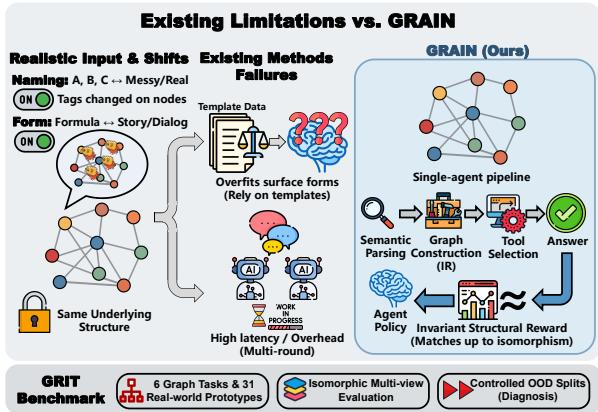
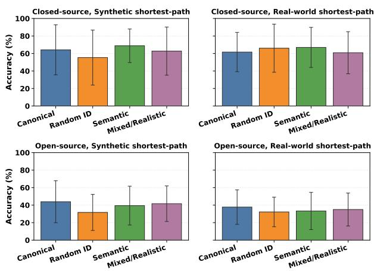
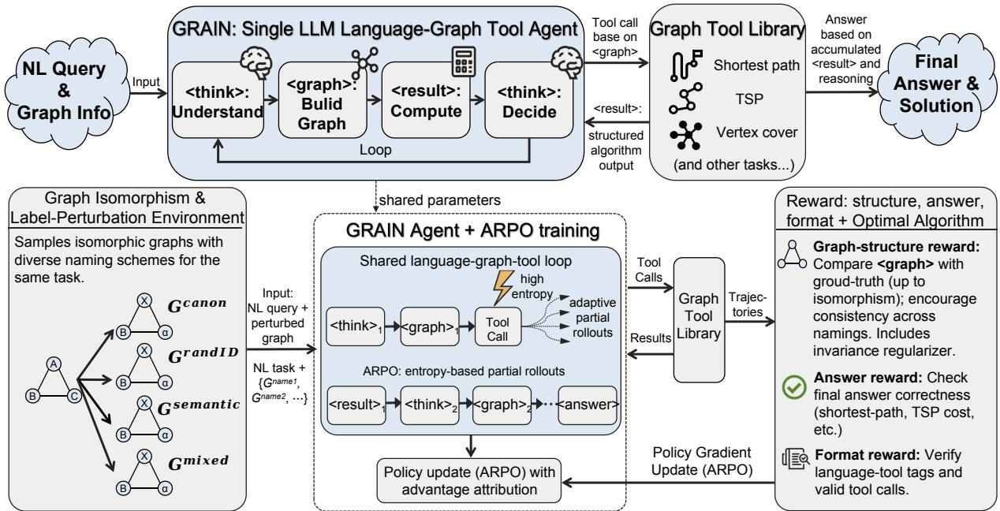
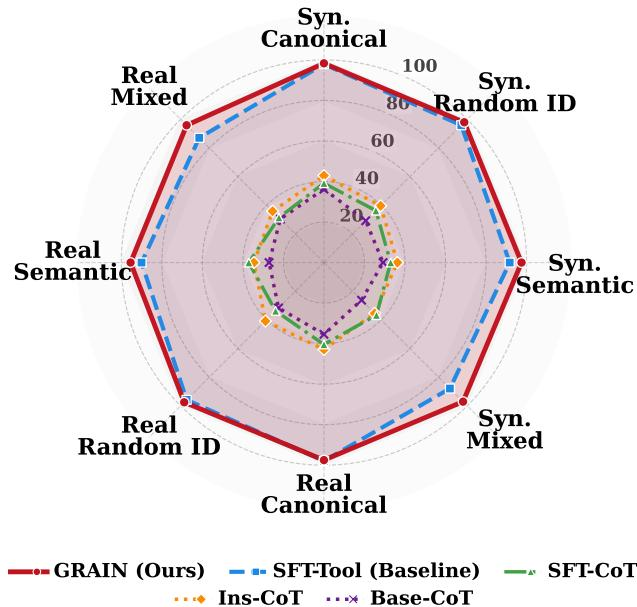
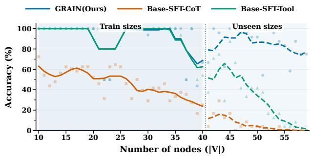

# GRAIN: Bridging Name and Narrative Shifts in Real-World Graph Reasoning through Invariance-Rewarded Agentic RL

Zike Yuan<sup>1,2</sup>, Han Zhang<sup>2</sup>, Jianzhi Yan<sup>1,2</sup>, Le Liu<sup>1,2</sup>, Cai Ke<sup>1,2</sup>, Huozhi Zhou, Jian Xie, Jiran Yin, Yukun Cao<sup>3</sup>, Yue Yu<sup>2</sup>, Hui Wang<sup>2</sup>, Ming Liu<sup>1,2,\*</sup>, Bing Qin<sup>1,2,\*</sup>

<sup>1</sup>Harbin Institute of Technology, Shenzhen, China <sup>2</sup>Peng Cheng Laboratory, Shenzhen, China <sup>3</sup>Xidian University, Xi’an, China {yuanzk,wangh06}@pcl.ac.cn {mliu,qinb}@ir.hit.edu.cn caoyukun@xidian.edu.cn

## Abstract

Despite their potential in standardized graph tasks, Large Language Models (LLMs) remain brittle to real-world shifts in node identifiers and task formulation. While deterministic graph tools are invariant to such shifts, extracting topological structures from noisy text is highly fragile for LLMs, which often overfit to surface patterns. Moreover, mitigating these parsing failures via multi-agent systems incurs prohibitive latency. To address this, we propose GRAIN, a single-agent framework optimized via reinforcement learning. GRAIN models reasoning as a semantic parsing and tool-execution pipeline, guided by a Structure Invariance Reward. By validating extracted intermediate graphs against ground-truth topologies, this reward forces the LLM to learn robust text-to-structure mappings rather than memorizing linguistic artifacts. We also introduce GRIT, a benchmark evaluating sensitivity to such linguistic shifts. GRAIN outperforms multi-agent baselines by 16.45% in accuracy with approximately 24% lower latency. Furthermore, it demonstrates superior structural generalization, halving the out-of-distribution (OOD) gap of SFT models (from 15.77% to 7.80%) and maintaining robustness on large-scale graphs beyond the training distribution.

## 1 Introduction

Large Language Models (LLMs) exhibit great versatility in language, code, and tool utilization. However, critical domains including social network analysis, knowledge graph reasoning, and software dependency management necessitate robust reasoning over inherent graph structures. While recent approaches address classical tasks using text-serialized graphs (Wang et al., 2023), they often depend on benchmarks with sanitized identifiers. However, extracting accurate graph structures from text heavily laden with naming irregularities, alias collisions, and semantic noise is a fundamental challenge in Information Extraction (IE) and Semantic Parsing. Such idealized settings overlook these real-world linguistic complexities, which ultimately limits reliability in practical applications. We examine the robustness gap between clean benchmarks and practical graph reasoning tasks, revealing that LLMs are surprisingly brittle to superficial variations. As shown on the left side of Figure 1, this instability stems from two sources: 1 Node-label sensitivity, where altering naming schemes (e.g., Random vs. Semantic) shifts performance despite structural equivalence. 2 Task-form sensitivity, where performance degrades when moving from synthetic formulations to real-world narratives. Our analysis (see Figure 2 and Table 10) highlights a distinct disparity: while closed-source models generally maintain accuracy but suffer from unpredictable variance across naming schemes, open-source models exhibit severe degradation under non-canonical settings, especially in realistic scenarios. These observations underscore the critical need to explicitly model and mitigate robustness failures caused by naming and formulation shifts.

  
Figure 1: GRAIN mitigates sensitivity to naming and formulation shifts in real-world graph reasoning via a single-agent tool-use pipeline trained with isomorphism-aware structural rewards.

Prior research investigates LLM graph representations, yet critical limitations persist. First, while textualization studies (Fatemi et al., 2024) reveal sensitivity to serialization (e.g., labeling), they typically overlook distribution shifts between standardized templates and noisy real-world formulations. Second, optimization paradigms like CoT and Supervised Fine-Tuning (SFT) struggle with structural generalization; SFT specifically overfits surface patterns, causing performance degradation under isomorphic variations, scale shifts (i.e., generalizing to graphs with significantly more nodes than the training set), or computational intensity (e.g., NP-hard problems) (Chen et al., 2024; Guo et al., 2025; Zhang et al., 2025). Finally, although multi-agent frameworks (Yuan et al., 2025b; Zhang et al., 2024a) improve accuracy via external tools, they suffer from inherent inefficiency: reliance on multi-round interactions incurs prohibitive token costs and latency, rendering them impractical for real-time deployment.

To address these limitations, we identify three critical design requirements: (i) Explicit Pipeline Modelling: Instead of relying on standard, freeform Chain-of-Thought (CoT) generation where LLMs mix logical reasoning with mental arithmetic, we decompose reasoning into explicit semantic parsing and algorithmic execution. This imposes verifiable constraints on intermediate representations, ensuring structural validity before computation. (ii) Structural Invariance: To decouple reasoning from specific identifiers, we vary naming and narratives while preserving the underlying structure, compelling the model to learn invariant rules rather than memorizing surface artifacts. (iii) Unified Agentic RL Optimization: As static supervision overfits surface forms, we employ RL with structural rewards to enforce generalization. This agentic RL formulation distills the high-accuracy reasoning capabilities—typically requiring complex multi-agent collaboration—into a single model’s weights, achieving state-of-theart performance without incurring their prohibitive latency.

Guided by these principles, we propose GRAIN (Graph Reasoning Agent with INvariance), a single-agent RL framework for robust graph reasoning. GRAIN acts as an agentic pipeline that autonomously parses noisy queries, selects optimal external algorithms, and constructs necessary structural arguments. This ensures computational correctness while focusing the LLM purely on semantic parsing and information extraction. To mitigate sensitivity to surface shifts, we train GRAIN on diverse isomorphic narratives. Crucially, we optimize a unified RL objective with an invariance-oriented structural reward. By validating generated intermediate graphs against ground-truth topologies, this signal provides direct feedback on structure recovery, forcing the policy to learn invariant structural rules rather than memorizing superficial identifiers.

  
Figure 2: Node-label Sensitivity. Large error bars reveal high instability: open-source models degrade on Random IDs, while closed-source models struggle with canonical forms.

To facilitate systematic diagnosis, we introduce GRIT, a multi-task corpus covering six graph problems across 31 real-world prototypes. By pairing standard formulations with diverse narratives and namings, GRIT enables controlled OOD evaluation on fixed structures. Experiments demonstrate that GRAIN leverages this structural feedback to optimize the “language → structure” chain, achieving exceptional robustness against surface shifts while maintaining low computational complexity. Our primary contributions are:

• We quantify LLM sensitivity to node labeling and task formulation under a controlled isomorphic setup. We demonstrate that surface-level variations induce significant performance volatility, even when the underlying structure and semantics remain fixed.

• We propose GRAIN, a single-agent RL framework that leverages an invariance-oriented structural reward. By directly optimizing intermediate structure recovery and tool invocation, GRAIN achieves superior robustness across diverse naming schemes and task forms.

• We release GRIT, a multi-task benchmark featuring isomorphic multi-view coverage with explicit OOD splits. This resource enables systematic, reproducible evaluation of graph reasoning robustness against naming and formulation shifts.

## 2 Related Work

LLMs for Graph Reasoning. Graph reasoning is essential to many real-world applications, including social network analysis, knowledge graph reasoning (Chen, 2024; Li et al., 2026), and software dependency management. However, existing benchmarks show that LLM performance declines substantially as graph size and task complexity increase, particularly when moving from basic connectivity problems to NP-hard tasks (Wang et al., 2023; Tang et al., 2025; Yuan et al., 2025a; Luo et al., 2024; Zhang et al., 2024c). To better understand these limitations, recent research has begun to shift from evaluating only final answers toward diagnosing intermediate reasoning processes (Taylor et al., 2024). Meanwhile, instruction-tuning methods improve graph reasoning accuracy through specialized data and curricula (Cao et al., 2025; Chen et al., 2024; Guo et al., 2025; Wang et al., 2025; Yuan et al., 2026). Nevertheless, these methods are typically optimized for standardized inputs and therefore remain brittle to changes in graph serialization formats and prompting schemes (Xu et al., 2026). This gap highlights the need for LLMs that can reason robustly over inherent graph structures rather than relying on specific surface representations.

Serialization Sensitivity. Graph serialization is a critical determinant of LLM performance. Prior work reveals that different encoding schemes (Fatemi et al., 2024) and even the descriptive order of edges (Li et al., 2024a) can drastically alter reasoning accuracy, highlighting a severe sensitivity to surface-form variations. To mitigate this reliance on raw textualization, approaches like GraphToken (Perozzi et al., 2024) propose injecting structured signals via parameter-efficient encodings, though robustness against diverse naming conventions remains an open challenge.

Agents and Tool Learning. Tool-augmented paradigms enhance reliability via external APIs or code execution (Yao et al., 2022; Schick et al., 2023; Qin et al., 2024; Jin et al., 2025; Zhang et al., 2024b; Zeng et al., 2025; Xiong et al., 2026). In the graph domain, multi-agent frameworks improve performance by decomposing tasks into coordinated roles (Li et al., 2024b; Yuan et al., 2025b;

<table><tr><td>Split</td><td>Node Range</td><td># Tasks</td><td># Scen.</td><td># Graphs</td><td>Total Qs.</td></tr><tr><td>Train</td><td>4-40</td><td>6</td><td>31</td><td>2160</td><td>17,280</td></tr><tr><td>Test</td><td>10-40</td><td>6</td><td>31</td><td>360</td><td>2,760</td></tr><tr><td>Large Test</td><td>40-60</td><td>6</td><td>31</td><td>120</td><td>960</td></tr><tr><td>OOD Test</td><td>10-40</td><td>6</td><td>24</td><td>180</td><td>1,440</td></tr></table>

Denotes distinct scenarios unseen during training.

Table 1: Statistics of the GRIT benchmark splits. Han et al., 2026; Cao et al., 2024; Qian et al., 2026). Yet, these systems incur high latency and token costs due to extensive inter-agent communication, highlighting the necessity for efficient single-agent solutions.

## 3 GRIT: A Benchmark for Robust Graph Reasoning

We introduce GRIT to evaluate LLM robustness against two real-world distribution shifts: identifier shift (node naming variations) and task-form shift (standard vs. narrative formulations). Unlike benchmarks with fixed identifiers, GRIT provides controlled multi-view instances varying surface realizations while preserving underlying structures, serving as a rigorous diagnostic tool for structural information extraction and semantic parsing.

Task coverage and scenarios. GRIT covers six fundamental tasks spanning polynomial to NPhard complexities (West et al., 2001). We instantiate them into 31 scenarios (e.g., logistics routing, social networks), yielding naturalistic narratives laden with complex syntactic embeddings and semantic distractors. This offers significantly richer linguistic variation than canonical definitions (details in Appendix A).

Multi-view question construction. Each base instance generates 8 distinct queries by crossing two forms (Standard vs. Realistic narrative) with four naming schemes: Canonical, Random IDs (testing tokenization robustness), Semantic, and Noisy/Mixed (testing coreference resolution and alias mapping). This factorial design isolates specific axes of variation, enabling controlled evaluation of both identifier and task-form shifts.

Graph generation and deterministic injection. GRIT features topologies spanning in-domain $( N \in \ [ 1 0 , 4 0 ] )$ and length-generalization $( N \ \in$ [40, 60]) scales, with ground-truth answers derived via symbolic solvers. Crucially, to prevent hallucinations, narratives are not LLM-generated. Instead, we employ a strictly deterministic, templatebased slot-filling engine to inject topologies into linguistic scenarios, guaranteeing 100% reliable isomorphism between the text and the underlying graph.

  
Figure 3: Overview of the GRAIN framework. (Top) Inference: The LLM builds a graph IR in <graph>, calls solvers, and outputs the answer. (Bottom) Training: ARPO trains under isomorphism-preserving name perturbations, with partial rollouts and a reward for structural invariance, correctness, and valid format.

Benchmark splits. Table 1 summarizes the dataset splits. Train and Test share the same scenario pool, while Large Test evaluates length generalization on larger graphs $( N \in [ 4 0 , 6 0 ] )$ . To isolate robustness against surface-level variations, the OOD Test set introduces unseen held-out scenarios and identifier realizations not observed during training.

## 4 GRAIN

To address the brittleness caused by identifier and task shifts, we propose GRAIN, a single-agent reinforcement learning framework for robust graph reasoning. GRAIN models the LLM as a language– graph–tool agent trained in an isomorphism-based environment with diverse naming and formulation views. Crucially, we enforce a gated reward structure that strictly penalizes format violations while incentivizing recovery of the underlying topology, ensuring the policy captures structural rules invariant to surface-level labels and wording.

## 4.1 Problem Formulation and Overall Objective

To formalize the task (Table 13), let $G = ( V , E , w )$ be a weighted graph and $\tau$ a task (e.g., TSP). Realworld queries incorporate variations in node naming $\nu : V \to \Sigma ^ { * }$ and formulation style $\phi \ ( \mathrm { { e . g . } }$ narrative complexity), defined as the natural language query $x = f ( G , \nu , \phi , \mathcal { T } )$ . We denote the training graph distribution by G and the conditional distribution over surface forms $( \nu , \phi )$ given G by ${ \mathcal { P } } ( G )$

Given a policy $\pi _ { \theta } ,$ , the full generation for input x is a trajectory $\tau ( G , \nu , \phi ; \pi _ { \theta } )$ , containing all tokens from <think> to </answer>. At a high level, we aim to train a policy that maximizes task performance while simultaneously recovering the underlying graph structure, robust to variations in naming and phrasing. We formulate this as maximizing the expected joint return:

$$
\operatorname* { m a x } _ { \theta } \mathbb { E } _ { \stackrel { G \sim \mathcal { G } } { ( \nu , \phi ) \sim \mathcal { P } ( G ) } } \Big [ R \big ( \tau ( G , \nu , \phi ; \pi _ { \theta } ) \big ) \Big ] ,\tag{1}
$$

where the total return $R ( \tau )$ composites the tasklevel reward and a structural invariance score, subject to strict formatting constraints as detailed in Section 4.3.

## 4.2 GRAIN: A Single Language–Graph–Tool Agent

GRAIN treats the LLM as a single agent interacting with a graph-tool library via structured text. For each input x, the agent outputs a sequence with four tagged segments (a complete step-by-step execution example is provided in Appendix C):

$$
\begin{array} { r } { y = \big \langle \mathrm { < t h i n k > . . . , < g r a p h > . . . , } } \\ { \mathrm { < r e s u l t > . . . , < a n s w e r > . . . \ } \big \rangle . } \end{array}\tag{2}
$$

As illustrated in Figure 3, the overall reasoning pipeline consists of four stages:

Task understanding and planning (<think>). The agent reads $x ,$ identifies the task type $\tau _ { \ast }$ , extracts entity mentions corresponding to nodes and edges, and sketches a plan of which graph algorithms to call and with which parameters.

Graph construction (<graph>). In the <graph> segment, the agent emits a structured representation $\hat { G }$ that specifies the node set, edges and weights, and task-specific parameters (e.g., source/target nodes or the set of cities for TSP). The runtime system parses <graph> into the input format of the graph-tool library.

Tool calls and result injection (<result>). The system invokes the corresponding graph algorithm, obtains a deterministic result zˆ, and injects it back into the context as a <result> segment.

Continued reasoning and final answer (<answer>). Upon seeing <result>, the agent may produce additional <think> and <graph> segments and trigger more tool calls, or directly synthesize the final answer in <answer>. The episode terminates at </answer>.

With the tool library ensuring computational correctness, learning focuses on the language-to-graph decision chain: entity resolution, reconstruction, and tool/parameter selection under noisy naming and diverse formulations.

## 4.3 Isomorphic Environment and Gated Rewards

To simulate real-world variability, we construct an isomorphism-based perturbation environment. For each training graph G and task $\tau _ { \ast }$ , we generate diverse naming schemes ν (Canonical, Random, Semantic, Mixed) and query styles ϕ, yielding an instance family $x = f ( G , \nu , \phi , \mathcal { T } )$

The RL state $s _ { t }$ comprises the input x, generated history, and injected <result> segments; episodes terminate at $< / \bar { \mathsf { a n s w e r } } >$ . To enforce strict protocol adherence while optimizing structural recovery, we employ a gated reward formulation consisting of three components:

Answer Reward $r _ { \mathbf { a n s } } ( \tau )$ . This term checks whether the <answer> segment provides the correct task-specific value (shortest-path length, TSP tour cost, etc.) and assigns a binary or shaped reward accordingly.

Structure Similarity Score $s _ { \mathrm { i n v } } ( \tau )$ We parse the extracted graph $\hat { G }$ from the ${ < } { \tt g }$ raph> segment and compute the Jaccard Index over the canonical edge sets of $\hat { G }$ and the ground-truth G. Specifically, we align entity names via the environment’s mapping and represent edges as sets of canonical tuples (source, target, weight). This set-theoretic implementation mathematically prevents out-of-bounds dimension errors that would occur in matrix-based similarity (e.g., Cosine) if the LLM hallucinates or misses nodes. Furthermore, unlike computationally NP-hard metrics such as Graph Edit Distance (GED), this signal is highly efficient to compute while granting dense, continuous partial credit $( s _ { \mathrm { i n v } } \in [ 0 , 1 ] )$ for topological recovery.

Gated Total Reward $R ( \tau )$ . Instead of treating formatting as a soft regularization term, we impose it as a hard constraint. The final trajectory return is defined as:

$$
\begin{array} { r } { R ( \tau ) = \left\{ \begin{array} { l l } { \rho _ { \mathrm { e r r } } , } & { \mathrm { i f ~ i n v a l i d , } } \\ { r _ { \mathrm { a n s } } ( \tau ) + \lambda _ { \mathrm { i n v } } \ : s _ { \mathrm { i n v } } ( \tau ) , } & { \mathrm { i f ~ v a l i d . } } \end{array} \right. } \end{array}\tag{3}
$$

where $\rho _ { \mathrm { e r r } }$ penalizes malformed trajectories $( \mathrm { e . g . }$ missing tags). For valid outputs, the reward sums task correctness and structure similarity (equally weighted with $\lambda _ { \mathrm { i n v } } = 1 . 0 )$

Training utilizes the underlying G to compute $s _ { \mathrm { i n v } } ( \tau )$ , whereas inference operates without labels. By scoring diverse views $( \nu , \phi )$ of the same G with this signal, the policy learns invariant topological rules rather than memorizing surface phrasing.

## 4.4 Reinforcement Learning with ARPO

To address cold-start challenges and ensure format compliance, we perform a brief SFT warm start. Expert trajectories are automatically generated on small synthetic graphs $( | V | \leq 1 4 )$ using the graphtool library. Minimizing standard autoregressive cross-entropy loss enables the model to acquire correct tag usage, valid tool syntax, and basic construction skills. This model serves as both the RL initialization $\theta _ { 0 }$ and the reference policy $\pi _ { \mathrm { r e f } }$

<table><tr><td>Model Family</td><td>Method / Setting</td><td>S. Path</td><td>Coloring</td><td>TSP</td><td>V. Cover</td><td>BFS</td><td>Centr.</td><td>Avg.</td></tr><tr><td colspan="7">Proprietary Models &amp; Multi-Agent Systems</td><td></td><td></td></tr><tr><td>GPT-5-nano</td><td>Zero-shot CoT</td><td>72.18</td><td>43.54</td><td>3.33</td><td>29.17</td><td>16.25</td><td>15.21</td><td>29.95</td></tr><tr><td></td><td>Tool-use CoT</td><td>73.39</td><td>68.96</td><td>41.88</td><td>28.61</td><td>31.46</td><td>40.42</td><td>47.45</td></tr><tr><td>G1-3B</td><td>Zero-shot CoT</td><td>11.46</td><td>8.96</td><td>0.00</td><td>5.28</td><td>1.04</td><td>8.33</td><td>5.85</td></tr><tr><td>MA-GTS(GPT-4o-mini)</td><td>Multi-Agent</td><td>85.63</td><td>87.50</td><td>91.25</td><td>68.33</td><td>55.62</td><td>87.50</td><td>79.31</td></tr><tr><td>MA-GTS(Qwen3-4B-Ins.)†</td><td>Multi-Agent</td><td>13.75</td><td>12.50</td><td>1.88</td><td>4.17</td><td>0.62</td><td>7.50</td><td>6.74</td></tr><tr><td colspan="7">Llama-3.2 Series (3B)</td><td></td><td></td></tr><tr><td>Llama-3.2-Ins</td><td>Zero-shot CoT</td><td>1.88</td><td>13.96</td><td>0.21</td><td>3.61</td><td>4.38</td><td>4.58</td><td>4.77</td></tr><tr><td></td><td>Tool-use CoT</td><td>2.92</td><td>11.88</td><td>0.21</td><td>4.44</td><td>0.83</td><td>5.42</td><td>4.28</td></tr><tr><td>GRAIN (Ours)</td><td>SFT + ARPO</td><td>45.93</td><td>51.46</td><td>34.79</td><td>15.83</td><td>71.88</td><td>64.58</td><td>47.41</td></tr><tr><td colspan="2">Qwen-3 Series (4B)</td><td></td><td></td><td></td><td></td><td></td><td></td><td></td></tr><tr><td>Qwen-3-Ins</td><td>Zero-shot CoT</td><td>53.13</td><td>28.75</td><td>1.88</td><td>5.28</td><td>70.42</td><td>12.71</td><td>28.69</td></tr><tr><td></td><td>Tool-use CoT</td><td>48.13</td><td>36.88</td><td>71.25</td><td>38.61</td><td>60.42</td><td>42.29</td><td>49.60</td></tr><tr><td></td><td>Zero-shot CoT</td><td>49.38</td><td>22.29</td><td>2.08</td><td>4.44</td><td>48.96</td><td>11.88</td><td>23.17</td></tr><tr><td>Qwen-3-Base</td><td>Tool-use CoT</td><td>35.42</td><td>45.28</td><td>40.00</td><td>37.50</td><td>70.42</td><td>42.29</td><td>45.15</td></tr><tr><td></td><td>SFT (Text-only)</td><td>22.13</td><td>46.88</td><td>3.54</td><td>33.89</td><td>71.25</td><td>45.00</td><td>37.11</td></tr><tr><td></td><td>SFT (Tool-use CoT)</td><td>99.58</td><td>93.13</td><td>96.88</td><td>88.33</td><td>82.50</td><td>74.17</td><td>89.10</td></tr><tr><td>GRAIN (Ours)</td><td>SFT + ARPO</td><td>99.38</td><td>92.92</td><td>97.92</td><td>93.30</td><td>98.33</td><td>92.70</td><td>95.76</td></tr></table>

Table 2: Main Results on GRIT Tasks. We report the accuracy (%) across six graph reasoning tasks. The best results are bolded, and the second-best results are underlined. “Ins” denotes Instruct models. For Qwen-3-Base, we compare CoT and SFT under both text-only and tool-use settings. <sup>†</sup> denotes zero-shot transfer of the six-agent MA-GTS pipeline to Qwen3-4B-Instruct on the 920-example Test set; its micro-average is 6.85%. GRAIN consistently achieves SOTA performance.

We then further optimize the policy using Reinforcement Learning with Verifiable Rewards (RLVR). Writing $x = f ( G , \nu , \phi , \mathcal { T } )$ and $\tau \sim \pi _ { \theta } ( \cdot |$ x), our training objective is:

$$
\begin{array} { r l } & { J ( \theta ) = \mathbb { E } _ { x , \tau \sim \pi _ { \theta } ( \cdot | x ) } \Big [ R ( \tau ) } \\ & { \qquad - \ \beta \mathrm { K L } \big ( \pi _ { \theta } ( \cdot \mid x ) \| \pi _ { \mathrm { r e f } } ( \cdot \mid x ) \big ) \Big ] , } \end{array}\tag{4}
$$

where $R ( \tau )$ follows the gated formulation in Eq. (3). We optimize $J ( \theta )$ using ARPO (Agentic Reinforced Policy Optimization) (Dong et al., 2026), which is uniquely suited for our problem setting:

Entropy-based adaptive partial rollouts. In our pipeline, naming and query perturbations primarily impact entity resolution and graph reconstruction, empirically manifesting as token entropy spikes. ARPO detects these high-uncertainty moments to trigger adaptive partial rollouts (branching), enabling the agent to explore diverse graph construction hypotheses when confronting ambiguous identifiers.

Branch-aware advantage estimation. ARPO standardizes returns across trajectories sharing a prefix, assigning shared advantages to prefix tokens (task understanding) and individual ones to branch suffixes (graph construction). This ensures the structure reward $s _ { \mathrm { i n v } }$ targets high-entropy grounding decisions, facilitating efficient learning.

## 5 Evaluation

## 5.1 Experimental Setup

Benchmarks and Data. We evaluate primarily on GRIT, spanning six tasks (SHORTEST PATH, COLORING, TSP, VERTEX COVER, BFS, CEN-TRALITY). Each instance features 8 views derived from 31 scenarios: 2 forms (Standard/Realistic) × 4 naming schemes (Canonical, Random IDs, Semantic, Noisy/Mixed). Training uses graphs with N ≤ 40; evaluation covers ID (seen), OOD-Form (unseen naming–narrative pairs, $N ~ \leq ~ 4 0 )$ , and OOD-Large-Size $( N \in [ 4 0 , 6 0 ] )$ . To ensure unbiased evaluation, the node sizes in our test sets follow a strictly balanced, uniform distribution (detailed in Appendix H). We also report results on external benchmarks GraphInstruct (Luo et al., 2024) and GraphArena (Tang et al., 2025).

  
Figure 4: Robustness Evaluation. GRAIN (Red) achieves consistent robustness across shifts, unlike SFT-Tool (Blue) which degrades significantly in noisy, realworld scenarios.

Models and Baselines. We compare Zero-shot CoT (Wei et al., 2022), Tool-use CoT, SFT, and GRAIN (SFT+ARPO). Baselines include GPT-5-nano (Achiam et al., 2023), the graph-specific RL model G1-3B (Guo et al., 2025), and the multiagent MA-GTS (Yuan et al., 2025b). For open models, we evaluate Llama-3.2-Ins (Touvron et al., 2023) (3B) and Qwen-3-Ins (Bai et al., 2023) (4B) (“Ins” denotes Instruct). Additionally, we train GRAIN on Llama-3.2 (3B) to test transferability. On Qwen-3-Base (4B), we conduct a comprehensive comparison across Zero-shot, Tool-use, SFT (Text/Tool), and GRAIN to isolate the specific effects of tool access and training.

Tool Library and Inference Protocol. Tool-use methods share a unified interface: models generate graph representations, invoke verifiable solvers, and derive answers. We enforce identical decoding budgets and tool-call limits (text-only baselines disable tools).

Training Details. Training relies exclusively on GRIT Train. SFT is performed on the full split to provide initializations. GRAIN warm-starts from the tool-use SFT checkpoint, employing a two-stage curriculum: first stabilizing structured generation on small graphs (4–14 nodes), then running ARPO on the 10–40 node range by sampling two underlying graphs per task and size. Implementation details are provided in Appendix B.

Evaluation Metrics. We report final-answer accuracy (%), counting a prediction as correct iff it strictly matches the ground truth. Tables present per-task performance and the macroaverage (Avg.), computed using a unified scoring script across all settings.

## 5.2 Performance

## 5.2.1 Overall Performance on GRIT

Table 2 compares GRAIN against representative baselines across six graph reasoning tasks. GRAIN achieves consistent state-of-the-art performance across varying model scales, demonstrating the effectiveness of our proposed framework. The analysis of the case study is presented in the Appendix C.

Surpassing Supervised Baselines. GRAIN significantly outperforms SFT under identical configurations. On Qwen-3-Base, GRAIN boosts the strong SFT baseline (89.10%) to 95.76%. Substantial gains on complex tasks like Vertex Cover (+4.97%) and BFS (+15.83%) validate that our invariance-oriented structural reward effectively optimizes non-differentiable decision chains, surpassing the performance ceiling of standard imitation learning.

Multi-Agent Comparison. MA-GTS with GPT-4o-mini achieves 79.31%, whereas GRAIN reaches 95.76% with a compact Qwen-3 backbone. As a compact-model transfer diagnostic, the same sixagent MA-GTS pipeline with Qwen3-4B-Instruct obtains a 6.74% macro-average (6.85% microaverage) on the 920-example Test set, with consistently low accuracy across tasks. Because training, backbone initialization, and agent organization differ from GRAIN, this result should not be interpreted as an isolated single- versus multiagent effect; rather, it indicates that inference-only multi-agent decomposition does not automatically resolve graph-grounding and executable tool-call failures in this setting. Appendix F reports the complete pipeline diagnostic.

Empowering Compact Models. GRAIN also unlocks the reasoning potential of smaller architectures. While Llama-3.2-Instruct fails in zeroshot and standard tool-use settings (<5%), GRAIN boosts its average accuracy to 47.41%, matching the performance of the proprietary GPT-5-nano (47.45%). This indicates that our framework effectively instills structural reasoning capabilities even within compact parameter spaces.

<table><tr><td rowspan="2">Method</td><td colspan="2">GRIT Distribution</td><td colspan="2">Unseen Tasks</td></tr><tr><td>Test OOD</td><td>Gap↓</td><td>G-Ins</td><td>Arena</td></tr><tr><td>Baseline: Qwen3-4B-SFT</td><td></td><td></td><td></td><td></td></tr><tr><td rowspan="2">Zero-shot CoT Tool-use CoT</td><td>37.11 27.29</td><td>9.82</td><td>32.83</td><td>13.0</td></tr><tr><td>89.10 73.33</td><td>15.77</td><td>92.06</td><td>88.0</td></tr><tr><td colspan="3">GRAIN-4B (Ours)</td><td></td><td></td></tr><tr><td colspan="3">SFT + ARPO 95.76 87.96 7.80</td><td>97.05</td><td>91.0</td></tr></table>

Table 3: OOD Robustness & Generalization. We report the accuracy drop (∆) on GRIT and zero-shot performance on unseen benchmarks (GraphInstruct, GraphArena).
<table><tr><td rowspan="2">Method</td><td colspan="2">Rounds Tokens Latency (s)</td><td colspan="2"></td><td rowspan="2">Acc.</td></tr><tr><td>(Avg)</td><td>(Avg)</td><td>Avg</td><td>p90 (%)</td></tr><tr><td>GPT-5-nano (Single-Agent)</td><td></td><td></td><td></td><td></td><td></td></tr><tr><td>Zero-shot CoT</td><td>1.00</td><td>17.1k</td><td></td><td>117.3 200.2 29.95</td><td></td></tr><tr><td>Tool-use CoT</td><td>2.00</td><td>22.1k</td><td></td><td>126.1 212.847.45</td><td></td></tr><tr><td>Multi-Agent Framework MA-GTS (4o-mini)</td><td>6.00</td><td>13.5k</td><td>58.4</td><td></td><td>96.1 79.31</td></tr><tr><td></td><td></td><td></td><td></td><td></td><td></td></tr><tr><td>GRAIN-4B (Ours)</td><td></td><td></td><td></td><td></td><td></td></tr><tr><td></td><td></td><td></td><td></td><td></td><td></td></tr><tr><td>SFT + ARPO</td><td>3.29†</td><td>3.3k</td><td>44.4</td><td>82.5</td><td>95.76</td></tr></table>

<sup>†</sup> Denotes interaction rounds with the local Python environment.

## 5.2.2 Robustness against Naming and Formulation Shifts

Figure 4 illustrates stability across eight variations. GRAIN demonstrates exceptional structural invariance, maintaining a nearly uniform performance envelope across all axes. Conversely, SFT-Tool exhibits marked node-label sensitivity, with performance visibly collapsing under “Random” and “Mixed” identifiers. This confirms GRAIN effectively decouples reasoning from surface forms, mitigating the overfitting to canonical patterns inherent in standard SFT. Further analysis of the two sensitivities are presented in the Appendix D.

## 5.2.3 OOD Generalization and Scalability

We evaluate GRAIN’s capability to generalize beyond its training distribution across two dimensions: domain shifts (Table 3) and graph scale (Figure 5).

Table 4: GRAIN achieves peak accuracy (95.76%) with the lowest overhead (3.3k tokens, 44.4s), significantly outperforming proprietary and multi-agent baselines.  
  
Figure 5: Performance as node count (|V |) exceeds the training range $( | V | \leq 4 0 )$ . GRAIN demonstrates robust length generalization, sustaining accuracy on larger graphs where baselines collapse.

<table><tr><td rowspan="2">Method / Variant</td><td colspan="3">Metrics</td></tr><tr><td></td><td>Gap↓ Var. (10−5)↓</td><td>Acc. ↑</td></tr><tr><td>GRAIN (Full)</td><td>1.14%</td><td>4.64</td><td>96.76%</td></tr><tr><td>Component Analysis</td><td></td><td></td><td></td></tr><tr><td>w/o Struct. Reward</td><td>11.14%</td><td>14.65</td><td>84.73%</td></tr><tr><td>w/o Diverse Naming</td><td>4.11%</td><td>341.83</td><td>79.21%</td></tr><tr><td>Optimization Method</td><td></td><td></td><td></td></tr><tr><td>replace w/ GRPO</td><td>1.17%</td><td>7.05</td><td>96.51%</td></tr></table>

Table 5: Ablation Study. Gap denotes the performance drop (|Standard − Real|), and Var. $( 1 0 ^ { - 5 } )$ measures stability across naming permutations.

Distribution Shift and Transferability. Table 3 highlights GRAIN’s resilience: while SFT-Tool drops 15.77% on OOD splits due to overfitting, GRAIN halves this gap to 7.80%. Furthermore, GRAIN demonstrates exceptional zero-shot transferability on GraphInstruct (97.05%) and GraphArena (91.0%). To verify baseline fairness, GRAIN achieves 86.60% zero-shot accuracy on the unseen G-REAL dataset (MA-GTS’s original benchmark; Appendix E). This confirms that our invariance-oriented rewards foster universally applicable structural extraction skills.

Length Generalization. Figure 5 illustrates performance as graph size scales beyond the training range $( | V | > 4 0 )$ . While baselines degrade rapidly on larger graphs due to context overload, GRAIN maintains robust accuracy. This length generalization is a direct benefit of our explicit pipeline design: by offloading computational complexity to external algorithms, GRAIN limits the LLM’s role to semantic parsing and information extraction, effectively decoupling performance from the exponential complexity of graph reasoning.

<table><tr><td>Method / Variant</td><td>Node-F1</td><td>Edge-F1</td><td>Exact</td></tr><tr><td>w/o Struct. Reward</td><td>96.03</td><td>94.95</td><td>63.10</td></tr><tr><td>SFT-Tool</td><td>98.45</td><td>97.96</td><td>90.21</td></tr><tr><td>replace w/ GRPO</td><td>97.23</td><td>97.20</td><td>95.22</td></tr><tr><td>GRAIN (Full)</td><td>98.76</td><td>98.67</td><td>97.28</td></tr></table>

Table 6: Intermediate Structure Recovery. Results on 2,760 GRIT examples. Edge-F1 denotes weighted edge recovery, while Exact requires the entire predicted weighted graph to match the ground-truth graph.

## 5.2.4 Ablation Study

Table 5 validates component contributions. Removing the Structure Invariance Reward widens the generalization gap (1.14% → 11.14%) and drops accuracy to 84.73%, confirming its role in preventing overfitting. Diverse Naming is crucial for stability; omitting it spikes variance (4.64 → 341.83) and degrades accuracy to 79.21%. Finally, ARPO outperforms GRPO by lowering variance (7.05 → 4.64) and boosting accuracy (96.51% → 96.76%), demonstrating the efficacy of branch-aware optimization.

Intermediate Structure Recovery. As shown in Table 6, GRAIN achieves 98.67% weighted Edge-F1 and 97.28% exact graph recovery. Removing the Structure Invariance Reward reduces exact recovery to 63.10% despite retaining high node- and edge-level overlap, showing that partial overlap can mask whole-graph inconsistencies. Replacing ARPO with GRPO also reduces exact recovery from 97.28% to 95.22%. Appendix G provides a detailed decomposition of the remaining non-exact predictions.

## 5.2.5 Efficiency Analysis

Table 4 highlights GRAIN’s optimal accuracyefficiency trade-off.

Deployment Efficiency. Compared to GPT-5- nano’s verbose reasoning (>17k tokens), GRAIN’s concise structured generation cuts token usage by ∼85% (to 3.3k) and achieves the lowest latency (44.4s).

Advantage over Multi-Agent Systems. While MA-GTS requires 6 interaction rounds, GRAIN’s single-agent design outperforms it by 16.45% in accuracy while reducing latency by 24%. Our failure analysis (Appendix F) reveals that multi-agent systems frequently suffer from fatal information loss during handovers. Thus, for structural semantic parsing, GRAIN delivers SOTA performance without the prohibitive communication penalties of multi-agent architectures.

## 6 Conclusion

We address LLM fragility in graph reasoning under identifier and task shifts. We propose GRAIN, a single-agent RL framework utilizing a Structure Invariance Reward to decouple topology from surface variations. On our GRIT benchmark, GRAIN achieves state-of-the-art accuracy and efficiency, outperforming complex multi-agent systems. Furthermore, it generalizes robustly to OOD scenarios and larger graphs, validating the efficacy of invariant structural grounding.

## Limitations

A limitation of our current framework lies in the management of tool contexts. Given the vast array of graph algorithms, embedding comprehensive tool definitions directly into the system prompt leads to excessive text length, which consumes valuable context window and may distract the model from core reasoning tasks. Future work will explore adopting standards like the Model Context Protocol (MCP) (Hou et al., 2025) to handle tool definitions dynamically, moving away from static inclusion to optimize context efficiency.

## Acknowledgments

The research in this article is supported by the National Science Foundation of China (U22B2059, 62276083), Key Research and Development Program of Heilongjiang Province (2024ZX01A05) and the 5G Application Innovation Joint Research Institute’s Project (A003).

## References

Josh Achiam, Steven Adler, Sandhini Agarwal, Lama Ahmad, Ilge Akkaya, Florencia Leoni Aleman, Diogo Almeida, Janko Altenschmidt, Sam Altman, Shyamal Anadkat, et al. 2023. Gpt-4 technical report. arXiv preprint arXiv:2303.08774.

Jinze Bai, Shuai Bai, Yunfei Chu, Zeyu Cui, Kai Dang, Xiaodong Deng, Yang Fan, Wenbin Ge, Yu Han, Fei Huang, et al. 2023. Qwen technical report. arXiv preprint arXiv:2309.16609.

Yukun Cao, Zengyi Gao, Zhiyang Li, Xike Xie, S Kevin Zhou, and Jianliang Xu. 2024. Lego-graphrag: Modularizing graph-based retrieval-augmented generation for design space exploration. arXiv preprint arXiv:2411.05844.

Yukun Cao, Shuo Han, Zengyi Gao, Zezhong Ding, Xike Xie, and S Kevin Zhou. 2025. Graphinsight: Unlocking insights in large language models for graph structure understanding. In Proceedings of the 63rd Annual Meeting ofthe Associationfor Computational Linguistics (Volume 1: Long Papers), pages 12096–12134.

Huajun Chen. 2024. Large knowledge model: Perspectives and challenges. Data Intell., 6(3):587–620.

Nuo Chen, Yuhan Li, Jianheng Tang, and Jia Li. 2024. Graphwiz: An instruction-following language model for graph computational problems. In Proceedings of the 30th ACM SIGKDD Conference on Knowledge Discovery and Data Mining, pages 353–364.

Guanting Dong, Hangyu Mao, Kai Ma, Licheng Bao, Yifei Chen, Zhongyuan Wang, Zhongxia Chen, Jiazhen Du, Huiyang Wang, Fuzheng Zhang, et al. 2026. Agentic reinforced policy optimization. In International Conference on Learning Representations, volume 2026, pages 16981–17017.

Bahare Fatemi, Jonathan Halcrow, and Bryan Perozzi. 2024. Talk like a graph: Encoding graphs for large language models. In International conference on learning representations, volume 2024, pages 43909– 43934.

Xiaojun Guo, Ang Li, Yifei Wang, Stefanie Jegelka, and Yisen Wang. 2025. G1: Teaching llms to reason on graphs with reinforcement learning. arXiv preprint arXiv:2505.18499.

Shuo Han, Yukun Cao, Zezhong Ding, Zengyi Gao, S Kevin Zhou, and Xike Xie. 2026. See or say graphs: Agent-driven scalable graph understanding with vision-language models. In Findings ofthe Associationfor Computational Linguistics: ACL 2026, pages 41565–41589.

Xinyi Hou, Yanjie Zhao, Shenao Wang, and Haoyu Wang. 2025. Model context protocol (mcp): Landscape, security threats, and future research directions. ACM Transactions on Software Engineering and Methodology.

Bowen Jin, Hansi Zeng, Zhenrui Yue, Jinsung Yoon, Sercan Arik, Dong Wang, Hamed Zamani, and Jiawei Han. 2025. Search-r1: Training llms to reason and leverage search engines with reinforcement learning. arXiv preprint arXiv:2503.09516.

Xin Li, Weize Chen, Qizhi Chu, Haopeng Li, Zhaojun Sun, Ran Li, Chen Qian, Yiwei Wei, Zhiyuan Liu, Chuan Shi, et al. 2024a. Can large language models analyze graphs like professionals? a benchmark, datasets and models. Advances in Neural Information Processing Systems, 37:141045–141070.

Xin Li, Qizhi Chu, Yubin Chen, Yang Liu, Yaoqi Liu, Zekai Yu, Weize Chen, Chen Qian, Chuan Shi, and Cheng Yang. 2024b. Graphteam: Facilitating large language model-based graph analysis via multi-agent collaboration. arXiv preprint arXiv:2410.18032.

Zhiyang Li, Ao Ke, Yukun Cao, and Xike Xie. 2026. Kg-vip: Bridging knowledge grounding and visual perception in multi-modal llms for visual question answering. In Proceedings ofthe 64th Annual Meeting of the Association for Computational Linguistics (Volume 1: Long Papers), pages 35144–35157.

Zihan Luo, Xiran Song, Hong Huang, Jianxun Lian, Chenhao Zhang, Jinqi Jiang, Xing Xie, and Hai Jin. 2024. Graphinstruct: Empowering large language models with graph understanding and reasoning capability. arXiv preprint arXiv:2403.04483.

Bryan Perozzi, Bahare Fatemi, Dustin Zelle, Anton Tsitsulin, Mehran Kazemi, Rami Al-Rfou, and Jonathan Halcrow. 2024. Let your graph do the talking: Encoding structured data for llms. arXiv preprint arXiv:2402.05862.

Cheng Qian, Emre Can Acikgoz, Qi He, Hongru Wang, Xiusi Chen, Dilek Hakkani-Tur, Gokhan Tur, and Heng Ji. 2026. Toolrl: Reward is all tool learning needs. Advances in Neural Information Processing Systems, 38:105523–105553.

Yujia Qin, Shihao Liang, Yining Ye, Kunlun Zhu, Lan Yan, Yaxi Lu, Yankai Lin, Xin Cong, Xiangru Tang, Bill Qian, et al. 2024. Toolllm: Facilitating large language models to master 16000+ real-world apis. In International Conference on Learning Representations, volume 2024, pages 9695–9717.

Timo Schick, Jane Dwivedi-Yu, Roberto Dessì, Roberta Raileanu, Maria Lomeli, Eric Hambro, Luke Zettlemoyer, Nicola Cancedda, and Thomas Scialom. 2023. Toolformer: Language models can teach themselves to use tools. Advances in neural information processing systems, 36:68539–68551.

Jianheng Tang, Qifan Zhang, Yuhan Li, Nuo Chen, and Jia Li. 2025. Grapharena: Evaluating and exploring large language models on graph computation. In International Conference on Learning Representations, volume 2025, pages 48118–48145.

Alexander K Taylor, Anthony Cuturrufo, Vishal Yathish, Mingyu Derek Ma, and Wei Wang. 2024. Are largelanguage models graph algorithmic reasoners? arXiv preprint arXiv:2410.22597.

Hugo Touvron, Louis Martin, Kevin Stone, Peter Albert, Amjad Almahairi, Yasmine Babaei, Nikolay Bashlykov, Soumya Batra, Prajjwal Bhargava, Shruti Bhosale, et al. 2023. Llama 2: Open foundation and fine-tuned chat models. arXiv preprint arXiv:2307.09288.

Heng Wang, Shangbin Feng, Tianxing He, Zhaoxuan Tan, Xiaochuang Han, and Yulia Tsvetkov. 2023. Can language models solve graph problems in natural language? Advances in Neural Information Processing Systems, 36:30840–30861.

Yuyao Wang, Bowen Liu, Jianheng Tang, Nuo Chen, Yuhan Li, Qifan Zhang, and Jia Li. 2025. Graphr1: Unleashing llm reasoning with np-hard graph problems. arXiv e-prints, pages arXiv–2508.

Jason Wei, Xuezhi Wang, Dale Schuurmans, Maarten Bosma, Fei Xia, Ed Chi, Quoc V Le, Denny Zhou, et al. 2022. Chain-of-thought prompting elicits reasoning in large language models. Advances in neural information processing systems, 35:24824–24837.

Douglas Brent West et al. 2001. Introduction to graph theory, volume 2. Prentice hall Upper Saddle River.

Siheng Xiong, Oguzhan Gungordu, James C Kerce, and Faramarz Fekri. 2026. Adaptive information control for search-augmented llm reasoning. arXiv preprint arXiv:2602.01672.

Hao Xu, Xiangru Jian, Xinjian Zhao, Wei Pang, Chao Zhang, Suyuchen Wang, Qixin Zhang, Zhengyuan Dong, Joao Monteiro, Bang Liu, et al. 2026. Graphomni: A comprehensive and extensible benchmark framework for large language models on graph-theoretic tasks. In International Conference on Learning Representations, volume 2026, pages 116120–116234.

Shunyu Yao, Jeffrey Zhao, Dian Yu, Nan Du, Izhak Shafran, Karthik Narasimhan, and Yuan Cao. 2022. React: Synergizing reasoning and acting in language models. arXiv preprint arXiv:2210.03629.

Zike Yuan, Yukun Cao, Han Zhang, Jianzhi Yan, Le Liu, Yue Yu, Hui Wang, Ming Liu, Bing Qin, et al. 2026. Egl-sca: Structural credit assignment for co-evolving instructions and tools in graph reasoning agents. arXiv preprint arXiv:2605.10366.

Zike Yuan, Ming Liu, Hui Wang, and Bing Qin. 2025a. Gracore: Benchmarking graph comprehension and complex reasoning in large language models. In Proceedings of the 31st International Conference on Computational Linguistics, pages 7925–7948.

Zike Yuan, Ming Liu, Hui Wang, and Bing Qin. 2025b. Ma-gts: A multi-agent framework for solving complex graph problems in real-world applications. In Proceedings of the 2025 Conference on Empirical Methods in Natural Language Processing, pages 19297–19315.

Daojian Zeng, Lin Zhou, Zhiheng Zhang, and Lincheng Jiang. 2025. Autogen: Automated tool learning data generation with domain-specific structured data. Data Intell., 7(4):1108–1128.

Qifan Zhang, Xiaobin Hong, Jianheng Tang, Nuo Chen, Yuhan Li, Wenzhong Li, Jing Tang, and Jia Li. 2024a. Gcoder: Improving large language model for generalized graph problem solving. arXiv preprint arXiv:2410.19084.

Xilin Zhang, Zhixin Mao, Ziwen Chen, and Shen Gao. 2024b. Effective tool augmented multi-agent framework for data analysis. Data Intell., 6(4):923–945.

Yizhuo Zhang, Heng Wang, Shangbin Feng, Zhaoxuan Tan, Xiaochuang Han, Tianxing He, and Yulia Tsvetkov. 2024c. Can llm graph reasoning generalize beyond pattern memorization? In Findings of the

association for computational linguistics: EMNLP 2024, pages 2289–2305.

Yizhuo Zhang, Heng Wang, Shangbin Feng, Zhaoxuan Tan, Xinyun Liu, and Yulia Tsvetkov. 2025. Generalizable llm learning of graph synthetic data with reinforcement learning. arXiv e-prints, pages arXiv– 2506.

## A GRIT Benchmark Implementation Details

This appendix complements the statistics in Table 1 and task descriptions in Table 8 by detailing the generation pipeline.

Graph Topology Generation. Underlying graphs are synthesized using two random models via NetworkX: Erdos-Rényi˝ (edge probability $p \in [ 0 . 1 , 0 . 3 ] )$ . For weighted tasks, weights are integers uniformly sampled from [1, 10]. We perform rejection sampling to ensure connectivity (for undirected graphs) or strong connectivity (for TSP).

Ground Truth & Tie-Breaking. To ensure deterministic evaluation, we apply specific constraints to algorithmic solvers:

• BFS Traversal: Neighbors are visited in lexicographical order (e.g., node 2 before node 10) to guarantee a unique traversal sequence.

• TSP: Formulated as Metric TSP on complete graphs; we compute the exact minimum-cost Hamiltonian cycle using dynamic programming solvers.

• Graph Coloring: We compute the exact chromatic number using a greedy strategy with backtracking.

Narrative Injection Pipeline. We implement a template-based slot-filling engine. For each of the 31 scenarios (Table 8), we define a domain context (e.g., “Logistics”) and specific entity lists. The engine injects graph topology into these templates under four naming schemes. For Random IDs, we use high-entropy integers (e.g., 8392, 1024) to test tokenization robustness; for Noisy/Mixed, we introduce aliases (referring to the same node by multiple names).

OOD Split Construction. Unlike random splits, the OOD Test set is constructed by explicitly holding out 24 specific scenario templates and naming distributions during training. For instance, if “City Traffic” appears in Train, “Server Routing” is reserved for OOD. This ensures that high performance reflects true structural reasoning transfer rather than domain text memorization.

Please refer to Table 11 for illustrative examples of the node naming variations (Canonical, Random IDs, Semantic, and Noisy/Mixed) used in our robustness evaluation. The complete system prompt, detailing the tool-use schema and reasoning guidelines for our GRAIN framework, is listed in Table 12.

## B Training Implementation Details

This appendix details the hyperparameters and infrastructure used for the two-stage training pipeline of GRAIN: (1) Supervised Fine-Tuning (SFT) and (2) Agentic Reinforcement Learning via ARPO.

## B.1 Infrastructure

All experiments were conducted on a computational node equipped with 4× NVIDIA A100 (80GB) GPUs. For memory-efficient fullparameter fine-tuning, we utilized DeepSpeed with ZeRO-3 Offload strategy. For the RL stage, we integrated the vLLM inference engine to enable high-throughput trajectory rollouts. The training was performed in BF16 precision to maintain numerical stability.

## B.2 Stage 1: Supervised Fine-Tuning (SFT)

The SFT stage initializes the model’s ability to use tools and generate valid JSON graph representations. We perform full-parameter fine-tuning on the Qwen-3-Base (4B) and Llama-3.2-Base (3B) models.

As listed in Table 7 (refer to main text or appendix table), we utilize a global batch size of 8 and a conservative learning rate of $7 \times 1 0 ^ { - 6 }$ with a cosine decay scheduler. Notably, we set a context window of 15,000 tokens to accommodate the verbose serialization of larger graphs (up to 40 nodes) and the corresponding CoT reasoning.

<table><tr><td>Parameter Value</td></tr><tr><td>General Settings</td></tr><tr><td>Base Model Qwen-3-4B</td></tr><tr><td>Tuning Method Full Fine-tuning</td></tr><tr><td>Precision BF16</td></tr><tr><td>Context Window 15,000 tokens</td></tr><tr><td>DeepSpeed Stage ZeRO-3 (Offload)</td></tr><tr><td>GPUs 2× NVIDIA A100 GPUs</td></tr><tr><td>Hyperparameters</td></tr><tr><td>Global Batch Size 8</td></tr><tr><td>Gradient Accumulation 2</td></tr><tr><td>Epochs 3</td></tr><tr><td>Learning Rate  $7 \times 1 0 ^ { - 6 }$ </td></tr><tr><td>LR Scheduler Cosine</td></tr><tr><td>Warmup Ratio 0.1</td></tr></table>

Table 7: Implementation Details. Hyperparameters and settings used for full-parameter fine-tuning.

<table><tr><td>Graph Task</td><td>Canonical Graph-Theoretic Formulation</td><td>Representative Real-World Problem Formulations (Noun Phrases)</td></tr><tr><td>Centrality</td><td>Compute centrality scores of one or several nodes in a graph and identify structurally “key&quot; nodes.</td><td>City traffic hubs; emergency response centers; social network key persons; information relay stations</td></tr><tr><td>Shortest Path</td><td>In a weighted directed or undirected graph, find the minimum-cost path from a source node to a target node.</td><td>Data-center latency routing; logistics cost routes; robot energy-efficient paths; network routing paths</td></tr><tr><td>TSP</td><td>In a weighted complete graph, find a minimum-cost tour that visits every node once and returns to the start (decision version NP-complete, optimization version NP-hard).</td><td>Parcel delivery tour; sales representative tour; food delivery tour; garbage collection tour; maintenance inspection tour; school bus route</td></tr><tr><td>Min Graph Coloring</td><td>Color all nodes of a graph using as few colors as possible so that adjacent nodes have different colors.</td><td>Wi-Fi channel assignment; cellular frequency planning; radio channel allocation; event loudspeaker placement; exam timetabling; map region coloring; interference-aware equipment layout</td></tr><tr><td>Graph Traversal (BFS)</td><td>Perform breadth-first search from a given source node and output the visit order or layer structure.</td><td>Post-disaster inspection sweep; tourist exploration route; UAV area scanning; building safety inspection</td></tr><tr><td>Vertex Cover</td><td>Select a minimum set of nodes such that every edge has at least one endpoint in the set.</td><td>Server monitoring placement; road intersection cameras; railway security posts; social liaison selection; pipeline sensor placement; campus patrol posts</td></tr></table>

Table 8: Detailed descriptions of the six graph reasoning tasks included in the GRIT benchmark. This table complements the main results by providing the canonical graph-theoretic formulation and representative real-world problem scenarios for each task.

## B.3 Stage 2: Reinforcement Learning (ARPO)

We employ our proposed ARPO (Agentic Reasoning Policy Optimization) algorithm, utilizing the GRPO estimator. The model is warm-started from the tool-use SFT checkpoint. The detailed hyperparameters are provided in Table 9.

Curriculum Warm-up Strategy. As mentioned in the experimental setup, we adopt a two-phase curriculum to ensure training stability:

1. Phase 1 (Stabilization): We first train on a subset of smaller graphs $( N \in [ 4 , 1 4 ] )$ . This phase focuses on stabilizing the model’s adherence to the structured output format and tool invocation syntax without the distraction of long-context complexity.

2. Phase 2 (Main Optimization): We then scale to the full training distribution $( N \in [ 1 0 , 4 0 ] )$ To balance diversity, we sample two distinct underlying graphs per size per task during this phase.

Extended Context and Rollouts. Graph reasoning trajectories involving tool interactions significantly increase sequence length. Consequently, we extend the maximum context window to 36,000 tokens (24k for prompts + 12k for generation). We set the KL coefficient to 0.0, allowing the policy to explore the solution space freely, constrained only by the group-relative reward signal. The training uses a batch size of 16 with 8 rollouts per prompt (G = 8) to stabilize the baseline estimation.

<table><tr><td>Parameter</td><td>Value</td></tr><tr><td>Optimization &amp; Data</td><td> $1 \times 1 0 ^ { - 6 }$ </td></tr><tr><td>Actor LR</td><td></td></tr><tr><td>Train Batch Size Mini-batch Size</td><td>16</td></tr><tr><td></td><td>4</td></tr><tr><td>Epochs KL Coefficient</td><td>2 0.0</td></tr><tr><td>Generation &amp; Environment</td><td></td></tr><tr><td>Rollout Engine</td><td>vLLM</td></tr><tr><td>Max Prompt Length</td><td>24,000 tokens</td></tr><tr><td>Max Response Length</td><td>12,000 tokens</td></tr><tr><td>Rollouts per Prompt (G)</td><td>8</td></tr><tr><td>Reward Function</td><td>Graph Correctness</td></tr><tr><td>Tool Integration</td><td>Sync with Tool</td></tr><tr><td></td><td></td></tr><tr><td>Search &amp; Exploration</td><td></td></tr><tr><td>Beam Size</td><td>2</td></tr><tr><td>Branch Probability</td><td>0.5</td></tr><tr><td>Entropy Weight</td><td>0.2</td></tr><tr><td>Initial Rollouts</td><td>2</td></tr></table>

Table 9: Hyperparameters for RL Training (ARPO). We employ the GRPO estimator with vLLM-based rollouts. Note the extended context window (36k total) to handle graph reasoning trajectories.

<table><tr><td rowspan="2">Task</td><td rowspan="2">Model</td><td colspan="4">Node Naming Schemes (Accuracy %)</td><td rowspan="2"> $\mathbf { V a r } ( \times 1 0 ^ { - 4 } )$ </td></tr><tr><td>Canonical</td><td>Random ID</td><td>Semantic</td><td>Mixed</td></tr><tr><td colspan="7">Closed Source Models</td></tr><tr><td rowspan="5">Synthetic Graphs</td><td>gpt-5-nano</td><td>83.33</td><td>66.67</td><td>75.00</td><td>70.00</td><td>52.50</td></tr><tr><td>deepseek-3.2-reason</td><td>96.61</td><td>91.53</td><td>93.22</td><td>96.67</td><td>6.54</td></tr><tr><td>Qwen-plus</td><td>80.39</td><td>82.00</td><td>82.35</td><td>84.31</td><td>2.59</td></tr><tr><td>gemini-2.5-flash-lite</td><td>23.33</td><td>13.33</td><td>51.67</td><td>40.00</td><td>292.00</td></tr><tr><td>kimi-k2-thinking</td><td>37.21</td><td>23.26</td><td>41.86</td><td>22.73</td><td>94.80</td></tr><tr><td rowspan="5">Real-world Queries</td><td>gpt-5-nano</td><td>71.67</td><td>76.67</td><td>68.33</td><td>65.00</td><td>24.80</td></tr><tr><td>deepseek-3.2-reason</td><td>86.44</td><td>94.92</td><td>91.53</td><td>90.00</td><td>12.40</td></tr><tr><td>Qwen-plus</td><td>72.55</td><td>76.47</td><td>84.31</td><td>74.51</td><td>26.60</td></tr><tr><td>gemini-2.5-flash-lite</td><td>56.67</td><td>68.33</td><td>65.00</td><td>56.67</td><td>35.10</td></tr><tr><td>kimi-k2-thinking</td><td>20.93</td><td>13.95</td><td>25.58</td><td>18.18</td><td>23.80</td></tr><tr><td colspan="7">Open Source Models</td></tr><tr><td rowspan="3">Synthetic Graphs</td><td>Qwen3_4b_ins</td><td>61.67</td><td>51.67</td><td>58.33</td><td>60.00</td><td>19.20</td></tr><tr><td>Qwen3_4b</td><td>60.00</td><td>40.00</td><td>51.67</td><td>51.67</td><td>67.60</td></tr><tr><td>DeepSeek-R1-Distill-Qwen-7B</td><td>10.00</td><td>3.33</td><td>8.33</td><td>13.33</td><td>17.40</td></tr><tr><td rowspan="3">Real-world Queries</td><td>Qwen3_4b_ins</td><td>50.00</td><td>45.00</td><td>50.00</td><td>48.33</td><td>5.56</td></tr><tr><td>Qwen3_4b</td><td>53.33</td><td>43.33</td><td>46.67</td><td>48.33</td><td>17.40</td></tr><tr><td>DeepSeek-R1-Distill-Qwen-7B</td><td>10.00</td><td>8.33</td><td>3.33</td><td>8.33</td><td>8.34</td></tr></table>

Table 10: Performance comparison across different node naming schemes on Synthetic Graphs and Real-world Queries. Accuracy is reported in percentages, and variance (Var) is scaled by $1 0 ^ { - 4 }$

## C Qualitative Case Study

To provide a granular understanding of how GRAIN differs from existing paradigms, we present a qualitative comparison on a representative Shortest Path instance involving a real-world narrative with semantic noise (e.g., irrelevant details about “taxis being unavailable”). We analyze the reasoning trajectories of GRAIN (Table 14), a proprietary model using CoT (GPT-5-nano, Table 15), and a multi-agent framework (MA-GTS, Table 16).

GRAIN: Decoupling Parsing from Computation. As shown in Table 14, GRAIN adopts a “parsethen-solve” approach. The model does not attempt to calculate the path distance internally. Instead, it focuses entirely on semantic parsing: filtering out the narrative noise and extracting the topological structure into a rigorous intermediate representation (the JSON adjacency list). Crucially, GRAIN recognizes that pathfinding is a computational task, not a linguistic one. By explicitly invoking the Dijkstra tool with the correct parameters, it guarantees arithmetic correctness. This case demonstrates GRAIN’s core advantage: it uses the LLM solely for its strength (unstructured text understanding) while offloading algorithmic complexity to the external environment.

GPT-5-nano (CoT): The Fragility of Internal Simulation. Table 15 illustrates the reliance of standard LLMs on internal simulation. The model attempts to mimic the state transitions of Dijkstra’s algorithm step-by-step within its context window (e.g., calculating “Relax $\mathrm { T B } \colon 0 + 1 = 1 ^ { \mathfrak { s } } )$ . While successful in this small-scale example, this approach is inherently fragile. The model is forced to act as both a parser and an arithmetic engine. In real-world scenarios with larger graphs or floatingpoint weights, such “mental simulation” is prone to state tracking errors and calculation hallucinations, as the model lacks an external verifier for its intermediate arithmetic steps.

MA-GTS: Redundant Procedural Fragmentation. The Multi-Agent approach (Table 16) correctly identifies the structure but suffers from procedural fragmentation. The task is decomposed into granular roles—an Info Extractor finds entities, a Graph Builder creates edges, and a Solver executes code. While this reduces the cognitive load on any single agent, the case study reveals that for fundamental graph problems, such fragmentation is often unnecessary. The strict role boundaries require the explicit serialization and re-parsing of information between agents (e.g., passing entity lists from Agent 1 to Agent 2), introducing potential information loss at each handover. GRAIN demonstrates that a single, well-optimized agentic policy can internalize this pipeline, achieving the same structural accuracy without the fragmented decision process.

Summary of Paradigms. The comparison highlights a fundamental shift in the reasoning approach:

• CoT (GPT-5) treats graph reasoning as a sequence prediction problem, vulnerable to calculation errors.

• Multi-Agent (MA-GTS) treats it as an organizational problem, leading to rigid and fragmented workflows.

• GRAIN treats it as a translation-andexecution problem. By aligning natural language with symbolic intermediate representations, GRAIN achieves the robustness of tool-augmented systems while maintaining a streamlined, single-agent decision boundary.

## D Empirical Study: Node-Naming Robustness on Synthetic and Real-World Graphs

Before detailing our method, we quantify the nodelabel sensitivity of LLMs using the Shortest Path task across varying naming schemes (Canonical, Random ID, Semantic, Mixed). As shown in Figure 2 and Table 10, three trends validate the need for robust grounding:

High Volatility. The substantial error bars across all models highlight severe instability. Mere surface-level changes in node identifiers or narrative framings induce drastic performance fluctuations, indicating that current LLMs lack consistent structural understanding.

Pattern Dependency in Open Models. Opensource models (Fig. 2, bottom) suffer a sharp performance drop on Random IDs compared to Semantic or Canonical names. This suggests a reliance on sequential text patterns or meaningful words rather than the underlying topology.

Semantic Overfitting in Closed Models. Surprisingly, on real-world graphs (Fig. 2, top-right), closed-source models perform slightly worse on Canonical names $( v _ { 1 } \ldots v _ { n } )$ than on Semantic names. This implies an over-fitting to rich contexts, where stripping a problem down to abstract symbols paradoxically hinders performance.

Qualitative analysis confirms that these failures predominantly occur during the grounding phase (mapping text to graph representations), motivating GRAIN’s focus on invariant decision-making.

## E Zero-Shot Evaluation on the G-REAL Dataset

To strictly verify the fairness of our baseline comparisons and ensure that GRAIN’s strong performance is not merely a result of overfitting to the specific distribution of our GRIT dataset, we conduct an additional zero-shot evaluation on G-REAL, the original dataset introduced alongside the MA-GTS multi-agent framework.

We randomly sampled 100 problems for each task from the unseen G-REAL dataset, strictly ensuring that the problems were uniformly distributed across various node sizes. Simultaneously, we also evaluated the MA-GTS framework on a subset of our GRIT Out-Of-Distribution (OOD) test set. Considering that the runtime of multi-agent systems grows exponentially when processing large-scale graph structures, we evaluated MA-GTS on a lowdifficulty subset consisting of basic graphs with $1 0 \leq | V | \leq 2 0$ . The comparison results are presented in Table 17.

<table><tr><td>Model / Framework</td><td>Evaluation Setup</td><td>Accuracy (%)</td></tr><tr><td>GRAIN-4B (Ours)</td><td>Zero-Shot on G-REAL (All sizes)</td><td>86.60</td></tr><tr><td>MA-GTS</td><td>Evaluated on GRIT OOD (|V| ≤ 20)</td><td>82.79</td></tr></table>

Table 17: Cross-Dataset Generalization Test. GRAIN demonstrates powerful zero-shot extraction capabilities on the completely unknown G-REAL dataset, outperforming the multi-agent baseline evaluated on a simplified subset of our benchmark.

The results objectively confirm the fairness of the baseline comparisons from two independent dimensions. First, the single-agent GRAIN achieved a commanding 86.6% accuracy on the entirely unseen G-REAL dataset (with Graph Coloring at 98%, TSP at 80%, and Vertex Cover at 82%). This proves that its graph structure extraction capability is robust and universally applicable. Second, the MA-GTS framework achieved 82.79% on our OOD small-graph subset, which aligns with expectations for a strong baseline and confirms that we did not subjectively suppress its performance during evaluation.

## F Comparative Failure Analysis: Single-Agent vs. Multi-Agent

To diagnose the transfer reliability of inferenceonly multi-agent decomposition on a compact model, we run the six-agent MA-GTS pipeline with Qwen3-4B-Instruct on the same GRIT Test and OOD inputs. Table 18 reports task-level accuracy, tool-call outcomes, end-to-end pipeline health, and accuracy conditional on a successful native tool call.

<table><tr><td>Naming Scheme</td><td>Definition &amp; Characteristics</td><td>Representative Text Realization (Example)</td></tr><tr><td>Canonical</td><td>Uses standard graph-theoretic in- dices (e.g., integers 0, 1) or generic labels (vi). Represents the sanitized format typical of academic bench- marks.</td><td>&quot;There is an edge connecting Node 0 to Node 1 with a weight of 7. Find the path from 0 to 1.&quot;</td></tr><tr><td>Random IDs</td><td>Assigns high-entropy, non- sequential integers (e.g., from [1, 10000]). Tests robustness against tokenization fragmentation and lack of numerical continuity.</td><td>&quot;Server 8392 is connected to Server 104 with latency 7ms. Start routing from 8392.&quot;</td></tr><tr><td>Semantic</td><td>Uses meaningful, domain-specific teins). Introduces semantic priors that may distract the model from topological reasoning.</td><td>&quot;Walk from Xundral View to Knights Market. The dis- entity names (e.g., locations, pro- tance is 7 km. Identify the route departing from Xundral View.&quot;</td></tr><tr><td>Noisy / Mixed</td><td>Simulates &quot;dirty&quot; real-world data by (e.g., hashes, garbled text), and het- marked as ##@$. &quot; erogeneous types. Tests entity reso- lution and resilience to surface-form noise.</td><td>&quot;Link: &#x27;0x9A_err&#x27; → unknown_loc (dist: 7). Note: mixing aliases, meaningless strings ’0x9A_err&#x27; is also referred to as Start_Pt. Avoid nodes</td></tr></table>

Table 11: Examples of Node Naming Schemes in GRIT. We illustrate how the same underlying edge (from a source node to a target node with weight 7) is realized textually across four different naming schemes. This highlights the spectrum from clean, sanitized inputs to noisy, unstructured real-world data.

Component Content / Instruction   
Role Definition You are a helpful assistant that specializes in solving graph theory problems using a graph theory tool.   
Given a question, you need to first think about the reasoning process in your mind and then provide the   
answer. During thinking, you can invoke the graph theory tool to compute shortest paths, minimum   
spanning trees, topological sorting, or other graph algorithms if needed.   
Protocol & Tags The reasoning process and answer must be enclosed within specific XML tags. Follow these guidelines   
strictly:   
1. Thinking: Start with <think> and explain your step-by-step reasoning process. End with   
</think>.   
2. Tool Call: When you need to use the graph theory tool, output <graph> followed by a JSON  
formatted query, then </graph>.   
3. Tool Result: After the tool call, output <result> followed by the tool’s output, then   
</result>.   
4. Final Answer: Finally, output <answer> followed by the final answer, then the final answer is   
\boxed{answer here}</answer>.

Tool Schema The JSON query inside <graph> tags must follow this exact structure:   
{   
"problem\_type": "problem\_type\_here",   
"graph": {   
"type": "adjacency\_list",   
"data": {   
"node1": {   
"neighbor1": weight1,   
"neighbor2": weight2   
},   
"node2": {   
"neighbor3": weight3,   
"neighbor4": weight4   
}   
},   
"directed": true\_or\_false,   
"weighted": true\_or\_false   
},   
"parameters": {   
"parameter1": "parameter1\_value",   
"parameter2": "parameter2\_value",   
"algorithm": "algorithm\_name"   
}   
}   
Ensure that problem\_type, graph structure, and algorithm parameters are correctly popu  
lated based on the user query.

Table 12: System Prompt for GRAIN (SFT & RL). This prompt instructs the model to act as a graph reasoning agent, defining the explicit "Think-Tool-Result" loop and the strict JSON schema required for interacting with the deterministic graph solver.

Table 13: Summary of Notations. Key symbols used in GRAIN. We update the reward notations to reflect the gated formulation and structure similarity score.
<table><tr><td>Symbol</td><td>Description</td><td>Symbol</td><td>Description</td></tr><tr><td colspan="2">Problem Formulation &amp; Environment</td><td colspan="2">Rewards &amp; Optimization</td></tr><tr><td>G = (V, E, w)</td><td>Ground-truth weighted graph.</td><td>rans (τ)</td><td>Answer correctness reward.</td></tr><tr><td>T</td><td>Graph reasoning task (e.g., TSP).</td><td>Sinv(τ)</td><td>Structure similarity score ( vs. G).</td></tr><tr><td>ν : V → Σ*</td><td>Node naming function.</td><td>R(τ)</td><td>Gated total return (Eq. 3).</td></tr><tr><td>φ</td><td>Query formulation style.</td><td>ρerr</td><td>Penalty constant for format violation.</td></tr><tr><td>x</td><td>Input query x = f(G, ν, φ, T).</td><td>λinv</td><td>Coef. for structure similarity score.</td></tr><tr><td>g</td><td>Distribution of training graphs.</td><td>β</td><td>Coef. for KL divergence penalty.</td></tr><tr><td>P(G)</td><td>Naming/style distribution.</td><td>J(θ)</td><td>Total RLVR objective function.</td></tr><tr><td>Ê</td><td>Reconstructed candidate graph.</td><td></td><td></td></tr><tr><td>2</td><td>Tool execution result.</td><td></td><td></td></tr><tr><td colspan="4">Agent &amp; Trajectory</td></tr><tr><td>πθ</td><td>Policy (LLM) parameterized by θ.</td><td></td><td></td></tr><tr><td>πref</td><td>Reference policy (SFT model).</td><td></td><td></td></tr><tr><td>T</td><td>Generated trajectory sequence.</td><td></td><td></td></tr><tr><td>y</td><td>Structured output with tags.</td><td></td><td></td></tr></table>

```csv
Stage Content
User Query My younger sibling isn’t feeling well, and the nearest hospital is at Zaphrel Summit. Right now we’re at
home, near an intersection I’ll call Xundral View. [...] I checked a city map and noted down the walking
distances: Knights Market to Xundral View is 7 km... [narrative omittedfor brevity] ... Dragons Gate
to Trelvon Bay is 7 km. Starting from Xundral View, what route should we walk to reach Zaphrel
Summit while minimizing the total walking distance?
Reasoning <think> From an application perspective, this requires graph theory tool calculation. Graph parame
ters identified:
• Nodes: 9 distinct locations (e.g., Knights Market, Xundral View).
• Goal: Compute shortest path from Xundral View to Zaphrel Summit.
• Edge Extraction: Parsing narrative to build adjacency list.
Tool call explanation: I will input graph information in JSON format, including nodes, edges, start and
end points. </think>
Action <graph>
{
"problem_type": "shortest_path",
"graph": {
"type": "adjacency_list",
"data": {
"Knights Market": {
"Xundral View": 7,
"Skyline Gardens": 1,
"Dragons Gate": 3,
"Trelvon Bay": 6
},
"Xundral View": { "Trelvon Bay": 1 },
"Draycon Arcade": {
"Copper Clock Square": 2,
"Vorlen Heights": 8
},
"Copper Clock Square": {
"Trelvon Bay": 7,
"Vorlen Heights": 5,
"Zaphrel Summit": 8
},
"Granite Plaza": { "Trelvon Bay": 8 },
"Dragons Gate": { "Trelvon Bay": 7 },
"Trelvon Bay": {},
"Zaphrel Summit": {}
},
"directed": false,
"weighted": true
},
"parameters": {
"start": "Xundral View",
"end": "Zaphrel Summit",
"algorithm": "dijkstra"
</graph>
Observation <result> Shortest path algorithm (Dijkstra) result:
• Path: Xundral View → Trelvon Bay → Copper Clock Square → Zaphrel Summit
• Total Length: 16
</result>
Final Response <think> Tool call successful. Calculation result: shortest path contains 3 nodes... total weight 16.
</think>
Answer: 16
```  
Table 14: Case Study on Shortest Path Task. The model parses a noisy narrative, constructs a structured JSON representation, and invokes the tool to find the optimal path. The code block demonstrates the explicit structura constraints imposed by GRAIN.

Stage Content   
User Query My younger sibling isn’t feeling well, and the nearest hospital is at Zaphrel Summit. Right now we’re   
at home, near an intersection I’ll call Xundral View. [...] (Narrative containing distances: Knights   
Market to Xundral View is 7 km, etc.) ... Starting from Xundral View, what route should we walk to   
reach Zaphrel Summit while minimizing the total walking distance?   
Model Response <think> Task restatement: Starting from Xundral View (XV), find a walking route to Zaphrel   
Summit (ZS) minimizing total distance... The graph is undirected and unweighted in terms of edges   
with weights equal to distances.   
1. Internal Graph Construction:   
• Vertex set V = {XV, KM, SG, DA, GP, DG, TB, CCS, VH, ZS}.   
• Edge set extraction:   
– (XV, TB) = 1, (KM, XV) = 7, (KM, SG) = 1, (KM, DA) = 2   
– (TB, CCS) = 7, (TB, GP) = 8, (CCS, ZS) = 8 ... [full list extracted]   
2. Algorithm Simulation (Dijkstra): Method: Run Dijkstra’s algorithm from XV, tracking tentative   
distances.   
• Initialize: dist(XV) = 0; all others = ∞.   
• Step 1: From XV, relax TB with dist 0 + 1 = 1. → dist(TB) = 1.   
• Step 2 (Next smallest TB):   
– Relax KM: 1 + 6 = 7 → dist(KM) = 7   
– Relax CCS: 1 + 7 = 8 → dist(CCS) = 8   
– ... [relaxing other neighbors]   
• Step 3 (Next smallest KM): Relax SG via KM: 7 + 1 = 8 → dist(SG) = 8...   
• [...omitting intermediate relaxation steps for brevity...]   
• Final Step: ZS reached with dist(ZS) = 16. No other path reduces this.   
Conclusion: The minimal walking distance is 16. </think>   
Answer: 16

Table 15: Baseline Case Study: GPT-5-nano (Chain-of-Thought). Unlike GRAIN which offloads computation to external tools, the baseline model attempts to internally simulate the execution of Dijkstra’s algorithm via text generation. While successful in this instance, this approach relies heavily on the model’s ability to maintain long-context state and perform precise arithmetic without external verification, which typically degrades on more complex graphs.
<table><tr><td>Agent Role</td><td>Action &amp; Output Summary</td><td>Cost (Time/Tok)</td></tr><tr><td>User Query</td><td>I&#x27;m a university student living near Lighthouse Point... final exam at Umbra Theater... Yondel Crossing to Lighthouse Point is 8 km... [...narrative omitted...] ... What path should I take so that the total walking distance is as short as possible?</td><td></td></tr><tr><td>Info Extractor</td><td>&lt;act ion&gt; Extract entities and definitions. &lt;response&gt; { &quot;entities&quot;: [&quot;Lighthouse Point&quot;, &quot;Umbra Theater&quot;, &quot;Yondel Crossing&quot;, ...], &quot;definitions&quot;: { &quot;shortest path&quot;: &quot;minimize distance...&quot; } }</td><td>2.2s620 tok</td></tr><tr><td>Graph Builder</td><td>&lt;act i on&gt; Construct topological structure. &lt;response&gt; { &quot;nodes&quot;: [...], &quot;edges&quot;: [(&quot;Yondel Crossing&quot;, &quot;Lighthouse Point&quot;, {&quot;weight&quot;: 8}), (&quot;Brelix Strand&quot;, &quot;Cralden Tunnel&quot;, {&quot;weight&quot;: 9}), ...], &quot;graph_type&quot;: &quot;weighted undirected&quot; }</td><td>6.2s1030 tok</td></tr><tr><td>Theory Agent</td><td>&lt;act i on&gt; Select algorithm and analyze complexity. &lt;response&gt; { &quot;problem&quot;: &quot;Shortest Path&quot;, &quot;algorithm&quot;: &quot;Dijkstra&quot;, &quot;reasoning&quot;: &quot;Graph size &lt; 18 nodes, Dijkstra is optimal O((n+m)log n)...&quot; }</td><td>12.3s3111 tok</td></tr><tr><td>Struct Agent</td><td>&lt;act i on&gt; Map nodes to indices and format adjacency list. &lt;response&gt; { &quot;adjacency_list&quot;: { 0: [], 1: [(0,8), ...], ... }, &quot;node_mapping&quot;: { &quot;Lighthouse Point&quot;: 0, ... }}</td><td>18.3s801 tok</td></tr><tr><td>Solver Agent</td><td colspan="2">&lt;act i on&gt; Execute algorithm and interpret result. 23.5s1423 tok &lt;response&gt; { &quot;Path&quot;: [0, 1, 3, 7], &quot;Total Distance&quot;: 15 } Final Answer: The shortest path is Lighthouse Point → Yondel Crossing → Cralden Tunnel → Umbra Theater. distance = 15.</td></tr></table>

Table 16: Baseline Case Study: MA-GTS (Multi-Agent System). The task is decomposed into five distinct agents. While accurate, the multi-round interaction incurs significant latency (23.5s) and token consumption (7487 tokens), illustrating the efficiency bottleneck of multi-agent frameworks compared to GRAIN’s single-agent pipeline.

(A) MA-GTS Qwen3-4B-Instruct on GRIT Test
<table><tr><td>Task</td><td>#</td><td>Acc.</td><td>Native Call</td><td>Text-only Call</td><td>Alg. Error</td></tr><tr><td>Shortest Path</td><td>160</td><td>13.75</td><td>48.13</td><td>4.38</td><td>47.50</td></tr><tr><td>TSP</td><td>160</td><td>1.88</td><td>1.25</td><td>36.88</td><td>35.00</td></tr><tr><td>Graph Coloring</td><td>160</td><td>12.50</td><td>0.63</td><td>25.00</td><td>55.63</td></tr><tr><td>Vertex Cover</td><td>120</td><td>4.17</td><td>5.00</td><td>39.17</td><td>45.83</td></tr><tr><td>BFS / Traversal</td><td>160</td><td>0.62</td><td>2.50</td><td>51.25</td><td>45.00</td></tr><tr><td>Centrality</td><td>160</td><td>7.50</td><td>26.88</td><td>58.13</td><td>15.00</td></tr><tr><td>Micro Avg.</td><td>920</td><td>6.85</td><td>14.46</td><td>35.65</td><td>40.43</td></tr></table>

(B) OOD Overall
<table><tr><td>Split</td><td>#</td><td>Acc.</td><td>Native Call</td><td>Text-only Call</td><td>Alg. Error</td></tr><tr><td>OOD Overall</td><td>960</td><td>11.35</td><td>32.40</td><td>23.44</td><td>43.75</td></tr></table>

(C) End-to-End Pipeline Health
<table><tr><td>Split</td><td>#</td><td>Any-Agent Error</td><td>Final Native Call</td><td>Text-only Call</td><td>Terminal Failure</td><td>Avg. Time</td><td>p90 Time</td><td>Avg. Tokens</td></tr><tr><td>Test</td><td>920</td><td>43.04</td><td>14.46</td><td>35.65</td><td>76.09</td><td>98.46s</td><td>150.07s</td><td>25.15k</td></tr><tr><td>OOD</td><td>960</td><td>43.75</td><td>32.40</td><td>23.44</td><td>67.19</td><td>109.61s</td><td>165.36s</td><td>28.13k</td></tr></table>

(D) Accuracy Conditional on a Successful Native Tool Call
<table><tr><td>Split / Task</td><td>Native Calls</td><td>Correct Tool Results</td><td>Conditional Acc.</td></tr><tr><td>Test / Shortest Path</td><td>77</td><td>42</td><td>54.55</td></tr><tr><td>Test / Centrality</td><td>43</td><td>32</td><td>74.42</td></tr><tr><td>OOD / Shortest Path</td><td>199</td><td>147</td><td>73.87</td></tr><tr><td>OOD / Centrality</td><td>112</td><td>90</td><td>80.36</td></tr></table>

Table 18: MA-GTS Transfer Diagnostic with Qwen3-4B-Instruct. Results on the same GRIT Test/OOD inputs. The panels report task accuracy, tool-call outcomes, pipeline health, and accuracy conditional on an executed native tool call. All rates and accuracies are percentages. This diagnostic evaluates end-to-end transfer reliability rather than an isolated agent-count effect.

Qwen3-4B-Instruct is not completely unable to solve graph tasks: when MA-GTS produces and executes a native tool call, the selected subset can be correct. The main observed weakness is end-to-end reliability. On Test, final native-call coverage is only 14.46% and terminal failures reach 76.09%; on OOD, the corresponding values are 32.40% and 67.19%. Text-only tool calls and Algorithm-Agent errors therefore often prevent a complete executable graph-solving trajectory.

On the same 960 OOD inputs, MA-GTS Qwen3-4B-Instruct obtains 11.35% overall accuracy, whereas GRAIN obtains 81.25%. Because training, backbone initialization, and agent organization differ, this result is a transfer diagnostic rather than an isolated single- versus multi-agent comparison. It shows that inference-only multi-agent decomposition does not automatically repair entity grounding, graph-state preservation, and native tool-call reliability in this compact-model setting.

## G Intermediate Structure Error Decomposition

Table 19 decomposes GRAIN’s exact structure recovery outcomes on the 2,760-example GRIT Test set.

<table><tr><td>Structural Outcome</td><td># Examples</td><td>Percent</td></tr><tr><td>Exact graph recovered</td><td>2,685</td><td>97.28</td></tr><tr><td>Graph parse / format failure</td><td>33</td><td>1.20</td></tr><tr><td>Node-set mismatch</td><td>23</td><td>0.83</td></tr><tr><td>Extra edges only</td><td>9</td><td>0.33</td></tr><tr><td>Missing edges only</td><td>7</td><td>0.25</td></tr><tr><td>Edge-weight mismatch only</td><td>2</td><td>0.07</td></tr><tr><td>Mixed edge errors</td><td>1</td><td>0.04</td></tr></table>

Table 19: Intermediate Structure Error Decomposition. Counts and percentages over all 2,760 GRIT Test examples.

Exact graph recovery is deliberately stricter than edge-set overlap: any graph parse or format failure, node-set mismatch, extra or missing edge, or edgeweight mismatch counts as non-exact. The decomposition therefore exposes failure types that high Jaccard or Edge-F1 scores can mask, while the sixtask final-answer evaluation independently checks whether the recovered representation supports computation. These 2,760 examples contain connected undirected graphs; we do not claim directed-graph robustness or a separate parameter-level error analysis.

## H Graph Complexity Statistics and Structure Recovery

We further characterize the 2,760 connected, undirected graphs in the GRIT Test set using graph size, density, average degree, and diameter. Density is defined as $2 | E | / ( | V | ( | V | - 1 ) )$ ), and diameter is the unweighted shortest-path diameter of the gold graph.

(A) Graph Size Buckets
<table><tr><td>Size</td><td>#</td><td>|V|</td><td>|E|</td><td>Dens.</td><td>Deg.</td><td>Diam.</td><td>Exact</td></tr><tr><td>10-15</td><td>536</td><td>12.6</td><td>34.3</td><td>0.457</td><td>5.33</td><td>2.98</td><td>99.63</td></tr><tr><td>16-20</td><td>460</td><td>18.0</td><td>71.9</td><td>0.467</td><td>7.93</td><td>2.67</td><td>99.35</td></tr><tr><td>21-30</td><td>920</td><td>25.5</td><td>146.3</td><td>0.463</td><td>11.33</td><td>2.59</td><td>98.15</td></tr><tr><td>31-40</td><td>844</td><td>35.1</td><td>284.6</td><td>0.470</td><td>16.08</td><td>2.46</td><td>93.72</td></tr></table>

<table><tr><td colspan="6">(B) Graph Density Tertiles</td></tr><tr><td>Density</td><td>#</td><td>Avg.</td><td>Parse</td><td>Edge-F1</td><td>Exact</td></tr><tr><td>Low (&lt; 0.314)</td><td>912</td><td>0.310</td><td>96.71</td><td>96.69</td><td>95.07</td></tr><tr><td>Mid (0.314–0.415)</td><td>920</td><td>0.359</td><td>99.67</td><td>99.39</td><td>98.15</td></tr><tr><td>High (≥ 0.415)</td><td>928</td><td>0.722</td><td>100.00</td><td>99.91</td><td>98.60</td></tr></table>

Table 20: Graph Complexity and Structure Recovery on GRIT. Panel A groups the 2,760 Test examples by node count; Panel B groups them by density. Edge-F1 denotes weighted edge recovery.

Exact graph recovery decreases from 99.63% for graphs with 10–15 nodes to 93.72% for graphs with 31–40 nodes, while remaining at least 95.07% across density tertiles. Within GRIT, degradation is therefore associated more strongly with graph size than with density. The dense Erdos–Rényi con-˝ struction also produces small diameters, so these results should not be interpreted as covering the full range of graph topological complexity.