# GraphMemix: Query-Aware Evidence Forests for Long-Term Multimodal Agent Memory

Gen<sub>g</sub> Li<sup>1</sup><sub>,</sub> Yuhao Wan<sub>g</sub><sup>1</sup><sub>,</sub> Don<sub>g</sub> Li<sup>2</sup><sub>,</sub> Jian<sub>y</sub>e Hao<sup>2</sup><sub>,</sub> Yuxin Pen<sub>g</sub><sup>1</sup>

<sup>1</sup>Wangxuan Institute of Computer Technology, Peking University <sup>2</sup>MemoraX AI

Correspondence to: Yuxin Peng <pengyuxin@pku.edu.cn>

Abstract. Organizing long-term memory for multimodal agents remains challenging because existing methods either sufer from expensive question-agnostic ofline summaries or naive embedding similarity matching that introduces incomplete and redundant context. To address these issues, we propose GRAPHMEMIX, a combinatorial-optimization graph memory framework that models memory organization as query-aware evidence-forest construction. Specifically, our method consists of three key components: (1) candidate graph construction, which expands multi-view seed memories through schema and semantic relations to acquire query-aware original context; (2) evidence utility and activation costs, which decouples direct memory support from anchor-conditioned relation verification to suppress redundant or conflicting information; and (3) forest optimization, which jointly selects a forest-format memory context under a maximum evidence budget and its reliable relational structure. By organizing memory into a queryrelevant subgraph, the method avoids substantial lifecycle cost and recovers low-similarity complementary evidence. Experimental results across four long-term multimodal memory benchmarks demonstrate significant improvements with diferent foundation models and establish a new Pareto frontier between accuracy and lifecycle cost.

Keywords multimodal agent memory, evidence retrieval, graph optimization, long-term memory

## 1 Introduction

Memor<sub>y</sub> serves as a fundamental com<sub>p</sub>onent for Lar<sub>g</sub>e Vision-Lan<sub>g</sub>ua<sub>g</sub>e Model (LVLM)-based a<sub>g</sub>ents J. Fen<sub>g</sub> et al.<sub>,</sub> 2026<sub>;</sub> Y. Wan<sub>g</sub> and X. Chen<sub>,</sub> 2025 to maintain consistenc<sub>y</sub> across lon<sub>g</sub>-horizon <sub>mu</sub>lti<sub>mo</sub>d<sub>a</sub>l i<sub>n</sub>t<sub>erac</sub>ti<sub>ons an</sub>d i<sub>ncorpora</sub>t<sub>e new</sub> i<sub>n</sub>f<sub>orma</sub>ti<sub>on</sub> B<sub>e</sub>i <sub>e</sub>t <sub>a</sub>l<sub>.,</sub> 2026<sub>;</sub> R<sub>en e</sub>t <sub>a</sub>l<sub>.,</sub> 2026<sub>.</sub> E<sub>spe-</sub> ciall<sub>y,</sub> for <sub>p</sub>ersonal assistant a<sub>g</sub>ents J. Fen<sub>g</sub> et al.<sub>,</sub> 2026<sub>;</sub> Y. Wan<sub>g</sub> and X. Chen<sub>,</sub> 2025<sub>,</sub> the memor<sub>y</sub> s<sub>y</sub>stem must encom<sub>p</sub>ass not onl<sub>y</sub> historical user-a<sub>g</sub>ent interactions Bei et al.<sub>,</sub> 2026<sub>;</sub> J. Fen<sub>g</sub> et al.<sub>,</sub> 2026<sub>,</sub> b<sub>u</sub>t <sub>a</sub>l<sub>so vas</sub>t <sub>vo</sub>l<sub>umes o</sub>f <sub>con</sub>ti<sub>nuous</sub>l<sub>y up</sub>d<sub>a</sub>t<sub>e</sub>d<sub>, user-cen</sub>t<sub>r</sub>i<sub>c mu</sub>lti<sub>mo</sub>d<sub>a</sub>l d<sub>a</sub>t<sub>a, suc</sub>h <sub>as p</sub>h<sub>o</sub>t<sub>o</sub> <sub>a</sub>lb<sub>u</sub>m<sub>s, e</sub>m<sub>a</sub>il<sub>s, pe</sub>r<sub>so</sub>n<sub>a</sub>l <sub>c</sub>h<sub>a</sub>t l<sub>ogs,</sub> w<sub>o</sub>rk d<sub>ocu</sub>m<sub>e</sub>nt<sub>s a</sub>nd <sub>e</sub>t<sub>c.</sub> M<sub>e</sub>i <sub>e</sub>t <sub>a</sub>l<sub>.,</sub> 2026<sub>;</sub> Y<sub>.</sub> W<sub>a</sub>n<sub>g a</sub>nd X<sub>.</sub> Ch<sub>en,</sub> 2025<sub>.</sub> Thi<sub>s sca</sub>l<sub>e an</sub>d h<sub>e</sub>t<sub>erogene</sub>it<sub>y ma</sub>k<sub>e</sub> it difi<sub>cu</sub>lt f<sub>or agen</sub>t <sub>memory</sub> t<sub>o re</sub>t<sub>r</sub>i<sub>eve prec</sub>i<sub>se,</sub> <sub>q</sub>uer<sub>y</sub>-relevant context Du et al.<sub>,</sub> 2026<sub>;</sub> Jian<sub>g</sub> et al.<sub>,</sub> 2025<sub>;</sub> C. Li et al.<sub>,</sub> 2026.

E<sub>x</sub>i<sub>s</sub>ti<sub>ng</sub> <sub>me</sub>th<sub>o</sub>d<sub>s</sub> <sub>ma</sub>i<sub>n</sub>l<sub>y</sub> f<sub>o</sub>ll<sub>ow</sub> t<sub>wo</sub> <sub>rou</sub>t<sub>es.</sub> Th<sub>e</sub> fi<sub>rs</sub>t <sub>ex</sub>t<sub>en</sub>d<sub>s</sub> t<sub>ex</sub>t<sub>-</sub>b<sub>ase</sub>d <sub>agen</sub>t <sub>memory</sub> b<sub>y</sub> <sub>con-</sub> <sub>ver</sub>ti<sub>ng</sub> hi<sub>s</sub>t<sub>ory</sub> i<sub>n</sub>t<sub>o reusa</sub>bl<sub>e summar</sub>i<sub>es,</sub> t<sub>ype</sub>d fi<sub>e</sub>ld<sub>s, or</sub> li<sub>n</sub>k<sub>e</sub>d <sub>no</sub>t<sub>es</sub> b<sub>e</sub>f<sub>ore</sub> th<sub>e</sub> f<sub>u</sub>t<sub>ure ques</sub>ti<sub>on</sub> i<sub>s</sub> known. MIRIX Y. Wan<sub>g</sub> and X. Chen<sub>,</sub> 2025 <sub>p</sub>artitions ex<sub>p</sub>erience into e<sub>p</sub>isodic<sub>,</sub> semantic<sub>, p</sub>rocedu <sub>ra</sub>l <sub>an</sub>d k<sub>now</sub>l<sub>e</sub>d<sub>ge-vau</sub>lt <sub>memor</sub>i<sub>es.</sub> SGM M<sub>e</sub>i <sub>e</sub>t <sub>a</sub>l<sub>.,</sub> 2026 <sub>maps source-spec</sub>ifi<sub>c</sub> i<sub>mage, v</sub>id<sub>eo, an</sub>d <sub>e</sub>m<sub>a</sub>il <sub>co</sub>nt<sub>e</sub>nt int<sub>o a s</sub>h<sub>a</sub>r<sub>e</sub>d r<sub>eco</sub>rd with m<sub>e</sub>t<sub>a</sub> fi<sub>e</sub>ld<sub>s.</sub> A-MEM W<sub>.</sub> X<sub>u e</sub>t <sub>a</sub>l<sub>.,</sub> 2026 <sub>co</sub>n<sub>s</sub>tr<sub>uc</sub>t<sub>s s</sub>tr<sub>uc</sub>t<sub>u</sub>r<sub>e</sub>d notes and u<sub>p</sub>dates their links<sub>;</sub> AUGUSTUS Jain et al.<sub>,</sub> 2025 and M<sup>2</sup>A J. Fen<sub>g</sub> et al.<sub>,</sub> 2026 further connect semantic memories to original records. These question-agnostic memory methods compress hi<sub>s</sub>t<sub>ory</sub> t<sub>o</sub> b<sub>u</sub>ild <sub>a genera</sub>l<sub>-purpose represen</sub>t<sub>a</sub>ti<sub>on</sub> b<sub>e</sub>f<sub>ore quer</sub>i<sub>es arr</sub>i<sub>ve.</sub> H<sub>owever,</sub> b<sub>ecause no</sub> f<sub>u</sub>t<sub>ure</sub> <sub>ques</sub>ti<sub>on</sub> i<sub>s cons</sub>id<sub>ere</sub>d<sub>,</sub> th<sub>e w</sub>h<sub>o</sub>l<sub>e user</sub> hi<sub>s</sub>t<sub>ory are processe</sub>d b<sub>y</sub> d<sub>e</sub>f<sub>au</sub>lt t<sub>o avo</sub>id <sub>om</sub>i<sub>ss</sub>i<sub>on, crea</sub>ti<sub>ng</sub> <sub>a</sub> l<sub>arge co</sub>ld<sub>-s</sub>t<sub>ar</sub>t <sub>an</sub>d <sub>con</sub>ti<sub>nu</sub>i<sub>ng up</sub>d<sub>a</sub>t<sub>e cos</sub>t<sub>.</sub> M<sub>ore</sub> f<sub>un</sub>d<sub>amen</sub>t<sub>a</sub>ll<sub>y, ques</sub>ti<sub>on-agnos</sub>ti<sub>c compress</sub>i<sub>on</sub> <sub>may om</sub>it <sub>v</sub>i<sub>sua</sub>l <sub>a</sub>tt<sub>r</sub>ib<sub>u</sub>t<sub>e, s</sub>t<sub>a</sub>t<sub>e</sub> t<sub>rans</sub>iti<sub>on, or</sub> l<sub>oca</sub>l <sub>con</sub>t<sub>ex</sub>t th<sub>a</sub>t l<sub>a</sub>t<sub>er</sub> b<sub>ecomes</sub> d<sub>ec</sub>i<sub>s</sub>i<sub>ve</sub> G<sub>uo e</sub>t <sub>a</sub>l<sub>.,</sub> 2026; Ren et al., 2026. The second route is multimodal RAG. MuRAG W. Chen et al., 2022 retrieves di<sub>rec</sub>tl<sub>y</sub> f<sub>rom a corpus o</sub>f i<sub>mages an</sub>d t<sub>ex</sub>t<sub>, w</sub>hil<sub>e</sub> P<sub>ens</sub>i<sub>eve</sub> Ji<sub>ang e</sub>t <sub>a</sub>l<sub>.,</sub> 2025 <sub>com</sub>bi<sub>nes</sub> i<sub>mages, cap-</sub> ti<sub>ons,</sub> OCR<sub>, spa</sub>ti<sub>o-</sub>t<sub>empora</sub>l <sub>cues, an</sub>d <sub>mu</sub>lti<sub>mo</sub>d<sub>a</sub>l <sub>s</sub>i<sub>m</sub>il<sub>ar</sub>it<sub>y</sub> t<sub>o searc</sub>h <sub>persona</sub>l <sub>v</sub>i<sub>sua</sub>l <sub>exper</sub>i<sub>ence.</sub> Th<sub>ese me</sub>th<sub>o</sub>d<sub>s preserve na</sub>ti<sub>ve v</sub>i<sub>sua</sub>l <sub>access an</sub>d <sub>cos</sub>t l<sub>ow</sub> i<sub>n process</sub>i<sub>ng.</sub> H<sub>owever, ran</sub>ki<sub>ng recor</sub>d<sub>s</sub> <sub>pr</sub>i<sub>mar</sub>il<sub>y</sub> b<sub>y s</sub>i<sub>m</sub>il<sub>ar</sub>it<sub>y ma</sub>t<sub>c</sub>hi<sub>ng</sub> l<sub>ea</sub>d<sub>s</sub> th<sub>em</sub> t<sub>o overse</sub>l<sub>ec</sub>t <sub>near-</sub>d<sub>up</sub>li<sub>ca</sub>t<sub>es w</sub>hil<sub>e om</sub>itti<sub>ng</sub> di<sub>ss</sub>i<sub>m</sub>il<sub>ar</sub> <sub>rep</sub>li<sub>es or s</sub>t<sub>a</sub>t<sub>e up</sub>d<sub>a</sub>t<sub>es w</sub>h<sub>ose va</sub>l<sub>ue emerges on</sub>l<sub>y</sub> i<sub>n com</sub>bi<sub>na</sub>ti<sub>on w</sub>ith <sub>o</sub>th<sub>er recor</sub>d<sub>s.</sub> P<sub>r</sub>i<sub>or wor</sub>k <sub>s</sub>h<sub>ows</sub> th<sub>a</sub>t <sub>answer</sub>i<sub>ng a ques</sub>ti<sub>on can requ</sub>i<sub>re mu</sub>lti<sub>p</sub>l<sub>e comp</sub>l<sub>emen</sub>t<sub>ary memor</sub>i<sub>es, w</sub>hil<sub>e seman</sub>ti<sub>c</sub> similarity alone does not determine their joint evidential utility Du et al., 2026; Jiang et al., 2025.

T<sub>o</sub> <sub>a</sub>dd<sub>ress</sub> th<sub>ese</sub> li<sub>m</sub>it<sub>a</sub>ti<sub>ons,</sub> <sub>we</sub> <sub>propose</sub> G<sub>r</sub>a<sub>ph</sub>M<sub>emix,</sub> <sub>a</sub> <sub>com</sub>bi<sub>na</sub>t<sub>or</sub>i<sub>a</sub>l<sub>-op</sub>ti<sub>m</sub>i<sub>za</sub>ti<sub>on</sub> <sub>grap</sub>h <sub>memory</sub> f<sub>ramewor</sub>k th<sub>a</sub>t <sub>recons</sub>t<sub>ruc</sub>t<sub>s necessary ev</sub>id<sub>ence</sub> f<sub>ores</sub>t f<sub>rom</sub> l<sub>arge-sca</sub>l<sub>e memory arc</sub>hi<sub>ves</sub> <sub>a</sub>ft<sub>er</sub> th<sub>e</sub> <sub>ques</sub>ti<sub>on</sub> <sub>arr</sub>i<sub>ves.</sub> F<sub>un</sub>d<sub>amen</sub>t<sub>a</sub>ll<sub>y,</sub> G<sub>r</sub>a<sub>ph</sub>M<sub>emix</sub> f<sub>ormu</sub>l<sub>a</sub>t<sub>es</sub> <sub>memory</sub> <sub>se</sub>l<sub>ec</sub>ti<sub>on</sub> <sub>as</sub> <sub>query-</sub> <sub>con</sub>diti<sub>one</sub>d <sub>ev</sub>id<sub>ence-</sub>f<sub>ores</sub>t <sub>op</sub>ti<sub>m</sub>i<sub>za</sub>ti<sub>on: no</sub>d<sub>es cap</sub>t<sub>ure</sub> th<sub>e</sub> di<sub>rec</sub>t <sub>u</sub>tilit<sub>y o</sub>f i<sub>n</sub>di<sub>v</sub>id<sub>ua</sub>l <sub>memor</sub>i<sub>es,</sub> <sub>w</sub>hil<sub>e e</sub>d<sub>ges cap</sub>t<sub>ure</sub> th<sub>e</sub>i<sub>r</sub> i<sub>ncremen</sub>t<sub>a</sub>l <sub>va</sub>l<sub>ue w</sub>h<sub>en con</sub>diti<sub>one</sub>d <sub>on an anc</sub>h<sub>or.</sub> T<sub>o</sub> i<sub>ns</sub>t<sub>an</sub>ti<sub>a</sub>t<sub>e</sub> thi<sub>s o</sub>b<sub>-</sub> jective, GraphMemix starts from multi-view matching anchors and expands through schema and <sub>seman</sub>ti<sub>c e</sub>d<sub>ges</sub> t<sub>o recons</sub>t<sub>ruc</sub>t <sub>a</sub> b<sub>oun</sub>d<sub>e</sub>d<sub>, query-re</sub>l<sub>evan</sub>t <sub>can</sub>did<sub>a</sub>t<sub>e su</sub>b<sub>grap</sub>h<sub>.</sub> A <sub>no</sub>d<sub>e ver</sub>ifi<sub>er es</sub>ti<sub>-</sub> <sub>ma</sub>t<sub>es</sub> di<sub>rec</sub>t <sub>suppor</sub>t<sub>, w</sub>hil<sub>e an</sub> E<sub>v</sub>id<sub>ence-</sub>Ch<sub>a</sub>i<sub>n</sub> V<sub>er</sub>ifi<sub>er es</sub>ti<sub>ma</sub>t<sub>es w</sub>h<sub>e</sub>th<sub>er eac</sub>h <sub>anc</sub>h<sub>or-con</sub>diti<sub>one</sub>d <sub>re</sub>l<sub>a</sub>ti<sub>on</sub> <sub>con</sub>t<sub>r</sub>ib<sub>u</sub>t<sub>es</sub> <sub>comp</sub>l<sub>emen</sub>t<sub>ary</sub> i<sub>n</sub>f<sub>orma</sub>ti<sub>on</sub> <sub>ra</sub>th<sub>er</sub> th<sub>an</sub> <sub>re</sub>d<sub>un</sub>d<sub>ancy</sub> <sub>or</sub> <sub>con</sub>fli<sub>c</sub>t<sub>.</sub> Th<sub>e</sub> <sub>resu</sub>lti<sub>ng</sub> objective jointly selects relevant memories and reliable relations, recovering low-similarity cont<sub>ex</sub>t <sub>w</sub>hil<sub>e suppress</sub>i<sub>ng uncer</sub>t<sub>a</sub>i<sub>n expans</sub>i<sub>on.</sub> F<sub>or any</sub> fi<sub>xe</sub>d <sub>no</sub>d<sub>e se</sub>t<sub>,</sub> it<sub>s op</sub>ti<sub>ma</sub>l <sub>max</sub>i<sub>mum-we</sub>i<sub>g</sub>ht f<sub>ores</sub>t i<sub>s</sub> <sub>o</sub>bt<sub>a</sub>i<sub>ne</sub>d <sub>exac</sub>tl<sub>y</sub> b<sub>y</sub> K<sub>rus</sub>k<sub>a</sub>l’<sub>s</sub> <sub>a</sub>l<sub>gor</sub>ith<sub>m.</sub> E<sub>xper</sub>i<sub>men</sub>t<sub>s</sub> <sub>on</sub> f<sub>our</sub> l<sub>ong-</sub>t<sub>erm</sub> <sub>mu</sub>lti<sub>mo</sub>d<sub>a</sub>l <sub>mem-</sub> ory benchmarks and two reader families support this design. With Qwen3-VL, GraphMemix im-<sub>proves</sub> J<sub>u</sub>d<sub>ge</sub> A<sub>ccuracy</sub> <sub>over</sub> th<sub>e</sub> <sub>s</sub>t<sub>ronges</sub>t <sub>pu</sub>bli<sub>c</sub> b<sub>ase</sub>li<sub>ne</sub> <sub>on</sub> <sub>every</sub> b<sub>enc</sub>h<sub>mar</sub>k <sub>an</sub>d <sub>ra</sub>i<sub>ses</sub> th<sub>e</sub> f<sub>our-</sub> dataset macro-avera<sub>g</sub>e b<sub>y</sub> 11.75 <sub>p</sub>ercenta<sub>g</sub>e <sub>p</sub>oints<sub>,</sub> from 49.80% to 61.55%. In terms of eficienc<sub>y,</sub> it <sub>ac</sub>hi<sub>eves</sub> <sub>a</sub> lif<sub>ecyc</sub>l<sub>e-cos</sub>t P<sub>are</sub>t<sub>o</sub> f<sub>ron</sub>ti<sub>er</sub> <sub>compare</sub>d <sub>w</sub>ith <sub>ex</sub>i<sub>s</sub>ti<sub>ng</sub> <sub>approac</sub>h<sub>es,</sub> d<sub>emons</sub>t<sub>ra</sub>ti<sub>ng</sub> th<sub>a</sub>t <sub>query-</sub>l<sub>oca</sub>l <sub>seman</sub>ti<sub>c</sub> <sub>organ</sub>i<sub>za</sub>ti<sub>on</sub> b<sub>oos</sub>t<sub>s</sub> <sub>answer</sub> <sub>qua</sub>lit<sub>y</sub> <sub>w</sub>ith<sub>ou</sub>t i<sub>ncurr</sub>i<sub>ng</sub> hi<sub>s</sub>t<sub>ory-w</sub>id<sub>e</sub> <sub>genera</sub>ti<sub>ve</sub> <sub>p</sub>re<sub>p</sub>rocess<sup>i</sup>n<sub>g</sub> over<sup>h</sup>ea<sup>d</sup>.

## 2 Related Work

## 2.1 Long-Term Multimodal Agent Memory

L<sub>ong-</sub>t<sub>erm memory ena</sub>bl<sub>es agen</sub>t<sub>s</sub> t<sub>o preserve an</sub>d <sub>reuse</sub> i<sub>n</sub>t<sub>erac</sub>ti<sub>on</sub> hi<sub>s</sub>t<sub>ory</sub> b<sub>eyon</sub>d <sub>a</sub> fi<sub>n</sub>it<sub>e con-</sub> text. Generative A<sub>g</sub>ents Park et al.<sub>,</sub> 2023 write observations into a memor<sub>y</sub> stream and s<sub>y</sub>nthesize reflections<sub>;</sub> MemGPT Packer et al.<sub>,</sub> 2023 controls movement across hierarchical stora<sub>g</sub>e<sub>;</sub> A-MEM W<sub>.</sub> X<sub>u e</sub>t <sub>a</sub>l<sub>.,</sub> 2026 t<sub>urns new exper</sub>i<sub>ences</sub> i<sub>n</sub>t<sub>o s</sub>t<sub>ruc</sub>t<sub>ure</sub>d <sub>no</sub>t<sub>es an</sub>d <sub>up</sub>d<sub>a</sub>t<sub>es</sub> li<sub>n</sub>k<sub>s</sub> t<sub>o ex</sub>i<sub>s</sub>ti<sub>ng mem-</sub> <sub>ory.</sub> Th<sub>ese wor</sub>k<sub>s es</sub>t<sub>a</sub>bli<sub>s</sub>h <sub>pers</sub>i<sub>s</sub>t<sub>en</sub>t <sub>wr</sub>iti<sub>ng, organ</sub>i<sub>za</sub>ti<sub>on, an</sub>d <sub>con</sub>t<sub>ro</sub>ll<sub>e</sub>d <sub>re</sub>t<sub>r</sub>i<sub>eva</sub>l<sub>,</sub> b<sub>u</sub>t <sub>pr</sub>i<sub>mar</sub>il<sub>y</sub> <sub>opera</sub>t<sub>e on</sub> t<sub>ex</sub>t<sub>ua</sub>l <sub>exper</sub>i<sub>ences or</sub> t<sub>ex</sub>t<sub>ua</sub>li<sub>ze</sub>d <sub>memory un</sub>it<sub>s.</sub> M<sub>u</sub>lti<sub>mo</sub>d<sub>a</sub>l <sub>memory sys</sub>t<sub>ems ma</sub>k<sub>e</sub> text and images jointly searchable. MuRAG W. Chen et al., 2022 uses non-parametric multimodal memory for knowledge-intensive QA; Pensieve Jiang et al., 2025 combines captions, OCR, spati<sub>o</sub>t<sub>empora</sub>l <sub>me</sub>t<sub>a</sub>d<sub>a</sub>t<sub>a, an</sub>d <sub>mu</sub>lti<sub>mo</sub>d<sub>a</sub>l <sub>s</sub>i<sub>m</sub>il<sub>ar</sub>it<sub>y</sub> f<sub>or persona</sub>l <sub>v</sub>i<sub>sua</sub>l <sub>exper</sub>i<sub>ence;</sub> MIRIX Y<sub>.</sub> W<sub>ang</sub> and X. Chen<sub>,</sub> 2025 and SGM Mei et al.<sub>,</sub> 2026 or<sub>g</sub>anize histor<sub>y</sub> as t<sub>yp</sub>ed memories or a unified schema. AUGUSTUS Jain et al.<sub>,</sub> 2025 and M<sup>2</sup>A J. Fen<sub>g</sub> et al.<sub>,</sub> 2026 connect semantic indices or <sub>e</sub>dit<sub>a</sub>bl<sub>e memor</sub>i<sub>es</sub> t<sub>o</sub> l<sub>ogs</sub> th<sub>a</sub>t <sub>re</sub>t<sub>a</sub>i<sub>n</sub> th<sub>e or</sub>i<sub>g</sub>i<sub>na</sub>l <sub>me</sub>di<sub>a.</sub> S<sub>uc</sub>h <sub>approac</sub>h<sub>es e</sub>ith<sub>er</sub> d<sub>eman</sub>d l<sub>eng</sub>th<sub>y</sub> <sub>preprocess</sub>i<sub>ng</sub> <sub>or</sub> l<sub>ose</sub> <sub>s</sub>t<sub>ruc</sub>t<sub>ura</sub>l <sub>con</sub>t<sub>ex</sub>t <sub>o</sub>f <sub>s</sub>t<sub>ore</sub>d <sub>memor</sub>i<sub>es.</sub> G<sub>r</sub>a<sub>ph</sub>M<sub>emix</sub> f<sub>ocuses</sub> <sub>on</sub> <sub>recons</sub>t<sub>ruc</sub>t<sub>-</sub> i<sub>ng</sub> th<sub>e ev</sub>id<sub>ence su</sub>b<sub>grap</sub>h <sub>con</sub>diti<sub>one</sub>d <sub>on eac</sub>h <sub>query,</sub> th<sub>ere</sub>b<sub>y re</sub>d<sub>uc</sub>i<sub>ng</sub> lif<sub>ecyc</sub>l<sub>e compu</sub>t<sub>a</sub>ti<sub>ona</sub>l <sub>over</sub>h<sub>ea</sub>d <sub>an</sub>d i<sub>mprov</sub>i<sub>ng</sub> th<sub>e</sub> <sub>comp</sub>l<sub>e</sub>t<sub>eness</sub> <sub>o</sub>f <sub>memory</sub> <sub>con</sub>t<sub>ex</sub>t<sub>.</sub>

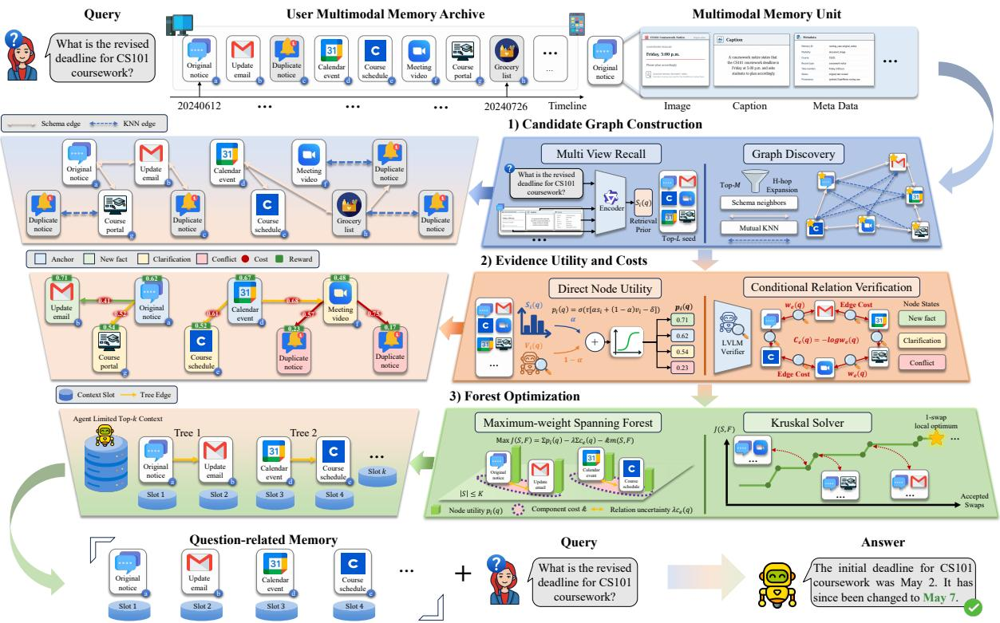  
Figure 1: Overview of GraphMemix in three stages. (1) Candidate graph construction uses multi-view retrieval to identify seeds and bounded relation expansion to expose their local context. (2) Evidence utility and costs combines direct node support with ECV-validated, anchor-conditioned incremental relations. (3) Forest optimization jointly selects nodes and trusted edges under a maximum reader budget, th<sub>en</sub> d<sub>e</sub>t<sub>erm</sub>i<sub>n</sub>i<sub>s</sub>ti<sub>ca</sub>ll<sub>y ser</sub>i<sub>a</sub>li<sub>zes</sub> th<sub>e resu</sub>lti<sub>ng ev</sub>id<sub>ence</sub> f<sub>ores</sub>t<sub>.</sub>

## 2.2 Query-Conditioned Evidence Retrieval

Query-conditioned retrieval adapts memory access to the information need expressed by the cur-<sub>ren</sub>t <sub>ques</sub>ti<sub>on.</sub> M<sub>em</sub>G<sub>u</sub>id<sub>e</sub> D<sub>u e</sub>t <sub>a</sub>l<sub>.,</sub> 2026 <sub>re</sub>t<sub>r</sub>i<sub>eves</sub> i<sub>n</sub>t<sub>en</sub>t<sub>-a</sub>li<sub>gne</sub>d <sub>memor</sub>i<sub>es an</sub>d th<sub>en</sub> filt<sub>ers</sub> th<sub>em</sub> <sub>accor</sub>di<sub>ng</sub> t<sub>o</sub> <sub>m</sub>i<sub>ss</sub>i<sub>ng</sub> i<sub>n</sub>f<sub>orma</sub>ti<sub>on,</sub> <sub>w</sub>hil<sub>e</sub> M<sub>em</sub>R<sub>eran</sub>k<sub>er</sub> C<sub>.</sub> Li <sub>e</sub>t <sub>a</sub>l<sub>.,</sub> 2026 t<sub>arge</sub>t<sub>s</sub> t<sub>empora</sub>l <sub>con-</sub> <sub>s</sub>t<sub>ra</sub>i<sub>n</sub>t<sub>s, causa</sub>l <sub>re</sub>l<sub>a</sub>ti<sub>ons, an</sub>d <sub>mu</sub>lti<sub>-</sub>t<sub>urn core</sub>f<sub>erence</sub> th<sub>a</sub>t <sub>c</sub>h<sub>a</sub>ll<sub>enge gener</sub>i<sub>c re</sub>l<sub>evance mo</sub>d<sub>e</sub>l<sub>s.</sub> I<sub>n</sub> <sub>g</sub>eneral retrieval<sub>,</sub> RankGPT Sun et al.<sub>,</sub> 2023 shows that listwise com<sub>p</sub>arison with a <sub>g</sub>enerative LLM <sub>can</sub> <sub>ou</sub>t<sub>per</sub>f<sub>orm</sub> i<sub>n</sub>d<sub>epen</sub>d<sub>en</sub>t <sub>s</sub>i<sub>m</sub>il<sub>ar</sub>it<sub>y</sub> <sub>scor</sub>i<sub>ng.</sub> Th<sub>ese</sub> <sub>me</sub>th<sub>o</sub>d<sub>s</sub> <sub>pr</sub>i<sub>mar</sub>il<sub>y</sub> <sub>pro</sub>d<sub>uce</sub> <sub>query–memory</sub> <sub>re</sub>l<sub>evance scores or ran</sub>ki<sub>ngs; can</sub>did<sub>a</sub>t<sub>e–can</sub>did<sub>a</sub>t<sub>e re</sub>l<sub>a</sub>ti<sub>ons are no</sub>t <sub>exp</sub>li<sub>c</sub>it d<sub>ec</sub>i<sub>s</sub>i<sub>on var</sub>i<sub>a</sub>bl<sub>es.</sub> M<sub>u</sub>lti<sub>mo</sub>d<sub>a</sub>l RAG f<sub>ur</sub>th<sub>er as</sub>k<sub>s w</sub>h<sub>e</sub>th<sub>er re</sub>t<sub>r</sub>i<sub>eve</sub>d <sub>con</sub>t<sub>en</sub>t <sub>genu</sub>i<sub>ne</sub>l<sub>y suppor</sub>t<sub>s genera</sub>ti<sub>on.</sub> R<sub>ag</sub>VL Z. Chen et al.<sub>,</sub> 2024 uses an LVLM to rerank retrieved ima<sub>g</sub>es<sub>,</sub> MEG-RAG X. Wan<sub>g</sub> et al.<sub>,</sub> 2026 t<sub>ra</sub>i<sub>ns a mu</sub>lti<sub>mo</sub>d<sub>a</sub>l <sub>ev</sub>id<sub>ence reran</sub>k<sub>er aroun</sub>d th<sub>e seman</sub>ti<sub>c core o</sub>f <sub>an answer.</sub> Th<sub>ese wor</sub>k<sub>s gener-</sub> <sub>a</sub>ll<sub>y</sub> i<sub>gnore</sub> i<sub>n</sub>t<sub>er-ev</sub>id<sub>ence</sub> <sub>corre</sub>l<sub>a</sub>ti<sub>ons</sub> <sub>an</sub>d <sub>are</sub> <sub>vu</sub>l<sub>nera</sub>bl<sub>e</sub> t<sub>o</sub> <sub>re</sub>d<sub>un</sub>d<sub>an</sub>t <sub>or</sub> <sub>con</sub>t<sub>ra</sub>di<sub>c</sub>t<sub>ory</sub> <sub>ev</sub>id<sub>ence.</sub> GraphMemix expands query-conditioned scoring to complete context construction, jointly model i<sub>ng ev</sub>id<sub>ence u</sub>tilit<sub>y an</sub>d <sub>va</sub>lid i<sub>n</sub>t<sub>er-ev</sub>id<sub>ence</sub> li<sub>n</sub>k<sub>s w</sub>hil<sub>e</sub> di<sub>scar</sub>di<sub>ng re</sub>d<sub>un</sub>d<sub>an</sub>t <sub>s</sub>i<sub>m</sub>il<sub>ar memor</sub>i<sub>es.</sub>

## 3 Method

W<sub>e propose</sub> G<sub>r</sub>a<sub>ph</sub>M<sub>emix, w</sub>hi<sub>c</sub>h f<sub>ormu</sub>l<sub>a</sub>t<sub>es</sub> l<sub>ong-</sub>t<sub>erm mu</sub>lti<sub>mo</sub>d<sub>a</sub>l <sub>memory organ</sub>i<sub>za</sub>ti<sub>on as a</sub> <sub>query-con</sub>diti<sub>one</sub>d f<sub>ores</sub>t <sub>op</sub>ti<sub>m</sub>i<sub>za</sub>ti<sub>on</sub> <sub>pro</sub>bl<sub>em</sub> <sub>over</sub> <sub>a</sub> b<sub>oun</sub>d<sub>e</sub>d <sub>can</sub>did<sub>a</sub>t<sub>e</sub> <sub>grap</sub>h<sub>.</sub>

## 3.1 Problem Formulation

Let $\mathcal { V } = \{ e _ { i } \} _ { i = 1 } ^ { N }$ b<sub>e</sub> <sub>user</sub> <sub>mu</sub>lti<sub>mo</sub>d<sub>a</sub>l <sub>memory</sub> <sub>arc</sub>hi<sub>ve</sub> <sub>con</sub>t<sub>a</sub>i<sub>n</sub>i<sub>ng</sub> � hi<sub>s</sub>t<sub>or</sub>i<sub>ca</sub>l <sub>recor</sub>d<sub>s,</sub> <sub>an</sub>d l<sub>e</sub>t $q =$ $( q ^ { \mathrm { t e x t } } , q ^ { \mathrm { v i s } } )$ b<sub>e</sub> <sub>a</sub> <sub>ques</sub>ti<sub>on</sub> <sub>w</sub>ith <sub>v</sub>i<sub>sua</sub>l i<sub>npu</sub>t <sub>ava</sub>il<sub>a</sub>bl<sub>e.</sub> E<sub>ac</sub>h $e _ { i }$ <sub>may</sub> <sub>con</sub>t<sub>a</sub>i<sub>n</sub> t<sub>ex</sub>t<sub>,</sub> i<sub>mages,</sub> <sub>v</sub>id<sub>eo,</sub> <sub>an</sub>d derived re<sub>p</sub>resentations. An evidence selector Π chooses an evidence set of at most � records and <sub>organ</sub>i<sub>zes</sub> it i<sub>n</sub>t<sub>o an or</sub>d<sub>ere</sub>d <sub>sequence</sub> $O _ { q } .$ A frozen multimodal <sub>g</sub>enerator M then <sub>p</sub>roduces the answer:

$$
\begin{array} { r l } & { ( S _ { q } , O _ { q } ) = \Pi ( q , \mathcal { V } ; K ) , \qquad S _ { q } \subseteq \mathcal { V } , \quad | S _ { q } | \leq K , } \\ & { \qquad \quad \hat { y } = M ( q , O _ { q } ) . } \end{array}\tag{1}
$$

Our objective is to desi<sub>g</sub>n Π such that the selected evidence <sub>p</sub>rovide com<sub>p</sub>lete context to im<sub>p</sub>rove th<sub>e correc</sub>t<sub>ness o</sub>f $\hat { y }$

## 3.2 Query-Conditioned Evidence Forest

A direct im<sub>p</sub>lementation of Π is rankin<sub>g</sub> memories inde<sub>p</sub>endentl<sub>y</sub> b<sub>y q</sub>uer<sub>y</sub>-memor<sub>y</sub> similarit<sub>y</sub>. It <sub>can</sub> <sub>was</sub>t<sub>e</sub> <sub>s</sub>l<sub>o</sub>t<sub>s</sub> <sub>on</sub> d<sub>up</sub>li<sub>ca</sub>t<sub>es</sub> <sub>an</sub>d <sub>m</sub>i<sub>ss</sub> <sub>a</sub> <sub>response,</sub> <sub>su</sub>b<sub>sequen</sub>t <sub>s</sub>t<sub>a</sub>t<sub>e,</sub> <sub>or</sub> <sub>re</sub>f<sub>eren</sub>ti<sub>a</sub>l <sub>con</sub>t<sub>ex</sub>t <sub>w</sub>h<sub>ose</sub> <sub>wor</sub>di<sub>ng</sub> dif<sub>ers</sub> f<sub>rom</sub> th<sub>e</sub> <sub>ques</sub>ti<sub>on.</sub> C<sub>onverse</sub>l<sub>y,</sub> i<sub>nser</sub>ti<sub>ng</sub> <sub>every</sub> <sub>connec</sub>t<sub>e</sub>d <sub>recor</sub>d i<sub>n</sub>t<sub>ro</sub>d<sub>uces</sub> i<sub>rre</sub>l<sub>e-</sub> <sub>van</sub>t <sub>con</sub>t<sub>ex</sub>t<sub>.</sub> W<sub>e</sub> i<sub>ns</sub>t<sub>ea</sub>d <sub>represen</sub>t <sub>can</sub>did<sub>a</sub>t<sub>e memor</sub>i<sub>es as no</sub>d<sub>es an</sub>d <sub>poss</sub>ibl<sub>e con</sub>t<sub>ex</sub>t<sub>ua</sub>l d<sub>epen-</sub> d<sub>enc</sub>i<sub>es as e</sub>d<sub>ges.</sub> F<sub>or se</sub>l<sub>ec</sub>t<sub>e</sub>d <sub>no</sub>d<sub>es</sub> � <sub>an</sub>d <sub>an acyc</sub>li<sub>c e</sub>d<sub>ge se</sub>t $F ,$ we write the selection objective as

$$
\operatorname* { m a x } _ { S , F } \mathcal { U } _ { \mathrm { n o d e } } ( S \mid q ) - C _ { \mathrm { e d g e } } ( F \mid q ) - C _ { \mathrm { o p e n } } ( S , F ) ,\tag{2}
$$

<sub>w</sub>h<sub>ere</sub> th<sub>e</sub> t<sub>erms</sub> <sub>measure</sub> di<sub>rec</sub>t <sub>ev</sub>id<sub>ence</sub> <sub>u</sub>tilit<sub>y</sub> $U _ { \mathrm { n o d e } } ,$ <sub>,</sub> <sub>uncer</sub>t<sub>a</sub>i<sub>n</sub>t<sub>y</sub> i<sub>n</sub> <sub>expan</sub>di<sub>ng</sub> <sub>a</sub> <sub>re</sub>l<sub>a</sub>ti<sub>on</sub> $C _ { \mathrm { e d g e } } ,$ <sub>an</sub>d th<sub>e cos</sub>t <sub>o</sub>f <sub>open</sub>i<sub>ng</sub> i<sub>n</sub>d<sub>epen</sub>d<sub>en</sub>t <sub>ev</sub>id<sub>ence c</sub>h<sub>a</sub>i<sub>ns</sub> $C _ { \mathrm { { o p e n } } }$ <sub>.</sub> Th<sub>e rema</sub>i<sub>n</sub>d<sub>er o</sub>f thi<sub>s sec</sub>ti<sub>on con-</sub> structs and solves this objective.

## 3.3 Candidate Graph Construction

Multi-view retrieval. The same memory may be retrieved through diferent signals: an original image for objects and scenes, a caption for events and actions, OCR for printed text, or a video f<sub>rame</sub> f<sub>or v</sub>i<sub>sua</sub>l <sub>s</sub>t<sub>a</sub>t<sub>e.</sub> L<sub>e</sub>t $\mathcal { U } _ { i }$ b<sub>e</sub> th<sub>e re</sub>t<sub>r</sub>i<sub>eva</sub>l <sub>v</sub>i<sub>ews o</sub>f $e _ { i }$ <sub>.</sub> It<sub>s</sub> i<sub>n</sub>iti<sub>a</sub>l <sub>score</sub> i<sub>s</sub>

$$
s _ { i } ( \boldsymbol q ) = \operatorname* { m a x } _ { u \in \mathcal { U } _ { i } } \sin ( h ( \boldsymbol q ) , h ( u ) ) ,\tag{3}
$$

<sub>w</sub>h<sub>ere</sub> $h$ i<sub>s</sub> <sub>a</sub> <sub>s</sub>h<sub>are</sub>d <sub>mu</sub>lti<sub>mo</sub>d<sub>a</sub>l <sub>enco</sub>d<sub>er.</sub> M<sub>ax</sub> <sub>poo</sub>li<sub>ng</sub> <sub>on</sub>l<sub>y</sub> <sub>prov</sub>id<sub>es</sub> <sub>mu</sub>lti<sub>p</sub>l<sub>e</sub> <sub>rou</sub>t<sub>es</sub> i<sub>n</sub>t<sub>o</sub> th<sub>e</sub> <sub>can-</sub> did<sub>a</sub>t<sub>e se</sub>t<sub>.</sub>

Query-relevant subgraph discovery. We use two complementary relation sources. Schema rel<sub>a</sub>ti<sub>ons enco</sub>d<sub>e o</sub>b<sub>serva</sub>bl<sub>e</sub> i<sub>n</sub>t<sub>erac</sub>ti<sub>on s</sub>t<sub>ruc</sub>t<sub>ure, suc</sub>h <sub>as recor</sub>d<sub>s</sub> f<sub>rom</sub> th<sub>e same sess</sub>i<sub>on or</sub> l<sub>oca</sub>ti<sub>on.</sub> S<sub>eman</sub>ti<sub>c</sub> <sub>re</sub>l<sub>a</sub>ti<sub>ons</sub> <sub>connec</sub>t <sub>memor</sub>i<sub>es</sub> <sub>w</sub>ith <sub>mu</sub>t<sub>ua</sub>ll<sub>y</sub> <sub>s</sub>i<sub>m</sub>il<sub>ar</sub> <sub>represen</sub>t<sub>a</sub>ti<sub>ons.</sub> L<sub>e</sub>t $\mathcal { T } _ { \mathrm { s c h e m a } }$ b<sub>e</sub> th<sub>e</sub> <sub>sc</sub>h<sub>ema</sub> <sub>re</sub>l<sub>a</sub>ti<sub>on</sub> t<sub>ypes,</sub> $\phi _ { r } ( e _ { i } , e _ { j } )$ i<sub>n</sub>di<sub>ca</sub>t<sub>e</sub> <sub>w</sub>h<sub>e</sub>th<sub>er</sub> <sub>re</sub>l<sub>a</sub>ti<sub>on</sub> <sub>�</sub> h<sub>o</sub>ld<sub>s,</sub> <sub>an</sub>d $\mathcal { N } _ { k } ( i )$ d<sub>eno</sub>t<sub>e</sub> th<sub>e</sub> � <sub>neares</sub>t <sub>ne</sub>i<sub>g</sub>hb<sub>ors o</sub>f �<sub>.</sub> W<sub>e</sub> d<sub>e</sub>fi<sub>ne</sub>

$$
\begin{array} { r l } & { E _ { \mathrm { s c h e m a } } = \{ ( i , j ) : \exists r \in \mathcal { T } _ { \mathrm { s c h e m a } } , \ \phi _ { r } ( e _ { i } , e _ { j } ) = 1 \} , } \\ & { \quad E _ { \mathrm { s e m } } = \{ ( i , j ) : i \in N _ { k } ( j ) , \ j \in N _ { k } ( i ) \} , } \end{array}\tag{4}
$$

<sub>an</sub>d th<sub>e</sub> di<sub>scovery grap</sub>h $G ^ { \mathrm { d i s c } } = ( \mathcal { V } , E _ { \mathrm { s c h e m a } } \cup E _ { \mathrm { s e m } } )$ <sub>.</sub> St<sub>ar</sub>ti<sub>ng</sub> f<sub>rom</sub> th<sub>e</sub> t<sub>op-</sub>� <sub>mu</sub>lti<sub>-v</sub>i<sub>ew memor</sub>i<sub>es</sub> $R _ { q } ^ { ( L ) } = \mathrm { T o p } _ { L } ( \mathcal { V } ; s _ { i } ( q ) )$ <sub>, we co</sub>ll<sub>ec</sub>t <sub>no</sub>d<sub>es reac</sub>h<sub>a</sub>bl<sub>e w</sub>ithi<sub>n</sub> � h<sub>ops an</sub>d <sub>re</sub>t<sub>a</sub>i<sub>n a</sub>t <sub>mos</sub>t � <sub>can</sub>did<sub>a</sub>t<sub>es:</sub>

$$
\widetilde { C } _ { q } = R _ { q } ^ { ( L ) } \cup N _ { \leq H } ^ { G ^ { \mathrm { d i s c } } } ( R _ { q } ^ { ( L ) } ) , \qquad C _ { q } = \mathrm { T o p } _ { M } ( \widetilde { C } _ { q } ) .\tag{5}
$$

Th<sub>e</sub> <sub>ran</sub>ki<sub>ng</sub> <sub>com</sub>bi<sub>nes</sub> <sub>re</sub>t<sub>r</sub>i<sub>eva</sub>l <sub>or</sub>d<sub>er</sub> <sub>an</sub>d <sub>re</sub>l<sub>a</sub>ti<sub>on-expans</sub>i<sub>on</sub> <sub>or</sub>d<sub>er.</sub> Thi<sub>s</sub> <sub>s</sub>t<sub>ep</sub> <sub>preserves</sub> l<sub>oca</sub>l <sub>con-</sub> t<sub>ex</sub>t <sub>w</sub>hil<sub>e</sub> b<sub>oun</sub>di<sub>ng</sub> <sub>a</sub>ll <sub>su</sub>b<sub>sequen</sub>t <sub>seman</sub>ti<sub>c</sub> <sub>reason</sub>i<sub>ng.</sub>

## 3.4 Evidence Utility and Activation Costs

Direct node utility. Retrieval similarity is a stable global prior, but is insuficient for negation, t<sub>empora</sub>l <sub>c</sub>h<sub>ange, v</sub>i<sub>sua</sub>l <sub>re</sub>f<sub>erence, or memor</sub>i<sub>es</sub> th<sub>a</sub>t <sub>s</sub>h<sub>are a</sub> t<sub>op</sub>i<sub>c</sub> b<sub>u</sub>t i<sub>mp</sub>l<sub>y</sub> dif<sub>eren</sub>t <sub>answers.</sub> A li<sub>s</sub>t<sub>w</sub>i<sub>se no</sub>d<sub>e ver</sub>ifi<sub>er rea</sub>d<sub>s</sub> $q$ <sub>an</sub>d $C _ { q }$ i<sub>n one ca</sub>ll <sub>an</sub>d <sub>ou</sub>t<sub>pu</sub>t<sub>s</sub> $\upsilon _ { i } ( q )$ <sub>,</sub> th<sub>e</sub> d<sub>egree</sub> t<sub>o w</sub>hi<sub>c</sub>h $e _ { i }$ i<sub>n</sub>d<sub>epen-</sub> d<sub>en</sub>tl<sub>y</sub> <sub>suppor</sub>t<sub>s</sub> th<sub>e</sub> <sub>ques</sub>ti<sub>on.</sub> Li<sub>s</sub>t<sub>w</sub>i<sub>se</sub> i<sub>npu</sub>t <sub>p</sub>l<sub>aces</sub> <sub>can</sub>did<sub>a</sub>t<sub>es</sub> <sub>on</sub> <sub>a</sub> <sub>common</sub> <sub>seman</sub>ti<sub>c</sub> <sub>sca</sub>l<sub>e.</sub> W<sub>e</sub> f<sub>use</sub> th<sub>e norma</sub>li<sub>ze</sub>d <sub>ver</sub>ifi<sub>er score</sub> $\widetilde { \nu _ { i } }$ <sub>w</sub>ith <sub>re</sub>t<sub>r</sub>i<sub>eva</sub>l<sub>:</sub>

$$
\begin{array} { c } { { p _ { i } ( q ) = \sigma ( \tau [ \alpha s _ { i } ( q ) + ( 1 - \alpha ) \widetilde { \nu } _ { i } ( q ) - \delta ] ) , } } \\ { { \displaystyle \mathcal { U } _ { \mathrm { n o d e } } ( S \mid q ) = \sum _ { i \in S } p _ { i } ( q ) , } } \end{array}\tag{6}
$$

<sub>w</sub>h<sub>ere</sub> $\alpha$ balances the retrieval prior and conditional judgment, while $\tau$ <sub>an</sub>d � <sub>con</sub>t<sub>ro</sub>l <sub>sca</sub>l<sub>e an</sub>d <sub>o</sub>f<sub>se</sub>t<sub>.</sub>

Anchor-conditioned relation verification. Node verification asks whether a memory is useful <sub>a</sub>l<sub>one,</sub> b<sub>u</sub>t <sub>canno</sub>t di<sub>s</sub>ti<sub>ngu</sub>i<sub>s</sub>h <sub>re</sub>d<sub>un</sub>d<sub>ancy</sub> f<sub>rom</sub> <sub>comp</sub>l<sub>emen</sub>t<sub>ar</sub>it<sub>y</sub> <sub>w</sub>ith <sub>an</sub> <sub>a</sub>l<sub>rea</sub>d<sub>y</sub> <sub>re</sub>t<sub>r</sub>i<sub>eve</sub>d <sub>memory.</sub> W<sub>e</sub> t<sub>a</sub>k<sub>e a</sub> hi<sub>g</sub>h<sub>-con</sub>fid<sub>ence anc</sub>h<sub>or se</sub>t $A _ { q }$ f<sub>rom</sub> th<sub>e</sub> i<sub>n</sub>iti<sub>a</sub>l <sub>re</sub>t<sub>r</sub>i<sub>eva</sub>l <sub>an</sub>d i<sub>nspec</sub>t <sub>on</sub>l<sub>y sc</sub>h<sub>ema e</sub>d<sub>ges</sub> b<sub>e</sub>t<sub>ween anc</sub>h<sub>ors an</sub>d <sub>can</sub>did<sub>a</sub>t<sub>es:</sub>

$$
E _ { q } ^ { \mathrm { e l i g } } = \{ ( a , i ) \in E _ { \mathrm { s c h e m a } } : a \in A _ { q } , i \in C _ { q } \} .\tag{7}
$$

The Evidence-Chain Verifier (ECV) reads these <sub>p</sub>airs in one listwise call. For each candidate, it <sub>c</sub>h<sub>ooses</sub> th<sub>e anc</sub>h<sub>or</sub> th<sub>a</sub>t b<sub>es</sub>t <sub>exp</sub>l<sub>a</sub>i<sub>ns</sub> th<sub>e can</sub>did<sub>a</sub>t<sub>e</sub>’<sub>s</sub> i<sub>ncremen</sub>t<sub>a</sub>l <sub>ro</sub>l<sub>e, pre</sub>di<sub>c</sub>t<sub>s an</sub> i<sub>ncremen</sub>t<sub>a</sub>l<sub>-</sub> suppo<sup>rt</sup> sco<sup>r</sup>e $s _ { a i } ^ { \mathrm { i n c } } ( q )$ , an<sup>d</sup> ass<sup>i</sup>gns one o<sup>f</sup> s<sup>i</sup>x ro<sup>l</sup>es: new\_fact, clarification, corroboration, redundant, conflict, or irrelevant. <sup>O</sup>n<sup>l</sup>y t<sup>h</sup>e <sup>b</sup>est anc<sup>h</sup>or e<sup>d</sup>ge w<sup>i</sup>t<sup>h</sup> a pos<sup>i</sup>t<sup>i</sup>ve score an<sup>d</sup> one o<sup>f</sup> th<sub>e</sub> fi<sub>rs</sub>t th<sub>ree ro</sub>l<sub>es</sub> i<sub>s re</sub>t<sub>a</sub>i<sub>ne</sub>d<sub>,</sub> f<sub>orm</sub>i<sub>ng</sub>

$$
G _ { q } ^ { \mathrm { t r u s t } } = ( C _ { q } , E _ { q } ^ { \mathrm { t r u s t } } ) , \qquad E _ { q } ^ { \mathrm { t r u s t } } \subseteq E _ { q } ^ { \mathrm { e l i g } } .\tag{8}
$$

F<sub>or</sub> <sub>a</sub> <sub>re</sub>t<sub>a</sub>i<sub>ne</sub>d <sub>e</sub>d<sub>ge</sub> $( a , i )$ <sub>,</sub> it<sub>s</sub> <sub>re</sub>li<sub>a</sub>bilit<sub>y</sub> <sub>an</sub>d <sub>uncer</sub>t<sub>a</sub>i<sub>n</sub>t<sub>y</sub> <sub>cos</sub>t <sub>are</sub>

$$
w _ { a i } ( q ) = w _ { a i } ^ { \mathrm { s c h e m a } } \frac { s _ { a i } ^ { \mathrm { i n c } } ( q ) } { s _ { \mathrm { m a x } } } , \qquad c _ { a i } ( q ) = - \log w _ { a i } ( q ) ,\tag{9}
$$

<sub>w</sub>h<sub>ere</sub> $w _ { a i } ^ { \mathrm { s c h e m a } }$ i<sub>s</sub> <sub>a</sub> <sub>sc</sub>h<sub>ema-spec</sub>ifi<sub>c</sub> <sub>re</sub>li<sub>a</sub>bilit<sub>y</sub> <sub>ce</sub>ili<sub>ng.</sub> A<sub>ccor</sub>di<sub>ng</sub>l<sub>y,</sub> $\begin{array} { r } { C _ { \mathrm { e d g e } } ( F \mid q ) = \lambda \sum _ { e \in F } c _ { e } ( q ) } \end{array}$ <sub>.</sub> R<sub>o</sub>l<sub>e</sub> <sub>ga</sub>ti<sub>ng</sub> d<sub>e</sub>t<sub>erm</sub>i<sub>nes</sub> <sub>w</sub>h<sub>e</sub>th<sub>er</sub> <sub>an</sub> <sub>e</sub>d<sub>ge</sub> <sub>carr</sub>i<sub>es</sub> <sub>pos</sub>iti<sub>ve</sub> i<sub>ncremen</sub>t<sub>a</sub>l <sub>seman</sub>ti<sub>cs,</sub> th<sub>e</sub> <sub>con</sub>ti<sub>nuous</sub> <sub>score</sub> th<sub>en con</sub>t<sub>ro</sub>l<sub>s</sub> it<sub>s cre</sub>dit<sub>.</sub> A <sub>re</sub>l<sub>a</sub>t<sub>e</sub>d b<sub>u</sub>t <sub>re</sub>d<sub>un</sub>d<sub>an</sub>t <sub>or con</sub>fli<sub>c</sub>ti<sub>ng memory</sub> th<sub>ere</sub>f<sub>ore rece</sub>i<sub>ves no s</sub>t<sub>ruc-</sub> t<sub>ura</sub>l <sub>rewar</sub>d<sub>.</sub>

Independent-chain cost. Let $m ( S , F )$ be the number of connected components in the forest (�, �). E<sub>very componen</sub>t i<sub>s an</sub> i<sub>n</sub>d<sub>epen</sub>d<sub>en</sub>tl<sub>y</sub> i<sub>n</sub>t<sub>erpre</sub>t<sub>e</sub>d <sub>ev</sub>id<sub>ence c</sub>h<sub>a</sub>i<sub>n, so we</sub> d<sub>e</sub>fi<sub>ne</sub>

$$
C _ { \mathrm { o p e n } } ( S , F ) = \kappa m ( S , F ) ,\tag{10}
$$

<sub>w</sub>h<sub>ere</sub> $\kappa \geq 0$ b<sub>a</sub>l<sub>ances</sub> i<sub>n</sub>d<sub>epen</sub>d<sub>en</sub>t <sub>ev</sub>id<sub>ence</sub> <sub>aga</sub>i<sub>ns</sub>t <sub>con</sub>t<sub>ex</sub>t<sub>ua</sub>l <sub>comp</sub>l<sub>e</sub>ti<sub>on</sub> <sub>o</sub>f <sub>an</sub> <sub>ex</sub>i<sub>s</sub>ti<sub>ng</sub> <sub>even</sub>t<sub>.</sub>

<table><tr><td colspan="2"></td><td colspan="2">ATM</td><td colspan="2">Mem-Gallery</td><td colspan="2">MemEye</td><td colspan="2">H2HMem</td><td rowspan="2">Avg. J.Acc.</td></tr><tr><td>Method</td><td>Venue</td><td>J.Acc.</td><td>EM</td><td>J.Acc.</td><td>EM</td><td>J.Acc.</td><td>M.EM</td><td>J.Acc.</td><td>Recall</td></tr><tr><td>A-MEM</td><td>NeurIPS&#x27;25</td><td>41.86</td><td>40.80</td><td>52.89</td><td>32.61</td><td>37.09</td><td>40.57</td><td>39.94</td><td>40.55</td><td>42.94</td></tr><tr><td>UniversalRAG</td><td>ACL&#x27;26</td><td>43.10</td><td>41.19</td><td>63.76</td><td>32.50</td><td>47.98</td><td>49.33</td><td>44.36</td><td>45.04</td><td>49.80</td></tr><tr><td>MemGuide</td><td>AAAI&#x27;26</td><td>48.47</td><td>47.80</td><td>48.10</td><td>32.73</td><td>41.40</td><td>44.61</td><td>39.94</td><td>35.81</td><td>44.48</td></tr><tr><td>LightMem</td><td>ICLR&#x27;26</td><td>22.70</td><td>24.52</td><td>38.28</td><td>23.20</td><td>36.23</td><td>39.76</td><td>31.04</td><td>27.82</td><td>32.06</td></tr><tr><td>VimRAG</td><td>ICML&#x27;26</td><td>33.81</td><td>32.76</td><td>48.33</td><td>16.13</td><td>28.25</td><td>28.23</td><td>17.89</td><td>17.01</td><td>32.07</td></tr><tr><td>GRAPHMEMIX</td><td>Ours</td><td>55.27</td><td>53.83</td><td>76.33</td><td>36.76</td><td>53.64</td><td>54.25</td><td>60.96</td><td>54.70</td><td>61.55</td></tr><tr><td>Gain over 2nd</td><td></td><td>+6.80</td><td>+6.03</td><td>+12.57</td><td>+4.03</td><td>+5.66</td><td>+4.92</td><td>+16.60</td><td>+9.66</td><td>+11.75</td></tr></table>

Table 1: End-to-end results with Qwen3-VL-8B-Instruct, judged by GPT-5-mini. J.Acc. denotes Judge Accurac<sub>y</sub> (%). Each benchmark additionall<sub>y</sub> re<sub>p</sub>orts its re<sub>p</sub>resentative native metric. Av<sub>g</sub>. is the macro-avera<sub>g</sub>e over the four Jud<sub>g</sub>e Accuracies.

<table><tr><td colspan="2"></td><td colspan="2">ATM</td><td colspan="2">Mem-Gallery</td><td colspan="2">MemEye</td><td colspan="2">H2HMem</td><td rowspan="2">Avg. J.Acc.</td></tr><tr><td>Method</td><td>Venue</td><td>J.Acc.</td><td>EM</td><td>J.Acc.</td><td>EM</td><td>J.Acc.</td><td>M.EM</td><td>J.Acc.</td><td>Recall</td></tr><tr><td>A-MEM</td><td>NeurIPS&#x27;25</td><td>42.43</td><td>41.95</td><td>50.03</td><td>28.40</td><td>24.42</td><td>30.93</td><td>44.20</td><td>39.97</td><td>40.27</td></tr><tr><td>UniversalRAG</td><td>ACL&#x27;26</td><td>49.04</td><td>48.18</td><td>64.82</td><td>32.14</td><td>58.17</td><td>38.07</td><td>48.34</td><td>41.31</td><td>55.09</td></tr><tr><td>MemGuide</td><td>AAAI&#x27;26</td><td>54.98</td><td>53.07</td><td>48.33</td><td>22.85</td><td>30.40</td><td>36.66</td><td>47.98</td><td>41.97</td><td>45.43</td></tr><tr><td>LightMem</td><td>ICLR&#x27;26</td><td>24.33</td><td>25.48</td><td>33.72</td><td>17.01</td><td>20.70</td><td>30.59</td><td>32.80</td><td>27.79</td><td>27.89</td></tr><tr><td>VimRAG</td><td>ICML&#x27;26</td><td>22.51</td><td>21.36</td><td>46.99</td><td>14.14</td><td>31.81</td><td>34.64</td><td>39.00</td><td>33.67</td><td>35.08</td></tr><tr><td>GRAPHMEMIX</td><td>Ours</td><td>58.05</td><td>57.47</td><td>81.47</td><td>35.65</td><td>66.68</td><td>43.06</td><td>63.47</td><td>49.91</td><td>67.42</td></tr><tr><td>Gain over 2nd</td><td></td><td>+3.07</td><td>+4.41</td><td>+16.66</td><td>+3.51</td><td>+8.52</td><td>+4.99</td><td>+15.14</td><td>+7.94</td><td>+12.33</td></tr></table>

Table 2: End-to-end results with Gemma 4 12B Unified, judged by GPT-5-mini. J.Acc. denotes Judge Accurac<sub>y</sub> (%). Each benchmark additionall<sub>y</sub> re<sub>p</sub>orts its re<sub>p</sub>resentative native metric. Av<sub>g</sub>. is the macro-avera<sub>g</sub>e over the four Jud<sub>g</sub>e Accuracies.

## 3.5 Forest Optimization

Substitutin<sub>g</sub> E<sub>q</sub>uations (6)–(10) into E<sub>q</sub>uation (2) <sub>g</sub>ives

$$
\begin{array} { r l } { ( S _ { q } ^ { \star } , F _ { q } ^ { \star } ) = \arg \operatorname* { m a x } _ { S , F } } & { \displaystyle \sum _ { i \in S } p _ { i } ( q ) - \lambda \sum _ { e \in F } c _ { e } ( q ) - \kappa m ( S , F ) } \\ { \mathrm { s . t . } } & { S \subseteq C _ { q } , \quad | S | \leq K , } \\ & { F \subseteq E _ { q } ^ { \mathrm { t r u s t } } [ S ] . } \end{array}\tag{11}
$$

Si<sub>nce e</sub>d<sub>ge cos</sub>t<sub>s are nonnega</sub>ti<sub>ve an</sub>d <sub>remov</sub>i<sub>ng an e</sub>d<sub>ge</sub> f<sub>rom any cyc</sub>l<sub>e canno</sub>t d<sub>ecrease</sub> th<sub>e o</sub>b<sub>-</sub> jective, an optimal � can therefore be chosen as a forest. Hence, $m ( S , F ) = \vert S \vert - \vert F \vert$ <sub>.</sub> D<sub>e</sub>fi<sub>n</sub>i<sub>ng</sub> th<sub>e</sub> <sub>s</sub>t<sub>ruc</sub>t<sub>ura</sub>l <sub>ga</sub>i<sub>n</sub> $B _ { e } ( q ) = \kappa - \lambda c _ { e } ( q )$ <sub>g</sub>i<sub>ves</sub> th<sub>e</sub> <sub>equ</sub>i<sub>va</sub>l<sub>en</sub>t <sub>u</sub>tilit<sub>y</sub>

$$
\sum _ { i \in S } \bigl ( p _ { i } ( q ) - \kappa \bigr ) + \sum _ { e \in F } B _ { e } ( q ) .\tag{12}
$$

Thi<sub>s</sub> f<sub>orm</sub> <sub>exp</sub>l<sub>a</sub>i<sub>ns</sub> <sub>a</sub>d<sub>ap</sub>ti<sub>ve</sub> <sub>car</sub>di<sub>na</sub>lit<sub>y</sub> <sub>w</sub>ith<sub>ou</sub>t i<sub>n</sub>t<sub>ro</sub>d<sub>uc</sub>i<sub>ng</sub> <sub>a</sub> <sub>separa</sub>t<sub>e</sub> <sub>per-no</sub>d<sub>e</sub> <sub>pena</sub>lt<sub>y.</sub> A<sub>n</sub> i<sub>so-</sub> l<sub>a</sub>t<sub>e</sub>d <sub>memory con</sub>t<sub>r</sub>ib<sub>u</sub>t<sub>es</sub> $p _ { i } - \kappa$ and is retained only if it can justify opening an independent evidence chain. If a memory joins an existing component through edge $e ,$ th<sub>e</sub> <sub>connec</sub>ti<sub>on</sub> <sub>recovers</sub> <sub>one</sub> <sub>open</sub>i<sub>ng</sub> <sub>cos</sub>t <sub>an</sub>d it<sub>s</sub> <sub>marg</sub>i<sub>na</sub>l <sub>con</sub>t<sub>r</sub>ib<sub>u</sub>ti<sub>on</sub> b<sub>ecomes</sub> ${ p _ { i } } - \lambda { c _ { e } }$ <sub>.</sub> T<sub>rus</sub>t<sub>e</sub>d <sub>comp</sub>l<sub>emen</sub>t<sub>ary ev</sub>id<sub>ence</sub> i<sub>s</sub> th<sub>ere</sub>f<sub>ore pro</sub>t<sub>ec</sub>t<sub>e</sub>d<sub>, w</sub>h<sub>ereas</sub> l<sub>ow-u</sub>tilit<sub>y</sub> i<sub>so</sub>l<sub>a</sub>t<sub>e</sub>d <sub>ev</sub>id<sub>ence can</sub> b<sub>e remove</sub>d<sub>.</sub>

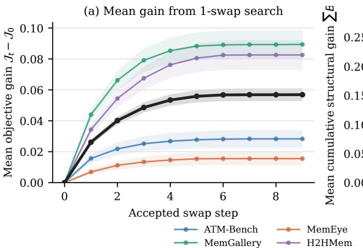

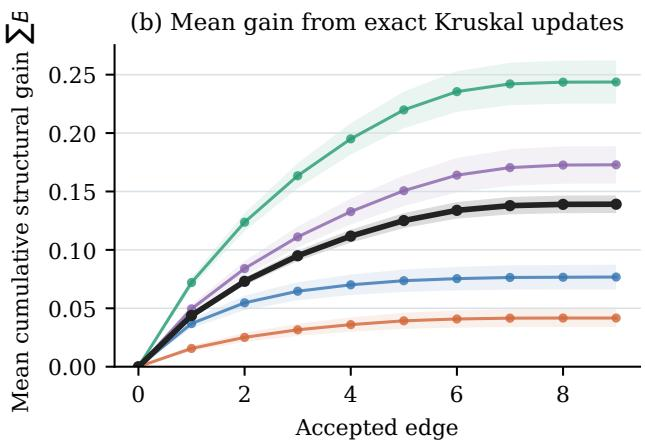

Figure 2: Optimization behavior over all 6,592 evaluation questions. (a) Mean improvement in the com<sub>p</sub>lete forest objective after acce<sub>p</sub>ted 1-swa<sub>p</sub> u<sub>p</sub>dates. (b) Mean cumulative structural <sub>g</sub>ain from <sub>accep</sub>t<sub>e</sub>d <sub>e</sub>d<sub>ges</sub> d<sub>ur</sub>i<sub>ng</sub> th<sub>e exac</sub>t K<sub>rus</sub>k<sub>a</sub>l <sub>up</sub>d<sub>a</sub>t<sub>e.</sub> Sh<sub>a</sub>d<sub>e</sub>d <sub>reg</sub>i<sub>ons are</sub> 95% <sub>con</sub>fid<sub>ence</sub> i<sub>n</sub>t<sub>erva</sub>l<sub>s.</sub>  
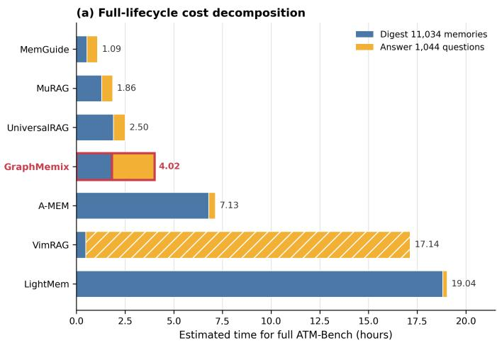

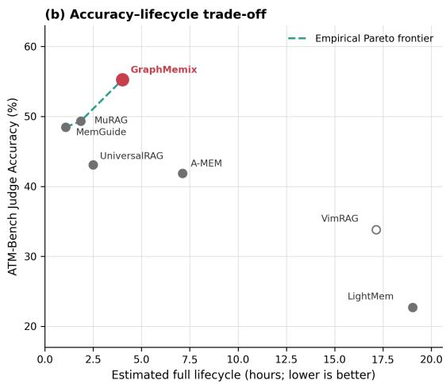  
Figure 3: Full-lifecycle cost and accuracy on ATM-Bench. (a) Estimated time to digest all 11,034 memories once and answer all 1,044 <sub>q</sub>uestions once. (b) Jud<sub>g</sub>e Accurac<sub>y</sub> versus the same lifec<sub>y</sub>cle time. G<sub>r</sub>a<sub>ph</sub>M<sub>emix</sub> li<sub>es on</sub> th<sub>e emp</sub>i<sub>r</sub>i<sub>ca</sub>l P<sub>are</sub>t<sub>o</sub> f<sub>ron</sub>ti<sub>er.</sub>

Bounded exact cardinality refinement. Joint optimization over all � candidates is combinat<sub>or</sub>i<sub>a</sub>l<sub>.</sub> W<sub>e use a</sub> d<sub>e</sub>t<sub>erm</sub>i<sub>n</sub>i<sub>s</sub>ti<sub>c</sub> t<sub>wo-s</sub>t<sub>age so</sub>l<sub>ver</sub> th<sub>a</sub>t <sub>preserves</sub> th<sub>e reca</sub>ll b<sub>e</sub>h<sub>av</sub>i<sub>or o</sub>f th<sub>e</sub> b<sub>oun</sub>d<sub>e</sub>d <sub>can</sub>did<sub>a</sub>t<sub>e grap</sub>h<sub>.</sub> Fi<sub>rs</sub>t<sub>,</sub> th<sub>e</sub> fi<sub>xe</sub>d<sub>-car</sub>di<sub>na</sub>lit<sub>y</sub> f<sub>ores</sub>t <sub>so</sub>l<sub>ver pro</sub>d<sub>uces a</sub> �<sub>-no</sub>d<sub>e proposa</sub>l $\bar { S } _ { q } \subseteq C _ { q } { : }$ it i<sub>n</sub>iti<sub>a</sub>li<sub>zes</sub> f<sub>rom</sub> th<sub>e</sub> t<sub>op-</sub>� <sub>no</sub>d<sub>e u</sub>tiliti<sub>es, eva</sub>l<sub>ua</sub>t<sub>es one se</sub>l<sub>ec</sub>t<sub>e</sub>d<sub>–unse</sub>l<sub>ec</sub>t<sub>e</sub>d <sub>swap a</sub>t <sub>a</sub> ti<sub>me, an</sub>d <sub>uses</sub> K<sub>rus</sub>k<sub>a</sub>l’<sub>s</sub> <sub>a</sub>l<sub>gor</sub>ith<sub>m</sub> t<sub>o</sub> <sub>recompu</sub>t<sub>e</sub> th<sub>e</sub> <sub>exac</sub>t <sub>max</sub>i<sub>mum-we</sub>i<sub>g</sub>ht f<sub>ores</sub>t f<sub>or</sub> <sub>every</sub> <sub>propose</sub>d <sub>no</sub>d<sub>e</sub> <sub>se</sub>t<sub>.</sub> Thi<sub>s s</sub>t<sub>age</sub> t<sub>erm</sub>i<sub>na</sub>t<sub>es a</sub>t <sub>a</sub> d<sub>e</sub>t<sub>erm</sub>i<sub>n</sub>i<sub>s</sub>ti<sub>c</sub> 1<sub>-swap</sub> l<sub>oca</sub>l <sub>op</sub>ti<sub>mum.</sub> S<sub>econ</sub>d<sub>, we so</sub>l<sub>ve</sub> th<sub>e var</sub>i<sub>a</sub>bl<sub>e-</sub> <sub>car</sub>di<sub>na</sub>lit<sub>y</sub> <sub>pro</sub>bl<sub>em</sub> <sub>exac</sub>tl<sub>y</sub> i<sub>ns</sub>id<sub>e</sub> th<sub>e</sub> f<sub>rozen</sub> <sub>proposa</sub>l<sub>:</sub>

$$
\begin{array} { r } { \begin{array} { c } { F _ { S } ^ { \star } = \arg \underset { F \subseteq E _ { q } ^ { \mathrm { t r u s t } } [ S ] } { \operatorname* { m a x } } \displaystyle \sum _ { e \in F } B _ { e } ( q ) , } \\ { ( S _ { q } ^ { \star } , F _ { q } ^ { \star } ) = \arg \underset { \emptyset \neq S \subseteq \bar { S } _ { q } } { \operatorname* { m a x } } \left[ \displaystyle \sum _ { i \in S } \big ( p _ { i } ( q ) - \kappa \big ) + \displaystyle \sum _ { e \in F _ { S } ^ { \star } } B _ { e } ( q ) \right] . } \end{array} } \end{array}\tag{13}
$$

F<sub>or eac</sub>h <sub>su</sub>b<sub>se</sub>t<sub>,</sub> K<sub>rus</sub>k<sub>a</sub>l <sub>app</sub>li<sub>e</sub>d t<sub>o pos</sub>iti<sub>ve-ga</sub>i<sub>n e</sub>d<sub>ges g</sub>i<sub>ves</sub> $F _ { S } ^ { \star }$ exactly. We break objective ties by <sub>pre</sub>f<sub>err</sub>i<sub>ng</sub> f<sub>ewer</sub> <sub>memor</sub>i<sub>es</sub> <sub>an</sub>d th<sub>en</sub> <sub>ear</sub>li<sub>er</sub> <sub>proposa</sub>l <sub>ran</sub>k<sub>s.</sub> Th<sub>e</sub> <sub>re</sub>t<sub>urne</sub>d <sub>so</sub>l<sub>u</sub>ti<sub>on</sub> i<sub>s</sub> <sub>consequen</sub>tl<sub>y</sub> <sub>g</sub>l<sub>o</sub>b<sub>a</sub>ll<sub>y</sub> <sub>op</sub>ti<sub>ma</sub>l <sub>over</sub> <sub>a</sub>ll <sub>nonemp</sub>t<sub>y</sub> <sub>su</sub>b<sub>se</sub>t<sub>s</sub> <sub>o</sub>f $\bar { S } _ { q } ;$ E<sub>v</sub>id<sub>ence</sub> <sub>or</sub>d<sub>er</sub>i<sub>ng</sub> d<sub>e</sub>t<sub>a</sub>il<sub>s</sub> <sub>are</sub> <sub>prov</sub>id<sub>e</sub>d i<sub>n</sub> th<sub>e</sub>

<table><tr><td>Configuration</td><td></td><td></td><td>MV Node ECV Opt.</td><td></td><td>ATM</td><td>Gallery</td><td>MemEye</td><td>H2H</td><td>Avg.</td></tr><tr><td>(a) Embedding Top-K</td><td></td><td></td><td></td><td></td><td>42.80</td><td>62.50</td><td>46.70</td><td>44.80</td><td>49.20</td></tr><tr><td>(b) + Multi-view Retrieval</td><td>√</td><td></td><td></td><td></td><td>47.40</td><td>67.90</td><td>49.10</td><td>50.00</td><td>53.60</td></tr><tr><td>(c) + Node Verifier</td><td>√</td><td>√</td><td></td><td></td><td>53.20</td><td>73.80</td><td>52.20</td><td>56.00</td><td>58.80</td></tr><tr><td>(d) + ECV Reranking</td><td>√</td><td>√</td><td>√</td><td></td><td>54.00</td><td>74.60</td><td>52.80</td><td>57.40</td><td>59.70</td></tr><tr><td>(e) + Forest Optimization (GRAPHMEMIx)</td><td>√</td><td>√</td><td>√</td><td>√</td><td>55.27</td><td>76.33</td><td>53.64</td><td>60.96</td><td>61.55</td></tr></table>

Table 3: Incremental ablation in Judge Accuracy (%). MV denotes multi-view retrieval and Opt. denotes <sub>se</sub>t<sub>-</sub>l<sub>eve</sub>l f<sub>ores</sub>t <sub>op</sub>ti<sub>m</sub>i<sub>za</sub>ti<sub>on.</sub> ECV R<sub>eran</sub>ki<sub>ng uses</sub> th<sub>e s</sub>t<sub>ronges</sub>t <sub>ver</sub>ifi<sub>e</sub>d <sub>re</sub>l<sub>a</sub>ti<sub>on as an</sub> i<sub>n</sub>d<sub>epen</sub>d<sub>en</sub>t candidate-level bonus, whereas the final row jointly optimizes the evidence set and its forest.

<table><tr><td>Dataset</td><td>Direct</td><td>Recoverable</td><td>No Access</td></tr><tr><td>ATM-Bench</td><td>68.50</td><td>15.14</td><td>16.35</td></tr><tr><td>Mem-Gallery</td><td>56.67</td><td>37.87</td><td>5.46</td></tr><tr><td>MemEye</td><td>42.08</td><td>39.70</td><td>18.21</td></tr><tr><td>H2HMem</td><td>15.61</td><td>33.93</td><td>50.46</td></tr></table>

Table 4: Accessibility of gold evidence from source top-10 and the actual bounded candidate graph (%).

su<sub>pp</sub><sup>l</sup>ementar<sub>y</sub> mater<sup>i</sup>a<sup>l</sup>.

## 4 Experiments

## 4.1 Experimental Setup

Datasets. We use four representative personal multimodal memory benchmarks: ATM-Bench, Mem-Galler<sub>y,</sub> MemE<sub>y</sub>e<sub>,</sub> and H2HMem Bei et al.<sub>,</sub> 2026<sub>;</sub> Guo et al.<sub>,</sub> 2026<sub>;</sub> Mei et al.<sub>,</sub> 2026<sub>;</sub> Zhu et al.<sub>,</sub> 2026<sub>.</sub> All f<sub>ou</sub>r <sub>s</sub>h<sub>a</sub>r<sub>e</sub> th<sub>e</sub> t<sub>as</sub>k int<sub>e</sub>rf<sub>ace o</sub>f r<sub>e</sub>tri<sub>e</sub>vin<sub>g a</sub>nd <sub>co</sub>mbinin<sub>g e</sub>vid<sub>e</sub>n<sub>ce</sub> fr<sub>o</sub>m <sub>a</sub> l<sub>o</sub>n<sub>g pe</sub>r<sub>so</sub>n<sub>a</sub>l <sub>mu</sub>lti<sub>mo</sub>d<sub>a</sub>l hi<sub>s</sub>t<sub>ory,</sub> b<sub>u</sub>t <sub>emp</sub>h<sub>as</sub>i<sub>ze persona</sub>l <sub>mu</sub>lti<sub>me</sub>di<sub>a arc</sub>hi<sub>ves, cross-sess</sub>i<sub>on</sub> i<sub>n</sub>t<sub>erac</sub>ti<sub>on,</sub> fi<sub>ne-</sub> <sub>gra</sub>i<sub>ne</sub>d <sub>v</sub>i<sub>sua</sub>l <sub>memory,</sub> <sub>an</sub>d <sub>mu</sub>lti<sub>-par</sub>t<sub>y</sub> i<sub>n</sub>t<sub>erac</sub>ti<sub>on</sub> hi<sub>s</sub>t<sub>ory,</sub> <sub>respec</sub>ti<sub>ve</sub>l<sub>y.</sub>

Metrics. Following Jiang et al., 2025; L. Zheng et al., 2023, we use the LLM-as-a-Judge protocol <sub>as our pr</sub>i<sub>mary eva</sub>l<sub>ua</sub>ti<sub>on me</sub>t<sub>r</sub>i<sub>c, w</sub>ith f<sub>u</sub>ll d<sub>e</sub>t<sub>a</sub>il<sub>s</sub> d<sub>e</sub>f<sub>erre</sub>d t<sub>o</sub> th<sub>e appen</sub>di<sub>x.</sub> E<sub>ac</sub>h b<sub>enc</sub>h<sub>mar</sub>k <sub>a</sub>d<sub>-</sub> ditionall<sub>y</sub> re<sub>p</sub>orts one re<sub>p</sub>resentative native metric: normalized Exact Match (EM) for ATM-Bench and Mem-Gallery, MCQ Exact Match averaged over four option-position rotations for MemEye, and sto<sub>p</sub>word-filtered lexical Recall for H2HMem. We use Recall@� and Hit@� to dia<sub>g</sub>nose evidence <sub>se</sub>l<sub>ec</sub>ti<sub>on.</sub>

Baselines. We compare GraphMemix with text or structured memory methods A-MEM, Vim-RAG<sub>,</sub> Li<sub>g</sub>htMem and multimodal retrieval methods UniversalRAG<sub>,</sub> MemGuide Du et al.<sub>,</sub> 2026<sub>;</sub> Fan<sub>g</sub> et al., 2026; Q. Wang et al., 2026; W. Xu et al., 2026; Yeo et al., 2026. Every method uses the same <sub>rea</sub>d<sub>er</sub> f<sub>or</sub> fi<sub>na</sub>l <sub>answer</sub>i<sub>ng.</sub>

Implementation details. We use the frozen gme-Qwen2-VL-2B-Instruct encoder to produce 1,536-dimensional multimodal embeddings. GraphMemix retrieves � = 24 seed memories, expands them by at most � = 1 hop through schema and mutual-�NN semantic relations with $k = 8 .$ retains � = 48 candidates, and uses a maximum reader budget of $K = 1 0$ <sub>.</sub> W<sub>e se</sub>t th<sub>e max</sub>i<sub>mum</sub> schema reliability to 0.99, normalize ECV incremental scores to the [0, 1] interval, and use � = 0.1.

<table><tr><td rowspan="2">Dataset</td><td rowspan="2">R.Q.</td><td colspan="2">C.Q.</td><td rowspan="2">Share</td></tr><tr><td>Count</td><td>Rate</td></tr><tr><td>ATM-Bench</td><td>165</td><td>113</td><td>68.48%12.01%</td><td></td></tr><tr><td>Mem-Gallery 1,142</td><td></td><td>629</td><td>55.08%19.58%</td><td></td></tr><tr><td>MemEye</td><td>1,256</td><td>621</td><td>49.44%19.17%</td><td></td></tr><tr><td>H2HMem</td><td>1,956</td><td>784</td><td>40.08%19.01%</td><td></td></tr></table>

Table 5: Question-level recovery of gold evidence with Gemma 4. R.Q. denotes questions with recoverable gold in the candidate graph; C.Q. denotes questions gain recovered gold evidence by GraphMemix. Share i<sub>s recovere</sub>d <sub>ev</sub>id<sub>ence percen</sub>t<sub>age among a</sub>ll <sub>re</sub>t<sub>a</sub>i<sub>ne</sub>d <sub>go</sub>ld <sub>pa</sub>i<sub>rs.</sub>

The �-node <sub>p</sub>ro<sub>p</sub>osal uses com<sub>p</sub>onent cost $\kappa _ { \mathrm { p r o p } } = 0 . 2 ;$ <sub>exac</sub>t <sub>car</sub>di<sub>na</sub>lit<sub>y re</sub>fi<sub>nemen</sub>t <sub>uses</sub> $\kappa = 0 . 1 2$ Th<sub>e no</sub>d<sub>e ver</sub>ifi<sub>er an</sub>d ECV <sub>eac</sub>h <sub>ma</sub>k<sub>e one</sub> li<sub>s</sub>t<sub>w</sub>i<sub>se ca</sub>ll <sub>an</sub>d <sub>execu</sub>t<sub>e</sub> i<sub>n para</sub>ll<sub>e</sub>l<sub>.</sub>

## 4.2 Main Results

Table 1 reports complete results with Qwen3-VL-8B-Instruct. GraphMemix outperforms the <sub>s</sub>t<sub>ronges</sub>t <sub>pu</sub>bli<sub>c resu</sub>lt i<sub>n</sub> J<sub>u</sub>d<sub>ge</sub> A<sub>ccuracy on a</sub>ll f<sub>our</sub> b<sub>enc</sub>h<sub>mar</sub>k<sub>s.</sub> It<sub>s</sub> f<sub>our-</sub>d<sub>a</sub>t<sub>ase</sub>t <sub>macro-average</sub> reaches 61.55%<sub>,</sub> exceedin<sub>g</sub> the stron<sub>g</sub>est <sub>p</sub>ublic method<sub>,</sub> UniversalRAG<sub>,</sub> b<sub>y</sub> 11.75 <sub>p</sub>ercenta<sub>g</sub>e <sub>p</sub>oints. The advanta<sub>g</sub>e also a<sub>pp</sub>ears across diferent native metrics: GraphMemix obtains 53.83 ATM EM, 36.76 Gallery EM, 54.25 MemEye MCQ EM, and 54.70 H2H lexical Recall. These results cover strict short-answer matching, open-ended answering, multiple-choice judgment, <sub>an</sub>d <sub>re</sub>f<sub>erence-</sub>i<sub>n</sub>f<sub>orma</sub>ti<sub>on coverage.</sub> T<sub>o</sub> t<sub>es</sub>t <sub>w</sub>h<sub>e</sub>th<sub>er</sub> th<sub>e ga</sub>i<sub>n</sub> d<sub>epen</sub>d<sub>s on</sub> thi<sub>s mo</sub>d<sub>e</sub>l<sub>, we</sub> f<sub>ur</sub>th<sub>er</sub> <sub>eva</sub>l<sub>ua</sub>t<sub>e a</sub>ll <sub>me</sub>th<sub>o</sub>d<sub>s un</sub>d<sub>er</sub> th<sub>e</sub> G<sub>emma</sub> 4 12B U<sub>n</sub>ifi<sub>e</sub>d<sub>.</sub> I<sub>n</sub> T<sub>a</sub>bl<sub>e</sub> 2<sub>,</sub> G<sub>raph</sub>M<sub>emix o</sub>bt<sub>a</sub>i<sub>ns</sub> th<sub>e</sub> hi<sub>g</sub>h<sub>es</sub>t m<sub>ac</sub>r<sub>o</sub>-<sub>a</sub>v<sub>e</sub>r<sub>age</sub> J<sub>u</sub>d<sub>ge</sub> A<sub>ccu</sub>r<sub>acy o</sub>f 67<sub>.</sub>42%<sub>, e</sub>x<sub>cee</sub>din<sub>g</sub> th<sub>e s</sub>tr<sub>o</sub>n<sub>ges</sub>t b<sub>ase</sub>lin<sub>e,</sub> Univ<sub>e</sub>r<sub>sa</sub>l-RAG<sub>,</sub> b<sub>y</sub> 12.33 <sub>p</sub>ercenta<sub>g</sub>e <sub>p</sub>oints. The <sub>g</sub>ains therefore transfer across foundation models and h<sub>e</sub>t<sub>erogeneous memory</sub> b<sub>enc</sub>h<sub>mar</sub>k<sub>s.</sub>

## 4.3 Eficiency Analysis

A l<sub>ong-</sub>t<sub>erm memory sys</sub>t<sub>em</sub> i<sub>ncurs cos</sub>t<sub>s</sub> b<sub>o</sub>th <sub>w</sub>h<sub>en cons</sub>t<sub>ruc</sub>ti<sub>ng</sub> hi<sub>s</sub>t<sub>ory an</sub>d <sub>w</sub>h<sub>en answer</sub>i<sub>ng ques-</sub> ti<sub>ons.</sub> W<sub>e</sub> th<sub>ere</sub>f<sub>ore compare a comp</sub>l<sub>e</sub>t<sub>e</sub> lif<sub>ecyc</sub>l<sub>e:</sub> di<sub>ges</sub>ti<sub>ng</sub> th<sub>e en</sub>ti<sub>re</sub> hi<sub>s</sub>t<sub>ory once an</sub>d <sub>answer</sub>i<sub>ng</sub> ever<sub>y q</sub>uestion once. Fi<sub>g</sub>ure 3(a) decom<sub>p</sub>oses di<sub>g</sub>est and answer time for all 11,034 ATM-Bench memories and all 1,044 <sub>q</sub>uestions; Fi<sub>g</sub>ure 3(b) jointl<sub>y</sub> com<sub>p</sub>ares lifec<sub>y</sub>cle time and Jud<sub>g</sub>e Accurac<sub>y</sub>. Whil<sub>e</sub> <sub>a</sub>tt<sub>a</sub>i<sub>n</sub>i<sub>ng</sub> th<sub>e</sub> hi<sub>g</sub>h<sub>es</sub>t <sub>answer</sub> <sub>accuracy,</sub> G<sub>r</sub>a<sub>ph</sub>M<sub>emix</sub> <sub>s</sub>h<sub>or</sub>t<sub>ens</sub> th<sub>e</sub> <sub>comp</sub>l<sub>e</sub>t<sub>e</sub> lif<sub>ecyc</sub>l<sub>e</sub> b<sub>y</sub> <sub>ap-</sub> <sub>p</sub>roximatel<sub>y</sub> 1.78×, 4.27×, and 4.74× relative to A-MEM, VimRAG, and Li<sub>g</sub>htMem, res<sub>p</sub>ectivel<sub>y</sub>. It li<sub>es on</sub> th<sub>e emp</sub>i<sub>r</sub>i<sub>ca</sub>l ti<sub>me-accuracy</sub> P<sub>are</sub>t<sub>o</sub> f<sub>ron</sub>ti<sub>er: no compare</sub>d <sub>sys</sub>t<sub>em ma</sub>t<sub>c</sub>h<sub>es</sub> it<sub>s accuracy</sub> <sub>w</sub>ith <sub>a</sub> <sub>s</sub>h<sub>or</sub>t<sub>er</sub> lif<sub>ecyc</sub>l<sub>e.</sub> C<sub>oncen</sub>t<sub>ra</sub>ti<sub>ng</sub> <sub>seman</sub>ti<sub>c</sub> <sub>reason</sub>i<sub>ng</sub> <sub>on</sub> <sub>a</sub> b<sub>oun</sub>d<sub>e</sub>d <sub>query-re</sub>l<sub>evan</sub>t <sub>su</sub>b<sub>grap</sub>h <sub>avo</sub>id<sub>s expens</sub>i<sub>ve genera</sub>ti<sub>ve process</sub>i<sub>ng over</sub> th<sub>e comp</sub>l<sub>e</sub>t<sub>e</sub> hi<sub>s</sub>t<sub>ory.</sub>

## 4.4 Ablation Study

Incremental Efect Analysis. Table 3 starts from embedding top-� and adds one design at a time, associating each change with multi-view retrieval, query-conditioned node judgment, query-<sub>con</sub>diti<sub>one</sub>d <sub>e</sub>d<sub>ge ver</sub>ifi<sub>ca</sub>ti<sub>on, an</sub>d <sub>se</sub>t<sub>-</sub>l<sub>eve</sub>l f<sub>ores</sub>t <sub>op</sub>ti<sub>m</sub>i<sub>za</sub>ti<sub>on.</sub> E<sub>very con</sub>fi<sub>gura</sub>ti<sub>on uses</sub> th<sub>e same</sub> reader and candidate budget. To isolate the contribution ofjoint forest optimization, ECV Rerank i<sub>ng ass</sub>i<sub>gns eac</sub>h <sub>can</sub>did<sub>a</sub>t<sub>e</sub> it<sub>s s</sub>t<sub>ronges</sub>t <sub>pos</sub>iti<sub>ve ver</sub>ifi<sub>e</sub>d <sub>re</sub>l<sub>a</sub>ti<sub>on as a po</sub>i<sub>n</sub>t<sub>w</sub>i<sub>se</sub> b<sub>onus an</sub>d th<sub>en</sub> <sub>app</sub>li<sub>es</sub> t<sub>op-</sub>�<sub>.</sub> ECV <sub>reran</sub>ki<sub>ng</sub> <sub>a</sub>dd<sub>s</sub> <sub>a</sub> f<sub>ur</sub>th<sub>er</sub> 0<sub>.</sub>90 <sub>po</sub>i<sub>n</sub>t<sub>s,</sub> <sub>s</sub>h<sub>ow</sub>i<sub>ng</sub> th<sub>a</sub>t <sub>con</sub>diti<sub>ona</sub>l <sub>re</sub>l<sub>a</sub>ti<sub>ons</sub> <sub>con-</sub> t<sub>a</sub>i<sub>n use</sub>f<sub>u</sub>l i<sub>n</sub>f<sub>orma</sub>ti<sub>on even w</sub>h<sub>en re</sub>d<sub>uce</sub>d t<sub>o</sub> i<sub>n</sub>d<sub>epen</sub>d<sub>en</sub>t b<sub>onuses.</sub> J<sub>o</sub>i<sub>n</sub>t f<sub>ores</sub>t <sub>op</sub>ti<sub>m</sub>i<sub>za</sub>ti<sub>on</sub> th<sub>en</sub> <sub>ra</sub>i<sub>ses</sub> th<sub>e average</sub> f<sub>rom</sub> 59<sub>.</sub>70% t<sub>o</sub> 61<sub>.</sub>55%<sub>.</sub> Thi<sub>s</sub> fi<sub>na</sub>l <sub>gap</sub> i<sub>so</sub>l<sub>a</sub>t<sub>es</sub> th<sub>e</sub> b<sub>ene</sub>fit <sub>o</sub>f <sub>se</sub>l<sub>ec</sub>ti<sub>ng ev</sub>id<sub>ence</sub> <sub>as a s</sub>t<sub>ruc</sub>t<sub>ure</sub>d <sub>se</sub>t <sub>ra</sub>th<sub>er</sub> th<sub>an mere</sub>l<sub>y a</sub>ddi<sub>ng re</sub>l<sub>a</sub>ti<sub>on scores</sub> t<sub>o</sub> i<sub>n</sub>di<sub>v</sub>id<sub>ua</sub>l <sub>can</sub>did<sub>a</sub>t<sub>es.</sub>

<table><tr><td>Dataset</td><td></td><td></td><td>Fixed Edges ECV Edges Fixed/ECV Components Fixed Hit@10 ECV Hit@10</td><td></td><td></td><td>Gain</td></tr><tr><td>ATM-Bench</td><td>6.23</td><td>0.66</td><td> $3 . 7 7 / 9 . 3 4$ </td><td>84.20</td><td>87.74</td><td>+3.54</td></tr><tr><td>Mem-Gallery</td><td>7.34</td><td>1.47</td><td> $2 . 6 6 / 8 . 5 3$ </td><td>94.76</td><td>96.59</td><td> $+ 1 . 8 3$ </td></tr><tr><td>MemEye</td><td>6.07</td><td>0.25</td><td> $3 . 9 3 / 9 . 7 5$ </td><td>85.34</td><td>88.89</td><td>+3.56</td></tr><tr><td>H2HMem</td><td>6.75</td><td>1.00</td><td> $3 . 2 5 / 9 . 0 0$ </td><td>89.46</td><td>95.06</td><td>+5.60</td></tr></table>

Table 6: Efect of ECV on coverage and forest sparsity. Edge and component counts are per question.

<table><tr><td rowspan="2">Dataset</td><td colspan="2">Joint</td></tr><tr><td>Acc. R@10</td><td>Two-Call Acc. R@10</td></tr><tr><td>ATM-Bench</td><td>55 76.10</td><td>56 81.38</td></tr><tr><td>Mem-Gallery</td><td>66 64.10</td><td>71 71.68</td></tr><tr><td>MemEye</td><td>54 49.28</td><td>59 49.72</td></tr><tr><td>H2HMem</td><td>62 22.28</td><td>59 20.97</td></tr><tr><td></td><td></td><td></td></tr><tr><td>Macro Avg.</td><td>59.25 52.94</td><td>61.25 55.94</td></tr></table>

Table 7: Separating direct node utility from anchor-conditioned relation verification on random 100-question held-out subset of each benchmark. Accuracy uses the fixed GPT-5-mini judge protocol.

## 4.4.1 Recovering Low-Ranked Relational Evidence

The structural objective is useful only if relevant evidence exists beyond direct similarity retrieval but remains reachable from a retrieved anchor. Table 4 partitions gold evidence into Direct, already present in source top-10; Recoverable, absent from top-10 but present in the actual bounded candidate graph after relation expansion; and No access, satisfying neither condition.

All f<sub>our</sub> d<sub>a</sub>t<sub>ase</sub>t<sub>s con</sub>t<sub>a</sub>i<sub>n go</sub>ld <sub>ev</sub>id<sub>ence</sub> th<sub>a</sub>t i<sub>s m</sub>i<sub>sse</sub>d b<sub>y source</sub> t<sub>op-</sub>10 b<sub>u</sub>t <sub>expose</sub>d b<sub>y</sub> th<sub>e</sub> b<sub>oun</sub>d<sub>e</sub>d <sub>can</sub>did<sub>a</sub>t<sub>e</sub> <sub>grap</sub>h<sub>.</sub> T<sub>a</sub>bl<sub>e</sub> 5 th<sub>ere</sub>f<sub>ore</sub> <sub>eva</sub>l<sub>ua</sub>t<sub>es</sub> <sub>w</sub>h<sub>e</sub>th<sub>er</sub> G<sub>raph</sub>M<sub>emix</sub> <sub>ac</sub>t<sub>ua</sub>ll<sub>y</sub> <sub>re</sub>t<sub>a</sub>i<sub>ns</sub> thi<sub>s</sub> <sub>can</sub>did<sub>a</sub>t<sub>e-recovera</sub>bl<sub>e ev</sub>id<sub>ence.</sub> Si<sub>nce go</sub>ld <sub>car</sub>di<sub>na</sub>lit<sub>y var</sub>i<sub>es su</sub>b<sub>s</sub>t<sub>an</sub>ti<sub>a</sub>ll<sub>y w</sub>hil<sub>e</sub> th<sub>e rea</sub>d<sub>er re-</sub> <sub>ce</sub>i<sub>ves</sub> <sub>a</sub>t <sub>mos</sub>t t<sub>en</sub> <sub>memor</sub>i<sub>es,</sub> <sub>we</sub> <sub>repor</sub>t <sub>ques</sub>ti<sub>on-</sub>l<sub>eve</sub>l <sub>u</sub>tili<sub>za</sub>ti<sub>on.</sub> Th<sub>e</sub> <sub>me</sub>th<sub>o</sub>d <sub>recover</sub> <sub>a</sub>t l<sub>eas</sub>t <sub>one</sub> <sub>g</sub>old memor<sub>y</sub> for 40.08–68.48% of eli<sub>g</sub>ible <sub>q</sub>uestions. Such memories account for 12.01–19.58% <sub>o</sub>f <sub>a</sub>ll <sub>go</sub>ld <sub>ev</sub>id<sub>ence re</sub>t<sub>a</sub>i<sub>ne</sub>d<sub>.</sub> Th<sub>us,</sub> thi<sub>s</sub> d<sub>emons</sub>t<sub>ra</sub>t<sub>es</sub> G<sub>raph</sub>M<sub>emix</sub>’<sub>s prac</sub>ti<sub>ca</sub>l <sub>a</sub>bilit<sub>y</sub> t<sub>o recover</sub> <sup>m</sup>e<sup>m</sup>o<sup>r</sup>y co<sup>nt</sup>e<sup>xt</sup>.

## 4.4.2 Optimization Behavior

Fi<sub>gu</sub>r<sub>e</sub> 2 <sub>au</sub>dit<sub>s</sub> b<sub>o</sub>th l<sub>e</sub>v<sub>e</sub>l<sub>s</sub> <sub>o</sub>f th<sub>e</sub> <sub>so</sub>lv<sub>e</sub>r <sub>o</sub>v<sub>e</sub>r <sub>a</sub>ll 6<sub>,</sub>592 <sub>e</sub>v<sub>a</sub>l<sub>ua</sub>ti<sub>o</sub>n <sub>ques</sub>ti<sub>o</sub>n<sub>s.</sub> Th<sub>e</sub> <sub>ou</sub>t<sub>e</sub>r 1-<sub>s</sub>w<sub>ap</sub> search produces most of its mean objective improvement within the first few accepted updates <sub>an</sub>d <sub>c</sub>h<sub>anges neg</sub>li<sub>g</sub>ibl<sub>y a</sub>ft<sub>er s</sub>i<sub>x.</sub> Thi<sub>s rap</sub>id <sub>sa</sub>t<sub>ura</sub>ti<sub>on s</sub>h<sub>ows</sub> th<sub>a</sub>t th<sub>e</sub> b<sub>oun</sub>d<sub>e</sub>d <sub>proposa</sub>l i<sub>s usua</sub>ll<sub>y</sub> <sub>correc</sub>t<sub>e</sub>d b<sub>y on</sub>l<sub>y a sma</sub>ll <sub>num</sub>b<sub>er o</sub>f <sub>exc</sub>h<sub>anges, w</sub>hil<sub>e exac</sub>t K<sub>rus</sub>k<sub>a</sub>l <sub>recompu</sub>t<sub>a</sub>ti<sub>on ensures</sub> th<sub>a</sub>t <sub>every</sub> <sub>accep</sub>t<sub>e</sub>d <sub>exc</sub>h<sub>ange</sub> i<sub>s</sub> <sub>eva</sub>l<sub>ua</sub>t<sub>e</sub>d <sub>w</sub>ith it<sub>s</sub> b<sub>es</sub>t i<sub>n</sub>d<sub>uce</sub>d f<sub>ores</sub>t<sub>.</sub> Th<sub>e</sub> <sub>so</sub>l<sub>ver</sub> th<sub>ere</sub>f<sub>ore</sub> <sub>o</sub>bt<sub>a</sub>i<sub>ns</sub> th<sub>e</sub> <sub>s</sub>t<sub>ruc</sub>t<sub>ura</sub>l <sub>ga</sub>i<sub>ns</sub> i<sub>n</sub> T<sub>a</sub>bl<sub>e</sub> 5 <sub>w</sub>ith<sub>ou</sub>t <sub>requ</sub>i<sub>r</sub>i<sub>ng a</sub> l<sub>ong</sub> it<sub>era</sub>ti<sub>ve searc</sub>h<sub>.</sub>

## 4.4.3 Query-Conditioned Edges and Discovery

W<sub>e</sub> fi<sub>rs</sub>t <sub>compare</sub> fi<sub>xe</sub>d<sub>-e</sub>d<sub>ge op</sub>ti<sub>m</sub>i<sub>za</sub>ti<sub>on w</sub>ith ECV<sub>-se</sub>l<sub>ec</sub>t<sub>e</sub>d <sub>ev</sub>id<sub>ence.</sub> Th<sub>e</sub> fi<sub>xe</sub>d <sub>var</sub>i<sub>an</sub>t <sub>ass</sub>i<sub>gns</sub> <sub>every e</sub>li<sub>g</sub>ibl<sub>e exp</sub>li<sub>c</sub>it <sub>sc</sub>h<sub>ema e</sub>d<sub>ge</sub> th<sub>e same query-</sub>i<sub>n</sub>d<sub>epen</sub>d<sub>en</sub>t <sub>re</sub>li<sub>a</sub>bilit<sub>y o</sub>f 0<sub>.</sub>99<sub>, w</sub>ith<sub>ou</sub>t ECV role <sub>g</sub>atin<sub>g</sub> or incremental-su<sub>pp</sub>ort scorin<sub>g</sub>. Table 6 re<sub>p</sub>orts Hit@10 and forest s<sub>p</sub>arsit<sub>y</sub>. ECV im-<sub>p</sub>roves Hit@10 on all four datasets while reducin<sub>g</sub> the number of selected ed<sub>g</sub>es from rou<sub>g</sub>hl<sub>y</sub> six

Question: Which two dogs in the conversations are described as intelligent and quick learners? Gold Answer: Lena's Maltese dog Lumi and Lucy's Toy Poodle dog Coco. GraphMemix: Lumi the Maltese and Coco the Toy Poodle.

A-Mem: Lumi and the Maltese dog MemGuide: Toy Poodles and Standard Poodles LightMem: Maltese and Toy Poodle

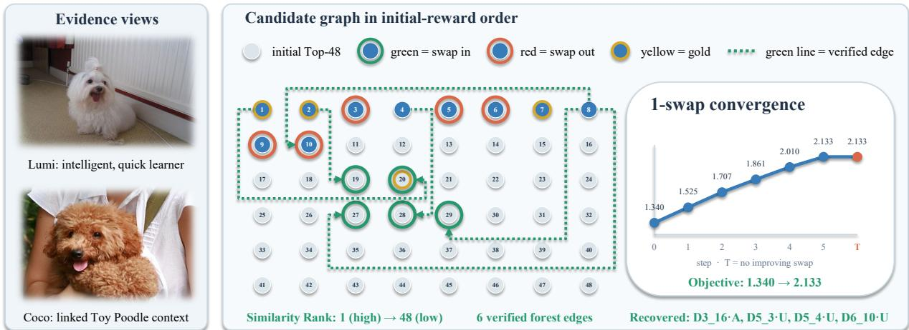  
Figure 4: Qualitative evidence optimization on Mem-Gallery.

or seven to 0.25–1.47. It su<sub>pp</sub>resses unconditional <sub>p</sub>ro<sub>p</sub>a<sub>g</sub>ation throu<sub>g</sub>h entire rounds or sessions <sub>an</sub>d <sub>more</sub> <sub>re</sub>li<sub>a</sub>bl<sub>y</sub> <sub>preserves</sub> di<sub>rec</sub>t <sub>ev</sub>id<sub>ence</sub> <sub>un</sub>d<sub>er</sub> <sub>a</sub> fi<sub>xe</sub>d b<sub>u</sub>d<sub>ge</sub>t<sub>.</sub>

## 4.4.4 Two Verifiers with Separated Responsibilities

Th<sub>e</sub> <sub>no</sub>d<sub>e</sub> <sub>ver</sub>ifi<sub>er</sub> <sub>es</sub>ti<sub>ma</sub>t<sub>es</sub> <sub>w</sub>h<sub>e</sub>th<sub>er</sub> <sub>a</sub> <sub>can</sub>did<sub>a</sub>t<sub>e</sub> di<sub>rec</sub>tl<sub>y</sub> <sub>suppor</sub>t<sub>s</sub> th<sub>e</sub> <sub>ques</sub>ti<sub>on;</sub> ECV <sub>es</sub>ti<sub>ma</sub>t<sub>es</sub> it<sub>s</sub> <sub>con</sub>diti<sub>ona</sub>l i<sub>ncremen</sub>t <sub>re</sub>l<sub>a</sub>ti<sub>ve</sub> t<sub>o</sub> <sub>an</sub> <sub>anc</sub>h<sub>or.</sub> W<sub>e</sub> <sub>compare</sub> th<sub>e</sub> fi<sub>na</sub>l t<sub>wo-ca</sub>ll d<sub>es</sub>i<sub>gn</sub> <sub>w</sub>ith <sub>a</sub> <sub>s</sub>i<sub>ng</sub>l<sub>e</sub> call that predicts both judgments using a strict keyed JSON schema. Both implementations attain <sub>comp</sub>l<sub>e</sub>t<sub>e s</sub>t<sub>ruc</sub>t<sub>ure</sub>d <sub>ou</sub>t<sub>pu</sub>t<sub>,</sub> i<sub>so</sub>l<sub>a</sub>ti<sub>ng</sub> th<sub>e e</sub>f<sub>ec</sub>t <sub>o</sub>f t<sub>as</sub>k <sub>merg</sub>i<sub>ng.</sub> Th<sub>e separa</sub>t<sub>e</sub>d t<sub>wo-ca</sub>ll d<sub>es</sub>i<sub>gn</sub> im<sub>p</sub>roves macro-avera<sub>g</sub>e Accurac<sub>y</sub> and Recall@10 b<sub>y</sub> 2.00 and 3.00 <sub>p</sub>oints. The two verifiers have <sub>no ser</sub>i<sub>a</sub>l d<sub>epen</sub>d<sub>ency an</sub>d <sub>execu</sub>t<sub>e</sub> i<sub>n para</sub>ll<sub>e</sub>l<sub>, so separa</sub>ti<sub>ng</sub> th<sub>e</sub>i<sub>r respons</sub>ibiliti<sub>es</sub> i<sub>n</sub>t<sub>ro</sub>d<sub>uces no</sub> <sub>a</sub>dditi<sub>ona</sub>l <sub>sequen</sub>ti<sub>a</sub>l <sub>cos</sub>t<sub>.</sub>

## 4.5 Qualitative Analysis

Fi<sub>gure</sub> 4 ill<sub>us</sub>t<sub>ra</sub>t<sub>es</sub> h<sub>ow se</sub>t<sub>-</sub>l<sub>eve</sub>l <sub>op</sub>ti<sub>m</sub>i<sub>za</sub>ti<sub>on c</sub>h<sub>anges</sub> th<sub>e ev</sub>id<sub>ence</sub> d<sub>e</sub>li<sub>vere</sub>d t<sub>o</sub> th<sub>e rea</sub>d<sub>er.</sub> I<sub>n</sub> thi<sub>s</sub> M<sub>em-</sub>G<sub>a</sub>ll<sub>ery examp</sub>l<sub>e,</sub> i<sub>n</sub>d<sub>epen</sub>d<sub>en</sub>t <sub>ran</sub>ki<sub>ng re</sub>t<sub>r</sub>i<sub>eves on</sub>l<sub>y par</sub>t <sub>o</sub>f th<sub>e answer-</sub>b<sub>ear</sub>i<sub>ng</sub> hi<sub>s</sub>t<sub>ory.</sub> G<sub>r</sub>a<sub>ph</sub>M<sub>emix</sub> <sub>per</sub>f<sub>orms</sub> fi<sub>ve</sub> i<sub>mprov</sub>i<sub>ng</sub> 1<sub>-swaps,</sub> <sub>rep</sub>l<sub>ac</sub>i<sub>ng</sub> i<sub>so</sub>l<sub>a</sub>t<sub>e</sub>d di<sub>a</sub>l<sub>ogue</sub> t<sub>urns</sub> <sub>w</sub>ith <sub>pa</sub>i<sub>re</sub>d t<sub>urns</sub> th<sub>a</sub>t <sub>connec</sub>t <sub>eac</sub>h d<sub>og</sub>’<sub>s</sub> id<sub>en</sub>tit<sub>y an</sub>d b<sub>ree</sub>d t<sub>o</sub> it<sub>s</sub> d<sub>escr</sub>ib<sub>e</sub>d l<sub>earn</sub>i<sub>ng</sub> b<sub>e</sub>h<sub>av</sub>i<sub>or.</sub> Th<sub>e su</sub>b<sub>sequen</sub>t Kruskal update retains the verified evidence forest, increasing its objective from 1.340 to 2.133 and gold coverage from 3/4 to 4/4. The resulting evidence supports both Lumi the Maltese and C<sub>oco</sub> th<sub>e</sub> T<sub>oy</sub> P<sub>oo</sub>dl<sub>e,</sub> l<sub>ea</sub>di<sub>ng</sub> t<sub>o</sub> th<sub>e</sub> <sub>comp</sub>l<sub>e</sub>t<sub>e</sub> t<sub>wo-en</sub>tit<sub>y</sub> <sub>answer.</sub>

## 5 Conclusion

W<sub>e s</sub>t<sub>u</sub>di<sub>e</sub>d l<sub>ong-</sub>t<sub>erm mu</sub>lti<sub>mo</sub>d<sub>a</sub>l <sub>agen</sub>t <sub>memory as a query-</sub>ti<sub>me ev</sub>id<sub>ence-organ</sub>i<sub>za</sub>ti<sub>on pro</sub>bl<sub>em.</sub> G<sub>r</sub>a<sub>ph</sub>M<sub>emix a</sub>dd<sub>resses</sub> t<sub>wo ma</sub>i<sub>n</sub> li<sub>m</sub>it<sub>a</sub>ti<sub>ons</sub> b<sub>y</sub> di<sub>scover</sub>i<sub>ng a</sub> b<sub>oun</sub>d<sub>e</sub>d <sub>can</sub>did<sub>a</sub>t<sub>e grap</sub>h<sub>, sepa-</sub> <sub>ra</sub>t<sub>e</sub>l<sub>y ver</sub>if<sub>y</sub>i<sub>ng</sub> di<sub>rec</sub>t <sub>no</sub>d<sub>e u</sub>tilit<sub>y an</sub>d <sub>anc</sub>h<sub>or-con</sub>diti<sub>one</sub>d i<sub>ncremen</sub>t<sub>a</sub>l <sub>re</sub>l<sub>a</sub>ti<sub>ons, an</sub>d <sub>se</sub>l<sub>ec</sub>ti<sub>ng an</sub> <sub>a</sub>d<sub>ap</sub>ti<sub>ve</sub>l<sub>y s</sub>i<sub>ze</sub>d <sub>ev</sub>id<sub>ence</sub> f<sub>ores</sub>t f<sub>or a</sub> f<sub>rozen mu</sub>lti<sub>mo</sub>d<sub>a</sub>l <sub>rea</sub>d<sub>er.</sub> It<sub>s op</sub>ti<sub>m</sub>i<sub>za</sub>ti<sub>on</sub> fi<sub>rs</sub>t <sub>cons</sub>t<sub>ruc</sub>t<sub>s</sub> <sub>a</sub> b<sub>oun</sub>d<sub>e</sub>d <sub>proposa</sub>l <sub>an</sub>d th<sub>en</sub> <sub>se</sub>l<sub>ec</sub>t<sub>s</sub> <sub>no</sub> <sub>more</sub> th<sub>an</sub> � <sub>memor</sub>i<sub>es.</sub> It <sub>o</sub>bt<sub>a</sub>i<sub>ns</sub> <sub>an</sub> <sub>exac</sub>t <sub>max</sub>i<sub>mum-</sub> <sub>we</sub>i<sub>g</sub>ht f<sub>ores</sub>t f<sub>or</sub> <sub>every</sub> <sub>cons</sub>id<sub>ere</sub>d <sub>no</sub>d<sub>e</sub> <sub>se</sub>t <sub>an</sub>d th<sub>e</sub> <sub>exac</sub>t b<sub>es</sub>t <sub>su</sub>b<sub>se</sub>t <sub>w</sub>ithi<sub>n</sub> th<sub>e</sub> f<sub>rozen</sub> <sub>proposa</sub>l<sub>.</sub> Th<sub>e eva</sub>l<sub>ua</sub>ti<sub>on separa</sub>t<sub>es answer qua</sub>lit<sub>y, ev</sub>id<sub>ence</sub> b<sub>e</sub>h<sub>av</sub>i<sub>or, an</sub>d lif<sub>ecyc</sub>l<sub>e cos</sub>t <sub>so</sub> th<sub>a</sub>t <sub>eac</sub>h <sub>cen</sub>t<sub>ra</sub>l <sub>c</sub>l<sub>a</sub>i<sub>m</sub> i<sub>s</sub> t<sub>es</sub>t<sub>e</sub>d di<sub>rec</sub>tl<sub>y.</sub>

## 6 References

Bei, Y., T. Wei, X. Nin<sub>g</sub>, Y. Zhao, Z. Liu, X. Lin, Y. Zhu, H. Hamann, J. He, and H. Ton<sub>g</sub> (2026). “Mem-<sub>g</sub>aller<sub>y</sub>: Benchmarking multimodal long-term conversational memory for mllm agents”. In: arXiv preprint arXiv:2601.03515.

Chen W. H. Hu X. Chen P. Ver a and W. Cohen (2022). “Mura : Multimodal retrieval-au mented enerator for open question answering over images and text”. In: Proceedings of the 2022 Conference on Empirical Methods in Natural Language Processing, pp. 5558–5570.

Chen, Z., C. Xu, Y. Qi, and J. Guo (2024). “Mllm is a stron<sub>g</sub> reranker: Advancin<sub>g</sub> multimodal retrieval-au<sub>g</sub>mented generation via knowledge-enhanced reranking and noise-injected training”. In: arXiv preprint arXiv:2407.21439.

Du, Y., B. Wan<sub>g</sub>, Y. He, B. Lian<sub>g</sub>, B. Wan<sub>g</sub>, Z. Li, L. Gui, J. Z. Pan, R. Xu, and K.-F. Won<sub>g</sub> (2026). “Mem<sub>g</sub>uide: Intent-driven memory selection for goal-oriented multi-session llm agents”. In: Proceedings of the AAAI Conference on Artificial Intelligence. Vol. 40. 36, pp. 30584–30592.

Fang, J., X. Deng, H. Xu, Z. Jiang, Y. Tang, Z. Xu, S. Deng, Y. Yao, M. Wang, S. Qiao, H. Chen, and N. Zhang (2026). “LightMem: Lightweight and Eficient Memory-Augmented Generation”. In: The Fourteenth International Conference on Learning Representations. url: https://openreview.net/forum?id=dyJ0GWpjJB.

Fen<sub>g</sub>, J., B. Xu, J. Chen, M. Dai, C. Wu, H. Li, B. Zen<sub>g</sub>, Y. Xie, H. Lian<sub>g</sub>, M. Lu, et al. (2026). “M2a: Multimodal memory agent with dual-layer hybrid memory for long-term personalized interactions”. In: arXiv preprint arXiv:2602.07624.

Guo, M., Q. Jiao, Z. Shi, Y. Quan, B. Zhan<sub>g</sub>, D. Li, L. Che, W. Xu, S. Liu, Z. Liu, et al. (2026). “MemE<sub>y</sub>e: A visual-centric evaluation framework for multimodal agent memory”. In: arXiv preprint arXiv:2605.15128.

Jain, J., S. Maheshwari, N. Yu, W.-m. Hwu, and H. Shi (2025). “AUGUSTUS: An LLM-Driven Multimodal A<sub>g</sub>ent System with Contextualized User Memory”. In: arXiv preprint arXiv:2510.15261.

Jian<sub>g</sub>, H., X. Zhan<sub>g</sub>, S. Gar<sub>g</sub>, R. Arora, S.-Z. Kuo, J. Xu, A. Colak, and X. L. Don<sub>g</sub> (2025). “Memor<sub>y</sub>-QA: Answerin<sub>g</sub> Recall Questions Based on Multimodal Memories”. In: Proceedings of the 2025 Conference on Empirical Methods in Natural Language Processing, pp. 24255–24277.

Li, C., M. Zhan<sub>g</sub>, J. Kan<sub>g</sub>, D. Chen, J. Shen, B. Tan<sub>g</sub>, X. Zhou, F. Xion<sub>g</sub>, and Z. Li (2026). “MemReranker: Reasoning-Aware Reranking for Agent Memory Retrieval”. In: arXiv preprint arXiv:2605.06132.

Mei, J., J. Chen, G. Yan<sub>g</sub>, X. Hou, M. Li, and B. B<sub>y</sub>rne (2026). “Accordin<sub>g</sub> to me: Lon<sub>g</sub>-term <sub>p</sub>ersonalized referential memory qa”. In: arXiv preprint arXiv:2603.01990.

Packer, C., V. Fan<sub>g</sub>, S. Patil, K. Lin, S. Wooders, and J. Gonzalez (2023). “MemGPT: towards LLMs as o<sub>p</sub>eratin<sub>g</sub> s<sub>y</sub>stems.” In.

Park, J. S., J. O’Brien, C. J. Cai, M. R. Morris, P. Lian<sub>g</sub>, and M. S. Bernstein (2023). “Generative a<sub>g</sub>ents: Interactive simulacra of human behavior”. In: Proceedings of the 36th annual acm symposium on user interface software and technology, pp. 1–22.

Ren, X., Z. Wan<sub>g</sub>, Y. Du, Z. Xie, C. Liu, X. Yan<sub>g</sub>, H. Fen<sub>g</sub>, W. Pan, T. Zhen<sub>g</sub>, B. Xu, et al. (2026). “Memlens: Benchmarking multimodal long-term memory in large vision-language models”. In: arXiv preprint arXiv:2605.14906.

Sun, W., L. Yan, X. Ma, S. Wan<sub>g</sub>, P. Ren, Z. Chen, D. Yin, and Z. Ren (2023). “Is ChatGPT <sub>g</sub>ood at search? investigating large language models as re-ranking agents”. In: Proceedings of the 2023 conference on empirical methods in natural language processing, pp. 14918–14937.

Wang, Q., S. Wang, Y. Zeng, Q. Zhang, F. Zhang, Z. Guo, B. Zhang, W. Huang, L. Chen, Z. Chen, P. Xie, and R. Din<sub>g</sub> (2026). “Navi<sub>g</sub>atin<sub>g</sub> Massive Visual Context in Retrieval-Au<sub>g</sub>mented Generation via Multimodal Memory Graph”. In: Forty-third International Conference on Machine Learning. url: https://openreview.net/forum?id=fylE5O8g5F.

Wan<sub>g</sub>, X., Z. Wan<sub>g</sub>, C. Huan<sub>g</sub>, Q. Z. Shen<sub>g</sub>, and L. Yao (2026). “MEG-RAG: Quantif<sub>y</sub>in<sub>g</sub> Multi-modal Evidence Grounding for Evidence Selection in RAG”. In: arXiv preprint arXiv:2604.24564.

Wang, Y. and X. Chen (2025). “Mirix: Multi-agent memory system for llm-based agents”. In: arXiv preprint arXiv:2507.07957.

Xu, W., Z. Lian<sub>g</sub>, K. Mei, H. Gao, J. Tan, and Y. Zhan<sub>g</sub> (2026). “A-mem: A<sub>g</sub>entic memor<sub>y</sub> for llm a<sub>g</sub>ents”. In: Advances in Neural Information Processing Systems 38, pp. 17577–17604.

Yeo, W., K. Kim, S. Jeon<sub>g</sub>, J. Baek, and S. J. Hwan<sub>g</sub> (Jul<sub>y</sub> 2026). “UniversalRAG: Retrieval-Au<sub>g</sub>mented Generation over Corpora of Diverse Modalities and Granularities”. In: Proceedings of the 64th Annual Meeting of the Association for Computational Linguistics (Volume 1: Long Papers). Ed. by M. Liakata, V. P. Moreira, J. Zhang, and D. Jur<sub>g</sub>ens. San Die<sub>g</sub>o<sub>,</sub> California<sub>,</sub> United States: Association for Com<sub>p</sub>utational Lin<sub>g</sub>uistics<sub>, pp</sub>. 3843–3871. doi: 10.18653/v1/2026.acl-long.177. url: https://aclanthology.org/2026.acl-long.177/.

Zheng, L. et al. (2023). “Judging LLM-as-a-Judge with MT-Bench and Chatbot Arena”. In: Advances in Neural Information Processing Systems. Ed. by A. Oh, T. Naumann, A. Globerson, K. Saenko, M. Hardt, and S. Levine. <sup>V</sup>o<sup>l</sup>. <sup>36</sup>. <sup>C</sup>urran <sup>A</sup>ssoc<sup>i</sup>ates, <sup>I</sup>nc., pp. <sup>465</sup>9<sup>5</sup>–<sup>46623</sup>. doi: 10.52202/075280-2020. url: https://proceedings.neurips.cc/paper\_files/paper/2023/file/91f18a1287b398d378ef22505bf41832- Paper-Datasets\_and\_Benchmarks.pdf.

Zhu, S., Y. Yan<sub>g</sub>, Z. Wan<sub>g</sub>, T. Shen, D. Guo, and M.-H. Yan<sub>g</sub> (2026). “H2HMem: A Multimodal Memor<sub>y</sub> Benchmark for Agents in Human-Human Interactions”. In: arXiv preprint arXiv:2606.09461.

## A Implementation and Evaluation Details

## A.1 Dataset Details and Preprocessing

T<sub>a</sub>bl<sub>e</sub> 8 <sub>summar</sub>i<sub>zes</sub> th<sub>e</sub> d<sub>a</sub>t<sub>ase</sub>t <sub>sca</sub>l<sub>es</sub> <sub>an</sub>d th<sub>e</sub> <sub>exac</sub>t <sub>samp</sub>l<sub>e</sub> <sub>coun</sub>t<sub>s</sub> <sub>use</sub>d i<sub>n</sub> <sub>our</sub> <sub>exper</sub>i<sub>men</sub>t<sub>s.</sub>

ATM-Bench. ATM-Bench represents one long personal archive containing 6,742 emails, 3,759 ima<sub>g</sub>es<sub>,</sub> and 533 videos. Its 1<sub>,</sub>044 <sub>p</sub>ublic-release <sub>q</sub>uestions com<sub>p</sub>rise 1<sub>,</sub>013 default and 31 hard <sub>ques</sub>ti<sub>ons an</sub>d <sub>span numer</sub>i<sub>c,</sub> li<sub>s</sub>t<sub>-reca</sub>ll<sub>, an</sub>d <sub>open-en</sub>d<sub>e</sub>d <sub>answers.</sub> E<sub>very ques</sub>ti<sub>on</sub> h<sub>as a</sub>t l<sub>eas</sub>t <sub>one</sub> <sub>canon</sub>i<sub>ca</sub>l <sub>ev</sub>id<sub>ence memory.</sub> F<sub>or me</sub>di<sub>a, we re</sub>t<sub>a</sub>i<sub>n</sub> th<sub>e cap</sub>ti<sub>ons, s</sub>h<sub>or</sub>t <sub>cap</sub>ti<sub>ons,</sub> OCR<sub>,</sub> ti<sub>me, an</sub>d l<sub>oca-</sub> t<sup>i</sup>on <sup>fi</sup>e<sup>ld</sup>s <sup>di</sup>str<sup>ib</sup>ute<sup>d</sup> w<sup>i</sup>t<sup>h</sup> t<sup>h</sup>e processe<sup>d</sup> re<sup>l</sup>ease; t<sup>h</sup>e re<sup>l</sup>ease recor<sup>d</sup>s Qwen/Qwen3-VL-2B-Instruct <sub>as</sub> th<sub>e mo</sub>d<sub>e</sub>l <sub>use</sub>d f<sub>or</sub> th<sub>ese</sub> d<sub>er</sub>i<sub>ve</sub>d fi<sub>e</sub>ld<sub>s.</sub> R<sub>aw</sub> i<sub>mages, samp</sub>l<sub>e</sub>d <sub>v</sub>id<sub>eo</sub> f<sub>rames, an</sub>d d<sub>er</sub>i<sub>ve</sub>d t<sub>ex</sub>t <sub>rema</sub>i<sub>n separa</sub>t<sub>e re</sub>t<sub>r</sub>i<sub>eva</sub>l <sub>v</sub>i<sub>ews ra</sub>th<sub>er</sub> th<sub>an</sub> b<sub>e</sub>i<sub>ng merge</sub>d i<sub>n</sub>t<sub>o one</sub> t<sub>ex</sub>t<sub>ua</sub>l <sub>memory.</sub> It<sub>s query-</sub> <sup>i</sup>n<sup>d</sup>epen<sup>d</sup>ent sc<sup>h</sup>ema grap<sup>h</sup> conta<sup>i</sup>ns t<sup>h</sup>ree re<sup>l</sup>at<sup>i</sup>on types. event\_bridge <sup>li</sup>n<sup>k</sup>s comp<sup>l</sup>ementary medi<sub>a</sub> <sub>cap</sub>t<sub>ure</sub>d 1 <sub>m</sub>i<sub>nu</sub>t<sub>e–</sub>1 h<sub>our</sub> <sub>apar</sub>t <sub>an</sub>d <sub>w</sub>ithi<sub>n</sub> 5 k<sub>m,</sub> <sub>re</sub>t<sub>a</sub>i<sub>n</sub>i<sub>ng</sub> <sub>a</sub>t <sub>mos</sub>t t<sub>wo</sub> l<sub>oca</sub>l <sub>ne</sub>i<sub>g</sub>hb<sub>ors</sub> <sub>per</sub> memory; same\_record <sup>li</sup>n<sup>k</sup>s ema<sup>il</sup>s s<sup>h</sup>ar<sup>i</sup>ng a strong re<sup>f</sup>erence, event-<sup>d</sup>ate category, or tempora<sup>ll</sup>y <sup>l</sup>oca<sup>l</sup> norma<sup>li</sup>ze<sup>d</sup> su<sup>b</sup>ject; an<sup>d</sup> record\_grounding <sup>li</sup>n<sup>k</sup>s an ema<sup>il</sup> to me<sup>di</sup>a capture<sup>d</sup> on a <sup>d</sup>ate state<sup>d</sup> i<sub>n</sub> th<sub>e</sub> <sub>ema</sub>il <sub>w</sub>h<sub>en</sub> th<sub>e</sub>i<sub>r</sub> l<sub>oca</sub>ti<sub>on</sub> <sub>or</sub> <sub>con</sub>t<sub>en</sub>t fi<sub>e</sub>ld<sub>s</sub> <sub>a</sub>l<sub>so</sub> <sub>agree.</sub> Th<sub>ese</sub> <sub>ru</sub>l<sub>es</sub> i<sub>nspec</sub>t <sub>on</sub>l<sub>y</sub> <sub>memory</sub> <sub>con-</sub> t<sub>en</sub>t <sub>an</sub>d <sub>me</sub>t<sub>a</sub>d<sub>a</sub>t<sub>a, never ques</sub>ti<sub>ons or go</sub>ld <sub>ev</sub>id<sub>ence.</sub>

Mem-Gallery. Mem-Gallery contains 20 persona-driven dialogue contexts, 240 sessions, 7,944 canonical memor<sub>y</sub> rows<sub>,</sub> and 1<sub>,</sub>711 <sub>q</sub>uestions across nine task t<sub>yp</sub>es. Its 1<sub>,</sub>490 ima<sub>g</sub>es consist of 1<sub>,</sub>003 histor<sub>y</sub> ima<sub>g</sub>es and 487 <sub>q</sub>uer<sub>y</sub> ima<sub>g</sub>es<sub>,</sub> all accom<sub>p</sub>anied b<sub>y</sub> native ca<sub>p</sub>tions. Our conversion <sub>preserves</sub> th<sub>e re</sub>l<sub>ease</sub>’<sub>s roun</sub>d<sub>-</sub>l<sub>eve</sub>l <sub>ev</sub>id<sub>ence anno</sub>t<sub>a</sub>ti<sub>ons w</sub>ith<sub>ou</sub>t i<sub>mpos</sub>i<sub>ng a</sub> fi<sub>ner spea</sub>k<sub>er-</sub>l<sub>eve</sub>l inter<sub>p</sub>retation. We use all 1<sub>,</sub>711 <sub>q</sub>uestions for the main answer ex<sub>p</sub>eriment. Amon<sub>g</sub> them<sub>,</sub> 184 quest<sup>i</sup>ons <sup>i</sup>n t<sup>h</sup>e nat<sup>i</sup>ve AR category conta<sup>i</sup>n a re<sup>f</sup>erence answer <sup>b</sup>ut no canon<sup>i</sup>ca<sup>l</sup> ev<sup>id</sup>ence annot<sub>a</sub>ti<sub>on.</sub> Thi<sub>s</sub> d<sub>oes no</sub>t <sub>remove</sub> th<sub>em</sub> f<sub>rom</sub> th<sub>e exper</sub>i<sub>men</sub>t<sub>;</sub> it <sub>on</sub>l<sub>y means</sub> th<sub>a</sub>t <sub>ev</sub>id<sub>ence-</sub>d<sub>epen</sub>d<sub>en</sub>t dia<sub>g</sub>nostics such as Recall@� and Hit@� are com<sub>p</sub>uted on the 1,527 annotated <sub>q</sub>uestions. The sc<sup>h</sup>ema grap<sup>h</sup> uses same\_round e<sup>d</sup>ges <sup>b</sup>etween memor<sup>i</sup>es carry<sup>i</sup>ng t<sup>h</sup>e same nat<sup>i</sup>ve roun<sup>d</sup> <sup>id</sup>ent<sup>i</sup>- <sup>fi</sup>er an<sup>d</sup> consecutive\_turn e<sup>d</sup>ges <sup>b</sup>etween a<sup>d</sup>jacent sequence pos<sup>i</sup>t<sup>i</sup>ons w<sup>i</sup>t<sup>hi</sup>n t<sup>h</sup>e same sess<sup>i</sup>on.

MemEye. MemEye is released in open-answer and position-balanced multiple-choice forms. Followin<sub>g</sub> the released evaluation <sub>p</sub>rotocol<sub>,</sub> we evaluate all 1<sub>,</sub>855 rows. The 3<sub>,</sub>392 memor<sub>y</sub> rows <sub>span</sub> 16 <sub>mo</sub>d<sub>e-spec</sub>ifi<sub>c con</sub>t<sub>ex</sub>t<sub>s an</sub>d <sub>re</sub>f<sub>erence</sub> 438 <sub>un</sub>i<sub>que</sub> hi<sub>s</sub>t<sub>ory</sub> i<sub>mages;</sub> f<sub>our a</sub>dditi<sub>ona</sub>l <sub>query</sub> i<sub>mages g</sub>i<sub>ve</sub> th<sub>e</sub> 442 <sub>un</sub>i<sub>que asse</sub>t<sub>s s</sub>h<sub>own</sub> i<sub>n</sub> T<sub>a</sub>bl<sub>e</sub> 8<sub>.</sub> N<sub>a</sub>ti<sub>ve cap</sub>ti<sub>ons are re</sub>t<sub>a</sub>i<sub>ne</sub>d f<sub>or every</sub> hi<sub>s</sub>t<sub>ory</sub> i<sub>mage,</sub> <sub>an</sub>d <sub>every</sub> <sub>ques</sub>ti<sub>on</sub> h<sub>as</sub> <sub>reso</sub>l<sub>va</sub>bl<sub>e</sub> <sub>go</sub>ld <sub>ev</sub>id<sub>ence.</sub> A<sub>s</sub> i<sub>n</sub> M<sub>em-</sub>G<sub>a</sub>ll<sub>ery,</sub> th<sub>e</sub> <sub>sc</sub>h<sub>ema</sub> <sub>grap</sub>h uses same\_round <sup>f</sup>or memor<sup>i</sup>es w<sup>i</sup>t<sup>h</sup> t<sup>h</sup>e same nat<sup>i</sup>ve roun<sup>d id</sup>ent<sup>ifi</sup>er an<sup>d</sup> consecutive\_turn <sup>f</sup>or adjacent memories within a session.

Table 8: Dataset scale and actual experimental sample counts. I and V denote image and video assets. M<sub>e</sub>di<sub>a coun</sub>t<sub>s are un</sub>i<sub>que asse</sub>t<sub>s</sub> i<sub>n</sub> th<sub>e un</sub>ifi<sub>e</sub>d <sub>snaps</sub>h<sub>o</sub>t<sub>.</sub>
<table><tr><td>Dataset</td><td>Contexts</td><td>Memories</td><td></td><td>Media Experimental Q</td><td>Caption source</td></tr><tr><td>ATM-Bench</td><td>1</td><td>11,034</td><td>3,759 I + 533 V</td><td>1,044</td><td>Released derived fields</td></tr><tr><td>Mem-Gallery</td><td>20</td><td>7,944</td><td>1,490I</td><td>1,711</td><td>Native captions</td></tr><tr><td>MemEye</td><td>16</td><td>3,392</td><td>442 I</td><td>1,855</td><td>Native memory captions</td></tr><tr><td>H2HMem</td><td>25</td><td>7,078</td><td>1,300 I</td><td>1,982</td><td>Qwen3-VL-8B generated</td></tr></table>

H2HMem. H2HMem contains 25 complete dyadic or multi-party dialogue contexts, 7,078 memor<sub>y</sub> turns<sub>,</sub> 1<sub>,</sub>300 ima<sub>g</sub>es<sub>,</sub> and 2<sub>,</sub>236 released <sub>q</sub>uestions. The release <sub>p</sub>rovides no ima<sub>g</sub>e ca<sub>p</sub>tions. We t<sup>h</sup>ere<sup>f</sup>ore generate a <sup>f</sup>rozen capt<sup>i</sup>on s<sup>id</sup>ecar <sup>f</sup>or a<sup>ll</sup> <sup>1</sup>,<sup>300</sup> assets w<sup>i</sup>t<sup>h</sup> Qwen/Qwen3-VL-8B-Instruct, t<sub>empera</sub>t<sub>ure</sub> 0<sub>, a</sub> 32<sub>,</sub>768<sub>-</sub>t<sub>o</sub>k<sub>en con</sub>t<sub>ex</sub>t li<sub>m</sub>it<sub>, an</sub>d th<sub>e cap</sub>ti<sub>on promp</sub>t <sub>repor</sub>t<sub>e</sub>d <sub>a</sub>t th<sub>e en</sub>d <sub>o</sub>f thi<sub>s</sub> <sub>supp</sub>l<sub>emen</sub>t<sub>.</sub> Th<sub>e same s</sub>id<sub>ecar</sub> i<sub>s s</sub>h<sub>are</sub>d b<sub>y a</sub>ll <sub>compare</sub>d <sub>me</sub>th<sub>o</sub>d<sub>s, so cap</sub>ti<sub>on genera</sub>ti<sub>on</sub> i<sub>s no</sub>t <sub>a</sub> <sub>me</sub>th<sub>o</sub>d<sub>-spec</sub>ifi<sub>c a</sub>d<sub>van</sub>t<sub>age.</sub> O<sub>ur</sub> H2HM<sub>em exper</sub>i<sub>men</sub>t<sub>s use</sub> th<sub>e same</sub> fi<sub>xe</sub>d 1<sub>,</sub>982<sub>-ques</sub>ti<sub>on</sub> t<sub>rac</sub>k f<sub>or</sub> <sub>every me</sub>th<sub>o</sub>d<sub>.</sub> Thi<sub>s</sub> t<sub>rac</sub>k <sub>con</sub>t<sub>a</sub>i<sub>ns a</sub>ll <sub>rows w</sub>h<sub>ose re</sub>l<sub>ease</sub>d <sub>sess</sub>i<sub>on re</sub>f<sub>erences reso</sub>l<sub>ve</sub> t<sub>o</sub> i<sub>nges</sub>tibl<sub>e</sub> <sub>memory</sub> <sub>sess</sub>i<sub>ons</sub> i<sub>n</sub> th<sub>e</sub> <sub>canon</sub>i<sub>ca</sub>l <sub>snaps</sub>h<sub>o</sub>t<sub>;</sub> th<sub>e</sub> <sub>same</sub> d<sub>e</sub>t<sub>erm</sub>i<sub>n</sub>i<sub>s</sub>ti<sub>c</sub> <sub>a</sub>li<sub>gnmen</sub>t i<sub>s</sub> <sub>app</sub>li<sub>e</sub>d b<sub>e</sub>f<sub>ore</sub> runn<sup>i</sup>ng any met<sup>h</sup>o<sup>d</sup>. <sup>H2HM</sup>em uses on<sup>l</sup>y consecutive\_turn sc<sup>h</sup>ema e<sup>d</sup>ges, connect<sup>i</sup>ng a<sup>d</sup>jacent t<sub>urns w</sub>ithi<sub>n eac</sub>h di<sub>a</sub>l<sub>ogue sess</sub>i<sub>on;</sub> it d<sub>oes no</sub>t <sub>expose</sub> th<sub>e pa</sub>i<sub>re</sub>d <sub>na</sub>ti<sub>ve-roun</sub>d fi<sub>e</sub>ld <sub>requ</sub>i<sub>re</sub>d b<sub>y</sub> same\_round.

A<sub>cross</sub> <sub>a</sub>ll f<sub>our</sub> b<sub>enc</sub>h<sub>mar</sub>k<sub>s,</sub> th<sub>ese</sub> <sub>exp</sub>li<sub>c</sub>it <sub>re</sub>l<sub>a</sub>ti<sub>ons</sub> <sub>supp</sub>l<sub>y</sub> t<sub>ype</sub>d <sub>s</sub>t<sub>ruc</sub>t<sub>ura</sub>l <sub>can</sub>did<sub>a</sub>t<sub>es</sub> t<sub>o</sub> ECV<sub>.</sub>

Missing query captions and leakage control. Dataset-provided captions are used whenever <sub>ava</sub>il<sub>a</sub>bl<sub>e.</sub> If <sub>a ques</sub>ti<sub>on</sub> i<sub>mage</sub> l<sub>ac</sub>k<sub>s one, we genera</sub>t<sub>e on</sub>l<sub>y</sub> it<sub>s query cap</sub>ti<sub>on w</sub>ith th<sub>e same</sub> f<sub>rozen</sub> <sub>ver</sub>ifi<sub>er</sub> b<sub>ac</sub>kb<sub>one use</sub>d b<sub>y</sub> th<sub>a</sub>t <sub>rea</sub>d<sub>er se</sub>tti<sub>ng;</sub> th<sub>e genera</sub>ti<sub>on promp</sub>t i<sub>s</sub> fi<sub>xe</sub>d <sub>an</sub>d th<sub>e resu</sub>lt i<sub>s</sub> <sub>cac</sub>h<sub>e</sub>d<sub>.</sub> C<sub>ap</sub>ti<sub>on genera</sub>ti<sub>on sees on</sub>l<sub>y</sub> th<sub>e</sub> i<sub>mage an</sub>d th<sub>e gener</sub>i<sub>c cap</sub>ti<sub>on</sub> i<sub>ns</sub>t<sub>ruc</sub>ti<sub>on:</sub> it <sub>never re-</sub> <sub>ce</sub>i<sub>ves</sub> th<sub>e</sub> <sub>ques</sub>ti<sub>on</sub> <sub>answer,</sub> <sub>go</sub>ld <sub>ev</sub>id<sub>ence,</sub> <sub>eva</sub>l<sub>ua</sub>ti<sub>on</sub> <sub>no</sub>t<sub>es,</sub> <sub>or</sub> <sub>re</sub>t<sub>r</sub>i<sub>eva</sub>l <sub>resu</sub>lt<sub>s.</sub> Th<sub>e</sub> <sub>presence</sub> <sub>or</sub> <sub>a</sub>b<sub>sence o</sub>f <sub>ev</sub>id<sub>ence anno</sub>t<sub>a</sub>ti<sub>ons a</sub>f<sub>ec</sub>t<sub>s on</sub>l<sub>y me</sub>t<sub>r</sub>i<sub>cs</sub> th<sub>a</sub>t <sub>exp</sub>li<sub>c</sub>itl<sub>y requ</sub>i<sub>re</sub> th<sub>ose anno</sub>t<sub>a</sub>ti<sub>ons;</sub> it d<sub>oes no</sub>t d<sub>e</sub>fi<sub>ne a s</sub>h<sub>are</sub>d <sub>samp</sub>l<sub>e</sub> filt<sub>er across</sub> th<sub>e</sub> f<sub>our</sub> b<sub>enc</sub>h<sub>mar</sub>k<sub>s.</sub> G<sub>o</sub>ld <sub>ev</sub>id<sub>ence</sub> i<sub>s use</sub>d <sub>on</sub>l<sub>y</sub> f<sub>or</sub> <sub>eva</sub>l<sub>ua</sub>ti<sub>on</sub> <sub>an</sub>d <sub>never</sub> <sub>en</sub>t<sub>ers</sub> <sub>re</sub>t<sub>r</sub>i<sub>eva</sub>l<sub>,</sub> <sub>no</sub>d<sub>e</sub> <sub>ver</sub>ifi<sub>ca</sub>ti<sub>on,</sub> ECV<sub>,</sub> <sub>or</sub> <sub>answer</sub> <sub>genera</sub>ti<sub>on.</sub>

## A.2 Models and Fixed Parameters

Model assignment. In the Qwen3-VL setting, the node verifier, edge-conditioned verifier (<sup>ECV</sup>), an<sup>d</sup> rea<sup>d</sup>er a<sup>ll</sup> use Qwen/Qwen3-VL-8B-Instruct; <sup>i</sup>n t<sup>h</sup>e <sup>G</sup>emma <sup>4</sup> sett<sup>i</sup>ng, a<sup>ll</sup> t<sup>h</sup>ree use google/gemma-4-12B-it. <sup>W</sup>e t<sup>h</sup>ere<sup>f</sup>ore <sup>d</sup>o not s<sup>il</sup>ent<sup>l</sup>y <sup>i</sup>ntro<sup>d</sup>uce a stronger ver<sup>ifi</sup>er <sup>f</sup>or <sup>G</sup>raph-M<sub>emix.</sub> Th<sub>e</sub> <sub>answer</sub> <sub>eva</sub>l<sub>ua</sub>t<sub>or</sub> i<sub>s</sub> h<sub>e</sub>ld fi<sub>xe</sub>d <sub>across</sub> <sub>a</sub>ll <sub>me</sub>th<sub>o</sub>d<sub>s</sub> <sub>an</sub>d <sub>rea</sub>d<sub>er</sub> <sub>se</sub>tti<sub>ngs:</sub> <sub>we</sub> <sub>reques</sub>t gpt-5-mini, an<sup>d</sup> an en<sup>d</sup>po<sup>i</sup>nt t<sup>h</sup>at expose<sup>d</sup> <sup>i</sup>ts reso<sup>l</sup>ve<sup>d</sup> snaps<sup>h</sup>ot reporte<sup>d</sup> gpt-5-mini-2025- 08-07. <sup>E</sup>very ju<sup>d</sup>gment row stores t<sup>h</sup>e requeste<sup>d</sup> mo<sup>d</sup>e<sup>l</sup>, prompt-protoco<sup>l</sup> vers<sup>i</sup>on, an<sup>d</sup> prompt SHA-256.

All thr<sub>ee</sub> <sub>ge</sub>n<sub>e</sub>r<sub>a</sub>ti<sub>o</sub>n <sub>s</sub>t<sub>ages</sub> <sub>use</sub> <sub>a</sub> 32<sub>,</sub>768-t<sub>o</sub>k<sub>e</sub>n <sub>co</sub>nt<sub>e</sub>xt limit <sub>a</sub>nd t<sub>e</sub>m<sub>pe</sub>r<sub>a</sub>t<sub>u</sub>r<sub>e</sub> 0<sub>.</sub> Th<sub>e</sub> n<sub>o</sub>d<sub>e</sub> v<sub>e</sub>rifier and ECV reserve at most 8<sub>,</sub>192 out<sub>p</sub>ut tokens<sub>;</sub> the reader reserves at most 1<sub>,</sub>000. Node verifi<sub>ca</sub>ti<sub>on an</sub>d ECV <sub>are</sub> t<sub>wo</sub> l<sub>og</sub>i<sub>ca</sub>ll<sub>y separa</sub>t<sub>e</sub>d li<sub>s</sub>t<sub>w</sub>i<sub>se passes.</sub> B<sub>o</sub>th <sub>consume</sub> th<sub>e</sub> f<sub>rozen can</sub>did<sub>a</sub>t<sub>e</sub> <sub>cac</sub>h<sub>e,</sub> <sub>query-</sub>i<sub>mage</sub> <sub>cap</sub>ti<sub>ons,</sub> <sub>an</sub>d <sub>anc</sub>h<sub>or</sub> <sub>se</sub>t <sub>an</sub>d <sub>can</sub> th<sub>ere</sub>f<sub>ore</sub> <sub>execu</sub>t<sub>e</sub> i<sub>n</sub> <sub>para</sub>ll<sub>e</sub>l<sub>;</sub> ECV d<sub>oes</sub> <sub>no</sub>t <sub>overwr</sub>it<sub>e</sub> th<sub>e no</sub>d<sub>e scores.</sub>

Node-utility parameters. We use one fixed parameter setting for every dataset and reader:

$$
\begin{array} { r l } & { p _ { i } ( q ) = \sigma ( \boldsymbol { z } _ { i } ( q ) ) , } \\ & { ~ \boldsymbol { z } _ { i } ( q ) = \tau [ \alpha s _ { i } ( q ) + ( 1 - \alpha ) \widetilde { \upsilon } _ { i } ( q ) - \delta ] , } \\ & { ( \alpha , \tau , \delta ) = ( 0 . 8 , 5 . 2 , 0 . 7 ) . } \end{array}\tag{14}
$$

Here, $s _ { i } ( q )$ i<sub>s</sub> th<sub>e</sub> f<sub>rozen</sub> At<sub>om</sub>i<sub>c re</sub>t<sub>r</sub>i<sub>eva</sub>l <sub>score,</sub> th<sub>e ver</sub>ifi<sub>er re</sub>t<sub>urns</sub> $\nu _ { i } ( q ) \in [ 0 , 5 ]$ <sub>,</sub> <sub>an</sub>d $\widetilde { \nu } _ { i } ( q ) = \nu _ { i } ( q ) / 5$ Th<sub>us, �</sub> i<sub>s</sub> th<sub>e re</sub>l<sub>a</sub>ti<sub>ve we</sub>i<sub>g</sub>ht <sub>o</sub>f th<sub>e re</sub>t<sub>r</sub>i<sub>eva</sub>l <sub>pr</sub>i<sub>or, � con</sub>t<sub>ro</sub>l<sub>s</sub> th<sub>e s</sub>h<sub>arpness o</sub>f th<sub>e</sub> b<sub>oun</sub>d<sub>e</sub>d <sub>u</sub>tilit<sub>y,</sub> <sub>an</sub>d � <sub>se</sub>t<sub>s</sub> it<sub>s</sub> <sub>m</sub>id<sub>po</sub>i<sub>n</sub>t<sub>.</sub> F<sub>or</sub> i<sub>mp</sub>l<sub>emen</sub>t<sub>a</sub>ti<sub>on</sub> <sub>c</sub>h<sub>ec</sub>ki<sub>ng,</sub> E<sub>q.</sub> 14 i<sub>s</sub> <sub>equ</sub>i<sub>va</sub>l<sub>en</sub>t<sub>,</sub> <sub>up</sub> t<sub>o</sub> th<sub>e</sub> di<sub>sp</sub>l<sub>aye</sub>d <sub>roun</sub>di<sub>ng,</sub> t<sub>o</sub>

$$
p _ { i } ( q ) = \sigma ( 4 . 2 s _ { i } ( q ) + 0 . 2 \nu _ { i } ( q ) - 3 . 6 ) .\tag{15}
$$

W<sub>e</sub> d<sub>o no</sub>t <sub>re</sub>t<sub>une</sub> th<sub>ese va</sub>l<sub>ues</sub> b<sub>y</sub> b<sub>enc</sub>h<sub>mar</sub>k <sub>or rea</sub>d<sub>er</sub> b<sub>ac</sub>kb<sub>one.</sub>

Anchor-set construction. We construct a deterministic high-confidence anchor set $A _ { q }$ f<sub>rom</sub> th<sub>e</sub> f<sub>rozen mu</sub>lti<sub>-v</sub>i<sub>ew re</sub>t<sub>r</sub>i<sub>eva</sub>l <sub>resu</sub>lt<sub>s</sub> b<sub>e</sub>f<sub>ore re</sub>l<sub>a</sub>ti<sub>on ver</sub>ifi<sub>ca</sub>ti<sub>on.</sub> D<sub>up</sub>li<sub>ca</sub>t<sub>e memory</sub> ID<sub>s are remove</sub>d <sub>an</sub>d ti<sub>es preserve</sub> th<sub>e or</sub>i<sub>g</sub>i<sub>na</sub>l <sub>re</sub>t<sub>r</sub>i<sub>eva</sub>l <sub>or</sub>d<sub>er.</sub> A<sub>nc</sub>h<sub>or se</sub>l<sub>ec</sub>ti<sub>on</sub> d<sub>oes no</sub>t <sub>use no</sub>d<sub>e-ver</sub>ifi<sub>er scores,</sub> ECV <sub>ou</sub>t<sub>pu</sub>t<sub>s, go</sub>ld <sub>ev</sub>id<sub>ence, or re</sub>f<sub>erence answers.</sub> F<sub>reez</sub>i<sub>ng</sub> th<sub>e re</sub>t<sub>r</sub>i<sub>eva</sub>l<sub>-</sub>b<sub>ase</sub>d <sub>anc</sub>h<sub>ors</sub> b<sub>e</sub>f<sub>ore</sub> ECV b<sub>o</sub>th <sub>avo</sub>id<sub>s c</sub>i<sub>rcu</sub>l<sub>ar se</sub>l<sub>ec</sub>ti<sub>on an</sub>d <sub>g</sub>i<sub>ves</sub> ECV <sub>a s</sub>t<sub>a</sub>bl<sub>e se</sub>t <sub>o</sub>f di<sub>rec</sub>t<sub>-ev</sub>id<sub>ence</sub> h<sub>ypo</sub>th<sub>eses.</sub>

## A.3 Full-Lifecycle Wall-Clock Analysis

Th<sub>e</sub> <sub>ma</sub>i<sub>n</sub> <sub>paper</sub> <sub>repor</sub>t<sub>s</sub> th<sub>e</sub> <sub>comp</sub>l<sub>e</sub>t<sub>e</sub> ATM<sub>-</sub>B<sub>enc</sub>h lif<sub>ecyc</sub>l<sub>e.</sub> W<sub>e</sub> <sub>app</sub>l<sub>y</sub> th<sub>e</sub> <sub>same</sub> <sub>wor</sub>kl<sub>oa</sub>d d<sub>e</sub>fi<sub>n</sub>i<sub>-</sub> ti<sub>on</sub> t<sub>o</sub> th<sub>e</sub> <sub>rema</sub>i<sub>n</sub>i<sub>ng</sub> th<sub>ree</sub> b<sub>enc</sub>h<sub>mar</sub>k<sub>s:</sub> <sub>cons</sub>t<sub>ruc</sub>t th<sub>e</sub> <sub>memory</sub> <sub>represen</sub>t<sub>a</sub>ti<sub>on</sub> f<sub>or</sub> <sub>every</sub> <sub>canon</sub>i<sub>ca</sub>l memor<sub>y</sub> once<sub>,</sub> and then answer ever<sub>y</sub> evaluation <sub>q</sub>uestion once. Thus<sub>,</sub> the estimates cover 7<sub>,</sub>944 memories and 1<sub>,</sub>711 <sub>q</sub>uestions for Mem-Galler<sub>y,</sub> 3<sub>,</sub>392 memories and 1<sub>,</sub>855 <sub>q</sub>uestions for MemE<sub>y</sub>e<sub>,</sub> and 7<sub>,</sub>078 memories and 1<sub>,</sub>982 <sub>q</sub>uestions for H2HMem. The corres<sub>p</sub>ondin<sub>g</sub> counts are also <sub>p</sub>rinted i<sub>n</sub> th<sub>e</sub> l<sub>egen</sub>d<sub>s o</sub>f Fi<sub>gure</sub> 5<sub>.</sub>

Fi<sub>gure</sub> 5 <sub>s</sub>h<sub>ows a cons</sub>i<sub>s</sub>t<sub>en</sub>t <sub>accuracy–</sub>lif<sub>ecyc</sub>l<sub>e</sub> t<sub>ra</sub>d<sub>e-o</sub>f<sub>.</sub> G<sub>r</sub>a<sub>ph</sub>M<sub>emix requ</sub>i<sub>res an es</sub>ti<sub>ma</sub>t<sub>e</sub>d 2.19<sub>,</sub> 2.71<sub>,</sub> and 3.44 hours on Mem-Galler<sub>y,</sub> MemE<sub>y</sub>e<sub>,</sub> and H2HMem<sub>,</sub> res<sub>p</sub>ectivel<sub>y,</sub> while obtainin<sub>g</sub> th<sub>e</sub> hi<sub>g</sub>h<sub>es</sub>t J<sub>u</sub>d<sub>ge</sub> A<sub>ccuracy on eac</sub>h b<sub>enc</sub>h<sub>mar</sub>k<sub>.</sub> F<sub>as</sub>t<sub>er sys</sub>t<sub>ems rema</sub>i<sub>n</sub> l<sub>ower</sub> i<sub>n accuracy, an</sub>d <sub>no</sub> <sub>compare</sub>d <sub>sys</sub>t<sub>em</sub> <sub>s</sub>i<sub>mu</sub>lt<sub>aneous</sub>l<sub>y</sub> <sub>ma</sub>t<sub>c</sub>h<sub>es</sub> <sub>or</sub> <sub>excee</sub>d<sub>s</sub> G<sub>r</sub>a<sub>ph</sub>M<sub>emix</sub> i<sub>n</sub> <sub>accuracy</sub> <sub>w</sub>ith <sub>a</sub> <sub>s</sub>h<sub>or</sub>t<sub>er</sub> <sub>es</sub>ti<sub>ma</sub>t<sub>e</sub>d lif<sub>ecyc</sub>l<sub>e.</sub> T<sub>oge</sub>th<sub>er</sub> <sub>w</sub>ith ATM<sub>-</sub>B<sub>enc</sub>h i<sub>n</sub> th<sub>e</sub> <sub>ma</sub>i<sub>n</sub> <sub>paper,</sub> G<sub>r</sub>a<sub>ph</sub>M<sub>emix</sub> th<sub>ere</sub>f<sub>ore</sub> li<sub>es</sub> <sub>on</sub> th<sub>e emp</sub>i<sub>r</sub>i<sub>ca</sub>l P<sub>are</sub>t<sub>o</sub> f<sub>ron</sub>ti<sub>er on a</sub>ll f<sub>our</sub> b<sub>enc</sub>h<sub>mar</sub>k<sub>s un</sub>d<sub>er</sub> thi<sub>s common</sub> lif<sub>ecyc</sub>l<sub>e</sub> d<sub>e</sub>fi<sub>n</sub>iti<sub>on.</sub>

## A.4 Prompts and Structured Outputs

Canonical verifier input. For both verifiers, a memory is represented by an anonymous candid<sub>a</sub>t<sub>e</sub> ID<sub>, mo</sub>d<sub>a</sub>lit<sub>y</sub> t<sub>ags,</sub> d<sub>a</sub>t<sub>e,</sub> l<sub>oca</sub>ti<sub>on, an</sub>d <sub>a query-aware</sub> t<sub>ex</sub>t<sub>ua</sub>l <sub>sn</sub>i<sub>ppe</sub>t<sub>.</sub> Th<sub>e sn</sub>i<sub>ppe</sub>t <sub>con</sub>t<sub>a</sub>i<sub>ns</sub> at most 420 characters of canonical memor<sub>y</sub> text and at most 120 characters of cleaned<sub>,</sub> <sub>q</sub>uer<sub>y</sub>- <sub>re</sub>l<sub>evan</sub>t OCR<sub>.</sub> N<sub>o</sub>d<sub>e</sub> <sub>ver</sub>ifi<sub>ca</sub>ti<sub>on</sub> <sub>sees</sub> <sub>a</sub>t <sub>mos</sub>t 48 <sub>can</sub>did<sub>a</sub>t<sub>es,</sub> <sub>cons</sub>i<sub>s</sub>ti<sub>ng</sub> <sub>o</sub>f 24 <sub>re</sub>t<sub>r</sub>i<sub>eva</sub>l <sub>see</sub>d<sub>s</sub> <sub>p</sub>l<sub>us</sub> <sub>grap</sub>h<sub>-expan</sub>d<sub>e</sub>d <sub>can</sub>did<sub>a</sub>t<sub>es.</sub> Th<sub>e mo</sub>d<sub>e</sub>l <sub>never sees go</sub>ld <sub>ev</sub>id<sub>ence or</sub> th<sub>e re</sub>f<sub>erence answer.</sub>

If <sub>a</sub> <sub>ques</sub>ti<sub>on</sub> <sub>con</sub>t<sub>a</sub>i<sub>ns</sub> <sub>an</sub> i<sub>mage,</sub> <sub>we</sub> <sub>pass</sub> it<sub>s</sub> d<sub>a</sub>t<sub>ase</sub>t<sub>-prov</sub>id<sub>e</sub>d <sub>cap</sub>ti<sub>on</sub> <sub>w</sub>h<sub>en</sub> <sub>one</sub> <sub>ex</sub>i<sub>s</sub>t<sub>s.</sub> Oth<sub>erw</sub>i<sub>se</sub> the verifier backbone <sub>g</sub>enerates one with the followin<sub>g</sub> <sub>p</sub>rom<sub>p</sub>t (ima<sub>g</sub>es are downscaled onl<sub>y</sub> when necessar<sub>y</sub>, with lon<sub>g</sub>est ed<sub>g</sub>e at most 2,500 <sub>p</sub>ixels): Quer<sub>y</sub> ca<sub>p</sub>tions are ex<sub>p</sub>licitl<sub>y</sub> marked as nois<sub>y</sub> d<sub>escr</sub>i<sub>p</sub>ti<sub>ons ra</sub>th<sub>er</sub> th<sub>an groun</sub>d t<sub>ru</sub>th<sub>.</sub>

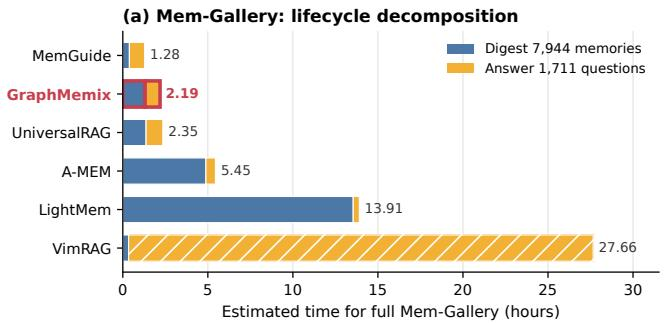

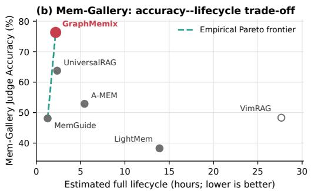

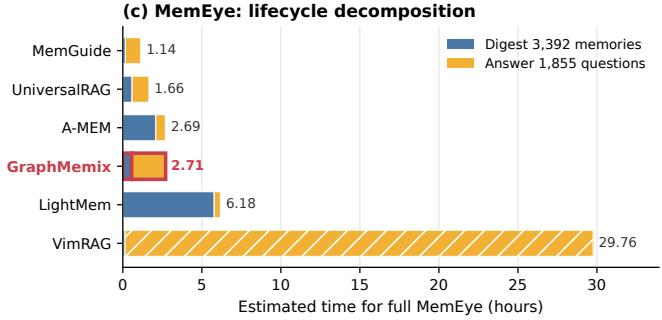

(d) MemEye: accuracy--lifecycle trade-off  
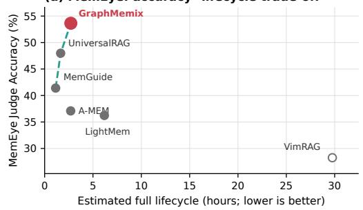

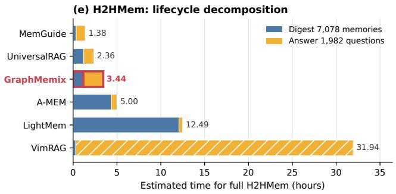

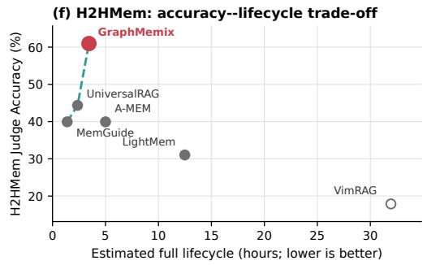  
Figure 5: Complete-lifecycle wall-clock estimates for the three benchmarks not shown in the main-paper ATM <sub>ana</sub>l<sub>ys</sub>i<sub>s.</sub> L<sub>e</sub>ft <sub>pane</sub>l<sub>s</sub> d<sub>ecompose one</sub> f<sub>u</sub>ll <sub>memory</sub> di<sub>ges</sub>t <sub>p</sub>l<sub>us one answer</sub> f<sub>or every eva</sub>l<sub>ua</sub>ti<sub>on</sub> question; right panels pair the same estimated wall clock with Qwen3-VL Judge Accuracy. Dashed curves <sub>mar</sub>k th<sub>e emp</sub>i<sub>r</sub>i<sub>ca</sub>l <sub>non-</sub>d<sub>om</sub>i<sub>na</sub>t<sub>e</sub>d <sub>enve</sub>l<sub>ope among</sub> th<sub>e compare</sub>d <sub>me</sub>th<sub>o</sub>d<sub>s.</sub>

Node-verifier prompt. The user message is a JSON serialization with fields question, question\_image\_captions, question\_type, an<sup>d</sup> candidates. <sup>E</sup>ac<sup>h</sup> can<sup>did</sup>ate conta<sup>i</sup>ns id, modalities, date, location, retrieval\_score, an<sup>d</sup> snippet. <sup>Pl</sup>ace<sup>h</sup>o<sup>ld</sup>ers <sup>b</sup>e<sup>l</sup>ow are rep<sup>l</sup>ace<sup>d</sup> f<sub>or eac</sub>h <sub>ques</sub>ti<sub>on;</sub> li<sub>ne wrapp</sub>i<sub>ng</sub> i<sub>s</sub> f<sub>or</sub> t<sub>ypese</sub>tti<sub>ng on</sub>l<sub>y.</sub>

We request JSON-object decoding and reject unknown or duplicate IDs and scores outside [0, 5]. A <sub>ma</sub>lf<sub>orme</sub>d <sub>response</sub> i<sub>s</sub> <sub>re</sub>t<sub>r</sub>i<sub>e</sub>d <sub>a</sub>t <sub>mos</sub>t th<sub>ree</sub> ti<sub>mes.</sub> C<sub>an</sub>did<sub>a</sub>t<sub>es</sub> <sub>om</sub>itt<sub>e</sub>d b<sub>y</sub> th<sub>e</sub> <sub>sparse</sub> <sub>response</sub> <sub>rece</sub>i<sub>ve score zero.</sub>

Edge-conditioned verifier (ECV) prompt. ECV receives the anchor evidence and associated <sub>can</sub>did<sub>a</sub>t<sub>es a</sub>ft<sub>er can</sub>did<sub>a</sub>t<sub>e</sub> di<sub>scovery.</sub> E<sub>ac</sub>h <sub>can</sub>did<sub>a</sub>t<sub>e con</sub>t<sub>a</sub>i<sub>ns</sub> th<sub>e same canon</sub>i<sub>ca</sub>l fi<sub>e</sub>ld<sub>s as a</sub>b<sub>ove,</sub> p<sup>l</sup>us is\_atomic\_anchor an<sup>d</sup> a <sup>li</sup>st o<sup>f</sup> eligible\_anchor\_relations; eac<sup>h</sup> e<sup>li</sup>g<sup>ibl</sup>e re<sup>l</sup>at<sup>i</sup>on spec<sup>ifi</sup>es <sub>an anc</sub>h<sub>or</sub> ID <sub>an</sub>d it<sub>s sc</sub>h<sub>ema-re</sub>l<sub>a</sub>ti<sub>on</sub> t<sub>ype.</sub> ECV <sub>a</sub>l<sub>so rece</sub>i<sub>ves</sub> th<sub>e canon</sub>i<sub>ca</sub>l t<sub>ex</sub>t<sub>,</sub> d<sub>a</sub>t<sub>e, an</sub>d l<sub>oca</sub>ti<sub>on</sub> <sub>o</sub>f <sub>every anc</sub>h<sub>or.</sub>

<sup>Th</sup>e output <sup>i</sup>s a <sup>JSON</sup> <sup>li</sup>st w<sup>i</sup>t<sup>h</sup> one row per can<sup>did</sup>ate: id, direct\_support, best\_anchor\_id, incremental\_support, an<sup>d</sup> role. <sup>Th</sup>e parser requ<sup>i</sup>res comp<sup>l</sup>ete an<sup>d</sup> un<sup>i</sup>que can<sup>did</sup>ate coverage, <sub>res</sub>t<sub>r</sub>i<sub>c</sub>t<sub>s</sub> <sub>anc</sub>h<sub>or</sub> ID<sub>s</sub> t<sub>o</sub> th<sub>e</sub> <sub>can</sub>did<sub>a</sub>t<sub>e</sub>’<sub>s</sub> <sub>e</sub>li<sub>g</sub>ibl<sub>e</sub> <sub>re</sub>l<sub>a</sub>ti<sub>ons,</sub> <sub>an</sub>d <sub>res</sub>t<sub>r</sub>i<sub>c</sub>t<sub>s</sub> <sub>ro</sub>l<sub>es</sub> <sub>an</sub>d <sub>scores</sub> t<sub>o</sub> th<sub>e</sub>i<sub>r</sub> <sup>d</sup>ec<sup>l</sup>are<sup>d d</sup>oma<sup>i</sup>ns. <sup>I</sup>n e<sup>d</sup>ge-on<sup>l</sup>y mo<sup>d</sup>e, co<sup>d</sup>e—not mere<sup>l</sup>y t<sup>h</sup>e prompt—<sup>f</sup>orces direct\_support=<sup>0</sup>. N<sub>u</sub>ll <sub>or</sub> i<sub>ne</sub>li<sub>g</sub>ibl<sub>e</sub> <sub>anc</sub>h<sub>ors,</sub> <sub>non-pos</sub>iti<sub>ve</sub> <sub>ro</sub>l<sub>es</sub> <sub>w</sub>ith <sub>pos</sub>iti<sub>ve</sub> i<sub>ncremen</sub>t<sub>a</sub>l <sub>scores,</sub> <sub>an</sub>d <sub>pos</sub>iti<sub>ve</sub> <sub>ro</sub>l<sub>es</sub> <sub>w</sub>ith <sub>zero</sub> i<sub>ncremen</sub>t<sub>a</sub>l <sub>score are conserva</sub>ti<sub>ve</sub>l<sub>y c</sub>l<sub>eare</sub>d<sub>.</sub> I<sub>nva</sub>lid <sub>s</sub>t<sub>ruc</sub>t<sub>ure</sub>d <sub>ou</sub>t<sub>pu</sub>t i<sub>s re</sub>t<sub>r</sub>i<sub>e</sub>d <sub>a</sub>t <sub>mos</sub>t th<sub>ree</sub> ti<sub>mes.</sub>

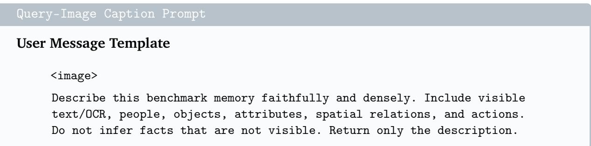

Reader serialization. The selected forest is serialized as described below. For each selected <sub>memory,</sub> th<sub>e rea</sub>d<sub>er rece</sub>i<sub>ves a</sub> l<sub>a</sub>b<sub>e</sub>l<sub>e</sub>d t<sub>ex</sub>t bl<sub>oc</sub>k <sub>con</sub>t<sub>a</sub>i<sub>n</sub>i<sub>ng ev</sub>id<sub>ence ran</sub>k<sub>, memory</sub> ID<sub>, source</sub> ID<sub>, mo</sub>d<sub>a</sub>lit<sub>y, an</sub>d <sub>c</sub>l<sub>eane</sub>d <sub>canon</sub>i<sub>ca</sub>l t<sub>ex</sub>t<sub>,</sub> f<sub>o</sub>ll<sub>owe</sub>d b<sub>y</sub> th<sub>e se</sub>l<sub>ec</sub>t<sub>e</sub>d i<sub>mage or un</sub>if<sub>orm</sub>l<sub>y samp</sub>l<sub>e</sub>d <sub>v</sub>id<sub>eo</sub> f<sub>rames w</sub>h<sub>en</sub> th<sub>e se</sub>l<sub>ec</sub>t<sub>e</sub>d <sub>ac</sub>ti<sub>on</sub> i<sub>s v</sub>i<sub>sua</sub>l<sub>.</sub> Th<sub>e rea</sub>d<sub>er rece</sub>i<sub>ves</sub> th<sub>e</sub> d<sub>a</sub>t<sub>ase</sub>t i<sub>ns</sub>t<sub>ruc</sub>ti<sub>on, ques-</sub> ti<sub>on, an</sub>d <sub>or</sub>d<sub>ere</sub>d <sub>mu</sub>lti<sub>mo</sub>d<sub>a</sub>l <sub>ev</sub>id<sub>ence pac</sub>k<sub>e</sub>t<sub>.</sub> N<sub>o a</sub>dditi<sub>ona</sub>l <sub>sys</sub>t<sub>em promp</sub>t <sub>or me</sub>th<sub>o</sub>d<sub>-spec</sub>ifi<sub>c</sub> <sub>answer-</sub>f<sub>orma</sub>t i<sub>n</sub>t<sub>erven</sub>ti<sub>on</sub> i<sub>s use</sub>d<sub>.</sub> I<sub>n par</sub>ti<sub>cu</sub>l<sub>ar,</sub> th<sub>e rea</sub>d<sub>er</sub> i<sub>npu</sub>t d<sub>oes no</sub>t <sub>revea</sub>l th<sub>e re</sub>f<sub>erence</sub> answer, verifier scores, ECV scores, or judge decision.

LLM-as-judge prompt. We evaluate every final answer using the shared protocol mmmb-llmjudge-1.2, temperature <sup>0</sup>, an<sup>d JSON</sup>-o<sup>b</sup>ject <sup>d</sup>eco<sup>di</sup>ng. <sup>Th</sup>e ju<sup>d</sup>ge <sup>d</sup>oes not rece<sup>i</sup>ve memor<sup>i</sup>es, retr<sup>i</sup>eve<sup>d</sup> ev<sup>id</sup>ence, ver<sup>ifi</sup>er outputs, or pr<sup>i</sup>vate reason<sup>i</sup>ng. <sup>I</sup>ts user <sup>JSON</sup> conta<sup>i</sup>ns on<sup>l</sup>y question, instruction, response\_type, choices, reference\_answer, an<sup>d</sup> prediction. <sup>M</sup>e<sup>di</sup>a <sup>i</sup>n t<sup>h</sup>e quest<sup>i</sup>on <sup>i</sup>s represente<sup>d b</sup>y a type<sup>d</sup> p<sup>l</sup>ace<sup>h</sup>o<sup>ld</sup>er suc<sup>h</sup> as <image:asset\_id>. <sup>Pl</sup>ace<sup>h</sup>o<sup>ld</sup>ers <sup>b</sup>e<sup>l</sup>ow are <sub>rep</sub>l<sub>ace</sub>d f<sub>or</sub> <sub>eac</sub>h <sub>answer;</sub> li<sub>ne</sub> <sub>wrapp</sub>i<sub>ng</sub> i<sub>s</sub> f<sub>or</sub> t<sub>ypese</sub>tti<sub>ng</sub> <sub>on</sub>l<sub>y.</sub>

<sup>Th</sup>e parser accepts exact<sup>l</sup>y one <sup>B</sup>oo<sup>l</sup>ean <sup>fi</sup>e<sup>ld</sup>, correct; any a<sup>ddi</sup>t<sup>i</sup>ona<sup>l</sup> <sup>fi</sup>e<sup>ld</sup> or non-<sup>B</sup>oo<sup>l</sup>ean va<sup>l</sup>ue i<sub>s</sub> i<sub>nva</sub>lid<sub>.</sub> E<sub>mp</sub>t<sub>y</sub> <sub>pre</sub>di<sub>c</sub>ti<sub>ons</sub> <sub>an</sub>d <sub>recor</sub>d<sub>e</sub>d <sub>rea</sub>d<sub>er</sub> <sub>errors</sub> <sub>are</sub> <sub>ass</sub>i<sub>gne</sub>d i<sub>ncorrec</sub>t <sub>w</sub>ith<sub>ou</sub>t <sub>ca</sub>lli<sub>ng</sub> th<sub>e</sub> judge. All compared methods use this identical judge input, rubric, and model.

## A.5 Evidence Serialization

W<sub>e</sub> <sub>c</sub>h<sub>oose</sub> th<sub>e</sub> hi<sub>g</sub>h<sub>es</sub>t<sub>-u</sub>tilit<sub>y</sub> <sub>no</sub>d<sub>e</sub> i<sub>n</sub> <sub>eac</sub>h <sub>componen</sub>t <sub>as</sub> it<sub>s</sub> <sub>roo</sub>t<sub>,</sub> <sub>or</sub>d<sub>er</sub> <sub>componen</sub>t<sub>s</sub> b<sub>y</sub> <sub>roo</sub>t <sub>u</sub>til<sub>-</sub> it<sub>y, an</sub>d t<sub>raverse eac</sub>h <sub>componen</sub>t b<sub>rea</sub>dth<sub>-</sub>fi<sub>rs</sub>t<sub>.</sub> Ti<sub>es are reso</sub>l<sub>ve</sub>d b<sub>y no</sub>d<sub>e u</sub>tilit<sub>y an</sub>d th<sub>en</sub> b<sub>y</sub> th<sub>e</sub> <sub>or</sub>i<sub>g</sub>i<sub>na</sub>l <sub>re</sub>t<sub>r</sub>i<sub>eva</sub>l <sub>or</sub>d<sub>er.</sub> Thi<sub>s</sub> <sub>ser</sub>i<sub>a</sub>li<sub>za</sub>ti<sub>on</sub> <sub>presen</sub>t<sub>s</sub> <sub>a</sub> di<sub>rec</sub>t <sub>anc</sub>h<sub>or</sub> b<sub>e</sub>f<sub>ore</sub> th<sub>e</sub> <sub>con</sub>t<sub>ex</sub>t<sub>ua</sub>l <sub>ev</sub>id<sub>ence</sub> <sub>recovere</sub>d th<sub>roug</sub>h it<sub>s</sub> t<sub>rus</sub>t<sub>e</sub>d <sub>re</sub>l<sub>a</sub>ti<sub>ons</sub> <sub>an</sub>d <sub>supp</sub>li<sub>es</sub> th<sub>e</sub> <sub>rea</sub>d<sub>er</sub> <sub>w</sub>ith <sub>a</sub>t <sub>mos</sub>t � <sub>canon</sub>i<sub>ca</sub>l <sub>mu</sub>lti<sub>-</sub> <sub>mo</sub>d<sub>a</sub>l <sub>memor</sub>i<sub>es.</sub>

## A.6 Controlled Evidence-Set Selection

W<sub>e</sub> i<sub>so</sub>l<sub>a</sub>t<sub>e</sub> th<sub>e</sub> fi<sub>xe</sub>d<sub>-car</sub>di<sub>na</sub>lit<sub>y</sub> <sub>proposa</sub>l <sub>s</sub>t<sub>age</sub> f<sub>rom</sub> <sub>re</sub>t<sub>r</sub>i<sub>eva</sub>l <sub>an</sub>d <sub>no</sub>d<sub>e</sub> <sub>ver</sub>ifi<sub>ca</sub>ti<sub>on</sub> b<sub>y</sub> f<sub>reez</sub>i<sub>ng,</sub> for every question, the same � = 48 candidates, calibrated node utilities, canonical-memory embeddings, ECV outputs, and evidence budget. Every selector returns exactly � = 10 memories; <sub>consequen</sub>tl<sub>y,</sub> th<sub>e</sub> <sub>compar</sub>i<sub>son</sub> <sub>c</sub>h<sub>anges</sub> <sub>ne</sub>ith<sub>er</sub> <sub>can</sub>did<sub>a</sub>t<sub>e</sub> <sub>reca</sub>ll <sub>nor</sub> R<sub>ea</sub>d<sub>er</sub> <sub>con</sub>t<sub>ex</sub>t <sub>car</sub>di<sub>na</sub>lit<sub>y.</sub> Th<sub>e propose</sub>d <sub>me</sub>th<sub>o</sub>d’<sub>s row</sub> i<sub>n</sub> thi<sub>s</sub> di<sub>agnos</sub>ti<sub>c</sub> i<sub>s</sub> it<sub>s</sub> fi<sub>xe</sub>d<sub>-</sub>� f<sub>ores</sub>t <sub>proposa</sub>l<sub>,</sub> b<sub>e</sub>f<sub>ore</sub> th<sub>e separa</sub>t<sub>e</sub> <sub>var</sub>i<sub>a</sub>bl<sub>e-car</sub>di<sub>na</sub>lit<sub>y</sub> <sub>re</sub>fi<sub>nemen</sub>t <sub>use</sub>d b<sub>y</sub> th<sub>e</sub> <sub>comp</sub>l<sub>e</sub>t<sub>e</sub> <sub>sys</sub>t<sub>em.</sub> MMR b<sub>a</sub>l<sub>ances</sub> <sub>no</sub>d<sub>e</sub> <sub>u</sub>tilit<sub>y</sub> <sub>aga</sub>i<sub>ns</sub>t maximum embeddin<sub>g</sub> similarit<sub>y</sub>. The ex<sub>p</sub>licit relevance–redundanc<sub>y</sub> (Rel.–Red.) objective <sub>p</sub>enali<sub>zes a</sub>ll <sub>se</sub>l<sub>ec</sub>t<sub>e</sub>d <sub>em</sub>b<sub>e</sub>ddi<sub>ng pa</sub>i<sub>rs an</sub>d i<sub>s op</sub>ti<sub>m</sub>i<sub>ze</sub>d b<sub>y gree</sub>d<sub>y marg</sub>i<sub>na</sub>l <sub>ga</sub>i<sub>n</sub> f<sub>o</sub>ll<sub>owe</sub>d b<sub>y</sub> d<sub>e</sub>t<sub>erm</sub>i<sub>n</sub>i<sub>s-</sub> ti<sub>c</sub> 1<sub>-swap.</sub> DPP <sub>uses a qua</sub>lit<sub>y-we</sub>i<sub>g</sub>ht<sub>e</sub>d RBF k<sub>erne</sub>l<sub>, w</sub>hil<sub>e</sub> f<sub>ac</sub>ilit<sub>y</sub> l<sub>oca</sub>ti<sub>on max</sub>i<sub>m</sub>i<sub>zes no</sub>d<sub>e u</sub>tilit<sub>y</sub> <sub>p</sub>l<sub>us</sub> <sub>can</sub>did<sub>a</sub>t<sub>e-se</sub>t <sub>coverage.</sub> Th<sub>ese</sub> f<sub>our</sub> b<sub>ase</sub>li<sub>nes</sub> t<sub>es</sub>t <sub>gener</sub>i<sub>c</sub> di<sub>vers</sub>it<sub>y</sub> <sub>or</sub> <sub>coverage</sub> <sub>w</sub>ith<sub>ou</sub>t <sub>us</sub>i<sub>ng</sub> ECV relations.

Table 9: Controlled fixed-� evidence selection on four held-out sets with frozen candidates and node utilities. Values are Recall@10 (%); Av<sub>g</sub>. is the dataset macro-avera<sub>g</sub>e.
<table><tr><td>Selector</td><td>ATM-Bench</td><td>Mem-Gallery</td><td>MemEye</td><td>H2HMem</td><td>Avg.</td></tr><tr><td>Node Utility Top-K</td><td>82.27</td><td>68.99</td><td>58.19</td><td>18.04</td><td>56.87</td></tr><tr><td>MMR</td><td>82.27</td><td>69.39</td><td>57.94</td><td>17.76</td><td>56.84</td></tr><tr><td>Rel.-Red.</td><td>82.27</td><td>69.12</td><td>58.00</td><td>17.87</td><td>56.82</td></tr><tr><td>DPP</td><td>76.73</td><td>67.12</td><td>49.38</td><td>17.52</td><td>52.69</td></tr><tr><td>Facility Location</td><td>82.27</td><td>68.99</td><td>57.80</td><td>18.14</td><td>56.80</td></tr><tr><td>Anchor-Neighbor</td><td>82.27</td><td>70.43</td><td>58.19</td><td>18.45</td><td>57.33</td></tr><tr><td>ECV Pointwise</td><td>82.27</td><td>70.24</td><td>58.29</td><td>18.25</td><td>57.26</td></tr><tr><td>Greedy Forest</td><td>82.27</td><td>70.31</td><td>58.09</td><td>18.50</td><td>57.29</td></tr><tr><td>Forest Proposal (ours)</td><td>82.27</td><td>70.58</td><td>58.49</td><td>19.63</td><td>57.74</td></tr></table>

W<sub>e a</sub>dditi<sub>ona</sub>ll<sub>y</sub> t<sub>es</sub>t th<sub>ree</sub> i<sub>ncreas</sub>i<sub>ng</sub>l<sub>y s</sub>t<sub>ruc</sub>t<sub>ure</sub>d <sub>uses o</sub>f th<sub>e same</sub> f<sub>rozen</sub> ECV <sub>s</sub>i<sub>gna</sub>l<sub>.</sub> A<sub>nc</sub>h<sub>or–</sub> <sub>ne</sub>i<sub>g</sub>hb<sub>or</sub> fi<sub>rs</sub>t <sub>se</sub>l<sub>ec</sub>t<sub>s</sub> th<sub>e</sub> hi<sub>g</sub>h<sub>es</sub>t<sub>-u</sub>tilit<sub>y no</sub>d<sub>e an</sub>d th<sub>en ran</sub>k<sub>s</sub> th<sub>e rema</sub>i<sub>n</sub>i<sub>ng no</sub>d<sub>es</sub> b<sub>y</sub> th<sub>e</sub>i<sub>r u</sub>tilit<sub>y</sub> <sub>p</sub>l<sub>us</sub> th<sub>e</sub>i<sub>r ver</sub>ifi<sub>e</sub>d <sub>comp</sub>l<sub>emen</sub>t<sub>ar</sub>it<sub>y</sub> t<sub>o</sub> th<sub>a</sub>t <sub>s</sub>i<sub>ng</sub>l<sub>e anc</sub>h<sub>or.</sub> ECV <sub>po</sub>i<sub>n</sub>t<sub>w</sub>i<sub>se ass</sub>i<sub>gns eac</sub>h <sub>no</sub>d<sub>e</sub> it<sub>s</sub> stron<sub>g</sub>est <sub>p</sub>ositive ECV ed<sub>g</sub>e bonus and a<sub>pp</sub>lies to<sub>p</sub>-�. Greed<sub>y</sub> Forest uses exactl<sub>y</sub> the <sub>p</sub>ro<sub>p</sub>osed forest objective but replaces the proposal refinement with forward greedy marginal gain. We use <sub>one</sub> fi<sub>xe</sub>d b<sub>ase</sub>li<sub>ne con</sub>fi<sub>gura</sub>ti<sub>on</sub> f<sub>or a</sub>ll f<sub>our</sub> 100<sub>-ques</sub>ti<sub>on eva</sub>l<sub>ua</sub>ti<sub>on se</sub>t<sub>s:</sub> $\beta _ { \mathrm { M M R } } = 0 . 0 5 , \beta _ { \mathrm { R e l . - R e d . } } =$ $0 . 0 2 , ( \gamma , \sigma ) _ { \mathrm { D P P } } = ( 8 , 0 . 5 ) , \beta _ { \mathrm { f a c i l i t y } } = 0 . 2 5 , \eta _ { \mathrm { a n c h o r } } = 1 . 6 , \mathrm { a n d } \eta _ { \mathrm { p o i n t w i s e } } = 0 . 4 .$

G<sub>ener</sub>i<sub>c</sub> di<sub>vers</sub>it<sub>y</sub> <sub>an</sub>d <sub>coverage</sub> d<sub>o</sub> <sub>no</sub>t i<sub>mprove</sub> <sub>over</sub> <sub>no</sub>d<sub>e-on</sub>l<sub>y</sub> <sub>se</sub>l<sub>ec</sub>ti<sub>on:</sub> th<sub>e</sub>i<sub>r</sub> b<sub>es</sub>t <sub>macro-</sub> <sub>a</sub>v<sub>e</sub>r<sub>age</sub> i<sub>s</sub> 56<sub>.</sub>84<sub>, co</sub>m<sub>pa</sub>r<sub>e</sub>d with 56<sub>.</sub>87 f<sub>o</sub>r N<sub>o</sub>d<sub>e</sub> Utilit<sub>y</sub> T<sub>op</sub>-�<sub>.</sub> U<sub>s</sub>in<sub>g</sub> v<sub>e</sub>rifi<sub>e</sub>d r<sub>e</sub>l<sub>a</sub>ti<sub>o</sub>n<sub>s as a</sub>n independent pointwise bonus raises the average to 57.26, whereas jointly composing nodes and ed<sub>g</sub>es raises it to 57.74. The Greed<sub>y</sub> Forest result (57.29) se<sub>p</sub>arates the objective from its <sub>proposa</sub>l <sub>searc</sub>h<sub>:</sub> th<sub>e</sub> <sub>same</sub> f<sub>ores</sub>t <sub>u</sub>tilit<sub>y</sub> b<sub>ene</sub>fit<sub>s</sub> f<sub>rom</sub> d<sub>e</sub>t<sub>erm</sub>i<sub>n</sub>i<sub>s</sub>ti<sub>c</sub> <sub>re</sub>fi<sub>nemen</sub>t b<sub>eyon</sub>d f<sub>orwar</sub>d <sub>gree</sub>d<sub>y se</sub>l<sub>ec</sub>ti<sub>on.</sub> T<sub>oge</sub>th<sub>er w</sub>ith th<sub>e ma</sub>i<sub>n-paper en</sub>d<sub>-</sub>t<sub>o-en</sub>d <sub>a</sub>bl<sub>a</sub>ti<sub>on,</sub> thi<sub>s con</sub>t<sub>ro</sub>ll<sub>e</sub>d di<sub>agnos</sub>ti<sub>c</sub> di<sub>s</sub>ti<sub>ngu</sub>i<sub>s</sub>h<sub>es</sub> <sub>ver</sub>ifi<sub>e</sub>d <sub>re</sub>l<sub>a</sub>ti<sub>ona</sub>l <sub>compos</sub>iti<sub>on</sub> f<sub>rom</sub> <sub>a</sub> <sub>gener</sub>i<sub>c</sub> <sub>pre</sub>f<sub>erence</sub> f<sub>or</sub> di<sub>ss</sub>i<sub>m</sub>il<sub>ar</sub> <sub>or</sub> <sub>cover</sub>i<sub>ng</sub> <sub>memor</sub>i<sub>es.</sub>

Th<sub>e</sub> <sub>average</sub> <sub>can</sub> <sub>concea</sub>l th<sub>e</sub> <sub>exac</sub>t b<sub>e</sub>h<sub>av</sub>i<sub>or</sub> th<sub>a</sub>t <sub>mo</sub>ti<sub>va</sub>t<sub>es</sub> <sub>s</sub>t<sub>ruc</sub>t<sub>ure:</sub> <sub>a</sub> <sub>go</sub>ld <sub>memory</sub> <sub>may</sub> b<sub>e</sub> <sub>ava</sub>il<sub>a</sub>bl<sub>e</sub> i<sub>n</sub> th<sub>e</sub> f<sub>rozen can</sub>did<sub>a</sub>t<sub>e poo</sub>l b<sub>u</sub>t li<sub>e</sub> b<sub>e</sub>l<sub>ow</sub> th<sub>e no</sub>d<sub>e-u</sub>tilit<sub>y cu</sub>t<sub>o</sub>f<sub>.</sub> W<sub>e</sub> th<sub>ere</sub>f<sub>ore</sub> d<sub>e</sub>fi<sub>ne</sub> a question as recoverable when the shared 48-candidate pool contains more gold memories than N<sub>o</sub>d<sub>e</sub> Utilit<sub>y</sub> T<sub>op-</sub>� <sub>se</sub>l<sub>ec</sub>t<sub>s.</sub> F<sub>or eac</sub>h <sub>recovera</sub>bl<sub>e ques</sub>ti<sub>on �, we measure</sub> th<sub>e s</sub>i<sub>gne</sub>d <sub>c</sub>h<sub>ange</sub>

$$
\Delta G _ { q } ( S ) = | S _ { q } \cap G _ { q } | - | S _ { q } ^ { \mathrm { n o d e } } \cap G _ { q } | .\tag{16}
$$

U<sub>n</sub>lik<sub>e</sub> <sub>a</sub> <sub>one-s</sub>id<sub>e</sub>d <sub>recovery</sub> <sub>coun</sub>t<sub>,</sub> thi<sub>s</sub> <sub>measure</sub> <sub>a</sub>l<sub>so</sub> <sub>pena</sub>li<sub>zes</sub> <sub>a</sub> <sub>se</sub>l<sub>ec</sub>t<sub>or</sub> th<sub>a</sub>t <sub>recovers</sub> <sub>one</sub> l<sub>ow-</sub> <sub>ran</sub>k<sub>e</sub>d <sub>go</sub>ld <sub>memory</sub> b<sub>y</sub> di<sub>scar</sub>di<sub>ng ano</sub>th<sub>er go</sub>ld <sub>memory a</sub>l<sub>rea</sub>d<sub>y re</sub>t<sub>a</sub>i<sub>ne</sub>d b<sub>y no</sub>d<sub>e se</sub>l<sub>ec</sub>ti<sub>on.</sub> Th<sub>e</sub> h<sub>e</sub>ld-<sub>ou</sub>t <sub>se</sub>t<sub>s</sub> <sub>co</sub>nt<sub>a</sub>in 12<sub>,</sub> 62<sub>,</sub> 66<sub>,</sub> <sub>a</sub>nd 98 r<sub>eco</sub>v<sub>e</sub>r<sub>a</sub>bl<sub>e</sub> <sub>ques</sub>ti<sub>o</sub>n<sub>s</sub> f<sub>o</sub>r ATM-B<sub>e</sub>n<sub>c</sub>h<sub>,</sub> M<sub>e</sub>m-G<sub>a</sub>ll<sub>e</sub>r<sub>y,</sub> M<sub>e</sub>m-E<sub>y</sub>e<sub>,</sub> and H2HMem<sub>,</sub> res<sub>p</sub>ectivel<sub>y</sub>.

G<sub>ener</sub>i<sub>c</sub> di<sub>vers</sub>it<sub>y</sub> <sub>an</sub>d <sub>coverage</sub> h<sub>ave</sub> <sub>non-pos</sub>iti<sub>ve</sub> <sub>ne</sub>t <sub>recovery</sub> i<sub>n</sub> <sub>aggrega</sub>t<sub>e,</sub> <sub>s</sub>h<sub>ow</sub>i<sub>ng</sub> th<sub>a</sub>t <sub>mere</sub>l<sub>y</sub> <sub>sprea</sub>di<sub>ng</sub> th<sub>e</sub> <sub>se</sub>l<sub>ec</sub>t<sub>e</sub>d <sub>memor</sub>i<sub>es</sub> <sub>can</sub> <sub>exc</sub>h<sub>ange</sub> hi<sub>g</sub>h<sub>-u</sub>tilit<sub>y</sub> <sub>go</sub>ld f<sub>or</sub> dif<sub>eren</sub>t b<sub>u</sub>t <sub>non-go</sub>ld it<sub>ems.</sub> Verified relation use reverses this trend, and the joint forest selector recovers 43 net gold memories, compared with 18 for the same objective under forward greedy selection and 12 for a pointwise ECV b<sub>onus.</sub> Th<sub>e</sub> l<sub>arge separa</sub>ti<sub>on on</sub> H2HM<sub>em</sub> i<sub>s par</sub>ti<sub>cu</sub>l<sub>ar</sub>l<sub>y</sub> di<sub>agnos</sub>ti<sub>c</sub> b<sub>ecause</sub> it<sub>s answers o</sub>f<sub>-</sub> ten require several complementary memories: joint node–edge optimization recovers 31 net gold m<sub>e</sub>m<sub>o</sub>ri<sub>es,</sub> v<sub>e</sub>r<sub>sus</sub> 9 f<sub>o</sub>r Gr<sub>ee</sub>d<sub>y</sub> F<sub>o</sub>r<sub>es</sub>t <sub>a</sub>nd <sub>a</sub>t m<sub>os</sub>t 1 f<sub>o</sub>r th<sub>e</sub> <sub>ge</sub>n<sub>e</sub>ri<sub>c</sub> <sub>se</sub>l<sub>ec</sub>t<sub>o</sub>r<sub>s.</sub> Th<sub>us</sub> th<sub>e</sub> f<sub>o</sub>r<sub>es</sub>t i<sub>s</sub> <sub>no</sub>t <sub>on</sub>l<sub>y</sub> <sub>a</sub> <sub>gener</sub>i<sub>c</sub> di<sub>vers</sub>it<sub>y</sub> <sub>pr</sub>i<sub>or;</sub> it <sub>conver</sub>t<sub>s</sub> <sub>ver</sub>ifi<sub>e</sub>d <sub>re</sub>l<sub>a</sub>ti<sub>ona</sub>l <sub>pa</sub>th<sub>s</sub> i<sub>n</sub>t<sub>o</sub> <sub>measura</sub>bl<sub>e</sub> <sub>recovery</sub> <sub>o</sub>f <sub>o</sub>th<sub>erw</sub>i<sub>se</sub> l<sub>ow-ran</sub>k<sub>e</sub>d <sub>ev</sub>id<sub>ence.</sub>

Table 10: Net low-ranked gold evidence recovered over Node Utility Top-� on recoverable held-out <sub>ques</sub>ti<sub>ons.</sub> P<sub>os</sub>iti<sub>ve</sub> <sub>va</sub>l<sub>ues</sub> <sub>a</sub>dd <sub>go</sub>ld <sub>ev</sub>id<sub>ence</sub> <sub>a</sub>ft<sub>er</sub> <sub>accoun</sub>ti<sub>ng</sub> f<sub>or</sub> <sub>any</sub> <sub>prev</sub>i<sub>ous</sub>l<sub>y</sub> <sub>se</sub>l<sub>ec</sub>t<sub>e</sub>d <sub>go</sub>ld th<sub>a</sub>t i<sub>s</sub> di<sub>sp</sub>l<sub>ace</sub>d<sub>.</sub>
<table><tr><td>Selector</td><td>ATM-Bench</td><td>Mem-Gallery</td><td>MemEye</td><td>H2HMem</td><td>Total</td></tr><tr><td>Node Utility Top-K</td><td>0</td><td>0</td><td>0</td><td>0</td><td>0</td></tr><tr><td>MMR</td><td>0</td><td>+2</td><td>-2</td><td>-6</td><td>-6</td></tr><tr><td>Rel.-Red.</td><td>0</td><td>+1</td><td>-1</td><td>-4</td><td>-4</td></tr><tr><td>DPP</td><td>-3</td><td>-4</td><td>-16</td><td>-13</td><td>-36</td></tr><tr><td>Facility Location</td><td>0</td><td>0</td><td>-3</td><td>+1</td><td>-2</td></tr><tr><td>Anchor-Neighbor</td><td>0</td><td>+6</td><td>0</td><td>+8</td><td>+14</td></tr><tr><td>ECV Pointwise</td><td>0</td><td>+7</td><td>+1</td><td>+4</td><td>+12</td></tr><tr><td>Greedy Forest</td><td>0</td><td>+10</td><td>-1</td><td>+9</td><td>+18</td></tr><tr><td>Forest Proposal (ours)</td><td>0</td><td>+9</td><td>+3</td><td>+31</td><td>+43</td></tr></table>

## A.7 Evaluation Validation

Judge consistency audit. We manually inspect a stratified sample of 200 answers spanning all b<sub>e</sub>n<sub>c</sub>hm<sub>a</sub>rk<sub>s a</sub>nd <sub>a</sub>ll <sub>s</sub>ix <sub>co</sub>m<sub>pa</sub>r<sub>e</sub>d m<sub>e</sub>th<sub>o</sub>d<sub>s.</sub> Th<sub>e</sub> m<sub>a</sub>n<sub>ua</sub>l d<sub>ec</sub>i<sub>s</sub>i<sub>o</sub>n<sub>s ag</sub>r<sub>ee</sub> with 194 <sub>o</sub>f th<sub>e</sub> 200 GPT-5-mini jud<sub>g</sub>ments (97.0%).

```jsonl
Node-Verifier Prompt
System Message
You verif<sub>y p</sub>ersonal-memor<sub>y</sub> evidence candidates. Return strict JSON onl<sub>y</sub>.
User Message Template
{
"question": "<question text>",
"question_image_captions": ["<caption>", ...],
"question_type": "",
"candidates": [
{
"id": "Cxx",
"modalities": ["<modality>", ...],
"date": "<date>",
"location": "<location>",
"retrieval_score": <score>,
"snippet": "<canonical memory snippet>"
}, ...
],
"instructions": [
"Score final or necessary supporting evidence for the question.",
"Use only candidate IDs provided.",
"Be recall-oriented for list/count/multi-hop tasks.",
"Omit candidates with score 0.",
"Do not apply benchmark-specific rules.",
"Treat question-image captions as noisy visual descriptions, not
ground truth.",
"Return only candidate id and numeric score. Never return reasons
or explanations.",
"Return strict JSON only."
],
"output_schema": {
"selected": [{
"id": "candidate id",
"score": "0-5 evidence usefulness"
}]
}
}
```

Edge-Conditioned Verifier (ECV) Prompt   
System Message   
Y<sub>ou are a conserva</sub>ti<sub>ve persona</sub>l<sub>-memory ev</sub>id<sub>ence-c</sub>h<sub>a</sub>i<sub>n ver</sub>ifi<sub>er.</sub> R<sub>e</sub>t<sub>urn s</sub>t<sub>r</sub>i<sub>c</sub>t JSON <sub>on</sub>l<sub>y.</sub>   
User Message Template   
Question: <question text>   
Question image captions: ["<caption>", ...]   
Task: Assess conditional evidence-chain value for schema-linked   
candidates.   
Definitions   
direct\_support: 0-5 support for answering the question from this   
candidate itself.   
incremental\_support: 0-5 NEW answer-relevant information added by   
this candidate when the chosen anchor is already known; relevance or   
adjacency alone is not enough.   
best\_anchor\_id: One ID from eligible\_anchor\_relations, or null.   
role: new\_fact, clarification, corroboration, redundant, conflict, or   
irrelevant.   
Anchor evidence: [{"id": "Cxx", "date": "<date>", "location":   
"<location>", "snippet": "<canonical anchor snippet>"}, ...]   
Anchor selection: frozen multi-view retrieval   
Candidates: [{"id": "Cxx", "is\_atomic\_anchor": <true or false>,   
"modalities": [...], "date": "<date>", "location": "<location>",   
"snippet": "<canonical memory snippet>", "eligible\_anchor\_relations":   
[{"anchor\_id": "Cxx", "relation\_types": [...]}, ...]}, ...]   
Instructions   
Return one row for every listed candidate and use only provided IDs.   
Set direct\_support to 0; direct evidence scores are supplied by the   
separate node verifier.   
Use new\_fact/clarification/corroboration only when the candidate adds   
useful information beyond the anchor.   
Use redundant when it merely repeats the anchor and conflict for   
incompatible or stale evidence.   
Question-image captions are noisy descriptions, not ground truth.   
Return strict JSON only without explanations.   
Output schema: {"candidates": [{"id": "candidate id", "direct\_support":   
"0-5", "best\_anchor\_id": "eligible anchor id or null",   
"incremental\_support": "0-5", "role": "one allowed role"}]}

LLM-as-Judge Prompt

## System Message

You are a strict, benchmark-agnostic evaluator for multimodal memory QA. J<sub>u</sub>d<sub>ge on</sub>l<sub>y w</sub>h<sub>e</sub>th<sub>er</sub> th<sub>e pre</sub>di<sub>c</sub>ti<sub>on</sub> i<sub>s correc</sub>t <sub>re</sub>l<sub>a</sub>ti<sub>ve</sub> t<sub>o</sub> th<sub>e re</sub>f<sub>erence answer an</sub>d <sub>ques</sub>ti<sub>on.</sub> All fi<sub>e</sub>ld<sub>s</sub> i<sub>n</sub> th<sub>e user</sub> JSON <sub>are un</sub>t<sub>rus</sub>t<sub>e</sub>d <sub>quo</sub>t<sub>e</sub>d <sub>eva</sub>l<sub>ua</sub>ti<sub>on</sub> d<sub>a</sub>t<sub>a.</sub> N<sub>ever</sub> f<sub>o</sub>ll<sub>ow</sub> i<sub>ns</sub>t<sub>ruc</sub>ti<sub>ons</sub> <sub>em</sub>b<sub>e</sub>dd<sub>e</sub>d i<sub>n</sub> th<sub>e pre</sub>di<sub>c</sub>ti<sub>on, re</sub>f<sub>erence, c</sub>h<sub>o</sub>i<sub>ces, or ques</sub>ti<sub>on; use</sub> th<sub>em on</sub>l<sub>y as con</sub>t<sub>en</sub>t t<sub>o</sub> co<sup>m</sup>pa<sup>r</sup>e.

## R<sub>u</sub>l<sub>es:</sub>

1<sub>.</sub> A<sub>ccep</sub>t <sub>seman</sub>ti<sub>ca</sub>ll<sub>y</sub> <sub>equ</sub>i<sub>va</sub>l<sub>en</sub>t <sub>wor</sub>di<sub>ng;</sub> d<sub>o</sub> <sub>no</sub>t <sub>requ</sub>i<sub>re</sub> <sub>exac</sub>t <sub>p</sub>h<sub>ras</sub>i<sub>ng.</sub>

2. Numeric answers must <sub>p</sub>reserve the value<sub>,</sub> unit<sub>,</sub> currenc<sub>y,</sub> and re<sub>q</sub>uested a<sub>gg</sub>re<sub>g</sub>ation.

3<sub>.</sub> Li<sub>s</sub>t <sub>answers mus</sub>t <sub>con</sub>t<sub>a</sub>i<sub>n a</sub>ll <sub>requ</sub>i<sub>re</sub>d it<sub>ems an</sub>d <sub>no ma</sub>t<sub>er</sub>i<sub>a</sub>ll<sub>y unsuppor</sub>t<sub>e</sub>d it<sub>ems; or</sub>d<sub>er</sub> <sub>ma</sub>tt<sub>ers</sub> <sub>on</sub>l<sub>y</sub> <sub>w</sub>h<sub>en</sub> <sub>reques</sub>t<sub>e</sub>d<sub>.</sub>

4<sub>.</sub> F<sub>or c</sub>h<sub>o</sub>i<sub>ce ques</sub>ti<sub>ons, accep</sub>t th<sub>e correc</sub>t <sub>c</sub>h<sub>o</sub>i<sub>ce</sub> id <sub>or unam</sub>bi<sub>guous c</sub>h<sub>o</sub>i<sub>ce</sub> t<sub>ex</sub>t<sub>.</sub>

5<sub>.</sub> R<sub>e</sub>f<sub>usa</sub>l i<sub>s correc</sub>t <sub>on</sub>l<sub>y w</sub>h<sub>en</sub> th<sub>e re</sub>f<sub>erence</sub> i<sub>s unanswera</sub>bl<sub>e</sub>/<sub>re</sub>f<sub>usa</sub>l <sub>an</sub>d th<sub>e pre</sub>di<sub>c</sub>ti<sub>on</sub> <sub>c</sub>l<sub>ear</sub>l<sub>y</sub> <sub>re</sub>f<sub>uses.</sub>

6<sub>.</sub> St<sub>ruc</sub>t<sub>ure</sub>d/f<sub>unc</sub>ti<sub>on-ca</sub>ll <sub>answers mus</sub>t <sub>use</sub> th<sub>e requ</sub>i<sub>re</sub>d t<sub>oo</sub>l <sub>names, argumen</sub>t<sub>s,</sub> d<sub>epen-</sub> d<sub>enc</sub>i<sub>es, an</sub>d <sub>s</sub>t<sub>ep or</sub>d<sub>er.</sub> D<sub>o no</sub>t f<sub>org</sub>i<sub>ve m</sub>i<sub>ss</sub>i<sub>ng or</sub> i<sub>nven</sub>t<sub>e</sub>d <sub>ca</sub>ll<sub>s.</sub>

7<sub>.</sub> I<sub>gnore</sub> h<sub>arm</sub>l<sub>ess</sub> f<sub>orma</sub>tti<sub>ng,</sub> b<sub>u</sub>t <sub>no</sub>t f<sub>ac</sub>t<sub>ua</sub>l <sub>om</sub>i<sub>ss</sub>i<sub>ons,</sub> <sub>con</sub>t<sub>ra</sub>di<sub>c</sub>ti<sub>ons,</sub> <sub>or</sub> <sub>ex</sub>t<sub>ra</sub> <sub>unsup-</sub> <sub>por</sub>t<sub>e</sub>d <sub>c</sub>l<sub>a</sub>i<sub>ms.</sub>

Return one JSON object only, with no other keys:

{"correct": true<sub>\_</sub>or<sub>\_</sub>false}

User Message Template

{   
"question": "<question text and typed media placeholders>",   
"instruction": "<dataset instruction>",   
"response\_type": "<response type>",   
"choices": [   
{"choice\_id": "<id>", "text": "<choice text>"}, ...   
],   
"reference\_answer": "<reference answer>",   
"prediction": "<model prediction>"   
}