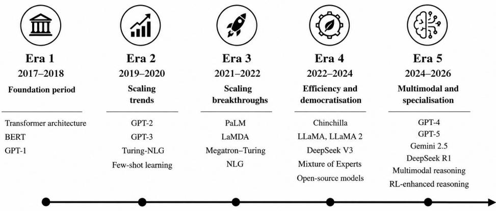
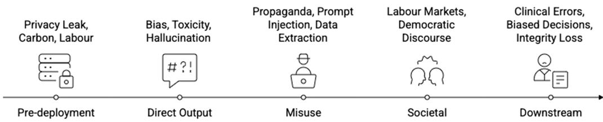
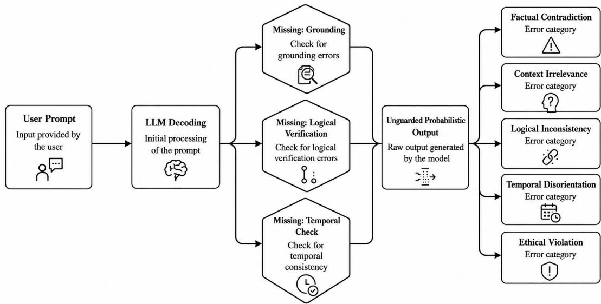
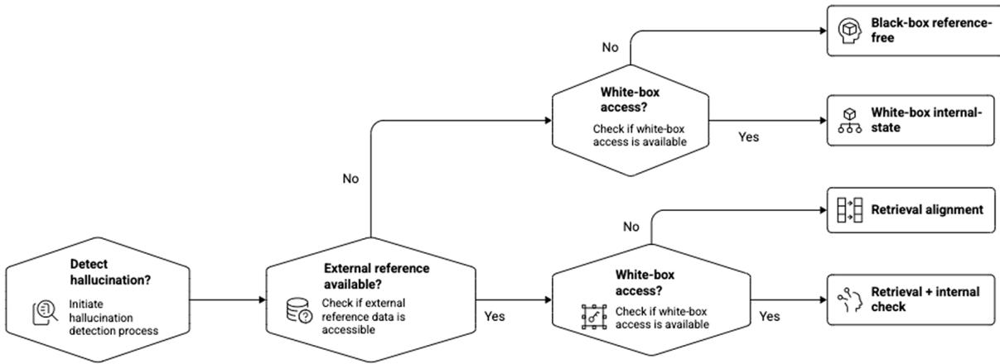
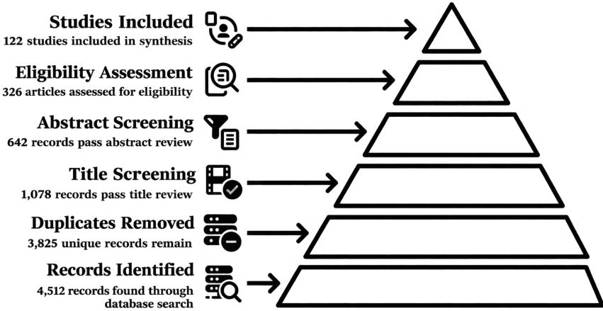
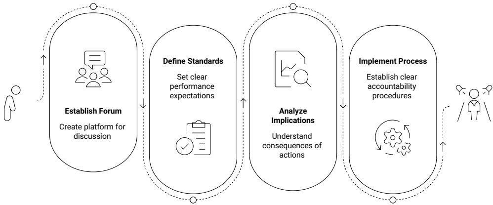
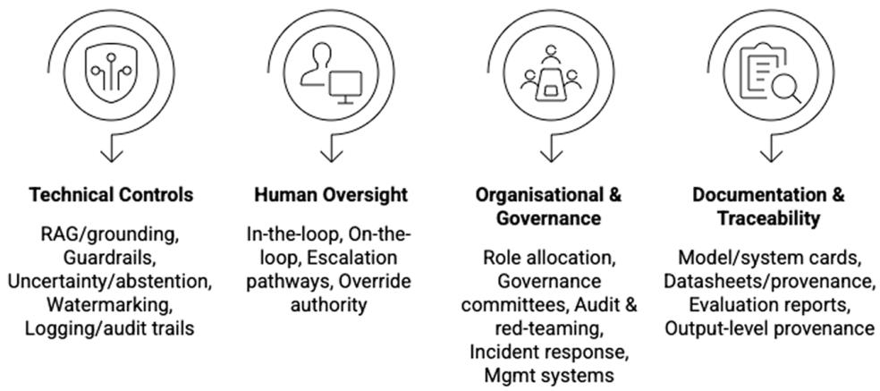
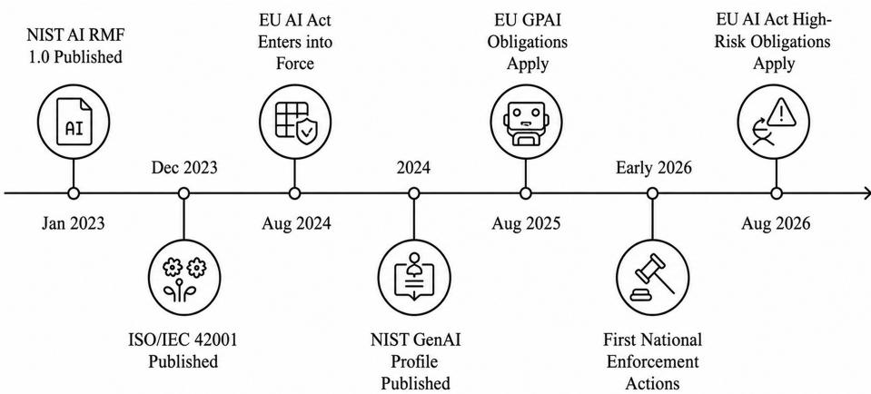
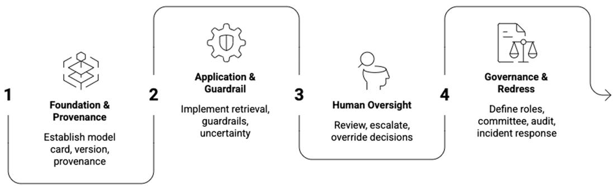

# LAAF: A Layered Accountability Architecture Framework for LLM Applications

Prachi Chaturvedi∗1, Shahnawaz Ahmad†1, Ehsan Nowroozi‡2, Muhammad Waqas§2, George Loukas¶2, Alireza Jolfaei‖3, Lucas Cordeiro∗∗4, and Pierre Dantas††4

1School of Computer Science Engineering and Technology, Bennett University, Greater Noida, India

2Centre for Sustainable Cyber Security (CS2), University of Greenwich, United Kingdom

3School of Electrical Engineering, Computing & Mathematical Sciences, Curtin University, Australia

4Systems and Software Security (S3), University of Manchester, United Kingdom

## Abstract

Large Language Models (LLMs) operate in hospitals, courtrooms, banks, and publicservice desks, where fluent, confident outputs are treated as authoritative even when ungrounded or incorrect. When such an output contributes to harm, who is answerable, and through what mechanisms can responsibility be traced, explained, and acted upon? This review surveys how the literature answers that question and maps it against the instruments now in force. Following PRISMA reporting guidance, five databases were searched for the period January 2022 to March 2026 against four review questions; of 4,512 records identified, 122 primary studies were included, together with 12 regulatory and standards documents analysed as primary sources. The review consolidates a sociotechnical account of accountability as an actor–forum relation resolved into five dimensions, and synthesises mechanisms across four families spanning technical controls, human oversight, organisational governance, and documentation and traceability, each with a maturity assessment. The corpus is read throughout through a four-layer classification device spanning provenance, application logic, human oversight, and governance and redress, cross-cut by traceability, role clarity, and continuous monitoring. Both are mapped onto the EU AI Act, whose high-risk obligations have applied since 2 August 2026, the NIST AI RMF with its Generative AI Profile, ISO/IEC 42001, and sectoral guidance in healthcare, consumer finance, education, and the public sector. Four persistent gaps emerge, namely under-specification of human oversight, absence of shared accountability metrics, disciplinary disconnection, and limited empirical evaluation, alongside five structural tensions that no surveyed instrument resolves. The review closes by consolidating the classification device into an integrated accountability architecture, LAAF, with cybersecurity aligned to the OWASP LLM Top 10 (2025); it is a synthesis of the surveyed evidence rather than a validated artefact. To our knowledge this is the first systematic review to map the LLM accountability literature onto the binding regulatory instruments now in force.

Keywords: Large Language Models, Accountability, AI Governance, Hallucinations, Human Oversight, EU AI Act, NIST AI RMF, ISO/IEC 42001, Cybersecurity, OWASP LLM Top 10, Systematic Review

## 1 Introduction

## 1.1 The Accountability Imperative for LLMs

A few years ago, asking a computer a question meant typing keywords into a search box and waiting for a list of links. Today, a doctor can type a clinical question into a chatbot and receive a paragraph-long answer that reads as if written by a senior colleague [57, 39].The banker can request a credit memo, the teacher a lesson plan, and the public servant a policy note, and in each case the response arrives in fluent, well-formed prose [49]. Assistants do hedge and decline, so the problem is not uniform assurance but the absence of any reliable tie between the register of a response and whether it is grounded. Fluency of this kind invites reliance whether or not reliance is warranted, and reliance raises the question this survey addresses: when such an output contributes to harm, who is answerable, and through what mechanisms?

The dificulty begins with a structural asymmetry. A database that holds no matching record returns nothing; an LLM always returns something, including when it lacks the knowledge the question requires [43]. Without adequate grounding it produces hallucinations, that is, statements that are delivered in the same register as supported ones, syntactically well formed, and factually wrong [43, 103]. In casual use a hallucination is a nuisance; in high-stakes settings it is a harm. Instances of particular systems failing are plentiful but are the weakest available evidence, since hallucination rates fall across releases and an undated instance invites the reply that the defect has been engineered away. Two formal results bound the problem instead. [51] show that a model calibrated to its training distribution must hallucinate at a rate bounded below by the fraction of facts appearing once in that distribution, so calibration and factuality are in tension by construction. [109] argue from computability that any computable LLM admits inputs on which it must hallucinate, irrespective of architecture, data, or scale. Neither implies mitigation is futile; jointly they establish that hallucination is a property of the generative regime rather than a transient defect, and must therefore be governed rather than waited out. Empirical evaluations then serve a narrower purpose, measuring what the failure costs where it lands: fabricated references in evidence synthesis [14], invented precedent in legal work [17], and biased recommendations in hiring and lending that shape opportunities unnoticed [1, 28].

Unlike conventional software defects, LLM errors are emergent properties of probabilistic systems trained on large, heterogeneous corpora, and they cannot be located and patched in the way a bug can [43, 113]. A system that passes inspection on one day may behave dangerously the next, following a model update, a change to the retrieval corpus, or a shift in deployment context [56]. Capability has therefore advanced faster than the mechanisms that would make its use answerable: deployments routinely lack a named accountable actor, a traceable record of how a given output was produced, and a defined route to correction and redress.

The vocabulary of responsible Artificial Intelligence (AI) has grown to include transparency, fairness, explainability, robustness, and trustworthiness, but none of these terms alone answers the simple governance question: if this system causes harm, who is responsible and what happens next? [40, 76, 26]. That is a question of accountability, and although its components have each been surveyed separately, no survey has yet brought them into a single account of who answers for what, which is the gap this review fills.

## 1.2 The Accountability Gap in Current Literature

The literature exhibits four structural characteristics that this review investigates systematically. They are named here to orient the reader and are re-established against the corpus in Section 8.5, where each is reported as a finding of the review; Table 2 substantiates the framing by scoring fourteen recent surveys and major contributions against the dimensions this review integrates.

Four characteristics recur. Human oversight is under-specified, invoked without stating which human reviews, on what evidence, and with what authority to overrule. Shared accountability metrics are absent, the technical literature measuring hallucination and bias while the governance literature measures neither oversight nor redress. The technical and governance literatures are disciplinarily disconnected and neither addresses sectoral variation. And empirical evaluation is limited, most mechanisms being argued for rather than measured [55, 76, 92, 84, 111].

Underlying all four is a conceptual conflation: accountability is treated as interchangeable with transparency, explainability, or liability, when it is none of them. Transparency without accountability is publication without consequence, explainability without accountability is description without judgement, and liability without accountability is punishment without proof [40, 76]. Section 5.1 develops this distinction and uses it as the basis for the working definition adopted throughout the paper.

## 1.3 Review Questions

The four characteristics of Section 1.2 translate into four review questions (RQs). The conceptual conflation motivates RQ1, the absence of shared metrics and the under-specification of oversight motivate RQ2, the unmapped regulatory landscape motivates RQ3, and the disciplinary disconnection motivates RQ4.

RQ1: How is accountability defined and operationalised in the existing literature on LLMbased applications, and what conceptual gaps remain?

RQ2: What technical, human-oversight, organisational, and documentation mechanisms support accountability in LLM applications, and how mature is each?

RQ3: How do these mechanisms map onto the emerging regulatory and standards landscape, particularly the EU AI Act, the NIST AI RMF, and ISO/IEC 42001, and where are the gaps?

RQ4: What patterns and gaps persist across the mechanisms, regulatory requirements, and sectoral practices surveyed, and how can they be organised into an integrated account of accountability across the LLM application lifecycle?

## 1.4 Related Surveys and Prior Work

Recent surveys in this venue address adjacent but distinct concerns: security and privacy at the level of attack surfaces and defences [18], factuality at the level of output properties [103], shared-training-data detection [73], and ethical or robust LLMs at the level of principles [26]; none maps these onto binding obligations or onto the actor who answers when a failure causes harm, which is the gap this review addresses.

Outside this venue, the clearest available conceptual account of AI accountability [76] stops at the concept, ofering neither a synthesis of the mechanisms that would realise it nor an allocation of it to actors. A three-layered audit procedure for LLMs [70] addresses auditing rather than the full accountability relation, is not mapped onto the enacted regulatory instruments, and treats neither cybersecurity nor sectoral calibration. Risk governance supplies the organ isational apparatus through which answerability is institutionalised [90] without connecting it to the technical layer, and the attributability gap is identified [112] without extension to the mechanisms that would close it.

This review builds on all of these, and its angle is integrative rather than incremental. To our knowledge it is the first systematic review to read the accountability literature through a single layered classification device, to map that literature onto the EU AI Act, the NIST AI RMF, and ISO/IEC 42001 together, and to treat conceptual foundations, mechanism synthesis, regulatory mapping, sectoral calibration, and cybersecurity within one corpus. Table 2 records the comparison; the scoring rubric is given in Section 3.7.

## 1.5 Contributions of This Review

This review makes five contributions.

• A consolidated conceptual treatment of accountability for LLM-based applications, drawing on AI governance, applied ethics, computer science, and regulatory studies, and resolving accountability into five analytically distinct dimensions with their associated failure modes (Section 5, Table 5).

• A systematic synthesis of accountability mechanisms across four families, namely technical controls, human oversight, organisational governance, and documentation and traceability, with a maturity assessment and regulatory anchor for each family (Section 6, Table 6).

• A comparative regulatory mapping of the literature onto the EU AI Act, the NIST AI RMF with its GenAI Profile, ISO/IEC 42001, and sectoral guidance in four sectors: healthcare (FDA, EMA), consumer finance (CFPB, EBA), education (US Department of Education, UNESCO), and the public sector and employment (OECD, EU AI Act Annex III) (Section 7, Tables 7 and 8).

• An explicit findings synthesis answering each review question, together with a critical limitations analysis that identifies four persistent gaps and five structural tensions, each converted into a requirement any accountable deployment must satisfy (Section 8, Tables 9 and 10).

• A consolidation of the surveyed evidence into an integrated accountability architecture addressing the identified gaps, with three cross-cutting properties and cybersecurity aligned to the OWASP LLM Top 10 (2025), presented as a synthesis of the corpus rather than a validated artefact (Section 9).

## 1.6 Paper Organisation

The remainder of the paper is organised as follows. Section 2 provides background and Section 3 describes the PRISMA-inspired methodology. Section 4 reports the review process and the characteristics of the corpus. Sections 5 to 7 survey the conceptual foundations, the mechanisms, and the regulatory landscape in turn. Section 8 consolidates the findings against the four review questions and reports the persistent gaps and structural tensions. Section 9 presents LAAF as the synthesis of that evidence, Section 10 sets out the research agenda, Section 11 discusses limitations and threats to validity, and Section 12 concludes. Readers concerned with mechanisms may begin at Section 6, with compliance at Sections 7 and 9.4, and with the architecture at Section 9.

## 2 Background

## 2.1 Evolution of Large Language Models

LLMs are probabilistic models that factorise the likelihood of a token sequence into a product of conditional next-token probability [43, 113]. Their distinguishing feature is scale: billions of parameters trained on heterogeneous corpora, giving rise to emergent abilities including reasoning, summarisation, translation, and conversation [20, 113]. Modern systems such as GPT, Claude, Gemini, and LLaMA are built on the transformer architecture [101],

combining self-supervised pre-training with supervised and reinforcement-learning-based finetuning [113]. Figure 1 presents a five-era timeline of this evolution.

The trajectory has moved from raw scale toward compute-optimal eficiency and reasoning [113]. Two properties of this development matter for accountability. First, capability is general rather than task-bounded: outputs rest on statistical regularities rather than validated knowledge, producing answers that are plausible but incorrect and reproducing social and cultural biases, while the internal mechanisms that generate them remain opaque and raise privacy, intellectual-property, responsibility, and equity concerns [18, 23]. Second, deployed behaviour is dynamic rather than fixed: providers update weights, safety layers, and system prompts after release, and deployers alter retrieval corpora and prompt logic, so the system a regulator inspects is not necessarily the system that runs the following week [56, 105]. Accountability must therefore attach to a moving object, a point Section 2.5 develops and Section 7.4 revisits under predetermined change control.

  
Figure 1: Evolution of Large Language Models, 2017–2026, in five eras: foundation (2017– 2018), scaling (2019–2020), scaling breakthroughs (2021–2022), eficiency and democratisation (2022–2024), and multimodal and reasoning specialisation (2024–2026). The periodisation is the authors’ construction, derived from the release history of the models named.

## 2.2 Taxonomy of LLM Harms

The harms associated with LLMs extend across the entire lifecycle and arise from interactions among data practices, model architectures, deployment contexts, and socioeconomic systems [20, 106]. Existing taxonomies organise harms by type; because this survey is concerned with where accountability must attach, we group them instead by the lifecycle stage at which they originate, as shown in Figure 2.

Pre-deployment harms originate in the construction of the model and comprise training-data privacy leakage and memorisation [82], environmental cost [86, 62], and exploitative annotation labour [20]. Direct-output harms are properties of what the system generates: representational bias, toxicity, misleading content, and hallucination [28, 43]. Misuse and malicious-use harms arise when the system is turned to hostile purposes, including extremist propaganda and fraud [37, 36], prompt injection [33], and training-data extraction [82]. Societal and systemic harms operate at population scale, reshaping labour markets and democratic discourse [20, 36]. Downstream application harms occur where LLM output displaces professional judgement in highstakes contexts, producing clinical errors, biased decisions, and losses of institutional integrity [17, 57, 79].

The five phases are interdependent rather than sequential: harms accumulate across the lifecycle rather than at a single point, the first argument for treating accountability as a lifecycle property.

  
Figure 2: Taxonomy of LLM harms grouped by the lifecycle stage at which they originate. Arrows indicate that the phases are interdependent, an unaddressed harm at one stage resurfacing at the next; harms accumulate across the lifecycle, which is why accountability must be a lifecycle property.

## 2.3 Hallucinations in LLMs

A hallucination is an output that is fluent and well formed but not supported by the model’s input, its retrieved context, or the world [43, 103]. The defining property is not confident delivery, since a model may hedge on a supported claim and assert an unsupported one, but that delivery carries no reliable signal of evidential support; the forms that mismatch takes are captured by the taxonomy below.

Coding the hallucination-focused studies yields five recurring types: factual contradiction (demonstrably false), contextual irrelevance (accurate but unresponsive), logical inconsistency (self-contradiction or constraint violation), temporal disorientation (events misplaced relative to the knowledge boundary), and ethical violation (breach of a stated norm). This classification is the authors’ synthesis and is descriptive rather than quantitative: the studies use incompatible definitions, prompts, and domains, so no defensible pooled frequency can be assigned, itself an instance of the missing-metrics gap of Section 8.5.

These five types classify one direct-output harm and should not be confused with the five lifecycle phases of Section 2.2, in which hallucination is a single phase.

  
Figure 3: Emergence of hallucinations in LLM pipelines. Absent grounding, logical verification, and temporal consistency checking permit unguarded probabilistic decoding to produce the five recurring categories of hallucinated output.  
Figure 3 shows how these outcomes arise in the generation pipeline, tracing the structural

causes, namely absent grounding, absent logical verification, and absent temporal consistency checking, through unguarded probabilistic decoding to the five recurring categories of hallucinated output.

## 2.4 Formalisms for Hallucination Detection

Hallucination detection is formalised within a probabilistic sequence-generation framework [43, 103]. The modelling assumption is that an autoregressive model f defines the conditional distribution of the next token,

$$
P ( x _ { t } \mid x _ { 1 : t - 1 } )\tag{1}
$$

where $x _ { 1 : t - 1 }$ is the prefix context [43]. Equation (1) is not itself a detection criterion; it is the generative process whose outputs the criteria in Equations (2) to (4) examine.

Given a prompt $x _ { p }$ and a response x, detection on a single response is framed as binary classification,

$$
H ( x _ { p } , x ) \in \{ 0 , 1 \}\tag{2}
$$

where 1 indicates a hallucination [64, 43]. Population-based methods instead draw k independent responses to the same prompt and analyse their internal representations. Collecting the d-dimensional hidden states of the k sampled responses into a matrix

$$
\boldsymbol { Z } \in \mathbb { R } ^ { k \times d } ,\tag{3}
$$

with Z¯ the row-wise mean, the sample covariance is

$$
\Sigma = \frac { 1 } { k - 1 } ( Z - \bar { Z } ) ^ { T } ( Z - \bar { Z } )
$$

A broadly dispersed spectrum indicates low agreement across the k samples and is taken as sample-level evidence of hallucination; the same signal is obtainable without access to model internals, whether by entropy over clusters of equivalent meanings [25] or by pairwise consistency between sampled answers [64].

When external references

$$
R = \{ r _ { 1 } , \ldots , r _ { l } \} ,
$$

are available, detection compares the response against them. Let

$$
g ( x , R ) \in [ 0 , 1 ]
$$

be an alignment score measuring how far the claims in x are entailed by R (via natural language inference or retrieval similarity). A hallucination is flagged when

$$
g ( x , R ) < \tau\tag{4}
$$

as in retrieval-augmented detection [67, 74]. The threshold τ is not a universal constant. It is calibrated on a labelled validation set for the specific deployment, trading false alarms against missed hallucinations according to the relative cost of each in that setting. Choosing τ is therefore not only a technical decision but an accountability decision, and Section 9 assigns it to Layer 2 with an explicit record of the justification.

Figure 4 maps these to four procedures, branching on external-reference availability and model access (Equations (1) to (4)).

A worked case makes the two signals concrete. If ten sampled responses to a clinical query fall into meaning-clusters of 7, 2, and 1, the cluster entropy is about 0.80 nats (normalised dispersion ≈ 0.73), which is sample-level evidence of hallucination without any reference corpus;

  
Figure 4: Hallucination-detection decision tree. Branching on two conditions, whether external reference material is available and whether the deployer has white-box access to internal model states, yields four method families: black-box reference-free, white-box internal-state, retrieval alignment, and retrieval combined with an internal check.

if a guideline corpus is available and only three of four claims are entailed $( g ( x , R ) = 0 . 7 5 )$ against a deployment threshold $\tau = 0 . 8 5$ , the output is flagged under Equation (4) and routed to review. The dispersion signal measures internal uncertainty and is available even behind a closed API but cannot catch confident, consistent errors, whereas the alignment signal measures support by an authority but presupposes a corpus that encodes the standard.

These formalisms matter because answerability presupposes detectability: an organisation cannot be required to explain, correct, or redress an output it has no means of identifying as erroneous, and each detection regime corresponds to a diferent level of assurance a deployer can ofer a forum. Hallucinations are consequently not occasional malfunctions but a systemic property of probabilistic generation [43, 103], and any account of accountability must begin by acknowledging this.

## 2.5 The Sociotechnical Nature of LLM Deployments

A common misconception treats the model as the object of governance, but this does not survive contact with how LLMs are actually deployed [72, 105]. An LLM sits at the centre of a layered arrangement of four actor groups: providers, who supply base weights, alignment, and release decisions; integrators, who build retrieval pipelines, prompt logic, tools, and interfaces on top of them; deployers, who set policy, allocate roles, and place the system in a workflow; and overseers, comprising internal reviewers and external regulators. Table 1 gives each group’s contribution and the artefact through which it can be held answerable.

No single actor holds a complete view of the system’s behaviour or risk, which is why scholarship increasingly treats LLM applications as constituted systems rather than artefacts, meaning that the object of governance is the assembled arrangement of models, data, interfaces, and institutional practice rather than the model in isolation [72, 105]. Two consequences follow, and they are parallel in form. Accountability must be a lifecycle property, maintained through documentation, monitoring, and incident review across the whole period of deployment [56]. Accountability must equally be a distributed property, allocated across named actors in a way that preserves clarity over who decided what [76, 32].

This framing sets the review’s inclusion criteria (Section 3.3) and dictates the layered classification device of Section 2.6.

Table 1: Actors, contributions, and accountability surfaces in LLM deployments. Identifies each actor’s contribution and the artefact through which they can be held answerable; the takeaway is that accountability is a relation across actors, not a property of the model. The regulator is listed as an external actor whose entry in the final column records the instruments through which it holds others answerable, rather than an artefact for which it is itself answerable. The final column names the LAAF layer (Section 9.2) at which each actor becomes answerable; the afected party and the regulator are forums to which the stack answers, not positions within it.
<table><tr><td>Actor type</td><td>Actor</td><td>Contribution</td><td></td><td></td><td>Accountability surface</td><td>Answerable at</td></tr><tr><td>Internal</td><td>Foundation- model provider</td><td>Training weights, alignment, re-</td><td>data,</td><td>base</td><td>Model card, evaluation re- ports, systemic-risk disclo-</td><td>L1</td></tr><tr><td>Internal</td><td>Fine-tuning party</td><td>lease Domain adaptation, safety patches</td><td></td><td>sures umentation</td><td>Fine-tuning records, drift doc- L1</td><td></td></tr><tr><td>Internal</td><td>Application de- veloper</td><td>tools, guardrails</td><td></td><td></td><td>Prompt design, retrieval, Application logs, design ratio- L2 nale, retrieval provenance</td><td></td></tr><tr><td>Internal</td><td>sation</td><td>gations, override authority tion, audit trails</td><td></td><td></td><td>Deploying organi- Policy, roles, review obli- Governance policy, role alloca- L2-L4</td><td></td></tr><tr><td>Internal</td><td>Domain profes- sional</td><td>Prompt phrasing, inter- pretation,</td><td></td><td>professional of care</td><td>Review records, sign-off, duty L3</td><td></td></tr><tr><td>External</td><td>End user or af- fected party</td><td>judgement Reliance on output, down- stream action</td><td></td><td>Terms of use, reported harms, Forum, not complaint and contestation a layer</td><td></td><td></td></tr><tr><td>External</td><td>Regulator</td><td>mity assessment, monitor- reporting and remediation</td><td></td><td>records</td><td>Risk classification, confor- Audit, sanctions, mandated External fo- rum</td><td></td></tr></table>

## 2.6 A Layered Classification Device for the Survey

Table 1 assigns each actor group an accountability surface, that is, the artefact through which it can be held answerable. Those surfaces fall into four groups ordered by distance from the model. Closest to the artefact are the surfaces that establish what the model is and where it came from, which only the provider or fine-tuning party can produce. Next are the surfaces generated when the model is put to use in an application, which belong to whoever built the retrieval pipeline, prompt logic, and guardrails. Next are the records of human review, which belong to the professional in the path of the output. Furthest from the model are the institutional surfaces, namely policy, audit, incident response, and redress, which belong to the deploying organisation and to the forums that hold it to account.

We adopt these four loci as the classification device through which the corpus is read: L1 provenance, L2 application logic, L3 human oversight, and L4 governance and redress. Three properties cut across them and serve as the axes for comparing studies within each layer: traceability, whether a mechanism leaves a record from which a decision can be reconstructed; role clarity, whether it resolves to a named answerable actor; and continuous monitoring, whether it operates beyond the point of deployment. The device is a taxonomy for organising a heterogeneous literature, not a design we propose. Its warrant is that it partitions the accountability relation by the question a forum actually asks, namely who can be required to explain this and on the basis of which artefact, which no organisation by technique can do. Section 5 surveys mechanisms layer by layer on this basis, and Section 9 consolidates the device into an integrated architecture.

## 3 Methodology

## 3.1 Review Protocol and Research Questions

The methodology follows a structured systematic-review protocol designed for transparency, reproducibility, and balanced coverage, drawing on PRISMA reporting guidance [97, 80], and established evidence-based practice for systematic reviews in computer science [22, 53].

The protocol, comprising the review questions, search strategy, inclusion and exclusion criteria, extraction template, and synthesis approach, was specified before any search was executed [53].

The protocol was not registered with PROSPERO or OSF, and we record this as a limitation in Section 11.

The protocol governs all four review questions. RQ1 to RQ3 direct attention respectively to conceptual treatment, mechanisms, and regulatory alignment, and are answered from the extracted evidence in Sections 5 to 7. RQ4 asks what patterns and gaps persist across that evidence; it is answered in Section 8 by reading the three bodies of evidence together, and Section 9 consolidates those findings into an integrated account.

## 3.2 Search Strategy and Databases

To ensure broad, high-quality coverage, the search was restricted to peer-reviewed sources indexed in five databases: the ACM Digital Library, IEEE Xplore, Elsevier ScienceDirect, SpringerLink, and Wiley Online Library, the last included for specialist journals at the intersection of AI and risk analysis [6, 22]. Preprint servers such as arXiv and the ACL Anthology were not screened systematically alongside the five databases. Preprints are instead admitted as a separate documented stratum under the stricter rule stated in Section 3.3, so that peer review remains a uniform quality floor for the 122 while coverage of the technical literature is not lost. Where a preprint has since appeared in a peer-reviewed venue, the published version was screened and counted in the main corpus. The treatment of the two strata is recorded as a limitation in Section 11.

Queries were executed against title, abstract, and author keywords. The search string combined three Boolean blocks, joined by AND, with terms within each block joined by OR:

("large language model" OR "LLM" OR "foundation model" OR "generative AI" OR "transformer-based model") AND ("accountability" OR "answerability" OR "oversight" OR "audit" OR "traceability" OR "governance" OR "risk management") AND ("healthcare" OR "finance" OR "law" OR "legal" OR "education" OR "public sector" OR "software engineering" OR "cybersecurity" OR "decision support")

All queries were executed on 31 March 2026, which is the search cutof; the window therefore runs from 1 January 2022 to 31 March 2026. Searching proceeded in three rounds: the database keyword search above (4,512 records; the round the PRISMA flow reports); citation chasing, surfacing 38 candidates of which 9 met the criteria and are counted within the 122; and a purposive search for the 12 regulatory documents, analysed in Section 7 but not coded or counted among the 122.

## 3.3 Inclusion and Exclusion Criteria

A record was included if it was peer-reviewed, indexed in the selected databases, published between January 2022 and March 2026, addressed at least one dimension related to account ability, and written in English [53]. Authoritative regulatory and standards documents were added as primary sources rather than through database screening [3, 4, 46]. A record was excluded if it addressed only narrow technical performance, concerned pre-LLM systems, was a non-peer-reviewed source (e.g. blog or vendor whitepaper), or duplicated material already included. Preprints were admitted as a separate documented stratum under a stricter rule: a preprint was included only where it introduces a formalism, benchmark, or result on which included peer-reviewed studies depend. Preprints are reported separately from the 122 and are excluded from the quality-score distribution of Section 4.3, since the reproducibility criterion presumes peer review.

  
Figure 5: PRISMA 2020 flow of the review process, reporting exclusions at each stage, and reconciling with the per-database counts of Table 4.

## 3.4 The PRISMA Flow

The screening process followed three sequential stages: identification, screening, and eligibility illustrated in Figure 5 and reconciled with the per-database counts of Table 4 in Section 4.

Figure 5 reports the cascade: 4,512 identified, 3,825 after duplicate removal, then 1,078, 642, 326, and finally 122 included after successive title, abstract, introduction-and-conclusion, and full-text screens, with 12 regulatory documents added as primary sources.

## 3.5 Data Extraction and Coding

A template was designed to collect bibliographic, contextual and content metadata related to the review questions [108]. It documented the Definition, Actors, Forums, and neighbouring concepts for RQ1; the Mechanism family, specific mechanisms, Maturity, Domain, and Limitations for RQ2; and the gaps and tensions that feed the framework for RQ3 and RQ4.

## 3.6 Synthesis and Quality Assessment

Synthesis combined narrative synthesis with thematic analysis following Braun and Clarke’s sixphase procedure, which is appropriate for heterogeneous evidence not amenable to quantitative meta-analysis [12]. Themes were derived deductively against the four review questions at the first pass, then refined inductively where recurrent content did not fit an existing theme, with the resulting theme set applied to the full corpus on a second pass.

Each record was scored on three equally weighted criteria adapted from software-engineering review practice [108, 53]: empirical rigour (3–1), reproducibility (3–1), and conceptual contribution (3–1); equal weighting avoids demoting the governance literature RQ1 and RQ3 depend on. Totals of 7–9 are high, 4–6 medium, and 3 conceptual-only, the last denoting unvalidated rather than low-value work.

Quality scores were used to weight the synthesis narratively, so that claims resting only on conceptual sources are marked as such in Sections 5 and 8; they were not used as an inclusion filter, since excluding conceptual work would remove much of the accountability literature the review exists to survey. Each record was scored against the prespecified rubric in two independent passes separated in time, and the two passes were reconciled by re-reading the source text before the scores were fixed; residual scoring subjectivity is recorded in Section 11 as a limitation. The score distribution is reported in Section 4.3. Threats were mitigated by combining five databases, applying prespecified criteria, acknowledging English-only inclusion as a limitation, and separating conceptual from mechanism extraction.

## 3.7 Scoring Rubric for the Comparative Tables

Table 2 and Table 15 are scored against an observable rubric. Y or ✓ denotes that the work treats the criterion as a structured component, evidenced by a dedicated section, table, or framework element addressing it; P that the criterion is discussed in prose without a dedicated structural element; N or × that it is not addressed. Scoring was performed on the full text of each work, and a criterion appearing only in a future-work section was scored N. Both tables are single-rater scored against the same rubric.

The two tables serve diferent purposes: Table 2 compares this survey against related surveys, that is, what the literature covers, while Table 15 compares the architecture of Section 9 against governance frameworks, that is, what frameworks prescribe. Several entries appear in both, scored on diferent criteria.

## 4 Review Process Reporting and Dataset Characteristics

This section reports the review process quantitatively before the synthesis begins, so that the evidence base is visible in advance of the claims drawn from it; the search, screening, and adjudication procedures are those of Sections 3.2 and 3.6. Records were exported from each database, deduplicated in Zotero, and screened in a shared spreadsheet. The figures here are descriptive; Sections 5 to 8 synthesise the corpus they characterise.

## 4.1 Review Process Outcome

Table 4 reports per-database screening at each stage. The final 122 studies represent 2.7% of the 4,512 records identified.

Records appearing in multiple databases were retained once, deduplicated by Digital Object Identifier; where a record carried no DOI, deduplication was by exact title and first-author match. The nine studies surfaced by citation chasing are attributed in Table 4 to the database indexing them, so the per-database totals sum to 122; they are flagged in Table 4.

The 12 regulatory documents came from the purposive round-three search (Section 3.2); they were not coded or counted among the 122, and are analysed in Section 7 and used as the mapping targets in Section 9.4.

The cascade adds one stage beyond standard PRISMA: after abstract screening, records were assessed on introduction and conclusion, because governance abstracts often signal relevance without indicating substantive treatment, and full-text assessment of 642 records was not proportionate; the stage is reported distinctly in Table 4.

## 4.2 Characteristics of Included Studies

The 122 studies show methodological diversity: conceptual or survey 39 (32%), empirical case studies 28 (23%), technical mechanism 33 (27%), and regulatory or governance 22 (18%). Temporal distribution favours recent work: 2022–2023, 31 (25%); 2024, 30 (25%); 2025, 45 (37%); and January–March 2026, 16 (13%), reflecting intensified attention as the EU AI Act approached enforcement.

Table 2: Comparative analysis of related surveys and contributions. Each prior work is scored on five comparison criteria: Concept, Mechanisms, Regulatory mapping, Sector cases, Cybersecurity, plus its diferentiation; the dense pattern demonstrates the integration gap. (Y = covered, P = partial, N = absent), Y denotes that the work treats the criterion as a structured component with a dedicated section, table, or framework element; P that it is discussed without being developed; N that it is absent.
<table><tr><td>Ref.</td><td>Focus</td><td>Concept</td><td>Mech.</td><td>Reg.</td><td>Sector</td><td>Cyber</td><td>Differentiation from this sur- vey</td></tr><tr><td>[43]</td><td>Hallucination taxonomy</td><td>P</td><td>Y</td><td>N</td><td>N</td><td>N</td><td>We integrate hallucination into an accountability framework</td></tr><tr><td>[76]</td><td>Accountability concept</td><td>Y</td><td>N</td><td>N</td><td>N</td><td>N</td><td>We add mechanism synthesis + LAAF construction</td></tr><tr><td>[112]</td><td>Attributability gap</td><td>Y</td><td>N</td><td>N</td><td>N</td><td>N</td><td>We extend to LLMs with regula- tory mapping</td></tr><tr><td>[70]</td><td>LLM auditing (3-layer)</td><td>P</td><td>Y</td><td>P</td><td>N</td><td>N</td><td>LAAF covers full lifecycle incl. cybersecurity</td></tr><tr><td>[34]</td><td>EU AI Act analysis</td><td>P</td><td>N</td><td>Y</td><td>P</td><td>P</td><td>We bridge legal and technical perspectives</td></tr><tr><td>[90]</td><td>Risk gover- nance for AI</td><td>P</td><td>P</td><td>P</td><td>N</td><td>N</td><td>We update to LLM context with GenAI Profile</td></tr><tr><td>[28]</td><td>LLM bias &amp; fairness</td><td>P</td><td>Y</td><td>N</td><td>P</td><td>N</td><td>We treat bias within broader ac- countability</td></tr><tr><td>[10]</td><td>Transparency Index</td><td>P</td><td>P</td><td>N</td><td>N</td><td>N</td><td>We position transparency within accountability layers</td></tr><tr><td>[16]</td><td>LLM cyberse- curity survey</td><td>P</td><td>P</td><td>P</td><td>N</td><td>Y</td><td>We construct an integrative framework</td></tr><tr><td>[23]</td><td>Algorithmic- bias disam- biguation</td><td>P</td><td>N</td><td>Y</td><td>P</td><td>N</td><td>We integrate regulation with technical mechanisms</td></tr><tr><td>[73]</td><td>Shared training- data auditing</td><td>P</td><td>Y</td><td>P</td><td>N</td><td>N</td><td>We add regulatory + sector + cy- bersecurity integration</td></tr><tr><td>[18]</td><td>LLM security &amp; privacy</td><td>P</td><td>Y</td><td>N</td><td>N</td><td>Y</td><td>We situate security within the ac- countability relation</td></tr><tr><td>[103]</td><td>Factuality survey</td><td>P</td><td>Y</td><td>N</td><td>N</td><td>N</td><td>We extend from output proper- ties to answerability</td></tr><tr><td>[26]</td><td>Trustworthy &amp; robust</td><td>Y</td><td>P</td><td>P</td><td>N</td><td>P</td><td>We map principles onto binding obligations</td></tr><tr><td>Ours</td><td>LLMs LAAF framework</td><td>Y</td><td>Y</td><td>Y</td><td>Y</td><td>Y</td><td>To our knowledge, the only work integrating all five criteria; scor- ing is author-assigned and re-</td></tr></table>

## 4.3 Quality Assessment Outcome

Applying the framework in Section 3.6, 28 studies (23%) scored high, 71 (58%) scored medium, and 23 (19%) scored conceptual-only. The predominance of medium-quality, largely simulated and conceptual work rather than real world deployment evidence is itself a key finding, and it motivates the empirical-evaluation gap discussed in Section 8.5.

## 4.4 Benchmark Datasets and Evaluation Resources

Empirical evaluation of accountability mechanisms requires benchmarks. Table 3 summarises eight public resources covering hallucination, factuality, bias and fairness, and security

[64, 74]. These resources measure output level properties; none measures the oversight substantiveness, governance closure, or enforcement responsiveness identified in Section 5.3. The absence of benchmarks for these accountability dimensions rather than for output quality is the measurement gap examined in Section 10 [111, 84].

Table 3: Benchmark datasets and resources for accountability evaluation. Catalogues the principal public resources and their accountability use; the takeaway is that current benchmarks measure outputs, not accountability mechanisms.
<table><tr><td>Dataset re- source</td><td>Domain</td><td>Scale</td><td>Application</td></tr><tr><td>HaluEval [58]</td><td>Hallucination detection</td><td>35,000 annotated sam- ples</td><td>Evaluating detection methods</td></tr><tr><td>TruthfulQA [61]</td><td>Factuality</td><td>817 questions, 38 cate- gories</td><td>Truthful generation</td></tr><tr><td>FactScore [66]</td><td>Long-form fac- tuality</td><td>Atomic-fact annota- tions</td><td>Fine-grained factuality</td></tr><tr><td>RAGTruth [74]</td><td>RAG halluci- nation</td><td>18,000 word-level an- notations</td><td>Retrieval-augmented evaluation</td></tr><tr><td>BOLD [19]</td><td>Fairness</td><td>23,679 prompts</td><td>Open-ended fairness</td></tr><tr><td>HolisticBias [94]</td><td>Bias coverage</td><td>600 descriptors, 13 axes</td><td>Bias measurement / au- dit</td></tr><tr><td>OWASP LLM Top 10 (2025)</td><td>Security</td><td>Ten categories, LLM01-LLM10</td><td>Red-teaming, security evaluation</td></tr><tr><td>[91] BBQ Benchmark</td><td>(Bias Social bias in for QA</td><td>58,492 question tem- plates</td><td>Bias auditing across nine social dimensions</td></tr></table>

Table 4: Selection and screening results from digital libraries. The per-database PRISMA cascade; the takeaway is the progressive elimination from 4,512 to 122, reconciling exactly with Figure 5.
<table><tr><td>Stage</td><td>ACM</td><td>IEEE</td><td>ScienceDirect</td><td>Springer</td><td>Wiley</td><td>Total</td></tr><tr><td>Identified (keyword)</td><td>612</td><td>1,847</td><td>1,108</td><td>832</td><td>113</td><td>4,512</td></tr><tr><td>After duplicate removal</td><td>553</td><td>1,648</td><td>989</td><td>565</td><td>70</td><td>3,825</td></tr><tr><td>After title screening</td><td>187</td><td>432</td><td>261</td><td>174</td><td>24</td><td>1,078</td></tr><tr><td>After abstract screening</td><td>92</td><td>248</td><td>178</td><td>109</td><td>15</td><td>642</td></tr><tr><td>After intro/conclusion review</td><td>45</td><td>121</td><td>89</td><td>64</td><td>7</td><td>326</td></tr><tr><td>Final inclusion</td><td>24</td><td>41</td><td>32</td><td>22</td><td>3</td><td>122</td></tr></table>

## 5 Conceptual Foundations of Accountability in the Literature

## 5.1 Defining Accountability

Accountability is among the most frequently invoked and most imprecisely used ideas in AI governance [76, 107]. It is not a synonym for transparency, explainability, or responsibility. It is tied to answerability: identifying the relevant actors, requiring them to explain and justify their conduct against applicable standards, and subjecting them to oversight or consequences when failures occur [32]. This framing derives from Bovens’s account of public accountability as a relation between an actor and a forum, in which the actor is obliged to explain and justify conduct, the forum may pose questions and pass judgement, and consequences may follow [11]. It is sharper than the alternatives because it specifies not only that some actor must be accountable, but to whom, on what grounds, against what standards, and with what consequences [76].

The definition below consolidates that convergence for the sociotechnical setting of Section 2.5.

Definition (accountability in LLM applications). The structured capacity of a sociotechnical system to identify responsible actors across the lifecycle, require them to justify design and deployment choices, preserve traceability over how outputs are produced and used, and enable oversight, correction, and redress when harms occur.

This definition keeps accountability broader than model interpretability alone [21, 38]. Figure 6 visualises the structure. Answerability names the whole relation; the five dimensions of Section 5.3 are its components, the first of which is disclosure and justification rather than answerability itself.

  
Figure 6: Conceptual structure of accountability in LLM applications. An actor is answerable to a forum, is judged against standards, explains conduct through a defined process, and faces implications; the relation holds only when all five elements are present.

Figure 6 presents the answerability relation in terms of five interdependent elements: the actor whose conduct is in question, the forum to which the actor is answerable, the standards against which the actor’s conduct will be judged, the process in which the actor will be called for explanation, and the implications that will follow.

## 5.2 Why LLM Applications Complicate Accountability

Three interrelated aspects complicate accountability. First, the attributability gap: faced with confident output, a human may defer to the model rather than substantively own the decision, weakening the link to an answerable actor [112, 100].

Second, multi-layered dependencies: developers depend on closed foundation models, thirdparty interfaces, retrieval pipelines, and moderation layers, so no single point holds responsibility

[72, 49]. Third, dual-phase generative accountability: the interaction occurs first between the afected user and the generative system, with the human actor receding into a second phase, so the system appears responsive while the locus of human responsibility is obscured [24, 112].

## 5.3 Five Dimensions of Accountability

The literature indicates accountability is not monolithic but comprises multiple aspects [107].

Five analytically distinct dimensions emerge. Disclosure and justification consists of questions regarding decisions in model selection, data, prompts, retrieval, evaluation and the known limitations of models [32]. Oversight asks whether human actors meaningfully review, challenge, override, and escalate [98, 7]. Organisational and governance asks whether roles and escalation pathways are embedded institutionally [90, 99]. Moral and professional asks whether responsibility remains attached to human actors rather than displaced onto the system [15].

Enforcement and redress ask whether failures are investigated, corrected, sanctioned, and redressed [50, 84]. Without the last dimension, accountability risks becoming purely rhetorical [76]. Coding the corpus for which dimensions each study substantively treats shows an uneven distribution: oversight and disclosure dominate, while enforcement and redress is treated least often, the conceptual counterpart of the missing-metrics gap of Section 8.5. Table 5 summarises the dimensions and failure modes; they reinforce one another, so a system can satisfy one or two while remaining unaccountable overall.

Table 5: Five dimensions of accountability and failure modes. States the central question each dimension answers and what breaks when it is missing; the takeaway is that accountability emerges only from the interaction of all five.
<table><tr><td>Dimension</td><td>Central question</td><td>Failure mode when miss- ing</td></tr><tr><td>Disclosure and jus- tification</td><td>Can actors explain and justify de- cisions?</td><td>Disclosure without conse- quence</td></tr><tr><td>Oversight</td><td>Can humans meaningfully review and override?</td><td>Ceremonial sign-off, automa- tion bias</td></tr><tr><td>Organisational</td><td>Are roles and pathways embed-</td><td>Aspiration without opera-</td></tr><tr><td>governance Moral/professional</td><td>ded institutionally? Are human duties of care pre-</td><td>tionalisation Responsibility displaced onto</td></tr><tr><td></td><td>served? Enforcement/redress Are failures investigated and</td><td>the model</td></tr><tr><td></td><td>sanctioned?</td><td>Rhetorical accountability without consequence</td></tr></table>

## 5.4 Implications for the Running Examples

Three deployments recur as the running examples: a clinician reading an LLM-generated clinical summary, a credit oficer reviewing a credit memo, and a public servant drafting a policy note. Each was sketched in Section 1.1.

The definition has parallel implications in all three: a named professional retains the duty of care or responsibility for the decision, the output is traceable to its sources or input factors, and the afected party retains a route to contest the result: the patient through clinical governance [7], the customer under CFPB Circular 2023-03 [13], and the citizen through administrative contestation [50].

The five dimensions organise what follows: answerability and traceability map to Sections 6.1 and 6.2, oversight to Section 6.3, and the organisational, moral, and enforcement dimensions to Section 6.4.

## 6 Accountability Mechanisms: A Systematic Synthesis

Mechanisms are surveyed by the layer at which they attach, following the classification device of Section 2.6, and cross-tabulated against four intervention families: technical controls, human oversight, organisational governance, and documentation and traceability. The two axes are not redundant: documentation mechanisms appear at every layer, but a model card is answerable by the provider whereas an incident record is answerable by the deploying organisation, and reading them as one family obscures that the two fail for diferent reasons and are fixed by diferent actors.

  
Figure 7: Taxonomy of accountability mechanisms for LLM applications: four families, each subdividing into specific mechanisms; no family sufices alone.

Figure 7 shows the four intervention families and the mechanisms within each; the layer at which each attaches is given in Table 6. The point of both is that no single family or layer sufices alone.

## 6.1 Layer 1: Provenance Mechanisms

Four mechanisms dominate: model and system cards [68], datasheets and data provenance [31], evaluation and red-team reports [29], and watermarking, which embeds detectable signals in generated text for post-hoc attribution [52, 114].

Maturity is split: cards and datasheets are high; watermarking is emerging, with no standardised scheme in production use. The principal limitation at this layer is that documentation records what was intended rather than what occurred, so a model card describes a release while the deployed system may have diverged from it through fine-tuning, retrieval changes, or prompt updates.

## 6.2 Layer 2: Application-Logic Mechanisms

Grounding and retrieval is the most widely adopted control, RAG constraining generation to retrieved documents with significant hallucination reductions [30, 47]. Guardrails filter inputs and check outputs [44, 85, 48];

uncertainty quantification and abstention surface low-confidence outputs [54, 60]; logging and audit trails provide the retrospective evidence base mandated by the EU AI Act and ISO/IEC 42001 [46, 63]. Output-level provenance records model version, prompt, retrieval set, configuration, and uncertainty per output, which regulators increasingly expect of high-risk systems [104, 88].

Maturity is uneven: RAG and logging are high, guardrails and uncertainty quantification medium, and output-level provenance emerging, with no standardised schema (Table 6). The principal limitation is that every mechanism operates on the surface of the output rather than the reasoning behind it: a policy-compliant hallucination passes a guardrail, a confident error passes an uncertainty threshold, and a log records production without establishing correctness.

## 6.3 Layer 3: Oversight Mechanisms

The central distinction is between ceremonial review, formal sign-of and substantive review, which involves active interrogation of evidence, uncertainty, and reasoning [98, 7]. Four forms recur: human-in-the-loop review places a reviewer in the path of each output [92]; humanon-the-loop monitoring places a supervisor over aggregate behaviour [93]; escalation pathways specify triggers, named parties, and response times [83]; and override authority is the formal right to refuse, modify, or replace an output [100]. The literature warns repeatedly that inthe-loop review degenerates into ceremonial sign-of when reviewers are overloaded or output is suficiently fluent, so substantive review requires evidence, uncertainty information, retrieval citations, and clear criteria [7, 9].

Maturity is medium: widely specified and partially tooled, but independently evaluated mostly under simulated conditions. Efectiveness at this layer depends on what it cannot guarantee: reviewer capacity, expertise, and institutional willingness to bear the cost of an override.

## 6.4 Layer 4: Governance and Redress Mechanisms

Five mechanisms dominate: role allocation [99], governance committees [35], internal and red teaming [29], incident response and post-deployment monitoring [111], and formal AI management systems [65]. The publication of ISO/IEC 42001 in 2023 created the first international standard for an AI management system, signalling organisational commitment to embed accountability into operations [46].

Maturity is medium: established in adjacent domains and codified in a certifiable standard, but with scarce AI-specific evaluation. The principal limitation at this layer is that organisational structures can be constituted without being consequential, so a committee may exist and convene without any recorded instance of it altering a deployment decision.

Table 6: Accountability mechanism families (consolidated). Each family’s primary contribution, maturity, and regulatory anchor; the takeaway is complementarity, each family serves diferent accountability dimensions, so LAAF integrates rather than privileges any one. Maturity is assigned from the three signal counts: high where all three are well represented, medium where two are, and emerging otherwise.
<table><tr><td>Family</td><td>Specific nisms</td><td>mecha-</td><td>Primary bution</td><td>contri- Maturity</td><td>log-</td><td>Regulatory anchor EU</td></tr><tr><td>Technical controls</td><td>RAG, guardrails, un- certainty/abstention, watermarking, logging</td><td>Attach to risk</td><td>outputs evidence; mark/contain</td><td>RAG &amp; ging high; guardrails/UQ medium; water-</td><td></td><td>AI Act Arts. 11–12, 15; ISO/IEC 42001</td></tr><tr><td>Human over- sight</td><td>In-the-loop, loop, override</td><td>on-the- escalation, judgement in the path</td><td>Place substantive</td><td>marking emerging Medium(mostly simulated)</td><td>age</td><td>EU AI Act Art. 14; NIST Man-</td></tr><tr><td></td><td>Organisational Roles, committees, au- dit/red team, incident response, management</td><td></td><td>Embed answerabil- ity institutionally</td><td>Medium</td><td></td><td>EU AI Act Arts. 9, 17, 27–73; ISO/IEC 42001</td></tr><tr><td>Documentation Model/system cards,</td><td>systems datasheets, evaluation reports, output prove- nance</td><td>vestigable post-hoc</td><td>ing</td><td>Make decisions in- Cards high; output provenance emerg-</td><td>Map/Measure</td><td>EU AI Act An- nex IV; NIST</td></tr></table>

## 6.5 Choosing Among Mechanism Families for a Given Deployment

Which mechanisms apply is fixed by three deployment properties, each mapping to a layer. Whether an authoritative reference corpus exists determines Layer 2 grounding the highestreturn mechanism where such a corpus exists (clinical guidelines, lending policy, statutory guidance) and unavailable otherwise, shifting the burden to Layer 3. Whether a human sees the output before it is acted upon determines whether Layer 3 review can be load-bearing; where the output acts directly, weight moves to Layer 2 abstention and Layer 4 monitoring. Whether an afected party can be identified determines whether Layer 4 must supply an individual contestation route, which the sectoral instruments of Section 7.4 often mandate, or discharge redress through aggregate monitoring. Two cautions hold throughout: documentation is the cheapest mechanism and the easiest to mistake for accountability, and no single family sufices, since the failure modes of Table 5 are not co-extensive.

## 7 Regulatory and Standards Convergence

Between 2022 and 2026, governance shifted from voluntary discourse to binding obligations and certifiable standards [46, 63]. This section covers the two jurisdictions imposing the most detailed obligations in the corpus, the European Union and the United States, plus the international management-system standard and four sectoral regimes. Other jurisdictions (the United Kingdom’s regulator-led approach, China’s generative-AI measures) fall outside this mapping. The four sectoral regimes cover the running examples of Section 5.4 plus education, a high-volume deployment setting.

  
Figure 8: Regulatory and standards landscape timeline. No instrument in scope was published before January 2023, so the timeline begins later than the review window of January 2022 to March 2026.

Figure 8 shows the sequence in which the instruments arrived: the NIST AI RMF (January 2023), ISO/IEC 42001 (December 2023), EU AI Act entry into force (August 2024), the NIST GenAI Profile (2024), EU GPAI obligations (August 2025), and EU AI Act high-risk obligations (August 2026), with sectoral guidance layered along the same period.

## 7.1 The EU AI Act

The EU AI Act is the first comprehensive horizontal AI regulation, classifying systems as prohibited, high-risk, limited, or minimal [63, 102]. Chapter V governs General-Purpose AI in two tiers: all providers owe documentation and copyright obligations, while systemic-risk providers owe additional evaluation, adversarial-testing, incident-reporting, and cybersecurity obligations; Layer 1 of LAAF relies on these systemic-risk disclosures as its provenance artefacts.

An LLM in a high-risk context is governed by both regimes: the provider carries the Chapter V obligations and the deployer the high-risk obligations, the regulatory counterpart of the sociotechnical argument of Section 2.5.

Four obligations matter most for the argument of this paper, referred to hereafter as the four core obligations [63]. First, oversight: Article 14 requires efective human oversight for high-risk systems [55]. Second, documentation and logging: Articles 11 and 12, detailed in Annex IV, require technical documentation and event logging. Third, post-market monitoring: Articles 72 and 73 require post-market monitoring and serious-incident reporting. Fourth, cybersecurity: Article 15 imposes an accuracy, robustness, and cybersecurity obligation.

High-risk obligations under Article 6(2) have applied since 2 August 2026 (safety components under Union harmonisation legislation follow later). Under Article 99, non-compliance carries fines up to €15 million or 3% of worldwide turnover, with the €35 million or 7% tier reserved for the prohibited practices of Article 5 [63]. A third tier of up to EUR 7.5 million or 1% of turnover applies to the supply of incorrect, incomplete, or misleading information to authorities, the tier most directly engaged by a documentation and logging framework such as LAAF. For SMEs and start-ups each cap is the lower rather than the higher of the two figures, which bears on the feasibility discussion of Section 11 [96].

## 7.2 NIST AI RMF and Generative AI Profile

The NIST AI RMF, published in January 2023, organises practice around four functions: Govern, Map, Measure, and Manage, each subdivided into categories and subcategories of suggested outcomes [3]. The 2024 Generative AI Profile (NIST AI 600-1) is a cross-sectoral companion identifying twelve risks that are unique to or exacerbated by generative AI, among them confabulation, information integrity, information security, data privacy, harmful bias and homogenisation, dangerous, violent, or hateful content, and CBRN information or capabilities [4]. The Profile’s operative content is a catalogue of suggested actions, each mapped to an RMF function and subcategory; it is this action-to-function mapping that Section 9.4 uses when aligning LAAF layers to NIST, and the alignment is accordingly at function level rather than at the level of individual controls.

The framework is voluntary but acquired practical force through federal procurement guidance, adoption by sectoral regulators, and reference in state-level AI legislation [78, 2]; the RMF itself, as a NIST publication rather than an executive instrument, was unafected by the executive-branch policy changes of 2025.

## 7.3 ISO/IEC 42001

ISO/IEC 42001, published in December 2023, is the first international standard specifying requirements for an artificial-intelligence management system [46]. It adopts the harmonised structure shared by ISO management-system standards, the same structure used by ISO/IEC 27001 for information security, which is why the two integrate readily; 42001 is not derived from 27001 but is a sibling under a common template. Conformity can be certified by third-party bodies operating under national accreditation schemes, on the same basis as other management-system standards.

Its substantive controls, the ISO/IEC 42001 Annex A controls (policy, roles, impact assessment, lifecycle, data, transparency, and third-party relationships), with Annex B guidance — correspond to the mechanisms of Sections 6.1 and 6.4 and are the groupings Section 9.4 intends [65]; adoption evidence remains thin, as accreditation-based certification began only in 2024–2025.

## 7.4 Sectoral Regulation

In healthcare, FDA guidance on AI/ML-enabled device software introduces predetermined changecontrol plans, and the EMA reflection paper follows the same logic, both interacting with the dynamic-behaviour problem of Section 2.1 [89, 75]; in consumer finance, CFPB Circular 2023-03 and EBA guidelines require specific, contestable reasons for adverse decisions, aligning with the output-provenance mechanism of Section 6.2 [13, 8]; in education, US Department of Education and UNESCO guidance treats the teaching professional as the accountable party [77, 41]; and in the public sector, OECD guidance and EU AI Act Annex III classify many systems as high-risk [71]. Table 7 summarises the sectoral guidance across these domains.

Table 7: Sectoral guidance relevant to LLM-based applications. Per sector, the principal guidance, deployment patterns, and the mechanisms each emphasises; the takeaway is that sector calibration is required even under a common horizontal framework.
<table><tr><td>Sector</td><td>Principal guidance</td><td>Deployment pat- terns</td><td>Mechanisms emphasised</td></tr><tr><td>Healthcare</td><td>FDA AI/ML SaMD; EMA reflection paper</td><td>Clinical decision sup- port, diagnostics</td><td>Predetermined change con- trol, validation, surveillance</td></tr><tr><td>Consumer fi- nance</td><td>CFPB Circular 2023- 03; EBA</td><td>Credit decisioning, advisory chatbots</td><td>Output traceability, reason- giving, contestability</td></tr><tr><td>Education</td><td>US Dept. of Educa- tion; UNESCO</td><td>Tutoring, assess- ment, personalisa-</td><td>Transparency, instructor over- sight, privacy</td></tr><tr><td>Public sector</td><td>OECD; EU AI Act An- nex III</td><td>tion Service delivery, ben- efits, hiring</td><td>Risk classification, oversight, contestability</td></tr></table>

## 7.5 Comparative Analysis Across Frameworks

Table 8 compares the four instrument types ("types" rather than "families", which Section 6 reserves for mechanisms). On the authors’ reading, they are complementary: the EU AI Act supplies binding force, the NIST AI RMF operational specificity, ISO/IEC 42001 certifiable conformity, and sectoral guidance domain calibration; no one instrument supplies all four.

All four converge on the lifecycle character of accountability, requiring that obligations attach before, during, and after deployment rather than at a single approval point. The literature lags the instruments on operational specifics for the four core obligations, which Section 8.3 reports as a finding.

Because the four types agree on the lifecycle requirement and difer mainly in force and specificity, a single architecture assigning artefacts to lifecycle positions can satisfy all four simultaneously, the claim Section 9.4 makes concrete layer by layer.

## 8 Consolidated Findings Against the Review Questions

This section consolidates the answers to the four review questions against the coded corpus, then reports what persists once the three bodies of evidence are read together: four gaps in what the literature specifies, and five tensions it cannot resolve.

## 8.1 Conceptual Findings

The corpus converges on an answerability-oriented conception: among studies that define accountability explicitly rather than invoking it, the actor forum relation of Section 5.1 is the dominant framing [11, 76]. We report this qualitatively; the extraction template did not code definitional stance as a separate countable field, which Section 11 records as a limitation.

Table 8: Comparative analysis of regulatory and standards instrument types. Aligns the four instrument types across legal status, scope, and the four core obligations of Section 7.1; the takeaway is convergence on common requirements, which in principle allows one architecture to serve several jurisdictions, though the design and audit cost of doing so has not been measured empirically.
<table><tr><td>Dimension</td><td>EU AI Act</td><td>NIST RMF</td><td>AI ISO/IEC 42001</td><td></td><td>Sectoral</td></tr><tr><td>Legal status</td><td>Binding, penalties</td><td>Voluntary, influential via procurement and state ref- erence</td><td>Voluntary, cer- tifiable</td><td>Mixed: ing statutory, advisory erwise</td><td>bind- where oth-</td></tr><tr><td>Scope Human oversight</td><td>Horizontal Mandatory (Art. 14)</td><td>Horizontal Govern Manage;</td><td>and</td><td>Horizontal Operational controls</td><td>Sector-specific Mandatory in regulated sec-</td></tr><tr><td colspan="2">Documentation/loggngdatory (Arts. 11–12,</td><td>GenAI Profile actions Map/Measure</td><td></td><td>Documented information</td><td>tors Sector-specific records</td></tr><tr><td colspan="2">Post-deployment monitoring Cybersecurity</td><td>Annex IV) Mandatory (Arts. 72–73) Mandatory Map, (Art. 15) sure, Manage;</td><td>Measure and Manage Mea-</td><td>Performance evaluation Annex controls</td><td>Post-market surveillance Sector-specific</td></tr></table>

Five strands contribute to this convergence, and the grouping is our synthesis rather than an established typology. The answerability strand supplies the actor–forum relation [76]. The constituted-system strand relocates the object of governance from the model to the assembled sociotechnical arrangement (Section 2.5) [72, 105]. The attributability-gap strand identifies how confident model output erodes substantive human ownership of decisions (Section 5.2) [112]. The dual-phase generative strand shows how the human actor recedes behind a responsive interface (Section 5.2) [24]. The risk-governance strand supplies the organisational apparatus through which answerability is institutionalised (Section 5.4) [90].

The answer to RQ1 is that accountability is an answerability relation between an actor and a forum, judged against standards through a defined process with consequences, resolved into the five dimensions of Section 5.3 and anchored in sociotechnical thinking. Two conceptual gaps remain: the corpus converges on what accountability is without converging on how its dimensions could be measured, and it treats enforcement-and-redress least often; both are developed in Section 8.5.

## 8.2 Mechanism Findings

Any accountable application requires mechanisms at all four layers of Section 2.6 operating together, and maturity declines as one moves from the model toward the forum. Detection is well formalised (Equations (1)–(4)) and grounding, retrieval, and logging are productionstandard. Guardrails and uncertainty quantification are of medium maturity, and watermarking and output-level provenance remain emerging, with no standardised scheme or schema in production use. Maturity is thus highest where mechanisms sit closest to the model and lowest exactly where the regulatory obligations of Section 7 are most specific.

## 8.3 Regulatory Findings

There is a convergence towards common lifecycle requirements across the EU AI Act, the NIST AI RMF and its GenAI Profile, ISO/IEC 42001, and sectoral guidance [63, 3, 46]. In principle this allows one architecture to serve several jurisdictions, which the literature treats as a reduction in the cost of designing for multiple regimes [87, 95]; that cost has not been measured empirically, and no study in the corpus attempts it.

The literature is still lacking in operational detail, including: output-provenance templates; substantive oversight criteria under Article 14; and the contestability of adverse decisions.

## 8.4 Cross-Cutting Patterns

Reading the three bodies of evidence together yields three patterns that no single review question isolates.

First, mechanism maturity declines monotonically with distance from the model, while regulatory specificity increases with it. Detection is formally characterised and grounding, retrieval, and logging are production-standard, all at Layers 1 and 2; oversight and governance mechanisms at Layers 3 and 4 are specified but evaluated mostly under simulated conditions. The regulatory obligations run the other way, being most prescriptive precisely at Article 14 oversight and Articles 72 and 73 post-market monitoring. The two curves cross, and the crossing point is where deployment risk concentrates: obligations are most specific exactly where the evidence base is thinnest.

Second, the four instrument types converge on the lifecycle character of accountability and diverge only on legal force and operational specificity, which is what makes a single architecture serving several jurisdictions feasible in principle, though the design and audit cost of doing so is not measured in any study in the corpus.

Third, evaluation conditions are systematically favourable across every mechanism family. Retrieval is assessed on curated corpora, guardrails against static attack libraries, uncertainty methods without reviewer-interpretability testing, and oversight under simulation. Adversarial, degraded, and longitudinal conditions are near-absent, which bounds what any maturity claim in Table 6 can support.

## 8.5 Four Persistent Gaps

Four gaps persist across the corpus; Table 9 converts each into a design requirement. First, human oversight is under-specified: the human in the loop is invoked without specifying what is reviewed, when, with what information, and with what authority [32, 98]. Second, shared metrics for the accountability dimensions of Section 5.3 are absent [76, 111]. Third, the technical and governance literatures remain disconnected [70, 34]. Fourth, empirical evaluation is limited: few studies test whether oversight intercepts harmful outputs or incident response produces durable change [111, 84].

## 8.6 Five Structural Tensions

The favourable evaluation conditions reported in Section 8.4 are why Section 10 specifies evaluation criteria rather than claiming validation. The mechanisms carry limitations of their own.

RAG is evaluated on well-curated corpora unrepresentative of messy real retrieval [30, 67]. Guardrails are tested against static attack libraries and fail against adaptive adversaries [110, 33]. Uncertainty methods are rarely tested for interpretability to non-technical reviewers [60, 54]. Oversight studies rely on simulated conditions, override rates rarely being measured in deployment [9, 45]. Output-level provenance remains weakest, with no standardised template [104].

Table 9: Persistent gaps and resulting requirements for LAAF. Each gap is documented to specific sections and converted into a concrete requirement imposed on the framework; the takeaway is that the gaps are specific and tractable, not difuse.
<table><tr><td>Persistent gap</td><td>Where docu- mented</td><td>Requirement imposed on LAAF</td></tr><tr><td>Under-specification of human oversight</td><td>1.2, 7.1, 8.5</td><td>Specify what, when, with what informa- tion, with what authority</td></tr><tr><td>Absence of shared ac- countability metrics</td><td>7.5, 8.5</td><td>Define layer-specific accountability indica- tors</td></tr><tr><td>Disciplinary disconnec- tion</td><td>1.2, 6, 7</td><td>Integrate mechanisms from the technical and governance literatures</td></tr><tr><td>Limited empirical evalu- Sections 6–8 ation</td><td></td><td>Articulate evaluation criteria and valida- tion pathways</td></tr></table>

Beyond both sit five structural tensions (the authors’ synthesis): transparency conflicts with competitive and security interests, since accountability-enabling disclosures also enable copying and attack; automation with substantive oversight, since review erodes the eficiency justifying deployment; standardisation with contextual fit, since a common template underspecifies each sector; traceability with privacy, since the provenance record is itself sensitive data; and deployment speed with governance maturity, since capability arrives before its governing apparatus. Table 10 summarises each with LAAF’s design response.

Taken together, the four persistent gaps of Section 8.5 and the five tensions above constitute the design brief for the framework: the gaps state what it must supply, and the tensions state what it must navigate rather than resolve.

Table 10: Structural tensions and how LAAF addresses them. The five trade-ofs any deployment must navigate, with the LAAF design response; the takeaway is that accountability is a navigation problem, not a checklist.
<table><tr><td>Tension</td><td>Where most visi- ble</td><td>How LAAF addresses it</td></tr><tr><td>Transparency VS. competitive/security Automation vs. sub-</td><td>Documentation, wa- termarking, security Oversight, decision</td><td>Separate internal/external disclo- sure surfaces in Layer 4 Distinguish review regimes; require</td></tr><tr><td>stantive oversight Standardisation VS.</td><td>support Audit, standards,</td><td>explicit justification Sector-agnostic architecture with</td></tr><tr><td>contextual fit Traceability vs. pri-</td><td>sectoral Provenance, logging,</td><td>sector specialisations Governed provenance and audit as-</td></tr><tr><td>vacy Deployment speed vs. governance ma-</td><td>privacy Capability vs. risk governance</td><td>sets in Layer 4 Incremental adoption by layer, with the accountability properties for-</td></tr></table>

## 9 Synthesis: Toward an Integrated Accountability Architecture

This section consolidates the findings of Section 8 into a single account. To make the layers concrete, consider a clinical query traced end to end through the four layers defined in Section 9.2:

a clinician submits summarise this patient’s anticoagulation options. Layer 1 fixes the model, version, and systemic-risk disclosures; Layer 2 grounds the answer in retrieved guidelines with per-claim citations and an uncertainty score, abstaining on a low-confidence contraindication; Layer 3 places a named clinician in the path, who overrides one unsupported sentence and records the reason; Layer 4 logs the override, and a later audit of a recurring abstention pattern triggers a documented configuration change and, where a patient was afected, a redress pathway. One input thus produces a traceable chain from provenance to redress.

## 9.1 Principles Emerging from the Literature

LAAF specifies the layers, responsibilities, information flows, and intervention points any accountable deployment should make explicit, leaving the software stack, vendor, and jurisdiction open. Built against the requirements of Section 8.5 and the tensions of Section 8.6, it rests on five principles: layered (no single mechanism captures the sociotechnical character), lifecycleoriented (behaviour shifts with updates and context), distributed across named actors (difusion of responsibility is a central failure mode), regulator-mappable (obligations are now binding), and navigable across tensions. One scope condition applies throughout. LAAF assumes a single output reviewed by a human before it is acted upon, which is the decision-support setting of the three running examples of Section 5.4. Agentic and tool-calling systems break this assumption: an action may complete before any review point exists, so provenance must attach to actions rather than to text, Layer 3 becomes pre-authorisation and action budgets rather than output review, and Layer 4 requires rollback and interruption capability. Extending LAAF to that setting is a priority in Section 10.

## 9.2 Architecture Overview

LAAF is organised as a vertical stack of four layers (Figure 9), namely Foundation Model and Provenance, Application Logic and Guardrails, Human Oversight and Review, and Governance, Audit, and Redress, cross-cut by traceability, role clarity, and continuous monitoring.

The ordering is by distance from the model, terminating at Layer 4 where accountability resolves once a harm has occurred.

Accountability runs in both directions between adjacent layers: each layer’s artefacts constrain the configuration of the layer above as evidence, while policy set above binds the review and guardrail regimes below. Authority flows downward only within the deploying organisation’s span of control, from Layer 4 to Layer 2. At the Layer 2 to Layer 1 boundary it cannot be exercised at all, because the foundation-model provider lies outside the deployer’s authority, and recourse there is limited to model selection, contractual terms, and the obligations regulation places on the provider. That boundary is where accountability most often breaks in practice. Table 11 summarises the layers.

## 9.3 The Three Cross-Cutting Properties

The three properties are conditions each layer must satisfy, corresponding to what accountability requires simultaneously: evidence that a decision occurred as recorded, a person answerable for it, and vigilance that the arrangement holds. Contestability is a Layer 4 artefact rather than a fourth property, being exercised externally rather than maintained by every layer. The three derive from the regulatory convergence of Section 7.5: traceability from Annex IV and Article 12, role clarity from Articles 16 and 26, and continuous monitoring from Articles 72 and 73.

  
Figure 9: The Layered Accountability Architecture Framework (LAAF): four layers spanned by three cross-cutting properties (traceability, role clarity, continuous monitoring), ordered by distance from the model. Evidence flows upward, constraining the layer above; binding the layer below.

Table 11: The four layers of LAAF: accountability function, principal artefacts, and named accountable actor per layer.
<table><tr><td>Layer</td><td>Accountability function</td><td>Principal artefacts</td><td>actor</td><td>Named accountable</td></tr><tr><td>L1 Founda- tion Model &amp;</td><td>Establish verifiable identity of model and training basis</td><td>Model card, training-data record, version, systemic- risk disclosures</td><td colspan="2">Foundation-model provider; party</td></tr><tr><td>Provenance L2 Applica-</td><td>Ground generation, enforce policy, mark</td><td>Retrieval pipeline, guardrails,</td><td>Application developer; uncertainty deploying organisation</td><td>fine-tuning</td></tr><tr><td>tion Logic &amp; Guardrails</td><td>uncertainty, log be- haviour</td><td>scores, abstention rules, output provenance</td><td></td><td></td></tr><tr><td>L3 Human Oversight &amp;</td><td>Place substantive hu- man judgement in</td><td>Review workflow, escala- Deploying organisation; tion pathway, override au-</td><td>domain professional</td><td></td></tr><tr><td>Review L4</td><td>the path Allocate roles, gov-</td><td>thority, regime selector Role allocation, governance Deploying organisation</td><td></td><td></td></tr><tr><td>Gover- nance, Audit &amp; Redress</td><td>ern, audit, respond to incidents</td><td>committee, audit, incident (corporate entity) response, management sys-</td><td></td><td></td></tr></table>

Traceability is the property that every consequential decision, automated or human, can be reconstructed after the fact. Role clarity resolves each override, configuration change, or sign-of to a named individual, going beyond the Act’s provider–deployer distinction.

Continuous monitoring is the property that behaviour is observed beyond deployment and deviations trigger defined responses: pre-defined thresholds on abstention, override, retrievalfailure, and drift rates; automatic escalation to Layer 3 on breach; and an incident record at Layer 4 when escalation does not resolve it.

Table 12 specifies how each property is realised per layer. One asymmetry deserves note: Layer 1 monitoring depends on provider notifications the deployer typically cannot compel; recourse is contractual (notification clauses) and regulatory (Chapter V transparency), a known limitation Section 10 flags as a governance priority.

## 9.4 Regulatory Integration

LAAF’s fourth design principle is regulator-mappability. Layer 1 aligns with EU AI Act Chapter V, the NIST Map function, and ISO/IEC 42001 design-and-development controls [3, 46].

Table 12: Cross-cutting properties and their realisation per layer. Shows the concrete artefact realising each property in each layer; the takeaway is that the properties stitch the four layers into a single auditable chain.
<table><tr><td>Property</td><td>Layer 1</td><td>Layer 2</td><td></td><td>Layer 3</td><td></td><td>Layer 4</td></tr><tr><td>Traceability</td><td>Model/version ID, training-data record</td><td>Output nance, citations, tainty</td><td>prove- retrieval uncer-</td><td>Review override record</td><td>record, utes</td><td>Audit record, inci- dent record, min-</td></tr><tr><td>Role clarity</td><td>Provider &amp; fine- tuner named</td><td>Developer &amp; de- ployer named</td><td></td><td>Reviewer &amp; over- ride authority named</td><td></td><td>Named individuals per governance role</td></tr><tr><td>Continuous monitoring</td><td>Update noti- fications, risk reassessment</td><td>Logging drift detection</td><td>hooks,</td><td>Review/override pattern analysis</td><td>Incident cycles, au- dit cycles, improve- ment loop</td><td></td></tr></table>

Layer 2 aligns with EU AI Act Articles 11–12, NIST Map and Measure, and ISO/IEC 42001 operational controls [63, 4]. Layer 3 aligns with EU AI Act Article 14, NIST Manage, and ISO/IEC 42001 roles-and-competence controls [55]. Layer 4 aligns with EU AI Act Articles 9, 17, 72, and 73, all four NIST functions, and the full ISO/IEC 42001 clause structure [65]. Table 13 presents the mapping with cybersecurity anchors and layer-specific indicators.

Table 13: Mapping of LAAF layers to regulatory and cybersecurity requirements, with indicators. Per layer, the EU/NIST/ISO anchors, the OWASP LLM Top 10 (2025) categories, and a measurable indicator; the takeaway is that LAAF is regulator-mappable and security-integrated at every layer, with concrete metrics.
<table><tr><td>Layer EU</td><td>AI Act</td><td>NIST</td><td>ISO/IEC 42001</td><td>OWASP (2025)</td><td>LLM Top 10 Chain;</td><td>Layer tor</td><td>indica-</td></tr><tr><td>L1</td><td>Ch. V, Annex IV Arts.</td><td>Map Map,</td><td>Design/developrha03 controls Operational controls</td><td>soning</td><td>Supply LLM04 Data &amp; Model Poi- LLM01 Prompt Injection; LLM02 Sensitive Info Disclo-</td><td>disclosures Proportion</td><td>Completeness of model/training of</td></tr><tr><td>L2</td><td>11-12, Annex IV</td><td>Mea- sure</td><td></td><td></td><td>sure; LLM05 Improper Out- put Handling; LLM06 Exces- sive Agency; LLM08 Vector &amp; Embedding Weaknesses &amp; LLM09 Misinformation</td><td>outputs certainty</td><td>with citations &amp; un-</td></tr><tr><td>L3</td><td>Art. 14</td><td>Manage Roles</td><td>&amp; competence</td><td>LLM07 Leakage</td><td>System</td><td>Prompt</td><td>Override rate, review time, regime justifica-</td></tr><tr><td>L4</td><td>Arts. 9, 17, 72-73</td><td>(all)</td><td>Govern Leadership, planning, evaluation, improve- ment</td><td>categories</td><td>LLM10 Unbounded Con- sumption (org level); all</td><td>tion</td><td>Incident closure rate, audit-cycle completion</td></tr></table>

## 9.5 Cybersecurity Integration

A system whose outputs cannot be defended against manipulation cannot answer for what it produces, since an output an adversary may have induced is one for which no actor can account. We advance this as our own argument rather than as a finding of the corpus, where the two literatures remain largely separate [18]. Cybersecurity is therefore treated as integral to accountability rather than adjacent to it, and each layer is aligned to the relevant categories of the OWASP LLM Top 10 (2025) [42], with the general link between LLM security and trustworthy deployment supported by the surveyed literature [16].

The per-layer mapping to OWASP categories is recorded in Table 13. Layer 2 carries the largest share, since retrieved content is itself an injection surface, and Layer 3 additionally requires reviewers trained to recognise adversarial outputs such as instruction-like text in retrieved passages and citations resolving to no source. Governance at Layer 4 institutionalises response by integrating the ISO/IEC 27001 information-security management system with the ISO/IEC 42001 AI management system, giving unified incident response, tamper-resistant logging, and monitoring for unbounded consumption. The three cross-cutting properties carry security implications of their own: traceability supports forensic reconstruction, role clarity assigns response ownership, and continuous monitoring detects both drift and indicators of compromise.

## 9.6 Sector-Specific Instantiation of the Architecture

Table 14 shows how each layer specialises across the three running examples of Section 5.4 while the four-layer structure stays constant. Sector-specific instantiation beyond these three is listed as a priority in Section 10.

Table 14: LAAF sector specialisations across three case studies. Shows how each layer specialises across healthcare, finance, and public sector while the four-layer/three-property structure stays constant; the takeaway is sector-agnostic structure with sector-calibrated content.
<table><tr><td>LAAF ele- ment</td><td>Healthcare</td><td>Finance</td><td>Public sector</td></tr><tr><td>L1 priorities</td><td>Clinical safety in train- ing data</td><td>Fair lending in training data</td><td>Democratic neutrality in training</td></tr><tr><td>L2 guardrails</td><td>Clinical accuracy, cita- tion grounding</td><td>Discriminatory features, data leakage</td><td>Political balance, source verification</td></tr><tr><td>L3 reviewer</td><td>Clinician with medical authority</td><td>Credit officer with adverse-action knowl-</td><td>Civil servant with verifi- cation duty</td></tr><tr><td>L4 gover- nance</td><td>Clinical-AI lead + hos- pital quality</td><td>edge Credit risk + fair lend- ing + consumer protec- tion</td><td>Digital service + DPO + accountability officer</td></tr><tr><td>Regulatory anchors</td><td>EU AI Act high-risk, FDA, EMA</td><td>CFPB, EBA, EU AI Act Annex III</td><td>OECD, EU AI Act An- nex III</td></tr><tr><td>Sector- specific risk</td><td>Diagnostic error, pa- tient harm</td><td>Discriminatory denial, financial harm</td><td>Citizen rights, demo- cratic harm</td></tr></table>

## 9.7 LAAF versus Existing Frameworks

Table 15 compares the architecture against fourteen existing governance instruments on seven criteria drawn from Section 8: layered decomposition and sector applicability from the disciplinarydisconnection gap and the standardisation-versus-context tension, human oversight from the oversight under-specification gap, regulatory mappability from Section 7.5, implementation roadmap from the deployment-speed tension, evaluation criteria from the empirical-evaluation gap, and cybersecurity from the transparency-versus-security tension. Coverage concentrates at oversight and regulatory mappability; cybersecurity is addressed as a design element by one instrument only, and sector calibration by three. To our knowledge no existing instrument addresses all seven together.

Table 15: Comparative analysis of LAAF against existing governance frameworks. Each framework is scored on the seven criteria listed at the head of this subsection, where ✓ denotes the criterion is addressed as a design element, P that it is discussed without being operationalised, and × that it is absent. To our knowledge, LAAF is the only entry covering all seven. Scores are author-assigned against this rubric without a second independent rater, which Section 11 records as a limitation. The Eval. column records whether evaluation criteria are articulated, not whether the framework has been empirically validated; no entry in the table, including LAAF, reports empirical validation in deployment. Layered denotes decomposition of accountability into ordered strata each with a distinct accountable actor, rather than into process phases or clause groups.
<table><tr><td>Ref.</td><td>Framework</td><td>Layered</td><td>Oversight</td><td>Cyber</td><td>Reg. map</td><td>Sector</td><td>Roadmap</td><td>Eval. criteria</td></tr><tr><td>[70]</td><td>Three-layered LLM audit</td><td>√</td><td>P</td><td>X</td><td>P</td><td>X</td><td>X</td><td>X</td></tr><tr><td>[3] [4]</td><td>NIST AI RMF</td><td>×</td><td>√</td><td>P</td><td>P</td><td>×</td><td>X</td><td>P</td></tr><tr><td></td><td>NIST GenAI Pro- file</td><td>X</td><td>√</td><td>√</td><td>P</td><td>P</td><td>×</td><td>X</td></tr><tr><td>[46] [10]</td><td>ISO/IEC 42001 Transparency In-</td><td>√</td><td>√</td><td>P</td><td>P</td><td>X</td><td>X</td><td>P</td></tr><tr><td></td><td>dex</td><td>X</td><td>X</td><td>X</td><td>P</td><td>X</td><td>×</td><td>X</td></tr><tr><td>[90] [50]</td><td>Risk governance Reasoned-</td><td>P</td><td>P √</td><td>×</td><td>X</td><td>X</td><td>X</td><td>X</td></tr><tr><td></td><td>explanation right</td><td>X</td><td></td><td>X</td><td>P</td><td>P</td><td>X</td><td>X</td></tr><tr><td>[84]</td><td>Closing account- ability gap</td><td>P</td><td>X</td><td>X</td><td>X</td><td>X</td><td>X</td><td>X</td></tr><tr><td>[27]</td><td>capAI conformity assessment</td><td>√</td><td>√</td><td>P</td><td>P</td><td>P</td><td>√</td><td>P</td></tr><tr><td>[55]</td><td>Article 14 opera- tionalisation</td><td>X</td><td>√</td><td>×</td><td>P</td><td>P</td><td>×</td><td>X</td></tr><tr><td>[71]</td><td>OECD AI Princi- ples</td><td>X</td><td>P</td><td>×</td><td>X</td><td>×</td><td>×</td><td>X</td></tr><tr><td>[56]</td><td>AI lifecycle ac- countability</td><td>√</td><td>P</td><td>×</td><td>P</td><td>X</td><td>P</td><td>P</td></tr><tr><td>[69]</td><td>Ethics-based audit- ing</td><td>P</td><td>P</td><td>X</td><td>P</td><td>X</td><td>X</td><td>P</td></tr><tr><td>[73]</td><td>Training-data au- diting</td><td>P</td><td>√</td><td>X</td><td>P</td><td>X</td><td>×</td><td>X</td></tr><tr><td>Ours</td><td>LAAF</td><td>√</td><td>√</td><td>√</td><td>√</td><td>√</td><td>√</td><td>√</td></tr></table>

## 10 Open Questions and Research Priorities

The review leaves four kinds of question open, and they are ordered here by what would have to change for each to be answered: new measurement instruments, new technical artefacts, new governance practice, and new collaboration across communities. Each follows directly from a gap in Section 8.5.

## 10.1 Measurement

Accountability benchmarks that evaluate oversight substantiveness, governance closure, and enforcement responsiveness rather than only narrow performance [84]; operational metrics for the five dimensions of Section 5.3 [76]; and empirical case-study research on accountability practice in real deployments [111]. Evaluating the architecture of Section 9 requires four criteria for which no instrument currently exists: completeness, whether all layers and properties are operational; traceability, whether a decision can be reconstructed end to end; oversight substantiveness, whether review meaningfully alters outputs; and governance closure, whether incidents lead to recorded systemic change. A cheaper first step is retrospective, asking of each documented deployment failure which layer would have intercepted it and which artefact would make it reconstructible afterwards, though retrospective attribution from published accounts cannot establish what a layer would have caught.

## 10.2 Technical artefacts

Auditable RAG producing a structured record linking each claim to retrieved passages with explicit faithfulness scores [59, 67]; calibrated, human-meaningful uncertainty aligned with reviewer decision categories [60, 54]; and standardised output-level provenance metadata making Layer 2 interoperable [104].

## 10.3 Governance and policy

Operationalising efective human oversight under Article 14 [55]; criteria for assigning outputs to review regimes, so that a forum can ask not only whether an output was reviewed but whether it should have been, and so that projected review volume is matched against stated reviewer capacity; sector-specific instantiation of Layers 3 and 4, in particular calibration of review regimes and escalation thresholds to sectoral duty-of-care standards in healthcare, consumer finance, and public administration; redress mechanisms satisfying the enforcement-and-redress dimension [50, 84]; integrating LAAF with ISO/IEC 42001 certification [46, 65]. and extending Layers 2 to 4 to agentic and tool-calling deployments [99, 104].

## 10.4 Interdisciplinary and cybersecurity

Shared vocabulary across communities [70]; joint computer-science and human-factors work on Layer 3 design [9, 45]; sustained academic–regulator engagement [84, 34]; adversarial-robustness benchmarks for accountability mechanisms [110, 33]; and integrated AI-and-information-security management combining ISO/IEC 42001 and 27001 [5, 46].

## 11 Limitations and Threats to Validity

Following established practice, threats are organised into four categories [6, 108]. Construct threats include the imprecision of the term accountability and the boundary of the system under governance, mitigated by separating conceptual from mechanism extraction [76, 23], and that definitional stance was not coded as a countable field. Internal threats include researcher and publication bias, mitigated by prespecified criteria, application of the rubric in two independent passes separated in time, and direct retrieval of regulatory documents [97].

A residual internal threat is that the framework comparison of Table 15 is author-scored, mitigated by publishing the rubric but not eliminated. External threats include the temporal scope of January 2022 to March 2026, which excludes work appearing between the search cutof and publication; the conjunction of a sector term with the accountability block in the search string, which excludes general accountability work not framed in a named sector; the Englishonly constraint; the non-registration of the protocol (Section 3.1); and the treatment of preprints as a separately documented stratum rather than through systematic screening (Section 3.3). LAAF is most directly applicable to deployments under the frameworks analysed in Section 7.

Conclusion threats arise from the qualitative nature of the synthesis, mitigated by sourceappropriate quality assessment, and the residual limitation is that quantitative comparison of accountability mechanisms across studies is not yet possible, which is itself one of the review’s findings [111, 84]. The framework carries threats distinct from those of the review. LAAF would be disconfirmed by a deployment that satisfies all four layers and all three properties and is nonetheless unaccountable in a way the architecture cannot diagnose, for example a deployment in which every artefact is present and the contested decision rule itself is the object of the objection. LAAF is therefore falsifiable, and the class of cases that falsify it is the class in which accountability fails for substantive rather than procedural reasons. Its scope conditions are equally specific: it does not cover agentic deployments (Section 9.1), it assumes governance capacity that small deployers may lack, and it is mapped only to the instruments of Section 7.

## 12 Conclusion

The question with which this paper began, when an LLM output contributes to harm, who is answerable, has a single sustained answer. The paper established that LLMs are sociotechnical systems whose harms are distributed across the lifecycle and whose hallucinations are structural rather than incidental; synthesised mechanisms across four families; mapped the literature onto the binding regulatory landscape; and consolidated four persistent gaps and five structural tensions into LAAF, a regulator-mappable, sector-agnostic, four-layer architecture with three cross-cutting properties, integrated cybersecurity aligned with the OWASP LLM Top 10 (2025), and a comparison against fourteen frameworks. The contribution is that accountability for LLM applications is specifiable and decomposable, reducible neither to a single mechanism nor to a one-time decision, and that the resulting gaps are specific enough to be converted into an architecture. The review does not establish that the architecture works. Section 10 sets out the retrospective checks available and the deployment evaluation still required, and no claim of efectiveness is made here.

## Data Availability

The search strategy, inclusion criteria, and quality-assessment rubric are reported in full in Section 3, and the scoring rubric for Tables 2 and 15 is given in Section 3.7. A replication package containing the record of the 122 included studies, the completed extraction sheet, the per-study quality scores, and the comparison rubrics with their scored cells accompanies this submission.

## AI Declaration

Use of generative AI: Generative AI tools were used for language editing of author-drafted text. They were not used to identify, screen, or select studies, to extract or code data, to assign quality or comparison scores, or to generate the review’s findings.

## Author Contributions

All authors contributed equally to the conception, analysis, interpretation, and writing of this manuscript.

## References

[1] Sayyed Khawar Abbas. Lending by algorithm: Fair or flawed? an information-theoretic view of credit decision pipelines. SN computer science, 6(6):679, 2025.

[2] Lavlin Agrawal, Pavankumar Mulgund, Richelle Oakley DaSouza, Kavita Bhaya, and Raghvendra Singh. Ai regulation in us states: Lessons learned and key takeaways. Communications of the ACM, 69(6):68–77, 2026.

[3] NIST AI. Artificial intelligence risk management framework (ai rmf 1.0). https: // nvlpubs. nist. gov/nistpubs/ai/nist. ai , 1(1):100–1, 2023.

[4] NIST AI. Artificial intelligence risk management framework: Generative artificial intelligence profile. NIST Trustworthy and Responsible AI Gaithersburg, MD, USA, 2024.

[5] Ratul Ali. Operationalising information security management: A procedural framework analysis of iso/iec 27001: 2022 implementation in a financial-technology organisation. arXiv preprint arXiv:2604.23230, 2026.

[6] Elvira-Maria Arvanitou, Apostolos Ampatzoglou, Alexander Chatzigeorgiou, and Jefrey C Carver. Software engineering practices for scientific software development: A systematic mapping study. Journal of Systems and Software, 172:110848, 2021.

[7] Ali Asadollahi. Governing by design: algorithmic normativity, clinical standards, and health policy implications of ai in healthcare. AI and Ethics, 6(1):119, 2026.

[8] European Banking Authority. Guidelines on loan origination and monitoring, 2020.

[9] Gagan Bansal, Tongshuang Wu, Joyce Zhou, Raymond Fok, Besmira Nushi, Ece Kamar, Marco Tulio Ribeiro, and Daniel Weld. Does the whole exceed its parts? the efect of ai explanations on complementary team performance. In Proceedings of the 2021 CHI conference on human factors in computing systems, pages 1–16, 2021.

[10] Rishi Bommasani, Kevin Klyman, Shayne Longpre, Sayash Kapoor, Nestor Maslej, Betty Xiong, Daniel Zhang, and Percy Liang. The foundation model transparency index. arXiv preprint arXiv:2310.12941, N/A(N/A), 2023.

[11] Mark Bovens. Analysing and assessing accountability: A conceptual framework 1. European law journal, 13(4):447–468, 2007.

[12] Virginia Braun and Victoria Clarke. Using thematic analysis in psychology. Qualitative research in psychology, 3(2):77–101, 2006.

[13] Consumer Financial Protection Bureau. Consumer financial protection circular 2022-03: Adverse action notification requirements in connection with credit decisions based on complex algorithms. June. Available online: https://www. govinfo. gov/content/pkg/FR-2022- 06-14/pdf/2022-12729. pdf (accessed on 16 May 2025), 2022.

[14] Mikaël Chelli, Jules Descamps, Vincent Lavoué, Christophe Trojani, Michel Azar, Marcel Deckert, Jean-Luc Raynier, Gilles Clowez, Pascal Boileau, Caroline Ruetsch-Chelli, et al. Hallucination rates and reference accuracy of chatgpt and bard for systematic reviews: comparative analysis. Journal of medical Internet research, 26(1):e53164, 2024.

[15] Mihaela Constantinescu, Cristina Voinea, Radu Uszkai, and Constantin Vică. Understanding responsibility in responsible ai. dianoetic virtues and the hard problem of context. Ethics and Information Technology, 23(4):803–814, 2021.

[16] Gabriel de Jesus Coelho da Silva and Carlos Becker Westphall. A survey of large language models in cybersecurity. arXiv preprint arXiv:2402.16968, 2024.

[17] Matthew Dahl, Varun Magesh, Mirac Suzgun, and Daniel E Ho. Large legal fictions: Profiling legal hallucinations in large language models. Journal of Legal Analysis, 16(1):64– 93, 2024.

[18] Badhan Chandra Das, M Hadi Amini, and Yanzhao Wu. Security and privacy challenges of large language models: A survey. ACM Computing Surveys, 57(6):1–39, 2025.

[19] Jwala Dhamala, Tony Sun, Varun Kumar, Satyapriya Krishna, Yada Pruksachatkun, Kai-Wei Chang, and Rahul Gupta. Bold: Dataset and metrics for measuring biases in open-ended language generation. In Proceedings of the 2021 ACM conference on fairness, accountability, and transparency, pages 862–872, 2021.

[20] Andrés Domínguez Hernández, Shyam Krishna, Antonella Maia Perini, Michael Katell, SJ Bennett, Ann Borda, Youmna Hashem, Semeli Hadjiloizou, Sabeehah Mahomed, Smera Jayadeva, et al. Mapping the individual, social and biospheric impacts of foundation models. In Proceedings of the 2024 ACM Conference on Fairness, Accountability, and Transparency, pages 776–796, 2024.

[21] Finale Doshi-Velez and Been Kim. Towards a rigorous science of interpretable machine learning. arXiv preprint arXiv:1702.08608, 2017.

[22] Tore Dyba, Barbara A Kitchenham, and Magne Jorgensen. Evidence-based software engineering for practitioners. IEEE software, 22(1):58–65, 2005.

[23] Elizabeth Edenberg and Alexandra Wood. Disambiguating algorithmic bias: From neutrality to justice. In Proceedings of the 2023 AAAI/ACM Conference on AI, Ethics, and Society, pages 691–704, 2023.

[24] Marc T J Elliott, Deepak P, and Muiris Maccarthaigh. Evolving generative ai: entangling the accountability relationship. Digital Government: Research and Practice, 6(1):1–13, 2025.

[25] Sebastian Farquhar, Jannik Kossen, Lorenz Kuhn, and Yarin Gal. Detecting hallucinations in large language models using semantic entropy. Nature, 630(8017):625–630, 2024.

[26] Md Meftahul Ferdaus, Mahdi Abdelguerfi, Elias Loup, Kendall N. Niles, Ken Pathak, and Steven Sloan. Towards trustworthy ai: a review of ethical and robust large language models. ACM Computing Surveys, 58(7):1–43, 2026.

[27] Luciano Floridi, Matthias Holweg, Mariarosaria Taddeo, Javier Amaya, Jakob Mökander, and Yuni Wen. Capai-a procedure for conducting conformity assessment of ai systems in line with the eu artificial intelligence act. Available at SSRN 4064091, 2022.

[28] Isabel O Gallegos, Ryan A Rossi, Joe Barrow, Md Mehrab Tanjim, Sungchul Kim, Franck Dernoncourt, Tong Yu, Ruiyi Zhang, and Nesreen K Ahmed. Bias and fairness in large language models: A survey. Computational linguistics, 50(3):1097–1179, 2024.

[29] Deep Ganguli, Liane Lovitt, Jackson Kernion, Amanda Askell, Yuntao Bai, Saurav Kadavath, Ben Mann, Ethan Perez, Nicholas Schiefer, Kamal Ndousse, et al. Red teaming language models to reduce harms: Methods, scaling behaviors, and lessons learned. arXiv preprint arXiv:2209.07858, 2022.

[30] Yunfan Gao, Yun Xiong, Xinyu Gao, Kangxiang Jia, Jinliu Pan, Yuxi Bi, Yi Dai, Jiawei Sun, Meng Wang, and Haofen Wang. Retrieval-augmented generation for large language models: A survey. arXiv preprint arXiv:2312.10997, 2023.

[31] Timnit Gebru, Jamie Morgenstern, Briana Vecchione, Jennifer Wortman Vaughan, Hanna Wallach, Hal Daumé Iii, and Kate Crawford. Datasheets for datasets. Communications of the ACM, 64(12):86–92, 2021.

[32] Ben Green. The flaws of policies requiring human oversight of government algorithms. Computer Law & Security Review, 45:105681, 2022.

[33] Kai Greshake, Sahar Abdelnabi, Shailesh Mishra, Christoph Endres, Thorsten Holz, and Mario Fritz. Not what you’ve signed up for: Compromising real-world llm-integrated applications with indirect prompt injection. In Proceedings of the 16th ACM workshop on artificial intelligence and security, pages 79–90, 2023.

[34] Philipp Hacker, Andreas Engel, and Marco Mauer. Regulating chatgpt and other large generative ai models. In Proceedings of the 2023 ACM conference on fairness, accountability, and transparency, pages 1112–1123, 2023.

[35] Emily Hadley, Alan Blatecky, and Megan Comfort. Investigating algorithm review boards for organizational responsible artificial intelligence governance. AI and Ethics, 5(3):2485– 2495, 2025.

[36] Thilo Hagendorf. Mapping the ethics of generative ai: A comprehensive scoping review: T. hagendorf. Minds and Machines, 34(4):39, 2024.

[37] Maram Hasanain, Fatema Ahmad, and Firoj Alam. Large language models for propaganda span annotation. In Findings of the Association for Computational Linguistics: EMNLP 2024, pages 14522–14532, 2024.

[38] Vikas Hassija, Vinay Chamola, Atmesh Mahapatra, Abhinandan Singal, Divyansh Goel, Kaizhu Huang, Simone Scardapane, Indro Spinelli, Mufti Mahmud, and Amir Hussain. Interpreting black-box models: a review on explainable artificial intelligence. Cognitive Computation, 16(1):45–74, 2024.

[39] Kai He, Rui Mao, Qika Lin, Yucheng Ruan, Xiang Lan, Mengling Feng, and Erik Cambria. A survey of large language models for healthcare: from data, technology, and applications to accountability and ethics. Information Fusion, 118:102963, 2025.

[40] Tomasz Hollanek. Ai transparency: a matter of reconciling design with critique. Ai & Society, 38(5):2071–2079, 2023.

[41] Wayne Holmes, Fengchun Miao, et al. Guidance for generative AI in education and research. Unesco Publishing, 2023.

[42] Ken Huang, Grace Huang, Adam Dawson, and Daniel Wu. Genai application level security. In Generative AI security: Theories and practices, pages 199–237. Springer, 2024.

[43] Lei Huang, Weijiang Yu, Weitao Ma, Weihong Zhong, Zhangyin Feng, Haotian Wang, Qianglong Chen, Weihua Peng, Xiaocheng Feng, Bing Qin, et al. A survey on hallucination in large language models: Principles, taxonomy, challenges, and open questions. ACM Transactions on Information Systems, 43(2):1–55, 2025.

[44] Hakan Inan, Kartikeya Upasani, Jianfeng Chi, Rashi Rungta, Krithika Iyer, Yuning Mao, Michael Tontchev, Qing Hu, Brian Fuller, Davide Testuggine, et al. Llama guard: Llmbased input-output safeguard for human-ai conversations, 2023. https: // arxiv. org/ abs/2312. 06674 , 2(6):15, 2024.

[45] Kori Inkpen, Shreya Chappidi, Keri Mallari, Besmira Nushi, Divya Ramesh, Pietro Michelucci, Vani Mandava, Libuše Hannah Vepřek, and Gabrielle Quinn. Advancing human-ai complementarity: The impact of user expertise and algorithmic tuning on joint decision making. ACM Transactions on Computer-Human Interaction, 30(5):1–29, 2023.

[46] International Organization for Standardization and International Electrotechnical Commission. ISO/IEC 42001:2023 Information technology Artificial intelligence Management system. ISO, Geneva, Switzerland, 2023. https://www.iso.org/standard/81230.html.

[47] Gautier Izacard, Patrick Lewis, Maria Lomeli, Lucas Hosseini, Fabio Petroni, Timo Schick, Jane Dwivedi-Yu, Armand Joulin, Sebastian Riedel, and Edouard Grave. Atlas: Few-shot learning with retrieval augmented language models. Journal of Machine Learning Research, 24(251):1–43, 2023.

[48] Pratik Jalan, Vadivel Abishethvarman, Bhavik Chandna, and Usman Naseem. Survey on llm safety: attacks, defenses, alignment, metrics, and guardrails. Machine Learning, 115(6):130, 2026.

[49] Junfeng Jiao, Saleh Afroogh, Kevin Chen, David Atkinson, and Amit Dhurandhar. Generative ai and llms in industry: A text-mining analysis and critical evaluation of guidelines and policy statements across fourteen industrial sectors. arXiv preprint arXiv:2501.00957, 2025.

[50] Fleur Jongepier and Esther Keymolen. Explanation and agency: exploring the normativeepistemic landscape of the “right to explanation”. Ethics and Information Technology, 24(4):49, 2022.

[51] Adam Tauman Kalai and Santosh S Vempala. Calibrated language models must hallucinate. In Proceedings of the 56th Annual ACM Symposium on Theory of Computing, pages 160–171, 2024.

[52] John Kirchenbauer, Jonas Geiping, Yuxin Wen, Jonathan Katz, Ian Miers, and Tom Goldstein. A watermark for large language models. In International conference on machine learning, pages 17061–17084. PMLR, 2023.

[53] Barbara Kitchenham, O Pearl Brereton, David Budgen, Mark Turner, John Bailey, and Stephen Linkman. Systematic literature reviews in software engineering–a systematic literature review. Information and software technology, 51(1):7–15, 2009.

[54] Lorenz Kuhn, Yarin Gal, and Sebastian Farquhar. Semantic uncertainty: Linguistic invariances for uncertainty estimation in natural language generation. arXiv preprint arXiv:2302.09664, 2023.

[55] Johann Laux. Institutionalised distrust and human oversight of artificial intelligence: towards a democratic design of ai governance under the european union ai act. Ai & Society, 39(6):2853–2866, 2024.

[56] Maikel Leon. Lifecycle-based governance to build reliable ethical ai systems. Systems Research and Behavioral Science, 2026.

[57] Jianning Li, Amin Dada, Behrus Puladi, Jens Kleesiek, and Jan Egger. Chatgpt in healthcare: a taxonomy and systematic review. Computer Methods and Programs in Biomedicine, 245:108013, 2024.

[58] Junyi Li, Xiaoxue Cheng, Xin Zhao, Jian-Yun Nie, and Ji-Rong Wen. Halueval: A largescale hallucination evaluation benchmark for large language models. In The 2023 Conference on Empirical Methods in Natural Language Processing, 2023.

[59] Xun Liang, Simin Niu, Sensen Zhang, Shichao Song, Hanyu Wang, Jiawei Yang, Feiyu Xiong, Bo Tang, Chenyang Xi, et al. Empowering large language models to set up a knowledge retrieval indexer via self-learning. arXiv preprint arXiv:2405.16933, 2024.

[60] Stephanie Lin, Jacob Hilton, and Owain Evans. Teaching models to express their uncertainty in words. arXiv preprint arXiv:2205.14334, 2022.

[61] Stephanie Lin, Jacob Hilton, and Owain Evans. Truthfulqa: Measuring how models mimic human falsehoods. In Proceedings of the 60th annual meeting of the association for computational linguistics (volume 1: long papers), pages 3214–3252, 2022.

[62] Vivian Liu and Yiqiao Yin. Green ai: exploring carbon footprints, mitigation strategies, and trade ofs in large language model training. Discover Artificial Intelligence, 4(1):49, 2024.

[63] Michael Lognoul. Regulation (eu) 2024/1689 laying down harmonised rules on artificial intelligence (artificial intelligence act–ai act). Revue du Droit des Technologies de l’information, 2025(3-4):145–189, 2025.

[64] Potsawee Manakul, Adian Liusie, and Mark Gales. Selfcheckgpt: Zero-resource black-box hallucination detection for generative large language models. In Proceedings of the 2023 conference on empirical methods in natural language processing, pages 9004–9017, 2023.

[65] MA Mateo-Casali, Max Maaßen, Henrik Heymann, Andrés Boza, Francisco Fraile, Lars Leyendecker, Dennis Grunert, and Robert H Schmitt. Reference architecture for the design and implementation of ai systems in manufacturing in conformity to iso/iec 42001. International Journal of Computer Integrated Manufacturing, pages 1–23, 2026.

[66] Sewon Min, Kalpesh Krishna, Xinxi Lyu, Mike Lewis, Wen-tau Yih, Pang Wei Koh, Mohit Iyyer, Luke Zettlemoyer, and Hannaneh Hajishirzi. Factscore: Fine-grained atomic evaluation of factual precision in long form text generation. arXiv preprint arXiv:2305.14251, 2023.

[67] Abhika Mishra, Akari Asai, Vidhisha Balachandran, Yizhong Wang, Graham Neubig, Yulia Tsvetkov, and Hannaneh Hajishirzi. Fine-grained hallucination detection and editing for language models. arXiv preprint arXiv:2401.06855, 2024.

[68] Margaret Mitchell, Simone Wu, Andrew Zaldivar, Parker Barnes, Lucy Vasserman, Ben Hutchinson, Elena Spitzer, Inioluwa Deborah Raji, and Timnit Gebru. Model cards for model reporting. In Proceedings of the conference on fairness, accountability, and transparency, pages 220–229, 2019.

[69] Jakob Mökander and Luciano Floridi. Operationalising ai governance through ethics-based auditing: an industry case study. AI and Ethics, 3(2):451–468, 2023.

[70] Jakob Mökander, Jonas Schuett, Hannah Rose Kirk, and Luciano Floridi. Auditing large language models: a three-layered approach. AI and Ethics, 4(4):1085–1115, 2024.

[71] Fabio Morandín-Ahuerma. Recommendation of the oecd council on artificial intelligence: inequality and inclusion1. Principios normativos para una ética de la inteligencia artificial, pages 95–102, 2023.

[72] Kelsie Nabben. Ai as a constituted system: accountability lessons from an llm experiment. Data & policy, 6:e57, 2024.

[73] MZ Naser. Auditing the shadows: A review of methods to detect shared training data in large language models. ACM Computing Surveys, 58(7):1–34, 2025.

[74] Cheng Niu, Yuanhao Wu, Juno Zhu, Siliang Xu, KaShun Shum, Randy Zhong, Juntong Song, and Tong Zhang. Ragtruth: A hallucination corpus for developing trustworthy

retrieval-augmented language models. In Proceedings of the 62nd Annual Meeting of the Association for Computational Linguistics (Volume 1: Long Papers), pages 10862–10878, 2024.

[75] Lucina-May Nollen, Gerard JP van Westen, Gabriel Westman, and Anna MG Pasmooij. Artificial intelligence for regulatory evidence: A systematic document analysis of european medicines agency regulatory advice and public reports. Clinical Pharmacology & Therapeutics, 2026.

[76] Claudio Novelli, Mariarosaria Taddeo, and Luciano Floridi. Accountability in artificial intelligence: what it is and how it works. Ai & Society, 39(4):1871–1882, 2024.

[77] United States. Ofice of Educational Technology. Artificial intelligence and the future of teaching and learning: Insights and recommendations. US Department of Education, Ofice of Educational Technology, 2023.

[78] United States. Ofice of Management and Budget. Advancing governance, innovation, and risk management for agency use of artificial intelligence. Ofice of Management and Budget, 2024.

[79] Mahmud Omar, Shelly Sofer, Reem Agbareia, Nicola Luigi Bragazzi, Donald U Apakama, Carol R Horowitz, Alexander W Charney, Robert Freeman, Benjamin Kummer, Benjamin S Glicksberg, et al. Sociodemographic biases in medical decision making by large language models. Nature Medicine, 31(6):1873–1881, 2025.

[80] Matthew J Page, David Moher, Patrick M Bossuyt, Isabelle Boutron, Tammy C Hofmann, Cynthia D Mulrow, Larissa Shamseer, Jennifer M Tetzlaf, Elie A Akl, Sue E Brennan, et al. Prisma 2020 explanation and elaboration: updated guidance and exemplars for reporting systematic reviews. bmj, 372, 2021.

[81] Alicia Parrish, Angelica Chen, Nikita Nangia, Vishakh Padmakumar, Jason Phang, Jana Thompson, Phu Mon Htut, and Samuel R Bowman. Bbq: A hand-built bias benchmark for question answering. In Findings of the Association for Computational Linguistics: ACL 2022, pages 2086–2105, 2022.

[82] Ivo Petrov, Dimitar I Dimitrov, Maximilian Baader, Mark N Müller, and Martin Vechev. Dager: Exact gradient inversion for large language models. Advances in neural information processing systems, 37:87801–87830, 2024.

[83] Nineta Polemi and Isabel Praça. Multilayer framework for good cybersecurity practices for ai. ENISA, Tech. Rep., 2023.

[84] Inioluwa Deborah Raji, Andrew Smart, Rebecca N White, Margaret Mitchell, Timnit Gebru, Ben Hutchinson, Jamila Smith-Loud, Daniel Theron, and Parker Barnes. Closing the ai accountability gap: Defining an end-to-end framework for internal algorithmic auditing. In Proceedings of the 2020 conference on fairness, accountability, and transparency, pages 33–44, 2020.

[85] Traian Rebedea, Razvan Dinu, Makesh Narsimhan Sreedhar, Christopher Parisien, and Jonathan Cohen. Nemo guardrails: A toolkit for controllable and safe llm applications with programmable rails. In Proceedings of the 2023 conference on empirical methods in natural language processing: system demonstrations, pages 431–445, Singapore, 2023.

[86] Shaolei Ren, Bill Tomlinson, Rebecca W Black, and Andrew W Torrance. Reconciling the contrasting narratives on the environmental impact of large language models. Scientific Reports, 14(1):26310, 2024.

[87] Huw Roberts, Emmie Hine, Mariarosaria Taddeo, and Luciano Floridi. Global ai governance: barriers and pathways forward. International Afairs, 100(3):1275–1286, 2024.

[88] Swati Sachan and Xi Liu. Blockchain-based auditing of legal decisions supported by explainable ai and generative ai tools. Engineering Applications of Artificial Intelligence, 129:107666, 2024.

[89] Mahima Saini, Grishma Kc, Adrian J Williams, Paul M Coplan, and Laura E Gressler. Regulatory challenges and opportunities: A review of us food and drug administrationapproved artificial intelligence and machine learning-enabled cardiovascular devices. Therapeutic Innovation & Regulatory Science, 60(2):393–422, 2026.

[90] Jonas Schuett. Three lines of defense against risks from ai. AI & SOCIETY, 40(2):493–507, 2025.

[91] Nourin Shahin and Izzat Alsmadi. Benchmarking llama model security against owasp top 10 for llm applications. arXiv preprint arXiv:2601.19970, 2026.

[92] Kamal Sharma, Praneel Sharma, and Pratyusha Sharma. Human-in-the-loop governance of artificial intelligence in cardiology: From ethical principles to operational paradigms. Indian Heart Journal, 2026.

[93] Aditya Singh and Zoe Szajnfarber. Architecting human-ai systems for efective collaboration and oversight: Making sense of human/ai-in/on/over/under/along-the-loop. Systems Engineering, 29(2):337–353, 2026.

[94] Eric Michael Smith, Melissa Hall, Melanie Kambadur, Eleonora Presani, and Adina Williams. “i’m sorry to hear that”: Finding new biases in language models with a holistic descriptor dataset. In Proceedings of the 2022 conference on empirical methods in natural language processing, pages 9180–9211, 2022.

[95] Nathalie A Smuha. From a ‘race to ai’to a ‘race to ai regulation’: regulatory competition for artificial intelligence. Law, Innovation and Technology, 13(1):57–84, 2021.

[96] Nathalie A Smuha. Regulation 2024/1689 of the eur. parl. & council of june 13, 2024 (eu artificial intelligence act). International Legal Materials, 64(5):1234–1381, 2025.

[97] Catrin Sohrabi, Thomas Franchi, Ginimol Mathew, Ahmed Kerwan, Maria Nicola, Michelle Grifin, Maliha Agha, and Riaz Agha. Prisma 2020 statement: What’s new and the importance of reporting guidelines, 2021.

[98] Sarah Sterz, Kevin Baum, Sebastian Biewer, Holger Hermanns, Anne Lauber-Rönsberg, Philip Meinel, and Markus Langer. On the quest for efectiveness in human oversight: Interdisciplinary perspectives. In Proceedings of the 2024 ACM Conference on Fairness, Accountability, and Transparency, pages 2495–2507, 2024.

[99] Patrick van Esch. From agentic ai to ai-orchestrated organizations: Understanding the next surge in artificial intelligence. Business Horizons, 2026.

[100] Helena Vasconcelos, Matthew Jörke, Madeleine Grunde-McLaughlin, Tobias Gerstenberg, Michael S Bernstein, and Ranjay Krishna. Explanations can reduce overreliance on ai systems during decision-making. Proceedings of the ACM on Human-Computer Interaction, 7(CSCW1):1–38, 2023.

[101] Ashish Vaswani, Noam Shazeer, Niki Parmar, Jakob Uszkoreit, Llion Jones, Aidan N Gomez, Łukasz Kaiser, and Illia Polosukhin. Attention is all you need. Advances in neural information processing systems, 30, 2017.

[102] Michael Veale and Frederik Zuiderveen Borgesius. Demystifying the draft eu artificial intelligence act. arXiv preprint arXiv:2107.03721, 2021.

[103] Cunxiang Wang, Xiaoze Liu, Yuanhao Yue, Qipeng Guo, Xiangkun Hu, Xiangru Tang, Tianhang Zhang, Cheng Jiayang, Yunzhi Yao, Xuming Hu, et al. Survey on factuality in large language models. ACM Computing Surveys, 58(1):1–37, 2025.

[104] Yiqi Wang, Jiaqi Zhang, Taotao Cai, Zirui Liu, Qingqiang Sun, Zequn Sun, Zhangkai Wu, Mingkai Zhang, and Yanming Zhu. From agent traces to trust: Evidence tracing and execution provenance in llm agents. arXiv preprint arXiv:2606.04990, 2026.

[105] Laura Weidinger, Maribeth Rauh, Nahema Marchal, Arianna Manzini, Lisa Anne Hendricks, Juan Mateos-Garcia, Stevie Bergman, Jackie Kay, Conor Grifin, Ben Bariach, et al. Sociotechnical safety evaluation of generative ai systems. arXiv preprint arXiv:2310.11986, 2023.

[106] Laura Weidinger, Jonathan Uesato, Maribeth Rauh, Conor Grifin, Po-Sen Huang, John Mellor, Amelia Glaese, Myra Cheng, Borja Balle, Atoosa Kasirzadeh, et al. Taxonomy of risks posed by language models. In Proceedings of the 2022 ACM conference on fairness, accountability, and transparency, pages 214–229, 2022.

[107] Maranke Wieringa. What to account for when accounting for algorithms: a systematic literature review on algorithmic accountability. In Proceedings of the 2020 conference on fairness, accountability, and transparency, pages 1–18, 2020.

[108] Yu Xiao and Maria Watson. Guidance on conducting a systematic literature review. Journal of planning education and research, 39(1):93–112, 2019.

[109] Ziwei Xu, Sanjay Jain, and Mohan Kankanhalli. Hallucination is inevitable: An innate limitation of large language models. arXiv preprint arXiv:2401.11817, 2024.

[110] Zeyu Yang, Zhao Meng, Xiaochen Zheng, and Roger Wattenhofer. Assessing adversarial robustness of large language models: An empirical study. arXiv preprint arXiv:2405.02764, 2024.

[111] Asaf Yehudai, Lilach Eden, Alan Li, Guy Uziel, Yilun Zhao, Roy Bar-Haim, Arman Cohan, and Michal Shmueli-Scheuer. Survey on evaluation of llm-based agents. arXiv preprint arXiv:2503.16416, 2025.

[112] Jannik Zeiser. Owning decisions: Ai decision-support and the attributability-gap. Science and Engineering Ethics, 30(4):27, 2024.

[113] Wayne Xin Zhao, Kun Zhou, Junyi Li, Tianyi Tang, Zican Dong, Yupeng Hou, Beichen Zhang, Yingqian Min, Junjie Zhang, Peiyu Liu, et al. A survey of large language models. Frontiers of Computer Science, 20(12):2012627, 2026.

[114] Xuandong Zhao, Prabhanjan Ananth, Lei Li, and Yu-Xiang Wang. Provable robust watermarking for ai-generated text. arXiv preprint arXiv:2306.17439, 2023.