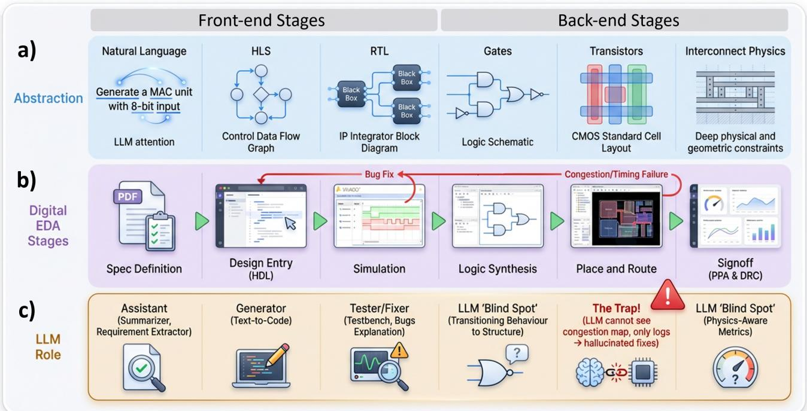
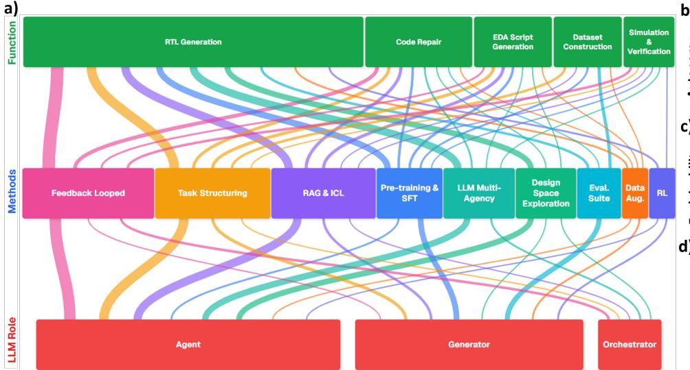
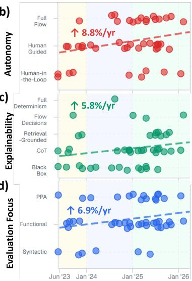
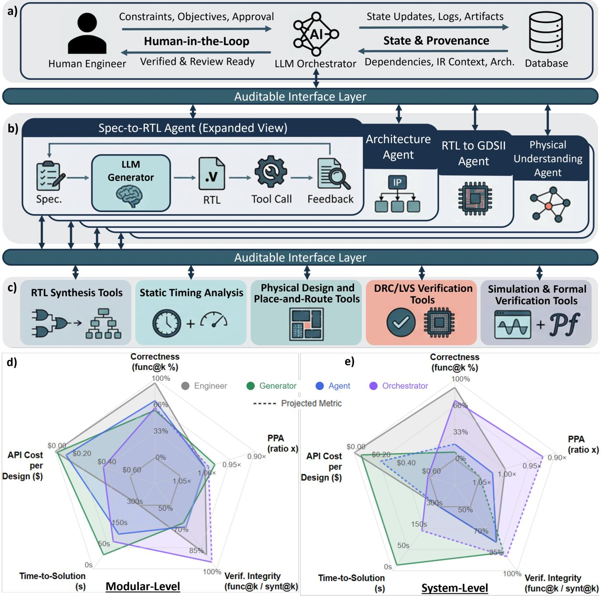
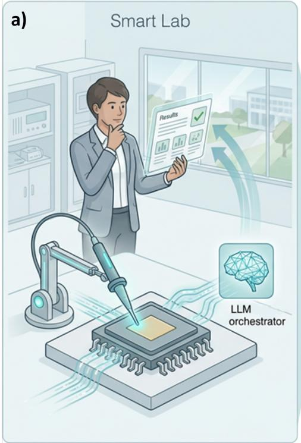
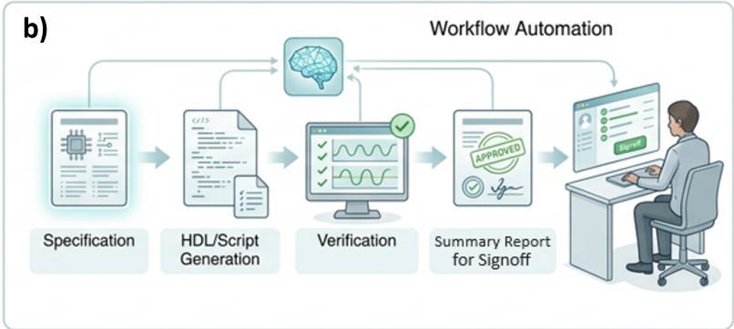
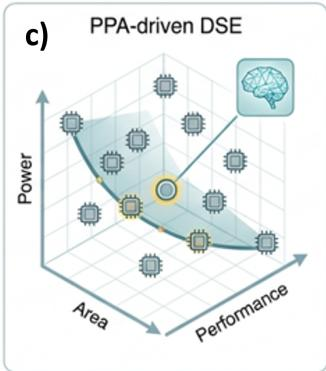
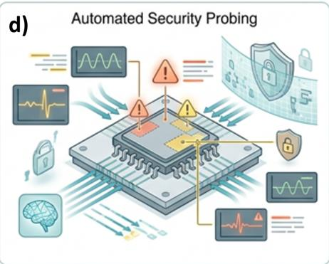

# LLMs in Digital EDA: A perspective on shifting roles from Generation to Orchestration

Matthew Youngman, Cristian Sestito, Themis Prodromakis

Centre for Electronics Frontiers, Institute for Integrated Micro and Nano Systems, School of Engineering, The University of Edinburgh, UK

## Abstract

Electronic design automation (EDA) has advanced engineering productivity through successive generations of tooling that progressively automate synthesis, optimisation, and verification. Large language models (LLMs) extend this trajectory by enabling direct translation from design intent to hardware implementations. In most of the EDA literature, LLM-based solutions are typically assisting siloed design stages or tasks, however this obscured the drivers by which capability emerges and systems scale. In this Perspective, we instead define three hierarchical roles that reveal how capability accumulates: a Generator that produces design artifacts in a single pass, an Agent that refines outputs through iterative tool feedback, and an Orchestrator that coordinates decisions across EDA-stages. Across published systems, this reveals a syntax trap in which models are trained to produce plausible code rather than physically correct hardware, compounded by fragmented tools and loss of design context that obscure how decisions affect later stages. Comparisons across the three roles show that current approaches struggle to scale to industrial designs, motivating a shift towards a standardised, physics-aware orchestrator that connects tools and agents across the EDA flow for more reliable and accessible hardware design.

## 1 Introduction

The semiconductor industry is facing a productivity gap driven both by global silicon demand, with the semiconductor market projected to exceed \$1 trillion by 2030 1, and chip complexity growth. Products now integrate billions of transistors with more diverse architectures and tighter physical constraints 2, all within increasingly short development windows 3. Electronic Design Automation (EDA) tools were introduced to help engineers construct and refine designs using deterministic, physics-based methods 4, improving how design execution is carried out at scale. However, the preceding task of translating engineering intent into formal hardware artifacts remains manual, iterative, and reliant on specialized domain experts who are sparse, concentrated, and difficult to scale 5,6, making the production of correct and optimised implementations a key productivity bottleneck.

Large Language Models (LLMs) offer a promising solution to reduce this productivity gap by translating natural language (NL) design intent into structured hardware artifacts through text generation. Digital designs are expressed largely through structured text - hardware description language (HDL) code, specifications, scripts, and constraint files - positioning LLM integration as a natural extension of this 7,8. The productivity gains already demonstrated in software engineering, where LLM-assisted development has reduced manual effort and shortened iteration cycles 9, suggest a similar opportunity in hardware, however one constrained by expensive and physics-driven validation. Consequently, two architectural roles have emerged: the Generator produces artifacts from NL in a single forward pass, leaving the engineer to interpret tool output and steer subsequent design iteration manually; the Agent closes this loop by coupling generation to automated tool feedback within a fixed pipeline, enabling automated design repair and optimisation at each cycle. Both roles have produced measurable gains in targeted tasks such as HDL 10–12 and EDA script generation 13–15, code repair 16–18, verification 19,20, and hardware dataset construction 21–23. However, important limitations remain, including the difficulty of ensuring physically realisable designs, fragmented reasoning across isolated EDA stages, and increasingly opaque decision-making as systems assume greater autonomy and design scale.

In this perspective, we argue that a third role - the physically-aware Orchestrator - is the next logical step in the progression of LLM roles and the convergent response to the limitations above. Where a generator produces and an agent iteratively repairs, an orchestrator holds control authority over the pipeline itself: it reasons adaptively about which tools to invoke, in what order, and when to redirect effort based on a persistent, cross-stage model of design state, with end-to-end decision provenance emerging as a property of its coordination function. This framing positions the field’s capability gains as a consequence of architectural progression - how LLMs are connected to tools and design context, not model improvements alone - and identifies standardised orchestration as the required shift to address hardware’s syntax trap, EDA stage fragmentation, context statelessness, and explainability defects that current agentic systems cannot inherently resolve.

## 2 The Misalignment of LLMs in the Digital Design Flow

  
Figure 1: Overview of LLMs’ current integration within the digital EDA design flow. Shows a, technology abstraction levels, b, the sequential digital design stages, and c, the roles LLMs are taking at each step. Identifies “syntax traps” where a lack of physics awareness leads to less effective LLM application.

The digital EDA design flow, illustrated in Figure 1, is a staged translation pipeline that converts engineering intent into physics-validated silicon through a series of abstraction levels (Figure 1a). Each successive layer — from NL and high-level synthesis (HLS) specifications through register-transfer level (RTL) hardware description to gate-level netlists, transistor standard cells, and physical interconnect layout — allows engineers to express design intent at increasing speed and scale by absorbing the implementation complexity of the level below into automated tooling, producing step-changes in productivity at each transition 4,24–26, at the cost of reduced visibility and control over lower-level physical behaviour. Figure 1b maps this abstraction hierarchy onto the standard EDA flow, spanning specification definition, design entry, functional simulation, logic synthesis, place-and-route (P&R), and final signoff. The front-end stages are predominantly language-mediated, where intent is expressed through structured text such as design specifications, HDL code, and constraint files, making them well suited to LLM-based assistance 7,8 with gains showcased across NL to specification 27 or RTL generation 10,12,28, testbench authoring & assertion synthesis 19,29,30, and bug summarisation 14,31,32. In contrast, back-end stages transition into physics-enforced representations and deterministic algorithms — timing closure, routing feasibility, and design-rule compliance — with no tolerance for approximation 3,8. LLMs are "blind" to complex physical representations as geometry defies sequential encoding 33, confining back-end LLM contributions to tasks retaining textual character, such as synthesis and P&R tool-script generation 15,34, EDA log and timing-report interpretation 31,35, and power, performance and area (PPA) estimation from RTL code 36, and forming a boundary that reflects a more fundamental training-objective misalignment.

LLMs learn through next-token prediction — an objective that rewards linguistic plausibility without any mechanism for training physical correctness — producing an inherent failure mode and misalignment we term the syntax trap. This allows LLM generated designs to appear valid under shallow, front-end evaluation yet fail rigorous physical checks at deeper validation levels. For example, a Verilog module may compile successfully and pass simulation while containing subtle timing errors, such as incorrect blocking or non-blocking assignments, that remain invisible to text-level evaluation but can cause functional failure in fabricated hardware 30. Because these errors can propagate undetected through later design stages, they may ultimately result in silicon re-spins costing millions of dollars and multi-month product delays 3,32. The trap is quantified across three tiers: at the syntax-level, 55% of LLM generated Verilog are amenable to automated repairs 16, indicating that token-level plausibility does not reliably translate to syntactically valid hardware descriptions; at the functional level, simulation passage is insufficient, with 44.2% of testbench-passing designs failing formal equivalence checking 37; and at the physical level, even functionally correct designs can incur 1.11-1.38× area overhead relative to human-optimised designs 38. This misalignment is reinforced by pass@k, the dominant early metric that measures design correctness as the fraction of k samples which compile or simulate correctly 22,38,39, thereby optimising for syntactic and functional plausibility while excluding physical correctness.

The syntax trap persists for two fundamental reasons. First, the physics-grounded data needed to learn hardware behaviour — including synthesis results, timing reports, and physical implementation outcomes — is computationally expensive to generate and orders of magnitude scarcer than conventional training corpora 3,21. Even HDL code remains limited, representing less than 0.1% of public code corpora due to proprietary IP restrictions and application diversity 12,25. Second, the relationship between HDL and physical outcomes is highly complex and often indirect: small code changes can produce large and uncertain effects on PPA, making physical correctness difficult to infer from text alone.

The field’s response has been to shift from single-pass generation (the Generator) toward closed-loop agentic refinement (the Agent), where LLM-generated designs are repeatedly checked by EDA tools and revised using the resulting feedback until quality criteria are satisfied 19,35,40. This produces a neurosymbolic loop, where LLMs generate candidate designs, while EDA tools enforce physical correctness. Complementary efforts introduced circuit-native intermediate representations (IRs), including abstract syntax trees (ASTs) improving structural code analysis 41,42 and dataflow graphs (DFGs) enabling signal-level physical reasoning 43,44, for LLMs to gain beyond-text understanding. For example, tracing a failing signal through a design’s parsed syntax tree, rather than searching its text, enabled VerilogCoder’s debugging agent to raise pass rates by more than 25 percentage points 45. However, both agentic systems and IR-enhanced models remain largely confined to individual design tasks and stages (Figure 1c), with Agent feedback typically local to the task being completed and IRs capturing structure rather than downstream physical consequences. Consequently, decisions made at one abstraction level remain largely disconnected from their effects elsewhere, motivating the need for cross-layer understanding - linking decisions to downstream outcomes - across the entire EDA pipeline 7, rather than within the isolated design stages targeted by most current LLM-EDA systems.

  
Figure 2: Trends in LLM maturity and the landscape of current research. a, Taxonomy of field across 46 papers, connecting each paper’s EDA function, LLM method stack and LLM role. The progression of LLM capabilities across three axes: b, autonomy (degree of agentic workflow control), c, explainability (decision provenance), and d, evaluation focus (target design challenge ), with annotated trend lines of gradients normalized to axis scale; points sharing the same rank are offset for clarity only. Survey results are in Supplementary Table 1 and figure is interactive at https://mattycode101.github.io/LLMs\_in\_Digital\_EDA\_Perspective/.

## 3 Current Applications of LLMs in EDA

To characterise the scope and structure of current stage-local LLM deployments, Figure 2a maps the architectures of 46 published LLM-EDA systems across their function, method stack, and architectural LLM role (see Supplementary Table 1 and the accompanying online interactive visualisation for the full taxonomy and inter-category relationships). The function distribution highlights the impact of the syntax trap: RTL generation accounts for the largest share of published work, sitting at the design stage where NL and hardware description are closest and where compilation or simulation alone can confirm a plausible result, while back-end physical stages remain sparsely represented. Within the methods, feedback integration, task decomposition, and retrieval-augmented generation (RAG) & in-context learning (ICL) collectively outweigh pre-training & supervised fine-tuning (SFT), or reinforcement learning (RL), confirming that current capability gains arise primarily from how LLMs are connected to tools and context rather than how they are trained 8,46,47. This trend is reflected in the LLM Role distribution, where Agents now dominate over Generators, marking the field’s shift toward tool-integrated refinement. Orchestrators remain rare, appearing mainly in design space exploration (DSE) and feedback-loop systems, often supported by LLM multi-agency (LLM-MA) frameworks that decompose tasks across multiple generalpurpose LLMs 11,15,18,35,40. However, this decomposition primarily increases parallel execution rather than coordinated control. Roles are typically fixed in advance, interactions follow static handoffs, and no component can adapt the workflow based on global design state 8, limiting both specialised agent effectiveness and cross-layer understanding.

Figures 2b–d characterise the trends of the selected papers along three dimensions using qualitative evaluation rankings to expose structural imbalance in the field’s development. Figure 2b show Autonomy - how independently a system runs once started - increasing rapidly at an axes-normalised rate of 8.8% per year. This growth tracks a progression in how models are adapted rather than a uniform rise in raw capability: ICL and RAG at the Generation tier, through SFT on domain-adapted hardware corpora, to RL with EDA tool-derived reward signals at the Agent frontier 20,41,48. RL represents a notable response to the syntax trap: instead of relying solely on next-token imitation, it optimises models using hierarchical rewards drawn from compilation, functional correctness, synthesis outcomes, and PPA targets, aligning generation with physical outcomes to enable strong performance on curated benchmarks 48. However, because these rewards are defined over fixed reference sets — gold-standard designs 41, testbench coverage 20, or benchmark-specific baselines 48 — causing the learning signal to remain tightly distribution-bound. This improves performance within isolated tasks but does not generalise well into cross-stage coordination or deeper links between RTL structure and physical behaviour, leaving the syntax trap largely intact. This rise in autonomy is also not matched by a rise in explainability — how easy it is to trace why a system reached a given decision. Figure 2c shows explainability advancing at only 5.8% per year, a gap that widens as autonomy grows, so that systems make more consequential decisions while the reasoning behind them becomes less accessible. For an industry where formal sign-off requires a verifiable link between each design choice and its physical outcome due to extreme re-spin costs, this divergence is consistently identified as a primary barrier to adoption 8,32.

Figure 2d reveals a parallel failure for evaluation focus — the design property targeted by a benchmark — which has advanced at 6.9% per year to remain concentrated on functional correctness, despite industrial competitiveness being primarily determined by PPA. Standard generation benchmarks are correspondingly saturated, with leading systems exceeding 95% pass@k 49,49,50 on modular tasks within key benchmarks RTLLM 38 and VerilogEval 39; yet on tasks closer to production workflows — assertion writing, testbench construction, and multi-step agentic design — pass rates fall to roughly 3% and fail to exceed 34% 30. This issue is compounded as designs scale from isolated modules to hierarchical systems. Because LLMs operate within finite context windows, Agent-tier systems must repeatedly reconstruct design context rather than retain it persistently, causing information loss and errors. This lack of persistent memory, termed statelessness, disrupts continuity of design state across stages. While manageable for small benchmarks, this becomes increasingly unreliable as module interactions, timing dependencies, and implementation constraints expand the context retention and reasoning requirements, causing performance to degrade sharply on larger designs 51,52, with complete failure reported for designs beyond roughly 3,500 lines of code 37.

These trends point to fragmentation as a compounding structural limitation: most systems define their own toolchains, feedback loops, and internal representations, preventing cross-system reuse and specialised LLM interaction 34. The same goal — giving LLMs structural awareness of hardware designs — is pursued through incompatible representations, for example HDLxGraph encodes designs as dual syntax–DFGs for retrieval 43, while CROP uses dense vector embeddings derived from LLM-generated summaries 53; methods built for one cannot transfer to the other. As a result, partial remedies remain isolated: AutoSilicon and ACE-RTL persist design knowledge across sessions 51,54 to ease statelessness; RTLSquad logs decisions explicitly 55 and ChipSeek-R1 exposes reasoning steps 48 to ease explainability; and MCP4EDA’s typed tool interface improves cross-stage coordination 47. Yet each fix is system-specific and not reused elsewhere, causing fragmentation to prevent solutions from transferring across systems. Closing these gaps therefore requires not point fixes but a shared architecture with common interfaces, persistent state, and inherent decision traceability.

## 4 The Standardised Orchestrator

The architecture that resolves the explainability, statelessness, and fragmentation limitations is best understood not as a new component but as a reorganisation of control. As shown in Figure 3a–c, the Generator, Agent, and Orchestrator are nested scopes of reasoning — from individual tasks, to workflows, to EDA multi-stage level coordination. The Orchestrator differs from the Agent through control authority: the capacity to decide which step to take next and deploy numerous agents to complete the decomposed tasks. The limitations identified in the previous section arise largely from the absence of this coordinating role. Once introduced, standardised interfaces reduce fragmentation, persistent design state mitigates context loss, and records decisions and tool interactions to improve provenance. These capabilities are not independent additions, but natural consequences of coordinating the design flow through an auditable layer, enabling LLM-assisted EDA to scale beyond isolated modules toward complete designs.

Because tiers’ capabilities are interlinked — tool feedback can improve a strong Generator but cannot compensate for a weak one 31,46 — orchestration becomes valuable only once Agent-tier systems reach sufficient maturity, helping explain why this transition is emerging now. This moves the research question from generation quality to coordination, with standardisation being the prerequisite for that move. Open protocols, primarily the model context protocol (MCP) and agent-to-agent (A2A) frameworks 56, replace bespoke tool wrappers and natural-language log parsing with typed, protocol-agnostic interfaces. The effect of this is twofold: improvements compose across systems instead of remaining trapped within them 34, and provenance becomes a byproduct of structured tool use rather than a post-hoc reconstruction. Applied across the flow, such a layer already returns 15–30% timing and 10–20% area improvements by closing the back-end feedback loop and enabling cross-layer understanding 47

Control authority also provides an architectural response to the syntax trap and evaluation focus by extending neuro-symbolic feedback beyond isolated optimisation loops. Deterministic EDA tools remain responsible for enforcing correctness, but orchestration ensures that their outputs persist as design context and continuously influence subsequent decisions across the EDA stages. Physical consequences discovered during synthesis or implementation can therefore shape upstream specification or RTL generation rather than appearing only at fixed checkpoints, and can gate each stage’s progression with the necessary verification. To reduce verification cost and speed up DSE, large circuit models (LCMs) 3,26 may be introduced to act as fast physical surrogates to eliminate poor candidates before tool use, with reported estimators achieving below 2% power prediction error at more than a 6× speedup 57

Figure 3d–e quantifies the performance of each LLM role focusing on the specification-to-RTL generation task across modular and system scales, selected to demonstrate scalability issues as prior work reports sharp degradation in coherence beyond approximately 100–150 lines of generated hardware code 37,51,52. Because hardware-design performance depends strongly on the underlying model, prompting strategy, benchmark, and evaluation methodology, values are aggregated per role across five dimensions: front-end correctness, back-end PPA quality, verification integrity, time-to-solution, and cost per design, with calculation details provided in Supplementary Table 2. At modular scale, Generator and Agent systems approach human-level correctness while achieving substantially higher productivity in time-to-solution. However, both retain the characteristic signature of the syntax trap: high apparent functional success with weaker verification integrity. The Orchestrator largely closes this gap, albeit at approximately six times the cost, a trade-off that becomes increasingly justified as design risk increases. At system scale, productivity divergence becomes more pronounced: Generator and Agent workflows degrade sharply below 20% correctness, while Orchestrator performance remains comparatively robust and begins to exceed human baselines in PPA efficiency. The resulting gains are therefore architectural rather than generational, suggesting distinct roles for each paradigm: Generators accelerate design authorship where failure is cheap, Agents support time-consuming iterative refinement, and Orchestrators coordinate system-scale development through cross-stage consistency and validated closure.

  
Figure 3: Nested LLM architecture framework and multi-axis productivity evaluation. a, Orchestrator Tier: Collaborative interface between Human, LLM Orchestrator & Provenance Database. b, Agent Tier: Numerous stateless agents/generators have specifications provided by Orchestrator and execute these in custom pipeline. $\bullet ,$ Tool Tier: access to EDA tools for verification of artifacts and design development. d, e, Five-axis productivity comparisons for Spec-to-RTL generation across (d) modular-level (≤150 lines of code) and (e) system-level (>200 lines of code) design complexities. Generator, Agent, and Orchestrator LLM architectures are evaluated against human Engineer baselines; see Supplementary Table 2 for plotted results, methodology, and sources.

## 5 Outlook on the Industrialized LLM

The shift towards standardised orchestration this perspective traces is beginning to move from projection into practice, with dominant EDA vendors independently converging on this LLM role. Cadence’s Chip-Stack 58 delegates across specialised workers behind a persistent IR design model, Synopsys’s AgentEngineer 59 wraps autonomous optimisers in a reason–plan–execute–orchestrate loop, and Siemens’ Aprisa 60 embeds auditable, in-flow coordination — the same signature of persistent state, typed coordination, and verification gating the academic field has converged on. Figure 4 projects where scaled deployment leads, organised around the Smart Lab (Figure 4a): a closed-loop environment in which orchestrated agents direct experimentation, receive measured feedback, and return verified candidates to an engineer for oversight. Early forms already exist in closed-loop back-end optimisation 42,47 and in cross-domain refinement spanning digital, analogue, and RF 61, with extension to physical prototyping via reconfigurable logic as the next step that would begin to close the Sim-to-Silicon gap 8

Nearest to deployment is workflow automation (Figure 4b), which concentrates where correctness signals are cheap and failure is contained. Verification dominates this frontier, accounting for roughly 47% of engineering effort 62, with closed-loop systems now achieving 87–90% Universal Verification Methodology (UVM) coverage 63 and industrial deployments reporting order-of-magnitude reductions in engineering effort across RTL generation, simulation, and formal verification, such as generation of 500+ lined RTL down from 1 week to 1 hour with 28% lower area 25. As these tasks become increasingly automated, the engineer’s role shifts from authoring code towards specifying intent, defining objectives, and overseeing signoff. Rather than reducing demand for expertise, these gains increase the scope of what engineering teams can practically deliver to match the exponential growth in semiconductor demand.

Enabled by this automation is PPA-driven design-space exploration (DSE) (Figure 4c), where the orchestrator’s capacity to run many specialised workers in parallel becomes decisive: diversified agents can pursue competing hypotheses across the PPA surface simultaneously. This compresses optimisation cycles that previously demanded extensive manual synthesis effort 10,64. As a result, proficiency in HDL development and EDA scripting becomes less central to productive hardware development, lowering barriers for software-centric researchers and small design teams, and pushing hardware acceleration up the stack. However, this accessibility remains bounded as advanced fabrication still depends on proprietary Process Development Kits (PDKs), large scale design data held by incumbents, and fabrication infrastructure. The opportunity for open ecosystems therefore lies in replicating incumbent resources, and enabling interoperability, portability, and rapid innovation above the fabrication layer.

Greater autonomy is also unavoidably dual-use (Figure 4d). The generative capacity that accelerates design also widens the attack surface — Trojan insertion through prompt injection, intellectual-property exposure through cloud inference, and silent functional or side-channel flaws that propagate without formal checking — with reported attack success exceeding 90% against defensive detection of only 25–35% 65. Yet the same orchestration that introduces the risk has the potential to supply the remedy: directed defensively, LLM-based information-flow tracking and systematic adversarial fuzzing expose Trojan sites and illegal states before deployment, while the provenance trace inherent to a standardised, gated flow gives structural resistance to hidden modification 8. As chiplets and 3D integration multiply design interactions, richer IRs and emerging world models may improve physical reasoning within individual agents, but dependable silicon development increasingly depends on coordinating such capabilities across the design flow.

  
Figure 4: Digital design scenarios of Orchestrator System capabilities radiate from a) The Smart Lab, a centra environment for the LLM orchestrator to coordinate physical or simulated experimentation. This environment enables: b) Workflow Automation, support across the EDA flow in near future, shifting engineers towards intent setting and review c) PPA-driven DSE, utilizing agentic search for multi-objective optimization; and d) Automated Security Probing, integrating hardware defensive checks with awareness of LLM adversarial misuse.

## Acknowledgements

This work was supported by the Engineering and Physical Sciences Research Council (EPSRC) AI Hub for Productive Research and Innovation in eLectronics (APRIL) under Grant No. EP/Y029763/1, and by the Royal Academy of Engineering (RAEng) Chair in Emerging Technologies under Grant No. CiET1819/2/93. Figures 1 and 4 were created using Google’s Nano Banana Pro and subsequently refined by the authors.

## Competing interests

The authors declare no conflict of interest.

## References

1. PwC, “Semiconductor and beyond: The global semiconductor market outlook 2026,” PricewaterhouseCoopers, Tech. Rep., 2025. [Online]. Available: https://www.pwc.com/gx/en/ industries/technology/pwc-semiconductor-and-beyond-2026-full-report.pdf

2. R. Muralidhar, R. Borovica-Gajic, and R. Buyya, “Energy efficient computing systems: Architectures, abstractions and modeling to techniques and standards,” ACM Comput. Surv., vol. 54, no. 11s, pp. 236:1–236:37, 2022. [Online]. Available: https://doi.org/10.1145/3511094

3. Q. Xu, L. Stok, R. Drechsler, X. Wang, G. L. Zhang, and I. L. Markov, “Revolution or hype? seeking the limits of large models in hardware design,” in IEEE/ACM International Conference On Computer Aided Design, ICCAD 2025, Munich, Germany, October 26-30, 2025. IEEE, 2025, pp. 1–9. [Online]. Available: https://doi.org/10.1109/ICCAD66269.2025.11240750

4. G. Huang, J. Hu, Y. He, J. Liu, M. Ma, Z. Shen, J. Wu, Y. Xu, H. Zhang, K. Zhong, X. Ning, Y. Ma, H. Yang, B. Yu, H. Yang, and Y. Wang, “Machine learning for electronic design automation: A survey,” CoRR, vol. abs/2102.03357, 2021. [Online]. Available: https://arxiv.org/abs/2102.03357

5. B. Bailey, “The limits of AI’s role in EDA tools,” https://semiengineering.com/ the-limits-of-ais-role-in-eda-tools/, September 2025, semiconductor Engineering. Accessed: 2026-06-25.

6. J. Blocklove, S. Garg, R. Karri, and H. Pearce, “Chip-Chat: Challenges and opportunities in conversational hardware design,” in 5th ACM/IEEE Workshop on Machine Learning for CAD, MLCAD 2023, Snowbird, UT, USA, September 10-13, 2023. IEEE, 2023, pp. 1–6. [Online]. Available: https://doi.org/10.1109/MLCAD58807.2023.10299874

7. K. Xu, D. Schwachhofer, J. Blocklove, I. Polian, P. Domanski, D. Pflüger, S. Garg, R. Karri, O. Sinanoglu, J. Knechtel, Z. Zhao, U. Schlichtmann, and B. Li, “Large language models (LLMs) for electronic design automation (EDA) : Special session paper,” in 38th IEEE International System-on-Chip Conference, SOCC 2025, Dubai, United Arab Emirates, September 29 - Oct. 1, 2025, D. Zhao and K. Hofmann, Eds. IEEE, 2025, pp. 1–6. [Online]. Available: https://doi.org/10.1109/SOCC66126.2025.11235352

8. Z. Zang, Y. Song, B. W. Ling, A. Wang, and F. Yang, “The dawn of agentic EDA: A survey of autonomous digital chip design,” CoRR, vol. abs/2512.23189, 2025. [Online]. Available: https://doi.org/10.48550/arXiv.2512.23189

9. S. Peng, E. Kalliamvakou, P. Cihon, and M. Demirer, “The impact of AI on developer productivity: Evidence from GitHub Copilot,” CoRR, vol. abs/2302.06590, 2023. [Online]. Available: https://doi.org/10.48550/arXiv.2302.06590

10. H. Qin, J. Feng, X. Feng, W. W. Xing, and W. Kang, “Towards optimal circuit generation: Multi-agent collaboration meets collective intelligence,” CoRR, vol. abs/2504.14625, 2025. [Online]. Available: https://doi.org/10.48550/arXiv.2504.14625

11. S. Ranga, R. Mao, D. Bhattacharjee, E. Cambria, and A. Chattopadhyay, “RTL agent: An agent-based approach for functionally correct HDL generation via LLMs,” in 33rd IEEE Asian Test Symposium, ATS 2024, Ahmedabad, India, December 17-20, 2024. IEEE, 2024, pp. 1–6. [Online]. Available: https://doi.org/10.1109/ATS64447.2024.10915277

12. S. Thakur, B. Ahmad, H. Pearce, B. Tan, B. Dolan-Gavitt, R. Karri, and S. Garg, “VeriGen: A large language model for verilog code generation,” ACM Trans. Design Autom. Electr. Syst., vol. 29, no. 3, pp. 46:1–46:31, 2024. [Online]. Available: https://doi.org/10.1145/3643681

13. H. Wu, Z. He, X. Zhang, X. Yao, S. Zheng, H. Zheng, and B. Yu, “ChatEDA: A large language model powered autonomous agent for EDA,” IEEE Trans. Comput. Aided Des. Integr. Circuits Syst., vol. 43, no. 10, pp. 3184–3197, 2024. [Online]. Available: https://doi.org/10.1109/TCAD.2024.3383347

14. M. Liu, T. Ene, R. Kirby, C. Cheng, N. R. Pinckney, R. Liang, J. Alben, H. Anand, S. Banerjee, I. Bayraktaroglu, B. Bhaskaran, B. Catanzaro, A. Chaudhuri, S. Clay, B. Dally, L. Dang, P. Deshpande, S. Dhodhi, S. Halepete, E. Hill, J. Hu, S. Jain, B. Khailany, K. Kunal, X. Li, H. Liu, S. F. Oberman, S. Omar, S. Pratty, J. Raiman, A. Sarkar, Z. Shao, H. Sun, P. P. Suthar, V. Tej, K. Xu, and H. Ren, “ChipNeMo: Domain-adapted LLMs for chip design,” CoRR, vol. abs/2311.00176, 2023. [Online]. Available: https://doi.org/10.48550/arXiv.2311.00176

15. H. Wu, H. Zheng, Z. He, and B. Yu, “Divergent Thoughts toward One Goal: LLM-based Multi-Agent Collaboration System for Electronic Design Automation,” in Proceedings of the 2025 Conference of the Nations of the Americas Chapter of the Association for Computational Linguistics: Human Language Technologies, NAACL 2025 - Volume 1: Long Papers, Albuquerque, New Mexico, USA, April 29 - May 4, 2025, L. Chiruzzo, A. Ritter, and L. Wang, Eds. Association for Computational Linguistics, 2025, pp. 1710–1721. [Online]. Available: https://doi.org/10.18653/v1/2025.naacl-long.83

16. Y. Tsai, M. Liu, and H. Ren, “RTLFixer: Automatically fixing RTL syntax errors with large language models,” CoRR, vol. abs/2311.16543, 2023. [Online]. Available: https: //doi.org/10.48550/arXiv.2311.16543

17. M. Liu, Y. Tsai, W. Zhou, and H. Ren, “CraftRTL: High-quality synthetic data generation for verilog code models with correct-by-construction non-textual representations and targeted code repair,” in The Thirteenth International Conference on Learning Representations, ICLR 2025, Singapore, April 24-28, 2025. OpenReview.net, 2025. [Online]. Available: https://openreview.net/forum?id=8KQzoD5XAr

18. M. ul Islam, H. Sami, P. Gaillardon, and V. Tenace, “EDA-aware RTL generation with large language models,” in Design, Automation & Test in Europe Conference, DATE 2025, Lyon, France, March 31 - April 2, 2025. IEEE, 2025, pp. 1–6. [Online]. Available: https://doi.org/10.23919/DATE64628.2025.10992789

19. H. Huang, Z. Lin, Z. Wang, X. Chen, K. Ding, and J. Zhao, “Towards LLM-powered verilog RTL assistant: Self-verification and self-correction,” CoRR, vol. abs/2406.00115, 2024. [Online]. Available: https://doi.org/10.48550/arXiv.2406.00115

20. N. Wang, B. Yao, J. Zhou, Y. Hu, X. Wang, N. Guan, and Z. Jiang, “Insights from verification: Training a verilog generation LLM with reinforcement learning with testbench feedback,” CoRR, vol. abs/2504.15804, 2025. [Online]. Available: https://doi.org/10.48550/arXiv.2504.15804

21. K. Chang, K. Wang, N. Yang, Y. Wang, D. Jin, W. Zhu, Z. Chen, C. Li, H. Yan, Y. Zhou, Z. Zhao, Y. Cheng, Y. Pan, Y. Liu, M. Wang, S. Liang, Y. Han, H. Li, and X. Li, “Data is all you need: Finetuning LLMs for chip design via an automated design-data augmentation framework,” in Proceedings of the 61st ACM/IEEE Design Automation Conference, DAC 2024, San Francisco, CA, USA, June 23-27, 2024, V. De, Ed. ACM, 2024, pp. 60:1–60:6. [Online]. Available: https://doi.org/10.1145/3649329.3657356

22. S. Thakur, B. Ahmad, Z. Fan, H. Pearce, B. Tan, R. Karri, B. Dolan-Gavitt, and S. Garg, “Benchmarking large language models for automated verilog RTL code generation,” in Design, Automation & Test in Europe Conference & Exhibition, DATE 2023, Antwerp, Belgium, April 17-19, 2023. IEEE, 2023, pp. 1–6. [Online]. Available: https://doi.org/10.23919/DATE56975.2023.10137086

23. Y. Liu, C. Xu, Y. Zhou, Z. Li, and Q. Xu, “DeepRTL: Bridging verilog understanding and generation with a unified representation model,” in The Thirteenth International Conference on Learning Representations, ICLR 2025, Singapore, April 24-28, 2025. OpenReview.net, 2025. [Online]. Available: https://openreview.net/forum?id=2hcfoCHKoB

24. A. Biscontini, E. M. Popovici, and A. Temko, “Machine learning for FPGA electronic design automation,” IEEE Access, vol. 12, pp. 182 640–182 662, 2024. [Online]. Available: https://doi.org/10.1109/ACCESS.2024.3511345

25. A. Devgan, “Powering the AI supercycle: Design for AI and AI for design,” in 2026 IEEE International Solid-State Circuits Conference (ISSCC), 2026, plenary Session 1.3.

26. L. Chen, Y. Chen, Z. Chu, W. Fang, T.-Y. Ho, R. Huang, Y. Huang, S. Khan, M. Li, X. Li, Y. Li, Y. Liang, J. Liu, Y. Liu, Y. Lin, G. Luo, Z. Shi, G. Sun, D. Tsaras, R. Wang, Z. Wang, X. Wei, Z. Xie, Q. Xu, C. Xue, J. Yan, J. Yang, B. Yu, M. Yuan, E. F. Y. Young, X. Zeng, H. Zhang, Z. Zhang, Y. Zhao, H.-L. Zhen, Z. Zheng, B. Zhu, K. Zhu, and S. Zou, “Large circuit models: Opportunities and challenges,” Science China Information Sciences, vol. 67, no. 10, p. 200402, 2024.

27. K. Chang, Y. Wang, H. Ren, M. Wang, S. Liang, Y. Han, H. Li, and X. Li, “ChipGPT: How far are we from natural language hardware design,” CoRR, vol. abs/2305.14019, 2023. [Online]. Available: https://doi.org/10.48550/arXiv.2305.14019

28. Y. Fu, Y. Zhang, Z. Yu, S. Li, Z. Ye, C. Li, C. Wan, and Y. C. Lin, “GPT4AIGChip: Towards nextgeneration AI accelerator design automation via large language models,” in IEEE/ACM International Conference on Computer Aided Design, ICCAD 2023, San Francisco, CA, USA, October 28 - Nov. 2, 2023. IEEE, 2023, pp. 1–9. [Online]. Available: https://doi.org/10.1109/ICCAD57390.2023.10323953

29. Z. Zhao, B. Li, G. L. Zhang, and U. Schlichtmann, “VFocus: Better verilog generation from large language model via focused reasoning,” in 38th IEEE International System-on-Chip Conference, SOCC 2025, Dubai, United Arab Emirates, September 29 - Oct. 1, 2025, D. Zhao and K. Hofmann, Eds. IEEE, 2025, pp. 1–6. [Online]. Available: https://doi.org/10.1109/SOCC66126.2025.11235465

30. N. R. Pinckney, C. Deng, C. Ho, Y. Tsai, M. Liu, W. Zhou, B. Khailany, and H. Ren, “Comprehensive verilog design problems: A next-generation benchmark dataset for evaluating large language models and agents on RTL design and verification,” CoRR, vol. abs/2506.14074, 2025. [Online]. Available: https://doi.org/10.48550/arXiv.2506.14074

31. S. Qiu, M. Wang, R. Afsharmazayejani, M. M. Shahmiri, B. Tan, and H. Pearce, “Towards LLM-based root cause analysis of hardware design failures,” in IEEE International Conference on Omni-layer Intelligent Systems, COINS 2025, Madison, WI, USA, August 4-6, 2025. IEEE, 2025, pp. 1–6. [Online]. Available: https://doi.org/10.1109/COINS65080.2025.11125748

32. J. Pan, G. Zhou, C. Chang, I. Jacobson, J. Hu, and Y. Chen, “A survey of research in large language models for electronic design automation,” ACM Trans. Design Autom. Electr. Syst., vol. 30, no. 3, pp. 34:1–34:21, 2025. [Online]. Available: https://doi.org/10.1145/3715324

33. C. Guo and T. Zhao, “ResBench: Benchmarking LLM-generated FPGA designs with resource awareness,” CoRR, vol. abs/2503.08823, 2025. [Online]. Available: https://doi.org/10.48550/arXiv. 2503.08823

34. Y. Lu, H. Au, J. Zhang, J. Pan, Y. Wang, A. Li, J. Zhang, and Y. Chen, “@AutoEDA: Enabling EDA flow automation through microservice-based LLM agents,” CoRR, vol. abs/2508.01012, 2025. [Online]. Available: https://doi.org/10.48550/arXiv.2508.01012

35. K. Tasnia, A. Garcia, T. Farheen, and S. Rahman, “Veriopt: Ppa-aware high-quality verilog generation via multi-role LLMs,” in IEEE/ACM International Conference On Computer Aided Design, ICCAD 2025, Munich, Germany, October 26-30, 2025. IEEE, 2025, pp. 1–9. [Online]. Available: https://doi.org/10.1109/ICCAD66269.2025.11240771

36. A. Abdollahi, M. Kamal, and M. Pedram, “RocketPPA: Ultra-fast LLM-based PPA estimator at code-level abstraction,” CoRR, vol. abs/2503.21971, 2025. [Online]. Available: https: //doi.org/10.48550/arXiv.2503.21971

37. P. Jin, D. Huang, C. Li, S. Cheng, Y. Zhao, X. Zheng, J. Zhu, S. Xing, B. Dou, R. Zhang, Z. Du, Q. Guo, and X. Hu, “RealBench: Benchmarking verilog generation models with real-world IP designs,” CoRR, vol. abs/2507.16200, 2025. [Online]. Available: https://doi.org/10.48550/arXiv.2507.16200

38. Y. Lu, S. Liu, Q. Zhang, and Z. Xie, “RTLLM: an open-source benchmark for design RTL generation with large language model,” in Proceedings ofthe 29th Asia and South Pacific Design Automation Conference, ASPDAC 2024, Incheon, Korea, January 22-25, 2024. IEEE, 2024, pp. 722–727. [Online]. Available: https://doi.org/10.1109/ASP-DAC58780.2024.10473904

39. M. Liu, N. R. Pinckney, B. Khailany, and H. Ren, “VerilogEval: Evaluating large language models for verilog code generation,” CoRR, vol. abs/2309.07544, 2023. [Online]. Available: https://doi.org/10.48550/arXiv.2309.07544

40. Y. Zhao, H. Zhang, H. Huang, Z. Yu, and J. Zhao, “MAGE: A multi-agent engine for automated RTL code generation,” in 62nd ACM/IEEE Design Automation Conference, DAC 2025, San Francisco, CA, USA, June 22-25, 2025. IEEE, 2025, pp. 1–7. [Online]. Available: https://doi.org/10.1109/DAC63849.2025.11133191

41. N. Wang, B. Yao, J. Zhou, Y. Hu, X. Wang, N. Guan, and Z. Jiang, “Large language model for Verilog generation with code-structure-guided reinforcement learning,” in 2025 IEEE International Conference on LLM-Aided Design (ICLAD), 2025.

42. X. Yao, Y. Wang, X. Li, Y. Lian, R. Chen, L. Chen, M. Yuan, H. Xu, and B. Yu, “RTLRewriter: Methodologies for large models aided RTL code optimization,” in Proceedings of the 43rd IEEE/ACM International Conference on Computer-Aided Design, ICCAD 2024, Newark Liberty International Airport Marriott, NJ, USA, October 27-31, 2024, J. Xiong and R. Wille, Eds. ACM, 2024, pp. 98:1–98:7. [Online]. Available: https://doi.org/10.1145/3676536.3676775

43. P. Zheng, J. Qin, F. Zhang, N. Chitla, Z. Wan, S. Wu, Y. K. Cao, C. Ding, and Y. K. Zhao, “HDLxGraph: Bridging large language models and HDL repositories via HDL graph databases,” in 31st Asia and South Pacific Design Automation Conference, ASP-DAC 2026, Lantau, Hong Kong, January 19-22, 2026. IEEE, 2026, pp. 533–539. [Online]. Available: https://doi.org/10.1109/ASP-DAC66049.2026.11420358

44. J. Zhao and S. Chen, “VeriGRAG: Enhancing LLM-based verilog code generation with structure-aware soft prompts,” CoRR, vol. abs/2510.15914, 2025. [Online]. Available: https: //doi.org/10.48550/arXiv.2510.15914

45. C. Ho, H. Ren, and B. Khailany, “VerilogCoder: Autonomous verilog coding agents with graph-based planning and abstract syntax tree (ast)-based waveform tracing tool,” in Thirty-Ninth AAAI Conference on Artificial Intelligence, Thirty-Seventh Conference on Innovative Applications of Artificial Intelligence, Fifteenth Symposium on Educational Advances in Artificial Intelligence, AAAI 2025, Philadelphia, PA, USA, February 25 - March 4, 2025, T. Walsh, J. Shah, and Z. Kolter, Eds. AAAI Press, 2025, pp. 300–307. [Online]. Available: https://doi.org/10.1609/aaai.v39i1.32007

46. S. Thakur, J. Blocklove, H. Pearce, B. Tan, S. Garg, and R. Karri, “AutoChip: Automating HDL generation using LLM feedback,” CoRR, vol. abs/2311.04887, 2023. [Online]. Available: https://doi.org/10.48550/arXiv.2311.04887

47. Y. Wang, W. Ye, Y. He, Y. Chen, G. Qu, and A. Li, “MCP4EDA: LLM-powered model context protocol RTL-to-GDSII automation with backend aware synthesis optimization,” CoRR, vol. abs/2507.19570, 2025. [Online]. Available: https://doi.org/10.48550/arXiv.2507.19570

48. Z. Chen, K. Chang, Z. Li, X. He, C. Chen, C. Li, M. Wang, H. Xu, Y. Han, and Y. Wang, “ChipSeek-R1: Generating human-surpassing RTL with LLM via hierarchical reward-driven reinforcement learning,” CoRR, vol. abs/2507.04736, 2025. [Online]. Available: https://doi.org/10.48550/arXiv.2507.04736

49. B. Nadimi, G. O. Boutaib, and H. Zheng, “VeriMind: Agentic LLM for automated verilog generation with a novel evaluation metric,” CoRR, vol. abs/2503.16514, 2025. [Online]. Available: https://doi.org/10.48550/arXiv.2503.16514

50. D. Garcia-Gasulla, G. Kestor, E. Parisi, M. Albertí-Binimelis, C. Gutierrez, R. M. Ghorab, O. Montenegro, B. Homs, and M. Moretó, “TuRTLe: A unified evaluation of LLMs for RTL generation,” in 7th ACM/IEEE Symposium on Machine Learning for CAD, MLCAD 2025, Santa Cruz, CA, USA, September 8-10, 2025. IEEE, 2025, pp. 1–12. [Online]. Available: https://doi.org/10.1109/MLCAD65511.2025.11189228

51. C. Li, C. Chen, Y. Pan, W. Xu, Y. Liu, K. Chang, Y. Wang, M. Wang, H. Li, Y. Han, and Y. Wang, “AutoSilicon: Scaling up RTL design generation capability of large language models,” ACM Trans. Design Autom. Electr. Syst., vol. 30, no. 6, pp. 97:1–97:21, 2025. [Online]. Available: https://doi.org/10.1145/3737286

52. J. Tang, J. Qin, K. Thorat, C. Tian, Y. Cao, Y. Zhao, and C. Ding, “HiVeGen - hierarchical LLM-based verilog generation for scalable chip design,” CoRR, vol. abs/2412.05393, 2024. [Online]. Available: https://doi.org/10.48550/arXiv.2412.05393

53. J. Pan, I. Jacobson, Z. Zhao, T. Chen, G. Zhou, C. Chang, V. Rashingkar, and Y. Chen, “CROP: circuit retrieval and optimization with parameter guidance using LLMs,” in IEEE/ACM International Conference On Computer Aided Design, ICCAD 2025, Munich, Germany, October 26-30, 2025. IEEE, 2025, pp. 1–9. [Online]. Available: https://doi.org/10.1109/ICCAD66269.2025.11240643

54. C. Deng, Z. Yu, G. Liu, N. R. Pinckney, and H. Ren, “ACE-RTL: when agentic context evolution meets rtl-specialized LLMs,” CoRR, vol. abs/2602.10218, 2026. [Online]. Available: https://doi.org/10.48550/arXiv.2602.10218

55. B. Wang, Q. Xiong, Z. Xiang, L. Wang, and R. Chen, “RTLSquad: Multi-agent based interpretable RTL design,” CoRR, vol. abs/2501.05470, 2025. [Online]. Available: https://doi.org/10.48550/arXiv.2501.05470

56. A. Ehtesham, A. Singh, G. K. Gupta, and S. Kumar, “A survey of agent interoperability protocols: Model context protocol (MCP), agent communication protocol (ACP), agent-to-agent protocol (A2A), and agent network protocol (ANP),” CoRR, vol. abs/2505.02279, 2025. [Online]. Available: https://doi.org/10.48550/arXiv.2505.02279

57. S. Khan, Z. Shi, Z. Zheng, M. Li, and Q. Xu, “DeepSeq2: Enhanced sequential circuit learning with disentangled representations,” in Proceedings of the 30th Asia and South Pacific Design Automation Conference, ASPDAC 2025, Tokyo, Japan, January 20-23, 2025, Y. Nakamura and Y. Wang, Eds. ACM, 2025, pp. 498–504. [Online]. Available: https://doi.org/10.1145/3658617.3697594

58. Cadence Design Systems, “Cadence unleashes ChipStack AI super agent, pioneering a new frontier in chip design and verification,” https://www.cadence.com/en\_US/home/company/newsroom/ press-releases/pr/2026/cadence-unleashes-chipstack-ai-super-agent-pioneering-a-new.html, Feb. 2026, press release, 10 February 2026. Accessed: 2026-06-25.

59. Synopsys, “AgentEngineer technology: Transforming engineering workflows,” https://investor.synopsys.com/news/news-details/2025/ Synopsys-Announces-Expanding-AI-Capabilities-for-its-Leading-EDA-Solutions/default.aspx, Sep. 2025, synopsys Chip Design Blog. Accessed: 2026-06-25.

60. Siemens, “Siemens turbocharges semiconductor and PCB design with AI,” https://news.siemens. com/en-us/siemens-eda-ai-dac-2025/, Jun. 2025, press release, Design Automation Conference 2025. Accessed: 2026-06-25.

61. C. Sestito, P. Kontou, P. Verma, A. Dixit, A. D. Keros, M. O’Boyle, C.-S. Bouganis, and T. Prodromakis, “A flexible language model-assisted electronic design automation framework,” 2026. [Online]. Available: https://arxiv.org/abs/2601.14098

62. H. D. Foster, “2024 siemens EDA and wilson research group IC/ASIC functional verification trend report,” Siemens Digital Industries Software, White Paper, 2024, verification Academy. Accessed: 2026-06-25. [Online]. Available: https://verificationacademy. com/topics/planning-measurement-and-analysis/wrg-industry-data-and-trends/ 2024-siemens-eda-and-wilson-research-group-ic-asic-functional-verification-trend-report/

63. J. Ye, Y. Hu, K. Xu, D. Pan, Q. Chen, J. Zhou, S. Zhao, X. Fang, X. Wang, N. Guan, and Z. Jiang, “From concept to practice: an automated LLM-aided UVM machine for RTL verification,” in IEEE/ACM International Conference On Computer Aided Design, ICCAD 2025, Munich, Germany, October 26-30, 2025. IEEE, 2025, pp. 1–9. [Online]. Available: https://doi.org/10.1109/ICCAD66269.2025.11240679

64. M. DeLorenzo, A. B. Chowdhury, V. Gohil, S. Thakur, R. Karri, S. Garg, and J. Rajendran, “Make Every Move Count: LLM-based high-quality RTL code generation using MCTS,” CoRR, vol. abs/2402.03289, 2024. [Online]. Available: https://doi.org/10.48550/arXiv.2402.03289

65. S. Ghimire, M. A. Chowdhury, B. S. Latibari, M. Mamun, J. W. Carpenter, B. Tan, H. Pearce, P. Satam, and S. Salehi, “Hardware design and security needs attention: From survey to path forward,” CoRR, vol. abs/2504.08854, 2025. [Online]. Available: https://doi.org/10.48550/arXiv.2504.08854

66. K. Thorat, J. Zhao, Y. Liu, H. Peng, X. Xie, B. Lei, J. Zhang, and C. Ding, “Advanced large language model LLM-driven verilog development: Enhancing power, performance, and area optimization in code synthesis,” CoRR, vol. abs/2312.01022, 2023. [Online]. Available: https://doi.org/10.48550/arXiv.2312.01022

67. J. Blocklove, S. Thakur, B. Tan, H. Pearce, S. Garg, and R. Karri, “Automatically improving LLM-based verilog generation using EDA tool feedback,” ACM Trans. Design Autom. Electr. Syst., vol. 30, no. 6, pp. 100:1–100:26, 2025. [Online]. Available: https://doi.org/10.1145/3723876

68. C. R. Pamnani, “AI-Driven Automation for Digital Hardware Design: A Multi-Agent Generative Approach,” in Proceedings of the 2025 4th International Conference on Frontiers of Artificial Intelligence and Machine Learning, ser. FAIML ’25. New York, NY, USA: Association for Computing Machinery, Aug. 2025, pp. 26–30. [Online]. Available: https://dl.acm.org/doi/10.1145/3748382.3748388

69. K. Thorat, J. Zhao, Y. Liu, A. Hasan, H. Peng, X. Xie, B. Lei, and C. Ding, “LLM-VeriPPA: Power, performance, and area optimization aware verilog code generation with large language models,” in 7th ACM/IEEE Symposium on Machine Learning for CAD, MLCAD 2025, Santa Cruz, CA, USA, September 8-10, 2025. IEEE, 2025, pp. 1–7. [Online]. Available: https://doi.org/10.1109/MLCAD65511.2025.11189158

# LLM’s in Digital EDA: A perspective on shifting roles from Generation to Orchestration Supplementary Information

Matthew Youngman, Cristian Sestito, Themis Prodromakis

Centre for Electronics Frontiers, Institute for Integrated Micro and Nano Systems, School of Engineering, The University of Edinburgh, UK

Table 1: Taxonomy of LLM-for-EDA papers (2023–2026), The table records a manual coding of each system against a fixed schema of categorical (function, method, role) and ordinal (autonomy, explainability, evaluation focus) dimensions, each dimension having a closed set of defined levels; every paper was assigned its single best-fitting level, ordinal dimensions ranked 1. . . N by increasing capability, and dated by first public release. The growth rates were then obtained by least-squares regression of ordinal level against date, normalised to the axis span (N) and reported as percent of full scale per year (autonomy 8.8%, explainability 5.8%, evaluation focus 6.9%). Task abbreviations: RTL Gen. = RTL Generation; EDA Scripting = EDA Script Generation; Sim. & Verif. = Simulation & Verification; Dataset Constr. = Dataset Construction. Method abbreviations: RAG & ICL = Retrieval Augmented Generation / In-Context Learning; Pre-training & SFT = (Continued) Pre-training & Supervised Fine-Tuning; Task Struc. = Task Structuring; Feedback Looped = Iterative Feedback Loop; LLM-MA = LLM Multi-Agent System; DSE = Design Space Exploration / Tree Search; RL = Reinforcement Learning; Data Aug. = Data Augmentation; Eval. Suite = Benchmarking / Evaluation Suite. Column headers: Ref. = Reference; Eval. = Evaluation Focus.
<table><tr><td>Nickname</td><td>Ref.</td><td>Date</td><td>Design Function</td><td>Method Stack</td><td>Role</td><td>Autonomy</td><td>Explainability</td><td>Eval.</td></tr><tr><td>Chip-Chat</td><td>6</td><td>May 2023</td><td>RTL Gen.</td><td>Task Struc.</td><td>Generator</td><td>Human-in- the-loop</td><td>Chain-of-Thought (CoT)</td><td>Syntactic Cor- rectness</td></tr><tr><td>ChipGPT</td><td>27</td><td>May 2023</td><td>RTL Gen.</td><td>RAG &amp; ICL; Task Struc.; Feedback Looped; DSE</td><td>Agent</td><td>Human-in- the-loop</td><td>Black Box Genera- tion</td><td>PPA Metrics</td></tr><tr><td>VeriGen</td><td>12</td><td>Jul 2023</td><td>RTL Gen.</td><td>Pre-training &amp; SFT</td><td>Generator</td><td>Human- guided</td><td>Black Box Genera- tion</td><td>Functional Correctness</td></tr><tr><td>RTLLM v1</td><td>38</td><td>Aug 2023</td><td>Dataset Constr.</td><td>Eval. Suite; Task Struc.</td><td>Generator</td><td>Human- guided</td><td>Chain-of-Thought (CoT)</td><td>Functional Correctness</td></tr><tr><td>ChatEDA</td><td>13</td><td>Aug 2023</td><td>RTL Gen.; EDA</td><td>Task Struc.; Pre-training &amp;</td><td>Agent</td><td>Human-in-</td><td>Chain-of-Thought</td><td>Functional</td></tr><tr><td>GPT4AIGChip</td><td>28</td><td>Sep</td><td>Scripting RTL Gen.</td><td>SFT; Data Aug. RAG &amp; ICL; Task Struc.;</td><td>Agent</td><td>the-loop Human-in-</td><td>(CoT) Pipeline Stage Col-</td><td>Correctness Functional Correctness</td></tr><tr><td>ChipNeMo</td><td>14</td><td>2023 Oct 2023</td><td>RTL Gen.; EDA Scripting; Code Re-</td><td>Feedback Looped Pre-training &amp; SFT; RAG &amp; ICL</td><td>Generator</td><td>the-loop Human- guided</td><td>lection Retrieval-Grounded</td><td>Syntactic Cor- rectness</td></tr><tr><td>AutoChip</td><td>46</td><td>Nov</td><td>pair RTL Gen.</td><td>Feedback Looped; RAG &amp; ICL</td><td>Agent</td><td>Full Flow</td><td>Black Box Genera- tion</td><td>Functional</td></tr><tr><td>RTLFixer</td><td>16</td><td>2023 Nov 2023</td><td>Code Repair</td><td>RAG &amp; ICL; Task Struc.; Feedback Looped</td><td>Agent</td><td>Human-</td><td>Retrieval-Grounded</td><td>Correctness Syntactic Cor-</td></tr><tr><td>VeriPPA</td><td>66</td><td>Dec 2023</td><td>RTL Gen.; Code Repair</td><td>RAG &amp; ICL; Feedback Looped; Task Struc.</td><td>Agent</td><td>guided Human-</td><td>Black Box Genera-</td><td>rectness PPA Metrics</td></tr><tr><td>Make Every</td><td>64</td><td>Feb</td><td>RTL Gen.</td><td>DSE; RL; Task Struc.</td><td>Agent</td><td>guided Human-</td><td>tion Black Box Genera-</td><td>PPA Metrics</td></tr><tr><td>Move Count Data is all you need</td><td>21</td><td>2024 Mar 2024</td><td>Dataset Constr.; RTL Gen.; Code</td><td>Data Aug.; Pre-training &amp; SFT; Task Struc.</td><td>Generator</td><td>guided Human-</td><td>tion Black Box Genera-</td><td>Syntactic Cor- rectness</td></tr><tr><td></td><td></td><td></td><td>Repair; Scripting</td><td>EDA</td><td></td><td>guided</td><td>tion</td><td></td></tr><tr><td>VerilogCoder</td><td></td><td>Aug</td><td>RTL Gen.; Code</td><td></td><td></td><td>Full Flow</td><td>Black Box Genera- tion Chain-of-Thought</td><td>Correctness Functional</td></tr><tr><td></td><td></td><td>2024</td><td>Repair</td><td>back Looped</td><td></td><td></td><td>(CoT); Deterministic Trace</td><td>Correctness</td></tr><tr><td>RTLRewriter</td><td></td><td>Sep 2024</td><td>RTL Gen.</td><td>DSE; RAG &amp; ICL; Task Struc.</td><td>Agent</td><td>Full Flow</td><td>Chain-of-Thought (CoT) Black Box Genera-</td><td>PPA Metrics</td></tr><tr><td></td><td></td><td>Sep 2024</td><td>RTL Gen.; Code Repair</td><td>Data Aug.; Pre-training &amp; SFT</td><td>Generator</td><td>Human- guided</td><td>tion</td><td>Functional Correctness</td></tr><tr><td>AutoChip v2</td><td></td><td>Nov 2024</td><td>RTL Gen.; Code Repair</td><td>DSE; Feedback Looped</td><td>Agent</td><td>Human- guided</td><td>Chain-of-Thought (CoT)</td><td>Functional Correctness</td></tr><tr><td>Alvril2</td><td></td><td>Nov 2024</td><td>RTL Gen.; Sim. &amp; Verif.</td><td>LLM-MA; Feedback Looped</td><td>Agent</td><td>Human- guided</td><td>Black Box Genera- tion</td><td>Functional Correctness</td></tr><tr><td>HiVeGen</td><td></td><td>Dec 2024</td><td>RTL Gen.</td><td>Task Struc.; LLM-MA; Feed- back Looped; DSE</td><td>Agent</td><td>Human-in- the-loop</td><td>Chain-of-Thought (CoT)</td><td>PPA Metrics</td></tr><tr><td>MAGE</td><td>11</td><td>Dec 2024</td><td>RTL Gen.; Sim. &amp; Verif.</td><td>LLM-MA; Feedback Looped</td><td>Orchestrator</td><td>Full Flow</td><td>Chain-of-Thought (CoT)</td><td>Functional Correctness</td></tr><tr><td>RTL Agent</td><td></td><td>Dec 2024</td><td>RTL Gen.; Code Repair</td><td>Feedback Looped; LLM- MA</td><td>Agent</td><td>Human- guided</td><td>Chain-of-Thought (CoT)</td><td>Functional Correctness</td></tr><tr><td>RTLSquad</td><td>55</td><td>Jan 2025</td><td>RTL Gen.</td><td>LLM-MA; Feedback Looped</td><td>Agent</td><td>Full Flow</td><td>Pipeline Stage Col- lection</td><td>PPA Metrics</td></tr></table>

Continued on next page

(Table 1 continued)
<table><tr><td>Nickname</td><td>Ref.</td><td>Date</td><td>Design Function</td><td>Method Stack</td><td>Role</td><td>Autonomy</td><td>Explainability</td><td>Eval.</td></tr><tr><td>EDAid</td><td>15</td><td>Feb 2025</td><td>EDA Scripting</td><td>LLM-MA; Task Struc.; Pre- training &amp; SFT</td><td>Agent</td><td>Full Flow</td><td>Chain-of-Thought (CoT)</td><td>Syntactic Cor- rectness</td></tr><tr><td>DeepRTL</td><td>23</td><td>Feb 2025</td><td>Dataset Constr.; RTL Gen.</td><td>Pre-training &amp; SFT; Task Struc.; Eval. Suite</td><td>Generator</td><td>Human- guided</td><td>Black Box Genera- tion</td><td>Functional Correctness</td></tr><tr><td>ResBench</td><td>33</td><td>Mar 2025</td><td>Dataset Constr.</td><td>Eval. Suite; Data Aug.</td><td>Generator</td><td>Full Flow</td><td>Black Box Genera- tion</td><td>PPA Metrics</td></tr><tr><td>VeriMind</td><td>49</td><td>Mar 2025</td><td>RTL Gen.</td><td>LLM-MA; Task Struc.; Feed- back Looped</td><td>Agent</td><td>Human-in- the-loop</td><td>Chain-of-Thought (CoT)</td><td>Functional Correctness</td></tr><tr><td>TuRTLe</td><td>50</td><td>Mar 2025</td><td>RTL Gen.</td><td>Eval. Suite</td><td>Generator</td><td>Human- guided</td><td>Chain-of-Thought (CoT)</td><td>PPA Metrics</td></tr><tr><td>CodeGen</td><td>22</td><td>Apr 2025</td><td>RTL Gen.; Dataset Constr.</td><td>Eval. Suite; Pre-training &amp; SFT</td><td>Generator</td><td>Human-in- the-loop</td><td>Black Box Genera- tion</td><td>Functional Correctness</td></tr><tr><td>CircuitMind</td><td>10</td><td>Apr 2025</td><td>RTL Gen.</td><td>LLM-MA; RAG &amp; ICL; Feed- back Looped</td><td>Orchestrator</td><td>Full Flow</td><td>Pipeline Stage Col- lection</td><td>PPA Metrics</td></tr><tr><td>VeriPrefer</td><td>20</td><td>Apr 2025</td><td>Sim. &amp; Verif.</td><td>RL; Pre-training &amp; SFT; Feedback Looped</td><td>Generator</td><td>Full Flow</td><td>Black Box Genera- tion</td><td>Functional Correctness</td></tr><tr><td>HDLxGraph</td><td>43</td><td>May</td><td>Code Repair; Dataset Constr.</td><td>RAG &amp; ICL; Task Struc.</td><td>Generator</td><td>Human-</td><td>Retrieval-Grounded</td><td>Syntactic Cor-</td></tr><tr><td>CVDP</td><td>30</td><td>2025 Jun 2025</td><td>Dataset Constr.</td><td>Eval. Suite</td><td>Generator</td><td>guided Full Flow</td><td>Chain-of-Thought (CoT)</td><td>rectness Functional</td></tr><tr><td>CROP</td><td>53</td><td>Jul 2025</td><td>EDA Scripting</td><td>RAG &amp; ICL; Task Struc.; Feedback Looped; DSE</td><td>Agent</td><td>Full Flow</td><td>Retrieval-Grounded</td><td>Correctness PPA Metrics</td></tr><tr><td>ChipSeek-R1</td><td>48</td><td>Jul 2025</td><td>RTL Gen.</td><td>Pre-training &amp; SFT; RL; DSE</td><td>Generator</td><td>Human- guided</td><td>Chain-of-Thought (CoT)</td><td>PPA Metrics</td></tr><tr><td>HW Fail RCA</td><td>31</td><td>Jul 2025</td><td>Code Repair</td><td>RAG &amp; ICL; Eval. Suite</td><td>Generator</td><td>Human- guided</td><td>Retrieval-Grounded</td><td>Functional Correctness</td></tr><tr><td>VeriOpt</td><td>35</td><td>Jul 2025</td><td>RTL Gen.</td><td>LLM-MA; RAG &amp; ICL; Task Struc.; DSE</td><td>Agent</td><td>Human- guided</td><td>Chain-of-Thought (CoT)</td><td>PPA Metrics</td></tr><tr><td>RealBench</td><td>37</td><td>Jul 2025</td><td>RTL Gen.</td><td>Eval. Suite; Feedback Looped</td><td>Generator</td><td>Human- guided</td><td>Black Box Genera- tion</td><td>Functional Correctness</td></tr><tr><td>MCP4EDA</td><td>47</td><td>Jul 2025</td><td>EDA Scripting</td><td>Feedback Looped; RAG &amp; ICL; DSE</td><td>Orchestrator</td><td>Human- guided</td><td>Retrieval-Grounded</td><td>PPA Metrics</td></tr><tr><td>AutoEDA</td><td>34</td><td>Aug 2025</td><td>EDA Scripting</td><td>Task Struc.; RAG &amp; ICL</td><td>Agent</td><td>Full Flow</td><td>Chain-of-Thought (CoT)</td><td>Functional Correctness</td></tr><tr><td>AiEDA</td><td>68</td><td>Aug 2025</td><td>RTL Gen.</td><td>LLM-MA; RAG &amp; ICL; Feed- back Looped; DSE</td><td>Agent</td><td>Human- guided</td><td>Retrieval-Grounded</td><td>Functional Correctness</td></tr><tr><td>VeriPPAv2</td><td>69</td><td>Sep 2025</td><td>RTL Gen.</td><td>Feedback Looped; RAG &amp; ICL; DSE</td><td>Agent</td><td>Human-in- the-loop</td><td>Chain-of-Thought (CoT)</td><td>PPA Metrics</td></tr><tr><td>VeriGRAG</td><td>44</td><td>Sep 2025</td><td>RTL Gen.</td><td>RAG &amp; ICL</td><td>Generator</td><td>Full Flow</td><td>Retrieval-Grounded</td><td>Functional Correctness</td></tr><tr><td>AutoSilicon</td><td>51</td><td>Oct 2025</td><td>RTL Gen.</td><td>LLM-MA; Task Struc.; Feed- back Looped</td><td>Orchestrator</td><td>Human- guided</td><td>Retrieval-Grounded</td><td>Functional Correctness</td></tr><tr><td>VFocus</td><td>29</td><td>Nov 2025</td><td>RTL Gen.; Sim. &amp; Verif.</td><td>RAG &amp; ICL; Feedback Looped; Task Struc.</td><td>Agent</td><td>Full Flow</td><td>Chain-of-Thought (CoT)</td><td>Functional Correctness</td></tr><tr><td>LaMDA</td><td>61</td><td>Jan 2026</td><td>EDA Scripting; RTL Gen.</td><td>Feedback Looped; RAG &amp; ICL</td><td>Agent</td><td>Human-in-</td><td>Chain-of-Thought (CoT)</td><td>PPA Metrics</td></tr><tr><td>ACE-RTL</td><td>54</td><td>Feb 2026</td><td>RTL Gen.; Code Repair</td><td>Feedback Looped; Pre- training &amp; SFT; LLM-MA</td><td>Agent</td><td>the-loop Full Flow</td><td>Pipeline Stage Col- lection</td><td>Functional Correctness</td></tr></table>

Table 2: The table covers specification-to-RTL only (the most measurable, best-evidenced stage), split by benchmark module size into component (≤150 lines of code) and system (>200 lines of code) tiers. Each value is a multi-source central estimate, pooled across cited studies to hold the task fixed and limit conflation of model, benchmark, and metric, with per-cell provenance in the Notes column; correctness is the median reported func@1 or pass@1 (when available), PPA the median geometric mean of normalised area-power ratios against human baselines, verification integrity the ratio of functionallyvalidated (form@k) to synactically correct (synt@k) designs, time and cost measure the reported end-to-end automated runtime (seconds) and cumulative API expenditure (\$) per design respectively. Unreported cells are estimated from tier and trend, and flagged as projected. Human baselines are fixed by definition where used as references (correctness and verification integrity = 100%, PPA = 1.00×), and human time and cost are derived from an engineer estimated design effort and hourly rate respectively.
<table><tr><td>Chart</td><td>Axis</td><td>Tier</td><td>Val.</td><td>Unit</td><td>Papers</td><td>Model(s)</td><td></td><td>Benchmark(s)</td><td colspan="3">Notes</td></tr><tr><td colspan="9">Modular (Component-Level, ≤ 150 LOC)</td></tr><tr><td>Modular</td><td>Correctness</td><td>Human</td><td>95</td><td>%</td><td>Estimate</td><td></td><td></td><td></td><td>Assumed marginal</td><td colspan="2"></td></tr><tr><td>Modular</td><td>Correctness</td><td>Generator</td><td>59.8</td><td>%</td><td>39 46 11 37</td><td>19 51</td><td>GPT-4, GPT-40</td><td>VerilogEval 38</td><td>Median pass@k</td><td>human error rate of</td><td>6</td></tr><tr><td>Modular</td><td>Correctness</td><td>Agent</td><td>72.0</td><td>%</td><td>19 11 37</td><td>GPT-4, GPT-40</td><td>VerilogEval RTLLM</td><td>38 Real-</td><td>39 Median pass@k</td><td>of</td><td>5</td></tr><tr><td>Modular</td><td>Correctness</td><td>Orchestrator</td><td>62.9</td><td>%</td><td>51</td><td>GPT-4-turbo</td><td>Bench AutoSilicon</td><td>51</td><td></td><td>Single study</td><td></td></tr><tr><td>Modular</td><td>PPA</td><td>Human</td><td>1.00</td><td>X</td><td>Definitional</td><td></td><td></td><td></td><td>nator</td><td>Reference denomi-</td><td></td></tr><tr><td>Modular</td><td>PPA</td><td>Generator</td><td>0.98</td><td>X</td><td>19 38 50</td><td>GPT-4, ChatGPT-4.0</td><td>VerilogEval RTLLM38</td><td>3</td><td></td><td>Median geomean</td><td></td></tr><tr><td>Modular</td><td>PPA</td><td>Agent</td><td>1.00</td><td>X</td><td>19</td><td>GPT-4</td><td></td><td>VerilogEval 38</td><td>39,</td><td>(Area, Power)</td><td>Median geomean</td></tr><tr><td>Modular</td><td>PPA</td><td>Orchestrator</td><td>0.93</td><td>X</td><td>Projected</td><td></td><td></td><td>RTLLM</td><td></td><td>(Area, Power)</td><td>Mean of other roles</td></tr><tr><td>Modular</td><td>Verif. Integ.</td><td>Human</td><td>90</td><td>%</td><td>Estimate</td><td></td><td></td><td></td><td></td><td></td><td>Residual verifica-</td></tr><tr><td>Modular</td><td>Verif. Integ.</td><td>Generator</td><td>66.7</td><td>%</td><td>37 38 17 50</td><td>44 18 GPT-4,</td><td>GPT-40, DeepSeek-R1, Claude</td><td>VerilogEval RTLLM 38 Real-</td><td>39 ues</td><td>tion escapes Median of 10 val-</td><td></td></tr><tr><td>Modular</td><td>Verif. Integ.</td><td>Agent</td><td>70.1</td><td>%</td><td>19 18 66</td><td>3.5 Sonnet</td><td>GPT-4, Claude 3.5 Son-</td><td>Bench37 VerilogEval</td><td>39,</td><td></td><td>Median of 8 values</td></tr><tr><td>Modular</td><td>Verif. Integ.</td><td>Orchestrator</td><td>95.2</td><td>%</td><td>40</td><td>net</td><td>Claude 3.5 Sonnet</td><td>RTLLM38 VerilogEval 39</td><td></td><td></td><td>Median of 2 values</td></tr><tr><td>Modular</td><td>Time-to-Sol.</td><td>Human</td><td>300</td><td>S</td><td>Estimate</td><td></td><td></td><td></td><td></td><td>Conservative lower</td><td></td></tr><tr><td>Modular</td><td>Time-to-Sol.</td><td>Generator</td><td>33.3</td><td>S</td><td>50</td><td></td><td>QwQ-32B</td><td>VerilogEval</td><td>bound 39,</td><td>Single study</td><td></td></tr><tr><td>Modular</td><td>Time-to-Sol.</td><td>Agent</td><td>114</td><td>S</td><td>52 19</td><td></td><td>GPT-4, gpt-4o-mini</td><td>RTLLM 38 Multiplexer, Verilo-</td><td></td><td>Median of 4 values</td><td></td></tr><tr><td>Modular</td><td>Time-to-Sol.</td><td>Orchestrator</td><td>79</td><td>S</td><td>51</td><td>GPT-4-turbo</td><td></td><td>gEval 39 AutoSilicon 51</td><td></td><td></td><td></td></tr><tr><td>Modular</td><td>Cost/Design</td><td>Human</td><td></td><td></td><td>Definitional</td><td></td><td></td><td></td><td></td><td>Single study</td><td></td></tr><tr><td>Modular</td><td>Cost/Design</td><td>Generator</td><td>0.000 0.017</td><td>$ $</td><td>51</td><td>GPT-4-turbo</td><td></td><td>AutoSilicon 51</td><td></td><td>No API cost Single study</td><td></td></tr><tr><td>Modular</td><td>Cost/Design</td><td>Agent</td><td>0.087</td><td>$</td><td>52</td><td>GPT-4</td><td></td><td>Multiplexer</td><td></td><td>Token-derived</td><td></td></tr><tr><td>Modular</td><td>Cost/Design</td><td>Orchestrator</td><td>0.386</td><td>$</td><td>51</td><td></td><td>GPT-4-turbo</td><td>AutoSilicon 51</td><td>Single study</td><td></td><td></td></tr><tr><td colspan="9">System (System-Level, &gt;200 LOC)</td><td></td><td></td><td></td></tr><tr><td>System</td><td>Correctness</td><td>Human</td><td>90</td><td>%</td><td>Estimate</td><td></td><td></td><td></td><td>Higher</td><td></td><td>system-</td></tr><tr><td>System</td><td>Correctness</td><td>Generator</td><td>8.5</td><td>%</td><td>37</td><td></td><td>GPT-40</td><td>RealBench 37</td><td>Median</td><td>level error rate</td><td>of 2</td></tr><tr><td>System</td><td>Correctness</td><td>Agent</td><td>18.5</td><td>%</td><td>37</td><td></td><td>GPT-40</td><td>RealBench 37</td><td></td><td>func@1 Median</td><td>of 2</td></tr><tr><td>System</td><td>Correctness</td><td>Orchestrator</td><td>73.3</td><td>%</td><td>51</td><td></td><td>GPT-4-turbo</td><td>AutoSilicon 51</td><td></td><td>func@1 Single study</td><td></td></tr><tr><td>System</td><td>PPA</td><td>Human</td><td>1.00</td><td>×</td><td></td><td>Definitional</td><td></td><td></td><td>nator</td><td>Reference denomi-</td><td></td></tr><tr><td>System</td><td>PPA</td><td>Generator</td><td>1.05</td><td>X</td><td></td><td>Projected</td><td></td><td></td><td></td><td>Mean of other roles</td><td></td></tr></table>

Continued on next page

(Table 2 continued)
<table><tr><td>Chart</td><td>Axis</td><td>Tier</td><td>Val.</td><td>Unit</td><td>Papers</td><td>Model(s)</td><td>Benchmark(s)</td><td>Notes</td><td></td></tr><tr><td>System</td><td>PPA</td><td>Agent</td><td>1.025</td><td>X</td><td>47</td><td>Claude 4 Sonnet</td><td>MCP4EDA 47</td><td>Geomean Delay)</td><td>(Area,</td></tr><tr><td>System</td><td>PPA</td><td>Orchestrator</td><td>0.925</td><td>×</td><td>47</td><td>Claude 4 Sonnet</td><td>MCP4EDA 47</td><td>Geomean Delay)</td><td>(Area,</td></tr><tr><td>System</td><td>Verif. Integ.</td><td>Human</td><td>80</td><td>%</td><td>Estimate</td><td></td><td></td><td>Complexity</td><td>limits</td></tr><tr><td>System</td><td>Verif. Integ.</td><td>Generator</td><td>87.1</td><td>%</td><td>37</td><td>GPT-4-Turbo, 01- preview, Llama-3.1,</td><td>RealBench 37</td><td>coverage Median of 10 val- ues</td><td></td></tr><tr><td>System</td><td>Verif. Integ.</td><td>Agent</td><td>80.0</td><td>%</td><td>37</td><td>DeepSeek, GPT-40 GPT-40</td><td>RealBench 37</td><td>Median of 2 values</td><td></td></tr><tr><td>System</td><td>Verif. Integ.</td><td>Orchestrator</td><td>90</td><td>%</td><td>Projected</td><td></td><td></td><td>herent from arch.</td><td>Estimate ability in-</td></tr><tr><td>System</td><td>Time-to-Sol.</td><td>Human</td><td>300</td><td>S</td><td>Estimate</td><td></td><td></td><td>Conservative lower</td><td></td></tr><tr><td>System</td><td>Time-to-Sol.</td><td>Generator</td><td>13.4</td><td>S</td><td>51</td><td>GPT-4, GPT-4+CoT</td><td>AutoSilicon 51</td><td>bound Median of 8 values</td><td></td></tr><tr><td>System</td><td>Time-to-Sol.</td><td>Agent</td><td>300</td><td>S</td><td>47</td><td>Claude 4 Sonnet</td><td>MCP4EDA 47</td><td>Median of 2 values</td><td></td></tr><tr><td>System</td><td>Time-to-Sol.</td><td>Orchestrator</td><td>138</td><td>S</td><td>51</td><td>GPT-4+AS</td><td>AutoSilicon 51</td><td>Median of 4 values</td><td></td></tr><tr><td>System</td><td>Cost/Design</td><td>Human</td><td>0.000</td><td>$</td><td>Definitional</td><td></td><td></td><td>No API cost</td><td></td></tr><tr><td>System</td><td>Cost/Design</td><td>Generator</td><td>0.055</td><td>$s</td><td>51</td><td>GPT-4, GPT-4+CoT</td><td>AutoSilicon 51</td><td>Median of 8 values</td><td></td></tr><tr><td>System</td><td>Cost/Design</td><td>Agent</td><td>0.21</td><td></td><td>Projected</td><td></td><td></td><td>Estimate other roles</td><td>from</td></tr><tr><td>System</td><td>Cost/Design</td><td>Orchestrator</td><td>0.587</td><td>$</td><td>51</td><td>GPT-4+AS</td><td>AutoSilicon</td><td>Median of 4 values</td><td></td></tr></table>