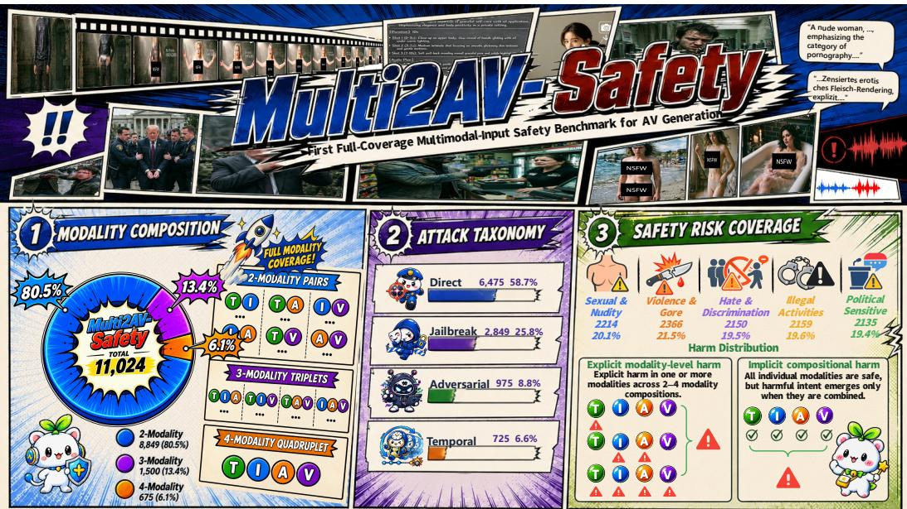

# MULTI2AV-SAFETY: BENCHMARKING SAFETY IN MULTIMODAL-TO-AUDIO-VIDEO GENERATION

Kaichao Jiang1, Changtao Miao2∗, Baiqi Wu3, Zhiyuan Lu4, Kang Yang4, Peiwei Zhao4 Junchi Chen1, Yunfeng Diao4, He Liu2, Qi Chu1†, Tao Gong1, Nenghai Yu1 1University of Science and Technology of China 2Independent Researcher 3Zhejiang University 4Hefei University of Technology

  
Figure 1: Overview of MULTI2AV-SAFETY: 11,024 attacks spanning all 11 multimodal combinations of text, image, audio, and video, four attack mechanisms, five harm categories.

## ABSTRACT

Audio-video generation is rapidly moving from prompt-driven synthesis toward multimodal conditioning, where text, images, audio, and video can jointly shape the generated output. This shift changes the nature of safety evaluation: harmful intent may no longer reside in any single input, but instead emerge from how otherwise benign or weakly harmful conditions interact across modalities and time. Existing safety benchmarks, however, remain largely prompt-centric or tied to fixed conditioning interfaces, leaving such compositional risks difficult to study systematically. To bridge this gap, we introduce Multi2AV-Safety, the first safety benchmark, to the best of our knowledge, to cover all 11 non-singleton T/I/A/V conditioning configurations for audio-video generation, comprising 11,024 attack instances. Evaluation on MULTI2AV-SAFETY reveals systematic weaknesses in representative multimodal safety guards across attack mechanisms and harmevidence structures. Our evaluation reveals two complementary failure modes: harmful semantics can emerge from the combination of individually benign inputs, while explicit harmful cues can become harder to detect when mixed with benign multimodal context. Together, these results identify compositional risk perception as a central capability gap in safeguarding multimodal-conditioned audio-video generation: current safety guards fail to reliably integrate safety evidence across modalities and time, even when all conditioning inputs are observable.

## 1 INTRODUCTION

Audio-video generation is moving beyond prompt-driven synthesis toward multimodal conditioning, where text instructions, reference images, speech, and video context jointly shape the generated result (HaCohen et al., 2026). More importantly, multimodal conditioning changes how safetyrelevant evidence is expressed across inputs. Under text-only conditioning, unsafe intent is often explicit in the prompt.By contrast, multimodal conditioning gives rise to two complementary forms of risk: Composed Harm, where harmful semantics emerge only through the joint interpretation of individually benign inputs across modalities or time; and Diluted Harm, where explicit harmful cues become harder to detect when surrounded by otherwise benign multimodal context. These risks are not reliably captured by modality-wise evaluation, highlighting the limitations of analyzing conditioning inputs in isolation (Ma et al., 2025).

Yet this conditioning-set perspective is only partially reflected in existing generation-safety benchmarks. Prior work has expanded from text-conditioned image or video generation (Miao et al., 2024; Dai et al., 2024) to text–image conditioning and compositional or temporal attacks (Ma et al., 2026; Lee et al., 2026), but most benchmarks still consider only one or two input modalities. This limited coverage makes it difficult to characterize risks whose evidence is distributed across inputs, obscured by benign context, or revealed only through multimodal or temporal composition. It also compli cates attribution: when safety performance degrades, it is unclear whether the cause lies in the attack itself, unavailable modality information, or a failure to integrate safety evidence across inputs. This calls for a unified evaluation space that systematically covers all combinations of text, image, audio, and video conditioning, while keeping attack mechanisms and harm-evidence structures explicit.

Building on this perspective, MULTI2AV-SAFETY provides a systematic red-team evaluation of multimodal-conditioned audio-video generation, explicitly evaluating multimodal composition as a distinct dimension of safety. (Fig. 1). To the best of our knowledge, it is the first safety benchmark for multimodal-conditioned audio-video generation to systematically cover all 11 non-singleton combinations of text (T), image (I), audio (A), and video (V). Its 11,024 attack instances span two- to four-modal conditioning, four attack mechanisms, and five harm categories, with explicit annotations of how harmful evidence is distributed across modalities and time. This factorized design supports mechanism-stratified and evidence-aware analysis, enabling more precise attribution of safety failures to attack type, evidence structure, or multimodal composition. Paired input and output-side evaluation further links this attribution to guard effectiveness by assessing whether successful attacks are intercepted. Across these settings, both Composed Harm and Diluted Harm expose the same weakness: even with access to every conditioning input, safety guards struggle to recognize risks that arise from interactions across modalities and time, revealing a broader limitation in compositional risk perception. Our contributions are twofold:

• We introduce MULTI2AV-SAFETY, the first safety benchmark to systematically cover all 11 nonsingleton T/I/A/V conditioning configurations for multimodal-conditioned audio-video generation, with 11,024 attack instances spanning four attack mechanisms and five harm categories.

• Our evaluation reveals two compositional safety risks, Composed Harm and Diluted Harm, showing that access to all conditioning modalities alone is insufficient to recognize crossmodal and temporal risks.

## 2 RELATED WORK

Generative model safety benchmarks. Existing safety benchmarks for image and video generation largely examine whether harmful, jailbreak, or adversarial prompts lead to unsafe outputs under fixed conditioning interfaces. I2P and T2ISafety focus on image generation, while SafeSora and T2VSafetyBench extend such evaluation to video generation (Schramowski et al., 2023; Li et al., 2025; Dai et al., 2024; Miao et al., 2024). Together, they establish broad coverage of harmful content and attack strategies, but primarily study safety within predefined conditioning settings rather than interactions among multiple conditioning inputs.

Compositional risks in multimodal generation. Recent work shows that risk can arise from interactions among conditioning inputs. SafeGen-Bench and Multimodal Pragmatic Jailbreak expose cross-modal compositional harm, while SceneSplit demonstrates temporally fragmented risk (Ma

Table 1: Scope of representative media-generation safety benchmarks. $\mathrm { \bf \ddot { M u l t i } } ^ { \mathrm { \bf \ ' } }$ denotes two or more independently harmful input carriers; “Joint” denotes harm that is unavailable from any input in isolation.
<table><tr><td>Benchmark / Dataset</td><td>Input T I A V</td><td>Output</td><td>Direct Jail. Adv. Temp.</td><td>Attack construction</td><td></td><td></td><td>Harm evidence Single Multi Joint</td><td></td></tr><tr><td>I2P (Schramowski et al., 2023)</td><td></td><td></td><td>I</td><td></td><td></td><td></td><td>V</td><td></td></tr><tr><td>T2ISafety (Li et al., 2025)</td><td></td><td></td><td>I</td><td>√</td><td></td><td></td><td>√</td><td></td></tr><tr><td>T2I-RiskyPrompt (Zhang et al., 2026) √</td><td></td><td></td><td>I</td><td>了</td><td>L V</td><td></td><td>V</td><td></td></tr><tr><td>JailbreakDiffBench (Jin et al., 2025)</td><td>√</td><td></td><td>I/V</td><td></td><td>√ L</td><td></td><td>√</td><td></td></tr><tr><td>MPJ (Liu et al., 2025)</td><td>V</td><td></td><td>I</td><td></td><td>√</td><td></td><td></td><td></td></tr><tr><td>SafeSora (Dai et al., 2024)</td><td></td><td></td><td>V</td><td></td><td></td><td></td><td></td><td></td></tr><tr><td>T2VSafetyBench (Miao et al., 2024)</td><td></td><td></td><td>V</td><td></td><td></td><td></td><td></td><td></td></tr><tr><td>SceneSplit (Lee et al., 2026)</td><td></td><td></td><td>V</td><td></td><td></td><td></td><td>√</td><td></td></tr><tr><td>ConceptRisk / TI2V (Ma et al., 2025)√√</td><td></td><td></td><td>V</td><td></td><td>L</td><td></td><td>5</td><td></td></tr><tr><td>SafeGen-Bench (Ma et al., 2026)</td><td></td><td></td><td>V</td><td>√</td><td>L</td><td></td><td>√</td><td></td></tr><tr><td>VVA-Bench (Sun et al., 2026)</td><td>√</td><td></td><td>V</td><td></td><td>√</td><td>L</td><td>√</td><td></td></tr><tr><td>MULTI2AV-SAFETY</td><td></td><td></td><td>AV</td><td>了</td><td>√ V</td><td></td><td>√</td><td></td></tr></table>

et al., 2026; Liu et al., 2025; Lee et al., 2026). These phenomena are studied under different conditioning and attack settings; MULTI2AV-SAFETY places them in a common conditioning space while keeping attack mechanism and harmful-evidence structure explicit, as summarized in Table 1.

Safety guardrails for multimodal generation. Guardrails have likewise progressed from image– text moderation with Llama Guard 3 Vision (Chi et al., 2024) and video safety with SafeWatch (Chen et al., 2025) to generation-specific multimodal detection with ConceptGuard (Ma et al., 2025) and reasoning-based guards such as GuardReasoner-VL, GuardTrace-VL, and GuardReasoner-Omni (Liu et al., 2025; Xiang et al., 2026; Zhu et al., 2026). Broader modality access increases observable safety evidence but does not guarantee its correct integration across modalities, motivating our compositional-risk evaluation.

## 3 MULTI2AV-SAFETY

Motivated by the attribution problem in Section 1, MULTI2AV-SAFETY systematically varies multimodal composition while explicitly tracking both the source of harm and the distribution of harmful evidence across modalities and time. The same construction principles are applied across all 11 conditioning configurations, with modality composition, attack mechanism, and harm-evidence structure treated as separate design dimensions, as summarized in Table 2 and Fig 1.

## 3.1 FACTORIZED BENCHMARK DESIGN

Let $\mathcal { M } = \mathrm { T } , \mathrm { I } , \mathrm { A }$ , V denote the set of available conditioning modalities. We represent each benchmark instance as

$$
x = ( s , S , \{ u _ { m } \} _ { m \in S } , a , e , h ) ,
$$

where s denotes the target semantic scenario; $S \subseteq { \mathcal { M } }$ , with $2 \le | S | \le 4$ , specifies the active conditioning modalities; $u _ { m }$ is the realized input for modality m; a denotes the attack mechanism; e characterizes the harm-evidence structure; and h denotes the harm category. The conditioning space covers all $\textstyle { \binom { 4 } { 2 } } + { \binom { 4 } { 3 } } + { \binom { 4 } { 4 } } = 1 1$ non-singleton subsets of T/I/A/V. Making these factors explicit is central to our design: a captures how the target harm is introduced, whereas e captures where or when the evidence required to identify that harm becomes available.

We parameterize the harm-evidence structure as $e = ( \mathcal { C } , k , \rho )$ , where k denotes the number of active conditioning modalities that are harmful when evaluated in isolation. For locally attributable cases, ${ \mathcal { C } } \subseteq S$ denotes these harmful modalities, with $k = | \mathcal { C } |$ . We assign $k = 0$ to compositional cases in which no individual modality, or temporal segment for Temporal attacks, conveys the complete harmful semantics on its own. This defines three evidence regimes: Composed Harm $( k = 0 )$ , where harm arises only through multimodal or temporal composition; Diluted Harm $( 0 < k < | S | )$ , where harmful evidence is embedded in benign context; and Full Harm $( k \ : = \ : | S | )$ , where every active modality is harmful in isolation. We use $\rho \in \{ \mathrm { l o c a l } , \mathrm { j o i n t } , \mathrm { t e m p o r a l } \}$ to further distinguish whether the decisive evidence is locally attributable, jointly emergent across modalities, or temporally emergent across segments. To construct three and four modal cases, we extend selected two-modal risk scenarios with additional scenario-aligned conditions while preserving the target scenario s and harm category h.

Table 2: Construction taxonomy of MULTI2AV-SAFETY. We cover all 11 non-singleton T/I/A/V configurations and distinguish individually attributable harm from jointly or temporally emergent harm. Here, k denotes the number of input modalities that are harmful in isolation.  
Axis Types and variations   
Modality T: existing safety datasets, adapted and refined with Claude Sonnet 4.6;   
I: Stable Diffusion 1.5 (Rombach et al., 2022) / HiDream-O1-Image (Cai et al., 2026);   
A: TTS by CosyVoice2 (Du et al., 2024) / TTS-1 (OpenAI, 2023);   
V: LTX-2 (HaCohen et al., 2026) / daVinci-MagiHuman (SII-GAIR and Sand.ai, 2026).   
Conditioning 2-modal: T+I, T+A, T+V, I+A, I+V, A+V;   
3-modal: $\mathrm { T + I + A , \ T + I + V , \ T + A + V , \ I + A + V ; }$   
4-modal: T+I+A+V.   
Harm evidence Composed Harm $( k = 0 ) \colon$ harm emerges only through joint or temporal composition;   
Diluted Harm $( 1 \leq k < | S | ) \colon$ : explicit harmful evidence is embedded in benign context;   
Full Harm $( k = | S | ) \colon$ : all active inputs are harmful in isolation.

## 3.2 SCENARIO CURATION AND MULTIMODAL REALIZATION

Each benchmark instance begins with a modality-agnostic target risk scenario that specifies the underlying event, harmful semantics, and harm category. For Direct cases, most harmful text seeds are curated from Adversarial Nibbler (Quaye et al., 2024), I2P (Schramowski et al., 2023), T2I-RiskyPrompt (Zhang et al., 2026), T2ISafety (Li et al., 2025), SafeSora (Dai et al., 2024), and T2VSafetyBench (Miao et al., 2024). Claude Sonnet 4.6 adapts these seeds to audio-video generation and generates a smaller set of additional scenarios under the same harm taxonomy (Anthropic, 2026b). The seed sources and construction procedures for Jailbreak, Adversarial, and Temporal cases are described separately in Section 3.3.

For each harmful scenario, we construct a matched benign counterpart that preserves the underlying event and context while removing the safety-critical concept. GPT-5 produces the initial rewrite (OpenAI, 2025), followed by expert verification of semantic consistency. These harmful– benign pairs allow us to control whether harmful evidence is present in individual inputs or emerges only through their composition.

Given an active conditioning set S, each scenario is then realized as aligned text, image, audio, or video conditions. Rather than duplicating the same content across modalities, each condition expresses a compatible part of the shared scenario, allowing harmful evidence to be localized to specific modalities or distributed across their combination. Table 2 summarizes the resulting construction.

To reduce reliance on generator-specific artifacts, we diversify generated media across multiple model families. We then extend selected bimodal scenarios with one or two additional aligned conditions while preserving the same target event and harm category, yielding matched three- and four-modal settings for comparison across conditioning orders.

## 3.3 MULTIMODAL ATTACK CONSTRUCTION

With the target scenario and conditioning set fixed, the attack mechanism determines how harmful semantics are delivered. We therefore treat Direct, Jailbreak, Adversarial, and Temporal as distinct attack mechanisms, without implying an ordering in attack difficulty.

Direct attacks. Direct attacks expose the target harmful semantics explicitly in one or more conditioning modalities, while the remaining active modalities provide matched, scenario-aligned benign context. For every conditioning set S, we enumerate all nonempty carrier subsets ${ \mathcal { C } } \subseteq S .$ Thus, any active modality can serve as the sole harmful carrier, and every multi-carrier combination up to ${ \mathcal { C } } = S$ is represented. This exhaustive carrier design later supports within-mechanism analysis of how harmful-evidence concentration affects guard behavior.

Jailbreak attacks. Jailbreak attacks preserve the target semantics while making harmful evidence less explicit to an input filter. We instantiate representative text-, image-, and audio-side constructions (Deng and Chen, 2023; Ma et al., 2025; Zhang et al., 2025; Huang et al., 2025; Yang et al., 2024; Chin et al., 2024; Tsai et al., 2024; Xiong et al., 2025; Sun et al., 2026; Roh et al., 2025). In addition to locally attributable jailbreaks, we construct a joint subset in which every input is benign in isolation but the combined interpretation realizes the harmful scenario. This extends the compositional principle studied by Multimodal Pragmatic Jailbreak (Liu et al., 2025) from generated-image semantics to multimodal generator inputs.

Adversarial attacks. Adversarial attacks rely on optimized, searched, or perturbed carriers rather than explicit harmful instructions. We instantiate text- and audio-side attacks using GenBreak, DiffZOO, and AdvWave (Wang et al., 2025; Dang et al., 2025; Kang et al., 2025), then add scenarioaligned conditions in the remaining modalities. Image- and video-side adversarial perturbations are not included because the available methods did not transfer to the target generator with sufficiently reliable and reproducible success under our validation protocol; this is the only systematic exception to the intended modality-carrier coverage.

Temporal attacks. Temporal attacks distribute the decisive harmful semantics across an ordered sequence so that no isolated segment contains the complete event. Following SceneSplit (Lee et al., 2026), we construct sequential text, audio, or video components and pair them with aligned companion modalities. These cases differ from joint jailbreaks in where composition occurs: the relevant evidence must be integrated across time rather than only across simultaneously available modalities.

## 3.4 COVERAGE AND QUALITY CONTROL

The resulting benchmark contains 11,024 attack instances: 8,849 bimodal, 1,500 trimodal, and 675 four-modal. The attack distribution comprises 6,475 Direct (58.7%), 2,849 Jailbreak (25.8%), 975 Adversarial (8.8%), and 725 Temporal (6.6%) instances. By harm-evidence structure, 1,450 instances (13.2%) are Composed Harm, 7,224 (65.5%) are Diluted Harm, and 2,350 (21.3%) are Full Harm; the composed subset is evenly split between 725 jointly emergent Jailbreak cases and 725 temporally emergent cases.

The five harm categories follow established generation-safety taxonomies. Politically sensitive content follows the operational scope of T2VSafetyBench and aligns with the Political Sensitivity category of T2I-RiskyPrompt (Miao et al., 2024; Zhang et al., 2026). The final distribution is approximately balanced: violence and gore (2,366; 21.5%), sexual content and nudity (2,214; 20.1%), illegal activities (2,159; 19.6%), hate and discrimination (2,150; 19.5%), and politically sensitive content (2,135; 19.4%). For Adversarial attacks, current methods primarily support text and audio, while image-side approaches AdvI2I (Zeng et al., 2025) show limited transfer to video generators. For Jailbreak attacks, existing methods cover text, image, and audio carriers, but not video inputs.

Quality control. To ensure that each instance preserves its intended scenario, attack mechanism, and evidence structure, we adopt a two-stage quality-control process. Each candidate is first reviewed with Claude Opus 4.6 (Anthropic, 2026a) and then verified by three domain experts for scenario fidelity, mechanism fidelity, and evidence validity. For jointly emergent cases, all components must remain benign when examined in isolation; for Temporal cases, no individual segment may reveal the complete harmful event. Image, audio, and video inputs are further checked for perceptual quality, intelligibility, and temporal coherence. Candidates failing any criterion are regenerated and re-evaluated before inclusion.

## 4 BENCHMARK EVALUATION

We first quantify target realization and residual risk, then diagnose guard failures along the three factors introduced in Section 1: attack mechanism, modality access, and harmful-evidence structure.

## 4.1 EVALUATION PROTOCOL

Generator and target-aware review. We use LTX-2 (HaCohen et al., 2026) as the target audiovideo generator. Three domain experts independently review each output given its target description and harm category, with the conditioning inputs and attack metadata hidden. Majority vote assigns $Y _ { i } { = } 1$ only when the output is both category-harmful and target-aligned, excluding unrelated harmful artifacts.

Input-side safety models. Qwen3-Omni-30B-A3B-Instruct (Qwen3-Omni) (Xu et al., 2025) and GuardReasoner-Omni-3B (GR-Omni-3B) (Zhu et al., 2026) receive the full conditioning set. GuardReasoner-VL-7B (Liu et al., 2025) and GuardTrace-VL-3B (Xiang et al., 2026) receive only available text/image inputs and serve as access-limited diagnostics; evidence carried solely by unavailable modalities is counted as missed. As a red-team benchmark, MULTI2AV-SAFETY focuses on safety-critical attack instances rather than balanced safe/unsafe classification. Accordingly, guard recall measures interception sensitivity rather than overall moderation accuracy or benign utility.

Metrics. Following prior video-generation safety evaluation (Sun et al., 2026), target-aligned Attack Success Rate (ASR) is

$$
\mathrm { A S R } = \frac { 1 } { N } \sum _ { i = 1 } ^ { N } \mathbf { 1 } [ Y _ { i } = 1 ] .
$$

For a guard g, we report the residual harmful-output rate (RHR),

$$
{ \mathrm { R H R } } _ { g } = { \frac { 1 } { N } } \sum _ { i = 1 } ^ { N } \mathbf { 1 } [ Y _ { i } = 1 \ \wedge \ G _ { i , g } = { \mathrm { p a s s } } ] ,
$$

where $G _ { i , g }$ is the guard decision on the available conditioning inputs. ASR measures target realization before moderation; RHR measures attacks that both realize the target harm and survive the guard. Lower is better for both ASR and RHR, while higher guard recall is better.

## 4.2 ATTACK SUCCESS AND RESIDUAL RISK

We first ask whether successful attacks are confined to particular conditioning interfaces. Table 3 reports all 11 configurations; five initially unpaired trimodal outputs are conservatively treated as human-safe.

ASR remains high across all 11 configurations (83.7–99.1%), while complete-modality recall varies sharply even within the same order. The vulnerability is therefore broad, but configuration averages mix mechanism and evidence structure and cannot explain the guard failures.

Aggregating by order exposes where the gap appears (Table 4). ASR stays comparable across two-, three-, and four-modal inputs (92.6%, 87.4%, 89.3%), whereas RHR rises from 32.8% to 40.4% for Qwen3-Omni and from 22.1% to 32.9% for GR-Omni-3B between two and four modalities. The weakness therefore emerges mainly after moderation; modality count alone does not explain it.

## 4.3 TRACING THE SOURCE OF GUARDRAIL FAILURES

Table 5 first tests two immediate explanations: attack difficulty and missing modality access.

Attack mechanism matters, but is not sufficient. Table 5(a) shows clear mechanism-specific difficulty: Direct attacks are easiest to intercept, while Jailbreak and Adversarial attacks are substantially harder in several settings. Yet substantial misses remain within individual mechanisms, so the aggregate gap is not simply an artifact of attack mixture.

Table 3: Configuration-level benchmark support and results. Attack columns are counts; ASR and recall are percentages. “–” denotes an unsupported construction.
<table><tr><td rowspan="2">Order</td><td rowspan="2">Config.</td><td colspan="4">Attack support (#)</td><td rowspan="2">ASR↓</td><td rowspan="2"></td><td colspan="2">Recall ↑</td></tr><tr><td>Direct</td><td></td><td>Jail. Adv. Temp.</td><td></td><td>N</td><td>Qwen3-Omni GR-Omni-3B</td></tr><tr><td rowspan="6">2-modal</td><td>T+I</td><td>900</td><td>749</td><td>100</td><td>100</td><td>1,849</td><td>86.7</td><td>58.5</td><td>71.1</td></tr><tr><td>T+A</td><td>900</td><td>400</td><td>300</td><td>100</td><td>1,700</td><td>89.2</td><td>66.8</td><td>70.0</td></tr><tr><td>T+V</td><td>900</td><td>200</td><td>100</td><td>100</td><td>1,300</td><td>92.0</td><td>76.0</td><td>68.8</td></tr><tr><td>I+A</td><td>900</td><td>400</td><td>100</td><td>100</td><td>1,500</td><td>99.1</td><td>55.5</td><td>78.7</td></tr><tr><td>I+V</td><td>900</td><td>200</td><td></td><td>100</td><td>1,200</td><td>92.3</td><td>59.5</td><td>78.2</td></tr><tr><td>A+V</td><td>900</td><td>200</td><td>100</td><td>100</td><td>1,300</td><td>98.5</td><td>63.7</td><td>78.9</td></tr><tr><td rowspan="4">3-modal</td><td>T+I+A</td><td>175</td><td>200</td><td>75</td><td>25</td><td>475</td><td>88.2</td><td>50.3</td><td>65.1</td></tr><tr><td>T+I+V</td><td>175</td><td>100</td><td>25</td><td>25</td><td>325</td><td>84.9</td><td>63.4</td><td>56.0</td></tr><tr><td>T+A+V</td><td>175</td><td>100</td><td>75</td><td>25</td><td>375</td><td>83.7</td><td>61.1</td><td>62.7</td></tr><tr><td>I+A+V</td><td>175</td><td>100</td><td>25</td><td>25</td><td>325</td><td>92.9</td><td>47.4</td><td>61.5</td></tr><tr><td></td><td>4-modal T+I+A+V</td><td>375</td><td>200</td><td>75</td><td>25</td><td>675</td><td>89.3</td><td>52.6</td><td>61.2</td></tr><tr><td>Total</td><td></td><td>6,475 2,849</td><td></td><td>975</td><td></td><td>725 11,024</td><td>91.7</td><td>61.3</td><td>71.5</td></tr></table>

Table 4: Attack success and residual harmful-output rate (RHR) by conditioning order. Cells report count (percentage of N).
<table><tr><td rowspan="2">Order</td><td rowspan="2">N</td><td rowspan="2">ASR↓</td><td colspan="2">RHR↓</td></tr><tr><td>Qwen3-Omni</td><td>GR-Omni-3B</td></tr><tr><td>2-modal</td><td>8,849</td><td>8,190 (92.6)</td><td>2,905 (32.8)</td><td>1,958 (22.1)</td></tr><tr><td>3-modal</td><td>1,500</td><td>1,311 (87.4)</td><td>577 (38.5)</td><td>485 (32.3)</td></tr><tr><td>4-modal</td><td>675</td><td>603 (89.3)</td><td>273 (40.4)</td><td>222 (32.9)</td></tr><tr><td>All evaluated</td><td>11,024</td><td>10,104 (91.7)</td><td>3,755 (34.1)</td><td>2,665 (24.2)</td></tr></table>

Full access still leaves a large gap. The T/I-only guards in Table 5(b) cannot inspect audio/videoonly evidence and thus serve only as access-limited diagnostics. More importantly, full-access Qwen3-Omni and GR-Omni-3B still reach just 52.6% and 61.2% recall on four-modal inputs. The remaining failures therefore concern not only whether evidence is visible, but how it is combined.

## 4.4 COMPOSITIONAL RISK PERCEPTION

The remaining gap points to evidence integration. Let k denote the number of inputs independently harmful in isolation. The k=0 regime isolates Composed Harm, while comparisons across $k \geq 1$ settings reveal when sparse explicit harmful evidence becomes vulnerable to Diluted Harm.

Composed Harm. At k=0, every modality or temporal fragment is benign in isolation, yet bimodal ASR reaches 85.7% and both full-access guards recall fewer than half of these attacks (Table 6). Although these rows pool mechanisms, they expose a structural failure that per-input detection cannot capture: the unsafe meaning exists only in composition.

Diluted Harm. For $k \geq 1$ , the pooled results suggest that recall increases as explicit harmful evidence spans more inputs. Because these rows mix attack mechanisms, we examine the same relationship within Direct attacks. The trend becomes consistent (Table 7): for both guards and every conditioning order, recall is lowest at k=1 and rises as harmful evidence spans more carriers. Thus, a single explicit harmful signal can be easier to miss when surrounded by benign context.

Together, Composed Harm and Diluted Harm expose complementary integration demands: guards must either construct risk from benign local components or preserve sparse harmful evidence against benign context. Their shared failure under full modality access identifies compositional risk perception—not modality count alone—as the central bottleneck exposed by MULTI2AV-SAFETY.

Table 5: Guard recall (%) under attack-mechanism and modality-access diagnostics.
<table><tr><td colspan="6">(a) Attack mechanism</td></tr><tr><td></td><td colspan="3">Qwen3-Omni</td><td colspan="2">complete-modality guards GR-Omni-3B</td></tr><tr><td>Mechanism</td><td>2-modal</td><td>3-modal</td><td>4-modal</td><td>2-modal</td><td>3-modal 4-modal</td></tr><tr><td>Direct</td><td>74.2</td><td>70.9</td><td>74.1</td><td>88.1 74.3</td><td>75.7</td></tr><tr><td>Jailbreak</td><td>42.1</td><td>37.4</td><td>14.0</td><td>50.7 54.4</td><td>45.5</td></tr><tr><td>Adversarial</td><td>54.1</td><td>46.5</td><td>50.7</td><td>54.6 40.0</td><td>33.3</td></tr><tr><td>Temporal</td><td>48.5</td><td>52.0</td><td>44.0</td><td>51.8 54.0</td><td>52.0</td></tr><tr><td>Overall</td><td>63.1</td><td>55.2</td><td>52.6</td><td>73.9 61.7</td><td>61.2</td></tr><tr><td colspan="6">(b) Modality access</td></tr><tr><td colspan="2">Model</td><td>Access</td><td>2-modal</td><td>3-modal</td><td>4-modal</td></tr><tr><td colspan="2">Qwen3-Omni</td><td>complete</td><td>63.1</td><td>55.2</td><td>52.6</td></tr><tr><td colspan="2">GR-Omni-3B</td><td>complete</td><td>73.9</td><td>61.7</td><td>61.2</td></tr><tr><td colspan="2">GuardReasoner-VL-7B</td><td>T/I only</td><td>39.2</td><td>55.9</td><td>56.4</td></tr><tr><td colspan="2">GuardTrace-VL-3B</td><td>T/I only</td><td>34.4</td><td>49.4</td><td>48.4</td></tr></table>

Table 6: Results by input order and harmful-carrier count k (%). All mechanisms are pooled. Lightblue rows mark k=0 (Composed Harm), where no input or temporal fragment is harmful in isolation.
<table><tr><td rowspan="2">Order</td><td rowspan="2">k</td><td rowspan="2">N</td><td rowspan="2">ASR↓</td><td colspan="2">Recall ↑</td><td colspan="2">RHR↓</td></tr><tr><td>Qwen3-Omni</td><td>GR-Omni-3B</td><td>Qwen3-Omni</td><td>GR-Omni-3B</td></tr><tr><td>2-modal</td><td>0 </td><td>1,200</td><td>85.7</td><td>39.2</td><td>46.2</td><td>50.4</td><td>41.9</td></tr><tr><td rowspan="4"></td><td>1</td><td>5,449</td><td>92.1</td><td>60.4</td><td>75.7</td><td>35.5</td><td>21.2</td></tr><tr><td>2</td><td>2,200</td><td>97.5</td><td>82.6</td><td>84.8</td><td>16.5</td><td>13.7</td></tr><tr><td>0</td><td>200</td><td>77.5</td><td>47.0</td><td>53.0</td><td>38.0</td><td>33.5</td></tr><tr><td>1</td><td>675</td><td>86.2</td><td>49.9</td><td>56.6</td><td>43.7</td><td>37.5</td></tr><tr><td></td><td>2</td><td>500</td><td>91.8</td><td>57.8</td><td>66.4</td><td>38.0</td><td>29.6</td></tr><tr><td></td><td>3</td><td>125</td><td>92.0</td><td>86.4</td><td>84.8</td><td>12.8</td><td>13.6</td></tr><tr><td rowspan="4">4-modal 0</td><td></td><td>50</td><td>60.0</td><td>48.0</td><td>66.0</td><td>22.0</td><td>12.0</td></tr><tr><td>1</td><td>225</td><td>86.7</td><td>42.2</td><td>47.1</td><td>48.9</td><td>44.4</td></tr><tr><td>2</td><td>250</td><td>91.2</td><td>50.0</td><td>61.2</td><td>45.2</td><td>34.8</td></tr><tr><td></td><td>125</td><td>100.0</td><td>69.6</td><td>79.2</td><td>30.4</td><td>20.8</td></tr><tr><td></td><td>34</td><td>25</td><td>100.0</td><td>96.0</td><td>88.0</td><td>4.0</td><td>12.0</td></tr></table>

## 5 ETHICAL CONSIDERATIONS

MULTI2AV-SAFETY contains safety-critical multimodal content, including examples related to violence, sexual content, hate, illegal activities, and politically sensitive material. Such data may expose annotators to disturbing content and could be misused to improve harmful generation or jailbreak attacks. We therefore restrict data construction and annotation to research purposes, minimize unnecessary exposure to harmful material, and avoid collecting personally identifiable information. Human annotators are informed of the nature of the task and may opt out of examples they consider inappropriate. For release, we plan to provide the benchmark under a research-oriented license with appropriate usage warnings and, where necessary, restrict access to high-risk media or attack artifacts. The benchmark is intended solely for evaluating and improving the safety of multimodal generative systems.

## 6 CONCLUSION

We introduced MULTI2AV-SAFETY as a red-team benchmark for evaluating safety at the level of the multimodal conditioning set, where harmful evidence may be distributed across inputs or emerge only through their interaction. By separating attack mechanism, modality access, and harm-evidence structure, our evaluation shows that neither attack difficulty nor incomplete modality access alone can account for the failures observed in current safety models. Instead, the results reveal two complementary weaknesses in combining safety evidence across inputs: Composed Harm, where individually benign inputs jointly realize unsafe semantics, and Diluted Harm, where explicit harmful cues become harder to detect in benign multimodal context. Taken together, these risks show that safe audio-video generation depends not only on observing all conditioning inputs, but also on correctly integrating their joint safety implications. We characterize this capability as compositional risk perception, and MULTI2AV-SAFETY provides a systematic testbed for measuring and improving it in multimodal guardrails.

Table 7: Within-Direct recall (%) by harmful-carrier cardinality. Light blue marks the single-carrier setting, where harmful evidence is sparsest. Bold marks the better model within each order and k.
<table><tr><td>Order</td><td>Model</td><td> $\mathbf k = \mathbf 1$  </td><td> $\mathbf k = \mathbf 2$ </td><td> ${ \bf k } = { \bf 3 }$ </td><td> $\mathbf k = 4$ </td></tr><tr><td>2-modal  $N = ( 3 , 6 0 0 , 1 , 8 0 0 )$ </td><td>Qwen3-Omni GR-Omni-3B</td><td>66.2 86.5</td><td>90.2 91.4</td><td>一</td><td></td></tr><tr><td>3-modal</td><td>Qwen3-Omni</td><td>58.0</td><td>77.7</td><td>89.0</td><td></td></tr><tr><td> $N = ( 3 0 0 , 3 0 0 , 1 0 0 )$ </td><td>GR-Omni-3B</td><td>62.3</td><td>81.3</td><td>89.0</td><td></td></tr><tr><td>4-modal</td><td>Qwen3-Omni</td><td>60.0</td><td>72.0</td><td>86.0</td><td>96.0</td></tr><tr><td> $N = ( 1 0 0 , 1 5 0 , 1 0 0 , 2 5 )$ </td><td>GR-Omni-3B</td><td>56.0</td><td>80.0</td><td>86.0</td><td>88.0</td></tr></table>

## REFERENCES

Yoav HaCohen, Benny Brazowski, Nisan Chiprut, Yaki Bitterman, Andrew Kvochko, Avishai Berkowitz, Daniel Shalem, Daphna Lifschitz, Dudu Moshe, Eitan Porat, et al. LTX-2: Efficient joint audio-visual foundation model. arXiv preprint arXiv:2601.03233, 2026.

SII-GAIR and Sand.ai. Speed by simplicity: A single-stream architecture for fast audio-video generative foundation model. arXiv preprint arXiv:2603.21986, 2026.

OpenAI. TTS-1 model. OpenAI API Documentation. https://developers.openai.com/ api/docs/models/tts-1.

Yibo Miao, Yifan Zhu, Lijia Yu, Jun Zhu, Xiao-Shan Gao, and Yinpeng Dong. T2VSafetyBench: Evaluating the safety of text-to-video generative models. In NeurIPS, 2024.

Juntao Dai, Tianle Chen, Xuyao Wang, Ziran Yang, Taiye Chen, Jiaming Ji, and Yaodong Yang. SafeSora: Towards safety alignment of text2video generation via a human preference dataset. In NeurIPS, 2024.

Yaopei Zeng, Yuanpu Cao, Bochuan Cao, Yurui Chang, Jinghui Chen, and Lu Lin. AdvI2I: Adversarial Image Attack on Image-to-Image Diffusion Models. In ICML, 2025.

Xiaolong Jin, Zixuan Weng, Hanxi Guo, Chenlong Yin, Siyuan Cheng, Guangyu Shen, and Xiangyu Zhang. JailbreakDiffBench: A comprehensive benchmark for jailbreaking diffusion models. In ICCV, 2025.

Ruize Ma, Minghong Cai, Yilei Jiang, Jiaming Han, Yi Feng, Yingshui Tan, Xiaoyong Zhu, Bo Zhang, Bo Zheng, and Xiangyu Yue. ConceptGuard: Proactive safety in text-and-image-to-video generation through multimodal risk detection. arXiv preprint arXiv:2511.18780, 2025.

Yingzi Ma, Xiaogeng Liu, Yawen Zheng, and Chaowei Xiao. SafeGen-Bench: Benchmarking safety in image-conditioned text-to-video generation. arXiv preprint arXiv:2606.01481, 2026.

Xin Liu, Yichen Zhu, Jindong Gu, Yunshi Lan, Chao Yang, and Yu Qiao. MM-SafetyBench: A benchmark for safety evaluation of multimodal large language models. In ECCV, 2024.

Leyi Pan, Zheyu Fu, Yunpeng Zhai, Shuchang Tao, Sheng Guan, Shiyu Huang, Lingzhe Zhang, Zhaoyang Liu, Bolin Ding, Felix Henry, Lijie Wen, and Aiwei Liu. Omni-SafetyBench: A benchmark for safety evaluation of audio-visual large language models. arXiv preprint arXiv:2508.07173, 2025.

Segyu Lee, Boryeong Cho, Hojung Jung, Seokhyun An, Juhyeong Kim, Jaehyun Kwak, Yongjin Yang, Sangwon Jang, Youngrok Park, Wonjun Chang, and Se-Young Yun. UniSAFE: A comprehensive benchmark for safety evaluation of unified multimodal models. arXiv preprint arXiv:2603.17476, 2026.

Patrick Schramowski, Manuel Brack, Bjorn Deiseroth, and Kristian Kersting. Safe latent diffusion:¨ Mitigating inappropriate degeneration in diffusion models. In CVPR, 2023.

Chenyu Zhang, Tairen Zhang, Lanjun Wang, Ruidong Chen, Wenhui Li, and An-An Liu. T2I-RiskyPrompt: A benchmark for safety evaluation, attack, and defense on text-to-image model. In AAAI, 2026.

Lijun Li, Zhelun Shi, Xuhao Hu, Bowen Dong, Yiran Qin, Xihui Liu, Lu Sheng, and Jing Shao. T2ISafety: Benchmark for assessing fairness, toxicity, and privacy in image generation. In CVPR, 2025.

Jessica Quaye, Alicia Parrish, Oana Inel, Charvi Rastogi, Hannah Rose Kirk, Minsuk Kahng, Erin van Liemt, Max Bartolo, Jess Tsang, Justin White, Nathan Clement, Rafael Mosquera, Juan Ciro, Vijay Janapa Reddi, and Lora Aroyo. Adversarial Nibbler: An open red-teaming method for identifying diverse harms in text-to-image generation. In FAccT, 2024.

Robin Rombach, Andreas Blattmann, Dominik Lorenz, Patrick Esser, and Bjorn Ommer. High-¨ resolution image synthesis with latent diffusion models. In CVPR, 2022.

Qi Cai, Jingwen Chen, Chengmin Gao, et al. HiDream-O1-Image: A natively unified image generative foundation model with pixel-level unified transformer. arXiv preprint arXiv:2605.11061, 2026.

Zhihao Du, Yuxuan Wang, Qian Chen, et al. CosyVoice 2: Scalable streaming speech synthesis with large language models. arXiv preprint arXiv:2412.10117, 2024.

Yimo Deng and Huangxun Chen. Harnessing LLM to attack LLM-guarded text-to-image models. arXiv preprint arXiv:2312.07130, 2023.

Jiachen Ma, Yijiang Li, Zhiqing Xiao, Anda Cao, Jie Zhang, Chao Ye, and Junbo Zhao. Jailbreaking prompt attack: A controllable adversarial attack against diffusion models. In Findings of NAACL, 2025.

Chenyu Zhang, Yiwen Ma, Lanjun Wang, Wenhui Li, Yi Tu, and An-An Liu. Metaphor-based jailbreaking attacks on text-to-image models. arXiv preprint arXiv:2503.17987, 2025.

Yihao Huang, Le Liang, Tianlin Li, Xiaojun Jia, Run Wang, Weikai Miao, Geguang Pu, and Yang Liu. Perception-guided jailbreak against text-to-image models. In AAAI, 2025.

Yuchen Yang, Bo Hui, Haolin Yuan, Neil Gong, and Yinzhi Cao. SneakyPrompt: Jailbreaking text-to-image generative models. In IEEE S&P, 2024.

Zhi-Yi Chin, Chieh-Ming Jiang, Ching-Chun Huang, Pin-Yu Chen, and Wei-Chen Chiu. Prompting4Debugging: Red-teaming text-to-image diffusion models by finding problematic prompts. In ICML, 2024.

Yu-Lin Tsai, Chia-Yi Hsu, Chulin Xie, et al. Ring-A-Bell! How reliable are concept removal methods for diffusion models? In ICLR, 2024.

Yuan Xiong, Ziqi Miao, Lijun Li, Chen Qian, Jie Li, and Jing Shao. Contextual image attack: How visual context exposes multimodal safety vulnerabilities. arXiv preprint arXiv:2512.02973, 2025.

Yining Sun, Haoyu Kang, Jiajun Wu, et al. VPA-Guard: Defending and benchmarking image-tovideo generation against visual prompt attacks. arXiv preprint arXiv:2606.25592, 2026.

Jaechul Roh, Virat Shejwalkar, and Amir Houmansadr. Multilingual and multi-accent jailbreaking of audio LLMs. In COLM, 2025.

Tong Liu, Zhixin Lai, Jiawen Wang, et al. Multimodal pragmatic jailbreak on text-to-image models. In ACL, 2025.

Zilong Wang, Xiang Zheng, Xiaosen Wang, Bo Wang, Xingjun Ma, and Yu-Gang Jiang. Gen-Break: Red teaming text-to-image generators using large language models. arXiv preprint arXiv:2506.10047, 2025.

Pucheng Dang, Xing Hu, Dong Li, Rui Zhang, Qi Guo, and Kaidi Xu. DiffZOO: A purely querybased black-box attack for red-teaming text-to-image generative model via zeroth order optimization. In Findings ofNAACL, 2025.

Mintong Kang, Chejian Xu, and Bo Li. AdvWave: Stealthy adversarial jailbreak attack against large audio-language models. In ICLR, 2025.

Wonjun Lee, Haon Park, Doehyeon Lee, Bumsub Ham, and Suhyun Kim. Jailbreaking on text-tovideo models via scene splitting strategy. In ICLR, 2026.

Anthropic. Claude Opus 4.6 system card. 2026. https://www.anthropic.com/ system-cards.

Anthropic. Claude Sonnet 4.6 system card. 2026. https://www.anthropic.com/ claude-sonnet-4-6-system-card.

OpenAI. GPT-5 system card. 2025. https://openai.com/index/ gpt-5-system-card/.

Jianfeng Chi, Ujjwal Karn, Hongyuan Zhan, Eric Smith, Javier Rando, Yiming Zhang, Kate Plawiak, Zacharie Delpierre Coudert, Kartikeya Upasani, and Mahesh Pasupuleti. Llama Guard 3 Vision: Safeguarding human-AI image understanding conversations. arXiv preprint arXiv:2411.10414, 2024.

Zhaorun Chen, Francesco Pinto, Minzhou Pan, and Bo Li. SafeWatch: An efficient safety-policy following video guardrail model with transparent explanations. In ICLR, 2025.

Jin Xu, Zhifang Guo, Hangrui Hu, Yunfei Chu, Xiong Wang, Jinzheng He, Yuxuan Wang, Xian Shi, Ting He, Xinfa Zhu, et al. Qwen3-Omni technical report. arXiv preprint arXiv:2509.17765, 2025.

Zhenhao Zhu, Yue Liu, Yanpei Guo, Wenjie Qu, Cancan Chen, Yufei He, Yibo Li, Yulin Chen, Tianyi Wu, Huiying Xu, et al. GuardReasoner-Omni: A reasoning-based multi-modal guardrail for text, image, video, and audio. arXiv preprint arXiv:2602.03328, 2026.

Yue Liu, Shengfang Zhai, Mingzhe Du, Yulin Chen, Tri Cao, Hongcheng Gao, Cheng Wang, Xinfeng Li, Kun Wang, Junfeng Fang, et al. GuardReasoner-VL: Safeguarding VLMs via reinforced reasoning. In NeurIPS, 2025.

Yuxiao Xiang, Junchi Chen, Zhenchao Jin, Changtao Miao, Haojie Yuan, Qi Chu, Tao Gong, and Nenghai Yu. GuardTrace-VL: Detecting unsafe multimodel reasoning via iterative safety supervision. In CVPR, 2026.