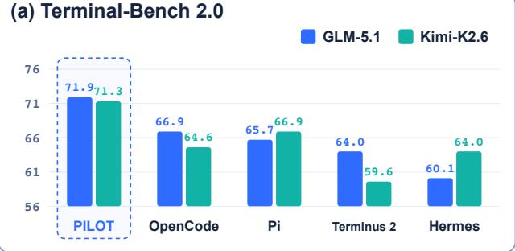
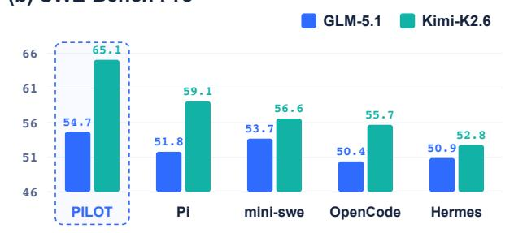
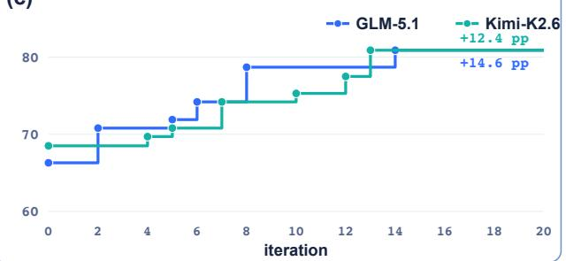
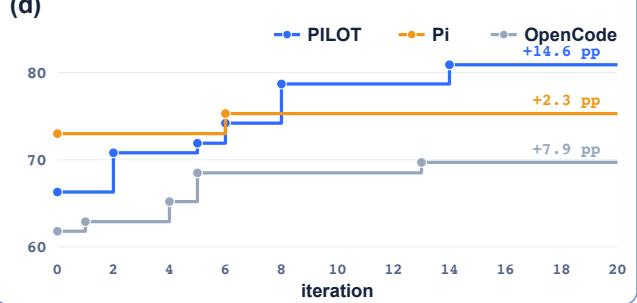
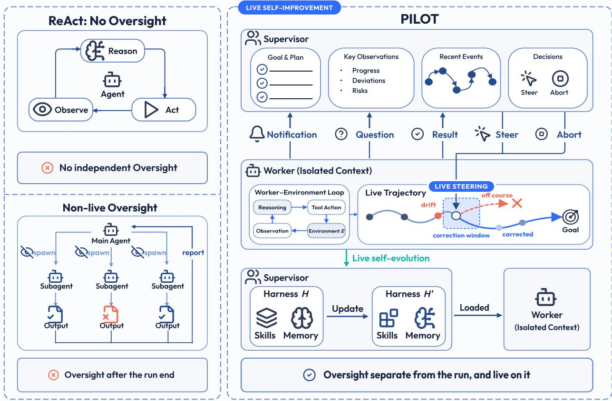
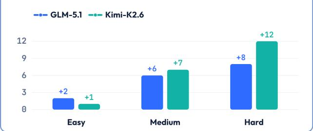
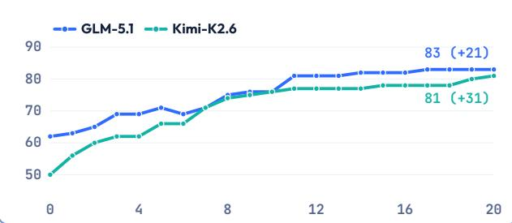
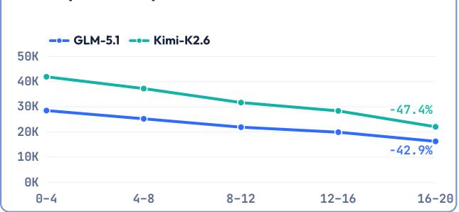
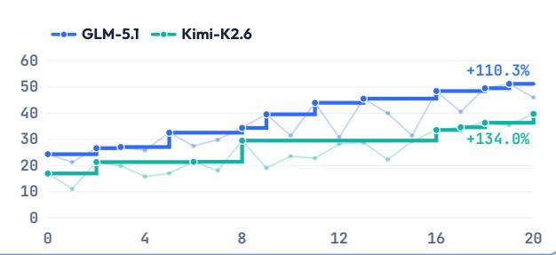
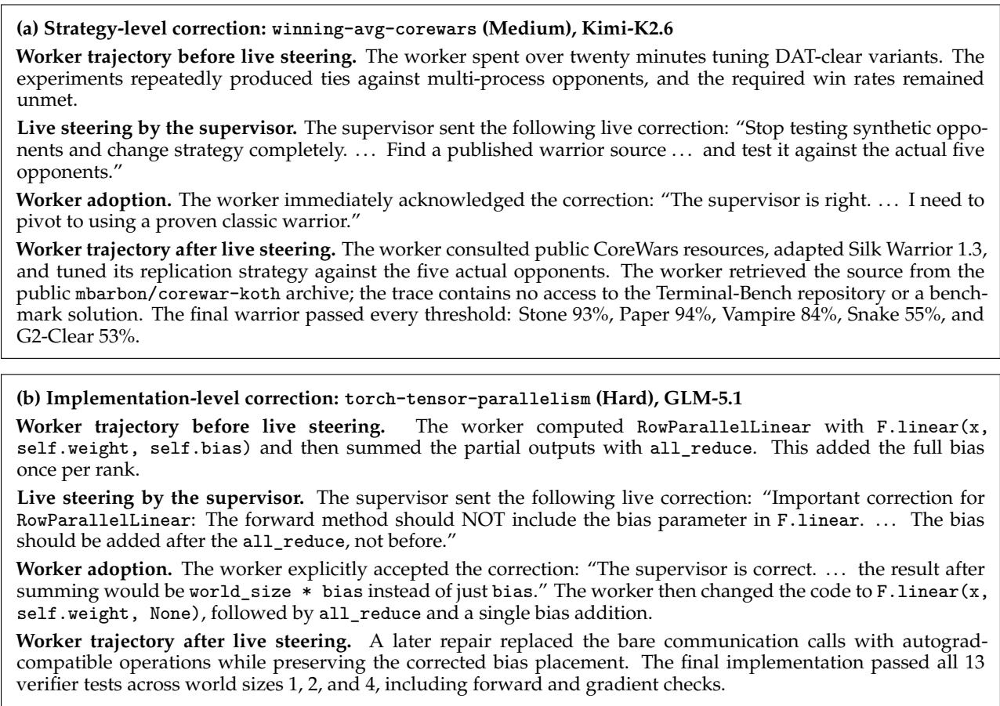

# PILOT in the Loop: Live Self-Improvement for Long-Horizon Agents

## AllSpark Team

Long-horizon agent runs generate experience that can improve both the current run and future runs: successful attempts reveal reusable procedures, while failed attempts expose failure modes. Most self-improvement methods process this experience only after a run ends, so they can neither recover that run nor immediately apply and validate lessons learned from the run, making selfimprovement less efficient and potentially less reliable. We argue that self-improvement should instead be live, using emerging experience both to redirect the active run and to update the persistent harness. However, live self-improvement exposes an architectural gap: existing agent architectures do not simultaneously support live correction and a dedicated self-improvement role. Single-agent self-correction can revise the active run, but the same agent must execute the task and judge its trajectory within a limited context, splitting attention between execution and oversight. Subagent delegation separates execution from the main agent, but the main agent typically cannot redirect the active subagent while the subagent is still running. To bridge this architectural gap, we present PILOT, a supervisor–worker harness that realizes live self-improvement through two coupled mechanisms: (1) live steering lets a separate supervisor redirect or abort the active worker during execution; and (2) live self-evolution distils procedures and failure modes revealed during execution into reusable skills and memory. Across two frozen backbones and three benchmarks, PILOT ranks first in five of six configurations. On Terminal-Bench 2.0, PILOT outperforms counterpart harnesses by as much as 9.8 percentage points. In the self-improvement setting, PILOT gains 14.6 points with GLM-5.1 and 12.4 points with Kimi-K2.6; mean output tokens fall by 42.9% and $4 7 . 4 \% ,$ while successful evaluations per million output tokens rise by 110.3% and 134.0%, respectively.

Date: August 25, 2026 GitHub: github.com/XiaoYang66/Pilot

AllSpark

(b) SWE-Bench Pro  

(c)  

(d)  
  
Figure 1: Main results in two evaluation settings. (a)–(b) One-shot pass rate (%) on Terminal-Bench 2.0 and SWE-bench Pro with GLM-5.1 and Kimi-K2.6; dashed boxes highlight PILOT. (c)–(d) Best-so-far Terminal-Bench 2.0 pass rate across 20 self-improvement iterations: (c) compares PILOT across backbones, and (d) compares PILOT, Pi, and OpenCode on GLM-5.1. Endpoint labels report improvement from iteration 0.

## 1 Introduction

When agents work on long-horizon tasks, they generate experience that can improve both the active run and later work. Successful trajectories reveal procedures worth retaining as reusable skills, particularly when a task can be solved but not yet solved reliably. Failed or inefficient trajectories reveal strategies and recurring failure modes to avoid. Agent self-improvement aims to learn from such experience and improve subsequent behavior. A common approach is post-hoc review: reflection, judge-based evaluation, and self-evolving harness updates, all of which can improve the harness but cannot redirect the active run. Reflection critiques a completed trajectory, judge-based evaluation assesses the final result, and selfevolving harnesses revise prompts, skills, or memory from completed traces and feedback [23, 36, 17, 14, 15]. These approaches can preserve experience, but their updates begin after the relevant execution has ended. Newly extracted knowledge cannot help the run that produced it or be immediately applied and validated against the execution that revealed it. Its usefulness can only be tested in a later rollout or a separate evaluation. We therefore argue that self-improvement should be live, using emerging experience both to redirect the active run and to improve the persistent harness for later runs.

However, existing agent architectures do not simultaneously support live correction and a dedicated selfimprovement role. Single-agent self-correction is timely, but the same agent performs the task and diagnoses its own mistakes in a context filled with execution details [30, 18, 8]. Execution details occupy the same context needed for diagnosis, making it harder for the agent to recognize and correct a strategy that is not working. Subagent delegation separates execution from the main agent, but the main agent commonly receives the subagent’s final summary only after the delegated run returns [7, 3, 16]. Subagent delegation therefore cannot usually redirect the active subagent while the subagent is still running. Together, these limitations call for self-improvement that is both live and separate from task execution.

These requirements motivate live self-improvement: a closed loop that uses emerging experience to redirect the active run and improve the persistent harness. We present PILOT, a supervisor–worker harness that realizes live self-improvement through two coupled mechanisms: (1) live steering lets the supervisor redirect the active worker during execution; and (2) live self-evolution distils useful procedures, project conventions, and failure modes revealed during execution into reusable skills and memory. PILOT makes self-improvement live by separating the roles of task execution and self-improvement, correcting the current run, using the live run to assess the correction, and retaining useful experience in the harness during execution. In PILOT, a frozen supervisor remains connected to a worker throughout the worker’s run rather than waiting for a completed trace. Through a live channel, the supervisor receives the worker’s questions and notifications together with the final result, execution errors, and inactivity alerts; the supervisor can then steer the worker’s actions or abort the worker’s run. The worker’s context absorbs execution details and dead ends, while the supervisor’s separate context stays focused on the goal, recent events, and signs that the run is going off track. The supervisor can also record reusable knowledge in the persistent harness without taking task execution away from the worker.

We evaluate PILOT in a one-shot setting and a self-improvement setting. In the one-shot setting, PILOT ranks first in five of six backbone–benchmark combinations across two frozen backbones and three benchmarks. On Terminal-Bench 2.0 [19], PILOT outperforms counterpart harnesses by as much as 9.8 percentage points. In the self-improvement setting, we organize Terminal-Bench 2.0 tasks into iterations that share a fixed harness state. Within each iteration, all tasks use that state, and agents receive no benchmark feedback during execution. After the iteration, the harness retains skills distilled during successful runs for use in the next iteration. PILOT’s best observed pass rate rises by 14.6 percentage points with GLM-5.1 [32] and 12.4 points with Kimi-K2.6 [20]. Across iterations, the reusable skill set grows by 21 and 31 skills, mean output tokens per evaluated task fall by 42.9% and 47.4%, and successful evaluations per million output tokens rise by 110.3% and 134.0%, respectively. Two case studies trace how the supervisor redirects an active strategy or corrects an implementation error while the worker remains responsible for the solution.

We make three contributions: (1) we formulate live self-improvement as a closed loop that uses emerging experience both to redirect the active run and to update the persistent harness; (2) we introduce PILOT, a supervisor–worker harness that couples live steering with live self-evolution over a shared stream of execution experience; and (3) we evaluate PILOT across two frozen backbones and three long-horizon benchmarks, together with trajectory and efficiency analyses of task recovery, skill growth, and token efficiency.

  
Figure 2: PILOT implements live self-improvement through two mechanisms: live steering and live selfevolution. Top left: a single ReAct loop has no oversight separate from the work. Bottom left: a main agent receives a subagent’s output only after the delegated run ends. Right: a separate supervisor redirects or aborts the active worker, distils reusable skills and memory from supervision, and makes the evolved harness available to later workers.

## 2 PILOT: A Live Self-Improvement Loop

PILOT treats live self-improvement as a closed loop rather than an update performed only after execution. With the worker responsible for task execution and the supervisor responsible for self-improvement, the supervisor uses live steering to redirect the active worker during execution and live self-evolution to record reusable knowledge in the persistent harness (Figure 2). Worker sessions spawned after a harness update load the evolved harness and enter the same two loops. Appendix A.2 provides pseudocode for the two coupled loops.

Roles and persistent state. A long-horizon task τ is attempted in a single episode in an environment whose state changes with the worker’s actions. The model parameters θ remain frozen, while a persistent harness H includes a skill library and memory that persist across episodes. Throughout this paper, self-improvement therefore refers to the evolution of the persistent harness H, not an update to the model parameters θ. During an episode, the supervisor can spawn one or more workers, $W _ { j } \dot { { \bf \varphi } } \mathrm { ~ \ - ~ } \mathrm { S P A W N } ( \theta , \tau _ { j } , H )$ either concurrently or as earlier workers settle. Each worker loads the current harness H, operates in an isolated context, and produces a trajectory $\xi _ { j }$ of actions and observations in . The workers’ exploration, dead ends, and verbose tool output remain in their isolated contexts by default. The supervisor reads the relevant portion of each $\xi _ { j }$ only when diagnosis is needed, preserving the supervisor’s context for the goal, recent events, and recurring failure patterns.

Live steering through a two-way channel. During the episode, the supervisor remains connected to each active worker through a two-way live channel. For every worker session, the channel supports three worker-to-supervisor events and two supervisor-to-worker actions. (1) Notification. Each worker decides when to report progress, an intermediate result, or a potential risk; its execution continues after the notification is sent. (2) Question. A worker decides when its next step requires supervisory input and pauses until the supervisor replies. (3) Result. The runtime automatically delivers a worker’s final result and worker index j to the supervisor when that worker finishes. (4) Steer. When live evidence indicates that a worker’s current course should change, the supervisor can inspect the relevant portion of $\xi _ { j }$ and queue guidance for that worker’s next turn; the current turn finishes first. (5) Abort. The supervisor interrupts an active worker W when continuing that worker session is no longer useful.

Live self-evolution. An active run can reveal a successful procedure or project convention worth reusing, or a recurring failure mode worth avoiding. When the supervisor identifies such knowledge in the live trajectory, the supervisor records it in  or ${ \bf \bar { \boldsymbol { M } } } ,$ refining the harness from H to $H ^ { \prime }$ . Every worker spawned after the update, within the same episode or in a later episode, loads $H ^ { \prime }$ . The new worker’s trajectory is again exposed to live steering and live self-evolution, closing the self-improvement loop.

Implementation. PILOT is implemented as an extension to the Pi coding-agent runtime [33]; the supervisor is an agent session, and workers are spawned in-process as separate sessions. Our experiments follow a real-world usage scenario in which the same frozen model serves as both supervisor and worker.

## 3 Experiments

## 3.1 Setup

Benchmarks. We evaluate on three benchmarks of long-horizon, real-world agent tasks: (1) Terminal-Bench 2.0, whose 89 runnable tasks require an agent to drive a shell over many steps to reach a system or engineering goal; (2) SWE-bench Multilingual [29], which extends repository-level software repair beyond Python; and (3) SWE-bench Pro [5], which contains longer and harder repository-level issues than the original SWE-bench [12]. Terminal-Bench 2.0, SWE-bench Multilingual, and SWE-bench Pro together span terminal operation and multi-language code repair, two demanding forms of long-horizon agent work.

Backbones. We use two open-weights models as frozen backbones, Kimi-K2.6 and GLM-5.1. Within each condition, the same frozen backbone fills both the supervisor and the worker. Using the same frozen model in both roles isolates the supervisor–worker orchestration from any capability gap between the supervisor and the worker (§2).

Harness baselines. On Terminal-Bench 2.0 we compare PILOT against four single-agent harnesses driven by the same backbone: Pi, the coding agent that PILOT extends; OpenCode [2]; Terminus-2 [9], maintained by the Terminal-Bench team; and Hermes [21]. On SWE-bench Multilingual and SWE-bench Pro we compare against Pi, OpenCode, Mini-SWE-Agent [24], and Hermes on the same backbones. Holding the backbone fixed across harnesses isolates the effect of the harness from the effect of the model.

Evaluation settings. We evaluate the two parts of PILOT’s live self-improvement loop in settings that reflect real-world agent use. (1) One-shot setting. A developer hands the harness a new task whose environment changes as work proceeds. Every task starts from a fresh harness state, isolating whether live steering keeps the worker on track during the run. (2) Self-improvement setting. A developer or team returns to the same harness for related work. To evaluate the complete loop, including whether live self-evolution turns experience accumulated during supervision into reusable harness knowledge, we organize the Terminal Bench 2.0 runs into iterations, where one iteration is a complete sweep over the benchmark tasks. At the start of iteration i, every run receives an isolated copy of the same shared harness state $H _ { i } ,$ which includes the skill library $\kappa _ { i }$ and memory $\mathcal { M } _ { i }$ . While a task is running, the harness can create or revise skills and memory using only the live agent trajectory and environment feedback. These updates occur during task execution, before the verifier outcome is available; neither the supervisor nor the worker receives any benchmark evaluation signal or reward. Thus, a candidate update is skill or memory content created or revised during a run, not a post-hoc summary generated from its evaluation result. After every run in iteration i has finished, verifier outcomes only decide which updates are carried into $H _ { i + 1 } { \mathrm { : } }$ updates from successful runs are retained, whereas updates from failed runs are not. Verifier outcomes are never used to create or modify those updates. Every run in iteration i + 1 then starts from the merged shared state $H _ { i + 1 }$ . For the backbone comparison, PILOT runs with GLM-5.1 and Kimi-K2.6 begin from the same $H _ { 0 } ;$ for the harness comparison, the GLM-5.1 runs of PILOT, Pi, and OpenCode also begin from $H _ { 0 } ,$ , with each configuration updating independently thereafter. We measure skill-library size as the number of distinct skills in $\kappa _ { i }$

Table 1: Pass rate (%) across three long-horizon agent benchmarks, with the same frozen open backbone driving every harness. (a) Terminal-Bench 2.0 by difficulty; All aggregates its 89 tasks and AVG averages the two backbones’ All rates. (b) SWE-bench Multilingual and SWE-bench Pro; AVG averages the two backbones. Column maxima are bold.

(a) Terminal-Bench 2.0
<table><tr><td>Harness</td><td colspan="4">GLM-5.1</td><td colspan="4">Kimi-K2.6</td><td rowspan="2">AVG</td></tr><tr><td></td><td>Easy</td><td>Medium</td><td>Hard</td><td>All</td><td>Easy</td><td>Medium</td><td>Hard</td><td>All</td></tr><tr><td>Terminus-2</td><td>75.0</td><td>72.7</td><td>46.7</td><td>64.0</td><td>87.5</td><td>69.1</td><td>38.3</td><td>59.6</td><td>61.8</td></tr><tr><td>Hermes</td><td>87.5</td><td>67.3</td><td>43.3</td><td>60.1</td><td>87.5</td><td>77.3</td><td>36.7</td><td>64.0</td><td>62.1</td></tr><tr><td>OpenCode</td><td>100.0</td><td>75.5</td><td>46.7</td><td>66.9</td><td>75.0</td><td>75.5</td><td>43.3</td><td>64.6</td><td>65.8</td></tr><tr><td>Pi</td><td>87.5</td><td>72.7</td><td>50.0</td><td>65.7</td><td>100.0</td><td>74.5</td><td>48.3</td><td>66.9</td><td>66.3</td></tr><tr><td>PILOT (ours)</td><td>87.5</td><td>80.0</td><td>55.0</td><td>71.9</td><td>100.0</td><td>78.2</td><td>55.0</td><td>71.3</td><td>71.6</td></tr></table>

(b) Software-engineering benchmarks
<table><tr><td rowspan="2">Harness</td><td colspan="3">SWE-bench Multilingual</td><td colspan="3">SWE-bench Pro</td></tr><tr><td>GLM-5.1</td><td>Kimi-K2.6</td><td>AVG</td><td>GLM-5.1</td><td>Kimi-K2.6</td><td>AVG</td></tr><tr><td>Hermes</td><td>67.5</td><td>72.2</td><td>69.9</td><td>50.9</td><td>52.8</td><td>51.9</td></tr><tr><td>OpenCode</td><td>68.9</td><td>74.1</td><td>71.5</td><td>50.4</td><td>55.7</td><td>53.1</td></tr><tr><td>Mini-SWE-Agent</td><td>68.5</td><td>73.7</td><td>71.1</td><td>53.7</td><td>56.6</td><td>55.2</td></tr><tr><td>Pi</td><td>69.8</td><td>75.9</td><td>72.9</td><td>51.8</td><td>59.1</td><td>55.5</td></tr><tr><td>PILOT (ours)</td><td>71.6</td><td>73.7</td><td>72.7</td><td>54.7</td><td>65.1</td><td>59.9</td></tr></table>

This design mirrors a real-world use scenario in which developers explicitly instruct an agent harness to retain reusable skills across related tasks. Accordingly, the setting includes a dedicated self-improvement instruction that specifies how to reuse and record experience. Every evaluated harness receives the same instruction throughout the experiment; Appendix A.3 provides the full text.

Protocol. Each backbone runs with the enable-thinking and preserve-thinking settings on, a maximum generation length of 32k tokens, and all other parameters left at the official defaults for that backbone. We run each configuration twice and report the mean pass rate across the two runs. Every task runs in an isolated container sandbox. On Terminal-Bench 2.0, following common practice, each task is capped at three hours of wall-clock time, with CPU, memory, and other resources left at the task’s own configuration. On SWE-bench Multilingual and SWE-bench Pro, a few tasks pin environment versions that conflict with the environment some harnesses require; we apply the same exclusions to every harness. Appendix A.1 describes the exclusion criterion. For each iteration, we compute the mean output tokens generated per evaluated task; for PILOT, the calculation includes all supervisor and worker assistant turns. Figure 3(c) then averages these per-iteration means within each five-iteration window.

## 3.2 Live steering keeps long-horizon work on track

We evaluate PILOT in the one-shot setting while holding the backbone fixed across all harnesses. We first compare the harnesses on Terminal-Bench 2.0 and then analyze generalization across backbone models and task domains.

Live steering improves performance on long-horizon tasks. As shown in Table 1(a), PILOT reaches the highest one-shot pass rate on Terminal-Bench 2.0 with both frozen backbones. PILOT reaches 71.9% on GLM-5.1, 5.0 percentage points above OpenCode at 66.9%, and 71.3% on Kimi-K2.6, 4.4 points above Pi at 66.9%. Across the two backbones, PILOT averages 71.6%, 5.3 points above Pi at 66.3%, the strongest single-agent baseline by average. On hard tasks, PILOT reaches 55.0% on each backbone, exceeding Pi by 5.0 points on GLM-5.1 (50.0%) and 6.7 points on Kimi-K2.6 (48.3%).

Generalization across backbone models and task domains. As shown in Table 1, PILOT’s live-steering mechanism generalizes across both backbone models and task domains. Across backbone models, PILOT ranks first on all three benchmarks with GLM-5.1; with Kimi-K2.6, PILOT ranks first on Terminal-Bench 2.0 and SWE-bench Pro and second on SWE-bench Multilingual. The results also extend across task domains.

Terminal-Bench 2.0 evaluates interactive terminal work, while SWE-bench Pro evaluates hard repositorylevel software repair. Pi, a widely used single-agent harness, is the strongest average baseline on both benchmarks. On Terminal-Bench 2.0, PILOT averages 71.6%, 5.3 points above Pi at 66.3%. On SWE-bench Pro, PILOT averages 59.9%, 4.4 points above Pi at 55.5%. Overall, PILOT ranks first in five of the six combinations, showing that the gains are not confined to a particular backbone model or task domain.

## 3.3 Live self-evolution makes supervision reusable across tasks

Real-world harness use often spans a sequence of related long-horizon tasks. We evaluate whether live self-evolution closes the self-improvement loop by turning supervision from earlier tasks into reusable knowledge for later tasks. We first measure the complete PILOT loop across backbone models and then compare PILOT with Pi and OpenCode, all initialized from the same skill library.

The closed loop yields consistent gains across iterations and backbones. As shown in Figure 1(c), PI-LOT’s best observed pass rate on GLM-5.1 rises from 66.3% at iteration 0 to 80.9%, a gain of 14.6 percentage points. On Kimi-K2.6, PILOT’s best observed pass rate rises from 68.5% to 80.9%, a gain of 12.4 points. The harness accumulates reusable skills and memory across iterations. The consistent gains on GLM-5.1 and Kimi-K2.6 show that the benefit of closing the loop between supervision and persistent harness updates is not specific to one backbone.

Live self-evolution strengthens both skill accumulation and reuse. Figure 1(d) compares PILOT, Pi, and OpenCode using the same frozen GLM-5.1 backbone and the same initial skill library. For every task, all three harnesses receive identical user input, including the same task description and instructions. After iteration 0, each harness incorporates experience from its own runs into its skill library. Figure 1(d) therefore measures how effectively each harness turns accumulated experience into performance on later tasks. From iteration 0 to each harness’s best observed result, PILOT improves by 14.6 points, compared with 7.9 points for OpenCode and 2.3 points for Pi. The stronger gains over Pi and OpenCode show that, in the real-world self-improvement scenario, PILOT both accumulates more useful experience and applies that experience more effectively to later tasks.

## 4 Analysis of Live Self-Improvement

Section 3 shows that PILOT improves the active run through live steering and the persistent harness through live self-evolution. To understand how live self-improvement produces these gains, we first examine task coverage, skill accumulation, and token efficiency under live self-evolution, then analyze which successful runs are aided by live steering and illustrate two representative corrections.

## 4.1 Live self-evolution makes accumulated experience more useful

Section 3.3 shows that the complete PILOT loop improves Terminal-Bench 2.0 performance across iterations. We now test whether those gains coincide with the persistent changes expected from live selfevolution: broader task coverage, a growing skill set, and more efficient execution.

Performance gains extend across all three difficulty levels and are largest on Hard tasks. GLM-5.1 first reaches its maximum at iteration 14, while Kimi-K2.6 first reaches its maximum at iteration 13. Figure 3(a) shows the corresponding gain for each difficulty level. GLM-5.1 gains 2 additional passes on Easy, 6 on Medium, and 8 on Hard; Kimi-K2.6 gains 1, 7, and 12 additional passes, respectively. The largest gains occur on Hard tasks. Hard tasks more often require specific procedures, recovery strategies, and tool-use patterns that the backbone does not reliably reconstruct from scratch. By distilling these patterns into reusable harness knowledge, PILOT reduces repeated exploration and makes later attempts more reliable.

Live self-evolution increases the number of reusable skills. As shown in Figure 3(b), the number of GLM-5.1 skills grows from 62 to 83, while the number of Kimi-K2.6 skills grows from 50 to 81. The consistent growth across both backbones shows that PILOT does not treat each run as an isolated task; it turns execution experience into an expanding pool of reusable procedures.

The closed loop improves token efficiency across iterations. Figure 3(c) reports mean output tokens per evaluated task, counting all supervisor and worker assistant turns and averaging the per-iteration means across five-iteration windows. The mean falls from 28.5K to 16.3K tokens per evaluated task on GLM-5.1, a

(a) Additional passes by difficulty  

(b) Number of skills  
  
(c) Output tokens per evaluated task

  
(d) Token efficiency

  
Figure 3: PILOT across iterations in the self-improvement setting. (a) Additional passing tasks from iteration 0 to the first maximum for each backbone, separated by task difficulty. (b) Number of distinct skills available to PILOT at each iteration. (c) Mean output tokens per evaluated task, averaged over iteration ranges 0–4, 4–8, 8–12, 12–16, and 16–20; PILOT includes all supervisor and worker assistant turns. (d) Successful evaluations per million output tokens. Thin lines in (d) show the value at each iteration, thick step lines show the best value observed at or before that iteration, and endpoint labels report improvement relative to iteration 0.

42.9% reduction, and from 41.9K to 22.1K on Kimi-K2.6, a 47.4% reduction. Figure 3(d) reports successful evaluations per million output tokens. The best observed efficiency rises by 110.3% on GLM-5.1 and 134.0% on Kimi-K2.6 relative to iteration 0. Together, the lower generation cost and higher success per token show that accumulated harness knowledge reduces repeated reasoning and exploration, allowing later tasks to better reuse established procedures.

## 4.2 Live steering concentrates on harder tasks

Section 3.2 shows that live steering improves oneshot performance on long-horizon tasks. Within the one-shot setting, we manually inspect the complete supervisor–worker trajectories to identify successful Terminal-Bench 2.0 runs aided by live steering. We classify a successful run as aided by live steering only when the trace shows that the supervisor identifies a concrete error, stalled branch, or unproductive strategy and provides corrective direction; the worker or a replacement branch follows that direction; and the worker ultimately completes the task successfully along the corrected path. An intervention followed by PASS is not sufficient: we exclude interventions that are ignored, stale, or redundant, as well as cases in which success follows an unrelated execution path. Table 2 reports the percentage of all successful runs classified as aided by live steering. No successful Easy run is classified as aided by live steering. From Medium to Hard, the share rises from 1.1% to 6.1% for GLM-5.1 and from 8.1% to 19.7% for Kimi-K2.6; the overall shares are 2.3% and 10.6%, respectively. Trace-supported correction contributions are absent from the Easy split and are more frequent on Hard than Medium tasks for both backbones. Easy tasks generally fall within the worker’s existing capabilities and can be completed without external redirection. Harder tasks require longer, more fragile execution chains in which errors can compound, leaving more opportunities for the supervisor to recover the run. The pattern suggests that live steering is most useful for difficult tasks whose long execution horizon creates greater risk of drift or stalled progress.

Table 2: Live-steering analysis in the one-shot setting: percentage of successful Terminal-Bench 2.0 runs classified as aided by live steering, grouped by task difficulty and backbone.
<table><tr><td>Difficulty</td><td>GLM-5.1 (%)</td><td>Kimi-K2.6 (%)</td></tr><tr><td>Easy</td><td>0.0</td><td>0.0</td></tr><tr><td>Medium</td><td>1.1</td><td>8.1</td></tr><tr><td>Hard</td><td>6.1</td><td>19.7</td></tr><tr><td>All</td><td>2.3</td><td>10.6</td></tr></table>

  
Figure 4: Representative live-steering cases. In (a), the supervisor redirects an unproductive strategy. In (b), the supervisor identifies an implementation error. In both cases, the worker adopts the correction and completes the task.

Representative live-steering cases. Figure 4 illustrates two successful trajectories in which the supervisor identifies a concrete problem and the worker follows the resulting correction. The first case redirects an unproductive strategy, while the second corrects an implementation error.

PILOT makes these mid-run corrections possible by separating execution from oversight. The worker keeps its context focused on tool use, intermediate results, and implementation, while the supervisor maintains an outside view of the goal, recent events, and deviations from the plan. This division of responsibility keeps each agent’s attention focused on its own role and allows the supervisor to detect a stalled or incorrect branch before the run is lost. The worker remains responsible for the final solution; the supervisor provides timely direction that helps the worker recover.

## 5 Related Work

Agent systems and self-evolving agents. Language-model agents choose actions, invoke tools, incorporate environment feedback, and retain useful experience across multiple steps [22, 25]. Existing systems improve execution through single-agent self-correction such as ReAct, Self-Refine, and CRITIC; delegated roles in AutoGen, MetaGPT, Magentic-One, and Claude Code [27, 10]; or post-hoc memories derived from completed tasks in Reflexion and ExpeL. A growing line of work instead evolves persistent agent components while keeping the base model fixed. ADAS searches over agent programs, ACE evolves a context playbook [11, 35], AutoHarness synthesizes code harnesses, and Meta-Harness and AHE optimize broader harness components from execution traces and evaluation feedback. Group-Evolving Agents shares experience across evolving agent populations [26]; EvoSkill and Memento-Skills refine reusable skills, while Mem2Evolve co-evolves experience and agent assets [1, 37, 4]. Continual Harness adapts prompts, subagents, skills, and memory within a reset-free run, while Self-Harness mines weaknesses and retains validated harness edits [13, 34]. Most of these methods generate and select an improved context, agent, or harness across completed work. PILOT additionally acts on the current run: live steering redirects the active worker during execution, while live self-evolution records reusable harness knowledge during the same supervision process.

Long-horizon agent tasks. Agent benchmarks are moving from short, isolated tasks toward longer sequences of interdependent actions in stateful environments. WebArena and OSWorld introduced realistic web and desktop interaction, while SWE-bench brought repository repair into executable environments [38, 28]. Terminal-Bench 2.0 extends this direction to multi-step system and engineering work performed through an interactive shell. Recent benchmarks make the horizon itself a central design axis. LongCLI-Bench evaluates sequential engineering projects with step-level scoring and finds that state-of-theart agents pass fewer than 20% of tasks, with most runs stalling before 30% completion [6]. OSWorld 2.0 extends computer-use evaluation to workflows that take people a median of 1.6 hours and require hundreds of tool calls [31], while EdgeBench studies ultra-long real-world tasks that sustain at least 12 hours of agent–environment interaction [39]. This shift makes goal retention, interpretation of environment feedback, and recovery from compounding errors central evaluation concerns. PILOT targets this runtime layer by closing the loop between recovery and accumulation: live steering acts on an ongoing trajectory, and live self-evolution makes supervision reusable across related long-horizon tasks.

## 6 Conclusion

We presented PILOT, a supervisor–worker harness for live self-improvement of long-horizon agents. PI-LOT implements live self-improvement through two mechanisms: live steering lets a separate supervisor redirect an active worker during execution, and live self-evolution turns procedures and failure modes observed during supervision into reusable harness knowledge. Across two frozen backbones and three benchmarks, PILOT ranks first in five of six backbone–benchmark combinations. In the self-improvement setting, PILOT’s best observed Terminal-Bench 2.0 pass rate increases by 14.6 points with GLM-5.1 and 12.4 points with Kimi-K2.6, while the reusable skill set grows and mean output tokens per evaluated task fall by 42.9% and 47.4%, respectively. These results show that correction and accumulation are most useful when they form one continuous loop: supervision can recover the current trajectory, update the persistent harness, and improve the work of later agents.

Limitations. Iterative self-improvement repeats every task across many iterations, making additional benchmarks and backbones substantially more expensive than a single inference run. This cost limits the current evaluation to three benchmarks and two open-weight backbones; broader coverage and proprietary models remain future work. The supervisor and worker share the same backbone, reflecting common use but leaving heterogeneous pairings and their trade-offs among oversight quality, task performance, and cost unexplored.

## Full Author List

Yang Xiao\*, Yusong Sun\*, Haoyi Wu, Wenyang Hui, Wen Da, Zhaokai Luo, Mu Chuan, Yao Hu, Wenjie Li, Chengyue Jiang

## References

[1] Salaheddin Alzubi, Noah Provenzano, Jaydon Bingham, Weiyuan Chen, and Tu Vu. Evoskill: Automated skill discovery for multi-agent systems, 2026. URL https://arxiv.org/abs/2603.02766.

[2] Anomaly. OpenCode: The open source coding agent. https://github.com/anomalyco/opencode. Software repository, accessed August 10, 2026.

[3] Anthropic. Create custom subagents. https://code.claude.com/docs/en/sub-agents. Claude Code documentation, accessed August 10, 2026.

[4] Zihao Cheng, Zeming Liu, Yingyu Shan, Xinyi Wang, Xiangrong Zhu, Yunpu Ma, Hongru Wang, Yuhang Guo, Wei Lin, and Yunhong Wang. Mem2evolve: Towards self-evolving agents via coevolutionary capability expansion and experience distillation. In Proceedings ofthe 64th Annual Meeting ofthe Associationfor Computational Linguistics (Volume 1: Long Papers), pp. 20784–20831, San Diego, California, United States, 2026. Association for Computational Linguistics. doi: 10.18653/v1/2026.acl-long. 952. URL https://aclanthology.org/2026.acl-long.952/.

[5] Xiang Deng, Jeff Da, Edwin Pan, Yannis Yiming He, Charles Ide, Kanak Garg, Niklas Lauffer, Andrew Park, Nitin Pasari, Chetan Rane, Karmini Sampath, Maya Krishnan, Srivatsa Kundurthy, Sean Hendryx, Zifan Wang, Vijay Bharadwaj, Jeff Holm, Raja Aluri, Chen Bo Calvin Zhang, Noah Jacobson, Bing Liu, and Brad Kenstler. SWE-Bench Pro: Can AI agents solve long-horizon software engineering tasks?, 2025. URL https://arxiv.org/abs/2509.16941.

[6] Yukang Feng, Jianwen Sun, Zelai Yang, Jiaxin Ai, Chuanhao Li, Zizhen Li, Fanrui Zhang, Kang He, Rui Ma, Jifan Lin, Jie Sun, Yang Xiao, Sizhuo Zhou, Wenxiao Wu, Yiming Liu, Pengfei Liu, Shenglin Zhang, and Kaipeng Zhang. LongCLI-bench: A preliminary benchmark and study for long-horizon agentic programming in command-line interfaces. In Findings of the Association for Computational Linguistics: ACL 2026, pp. 29952–29963. Association for Computational Linguistics, 2026. doi: 10.18653/v1/2026. findings-acl.1497. URL https://aclanthology.org/2026.findings-acl.1497/.

[7] Adam Fourney, Gagan Bansal, Hussein Mozannar, Cheng Tan, Eduardo Salinas, Erkang Zhu, Friederike Niedtner, Grace Proebsting, Griffin Bassman, Jack Gerrits, Jacob Alber, Peter Chang, Ricky Loynd, Robert West, Victor Dibia, Ahmed Awadallah, Ece Kamar, Rafah Hosn, and Saleema Amershi. Magentic-one: A generalist multi-agent system for solving complex tasks, 2024. URL https: //arxiv.org/abs/2411.04468.

[8] Zhibin Gou, Zhihong Shao, Yeyun Gong, Yelong Shen, Yujiu Yang, Nan Duan, and Weizhu Chen. CRITIC: Large language models can self-correct with tool-interactive critiquing. In International Conference on Learning Representations, volume 2024, pp. 57734–57811, 2024. URL https://proceedings.iclr.cc/paper\_files/paper/2024/file/ fef126561bbf9d4467dbb8d27334b8fe-Paper-Conference.pdf.

[9] Harbor Team. Terminus 2. https://github.com/harbor-framework/harbor/tree/main/src/ harbor/agents/terminus\_2. Agent implementation, accessed August 10, 2026.

[10] Sirui Hong, Mingchen Zhuge, Jonathan Chen, Xiawu Zheng, Yuheng Cheng, Jinlin Wang, Ceyao Zhang, Zili Wang, Steven Yau, Zijuan Lin, Liyang Zhou, Chenyu Ran, Lingfeng Xiao, Chenglin Wu, and Jürgen Schmidhuber. MetaGPT: Meta programming for a multi-agent collaborative framework. In International Conference on Learning Representations, volume 2024, pp. 23247–23275, 2024. URL https://proceedings.iclr.cc/paper\_files/paper/2024/file/ 6507b115562bb0a305f1958ccc87355a-Paper-Conference.pdf.

[11] Shengran Hu, Cong Lu, and Jeff Clune. Automated design of agentic systems. In International Conference on Learning Representations, volume 2025, pp. 21344– 21377, 2025. URL https://proceedings.iclr.cc/paper\_files/paper/2025/file/ 36b7acf6f6010652b3f2a433774a66fe-Paper-Conference.pdf.

[12] Carlos E Jimenez, John Yang, Alexander Wettig, Shunyu Yao, Kexin Pei, Ofir Press, and Karthik Narasimhan. SWE-bench: Can language models resolve real-world github issues? In International Conference on Learning Representations, volume 2024, pp. 54107– 54157, 2024. URL https://proceedings.iclr.cc/paper\_files/paper/2024/file/ edac78c3e300629acfe6cbe9ca88fb84-Paper-Conference.pdf.

[13] Seth Karten, Joel Zhang, Tersoo Upaa, Ruirong Feng, Wenzhe Li, Chengshuai Shi, Chi Jin, and Kiran Vodrahalli. Continual harness: Online adaptation for self-improving foundation agents, 2026. URL https://arxiv.org/abs/2605.09998.

[14] Yoonho Lee, Roshen Nair, Qizheng Zhang, Kangwook Lee, Omar Khattab, and Chelsea Finn. Meta-Harness: End-to-end optimization of model harnesses, 2026. URL https://arxiv.org/abs/2603. 28052.

[15] Jiahang Lin, Shichun Liu, Chengjun Pan, Lizhi Lin, Shihan Dou, Zhiheng Xi, Xuanjing Huang, Hang Yan, Zhenhua Han, Tao Gui, and Yu-Gang Jiang. Agentic harness engineering: Observability-driven automatic evolution of coding-agent harnesses, 2026. URL https://arxiv.org/abs/2604.25850.

[16] Jiacheng Liu, Xiaohan Zhao, Xinyi Shang, and Zhiqiang Shen. Dive into Claude Code: The design space of today’s and future ai agent systems, 2026. URL https://arxiv.org/abs/2604.14228.

[17] Xinghua Lou, Miguel Lázaro-Gredilla, Antoine Dedieu, Carter Wendelken, Wolfgang Lehrach, and Kevin P. Murphy. AutoHarness: improving LLM agents by automatically synthesizing a code harness, 2026. URL https://arxiv.org/abs/2603.03329.

[18] Aman Madaan, Niket Tandon, Prakhar Gupta, Skyler Hallinan, Luyu Gao, Sarah Wiegreffe, Uri Alon, Nouha Dziri, Shrimai Prabhumoye, Yiming Yang, Shashank Gupta, Bodhisattwa Prasad Majumder, Katherine Hermann, Sean Welleck, Amir Yazdanbakhsh, and Peter Clark. Self-refine: Iterative refinement with self-feedback. In Advances in Neural Information Processing Systems, volume 36, pp. 46534– 46594. Curran Associates, Inc., 2023. doi: 10.52202/075280-2019. URL https://proceedings.neurips. cc/paper\_files/paper/2023/file/91edff07232fb1b55a505a9e9f6c0ff3-Paper-Conference.pdf.

[19] Mike Merrill, Alexander Shaw, Nicholas Carlini, Boxuan Li, Harsh Raj, Ivan Bercovich, Lin Shi, Jeong Shin, Thomas Walshe, E. Kelly Buchanan, Junhong Shen, Guanghao Ye, Haowei Lin, Jason Poulos, Maoyu Wang, Marianna Nezhurina, Di Lu, Orfeas Menis Mastromichalakis, Zhiwei Xu, Zizhao Chen, Yue Liu, Robert Zhang, Leon Liangyu Chen, Anurag Kashyap, Jan-Lucas Uslu, Jeffrey Li, Jianbo Wu, Minghao Yan, Song Bian, Vedang Sharma, Ke Sun, Steven Dillmann, Akshay Anand, Andrew Lanpouthakoun, Bardia Koopah, Changran Hu, Etash Guha, Gabriel Dreiman, Jiacheng Zhu, Karl Krauth, Li Zhong, Niklas Muennighoff, Robert Amanfu, Shangyin Tan, Shreyas Pimpalgaonkar, Tushar Aggarwal, Xiangning Lin, Xin Lan, Xuandong Zhao, Yiqing Liang, Yuanli Wang, Zilong (Ryan) Wang, Changzhi Zhou, David Heineman, Hange Liu, Harsh Trivedi, John Yang, Junhong Lin, Manish Shetty, Michael Yang, Nabil Omi, Negin Raoof, Shanda Li, Terry Yue Zhuo, Wuwei Lin, Yiwei Dai, Yuxin Wang, Wenhao Chai, Shang Zhou, Dariush Wahdany, Ziyu She, Jiaming Hu, Zhikang Dong, Yuxuan Zhu, Sasha Cui, Ahson Saiyed, Arinbjörn Kolbeinsson, Christopher Rytting, Ryan Marten, Yixin Wang, Jenia Jitsev, Alex Dimakis, Andy Konwinski, and Ludwig Schmidt. Terminal-Bench: Benchmarking agents on hard, realistic tasks in command line interfaces. In International Conference on Learning Representations, volume 2026, pp. 40903–40986, 2026. URL https://proceedings.iclr.cc/paper\_files/ paper/2026/file/444a3737adaee10d86ad2ef5f74468e6-Paper-Conference.pdf.

[20] Moonshot AI. Kimi K2.6. https://huggingface.co/moonshotai/Kimi-K2.6, 2026. Official model card, accessed August 10, 2026.

[21] Nous Research. Hermes Agent. https://github.com/NousResearch/hermes-agent. Software repository, accessed August 10, 2026.

[22] Timo Schick, Jane Dwivedi-Yu, Roberto Dessì, Roberta Raileanu, Maria Lomeli, Eric Hambro, Luke Zettlemoyer, Nicola Cancedda, and Thomas Scialom. Toolformer: Language models can teach themselves to use tools. In Advances in Neural Information Processing Systems, volume 36, pp. 68539–68551. Curran Associates, Inc., 2023. doi: 10.52202/075280-2997. URL https://proceedings.neurips.cc/ paper\_files/paper/2023/file/d842425e4bf79ba039352da0f658a906-Paper-Conference.pdf.

[23] Noah Shinn, Federico Cassano, Ashwin Gopinath, Karthik Narasimhan, and Shunyu Yao. Reflexion: Language agents with verbal reinforcement learning. In Advances in Neural Information Processing Systems, volume 36, pp. 8634–8652. Curran Associates, Inc., 2023. doi: 10.52202/075280-0377. URL https://proceedings.neurips.cc/paper\_files/paper/2023/file/ 1b44b878bb782e6954cd888628510e90-Paper-Conference.pdf.

[24] SWE-agent Team. Mini-SWE-Agent. https://github.com/SWE-agent/mini-swe-agent. Software repository, accessed August 10, 2026.

[25] Guanzhi Wang, Yuqi Xie, Yunfan Jiang, Ajay Mandlekar, Chaowei Xiao, Yuke Zhu, Linxi Fan, and Anima Anandkumar. Voyager: An open-ended embodied agent with large language models, 2023. URL https://arxiv.org/abs/2305.16291.

[26] Zhaotian Weng, Antonis Antoniades, Deepak Nathani, Zhen Zhang, Xiao Pu, and Xin Eric Wang. Group-evolving agents: Open-ended self-improvement via experience sharing, 2026. URL https:// arxiv.org/abs/2602.04837.

[27] Qingyun Wu, Gagan Bansal, Jieyu Zhang, Yiran Wu, Beibin Li, Erkang Zhu, Li Jiang, Xiaoyun Zhang, Shaokun Zhang, Jiale Liu, Ahmed Hassan Awadallah, Ryen W White, Doug Burger, and Chi Wang. AutoGen: Enabling next-gen LLM applications via multi-agent conversations. In Proceedings of the First Conference on Language Modeling, 2024. URL https://openreview.net/forum?id=BAakY1hNKS.

[28] Tianbao Xie, Danyang Zhang, Jixuan Chen, Xiaochuan Li, Siheng Zhao, Ruisheng Cao, Toh Jing Hua, Zhoujun Cheng, Dongchan Shin, Fangyu Lei, Yitao Liu, Yiheng Xu, Shuyan Zhou, Silvio Savarese, Caiming Xiong, Victor Zhong, and Tao Yu. OSWorld: Benchmarking multimodal agents for open-ended tasks in real computer environments. In Advances in Neural Information Processing Systems, volume 37, pp. 52040–52094. Curran Associates, Inc., 2024. doi: 10.52202/079017-1650. URL https://proceedings.neurips.cc/paper\_files/paper/2024/file/ 5d413e48f84dc61244b6be550f1cd8f5-Paper-Datasets\_and\_Benchmarks\_Track.pdf.

[29] John Yang, Kilian Lieret, Carlos E. Jimenez, Alexander Wettig, Kabir Khandpur, Yanzhe Zhang, Binyuan Hui, Ofir Press, Ludwig Schmidt, and Diyi Yang. SWE-smith: Scaling data for software engineering agents. In Advances in Neural Information Processing Systems, volume 38. Curran Associates, Inc., 2025. doi: 10.52202/085713-3239. URL https://proceedings.neurips.cc/paper\_files/paper/ 2025/file/8b86cf5ace600c48fd188efbb8dedec8-Paper-Datasets\_and\_Benchmarks\_Track.pdf.

[30] Shunyu Yao, Jeffrey Zhao, Dian Yu, Nan Du, Izhak Shafran, Karthik Narasimhan, and Yuan Cao. Re-Act: Synergizing reasoning and acting in language models. In The Eleventh International Conference on Learning Representations, 2023. URL https://openreview.net/forum?id=WE\_vluYUL-X.

[31] Mengqi Yuan, Zilong Zhou, Xinzhuang Xiong, Weiming Wu, Jiayang Sun, Jiamin Song, Kaiqian Cui, Bowen Wang, Haoyuan Wu, Yitong Li, Dunjie Lu, Haikong Lu, Qi Zhen, Xinyuan Wang, Jiaqi Deng, Yuhao Yang, Cheng Chen, Boyuan Zheng, Alex Su, Xiao Yu, Hao Zou, Saaket Agashe, Xing Han Lu, Manpreet Kaur, Zhengyang Qi, Vincent Sunn Chen, Frederic Sala, Dayiheng Liu, Junyang Lin, Zhou Yu, Yu Su, Siva Reddy, Xin Eric Wang, Peng Qi, Tianbao Xie, and Tao Yu. OSWorld 2.0: Benchmarking computer use agents on long-horizon real-world tasks, 2026. URL https://arxiv.org/abs/2606. 29537.

[32] Z.ai. GLM-5.1. https://huggingface.co/zai-org/GLM-5.1, 2026. Official model card, accessed August 10, 2026.

[33] Mario Zechner. Pi Agent Harness. https://github.com/earendil-works/pi, 2025. Software repository, accessed August 6, 2026.

[34] Hangfan Zhang, Shao Zhang, Kangcong Li, Chen Zhang, Yang Chen, Yiqun Zhang, Lei Bai, and Shuyue Hu. Self-Harness: Harnesses that improve themselves, 2026. URL https://arxiv.org/abs/ 2606.09498.

[35] Qizheng Zhang, Changran Hu, Shubhangi Upasani, Boyuan Ma, Fenglu Hong, Vamsidhar Kamanuru, Jay Rainton, Chen Wu, Mengmeng Ji, Hanchen Li, Urmish Thakker, James Y Zou, and Kunle Olukotun. Agentic context engineering: Evolving contexts for selfimproving language models. In International Conference on Learning Representations, volume 2026, pp. 86069–86100, 2026. URL https://proceedings.iclr.cc/paper\_files/paper/2026/file/ 8a94ff6f922d995d7d3f4ebf4143e442-Paper-Conference.pdf.

[36] Andrew Zhao, Daniel Huang, Quentin Xu, Matthieu Lin, Yong-Jin Liu, and Gao Huang. ExpeL: LLM agents are experiential learners. Proceedings of the AAAI Conference on Artificial Intelligence, 38(17):19632– 19642, 2024. doi: 10.1609/aaai.v38i17.29936.

[37] Huichi Zhou, Siyuan Guo, Anjie Liu, Zhongwei Yu, Ziqin Gong, Bowen Zhao, Zhixun Chen, Menglong Zhang, Yihang Chen, Jinsong Li, Runyu Yang, Qiangbin Liu, Xinlei Yu, Jianmin Zhou, Na Wang, Chunyang Sun, and Jun Wang. Memento-skills: Let agents design agents, 2026. URL https: //arxiv.org/abs/2603.18743.

[38] Shuyan Zhou, Frank F. Xu, Hao Zhu, Xuhui Zhou, Robert Lo, Abishek Sridhar, Xianyi Cheng, Tianyue Ou, Yonatan Bisk, Daniel Fried, Uri Alon, and Graham Neubig. WebArena: A realistic web environment for building autonomous agents. In International Conference on Learning Representations, volume 2024, pp. 15585–15606, 2024. URL https://proceedings.iclr.cc/paper\_files/paper/2024/file/ 4410c0711e9154a7a2d26f9b3816d1ef-Paper-Conference.pdf.

[39] Deyao Zhu, Xin Zhou, Shengling Qin, Xuekai Zhu, Hangliang Ding, Shu Zhong, Zixin Wen, Zhonglin Xie, Chenhui Gou, Linxuan Ren, Yueyang Wang, Junfeng Zhong, Rui Liu, Tian Gao, Yangguang Lin, Jingyuan Zhang, Maojia Song, Xuan Qi, Jinhong Wu, Chenyang Zhang, Yinzhu Piao, Ziru Niu, Hongbin Lin, Lingxiang Meng, Peng Tang, Chengyao Tang, Shanyu Wu, Huanyu Zheng, Yu Liu, Liya Zhu, He Wang, Ming Ding, Ziyu Wan, Hao Liu, Sibo Wang, Haotian Zhu, Xintian Zhang, Nan Chai, Yipeng Liu, Panhao Lai, Sihang Yuan, Zixin Su, Ge Zhang, Wangchunshu Zhou, Yantao Du, Wenhao Huang, and Guang Shi. EdgeBench: Unveiling scaling laws of learning from real-world environments, 2026. URL https://arxiv.org/abs/2607.05155.

## A Appendix

## A.1 Excluded SWE-bench tasks

We exclude 43 SWE-bench Multilingual tasks and 198 SWE-bench Pro tasks whose pinned environments cannot bootstrap the JavaScript agent runtimes required by the evaluated harnesses. The SWE-bench Pro exclusions also cover task images whose Node.js versions are below the runtimes’ minimum requirement. We apply the same exclusions to every harness. For reproducibility, the complete excluded-task lists will be released in the project GitHub repository.

## A.2 PILOT pseudocode

Algorithm 1 summarizes one supervisor session coordinating multiple worker sessions. Workers may run concurrently or be spawned later in the same episode; every event and action is associated with its worker index j. The five emphasized channel operations correspond directly to Figure 2: workers emit Notification, Question, and Result events, while the supervisor can issue Steer and Abort actions.

Algorithm 1 The coupled live steering and live self-evolution loops across worker sessions in PILOT.   
Supervisor loop Worker-session loop (for each W )   
Require: task τ, frozen model θ, harness H with Require: objective τ , frozen model θ, harness H at $\tau ,$ $\theta ,$   
skills $\kappa$ and memory $\mathcal { M }$ spawn time   
repeat repeat   
if another worker session is needed then incorporate queued supervisor guidance   
choose an objective $\tau _ { j }$ for the worker reason, act in $| { \mathcal { E } } , $ and extend $\xi _ { j }$   
$W _ { j } \gets \mathrm { S P A W N } ( \theta , \tau _ { j } , \dot { H } )$ if the worker decides to surface an update then   
end if Notification: report progress, an intermedi  
receive an event $( j , e )$ from any active $W _ { j }$ ate result, or a risk   
if the event is a question then continue execution   
reply to $W _ { j }$ end if   
end if if the worker decides supervisory input is   
if redirection of $W _ { j }$ is warranted then needed then   
Question: send the question and pause   
inspect the relevant portion of $\xi _ { j }$   
receive the reply and resume   
Steer: queue guidance for $W _ { j }$   
end if   
else if continuing $W _ { j }$ is no longer useful then until completion, error, or abort   
Abort: interrupt $W _ { j }$ if complete then   
end if Result: the runtime sends $( j ,$ result) to the su  
if reusable knowledge is found in $\xi _ { j }$ then pervisor   
$H ^ { \prime } \gets \mathrm { U P D A T E } \big ( \bar { H } , \xi _ { j } \big )$ end if   
$H  H ^ { \prime }$   
end if   
if e is a result, error, or abort then   
mark $W _ { j }$ as settled   
end if   
until the task is resolved or no further worker is   
needed   
return outcome and updated harness H

## A.3 Self-improvement instruction

The self-improvement setting prepends the same instruction to every task for every harness evaluated in that setting. Only the harness-native skill and memory paths differ. The instruction below uses [SKILL\_PATH] and [MEMORY\_PATH] for those substitutions.

<table><tr><td>Harness</td><td>[SKILL_PATH]</td><td>[MEMORY_PATH]</td></tr><tr><td>PILOT</td><td> $\sim / \cdot \mathtt { p i l o t } / \mathtt { s k i l l s }$ </td><td> $\sim / \cdot \mathrm { p i } / \mathrm { a g e n t } / \mathrm { A G E N T S } . \mathrm { m d }$ </td></tr><tr><td>Pi</td><td> $\scriptstyle \mathbf { \tilde { \Sigma } } / . \mathtt { p i } / \mathbf { a g e n t } / \mathbf { s k i } 1 1 \mathbf { s }$ </td><td> $\sim / \cdot \mathrm { p i } / \mathrm { a g e n t } / \mathrm { A G E N T S } . \mathrm { m d }$ </td></tr><tr><td>OpenCode</td><td> $\mathbf { \tilde { \Sigma } } / . { \mathsf { c o n f } } \mathbf { i g } / { \mathsf { o p e n c o d e } } / { \mathsf { s k i 1 1 s } }$ </td><td> $\sim / \mathrm { ~ . c o n f i g / o p e n c o d e / A G E N T S . m d }$ </td></tr></table>

You already have a library of reusable skills (auto-loaded from [SKILL\_PATH]) plus long-term notes ([MEMORY\_PATH]), distilled from prior experience. They’re available right now—use them.

This library keeps growing: whatever new you save also persists, so the next run of a similar task can replay your approach instead of rediscovering it. So whenever you solve a task that took real work—finding the right tool or library, setting up an environment, working out a multi-step approach—capture that approach as a skill named after the task (e.g., “<task-name>”), EVEN IF it felt routine in hindsight. The test is NOT “was this non-obvious?”—it’s “if a similar task came up later, would replaying this save me from figuring it out again?” If yes, save it. Record the exact tools, libraries, commands and setup you used to crack it. If solving this task also built on skills already in your library, note which ones in the new skill—so the reuse is tracked and a later run can combine them. Use EXACTLY ONE skill per task, named EXACTLY after the task name (a task “chess-best-move” a skill “chess-best-move”, not a descriptive name). Before writing a skill, check whether your library already has one for this task: if it exists, update it ONLY when this run genuinely found a better or more reliable approach (a fix, a sturdier step, a cleaner method)—if it’s already good enough, leave it as-is, don’t churn it; if it doesn’t exist yet, create it. Never add a second skill for a task that already has one. Use AGENTS.md for the more general cross-task lessons. Err on the side of saving. Here’s the task: