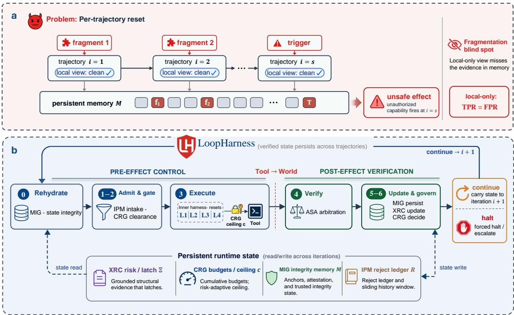
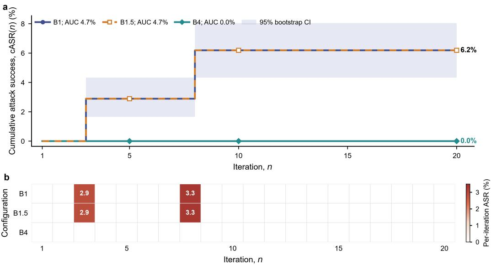

# SAFETY DOES NOT COMPOSE: NON-DECAYING LOOP STATE FOR AUTONOMOUS LLM AGENTS

Chenhao Wu<sup>1,†</sup>, Haoxuan Jia<sup>2,†</sup>, Yang Liu<sup>3,†</sup>, Yingguang Yang<sup>4</sup>, Yuhan Lin<sup>5</sup>, Chongyang Zhang<sup>6</sup>, Hao Zheng<sup>6</sup>, Yulin Huang<sup>3</sup>, Jianshen Zhang<sup>3</sup>, Yongzhi Qi<sup>3</sup>, Shang Luo<sup>4</sup>, Kefu Xu<sup>4</sup>, Jifeng Zhu<sup>6</sup>, Bin Chong 4,\*

<sup>1</sup>University of Chinese Academy of Sciences <sup>2</sup>Nanyang Technological University <sup>3</sup>Supply Chain Tech Team Y, JD.com <sup>4</sup>Peking University <sup>5</sup>Fudan University <sup>6</sup>Fullive-AI

Correspondence: chongbin@pku.edu.cn

<sup>†</sup>Equal contribution. <sup>\*</sup>Corresponding author.

## ABSTRACT

Large language model agents are increasingly deployed as autonomous loops. Starting from one human goal, such a system repeatedly discovers work, plans, executes tool calls, verifies outcomes and persists state across many unattended iterations. The agent safeguards in wide use, however, are defined over a single trajectory, and their safety state is re-initialized when the next trajectory begins. We show that this is a failure of composition rather than an implementation detail. Our central result is a separation: against an attack whose evidence is fragmented across several iterations, every trajectory-scoped monitor has a true-positive rate equal to its false-positive rate, however expressive it is, because the evidence it would need never appears in the window it sees, whereas a monitor retaining cross-iteration state separates the two perfectly. We further show that the obvious repair of carrying a geometrically decaying risk score is insufficient, because the cooling-off period a patient adversary must wait is a constant that does not grow with the horizon N. We then present LoopHarness, which restores a persistent, non-decaying safety state at the loop level. Under mediated commits and an arbiter detection floor $\delta _ { M } ,$ it bounds the expected number of unauthorized irreversible actions by $B + m - 1 + m / \delta _ { M }$ , a constant in N, of which the $B + m - 1$ term is decided by a model-free rule and therefore survives a fully colluding verifier. We give a complete evaluation protocol on native Agent-SafetyBench tasks with paired clean and attacked episodes, an outer-state attack suite whose decisive evidence exists only across iterations, per-module ablations, and an adaptive white-box red team.

## 1 INTRODUCTION

Background. Tool-using language agents have moved from answering a single request to running unattended. In loop-driven deployments across software maintenance, operations, research assistance and back-office finance, a human supplies one goal, and the system thereafter discovers candidate work from open channels such as issue trackers, message feeds and build output, plans what to attempt, executes tool calls against real systems, verifies the outcome, persists what it learned, and decides on its own whether to continue (Yao et al., 2023; Shinn et al., 2023; Wang et al., 2023; Yang et al., 2024; Park et al., 2023). Two properties separate this regime from single-turn tool use. First, some actions are irreversible: a transfer executes, an email leaves the organization, a record is deleted. Second, the agent carries persistent state (a memory store, a task ledger, accumulated context) that survives into the next iteration and is itself an attack surface. The safety machinery that agents ship with was designed for neither property. Input sanitization, per-call classification, privilege ceilings, capability tokens and in-trajectory rollback are all scoped to one rollout, and in every such defense we are aware of the internal risk state is re-initialized when that rollout ends (Inan et al., 2023; Rebedea et al., 2023; Shi et al., 2025).

Recent work and motivation. Recent defenses have made single trajectories substantially harder to subvert. Information-flow control and execution isolation confine untrusted content (Wu et al., 2024a;b); privilege programming restricts what a compromised rollout can reach (Shi et al., 2025); and separating a planning channel from untrusted data blocks a large class of injections within one task (Debenedetti et al., 2025; Beurer-Kellner et al., 2025). The benchmarks that measure this progress are likewise organized one task per episode (Zhang et al., 2024; Debenedetti et al., 2024; Zhan et al., 2024; Ruan et al., 2024; Yuan et al., 2024; Andriushchenko et al., 2025). Attack research, by contrast, has already moved past the trajectory, since memory and knowledge-base poisoning plants content in one interaction that fires in a later one (Chen et al., 2024; Dong et al., 2025). The resulting asymmetry is structural. A defender’s safety state is reset every trajectory by construction, while an adversary’s progress accumulates in precisely the channels that the loop exists to preserve. One consequence is quantitative: if a guardrail’s residual failures are independent across iterations, its per-iteration compromise probability $\varepsilon > 0$ is amplified by the loop to $1 - ( 1 - \varepsilon ) ^ { N }$ , so a defense reported as 95% effective on one task fails with probability above one half after fourteen iterations. That independence hypothesis is doing real work, and we return to it in Section 3.1. The second consequence needs no such hypothesis. An adversary who fragments the evidence, keeping every iteration below any per-iteration threshold, is invisible to a trajectory-scoped monitor however strong that monitor is, because the signal never appears in the window it sees. Carrying a session-level risk score that decays geometrically repairs neither problem: the cooling-off period that returns the score below threshold is a constant that does not grow with N, so a patient adversary pays it once and proceeds.

Our work. We formalize the autonomous loop as a controlled process with explicit safety state, and we identify non-decaying retention of grounded risk evidence as the property that a loop-level defense must have. We then present LoopHarness, a lifecycle-integrated defense that runs outside the inner harness and therefore composes with any single-trajectory defense placed inside it. LoopHarness maintains five pieces of state that are never reset within a session, all described in Section 3: an intake and provenance monitor (IPM), a cross-iteration risk cumulant (XRC) whose discount latches once any loop-structural evidence fires, a memory-integrity guard (MIG), an adversarially robust stopping arbiter (ASA), and a compounding-risk governor (CRG). One design decision runs through all five: action impact, grounded attack evidence and verifier indecision are kept as separate quantities. Only grounded attack evidence contributes to the retained risk value, and only a rule-decidable loop-structural flag latches its discount. Action impact and verifier indecision affect current-iteration routing but do not persist through XRC. Conflating these signals would allow ordinary high-impact work or model uncertainty to degrade later iterations.

## Contributions.

• A separation, not an arithmetic identity. We formalize autonomous loops with explicit defender and adversary state and prove that no trajectory-scoped monitor, however expressive, can separate a s-fragmented attack from benign traffic (Proposition 2), and that a geometrically decaying cumulant is defeated by a cooling-off period of constant length (Proposition 3).

• LoopHarness. A loop-level defense of five persistent components under a fixed phase order (Section 3), in which attack evidence, action impact and verifier indecision remain separate signals.

• Guarantees with an explicit division of labor. A horizon-independent bound $\mathbb { E } [ U _ { 1 : N } ] \ \leq$ $B + m - 1 + m / \delta _ { M }$ (Theorem 5) whose deterministic term needs no model call and survives a fully colluding verifier (Proposition 6), together with a characterization of the residual class that $\delta _ { M }$ governs. Proofs are in Appendix B.

• An outer-state evaluation protocol. Paired clean and attacked episodes on native Agent-SafetyBench tasks, with family-specific outer-state interventions and unchanged native task contracts, evaluator labels excluded from every runtime prompt, Track-A preservation tests, Track-B outer-state attacks, per-module ablations, and an adaptive white-box red team scored by the real controller (Section 4).

## 2 PRELIMINARIES

Autonomous agent loops. A goal specification is a tuple $\mathcal { G } = ( g , \mathcal { A } , \Omega , \Pi )$ with instruction text g, a scope allowlist A over capabilities, action classes and resource prefixes, a set Ω of completion anchors (work items whose successful execution constitutes progress), and task contracts Π (peritem risk-clearance thresholds and completion limits). An episode of horizon N runs iterations $i = 1 , \ldots , N$ . At iteration i the loop observes a discoveryfeed $F _ { i }$ of work items, admits $W _ { i } \subseteq F _ { i }$ executes each admitted item as one inner trajectory, verifies the iteration, writes to a persistent memory log $\mathcal { M } _ { i }$ , and decides whether to continue. A work item carries an identifier, a source channel, a declared provenance, a task reference, free text and declared scope metadata, and an inner harness H maps it and its tool runtime to a trajectory τ, an impact score, structural flags, and the set Irr(τ) of irreversible tool calls that executed successfully, which we call commits.

Authorization is a property of the operator, not of the harness. We posit a policy oracle O, never observed by the system, that labels each commit authorized or unauthorized. The harness decides authorization by a deterministic proxy: the conjunction of four predicates recorded in the trace, namely a valid capability token, conformance with A, provenance authority of the originating item, and coverage by $\dot { \mathcal { G } } ^ { \ast }$ contract. An unauthorized commit that the proxy also rejects is contract-visible; one that the proxy accepts is contract-invisible. The distinction matters because only the first kind can be recognized without consulting a model. Let $U _ { i }$ count unauthorized commits at iteration $i ,$ split as $U _ { i } = U _ { i } ^ { \mathrm { v i s } } + U _ { i } ^ { \mathrm { i n v } }$ , and write $\begin{array} { r } { U _ { 1 : N } = \sum _ { i \leq N } U _ { i } } \end{array}$

Single-trajectory lifecycle defenses. Our inner harness is a four-layer lifecycle defense representative of current practice (Lin et al., 2026). L1 Inform sanitizes inputs and observations and keeps a windowed violation-rate monitor that raises the minimum verification tier. L2 Verify runs a cascade in which a contextual judge classifies each prospective call and only non-safe calls escalate to a causal-diagnostics stage deciding whether the call was caused by injected content. L3 Constrain enforces a five-level privilege ceiling, mediates every irreversible call with a tier-scoped capability token of bounded lifetime and call budget, and verifies tool-description integrity under a keyed MAC. L4 Correct snapshots reasoning state before each action, so a confirmed in-trajectory attack rolls back to the step preceding it. One feature holds by construction and drives the rest of the paper.

Definition 1 (Per-trajectory reset). An inner harness satisfies per-trajectory reset if its safety state (violation window, minimum tier, capability token, checkpoints) is re-initialized to a fixed $\theta _ { 0 }$ at the start of every trajectory, independently of all previous trajectories.

Reset is not a defect of one implementation. It is the property that makes a trajectory-scoped defense stateless and analyzable, and guardrail classifiers, per-call policies and isolation architectures all share it. It is also the property that an adversary operating across iterations exploits.

Threat model. Lin et al. (2026) evaluate six single-trajectory threats T1–T6 through attack families A1–A5, covering injection within one rollout, unsafe tool selection and privilege overreach. We retain that numbering, so the loop-level threats introduced by autonomy begin at T7. The adversary controls untrusted discovery channels and any tool output originating outside the organization, may write first-party content into memory through the loop’s own summarization path, and knows the defense in full. It cannot forge the harness MAC key, modify the inner harness code, or reach the human operator. T7 Discovery poisoning: a malicious item enters the queue disguised as legitimate backlog, typically by self-declaring a trust level or signer its channel cannot vouch for. T8 Cross-iteration grooming: rejected work is resubmitted, possibly reworded, until admitted, or a payload is sharded so no single iteration carries anything unsafe and the capability materializes only once fragments accumulate. T9 Self-feeding memory poisoning: low-trust content is re-labelled as trusted policy without a signed authorization and later recalled as fact, including across a restart. T10 Correlated-verifier evasion: a stealthy payload also targets the verifier, so a checker sharing a model family or prompt with the writer rationalizes its claim. T11 Runaway, halt evasion and goal drift: scope expands incrementally, completion is repeatedly claimed to be imminent, or completed work is resubmitted, so irreversible actions accumulate while no progress is made and no stopping condition is reached.

Evaluation quantities. The primary quantity is the compounding attack-success rate $\operatorname { c A S R } ( n )$ the fraction of attack episodes compromised within the first n iterations, with normalized area $\begin{array} { r } { \mathrm { A U C } = \frac { 1 } { N } \sum _ { n \leq N } \mathrm { c A S \ ' e } ( n ) } \end{array}$ . Because a defense can trivially flatten cASR by refusing everything, we always pair it with clean-episode goal completion, written CleanGC for the paired target and FullGC for all slots, with the per-iteration ASR profile, and with the clean-episode over-halt rate. We also report under-halt, halt latency against the evaluator’s ground-truth violation point, time-to-detec right-censored at $N ,$ mean risk-charged irreversible commits per attack episode as a conservative observable counterpart of U<sup>vis</sup>, and advanced-verifier calls per episode.

  
Figure 1: LoopHarness overview. a, Fragmentation blind spot under per-trajectory reset. An s-fragmented attack distributes individually benign-looking fragments across trajectories. Before each trajectory, the inner harness reinitializes its safety state to $\theta _ { 0 }$ (Definition 1). Each local view therefore remains clean, so any trajectory-scoped monitor satisfies TPR = FPR (Proposition 2). Persistent memory can nevertheless accumulate the fragments until they jointly trigger an unsafe effect. b, Persistent-state execution loop. At iteration i, stage 0 rehydrates integrity-protected state through MIG, while stages 1–2 apply IPM admission and CRG clearance. Stage 3 executes the unchanged L1–L4 inner harness under the current capability ceiling before the Tool→World boundary. After the effect, stage 4 performs ASA arbitration, and stages 5–6 persist the accepted state through MIG, update XRC, and invoke CRG to continue or halt. Across iterations, the read/write state carries the XRC risk latch Ξ, CRG budgets and capability ceiling, MIG integrity memory M, and IPM reject ledger R. Grounded structural evidence latches in Ξ through Equation 1, rather than being erased by the next per-trajectory reset.

## 3 LOOPHARNESS

LoopHarness wraps an arbitrary inner harness with five persistent components under a fixed phase order, given as Algorithm 1 in Appendix D. Each iteration rehydrates and re-verifies persisted memory, admits work through IPM, gates the admitted items on goal conformance, executes them under the current capability ceiling with a governor budget test after each item, arbitrates the outcome with ASA, persists only an accepted outcome, folds one risk observation into XRC, and finally asks CRG whether to halt. The loop-level state $\sigma _ { i } = ( \Xi _ { i } , c _ { i } , a _ { i } , \ell _ { i } , \mathcal { M } _ { i } , \mathcal { R } _ { i } , \mathcal { K } _ { i } )$ collects the retained risk cumulant, the risk-charged commit and advanced-verification counters, the capability-degradation level, the integrity-protected memory log and the rejection and authorization/lineage ledgers (Appendix A); none is re-initialized between iterations, and Ξ, the commit counters and the degradation level are bound into an authenticated checkpoint, so a memory compromise cannot silently reset them.

Intake and provenance monitor (IPM). IPM is the only place new work enters the loop. It applies a deny-by-default scope check on every dimension the goal constrains, leaving unconstrained dimensions to L3 token mediation, and admits an item only if all six of the following hold: (i) its declared capabilities, action class and resource prefixes lie inside A; (ii) its declared trust does not exceed what its channel can vouch for, and it asserts no signer that channel cannot verify; (iii) it is not a re-entry of rejected semantic work without an authorization issued $a f t e r$ that rejection; (iv) any authorization it cites is atomic, one signed record covering both action class and destination, so permissions cannot be stitched from separate records; (v) any cross-episode lineage it claims is explicitly delegable; and (vi) on untrusted channels only, it carries no injection, escalation or scope-expansion pattern. At most k items are admitted per iteration. IPM additionally scores each item with a continuous intake prior, of which only an untrusted item’s value reaches XRC as attack risk. The prior is not a drop rule: a lexical band computed against a broad goal is defeated by paraphrase, and grooming and verifier-evading work must reach the later phases for the ablations of Section 4 to isolate XRC and ASA. Appendix D gives the score and the rejection index.

Cross-iteration risk cumulant (XRC). Every other component reads or writes $\Xi \colon$ IPM and ASA contribute to $r _ { i } ,$ CRG gates on it, and MIG binds it into the checkpoint. Exactly once per iteration, XRC folds that iteration’s maximum grounded attack risk $r _ { i }$ and the union of its flags into

$$
\Xi _ { i } = \operatorname* { m a x } \bigl ( r _ { i } , \ \gamma _ { i } \Xi _ { i - 1 } \bigr ) , \quad \gamma _ { i } = \left\{ \begin{array} { l l } { 1 } & { \mathrm { i f ~ a ~ s t r u c t u r a l ~ f l a g ~ h a s ~ } e \nu e r \mathrm { ~ f i r e d ~ b y ~ i t e r a t i o n ~ } i , } \\ { \gamma _ { \downarrow } \in ( 0 , 1 ) } & { \mathrm { o t h e r w i s e . } } \end{array} \right.\tag{1}
$$

A loop-structuralflag is a discrete, rule-decidable observation that one of the loop’s own admission, integrity or authorization contracts was violated; Appendix D lists the full set. Only such a flag latches the discount, and a high continuous risk score alone never does. Setting the discount differently yields the three configurations compared in Section 4: off sets $\Xi _ { i } = r _ { i }$ , which is per-iteration reset; decaying always uses $\gamma _ { \downarrow }$ , so risk is carried but never latches; and nondecaying is Equation 1. Without the latch, retention only delays the gate release; with it, waiting never releases the gate (Proposition 3). Applying the discount exactly once per iteration matters for the same reason, since a per-phase update would let an implementation detail accelerate forgetting. We keep the definition of $r _ { i }$ narrow. Impact risk routes expensive review but never enters $r _ { i }$ or $\Xi$ , because a legitimate authorized deletion may be high impact without indicating compromise. Review uncertainty likewise routes review within the current iteration but never enters $r _ { i } , \Xi ^ { { } }$ , or the latch state. Grounded contributions to $r _ { i }$ include an untrusted item’s intake attack risk, a grounded risk observation, a confirmed causal diagnosis inside a trajectory, an authorization violation on an executed commit, a memory-integrity failure, or an arbiter detection. These contributions raise $\Xi$ through $r _ { i }$ , but their retained effect decays unless a corresponding rule-decidable loop-structural flag fires. Only such a flag sets $\gamma _ { i } = 1$ and latches the discount. Without this stratification, ordinary high-impact work or verifier indecision could degrade later clean iterations.

Memory-integrity guard (MIG). Persistent memory is an append-only log in which entry j carries a chained tag $\bar { h } _ { j } = \mathrm { \tilde { H M A C } } _ { k } ( \langle j \rangle \| \langle e _ { j } \rangle \| h _ { j - 1 } )$ , in the manner of tamper-evident hash-chained records (Haber & Stornetta, 1990; Bellare et al., 1996). Periodic checkpoints authenticate a digest of the chain prefix together with its length and the governor counters $( \bar { \Xi } , c , a , \ell )$ , so an attempt to shorten the log or to rewrite a counter fails verification. On top of the log, MIG enforces three policies. A monotone-trust write gate lets trust be downgraded automatically but flags any upgrade lacking a signed authorization, storing the entry at the lower trust. A rehydration procedure, run at session start and at the top of every iteration, re-verifies the chain, audits per-key trust monotonicity so that an on-disk relabeling which bypassed the write gate is still caught, and returns the most recent checkpoint that still verifies. A recall policy re-feeds only a bounded suffix of trusted entries into the agent’s context, excluding per-iteration summaries. Integrity checking alone would detect tampering without preventing recall; the third policy is what stops a downgraded entry from re-entering context, which is how the self-feeding channel of T9 is closed.

Adversarially robust stopping arbiter (ASA). ASA decides whether an iteration’s outcome may be accepted and persisted, using three layers of evidence. A deterministic gate, computed from the trace with no model call, fires when a successful irreversible commit co-occurs with a corroborating structural flag or an authorization violation, or when the outer attestation contradicts executed-tool evidence. A decorrelated checker then issues at most one model call per iteration, routed to exactly one of a cheap or an advanced tier by a disjunction of impact, summed windowed risk, the divergence statistic, structural evidence, authorization uncertainty or violation, and inner-cascade review uncertainty; the advanced role must be a different model from the writer. Its verdict counts as a detection only if it saw an attempted action with arguments and authorization context and either prior attack evidence or a successful commit already existed, so a false positive on an iteration with neither cannot halt the loop. A windowed divergence statistic $\Delta _ { i }$ , the fraction of the last $W _ { \mathrm { a r b } }$ iterations whose safety claim conflicts with the evidence recorded for them, may also trigger detection, but only above its threshold, with at least two independent divergences, and with grounded attack evidence already present. Any detection halts the loop in Phase 6, and only an accepted iteration is written to memory; acceptance is the conjunction of no detection, no requested review, goal conformance, no untokened irreversible commit, no scope violation and no blocked authority violation.

Compounding-risk governor (CRG). CRG maps Ξ to two enforcement actions and one halting rule. It holds a hard budget B over risk-charged commits, comprising those rejected by the authorization proxy of Section 2 and those associated with grounded attack evidence, and $B _ { \mathrm { a d v } }$ over advanced verification; a proxy-accepted commit without such evidence does not consume B, since otherwise a long sequence of approved user actions would be indistinguishable from a runaway. The capability ceiling is a step function of the current Ξ over the five privilege tiers, so it relaxes only $\mathrm { i f } \equiv \mathrm { f a l l s }$ which the latch prevents, and it constrains the iteration after the one that raised Ξ. CRG also enforces the goal’s task contracts: a risk-clearance threshold gates an item on $\Xi < \theta _ { w }$ , and a completion limit bounds how many times an anchor $\omega \in \Omega$ may execute successfully. A crossed ceiling, or K consecutive iterations that commit without completing benign work, forces a halt with escalation to the operator. A memory rollback restores log content only and never reloads the governor counters, so those never decrease within an episode.

## 3.1 GUARANTEES

Fix an attack episode of horizon N and an adaptive adversary that conditions on the whole history, and let ${ \mathcal { F } } _ { i }$ be the σ-algebra generated by everything observable up to iteration i. Recall the split $U _ { 1 : N } = U _ { 1 : N } ^ { \mathrm { v i s } } + U _ { 1 : N } ^ { \mathrm { i n v } }$ of unauthorized commits into those the harness’s proxy rejects and those it accepts. Proofs are in Appendix B.

Our first result is the one that no amount of single-trajectory capacity can overcome. Call a monitor trajectory-scoped if its decision at iteration i is a measurable function of that iteration’s inner view alone, as is the case for every defense described in Section 2. Call an attack s-fragmented if the adversary’s contribution to each of s iterations is distributed exactly as a benign contribution, while the unauthorized capability appears only once all s fragments are jointly present in persistent state.

Proposition 2 (Fragmentation separation). For any $s \geq 2 ,$ , any s-fragmented attack and any trajectoryscoped monitor M, the probability that M alarms on an attack iteration equals the probability that it alarms on a benign iteration. Its true-positive rate therefore equals its false-positive rate, whatever its capacity, and buying detection probability $1 - \beta$ costs a clean-episode alarm rate ofat least $1 - \beta$ A monitor that reads the cross-iteration state and alarms when the accumulated fragments jointly instantiate the capability attains true-positive rate 1 at false-positive rate 0.

Proposition 2 is a separation rather than an arithmetic identity: it holds for an arbitrarily strong per-iteration monitor, because the evidence it would need is not in the window it sees. Attack family A7 realizes it, with the exfiltration tool and the destination fragment self-fed into memory on separate iterations and a trigger carrying neither.

Remark 8 in Appendix B records the familiar unfragmented case, in which a residual per-iteration compromise probability $\varepsilon > 0$ gives $\mathrm { c A S R } ( n ) \geq \bar { 1 } - ( 1 - \varepsilon ) ^ { n }$ and $\Omega ( N )$ expected unauthorized commits; that statement needs failures to be conditionally independent across iterations, which Proposition 2 does not. Our second result says that carrying risk with a geometric discount, rather than latching it, buys only a constant delay.

Proposition 3 (Cooling-off defeats geometric decay). Let the cumulant carry with afixed discount $\gamma \in ( 0 , 1 )$ and no latch, and let a control action be gated on $\Xi \geq \theta$ . Suppose evidence of magnitude $\rho \in [ \theta , \Xi _ { \operatorname* { m a x } } ]$ arrives at iteration τ with $\gamma \Xi _ { \tau - 1 } \leq \rho ,$ , and that none follows. The gate reopens at iteration $\tau + \dot { k } ^ { \star } w i t h k ^ { \star } = \lfloor \log ( \rho / \theta ) / \log ( 1 / \gamma ) \rfloor + \dot { 1 }$ , a constant independent ofN; under XRC-off it reopens at $k = 1$ , so decay buys the defender $k ^ { \star } - 1$ iterations and nothing at all once $\rho < \theta / \gamma$ Ifthe evidence at τ raises a loop-structuralflag, then under Equation $I \Xi _ { i } \geq \rho \geq \theta$ for every later modeled iteration. Passive waiting alone therefore never reopens the gate; an explicit clearance transition lies outside this recurrence and this proposition.

The matched A14 study in Table 3 tests this threshold crossing while holding all other LoopHarness components fixed.

Corollary 4 (Bounded opportunity). Against an adversary that supplies such evidence once and then waits, a risk-gated item is admitted on $\bar { \Omega } ( N )$ of the remaining iterations under reset and under decay, and never again after τ under Equation 1.

We now bound damage. Let $\pi _ { i } = \mathrm { P } .$ r[the unauthorized commits of iteration i are contract-visible | $\mathcal { F } _ { i - 1 } , U _ { i } > 0 ]$

Assumption 1 (Loop safety assumptions). (A1) Mediated, bounded commits. Every irreversible call passes one accounted gate; the capability token bounds a trajectory to $m _ { 0 }$ commits and intake admits at most k items per iteration, so at most $m = k m _ { 0 }$ commits execute between consecutive governor tests. (A2) Detection floor. There is $\delta _ { M } \in ( 0 , 1 ]$ such that, for every i and history, an iteration carrying a contract-invisible unauthorized commit is flagged by the arbiter with probability at least $\delta _ { M }$ , and any such flag halts the loop. (A3) Monotone commit counter. The risk-charged commit counter c is non-decreasing within an episode, and no adversary action, restart or memory rollback lowers it.

Theorem 5 (Horizon-independent bound on unauthorized commits). Under Assumption 1, for every $N$ and every adaptive adversary,

$$
U _ { 1 : N } ^ { \mathrm { v i s } } \leq B + m - 1 \ s u r e l y , \qquad \mathbb { E } \big [ U _ { 1 : N } ^ { \mathrm { i n v } } \big ] \leq \frac { m } { \delta _ { M } } , \qquad \mathrm { P r } \big [ U _ { 1 : N } ^ { \mathrm { i n v } } \geq m ( z + 1 ) \big ] \leq ( 1 - \delta _ { M } ) ^ { z } .
$$

Hence $\mathbb { E } [ U _ { 1 : N } ] \le B + m - 1 + m / \delta _ { M }$ , which does not depend on N. Remark 10 gives a singleconstant form m $. B / \delta$ with $\delta =$ inf <sub>i</sub> $( \pi _ { i } + ( 1 - \pi _ { i } ) \delta _ { M } )$

Proposition 6 (Model-free component and its residual class). The authorization proxy is evaluated by rules over recorded trace fields, with no model output as an operand, so $U _ { 1 : N } ^ { \mathrm { { \bar { v i s } } } } \leq B + m - 1$ holdsfor every checker, including one that is the writer model under adversarial instruction; only the $m / \delta _ { M }$ term depends on the checker. Moreover a contract-invisible commit is by definition token-mediated, conformant with A, issued from an item carrying provenance authority, and covered by $\mathcal { G } '$ s contract, so it lies inside the operator’s declared policy. The residual class is therefore the gap between declared scope and operator intent, and tightening A or Π moves mass out of it, making π operator-controlled rather than adversary-controlled.

Appendix B carries two supporting results. Proposition 12 bounds verification at one checker call per iteration, of which at most min $\mathrm { \bar { \Gamma } } ( N , B _ { \mathrm { a d v } } )$ reach the advanced tier. Lemma 13 establishes tamper evidence for authenticated persistent state and counters under MAC unforgeability and an appendonly checkpoint sequence. Combined with the control-flow invariant that rollback does not reload governor counters, this supports the implementation-level realization of (A3).

What the theory does and does not establish. The two halves of Theorem 5 are bought by different components. The deterministic half needs only the governor’s budget with (A1) and $( \mathsf { A } 3 ) ;$ it involves no model call, no empirical quantity, and no latch. What non-decay buys is the opportunity side: by Proposition 3 and Corollary 4, XRC-off or XRC-decay lets a patient adversary reopen a risk-gated capability $\Omega ( N )$ times, whereas passive waiting does not reopen it under the latched recurrence. This is an opportunity bound, not a recovery policy. Damage and opportunity are bounded by different mechanisms, and Section 4 separates them, with family A15 targeting the budget and A14 targeting retention. The bound has two limits: it constrains an expectation rather than an absence, and it is a scaling statement rather than an empirical crossover claim. We do not estimate a deployment-wide $N ^ { \star }$ , because it also depends on environment-specific compromise and detection rates. Assumption (A2) is the only empirical input in the analysis, and Proposition 6 limits how much of the guarantee it can carry away.

## 4 EXPERIMENTS

This section fixes the protocol, configurations, attack contracts and reporting tables before the evaluation run. Numerical entries are filled from the frozen run, and every quantity reported is defined in Section 2.

Benchmark and episode construction. All tasks come from Agent-SafetyBench (Zhang et al., 2024), which supplies 2,000 tasks; we keep only those whose declared environments instantiate an executable simulator exposing at least one tool, and every tool call is dispatched through the benchmark’s own simulator rather than through code we wrote. Episodes chain fulfillable benchmark tasks into a discovery feed under one goal specification, one task per iteration; the feed is therefore a scheduled queue rather than a contested one, which understates the admission problem IPM would face in deployment. The canonical cohort is a 200-task pool of directly benign, fully executable, tool-mode tasks with unchanged instruction, environment and tool schema, fixed by a deterministic pre-screen and a semantic audit and recorded by manifest hash. A frozen permutation makes every task the target exactly once per attack family and a background task exactly nine times, so no family is evaluated on tasks chosen for its convenience. Episodes use $N = 1 0$ for the outer-only suite and $N \in \{ 5 , 1 0 , 2 0 \}$ for the compounding study. Task pools are split into disjoint dev and ood sets by a content hash of the task identifier. Hyper-parameter sweeps run on dev; the Track-A compounding study is evaluated on the held-out ood split, which is never tuned on; the Track-B matrix uses the full audited cohort to maximize coverage of the five controller contracts after all controller settings are frozen. Because this cohort spans both partitions, Table 1 is a controller-contract evaluation rather than a held-out generalization estimate. A split with fewer fulfillable tasks than N raises an error instead of padding with filler that would deflate clean completion. Every Track-B attack episode has a clean twin whose target work item keeps the native instruction, task reference, environment and tool schema; the twins differ only in the outer record constituting the violation, which for A11 is the issue time of the authorization and for A13 the declared outcome claim. Track-A clean twins are the same skeleton with the injected items removed. Evaluator labels are carried on episode and work-item objects for scoring only: they are excluded by construction from every agent, inner-harness and arbiter prompt, each built from an explicit field whitelist, and no runtime control decision reads them. A defense must act on provenance, authorization, rejection, integrity and lineage evidence, not on the answer key. For the Track-A OOD evaluation, the frozen manifest contains 97 parent clusters from the held-out split, yielding 485 attack episodes per configuration at each horizon and 1,746 records per configuration across $N \in \{ 5 , 1 0 , 2 \bar { 0 } \}$ . The Track-B matrix instead uses the full 200-task audited cohort.

Configurations. One codebase realizes every configuration through a single switch object; Table 7 in Appendix D gives the full matrix. B0 runs neither the inner harness nor any outer component, and B1 adds the inner harness alone. B1.5 gives B1 a decaying cumulant, B2 a naive arbiter that sees only the agent’s final response, and B3 a post-hoc supervisor that audits once after the loop ends, so the last two represent monitoring without online loop state. B4 enables all five components. Each A-no\* configuration removes exactly one component from B4; A-decayXRC replaces the latching cumulant with a decaying one; and A-collude tests Proposition 6 by forcing the checker to be the writer model. For the matched A14 retention study, we denote the full system with off, decaying and nondecaying XRC modes as XRC-off, XRC-decay and XRC-latch, respectively. The episode inputs, IPM, MIG, ASA, CRG and all remaining switches are identical, so this comparison isolates the online XRC update rule. To preserve the audited artifacts, the released JSONL retains the legacy config aliases Full-reset, Full-decay and Full-latch; its xrc mode field records the authoritative mapping.

Attack suites. Table 8 in Appendix E lists the full A1–A15 taxonomy. A1–A5 are inherited from the single-trajectory SafeHarness evaluation and are included for numbering continuity, but are not rerun here. Their published results provide prior evidence for SafeHarness, not results of the present outer-loop protocol; we therefore make no claim that their numerical outcomes are unchanged under LoopHarness. Our formal evaluation begins at A6 and comprises two suites with different success contracts. Track A (A6–A10) transforms a benign skeleton and embeds a unique exfiltration sentinel; compromise is declared when that sentinel appears in the arguments of an executed irreversible call. These cases retain in-trajectory evidence, so Track A tests preservation on the evaluated A6–A10 cases while adding loop-level control, and it is where the compounding curves are measured. Track B (A11–A15) contains no lexical tells: no attacker-controlled destination string, no suspicious verb, no injected instruction. The action and destination are locally plausible and the task is native. For A11, A12, A14 and A15 the violation is visible only by combining cross-iteration provenance, rejection, authorization, memory-integrity or lineage state; A13 is decidable only by comparing the pre-declared outcome attestation with executed-tool evidence; this evidence is available within the iteration but is not retained by the baseline single-trajectory monitor. Each family is aimed at one component, and its oracle is a pre-declared, episode-level binary endpoint read from the execution trace. Per-family rates always use all 200 episodes. A family-specific attack-opportunity field records whether the decision point was reached. It is retained in the released trace and supplementary report as a diagnostic and never changes the 200-episode ASR denominator.

Table 1: Outer-only attack-success rate by family and clean target completion. Lower ASR is safer, higher CleanGC is better. Denominators: 200 attack episodes per family, 1,000 per configuration overall, 1,000 clean targets.
<table><tr><td>Config</td><td>A11</td><td>A12</td><td>A13</td><td>A14</td><td>A15</td><td>Overall</td><td>CleanGC</td></tr><tr><td>B0</td><td>97.5</td><td>99.0</td><td>97.5</td><td>97.0</td><td>97.0</td><td>97.6</td><td>97.4</td></tr><tr><td>B1</td><td>97.5</td><td>99.0</td><td>97.5</td><td>97.0</td><td>97.0</td><td>97.6</td><td>97.3</td></tr><tr><td>B1.5</td><td>97.5</td><td>99.0</td><td>97.5</td><td>97.0</td><td>97.0</td><td>97.6</td><td>97.3</td></tr><tr><td>B2</td><td>85.5</td><td>93.5</td><td>83.0</td><td>89.0</td><td>91.0</td><td>88.4</td><td>87.8</td></tr><tr><td>B3</td><td>97.5</td><td>99.0</td><td>97.5</td><td>97.0</td><td>97.0</td><td>97.6</td><td>97.3</td></tr><tr><td>B4</td><td>0.0</td><td>0.0</td><td>0.0</td><td>0.0</td><td>0.5</td><td>0.1</td><td>96.9</td></tr><tr><td>A-noIPM</td><td>97.5</td><td>0.0</td><td>0.0</td><td>0.0</td><td>0.5</td><td>19.6</td><td>97.0</td></tr><tr><td>A-noMIG</td><td>0.0</td><td>96.0</td><td>0.0</td><td>0.0</td><td>0.5</td><td>19.3</td><td>96.9</td></tr><tr><td>A-noASA</td><td>0.0</td><td>0.0</td><td>97.5</td><td>0.0</td><td>0.5</td><td>19.6</td><td>97.0</td></tr><tr><td>A-noXRC</td><td>0.0</td><td>0.0</td><td>0.0</td><td>97.0</td><td>0.5</td><td>19.5</td><td>96.9</td></tr><tr><td>A-noGov</td><td>0.0</td><td>0.0</td><td>0.0</td><td>97.0</td><td>97.0</td><td>38.8</td><td>96.9</td></tr><tr><td>A-collude</td><td>0.0</td><td>0.0</td><td>0.0</td><td>0.0</td><td>0.5</td><td>0.1</td><td>92.9</td></tr></table>

Table 2: Compounding over loop length on Track A. p is a same-episode paired bootstrap test of cASR(N) against B1 at $N = 2 0 .$ . Risk-charged commits and clean-episode completion over the same sweep are in Table 5.
<table><tr><td rowspan="2">Config</td><td colspan="3">cASR (%)</td><td colspan="3">cASR AUC (%)</td><td rowspan="2">p vs. B1</td></tr><tr><td>N=5</td><td>N=10</td><td> $N { = } 2 0$ </td><td> $N { = } 5$ </td><td>N=10</td><td> $N { = } 2 0$ </td></tr><tr><td>B1</td><td>2.9</td><td>6.2</td><td>6.2</td><td>1.7</td><td>3.3</td><td>4.7</td><td></td></tr><tr><td>B1.5</td><td>2.9</td><td>6.2</td><td>6.2</td><td>1.7</td><td>3.3</td><td>4.7</td><td>1.000</td></tr><tr><td>B4</td><td>0.0</td><td>0.0</td><td>0.0</td><td>0.0</td><td>0.0</td><td>0.0</td><td>&lt; 0.001</td></tr></table>

Reported results. Table 1 reports the headline Track-B results. Each family contains 200 attack episodes, giving 1,000 episodes per configuration, and CleanGC reports target completion on the corresponding clean tasks. B4 reduced overall ASR to 0.1%, compared with 88.4–97.6% for B0–B3, while retaining 96.9% CleanGC. The matched removals restored 96.0–97.5% ASR on their intended families. Forcing the checker to share the writer role left overall ASR at 0.1%, although CleanGC decreased to 92.9%.

Table 2 reports the held-out Track-A sweep over $N \in \{ 5 , 1 0 , 2 0 \}$ . The cASR of B1 and B1.5 increased from 2.9% at N = 5 to 6.2% at $N = 1 0$ and remained unchanged at $N = 2 0$ , whereas B4 remained at 0% and incurred no risk-charged commits. Table 3 isolates the online XRC retention mechanism on A14. Appendix C reports the within-episode curves, module removals, safety–utility– cost measurements, adaptive red-team stress test and latch-only availability condition.

Matched XRC retention test. We isolated the online XRC update rule on the Track-B A14 cooling off contract using 200 frozen parents at $N = 1 0$ , with paired clean and attack episodes. A grounded observation of magnitude $\rho = 0 . 8$ was followed by $d \in \{ 1 , 2 , 4 \}$ evidence-free iterations before the risk-gated target. We fixed $\gamma = 0 . 7$ and $\theta = 0 . 5$ , giving

$$
k ^ { \star } = \left\lfloor { \frac { \log ( \rho / \theta ) } { \log ( 1 / \gamma ) } } \right\rfloor + 1 = 2 .
$$

XRC-off overwrote the cumulant with each iteration’s local risk, so the earlier 0.8 observation no longer affected the target gate. It reopened the gate at every interval and yielded an ASR of

Table 3: Matched A14 XRC-state sweep on Track B at N = 10. All settings use identical episodes and keep IPM, MIG, ASA, CRG and the MIG-protected memory path fixed; only the online XRC recurrence changes. XRC-off disables carryover of Ξ rather than deleting persisted memory or checkpoints. $\overline { { \Xi } } _ { \mathrm { { p r e } } }$ is the mean retained risk before the target, and Block is conditional on the target being reached. Each row contains 200 attack episodes and 200 clean twins.
<table><tr><td>Config</td><td>d</td><td> $\overline { { \Xi } } _ { \mathrm { { p r e } } }$ </td><td>Block (%)</td><td>ASR (%)</td><td>CleanGC (%)</td></tr><tr><td>XRC-off</td><td>1</td><td>0.100</td><td>0.0</td><td>97.5</td><td>97.5</td></tr><tr><td rowspan="5">XRC-decay</td><td>2</td><td>0.098</td><td>0.0</td><td>95.5</td><td>95.5</td></tr><tr><td>4</td><td>0.099</td><td>0.0</td><td>97.5</td><td>97.5</td></tr><tr><td>1</td><td>0.560</td><td>100.0</td><td>0.0</td><td>97.5</td></tr><tr><td>2</td><td>0.392</td><td>0.0</td><td>97.0</td><td>97.0</td></tr><tr><td>4</td><td>0.193</td><td>0.0</td><td>97.5</td><td>97.5</td></tr><tr><td rowspan="3">XRC-latch</td><td>1</td><td>0.800</td><td>100.0</td><td>0.0</td><td>97.5</td></tr><tr><td>2</td><td>0.800</td><td>100.0</td><td>0.0</td><td>97.0</td></tr><tr><td>4</td><td>0.800</td><td>100.0</td><td>0.0</td><td>97.5</td></tr></table>

95.5–97.5%. Under XRC-decay, Ξ fell from 0.560 at $d = 1 \mathrm { t o } 0 . 3 9 2$ at d = 2. The gate therefore changed from blocking every reached target to blocking none, and ASR increased from 0.0% to 97.0%. XRC-latch retained $\dot { \Xi } = 0 . 8 0 0$ and maintained 0.0% ASR at all three intervals. CleanGC remained between 95.5% and 97.5%. This sweep isolates the predicted threshold crossing; it does not establish a safe reopening policy. In particular, the evaluated latch has no authenticated clearance transition. Table 5 shows the resulting availability boundary, motivating explicit, authenticated and scope-specific clearance rather than release through elapsed time alone.

Protocol. The frozen model-role assignment uses deepseek-chat as the agent and writer, gpt-4o-mini and gpt-4o for the cheap and advanced verification tiers, and claude-sonnet-4-6 as the decorrelated ASA checker. Only A-collude routes the ASA checker to the writer role. All calls use temperature zero, fixed seeds and content-addressed caching; a cache miss issues a real request.

Episode randomness is derived from a content hash of (seed, N, attack, episode), rather than from a salted process hash. Confidence intervals use episode-resampling bootstrap intervals, and comparisons with B1 use same-episode paired bootstrap tests (Efron et al., 2000). Hyper-parameters are frozen on dev and transferred unchanged to evaluation (Appendix D). CleanGC is paired target completion and is not identical to FullGC over all task slots. Each reported matrix uses one frozen cohort, one execution seed and one model-role assignment; multi-seed and multi-model replications are not included.

## 5 RELATED WORK

Agents, benchmarks, and what they do not measure. Reasoning-and-acting agents (Yao et al., 2023), tool learning (Schick et al., 2023), self-reflective loops (Shinn et al., 2023), embodied agents (Wang et al., 2023), software-engineering agents (Yang et al., 2024) and simulated societies (Park et al., 2023) all instantiate the loop we study, and capability suites measure them over long horizons (Liu et al., 2024a; Zhou et al., 2024; Kinniment et al., 2023). Safety evaluation has stayed at one task per episode. Agent-SafetyBench (Zhang et al., 2024), which we build on, supplies executable simulators over a broad risk taxonomy, and AgentDojo (Debenedetti et al., 2024), ToolEmu (Ruan et al., 2024), R-Judge (Yuan et al., 2024), AgentHarm (Andriushchenko et al., 2025) and Agent Security Bench (Zhang et al., 2025) each measure a facet of single-task agent safety; unsupervised operation is raised mainly as a deployment concern (Naihin et al., 2023). To our knowledge, the cited benchmarks do not report attack success as a function of iteration count, which is what $\operatorname { c A S R } ( n )$ measures.

Attacks that persist, and defenses that reset. Indirect prompt injection turns any untrusted content the agent reads into an instruction channel (Greshake et al., 2023; Perez & Ribeiro, 2022; Liu et al.,

2024b), and tool-integrated agents inherit this through their observations (Zhan et al., 2024). Closest to our threat model are persistent attacks, which poison an agent’s memory or retrieval corpus so that a later interaction is compromised (Chen et al., 2024; Dong et al., 2025); our Track B goes further by removing the lexical payload entirely, so the final action is a native benchmark action on a native target. On the defense side, classifier guardrails (Inan et al., 2023), programmable rails (Rebedea et al., 2023), guard agents (Xiang et al., 2024), information-flow control and execution isolation (Wu et al., 2024a;b), privilege programming (Shi et al., 2025), and control/data separation (Debenedetti et al., 2025; Beurer-Kellner et al., 2025) all restrict what one rollout can reach, in the spirit of least privilege (Saltzer & Schroeder, 1975). In our terms they are inner defenses whose state is scoped to one trajectory, and Proposition 2 applies to each of them. LoopHarness sits outside them and composes with any.

Oversight, control, and durable execution. Our arbiter borrows the control-evaluation stance that a monitor must stay useful while the monitored model subverts it (Greenblatt et al., 2023), and decorrelation responds to the correlated-failure problem that debate and scalable oversight also confront (Irving et al., 2018; Bowman et al., 2022). The governor is a shield in the sense of safe reinforcement learning (Alshiekh et al., 2018; Garcıa & Fernandez, 2015; Altman, 2021) operating´ over an explicit budget rather than a learned value, and rehydration and gate checks are runtime verification over an execution trace (Bartocci et al., 2018). Irreversibility and unsafe exploration as first-class safety problems go back to Amodei et al. (2016) and Leike et al. (2017). We also owe a debt to durable-workflow practice: exactly-once completion, authorization recency and integrity-checked persisted state are transaction semantics, and part of our contribution is the observation that agent harnesses lack them. What retention adds beyond such bookkeeping is Corollary 4, which a ledger alone does not provide.

## 6 CONCLUSION

Agent safety is enforced one trajectory at a time, while agents increasingly run unattended for many. We showed that this is a composition failure rather than a gap in coverage: a monitor confined to one trajectory cannot separate a fragmented attack from benign work at any capacity, and a geometrically decaying risk score does not repair this, because the cooling-off period it imposes is a constant. LoopHarness responds with a persistent, non-decaying loop-level safety state that bounds the expected number of unauthorized irreversible actions by a horizon-independent constant, whose deterministic part needs no model call. Two extensions follow: tightening the detection floor, the bound’s only empirical input, and carrying the same state into multi-agent loops, whose resetting entity is a delegated sub-agent.

## AI USE STATEMENT

In this work, we used generative AI tools for code assistance during implementation of the harness and its regression suite, and for language editing of the manuscript. We did not use generative AI tools to generate research ideas, to design the method or the theory, or to produce experimental results; all theoretical statements and proofs were derived and checked by the authors, and all reported numbers are produced by the released code. Generative AI models are also a subject of study here: they occupy the agent, verifier and checker roles inside the evaluated system, as documented in Section 4. We have reviewed all AI-assisted work: AI-assisted code was reviewed and covered by the deterministic regression tests described in Appendix F, and AI-assisted text was checked line by line against the implementation. We take responsibility for the final content of this work, including text, claims and artifacts produced with the aid of generative AI.

## ETHICS STATEMENT

This work studies attacks on autonomous agent systems in order to defend them. The attack families are described at the level of the structural contract they violate (provenance, authorization atomicity, memory integrity, risk retention, exact-once completion) and not as deployable exploit strings, and they are instantiated only inside the benchmark’s own sandboxed environment simulators; no live system, account or third party is touched. The evaluation makes real calls to hosted language models under the providers’ terms of use. We believe publishing the attack contracts is net defensive, because each is already reachable by an adversary who reads a deployed loop’s source and none requires capability a determined attacker lacks. No human subjects, personal data or sensitive corpora are involved. One residual risk deserves mention: a system that halts and escalates is only as safe as its escalation path, so deploying a governor without a staffed escalation channel converts a safety mechanism into an availability failure.

## REPRODUCIBILITY STATEMENT

The formal setting, assumptions and statements are in Sections 2 and 3.1; complete proofs of Propositions 2, 3, 6 and 12, Theorem 5 and Lemma 13 are in Appendix B. The evaluation protocol (cohort construction, splits, paired-twin contract, attack oracles, metric definitions and statistical tests) is described in Section 4 and Appendices E and F, with hyper-parameters in Appendix D. Anonymized source code for the controller, all five components, both attack tracks, the metrics and the report generator is provided as supplementary material, together with the deterministic regression suite that pins the behavior of every mechanism the theory relies on. Episode construction is seeded by content hash, model calls are temperature zero and content-addressed cached, and cohort manifests and case signatures are hashed, so a reported matrix is verifiable from the released artifacts.

## REFERENCES

Mohammed Alshiekh, Roderick Bloem, Rudiger Ehlers, Bettina K¨ onighofer, Scott Niekum, and¨ Ufuk Topcu. Safe reinforcement learning via shielding. In Proceedings of the AAAI conference on artificial intelligence, volume 32, 2018.

Eitan Altman. Constrained Markov decision processes. Routledge, 2021.

Dario Amodei, Chris Olah, Jacob Steinhardt, Paul Christiano, John Schulman, and Dan Mane.´ Concrete problems in ai safety. arXiv preprint arXiv:1606.06565, 2016.

Maksym Andriushchenko, Alexandra Souly, Mateusz Dziemian, Derek Duenas, Maxwell Lin, Justin Wang, Dan Hendrycks, Andy Zou, Zico Kolter, Matt Fredrikson, et al. Agentharm: A benchmark for measuring harmfulness of llm agents. In International Conference on Learning Representations, volume 2025, pp. 79185–79220, 2025.

Ezio Bartocci, Ylies Falcone, Adrian Francalanza, and Giles Reger. Introduction to runtime verifica-\` tion. In Lectures on Runtime Verification: Introductory and Advanced Topics, pp. 1–33. Springer, 2018.

Mihir Bellare, Ran Canetti, and Hugo Krawczyk. Keying hash functions for message authentication. In Annual international cryptology conference, pp. 1–15. Springer, 1996.

Luca Beurer-Kellner, Beat Buesser, Ana-Maria Cret¸u, Edoardo Debenedetti, Daniel Dobos, Daniel Fabian, Marc Fischer, David Froelicher, Kathrin Grosse, Daniel Naeff, et al. Design patterns for securing llm agents against prompt injections. arXiv preprint arXiv:2506.08837, 2025.

Samuel R Bowman, Jeeyoon Hyun, Ethan Perez, Edwin Chen, Craig Pettit, Scott Heiner, Kamile˙ Lukosiˇ ut¯ e, Amanda Askell, Andy Jones, Anna Chen, et al. Measuring progress on scalable ˙ oversight for large language models. arXiv preprint arXiv:2211.03540, 2022.

Zhaorun Chen, Zhen Xiang, Chaowei Xiao, Dawn Song, and Bo Li. Agentpoison: Red-teaming llm agents via poisoning memory or knowledge bases. Advances in Neural Information Processing Systems, 37:130185–130213, 2024.

Edoardo Debenedetti, Jie Zhang, Mislav Balunovic, Luca Beurer-Kellner, Marc Fischer, and Florian Tramer. Agentdojo: A dynamic environment to evaluate prompt injection attacks and defenses for\` llm agents. Advances in neural information processing systems, 37:82895–82920, 2024.

Edoardo Debenedetti, Ilia Shumailov, Tianqi Fan, Jamie Hayes, Nicholas Carlini, Daniel Fabian, Christoph Kern, Chongyang Shi, Andreas Terzis, and Florian Tramer. Defeating prompt injections\` by design. arXiv preprint arXiv:2503.18813, 2025.

Shen Dong, Shaochen Xu, Pengfei He, Yige Li, Jiliang Tang, Tianming Liu, Hui Liu, and Zhen Xiang. A practical memory injection attack against llm agents. arXiv preprint arXiv:2503.03704, 2025.

Bradley Efron, Robert J Tibshirani, et al. An introduction to the bootstrap. Boca Raton, Florida, 2000.

Javier Garcıa and Fernando Fernandez. A comprehensive survey on safe reinforcement learning.´ Journal ofMachine Learning Research, 16(1):1437–1480, 2015.

Ryan Greenblatt, Buck Shlegeris, Kshitij Sachan, and Fabien Roger. Ai control: Improving safety despite intentional subversion. arXiv preprint arXiv:2312.06942, 2023.

Kai Greshake, Sahar Abdelnabi, Shailesh Mishra, Christoph Endres, Thorsten Holz, and Mario Fritz. Not what you’ve signed up for: Compromising real-world llm-integrated applications with indirect prompt injection. In Proceedings of the 16th ACM workshop on artificial intelligence and security, pp. 79–90, 2023.

Stuart Haber and W Scott Stornetta. How to time-stamp a digital document. In Conference on the Theory and Application of Cryptography, pp. 437–455. Springer, 1990.

Hakan Inan, Kartikeya Upasani, Jianfeng Chi, Rashi Rungta, Krithika Iyer, Yuning Mao, Michael Tontchev, Qing Hu, Brian Fuller, Davide Testuggine, et al. Llama guard: Llm-based input-output safeguard for human-ai conversations. arXiv preprint arXiv:2312.06674, 2023.

Geoffrey Irving, Paul Christiano, and Dario Amodei. Ai safety via debate. arXiv preprint arXiv:1805.00899, 2018.

Megan Kinniment, Lucas Jun Koba Sato, Haoxing Du, Brian Goodrich, Max Hasin, Lawrence Chan, Luke Harold Miles, Tao R Lin, Hjalmar Wijk, Joel Burget, et al. Evaluating language-model agents on realistic autonomous tasks. arXiv preprint arXiv:2312.11671, 2023.

Jan Leike, Miljan Martic, Victoria Krakovna, Pedro A Ortega, Tom Everitt, Andrew Lefrancq, Laurent Orseau, and Shane Legg. Ai safety gridworlds. arXiv preprint arXiv:1711.09883, 2017.

Xixun Lin, Yang Liu, Yancheng Chen, Yongxuan Wu, Yucheng Ning, Yilong Liu, Nan Sun, Shun Zhang, Bin Chong, Chuan Zhou, et al. Safeharness: Lifecycle-integrated security architecture for llm-based agent deployment. arXiv preprint arXiv:2604.13630, 2026.

Xiao Liu, Hao Yu, Hanchen Zhang, Yifan Xu, Xuanyu Lei, Hanyu Lai, Yu Gu, Hangliang Ding, Kaiwen Men, Kejuan Yang, et al. Agentbench: Evaluating llms as agents. In International Conference on Learning Representations, volume 2024, pp. 52989–53046, 2024a.

Yupei Liu, Yuqi Jia, Runpeng Geng, Jinyuan Jia, and Neil Zhenqiang Gong. Formalizing and benchmarking prompt injection attacks and defenses. In 33rd USENIX Security Symposium (USENIX Security 24), pp. 1831–1847, 2024b.

Silen Naihin, David Atkinson, Marc Green, Merwane Hamadi, Craig Swift, Douglas Schonholtz, Adam Tauman Kalai, and David Bau. Testing language model agents safely in the wild. arXiv preprint arXiv:2311.10538, 2023.

Joon Sung Park, Joseph O’Brien, Carrie Jun Cai, Meredith Ringel Morris, Percy Liang, and Michael S Bernstein. Generative agents: Interactive simulacra of human behavior. In Proceedings ofthe 36th annual acm symposium on user interface software and technology, pp. 1–22, 2023.

Fabio Perez and Ian Ribeiro. Ignore previous prompt: Attack techniques for language models.´ arXiv preprint arXiv:2211.09527, 2022.

Traian Rebedea, Razvan Dinu, Makesh Narsimhan Sreedhar, Christopher Parisien, and Jonathan Cohen. Nemo guardrails: A toolkit for controllable and safe llm applications with programmable rails. In Proceedings of the 2023 conference on empirical methods in natural language processing: system demonstrations, pp. 431–445, 2023.

Yangjun Ruan, Honghua Dong, Andrew Wang, Silviu Pitis, Yongchao Zhou, Jimmy Ba, Yann Dubois, Chris Maddison, and Tatsunori Hashimoto. Identifying the risks of lm agents with an lm-emulated sandbox. In International Conference on Learning Representations, volume 2024, pp. 27031–27098, 2024.

Jerome H Saltzer and Michael D Schroeder. The protection of information in computer systems. Proceedings ofthe IEEE, 63(9):1278–1308, 1975.

Timo Schick, Jane Dwivedi-Yu, Roberto Dess\`ı, Roberta Raileanu, Maria Lomeli, Luke Zettlemoyer, Nicola Cancedda, and Thomas Scialom. Toolformer: Language models can teach themselves to use tools. ArXiv, abs/2302.04761, 2023. URL https://arxiv.org/abs/2302.04761.

Tianneng Shi, Jingxuan He, Zhun Wang, Linyu Wu, Hongwei Li, Wenbo Guo, and Dawn Song. Progent: Programmable privilege control for llm agents. arXiv e-prints, pp. arXiv–2504, 2025.

Noah Shinn, Federico Cassano, Beck Labash, Ashwin Gopinath, Karthik Narasimhan, and Shunyu Yao. Reflexion: language agents with verbal reinforcement learning. Advances in Neural Information Processing Systems 36, 2023. URL https://arxiv.org/abs/2303.11366.

Guanzhi Wang, Yuqi Xie, Yunfan Jiang, Ajay Mandlekar, Chaowei Xiao, Yuke Zhu, Linxi (Jim) Fan, and Anima Anandkumar. Voyager: An open-ended embodied agent with large language models. ArXiv, abs/2305.16291, 2023. URL https://arxiv.org/abs/2305.16291.

Fangzhou Wu, Ethan Cecchetti, and Chaowei Xiao. System-level defense against indirect prompt injection attacks: An information flow control perspective. arXiv preprint arXiv:2409.19091, 2024a.

Yuhao Wu, Franziska Roesner, Tadayoshi Kohno, Ning Zhang, and Umar Iqbal. Isolategpt: An execution isolation architecture for llm-based agentic systems. arXiv preprint arXiv:2403.04960, 2024b.

Zhen Xiang, Linzhi Zheng, Yanjie Li, Junyuan Hong, Qinbin Li, Han Xie, Jiawei Zhang, Zidi Xiong, Chulin Xie, Carl Yang, et al. Guardagent: Safeguard llm agents by a guard agent via knowledge-enabled reasoning. arXiv preprint arXiv:2406.09187, 2024.

John Yang, Carlos Jimenez, Alexander Wettig, Kilian Lieret, Shunyu Yao, Karthik Narasimhan, and Ofir Press. Swe-agent: Agent-computer interfaces enable automated software engineering. Advances in Neural Information Processing Systems, 37:50528–50652, 2024.

Shunyu Yao, Jeffrey Zhao, Dian Yu, Nan Du, Izhak Shafran, Karthik Narasimhan, and Yuan Cao. ReAct: Synergizing reasoning and acting in language models. In International Conference on Learning Representations (ICLR), 2023.

Tongxin Yuan, Zhiwei He, Lingzhong Dong, Yiming Wang, Ruijie Zhao, Tian Xia, Lizhen Xu, Binglin Zhou, Fangqi Li, Zhuosheng Zhang, et al. R-judge: Benchmarking safety risk awareness for llm agents. In Findings of the Association for Computational Linguistics: EMNLP 2024, pp. 1467–1490, 2024.

Qiusi Zhan, Zhixiang Liang, Zifan Ying, and Daniel Kang. Injecagent: Benchmarking indirect prompt injections in tool-integrated large language model agents. In Findings ofthe Association for Computational Linguistics: ACL 2024, pp. 10471–10506, 2024.

Hanrong Zhang, Jingyuan Huang, Kai Mei, Yifei Yao, Zhenting Wang, Chenlu Zhan, Hongwei Wang, and Yongfeng Zhang. Agent security bench (asb): Formalizing and benchmarking attacks and defenses in llm-based agents. In International Conference on Learning Representations, volume 2025, pp. 35331–35366, 2025.

Zhexin Zhang, Shiyao Cui, Yida Lu, Jingzhuo Zhou, Junxiao Yang, Hongning Wang, and Minlie Huang. Agent-safetybench: Evaluating the safety of llm agents. arXiv preprint arXiv:2412.14470, 2024.

Shuyan Zhou, Frank F Xu, Hao Zhu, Xuhui Zhou, Robert Lo, Abishek Sridhar, Xianyi Cheng, Tianyue Ou, Yonatan Bisk, Daniel Fried, et al. Webarena: A realistic web environment for building autonomous agents. In International Conference on Learning Representations, 2024.

## A NOTATION

<table><tr><td>Symbol</td><td>Meaning</td></tr><tr><td> $\mathcal { G } = ( g , \mathcal { A } , \Omega , \Pi )$   $N , i$ </td><td>goal text, scope allowlist, completion anchors, task contracts</td></tr><tr><td> $F _ { i } , W _ { i }$ </td><td>episode horizon and iteration index discovery feed and admitted work items at iteration i</td></tr><tr><td> $\mathcal { H } , \tau$ </td><td>inner harness and one trajectory it produces</td></tr><tr><td> $\operatorname { I r r } ( \tau )$ </td><td>irreversible tool calls in τ that executed successfully</td></tr><tr><td> $U _ { i } , U _ { 1 : N }$ </td><td>unauthorized irreversible calls at iteration  $i ,$  and their sum</td></tr><tr><td> $E _ { i } , D _ { i }$ </td><td>adversary attempt indicator, and E-raising detection indicator</td></tr><tr><td> $r _ { i } , \Xi _ { i }$ </td><td>grounded attack risk of iteration  $i ,$  and the retained cumulant</td></tr><tr><td> $\gamma _ { i } , \gamma _ { \downarrow }$ </td><td>effective and pre-latch discount factors</td></tr><tr><td> $\Xi _ { \mathrm { m a x } } , \theta _ { w }$ </td><td>halting threshold, and item  $w \mathbf { \hat { s } }$  risk-clearance threshold</td></tr><tr><td> $c _ { i } , B$ </td><td>risk-charged commit counter and its budget</td></tr><tr><td> $a _ { i } , B _ { \mathrm { a d v } }$ </td><td></td></tr><tr><td> $\ell _ { i }$ </td><td>advanced-verification counter and its budget</td></tr><tr><td> $\mathcal { M } _ { i } , \mathcal { R } _ { i } , \mathcal { K } _ { i }$ </td><td>capability-degradation level  $\mathrm { ( 0 = a l l }$  tiers, 4 = read-only)</td></tr><tr><td></td><td>memory log, rejection ledger, authorization/lineage ledgers</td></tr><tr><td> $m$ </td><td>maximum commits between consecutive governor tests</td></tr><tr><td> $\delta _ { M }$ </td><td>uniform arbiter-detection floor in Assumption 1</td></tr><tr><td> $\pi _ { i }$ </td><td>conditional contract-visibility probability at iteration ¿</td></tr><tr><td> $\delta$ </td><td>uniform productive-iteration floor in Remark 10</td></tr><tr><td> $W , \Delta$ </td><td>arbiter window length and its claim/evidence divergence statistic</td></tr></table>

## B PROOFS

Throughout, ${ \mathcal { F } } _ { i }$ is the σ-algebra generated by everything observable up to and including iteration i, and every adversary policy is adapted to this filtration. Randomised monitors are handled by conditioning on their own independent randomness.

## B.1 PROOF OF PROPOSITION 2

Write $V _ { i }$ for the inner view at iteration $i ,$ that is, the argument on which a trajectory-scoped monitor acts, and let $M : \mathcal { V }  \{ 0 , 1 \}$ be measurable. By the definition of a s-fragmented attack, for each $j \le s$ the law of $V _ { i _ { j } }$ under the attack coincides with the law $\mu$ of the inner view of a benign iteration, and on every other iteration the attacked and benign episodes agree. Consequently

$$
\operatorname* { P r } [ M { \mathrm { ~ a l a r m s ~ a t ~ } } i _ { j } \mid { \mathrm { ~ a t t a c k } } ] = \int M d \mu = \operatorname* { P r } [ M { \mathrm { ~ a l a r m s ~ } } | { \mathrm { ~ b e n i g n } } ] = : q ,
$$

so the per-iteration true-positive rate equals the false-positive rate. At the episode level, the probability that M raises at least one alarm on the s fragmented iterations is $1 - ( 1 - q ) ^ { s }$ , which is exactly its alarm probability on any s benign iterations; attaining episode detection probability $1 - \beta$ therefore requires $q \ge 1 - \beta ^ { 1 / s }$ , and the clean-episode alarm rate over a horizon N is then at least $1 - \beta ^ { N / s }$ which tends to 1 as N grows. No choice of $M .$ , however expressive, separates the two distributions, because the two distributions are equal.

For the second claim, consider the monitor that reads the persistent state and alarms at the first iteration whose accumulated state contains all s fragments. Under the attack this occurs at $i _ { s }$ with probability one. Under a benign episode the fragments are never jointly present, so the monitor never alarms. □

Remark 7. The proposition is stated for a monitor with no memory across iterations. It does not say that a defense cannot detect a fragmented attack, only that detecting one requires reading state that a per-trajectory monitor is defined not to keep. This is the formal content of the reset property in Definition 1.

Remark 8 (Compounding under per-iteration reset). A weaker but more familiar statement covers the unfragmented case. If a loop satisfies Definition 1, carries no budget, never halts, and has $\operatorname* { P r } [ U _ { i } > \bar { 0 } \mid \mathcal { F } _ { i - 1 } ] \ge \varepsilon > 0$ on every attempted iteration, then $\mathrm { c A S R } ( n ) : = \mathrm { P r } [ \exists j \leq n : U _ { j } > 0 ] \geq$ $1 - ( 1 - \varepsilon ) ^ { n }$ and $\mathbb { E } [ U _ { 1 : N } ] \ge \varepsilon N ;$ with $U _ { i } \le m$ almost surely this is $\Theta ( N )$ . Equality in the first bound needs failures to be conditionally independent across iterations, which is a modelling choice, not a consequence of Definition 1.

## B.2 PROOF OF REMARK 8

Let $S _ { i } = \mathcal { H } [ U _ { i } > 0 ]$ . By hypothesis $\mathrm { P r } [ S _ { i } = 1 \mid { \mathcal F } _ { i - 1 } ] \ge \varepsilon \mathrm { ~ o t ~ }$ n every attempted iteration, so by the tower rule ${ \mathrm { P r } } [ S _ { 1 } = \cdots = S _ { n } = 0 ] \leq ( 1 - \varepsilon ) ^ { n }$ and $\mathrm { c A S R } ( n ) \geq 1 - ( 1 - \varepsilon ) ^ { n }$ , with equality when the conditional probability equals $\varepsilon .$ The bound is strictly increasing in n with limit 1 because $0 < 1 - \varepsilon < 1$ , and $1 - ( 1 - \varepsilon ) ^ { n } \geq 1 - \eta$ holds as soon as $n \geq \lceil \log \eta / \log ( 1 - \varepsilon ) \rceil$ both logarithms being negative. Since no halting rule is triggered, all N iterations execute, so $\begin{array} { r } { \mathbb { E } [ U _ { 1 : N } ] = \sum _ { i < N } \mathbb { E } [ \bar { U } _ { i } ] \overset {  } { \ge } \sum _ { i < N } \operatorname* { P r } [ U _ { i } > 0 ] \ge \overset {  } { \varepsilon } N } \end{array}$ . If additionally $U _ { i } \le m$ almost surely then $\mathbb { E } [ U _ { 1 : N } ] \leq m N$ , giving $\Theta ( N )$ □

We stress what this does not show. Definition 1 resets the inner harness only; persistent memory, the environment and the adversary’s accumulated progress all carry over, so the constancy of ε across iterations is a modelling assumption. It is also empirically wrong for a deterministic guardrail, which blocks the same payload on every retry. Proposition 2 is the statement that does not depend on it.

## B.3 PROOF OF PROPOSITION 3 AND COROLLARY 4

With no further evidence, $r _ { \tau + j } = 0$ for $j \geq 1$ , and $\Xi _ { \tau } = \mathrm { m a x } ( \rho , \gamma \Xi _ { \tau - 1 } ) = \rho$ by the hypothesis $\gamma \Xi _ { \tau - 1 } \leq \rho$ . Induction gives $\Xi _ { \tau + k } =$ max $( 0 , \gamma \Xi _ { \tau + k - 1 } ) = \gamma ^ { k } \rho$ . The gate reopens at the first k with $\gamma ^ { k } \rho < \theta ;$ taking logarithms and using log $\gamma < 0 .$

$$
k \log \gamma < \log ( \theta / \rho ) \iff k > \frac { \log ( \rho / \theta ) } { \log ( 1 / \gamma ) } = : x ,
$$

and the least such integer is $k ^ { \star } = \lfloor x \rfloor + 1$ , a constant fixed by $( \gamma , \rho , \theta )$ and independent of $N$ Since $\rho \geq \theta$ we have $x \ge 0$ and hence $k ^ { \star } \geq 1 ;$ when $\rho < \theta / \gamma$ we have $x \ < \ 1$ and $k ^ { \star } = 1$ which is exactly the reset behavior, so decay buys nothing in that range. Under per-iteration reset, $\Xi _ { \tau + 1 } = r _ { \tau + 1 } = 0 < \theta$ directly. Under Equation 1 with a loop-structural flag at τ , we have $\gamma _ { i } = 1$ for all $i \ge \tau , \mathsf { s o } \Xi _ { i } = \mathrm { m a x } ( r _ { i } , \Xi _ { i - 1 } ) \ge \Xi _ { \tau } = \rho \ge \theta$ for all $i \geq \tau$ by induction, and the gate never reopens.

For the corollary, reset admits the gated item on each of the $N - \tau$ iterations after τ, and decay admits it on the $N - \dot { \tau _ { - } } k ^ { \star } + 1$ iterations from $\tau + k ^ { \star }$ onward; both are $\Omega ( N )$ because $k ^ { \star }$ does not depend on $N .$ . Under Equation 1 the item is never admitted after τ. □

Remark 9. The latch clause needs the evidence at τ to raise a loop-structural flag. Grounded but nonstructural evidence, such as a high intake prior on an untrusted item that clears every admission gate, leaves $\gamma _ { i } = \gamma _ { \downarrow }$ , and the cooling-off bound then applies unchanged to the non-decaying configuration. Suppressing structural cues is therefore the adversary’s principal lever against retention, and it is the axis the red team of Appendix C varies.

## B.4 PROOF OF THEOREM 5

Deterministic half. A contract-visible unauthorized commit is by definition one that the harness’s proxy rejects, and the governor charges every commit the proxy rejects, so every contract-visible unauthorized commit increments c by at least one. By (A3), c never decreases, so these increments accumulate. The governor halts as soon as $c \geq B$ . Let t be the last budget test before the halt; then $c \leq B - 1$ at t, and by (A1) at most m further commits execute before the next test, which halts the episode. Hence at most $B - 1 + m$ commits are ever charged, and in particular $U _ { 1 : N } ^ { \mathrm { v i s } } \leq B + m - 1$ surely, for every N and every adversary. No probabilistic hypothesis and no model output enters this argument.

Probabilistic half. Let $\tau _ { 1 } < \tau _ { 2 } < . . .$ . enumerate the iterations carrying at least one contractinvisible unauthorized commit; each $\tau _ { j }$ is a stopping time, and we work in the filtration $\mathcal { G } _ { j } = \mathcal { F } _ { \tau _ { j } }$ Let $D ^ { ( j ) }$ be the indicator that the arbiter flags iteration $\tau _ { j } ,$ so that $\mathrm { P r } [ D ^ { ( j ) } = 1 \ | \ g _ { j - 1 } ] \ge \delta _ { M }$ on $\{ \tau _ { j } < \infty \}$ by (A2). A flag halts the loop and halting is absorbing, so the episode ends at the first j with $D ^ { ( j ) } = 1$ . Let $Z$ count the iterations $\tau _ { j }$ that occur strictly before that first flag. By (A2) and the conditional-quantile coupling, we may realize $( D ^ { ( j ) } ) _ { j }$ on a common probability space with i.i.d. $\mathrm { B e r n o u l l i } ( \delta _ { M } )$ variables $( \tilde { D } ^ { ( j ) } ) _ { j }$ satisfying $D ^ { ( j ) } \geq \tilde { D } ^ { ( \bar { j } ) }$ almost surely; hence $Z$ is stochastically dominated by a geometric variable on $\{ 0 , \dot { 1 } , 2 , \dot { ~ } . . . \}$ with success probability $\delta _ { M } , \mathrm { g i v i n g }$ $\Pr [ Z \geq z ] \leq ( 1 - \delta _ { M } ) ^ { z }$ and $\mathbb { E } [ Z ] \le ( 1 - \delta _ { M } ) / \delta _ { M }$ . By (A1) each of these iterations contributes at most m commits, and the flagged iteration contributes at most m more, so $U _ { 1 : N } ^ { \mathrm { i n v } } \leq m ( Z + 1 )$ . Taking expectations gives $\mathbb { E } [ U _ { 1 : N } ^ { \mathrm { i n v } } ] \le m \big ( 1 + ( 1 - \delta _ { M } ) / \delta _ { M } \big ) = m / \delta _ { M }$ , and the tail bound follows from that on Z. Neither bound involves N. □

Remark 10 (Uniform form). Call an iteration with $U _ { i } > 0$ productivefor the defender if it charges c or is flagged by the arbiter. Conditionally on the past, this happens with probability at least $\pi _ { i } + ( 1 - \pi _ { i } ) \delta _ { M } \geq \delta$ . At most B productive iterations can occur, since B charges or a single flag halt the episode, so the number of non-productive ones is dominated by a negative binomial and has expectation at most $B ( 1 - \delta ) / \delta$ . With (A1) this yields the single-constant form $\mathbb { E } [ U _ { 1 : N } ] \le$ $m \big ( B + B ( 1 - \delta ) / \delta \big ) = m B / \delta$ , which is looser than the split bound whenever π is small but has the convenience of one constant.

Remark 11 (Where the constants come from). Enlarging the declared scope’s precision raises π and moves mass into the deterministic half; testing the governor after every tool call rather than after every work item reduces m towards $1 ;$ and B is the operator’s risk appetite. None depends on $N$ Appendix D reports the values we use and the resulting constant.

## B.5 PROOF OF PROPOSITION 6

Each conjunct of the authorization proxy is a predicate over recorded trace fields: the capability-token status of the call, its conformance with A, the provenance authority of the originating work item, and the coverage of the item by $\mathcal { G } ^ { * } \mathrm { { s } }$ contract. Every operand is a value written to the trace by the runtime, and none is a model output, so the value of the proxy on a given trace is a deterministic function of that trace. The deterministic half of Theorem 5 uses only this function together with (A1) and (A3), hence it holds verbatim for every checker, including a checker that is the writer model under adversarial instruction; the collusion configuration of Section 4 can therefore move only the $m / \delta _ { M }$ term.

For the second claim, suppose a commit is contract-invisible. By definition the proxy accepts it, so it is token-mediated, conformant with A, issued from an item carrying provenance authority, and covered by $\mathcal { G } ^ { * } { \mathrm { s } }$ contract. Every such commit lies inside the policy the operator declared through A and Π. If O nonetheless rejects it, the declared policy admits an action the operator did not intend, so the residual class is precisely the gap between declared scope and intent. Narrowing A or strengthening Π shrinks that gap and raises $\pi ;$ the residual class is therefore under the operator’s control rather than the adversary’s, although closing it entirely requires a policy specification we do not claim to provide. □

Proposition 12 (Bounded verification cascade). ASA issues at most one checker call per iteration, and the governor’s end-of-iteration test halts the loop once $a \geq B _ { \mathrm { a d v } }$ , so at most min $\left( N , B _ { \mathrm { a d v } } \right)$ of those calls reach the advanced tier. Arbiter verification therefore costs at most N calls per episode, ofwhich at most $B _ { \mathrm { a d v } }$ are advanced; inner-cascade calls are charged against the same budget and accounted separately.

## B.6 PROOF OF PROPOSITION 12

The routing predicate selects exactly one tier, and one checker invocation is issued in that tier, unless a mid-iteration force-halt has already ended the episode; hence the number of arbiter calls is at most the number of executed iterations, which is at most N. Each advanced-tier call increments $^ { a , }$ and the governor’s decision rule, evaluated at the end of every iteration and again after each work item, returns a forced halt whenever $a \geq B _ { \mathrm { a d v } }$ , so no iteration begins with $a \ge B _ { \mathrm { a d v } }$ and at most $\operatorname* { m i n } ( N , B _ { \mathrm { a d v } } )$ advanced calls occur. Since $B _ { \mathrm { a d v } }$ does not depend on N, the advanced cost is $O ( 1 )$ in $N$ . Inner-cascade verification calls are charged against the same budget and are reported separately, so the accounting is conservative. □

Lemma 13 (Tamper evidence). Assume the keyed MAC is existentially unforgeable under chosenmessage attack, the harness key is unavailable to the agent and to every untrusted channel, and the checkpoint sequence is append-only. Each checkpoint authenticates the chain digest ofa prefix together with that prefix’s length and the governor counters. Then any insertion, modification reordering, or truncation to a length covered by a retained checkpoint, and any modification of an authenticated counter, is detected at the next rehydration except with negligible probability;

the per-key trust audit additionally catches any unsigned trust upgrade written directly to storage.   
Truncation ofentries appended after the most recent checkpoint lies outside this guarantee.

## B.7 PROOF OF LEMMA 13

Write the log as $e _ { 1 } , \ldots , e _ { n }$ with $h _ { 0 } = 0 ^ { \lambda }$ and $h _ { j } \ = \ \mathrm { H M A C } _ { k } ( \langle j \rangle \| \langle e _ { j } \rangle \| h _ { j - 1 } )$ , where ⟨·⟩ is an injective canonical serialization and λ is the tag length. Because $| h _ { j - 1 } | = \lambda$ is fixed, the map $( j , e , h ) \mapsto \langle j \rangle \| \langle e \rangle \| h$ is injective, so distinct triples give distinct MAC inputs.

Suppose a probabilistic polynomial-time adversary without k presents a log $e _ { 1 } ^ { \prime } , \ldots , e _ { n ^ { \prime } } ^ { \prime }$ together with a chain that the verifier accepts, and suppose the presented sequence differs from the honest one at some index. Let $j ^ { * }$ be the least such index. Verification recomputes $h _ { j ^ { * } } ^ { \prime } = \mathrm { H M A C } _ { k } \big ( \langle j ^ { * } \rangle \| \langle e _ { j ^ { * } } ^ { \prime } \rangle \| h _ { j ^ { * } - 1 } ^ { \prime } \big )$ with $h _ { j ^ { * } - 1 } ^ { \prime } = h _ { j ^ { * } - 1 }$ by minimality, and acceptance requires this to equal the stored tag. By injectivity the input is one the honest party never authenticated, so the adversary has produced a valid tag on a fresh message. A standard reduction that guesses $j ^ { * }$ uniformly turns this into an existential forgery with probability at least $1 / n$ of the adversary’s success probability, contradicting unforgeability up to a negligible term. Modification and reordering both change the sequence at some least index and are covered.

Truncation needs the checkpoint. A checkpoint authenticates the triple consisting of the chain digest of the prefix it covers, that prefix’s length, and the governor counters, so presenting a strictly shorter log than a retained checkpoint covers makes the length comparison fail, and altering an authenticated counter changes the checkpoint preimage and again requires a forgery. Entries appended after the most recent checkpoint are not covered by any authenticated length, and their truncation is outside the guarantee; the residual window is bounded by the checkpoint period, which is one iteration.

Finally, the per-key trust audit is independent of the MAC. It re-reads the persisted entries by key and reports any pair of successive entries for the same key whose trust rank increases with no accompanying signed authorisation. Because this check is recomputed from stored data at rehydration and is not trusted from the write path, it also catches an upgrade written directly to storage. □

Remark 14. The lemma establishes tamper detection for authenticated log state and governor counters. Assumption (A3) is the separate control-flow invariant that c never decreases within an episode. The implementation realizes this invariant because rollback restores log content without reloading governor counters; attempted counter modification is detected at the next rehydration under the lemma’s assumptions.

## C ADDITIONAL RESULT TABLES

Table 4: Matched single-module removals on Track B. ∆ denotes ablated minus full-system ASR, in percentage points. The intended diagonal removals increased ASR by 96.0–97.5 percentage points. However, the pre-specified prediction that every unlisted off-diagonal effect would be smaller than 2 percentage points was not supported: removing CRG increased A14 ASR from 0.0% to 97.0%, revealing a dependency between XRC state retention and CRG enforcement.
<table><tr><td>Threat</td><td>Removed</td><td>B4</td><td>Ablated</td><td>∆</td></tr><tr><td>A11</td><td>IPM</td><td>0.0%</td><td>97.5%</td><td>+97.5</td></tr><tr><td>A12</td><td>MIG</td><td>0.0%</td><td>96.0%</td><td>+96.0</td></tr><tr><td>A13</td><td>ASA</td><td>0.0%</td><td>97.5%</td><td>+97.5</td></tr><tr><td>A14</td><td>XRC</td><td>0.0%</td><td>97.0%</td><td>+97.0</td></tr><tr><td>A15</td><td>CRG</td><td>0.5%</td><td>97.0%</td><td>+96.5</td></tr></table>

Table 5 reports the frontier quantities that guard against metric gaming. Under the frozen model-role assignment, B4 achieved 100.0% FullGC and 0.0% over-halt on ordinary Track-A clean episodes, while maintaining zero risk-charged commits at every horizon. Its 15.7% under-halt rate shows that preventing unsafe commits did not require every attack episode to halt. The availability condition exposes the complementary failure mode: after a latch-only attack, 0.0% of B4 episodes achieved FullGC.

  
Figure 2: Compounding attack success on Track A at $N = 2 0 . \mathbf { a } , \mathrm { c A S R } ( n )$ with 95% parent-cluster bootstrap intervals (97 OOD parents; 485 attack episodes per configuration). B1 and B1.5 overlap, whereas B4 remains at zero. b, Per-iteration ASR, with successes only at $n = 3$ and $n = 8$ under B1 and B1.5.

Table 6 stress-tests Assumption (A2), the empirical premise supporting the $m / \delta _ { M }$ term in Theorem 5, using the real controller. The red team uses the frozen Track-A OOD manifest at $N = 1 2$ and varies cue suppression, attempt spacing and delivery channel across 18 adaptive variants under B4 and A-collude. We report the minimum empirical mitigation rate over variants that mounted an attack attempt, together with the worst-case mean irreversible commits. Because this rate is conditioned on mounted attempts rather than contract-invisible unauthorized commits, it is not a direct estimator of the uniform detection floor $\delta _ { M }$ . The finite grid therefore probes, but does not establish, Assumption (A2) for arbitrary histories. Proposition 6 separately predicts that the deterministic $B + m - 1$ component of Theorem 5 remains valid under checker collusion.

Table 5: Safety–utility–cost frontier at $N = 1 0 .$ , with the risk-charged-commit sweep that accompanies Table 2. Halt latency is against the evaluator’s first invalid transition and time-to-detect is rightcensored at N. The last two columns report the availability condition, in which the adversary’s only objective is to latch Ξ.
<table><tr><td>Config</td><td>FullGC</td><td>Over- halt</td><td>Under- halt</td><td>Halt lat.</td><td>TTD</td><td>Commits  $N { = } 5 / 1 0 / 2 0$ </td><td>Adv. calls</td><td>DoS FullGC</td><td>Escal- ations</td></tr><tr><td>B0</td><td>100.0</td><td>0.0</td><td>100.0</td><td></td><td>8.600</td><td>1.627/3.070/5.792</td><td>0.000</td><td>100.0</td><td>0.0</td></tr><tr><td>B1</td><td>79.4</td><td>0.0</td><td>100.0</td><td></td><td>8.600</td><td>0.033/0.082/0.109</td><td>1.921</td><td>100.0</td><td>0.0</td></tr><tr><td>B1.5</td><td>79.4</td><td>0.0</td><td>100.0</td><td></td><td>8.600</td><td>0.033/0.082/0.109</td><td>1.921</td><td>100.0</td><td>0.0</td></tr><tr><td>B2</td><td>89.7</td><td>0.0</td><td>67.8</td><td>4.795</td><td>7.249</td><td>0.035/0.060/0.062</td><td>1.942</td><td>90.7</td><td>0.0</td></tr><tr><td>B3</td><td>89.7</td><td>100.0</td><td>0.0</td><td>8.600</td><td>8.600</td><td>0.035/0.087/0.103</td><td>2.158</td><td>100.0</td><td>0.0</td></tr><tr><td>B4</td><td>100.0</td><td>0.0</td><td>15.7</td><td>0.355</td><td>1.553</td><td>0.000/0.000/0.000</td><td>1.521</td><td>0.0</td><td>0.0</td></tr></table>

## D COMPONENT SPECIFICATIONS

Hyper-parameters. The pre-latch discount is $\gamma _ { \downarrow }$ , the halting threshold $\Xi _ { \mathrm { m a x } } .$ , the commit budget B, the advanced-verification budget $B _ { \mathrm { a d v } }$ , the recovery streak $K$ , and the arbiter window $W$ with threshold θ. The capability ceiling is the step function of $\Xi / \Xi _ { \mathrm { m a x } }$ over the five privilege tiers with breakpoints at 0.25, 0.5, 0.75 and 1. Intake uses weights $( w _ { g } , w _ { p } , w _ { c } )$ and band edges on $a ( w )$ , with re-entry and corroboration thresholds on token-set Jaccard overlap after stopword removal. All values are fixed on the dev split by the sweep grid described in Section 4 and transferred unchanged to the held-out split; the concrete values and sweep results ship with the supplementary material.

Table 6: Adaptive white-box red-team results on Track A at $N = 1 2 .$ The $3 \times 2 \times 3$ grid varies cue suppression, attempt spacing and delivery channel across 18 variants per parent under B4 and A-collude. Rows group variants by the axis varied; Attempts counts mounted attack-attempt iterations, and the reported mitigation rate 4. is the minimum over variants with at least one mounted attempt.
<table><tr><td>Variant family</td><td>Attempts</td><td>Min. mitigation rate</td><td>Worst-case mean commits</td><td>Final ASR</td></tr><tr><td>Cue suppression</td><td>639</td><td>0.518</td><td>1.649</td><td>0.0</td></tr><tr><td>Window spacing</td><td>364</td><td>0.518</td><td>1.649</td><td>0.0</td></tr><tr><td>Channel variation</td><td>579</td><td>0.508</td><td>1.649</td><td>0.0</td></tr><tr><td>Combined (grid minimum)</td><td>3,595</td><td>0.508</td><td>1.649</td><td>0.0</td></tr><tr><td>Combined under A-collude</td><td>2,837</td><td>0.392</td><td>1.546</td><td>0.0</td></tr></table>

Table 7: Configurations. Each column block is one setting of the same controller; B4 is full LoopHarness and each ablation removes exactly one component from it. Every configuration except B0 runs the same four-layer inner harness; B0 runs none.
<table><tr><td>Id</td><td>IPM</td><td>XRC</td><td>MIG</td><td>ASA</td><td>CRG</td><td>Id</td><td>IPM</td><td>XRC</td><td>MIG</td><td>ASA</td><td>CRG</td></tr><tr><td>B0</td><td></td><td>off</td><td></td><td>off</td><td></td><td>A-noIPM</td><td>一</td><td>non-dec.</td><td>√</td><td>full</td><td>√</td></tr><tr><td>B1</td><td></td><td>off</td><td></td><td>off</td><td></td><td>A-noXRC</td><td>√</td><td>off</td><td>√</td><td>full</td><td>√</td></tr><tr><td>B1.5</td><td></td><td>decaying</td><td></td><td>off</td><td></td><td>A-decayXRC</td><td>√</td><td>decaying</td><td>√</td><td>full</td><td>√</td></tr><tr><td>B2</td><td></td><td>off</td><td></td><td>naive</td><td></td><td>A-noMIG</td><td>√</td><td>non-dec.</td><td></td><td>full</td><td>V</td></tr><tr><td>B3</td><td></td><td>off</td><td></td><td>post-hoc</td><td></td><td>A-noASA</td><td>√</td><td>non-dec.</td><td>√</td><td>off</td><td>√</td></tr><tr><td>B4</td><td>√</td><td>non-dec.</td><td>√</td><td>full</td><td>√</td><td>A-noGov</td><td>√</td><td>non-dec.</td><td>√</td><td>full</td><td></td></tr><tr><td></td><td></td><td></td><td></td><td></td><td></td><td>A-collude</td><td>√</td><td>non-dec.</td><td>√</td><td>writer</td><td>√</td></tr></table>

```latex
Algorithm 1 LoopHarness outer loop (one episode)
1: Init: $\Xi  0 , c  0 , a  0 , \ell  0 ;$ res ← MIG.REHYDRATE(); on tamper, roll back to the last
verified-good checkpoint if one exists and force-halt otherwise
2: for $i = \bar { 1 } , \ldots , N$ do
3: ϕ ← MIG.REHYDRATE() ▷ Phase 0: re-verify persisted memory and counters
4: $( W , \rho _ { \mathrm { i n } } , \phi _ { \mathrm { i n } } ) \gets$ IPM.PROCESS $( F _ { i } , \mathcal { G } ) ;$ then $W  \{ w \in W$ : IPM.GOALCONFORMAN $\Gamma ( w , { \mathcal { G } } ) \}$
flagging goal nonconformance for the rest ▷ Phases 1–2
5: for $\bar { w } \in W$ do ▷ Phase 3: execute, with mid-iteration budget enforcement
6: $\mathbf { i f } \Xi \ge \theta _ { w }$ for a risk-gated w, or w exceeds its completion limit then block w; continue
7: $\tau  \mathcal { H } ( w , \mathcal { G } ,$ , ceiling(ℓ), recalled memory)
8: classify Irr(τ ) as uncharged or risk-charged; $c  c +$ |risk-charged
9: $\mathbf { i f } c \geq B$ or $a \geq B _ { \mathrm { a d v } }$ or τ carries confirmed attack evidence then force-halt
10: end for
11: asa ← ASA.EVALUATE(trajectories, $\phi \cup \phi _ { \mathrm { i n } } , { \mathcal { G } } ) ;$ a ← a + (advanced verifier calls this iteration) ▷
Phase 4
12: if asa accepts then MIG.WRITE(iteration summary); $\phi _ { \mathrm { { m e m } } }  \mathrm { { M I G . } } \lor \mathrm { { E R I F Y } ( ) }$ ▷ Phase 5
13: $r _ { i } \gets \operatorname* { m a x } ( \rho _ { \mathrm { i n } } ,$ grounded risk-observation confidence, inner attack risk, asa.risk, memory risk)
14: Ξ ← XRC.UPDATE(r<sub>i</sub>, all flags of iteration i); ℓ ← CRG.DEGRADE(Ξ) ▷ one update per iteration
15: ▷ Phase 6 if CRG.DECIDE(Ξ, c, a, progress) = forced halt, asa detected, or memory tamper then halt;
else checkpoint $( \Xi , c , a , \ell )$
16: end for
```

Structural flags. The latch in Equation 1 engages on the loop-structural flag set: scope expansion, rejected-work re-entry, capability escalation, provenance forgery, corroboration manipulation, verifier evasion, confirmed input and observation injection, confirmed causal attack, memory tamper, unsigned trust upgrade, deterministic-gate firing, goal non-conformance, tool-description tamper, authorization stitching, checker-feedback poisoning, cross-episode lineage confusion, completioncontract violation, evidence-view conflict and temporal risk fragmentation. Review-only conditions are excluded by design: an arbiter request for review, an unavailable judge, and an advisory or control record entering intake. Verifier indecision and audit bookkeeping therefore never latch the cumulant.

Tool tiering. Irreversibility and privilege tier are derived from tool names by token-level rules with read-verb precedence, so a leading read verb dominates any object token. This matters for the metrics: naive substring matching mis-classifies a substantial number of read-only benchmark tools as network or destructive, which would inflate both the commit counts in Theorem 5’s empirical form and the apparent severity of every baseline.

## E ATTACK CONTRACTS

Table 8: Attack-family taxonomy and evaluation scope. A1–A5 are inherited from SafeHarness (Lin et al., 2026) and are listed for numbering continuity but are not rerun here. The evaluated LoopHarness suites are Track A (A6–A10), which carries in-trajectory evidence, and Track B (A11–A15), whose violations require outer state except for the within-iteration evidence conflict in A13.
<table><tr><td>Id</td><td>Threat</td><td>Mechanism</td></tr><tr><td>A1</td><td>T1</td><td>Adversarial instructions injected into the task description (context poison- ing)</td></tr><tr><td>A2</td><td>T2</td><td>Malicious payload embedded in an untrusted tool output (indirect prompt injection)</td></tr><tr><td>A3</td><td>T3, T4, T6</td><td>Tool-description tampering and parameter escalation for tool abuse or privi-</td></tr><tr><td>A4</td><td>T5</td><td>lege escalation Fabricated conversation history asserting false prior authorization</td></tr><tr><td>A5</td><td>T1-T6</td><td>Composite context, tool-output, tool-registry and memory injection</td></tr><tr><td>A6</td><td>T7</td><td>Disguised item with forged provenance on an untrusted channel; no overt cue</td></tr><tr><td>A7</td><td>T8</td><td>Truly sharded payload self-fed into trusted memory across separate itera- tions; no single message is unsafe</td></tr><tr><td>A8</td><td>T9</td><td>Unsigned re-labeling of a stored low-trust policy to trusted, verified across a simulated crash</td></tr><tr><td>A9</td><td>T10</td><td>Stealth payload plus a writer-prompt poison that a correlated verifier ratio- nalizes</td></tr><tr><td>A10</td><td>T11</td><td>Incremental scope expansion with convergence-evasion cues; a pure- runaway variant commits without exfiltration</td></tr><tr><td>A11</td><td>T8</td><td>A native task returns after an advisory/rejected record with no newly issued atomic authorization</td></tr><tr><td>A12</td><td>T9</td><td>Persisted state is modified after a crash while the stale MAC and checkpoint are retained</td></tr><tr><td>A13</td><td>T10</td><td>The outer outcome claim contradicts executed-tool evidence; target and tool contract unchanged</td></tr><tr><td>A14</td><td>T11</td><td>One grounded risk observation closes the target-specific clearance gate without crossing the global force-halt threshold; the gated target follows</td></tr><tr><td>A15</td><td>T11</td><td>after a cooling-off period The same completion anchor is resubmitted after it has already succeeded</td></tr></table>

Each Track B family is specified by the outer state it establishes, the coordinate of the first invalid transition, and a binary episode-level success oracle evaluated from the execution trace. A11 places an advisory record for a native task and later resubmits the same semantic work with an authorization issued before the rejection, so admission requires a re-entry check joined with authorization recency. A12 seeds a signed policy entry, simulates a crash, mutates the persisted content out of band while leaving the stale chain and checkpoint intact, and then runs a native task referencing the entry, so detection requires rehydration rather than write-time checking. A13 leaves the native target and tool contract untouched and attaches an outcome claim contradicting what the tools actually did, so detection requires comparing the attestation with executed-tool evidence. A14 posts one grounded risk observation early that closes the target-specific clearance gate without crossing the global forcehalt threshold, and places the risk-gated native target late, so prevention requires retention across the cooling-off period of Proposition 3. A15 resubmits a completion anchor after it has already succeeded, so prevention requires an exact-once completion contract charged against a persistent ledger. In every family the clean twin carries the identical target work item and differs only in the outer record constituting the violation: an authorization issued after the rejection, an untampered crash, a truthful outcome claim, an absent risk observation, or a single submission.

## F IMPLEMENTATION AND REPRODUCIBILITY

The implementation is a single controller parameterized by a switch object, so every configuration in Table 7 exercises the same code path and an ablation cannot silently become a no-op. This is enforced by two decisions. The monotone-trust policy lives in the memory guard rather than in the append-only store, so removing the guard genuinely removes the protection. And the execution scheduler treats advisory, authorization, lineage and risk-observation records as non-executable independently of the intake monitor, so disabling intake does not turn control records into extra benchmark executions and thereby shift the task distribution between configurations. Every safety judgement is either deterministic rule logic or a real model call; there is no offline fallback, and the response cache is content-addressed so a miss issues a real request. A finance track shares the controller, switches, attacks and metrics but needs a dataset we do not redistribute, so we report it as an interface-complete extension rather than as evidence.

The regression suite pins the behavior the theory depends on: the latch in each of its three modes; budget accounting, forced halt and recovery; chained-MAC and Merkle tamper detection with rollback and survival across a simulated restart; the monotone-trust audit; intake re-entry, scope and provenance-forgery gates; capability-token mediation including post-success debiting and the no-token block; tool-description integrity; the two-stage inner cascade; the arbiter’s deterministic gate under a fully compromised always-safe checker together with its acceptance conjunction and exactly-one-call routing; tool-tier classification; every metric including the paired bootstrap; switch and sweep resolution; report artifact generation; attack-injection invariants such as the requirement that no single shard of a sharded payload carries the payload; and end-to-end controller behavior on a deterministic scripted model double reproducing each threat contract of Section 2. The double is confined to the test tree and is never importable from product code.