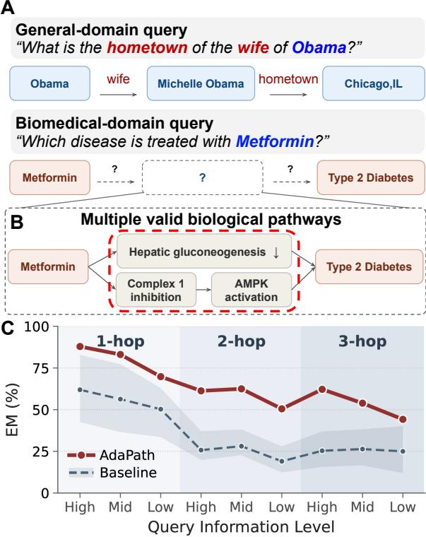
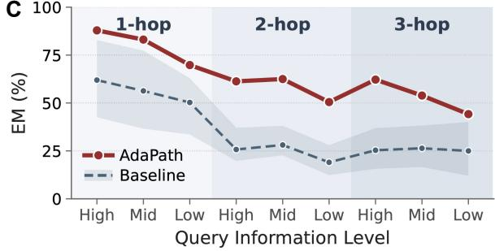
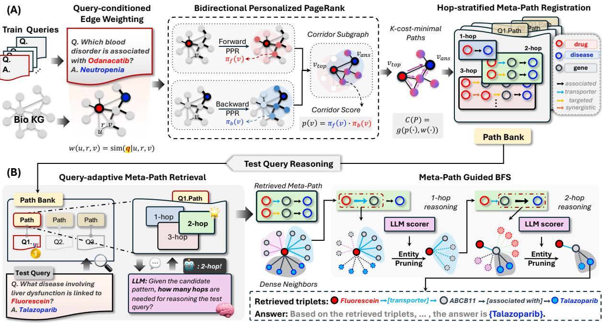
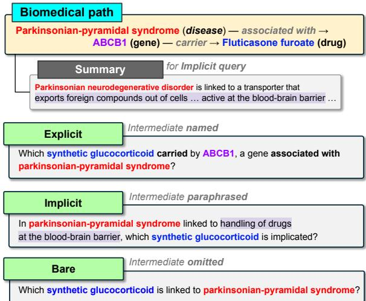
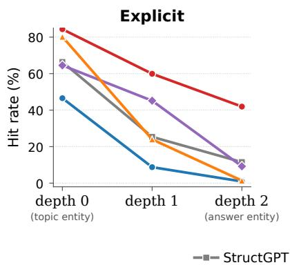
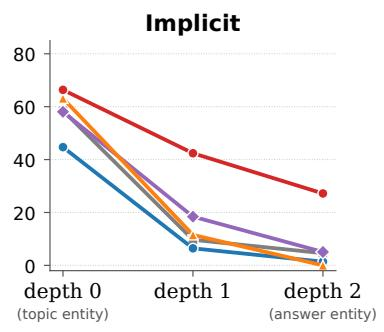
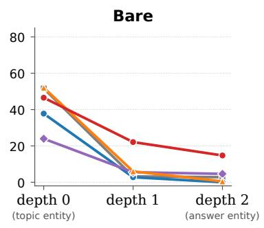
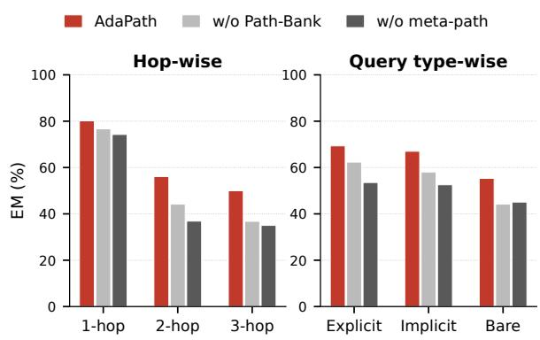
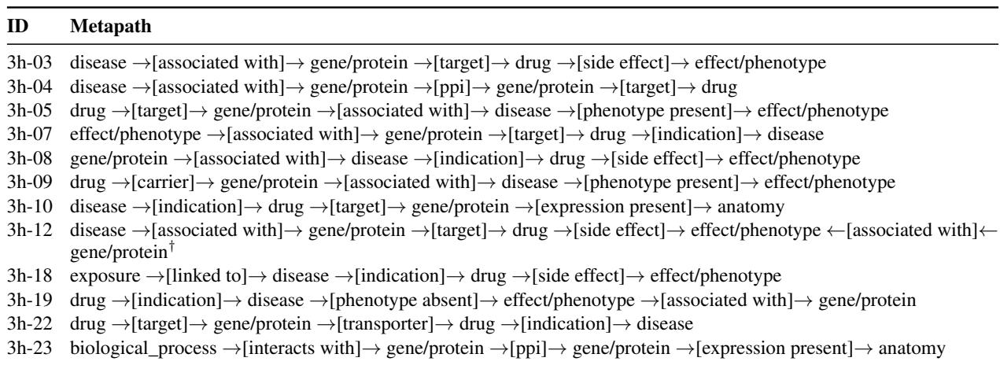
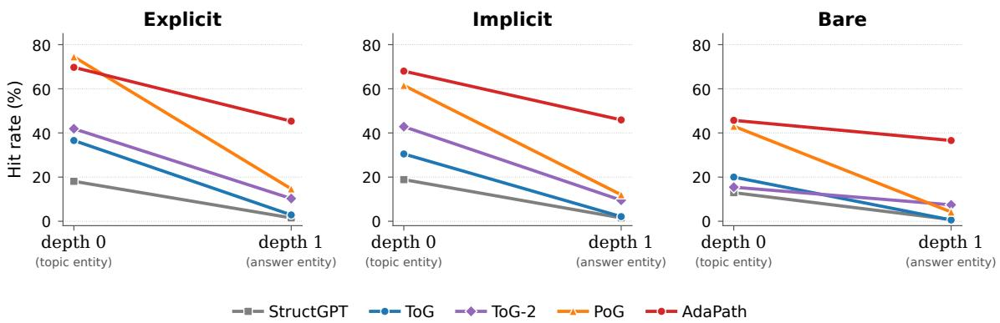

# ADAPATH: Query-Adaptive Path-Finding via Path-Bank for Multi-Hop Implicit Biomedical KGQA

Jun Hyeong Kim<sup>1</sup>, Dongki Kim<sup>1</sup>, Yinhua Piao<sup>1</sup>, Sung Ju Hwang<sup>1,2</sup>

<sup>1</sup>KAIST, <sup>2</sup>DeepAuto.ai

{tommykim0906, cleverki, yinhua.piao, sungju.hwang}@kaist.ac.kr

## Abstract

Path-finding over knowledge graphs has be-ome (disease) — associated with → come an effective way to ground LLM reasoning on multi-hop questions. However, biomedical QA introduces two distinct challenges that general-domain methods are not designed for: (i) queries do not expose intermediate reasoning and can be answered through multiple valid pathways, and (ii) biomedical knowledge graphs are densely connected, so path-findingd carried by ABCB1, a gene associated with methods easily take wrong turns. To address<sup>rome?</sup> these challenges, we propose ADAPATH, a path-finding framework that retrieves queryadaptive meta-paths from Path-Bank, which captures both query semantics and biomedical knowledge graph structure. ADAPATH provides the missing cues in biomedical queries<sup>ediate</sup> <sup>omitted</sup> while effectively pruning dense knowledge graph neighborhoods during multi-hop reason-<sup>d</sup> <sup>is</sup> <sup>linked</sup> <sup>to</sup> <sup>parkinsonian-pyramidal</sup> <sup>syndrome?</sup> ing. We further release BIOSTRAT-QA, a biomedical KGQA benchmark that stratifies multi-hop queries by how much intermediate reasoning they expose. Across biomedical KGQA benchmarks, ADAPATH consistently outperforms baselines, sustaining meaningful path-finding even when multi-hop queries expose less surface information. The source code is available at https://github.com/Jun-H yeong-Kim/AdaPath.

## 1 Introduction

Recent large language models (LLMs) display increasingly sophisticated reasoning, and retrievalaugmented generation (RAG) (Lewis et al., 2020) has become a widely adopted approach for grounding LLM reasoning (Wei et al., 2022; Wang et al., 2023) with external evidence from knowledge sources. In the biomedical domain, question answering (QA) both demands domainspecific knowledge that LLMs often lack and requires chain of causalities rather than independent facts (Barabási et al., 2011; Menche et al., 2015; Sung et al., 2021; Singhal et al., 2023). For instance, as shown in Figure 1B, explaining why metformin treats type-2 diabetes requires tracing a multi-step pathway from the drug through proteinlevel interactions to its downstream effect on gluconeogenesis (Jin et al., 2021). Therefore, answering biomedical questions requires traversing multi-hop chains, necessitating the path-finding retrieval over biomedical knowledge graphs to ground LLM reasoning on the causal pathways (Ogata et al., 1999;

A  


  
Figure 1: Challenges of Biomedical KGQA and Motivation of ADAPATH. (A) The general-domain query includes traversal relations directly through “wife” and “hometown”, constructing the intermediate path, while the biomedical query leaves such cues out. (B) Several candidate intermediate paths exist for the biomedical query, as in the multiple mechanism chains from “Metformin” to “T2D”, making it hard to identify the most relevant one. (C) ADAPATH sustains performance relative to path-finding baselines on multi-hop biomedical queries with limited surface information.

Milacic et al., 2024) biomedical QA demands.

However, off-the-shelf path-finding methods (Jiang et al., 2023; Li et al., 2024; Sun et al., 2024; Chen et al., 2024; Ma et al., 2025) designed for general-domain Knowledge Graph Question Answering (KGQA) (Wu et al., 2024; Bollacker et al., 2008; Vrandeciˇ c and Krötzsch´ , 2014) struggle when applied to biomedical KGQA due to its characteristics: (i) Elusive guidance cues. Compared to general-domain queries, biomedical queries tend to directly state a goal without exposing the intermediate steps needed to reach it, lacking the salient cues for path-finding. Specifi cally, as shown in Figure 1A, while general queries explicitly expose the cues for answering such as the relations and topic entities, cues for biomedical queries are hidden and non-trivial, facing a diffi culty to guide multi-hop traversal. Compounding the difficulty, multiple valid biological pathways can typically lead to the same answer (Figure 1B), making it more difficult to determine which cue is best suited to anchor traversal for any given query. (ii) Dense KG topology. Existing path-finding methods (Sun et al., 2024; Ma et al., 2025) typically perform Breadth-First Search (BFS) over the KG from the topic entity toward the answer entity. However, the complex interconnectivity of biological pathways makes biomedical KGs far denser than general-domain ones (Table 1), forcing them to examine a large number of candidate enti ties. This complexity could mislead to follow highdegree biological hubs or weakly relevant connec tions, leading to spurious paths that deviate from the biologically relevant reasoning chain.

To address these issues, we propose ADAP-ATH, a path-finding framework guided by queryadaptive meta-paths, explicitly supplying the intermediate cues that biomedical queries often leave implicit while enhancing the dense KG traversal via pruning. We first construct a Path-Bank, a repository of typed meta-paths mined from training queries. These meta-paths encode reusable intermediate cues that are often missing from biomedical queries, while reflecting both query semantics and the structural connectivity of the biomedical KG. At inference time, ADAPATH adaptively retrieves query-relevant meta-paths from Path-Bank and uses them as pruning guidance for candidate expansion in the dense biomedical KG. This enables to recover intermediate cues absent from the query while focusing traversal on biologically plausible directions. Consequently, ADAPATH avoids the indiscriminate expansion of BFS while preserving the flexibility to follow multiple valid reasoning pathways toward an answer (Figure 1C).

<table><tr><td>Domain</td><td>KG</td><td>Node #</td><td>Edge #</td><td>Degree</td></tr><tr><td rowspan="2">General</td><td>Amazon</td><td>1.04M</td><td>9.44M</td><td>18.2</td></tr><tr><td>MAG</td><td>1.87M</td><td>39.80M</td><td>43.5</td></tr><tr><td>Biomedicine</td><td>Prime</td><td>129 K</td><td>8.10M</td><td>125.2</td></tr></table>

Table 1: Statistics on Knowledge Graphs across different domains. Degree is the average node degree 2|E|/|V|, with each edge treated as undirected.

On the other hand, evaluating biomedical pathfinding requires controlled tests of whether a method can recover missing intermediate cues and remain reliable as reasoning depth increases. However, existing biomedical KGQA evaluations do not explicitly disentangle hop depth from the amount of intermediate reasoning exposed in the query. We therefore release BIOSTRAT-QA, a biomedical KGQA benchmark that stratifies multi-hop queries by surface exposure of intermediate reasoning. It derives queries from shared reasoning chains and organizes them into explicit, implicit, and bare levels, enabling systematic measurement of path-finding robustness as surface cues decrease and reasoning paths extend up to three hops.

We experimentally validate ADAPATH on diverse biomedical KGQAs including BIOSTRAT-QA, STaRK-Prime, and MedDDx, and we observe that ADAPATH consistently outperforms baselines, including path-finding methods, across all three benchmarks, particularly on multi-hop queries with limited intermediate cues. Path-level analyses further show that ADAPATH retrieves paths that both align with ground-truth reasoning chains and surface semantically related alternatives, matching the dual challenge of implicit cues and multiple valid pathways in biomedical KGQA. We summarize our contribution as follows:

• We introduce ADAPATH, a path-finding framework where meta-paths from a Path-Bank reflect both query semantics and biomedical KG structure, supplying implicit cues and filtering dense KG neighborhoods.

• We release BIOSTRAT-QA, a biomedical KGQA benchmark designed to systematically measure path-finding ability under these challenges, stratifying queries along explicit / implicit / bare levels of intermediate-information exposure and hop depths up to three.

• ADAPATH consistently outperforms baselines on biomedical KGQA, with gains over pathfinding baselines most pronounced on multihop, surface-implicit queries where dense KG topology most easily misleads path-finding.

## 2 Related Work

## 2.1 LLM Reasoning for Knowledge Graph Question Answering (KGQA)

Retrieval-augmented generation (Lewis et al., 2020) grounds LLM reasoning (Wang et al., 2023; Wei et al., 2022) by injecting external knowledge into the prompt, mitigating hallucination and stale parametric knowledge. For KGQA, factretrieval methods (Pan et al., 2024) typically extract triples or short paths matching the query and inject them into the LLM prompt as evidence. Chain-of-Knowledge (Li et al., 2024) retrieves evidence chains across heterogeneous sources such as KGs, Wikipedia, and tables, injecting them into the prompt without exploiting explicit graph structure. KGARevion (Su et al., 2025) targets biomedical QA by having the LLM generate candidate triples, verifying them against the KG, and revising the chain when verification fails.

## 2.2 Path-Finding Methods for KGQA

Path-finding methods construct multi-hop reasoning chains explicitly by traversing the KG hop by hop, providing the LLM with structured evidence paths rather than the local triples fact-retrieval methods return. StructGPT (Jiang et al., 2023) treats the KG as a structured store accessed through specialized query interfaces, expanding the singlehop neighborhood at each step and having the LLM filter the result. Think-on-Graph (ToG) (Sun et al., 2024) performs LLM-guided beam search over the KG, maintaining top-N reasoning paths at each hop. Think-on-Graph 2.0 (ToG-2) (Ma et al., 2025) hybridizes beam search with text-based retrieval and iterative refinement so that graph and context mutually refine each other. Plan-on-Graph (PoG) (Chen et al., 2024) decomposes the question into sub-objectives and self-corrects exploration via guidance, memory, and reflection. These methods are designed for general-domain KGs, where per-hop neighborhoods are small and queries tend to surface their reasoning chains. However, they struggle to transfer to biomedical KGQA.

## 2.3 Biomedical KGQA Benchmarks

Biomedical KGQA evaluates whether retrievalaugmented systems can navigate biomedical relations on a knowledge graph and reach the correct answer entity, commonly used to benchmark domain reasoning in clinical, pharmacological, and disease-mechanism settings. STaRK-Prime (Wu et al., 2024) provides a template-driven retrieval benchmark built over PrimeKG (Chandak et al., 2023), with questions mostly at shallow hop depths and reasonably explicit phrasing. MedDDx (Su et al., 2025) builds a differential-diagnosis variant on STaRK-Prime by adding semantically similar entities as distractors, ordered from Basic through Intermediate to Expert as distractor similarity to the gold answer increases.

## 3 Method

ADAPATH is a two-stage path-finding framework guided by query-adaptive meta-paths retrieved from a Path-Bank (Figure 2). In Section 3.1, we construct Path-Bank by mining meta-paths from training queries, which reflect both query semantics and biomedical KG structure. In Section 3.2, at the inference stage, ADAPATH adaptively retrieves query-relevant meta-paths from the constructed Path-Bank and uses them as pruning guidance for candidate expansion in the dense biomedical KG. Alongside the framework, in Section 3.3 we construct BIOSTRAT-QA, a biomedical KGQA benchmark for systematic evaluation of path-finding methods, with multi-hop queries derived from shared reasoning chains and stratified by surface exposure of intermediate reasoning.

## 3.1 Path-Bank Construction

To address the challenges (implicit-query and dense-KG) mentioned in Section 1, query-adaptive guidance is necessary for traversal at inference. ADAPATH provides this guidance as meta-paths retrieved from Path-Bank, mined offline from training queries. To construct a rich and reliable pool of meta-paths from the dense biomedical KG, Path-Bank construction proceeds in three stages: (i) Query-conditioned edge weighting, (ii) Bidirectional Personalized PageRank (PPR), and (iii) Hopstratified meta-path registration.

Query-conditioned Edge Weighting. Path-Bank construction uses Personalized PageRank (PPR) (Jeh and Widom, 2003), a random walk over the KG that estimates each node’s structural proximity to designated seeds. To mine paths that reflect query semantics in addition to KG structure, we weight each edge by how strongly its endpoints and relation align with the train query q, combining the three similarities into a single weight $w _ { u , r , v }$ for the edge connecting u to v through relation r:

  
Figure 2: ADAPATH Overview. (A) Path-Bank Construction (Section 3.1). We construct a Path-Bank, a repository of meta-paths mined from training queries. These meta-paths encode reusable intermediate cues and reflect both query semantics and the structural connectivity of the biomedical KG. (B) Query-Adaptive Meta-Path Guided Path-Finding (Section 3.2). At inference, ADAPATH adaptively retrieves test-query-relevant meta-paths from Path-Bank and uses them as pruning guidance for candidate expansion in the dense biomedical KG.

$$
\begin{array} { l } { { w _ { u , r , v } } = \beta \sin ( q , r ) } \\ { \quad + \frac { 1 - \beta } { 2 } \bigl [ \sin ( q , u ) + \sin ( q , v ) \bigr ] . } \end{array}\tag{1}
$$

sim is a per-query normalized BM25 (Lin et al., 2022) similarity to biomedical KG’s node and relation descriptions, and $\beta \in [ 0 , 1 ]$ trades off relation against endpoint terms.

Bidirectional Personalized PageRank. To select nodes that can form routes between topic and answer entity for each training query, we run forward and backward PPR walks seeded at the two entities, both biased by the query-conditioned edge weights $w _ { u , r , v } .$ Let M be the transition matrix obtained by normalizing $w _ { u , r , v }$ over each node’s outgoing edges, $\eta$ the teleport probability, and $s _ { \mathrm { t o p } } , s _ { \mathrm { a n s } }$ the one-hot seed indicators at the topic and answer entities. The forward and backward stationary distributions $\pi _ { f }$ and $\pi _ { b }$ satisfy

$$
\pi _ { f } = ( 1 - \eta ) M \pi _ { f } + \eta s _ { \mathrm { t o p } } ,\tag{2}
$$

$$
\pi _ { b } = ( 1 - \eta ) M \pi _ { b } + \eta s _ { \mathrm { a n s } } .\tag{3}
$$

The element-wise product of $\pi _ { f }$ and $\pi _ { b }$ yields a corridor score

$$
\rho ( v ) = \pi _ { f } ( v ) \cdot \pi _ { b } ( v ) .\tag{4}
$$

The top-K nodes by corridor score form the queryspecific corridor subgraph, semantically aligned with the query and structurally central to both topic and answer entities.

Hop-stratified Path-Bank Registration. To enrich each training query’s Path-Bank entry with meta-paths across multiple hops, we extract the topn cost-minimizing paths from the topic entity $v _ { \mathrm { t o p } }$ to the answer entity $v _ { \mathrm { a n s } }$ within the corridor subgraph using Yen’s k-shortest-paths algorithm (Yen, 1971). The path cost

$$
c ( P ) = \sum _ { ( u , r , v ) \in P } \left[ \alpha w _ { u , r , v } + ( 1 - \alpha ) \bar { \rho } ( u , v ) \right] ^ { - 1 } ,\tag{5}
$$

decreases in both the query-conditioned edge weight $w _ { u , r , v }$ from Eq. 1 and the average endpoint corridor score $\bar { \rho } ( u , v ) ~ = ~ \frac { 1 } { 2 } ( \rho ( u ) + \rho ( v ) )$ , with $\alpha \in [ 0 , 1 ]$ trading off the two. We convert each extracted path to its meta-path and bin it by hop length as the Path-Bank entry for $q .$

  
Figure 3: BIOSTRAT-QA Query Stratification. Three queries are generated from one reference path, differing in how much intermediate information reaches the surface: named (Explicit), summarized without naming (Implicit), or omitted (Bare).

## 3.2 Query-Adaptive Meta-Path Guided Path-Finding

For each test query $q _ { \mathrm { t e s t } }$ , it retrieves from Path-Bank a query-adaptive set of meta-paths and uses them to guide BFS over the biomedical knowledge graph (bioKG) from $\scriptstyle q _ { \mathrm { t e s t } } ^ { } \mathbf { \bar { s } }$ topic entity. The retrieved meta-paths, drawn from training queries similar to q<sub>test</sub>, supply the intermediate cues $q _ { \mathrm { t e s t } }$ leaves implicit on its surface. Restricting BFS expansion to the matched relation-type transitions filters the dense biomedical KG to directions suitable for $q _ { \mathrm { t e s t } }$

Path-Bank Retrieval. We retrieve $q _ { \mathrm { t e s t } }$ -adaptive meta-paths from Path-Bank in two steps: candidate query ranking, then meta-path filtering. With $\chi _ { \mathrm { t e s t } } \mathrm { { ' s } }$ topic entity linked to a bioKG node, we restrict candidates to training queries with the same topic entity type and rank each $q _ { i }$ by

$$
\sin ( q , q _ { i } ) = \lambda \widetilde { s } _ { \mathrm { S B E R T } } ( q , q _ { i } ) + \left( 1 - \lambda \right) \widetilde { s } _ { \mathrm { B M } 2 5 } ( q , q _ { i } ) ,\tag{6}
$$

where $\widetilde s _ { \mathrm { S B E R T } }$ and $\widetilde { s } _ { \mathrm { B M } 2 5 }$ are per-test-query minmax normalized sentence-embedding (Reimers and Gurevych, 2019) and BM25 (Lin et al., 2022) similarities, and $\lambda \in [ 0 , 1 ]$ trades off the two. From the meta-paths of the top-k ranked training queries, we retain those consistent with an LLM-inferred answer type and hop length, and realizable as walks from $v _ { \mathrm { t o p } }$ on bioKG.

Meta-Path Guided BFS. Guided by the retrieved meta-paths, ADAPATH performs BFS over bioKG from the topic entity $v _ { \mathrm { t o p } }$ , retrieving candidate paths for $q _ { \mathrm { t e s t } }$ . At each hop, ADAPATH keeps only neighbors whose incoming relation and node type match a retrieved meta-path, mitigating the wrong-turn risk BFS faces at densely connected hubs. The surviving candidates are further narrowed by sentence-BERT similarity to $q _ { \mathrm { t e s t } }$ , and the next-hop frontier is selected by LLM scoring under a depth-specific sub-query. When the final hop is reached, the assembled paths are passed to the LLM with $q _ { \mathrm { t e s t } }$ to ground its final answer.

## 3.3 BIOSTRAT-QA Construction

We also construct BIOSTRAT-QA to systematically evaluate path-finding when biomedical queries leave intermediate reasoning implicit, stratifying multi-hop queries by how much of it surfaces. Built atop PrimeKG (Chandak et al., 2023), BIOSTRAT-QA extends STaRK-Prime (Wu et al., 2024)’s 2- hop query templates with additional single-hop and 3-hop templates, retaining only those with sufficient grounding in PrimeKG. Full templates and synthesis prompts appear in Appendix A.

Stratification by intermediate-information level. For each reference path, we synthesize three parallel queries using GPT-5.4 (OpenAI, 2026) at distinct levels of intermediate-information exposure: Explicit, Implicit, and Bare. All three share the path’s topic and answer entities, differing only in surface exposure of intermediate reasoning. Explicit names every intermediate entity and relation along the path. Implicit replaces intermediate entities with paraphrased descriptions preserving the underlying mechanism, using a pathway summary for multi-hop paths. Bare retains only the topic entity and the answer type, stripping all intermediate cues. For 1-hop paths with no intermediate node, the three levels collapse to differences in how directly the answer-bearing relation is named, with Bare omitting the relation entirely. Figure 3 shows a 2-hop example on a disease → gene → drug path.

## 4 Experiments

## 4.1 Datasets

We evaluate on three biomedical KGQA datasets. BIOSTRAT-QA, introduced in Section 3.3, stratifies multi-hop queries into explicit, implicit, and bare information levels, enabling fine-grained evaluation of path-finding across query difficulty. STaRK-Prime (Wu et al., 2024) contributes two splits: a Synthesized split of 2,801 LLMsynthesised template-based queries, and a Humangenerated split of 98 naturally phrased, humanwritten queries with manually verified answers. MedDDx (Su et al., 2025) contributes 1,769 multichoice differential-diagnosis queries built from STaRK-Prime by adding semantically similar distractors, with Basic, Intermediate, and Expert bins ordered by increasing distractor similarity to the gold answer. For STaRK-Prime and MedDDx, we extract topic entities from each query during preprocessing to serve as starting nodes for path-finding methods (Appendix C).

<table><tr><td rowspan="2">Category</td><td rowspan="2">Method</td><td colspan="4">Explicit</td><td colspan="4">Implicit</td><td colspan="4">Bare</td><td rowspan="2">Overall</td></tr><tr><td>1-hop</td><td>2-hop</td><td>3-hop</td><td>Avg</td><td>1-hop</td><td>2-hop</td><td>3-hop</td><td>Avg</td><td>1-hop</td><td>2-hop</td><td>3-hop Avg</td><td></td></tr><tr><td colspan="10">Llama-3.1-70B</td><td></td><td></td><td></td><td></td><td></td></tr><tr><td></td><td>IO</td><td>45.8</td><td>35.8</td><td>34.1</td><td>39.2</td><td>41.6</td><td>39.4</td><td>35.5</td><td>39.5</td><td>42.3</td><td>33.3</td><td>33.6</td><td>36.7</td><td>38.5</td></tr><tr><td rowspan="2">LLM only</td><td>CoT</td><td>46.2</td><td>36.4</td><td>32.7</td><td>39.4</td><td>40.0</td><td>40.0</td><td>32.7</td><td>38.7</td><td>41.4</td><td>32.8</td><td>31.8</td><td>35.8</td><td>37.9</td></tr><tr><td>SC</td><td>43.5</td><td>35.6</td><td>33.6</td><td>38.2</td><td>38.7</td><td>37.9</td><td>37.8</td><td>38.2</td><td>43.0</td><td>32.6</td><td>30.9</td><td>36.1</td><td>37.5</td></tr><tr><td rowspan="2">Fact-retrieval</td><td>CoK</td><td>49.2</td><td>38.5</td><td>31.8</td><td>41.2</td><td>44.2</td><td>39.8</td><td>40.6</td><td>41.6</td><td>45.3</td><td>36.4</td><td>38.2</td><td>40.0</td><td>41.0</td></tr><tr><td>KGARevion</td><td>30.7</td><td>27.6</td><td>34.1</td><td>30.0</td><td>30.7</td><td>31.2</td><td>36.4</td><td>32.0</td><td>30.4</td><td>21.7</td><td>33.2</td><td>27.0</td><td>29.7</td></tr><tr><td rowspan="5">Path-finding</td><td>StructGPT</td><td>42.6</td><td>21.1</td><td>36.9</td><td>32.0</td><td>36.6</td><td>26.3</td><td>33.6</td><td>31.5</td><td>33.6</td><td>17.5</td><td>40.1</td><td>27.6</td><td>30.4</td></tr><tr><td>ToG</td><td>55.8</td><td>37.1</td><td>32.7</td><td>43.2</td><td>49.4</td><td>38.1</td><td>38.2</td><td>42.3</td><td>43.7</td><td>28.0</td><td>31.8</td><td>34.5</td><td>40.0</td></tr><tr><td>ToG-2</td><td>66.6</td><td>19.8</td><td>16.1</td><td>36.5</td><td>62.0</td><td>22.7</td><td>16.6</td><td>36.1</td><td>60.9</td><td>18.3</td><td>12.0</td><td>32.9</td><td>35.2</td></tr><tr><td>PoG</td><td>82.8</td><td>25.0</td><td>15.7</td><td>44.7</td><td>77.3</td><td>25.3</td><td>17.1</td><td>43.1</td><td>62.9</td><td>12.4</td><td>16.1</td><td>31.8</td><td>39.9</td></tr><tr><td>AdaPath</td><td>87.9</td><td>61.3</td><td>62.2</td><td>71.3</td><td>83.1</td><td>62.5</td><td>53.9</td><td>68.5</td><td>69.8</td><td>50.5</td><td>44.2</td><td>56.5</td><td>65.5</td></tr><tr><td colspan="10">Qwen-2.5-72B</td><td colspan="7"></td></tr><tr><td colspan="10">IO</td><td colspan="7"></td></tr><tr><td rowspan="3">LLM only</td><td>CoT</td><td>41.6 39.4</td><td>29.5 31.6</td><td>27.6 30.4</td><td>33.6 34.3</td><td>39.4</td><td>34.3 35.4</td><td>30.9 36.4</td><td>35.6</td><td>43.0</td><td>32.2</td><td>35.5 37.8</td><td>36.8 34.6</td><td>35.3 34.8</td></tr><tr><td>SC</td><td>41.0</td><td>32.6</td><td>32.7</td><td>35.7</td><td>35.5 34.3</td><td>36.2</td><td>38.2</td><td>35.6 35.9</td><td>37.8 38.9</td><td>30.5 30.3</td><td></td><td></td><td>35.4</td></tr><tr><td>CoK</td><td></td><td></td><td></td><td></td><td></td><td></td><td></td><td></td><td></td><td></td><td>36.4</td><td>34.6</td><td></td></tr><tr><td rowspan="2">Fact-retrieval</td><td>KGARevion</td><td>47.6</td><td>33.9</td><td>33.2 33.2</td><td>38.9 23.9</td><td>40.0</td><td>36.8</td><td>35.0 35.0</td><td>37.7 25.2</td><td>44.4</td><td>30.5</td><td>37.8</td><td>37.0</td><td>37.8</td></tr><tr><td></td><td>25.4</td><td>18.7</td><td></td><td></td><td>23.3</td><td>22.7</td><td></td><td></td><td>21.7</td><td>17.9</td><td>27.6</td><td>21.1</td><td>23.4</td></tr><tr><td rowspan="4">Path-finding</td><td>StructGPT</td><td>58.1</td><td>18.9</td><td>34.1</td><td>36.2</td><td>52.6</td><td>20.6</td><td>35.5</td><td>35.2</td><td>36.6</td><td>9.7</td><td>22.6</td><td>22.0</td><td>31.2</td></tr><tr><td>ToG</td><td>55.6</td><td>31.4</td><td>30.4</td><td>40.2</td><td>51.9</td><td>34.7</td><td>34.6</td><td>41.1</td><td>48.3</td><td>27.4</td><td>32.3</td><td>36.1</td><td>39.1</td></tr><tr><td>ToG-2</td><td>70.9</td><td>27.8</td><td>30.0</td><td>44.2</td><td>65.9</td><td>27.4 32.8</td><td>17.5 30.4</td><td>39.9 46.9</td><td>58.8</td><td>22.5</td><td>22.1</td><td>35.9</td><td>40.0</td></tr><tr><td>PoG AdaPath</td><td>76.0 84.9</td><td>29.9 58.3</td><td>24.9 53.9</td><td>46.1 67.4</td><td>72.1 83.3</td><td>59.2</td><td>44.7</td><td>65.5</td><td>59.7 71.9</td><td>9.7 44.8</td><td>10.1 41.0</td><td>28.3 54.1</td><td>40.4 62.3</td></tr></table>

Table 2: Main results on BIOSTRAT-QA. Exact-match (%) per (information-level, hop-depth) cell; Overall averages all nine cells. Per-column best is bold and second-best is underlined (ties share rank). Small-backbone (Llama-3.1-8B, Qwen-2.5-7B) results are in Appendix B.

## 4.2 Baselines

We compare against three baseline categories. LLM-only baselines establish a floor without any KG, including IO (direct prompting), Chainof-Thought (CoT) (Wei et al., 2022), and Self-Consistency (SC) (Wang et al., 2023). Fact-level retrieval methods consult the KG without traversing it, including CoK (Li et al., 2024) and KGARevion (Su et al., 2025). Path-finding methods, our most direct comparison, traverse the KG hop by hop. We compare with StructGPT (Jiang et al., 2023), Plan-on-Graph (PoG) (Chen et al., 2024),

Think-on-Graph (ToG) (Sun et al., 2024), and Think-on-Graph 2.0 (ToG-2) (Ma et al., 2025). For ToG-2, we used semi-structured KG node descriptions as the per-node text source.

## 4.3 Experimental Settings

We evaluate ADAPATH and all baselines using two families of open-weight LLMs, Llama-3.1- Instruct (Grattafiori et al., 2024) and Qwen-2.5- Instruct (Yang et al., 2024). We use the bioKG from STaRK-Prime (Wu et al., 2024), PrimeKG augmented with per-node textual descriptions. Pathfinding baselines share the same topic-entity links, bioKG, backbone, and three-hop search limit. We report exact match (EM) on BIOSTRAT-QA and STaRK-Prime, and accuracy over four candidate answers for each multiple-choice query on MedDDx. Metric details and ADAPATH hyperparameters are in Appendices D and J.

## 4.4 Results

As shown in Table 2, we evaluate ADAPATH and the baselines on BIOSTRAT-QA across query information levels and hop depths. ADAPATH consistently outperforms all retrieval and path-finding baselines across every information level and hop depth. Path-finding baselines, in particular, degrade sharply on multi-hop queries with low surface information. Lacking surface cues and confronting the dense biomedical KG, they accumulate wrong turns hop by hop, with several multi-hop bare cells even falling below the LLM-only floor. Even on implicit and bare queries where surface cues are scarce or absent, ADAPATH sustains robust and consistently high performance through Path-Bank metapaths mined per-query from both query semantics and KG structure. ADAPATH also outperforms all baselines on the external datasets STaRK-Prime and MedDDx (Table 3), generalizing across synthesized and human-generated queries on STaRK-Prime and maintaining robustness across difficulty levels on MedDDx. We further evaluate ADAPATH on the smaller Llama-3.1-8B and Qwen-2.5-7B backbones, where it retains the same trend and leads all baselines (Appendix B).

<table><tr><td rowspan="2">Method</td><td colspan="2">STaRK-Prime</td><td colspan="4">MedDDx</td></tr><tr><td>Synthesized</td><td>Human- generated</td><td>Basic</td><td>Inter. Expert</td><td></td><td>All</td></tr><tr><td colspan="7">Llama-3.1-70B</td></tr><tr><td>IO</td><td>18.6</td><td>20.4</td><td>44.5</td><td>39.2</td><td>41.6</td><td>40.6</td></tr><tr><td>CoT</td><td>16.6</td><td>21.4</td><td>50.2</td><td>40.3</td><td>40.0</td><td>41.6</td></tr><tr><td>SC</td><td>16.7</td><td>21.4</td><td>56.3</td><td>42.5</td><td>45.3</td><td>45.2</td></tr><tr><td colspan="7">CoK</td></tr><tr><td>KGARevion</td><td>18.2 18.9</td><td>17.3 18.4</td><td>51.4 56.3</td><td>44.1 44.1</td><td>46.8 47.4</td><td>45.8 46.7</td></tr><tr><td>StructGPT</td><td>37.6</td><td>30.6</td><td>56.3</td><td>48.3</td><td>45.1</td><td>48.6</td></tr><tr><td>ToG</td><td>32.1</td><td>22.4</td><td>60.4</td><td>48.3</td><td>47.6</td><td>49.8</td></tr><tr><td>ToG-2</td><td>33.5</td><td>34.7</td><td>37.1</td><td>34.4</td><td>30.9</td><td>33.8</td></tr><tr><td>PoG</td><td>41.4</td><td>40.8</td><td>55.5</td><td>47.0</td><td>43.9</td><td>47.3</td></tr><tr><td>AdaPath</td><td>46.9</td><td>43.9</td><td>65.3</td><td>55.1</td><td>52.4</td><td>55.8</td></tr><tr><td colspan="7"></td></tr><tr><td>I0</td><td>16.1</td><td>17.3</td><td>40.4</td><td>39.4</td><td>35.4</td><td>38.4</td></tr><tr><td>CoT</td><td>14.1</td><td>16.3</td><td>50.2</td><td>40.2</td><td>38.7</td><td>41.2</td></tr><tr><td>SC</td><td>15.0</td><td>18.4</td><td>50.2</td><td>41.0</td><td>40.0</td><td>42.0</td></tr><tr><td colspan="7">CoK</td></tr><tr><td>KGARevion</td><td>14.9 16.0</td><td>15.3 15.3</td><td>44.9 53.5</td><td>41.6 41.9</td><td>39.5 39.3</td><td>41.5 42.8</td></tr><tr><td></td><td>32.6</td><td></td><td></td><td></td><td></td><td>49.2</td></tr><tr><td colspan="7">StructGPT</td></tr><tr><td>ToG</td><td>32.0</td><td>30.6 25.5</td><td>58.8 54.3</td><td>50.0 48.8</td><td>42.4 43.5</td><td>48.1</td></tr><tr><td>ToG-2</td><td>31.9</td><td>35.7</td><td>39.6</td><td>36.1</td><td>32.3</td><td>35.6</td></tr><tr><td>PoG</td><td>33.5</td><td>30.6</td><td>44.9</td><td>42.7</td><td>41.0</td><td>42.6</td></tr><tr><td></td><td></td><td></td><td></td><td></td><td></td><td></td></tr><tr><td>AdaPath</td><td>46.7</td><td>39.8</td><td>62.0</td><td>54.5</td><td>51.8</td><td>54.8</td></tr></table>

Table 3: Results on STaRK-Prime and MedDDx. Performance comparison across different methods. Best results are bolded, and second-best results are underlined.

## 4.5 Path-level Analysis of ADAPATH

To further analyze whether retrieved paths are quantitatively and qualitatively related to solving biomedical queries, we assess whether the paths retrieved during traversal support answering the query (Table 4). For each test query and at each reasoning depth, Recall measures how much of the reference biomedical path is recovered in the retrieved set through exact triplet match. Additionally, given that multiple valid biological pathways typically lead to the same answer for any given biomedical query, we further measure Context Relevance (CR) (Xiang et al., 2026). Scored by GPT-4o-mini (OpenAI, 2024) as an LLM judge, Context Relevance assesses whether the retrieved paths as a whole form a biomedical mechanism semantically aligned with both the query and the reference path, capturing whether the path-finding genuinely contributes to solving the query. ADA-PATH outperforms other path-finding methods on both Recall and Context Relevance across all conditions, including queries with limited surface cues. The retrieved meta-paths from Path-Bank, semantically and structurally aligned with the test query, lead ADAPATH to retrieve paths that remain semantically connected to the query’s reasoning. These meta-paths also remain traversable from the topic entity to the answer at a meaningful rate even after exact ground-truth matches are excluded, surfacing valid alternative schemas rather than a single reference path (Appendix F).

## 4.6 Depth-level Analysis of ADAPATH

While the previous analysis examined path-level recovery, we also measure depth-level traversal accuracy on 3-hop queries by tracking whether each method reaches the correct entity at each reasoning depth in Figure 4. ADAPATH shows the highest hit rate at every depth across all query types in the dense biomedical KG, while other path-finding baselines, such as PoG and ToG-2, reach reasonable entities at the first hop but drop sharply at deeper depths. The robustness across depths explains ADAPATH’s strong performance on multi-hop biomedical QA across all query types. On 2-hop queries, we observe a similar pattern, with ADAPATH again sustaining the highest hit rate at later depths across all query types (Appendix E). We also conduct case studies to demonstrate the strength of ADAPATH compared to baselines in multi-hop path-finding for implicit and bare biomedical queries (Appendix O).

## 4.7 Ablation Study on ADAPATH

To isolate the effect of query-adaptive meta-path guidance from Path-Bank, we compare ADAPATH against two ablations on BIOSTRAT-QA along two axes, hop depth and query type (Figure 5). The w/o

<table><tr><td></td><td colspan="6">Llama-3.1-70B</td><td colspan="6">Qwen-2.5-72B</td></tr><tr><td></td><td colspan="2">Explicit</td><td colspan="2">Implicit</td><td colspan="2">Bare</td><td colspan="2">Explicit</td><td colspan="2">Implicit</td><td colspan="2">Bare</td></tr><tr><td>Method</td><td>Recall</td><td>CR</td><td>Recall</td><td>CR</td><td>Recall</td><td>CR</td><td>Recall</td><td>CR</td><td>Recall</td><td>CR</td><td>Recall</td><td>CR</td></tr><tr><td>StructGPT</td><td>19.53</td><td>13.99</td><td>16.22</td><td>12.00</td><td>11.25</td><td>8.74</td><td>38.44</td><td>25.81</td><td>29.97</td><td>20.14</td><td>18.82</td><td>12.99</td></tr><tr><td>ToG</td><td>19.35</td><td>16.62</td><td>16.98</td><td>15.95</td><td>12.19</td><td>15.31</td><td>21.59</td><td>19.42</td><td>18.95</td><td>19.47</td><td>12.19</td><td>16.71</td></tr><tr><td>ToG-2</td><td>33.11</td><td>37.45</td><td>29.39</td><td>38.30</td><td>17.52</td><td>32.57</td><td>42.03</td><td>44.19</td><td>32.21</td><td>40.29</td><td>18.55</td><td>33.21</td></tr><tr><td>PoG</td><td>46.15</td><td>38.55</td><td>38.04</td><td>32.91</td><td>26.79</td><td>26.27</td><td>43.95</td><td>38.01</td><td>38.40</td><td>33.59</td><td>29.17</td><td>28.09</td></tr><tr><td>AdaPath</td><td>55.82</td><td>50.17</td><td>48.79</td><td>48.39</td><td>33.47</td><td>41.18</td><td>56.05</td><td>50.76</td><td>48.34</td><td>47.63</td><td>33.83</td><td>41.01</td></tr></table>

Table 4: Path-level Analysis on ADAPATH. We report Recall (%) and Context Relevance (CR, %) by query type and backbone, averaged across all hop depths. Per-column best bolded, second-best underlined.







Figure 4: Depth-level Analysis on ADAPATH. We report hit rate on 3-hop BIOSTRAT-QA queries. Explicit (left) / Implicit (middle) / Bare (right) panels plot the fraction of queries whose explored entity set contains the reference d-th node along the evidence path. Values shown are extracted for Llama-3.1-70B. ADAPATH sustains its hit rate at later depths while baselines drop sharply.  
  
Figure 5: Path-Bank ablation across hop depth and query type. EM (%) averaged across Llama-3.1-70B and Qwen-2.5-72B. Hop-wise (left), averaged over query types. Query type-wise (right), sample-size weighted average across hop depths. w/o Path-Bank uses LLM-generated meta-path as guidance instead of using pre-defined Path-Bank; w/o meta-path routes every query through free BFS with no Path-Bank guidance at all. The results indicate the effectiveness of Path-Bank’s query-adaptive meta-path during path-finding.

Path-Bank variant replaces the pre-defined Path-Bank with LLM-generated meta-paths, where the

LLM plans node- and relation-level chains at inference time for each test query, isolating the effect of Path-Bank’s offline mining. The w/o meta-path variant removes meta-path guidance entirely. Both ablations fall below ADAPATH, and the gap widens as queries span more hops. By query type, ADA-PATH outperforms both ablations across all types, and w/o Path-Bank underperforms w/o meta-path on bare queries where the LLM lacks sufficient surface cues to plan useful meta-paths, validating the quality of Path-Bank’s query-adaptive metapath selection. We further provide detailed ablation results in Appendix Tables 15 and 16.

## 5 Conclusion

To address challenges in biomedical KGQA, we present ADAPATH, a path-finding framework guided by query-adaptive meta-paths from a Path-Bank reflecting both query semantics and KG structure. We further release BIOSTRAT-QA, a biomedical KGQA benchmark stratifying multihop queries by surface exposure of intermediate reasoning. ADAPATH consistently outperforms baselines. Path- and depth-level analyses confirm that this advantage originates in the path-finding stage, where ADAPATH retrieves paths quantitatively and qualitatively optimized for each query.

## Limitations

ADAPATH relies on LLM scoring to select the nexthop frontier after query-adaptive meta-path filtering, so weaker backbones produce noisier per-hop decisions that propagate across hops and degrade longer reasoning chains. Meta-path filtering also depends on LLM-inferred hop length and answer type, and queries without a matching meta-path fall back to unguided traversal. The reachable answer space of ADAPATH is bounded by what the underlying graph encodes, leaving queries that hinge on absent node or relation types, such as recently approved drugs or newly characterised mechanisms, difficult to answer through path-finding alone. Our benchmarks share a common synthetic construction procedure, and validation on independently collected biomedical QA remains future work. The mechanistically grounded paths ADA-PATH presents may also invite over-trust, and its answers should not substitute for expert judgment.

## Acknowledgments

This work was supported by Institute for Information & communications Technology Planning & Evaluation (IITP) grant funded by the Korea government (MSIT) (RS-2019-II190075, Artificial Intelligence Graduate School Program (KAIST)), National Research Foundation of Korea (NRF) grant funded by the Korea government (MSIT) (No. RS-2023-00256259), a grant of the Korea Machine Learning Ledger Orchestration for Drug Discovery Project (K-MELLODDY), funded by the Ministry of Health & Welfare and Ministry of Science and ICT, Republic of Korea (grant number: RS-2024-00460870), the “Advanced GPU Utilization Support Program” funded by the Government of the Republic of Korea (Ministry of Science and ICT), and the InnoCORE program of the Ministry of Science and ICT (MSIT) (N10250153).

## References

Anthropic. 2025. System card: Claude Haiku 4.5. http s://www.anthropic.com/claude-haiku-4-5-s ystem-card. Accessed: 2026-08-30.

Albert-László Barabási, Natali Gulbahce, and Joseph Loscalzo. 2011. Network medicine: a network-based

approach to human disease. Nature reviews genetics, 12(1):56–68.

Kurt Bollacker, Colin Evans, Praveen Paritosh, Tim Sturge, and Jamie Taylor. 2008. Freebase: a collaboratively created graph database for structuring human knowledge. In Proceedings of the 2008 ACM SIG-MOD international conference on Management of data, pages 1247–1250.

Payal Chandak, Kexin Huang, and Marinka Zitnik. 2023. Building a knowledge graph to enable precision medicine. Scientific data, 10(1):67.

Liyi Chen, Panrong Tong, Zhongming Jin, Ying Sun, Jieping Ye, and Hui Xiong. 2024. Plan-on-graph: Self-correcting adaptive planning of large language model on knowledge graphs. Advances in Neural Information Processing Systems, 37:37665–37691.

Aaron Grattafiori, Abhimanyu Dubey, Abhinav Jauhri, Abhinav Pandey, Abhishek Kadian, Ahmad Al-Dahle, Aiesha Letman, Akhil Mathur, Alan Schelten, Alex Vaughan, and 1 others. 2024. The llama 3 herd of models. arXiv preprint arXiv:2407.21783.

Daniel Scott Himmelstein, Antoine Lizee, Christine Hessler, Leo Brueggeman, Sabrina L Chen, Dexter Hadley, Ari Green, Pouya Khankhanian, and Sergio E Baranzini. 2017. Systematic integration of biomedical knowledge prioritizes drugs for repurposing. eLife, 6:e26726.

Glen Jeh and Jennifer Widom. 2003. Scaling personalized web search. In Proceedings of the 12th international conference on World Wide Web, pages 271–279.

Jinhao Jiang, Kun Zhou, Zican Dong, Keming Ye, Xin Zhao, and Ji-Rong Wen. 2023. Structgpt: A general framework for large language model to reason over structured data. In Proceedings ofthe 2023 conference on empirical methods in natural language processing, pages 9237–9251.

Di Jin, Eileen Pan, Nassim Oufattole, Wei-Hung Weng, Hanyi Fang, and Peter Szolovits. 2021. What disease does this patient have? a large-scale open domain question answering dataset from medical exams. Applied Sciences, 11(14):6421.

Patrick Lewis, Ethan Perez, Aleksandra Piktus, Fabio Petroni, Vladimir Karpukhin, Naman Goyal, Heinrich Küttler, Mike Lewis, Wen-tau Yih, Tim Rocktäschel, and 1 others. 2020. Retrieval-augmented generation for knowledge-intensive nlp tasks. Advances in neural information processing systems, 33:9459– 9474.

Xingxuan Li, Ruochen Zhao, Yew Ken Chia, Bosheng Ding, Shafiq Joty, Soujanya Poria, and Lidong Bing. 2024. Chain-of-knowledge: Grounding large language models via dynamic knowledge adapting over heterogeneous sources. In International Conference on Learning Representations, volume 2024, pages 9565–9587.

Jimmy Lin, Rodrigo Nogueira, and Andrew Yates. 2022. Pretrained transformers for text ranking: Bert and beyond. Springer Nature.

Shengjie Ma, Chengjin Xu, Xuhui Jiang, Muzhi Li, Huaren Qu, Cehao Yang, Jiaxin Mao, and Jian Guo. 2025. Think-on-graph 2.0: Deep and faithful large language model reasoning with knowledge-guided retrieval augmented generation. In International Conference on Learning Representations, volume 2025, pages 52782–52806.

Jörg Menche, Amitabh Sharma, Maksim Kitsak, Susan Dina Ghiassian, Marc Vidal, Joseph Loscalzo, and Albert-László Barabási. 2015. Uncovering disease-disease relationships through the incomplete interactome. Science, 347(6224):1257601.

Marija Milacic, Deidre Beavers, Patrick Conley, Chuqiao Gong, Marc Gillespie, Johannes Griss, Robin Haw, Bijay Jassal, Lisa Matthews, Bruce May, and 1 others. 2024. The reactome pathway knowledgebase 2024. Nucleic acids research, 52(D1):D672–D678.

Hiroyuki Ogata, Susumu Goto, Kazushige Sato, Wataru Fujibuchi, Hidemasa Bono, and Minoru Kanehisa. 1999. Kegg: Kyoto encyclopedia of genes and genomes. Nucleic acids research, 27(1):29–34.

OpenAI. 2024. GPT-4o mini: Advancing cost-efficient intelligence. https://openai.com/index/gpt-4 o-mini-advancing-cost-efficient-intellige nce/. Accessed: 2026-08-30.

OpenAI. 2026. GPT-5.4 thinking system card. https: //openai.com/index/gpt-5-4-thinking-syste m-card/. Accessed: 2026-08-30.

Shirui Pan, Linhao Luo, Yufei Wang, Chen Chen, Jiapu Wang, and Xindong Wu. 2024. Unifying large language models and knowledge graphs: A roadmap. IEEE Transactions on Knowledge and Data Engineering, 36(7):3580–3599.

Nils Reimers and Iryna Gurevych. 2019. Sentence-bert: Sentence embeddings using siamese bert-networks. In Proceedings of the 2019 conference on empirical methods in natural language processing and the 9th international joint conference on natural language processing (EMNLP-IJCNLP), pages 3982–3992.

Karan Singhal, Shekoofeh Azizi, Tao Tu, S Sara Mahdavi, Jason Wei, Hyung Won Chung, Nathan Scales, Ajay Tanwani, Heather Cole-Lewis, Stephen Pfohl, and 1 others. 2023. Large language models encode clinical knowledge. Nature, 620(7972):172–180.

Xiaorui Su, Yibo Wang, Shanghua Gao, Xiaolong Liu, Valentina Giunchiglia, Djork-Arné Clevert, and Marinka Zitnik. 2025. Kgarevion: an ai agent for knowledge-intensive biomedical qa. In International Conference on Learning Representations, volume 2025, pages 40572–40599.

Jiashuo Sun, Chengjin Xu, Lumingyuan Tang, Saizhuo Wang, Chen Lin, Yeyun Gong, Lionel Ni, Heung-Yeung Shum, and Jian Guo. 2024. Think-on-graph: Deep and responsible reasoning of large language model on knowledge graph. In International Conference on Learning Representations, volume 2024, pages 3868–3898.

Mujeen Sung, Jinhyuk Lee, Sean Yi, Minji Jeon, Sungdong Kim, and Jaewoo Kang. 2021. Can language models be biomedical knowledge bases? In Proceedings ofthe 2021 Conference on Empirical Methods in Natural Language Processing, pages 4723–4734.

Denny Vrandeciˇ c and Markus Krötzsch. 2014. Wiki-´ data: a free collaborative knowledgebase. Communications ofthe ACM, 57(10):78–85.

Xuezhi Wang, Jason Wei, Dale Schuurmans, Quoc V Le, Ed H Chi, Sharan Narang, Aakanksha Chowdhery, and Denny Zhou. 2023. Self-consistency improves chain of thought reasoning in language models. In The Eleventh International Conference on Learning Representations.

Jason Wei, Xuezhi Wang, Dale Schuurmans, Maarten Bosma, Fei Xia, Ed Chi, Quoc V Le, Denny Zhou, and 1 others. 2022. Chain-of-thought prompting elicits reasoning in large language models. Advances in neural information processing systems, 35:24824– 24837.

Shirley Wu, Shiyu Zhao, Michihiro Yasunaga, Kexin Huang, Kaidi Cao, Qian Huang, Vassilis N Ioannidis, Karthik Subbian, James Zou, and Jure Leskovec. 2024. Stark: Benchmarking llm retrieval on textual and relational knowledge bases. Advances in Neural Information Processing Systems, 37:127129–127153.

Zhishang Xiang, Chuanjie Wu, Qinggang Zhang, Shengyuan Chen, Zijin Hong, Xiao Huang, and Jinsong Su. 2026. When to use graphs in rag: A comprehensive analysis for graph retrieval-augmented generation. In International Conference on Learning Representations, volume 2026, pages 66145–66178.

An Yang, Baosong Yang, Beichen Zhang, Binyuan Hui, Bo Zheng, Bowen Yu, Chengyuan Li, Dayiheng Liu, Fei Huang, Haoran Wei, and 1 others. 2024. Qwen2.5 technical report. arXiv preprint arXiv:2412.15115.

Jin Y Yen. 1971. Finding the k shortest loopless paths in a network. management Science, 17(11):712–716.

## Appendix

## A BIOSTRAT-QA Dataset Details

This section details the construction of BIOSTRAT-QA, covering the split-wise statistics, the metapath template inventory, and the verbatim prompts used to generate the EXPLICIT, IMPLICIT, and BARE queries from a single evidence path.

## A.1 Dataset Statistics

BIOSTRAT-QA contains 4,568 queries split into train, dev, and test with a roughly 5:2:3 ratio, jointly covering 1-, 2-, and 3-hop biomedical reasoning over PrimeKG (Table 5). Each record carries the same topic and answer entities under three query formulations, so per-record difficulty is controlled by information level rather than by a change of topic or answer.

<table><tr><td>Split</td><td>Total</td><td>1-hop</td><td>2-hop</td><td>3-hop</td></tr><tr><td>train</td><td>2,491</td><td>922</td><td>1,119</td><td>450</td></tr><tr><td>dev</td><td>898</td><td>331</td><td>404</td><td>163</td></tr><tr><td>test</td><td>1,179</td><td>437</td><td>525</td><td>217</td></tr><tr><td>Total</td><td>4,568</td><td>1,690</td><td>2,048</td><td>830</td></tr></table>

Table 5: BIOSTRAT-QA size by split and hop depth. Each record carries three query formulations, explicit, implicit, and bare, over the same evidence path.

## A.2 Metapath Templates

The template inventory takes the STaRK-Prime (Wu et al., 2024) templates as its core and extends them so that BIOSTRAT-QA covers reasoning paths up to three hops. Queries are generated from 60 hand-crafted metapath templates over PrimeKG, consisting of 18 one-hop, 30 two-hop, and 12 three-hop patterns. Most templates are single-topic chains. A subset encodes a junction pattern where two named entities meet at a shared intermediate or answer node. Tables 6, 7, and 8 list every template.

## A.3 Query Generation Prompts

Given an evidence path, three queries are generated through separate GPT-5.4 batch calls, one per information level, so that no information leaks across formulations of the same path. The IMPLICIT level additionally takes a precomputed pathway summary that paraphrases intermediate node and relation descriptions without naming any intermediate or answer entity. The verbatim prompts are listed below.

```csv
ID Metapath
1h-01 drug →[indication]→ disease
1h-02 drug →[side effect]→ effect/phenotype
1h-03 drug →[target]→ gene/protein
1h-04 disease →[associated with]→ gene/protein
1h-05 disease →[phenotype present]→ effect/phenotype
1h-06 gene/protein →[expression present]→ anatomy
1h-07 drug →[contraindication]→ disease
1h-08 gene/protein →[ppi]→ gene/protein
1h-09 drug →[enzyme]→ gene/protein
1h-10 effect/phenotype →[associated with]→ gene/protein
1h-11 effect/phenotype →[phenotype absent]→ disease
1h-12 drug →[contraindication]→ disease ←[associated
with]← gene/protein<sup>†</sup>
1h-13 anatomy →[expression present]→ gene/protein
←[expression absent]← anatomy<sup>†</sup>
1h-15 drug →[carrier]→ gene/protein ←[carrier]← drug<sup>†</sup>
1h-16 drug →[off-label use]→ disease
1h-17 exposure →[linked to]→ disease
1h-18 drug →[transporter]→ gene/protein
1h-19 gene/protein →[interacts with]→ biological_process
```  
Table 6: 1-hop metapath templates. † marks a 2-topic junction template.

Pathway summary (used as input to IMPLICIT for 2- and 3-hop paths).

System prompt   
You are a biomedical knowledge expert. You are   
given a biomedical pathway from a knowledge   
graph with node names, descriptions, and   
relations.   
Your task: Summarize the biomedical pathway in   
2-4 sentences.   
Rules:   
- In your summary, do NOT directly use the   
names of intermediate nodes or the answer   
node. Paraphrase them based on the provided   
descriptions.   
The summary should read as a natural   
biomedical explanation of how the topic entity   
relates to an entity of the answer type.

The user message provides the topic entity with its name and type, each hop in the form source name, relation, target description, and the type of the target entity without its name. For 1-hop paths this step is skipped and a hand-written relationlevel description is used directly.

Explicit query. The model sees the full path with intermediate names and relation labels, and is told not to reveal the answer entity name.

System prompt   
You are a biomedical expert. Generate a natural   
biomedical question based on the provided   
evidence path.   
Rules:

ID Metapath   
2h-01 anatomy →[expression present]→ gene/protein →[target]→ drug   
2h-02 drug →[side effect]→ effect/phenotype →[side effect]→ drug   
2h-03 drug →[carrier]→ gene/protein →[carrier]→ drug   
2h-04 anatomy →[expression present]→ gene/protein →[enzyme]→ drug   
2h-05 cellular\_component →[interacts with]→ gene/protein →[carrier]→ drug   
2h-06 molecular\_function →[interacts with]→ gene/protein →[target]→ drug   
2h-07 effect/phenotype →[side effect]→ drug →[synergistic interaction]→ drug   
2h-08 disease →[indication]→ drug →[contraindication]→ disease   
2h-09 disease →[parent-child]→ disease →[phenotype present]→ effect/phenotype   
2h-10 gene/protein →[transporter]→ drug →[side effect]→ effect/phenotype   
2h-11 drug →[transporter]→ gene/protein →[interacts with]→ exposure   
2h-12 pathway →[interacts with]→ gene/protein →[ppi]→ gene/protein   
2h-13 drug →[synergistic interaction]→ drug →[transporter]→ gene/protein   
2h-15 effect/phenotype →[associated with]→ gene/protein →[interacts with]→ biological\_process   
2h-16 drug →[transporter]→ gene/protein →[expression present]→ anatomy   
2h-17 drug →[target]→ gene/protein →[interacts with]→ cellular\_component   
2h-18 biological\_process →[interacts with]→ gene/protein →[expression absent]→ anatomy   
2h-19 effect/phenotype →[associated with]→ gene/protein →[expression absent]→ anatomy   
2h-20 drug →[indication]→ disease →[indication]→ drug<sup>∗</sup>   
2h-22 gene/protein →[associated with]→ disease →[associated with]→ gene/protein   
2h-23 gene/protein →[associated with]→ effect/phenotype →[associated with]→ gene/protein   
2h-25 disease →[associated with]→ gene/protein →[carrier]→ drug ←[side effect]← effect/phenotype<sup>†</sup>   
2h-26 drug →[target]→ gene/protein →[associated with]→ disease ←[phenotype present]← effect/phenotype<sup>†</sup>   
2h-28 drug →[off-label use]→ disease →[associated with]→ gene/protein   
2h-29 exposure →[linked to]→ disease →[indication]→ drug   
2h-30 drug →[indication]→ disease →[phenotype absent]→ effect/phenotype   
2h-31 disease →[phenotype absent]→ effect/phenotype →[associated with]→ gene/protein   
2h-33 drug →[synergistic interaction]→ drug →[target]→ gene/protein   
2h-34 disease →[parent-child]→ disease →[associated with]→ gene/protein   
2h-35 drug →[transporter]→ gene/protein →[associated with]→ disease  
Table 7: 2-hop metapath templates. ∗ marks a conjoint template with an auxiliary direct constraint between the two ends, such as a synergistic interaction or a PPI. † marks a 2-topic junction template.

  
Table 8: 3-hop metapath templates. † marks a 2-topic junction template.

- Use the topic entity name.   
- Use intermediate node names from the evidence   
path.   
- Use relation names from the evidence path   
(e.g., “indication”, “target”).   
- Use the answer description (if provided) to   
specify the answer, but do NOT mention the   
answer entity name. If no answer description is   
provided, you may use your biomedical knowledge   
about the answer entity to add specificity.   
- The question should sound natural, as if asked   
by a researcher or clinician.   
- Output ONLY the question, nothing else.   
User prompt template   
Topic entity: <topic\_name> (<topic\_type>)   
Evidence path:   
<hop1.src> -[<hop1.rel>]-> <hop1.dst>   
<hop2.src> -[<hop2.rel>]-> <hop2.dst>   
Answer entity: <answer\_name> (<answer\_type>)   
Answer description: <answer\_desc>   
Generate a question that follows this evidence   
path.   
Do NOT mention the answer entity name   
“<answer\_name>” in the question.

Implicit query. Intermediate names and relation labels are withheld. The model instead receives the pathway summary for 2- and 3-hop paths, or a canonical relation description for 1-hop paths.

System prompt   
You are a biomedical expert. Generate a   
natural biomedical question based on the   
provided pathway information.   
Rules:   
- Use the topic entity name.   
- Do NOT mention intermediate node names   
directly.   
Do NOT use relation names directly.   
Paraphrase based on the relation context   
(1-hop) or pathway summary (2-3 hop).   
- Use the answer description (if provided) to   
specify the answer, but do NOT mention the   
answer entity name. If no answer description   
is provided, you may use your biomedical   
knowledge about the answer entity to add   
specificity.   
- The question should sound natural, as if   
asked by a researcher or clinician.   
- Output ONLY the question, nothing else.   
User prompt template   
Topic entity: <topic\_name> (<topic\_type>)   
# 1-hop: relation description from   
relation\_descriptions.json   
Relation context: <relation\_desc>   
# OR 2-3 hop: pathway summary from the previous   
stage   
Pathway summary:   
<name-free 2-4 sentence summary>   
Answer entity: <answer\_name> (<answer\_type>)   
Answer description: <answer\_desc>

Generate a question reflecting the pathway   
above.   
Do NOT mention intermediate node names,   
relation names, or the answer entity name   
“<answer\_name>” in the question.

Bare query. No path detail is shown, and the model is constrained to use a generic linking phrase rather than a specific relation verb.

System prompt   
You are a biomedical expert. Generate a   
natural biomedical question that asks about a   
relationship between the given entities.   
Rules:   
- Use the topic entity name.   
- Do NOT mention intermediate node names or   
any pathway/mechanism details.   
- Do NOT use specific relation verbs (e.g.,   
“treats”, “targets”, “induces”, “expressed   
in”). Use generic linking phrases like   
“associated with”, “related to”, “linked   
to”, “connected to”, or natural variations   
appropriate for the entity types.   
- Use the answer description (if provided) to   
specify the answer, but do NOT mention the   
answer entity name. If no answer description   
is provided, you may use your biomedical   
knowledge about the answer entity to add   
specificity.   
- Use varied and natural phrasing.   
- Output ONLY the question, nothing else.   
User prompt template   
Topic entity: <topic\_name> (<topic\_type>)   
Answer entity: <answer\_name> (<answer\_type>)   
Answer description: <answer\_desc>   
Generate a natural question about a   
<answer\_type> that has some relationship   
with <topic\_name>, using varied and natural   
phrasing.   
Do NOT mention the answer entity   
name “<answer\_name>” or any specific   
pathway/mechanism details.

## B Results on Small Backbones

We report ADAPATH and baseline results on smaller backbones, Llama-3.1-8B and Qwen-2.5- 7B, complementing the large-backbone main results in Section 4.4 (Tables 9 and 10). Performance levels shift with backbone scale, yet ADAPATH retains the pattern of improvement over baselines observed with the larger backbones.

## C Topic Entity Extraction for STaRK-Prime and MedDDx

STaRK-Prime (Wu et al., 2024) and MedDDx share the same underlying query set, so we run topic entity extraction once and reuse the resulting entity links across both evaluations. The extraction follows a four-stage pipeline that interleaves typed graph traversal with two GPT-5.4 batch calls, narrowing the candidate metapaths and all typematching nodes in PrimeKG down to one template and one entity per topic slot.

<table><tr><td rowspan="2">Category</td><td rowspan="2">Method</td><td colspan="4">Explicit</td><td colspan="4">Implicit</td><td colspan="4">Bare</td><td rowspan="2">Overall</td></tr><tr><td>1-hop</td><td></td><td>2-hop 3-hop</td><td>Avg</td><td>1-hop</td><td>2-hop</td><td>3-hop</td><td>Avg</td><td>1-hop</td><td>2-hop</td><td>3-hop Avg</td><td></td></tr><tr><td colspan="10">Llama-3.1-8B</td><td></td><td></td><td></td><td></td><td></td></tr><tr><td rowspan="2">LLM only</td><td>IO</td><td>32.7</td><td>24.6</td><td>19.4</td><td>26.6</td><td>31.6</td><td>27.8</td><td>19.8</td><td>27.7</td><td>33.0</td><td>25.1</td><td>22.1</td><td>27.5</td><td>27.3</td></tr><tr><td>CoT SC</td><td>37.1</td><td>29.7 28.2</td><td>21.2 21.7</td><td>30.9</td><td>32.7</td><td>29.5</td><td>26.7</td><td>30.2</td><td>33.2</td><td>25.9</td><td>24.9</td><td>28.4</td><td>29.8</td></tr><tr><td rowspan="2">Fact-retrieval</td><td></td><td>34.8</td><td></td><td></td><td>29.4</td><td>30.9</td><td>30.3</td><td>27.6</td><td>30.0</td><td>33.2</td><td>25.5</td><td>24.9</td><td>28.2</td><td>29.2</td></tr><tr><td>CoK KGARevion</td><td>37.3 30.9</td><td>30.5 26.9</td><td>23.0 20.7</td><td>31.6</td><td>35.7</td><td>31.8</td><td>27.2 27.6</td><td>32.4</td><td>38.2</td><td>28.6</td><td>25.4</td><td>31.6</td><td>31.9 27.7</td></tr><tr><td rowspan="5"></td><td></td><td></td><td></td><td></td><td>27.2</td><td>31.1</td><td>31.2</td><td></td><td>30.5</td><td>31.1</td><td>21.7</td><td>23.0</td><td>25.4</td><td></td></tr><tr><td>StructGPT</td><td>43.7</td><td>22.7</td><td>17.5</td><td>29.5</td><td>36.2</td><td>25.9</td><td>18.4</td><td>28.3</td><td>33.2</td><td>17.3</td><td>15.2</td><td>22.8</td><td>26.9</td></tr><tr><td>ToG</td><td>46.9</td><td>28.0</td><td>18.9</td><td>33.3</td><td>41.2</td><td>25.3</td><td>19.8</td><td>30.2</td><td>36.4</td><td>15.8</td><td>14.7</td><td>23.2</td><td>28.9</td></tr><tr><td>ToG-2</td><td>64.1</td><td>22.1</td><td>18.0</td><td>36.9</td><td>58.1</td><td>23.6</td><td>18.4</td><td>35.5</td><td>57.9</td><td>20.6</td><td>15.7</td><td>33.5</td><td>35.3</td></tr><tr><td>PoG ADAPATH</td><td>67.7 74.4</td><td>9.0 47.8</td><td>7.8</td><td>30.5</td><td>53.3</td><td>5.7</td><td>7.8</td><td>23.7</td><td>35.7</td><td>2.7</td><td>9.2</td><td>16.1</td><td>23.5</td></tr><tr><td colspan="10">28.6 54.1 76.2 44.6 32.3 54.0 56.3</td><td></td><td>31.6</td><td>25.4</td><td>39.6</td><td>49.2</td></tr><tr><td colspan="10">Qwen-2.5-7B 21.9 19.8 25.8 27.7 25.3 21.2 25.4</td><td></td><td>19.2</td><td></td><td>19.8</td><td>22.1</td><td>24.4</td></tr><tr><td rowspan="2">LLM only</td><td>CoT SC</td><td>29.7 31.8</td><td>22.9 22.7</td><td>21.2 21.7</td><td>25.1 25.9</td><td>25.4 26.3</td><td>23.8 27.8</td><td>30.9 31.3</td><td>25.7 27.9</td><td>25.4 26.1</td><td>23.4 23.8</td><td>24.9 29.0</td><td>24.4 25.6</td><td>25.1 26.5</td></tr><tr><td>CoK KGARevion</td><td>33.4</td><td>23.2 18.7</td><td>21.7 22.1</td><td>26.7 22.0</td><td>29.1</td><td>27.0</td><td>30.4</td><td>28.4</td><td>31.4</td><td>21.7</td><td>30.4</td><td>26.9</td><td>27.3</td></tr><tr><td colspan="2"></td><td>25.9</td><td></td><td></td><td></td><td>23.3</td><td>23.2</td><td>21.2 23.5</td><td>22.9 33.0</td><td>21.5</td><td>17.5</td><td>18.0</td><td>19.1</td><td>21.3 29.7</td></tr><tr><td rowspan="5">Path-finding</td><td>StructGPT ToG</td><td>60.6</td><td>21.1</td><td>19.8</td><td>35.5</td><td>53.8</td><td>19.6</td><td></td><td></td><td>38.0</td><td>10.1</td><td>11.5 16.1</td><td>20.7 23.7</td><td>28.8</td></tr><tr><td>ToG-2</td><td>47.4</td><td>24.0</td><td>17.1</td><td>31.4</td><td>44.4</td><td>23.4</td><td>24.0</td><td>31.3</td><td>38.0</td><td>14.9</td><td></td><td></td><td>38.6</td></tr><tr><td>PoG</td><td>73.0</td><td>29.1</td><td>29.0</td><td>45.4</td><td>63.4</td><td>25.9 20.2</td><td>19.4 21.2</td><td>38.6 35.2</td><td>56.5</td><td>18.5</td><td>14.8</td><td>31.9</td><td></td></tr><tr><td>ADAPATH</td><td>63.6</td><td>14.9 52.2</td><td>14.3 43.8</td><td>32.8 58.2</td><td>60.2 70.2</td><td>51.0</td><td>34.6</td><td>55.1</td><td>45.8 60.6</td><td>9.1 37.7</td><td>14.3</td><td>23.7 44.8</td><td>30.6 52.7</td></tr><tr><td></td><td>72.5</td><td></td><td></td><td></td><td></td><td></td><td></td><td></td><td></td><td></td><td>29.9</td><td></td><td></td></tr></table>

Table 9: Main results on BIOSTRAT-QA, small backbones. EM (%) per (information-level, hop-depth) cell; Overall averages all nine cells. Per-column best is bold and second-best is underlined within each backbone block.

Stage 1: Typed reverse BFS feasibility filter. The search space is a set of metapath templates built on the STaRK-Prime template set (Wu et al., 2024), complemented with additional single-edge patterns enumerated from the PrimeKG schema. For each query we identify which of these templates can actually reach the given answer entity in PrimeKG. From every answer node we walk the template metapath backward, enforcing edge type and target node type at every hop. For queries with multiple valid answers, we intersect the candidate sets obtained from each answer node, and fall back to their union when the intersection is empty. Templates with two topic slots are traversed once per slot. A template survives only if its reverse traversal returns at least one candidate. A median of ∼7 templates survive per query and are passed to the next stage.

Stage 2: LLM template pick. The surviving templates are passed to GPT-5.4 via the OpenAI batch API. We prompt the model with the query, the answer entity, and the list of graph-feasible templates, each shown as both its formal metapath and a short paraphrase, and ask it to return the single template that best matches the question’s intent in strict JSON. Templates that fail to parse or fall outside the allowed range are discarded.

Stage 3: Per-slot candidate scoring. For each topic slot of the chosen template we collect all PrimeKG nodes whose type matches the slot, then rank them against the query by combining BM25 (Lin et al., 2022) over name-plus-description text with a sentence-BERT (Reimers and Gurevych, 2019) similarity. The two scores are min–max normalised within the candidate pool and summed, and the top-10 candidates are kept. To bound compute for slots with very large candidate pools such as all gene/protein nodes, we first take the top-1,000 by BM25 and then rerank with SBERT, which preserves top-10 quality at a fraction of the cost. Each surviving candidate is also annotated with the line-level chunk of its description that maximises BM25 against the query, truncated to 300 characters, which provides compact evidence for the next stage.

<table><tr><td rowspan="2">Method</td><td colspan="2">STaRK-Prime</td><td colspan="4">MedDDx</td></tr><tr><td>Synthesized</td><td>Human- generated</td><td></td><td>Basic Inter. Expert</td><td></td><td>All</td></tr><tr><td colspan="7">Llama-3.1-8B</td></tr><tr><td>IO</td><td>13.1</td><td>12.2</td><td>42.9</td><td>36.2</td><td>34.6</td><td>36.7</td></tr><tr><td>CoT</td><td>13.1</td><td>15.3</td><td>41.6</td><td>32.9</td><td>37.9</td><td>35.5</td></tr><tr><td>SC</td><td>12.2</td><td>12.2</td><td>44.9</td><td>35.7</td><td>38.1</td><td>37.6</td></tr><tr><td>CoK</td><td>13.1</td><td>14.3</td><td>48.2</td><td>38.1</td><td>36.9</td><td>39.2</td></tr><tr><td>KGARevion</td><td>12.5</td><td>12.2</td><td>38.4</td><td>34.5</td><td>31.5</td><td>34.2</td></tr><tr><td colspan="7">StructGPT</td></tr><tr><td>ToG</td><td>17.2 28.9</td><td>18.4 24.5</td><td>44.5 51.8</td><td>37.4 41.4</td><td>37.1 40.8</td><td>38.3 42.7</td></tr><tr><td>ToG-2</td><td>29.2</td><td>35.7</td><td>41.6</td><td>39.2</td><td>34.0</td><td>38.1</td></tr><tr><td>PoG</td><td>23.1</td><td>20.4</td><td>32.2</td><td>30.8</td><td>30.6</td><td>31.0</td></tr><tr><td>ADAPATH</td><td>43.0</td><td>44.9</td><td>58.4</td><td>49.4</td><td>49.5</td><td>50.6</td></tr><tr><td colspan="7">Qwen-2.5-7B</td></tr><tr><td>IO</td><td>10.9</td><td>12.2</td><td>37.1</td><td>33.4</td><td>32.9</td><td>33.8</td></tr><tr><td>CoT</td><td>10.1</td><td>9.2</td><td>34.3</td><td>32.1</td><td>33.5</td><td>32.8</td></tr><tr><td>SC</td><td>10.5</td><td>9.2</td><td>40.0</td><td>33.1</td><td>30.8</td><td>33.5</td></tr><tr><td colspan="7">CoK</td></tr><tr><td>KGARevion</td><td>11.0 10.6</td><td>9.2</td><td>36.3</td><td>32.3</td><td>34.8</td><td>33.5</td></tr><tr><td></td><td>25.3</td><td>4.1 23.5</td><td>37.1 48.2</td><td>32.1 37.7</td><td>32.1 39.1</td><td>32.8 39.5</td></tr><tr><td colspan="7">StructGPT</td></tr><tr><td>ToG</td><td>29.6</td><td>24.5</td><td>42.9</td><td>40.5</td><td>37.5</td><td>40.0</td></tr><tr><td>ToG-2</td><td>31.2</td><td>33.7</td><td>36.3</td><td>31.5</td><td>27.9</td><td>31.2</td></tr><tr><td>PoG</td><td>29.7</td><td>27.6</td><td>44.1</td><td>41.5</td><td>44.1</td><td>42.6</td></tr><tr><td></td><td></td><td></td><td></td><td></td><td></td><td></td></tr><tr><td>ADAPATH</td><td>43.7</td><td>37.8</td><td>50.6</td><td>47.6</td><td>44.5</td><td>47.2</td></tr></table>

Table 10: Results on STaRK-Prime and MedDDx, small backbones. STaRK-Prime: EM (%). MedDDx: accuracy (%). Per-column best is bold, second-best is underlined within each backbone block.

Stage 4: Per-slot LLM entity pick. GPT-5.4 then selects the final topic entity from the top-10 candidates per slot. The prompt presents the query, the answer entity, the slot’s type, and each candidate with its name and best chunk, and asks the model to pick the entity the query starts from rather than the one it seeks as the answer. Each candidate carries a node identifier so that the model can disambiguate same-name nodes.

For each query the pipeline records the topic entity of every slot in the selected template. The topic entity is passed unchanged to ADAPATH and to every path-finding baseline as the starting point for traversal on STaRK-Prime and MedDDx.

## D Evaluation Metrics

We summarise the four metrics used throughout the paper, namely exact match (EM) on BIOSTRAT-QA and STaRK-Prime, accuracy on MedDDx, triplet-level recall on retrieved reasoning chains, and an LLM-judged context-relevance score for retrieved paths.

Exact Match (EM). For BIOSTRAT-QA and STaRK-Prime, a prediction is counted correct when the model’s final answer matches any of the groundtruth answer names recorded for the query, with case and whitespace normalised. Each record is released with a multi-answer expansion, so the model is credited for identifying any of the semantically equivalent answer entities rather than having to recover a single canonical name. EM is reported as a percentage and, for BIOSTRAT-QA, microaveraged within each cell.

Accuracy. For the multiple-choice queries in MedDDx, we report standard classification accuracy. A prediction is counted correct when it matches either the ground-truth option letter or the name of the entity that option refers to.

Recall. For path-finding methods we evaluate path recovery via per-depth triplet recall against the ground-truth (GT) evidence path. Let $g _ { d } =$ $( h _ { d } , r _ { d } , t _ { d } )$ denote the GT triplet at reasoning depth d and $P _ { d }$ the set of retrieved triplets at depth $d ,$ capped at $K = 1 0 0$ random samples per depth with seed 42. We compare triplets after lowercasing the head and tail entity names, writing norm $( h , r , t ) \ : = \ : ( \mathrm { l o w e r } ( h ) , r$ , lower(t)), and the hit indicator at depth d is

$$
{ \mathrm { H i t } } _ { d } = \mathbf { 1 } [ { \mathrm { n o r m } } ( g _ { d } ) \in \left\{ { \mathrm { n o r m } } ( p ) : p \in P _ { d } \right\} ] .\tag{7}
$$

Per-record recall is the depth-wise average of Hit<sub>d</sub> over the D depths of that record. The reported recall is the micro-average over all record and depth pairs across the 1-, 2-, and 3-hop subsets, dividing the total number of hits by the total number of pairs.

Context Relevance. To complement triplet-exact recall, which penalises retrieved paths that pass through semantically valid neighbours without exactly reproducing the GT triplets, we additionally report Context Relevance, a per-record score produced by a GPT-4o-mini judge over the retrieved paths. Each method’s retrieved triplets are assembled into complete multi-hop chains running from the topic entity to the answer entity, capped at K = 100 per record, and presented to the judge together with the query and the GT evidence triplets. The judge returns a score of 2 when the retrieved paths trace a coherent biomedical pathway from topic to answer that captures the expected mechanism, 1 when they surface related neighbours or analogous entities, and 0 otherwise. Scores are rescaled to [0, 1] and averaged over all records, excluding those where the judge output fails to parse after three retries.

  
Figure 6: Per-depth hit rate on 2-hop BIOSTRAT-QA queries (Llama-3.1-70B). Explicit (left), Implicit (middle), and Bare (right) panels plot the fraction of queries whose explored entity set contains the reference d-th node along the evidence path. Each subplot uses an independent y-axis. ADAPATH sustains its hit rate at the answer depth across all three query formulations, while path-finding baselines drop sharply.

## E Per-Depth Traversal Accuracy on 2-hop Queries

The main paper reports per-depth hit rate on 3-hop queries in Figure 4, and here we provide the companion plot for 2-hop queries on the same Llama-3.1-70B backbone (Figure 6). The trend mirrors the 3-hop result, where ADAPATH sustains a high hit rate at the answer-bearing depth across all three query formulations, while path-finding baselines drop sharply after the topic entity. ADAPATH stays ahead of the strongest baseline at the answer depth under every formulation, consistent with the pattern observed in the 3-hop figure.

## F Meta-Path Retrieval Quality

Path-Bank stores type-level meta-path schemas rather than entity-level paths. One meta-path such as drug → gene → disease instantiates many entitylevel paths, and in BIOSTRAT-QA the meta-paths are shared across splits while the entity-level paths are disjoint, so meta-path overlap does not reveal the test path or its answer. Table 4 and Figure 4 assess the entity-level paths that traversal produces, and we complement them here by assessing the meta-paths that guide it. We ask whether ADAP-ATH recovers the reference meta-path behind each query, and whether the alternatives it retrieves instead remain traversable to the answer once every exact ground-truth match is excluded (Table 11).

Reference meta-path recovery declines moderately as surface cues are removed, and the retrieved alternatives remain traversable at a nearly constant rate across all three information levels. Read together with the Context Relevance results in Table 4, ADAPATH supplies usable reasoning schemas rather than reproducing a single reference path.

<table><tr><td>Level</td><td>R@1</td><td>R@3</td><td>R@5</td><td>MRR</td><td>Trav.†</td><td>QA</td></tr><tr><td colspan="7">Llama-3.1-70B</td></tr><tr><td>Explicit Implicit Bare</td><td>66.2 52.7 44.8</td><td>79.5 67.1 60.1</td><td>82.7 71.2 65.7</td><td>0.730 0.601 0.527</td><td>55.9 56.5 55.0</td><td>71.3 68.5 56.5</td></tr><tr><td colspan="7">Qwen-2.5-72B</td></tr><tr><td>Explicit Implicit Bare</td><td>63.2 51.2 46.4</td><td>75.8 65.4 61.3</td><td>79.0 69.3 66.8</td><td>0.697 0.584 0.541</td><td>54.4 55.6 54.3</td><td>67.4 65.5 54.1</td></tr></table>

Table 11: Meta-path retrieval quality on BIOSTRAT-QA. R@k and MRR score recovery and ranking of the ground-truth meta-path. Trav.<sup>†</sup> is the share of retrieved meta-paths that can be walked from the topic entity to the answer entity on the KG, computed after excluding all exact ground-truth matches so that it covers only the retrieved alternatives. QA is downstream accuracy.

On STaRK-Prime and MedDDx the ground-truth evidence path behind each query is not released, so the path-level analysis of Section 4.5 is not applicable. We instead measure traversability only, which requires no reference path. Two differences from the BIOSTRAT-QA setting should be noted. The template pool underlying both datasets reaches at most two hops (Wu et al., 2024), and the whole retrieved pool is measured here without excluding exact ground-truth matches, so the numbers are not directly comparable to Table 11. Under this measurement, traversability remains high in every case, including the human-generated split written without templates (Table 12).

<table><tr><td>Dataset</td><td>Split</td><td>n</td><td>Llama- 70B</td><td>Qwen- 72B</td></tr><tr><td>STaRK-Prime</td><td>Synthesized</td><td>2,801</td><td>99.0</td><td>99.3</td></tr><tr><td>STaRK-Prime</td><td>Human</td><td>98</td><td>86.4</td><td>89.7</td></tr><tr><td>MedDDx</td><td>Test</td><td>1,769</td><td>99.2</td><td>99.4</td></tr></table>

Table 12: Traversability of retrieved meta-paths on STaRK-Prime and MedDDx. Neither dataset releases a reference path, so no exact ground-truth match can be excluded and traversability is measured over the whole retrieved pool rather than the alternatives alone.

## G Semantic Robustness of Query-Adaptive Retrieval

Path-Bank retrieval scores training queries by a mix of dense sentence-embedding and sparse BM25 similarity (Eq. 6), which raises the question of how much the retrieved meta-paths depend on the wording of the query rather than the mechanism behind it. We isolate this by building the Path-Bank from one query formulation and evaluating on another, holding the underlying biomedical mechanism fixed. The same-expression setting averages the three matched pairings of explicit, implicit and bare, and the different-expression setting averages the six mismatched pairings.

Under mismatch, Recall@5 decreases only moderately and QA accuracy stays well above the strongest baseline (Table 13). Even after every exact ground-truth match is removed, roughly half or more of the retrieved meta-paths remain traversable in both settings, so retrieval surfaces usable alternatives rather than only the schema that generated the query.

<table><tr><td>Path-Bank / Test</td><td>Recall@5</td><td>MRR</td><td>Trav.†</td><td>QA Acc.</td><td>∆</td></tr><tr><td>Same-expression</td><td>73.2</td><td>0.619</td><td>55.8</td><td>65.4</td><td>+22.8</td></tr><tr><td>Different-expression</td><td>68.9</td><td>0.544</td><td>49.2</td><td>61.8</td><td>+19.2</td></tr></table>

Table 13: Retrieval and QA under matched and mismatched query formulations. Recall@5 and MRR are computed against the ground-truth meta-path. Trav.<sup>†</sup> excludes all exact ground-truth matches, so it covers only the retrieved alternatives. ∆ is the gain over the strongest baseline.

## H Robustness of Context Relevance

LLM-as-judge scoring carries variance across both the choice of judge and repeated runs, so we verify the Context Relevance results in Table 4 against both. We re-score the same reasoning paths with a second judge, Claude-Haiku-4.5 (Anthropic, 2025), alongside the GPT-4o-mini judge used in the main results, running three trials per judge and averaging. ADAPATH is the best method under both judges and both backbones, and run-to-run variation stays below half a point (Table 14).

<table><tr><td rowspan="2">Method</td><td colspan="2">Llama-3.1-70B</td><td colspan="2">Qwen-2.5-72B</td></tr><tr><td>GPT- 4o-mini</td><td>Claude- Haiku-4.5</td><td>GPT- 4o-mini</td><td>Claude- Haiku-4.5</td></tr><tr><td>StructGPT</td><td>14.4±0.12</td><td>22.3±0.08</td><td>29.7±0.27</td><td>43.7±0.04</td></tr><tr><td>ToG</td><td>16.2±0.11</td><td> $2 3 . 2 { \pm } 0 . 2 1 $ </td><td>19.0±0.20</td><td>25.8±0.42</td></tr><tr><td>ToG-2</td><td>37.3±0.24</td><td>45.7±0.26</td><td>39.8±0.16</td><td>47.7±0.12</td></tr><tr><td>PoG</td><td>33.0±0.32</td><td> $\underline { { 4 7 . 4 \pm 0 . 0 9 } }$ </td><td>33.5±0.17</td><td>49.2±0.18</td></tr><tr><td></td><td></td><td>ADAPATH 46.7±0.13 59.6±0.22 47.1±0.12</td><td></td><td>60.0±0.09</td></tr></table>

Table 14: Context Relevance under two LLM judges. Values are mean ± std over three trials, ×100. Percolumn best is bold and second-best is underlined.

## I Ablation Study on Path-Bank & Meta-Path

We ablate ADAPATH’s query-adaptive meta-path guidance on large backbones, Llama-3.1-70B and Qwen-2.5-72B, comparing three variants of the path-finding stage. ADAPATH runs the full pipeline with query-adaptive meta-paths retrieved from the pre-mined Path-Bank. w/o Path-Bank has the LLM plan meta-paths at inference rather than retrieving them from the pre-mined Path-Bank, and non-traversable plans fall back to free BFS. w/o meta-path routes every query through free BFS with no meta-path guidance. All variants share the same answer-generation stage, so any gap isolates the effect of query-adaptive meta-path guidance.

On BIOSTRAT-QA, ADAPATH leads both ablations on every cell, and the gap widens as reasoning paths extend (Table 15). On 1-hop queries, where a single edge separates topic from answer, the two ablations stay close to ADAPATH across all three information levels. The gap opens up on 2-hop and 3-hop queries, where an unguided search has to commit to intermediate entities before reaching the answer. Such a pattern indicates that query-adaptive meta-path guidance carries an increasing share of the answer-generation accuracy as path-finding moves into deeper regions of the biomedical KG.

We also run the same ablation on the external datasets STaRK-Prime and MedDDx (Table 16). On STaRK-Prime, ADAPATH stays ahead of both ablations on the synthesized and human-generated splits across both backbones. On MedDDx, whose tiers order distractors by semantic closeness to the gold answer, ADAPATH stays ahead of both ablations on every tier under both backbones, so the guidance holds up even when the answer options are hard to tell apart.

<table><tr><td rowspan="2">Method</td><td colspan="4">Explicit</td><td colspan="4">Implicit</td><td colspan="4">Bare</td><td rowspan="2">Overall</td></tr><tr><td>1-hop</td><td>2-hop 3-hop</td><td></td><td>Avg</td><td>1-hop</td><td>2-hop 3-hop</td><td></td><td>Avg</td><td>1-hop</td><td>2-hop 3-hop Avg</td><td></td><td></td></tr><tr><td colspan="10">Llama-3.1-70B</td><td></td><td></td><td></td><td></td></tr><tr><td>w/o meta-path</td><td>81.2</td><td>43.2</td><td>35.0</td><td>55.8</td><td>77.1</td><td>41.3</td><td>38.2 54.0</td><td>68.4</td><td></td><td>34.5</td><td>34.1</td><td>47.0</td><td>52.3</td></tr><tr><td>w/o Path-Bank</td><td>84.0</td><td>57.1</td><td>41.5</td><td>64.2</td><td>79.0</td><td>51.0</td><td>39.2</td><td>59.2</td><td>64.5</td><td>32.0</td><td>29.9</td><td>43.7</td><td>55.7</td></tr><tr><td>ADAPATH</td><td>87.9</td><td>61.3</td><td>62.2</td><td>71.3</td><td>83.1</td><td>62.5</td><td>53.9</td><td>68.5</td><td>69.8</td><td>50.5</td><td>44.2</td><td>56.5</td><td>65.5</td></tr><tr><td colspan="10">Qwen-2.5-72B</td><td colspan="7"></td></tr><tr><td>w/o meta-path</td><td>78.3</td><td>36.0</td><td>33.6</td><td>51.2</td><td>73.9</td><td>37.9</td><td>36.9</td><td>51.1</td><td>66.6</td><td>28.2</td><td></td><td>32.3</td><td>43.2</td><td>48.5</td></tr><tr><td>w/o Path-Bank</td><td>81.7</td><td>50.9</td><td>41.0</td><td>60.5</td><td>81.7</td><td>45.5</td><td>34.6</td><td>56.9</td><td>69.1</td><td></td><td>28.6</td><td>34.6</td><td>44.7</td><td>54.0</td></tr><tr><td>ADAPATH</td><td>84.9</td><td>58.3</td><td>53.9</td><td>67.4</td><td>83.3</td><td>59.2</td><td>44.7</td><td>65.5</td><td>71.9</td><td></td><td>44.8</td><td>41.0</td><td>54.1</td><td>62.3</td></tr></table>

Table 15: Ablation on Path-Bank and Meta-Path, BIOSTRAT-QA, large backbones. Exact-match (%) per cell, where Overall averages all nine cells. Per-column best is bold and second-best is underlined within each backbone block.

<table><tr><td>Method</td><td colspan="2">STaRK-Prime</td><td colspan="3">MedDDx</td></tr><tr><td></td><td>Synthesized</td><td>Human- generated</td><td></td><td>Basic Inter. Expert All</td><td></td></tr><tr><td colspan="6">Llama-3.1-70B</td></tr><tr><td>w/o meta-path</td><td>37.0</td><td>38.8</td><td>62.0</td><td>50.9</td><td>51.1 52.5</td></tr><tr><td>w/o Path-Bank</td><td>41.2</td><td>39.8</td><td>59.6</td><td>53.0</td><td>50.3 53.2</td></tr><tr><td>ADAPATH</td><td>46.9</td><td>43.9</td><td>65.3</td><td>55.1</td><td>52.4 55.8</td></tr><tr><td colspan="6">Qwen-2.5-72B</td></tr><tr><td>w/o meta-path</td><td>39.2</td><td>38.8</td><td>58.4</td><td>54.4 46.0</td><td>52.6</td></tr><tr><td>w/o Path-Bank</td><td>43.2</td><td>35.7</td><td>60.4</td><td>52.5</td><td>47.8 52.3</td></tr><tr><td>ADAPATH</td><td>46.7</td><td>39.8</td><td>62.0</td><td>54.5</td><td>51.8 54.8</td></tr></table>

Table 16: Ablation on Path-Bank and Meta-Path, STaRK-Prime and MedDDx, large backbones. Exactmatch (%) on STaRK-Prime and multiple-choice accuracy (%) on MedDDx. Per-column best is bold and second-best is underlined within each backbone block.

## J Hyperparameter Settings

The hyperparameters used for Path-Bank construction and inference are listed in Table 17.

## K Efficiency Analysis

## K.1 Offline Path-Bank Construction

Path-Bank is built once, offline. Its costly stage is Yen’s k-shortest-path search, which we run inside the query-specific corridor produced by edge weighting and bidirectional PPR instead of over the full KG. To quantify the saving, we profile 360 BIOSTRAT-QA queries sampled evenly across the three formulations and reasoning depths, varying the KG from 30K to 129K nodes and timing each stage. The corridor itself comes from edge weighting and PPR, so the two settings differ only in where Yen’s search runs.

<table><tr><td>Symbol</td><td>Value</td><td>Description</td></tr><tr><td> $\beta$ </td><td>0.3</td><td>Trade-off between relation and endpoint similarity in edge weighting (Eq. 1)</td></tr><tr><td>η</td><td>0.85</td><td>Teleport probability of the PPR walks (Eqs. 2, 3)</td></tr><tr><td>K</td><td>150</td><td>Corridor subgraph size in nodes (Eq. 4)</td></tr><tr><td>α</td><td>0.5</td><td>Trade-off between edge weight and corridor score in the path cost (Eq. 5)</td></tr><tr><td>n</td><td>5</td><td>Paths extracted per hop length by Yen&#x27;s algorithm</td></tr><tr><td>λ</td><td>0.5</td><td>Trade-off between sentence-embedding and BM25 similarity in retrieval (Eq. 6)</td></tr><tr><td>k</td><td>5</td><td>Top-ranked training queries retained as candidates</td></tr></table>

Table 17: Hyperparameters for Path-Bank construction and inference. Values are shared across datasets and backbones.

Edge weighting and PPR stay inexpensive as the KG grows, whereas Yen’s search over the raw KG grows sharply in both runtime and memory (Tables 18 and 19). Confining it to the corridor keeps both nearly flat. Over all 7,473 training queries, corridor-restricted search finishes in under ten CPUminutes, against dozens of CPU-hours for the raw KG.

## K.2 Online Path-Finding

At inference the cost is dominated by the LLM scoring that selects the next-hop frontier, a stage shared with the other path-finding baselines, while Path-Bank matching is negligible (Table 20). Table 21 compares all path-finding methods under the same backbone and search budget, reporting cost together with accuracy.

<table><tr><td rowspan="2">Nodes Edges</td><td rowspan="2"></td><td rowspan="2">Edge wt.</td><td rowspan="2">PPR</td><td colspan="2">Yen&#x27;s search</td></tr><tr><td>Raw KG</td><td>Corridor</td></tr><tr><td>30K</td><td>552K</td><td>94 ms</td><td>65 ms</td><td>1.52 s</td><td>77 ms</td></tr><tr><td>60K</td><td>1.90M</td><td>323 ms</td><td>117 ms</td><td>4.52s</td><td>78 ms</td></tr><tr><td>90K</td><td>4.00M</td><td>662 ms</td><td>201 ms</td><td>9.95 s</td><td>87 ms</td></tr><tr><td>129K</td><td>8.10M</td><td>1.34s</td><td>427 ms</td><td>19.57 s</td><td>69ms</td></tr></table>

Table 18: Runtime of Path-Bank construction by KG size. Edge weighting and PPR are shared by both settings.
<table><tr><td rowspan="2"></td><td rowspan="2">Nodes Edges</td><td rowspan="2">Edge wt.</td><td rowspan="2">PPR</td><td colspan="2">Yen&#x27;s search</td></tr><tr><td>Raw KG</td><td>Corridor</td></tr><tr><td>30K</td><td>552K</td><td>44MB</td><td>2.6MB</td><td>48 MB</td><td>0.47MB</td></tr><tr><td>60K</td><td>1.90M</td><td>151MB</td><td>5.3MB</td><td>166MB</td><td>0.48 MB</td></tr><tr><td>90K</td><td>4.00M</td><td>318MB</td><td>7.9MB</td><td>351MB</td><td>0.47MB</td></tr><tr><td>129K</td><td>8.10M</td><td>640 MB</td><td>11.4MB</td><td>~711MB</td><td>~0.40 MB</td></tr></table>

Table 19: Peak memory of Path-Bank construction by KG size. The corridor variant stays under 0.5 MB, since Yen’s search never leaves the extracted subgraph.

ADAPATH issues fewer LLM calls and far fewer tokens than ToG and PoG while running faster and reaching higher accuracy. StructGPT and ToG-2 are cheaper still, but explore far less and land well below ADAPATH in EM. Restricting traversal to the relation and node types of the retrieved metapaths, and stopping at the required reasoning depth, keeps the search bounded.

<table><tr><td>Stage</td><td>Runtime / query</td><td>Memory</td></tr><tr><td>Path-Bank matching</td><td>0.1 ms (0.0002%)</td><td>524 MB CPU, 2.6 GB GPU</td></tr><tr><td>LLM next-hop scoring</td><td>42.89 s (95.2%)</td><td>0.72 MB per query</td></tr><tr><td>Other operations</td><td>2.14 s (4.8%)</td><td>included in peak</td></tr><tr><td>Total</td><td>45.03 s (100%)</td><td></td></tr></table>

Table 20: Per-stage online cost of ADAPATH. Memory for Path-Bank matching is a one-time footprint rather than a per-query cost.

<table><tr><td>Method</td><td>Latency (s) mean / max</td><td>Calls</td><td>Tokens</td><td>Mem. (MB)</td><td>EM</td></tr><tr><td>StructGPT</td><td>7.7 / 15.7</td><td>5.5</td><td>2,175</td><td>671</td><td>30.4</td></tr><tr><td>ToG-2</td><td>13.5 / 34.4</td><td>5.8</td><td>2,565</td><td>4,895</td><td>35.2</td></tr><tr><td>ToG</td><td>152.0 / 803.9</td><td>17.7</td><td>13,285</td><td>2,429</td><td>40.0</td></tr><tr><td>PoG</td><td>64.8 / 507.7</td><td>289.3</td><td>155,150</td><td>3,565</td><td>39.9</td></tr><tr><td>ADAPATH</td><td>45.0/164.5</td><td>11.2</td><td>7,036</td><td>4,186</td><td>65.5</td></tr></table>

Table 21: End-to-end online cost and accuracy. All methods share the same search budget on Llama-3.1- 70B. Calls and tokens are per query.

## L Statistical Significance

We assess significance with a paired bootstrap over the main results in Tables 2 and 3, resampling the per-query correct or incorrect outcomes 10,000 times and taking the 2.5th and 97.5th percentiles of the accuracy difference. Comparing ADAPATH against each baseline in every setting and backbone yields 270 pairwise comparisons, of which 255 are significant. Table 22 reports the interval against the strongest baseline in each setting.

The remaining cases sit in the smallest subsets, such as the STaRK-Prime human-written split and MedDDx Basic, where the limited sample size widens the interval. The point estimate stays positive in every one of these settings.

## M Generalization to an External Biomedical KG

We examine whether ADAPATH’s path-finding scheme remains effective on a knowledge graph other than PrimeKG. We build a Hetionet-based KGQA dataset following the BIOSTRAT-QA construction procedure, with explicit, implicit and bare variants of every query. Hetionet (Himmelstein et al., 2017) differs from PrimeKG in scale, degree distribution, entity and relation types, and available textual metadata. We compare against the LLMonly floor and the path-finding baselines, with all methods running on Llama-3.1-70B under the same protocol as the main experiments.

ADAPATH is the strongest method at every information level (Table 23), and its margin over the path-finding baselines widens as intermediate cues disappear. Query-adaptive meta-path retrieval from Path-Bank therefore transfers as a path-finding scheme to a knowledge graph built independently of PrimeKG.

## N LLM-Inferred Control Signals

ADAPATH filters the retrieved meta-paths by an LLM-inferred hop length and answer type (Section 3.2). We check how reliably the two are predicted, and how much the framework depends on getting them right, by replacing each prediction with its ground-truth value.

Answer-type prediction stays high regardless of information level, and hop prediction assigns the correct depth to the majority of queries at every level, with accuracy decreasing from explicit to bare as the query retains fewer intermediate cues to infer depth from (Table 24). Replacing both predictions with their ground-truth values shifts performance by only a few points in either direction (Table 25), so the LLM inference of these control signals is not a bottleneck for the framework.

<table><tr><td rowspan="2">Setting</td><td colspan="2">Llama-3.1-70B</td><td colspan="2">Qwen-2.5-72B</td></tr><tr><td>∆ [95% CI]</td><td>Baseline</td><td>∆ [95% CI]</td><td>Baseline</td></tr><tr><td colspan="5">BIOSTRAT-QA</td></tr><tr><td>Explicit 1-hop</td><td>+5.0 [+0.9, +9.2]</td><td>PoG</td><td>+8.9 [+4.6, +13.3]</td><td>PoG</td></tr><tr><td>Explicit 2-hop</td><td>+22.9 [+18.1, +27.6]</td><td>CoK</td><td> $+ 2 4 . 4 \ : [ + 1 9 . 6 , + 2 9 . 1 ]$ </td><td>CoK</td></tr><tr><td>Explicit 3-hop</td><td>+25.3 [+17.5, +33.2]</td><td>StructGPT</td><td> $+ 1 9 . 8 \ [ + 1 2 . 0 , + 2 7 . 6 ]$ </td><td>StructGPT</td></tr><tr><td>Implicit 1-hop</td><td>+5.7 [+0.9, +10.5]</td><td>PoG</td><td> $+ 1 1 . 2 \ [ + 6 . 6 , + 1 6 . 0 ]$ </td><td>PoG</td></tr><tr><td>Implicit 2-hop</td><td>+22.5 [+17.7, +27.0]</td><td>CoT</td><td> $+ 2 2 . 5 \ [ + 1 7 . 5 , + 2 7 . 4 ]$ </td><td>CoK</td></tr><tr><td>Implicit 3-hop</td><td>+13.4 [+6.5, +20.3]</td><td>CoK</td><td> $+ 6 . 5 \ [ - 0 . 5 , + 1 3 . 4 ]$ </td><td>SC</td></tr><tr><td>Bare 1-hop</td><td> $+ 6 . 9 \left[ + 1 . 6 , + 1 1 . 9 \right]$ </td><td>PoG</td><td> $+ 1 2 . 1 \ [ + 7 . 3 , + 1 6 . 9 ]$ </td><td>PoG</td></tr><tr><td>Bare 2-hop</td><td>+14.1 [+9.5, +18.9]</td><td>CoK</td><td> $+ 1 2 . 6 \ [ + 7 . 8 , + 1 7 . 3 ]$ </td><td>IO</td></tr><tr><td>Bare 3-hop</td><td>+4.1 [-3.7, +12.0]</td><td>StructGPT</td><td>+3.2 [−3.2, +9.7]</td><td>CoT</td></tr><tr><td colspan="5">STaRK-Prime and MedDDx</td></tr><tr><td>STaRK-Prime (synth.)</td><td>+5.5 [+3.4, +7.7]</td><td>PoG</td><td>+13.2 [+11.1, +15.4]</td><td>PoG</td></tr><tr><td>STaRK-Prime (human)</td><td> $+ 3 . 1 \ [ - 7 . 1 , + 1 3 . 3 ]$ </td><td>PoG</td><td> $+ 4 . 1 \ [ - 6 . 1 , + 1 4 . 3 ]$ </td><td>ToG-2</td></tr><tr><td>MedDDx Basic</td><td> $+ 4 . 9 \ : [ - 0 . 8 , + 1 0 . 6 ]$ </td><td>ToG</td><td> $+ 2 . 9 \ [ - 3 . 7 , + 9 . 4 ]$ </td><td>StructGPT</td></tr><tr><td>MedDDx Inter.</td><td> $+ 6 . 8 \ [ + 3 . 6 , + 1 0 . 1 ]$ </td><td>StructGPT</td><td> $+ 4 . 5 \ [ + 1 . 4 , + 7 . 6 ]$ </td><td>StructGPT</td></tr><tr><td>MedDDx Expert</td><td> $+ 4 . 8 \ [ - 0 . 4 , + 9 . 9 ]$ </td><td>KGARevion</td><td>+8.5 [+4.1, +12.8]</td><td>ToG</td></tr><tr><td>MedDDx All</td><td> $+ 6 . 0 \ [ + 3 . 7 , + 8 . 4 ]$ </td><td>ToG</td><td> $+ 5 . 7 \ [ + 3 . 3 , + 8 . 0 ]$ </td><td>StructGPT</td></tr></table>

Table 22: Accuracy difference over the strongest baseline with 95% bootstrap intervals. The Baseline column names the strongest baseline in that setting. An interval that excludes zero is a significant gain.

<table><tr><td>Method</td><td>Explicit</td><td>Implicit</td><td>Bare</td></tr><tr><td>IO</td><td>39.0</td><td>36.9</td><td>27.7</td></tr><tr><td>CoT</td><td>39.7</td><td>39.0</td><td>32.6</td></tr><tr><td>SC</td><td>44.0</td><td>40.0</td><td>29.8</td></tr><tr><td>StructGPT</td><td>60.3</td><td>48.9</td><td>41.1</td></tr><tr><td>ToG</td><td>61.7</td><td>41.1</td><td>38.3</td></tr><tr><td>PoG</td><td>53.2</td><td>39.7</td><td>37.6</td></tr><tr><td>ADAPATH</td><td>78.0</td><td>68.8</td><td>67.4</td></tr></table>

Table 23: QA accuracy on Hetionet KGQA. The three information levels are generated from the same reference path, so they differ only in how much intermediate reasoning the query exposes. Per-column best is bold and second-best is underlined.

<table><tr><td rowspan="2">Query level</td><td colspan="2">Llama-3.1-70B</td><td colspan="2">Qwen-2.5-72B</td></tr><tr><td>Hop</td><td>Ans Type</td><td>Hop</td><td>Ans Type</td></tr><tr><td>Explicit</td><td>90.1</td><td>97.1</td><td>88.9</td><td>93.6</td></tr><tr><td>Implicit</td><td>80.6</td><td>90.1</td><td>80.7</td><td>88.7</td></tr><tr><td>Bare</td><td>68.6</td><td>91.8</td><td>70.6</td><td>92.5</td></tr><tr><td>All</td><td>79.8</td><td>93.0</td><td>80.0</td><td>91.6</td></tr></table>

Table 24: Control-signal prediction accuracy (%). Hop and Ans Type are scored against the ground-truth reasoning depth and answer entity type.

<table><tr><td rowspan="2">Formulation</td><td colspan="2">1-hop</td><td colspan="2">2-hop</td><td colspan="2">3-hop</td></tr><tr><td>Pred.</td><td>Oracle</td><td>Pred.</td><td>Oracle</td><td>Pred.</td><td>Oracle</td></tr><tr><td>Explicit</td><td>87.9</td><td>88.3</td><td>61.3</td><td>58.9</td><td>62.2</td><td>61.3</td></tr><tr><td>Implicit</td><td>83.1</td><td>87.0</td><td>62.5</td><td>62.5</td><td>53.9</td><td>51.2</td></tr><tr><td>Bare</td><td>69.8</td><td>76.2</td><td>50.5</td><td>52.0</td><td>44.2</td><td>47.0</td></tr></table>

Table 25: Oracle substitution on control signals (%). Oracle replaces both the predicted hop length and answer type with ground-truth values, on Llama-3.1-70B.

## O Case Studies

To illustrate how ADAPATH converts queryadaptive meta-path guidance into a correct answer, we walk through individual cases on Llama-3.1- 70B, comparing CoT, ToG, and ADAPATH on the same evidence path under all three query formulations.

We first assess whether the reasoning each method produces holds up to domain scrutiny. A blinded human evaluation covers 10 sampled questions spanning Llama and Qwen outputs, with anonymized outputs from CoT, ToG and ADAPATH presented in random order. ToG and ADAPATH reason over triplets retrieved from the graph, whereas CoT relies on the backbone alone. Nine biomedical experts, each with over seven years of experience, who received a compensation of \$5 upon completion of the task, independently rated every output on two 1–5 scales. Validity asks whether the reasoning steps are biologically valid, and Relevance asks whether the reasoning traces a pathway that contributes to answering the question. The scales were rated independently, since biologically true reasoning may still fail to address the question. The instructions, shown verbatim below, stated the purpose of the study and the two rating scales. Ratings were collected solely for aggregate statistics reported in this paper, and no personal data was collected.

Introduction   
PURPOSE   
This study evaluates how well a knowledge-graph   
QA system reasons over biomedical questions.   
Each answer is produced by tracing a reasoning   
path, a chain of entities connected by typed   
relations (for example: disease -> gene ->   
drug). Automatic metrics only check whether   
a path exactly matches a reference path, so   
they cannot tell whether a differing path is   
still biologically sensible and still relevant   
to the question. We ask you, as a domain expert,   
to judge exactly that.   
WHAT YOU WILL DO   
For each of the 10 cases you will see one   
biomedical question and three reasoning outputs   
labeled A, B, and C (presented in random order).   
Some reasoning outputs are very long, so we show   
a curated view focusing on the main steps. Rate   
each output on the two scales below.   
SCALES (1-5, applied to A, B, and C separately)   
(1) Biomedical validity: is the reasoning   
biomedically meaningful, i.e., are the stated   
reasoning steps biologically valid?   
5 = fully valid 3 = partially valid 1   
= not valid / unrelated   
(2) Pathway relevance: does the reasoning   
trace a relevant pathway that contributes to   
answering this specific question?   
5 = directly relevant / decisive 3 =   
partially relevant 1 = irrelevant   
A reasoning can score high on one scale and   
low on the other (e.g., biologically true   
statements that do not actually address the   
question). Please rate the two independently.   
There are no right or wrong responses; judge   
based on your expertise.

As shown in Table 26, ADAPATH receives the highest ratings on both, so the paths it retrieves support reasoning that is biologically sound and pertinent to the question. ToG falls below CoT on each, which may indicate that retrieved paths degrade reasoning quality when they diverge from the mechanism the question concerns.

We further provide the reasoning traces of each method as per-case tables. Each case is built around one ground-truth path, and for every method we report the intermediate triplets visited during pathfinding together with the reasoning leading to the final answer. Excerpts are trimmed with . . . ellipses around the key intermediate entities. The trailing “the answer is {·}” phrase is blue when the final answer matches the ground truth and red when it does not, and cases without a parseable answer show ×. The advantage of ADAPATH over path-finding baselines grows as the query exposes less of the mechanism (Tables 27, 28, 29, 30). Explicit queries name the biomedical mechanism in enough detail that an LLM can often answer them from prior knowledge, so a baseline may reach the correct answer even when its traversal misses the ground-truth triplets. ToG answers the explicit query correctly in every case below, in most of them while recovering few or none of the reference triplets. Implicit and bare queries leave the mechanism unstated, so a method that drifts away from the reference path has little left to recover the answer from, and ToG tends to settle on neighboring entities instead. ADAPATH traces the ground-truth path under all three formulations.

<table><tr><td>Method</td><td>Validity</td><td>Relevance</td></tr><tr><td>CoT</td><td> $3 . 7 0 \pm 1 . 0 4$ </td><td> $3 . 2 2 \pm 1 . 0 3$ </td></tr><tr><td>ToG</td><td> $2 . 9 8 \pm 0 . 9 9$ </td><td> $2 . 6 3 \pm 1 . 2 6$ </td></tr><tr><td>ADAPATH</td><td> ${ \bf 4 . 2 8 \pm 1 . 0 5 }$ </td><td> ${ \bf 4 . 3 2 \pm 1 . 0 8 }$ </td></tr></table>

Table 26: Blinded expert ratings of reasoning paths. Nine biomedical experts scored 10 questions on two independent 1–5 scales. Values are mean ± std across raters and questions.

## P Use of AI Assistants

During manuscript preparation, the authors employed AI-based writing assistants solely for language refinement, including grammar, phrasing, and clarity. The research design, methodology, experiments, analyses, and reported findings remain entirely the authors’ own contributions.

<table><tr><td></td><td>Explicit</td><td>Implicit</td><td>Bare</td></tr><tr><td>Query</td><td>Anterior plagiocephaly is associated with CDC45; with which DNA re- pair biological process does CDC45 interact that involves restarting DNA synthesis from a break site?</td><td>In anterior plagiocephaly, alter- ations in a highly conserved fac- tor that initiates genome duplica- tion suggest disruption of what DNA repair process that restores broken</td><td>Which DNA damage repair process is linked to Anterior plagiocephaly?</td></tr><tr><td colspan="6">associated with CDC45 interacts with Ground-truth path: Anterior plagiocephaly double-strand break repair via break-induced replication</td></tr><tr><td>CoT</td><td>Reasoning . . . break-induced replication is a type of DNA repair mechanism for</td><td>... cycles between the ATR/Chk1 and FoxM1 pathways without con-</td><td>. . . no specific DNA damage repair process found to be linked to ante- rior plagiocephaly . . </td></tr><tr><td></td><td>double-strand breaks . . . the answer is {break-induced repli- cation}</td><td>verging on a final answer . . . X</td><td>the answer is {None}</td></tr><tr><td colspan="6">ToG  $d _ { \mathrm { 1 } } \mathrm { ; }$ </td></tr><tr><td>Path- finding</td><td>Anterior plagiocephaly → CDC45√  $d _ { 2 } \colon$  CDC45 → double-strand break repair via break-induced replication</td><td>d1: Anterior plagiocephaly → CDC45√ d2: CDC45 → Activation of ATRX</td><td> $d _ { 1 } \mathbf { : }$  Anterior plagiocephaly → CDC45√ d2: CDC45 → cerebral cortex X</td></tr><tr><td></td><td>Reasoning ... CDC45 interacts with double- strand break repair via break- induced replication .. the answer is {double-strand break repair via break-induced</td><td>. . . CDC45 interacts with Activation of ATR, a parent of G2/M Check- points . . the answer is {G2/M Checkpoints}</td><td>. .. CDC45 interacts with Activation of ATR, a parent of G2/M Check- points . . the answer is {G2/M Checkpoints}</td></tr><tr><td colspan="6">replication} ADAPATH</td></tr><tr><td>Path- finding</td><td>d1: Anterior plagiocephaly → CDC45√  $d _ { 2 } \colon$  CDC45 → double-strand break repair via break-induced replication</td><td>d1: Anterior plagiocephaly → CDC45√  $d _ { \mathrm { 2 } } \colon$  CDC45 → double-strand break repair via break-induced replication</td><td>d1: Anterior plagiocephaly → CDC45√  $d _ { 2 } \colon$  CDC45 → double-strand break repair via break-induced replication</td></tr><tr><td></td><td>ciated with CDC45, which interacts with double-strand break repair via break-induced replication . . . the answer is {double-strand break repair via break-induced replication}</td><td>CDC45 → double-strand break re- pair via break-induced replication, which restarts DNA synthesis from the break site . . the answer is {double-strand break repair via break-induced</td><td>CDC45 → double-strand break re- pair via break-induced replication, a DNA damage repair process . . the answer is {double-strand break repair via break-induced</td></tr><tr><td>Explicit</td><td></td><td>Implicit</td><td>Bare</td></tr><tr><td>Query</td><td>Which drug is carried by TF that in- teracts with the basal plasma mem- brane and is the active ingredient in Pepto-Bismol?</td><td>Which common over-the-counter gastrointestinal remedy used for nau- sea, heartburn, indigestion, upset stomach, and diarrhea is indirectly associated with the basal plasma membrane through a circulating fer- ric iron-binding transport glycopro- tein that can also carry drugs?</td><td>Which drug commonly used for nau- sea, heartburn, indigestion, upset stomach, and diarrhea is associated with the basal plasma membrane?</td></tr><tr><td colspan="6">Ground-truth path: basal plasma membrane interacts with  $T F \xrightarrow { \mathrm { c a r r i e r } }$  Bismuth subsalicylate</td></tr><tr><td colspan="2">CoT</td><td>... cycles between Pepto-Bismol,</td><td colspan="3">,... candidates such as Ranitidine</td></tr><tr><td>Reasoning</td><td> $\dots P e p t o  – { B i s m o l ^ { \circ } } \mathrm { s }$  active ingredient is Bismuth subsalicylate, carried by transferrin .. . the answer is {Bismuth subsalicy- late}</td><td>Maalox, Mylanta, and Tums without committing to a final candidate . . . X</td><td>and Bismuth subsalicylate are con- sidered for the symptom set . .. the answer is {Ranitidine}</td></tr><tr><td>ToG Path-  $d _ { \mathrm { 1 } } \mathrm { ; }$ </td><td>basal plasma membrane →</td><td>d1: basal plasma membrane →</td><td> $d _ { 1 } \mathbf { : }$  basal plasma membrane → ABCC1/AQP5 X</td></tr><tr><td>finding</td><td> $B E S T I \ \times$   $d _ { 2 } \colon$  BMPR2 → Dibotermin alfa  $\times$  Reasoning . . . traversed triplets do not connect</td><td>ABCC1/AQP1 X  $d _ { \mathrm { 2 } } \colon$  ABCC1 → Clofazimine X . . . ABCC1/AQP1 routes do not sur-</td><td> $d _ { 2 } \colon A Q P ^ { 5 } $  palmoplantar kerato- derma × ... no path connects basal plasma membrane to a GI remedy;</td></tr><tr><td></td><td>to a Pepto-Bismol ingredient, but the answer is recalled from external knowledge as Bismuth subsalicy- late .. . the answer is {Bismuth subsalicy- late}</td><td>face a gastrointestinal remedy . . . the answer is {(no GI remedy iden- tified)}</td><td>candidate-class reasoning lands elsewhere ... the answer is {Ranitidine}</td></tr><tr><td colspan="2">ADAPATH Path-  $d _ { \mathrm { 1 } } \mathrm { ; }$  basal plasma membrane</td><td> $ T F$   $d _ { \mathrm { 1 } } \mathrm { ; }$  basal plasma membrane → TF  $\checkmark$ </td><td colspan="3"> $d _ { \mathrm { 1 } } \mathrm { ; }$  basal plasma membrane → TF  $\checkmark$   $d _ { 2 } \mathbf { ; }$  TF → Bismuth subsalicylate  $\checkmark$ </td></tr><tr><td>finding Reasoning</td><td> $\checkmark$   $d _ { 2 } \colon$  TF → Bismuth subsalicylate  $\checkmark$   $\cdot \cdot \cdot$  TF interacts with the basal plasma membrane and carries Bis- muth subsalicylate, the active ingre- dient in Pepto-Bismol . . the answer is {Bismuth subsalicy-</td><td> $d _ { \mathrm { 2 } } \colon$   $T F $  Bismuth subsalicylate  $\checkmark$  . . . basal plasma membrane → TF → Bismuth subsalicylate, a com- mon GI remedy . . the answer is {Bismuth subsalicy- late}</td><td>. . . basal plasma membrane → TF → Bismuth subsalicylate for GI symptoms . .. the answer is {Bismuth subsalicy- late}</td></tr><tr><td>Query</td><td>Delayed eruption of teeth is associ- ated with THRA; which disease char- acterized by an excess of lipids in the blood is indicated for the THRA- targeting drug Dextrothyroxine?</td><td>Delayed eruption of teeth can be as- sociated with impaired thyroid hor- mone signaling involving a recep- tor targeted by a synthetic thyrox- ine analogue; this points to what metabolic disorder characterized by</td><td>Delayed eruption of teeth is associ- ated with what disease characterized by an excess of lipids in the blood?</td></tr><tr><td colspan="6">excess lipids in the blood? Ground-truth path: Delayed eruption of teeth associated with THRA target indication Dextrothyroxine hyperlipidemia</td></tr><tr><td>CoT</td><td>Reasoning . . . THRA regulates thyroid signal- ing; the THRA-targeting drug used for blood lipid disorders is Dex- trothyroxine, indicated for hyper-</td><td>. . thyroid hormone receptor reason- ing meanders across multiple disor- ders without settling on a definite</td><td>. . . candidate lipid disorders include familial hypercholesterolemia, but the final answer settles on a differ- ent condition ..</td></tr><tr><td></td><td>lipidemia . . . the answer is {hyperlipidemia}</td><td>X</td><td>the answer is {familial hyperc- holesterolemia}</td></tr><tr><td colspan="6">ToG Path-</td></tr><tr><td>finding</td><td>d1: Delayed eruption of teeth → THRA√ d2: Abnormality of dental eruption → neighbor syndromes X d3: — (path lost)</td><td>d1: Delayed eruption of teeth → THRA√ d2: Delayed eruption of primary teeth → Cockayne syndrome X d3: —</td><td>d1: Delayed eruption of teeth → THRA√ d2: Abnormality of dental eruption → neighbor syndromes X d3:—</td></tr><tr><td></td><td>Reasoning ... retrieved triplets do not con- nect THRA to a lipid disorder, but the THRA-Dextrothyroxine- hyperlipidemia mechanism is recalled from prior knowledge . . the answer is {hyperlipidemia}</td><td>. . . no lipid disorder surfaced in the traversed subgraph; reasoning loops between thyroid-related conditions the answer is {Resistance to Thy-</td><td>. . . same as the CoT-style fallback; the answer drifts to a related lipid disorder . .. the answer is {familial hyperc- holesterolemia}</td></tr><tr><td colspan="6">ADAPATH</td></tr><tr><td>Path- finding</td><td>d1: Delayed eruption of teeth → THRA√ d2: THRA → Dextrothyroxine √ d3: Dextrothyroxine → hyperlipi-</td><td>d1: Delayed eruption of teeth → THRA√ d2: THRA → Dextrothyroxine√ d3: Dextrothyroxine → hyperlipi- demia√</td><td>d1: Delayed eruption of teeth → THRA√ d2: THRA → Dextrothyroxine√ d3: Dextrothyroxine → hyperlipi- demia√</td></tr><tr><td></td><td>demia√ Reasoning ... THRA-targeting drug Dex- trothyroxine is indicated for hyper- lipidemia (and familial hyperlipi-</td><td>. . . the synthetic thyroxine analogue targeting THRA is Dextrothyrox- ine, indicated for hyperlipidemia</td><td>. . . Delayed eruption of teeth → THRA → Dextrothyroxine → hy- perlipidemia . . . the answer is {hyperlipidemia}</td></tr><tr><td>Query</td><td>Which disease, characterized by a supraventricular arrhythmia with absent consistent P waves and an irregular ventricular response, is an indication for the THRA-targeting drug Dronedarone, where THRA is associated with Neurodevelopmental</td><td>Which supraventricular arrhythmia, marked by absent organized P waves and an irregularly irregular ventric- ular response, could be linked to neu- rodevelopmental delay through dis- rupted thyroid hormone-regulated transcription and the target profile</td><td>Which disease marked by a rapid, irregular rhythm arising in the upper chambers of the heart is associated with Neurodevelopmental delay?</td></tr><tr><td colspan="2"></td><td>drug? associated with THRA target Dronedarone</td><td>indication atrial fibrillation</td></tr><tr><td colspan="6">Ground-truth path: Neurodevelopmental delay CoT</td></tr><tr><td></td><td>Reasoning .. . description matches atrial fibril- lation; Dronedarone is indicated for atrial fibrillation/flutter . . the answer is {atrial fibrillation}</td><td>... the described rhythm-control drug acting on a thyroid receptor points to Dronedarone, indicated for atrial fibrillation . . the answer is {atrial fibrillation}</td><td>. . . neurodevelopmental syndromes with rhythm abnormalities are con- sidered, with the final pick drifting away from atrial fibrillation . . . the answer is {Wolff-Parkinson- White syndrome}</td></tr><tr><td colspan="4">ToG</td></tr><tr><td>Path- finding</td><td>d1: Neurodevelopmental delay → Beckwith-Wiedemann syndromeX d2: — (THRA branch missed) d3: —</td><td>d1: Neurodevelopmental delay → tuberous sclerosis/CARS1X d2: CARS1 → CysteineX d3: —</td><td>d1: Neurodevelopmental delay → CARS1/KCNK4X d2: Delayed social development → Turner syndromeX d3:—</td></tr><tr><td></td><td>Reasoning ... traversed subgraph misses the Dronedarone link; the question's de- scription of the arrhythmia recovers atrial fibrillation from prior knowl- edge ...</td><td>. . ATP-binding parent-class reason- ing still surfaces atrial fibrillation as the matching arrhythmia . . the answer is {atrial fibrillation}</td><td>... Turner syndrome is associated with neurodevelopmental delay and carries cardiovascular risk . . . the answer is {Turner syndrome}</td></tr><tr><td colspan="6">the answer is {atrial fibrillation} ADAPATH</td></tr><tr><td>finding</td><td>THRA√ d2: THRA → Dronedarone √ d3: Dronedarone → atrial fibrilla- tion√ Reasoning ... Dronedarone is indicated for</td><td>THRA√ d2: THRA → Dronedarone√ d3: Dronedarone → atrial fibrilla- tion√ .. Dronedarone targets THRA atrial fibrillation (supraventricular (linked to neurodevelopmental de-</td><td>THRA√ d2: THRA → Dronedarone √ d3: Dronedarone → atrial fibrilla- tion√ . . . neurodevelopmental delay → THRA → Dronedarone → atrial</td></tr></table>

Table 27: Case study, 2-hop, data\_id=3940. CoT does not perform path-finding. ToG recovers the correct second-hop triplet only under the explicit query and drifts to neighboring processes such as Activation of ATR and cerebral cortex once the intermediate cue is removed, leading to incorrect final answers. ADAPATH reaches the ground-truth triplet at both depths under all three formulations.

Table 28: Case study, 2-hop, data\_id=3786. ToG misses the ground-truth first hop from basal plasma membrane to TF under all three query formulations and lands on unrelated transporters. It still produces the correct final answer on the explicit query by leveraging the Pepto-Bismol cue in the question itself, but fails on implicit and bare. ADAPATH recovers the entire ground-truth path at both depths in all three settings.

Table 29: Case study, 3-hop, data\_id=4416. ToG recovers only one of the three ground-truth triplets even on the explicit query, landing on the THRA seed but failing to trace through Dextrothyroxine. The THRA to Dextrothyroxine to hyperlipidemia link is then filled in from prior knowledge to answer the explicit query correctly, but the implicit and bare formulations strip enough mechanism that the fallback no longer works. ADAPATH recovers all three hops under every formulation.

Table 30: Case study, 3-hop, data\_id=4423. ToG recovers none of the three ground-truth triplets, never reaching the THRA seed, yet still answers the explicit and implicit queries correctly because both spell out enough mechanism for the LLM to recall the atrial-fibrillation indication of Dronedarone. Once the bare query removes the drug-mechanism cue, ToG drifts to Turner syndrome. ADAPATH traces the full path and stays correct.