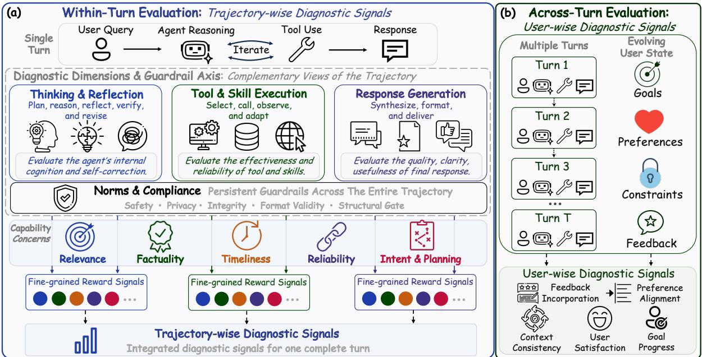
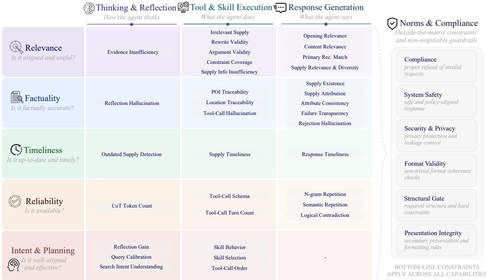
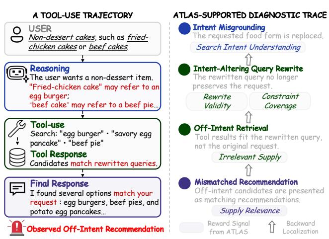
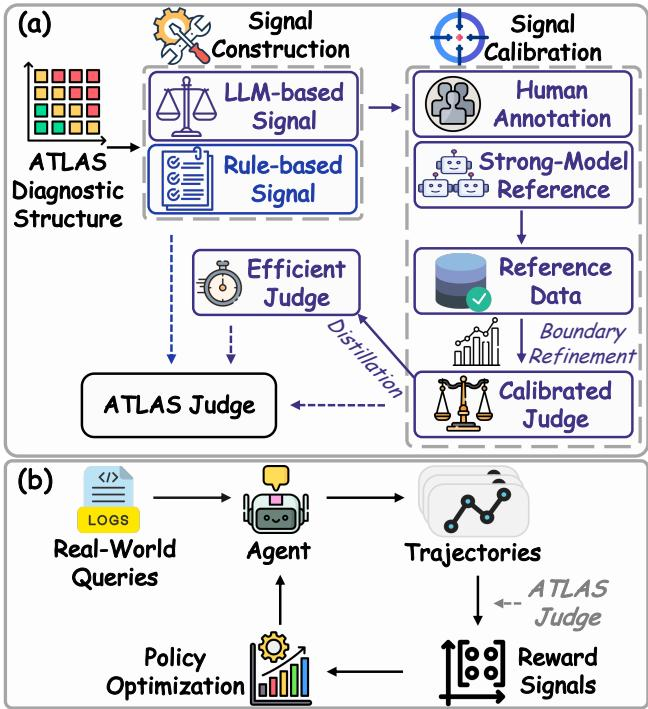
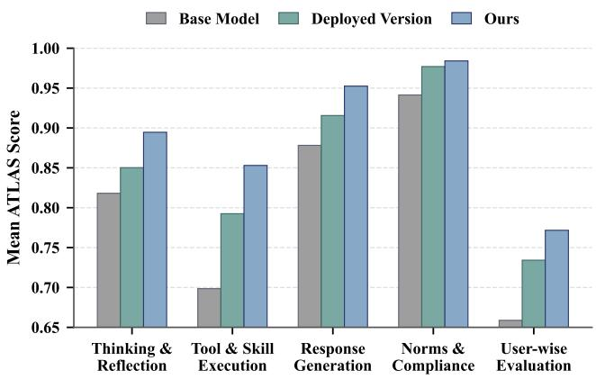
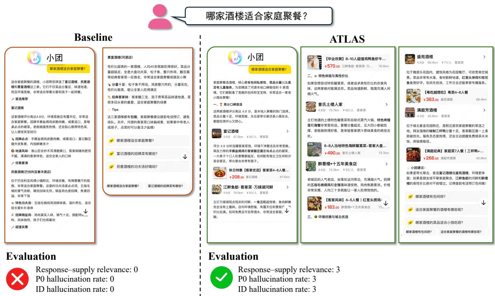
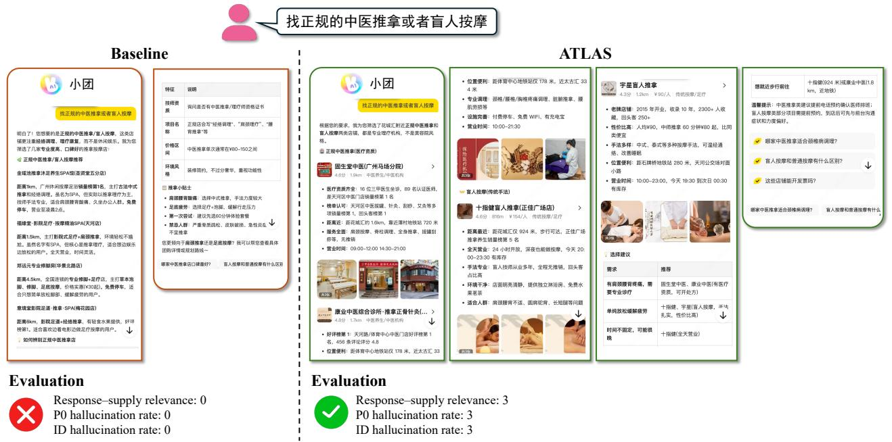
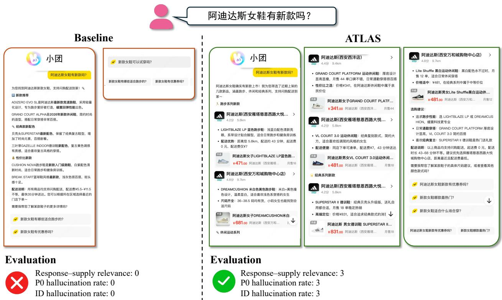
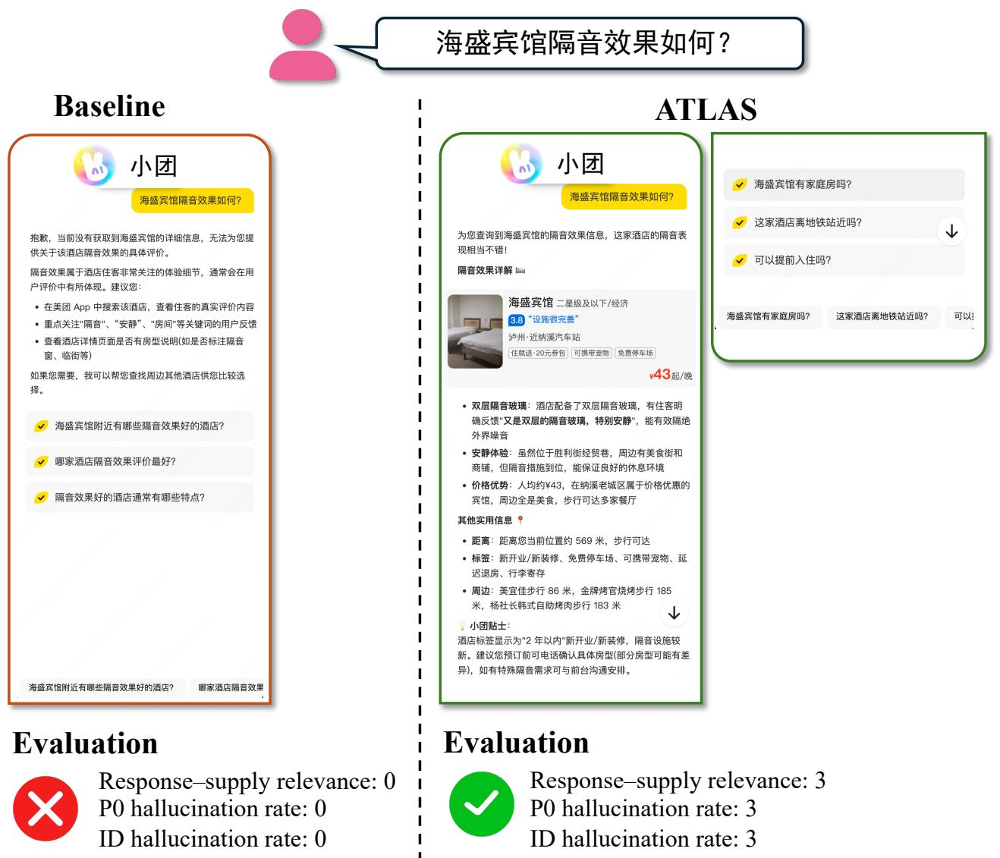

# ATLAS: Dual-Horizon Diagnostic Evaluation for Industrial Tool-Use Agents

University of Science and Technology of China, Meituan

See Contributions section for the full author list.

## Abstract

Large language model (LLM) agents are increasingly deployed in user-facing services that require iterative tool use under dynamic business conditions. Reliable evaluation is essential to their sustained improvement: it must expose capability deficiencies, inform iteration priorities, and assess the efects of interventions. However, industrial agent service unfolds both through the iterative trajectory of a current request and through continued interaction with a user. Reducing these connected behaviors to a final outcome obscures where deficiencies emerge during execution and whether subsequent service remains aligned with the context established by earlier exchanges. To address this limitation, we propose ATLAS, a dual-horizon diagnostic evaluation framework for industrial tool-use agents. At the request horizon, ATLAS uses trajectory-wise diagnostic signals to relate observed deficiencies to execution locations and capability concerns. At the interaction horizon, it uses user-wise diagnostic signals to assess whether service remains responsive across continued user interaction. Together, these complementary views preserve structured diagnostic evidence beyond outcome-level assessment, supporting targeted analysis of execution deficiencies and sustained service behavior. ATLAS operationalizes these diagnostic views by specifying executable signals with explicit evidence scopes and decision boundaries. For signals requiring semantic assessment, the corresponding LLM judge interfaces are calibrated against high-confidence references from real business logs, and their decision behavior can be distilled into eficient diagnostic models when needed, supporting lower-latency, lower-cost evaluation. The resulting diagnostic feedback further supports policy optimization. We evaluate ATLAS on production trafic from Meituan Xiaotuan. Ofline experiments assess diagnostic-signal fidelity and policy improvement under replay, while online A/B experiments show concurrent gains in user engagement, downstream business outcomes, and sampled human-audit quality.

Correspondence: chenweicw@mail.ustc.edu.cn, zhoupeilun02@meituan.com Project Page: https://atlas-eval.github.io/

## 1 Introduction

Evaluation is fundamental to the iterative improvement of large language models (LLMs): it reveals performance deficiencies and determines whether optimization has produced meaningful gains [1, 6, 14]. As LLM applications evolve from predominantly single-turn content generation toward agents that interpret user goals, invoke external tools [29, 41], and complete real-world tasks [8, 36, 38], the role of evaluation expands accordingly. For industrial tool-use agents embedded in user-facing products and business workflows, evaluation must do more than report the aggregate performance of a system version; it must inform sustained iteration. Because capability improvements compete for finite iteration and deployment resources, development teams need to prioritize deficiencies in light of the current user task and product context. Such priorities are scenario dependent. For example, local-services decision support may place particular weight on whether dynamic business information is accurate, timely, and actionable [4, 13, 48], whereas safety- or rule-sensitive applications may prioritize diferent requirements. Industrial agent evaluation must therefore provide evidence to answer three linked questions: What should be improved? What should be prioritized? Did the intervention work?

To support such iteration decisions, existing research has expanded agent evaluation beyond end-to-end measures of task success [2, 10, 42, 44] to include process-level analysis of intermediate execution [6, 19] and structured criteria or preference-aligned objectives that can provide optimization feedback [3, 5, 18, 36, 40]. These complementary perspectives provide important evidence for assessing agent behavior, but industrial iteration requires organizing this evidence into an actionable view of capability deficiencies that development teams can prioritize in accordance with the current product context.

This requirement is particularly demanding in industrial settings such as Xiaotuan,1 Meituan’s AI assistant for local services. As illustrated in Figure 1, the agent must transform a user’s current request into a decisionsupporting recommendation through a multi-step, iterative process. It repeatedly retrieves business information, compares candidate options, and updates subsequent actions in response to intermediate observations and tool feedback. This setting raises three distinct evaluation challenges: 1) Compounding errors in an execution trajectory. An early deviation in interpreting a request or selecting an action can accumulate through later steps and afect the eventual service outcome [7, 9]. 2) Dynamic business conditions. The business information an agent retrieves, such as search results, merchant supply, and availability, changes with real-world

  
Figure 1 A real Xiaotuan local-services interaction. To support a user’s decision, the assistant iteratively reasons over the request and uses tools to retrieve and compare business-grounded information, reconcile relevant constraints, and synthesize an actionable recommendation.

conditions [33, 51], while open-ended user needs may admit multiple reasonable service paths. An apparently acceptable response may consequently conceal whether the underlying process robustly served the user’s goal [15, 39]; it can still leave the user with a recommendation that is inaccurate, outdated, or not actionable under the current business state. 3) Continued interaction and sustained service. Beyond the current request, service unfolds across continued user interaction, where earlier exchanges establish referents, intent, constraints, and explicit corrections. Even if each lifecycle appears to handle its immediate request, failing to resolve, carry forward, or update this context can cause service to drift from the user’s evolving needs. Evaluation for industrial agents must therefore retain interpretable behavioral evidence from both the execution that produces a response and the continued interaction through which service unfolds.

For this purpose, we propose ATLAS2, a dual-horizon diagnostic evaluation framework for industrial tool-use agents that organizes capability analysis, evaluation, and subsequent improvement into an iterative loop grounded in diagnostic evidence. Within-Turn Evaluation uses trajectory-wise diagnostic signals to examine the complete, iterative execution trajectory triggered by a current request, whereas Across-Turn Evaluation uses user-wise diagnostic signals to examine whether subsequent service remains responsive to a user’s needs as the interaction unfolds. The two horizons are complementary but adopt distinct diagnostic structures: withinturn evaluation provides a structured diagnostic space for localizing execution-level capability deficiencies, while across-turn evaluation retains a dedicated view of continued service quality. Within the within-turn horizon, ATLAS localizes deficiencies along two complementary aspects: where they arise in execution and how the behavior at that location falls short of the service requirement. Thinking & Reflection, Tool & Skill Execution, and Response Generation define key execution locations; Relevance, Factuality, Timeliness, Reliability, and Intent & Planning characterize capability concerns that recur across these locations. Together, they form a structured diagnostic space whose locations are instantiated by fine-grained diagnostic signals grounded in concrete behavioral evidence, decision boundaries, and business failure modes. Norms & Compliance serves as a guardrail across execution, covering safety, privacy, compliance, and structural-validity requirements that are not subject to ordinary quality trade-ofs.

To make this dual-horizon diagnostic view actionable for iteration, ATLAS instantiates the diagnostic structure as executable signals with explicit evidence scopes and decision boundaries. LLM-based signals are calibrated on high-confidence reference sets constructed from real business logs; selected signals are further distilled into eficient diagnostic models that retain their diagnostic semantics while supporting lower-latency, lower-cost evaluation at scale. For policy optimization, calibrated diagnostic signals provide multi-dimensional training feedback, turning observed capability deficiencies into explicit improvement targets. We build and validate ATLAS on real production trafic from Meituan Xiaotuan through ofline evaluation of diagnostic signals and diagnosis-driven optimization, together with online A/B experiments in real local-services interactions. The online A/B study further shows that the ATLAS-optimized policy improves user engagement, downstream business outcomes, and sampled human-audit quality.

In summary, our contributions are threefold:

• Dual-Horizon Diagnostic Evaluation: We introduce ATLAS, a diagnostic evaluation framework that captures how an agent executes an individual request and how its service evolves across continued user interaction. Trajectory-wise within-turn signals localize capability deficiencies, while user-wise across-turn signals assess whether subsequent service remains responsive as user needs develop. Together, these complementary views support diagnosis of execution-level gaps and sustained user service.

• Diagnosis-Driven Iteration Mechanism: ATLAS instantiates its diagnostic structure as calibrated, evidence-bound signals whose semantics are preserved from evaluation through optimization. Low-latency diagnostic models support high-frequency use where needed, and the diagnostic signals used for optimization provide multi-dimensional training feedback. This design turns observed capability deficiencies into explici improvement targets and enables their subsequent reassessment under the same diagnostic framework.

• Real-Trafic Validation: We build and validate ATLAS on production trafic from Meituan Xiaotuan. Ofline evaluation validates the diagnostic signals and diagnosis-driven optimization, while online A/B experiments show improvements in user engagement, downstream business outcomes, and sampled humanaudit quality in real local-services interactions.

## 2 Related Works

## 2.1 Tool-Use Agent Evaluation

Tool-use agents operate through sequences of decisions that connect a user request with changing external evidence, tool outputs, and a final service response. Accordingly, evaluation has developed along complementary directions. General-purpose benchmarks measure end-to-end performance through task completion, terminalstate matching, or patch validation, providing common and reproducible measures of overall agent success [2, 10, 42, 44]. At the same time, process-oriented studies retain intermediate execution evidence to examine how an outcome is produced. For example, AgentEval models industrial workflows as dependency-aware DAGs for step-level assessment and failure analysis [6], while Agent-RewardBench probes reward-modeling capabilities across perception, planning, and safety [19]. This growing emphasis on execution evidence is particularly consequential for open-ended, multi-step agents, where a final outcome alone may not expose the decisions and conditions that shaped it. It also makes the design of evaluation signals consequential: LLM-based evaluators can vary substantially across agent capabilities [19], and coarse-grained judgments have been shown to miss defects in deployed multi-turn transactional agents [47].

Another line of work brings agent evaluation closer to deployment by grounding it in real requests, interaction logs, and dynamic external environments. MobilityBench replays realistic mobility requests for route-planning agents [33]; MindDR evaluates deep-research systems on product-facing queries [21]; RecRMBench studies recommendation rewards in real-world recommendation settings [46]; and CLQT studies portfolio-management agents under dynamic, closed-loop conditions [24]. Beyond a single task episode, RubricsTree evaluates personal-health agents with structured criteria spanning user memory and medical skills [49]. These eforts respectively advance deployment-aligned evaluation, process-sensitive analysis, and longer-lived interaction contexts. ATLAS builds on this landscape by treating two industrial service objects as related but distinct: the iterative execution trajectory initiated by a current request, and the continued service experienced by a user across subsequent interactions. The former calls for evidence that can localize capability deficiencies within an execution, whereas the latter assesses whether service remains responsive as user needs develop. Organizing these objects as within-turn and across-turn evaluation allows each to retain an evaluation structure appropriate to its role while connecting them within one framework.

## 2.2 Evaluation Signals for Agent Policy Optimization

The signals used to optimize agents have likewise evolved from outcome-level rewards toward richer forms of supervision. Terminal task success and auxiliary objectives remain common sources of feedback for tool-use reinforcement learning [23]. Process supervision instead assigns credit to intermediate reasoning steps or actions, as illustrated by process reward models for mathematical reasoning [14, 30, 34]; tool-use RL further constructs local feedback around invocation and execution behavior [23]. Rubric-based approaches extend structured criteria to tasks without a single verifiable outcome [3, 5, 18], while work such as Rubrics to Tokens connects response-level rubrics with finer-grained training signals [40]. Together, these studies show that evaluation criteria can serve not only as ofline measures, but also as interfaces for learning. Their signals may be organized around outcomes, local steps, sample-specific constraints, or preference objectives, reflecting the diverse optimization settings in which they are used.

Recent work further develops multidimensional signals and evaluation-guided optimization in concrete application domains. In personal health, RubricsTree uses hierarchically organized rubrics for open-ended agents [49]; safety-oriented reinforcement learning incorporates multi-dimensional rubric feedback [17]; in finance, multidimensional trading behaviors are used as feedback for closed-loop reinforcement learning [28]; and in embodied settings, step-wise, multidimensional reward models support virtual-agent learning [20]. Industrial systems similarly connect optimization to product objectives: SearchLLM aligns language models with searcher preferences [36], Interactor targets sponsored-search ad generation [35], multi-objective learning supports e-commerce dialogue [12], and RecGPT-V2 studies recommendation-oriented agent optimization [43]. These directions demonstrate the value of domain-grounded criteria and richer objectives, as well as the practical relevance of linking evaluation with policy improvement. ATLAS complements them by treating calibrated evaluation signals as a persistent semantic interface throughout an iteration cycle. They first characterize capability deficiencies in request-level execution and continued user service; selected signals then provide multi-dimensional feedback for policy optimization; and the resulting policy is reassessed under the same evaluation framework. This continuity preserves the diagnostic meaning of the signals from evaluation to optimization and back to evaluation, rather than using the evaluation result solely as an aggregate report or the optimization objective solely as an undiferentiated return.

## 3 Methodology

This section presents ATLAS as a dual-horizon diagnostic evaluation framework for industrial tool-use agents. ATLAS organizes complementary within-turn and across-turn evidence through executable diagnostic signals. The dual-horizon diagnostic structure determines the evidence evaluated by these signals (§3.1); signal construction specifies their evidence scopes and decision boundaries (§3.2); and calibration establishes the fidelity of semantic assessment (§3.3). Selected signals are implemented as eficient diagnostic models to support lower-latency, lower-cost evaluation at scale (§3.4). Diagnostic feedback further supports policy optimization (§3.5).

  
Figure 2 Overview of ATLAS’s dual-horizon diagnostic evaluation. Within-turn evaluation examines the trajectory generated for a current request, while across-turn evaluation examines how service responds to user-relevant state across multiple complete lifecycles.

## 3.1 Dual-Horizon Diagnostic Structure

ATLAS is designed around the observation that industrial agent service unfolds over two connected temporal scopes, each of which exposes a diferent kind of evidence about capability. As illustrated in Figure 2, withinturn evaluation examines the complete trajectory initiated by a current user request. During this execution, the agent may repeatedly reason about the request, invoke tools or skills, and update subsequent decisions in response to tool feedback before generating a final response. Within-turn evaluation therefore preserves the process evidence needed to determine where a deficiency manifests in the execution and how the observed behavior falls short of the task requirement. Across-turn evaluation examines a sequence of such complete lifecycles within the same ongoing user interaction. It considers whether user-relevant state established in earlier exchanges—such as referents, intent and constraints, and explicit corrections—is appropriately carried forward, updated, and used in subsequent service.

The request-level horizon requires a diagnostic structure that preserves both the location and the character of an observed deficiency. Within-turn evaluation therefore uses the structured diagnostic space in Figure 3. Its execution dimensions—Thinking & Reflection, Tool & Skill Execution, and Response Generation—identify where behavior is observed in an execution, from the agent’s understanding and decision process to its use of external capabilities and delivered answer. Its capability concerns—Relevance, Factuality, Timeliness, Reliability, and Intent & Planning—characterize how behavior at those locations serves the task. Their intersections are instantiated by fine-grained diagnostic signals with explicit evidence scopes and decision boundaries; cells without a stable signal family remain intentionally uninstantiated. Reliability concerns whether the observed execution remains operationally dependable, distinct from factual correctness, task relevance, and the user-wise continuity assessed across lifecycles. Norms & Compliance is maintained outside the matrix as an independent guardrail for non-negotiable safety, privacy, compliance, and structural-validity requirements. Together, the matrix and guardrail provide a shared basis for locating trajectory evidence and interpreting the corresponding capability deficiency. This structure is intended to serve as a reusable diagnostic backbone across industrial tool-use settings, while its concrete signal families combine recurring agent failure modes with scenario-specific patterns observed in real trafic.

Across-turn evaluation complements this trajectory-wise structure without adding another execution dimension. Its object is the relation among successive lifecycles and the evolving user context they share. ATLAS therefore organizes across-turn signals as a separate user-wise layer that assesses whether prior context is resolved, maintained, or corrected in later reasoning, tool use, and responses. This separation preserves the distinct diagnostic role of continued user service while keeping the within-turn matrix focused on the execution of an individual request. The resulting signal outcomes provide structured diagnostic evidence at both horizons. As shown in Figure 4, evidence associated with an individual trajectory can be related to the execution location and capability concern at which a deficiency manifests, while aggregated signal profiles can surface recurring patterns across execution dimensions, concerns, and user-wise behavior. This evidence-based view supports analysis of candidate capability deficiencies and the prioritization of subsequent intervention.

  
Figure 3 Within-turn diagnostic structure in ATLAS. The matrix organizes trajectory-wise diagnostic signals by execution dimension and capability concern. Populated cells denote instantiated signal families, while blank cells are intentionally uninstantiated. Norms & Compliance is maintained as an independent guardrail.

The complete inventory of all diagnostic signals is provided in Appendix Tables 6–10.

## 3.2 Diagnostic Signal Construction

ATLAS instantiates the diagnostic structure in Section 3.1 as executable diagnostic signals. Figure 5 summarizes how this pathway connects signal construction and calibration with eficient implementation and policy optimization. Each signal specifies a diagnostic target, the admissible evidence on which it may rely, a decision boundary that distinguishes satisfactory and deficient behavior, and output semantics for reporting the assessment. This specification connects an observed trajectory or user-wise interaction to an interpretable evaluation result, while allowing signals with diferent evidence forms to share a common diagnostic framework. Depending on the observability and structure of the target behavior, ATLAS implements signals through either rule-based or LLM-based mechanisms.

  
Figure 4 Evidence-based diagnosis with ATLAS. Signal outcomes link observed deficiencies to their evidence, execution location, capability concern, and user-wise context.

Signal implementation by evidence type. Rule-based diagnostic signals are used when the relevant boundary can be verified programmatically, such as for format constraints, structural validity, explicit enumerations, fixed-schema legality, or deterministic counts. LLM-based diagnostic signals are used when assessment requires open semantic reasoning over evidence that may jointly involve the user query, conversational context, tool outputs, intermediate reasoning, or the final response. For such signals, the LLM judge turns the diagnostic specification into a review task with explicit admissible evidence, decision boundaries, and structured outputs. Each prompt is organized around the target decision and typically includes five components: role and task definition, input field specification, decision criteria with exemption boundaries, stepwise review procedure, and structured output format. The role and task definition establishes a specific evaluator role; the input specification identifies the evidence and key objects to be assessed; and the decision criteria distinguish failures, exemptions, and inapplicable cases. The review procedure decomposes the assessment into evidence extraction, local comparison, boundary checking, and result consolidation, while the output format standardizes verdicts,The rewritten query no longer counts, rationales, and auxiliary fields. When a boundary is especially subtle or the input form is heterogeneous,an preserves the request. a small number of examples further anchor exemptions, near misses, and atypical formats.

Diagnostic score formulation. Binary verdicts are the default output form, while continuous sig-Tool results fit the rewritten query, nals are retained when the target naturally admits not the original request.a quantitative criterion. For a binary signal, the evaluator returns a pass/fail judgment for a localized diagnostic target. For a continuous signal, it returns local judgments, counts, or ranking labels Off-intent candidates are presented that are aggregated in post-processing. Formally, as matching recommendations.for a sample � under metric �, the system first identifies a set of locally assessable objects:

$$
A _ { m } ( x ) = \{ a _ { m , 1 } , \ldots , a _ { m , K } \} ,\tag{1}
$$

where $A _ { m } ( x )$ may correspond to a set of claims, candidate supply items, typo positions, or reflection steps. The evaluator then produces local judgments or suficient statistics, and the final diagnostic score is defined as

$$
r _ { m } ( x ) = \phi _ { m } ( z _ { m , 1 } ( x ) , \ldots , z _ { m , K } ( x ) ) ,\tag{2}
$$

where $z _ { m , k } ( x )$ denotes the local verdict or derived statistic associated with object $a _ { m , k }$ , and $\phi _ { m }$ is a metric-specific normalization function. This construction yields interpretable scores for signals such as repetition rate, stale-item ratio, correction rate, or ranking quality, because each aggregate remains grounded in local assessments rather than a holistic scalar judgment.

  
Figure 5 ATLAS’s diagnostic-signal implementation and optimization pathway. (a) The structure guides signal construction and calibration. (b) Signals evaluate trajectories and provide feedback for policy optimization.

Overall, diagnostic signal construction aligns the evaluation with the available evidence, makes decision boundaries explicit, and preserves interpretable output semantics for subsequent calibration and diagnosis.

## 3.3 Signal Calibration and Usability

The rule-based signals in ATLAS are directly determined by their programmatic specifications. For each LLMbased diagnostic signal, calibration evaluates whether its signal-specific LLM judge interface can reproduce the intended decision boundary on a high-confidence reference set aligned with the real-trafic distribution. This procedure tests the operational fidelity of a signal’s semantic assessment under its defined evidence scope; it does not redefine the diagnostic target or substitute the reference construction process.

Usability criterion. We use F1 as the primary criterion for calibrating LLM judge interfaces because class imbalance is common across diagnostic targets and F1 better reflects boundary fidelity than raw accuracy.

For score-valued signals, outputs are first mapped to signal-specific decision units using the corresponding discretization and tolerance rules. Formally, let $\mathcal { D } _ { m } ^ { \mathrm { c a l } }$ denote the calibration set for signal �, and let $j _ { m }$ denote its signal-specific LLM judge interface. We regard $j _ { m }$ as usable when

$$
\mathrm { F } 1 \big ( j _ { m } , \mathcal { D } _ { m } ^ { \mathrm { c a l } } \big ) \geq \tau _ { m } ,\tag{3}
$$

where $\tau _ { m }$ is set in a high-confidence range, typically 0.90. The calibration sets are constructed from query samples and execution traces drawn from real logs, with coverage over domains, query styles, and task types. This aligns calibration with the evidence conditions and error sources encountered in deployment rather than a narrow collection of manually constructed examples.

Reference construction. Reference construction follows the evidence requirements of each signal. For signals in Response Generation, we rely primarily on manual annotation because they act directly on the delivered response and have relatively compact judgment targets. Five senior annotators follow a unified protocol, each sample is independently labeled by at least three annotators, and disputed cases are adjudicated by domain experts. For LLM-based signals involving long tool-use trajectories, long tool outputs, or complex evidence chains, we construct high-confidence subsets through agreement filtering across three strong teacher models and retain only unanimous cases. To cover low-frequency boundaries, including safety and compliance violations, we further introduce controlled query- and trajectory-level perturbations and relabel the resulting samples through the same reference-construction route. Together, these procedures retain both naturally occurring trafic patterns and targeted coverage of dificult decision boundaries.

Boundary refinement. Each LLM judge interface is evaluated on its signal-specific calibration set. When F1 remains below the target range, we trace error cases to identify boundary ambiguity, missing evidence specifications, or insuficient treatment of exemptions. We then revise the prompt’s decision criteria, evidence binding, exemption conditions, or boundary examples and re-evaluate it on the same calibration set. The resulting judge interface is admitted to subsequent diagnostic use once it reaches the target range.

## 3.4 Efficient Diagnostic Model Distillation

The calibrated LLM judge interfaces in Section 3.3 provide high-capacity semantic assessments, but repeatedly invoking them at scale incurs substantial latency and inference cost. For selected LLM-based diagnostic signals, ATLAS therefore distills eficient diagnostic models that reproduce the corresponding signal-specific decision behavior on the same evidence inputs and decision outputs. These models provide a lower-latency, lower-cost implementation while retaining the diagnostic role established by the calibrated signal.

Grouping strategy. We adopt group-wise distillation rather than fully independent or fully shared training. Independent models preserve individual decision boundaries but fragment data, duplicate parameters, and increase deployment overhead, whereas a fully shared model can mix signals with incompatible evidence forms and output targets. Distillation groups are therefore organized jointly by the signal’s execution dimension, capability concern, and input-output form. The first two preserve a shared diagnostic target, while the third aligns the evidence organization and prediction interface that can be modeled jointly. Signals are grouped only when they are compatible along all three factors.

Data and supervision. Training data comprise query samples and complete execution traces drawn from real logs, with coverage over query types, domains, and task forms. We further apply controlled response-level perturbation: the final response in an original trajectory is lightly rewritten while preserving the core task semantics and content, introducing variation in wording, style, and formatting. This augmentation encourages the diagnostic model to learn stable decision behavior rather than overfit to a particular surface template. Supervision is produced by multiple strong teacher models through independent judgments followed by voting. Evaluation uses the corresponding high-confidence references in ${ \mathcal { D } } _ { \mathrm { J u d g e } } ,$ , with query-disjoint distillation training data, so model quality is measured against the same reference standard used to establish judge usability.

Filtering and objective. Before training, we apply format consistency filtering to remove structurally abnormal samples, including failed JSON parsing, unclosed <think> tags, repetitive responses, and abnormally short reasoning traces. We then apply confidence-based filtering: when the base model’s prediction already matches the target label with log-probability above a predefined high-confidence threshold, the sample is treated as low-gain and removed from distillation. Within each group, the diagnostic model is trained to map the corresponding evidence input to the teacher-derived decision output. When a <think> field is present, it receives a lower loss weight, e.g., 0.1, to reduce overfitting to teacher-specific reasoning style and place greater emphasis on the final verdict and key structured fields. The resulting eficient diagnostic models support low-latency, lower-cost batch evaluation during policy optimization.

## 3.5 Policy Optimization with Diagnostic Feedback

As illustrated by the policy-optimization pathway in Figure 5(b), calibrated diagnostic signals are reused as multi-dimensional feedback for policy optimization. Formally, let � denote the input query together with its context, and let � denote a complete trajectory generated by the policy. Let $S _ { \mathrm { t r a i n } }$ denote the set of diagnostic signals used for policy optimization. For each signal $s \in S _ { \mathrm { t r a i n } }$ , let $r _ { s } ( x , \tau )$ denote its output and let $\lambda _ { s }$ denote its combination weight. Their weighted sum defines the scalar training reward:

$$
R ( x , \tau ) = \sum _ { s \in S _ { \mathrm { t r a i n } } } \lambda _ { s } r _ { s } ( x , \tau ) .\tag{4}
$$

Each term remains associated with a specific capability location in the diagnostic structure, while policy optimization consumes their fixed combination as an optimizable scalar return.

Policy optimization uses Group Relative Policy Optimization (GRPO) [31]. Given an input �, the current policy samples a group of trajectories $\{ \tau _ { i } \} _ { i = 1 } ^ { G } { \mathrm { . } }$ and each trajectory is assigned the training reward $R ( x , \tau _ { i } )$ The group-normalized advantage is computed as

$$
\hat { A } _ { i } = \frac { R ( x , \tau _ { i } ) - \mathrm { m e a n } _ { j } \left( R ( x , \tau _ { j } ) \right) } { \mathrm { s t d } _ { j } \left( R ( x , \tau _ { j } ) \right) + \epsilon } ,\tag{5}
$$

which converts the relative quality of candidate trajectories under the same query into the training signal. We omit the standard GRPO objective for brevity, since the key choice here is not the optimization algorithm, but that its advantage estimates are induced by diagnostic feedback with the same semantics used for evaluation. This aligns policy optimization with the diagnostic structure used to assess policy changes, while retaining interpretable capability-specific feedback rather than relying on a single aggregate outcome score.

## 4 Experiments

We evaluate ATLAS from four perspectives. RQ1 examines whether diferent LLM judge interfaces faithfully implement the decision boundaries of LLM-based diagnostic signals. RQ2 studies whether selected diagnostic signals can be implemented by eficient diagnostic models while preserving evaluation fidelity. RQ3 examines whether diagnostic feedback improves policy quality under deployment-aligned ofline replay. RQ4 evaluates whether these gains transfer to online trafic. RQ1 and RQ2 establish the empirical basis for the signal construction, calibration, and eficient-model distillation procedures in Sections 3.2–3.4, while RQ3 and RQ4 evaluate policy changes under the same diagnostic framework in ofline replay and live trafic.

## 4.1 Experimental Setup

## 4.1.1 Datasets

We construct three mutually query-disjoint datasets from real Xiaotuan production trafic: a labeled Diagnostic Signal Benchmark $\left( \mathcal { D } _ { \mathrm { J u d g e } } \right)$ , an unlabeled Ofline Policy Evaluation Set $\left( \mathcal { D } _ { \mathrm { P o l i c y - E v a l } } \right)$ , and an unlabeled RL Optimization Set $( \mathcal { D } _ { \mathrm { R L } } ) . \ \mathcal { D } _ { \mathrm { J u d g e } }$ contains query–trajectory pairs with high-confidence reference labels for calibration and evaluation of the 41 LLM-based diagnostic signals; each calibrated signal is associated with approximately 500–1,000 instances. $\mathcal { D } _ { \mathrm { P o l i c y - E v a l } }$ contains approximately 2,000 queries for deployment-aligned ofline replay, whereas $\mathcal { D } _ { \mathrm { R L } }$ contains approximately 10,000 queries for policy optimization. For RQ2, eficient diagnostic models are trained on separately constructed, query-disjoint distillation data and evaluated against the corresponding high-confidence references in $\mathcal { D } _ { \mathrm { J u d g e } }$

## 4.1.2 Evaluation Environment

Diagnostic signal calibration and eficient diagnostic model evaluation are grounded in real production logs, so the resulting supervision reflects authentic user intents, tool-use trajectories, and business evidence. Agent evaluation uses a deployment-aligned ofline replay environment: real user queries are replayed to the tested agent, tool calls are executed through the same production-facing interfaces used online, and merchants, POIs, and supply states are resolved from live business data at execution time. This setup preserves experimental controllability while keeping ofline evaluation close to online evidence conditions.

## 4.1.3 Compared Methods

We compare ATLAS along two axes: LLM judge-interface design in RQ1 and eficient diagnostic model distillation in RQ2. Detailed judge-interface configurations are provided in Appendix A.2.

LLM judge interfaces. Under the same backbone, Direct Judge uses only task definition, input description, and output schema; Static Rubric adds an automatically generated fixed rubric; Curated Rubric retains signal-specific criteria and key exemptions in compact form; and ATLAS Judge uses the full calibrated judge interface in Section 3.3, including evidence binding, stepwise review, and constrained output formatting.

Eficient diagnostic models. Following Section 3.4, we distill models for selected LLM-based diagnostic signals onto Qwen3.5-9B. We compare the resulting eficient diagnostic models with the untuned Qwen3.5-9B backbone [26], Qwen3.6-27B [25], Qwen3.6-35B-A3B [27], and DeepSeek-V4-Pro [37].

## 4.1.4 Metrics

For LLM judge-interface and eficient diagnostic model experiments, we report F1. For ofline policy evaluation, we report ATLAS scores aggregated under replay. For online evaluation, we report product metrics, including AI message read-through rate, per-user dwell time, 5-second session exit rate, AI search query volume, efective QV, session follow-up rate, and paid GTV, together with sampled human-audi metrics: P0 hallucination rate, ID hallucination rate, and response–supply relevance. Detailed definitions of the automatic metrics are provided in Appendix C.

## 4.1.5 Implementation Details

All experiments run on NVIDIA H20 GPUs. For RQ1, all judge interfaces share the DeepSeek-V4-Pro backbone [37]; judge calibration uses Claude Opus-4.6, GPT-5.4, and Gemini 3.1-Pro for high-confidence supervision construction. For RQ2, we distill eficient diagnostic models with Swift [50] on 8 GPUs, using DeepSeek-V4-Pro, DeepSeek-V4-Flash [37], and GLM-5.1 [45] for supervision construction and Qwen3.5- 9B [26] as the student, with AdamW [16], batch size 128, learning rate $1 \times 1 0 ^ { - 5 }$ , maximum output length 2148, and maximum total sequence length 16384. For RL, we optimize Qwen3.6-35B-A3B [27] on 32 GPUs with Verl [32], Megatron [22], and vLLM [11], using AdamW [16], learning rate $1 \times 1 0 ^ { - 6 }$ , batch size 128, rollout group size 16, temperature 1.0, maximum output length 8192, and maximum total sequence length 32768. Additional implementation details are provided in Appendix D.

## 4.2 Effectiveness of LLM Judge Interfaces (RQ1)

To validate whether diferent LLM judge interfaces faithfully implement signal-specific decision boundaries, we compare ATLAS Judge against three alternatives under the same judge backbone: Direct Judge, Static Rubric, and Curated Rubric. Table 1 summarizes the 41 LLM-based diagnostic signals by within-turn concern and the separate user-wise group, while Tables 4 and 5 report the full results. Rule-based signals are directly determined by their programmatic specifications and are therefore outside this F1 comparison.

The results show that ATLAS Judge is the strongest interface across all reported groups, which is the central empirical validation of judge calibration in ATLAS. The gain is not from prompt length alone, but from preserving the full calibrated signal-specific decision procedure through explicit evidence binding, stepwise review, and stable boundary control. The appendix further shows that the baselines fail in diferent ways rather than forming a simple quality ladder: Direct Judge remains competitive when decision boundaries are local and portable, whereas rubric-based interfaces help more when judgment depends on structured criteria, business evidence, or exception-sensitive boundaries. This clarifies that RQ1 is not a prompt-ablation story, but a comparison of how faithfully each interface preserves diagnostic-signal semantics. Overall, the results support the design choices in Sections 3.2 and 3.3: reliable LLM judge interfaces require both a strong backbone and a calibrated prompt interface that makes the intended decision boundary executable.

Table 1 Comparison of LLM judge interfaces across within-turn capability concerns and the user-wise signal group. Scores are average F1 over the comparable LLM-based diagnostic signals. Best results are highlighted in bold.
<table><tr><td>Method</td><td>Relevance</td><td>Factuality</td><td>Timeliness</td><td>Reliability</td><td>Intent &amp; Planning</td><td>Norms &amp; Compliance</td><td>User-wise</td><td>Overall</td></tr><tr><td>Direct Judge</td><td>0.831</td><td>0.842</td><td>0.691</td><td>0.811</td><td>0.768</td><td>0.813</td><td>0.784</td><td>0.800</td></tr><tr><td>Static Rubric</td><td>0.843</td><td>0.853</td><td>0.849</td><td>0.775</td><td>0.811</td><td>0.876</td><td>0.761</td><td>0.826</td></tr><tr><td>Curated Rubric</td><td>0.885</td><td>0.905</td><td>0.838</td><td>0.808</td><td>0.843</td><td>0.932</td><td>0.880</td><td>0.877</td></tr><tr><td>ATLAS Judge</td><td>0.939</td><td>0.956</td><td>0.961</td><td>0.972</td><td>0.937</td><td>0.984</td><td>0.953</td><td>0.952</td></tr></table>

Table 2 Eficient diagnostic model distillation results for the 17 selected LLM-based diagnostic signals in RQ2. Scores are F1 (%). Δ denotes the absolute gain of Ours over the untuned Qwen3.5-9B baseline.
<table><tr><td>Signal group</td><td>Diagnostic signal</td><td>DS-V4-Pro</td><td>Qwen3.5-9B</td><td>Qwen3.6-27B</td><td>Qwen3.6-35B-A3B</td><td>Ours</td><td>Δ</td></tr><tr><td rowspan="6">Relevance</td><td>Content Relevance</td><td>92.8</td><td>80.5</td><td>88.9</td><td>88.1</td><td>92.3</td><td>+11.8</td></tr><tr><td>Supply Diversity</td><td>94.3</td><td>83.1</td><td>93.4</td><td>91.9</td><td>93.5</td><td>+10.4</td></tr><tr><td>Supply Relevance</td><td>94.8</td><td>78.6</td><td>91.0</td><td>88.4</td><td>91.3</td><td>+12.7</td></tr><tr><td>Opening Relevance</td><td>97.8</td><td>72.6</td><td>92.6</td><td>89.5</td><td>94.3</td><td>+21.7</td></tr><tr><td>Primary Rec. Match</td><td>96.4</td><td>69.5</td><td>88.2</td><td>82.9</td><td>91.9</td><td>+22.4</td></tr><tr><td>Avg.</td><td>95.2</td><td>76.9</td><td>90.8</td><td>88.2</td><td>92.7</td><td>+15.8</td></tr><tr><td rowspan="7">Factuality</td><td>Supply Existence</td><td>93.8</td><td>89.6</td><td>84.4</td><td>87.3</td><td>94.5</td><td>+4.9</td></tr><tr><td>Attribute Consistency</td><td>91.0</td><td>67.5</td><td>76.2</td><td>80.2</td><td>89.0</td><td>+21.5</td></tr><tr><td>Supply Attribution</td><td>92.5</td><td>68.5</td><td>81.6</td><td>84.4</td><td>92.4</td><td>+23.9</td></tr><tr><td>Failure Transparency</td><td>99.8</td><td>94.1</td><td>97.1</td><td>83.3</td><td>94.4</td><td>+0.3</td></tr><tr><td>POI Traceability</td><td>99.7</td><td>99.2</td><td>86.3</td><td>90.0</td><td>98.6</td><td>-0.6</td></tr><tr><td>Location Constraint</td><td>98.6</td><td>69.4</td><td>79.2</td><td>68.7</td><td>98.6</td><td>+29.2</td></tr><tr><td>Avg.</td><td>95.9</td><td>81.4</td><td>84.1</td><td>82.3</td><td>94.6</td><td>+13.2</td></tr><tr><td rowspan="3">Reliability</td><td>Logical Contradiction</td><td>96.7</td><td>82.6</td><td>95.5</td><td>90.2</td><td>96.1</td><td>+13.5</td></tr><tr><td>Semantic Repetition</td><td>97.7</td><td>73.3</td><td>95.6</td><td>80.9</td><td>94.8</td><td>+21.5</td></tr><tr><td>Avg.</td><td>97.2</td><td>78.0</td><td>95.5</td><td>85.6</td><td>95.5</td><td>+17.5</td></tr><tr><td rowspan="5">Norms &amp; Compliance</td><td>Format Validity</td><td>98.9</td><td>86.2</td><td>97.9</td><td>97.1</td><td>96.1</td><td>+9.9</td></tr><tr><td>Security &amp; Privacy</td><td>99.6</td><td>95.7</td><td>99.2</td><td>95.1</td><td>98.9</td><td>+3.2</td></tr><tr><td>System Safety</td><td>98.1</td><td>89.9</td><td>98.8</td><td>71.1</td><td>98.4</td><td>+8.5</td></tr><tr><td>Compliance</td><td>97.0</td><td>77.5</td><td>89.0</td><td>74.4</td><td>93.5</td><td>+16.0</td></tr><tr><td>Avg.</td><td>98.4</td><td>87.3</td><td>96.2</td><td>84.4</td><td>96.7</td><td>+9.4</td></tr><tr><td>Overall</td><td>Avg.</td><td>96.4</td><td>81.0</td><td>90.3</td><td>84.9</td><td>94.6</td><td>+13.6</td></tr></table>

## 4.3 Efficient Diagnostic Model Distillation (RQ2)

We next examine whether eficient diagnostic models can reproduce the decision behavior of selected LLMbased diagnostic signals. Following Section 3.4, we distill models for 17 selected signals and group them by execution dimension, capability concern, and input–output form. Table 2 reports the results for these signals, covering Relevance, Factuality, Reliability, and Norms & Compliance. We distill onto Qwen3.5-9B and compare the resulting models with untuned and larger open-source baselines.

Table 2 shows that the distilled 9B diagnostic models preserve most of the high-capacity reference performance while clearly outperforming the untuned 9B backbone and substantially larger open baselines. The main insight is not compression alone, but calibrated decision-boundary transfer: once the student is trained against a well-calibrated LLM judge interface, a smaller model can outperform larger general-purpose models whose decision boundaries are not aligned to the target signal semantics. The gains are concentrated on signals where generic prompting is least reliable, especially business-grounded factuality and reliability-oriented signals, precisely where evidence grounding and boundary control are hardest to recover from raw model capacity alone. This pattern supports the group-wise distillation design in Section 3.4. At the same time, the strongest reference interface remains best on the most semantically delicate cases, clarifying the intended role separation in ATLAS: ATLAS Judge serves as the high-capacity reference interface, whereas eficient diagnostic models provide a lower-latency, lower-cost implementation for evaluation at scale.

## 4.4 Offline Policy Evaluation (RQ3)

We next evaluate whether policy optimization with diagnostic feedback improves agent behavior under deployment-aligned replay. We compare the base model, the deployed version, and the policy optimized with ATLAS diagnostic feedback (Ours).

Figure 6 reports group-level mean ATLAS scores across the three within-turn execution dimensions, the Norms & Compliance guardrail, and the userwise evaluation layer. Ours achieves the highest score in every reported group: it improves both trajectory-wise execution and response generation, maintains the already high Norms & Compliance score, and also improves user-wise evaluation. The strongest improvement appears in Tool & Skill Execution, showing that the gains are not limited to the final response. Taken together, these results show that ATLAS connects structured capability diagnosis with policy optimization: the same diagnostic signals used as feedback support broad improvements that are subsequently examined under the dual-horizon evaluation framework.

  
Figure 6 Ofline replay evaluation under ATLAS across within-turn dimensions, the Norms & Compliance guardrail, and the user-wise layer.

## 4.5 Online Evaluation (RQ4)

We deploy the policy optimized with ATLAS diagnostic feedback to the entry of Meituan’s local-services assistant and run an online $\mathrm { A } / \mathrm { B }$ test against the deployed version from June 27 to June 29. The treatment is exposed to a fixed 10% slice of live trafic, and control and treatment are evaluated synchronously over the same period to reduce temporal confounds. Table 3 reports the online product metrics and a sampled human audit over 1,000 responses from the experiment window.

The results show that the policy optimized with ATLAS diagnostic feedback improves both engagement and downstream business outcomes online. The largest gains appear in session follow-up rate (+6.9%), a session-level indicator of continued user interaction, and paid GTV (+7.32%), while the remaining product metrics also move in the favorable direction. These outcomes indicate increased continued interaction and downstream transaction activity in live trafic. The sampled human audit points in the same direction: response–supply relevance rises by 6.2 pp, while P0 hallucination and ID hallucination rates decrease by 6.9 pp and 2.0 pp, respectively. Together with the ofline results, the concurrent improvements in product outcomes and human-audit quality provide deployment-side evidence that policy optimization with ATLAS diagnostic feedback transfers to real local-services trafic. Overall, the online results provide deployment-side validation of ATLAS.

Table 3 Online evaluation results for RQ4. Panel A reports relative changes in the online $\mathrm { A } / \mathrm { B }$ test; Panel B reports percentage-point (pp) changes in sampled human audits.
<table><tr><td colspan="3">Panel A: Online product metrics</td></tr><tr><td>Metric</td><td>Direction</td><td>Δ</td></tr><tr><td>AI message read-through rate</td><td>↑</td><td>+0.92%</td></tr><tr><td>Per-user dwell time</td><td>↑</td><td>+1.26%</td></tr><tr><td>AI search query volume</td><td>←</td><td>+0.76%</td></tr><tr><td>Effective QV</td><td>←</td><td>+0.50%</td></tr><tr><td>Session follow-up rate</td><td>↑</td><td>+6.9%</td></tr><tr><td>Paid GTV</td><td>↑</td><td>+7.32%</td></tr><tr><td>5-second session exit rate</td><td>↓</td><td>-0.31%</td></tr></table>

<table><tr><td colspan="3">Panel B: Sampled human-audit metrics</td></tr><tr><td>Metric</td><td>Direction</td><td>Δ</td></tr><tr><td>Response-supply relevance</td><td>↑</td><td>+6.2 pp</td></tr><tr><td>P0 hallucination rate</td><td>↓</td><td>-6.9 pp</td></tr><tr><td>ID hallucination rate</td><td>↓</td><td>-2.0 pp</td></tr></table>

## 5 Conclusion

In this work, we introduced ATLAS, a dual-horizon diagnostic evaluation framework for industrial tool-use agents. Rather than treating agent evaluation as outcome reporting alone, ATLAS organizes interpretable behavioral evidence to support capability analysis and targeted iteration in production settings. It jointly considers trajectory-wise evidence from the iterative execution triggered by a current request and user-wise evidence from continued interaction, preserving complementary views of how service is produced and sustained. Fine-grained diagnostic signals make these views executable through explicit evidence scopes and decision boundaries. Selected calibrated signals are distilled into eficient diagnostic models that support lower-latency, lower-cost evaluation at scale; calibrated diagnostic signals further provide multi-dimensional feedback for policy optimization. Experiments on Meituan Xiaotuan validate the LLM judge interfaces, eficient diagnostic models, and policy improvements under ofline replay across both evaluation horizons. Online A/B results further show concurrent gains in product outcomes and sampled human-audit quality in real local-services trafic. Overall, ATLAS provides an evidence-based foundation for analyzing capability deficiencies and supporting targeted iteration of industrial tool-use services.

## Contributions

Authors Wei ${ \mathrm { C h e n } } ^ { 1 , * }$ , Peilun $\mathrm { Z h o u } ^ { 2 , * , \ddagger }$ , Zhaoyu $\mathrm { H u ^ { 2 } }$ , Jiajun Chai2, Zhongni $\mathrm { H o u ^ { 2 } }$ , Yufei $\mathrm { Z h a n g ^ { 2 } } .$ , Derong $\mathrm { { X u ^ { 1 } } }$ , Guojun $\mathrm { Y i n ^ { 2 , \dag } }$ , Wei $\mathrm { L i n ^ { 2 , \dag } }$ , Zhi $\mathrm { Z h e n g ^ { 1 , \dagger } }$ , Tong $\mathrm { { X u ^ { 1 , \dag } } }$

Afiliations 1State Key Laboratory of Cognitive Intelligence, University of Science and Technology of China; 2Meituan

∗ Equal Contribution; ‡ Project Leader; † Corresponding Author

## References

[1] Wael Albayaydh, Rui Zhao, and Ivan Flechais. Beyond the leaderboard: A synthesis of tool-use, planning, and reasoning failures in large language model agents. arXiv preprint arXiv:2607.05775, 2026.

[2] Victor Barres, Honghua Dong, Soham Ray, Xujie Si, and Karthik Narasimhan. �2-bench: Evaluating conversational agents in a dual-control environment. arXiv preprint arXiv:2506.07982, 2025.

[3] Hao Chen, Ziyu Han, Yukun Yan, Qingfu Zhu, Maosong Sun, and Wanxiang Che. From holistic evaluation to structured criteria: Rubrics across the evolving llm landscape. arXiv preprint arXiv:2606.08625, 2026.

[4] Yashar Deldjoo, Nikhil Mehta, Maheswaran Sathiamoorthy, Shuai Zhang, Pablo Castells, and Julian McAuley. Toward holistic evaluation of recommender systems powered by generative models. arXiv preprint arXiv:2504.06667, 2025.

[5] Anisha Gunjal, Anthony Wang, Elaine Lau, Vaskar Nath, Yunzhong He, Bing Liu, and Sean M Hendryx. Rubrics as rewards: Reinforcement learning beyond verifiable domains. In NeurIPS 2025 Workshop on Eficient Reasoning, 2025.

[6] Dongxin Guo, Jikun Wu, and Siu Ming Yiu. Agenteval: Dag-structured step-level evaluation for agentic workflows with error propagation tracking. arXiv preprint arXiv:2604.23581, 2026.

[7] Bhaskar Gurram. Evaluating tool-using language agents: Judge reliability, propagation cascades, and runtime mitigation in agentprop-bench. arXiv preprint arXiv:2604.16706, 2026.

[8] Wei He, Yueqing Sun, Hongyan Hao, Xueyuan Hao, Zhikang Xia, Qi Gu, Chengcheng Han, Dengchang Zhao, Hui Su, Kefeng Zhang, Man Gao, Xi Su, Xiaodong Cai, Xunliang Cai, Yu Yang, and Yunke Zhao. Vitabench: Benchmarking llm agents with versatile interactive tasks in real-world applications. arXiv preprint arXiv:2509.26490, 2025.

[9] Saeid Jamshidi, Arghavan Moradi Dakhel, Kawser Wazed Nafi, and Foutse Khomh. Hallucination cascade: Analyzing error propagation in multi-agent llm systems. arXiv preprint arXiv:2606.07937, 2026.

[10] Carlos E Jimenez, John Yang, Alexander Wettig, Shunyu Yao, Kexin Pei, Ofir Press, and Karthik Narasimhan. Swe-bench: Can language models resolve real-world github issues? In International Conference on Learning Representations, volume 2024, pages 54107–54157, 2024.

[11] Woosuk Kwon, Zhuohan Li, Siyuan Zhuang, Ying Sheng, Lianmin Zheng, Cody Hao Yu, Joseph Gonzalez, Hao Zhang, and Ion Stoica. Eficient memory management for large language model serving with pagedattention. In Proceedings of the 29th symposium on operating systems principles, pages 611–626, 2023.

[12] Mingzhe Li, Jing Xiang, Enguo Zhou, Lang Gao, Tai Li, Qishen Zhang, Xiangliang Zhang, and Xiuying Chen. One model, multiple goals: Adaptive multi-objective learning for e-commerce dialogue systems. arXiv preprint arXiv:2606.09293, 2026.

[13] Hao Liao, Jiwei Zhang, Jianxun Lian, Wensheng Lu, Mingqi Wu, Shuowangg, Yong Zhang, Yitian Huang, Mingyang Zhou, and Rui Mao. Eliminating out-of-domain recommendations in LLM-based recommender systems: A unified view. In Findings of the Association for Computational Linguistics: ACL 2026, pages 6251–6271, 2026.

[14] Hunter Lightman, Vineet Kosaraju, Yuri Burda, Harrison Edwards, Bowen Baker, Teddy Lee, Jan Leike, John Schulman, Ilya Sutskever, and Karl Cobbe. Let’s verify step by step. In The Twelfth International Conference on Learning Representations, ICLR 2024, 2024.

[15] Tianci Liu, Ran Xu, Tony Yu, Ilgee Hong, Carl Yang, Tuo Zhao, and Haoyu Wang. Openrubrics: Towards scalable synthetic rubric generation for reward modeling and llm alignment. In Proceedings of the 64th Annual Meeting of the Association for Computational Linguistics (Volume 1: Long Papers), pages 17417–17437, 2026.

[16] Ilya Loshchilov and Frank Hutter. Decoupled weight decay regularization. In 7th International Conference on Learning Representations, 2019.

[17] Xian Qi Loye, Qinglin Su, Zhexin Zhang, Shiyao Cui, Qi Zhu, Fei Mi, Hongning Wang, and Minlie Huang. RUBAS: Rubric-based reinforcement learning for agent safety. arXiv preprint arXiv:2606.04051, 2026.

[18] Sushant Mehta, Liudas Panavas, Suhaas Garre, and Edwin Chen. ComplexConstraints and beyond: Expert rubrics for RLVR. arXiv preprint arXiv:2606.09118, 2026.

[19] Tianyi Men, Zhuoran Jin, Pengfei Cao, Yubo Chen, Kang Liu, and Jun Zhao. Agent-rewardbench: Towards a unified benchmark for reward modeling across perception, planning, and safety in real-world multimodal agents.

In Proceedings of the 63rd Annual Meeting of the Association for Computational Linguistics (Volume 1: Long Papers), pages 17521–17541, 2025.

[20] Bingchen Miao, Yang Wu, Minghe Gao, Qifan Yu, Wendong Bu, Wenqiao Zhang, Yunfei Li, Siliang Tang, Tat-Seng Chua, and Juncheng Li. Boosting virtual agent learning and reasoning: A step-wise, multi-dimensional, and generalist reward model with benchmark. arXiv preprint arXiv:2503.18665, 2025.

[21] MindDR Team and Li Auto Inc. Mind deepresearch technical report. arXiv preprint arXiv:2604.14518, 2026.

[22] Deepak Narayanan, Mohammad Shoeybi, Jared Casper, Patrick LeGresley, Mostofa Patwary, Vijay Korthikanti, Dmitri Vainbrand, Prethvi Kashinkunti, Julie Bernauer, Bryan Catanzaro, et al. Eficient large-scale language model training on gpu clusters using megatron-lm. In Proceedings of the international conference for high performance computing, networking, storage and analysis, pages 1–15, 2021.

[23] Cheng Qian, Emre Can Acikgoz, Qi He, Hongru Wang, Xiusi Chen, Dilek Hakkani-Tur, Gokhan Tur, and Heng Ji. Toolrl: Reward is all tool learning needs. Advances in Neural Information Processing Systems, 38:105523–105553, 2026.

[24] Bo Qu and Mingguang Chen. CLQT: A closed-loop, cost-aware, strategy-consistent benchmark for diagnostic evaluation of LLM portfolio-management agents. arXiv preprint arXiv:2606.29771, 2026.

[25] Qwen Team. Qwen3.6-27B: Flagship-level coding in a 27B dense model, April 2026. URL https://qwen.ai/blog? id=qwen3.6-27b.

[26] Qwen Team. Qwen3.5: Towards native multimodal agents, February 2026. URL https://qwen.ai/blog?id=qwen3. 5.

[27] Qwen Team. Qwen3.6-35B-A3B: Agentic coding power, now open to all, April 2026. URL https://qwen.ai/blog? id=qwen3.6-35b-a3b.

[28] Mohammad Al Ridhawi, Mahtab Haj Ali, and Hussein Al Osman. Multi-dimensional behavioral evaluation of agentic stock prediction systems using large language model judges with closed-loop reinforcement learning feedback. arXiv preprint arXiv:2605.05739, 2026.

[29] Timo Schick, Jane Dwivedi-Yu, Roberto Dessi, Roberta Raileanu, Maria Lomeli, Luke Zettlemoyer, Nicola Cancedda, and Thomas Scialom. Toolformer: Language models can teach themselves to use tools. arXiv preprint arXiv:2302.04761, 2023.

[30] Rulin Shao, Akari Asai, Shannon Zejiang Shen, Hamish Ivison, Varsha Kishore, Jingming Zhuo, Xinran Zhao, Molly Park, Samuel G Finlayson, David Sontag, et al. Dr tulu: Reinforcement learning with evolving rubrics for deep research. arXiv preprint arXiv:2511.19399, 2025.

[31] Zhihong Shao, Peiyi Wang, Qihao Zhu, Runxin Xu, Junxiao Song, Xiao Bi, Haowei Zhang, Mingchuan Zhang, YK Li, Yang Wu, et al. Deepseekmath: Pushing the limits of mathematical reasoning in open language models. arXiv preprint arXiv:2402.03300, 2024.

[32] Guangming Sheng, Chi Zhang, Zilingfeng Ye, Xibin Wu, Wang Zhang, Ru Zhang, Yanghua Peng, Haibin Lin, and Chuan Wu. Hybridflow: A flexible and eficient rlhf framework. In Proceedings of the Twentieth European Conference on Computer Systems, pages 1279–1297, 2025.

[33] Zhiheng Song, Jingshuai Zhang, Chuan Qin, Chao Wang, Chao Chen, Longfei Xu, Kaikui Liu, Xiangxiang Chu, and Hengshu Zhu. Mobilitybench: A benchmark for evaluating route-planning agents in real-world mobility scenarios. arXiv preprint arXiv:2602.22638, 2026.

[34] Peiyi Wang, Lei Li, Zhihong Shao, Runxin Xu, Damai Dai, Yifei Li, Deli Chen, Yu Wu, and Zhifang Sui. Math-shepherd: Verify and reinforce llms step-by-step without human annotations. pages 9426–9439, 2024.

[35] Penghui Wei, Jiayu Wu, Chao Ye, Zhi Guo, Shuanglong Li, and Lin Liu. Interactor: Agentic RL oriented iterative creation for ad description generation in sponsored search. arXiv preprint arXiv:2606.15911, 2026.

[36] Wei Wu, Peilun Zhou, Liyi Chen, Qimeng Wang, Chengqiang Lu, Yan Gao, Yi Wu, Yao Hu, and Hui Xiong. Aligning large language models with searcher preferences. arXiv preprint arXiv:2603.10473, 2026.

[37] Anyi Xu, Bangcai Lin, Bing Xue, Bingxuan Wang, Bingzheng Xu, Bochao Wu, Bowei Zhang, Chaofan Lin, Chen Dong, Chenchen Ling, et al. Deepseek-v4: Towards highly eficient million-token context intelligence. arXiv preprint arXiv:2606.19348, 2026.

[38] Bin Xu. Ai agent systems: Architectures, applications, and evaluation. arXiv preprint arXiv:2601.01743, 2026.

[39] Ran Xu, Tianci Liu, Zihan Dong, Tony Yu, Ilgee Hong, Carl Yang, Linjun Zhang, Tao Zhao, and Haoyu Wang. Alternating reinforcement learning for rubric-based reward modeling in non-verifiable llm post-training. arXiv preprint arXiv:2602.01511, 2026.

[40] Tianze Xu, Yanzhao Zheng, Pengrui Lu, Lyumanshan Ye, Yong Wu, Zhentao Zhang, Yuanqiang Yu, Chao Ma, Jihuai Zhu, Pengfei Liu, et al. Rubrics to tokens: Bridging response-level rubrics and token-level rewards in instruction following tasks. arXiv preprint arXiv:2604.02795, 2026.

[41] Shunyu Yao, Jefrey Zhao, Dian Yu, Nan Du, Izhak Shafran, Karthik Narasimhan, and Yuan Cao. React: Synergizing reasoning and acting in language models. In The Eleventh International Conference on Learning Representations, ICLR 2023, 2023.

[42] Shunyu Yao, Noah Shinn, Pedram Razavi, and Karthik Narasimhan. �-bench: A benchmark for tool-agent-user interaction in real-world domains. arXiv preprint arXiv:2406.12045, 2024.

[43] Chao Yi, Dian Chen, Gaoyang Guo, Jiakai Tang, Jian Wu, Jing Yu, Mao Zhang, Wen Chen, Wenjun Yang, Yujie Luo, Yuning Jiang, Zhujin Gao, Bo Zheng, Binbin Cao, Changfa Wu, Dixuan Wang, Han Wu, Haoyi Hu, Kewei Zhu, Lang Tian, Lin Yang, Qiqi Huang, Siqi Yang, Wenbo Su, Xiaoxiao He, Xin Tong, Xu Chen, Xunke Xi, Xiaowei Huang, Yaxuan Wu, Yeqiu Yang, Yi Hu, Yujin Yuan, Yuliang Yan, and Zile Zhou. RecGPT-V2 technical report. arXiv preprint arXiv:2512.14503, 2025.

[44] Peijie Yu, Wei Liu, Yifan Yang, Jinjian Li, Zelong Zhang, Xiao Feng, and Feng Zhang. Benchmarking LLM tool-use in the wild. arXiv preprint arXiv:2604.06185, 2026.

[45] Aohan Zeng, Xin Lv, Zhenyu Hou, Zhengxiao Du, Qinkai Zheng, Bin Chen, Da Yin, Chendi Ge, Chenghua Huang, Chengxing Xie, et al. Glm-5: from vibe coding to agentic engineering. arXiv preprint arXiv:2602.15763, 2026.

[46] Wenwen Zeng, Jinhui Zhang, Hao Chen, Zhaoyu Hu, Yongqi Liang, Jiajun Chai, Dengcan Liu, Zhenfeng Liu, Shurui Yan, Minglong Xue, Xiaohan Wang, Wei Lin, and Guojun Yin. RecRM-Bench: Benchmarking multidimensional reward modeling for agentic recommender systems. arXiv preprint arXiv:2605.11874, 2026.

[47] Sawyer Zhang, Alexander Wang, and Sophie Lei. Catching one in five: LLM-as-judge blind spots in production multi-turn transaction agents. arXiv preprint arXiv:2606.10315, 2026.

[48] Weichen Zhang, Yiyou Sun, Pohao Huang, Jiayue Pu, Heyue Lin, and Dawn Song. Mirage-bench: Llm agent is hallucinating and where to find them. arXiv preprint arXiv:2507.21017, 2025.

[49] Weizhi Zhang, Zechen Li, Hamid Palangi, Ben Graef, A Ali Heydari, Simon A Lee, Salman Rahman, Ray Luo, Zeinab Esmaeilpour, Erik Schenck, et al. Rubricstree: Scalable and evolving open-ended evaluation of personal health agents across health memory and medical skills. arXiv preprint arXiv:2606.18203, 2026.

[50] Yuze Zhao, Jintao Huang, Jinghan Hu, Xingjun Wang, Yunlin Mao, Daoze Zhang, Zeyinzi Jiang, Zhikai Wu, Baole Ai, Ang Wang, et al. Swift: a scalable lightweight infrastructure for fine-tuning. In Proceedings of the AAAI Conference on Artificial Intelligence, volume 39, pages 29733–29735, 2025.

[51] Dongsheng Zhu, Xuchen Ma, Yucheng Shen, Xiang Li, Yukun Zhao, Shuaiqiang Wang, Lingyong Yan, and Dawei Yin. When tools fail: Benchmarking dynamic replanning and anomaly recovery in llm agents. arXiv preprint arXiv:2606.05806, 2026.

## Appendix

## A Additional LLM Judge-Interface Experiments

## A.1 Fine-Grained LLM Judge-Interface Results

Tables 4 and 5 report the signal-level results underlying the RQ1 main table. All variants share the same backbone and are evaluated against the corresponding high-confidence references. Together, the tables compare Direct Judge, Static Rubric, Curated Rubric, and ATLAS Judge on all LLM-based diagnostic signals. Rule-based signals are directly determined by their programmatic specifications and are therefore not included.

Table 4 Fine-grained F1 comparison of LLM judge interfaces (Part I: Relevance, Factuality, Timeliness, and Reliability).
<table><tr><td>Signal</td><td>Direct</td><td>Static</td><td>Curated</td><td>ATLAS</td></tr><tr><td>Relevance</td><td></td><td></td><td></td><td></td></tr><tr><td>Opening Relevance</td><td>0.940</td><td>0.957</td><td>0.965</td><td>0.978</td></tr><tr><td>Primary Recommendation Match</td><td>0.654</td><td>0.780</td><td>0.873</td><td>0.964</td></tr><tr><td>Content Relevance</td><td>0.876</td><td>0.860</td><td>0.902</td><td>0.928</td></tr><tr><td>Supply Relevance</td><td>0.926</td><td>0.904</td><td>0.934</td><td>0.948</td></tr><tr><td>Supply Diversity</td><td>0.942</td><td>0.929</td><td>0.921</td><td>0.943</td></tr><tr><td>Evidence Insufficiency</td><td>0.786</td><td>0.899</td><td>0.907</td><td>0.935</td></tr><tr><td>Supply Information Insufficiency</td><td>0.661</td><td>0.725</td><td>0.833</td><td>0.918</td></tr><tr><td>Irrelevant Supply</td><td>0.861</td><td>0.690</td><td>0.745</td><td>0.901</td></tr><tr><td>Avg.</td><td>0.831</td><td>0.843</td><td>0.885</td><td>0.939</td></tr><tr><td>Factuality</td><td></td><td></td><td></td><td></td></tr><tr><td>Reflection Hallucination</td><td>0.843</td><td>0.758</td><td>0.905</td><td>0.947</td></tr><tr><td>Rejection Hallucination</td><td>0.933</td><td>0.873</td><td>0.954</td><td>0.989</td></tr><tr><td>Tool-Call Hallucination</td><td>0.757</td><td>0.774</td><td>0.777</td><td>0.910</td></tr><tr><td>Supply Existence</td><td>0.878</td><td>0.917</td><td>0.890</td><td>0.938</td></tr><tr><td>Attribute Consistency</td><td>0.851</td><td>0.893</td><td>0.872</td><td>0.910</td></tr><tr><td>Supply Attribution</td><td>0.885</td><td>0.817</td><td>0.907</td><td>0.925</td></tr><tr><td>Failure Transparency</td><td>0.739</td><td>0.905</td><td>0.948</td><td>0.998</td></tr><tr><td>POI Traceability</td><td>0.911</td><td>0.952</td><td>0.955</td><td>0.997</td></tr><tr><td>Location Constraint</td><td>0.784</td><td>0.791</td><td>0.936</td><td>0.986</td></tr><tr><td>Avg.</td><td>0.842</td><td>0.853</td><td>0.905</td><td>0.956</td></tr><tr><td>Timeliness</td><td></td><td></td><td></td><td></td></tr><tr><td>Outdated Supply Detection</td><td>0.777</td><td>0.942</td><td>0.957</td><td>0.970</td></tr><tr><td>Response Timeliness</td><td>0.843</td><td>0.927</td><td>0.866</td><td>0.970</td></tr><tr><td>Supply Timeliness</td><td>0.454</td><td>0.678</td><td>0.690</td><td>0.944</td></tr><tr><td>Avg.</td><td>0.691</td><td>0.849</td><td>0.838</td><td>0.961</td></tr><tr><td>Reliability</td><td></td><td></td><td></td><td></td></tr><tr><td>Logical Contradiction</td><td>0.844</td><td>0.920</td><td>0.938</td><td>0.967</td></tr><tr><td>Semantic Repetition</td><td>0.778</td><td>0.630</td><td>0.677</td><td>0.977</td></tr><tr><td>Avg.</td><td>0.811</td><td>0.775</td><td>0.808</td><td>0.972</td></tr></table>

Table 5 Fine-grained F1 comparison of LLM judge interfaces (Part II: Intent & Planning, Norms & Compliance, and User-wise Evaluation).
<table><tr><td>Signal</td><td>Direct</td><td>Static</td><td>Curated</td><td>ATLAS</td></tr><tr><td>Intent &amp; Planning</td><td></td><td></td><td></td><td></td></tr><tr><td>Query Calibration</td><td>0.673</td><td>0.615</td><td>0.786</td><td>0.911</td></tr><tr><td>Reflection Gain</td><td>0.682</td><td>0.749</td><td>0.679</td><td>0.916</td></tr><tr><td>Argument Validity</td><td>0.515</td><td>0.778</td><td>0.806</td><td>0.931</td></tr><tr><td>Rewrite Validity</td><td>0.818</td><td>0.750</td><td>0.800</td><td>0.842</td></tr><tr><td>Constraint Coverage</td><td>0.899</td><td>0.925</td><td>0.936</td><td>0.962</td></tr><tr><td>Search Intent Understanding</td><td>0.852</td><td>0.868</td><td>0.908</td><td>0.972</td></tr><tr><td>Skill Behavior</td><td>0.764</td><td>0.857</td><td>0.841</td><td>0.962</td></tr><tr><td>Skill Selection</td><td>0.809</td><td>0.804</td><td>0.902</td><td>0.970</td></tr><tr><td>Tool-Call Order</td><td>0.901</td><td>0.949</td><td>0.930</td><td>0.966</td></tr><tr><td>Avg.</td><td>0.768</td><td>0.811</td><td>0.843</td><td>0.937</td></tr><tr><td>Norms &amp; Compliance</td><td></td><td></td><td></td><td></td></tr><tr><td>Compliance</td><td>0.798</td><td>0.739</td><td>0.931</td><td>0.970</td></tr><tr><td>Security &amp; Privacy</td><td>0.895</td><td>0.874</td><td>0.888</td><td>0.996</td></tr><tr><td>Format Validity</td><td>0.709</td><td>0.967</td><td>0.975</td><td>0.989</td></tr><tr><td>System Safety</td><td>0.848</td><td>0.922</td><td>0.933</td><td>0.981</td></tr><tr><td>Avg.</td><td>0.813</td><td>0.876</td><td>0.932</td><td>0.984</td></tr><tr><td>User-wise Evaluation</td><td></td><td></td><td></td><td></td></tr><tr><td>Cross-Turn Reference</td><td>0.905</td><td>0.898</td><td>0.938</td><td>0.970</td></tr><tr><td>Reasoning-Intent Alignment</td><td>0.913</td><td>0.784</td><td>0.910</td><td>0.939</td></tr><tr><td>Tool-Intent Alignment</td><td>0.901</td><td>0.856</td><td>0.917</td><td>0.941</td></tr><tr><td>Previous-Round Correction</td><td>0.378</td><td>0.482</td><td>0.643</td><td>0.938</td></tr><tr><td>Cross-Round Contradiction</td><td>0.911</td><td>0.884</td><td>0.946</td><td>0.970</td></tr><tr><td>Cross-Round Repetition</td><td>0.695</td><td>0.663</td><td>0.926</td><td>0.958</td></tr><tr><td>Avg.</td><td>0.784</td><td>0.761</td><td>0.880</td><td>0.953</td></tr></table>

## A.2 Judge Interface Configurations

All RQ1 variants use the same DeepSeek-V4-Pro backbone and are evaluated on the same signal-specific reference sets. They difer in how explicitly the interface operationalizes each signal’s decision boundary.

Direct Judge. The interface provides the task definition, input description, and output schema, leaving signal-specific criteria, evidence selection, and exemptions to the model’s implicit interpretation.

Static Rubric. The interface augments the basic specification with an automatically generated fixed rubric.   
It supplies generic checklist guidance but does not encode a complete set of signal-specific decision rules.

Curated Rubric. The interface retains compact signal-specific criteria and key exemptions. It captures the main judgment considerations in a shorter form, with only partial specification of the evidence-review procedure.

ATLAS Judge. The calibrated interface binds judgment to the relevant behavioral evidence, specifies decision criteria and exemptions, applies a stepwise review procedure, and constrains the final output format. Its decision boundary is refined against the corresponding high-confidence reference set.

## B ATLAS Diagnostic Signal Inventory

Tables 6–9 summarize the within-turn, trajectory-wise diagnostic signals for the three execution dimensions and the independent Norms & Compliance guardrail. Table 10 separately lists the across-turn, user-wise diagnostic signals that assess service behavior over multiple complete agent lifecycles. For each signal, we provide its concern where applicable, type, and a one-line definition.

Table 6 Within-turn evaluation: trajectory-wise diagnostic signals for Response Generation.
<table><tr><td>Concern</td><td>Diagnostic signal</td><td>Type</td><td>Definition</td></tr><tr><td rowspan="5">Relevance</td><td>Opening Relevance</td><td>LLM</td><td>Checks whether the opening paragraph directly addresses the user request.</td></tr><tr><td>Primary Rec. Match</td><td>LLM</td><td>Checks whether the primary recommended supply item is the most suitable one.</td></tr><tr><td>Content Relevance</td><td>LLM</td><td>Evaluates whether the response content stays on topic and answers the intended need.</td></tr><tr><td>Supply Relevance</td><td>LLM</td><td>Evaluates whether the referenced merchants, POIs, or supply items are relevant and well ranked.</td></tr><tr><td>Supply Diversity</td><td>LLM</td><td>Checks whether the selected supply items provide sufficiently diverse useful options.</td></tr><tr><td rowspan="5">Factuality</td><td>Supply Existence</td><td>LLM</td><td>Detects hallucinated supply existence such as non-existent merchants or POIs.</td></tr><tr><td>Attribute Consistency</td><td>LLM</td><td>Checks whether response claims remain consistent with supply attributes and evidence.</td></tr><tr><td>Supply Attribution</td><td>LLM</td><td>Detects entity or merchant misattribution in the final response.</td></tr><tr><td>Failure Transparency</td><td>LLM</td><td>Checks whether the response honestly reports tool failure instead of fabricating results.</td></tr><tr><td>Rejection Hallucination</td><td>LLM</td><td>Detects unsupported factual claims inside fallback or refusal responses.</td></tr><tr><td>Timeliness</td><td>Response Timeliness</td><td>LLM</td><td>Detects whether the response cites stale or temporally invalid supply information.</td></tr><tr><td rowspan="3">Reliability</td><td>Logical Contradiction</td><td>LLM</td><td>Detects internal logical contradiction in the final delivered response</td></tr><tr><td>Semantic Repetition</td><td>LLM</td><td>Detects severe semantic repetition or rambling in the final response.</td></tr><tr><td>N-gram Repetition</td><td>Rule</td><td>Detects low-level repeated spans and degenerate repetitive generation.</td></tr></table>

Table 7 Within-turn evaluation: trajectory-wise diagnostic signals for Tool & Skill Execution.
<table><tr><td>Concern</td><td>Diagnostic signal</td><td>Type</td><td>Definition</td></tr><tr><td rowspan="5">Relevance</td><td>Constraint Coverage</td><td>LLM</td><td>Evaluates whether search or retrieval arguments correctly cover the required objective constraints.</td></tr><tr><td>Rewrite Validity</td><td>LLM</td><td>Evaluates whether a rewritten search query preserves the original intent.</td></tr><tr><td>Argument Validity</td><td>LLM</td><td>Checks whether tool arguments are well formed and semantically valid.</td></tr><tr><td>Irrelevant Supply</td><td>LLM</td><td>Detects retrieved supply that is completely irrelevant to the request.</td></tr><tr><td>Supply Info. Insufficiency</td><td>LLM</td><td>Checks whether retrieved supply contains the information required to answer the request.</td></tr><tr><td rowspan="3">Factuality</td><td>POI Traceability</td><td>LLM</td><td>Checks whether POI or merchant identifiers can be traced to valid tool evidence.</td></tr><tr><td>Location Constraint</td><td>LLM</td><td>Checks whether location-sensitive parameters remain faithful to evidence and user request</td></tr><tr><td>Tool-Call Hallucination</td><td>LLM</td><td>Detects invented slots, unsupported arguments, or fabricated tool-call content</td></tr><tr><td rowspan="2">Timeliness</td><td>Supply Timeliness</td><td>LLM</td><td>Evaluates whether retrieved supply is temporally valid and up to date.</td></tr><tr><td>Tool-Call Schema</td><td>Rule</td><td>Checks whether the tool-call schema and parameter structure are legal.</td></tr><tr><td rowspan="2">Reliability</td><td>Tool-Call Turn Count</td><td>Rule</td><td>Monitors whether the number of tool-call turns stays within a reasonable range.</td></tr><tr><td>Skill Selection</td><td>LLM</td><td>Evaluates whether the selected skill or route is appropriate for the task.</td></tr><tr><td rowspan="2">Intent &amp; Planning</td><td>Skill Behavior</td><td>LLM</td><td>Evaluates whether the activated skill follows its expected behavioral protocol.</td></tr><tr><td>Tool-Call Order</td><td>LLM</td><td>Checks whether tool invocation order follows required workflow constraints.</td></tr></table>

Table 8 Within-turn evaluation: trajectory-wise diagnostic signals for Thinking & Reflection.
<table><tr><td>Concern</td><td>Diagnostic signal</td><td>Type</td><td>Definition</td></tr><tr><td>Relevance</td><td>Evidence Insufficiency</td><td>LLM</td><td>Checks whether the reflection step correctly identifies insufficient evidence.</td></tr><tr><td>Factuality</td><td>Reflection Hallucination</td><td>LLM</td><td>Detects whether the reflection step invents unsupported observations.</td></tr><tr><td>Timeliness</td><td>Outdated Supply Detection</td><td>LLM</td><td>Checks whether reflection correctly identifies stale or outdated supply.</td></tr><tr><td>Reliability</td><td>CoT Token Count</td><td>Rule</td><td>Monitors reasoning-trace length as a coarse operational reliability signal.</td></tr><tr><td>Intent &amp;</td><td>Search Intent Understanding</td><td>LLM</td><td>Evaluates whether the model correctly understands the user intent at the first turn</td></tr><tr><td>Planning</td><td>Query Calibration</td><td>LLM</td><td>Checks whether the model corrects noisy or malformed user intent when needed.</td></tr><tr><td></td><td>Reflection Gain</td><td>LLM</td><td>Measures whether reflection or react reasoning adds useful information.</td></tr></table>

Table 9 Within-turn evaluation: diagnostic signals for the Norms & Compliance guardrail.
<table><tr><td>Diagnostic signal</td><td>Type</td><td>Definition</td></tr><tr><td>Compliance</td><td>LLM</td><td>Checks whether the model properly refuses impossible, invalid, or non-completable requests.</td></tr><tr><td>Security &amp; Privacy</td><td>LLM</td><td>Detects privacy leakage, unsafe disclosure, or other security-sensitive violations.</td></tr><tr><td>System Safety</td><td>LLM</td><td>Checks whether the final response satisfies system-level safety requirements.</td></tr><tr><td>Format Validity</td><td>LLM</td><td>Checks non-trivial structural and formatting validity beyond simple rules.</td></tr><tr><td>Structural Validity Gate</td><td>Rule</td><td>Enforces mandatory structural validity and required formatting constraints.</td></tr><tr><td>Presentation Integrity</td><td>Rule</td><td>Enforces secondary presentation and formatting constraints.</td></tr></table>

Table 10 Across-turn evaluation: user-wise diagnostic signals.
<table><tr><td>Diagnostic signal</td><td>Type</td><td>Definition</td></tr><tr><td>Cross-Turn Reference</td><td>LLM</td><td>Evaluates whether the model resolves referential ambiguity using prior interaction context.</td></tr><tr><td>Reasoning-Intent Alignment</td><td>LLM</td><td>Evaluates whether subsequent-lifecycle reasoning remains aligned with the user intent.</td></tr><tr><td>Tool-Intent Alignment</td><td>LLM</td><td>Evaluates whether subsequent-lifecycle tool use remains aligned with the intended task.</td></tr><tr><td>Previous-Round Correction</td><td>LLM</td><td>Checks whether the model corrects a previously misunderstood intent.</td></tr><tr><td>Cross-Round Contradiction</td><td>LLM</td><td>Detects contradiction across dialogue turns or reasoning steps.</td></tr><tr><td>Cross-Round Repetition</td><td>LLM</td><td>Detects severe repetition across turns.</td></tr></table>

## C Metric Definitions

This section defines the automatic metrics used in the main experiments.

## C.1 LLM Judge-Interface and Diagnostic Model Evaluation

For both LLM judge-interface validation and eficient diagnostic model evaluation, we report F1 against high-confidence reference labels. For a signal with its target event as the positive class, F1 is defined as

$$
\mathrm { F 1 } = \frac { \mathrm { 2 } \mathrm { P r e c i s i o n } \mathrm { R e c a l l } } { \mathrm { P r e c i s i o n } + \mathrm { R e c a l l } } ,\tag{6}
$$

where

$$
\mathrm { P r e c i s i o n } = { \frac { \mathrm { T P } } { \mathrm { T P } + \mathrm { F P } } } , \qquad \mathrm { R e c a l l } = { \frac { \mathrm { T P } } { \mathrm { T P } + \mathrm { F N } } } .\tag{7}
$$

For score-valued signals, both predictions and references are mapped to comparable signal-specific decision units using the corresponding discretization and tolerance rules before F1 is computed. For the group-level and overall summaries in Tables 1 and 2, we report the unweighted mean of the corresponding signal-level F1 values. Rule-based diagnostic signals are excluded from these F1 comparisons.

## C.2 Offline Policy Evaluation

Ofline policy evaluation is conducted under replay, where each tested policy generates trajectories that are scored by the ATLAS diagnostic signals. Let $\mathcal { D } _ { \mathrm { e v a l } }$ denote the replay evaluation set, $S _ { g }$ the signals in a reported group $^ { g , }$ and $s _ { m } ( x , \tau _ { x } )$ the scalar output of signal � for the trajectory $\tau _ { x }$ generated for query �. The reported group-level ATLAS score averages over both the signals in the group and the replayed queries:

$$
S _ { g } = \frac { 1 } { | \mathcal { D } _ { \mathrm { e v a l } } | } \sum _ { x \in \mathcal { D } _ { \mathrm { e v a l } } } \frac { 1 } { | S _ { g } | } \sum _ { m \in S _ { g } } s _ { m } ( x , \tau _ { x } ) .\tag{8}
$$

When an overall ATLAS score is reported, it is computed analogously over the diagnostic signals included in that summary:

$$
S _ { \mathrm { o v e r a l l } } = \frac { 1 } { | \mathcal { D } _ { \mathrm { e v a l } } | } \sum _ { \boldsymbol { x } \in \mathcal { D } _ { \mathrm { e v a l } } } \frac { 1 } { | \boldsymbol { S } | } \sum _ { m \in \boldsymbol { S } } \boldsymbol { s } _ { m } ( \boldsymbol { x } , \tau _ { \boldsymbol { x } } ) .\tag{9}
$$

This formulation preserves signal-level diagnostic detail while enabling comparisons across reported groups and, where applicable, the overall summary.

## C.3 Online Product Metrics

For online evaluation, we report the following automatic product metrics measured from live trafic:

• AI message read-through rate: the fraction of sessions in which the AI response is read through to the end or reaches the platform-defined completion criterion.

• Per-user dwell time: the average user dwell time on AI-search responses.

• 5-second session exit rate: the fraction of sessions that terminate within 5 seconds after entering the AI-search interaction.

• AI search query volume: the total number of AI-search queries issued during the reporting window.

• Efective QV: the volume of valid AI-search visits that satisfy the platform’s efectiveness criterion.

• Session follow-up rate: a session-level indicator of continued user interaction, measured as the fraction of AI-search sessions in which the user issues a follow-up query within the same session.

• Paid GTV: the total paid gross transaction volume attributed to AI-search trafic.

## D Additional Implementation Details

All experiments are conducted on NVIDIA H20 GPUs. For LLM judge-interface validation, all compared interfaces use the same DeepSeek-V4-Pro backbone [37]; the calibration pipeline further relies on Claude Opus-4.6, GPT-5.4, and Gemini 3.1-Pro to construct high-confidence supervision, following Section 3.3.

For eficient diagnostic model distillation, we follow the group-wise construction in Section 3.4 and train with Swift [50] on 8 GPUs. The student model is Qwen3.5-9B [26]. Supervision is constructed from multiple strong models, including DeepSeek-V4-Pro, DeepSeek-V4-Flash [37], and GLM-5.1 [45]. We use AdamW [16] with batch size 128, learning rate $1 \times 1 0 ^ { - 5 }$ , maximum output length 2148, and maximum total sequence length 16384 We keep the same data construction, filtering, and objective design described in the main method, including multi-model voting, response-level perturbation, format-consistency filtering, confidence-based filtering, and reduced weighting on the <think> field when present.

For RL, we optimize Qwen3.6-35B-A3B [27] with the GRPO-based training pipeline in Section 3.5. Training runs on 32 GPUs with Verl [32], using Megatron [22] for distributed training and vLLM [11] for rollout acceleration. The batch size is 128, the rollout group size is 16, the sampling temperature is 1.0, the maximum output length is 8192, and the maximum total sequence length is 32768. We use AdamW [16] with learning rate $1 \times 1 0 ^ { - 6 }$

## E Case Study

Figures 7–10 show four representative cases sampled from Xiaotuan’s real online trafic. Each compares the deployed baseline (left) and the policy optimized with ATLAS diagnostic feedback (right) for the same user query. Human auditors score the displayed responses on response–supply relevance, P0 hallucination, and ID hallucination (0–3, higher is better). The cases cover complementary failure modes of industrial tool-use agents. In Figure 7, the baseline produces fluent but unverifiable merchant descriptions for a family-dinner restaurant request, whereas the optimized policy grounds intent-aligned recommendations in retrieved supply cards with ratings, distances, and bookable packages. In Figure 8, the baseline mixes entertainment-oriented SPA venues into a qualification-sensitive search, whereas the optimized policy separates regulated medical TCM clinics from traditional blind-massage shops and maps the user need to tool-grounded recommendations. In Figure 9, the baseline lists product names without purchasable supply, whereas the optimized policy returns store-level product cards with verifiable prices, sales, and instant-delivery information. In Figure 10, the baseline fails to retrieve the target hotel and falls back to generic advice, whereas the optimized policy provides review-grounded evidence, practical booking details, and a caveat about room-type diferences. The displayed human-audit scores favor the optimized policy on all three dimensions in each selected case. Together, these examples illustrate more supply-grounded, structured, and appropriately qualified responses; they complement the aggregate online results in RQ4.

  
Figure 7 Case 1: supply-grounded restaurant recommendation for the query “Which restaurant is suitable for a family dinner?” The baseline (left) recommends merchants with fluent but unverifiable descriptions, whereas the policy optimized with ATLAS diagnostic feedback (right) organizes verified merchants and bookable deals into intent-aligned groups with traceable attributes and concrete selection advice. Bottom: sampled human-audit scores (response–supply relevance, P0 hallucination, and ID hallucination; 0–3, higher is better).

  
Figure 8 Case 2: qualification-sensitive service search for the query “Find a legitimate TCM tuina or blind-massage parlor.” The baseline (left) mixes entertainment-oriented SPA venues into its recommendation, whereas the policy optimized with ATLAS diagnostic feedback (right) separates regulated medical TCM clinics from traditional blindmassage shops and provides an evidence-grounded need-to-recommendation mapping. Bottom: sampled human-audit scores (0–3, higher is better).

  
Figure 9 Case 3: new-product availability for the query “Does Adidas have new women’s shoes?” The baseline (left) lists model names without any purchasable supply, whereas the policy optimized with ATLAS diagnostic feedback (right) returns store-level product cards with verifiable prices, monthly sales, and instant-delivery information, organized by usage scenario and followed by purchase suggestions. Bottom: sampled human-audit scores (0–3, higher is better).

  
Figure 10 Case 4: long-tail attribute question for the query “How is the sound insulation of Haisheng Hotel?” The baseline (left) fails to retrieve the hotel and falls back to generic advice, whereas the policy optimized with ATLAS diagnostic feedback (right) retrieves the hotel and answers with review-grounded evidence, practical booking information, and an honest caveat about possible room-type diferences. Bottom: sampled human-audit scores (0–3, higher is better).