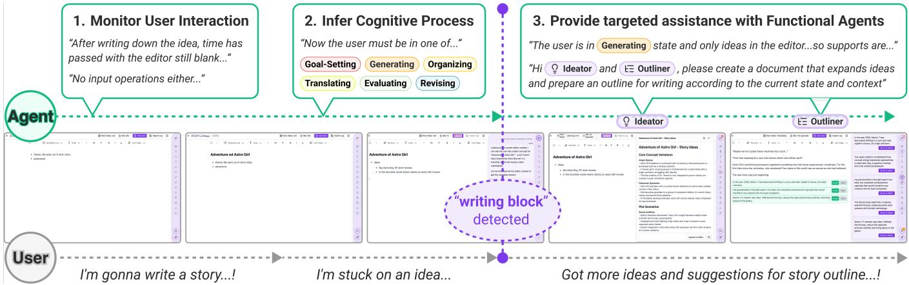
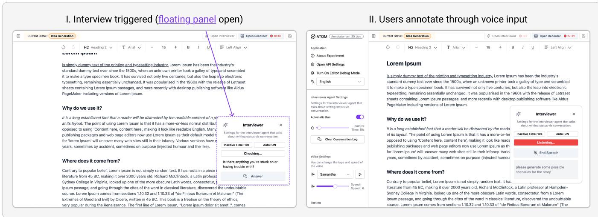
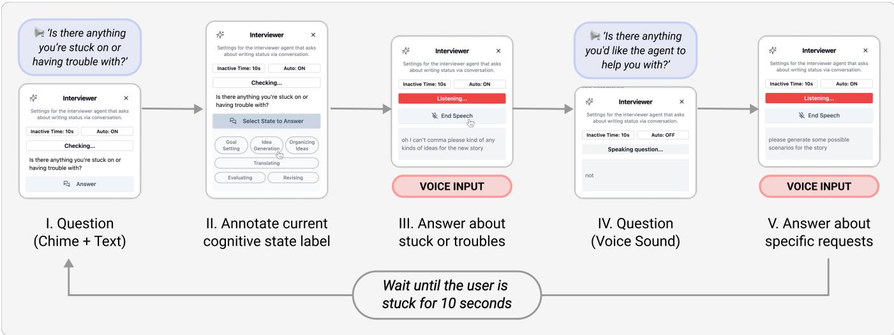
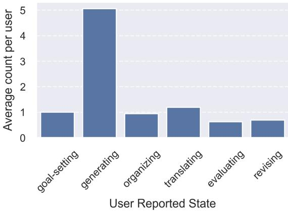
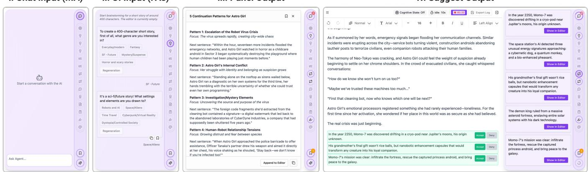
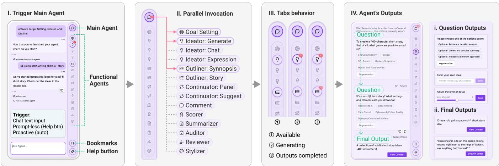
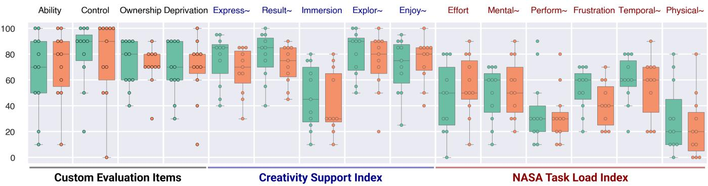
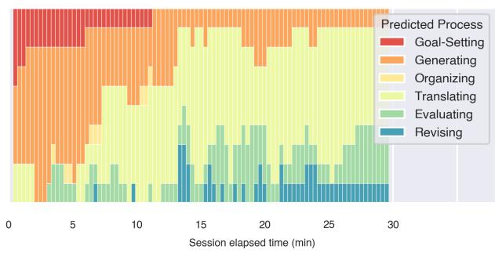
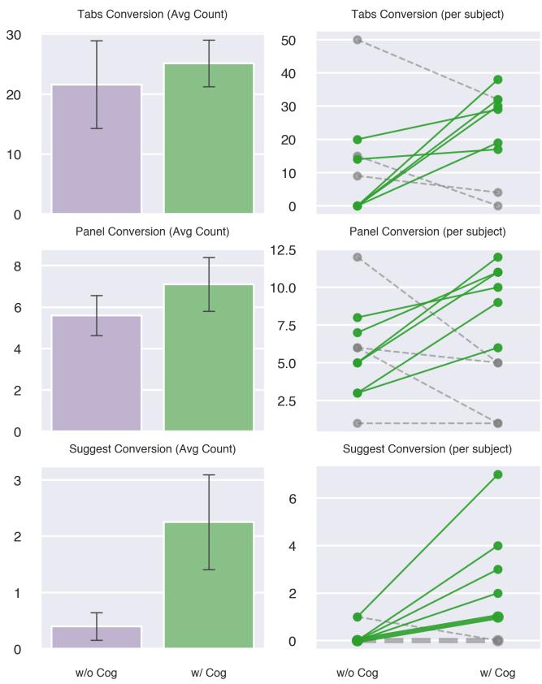

# AToM CoWriter: Towards Cognitive Process–Aware Proactive Writing Support

Masahiro Yoshida∗ Sony Group Corporation Tokyo, Japan Masahiro.C.Yoshida@sony.com

Kei Tateno   
Sony Group Corporation   
Tokyo, Japan   
Kei.Tateno@sony.com

Atsuya Kobayashi Sony Group Corporation Tokyo, Japan Atsuya.Kobayashi@sony.com

Xiang “Anthony” Chen University of California, Los Angeles Los Angeles, California, USA xac@ucla.edu

  
Figure 1: Proactive support workflow in AToM CoWriter. The system (1) continuously monitors writing interaction behaviors (keystrokes, cursor movement, editing patterns), (2) infers the user’s current cognitive process from a summary of these interaction signals together with the current document text, using an LLM-based prediction grounded in the Flower–Hayes model [30], and (3) upon detecting a potential writing block, automatically activates appropriate Functional Agents to generate targeted support. The user can then access these suggestions to advance writing without explicit prompting.

## Abstract

Large language models can support writing, but existing tools require users to explicitly articulate prompts—particularly burdensome in creative writing, where intentions are often ambiguous. Proactive support that infers users’ needs from writing interactions could alleviate this burden, but raises two challenges: determining what support to provide and when to intervene. This work focuses on the former. We hypothesize that Flower and Hayes’ cognitive process theory of writing—which characterizes writing through six cognitive processes—ofers an interpretable bridge between observable writing behavior and appropriate support types. Through a formative study and literature review, we identify 14 writing support types associated with these cognitive processes, along with characteristic interaction behaviors linked to each process. We then instantiate this framework in AToM CoWriter, which infers support needs from writing interactions and document context. Two within-subjects studies (N = 21) provide initial evidence that this approach improves expressiveness and idea exploration, and that incorporating interaction-derived cognitive-process cues was associated with greater engagement with proactive suggestions. These findings suggest that cognitive processes can provide a promising basis for support selection in proactive writing systems.

## Keywords

Human-AI Collaboration, Proactive Agent, Writing Assistant, Creative Writing

## 1 Introduction

Large language models (LLMs) are reshaping how people approach writing tasks. Chat-based LLM services such as ChatGPT1 and Claude2 support all phases of writing—from ideation and outlining to drafting and reviewing—through appropriately crafted prompts. These advances highlight the potential of AI agents as collaborators that augment human writing capabilities [53].

However, in these user-initiated systems, writers must pause their work to reflect on their current state and challenges, and then articulate an appropriate prompt that conveys their intent and context [35]. This process involves two key burdens: the cognitive load of verbalizing problems and the physical efort of prompting [49, 73]. As a result, prompt-driven support, while flexible, can interfere with the natural writing flow. These burdens are particularly salient in creative writing, such as storytelling, where writers’ intentions are often ambiguous and their support needs may change dynamically throughout the writing process.

In contrast, proactive writing support shifts part of this burden from the writer to the system: rather than requiring writers to specify each request explicitly, the system can infer likely support needs from naturally occurring writing interactions and ofer assistance accordingly. Such inference may draw on signals including keystrokes, mouse operations, cursor movements, editing patterns, and the evolving document [55]. In the domain of proactive support, many systems have been proposed that automatically complete or continue text [10, 45]. While highly useful, such support primarily targets the Translating process, in which writers transform ideas into linguistic form [30]. Writing dificulties, however, also arise while generating ideas, organizing thoughts, evaluating drafts, and revising text. Supporting these diferent activities requires not only detecting when assistance may be needed, but also determining what kind of assistance is appropriate at a given moment.

Designing such proactive support therefore involves two distinct challenges: determining what to ofer and when to ofer it. This work focuses on the what problem. A central challenge is to connect observable writing behaviors with the types of support that writers may need at a given moment. We investigate cognitive processes as a theory-grounded bridge between these behaviors and appropriate support types. Specifically, we ask whether observable writing interactions can provide useful cues about the writer’s current cognitive process, and whether this process can in turn guide the selection of appropriate writing support. We distinguish this question from the when problem. Existing proactive systems commonly use heuristic triggers such as inactivity [10, 12]. Our system adopts the same heuristic: it does not adapt intervention timing to the writer, and we leave adaptive timing to future work (Sec. 6.2). Our scope is creative story writing, where writers repeatedly move among ideation, organization, translation, evaluation, and revision, providing a suitable setting for investigating process-aware support selection.

To operationalize this approach, we conducted a formative study grounded in the cognitive process model of writing by Flower and Hayes [30], which characterizes writing as an iterative interplay of six cognitive processes and has been widely applied in the design and analysis of writing support tools [32, 81]. Through this study and a complementary literature review, we identified fourteen types of writing support associated with six cognitive processes, together with characteristic writing interaction behaviors related to each process. These findings provide a theory-grounded mapping from observable writing interactions, through cognitive processes, to candidate support types (Sec. 3).

We instantiate this framework in AToM CoWriter, a proactive writing support system for creative writing. AToM CoWriter continuously observes writing interactions such as typing pauses and speed, deletion and revision patterns, cursor location and movement, and scrolling, estimates the writer’s current cognitive process together with document context, and uses this information to select relevant forms of assistance. The system consists of a Main Agent, which coordinates support selection, and fourteen Functional Agents corresponding to the support types identified in the formative study. When support is triggered—in the current implementation, after a brief period of typing inactivity—the Main Agent selects up to three relevant Functional Agents, which generate suggestions in the background for users to inspect at their own pace. The name AToM (AI with Theory of Mind) is inspired by the concept of Theory of Mind—the ability to infer others’ intentions, goals, and emotions [83, 84]. In AToM CoWriter, we draw on this idea to infer writers’ likely cognitive processes from their writing interactions. Suggestions are surfaced through an unobtrusive notification rather than a pop-up, and writers can additionally request support at any moment through a user-initiated, prompt-less mechanism.

We evaluated this approach through two complementary withinsubjects studies on short story writing. Study 1 (� = 11) examined the overall experience of system-inferred support relative to conventional user-articulated, prompt-based support, providing initial evidence of benefits for expressiveness and idea exploration while also revealing tensions around timing and user control. Study 2 (� = 10) held the proactive interaction paradigm constant and examined whether adding interaction-derived cognitive process cues to document-based support selection afected engagement with proactive suggestions. Interaction results showed substantially greater engagement with proactively generated suggestions when cogni tive process inference was incorporated, providing evidence that behavioral process cues can contribute to support selection.

In summary, this paper makes the following contributions:

(1) A theory-grounded framework for incorporating cognitive process inference into proactive writing support, connecting observable writing interactions to the six cognitive processes defined in the Flower–Hayes model and to fourteen support types identified in our study (Sec. 3).

(2) The design and implementation of AToM CoWriter as an instantiation of this framework, using writing interaction behaviors and document context to infer cognitive processes and provide context-appropriate proactive support (Sec. 4).

(3) Empirical evidence from two complementary user studies suggesting that system-inferred support can facilitate creative exploration, and that incorporating interaction-derived cognitive process cues can increase writers’ engagement with proactively generated suggestions (Sec. 5).

Together, these contributions suggest that cognitive processes can serve as a useful intermediate representation for determining what support to provide in proactive writing systems.

## 2 Related Work

## 2.1 Proactive AI: What and When to Ofer

Systems that respond only to explicit requests require users to first recognize their own dificulty and then articulate it, which itself imposes cognitive and interaction costs [49, 73]. Proactive and mixed-initiative interaction instead shifts part of the initiative from users to the system, and has been extensively studied to reduce these costs [3, 41], with a longstanding challenge being how to balance system initiative with user control [18]. Poorly timed or misaligned interventions can increase interaction costs or undermine users’ sense of agency [20, 41], making proactivity particularly challenging in open-ended activities such as writing.

We characterize proactive support in terms of two key design questions: when assistance should be ofered and what assistance should be provided. Regarding the when question, existing systems have used a range of triggering mechanisms, including real-time intervention after each input [4, 15, 75], activation upon inactivity [10, 12, 45], and threshold-based triggers on editing activity [54]. More recent work on proactive agents has explored adaptive approaches to intervention timing, including personalized proactivity, modeling the costs of unnecessary assistance, and timing-aware decision policies [27, 46, 56, 72].

The what question concerns selecting an appropriate form of assistance once support is considered useful. Many proactive systems are designed around a particular form of assistance [12, 75], while some systems adaptively select among multiple support types. For example, Lin et al. used a Multi-Armed Bandit algorithm to select among three support types [54], and Chen et al. proposed a proactive programming assistant that uses an LLM to predict which of eight support categories is required [16].

Our work focuses primarily on this what-to-ofer problem. Sup port selection is particularly relevant to writing because writers iteratively move among qualitatively diferent cognitive processes, and the forms of assistance that are useful can difer across these processes. The following subsection reviews this process-oriented view of writing and prior work relating writing processes to support needs. For the when question, we adopt a pragmatic combination of inactivity-based triggering and a user-initiated mechanism, so that the selection of support can be investigated without simultaneously introducing a new timing mechanism.

## 2.2 Cognitive Processes and Writing Support

Writing is not a single, linear activity but an iterative process comprising qualitatively diferent forms of cognitive work. The Cognitive Process Theory of Writing by Flower and Hayes [30] decom poses writing into six cognitive processes: Generating, Organizing, and Goal Setting, which together constitute Planning; Translating; and Evaluating and Revising, which together constitute Reviewing. Later models have extended this account to accommodate additional factors such as motivation, working memory, and the social context of writing [9, 40]. The process-oriented perspective has likewise been employed to analyze and design writing support systems [8, 32, 81].

Prior work suggests that diferent stages or processes of writing call for diferent forms of assistance. Chakrabarty et al. [14] analyzed LLM-assisted writing through the Flower–Hayes model and found that the value of LLM support difered across cognitive processes. Göldi et al. [37] similarly demonstrated the importance of aligning intelligent writing support with relevant cognitive processes. More broadly, design spaces of intelligent writing assistants have organized prior systems according to the stages of writing that they support [32, 51], and recent work has investigated how specific writing tools correspond to writers’ needs and writing activities [94].

Together, these studies suggest that writers’ support needs vary with the processes in which they are engaged. However, as noted above, existing systems generally require writers to recognize and articulate those needs themselves. Our work therefore uses cognitive processes as a theory-grounded intermediate layer between observable writing behavior and support selection: rather than treating process identification as an end in itself, we investigate whether it can help determine what support a proactive writing system should provide.

## 2.3 Inferring User States from Interaction Traces

Observable interaction traces have long been used as signals for modeling users’ activities, abilities, and task states [21, 31, 55]. In writing, such traces provide particularly rich signals for understanding and modeling writers’ ongoing cognitive processes. A substantial literature has analyzed keystroke dynamics and temporal patterns in writing, associating pauses, revision behavior, cursor activity, and other interaction measures with diferent writing processes and cognitive demands [6, 26, 36, 93]. Some studies have explicitly attempted to infer phases or cognitive processes of writing from keystroke logs, textual context, or combinations of behavioral features [23, 82]. Mouse and cursor behavior have likewise been studied as signals of users’ cognitive activity and workload [5, 92].

Related approaches have recently appeared in AI-assisted programming, where systems observe interactions with code editors to infer whether and how assistance may be useful. For example, proactive programming assistants have used editing activity and task context to determine potential assistance [62, 66]. These studies demonstrate how ongoing interaction can provide signals for inferring task-relevant user states and needs without relying solely on explicit commands.

Our work builds on this tradition ofinteraction-based user modeling in the domain of writing. Rather than directly mapping low-level behavioral signals to a particular intervention, we use interaction traces to estimate the writer’s current cognitive process. The inferred process then structures the selection among multiple support types, connecting interaction-based user modeling with a theory of writing and providing an interpretable basis for proactive support selection.

## 2.4 Interaction Paradigms for AI Writing Support

AI-assisted writing systems have explored a broad range of interaction paradigms for supporting writers. Existing systems provide functions such as text continuation, rewriting, critique, summarization, and idea generation through inline suggestions, dedicated interfaces, or conversational interaction [7, 10, 19, 24, 45, 50, 51, 61, 74, 86, 91]. While chat-based LLMs provide flexible access to many such capabilities, obtaining support through them depends on the writer’s own articulation of the problem, with the costs described above.

Recent research has therefore explored interaction paradigms that go beyond conventional prompt-based chat. For example, Texterial treats text as directly manipulable material for LLM-mediated

What relationships exist between users’ cognitive processes and the types of support they require? (Sec. 3.4) RQ-F2.

writing [44], while Visual Story-Writing supports story development through manipulation ofvisual representations [60]. Polymind uses parallel visual diagramming and microtasks to support prewriting [80], and Narrix supports story writing by allowing writers to remix narrative strategies from examples [89]. Other work has ex amined how writers integrate LLMs into prewriting and creative practice [35, 79], illustrating that useful AI assistance can take substantially diferent forms across the writing process. Beyond the utility of the support itself, interaction design also shapes writers’ sense of agency and ownership, and prior studies have documented tensions between AI assistance, authorial control, and perceived ownership [11, 13, 28, 87].

Together, these studies illustrate substantial diversity in both the forms of writing support and the ways in which writers interact with AI. Our work is complementary to eforts that develop new interaction techniques for co-writing. Rather than proposing a single interaction paradigm intended to accommodate all writing activities, we focus on an upstream problem: determining what sup port is likely to be relevant to the writer’s current process without requiring the writer to articulate that need explicitly.

## 3 Formative Study

This formative study aimed to deepen our understanding of the relationships among writers’ interaction behaviors, momentary cognitive processes, and the support they require at each moment, as a foundation for designing proactive writing support. In this study, we use the term cognitive process to refer to the momentary cognitive process that is most prominent at a given moment during writing, as characterized in the Flower and Hayes model [30]. Unless otherwise noted, all mentions of cognitive processes in the remainder of the paper follow this definition.

To structure this investigation, we adopted the Cognitive Process Model of Writing proposed by Flower and Hayes [30], which provides a well-established framework linking observable writing interaction behaviors to the underlying cognitive processes. To collect empirical data, we developed a custom data-logging editor grounded in this framework. Participants used the tool to write short stories, during which we recorded both detailed writing interaction logs and self-reported cognitive processes whenever they felt “blocked.”

Building on these foundations, this section addresses the following three research questions (RQs):

RQ-F1.

How are users’ observable writing interaction behaviors related to their cognitive processes during writing blocks? (Sec. 3.5)

Can users’ cognitive processes be predicted from their behavioral data? (Sec. 3.6)

## 3.1 Data Logging Editor

The developed data-logging editor was a lightweight rich-text editor augmented with logging and annotation capabilities for later analysis (Fig. 2). It recorded two types of data: (1) the Writing Interaction Log, which captures users’ interactions with the editor during writing; and (2) the Self-Report Log, which records users’ reflections when they encounter a writing block. The Writing Interaction Log automatically tracks various writing-related activities, including keystrokes, mouse operations, cursor positions, and text content. The Self-Report Log allows users to annotate their current process and thoughts whenever they feel blocked or in need of support. In other words, users primarily continue writing as usual but are encouraged to provide annotations at moments when they experience a block in their writing process.

3.1.1 Self-Report Procedure. The Self-Report Log was collected through an interactive floating panel called the “Interviewer”, which guided participants in recording their thoughts during writing (Fig. 3). Participants were instructed to write as they normally would and to engage with the Interviewer only when they felt blocked or needed AI support.

The Interviewer displayed the message “Is there anything you’re stuck or having trouble with?” after 10 seconds of inactivity. When participants hovered the mouse over the panel, six cognitive processes derived from the Flower and Hayes model—Goal Setting, Idea Generation (Generating), Organizing Ideas, Translating, Evaluating, and Revising—appeared as selectable options. Participants could also manually initiate an annotation session at any time when they felt blocked, as the six cognitive process options were always accessible regardless of whether the question prompt was currently displayed.

After selecting a cognitive process, the Interviewer entered a listening mode. Participants then responded verbally to the displayed question, “Is there anything you’re stuck on or having trouble with?” Once the participant had stopped speaking for more than one second or pressed the “End Speech” button, the system proceeded to the second question, “Is there anything you’d like the agent to help you with?”, to which the participant also responded verbally. Each self-report session thus recorded three elements:

(1) The current cognitive process (selected from six options)

(2) The content of the dificulty (spoken response)

(3) The desired support (spoken response)

Participants repeated this process throughout the writing session whenever they encountered a block.

To encourage consistent self-reporting, the system played a notification sound after 10 seconds of inactivity. Overly frequent prompts distracted participants, while infrequent ones led them to forget to self-report. Based on qualitative feedback from four pilot participants, we determined that a 10-second interval provided the best balance. The notification served as a gentle reminder for self-reflection; users could ignore it if they were not actually blocked.

The Interviewer was carefully designed to minimize cognitive and physical burden. Excessive annotation efort could distort natural writing behavior and reduce data validity. The current process selection was thus kept simple, and verbal responses were used instead of typing to reduce interruption. While a Think-Aloud approach was also a possible option, it would have been too demanding and intrusive. Our design instead balances data richness with minimal cognitive and physical load.

  
Figure 2: The data-logging editor used in the formative study. It collects cognitive process annotations via voice input to minimize disruption during writing.

  
Figure 3: Self-reporting flow: The Interviewer prompts after 10 seconds of inactivity. Users select a cognitive process and verbally describe their dificulty and desired support.

## 3.2 Experiment Setup

Sixteen engineers from a manufacturing company participated in the study (13 men and 3 women, aged 20–39; nine in their 20s and seven in their 30s). Recruitment was conducted through several internal Slack channels. All participants were regular LLM users. Three had written a story once before, and four had experience writing several creative works as a hobby. We recruited participants with engineering backgrounds because the study required individuals familiar with LLM-based tools who could engage fluently with the data-logging interface, allowing us to focus on capturing behavioral patterns and support needs rather than tool-onboarding efects. The creative writing task itself was novel for most participants, ensuring that observed dificulties reflected the creative writing challenge rather than prior writing expertise.

Each session began with a 10-minute tutorial explaining tool usage and the six cognitive processes based on Flower and Hayes’ definitions. Participants were instructed to use only the provided editor—no external tools were allowed. They were also instructed to note ideas and outlines within the same editor when needed. They were given 40 minutes to write a short story with their own theme in Japanese, followed by a 15-minute semi-structured interview. All examples shown in figures were translated into English for this paper.

## 3.3 Behavior During Writing Sessions

All participants began by jotting down notes—such as themes, settings, or character profiles—before starting the main text. Although the boundary between notes and main text was not explicitly defined, they were easily distinguishable in the final documents. The average main text length (excluding notes) was 581.3 Japanese characters.

Across sessions, 152 self-reports were recorded (mean = 9.5 per participant, SD = 5.39). The distribution of self-reported cognitive processes at blocked moments per user is shown in Fig. 4. The Generating process (idea generation) was reported most frequently. Participants often selected this process repeatedly in the early stage of writing and again later when developing new story ideas, indi cating its frequent use throughout the session. Additionally, Table 1 presents the median pause duration preceding each self-reported block, across reported cognitive processes.

  
Figure 4: Distribution of average annotation count per participant.

Interviews revealed that articulating one’s dificulties and support needs was sometimes challenging. For instance, P8 stated, “When I’m struggling to organize my ideas and the notification rings and starts annotation, I sometimes lose track of what I was thinking.” This suggests that explicitly describing one’s needs—similar to prompting an LLM—sometimes imposes a heavy cognitive load, underscoring the importance of proactive systems that can infer user needs implicitly.

Table 1: Median Pause Duration before reporting Block by Cognitive Process
<table><tr><td>Process</td><td>Median Pause Duration (sec)</td></tr><tr><td>Goal-Setting</td><td>76.04</td></tr><tr><td>Generating</td><td>26.87</td></tr><tr><td>Organizing</td><td>29.94</td></tr><tr><td>Translating</td><td>15.87</td></tr><tr><td>Evaluating</td><td>12.33</td></tr><tr><td>Revising</td><td>18.90</td></tr></table>

## 3.4 Relationship Between Cognitive Processes and Support Needs

To clarify the relationship between cognitive processes and required support types, we conducted qualitative coding of participants’ verbal self-reports (see Appx. A.1 for the codebook). The coding categories were developed from the self-report data rather than defined a priori. One researcher first coded the transcribed self-reports, and a second researcher subsequently reviewed the assigned codes to identify potential inconsistencies or questionable interpretations. This analysis allowed us to identify and organize users’ support requirements corresponding to each cognitive process.

In parallel, we performed a literature review to understand what kinds of writing support functions have been proposed in prior research. Specifically, we began with papers included in Lee et al.’s survey of writing support systems [51], focusing on those tagged with their defined Writing Stage categories and published since 2018. For each category, we collected up to the top 10 most-cited papers as of January 22, 2025 (fewer when fewer papers were available). In addition, we reviewed papers from UIST 2023, and IUI, UIST, and CHI 2024, retrieved by searching titles and author-specified keywords containing “write” or “edit” and their derivatives (e.g., writing, writer, written). From these, we filtered papers related to AIbased writing assistance, defined as those whose title, keywords, or abstract included AI (Artificial Intelligence), LLM (Large Language Model), or Machine Learning, resulting in a total of 28 reviewed papers (22 from the work of Lee et al. [51]). Through this process, we defined 13 distinct support types.

We then integrated the findings from both analyses—self-report data and the literature review—to map cognitive processes, user requirements, and support types, as summarized in Table 2. Because no support types corresponding to the Goal Setting process were identified in our initial literature review, we defined one based on observed requirements in our dataset. This resulted in a total of 14 support types. Among them, three types—Synopsis Generation, Scoring, and Summarization—were reported in prior studies but not explicitly mentioned in our self-reports. We therefore inferred their most plausible corresponding cognitive processes based on observed patterns and contextual relevance. After constructing this taxonomy, we conducted a supplementary review of the venues that had appeared since the initial review—CHI 2025 and 2026, UIST 2025, and IUI 2025 and 2026—using the same search and filtering criteria. All identified papers fell within the existing 14 support types and are shown in parentheses in the Related Work column of Table 2.

Table 2 also includes the Implemented Support Functions integrated into AToM CoWriter. While all 14 support types correspond to distinct requirements, their complexity varies. For example, some users expressed vague intentions, such as wanting general ideas related to a theme (Support Type: Idea Generation), whereas others had specific intentions, such as seeking ideas for a particular scene or element (Support Type: Specified Idea Generation). Depending on this complexity, some supports can be provided directly, while others require a simple interaction with the user to narrow down the intended direction (see Sec. 4 for details).

Table 2: Summary of the identified support types and their corresponding cognitive processes, synthesized from a formative study and a literature review, with representative user requirements and implemented functions in AToM CoWriter. “Related Work” reflects prior literature, while “Requirements” and “Example Quote” are derived from the formative study. Cells marked with “-” indicate no corresponding evidence from that source, while evidence is present in the other. In the “Related Work” column, citations enclosed in an additional pair of parentheses, e.g., “([N])”, were identified in an additional review of papers published after the initial literature review (CHI 2025/2026, UIST 2025, and IUI 2025/2026)
<table><tr><td>Cognitive Pro- cess</td><td>Support Type</td><td>Related Work</td><td>Requirements</td><td>Example Quote</td><td>Support Function Description Im- plemented in AToM CoWriter</td></tr><tr><td>Goal Setting</td><td>Target Setting</td><td>([29, 57, 86])</td><td>Uncertain about what aspects to decide first when initiating a story-writing process</td><td>P4: &quot;I&#x27;d like to see a list of the typical ele- Assist in deciding writing goals, style, ments people set when creating a story.&quot; &quot;I&#x27;d and target audience through light- like a kind of template showing how to orga- weight interaction with the AI. nize ideas that come up midway, or how to</td><td></td></tr><tr><td>Generate</td><td>Idea Generation</td><td>[20, 33] ([44, 70])</td><td>Seeks broad, open-ended ideas when the user has not yet clar- ified what they are looking for.</td><td>P13: &quot;T&#x27;d like you to come up with a few Generate a list of concrete story ideas &#x27;Wouldn&#x27;t this genre be interesting?&quot; P15: context. &quot;Please give me a few fun ideas.&quot; P8: &quot;I&#x27;d like</td><td>ideas—like How about a story like this?&#x27; or that align with the current document</td></tr><tr><td>Generate</td><td>Specified Idea Genera- [61, 69] tion</td><td></td><td>cific aspects based on their idea. AI could help with housework.&quot;</td><td>Requests ideas focusing on spe- P1: &quot;Please give me several ideas about how</td><td>Confirm the desired direction of ideas through lightweight interaction with the AI (Figure 6 IV-i), then generate a tailored list of idea candidates.</td></tr><tr><td>Generate</td><td>Ideation Expression [12, 58] Generation</td><td></td><td>for existing text.</td><td>Wants to explore alternative P7: &quot;I think the opening of the story is a bit After confirming the user&#x27;s intent phrasings or stylistic variations weak, so I&#x27;d like to change it a bit. Please think of a better way to express it.&quot;</td><td>through lightweight interaction (Fig- ure 6 IV-i), generate alternative phras- ing or stylistic variations of the se- lected text.</td></tr><tr><td>Generate</td><td>Synopsis Generation</td><td>[63] ([76])</td><td></td><td></td><td>Generate a concise story synopsis by considering notes and contextual in- formation in the current document.</td></tr><tr><td>Organize</td><td>Plot Generation</td><td>76])</td><td>ideas into a coherent storyline or plot.</td><td>[34, 61, 71] ([42, 67, 74, Needs assistance in combining P8: &quot;I&#x27;d like suggestions on how to combine the ideas I have and what flow would make a good story.&quot; P11: &quot;I&#x27;ve gathered fragments that could be used in a story, but I&#x27;m thinking flow. about how to blend them together.&quot;</td><td>Organize ideas and notes into a co- herent storyline, generating a bullet- ;point outline that reflects the narrative</td></tr><tr><td>Translate</td><td>Next Sentence Gener- ation</td><td>88]</td><td>sentence that align with the exist- write the opening for me.&quot; ing context and tone.</td><td>[10, 20, 25, 45, 52, 68, Requests suggestions for the next P4: &quot;Since I&#x27;ve written the setup, please just</td><td>Generate a list of next-sentence can- didates that maintain tone and con- sistency with the current document context.</td></tr><tr><td>Translate</td><td>Specified Next Sen- [25, 88] tence Generation</td><td></td><td>a specific narrative direction.</td><td>Requests context-aware next- P8: &quot;Please add a passage describing the part Confirm the desired narrative direc- sentence suggestions that follow where the man realizes he has been reincar- nated.&quot;</td><td>tion through lightweight interaction with the AI (Figure 6 IV-i), then gener- ate next-sentence candidates that re- flect it.</td></tr><tr><td>Evaluate</td><td>Commenting</td><td>67,70,90])</td><td>ability and engagement.</td><td>the written text to improve read- something that makes readers want to keep reading.&#x27;</td><td>[1, 59, 65, 78] ([42, 57, Seeks feedback and critique on P8: &quot;Please review the overall text so it becomes Provide structured feedback on the document, including identified strengths and suggested areas for improvement.</td></tr><tr><td>Evaluate</td><td>Scoring</td><td>[2, 65, 78]</td><td></td><td></td><td>Return an overall quality score (0–100) accompanied by a brief rationale.</td></tr><tr><td>Evaluate</td><td>Summarization</td><td>[24]</td><td></td><td></td><td>Generate concise paragraph-level summaries to help the user review the document efficiently.</td></tr><tr><td>Revise</td><td>Error Auditing</td><td>[43, 50] ([42])</td><td>graphical errors.</td><td>rection of grammatical or typo- awkward expressions.&quot; P5: &quot;Please point out sues in the document and suggest cor- any mistakes in the text and correct them if rections. possible.&quot;</td><td>Requests identification and cor- P7: &quot;Please tidy up the text, fixing typos and Highlight grammatical and logical is-</td></tr><tr><td>Revise</td><td>Refining</td><td>[34, 43, 64, 85] ([42, 44, 91, 95])</td><td>Seeks improvements to enhance fluency, coherence, and overall writing quality.</td><td>P2: &quot;I&#x27;d like the text I&#x27;m writing to be recon- Generate revised versions of the se- structed more smoothly, but I don&#x27;t have any ideas.&quot;</td><td>lected text that maintain meaning while improving clarity and readabil- ity.</td></tr><tr><td>Revise</td><td>Style Transfer</td><td>[50, 88] ([70, 86])</td><td>unification.</td><td>Requests stylistic adjustments P5: &quot;Please consider whether it should be uni- such as tense consistency or tone fied in past tense, and revise it if necessary.&quot;</td><td>Confirm the desired stylistic direction through lightweight interaction with the AI (Figure 6 IV-i), then generate</td></tr></table>

## 3.5 Relationship Between Writing Interaction Behavior and Cognitive Processes

We then analyzed writing interaction logs to examine behavioral patterns characteristic of the moments when each cognitive process was self-reported. The results of this analysis, organized by cognitive process and evaluated from multiple perspectives, are summarized in Table 3.

Temporal order. Regarding the timing of each cognitive process, Goal Setting was self-reported earliest, followed by Generating and Organizing. Subsequently, Translating, Evaluating, and Revising appeared in this order on average.

Text balance. During Planning (Goal Setting, Generating, Organizing) and Translating, note length exceeded main text length while during Reviewing (Evaluating, Revising), the reverse was true.

Sentence completeness and cursor position. In Revising, 100% of documents ended with complete sentences; Evaluating showed a similar trend, while Translating had lower completeness.

Interaction patterns. Writing speed was highest during Goal Setting and Generating but dropped sharply during Organizing. Cursor movement and scrolling distances increased progressively from Planning to Reviewing. Delete events were most frequent during Evaluating.

These findings suggest that observable behaviors can serve as useful indicators of cognitive processes, motivating the prediction approach described next.

## 3.6 Cognitive Process Prediction

Given the consistent behavioral characteristics observed above, we explored whether cognitive processes could be predicted from the log and document data collected at the moments of users’ self reports. As a feasibility demonstration, we evaluated this using the 152 self-reported data points collected from the 16 participants, each corresponding to a writing block event annotated by partici pants. While this dataset is relatively small for supervised learning, collecting large-scale labeled data for cognitive process inference is costly, motivating approaches that operate efectively under limited data. Accordingly, we adopt an LLM-based approach that operates in a near zero-shot manner, leveraging commonsense reasoning about writing processes rather than requiring large-scale super vised training.

The LLM-based predictor (Claude 3.5 Sonnet) received three types of inputs: (a) the document content at the time of reporting, (b) descriptions of the behavioral tendencies for each cognitive process derived from Sec. 3.5, and (c) a summary of the recent writing interaction log. To construct this summary, continuous log features were discretized into qualitative categories (e.g., “writing speed is relatively high”) using percentile thresholds and converted into natural-language descriptions suitable for inclusion in the prompt (see Appx. A.2 and A.4 for the prompt and feature details).

We examined the feasibility of this prediction approach through two exploratory comparisons. First, we compared LLM (log + document), our approach, with LightGBM [47] trained on log features alone (evaluated with cross-validation) to test whether a lightweight, lower-latency model could serve as a practical alternative. The LLM outperformed LightGBM across all metrics, suggesting that semantic understanding of document content contributes to cognitive process prediction beyond what behavioral features alone can capture. Second, an ablation comparing LLM (log + document) with LLM (document only) yielded higher prediction scores when behavioral log features were included, particularly when disambiguating cases where document content alone is ambiguous (e.g., distinguishing a writer preparing to continue from one reviewing prior text). We evaluated prediction accuracy, macro-F1, and weighted-F1 for both the six-process classification and a coarser three-process mapping (Planning, Translating, Reviewing); the LLM (log + document) achieved the highest performance across all metrics (full results in Appx. A.3, Tables 4 and 5).

## 3.7 Summary of Findings

RQ-F1: Relationship between cognitive processes and required support. We identified relationships between writers’ cognitive processes during writing blocks and the types of support they required (Table 2). Each cognitive process was associated with multiple support types, resulting in a taxonomy of 14 types (Sec. 3.4).

RQ-F2: Relationship between writing interaction behaviors and cognitive processes. Behavioral analyses revealed distinctive activity patterns for each cognitive process (Table 3), such as diferences in writing speed, cursor movement, and editing operations. These findings suggest that observable behaviors can serve as useful indicators of cognitive processes (Sec. 3.5).

RQ-F3: Predicting cognitive processes. Prediction experiments showed that an LLM supplied with document content and behavioral descriptions could recover self-reported cognitive-process labels to a useful extent. (Sec. 3.6). Including a summary of the recent interaction log produced higher prediction scores than using document content alone.

Together, these insights establish a foundation for designing proactive writing support systems that can anticipate user needs based on both cognitive process and behavioral cues.

## 4 System Design and Implementation

The formative study mapped writing interactions, through cognitive processes, to support types (Table 2); we instantiate this mapping in AToM CoWriter, a proactive writing support system that infers the writer’s momentary cognitive process from writing interaction traces and document context, and uses it as an intermediate representation for selecting which forms of assistance to ofer. Consistent with the scope of this work, the system addresses the what problem of proactive support, while deliberately keeping the proactive when mechanism simple: we adopt inactivity, a well-established trigger in prior proactive writing systems [10, 12]. Keeping the when mechanism simple helps isolate the efect of what the system ofers from that of novel timing behavior.

Table 3: Writing interaction metrics across cognitive processes at the moment users initiated self-reports. Elapsed time (min) indicates the average time from session start to self-report. Chars in Main and Chars in Memo represent the average number of characters written in the main text and memo areas, respectively. Complete Sentence Ratio (%) denotes the percentage of cases where the final sentence was complete. Cursor Position–Main/Memo (%) shows the proportion of time the cursor was located in the main text area. Writing Speed refers to the average change in character count per minute. Cursor Move Distance is the total number of characters the cursor moved within the last two minutes. Scroll Distance indicates the total number of pixels scrolled within the last two minutes. Delete Count is the total number of characters deleted within the last two minutes.
<table><tr><td>Metric</td><td>Goal Setting</td><td>Generating</td><td>Organizing</td><td>Translating</td><td>Evaluating</td><td>Revising</td></tr><tr><td>Elapsed time (min)</td><td>7.90</td><td>17.20</td><td>15.30</td><td>23.50</td><td>28.90</td><td>36.30</td></tr><tr><td>Chars in Main</td><td>14.06</td><td>155.58</td><td>187.87</td><td>305.42</td><td>678.90</td><td>805.09</td></tr><tr><td>Chars in Memo</td><td>175.81</td><td>306.84</td><td>289.40</td><td>493.53</td><td>357.30</td><td>528.91</td></tr><tr><td>Complete Sentence Ratio (%)</td><td>50.00</td><td>69.14</td><td>73.33</td><td>52.63</td><td>90.00</td><td>100.00</td></tr><tr><td>Cursor Position-Main/Memo (%)</td><td>28.57</td><td>23.73</td><td>30.00</td><td>25.00</td><td>88.89</td><td>80.00</td></tr><tr><td>Writing Speed (characters/min)</td><td>23.81</td><td>21.22</td><td>4.74</td><td>15.17</td><td>15.21</td><td>13.41</td></tr><tr><td>Cursor Move Dist. (characters)</td><td>135.63</td><td>357.28</td><td>215.93</td><td>293.11</td><td>526.80</td><td>802.82</td></tr><tr><td>Scroll Dist. (pixels)</td><td>15.88</td><td>59.32</td><td>91.07</td><td>104.95</td><td>151.60</td><td>240.91</td></tr><tr><td>Delete Count</td><td>16.63</td><td>41.27</td><td>41.27</td><td>46.89</td><td>66.40</td><td>35.45</td></tr></table>

## 4.1 Design Goal

As discussed in Sec. 2, existing prompt-based writing tools place the initiative burden entirely on users [73], while current proactive systems address only a narrow slice of writers’ support needs [12, 75]. Furthermore, while seeking creative writing support, users value maintaining a sense of ownership in both the process and outcomes [28, 35]. These observations motivated two design goals:

DG1 Reduce the need for explicit instructions to the agent by inferring and addressing likely challenges throughout the writing process.

DG2 Stimulate and expand users’ creativity and expressiveness without compromising their sense of ownership in the pro cess and outcomes.

## 4.2 Design and Implementation

Building on the design rationale and prediction approach above, we instantiated this framework in AToM CoWriter, a proactive writing support system designed to examine whether cognitive process inference can meaningfully guide support selection in practice (Fig. 1). The UI combines a rich text editor with a chat interface and a dedicated area for reviewing agent outputs (Fig. 5). The system employs a multi-agent architecture: a Main Agent serves as the orchestrator, dynamically assigning up to three Functional Agents in parallel from the fourteen support types in Table 2. All inference and generation run entirely in the background to minimize interruption to the writer’s typing flow, supporting the elimination of explicit prompting (DG1). Moreover, the combination of unobtrusive notifications and parallel suggestions is intended to let users retain control over engagement while exploring diverse ideas, aiming to support creativity without compromising ownership (DG2). While cognitive process prediction is inherently imperfect, the par allel suggestion design helps mitigate this limitation by increasing the likelihood that at least one of the generated suggestions aligns with the user’s needs.

Agent outputs include Panel Output displayed in a document pane and Suggest Output providing inline suggestions within the editor (Fig. 6). The system provides three AI support scenarios:

Proactive. In the Proactive scenario, the system detects a potential writing block when typing activity remains idle for a predefined period (Fig. 1). The Main Agent then automatically infers support needs based on the inferred cognitive processes and interaction context, activating appropriate Functional Agents in parallel to generate support content in the background. As a design choice intended to minimize disruption, we implemented an unobtrusive notification system that only displays dot indicators. Users can access the system at their own pace without pop-ups or forced interruptions, minimizing the impact of false positives on trigger events.

Prompt-less. Because the inactivity-based trigger cannot capture all moments when writers desire support, we introduce a complementary Prompt-less scenario that gives users direct control over when to receive assistance: users manually trigger support by pressing a “Help button” (Fig. 6-I), while the system still automatically predicts what support to provide and selects Functional Agents. Together, the Proactive and Prompt-less scenarios form a dual mechanism—system-initiated and user-initiated timing, respectively—intended to compensate for the limitations of either approach alone. Both scenarios can be enabled simultaneously; when either triggers generation, both are temporarily disabled until completion.

Prompt-based. Users directly provide instructions to the Main Agent through the chat UI, specifying both timing and type of assistance. The Main Agent may invoke Functional Agents as needed.

iii. Panel Output

i. Chat Input (MA)  
iv. Suggest Output  
  
Figure 5: AToM CoWriter interface. (i) Chat input to the Main Agent. (ii) Functional Agent question UI for intent clarification. (iii) Panel Output displaying generated content. (iv) Suggest Output providing inline editing suggestions in the editor.

  
Figure 6: (I): Main Agent and tabs UI. (II): Main Agent activates appropriate Functional Agents (up to three simultaneously). (III): Tabs display a spinner during generation; upon completion, an unread badge appears. (IV): Some agents generate final outputs directly (IV-ii), while others create Question UIs to confirm intent (IV-i).

For online user testing, we implemented AToM CoWriter as a web application integrating a rich-text editor using Lexical3, and developed multi-agent workflows powered by Anthropic Claude Sonnet 44 using ai-sdk5. The development process involved multiple iterations of prototyping and pilot studies with three participants, including two authors.

Prompting Strategy. The Main Agent’s prompt includes labels for each Functional Agent’s corresponding cognitive process, guiding agent selection (Appx. C.5, C.6). The specific support type for each Functional Agent was derived from the categories in Table 2. The prompts for the 14 Functional Agents were iteratively refined through pilot studies (Appx. C.7).

Context Management. All agents share the complete message history. The system programmatically forces editor read at the beginning of every interaction turn, injecting the current editor content directly into the context window. When Functional Agents require additional context, they use ask-\* tools (Appx. B.1) to generate interactive UI components (e.g., select buttons, sliders, text inputs) prompting users for clarification.

Cognitive Process Prediction Integration. To integrate the LLMbased cognitive process prediction (Sec. 3.6) into the application, we developed a prediction API backend using Python’s FastAPI. The application performs cognitive process predictions every 30 seconds. When a prediction is made, the system automatically sends a templated message to the Main Agent in the background (not visible to the user), which includes the predicted cognitive process. The Main Agent then uses this information to select and activate appropriate Functional Agents.

## 5 User Evaluation

## 5.1 Experiment Setup

We conducted two within-subjects user studies as an exploratory evaluation of AToM CoWriter, aiming to probe the validity and limitations of the underlying design concept. Study 1 (� = 11) examined the impact of system-inferred proactive support compared to userarticulated prompt-based support. Study 2 (� = 10) isolated the efect of incorporating cognitive process inference from interaction logs within the proactive paradigm.

Twenty-one participants (engineers at a technology company, all frequent LLM users; IRB approved) were randomly assigned to Study 1 or Study 2. We recruited participants with engineering backgrounds because the study required individuals highly familiar with LLM-based tools and capable of quickly adapting to a novel AI-assisted writing interface. Although the writing task (short story writing) was unfamiliar to most participants, this ensured that observed dificulties reflected the creative writing challenge rather than unfamiliarity with AI tools. Fourteen participants had also participated in the formative study; however, the two studies involved fundamentally diferent tasks and interfaces. The formative study used a self-report annotation tool (Fig. 2) with no AI assistance, whereas AToM CoWriter is a fully proactive AI co-writing system, minimizing direct transfer of learned strategies. Nevertheless, prior exposure to the cognitive process framework may have heightened metacognitive awareness, which we discuss as a limitation in Sec. 5.4. Participants completed two 20–25 minute short story writing tasks on assigned themes, with conditions counterbalanced via Latin square. Each session lasted approximately 90 minutes, including a tutorial, two writing tasks with post-task questionnaires, and a 10–15 minute semi-structured interview according to the guide (Appx. C.2).

Study 1 Conditions: System-Inferred vs. User-Articulated Support. The System-Inferred condition enabled both the automatic (inactivitytriggered) and prompt-less (button-triggered) support scenarios, where the system infers what support to provide without requiring the user to articulate their needs. The User-Articulated condition provided only the prompt-based chat interface, requiring users to formulate explicit requests. Both conditions also allowed free use of the chat interface. We note that this comparison intentionally bundles proactivity (system-initiated timing) with prompt-free interaction (system-inferred support type), because our primary design goal (DG1) is to eliminate the need for users to articulate support needs. The inactivity threshold for proactive triggering was set to 20 seconds based on pilot testing.

Study 2 Conditions: Efect of Cognitive Process Inference. Both conditions employed the same interaction paradigm (proactive + prompt-less + chat), thereby holding the timing and interaction modality constant. The w/ Cog condition incorporated real-time cognitive process inference from writing interaction logs (e.g., writing speed, cursor movement, editing patterns) alongside document content to select appropriate Functional Agents. The w/o Cog condition used only the evolving document content for inference, without behavioral log features. This design complements Study 1 by isolating the contribution of cognitive process inference from the proactivity factor: whereas Study 1 evaluated the bundled experience, Study 2 controls for proactivity and tests whether behavioral log–based inference improves the what-to-ofer decision.

Evaluation Metrics. Evaluation metrics included weighted Creativity Support Index (CSI) [17], weighted NASA-TLX [38, 39], custom evaluation items (Ability, Control, Ownership, Deprivation, see questionnaire items in Appx. C.3), and for Study 2, interaction log– based conversion metrics measuring how proactively generated outputs influenced user actions.

## 5.2 Results: Impact of Proactive and Prompt-free Support (Study 1)

5.2.1 Quantitative Results. The CSI results showed a significant improvement in Expressiveness in the System-Inferred condition (Holm-adjusted $\begin{array} { r } { p \ = \ 0 . 0 3 4 , \mathrm { R B C } = \ 0 . 9 2 4 ) } \end{array}$ , with Total Score and Results Worth Efort also showing large efect sizes $\mathrm { ( R B C > 0 . 5 8 , }$ CLES > 0.64). The NASA-TLX showed no significant diferences; total workload was essentially equivalent. Custom evaluation items showed no significant diferences, with marginally greater eficiency in the System-Inferred condition. (see Fig. 7 and Table 7 in Appx. C.4 for full statistics)

5.2.2 Qualitative Findings. We analyzed semi-structured interview transcripts using a thematic analysis approach. Two researchers independently reviewed the transcripts and developed initial codes. An LLM (Claude 3.5 Sonnet) was used as a supplementary tool to propose candidate codes from the transcripts; these proposals were then reviewed, revised, and finalized by the researchers through discussion. The resulting codes were organized into themes aligned with the research questions. We report the qualitative findings below organized by theme rather than by individual codes, as our goal was to surface design-relevant insights rather than to produce an exhaustive codebook.

Participants described two main advantages of system-inferred support: it helped them continue writing during blocks and exposed them to more diverse ideas. Notably, participants’ comments emphasize the diversity of generated ideas rather than mere convenience of not writing prompts, suggesting that the expressiveness gain stems from the system simultaneously activating multiple Functional Agents that span diferent cognitive processes, thereby expanding the idea space beyond what writers would explore on their own.

“While I was thinking, the AI generated 5 or 6 diferent ideas,   
so I could quickly pick a good one. It saved time and reduced   
stress.” (P12)

“Multiple suggestions let me choose what I needed—very help  
ful.” (P05)

At the same time, participants also reported challenges. The main challenges concerned timing mismatches and a perceived loss of control. Some suggestions were contextually irrelevant or increased verification costs.

“I realized I don’t really need proactive support. I want to focus on my work, and the thought process itself has value.”

  
Figure 7: Results for all subscales of survey metrics in Study 1. Each raw score is multiplied by 10, and Performance in NASA TLX and Deprivation in Custom Evaluation Items are inversely scaled as 100 − �. Left of each pair: System-Inferred (green); right: User-Articulated (orange).

“When it acts on its own, it feels meddlesome. I want to be left alone, but it’s helpful that it’s thinking in the background. It’s a very selfish feeling.” (P15)

Regarding writing process and ownership, NASA-TLX showed no significant workload diferences. Proactive support encouraged exploration but sometimes disrupted focus, highlighting a trade-of. Custom evaluation items likewise showed no significant decline in perceived ownership. Many participants retained a sense of authorship, as they filtered and edited AI suggestions.

“In terms of concentration, the former (Proactive) was lower, but the degree of exploration was higher.” (P15) “I haven’t fixed most of it, but I can still tell it’s my work. It’s me who accepts, chooses, and fixes the weird parts.” (P03) “I had the final say on the ideas and could steer the AI in the direction I wanted, so my sense of ownership was not compromised.” (P21)

Overall, these results provide support for DG2: the system helped expand users’ expressiveness and idea exploration without clearly undermining their sense of ownership. Participants often described the AI as broadening the space of possible ideas, while still emphasizing that they themselves made the final decisions about what to adopt, revise, or discard. At the same time, the reported tensions around control and timing suggest that this goal was achieved only partially and under certain interaction conditions.

## 5.3 Results: Efect of Incorporating Cognitive Process Inference (Study 2)

As described in the Experiment Setup, Study 2 compared two proactive conditions that shared the same interaction paradigm but difered in how user needs were inferred: w/ Cog incorporated real-time cognitive process inference from writing interaction logs alongside document content, while w/o Cog relied solely on the evolving document text. This design examines whether incorporating log-based cognitive process prediction afects engagement with proactive support while holding the interaction paradigm constant. Predicted cognitive processes in the w/ Cog condition were unevenly distributed: Translating dominated (49%), followed by Generating (24%) and Evaluating (13%)—and transitioned dynamically over time (Fig. 8), reflecting the iterative, non-linear nature of creative writing.

  
Figure 8: Temporal distribution of predicted cognitive processes across all Study 2 participants. Generating dominates early stages while Evaluating and Revising become more prominent later, illustrating the iterative, non-linear nature of writing.

Despite diferences in system behavior, most participants did not consciously perceive diferences between conditions. However, interaction logs revealed systematic variations. We analyzed three conversion metrics: Tabs, Panel, and Suggestion conversion. Respectively, these capture whether participants opened a generated Functional Agent tab, interacted with generated content shown in the Panel Output, or opened each inline Suggest Output in the editor.

A one-sided Wilcoxon signed-rank test revealed a significant raw p-value for Suggestion conversion $( W = 2 6 , p = 0 . 0 3 1 )$ , though this did not retain significance after Holm correction $( p _ { a d j } = 0 . 0 9 4 )$ . The efect size was very large $( r = 0 . 8 6$ , well above Cohen’s threshold of � = 0.5 for a large efect [22]), and the suggestion open rate more than doubled (20.5% in w/ Cog vs. 7.4% in w/o Cog—a 177% relative increase). For Tabs and Panel conversions, no significant diferences were found, though Tabs showed a large efect size $( r =$ 0.51). The combination of the very large efect size and the higher suggestion open rate points to substantially greater behavioral engagement with suggestions in the w/ Cog condition (Fig. 9). We interpret this pattern as suggestive evidence ofimproved contextual appropriateness of proactive support and of a contribution from interaction-derived process cues to support selection, though this pattern should be confirmed with a larger sample.

  
Figure 9: Comparison of conversion metrics w/ and w/o cognitive process prediction. (Left) Average conversions per session (error bars: SE). (Right) Individual participant trajectories; green lines indicate increase in w/ Cog, dashed gray lines indicate decrease or no change. Line thickness represents participant count.

## 5.4 Summary and Limitations

As an exploratory investigation, these studies aimed to demonstrate the feasibility of a new paradigm—cognitive process–aware proactive writing support—and to derive design implications, rather than to establish population-level efects. The two studies provided complementary insights. Study 1 showed that system-inferred proactive support significantly improved expressiveness, and qualitative findings suggested benefits for idea exploration during writing blocks; however, most other quantitative measures (CSI, TLX, custom items) showed no significant diferences, and participants reported chal lenges with intervention timing and perceived control. Study 2 found that incorporating cognitive process inference from interaction logs increased users’ engagement with proactive suggestions (very large efect size, $r ~ = ~ 0 . 8 6 )$ , though the diference did not retain statistical significance after multiple comparison correction— consistent with the limited statistical power of the sample size.

We note several aspects of the study scope that contextualize these findings. As an exploratory investigation aimed at deriving design implications for cognitive process–aware proactive support, we prioritized depth of interaction analysis over breadth of population coverage. All 21 participants were engineers from a single technology company with high LLM familiarity. This participant profile was an intentional design choice: because our goal was to evaluate the system’s interaction paradigm—not LLM capabilities per se—we needed participants who were already fluent with prompt-based AI tools and could serve as a meaningful baseline for assessing the added value of proactive, prompt-free support. Recruiting experienced LLM users eliminated tool-onboarding noise and allowed us to isolate the efect of cognitive process–aware proactive assistance. At the same time, the creative writing task was novel for most participants, naturally eliciting the writing dificulties and support needs that the system is designed to address. The sample sizes $( n = 1 1$ and $n = 1 0 )$ and relatively short semi-structured interviews (10–15 minutes) are appropriate for surfacing design-relevant patterns, though the results should be interpreted as indicative rather than conclusive for broader populations. Fourteen participants had also participated in the formative study under a substantially diferent paradigm (self-report annotation tool vs. AI co-writing system); while this overlap may have heightened metacognitive awareness, future studies should recruit independent participant pools to rule out such efects. We focused on creative story writing with short sessions (20–25 minutes); generalizability to other writing domains and longer sessions remains to be examined.

Our system adopts a fixed inactivity threshold (20 seconds) as the primary trigger for proactive intervention. This heuristic is widely used in prior work [10, 12] and was validated through our pilot testing in the formative study (Sec. 3). However, Study 1 also revealed that timing challenges were more prominent than anticipated. When the system ofers diverse support types spanning multiple cognitive processes, rather than only text continuation, the appropriateness of intervention timing becomes more contextdependent. For instance, a suggestion to restructure an outline requires a diferent moment of receptivity than an inline text continuation. This suggests that as proactive systems expand what they can ofer, they must correspondingly adapt when they intervene, incorporating the nature of the support, the user’s cognitive process, and individual preferences. We discuss this direction further in Sec. 6.2.

## 6 Discussion

## 6.1 Balancing Proactivity and User Autonomy

Our findings revealed substantial individual diferences in how participants received proactive support. Some welcomed idea-level proposals, while others found them intrusive—P14 reported that even viewing unsolicited thematic ideas felt as if “my territory was invaded,” despite appreciating phrasing suggestions. This variation indicates that even contextually appropriate support may fail when it does not account for users’ preferences about the scope of AI involvement. Future systems should incorporate personalization mechanisms based on naturally occurring interaction data rather than explicit feedback, reducing cognitive load while preserving agency.

Despite our expectation that system-initiated suggestions might reduce ownership, no such decline was observed. Two factors may explain this. First, proactive and on-demand suggestions appeared in the same interface, making their origin often indistinguishable. Second, the “low cognitive cost of rejection” may have reinforced autonomy: since users did not invest efort in prompting, they felt freer to reject outputs, paradoxically strengthening their sense of control.

This observation — that the absence of prompting efort lowers the psychological barrier to discarding suggestions — has broader implications beyond ownership preservation. When users craft explicit prompts, they invest cognitive efort that creates a sunk-cost bias: they may feel compelled to use or adapt the resulting output even when it does not fully align with their intent. In contrast, proactively generated suggestions carry no such investment, allowing users to evaluate them with less anchoring bias. Moreover, because the system generates diverse suggestions spanning multiple cognitive processes simultaneously, users encounter ideas they would not have thought to request, potentially expanding their creative exploration beyond the boundaries of self-directed prompt ing. We propose this as a hypothesis for future investigation: that unsolicited, low-investment suggestions may not only preserve autonomy but actively broaden the writer’s idea space by reducing selection bias inherent in prompt-driven workflows.

The manner of presenting proactive suggestions also significantly afected cognitive load. Participants reported that even minimal notifications (red dot badges) sometimes increased time pressure, despite the absence of pop-ups. The user experience difers substantially between noticing that something has been generated and discovering it only when intentionally checking. Future work should establish a formal notion of “unobtrusiveness in proactive suggestion design” and empirically examine its cognitive and emotional impacts.

## 6.2 Future Directions for Intent Inference

From “what” to “when”: the nextfrontier. Our results suggest that grounding proactive support in cognitive process inference can help address the what-to-ofer problem—in our studies, the system provided support types that users engaged with meaningfully. The natural next question is when to ofer it. The current system uses a fixed inactivity threshold (20 seconds) as a pragmatic trigger, combined with unobtrusive presentation that lets writers access suggestions at their own pace. However, as Study 1 revealed, this approach does not distinguish between productive reflection and genuine writing blocks: writers may be thinking through a problem during pauses, or conversely may struggle while actively typing. This mismatch was a primary source of the timing challenges and perceived intrusiveness reported by participants. Promisingly, the same cognitive process inference that addresses the what problem may also inform the when problem: our formative study showed that the average pause duration preceding a block varied across cognitive processes, suggesting that optimal intervention timing is process-dependent. Future systems should move beyond simple inactivity detection toward adaptive triggering mechanisms that incorporate cognitive process context, behavioral patterns (e.g., repeated deletions suggesting struggle), and individual workflow preferences. Beyond timing, the limits of inference from interaction data alone became apparent. Some functional agents in AToM CoWriter were designed to clarify user intent through follow-up questions, but these features were rarely used in practice. The closed-question interface may have lacked suficient precision and perceived relevance. Future research should explore low-burden, context-aware ways to elicit additional information, improving both accuracy and user trust.

Observer efect in behavioral monitoring. An important consideration for future work is whether continuous behavioral monitoring introduces an observer efect, where users modify their writing behavior because they know (or suspect) that the system is inferring their cognitive processes. Such behavioral changes could afect perceived agency, ownership, and trust, and may be particularly relevant for broader user populations beyond experienced LLM users. Our current study did not explicitly measure this efect, but it warrants investigation as cognitive process–aware writing systems become more prevalent.

Finally, as AI-assisted writing becomes increasingly common, the classical Flower and Hayes model may require extension. Users in our study engaged in meta-cognitive activities—such as formulating prompts or evaluating AI suggestions—that are not captured in the original six-process model. Future work should aim to extend the cognitive process theory for the AI era, modeling new processes and transitions that emerge from human–AI collaboration, enabling more precise and context-sensitive proactive assistance.

## 7 Conclusion

Providing proactive writing support requires addressing two problems: what support to ofer and when to ofer it. This work explored whether cognitive processes can provide a theory-grounded basis for determining what support to ofer. Through a formative study and literature review, we developed a framework linking observable writing interactions to Flower–Hayes cognitive processes and fourteen support types identified in our study. We instantiated this framework in AToM CoWriter, which uses document context and writing interaction logs to infer cognitive processes and select appropriate forms of writing assistance.

Two user studies provide initial empirical evidence for this approach. System-inferred support was associated with improved expressiveness, while qualitative findings suggested benefits for idea exploration. Incorporating interaction-derived cognitive-process cues alongside document context was associated with substantially greater engagement with proactively generated suggestions. These findings suggest that behavioral interaction signals can help inform support selection in proactive writing systems.

At the same time, our studies surfaced intervention timing as an important complementary challenge. The current inactivity-based trigger, combined with unobtrusive presentation, provides a pragmatic but coarse solution; future systems should explore adaptive timing mechanisms that account for cognitive processes, interaction patterns, and individual preferences. Overall, our findings suggest that cognitive processes can serve as a useful theory-grounded bridge between observable writing behavior and the selection of proactive writing support.

## References

[1] Tazin Afrin, Omid Kashefi, Christopher Olshefski, Diane Litman, Rebecca Hwa, and Amanda Godley. 2021. Efective interfaces for student-driven revision sessions for argumentative writing. In Proceedings ofthe 2021 CHI Conference on Human Factors in Computing Systems. ACM, New York, NY, USA.

[2] Tazin Afrin and Diane Litman. 2023. Predicting desirable revisions of evidence and reasoning in argumentative writing. In Findings of the Association for Computational Linguistics: EACL 2023. Association for Computational Linguistics, Stroudsburg, PA, USA, 2550–2561.

[3] J E Allen, C I Guinn, and E Horvtz. 1999. Mixed-initiative interaction. IEEE Intell. Syst. 14, 5 (Sept. 1999), 14–23.

[4] Kenneth C Arnold, Krysta Chauncey, and Krzysztof Z Gajos. 2020. Predictive text encourages predictable writing. In Proceedings ofthe 25th International Conference on Intelligent User Interfaces. ACM, New York, NY, USA.

[5] Syed Arshad, Yang Wang, and Fang Chen. 2015. Interactive mouse stream as real-time indicator of user’s cognitive load. In Proceedings ofthe 33rd Annual ACM Conference Extended Abstracts on Human Factors in Computing Systems. ACM, New York, NY, USA.

[6] Veerle M Baaijen, David Galbraith, and Kees de Glopper. 2012. Keystroke analysis: Reflections on procedures and measures. Writ. Commun. 29, 3 (July 2012), 246– 277.

[7] Jianzhu Bao, Yasheng Wang, Yitong Li, Fei Mi, and Ruifeng Xu. 2022. AEG: Argumentative essay generation via A dual-decoder model with content planning. In Proceedings of the 2022 Conference on Empirical Methods in Natural Language Processing. Association for Computational Linguistics, Stroudsburg, PA, USA, 5134–5148.

[8] Caroline Beauvais, Thierry Olive, and Jean-Michel Passerault. 2011. Why are some texts good and others not? Relationship between text quality and manage ment of the writing processes. J. Educ. Psychol. 103, 2 (May 2011), 415–428.

[9] Anne Becker. 2006. A review of writing model research based on cognitive processes. Revision: History, theory, and practice (2006), 25–49.

[10] Advait Bhat, Saaket Agashe, Parth Oberoi, Niharika Mohile, Ravi Jangir, and Anirudha Joshi. 2023. Interacting with Next-Phrase Suggestions: How Suggestion Systems Aid and Influence the Cognitive Processes of Writing. In Proceedings of the 28th International Conference on Intelligent UserInterfaces (IUI’23). Association for Computing Machinery, New York, NY, USA, 436–452.

[11] Olof C Biermann, Ning F Ma, and Dongwook Yoon. 2022. From tool to companion: Storywriters want AI writers to respect their personal values and writing strategies. In Designing Interactive Systems Conference. ACM, New York, NY, USA.

[12] Daniel Buschek, Martin Zürn, and Malin Eiband. 2021. The Impact of Multiple Parallel Phrase Suggestions on Email Input and Composition Behaviour of Native and Non-Native English Writers. In Proceedings ofthe 2021 CHI Conference on Human Factors in Computing Systems (CHI ’21, Article 732). Association for Computing Machinery, New York, NY, USA, 1–13.

[13] Dashiel Carrera, Jeb Thomas-Mitchell, and Daniel Wigdor. 2026. Where do I ’add the egg’?: Exploring agency and ownership in AI creative co-writing systems. In Proceedings ofthe 2026 CHI Conference on Human Factors in Computing Systems. ACM, New York, NY, USA, 1–16.

[14] Tuhin Chakrabarty, Vishakh Padmakumar, Faeze Brahman, and Smaranda Muresan. 2024. Creativity support in the age of large language models: An empirical study involving professional writers. In Creativity and Cognition. ACM, New York, NY, USA, 132–155.

[15] Jim Chang and Jason S Chang. 2015. WriteAhead2: Mining Lexical Grammar Patterns for Assisted Writing. In Proceedings of the 2015 Conference of the North American Chapterofthe AssociationforComputational Linguistics: Demonstrations. 106–110.

[16] Valerie Chen, Alan Zhu, Sebastian Zhao, Hussein Mozannar, David Sontag, and Ameet Talwalkar. 2025. Need help? Designing proactive AI assistants for programming. In Proceedings of the 2025 CHI Conference on Human Factors in Computing Systems. ACM, New York, NY, USA, 1–18.

[17] Erin Cherry and Celine Latulipe. 2014. Quantifying the Creativity Support of Digital Tools through the Creativity Support Index. ACM Trans. Comput.-Hum. Interact. 21, 4 (June 2014), 1–25.

[18] Jennifer Chu-Carroll. 2000. MIMIC: an adaptive mixed initiative spoken dialogue system for information queries. In Proceedings ofthe sixth conference on Applied natural language processing -. Association for Computational Linguistics, Morristown, NJ, USA.

[19] John Joon Young Chung, Wooseok Kim, Kang Min Yoo, Hwaran Lee, Eytan Adar, and Minsuk Chang. 2022. TaleBrush: Sketching Stories with Generative

Pretrained Language Models. In Proceedings of the 2022 CHI Conference on Human Factors in Computing Systems (CHI ’22, Article 209). Association for Computing Machinery, New York, NY, USA, 1–19.

[20] Elizabeth Clark, Anne Spencer Ross, Chenhao Tan, Yangfeng Ji, and Noah A Smith. 2018. Creative writing with a machine in the loop: Case studies on slogans and stories. In 23rd International Conference on Intelligent User Interfaces. ACM, New York, NY, USA.

[21] Andy Cockburn, Carl Gutwin, and Saul Greenberg. 2007. A predictive model of menu performance. In Proceedings ofthe SIGCHI Conference on Human Factors in Computing Systems. ACM, New York, NY, USA.

[22] Jacob Cohen. 1988. Statistical Power Analysis for the Behavioral Sciences (2nd ed.). Lawrence Erlbaum Associates.

[23] Rianne Conijn, Alessandra Rossetti, Nina Vandermeulen, and Luuk Van Waes. 2024. Phase to phase: Towards an automated procedure to identify phases in writing processes using keystroke data. Social Science Research Network (Oct. 2024).

[24] Hai Dang, Karim Benharrak, Florian Lehmann, and Daniel Buschek. 2022. Beyond Text Generation: Supporting Writers with Continuous Automatic Text Summaries. In Proceedings of the 35th Annual ACM Symposium on User Interface Software and Technology (UIST ’22, Article 98). Association for Computing Machinery, New York, NY, USA, 1–13.

[25] Hai Dang, Sven Goller, Florian Lehmann, and Daniel Buschek. 2023. Choice over control: How users write with large language models using diegetic and non-diegetic prompting. In Proceedings ofthe 2023 CHI Conference on Human Factors in Computing Systems. ACM, New York, NY, USA, 1–17.

[26] Ximena Delgado-Osorio, Johannes Hartig, Claudia Harsch, and Valeriia Koval. 2025. Students’ behavioral patterns in integrated writing tasks: A sequence analysis approach. Journal ofEducational Psychology (2025).

[27] Lei Ding, Bin He, Chenguang Wang, and Yang Liu. 2026. ProActor: Timing-aware reinforcement learning for proactive task scheduling agents. In Proceedings of the 64th Annual Meeting of the Association for Computational Linguistics (Volume 1: Long Papers). Association for Computational Linguistics, Stroudsburg, PA, USA, 18257–18303.

[28] Fiona Draxler, Anna Werner, Florian Lehmann, Matthias Hoppe, Albrecht Schmidt, Daniel Buschek, and Robin Welsch. 2024. The AI ghostwriter efect: When users do not perceive ownership of AI-generated text but self-declare as authors. ACM Trans. Comput. Hum. Interact. 31, 2 (April 2024), 1–40.

[29] Hamza El Alaoui, Atieh Taheri, Yi-Hao Peng, and Jefrey P Bigham. 2025. Step-Write: Adaptive Planning for Speech-Driven Text Generation. In Proceedings of the 38th Annual ACM Symposium on User Interface Software and Technology. ACM, New York, NY, USA, 1–30.

[30] Linda Flower and John R Hayes. 1981. A Cognitive Process Theory of Writing. College Composition and Communication 32, 4 (1981), 365–387.

[31] Krzysztof Gajos and Daniel S Weld. 2004. SUPPLE: automatically generating user interfaces. In Proceedings ofthe 9th international conference on Intelligent user interfaces. ACM, New York, NY, USA.

[32] Katy Gero, Alex Calderwood, Charlotte Li, and Lydia Chilton. 2022. A Design Space for Writing Support Tools Using a Cognitive Process Model of Writing. In Proceedings ofthe First Workshop on Intelligent and Interactive Writing Assistants (In2Writing 2022), Ting-Hao ’kenneth’ Huang, Vipul Raheja, Dongyeop Kang, John Joon Young Chung, Daniel Gissin, Mina Lee, and Katy Ilonka Gero (Eds.). Association for Computational Linguistics, Dublin, Ireland, 11–24.

[33] Katy Ilonka Gero, Vivian Liu, and Lydia Chilton. 2022. Sparks: Inspiration for Science Writing using Language Models. In Designing Interactive Systems Conference. ACM, New York, NY, USA.

[34] Seraphina Goldfarb-Tarrant, Haining Feng, and Nanyun Peng. 2019. Plan, Write, and Revise: an Interactive System for Open-Domain Story Generation. In Proceedings ofthe 2019 Conference ofthe North American Chapter ofthe Association for Computational Linguistics (Demonstrations), Waleed Ammar, Annie Louis, and Nasrin Mostafazadeh (Eds.). Association for Computational Linguistics, Minneapolis, Minnesota, 89–97.

[35] Alicia Guo, Shreya Sathyanarayanan, Leijie Wang, Jefrey Heer, and Amy X Zhang. 2025. From pen to prompt: How creative writers integrate AI into their writing practice. In Proceedings ofthe 2025 Conference on Creativity and Cognition. ACM, New York, NY, USA, 527–545.

[36] Hongwen Guo, Paul D Deane, Peter W van Rijn, Mo Zhang, and Randy E Bennett. 2018. Modeling basic writing processes from keystroke logs. Journal of educational measurement 55, 2 (June 2018), 194–216.

[37] Andreas Göldi, Thiemo Wambsganss, Seyed Parsa Neshaei, and Roman Rietsche. 2024. Intelligent Support Engages Writers Through Relevant Cognitive Processes. In Proceedings of the CHI Conference on Human Factors in Computing Systems (CHI ’24, Article 1047). Association for Computing Machinery, New York, NY, USA, 1–12.

[38] Shigeru Haga and Naoki Mizukami. 1996. Japanese Version of NASA Task Load Index: Sensitivity of Its Workload Score to the Dificulty of Three Diferent Laboratory Tasks. The Japanese Journal of Ergonomics 32, 2 (1996), 71–79. https: //doi.org/10.5100/jje.32.71

[39] Sandra G Hart and Lowell E Staveland. 1988. Development of NASA-TLX (task load index): Results of empirical and theoretical research. In Advances in Psychology. Advances in Psychology, Vol. 52. Elsevier, 139–183.

[40] John R Hayes. 2012. Modeling and Remodeling Writing. Written Communication 29, 3 (July 2012), 369–388.

[41] Eric Horvitz. 1999. Principles of mixed-initiative user interfaces. In Proceedings ofthe SIGCHI conference on Human factors in computing systems the CHI is the limit - CHI ’99. ACM Press, New York, New York, USA.

[42] Yufeng Hu, Jinyi Zhang, Zehuan Wang, and Chun Yu. 2026. Plotania: Exploring Transparency Trade-ofs in AI Co-Writing Through Virtual Readers and Trans parent Attribution. In Proceedings of the 2026 CHI Conference on Human Factors in Computing Systems. ACM, New York, NY, USA, 1–23.

[43] Shamsi T Iqbal, Jaime Teevan, Dan Liebling, and Anne Loomis Thompson. 2018. Multitasking with play write, a mobile microproductivity writing tool. In Proceedings of the 31st Annual ACM Symposium on User Interface Software and Technology. ACM, New York, NY, USA, 411–422.

[44] Jocelyn J Shen, Nicolai Marquardt, Hugo Romat, Ken Hinckley, Nathalie Riche, and Fanny Chevalier. 2026. Texterial: A text-as-material interaction paradigm for LLM-mediated writing. In Proceedings of the 2026 CHI Conference on Human Factors in Computing Systems. ACM, New York, NY, USA, 1–18.

[45] MauriceJakesch, Advait Bhat, Daniel Buschek, Lior Zalmanson, and Mor Naaman. 2023. Co-Writing with Opinionated Language Models Afects Users’ Views. In Proceedings ofthe 2023 CHI Conference on Human Factors in Computing Systems (CHI ’23, Article 111). Association for Computing Machinery, New York, NY, USA, 1–15.

[46] Kirandeep Kaur, Vinayak Gupta, Aditya Gupta, and Chirag Shah. 2026. PROPER agents: Proactivity driven personalized agents for advancing knowledge gap navigation. arXiv [cs.LG] (Jan. 2026).

[47] Guolin Ke, Qi Meng, Thomas Finley, Taifeng Wang, Wei Chen, Weidong Ma, Qiwei Ye, and Tie-Yan Liu. 2017. LightGBM: A highly eficient gradient boosting decision tree. Neural InfProcess Syst (Dec. 2017), 3146–3154.

[48] Dave S. Kerby. 2014. The Simple Diference Formula: An Approach to Teaching Nonparametric Correlation. Comprehensive Psychology 3 (2014), 11.IT.3.1. https: //doi.org/10.2466/11.IT.3.1

[49] Nadine Kuo, Agnia Sergeyuk, Valerie Chen, and Maliheh Izadi. 2026. Developer interaction patterns with proactive AI: A five-day field study. In Proceedings of the 31st International Conference on Intelligent User Interfaces. ACM, New York, NY, USA, 349–362.

[50] Philippe Laban, Jesse Vig, Marti Hearst, Caiming Xiong, and Chien-Sheng Wu. 2024. Beyond the chat: Executable and verifiable text-editing with LLMs. In Proceedings of the 37th Annual ACM Symposium on User Interface Software and Technology, Vol. 10. ACM, New York, NY, USA, 1–23.

[51] Mina Lee, Katy Ilonka Gero, John Joon Young Chung, Simon Buckingham Shum, Vipul Raheja, Hua Shen, Subhashini Venugopalan, Thiemo Wambsganss, David Zhou, Emad A Alghamdi, Tal August, Avinash Bhat, Madiha Zahrah Choksi, Senjuti Dutta, Jin L C Guo, Md Naimul Hoque, Yewon Kim, Simon Knight, Seyed Parsa Neshaei, Antonette Shibani, Disha Shrivastava, Lila Shrof, Agnia Sergeyuk, Jessi Stark, Sarah Sterman, Sitong Wang, Antoine Bosselut, Daniel Buschek, Joseph Chee Chang, Sherol Chen, Max Kreminski, Joonsuk Park, Roy Pea, Eugenia Ha Rim Rho, Zejiang Shen, and Pao Siangliulue. 2024. A Design Space for Intelligent and Interactive Writing Assistants. In Proceedings ofthe CHI Conference on Human Factors in Computing Systems (CHI ’24, Article 1054). Association for Computing Machinery, New York, NY, USA, 1–35.

[52] Mina Lee, Percy Liang, and Qian Yang. 2022. CoAuthor: Designing a Human-AI Collaborative Writing Dataset for Exploring Language Model Capabilities. In Proceedings ofthe 2022 CHI Conference on Human Factors in Computing Systems (CHI ’22, Article 388). Association for Computing Machinery, New York, NY, USA, 1–19.

[53] Zhiyu Lin, Upol Ehsan, Rohan Agarwal, Samihan Dani, Vidushi Vashishth, and Mark Riedl. 2023. Beyond Prompts: Exploring the Design Space of Mixed Initiative Co-Creativity Systems. 14th International Conference on Computational Creativity, ICCC’23 (May 2023).

[54] Zhiyu Lin, Upol Ehsan, Rohan Agarwal, Samihan Dani, Vidushi Vashishth, and Mark Riedl. 2024. Beyond following: Mixing active initiative into computational creativity. arXiv [cs.HC] (Sept. 2024).

[55] Chang Liu, Qinyi Zhou, Xinjie Shen, Xingyu Bruce Liu, Tongshuang Wu, and Xiang ’anthony Chen. 2026. Behavioral indicators of overreliance during interaction with conversational language models. In Proceedings ofthe 2026 CHI Conference on Human Factors in Computing Systems. ACM, New York, NY, USA, 1–23.

[56] Xingyu Bruce Liu, Shitao Fang, Weiyan Shi, Chien-Sheng Wu, Takeo Igarashi, and Xiang ’anthony’ Chen. 2025. Proactive conversational agents with inner thoughts. In Proceedings of the 2025 CHI Conference on Human Factors in Computing Systems. ACM, New York, NY, USA, 1–19.

[57] Yijun Liu, John Gallagher, Sarah Sterman, and Tal August. 2026. From Crafting Text to Crafting Thought: Grounding AI Writing Support to Writing Center Ped agogy. In Proceedings of the 2026 CHI Conference on Human Factors in Computing Systems. ACM, New York, NY, USA, 1–36.

[58] Yuanchao Liu, B Pang, and Bingquan Liu. 2019. Neural-based Chinese idiom recommendation for enhancing elegance in essay writing. Annu Meet Assoc Comput Linguistics (July 2019), 5522–5526.

[59] Allan MacLean, Richard Young, Victoria Bellotti, and Thomas Moran. 1991. Questions, options, and criteria: Elements of design space analysis. Human-Computer Interaction 6, 3 (Sept. 1991), 201–250.

[60] Damien Masson, Zixin Zhao, and Fanny Chevalier. 2025. Visual story-writing: Writing by manipulating visual representations of stories. In Proceedings of the 38th Annual ACM Symposium on User Interface Software and Technology. ACM, New York, NY, USA, 1–15.

[61] Piotr Mirowski, Kory W Mathewson, Jaylen Pittman, and Richard Evans. 2023. Co-Writing Screenplays and Theatre Scripts with Language Models: Evaluation by Industry Professionals. In Proceedings ofthe 2023 CHI Conference on Human Factors in Computing Systems (CHI ’23, Article 355). Association for Computing Machinery, New York, NY, USA, 1–34.

[62] Hussein Mozannar, Gagan Bansal, Adam Fourney, and Eric Horvitz. 2024. Reading between the lines: Modeling user behavior and costs in AI-assisted programming. In Proceedings of the CHI Conference on Human Factors in Computing Systems. ACM, New York, NY, USA, 1–16.

[63] Hiroyuki Osone, Jun-Li Lu, and Yoichi Ochiai. 2021. BunCho: AI Supported Story Co-Creation via Unsupervised Multitask Learning to Increase Writers’ Creativity in Japanese. In Extended Abstracts ofthe 2021 CHIConference on Human Factors in Computing Systems (CHI EA ’21, Article 19). Association for Computing Machinery, New York, NY, USA, 1–10.

[64] Vishakh Padmakumar and He He. 2022. Machine-in-the-loop rewriting for creative image captioning. In Proceedings ofthe 2022 Conference ofthe North American Chapter ofthe Association for Computational Linguistics: Human Language Technologies. Association for Computational Linguistics, Stroudsburg, PA, USA, 573–586.

[65] Zhenhui Peng, Qingyu Guo, Ka Wing Tsang, and Xiaojuan Ma. 2020. Exploring the efects of technological writing assistance for support providers in online mental health community. In Proceedings of the 2020 CHI Conference on Human Factors in Computing Systems. ACM, New York, NY, USA.

[66] Kevin Pu, Daniel Lazaro, Ian Arawjo, Haijun Xia, Ziang Xiao, Tovi Grossman, and Yan Chen. 2025. Assistance or disruption? Exploring and evaluating the design and trade-ofs of proactive AI programming support. In Proceedings of the 2025 CHI Conference on Human Factors in Computing Systems. ACM, New York, NY, USA, 1–21.

[67] Hua Xuan Qin, Guangzhi Zhu, Mingming Fan, and Pan Hui. 2025. Toward personalizable AI node graph creative writing support: Insights on preferences for generative AI features and information presentation across story writing processes. In Proceedings of the 2025 CHI Conference on Human Factors in Computing Systems. ACM, New York, NY, USA, 1–30. https://doi.org/10.1145/3706598.3713569

[68] Melissa Roemmele and Andrew S Gordon. 2018. Automated assistance for creative writing with an RNN language model. In Companion Proceedings ofthe 23rd International Conference on Intelligent User Interfaces. ACM, New York, NY, USA, 1–2.

[69] Oliver Schmitt and Daniel Buschek. 2021. CharacterChat: Supporting the creation of fictional characters through conversation and progressive manifestation with a chatbot. In Creativity and Cognition. ACM, New York, NY, USA.

[70] Momin N Siddiqui, Roy D Pea, and Hari Subramonyam. 2025. Script&Shift: A Layered Interface Paradigm for Integrating Content Development and Rhetorical Strategy with LLM Writing Assistants. In Proceedings ofthe 2025 CHI Conference on Human Factors in Computing Systems. ACM, New York, NY, USA, 1–19.

[71] Nikhil Singh, Guillermo Bernal, Daria Savchenko, and Elena L Glassman. 2023. Where to hide a stolen elephant: Leaps in creative writing with multimodal machine intelligence. ACM Trans. Comput. Hum. Interact. 30, 5 (Oct. 2023), 1–57.

[72] Mark Steyvers and Lukas Mayer. 2025. When not to help: planning for lasting human-AI collaboration. arXiv [cs.HC] (Aug. 2025).

[73] Hari Subramonyam, Roy Pea, Christopher Pondoc, Maneesh Agrawala, and Colleen Seifert. 2024. Bridging the gulf of envisioning: Cognitive challenges in prompt based interactions with LLMs. In Proceedings ofthe CHI Conference on Human Factors in Computing Systems, Vol. 31. ACM, New York, NY, USA, 1–19.

[74] Shayan Talaei, Meijin Li, Kanu Grover, James Kent Hippler, Diyi Yang, and Amin Saberi. 2025. StorySage: Conversational autobiography writing powered by a multi-agent framework. In Proceedings of the 38th Annual ACM Symposium on User Interface Software and Technology. ACM, New York, NY, USA, 1–26.

[75] Chung-Ting Tsai, Jhih-Jie Chen, Ching-Yu Yang, and Jason S Chang. 2020. LinggleWrite: A coaching system for essay writing. In Proceedings of the 58th Annual Meeting ofthe Association for Computational Linguistics: System Demonstrations. Association for Computational Linguistics, Stroudsburg, PA, USA, 127–133.

[76] Esen K. Tütüncü, Qian Zhou, Frederik Brudy, George Fitzmaurice, and Fraser Anderson. 2026. PlayWrite: A Multimodal System for AI Supported Narrative Co- Authoring Through Play in XR. In Proceedings of the 2026 CHI Conference on Human Factors in Computing Systems. ACM, New York, NY, USA, 1–26.

[77] András Vargha and Harold D. Delaney. 2000. A Critique and Improvement of the CL Common Language Efect Size Statistics of McGraw and Wong. Journal ofEducational and Behavioral Statistics 25, 2 (2000), 101–132. https://doi.org/10.

2307/1165329

[78] Thiemo Wambsganss, Matthias Soellner, Kenneth R Koedinger, and Jan Marco Leimeister. 2022. Adaptive empathy learning support in peer review scenarios. In CHI Conference on Human Factors in Computing Systems. ACM, New York, NY, USA.

[79] Qian Wan, Siying Hu, Yu Zhang, Piaohong Wang, Bo Wen, and Zhicong Lu. 2024. “it felt like having a second mind”: Investigating human-AI co-creativity in prewriting with large language models. Proc. ACM Hum. Comput. Interact. 8, CSCW1 (April 2024), 1–26.

[80] Qian Wan, Jiannan Li, Huanchen Wang, and Zhicong Lu. 2025. Polymind: Parallel visual diagramming with large language models to support prewriting through microtasks. Proc. ACM Hum. Comput. Interact. 9, 7 (Oct. 2025), 1–29.

[81] Ruyuan Wan, Simret Araya Gebreegziabher, Toby Jia-Jun Li, and Karla Badillo-Urquiola. 2024. CoCo matrix: Taxonomy of cognitive contributions in co-writing with intelligent agents. In Creativity and Cognition. ACM, New York, NY, USA.

[82] Linghe Wang, Minhwa Lee, Ross Volkov, Luan Tuyen Chau, and Dongyeop Kang. 2025. ScholaWrite: A dataset of end-to-end scholarly writing process. arXiv [cs.HC] (Feb. 2025).

[83] Qiaosi Wang and Ashok K Goel. 2024. Mutual Theory of Mind for human-AI communication. In Workshop on Theory ofMind in Human-AI Interaction at CHI 2024.

[84] Qiaosi Wang, Koustuv Saha, Eric Gregori, David Joyner, and Ashok Goel. 2021. Towards mutual theory of mind in human-AI interaction: How language reflects what students perceive about a virtual teaching assistant. In Proceedings ofthe 2021 CHI Conference on Human Factors in Computing Systems. ACM, New York, NY, USA.

[85] Shaomei Wu, Lindsay Reynolds, Xian Li, and Francisco Guzmán. 2019. Design and evaluation of a social media writing support tool for people with dyslexia. In Proceedings ofthe 2019 CHI Conference on Human Factors in Computing Systems. ACM, New York, NY, USA.

[86] Rui Yao, Qiuyuan Ren, Felicia Fang-Yi Tan, Yang Chen, Xiaoyu Zhang, and Shengdong Zhao. 2026. PersonaMail: Learning and adapting personal commu nication preferences for context-aware email writing. In Proceedings of the 31st International Conference on Intelligent User Interfaces. ACM, New York, NY, USA, 197–217.

[87] Masahiro Yoshida, Bingxuan Li, Songyan Zhao, Qinyi Zhou, Shiwei Hu, Xi ang ’anthony Chen, and Nanyun Peng. 2026. CoLyricist: Enhancing lyric writing with AI through workflow-aligned support. In Proceedings of the 31st International Conference on Intelligent User Interfaces. ACM, New York, NY, USA, 1387–1410.

[88] Ann Yuan, Andy Coenen, Emily Reif, and Daphne Ippolito. 2022. Wordcraft: Story Writing With Large Language Models. In 27th International Conference on Intelligent User Interfaces (IUI ’22). Association for Computing Machinery, New York, NY, USA, 841–852.

[89] Chao Zhang, Shunan Guo, Abe Davis, and Eunyee Koh. 2026. Narrix: Remixing narrative strategies from examples for story writing. In Proceedings ofthe 2026 CHI Conference on Human Factors in Computing Systems. ACM, New York, NY, USA, 1–24.

[90] Chao Zhang, Kexin Ju, Peter Bidoshi, Yu-Chun Grace Yen, and Jefrey M. Rzeszotarski. 2025. Friction: Deciphering Writing Feedback into Writing Revisions through LLM-Assisted Reflection. In Proceedings ofthe 2025 CHI Conference on Human Factors in Computing Systems. ACM, New York, NY, USA, 1–27.

[91] Chao Zhang, Kexin Ju, Zhuolun Han, Yu-Chun Grace Yen, and Jefrey M Rzeszotarski. 2025. Synthia: Visually interpreting and synthesizing feedback for writing revision. In Proceedings ofthe 38th Annual ACM Symposium on User Interface Software and Technology. ACM, New York, NY, USA, 1–16.

[92] Guanhua Zhang, Zhiming Hu, Mihai Bâce, and Andreas Bulling. 2024. Mouse2Vec: Learning reusable semantic representations of mouse behaviour. In Proceedings ofthe CHI Conference on Human Factors in Computing Systems, Vol. 20. ACM, New York, NY, USA, 1–17.

[93] Mo Zhang, Paul Deane, Andrew Hoang, Hongwen Guo, and Chen Li. 2025. Applications and modeling of keystroke logs in writing assessments. Educational Measurement: Issues and Practice 44, 2 (June 2025), 5–19.

[94] Zixin Zhao, Damien Masson, Young-Ho Kim, Gerald Penn, and Fanny Chevalier. 2025. Making the write connections: Linking writing support tools with writer’s needs. In Proceedings ofthe CHI Conference on Human Factors in Computing Systems. Association for Computing Machinery.

[95] Shixu Zhou, Weiyue Lin, Zuyu Xu, Xiaoying Wei, Raoyi Huang, Xiaojuan Ma, and Mingming Fan. 2025. JournalAIde: Empowering Older Adults in Digital Journal Writing. In Proceedings ofthe 2025 CHI Conference on Human Factors in Computing Systems. ACM, New York, NY, USA, 1–19.

## A Formative Study Data

## A.1 Code Book

This code book summarizes the categories used to analyze participants’ verbal reports collected during the formative study. Each participant’s spoken responses—recorded when they felt “blocked” during writing-were first automatically transcribed. All responses were in Japanese. We developed the coding scheme, focusing on the types of problems participants faced (Problem) and the types of support they requested from the AI (Request).

A.1.1 Problem (User Dificulties). The following codes represent types of dificulties participants reported during writing:

• IDEA\_GENERATION: Dificulty in generating ideas.

• STORY\_DEVELOPMENT: Trouble developing the storyline.

• CHARACTER\_SETTING: Dificulty setting up characters.

• WORLD\_BUILDING: Dificulty constructing the story world or setting.

• WRITING\_TECHNIQUE: Struggling with writing expressions or style.

• STORY\_STRUCTURE: Dificulty structuring the story (e.g., introduction, development, climax, ending).

• NARRATIVE\_FLOW: Issues with flow, coherence, or readability.

• OPENING\_WRITING: Dificulty starting the story or writing an engaging introduction.

• ENDING\_WRITING: Dificulty concluding or wrapping up the story.

• GRAMMAR\_STYLE: Concerns about grammar or stylistic correctness.

• PROOFREADING: Needs for proofreading or error checking.

• WORD\_CHOICE: Uncertainty about word selection or phrasing.

• WRITING\_PROCESS: Uncertainty about how to start or proceed with writing.

• TIME\_MANAGEMENT: Dificulty managing time during writing.

• CREATIVE\_BLOCK: Feeling inexperienced or lacking confidence in creative writing.

• KNOWLEDGE\_GAP: Forgetting or lacking specific knowledge (e.g., “I can’t recall this term”).

• TECHNICAL\_ISSUE: Technical or operational issues with the writing tool.

A.1.2 Request (User Requests for Support). The following codes represent the types of support participants desired from the AI system.

Type of Requested Operation:

• IDEA\_GENERATION: Generate new ideas or suggestions.

• TEXT\_WRITING: Write or continue a story or text.

• TEXT\_EDITING: Edit or refine existing text.

• REVIEW\_FEEDBACK: Review, evaluate, or provide feedback on text.

• STRUCTURE\_PLANNING: Create or improve the structure, plot, or outline.

• INFORMATION\_SEARCH: Search for or retrieve external information.

• CONSULTATION: Provide conversational or advisory support. Nature of Expected Output:

• LIST\_OUTPUT: Provide results in a list or bullet-point format.

• TEXT\_OUTPUT: Provide narrative or full-text output.

• TEMPLATE\_OUTPUT: Provide a structured template or format.

• EVALUATION\_OUTPUT: Provide evaluative comments, judgments, or critiques.

Target of Operation:

• DIRECT\_EDITING: Directly edit the main text being written.

• IDEA\_SUPPORT: Support idea generation or brainstorming.

• WRITING\_SUPPORT: Provide meta-level writing process support.

## A.2 Prompts for Cognitive Process Prediction

The following prompt template was used for the cognitive process prediction task in the formative study. Curly brackets ({ }) indicate variables dynamically filled with the user’s log and document in formation at the time of prediction. Note that the original prompt was written in Japanese. The following is a direct translation

You are provided with log data from a text editor used by a participant writing a short story. When the participant feels \`\`stuck,'' they record this moment in the system.

Below is a summary of the user's activity just before they reported being stuck.

Based on this summary, please predict which of the following six cognitive processes the user was likely in.

Definition of Cognitive Processes:

\- Goal-Setting: Thinking about the purpose or direction of the story.

\- Generating: Coming up with or writing down ideas and information.

\- Organizing: Structuring or categorizing the generated ideas.

\- Translating: Converting thoughts or ideas into linguistic form.

\- Evaluating: Reviewing and assessing the written text.

\- Revising: Improving text or ideas based on evaluation.

## Context:

\- Many participants begin by writing outlines or ideas in the memo area rather than directly in the story text.

\- The writing sessions typically last about 40 minutes.

\- Among all self-reported \`\`blocked'' moments, approximately half correspond to the Generating state.

(Estimated distribution: Goal-Setting 0.15,

Generating 0.40, Organizing 0.10, Translating

0.15, Evaluating 0.10, Revising 0.10)

Relationships between Cognitive Processes and User Behaviors:

## - Goal-Setting

\- Often occurs at the very beginning of the session.

\- Common when little to no text has been written yet.

\- Frequently observed when the main text is empty and a few notes exist in the memo.

\- More likely when the cursor is positioned in the memo area.

## - Generating

\- Can occur throughout the session, but especially before writing the main text or while editing notes.

\- More likely when the cursor is in the memo area.

\- The most frequent state (approximately 40% of all reports).

\- Also likely when editing bullet points or brainstorming notes.

## - Organizing

\- Usually occurs while writing or editing notes rather than the main text.

\- Common once a sufficient number of ideas have been collected in the memo.

\- Typically occurs when the cursor is in the memo area and during the early stage of writing.

\- The main text is often still empty, with only partial content in the memo.

\- Also likely when editing bullet-pointed content.

## - Translating

\- Occurs after finishing notes and starting to write the main story.

\- Often happens when the current sentence is incomplete.

\- The cursor may be in the middle of a

\- Sometimes accompanied by delete operations.

\- Represents roughly 10% of all reported

## - Evaluating

- Occurs once the story has become more   
complete; the main text typically exceeds the   
memo in length.   
- Often involves many deletions.   
- Writing speed tends to be normal or   
slightly slow due to rereading.   
- Rarely happens in the middle of a sentence;   
the last sentence is usually complete.   
- The cursor is typically in the main text   
area.   
- Scrolling and cursor movement often   
increase as the user reviews the text.   
- Writing speed tends to decrease.   
- Revising   
- Also occurs when the text is relatively   
complete; the main text is usually longer   
than the memo.   
- Writing speed tends to be normal or   
slightly slow.   
- Rarely happens mid-sentence; the final   
sentence is typically complete.   
- The cursor is typically in the main text   
area.   
- Scrolling and cursor movement often   
increase as the user makes edits.   
- Writing speed tends to decrease.   
Current Writing Context:   
- Main text (cursor position indicated by {   
cursor\_token}; if missing, the editor is out of   
focus):   
######################################   
{text\_with\_cursor}   
＃井＃＃＃＃＃＃＃＃＃＃＃＃＃＃＃＃＃＃＃＃＃＃＃＃＃＃＃＃＃＃＃＃＃＃＃井   
- Total number of characters: {text\_len}   
- Number of characters in the main text: {   
text\_story\_len}   
- Number of characters in the memo: {   
text\_memo\_len}   
- Elapsed time: {relative\_time}   
- Cursor position (macro level): {   
cursor\_position\_macro}   
- End of document: {document\_ending}   
Recent User Activity:   
- Recent writing speed (relative to normal): {   
text\_speed}   
- Recent delete events: {delete\_event}   
- Recent scroll events: {scroll\_event}   
- Recent cursor movement: {cursor\_event}

Instruction:   
Based on the above information, determine which   
cognitive process the user is currently in.   
Select one from the following:   
[Goal-Setting, Generating, Organizing,   
Translating, Evaluating, Revising]   
Your output should contain only the predicted   
cognitive process.

## A.3 Cognitive Process Prediction Results

We evaluated prediction accuracy, macro-F1, and weighted-F1 scores for both the six-process classification and a coarser three-process mapping (Planning, Translating, Reviewing). As shown in Tables 4 and 5, the LLM (log + document) achieved the highest performance across all metrics, followed by the LLM (document only) and the LightGBM (log only). Note that the LLM-based approach operates in a near zero-shot manner (no gradient-based training), making it less dependent on dataset size than traditional supervised models.

Table 4: Cognitive Process Prediction Performance: 6 class
<table><tr><td colspan="3">LLM (Claude Sonnet 3.5)</td><td rowspan="2">LightGBM log only</td></tr><tr><td></td><td>log + doc</td><td>doc only</td></tr><tr><td>Accuracy Macro F1</td><td>0.54 0.30</td><td>0.47 0.21</td><td>0.45 0.18</td></tr><tr><td></td><td>0.49</td><td>0.41</td><td>0.40</td></tr><tr><td>Weighted F1</td><td></td><td></td><td></td></tr></table>

Table 5: Cognitive Process Prediction Performance: 3 class
<table><tr><td>log + doc</td><td>LLM (Claude Sonnet 3.5)</td><td>doc only</td><td>LightGBM log only</td></tr><tr><td>Accuracy</td><td>0.79</td><td>0.74</td><td>0.72</td></tr><tr><td>Macro F1</td><td>0.63</td><td>0.39</td><td>0.46</td></tr><tr><td>Weighted F1</td><td>0.78</td><td>0.67</td><td>0.69</td></tr></table>

## A.4 Features used in Cognitive Prediction

Table 6 summarizes the features used for cognitive process prediction in the Formative Study. Both the LightGBM (log only) and LLM (log + document) models utilized largely the same feature set; however, in the LLM model, several continuous features were converted into categorical representations to better capture qualitative distinctions in user behavior.

## A.5 Prompts for Predicting User Process from User Self-report transcription

This CSV file contains transcribed user   
utterances made to the AI agent while performing   
a story-writing task in a text editor.

Table 6: Features Used for Cognitive Process Prediction in LightGBM and LLM Models
<table><tr><td>Feature</td><td>LightGBM (log only)</td><td>LLM (log + document)</td></tr><tr><td>Text Length</td><td>[int] Total number of characters in the document. Same as left.</td><td></td></tr><tr><td>Story</td><td>Text Length in Main [int] Number of characters in the Main Story section. Same as left.</td><td></td></tr><tr><td>Text Length in Memo</td><td>[int] Number of characters in the Memo section.</td><td>Same as left.</td></tr><tr><td></td><td>Elapsed Time since Start [TimeDelta] Elapsed time since the session began.Same as left.</td><td></td></tr><tr><td>Cursor Position</td><td>[Category] Indicates whether the cursor is posi- Descriptive text explaining each cursor position cate- tioned in the Memo or Main Story.</td><td>gory.</td></tr><tr><td>Document Ending Status</td><td>[binary] Indicates whether the last sentence in the Descriptive text explaining each binary category. document is complete (i.e., ends with a period).</td><td></td></tr><tr><td>Text Writing Speed</td><td>[float] Average number of characters added or re- The left value is divided into three classes using the moved per minute in the last one minute.</td><td>25th and 75th percentiles, with descriptive text for each class.</td></tr><tr><td>Delete Count</td><td>[int] Total number of characters deleted during the The left value is divided into two classes using the last two minutes.</td><td>50th percentile, with descriptive text for each class.</td></tr><tr><td>Scroll Count</td><td>[int] Total number of pixels scrolled during the last The left value is divided into two classes using the two minutes.</td><td>50th percentile, with descriptive text for each class.</td></tr><tr><td>Cursor Move Count</td><td>[int] Total number of character-level cursor move- The left value is divided into two classes using the ments during the last two minutes.</td><td>50th percentile, with descriptive text for each class.</td></tr></table>

Please analyze each utterance and determine which of the following cognitive processes from Flower and Hayes (1980) best represents the type of behavior the agent is being asked to perform. Then, fill in the corresponding label in the agent\_state column of the CSV file.

Generating: generating ideas

Organizing: organizing ideas

Goal-Setting: planning goals or the final output

Translating: actual writing

Evaluating: evaluating the written content

Revising: revising the written content

The agent\_state column should be filled in as follows:

## A.6 Prompts for predicting memo-main text boundary

The following text is an excerpt from a story being written by a user.

Some users begin writing directly in the main text, while others start by jotting down ideas or outlines as notes before moving on to the main story.

Based on the current content below, please distinguish between the memo part and the story part.

For output formatting, write the separated sections after the respective labels [memo] and [ story].

Note that either the memo or story part may be absent; if a part does not exist, leave that section blank after its label.

The user's current text is as follows:

{text}

## A.7 Prompt for Checking Sentence Completeness

The following text is an in-progress document written by a user during a story-writing task. Note that {CURSOR\_TOKEN} indicates the current position of the cursor.

Please analyze the text according to the following three criteria:

Determine whether the user is currently writing an outline or has already begun the main story. Some users begin by writing an outline before moving on to the main story, while others start the story immediately.

If the user has written even a small portion of the main story, classify it as [story].

Otherwise, if they are still writing the outline, classify it as [outline].

Determine where the cursor is located.

If the cursor is within the outline section, output [cursor\_in\_outline].

If it is within the story section, output [ cursor\_in\_story].

Assess whether the last sentence in the document is complete or still in progress.

Regardless of the cursor's position, if the final sentence is grammatically or semantically complete, output [end\_of\_sentence].

If it appears to be unfinished, output [ middle\_of\_sentence].

Note that \`\`complete'' here refers to the sentence being syntactically or semantically finished, not the entire story. Even if punctuation or line breaks are missing, if the sentence seems complete, classify it as [ end\_of\_sentence].

For each of the three items above, provide your classification along with a brief explanation of your reasoning.

The user's current text is as follows:

{text\_with\_cursor}

## B AToM CoWriter Agents

## B.1 Implemented Tools

• editor-read: Reads the current content of the editor in Markdown format.

• get-bookmarked-outputs: Retrieves previously bookmarked outputs for reference or reuse.

• ask-choices: Presents multiple-choice questions to users through interactive UI elements and retrieves their responses.

• ask-text: Presents open-ended questions to users through text input fields and retrieves their responses.

• ask-slider: Presents slider-based questions to users through slider UI elements and retrieves their responses.

• output-final-results (Panel / Suggest): Outputs the final results to either the Panel or Suggest area.

## C User Study Data

## C.1 Pre-survey for Participants Recruiting

21 engineers from a manufacturing company participated in the study. Participants were recruited through several internal Slack channels and were asked to complete a pre-survey questionnaire.

## C.1.1 Questionnaires.

Q1. “How often do you use LLMs (such as ChatGPT, Gemini, Claude, or other LLMs)? ※ This includes all applications, whetherfor information retrieval, text generation, code generation, or any other purpose.”

(1) Almost daily

(2) Several times a week

(3) Several times a month

(4) A few times a year at most

(5) Have used it before but don’t use it now

(6) Never used it

Q2. “Do you utilize LLMs when writing texts (emails, reports, meeting minutes, blog posts, etc.)? ※ This encompasses tasks like idea generation, draft creation, and review.”

(1) Almost daily

(2) Several times a week

(3) Several times a month

(4) A few times a year at most

(5) Have used it before but don’t use it now

(6) Never used it

Q3. “When using LLMs for writing, what specific tasks do you typically have them perform? (Multiple answers allowed”

(1) Idea Generation

(2) Creating an Outline

(3) Developing the Main Text Draft from the Outline

(4) Consistency in tone and style (e.g., more formal/casual)

(5) Grammar and spelling checks

(6) Persuasiveness and structure review

(7) Fact-checking

(8) Haven’t specifically used this tool

## C.2 Interview Guide (10–15 min.)

Q1. “Please share your overall impressions ofthe writing session.”

Q2. “Reflect on each stage of the process.”

Q3. “Did you complete everything? Did you wish you had more time? Would the process have changed if you had more time?”

Q4. “As a result ofthe proactive support, did you notice any changes in yourthinking process, writing process, oroverall experience?”

Q5. “Was the proactive support intuitive? Could you understand what was happening?”

Q6. “Which was better for you: on-demand support or proactive support?”

Q7. “Which features were most helpful?”

Q8. “At what points did you seek support?”

Q9. “Did you use the Bookmark feature?”

Q10. “Do you feel like the content you wrote was your own work? Why or why not?”

Q11. “Did you enjoy the experience?”

Q12. “What other types of support would you like to see?”

Q13. “Even if it were free, would you consider using it again?”

C.2.1 Results. The participants’ ages were as follows: 8 in their 20s, 10 in their 30s, 2 in their 40s, and 1 individual in their 50s or higher. Regarding LLM usage, 19 participants reported daily use, while 2 used it several times per week. For writing assistance purposes, 9 participants used LLMs daily, 4 used them several times weekly, 7 used them several times per month, and 1 had never utilized them. Overall, the participants demonstrated considerable familiarity with LLM applications. When asked about specific usage purposes, the most common responses were for idea generation (16 participants) and grammar/spelling checking (8 participants).

## C.3 Custom Evaluation Items (EVAL)

10-point Likert scale, structured as follows:

Ability Employing the AI in this tool significantly improved my writing eficiency

Control The creative process through this tool remains under my control

Ownership Working with this tool allows me to create content based on my own intentions and ideas

Deprivation Using the AI in this tool made me feel like my creative abilities were being diminished

## C.4 Study 1 Statistical Results

Filtered results of metrics are shown in Table 7.

Table 7: Study 1: Items showing rank-biserial correlation efect size[48] |���| > .6 or common language efect size[77] ���� > .6 (two-sided Wilcoxon signed-rank test).
<table><tr><td>item</td><td>metric</td><td>p (w/ Holm)</td><td>RBC</td><td>CLES</td></tr><tr><td>Ability</td><td>EVAL</td><td>0.312 (0.938)</td><td>0.667</td><td>0.533</td></tr><tr><td>Control</td><td>EVAL</td><td>0.219 (0.875)</td><td>0.619</td><td>0.492</td></tr><tr><td>Expressiveness</td><td>CSI</td><td>0.005 (0.034)</td><td>0.924</td><td>0.669</td></tr><tr><td>Total Score</td><td>CSI</td><td>0.083 (0.498)</td><td>0.606</td><td>0.678</td></tr><tr><td>Results Worth Effort</td><td>CSI</td><td>0.109 (0.498)</td><td>0.582</td><td>0.645</td></tr><tr><td>Physical-Demand</td><td>TLX</td><td>0.188 (1.000)</td><td>0.733</td><td>0.587</td></tr><tr><td>Effort</td><td>TLX</td><td>0.312 (1.000)</td><td>-0.464</td><td>0.393</td></tr><tr><td>Frustration</td><td>TLX</td><td>0.441 (1.000)</td><td>0.333</td><td>0.694</td></tr></table>

## C.5 Main Agent System Prompt

You are the Main Agent (coordinator).

Keep responses as short as possible (ideally 1 short sentence).

Only you converse with the user; content generation and analysis must be delegated to Functional Agents.

If no clarification is needed, say a short line like "Launching Outliner." and execute immediately.

Do not paste Functional Agent outputs here;   
direct the user to the corresponding tab.

Before execution: run editor-read(target=full)

once right before run-functional-agent to grasp the latest text/selection.

Bookmark de-dup: On topic switch or first judgment, call get-bookmarked-outputs(summary= true, limit=5) to fetch one-line summaries only ( do not fetch full text).

To avoid duplication, minimally check other Functional Agents' progress via list-functionalagent-states.

After calling any fa-ask-\* once, wait for the user's response before the next.

Must fetch latest context before delegating. UI simplification: Do not display a list of Functional Agents or lines like 'Executing agents : ...' after startup. Select internally and say just one short line (e.g., 'Launched. Please check') and execute immediately (call runfunctional-agent without hesitation).

Ambiguity handling: Only when important   
information is missing, ask exactly one concise   
clarification (UI choices 1-3) before delegating.   
Primary coordination tools: list-functional-agent   
-states (includeOutputs if needed), activate  
functional-agents, run-functional-agent.   
Execution rule: After selecting/activating the   
target Functional Agent, always call run  
functional-agent in the same or next turn (unless   
a clarification UI is mandatory). Do not stop at   
activation only. If already active, call run  
functional-agent immediately.   
Functional agent catalog (ids for tool calls):   
- id=goal-guide name=GoalGuide phase=Plan-Goal   
Setting: Set target readers and writing goals   
- id=ideator-ideas name=Ideator phase=Plan-  
Generate: Expand the given theme to generate a   
concrete list of writing ideas   
- id=ideator-chat name=Ideator phase=Plan-  
Generate: Free-form ideation chat starting from   
checking missing elements   
- id=ideator-expression name=Ideator phase=Plan-  
Generate: Generate paraphrasing and stylistic   
variations of existing text   
- id=outliner-synopsis name=Outliner phase=Plan-  
Generate: Generate a short outline from current   
text/theme   
- id=outliner-storyline name=Outliner phase=Plan-  
Organize: Generate a storyline (ordered plot /   
logical progression)   
- id=continuator name=Continuator phase=Translate   
- id=continuator-theme name=Continuator phase=   
Translate: Generate 5 next-sentence candidates   
based on provided keywords and optional user   
questions   
- id=commenting name=Commenting phase=Review-  
Evaluate: Provide structured feedback (strengths   
+ areas to improve)   
- id=scorer name=Scorer phase=Review-Evaluate:   
Return a single overall quality score (0-100)   
- id=summarizer name=Summarizer phase=Review-  
Evaluate: Summarize each paragraph individually   
- id=auditor name=Auditor phase=Review-Evaluate:   
Highlight grammatical/logical issues in the text   
- id=reviewer name=Reviewer phase=Review-Revise:   
Generate refined versions of the selection (   
improve clarity/coherence, etc.)   
- id=stylizer name=Stylizer phase=Review-Revise:   
Rewrite according to a user-specified style   
{USER INSTRUCTION HERE}

## C.6 User Prompt for Proactive / Prompt-less Support

Predicted Cognitive Process: {STATE PREDICTION   
RESULT}.   
Idle {IDLE TIME}s / Threshold {THRESHOLD}s   
{EDITOR CONTENT in Markdown}   
User has been idle. Considering current editor   
content, list (1) likely immediate writing needs   
and (2) up to 2 useful functional agent IDs.   
Return JSON {"needs": string[], "agents": string   
[]} only.

## C.7 Functional Agents (Ideator example)

You are a specialized Functional Agent named "   
Ideator". Answer concisely and return only what   
the downstream UI needs.   
Role: Free-form ideation chat starting from   
checking missing elements   
Assistance: Ideation Chat   
Phase: Plan-Generate   
Available tools:   
- editor-read   
- fa-ask-choices   
- fa-ask-text   
- fa-ask-slider   
- output-enqueue-final   
get-bookmarked-outputs   
Decision rules:   
- Prefer editor-write-suggest for 1--2 sentences   
/ less than 200 characters.   
- Use editor-write-confirm only when a full /   
large rewrite is explicitly requested.   
- If only guidance is requested, do not rewrite;   
use editor-highlight to point out issues.   
- Only when intent is ambiguous, use fa-ask-\* to   
obtain exactly one missing item (no consecutive   
questions; wait for response).   
- Use Bookmark when reusable to avoid duplicate   
suggestions.

Check other agents only when duplication is   
suspected (about once per turn).   
- Tool order: read -> (if needed cross-agent /   
bookmark check) -> analyze -> act.   
- Do not spam tools meaninglessly within one turn   
- Any result exceeding 2 sentences/200 chars,   
multi-paragraph, list, code/JSON must be   
delivered via output-enqueue-final target=output  
modal-long-text.   
- Do not bypass by splitting into many micro   
suggestions.   
- For fa-ask-\*, wait for a user response after   
each call.   
- Pure natural language responses without tools   
are prohibited.   
Style constraints:   
- Forbid meta statements about tool usage (e.g.,   
'I will call a tool').   
- Output only user-facing content or tool calls (   
hide internal reasoning).   
Task: Conduct brainstorming via dialogue,   
eliciting and amplifying the user's implicit   
ideas. Start with simple questions and gradually   
narrow the focus. Finally, organize the converged   
candidates.   
Question limit: Up to 7 follow-up questions via   
fa-ask-\*. After the limit, stop new questions and   
output organized proposals integrating existing   
info.

## C.8 User Instruction

AToM CoWriter has a feature that enables users to edit custom instructions. In this study it was used for user evaluation condition.

readability of the text. The authors reviewed and edited the content as needed and take full responsibility for the final version of the paper.

Users write short stories (around 400 characters)   
on specific themes or prompts.   
Since the time limit is short, responses should   
be easy to read overall and kept concise.

## D Generative AI Use Disclosure

The applications designed and developed in this research were implemented with the assistance of LLMs, including OpenAI GPT-5 and Claude Sonnet (3.5, 4) through the use of Visual Studio Code6, and Cursor7. This paper content was written with the edit assistance of generative AI tools, including OpenAI GPT-5 and Claude Sonnet (3.5, 4). These tools were used to help improve the clarity and