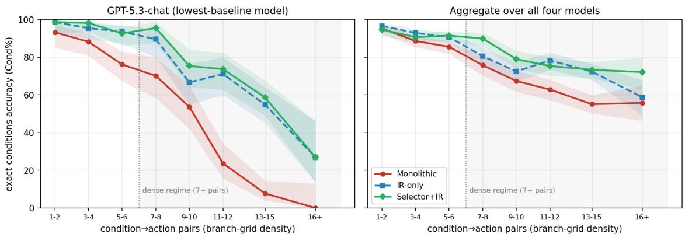
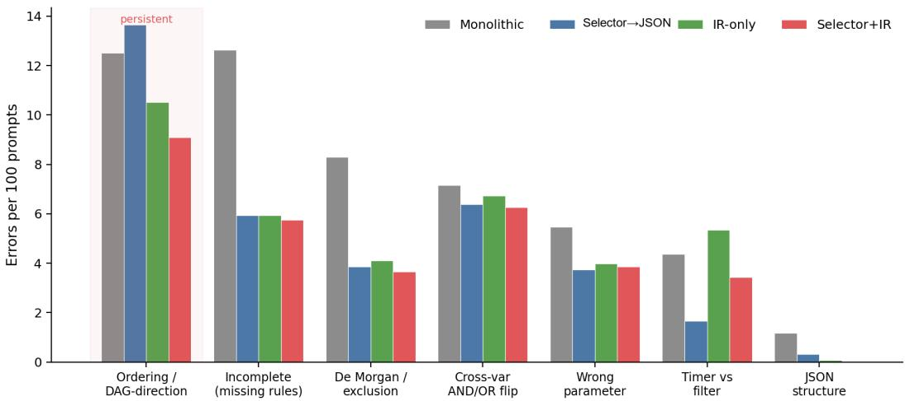

# Generating Workflow DAGs from Natural Language with Non-Reasoning LLMs

Anand Iyer, Bhanu Khetharpal, Srinivas Upadhya, Ramkumar Rajagopal

Microsoft

anandiyer@microsoft.com, bkhetharpal@microsoft.com, supadhya@microsoft.com, ramkumar.rajagopal@microsoft.com

## Abstract

This paper addresses the problem of translating natural- language routing rules written by business administrators into executable workflow graphs for enterprise contact cen- ters. Each target is an executable workflow graph, a di- rected acyclic graph (DAG) of conditional actions with parallel branches, hit-first fallback chains, and per-branch boolean predicates—encoded in the JSON dialect of a commercial routing platform. We present a system for this translation and show that, with the right neuro-symbolic decomposition, lower-cost non-reasoning LLMs can generate complex workflow DAGs at production-relevant quality without ex- pensive extended-reasoning models. Our central diagnostic is an emission-density bottleneck: on a 635-rule benchmark (manufactured synthetic data), models select the right graph nodes almost perfectly but drop their content—mis-wiring attributes and boolean grouping—as the number of interde- pendent nodes they must emit in a single pass grows. Acting on this diagnostic, we move combinatorial graph construc- tion out of the model into a deterministic compiler driven by a compact intermediate representation (IR), with a learned registry-selection front-end that keeps generation focused as the vocabulary grows. Across four generation models, the full system reaches up to ∼89% LLM-judge validity and ∼90% exact-match condition accuracy with 99–100% guaranteed- valid JSON, at roughly half the per-rule prompt tokens of a monolithic prompt. Our sharpest result, tested paired, is a gap- bridging efect: structural externalization delivers a large, significant lift where monolithic prompting leaves the most headroom (+24 points judge validity on GPT-5.3-chat), lifting a non-reasoning model to statistically match (by an equivalence test) a reasoning model’s out-of-the-box quality, while an ∼8-point frontier gap persists. We close with a deploy- ment path and transferable lessons for structured-generation applications.

## 1 Introduction

Problem and significance. A commercial contact-center platform routes inbound chat, voice, and SMS conversations through queues governed by routing rules. Each rule must compile to a workflow definition: a JSON DAG whose nodes are actions (raise priority, transfer queue, notify supervisor, ofer callback) and whose edges encode conditional and hitfirst execution order. Authoring this JSON by hand demands platform expertise and is error-prone. The platform’s current authoring capability generates these workflows with a single large (“monolithic”) LLM prompt over a structured, tem-platized rule representation; extending it to accept natural- language rules would substantially widen adoption, and is the problem this paper studies.

Representative prompt and DAG. Consider the prompt: “For customers in region US, while they wait in queue, raise priority by 10 every 10 seconds for 3 minutes; if still unre- solved at 3 minutes, end the conversation.” Its target DAG contains a queue-wait trigger; a region = US predicate gating the branch; raise-priority, timer, and end-conversation action nodes; and dependency edges under which priority repeats during the timer and the timer gates the terminal action. The target is therefore not a flat action list but a graph specify- ing which predicate gates each action and how the actions depend on one another.

The task is a constrained graph-generation problem, hard for three reasons: density (production rules combine up to 15 conditional branches across customer segments—and more actions still, since one branch can fire several—producing large branch grids), exactness (one wrong value or dropped branch changes the workflow’s behavior; generated work- flows are reviewed and validated by a human before deploy- ment, so higher first-pass accuracy reduces correction and regeneration iterations), and cost at scale (the converter runs inside an interactive authoring experience, so per-rule token budget rules out simply deploying the most powerful reason- ing model).

Motivation. Iterating on the monolithic prompt surfaced a clear insight: few-shot exemplars are the primary driver of accuracy. But as the platform grows, each new scenario adds actions, conditions, and scenario-specific exemplars, and a single prompt that inlines all of them on every request grows in cost and dilutes attention over largely irrelevant context. Our architecture preserves the few-shot signal while paying only for the vocabulary and exemplars each rule actually needs.

Thesis. These constraints need not force a quality com- promise. A non-reasoning model handed a large monolithic prompt degrades on dense rules, but the reason is specific and fixable: the model is excellent at reading a rule and compara- tively poor at emitting it as dense interdependent structure in one pass. We name this the emission-density bottleneck: the model almost always selects the correct graph nodes (nodeset accuracy near-saturated) yet increasingly mis-emits their attributes and boolean structure as node density rises, so ac- curacy falls with branch-grid density, not with the dificulty of reading. The remedy is therefore architectural rather than model-scale—move the combinatorial, drop-prone parts of graph construction into a deterministic compiler and keep the LLM on interpretation—letting commodity non-reasoning models produce production-relevant DAGs and reach judge validity that is statistically equivalent, at a pre-specified ±5- point margin, to a strong reasoning model’s out-of-the-box quality.

## Contributions.

1. The emission-density bottleneck—a diagnostic that lo- calizes structured-generation failure to emission, not in- terpretation: models select the right graph nodes almost perfectly (node-set accuracy 98–100% for stronger models) yet increasingly mis-emit node attributes and boolean structure as node density rises (Figure 1), so the fix is ar-chitectural rather than model-scale. This generalizes as a diagnostic lens for NL→graph tasks.

2. A gap-bridging result, stated precisely and tested paired: acting on the diagnostic lets a non-reasoning generator statistically match (equivalence-tested at a ±5-point mar-gin) a reasoning model’s monolithic-prompt quality on the semantic metric where monolithic prompting leaves the most headroom (+24 points, $p < 1 0 ^ { - 3 } )$ , while gains for models that already emit dense structure well are small and an ∼8-point frontier gap persists—a quantified ac-count of when structural externalization helps and when it does not.

3. An emerging-application study that instantiates the LLM-as-compiler paradigm for natural-language → workflow-DAG generation on a real enterprise routing platform. The diagnostic drives a concrete architecture— a compact IR compiled deterministically to valid JSON, and a learned registry selector that keeps generation fo- cused as the vocabulary grows—yielding validity by con- struction (99–100% valid JSON; 0% uncompilable IR across all four models) at roughly half the per-rule prompt tokens of a monolithic prompt.

4. A deployment path—registry-selection as the scaling mechanism, a planned similarity-based candidate pre- filter, and a target-agnostic compiler—plus transferable evaluation lessons for structured-generation applications.

## 2 Task and Domain

The registry. The platform defines a fixed, versioned vocabulary—the registry—of event types (triggers such as queue-wait, initial-routing, agent-response, queue-transfer), action types (change-priority, transfer-to-queue, ofercallback, send-notification, . . . ), and condition types with data types and operators (numeric wait-time, arbitrary-typed context variables, boolean state predicates, . . . ). Crucially, the registry also holds examples—and this is its most im- portant part: for every new scenario we add one or more corresponding example JSONs (as many as the scenario’s complexity warrants) alongside the vocabulary entries, so that the learned selector can retrieve its own few-shot ex- emplars for the rule at hand rather than relying on a fixed, globally-inlined example set. The registry is the single source of truth: adding a capability (or a new scenario’s exemplars) means adding a registry entry, not changing code.

Input / output. The input is a text rule; the output is workflow JSON with a trigger block (the event), an actions block (the DAG nodes), per-action boolean predicates, and dependency edges. Hit-first chains are encoded by chaining branches on a skip-on-match dependency; parallel branches run independently; a residual (“everyone else”) branch car-ries an empty predicate. The hard part is not the trigger or the action set (models get those ∼90–100% right) but the conditional structure: which predicate gates which action, and how branches relate.

Benchmark. We evaluate on a 635-rule benchmark spanning seven structural families with 1–15 conditional branches per rule—and, because a single branch can trigger several actions, more than 15 actions (and condition→action pairs) in the densest rules—deliberately at the dense end where production rules are hardest. Ground truth is the cor- rect workflow for each rule. Benchmark prompts are pro- grammatically generated from natural-language templates: this is a deliberate methodological choice, since templating is what lets us attach an exact ground-truth workflow—and therefore deterministic accuracy metrics—to every rule. Be- cause the templates systematically vary the condition/action values, the branch structure (segment count and order), and the surface phrasing across the seven families, they already probe some surface diversity; beyond this, they also inject deliberate spelling errors—present in roughly two-thirds of prompts—and non-English (e.g., Italian) entity values, mimicking real admin input and human inaccuracy. This directly exercises surface robustness (noisy, multilingual phrasing over complex structure), a distinct axis from the structural complexity above. Because our prompts couple this injected noise with deep branch structure, we expect the harder bot- tleneck to remain structural rather than surface-level; still, paraphrase robustness for workflow generation is a known open problem (Xu, Zhang et al. 2025), and we do not claim to isolate fully free-form paraphrase. (The data is proprietary; see Data Availability.)

## 3 Related Work

We connect to five bodies ofwork. (a) Semantic parsing and NL-to-structured output. Mapping language to executable structure has a long tradition in text-to-SQL and semantic parsing, where exact-match accuracy and cross-schema gen- eralization are central (Yu et al. 2018). Grammar-constrained decoding guarantees schema conformance without finetun- ing (Geng et al. 2023; Willard and Louf 2023; Park, Zhou, and D’Antoni 2025); our compiler instead achieves validity by construction on the back end, so it is model- and API- agnostic. (b) Neuro-symbolic generation, where an LLM proposes a symbolic representation a deterministic compo- nent executes or verifies (Kamali, Barezi, and Kordjamshidi 2025); our IR→compiler split is an instance specialized to workflow DAGs. (c) LLM-driven workflow and process generation, treating the LLM as a compiler that emits an intermediate program a runtime executes (Zeng et al. 2023; Fan et al. 2024; Trooskens et al. 2026). We difer on two axes: our input is text rules (the hard NL→structure step is upstream of where these systems begin), and our back end is a total compiler—the IR never fails to compile—rather than a generate-validate-regenerate loop. Closest to us, agentic- workflow benchmarks measure graph-structured plans with subgraph matching and report a marked sequence-vs-graph gap even for strong models (Qiao et al. 2025; Xu, Zhang et al. 2025; Stiehle, Weytjens, and Weber 2025); our emissiondensity analysis localizes why graph quality degrades and our compiler removes the validity failure mode. (d) Retrievalaugmented generation and tool/registry selection (Jiang et al. 2023; Mattioli et al. 2026); our similarity-prefiltered learned selector is a task-specific instance for registry scaling. (e) LLM-as-judge evaluation and its confounds—position, verbosity, and self-enhancement biases (Zheng et al. 2023; Gu et al. 2024; Wataoka, Takahashi, and Ri 2024); Section 5.1 bounds their efect and we report judge-independent metrics throughout. Our distinguishing contributions are the emission-density localization, the gap-bridging result for non-reasoning models, and a disclosed evaluation methodol- ogy.

## 4 Method

The system is a pipeline of LLM and deterministic stages, presented in the order each stage addresses a specific mea- sured failure. Four configurations recur in the evaluation:

• Monolithic—one LLM call, full registry → JSON directly (no compiler).

• Selector→JSON—learned registry selection, then the model emits JSON directly.

• IR-only—IR + compiler over the full registry (no selector).

• Selector+IR—the full system: learned selection and IR + compiler.

## 4.1 Monolithic baseline

A single call receives a large system prompt (full registry, rules, and few-shot exemplars) plus the rule, and emits workflow JSON. This mirrors the platform’s current authoring approach over templatized input, refined over many itera- tions, in which few-shot exemplars are the dominant lever on accuracy. It is simple and, for strong models, competitive; but it degrades for weaker generators on dense rules—condition structure is incomplete and JSON validity sufers from syn- tactic hallucination—and, as the registry and per-scenario exemplar set grow, inlining all of it on every rule becomes increasingly costly.

## 4.2 Intermediate representation and a target-agnostic compiler

We split generation into Step 1 (LLM): NL → IR, a lowsyntax description of the workflow DAG, and Step 2 (deterministic): IR → JSON, a compiler that emits guaranteed-valid workflow JSON. We instantiate the IR as YAML—a deliberate choice, since its light punctuation (no braces, few quotes, indentation-based nesting) asks the model to emit far less structural syntax than the JSON target, directly reducing the emission burden analyzed below; the method is agnostic to the exact serialization. This s lit removes an entire class of failures: JSON validity rises to 99–100% and the compile step never fails on IR output across any model. Crucially, Step 2 is deliberately agnostic to the specific end workflow being generated: the compiler translates the IR into what- ever target schema the platform requires, so supporting a new workflow type or JSON dialect is a compiler/registry change, not a prompt or model change. The compiler also performs the rote expansions the model would otherwise hand-write— cross-products, hit-first chaining, and list-valued condition operators that turn an “all-except” set into an AND of ex- clusions via De Morgan—so the model emits each value list once instead of repeating it. The remaining gap after this split is semantic—completeness and value precision—not syntax.

## 4.3 Localizing the failure: the emission-density diagnostic

Two measurements on the full benchmark (detailed in Section 5) localize the failures to emission rather than inter-pretation. First, decomposing accuracy by node granularity (Section 5.2): the model almost always selects the right set of action nodes—across the four configurations, node-set ac- curacy ranges 98.4–99.8% for GPT-5.2 and 99.5–100% for Opus 4.6, ∼93.5–97.6% for GPT-4.1, and 82.4–92.6% for GPT-5.3-chat—yet node-exact accuracy (same nodes with correct attributes) is markedly lower (for GPT-5.3-chat it ranges 62.5–82.8 across the same configurations). Read as improvements over the monolithic baseline, Selector+IR lifts GPT-5.3-chat’s node-set accuracy from 82.4 to 92.6 (+10.2 percentage points) and its node-exact accuracy from 62.5 to 82.8 (+20.3 percentage points). The residual error is therefore overwhelmingly wrong attributes on correctly-selected nodes, not wrong selection. Second, stratifying every rule by branch-grid density (Section 5.3, Figure 1) shows accuracy declining as the number of interdependent nodes to emit at once grows, with monolithic generation collapsing on dense rules while the compiler degrades gracefully. Both point the same way: the model reads a rule well and drops content only as the density of structure it must emit rises—ruling out “help the model extract better” fixes and pointing at reducing how much structure the model must emit.

## 4.4 The scaling front-end: learned registry selection

A front-end call first selects the registry entries a rule needs (events, actions, conditions, example IDs) as a small JSON; Step 1 then generates from a prompt built only from that se- lection. Selection is accurate even with non-reasoning mod- els (selection F1 ≈ 0.96–0.99), and concise disambiguation metadata in the registry resolves confusable condition pairs, raising recall—the binding constraint, since generation can only emit what selection retrieved.

Why selection exists: scaling with registry size. A mono- lithic prompt inlines the entire vocabulary on every rule; as the registry grows beyond what fits comfortably (or cheaply) in one prompt, this becomes untenable in cost and accu- racy. Selection keeps Step 1 focused on the handful of en- tries a rule actually uses, independent of total vocabulary size. As the registry grows we will front the LLM selec- tor with a lightweight similarity-based candidate genera- tor (embedding retrieval over registry entries) that shortlists likel -relevant entries before the LLM selects among them— keeping selection high-recall and inexpensive, and bounding the selector’s input regardless of vocabulary size.

## 4.5 Full system

Selector+IR feeds the filtered registry from the selector into the same IR Step-1 prompt and compiles deterministically— combining the scaling front-end with the validity-by- construction back-end.

## 4.6 Why it works: a division of labor

The unifying principle is a division oflabor matched to where LLMs are strong and weak:

• LLMs are strong at language→intent: reading a rule and identifying its segments, values, and intended actions (node-set accuracy near-saturated, Section 5.2).

• LLMs are weak at dense structured emission: serializing many interdependent nodes/edges at once, where they collapse the branch grid and mis-wire boolean grouping.

• Compilers are exact at deterministic expansion: cross-products, De Morgan expansion of membership sets, hit- first chaining, residual handling.

Every remedy moves combinatorial emission to the com- piler while leaving interpretation with the LLM. The con- sequence, made precise below, is that the benefit is largest where monolithic prompting leaves the most headroom: a model that already emits dense structure well gains little from the compiler, while one that under-produces it under mono- lithic prompting benefits substantially. This is a transferable recipe for NL→graph tasks on commodity models—one that narrows rather than erases the gap to the strongest models.

## 5 Evaluation

## 5.1 Setup

Generation spans four models: GPT-4.1 and GPT-5.3- chat (non-reasoning), and GPT-5.2 and Claude Opus 4.6 (reasoning-class references). GPT-4.1 is the architecturally weakest model; GPT-5.3-chat has the most headroom un- der monolithic prompting (it under-produces actions when handed the full monolithic prompt). All 16 cells are generated greedily (temperature 0), so decoding variance is negligible and single-run uncertainty is quantified by re- sampling rather than re-running. The semantic metric is an LLM-as-judge validity score (AI%) from Claude Opus 4.6 under one fixed rulebook, byte-identical across configura- tions. Deterministic metrics—JSON validity, event/node-set match, node-exact accuracy (correct action type and parameters), and exact conditions-tree match (Cond%)—are judgeindependent: each is computed by program directly against the ground-truth workflow for the rule, with no LLM in the loop, so any result reported on Cond% (including the density curve in Section 5.3) stands or falls independently of the judge. Every cell reports over all 635 rules.

<table><tr><td>Config</td><td>GPT-4.1</td><td>GPT-5.3-chat Cond% / AI%</td><td>GPT-5.2</td><td>Opus 4.6</td></tr><tr><td>Monolithic</td><td>70.1 / 66.8</td><td>56.5 / 56.4</td><td>87.2 / 79.8</td><td>87.2 / 84.1</td></tr><tr><td>Selector→JSON</td><td>79.7 / 71.5</td><td>75.1 /75.3</td><td>87.4 / 84.3</td><td>78.6 / 80.5</td></tr><tr><td>IR-only</td><td>78.3 / 65.2</td><td>79.4 / 77.2</td><td>91.0 / 82.4</td><td>83.0 / 88.8</td></tr><tr><td>Selector+IR</td><td>78.1 / 64.6</td><td>82.2 / 80.6</td><td>89.6 / 84.1</td><td>88.0 / 88.8</td></tr></table>

Table 1: Exact-match condition accuracy (Cond%) and LLM-judge validity (AI%) per configuration and model. Selector→JSON uses a selector tuned independently of Selector+IR (it passes a fuller registry at selection time), so it is reported for completeness and is not a single-variable ablation. Its token cost is in Appendix G. Source: Microsoft.

On judging Opus outputs with an Opus judge. Self-preference bias is a legitimate concern since one generator (Opus 4.6) shares the judge’s family, but it cannot drive our claims: our primary bridge involves no Opus-generated out- put (GPT-5.3-chat vs. GPT-5.2 under the same judge, so any self-preference cancels), and wherever an Opus generation is compared the bias is conservative—it inflates the reason- ing baselines our method must catch. The judge-independent Cond% metric preserves the same ordering. Appendix A gives the full three-part argument.

## 5.2 Headline results

Exact-match condition accuracy (Cond%) and LLM-judge validity (AI%) are in Table 1. JSON validity and eventtype accuracy are 99–100% across all compiler cells (direct-emission configs slightly lower, e.g. Monolithic GPT-4.1 3.5% invalid JSON) and omitted here.

The pipelines deliver a large lift where monolithic prompting leaves the most headroom: GPT-5.3-chat’s judge validity climbs 56.4 → 80.6 and conditions 56.5 → 82.2. For models that already emit dense structure well the efect is muted—monolithic Opus is already 84.1 AI% / 87.2 Cond%, and the pipelines move it only a few points (and down on some cells).

Two further judge-independent metrics decompose node construction: node-set accuracy (correct action types, ig- noring parameters) and the stricter, primary node-exact accuracy (correct types and parameters). Across configurations, node-set accuracy ranges from 98.4–99.8% for GPT- 5.2, 99.5–100% for Opus 4.6, 93.5–97.6% for GPT-4.1, and 82.4–92.6% for GPT-5.3-chat. For GPT-5.3-chat specif- ically, Selector+IR improves node-set accuracy from 82.4% to 92.6% (+10.2 percentage points) and node-exact accuracy from 62.5% to 82.8% (+20.3 points) relative to monolithic generation. So most residual error is parameter error on correctly-selected nodes, not wrong-node selection—the model knows which actions to emit but drops attributes as density grows, exactly the emission-density bottleneck, con- firmed without the LLM judge. Appendix B gives the full per-model table.

  
Figure 1: Exact-conditions accuracy (corrected scorer) vs. branch-grid density (condition→action pairs). Left: GPT-5.3-chat; right: aggregate over all four models. Shaded bands are Wilson 95% CIs. Monolithic generation collapses on dense rules while the com iler confi urations de rade racefull —the visual si nature of the emission-densit bottleneck. Source: Microsoft.

## 5.3 The emission-density curve

Stratifying every rule by branch-grid density—the number of condition→action pairs, a proxy for how many interde-pendent nodes the model must emit at once—reproduces the emission-density thesis on the full benchmark (Figure 1). Ev-ery configuration declines as density rises, but the compiler degrades far more gracefully. For GPT-5.3-chat the contrast is stark: monolithic exact-conditions accuracy falls from ∼93% at 1–2 pairs to ∼0% beyond 15 pairs, whereas Selector+IR still holds above ∼55% through the 13–15 band. Aggregated over all four models the ordering is preserved. The shaded bands are Wilson 95% confidence intervals on the per-bin pass rate: the Wilson interval inverts the score test for a bino- mial proportion, so unlike the normal (Wald) approximation it stays inside [0, 1] and remains well calibrated when a den-sity bin holds few rules or when the observed accuracy sits near 0% or 100%—precisely the regime of the densest bands.

## 5.4 Validity by construction

The deterministic compiler guarantees structural validity: IR-only produces zero uncompilable output across all four models, with 99–100% valid JSON and ∼99% correct event types throughout. Adding the selector introduces rare malformed-IR that almost always repairs, leaving exactly one hard failure across 5,080 pipeline generations (0.02%)— a disclosed robustness limitation of selection, not a validity threat (per-model breakdown in Appendix C).

## 5.5 Paired significance

All contrasts are paired by rule $( n = 6 3 5 ) ;$ because generation is greedy, McNemar’s exact test on per-rule pass/fail is the correct inferential tool. The test conditions on the dis- cordant rules—those a given pair of configurations scores diferently—and asks, under the null hypothesis that the two configurations are equally accurate, whether the split of those disagreements between the two directions is consis- tent with a fair coin; the p-value is the exact binomial tail probability, so no large-sample approximation is required even when the discordant count is small. Scenario-clustered bootstrap CIs show that marginal per-cell rates carry ±15– 25-point uncertainty—so comparisons must be read paired, not from overlapping marginal CIs. For GPT-5.3-chat ev- ery pipeline beats monolithic by a wide, highly significant margin (Selector+IR +24.3 points, $p < 1 0 ^ { - 3 } )$ —the core, ro- bust result. For models that already emit dense structure well gains are small and metric-fragile: on exact conditions, Selector→JSON and IR-only significantly reduce Opus’s score (a scorer-strictness efect on the compiler’s canonical, logically-equivalent combiner nesting, which the judge forgives). The full per-cell McNemar table is in Appendix D.

## 5.6 Bridging non-reasoning and reasoning models

Is “non-reasoning models bridge the gap to reasoning mod- els” a fair claim? All four models ran the same 635 rules, so cross-model comparison is paired. Because the claim is one of similarity, we test it with two one-sided tests (TOST) against a pre-specified, strict ±5-point equivalence margin rather than inferring parity from a non-significant diference test. The answer is yes, but tightly scoped. The bridge holds against GPT-5.2: GPT-5.3-chat + Selector+IR (80.6% AI%) is statistically equivalent to GPT-5.2’s monolithic baseline (79.8%; paired diference +0.8pt, 90% CI $[ - 2 . 0 , + 3 . 6 ] , p _ { \mathrm { T O S T } } = \bar { 0 } . 0 0 7 )$ . Against the stronger Opus 4.6 baseline (84.1%) it reaches near-parity, not formal equivalence: the 3.5-point deficit is not individually signif- icant (McNemar $p = 0 . 0 6 7 )$ , but equivalence holds only at a looser ±7-point margin. Two further limits. The architecturally weakest model (GPT-4.1) does not bridge—even its best cell stays 8–13 points below both reasoning baselines $( p < 1 0 ^ { - 4 } )$ , and the same ±5-point test that certifies GPT-5.3-chat rejects GPT-4.1 (equivalence reached only at ±12), evidence the procedure is adequately powered at $n = 6 3 5$ and not merely rubber-stamping equivalence. And the fron- tier gap persists—the best non-reasoning cell (80.6%) trails the best reasoning cell (Opus 4.6 + IR-only, 88.8%) by −8.2 points $( p < 1 0 ^ { - \frac { 7 } { 4 } } )$ , because reasoning models also improve with the method. Fair phrasing: deterministic structure lets a non-reasoning model match GPT-5.2’s monolithic-prompt quality and reach near-parity with Opus, narrowing but not eliminating the gap; when the reasoning model also adopts the method, an ∼8-point frontier gap remains. Full TOST results are in Appendix D.

<table><tr><td>Config</td><td>GPT-4.1</td><td>GPT-5.3</td><td>GPT-5.2</td><td>Opus 4.6</td></tr><tr><td>Monolithic (1 call)</td><td>23,246</td><td>21,264</td><td>23,767</td><td>27,286</td></tr><tr><td>IR-only (1 call)</td><td>20,122</td><td>19,311</td><td>20,323</td><td>23,906</td></tr><tr><td>Selector+IR</td><td>(0.87×) 12,976</td><td>(0.91×) 11,980</td><td>(0.86×) 13,220</td><td>(0.88×)</td></tr><tr><td>(2 calls)</td><td>(0.56×)</td><td>(0.56×)</td><td>(0.56×)</td><td>14,972 (0.55×)</td></tr></table>

Table 2: Per-rule total tokens; ratio vs. monolithic in paren- theses. Source: Microsoft.

## 5.7 Token eficiency

A multi-call pipeline could plausibly cost more than one monolithic call; it does not. We report per-rule tokens (objective and provider-independent; they translate to cost under any pricing) in Table 2.

The saving has two independent sources. First, IR alone helps (∼0.87×): emitting compact IR instead of verbose JSON shrinks the completion $( \mathrm { e . g . , 4 . 1 K } \to 2 . 5 \mathrm { K }$ tokens on GPT-4.1). Second, the selector trims the prompt: monolithic inlines the entire verbose registry (the bulk of its ∼19Ktoken prompt) on every rule, whereas the selector call carries only a compact ∼2.2K menu and the assembler only the selected subset—taking Selector+IR to ∼0.56× on ev-ery model. The bridging cell is thus both competitive and cheaper: GPT-5.3-chat + Selector+IR matches the reasoning models’ monolithic quality using 0.44–0.50× the tokens of their monolithic runs.

## 5.8 Error analysis

The residual errors are concentrated and genuine. Within the recurring-timer family, ∼40% of cells still miss exact conditions—real model errors (wrong eligibility trees, dropped phases) corroborated by lower judge scores, not syntax or scoring artifacts—and they define the open chal- lenge.

## 5.9 What structure fixes, and what it does not

To characterize how the pipeline helps, we automatically categorized the judge’s rationale on all 2,348 failing cells (aggregate trends only; method and per-category numbers in Appendix E). The errors fall into two classes with sharply diferent responses to decomposition (Figure 2, Appendix E).

Completeness and syntax errors collapse: the pipelines roughly halve incomplete-rule and De Morgan/exclusion er- rors and all but eliminate raw JSON-structure errors—this accounts for most of the AI-quality gain. Logic and topol- ogy errors persist: cross-variable AND/OR flips stay flat, and ordering errors—the single largest category (49.5% of failures), i.e. wrong edge direction in the DAG—barely move, with only Selector+IR reducing them meaningfully. Externalizing emission thus converts omission errors into mis-ordering errors, leaving DAG topology as the dominant residual. The mix is model-dependent: the lowest-baseline model’s failures are dominated by incompleteness (76%) while the strongest model’s are almost entirely boolean-logic errors. This reads the judge’s rationales rather than ground truth, but the judge-independent conditions scorer confirms the persistence of boolean-structure errors.

## 6 Deployment Status and Path

Status. The platform’s current authoring capability generates workflows from a templatized rule representation using a monolithic prompt. The system here extends that along two axes the templatized approach does not address—accepting text rules and scaling to a growing registry without an ever-expanding prompt—and is validated in ofline evaluation at scale (635 rules, four models). Its architecture was chosen for production cost, targeting the same operating envelope as the current system.

Path toward scale. New events/actions/conditions are added as registry entries with disambiguation metadata; the compiler and prompts are unchanged, and few-shot exem- plars are single-sourced from the registry. The learned se- lector is the front-end for registry growth, and a similarity- based candidate prefilter (embedding retrieval before the LLM selector) keeps Step 1 high-recall and inexpensive as the vocabulary expands. Because Step 2 is agnostic to the target workflow, extending to new schemas is a com- piler/registry change, not a model change.

Validating the judge. Our headline semantic metric is an LLM-as-judge score; Section 5.1 argues self-preference bias cannot drive our central claims and in fact strengthens them (Appendix A), and the judge-independent conditions metric agrees throughout. To check the judge against human reading, two authors labeled a verdict-balanced (50 judge-PASS, 50 judge-FAIL), stratified 100-item sample blind to the judge verdict, the deterministic score, and the gen-erating model and method. The two labeling assignments overlapped only partially: one author labeled 82 items and the other 40, with 22 items labeled independently by both. Agreement with the judge was 91% (combined Cohen’s $\kappa = 0 . 8 2 )$ and inter-annotator agreement on the 22-item overlap was $\kappa = 0 . 8 2$ . As both annotators are authors, this is a blind consistency check; blindness rules out anchoring, and the conditions metric supplies independent corrobora- tion (Appendix H).

Generality. The architecture—LLM → IR → deterministic compiler with learned selection and a similarity prefilter— is domain-agnostic; the emission-density diagnostic and evaluation practices should transfer to other NL→graph tasks (business-process models, ETL/dataflow graphs, agent tool-graphs, CI/build pipelines).

## 7 Lessons Learned

We surface two transferable lessons that materially afect whether such a system is measured correctly; two further practices (treating the scorer as fallible code, and how greedy generation buys honest paired statistics) are in Appendix F.

Align the judge’s rulebook with the generator’s. Convention drift between generator and judge is a first-order confound: a judge that reads a surface “or” literally will false-fail a generator that correctly used De Morgan. We pin one rule- book for every system compared and treat any configuration that looks anomalously bad as suspect until re-checked.

Decomposition relocates the bottleneck; it does not re- move it. Splitting generation into plan→expand or codelocked scafolds consistently failed—the node-dropping col- lapse simply moved to the content-filling step. Reduce what must be emitted (IR, list-valued conditions, selection); do not merely chop the generation step.

## 8 Conclusion

Generating workflow DAGs from natural language is a real enterprise need, and it can be met without the cost of extended-reasoning models. Commodity LLMs fail at emitting dense structure, not at understanding it; mov- ing combinatorial graph construction into a deterministic compiler—via an IR and a learned, similarity-prefiltered reg- istry selector—lets non-reasoning models reach production- relevant operating points with guaranteed structural valid- ity at roughly half the token cost. Our sharpest, honestly scoped result is a gap-bridging efect: structure delivers a large, significant lift where monolithic prompting leaves the most headroom, lifting a non-reasoning model to statisti- cally match (by an equivalence test) a reasoning model’s out-of-the-box quality, while an ∼8-point frontier gap per-sists. We hope the emission-density framing, the deployment path, and the evaluation practices help other teams ship and honestly measure structured-generation applications on af- fordable models.

## Data Availability

The evaluation data and the platform’s vocabulary are propri- etary and governed by confidentiality agreements; we report aggregate metrics and dataset characteristics (size, scenariofamily structure, condition-density distribution) rather than releasing examples or schemas. The methods are described in enough detail to reimplement on any comparable structured- workflow target.

## A Self-preference bias — full argument (supports Sec. 5.1)

Because one of the four generators (Opus 4.6) shares a model family with the judge, self-preference bias—an LLM judge rating its own outputs more favorably—is a legitimate con- cern. Three observations bound its impact on our conclu- sions. First, our primary bridging comparison involves no Opus-generated output: GPT-5.3-chat + Selector+IR (80.6% AI%) versus GPT-5.2 monolithic (79.8%) pits two non-Opus generations against the same Opus judge, so any self-preference cancels. Second, wherever the compari- son does include an Opus generation, self-preference is not merely harmless but actively strengthens our case:

<table><tr><td>Config</td><td>GPT-4.1</td><td>GPT-5.3 Node-set / Node-exact</td><td>GPT-5.2</td><td>Opus 4.6</td></tr><tr><td>Monolithic</td><td>95.7 / 80.3</td><td>82.4 / 62.5</td><td>98.4 / 86.1</td><td>99.5 / 89.8</td></tr><tr><td>Selector→JSON</td><td>97.6 / 83.5</td><td>89.3 / 80.2</td><td>99.8 / 89.3</td><td>100 / 89.3</td></tr><tr><td>IR-only</td><td>93.5 / 76.5</td><td>90.2 / 81.3</td><td>99.2 / 89.1</td><td>100 / 90.7</td></tr><tr><td>Selector+IR</td><td>94.6 / 77.6</td><td>92.6 / 82.8</td><td>99.2 / 88.5</td><td>99.8 / 91.7</td></tr></table>

Table 3: Node-set and node-exact accuracy per configuration and model. Source: Microsoft.

it inflates Opus’s monolithic baseline (making the “nonreasoning model approaches Opus” bridge harder to claim) and inflates the best reasoning cell (widening the reported ∼8-point frontier gap), so the true gap our method must close is, if anything, smaller than reported. The bias thus works against every claim we make—it can only understate the non-reasoning story, never manufacture it. Any residual self-preference makes our reported lifts a conservative lower bound. Third, the judge-independent Cond% metric preserves the same qualitative ordering (e.g., Opus monolithic 87.2 vs. GPT-5.3-chat + Selector+IR 82.2), so the judge is not fabricating the picture. A blind, author-labeled human- agreement study corroborates the judge (91% agreement, κ = 0.82; Appendix H).

## B Node-set / node-exact accuracy, per model (supports Sec. 5.2)

Node-set accuracy scores correct action types (ignoring parameters); node-exact accuracy is the stricter metric requiring correct types and parameters (exact key/value match).

The decomposition localizes the residual error: node-set is 98–100% for GPT-5.2 and Opus 4.6 (∼93–98% for GPT-4.1) and moves only modestly for GPT-5.3-chat (82.4 → 92.6), so most of the remaining error is parameter error on correctly-selected nodes.

## C Compile-failure breakdown (supports Sec. 5.5)

IR-only produces zero uncompilable output across all four models. Adding the selector introduces rare malformed-IR (compile-failure rate: GPT-4.1 2.0%, Opus 4.6 0.2%, GPT-5.3-chat and GPT-5.2 0%); all but one of these repair to valid JSON, leaving exactly one hard failure across 5,080 pipeline generations (0.02%).

## D Full paired-significance table (supports Sec. 5.5)

All contrasts are paired by rule (n = 635). We report scenario-clustered bootstrap 95% CIs (resampling the seven scenario families, then rules within), which show that marginal per-cell rates carry ±15–25-point uncertainty.

Each configuration vs. Monolithic (judge validity; ∆ points, McNemar $p ; ~ * * * ~  p ~ < ~ 1 0 ^ { - 3 } , * ~ p ~ < ~ 0 . 0 5$ , ns not significant):

  
Figure 2: Error prevalence (per 100 prompts) by category and configuration, from automated coding of the judge’s rationales. Completeness/syntax categories (Incomplete, De Morgan, JSON) collapse under the pipelines; logic/topology categories (crossvariable AND/OR, Ordering) persist. Ordering—wrong DAG edge direction—is the largest and most stubborn residual. Source: Microsoft.

<table><tr><td>Model</td><td>Selector→JSON</td><td>IR-only</td><td>Selector+IR</td></tr><tr><td>GPT-4.1</td><td>+4.7(*)</td><td>-1.6 (ns)</td><td>−2.2 (ns)</td></tr><tr><td>GPT-5.3-chat</td><td>+18.9 (***)</td><td>+20.8 (***)</td><td>+24.3 (***)</td></tr><tr><td>GPT-5.2</td><td>+4.4 (*)</td><td>+2.5 (ns)</td><td>+4.3 (*)</td></tr><tr><td>Opus 4.6</td><td>−3.6 (ns)</td><td>+4.7(*)</td><td>+4.7(*)</td></tr></table>

Table 4: Judge-validity deltas vs. Monolithic, with McNemar significance. Source: Microsoft.

On exact conditions, Selector→JSON and IR-only significantly reduce Opus’s score: the compiler’s canonical com- biner nesting difers from ground-truth structure though it is logically equivalent—a scorer-strictness efect the judge forgives.

## Equivalence tests (TOST) for the bridging claim

Because the bridge is a claim of similarity, not diference, we test it with two one-sided tests (TOST) against a pre-specified ±5-point equivalence margin (a strict operating tolerance). We report the paired mean diference, its 90% CI, pTOST at ±5, and the smallest margin at which equivalence holds $( p _ { \mathrm { T O S T } } < 0 . 0 5 )$ . All tests are paired by rule (n = 635) on per-rule judge pass/fail.

The procedure has discriminant validity: at the same n and the same ±5-point margin it certifies GPT-5.3-chat + Selector+IR as equivalent to GPT-5.2 yet rejects equivalence for GPT-4.1’s best cell (which needs ±12), so a positive equivalence verdict reflects genuine parity rather than low power. Equivalence to Opus 4.6 is not established at ±5 (only at ±7), so we report near-parity there, not a match.

Single-run scope (threat to validity). Every cell is a single greedy (temperature-0) generation, so these intervals capture rule-sampling and scorer uncertainty but not genera- tion stochasticity, prompt-paraphrase sensitivity, or few-shot- ordering sensitivity. The qualitative ordering is reproduced by the judge-independent Cond% metric, but quantifying decode- and prompt-level variance is left to future work and is the main residual threat to the point estimates.

## E Error-taxonomy coding method and per-category numbers (supports Sec. 5.9)

We automatically categorized the judge’s text rationale on all 2,348 failing cells across the four configurations and four models by keyword coding gated on negative cues (96% coverage; aggregate trends only). Relative to the monolithic baseline, the pipelines roughly halve missing-rule (incom-plete) errors (12.6 → 5.7 per 100 prompts) and De Morgan / exclusion errors (8.3 → 3.7), and all but eliminate raw JSON-structure errors (1.2 → 0.0). Cross-variable AND/OR connective flips stay essentially flat (∼6.3–7.2 across all configurations). Ordering errors—the single largest category (49.5% of all failures)—barely move and even worsen under Selector→JSON (12.5 → 13.7); only Selector+IR reduces them meaningfully (→ 9.1). This analysis is corroborated by the blind human-agreement study (Appendix H) and by the judge-independent conditions scorer.

## F Two further evaluation lessons (supports Sec. 7)

Treat the deterministic scorer as code that can be wrong. A metric that is uniformly degenerate across many indepen- dent models and configurations is almost always a scorer bug, not a result. Our conditions scorer resolves gates inherited transitively down timer cascades (walking dependency edges upward through sequencing nodes, but only across success edges so fallback branches do not inherit a gate); we validate it against the judge and unit tests.

<table><tr><td>Comparison (AI%)</td><td>∆pt</td><td>90% CI</td><td> $p _ { \mathrm { T O S T } } ^ { \pm 5 }$ </td><td>smallest equiv. margin</td></tr><tr><td>GPT-5.3 Selector+IR vs GPT-5.2 mono</td><td>+0.8</td><td> $[ - 2 . 0 , + 3 . 6 ]$ </td><td>0.007</td><td>±4pt</td></tr><tr><td>GPT-5.3 Selector+IR vs Opus 4.6 mono</td><td> $^ { - 3 . 5 }$ </td><td> $[ - 6 . 4 , - 0 . 5 ]$ </td><td>0.198</td><td>±7pt</td></tr><tr><td>GPT-4.1 best vs GPT-5.2 mono</td><td>-8.4</td><td> $[ - 1 1 . 8 , - 4 . 9 ]$ </td><td></td><td>±12pt</td></tr><tr><td>GPT-4.1 best vs Opus 4.6 mono</td><td>-12.6</td><td> $[ - 1 5 . 9 , - 9 . 3 ]$ </td><td></td><td> $> \pm 1 5 \mathrm { p t }$ </td></tr></table>

Table 5: TOST equivalence tests for the bridge. GPT-4.1 “best” is its highest-AI% cell (Selector→JSON, 71.5%). Equivalence to GPT-5.2 holds at the strict ±5-point margin; equivalence to Opus 4.6 holds only at ±7 (reported as near-parity); GPT-4.1 is rejected at ±5. Source: Microsoft.

<table><tr><td>Config</td><td>GPT-4.1</td><td>GPT-5.3</td><td>GPT-5.2</td><td>Opus 4.6</td></tr><tr><td>Monolithic (1 call)</td><td>23,246</td><td>21,264</td><td>23,767</td><td>27,286</td></tr><tr><td>Selector→JSON</td><td>25,117</td><td>23,846</td><td>26,052</td><td>30,688</td></tr><tr><td>(2 calls)</td><td>(1.08×)</td><td>(1.12×)</td><td>(1.10×)</td><td>(1.12×)</td></tr><tr><td>IR-only (1 call)</td><td>20,122 (0.87×)</td><td>19,311 (0.91×)</td><td>20,323 (0.86×)</td><td>23,906 (0.88×)</td></tr><tr><td>Selector+IR (2 calls)</td><td>12,976 (0.56×)</td><td>11,980 (0.56×)</td><td>13,220 (0.56×)</td><td>14,972 (0.55×)</td></tr></table>

Table 6: Per-rule total tokens; ratio vs. monolithic in paren- theses. Source: Microsoft.

Greedy generation buys cheap, honest statistics. Be-cause every cell is temperature-0, paired McNemar on a sin- gle run is the correct test; scenario-clustered bootstrap CIs then honestly expose that marginal per-cell rates are far less certain than a naïve binomial CI implies.

## G Full per-config token breakdown (supports Sec. 5.7)

The main-text token table (Section 5.7) reports the three clean cost configurations (Monolithic, IR-only, Selector+IR). For completeness we include the selection-only variant (Selector→JSON), which emits JSON directly after selection. It is not cheaper than the monolithic baseline (≈1.08– 1.12×)—not because it re-inlines the full registry (it does not; its JSON call carries only the selected registry), but because it pays two full-size calls: a selection call (∼9.3K tokens on GPT-4.1, which reads a substantial system prompt) followed by a JSON-generation call over the selected registry (∼15.8K tokens: ∼13.2K prompt + ∼2.6K completion). The selection overhead exceeds the prompt saved by trimming the registry, so the two-call total exceeds a single monolithic call. Because this variant’s selector was tuned independently of the Selector+IR selector, its numbers are not a clean single- variable ablation.

## H Blind human-agreement study (supports Sec. 5.1, Sec. 6)

Two authors labeled a 100-item sample as valid/invalid, blind to the judge verdict, the deterministic score, the judge’s rationale, and the generating model and method. The two assignments overlapped only partially: Annota- tor 1 labeled 82 items, Annotator 2 labeled 40, and 22 items were labeled independently by both. The sample is verdict-balanced (50judge-PASS, 50judge-FAIL) to neutralize the prevalence efect on κ, and stratified across judging group (opus self-judge 40, cross-model 60), method (baseline/IR-only/Selector→JSON/Selector+IR, 25 each), generating model (Opus 40; GPT-4.1/GPT-5.2/GPT-5.3-chat 20 each), and branch-grid density (1–2: 12, 3–5: 27, 6–9: 24, 10+: 37). Y/N labels map to PASS/FAIL and are compared against the judge verdict.

<table><tr><td>Comparison</td><td>n</td><td>Raw agreement</td><td>Cohen&#x27;s κ</td></tr><tr><td>Annotator 1 vs. judge</td><td>82</td><td>93.9%</td><td>0.878</td></tr><tr><td>Annotator 2 vs. judge</td><td>40</td><td>90.0%</td><td>0.802</td></tr><tr><td>Inter-annotator (overlap)</td><td>22</td><td>90.9%</td><td>0.818</td></tr><tr><td>Combined (40 + 60)</td><td>100</td><td>91.0%</td><td>0.820</td></tr></table>

Table 7: Blind human-vs-judge agreement. The combined row uses one label per row—all 40 rows Annotator 2 labeled plus the 60 remaining (Annotator-1-only) rows—for full 100- item coverage. Source: Microsoft.

All comparisons fall in the “substantial” to “almost per- fect” agreement band, indicating the judge tracks human reading under blind conditions.

## References

Fan, S.; Cong, X.; Fu, Y.; et al. 2024. WorkflowLLM: En- hancing Workflow Orchestration Capability of Large Lan- guage Models. arXiv preprint arXiv:2411.05451.

Geng, S.; Josifoski, M.; Peyrard, M.; and West, R. 2023. Grammar-Constrained Decoding for Structured NLP Tasks without Finetuning. In Proceedings of EMNLP. ArXiv:2305.13971.

Gu, J.; Jiang, X.; Shi, Z.; et al. 2024. A Survey on LLM-as- a-Judge. arXiv preprint arXiv:2411.15594.

Jiang, Z.; Xu, F. F.; Gao, L.; et al. 2023. Active Re- trieval Augmented Generation. In Proceedings of EMNLP. ArXiv:2305.06983.

Kamali, D.; Barezi, E. J.; and Kordjamshidi, P. 2025. NeSyCoCo: A Neuro-Symbolic Concept Composer for Compositional Generalization. In Proceedings of AAAI. ArXiv:2412.15588.

Mattioli, G.; Turri, E.; Sarto, S.; et al. 2026. RaTA-Tool: Retrieval-Based Tool Selection with Multimodal Large Lan- guage Models. In Proceedings ofICPR. ArXiv:2604.14951.

Park, K.; Zhou, T.; and D’Antoni, L. 2025. Flexible and

Eficient Grammar-Constrained Decoding. arXiv preprint arXiv:2502.05111.

Qiao, S.; Fang, R.; Qiu, Z.; et al. 2025. Benchmarking Agentic Workflow Generation (WorfBench). In Proceedings of ICLR. ArXiv:2410.07869.

Stiehle, F.; Weytjens, H.; and Weber, I. 2025. On LLM-Assisted Generation of Smart Contracts from Business Pro- cesses. In BPM Workshops. ArXiv:2507.23087.

Trooskens, G.; et al. 2026. Compiled AI: Compiling Declar- ative Specifications into Validated LLM Business Logic. arXiv preprint arXiv:2604.05150.

Wataoka, K.; Takahashi, T.; and Ri, R. 2024. Self-Preference Bias in LLM-as-a-Judge. arXiv preprint arXiv:2410.21819.

Willard, B. T.; and Louf, R. 2023. Eficient Guided Generation for Large Language Models. arXiv preprint arXiv:2307.09702. Outlines.

Xu, S.; Zhang, J.; et al. 2025. RobustFlow: Towards Robust Agentic Workflow Generation. arXiv preprint arXiv:2509.21834.

Yu, T.; Zhang, R.; Yang, K.; et al. 2018. Spider: A Large- Scale Human-Labeled Dataset for Complex and Cross- Domain Semantic Parsing and Text-to-SQL Task. In Proceedings ofEMNLP. ArXiv:1809.08887.

Zeng, Z.; Watson, W.; Cho, N.; et al. 2023. FlowMind: Automatic Workflow Generation with LLMs. In Proceedings ofACM ICAIF. ArXiv:2404.13050.

Zheng, L.; Chiang, W.-L.; Sheng, Y.; et al. 2023. Judging LLM-as-a-Judge with MT-Bench and Chatbot Arena. In Advances in Neural Information Processing Systems Datasets and Benchmarks. ArXiv:2306.05685.