# Aggregate Disambiguation Systems

José María Lago Albert Castellana Edgars Nemše

GenLayer Labs Research

jm@genlayerlabs.com albert@genlayerlabs.com edgars@genlayerlabs.com

## Abstract

Natural-language tasks can elicit diferent verdicts from protocol-following evaluators that receive the same declared information. We study aggregate disambiguation systems (ADSs). Given a task and a candidate solution, each evaluator casts a binary vote on whether the solution should be accepted, and the system aggregates the votes of a finite panel. The target is protocol reproducibility relative to an explicitly declared evaluator reference, not semantic truth. We separate fixed finite censuses, probabilistic evaluator populations, and growing-census limits, since their endpoint laws and guarantees are not interchangeable. In the population setting, we use finite samples to estimate how often a finite panel reaches the same decision as the declared evaluator population. We provide a lower confidence bound on the fraction of candidate solutions for which the disagreement probability is at most a chosen tolerance. The calculation accounts separately for sampling candidate solutions and sampling evaluators. The construction permits arbitrary dependence among columns induced by shared evaluator rows and uses exact binomial intervals at the evaluator layer and an exact one-sided binomial inversion at the generator layer. Simulations check the implementation against known population coverages and expose power limitations. We illustrate the method with a pilot study in which 40 LLM evaluation runs each produced one binary vote for each of 50 manually selected cases. The results apply only to these fixed cases. Because the cases were not randomly sampled, the pilot does not support conclusions about a broader population of tasks. Construction-underdetermined items illustrate why reproducibility must not be read as truth; no independent semantic adjudication is attempted. We also give exact finite-census bounds and a finite-sample workload-profile certificate for explicitly non-adaptive targeted contamination.

Keywords: aggregate disambiguation; finite-panel inference; finite-sample certification; finite-population sampling; large language models

## 1 Introduction

Many distributed decisions begin with a predicate that honest participants can evaluate deterministically. Naturallanguage tasks break that premise. Two protocol-following evaluators may receive the same problem, candidate answer, instructions, and tools yet return diferent verdicts. This occurs with human reviewers, stochastic software, and large language models (LLMs). The immediate statistical question is therefore not whether one evaluator is infallible, but whether a finite panel can reliably reproduce the decision of a declared evaluator population.

We call a mechanism that generates a candidate resolution, evaluates it through multiple independent episodes, and aggregates their verdicts an aggregate disambiguation system (ADS). When a randomly sampled panel is itself the decision mechanism and neither an external truth label nor a complete population vote is available at run time, reproducibility is an operational stability target: it asks whether the declared rule determines the action or whether the particular panel draw does. It remains separate from semantic correctness.

The population in that definition is part of the estimand. A finite catalogue of frozen verdicts, a sequence of growing catalogues, and a probability distribution from which fresh evaluator episodes are sampled answer diferent questions and induce diferent sampling laws. Treating them as interchangeable is the source of several otherwise plausible but incorrect panel guarantees.

The paper studies three connected problems. First, it identifies the exact finite-panel error under each sampling regime. Second, it asks how a finite generator–evaluator experiment can certify the fraction of future resolutions that a panel will classify reproducibly. Third, it translates adversarial participation into a sensitivity surface indexed by panel size and task clarity, rather than a single context-free “secure percentage.”

## 1.1 Relation to prior work

Several neighboring literatures overlap with one layer of ADS but use diferent reference objects or observe diferent losses. Consensus targets a common state; collective-decision theories target accuracy under competence assumptions or logical consistency across propositions; judge-panel and measurement models target human labels, latent quality, or reliability; and acceptance sampling, tolerance methods, and finite-sample risk control provide related statistical tools. The works reviewed below do not directly certify, under a declared generator law, the mass of frozen resolutions for which a fresh binary panel reproduces the decision of a predeclared evaluator population. We use that estimand as the common comparison axis below.

Consensus and non-deterministic replication. Byzantine agreement asks whether non-faulty processors can agree despite arbitrary faults, while state-machine replication orders requests and executes them from a common state [29, 9]. For non-deterministic operations, Cachin et al. filter or validate divergent executions or provide shared randomness; Huang et al. separate agreement on transaction order from agreement on the resulting state [8, 20]. These protocols engineer a common accepted output or state despite faults or execution-level non-determinism.

Collective judgment. The Condorcet jury theorem assumes an objectively correct alternative and independent jurors who select it with probability greater than one half; under those assumptions, majority accuracy increases with jury size [13]. Peleg and Zamir characterize when analogous conclusions survive under a general dependent voting law [30]. Judgment aggregation instead studies several logically connected propositions: proposition-wise aggregation can produce an inconsistent collective set, and quota thresholds determine when consistency and completeness can coexist [28, 14]. Together these traditions distinguish truth-based accuracy, dependence, and logical coherence as separate collective-decision criteria.

Aggregation during answer generation. Self-consistency samples multiple reasoning paths and aggregates their final answers, while multiagent debate allows model instances to inspect and revise one another’s answers [37, 16]. In both, repeated calls help produce or select the answer rather than evaluate a candidate frozen in advance.

LLMjudges andjudge panels. Zheng et al. compare LLMjudgments with human preferences and document several systematic biases; Verga et al. replace one large judge with a heterogeneous panel; and Shi et al. study position bias and stability across repeated or position-swapped evaluations [39, 36, 34]. Qian et al. infer latent rankings and judge efects without human labels, whereas Li shows in a supervised setting that calibrating the full panel can outperform selecting only its most accurate judges [31, 27]. SCOPE uses labelled calibration data to abstain while controlling error among non-abstained pairwise judgments under exchangeability [4]. Finite-Calibration Panel Selection uses separate selection, calibration, and validation data to choose a judge path, deployed panel size, and aggregator family [40]. Kohli estimates that nine judges in one studied panel provide about two independent votes’ worth of information [23].

Robust judge panels. Under Huber contamination, RoPoLL shows that mean aggregation of continuous or vectorvalued judge scores can be arbitrarily biased and replaces it with the geometric median [1]. It establishes a breakdown point of one half, derives finite-sample upper and information-theoretic lower bounds that agree on the parametric sampling rate but difer by a factor � in the contamination floor, and extends the analysis to equicorrelated judge outputs. This is the closest robust-panel formulation, but its target is latent-score estimation rather than reproduction under a fixed binary rule. Its breakdown and minimax results therefore do not transfer to the margin-dependent target here, for which this paper makes no minimax optimality claim.

Measurement and latent-answer models. Generalizability theory models persons, items, raters, and occasions as measurement facets and estimates variance components to assess dependability under diferent designs [11]. Cultural consensus theory estimates informant competence and a latent shared answer key, while Dawid–Skene models latent response classes and observer-specific error rates [32, 12]. These traditions quantify reliability or infer latent truth and rater efects.

Finite populations, tolerance, and risk control. Risk-limiting election audits sample auditable records while controlling the chance of confirming an incorrect reported outcome [35]. Industrial acceptance-sampling plans use defect counts from a sample to accept or reject a finite lot under a specified inspection design [15]. Fleiss’ kappa summarizes nominal agreement among multiple raters relative to chance, and Krippendorf’s alpha similarly compares observed and chance-expected disagreement [18, 24]. Nonparametric tolerance limits separate required population content from confidence in that content [38, 25]. Learn-then-Test uses calibration data and multiple testing to select predictive-system parameters with finite-sample risk control [2].

The ADS certificate combines these ingredients diferently. It derives exact finite-census or superpopulation panel errors, certifies the otherwise unobserved good-set membership from repeated evaluator rows, and then lower bounds its mass under the generator law while selecting from a predeclared panel-size grid. Shared evaluator rows may make resolution columns dependent; the certificate controls this either familywise or through an explicit mass-of-failures allowance, without assuming cross-column independence.

## 1.2 Contributions and organization

## The main contributions are:

1. an operational estimand for panel reproducibility relative to a declared evaluator reference, requiring no semantic truth label, together with exact finite-census and superpopulation errors and explicit conditions and error envelopes for growing-census transfer;

2. a nested finite-sample certificate in which repeated evaluator rows provide sound one-sided evidence for otherwise unobserved membership in the reproducible set and exact outer binomial inversion lower-bounds its generator mass, with familywise and mass-controlled variants that allow shared-row dependence and simultaneous selection from a predeclared panel-size grid; and

3. exact worst-case results for non-adaptive finite-census corruption, together with a finite-sample certificate for the workload-level targeted-contamination sensitivity profile.

Synthetic experiments check finite-sample validity and power, while the hash-pinned real-data pilot is a worked implementation example under explicitly limited reference objects; neither is treated as a separate methodological contribution.

Section 2 defines the estimands and certificate. Section 3 reports synthetic results and adversarial sensitivity. Section 4 presents the LLM study, and Section 5 discusses the implications. Complete definitions, proofs, functional limits, and reproducibility details are collected in the appendices and supplementary material.

## 2 Methodology

## 2.1 System and estimand

Fix an encoded problem � and a concrete candidate resolution �. An evaluator episode � includes the evaluator configuration, prompt, tools, and private randomness. It produces component verdicts, after which a predeclared global rule � maps the component vector to one binary vote

$$
Y ( Z ; X , T ) \in \{ 0 , 1 \} .
$$

The order matters: the system first computes one global vote per evaluator and then aggregates those votes. Aggregating component-wise majorities and applying � afterwards is generally a diferent mechanism. Appendix B gives the measurable construction.

Let $\nu _ { X }$ be the declared probability law for evaluator episodes on problem �. For a frozen resolution �, write

$$
\mu _ { X } ( T ) = \operatorname { \mathbb { E } } _ { Z \sim \nu _ { X } } [ Y ( Z ; X , T ) ] .
$$

Given an inclusive threshold �, the population decision is one when $\mu _ { X } ( T ) \geq \tau$ and zero otherwise. The clarity

$$
\gamma _ { X } ( T ) = | \mu _ { X } ( T ) - \tau |
$$

is the distance from the population mean to the decision boundary. It is an operational margin, not a probability that the resolution is semantically true.

## 2.2 Three inference regimes

The reference object determines the sampling law. Table 1 summarizes the three regimes used throughout the paper.

<table><tr><td>Reference object</td><td>Panel design and target</td><td>Exact endpoint law</td></tr><tr><td>Frozen finite census</td><td>Uniform sampling without replacement; reproduce the fixed Hypergeometric census decision</td><td></td></tr><tr><td>Probabilistic population</td><td>Independent evaluator episodes drawn from a declared law; Binomial reproduce its threshold decision</td><td></td></tr><tr><td>Growing finite censuses</td><td>A deterministic approximation to a limiting population; re- Hypergeometric at each finite quires a stated convergence assumption or rate</td><td>stage</td></tr></table>

Table 1. The three statistical regimes. Similar numerical values do not make their probability statements interchangeable.

For a census of � frozen binary votes with � positive entries, a uniform panel of size � has positive count

$$
H _ { M , K } \sim \mathrm { H y p e r g e o m e t r i c } ( M , C , K ) .
$$

The exact probability that its threshold decision difers from the census decision is therefore a hypergeometric tail. No independence assumption is made about the frozen votes. Under the population law $\nu _ { X }$ , by contrast, a fresh �-episode panel has count

$$
B _ { X , K } ( T ) \sim \mathrm { B i n o m i a l } ( K , \mu _ { X } ( T ) ) ,
$$

and its error relative to the population decision is the corresponding binomial tail. Full formulas and finite-population concentration bounds appear in Appendix C.

When a deterministic census is asserted to approximate an ideal evaluator population, that assertion needs an approximation envelope. Under the margin and variance conditions of Proposition E.12, the finite-census and ideal fixed-� error probabilities difer by at most $( K - 1 ) / ( M - 1 ) + K b _ { X , M } ( T )$ ; without such an envelope, only the census-relative statement is identified.

A uniform random ordering couples all panel sizes in a nested escalation. The centered superpopulation path converges to Brownian motion, whereas the path through a fixed census is pinned at its known endpoint and converges to a Brownian bridge. These classical limits yield a closed late-reversal probability under local clarity; the statements and proofs are in Supplement S1. Exact tails remain the basis of every finite-sample certificate reported below.

## 2.3 Resolution-level and workload-level error

Let a generator configuration � be drawn from a declared law $\pi ,$ and let $T _ { u }$ be its frozen resolution. For panel size $K ,$ define $e _ { X , K } ( T _ { u } )$ as the exact binomial probability that a fresh evaluator panel disagrees with the population decision for that resolution. For a pointwise error tolerance $\delta ,$ the population coverage is

$$
R _ { X ; K , \delta } = \operatorname* { P r } _ { u \sim \pi } \{ e _ { X , K } ( T _ { u } ) \leq \delta \} .\tag{1}
$$

We call the problem resolvable at panel size � if this coverage is at least $1 - \beta ,$ where $\beta$ is the permitted generator mass of unresolved resolutions. The two tolerances have diferent meanings: � controls panel error within a resolved unit, while $\beta$ controls how often a generated unit may fail that pointwise requirement.

## 2.4 Finite-matrix certificate

The calibration experiment draws � generator configurations and � evaluator rows independently from their declared laws. Each row evaluates every frozen resolution, producing an $M \times A$ binary matrix. A row is the complete random element for that replication: it may share an evaluator configuration, evidence state, or coupled cell randomness across all columns. Thus dependence within a row, and hence across columns, may be arbitrary. Rows themselves must be independent and identically distributed, and for each fixed column its count must have the declared binomial marginal. Persistent random state shared across rows must instead be conditioned on or modeled explicitly; it is outside this theorem.

For each column �, an exact two-sided binomial interval $I _ { a } ^ { \mathrm { m a s s } }$ estimates its unknown acceptance mean. The column certifies for $( K , \delta )$ only when the complete interval lies on one side of the decision threshold and the worst-case binomial tail over that interval is at most �. Let $\widehat { R } _ { K , \delta } ^ { \mathrm { m a s s } }$ be the observed fraction of certified columns and $S _ { K } ^ { \mathrm { m a s s } } = A \widehat { R } _ { K , \delta } ^ { \mathrm { m a s s } }$ their count. Fix a finite candidate grid $\mathcal { K } ,$ evaluator and generator failure budgets $\eta _ { E }$ and $\eta _ { G }$ , and an allowed mass $\xi _ { E }$ of evaluator interval failures. Define

$$
\underline { { R } } _ { K , \delta } ^ { \operatorname* { m a s s } } = \operatorname* { m a x } \left\{ 0 , \ell _ { A } \left( S _ { K } ^ { \operatorname* { m a s s } } ; \frac { \eta _ { G } } { | \mathcal { K } | } \right) - \xi _ { E } \right\} ,\tag{2}
$$

where $\ell _ { A } { \left( s ; \alpha \right) }$ is the one-sided Clopper–Pearson lower limit after � successes in � binomial trials at failure level $\alpha .$ Each evaluator interval is constructed at pointwise failure level $\eta _ { E } \xi _ { E }$ . This level is independent of the number of generator columns.

Theorem 2.1 (Mass-controlled operational certificate). Under the declared sampling design, with probability at least $1 - \eta _ { E } - \eta _ { G }$

$$
R _ { X ; K , \delta } \geq \underline { { { R } } } _ { K , \delta } ^ { \mathrm { m a s s } } \qquad s i m u l t a n e o u s l y f o r e \nu e r y K \in \mathcal { K } .
$$

Consequently, a panel size selected from the same matrix is certified whenever its lower bound is at least $1 - \beta .$

The proof uses exact marginal intervals, Tonelli’s theorem and Markov’s inequality to control the population mass of interval failures, followed by conditional exact binomial inversion over sampled generators. It does not assume that the columns are independent. A closed-form Hoefding alternative replaces the exact lower bound by max $\{ 0 , \widehat { R } _ { K , \delta } ^ { \mathrm { m a s s } } - \xi _ { E } -$ $\sqrt { \log ( | \mathcal { K } | / \eta _ { G } ) / ( 2 A ) } \}$ and is valid but generally more conservative. Appendix E.4 contains the full proof, a stronger familywise variant, finite-catalogue versions, and the finite-to-population transfer conditions.

## 2.5 Adversarial sensitivity models

We distinguish two non-adaptive models. In thefixed-share model, each sampled identity is Byzantine with probability � and votes against the honest decision; an honest identity supports that decision with probability $1 / 2 + \gamma _ { H }$ . The unconditional support probability is then

$$
p _ { \mathrm { n e t } } = ( 1 - \alpha ) ( 1 / 2 + \gamma _ { H } ) .\tag{3}
$$

In the stronger targeted-contamination model, the adversary can replace a fraction � of entries specifically among those supporting the honest decision, reducing an honest-side mean $1 / 2 + \gamma \ { \mathrm { t o } \ 1 } / 2 + \gamma - \alpha$ . Both attack probabilities are exact binomial tails once �, �, and the relevant clarity are fixed. Appendix F gives the complete finite-census results and a simultaneous finite-sample certificate for the workload-level targeted-contamination profile.

## 3 Synthetic Results

The synthetic experiments serve two purposes: they verify the implementation of the finite-sample certificate against known population quantities, and they show which combinations of panel size, clarity, and adversarial participation can be distinguished at practical sample sizes. They do not estimate an LLM population.

## 3.1 Exact finite-panel behavior

Figure 1 evaluates the exact hypergeometric disagreement probability for a frozen census of 1,500 votes. Error falls quickly with panel size when the census mean is far from the threshold and slowly when it is close. The binomial approximation is accurate for small sampling fractions but does not incorporate the finite-population correction and does not become exact at the full census.

This calculation illustrates why panel size alone is not a security or quality parameter. Away from the threshold, the required � scales with the inverse square of clarity. At the superpopulation boundary, panel decisions do not stabilize as $K \to \infty ;$ in a finite census, however, the without-replacement path is pinned and becomes exact at $K = M$

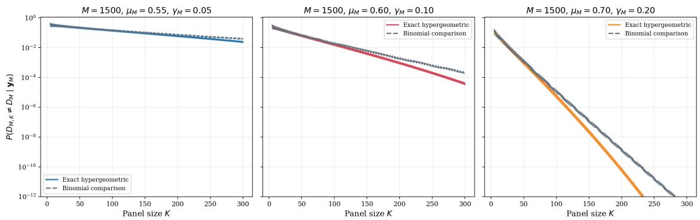  
Figure 1. Exact panel–census disagreement for a census of 1,500 votes under an inclusive majority rule. Curves are indexed by the census clarity.

## 3.2 Finite-sample validity and power

We simulated generator units with latent acceptance means

$$
( 0 . 3 0 , 0 . 4 0 , 0 . 4 6 , 0 . 4 9 , 0 . 5 1 , 0 . 5 4 , 0 . 6 0 , 0 . 7 0 )
$$

and weights (0.15, 0.20, 0.05, 0.10, 0.10, 0.05, 0.20, 0.15). The threshold was one half, the pointwise error target was 0.05, and the required population coverage was 0.60. Candidate panel sizes ranged from 21 to 301. We compared independent columns with a shared-row mixture in which, with probability 0.9, every column uses the same row-level uniform draw. The latter construction preserves the exact binomial marginal of every column while inducing strong dependence across columns.

Each configuration was repeated 2,000 times. A violation occurs if a simultaneous lower bound exceeds the known population coverage at any candidate panel size. Table 2 reports no violations in 8,000 experiments for either exact outer binomial inversion or the Hoefding benchmark. This is an implementation check rather than a proof; the proof is Theorem 2.1. The comparison also shows the distinction between validity and power. The baseline experiment is valid but usually cannot certify a true coverage of 0.70 against a target of 0.60, whereas the powered design usually can.

<table><tr><td>Design</td><td>A</td><td>M</td><td>ρ</td><td>Violations</td><td>Target exact / H</td><td>Mean exact / H</td></tr><tr><td>Baseline</td><td>500</td><td>1500</td><td>0.0</td><td>0/0</td><td>0.00% / 0.00%</td><td>0.512 / 0.497</td></tr><tr><td>Baseline</td><td>500</td><td>1500</td><td>0.9</td><td>0/0</td><td>10.25% / 2.85%</td><td>0.512 / 0.496</td></tr><tr><td>Powered</td><td>2000</td><td>3000</td><td>0.0</td><td>0/0</td><td>96.15% / 83.75%</td><td>0.619 / 0.610</td></tr><tr><td>Powered</td><td>2000</td><td>3000</td><td>0.9</td><td>0/0</td><td>95.45% / 85.65%</td><td>0.619 / 0.610</td></tr></table>

Table 2. Monte Carlo finite-sample validity and power. H denotes the Hoefding benchmark; violation entries give exact / H counts out of 2,000. The final column is evaluated at panel size 301.

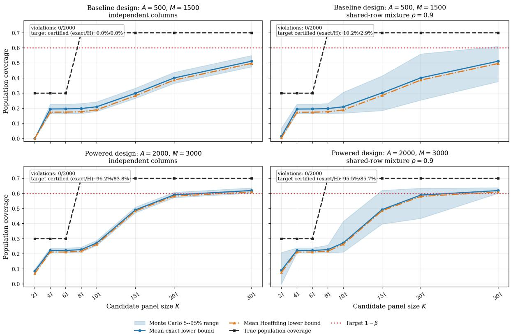  
Figure 2. Known population coverage (black), mean exact lower bound (blue), its 5th–95th percentile range (band), mean Hoefding bound (orange), and target coverage (red). Shared rows increase dispersion without invalidating the marginal certificate. Figure annotations use one decimal place; Table 2 reports the empirical percentages to two decimal places.

## 3.3 Panel size, clarity, and adversarial participation

We next evaluated the fixed-share model on the nominal GenLayer panel-size grid. Figure 3 plots the minimum clarity required within the honest subpopulation to keep the exact outcome-manipulation probability at or below one percent. Larger panels reduce finite-sampling uncertainty, but they cannot remove a population-level adversarial shift. For a fixed Byzantine share �, the curves approach

$$
\gamma _ { H } = \frac { \alpha } { 2 ( 1 - \alpha ) } .
$$

Thus the answer to “what percentage is safe?” is a curve conditional on task clarity, panel size, attack model, and error target.

Fixing the largest nominal panel, Figure 4 compares the fixed-share and targeted-contamination models over the complete clarity–adversary plane. The diagonal in the targeted model is not a claim that network ownership and clarity are the same quantity. It follows from the stronger assumption that every unit of the corruption budget can be spent on an entry supporting the honest decision. Under random network ownership the frontier is curved because Byzantine identities displace a mixture of latent honest votes.

The nominal grid is used only as an application-anchored sensitivity axis. It does not reproduce the deployed stake weighted sampler, validator reuse, path-dependent appeal feasibility, or adaptive corruption. Those mechanisms must be combined with the task-specific curves before making a network-security claim.

Honest clarity required under a fixed Byzantine network share at δ = 0.01  
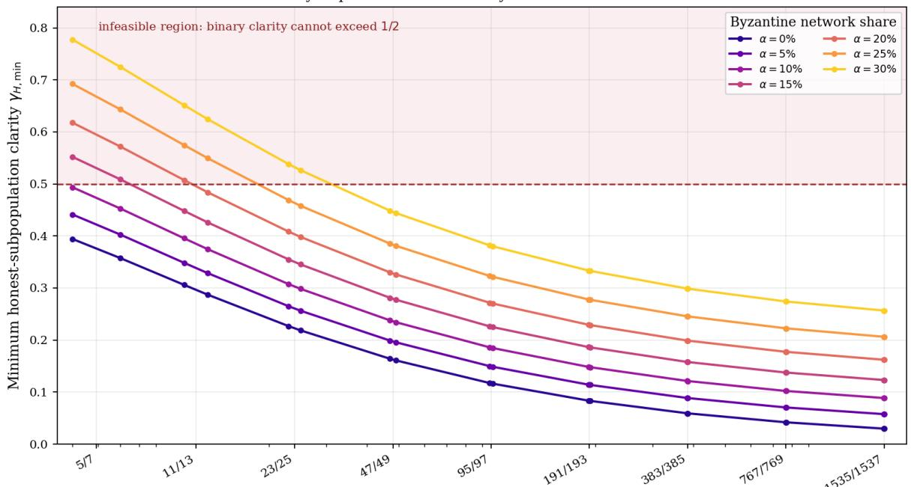  
Implemented panel size K (normal/appeal pair)  
Figure 3. Minimum honest-subpopulation clarity required for pointwise attack risk at most one percent under the fixed-share model. Values above one half are infeasible for a binary threshold. This benchmark is not a deployed-network security guarantee.

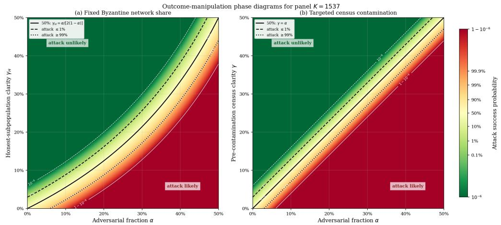  
Figure 4. Exact outcome-manipulation probability at panel size 1,537. Left: fixed Byzantine network share. Right: targeted census contamination. Solid black lines mark 50% attack probability; dashed and dotted lines mark 1% and 99%. This benchmark is not a deployed-network security guarantee.

## 4 Applied Case: A Real-Data LLM Pilot

## 4.1 Study design

We ran a hash-pinned diagnostic pilot using real calls through an LLM router. The 50 frozen workload units were manually stratified into clear acceptance, clear rejection, benign ambiguity, and input-presentation stress. They form a fully enumerated seed catalogue, not an i.i.d. sample from an identified workload–generator law. Labels describe how the units were constructed; they were not independently adjudicated truth labels.

Each prompt requested one binary global verdict for one frozen decision unit. Thus the pilot exercises the $N = 1$ computational path of the ADS formalism, where � is the identity. It does not empirically exercise a multicomponent verdict vector followed by a nontrivial global map. Evaluator rows were sampled with replacement from a predeclared equal-weight catalogue of routed configurations and reused across all units. This induces cross-unit dependence allowed by the shared-row theorem, provided rows are i.i.d. from the declared law. Distinct seeds cannot exclude persistent dependence caused by provider state, routing incidents, tools, or caches; those possibilities remain an explicit limitation.

## 4.2 Results under three reference objects

The same binary matrix supports diferent statements under diferent reference objects. We report them separately.

Fully enumerated unit catalogue. Treating the 50 units and their declared weights as the complete outer catalogue removes generator-sampling uncertainty. At the retained audit value $K = 4 7$ , familywise evaluator intervals certify 45 of 50 units. Corollary E.9 therefore gives lower coverage 0.900 under uniform catalogue weights and 0.8775 under the declared weights, with confidence 0.975 under the declared i.i.d. evaluator-row model. These are formal statements about this fixed catalogue, not about future workload units. The nonuniform law was frozen before evaluator calls: if unit � belongs to family $f ,$ then $r _ { i } = w _ { f } / n _ { f }$ , where the 13 family masses $w _ { f }$ and family sizes $n _ { f }$ are reported in Table S1. They are a design prior for this finite catalogue, not frequencies estimated from the observed votes or from a deployment population.

Frozen evaluator census. Conditioning instead on the 40 realized global verdicts per unit eliminates evaluatorsuperpopulation inference. Exact hypergeometric calculations show that 47 of 50 units have $K _ { \mathrm { s t a b l e } } \leq 7 \ \mathrm { a t } \ \delta = 0 . 0 1$ The remaining units are mkt-03, ins-03, and air-03, with stable panel sizes 26, 34, and 39, respectively. Here panels are sampled without replacement and necessarily satisfy $K \leq 4 0$

Thus the same matrix gives 47 of 50 exact frozen-census stability results at $K = 7 ,$ , but zero evaluator-superpopulation interval certificates at that panel size. The contrast is not a contradiction: it is the empirical reason the finite-census and superpopulation regimes cannot be interchanged.

Outer-sampling diagnostic. If the 50 units had instead been sampled i.i.d. from a declared workload law, the masscontrolled theorem would apply. $\mathbf { A } \mathbf { t } \ : K = 4 7$ , 46 units pass its pointwise interval rule. With $\eta _ { G } = 0 . 0 2 5 , | \mathcal { K } | = 1 8$ , and $\xi _ { E } = 0 . 0 5$ , exact outer binomial inversion gives $\ell _ { 5 0 } ( 4 6 ; 0 . 0 2 5 / 1 8 ) - 0 . 0 5 = 0 . 6 9 1 2$ ; the valid but more conservative Hoefding form gives $4 6 / 5 0 - 0 . 0 5 - \sqrt { \log ( 1 8 / 0 . 0 2 5 ) / 1 0 0 } = 0 . 6 1 3 5 .$ $\mathbf { A } \mathbf { t } \ K = 2 3$ , 44 units pass and the exact value is $\ell _ { 5 0 } ( 4 4 ; 0 . 0 2 5 / 1 8 ) - 0 . 0 5 = 0 . 6 3 7 2$ , which first crosses the pilot target 0.60. Under the hypothetical i.i.d. outer design, these would be simultaneous lower bounds at confidence $1 - \eta _ { E } - \eta _ { G } = 0 . 9 5$ . The division by 18 retains the multiplicity cost of the complete predeclared grid. The original Hoefding analysis first crossed at $K = 4 7 ;$ ; we retain that value as the audit reference rather than selecting a smaller value after inspecting the matrix. Because the actual catalogue was manually stratified, none of these values carries a workload-population confidence interpretation here.

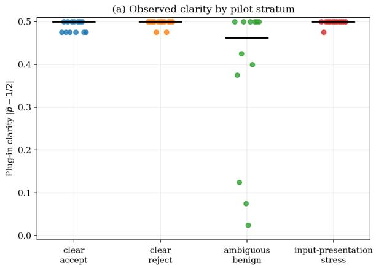

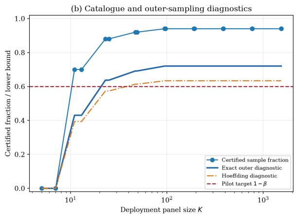  
Figure 5. Left: observed plug-in clarity by construction stratum. Right: certified catalogue fraction and two outer-sampling diagnostics. Exact binomial inversion crosses the pilot target at $K = 2 3 ;$ ; the original Hoefding analysis crosses at � = 47. Neither outer curve is a workload-population estimate for this stratified catalogue.

## 4.3 Diagnostics and interpretation

The empirical majority matched the construction label on all 37 units designed to have a determinate outcome. This is construction agreement, not an externally validated accuracy estimate. Three evaluator intervals crossed the decision threshold: mkt-03, ins-03, and air-03. Equal weighting of the 18 realized configurations changed no unit decision; removing one realized configuration at a time changed only air-03. Mapping every non-success to acceptance also changed only air-03, while both that policy and a successes-only analysis changed the certification status of bug-03. These reweighting and failure analyses are descriptive: the archived rows were not sampled to certify the alternative evaluator laws.

Applying the non-adaptive census-contamination model of Theorem F.3 to the same ledger shows that, at � = 7, the number of catalogue units meeting � = 0.01 is 47 with no flips, 46 after two worst-direction flips per 40-vote column, and 44 after four. These are conditional frozen-census sensitivities, not guarantees against adaptive corruption or a deployed network; Table S2 reports the fuller calculation.

Nine of the 13 units constructed to be underdetermined nevertheless passed the mass-controlled pointwise interval rule at the audit value � = 47. This establishes neither that they are semantically underdetermined nor that the resulting convention is correct; no independent semantic adjudication was performed. It does illustrate the estimand’s limitation: reproducibility relative to a declared population can coexist with construction-level ambiguity, shared convention, or shared bias. External correctness requires a separate labelled study.

## 5 Discussion

The results turn panel reproducibility into an estimable quantity. A frozen census supports exact design-based claims; a probabilistic evaluator population supports fresh-panel claims; and a growing deterministic catalogue supports a population claim only when its approximation is justified. The operational certificate then combines evaluator uncertainty and generator sampling without pooling resolution-specific margins. This separation is especially important for LLM systems, where shared model families can produce strong cross-task dependence and strong common bias at the same time.

The synthetic and applied results make two practical points. First, failure to certify can mean genuine ambiguity or inadequate experimental power; the baseline Monte Carlo design is valid but underpowered. Second, successful certification establishes reproducibility rather than truth. The LLM study found both near-perfect coordination on constructed clear cases and high coordination on cases constructed to be underdetermined. Because those construction labels were not independently adjudicated, the pilot does not estimate a relation between semantic underdetermination and coordination. A deployment should report the panel-reproduction guarantee alongside independent semantic metrics whenever adjudicated truth is available.

Adversarial tolerance is likewise not a universal percentage. It depends on the task-specific clarity distribution, panel size, sampling mechanism, and attacker model. Larger panels suppress random committee variation but amplify the decision of whichever population remains after contamination. The phase diagrams should therefore be combined with a pinned deployment population and inclusion law, rather than quoted as standalone network-security guarantees. When workload units and honest evaluator rows follow the declared sampling design, Corollary F.5 supplies a finite-sample lower bound for the targeted-contamination profile; without that design, the same curves remain sensitivity analyses only.

The main limitations also define the immediate research program. The present certificate assumes a predeclared finite grid, i.i.d. rows, and correct binomial marginals. Reweighting a matrix drawn under one evaluator law is only descriptive unless an appropriate alternative-law design and inference are supplied. The real-data pilot contains only 50 manually stratified units, exercises the � = 1 identity map rather than a nontrivial multicomponent �, and has no independent semantic adjudication. More generally, time-uniform confidence sequences would permit optional escalation, while clustered or latent-factor models would address shared provider state. Real deployments additionally require stakeweighted and path-dependent inclusion laws, adaptive adversaries, temporal replication, and independently adjudicated workloads. Finally, panel cost, latency, appeals, and bonds should be optimized jointly with the statistical error budget. These extensions change the deployment layer, but not the central distinction between reproducibility, population choice, and semantic correctness.

## Institutional Disclosure

This work was conducted within GenLayer Labs Research. GenLayer Labs develops GenLayer, whose nominal panelsize ladder is used as an application-anchored sensitivity grid in Section 3. The statistical results do not depend on that implementation. No production deployment outcomes or user data are analyzed.

## References

[1] Anish Acharya, Kris W. Pan, and Brian Verkhovsky. RoPoLL: Robust panel of LLM judges, 2026. arXiv:2606.30931.

[2] Anastasios N. Angelopoulos, Stephen Bates, Emmanuel J. Candès, Michael I. Jordan, and Lihua Lei. Learn then test: Calibrating predictive algorithms to achieve risk control. The Annals ofApplied Statistics, 19(2):1641–1662, 2025.

[3] Aloisio Araujo and Evarist Giné. The Central Limit Theorem for Real and Banach Valued Random Variables. John Wiley & Sons, New York, 1980.

[4] Sher Badshah, Ali Emami, and Hassan Sajjad. SCOPE: Selective conformal optimized pairwise LLM judging, 2026. Accepted at ICML 2026; arXiv:2602.13110.

[5] A. D. Barbour and Svante Janson. A functional combinatorial central limit theorem. Electronic Journal of Probability, 14(81):2352–2370, 2009.

[6] Patrick Billingsley. Probability and Measure. Wiley, New York, 3rd edition, 1995.

[7] Patrick Billingsley. Convergence ofProbability Measures. John Wiley & Sons, New York, 2nd edition, 1999.

[8] Christian Cachin, Simon Schubert, and Marko Vukolić. Non-determinism in Byzantine fault-tolerant replication. In 20th International Conference on Principles of Distributed Systems (OPODIS 2016), volume 70 of Leibniz International Proceedings in Informatics (LIPIcs), pages 24:1–24:16. Schloss Dagstuhl – Leibniz-Zentrum für Informatik, 2017.

[9] Miguel Castro and Barbara Liskov. Practical Byzantine fault tolerance. In Proceedings of the Third Symposium on Operating Systems Design and Implementation (OSDI), pages 173–186, New Orleans, LA, 1999. USENIX Association.

[10] C. J. Clopper and E. S. Pearson. The use of confidence or fiducial limits illustrated in the case of the binomial. Biometrika, 26(4):404–413, 1934.

[11] Lee J. Cronbach, Goldine C. Gleser, Harinder Nanda, and Nageswari Rajaratnam. The Dependability of Behavioral Measurements: Theory ofGeneralizabilityfor Scores and Profiles. John Wiley & Sons, New York, 1972.

[12] A. P. Dawid and A. M. Skene. Maximum likelihood estimation of observer error-rates using the EM algorithm. Journal ofthe Royal Statistical Society: Series C (Applied Statistics), 28(1):20–28, 1979.

[13] Marquis de Condorcet, Marie Jean Antoine Nicolas de Caritat. Essai sur l’application de l’analyse à laprobabilité des décisions rendues à la pluralité des voix. Imprimerie Royale, Paris, 1785.

[14] Franz Dietrich and Christian List. Judgment aggregation by quota rules: Majority voting generalized. Journal of Theoretical Politics, 19(4):391–424, 2007.

[15] Harold F. Dodge and Harry G. Romig. Single sampling and double sampling inspection tables. The Bell System Technical Journal, 20(1):1–61, 1941.

[16] Yilun Du, Shuang Li, Antonio Torralba, Joshua B. Tenenbaum, and Igor Mordatch. Improving factuality and reasoning in language models through multiagent debate. In Proceedings of the 41st International Conference on Machine Learning, volume 235 of Proceedings of Machine Learning Research, pages 11733–11763. PMLR, 2024.

[17] Werner Ehm. Binomial approximation to the Poisson binomial distribution. Statistics & Probability Letters, 11(1):7–16, 1991.

[18] Joseph L. Fleiss. Measuring nominal scale agreement among many raters. Psychological Bulletin, 76(5):378–382, 1971.

[19] Wassily Hoefding. Probability inequalities for sums of bounded random variables. Journal of the American Statistical Association, 58(301):13–30, 1963

[20] Yue Huang, Huizhong Li, Yi Sun, and Sisi Duan. Byzantine fault tolerance with non-determinism, revisited. Cryptology ePrint Archive, Report 2024/134, 2024. https://eprint.iacr.org/2024/134.

[21] Peter J. Huber. Robust estimation of a location parameter. Annals ofMathematical Statistics, 35(1):73–101, 1964.

[22] Peter J. Huber and Elvezio M. Ronchetti. Robust Statistics. Wiley, Hoboken, NJ, 2nd edition, 2009.

[23] Guneet Kohli. Nine judges, two efective votes: Correlated errors undermine LLM evaluation panels, 2026. arXiv:2605.29800.

[24] Klaus Krippendorf. Systematic and random disagreement and the reliability of nominal data. Communication Methods and Measures, 2(4):323–338, 2008.

[25] K. Krishnamoorthy and Thomas Mathew. Statistical Tolerance Regions: Theory, Applications, and Computation. John Wiley & Sons, Hoboken, NJ, 2009.

[26] Michel Ledoux and Michel Talagrand. Probability in Banach Spaces: Isoperimetry and Processes. Springer-Verlag, Berlin, 1991.

[27] Yanran Li. Calibrate, don’t curate: Label-eficient estimation from noisy LLM judges, 2026. arXiv:2605.09702.

[28] Christian List and Philip Pettit. Aggregating sets of judgments: An impossibility result. Economics and Philosophy, 18(1):89–110, 2002.

[29] Marshall Pease, Robert Shostak, and Leslie Lamport. Reaching agreement in the presence of faults. Journal of the ACM, 27(2):228–234, 1980.

[30] Bezalel Peleg and Shmuel Zamir. Extending the Condorcet jury theorem to a general dependent jury. Social Choice and Welfare, 39(1):91–125, 2012.

[31] Mengjie Qian, Guangzhi Sun, Mark J. F. Gales, and Kate M. Knill. Who can we trust? LLM-as-a-jury for comparative assessment, 2026. arXiv:2602.16610; accepted to ICML 2026.

[32] A. Kimball Romney, Susan C. Weller, and William H. Batchelder. Culture as consensus: A theory of culture and informant accuracy. American Anthropologist, 88(2):313–338, 1986.

[33] Robert J. Serfling. Probability inequalities for the sum in sampling without replacement. The Annals of Statistics, 2(1):39–48, 1974.

[34] Lin Shi, Chiyu Ma, Wenhua Liang, Xingjian Diao, Weicheng Ma, and Soroush Vosoughi. Judging the judges: A systematic study of position bias in LLM-as-a-judge. In Proceedings of the 14th International Joint Conference on Natural Language Processing and the 4th Conference of the Asia-Pacific Chapter of the Association for Computational Linguistics (Volume 1: Long Papers), pages 292–314. Association for Computational Linguistics, 2025. arXiv:2406.07791.

[35] Philip B. Stark. Conservative statistical post-election audits. The Annals of Applied Statistics, 2(2):550–581, 2008.

[36] Pat Verga, Sebastian Hofstatter, Sophia Althammer, Yixuan Su, Aleksandra Piktus, Arkady Arkhangorodsky, Minjie Xu, Naomi White, and Patrick Lewis. Replacing judges with juries: Evaluating LLM generations with a panel of diverse models, 2024. arXiv:2404.18796.

[37] Xuezhi Wang, Jason Wei, Dale Schuurmans, Quoc V. Le, Ed H. Chi, Sharan Narang, Aakanksha Chowdhery, and Denny Zhou. Self-consistency improves chain of thought reasoning in language models. In The Eleventh International Conference on Learning Representations, 2023.

[38] Samuel S. Wilks. Determination of sample sizes for setting tolerance limits. The Annals of Mathematical Statistics, 12(1):91–96, 1941.

[39] Lianmin Zheng, Wei-Lin Chiang, Ying Sheng, Siyuan Zhuang, Zhanghao Wu, Yonghao Zhuang, Zi Lin, Zhuohan Li, Dacheng Li, Eric P. Xing, Hao Zhang, Joseph E. Gonzalez, and Ion Stoica. Judging LLM-as-a-judge with MTbench and chatbot arena. In Advances in Neural Information Processing Systems 36: Datasets and Benchmarks Track, 2023.

[40] Bin Zhu, Yi Xie, and Yanghui Rao. A finite-calibration regime map for LLM judge panels, 2026. Accepted at WISE 2026; arXiv:2606.01034.

## Appendices: Proofs and Technical Results

## A Notation Summary

<table><tr><td>Symbol</td><td>Meaning</td></tr><tr><td> $\Sigma ^ { * }$ </td><td>Countable set of finite encoded words</td></tr><tr><td>X</td><td>Fixed problem with N components</td></tr><tr><td> $T$ </td><td>Fixed concrete resolution of  $X$ </td></tr><tr><td> $G$ </td><td>Common global map  $\{ 0 , 1 \} ^ { N } \to \{ 0 , 1 \}$ </td></tr><tr><td>Θ</td><td>Evaluator-configuration space</td></tr><tr><td> $\mathcal { Z } = \Theta \times [ 0 , 1 ]$ </td><td>Complete evaluator-episode space</td></tr><tr><td> $\nu _ { X }$ </td><td>Declared task-specific evaluator measure</td></tr><tr><td> $V _ { j } ( z ; X , T )$ </td><td>Component verdict</td></tr><tr><td> $Y ( z ; X , T )$ </td><td>Global evaluator verdict</td></tr><tr><td> $\mathbf { Y }$ </td><td>Joint vote element in  $\{ 0 , 1 \} ^ { \mathbb { N } }$ </td></tr><tr><td> ${ \mathcal { U } } , \pi$ </td><td>Generator-configuration space and declared law</td></tr><tr><td> $M$ </td><td>Evaluator-census or evaluator-row sample size</td></tr><tr><td> $A$ </td><td>Generator-column sample size</td></tr><tr><td> $K$ </td><td>Panel size (finite-census regime:  $K \le M )$ </td></tr><tr><td> $C _ { M }$ </td><td>Number of positive census verdicts</td></tr><tr><td> $\mu _ { M } = C _ { M } / M$ </td><td>Census acceptance proportion</td></tr><tr><td> $\mu _ { X } ( T )$ </td><td>Limiting or superpopulation acceptance mean</td></tr><tr><td>T</td><td>Inclusive decision threshold</td></tr><tr><td> $q _ { K } = \lceil \tau K \rceil$ </td><td>Integer positive-vote quota</td></tr><tr><td> $D _ { M , K }$ </td><td>Panel decision</td></tr><tr><td> $D _ { M }$ </td><td>Finite census decision</td></tr><tr><td> $D _ { X , \infty }$ </td><td>Limiting population decision</td></tr><tr><td> $\gamma _ { M }$ </td><td>Census clarity  $\left| \mu _ { M } - \tau \right|$ </td></tr><tr><td> $\gamma _ { X }$ </td><td>Limiting clarity  $\vert \mu _ { X } - \tau \vert$ </td></tr><tr><td> $H _ { M , K }$ </td><td>Positive panel count</td></tr><tr><td> $e _ { M , K } ( T )$ </td><td>Exact panel-census disagreement probability</td></tr><tr><td> $e _ { X , K } ( T )$ </td><td>Exact panel-limiting-population disagreement probability</td></tr><tr><td> $B ^ { \circ }$ </td><td>Standard Brownian bridge</td></tr><tr><td> $W$ </td><td>Standard Brownian motion</td></tr><tr><td> $R _ { X ; K , \delta }$ </td><td>Population resolvability coverage</td></tr><tr><td> $R _ { K , \delta } ^ { ( A , M ) }$ </td><td>Empirical resolvability coverage</td></tr><tr><td> $p ( u ) , e _ { K } ( u )$ </td><td>Workload-unit acceptance mean and exact panel-error tail</td></tr><tr><td> $R _ { \Pi ; K , \delta }$ </td><td>Coverage under a declared workload-generator law II</td></tr><tr><td> $e _ { K } ^ { \mathrm { a c c } } ( p ) , e _ { K } ^ { \mathrm { r e j } } ( p )$ </td><td>Directed binomial panel-error tails</td></tr><tr><td> $\mathrm { C e r t } _ { K , \delta } ( I )$ </td><td>Sound interval certificate for one column</td></tr><tr><td> $\widehat { R } _ { K , \delta } ^ { \mathrm { c e r t } } , \widehat { R } _ { K , \delta } ^ { \mathrm { m a s s } }$ </td><td>Fractions certified under the familywise and mass-controlled constructions</td></tr><tr><td> $S _ { K } ^ { \mathrm { c e r t } } , S _ { K } ^ { \mathrm { m a s s } }$ </td><td>Counts of certified generator columns under the familywise and mass-controlled interval</td></tr><tr><td></td><td>constructions</td></tr><tr><td> $\ell _ { A } { \left( s ; \alpha \right) }$  mass</td><td>One-sided exact binomial lower limit after s successes in A trials</td></tr><tr><td> $L _ { K } ^ { G , \mathrm { c e r t } } , L _ { K } ^ { G , }$ </td><td>Outer binomial limits before any mass charge</td></tr><tr><td> $\underline { { R } } _ { K , \delta } ^ { \mathrm { c e r t } } , \underline { { R } } _ { K , \delta } ^ { \mathrm { m a s s } }$ </td><td>Familywise and mass-controlled simultaneous lower coverage bounds</td></tr><tr><td> $Q _ { K } ( \mathbf { Z } )$ </td><td>Conditional generator mass of positive interval certificates</td></tr><tr><td> $F ( \mathbf { Z } )$ </td><td>Generator mass of evaluator intervals that miss their means</td></tr><tr><td> $\beta$ </td><td>Maximum unresolved fraction</td></tr><tr><td> $\eta _ { E } , \eta _ { G }$ </td><td>Evaluator- and generator-level calibration failure budgets</td></tr><tr><td> $\xi _ { E }$ </td><td>Evaluator-interval failure mass charged to coverage</td></tr><tr><td> $I _ { a } = [ L _ { a } , U _ { a } ]$ </td><td>Confidence interval for the evaluator mean of column a</td></tr><tr><td> $\mathcal { K }$ </td><td>Predeclared finite set of candidate panel sizes</td></tr><tr><td> $^ b$ </td><td>Non-adaptive census-corruption budget</td></tr><tr><td>α</td><td>Adversarial fraction or asymptotic contamination level</td></tr><tr><td> $P _ { K } ^ { \mathrm { c a p } } ( \alpha )$ </td><td>Strict-majority committee-capture probability</td></tr><tr><td> $P _ { K } ^ { \mathrm { n e t } } ( \alpha ; \gamma _ { H } )$ </td><td>Fixed-share network attack probability</td></tr><tr><td> $P _ { K } ^ { \mathrm { t a r } } ( \alpha ; \gamma )$ </td><td>Targeted-contamination attack probability</td></tr><tr><td> $r _ { K , \delta }$ </td><td>Post-corruption clarity required for pointwise error δ</td></tr><tr><td> $S _ { K , \delta } ( \alpha )$ </td><td>Workload non-adaptive corruption profile</td></tr><tr><td> $\widehat { S } _ { K , \delta } ^ { \mathrm { m a s s } } ( \alpha )$ </td><td>Observed mass-controlled targeted-certificate fraction</td></tr><tr><td> $\underline { { S } } _ { K , \delta } ( \alpha )$ </td><td>Simultaneous lower bound on the targeted-contamination profile</td></tr><tr><td> $\alpha _ { K , \delta , \beta } ^ { * }$ </td><td>Largest contamination level whose workload profile is at least  $1 - \beta$ </td></tr></table>

## B Formal ADS Model and Binary Process

## B.1 Encoded Problems and Concrete Resolutions

Let Σ be a finite non-empty alphabet and let

$$
\Sigma ^ { * } = \bigcup _ { n \geq 0 } \Sigma ^ { n }
$$

be the set of finite words, equipped with the discrete sigma-algebra $2 ^ { \Sigma ^ { * } }$ . The encoding is syntactic: no algebraic or metric meaning is assigned to bytes or tokens. In particular, the theory never averages textual outputs.

Definition B.1 (Problem). A problem is

$$
X = ( ( x _ { 1 } , \dots , x _ { N } ) , \iota ) ,
$$

where $N \in$ N with $N \geq 1$ , every $x _ { j } \in \Sigma ^ { * }$ is a component specification, and $\iota \in \Sigma ^ { * }$ encodes the common evaluation instructions and permitted resources.

Definition B.2 (Concrete Resolution). A concrete resolution of � is a vector

$$
T = ( w _ { 1 } , \dots , w _ { N } ) \in ( \Sigma ^ { * } ) ^ { N } .
$$

Once generated, � is frozen and supplied identically to every evaluator in the experiment under study.

The finiteness of � concerns one concrete problem. The population of possible resolutions, evaluator episodes, and sampled panels may all be infinite.

## B.2 Evaluator Episodes

Let $( \Theta , \mathfrak { G } , \nu )$ be a probability space of evaluator configurations. A configuration includes the model or human-evaluator type, fixed prompt, tool policy, and other declared design choices. Let $( [ 0 , 1 ] , \mathcal { B } ( [ 0 , 1 ] ) , \lambda )$ supply private randomness. A single evaluator episode belongs to

$$
( \mathcal { Z } , \mathfrak { A } , \rho ) = ( \Theta \times [ 0 , 1 ] , \mathfrak { G } \otimes \mathcal { B } ( [ 0 , 1 ] ) , \nu \otimes \lambda ) .
$$

The seed coordinate may encode a countable sequence of independent draws, including private tool observations, through the construction in Supplement S5. A genuinely shared random environment is not private randomness: it must be conditioned upon or added as a common coordinate, in which case unconditional evaluator votes need not be independent.

Definition B.3 (Interpreter Family). An interpreter family is a map

$$
\boldsymbol { \mathcal { I } } : \Theta \times \Sigma ^ { * } \times [ 0 , 1 ] \longrightarrow \Sigma ^ { * }
$$

such that $( \theta , \omega ) \mapsto \mathcal { I } ( \theta , u , \omega )$ is �-measurable for every fixed $u \in \Sigma ^ { * }$

Let $Q : ( \Sigma ^ { * } ) ^ { 3 } \to \Sigma ^ { * }$ be a deterministic prompt constructor and let $\mathcal { A } _ { + } \subseteq \Sigma ^ { * }$ be a measurable set of explicit afirmative responses. Malformed and non-afirmative responses count as zero. Let $\omega \mapsto ( \omega ^ { ( 1 ) } , \omega ^ { ( 2 ) } , \dots )$ denote the measurable splitting of one uniform seed into countably many independent uniform seeds.

Definition B.4 (Component Verdict Vector). For $z = ( \theta , \omega ) \in \mathcal { Z }$ , problem �, and resolution �, define

$$
V _ { j } ( z ; X , T ) = \kappa \bigl [ \bar { \cal I } \bigl ( \theta , Q ( \iota , x _ { j } , w _ { j } ) , \omega ^ { ( j ) } \bigr ) \in \mathcal { A } _ { + } \bigr ] , \qquad j = 1 , \ldots , N ,
$$

and

$$
\mathbf { V } ( z ; X , T ) = ( V _ { 1 } ( z ; X , T ) , \ldots , V _ { N } ( z ; X , T ) ) \in \{ 0 , 1 \} ^ { N } .
$$

No independence is assumed among the � coordinates of one evaluator’s vector.

An evaluator may internally construct a private solution or consult external evidence before returning a component verdict. Such behavior is part of the measurable map I and the episode $z ;$ the probability theory does not require a particular internal reasoning procedure.

Definition B.5 (Global Classification Rule and Verdict). A global classification rule is a deterministic map

$$
G : \{ 0 , 1 \} ^ { N } \longrightarrow \{ 0 , 1 \}
$$

fixed before evaluations are observed. The global verdict is

$$
Y ( z ; X , T ) = G \big ( \mathbf { V } ( z ; X , T ) \big ) .
$$

For the strict examination rule,

$$
G ( \nu _ { 1 } , \dots , \nu _ { N } ) = \prod _ { j = 1 } ^ { N } \nu _ { j } ;
$$

the resolution passes exactly when no component fails.

Proposition B.6 (Measurability). For fixed $( X , T )$ , the global verdict

$$
Y ( \cdot ; X , T ) : ( \mathcal { Z } , \mathfrak { X } ) \longrightarrow ( \{ 0 , 1 \} , 2 ^ { \{ 0 , 1 \} } )
$$

is measurable.

Proof. For each $j ,$ the output of I at the fixed prompt $Q ( \iota , x _ { j } , w _ { j } )$ and measurable split seed $\boldsymbol { \omega } ^ { ( j ) }$ is measurable. Taking the inverse image of $\mathcal { A } _ { + }$ and its indicator preserves measurability. The vector of finitely many measurable coordinates is measurable into the finite discrete product, and every map $G$ on that product is measurable. □

Remark B.7 (Order of Operations). The ADS first computes one global vote

$$
Y _ { i } = G ( V _ { i , 1 } , \dots , V _ { i , N } )
$$

for each evaluator and only then aggregates the $Y _ { i }$ . Applying $G$ to component-wise population majorities is a diferent rule in general and is not analyzed here.

## B.3 The Countable Binary Random Element

Fix (�, �). On the countable product probability space

$$
( \mathcal { Z } ^ { \mathbb { N } } , \mathfrak { A } ^ { \otimes \mathbb { N } } , \rho ^ { \otimes \mathbb { N } } ) ,
$$

let $Z _ { i }$ be the �th coordinate projection and set

$$
Y _ { i } = Y ( Z _ { i } ; X , T ) \in \{ 0 , 1 \} .
$$

Definition B.8 (Joint Vote Element). The joint vote element is

$$
\mathbf { Y } _ { X , T } = ( Y _ { 1 } , Y _ { 2 } , \ldots ) : \mathcal { Z } ^ { \mathbb { N } } \longrightarrow \{ 0 , 1 \} ^ { \mathbb { N } } ,
$$

where the codomain carries the product sigma-algebra

$$
C = \bigotimes _ { i \geq 1 } 2 ^ { \{ 0 , 1 \} } .
$$

This is a product, not a union: a countable union of copies of {0, 1} is still {0, 1}, whereas $\{ 0 , 1 \} ^ { \mathbb { N } }$ contains complete binary sequences.

Proposition B.9 (Well-defined Joint Law). $\mathbf { Y } _ { X , T }$ is ${ \mathfrak { A } } ^ { \otimes \mathbb { N } } / C$ -measurable. Its coordinates are i.i.d. Bernoulli with parameter

$$
\mu _ { X } ( T ) = \mathbb { E } _ { \rho } [ Y ( Z ; X , T ) ] .
$$

Proof. The product sigma-algebra C is generated by cylinder sets depending on finitely many coordinates. The inverse image of each such cylinder is a finite intersection of events of the form $\left\{ Y _ { i } = a _ { i } \right\}$ , measurable by Proposition B.6. Hence the joint map is measurable. The $Z _ { i }$ are independent with common law $\rho ,$ and applying the same measurable binary function to each coordinate preserves independence and identical distribution. A binary variable is Bernoulli with parameter equal to its expectation. □

Remark B.10 (Same Model Does Not Imply Dependence). If every episode uses one fixed model configuration $\theta _ { 0 } .$ replace � by the point mass $\delta _ { \theta _ { 0 } }$ . Independent seeds and private evidence still make the $Z _ { i } ,$ , hence the $Y _ { i } ,$ independent and identically distributed. The common model may create common bias through the value of $\mu _ { X } ( T )$ ; it does not create statistical dependence between deterministic functions of independent inputs. A shared random external state would be a diferent model and can create dependence.

Definition B.11 (Population Decision and Clarity). Fix an inclusive threshold $\tau \in ( 0 , 1 )$ . The superpopulation decision and pointwise clarity are

$$
D _ { X , \infty } ( T ) = \mathbb { k } \lbrack \mu _ { X } ( T ) \geq \tau \rbrack , \qquad \gamma _ { X } ( T ) = \vert \mu _ { X } ( T ) - \tau \vert .
$$

At the boundary $\gamma _ { X } ( T ) = 0$ , the target is defined by the tie policy, but finite i.i.d. panel decisions need not stabilize on one side.

The countable product construction defines the infinite-dimensional object. A statistic based only on $\textstyle \sum _ { i = 1 } ^ { K } Y _ { i }$ is nevertheless scalar. Supplement S1 retains the complete partial-sum path and thereby obtains a genuinely functional limit.

Remark B.12 (Finite Censuses Are a Separate Regime). The product model above describes i.i.d. evaluator episodes from a declared measure. A concrete catalogue of distinct evaluators sampled without replacement is not i.i.d. conditional on its frozen verdicts. We now construct that design directly, without importing independence from the superpopulation regime.

## C Exact Finite-Population Results

The finite model conditions on what a declared evaluator census actually returned. Once these verdicts are frozen, the only randomness is the sampling design.

## C.1 Census and Nested Panels

Definition C.1 (Finite Evaluator Census). For fixed $( X , T )$ , a census of size � is a finite sequence of eligible evaluator episodes together with their frozen global verdicts

$$
\mathbf { y } _ { M } ( X , T ) = ( y _ { M , 1 } , . . . , y _ { M , M } ) \in \{ 0 , 1 \} ^ { M } .
$$

Define

$$
C _ { M } ( T ) = \sum _ { i = 1 } ^ { M } y _ { M , i } , \qquad \mu _ { M } ( T ) = \frac { C _ { M } ( T ) } { M } .
$$

The dependence on � is suppressed when one problem is fixed.

No probability model is imposed on ${ \bf y } _ { M }$ . Evaluators may use diferent models, prompts, or evidence; their frozen verdicts may exhibit any pattern.

Let $\Pi _ { M }$ be a uniform random permutation of $\{ 1 , \ldots , M \}$ . For $1 \leq K \leq M$ , define the nested panel

$$
{ \cal S } _ { M , K } = \{ \Pi _ { M } ( 1 ) , \ldots , \Pi _ { M } ( K ) \}
$$

and its number of positive global verdicts

$$
H _ { M , K } ( T ) = \sum _ { i = 1 } ^ { K } y _ { M , \Pi _ { M } ( i ) } .
$$

Each $S _ { M , K }$ is a uniform �-element subset, and

$$
S _ { M , 1 } \subset S _ { M , 2 } \subset \cdots \subset S _ { M , M } .
$$

The nesting is not needed for a single endpoint probability. It is needed to model escalation by adding evaluators and to define the functional path in Supplement S1.

Definition C.2 (Inclusive Threshold Decisions). For threshold $\tau \in ( 0 , 1 )$ , let

$$
q _ { K } = \lceil \tau K \rceil .
$$

The panel and census decisions are

$$
D _ { M , K } ( T ) = \mathbb { k } \big [ H _ { M , K } ( T ) \geq q _ { K } \big ] , \qquad D _ { M } ( T ) = \mathbb { k } \big [ C _ { M } ( T ) \geq q _ { M } \big ] = \mathbb { k } \big [ \mu _ { M } ( T ) \geq \tau \big ] .
$$

The census clarity is

$$
\gamma _ { M } ( T ) = | \mu _ { M } ( T ) - \tau | .
$$

The inclusive convention means that an exact tie at the threshold accepts. With $\tau = 1 / 2$ and even $K ,$ this difers from strict majority. The convention is part of the mechanism and must not be altered after observing data.

## C.2 Exact Panel Law

Theorem C.3 (Exact Hypergeometric Law). Conditional on the frozen census ${ \mathbf y } _ { M } ( X , T )$

$$
H _ { M , K } ( T ) \sim \mathrm { H y p e r g e o m e t r i c } ( M , C _ { M } ( T ) , K ) ,
$$

that $i s ,$

$$
\mathbb { P } ( H _ { M , K } = h \mid \mathbf { y } _ { M } ) = \frac { { \binom { C _ { M } } { h } \binom { M - C _ { M } } { K - h } } } { \binom { M } { K } }
$$

for everyfeasible integer ℎ.

Proof. The first � entries of a uniform permutation form a uniform �-subset. There are $\binom { M } { K }$ such subsets. A subset with exactly ℎ positive entries chooses ℎ of the $C _ { M }$ positives and $K - h$ of the $M - C _ { M }$ negatives, giving the numerator. □

Definition C.4 (Panel–Census Error). The exact conditional error is

$$
e _ { M , K } ( T ) = \mathbb { P } \big ( D _ { M , K } ( T ) \neq D _ { M } ( T ) \ | \ \mathbf { y } _ { M } ( X , T ) \big ) .
$$

By Theorem C.3,

$$
e _ { M , K } ( T ) = \left\{ \begin{array} { l l } { \displaystyle \sum _ { h = 0 } ^ { q _ { K } - 1 } \frac { \binom { C _ { M } } { h } \binom { M - C _ { M } } { K - h } } { \binom { M } { K } } , } & { D _ { M } ( T ) = 1 , } \\ { \displaystyle \sum _ { h = q _ { K } } ^ { K } \frac { \binom { C _ { M } } { h } \binom { M - C _ { M } } { K - h } } { \binom { M } { K } } , } & { D _ { M } ( T ) = 0 , } \end{array} \right.
$$

where infeasible terms are zero. Thus no normal approximation or Monte Carlo simulation is required to certify a uniform finite panel once $C _ { M }$ is known.

Proposition C.5 (Mean and Finite-Population Correction). Let ${ \widehat \mu } _ { M , K } = H _ { M , K } / K$ . Conditional on the census,

$$
\mathbb { E } [ \widehat { \mu } _ { M , K } \mid \mathbf { y } _ { M } ] = \mu _ { M }
$$

and, for $M > 1$

$$
\operatorname { V a r } ( { \widehat { \mu } } _ { M , K } \mid \mathbf { y } _ { M } ) = { \frac { \mu _ { M } ( 1 - \mu _ { M } ) } { K } } { \frac { M - K } { M - 1 } } .
$$

Proof. Write $I _ { i } = \# [ i \in S _ { M , K } ]$ . Then $\mathbb { E } I _ { i } = K / M$ and

$$
\mathrm { C o v } ( I _ { i } , I _ { j } ) = - \frac { K ( M - K ) } { M ^ { 2 } ( M - 1 ) } , \qquad i \neq j .
$$

Substitution in $\begin{array} { r } { H _ { M , K } = \sum _ { i } I _ { i } y _ { M , } } \end{array}$ � gives the stated hypergeometric moments.

For $M = 1 5 0 0$ , the standard-deviation correction relative to independent sampling is

$$
{ \sqrt { \frac { 1 5 0 0 - K } { 1 4 9 9 } } } .
$$

It is approximately 0.997, 0.984, and 0.966 for $K = 1 0 , 5 0 , 1 0 0$ , respectively, and equals zero at the full census. A binomial calculation may therefore be numerically close for a small sampling fraction while still answering a diferent conditional question.

## C.3 Finite-Sample Certificates

Serfling’s inequality gives a distribution-free finite-population bound [33]. We state the binary specialization.

Theorem C.6 (Panel–Census Concentration). $I f \gamma _ { M } ( T ) > 0 ,$ , then

$$
e _ { M , K } ( T ) \leq \exp \left( - \frac { 2 K \gamma _ { M } ( T ) ^ { 2 } } { 1 - ( K - 1 ) / M } \right) .
$$

Proof. If $D _ { M } = 1$ and $\mu _ { M } > \tau$ , an error implies $\widehat \mu _ { M , K } - \mu _ { M } \leq - \gamma _ { M }$ . If $D _ { M } = 0$ , an error implies $\widehat { \mu } _ { M , K } - \mu _ { M } \geq \gamma _ { M }$ Indeed, because $H _ { M , K }$ is integer, $H _ { M , K } < q _ { K } = \lceil \tau K \rceil$ implies $\widehat { \mu } _ { M , K } < \tau$ , whereas $H _ { M , K } \ge q _ { K }$ implies $\widehat { \mu } _ { M , K } \geq \tau .$ Apply the corresponding one-sided Serfling inequality to a population in [0, 1]. The case $\mu _ { M } = \tau$ is excluded because then $\gamma _ { M } = 0$ □

Dropping the finite-population improvement gives the conservative suficient condition

$$
K \geq \frac { \log ( 1 / \delta ) } { 2 \gamma _ { M } ( T ) ^ { 2 } } \quad \Longrightarrow \quad e _ { M , K } ( T ) \leq \delta ,
$$

provided $K \leq M$ . Exact hypergeometric inversion is preferable whenever � and $C _ { M }$ are available.

Definition C.7 (Minimum Certified Panel Size). For an error target $\delta \in ( 0 , 1 )$

$$
K _ { \operatorname* { m i n } } ( T ; M , \delta ) = \operatorname* { m i n } \{ 1 \le K \le M : e _ { M , K } ( T ) \le \delta \} .
$$

Because integer quotas and tie conventions can create parity efects, $e _ { M , K }$ need not decrease at every consecutive �. Definition C.7 uses the exact sequence rather than assuming monotonicity. If a deployment requires that every larger nested panel also meet the target, it should instead use

$$
K _ { \mathrm { s t a b l e } } ( T ; M , \delta ) = \operatorname* { m i n } \{ K : e _ { M , k } ( T ) \leq \delta { \mathrm { ~ f o r ~ e v e r y ~ } } k = K , \ldots , M \} .
$$

Figure 1 in the main text compares these exact tails with their small-sampling-fraction binomial approximations.

Scope of the finite result. The exact law certifies agreement with the specified census. It does not by itself certify that the census represents a larger population, that the population is externally correct, or that a new evaluation campaign under changed conditions will reproduce the same frozen vector. These are separate layers developed in Supplement S1 and Appendix D.

## D Task-Specific Population Limits

The phrase “all possible interpreters” does not define a probability distribution. An ADS must declare how a finite evaluator design grows and, if an infinite idealization is used, which limit that design is intended to approximate. The declaration may depend on the problem �—for example, legal, mathematical, and medical problems may require diferent evaluator populations—but it must not be chosen retrospectively to favor a submitted resolution.

In this section, $\nu _ { X }$ denotes a task-specific law on the complete episode space $z .$ . It specializes the generic episode law $\rho$ from Section B; equivalently, it can be built from task-specific configuration weights and the declared privaterandomness law.

## D.1 Growing Finite Designs

Fix a problem � and let $M _ { 1 } < M _ { 2 } < \cdots$ · tend to infinity. For each $n ,$ let

$$
\mathcal { P } _ { X , n } = \left( z _ { n , 1 } , \ldots , z _ { n , M _ { n } } \right)
$$

be a declared finite collection of complete evaluator episodes. Repeated configurations are allowed when their assigned weights require them. Its empirical design measure is

$$
\nu _ { X , n } = \frac { 1 } { M _ { n } } \sum _ { i = 1 } ^ { M _ { n } } \delta _ { z _ { n , i } } .
$$

For resolution �, define

$$
\mu _ { X , n } ( T ) = \int _ { \mathcal { Z } } Y ( z ; X , T ) d \nu _ { X , n } ( z ) = { \frac { 1 } { M _ { n } } } \sum _ { i = 1 } ^ { M _ { n } } Y ( z _ { n , i } ; X , T ) .
$$

The associated finite-census decision is

$$
D _ { X , M _ { n } } ( T ) = \ast [ \mu _ { X , n } ( T ) \geq \tau ] .
$$

A nested expansion study may require each collection to be a prefix of one precommitted evaluator design. The convergence results below only require the displayed sequence of empirical measures; nesting is an additional experimental constraint, not a hidden mathematical assumption.

Definition D.1 (Admissible Limiting Population). For a declared class of resolutions ${ \mathcal { T } } _ { X } .$ , the sequence $( \nu _ { X , n } )$ is ADS-admissible with limit $\nu _ { X }$ if $\nu _ { X }$ is a probability measure on (Z, �) and

$$
\mu _ { X , n } ( T ) \longrightarrow \mu _ { X } ( T ) : = \int _ { \mathcal { Z } } Y ( z ; X , T ) d \nu _ { X } ( z ) 
$$

for every $T \in { \mathcal { T } } _ { X }$

Weak convergence $\nu _ { X , n } \implies \nu _ { X }$ alone is not always suficient because the binary map $z \mapsto Y ( z ; X , T )$ may be discontinuous. Definition D.1 therefore states the integral convergence actually needed by the decision system. Weak convergence plus $\nu _ { X }$ -almost-everywhere continuity of the vote map is one suficient route.

Definition D.2 (Limiting Decision). For an admissible population and inclusive threshold $\tau ,$

$$
D _ { X , \infty } ( T ) = \mathbb { k } \lbrack \mu _ { X } ( T ) \geq \tau \rbrack , \qquad \gamma _ { X } ( T ) = \vert \mu _ { X } ( T ) - \tau \vert .
$$

Theorem $\mathbf { D } . 3$ (Deterministic Census Consistency). ${ \cal I f } \left( \nu _ { X , n } \right)$ is ADS-admissible and $\gamma _ { X } ( T ) > 0 ,$ , then there exists $n _ { 0 } ( T )$ such that

$$
D _ { X , M _ { n } } ( T ) = D _ { X , \infty } ( T ) \qquad f o r e \nu e r y n \ge n _ { 0 } ( T ) .
$$

Proof. Let $\gamma = | \mu _ { X } ( T ) - \tau | > 0$ . By convergence, eventually $| \mu _ { X , n } ( T ) - \mu _ { X } ( T ) | < \gamma$ . Hence $\mu _ { X , n } ( T )$ and $\mu _ { X } ( T )$ lie on the same side of �; with a strict inequality one may use $\gamma / 2$ to avoid the boundary explicitly. □

Convergence alone supplies no numerical value of $n _ { 0 }$ . A finite census can be certified against the limit only after a rate or error envelope has been supplied.

Proposition D.4 (Rate-Based Limit Certificate). Suppose a justified bound

$$
| \mu _ { X , n } ( T ) - \mu _ { X } ( T ) | \leq b _ { X , n } ( T )
$$

is available. If the observable census margin satisfies

$$
| \mu _ { X , n } ( T ) - \tau | > b _ { X , n } ( T ) ,
$$

then $D _ { X , M _ { n } } ( T ) = D _ { X , \infty } ( T )$ and

$$
\gamma _ { X } ( T ) \geq | \mu _ { X , n } ( T ) - \tau | - b _ { X , n } ( T ) > 0 .
$$

Proof. The reverse triangle inequality gives

$$
| \mu _ { X } ( T ) - \tau | \geq | \mu _ { X , n } ( T ) - \tau | - | \mu _ { X , n } ( T ) - \mu _ { X } ( T ) | > 0 .
$$

Moreover, the interval

$$
[ \mu _ { X , n } ( T ) - b _ { X , n } ( T ) , \mu _ { X , n } ( T ) + b _ { X , n } ( T ) ]
$$

lies entirely on one side of � and contains $\mu _ { X } ( T )$ . The finite and limiting means therefore induce the same threshold decision. □

For a family of resolutions, a uniform envelope

$$
\operatorname* { s u p } _ { T \in \mathcal { T } _ { X } } | \mu _ { X , n } ( T ) - \mu _ { X } ( T ) | \leq b _ { X , n }
$$

certifies every observed resolution whose census margin exceeds $b _ { X , n }$ . Obtaining such a uniform envelope requires complexity assumptions on the resolution class; pointwise convergence alone does not provide it.

## D.2 Probabilistic Superpopulations

A diferent construction draws $Z _ { 1 } , \dots , Z _ { M }$ i.i.d. from a declared task-specific measure $\nu _ { X }$ . Then, for fixed �,

$$
\begin{array} { r } { Y ( Z _ { i } ; X , T ) \overset { \mathrm { i . i . d . } } { \sim } \mathrm { B e r n o u l l i } ( \mu _ { X } ( T ) ) , \qquad C _ { M } ( T ) \sim \mathrm { B i n o m i a l } ( M , \mu _ { X } ( T ) ) . } \end{array}
$$

The census estimator $\widehat { \mu } _ { M } = C _ { M } / M$ obeys

$$
\mathbb { P } \big ( | \widehat { \mu } _ { M } - \mu _ { X } ( T ) | \geq \varepsilon \big ) \leq 2 e ^ { - 2 M \varepsilon ^ { 2 } }
$$

by Hoefding’s inequality [19], and exact confidence intervals can be obtained by inverting the binomial distribution.

Proposition D.5 (Unconditional Subsample Law). Generate an i.i.d. census $Z _ { 1 } , . . . , Z _ { M } \sim \nu _ { X }$ and, independently, select a uniform �-subset of its distinct indices. Unconditionally, the selected evaluator episodes are i.i.d. with law $\nu _ { X } .$ . Consequently their positive count is

$$
\operatorname { B i n o m i a l } ( K , \mu _ { X } ( T ) ) .
$$

Conditional on the realized census verdicts, the same count is hypergeometric as in Theorem C.3.

Proof. Condition on any ordered tuple of � distinct indices. The corresponding coordinates of an i.i.d. sample are independent with common law $\nu _ { X } ,$ , and this conditional joint law does not depend on the chosen tuple. Mixing over the independently selected indices leaves the product law $\ v { \nu } _ { X } ^ { \otimes K }$ . Conditioning instead on all realized binary coordinates fixes the total count and yields uniform sampling without replacement. □

This proposition resolves an apparent contradiction: the finite-population correction is a conditional statement about a realized census, while the binomial law is an unconditional statement about a randomly generated census.

At $M = 1 5 0 0$ , the largest possible asymptotic standard error of $\widehat { \mu } _ { M }$ is

$$
{ \frac { 1 } { 2 { \sqrt { 1 5 0 0 } } } } \approx 0 . 0 1 2 9 .
$$

This is an approximation to estimator variability, not a universal decision guarantee. $\operatorname { I f } \mu _ { X } ( T )$ lies arbitrarily close to �, even a large census can fall on the other side with substantial probability. Numerical claims must therefore report the estimated clarity as well as �.

## D.3 Two-Level Error Accounting

When a finite census is used as a proxy for a limiting population, two discrepancies must be separated:

1. panel versus realized census;

2. realized census versus limiting population.

Conditional on a realized census ${ \bf y } _ { M }$ , the deterministic triangle inequality for disagreement indicators gives

$$
\begin{array} { r } { \mathbb { P } ( D _ { M , K } \neq D _ { X , \infty } \mid \mathbf { y } _ { M } ) \leq e _ { M , K } ( T ) + \kappa [ D _ { M } \neq D _ { X , \infty } ] . } \end{array}
$$

The first term is the exact conditional hypergeometric error. The second requires either a deterministic rate such as Proposition D.4 or a probabilistic model for census generation. If the census is random, integrating the displayed bound yields the corresponding unconditional decomposition. Neither form can be obtained from the phrase “large population” alone.

## E Population and Empirical Resolvability of a Problem Family

One problem can produce many diferent concrete resolutions. The acceptance mean and panel error must be calculated separately for each resolution before any aggregation across generators. We first define the ideal quantity under the declared task-specific population and then show how growing finite censuses approximate it.

## E.1 Generator and Evaluator Populations

Let $( \mathcal { U } , \mathfrak { U } , \pi )$ be a declared population of generator configurations and let the measurable map, with $\mathcal { T } _ { X }$ carrying its discrete sigma-algebra,

$$
{ \mathrm { S o l v e : } } \mathcal { U } \times \{ X \} \longrightarrow \mathcal { T } _ { X }
$$

produce a frozen resolution $T _ { u } = { \mathrm { S o l v e } } ( u , X )$ . A generator configuration includes model, prompt, decoding parameters, seed, tools, and environment policy. The evaluator population $\nu _ { X }$ is conceptually distinct from �, even when the same catalogue of LLM configurations is used in both roles.

For finite generator and evaluator censuses $\mathcal { U } _ { A } = \{ u _ { 1 } , . . . , u _ { A } \}$ and $\mathcal { B } _ { M } = \{ z _ { 1 } , . . . , z _ { M } \}$ , write $T _ { a } = \mathrm { S o l v e } ( u _ { a } , X )$ and define the $\mathrm { g l }$ obal evaluation matrix

$$
\mathbf { Y } = ( Y _ { b , a } ) \in \{ 0 , 1 \} ^ { M \times A } , \qquad Y _ { b , a } = Y ( z _ { b } ; X , T _ { a } ) .
$$

Each column is one concrete resolution; each row is one evaluator episode. Once constructed, Y is deterministic. If generator and evaluator catalogues overlap, self-evaluation must be excluded or reported separately according to a predeclared policy.

## E.2 Ideal Pointwise and Family-Level Definitions

Under the probabilistic population $\nu _ { X }$ , a fresh panel of size � consists of i.i.d. evaluator episodes. For fixed �, let

$$
B _ { X , K } ( T ) \sim \mathrm { B i n o m i a l } ( K , \mu _ { X } ( T ) ) , \qquad D _ { X , K } ( T ) = \kappa \lbrack B _ { X , K } ( T ) \rbrack \geq q _ { K } \rbrack .
$$

Definition E.1 (Ideal Pointwise Panel Error). The panel error relative to the limiting population decision is

$$
e _ { X , K } ( T ) = \mathbb { P } { \big ( } D _ { X , K } ( T ) \neq D _ { X , \infty } ( T ) { \big ) } .
$$

Equivalently,

$$
\begin{array} { r } { e _ { X , K } ( T ) = \left\{ \begin{array} { l l } { \mathbb { P } ( B _ { X , K } ( T ) < q _ { K } ) , } & { D _ { X , \infty } ( T ) = 1 , } \\ { \mathbb { P } ( B _ { X , K } ( T ) \geq q _ { K } ) , } & { D _ { X , \infty } ( T ) = 0 . } \end{array} \right. } \end{array}
$$

This is an exact binomial tail, not a CLT approximation. Sampling without replacement from a countably infinite set has no uniform law. The expression above instead has either of two precise interpretations: direct i.i.d. sampling from ��, or the fixed-� limit of uniform without-replacement panels from an admissible sequence of finite censuses, proved below.

Definition E.2 (Population Resolvability Coverage). The ideal coverage of a panel size � at error tolerance $\delta$ is

$$
R _ { X ; K , \delta } = \int _ { \mathcal { U } } \mathbb { \mathbb { K } } \left[ e _ { X , K } \mathopen { } \mathclose \bgroup \left( \operatorname { S o l v e } \left( u , X \aftergroup \egroup \right) \aftergroup \egroup \right) \leq \delta \right] d \pi \mathopen { } \mathclose \bgroup \left( u \aftergroup \egroup \right) .
$$

The problem � is $( K , \delta , \beta )$ -resolvable relative to $( \pi , \nu _ { X } , G , \tau )$ if

$$
R _ { X ; K , \delta } \geq 1 - \beta .
$$

Thus a generator draw produces a resolution for which an independent �-evaluator panel reproduces the limiting population decision with probability at least $1 - \delta .$ , except on a generator mass of at most $\beta .$ This definition does not average the verdicts of diferent resolutions.

## E.3 Finite Matrix and Empirical Coverage

For each column $^ { a , }$ let

$$
C _ { a } = \displaystyle \sum _ { b = 1 } ^ { M } Y _ { b , a } , \qquad \mu _ { M } ( T _ { a } ) = \frac { C _ { a } } { M } , \qquad D _ { M } ( T _ { a } ) = \displaystyle \kappa [ \mu _ { M } ( T _ { a } ) \geq \tau ] .
$$

Let $e _ { M , K } ( T _ { a } )$ be the exact hypergeometric panel–census error from Definition C.4.

Definition E.3 (Empirical Pointwise Criterion). A resolution � is empirically $( K , \delta )$ -resolvable relative to the declared evaluator census if

$$
e _ { M , K } ( T ) \leq \delta .
$$

Definition E.4 (Empirical Resolvability Coverage). For equally weighted generated resolutions,

$$
R _ { K , \delta } ^ { ( A , M ) } = \frac { 1 } { A } \sum _ { a = 1 } ^ { A } \mathbb { K } \big [ e _ { M , K } ( T _ { a } ) \leq \delta \big ] .
$$

For declared generator weights $\begin{array} { r } { r _ { a } \ge 0 , \sum _ { a } r _ { a } = 1 } \end{array}$ , use

$$
R _ { K , \delta } ^ { ( r , M ) } = \sum _ { a = 1 } ^ { A } r _ { a } \mathbb { k } \big [ e _ { M , K } ( T _ { a } ) \leq \delta \big ] .
$$

Definition E.5 (Empirically $( K , \delta , \beta )$ -Resolvable Problem). The finite experimental problem is $( K , \delta , \beta )$ -resolvable if

$$
R _ { K , \delta } ^ { ( A , M ) } \geq 1 - \beta .
$$

Thus at least a fraction $1 - \beta$ of generated resolutions can be classified by a panel of size � with panel–census disagreement at most �.

The definition is explicitly relative to the generator population, evaluator population, global rule, threshold, tie policy, and sampling design. These objects are part of the ADS, not nuisance details.

Pooling all entries of Y before thresholding destroys essential information. For example, if half the resolutions have population acceptance 0.7 and half have 0.3, their pooled mean is 0.5 although every individual resolution has clarity 0.2 at threshold 0.5.

## E.4 An End-to-End Finite-Sample Certificate

The empirical criterion above is exact relative to a fully observed evaluator census. To infer ideal coverage $R _ { X ; K , \delta }$ from a finite random matrix, the uncertainty in its rows and columns must also be accounted for. We now give a simultaneous certificate that does so without a CLT.

For $p \in [ 0 , 1 ]$ , define the two directed binomial tails

$$
e _ { K } ^ { \mathrm { a c c } } ( p ) = \mathbb { P } ( \mathrm { B i n o m i a l } ( K , p ) < q _ { K } ) , \qquad e _ { K } ^ { \mathrm { r e j } } ( p ) = \mathbb { P } ( \mathrm { B i n o m i a l } ( K , p ) \geq q _ { K } ) .
$$

The first is non-increasing in $p$ and the second is non-decreasing. For an interval $I = [ L , U ] \subseteq [ 0 , 1 ]$ , set

$$
\operatorname { C e r t } _ { K , \delta } ( I ) = \mathcal { k } \left[ \begin{array} { l } { L \ge \tau \mathrm { ~ a n d ~ } e _ { K } ^ { \mathrm { a c c } } ( L ) \le \delta , } \\ { \qquad \mathrm { o r } } \\ { U < \tau \mathrm { ~ a n d ~ } e _ { K } ^ { \mathrm { r e j } } ( U ) \le \delta . } \end{array} \right]
$$

An interval that crosses the decision threshold is deliberately left uncertified.

Lemma E.6 (Sound Interval Certificate). For every resolution � and interval � satisfying $\mu _ { X } ( T ) \in I ,$

$$
\begin{array} { r } { \mathrm { C e r t } _ { K , \delta } ( I ) \le \mathtt k \big [ e _ { X , K } ( T ) \le \delta \big ] . } \end{array}
$$

Proof. Couple Bernoulli variables at parameters $p \leq p ^ { \prime }$ by using common uniforms: $\bar { \mathfrak { c } } [ \zeta _ { i } \le p ] \le \mathfrak { k } [ \zeta _ { i } \le p ^ { \prime } ]$ . Their sums are ordered almost surely, so $e _ { K } ^ { \mathrm { a c c } }$ is non-increasing and $e _ { K } ^ { \mathrm { r e j } }$ is non-decreasing. If the first branch of the certificate holds, every $p \in I$ satisfies $p \ge L \ge \tau$ , hence the limiting target accepts and

$$
e _ { X , K } ( T ) = e _ { K } ^ { \mathrm { a c c } } ( p ) \leq e _ { K } ^ { \mathrm { a c c } } ( L ) \leq \delta .
$$

The second branch is symmetric: every $p \in I$ satisfies $p \leq U < \tau$ , the target rejects, and

$$
e _ { X , K } ( T ) = e _ { K } ^ { \mathrm { r e j } } ( p ) \leq e _ { K } ^ { \mathrm { r e j } } ( U ) \leq \delta .
$$

□

Fix a non-empty finite set $\mathcal { K } \subset \mathbb { N }$ of candidate deployment-panel sizes and a pointwise tolerance �. The set $\mathcal { K }$ and � are fixed before inspecting the matrix. Let

$$
u _ { 1 } , \ldots , u _ { A } \stackrel { \mathrm { i . i . d . } } { \sim } \pi , \qquad Z _ { 1 } , \ldots , Z _ { M } \stackrel { \mathrm { i . i . d . } } { \sim } \nu _ { X } ,
$$

with the two samples independent, and construct

$$
T _ { a } = \mathrm { S o l v e } ( u _ { a } , X ) , \qquad C _ { a } = \sum _ { b = 1 } ^ { M } Y ( Z _ { b } ; X , T _ { a } ) .
$$

The same evaluator rows may be used in every column. Each $Z _ { b }$ denotes the complete random element for row � and can induce arbitrary dependence among its cells; the requirement is that the rows are i.i.d. across �. Given $T _ { a } .$ each marginal count is Binomia $( M , \mu _ { X } ( T _ { a } ) )$ ; no cross-column independence is asserted or needed. Random state persistent across rows is not absorbed into private cell randomness: it must be conditioned on or incorporated into a diferent sampling model.

Choose error budgets $\eta _ { E } , \eta _ { G } \in ( 0 , 1 )$ with $\eta _ { E } + \eta _ { G } < 1$ . For $s \in \{ 0 , \ldots , A \}$ and $\alpha \in ( 0 , 1 )$ , write

$$
\ell _ { A } ( s ; \alpha ) = \left\{ { 0 , \atop \left. { \mathrm { B e t a } ^ { - 1 } ( \alpha ; s , A - s + 1 ) , } \right. } \right. \ s \geq 1 ,
$$

for the one-sided Clopper–Pearson lower limit after � successes in � binomial trials [10]. It is non-decreasing in � and satisfies

$$
\operatorname* { s u p } _ { q \in [ 0 , 1 ] } \mathbb { P } _ { S \sim \operatorname { B i n o m i a l } ( A , q ) } \left( q < \ell _ { A } ( S ; \alpha ) \right) \leq \alpha .
$$

For each column, let $I _ { a } = I _ { M , \eta _ { E } / A } ( C _ { a } )$ be any binomial confidence interval satisfying

$$
\operatorname* { i n f } _ { p \in [ 0 , 1 ] } \mathbb { P } _ { C \sim \mathrm { B i n o m i a l } ( M , p ) } \left( p \in I _ { M , \eta _ { E } / A } ( C ) \right) \geq 1 - \frac { \eta _ { E } } { A } .
$$

Exact Clopper–Pearson intervals are one choice; a closed-form Hoefding alternative is given below. Define

$$
\widehat { R } _ { K , \delta } ^ { \mathrm { c e r t } } = \frac { 1 } { A } \sum _ { a = 1 } ^ { A } \mathbf { C } \mathrm { e r t } _ { K , \delta } ( I _ { a } ) , \qquad S _ { K } ^ { \mathrm { c e r t } } = A \widehat { R } _ { K , \delta } ^ { \mathrm { c e r t } } ,
$$

and

$$
\underline { { R } } _ { K , \delta } ^ { \mathrm { c e r t } } = \ell _ { A } \left( S _ { K } ^ { \mathrm { c e r t } } ; \frac { \eta _ { G } } { | \mathcal { K } | } \right) .
$$

Theorem E.7 (Familywise End-to-End Resolvability Certificate). Under the sampling design above,

$$
\begin{array} { r } { \mathbb { P } \bigg ( R _ { X ; K , \delta } \geq \underline { { R } } _ { K , \delta } ^ { \mathrm { c e r t } } f o r e \nu e r y K \in \mathcal { K } \bigg ) \geq 1 - \eta _ { E } - \eta _ { G } . } \end{array}
$$

Consequently, any data-dependent choice $\widehat { K } \in \mathcal { K }$ satisfying

$$
\underline { { R } } _ { \widehat { K } , \delta } ^ { \mathrm { c e r t } } \geq 1 - \beta
$$

certifies that � is $( \widehat { K } , \delta , \beta )$ -resolvable with confidence at least $1 - \eta _ { E } - \eta _ { G }$

Proof. Condition on the complete generator sample. Each interval has conditional miscoverage at most $\eta _ { E } / A ,$ , even though the column counts can be dependent through their shared evaluator rows. A union bound therefore gives

$$
\mathbb { P } \big ( \mu _ { X } ( T _ { a } ) \in I _ { a } { \mathrm { ~ f o r ~ e v e r y ~ } } a = 1 , \ldots , A \big ) \geq 1 - \eta _ { E } .
$$

On this event, Lemma E.6 gives, simultaneously for every � and $K \in \mathcal { K }$

$$
\mathrm { C e r t } _ { K , \delta } ( I _ { a } ) \leq W _ { a , K } : = \mathbb { k } \big [ e _ { X , K } ( T _ { a } ) \leq \delta \big ] .
$$

For fixed �, the variables $W _ { 1 , K } , \dots , W _ { A , K }$ are i.i.d. Bernoulli with mean $R _ { X ; K , \delta }$ . Put $\begin{array} { r } { S _ { K } ^ { W } = \sum _ { a } W _ { a , K } } \end{array}$ . Exact one-sided binomial inversion gives

$$
\mathbb { P } \bigg ( R _ { X ; K , \delta } < \ell _ { A } \Bigg ( S _ { K } ^ { W } ; \frac { \eta _ { G } } { | \mathcal { K } | } \bigg ) \bigg ) \leq \frac { \eta _ { G } } { | \mathcal { K } | } .
$$

A second union bound makes this statement simultaneous over $\mathcal { K }$ with failure probability at most $\eta _ { G }$ . On the evaluator event, $S _ { K } ^ { \mathrm { c e r t } } \leq S _ { K } ^ { W }$ . Monotonicity of $\ell _ { A }$ therefore gives, on the intersection of the evaluator- and generator-level events,

$$
R _ { X ; K , \delta } \geq \ell _ { A } \biggl ( S _ { K } ^ { W } ; \frac { \eta _ { G } } { | \mathcal { K } | } \biggr ) \geq \ell _ { A } \biggl ( S _ { K } ^ { \mathrm { c e r t } } ; \frac { \eta _ { G } } { | \mathcal { K } | } \biggr )
$$

for every candidate �. A final union bound gives the stated confidence, and simultaneity permits selection of $\widehat { K }$ from the same matrix. □

The theorem keeps four logically diferent quantities separate. The tolerance $\delta$ controls fresh-panel disagreement for each certified resolution; $\beta$ controls the generator mass of uncertified resolutions; $\eta _ { E }$ controls estimation of the evaluator means; and $\eta _ { G }$ controls generalization from sampled generators. The last two are confidence budgets for the calibration study, not runtime panel-error probabilities.

The familywise construction is strongest pointwise—every reported sampled column is sound on one common event— but its interval level $\eta _ { E } / A$ becomes conservative when � is large. For population resolvability, it is enough to control the generator mass of interval failures. The next result makes that tradeof explicit.

Fix an evaluator-slack budget $\xi _ { E } \in ( 0 , 1 )$ . For every observed column, now use the pointwise interval

$$
I _ { a } ^ { \mathrm { m a s s } } = I _ { M , \eta _ { E } \xi _ { E } } ( C _ { a } ) ,
$$

and define

$$
\widehat { R } _ { K , \delta } ^ { \mathrm { m a s s } } = \frac { 1 } { A } \sum _ { a = 1 } ^ { A } \mathsf { C e r t } _ { K , \delta } ( I _ { a } ^ { \mathrm { m a s s } } ) , \qquad S _ { K } ^ { \mathrm { m a s s } } = A \widehat { R } _ { K , \delta } ^ { \mathrm { m a s s } } ,
$$

and

$$
\underline { { R } } _ { K , \delta } ^ { \operatorname* { m a s s } } = \operatorname* { m a x } \{ 0 , \ell _ { A } \left( S _ { K } ^ { \operatorname* { m a s s } } ; \frac { \eta _ { G } } { | \mathcal { K } | } \right) - \xi _ { E } \} .
$$

The integrals used below are well defined. Because $\mathcal { T } _ { X }$ is countable and carries its discrete sigma-algebra, the fixedinput measurability in Definition B.3 implies joint measurability of $( z , T ) \mapsto Y ( z ; X , T )$ : inverse images are countable unions of measurable fixed-� sections. Hence $u \mapsto \mu _ { X } ( \operatorname { S o l v e } ( u , X ) )$ is measurable by composition and parameter integration. The count, interval, and certificate maps are measurable finite-range functions, so the random masses in the proof are measurable and Tonelli’s theorem applies.

ProofofTheorem 2.1. Write $\mathbf { Z } = ( Z _ { 1 } , \ldots , Z _ { M } )$ . For every generator configuration $u \in \mathcal { U }$ , including configurations not sampled into the observed matrix, let

$$
I ( u ; { \bf Z } ) = I _ { M , \eta _ { E } } \xi _ { E } \left( \sum _ { b = 1 } ^ { M } Y ( Z _ { b } ; X , { \mathrm { S o l v e } } ( u , X ) ) \right) .
$$

Define the random generator mass whose evaluator interval misses its mean by

$$
F ( \mathbf { Z } ) = \int _ { \mathcal { U } } \mathcal { k } \lbrack \mu _ { X } ( \operatorname { S o l v e } ( u , X ) ) \notin I ( u ; \mathbf { Z } ) \rbrack d \pi ( u ) .
$$

For each fixed �, binomial interval validity gives miss probability at most $\eta _ { E } \xi _ { E }$ . Tonelli’s theorem therefore yields

$$
\begin{array} { r } { \mathbb { E } _ { \mathbf { Z } } [ F ( \mathbf { Z } ) ] \leq \eta _ { E } \xi _ { E } , } \end{array}
$$

and Markov’s inequality gives

$$
\mathbb { P } _ { \mathbf { Z } } ( F ( \mathbf { Z } ) > \xi _ { E } ) \le \eta _ { E } .
$$

For fixed Z and �, let

$$
Q _ { K } ( { \bf Z } ) = \int _ { \cal U } \mathrm { C e r t } _ { K , \delta } ( { \cal I } ( u ; { \bf Z } ) ) d \pi ( u ) .
$$

The observed certificate indicators are conditionally i.i.d. Bernoulli with mean $Q _ { K } ( \mathbf { Z } )$ because the generator sample is i.i.d. and independent of Z. Conditional exact binomial inversion followed by a union bound over $\mathcal { K }$ gives, with probability at least $1 - \eta _ { G }$

$$
Q _ { K } ( \mathbf { Z } ) \geq \ell _ { A } { \Bigg ( } S _ { K } ^ { \operatorname* { m a s s } } ; { \frac { \eta _ { G } } { | \mathcal { K } | } } { \Bigg ) } \qquad { \mathrm { f o r ~ e v e r y ~ } } K \in \mathcal { K } .
$$

For every � whose interval contains its mean, Lemma E.6 makes a positive certificate sound. Hence, for every $K ,$

$$
Q _ { K } ( \mathbf { Z } ) \leq R _ { X ; K , \delta } + F ( \mathbf { Z } ) .
$$

On the intersection of $F ( \mathbf { Z } ) \leq \xi _ { E }$ and the conditional generator event,

$$
R _ { X ; K , \delta } \geq \ell _ { A } \left( S _ { K } ^ { \mathrm { m a s s } } ; \frac { \eta _ { G } } { | \mathcal { K } | } \right) - \xi _ { E }
$$

simultaneously over $\mathcal { K } .$ The union bound over the two failure budgets and clipping at zero complete the proof. □

The mass-controlled theorem replaces the familywise requirement “no sampled interval fails” by “the generator mass of interval failures is at most $\xi _ { E } . \ '$ It remains valid under arbitrary dependence across columns induced by shared evaluator rows. Its pointwise interval level $\eta _ { E } \xi _ { E }$ is independent of $A ,$ , while the price $\xi _ { E }$ is visible in the final coverage bound and can be allocated as part of the unresolved-mass budget $\beta .$

For a closed-form alternative at the generator layer, define

$$
\varepsilon _ { G } = \sqrt { \frac { \log ( | \mathcal { K } | / \eta _ { G } ) } { 2 A } } .
$$

Hoefding’s inequality makes

$$
\operatorname* { m a x } \{ 0 , \widehat { R } _ { K , \delta } ^ { \mathrm { c e r t } } - \varepsilon _ { G } \} \quad \mathrm { a n d } \quad \operatorname* { m a x } \{ 0 , \widehat { R } _ { K , \delta } ^ { \mathrm { m a s s } } - \xi _ { E } - \varepsilon _ { G } \}
$$

valid simultaneous lower bounds for the familywise and mass-controlled constructions, respectively. The exact inversion above is the reported primary bound; the Hoefding form is retained as a transparent conservative benchmark.

Both theorems extend to a predeclared finite grid $\mathcal { T }$ of pairs $( K , \delta )$ by replacing |K| with $| { \mathcal { T } } |$ in $\varepsilon _ { G }$ and taking the generator-level union bound over $\mathcal { T }$ . This permits simultaneous reporting or data-dependent selection ofboth quantities. Choosing a new grid or a new value of $\xi _ { E }$ after inspecting the matrix requires a fresh multiplicity adjustment.

Corollary E.8 (Fresh-Resolution Deployment Error). On the confidence event in either Theorem E.7 or Theorem 2.1, if the corresponding lower bound is at least $1 - \beta ,$ then an independent generator draw �★ ∼ �followed by an independent �-evaluator panel satisfies

$$
\begin{array} { r } { \mathbb { P } \big ( D _ { X , K } ( T _ { u ^ { \star } } ) \neq D _ { X , \infty } ( T _ { u ^ { \star } } ) \big ) \leq ( 1 - \beta ) \delta + \beta = \delta + ( 1 - \delta ) \beta . } \end{array}
$$

Proof. Integrate the pointwise error $e _ { X , K } ( T _ { u ^ { \star } } )$ . It is at most � on generator mass at least $1 - \beta$ and is always at most one on the remaining mass. □

For a completely explicit but typically wider evaluator interval, let

$$
\widehat { p } _ { a } = \frac { C _ { a } } { M } , \qquad b _ { E } = \sqrt { \frac { \log ( 2 A / \eta _ { E } ) } { 2 M } } , \qquad I _ { a } ^ { \mathrm { H } } = [ \widehat { p } _ { a } - b _ { E } , \widehat { p } _ { a } + b _ { E } ] \cap [ 0 , 1 ] .
$$

Hoefding’s inequality and a union bound give simultaneous coverage of all � evaluator means with probability at least $1 - \eta _ { E }$ . Thus $\dot { I _ { a } ^ { \mathrm { H } } }$ can be substituted directly into Theorem E.7. Exact binomial inversion avoids some of this conservatism.

For Theorem 2.1, the corresponding pointwise Hoefding radius is

$$
b _ { E } ^ { \mathrm { m a s s } } = \sqrt { \frac { \log ( 2 / ( \eta _ { E } \xi _ { E } ) ) } { 2 M } } .
$$

Unlike the familywise radius $b _ { E }$ , it does not grow with the number of generator columns.

The Hoefding generator correction also exposes a simple suficient experimental scale. Even if every sampled resolution certifies, its lower bound can reach $1 - \beta$ only if $\varepsilon _ { G } \leq \beta ,$ for which the suficient sizing rule is

$$
A \geq \frac { \log ( \vert \mathcal { K } \vert / \eta _ { G } ) } { 2 \beta ^ { 2 } } .
$$

Under the mass-controlled certificate, choose $\xi _ { E } < \beta$ and replace this by

$$
A \geq \frac { \log ( | \mathcal { K } | / \eta _ { G } ) } { 2 ( \beta - \xi _ { E } ) ^ { 2 } } .
$$

For example, with $| \mathcal { K } | = 8$ and $\eta _ { G } = 0 . 0 2 5$ , this lower-limit calculation gives $A \geq 5 1 3$ for $( \beta , \xi _ { E } ) = ( 0 . 1 0 , 0 . 0 2 5 )$ and $A \ge 1 8 0 3$ for $( 0 . 0 5 , 0 . 0 1 )$ . These values only prevent a vacuous bound when every column certifies; a population with coverage close to the target requires additional power. Beyond the explicit charges $\xi _ { E } + \varepsilon _ { G }$ , power is reduced by the generator mass whose acceptance means lie within roughly one evaluator-interval radius of the pointwise certification boundary; such near-boundary columns certify only intermittently at finite �. Failure to pass the certificate is inconclusive: it may reflect genuine ambiguity, too few evaluator rows, too few generator columns, or conservative simultaneous intervals.

Corollary E.9 (Finite Generator Catalogue). Suppose instead that the declared generator population is the $\it { f u l l y }$ enumerated finite law

$$
\pi = \sum _ { a = 1 } ^ { A } r _ { a } \delta _ { u _ { a } } , \qquad r _ { a } \geq 0 , \qquad \sum _ { a = 1 } ^ { A } r _ { a } = 1 ,
$$

and every column is evaluated. Construct the familywise intervals $I _ { a } = I _ { M , \eta _ { E } / A } ( C _ { a } )$ . Then, with probability at least $1 - \eta _ { E }$ , simultaneously for every $K \in { \mathcal { K } } ,$

$$
R _ { X ; K , \delta } \geq \sum _ { a = 1 } ^ { A } r _ { a } \mathbf { C e r t } _ { K , \delta } ( I _ { a } ) .
$$

No generator-level Hoefding correction is needed.

Proof. On simultaneous coverage of the evaluator intervals, Lemma E.6 holds for every enumerated support point. Multiply its inequalities by $r _ { a }$ and sum. □

A mass-controlled version for the same finite generator law uses intervals at level $\eta _ { E } \xi _ { E }$ and subtracts $\xi _ { E }$ from the displayed weighted sum. Its proof is the same Tonelli–Markov argument as Theorem 2.1, with no generator-sampling step.

Remark E.10 (Workload-Level Extension). The fixed problem � is not essential to either matrix theorem. Let a population unit � encode a problem, a generator configuration, and its frozen resolution, and draw $u _ { 1 } , \ldots , u _ { A }$ i.i.d. from a declared workload–generator law Π. For each �, let $p ( u )$ be the acceptance mean under its declared task-specific evaluator law and let $e _ { K } ( u )$ denote the resulting exact panel-error tail under the corresponding $( G , \tau )$ . Define the workload coverage by

$$
R _ { \Pi ; K , \delta } = \int \ L _ { \mathcal { H } } [ e _ { K } ( u ) \le \delta ] d \Pi ( u ) .
$$

If the evaluator design gives a Binomial $( M , p ( u ) )$ marginal count for every fixed � and is independent of the outer sample, the proofs apply verbatim to this coverage. Evaluator counts may still be dependent across units through shared rows. This extension supports a claim over a declared task workload; without a law Π, averaging unrelated benchmark problems has no population interpretation.

If the evaluator catalogue itself is the deployment target, the exact hypergeometric flags $\yen [ e _ { M , K } ( T _ { a } ) \leq \delta ]$ replace interval certificates and there is no evaluator-superpopulation confidence budget. If a deterministic evaluator design is intended to approximate a limiting $\nu _ { X } , \mathrm { a }$ justified envelope from Proposition D.4 may instead be used as the interval

$$
I _ { a } = [ \mu _ { M } ( T _ { a } ) - b _ { X , M } ( T _ { a } ) , \mu _ { M } ( T _ { a } ) + b _ { X , M } ( T _ { a } ) ] \cap [ 0 , 1 ] .
$$

The same proofs then apply with evaluator failure budget zero. Without either stochastic sampling from $\nu _ { X }$ or such an approximation envelope, a finite catalogue supports only census-relative claims.

## E.5 The Finite-to-Ideal Bridge

Theorem E.11 (Fixed-Panel Finite-to-Ideal Limit). Fix � and �. Let an admissible sequence of censuses satisfy

$$
\mu _ { X , n } ( T ) \longrightarrow \mu _ { X } ( T ) \qquad a n d \qquad \gamma _ { X } ( T ) > 0 .
$$

Then, as $M _ { n } \to \infty ,$

$$
D _ { X , M _ { n } } ( T ) \longrightarrow D _ { X , \infty } ( T ) \quad a n d \quad e _ { M _ { n } , K } ( T ) \longrightarrow e _ { X , K } ( T ) .
$$

Proof. The first conclusion is Theorem D.3. Write $C _ { n } = M _ { n } \mu _ { X , n } ( T )$ . For each fixed $h \in \{ 0 , \ldots , K \}$ , the hypergeometric mass can be written using falling factorials as

$$
\mathbb { P } ( H _ { M _ { n } , K } = h ) = { \binom { K } { h } } \frac { ( C _ { n } ) _ { h } ( M _ { n } - C _ { n } ) _ { K - h } } { ( M _ { n } ) _ { K } } .
$$

Because � is fixed and $C _ { n } / M _ { n } \to \mu _ { X } ( T )$ , this converges to

$$
\binom { K } { h } \mu _ { X } ( T ) ^ { h } ( 1 - \mu _ { X } ( T ) ) ^ { K - h } ,
$$

with the usual endpoint conventions. The finite census target equals the limiting target for all suficiently large $n ,$ and summing the relevant finite set of masses gives the asserted convergence of error probabilities. □

The theorem answers the fixed-panel question for values such as $K = 1 0 , 5 0 , 1 0 0 \colon$ under the declared census convergence assumption, exact without-replacement errors approach the ideal binomial error. Convergence by itself does not provide a numerical rate. The following certificate shows what additional information is suficient.

Proposition E.12 (Explicit Finite-to-Ideal Error Envelope). Fix � and �, and suppose

$$
| \mu _ { X , n } ( T ) - \mu _ { X } ( T ) | \leq b _ { X , n } ( T ) \quad a n d \quad | \mu _ { X , n } ( T ) - \tau | > b _ { X , n } ( T ) .
$$

If

$$
K \mu _ { X , n } ( T ) ( 1 - \mu _ { X , n } ( T ) ) \geq 1 ,
$$

then

$$
| e _ { M _ { n } , K } ( T ) - e _ { X , K } ( T ) | \leq \frac { K - 1 } { M _ { n } - 1 } + K b _ { X , n } ( T ) .
$$

Without the displayed variance condition, the universally valid but usually looser replacement for the first term is

$$
1 - \frac { ( M _ { n } ) _ { K } } { M _ { n } ^ { K } } ,
$$

the probability ofat least one repeated index in � draws with replacement.

Proof. Proposition D.4 makes the finite and limiting target decisions identical. At the empirical parameter $\begin{array} { r l } { p _ { n } } & { { } = } \end{array}$ $\mu _ { X , n } ( T )$ , Ehm’s hypergeometric-to-binomial total-variation bound gives the sampling-without-replacement application

$$
d _ { \mathrm { T V } } ( \mathrm { H y p e r g e o m e t r i c } ( M _ { n } , M _ { n } p _ { n } , K ) , \mathrm { B i n o m i a l } ( K , p _ { n } ) ) \leq { \frac { K - 1 } { M _ { n } - 1 } }
$$

under the stated variance condition [17]. For the unconditional part, couple � Bernoulli $\left( { { p } _ { n } } \right)$ variables coordinatewise with $K \operatorname { B e r n o u l l i } ( \mu _ { X } ( T ) )$ variables. The two count distributions difer with probability at most

$$
1 - ( 1 - | p _ { n } - \mu _ { X } ( T ) | ) ^ { K } \leq K b _ { X , n } ( T ) .
$$

The triangle inequality gives the result. For the universal alternative, couple � uniform index draws with replacement to a uniform ordered sample without replacement; the constructions agree whenever the with-replacement indices are all distinct. □

For $M = 1 5 0 0$ , whenever the displayed variance condition holds, the Ehm term is approximately 0.0060, 0.0327, and 0.0660 for $K = 1 0 , 5 0 , 1 0 0$ , respectively. These are worst-case distributional envelopes at the same empirical mean, not the actual tail errors, which remain exactly computable. The second term shows why a quantitative finite-to-infinite claim still needs a justified bound on the census approximation $b _ { X , n } ( T )$

Corollary E.13 (Finite Experimental Coverage). Fix resolutions $T _ { 1 } , \dots , T _ { A }$ with $\gamma _ { X } ( T _ { a } ) > 0$ and $e _ { X , K } ( T _ { a } ) \neq \delta$ for every �. Along an admissible evaluator-census sequence,

$$
R _ { K , \delta } ^ { ( A , M _ { n } ) } \longrightarrow \frac { 1 } { A } \sum _ { a = 1 } ^ { A } \mathbb { K } \big [ e _ { X , K } ( T _ { a } ) \le \delta \big ] .
$$

Proof. Theorem E.11 gives convergence of every one of the finitely many error values. The assumption that no limiting error equals the certification boundary makes each indicator eventually constant. Average the indicators. □

If $a _ { 1 } , \dotsc , a _ { A }$ are themselves drawn i.i.d. from � and the ideal errors are available, the right-hand empirical coverage is an average of i.i.d. binary variables with mean $R _ { X ; K , \delta }$ . Hoefding therefore gives deviation probability at most $2 e ^ { - 2 A \varepsilon ^ { 2 } }$ When ideal errors are replaced by finite-census estimates, Corollary E.13 identifies the additional approximation layer and its boundary condition.

Figure 6 illustrates the resulting pointwise-to-family workflow on synthetic values.

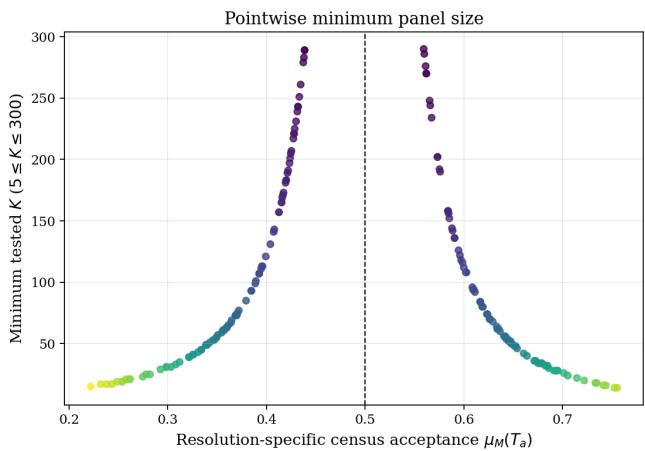

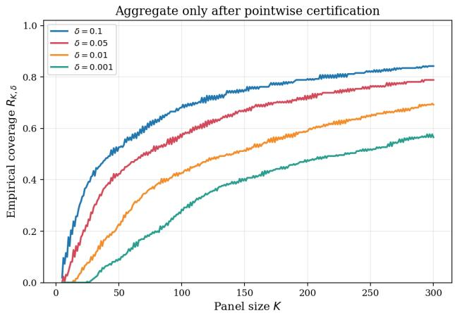  
Figure 6. Illustrative empirical resolvability analysis. Each resolution has its own census acceptance rate and exact minimum panel size. Family-level coverage is obtained only after the pointwise errors have been calculated. The synthetic values illustrate the protocol and are not empirical claims about a deployed LLM population.

Robustness to evaluator population choice. The composition of a real LLM population is contestable. Let

$$
N _ { X } = \{ \nu _ { X } ^ { ( 1 ) } , \dots , \nu _ { X } ^ { ( L ) } \}
$$

be a predeclared collection of plausible evaluator weightings or finite census designs. A conservative ADS may require the $( K , \delta , \beta )$ criterion to hold for every $\nu _ { X } ^ { ( \ell ) }$ , and may separately require that the limiting decision itself be invariant across the collection. Failure of decision invariance is reported as population dependence, not hidden by averaging the populations. The calibration data must support each claimed law. In particular, rows drawn from one $\nu _ { X } ^ { ( 0 ) }$ do not automatically have binomial marginals under $\nu _ { X } ^ { ( \ell ) }$ . Plug-in reweighting of the same matrix is a useful descriptive sensitivity check, but it is not a certificate for an alternative population unless the design supplies valid stratified, importance-weighted, or new-sample inference.

## F Non-Adaptive Corruption as Population Contamination

The adversarial model is placed at the sampling interface. We begin with an honest frozen census and allow an adversary to replace a bounded number of its eligible entries before the uniform random ordering is drawn. The adversary may know the problem, resolution, honest census, global rule, and threshold, but it does not observe or influence the subsequent random permutation. This is a non-adaptive contamination model in the sense of robust statistics [21, 22].

Definition F.1 (Non-Adaptive Census Corruption). Let $\mathbf { y } _ { M } \in \{ 0 , 1 \} ^ { M }$ be the honest global-verdict census and let $b \in \{ 0 , 1 , \ldots , M \}$ be an integer budget. A �-corruption is a fixed vector $\widetilde { \mathbf { y } } _ { M } \in \{ 0 , 1 \} ^ { M }$ chosen before $\Pi _ { M }$ such that

$$
d _ { H } ( \mathbf { y } _ { M } , \widetilde { \mathbf { y } } _ { M } ) \leq b ,
$$

where $d _ { H }$ is Hamming distance. Write

$$
\widetilde { C } _ { M } = \sum _ { i } \widetilde { y } _ { M , i } , \qquad \widetilde { \mu } _ { M } = \widetilde { C } _ { M } / M .
$$

The corruption may represent replaced evaluators, falsified global votes, or an altered eligible population. It does not model an adversary that sees the sampled panel and then selects whom to corrupt; that adaptive problem has a diferent probability space.

## F.1 Census-Level Robustness

Proposition F.2 (Clarity Is a Finite-Population Robustness Radius). Every �-corruption satisfies

$$
| \widetilde { \mu } _ { M } - \mu _ { M } | \leq \frac { b } { M } .
$$

If

$$
\frac { b } { M } < \gamma _ { M } = | \mu _ { M } - \tau | ,
$$

then the corrupted and honest census decisions agree:

$$
\widetilde { D } _ { M } = D _ { M } .
$$

Proof. Changing one binary coordinate changes the total by at most one, so $| \widetilde { C } _ { M } - C _ { M } | \leq b$ . Division by � gives the first claim. A perturbation strictly smaller than the distance from $\mu _ { M }$ to � cannot cross the threshold. □

The strict inequality treats both sides of the inclusive threshold uniformly. On the accepting side, equality may still preserve acceptance; on the rejecting side it may reach the inclusive boundary and flip the decision.

## F.2 Exact Worst-Case Panel Error

Conditional on any fixed corrupted vector, Theorem C.3 still applies with $C _ { M }$ replaced by ${ \widetilde { C } } _ { M }$ . The following result eliminates the need to enumerate every corruption pattern.

Theorem F.3 (Exact Non-Adaptive Worst Case). Let $q _ { K } = \lceil \tau K \rceil$ and let the error target be the honest census decision $D _ { M }$

$I f D _ { M } = 1$ , the greatest rejection probability among all �-corruptions is

$$
\mathbb { P } \Big ( H _ { M , K } ^ { - } < q _ { K } \Big ) , \qquad H _ { M , K } ^ { - } \sim \mathrm { H y p e r g e o m e t r i c } \big ( M , ( C _ { M } - b ) _ { + } , K \big ) .
$$

${ \cal I } f D _ { \cal M } = 0 ;$ , the greatest acceptance probability is

$$
\mathbb { P } \Big ( H _ { M , K } ^ { + } \geq q _ { K } \Big ) , \qquad H _ { M , K } ^ { + } \sim \mathrm { H y p e r g e o m e t r i c } \big ( M , \operatorname* { m i n } ( M , C _ { M } + b ) , K \big ) .
$$

Proof. For an honest accepting census, rejection is monotone decreasing in the number of positive entries. An adversary therefore changes as many positive entries to zero as the budget permits, giving $( C _ { M } - b ) _ { + }$ . Hypergeometric distributions are stochastically increasing in their number of population successes, which can be seen by coupling populations that difer by one zero-to-one replacement under the same sampled index set. The rejecting case is symmetric: maximizing positives gives min $( M , C _ { M } + b )$ and maximizes the upper tail. □

Thus the robust finite-panel certificate is still an exact hypergeometric tail. It depends on the honest pointwise clarity through $C _ { M }$ and on the integer corruption budget $b ;$ it does not require defining an evaluator’s “accuracy” relative to the very population decision being estimated.

Corollary F.4 (Concentration Under Corruption). Suppose $b / M < \gamma _ { M }$ and let

$$
\gamma _ { M } ^ { \mathrm { r o b } } = \gamma _ { M } - b / M > 0 .
$$

Then the worst-case non-adaptive panel error is at most

$$
\exp \left( - \frac { 2 K ( \gamma _ { M } ^ { \mathrm { r o b } } ) ^ { 2 } } { 1 - ( K - 1 ) / M } \right) .
$$

Proof. Every admissible corrupted mean remains on the honest side of the threshold with distance at least $\gamma _ { M } ^ { \mathrm { r o b } }$ . Apply Theorem C.6 to the corrupted finite population. □

## F.3 Asymptotic Contamination

Let a sequence of honest censuses satisfy $\mu _ { M } \to \mu$ with $\gamma = \vert \mu - \tau \vert > 0 .$ , and let $b _ { M } / M \to \alpha$ . If $\alpha < \gamma _ { : }$ , Proposition F.2 implies that every suficiently large corrupted census has the honest limiting decision. If the corrupted proportions themselves converge to ${ \widetilde { \mu } } ,$ their centered random-order paths satisfy Theorem S1.2 about $\widetilde { \mu }$ whenever ${ \widetilde \mu } \in ( 0 , 1 )$ Relative to the honest threshold, contamination appears as an additional deterministic drift bounded in magnitude by �.

At $\alpha \geq \gamma$ , no population-independent guarantee is possible: an admissible contamination can move the mean to or across the threshold. This limitation is deterministic and precedes any CLT.

## F.4 Corruption of a Selected Panel

For completeness, suppose a panel is first sampled honestly and at most $f$ of its reported votes are then changed. Pathwise, the corrupted positive count �e obeys

$$
H - f \leq \widetilde { H } \leq H + f .
$$

Consequently, when the target decision is acceptance, the worst-case failure event is contained in

$$
\{ H < q _ { K } + f \} ,
$$

and when the target is rejection it is contained in

$$
\{ H \geq q _ { K } - f \} .
$$

These shifted exact tails are useful for a fixed panel budget, but they are not the same model as non-adaptive corruption of the eligible population. A deployment must state which mechanism is in scope.

Figure 7 shows how the exact finite-census tail changes with the pre-sampling corruption budget.

## F.5 From a Corruption Fraction to a Sensitivity Profile

The question “what fraction of the network must an adversary control?” has no single answer at the statistical decision layer. Even after the selection mechanism and attack objective have been fixed, outcome manipulation depends on the task clarity and on the panel size. Moreover, controlling a strict majority of sampled identities and moving a semantically ambiguous decision across its threshold are diferent events.

The distinction is transparent in the large-population i.i.d. benchmark. Specialize to $\tau \ = \ 1 / 2$ and odd $K ,$ and write $q _ { K } = ( K + 1 ) / 2$ . If each sampled identity is adversarial independently with probability �, the strict-majority committee-capture curve is

$$
P _ { K } ^ { \mathtt { c a p } } ( \alpha ) = \mathbb { P } \{ \mathrm { B i n o m i a l } ( K , \alpha ) \geq q _ { K } \} .
$$

This curve concerns committee membership only and is independent of task clarity.

For outcome manipulation, two attack models must be distinguished. First, suppose � literally denotes a fixed Byzantine share of a large network. Each independently sampled identity is Byzantine with probability � and then votes against the honest decision; conditional on being honest, it supports that decision with probability $1 / 2 + \gamma _ { H }$ . The unconditional honest-side vote probability is

$$
p _ { \mathrm { n e t } } ( \alpha , \gamma _ { H } ) = ( 1 - \alpha ) \left( \frac { 1 } { 2 } + \gamma _ { H } \right) ,
$$

so the fixed-share network attack curve is

$$
P _ { K } ^ { \mathrm { n e t } } ( \alpha ; \gamma _ { H } ) = \mathbb { P } \left\{ \mathrm { B i n o m i a l } \left( K , \left( 1 - \alpha \right) \left[ \frac { 1 } { 2 } + \gamma _ { H } \right] \right) < q _ { K } \right\} .\tag{4}
$$

Here $\gamma _ { H }$ is clarity within the honest subpopulation. This additional mixture assumption is required to interpret � as network ownership. Its population-level 50% frontier is the curve

$$
\gamma _ { H } = \frac { \alpha } { 2 ( 1 - \alpha ) } ,\tag{5}
$$

Non-adaptive census corruption (M = 1500, μm = 0.60)  
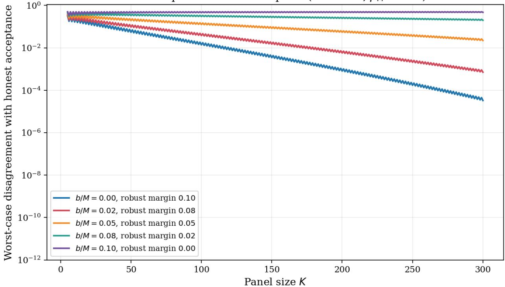  
Figure 7. Exact worst-case panel disagreement under non-adaptive census corruption. Corruption reduces the efective clarity by at most $b / M$ . At equality the uniform no-flip guarantee ends; once $b / M$ exceeds the honest clarity, the population decision can cross the threshold. Under the inclusive rule, equality can still preserve an accepting decision.

not the diagonal $\gamma _ { H } = \alpha$

By contrast, Definition F.1 permits targeted Hamming contamination: the adversary may spend its budget specifically on entries that support the honest population decision. Orienting the binary vote toward that decision gives honest mean $1 / 2 + \gamma$ , and an �-contamination may reduce this mean by the full �. Define the targeted-contamination attack curve

$$
P _ { K } ^ { \mathrm { t a r } } ( \alpha ; \gamma ) = \mathbb { P } \left\{ \mathrm { B i n o m i a l } \left( K , \left[ \frac { 1 } { 2 } + \gamma - \alpha \right] _ { [ 0 , 1 ] } \right) < q _ { K } \right\} ,\tag{6}
$$

where $[ x ] _ { [ 0 , 1 ] } = \operatorname* { m i n } \{ 1 , \operatorname* { m a x } \{ 0 , x \} \}$ . At the deterministic boundary $\alpha = \gamma _ { \mathrm { { ; } } }$ every odd panel has $P _ { K } ^ { \mathrm { t a r } } ( \gamma ; \gamma ) = 1 / 2$ Below that boundary larger panels suppress sampling error; above it they increasingly concentrate on the adversarially shifted population decision. Thus a larger panel amplifies whichever side of the population threshold remains after contamination.

For the same numerical � and clarity, targeted contamination is at least as damaging as fixed network share because

$$
{ \frac { 1 } { 2 } } + \gamma - \alpha \leq \left( 1 - \alpha \right) \left( { \frac { 1 } { 2 } } + \gamma \right) \qquad ( 0 \leq \gamma \leq 1 / 2 ) .
$$

The distinction is operational: the left side allows the attacker to select supportive entries to replace, whereas the right side samples a pre-existing Byzantine fraction without conditioning on the honest entries’ latent votes.

For a target pointwise error $\delta < 1 / 2$ , let

$$
r _ { K , \delta } = \operatorname* { i n f } \{ r \in [ 0 , 1 / 2 ] : \mathbb { P } \{ { \mathrm { B i n o m i a l } } ( K , 1 / 2 + r )  < q _ { K } \} \leq \delta \} .
$$

Binomial stochastic monotonicity gives the two operational conditions

$$
P _ { K } ^ { \mathrm { n e t } } ( \alpha ; \gamma _ { H } ) \leq \delta \quad \Longleftrightarrow \quad \gamma _ { H } \geq \frac { \alpha / 2 + r _ { K , \delta } } { 1 - \alpha } ,\tag{7}
$$

$$
P _ { K } ^ { \mathrm { t a r } } ( \alpha ; \gamma ) \leq \delta \quad \Longleftrightarrow \quad \gamma \geq \alpha + r _ { K , \delta } .\tag{8}
$$

Consequently, if Π is a declared workload law over problems and resolutions, its targeted-contamination sensitivity profile is

$$
S _ { K , \delta } ( \alpha ) = \mathbb { P } _ { u \sim \Pi } \big \{ \gamma ( u ) \ge \alpha + r _ { K , \delta } \big \} .\tag{9}
$$

It reports the fraction of the declared workload whose pointwise attack probability is at most $\delta$ at contamination level $\alpha . \mathrm { ~ A ~ }$ scalar tolerance is a service-level slice of this curve, for example

$$
\alpha _ { K , \delta , \beta } ^ { * } = \operatorname* { s u p } \{ \alpha : S _ { K , \delta } ( \alpha ) \geq 1 - \beta \} .
$$

The same nested construction used for resolvability yields a finite-sample lower confidence bound for this profile, rather than only a plug-in sensitivity curve.

Corollary F.5 (Targeted-Contamination Profile Certificate). Fix $\delta \in ( 0 , 1 / 2 )$ and a non-empty finite grid, declared before seeing the matrix,

$$
\mathcal { G } _ { \mathrm { a d v } } \subset \{ ( K , \alpha ) : K \in \{ 1 , 3 , 5 , \ldots \} , \alpha \in [ 0 , 1 / 2 ] \} .
$$

Under the workload-level sampling design of Remark E.10 and the assumptions of Theorem 2.1, construct the masscontrolled intervals $I _ { a } ^ { \mathrm { m a s s } } = [ L _ { a } , U _ { a } ]$ at pointwisefailure level $\eta _ { E } \xi _ { E } .$ . For $( K , \alpha ) \in \mathcal { G } _ { \mathrm { a d v } }$ , define

$$
\mathsf { C e r t } _ { K , \delta , \alpha } ^ { \mathrm { t a r } } ( [ L , U ] ) = \kappa \left[ L \geq \frac { 1 } { 2 } + \alpha + r _ { K , \delta } \quad o r \quad U \leq \frac { 1 } { 2 } - \alpha - r _ { K , \delta } \right] ,
$$

$$
\widehat { S } _ { K , \delta } ^ { \mathrm { m a s s } } ( \alpha ) = \frac { 1 } { A } \sum _ { a = 1 } ^ { A } \mathrm { C e r t } _ { K , \delta , \alpha } ^ { \mathrm { t a r } } \big ( I _ { a } ^ { \mathrm { m a s s } } \big ) ,
$$

and

$$
\underline { { S } } _ { K , \delta } ( \alpha ) = \operatorname* { m a x } \left\{ 0 , \ell _ { A } \left( A \widehat { S } _ { K , \delta } ^ { \mathrm { m a s s } } ( \alpha ) ; \frac { \eta _ { G } } { | \mathcal { G } _ { \mathrm { a d v } } | } \right) - \xi _ { E } \right\} .
$$

Then

$$
\begin{array} { r } { \mathbb { P } \bigg ( S _ { K , \delta } ( \alpha ) \geq \underline { { S } } _ { K , \delta } ( \alpha ) f o r e \nu e r y \left( K , \alpha \right) \in \mathcal { G } _ { \mathrm { a d v } } \bigg ) \geq 1 - \eta _ { E } - \eta _ { G } . } \end{array}
$$

Consequently, any pair selected from the same grid whose lower bound is at least $1 - \beta$ certifies the corresponding targeted-contamination workload profile at the stated confidence level.

Proof. For a fixed workload unit �, if the interval $[ L , U ]$ contains its honest acceptance mean $p ( u )$ and the displayed certificate equals one, then $| p ( u ) - 1 / 2 | \ge \alpha + r _ { K , \delta }$ . In the lower branch, reorienting the vote toward the honest rejecting decision replaces $p ( u )$ by $1 - p ( u )$ , whose mean is at least $1 / 2 + \alpha + r _ { K , \delta }$ . By Equation (8), the pointwise targeted-contamination attack probability is therefore at most �. Thus the interval certificate is a one-sided lower bound on the latent good-set indicator defining $S _ { K , \delta } ( \alpha )$

Let $F ( \mathbf { Z } )$ be the generator mass of configurations whose evaluator interval misses its honest mean, as in the proof of Theorem 2.1. Tonelli’s theorem and Markov’s inequality give $\mathbb { P } \{ F ( \mathbf { Z } ) > \xi _ { E } \} \le \eta _ { E }$ . Conditional on the shared evaluator rows Z, the observed targeted-certificate indicators are i.i.d. Bernoulli over generator draws. Exact one-sided binomial inversion and a union bound over $\mathcal { G } _ { \mathrm { a d v } }$ lower-bound their conditional population masses simultaneously with failure probability at most $\eta _ { G }$ . On $F ( \mathbf { Z } ) \leq \xi _ { E }$ , each such certificate mass is at most the corresponding true profile plus $\xi _ { E }$ . Rearranging and intersecting the two events gives the result. □

Under the fixed-share network model, the corresponding workload profile replaces the event in (9) by

$$
\left\{ \gamma _ { H } ( u ) \geq \frac { \alpha / 2 + r _ { K , \delta } } { 1 - \alpha } \right\} .
$$

An analogous certificate applies to the fixed-share profile when the calibration rows sample the declared honestsubpopulation law needed to identify $\gamma _ { H }$ . Without that design, synthetic simulation can validate the calculation but cannot identify a deployed curve.

Figure 8 evaluates these quantities on the nominal FeeManager size grid,

$$
5 , 7 , 1 1 , 1 3 , 2 3 , 2 5 , 4 7 , 4 9 , 9 5 , 9 7 , 1 9 1 , 1 9 3 , 3 8 3 , 3 8 5 , 7 6 7 , 7 6 9 , 1 5 3 5 , 1 5 3 7 , 2 9 6 , 1 5 3 8 , 2 5 6 9 , 0 . 1 2 5 6 9 , 0 . 1 5 3 7 , 0 . 1 2 5 6 9 , 0 . 1 2 5 6 9 , 0 . 1 2 5 6 9 5 .
$$

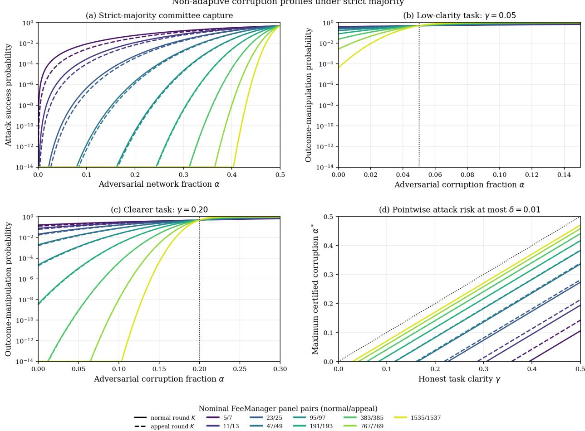  
Figure 8. Non-adaptive sensitivity over the nominal FeeManager size grid under the large-population i.i.d. benchmark. Panel (a) shows committee capture; panels (b)–(c) show targeted contamination at two clarity levels; panel (d) gives the maximum contamination compatible with pointwise error $\delta \ : = \ : 0 . 0 1$ . The grid does not model deployed validator selection and is not a deployed-network security guarantee.

as read from FeeManager.sol at archived revision 8795606e, which is also pinned by the companion TLA repository’s refs/consensus submodule. Each value is evaluated here as an independent strict-majority panel. In the pinned contracts, appeal feasibility depends on the round index and on the currently available unconsumed validators; successor construction can instead combine prior committees or snapshot the active set. The companion executable specification also applies a minus-two sizing rule after consecutive unsuccessful appeals. Thus neither the number of realizable appeals nor this complete nominal grid is a path-independent deployed schedule. The normal/appeal pairs are shown with solid/dashed lines. The final panel plots

$$
\alpha _ { K , \delta } ^ { * } ( \gamma ) = \gamma - r _ { K , \delta }
$$

when the right-hand side is non-negative; below $r _ { K , \delta }$ even the honest panel cannot meet the declared error target.

Non-adaptive corruption profiles under strict majority

For the direct network-control reading, hold the fixed Byzantine share constant. Figure 3 places the nominal panel size on the horizontal axis and the minimum clarity within the honest subpopulation on the vertical axis. Each curve is one Byzantine network share:

$$
\gamma _ { H , \mathrm { m i n } } ^ { \mathrm { n e t } } ( K ; \alpha , \delta ) = \frac { \alpha / 2 + r _ { K , \delta } } { 1 - \alpha } .
$$

A task–panel pair on or above a curve meets the declared pointwise attack-risk target under this benchmark; a point below it does not. Values above $1 / 2$ are impossible for a binary threshold and therefore identify combinations that no panel of that size can certify.

The complementary phase diagram fixes the largest nominal sensitivity size, $K = 1 5 3 7$ , and varies both quantities continuously. Figure 4 places the two threat models side by side with common axes and color scale. In the fixed-share network model the 50% frontier is the curved boundary (5), and the low-risk and high-success frontiers are

$$
\gamma _ { H } = \frac { \alpha / 2 \pm r _ { K , \delta } } { 1 - \alpha } .
$$

Under targeted contamination the corresponding frontiers are $\gamma = \alpha$ and $\gamma = \alpha \pm r _ { K , \delta }$ . The visual diference is the price of allowing the attacker to choose supportive census entries rather than merely owning a pre-existing random share of identities.

The corresponding curves and phase diagrams appear in Figures 3 and 4.

# Supplementary Material

## S1 Functional Limits and Late Reversals

The joint variable $\mathbf { Y } = ( Y _ { 1 } , Y _ { 2 } , . . . )$ is infinite-dimensional, but the endpoint $K ^ { - 1 } \sum _ { i = 1 } ^ { K } Y _ { i }$ is scalar. To retain the whole evolution as the panel grows, we map the binary sequence to its interpolated partial-sum path.

## S1.1 The i.i.d. Superpopulation Path

Fix (�, �) and suppose $Y _ { 1 } , Y _ { 2 } , \ldots$ . are the coordinate votes of Proposition B.9, with $0 < \mu < 1$ and $\sigma ^ { 2 } = \mu ( 1 - \mu )$ . For $t \in [ 0 , 1 ]$ , set $m = \lfloor n t \rfloor$ and define the polygonally interpolated process

$$
W _ { n } ( t ) = \frac { 1 } { \sigma \sqrt { n } } \left( \sum _ { i = 1 } ^ { m } ( Y _ { i } - \mu ) + ( n t - m ) ( Y _ { m + 1 } - \mu ) \right) ,
$$

where the interpolation term is understood as zero at $t = 1$

Theorem S1.1 (Superpopulation Functional CLT). As random elements $o f C [ 0 , 1 ]$ with the uniform topology,

$$
W _ { n } \Rightarrow W ,
$$

where � is standard Brownian motion with covariance

$$
\operatorname { C o v } ( W ( s ) , W ( t ) ) = \operatorname* { m i n } ( s , t ) .
$$

Proof. The centered Bernoulli increments are i.i.d., have mean zero and finite non-zero variance, and are bounded. The polygonal form of Donsker’s invariance principle therefore applies [7]. □

$\mathbf { A } \mathbf { t } \ t \ = \ 1$ , Theorem S1.1 reduces to the ordinary scalar CLT. Its additional content is joint weak convergence of the complete path, which permits continuous path functionals such as maxima over a fixed interval to be analyzed.

## S1.2 The Without-Replacement Census Path

Now let ${ \bf y } _ { M }$ be a deterministic binary census, let $\Pi _ { M }$ be a uniform random permutation, and suppose

$$
\mu _ { M } \longrightarrow \mu \in ( 0 , 1 ) .
$$

For $t \in [ 0 , 1 ] , m = \lfloor M t \rfloor$ , define

$$
B _ { M } ( t ) = \frac { 1 } { \sqrt { M \mu _ { M } ( 1 - \mu _ { M } ) } } \left( \sum _ { i = 1 } ^ { m } ( y _ { M , \Pi _ { M } ( i ) } - \mu _ { M } ) + ( M t - m ) ( y _ { M , \Pi _ { M } ( m + 1 ) } - \mu _ { M } ) \right) ,
$$

again taking the interpolation term to be zero at $t = 1$

Unlike the i.i.d. path,

$$
B _ { M } ( 1 ) = 0
$$

identically: after the entire census has been revealed, its centered total is known.

Theorem S1.2 (Finite-Population Functional CLT). As $M  \infty ,$

$$
B _ { M } \Rightarrow B ^ { \circ } \qquad i n C [ 0 , 1 ] ,
$$

where $B ^ { \circ }$ is a standard Brownian bridge with covariance

$$
\operatorname { C o v } ( B ^ { \circ } ( s ) , B ^ { \circ } ( t ) ) = \operatorname* { m i n } ( s , t ) - s t .
$$

Proof. The randomly permuted centered census is a triangular array of exchangeable, bounded increments with zero total. Its total squared norm is $M \mu _ { M } ( 1 - \mu _ { M } )$ , which diverges because $\mu _ { M } \to \mu \in ( 0 , 1 )$ , while its maximum increment is at most one. Thus the maximal-increment (Lindeberg) ratio tends to zero. The functional combinatorial central limit theorem for uniform random permutations applies [5]. The endpoint constraint gives the tied-down Gaussian limit. Its covariance can also be read from Proposition S1.3 below. □

Proposition S1.3 (Pre-limit Covariance). Let

$$
R _ { M , k } = \sum _ { i = 1 } ^ { k } ( y _ { M , \Pi _ { M } ( i ) } - \mu _ { M } ) .
$$

For $1 \leq k \leq \ell \leq M ,$

$$
\operatorname { C o v } ( R _ { M , k } , R _ { M , \ell } ) = \mu _ { M } ( 1 - \mu _ { M } ) \frac { k ( M - \ell ) } { M - 1 } .
$$

Consequently, $i f k / M \to s$ and $\ell / M \to t$ with $s \leq t ,$ the covariance after the normalization ofTheorem S1.2 tends to $s ( 1 - t )$

Proof. Every permuted coordinate has variance $\mu _ { M } ( 1 - \mu _ { M } )$ . Two distinct coordinates have covariance $- \mu _ { M } ( 1 -$ $\mu _ { M } ) / ( M - 1 )$ because their sum is fixed. Expanding the covariance of the two overlapping partial sums gives

$$
\mu _ { M } ( 1 - \mu _ { M } ) \left( k - \frac { k \ell - k } { M - 1 } \right) = \mu _ { M } ( 1 - \mu _ { M } ) \frac { k ( M - \ell ) } { M - 1 } .
$$

The Brownian bridge is therefore the Gaussian limit induced by sampling without replacement and the known terminal census total.

Figure S1 illustrates the unpinned and pinned endpoint geometries; the proofs do not rely on the displayed draws.

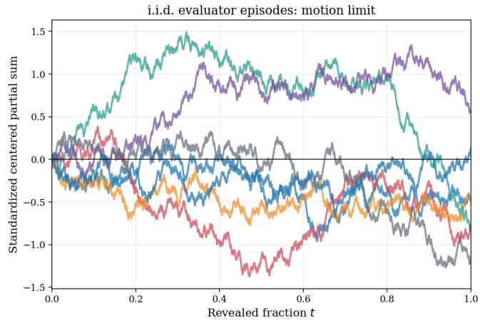

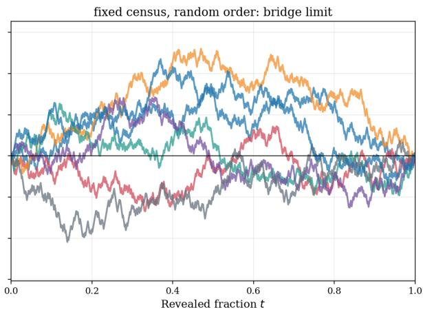  
Figure S1. Nested-panel fluctuations. Left: centered i.i.d. Bernoulli partial sums, whose functional limit is Brownian motion. Right: random-order paths through a fixed binary census, pinned to zero at the full census and converging to a Brownian bridge. The plotted paths are illustrative draws, not evidence for the theorems.

## S1.3 Threshold Drift and Local Ambiguity

The decision compares the cumulative count with the line $k \tau .$ . In the i.i.d. regime,

$$
{ \frac { 1 } { \sigma { \sqrt { n } } } } \sum _ { i = 1 } ^ { \lfloor n t \rfloor } ( Y _ { i } - \tau ) = W _ { n } ( t ) + { \frac { \lfloor n t \rfloor ( \mu - \tau ) } { \sigma { \sqrt { n } } } } + O ( n ^ { - 1 / 2 } ) .
$$

For fixed non-zero clarity, the deterministic drift grows as $\sqrt { n }$ and eventually dominates the $O _ { \mathbb { P } } ( 1 )$ fluctuation. The non-degenerate asymptotic regime near ambiguity occurs when the population mean approaches the threshold at the $n ^ { - 1 / 2 }$ scale.

Theorem S1.4 (Local-Clarity Bridge Limit). Let $\tau \in ( 0 , 1 )$ and let binary censuses satisfy

$$
\mu _ { M } = \tau + \frac { c } { \sqrt { M } } + o ( M ^ { - 1 / 2 } )
$$

for some $c \in \mathbb { R } .$ For $t \in [ k / M , ( k + 1 ) / M ]$ with $k = 0 , \ldots , M - 1$ , define the threshold-centered interpolated path by

$$
Z _ { M } ( t ) = \frac { 1 } { \sqrt { M \tau ( 1 - \tau ) } } \left( \sum _ { i = 1 } ^ { k } ( y _ { M , \Pi _ { M } ( i ) } - \tau ) + ( M t - k ) ( y _ { M , \Pi _ { M } ( k + 1 ) } - \tau ) \right) .
$$

$A t t = 1$ , use thefull sum over $i = 1 , \ldots , M .$ . Then

$$
Z _ { M } \Rightarrow B ^ { \circ } ( t ) + \frac { c } { \sqrt { \tau ( 1 - \tau ) } } t \qquad i n C [ 0 , 1 ] .
$$

Proof. Add and subtract $\mu _ { M }$ . The centered term equals $B _ { M } ( t )$ multiplied by

$$
\sqrt { \frac { \mu _ { M } ( 1 - \mu _ { M } ) } { \tau ( 1 - \tau ) } } \longrightarrow 1 .
$$

Uniformly in �, the remaining deterministic term converges to $c t / \sqrt { \tau ( 1 - \tau ) }$ . Apply Theorem S1.2 and Slutsky’s theorem in $C [ 0 , 1 ]$ □

Theorem S1.4 supplies an approximation for path events away from the singular initial time. The next corollary evaluates one such event in closed form.

Corollary S1.5 (Late-Escalation Stability Profile). Under the assumptions of Theorem S1.4, suppose $c \neq 0$ and fix $a \in ( 0 , 1 )$ . Let

$$
S _ { M , a } = \left\{ D _ { M , k } = D _ { M } f o r e \nu e r y \ : k = \lceil a M \rceil , \ldots , M \right\} .
$$

Writing Φfor the standard normal distributionfunction and

$$
\lambda = \frac { \left| c \right| } { \sqrt { \tau ( 1 - \tau ) } } ,
$$

the probability that no later nested panel reverses thefull-census decision satisfies

$$
\mathbb { P } ( S _ { M , a } ) \longrightarrow 2 \Phi \biggl ( \lambda \sqrt { \frac { a } { 1 - a } } \biggr ) - 1 .
$$

Consequently, the limiting probability of at least one disagreement after fraction � is

$$
2 \Phi \biggl ( - \lambda \sqrt { \frac { a } { 1 - a } } \biggr ) .
$$

For a target late-disagreement probability $ { \varepsilon } \in ( 0 , 1 )$ , the limiting stability probability is at least $1 - \varepsilon$ exactly when

$$
a \geq \frac { z _ { 1 - \varepsilon / 2 } ^ { 2 } } { \lambda ^ { 2 } + z _ { 1 - \varepsilon / 2 } ^ { 2 } } , \qquad z _ { u } = \Phi ^ { - 1 } ( u ) .
$$

Proof. At a grid point, $Z _ { M } ( k / M ) \geq 0$ is equivalent to $H _ { M , k } \ge k \tau$ , hence to $D _ { M , k } = 1$ under the inclusive threshold convention. $\mathrm { I f } c > 0$ , then $D _ { M } = 1$ for all suficiently large �, and $S _ { M , a }$ is the event that the interpolated path remains non-negative on $[ a _ { M } , 1 ]$ , where $a _ { M } = \lceil a M \rceil / M . \mathrm { ~ I f ~ } c < 0$ , then $D _ { M } = 0$ eventually and the corresponding event for $- Z _ { M }$ uses a strict positive inequality. This finite-� distinction is the parity/tie efect; it disappears in the limit below.

For deterministic $x _ { M } \to x$ uniformly and $a _ { M } \to a$ , uniform continuity of � gives

$$
\operatorname* { i n f } _ { a _ { M } \leq t \leq 1 } x _ { M } ( t ) \longrightarrow \operatorname* { i n f } _ { a \leq t \leq 1 } x ( t ) .
$$

Thus the moving left endpoint does not change the continuous-mapping argument. Moreover, the conditional reflection formula used below gives a continuous distribution for the minimum of a Brownian bridge with positive endpoints; since $X ( a )$ has a density, the limiting minimum has no atom at zero. The weak and strict finite-� inequalities therefore have the same limit. Theorem S1.4 and the extended continuous mapping theorem reduce both cases to

$$
\mathbb { P } \left( \operatorname* { i n f } _ { a \leq t \leq 1 } \{ B ^ { \circ } ( t ) + \lambda t \} > 0 \right) .
$$

Set $X ( t ) = B ^ { \circ } ( t ) + \lambda t$ . Then $X ( 1 ) = \lambda$ and $X ( a ) \sim N ( \lambda a , a ( 1 - a ) )$ . Conditional on $X ( a ) = x > 0$ , the segment on $[ a , 1 ]$ is a Brownian bridge from � to �. The reflection principle gives its probability of remaining positive as

$$
1 - \exp \left( - { \frac { 2 x \lambda } { 1 - a } } \right) .
$$

Indeed, reflection at the first hit of zero replaces the Brownian transition density over duration $1 - a$ from $p _ { 1 - a } ( \lambda - x )$ by $p _ { 1 - a } ( \lambda + x )$ ; their ratio is $\exp \{ - 2 x \lambda / ( 1 - a ) \}$ . Dividing the killed transition density by the unrestricted one gives the displayed conditional probability. It is zero for $x \leq 0$ . With $d = \lambda \sqrt { a / ( 1 - a ) }$ , integration over $X ( a )$ gives

$$
\mathbb { P } ( X ( a ) > 0 ) - \mathbb { E } \left[ e ^ { - 2 \lambda X ( a ) / ( 1 - a ) } \# [ X ( a ) > 0 ] \right] = \Phi ( d ) - \Phi ( - d ) = 2 \Phi ( d ) - 1 .
$$

The disagreement probability is its complement. Solving $2 \Phi ( d ) - 1 \geq 1 - \varepsilon$ for � gives the final expression. □

For a general interval $0 < a < b < 1$ , write $X ( t ) = B ^ { \circ } ( t ) + c t / \sqrt { \tau ( 1 - \tau ) }$ . Conditioning on its two Gaussian endpoints gives the computable boundary-crossing formula

$$
\mathbb { P } \Bigg ( \operatorname* { i n f } _ { a \le t \le b } X ( t ) > 0 \Bigg ) = \mathbb { E } \Bigg [ \kappa \big [ X ( a ) > 0 , X ( b ) > 0 \big ] \Bigg \{ 1 - \exp \bigg ( - \frac { 2 X ( a ) X ( b ) } { b - a } \bigg ) \Bigg \} \Bigg ] .
$$

At finite �, exact dynamic programming should still be preferred when this path event itself is used for certification.

## S1.4 Stabilization

Theorem S1.6 (Almost-Sure Superpopulation Stabilization). Let �� be i.i.d. Bernoulli(�) and define

$$
D _ { K } = \mathbb { \Psi } \Bigg [ \frac { 1 } { K } \sum _ { i = 1 } ^ { K } Y _ { i } \geq \tau \Bigg ] .
$$

$H \mu \neq \tau ,$ then

$$
D _ { K } \longrightarrow \mathbb { K } [ \mu \geq \tau ] \qquad a l m o s t s u r e l y ,
$$

and there is an almost surelyfinite random $K _ { 0 }$ after which every decision is equal to the limit decision. $H f \mu = \tau \in ( 0 , 1 )$   
the decisions do not converge almost surely.

Proof. For $\mu \neq \tau ,$ , the strong law gives $\begin{array} { r } { K ^ { - 1 } \sum _ { i = 1 } ^ { K } Y _ { i } \to \mu } \end{array}$ almost surely, so the averages are eventually on the same side of $\tau \mathrm { a s } \mu . \mathrm { A t } \mu = \tau$ , the centered non-degenerate Bernoulli random walk has positive and negative excursions infinitely often almost surely (for example by the law of the iterated logarithm), so the thresholded sequence cannot stabilize. □

Theorem S1.7 (Late-Census Stabilization). Suppose $\mu _ { M }  \mu \neq \tau .$ For every fixed $a \in ( 0 , 1 )$

$$
\mathbb { P } \big ( D _ { M , k } = D _ { M } f o r e \nu e r y k = \lceil a M \rceil , \dots , M \big ) \longrightarrow 1 .
$$

Proof. For suficiently large �, $\gamma _ { M } \geq | \mu - \tau | / 2$ and $D _ { M } = \# [ \mu \geq \tau ]$ . By Theorem C.6 and a union bound, the probability of any disagreement for $k \geq a M$ is at most

$$
M \exp \left( - 2 a M \left( \frac { | \mu - \tau | } { 2 } \right) ^ { 2 } \right) ,
$$

which tends to zero.

Remark S1.8 (Choice of path space). The raw state space $\{ 0 , 1 \} ^ { \mathbb { N } }$ with its product sigma-algebra is an infinitedimensional measurable product, but it is not a vector space. Embedding it in $\ell ^ { \infty }$ does not make a Banach-valued CLT automatic: independent non-degenerate Gaussian coordinates are not bounded almost surely, so the putative limit need not be an $\ell ^ { \infty } .$ -valued random element. General Banach-space CLTs require geometric and tightness hypotheses beyond a formal second moment [3, 26].

The natural construction here is instead the partial-sum map into a path space. Theorems S1.1 and S1.2 are functional CLTs for that system-relevant random function. If each evaluator itself returned a countably infinite vector of component verdicts, a separate Hilbert- or Banach-valued model and a meaningful norm would have to be specified.

## S2 Supplementary Empirical Protocol

A task-specific estimate of $\nu _ { X }$ can be built from real LLM configurations only after the inferential target and sampling design have been declared. A confirmatory campaign should satisfy four requirements.

1. Declare the target. Freeze $X , G , \tau$ , the tie rule, prompts, tools, and time window. For multiple problems, specify a workload–generator law Π rather than treating a benchmark list as a population. State whether each catalogue is a finite target, an i.i.d. sample from a named law, or a deterministic approximation with a justified envelope.

2. Freeze the design. Predeclare generator and evaluator catalogues, weights, seeds, self-evaluation policy, and any nested evaluator ordering. Generate and freeze every $T _ { a }$ before cross-evaluation.

3. Predeclare inference. Fix $( \delta , \beta ) , ( \eta _ { E } , \eta _ { G } )$ , any mass allowance $\xi _ { E }$ , and the candidate set $\mathcal { K } .$ Construct the complete matrix Y, compute exact census-relative errors and the applicable population intervals, and select � only through a simultaneous rule stated above.

4. Report scope and sensitivity. Publish the binary matrix and configuration metadata; report pointwise clarity, changes across nested designs, alternative population weights, failures, and temporal replications. If no candidate certifies, report that outcome rather than changing the grid or budgets retrospectively.

Stabilization across the observed sizes is evidence for a limit, not a proof of a universal population. Theorem E.11 is conditional on convergence and does not manufacture that premise from the observations. A probabilistic confidence statement additionally requires the configurations to be sampled according to the declared $\nu _ { X } ;$ a deterministic catalogue requires a design-based or approximation argument.

Each evaluator configuration may also generate its own resolution $T _ { a } .$ . Generation and evaluation remain distinct roles: the former induces the distribution of columns, the latter the acceptance distribution within each column. The empirical question is therefore not one mean $\mu$ for the examination, but the distribution of the function $T \mapsto \mu _ { X } ( T )$ over generated resolutions.

## S3 LLM Study Details

We exercised the single-verdict $( N = 1 )$ computational path on a hash-pinned diagnostic pilot. The catalogue consisted of $A = 5 0$ frozen equivalence-principle decisions divided into four construction strata: clear accept, clear reject, benign ambiguity, and input-presentation stress. The last stratum modifies the evidence presentation; it is not Byzantine evaluator corruption and is separate from the attack models of Section F. These units form a stratified seed catalogue, not an i.i.d. sample from an identified workload–generator law. Their accept, reject, and construction-underdetermined labels were assigned during construction and were not independently adjudicated external truth. Because each prompt requested one global ACCEPT/REJECT value, this pilot does not test a nontrivial multicomponent map $G .$

The evaluator design drew $M = 4 0$ rows i.i.d. with replacement from an equal-weight catalogue of 21 routed evaluator configurations. These are router-level configurations, not claims of 21 statistically independent training lineages. The shared-row theorem permits arbitrary dependence among the 50 cells of a row but requires rows to be i.i.d. from the declared law. Distinct seeds do not rule out persistent dependence induced by shared random provider state, routing incidents, tools, or cached context, none of which can be audited fully from the archived binary ledger. The realized sample contained 18 distinct configurations; repeated configurations retained distinct row and cell seeds. Every row evaluated every frozen unit, producing an $M \times A = 4 0 \times 5 0$ matrix. The analysis fixed

$$
\tau = 0 . 5 , \qquad \delta = 0 . 0 1 , \qquad \beta = 0 . 4 0 , \qquad \eta _ { E } = \eta _ { G } = 0 . 0 2 5 , \qquad \xi _ { E } = 0 . 0 5 ,
$$

and the GenLayer panel grid

$$
\mathcal { K } = \{ 5 , 7 , 1 1 , 1 3 , 2 3 , 2 5 , 4 7 , 4 9 , 9 5 , 9 7 , 1 9 1 , 1 9 3 , 3 8 3 , 3 8 5 , 7 6 7 , 7 6 9 , 1 5 3 5 , 1 5 3 7 \} .
$$

This is a predeclared statistical grid based on the nominal FeeManager sizes, not a claim that every value is reachable as a deployed protocol panel; the capacity endgame has separate validator-eligibility and fixed-threshold semantics. Here � is the calibration-row count, whereas � is the size of a future i.i.d. panel from the declared superpopulation. Thus candidates with $K > M$ are meaningful in this model; the restriction $K \leq M$ applies only to a without-replacement panel drawn from the realized finite census. Malformed or exhausted transport responses were mapped to rejection under the frozen failure rule.

The family weights below were included in the frozen input dataset before evaluator calls and were not fitted to the vote matrix. The dataset SHA-256 is

fe5c11531def6849c439dc60919361b60141fee26fc427eeaf5159a0e1b2ea66.
<table><tr><td>Family f</td><td>Units  $n _ { f }$ </td><td>Family mass  $w _ { f }$ </td><td>Unit mass  $r _ { i } = w _ { f } / n _ { f }$ </td></tr><tr><td>sla_enforcement</td><td>4</td><td>0.13</td><td>0.0325</td></tr><tr><td>payment_dispute</td><td>4</td><td>0.13</td><td>0.0325</td></tr><tr><td>marketplace_dispute</td><td>4</td><td>0.12</td><td>0.0300</td></tr><tr><td>prediction_market_objective</td><td>4</td><td>0.10</td><td>0.0250</td></tr><tr><td>parametric_insurance</td><td>4</td><td>0.10</td><td>0.0250</td></tr><tr><td>airdrop_task_eval</td><td>4</td><td>0.08</td><td>0.0200</td></tr><tr><td>prediction_market_subjective</td><td>4</td><td>0.07</td><td>0.0175</td></tr><tr><td>grant_scoring</td><td>4</td><td>0.06</td><td>0.0150</td></tr><tr><td>bug_bounty_severity</td><td>4</td><td>0.06</td><td>0.0150</td></tr><tr><td>content_moderation</td><td>4</td><td>0.06</td><td>0.0150</td></tr><tr><td>sports_referee</td><td>4</td><td>0.04</td><td>0.0100</td></tr><tr><td>model_fingerprinting</td><td>3</td><td>0.03</td><td>0.0100</td></tr><tr><td>emergency_halt</td><td>3</td><td>0.02</td><td>0.0067</td></tr><tr><td>Total</td><td>50</td><td>1.00</td><td></td></tr></table>

Table S1. Declared nonuniform law on the finite unit catalogue. The family\_weight values encode a suggested GenLayer-like workload prior, not estimated deployment frequencies. The uniform-catalogue result is reported alongside this design-weighted result. Unit masses are displayed to four decimal places; all calculations use $w _ { f } / n _ { f }$ without rounding.

Observed matrix. Of the 2,000 cells, 1,983 returned valid structured responses, 15 were malformed, and two exhausted transport retries. The empirical 40-row majority decision matched the construction label on all 37 constructionresolvable units; the individual-cell agreement on those units was 0.994. For acceptance proportion $p ,$ binary entropy means

$$
h _ { 2 } ( p ) = - p \log _ { 2 } p - ( 1 - p ) \log _ { 2 } ( 1 - p ) ,
$$

with the usual zero convention and units of bits. Its mean was 0.041 on construction-resolvable units and 0.333 on construction-unresolvable units.

The observed margins were highly saturated: 44 of 50 units had at most one dissenting vote, including all 12 units in the input-presentation-stress stratum. Only the benign-ambiguity stratum supplied appreciable mass near the aggregation threshold. The pilot therefore verifies the mechanics of the single-verdict code path, but it is not a high-power stress test for intermediate clarity, a multicomponent �, or resistance to hostile presentation.

Separated certificates. At $K = 5$ and $K = 7$ , no unit passed the evaluator-superpopulation pointwise interval rule under either the familywise or mass-controlled construction. This is a power statement about the chosen $( M , \delta )$ design, not evidence that those panel sizes have error one or that a deployed first round is insecure.

For the fully enumerated 50-unit catalogue, familywise intervals at level $\eta _ { E } / A = 0 . 0 0 0 5$ certify 45 units at $K = 4 7$ Corollary E.9 then gives lower coverage $4 5 / 5 0 = 0 . 9 0 0$ for uniform weights and 0.8775 for the declared catalogue weights, with confidence $1 - \eta _ { E } = 0 . 9 7 5$ under the declared i.i.d. evaluator-row model. The mass-controlled finitecatalogue alternative certifies 46 units and gives declared-weight lower coverage $0 . 8 9 2 5 - 0 . 0 5 = 0 . 8 4 2 5$

For the frozen 40-row census, exact without-replacement tails require no confidence interval. Forty-seven units satisfy $K _ { \mathrm { s t a b l e } } ~ \leq ~ 7$ at $\delta \ = \ 0 . 0 1 ;$ ; mkt-03, ins-03, and air-03 require 26, 34, and 39, respectively. This statement is conditional on the realized verdict census, and $K \leq 4 0$ . Putting the two results side by side, the same matrix has 47 of 50 frozen-census stability results at $K = 7$ and zero evaluator-superpopulation interval certificates at $K = 7 .$ . The gap reflects diferent reference objects and diferent uncertainty, not conflicting calculations.

Finally, the hypothetical outer-sampling calculation uses the mass-controlled intervals. At $K = 4 7$ , 46 of 50 units certify; exact one-sided binomial inversion gives $\ell _ { 5 0 } ( 4 6 ; 0 . 0 2 5 / 1 8 ) - 0 . 0 5 = 0 . 6 9 1 2$ , while the Hoefding form gives $4 6 / 5 0 - 0 . 0 5 - \sqrt { \log ( 1 8 / 0 . 0 2 5 ) / 1 0 0 } = 0 . 6 1 3 5$ . At � = 23, 44 units certify and the exact form gives $\ell _ { 5 0 } ( 4 4 ; 0 . 0 2 5 / 1 8 ) -$ $0 . 0 5 = 0 . 6 3 7 2$ , hence crosses target 0.60 there. These would be simultaneous 95% lower bounds under the hypothetical i.i.d. outer design; the factor 18 retains the complete predeclared grid. The original pilot analysis used Hoefding and first crossed at $K = 4 7$ . Since the outer catalogue was not sampled i.i.d. from a declared law Π, none of these outer lower-bound values has the workload-population confidence interpretation of Theorem 2.1. We retain $K = 4 7$ as the audit reference rather than reselecting it retrospectively.

The pilot value $\beta = 0 . 4 0$ was a feasibility choice, not a judgment that 40% unresolved workload mass is acceptable for deployment. The audit value $K = 4 7$ is not a production panel-size recommendation. Even under the hypothetical i.i.d. outer design, certification at these values would give only the Corollary E.8 deployment-error bound $( 1 - 0 . 4 0 ) 0 . 0 1 +$ $0 . 4 0 = 0 . 4 0 6$ ; because the actual outer design does not meet that corollary’s sampling premise, 0.406 is not a pilot guarantee.

Frozen-census contamination sensitivity. Applying Theorem F.3 column by column gives the exact worst-direction result when at most � of the 40 eligible verdicts are changed before the random panel is drawn. Table S2 reports a compact slice of finite\_census\_security.csv. It is conditional on this frozen census and targets its honest decision; it does not model adaptive corruption after panel selection, validator identities, or network ownership.
<table><tr><td>Budget b</td><td> $b / M$ </td><td> $K = 5$ </td><td> $K = 7$ </td><td> $K = 1 1$ </td><td> $K = 3 9$ </td></tr><tr><td>0</td><td>0.000</td><td>47</td><td>47</td><td>47</td><td>50</td></tr><tr><td>1</td><td>0.025</td><td>46</td><td>47</td><td>47</td><td>49</td></tr><tr><td>2</td><td>0.050</td><td>45</td><td>46</td><td>47</td><td>49</td></tr><tr><td>4</td><td>0.100</td><td>44</td><td>44</td><td>47</td><td>48</td></tr></table>

Table S2. Number of the 50 catalogue units whose exact worst-case without-replacement panel error remains at most $\delta = 0 . 0 1$ under non-adaptive census contamination.

Table S3 records the complete numerical summary; Figure 5 shows the diagnostic curves in the main text.

Sensitivity and interpretation. The mass-controlled intervals for mkt-03, ins-03, and air-03 crossed $\tau = 0 . 5 .$ Equal weighting of the 18 realized configurations changed no majority decision; leave-one-configuration recalculations changed only ai $\tt r - 0 3$ . Treating every non-success as acceptance likewise changed only air-03; that policy and a successes-only calculation changed the pointwise certification status of bug-03. These are descriptive sensitivity checks, not certificates for alternative evaluator populations or missingness mechanisms.

<table><tr><td>Metric</td><td>Observed result</td></tr><tr><td>Frozen workload units</td><td>50</td></tr><tr><td>Evaluator rows / total calls</td><td>40 / 2,000</td></tr><tr><td>Realized / declared routed configurations</td><td>18 / 21</td></tr><tr><td>Valid structured responses</td><td>1,983 / 2,000 (99.15%)</td></tr><tr><td>Construction-resolvable majority matches</td><td>37 / 37</td></tr><tr><td>Audit reference</td><td>K = 47</td></tr><tr><td>Fixed-catalogue familywise certificate</td><td>45 / 50 (90.0%)</td></tr><tr><td>Declared-weight catalogue lower coverage</td><td>0.8775 (97.5% confidence)</td></tr><tr><td>Frozen-census units stable by  $K = 7$ </td><td>47 / 50</td></tr><tr><td>Outer diagnostic, exact / Hoeffding</td><td>0.6912 / 0.6135</td></tr><tr><td>Construction-underdetermined units passing mass-controlled pointwise rule</td><td>9/ 13</td></tr></table>

Table S3. Detailed hash-pinned LLM pilot summary. Run pilot-21f-final-20260803-01; immutable input and derived artifact hashes are recorded in the provenance manifest.

Of the 13 units constructed to be underdetermined, nine passed the mass-controlled pointwise rule at $K = 4 7$ and ten did so at $K \ge 9 5$ . Construction status is not independent semantic adjudication, so this does not establish an empirical relation between true semantic underdetermination and reproducibility. Operational resolvability concerns agreement with a declared population decision and does not, by itself, identify semantic truth.

## S4 Synthetic Design Details

Before calling real models, the complete experiment can be simulated from declared latent acceptance probabilities. Such a simulation can verify the implementation of quotas, exact tails, interval inversion, simultaneous lower bounds, and data-dependent selection; it can also estimate the power and cost of candidate values of $( A , M , \mathcal { K } , \delta , \beta , \eta _ { E } , \eta _ { G } , \xi _ { E } )$ Row-level latent variables can induce strong dependence across columns while keeping rows i.i.d., directly stress-testing the shared-evaluator design allowed by Theorems E.7 and 2.1.

A reproducible calibration study uses latent acceptance means

$$
( 0 . 3 0 , 0 . 4 0 , 0 . 4 6 , 0 . 4 9 , 0 . 5 1 , 0 . 5 4 , 0 . 6 0 , 0 . 7 0 )
$$

with generator weights

$$
( 0 . 1 5 , 0 . 2 0 , 0 . 0 5 , 0 . 1 0 , 0 . 1 0 , 0 . 0 5 , 0 . 2 0 , 0 . 1 5 ) .
$$

$$
\mathrm { I t ~ f i x e s ~ } \tau = 0 . 5 , \delta = 0 . 0 5 , \beta = 0 . 4 0 , \eta _ { E } = \eta _ { G } = 0 . 0 2 5 , \xi _ { E } = 0 . 0 5 , \mathrm { a n d }
$$

$$
\mathcal { K } = \{ 2 1 , 4 1 , 6 1 , 8 1 , 1 0 1 , 1 5 1 , 2 0 1 , 3 0 1 \} .
$$

In the dependent regime, each evaluator row uses a common uniform variable across all columns with probability $\rho = 0 . 9$ and independent uniforms otherwise. Thus every column count retains its exact Binomial $( M , p _ { a } )$ marginal while the columns can be strongly dependent. Table 2 and Figure 2 report 2,000 repetitions for each design and dependence regime.

The exact coverage is 0.30 for $K \leq 6 1$ on the candidate grid and 0.70 for $K \geq 8 1$ . Nevertheless, the baseline design usually cannot certify the 0.60 target: interval uncertainty near the pointwise certification boundary and the finite-sample lower bound reduce its power. Increasing both sampling dimensions makes the same target detectable. The experiment therefore illustrates why failure to certify is inconclusive and why (�, �) should be chosen by power analysis before an expensive evaluation campaign.

Simulation cannot identify the generator distribution of $T \mapsto \mu _ { X } ( T )$ for real models, validate the declared LLM population weights, detect provider or temporal drift, or measure external semantic truth. Those are empirical properties, not consequences of the probability model. Synthetic studies can therefore replace real LLM calls for theorem calibration and power analysis, but not for a claim that an ADS is useful on a real task population.

External validation. If independent ground-truth labels are available, one may additionally measure false acceptance and false rejection relative to them. Those semantic metrics are separate from $e _ { M , K }$ , which measures coordination with a population decision. Neither high clarity nor high panel–census agreement proves external correctness.

## S5 One Seed Supplies Countably Many Private Draws

The evaluator definition uses one seed while allowing multiple component queries and private tool observations. The following standard construction makes that convention explicit

Lemma S5.1 (Digit Splitting). There is a Borel map

$$
\begin{array} { r } { s : [ 0 , 1 ] \longrightarrow [ 0 , 1 ] ^ { \mathbb { N } } , \qquad s ( \omega ) = ( \omega ^ { ( 1 ) } , \omega ^ { ( 2 ) } , \dots ) , } \end{array}
$$

such that,for � ∼ Uniform[0, 1], the coordinates $\boldsymbol { \omega } ^ { ( j ) }$ are i.i.d. uniform.

Proof. Choose for each $\omega \in [ 0 , 1 )$ the binary expansion that is not eventually all ones and define the dyadic-rational exceptions arbitrarily. Under Lebesgue measure, the binary digits are i.i.d. Bernoull $\mathrm { i } ( 1 / 2 )$ . Partition their countable index set into countably many disjoint infinite subsets using a bijection $p : \mathbb { N } ^ { 2 }  \mathbb { N }$ . For each �, use the digits with indices $p ( j , 1 ) , p ( j , 2 ) , . .$ . as the binary expansion of $\boldsymbol { \omega } ^ { ( j ) }$ . Disjoint digit families are independent, each coordinate is uniform, and every coordinate map is a pointwise limit of measurable finite sums [6]. □

This lemma concerns private randomness. It does not transform a common random internet state into independent evidence; a common state must appear as a shared coordinate in the probability space.

## S6 Exact Computation and Reproducibility

For each resolution column, an implementation needs only the tuple

$$
( M , C _ { M } , K , \tau )
$$

to compute the panel–census error. With $q _ { K } = \lceil \tau K \rceil$ , use a numerically stable hypergeometric survival function or cumulative distribution function rather than evaluating large binomial coeficients directly:

$$
e _ { M , K } = \left\{ \begin{array} { l l } { F _ { \mathrm { H G } } ( q _ { K } - 1 ; M , C _ { M } , K ) , } & { D _ { M } = 1 , } \\ { 1 - F _ { \mathrm { H G } } ( q _ { K } - 1 ; M , C _ { M } , K ) , } & { D _ { M } = 0 . } \end{array} \right.
$$

If � is specified as a finite decimal or rational, compute $q _ { K }$ with exact rational arithmetic; a floating-point product that lies just above an integer can otherwise increase the inclusive quota by one.

For the ideal-population certificate in Theorem E.7, a two-sided Clopper–Pearson interval with miscoverage � can be computed from beta quantiles as

$$
L _ { M , \alpha } ( c ) = \left\{ \begin{array} { l l } { 0 , } & { c = 0 , } \\ { F _ { \mathrm { B e t a } ( c , M - c + 1 ) } ^ { - 1 } ( \alpha / 2 ) , } & { c > 0 , } \end{array} \right.
$$

and

$$
U _ { M , \alpha } ( c ) = \left\{ \begin{array} { l l } { 1 , } & { c = M , } \\ { F _ { \mathrm { B e t a } ( c + 1 , M - c ) } ^ { - 1 } ( 1 - \alpha / 2 ) , } & { c < M . } \end{array} \right.
$$

For the familywise theorem, set $\alpha = \eta _ { E } / A$ and denote the resulting interval by $I _ { a } ^ { \mathrm { c e r t } }$ . For the mass-controlled theorem, set $\alpha = \eta _ { E } \xi _ { E }$ , denote the interval by $I _ { a } ^ { \mathrm { m a s s } }$ , and charge $\xi _ { E }$ in the final coverage bound. Compute each family of interval endpoints once and then, for every $K \in { \mathcal { K } }$ , apply $\mathrm { C e r t } _ { K , \delta }$ . The same intervals serve all candidate values of $K ;$ no additional evaluator-level union bound over K is needed. The generator layer uses $| \mathcal { K } |$ because the latent resolvability indicators can change with $K$

For $\star \in \{ \mathrm { c e r t , m a s s } \}$ , let

$$
S _ { K } ^ { \star } = \sum _ { a = 1 } ^ { A } \mathrm { C e r t } _ { K , \delta } \bigl ( I _ { a } ^ { \star } \bigr ) , \qquad \widehat { R } _ { K , \delta } ^ { \star } = S _ { K } ^ { \star } / A ,
$$

and define the one-sided outer binomial limit

$$
L _ { K } ^ { G , \star } = \left\{ \begin{array} { l l } { 0 , } & { S _ { K } ^ { \star } = 0 , } \\ { F _ { \mathrm { B e t a } ( S _ { K } ^ { \star } , A - S _ { K } ^ { \star } + 1 ) } ^ { - 1 } ( \eta _ { G } / | \mathcal { K } | ) , } & { S _ { K } ^ { \star } > 0 . } \end{array} \right.
$$

An executable reference implementation should return the two distinct exact bounds

$$
\underline { { R } } _ { K , \delta } ^ { \mathrm { c e r t } } = L _ { K } ^ { G , \mathrm { c e r t } } , \qquad \underline { { R } } _ { K , \delta } ^ { \mathrm { m a s s } } = \operatorname* { m a x } \{ 0 , L _ { K } ^ { G , \mathrm { m a s s } } - \xi _ { E } \} ,
$$

and the corresponding Hoefding benchmarks

$$
\operatorname* { m a x } \left\{ 0 , \widehat { R } _ { K , \delta } ^ { \mathrm { c e r t } } - \sqrt { \frac { \log ( | \mathcal { K } | / \eta _ { G } ) } { 2 A } } \right\} , \qquad \operatorname* { m a x } \left\{ 0 , \widehat { R } _ { K , \delta } ^ { \mathrm { m a s s } } - \xi _ { E } - \sqrt { \frac { \log ( | \mathcal { K } | / \eta _ { G } ) } { 2 A } } \right\} .
$$

Returning the complete grid rather than only the first passing � preserves parity efects and makes a failed certificate diagnostically useful.

A reproducible generator–evaluator record should include at least:

• hashes of $X , T _ { a }$ , prompts, �, and tool policies;

• model providers, versions, decoding parameters, seeds, and timestamps;

• component vector $\mathbf { V } _ { b , a }$ and global value $Y _ { b , a } ;$

• generator and evaluator weights;

• eligibility and self-evaluation policy;

• the precommitted evaluator ordering used for nested-census diagnostics;

• every alternative population weighting included in robustness analysis.

Exact probabilities should be used whenever the sampling design is uniform without replacement. Monte Carlo is appropriate only for a diferent design whose law lacks a practical closed form, or for visualizing path functionals not used as formal certificates.

The reference script operational\_monte\_carlo.py performs a separate calibration and power study under a known discrete generator population. It mixes shared-row and idiosyncratic uniform variables so that evaluator columns can be strongly dependent while every column retains its exact binomial marginal. A simulation violation occurs if any reported lower bound exceeds the analytically known coverage at any candidate �. Figure 2 and the CSV summaries in theory/part1/results/ are reproduced from the companion release by the Makefile target theory-monte-carlo. This is a regression check on the implementation and a study-design tool, not a numerical proof of the theorem or evidence about real LLM clarity.

The Makefile target theory-security-curves reproduces Figures 4 and 8 and their exact binomial margin floors. The deterministic source and CSV output are stored under theory/part1/. The panel ladder and complete numerical environment are pinned in the script and flake.lock. No Monte Carlo approximation is used in these curves.

## S6.1 Real-LLM Pilot Artifacts

The empirical and numerical companion is archived in release v1.0.0 of the reproducibility repository, at full commit 94967ec58e627a0c0b4d9768202723b9b63c325c. The release includes a license, citation metadata, a dependency lock, and a pinned numerical environment.

The bundle under results/paper/ corresponds to run pilot-21f-final-20260803-01. Its provenance record distinguishes the original execution and analysis revisions from the later ofline binary-vote reanalysis, retains full identifiers, and records the manifest, dataset, prompt, dependency-lock, raw-ledger, and derived-artifact hashes.

The release bundle contains:

• global\_verdicts.csv, the sanitized 2,000-cell binary ledger;

• evaluator\_rows.csv, the realized 40-row configuration design;

• per\_item.csv, exact counts, intervals, clarity, entropy, and certification flags;

• finite\_catalogue\_coverage.csv, finite\_census\_per\_item.csv, and finite\_census\_coverage. csv, the fixed-reference results;

• operational\_coverage.csv, the exact and Hoefding outer-sampling diagnostics;

• population\_sensitivity.csv, failure\_policy\_sensitivity.csv, and finite\_census\_security. csv, the declared descriptive sensitivities;

• security\_profiles.csv, the plug-in asymptotic attack diagnostic;

• provider\_summary.csv, serving-model, error, and latency aggregates; and

• summary.json and provenance.json, the claim scope and hash manifest.

Raw provider text and routing traces are not published in Git; their immutable ledger hashes remain in the provenance record. The sanitized binary ledger sufices to recompute the vote-based results in Table S3 and Figure 5, but an external reader cannot independently reparse the original text or authenticate the router-reported serving identities from this release. Those are explicit auditability limitations of the diagnostic pilot. No authorization material is present in the bundle.

The 15 malformed outputs were split evenly across three routes: claude-opus-4-8, deepseek-v4-flash, and deepseek-v4-pro. One glm-4.6 call and one kimi-k2.6 call exhausted transport retries. All 17 cells followed the frozen conservative rejection rule. Mean recorded latency was 8.53 seconds.

The 40 declared i.i.d. evaluator rows realized 18 of the 21 router configurations. The absent routes were gpt-5.6-luna, claude-sonnet-4-6, and muse-spark-1.1; this is a possible outcome under categorical sampling with replacement, not a routing substitution. A separate diagnostic load gate exercised all 21 routes before the primary run, but its calls are not included in the 40 × 50 matrix.

The companion bundle retains security\_profiles.csv as a reproducible plug-in sensitivity diagnostic. We do not promote that diagnostic to a paper figure: it substitutes 40-row point estimates into a � = 1537 attack law, carries neither evaluator-estimation uncertainty nor a workload-population interpretation, and is therefore too easy to mistake for a deployed-network security claim.

## S6.2 Code and Data Availability

The manuscript’s LAT X source is distributed with the arXiv submission. The deterministic simulation code, numerical tests, figure generators, sanitized empirical ledger, realized evaluator design, analysis code, dependency locks, and hash manifest are distributed in the exact companion release identified above. The arXiv source bundle contains every table and figure required to compile the paper and does not depend on Git submodules, private credentials, or live model endpoints. Provider calls themselves require access to the named router and cannot be replayed from the archived source alone; all theorem checks and vote-based analyses run ofline.

## S7 Logical Structure

Table S4 records the dependency of the main objects. The finite-census and superpopulation branches share an encoded decision problem but retain distinct probability laws until a finite-to-ideal approximation is supplied.

<table><tr><td>Layer</td><td>Object</td><td>Output or required assumption</td></tr><tr><td>Decision model</td><td>(X, T), evaluator episode z, component vector V, fixed rule G</td><td>Measurable global verdict  $Y ( z ; X , T )$ </td></tr><tr><td>Finite census</td><td>Frozen vector  ${ \bf y } _ { M }$  and uniform random ordering</td><td>Exact hypergeometric endpoints and Brownian-bridge path limit</td></tr><tr><td>Superpopulation</td><td>I.i.d. episode law  $\nu _ { X }$ </td><td>Exact binomial endpoints and Brownian-motion path limit</td></tr><tr><td>Population transfer</td><td>Admissible finite designs and, for numerical bounds, an approximation envelope</td><td>Comparison of census-relative and population-relative errors</td></tr><tr><td>Generator family</td><td>Resolution law π and generator-evaluator matrix</td><td>Familywise or mass-controlled lower confidence bound</td></tr><tr><td>Robustness</td><td>Declared contamination or fixed-share attack model</td><td>Pointwise and workload-level sensitivity profiles</td></tr></table>

Table S4. Logical layers of the ADS analysis. No finite-census result is transferred to an ideal population without an explicit convergence model.