# Augmenting Human Performance with an XR Agent Learning from Online Behavior and BCI Evidence

Ziheng “Leo” Li\*† Xichen He\*† Haoyan Chen\*† Charlie Zou\*† Sheng Bai† Benjamin Yang† Mengyuan Wu† Jake Ledner† Yi-Jie Cheng† Akito Yamauchi† Dishita G Turakhia‡ Steven Feiner† Paul Sajda†

†Columbia University

{xh2623, hc3512, jz3331, sb5019, by2297, mw3209, jl7133, yc4708, ay2668, psajda}@columbia.edu, {zihengleoli, feiner}@cs.columbia.edu ‡Emory University dishita.turakhia@emory.edu

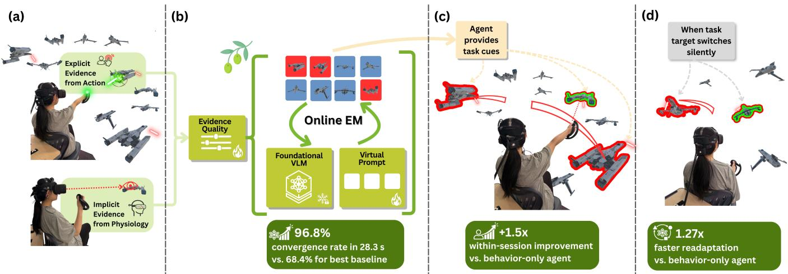  
Figure 1: OLIVE deployed in SpaceShooter, an XR target-identification game. (a) Two evidence streams (explicit: targets shot down; implicit: fixation-locked EEG) feed into an online expectation–maximization (EM) loop. (b) The EM update adapts a virtual prompt atop a frozen vision–language model (VLM), weighting each channel by estimated reliability. (c) Live deployment: OLIVE renders directional line cues toward high-belief targets outside the user’s field of view. (d) Silent target switch: OLIVE-IE guidance reconverges faster than the behavior-only agent, reducing the window of misaligned support.

## Abstract

We present OLIVE, a framework for adapting a foundation model to provide real-time assistance in temporally demanding, high stakes, and dynamic tasks. We show that passive EEG, fused online with behavioral evidence, can meaningfully extend the number of targets users detect and engage beyond their unaided action bandwidth. OLIVE learns from both explicit behavioral signals (the targets the user shoots down in an XR first-person shooter game) and implicit physiological signals (fixation-locked EEG) to provide timely guidance, continuously adapting a frozen vision–language model’s inference on which items are task-relevant by jointly estimating per-source reliability without manual labels or ofline training. Through three user studies, including two live deploy ments of an assistive agent driven by OLIVE in XR, we show that OLIVE Pareto-dominates prior test-time adaptation frameworks, achieving the highest convergence rate at comparable convergence speed. Combining implicit physiological and explicit behavioral signals, the OLIVE agent produces the largest and most reliable

within-session improvement to a user’s ability to detect and en-gage targets, largely independent of the individual’s skill. When the target switches silently, the agent that uses both behavioral and physiological signals reconverges significantly faster than the behavior-only agent (1.27 times faster on average, � = .008), restoring trustworthy guidance at the moment the task changes, precisely when reliable assistance matters most.

## CCS Concepts

• Human-centered computing → Mixed / augmented real ity; Accessibility technologies; Interaction techniques; Collaborative interaction; • Computing methodologies → Online learning settings; Learning from implicit feedback; Mixture models.

## Keywords

human-AI collaboration, brain–computer interface, performance augmentation, online adaptation, EEG, fixation-related potentials, attention-limited tasks, shared autonomy, extended reality, AI agent

## 1 Introduction

Modern work increasingly places people in settings where attention, rather than raw computation, is the bottleneck. Air trafic controllers monitor dense trajectories for emerging conflicts; radi ologists scan images for subtle but consequential signals; security operators must distinguish true threats from distractors under time pressure. Attention failures in these settings carry real costs: vigi lance decrements under sustained load are implicated in mid-air collisions, undetected cancers, and catastrophic process-control failures [53, 84]. What unifies these domains is a common computational structure: candidates exceed what a human can inspect in time, actions must be taken within expiring windows, and the target class may shift without warning. We call these operational vigilance (OV) tasks (defined formally in §2).

Human visual search is fundamentally capacity-limited: recognition degrades under clutter [86], search is guided by selective prioritization rather than exhaustive inspection [87], and even noticed items may go unacted upon due to downstream attentional bottle- necks [76]. A natural response is to add automation, but decades of supervisory control research show the challenge is not simply to automate more; the challenge is to coordinate human and machine behavior without undermining judgment or creating inappropriate reliance [45, 69]. Static alarms and one-shot recommendations are poor fits; what is needed is an assistant that adapts as the task evolves.

Passive brain–computer interfaces (BCI) ofer a promising route. Rather than requiring explicit user commands, passive BCIs infer task-relevant states from naturally occurring neural and physio- logical signals during ongoing interaction [24, 89]. Among these, fixation-aligned neurophysiology is particularly attractive for timecritical search-and-act tasks: electroencephalography (EEG) com ponents elicited during visual search are reliably enhanced for task-relevant targets [15, 60], and pupillometry adds a complementary index of efort [4]. Because these signals can be aligned to natural eye movements during free viewing [13, 42, 68], they pro vide an always-on pre-action readout of what the user may have recognized before they had a chance to act [27, 70].

Yet BCI research has, for decades, framed these interfaces largely as assistive technologies. We build on an active line of work that instead treats BCI as a performance augmentation tool [79]: a copilot that learns from attentional neural signals a user produces in a task, and in real-time, helps the user to handle more than they could manage on their own, without requiring deliberate BCI commands.

Building such a system requires solving a dificult online learning problem. Explicit user behavior is sparse: users act on only a fraction of what they recognize, and the absence of action on an item does not imply it is irrelevant. While implicit physiological signals from recognition can supplement behavior, they are noisy. Existing paradigms each capture part of this but not the whole: Test-time adaptation of foundation models assumes unlabeled vi- sual streams, not human-contingent evidence [18, 39, 71]. Crowdlearning methods handle reliability-weighted annotations but not online visual foundation model adaptation [9, 64]. Reinforcement learning sidesteps the label problem but is far too sample-hungry for settings where opportunities expire in seconds [38, 59]. Closest in spirit are EEG-guided visual search and neurophysiological relevance-feedback systems, which infer relevance from brain sig- nals to steer image triage, retrieval, or generation [10, 25, 40]; but these largely operate over curated or ofline streams rather than doing what we actually need: learning what this user is currently treating as task-relevant, and driving an agent to act on the belief at the same time.

To address this, we introduce OLIVE (Online Latent Inference from Variable Evidence), the algorithmic framework underlying such an agent. OLIVE maintains an evolving posterior over item target-states by fusing behavioral and fixation-locked EEG evidence as they arrive, jointly estimating per-source reliability and adapting a frozen vision–language model (VLM), all within the time budget of the task itself. We instantiate and evaluate this framework across three user studies in a demanding extended reality (XR) first-person shooter game, asking whether OLIVE converges reliably within an active task round (US1), whether the resulting agent improves live task performance (US2), and whether it readapts quickly when the target class shifts silently (US3). Because absolute through-put is dominated by each operator’s individual skill, our primary augmentation outcome is the within-session change in throughput (whether an operator learns to exploit the agent’s guidance as a session unfolds), which isolates the assistance efect from baseline ability.

Our contributions are threefold:

• We introduce OLIVE, a eneral online latent-inference framework that fuses sparse explicit behavioral signals and noisy implicit EEG into a frozen VLM during task execution, jointly estimating per-source reliability weights without manual labels or ofline retrain- ing. OLIVE serves as the backbone of an AI agent for performance augmentation: operating passively as an intelligent copilot, extending operator capability during normal task execution without requiring deliberate BCI commands.

• We show that fixation-locked EEG, incorporated as an implicit evidence channel in OLIVE, achieves 96.8% guidance convergence in 28.3 s (the first third of each 90 s round), Pareto-dominating all single-modality variants and algorithmic baselines in simula- tion, and remains robust under cognitive overload that degrades explicit-only and implicit-only methods.

• We demonstrate across two live-deployment studies that OLIVE-IE (the full model, fusing implicit EEG and explicit behavioral evidence) produces the largest and most reliable within-session improvement: under sustained operational load (US2), OLIVE-IE operators increased target throughput (Δ = +0.031 kills/s, � = .003), independent of shooting skill; and after repeated silent target switches (US3), OLIVE-IE operators improved most on the new target class (Δ = +0.070 kills/s, � = .001), with guidance reconverging 14.7 s faster than the behavior-only agent (� = .008).

Data and code availability. The OLIVE implementation and re-production scripts, together with a de-identified dataset of the fixation-locked EEG and pupil epochs for the study cohort, are available online.1 Each epoch includes the target label, incoming- saccade metadata, per-fixation decoder output probabilities, and condition and round information. The participant-specific EEG decoder is being prepared for separate publication and is not released here; because OLIVE is decoder-agnostic, the released per-fixation probabilities sufice for replication.

## 2 Background

Attention-Limited Tasks and Computational Assistance. Many real-world domains share a common structure: the environment produces a continuous stream of candidates (aircraft trajectories, radiological images, security feeds), the number of candidates exceeds what the operator can inspect before action windows expire, and the relevant target class may shift without explicit notification. We term these operational vigilance (OV) tasks: they extend classical vigilance [51] by requiring not just detection but timely execution. OV tasks recur in air trafic control (ATC) [44], radiology [14], and security triage [8], and share three structural properties:

• Competing concurrency: the number of candidates simultane-ously demanding attention exceeds the user’s inspection band- width [16, 53, 84].

• Limited action window: the user must act on a target within an expiring window, a requirement absent from classical vigilance [51].

• Contextual target shift: what constitutes a target can change mid-task without explicit notification, requiring the user (and any assisting system) to readapt.

Rule-based systems hardcode relevance and produce alert fatigue [35, 37, 53, 69]; deep learning matches expert accuracy [6, 8, 63] but adapts to populations, not individuals, and goes stale silently when task definitions shift [22, 45]. Adaptive and gaze-aware interfaces adjust layout and content to context [48, 57, 75, 78], but optimize how information is presented rather than infer which items are task-relevant from the user’s own evidence. This leaves an open question: can an assistant learn, in real time, what this user is currently treating as relevant?

Online Foundation Model Adaptation. Foundation VLMs such as CLIP [62] provide open-vocabulary representations that generalize across categories without task-specific retraining. Test-time adaptation (TTA) personalizes such models during inference via entropy minimization, prompt tuning, and consistency regularization [18, 39, 71, 92], but assumes the adaptation signal derives from the unlabeled visual stream. A more fitting lineage comes from learning from crowds: Dawid and Skene’s Expectation-Maximization (EM) framework jointly estimates annotator reliability and the latent true label rather than pooling labels [9], and was extended to ML by Raykar et al., who parameterized per-annotator sensitivity and specificity [64]. The mapping to our setting is direct: one annotator is the user’s explicit action (high specificity, positive-only), another is the user’s physiological response at each fixation (denser but noisier, soft-labeled [12]); yet existing crowd-learning models do not account for this structural heterogeneity or the need to update a VLM.

Reinforcement Learning ofers a third framework, updating a policy from task-outcome rewards [11, 21, 36, 38, 54, 59, 91], but is too sample-hungry for our seconds-long windows, and EEG non-stationarity destabilizes the reward signal [19, 26, 81]. Humancentered interactive-AI guidelines [2, 7, 43] assume deliberate, dis-crete input rather than the continuous passive evidence OLIVE exploits. OLIVE occupies the space none of these frameworks cov-ers: online adaptation of a foundation model from heterogeneous, human-contingent evidence using an EM update that runs within the task’s own time budget.

Physiological Signals as Implicit Evidence. That a user acts on only a fraction of the targets they recognize provides a concrete opportunity: the physiological record of a fixation carries evidence of recognition even when no action follows. Fixation-related potentials (FRPs), EEG components time-locked to natural fixation onsets during free viewing, are the primary vehicle, with principled frameworks now available to separating FRP components from overlapping activity of rapid eye movements [12, 13]. Three signals have well-established links to target detection: the N2pc (contralateral posterior negativity, 180–300 ms) marks covert attentional deploy- ment to task-relevant items [15, 49]; the P300 (300–600 ms, parietal) reflects target-category confirmation and tracks the subjective prob- ability that a fixated item is a target [60]; and task-evoked pupillary responses (TEPR, 500–2000 ms) index cognitive efort and evaluative uncertainty [4, 80]. All three are extractable during free viewing without interrupting primary task performance 2.

Prior work shows fixation-locked EEG distinguishes target from distractor fixations above chance from single trials [27, 70]; more broadly, functional near-infrared spectroscopy (fNIRS) and EEG have been applied to workload-adaptive interfaces [33, 55, 72, 73, 82], cognitive state sensing in VR [66], and closed-loop deployment in ATC [3] and threat monitoring [61, 65]. What these systems share is a decode-then-act architecture: none feeds physiological posteriors into an online EM loop that jointly estimates source reliability and updates a visual foundation model—the missing link OLIVE provides.

Shared Autonomy and Task Design. Knowing which items are task-relevant is necessary but not suficient for a useful assistant. Parasuraman and Riley’s automation framework [53], Sheridan’s supervisory-control hierarchy [69], and Horvitz’s mixed-initiative principles [34] establish that efective human–machine teaming requires matching machine initiative to user capacity and system confidence; Lee and See’s trust-calibration model adds that trust must track demonstrated reliability over time, or users will over-rely on a confident-but-wrong system [45]. Shared-autonomy systems have operationalized these principles, including in robotics via BCIdriven shared control [67, 77] and in HCI via passive neural sensing for adaptation [1, 88]; yet all assume a fixed machine policy and do not accommodate an assistant whose model of relevance is itself evolving in real time.

The form of assistance also matters ethically: hard automation erodes situational awareness [69], and covert neural sensing adds the obligation that users must form accurate mental models of what the system infers and when it will act, or implicit use of brain data risks manipulation that undermines the autonomy it is meant to protect [5, 29, 30]; sensing-based approaches to attention and interruptibility management using physiological signals [20, 93] illustrate the design challenges that arise when implicit biosignals govern system behavior. Micro-assists (brief, subtle attentional cues) preserve the user as the final decision-maker while reducing the cost of target localization. We evaluate OLIVE using a controlled XR surrogate task following established methodology in supervisory control and passive-BCI research [3, 50, 61, 65], afording ground truth and experimental control unavailable in real ATC or clinical settings.

## 3 Methods

## 3.1 Problem Statement

We study assistance for operational vigilance (OV) tasks (§2). Because a user acts on only a fraction of recognized items, labeling is structurally incomplete, asymmetric (absent action does not imply irrelevance), and heterogeneous: signals difer in timing, confidence, and semantics; action events are sparse but consequential; fixationlocked EEG arrives earlier but noisier. All adaptation must occur online, within the task’s own time budget.

## 3.2 SpaceShooter: A Surrogate Operational Vigilance Task

We instantiate an OV task as an XR SpaceShooter game in which participants defend a mothership against a mixed fleet of enemy and friendly ships. Targets are enemies at an initial prevalence of $\pi _ { 0 } \approx 0 . 3 0 .$ . Shooting a friendly ship incurs a disproportionately heavier score penalty than missing an enemy, creating an asymmetric cost structure that mirrors real OV domains such as ATC and medical triage. SpaceShooter deliberately instantiates the three defining OV properties of §2: competing concurrency (the fleet size and pace exceeds what a user can engage), limited action windows (each enemy must be acted on before it gets away), and contextual target shift (the appearance of the enemy can change silently). The mechanics are designed to expose these properties under experi-mental control rather than to replicate any single domain; the same three properties recur in ATC, radiology triage, and surveillance, so the OLIVE agent demonstrated here has the capability those use cases demand. While the user is playing SpaceShooter, the OLIVE agent receives spaceship visual data from two scene cameras, ex-plicit trigger-pull events (hereafter “shots”), and EEG-FRP-decoded target probability per spaceship. The agent aids the user by rendering subtle cues pointing to potential enemies. At runtime, a Unity XR frontend streams two 448×448 scene-camera crops per second plus shot and fixation events over gRPC to three Python services: a Vision bridge, the OLIVE inference/EM service, and a PhysioLabXRbased EEG service [47], keeping per-frame belief inference under 10 ms. 3

To maintain operator engagement throughout the session, round dificulty � is adapted using a QUEST+-style Bayesian staircase [85] targeting ≈70% round score: challenging enough to sustain attention, easy enough that participants remain motivated to engage.4 Dificulty directly controls fleet size: each round spawns $( 1 + d ) \times 1 6$ ships, scaling the inference problem alongside task demand. At the start of each SpaceShooter round, OLIVE’s item-level beliefs are cleared and a fresh EM sequence begins, while annotator reliabil- ity parameters and the VLM prompt are warm-started from the previous round.

## 3.3 Visual Search: Calibrating the Physiological Decoder

Before each SpaceShooter session, participants complete a visual search (VS) calibration phase in which they search for and count targets in static arrays under a time budget. Because ground-truth labels are known per array, fixation-locked EEG epochs are labeled and used to train a participant-specific physiological decoder ofline. The EEG pipeline is deliberately standard: raw EEG is bandpassfiltered and baseline-corrected with per-participant eye movement ICA artifact suppression; on each fixation a [−200, +800] ms epoch is locked to fixation onset, its FRP is extracted, and the decoder returns a target probability $\hat { y } _ { i } ^ { \mathrm { p h y s i o } } \in ( 0 , 1 )$ : indicating whether the user believes the fixated item is a target. OLIVE uses this decoder as a black box and is decoder-agnostic: any calibrated per-fixation clas-sifier that returns a target probability can be substituted. Because the OLIVE algorithm continuously estimates each evidence channel’s reliability, it compensates for decoder imprecision without requiring a perfect classifier. If a labeled calibration phase is un- available, the decoder can instead be population-pretrained, since OLIVE already treats it as unreliable by default. Decoder training, FRP characterization, calibration cost, and the rationale for excluding pupil dilation are detailed in Appendix E.5

## 3.4 OLIVE: Online Latent Inference from Variable Evidence

Our core contribution is OLIVE, an online adaptation layer that converts a frozen VLM into a task-personalized assistant by fusing mixed supervision streams during task execution. OLIVE operates at the item level. For each item currently visible in the scene, it maintains a posterior: how likely this item is a target. This posterior is updated as new evidence arrives, which OLIVE does not treat as perfectly accurate, as supervised learning would. Instead, OLIVE models each evidence channel as a noisy annotator with its own semantics and reliability, and jointly updates the posterior over item “targetness”, the reliability of each evidence source, and the VLM that processes visual evidence. The joint update is what makes OLIVE more than a label aggregator: the latent inference layer and the foundation VLM co-adapt, using mixed evidence to refine beliefs, which in turn refine the visual decision boundary that drives the assistive agent. In this section, we describe the core design of the OLIVE algorithm. Appendix C provides a more in-depth look.

Task latent formulation. Let $i \in \{ 1 , . . . . , N \}$ index the items seen so far in the current task. Each item has a latent binary target state $z _ { i } ~ \in ~ \{ 0 , 1 \}$ with prior $P ( z _ { i } { = } 1 ) = \pi ( \pi \approx 0 . 3 0$ in SpaceShooter). OLIVE accumulates three evidence types per item: visual crops $C _ { i }$ an explicit (behavioral) action label $\hat { y } _ { i } ^ { \mathrm { a c t } }$ , and an implicit (physiological) soft label $\hat { y } _ { i } ^ { \mathrm { p h y s i o } }$ , and maintains the posterior $\mu _ { i } = P ( z _ { i } { = } 1 \mid$ $C _ { i } , \hat { y } _ { i } ^ { \mathrm { a c t } } , \hat { y } _ { i } ^ { \mathrm { p h y s i o } } )$ ; these posteriors, representing how likely each item is a target, are the primary output consumed by the downstream assistance layer. We describe each evidence type in turn:

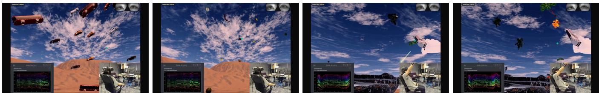  
Figure 2: Task environment. (a,b) Visual Search: Participant searches for and counts targets; EEG labels train the physio decoder. (c) SpaceShooter: Participant aims while OLIVE renders guidance cues to high-belief targets. (d) Shooting yields an explicit action label for OLIVE’s EM update.

Prompt-tuning ofa foundation model as the visual scorer. The visual channel judges how much each item looks like the target. A frozen VLM (CLIP ViT-B/16 [62]) embeds each item’s image crop, and a small learnable “virtual prompt” [92] stands in for a textual description of the target; the item’s visual evidence $\Lambda _ { \mathrm { v i s } }$ is how closely the two match. We freeze the VLM, as a frozen con- trastive VLM is the standard open-vocabulary visual backbone across domains [74, 83, 90], and tune only the virtual prompt, thereby allowing the agent to be steered toward a new target con- cept without hefty retraining. This establishes a parameter-eficient route [41, 46, 71], fast enough to be tuned and served online, and swappable for another backbone.

Explicit evidence from positive-only user actions. When the user engages an item (shoots it down), that is direct evidence the item is a target, contributing an explicit term $\Lambda _ { \mathrm { a c t } }$ . Crucially, not acting on an item is not evidence against it: under load, the user may simply not have reached a recognized target in time, so non-actions are treated as unlabeled rather than negative. OLIVE parameterizes this channel by two intuitive scalars: how reliably the operator acts on true targets, and how often they mistakenly fire on non- targets, both estimated online, so an imprecise user is absorbed as a less-trusted channel rather than as wrong labels.

Implicit evidence from a soft physiological annotator. The instant the operator’s gaze first lands on an item, a fixation-locked EEG epoch is decoded into a soft probability that the item is a target: a pre-action read of recognition, contributing an implicit term Λphysio. Only the first fixation on each item counts, so looking again can not inflate belief. OLIVE treats the decoder as a noisy annotator and estimates online how discriminative its target vs. non-target responses are for this operator in this session, together with a perfixation confidence, so a noisy session degrades gracefully into a down-weighted channel rather than corrupting the posterior.

Why this parameterization. Each channel is characterized by only a handful of interpretable reliability parameters: how much to trust the operator’s actions, and how informative the EEG is. They are all estimated online. This is what lets OLIVE assume imperfection by default: imprecise operators and noisy EEG raise a channel’s inferred uncertainty rather than injecting corrupted evidence, so no single bad channel can derail the belief.

Online EM. OLIVE optimizes its parameters (evidence reliability and VLM virtual prompt) in an EM loop during task execution, triggered whenever the user takes an action or has a new fixation.

E-step. We estimate how likely each item is to be a target in the E-step. That is, for an item �, log-odds accumulate additively over all three evidence channels:

$$
\ell _ { i } = \log \frac { \pi } { 1 - \pi } + \Lambda _ { \mathrm { v i s } } ( i ) + \Lambda _ { \mathrm { a c t } } ( \hat { y } _ { i } ^ { \mathrm { a c t } } ) + \Lambda _ { \mathrm { p h y s i o } } ( \hat { y } _ { i } ^ { \mathrm { p h y s i o } } ) ,\tag{1}
$$

where $\Lambda _ { \mathrm { p h y s i o } }$ contributes only when a fixation has been observed for item �.

In addition, we add a prevalence anchoring step that turns these log-odds into the posteriors $\mu _ { i } { \mathrm { : } }$ it rescales beliefs so the agent always has something to suggest rather than collapsing to silence even when targets are rare. Being the same global shift applied to every item, it leaves the belief ranking, and thus the cues, unchanged, so the exact value of � never afects guidance (Proposition 1).

M-step A: source reliability. Action channel parameters are updated by soft-weighted maximum likelihood with pseudo-count regularization (strength �):

$$
\hat { \alpha } = \frac { \sum _ { i } \mu _ { i } \hat { y } _ { i } ^ { \mathrm { a c t } } + \lambda \alpha ^ { ( 0 ) } } { \sum _ { i } \mu _ { i } + \lambda } , \qquad \hat { \beta } = \frac { \sum _ { i } ( 1 - \mu _ { i } ) \hat { y } _ { i } ^ { \mathrm { a c t } } + \lambda \beta ^ { ( 0 ) } } { \sum _ { i } ( 1 - \mu _ { i } ) + \lambda } .\tag{2}
$$

All seen items contribute to denominators, even those the user did not act on.

Raw estimates are then projected onto the ordered half-space $\alpha \geq \beta ,$ to prevent polarity inversion, and the physiological means $( \nu _ { + } , \nu _ { - } )$ ) are updated by the analogous quality-weighted soft MLE. Because the projection keeps $\alpha \ge \beta$ and $\nu _ { + } ~ \geq ~ \nu _ { - }$ − every round, misidentified reliability never causes an evidence channel to become adversarial (Proposition 2). Together, Propositions 1 and 2 guarantee that OLIVE cannot collapse under any data sequence: the mean posterior is always anchored to �, and all annotator parameters always push posteriors in the semantically correct direction.

M-step B: prompt updates. The virtual prompt $\theta _ { \mathrm { p r o m p t } }$ receives one gradient step minimizing the quality-weighted soft binary crossentropy between the VLM’s crop scores and the current posteriors $\mu _ { i } ;$ the VLM backbone stays frozen, so only the prompt adapts.

## 4 User Study 1 (US1): Convergence and Robustness

US1 is an of-policy evaluation of OLIVE’s estimator across three evidence configurations (E, I, IE) and three model-type baselines (olive-base, TPT [71], TDA [18]). We ask three research questions:

• RQ1.1 Pareto frontier: Does OLIVE-IE occupy a Pareto-superior operating point in the convergence rate × speed space, relative to single-evidence variants and algorithmic baselines?

• RQ1.2 Sensitivity to evidence quality: How sensitive is OLIVE-IE’s convergence to user-level evidence quality (shot accuracy and EEG classifier AUC), compared to single-modality variants and baselines?

• RQ1.3 Overload robustness: Is OLIVE-IE’s convergence robust to cognitive overload where single-modality variants and baselines degrade?

## 4.1 Study Design

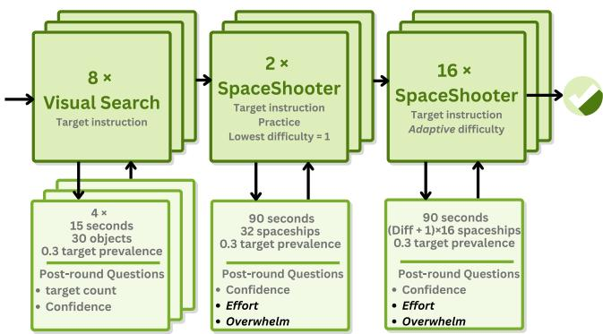  
Figure 3: US1 session structure. Visual Search calibration, two practice rounds, then 16 scored SpaceShooter rounds (90 s each); 18 rounds total.

US1 uses a within-subject ofline replay design to characterize OLIVE across evidence configurations and algorithmic baselines before any live deployment (session structure in Figure 3): E (shots only; EEG-free deployment reference), I (EEG fixation labels only; no shots), IE (both channels; primary condition; E and I are ablations). Three algorithmic baselines receive the same evidence streams as the corresponding OLIVE variant: olive-base (M-step A disabled; reliability weights frozen), TPT (VLM prompt via entropy minimization [71]), TDA (feature-cache retrieval, no backpropagation [18]).

The primary outcomes are belief convergence (OLIVE has formed a stable, correct internal ranking) and guidance convergence: the tighter, user-facing bar: all four ofthe agent’s highlighted items must be true targets, sustained. A model that ranks correctly only occasionally still misdirects the operator; guidance is only trustworthy when the agent is consistently right. At the 30% target base rate, chance guidance precision is roughly 0.3; clearing the bar means an operator can follow the cues with confidence. For- mal thresholds and rationale are in Appendix F. US1 asks whether OLIVE achieves this bar, how quickly, and whether it holds under degraded evidence and cognitive overload.

## 4.2 Participants

� = 57 participants (ages 19 to 35; �¯ = 23.9, � = 3.4 years) com-pleted US1. Participants were recruited from the local university community. All procedures were approved by the Columbia University Institutional Review Board, and all participants provided written informed consent prior to participation. Participants re- ported normal or corrected-to-normal vision. All completed the vi- sual search calibration phase, providing participant-specific physio decoders.

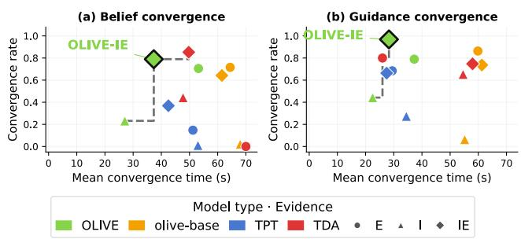  
Figure 4: OLIVE-IE occupies the upper-right corner of the convergence rate × speed space for both belief and guidance convergence (� = 57; 5 seeds). No other variant or baseline simultaneously matches its rate and speed. Best viewed in color.

## 4.3 Results and Discussion

4.3.1 RQ1.1: OLIVE Sits at the Pareto Frontier. OLIVE-IE achieves the highest guidance convergence rate of all models (96.8%, � = 92/95 rounds; 28.3 s), dominating the closest rate competitor (olivebase-E: 86.3%, 59.9 s) and the fastest baseline (TPT-E: 29.5 s but 68.4%). TDA-E ranks well (80.0% at 26.0 s) yet registers zero belief convergence: its top-4 is often correct while its scores never reach the AUC > 0.90 threshold, ranking without a calibrated belief. For belief convergence, OLIVE-IE (78.9%, 37.3 s) is the fastest model on the high-rate frontier (TDA-IE: 85.3% but 49.7 s). No variant or baseline matches OLIVE-IE on both metrics (RQ1.1).

OLIVE-IE locks onto the correct target set within the first third of the round in 97% of rounds (92/95; mean 28.3 s of 90 s), giving users trustworthy agent support for the rest of the round, and no user’s shooting skill or EEG quality changes that.

4.3.2 RQ1.2: Sensitivity to Evidence Quality. OLIVE (E and IE variants) shows no sensitivity to shot accuracy (all $| r | < 0 . 3 2 , p > . 2 0 )$ while olive-base-E’s belief convergence time rises significantly with shot accuracy $( r = 0 . 5 6 4 , p = . 0 1 5 )$ . OLIVE-IE’s guidance conver-gence rate additionally improves with higher EEG quality (� = 0.717, � < .001), a positive dependency confirming the implicit channel’s contribution.

Splitting participants by median ofline validation AUC (cut = 0.77; Table 1; 95 rounds per variant) shows OLIVE-I drops from 53% to 36% guidance convergence with low EEG (Fisher $ { p } = . 0 6 8 )$ , while OLIVE-IE holds at 94%–100% $( p = . 1 4 , \mathrm { n } . s . )$ : M-step A suppresses $\Lambda _ { \mathrm { p h y s i o } }$ when $\hat { \nu } _ { + } - \hat { \nu } _ { - }$ − collapses, falling back to behavioral evidence before corrupted posteriors accumulate (RQ1.2).

Table 1: Guidance convergence rate by EEG quality group (median ofline validation AUC split, cut = 0.77). $\dag p < . 1 0 ,$ one-sided Fisher exact.
<table><tr><td>Model</td><td>Low EEG</td><td>High EEG</td><td> $\Delta \left( \mathrm { L o w - H i g h } \right)$ </td><td>p</td></tr><tr><td>OLIVE-I</td><td>36%</td><td>53%</td><td> $1 7 \mathrm { p p }$ </td><td> $. 0 6 8 ^ { \dagger }$ </td></tr><tr><td>OLIVE-IE</td><td>94%</td><td>100%</td><td>6pp</td><td>.14</td></tr></table>

4.3.3 RQ1.3: User Overload’s Efect on Model Performance. Using Spearman correlations and mixed-efects models (� = 57 partici pants): OLIVE-I shows a significant positive correlation between overwhelm and guidance convergence time $( \rho = 0 . 5 3 9 , \rho = . 0 2 1 )$ more overwhelm predicts a longer time to converge, consistent with overload degrading the attentional signals that drive the EEG evidence. olive-base-E shows the complementary failure: workload significantly predicts lower belief convergence rate $( r = - 0 . 5 6 4 ,$ $p = . 0 1 5 )$ , degrading the explicit channel. OLIVE-IE shows no significant relationship with any overload metric (all $| \rho | < 0 . 2 5 , p > . 1 1 )$ (RQ1.3).

OV tasks demand the most from a user at precisely the moments when individual judgment is most fragile, and this is exactly when OLIVE-IE is most indispensable. Operator fail ure concentrates at moments of peak cognitive load, exactly when single-modality systems also fail; OLIVE-IE is immune because the channels fail through independent mechanisms. Participants reflected this, shifting toward agent reliance as rounds progressed (“I often start with shooting by myself and then follow the agent $l a t e r " : \mathrm { P 3 4 } )$ , trusting the model for harder decisions as convergence arrived.

## 5 User Study 2 (US2): Live Agent Performance

US2 asks whether OLIVE’s convergence behavior is preserved in live deployment and whether it translates to measurable operational benefit. We frame US2 around two exploratory research questions rather than confirmatory hypotheses:

• RQ2.1 Convergence in live deployment: Does OLIVE achieve comparable or superior guidance convergence rates and speeds in live deployment (US2) relative to ofline simulation (US1)? Active collaboration between the user and the agent generates richer behavioral evidence than the fixed ofline replays in US1, which may strengthen rather than disrupt convergence.

• RQ2.2 EEG-augmented throughput advantage: Does OLIVE-IE produce within-session target throughput improvement inde pendent of operator shooting skill, and does OLIVE-E benefit high-skill operators disproportionately? Fixation-locked EEG re-sponses occur regardless of shooting precision, which could make the implicit channel’s contribution skill-independent.

## 5.1 Study Design

US2 uses a between-subjects design with OLIVE deployed live; conditions are assigned once at session start to prevent belief contamination across conditions. The VS calibration and adaptive dificulty protocol are identical to US1. Participants were blind to condition assignment (single-blind design). Unlike US1, US2 uses TimeScaledRespawn: a destroyed ship immediately respawns, keeping the battlefield populated throughout each 120 s round (15 SS rounds: 2 acclimation + 13 adaptive-dificulty).

Conditions and assignment. Control and Oracle bracket the performance range (unaided baseline and assistance operating on the ground-truth); IE is the primary OLIVE condition (Pareto-dominant in US1); E is retained as the EEG-free deployment baseline.

Primary outcome metric. We measure target throughput: confirmed target kills per 120 s round, computed from per-round shot- event logs. Fractional coverage (kills / targets present) is unsuitable in TimeScaledRespawn because destroyed targets immediately respawn, growing the denominator with performance; throughput uses fixed time as the denominator and avoids this bias.

Statistical approach. All between-condition comparisons use Welch’s �-test (no equal-variance or equal-size assumption); within condition improvement uses one-sample �-tests against zero; linear mixed-efects (LME) models with by-participant random intercepts handle the imbalance through their likelihood framework.

## 5.2 Agent Support Policies: Visual Guidance Cues.

The OLIVE agent (presented to participants as their “wingman”) withholds all guidance when OLIVE’s beliefs are still in flux; actively misleading users with uncertain cues is worse than no guidance at all. Once beliefs concentrate suficiently, three cue modalities acti- vate: out-of-view directional lines (inspired by [31, 32]) pointing toward high-belief targets outside the user’s gaze, outline highlights on in-view suspects, and aim assist that engages when the user’s crosshair approaches a top-ranked target. Cue intensity is graded continuously by belief strength, requiring no task-specific calibration. Concretely, per-item posteriors are exponential moving average (EMA)-smoothed and gated on their spread: if the P90−P50 gap of the belief distribution is below a small threshold, the agent stays silent (an uncertain agent misleads); otherwise items above the median receive graded soft cues and the top-4 ranked items receive hard cues (sticky top-4, matching the Precision@4 guidance metric).

Oracle cueing and cue density. The Oracle baseline ignores OLIVE’s beliefs and marks every currently-attacking ground-truth target ship (a ship within bombing range, ≈30 u (Unity units) of the player) using the same indicators. OLIVE (E/IE) instead applies hard cues only to its top-4 (�=4) ranked items, plus continuously graded soft cues. Per frame, this is roughly an order of magnitude fewer salient cues than Oracle, which marks all live attacking targets (tens of ships at once); cue density is thus not matched across conditions. Crucially, this denser Oracle cueing did not raise reported overwhelm (post-round overwhelm ratings are comparable across all conditions, with none elevated), because the cues are deliberately subtle and nonoccluding (thin out-of-view lines, outline highlights, graded aim-assist) rather than screen-filling markers. Full algorithmic details (suppression threshold, quantile mapping, smoothing) are in Appendix D.

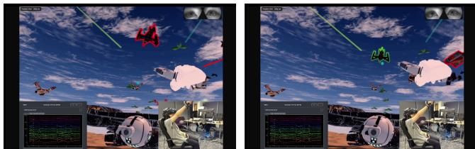  
Figure 5: Agent cues. Left: out-of-view directional lines toward high-belief targets. Right: aim-assist highlight on OLIVE’s top-ranked item.

## 5.3 Participants

� = 46 participants who had completed US1 returned for US2 (ages 19 to 35), with a minimum 4-day washout between sessions. Conditions were assigned online by covariate-adaptive minimization (Pocock–Simon style [58]) on each operator’s US1 starting dificulty as a skill proxy placing each arriving participant in the least-populated condition within their dificulty stratum (Appendix H.2). This balances baseline ability across conditions rather than raw counts, so cell sizes are unequal by design; the per-condition (and per-analysis) � are reported with each table. A one-way ANOVA on adaptive dificulty confirmed no diference between conditions (max $F = 1 . 9 9 , p = . 1 3 )$ , so the imbalance afects statistical power, without introducing bias, plus the primary outcomes are within-person changes, for which each operator is their own baseline.

## 5.4 Results and Discussion

5.4.1 RQ2.1: OLIVE Guidance Convergence Is Maintained in Live Deployment. A key question is whether active user participation alters the agent’s convergence behavior relative to the ofline sim- ulation in US1. Table 2 compares per-round guidance and belief convergence rates between US1 (ofline simulation) and US2 (live deployment).

Both IE and E achieve near-total guidance convergence in the live task (IE 99.4%, E 97.1%), matching or exceeding US1 benchmarks of 96.8% (IE) and 79.0% (E). Belief convergence rates also improve (IE: 84.6% vs. 78.9%; E: 82.9% vs. 70.5%), consistent with denser behavioral evidence from live operator decisions. Convergence times are longer than US1 (IE guidance: 74.5 vs. 28.3 s), expected given the more demanding live environment (continuous fleet turnover, escalating dificulty). Convergence thus occupies a larger fraction of the 120 s live rounds than in ofline replay (≈62% vs. a third); the remaining post-convergence window is nonetheless suficient to produce the throughput gains reported in §5.4.2. Active deploy ment thus does not disrupt convergence rates despite the harder conditions (RQ2.1).

Table 2: OLIVE convergence: US2 live deployment vs. US1 ofline simulation. Times are mean ± SE (seconds).
<table><tr><td>Cond.</td><td>Type</td><td>US2 Rate</td><td>US2 Time</td><td>US1 Rate</td><td>US1 Time</td></tr><tr><td>IE</td><td>Guidance</td><td>99.4%</td><td>74.5 ± 4.2</td><td>96.8%</td><td> $2 8 . 3 \pm 2 . 1$ </td></tr><tr><td>IE</td><td>Belief</td><td>84.6%</td><td> $6 5 . 3 \pm 4 . 2$ </td><td>78.9%</td><td> $3 7 . 3 \pm 2 . 3 $ </td></tr><tr><td>E</td><td>Guidance</td><td>97.1%</td><td> $7 6 . 2 \pm 4 . 8$ </td><td>79.0%</td><td> $3 7 . 3 \pm 3 . 5$ </td></tr><tr><td>E</td><td>Belief</td><td>82.9%</td><td> $6 3 . 0 \pm 4 . 7$ </td><td>70.5%</td><td> $5 3 . 2 \pm 3 . 0$ </td></tr></table>

5.4.2 RQ2.2: OLIVE-IE Produces Reliable Within-Session Throughput Improvement.

Within-session improvement. Table 3 reports mean target through-ut in the first three and last three rounds of each session. OLIVE-IE shows the largest within-session improvement and is the only condition reaching significance $( \Delta = + 0 . 0 3 1$ kills/s, one-sample $\begin{array} { r } { p = . 0 0 3 ) } \end{array}$ OLIVE-E and Control show marginal positive trends $\mathit { \Omega } ( p \ = \ . 0 9 4$ and $\mathnormal { p } = \mathnormal { . 0 9 1 } )$ ; Oracle’s improvement did not reach significance $( \Delta = + 0 . 0 2 4 , p = . 1 0 5 )$ . Crucially, OLIVE clears its per-item beliefs at the start of every round (§3.2); only the prompt and reliability weights carry over. The within-session throughput improvement therefore reflects operator-side learning: over repeated rounds, participants learn to read and act on OLIVE’s within-round guidance cues more eficiently, trusting the highlight and aim-assist earlier within each round. Oracle’s non-significant delta is consistent with this interpretation: ground-truth guidance is reliable from second 1 of every round, so there is nothing for the operator to calibrate: no latency in useful cues, no need to wait for the agent to converge, and therefore no ramp-up of exploitation across rounds.

Table 3: Target throughput (kills/s) early vs. late in session (±SE). †� < .10, $* p < . 0 5 , * * p < . 0 1 ;$ one-sample �-test against zero.
<table><tr><td>Condition</td><td>n</td><td>Early</td><td>Late</td><td>Δ</td><td>p</td></tr><tr><td>Control</td><td>12</td><td> $. 1 1 2 \pm . 0 1 6$ </td><td> $\overline { { . 1 2 6 \pm . 0 1 9 } }$ </td><td>+.014 ± .007</td><td> $\overline { { . 0 9 1 ^ { \dag } } }$ </td></tr><tr><td>OLIVE-E</td><td>10</td><td> $. 0 8 0 \pm . 0 0 6$ </td><td> $. 1 0 1 \pm . 0 1 3$ </td><td>+.021 ± .010</td><td>.094†</td></tr><tr><td>OLIVE-IE</td><td>12</td><td> $. 0 7 7 \pm . 0 0 9$ </td><td> $. 1 0 8 \pm . 0 0 8$ </td><td>+.031 ± .007</td><td>.003**</td></tr><tr><td>Oracle</td><td>8</td><td> $. 0 4 7 \pm . 0 1 2$ </td><td> $. 0 7 1 \pm . 0 0 8$ </td><td> $+ . 0 2 4 \pm . 0 1 3$ </td><td>.105</td></tr></table>

OLIVE-IE improves uniformly across skill levels. Table 4 correlates each participant’s baseline shooting precision with within-session improvement. OLIVE-IE’s gain is essentially orthogonal to baseline skill (low- and high-precision operators improve equally, consistent with the agent compensating for whatever the operator cannot cover), whereas OLIVE-E’s improvement concentrates among lower-skill operators for whom shot-pattern guidance helps most.

Table 4: Skill moderation: correlation between baseline hit rate and Δ throughput. Negative � = lower-skill participants improve more.
<table><tr><td>Condition</td><td>n</td><td>r</td><td>slope</td><td>p</td></tr><tr><td>Control</td><td>12</td><td>+0.25</td><td>+0.137</td><td>.43</td></tr><tr><td>OLIVE-E</td><td>10</td><td>-0.63</td><td>-0.457</td><td>.05</td></tr><tr><td>OLIVE-IE</td><td>12</td><td>-0.02</td><td>-0.010</td><td>.95</td></tr><tr><td>Oracle</td><td>8</td><td>+0.06</td><td>+0.048</td><td>.90</td></tr></table>

Together these address RQ2.2: OLIVE-IE’s within-session gain is significant and skill-independent, while OLIVE-E’s concentrates among lower-skill operators.

Operators follow the agent’s cues. A direct measure of augmentation is whether operators actually act on OLIVE’s guidance. After each round, participants rated, on a 1–7 scale, how much they trusted the agent (q\_trust), relied on it to look at targets (q\_rely\_look), and relied on it when shooting (q\_rely\_shoot). Table 5 reports per-condition means for both live-deployment studies. Reliance and trust increase monotonically from Control to OLIVE-E to OLIVE-IE to Oracle in US2, and the same ordering holds in US3, where OLIVE-IE exceeds OLIVE-E on all three items. In US2, Oracle reaches statis- tical separation from Control on agent trust $( t = 2 . 6 9 , p = . 0 4 3 )$ and gaze reliance $( t = 2 . 9 7 , p = . 0 3 9 )$ . OLIVE-IE’s higher gaze-reliance than OLIVE-E (US2 3.90 vs. 2.99; US3 4.23 vs. 3.44) indicates that EEG-informed guidance produces more directionally specific cues that operators find worth following, corroborating the throughput advantage.6

Table 5: Post-round operator trust and reliance ratings (1–7 scale, per-condition mean) for US2 and US3. Control omitted (no agent to rate). Bold = highest per column.
<table><tr><td>Condition</td><td>n</td><td>Trust</td><td>Rely (look)</td><td>Rely (shoot)</td></tr><tr><td>User Study 2 (live deployment)</td><td></td><td></td><td></td><td></td></tr><tr><td>OLIVE-E</td><td>12</td><td>3.89</td><td>2.99</td><td>4.62</td></tr><tr><td>OLIVE-IE</td><td>12</td><td>3.95</td><td>3.90</td><td>4.64</td></tr><tr><td>Oracle</td><td>8</td><td>4.80</td><td>4.35</td><td>5.07</td></tr><tr><td>User Study 3 (silent target change)</td><td></td><td></td><td></td><td></td></tr><tr><td>OLIVE-E</td><td>13</td><td>3.91</td><td>3.44</td><td>4.62</td></tr><tr><td>OLIVE-IE</td><td>11</td><td>4.57</td><td>4.23</td><td>5.06</td></tr><tr><td>Oracle</td><td>8</td><td>4.76</td><td>4.64</td><td>4.82</td></tr></table>

OLIVE-IE delivers the largest, skill-independent withinsession improvement, and operators increasingly act on its guidance as the session unfolds. US3 tests whether OLIVE maintains this partnership when the target definition itself changes without warning.

## 6 User Study 3 (US3): Adapting to Silent Target Changes

US1 and US2 established that OLIVE converges reliably and that convergence translates to operational benefit under sustained load. US3 asks a harder question: what happens when the target changes mid-round, without warning and without any system reset? Real OV scenarios routinely demand this kind of reorientation (e.g., an air-trafic controller reassigned to a diferent sector or a medic whose patient profile changes), and any viable agent must handle it without collapsing or requiring manual recalibration.

As in US2, we frame US3 around exploratory research questions:

• RQ3.1 Faster model reconvergence: Does OLIVE-IE achieve shorter post-switch guidance and belief reconvergence times, and higher reconvergence rates, than OLIVE-E? Fixation-locked EEG responses during the operator’s perceptual reorientation begin shifting model priors before any confirming shot fires, potentially providing an earlier reconvergence signal than behavioral feed- back alone.

• RQ3.2 Within-session readaptation: Does OLIVE-IE show within-session improvement in new-target throughput across repeated switch exposures? Since beliefs reset each round (§3.2), crossround improvement reflects operator-side learning.

• RQ3.3 EEG augmentation advantage: Does OLIVE-IE show a larger within-session throughput gain than OLIVE-E? Ifthe advantage is EEG-driven, behavioral-only learning (OLIVE-E) should show a smaller gain, isolating the implicit channel’s operational contribution.

## 6.1 Study Design

US3 shares the between-subjects design (Control, Oracle, E, IE) and VS calibration protocol with US2. At a prespecified time within each round, the enemy signature changes without visible system feedback: the current target type becomes friendly and a previ- ously ignored type becomes the new target. Participants were not informed that a switch would occur and had to infer it from information such as ship’s attacking behavior and the scores. During a round, the target switch happens at one of 75, 90, 105s, randomly drawn. Rounds are lengthened from US2’s 120 s to 200 s so that even the latest switch (105 s) leaves a ≥95 s post-switch window. OLIVE receives no explicit reset signal: readaptation must emerge from shifts in the evidence streams.

Primary outcome metric. We measure new-target throughput: confirmed hits on the new target category per second in the post- switch window (second\_target\_shot $^ { \prime } \left( 2 0 0 - t _ { \mathrm { s w i t c h } } \right)$ s), computed per round. Because switch times are balanced across rounds (three rounds at each of 75, 90, and 105 s), participant-level means are un-confounded by the switch timing distribution. Absolute post-switch hit counts cannot serve as the primary metric: an earlier switch yields a proportionally longer post-switch window and therefore mechanically more hits, independent of how well the participant re- oriented. The same statistical approach as US2 applies here: unequal condition sizes (reported per table) are handled by Welch’s �-tests for between-condition comparisons and by the LME likelihood framework (see US2 Study Design, Statistical approach).

## 6.2 Participants

� = 45 participants who had completed US2 returned for US3 (ages 19 to 30), with a minimum 4-day washout between sessions; participants were naive to the existence of a target switch prior to the study. Conditions were assigned by the same covariate-adaptive minimization as US2 (Appendix); a one-way ANOVA on adaptive dificulty again confirmed no diference between conditions (max $F = 0 . 2 2 , p = . 8 8 )$ , so the unequal cells afect power, not bias.

## 6.3 Results and Discussion

6.3.1 RQ3.1: OLIVE-IE Reconverges Faster After the Switch. As a validity check, near-universal switch detection was observed across all conditions (Control: 100%; E: 98.6%; IE: 100%; Oracle: 100%), confirming that any performance diferences reflect reorientation ability, not unawareness.

Table 6 reports formal post-switch reconvergence using the same criteria as US1 and US2. Both conditions achieve 100% guidance reconvergence (Precision@4 = 1.0 and top-4 ranking stability ≥ 0.75, sustained ≥ 10 s; Appendix F); OLIVE-IE does so 14.7 s faster on average $( 5 3 . 8 \pm 4 . 1 \mathrm { { s v s . } } 6 8 . 5 \pm 3 . 8 \mathrm { { s ; } } t = - 2 . 6 7 , \dot { p } = . 0 0 8 ^ { \ast \ast } )$ . For belief reconvergence (additionally requiring belief spread ≥ 0.02), OLIVE-IE succeeds in more rounds (56% vs. 37%) and with a shorter mean time $( 2 5 . 1 \pm 4 . 0 \mathrm { s } \mathrm { v s } . 3 0 . 7 \pm 5 . 6 \mathrm { s } )$ , though the time diference is not significant $( t \ = \ - 0 . 8 1 , p \ = \ . 4 1 8 )$ . EEG provides a leading signal: fixation-locked responses during the participant’s own perceptual reorientation begin shifting the model’s priors before any confirming shot on the new target arrives. This addresses RQ3.1: with the expanded sample, OLIVE-IE’s guidance reconvergence is significantly faster than the behavior-only agent.

Table 6: Post-switch formal reconvergence (OLIVE-E: �=10; $\mathbf { O L I V E - I E } \colon n { = } 1 0 )$ . Times are mean ± SE (seconds). $* * p < . 0 1 .$
<table><tr><td rowspan="2">Cond.</td><td colspan="2">Guidance</td><td colspan="2">Belief</td></tr><tr><td>Rate</td><td>Time (s)</td><td>Rate</td><td>Time (s)</td></tr><tr><td>OLIVE-E</td><td>100%</td><td> $6 8 . 5 \pm 3 . 8$ </td><td>37%</td><td> $\overline { { 3 0 . 7 \pm 5 . 6 } }$ </td></tr><tr><td>OLIVE-IE</td><td>100%</td><td> $5 3 . 8 \pm 4 . 1$ </td><td>56%</td><td> ${ 2 5 . 1 \pm 4 . 0 }$ </td></tr><tr><td>IE vs. E</td><td>一</td><td> $\overline { { t = - 2 . 6 7 , \ p = . 0 0 8 ^ { \ast \ast } } }$ </td><td>一</td><td> $\overline { { t = - 0 . 8 1 , \ p = . 4 1 8 } }$ </td></tr></table>

Faster model reconvergence has a direct behavioral consequence: as OLIVE-IE’s guidance becomes reliable sooner after each switch, the operator–agent team builds a cumulative reorientation advan- tage across repeated exposures.

6.3.2 RQ3.2: OLIVE-IE Produces Reliable Within-Session Readaptation. Table 7 reports new-target throughput in the first three and last three rounds of each session. OLIVE-IE shows the largest within-session improvement $( \Delta = + 0 . 0 7 0$ kills/s, one-sample $p = . 0 0 1 ^ { * * } )$ . Oracle also improves significantly $( p = . 0 1 2 ^ { * } )$ , consistent with participants learning to follow the agent’s immediate reorientation cue more eficiently across repeated switches; OLIVE-E and Control show positive, marginal trends $\left( \boldsymbol { p } = . 0 5 2 ^ { \dagger } \right.$ and $p = . 0 6 1 ^ { \dagger } )$ .

Table 7: New-target throughput (kills/s in post-switch window) early vs. late session. $\dag p < . 1 0 , \ast p < . 0 5 , \ast \ast p < . 0 1$
<table><tr><td>Condition</td><td>n</td><td>Early</td><td>Late</td><td>Δ</td><td>p</td></tr><tr><td>Control</td><td>12</td><td> $\overline { { 0 . 2 0 9 \pm 0 . 0 2 9 } }$ </td><td> $\overline { { 0 . 2 3 3 \pm 0 . 0 3 1 } }$ </td><td> $+ 0 . 0 2 4 \pm 0 . 0 1 1$ </td><td> $\overline { { . 0 6 1 } ^ { \dag } }$ </td></tr><tr><td>OLIVE-E</td><td>13</td><td> $0 . 2 1 5 \pm 0 . 0 1 6$ </td><td> $0 . 2 4 9 \pm 0 . 0 1 0$ </td><td> $+ 0 . 0 3 4 \pm 0 . 0 1 5$ </td><td> $. 0 5 2 ^ { \dagger }$ </td></tr><tr><td>OLIVE-IE</td><td>12</td><td> $0 . 1 9 6 \pm 0 . 0 1 4$ </td><td> $0 . 2 6 6 \pm 0 . 0 2 1$ </td><td> $\mathbf { + 0 . 0 7 0 \pm 0 . 0 1 2 }$ </td><td> $. 0 0 1 ^ { \ast \ast }$ </td></tr><tr><td>Oracle</td><td>8</td><td> $0 . 3 6 0 \pm 0 . 0 1 5$ </td><td> $0 . 4 0 6 \pm 0 . 0 1 9$ </td><td> $+ 0 . 0 4 6 \pm 0 . 0 0 8$ </td><td> $. 0 1 2 ^ { * }$ </td></tr></table>

Skill moderation. OLIVE-IE’s improvement is essentially skillindependent $( r = - 0 . 2 4 , p = . 5 7 ;$ Table 8), as in US2 $( r = - 0 . 0 2 ) ;$ unaided Control’s readaptation gain, by contrast, is strongly skilldependent $( r = + 0 . 6 8 , p = . 0 1 ) \colon$ without agent support, eficient readaptation is largely confined to higher-skill operators. EEG-augmented guidance thus benefits operators largely regardless of shooting precision.

Table 8: Skill moderation in US3: correlation between baseline hit rate and Δ new-target throughput.
<table><tr><td>Condition</td><td>n</td><td>r</td><td>slope</td><td>p</td></tr><tr><td>Control</td><td>12</td><td>+0.68</td><td>+0.928</td><td>.01*</td></tr><tr><td>OLIVE-E</td><td>13</td><td>-0.11</td><td>-0.148</td><td>.73</td></tr><tr><td>OLIVE-IE</td><td>12</td><td>-0.24</td><td>-0.260</td><td>.57</td></tr><tr><td>Oracle</td><td>8</td><td>+0.42</td><td>+0.560</td><td>.30</td></tr></table>

6.3.3 RQ3.3: EEG Integration Produces a LargerWithin-Session Gain. The readaptation advantage is specifically EEG-driven: OLIVE-IE’s within-session gain exceeds OLIVE-E’s, while OLIVE-E does not clearly separate from Control (Table 7). This addresses RQ3.3: the behavioral channel alone leaves a shorter window of reliable guid- ance per switch, giving the operator less consistent experience with reliable guidance and therefore less opportunity to learn to exploit it across rounds.

## 7 Discussion and Future Work

An OLIVE agent learns, in real time, from a user’s physiology and behavior and readapts as priorities shift. We discuss what this means beyond the immediate setting.

Efective human–AI teaming requires the agent to earn the user’s trust through demonstrated alignment with user intent, not through preassigned configuration. Traditional automation fixes roles at design time; OLIVE inverts this by building trust incrementally: operators relied on it to decide where to look progressively more from Control to OLIVE-E to OLIVE-IE across the session (Table 5). This reliance grew within each session: operators relied on the agent more from round to round (Figure 6), the behavioral signature of within-session augmentation. The pattern is most diagnostic under the silent target switch (US3), where gaze-reliance on the EEG-informed agent kept climbing (+0.07 rating units per round, $ { p } < . 0 5 )$ while reliance on the behavior-only agent eroded. Preserving human agency at the decision boundary also appears critical [5, 30]: despite continuous ground-truth guidance, Oracle did not out-improve OLIVE-IE within-session (US2 � = .105, n.s.; US3 $\Delta = + 0 . 0 4 6$ vs. OLIVE-IE’s +0.070) and drew the highest frustration in US3 $( M = 5 . 3 3$ vs. $M = 3 . 2 – 3 . 5$ for C/E/IE). Oracle’s always-correct cues leave the operator little to calibrate, consistent with Lee and See’s [45] prediction that trust calibrated to demonstrated reliability outperforms trust granted by design.

OLIVE’s reliability weights provide a principled path toward tasktunable precision–coverage trade-ofs. OLIVE’s per-source reliability weights can be initialized conservatively or updated asymmetrically, shifting from coverage-maximizing to precision-first behavior without structural changes. The E and IE conditions al ready mark two points on this curve: OLIVE-E’s improvement concentrated among lower-skill operators while OLIVE-IE’s was essentially skill-independent, making the evidence-fusion posture an explicit, auditable design parameter rather than an implicit prop- erty of training data [53]. OLIVE-E (no neural hardware) sufices for predominantly lower-skill pools; OLIVE-IE is needed for consistent gains across the full skill spectrum.

The weaker compensatory OLIVE-E efect in US3 $( r = - 0 . 1 1$ ns, vs. $r = - 0 . 6 3$ in US2) is mechanistically informative: OLIVE-E must first detect the silent switch from shifting shot patterns, which lower-precision operators muddy, whereas IE’s fixation-locked EEG signals perceptual reorientation independent of shot accuracy.

The gap from lab to field is a design problem about what constitutes suficient evidence, not necessarily a signal-processing one. These properties recur across operator settings such as surveillance, radiology, and ATC. OLIVE assumes three conditions each deployment must revalidate: (1) a known target prevalence � for anchoring posteriors, (2) fixation-to-item alignment for EEG epoch extraction, and (3) a confirmation signal (trigger pull) for positive labels; domains vary on all three (radiology lacks explicit confirmation, ATC has coarser fixation mapping, surveillance may have unknown prevalence). Portable EEG simulation (Appendix E.9) sug- gests the signal-processing bar is clearable with consumer hardware, and passive-BCI deployments in live ATC [3] and biocybernetic loops without explicit confirmation [61] show conditions (2) and (3) are achievable. The harder open problem is condition (1): unknown or drifting prevalence needs adaptive anchoring beyond OLIVE’s fixed �; richer hierarchical interfaces would also extend OLIVE’s binary posterior to multi-class beliefs, and visually subtle domains such as radiology would swap in a domain-pretrained frozen backbone (e.g., BiomedCLIP [90]).

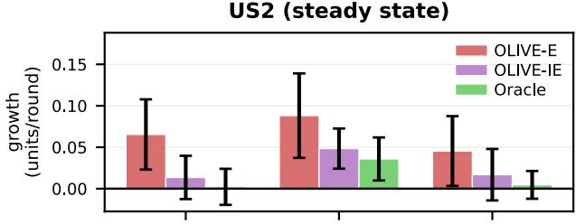

US3 (silent target switch)  
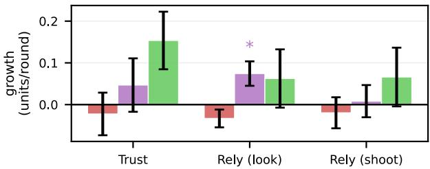  
Figure 6: Within-session reliance growth by condition: perparticipant slope of each post-round rating (Trust, Rely-look, Rely-shoot) regressed on round index, averaged per condition (mean ± SE; ∗� < .05, one-sample �-test of slope ≠ 0). Positive values indicate operators relied on the agent more as the session progressed.

Several extensions would deepen the evidence base and broaden applicability. Multi-fixation fusion captures value the current ar-chitecture discards: US1 used only the first fixation yet reached 96.8% guidance convergence. The reliability weighting is channelcount agnostic, so dwell time, voice annotation, pupil dilation, or a response-locked ERN channel (Appendix E.8) needs only a compatible soft annotator.

Limitations. Three further caveats bound our claims. We release the EEG decoder’s per-fixation output probabilities alongside the code and data, and OLIVE is decoder-agnostic: its self-gating tolerates below-median decoders (Table 1), so replication needs only a compatible per-fixation classifier. Our samples remain modest for between-subjects contrasts (�=8–14 per condition in US2/US3); we therefore frame US2/US3 as exploratory and anchor claims on within-person change. Finally, OLIVE’s fixed prevalence anchor � is untested under drifting prevalence; because � rescales posterior magnitudes without altering the belief ranking (§3.4), we expect guidance to remain robust, but an online prevalence estimator is left to future work.

## 8 Conclusion

We resented OLIVE, an online latent-inference framework that fuses fixation-locked EEG with behavioral evidence to adapt a VLM within each task round. Three user studies show reliable conver- gence across the full range ofuser skill, substantial operational gains from a live agent acting on those beliefs, and real-time readapta- tion to silent, unannounced target switches. The core lesson is that in attention-limited tasks, the AI should earn authority through demonstrated alignment with operator intent rather than be given it through configuration, opening a design space for passive neural copilots wherever human attention is the binding constraint.

## Acknowledgments

We thank Nicholas Papadopoulos and Bettina Schlager for insightful discussions and feedback, and Yunzhu Li for helpful feedback in the early stages of this work. This research was supported in part by the Air Force Ofice of Scientific Research (FA9550-22-10337), the Army Research Laboratory (W911NF-19-2-0139, W911NF-19- 2-0135, W911NF-21-2-0125), and the U.S. Department of Defense (N00014-20-1-2027).

## References

[1] Daniel Afergan, Evan M. Peck, Erin T. Solovey, Andrew Jenkins, Samuel W. Hincks, Eli T. Brown, Remco Chang, and Robert J. K. Jacob. 2014. Dynamic Dificulty Using Brain Metrics of Workload. In Proceedings of the SIGCHI Conference on Human Factors in Computing Systems (CHI ’14). ACM, 3797–3806. doi:10.1145/2556288.2557230

[2] Saleema Amershi, Dan Weld, Mihaela Vorvoreanu, Adam Fourney, Besmira Nushi, Penny Collisson, Jina Suh, Shamsi Iqbal, Paul N. Bennett, Kori Inkpen, Jaime Teevan Ruth Kikin-Gil and Eric Horvitz. 2019. Guidelines for Human AI Interaction. In Proceedings ofthe 2019 CHI Conference on Human Factors in Computing Systems (CHI ’19). ACM, 1–13. doi:10.1145/3290605.3300233

[3] Pietro Aricò, Gianluca Borghini, Gianluca Di Flumeri, Alfredo Colosimo, Stefano Pozzi, and Fabio Babiloni. 2016. A passive brain–computer interface application for the mental workload assessment on professional air trafic controllers during realistic air trafic control tasks. In Progress in Brain Research. Vol. 228. Elsevier, 295–328. doi:10.1016/bs.pbr.2016.04.021

[4] Jackson Beatty. 1982. Task-evoked pupillary responses, processing load, and the structure of processing resources. Psychological bulletin 91, 2 (1982), 276–292. doi:10.1037/0033-2909.91.2.276

[5] Dan Bennett, Oussama Metatla, Anne Roudaut, and Elisa D. Mekler. 2023. How does HCI Understand Human Agency and Autonomy?. In Proceedings ofthe 2023 CHIConference on Human Factors in Computing Systems. ACM, 1–18. doi:10.1145/ 3544548.3580651

[6] Paul Bergmann, Michael Fauser, David Sattlegger, and Carsten Steger. 2019. MVTec AD — A Comprehensive Real-World Dataset for Unsupervised Anomaly Detection. In Proceedings ofthe IEEE/CVF Conference on Computer Vision and Pattern Recognition (CVPR). 9592–9600. doi:10.1109/cv r.2019.00982

[7] Carrie J. Cai, Emil Reif, Nara an He de, Jason Hi , Been Kim, Daniel Smilkov, Martin Wattenberg, Fernanda Viégas, Greg S. Corrado, Martin C. Stumpe, and Michael Terry. 2019. Human-Centered Tools for Coping with Imperfect Algorithms During Medical Decision-Making. In Proceedings of the 2019 CHI Conference on Human Factors in Computing Systems (CHI ’19). ACM, 1–14. doi:10.1145/3290605.3300234

[8] Varun Chandola, Arindam Banerjee, and Vipin Kumar. 2009. Anomaly Detection: A Survey. Comput. Surveys 41, 3 (2009), 1–58. doi:10.1145/1541880.1541882

[9] A. P. Dawid and A. M. Skene. 1979. Maximum Likelihood Estimation of Observer Error-Rates Using the EM Algorithm. Journal ofthe Royal Statistical Society: Series C (Applied Statistics) 28, 1 (1979), 20–28. doi:10.2307/2346806

[10] Carlos de la Torre-Ortiz, Michiel M. Spapé, Lauri Kangassalo, and Tuukka Ruotsalo. 2020. Brain Relevance Feedback for Interactive Image Generation. In Proceedings of the 33rd Annual ACM Symposium on User Interface Software and Technology (UIST ’20). ACM, 1060–1070. doi:10.1145/3379337.3415821

[11] Floris Den Hengst, Eoin Martino Grua, Ali El Hassouni, and Mark Hoogendoorn. 2020. Reinforcement learning for personalization: A systematic literature review. Data Science 3, 2 (2020), 107–147. doi:10.3233/DS-200028

[12] Olaf Dimigen and Benedikt V. Ehinger. 2021. Regression-Based Analysis of Combined EEG and Eye-Tracking Data: Theory and Applications. Journal of Vision 21, 1 (2021), 3. doi:10.1167/jov.21.1.3

[13] Olaf Dimigen, Werner Sommer, Annette Hohlfeld, Arthur M Jacobs, and Reinhold Kliegl. 2011. Coregistration of eye movements and EEG in natural reading: analyses and review. Journal of experimental psychology: General 140, 4 (2011), 552–572. doi:10.1037/a0023885

[14] Kunio Doi. 2007. Computer-Aided Diagnosis in Medical Imaging: Historical Review, Current Status and Future Potential. Computerized Medical Imaging and Graphics 31, 4–5 (2007), 198–211. doi:10.1016/j.compmedimag.2007.02.002

[15] Martin Eimer. 1996. The N2pc component as an indicator of attentional selectivity. Electroencephalography and clinical neurophysiology 99, 3 (1996), 225–234. doi:10. 1016/0013-4694(96)95711-9

[16] Mica R. Endsley. 1995. Toward a Theory of Situation Awareness in Dynamic Systems. Human Factors: The Journal ofthe Human Factors and Ergonomics Society 37, 1 (1995), 32–64. doi:10.1518/001872095779049543

[17] Ronald Fagin, Ravi Kumar, and D. Sivakumar. 2003. Comparing Top � Lists. SIAM Journal on Discrete Mathematics 17, 1 (2003), 134–160. doi:10.1137 S0895480102412856

[18] Matteo Farina, Gianni Franchi, Giovanni Iacca, Massimiliano Mancini, and Elisa Ricci. 2024. Frustratingly easy test-time adaptation of vision-language models. Advances in Neural Information Processing Systems 37 (2024), 129062–129093. doi:10.48550/arXiv.2405.18330

[19] Aline Xavier Fidéncio, Felix Grün, Christian Klaes, and Ioannis Iossifidis. 2025. Error-related Potential driven Reinforcement Learning for adaptive Brain-Computer Interfaces. arXiv preprint (2025). arXiv:2502.18594 [cs.LG] doi:10.48550/arXiv.2502.18594

[20] James Fogarty, Andrew J. Ko, Htet Htet Aung, Elspeth Golden, Karen P. Tang, and Scott E. Hudson. 2005. Examining Task Engagement in Sensor-Based Statistical Models of Human Interruptibility. In Proceedings of the SIGCHI Conference on Human Factors in Computing Systems (CHI ’05). ACM, 331–340. doi:10.1145/ 1054972.1055018

[21] Kilian Freitag, Yiannis Karayiannidis, Jan Zbinden, and Rita Laezza. 2025. Finetuning Myoelectric Control through Reinforcement Learning in a Game Envi ronment. IEEE Transactions on Biomedical Engineering (2025), 1–12. doi:10.1109/ TBME.2025.3578855

[22] João Gama, Indre Žliobait ˙ e, Albert Bifet, Mykola Pechenizkiy, and Abdelhamid˙ Bouchachia. 2014. A Survey on Concept Drift Adaptation. Comput. Surveys 46, 4 (2014), 1–37. doi:10.1145/2523813

[23] W. J. Gehring, Y. Liu, J. M. Orr, and J. Carp. 2012. The error-related negativity (ERN/Ne). In Oxford Handbook ofEvent-Related Potential Components, S. J. Luck and E. S. Kappenman (Eds.). Oxford University Press, 231–291.

[24] Laurent George and Anatole Lécuyer. 2010. An overview of research on "passive" brain-computer interfaces for implicit human-computer interaction. In International Conference on Applied Bionics and Biomechanics ICABB 2010 - Workshop W1 "Brain-Computer Interfacing and Virtual Reality".

[25] Adam D. Gerson, Lucas C. Parra, and Paul Sajda. 2006. Cortically Coupled Computer Vision for Rapid Image Search. IEEE Transactions on Neural Systems and Rehabilitation Engineering 14, 2 (2006), 174–179. doi:10.1109/TNSRE.2006.875550

[26] Benton Girdler William Caldbeck and Jih e Bae. 2022. Neural Decoders Usin Reinforcement Learnin in Brain Machine Interfaces: A Technical Review. Frontiers in Systems Neuroscience 16 (2022), 836778. doi:10.3389/fns s.2022.836778

[27] Jan E Golenia, Michael A Wenzel, Mario Bogojeski, and Benjamin Blankertz. 2018. Implicit relevance feedback from electroencephalography and eye tracking in image search. Journal ofneural engineering 15, 2 (2018), 026002. doi:10.1088/1741- 2552/aa9999

[28] Google LLC. 2015. gRPC: A High-Performance, Open-Source Universal RPC Framework. https://grpc.io.

[29] Emma C Gordon and Anil K Seth. 2024. Ethical considerations for the use of brain–computer interfaces for cognitive enhancement. PLOS Biology 22, 10 (2024), e3002899. doi:10.1371/journal.pbio.3002899

[30] Colin M Gray and Shruthi Sai Chivukula. 2019. Ethical mediation in UX practice. In Proceedings ofthe 2019 CHIConference on Human Factors in Computing Systems. 1–11. doi:10.1145/3290605.3300408

[31] Uwe Gruenefeld, Abdallah El Ali, Wilko Heuten, and Susanne Boll. 2018. Beyond Halo and Wedge: Visualizing Out-of-View Objects on Head-Mounted Virtual and Augmented Reality Devices. In Proceedings of the 20th International Conference on Human-Computer Interaction with Mobile Devices and Services (MobileHCI ’18). ACM, 40:1–40:11. doi:10.1145/3229434.3229438

[32] Sean Gustafson, Patrick Baudisch, Carl Gutwin, and Pourang Irani. 2008. Wedge: Clutter-Free Visualization of Of-Screen Locations. In Proceedings ofthe SIGCHI Conference on Human Factors in Computing Systems (CHI ’08). ACM, 787–796. doi:10.1145/1357054.1357179

[33] Leanne Hirshfield, Rebecca Gulotta, Sayer Hirshfield, Samuel Hincks, Michael Russell, Robert Ward, Tim Williams, and Robert Jacob. 2011. This is Your Brain

on Interfaces: Enhancing Usability Testing with Functional Near-Infrared Spec troscopy. In Proceedings of the SIGCHI Conference on Human Factors in Computing Systems (CHI ’11). ACM, 373–382. doi:10.1145/1978942.1978996

[34] Eric Horvitz. 1999. Principles of Mixed-Initiative User Interfaces. In Proceedings of the SIGCHI Conference on Human Factors in Computing Systems (CHI ’99). ACM, 159–166. doi:10.1145/302979.303030

[35] Scott Hudson, James Fogarty, Christopher Atkeson, Daniel Avrahami, Jodi Forlizzi, Sara Kiesler, Johnny Lee, and Jie Yang. 2003. Predicting Human Interruptibility with Sensors: A Wizard of Oz Feasibility Study. In Proceedings ofthe SIGCHI Conference on Human Factors in Computing Systems (CHI ’03). ACM, 257–264. doi:10.1145/642611.642657

[36] Wacharawan Intayoad, Chayapol Kamyod, and Punnarumol Temdee. 2020. Reinforcement Learning Based on Contextual Bandits for Personalized Online Learning Recommendation Systems. Wireless Personal Communications 115, 4 (2020), 2917–2932. doi:10.1007/s11277-020-07199-0

[37] Shamsi T. Iqbal and Brian P. Bailey. 2008. Efects of Intelligent Notification Management on Users and Their Tasks. In Proceedings ofthe SIGCHI Conference on Human Factors in Computing Systems (CHI ’08). ACM, 93–102. doi:10.1145/ 1357054.1357070

[38] I. Iturrate, L. Montesano, and J. Minguez. 2010. Robot reinforcement learning using EEG-based reward signals. In 2010 IEEE International Conference on Robotics and Automation. 4822–4829. doi:10.1109/ROBOT.2010.5509734

[39] Yusuke Iwasawa and Yutaka Matsuo. 2021. Test-time classifier adjustment mod ule for model-a nostic domain eneralization. Advances in Neural Information Processing Systems 34 (2021), 2427–2440. doi:10.5555/3540261.3540447

[40] Giulio Jacucci, Oswald Barral, Pedram Daee, Markus Wenzel, Baris Serim, Tuukka Ruotsalo, Patrik Pluchino, Jonathan Freeman, Luciano Gamberini, Samuel Kaski, and Benjamin Blankertz. 2019. Integrating Neurophysiologic Relevance Feedback in Intent Modeling for Information Retrieval. Journal of the Association for Information Science and Technology 70, 9 (2019), 917–930. doi:10.1002/asi.24161

[41] Menglin Jia, Luming Tang, Bor-Chun Chen, Claire Cardie, Serge Belongie, Bharath Hariharan, and Ser-Nam Lim. 2022. Visual Prompt Tuning. In European Conference on Computer Vision (ECCV). Springer, 709–727.

[42] Juan E. Kamienkowski, Matias J. Ison, Rodrigo Quian Quiroga, and Mariano Si man. 2012. Fixation-Related Potentials in Visual Search: A Combined EEG and Eye Tracking Study. Journal ofVision 12, 7 (2012), 4. doi:10.1167/12.7.4

[43] Rafal Kocielnik, Saleema Amershi, and Paul N. Bennett. 2019. Will You Accept an Imperfect AI? Exploring Designs for Adjusting End-User Expectations of AI Systems. In Proceedings of the 2019 CHI Conference on Human Factors in Computing Systems (CHI ’19). ACM, 1–14. doi:10.1145/3290605.3300641

[44] James L. Kuchar and L. C. Yang. 2000. A Review of Conflict Detection and Resolution Modeling Methods. IEEE Transactions on Intelligent Transportation Systems 1, 4 (2000), 179–189. doi:10.1109/6979.898217

[45] John D Lee and Katrina A See. 2004. Trust in automation: designing for appropriate reliance. Human Factors 46, 1 (2004), 50–80. doi:10.1518/hfes.46.1.50.30392

[46] Brian Lester, Rami Al-Rfou, and Noah Constant. 2021. The Power of Scale for Parameter-Eficient Prompt Tuning. In Proceedings of the 2021 Conference on Empirical Methods in Natural Language Processing (EMNLP). 3045–3059.

[47] Ziheng ’Leo’ Li, Haowen ’John’ Wei, Ziwen Xie, Yunxian Peng, June Pyo Suh, Steven Feiner, and Paul Sajda. 2024. PhysioLabXR: A Python Platform for Real Time, Multi-modal Brain–Computer Interfaces and Extended Reality Experiments. Journal ofOpen Source Software 9, 93 (2024), 5854. doi:10.21105/joss.05854

[48] David Lindlbauer, Anna Maria Feit, and Otmar Hilliges. 2019. Context-Aware Online Adaptation of Mixed Reality Interfaces. In Proceedings of the 32nd Annual ACM Symposium on User Interface Software and Technology (UIST ’19). ACM, 147–160. doi:10.1145/3332165.3347945

[49] Steven J Luck and Steven A Hillyard. 1994. Electrophysiological correlates of feature analysis during visual search. Psychophysiology 31, 3 (1994), 291–308. doi:10.1111/j.1469-8986.1994.tb02218.x

[50] Tifany Luong and Christian Holz. 2022. Characterizing Physiological Responses to Fear, Frustration, and Insight in Virtual Reality. IEEE Transactions on Visualization and Computer Graphics 28, 11 (2022), 3917–3927. doi:10.1109/TVCG.2022. 3203113

[51] Norman H. Mackworth. 1948. The Breakdown of Vigilance During Prolonged Visual Search. Quarterly Journal ofExperimental Psychology 1, 1 (1948), 6–21. doi:10.1080/17470214808416738

[52] Sarah Nogueira, Konstantinos Sechidis, and Gavin Brown. 2018. On the Stability of Feature Selection Algorithms. Journal ofMachine Learning Research 18, 174 (2018), 1–54. doi:10.5555/3122009.3242031

[53] Raja Parasuraman and Victor Riley. 1997. Humans and Automation: Use, Misuse, Disuse, Abuse. Human Factors: The Journal ofthe Human Factors and Ergonomics Society 39, 2 (1997), 230–253. doi:10.1518/001872097778543886

[54] Jongchan Park, Mingyu Park, and Donghwan Lee. 2025. Pretraining a Shared Q-Network for Data-Eficient Ofline Reinforcement Learning. arXiv:2505.05701 [cs.AI] doi:10.48550/arXiv.2505.05701

[55] Evan M. Peck, Beste F. Yuksel, Alvitta Ottley, Robert J. K. Jacob, and Remco Chang. 2013. Using fNIRS Brain Sensing to Evaluate Information Visualization Interfaces. In Proceedings of the SIGCHI Conference on Human Factors in Computing Systems

(CHI ’13). ACM, 473–482. doi:10.1145/2470654.2470723

[56] F. Perrin, J. Pernier, O. Bertrand, and J. F. Echallier. 1989. S herical s lines for scalp potential and current density mapping. Electroencephalography and Clinical Neurophysiology 72, 2 (1989), 184–187. doi:10.1016/0013-4694(89)90180-6

[57] Ken Pfeufer, Yasmeen Abdrabou, Augusto Esteves, Radiah Rivu, Yomna Abdelrahman, Stefanie Meitner, Amr Saadi, and Florian Alt. 2021. ARtention: A Design Space for Gaze-Adaptive User Interfaces in Augmented Reality. Computers & Graphics 95 (2021), 1–12. doi:10.1016/j.cag.2021.01.001

[58] Stuart J. Pocock and Richard Simon. 1975. Sequential Treatment Assignment with Balancing for Prognostic Factors in the Controlled Clinical Trial. Biometrics 31 1 (1975) 103–115. doi:10.2307/2529712

[59] Eric A. Pohlmeyer, Babak Mahmoudi, Shijia Geng, Noeline W. Prins, and Justin C. Sanchez. 2014. Using Reinforcement Learning to Provide Stable Brain-Machine Interface Control Despite Neural Input Reorganization. PLOS ONE 9, 1 (2014), e87253. doi:10.1371/journal. one.0087253

[60] John Polich. 2007. Updating P300: an integrative theory of P3a and P3b. Clinical neurophysiology 118, 10 (2007), 2128–2148. doi:10.1016/j.clinph.2007.04.019

[61] Alan T Pope, Edward H Bogart, and Debbie S Bartolome. 1995. Biocybernetic system evaluates indices of operator engagement in automated task. Biological Psychology 40, 1-2 (1995), 187–195. doi:10.1016/0301-0511(95)05116-3

[62] Alec Radford, Jong Wook Kim, Chris Hallacy, Aditya Ramesh, Gabriel Goh, Sandhini Agarwal, Girish Sastry, Amanda Askell, Pamela Mishkin, Jack Clark, Gretchen Krueger, and Ilya Sutskever. 2021. Learning Transferable Visual Models From Natural Language Supervision. In Proceedings ofthe 38th International Conference on Machine Learning (Proceedings ofMachine Learning Research, Vol. 139), Marina Meila and Tong Zhang (Eds.). PMLR, 8748–8763.

[63] Pranav Rajpurkar, Jeremy Irvin, Robyn L. Ball, Kaylie Zhu, Brandon Yang, Hershel Mehta, Tony Duan, Daisy Ding, Aaditya Bagul, Curtis P. Langlotz, Bhavik N. Patel, Kristen W. Yeom, Katie Shpanskaya, Francis G. Blankenberg, Josie Seekins, Timothy J. Amrhein, David A. Mong, Safwan S. Halabi, Evan J. Zucker, Andrew Y. Ng, and Matthew P. Lungren. 2018. Dee Learning for Chest Radiogra h Diagnosis: A Retrospective Comparison of the CheXNeXt Algorithm to Practicing Radiologists. PLOS Medicine 15, 11 (2018), e1002686. doi:10.1371/journal.pmed.1002686

[64] Vikas C. Raykar, Shipeng Yu, Linda H. Zhao, Gerardo Hermosillo Valadez, Charles Florin, Luca Bogoni, and Linda Moy. 2010. Learning From Crowds. Journal of Machine Learning Research 11 (2010), 1297–1322. https://www.jmlr.org/papers/ volume11/raykar10a/raykar10a.pdf

[65] Sameer Saproo, Victor Shih, David C. Jangraw, and Paul Sajda. 2016. Neural mechanisms underlying catastrophic failure in human-machine interaction during aerial navigation. Journal of Neural Engineering 13, 6 (2016), 066005. doi:10.1088/1741-2560/13/6/066005

[66] Emile Savalle, Léa Pillette, Kyungho Won, Ferran Argelaguet, Anatole Lécuyer, and Marc J-M Macé. 2024. Towards Electrophysiological Measurement of Presence in Virtual Reality Through Auditory Oddball Stimuli. Journal ofNeural Engineering 21 4 (2024) 046015. doi:10.1088/1741-2552/ad5cc2

[67] Charles Schaf and Matthew R. Walter. 2020. Residual policy learning for shared autonomy. In Proceedings ofRobotics: Science and Systems (RSS).

[68] Mansi Sharma, Camilo Andrés Martínez Martínez, Benedikt Emanuel Wirth, Antonio Krüger, and Philipp Müller. 2024. Distinguishing Target and Non-Target Fixations with EEG and Eye Tracking in Realistic Visual Scenes. In Proceedings ofthe 26th International Conference on Multimodal Interaction (ICMI ’24). ACM, 459–468. doi:10.1145/3678957.3685728

[69] Thomas B. Sheridan. 1992. Telerobotics, automation, and human supervisory control. MIT Press, Cambridge, MA.

[70] Sergei L. Shishkin, Yuri O. Nuzhdin, Evgeny P. Svirin, Alexander G. Trofimov, Anastasia A. Fedorova, Bogdan L. Kozyrskiy, and Boris M. Velichkovsky. 2016. EEG Negativity in Fixations Used for Gaze-Based Control: Toward Converting Intentions into Actions with an Eye–Brain–Computer Interface. Frontiers in Neuroscience 10 (11 2016). doi:10.3389/fnins.2016.00528

[71] Manli Shu, Weili Nie, De-An Huang, Zhiding Yu, Tom Goldstein, Anima Anandkumar, and Chaowei Xiao. 2022. Test-time rom t tunin for zero-shot eneralization in vision-language models. Advances in Neural Information Processing Systems 35 (2022), 14274–14289. doi:10.48550/arXiv.2209.07511

[72] Erin Treacy Solovey, Audrey Girouard, Krysta Chauncey, Leanne M. Hirshfield, Angelo Sassaroli, Feng Zheng, Sergio Fantini, and Robert J. K. Jacob. 2009. Using fNIRS Brain Sensing in Realistic HCI Settings: Experiments and Guidelines. In Proceedings ofthe 22nd Annual ACM Symposium on User Interface Software and Technology (UIST ’09). ACM, 157–166. doi:10.1145/1622176.1622207

[73] Erin Treacy Solovey, Paul Schermerhorn, Matthias Scheutz, Angelo Sassaroli, Sergio Fantini, and Robert J. K. Jacob. 2012. Brainput: Enhancing Interactive Systems with Streaming fNIRS Brain Input. In Proceedings of the SIGCHI Conference on Human Factors in Computing Systems (CHI ’12). ACM, 2193–2202. doi:10.1145/2207676.2208372

[74] Ekin Tiu, Ellie Talius, Pujan Patel, Curtis P. Langlotz, Andrew Y. Ng, and Pranav Rajpurkar. 2022. Expert-level detection of pathologies from unannotated chest X-ray images via self-supervised learning. Nature Biomedical Engineering 6, 12 (2022), 1399–1406. doi:10.1038/s41551-022-00936-9

[75] Kashyap Todi, Gilles Bailly, Luis Leiva, and Antti Oulasvirta. 2021. Adapting User Interfaces with Model-Based Reinforcement Learning. In Proceedings ofthe 2021 CHI Conference on Human Factors in Computing Systems (CHI ’21). ACM, 1–13. doi:10.1145/3411764.3445497

[76] Michael N Tombu, Christopher L Asplund, Paul E Dux, Douglass Godwin, Justin W Martin, and René Marois. 2011. A unified attentional bottleneck in the human brain. Proceedings ofthe National Academy ofSciences 108, 33 (2011), 13426–13431. doi:10.1073/pnas.1103583108

[77] Luca Tonin, Robert Leeb, Michele Tavella, Serafeim Perdikis, and José del R. Millán. 2010. The role of shared-control in BCI-based telepresence. In 2010 IEEE International Conference on Systems, Man and Cybernetics. IEEE, 1462–1466.

[78] Dishita G Turakhia, Mark Parent, Tovi Grossman, Michael Glueck, and Ben Lafreniere. 2025. Investigating Augmented Reality for Adaptive Motor-Skill Training. In Proceedings ofthe 51st Graphics Interface Conference 2025 (GI ’25). Association for Com utin Machiner , New York, NY, USA. doi:10.1145/3769872. 3769891

[79] Davide Valeriani, Caterina Cinel, and Riccardo Poli. 2017. Group Augmentation in Realistic Visual-Search Decisions via a Hybrid Brain-Computer Interface. Scientific Reports 7, 1 (2017), 7772. doi:10.1038/s41598-017-08265-7

[80] Pauline Van der Wel and Henk Van Steenbergen. 2018. Pupil dilation as an index of efort in cognitive control tasks: A review. Psychonomic bulletin & review 25, 6 (2018), 2005–2015. doi:10.3758/s13423-018-1432-y

[81] Mathias Vukelić, Michael Bui, Anna Vorreuther, and Katharina Lingelbach. 2023. Combinin brain-com uter interfaces with dee reinforcement learnin for robot training: a feasibility study in a simulation environment. Frontiers in Neuroergonomics 4 (2023), 1274730. doi:10.3389/fnrgo.2023.1274730

[82] Liang Wang, Zhe Huang, Ziyu Zhou, Devon McKeon, Giles Blaney, Michael C. Hughes, and Robert J. K. Jacob. 2021. Taming fNIRS-based BCI Input for Better Calibration and Broader Use. In Proceedings ofthe 34th Annual ACM Symposium on User Interface Software and Technology (UIST ’21). ACM, 1126–1140. doi:10. 1145/3472749.3474743

[83] Zifeng Wang, Zhenbang Wu, Dinesh Agarwal, and Jimeng Sun. 2022. MedCLIP: Contrastive Learning from Unpaired Medical Images and Text. In Proceedings of the 2022 Conference on Empirical Methods in Natural Language Processing (EMNLP). arXiv:2210.10163.

[84] Joel S. Warm, Raja Parasuraman, and Gerald Matthews. 2008. Vigilance Requires Hard Mental Work and Is Stressful. Human Factors 50, 3 (2008), 433–441. doi:10. 1518/001872008X312152

[85] Andrew B. Watson. 2017. QUEST+: A General Multidimensional Bayesian Adap tive Psychometric Method. Journal ofVision 17, 3 (2017), 10. doi:10.1167/17.3.10

[86] David Whitney and Dennis M Levi. 2011. Visual crowding: A fundamental limit on conscious perception and object recognition. Trends in cognitive sciences 15, 4 (2011), 160–168. doi:10.1016/j.tics.2011.02.005

[87] Jeremy M Wolfe. 2021. Guided Search 6.0: An updated model of visual search. Psychonomic bulletin & review 28, 4 (2021), 1060–1092. doi:10.3758/s13423-020- 01859-9

[88] Beste F. Yuksel, Kurt B. Oleson, Lane Harrison, Evan M. Peck, Daniel Afergan, Remco Chang, and Robert J. K. Jacob. 2016. Learn Piano with BACh: An Adaptive Learning Interface that Adjusts Task Dificulty Based on Brain State. In Proceedings ofthe 2016 CHI Conference on Human Factors in Computing Systems (CHI ’16). ACM, 5372–5384. doi:10.1145/2858036.2858388

[89] Thorsten O Zander and Christian Kothe. 2011. Towards passive brain–computer interfaces: applying brain–computer interface technology to human–machine systems in general. Journal ofneural engineering 8, 2 (2011), 025005. doi:10.1088/ 1741-2560/8/2/025005

[90] Sheng Zhang, Yanbo Xu, Naoto Usuyama, Hanwen Xu, Jaspreet Bagga, Robert Tinn, Sam Preston, Rajesh Rao, Mu Wei, Naveen Valluri, Clif Wong, Andrea Tupini, Yu Wang, Matt Mazzola, Swadheen Shukla, Lars Liden, Jianfeng Gao, An ela Crabtree, Brian Pienin , Carlo Bifulco, Matthew P. Lun ren, Tristan Naumann, Shen Wan , and Hoifun Poon. 2023. BiomedCLIP: a multimodal biomedical foundation model retrained from fifteen million scientific ima e-text pairs. arXiv preprint arXiv:2303.00915 (2023).

[91] Han Zheng, Xufang Luo, Pengfei Wei, Xuan Song, Dongsheng Li, and Jing Jiang. 2023. Adaptive Policy Learning for Ofline-to-Online Reinforcement Learning. In Proceedings ofthe AAAI Conference on Artificial Intelligence, Vol. 37. 11372–11380. doi:10.1609/aaai.v37i9.26345

[92] Kaiyang Zhou, Jingkang Yang, Chen Change Loy, and Ziwei Liu. 2022. Learning to Prompt for Vision-Language Models. International Journal ofComputer Vision 130, 9 (2022), 2337–2348. doi:10.1007/s11263-022-01653-1

[93] Manuela Züger, Sebastian C. Müller, André N. Meyer, and Thomas Fritz. 2018. Sensing Interruptibility in the Ofice: A Field Study on the Use of Biometric and Computer Interaction Sensors. In Proceedings ofthe 2018 CHI Conference on Human Factors in Computing Systems (CHI ’18). ACM, 1–14. doi:10.1145/3173574. 3174165

## A SpaceShooter Design Details

This appendix details the design of the XR SpaceShooter environment introduced in Section 3.2. Beyond OV, the environment is engineered in a way that preserves tight experiment control and ensures intuitive and smooth user interactions.

## A.1 User and Environment Setup

Participants are positioned at a fixed egocentric viewpoint centered on a stationary mothership, which serves as the protected objective. Spaceships spawn within a fixed 3D box region surrounding the mothership, with a minimum height constraint ensuring all ships remain visually separable from the mothership body.

Fixed viewpoint and bounded spawn volume. Users do not translate in space and interact via head orientation and shooting. Ships spawn within a bounded region rather than arbitrarily in space to ensure consistent density and visibility across rounds. The minimum height constraint prevents occlusion and guarantees that visual features remain observable. For the user, this creates a sta- ble perceptual field where attention allocation—not navigation— determines performance. This aligns with OV tasks where operators monitor a fixed display under controlled spatial constraints.

Perceptual environment simplification. The skybox is set to a uniform blue with sparse clouds, and shadows on spaceships are dis- abled. These choices reduce background clutter and avoid contrast artifacts (e.g., dark undersides), ensuring that visual discrimination depends on object features rather than lighting conditions. This improves signal quality for both the user and the VLM, and en-sures that dificulty arises from task structure rather than rendering noise.

## A.2 Spaceship Dynamics

All spaceships (targets and non-targets) share identical motion dynamics, difering only in semantic role. Each ship follows a structured multi-phase trajectory:

(1) Cruise phase: ships move at lower speed toward a distant way-point away from the mothership.

(2) Attack phase: ships transition into a faster “bombing” trajectory toward the mothership, descending as they approach and firing a laser.

(3) Escape phase: ships ascend and exit the engagement zone, after which they may reenter cruising behavior.

Cruise vs. attack speed asymmetry. Cruising speed is intentionally lower than attack speed. This ensures that ships are harder to intercept during the high-urgency attack phase, forcing the user to anticipate targets earlier rather than reacting at the last moment. For the user, this creates a temporal trade-of: acting early with uncertainty in accuracy due to target being further away versus acting late with reduced success probability due to faster target movement. This directly enforces the OV property of limited action windows.

Structured attack behavior. All ships descend toward the moth-ership and fire a laser upon entering the attack phase. Each laser deals exactly 1 damage, and the mothership begins with 100 health.

These values are chosen to create a smooth and interpretable degra- dation signal in stages rather than an abrupt failure, which clearly paints a mental picture of the dificulty of the task for users. For the experiment, it yields a stable performance metric tied directly to unhandled threats.

Uniform motion across classes. Targets and non-targets share identical trajectories and behaviors. This prevents motion cues from trivially revealing class identity. As a result, classification must rely on learned semantic features and accumulated evidence, supporting the OV requirement that relevance is inferred rather than directly observable.

## A.3 Target Structure and Feedback

Discrete target classes. Each round contains five spaceship types, with exactly one designated as the target class at any given time. Spawn probabilities are not uniform across the five types: the tar-get class is over-represented so that its prevalence is $\pi ~ \approx ~ 0 . 3 0$ (a uniform 1-of-5 split would instead give 0.20). This number is chosen to balance task complexity: fewer types would make classifi- cation trivial, while more would dilute learning signal within short rounds. Similarly, across rounds, the target class also randomizes. For OLIVE, it ensures that adaptation corresponds to learning a concept, not memorizing individual items.

Silent target switch behavior. During target switches (US3), previously valid targets immediately disengage and fly away from the mothership, while the new target class begins attacking. This behav- ioral transition is designed not to be explicitly announced, while perceptually non-obvious. Hence, for the user, prior knowledge becomes actively misleading so they have to reidentify the target, while for OLIVE, this introduces conflicting evidence that must be resolved during training, directly learning contextual target shift.

Post-destruction feedback. Destroyed ships produce an explosion followed by a spinning collapse with colored smoke: red for targets and green for non-targets. This delayed but unambiguous feedback reinforces correct or incorrect actions. Users can then rapidly learn the current correct target class, leading to behaviors that would influence OLIVE convergence rate.

## A.4 Gun Interaction Mechanics

Bullet assistance and curvature. For normal (non-highlighted) shooting, projectiles include a mild homing efect: bullets curve toward nearby ships, with curvature increasing as distance from the gun increases. This design reduces motor noise and ensures that misses reflect decision errors rather than aiming dificulty. For the user, shooting feels responsive and forgiving. For the experiment, it preserves the interpretation of actions as meaningful evidence.

Action rate limit. The weapon enforces a 1-second cooldown, visualized via an energy bar (blue = ready, red = depleted) and an audio charging cue. This limit is chosen to cap the maximum number of actions per round, discouraging user from mindless spraying without calculated pre-aiming that truly reflects decision. In addition, for the user, this forces prioritization: not all perceived targets can be acted upon. This enforces a limited action bandwidth, a key OV constraint.

Handed interaction. The weapon is attached to the user’s domi-nant virtual hand at the start of each round. This ensures consistent ergonomics and minimizes variability in motor behavior across participants.

## A.5 Assistance Interface (AI agent)

Highlight-based assistance. When the agent believes an item is a target, it renders a red outline around the spaceship. This repre-sentation is intentionally minimal: it provides guidance without adding much visual clutter. For the user, this acts as an attentional cue rather than an automated action, preserving agency in the hands of user.

Field-of-view augmentation. A secondary “wingman” agent scans regions outside the user’s field of view and can highlight targets detected in those regions. If a highlighted target lies outside the user’s view, an edge-of-screen line indicator points toward its di-rection. This design extends the user’s efective perceptual field, which directly addresses competing concurrency by enabling the system to monitor items the user cannot currently attend to.

Shared perception model. The wingman highlights both items in the user’s view and items in its own scanned region. This ensures that assistance is not limited by the user’s gaze, enabling earlier detection of relevant items and faster convergence of the wingman model as it obtains a broader range of visual signals.

Shooting as confirmatory action. Interaction is designed as a confirmatory targeting mechanism rather than continuous shooting. When the user aims at an agent-highlighted spaceship, its outline turns green and pressing the trigger causes immediate destruction (an aim-assist confirmatory action). This removes fine motor re-quirements (e.g., projectile accuracy) and ensures that shooting reflects deliberate intent. For non-highlighted spaceships, shooting uses the normal curving projectile described above.

## A.6 User Interface and Feedback

In-task information display. A smartwatch interface on the user’s left hand displays key information such as mothership health and remaining time. This placement ensures that status information is accessible but does not interfere with primary task engagement.

Pre- and post-round interfaces. Before each round, users are shown the target class as an interactive 3D object that can be inspected. This ensures that the initial task definition is unambiguous. Postround interfaces collect subjective responses and provide structured transitions between rounds.

## A.7 SpaceShooter Evidence Streams

OLIVE ingests three evidence streams from SpaceShooter.

Visual. Two cameras capture the scene at 1 FPS (448 × 448 pixels): a head-worn user camera and an agent camera that orbits the user and continuously steers toward the least-recently-observed sector of the upper hemisphere, providing visual coverage of items outside the participant’s current gaze (algorithm in Appendix A.8). Each spaceship instance is object-tracked; bounding-box crops are quality-weighted and cached as visual evidence for OLIVE’s VLM scorer.

Explicit. When the user’s shot lands on a ship, OLIVE receives an action label marking that ship as confirmed enemy. Non-shots are treated as unlabeled (absence of action does not imply the item is a non-target; the user may simply not have reached it in time).

Implicit. Each fixation triggers extraction of a fixation-locked ERP from the participant’s EEG. The per-participant physiological decoder (trained ofline on Visual Search data; see Appendix E) returns a soft probability $\hat { y } _ { i } ^ { \mathrm { p h y s i o } } \in ( 0 , 1 )$ that the fixated item is a target, used as the implicit evidence channel.

## A.8 Autonomous Scene Camera: Kinematics and Coverage Algorithm

OLIVE’s visual evidence stream includes crops from an autonomous scene camera (“agent camera”) that orbits the user’s position and steers toward under-observed regions of the upper hemisphere, providing visual coverage of ships outside the participant’s current gaze direction.

Coverage grid. The upper hemisphere is tessellated into $N = 5 1 2$ cells using a quasi-uniform grid (azimuth × elevation, 32 × 16 cells). Each cell tracks its last-observed timestamp; when either the user’s gaze-aligned camera or the wingman camera renders a ship in a cell, the cell’s timestamp is refreshed. Cells with elapsed time > memoryDuration = 3 s are considered stale.

Steering policy. At each physics update, the controller identifies the stale cell with the maximum angular distance from the current camera direction (breaking ties by largest elapsed time) and sets it as the steering target. Camera position is updated via position interpolation toward the target cell’s representative point at $v _ { \mathrm { m a x } } =$ 1.2 m/s, and orientation via Slerp toward the target direction at $\omega _ { \mathrm { m a x } } = 3 0 \mathrm { d e g / s }$

Pitch oscillation. To sweep both low- and high-elevation sectors, the wingman camera’s pitch oscillates between 0 deg and $\theta _ { \mathrm { m a x } } = 9 0$ deg at a frequency of � = 0.3 Hz, driven by a sinusoidal modulation superimposed on the steering direction. This ensures that even when the steering target is at a fixed azimuth, the camera periodically covers the full elevation range.

Rendering and cropping. The wingman camera renders at 448 × 448 pixels. Per-ship crops are extracted at each frame by projecting the ship’s bounding box into the camera’s image plane; each crop is resized to the OLIVE visual encoder’s fixed 224 × 224 input (frozen ViT-B/16 backbone).

## A.9 Experimental Setup

The experimental setup used a Varjo XR-3 mixed-reality headset (eye tracking at 200 Hz, 115◦ horizontal field of view) running SpaceShooter in stereoscopic XR, paired with an Advanced Brain Monitoring (ABM) B-Alert X24 wireless EEG system (256 Hz, 20 electrodes, standard 10–20 layout). Figure 7 shows a screenshot captured during a live SpaceShooter session, with the four simultaneous data streams visible to the experimenter. The main XR viewport occupies most of the screen; the three inset panels document the physiological and physical recording environment.

This layout was used to monitor data quality and participant state throughout each session without interrupting task performance.

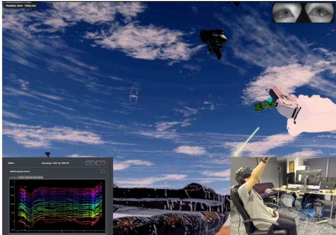  
Figure 7: Annotated screenshot from a live SpaceShooter session. Main area: first-person XR view through the VR headset; the participant’s virtual hand and controller are visible on the right alongside enemy ships. Top right: eyetracking camera feeds, used to detect fixation onsets and align EEG epochs to specific on-screen items. Bottom left: real-time EEG monitor displaying raw traces from all 20 electrodes, confirming continuous recording. Bottom right: participant wearing EEG headset and VR headset.

## A.10 SpaceShooter Round Score

The round score � ∈ [0, 100] is a weighted geometric composite of two normalized rates: enemy clearance (��) and friendly safety (��):

$$
B ~ = ~ 1 0 0 \cdot s _ { E } ^ { \alpha } \cdot s _ { F } ^ { \beta } , ~ \alpha = 1 . 2 , ~ \beta = 2 . 0 ,\tag{3}
$$

where

$$
\begin{array} { r l } & { s _ { E } = \mathrm { e n e m i e s ~ s h o t / e n e m i e s ~ s p a w n e d } , } \\ & { s _ { F } = 1 - \mathrm { f r i e n d l i e s ~ s h o t / f r i e n d l i e s ~ s p a w n e d } , } \end{array}
$$

both clamped to [0, 1]. The higher exponent on $s _ { F } ~ ( \beta ~ = ~ 2 . 0 ~ >$ � = 1.2) makes friendly fire disproportionately costly: a single unnecessary shot deflates the score more than a missed enemy.

US2 (TimeScaledRespawn). Because US2 rounds run for 120 s versus the 90 s US1 reference, raw shot counts are scaled by 90/120 = 0.75 before computing $s _ { E }$ and $s _ { F } ,$ , normalizing engagement oppor- tunity across round lengths.

US3 (mid-round target switch). The round is split into two phases at the switch time � ∈ {75, 90, 105} s. Each phase produces its own (��, ��) pair (with phase-specific time-scaling to the 90 s reference), and the two phases are merged via a duration-weighted geometric combination:

$$
S _ { E } = s _ { E , \mathrm { p r e } } ^ { w } \cdot s _ { E , \mathrm { p o s t } } ^ { 1 - w } , \quad S _ { F } = s _ { F , \mathrm { p r e } } ^ { w } \cdot s _ { F , \mathrm { p o s t } } ^ { 1 - w } , \quad w = \tau / T ,\tag{4}
$$

where� is the total round duration. The final score is $B = 1 0 0 \cdot S _ { E } ^ { \alpha } \cdot S _ { F } ^ { \beta } .$ This formulation ensures that neither phase dominates the score

when switch timing is unbalanced, and that friendly-fire penalties are propagated within each phase independently.

## B System Implementation

Figure 8 shows the full runtime architecture. The system comprises four communicating processes: a Unity frontend running on a dedicated VR PC and three Python backend services—the Vision Service, the OLIVE Service, and the Physio Service—each hosted on a separate GPU server. All inter-process communication uses gRPC [28], enabling low-latency, language-agnostic remote procedure calls between Unity (C#) and the Python backends. EEG and eye-tracking streams are acquired using PhysioLabXR [47], a realtime multi-modal BCI platform that exposes LSL (Lab Streaming Layer) streams consumed by the Physio Service.

Unity frontend. The Unity application (C#) renders the XR environment, captures two camera streams at 1 FPS (448 × 448 pixels each)—a head-worn user camera and a scene-orbiting agent camera—and streams item-marker events via LSL. On each frame it calls the Vision Service via gRPC to retrieve current item beliefs and render guidance cues (directional lines, highlights, aim assist). When the player fires, Unity sends a ShotEvent RPC to the Vision Service carrying the shot item’s identity, which is forwarded as an explicit positive label to the OLIVE Service.

Vision Service (bridge). The Vision Service is the architectural hub, implemented as an AsyncIO gRPC server listening on five ports (5550–5554). It performs object tracking: cameras stream raw frames, and the service extracts per-item bounding-box crops using rendering metadata provided by Unity. Crops are cached and quality-weighted $( \gamma _ { i c } \in [ 0 , 1 ]$ , lower for blurry or partly oc- cluded instances) before being dispatched to the OLIVE Service for inference and training. The First-Fixation Watch monitors the Unity.ReNa.ItemMarkers LSL stream (sampled at the LSL rate) to detect the first suficiently long gaze on each item per round; on detection it issues a PhysioService.OnFixate RPC to the Physio Service and, on reply, forwards the returned soft EEG score to the OLIVE Service as implicit evidence. The Prediction API exposes current OLIVE beliefs to Unity via a polling endpoint used for cue rendering. At round start, the Vision Service initializes its local state (crop bufer, round index, dificulty level) and calls the OLIVE Service’s reset endpoint to warm-start the virtual prompt and reliability weights from the previous round.

OLIVE Service. The OLIVE Service implements the virtual-prompt CLIP adaptation loop, listening on port 50051. It exposes four primary RPCs: RunInference (compute per-item cosine logits from cached crops), TrainOnBatch (one gradient step on the virtual prompt given soft labels), SetHyperparams (update learning rate, prompt length, loss type, and adapter mode at runtime), and Get-Features (return frozen CLIP embeddings for external use). Training is triggered asynchronously by the Vision Service whenever a batch of labeled crops accumulates; inference runs on demand for cue rendering. The server uses a thread-pool executor with the model and AdamW optimizer resident on the GPU throughout the session, enabling sub-10 ms inference latency for the 15–30 items typically scored per inference (those observed at any one time, well below the (1+�) × 16 ships spawned over a full round).

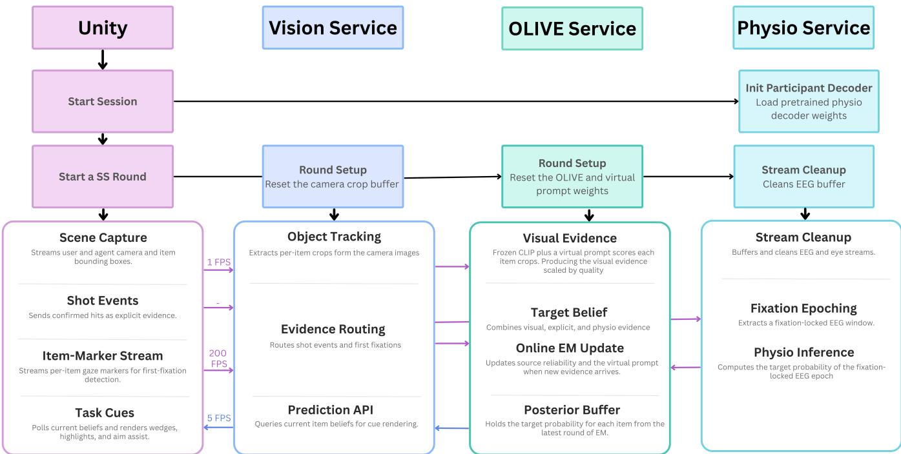  
Figure 8: Runtime system architecture. Unity communicates with the Vision Service via gRPC. The Vision Service acts as a bridge, routing visual crops and shot events to the OLIVE Service and forwarding fixation events to the Physio Service. Initialization calls (dashed) set up per-participant state before each round.

Physio Service. The Physio Service handles all EEG processing, listening on port 50052. It subscribes to the EEG and eye-tracking LSL streams via PhysioLabXR’s bufering utilities [47], applying an online preprocessing pipeline (bandpass filtering, baseline correction, and per-participant ICA artifact suppression). On each OnFixate call, it aligns a [−200, +800] ms EEG epoch to the fixation onset, extracts the FRP features used during Visual Search calibra tion, and passes them through the participant’s pretrained physi-ological decoder to return a soft target probability $\hat { y } ^ { \mathrm { p h y s i o } } \in \left( 0 , 1 \right)$ within a single RPC round-trip. The decoder weights are loaded at round initialization via the SetExperimentMeta RPC and remain constant throughout the session.

## C OLIVE Model and Parameterization Details

This appendix gives the complete OLIVE model (the per-channel likelihoods, the online-EM updates, the parameterization, and the guarantees) for readers who want a rigorous treatment or wish to reimplement the algorithm. It expands the qualitative description in §3.4.

Several symbols are reused with diferent meanings across sec- tions; Table 9 disambiguates them.

## C.1 Model and evidence likelihoods

Let � $\in \{ 1 , \ldots , N \}$ index the items seen so far in the task. Each item has a latent target state $z _ { i } \in \{ 0 , 1 \}$ with prior $P ( z _ { i } { = } 1 ) = \pi$ $( \pi \approx 0 . 3 0$ in SpaceShooter), and OLIVE maintains the posterior $\mu _ { i } = P ( z _ { i } { = } 1 \mid C _ { i } , \hat { y } _ { i } ^ { \mathrm { a c t } } , \hat { y } _ { i } ^ { \mathrm { p h y s i o } } )$ by fusing three evidence channels, each contributing a log-likelihood ratio (LLR).

Table 9: Symbols reused with diferent meanings in diferent sections. The load-bearing OLIVE model notation $( \alpha , \beta$ = action-channel sensitivity / false-positive rate; ${ \boldsymbol { \tau } } = \mathbf { C L I P }$ logit scale) is defined in §3.4 and below; the remaining rows disambiguate glyphs reused elsewhere.
<table><tr><td>Symbol</td><td>Meaning</td><td>Where</td></tr><tr><td> $\alpha , \beta$ </td><td>Action sensitivity / false-positive rate</td><td>§3.4, App. C</td></tr><tr><td> $\alpha , \beta$ </td><td>Round-score exponents (1.2, 2.0)</td><td>App. A.10</td></tr><tr><td> $\alpha$ </td><td>Belief EMA smoothing constant (0.25)</td><td>App. D</td></tr><tr><td> $\beta$ </td><td>Operator ability slope (QUEST+ sim)</td><td>App. G.5</td></tr><tr><td> $\hat { \beta }$ </td><td>Linear mixed-effects coefficient</td><td>App. I.2</td></tr><tr><td>τ</td><td>CLIP logit / temperature scale</td><td>§3.4, App. C</td></tr><tr><td>τ</td><td>Target-switch time ({75, 90, 105} s)</td><td>§6, App. I.2</td></tr><tr><td>w</td><td>Post-switch duration weight  $( \tau / T )$ </td><td>§6</td></tr></table>

Visual. The visual channel scores each item’s crop against a learned target concept. With frozen unit-norm CLIP encoders $\phi _ { \mathrm { i m g } } ,$ $\phi _ { \mathrm { t x t } }$ and a virtual prompt $\boldsymbol { \theta } _ { \mathrm { p r o m p t } } \in \mathbb { R } ^ { M \times d }$ (� token embeddings of dimension $d )$ that replaces a natural-language description of the target, the scorer for a crop � of item � is

$$
\begin{array} { r } { f _ { \mathrm { v i s } } ( c ; \theta _ { \mathrm { p r o m p t } } ) = \sigma \big ( \tau \langle \phi _ { \mathrm { i m g } } ( c ) , \phi _ { \mathrm { t x t } } ( \theta _ { \mathrm { p r o m p t } } ) \rangle + b \big ) , } \end{array}\tag{5}
$$

with fixed logit scale/bias $\tau , b .$ . Per-item crops (from the head-worn user camera and the autonomous agent camera; Appendix A.8) carry quality weights $\gamma _ { i c } ~ \in ~ [ 0 , 1 ]$ (lower for blurry or occluded views); their $f _ { \mathrm { v i s } }$ scores are pooled into a quality-weighted mean $p _ { i } ^ { \mathrm { v i s } }$ and converted to the visual LLR $\Lambda _ { \mathrm { v i s } } ( i ) = \gamma _ { i } \log \mathrm { i t } ( p _ { i } ^ { \mathrm { v i s } } )$ . Only $\theta _ { \mathrm { p r o m p t } }$ adapts; the backbone is frozen throughout.

Explicit (behavioral). For each item, $\hat { y } _ { i } ^ { \mathrm { a c t } } \in \{ 0 , 1 \}$ records whether the operator engaged it. Non-actions are treated as unlabeled: under load the operator may not have reached a true target in time, so absence of action never implies irrelevance. The channel is parameterized by sensitivity $\alpha = P ( \hat { y } ^ { \mathrm { a c t } } { = } 1 \mid z { = } 1 )$ and false-positive rate $\beta = P ( \hat { y } ^ { \mathrm { a c t } } { = } 1 \mid z { = } 0 )$ [64], giving

$$
\Lambda _ { \mathrm { a c t } } ( \hat { y } _ { i } ^ { \mathrm { a c t } } ) = 1 \big [ \hat { y } _ { i } ^ { \mathrm { a c t } } { = } 1 \big ] \cdot \log \frac { \alpha } { \beta } ,\tag{6}
$$

with $\hat { y } _ { i } ^ { \mathrm { a c t } } { = } 0$ contributing zero.

Implicit (physiological). On the first fixation of item �, the de-coder returns a soft label $\hat { y } _ { i } ^ { \mathrm { p h y s i o } } \in \mathbb { R }$ and quality weight $q _ { i } \in [ 0 , 1 ] ;$ only the first fixation is used, so reobserving an item cannot con- tribute multiple times. Under an equal-variance Gaussian likelihood $\hat { y } _ { i } ^ { \mathrm { p h y s i o } } \mid z _ { i } { = } 1 \sim N ( \nu _ { + } , \sigma ^ { 2 } )$ and $\hat { y } _ { i } ^ { \mathrm { p h y s i o } } \mid z _ { i } { = } 0 \sim N ( \nu _ { - } , \sigma ^ { 2 } )$ (class means $\nu _ { + } > \nu _ { - }$ , shared variance $\sigma ^ { 2 } )$ , the LLR is linear in $\hat { y } _ { i } ^ { \mathrm { p h y s i o } }$ :

$$
\Lambda _ { \mathrm { p h y s i o } } ( \hat { y } _ { i } ^ { \mathrm { p h y s i o } } ) = q _ { i } \frac { \nu _ { + } - \nu _ { - } } { \sigma ^ { 2 } } \bigg ( \hat { y } _ { i } ^ { \mathrm { p h y s i o } } - \frac { \nu _ { + } + \nu _ { - } } { 2 } \bigg ) .\tag{7}
$$

Its sign depends on which class mean $\hat { y } _ { i } ^ { \mathrm { p h y s i o } }$ is nearer; its magnitude scales with the class separation $( \nu _ { + } - \nu _ { - }$ ) and the per-fixation quality weight �� (initialized to the decoder’s calibration AUC). Adapting $( \nu _ { + } , \nu _ { - } )$ online (M-step A) lets OLIVE reestimate how informative the channel is for this operator in this session.

## C.2 Online EM

OLIVE runs an EM loop during task execution, triggered whenever the operator acts or produces a new fixation.

E-step. Per item, log-odds accumulate additively over the three channels,

$$
\ell _ { i } = \log \frac { \pi } { 1 - \pi } + \Lambda _ { \mathrm { v i s } } ( i ) + \Lambda _ { \mathrm { a c t } } ( \hat { y } _ { i } ^ { \mathrm { a c t } } ) + \Lambda _ { \mathrm { p h y s i o } } ( \hat { y } _ { i } ^ { \mathrm { p h y s i o } } ) ,\tag{8}
$$

where $\Lambda _ { \mathrm { p h y s i o } }$ contributes only once a fixation has been observed for item �. Because targets are rare $( \pi < 0 . 5 )$ , distractor evidence would collapse all posteriors toward zero (zero collapse); to prevent this, after computing {ℓ� } a global bias $b ^ { * }$ is found by binary search such that

$$
\frac { 1 } { N } \sum _ { i = 1 } ^ { N } \sigma ( \ell _ { i } + b ^ { * } ) = \pi ,\tag{9}
$$

and the posterior is set to $\mu _ { i } = \sigma ( \ell _ { i } + b ^ { * } )$ . This prevalence anchoring pins the mean posterior to � at every round regardless of evidence balance; by the intermediate value theorem a unique $b ^ { * }$ always ex-ists, guaranteeing $\bar { \mu } = \pi$ and max� $\mu _ { i } \geq \pi > 0 ,$ so the agent cannot stop issuing guidance no matter how one-sided the evidence (Proposition 1). Because $b ^ { * }$ is a single global shift added to every item’s log-odds, it preserves the belief ranking and never changes which items are cued; � calibrates only the absolute posterior magnitudes, not the guidance itself, so a coarse, mis-estimated, or drifting � cannot induce over-cueing: � need only be a rough prior (or estimated online), and 0.30 is simply SpaceShooter’s empirical base rate.

M-step A: source reliability. Action-channel parameters are updated by soft-weighted maximum likelihood with pseudo-count

regularization (strength �),

$$
\hat { \alpha } = \frac { \sum _ { i } \mu _ { i } \hat { y } _ { i } ^ { \mathrm { a c t } } + \lambda \alpha ^ { ( 0 ) } } { \sum _ { i } \mu _ { i } + \lambda } , \qquad \hat { \beta } = \frac { \sum _ { i } ( 1 { - } \mu _ { i } ) \hat { y } _ { i } ^ { \mathrm { a c t } } + \lambda \beta ^ { ( 0 ) } } { \sum _ { i } ( 1 { - } \mu _ { i } ) + \lambda } ,\tag{10}
$$

with all seen items contributing to the denominators. With sparse data, a raw M-step can invert channel polarity (pointing the op- erator toward wrong items, which is worse than staying silent); raw estimates are therefore projected onto the ordered half-space via a shrinkage operator: with $c ~ = ~ { \textstyle \frac { 1 } { 2 } } [ \log \mathrm { i t } ( { \hat { \alpha } } ) + \log \mathrm { i t } ( { \hat { \beta } } ) ]$ and $\begin{array} { r } { \Delta = \frac { n _ { \mathrm { e f f } } } { n _ { \mathrm { e f f } } + \delta } } \end{array}$ max(logit(�ˆ) − logit( ˆ�), 0),

$$
\begin{array} { r } { \alpha = \sigma \big ( c + \frac { \Delta } { 2 } \big ) , \quad \beta = \sigma \big ( c - \frac { \Delta } { 2 } \big ) . } \end{array}\tag{11}
$$

The physiological class-conditional means are updated by quality- weighted soft MLE,

$$
\hat { \nu } _ { + } = \frac { \sum _ { i } \mu _ { i } q _ { i } \hat { y } _ { i } ^ { \mathrm { p h y s i o } } } { \sum _ { i } \mu _ { i } q _ { i } } , \qquad \hat { \nu } _ { - } = \frac { \sum _ { i } ( 1 - \mu _ { i } ) q _ { i } \hat { y } _ { i } ^ { \mathrm { p h y s i o } } } { \sum _ { i } ( 1 - \mu _ { i } ) q _ { i } } ,\tag{12}
$$

then projected to maintain $\nu _ { + } ~ \geq ~ \nu _ { - }$ via the same operator (11). Since $\Delta \geq 0$ by construction, ordering holds at every round; when a raw step would invert polarity, $\Delta = 0$ maps both parameters to the most conservative non-inverted estimate (Proposition 2).

M-step B: prompt update. The virtual prompt $\theta _ { \mathrm { p r o m p t } }$ takes one gradient step minimising the quality-weighted soft binary crossentropy between VLM scores and current posteriors,

$$
\begin{array} { r l } { \displaystyle \mathcal { L } _ { \mathrm { V L M } } ( \pmb { \theta } _ { \mathrm { p r o m p t } } ) = - \sum _ { i } { \displaystyle \sum _ { c } \sum _ { c } \gamma _ { i c } \bigg [ \mu _ { i } \log f _ { \mathrm { v i s } } ( c ; \pmb { \theta } _ { \mathrm { p r o m p t } } ) } } & { } \\ { + \left( 1 - \mu _ { i } \right) \log \left( 1 - f _ { \mathrm { v i s } } ( c ; \pmb { \theta } _ { \mathrm { p r o m p t } } ) \right) \bigg ] , } \end{array}\tag{13}
$$

where � indexes sampled crops and $\gamma _ { i c }$ is the crop quality weight; the VLM backbone is frozen, so only $\theta _ { \mathrm { p r o m p t } }$ receives gradients.

## C.3 Parameterization and robustness

OLIVE’s four learned scalars each absorb a specific real-world fail- ure mode rather than propagating it as corrupted evidence. For the action channel, $\alpha = P ( \hat { y } ^ { \mathrm { a c t } } { = } 1 \mid z { = } 1 )$ and $\beta = P ( \hat { y } ^ { \mathrm { a c t } } { = } 1 \mid z { = } 0 )$ are estimated from observed shots: if a participant occasionally fires on a non-target, OLIVE raises $\hat { \beta }$ and automatically down-weights the action channel’s log-likelihood ratio, absorbing imprecision rather than propagating it. For the physiological channel, $( \nu _ { + } , \nu _ { - } )$ are the class-conditional EEG means estimated online per session: motion artifacts and facial-muscle activity compress the inferred separation $\left( \nu _ { + } - \nu _ { - } \right)$ ), attenuating the channel’s influence on the posterior rather than corrupting it. OLIVE does not require wellbehaved users or clean sensors; it treats imperfection as the default and continuously calibrates how much to trust each channel from the evidence it receives.

Initialization. Action channel priors are set from pilot data: $\alpha ^ { ( 0 ) } =$ 0.85, $\beta ^ { ( 0 ) } = 0 . 1 5$ (pilot specificity = 0.85). The physiological quality weight �� is initialized to the ofline-trained AUC of the participant’s physiological decoder from the Visual Search calibration phase.

## C.4 Formal Propositions and Proofs

Proposition 1 (Prevalence anchoring prevents zero collapse). Let $\pi \in ( 0 , 1 )$ and $N \geq 1$ . After anchoring (9), $\begin{array} { r } { \frac { 1 } { N } \sum _ { i } \mu _ { i } = \pi , } \end{array}$ so max� $\mu _ { i } \geq \pi > 0$ at every EM round.

Proof sketch. $\begin{array} { r } { g ( b ) \ = \ \frac { 1 } { N } \sum _ { i } \sigma ( \ell _ { i } + b ) } \end{array}$ is continuous, strictly increasing, with $g \to 0$ as $b \to - \infty$ and $q \to 1$ as � → +∞. By the intermediate value theorem a unique $b ^ { * }$ with $g ( b ^ { * } ) = \pi$ exists, so after anchoring $\bar { \mu } = \pi$ and max� $\mu _ { i } \geq \pi > 0 $ □

Proposition 2 (Ordered projection prevents polarity inversion). The projection (11) ensures � $\geq \beta$ (and $\nu _ { + } \geq \nu _ { - } /$ at every EM round, regardless ofthe raw M-step estimates.

Proof sketch. Since $\begin{array} { r } { \Delta = \frac { n _ { \mathrm { e f f } } } { n _ { \mathrm { e f f } } + \delta } \operatorname* { m a x } ( \cdot , 0 ) \ \geq \ 0 , } \end{array}$ we have $c +$ $\Delta / 2 \ge c - \Delta / 2$ and therefore � ≥ � always. When the raw M-step would invert polarity $( { \hat { \alpha } } \leq { \hat { \beta } } ) , \Delta = 0$ and both are mapped to �(�), the most conservative non-inverted estimate. □

## D Agent Cue Policy: Algorithmic Details

OLIVE’s per-item posterior scores are converted to guidance cues via a quantile suppression policy. Raw scores are first smoothed with an exponential moving average $( \alpha = 0 . 2 5 )$ to suppress transient noise. The system then computes P50 and P90 of all smoothed scores across active ships. If the spread $\mathrm { P 9 0 } - \mathrm { P 5 0 } < 0 . 0 1$ (beliefs insuficiently diferentiated from the uniform prior), all cues are suppressed entirely: an uncertain model actively misleads rather than helps. Otherwise:

• Items above P50 receive a soft cue with opacity proportional to $( s - P _ { 5 0 } ) / ( P _ { 9 0 } - P _ { 5 0 } )$

• The top-4 ranked items receive a hard cue (full-opacity highlight), applied with sticky ranking: an item enters the hard-cue set at rank $\leq 4$ and leaves only once it drops past rank 6, preventing flicker. These four hard-cued items are exactly the set scored by guidance convergence (Precision@4); �=4 is thus a display parameter (the number of items the operator actually sees highlighted), not a claim about perceptual capacity.

Three modalities render the two tiers:

• Out-of-view directional line (inspired by [31, 32]; preliminary studies showed operators preferred lines over wedges in this fast paced task): a viewport-edge line pointing toward of-screen tar-gets, opacity scaled by soft-cue strength.

• Outline highlight: a colored border on in-view ships carrying a hard cue, providing visual pop-out without occluding scene content.

• Aim assist: when the user’s crosshair is within $\pm 2 0 ^ { \circ }$ of a high- lighted ship, the border changes color; pressing the trigger at that moment engages the assist and destroys the target.

This policy requires no task-specific calibration: thresholds are computed relative to the current belief distribution and adapt auto matically as OLIVE’s posteriors evolve.

## E Physiological Decoder: Training, Signal Characterization, and Design Decisions

OLIVE requires, as implicit evidence, a per-fixation soft label $\hat { y } _ { i } ^ { \mathrm { p h y s i o } }$ ∈ (0, 1): a calibrated probability that the currently fixated item is a target, derived from the neural response at fixation onset. This value is produced by a physiological decoder, a model that maps fixation-locked EEG epochs to calibrated target-presence proba- bilities. OLIVE is decoder-agnostic by design (§3.4): any module that returns a calibrated scalar per fixation can serve as the implicit evidence source. This appendix documents the training pipeline and design decisions for the decoder used in our experiments.

Decoder architecture note. The physio decoder used in this work was developed as part of a collaborative research project whose full architecture is being prepared for separate publication; its im-plementation details are therefore beyond the scope of this work. What we describe below: calibration data format, preprocessing, feature extraction, and training protocol, is fully suficient to replicate the training pipeline with any binary classifier that accepts the described feature vectors.

## E.1 Calibration Data: The Visual Search Phase

Before each experimental session, participants complete a visual search calibration phase in which they view static arrays of targets and distractors and count the number of targets within a fixed time budget. No per-item responses are collected during viewing; participants only report the count afterward. This means the full gaze record during viewing is available as free-viewing fixation data, providing naturally labeled fixation epochs without disrupting the observation behavior the decoder is designed to characterize.

For each fixation on an item, we extract a FRP: an EEG epoch time-locked to fixation onset, spanning [−100, 800] ms, with a [−100, 0] ms pre-fixation baseline. The label is the ground-truth identity of the fixated item (target = 1, non-target = 0). Fixations shorter than 100 ms are excluded. This yields a set of labeled (epoch, label) pairs that constitute the per-participant calibration dataset.

## E.2 EEG Preprocessing

Raw EEG is recorded at 256 Hz from 20 electrodes (B-Alert X24, standard 10–20 layout) and synchronized with gaze events via PhysioLabXR [47] with < 5 ms skew. The continuous signal is bandpass-filtered (0.1–40 Hz, zero-phase FIR) and notch-filtered at 60 Hz (harmonics at 120 Hz), then rereferenced to the common average. Independent component analysis (ICA) is applied to attenuate ocular artifacts, with saccade onset times used as informed priors for artifact component identification. Epochs are baseline-corrected to [−100, 0] ms. Trials are rejected if peak-to-peak amplitude ex-ceeds 100 $\mu \mathrm { V }$ in any channel, or if the gaze sample at fixation onset falls of the item.

## E.3 Decoder Input

We do not hand-engineer features. For each fixation, the full pre- processed [−100, +800] ms fixation-locked epoch across all 20 electrodes is passed directly to the decoder, which learns its own spa- tiotemporal representation. The approach is motivated by wellestablished fixation-related components: the N2pc (180–300 ms, contralateral posterior negativity) indexes covert attentional selection, and the P300 (300–600 ms, midline parietal/occipital) indexes target-category confirmation (§2). These components are most prominent over posterior/parietal sites $( \mathrm { P z } , \mathrm { P O z } )$ , as the grand- average waveforms in Figure 9 confirm; the channel-importance analysis (§E.9) shows these sites dominate discrimination while the model also draws on channels beyond a fixed posterior subset.

## E.4 Decoder Training

The physio decoder is a per-participant deep neural network (the all-channel tokenizer of §E.9) trained on the calibration dataset. It takes the fixation-locked epoch described above and returns a calibrated probability $\hat { y } _ { i } ^ { \mathrm { p h y s i o } } \in ( 0 , 1 )$ that the fixated item is a target. Following our data-availability policy, we release the per-fixation decoder outputs rather than the trained weights; the inputs, outputs, and training protocol are described here.

Training uses the labeled calibration epochs as a supervised binary classification problem. Calibration of the output probability is verified by checking that the mean predicted score across held- out non-target fixations matches the empirical non-target base rate; if necessary, Platt scaling is applied to recalibrate the output. The resulting $\hat { y } _ { i } ^ { \mathrm { p h y s i o } }$ values serve as soft labels for OLIVE’s EM updates.

A quality weight $q _ { i } \in \left[ 0 , 1 \right]$ accompanies each prediction, de-rived from a measure of decoder confidence on individual epochs (e.g., margin from the decision boundary or entropy of the output distribution). High-quality fixations (those where the decoder is confident and the epoch is artifact-free) receive higher $q _ { i } ,$ , down weighting noisy or ambiguous fixation events in the OLIVE EM update.

## E.5 Why Pupil Was Excluded

Task-evoked pupil responses (TEPR) are a natural complement to EEG: non-invasive, easy to record, and providing an independent index of cognitive efort and uncertainty [4, 80]. We initially planned to include TEPR as a third evidence stream in OLIVE.

In practice, the pupil signal proved too contaminated by lumi-nance-driven responses in SpaceShooter to be useful. The task involves rapid, large luminance transients (explosions, beam efects, and animated backgrounds) that produce strong light-reflex-driven pupil constriction and dilation unrelated to cognitive evaluation of individual items. Disentangling TEPR from luminance responses requires trial-by-trial luminance control or matched stimuli, which conflicts with the ecological validity of the game environment. The coarser 500–2000 ms time window of TEPR also makes it dificult to attribute responses to specific fixations in fast-paced multi-target scenes where fixations are short and many items are processed in rapid succession.

We therefore excluded pupil from the current implementation and rely solely on fixation-locked EEG as the implicit channel. This is a practical scope decision, not a claim that TEPR is uninformative: in environments with controlled luminance profiles (e.g., clinical imaging workstations, document review interfaces), TEPR could be incorporated as an additional reliability-weighted annotator in OLIVE’s EM framework with no change to the core algorithm.

## E.6 FRP Signal Characterization

Figure 9 shows the grand-average FRP waveforms locked to first fixation onset, averaged across all participants (� = 57) and split by item category (target vs. non-target). Waveforms are plotted across all 20 EEG channels in topomap layout over the epoch window [−100, 800] ms, with a [−100, 0] ms pre-fixation baseline.

A clear P300 deflection (300–600 ms) is visible at Pz and occip- ital sites for target items relative to non-targets, consistent with prior fixation-related EEG studies [12, 13, 27, 70]. The orange shading marks time points with significant target vs. non-target diferences (uncorrected Welch’s �-test, $\begin{array} { r } { p < . 0 5 ) ; } \end{array}$ the bottom strip shows Cohen’s �. Peak discrimination occurs at posterior sites (Pz, P3, P4, POz, O1, O2), matching the expected P300 topography. These waveforms confirm that the calibration phase captures robust, spa- tiotemporally consistent neural discrimination between target and non-target fixations, providing the signal that the physio decoder is trained to classify and that OLIVE uses as implicit evidence.

## E.7 Topomap Timeline of the Fixation-Related P300

Figure 10 shows the spatial distribution of the target–distractor ERP diference at successive 100 ms windows from fixation onset to 800 ms. The posterior positivity emerging at 300–600 ms at parietal and parieto-occipital sites (Pz, POz, P3, P4) is consistent with the P300 target-detection response [60]: a late, broadly distributed positivity that reflects category confirmation when the fixated item matches the current target class. The early (0–200 ms) windows show minimal diference, as expected before attentional selection and category evaluation occur. The sustained positivity at POz through 600 ms is particularly notable: it aligns with the channel importance ranking (Figure 12), where POz ranks as the single most discriminative electrode for the physio decoder, lending neural validity to the algorithmic importance estimate.

## E.8 Error-Related Negativity During Friendly-Fire Events

SpaceShooter generates a naturalistic error paradigm: every friendly- fire shot constitutes a response error, an action directed at the wrong target class, compounded by an explicit score penalty, making these events both objectively incorrect and subjectively salient. We extracted response-locked EEG epochs from continuous recordings $( N = 3 8 \mathrm { U S } 1$ participants with suficient clean error epochs) centered on each shot event, labeled as errors (friendly fire) or correct responses (enemy destroyed), using the shot timestamps recorded in the same LSL stream as the EEG. Preprocessing: continuous 0.5– 30 Hz bandpass filter applied before epoching, then epoch extraction ([−200, +600] ms), baseline correction ([−200, 0] ms), amplitude rejection $( > ~ 1 5 0 \mu \mathrm { V }$ per channel), and per-participant FastICA using Fp1/Fp2 as ocular proxy channels. This response-locked ERN pipeline difers by design from the fixation-locked FRP pipeline of §E (a narrower 0.5–30 Hz band, [−200, 0] ms baseline, and 150 �V rejection), following standard ERN practice.

Figure 11 shows the grand-average ERN and CRN waveforms at frontocentral sites (Fz+Cz mean; the B-Alert X24 lacks FCz) and the diference topomaps at the ERN peak and Pe window. A fronto- central positivity for error relative to correct trials is visible in the 40–140 ms window, though the efect does not reach conventional significance $( M = + 1 . 0 5 \mu \mathrm { V } , S E = 0 . 6 0 , t ( 3 7 ) = 1 . 7 1 , p = . 0 9 6 ;$ cluster permutation: no significant cluster). We retain the ERN/Pe nomenclature for the response-locked frontocentral and centropari- etal components, but note that our friendly-fire error−correct difference is positive-going at the frontocentral peak rather than the canonical negativity, and does not reach significance; we therefore treat it as suggestive rather than confirmatory. The modest amplitude and marginal significance are consistent with the ecolog- ical validity of the paradigm: friendly-fire events in SpaceShooter are heterogeneous (some intentional, some accidental), the B-Alert headset records under active VR conditions with elevated mus- cle and motion artifact, and the ERN is known to be attenuated for high-workload, time-pressured tasks where error monitoring competes with ongoing perceptual demands [23]. Nonetheless, the scalp topography at the ERN peak (frontocentral) and Pe window (centroparietal) is consistent with canonical ERN/Pe distributions, suggesting that the error-monitoring signal is present even if it does not reach significance in this sample.

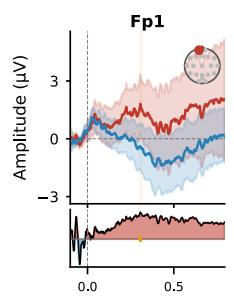

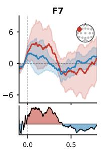

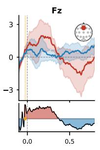

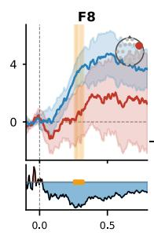

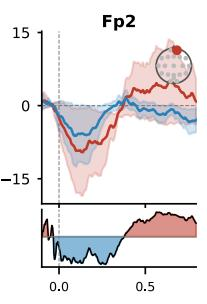

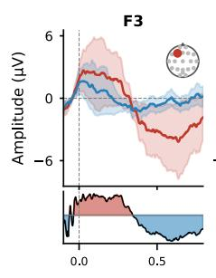

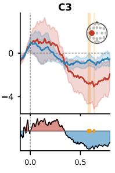

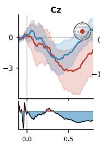

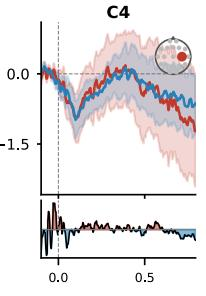

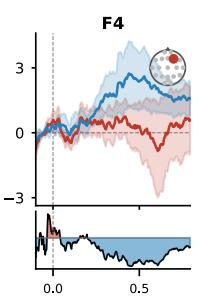

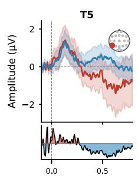

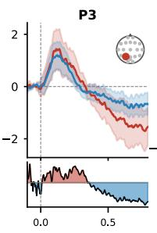

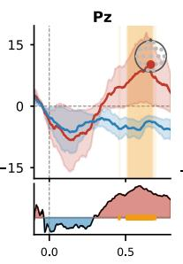

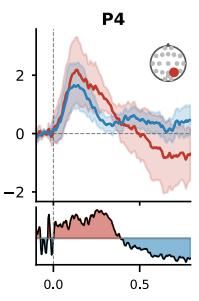

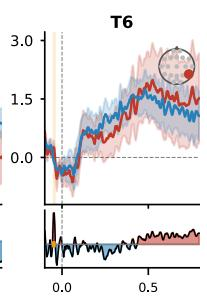

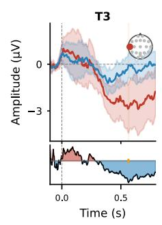

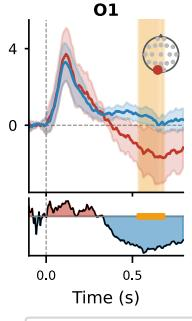

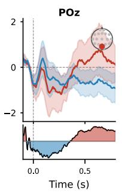

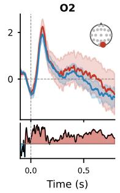

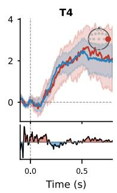  
Figure 9: Grand-average FRPs for target and non-target items across all 20 EEG channels in topomap layout (� = 57 participants; shading = ±1 SEM; orange shading = � < .05 uncorrected Welch’s �-test; bottom strip = Cohen’s �). The posterior P300 (300–600 ms) is the primary discriminative component exploited by the physio decoder.

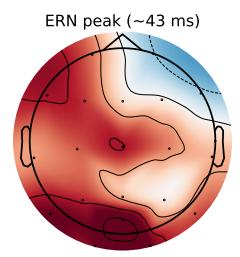

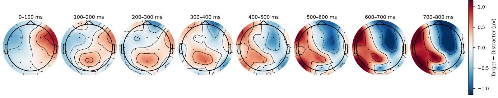

Figure 10: Grand-average target–distractor ERP diference topomaps from the US1 Visual-Search calibration phase $( N = 4 1$ participants; 2,060 target and 3,946 distractor fixation epochs after preprocessing: amplitude rejection $> 1 0 0 \mu \mathbf { V }$ per channel, per-participant FastICA with Fp1/Fp2 ocular proxies; baseline [−100, 0] ms). Each panel shows the scalp distribution of the grand average amplitude diference (target − distractor, $\mu \mathbf { V } )$ averaged within the indicated 100 ms window. The posterior positivity emerging at 300–600 ms $( \mathbf { P } \mathbf { z } ,$ POz) is consistent with the P300 orienting response, validating that the decoder captures genuine neural evidence of target detection. The lateralization likely reflects participants aiming with the right hand immediately after fixation.  
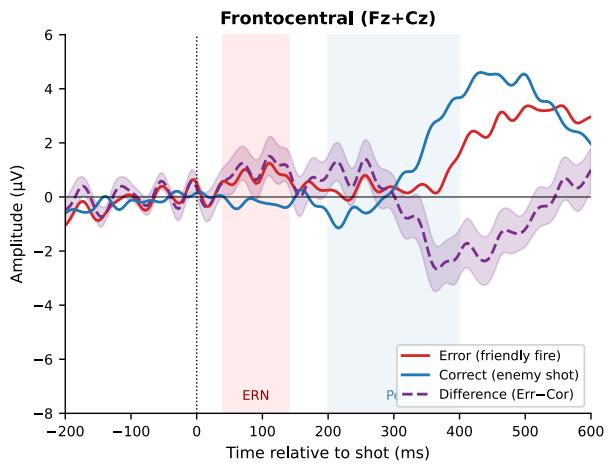

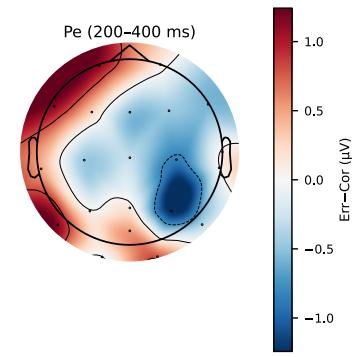  
Figure 11: Error-Related Negativity (ERN) from SpaceShooter friendly-fire events. Left: Grand-average frontocentral waveforms (Fz+Cz) for error (red) and correct (blue) trials; dashed purple = diference wave (Err−Cor), shading = ±1 SEM across participants. Center/right: Scalp topomaps of the error−correct diference at the ERN peak and Pe window. $\left( N = 3 8 \right.$ participants; preprocessing: 0.5–30 Hz continuous bandpass, $[ - 2 0 0 , 0 ]$ ms baseline, amplitude rejection $> 1 5 0 \mu \mathbf { V } ,$ Fa $\mathbf { s t I C A } ; p = . 0 9 6$ , one-sample �-test on frontocentral ERN amplitude.)

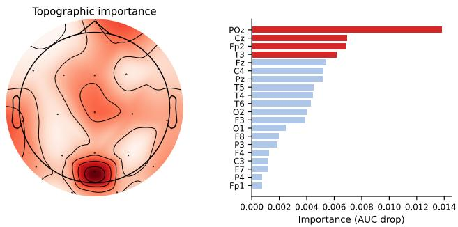  
Figure 12: Group-average EEG channel importance from permutation ablation (�=41 participants; $4 5 9 \pm 1 7 4$ fixation epochs per participant, val-set runs 33–50). Left: topographic importance map. Right: channels ranked by mean AUC drop when zeroed; top-4 (POz, Cz, Fp2, T3) are highlighted in red. Drops are modest due to the joint multi-channel tokenizer architecture.

## E.9 EEG Channel Importance and Portable Form-Factor Simulation

Channel importance via permutation ablation. To identify which of the 20 B-Alert X24 electrodes contribute most to the physiologi- cal decoder’s tar et-discrimination erformance, we conducted a permutation ablation analysis on all �=41 US1 participants using the val-run data (runs 33–50 per participant). For each of the 20 channels, we zeroed out that channel’s signal across all fixation epochs and recomputed the model’s AUC; importance is defined as max $( 0 , \mathrm { A U C _ { b a s e l i n e } - A U C _ { c h a n n e l z e r o e d } } )$ . The decoder architec- ture uses a TemporalEmbedChannelConv tokenizer that jointly en-codes all channels via a 2-D convolution before attention-based temporal pooling, meaning no single channel has an independent representational role. Consequently, individual ablation drops are modest (group average peak drop < 0.02 AUC), yet consistent across participants. Figure 12 shows the group-average importance map and channel ranking. The four most important channels are $\mathbf { P O z } , \mathbf { C z } , \mathbf { F p 2 } .$ , and T3 (T7 in standard 10-20 notation). The midline centro-parietal cluster (POz, Cz) is consistent with the posterior P300 topography that drives FRP discrimination (§E); the additional frontal-pole and temporal contributions (Fp2, T3) are modest (AUC drops < 0.02) and do not correspond to a canonical target-detection component.

Portable form-factor simulation. We simulated decoder perfor mance under four commercially available EEG form factors: the ABM B-Alert X10 (9-channel subset of X24), Emotiv EPOC X (14 channels), Muse 2 (4 channels), and an OLIVE-optimized strip (the 4 most important channels identified above: POz, Cz, Fp2, T3). For each device, a two-pass spherical spline interpolation (MNE-Python software package [56]) reconstructed the full 20-channel B-Alert X24 montage: channels present in both the device and B-Alert X24 were taken directly from the recording, while channels exclusive to the device (Emotiv EPOC X: AF3, AF4, FC5, FC6; Muse 2: all 4 channels) were first estimated from B-Alert data via a forward pass, then the full B-Alert montage was reconstructed from the combined device set via a backward pass. The reconstructed signals were passed through the per-participant decoder and the resulting soft labels were used to refit beta distributions and compute the simulated OLIVE AUC, targeting the same +0.10 additive boost above the empirical val-set AUC.

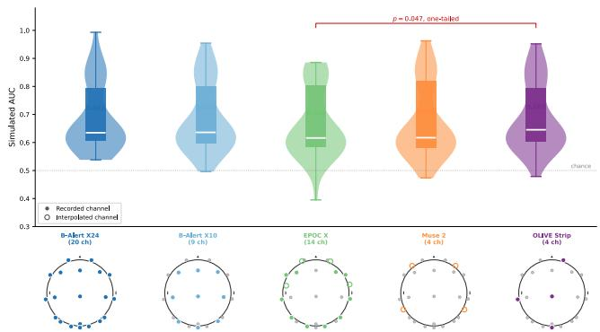  
Figure 13: Simulated decoder AUC by portable EEG form factor (�=41). Violins show participant distribution; boxes show median and IQR; means annotated numerically. Topomap insets: filled circles = recorded channels; open circles = interpolated via spherical spline. The red bracket indicates the significant OLIVE Strip vs. Emotiv EPOC X comparison (�(40) = 1.72, $p \ = \ . 0 4 7$ , one-tailed; prespecified directional hypothesis).

Results and comparison. Figure 13 shows the simulated AUC distribution across all 41 participants for each form factor. Us- ing one-tailed paired �-tests (directional hypotheses prespecified from channel im ortance), the OLIVE stri significantly out erforms Emotiv EPOC X $( t ( 4 0 ) = 1 . 7 2 , p = . 0 4 7 ,$ , mean diference +0.02 AUC). No other pairwise comparison reached significance (� > .05 two-tailed for all remaining pairs; � = 41). Group means ranged from 0.664 (EPOC X) to 0.685 (OLIVE strip), with the full 20-channel headset at 0.682. A counterintuitive finding is that Muse 2 (0.670; 4 interpolated channels) performed comparably to EPOC X (0.664; 14 channels, 10 recorded). This follows directly from the channel importance analysis: EPOC X covers only one of the four most important channels (T7/T3), with the remaining 13 channels spanning temporal, frontal, and occipital regions that carry lower discriminative weight for this decoder. By contrast, the OLIVE strip covers all four top channels and achieves the highest simulated AUC despite having the same electrode count as Muse 2, illustrating that channel placement relative to the model learned feature map matters more than electrode count per se.

Limitations. These simulations have two important caveats. First, the reported AUC values are simulated priors for OLIVE’s Bayesian update, not measured decoder performance on an actual portable device. They reflect a beta-distribution model fitted to val-set de- coder outputs, boosted to approximate a plausible performance improvement; the true AUC of a decoder retrained or adapted from a specific device’s native recording could difer substantially. These simulated reduced-montage prior AUCs are also not directly com-parable to the ofline validation AUC used for the median split in

Table 1. Second, the spherical spline reconstruction is most reliable when the interpolated channels are geometrically surrounded by recorded channels; for Muse 2, where all four channels fall outside the B-Alert X24 layout, the backward reconstruction of midline and parietal channels relies entirely on extrapolation, introducing approximation error that is not present in a real headset recording. These results should therefore be interpreted as a simulation-based plausibility check for OLIVE’s prior construction rather than an empirical evaluation of portable EEG hardware.

## F Convergence Metrics

An unconverged model does not merely withhold useful guidance: it actively misleads: its highest-ranked items are plausible-looking distractors, and a user following the cues will make worse decisions than one ignoring them entirely. We therefore define convergence not as internal accuracy alone, but as the moment when the agent’s guidance becomes reliably worth acting on.

Both metrics share a ranking stability component. Let �� denote the set of four items with the highest posterior beliefs at second �. We define

$$
S _ { t } ~ = ~ { \frac { \left| T _ { t } \cap T _ { t - 1 } \right| } { \left| T _ { t } \cup T _ { t - 1 } \right| } } ,\tag{14}
$$

the Jaccard similarity between the current and previous top-4 sets, analogous to measures used for comparing top-� lists [17] and quantifying feature-selection stability [52]. When �� is high, the agent consistently surfaces the same items; when �� is low, its suggestions are still in flux and following them would send the user in diferent directions moment to moment.

Beliefconvergence: the model has formed a stable, correct view. We operationalize this as: (i) the posterior-based ranking achieves $\mathrm { A U C } > 0 . 9 0$ against ground-truth target labels, (ii) $S _ { t } \geq 0 . 7 5$ (the top-4 highlighted set is unchanged between consecutive seconds), and (iii) both conditions hold for at least 10 consecutive seconds, long enough for the user to receive and act on the agent’s support.

Guidance convergence: the model’s suggestions are trustworthy. Stability alone is insuficient: a model can be stably wrong. Guid- ance convergence marks the point at which the items the agent surfaces are actually the true targets. We operationalize this as: Precision@4 = 1.0 (all four highlighted items are true targets) and $S _ { t } \geq 0 . 7 5$ , sustained for ≥ 10 consecutive seconds. We report timeto-guidance-convergence as a primary outcome in US1 and US2.

Both thresholds are intentionally strict: requiring all four highlighted items to be correct and sustained for 10 seconds rules out transient agreement: the agent must be consistently right. At a 30% target base rate, chance Precision@4 ≈ 0.3; a system that clears this bar within the first half of a task round is genuinely useful, allowing users to redirect their attention with confidence.

## G User Study 1: Additional Details

## G.1 Evidence Configurations and Baselines

Evidence configurations. E (Explicit only) receives shot events as positive labels and no EEG signal; it represents the EEG-free deployment scenario, requiring no neural hardware, and is the reference against which EEG’s added value is measured in US2 and US3. I (Implicit only) receives EEG-derived fixation labels only, with no shot events; it tests whether neural signals alone are suficient without any behavioral confirmation. IE (Implicit + Explicit) receives both channels and is the primary condition; E and I are ablations that decompose its advantage.

Baselines. olive-base is OLIVE with M-step A disabled: evidence reliability weights $( \alpha , \beta , \nu _ { + } , \nu _ { - } )$ ) are frozen at ilot-calibrated val-ues rather than estimated online, ablating the benefit of learned reliability.

TPT adapts the VLM prompt via entropy minimization on �=7 augmented views per fixation-locked crop, keeping the top selec- tion\_p=0.1 fraction of views by self-consistency before computing the entropy loss [71].

TDA maintains positive and negative CLIP feature caches updated from confirmed targets (shots / high-EEG soft labels) and distractors (low-EEG soft labels); posteriors are computed by cosinesimilarity retrieval against the two caches with no backpropagation [18].

All baselines receive the same evidence streams as the corre- sponding OLIVE evidence variant and share the same visual encoder (frozen CLIP ViT-B/16).

## G.2 Objective Performance by Dificulty

Table 10 summarizes SpaceShooter performance metrics by adap- tive dificulty level $( N = 5 7$ participants). Hit rate remains stable across dificulty levels $( \sim 0 . 6 7 – 0 . 7 1 )$ , indicating that participants maintain shot accuracy even as the scene becomes more complex. Mothership health decreases monotonically from 85.7 at dificulty 1 to 52.6 at dificulty $5 \left( r = - 0 . 9 0 \right)$ , reflecting the increased number of enemies that leak past the user. Target kill rate drops from 0.73–0.75 at levels 1–3 to 0.61 at level 5, as the higher target count (∼24 at level 4–5 vs. 9 at level 1) outpaces the user’s engagement capacity.

Table 10: SpaceShooter objective performance by adaptive dificulty level. Hit rate = fraction of shots on enemy targets; FF rate = fraction on friendly ships; target kill rate = fraction of true targets destroyed; MS health = mothership HP remaining (0–100).
<table><tr><td>Diff.</td><td>Hit Rate</td><td>FF Rate</td><td>Tgt Kill</td><td>MS Health</td></tr><tr><td>1</td><td> $\overline { { 0 . 6 7 \pm 0 . 2 1 } }$ </td><td> $\overline { { 0 . 3 3 \pm 0 . 2 1 } }$ </td><td> $\overline { { 0 . 7 3 \pm 0 . 1 9 } }$ </td><td> $\overline { { 8 5 . 7 \pm 3 . 0 } }$ </td></tr><tr><td>2</td><td> $0 . 6 7 \pm 0 . 1 4$ </td><td> $0 . 3 3 \pm 0 . 1 4$ </td><td> $0 . 7 4 \pm 0 . 1 7$ </td><td> $7 7 . 9 \pm 3 . 9$ </td></tr><tr><td>3</td><td> $0 . 7 1 \pm 0 . 1 1$ </td><td> $0 . 2 9 \pm 0 . 1 1$ </td><td> $0 . 7 5 \pm 0 . 1 3$ </td><td> $6 9 . 9 \pm 4 . 4$ </td></tr><tr><td>4</td><td> $0 . 7 1 \pm 0 . 1 5$ </td><td> $0 . 2 9 \pm 0 . 1 5$ </td><td> $0 . 6 9 \pm 0 . 1 7$ </td><td> $6 0 . 4 \pm 5 . 5$ </td></tr><tr><td>5</td><td> $0 . 7 1 \pm 0 . 1 1$ </td><td> $0 . 2 9 \pm 0 . 1 1$ </td><td> $0 . 6 1 \pm 0 . 1 1$ </td><td> $5 2 . 6 \pm 2 . 6$ </td></tr></table>

## G.3 Adaptive Dificulty Trajectories

All participants begin at dificulty 1 and the system ramps adaptively based on performance. Individual trajectories show substantial variation: high-performing participants (P13, P25) reach dificulty 5 by rounds 12 and 14 respectively, while others (P8, P12) plateau at dificulty 2. The median maximum dificulty reached is 3 (IQR: 3–4). Most participants stabilize within 4–6 rounds, after which dificulty fluctuates by ±1 level. The non-monotonic trajectories (e.g., P18 peaks at dificulty 4 then regresses to 2) confirm that overwhelmed periods occur and the system responds by reducing load. Figure 14 shows individual trajectories alongside the grand average.

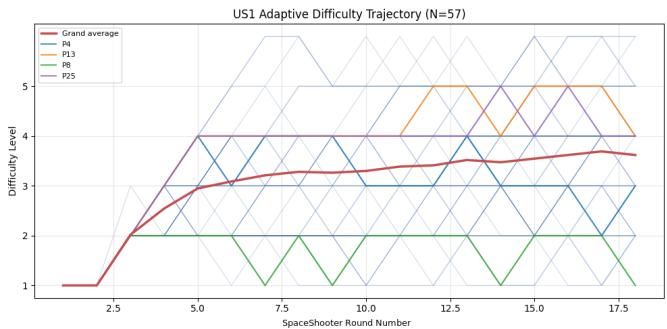  
Figure 14: Adaptive dificulty trajectories per participant $( N =$ 57). Grand average in red; four representative participants highlighted. High performers (P13, P25) reach dificulty 5; P8 plateaus at 2. Non-monotonic trajectories confirm the adaptive controller steps down under overload.

## G.4 Subjective Ratings by Dificulty

Table 11 shows self-reported workload, confidence, and overwhelm by dificulty level. Overwhelm increases with dificulty $( r = 0 . 1 5 ) ;$ consistent with the task’s design intent. Confidence also increases $( r = 0 . 2 4 )$ , reflecting a selection efect: participants who reach higher dificulty levels tend to be more skilled rather than dificulty causing higher confidence. Mothership health correlates with overwhelm $( r = - 0 . 3 1 )$ and workload $( r = - 0 . 2 2 )$ , confirming that subjective experience tracks objective performance. Hit rate correlates with confidence $( r = 0 . 4 3 )$ , indicating that shot accuracy is a salient cue for self-assessed performance. Figure 15 shows these relationships.

Table 11: Subjective ratings (1–7 Likert scale) by adaptive dificulty level.
<table><tr><td>Diff.</td><td></td><td>Workload Confidence Overwhelm</td><td></td></tr><tr><td>1</td><td> $3 . 9 7 \pm 1 . 4 5$ </td><td> $3 . 2 0 \pm 1 . 5 6$ </td><td> $3 . 0 5 \pm 1 . 8 8$ </td></tr><tr><td>2</td><td> $4 . 3 6 \pm 1 . 1 2$ </td><td> $3 . 7 1 \pm 1 . 6 5$ </td><td> $3 . 1 1 \pm 2 . 0 3$ </td></tr><tr><td>3</td><td> $4 . 6 1 \pm 1 . 4 6$ </td><td> $4 . 2 4 \pm 1 . 6 1$ </td><td> $3 . 6 4 \pm 1 . 5 1$ </td></tr><tr><td>4</td><td> $3 . 8 7 \pm 1 . 6 9$ </td><td> $4 . 2 5 \pm 1 . 3 7$ </td><td> $3 . 7 2 \pm 1 . 8 9$ </td></tr><tr><td>5</td><td> $4 . 1 4 \pm 2 . 1 9$ </td><td> $4 . 8 6 \pm 1 . 0 7$ </td><td> $4 . 2 9 \pm 2 . 2 9$ </td></tr></table>

## G.5 Simulation-based error bound for the 16-round QUEST+-style calibration

A potential concern is that the individualized dificulty calibration in US1 uses only 18 SpaceShooter rounds in total: 2 fixed practice rounds followed by 16 adaptive rounds. We refer to these 16 adaptive rounds as the 16-round (equivalently 16-block) calibration, matching Figures 16 and 17. To quantify how accurately this procedure can recover a participant-specific operating point, we conducted a Monte Carlo simulation using the same QUEST+-style Bayesian dificulty selection rule as in our implementation.

Generative model. We simulated $N = 2 5 0 0$ virtual participants with latent ability $\theta \sim \mathcal { U } ( 1 , 6 )$ and slope $\beta \in \{ 0 . 4 , 0 . 6 , 0 . 8 , 1 . 0 , 1 . 2 \}$ (uniformly sampled). For a given dificulty level �, the expected

round score (0–100) was

$$
\mathbb { E } [ { \mathrm { S c o r e } } ( d ) ] ~ = ~ 1 0 0 \cdot \sigma \left( { \frac { \theta - d } { \beta } } \right) ,\tag{15}
$$

where $\sigma ( \cdot )$ is the logistic sigmoid. We then added logistic noise on the score axis (scale 14), clamped the score to [0, 100], and discretized it into five outcome categories: [0, 20], (20, 40], (40, 60], (60, 80], (80, 100].

Calibration procedure and target dificulty. For each simulated participant, we ran exactly 18 rounds: two fixed practice rounds at �=1 and $d { = } 2 ,$ , followed by 16 adaptive rounds over an internal 0.5-step grid $d \in \{ 1 . 0 , 1 . 5 , . . . , 6 . 0 \}$ . The adaptive policy chose the next dificulty to maximize expected information gain (equivalently, minimize expected posterior entropy) over the latent parameters. We define the participant’s target dificulty $d ^ { \star }$ as the dificulty at which the expected score equals 70 (our “challenging-but-playable” operating point), i.e.,

$$
d ^ { \star } \ \triangleq \ \{ d : \operatorname { \mathbb { E } } [ \operatorname { S c o r e } ( d ) ] = 7 0 \} \ = \ \theta - \beta \cdot \log \operatorname { i t } ( 0 . 7 0 ) .\tag{16}
$$

After round 16, we estimated $\hat { d }$ as the posterior mean of $d ^ { \star }$

Results. Figure 16 shows the cumulative distribution of absolute estimation error $| \hat { d } - d ^ { \star } | .$ Across simulations, the median abso- lute error was 0.20 dificulty levels (75th percentile 0.34, 90th percentile 0.50), with 90.0% of participants within ±0.5 dificulty and 99.5% within ±1.0. Figure 17 plots ˆ� against the ground-truth $d ^ { \star }$ showing close agreement and negligible bias (mean signed error 0.006). Together, these results indicate that, under a plausible score-generation model, the proposed 16-round calibration is suficient to place most participants within roughly half a dificulty level of their individualized operating point, which is the intended purpose of US1 (initializing US2 at a participant-appropriate dificulty band).

## H User Study 2: Additional Details

## H.1 Session Structure

Figure 18 shows the US2 session flow. It follows the same structure as US1 (Visual Search calibration then SpaceShooter rounds) but introduces TimeScaledRespawn (ships respawn when shot, 120 s rounds) and live OLIVE deployment.

US2 conditions. All four conditions share the same task; they difer only in what assistance the agent provides. Control: no agent assistance: the participant acts alone and receives no guidance cues. Oracle: the agent receives ground-truth target labels directly from the game engine and uses them to guide the participant, establishing an empirical performance ceiling. E and IE use OLIVE (EEG-free and EEG-augmented respectively); see §3.4 and Appendix G.1.

TimeScaledRespawn rationale. Because a ship respawns immediately when shot, the battlefield stays populated and the agent must maintain useful guidance throughout each round rather than converging once to a static target set. This is essential for testing whether OLIVE’s guidance holds under ongoing pressure, not just during an initial convergence window.

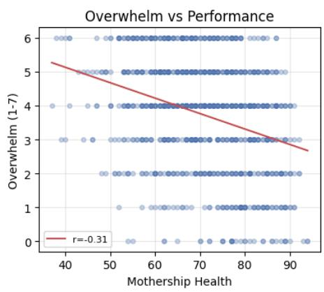

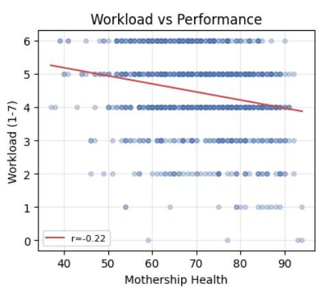

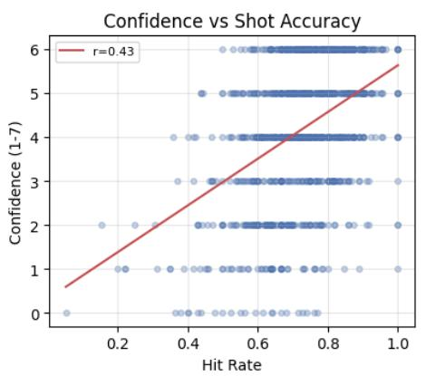

Figure 15: Subjective ratings vs. objective performance in US1 (� = 57, 1015 rounds). Overwhelm and workload decrease with mothership health $( r = - 0 . 3 1 , r = - 0 . 2 2 ) $ ; confidence increases with hit rate $( r = 0 . 4 3 )$ . Each dot is one round.  
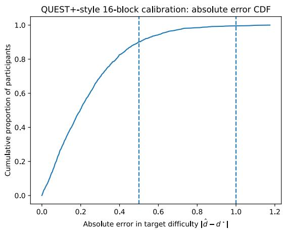  
Figure 16: CDF of absolute error $| \hat { d } - d ^ { \star } |$ for the 16-round QUEST+-style calibration. Dashed lines mark ±0.5 and ±1.0 dificulty levels.

## H.2 Condition Assignment Procedure

To prevent shooting skill from confounding the between-subjects comparison, each participant’s US2 starting dificulty was computed as the score-weighted mean dificulty over their last six qualify- ing US1 rounds (rounds meeting thresholds on shooting precision, throughput, and mothership health). Participants were then binned into four ability tiers $( d < 2 , 2 \leq d < 3 , 3 \leq d < 4 , d \geq 4 )$ and conditions were balanced within each tier before global equaliza- tion, ensuring no condition disproportionately received higher- or lower-ability participants.

## H.3 Adaptive Dificulty Trajectories

Figure 19 shows mean dificulty level per round for each condition. All conditions start near dificulty 3–4 and converge to dificulty 5 by mid-session, confirming that the stratified assignment (based on US1 max-dificulty) successfully balanced ability across conditions.

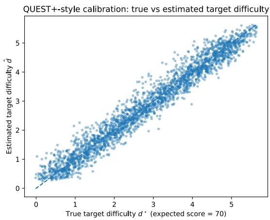  
Figure 17: True vs. estimated target dificulty $( d ^ { \star } \mathbf { v } \mathbf { s } . \hat { d } )$ across simulated participants. The dashed line indicates �=�.

Pairwise Welch �-tests on per-participant maximum dificulty reached show no significant overall diference (one-way ANOVA: $F = 1 . 5 0 , p = . 2 3 9 )$ . However, OLIVE-E and Oracle more reliably saturated the dificulty ceiling: both conditions had every partic- ipant reach dificulty 6 (mean $6 . 0 0 \pm 0 . 0 0 )$ , compared to Control (mean $5 . 3 8 \pm 0 . 8 6 ; t \ = \ 1 . 9 3 , p \ = \ . 0 9 5$ , marginal). This is not a confound but the expected consequence of agent assistance: partic- ipants who receive reliable target guidance maintain high enough performance to keep the adaptive controller escalating. OLIVE-IE showed no significant ceiling advantage over Control $\left( \mathinner { p \mathopen { \left/ { \vphantom { \left( p \mathgroup \right.} }  \kern - delimiterspace \right)} 2 } = . 7 9 0  \right.$ consistent with its within-session improvement story: the EEG channel’s benefit manifests progressively over rounds rather than immediately saturating the ceiling.

## H.4 Convergence: Ofline vs. Live Deployment

Figure 20 compares OLIVE’s per-round convergence trajectories between US1 (ofline simulation replay) and US2 (live deployment) for the IE and E conditions. Both conditions reach near-total guidance convergence in live deployment (IE: 99.4%; E: 97.1%), exceeding their US1 ofline benchmarks (IE: 96.8%; E: 79.0%), consistent with denser and more varied behavioral evidence in the live task.

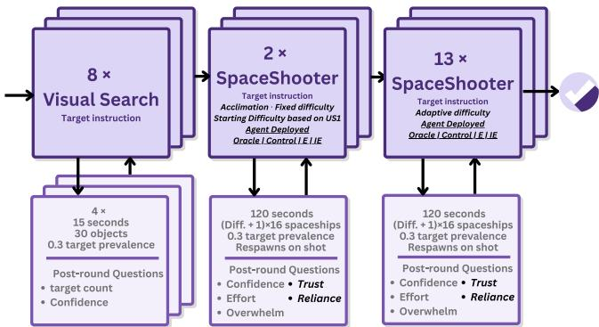

Figure 18: US2 session structure. Participants are assigned to one of four between-subjects conditions at session start. OLIVE runs live throughout all SpaceShooter rounds (TimeScaledRespawn variant).  
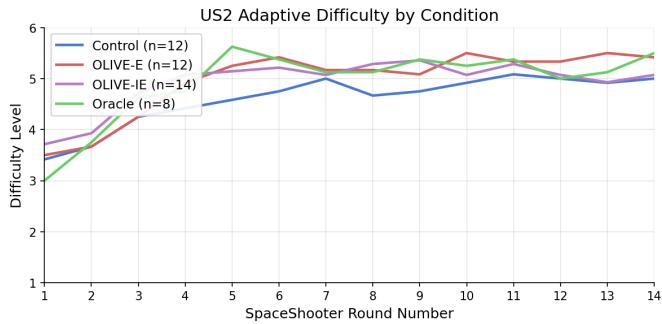  
Figure 19: US2 mean adaptive dificulty by condition (grand average per condition; stratified assignment ensures comparable starting levels). All conditions converge to dificulty 5 by round 6; OLIVE-E and Oracle sustain slightly higher difi culty in late rounds.

## I User Study 3: Additional Details

## I.1 Session Structure and Switch Timing

Figure 21 shows the US3 session flow. It is identical to US2 (Visual Search calibration then SpaceShooter rounds in the TimeScale- dRespawn variant) except for a mid-round silent target switch at a randomized time (∈ {75, 90, 105} s) unknown to participants.

Switch-timing design. Switch times were drawn from {75, 90, 105} s, with each value appearing exactly three times across the nine data-collection rounds in a randomized order per participant. This balanced design controls for the structural confound that earlier switches yield longer post-switch windows (≈125 s, 110 s, and 95 s respectively): across a full session, each participant has the same aggregate distribution of post-switch time, ensuring participantlevel means are unconfounded by switch timing. Participants were required to infer the switch entirely from evolving in-game score feedback (a change in which ship type yields favorable outcomes) without any system alert or instruction to reorient, replicating real-world settings where task priorities shift through environmental cues rather than explicit notifications. The session comprised 10 SpaceShooter rounds: one acclimation round followed by nine data- collection rounds, with three rounds at each of 75, 90, and 105 s to maintain the 3×3 timing balance.

## I.2 Statistical Model Details

The primary metric is new-target throughput: second\_target\_shot $/ \left( 2 0 0 - t _ { \mathrm { s w i t c h } } \right)$ kills/s per round, averaged per participant. Switch times are balanced (three rounds each at 75, 90, 105 s), so participantlevel means are unconfounded by timing. The within-session delta (late three rounds minus early three rounds) is the primary inferential quantity; one-sample �-tests are used to test improvement against zero, and Welch �-tests for between-condition comparisons (see Statistical approach in US2 Study Design).

For reference, a round-level LME on raw second\_target\_shot with condition, dificulty, and switch time as fixed efects and by- participant random intercepts (Control as reference) yields $\hat { \beta } = 9 . 5 1$ $(  p = . 1 6 8 )$ for OLIVE-E and $\hat { \beta } = 1 1 . 5 0 \left( p = . 1 2 2 \right)$ for OLIVE-IE; these efects are directionally consistent but strongly attenuated by the switch-timing covariate $( \hat { \beta } = - 0 . 2 2 8 , p < . 0 0 1 )$ , confirming that normalization by post-switch window duration is essential. Oracle remains significant in the LME $( \hat { \beta } = 2 3 . 3 0 , p = . 0 0 7 )$

## I.3 Adaptive Dificulty Trajectories

Figure 22 shows mean dificulty level per round for each condition. All four conditions follow similar trajectories, reaching dificulty 4– 5 by mid-session and sustaining it through the nine data-collection rounds.

A one-way ANOVA on per-participant maximum dificulty reached confirms no significant between-condition diferences $( F =$ 0.20, � = .896), and no pairwise comparison reaches even marginal significance (all � > .40, |Δ| ≤ 0.38). This is a strong null result: the dificulty confound concern can be dismissed entirely for US3. All conditions faced comparably challenging enemy compositions when the silent switches occurred, so the H3.1 and H3.2 through- put diferences reflect genuine adaptation performance, not task demand asymmetries.

## I.4 Subjective Measures

Wingman adaptation speed. OLIVE-E and OLIVE-IE participants rated how quickly their wingman adapted to the silent switch on a 1–7 scale (post-round item; Oracle excluded as its adaptation was automatic). IE participants rated wingman adaptation speed notably higher than E (OLIVE-IE: � = 5.1 vs. OLIVE-E: $M = 4 . 4 )$ consistent with the faster objective reconvergence (H3.1).

NASA-TLX. Figure 23 shows the post-experiment raw NASA-TLX profile by condition (� = 7 C, 8 E, 8 IE, 5 O; Welch �-tests). Subscales were administered on an adapted 1–7 response scale rather than the conventional 0–100 raw format. Two dimensions show statistically notable diferences. Temporal demand was significantly higher in both OLIVE-E (� = 5.2) and Oracle (� =

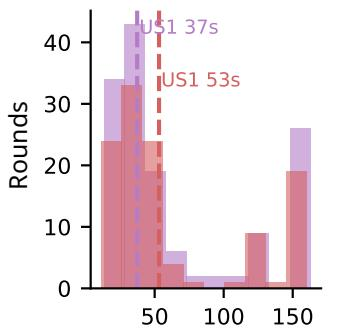  
Time to belief conv. (s)

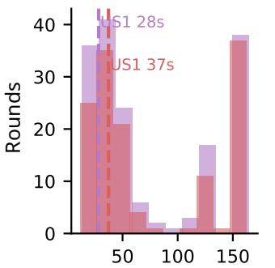  
Time to guidance conv. (s)

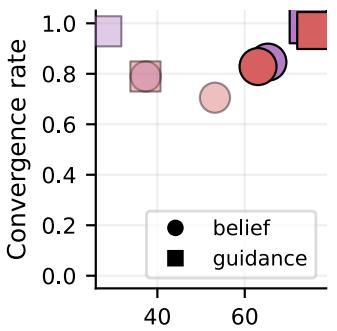  
Mean conv. time (s)

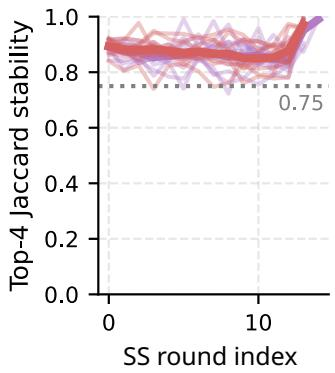

Figure 20: OLIVE convergence: US2 live deployment vs. US1 ofline simulation (IE and E). Top row: time-to-convergence curves for belief spread (score std) and top-4 ranking stability over SS round sequence. Bottom row: convergence rate comparison across all condition × type combinations.  
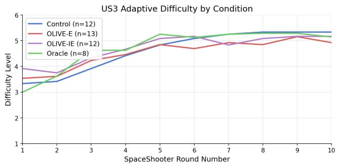  
Figure 22: US3 mean adaptive dificulty by condition. All conditions converge to dificulty 4–5 by round 4, confirming that between-condition throughput diferences in H3.1–H3.2 are not confounded by systematically diferent task demands at the time of the silent switch.

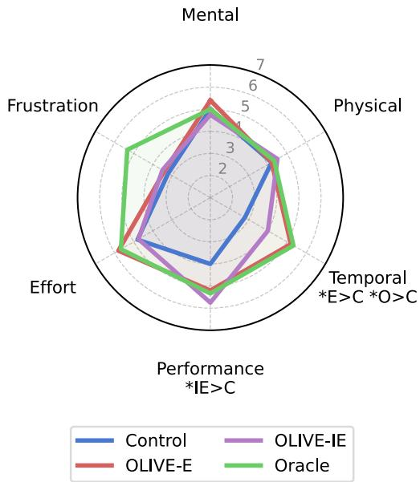  
Figure 23: NASA-TLX profile by condition (post-experiment; 1–7 scale). Axis labels annotated with pairwise significance $( \ast p < . 0 5 ,$ , Welch �-tests).

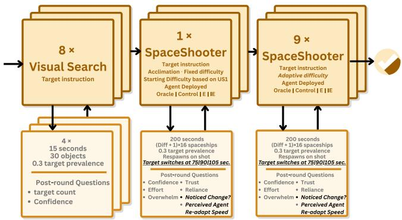  
Figure 21: US3 session structure. Identical to US2 except for longer rounds (200s vs. 120s) and a silent target switch occurs at a prerandomized time (unknown to participants).

5.33) than in Control (� = 2.8; E vs. C: � = 2.56, � = .035; Oracle vs. $\mathsf { C } \colon t = 2 . 5 5 , p = . 0 4 6 )$ , while OLIVE-IE (� = 4.0) fell intermediate, suggesting that EEG augmentation partially relieves the temporal pressure of monitoring for the switch, as the wingman reorients faster and reduces the window during which the operator must bear that burden alone. Self-rated performance was significantly higher for OLIVE-IE (� = 5.75) than Control $( M = 4 . 0 ; t = 2 . 5 7 , p =$ .048), consistent with the within-session readaptation improvement (H3.2). Frustration was low and comparable across C, E, and IE $( M = 3 . 2 – 3 . 5 )$ , but notably elevated for Oracle $( M = 5 . 3 3 ;$ Oracle vs. $\mathsf { C } \colon t = 2 . 0 2 , p = . 1 1 8 )$ , suggesting that automatic adaptation without operator agency may be perceived as disorienting rather than helpful.