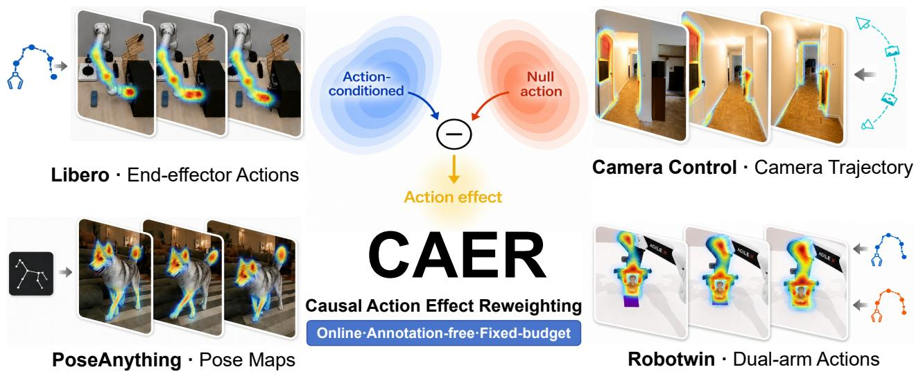
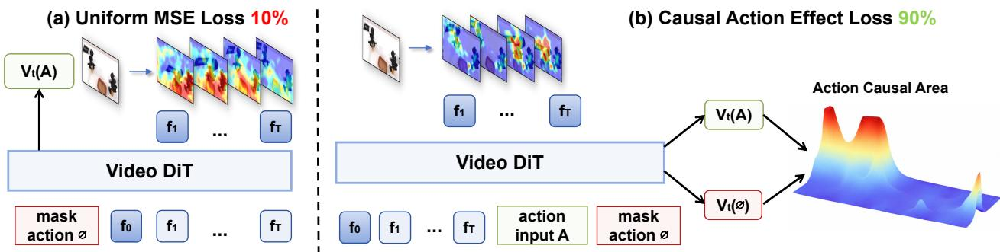
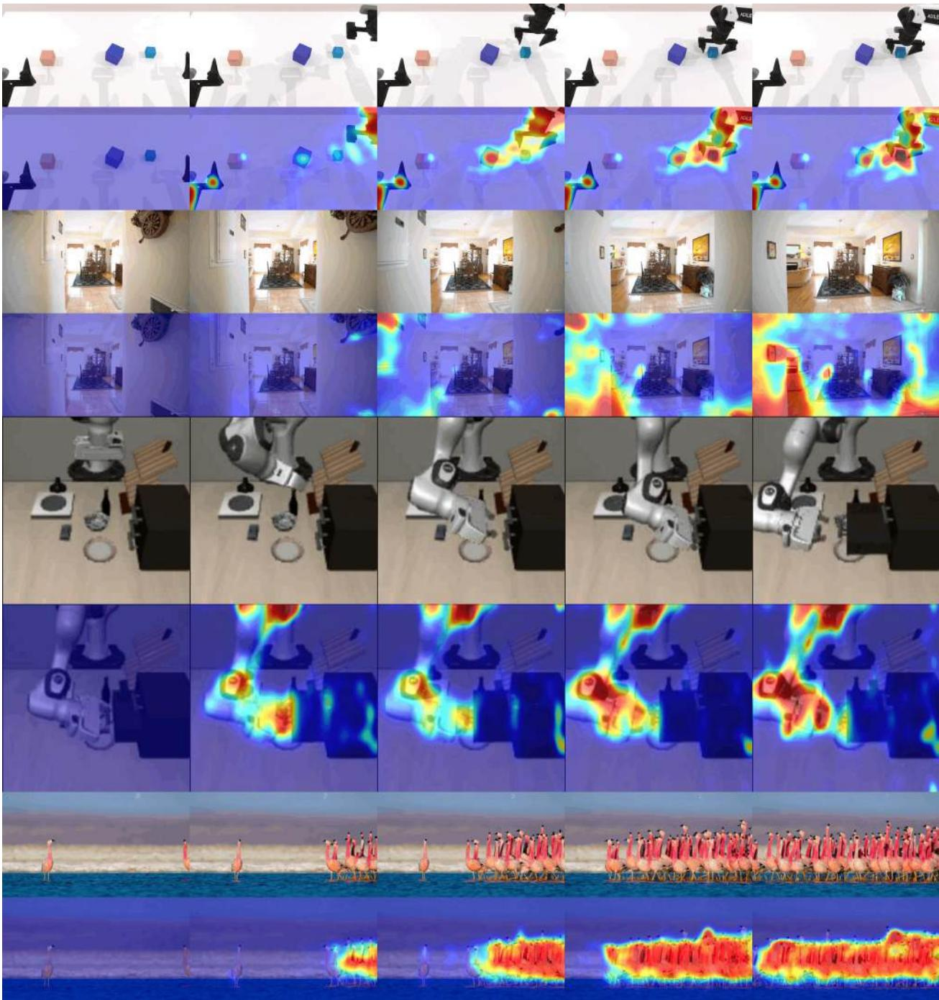
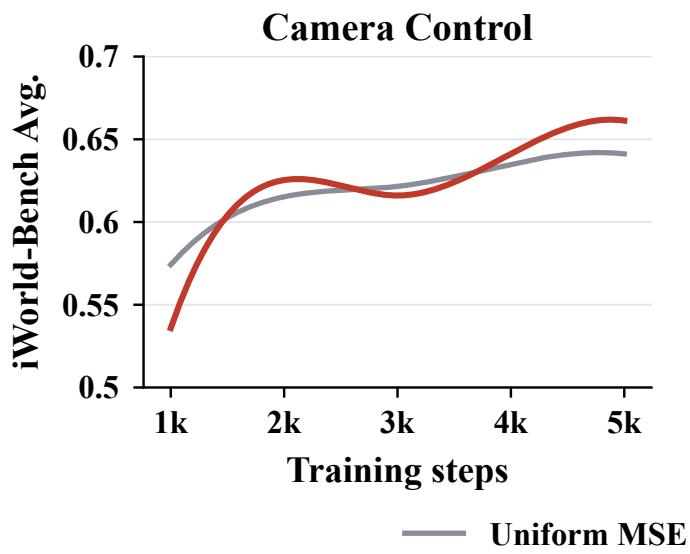
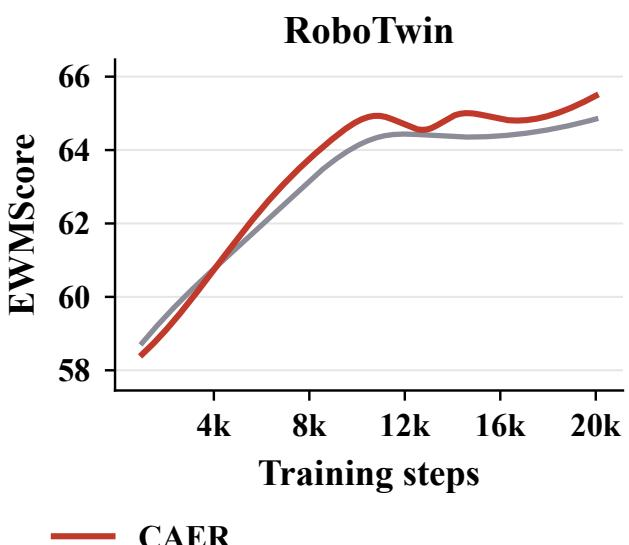
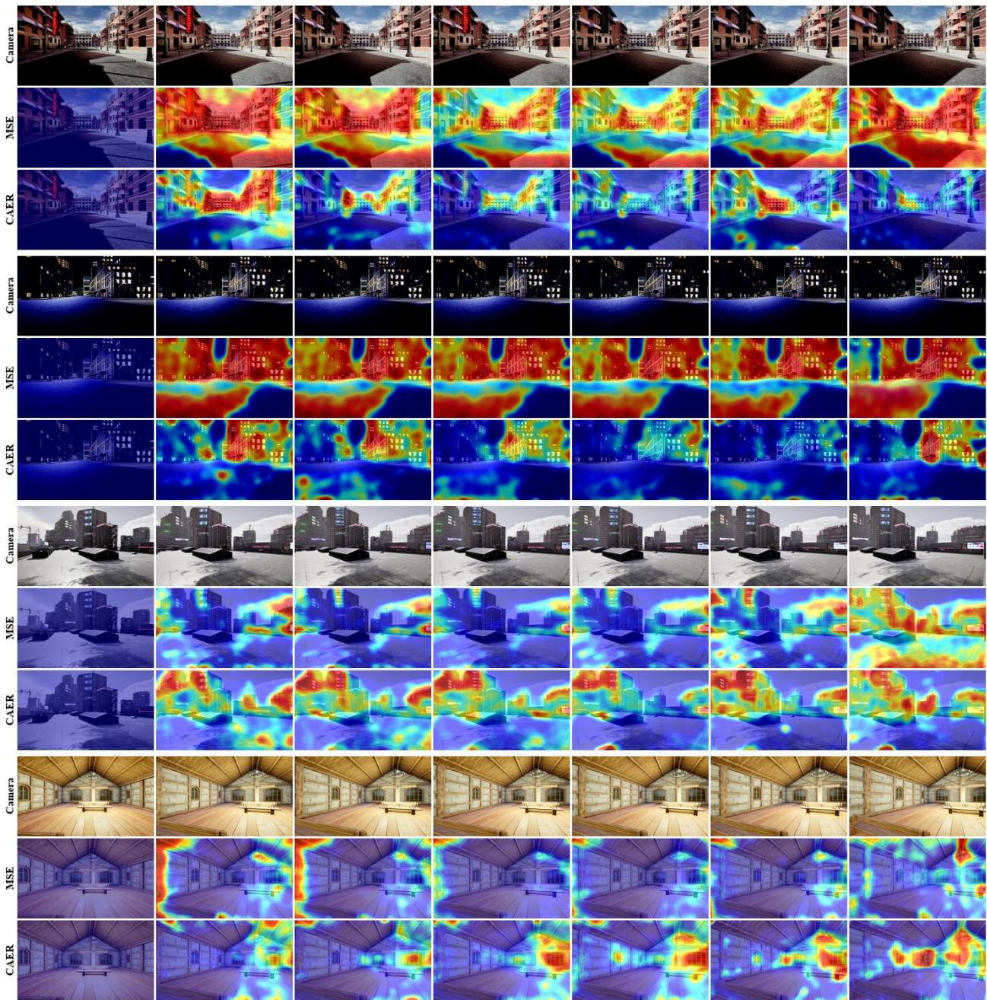
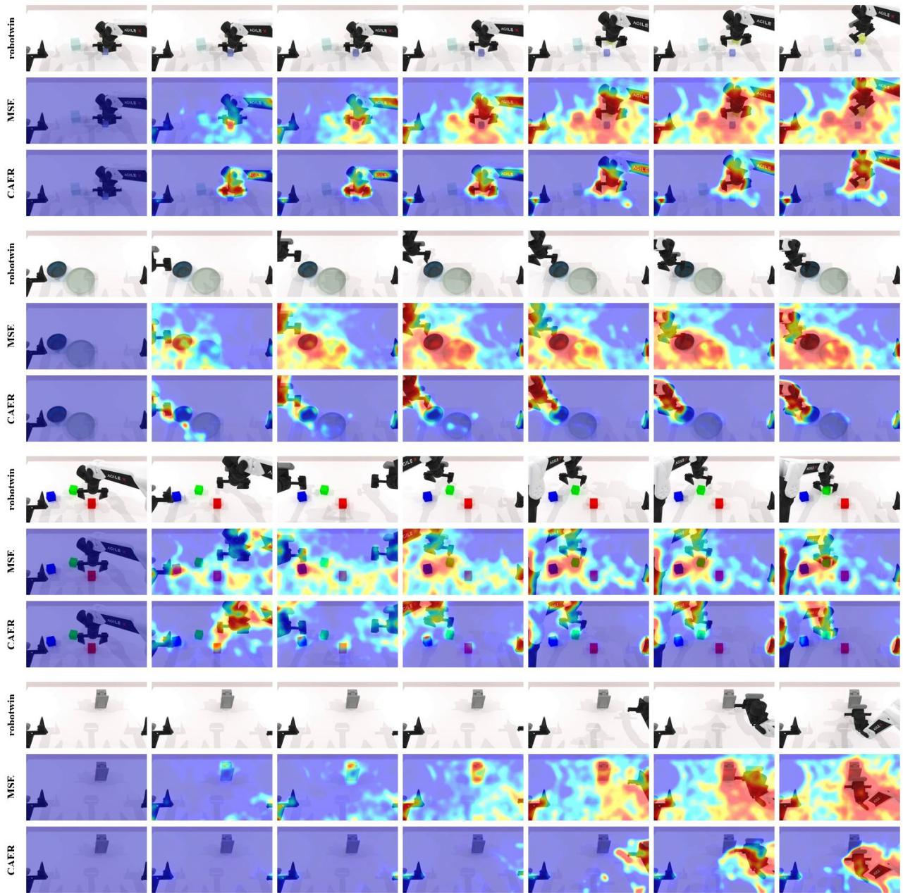
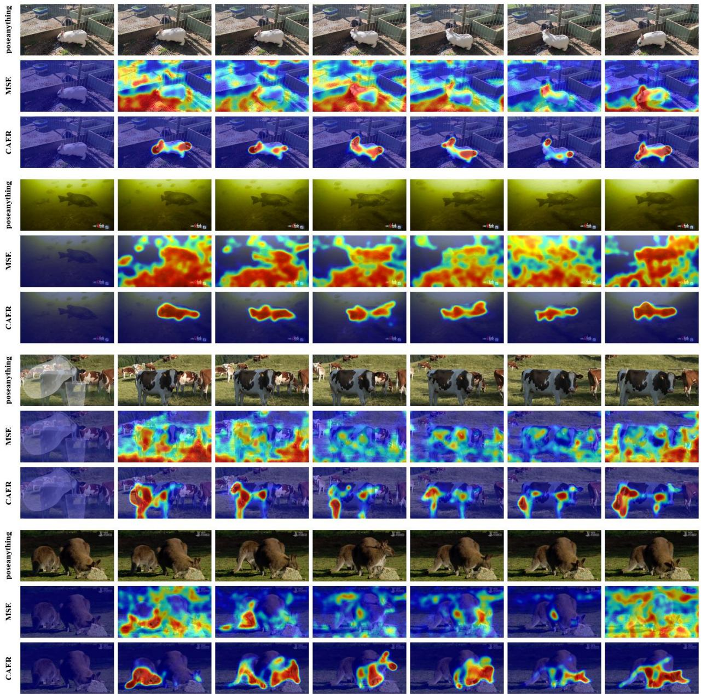
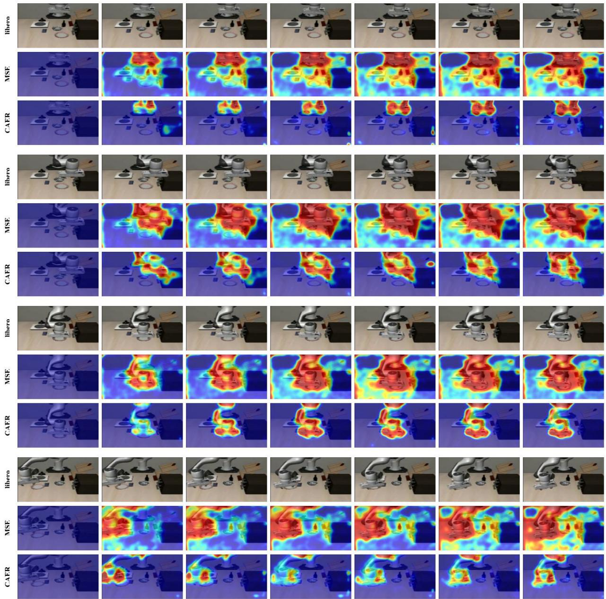

# CAER: Causal Action Efect Reweighting for

# World Model Training

Jianjie Fang1,\*, Xvyuan Liu1,\*, Ziyou Wang1, Rongze Tang3, Zhaolu Wang1, Zhuohang Li1, Xin Zhang2, Haisheng Su2, Chen Gao1,†, Wei Wu2, Xinlei Chen1,†, Yong Li1,†

1Tsinghua University 2Manifold AI 3University of Science and Technology of China chgao96@gmail.com, chen.xinlei@sz.tsinghua.edu.cn,

liyong07@tsinghua.edu.cn

\*Equal contribution. †Corresponding authors.

Abstract. World models are becoming core infrastructure for embodied intelligence, with actionconditioned video generation providing controllable predictions of how scenes evolve after agent interventions. Yet existing models are commonly trained with space–time-uniform mean squared error, allowing abundant background tokens to dominate the gradient while sparse interaction dynamics remain under-optimized; such uniform fitting rewards reconstructing appearance rather than learning how actions change the world. We introduce Causal Action Efect Reweighting (CAER), a general training paradigm that redistributes supervision toward the tokens whose predicted future is causally afected by the action. CAER contrasts the model’s own predictions with and without action conditioning to localize these tokens online, then normalizes the resulting efect map into a weight that preserves the total coeficient mass and changes only where it is spent. This online signal requires no external annotations or ofline preprocessing, avoids additional data-processing time, and scales naturally with model and dataset size. Experiments across heterogeneous action-conditioned world-model tasks show that CAER converges to better solutions than uniform MSE training, with consistent improvements in the physical consistency, controllability, and visual quality of generated videos.

Date: August 31, 2026 Webpage: https://manifoldai-research.github.io/CAER/

## 1 Introduction

World models equip embodied agents with the ability to look beyond the current observation and anticipate how the environment may evolve under diferent behaviors. By turning learned dynamics into simulated experience, they support planning, evaluation, and policy learning before actions are executed in the physical world. Advances in video difusion and flow-matching backbones [1–3] have made visually realistic world simulation increasingly feasible, supporting robotics, interactive environments, and policy development beyond what can be safely or economically collected in the physical world [4–9]. Within this paradigm, action-conditioned video generation provides a direct route to controllable prediction by modeling how visual scenes evolve in response to agent interventions. For an embodied agent, however, plausible appearance alone is insuficient. A useful world model must capture the physical consequences of interaction: where contact occurs, when an object begins to move, how forces propagate through the scene, and how the environment responds over time.

Despite this progress, current world models are still predominantly optimized with mean squared error averaged uniformly over space and time. Most video tokens describe static backgrounds, slowly varying context, or regions unrelated to the current interaction, whereas the decisive prediction errors are concentrated around brief contact events, manipulated objects, and actor motion. Uniform averaging therefore allows abundant, easily reconstructed tokens to dominate the gradient and dilute supervision for sparse physical interactions. This mismatch is especially damaging in embodied settings: a rollout may look realistic on average while placing contact at the wrong time, moving an object in the wrong direction, or failing to respond to the commanded action. Such failures are not merely visual defects; they indicate that the model has not learned how actions causally alter the world.

  
Figure 1: CAER overview. CAER identifies and reweights action-responsive tokens online without external annotations. Examples span end-efector trajectories, camera trajectories, dual-arm actions, and pose maps.

One possible remedy is to annotate actors, objects, motion, and contact regions explicitly. Segmentation models such as SAM [10] and optical-flow estimators such as RAFT [11] can track these regions and provide handcrafted loss weights. This solution, however, is dificult to scale to world-model data: per-frame inference introduces substantial computation, storage, and preprocessing overhead, while the resulting supervision inherits the biases and failure modes of the external models. It also defines relevance through a fixed annotation pipeline rather than through the causal relationship between the action and the predicted future.

In this work, we ask whether the world model itself can provide the missing supervision signal. Our key observation is that additional gradient should be assigned not to every visually salient region, but to tokens whose predicted future is sensitive to the action. If removing the action changes the prediction at a token, that token captures an action-dependent consequence that the model must learn, whereas a token that is unafected by the action carries no action-conditional risk however much it moves. This turns loss allocation into an online causal action-response problem. The model needs no external definition of the actor, manipulated object, or contact interface, because it identifies relevant interactions through its own conditional response. This principle is action-agnostic: it applies to end-efector poses, joint commands, spatial action maps, and camera trajectories alike, whenever a null-action condition can be learned, which aligns it with the broader goal of grounding world models in the consequences of intervention rather than only in perceptual likelihood [12, 13].

To examine whether self-computed causal action efects can serve as a scalable reweighting signal for world model training, we investigate three research questions.

• RQ1: Does action-efect reweighting improve interaction-region prediction quality? Since token-uniform losses are the default for generative world models, it remains unclear whether reweighting toward unresolved action efects improves the regions that matter most—contact events, manipulated objects, and actor motion—while preserving background fidelity and overall visual quality. Answering this question establishes whether CAER is an efective replacement for uniform reconstruction loss in action-conditioned settings.

  
Figure 2: CAER framework overview. At a fixed intermediate noise level and under shared noise, CAER contrasts the model’s response under the real action and a learned null action to localize action-sensitive tokens, then normalizes the map sample-wise to unit mean. The objective redistributes a fixed coeficient mass toward causally responsive regions, while action dropout keeps every token stochastically supervised.

• RQ2: How do the key design choices contribute to the efect map quality and training stability? CAER introduces two training choices that govern the quality of the online counterfactual signal: the action-dropout rate that defines the null branch, and the fixed noise level at which the efect is read. We vary each in isolation to understand its contribution to convergence speed, loss stability, and final generation performance.

• RQ3: Does the self-computed signal sharpen as the model improves? A central motivation of self-computed reweighting is that the supervision signal improves together with the model, forming a training loop that needs no external annotation. We test whether the benefit of the self-computed signal grows with training, overtaking uniform averaging once the causal interaction is learned, and whether the resulting gains appear in task-level success rather than in appearance metrics alone.

Building on this observation, we introduce CAER (Fig. 1), a causal action efect reweighting paradigm that changes how the conventional MSE-based flow-matching objective allocates supervision. Instead of averaging all space–time tokens uniformly, CAER compares predictions under the observed action and a learned null-action condition at a fixed intermediate noise level, using their velocity-space diference to identify where the predicted future responds to the action. Action dropout keeps this counterfactual query in distribution. The action response is then normalized sample-wise into a weight that preserves the total coeficient mass and changes only where it is spent. Because the coeficient mass is fixed, the comparison with uniform averaging becomes a pure allocation question: to first order in the learning rate, focused weighting reduces interaction-region risk faster than uniform averaging whenever the weight is positively correlated with token utility, and it still descends at points where uniform training stalls because sparse interaction gradients are cancelled by dominant background gradients. Because the complete signal is computed online by the world model, CAER requires no segmentation, tracking, optical flow, or contact annotation and applies to both spatial and numerical action interfaces.

Experiments show that this causal redistribution improves interaction modeling and visual generation together. Because the weight is normalized rather than added, CAER can be enabled from the first optimization step without retuning the loss scale, and its focusing signal is refreshed at every step instead of being fixed in advance. Across action-conditioned tasks with distinct control modalities, it converges to better solutions than the matched uniform-MSE baseline, with stronger visual quality and physical consistency. As training proceeds, the focus contracts onto causal interaction regions and those dynamics are predicted with progressively greater accuracy. The resulting world model therefore captures not only sharper appearance, but also when interactions occur, how objects respond to interventions, and how agents afect the surrounding world.

## 2 Methodology

CAER allocates gradient to locations where the predicted future is causally sensitive to the action, a signal read online from the world model itself without segmentation, tracking, optical flow, or contact labels. Motion cues identify what moves, whereas control requires what the action governs: camera shake and exogenous motion are salient under the former yet carry no action-conditional risk. Crucially, the weight redistributes a fixed coeficient mass instead of enlarging it, which turns the comparison with uniform training into a pure allocation question and lets us characterize, at equal mass, when the reallocation provably wins (Fig. 2).

## 2.1 Problem Formulation

Let the backbone be a pretrained video generator and $z _ { 0 } ~ \in ~ \mathbb { R } ^ { B \times C \times T \times h \times w }$ the video latent, where $t = 0$ denotes the reference frame and $t = 1 , \ldots , T - 1$ the supervised future. We use the linear flow-matching path

$$
\begin{array} { r } { z _ { \tau } = ( 1 - \tau ) z _ { 0 } + \tau \epsilon , \qquad } \\ { \nu _ { \mathrm { t g t } } = \epsilon - z _ { 0 } , \qquad \epsilon \sim N ( 0 , I ) , } \end{array}\tag{1}
$$

where � follows the backbone’s timestep distribution. The model predicts $\upsilon _ { \theta } ( z _ { \tau } ; c _ { A } )$ conditioned on $c _ { A } = \{ \mathbf { o } _ { 0 } , \mathbf { p } , \mathcal { A } \}$ , containing the reference observation, language instruction, and action condition. Uniform flow matching averages token errors, allocating gradient by token count rather than by downstream utility: static background tokens dominate the coeficient mass although generation failures concentrate on sparse actor–object interactions.

## 2.2 Action Conditioning and Efect Estimation

Action conditioning. A frame-aligned action sequence $A = \left[ a _ { 1 } , \ldots , a _ { K } \right]$ , with $a _ { k } \in \mathbb { R } ^ { d _ { a } }$ , is mapped to a backbone-compatible condition ${ \mathcal { A } } = \phi ( A )$ . The encoder $\phi$ follows the backbone’s control interface, either spatial, where frame-wise action maps are VAE-encoded onto the video latent grid, or numerical, where action vectors modulate each Transformer block (Table 1). New pathways are zero-initialized where possible, preserving the pretrained image-to-video function at initialization.

Null action. Reweighting only requires that removing A produces a well-defined prediction $\nu _ { \theta } ( z _ { \tau } ; c _ { \theta } )$ where $c _ { \boldsymbol { \mathbb { 0 } } } = \{ \mathbf { o } _ { 0 } , \mathbf { p } , \boldsymbol { \mathbb { 0 } } \}$ . We realize ∅ by zeroing or masking the injected action features, whichever form the interface exposes. Because an action-free input would otherwise be out of distribution, we independently disable action injection with probability $p _ { \mathrm { d r o p } } = 0 . 1 0$ and predict the same target from $c _ { \emptyset }$ . Similar to classifier-free guidance [14], this trains a usable null branch. Here it also keeps both CAER queries in distribution and provides the recall floor in Eq. (5).

Action efect map. We evaluate a controlled counterfactual: under the same history and noisy latent, where does the predicted velocity change when the true action is removed? Using shared noise $\epsilon ^ { \prime }$ , we build a latent at a fixed intermediate time $\tau _ { S } = 0 . 5 0$ by $z _ { \tau _ { S } } = ( 1 - \tau _ { S } ) z _ { 0 } + \tau _ { S } \epsilon ^ { \prime }$ , and reduce the two

responses along the channel dimension:

$$
S = \left\| \nu _ { \theta } ( z _ { \tau _ { S } } ; c _ { A } ) - \nu _ { \theta } ( z _ { \tau _ { S } } ; c _ { \emptyset } ) \right\| _ { 2 }\tag{2}
$$

with $S \in \mathbb { R } ^ { B \times 1 \times T \times h \times w }$ . Sharing $\epsilon ^ { \prime }$ removes sampling variation, while fixing $\tau _ { S }$ prevents the scale and spatial structure of � from drifting with the random training timestep. The two evaluations are extra forwards under no-gradient mode, run alongside the single gradient-carrying forward at the sampled � that produces the loss. On the linear path $\hat { z } _ { 0 } = z _ { \tau _ { S } } - \tau _ { S } \nu _ { \theta }$ , so $S = \tau _ { S } ^ { - 1 } \lVert \delta _ { \theta } \rVert _ { 2 }$ for the action-induced increment between the model’s two clean-state predictions, $\delta _ { \theta } = \hat { z } _ { 0 } ( z _ { \tau _ { S } } ; c _ { A } ) - \hat { z } _ { 0 } ( z _ { \tau _ { S } } ; c _ { 0 } )$ , which is the model’s current estimate of

$$
\delta = \mathbb { E } \left[ z _ { 0 } \mid z _ { \tau _ { S } } , c _ { A } \right] - \mathbb { E } \left[ z _ { 0 } \mid z _ { \tau _ { S } } , c _ { 0 } \right] .\tag{3}
$$

Thus � measures how strongly the model’s predicted future depends on the action, which is what separates it from flow or segmentation: a token with negligible $\delta _ { i }$ carries little action-conditional risk regardless of its pixel-space motion. Since $z _ { \tau _ { S } }$ is a noised version of the realized future and hence itself downstream of the action, Eq. (3) is an action-conditional predictive contrast rather than an interventional quantity in the sense of do-calculus; we use causal in this operational sense throughout, which sufices because the objective needs only a ranking of tokens by residual action dependence, not an identified causal graph.

## 2.3 Focused Objective and Optimization Efect

Budget-neutral weight. Let $\Omega _ { b } = \{ ( t , x ) : t = 1 , . . . , T - 1 \}$ be the $\left| \Omega _ { b } \right| = \left( T - 1 \right)$ ℎ� future tokens of sample �, and $\begin{array} { r } { \mu ^ { ( b ) } ( F ) = | \Omega _ { b } | ^ { - 1 } \sum _ { ( t , x ) \in \Omega _ { b } } F _ { x } ^ { b , t } } \end{array}$ the future-token mean of a scalar map �. Because the magnitude of � changes with training progress and action amplitude, we normalize it independently for each sample:

$$
\rho _ { x } ^ { b , t } = \frac { S _ { x } ^ { b , t } } { \operatorname* { m a x } \bigl \{ \mu ^ { ( b ) } ( S ) , \varepsilon _ { 0 } \bigr \} } , \qquad \mu ^ { ( b ) } ( \rho ) = 1 ,\tag{4}
$$

with a small constant $\varepsilon _ { 0 } > 0$ for numerical safety. The unit-mean constraint fixes the total coeficient mass to that of uniform training, so reweighting redistributes coeficient mass within each sample without increasing its total mass or shifting mass across samples. The construction of $\rho$ is detached from the backward graph.

Recall floor. A token with zero measured efect would receive no gradient, so a false negative could never be corrected, whereas a false positive only spends part of one update; the error is therefore asymmetric. Action dropout removes this failure mode at no additional cost. On dropped samples we skip Eq. (2) and set $\rho \equiv 1$ , supervising every token with unit weight through the null branch, which shares all parameters with the action branch. Averaged over the dropout variable, the coeficient applied to token (�, �) is

$$
\begin{array} { r l } & { \bar { \rho } _ { x } ^ { b , t } = ( 1 - p _ { \mathrm { d r o p } } ) \rho _ { x } ^ { b , t } + p _ { \mathrm { d r o p } } , } \\ & { \bar { \rho } _ { x } ^ { b , t } \geq p _ { \mathrm { d r o p } } > 0 , \qquad \mu ^ { ( b ) } ( \bar { \rho } ) = 1 , } \end{array}\tag{5}
$$

so the efective weight field is strictly positive and no token is permanently excluded from optimization, while the coeficient mass is preserved exactly rather than inflated by a hand-set lower bound; because dropped samples are supervised under $c _ { \emptyset }$ , Eq. (5) is the coeficient reaching token (�, �) through the shared parameters. With $c _ { b }$ the condition used in sample �’s main forward, and $\rho \equiv 1$ on dropped samples, the token error is

$$
\ell _ { x } ^ { b , t } = \left\| \nu _ { \theta } ( z _ { \tau } ; c _ { b } ) _ { x } ^ { b , t } - \nu _ { \mathrm { t g t } x } ^ { b , t } \right\| _ { 2 } ^ { 2 } .\tag{6}
$$

Since $\begin{array} { r } { \sum _ { ( t , x ) \in \Omega _ { b } } \rho _ { x } ^ { b , t } = | \Omega _ { b } | } \end{array}$ , no additional normalization is required:

$$
\mathcal { L } _ { \mathrm { { f o c u s } } } = \frac { 1 } { B } \sum _ { b = 1 } ^ { B } \frac { 1 } { \left| \Omega _ { b } \right| } \sum _ { ( t , x ) \in \Omega _ { b } } s \mathrm { g } \mathopen { } \mathclose \bgroup \left( \rho _ { x } ^ { b , t } \aftergroup \egroup \right) \ell _ { x } ^ { b , t } .\tag{7}
$$

Allocation gain at equal coeficient mass. We drop the sample index and write $g _ { i } = \nabla _ { \theta } \ell _ { i }$ for $i \in \Omega$ For a tolerance $\kappa \geq 0$ , let $R = \{ i : \| \delta _ { i } \| > \kappa \}$ collect the tokens whose predicted future is appreciably action-dependent, and $R ^ { c } = \Omega \backslash R$ the background. Define the interaction risk, the region gradients, and the utility of token � as

$$
\mathcal { T } _ { R } = \frac { 1 } { | R | } \sum _ { i \in R } \ell _ { i } , \quad G _ { R } = \frac { 1 } { | \Omega | } \sum _ { i \in R } g _ { i } , \quad a _ { i } = \langle \nabla \mathcal { T } _ { R } , g _ { i } \rangle ,\tag{8}
$$

with $G _ { R ^ { c } }$ defined analogously, so that $\begin{array} { r } { \nabla \mathcal { T } _ { R } = \frac { | \Omega | } { | R | } G _ { R } } \end{array}$ and $G _ { \mathrm { u n i } } = G _ { R } + G _ { R ^ { c } }$ . Comparing the equal-mass updates $\begin{array} { r } { G _ { \mathrm { u n i } } = \vert \Omega \vert ^ { - 1 } \sum _ { i } g _ { i } } \end{array}$ and $\begin{array} { r } { G _ { \rho } = | \Omega | ^ { - 1 } \sum _ { i } \rho _ { i } g _ { i } } \end{array}$ to first order and using $\mu ( \rho ) = 1$

$$
\begin{array} { r l } { \mathcal { T } _ { R } ( \theta - \eta G _ { \mathrm { u n i } } ) - \mathcal { T } _ { R } ( \theta - \eta G _ { \rho } ) } & { } \\ { = \eta \operatorname { C o v } _ { i } ( \rho _ { i } , a _ { i } ) + O ( \eta ^ { 2 } ) , } \end{array}\tag{9}
$$

where the covariance is taken over tokens drawn uniformly from Ω. Positive covariance between weight and utility is therefore exactly the condition, to first order in $\eta ,$ under which focused weighting reduces interaction risk faster than uniform weighting at identical coeficient mass.

Equation (2) supplies that correlation. For $i \in R$ the utility decomposes as

$$
a _ { i } = \frac { 1 } { | R | } \Big ( \| g _ { i } \| _ { 2 } ^ { 2 } + \sum _ { j \in R \backslash \{ i \} } \left. g _ { j } , g _ { i } \right. \Big ) ,\tag{10}
$$

whose diagonal term is strictly positive whenever the token is not yet solved, whereas a token in $R ^ { c }$ enters $\mathcal { T } _ { R }$ only through parameter sharing and contributes cross terms of no systematic sign. Since $S _ { i }  \Vert \delta _ { i } \Vert / \tau _ { S }$ as the estimate improves, � places above-average weight precisely on the tokens that carry this positive diagonal term. Only a positive association between $\rho$ and � is required, not calibrated magnitudes, so the argument tolerates estimation error in �, and it is the association across tokens rather than the sign of any single $a _ { i }$ that matters.

<table><tr><td>Task setting</td><td>Training source</td><td>Samples (clips × frames)</td><td>Action injection</td><td>Evaluation benchmark</td></tr><tr><td>LIBERO [15]</td><td>LIBERO simulator rollouts</td><td> $4 4 , 1 6 6 \times 1 7$ </td><td>Low-dimensional actions → MLP modulation</td><td>WorldArena [16]</td></tr><tr><td>RoboTwin [17]</td><td>RoboTwin 2.0</td><td> $5 0 , 0 1 6 \times 1 7$ </td><td>14-D actions → MLP modulation</td><td>WorldArena [16]</td></tr><tr><td>Camera Control</td><td>RealEstate10K [18]</td><td> $3 0 , 0 1 6 \times 8 1$ </td><td>Camera trajectory → Control Adapter</td><td>iWorld-Bench [9]</td></tr><tr><td>PoseAnything [19]</td><td>Official training set</td><td> $5 1 , 7 9 2 \times 1 7$ </td><td>Pose maps → VAE visual branch</td><td>VBench [20]</td></tr></table>

Table 1: Training and evaluation settings. All experiments use Wan 2.2 5B as the backbone.

Escaping cancellation. Uniform descent halts wherever $G _ { \mathrm { u n i } } = G _ { R } + G _ { R ^ { c } } = 0 .$ , which can occur with $G _ { R } \neq 0 \colon$ : sparse interaction gradients are cancelled by background gradients even though $\nabla \mathcal { T } _ { R } \propto G _ { R } \neq 0$ leaves the interaction risk locally reducible. Let $\alpha$ and $\beta$ denote the mean weights over � and $R ^ { c }$ . Unit mass forces

$$
\frac { | R | } { | \Omega | } \alpha + \frac { | R ^ { c } | } { | \Omega | } \beta = 1 ,\tag{11}
$$

so a single one-sided input sufices: (A1) the efect map is informative in the weak sense that $\alpha > 1$ Unit mass then forces $\beta < 1$ , and $\alpha > \beta$ follows from Eq. (4) rather than from a separate assumption about the background. Treating $\rho$ as constant within each region, at such a point $\theta _ { u }$

$$
\begin{array} { c } { G _ { \rho } ( \theta _ { u } ) = \alpha G _ { R } + \beta G _ { R ^ { c } } = ( \alpha - \beta ) G _ { R } \neq 0 , } \\ { \displaystyle \left. \nabla \mathcal { T } _ { R } , G _ { \rho } ( \theta _ { u } ) \right. = ( \alpha - \beta ) \frac { | \Omega | } { | R | } \| G _ { R } \| _ { 2 } ^ { 2 } > 0 . } \end{array}\tag{12}
$$

Focused weighting therefore produces a strict first-order decrease of the interaction risk under (A1) alone, with no assumption on the alignment between $G _ { R }$ and $G _ { R ^ { c } }$ , and the guarantee is quadratic in the very gradient that uniform training cancelled away. Because $\rho$ is recomputed and detached at every step, the result applies to the surrogate optimized at that step.

Shared optimum and variance. After stop-gradient the weights are constants, and averaging over the dropout variable gives $\bar { \rho } \ge p _ { \mathrm { d r o p } } > 0$ , so the population objective is a strictly positive weighted sum of token-wise Bregman divergences. Because $\rho$ is built from $\scriptstyle { \mathcal { Z } } 0$ , it is not measurable with respect to the conditioning alone, so whether reweighting moves the population optimum is a substantive question. Writing $\mathbb { E } _ { c } [ \cdot ]$ for the expectation given $( \boldsymbol { z } _ { \tau } , \boldsymbol { c } )$ , the per-token minimizer is available in closed form and its deviation from the uniform optimum $\nu ^ { * } = \mathbb { E } [ \nu _ { \mathrm { t g t } } \mid z _ { \tau } , c ]$ is exactly one covariance,

$$
\upsilon _ { i } ^ { \rho } = \frac { \mathbb { E } _ { c } \left[ \bar { \rho } _ { i } \upsilon _ { \mathrm { t g t } , i } \right] } { \mathbb { E } _ { c } \left[ \bar { \rho } _ { i } \right] } , \qquad \upsilon _ { i } ^ { \rho } - \upsilon _ { i } ^ { * } = \frac { \mathrm { C o v } _ { c } \left( \bar { \rho } _ { i } , \upsilon _ { \mathrm { t g t } , i } \right) } { \mathbb { E } _ { c } \left[ \bar { \rho } _ { i } \right] } ,\tag{13}
$$

taken componentwise between the scalar weight and the vector target. Uniform flow matching is recovered whenever the efective weight is uncorrelated with the aleatoric part of the target, and any violation is damped by a denominator bounded below by $p _ { \mathrm { d r o p } }$ through Eq. (5). The construction keeps the numerator small by design: both branches share $z _ { \tau _ { S } } .$ , so common structure cancels and only the action-induced diference survives; the channel norm discards its sign, removing direct coupling to a signed residual; and the map is read at a fixed $\tau _ { S }$ from an independent draw $\epsilon ^ { \prime }$ , so it is not a function of the noise defining $\upsilon _ { \mathrm { t g t } }$ at �. A dependence on $\scriptstyle { \mathcal { Z } } 0$ persists because $z _ { \tau _ { S } }$ contains it, and Eq. (13) states precisely how much that can matter; up to this bounded tilt, the points escaped in Eq. (12) are optimization-induced stationary points rather than alternative population optima. The remaining cost is second order, entering through the second moment $\mu ( \rho ^ { 2 } ) = 1 + \chi ^ { 2 } ( \rho \|$ unif), which bounds the variance inflation of the token-averaged gradient: it stays near one while $\rho \approx 1$ early in training and grows only as the weight concentrates. As � improves, its counterfactual estimate sharpens and the covariance in Eq. (9) can increase, while Eq. (5) keeps every token receiving gradient, closing a self-consistent loop that needs no external annotation.

## 3 Experiments

We evaluate CAER against uniform MSE under a matched training protocol across four actionconditioned settings, then analyze key hyperparameters and the evolution of the focus map during training.

Table 2: Uniform MSE versus CAER on iWorld-Bench [9] for camera control. Aggregate plus generation-quality and trajectory-following metrics; memory metrics are omitted. Higher is better; best in bold.
<table><tr><td rowspan="2"></td><td colspan="2">Aggregate</td><td colspan="4">Generation Quality</td><td colspan="2">Trajectory Following</td></tr><tr><td>Objective</td><td>Avg.</td><td>Image Quality</td><td>Consistency</td><td>Brightness Color Temp. Sharpness Constraint</td><td>Retention</td><td>Motion Smoothness</td><td>Trajectory Accuracy</td></tr><tr><td rowspan="2">Camera Control</td><td>Uniform MSE</td><td>0.6412</td><td>0.6898</td><td>0.5513</td><td>0.5196</td><td>0.4752</td><td>0.9902</td><td>0.6211</td></tr><tr><td>CAER</td><td>0.6614</td><td>0.6804</td><td>0.6693</td><td>0.6627</td><td>0.4150</td><td>0.9934</td><td>0.5474</td></tr></table>

Table 3: Uniform MSE versus CAER on WorldArena [16] for LIBERO and RoboTwin. EWMScore and all 15 constituent metrics across six dimensions. Higher is better; best within each task in bold.

<table><tr><td rowspan="3"></td><td rowspan="3">Objective</td><td rowspan="2">Aggregate EWM</td><td colspan="2">Visual Quality</td><td rowspan="2"></td><td colspan="2">Motion Quality</td><td rowspan="2"></td><td colspan="2">Content Consistency</td><td colspan="2">Physics Adherence</td><td colspan="2">3D Accuracy</td><td colspan="2">Controllability</td></tr><tr><td>Image Aesthetic</td><td>JEPA</td><td>Dynamic Flow</td><td>Motion</td><td>Subject</td><td>Background Photometric</td><td></td><td>Interaction Trajectory</td><td></td><td>Depth Perspectivity</td><td></td><td>Instruction Semantic</td></tr><tr><td rowspan="3">LIBERO</td><td rowspan="3">Uniform MSE</td><td>Score</td><td>Quality Quality 0.4950</td><td>Similarity 0.5472</td><td>Degree 0.1383</td><td>Score 0.0388</td><td>Smoothness 0.4853</td><td>Consistency</td><td>Consistency Consistency</td><td></td><td>Quality</td><td>Accuracy</td><td>Accuracy</td><td></td><td>Following Alignment 0.5520</td><td></td></tr><tr><td>57.66 61.79</td><td>0.3655 0.3694</td><td></td><td></td><td>0.1623 0.0549</td><td>0.5020</td><td>0.6050 0.7624</td><td>0.6280 0.7915</td><td>0.6829 0.8397</td><td>0.5900 0.5885</td><td>0.8111 0.8475</td><td>0.9805 0.9793</td><td>0.8080 0.8077</td><td></td><td>0.9207</td></tr><tr><td>CAER</td><td></td><td>0.5076 0.3895</td><td>0.5639</td><td></td><td></td><td></td><td></td><td></td><td></td><td></td><td></td><td></td><td>0.5615</td><td>0.9300</td></tr><tr><td rowspan="2">RoboTwin</td><td>Uniform MSE</td><td>62.35</td><td>0.5200</td><td>0.8323</td><td>0.4667</td><td>0.2738</td><td>0.7930</td><td>0.8234</td><td>0.8967</td><td>0.1232</td><td>0.6505</td><td>0.2781</td><td>0.8093</td><td>0.9071</td><td>0.6929</td><td>0.8955</td></tr><tr><td>CAER</td><td>63.13</td><td>0.5502</td><td>0.3879</td><td>0.8187</td><td>0.5268 0.3251</td><td>0.8231</td><td>0.8125</td><td>0.8957</td><td>0.0986</td><td>0.6620</td><td>0.2610</td><td>0.8212</td><td>0.9180</td><td>0.6860</td><td>0.8825</td></tr></table>

Table 4: Uniform MSE versus CAER on VBench [20] for PoseAnything. Results on six fine-grained quality dimensions. Higher is better; best in bold.

<table><tr><td></td><td>Objective</td><td>Aggregate</td><td>Subject Consistency</td><td>Background Consistency</td><td>Motion Smoothness</td><td>Degree</td><td>Dynamic Aesthetic Imaging Quality</td><td>Quality</td></tr><tr><td rowspan="2">PoseAnything</td><td>Uniform MSE</td><td>0.7422</td><td>0.8460</td><td>0.9273</td><td>0.9686</td><td>0.74</td><td>0.4348</td><td>0.5366</td></tr><tr><td>CAER</td><td>0.7746</td><td>0.8828</td><td>0.9202</td><td>0.9608</td><td>0.86</td><td>0.4269</td><td>0.5971</td></tr></table>

## 3.1 Experimental Settings

Data and control interfaces. All four settings use Wan 2.2 5B [1]; their data, control interfaces, and evaluation benchmarks are summarized in Table 1. Robot actions are temporally aligned with the video clips and injected through MLP-based DiT modulation. Camera trajectories are projected into patch-level control features, whereas frame-wise pose maps are VAE-encoded to align with the video latent grid.

Matched training protocol. Within each setting, uniform MSE and CAER share the initialization, action pathway, training samples and order, optimizer, schedule, batch size, resolution, and training steps; only the objective changes. All experiments use eight NVIDIA H20 GPUs. LIBERO, RoboTwin, and camera control are evaluated after 5,000 optimization steps, while PoseAnything is evaluated after 1,000 steps. Unless otherwise stated, CAER uses $p _ { \mathrm { d r o p } } = 1 0 \%$ and $\tau _ { S } = 0 . 5 0$ . Non-dropped samples run one gradient-carrying forward at the sampled � for the loss plus two no-gradient forwards at �� for the action efect, adding no backward pass and no external model; dropped samples train the null-action branch with uniform flow matching. We report each benchmark’s oficial metrics and, where feasible, mean and standard deviation across repeated runs, wall-clock time, peak memory, and steps to convergence.

## 3.2 Main Comparison Across Action-Conditioned World Model

To comprehensively assess the generality of CAER as a training paradigm, we compare it with uniform MSE across four heterogeneous action-conditioned tasks and their corresponding benchmarks. Each pair uses the same initialization, data, action interface, and optimization schedule, with the objective as the only diference. Tables 2, 3, and 4 report the oficial metrics of iWorld-Bench, WorldArena, and VBench, covering visual and motion quality, physical consistency, controllability, and semantic

<table><tr><td>Factor</td><td>Value</td><td>WorldArena ↑</td><td>iWorldBench ↑</td></tr><tr><td rowspan="5">Action dropout</td><td>5%</td><td>62.83</td><td>0.5447</td></tr><tr><td>10%</td><td>63.13</td><td>0.6614</td></tr><tr><td>15%</td><td>61.91</td><td>0.5797</td></tr><tr><td>20%</td><td>61.40</td><td>0.5470</td></tr><tr><td></td><td>61.09</td><td></td></tr><tr><td rowspan="3">Fixed time  $\tau _ { S }$ </td><td>0.25</td><td></td><td>0.5652 0.6614</td></tr><tr><td>0.50 0.75</td><td>63.13</td><td></td></tr><tr><td></td><td>62.27</td><td>0.6167</td></tr></table>

Table 5: Sensitivity of CAER to action dropout and fixed noise $\tau _ { S }$ on RoboTwin (WorldArena) and camera control (iWorld-Bench). Bold entries denote the default configuration.

## alignment.

Across all four AC-WM settings, CAER consistently outperforms the matched uniform-MSE baseline under the same backbone, data, and training schedule. Gains appear not only in aggregate scores but also across fine-grained dimensions that stress action following, interaction fidelity, and physical consistency, indicating that action-causal reweighting systematically redirects capacity toward tokens that determine controllable dynamics rather than background residuals. Because the improvement holds for robot manipulation (LIBERO and RoboTwin), camera control, and pose-conditioned generation alike, these results support CAER as a more general and better-suited training objective for action-conditioned world models than space–time-uniform MSE.

Figure 3 confirms that the loss concentrates on action-relevant regions across control modalities while downweighting already-modeled content. Benchmark-specific qualitative comparisons are provided in Appendix A: camera control is shown in Figure 5, RoboTwin in Figure 6, PoseAnything in Figure 7, and LIBERO in Figure 8. These examples provide a closer view of how CAER shifts supervision toward action-relevant regions under diferent control interfaces. Quantitatively, CAER improves the score from 0.6412 to 0.6614 on camera control, from 57.66 to 61.79 on LIBERO, from 62.35 to 63.13 on RoboTwin, and from 0.7422 to 0.7746 on PoseAnything. The largest gains occur in motionand interaction-sensitive dimensions, including dynamic degree, flow quality, content consistency, and imaging quality. Several strong appearance or trajectory metrics remain unchanged or slightly decrease. This suggests that CAER reallocates capacity from easy, action-independent content toward unresolved action-conditioned dynamics rather than optimizing every token uniformly, improving world-model performance.

## 3.3 Training Hyperparameter Analysis

As shown in Table 5, we next analyze the sensitivity of CAER to action dropout and the fixed-noise operating point. For action dropout, we compare $p _ { \mathrm { d r o p } } \in \{ 5 \% , 1 0 \% , 1 5 \% , 2 0 \% \}$ while fixing $\tau _ { S } = 0 . 5 0$ For the efect-map operating point, we compare $\tau _ { S } \in \{ 0 . 2 5 , 0 . 5 0 , 0 . 7 5 \}$ while fixing $p _ { \mathrm { d r o p } } = 1 0 \%$ Changing one factor at a time separates null-branch quality from noise-level sensitivity.

The results show a clear trade-of in the action dropout rate. A very small dropout rate insuficiently trains the null-action branch, whereas an excessively large rate causes action-irrelevant regions to dominate the reweighting signal. Empirically, approximately 10% provides a reasonable balance.

The results also highlight the importance of selecting an appropriate noise level $\tau _ { S }$ . Extremely small or large values either suppress the diference between the two branches or weaken scene-specific localization. In comparison, $\tau _ { S } = 0 . 5$ preserves both action dependence and scene context, producing the most informative action-efect map.

  
Figure 3: Qualitative Results. Generated videos and their CAER loss-supervision maps across four distinct action-conditioning modalities. Darker red regions indicate larger loss values, whereas darker purple regions indicate smaller loss values.

## 3.4 Toy Study: Score Evolution During Training

Finally, we evaluate intermediate checkpoints throughout training on both benchmarks to characterize how the two objectives trade of over optimization. Figure 4 plots iWorld-Bench on camera control and WorldArena on RoboTwin, with CAER and uniform MSE sharing the same initialization, data order, and schedule. The four curves exhibit an early-lead-to-late-lead crossover pattern. At the earliest checkpoints, uniform MSE often scores higher, since spreading the coeficient mass over all tokens quickly reduces abundant background residuals that appearance-driven metrics reward.

CAER instead allocates part of that mass to the harder interaction tokens. As the action-conditional dynamics become better learned, CAER catches up and generally overtakes uniform MSE on both benchmarks. Although the curves retain local fluctuations, CAER maintains a positive late-stage margin, while uniform MSE largely plateaus with interaction errors remaining unresolved. This crossover is consistent with the behavior predicted by the self-improving loop: a sharper � yields a sharper efect map and directs more of the fixed coeficient mass toward what remains unresolved.

  
Figure 4: Score evolution across intermediate training checkpoints. iWorld-Bench on camera control and WorldArena on RoboTwin are shown under CAER and uniform MSE. Uniform MSE often leads at the earliest checkpoints, whereas CAER catches up and becomes higher later, while retaining small local fluctuations throughout training.

## 4 Related Work

Video-generative world models. Large video difusion and flow-matching models, including Wan [1], HunyuanVideo [2], CogVideoX [21], and Cosmos [3], provide the visual and temporal priors on which many recent world models are built. Action-conditioned systems span camera trajectories, navigation commands, game controls, robot actions, and human motion. Genie [22], Matrix-Game [23–25], HY-World [26, 27], Cosmos-Predict [4, 28], and Worldscape-MoE [6] study interactive scene exploration, while DreamGen [29], RoboDreamer [30], Hand2World [31], Generated Reality [32], WorldVLN [7], and WorldScape Policy [8] extend video world models to robot, hand, body, and navigation control. Despite their diferent interfaces, these methods generally retain a space–time-uniform denoising objective, allowing sparse action consequences to be overwhelmed by background tokens. CAER addresses this shared optimization problem by redistributing supervision after action injection rather than introducing another control interface.

External spatial supervision for interaction-aware reweighting. External models such as SAM [10] and RAFT [11] provide segmentation and motion cues for localizing dynamic regions. MotiF [33] reweights video objectives with optical-flow heatmaps; BridgeV2W [34], Mask World Model [35], and Mask2Real-WM [36] use rendered or semantic masks; and ChronoDreamer [37] learns from simulator contact maps. Although efective, these pipelines require per-frame preprocessing, rendering, or simulation, and their visual proxies need not coincide with action causality. CAER instead extracts interaction-aware weights online from the model’s own action response without external spatial annotations.

## 5 Conclusion and Future Work

We propose CAER, a general world-model training objective that identifies action-causal regions by contrasting predictions with and without actions, then emphasizes unresolved interactions while preserving the overall coeficient mass. Across four heterogeneous action-conditioned settings, CAER consistently outperforms uniform MSE and develops increasingly accurate interaction focus as training progresses. Building on this framework, future work will investigate broader mechanisms and efects of action causality in world models, including how interventions shape learned dynamics, generalization, and controllability, how such reweighting scales to longer horizons and larger backbones, and how this contrast can supply signals for evaluation and data selection.

## References

[1] Ang Wang, Baole Ai, Bin Wen, Chaojie Mao, Chen-Wei Xie, Di Chen, Feiwu Yu, Haiming Zhao, Jianxiao Yang, Jianyuan Zeng, et al. Wan: Open and advanced large-scale video generative models. arXiv preprint arXiv:2503.20314, 2025.

[2] Weijie Kong, Qi Tian, Zijian Zhang, Rox Min, Zuozhuo Dai, Jin Zhou, Jiangfeng Xiong, Xin Li, Bo Wu, Jianwei Zhang, et al. Hunyuanvideo: A systematic framework for large video generative models. arXiv preprint arXiv:2412.03603, 2024.

[3] Hassan Abu Alhaija, Jose Alvarez, Maciej Bala, Tifany Cai, Tianshi Cao, Liz Cha, Joshua Chen, Mike Chen, Francesco Ferroni, Sanja Fidler, et al. Cosmos-transfer1: Conditional world generation with adaptive multimodal control. arXiv preprint arXiv:2503.14492, 2025.

[4] Niket Agarwal, Arslan Ali, Maciej Bala, Yogesh Balaji, Erik Barker, Tifany Cai, Prithvijit Chattopadhyay, Yongxin Chen, Yin Cui, Yifan Ding, et al. Cosmos world foundation model platform for physical ai. arXiv preprint arXiv:2501.03575, 2025.

[5] GigaWorld Team. Gigaworld-0: An open-access world model for embodied ai. arXiv preprint, 2025.

[6] Jianjie Fang, Yongyan Xu, Ziyou Wang, Chen Gao, Yuchao Huang, Zhaolu Wang, Rongze Tang, Mingyuan Jia, Baining Zhao, Weichen Zhang, Xin Zhang, Haisheng Su, Yu Shang, Wei Wu, Xinlei Chen, and Yong Li. Worldscape-MoE: A unified mixture-of-experts world model for scalable heterogeneous action control. arXiv preprint arXiv:2607.03964, 2026.

[7] Baining Zhao, Jiacheng Xu, Weicheng Feng, Xin Zhang, Zhaolu Wang, Haoyang Wang, Shilong Ji, Ziyou Wang, Jianjie Fang, Zhiheng Zheng, Weichen Zhang, Yu Shang, Wei Wu, Chen Gao, Xinlei Chen, and Yong Li. WorldVLN: Autoregressive world action model for aerial vision-language navigation. arXiv preprint arXiv:2605.15964, 2026.

[8] Haisheng Su, Zongdai Liu, Xin Jin, Haoxuan Dou, Chengming Hu, Baorun Li, Zhanwang Liu, Ruiyan Xu, Jianjie Fang, Xin Zhang, Zhenjie Yang, Xue Yang, Chen Gao, Junchi Yan, Yong Li, and Wei Wu. WorldScape Policy 2.0: Empowering steerable world action modeling with reasoning-augmented memory. arXiv preprint arXiv:2607.18840, 2026.

[9] Jianjie Fang, Yingshan Lei, Qin Wan, Ziyou Wang, Yuchao Huang, Yongyan Xu, Baining Zhao, Weichen Zhang, Chen Gao, Xinlei Chen, and Yong Li. iworld-bench: A benchmark for interactive world models with a unified action generation framework. arXiv preprint arXiv:2605.03941, 2026.

[10] Alexander Kirillov, Eric Mintun, Nikhila Ravi, Hanzi Mao, Chloe Rolland, Laura Gustafson, Tete Xiao, Spencer Whitehead, Alexander C. Berg, Wan-Yen Lo, Piotr Dollár, and Ross Girshick. Segment anything. In Proceedings of the IEEE/CVF International Conference on Computer Vision, 2023.

[11] Zachary Teed and Jia Deng. RAFT: Recurrent all-pairs field transforms for optical flow. In European Conference on Computer Vision, 2020.

[12] Yann LeCun. A path towards autonomous machine intelligence. Open Review, 2022.

[13] Judea Pearl. Causality. Cambridge University Press, 2009.

[14] Jonathan Ho and Tim Salimans. Classifier-free difusion guidance. arXiv preprint arXiv:2207.12598, 2022.

[15] Bo Liu, Yifeng Zhu, Chongkai Gao, Yihao Feng, Qiang Liu, Yuke Zhu, and Peter Stone. LIBERO: Benchmarking knowledge transfer for lifelong robot learning. arXiv preprint arXiv:2306.03310, 2023.

[16] Yu Shang et al. Worldarena: A benchmark for evaluating embodied world models. arXiv preprint, 2026.

[17] Tianxing Chen, Zanxin Chen, Baijun Chen, Zijian Cai, Yibin Liu, Zixuan Li, Qiwei Liang, Xianliang Lin, Yiheng Ge, Zhenyu Gu, et al. RoboTwin 2.0: A scalable data generator and benchmark with strong domain randomization for robust bimanual robotic manipulation. arXiv preprint arXiv:2506.18088, 2025.

[18] Tinghui Zhou, Richard Tucker, John Flynn, Graham Fyfe, and Noah Snavely. Stereo magnification: Learning view synthesis using multiplane images. arXiv preprint arXiv:1805.09817, 2018.

[19] Ruiyan Wang, Teng Hu, Kaihui Huang, Zihan Su, Ran Yi, and Lizhuang Ma. Poseanything: Universal pose-guided video generation with part-aware temporal coherence. arXiv preprint arXiv:2512.13465, 2025.

[20] Ziqi Huang, Yinan He, Jiashuo Yu, Fan Zhang, Chenyang Si, Yuming Jiang, Yuanhan Zhang, Tianxing Wu, Qingyang Jin, Nattapol Chanpaisit, et al. Vbench: Comprehensive benchmark suite for video generative models. In Proceedings of the IEEE/CVF Conference on Computer Vision and Pattern Recognition, 2024.

[21] Zhuoyi Yang, Jiayan Teng, Wendi Zheng, Ming Ding, Shiyu Huang, Jiazheng Xu, Yuanming Yang, Wenyi Hong, Xiaohan Zhang, Guanyu Feng, et al. Cogvideox: Text-to-video difusion models with an expert transformer. arXiv preprint arXiv:2408.06072, 2024.

[22] Jake Bruce, Michael D. Dennis, Ashley Edwards, Jack Parker-Holder, Yuge Shi, Edward Hughes, Matthew Lai, Aditi Mavalankar, Richie Steigerwald, Chris Apps, et al. Genie: Generative interactive environments. In International Conference on Machine Learning, 2024.

[23] Xianglong He, Chunli Peng, Zexiang Liu, Boyang Wang, Yifan Zhang, Qi Cui, Fei Kang, Biao Jiang, Mengyin An, Yangyang Ren, et al. Matrix-game 2.0: An open-source real-time and streaming interactive world model. arXiv preprint arXiv:2508.13009, 2025.

[24] Yifan Zhang, Chunli Peng, Boyang Wang, Puyi Wang, Qingcheng Zhu, Fei Kang, Biao Jiang, Zedong Gao, Eric Li, Yang Liu, et al. Matrix-game: Interactive world foundation model. arXiv preprint arXiv:2506.18701, 2025.

[25] Zile Wang, Zexiang Liu, et al. Matrix-game 3.0: Real-time and streaming interactive world model with long-horizon memory. arXiv preprint arXiv:2604.08995, 2026.

[26] Wenqiang Sun, Haiyu Zhang, Haoyuan Wang, Junta Wu, Zehan Wang, Zhenwei Wang, Yunhong Wang, Jun Zhang, Tengfei Wang, and Chunchao Guo. Worldplay: Towards long-term geometric consistency for real-time interactive world modeling. arXiv preprint arXiv:2512.14614, 2025.

[27] HY-World Team et al. Hy-world 2.0: A multi-modal world model for reconstructing, generating, and simulating 3d worlds. arXiv preprint arXiv:2604.14268, 2026.

[28] NVIDIA. World simulation with video foundation models for physical ai. arXiv preprint arXiv:2511.00062, 2025.

[29] Joel Jang, Seonghyeon Ye, Zongyu Lin, Jiannan Xiang, Johan Bjorck, Yu Fang, Fengyuan Hu, Spencer Huang, Kaushil Kundalia, Yen-Chen Lin, et al. Dreamgen: Unlocking generalization in robot learning through video world models. arXiv preprint arXiv:2505.12705, 2025.

[30] Gaoyue Zhou, Victoria Dean, Mohan Kumar Srirama, Aravind Rajeswaran, Jyothish Pari, Kyle Hatch, Aryan Jain, Tianhe Yu, Pieter Abbeel, and Lerrel Pinto. Robodreamer: Learning compositional world models for robot imagination. arXiv preprint arXiv:2404.12377, 2024.

[31] Ziyou Wang et al. Hand2world: Hand-controllable world generation with egocentric videos. arXiv preprint, 2026.

[32] Tianyi Xie et al. Generated reality: Learning to generate interactive reality from human video. arXiv preprint, 2026.

[33] Shijie Wang, Samaneh Azadi, Rohit Girdhar, Saketh Rambhatla, Chen Sun, and Xi Yin. MotiF: Making text count in image animation with motion focal loss. In Proceedings of the IEEE/CVF Conference on Computer Vision and Pattern Recognition, pages 7773–7783, 2025.

[34] Yixiang Chen, Peiyan Li, Jiabing Yang, Keji He, Xiangnan Wu, Yuan Xu, Kai Wang, Jing Liu, Nianfeng Liu, Yan Huang, and Liang Wang. BridgeV2W: Bridging video generation models to embodied world models via embodiment masks. arXiv preprint arXiv:2602.03793, 2026.

[35] Yunfan Lou, Xiaowei Chi, Xiaojie Zhang, Zezhong Qian, Chengxuan Li, Rongyu Zhang, Yaoxu Lyu, Guoyu Song, Chuyao Fu, Haoxuan Xu, Pengwei Wang, and Shanghang Zhang. Mask world model: Predicting what matters for robust robot policy learning. In Proceedings of the 43rd International Conference on Machine Learning, 2026.

[36] Riccardo Orion Feingold, Davide Liconti, Chenyu Yang, and Robert K. Katzschmann. Mask2Real-WM: Segmentation masks as a sim-to-real bridge for controllable dexterous world models. In Conference on Robot Learning, 2026.

[37] Zhenhao Zhou and Dan Negrut. ChronoDreamer: Action-conditioned world model as an online simulator for robotic planning. arXiv preprint arXiv:2512.18619, 2025.

## A Additional Qualitative Comparisons

This appendix provides benchmark-specific qualitative comparisons between uniform MSE and CAER across the four action-conditioned settings. Each figure presents representative conditioning or original frames together with the corresponding supervision maps produced by uniform MSE and CAER. The same color convention as in Figure 3 is used throughout: warmer colors indicate larger loss responses, whereas cooler colors indicate smaller responses. Overall, CAER produces more spatially concentrated responses around action-relevant regions, while uniform MSE distributes supervision more broadly across the scene.

  
Figure 5: Camera-control qualitative comparison. Representative camera-control examples and their supervision maps under uniform MSE and CAER. Compared with the spatially broader responses of uniform MSE, CAER places more emphasis on regions associated with camera-induced motion and scene changes while suppressing already modeled background content.

  
Figure 6: RoboTwin arm-manipulation qualitative comparison. Representative RoboTwin manipulation examples and the corresponding supervision maps under uniform MSE and CAER. CAER more consistently concentrates responses around the robot end-efector, manipulated objects, and interaction or contact regions, while uniform MSE assigns substantial responses to broader scene regions.

  
Figure 7: PoseAnything qualitative comparison. Representative pose-conditioned generation examples and their supervision maps under uniform MSE and CAER. The CAER maps are more focused on articulated subjects and pose-bearing regions, whereas uniform MSE exhibits more difuse responses over the surrounding visual content.

  
Figure 8: LIBERO manipulation qualitative comparison. Representative LIBERO robot-manipulation examples and the corresponding supervision maps. CAER emphasizes the robot, manipulated object, and relevant workspace involved in the action, while uniform MSE spreads supervision more broadly across the scene.