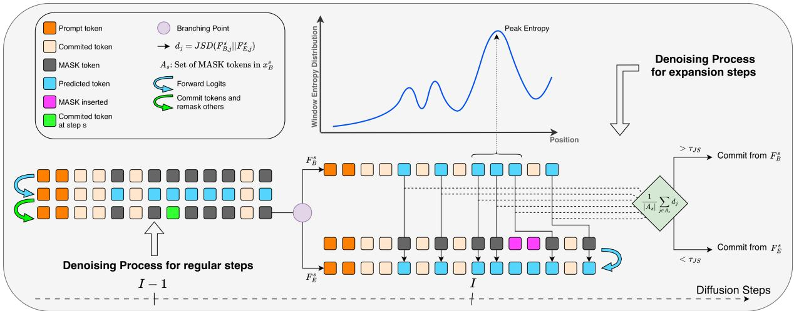
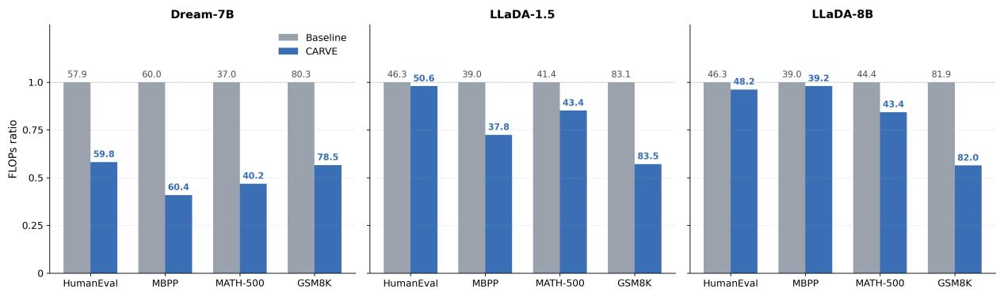
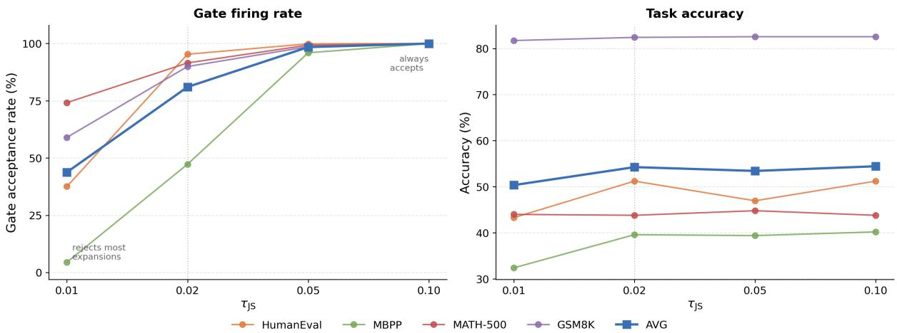
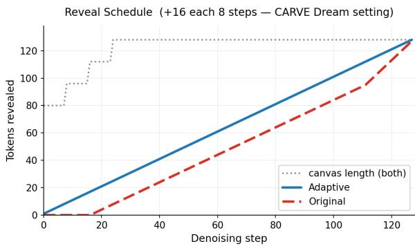
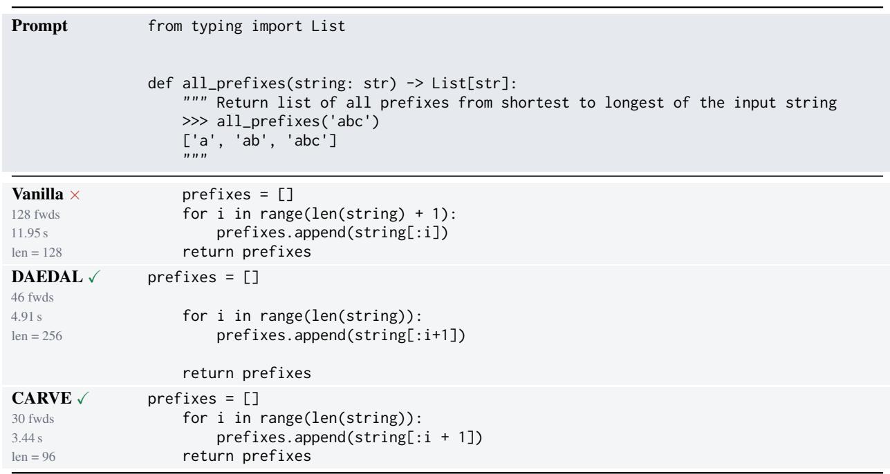

# CARVE: Verified Expansion for Variable-Length Generation in Diffusion Language Models

Wail Bouhedja1,2, Amr Mohamed1,3, Guokan Shang1

1MBZUAI, 2Sorbonne Université, 3Ecole Polytechnique

## Abstract

Masked diffusion language models predict to kens from a partially observed response can vas, enabling bidirectional conditioning and parallel token refinement. Yet standard masked diffusion decoders use a rigid inference interface: the number of masked positions allo cated to the answer is fixed before generation begins. Choosing this length is difficult. A short canvas can truncate reasoning or code, while a long canvas wastes computation and can perturb denoising. We introduce CARVE (Counterfactual-Aware Reveal with Verified Expansion), a training-free variable-length al gorithm for masked diffusion LMs. Starting from a shorter canvas, CARVE can grow the response during decoding by inserting addi tional [MASK] positions. Rather than keeping every insertion, CARVE tests a candidate ex panded canvas and asks a counterfactual question: would the model make similar predictions for the unresolved positions in the original can vas if the extra masked space were present? The inserted masks are kept only when they induce low Jensen–Shannon (JS) divergence on aligned unresolved positions. This makes length growth a verified stability decision rather than a pure confidence heuristic. CARVE ap plies without retraining to both full-canvas and blockwise diffusion decoders. Across code generation and mathematical reasoning bench marks, CARVE consistently improves average performance over fixed-length baselines across all evaluated model families. Crucially, CARVE achieves these accuracy gains while reducing inference cost, reaching half the FLOPs of fixed-length decoding in some settings.

## 1 Introduction

Autoregressive language models (Brown et al., 2020) have a simple interface for open-ended generation: they emit one token at a time and stop when an end-of-sequence token is produced. Masked diffusion language models (Austin et al., 2021a;

Campbell et al., 2022; Zheng et al., 2023; Lou et al., 2023; Sahoo et al., 2024; Shi et al., 2024), by contrast, generate by iteratively denoising a canvas of masked tokens. This paradigm enables attractive properties such as parallel token updates, bidirectional conditioning, and arbitrary-order refinement, and has recently scaled to competitive instructionfollowing models such as LLaDA (Nie et al., 2026) and Dream (Ye et al., 2025). However, it exposes a basic inference problem: the generation length must typically be fixed before decoding begins.

This fixed-canvas assumption is poorly matched to realistic generation. If the canvas is too short, the model may truncate code, reasoning, or explanations. If the canvas is too long, inference wastes computation on masked positions that may not be needed for the final answer, and can even harm quality by forcing the model to denoise beyond the useful response (Rossi et al., 2026). The appropriate length is also instance-dependent: two prompts from the same task may require very different response lengths, even when they use the same decoding setup. As a result, variable-length decoding is not a minor engineering detail, but a central obstacle to making diffusion LMs practical for open-ended generation.

A natural solution is to adapt the canvas during denoising. Prior work such as DAEDAL (Li et al., 2025) proposes training-free length expansion for diffusion language models by using internal confidence signals to decide when to allocate additional masked tokens. This shows that response length need not be fixed before decoding begins and can instead be adjusted during inference. Yet expansion introduces a second question that is easy to overlook: adding masks changes the denoising problem itself. In a bidirectional masked diffusion model, inserting new masked positions may perturb the model’s predictions at other still-unresolved positions. An appropriate length expansion rule should therefore ask both whether additional space might be useful and whether inserting that space leaves the existing predictions sufficiently stable.

We introduce CARVE (Counterfactual-Aware Reveal with Verified Expansion), a training-free variable-length decoding algorithm for masked diffusion language models. CARVE augments a standard diffusion sampler with a verified expansion step. Before certain reveal steps, CARVE proposes inserting a number of additional masked tokens into the current canvas. It then runs the model once on the expanded canvas and compares the predictive distributions of the original and expanded canvases at aligned still-masked positions. The insertion is accepted only when the mean Jensen– Shannon divergence between these distributions remains below a fixed threshold. Otherwise, the expanded branch is rejected and we continue with the original canvas. In this way, the canvas grows only when the proposed expansion leaves the predictive distributions at aligned unresolved positions sufficiently stable under this criterion.

This turns length expansion into a stability check rather than a pure confidence heuristic. Each proposed insertion asks a local counterfactual question: would the model make essentially the same predictions for the unresolved tokens if the canvas contained additional space? When the answer is yes, the added masks can be committed without substantially changing the denoising state. When the answer is no, the proposal is treated as a destabilizing edit and discarded. This criterion differs from expansion rules based only on absolute confidence or end-of-sequence (EOS) token behavior (Yang et al., 2026): it measures the effect of the insertion on the model’s remaining predictive state. The same principle applies across different masked diffusion backends; in this work, we instantiate CARVE for both full-canvas Dream decoding and blockwise LLaDA decoding.

Our experiments evaluate CARVE on code and mathematical reasoning benchmarks across different dLLMs. We compare against fixed-length baseline decoding and DAEDAL (Li et al., 2025), the closest training-free variable-length baseline. Across models, CARVE improves average performance over fixed-length baseline decoding. Our analysis of model-forward FLOPs further shows that verified expansion does not simply trade additional computation for accuracy: adaptive reveal and EOS cropping often offset the cost of branching. Consequently, CARVE provides a dual advantage, improving average task accuracy while yielding up to roughly half as many FLOPs as fixedlength decoding in some settings. Code is publicly available1. Our contributions are:

• We propose CARVE, a training-free variablelength algorithm that verifies each proposed canvas expansion by measuring Jensen– Shannon divergence on aligned unresolved positions.

• We show that verified expansion provides a model-agnostic mechanism for masked diffusion LMs, applying the same algorithm to both full-canvas Dream decoding and blockwise LLaDA decoding.

• We demonstrate that CARVE improves average performance over fixed-length baselines across code and mathematical reasoning benchmarks on three diffusion LMs, while often reducing inference FLOPs relative to fixed-length decoding.

## 2 Related Work

Discrete diffusion language models. Masked diffusion large language models (dLLMs) generate sequences by iteratively reversing categorical corruption processes, typically relying on absorbing-state masking to denoise positions in parallel (Austin et al., 2021a; Campbell et al., 2022; Zheng et al., 2023; Lou et al., 2023; Sahoo et al., 2024; Shi et al., 2024; Mohamed et al., 2026). Recent large-scale models, such as LLaDA and Dream, demonstrate that this paradigm scales effectively to complex instruction-following and reasoning tasks (Nie et al., 2026; Ye et al., 2025). However, because these models predict and reveal subsets of tokens across a predefined masked canvas, they inherently impose a strict length constraint before decoding begins.

Training-time variable-length generation in dLLMs. To overcome the fixed-length bottleneck, several approaches modify the underlying generative formulation or state space. Existing methods implement dynamic expansion and contraction for code infilling (Wu et al., 2026), formulate generation via explicit insertion and deletion edits (Havasi et al., 2025), or jointly denoise token identities and positional configurations (Zhang et al., 2025; Kim et al., 2025). While these strategies successfully enable dynamic length adjustment, they require specialized architectural modifications or costly retraining. CARVE, by contrast, applies directly to pretrained masked dLLMs.

Training-free variable-length decoding in dLLMs. Inference-time methods bypass retraining by dynamically adjusting the canvas length during decoding. Prior approaches trigger length changes using scalar internal confidence cues (Li et al., 2025), length-regularized candidate scoring (Cheng et al., 2026), or implicit end-ofsequence (EOS) token densities (Yang et al., 2026). CARVE instead frames length expansion as a counterfactual stability test. It computes the mean Jensen–Shannon divergence between the base and expanded predictive distributions at aligned unresolved positions and accepts the expansion when this mean falls below $\tau _ { \mathrm { J S } }$ . This criterion measures local predictive stability; it does not guarantee positionwise preservation, semantic correctness, or output safety.

## 3 Methods

In this section, we introduce CARVE, a trainingfree variable-length decoding algorithm for masked diffusion language models. Figure 1 provides an overview, and Algorithm 1 summarizes the complete decoding procedure.

## 3.1 Preliminaries: Masked Discrete Diffusion

Masked diffusion language models generate text by denoising discrete token sequences. Given a clean response $x _ { 0 } = ( x _ { 0 , 1 } , \ldots , x _ { 0 , L } ) \in \mathcal { V } ^ { L }$ , the forward process gradually replaces tokens with a special mask token [MASK]. Since masked tokens remain masked at all later timesteps, this is an absorbing process. At inference time, decoding starts from a masked canvas and progressively commits predicted tokens.

Forward absorbing process. The forward process is a Markov chain

$$
q ( x _ { 1 : T } \mid x _ { 0 } ) = \prod _ { t = 1 } ^ { T } q ( x _ { t } \mid x _ { t - 1 } ) ,\tag{1}
$$

with transitions that factorize over token positions. For each position i, [MASK] is absorbing:

$$
q ( x _ { t , i } = [ \boldsymbol { \mathrm { M A S K } } ] \mid x _ { t - 1 , i } = [ \boldsymbol { \mathrm { M A S K } } ] ) = 1 .\tag{2}
$$

If $x _ { t - 1 , i } \neq$ [MASK], then

$$
x _ { t , i } = \left\{ \begin{array} { l l } { x _ { t - 1 , i } , } & { \mathrm { w i t h ~ p r o b a b i l i t y ~ } 1 - \beta _ { t } , } \\ { \left[ \mathrm { M A S K } \right] , } & { \mathrm { w i t h ~ p r o b a b i l i t y ~ } \beta _ { t } . } \end{array} \right.\tag{3}
$$

We assume that the corruption schedule satisfies $\bar { \alpha } _ { T } ~ = ~ 0$ , so the terminal state is fully masked: $x _ { T } ~ = ~ [ \mathrm { M A S K } ] ^ { L }$ . Let $\begin{array} { r } { \bar { \alpha } _ { t } \ = \ \prod _ { r = 1 } ^ { t } ( 1 - \beta _ { r } ) } \end{array}$ denote the token survival probability. The marginal corruption process is

$$
x _ { t , i } = \left\{ \begin{array} { l l } { x _ { 0 , i } , } & { \mathrm { w i t h ~ p r o b a b i l i t y ~ } \bar { \alpha } _ { t } , } \\ { \lbrack \mathbf { M A S K } ] , } & { \mathrm { w i t h ~ p r o b a b i l i t y ~ } 1 - \bar { \alpha } _ { t } . } \end{array} \right.\tag{4}
$$

Denoising model. Given a prompt $x _ { \mathrm { p } }$ and a partially masked response $x _ { t } .$ , the model predicts logits over the vocabulary at every response position:

$$
F _ { t } = f _ { \theta } ( x _ { \mathrm { p } } , x _ { t } , t ) .\tag{5}
$$

The token distribution at position i is

$$
p _ { t , i } = \operatorname { s o f t m a x } ( F _ { t , i } ) ,\tag{6}
$$

where $F _ { t , i }$ denotes the logits at position i. We write the resulting clean-token predictor in factorized form:

$$
p _ { \theta } ( x _ { 0 } \mid x _ { \mathrm { p } } , x _ { t } , t ) = \prod _ { i = 1 } ^ { L } p _ { \theta } ( x _ { 0 , i } \mid x _ { \mathrm { p } } , x _ { t } , t ) .\tag{7}
$$

Although the output distribution factorizes over response positions, each factor is computed from the full partially masked canvas, allowing bidirectional conditioning on all visible tokens.

Training objective. The model is trained to reconstruct the original tokens at masked positions. Let $M _ { t } = \{ i : x _ { t , i } = [ \mathrm { M A S K } ] \}$ . The masked denoising loss is

$$
\begin{array} { l } { \displaystyle \mathcal { L } ( \boldsymbol { \theta } ) = \mathbb { E } _ { ( { x _ { \mathrm { p } } } , { x _ { 0 } } ) \sim \mathcal { D } ^ { \mathbb { E } _ { t \sim \mathcal { U } \left\{ 1 , \dots , T \right\} } \mathbb { E } _ { { x _ { t } } \sim { q ( \cdot | x _ { 0 } , t ) } } } } } \\ { \displaystyle \left[ - \sum _ { i \in M _ { t } } \log p _ { \boldsymbol { \theta } } \left( { x _ { 0 , i } } \mid { x _ { \mathrm { p } } } , { x _ { t } } , t \right) \right] . } \end{array}\tag{8}
$$

Decoding with partial reveal. At inference time, the response length L is chosen in advance and the decoder initializes a fully masked response canvas,

$$
x ^ { ( 0 ) } = \left[ \mathrm { M A S K } \right] ^ { L } .\tag{9}
$$

Let $\{ \tau _ { s } \} _ { s = 0 } ^ { T }$ denote the reverse denoising schedule, with $\tau _ { 0 } = T$ corresponding to the maximally corrupted state and $\tau _ { T } = 0$ to the clean state. At decoding step s, the model predicts token distributions for all response positions at diffusion time $\tau _ { s }$ A reveal rule then selects a subset of the currently masked positions to commit. Let

  
Figure 1: Overview of CARVE. Regular steps predict all masked positions and commit a subset of tokens. Expansion steps insert additional [MASK] tokens near a high-uncertainty region and compare the base and expanded canvases using JS divergence. The expanded canvas is kept only when the mean JS divergence on aligned unresolved positions falls below the acceptance threshold.

$$
m _ { s } = \left| \{ i : x _ { \mathrm { C } , i } ^ { s } = [ \mathrm { M A S K } ] \} \right|\tag{10}
$$

denote the number of unresolved positions in the chosen branch. The canvas is updated as

$$
\begin{array} { r } { x _ { i } ^ { ( s + 1 ) } = \left\{ { \begin{array} { l l } { \hat { x } _ { i } ^ { ( s ) } , } & { i \in R ^ { ( s ) } , } \\ { x _ { i } ^ { ( s ) } , } & { i \notin R ^ { ( s ) } , } \end{array} } \right. } \end{array}\tag{11}
$$

where $\hat { x } _ { i } ^ { ( s ) }$ is obtained from the model distribution, either greedily or by sampling. Different diffusion models define different reveal rules. In this work, we keep the trained denoising model fixed and modify only the decoding procedure.

## 3.2 CARVE: Verified Canvas Expansion

CARVE is a training-free decoding method for masked diffusion language models. It keeps the pretrained denoising model and each backend’s position-ranking criterion fixed while modifying inference through verified canvas expansion, an adaptive reveal-count schedule, and EOS-triggered cropping. CARVE branches into a candidate expanded canvas, measures the mean distribution shift at aligned unresolved positions, and reveals tokens from the branch selected by the verification criterion.

Let $x ^ { s }$ be the response canvas at decoding step s, and let $L _ { s }$ be its current length. Standard masked diffusion decoding fixes this length before generation. In contrast, CARVE starts from an initial length $L _ { 0 }$ and allows the canvas to grow up to a maximum length $L _ { \mathrm { m a x } }$ . At each step, we first define the current canvas as the base branch:

$$
x _ { \mathrm { B } } ^ { s } = x ^ { s } .\tag{12}
$$

The model is evaluated on this branch to obtain base logits:

$$
F _ { \mathrm { B } } ^ { s } = f _ { \theta } ( x _ { \mathrm { p } } , x _ { \mathrm { B } } ^ { s } , \tau _ { s } ) .\tag{13}
$$

Uncertainty-guided branching. Before each potential canvas expansion, CARVE selects where an inserted span of masks may be most useful. It inserts new masks near the most uncertain region of the current canvas, using high predictive uncertainty as a heuristic for where additional capacity may be beneficial.

$$
p _ { \mathrm { B } , j } ^ { s } = \operatorname { s o f t m a x } ( \boldsymbol { F } _ { \mathrm { B } , j } ^ { s } ) .\tag{14}
$$

The uncertainty of position $j$ is measured by entropy:

$$
H _ { j } ^ { s } = - \sum _ { v \in \mathcal { V } } p _ { \mathrm { B } , j } ^ { s } ( v ) \log p _ { \mathrm { B } , j } ^ { s } ( v ) .\tag{15}
$$

Let $W$ be an even window size and let $h = W / 2$ We choose an anchor position $c _ { s }$ whose local window has the largest total entropy:

$$
c _ { s } = \arg \operatorname* { m a x } _ { c \in { \mathcal { C } } _ { s } } \sum _ { j = c - h + 1 } ^ { c + h } H _ { j } ^ { s } ,\tag{16}
$$

where $\mathcal { C } _ { s }$ is the set of valid anchor positions whose window lies inside the current response canvas. Intuitively, $c _ { s }$ marks the region where the model is least certain about how to complete the response.

Let

$$
k _ { s } = \operatorname* { m i n } ( k , L _ { \operatorname* { m a x } } - L _ { s } )\tag{17}
$$

be the number of mask tokens that can still be inserted. We then branch out by inserting these $k _ { s }$ masks immediately to the right of the anchor position $c _ { s } .$ :

$$
\begin{array} { r } { x _ { \mathrm { E } } ^ { s } = \mathrm { I n s e r t } ( x _ { \mathrm { B } } ^ { s } , c _ { s } , k _ { s } ) , } \end{array}\tag{18}
$$

where Insert preserves all existing tokens and inserts $k _ { s }$ new mask tokens immediately after position $c _ { s }$ . This gives an expanded branch. The model is evaluated once on this expanded canvas:

$$
F _ { \mathrm { E } } ^ { s } = f _ { \theta } ( x _ { \mathrm { p } } , x _ { \mathrm { E } } ^ { s } , \tau _ { s } ) .\tag{19}
$$

Aligning base and expanded branches. The inserted masks shift every original position to the right of the anchor. To compare the base and expanded branches, we align each original response position with its corresponding position in the expanded branch. For compactness, response indices omit the prompt offset. The aligned index of an original position $j$ is

$$
a _ { s } ( j ) = j + k _ { s } { \bf 1 } [ j > c _ { s } ] .\tag{20}
$$

Thus, positions up to and including $c _ { s }$ keep their index, while positions after $c _ { s }$ shift by $k _ { s }$ slots. The newly inserted masks are excluded from the comparison because they have no counterpart in the base branch.

We verify the expansion only on unresolved positions that already existed in the base canvas:

$$
{ \mathcal { A } } _ { s } = \{ j : x _ { \mathrm { B } , j } ^ { s } = [ \mathrm { M A S K } ] \} .\tag{21}
$$

Committed tokens are excluded because their values are already fixed.

JS verification score. For every aligned unresolved position $j \in \mathcal A _ { s }$ , we compare the model’s predictive distribution before and after insertion:

$$
p _ { j } = \operatorname { s o f t m a x } ( F _ { \mathrm { B } , j } ^ { s } ) ,\tag{22}
$$

$$
q _ { j } = \mathrm { s o f t m a x } ( F _ { \mathrm { E } , a _ { s } ( j ) } ^ { s } ) .\tag{23}
$$

Let

$$
m _ { j } = \frac { 1 } { 2 } ( p _ { j } + q _ { j } ) .\tag{24}
$$

Algorithm 1 CARVE DECODING WITH VERI-  
FIED EXPANSION   
Require: prompt $x _ { \mathrm { p } } ,$ initial length $L _ { 0 } ,$ maximum length   
$L _ { \mathrm { m a x } } ,$ steps $T ,$ reverse denoising schedule $\{ \tau _ { s } \} _ { s = 0 } ^ { T } ,$ in  
sertion size k, threshold $\tau _ { \mathrm { J S } } .$ interval I   
1: $x ^ { 0 } \gets [ \mathrm { M A S K } ] ^ { L _ { 0 } }$   
2: for $s = 0 , \ldots , T - 1$ do   
3: $\mathbf { i f } \ x ^ { s }$ contains no mask tokens then   
4: return decoded response from $x ^ { s }$   
5: end if   
6: $L _ { s } \gets | x ^ { s } |$   
7: $x _ { \mathrm { B } } ^ { s }  x ^ { s }$   
8: $\bar { F _ { \mathrm { B } } ^ { s } } \gets f _ { \theta } ( x _ { \mathrm { p } } , x _ { \mathrm { B } } ^ { s } , \tau _ { s } )$   
9: $( \bar { x _ { \mathrm { C } } ^ { s } } , \bar { F _ { \mathrm { C } } ^ { s } } ) \stackrel { \cdot } {  } ( x _ { \mathrm { B } } ^ { \bar { s } } , \bar { F _ { \mathrm { B } } ^ { s } } )$   
10: if s mod $I = 0$ and $L _ { s } < L _ { \operatorname* { m a x } }$ then   
11: choose uncertainty anchor $c _ { s }$   
12: $k _ { s } \gets \operatorname* { m i n } ( k , L _ { \operatorname* { m a x } } - L _ { s } )$   
13: $x _ { \mathrm { E } } ^ { s } $ Insert $\left( x _ { \mathrm { B } } ^ { s } , c _ { s } , k _ { s } \right)$   
14: $F _ { \mathrm { E } } ^ { s } \gets f _ { \theta } ( x _ { \mathrm { p } } , x _ { \mathrm { E } } ^ { s } , \tau _ { s } )$   
15: compute $\dot { D } _ { \mathrm { J S } } ^ { s }$ on aligned unresolved positions   
16: iI $\mathbf { f } \ D _ { \mathrm { J S } } ^ { \dot { s } } < \tau _ { \mathrm { J S } }$ then   
17: $( \tilde { x } _ { \mathrm { C } } ^ { s } , F _ { \mathrm { C } } ^ { s } ) \gets ( x _ { \mathrm { E } } ^ { s } , F _ { \mathrm { E } } ^ { s } )$   
18: end if   
19: end if   
20: reveal selected masks in $x _ { \mathrm { C } } ^ { s }$ using $F _ { \mathrm { C } } ^ { s }$   
21: set $x ^ { s + 1 }$ to the result   
22: if EOS is committed at position $e _ { s }$ before the canvas   
end then   
23: $\bar { x } ^ { s + 1 }  x _ { 1 : e _ { s } } ^ { s + 1 }$   
24: $\bar { F } ^ { s + 1 } \gets \bar { f } _ { \theta } ( x _ { \mathrm { p } } , \bar { x } ^ { s + 1 } , \tau _ { s + 1 } ) _ { . }$   
25: fill all remaining masks in $\bar { x } ^ { s + 1 }$ by greedily using   
argmax $\bar { F } ^ { s + 1 }$   
26: return decoded response from $\bar { x } ^ { s + 1 }$   
27: end if   
28: end for   
29: return decoded response from final canvas

The local Jensen–Shannon divergence is

$$
d _ { j } = \frac { 1 } { 2 } \mathrm { K L } ( p _ { j } \| m _ { j } ) + \frac { 1 } { 2 } \mathrm { K L } ( q _ { j } \| m _ { j } ) .\tag{25}
$$

The verification score is the mean divergence over aligned unresolved positions:

$$
D _ { \mathrm { J S } } ^ { s } = \frac { 1 } { \left| \mathcal { A } _ { s } \right| } \sum _ { j \in \mathcal { A } _ { s } } d _ { j } .\tag{26}
$$

The expanded branch is accepted only if

$$
D _ { \mathrm { J S } } ^ { s } < \tau _ { \mathrm { J S } } ,\tag{27}
$$

where $\tau _ { \mathrm { J S } }$ is a fixed threshold. A low score indicates that insertion changes the predictive distributions at aligned unresolved positions only slightly on average. When the score exceeds the threshold, the proposed expansion is rejected. Because the score is averaged across positions, acceptance does not guarantee that every individual prediction is preserved.

Branch selection. After verification, decoding continues on exactly one branch. We define the chosen branch as

$$
( x _ { \mathrm { C } } ^ { s } , F _ { \mathrm { C } } ^ { s } ) = \left\{ \begin{array} { l l } { ( x _ { \mathrm { E } } ^ { s } , F _ { \mathrm { E } } ^ { s } ) , } & { D _ { \mathrm { J S } } ^ { s } < \tau _ { \mathrm { J S } } , } \\ { ( x _ { \mathrm { B } } ^ { s } , F _ { \mathrm { B } } ^ { s } ) , } & { \mathrm { o t h e r w i s e } . } \end{array} \right.\tag{28}
$$

This branch-consistent design is important: CARVE never commits tokens using logits from a canvas different from the one being updated.

Expansion interval. The expansion is controlled by a hyperparameter $I ,$ called the expansion interval. Rather than branching out at every denoising step, CARVE attempts expansion once every I steps, as long as the active canvas has not reached $L _ { \mathrm { m a x } }$ . A standard decoding step requires one model forward pass. A step with an expansion attempt requires one additional forward pass for the expanded branch. Thus, before the canvas reaches $L _ { \mathrm { m a x } } .$ , the average number of forward passes per decoding step is approximately $1 + 1 / I$ times that of the underlying decoder; the corresponding FLOP overhead depends on the canvas length.

EOS-triggered cropping and greedy completion. CARVE uses EOS crop as its default stopping rule. After each reveal step, we check whether an end-ofsequence token has been committed before the end of the active response canvas. When this occurs, all positions to the right of the first EOS are discarded, since they would not contribute to the decoded answer. If the remaining prefix still contains mask tokens, the model performs one final forward pass on the cropped canvas and fills every unresolved position greedily by argmax. The resulting prefix is returned as the final response. This makes stopping consistent with answer extraction while avoiding additional denoising steps on tokens that would be discarded.

## 4 Experiments

We evaluate CARVE on code generation and mathematical reasoning benchmarks using three instruction-tuned masked diffusion language models. We also report DAEDAL (Li et al., 2025) as a training-free variable-length decoding baseline. In addition to task accuracy, we measure the inference cost of each method using forward-pass FLOPs.

## 4.1 Models

We evaluate Dream-v0-Instruct-7B, LLaDA-1.5, and LLaDA-8B-Instruct. Dream uses full-canvas masked diffusion decoding, while the LLaDA models use the LLaDA-family blockwise decoding setup, with block size 32 for LLaDA-1.5 and block size 64 for LLaDA-8B-Instruct.

## 4.2 Benchmarks

We evaluate CARVE on four benchmarks: HumanEval (Chen et al., 2021), MBPP (Austin et al., 2021b), MATH-500 (Lightman et al., 2024), and GSM8K (Cobbe et al., 2021). Performance on HumanEval and MBPP is measured using pass@1, while performance on MATH-500 and GSM8K is measured using exact-match accuracy after answer extraction.

## 4.3 Compared Methods

We compare three decoding methods. Baseline denotes the standard fixed-length masked diffusion decoder for each model. DAEDAL is a trainingfree variable-length algorithm that expands the response canvas using internal confidence signals. Since DAEDAL is originally designed for LLaDAstyle decoding, we also adapt it to Dream for a consistent comparison. CARVE is our trainingfree verified expansion algorithm. For all CARVE runs, we initialize the canvas at $L _ { 0 } = L _ { \mathrm { m a x } } / 2$ and allow it to grow up to $L _ { \mathrm { m a x } }$

## 4.4 Results

Table 1 shows that CARVE increases the unweighted four-benchmark average relative to fixedlength decoding by 0.92, 1.03, and 0.49 percentage points on Dream-v0-Instruct-7B, LLaDA-1.5, and LLaDA-8B-Instruct, respectively. The per-task effects are mixed: CARVE improves 9 of the 12 model–benchmark pairs, with its largest gain on HumanEval for Dream (+4.27 points). DAEDAL attains the higher average on LLaDA-8B-Instruct (53.42 versus 53.20).

This pattern of consistent improvements across diverse benchmarks for all evaluated model families suggests that verified expansion is both taskagnostic and model-agnostic. Rather than relying on a benchmark-specific length heuristic, CARVE uses the model’s own predictive stability to decide when expansion is safe. The main exception is MATH-500 for LLaDA-8B-Instruct, where DAEDAL achieves the highest score; nevertheless, CARVE remains competitive on the aggregate and provides the most consistent gains across code and reasoning tasks.

<table><tr><td>Model</td><td>Method</td><td>HumanEval</td><td>MBPP</td><td>MATH-500</td><td>GSM8K</td><td>Average</td></tr><tr><td rowspan="3">Dream-v0-Instruct-7B</td><td>Baseline</td><td>55.49</td><td>60.60</td><td>39.60</td><td>79.53</td><td>58.80</td></tr><tr><td>DAEDAL</td><td> $\pmb { 5 9 . 7 6 } \ ( + 4 . 2 7 )$ </td><td> $5 6 . 4 0 ( - 4 . 2 0 )$ </td><td> $\mathbf { 4 0 . 8 0 } \ ( + 1 . 2 0 )$ </td><td> $7 6 . 0 4 ( - 3 . 4 9 )$ </td><td>58.25 (−0.55)</td></tr><tr><td>CARVE</td><td>59.76 (+4.27)</td><td>60.40 (−0.20)</td><td>40.20 (+0.60)</td><td>78.54 (−0.99)</td><td>59.73 (+0.92)</td></tr><tr><td rowspan="3">LLaDA-1.5</td><td>Baseline</td><td>46.95</td><td>38.20</td><td>43.00</td><td>83.09</td><td>52.81</td></tr><tr><td>DAEDAL</td><td>46.34 (−0.61)</td><td> $\mathbf { 3 9 . 8 0 } \ ( + 1 . 6 0 )$ </td><td> $4 2 . 0 0 ( - 1 . 0 0 ) $ </td><td> ${ \pmb 8 3 . 8 5 } _ { ( + 0 . 7 6 ) }$ </td><td> $5 3 . 0 0 ( + 0 . 1 9 )$ </td></tr><tr><td>CARVE</td><td>50.61 (+3.66)</td><td>37.80 (−0.40)</td><td>43.40 (+0.40)</td><td>83.55 (+0.46)</td><td>53.84 (+1.03)</td></tr><tr><td rowspan="3">LLaDA-8B-Instruct</td><td>Baseline</td><td>46.95</td><td>38.80</td><td>43.20</td><td></td><td>52.71</td></tr><tr><td>DAEDAL</td><td> $4 6 . 3 4 \ : ( - 0 . 6 1 )$ </td><td>39.20 (+0.40)</td><td>47.00 (+3.80)</td><td>81.88  $8 1 . 1 2 \ : ( - 0 . 7 6 )$ </td><td>53.42 (+0.71)</td></tr><tr><td>CARVE</td><td> $4 8 . 1 7 \ ( + 1 . 2 2 )$ </td><td> $\mathbf { 3 9 . 2 0 \ ( + 0 . 4 0 ) }$ </td><td> $4 3 . 4 0 \ ( + 0 . 2 0 )$ </td><td> ${ \pmb 8 2 . 0 3 } _ { ( + 0 . 1 5 ) }$ </td><td> $5 3 . 2 0 \ ( + 0 . 4 9 )$ </td></tr></table>

Table 1: Main results on code and mathematical reasoning benchmarks. Scores are reported as percentages. HumanEval and MBPP use pass@1; MATH-500 and GSM8K use exact-match accuracy after answer extraction. “Average” is the unweighted arithmetic mean of the four task scores. Deltas are percentage-point differences relative to the baseline for the same model. Averages and deltas are computed from unrounded scores. Boldface marks the best result, including ties, within each model block.

  
Figure 2: Per-task FLOPs ratio of CARVE relative to the fixed-length baseline. A value below 1.0 means that CARVE uses fewer FLOPs than the baseline. Although CARVE performs an additional forward pass when it branches into an expanded canvas, EOS cropping and adaptive reveal often offset this cost, making the final decoding trajectory more efficient.

Figure 2 shows that these accuracy gains do not come from simply spending more computation. Across models and tasks, CARVE often uses substantially fewer FLOPs than the fixed-length baseline. This may appear counterintuitive because the method branches out and performs an additional forward pass at any given expansion step. In practice, however, accepted expansions are controlled by the JS divergence, and EOS cropping removes suffix positions that would be discarded during answer extraction. As a result, the extra cost of branching is often balanced, and sometimes outweighed, by shorter effective decoding trajectories. Thus, CARVE improves accuracy while remaining computationally efficient.

## 5 Ablations

## 5.1 Adaptive reveal rule

We compare the adaptive reveal schedule used in CARVE against Dream’s original commit schedule.

Dream’s original schedule reveals

$$
n _ { s } = \left\lfloor m _ { s } \left( 1 - \frac { \tau _ { s + 1 } } { \tau _ { s } } \right) \right\rfloor ,\tag{29}
$$

where $m _ { s }$ is the number of remaining masked positions and $\{ \tau _ { s } \} _ { s = 0 } ^ { T }$ is the reverse denoising schedule. This schedule can spend late denoising steps without revealing any token when the reveal count rounds to zero. We instead use

$$
n _ { s } = \left\lceil \frac { m _ { s } } { T - s } \right\rceil ,\tag{30}
$$

which distributes the remaining masks across the remaining step budget and guarantees progress at each step. We use the same adaptive rule for the LLaDA backend. Holding the rest of the Dream configuration fixed, the adaptive schedule improves average accuracy from 58.17 to 59.73 while reducing the average number of forward passes from 200.9 to 148.9.

  
Figure 3: Effect of the JS acceptance threshold $\tau _ { \mathrm { J S } }$ on LLaDA-8B. Left: percentage of accepted expansions. Right: task accuracy under the same thresholds. Very small thresholds reject too many expansions, while large thresholds accept almost all proposals. We use $\tau _ { \mathrm { J S } } = 0 . 0 2$ , which reaches the accuracy plateau while keeping CARVE selective.

<table><tr><td>Schedule</td><td>HE</td><td>MBPP</td><td>MATH</td><td>GSM8K</td></tr><tr><td>Original</td><td>54.27</td><td>61.20</td><td>38.80</td><td>78.39</td></tr><tr><td>Adaptive</td><td>59.76</td><td>60.40</td><td>40.20</td><td>78.54</td></tr><tr><td>∆</td><td>(+5.49)</td><td>(−0.80)</td><td>(+1.40)</td><td>(+0.15)</td></tr></table>

Table 2: Accuracy ablation of the adaptive reveal schedule on Dream-v0-Instruct-7B. The ∆ row reports percentage-point differences relative to the original schedule.

<table><tr><td>Schedule</td><td>HE</td><td>MBPP</td><td>MATH</td><td>GSM8K</td><td>Avg.</td></tr><tr><td>Original</td><td>100.7</td><td>151.0</td><td>344.7</td><td>207.3</td><td>200.9</td></tr><tr><td>Adaptive</td><td>74.5</td><td>109.3</td><td>261.8</td><td>150.1</td><td>148.9</td></tr></table>

Table 3: Forward-pass ablation of the adaptive reveal schedule on Dream-v0-Instruct-7B. Lower is better; values are averaged per sample.

## 5.2 Effect of the JS threshold

We ablate the expansion threshold τJS on the LLaDA-8B setting by sweeping $\tau _ { \mathrm { J S } } ~ \in$ {0.01, 0.02, 0.05, 0.10}. Figure 3 reports both the fraction of accepted expansions and the resulting task accuracy. The threshold controls a clear tradeoff. When $\tau _ { \mathrm { J S } } = 0 . 0 1$ , CARVE is overly conservative: many expansions are rejected, especially on MBPP, which coincides with lower accuracy, consistent with the canvas not growing enough. Conversely, larger thresholds such as 0.05 and 0.10 accept nearly all proposals, making the verification step almost vacuous and moving the method toward an always-expand setting.

We use $\tau _ { \mathrm { J S } } = 0 . 0 2$ as the default because it is the smallest tested threshold at which average accuracy reaches its plateau while CARVE remains selective. At this value, CARVE preserves the average accuracy of more permissive thresholds but still rejects a nontrivial fraction of proposed insertions. This supports the role of the JS divergence as a meaningful stability check rather than a constant expansion rule.

## 5.3 Insertion Mode

We compare the uncertainty-guided insertion rule used by CARVE with a simpler tail-insertion strategy. Table 4 reports the average score of the best configuration found for each mode and model. Midinsert performs best on Dream and LLaDA-1.5, suggesting that placing new masks near uncertain regions can help the model allocate capacity where the current canvas is under-specified. Tail insertion, however, remains competitive and is strongest on LLaDA-8B, indicating that the optimal insertion location can depend on the backbone and decoding dynamics. We therefore use mid-insert as the default canvas-aware rule, while treating tail insertion as a strong, simpler alternative.

<table><tr><td>Model</td><td>Mid-insert</td><td>Tail</td></tr><tr><td>Dream-7B</td><td>59.73</td><td>59.00</td></tr><tr><td>LLaDA-1.5</td><td>53.84</td><td>52.88</td></tr><tr><td>LLaDA-8B</td><td>53.20</td><td>54.29</td></tr></table>

Table 4: Insertion-mode ablation. We compare average task accuracy for mid-insert and tail insertion using the best configuration found for each mode and model.

## 6 Discussion

CARVE expands the canvas only when the proposed insertion produces a small mean distribution shift at aligned unresolved positions. This stability criterion remains permissive enough to allow useful growth in the evaluated settings. Across models, CARVE consistently improves average accuracy over fixed-length baselines while often using less compute than fixed-length decoding.

The results suggest that effective length control for masked diffusion LMs is not only about adding more masks, but about adding them without destabilizing the denoising state. JS divergence provides this check by accepting an expanded branch only when the model’s predictions remain stable after insertion. The ablations support this view: too small a threshold rejects useful growth, while too large a threshold makes CARVE nearly equivalent to always expanding.

Finally, the compute results show that the extra forward passes introduced by branching do not necessarily translate into higher total cost. In CARVE, branching is paired with EOS crop: once the model commits an end-of-sequence token, decoding stops on the useful prefix instead of continuing to refine suffix positions that would be discarded. Together with the adaptive reveal schedule, this offsets much of the cost of expansion attempts. As a result, CARVE improves the accuracy–compute trade-off using only inference-time changes, without retraining or modifying the underlying diffusion model.

## 7 Conclusion

We introduced CARVE (Counterfactual-Aware Reveal with Verified Expansion), a training-free variable-length decoding algorithm for masked diffusion language models. CARVE addresses the fixed-canvas limitation of dLLMs by branching into candidate expanded canvases and accepting an expansion only when it preserves the model’s predictions on aligned unresolved positions. This turns length control into a counterfactual stability test rather than a pure confidence or EOS heuristic.

Across code-generation and mathematicalreasoning benchmarks, CARVE improves average performance over fixed-length baselines for each evaluated diffusion LM. Although branching adds forward passes, adaptive reveal and EOS cropping often offset this cost, yielding a better accuracy–compute trade-off than fixed-length decoding. Overall, our results show that pretrained masked diffusion LMs already contain useful signals for safe length adaptation, which can be exploited directly at inference time without retraining or architectural changes.

## Limitations

CARVE currently inserts a fixed number of mask tokens at each accepted expansion. In our main configurations, this value is set to k = 16. While this works well empirically, it does not adapt to the uncertainty or length requirements of each prompt. A natural direction for future work is to make insertion size adaptive, deciding not only where to expand the canvas but also how many new mask tokens should be added.

A second limitation is the alignment used by the JS divergence computation. CARVE compares predictions only on unresolved positions that already existed before insertion, while the newly inserted mask positions are excluded because they have no direct counterpart in the base canvas. This makes the verification step simple and well-defined, but it may be overly rigid. Future work could explore softer alignment or alternative divergence criteria that also account for the behavior of the newly inserted positions.

## References

Jacob Austin, Daniel D Johnson, Jonathan Ho, Daniel Tarlow, and Rianne Van Den Berg. 2021a. Structured denoising diffusion models in discrete state-spaces. Advances in neural information processing systems, 34:17981–17993.

Jacob Austin, Augustus Odena, Maxwell Nye, Maarten Bosma, Henryk Michalewski, David Dohan, Ellen Jiang, Carrie Cai, Michael Terry, Quoc Le, and 1 others. 2021b. Program synthesis with large language models. arXiv preprint arXiv:2108.07732.

Tom Brown, Benjamin Mann, Nick Ryder, Melanie Subbiah, Jared D Kaplan, Prafulla Dhariwal, Arvind Neelakantan, Pranav Shyam, Girish Sastry, Amanda Askell, and 1 others. 2020. Language models are few-shot learners. Advances in neural information processing systems, 33:1877–1901.

Andrew Campbell, Joe Benton, Valentin De Bortoli, Thomas Rainforth, George Deligiannidis, and Arnaud Doucet. 2022. A continuous time framework for discrete denoising models. Advances in Neural Information Processing Systems, 35:28266–28279.

Mark Chen, Jerry Tworek, Heewoo Jun, Qiming Yuan, Henrique Ponde De Oliveira Pinto, Jared Kaplan, Harri Edwards, Yuri Burda, Nicholas Joseph, Greg

Brockman, and 1 others. 2021. Evaluating large language models trained on code. arXiv preprint arXiv:2107.03374.

Zicong Cheng, Ruixuan Jia, Jia Li, Guo-Wei Yang, Meng-Hao Guo, and Shi-Min Hu. 2026. Improving variable-length generation in diffusion language models via length regularization. arXiv preprint arXiv:2602.07546.

Karl Cobbe, Vineet Kosaraju, Mohammad Bavarian, Mark Chen, Heewoo Jun, Lukasz Kaiser, Matthias Plappert, Jerry Tworek, Jacob Hilton, Reiichiro Nakano, and 1 others. 2021. Training verifiers to solve math word problems. arXiv preprint arXiv:2110.14168.

Marton Havasi, Brian Karrer, Itai Gat, and Ricky TQ Chen. 2025. Edit flows: Flow matching with edit operations. arXiv preprint arXiv:2506.09018.

Jaeyeon Kim, Lee Cheuk-Kit, Carles Domingo-Enrich, Yilun Du, Sham Kakade, Timothy Ngotiaoco, Sitan Chen, and Michael Albergo. 2025. Any-order flexible length masked diffusion. arXiv preprint arXiv:2509.01025.

Jinsong Li, Xiaoyi Dong, Yuhang Zang, Yuhang Cao, Jiaqi Wang, and Dahua Lin. 2025. Beyond fixed: Training-free variable-length denoising for diffusion large language models. arXiv preprint arXiv:2508.00819.

Hunter Lightman, Vineet Kosaraju, Yuri Burda, Harrison Edwards, Bowen Baker, Teddy Lee, Jan Leike, John Schulman, Ilya Sutskever, and Karl Cobbe. 2024. Let’s verify step by step. In International Conference on Learning Representations, volume 2024, pages 39578–39601.

Aaron Lou, Chenlin Meng, and Stefano Ermon. 2023. Discrete diffusion modeling by estimating the ratios of the data distribution. arXiv preprint arXiv:2310.16834.

Amr Mohamed, Yang Zhang, Michalis Vazirgiannis, and Guokan Shang. 2026. Fast-decoding diffusion language models via progress-aware confidence schedules. In Findings of the Association for Computational Linguistics: ACL 2026, pages 35793–35807, San Diego, California, United States. Association for Computational Linguistics.

Shen Nie, Fengqi Zhu, Zebin You, Xiaolu Zhang, Jingyang Ou, Jun Hu, Jun Zhou, Yankai Lin, Ji-Rong Wen, and Chongxuan Li. 2026. Large language diffusion models. Advances in Neural Information Processing Systems, 38:50608–50646.

Vittorio Rossi, Giacomo Ciro, Davide Beltrame, Luca Gandolfi, Paul Rottger, and Dirk Hovy. 2026. Diffusion language models are natively length-aware. arXiv preprint arXiv:2603.06123.

<table><tr><td>Model</td><td>Canvas  $\left( L _ { \mathrm { m a x } } \right)$ </td><td></td><td>Steps Temp.</td><td>Block</td><td>k</td><td>W</td><td>I</td></tr><tr><td>Dream-7B</td><td>128 / 256 / 512 / 256</td><td> $L _ { \mathrm { m a x } }$ </td><td>0.04</td><td>full</td><td>16</td><td>12</td><td>16</td></tr><tr><td>LLaDA-1.5</td><td> $5 1 2 / 5 1 2 / 5 1 2 / 5 1 2$ </td><td> $L _ { \mathrm { m a x } }$ </td><td>0.05</td><td>32</td><td>16</td><td>4</td><td>1</td></tr><tr><td>LLaDA-8B</td><td> $5 1 2 / 2 5 6 / 5 1 2 / 5 1 2$ </td><td> $L _ { \mathrm { m a x } }$ </td><td>0.03</td><td>64</td><td>16</td><td>8</td><td>1</td></tr></table>

Table 5: Main hyperparameters used for the evaluations. The canvas & $L _ { \mathrm { m a x } }$ column reports HE / MBPP / MATH / GSM8K. The number of denoising steps is set equal to the task-specific maximum canvas length.

Subham S Sahoo, Marianne Arriola, Yair Schiff, Aaron Gokaslan, Edgar Marroquin, Justin T Chiu, Alexander Rush, and Volodymyr Kuleshov. 2024. Simple and effective masked diffusion language models. Advances in Neural Information Processing Systems, 37:130136–130184.

Jiaxin Shi, Kehang Han, Zhe Wang, Arnaud Doucet, and Michalis Titsias. 2024. Simplified and generalized masked diffusion for discrete data. Advances in neural information processing systems, 37:103131– 103167.

Zirui Wu, Lin Zheng, Zhihui Xie, Jiacheng Ye, Jiahui Gao, Shansan Gong, Yansong Feng, Zhenguo Li, Wei Bi, Guorui Zhou, and 1 others. 2026. Dreamon: Diffusion language models for code infilling beyond fixed-size canvas. arXiv preprint arXiv:2602.01326.

Jingyi Yang, Yuxian Jiang, and Jing Shao. 2026. ρ- EOS: Training-free bidirectional variable-length control for masked diffusion llms. arXiv preprint arXiv:2601.22527.

Jiacheng Ye, Zhihui Xie, Lin Zheng, Jiahui Gao, Zirui Wu, Xin Jiang, Zhenguo Li, and Lingpeng Kong. 2025. Dream 7b: Diffusion large language models. arXiv preprint arXiv:2508.15487.

Andrew Zhang, Anushka Sivakumar, Chia-Wei Tang, and Chris Thomas. 2025. Flexible-length text infilling for discrete diffusion models. In Proceedings of the 2025 Conference on Empirical Methods in Natural Language Processing, pages 31332–31347.

Lin Zheng, Jianbo Yuan, Lei Yu, and Lingpeng Kong. 2023. A reparameterized discrete diffusion model for text generation. arXiv preprint arXiv:2302.05737.

## A Experimental Settings

Table 5 summarizes the task-specific decoding configurations for each model. For every model– benchmark pair, we initialize the canvas with $L _ { 0 } =$ $L _ { \mathrm { m a x } } / 2$ masked positions and set the denoising budget to $T = L _ { \operatorname* { m a x } }$ . The table also reports the sampling temperature, block size, insertion size k, uncertainty-window size W, and expansion interval I.

## B Hardware

All experiments used AMD MI210 GPUs and consumed approximately 42 aggregate GPU-days. Runs used at most eight GPUs concurrently.

## C Isolating the Contribution of Each Component

We decompose CARVE into its main components and evaluate controlled variants of the decoder. For each model and benchmark, all rows use the same prompts, maximum canvas length, reveal rule, and evaluation metric. The rows differ only in the decoding components enabled.

Configurations. Fixed baseline denotes standard fixed-length decoding at $L _ { \mathrm { m a x } }$ . + adaptive reveal uses the full canvas at $L _ { \mathrm { m a x } }$ with the adaptive reveal rule, but without expansion or EOS cropping. Full canvas + EOS-crop adds EOS cropping to the previous setting. Fixed- $L _ { 0 } + E O S – c r o p$ fixes the canvas at $L _ { 0 } = L _ { \mathrm { m a x } } / 2$ , disables expansion, and uses EOS cropping. Always-expand inserts new masks every I steps unconditionally, with the verification forward removed; reveal decisions are therefore based on the pre-insertion forward. CARVE is the full method.

Discussion. These controlled ablations show that the gains of CARVE do not come from a single independent shortcut. Adding adaptive reveal on top of vanilla decoding leaves performance unchanged, as expected: with a fixed canvas, both use the same position-ranking criterion but different reveal-count schedules. Its main role is to make a growing canvas usable: once new masks are inserted, the decoder needs a reveal schedule that can keep pace with the changing number of unresolved positions.

EOS cropping behaves differently. It is primarily an efficiency mechanism: on a full canvas, it approximately preserves accuracy while reducing computation spent on suffix positions that would be discarded after EOS. However, cropping alone is not enough. When the canvas is fixed at $L _ { 0 } = { L _ { \operatorname* { m a x } } } / { 2 }$ and cannot grow, the decoder becomes much cheaper but loses substantial accuracy, showing that a small initial canvas must be paired with a mechanism for allocating additional space.

The always-expand variant further clarifies the role of verification. On the LLaDA backends, removing the verification forward pass reduces accuracy relative to CARVE while saving only a small amount of compute. On Dream, the two variants are close. This suggests that unconditional growth can sometimes be sufficient, but is not a reliable replacement for verified expansion across backends. Moreover, this control removes not only the accept/reject decision, but also the forward pass from which an accepted expanded branch reveals its tokens. Without that pass, tokens are revealed from predictions computed before the canvas was enlarged.

  
Figure 4: Reveal trace under a growing canvas in the Dream setting. The canvas grows by inserting 16 masks every 8 denoising steps until reaching $L _ { \operatorname* { m a x } } = 1 2 8$ . The original schedule, designed for a fixed canvas, initially reveals no tokens, then reveals many tokens late in the trajectory. The adaptive rule keeps reveal progress synchronized with the growing canvas.

## D Adaptive Reveal Under a Growing Canvas

Appendix C shows that the adaptive reveal rule is not a major source of fixed-canvas accuracy gains on a fixed canvas. Its role in CARVE is operational: when the canvas grows, newly inserted masks must also be revealed within the remaining denoising budget.

Dream’s original schedule reveals

$$
n _ { s } = \left\lfloor M _ { s } \left( 1 - \frac { \tau _ { s + 1 } } { \tau _ { s } } \right) \right\rfloor ,
$$

where $M _ { s }$ is the number of remaining masked positions and $\{ t _ { s } \} _ { s = 0 } ^ { T }$ is the denoising time grid. This value can round to zero, causing a model forward pass to reveal no tokens. CARVE instead uses

$$
n _ { s } = \left\lceil \frac { M _ { s } } { T - s } \right\rceil ,
$$

which distributes the remaining masked positions across the remaining denoising steps and guarantees at least one reveal per step while masks remain.

<table><tr><td>Model</td><td>Configuration</td><td>HumanEval</td><td>MBPP</td><td>GSM8K</td><td>MATH-500</td><td>Avg.</td><td>FLOPs×</td></tr><tr><td rowspan="6">Dream</td><td>Fixed baseline</td><td>55.49</td><td>60.60</td><td>79.53</td><td>39.60</td><td>58.80</td><td>1.00</td></tr><tr><td>+ adaptive reveal</td><td>55.49</td><td>60.60</td><td>79.53</td><td>39.60</td><td>58.80</td><td>1.00</td></tr><tr><td>Full canvas + EOS-crop</td><td>55.49</td><td>60.60</td><td>79.53</td><td>39.60</td><td>58.80</td><td>0.49</td></tr><tr><td>Fixed-  $\cdot { \cal L } _ { 0 } + \mathrm { E O S - c r o p }$ </td><td>46.34</td><td>59.00</td><td>68.39</td><td>38.40</td><td>53.03</td><td>0.32</td></tr><tr><td>Always-expand</td><td>59.15</td><td>61.40</td><td>78.39</td><td>40.40</td><td>59.84</td><td>0.48</td></tr><tr><td>CARVE</td><td>59.76</td><td>60.40</td><td>78.54</td><td>40.20</td><td>59.73</td><td>0.51</td></tr><tr><td rowspan="6">LLaDA-8B</td><td>Fixed baseline</td><td>46.95</td><td>38.80</td><td>81.88</td><td>43.20</td><td>52.71</td><td>1.00</td></tr><tr><td>+ adaptive reveal</td><td>46.95</td><td>38.80</td><td>81.88</td><td>43.20</td><td>52.71</td><td>1.00</td></tr><tr><td>Full canvas + EOS-crop</td><td>46.95</td><td>38.80</td><td>81.88</td><td>43.20</td><td>52.71</td><td>0.83</td></tr><tr><td> $\mathrm { F i x e d } { - } L _ { 0 } + \mathrm { E O S - c r o p }$ </td><td>35.98</td><td>30.20</td><td>81.58</td><td>39.60</td><td>46.84</td><td>0.31</td></tr><tr><td> $\mathrm { A l w a y s – e x p a n d }$ </td><td>45.73</td><td>39.00</td><td>82.56</td><td>42.20</td><td>52.37</td><td>0.82</td></tr><tr><td>CARVE</td><td>48.17</td><td>39.20</td><td>82.03</td><td>43.40</td><td>53.20</td><td>0.85</td></tr><tr><td rowspan="6">LLaDA-1.5</td><td>Fixed baseline</td><td>46.95</td><td>38.20</td><td>83.09</td><td>43.00</td><td>52.81</td><td>1.00</td></tr><tr><td>+ adaptive reveal</td><td>46.95</td><td>38.20</td><td>83.09</td><td>43.00</td><td>52.81</td><td>1.00</td></tr><tr><td>Full canvas + EOS-crop</td><td>46.95</td><td>38.20</td><td>83.09</td><td>43.20</td><td>52.86</td><td>0.77</td></tr><tr><td> $\mathrm { F i x e d } { - } L _ { 0 } + \mathrm { E O S - c r o p }$ </td><td>38.41</td><td>39.40</td><td>81.80</td><td>39.00</td><td>49.65</td><td>0.30</td></tr><tr><td> $\mathrm { A l w a y s – e x p a n d }$ </td><td>48.17</td><td>37.60</td><td>83.93</td><td>43.80</td><td>53.38</td><td>0.75</td></tr><tr><td>CARVE</td><td>50.61</td><td>37.80</td><td>83.55</td><td>43.40</td><td>53.84</td><td>0.78</td></tr></table>

Table 6: Component-wise ablation across the three evaluated backends. FLOPs are normalized by the fixed-length baseline for the same model and benchmark. The “+ adaptive reveal”, “Full canvas $+ \mathrm { E O S - c r o p ^ { \prime \prime } } ,$ , and “Fixed- $. L _ { 0 }$ + EOS-crop” rows use no expansion. The “Always-expand” row removes the verification forward pass and inserts unconditionally.

Figure 4 illustrates the mismatch between a fixedcanvas reveal schedule and a growing canvas. Under the original rule, the decoder spends early steps expanding the canvas without committing tokens, then has to reveal the remaining masks late in the trajectory. The adaptive rule avoids this stall by keeping the number of remaining masks aligned with the remaining step budget.

This same effect is reflected in Table 3: the adaptive rule uses substantially fewer forward passes on Dream because it prevents reveal stalls under a growing canvas, reducing the average number of forward passes per sample from 200.9 to 148.9. Given this efficiency gain, we use the adaptive reveal rule by default for the LLaDA backends as well.

## E Cost When the Response Fills the Canvas

The average FLOPs reduction of CARVE partly comes from EOS cropping, which shortens the effective decoding trajectory. The least favorable case is therefore a response that fills the canvas, where cropping provides little or no benefit and the expansion overhead remains. To isolate this setting, we select the 5% longest responses for each benchmark, i.e., examples that fill 99–100% of the canvas, and compare CARVE against the fixed-length baseline on the same examples.

<table><tr><td>Benchmark</td><td>Dream</td><td>LLaDA-8B</td><td>LLaDA-1.5</td></tr><tr><td>HumanEval</td><td> $1 . 0 1 \times ( 9 9 \% )$ </td><td> $1 . 0 2 \times ( 1 0 0 \% )$ </td><td> $1 . 0 2 \times ( 1 0 0 \% )$ </td></tr><tr><td>MBPP</td><td> $1 . 0 1 \times ( \dot { 1 } 0 0 \% )$ </td><td> $1 . 0 4 \times ( 1 0 0 \% )$ </td><td> $1 . 0 2 \times ( 1 0 0 \% )$ </td></tr><tr><td>GSM8K</td><td> $1 . 0 1 \times ( 1 0 0 \% )$ </td><td> $1 . 0 2 \times ( 1 0 0 \% )$ </td><td> $1 . 0 1 \times ( 9 9 \% )$ </td></tr><tr><td>MATH-500</td><td> $0 . 9 8 \times ( 1 0 0 \% )$ </td><td> $1 . 0 2 \times ( 1 0 0 \% )$ </td><td> $1 . 0 2 \times ( 1 0 0 \% )$ </td></tr></table>

Table 7: FLOPs ratio of CARVE relative to the fixedlength baseline on the 5% longest responses per benchmark. Parentheses report the percentage of the canvas filled by the decoded response.

As shown in Table 7, even in this adverse regime the overhead remains small. The largest observed cost is 1.04× the fixed baseline, and most settings are within two percent of the baseline. This overhead is bounded by construction: expansion is attempted at most once every I decoding steps and can therefore add at most $\lceil T / I \rceil$ expanded-branch forward passes over a T-step trajectory. Rejected proposals still incur this additional forward pass. EOS-triggered completion can add at most one further forward pass.

## F Wall-Clock Throughput and Peak Memory

FLOPs provide a hardware-independent proxy for inference cost. We additionally report wall-clock throughput and peak device memory on 8×AMD MI210 GPUs. Both quantities are measured as ratios of CARVE to the fixed-length baseline.

The throughput results broadly follow the

<table><tr><td>Benchmark</td><td>Dream</td><td>LLaDA-8B</td><td>LLaDA-1.5</td></tr><tr><td>HumanEval</td><td>1.52</td><td>0.93</td><td>0.97</td></tr><tr><td>MBPP</td><td>3.10</td><td>0.97</td><td>1.32</td></tr><tr><td>GSM8K</td><td>1.75</td><td>1.63</td><td>1.60</td></tr><tr><td>MATH-500</td><td>2.29</td><td>1.12</td><td>1.09</td></tr></table>

Table 8: Throughput ratio of CARVE relative to the fixed-length baseline, measured in tokens per second. Higher is better.
<table><tr><td>Benchmark</td><td>Dream</td><td>LLaDA-8B</td><td>LLaDA-1.5</td></tr><tr><td>HumanEval</td><td>0.99</td><td>1.01</td><td>1.01</td></tr><tr><td>MBPP</td><td>1.00</td><td>1.01</td><td>1.01</td></tr><tr><td>GSM8K</td><td>1.01</td><td>1.01</td><td>1.01</td></tr><tr><td>MATH-500</td><td>0.96</td><td>1.01</td><td>1.01</td></tr></table>

Table 9: Peak memory remains essentially unchanged empirically, with ratios between 0.96 and 1.01 in the evaluated settings.

FLOPs trends. CARVE is consistently faster on Dream and improves throughput on most LLaDA settings, with a few cases slightly below the fixed baseline when responses are long and cropping cannot offset the expansion forward passes. Peak memory remains essentially unchanged: CARVE never exceeds the same maximum canvas length used by the fixed-length decoder, and differs only in how that canvas is reached during decoding.

## G Qualitative Examples

Figures 5–8 show qualitative examples from HumanEval and GSM8K using Dream-7B.

  
Figure 5: Example HumanEval sample for Dream-7B methods (HumanEval\_14). fwds is the number of model forward passes, len the peak canvas length reached during decoding.

Prompt   
def anti\_shuffle(s):   
11 11 11   
Write a function that takes a string and returns an ordered version of it.   
Ordered version of string, is a string where all words (separated by space)   
are replaced by a new word where all the characters arranged in   
ascending order based on ascii value.   
Note: You should keep the order of words and blank spaces in the sentence.   
For example:   
anti\_shuffle('Hi') returns 'Hi'   
anti\_shuffle('hello') returns 'ehllo'   
anti\_shuffle('Hello World!!!') returns 'Hello !!!Wdlor'   
11 11 11   
Vanilla × words = s.split()   
128 fwds ordered\_words = []   
11.51 s for word in words:   
len = 128 ordered\_word = ''.join(sorted(word))   
ordered\_words.append(ordered\_word)   
return ' '.join(ordered\_words)   
  
You can test this function with the provided examples:   
‘‘‘python   
assert anti\_shuffle('Hi') == 'Hi'   
assert anti\_shuffle('hello') == 'ehllo'   
assert anti\_shuffle('Hello World!!!') == 'Hello !!!Wdlor'   
DAEDAL ✓ words = s.split()   
137 fwds sorted\_words = []   
15.27 s   
len = 280 for word in words:   
sorted\_word = ''.join(sorted(word))   
sorted\_words.append(sorted\_word)   
return ' '.join(sorted\_words)   
The function ‘anti\_shuffle‘ takes a string ‘s‘ as input and returns an ordered version   
of it.   
It splits the string into words using the ‘split‘ method, and then iterates over   
each word   
to sort its characters in ascending order using the ‘sorted‘ function. The sorted   
words are   
then joined back together with spaces to form the final string.   
CARVE ✓ words = s.split()   
48 fwds ordered\_words = []   
4.40 s for word in words:   
len = 112 ordered\_word = ''.join(sorted(word))   
ordered\_words.append(ordered\_word)   
return ' '.join(ordered\_words)  
Figure 6: Example HumanEval sample for Dream-7B methods (HumanEval\_86). fwds is the number of model forward passes, len the peak canvas length reached during decoding.

<table><tr><td>Question spent. Answer 20</td><td>John decides to do several activities while out on vacation. He spends 6 hours boating and half that time swimming. He also watched 3 different shows which were 2 hours each. This was 30% of the time he He spent 40% of his time sightseeing. How much time did he spend sightseeing?</td></tr><tr><td>Vanilla × 256 fwds 69.01 s len = 256</td><td>He spent 6 hours boating so he spent  $6 ~ / ~ 2 ~ = ~ < < 6 / 2 { = } 3 { > } { > } 3$  hours swimming. So he spent 6 + 3 = &lt;&lt;6+3=9&gt;&gt;9 hours boating and swimming. So he spent  $9 ~ + ~ 6 ~ = ~ < < 9 + 6 = 1 5 > > 1 5$  hours on those activities. So he spent 15  $\mid 3 0 = < < 1 5 / 3 0 = 0 . 5 > > 0 . 5$  of his time on those activities. So he spent  $1 / \theta . 5 = < < 1 / \theta . 5 = 2 > > 2$  hours on sightseeing. So he spent 2 / 40 =  $< < 2 / 4 0 = 0 . 0 5 > > 0 . \theta 5$  of his time sightseeing. So he spent  $1 1 / 0 . 0 5 = < < 1 / 0 . 0 5 = 2 0 > > 2 0$  hours on sightseeing. So he spent  $2 0 ~ \star ~ 4 0 ~ = ~ < < 2 0 \star 4 0 = 8 0 0 > > 8 0 0$  minutes sightseeing. So he spent 800 / 60 = &lt;&lt;800/60=13&gt;&gt;13 hours sightseeing. #### 13</td></tr><tr><td>DAEDAL × 158 fwds 46.00s len = 296</td><td>He spent 6 hours boating so he spent  $6 ~ / ~ 2 ~ = ~ < < 6 / 2 { = } 3 { > } { > } 3$  hours swimming. So he spent 6 + 3 = &lt;&lt;6+3=9&gt;&gt;9 hours boating and swimming. So he spent  $3 \ \star \ \ 2 \ = \ < < 3 \star 2 = 6 > > 6$  hours watching shows. So he spent  $9 ~ + ~ 6 ~ = ~ < < 9 + 6 = 1 5 > > 1 5$  hours on those activities. So he spent 100 - 30 = &lt;&lt;100-30=70&gt;&gt;70% of his time on those activities. So he spent 15 / .7 = &lt;&lt;15/.7=21.428571428571428&gt;&gt;21.428571428571428 hours on his vacation. So he spent 21.428571428571428 * .4 = &lt;&lt;21.428571428571428*.4=8.571428571428571&gt;&gt;8.571428571428571 hours sightseeing. #### 8.57</td></tr><tr><td>CARVE√ 146 fwds 38.41 s len = 256</td><td>He spent  $6 ~ \star ~ 0 . 5 ~ = ~ < < 6 \star \theta . 5 = 3 > > 3$  hours swimming. So he spent  $6 + 3 = < < 6 + 3 = 9 > > 9$  hours boating and swimming. So he spent  $9 ~ + ~ 2 ~ \star ~ 3 ~ = ~ < < 9 + 2 \star 3 = 1 5 > > 1 5$  hours on those activities. So he spent 15  $\div \theta . 3 = < < 1 5 / \theta . 3 = 5 \theta > > 5 \theta$  hours on vacation. So he spent 50 * 0.4 = &lt;&lt;50*0.4=20&gt;&gt;20 hours sightseeing. #### 20</td></tr><tr><td>Question Answer</td><td>Mike was a pen pal with 5 people. He stopped being penpals with 2 of them. They each send 2 letters a week that are 5 pages long. He responds in kind. He can write a page every 6 minutes. How many hours does he spend writing a week? 3</td></tr><tr><td>Vanilla × 256 fwds 68.80s len = 256</td><td>He stopped being penpals with 2 people so he is now penpals with  $5 \ - \ 2 \ = \ < < 5 - 2 = 3 > > 3$  people. They each send 2 letters a week that are 5 pages long so he gets  $2 \star 5 = < < 2 \star 5 = 1 0 > > 1 0$  pages a week. He responds in kind so he writes 10 pages a week. He can write a page every 6 minutes so he writes  $1 \theta \star 6 = < < 1 \theta \star 6 = 6 \theta > > 6 \theta$  minutes a week. There are 60 minutes in an hour so he writes 60  $\ : / \ : 6 0 = < < 6 0 / 6 0 = 1 > > 1$  hour a week.</td></tr><tr><td>DAEDAL × 119 fwds 34.59s len = 320</td><td>#### 1 He stopped being penpals with 2 people so he is now penpals with  $5 \ - \ 2 \ = \ < < 5 - 2 = 3 > > 3$  people. They each send 2 letters a week that are 5 pages long so that is  $2 \star 5 = < < 2 \star 5 = 1 0 > > 1 0$  pages per person. He responds in kind so he writes  $1 0 \star 3 = < < 1 0 \star 3 = 3 0 > > 3 0$  pages a week. He can write a page every 6 minutes so he spends  $3 \theta \star 6 = < < 3 \theta \star 6 = 1 8 \theta > > 1 8 \theta$  minutes a week.</td></tr><tr><td>CARVE√ 129 fwds 33.72s len = 256</td><td>#### 180 He stopped being penpals with  $5 \ - \ 2 \ = \ < < 5 - 2 = 3 > > 3$  people. He writes  $3 \ \star \ \ 2 \ = \ < < 3 \star 2 = 6 > > 6$  letters a week. He writes  $6 \star 5 = < < 6 \star 5 = 3 8 > > 3 0$  pages a week. He writes  $3 0 ~ \star ~ 6 ~ = ~ < < 3 0 \star 6 = 1 8 0 > > 1 8 0$  minutes a week. He writes  $1 8 0 / 6 0 = < < 1 8 0 / 6 0 = 3 > > 3$  hours a week. #### 3</td></tr></table>

Figure 7: Example GSM8K sample for Dream-7B methods (GSM8K\_0353). fwds is the number of model forward passes, len the peak canvas length reached during decoding.

Figure 8: Example GSM8K sample for Dream-7B methods (GSM8K\_0242). fwds is the number of model forward passes, len the peak canvas length reached during decoding.