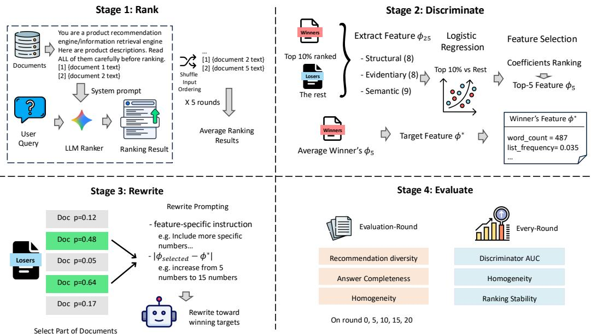
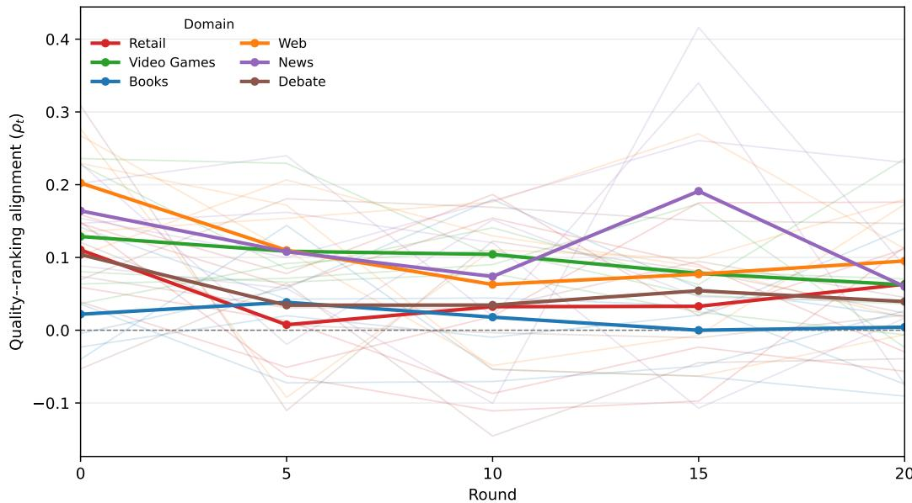
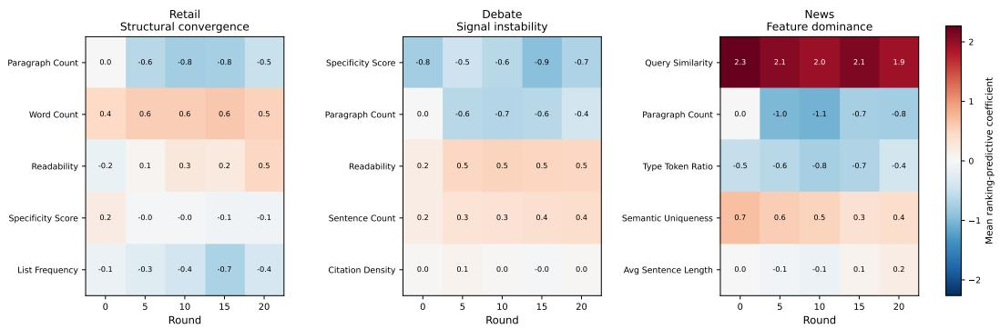

# CHASE: How Content Ecosystems Are Reshaped When Ranking Is the Only Target

Qianwen Gao<sup>1∗</sup>, Zichang Su<sup>2∗</sup>, Yiwen Hou<sup>1</sup>, Arlen Kumar<sup>1</sup> & Leanid Palkhouski<sup>1</sup>   
<sup>1</sup>University of California, Berkeley <sup>2</sup>Zhejiang University   
{kaiagao,leanid}@berkeley.edu

## Abstract

Generative Engine Optimization (GEO) is increasingly used to improve content visibility in LLM-based retrieval systems, yet its population-level effects under repeated optimization remain poorly understood. We introduce Content Homogenization under rAnking Signal Exploitation (CHASE)<sup>1</sup>, a controlled simulation framework for studying how content ecosystems are reshaped when creators repeatedly adapt documents to an LLM ranking signal. We use ranking as a proxy for source visibility and validate this abstraction against citations in grounded generated responses, obtaining a rank–citation AUC of 0.853 ± 0.093 across six domains. CHASE then iterates ranking, feature discrimination, rewriting, and evaluation over 20 rounds across different domains. Quality–ranking alignment decreases in all six domains: from R0 to R20, the change in Spearman’s ρ ranges from −0.107 to −0.018, with a mean change of −0.068, which means documents closer to the ranking feature profile become less aligned with independently judged document quality over the simulation horizon. A random-target control have shown that it is associated with adaptation toward ranking-derived incentives rather than iterative rewriting alone. The resulting ecosystem dynamics are strongly domain-dependent. Together, these findings show how repeated optimization against a fixed LLM ranking signal can reshape both content populations and the incentives faced by content creators.

## 1 Introduction

Generative Engine Optimization (GEO) studies how content can be adapted to improve visibility in LLM-generated responses (Aggarwal et al., 2024; Kumar & Lakkaraju, 2024). Existing work has largely considered optimization as a single-round intervention: given a document and a generative engine, which edits improve its visibility? In practice, however, optimization is repeated and population-level. When successful strategies are adopted by competing creators over time, the document distribution changes accordingly, potentially changing which ranking features remain predictive even when the backbone model is fixed. We ask: what happens to a content ecosystem when creators repeatedly adapt to the features associated with ranking success?

We introduce CHASE (Content Homogenization under rAnking Signal Exploitation), a controlled simulation framework for studying this feedback loop. CHASE treats an LLM’s ranking over candidate documents as the optimization signal and iterates four stages— RANK, DISCRIMINATE, REWRITE, and EVALUATE—over multiple rounds. It intentionally isolates ranking-driven content adaptation rather than modeling the full generative-search pipeline. An interpretable discriminator identifies document features associated with ranking success, and a stochastic subset of documents is rewritten toward the resulting target profile. Because movement toward selected features is expected by construction, our focus is not whether documents follow the optimization target, but how the relationship among ranking incentives, document quality, and the content population changes as optimization repeats.

We evaluate CHASE for 20 rounds across six recommendation and question-answering domains, using separate model families for ranking, rewriting, and quality evaluation and five random seeds. Across all six domains, proximity to the ranking-derived feature profile becomes less aligned with independently judged document quality from the beginning to the end of optimization. We call this phenomenon quality–ranking divergence. Randomtarget and no-rewrite controls indicate that this divergence is not explained by rewriting alone, while rank–citation analysis shows that the ranking signal is strongly associated with which sources appear in grounded generated responses. The form of ecosystem change is nevertheless domain-dependent: we observe patterns of structural convergence, signal instability, and feature dominance. We also find directional negative associations between ranking and some evidentiary features; these are observational signals rather than evidence of a causal citation penalty. All longitudinal claims are restricted to the simulated 20-round horizon.

## Our contributions are fourfold:

1. We introduce CHASE, a framework for studying repeated population-level adaptation to an LLM ranking signal.

2. We validate ranking as a source-visibility proxy and introduce no-rewrite and random-target controls to separate ranking-driven dynamics from mechanically induced rewriting effects.

3. Across six domains and a cross-family, five-seed setup, we identify quality–ranking divergence and characterize heterogeneous ecosystem dynamics under repeated optimization.

4. We analyze how ranking-predictive features evolve over time, including directional associations between ranking and evidentiary features.

  
Figure 1: The CHASE framework simulates a four-stage feedback loop

## 2 Related work

Goodhart effects in model optimization. Goodhart-type failures arise when optimization pressure on a proxy weakens its alignment with the underlying objective (Goodhart, 1975; Manheim & Garrabrant, 2019). In machine learning, closely related behavior is studied as reward hacking, where an agent exploits differences between a specified reward and the intended objective (Skalse et al., 2022). In RLHF, Gao et al. (2023) show that continued optimization of a learned reward model can eventually reduce performance under a separate gold reward model. Related work studies such failures under reward misspecification, including their geometric structure and mitigation through early stopping (Karwowski et al., 2024), as well as settings in which KL regularization does not prevent severe proxy misoptimization (Kwa et al., 2024). These studies primarily concern optimization of a model policy against a proxy reward. CHASE instead studies external agents modifying the inputs presented to a fixed evaluator, producing population-level dynamics in the content being ranked.

Generative Engine Optimization. Aggarwal et al. (2024) formalize Generative Engine Optimization and show that content interventions, including statistics, quotations, and citations, can substantially affect visibility in generated responses. Kumar & Lakkaraju (2024) further demonstrate that strategic modifications to product descriptions can alter LLM recommendation outcomes. More recent methods automate content optimization against generative-engine preferences. AutoGEO extracts engine-specific preference rules and uses them to guide content rewriting (Wu et al., 2025), while CORE optimizes retrieved content to control product rankings in LLM-based search (Jin et al., 2026). FeatGEO performs interpretable feature-level optimization while explicitly balancing citation visibility and content quality (Liu & Xu, 2026). These approaches primarily optimize individual content items for visibility. CHASE instead studies what happens when ranking-driven adaptation is repeated across an entire population and the evolving population becomes part of the optimization environment.

Competitive search and strategic adaptation. Information retrieval has long studied adversarial manipulation of search systems (Castillo & Davison, 2011) and competitive settings in which publishers modify documents in response to ranking incentives (Kurland & Tennenholtz, 2022). Recent work extends this setting with LLM-based publishers: LEMSS provides a multi-agent platform for simulating ranking competitions (Mordo et al., 2025), while Bardas et al. (2025) study LLM-based document editing for improving rank. Gametheoretic analyses further examine the stability and welfare consequences of strategic publisher adaptation (Madmon et al., 2025). More broadly, strategic classification studies agents who modify observable features in response to a decision rule (Hardt et al., 2016), while performative prediction formalizes how deployment can induce changes in the data distribution (Perdomo et al., 2020). CHASE shares this feedback-loop perspective but holds the ranker fixed and studies the repeated evolution of an entire document population under an inferred ranking signal.

## 3 The CHASE Framework

## 3.1 Scope and Problem Formulation

We study a document ecosystem that repeatedly adapts to a fixed LLM ranking signal. Let $D _ { t } \ = \ \{ d _ { 1 } ^ { t } , \ldots , d _ { n } ^ { t } \}$ denote the document pool at round $t ,$ where each document is associated with a query q. CHASE models the transition from $D _ { t }$ to $D _ { t + 1 }$ through four stages: RANK, DISCRIMINATE, REWRITE, and EVALUATE. The framework isolates contentside adaptation to ranking incentives rather than modeling the full retrieval and responsegeneration pipeline.

Creators in CHASE are myopic: they adapt to the ranking signal inferred at the current round without planning over future rounds. They are also non-strategic: each creator responds independently to the inferred signal rather than explicitly modeling competitors’ future actions. The ranker itself remains fixed across rounds. These assumptions make CHASE a controlled stress test of population-level adaptation under a stationary evaluator rather than an equilibrium model of strategic publishers.

Formally, the transition is governed by: (i) an LLM ranker $R ( q , D _ { t } )$ that orders documents for query q; (ii) a feature extractor $\phi ( \bar { d } ) \in \mathbb { R } ^ { 2 5 }$ ; (iii) a round-specific discriminator $f _ { t }$ that identifies features associated with ranking success and produces a target profile $\phi _ { t } ^ { * } )$ ; and (iv) an LLM rewriting function $g ( d , S _ { t } , \phi _ { t } ^ { * } )$ that modifies participating documents toward the selected feature targets S<sub>t</sub>. Figure 1 summarizes the resulting feedback loop.

## 3.2 Stage 1: Rank

For each query q, the LLM ranker produces a forced ranking of its associated documents. To reduce presentation-order effects, we independently shuffle the document order $P = 5$ times and aggregate the resulting rankings by mean rank:

$$
\bar { R } ( d , q ) = \frac { 1 } { P } \sum _ { k = 1 } ^ { P } r _ { k } ( d , q ) ,\tag{1}
$$

where $r _ { k } ( d , q )$ is the rank assigned to document d under the k-th presentation order. Domain specific prompts frame the model as a recommendation engine for Retail, Video Games, and Books, and as an information-retrieval engine for Web, News, and Debate. Full prompts are provided in Appendix F.

Ranking supplies a dense relative preference signal over all candidate documents. We use it as a proxy for source visibility rather than as a simulation of the entire generative-search process; Section 4.1 evaluates this proxy against citation behavior in grounded generated responses.

## 3.3 Stage 2: Discriminate

Each document is represented by a K = 25 dimensional feature vector, $\boldsymbol { \phi } ( d ) \in \mathbb { R } ^ { K } .$ , spanning three categories: structural features $\left( 8 ; \mathbf { e . g . } \right.$ , word count and readability), evidentiary features (8; e.g., citation density, named-source mentions, and statistic density), and semantic features (9; e.g., query similarity, lexical diversity, and information density). All features are computed without LLM calls using rule-based extraction, embedding-based similarity, and linguistic tagging. Complete definitions are given in Appendix B.

Using the rankings from Stage 1, we label the top 10% of documents as winners, $y _ { d , t } = 1$ , and the remainder as non-winners. We fit an L2-regularized logistic regression on standardized feature vectors,

$$
f _ { t } : \phi ( d ) \mapsto P ( y _ { d , t } = 1 ) ,\tag{2}
$$

yielding coefficients $w _ { t } ~ \in { \mathbb R } ^ { K }$ . We select the $J = 5$ features with the largest absolute coefficients,

$$
S _ { t } = \mathrm { T o p J } \big ( \{ | w _ { t , k } | \} _ { k = 1 } ^ { K } \big ) ,\tag{3}
$$

and define the target value $\boldsymbol { \phi } _ { t , k } ^ { * }$ for each $k \in S _ { t }$ as its mean among winning documents. The pair $\left( S _ { t } , \phi _ { t } ^ { * } \right)$ forms the inferred ranking signal passed to Stage 3.

The discriminator is an idealized model of how creators infer actionable signals from observed visibility outcomes. In practice, such inference may rely on sampled queries and noisy or delayed observations; CHASE intentionally provides a cleaner signal in order to isolate the dynamics induced by repeated adaptation. Sensitivity to the winner threshold and number of selected features is examined in Section 4.5.

## 3.4 Stage 3: Rewrite

Stochastic participation. Only a subset of non-winning documents participates in rewriting at each round. For each non-winning document d at round $t ,$ we independently sample a participation probability $p _ { d , t } \sim$ Beta(2, 5) and a gate variable $u _ { d , t }$ ∼ Uniform(0, 1). The document is rewritten when $u _ { d , t } \leq p _ { d , t } \mathrm { : }$

$$
d ^ { t + 1 } = \left\{ \begin{array} { l l } { d ^ { t } , } & { y _ { d , t } = 1 , } \\ { g ( d ^ { t } , S _ { t } , \phi _ { t } ^ { * } ) , } & { y _ { d , t } = 0 \mathrm { a n d } u _ { d , t } \leq p _ { d , t } , } \\ { d ^ { t } , } & { y _ { d , t } = 0 \mathrm { a n d } u _ { d , t } > p _ { d , t } . } \end{array} \right.\tag{4}
$$

The resulting marginal participation probability is $\mathbb { E } [ p _ { d , t } ] = 2 / 7 \approx 0 . 2 9$ . Participation is independently resampled across documents and rounds; therefore, this mechanism models stochastic participation rather than persistent differences in creators’ propensity to optimize.

The rewrite prompt specifies feature-level changes while instructing the model to preserve factual claims and avoid inventing information. We reject rewrites whose word count differs from the source document by more than 50%. Movement toward $\phi _ { t } ^ { * }$ is therefore an explicit mechanism of CHASE, not an empirical finding. Our analysis instead asks what emerges from repeated ranking-derived adaptation—in particular, how ranking–quality alignment, feature importance, ranking stability, and population-level properties evolve over time. Rewrite integrity is evaluated separately in Section 4.5.

## 3.5 Stage 4: Evaluate

We evaluate CHASE at two levels. Document-level metrics characterize the evolving content population directly, while response-level metrics measure the behavior of a generated answer grounded in the current document pool. Discriminator AUC, homogeneity, and ranking stability are computed every round; quality and response-level metrics are evaluated at $t \in \{ 0 , \bar { 5 } , 1 0 , 1 5 , 2 \bar { 0 } \}$ .

Ecosystem metrics. Discriminator AUC is the ROC-AUC of $f _ { t } ,$ measuring how separable top-ranked documents are in the 25-dimensional feature space. Homogeneity $H ( D _ { t } ^ { \bullet } )$ is the mean pairwise cosine similarity between document embeddings within each query group, with higher values indicating lower content diversity. Ranking stability is the mean Kendall rank correlation τ (Kendall, 1938) across all pairs of the $P = 5$ randomized rankings for each query.

Document quality. An independent LLM judge scores each document with respect to its query on factual accuracy, completeness, and usefulness, each on an anchored $\dot { 1 } { - } 5$ scale; $\dot { Q } ( d ) \dot { }$ is their mean. LLM judges provide a scalable approximation of human evaluation but can exhibit position, verbosity, and self-preference biases (Zheng et al., 2023; Panickssery et al., 2024). To reduce shared-model self-preference, our judge belongs to a different model family from both the ranker and rewriter, and we separately validate its scores against human annotations. The complete scoring rubric is provided in Appendix H.

Quality–ranking alignment. We quantify this relationship using Spearman’s rank correlation (Spearman, 1904):

$$
\rho _ { t } = { \mathrm { S p e a r m a n } } \big ( - \left\| \phi _ { S _ { t } } ( d ) - \phi _ { t } ^ { * } \right\| _ { 2 } , Q ( d ) \big ) , \qquad d \in D _ { t } .\tag{5}
$$

Higher $\rho _ { t }$ indicates that documents closer to the current winning feature profile also tend to receive higher independent quality scores. A decrease in $\rho _ { t }$ therefore indicates quality– ranking divergence. We treat $\rho _ { t }$ as an associational alignment diagnostic rather than a causal estimate of the effect of optimization on quality.

Response-level evaluation. At each evaluation round, we additionally generate a grounded response from the current document pool. For recommendation domains, we measure constraint satisfaction among recommended items; for question-answering domains, we measure the fraction of a query-specific aspect checklist covered by the response. We also record which documents are cited in the generated response for the rank–citation validation in Section 4.1. Generation and evaluation prompts are provided in Appendix F.

Human validation. We validate the automated quality measure on a stratified sample of documents spanning domains and evaluation rounds. Human annotators assess factual accuracy, completeness, and usefulness using the same anchored rubric as the LLM judge, and additionally assess document verifiability. We report inter-annotator agreement, human– LLM agreement on the shared quality dimensions, and whether human judgments support the direction of the observed quality changes.

Full annotation instructions and extended results are provided in Appendix H.

## 3.6 Experimental Setup

We initialize CHASE with documents from C-SEO Bench (Puerto et al., 2025), covering six domains across two task types: Retail, Video Games, and Books for recommendation, and Web, News, and Debate for question answering. Each domain in C-SEO Bench contains 100 queries. For computational tractability, we uniformly sample 20 queries per domain; each sampled query has 5–10 candidate documents. We run CHASE for T = 20 rounds and evaluate at $t \in \dot { \{ 0 , \bar { 5 } , 1 0 , 1 5 , 2 0 \} }$ . The primary experiments use five independent random seeds. To separate optimization and evaluation roles across model families, we use Gemini 3.1 Flash-Lite as the ranker, GPT-5.4-mini as the rewriter, and Claude Haiku 4.5 as the independent quality judge. All longitudinal conclusions are restricted to this 20-round simulation horizon. Additional control and validation experiments are described with their respective seed counts in Section 4.

## 4 Results

## 4.1 Ranking Tracks Source Visibility

We first test whether the ranking signal used by CHASE reflects which documents contribute to generated answers. At each evaluation round, we prompt the ranker to generate a grounded response with explicit document citations and compare the mean ranks of cited and non-cited documents. We report the Mann–Whitney AUC, which can be interpreted as the probability that a randomly selected cited document outranks a randomly selected non-cited document.

Across six domains, three seeds, and five evaluation rounds (n = 90), rank–citation AUC is 0.853 ± 0.093. The association is stable across the simulation horizon (0.849 at R0 and 0.863 at R20) and positive in every domain, with domain-level AUCs ranging from 0.730 to 0.928. These results support ranking as a useful proxy for source visibility in CHASE, while not implying that ranking reproduces the full generative-search pipeline. Full domain-by-round results are provided in Appendix C.

## 4.2 Quality–Ranking Divergence

Figure 2 shows the evolution of quality–ranking alignment across evaluation rounds, while Table 1 summarizes the corresponding R0–R20 ecosystem changes. The most consistent pattern is a reduction in quality–ranking alignment: $\rho _ { t }$ is lower at R20 than at R0 in all six domains. The decline ranges from −0.018 in Books to −0.107 in Web, while remaining positive at R20 in every domain. Thus, documents closer to the feature profile associated with ranking success become less strongly associated with independently judged quality over the simulated horizon.

This divergence does not imply that document quality itself monotonically decreases. Mean quality is nearly unchanged in several domains and increases in Retail. Rather, the rankingderived optimization direction becomes less informative about independently measured quality.

The remaining metrics are more domain-dependent. Discriminator AUC increases in every domain, indicating that highly ranked documents become increasingly separable in the measured feature space. Homogeneity changes are comparatively small under the crossfamily configuration. Presentation-order stability is also mostly stable, although Web shows a substantial decline. These differences motivate examining CHASE as a family of domaindependent dynamics rather than a single universal trajectory.

## 4.3 Separating Designed from Emergent Effects

Movement toward the selected target features is built into CHASE and is therefore not itself evidence of an emergent effect. We use two controls to test whether the observed ecosystem dynamics can be explained by repeated ranking or rewriting alone.

<table><tr><td>Domain</td><td>AUC R0→R20</td><td>Homogeneity R0→R20</td><td>Stability R0→R20</td><td>Quality R0→R20</td><td>Task ∆</td><td>ρ R0→R20</td></tr><tr><td>Retail</td><td>.805→.877</td><td>.731→.720</td><td>.628→.624</td><td>3.514→3.621</td><td>-.013</td><td>+.110→+.063</td></tr><tr><td>Video Games</td><td>.826→.898</td><td>.334→.348</td><td>.722→.697</td><td>2.270→2.226</td><td>+.003</td><td>+.129→+.062</td></tr><tr><td>Books</td><td>.824→.914</td><td>.406→.419</td><td>.729→.713</td><td>3.018→2.838</td><td>+.001</td><td>+.022→+.004</td></tr><tr><td>Web</td><td>.864→.924</td><td>.513→.517</td><td>.703→.587</td><td>2.913→2.833</td><td>-.146</td><td>+.202→+.095</td></tr><tr><td>News</td><td>.934→.941</td><td>.517→.524</td><td>.697→.716</td><td>2.195→2.190</td><td>-.033</td><td>+.164→+.060</td></tr><tr><td>Debate</td><td>.861→.910</td><td>.626→.628</td><td>.488→.502</td><td>3.032→3.029</td><td>+.027</td><td>+.104→+.039</td></tr></table>

Table 1: Cross-family CHASE results over 20 rounds. AUC is discriminator ROC-AUC; homogeneity is intra-query embedding similarity; stability is presentation-order Kendall’s τ; quality is the independent judge score; Task ∆ is the R20–R0 change in the domain-specific response metric; and $\rho$ measures quality–ranking alignment.

  
Figure 2: Quality–ranking alignment $\rho _ { t }$ over 20 rounds across six domains. Lines show the mean across five seeds; faint traces show individual seeds. All domains have lower alignment at R20 than at R0, although trajectories need not be monotonic.

In the no-rewrite control, documents remain frozen while ranking and feature extraction continue. Homogeneity is unchanged from R0 to R20 in both Retail (.732 → .732) and Debate (.633 → .633), showing that changes in the document population require active rewriting rather than repeated ranking alone.

In the random-target control, we retain the same rewriting mechanism but replace discriminator-derived targets with randomly selected feature targets. Across three seeds per domain, ∆<sub>ρ</sub> is +.001, +.014, and −.036 for Retail, Debate, and News, compared with −.047, −.065, and −.104 under CHASE, respectively. The larger declines under CHASE suggest that quality–ranking divergence is associated specifically with adaptation toward ranking-derived targets rather than arbitrary iterative rewriting.

## 4.4 Domain-Dependent Dynamics

Beyond the shared reduction in $\rho ,$ CHASE produces heterogeneous dynamics across domains. We summarize these patterns as three descriptive regimes: structural convergence, where a small set of structural features increasingly characterizes ranking success; signal instability, where rankings and discriminative features are comparatively unstable; and feature dominance, where one or a few features account for a disproportionate share of the ranking signal. These labels describe behavior within the observed 20-round horizon rather than distinct failure classes or long-run endpoints.

  
Figure 3: Evolution of ranking-predictive feature coefficients in representative domains over 20 rounds. Retail, Debate, and News illustrate structural convergence, signal instability, and feature dominance, respectively. Coefficients describe conditional associations with ranking success and should not be interpreted causally.

Retail provides the clearest example of structural adaptation, while Debate exhibits the least stable ranking environment and News shows the strongest concentration of ranking signal. Figure 3 illustrates these patterns through the evolution of ranking-predictive features in the three representative domains.

Several evidentiary features also receive negative discriminator coefficients in some domains. Because these coefficients are conditional on the measured feature set and document distribution, we interpret them as directional associations with ranking success rather than evidence that citations or source attribution causally reduce rank. Full six-domain feature trajectories are reported in Appendix B.

Taken together, these results suggest that repeated adaptation to the same ranking signal can reshape content populations in qualitatively different ways depending on the domain. The regime taxonomy therefore describes how ranking incentives manifest in CHASE, not evidence that optimization necessarily produces convergence or quality degradation.

## 4.5 Robustness and Rewrite Integrity

Our conclusions are not tied to a single discriminator configuration. Sweeping the winner threshold over {5%, 10%, 20%} and the selected feature count over {3, 5, 7, 10} produces smooth changes in discriminator AUC rather than cliff effects. The Jaccard overlap of selected features between adjacent winner thresholds is 39–42%, compared with approximately 11% under random selection, indicating a stable core of ranking-predictive features. Replacing the default Beta(2, 5) participation distribution with constant participation probability 0.30 in Debate also produces qualitatively similar trajectories. Full sensitivity results are provided in Appendix D.

We additionally audit 3,472 accepted rewrites collected at the five evaluation rounds t ∈ {0, 5, 10, 15, 20} from three seeds in each of the six domains. Using a model from a different family than the GPT rewriter, we found that, overall, 93.0% pass all integrity checks; detected fabrication occurs in 3.4% of rewrites, citation removal in 2.3%, and quote removal in 2.1%. The pass rate does not deteriorate over time (90.3% at the earliest audited round versus 96.4% at R15). Thus, the observed longitudinal patterns are unlikely to be explained by progressively accumulating rewrite corruption. Audit criteria and extended results appear in Appendix G.

## 4.6 Human Validation of Quality Judgments

We further evaluate whether the automated quality measure reflects human judgments on a stratified subset of documents spanning domains and evaluation rounds. Annotators independently score factual accuracy, completeness, usefulness, and verifiability using the rubric described in Appendix H. We compare human and automated scores on the three shared quality dimensions and examine whether the direction of longitudinal quality changes is consistent under human evaluation.

Human–LLM agreement is moderate to strong (Spearman’s $\rho = 0 . 5 8$ , 95% CI [0.49, 0.66]), with ordinal Krippendorff’s $\alpha = 0 . 7 2$ across human annotators. At the aggregate level, human evaluation supports the direction of the automated quality trends, with both evaluations showing weaker quality changes than quality–ranking alignment changes.

## 5 Discussion

Ranking incentives can drift away from quality. CHASE shows that repeated adaptation to a fixed ranking system can reshape the relationship between ranking success and document quality even when the evaluator itself does not change. Across domains, proximity to the ranking-derived target profile becomes less aligned with independently judged quality over the 20-round horizon. The random-target control suggests that this divergence is not a generic consequence of rewriting, but is associated with repeatedly adapting toward features inferred from ranking success. Importantly, this does not imply that document quality necessarily decreases: quality remains relatively stable in several domains. Rather, ranking success becomes a less reliable indicator of the quality dimensions measured by the independent judge.

Ecosystem responses are domain-dependent. Repeated optimization does not produce a single form of ecosystem change. Some domains develop increasingly prominent structural ranking signals, others exhibit comparatively unstable signals, and others concentrate ranking preference on a small set of features. This heterogeneity suggests that the consequences of GEO depend on both the content domain and the ranking criteria available for creators to exploit. Accordingly, structural convergence, signal instability, and feature dominance are best understood as descriptive patterns observed within CHASE rather than inevitable long-run outcomes.

Implications for ranking-system design. A ranking system deployed in an adaptive environment should be evaluated not only on its immediate ranking quality but also on the incentives it creates when repeatedly optimized against. In particular, the negative associations we observe between ranking and some evidentiary features suggest that auditing feature-level ranking preferences may reveal incentives that are undesirable when amplified across many creators. These associations are conditional on the observed feature set and document distribution and therefore do not establish a causal penalty for citations or source attribution. More broadly, CHASE provides a controlled way to stress-test whether ranking signals remain aligned with desired content properties as the surrounding document population adapts.

## 6 Limitations

CHASE intentionally isolates repeated adaptation to an LLM ranking signal rather than modeling a complete generative-search system. Real systems include retrieval, response generation, personalization, and user feedback, any of which may alter the incentives observed here. Creators in CHASE also receive a comparatively clean inferred signal and behave myopically and independently; real creators may observe noisy, partial, or delayed feedback and may reason strategically about competitors.

Although ranking, rewriting, and quality evaluation use separate model families, each role is instantiated by a single model configuration. The resulting dynamics may therefore depend on the particular models and prompts used. Moreover, the discriminator operates over a fixed 25-dimensional feature space. Unmeasured properties may influence both ranking and quality, so declining quality–ranking alignment may partly reflect feature insufficiency rather than optimization pressure alone.

The ranker remains fixed throughout the simulation. This design isolates content-side distribution shift, but does not capture systems in which ranking models themselves adapt through retraining, user feedback, or policy changes. Our experiments also end after 20 rounds. The observed trajectories therefore characterize the simulated finite horizon and should not be interpreted as evidence of convergence or long-run equilibrium behavior.

Finally, document quality is primarily measured with an independent LLM judge and validated on a sampled subset with human annotation. Human validation reduces dependence on automated evaluation but cannot establish the quality or verifiability of every document in the ecosystem.

## 7 Conclusion

We introduced CHASE, a controlled framework for studying how content populations evolve when creators repeatedly adapt to a fixed LLM ranking signal. Across six domains, repeated optimization weakens the alignment between ranking-derived feature targets and independently judged document quality, while the resulting ecosystem dynamics vary substantially by domain. Rank–citation analysis supports ranking as a useful visibility proxy in this setting, and control experiments distinguish ranking-driven adaptation from arbitrary rewriting effects. Together, these results show that the incentives induced by an LLM ranker can reshape both document features and the relationship between ranking success and content quality, even when the ranker itself remains fixed. These conclusions are limited to the simulated 20-round horizon and should be interpreted as evidence about ranking-driven adaptation rather than the full dynamics of deployed generative-search systems.

## Ethics statement

CHASE is a controlled simulation of content adaptation to LLM ranking signals and does not model the full behavior of deployed generative-search systems. Our results should therefore not be interpreted as demonstrating that existing search or recommendation systems necessarily produce the dynamics observed here. The framework is intended to help identify incentives that may emerge when content creators repeatedly optimize for model-mediated visibility. Such optimization may affect content diversity, quality, and the use of evidentiary signals. We report these effects as properties of the simulated setting and avoid causal or long-run claims beyond the observed 20-round horizon.

LLM disclosure Large language models are integral components of the experimental methodology. Gemini 3.1 Flash-Lite is used for document ranking, GPT-5.4-mini for document rewriting, and Claude Haiku 4.5 for independent document-quality evaluation. A separate Claude Sonnet 4.6 model is used for the post-hoc rewrite-integrity audit. LLMs are also used to generate grounded responses for the response-level evaluation described in the paper. All reported experimental results are produced and analyzed by the authors, who take responsibility for the methodology, results, and conclusions.

## References

Pranjal Aggarwal, Vishvak Murahari, Tanmay Rajpurohit, Ashwin Kalyan, Karthik Narasimhan, and Ameet Deshpande. GEO: Generative engine optimization. In Proceedings of the 30th ACM SIGKDD Conference on Knowledge Discovery and Data Mining, pp. 5–16. ACM, 2024.

Niv Bardas, Tommy Mordo, Oren Kurland, and Moshe Tennenholtz. Automatic document editing for improved ranking. In Proceedings of the 48th International ACM SIGIR Conference on Research and Development in Information Retrieval, pp. 2779–2783, 2025. doi: 10.1145/ 3726302.3730168.

Carlos Castillo and Brian D. Davison. Adversarial web search. Foundations and Trends in Information Retrieval, 4(5):377–486, 2011.

Leo Gao, John Schulman, and Jacob Hilton. Scaling laws for reward model overoptimization. In Proceedings of the 40th International Conference on Machine Learning, pp. 10835–10866. PMLR, 2023.

Charles Goodhart. Problems of monetary management: The UK experience. Papers in Monetary Economics, 1, 1975.

Moritz Hardt, Nimrod Megiddo, Christos Papadimitriou, and Mary Wootters. Strategic classification. In Proceedings of the 2016 ACM Conference on Innovations in Theoretical Computer Science, pp. 111–122. ACM, 2016.

Haibo Jin, Ruoxi Chen, Peiyan Zhang, Yifeng Luo, Huimin Zeng, Man Luo, and Haohan Wang. Controlling output rankings in generative engines for llm-based search. arXiv preprint arXiv:2602.03608, 2026. URL https://arxiv.org/abs/2602.03608.

Jacek Karwowski, Oliver Hayman, Xingjian Bai, Klaus Kiendlhofer, Charlie Griffin, and Joar Skalse. Goodhart’s law in reinforcement learning. In International Conference on Learning Representations, 2024.

Maurice G. Kendall. A new measure of rank correlation. Biometrika, 30(1/2):81–93, 1938.

Aounon Kumar and Himabindu Lakkaraju. Manipulating large language models to increase product visibility. arXiv preprint arXiv:2404.07981, 2024.

Oren Kurland and Moshe Tennenholtz. Competitive search. In Proceedings of the 45th International ACM SIGIR Conference on Research and Development in Information Retrieval, pp. 2838–2849, 2022. doi: 10.1145/3477495.3532771.

Thomas Kwa, Drake Thomas, and Adria Garriga-Alonso. Catastrophic Goodhart: Regular-\` izing RLHF with KL divergence does not mitigate heavy-tailed reward misspecification. In Advances in Neural Information Processing Systems, volume 38, 2024.

Zikang Liu and Peilan Xu. Think before writing: Feature-level multi-objective optimization for generative citation visibility. In Proceedings of the 64th Annual Meeting of the Association for Computational Linguistics, pp. 20290–20303. Association for Computational Linguistics, 2026. doi: 10.18653/v1/2026.acl-long.929. URL https://aclanthology.org/2026. acl-long.929/.

Omer Madmon, Idan Pipano, Itamar Reinman, and Moshe Tennenholtz. The search for stability: Learning dynamics of strategic publishers with initial documents. Journal of Artificial Intelligence Research, 83(15), 2025. doi: 10.1613/jair.1.17997.

David Manheim and Scott Garrabrant. Categorizing variants of Goodhart’s law. arXiv preprint arXiv:1803.04585, 2019.

Tommy Mordo, Tomer Kordonsky, Haya Nachimovsky, Moshe Tennenholtz, and Oren Kurland. LEMSS: LLM-based platform for multi-agent competitive search simulation. In Proceedings of the 48th International ACM SIGIR Conference on Research and Development in Information Retrieval, pp. 3595–3605, 2025. doi: 10.1145/3726302.3730312.

Arjun Panickssery, Samuel R. Bowman, and Shi Feng. LLM evaluators recognize and favor their own generations. In Advances in Neural Information Processing Systems, volume 37, 2024.

Juan C. Perdomo, Tijana Zrnic, Celestine Mendler-Dunner, and Moritz Hardt. Performative¨ prediction. In Proceedings of the 37th International Conference on Machine Learning, volume 119 of Proceedings of Machine Learning Research, pp. 7599–7609. PMLR, 2020.

Haritz Puerto, Martin Gubri, Tommaso Green, Seong Joon Oh, and Sangdoo Yun. C-seo bench: Does conversational seo work?, 2025. URL https://arxiv.org/abs/2506.11097.

Joar Skalse, Nikolaus Howe, Dmitrii Krasheninnikov, and David Krueger. Defining and characterizing reward hacking. In Advances in Neural Information Processing Systems, volume 35, 2022.

Charles Spearman. The proof and measurement of association between two things. American Journal ofPsychology, 15(1):72–101, 1904.

Yujiang Wu, Shanshan Zhong, Yubin Kim, and Chenyan Xiong. What generative search engines like and how to optimize web content cooperatively. arXiv preprint arXiv:2510.11438, 2025. URL https://arxiv.org/abs/2510.11438.

Lianmin Zheng, Wei-Lin Chiang, Ying Sheng, Siyuan Zhuang, Zhanghao Wu, Yonghao Zhuang, Zi Lin, Zhuohan Li, Dacheng Li, Eric Xing, Hao Zhang, Joseph E. Gonzalez, and Ion Stoica. Judging LLM-as-a-judge with MT-Bench and Chatbot Arena. In Advances in Neural Information Processing Systems, volume 36, 2023.

## A Algorithm Pseudocode

```latex
Algorithm 1 CHASE: Content Homogenization under rAnking Signal Exploitation
Require: Queries Q, initial document pool $\mathcal { D } _ { 0 }$ , fixed LLM ranker R, rounds $T { = } 2 0$ , evalua
tion rounds $E = \{ 0 , 5 , 1 0 , 1 5 , 2 0 \}$
1: for $t = 0$ to $T - 1$ do
// Stage 1: Rank (§3, Stage 1)
2: for each query $q \in \mathcal { Q }$ do
3: for $k \stackrel { \star } { = } 1$ to $\mathrm { \dot { \it P } } { = } 5$ do
4: Rank documents under randomized ordering $k ,$ yielding $r _ { k } ( d , q )$
5: end for
6: $\begin{array} { r } { \bar { R } ( d , q ) \gets \frac { 1 } { P } \sum _ { k = 1 } ^ { P } r _ { k } ( d , q ) } \end{array}$ for each $d \in { \mathcal { D } } _ { t }$
7: end for
// Stage 2: Discriminate (§3, Stage 2)
8: for each document $d \in { \bar { \mathcal { D } } } _ { t }$ do
9: Extract feature vector $\pmb { \phi } ( d ) \in \mathbb { R } ^ { 2 5 }$
10: end for
11: $y _ { d , t } \gets \mathbf { 1 } [ \bar { R } ( d , q )$ in top 10%] for all d
12: Train L2-regularized logistic regression (C=1.0) on $\{ ( \phi ( d ) , y _ { d , t } ) \}$ , yielding $\mathbf { w } _ { t }$
13: $S _ { t } \gets$ top-5 features by $\bar { \left| { \boldsymbol w } _ { t , k } \right| }$
14: $\phi _ { t , k } ^ { * } \gets \mathrm { m e a n } _ { d : y _ { d , t } = 1 } \phi _ { k } ( d )$ for each $k \in S _ { t }$
// Stage 3: Rewrite (§3, Stage 3)
15: $\mathcal { D } _ { t + 1 }  \emptyset$
16: for each document $d \in { \mathcal { D } } _ { t }$ do
17: if $y _ { d , t } = 1$ then
18: $\dot { \mathcal { D } } _ { t + 1 }  \mathcal { D } _ { t + 1 } \cup \{ d \}$ ▷ Winners unchanged
19: else
20: Sample $p _ { d } \sim$ Beta(2, 5), $u _ { d } \sim$ Uniform(0, 1)
21: if $\dot { u _ { d . } } \dot { \leq } \dot { p _ { d } }$ then
22: $\ddot { d } ^ { \prime } \longleftarrow \bar { g } ( d , S _ { t } , \phi _ { t } ^ { * } )$ ▷ LLM rewrite
23: if $0 . 5 \leq | d ^ { \prime } | / | d | \leq 1 . 5$ then
24: $\mathcal { D } _ { t + 1 } \dot {  } \dot { \mathcal { D } } _ { t + 1 } \cup \{ d ^ { \prime } \}$
25: else
26: $\mathcal { D } _ { t + 1 }  \mathcal { D } _ { t + 1 } \cup \{ d \}$ ▷ Reject rewrite
27: end if
28: else
29: $\mathcal { D } _ { t + 1 }  \mathcal { D } _ { t + 1 } \cup \{ d \}$ ▷ No participation
30: end if
31: end if
32: end for
33: end for
// Stage 4: Evaluate (§3, Stage 4)
// Run at each $t \in E$ after Stage 1 of that round
34: for each $t \in E$ do
35: Score quality Q(d) for all $d \in { \mathcal { D } } _ { t }$
36: Compute $\check { H ( D _ { t } ) }$ , ranking stability, task metrics
37: Compute $\rho _ { t }$ (Equation 5)
38: end for
```

## B Complete Feature Set

Each document is represented by a 25-dimensional feature vector computed without LLM calls. Features are organized into three categories: structural (8), evidentiary (8), and semantic (9). Embeddings use the all-MiniLM-L6-v2 sentence transformer; NER and POS tagging use spaCy (en core web sm).

Table 2: Complete feature set (25 features) extracted per document.
<table><tr><td>Feature</td><td>Category</td><td>Description</td></tr><tr><td colspan="3">Structural Features</td></tr><tr><td>word_count</td><td>Structural</td><td>Total number of whitespace-delimited tokens in the document.</td></tr><tr><td>sentence_count</td><td>Structural</td><td>Number of sentences, split on terminal punctuation (.!?).</td></tr><tr><td>avg_sentence_length</td><td>Structural</td><td>Mean words per sentence (word_count/ sentence_count)</td></tr><tr><td>paragraph_count</td><td>Structural</td><td>Number of non-empty paragraphs, split on double newlines.</td></tr><tr><td>heading_density</td><td>Structural</td><td>Count of heading-like lines (≤ 10 words, no trailing period, capitalized first word), normalized per 500</td></tr><tr><td>list_frequency</td><td>Structural</td><td>words. Count of lines beginning with a bullet (-, *, •) or numbered pattern (1 .), normalized per 500 words.</td></tr><tr><td>readability</td><td>Structural</td><td>Flesch-Kincaid grade level (via textstat).</td></tr><tr><td>bold_emphasis_density</td><td>Structural</td><td>Count of Markdown bold spans (**. . . **), normalized per 500 words.</td></tr><tr><td colspan="3">Evidentiary Features</td></tr><tr><td>citation_density</td><td>Evidentiary</td><td>Count of citation patterns ([N], [source], parenthetical author-year, &quot;according to&quot;),</td></tr><tr><td>statistic_density</td><td>Evidentiary</td><td>normalized per paragraph. Count of numeric patterns (percentages, dollar amounts, multi-digit numbers), normalized per 300</td></tr><tr><td>quote_density</td><td>Evidentiary</td><td>words. Count of quoted strings (≥ 5 characters between double quotes), normalized per 500 words.</td></tr><tr><td>named_source_mentions</td><td>Evidentiary</td><td>Count of spaCy-recognized ORG and PERSON entities (raw count).</td></tr><tr><td>year_mentions</td><td>Evidentiary</td><td>Count of year tokens matching 1990–2030 (raw count).</td></tr><tr><td>claim_density</td><td>Evidentiary</td><td>Fraction of sentences containing a numeric token or a comparative/superlative keyword (e.g., &quot;more</td></tr><tr><td>external_reference_density</td><td>Evidentiary</td><td>than&quot;, “largest&quot;, “improved&quot;). Count of URLs (http(s) : //), normalized per 500</td></tr><tr><td>question_density</td><td>Evidentiary</td><td>words. Count of question marks, normalized per 500 words.</td></tr><tr><td colspan="3">Semantic Features</td></tr><tr><td>query_similarity</td><td>Semantic</td><td>Cosine similarity between the document embedding and the query embedding.</td></tr><tr><td>corpus_centroid_similarity</td><td>Semantic</td><td>Cosine similarity between the document embedding and the mean embedding of all documents in the corpus.</td></tr><tr><td>type_token_ratio</td><td>Semantic</td><td>Ratio of unique word types to total tokens (lexical diversity).</td></tr><tr><td>vocabulary_sophistication</td><td>Semantic</td><td>Fraction of alphabetic words absent from the 5,000 most common English words (Brown corpus).</td></tr><tr><td>sentiment_polarity</td><td>Semantic</td><td>TextBlob polarity score (—1 to +1; negative values indicate negative sentiment and positive values</td></tr><tr><td>avg-word_length</td><td>Semantic</td><td>indicate positive sentiment). Mean character length across all whitespace-delimited tokens.</td></tr><tr><td>semantic_uniqueness</td><td>Semantic</td><td>One minus the maximum cosine similarity with another document in the same query group; higher</td></tr><tr><td>information_density</td><td>Semantic</td><td>values indicate greater distinctiveness. Fraction of spaCy tokens tagged as content words</td></tr><tr><td>specificity_score</td><td>Semantic</td><td>(NOUN, VERB, ADJ, ADV). Count of all spaCy named entities, normalized per 100 words.</td></tr></table>

<table><tr><td>Domain</td><td>R0</td><td>R5</td><td>R10</td><td>R15</td><td>R20</td><td>Overall</td></tr><tr><td>Retail</td><td> $. 6 8 9 \pm . 0 1 8$ </td><td> $. 7 6 2 \pm . 0 3 1$ </td><td> $. 7 5 8 \pm . 0 2 4$ </td><td> $. 7 3 2 \pm . 0 3 9$ </td><td> $. 7 0 9 \pm . 0 3 6$ </td><td> $. 7 3 0 \pm . 0 4 1$ </td></tr><tr><td>Video Games</td><td> $. 9 0 6 \pm . 0 1 9$ </td><td> $. 8 8 2 \pm . 0 2 0$ </td><td> $. 8 8 5 \pm . 0 3 2$ </td><td> $. 9 1 9 \pm . 0 2 5$ </td><td> $. 8 9 3 \pm . 0 3 0$ </td><td> $. 8 9 7 \pm . 0 2 9$ </td></tr><tr><td>Books</td><td> $. 8 8 8 \pm . 0 1 2$ </td><td> $. 8 8 3 \pm . 0 0 9$ </td><td> $. 8 8 6 \pm . 0 0 7$ </td><td> $. 9 0 1 \pm . 0 1 5$ </td><td> $. 8 9 0 \pm . 0 4 6$ </td><td> $. 8 9 0 \pm . 0 2 4$ </td></tr><tr><td>Web</td><td> $. 8 8 9 \pm . 0 2 1$ </td><td> $. 9 3 6 \pm . 0 1 4$ </td><td> $. 9 0 2 \pm . 0 2 7$ </td><td> $. 9 2 0 \pm . 0 2 1$ </td><td> $. 9 5 2 \pm . 0 4 9$ </td><td> $. 9 2 0 \pm . 0 3 7$ </td></tr><tr><td>News</td><td> $. 9 3 9 \pm . 0 1 7$ </td><td> $. 9 4 7 \pm . 0 1 5$ </td><td> $. 9 1 6 \pm . 0 2 6$ </td><td> $. 9 2 5 \pm . 0 1 5$ </td><td> $. 9 1 3 \pm . 0 1 8$ </td><td> $. 9 2 8 \pm . 0 2 3$ </td></tr><tr><td>Debate</td><td> $. 7 8 0 \pm . 0 4 3$ </td><td> $. 7 7 0 \pm . 0 7 0$ </td><td> $. 7 2 6 \pm . 0 6 6$ </td><td> $. 6 7 9 \pm . 0 6 4$ </td><td> $. 8 2 3 \pm . 1 3 6$ </td><td> $. 7 5 6 \pm . 0 9 5$ </td></tr><tr><td>All</td><td> $. 8 4 9 \pm . 0 9 0$ </td><td> $. 8 6 3 \pm . 0 8 0$ </td><td> $. 8 4 6 \pm . 0 8 2$ </td><td> $. 8 4 6 \pm . 1 0 7$ </td><td> $. 8 6 3 \pm . 1 0 2$ </td><td> $. 8 5 3 \pm . 0 9 3$ </td></tr></table>

Table 3: Rank–citation AUC across domains and evaluation rounds. Higher values indicate that documents cited in grounded generated responses tend to receive better Stage 1 rankings. Results use three seeds.

## C Rank–Citation Validation

To evaluate whether forced ranking provides a meaningful proxy for source visibility, we separately prompt the ranker at each evaluation round to generate a natural-language response grounded in the current document pool, with explicit instructions to cite document identifiers. We parse the cited document IDs and compare their mean ranks from Stage 1 with those of non-cited documents. For each query, we compute the Mann–Whitney AUC: the probability that a randomly selected cited document has a better (lower) mean rank than a randomly selected non-cited document. An AUC of 0.5 corresponds to no association between ranking and citation.

Across six domains, three seeds, and five evaluation rounds $( n = 9 0$ domain–seed–round observations), the overall rank–citation AUC is $0 . 8 5 3 \pm 0 . 0 9 3$ . The association remains similar across the 20-round horizon, from 0.849 at R0 to 0.863 at R20, and is positive in every domain. Table 3 reports the complete results.

These results support the use of ranking as a source-visibility proxy within CHASE. They do not imply equivalence between forced ranking and a complete generative-search pipeline, which may additionally involve retrieval, reranking, generation, and personalization.

<table><tr><td>Metric</td><td>Domain</td><td>CHASE</td><td>Random-target</td></tr><tr><td> $\rho$ </td><td>Retail</td><td> $. 1 1 0  . 0 6 3$ </td><td> $. 0 9 6 \to . 0 9 7$ </td></tr><tr><td rowspan="2"></td><td>Debate</td><td> $. 1 0 4  . 0 3 9$ </td><td> $. 0 0 9  . 0 2 3$ </td></tr><tr><td>News</td><td> $. 1 6 4 \to . 0 6 0$ </td><td> $. 2 2 1  . 1 8 5$ </td></tr><tr><td rowspan="2">Homogeneity</td><td>Retail</td><td> $. 7 3 1  . 7 2 0$ </td><td> $. 7 3 2  . 7 2 3$ </td></tr><tr><td>Debate</td><td> $. 6 2 6 \to . 6 2 8$ </td><td> $. 6 3 6 \to . 6 3 6$ </td></tr></table>

Table 4: CHASE and random-target control trajectories from R0 to R20. The random-target control uses the same rewriting mechanism while randomizing the optimization target.

## D Controls and Sensitivity Analyses

## D.1 No-Rewrite and Random-Target Controls

We use two controls to distinguish effects that arise mechanically from the CHASE pipeline from those associated with adaptation toward ranking-derived targets.

No-rewrite control. Documents are held fixed while ranking and feature extraction are repeated. Homogeneity remains unchanged from R0 to R20 in both Retail (.732 → .732) and Debate $( . 6 3 3  . 6 3 3 )$ . Thus, changes in document-level population statistics require active rewriting rather than repeated ranking alone.

Random-target control. The rewriting process is retained, but the feature targets supplied to the rewriter are randomized rather than derived from the discriminator. The control is run with three seeds per domain. Table 4 compares its R0–R20 trajectories with CHASE.

The change in quality–ranking alignment under the random-target control is +.001, +.014, and −.036 in Retail, Debate, and News, respectively, compared with −.047, −.065, and −.104 under CHASE. The contrast indicates that the larger alignment declines are associated with adaptation toward ranking-derived targets rather than arbitrary iterative rewriting.

## D.2 Winner Threshold and Feature Count

We test sensitivity to the fraction of documents labeled as winners and to the number of features selected by the discriminator. The offline sweep covers winner thresholds {5%, 10%, 20%} and selected feature counts $J \in \{ 3 , 5 , 7 , 1 0 \}$ . Discriminator AUC varies smoothly across these configurations, with no sharp changes at the default 10% winner threshold or $J = 5 .$ . Feature-selection Jaccard overlap between adjacent winner thresholds is 39–42%, compared with approximately 11% expected under random feature selection. This suggests that the discriminator identifies a persistent core of ranking-predictive features while allowing expected variation at the margins.

## D.3 Participation Distribution

<table><tr><td>Metric</td><td>Constant (0.30)</td><td> ${ \tt B e t a } ( 2 , 5 )$ </td></tr><tr><td>Quality-ranking alignment  $\rho$ </td><td> $+ . 0 5 0  - . 0 4 9$ </td><td> $+ . 1 0 4  + . 0 3 9$ </td></tr><tr><td>Quality</td><td> $2 . 9 3 3  3 . 0 0 6$ </td><td> $3 . 0 3 2  3 . 0 2 9$ </td></tr><tr><td>Homogeneity</td><td> $. 6 2 3  . 6 2 3$ </td><td> $. 6 2 6 \to . 6 2 8$ </td></tr><tr><td>Ranking stability</td><td> $. 5 5 5  . 5 3 0$ </td><td> $. 4 8 8  . 5 0 2$ </td></tr><tr><td>Discriminator AUC</td><td> $. 8 5 6 \to . 9 1 2$ </td><td> $. 8 6 1  . 9 1 0$ </td></tr></table>

Table 5: Participation sensitivity in Debate. The constant-participation variant produces qualitatively similar ecosystem trajectories to the default Beta(2, 5) mechanism.

We examine robustness to the participation rate by replacing the default per-round stochastic gate, whose marginal participation probability is $2 / 7 \approx 0 . \breve { 2 } 9$ , with a constant probability of 0.30 in Debate. The two settings produce qualitatively similar trajectories, suggesting that the observed dynamics are not sensitive to this small change in the marginal participation rate.

## E Additional Ecosystem Results and Feature Evolution

## E.1 Round-by-Round Ecosystem Metrics

Table 6 reports the complete evaluation-round trajectories underlying the R0–R20 summary in Table 1. The primary CHASE experiment uses five independent seeds under the crossfamily configuration described in Section 3.6.
<table><tr><td>Metric</td><td>Round</td><td>Retail</td><td>Video Games</td><td>Books</td><td>Web</td><td>News</td><td>Debate</td></tr><tr><td>AUC</td><td>0</td><td>.805</td><td>.826</td><td>.824</td><td>.864</td><td>.934</td><td>.861</td></tr><tr><td></td><td>5</td><td>.883</td><td>.896</td><td>.888</td><td>.913</td><td>.956</td><td>.927</td></tr><tr><td></td><td>10</td><td>.888</td><td>.919</td><td>.890</td><td>.921</td><td>.969</td><td>.941</td></tr><tr><td></td><td>15</td><td>.891</td><td>.920</td><td>.919</td><td>.905</td><td>.957</td><td>.925</td></tr><tr><td></td><td>20</td><td>.877</td><td>.898</td><td>.914</td><td>.924</td><td>.941</td><td>.910</td></tr><tr><td>Homogeneity</td><td>0</td><td>.731</td><td>.334</td><td>.406</td><td>.513</td><td>.517</td><td>.626</td></tr><tr><td></td><td>5</td><td>.724</td><td>.338</td><td>.411</td><td>.517</td><td>.520</td><td>.628</td></tr><tr><td></td><td>10</td><td>.721</td><td>.345</td><td>.414</td><td>.517</td><td>.521</td><td>.627</td></tr><tr><td></td><td>15</td><td>.722</td><td>.348</td><td>.416</td><td>.518</td><td>.522</td><td>.628</td></tr><tr><td></td><td>20</td><td>.720</td><td>.348</td><td>.419</td><td>.517</td><td>.524</td><td>.628</td></tr><tr><td>Quality</td><td>0</td><td>3.514</td><td>2.270</td><td>3.018</td><td>2.913</td><td>2.195</td><td>3.032</td></tr><tr><td></td><td>5</td><td>3.526</td><td>2.255</td><td>2.946</td><td>2.862</td><td>2.194</td><td>3.033</td></tr><tr><td></td><td>10</td><td>3.625</td><td>2.246</td><td>2.921</td><td>2.907</td><td>2.197</td><td>3.044</td></tr><tr><td></td><td>15</td><td>3.624</td><td>2.233</td><td>2.882</td><td>2.868</td><td>2.174</td><td>3.050</td></tr><tr><td></td><td>20</td><td>3.621</td><td>2.226</td><td>2.838</td><td>2.833</td><td>2.190</td><td>3.029</td></tr><tr><td>ρ</td><td>0</td><td>.110</td><td>.129</td><td>.022</td><td>.202</td><td>.164</td><td>.104</td></tr><tr><td></td><td>5</td><td>.008</td><td>.108</td><td>.038</td><td>.110</td><td>.108</td><td>.034</td></tr><tr><td></td><td>10</td><td>.032</td><td>.104</td><td>.018</td><td>.063</td><td>.074</td><td>.035</td></tr><tr><td></td><td>15</td><td>.033</td><td>.078</td><td>-.000</td><td>.077</td><td>.191</td><td>.054</td></tr><tr><td></td><td>20</td><td>.063</td><td>.062</td><td>.004</td><td>.095</td><td>.060</td><td>.039</td></tr></table>

Table 6: Round-by-round ecosystem metrics for the canonical cross-family CHASE experiment. Values are means across five independent seeds.

## E.2 Complete Feature Evolution

Table 7 reports the most discriminative document features at R0, R10, and R20. Because the discriminator is refit on the evolving document population at each round, the selected features can change even though the underlying ranker remains fixed. Coefficient signs describe conditional associations with top-ranked status and should not be interpreted as causal feature effects.

<table><tr><td>Domain</td><td>R0 top features</td><td>R10 top features</td><td>R20 top features</td></tr><tr><td rowspan="5">Retail</td><td>word_count</td><td>paragraph_count</td><td>bold_emphasis_density</td></tr><tr><td>semantic_uniqueness</td><td>word_count</td><td>readability</td></tr><tr><td>type_token_ratio</td><td>list_frequency</td><td>word_count</td></tr><tr><td>heading_density</td><td>paragraph_count</td><td>paragraph_count</td></tr><tr><td>query_similarity</td><td>heading_density</td><td>avg_sentence_length</td></tr><tr><td rowspan="3">Video Games</td><td>named_source_mentions</td><td>type_token_ratio</td><td>sentence_count</td></tr><tr><td>query_similarity</td><td>paragraph_count</td><td>paragraph_count</td></tr><tr><td>word_count</td><td>word_count</td><td>word_count</td></tr><tr><td rowspan="3">Books</td><td>type_token_ratio</td><td>named_source_mentions</td><td>query_similarity</td></tr><tr><td>vocabulary_sophistication</td><td>bold_emphasis_density</td><td>type_token_ratio</td></tr><tr><td>type_token_ratio</td><td>quote_density</td><td>list_frequency</td></tr><tr><td rowspan="3">Web</td><td>year_mentions</td><td>type_token_ratio</td><td>query_similarity</td></tr><tr><td>query_similarity</td><td>query_similarity</td><td>query_similarity</td></tr><tr><td>semantic_uniqueness</td><td>paragraph_count</td><td>paragraph_count</td></tr><tr><td rowspan="3">News</td><td>type_token_ratio</td><td>type_token_ratio</td><td>citation_density</td></tr><tr><td>specificity_score</td><td>paragraph_count</td><td>specificity_score</td></tr><tr><td>year_mentions</td><td>specificity_score</td><td>citation_density</td></tr><tr><td>Debate</td><td>type_token_ratio</td><td>citation_density</td><td>bold_emphasis_density</td></tr></table>

Table 7: Most discriminative document features across the 20-round horizon. Features are ordered by mean absolute logistic-discriminator coefficient across five seeds at the specified round.

## F LLM Prompts

This appendix provides the complete prompts used throughout the CHASE simulation pipeline. All prompts are sent as user-role messages with temperature 0.0.

## F.1 Ranking Prompts (Phase 1)

The ranking engine uses forced-ranking prompts with N randomized document orderings per query. Two prompt variants are used depending on domain type.

## Recommendation Domains (Retail, Video Games, Books).

You are a product recommendation engine.   
Here are product descriptions. Read ALL of them carefully before ranking.   
[1] {document 1 text}   
[2] {document 2 text}   
User query: {query}   
Rank ALL products from most recommended to least recommended.   
You MUST include every number from 1 to {n} exactly once.   
Format your response EXACTLY as:   
1. [number] - one sentence reason   
2. [number] - one sentence reason

## QA Domains (Web, News, Debate).

You are an information retrieval engine.   
Here are documents. Read ALL of them carefully before ranking.   
[1] {document 1 text}   
[2] {document 2 text}   
User query: {query}

Rank ALL documents from most relevant and helpful to least relevant.   
You MUST include every number from 1 to {n} exactly once.   
Format your response EXACTLY as:   
1. [number] - one sentence reason   
2. [number] - one sentence reason

## F.2 Adaptive Rewriting Prompt (Phase 2D)

Non-winner documents are rewritten toward the feature profile of top-ranked documents. The prompt includes the top-k discriminative features identified by the logistic regression classifier, along with current and target values and human-readable instructions for each feature.

You are a content editor. Your task is to improve this document to better match the following quality targets, while preserving all factual information.

TARGETS: TARGETS:

- {feature name}: move from {current val} to {target val}   
{feature-specific instruction}

RULES:

\- Preserve all factual claims from the original document.

\- Do not invent new facts, statistics, or quotes.

\- Keep approximately the same document length.

\- Write naturally --- the result should read like polished web content.

DOCUMENT:

{document text}

Rewrite the document below:

Feature-specific instructions. Table 8 lists the human-readable instruction appended for each discriminative feature.

Table 8: Feature-specific rewriting instructions used in the adaptive rewrite prompt.
<table><tr><td>Feature</td><td>Instruction</td></tr><tr><td>citation_density</td><td>Add references like “according to [source]&quot; or “[study] found that&quot;</td></tr><tr><td>statistic_density</td><td>Include more specific numbers, percentages, or data points from the existing content</td></tr><tr><td>quote_density</td><td>Add direct quotations attributed to experts or sources</td></tr><tr><td>heading_density</td><td>Break content into more sections with clear subheadings</td></tr><tr><td>list_frequency readability</td><td>Convert some prose into bullet points or numbered lists</td></tr><tr><td>avg_sentence_length</td><td>Simplify senteñce structure and use clearer language Use shorter/longer sentences to match target</td></tr><tr><td>query_similarity</td><td>Make the opening more directly relevant to the query topic</td></tr><tr><td>claim_density</td><td>Add more specific, verifiable factual claims</td></tr><tr><td>specificity_score</td><td>Mention more specific names, products, tools, or organizations</td></tr><tr><td>type_token_ratio</td><td>Use more varied/less varied vocabulary</td></tr><tr><td>question_density</td><td>Add or remove rhetorical questions</td></tr><tr><td>named_source_mentions</td><td>Reference more specific organizations, studies, or experts by</td></tr><tr><td>information_density</td><td>name Increase the ratio of substantive content words</td></tr><tr><td>semantic_uniqueness</td><td>Differentiate your content from typical documents on this</td></tr><tr><td>year_mentions</td><td>topic Include more recent year references to signal freshness</td></tr><tr><td>bold_emphasis_density</td><td>Add emphasis markers to highlight key points</td></tr><tr><td>vocabulary_sophistication</td><td>Use more technical/specialized terminology</td></tr><tr><td></td><td></td></tr><tr><td>sentiment_polarity paragraph_count</td><td>Adjust tone to be more neutral/enthusiastic as needed</td></tr></table>

## F.3 Quality Evaluation Prompts (Phase 3)

Quality evaluation uses multiple prompts for different assessment dimensions.   
Natural Response Generation — Recommendation Domains.   
Here are product descriptions.   
[1] {document 1 text}   
[2] {document 2 text}   
User query: {query}   
Recommend the best products and explain why each is a good choice.   
Cite documents by their number [1], [2], etc.   
Natural Response Generation — QA Domains.   
Here are documents.   
[1] {document 1 text}   
[2] {document 2 text}   
User query: {query}   
Answer the question thoroughly using the documents.   
Cite documents by their number [1], [2], etc.   
Aspect Checklist Generation (QA domains, run once at Round 0).   
For the query ‘{query}’, list 5--8 key aspects that a complete answer   
should cover.   
Format: one aspect per line, numbered.   
Quality Scoring.   
Rate how well this document answers the query ‘{query}’.   
Score from 1--5 on: (a) factual accuracy, (b) completeness, (c) usefulness.   
Respond with ONLY three numbers separated by commas, e.g.: 4,3,5   
Document:   
{document text}   
Aspect Coverage Check.   
Given this response and this checklist, which aspects are covered?   
Respond with the numbers of covered aspects, separated by commas.   
Response:   
{natural response text}   
Checklist:   
{numbered aspect list}   
Constraint Satisfaction Check (Recommendation domains).   
Query: {query}   
Original product description: {original document text}   
Does this product match the query’s requirements? Answer YES or NO with   
one sentence reason.

<table><tr><td>Audit outcome</td><td>Rate</td></tr><tr><td>Pass all checks</td><td>93.0%</td></tr><tr><td>Fabrication</td><td>3.4%</td></tr><tr><td>Citation removal Quote removal</td><td>2.3% 2.1%</td></tr></table>

Table 9: Post-hoc integrity audit of 3,472 accepted rewrites collected from six domains, three seeds per domain, and five evaluation rounds.

## G Rewrite Integrity Audit

Because repeated LLM rewriting could itself introduce factual artifacts or remove evidentiary content, we conduct a post-hoc integrity audit over all accepted rewrites. The auditor is Claude Sonnet 4.6 model separate from the GPT model used for rewriting, reducing shared-model dependence in the integrity assessment.

We conduct a post-hoc integrity audit of accepted rewrites generated at the five evaluation rounds for three seeds in each of the six domains. This yields 3,472 rewrites for analysis.

Audit criteria. The audit checks whether a rewrite introduces unsupported factual content (fabrication) or removes citations or quotations present in its source document. Each accepted rewrite is compared directly with the document version from which it was generated.

Results. Among the 3,472 audited rewrites, 93.0% pass all integrity checks. Fabrication is detected in 3.4%, citation removal in 2.3%, and quotation removal in 2.1%. Moreover, the aggregate pass rate does not deteriorate over time, increasing from 90.3% at the earliest audited round to 96.4% at R15. These results make progressively accumulating rewrite corruption an unlikely explanation for the longitudinal patterns observed in CHASE.

The rewrite stage additionally rejects outputs whose word count falls outside 50–150% of the source-document length, limiting large verbosity shifts independently of the semantic integrity audit.

## H Human Validation

## H.1 Annotation Protocol

We conduct human evaluation to assess whether the automated document-quality measure reflects human judgments and whether the direction of the observed quality changes is robust to an independent evaluation source.

We construct a stratified sample spanning the six domains and multiple evaluation rounds, including documents from both the beginning and end of the CHASE trajectory. Each document is evaluated with respect to its associated query.

## H.2 Human Rating Rubric

Annotators evaluate each document on four dimensions: factual accuracy, completeness, usefulness, and verifiability. The first three dimensions correspond directly to the automated quality measure Q(d); verifiability is evaluated separately to assess whether claims are adequately supported or traceable to evidence.

## Factual accuracy.

• 1: Contains major factual errors or unsupported claims central to the answer.

• 2: Contains multiple factual problems that substantially reduce reliability.

• 3: Mostly accurate, with some questionable or unsupported details.

• 4: Accurate overall, with only minor issues.

• 5: Accurate and well-supported throughout.

## Completeness.

• 1: Fails to address most important aspects of the query.

• 2: Addresses only a small subset of relevant aspects.

• 3: Covers the main issue but omits important information.

• 4: Covers nearly all important aspects.

• 5: Thoroughly addresses the query without important omissions.

## Usefulness.

• 1: Not useful for answering the query.

• 2: Limited usefulness; substantial irrelevant or missing information.

• 3: Moderately useful but with noticeable weaknesses.

• 4: Clearly useful and relevant.

• 5: Highly useful, relevant, and actionable or informative.

## Verifiability.

• 1: Important claims are difficult or impossible to trace or verify.

• 2: Few important claims provide identifiable supporting evidence.

• 3: Some important claims are traceable, but support is inconsistent.

• 4: Most important claims are supported or readily traceable.

• 5: Important factual claims are consistently supported and readily verifiable.

## H.3 Analysis

For the three shared dimensions, we compare human ratings with the independent LLM judge at the document level and for the aggregate quality score. We additionally measure inter-annotator agreement and compare the direction of R0–R20 quality changes under human and automated evaluation. Verifiability is analyzed separately rather than incorporated into Q(d).

We report: (i) inter-annotator agreement, (ii) human–LLM agreement on factual accuracy, completeness, and usefulness, and (iii) whether human evaluation supports the direction of the longitudinal quality patterns reported in Section 4.6.

## H.4 Results

The human-validation sample contains 60 documents evaluated by 3 annotators.

Inter-annotator agreement is substantial but not perfect (ordinal Krippendorff’s α = 0.72). Human ratings show moderate agreement with the independent LLM judge on the shared quality dimensions (Spearman’s ρ = 0.58, 95% CI [0.49, 0.66]).