# Co-Annotator: Expert-Distilled ViT and VLM for Visual and Documentation Guidance in Age-Related Macular Degeneration

Ziheng ‘Leo’ Li\* Benjamin Freeman\* Akshay Raman\* Kavin Aravindhan Rajkumar

Xinxin Fang Rishabh Srivastava Steven Feiner Kaveri A. Thakoor

Columbia University

{zihengleoli, feiner}@cs.columbia.edu, {kr3131, xinxin.fang, rs4489, k.thakoor}@columbia.edu, {baf2148, ar5126}@cumc.columbia.edu

\*The first three authors contributed equally.

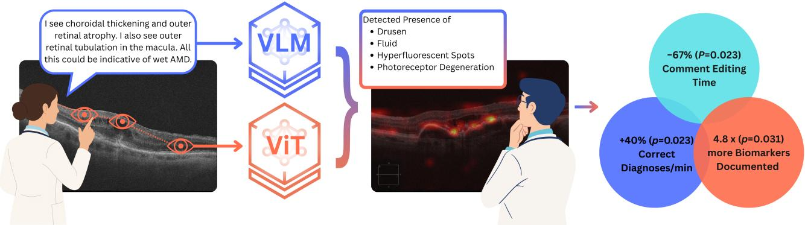  
Figure 1: Co-Annotator system architecture. Expert gaze and dictation train two backend models: a Vision Transformer (ViT) and a Vision–Language Model (VLM), powering two clinician-facing components: (1) fixation-aligned Areas of Interest (AOIs) that guide visual search, and (2) biomarker-bounded VLM guidance that scafolds documentation. Far right: combined US3 outcomes +40% Correct Dx/min, −67% comment editing time, and 4.8× more biomarkers documented (all � < 0.05).

## Abstract

Clinical AI often optimizes predictive performance without engaging how clinicians decide where to look and what to write. We present Co-Annotator, which distills expert gaze and dictation into two guidance components: a gaze-aligned Vision Transformer producing fixation-aligned areas of interest (AOIs), and an ontology-bounded vision–language model (VLM) that pre-fills editable biomarker summaries for retinal optical coherence tomography (OCT). We first collect expert gaze and dictations (US1) to train the models, significantly improving diagnostic accuracy and biomarker generation. We then deploy the system with ophthalmology residents: a controlled resident study (US2) confirmed each modality is safe and independently beneficial, with AOI guid ance producing lasting perceptual eficiency gains through postguidance carryover and VLM guidance more than doubling biomarker documentation breadth. In a combined deployment across two academic institutions (US3), providing both modalities simultaneously produced eficiency gains that substantially exceeded either modality alone: correct diagnoses per minute increased by 40% and

comment editing time fell by 67%, without compromising diagnostic accuracy. Notably, neither modality improved eficiency during guidance in US2, which makes the in-guidance eficiency gain under combined guidance in US3 the more striking result. Expert-distilled multimodal guidance can remove two distinct clinical workflow bottlenecks at once (visual search overhead and documentation burden) without compromising the diagnostic accuracy clinicians already achieve.

## CCS Concepts

• Human-centered computing → Human computer interaction (HCI); • Applied computing → Life and medical sciences; • Computing methodologies → Machine learning; Artificial intelligence.

## Keywords

Human–AI collaboration, Clinical decision support, Explainable AI, Eye tracking (gaze-aligned attention), Vision–language models, Ontology-bounded generation, Co-annotation, Workflow-integrated documentation, Optical Coherence Tomography (OCT), Wet agerelated macular degeneration

ACM Reference Format:

Ziheng ‘Leo’ Li\* Benjamin Freeman\* Akshay Raman\* Kavin Aravindhan Rajkumar Xinxin Fang Rishabh Srivastava Steven Feiner Kaveri A. Thakoor. 2026. Co-Annotator: Expert-Distilled ViT and VLM for Visual and Documentation Guidance in Age-Related Macular Degeneration. In The 39th

Annual ACM Symposium on User Interface Software and Technology (UIST ’26), November 02–05, 2026, Detroit, MI, USA. ACM, New York, NY, USA, 23 pages. https://doi.org/10.1145/3830398.3830722

## 1 Introduction

We build and study an artificial intelligence (AI) co-annotator for biomedical images consisting of two physician-facing, vision–language-model–backed user-interface components that highlight relevant imaging evidence to support trainees’ diagnostic workflow. We specialize the system to diagnose wet age-related macular degeneration (wAMD) on optical coherence tomography (OCT) images. wAMD is an eye disease that afects millions worldwide and is a leading cause ofirreversible central vision loss in adults over 50 [20]. Timely treatment can preserve vision when wAMD is identified before it causes permanent damage, yet early diagnosis is dificult: wAMD arises from growth of new abnormal blood vessels in the retina causing fluid accumulation and bleeding, which must be resolved and distinguished from other AMD subtypes on OCT, the primary noninvasive imaging modality for diagnosing and monitoring wAMD in routine practice [51]. The relevant OCT biomarkers such as intraretinal fluid (IRF), subretinal fluid (SRF) or pigment epithelial detachment (PED) can be subtle and fine-grained, and they are challenging even for experienced readers to distinguish [53, 59].

Retina specialty clinics operate with high imaging volume and under significant time pressure. Each imaging study ordered by an ophthalmologist demands directed visual search, structured description, and auditable documentation. Additionally, trainees are a critical user group because they show higher variance in accuracy and speed, are still forming mental models for biomarker patterns, and are calibrating trust in any computer-aided tools they use. Our system targets three workflow outcomes: (i) faster, more focused reading via area-of-interest (AOI) guidance , (ii) lower documentation burden via structured biomarker drafts residents can edit, and (iii) greater transparency by exposing where the model “looked” and constraining language to a clinical ontology.

Despite recent advances in vision and vision–language models (VLMs), faithful OCT biomarker grounding remains hard due to (i) domain shift across scanners, protocols, and patient populations; (ii) the need for spatially localized distinctions (e.g., IRF vs. SRF) rather than global labels; and (iii) the risk of clinically unsafe hallu cinations or vague free-text rationales [43, 46]. For safety-critical use, clinicians need transparency (to know where the model is attending visually), controllability (to be able to accept/edit findings), and outputs bounded by a shared ontology. These requirements motivate expert-aligned supervision as well as interaction designs that present evidence to support clinicians’ decisions rather than replace them.

We therefore built Co-Annotator, a system that unifies expertdistilled modeling with workflow-integrated design. The system consists of two backend models: a gaze-aligned vision transformer (ViT) and an ontology-bounded VLM. They drive two complemen tary clinician-facing interface components:

(1) Fixation-aligned AOIs: Attention overlays trained to visually guide readers toward regions with higher diagnostic relevance on OCT images, aligned to expert fixation density rather than post hoc saliency.

(2) Biomarker-bounded VLM guidance: A VLM fine-tuned on OCT images paired with expert dictations and curated biomarker labels to produce structured biomarker summaries and answer targeted diagnostic questions.

To build and evaluate Co-Annotator, we conduct three user studies. US1 collects synchronized expert gaze and dictations to train the ViT and VLM, establishing expert-distilled supervision targets. US2 (�=11 ophthalmology residents) deploys each modality in isolation, confirming guidance does not compromise residents’ already-high diagnostic accuracy, and characterizing the individual benefit of each guidance channel. Eficiency gains in US2 emerged only after guidance was removed, not during it. US3 (�=8 residents across Columbia University Irving Medical Center and Weill Cornell Medical Center) is our main contribution: it deploys both modalities simultaneously, testing whether the combination produces gains neither modality achieves alone. Specifically, we make the following contributions:

• Interaction design and design principles (primary contribution): An interaction model for how clinicians and AI read medical scans together, distilled into three principles for clinical AI guidance that residents consistently demanded across all three studies: deferrable (revealed after a first independent pass), sparse (2–3 precise hotspots, not difuse coverage), and evidenceanchored (each biomarker token clickable to its AOI tile). The gaze-aligned ViT and ontology-bounded VLM are the enablers that let this guidance reflect how specialists actually look and describe findings, rather than the contribution in itself.

• Co-Annotator system: An OCT co-annotation interface with two clinician-facing components designed for specificity, transparency, and editorial control: fixation-aligned AOI heatmaps (from a gaze-aligned ViT) and editable biomarker drafts (from an ontology-bounded VLM).

• Expert distillation (US1): The ViT and VLM faithfully align to expert visual attention and clinical language, improving diagnostic micro-AUC from 0.95 to 0.98 and achieving MedBERTScore 0.867 on biomarker text.

• Modality evaluation (US2): Each modality preserves residents’ high baseline diagnostic accuracy while providing complementary benefits that establish the rationale for combining them: AOI guidance produces a post-guidance eficiency carryover and VLM guidance more than doubles biomarker breadth (5.8 vs. 2.3 per AMD eye, 83.1% retention).

• Combined deployment (US3): Simultaneous AOI+VLM guidance significantly increased Correct Dx/min by 40% (� = 0.023), reduced comment editing time by 67% (� = 0.023), and yielded 5.36 biomarkers per AMD eye at 85.5% retention. These outcomes exceed either modality alone (4.76 vs. 3.0 AOI-only and 2.0 VLM-only).

Data and Model Availability. The Expert Distillation Corpus from US1, the fine-tuned VLM, and the gaze-aligned ViT are publicly available.1

## 2 Background

Human-Centered Clinical AI. Co-Annotator is fundamentally an interaction-design contribution: it concerns how a clinician and an AI read a scan together, not only how accurate the underlying models are. This situates the work in a long line of HCI research on human–AI collaboration. Mixed-initiative interaction [27] frames the AI as a partner that intervenes only when its contribution outweighs the interruption cost, motivating our deferrable guidance. Trust calibration and human–AI complementarity, threads we return to below, further motivate our evidence-anchored and sparse design choices. Deployments of AI in real clinics, including diabetic-retinopathy screening in ophthalmology [5] and compu tational pathology [12], show that workflow fit influences clinical value, beyond model accuracy alone. Our documentation component further builds on human–AI co-writing and clinical notetaking systems that keep the clinician in control of an editable AI draft [10, 14, 17, 22, 40, 42, 52, 84]. Building on this literature, we contribute three design principles for clinical AI guidance (deferrability, sparseness, and evidence-anchoring) grounded in resident behavior across three user studies.

Clinical context. Ophthalmic diagnosis for wAMD heavly relies on OCT and occurs at high clinical volumes. Subtle, fine-grained biomarkers drive treatment decisions yet are dificult to perceive reliably at speed: for example, distinguishing drusen (fatty deposits beneath the retina), pigment epithelial detachment (PED, a separation of the retinal pigment layer from its underlying membrane), and choroidal neovascularization (CNV, abnormal blood vessel growth) requires precise pattern recognition even for experienced clinicians [18, 26, 51]. Decades of perception research show that expertise shapes visual search through distinct heuristics novices struggle to emulate [36, 70]. While sharing expert gaze can aid detection [47], direct replay is fragile: scanpaths are variable, unavailable for new cases, and hard to standardize [77]. This motivates automated AOI augmentation by training a model to predict fixation density for unseen images at scale.

Human–AI collaboration and trust calibration. There is broad consensus that clinical AI should support intermediate reasoning rather than replace judgment [2, 15, 25, 85]. Yet human–AI teams frequently fail to outperform the stronger agent alone due to miscali brated trust and poor interaction design [69]: participants may overaccept AI advice or be distracted without accuracy gains [4, 11, 38, 48, 55, 71, 83]. Trust calibration, relying on AI more when it is right and discounting it when wrong, requires interaction structure, not just better explanations [8, 9, 23, 32, 34, 39, 45, 57, 58, 61, 66, 75, 86].

Workflow fit and complementary roles. Workflow integration is the basis of accurate predictions. Previous studies have documented friction when AI outputs do not match clinicians’ reading stages [13, 30, 35, 63, 67, 73, 76, 80, 81]. Conversely, designs for complementary roles, where AI handles one bottleneck while clinicians handle another, can exceed either alone in dermatology and pathology [21, 29, 33, 41, 54, 56, 68, 78, 79]. Co-annotation interfaces that suggest where to look and what to write, communicate uncertainty, and preserve editorial control operationalize this principle [2, 24].

Gaze-supervised vision models. Eye tracking captures diagnostic attention with low annotation burden and has been used as weak supervision to improve lesion detection and align model saliency with clinically meaningful regions [19, 28, 72, 74]. Multimodal methods use radiologists’ gaze to align image features with report text [49], and ViT variants that incorporate expert gaze as an auxiliary input signal report concurrent gains in accuracy and interpretability [16].

Ontology-boundedlanguage models andourgap. LLMs in medicine require knowledge grounding to curb hallucinations: augmenting with Unified Medical Language System (UMLS) [6] or structured report ontologies (e.g., RadGraph [31]) constrains outputs to clinically valid concepts, while ontology-constrained decoding and retrievalaugmented prompting further reduce of-ontology drift [50, 64, 82]. Despite this progress, most prior work optimizes gaze alignment [19, 28] or knowledge grounding [50, 64] in isolation, outside realistic reading and documentation loops. We unify both: fixation-aligned AOIs from expert gaze and an ontology-bounded VLM fine-tuned on expert dictations yield editable, evidence-forward guidance that fits the OCT workflow.

## 3 Co-Annotator: Interaction Design

## 3.1 Embedded Costs of the Reading Loop

Reading an OCT study is not a single classification act but a loop: the reader orients to the volume, searches across slices for structural abnormality, settles on a diagnosis, and then documents their findings for future reference. This loop incurs two distinct costs. The first is visual search overhead: the biomarkers that matter are small, fine-grained, and distributed across five image slices per eye, so finding them is a scanning problem before it is a judgment problem. The second is documentation burden: the finding must be written down in language consistent with a shared ontology, and that transcription competes with reading time, consuming a large share of per-eye time in our studies (Section 6). Crucially, we treat these two costs as largely independent: reducing search time need not shorten transcription, and pre-filling text need not aid search. Co-Annotator therefore addresses them with two separate components rather than one general-purpose assistant, and whether that separation pays of is exactly what the combined deployment in Section 7 tests.

## 3.2 Two Guidance Components

Co-Annotator (Figure 2) provides two complementary components: a toggleable AOI heatmap overlay (from the gaze-aligned ViT) and an editable text box pre-filled with the VLM’s biomarker draft for the majority diagnosis across the eye’s five slices. The interface mimics routine clinical viewing conditions: five OCT slices per eye in a thumbnail strip, a radio-button diagnosis rating, and a free-text biomarker comment field.

The two guidance components share one screen and combine rather than compete: the AOI overlay renders directly on the OCT slice currently active in the thumbnail strip, beside the editable VLM comment draft. The overlay itself is rendered as a semi-transparent, colored heatmap rather than as outlines or contours around candidate regions; because the underlying B-scan (an individual slice of the OCT volume) is grayscale, a colored, semi-transparent layer remains legible against it without obscuring the scan beneath. The overlay’s visual parameters (color map and transparency level) were inherited from our prior glaucoma diagnosis interface [44] and were set empirically through informal design discussions with clinicians rather than tuned for this study. The overlay is toggleable by right-clicking the image, allowing them to move fluidly between an unguided first look and a guided check. The client itself is a light weight, Python-based interface built for this logging and toggling behavior.

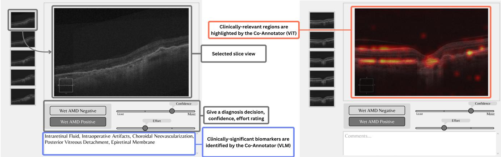  
Figure 2: Co-Annotator interface. Residents review five OCT slices per eye and give a binary diagnosis with confidence and efort ratings. (a) VLM Guidance (left): the biomarker comment field is pre-filled with VLM findings, which residents edit. (b) ViT Guidance (right): the interface with the gaze-aligned attention heatmap toggled on the OCT.

Design Rationale as Built. Two principles bear directly on the design of the interface. Guidance is dismissible rather than ambient: because the overlay is toggled by the reader, an unguided first pass is always available, which was apparently preferred by residents (Section 6). Guidance is also bounded and editable rather than authoritative: the draft comment can only use terms from the expert-derived ontology, and is subjected to the clinician’s review. We are deliberately narrow about two other properties. We expect to implement a sparse overlay that surfaces only a few hotspots and to link individual biomarker tokens to the image regions that produced them. Residents asked for both, repeatedly, and we report those requests as findings in Section 7.3 and Section 8 rather than as validated design decisions.

## 4 Expert-Distilled Models

The two models in this section enable the interaction design above: we distill expert gaze and dictation so that the AOI and biomarker guidance reflect how specialists actually look and describe findings. Development proceeds in three stages: data collection (Section 4.1), model training (Section 4.2 and Section 4.3), and interface integration (Section 2). Because rich OCT diagnosticreasoning datasets are scarce, we build our own corpus in US1, and because the expert pool is small we train with a two-stage hierarchical curriculum for eficient transfer. Readers who are interested in using the model and the dataset can refer to Section 1. Model and training details are in Appendix B and Appendix C; we include here only what is needed to understand the guidance residents see.

## 4.1 Expert Knowledge Distillation

Experts’ eye movements and spoken dictations were transformed into the supervision targets that underpin both models: fixationdensity maps for the gaze-aligned ViT and ontology-bounded biomarker labels for the VLM.

4.1.1 In-house Dataset. We collected 1,155 high-definition fiveline raster OCT scans of the macula from 231 eyes in 203 patients (five scans per eye; 104 normal, 127 wAMD). Scans were captured on the Zeiss Cirrus OCT imaging platform, which is likely the most commonly used for retinal imaging [1]. All data were collected in accordance with the principles laid out in the Declaration of Helsinki under a protocol approved by our Institutional Review Board, and de-identified according to national law. We will refer to this dataset as the in-house dataset. We collected visual attention from eight experts on a subset of 138 images, and dictation on a subset of 113 (see Section 5).

4.1.2 Visual Atention. Eye movements recorded during expert OCT reads were converted into a per-image fixation-density target �∗ on the 32×32 ViT patch grid (fixation detection, density estimation, hardware, and calibration in Appendix C). �∗ represents cumulative expert attention over the full diagnostic review, linking gaze to the holistic diagnosis rather than individual biomarker tokens. These maps directly compare with attention rollout on the same patch lattice (Section 4.2).

4.1.3 ExpertDictation andClinical Biomarkers. Audio was recorded continuously while experts examined images in the Single Image Input setting and was time-synced to the active image. Recordings were transcribed to text and lightly cleaned by experts to remove noise while preserving clinical content.

Free-text dictations were converted to multi-label biomarker targets using an ontology derived from OCT5k [3]: a prompted ex traction model identified presence cues from transcripts and output only terms from an exclusive ontology list, with outputs reviewed by a retina specialist (full extraction procedure in Appendix A). The in-house corpus was enhanced with OCT5k samples to form 573 image–biomarker pairs (distribution in Section A.3).

Biomarkers with fewer than 10 occurrences were excluded, yielding 12 predefined terms (listed in Appendix A) used as the ontology for VLM training and evaluation.

This phase of US1 ultimately produced the Expert Distillation Corpus: (1) patch-aligned attention targets $A ^ { * }$ per image for gazealigned ViT supervision, and (2) ontology-bounded biomarker multilabels for VLM fine-tuning and evaluation.

## 4.2 AOI Localization with Gaze-Aligned ViT

To ensure clinically grounded visual saliency, we trained a ViT to align its attention to expert fixations. At each step, the ViT produces a classification prediction �ˆ and, via attention rollout across all transformer layers, an attention map $\hat { A } ^ { ( L ) } ( x )$ ; training then minimizes a classification term plus a gaze-alignment term weighted by �:

$$
\mathcal { L } \ = \ \mathrm { B C E } ( \hat { y } , y ) + \alpha \cdot \mathrm { C r o s s E n t r o p y } \big ( \hat { A } ^ { ( L ) } ( x ) , A ^ { * } \big ) .
$$

Raising � pulls the network’s attention toward the regions experts fixated; the classification term preserves diagnostic performance.

Crucially, this objective lets the ViT learn a generalized mapping between visual features $( \mathrm { e . g . }$ , fluid pockets and hyperreflective spots) and expert attention: at inference, it predicts fixation-aligned AOIs for unseen images, generating guidance for new patients without requiring expert eye-tracking. Loss definitions, the � sweep, architecture, the attention rollout algorithm, training configuration, and ablations are in Appendix C.

## 4.3 Two-Stage VLM for Biomarker Suggestion

Having aligned the ViT’s visual attention to expert gaze, we now describe the complementary language component. We fine-tune MedGemma [62], a large-scale VLM pretrained on diverse medical datasets, to specialize it at interpreting ophthalmic OCT scans. Our framework produces a single, unified model trained to perform three tasks: diagnosis, biomarker discrimination, and biomarker identification (Table 1). To ensure clinical utility, the model in teraction is governed by a structured prompting methodology to minimize ambiguity and a strict overarching system prompt (Table 1). We designed a two-staged curriculum to help the model build a robust and domain-specific visual foundation for the first two tasks, before attempting the more challenging third task of generating biomarkers.

Two-stage curriculum. Stage one trains exclusively on 1) diagnosis: binary classification, OCT-C8 + in-house data, and 2) biomarker discrimination: visual question-answering (VQA)-style yes/no queries with the Expert Distillation Corpus. The goal is to build OCTdomain grounding before tackling the harder generative task. Stage two adds biomarker generation while continuing to train on the first two tasks, so the model keeps its diagnostic and discrimination grounding while learning to generate ontology-bounded biomarker labels (dataset compositions in Appendix $\operatorname { A } ;$ sampling strategy and hyperparameters in Appendix B).

## 5 User Study 1 (US1): Distilling Expert Knowledge via Gaze and Dictation

US1 evaluates whether expert behavioral signals (visual fixations and concurrent dictations) can be faithfully captured and distilled into (i) a gaze-aligned ViT and (ii) an ontology-bounded VLM that generalizes to unseen clinical cases. Eight retina specialists provided gaze data in Setup A (five-image bundles, no dictation) and dictations in Setup B (single image, concurrent narration).

## 5.1 Results and Discussion

The gaze and dictation corpus underlying US1 (and its expansion with OCT5k [3] to the final sample set) is described in Section 4.1.

5.1.1 Gaze Alignment Improves Diagnostic Accuracy. To evaluate US1, we computed the diagnostic accuracy of the ViT with its attention biased toward clinically meaningful regions, using the auxiliary expert-alignment loss (Section 4.2). We did so across a range of alignment weights, �, to vary the extent to which expert fixation factors in the ViT training. Because each eye’s scan has five corresponding layers, it is important to test US1 in two input regimes: patient-level (multi-image), where all five OCT images per eye are concatenated and jointly processed to mirror what a clinician sees; and single-image, where each image with expert visual attention data is treated as an independent sample.

For the patient-level input, attention alignment consistently improved diagnostic accuracy. Adding gaze alignment raised micro-AUC from 0.95 to 0.98 with five-fold cross-validation. The amount of data is limited under this setting, as not all images in each set of five had expert visual attention data. Thus, we focus on the results in the single–image setting. The best trade-of occurred at $\alpha = 0 . 0 5 ,$ yielding 88.37% validation accuracy and $\mathbf { F 1 } = \mathbf { 0 . 8 6 2 8 } .$ outperforming the baseline ViT without alignment (Table S5). The improved classification supports US1. Qualitatively, as in Figure 3, model saliency resembled expert fixation distributions, which is consistent with the intuition that experts’ visual attention can cue the model to attend to clinically relevant regions.

5.1.2 Dictation-Derived Biomarker Generation. We evaluated the eficacy of the two-stage VLM training across the three tasks described in Section 4.3. The model achieved high accuracy on discriminative tasks. Diagnostic accuracy was 0.920 on the OCT-C8 heldout test set and 0.910 on a larger US1 test set (Table 2). Biomarker discrimination had an accuracy of 0.800. (Table 2). For generative biomarker identification, the model attained strong semantic fidelity to dictation-derived references $\mathbf { \left( B E R T S c o r e _ { F 1 } = 0 . 8 8 0 \right. }$ $\mathbf { M e d B E R T S c o r e } _ { \mathrm { F 1 } } = \mathbf { 0 . 8 6 7 } )$ . An ablation study revealed that integrating OCT-5K with our Expert Distilled Corpus was critical: training only on the smaller transcript dataset led to marked overfitting.

Taken together, these results support that the dictation-derived, ontology-bounded biomarker targets served as efective supervision and assessment signals for biomarker text generation, yielding high semantic similarity while maintaining strong discriminative performance. Together, these results motivate the deployment of

Table 1: VLM tasks, objectives, outputs, and prompt placeholders.
<table><tr><td>Task</td><td>Objective</td><td>Output Format</td><td>Prompt</td></tr><tr><td>Diagnosis</td><td>Binary classification of the OCT scan&#x27;s pri- Normal or wAMD mary pathology.</td><td></td><td>What is the diagnosis for this OCT scan, Normal or wAMD?</td></tr><tr><td>Biomarker Discrimination</td><td>Verify presence of a queried biomarker Yes or No</td><td></td><td>Is &lt;BIOMARKER&gt; present in this OCT</td></tr><tr><td>Biomarker</td><td>(VQA-style).</td><td></td><td>scan?</td></tr><tr><td>Generation</td><td>List all present biomarkers from the ontol- Comma-separated ontol- What biomarkers are visible in this OCT</td><td>ogy terms or None</td><td>scan?</td></tr><tr><td colspan="4">ogy, or none. All tasks share a structured system prompt constraining output format and domain (see Section B.1).</td></tr></table>

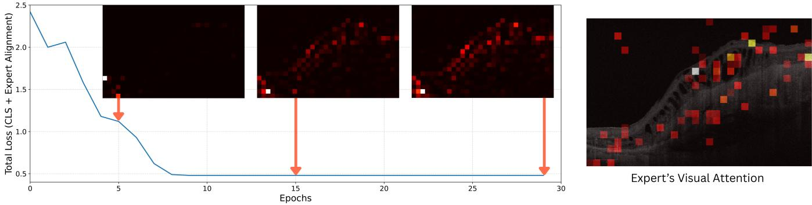  
Figure 3: Gaze-aligned ViT attention converges to expert fixations during training. Insets: last-layer attention rollout at epoch 5, 15, and final vs. target �∗ (expert fixation density). Attention begins difuse and sharpens onto clinically relevant structures as loss decreases.

Co-Annotator with ophthalmology residents to evaluate whether expert-distilled AOI and VLM guidance improve clinical workflow outcomes in US2 and US3.

## 6 User Study 2 (US2): Controlled Evaluation of Individual Guidance Modalities

Building on US1, we evaluated each guidance modality, AOI heatmaps (where to look) and VLM text drafts (what to write), in isolation before combining them. Separate experiments (i) isolate causal mechanisms and avoid interaction confounds, (ii) confirm guidance does not compromise accuracy, and (iii) keep sessions clinically feasible. The key hypotheses were:

H2.1 (Clinical safety) Each modality preserves diagnostic accuracy. Either guidance does not harm clinical performance.

H2.2 (Perceptual guidance) AOI heatmaps support more eficient visual search and encode lasting viewing strategies that carry over after guidance is removed.

H2.3 (Documentation assistance) VLM drafts broaden biomarker documentation breadth while residents retain editorial agency, aligning vocabulary with the clinical ontology and filtering ofontology suggestions.

## 6.1 Participants and Study Design

Residents were recruited from a pool of 16 ophthalmology trainees across academic medical training programs. Power analyses targeted the detection of a 0.10 absolute accuracy diference at the eye level and medium efects on timing and behavioral measures (Cohen’s � = 0.5), translating to image-set sample goals of �=74 for accuracy-focused tests and �=128 for other outcomes, achievable with 5–9 residents reading ∼15 eyes per block. Ten residents completed the AOI study and four completed the VLM study (four overlapped), totaling 11 unique participants, representing 69% of the available pool. The VLM sub-study (�=4 participants, 120 image-set observations) was sized for the biomarker outcome (�=128 imageset target), not for timing outcomes; participant-level timing estimates for the VLM condition should be interpreted as exploratory. Interface. Residents read OCT scans using the Co-Annotator interface described in Section 2 (Figure 2). The interface logs all interactions with millisecond timestamps, and participants could not return to previously rated cases to ensure independent reads.

Apparatus. All sessions were conducted on a standard research workstation with a 1920×1080 monitor at 60 Hz; residents interacted via keyboard and mouse. In the US2 AOI condition, eye movements were recorded with a Tobii Pro Fusion tracker sampling at 250 Hz, mounted on the monitor bezel. A standard 9-point calibration was performed at the start of each session (maximum accepted error $< 0 . 5 ^ { \circ } )$ . Eye tracking was recorded in the US2 AOI condition and in US3; it was not used in the US2 VLM condition.

Table 2: Performance of the Fine-Tuned MedGemma Model on all three tasks after the two-stage training. To gauge generalization, diagnosis performance is evaluated on OCT-C8 [65] and US1 data. Base refers to the pretrained MedGemma without fine-tuning.
<table><tr><td>Task Category</td><td>Task</td><td>Metric</td><td>fine-tuned on OCT5K + US1</td><td>fine-tuned on US1</td><td>Base</td></tr><tr><td>Binary Choice</td><td>Diagnosis (US 1)</td><td>Accuracy</td><td>0.910</td><td>0.800</td><td>0.290</td></tr><tr><td></td><td>Diagnosis (OCT-C8 [65])</td><td>Accuracy</td><td>0.920</td><td>0.900</td><td>0.400</td></tr><tr><td></td><td>Biomarker Discrimination</td><td>Accuracy</td><td>0.800</td><td>0.840</td><td>0.535</td></tr><tr><td>Generative</td><td>Biomarker Generation</td><td>BERT Score (F1)</td><td>0.880</td><td>0.818</td><td>0.790</td></tr><tr><td></td><td></td><td>MedBERT Score (F1)</td><td>0.867</td><td>0.774</td><td>0.698</td></tr></table>

Studyprotocol. Each experiment included unguided control blocks (standard-of-care baseline) alongside guidance blocks. The AOI condition followed a three-block sequence: pre-guidance control → AOI guidance → post-guidance control (Figure 4), enabling measurement of carryover efects. The VLM condition used two blocks (pre-control → VLM guidance) to bound session length to under 40 minutes. All sessions began with a short practice run.

Primary outcomes were diagnostic accuracy, Correct Dx/min, time per eye, and comment edit time; biomarker retention and vocabulary overlap (Jaccard index) were additionally tracked in the VLM condition. Statistical methods, outcome variable definitions, and ordering efect analyses are detailed in Appendix E.

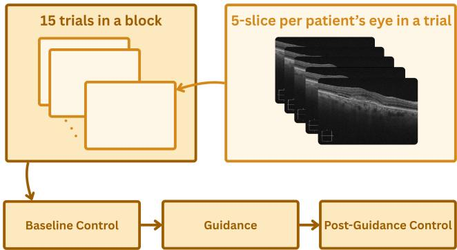  
Figure 4: Study flow: each trial presents a patient’s 5-slice OCT volume; 15 trials form a block. The AOI study followed Baseline Control → Guidance → Post-Guidance Control.

## 6.2 Results and Discussion

AOI guidance. Diagnostic accuracy was preserved across all blocks (H2.1; Table 3). In-guidance eficiency gains (H2.2) were not observed: Correct Dx/min and time per eye were statistically unchanged during the AOI block relative to pre-control. This null result is interpretable; residents adopted a read-first strategy, toggling the heatmap only after forming an initial impression, so any benefit would surface after the unaided pass rather than during it. The post-guidance block showed significant carryover in time per eye, which fell 28% versus pre-control (�<0.001); Correct Dx/min rose 52% but did not reach significance (�=0.065 raw, 0.274 adjusted), supporting H2.2, though task familiarity cannot be fully ruled out given the fixed block order. Because diagnostic accuracy was preserved across all three blocks (0.93/0.89/0.90), Correct Dx/min here tracks reading speed: the post-guidance rise (2.9→4.4, +52%) is the counterpart of the time-per-eye carryover (residents read faster unaided after internalizing where to look), while the in-guidance null follows from the read-first-then-toggle pattern, where consulting the overlay adds a step that ofsets any speed gain during the guided block. Residents spent 17–22% of per-eye time editing comments, a documentation bottleneck AOI guidance alone does not address.

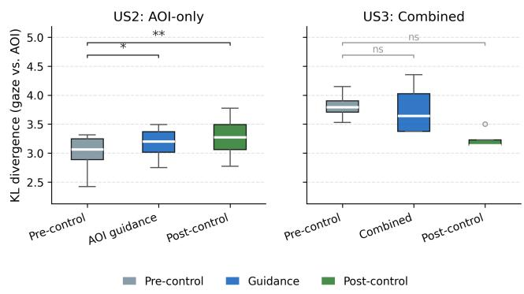  
Figure 5: Kullback–Leibler (KL) divergence (gaze vs. model AOI) by block for US2 AOI-only (left) and US3 combined guidance (right). AOI-only guidance significantly increased divergence during and after guidance (\* �<0.05, \*\* �<0.01 vs. pre-control); combined guidance showed no significant change (all �>0.6).

VLM diagnostic guidance. Diagnostic accuracy was maintained (H2.1; 0.917 vs. 0.833 in control, nonsignificant); no statistically significant change was observed in timing or efort outcomes (Table 3). VLM biomarker guidance. VLM guidance significantly broadened documentation: residents recorded a mean of 5.8 biomarkers per AMD eye versus 2.3 in control (�=8.8×10−9), retaining 83.1% ofVLM suggestions while deleting 16.8% and independently contributing 27 new biomarkers (Figure S2). Vocabulary overlap (Jaccard) increased from 0.45 to 0.78. Together these support H2.3. Hallucination rate was low: 3 out-of-ontology biomarkers across 11 appearances; the high-risk case (“hemorrhage”) was deleted 71% of the time. Full �-values and mixed-efects estimates are in Appendix E.

Critically, neither modality improved eficiency during its guidance block (H2.2): the benefits were indirect: an AOI post-guidance timing carryover and a VLM documentation-only gain, each al ready detailed above. This is what makes the US3 in-guidance gain of +40% Correct Dx/min $( p = 0 . 0 2 3 )$ notable: it is a gain neither modality produced alone during active guidance, and it motivates combining the two, each targeting a distinct bottleneck.

## 7 User Study 3 (US3): Combined VLM+AOI Guidance

US2 established that AOI guidance benefits perceptual eficiency and VLM guidance benefits documentation completeness. US3 tests whether their combination produces gains exceeding either modality alone:

H3.1 (Accuracy preservation) Combined guidance maintains diagnostic accuracy compared to unguided reading.

H3.2 (In-guidance eficiency) Combining AOI and VLM guidance increases Correct Dx/min and reduces time per eye and comment edit time relative to the pre-guidance control.

H3.3 (Post-guidance carryover) Eficiency gains persist in the post-guidance block.

H3.4 (Biomarker breadth) Combined guidance achieves biomarker breadth ≥ that of US2 VLM-only condition.

H3.5 (VLM retention) Residents retain ≥70% of VLM-suggested biomarkers in the combined interface.

## 7.1 Participants and Study Design

Eleven ophthalmology residents were recruited across two academic medical institutions; eight completed the study (median residency training: 22 months). Residents who had participated in US2 were eligible with a six-month washout to minimize direct task recall. Of the eight completers, three had previously participated in US2 (returning from the first institution) and five were new recruits from the second institution. This partial overlap is a potential confound for cross-study comparisons, though the washout period and within-subject block design mitigate direct carryover of specific image responses. Power analysis followed US2 targets (�=74 image sets for accuracy, �=128 for timing, achievable with eight residents reading 15 eyes per block). Recruiting across two institutions improved ecological validity and reduced site-specific confounds while preserving the within-subject design.

The study followed the same three-block design as the US2 AOI experiment (pre-guidance control → combined guidance → postguidance control), with 15 eyes per block, using the same interface (Section 2). In the guidance block, residents received both modal ities simultaneously (Section 2). A post-study survey (�=8, 1–7 Likert) assessed perceived accuracy of guidance, learning carryover, reliance, and preference for continued access.

The primary outcome was Correct Dx/min; secondary outcomes matched US2 (Table 3). Biomarker retention and vocabulary overlap were computed identically to US2. Ordering efects were confirmed nonsignificant for accuracy via the same practice-slope decomposi tion (Appendix E).

## 7.2 Results and Discussion

7.2.1 Diagnostic Accuracy and Eficiency. Table 3 summarizes results across the three blocks. Residents’ diagnostic accuracy was not compromised under combined guidance, and if anything higher (83.3% pre-control vs. 93.3% under guidance; $W { = } 2 , n { = } 8 , p = 0 . 0 9 4 ;$ Table 3); false positive rate remained 0% throughout. The guidance made residents faster and not at the expense of the accuracy they already had (H3.1).

Combined guidance produced significant eficiency gains (Table 3): Correct Dx/min increased from 3.40 to 4.76 (+40%, 95% CI $[ + 1 5 \% , + 7 4 \% ] , p = 0 . 0 2 3 )$ , and comment edit time dropped from 7.2 s to $2 . 4 \thinspace s \left( - 6 7 \% , 9 5 \% \thinspace C \mathrm { I } \left[ - 8 7 \% , - 4 3 \% \right] , \thinspace p = 0 . 0 2 3 \right)$ , reflecting the VLM pre-populating comments so residents made minimal edits (Figure 6), supporting H3.2. Perceived efort also decreased significantly $( 2 . 1 1  1 . 9 1 , p = 0 . 0 4 7 )$ . Time per eye trended lower $( 2 6 . 0  2 2 . 1 s , - 1 5 \% )$ but did not reach significance in the guidance block itself $( p = 0 . 1 9 5 )$

These gains exceeded either modality alone (Figure 6) because each modality targets a distinct workflow bottleneck: the VLM draft nearly eliminated documentation burden, while AOI heatmaps supported visual search. The combined system removed both bottlenecks at once, yielding eficiency gains neither modality could produce in isolation.

Post-guidance carryover was significant for both time per eye (19.6 s vs. pre-control 26.0 s, $\mathnormal { p } = 0 . 0 1 6 )$ and time to final diagnosis (7.4 s vs. 10.8 s, $\mathinner { p \mathopen { = } 0 . 0 3 9 } )$ , supporting H3.3. The speed advantage persisted after guidance was removed, consistent with residents internalizing more eficient viewing habits during the guided block.

To separate genuine guidance benefit from task familiarity under the fixed block order, we fit a mixed-efects model that estimates a practice slope from the control blocks and tests the guidance efect against it (the practice-slope decomposition and the US2 mixedefects models are detailed in Appendix E). Ordering efects on diagnostic accuracy were nonsignificant, so the accuracy results are not attributable to practice; the timing carryover, by contrast, cannot be fully disentangled from familiarity under this design, which we treat as suggestive rather than confirmatory.

Gaze–AOI divergence was stable across all three US3 blocks (all �>0.6; Table 3), in contrast to US2 AOI-only guidance where divergence increased significantly during and after guidance (�=0.039, $p { = } 0 . 0 0 8 ; \mathrm { F i g u r e } 5 )$ . Two interpretations are consistent with this pattern: the VLM text may have satisfied residents’ information needs, reducing pressure to spatially re-orient gaze; or residents may have relied less on the AOI overlay in the combined condition, engaging primarily with the textual draft. Survey data showing moderate perceived reliance (3.75/7) and qualitative reports of a corroboration loop between modalities favor the first interpretation, though direct measurement of per-modality engagement is needed to distinguish the two. This stability is also consistent with residents’ unaided gaze remaining aligned with clinically relevant regions after guidance was removed, ofering suggestive (though at �=8 not statistically significant) support for the perceptual-reorientation account of the post-guidance timing carryover.

7.2.2 Biomarker Documentation. With combined guidance, residents documented a mean of 5.36 biomarkers per AMD eye compared to 1.11 in the pre-guidance control $( p = 0 . 0 3 1$ , Wilcoxon signed-rank), closely matching US2 VLM-only breadth (5.8 biomarkers/eye) though marginally below the ≥ threshold stated in H3.4. Residents retained 85.5% of the 497 VLM-suggested biomarkers, meeting H3.5 (≥70% threshold; cf. 83.1% in US2 VLM-only). They deleted 14.5% of suggestions and independently contributed 19 new biomarkers not generated by the VLM, demonstrating active editorial engagement rather than passive acceptance (Figure 7). Critically, adding the AOI heatmap context did not suppress residents’ editing behavior: deletion and addition rates were comparable to US2 VLM-only. Jaccard index between resident and VLM vocabulary increased from 0.17 (pre-control) to 0.62 (guidance; Figure 7), indicating strong vocabulary convergence while residents retained clinical agency.

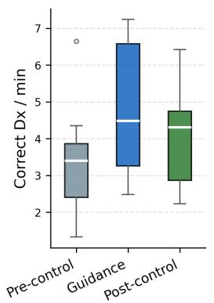

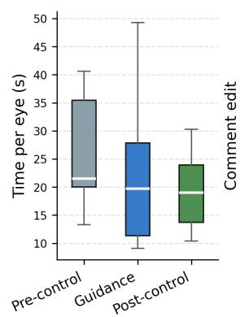  
(a) Per-block distributions with connected participant lines.

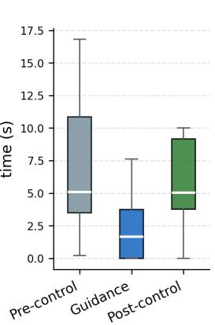

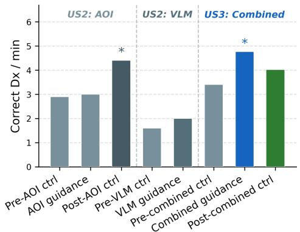  
(b) Cross-study Correct Dx/min: combined guidance (US3) exceeds either modality alone (�<0.05 vs. precontrol, Wilcoxon).  
Figure 6: US3 eficiency results. Combined VLM+AOI guidance produces eficiency gains exceeding either modality alone (right), driven by simultaneous reductions in visual search time and documentation burden (left).

7.2.3 Survey and Qualitative Findings. Post-study survey (1–7 Likert, �=8) showed residents found the guidance accurate enough to act on (mean 5.0/7) and reported applying what they learned during the post-block (4.5/7). Perceived reliance was moderate (3.75/7), consistent with using guidance as a scafold while maintaining clinical judgment. Most residents (mean 4.0/7) preferred that guidance remain available, a stronger preference than typically observed in tool-testing contexts, suggesting perceived clinical value beyond the study setting.

Qualitatively, residents found the combined interface most valuable for uncertain or borderline cases (e.g., CNV vs. confluent drusen). Several described a corroboration loop between modalities: A post-graduate year 2 resident (PGY-2) noted “I’d use the heatmap and the text to correlate—ifthe text mentioned IRF and the heatmap highlighted a spot, that gave me confidence”. The VLM draft was consistently appreciated as a time-saving scafold: “The text box was incredibly helpful—I could confirm or reject entries rather than starting from scratch” (PGY-3). Residents also noted the combined guidance helped catch secondary findings such as epiretinal membrane and posterior vitreous detachment that they would have deprioritized in unguided reading.

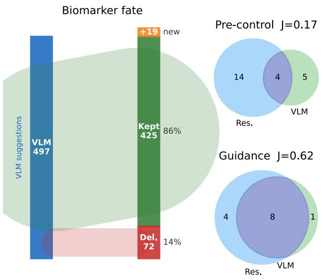  
Figure 7: US3 biomarker analysis: fate of VLM suggestions (left) and resident–VLM vocabulary overlap, pre-control vs. guidance (right). Parallel to US2 results (Figure S2).

## 7.3 Qualitative Analysis

We analyzed the four open-ended prompts of the US3 post-study survey (�=8; when guidance felt helpful, when it felt unhelpful, what residents did once guidance was removed, and what single change they would make) using reflexive thematic analysis [7]. One author open-coded all responses across the four prompts, then iteratively grouped codes into candidate themes, checking each candidate against the full corpus of responses rather than isolated quotes, and consolidating codes that recurred across prompts (e.g., complaints about overlay density surfaced under both the unhelpful and change-one-thing prompts). Because this was a single-coder analysis, we treat the resulting themes as researcher-constructed interpretations reflexively grounded in the data, in the sense of Braun and Clarke’s framework [7], rather than as categories validated by inter-rater agreement. Three of the four themes that emerged mapped directly onto the three design principles we report; a fourth theme, orthogonal to the three, concerned resident control over documentation and is discussed below as a candidate fourth design consideration.

Deferrable. Residents wanted to form an initial impression from the raw image before consulting guidance, treating it as a confirmatory check rather than a directive: “Ithink it was less helpful to have the AI guidance automatically on the image when I first saw it. . .my first instinct was to click of the overlay and see the raw OCT image first to draw my own conclusions initially, then put the overlay back on to check the heatmap to help confirm my initial thoughts” (P3).

Sparse. Residents found the overlay visually overwhelming rather than selectively informative, and wanted a filterable, concise alternative: “. . .ifit can be more concise (eg. selectively presented) itll probably be less visually disturbing and helpful in pointing out the most important pathology. . .” (P2); “Be able to selectively highlight exactly what I’m looking for instead ofeverything at once. For example, ifIjust want to see CNV orfluid, I should be able to filter by that. . .” (P8).

Evidence-anchored. Residents wanted each highlighted region tied to an explicit rationale, not just a location: “The hotspot look abnormal, I already know this. I want to get more information. Just telling me where to look isn’t enough” (P1). Another, asked what they still wanted once guidance was removed, requested “an explanation for why each part of the guidance was highlighted” (P8).

Documentation scafold (candidate fourth theme). A theme independent of the three principles concerned residents wanting to author documentation atop an AI-provided starting point rather than accept or reject it wholesale: “Ithink the text annotations, would be helpful to prepopulate for my interpretation and then edit. Would also be helpful if the annotations were color-coded. . .” (P7). This theme did not map onto deferrable, sparse, or evidence-anchored; we surface it as a candidate fourth design consideration (a residentcontrolled documentation scafold) for future work rather than folding it into the existing principles.

## 8 Discussion

Guidance that interrupts active sensemaking gets switched of. Clinical AI must fit the clinician’s cognitive rhythm, not impose a new one. Residents consistently adopted a readfirst, check-later rhythm, arriving at an impression before toggling guidance: “would answerfirst (reading the image normally), then in hindsight” (PGY-4). When AOIs aligned with their mental model they reinforced attention; when difuse they were switched of (“kill the noise,” PGY-4). This explains the preserved accuracy despite the limited in-guidance eficiency gains. Clinical AI must therefore be able to be dismissed to a later diagnostic pass by the clinician: fast to reveal, fast to dismiss, never interrupting an active diagnostic pass.

Clinical saliency overlays earn adoption only when they behave as sparse, precise suggestions. Comprehensive coverage undermines rather than supports expert visual search.

Heatmaps were most acceptable as suggestions: residents asked to condense them to “2 or 3 main points of interest” (PGY-3), with per-hotspot rationale (e.g., “IRF candidate, 0.82 confidence”) rather than a generic saliency map. The interaction contract this implies: default to a clean image, reveal few AOIs with adaptive opacity, and tune density to experience: novices wanted upfront task scafolding whereas seniors preferred minimal prompting.

AI-drafted clinical text succeeds as a safety net for missed findings, not an authoritative verdict, but only when every claim is traceable to its visual evidence in the image. Summaries worked best as a checklist: “ifI saw something in the text box that I did not initially note, I would take a closer look” (PGY-3). The primary failure mode was vagueness: ontology-specific phrasing (IRF/SRF/PED/ERM) with per-item confidence is needed, not flat prose. Three of four residents rated click-through linking between each text token and its visual source as the most helpful feature, and all preferred succinct defaults over verbose prose.

Trustworthy clinical AI requires structural safeguards at every interaction layer: first-pass independence before any AI reveal, explicit confirmation gates for every retained item, full proposal-and-edit audit trails, and provenance marking on all auto-generated content. A first-pass period without aids preserves independent assessment; after reveal, every retained item should require explicit confirmation with the system logging proposals and edits for accountability. Per-item confidence badges calibrate reliance (“a confidence score is most helpful,” 3/4 residents), and very low-confidence items should collapse under “needs review” rather than appear as facts. Concretely, this means a linked reveal in which each biomarker token is clickable to its AOI tile beside the raw image, with explicit keep, edit, or delete decisions before anything enters the note. Expert gaze and dictation are biometric signals: any deployment must minimize retention, de-identify early, and disclose their collection in consent forms and the interface. Generalizability across scanners remains a risk; surfacing scanner context alongside an easy “flag as incorrect” path guards against silent drift.

Combining AI guidance modalities is synergistic when each targets a distinct workflow bottleneck: only by removing both visual search friction and documentation burden simultaneously can the system achieve gains neither modality produces alone. US3’s combined guidance exceeded either modality alone (Table 3): the VLM draft nearly eliminated documentation burden (−67% comment edit time, � = 0.023) while the post-guidance time-per-eye carryover (� = 0.016) is consistent with AOIs supporting lasting perceptual reorientation, though the fixed block order means task familiarity cannot be entirely ruled out as a contributing factor. The same account extends to Correct Dx/min: because diagnostic accuracy is preserved across blocks rather than traded away (Table 3), the post-guidance Correct Dx/min rise seen with AOI-only guidance in US2 (2.9→4.4, +52%, �=0.065) is the throughput expression of the same faster unaided reading, not a change in what residents get right. The 85.5% biomarker retention (matching US2 VLM-only at 83.1%) confirms AOIs did not suppress editing behavior; residents described a corroboration loop between modalities (“I’d use the heatmap and the text to correlate. . . ”) and wanted them linked, pointing to a design target: per-biomarker

Table 3: All user study results across conditions (means). Bold = best guidance-block value per row. “Dx”=Diagnosis. Significance vs. pre-guidance control (Wilcoxon, Benjamini–Hochberg): \* �<0.05, \*\* �<0.01, † �<0.10; ‡ �<0.05 vs. guidance block. Biomarkers for wAMD eyes only. Gaze divergence (KL) measured in the US2 AOI condition and in US3; not in US2 VLM. Full �-values in Table S8; accuracy ordering efects nonsignificant throughout (Appendix E).
<table><tr><td rowspan="2">Metric</td><td colspan="3">US2: AOI guidance  $( n = 1 0 )$ </td><td colspan="2">US2: VLM guidance (n = 4)</td><td colspan="3">US3: Combined VLM+AOI (n = 8)</td></tr><tr><td>Pre-ctrl</td><td>AOI</td><td>Post-ctrl</td><td>Pre-ctrl</td><td>VLM</td><td>Pre-ctrl</td><td>Combined</td><td>Post-ctrl</td></tr><tr><td>Accuracy</td><td>0.927</td><td>0.887</td><td>0.904</td><td>0.833</td><td>0.917</td><td>0.833</td><td>0.933†</td><td>0.883</td></tr><tr><td>FPR</td><td>0.000</td><td>0.007</td><td>0.007</td><td>0.050</td><td>0.033</td><td>0.000</td><td>0.000</td><td>0.000</td></tr><tr><td>Correct Dx/min</td><td>2.9</td><td>3.0</td><td>4.4</td><td>1.6</td><td>2.0</td><td>3.40</td><td>4.76*</td><td>4.02</td></tr><tr><td>Time/eye (s)</td><td>20.0</td><td>18.9</td><td> $1 4 . 4 ^ { ^ { \star } \dagger }$ </td><td>32.5</td><td>30.1</td><td>26.0</td><td>22.1</td><td>19.6*</td></tr><tr><td>Comment edit (s)</td><td>4.1</td><td>3.3</td><td>3.1</td><td>11.3</td><td>12.5</td><td>7.2</td><td>2.4</td><td>5.7</td></tr><tr><td>Time to Dx (s)</td><td>10.0</td><td>10.8</td><td>7.4*}</td><td>14.2</td><td>17.4</td><td>10.8</td><td>13.3</td><td>7.4*</td></tr><tr><td>Confidence (1-4)</td><td>3.17</td><td>3.14</td><td>3.12</td><td>2.67</td><td>2.83</td><td>3.03</td><td>3.05</td><td>3.13</td></tr><tr><td>Effort (1–4)</td><td>一</td><td>一</td><td>一</td><td>2.33</td><td>2.27</td><td>2.11</td><td>1.91*</td><td>1.98</td></tr><tr><td>Biomarkers/AMD eye</td><td></td><td>一</td><td></td><td>2.3</td><td>5.8</td><td>1.11</td><td>5.36*</td><td>1.87</td></tr><tr><td>VLM retention (%)</td><td></td><td></td><td></td><td>一</td><td>83.1</td><td></td><td>85.5</td><td></td></tr><tr><td>Gaze divergence (KL)</td><td>3.00</td><td> $3 . 1 7 ^ { ^ { \star } }$ </td><td> $3 . 2 8 ^ { ^ { \star \star } }$ </td><td>一</td><td>一</td><td>3.58</td><td>3.50</td><td>3.30</td></tr></table>

AOI tiles with clickable toggling, not global heatmaps (a mock-up is shown in Figure S4).

## 9 Limitations and Future Directions

Recruiting active ophthalmology residents has been structurally constrained: programs typically have 12–20 trainees per institution and sessions require 30–40 minutes of clinical time. We enrolled 11 of 16 available residents in US2 (69%) and 8 across two institutions in US3, representing substantial reach within these limited pools. Within-subjects designs and image-set-level power (�>74 per test) compensate for participant count, but detection of small individual efects and subgroup analysis await larger trials. All three studies used a fixed block sequence (pre-guidance → guidance → post-guidance), so post-guidance timing gains cannot be fully disentangled from task familiarity; accuracy ordering efects were confirmed nonsignificant (Appendix E), but a crossover design would provide stronger causal evidence for carryover claims.

On the modeling side, the key limitation for the VLM is evaluation: BERTScore and MedBERTScore capture fluency rather than clinical accuracy. We will address this by bootstrapping groundtruth biomarker localizations from gaze-derived AOIs with expert “click-to-tighten” refinement, enabling location-aware evaluation (NSS, sAUC) and ontology-exact entity scores alongside reliancecalibration metrics.

Generalizability. Our study targets a binary Normal vs. wAMD decision on a single scanner (Zeiss Cirrus); extension to multi-class settings (wAMD, dry AMD, normal) and multisite replication will test robustness across scanners and protocols. The gaze-aligned ViT and ontology-bounded VLM are architecturally scanner-agnostic, both distill from expert gaze and dictation rather than devicespecific pixel statistics, so we expect this transfer to be feasible. We deliberately distill from experts (US1 retina specialists) and deploy to trainees (US2–US3 residents), the population with the most to gain; attending-level clinicians were not tested, so generaliza tion to senior clinicians remains future work. The methodological approach of distilling expert gaze and dictations into ViT attention alignment and ontology-bounded VLM guidance is domainagnostic and has precedent in glaucoma diagnosis [44], chest X-ray reading [16], and microscopy analysis in pathology [28, 33], though we have validated the full reading-and-documentation pipeline end-to-end only for wAMD.

## 10 Conclusion

Co-Annotator distills expert gaze and dictations into two residentfacing guidance components for OCT reading in wAMD: fixationaligned AOIs and an ontology-bounded VLM. Expert distillation sharpened both the ViT’s diagnostic accuracy and the VLM’s biomarker fidelity, and resident evaluation confirmed each modality is safe and independently beneficial: VLM guidance more than doubled biomarker documentation breadth, while AOI guidance produced a post-guidance eficiency carryover. Delivered together, they significantly increased Correct Dx/min and cut comment editing time while diagnostic accuracy was fully preserved. Neither modality could produce these gains alone. A preregistered, multisite field study comparing unaided-first vs. immediate guidance will test whether this design scales across scanners, protocols, and training populations.

## Acknowledgments

We thank Drs. Royce W.S. Chen and Tony Valenzuela for their extremely helpful feedback during the development of this project and for sharing their clinical insights. We are also grateful to all the residents who participated in user studies. This research was supported in part by the Air Force Ofice of Scientific Research (FA9550-22-10337), the Army Research Laboratory (W911NF-19-2- 0139, W911NF-19-2-0135, W911NF-21-2-0125), the U.S. Department of Defense (N00014-20-1-2027), and an Unrestricted Grant from Research to Prevent Blindness, Inc. awarded to the Columbia University Irving Medical Center Department of Ophthalmology.

## References

[1] Ahmet Akman. 2018. Optical Coherence Tomography: Manufacturers and Current Systems. Springer International Publishing, Cham, 27–37. doi:10.1007/978-3-319- 94905-5\_4

[2] Saleema Amershi, Dan Weld, Mihaela Vorvoreanu, Adam Fourney, Besmira Nushi, Penny Collisson, Jina Suh, Shamsi Iqbal, Paul N Bennett, Kori Inkpen, et al. 2019.

Guidelines for human-AI interaction. In Proceedings ofthe 2019 CHI Conference on Human Factors in Computing Systems. ACM, New York, NY, USA, 1–13.

[3] Mustafa Arikan, James Willoughby, Sevim Ongun, Ferenc Sallo, Andrea Montesel, Hend Ahmed, Ahmed Hagag, Marius Book, Henrik Faatz, Maria Vittoria Cicinelli, et al. 2025. OCT5k: A dataset of multi-disease and multi-graded annotations for retinal layers. Scientific data 12, 1 (2025), 267.

[4] Gagan Bansal, Tongshuang Wu, Joyce Zhou, Raymond Fok, Besmira Nushi, Ece Kamar, Marco Tulio Ribeiro, and Daniel Weld. 2021. Does the whole exceed its parts? the efect of AI explanations on complementary team performance. In Proceedings of the 2021 CHI Conference on Human Factors in Computing Systems. ACM, New York, NY, USA, 1–16.

[5] Emma Beede, Elizabeth Baylor, Fred Hersch, Anna Iurchenko, Lauren Wilcox, Paisan Ruamviboonsuk, and Laura M Vardoulakis. 2020. A human-centered evaluation of a deep learning system deployed in clinics for the detection of diabetic retinopathy. In Proceedings ofthe 2020 CHIConference on Human Factors in Computing Systems. ACM, New York, NY, USA, 1–12. doi:10.1145/3313831.3376718

[6] Olivier Bodenreider. 2004. The Unified Medical Language System (UMLS): integrating biomedical terminology. Nucleic Acids Research (2004).

[7] Virginia Braun and Victoria Clarke. 2006. Using thematic analysis in psychology. Qualitative Research in Psychology 3, 2 (2006), 77–101. doi:10.1191/ 1478088706qp063oa

[8] Zana Buçinca, Phoebe Lin, KrzysztofZ. Gajos, and Elena L. Glassman. 2020. Proxy Tasks and Subjective Measures Can Be Misleading in Evaluating Explainable AI Systems. In Proceedings ofthe 25th International Conference on Intelligent User Interfaces (IUI ’20). Association for Computing Machinery, New York, NY, USA, 454–464. doi:10.1145/3377325.3377498

[9] Zana Buçinca, Maja Barbara Malaya, and Krzysztof Z. Gajos. 2021. To Trust or to Think: Cognitive Forcing Functions Can Reduce Overreliance on AI in AI-assisted Decision-making. Proceedings ofthe ACM on Human-Computer Interaction 5, CSCW1, Article 188 (2021), 21 pages. doi:10.1145/3449287

[10] Daniel Buschek, Martin Zürn, and Malin Eiband. 2021. The Impact of Multiple Parallel Phrase Suggestions on Email Input and Composition Behaviour of Native and Non-Native English Writers. In Proceedings of the 2021 CHI Conference on Human Factors in Computing Systems (CHI ’21). Association for Computing Machinery, New York, NY, USA, Article 732, 13 pages. doi:10.1145/3411764.3445372

[11] Adrian Bussone, Simone Stumpf, and Dympna O’Sullivan. 2015. The role of explanations on trust and reliance in clinical decision support systems. In 2015 International Conference on Healthcare Informatics. IEEE, IEEE, Piscataway, NJ, USA, 160–169.

[12] Carrie J Cai, Emily Reif, Narayan Hegde, Jason Hipp, Been Kim, Daniel Smilkov, Martin Wattenberg, Fernanda Viégas, Greg S Corrado, Martin C Stumpe, and Michael Terry. 2019. Human-centered tools for coping with imperfect algorithms during medical decision-making. In Proceedings ofthe 2019 CHI Conference on Human Factors in Computing Systems. ACM, New York, NY, USA, 1–14. doi:10. 1145/3290605.3300234

[13] Carrie J. Cai, Samantha Winter, David Steiner, Lauren Wilcox, and Michael Terry. 2019. “Hello AI”: Uncovering the Onboarding Needs of Medical Practitioners for Human-AI Collaborative Decision-Making. Proceedings of the ACM on Human-Computer Interaction 3, CSCW, Article 104 (2019), 24 pages. doi:10.1145/3359206

[14] Carrie J. Cai, Samantha Winter, David Steiner, Lauren Wilcox, and Michael Terry. 2021. Onboarding Materials as Cross-functional Boundary Objects for Developing AI Assistants. In Extended Abstracts ofthe 2021 CHI Conference on Human Factors in Computing Systems (CHIEA ’21). ACM, New York, NY, USA, Article 43, 7 pages. doi:10.1145/3411763.3443435 Winner, Best Case Study, CHI 2021.

[15] Nora Castner, Lubaina Arsiwala-Scheppach, Sarah Mertens, Joachim Krois, Enkeleda Thaqi, Enkelejda Kasneci, Siegfried Wahl, and Falk Schwendicke. 2024. Expert gaze as a usability indicator of medical AI decision support systems: a preliminary study. NPJ Digital Medicine 7, 1 (2024), 199.

[16] Zihui Chen, Zhi Liu, and Yingjie Song. 2026. Gaze-guided vision transformer for chest X-ray image classification. Biomedical Signal Processing and Control 111 (2026), 108298.

[17] Elizabeth Clark, Anne Spencer Ross, Chenhao Tan, Yangfeng Ji, and Noah A. Smith. 2018. Creative Writing with a Machine in the Loop: Case Studies on Slo gans and Stories. In Proceedings of the 23rd International Conference on Intelligent User Interfaces (IUI ’18). Association for Computing Machinery, New York, NY, USA, 329–340. doi:10.1145/3172944.3172983

[18] Jefrey De Fauw, Joseph R. Ledsam, Bernardino Romera-Paredes, Stanislav Nikolov, Nenad Tomasev, Sam Blackwell, Harry Askham, Xavier Glorot, Bren dan O’Donoghue, Daniel Visentin, George van den Driessche, Balaji Lakshminarayanan, Clemens Meyer, Faith Mackinder, Simon Bouton, Kareem Ayoub, Reena Chopra, Dominic King, Alan Karthikesalingam, Cían O. Hughes, Rosalind Raine, Julian Hughes, Dawn A. Sim, Catherine Egan, Adnan Tufail, Hugh Mont gomery, Demis Hassabis, Geraint Rees, Trevor Back, Peng T. Khaw, Mustafa Suleyman, Julien Cornebise, Pearse A. Keane, and Olaf Ronneberger. 2018. Clin ically Applicable Deep Learning for Diagnosis and Referral in Retinal Disease. Nature Medicine 24, 9 (2018), 1342–1350. doi:10.1038/s41591-018-0107-6

[19] Jiangxia Duan, Meiwei Zhang, Minghui Song, Xiaopan Xu, and Hongbing Lu. 2025. Eye Tracking-Enhanced Deep Learning for Medical Image Analysis: A Systematic Review on Data Eficiency, Interpretability, and Multimodal Integration. Bioengineering 12, 9 (2025), 954.

[20] Monika Fleckenstein, Stefen Schmitz-Valckenberg, and Usha Chakravarthy. 2024. Age-Related Macular Degeneration: A Review. JAMA 331, 2 (Jan. 2024), 147–157. doi:10.1001/jama.2023.26074

[21] Riccardo Fogliato, Shreya Chappidi, Matthew Lungren, Michael Fitzke, Mark Parkinson, Diane Wilson, Paul Fisher, Eric Horvitz, Kori Inkpen, and Besmira Nushi. 2022. Who Goes First? Influences of Human-AI Workflow on Decision Making in Clinical Imaging. In 2022 ACM Conference on Fairness, Accountability, and Transparency (FAccT ’22). ACM, New York, NY, USA, 1362–1374. doi:10.1145 3531146.3533193

[22] Katy Ilonka Gero, Vivian Liu, and Lydia B. Chilton. 2022. Sparks: Inspiration for Science Writing using Language Models. In Proceedings ofthe 2022 ACM Designing Interactive Systems Conference (DIS ’22). Association for Computing Machinery, New York, NY, USA, 1002–1019. doi:10.1145/3532106.3533533

[23] Marzyeh Ghassemi, Luke Oakden-Rayner, and Andrew L Beam. 2021. The False Hope of Current Approaches to Explainable Artificial Intelligence in Health Care. The Lancet Digital Health 3, 11 (2021), e745–e750. doi:10.1016/S2589- 7500(21)00208-9

[24] Catalina Gomez, Sue Min Cho, Shichang Ke, Chien-Ming Huang, and Mathias Unberath. 2024. Human-AI collaboration is not very collaborative yet: a taxonomy of interaction patterns in AI-assisted decision making from a systematic review. Frontiers in Computer Science 6 (2024), 1521066.

[25] Ben Green and Yiling Chen. 2019. The principles and limits of algorithm-in-theloop decision making. Proceedings ofthe ACM on Human–Computer Interaction 3, CSCW (2019), 1–24.

[26] Rachel L. W. Hanson, Archana Airody, Sobha Sivaprasad, and Richard P. Gale. 2023. Optical coherence tomography imaging biomarkers associated with neovascular age-related macular degeneration: a systematic review. Eye 37, 12 (Aug. 2023), 2438–2453. doi:10.1038/s41433-022-02360-4 Publisher: Nature Publishing Group.

[27] Eric Horvitz. 1999. Principles of mixed-initiative user interfaces. In Proceedings of the SIGCHI Conference on Human Factors in Computing Systems (CHI ’99). ACM, New York, NY, USA, 159–166. doi:10.1145/302979.303030

[28] Bulat Ibragimov and Claudia Mello-Thoms. 2024. The use of machine learning in eye tracking studies in medical imaging: a review. IEEE Journal ofBiomedical and Health Informatics 28, 6 (2024), 3597–3612.

[29] Kori Inkpen, Shreya Chappidi, Keri Mallari, Besmira Nushi, Divya Ramesh, Pietro Michelucci, Vani Mandava, Libuse Hannah Veprek, and Gabrielle Quinn. 2023. Advancing Human-AI Complementarity: The Impact of User Expertise and Algo rithmic Tuning on Joint Decision Making. ACMTransactions on Computer-Human Interaction 30, 5, Article 71 (2023), 29 pages. doi:10.1145/3534561

[30] Maia L. Jacobs, Jefrey He, Melanie F. Pradier, Barbara D. Lam, Andrew C. Ahn, Thomas H. McCoy, Roy H. Perlis, Finale Doshi-Velez, and Krzysztof Z. Gajos. 2021. Designing AI for Trust and Collaboration in Time-Constrained Medical Decisions: A Sociotechnical Lens. In Proceedings ofthe 2021 CHI Conference on Human Factors in Computing Systems (CHI ’21). ACM, New York, NY, USA, Article 659, 14 pages. doi:10.1145/3411764.3445385

[31] Saahil Jain, Ashwin Agrawal, Adriel Saporta, Steven QH Truong, Du Nguyen Duong, Tan Bui, Pierre Chambon, Yuhao Zhang, Matthew P Lungren, Andrew Y Ng, et al. 2021. Radgraph: Extracting clinical entities and relations from radiology reports. arXiv preprint arXiv:2106.14463 (2021). Preprint.

[32] Harmanpreet Kaur, Harsha Nori, Samuel Jenkins, Rich Caruana, Hanna Wallach, and Jennifer Wortman Vaughan. 2020. Interpreting Interpretability: Under standing Data Scientists’ Use of Interpretability Tools for Machine Learning. In Proceedings ofthe 2020 CHI Conference on Human Factors in Computing Systems (CHI ’20). ACM, New York, NY, USA, 1–14. doi:10.1145/3313831.3376219 CHI 2020 Honorable Mention.

[33] Amirhossein Kiani, Bora Uyumazturk, Pranav Rajpurkar, Alex Wang, Rebecca Gao, Erik Jones, Yifan Yu, Curtis P Langlotz, Robyn L Ball, Thomas J Montine, et al. 2020. Impact of a deep learning assistant on the histopathologic classification of liver cancer. NPJ digital medicine 3, 1 (2020), 23.

[34] Rafal Kocielnik, Saleema Amershi, and Paul N. Bennett. 2019. Will You Accept an Imperfect AI? Exploring Designs for Adjusting End-User Expectations of AI Systems. In Proceedings of the 2019 CHI Conference on Human Factors in Computing Systems (CHI ’19). Association for Computing Machinery, New York, NY, USA, 1–14. doi:10.1145/3290605.3300641

[35] Elmar Kotter and Erik Ranschaert. 2021. Challenges and solutions for introducing artificial intelligence (AI) in daily clinical workflow. European Radiology 31, 1 (2021), 5–7.

[36] Harold L Kundel, Calvin F Nodine, Elizabeth A Krupinski, and Claudia Mello-Thoms. 2007. Holistic Component of Image Perception in Mammogram Interpretation: Gaze-Tracking Study. Radiology 242, 2 (2007), 396–402. doi:10.1148/radiol. 2422051997

[37] Thomas Kurmann, Siqing Yu, Pablo Márquez-Neila, Andreas Ebneter, Martin Zinkernagel, Marion R Munk, Sebastian Wolf, and Raphael Sznitman. 2019.

Expert-level automated biomarker identification in Optical Coherence Tomogra phy scans. Sci. Rep. 9, 1 (Sept. 2019), 13605.

[38] Vivian Lai and Chenhao Tan. 2019. On Human Predictions with Explanations and Predictions of Machine Learning Models: A Case Study on Deception Detection. In Proceedings of the Conference on Fairness, Accountability, and Transparency (FAT\* ’19). Association for Computing Machinery, New York, NY, USA, 29–38. doi:10.1145/3287560.3287590

[39] John D Lee and Katrina A See. 2004. Trust in automation: Designing for appro priate reliance. Human Factors 46, 1 (2004), 50–80. doi:10.1518/hfes.46.1.50\_30392

[40] Mina Lee, Percy Liang, and Qian Yang. 2022. CoAuthor: Designing a Human-AI Collaborative Writing Dataset for Exploring Language Model Capabilities. In Proceedings of the 2022 CHI Conference on Human Factors in Computing Systems (CHI ’22). Association for Computing Machinery, New York, NY, USA, 19 pages. doi:10.1145/3491102.3502030

[41] Min Hun Lee, Daniel P. Siewiorek, Asim Smailagic, Alexandre Bernardino, and Sergi Bermúdez i Badia. 2021. A Human-AI Collaborative Approach for Clinical Decision Making on Rehabilitation Assessment. In Proceedings ofthe 2021 CHI Conference on Human Factors in Computing Systems (CHI ’21). ACM, New York, NY, USA, Article 392, 14 pages. doi:10.1145/3411764.3445472

[42] Brenna Li, Noah Crampton, Thomas Yeates, Yu Xia, Xirong Tian, and Khai N. Truong. 2021. Automating Clinical Documentation with Digital Scribes: Under standing the Impact on Physicians. In Proceedings ofthe 2021 CHI Conference on Human Factors in Computing Systems (CHI ’21). ACM, New York, NY, USA, 1–12. doi:10.1145/3411764.3445172

[43] Zhongwen Li, Lei Wang, Xuefang Wu, Jiewei Jiang, Wei Qiang, He Xie, Hongjian Zhou, Shanjun Wu, Yi Shao, and Wei Chen. 2023. Artificial intelligence in ophthalmology: The path to the real-world clinic. Cell Reports. Medicine 4, 7 (July 2023), 101095. doi:10.1016/j.xcrm.2023.101095

[44] Ziheng Li, Haowen Wei, Kuang Sun, Leyi Cui, David Li, Steven Feiner, and Kaveri Thakoor. 2025. Interactively Assisting Glaucoma Diagnosis with an Expert Knowledge-Distilled Vision Transformer. In Proceedings of the Extended Abstracts ofthe CHI Conference on Human Factors in Computing Systems. 1–8.

[45] Q. Vera Liao, Daniel Gruen, and Sarah Miller. 2020. Questioning the AI: Informing Design Practices for Explainable AI User Experiences. In Proceedings of the 2020 CHIConference on Human Factors in Computing Systems (CHI’20). Association for Computing Machinery, New York, NY, USA, 1–15. doi:10.1145/3313831.3376590

[46] Gilbert Lim, Kabilan Elangovan, and Liyuan Jin. 2024. Vision language models in ophthalmology. Current Opinion in Ophthalmology 35, 6 (Nov. 2024), 487–493. doi:10.1097/ICU.0000000000001089

[47] Damien Litchfield, Linden J Ball, Tim Donovan, David J Manning, and Trevor Crawford. 2010. Viewing another person’s eye movements improves identification of pulmonary nodules in chest x-ray inspection. Journal ofExperimental Psychology: Applied 16, 3 (2010), 251.

[48] Zhuoran Lu and Ming Yin. 2021. Human Reliance on Machine Learning Models When Performance Feedback is Limited: Heuristics and Risks. In Proceedings ofthe 2021 CHI Conference on Human Factors in Computing Systems (CHI ’21). Association for Computing Machinery, New York, NY, USA, Article 78, 16 pages. doi:10.1145/3411764.3445562

[49] Chong Ma, Hanqi Jiang, Wenting Chen, Yiwei Li, Zihao Wu, Xiaowei Yu, Zhengliang Liu, Lei Guo, Dajiang Zhu, Tuo Zhang, et al. 2024. Eye-gaze guided multi-modal alignment for medical representation learning. Advances in Neural Information Processing Systems 37 (2024), 6126–6153.

[50] Gaya Mehenni and Amal Zouaq. 2024. Ontology-Constrained Generation of Domain-Specific Clinical Summaries. In International Conference on Knowledge Engineering and Knowledge Management. Springer, ACM, New York, NY, USA, 382–398.

[51] Cristian Metrangolo, Simone Donati, Marco Mazzola, Liviana Fontanel, Walter Messina, Giulia D’alterio, Marisa Rubino, Paolo Radice, Elias Premi, and Claudio Azzolini. 2021. OCT Biomarkers in Neovascular Age-Related Macular Degenera tion: A Narrative Review. Journal ofOphthalmology 2021 (July 2021), 9994098. doi:10.1155/2021/9994098

[52] Luke S. Murray, Divya Gopinath, Monica Agrawal, Steven Horng, David Sontag, and David R. Karger. 2021. MedKnowts: Unified Documentation and Information Retrieval for Electronic Health Records. In The 34th Annual ACM Symposium on User Interface Software and Technology (UIST ’21). ACM, New York, NY, USA, 1169–1183. doi:10.1145/3472749.3474814

[53] Manuel Paez-Escamilla, Mahima Jhingan, Denise S. Gallagher, Sumit Randhir Singh, Samantha Fraser-Bell, andJay Chhablani. 2021. Age-related macular degen eration masqueraders: From the obvious to the obscure. Survey of Ophthalmology 66, 2 (2021), 153–182. doi:10.1016/j.survophthal.2020.08.005

[54] Cecilia Panigutti, Andrea Beretta, Fosca Giannotti, and Dino Pedreschi. 2022. Understanding the Impact of Explanations on Advice-Taking: A User Study for AI-Based Clinical Decision Support Systems. In Proceedings ofthe 2022 CHI Conference on Human Factors in Computing Systems (CHI ’22). ACM, New York, NY, USA, Article 568, 9 pages. doi:10.1145/3491102.3502104

[55] Forough Poursabzi-Sangdeh, Daniel G Goldstein, Jake M Hofman, Jennifer Wort man Wortman Vaughan, and Hanna Wallach. 2021. Manipulating and measuring model interpretability. In Proceedings ofthe 2021 CHIConference on Human Factors

in Computing Systems. ACM, New York, NY, USA, 1–52.

[56] Charvi Rastogi, Yunfeng Zhang, Dennis Wei, Kush R. Varshney, Amit Dhurandhar, and Richard Tomsett. 2022. Deciding Fast and Slow: The Role of Cognitive Biases in AI-assisted Decision-making. Proceedings of the ACM on Human-Computer Interaction 6, CSCW1, Article 83 (2022), 22 pages. doi:10.1145/3512930

[57] Carlo Reverberi, Tommaso Rigon, Aldo Solari, Cesare Hassan, Paolo Cherubini, and Andrea Cherubini. 2022. Experimental evidence of efective human–A collaboration in medical decision-making. Scientific Reports 12, 1 (2022), 14952.

[58] Tetsu Sakamoto, Yukinori Harada, Taro Shimizu, et al. 2024. Facilitating Trust Calibration in Artificial Intelligence–Driven Diagnostic Decision Support Systems for Determining Physicians’ Diagnostic Accuracy: Quasi-Experimental Study. JMIR Formative Research 8, 1 (2024), e58666

[59] Nicole T. M. Saksens, Monika Fleckenstein, Stefen Schmitz-Valckenberg, Frank G. Holz, Anneke I. den Hollander, Jan E. E. Keunen, Camiel J. F. Boon, and Carel B. Hoyng. 2014. Macular dystrophies mimicking age-related macular degeneration. Progress in Retinal and Eye Research 39 (March 2014), 23–57. doi:10.1016/j.preteyeres.2013.11.001

[60] Dario D Salvucci and Joseph H Goldberg. 2000. Identifying fixations and saccades in eye-tracking protocols. In Proceedings of the 2000 Symposium on Eye Tracking Research & Applications. ACM, New York, NY, USA, 71–78.

[61] Max Schemmer, Niklas Kuehl, Carina Benz, Andrea Bartos, and Gerhard Satzger. 2023. Appropriate Reliance on AI Advice: Conceptualization and the Efect of Explanations. In Proceedings ofthe 28th International Conference on Intelligent User Interfaces (IUI ’23). Association for Computing Machinery, New York, NY, USA, 410–422. doi:10.1145/3581641.3584066

[62] Andrew Sellergren, Sahar Kazemzadeh, Tiam Jaroensri, Atilla Kiraly, Madeleine Traverse, Timo Kohlberger, Shawn Xu, Fayaz Jamil, Cían Hughes, Charles Lau, et al. 2025. Medgemma technical report. arXiv preprint arXiv:2507.05201 (2025). Preprint.

[63] Venkatesh Sivaraman, Leigh A. Bukowski, Joel Levin, Jeremy M. Kahn, and Adam Perer. 2023. Ignore, Trust, or Negotiate: Understanding Clinician Acceptance of AI-Based Treatment Recommendations in Health Care. In Proceedings of the 2023 CHI Conference on Human Factors in Computing Systems (CHI ’23). ACM, New York, NY, USA, Article 557, 18 pages. doi:10.1145/3544548.3581075

[64] Suganya Subramaniam, Sara Rizvi, Ramya Ramesh, Vibhor Sehgal, Brinda Gurusamy, Hikmatullah Arif, Jefrey Tran, Ritu Thamman, Emeka C Anyanwu, Ronald Mastouri, et al. 2025. Ontology-guided machine learning outperforms zero-shot foundation models for cardiac ultrasound text reports. Scientific Reports 15, 1 (2025), 5456.

[65] Malliga Subramanian, Kogilavani Shanmugavadivel, Obuli Sai Naren, K Premkumar, and K Rankish. 2022. Classification of Retinal OCT Images Using Deep Learning. In 2022 International Conference on Computer Communication and Informatics (ICCCI). IEEE, Piscataway, NJ, USA, 1–7. doi:10.1109/ICCCI54379.2022.9740985 ISSN: 2329-7190.

[66] Harini Suresh, Steven R. Gomez, Kevin K. Nam, and Arvind Satyanarayan. 2021. Beyond Expertise and Roles: A Framework to Characterize the Stakeholders of Interpretable Machine Learning and Their Needs. In Proceedings ofthe 2021 CHI Conference on Human Factors in Computing Systems (CHI ’21). Association for Computing Machinery, New York, NY, USA, Article 74, 16 pages. doi:10.1145/ 3411764.3445088

[67] Ali S Tejani, Tessa S Cook, Mohannad Hussain, Teri Sippel Schmidt, and Kevin P O’Donnell. 2024. Integrating and adopting AI in the radiology workflow: a primer for standards and integrating the healthcare enterprise (IHE) profiles. Radiology 311, 3 (2024), e232653.

[68] Philipp Tschandl, Christoph Rinner, Zoe Apalla, Giuseppe Argenziano, Noel Codella, Allan Halpern, Monika Janda, Aimilios Lallas, Caterina Longo, Josep Malvehy, et al. 2020. Human–computer collaboration for skin cancer recognition. Nature Medicine 26, 8 (2020), 1229–1234.

[69] Michelle Vaccaro, Abdullah Almaatouq, and Thomas Malone. 2024. When combinations of humans and AI are useful: A systematic review and meta-analysis. Nature Human Behaviour 8, 12 (2024), 2293–2303.

[70] A. van der Gijp, C. J. Ravesloot, H. Jarodzka, M. F. van der Schaaf, I. C. van der Schaaf, J. P. J. van Schaik, and Th. J. ten Cate. 2017. How Visual Search Relates to Visual Diagnostic Performance: A Narrative Systematic Review of Eye-Tracking Research in Radiology. Advances in Health Sciences Education 22, 3 (2017), 765–787. doi:10.1007/s10459-016-9698-1

[71] Helena Vasconcelos, Matthew Jörke, Madeleine Grunde-McLaughlin, Tobias Gerstenberg, Michael S. Bernstein, and Ranjay Krishna. 2023. Explanations Can Reduce Overreliance on AI Systems During Decision-Making. Proceedings of the ACM on Human-Computer Interaction 7, CSCW1, Article 129 (2023), 38 pages. doi:10.1145/3579605

[72] Bin Wang, Hongyi Pan, Armstrong Aboah, Zheyuan Zhang, Elif Keles, Drew Torigian, Baris Turkbey, Elizabeth Krupinski, Jayaram Udupa, and Ulas Bagci. 2024. GazeGNN: A gaze-guided graph neural network for chest x-ray classification. In Proceedings ofthe IEEE/CVF Winter Conference on Applications ofComputer Vision. IEEE, Los Alamitos, CA, USA, 2194–2203.

[73] Dakuo Wang, Liuping Wang, Zhan Zhang, Ding Wang, Haiyi Zhu, Yvonne Gao, Xiangmin Fan, and Feng Tian. 2021. “Brilliant AI Doctor” in Rural Clinics:

Challenges in AI-Powered Clinical Decision Support System Deployment. In Proceedings ofthe 2021 CHI Conference on Human Factors in Computing Systems (CHI ’21). ACM, New York, NY, USA, Article 697, 18 pages. doi:10.1145/3411764. 3445432

[74] Sheng Wang, Xi Ouyang, Tianming Liu, Qian Wang, and Dinggang Shen. 2022. Follow my eye: Using gaze to supervise computer-aided diagnosis. IEEE Transactions on Medical Imaging 41, 7 (2022), 1688–1698.

[75] Xinru Wang and Ming Yin. 2021. Are Explanations Helpful? A Comparative Study of the Efects of Explanations in AI-Assisted Decision-Making. In Proceedings of the 26th International Conference on Intelligent User Interfaces (IUI’21). Association for Computing Machinery, New York, NY, USA, 318–328. doi:10.1145/3397481. 3450650

[76] Katharina Wenderott, Jim Krups, Julian A Luetkens, and Matthias Weigl. 2024. Radiologists’ perspectives on the workflow integration ofan artificial intelligence based computer-aided detection system: A qualitative study. Applied Ergonomics 117 (2024), 104243.

[77] Chia-Chien Wu and Jeremy M. Wolfe. 2019. Eye Movements in Medical Image Perception: A Selective Review of Past, Present and Future. Vision 3, 2 (2019), 32. doi:10.3390/vision3020032

[78] Yao Xie, Melody Chen, David Kao, Ge Gao, and Xiang ’Anthony’ Chen. 2020. CheXplain: Enabling Physicians to Explore and Understand Data-Driven, AI Enabled Medical Imaging Analysis. In Proceedings ofthe 2020 CHI Conference on Human Factors in Computing Systems (CHI ’20). ACM, New York, NY, USA, 1–13. doi:10.1145/3313831.3376807

[79] Qian Yang, Yuexing Hao, Kexin Quan, Stephen Yang, Yiran Zhao, Volodymyr Kuleshov, and Fei Wang. 2023. Harnessing Biomedical Literature to Calibrate Clinicians’ Trust in AI Decision Support Systems. In Proceedings ofthe 2023 CHI Conference on Human Factors in Computing Systems (CHI ’23). ACM, New York, NY, USA, Article 14, 14 pages. doi:10.1145/3544548.3581393

[80] Qian Yang, Aaron Steinfeld, andJohn Zimmerman. 2019. Unremarkable AI: Fitting Intelligent Decision Support into Critical, Clinical Decision-Making Processes. In Proceedings ofthe 2019 CHI Conference on Human Factors in Computing Systems (CHI’19). ACM, New York, NY, USA, Paper 238, 1–11. doi:10.1145/3290605.3300468

[81] Qian Yang, John Zimmerman, Aaron Steinfeld, Lisa Carey, and James F. Antaki. 2016. Investigating the Heart Pump Implant Decision Process: Opportunities for Decision Support Tools to Help. In Proceedings of the 2016 CHI Conference on Human Factors in Computing Systems (CHI ’16). ACM, New York, NY, USA, 4477–4488. doi:10.1145/2858036.2858373

[82] Rui Yang, Edison Marrese-Taylor, Yuhe Ke, Lechao Cheng, Qingyu Chen, and Irene Li. 2023. Integrating UMLS knowledge into large language models for medical question answering. arXiv preprint arXiv:2310.02778 (2023). Preprint.

[83] Ming Yin, Jennifer Wortman Vaughan, and Hanna Wallach. 2019. Understanding the Efect of Accuracy on Trust in Machine Learning Models. In Proceedings ofthe 2019 CHI Conference on Human Factors in Computing Systems (CHI ’19). Association for Computing Machinery, New York, NY, USA, Article 279, 12 pages. doi:10.1145/3290605.3300509

[84] Ann Yuan, Andy Coenen, Emily Reif, and Daphne Ippolito. 2022. Wordcraft: Story Writing With Large Language Models. In Proceedings ofthe 27th International Conference on Intelligent User Interfaces (IUI ’22). Association for Computing Machinery, New York, NY, USA, 841–852. doi:10.1145/3490099.3511105

[85] Shao Zhang, Jianing Yu, Xuhai Xu, Changchang Yin, Yuxuan Lu, Bingsheng Yao, Melanie Tory, Lace M Padilla, Jefrey Caterino, Ping Zhang, et al. 2024. Rethinking human-AI collaboration in complex medical decision making: a case study in sepsis diagnosis. In Proceedings of the 2024 CHI Conference on Human Factors in Computing Systems. ACM, New York, NY, USA, 1–18.

[86] Yunfeng Zhang, Q. Vera Liao, and Rachel K. E. Bellamy. 2020. Efect of Confidence and Explanation on Accuracy and Trust Calibration in AI-Assisted Decision Making. In Proceedings ofthe 2020 Conference on Fairness, Accountability, and Transparency (FAT\* ’20). Association for Computing Machinery, New York, NY, USA, 295–305. doi:10.1145/3351095.3372852

## A Dataset Curation and Preprocessing

This section provides a detailed description of the datasets curated and preprocessed for the multi-task fine-tuning of the MedGemma VLM. Our goal was to build a specialized ophthalmic AI assistant capable of interpreting retinal OCT scans across three distinct tasks: binary diagnosis, biomarker generation, and biomarker discrimination. To achieve this, we sourced data from publicly available medical datasets, including OCT-C8 and OCT-5K, and combined them with fine-grained biomarker information extracted from physician transcripts.

## A.1 Diagnosis Dataset

The foundation for the model’s visual understanding and diagnostic capability was established using a large-scale dataset for a binary classification task.

• Source: A curated subset of the publicly available Retinal OCT-C8 dataset.

• Task: Binary classification to determine the primary pathology of an OCT scan. The model is constrained to respond with either ’Normal’ or ’wet-AMD’.

• Size and Composition: The dataset comprises a total of 4,600 OCT images, balanced perfectly between the two classes (2,300 images for ’Normal’ and 2,300 for ’wet-AMD’).

• Purpose: This dataset’s primary role is to provide a robust, domain-specific visual foundation, training the model to recognize the core features diferentiating healthy retina from those afected by wAMD.

## A.2 Biomarker Generation Dataset

A key challenge in developing specialized medical AI is the availability of high-quality, annotated data for identifying specific pathological features (biomarkers). Our biomarker dataset was designed to address this challenge for the generative identification task.

• Source: The dataset corpus was created by combining annotations from the OCT-5K dataset with a preprocessed biomarker list extracted from physician transcripts from our internal dataset.

• Task: A generative task where the model must identify all relevant pathological features from an OCT scan and output a commaseparated list of biomarkers.

• Size and Composition: The combined dataset contains a total of 573 unique samples.

• Preprocessing: To manage complexity and focus the model on the most relevant features, biomarkers with fewer than 10 occurrences in the combined dataset were excluded from the final training set. This resulted in a final vocabulary of 12 key biomarkers: "Drusen", "Photoreceptor Degeneration", "Pigment Epithelial Detachment", "Geographic Atrophy", "Choroidal Fold", "Epiretinal Membrane", "Hyperfluorescent Spots", "Intraretinal Fluid", "Posterior Vitreous Detachment", "Fluid", "Subretinal Fluid", and "Choroidal Neovascularization".

Table S2 provides a detailed frequency count of all identified biomarkers in the raw combined dataset before the final filtering step was applied. As a benchmark, we compare our biomarker distribution against the population-level reference from Kurmann et al. [37] (Table S1); diferences reflect our clinical case mix rather than extraction error.

## A.3 Biomarker Discrimination Dataset

To facilitate targeted verification of specific features and improve the model’s visual grounding, a VQA dataset was created.

• Source: The biomarker discrimination dataset was dynamically generated from the curated biomarker generation Dataset.

• Size and Composition: The dataset comprises a total of 1664 unique samples.

Co-Annotator: Expert-Distilled ViT and VLM for Visual and Documentation Guidance in Age-Related Macular Degeneration UIST ’26, November 02–05, 2026, Detroit, MI, USA
<table><tr><td></td><td>Healthy</td><td>SRF</td><td>IRF</td><td>HF</td><td>Drusen</td><td>RPD</td><td>ERM</td><td>GA</td><td>ORA</td><td>IRC</td><td>FPED</td></tr><tr><td>Training Set (23,030)</td><td>6480</td><td>1142</td><td>2947</td><td>5668</td><td>5077</td><td>1995</td><td>6139</td><td>1093</td><td>2280</td><td>4321</td><td>4766</td></tr><tr><td>Test Set (1029)</td><td>165</td><td>65</td><td>48</td><td>178</td><td>376</td><td>153</td><td>140</td><td>62</td><td>200</td><td>54</td><td>359</td></tr></table>

Table S1: Distribution of biomarkers in Kurmann et al. [37]. Counts are B-scans annotated with each biomarker; a B-scan may carry several, so rows sum to more than the set size. Healthy, no pathological biomarker; SRF, subretinal fluid; IRF, intraretinal fluid; HF, hyperreflective foci; RPD, reticular pseudodrusen; ERM, epiretinal membrane; GA, geographic atrophy; ORA, outer retinal atrophy; IRC, intraretinal cysts; FPED, fibrovascular pigment epithelial detachment.

Table S2: Frequency of Biomarkers in the Combined Dataset (Prefiltering).
<table><tr><td>Biomarker</td><td>Frequency</td></tr><tr><td>Drusen</td><td>410</td></tr><tr><td>Photoreceptor Degeneration</td><td>209</td></tr><tr><td>Pigment Epithelial Detachment</td><td>99</td></tr><tr><td>Geographic Atrophy</td><td>73</td></tr><tr><td>Choroidal Fold</td><td>60</td></tr><tr><td>Posterior Vitreous Detachment</td><td>33</td></tr><tr><td>Hyperfluorescent Spots</td><td>32</td></tr><tr><td>Epiretinal Membrane</td><td>31</td></tr><tr><td>Intraretinal Fluid</td><td>29</td></tr><tr><td>Fluid</td><td>25</td></tr><tr><td>None</td><td>25</td></tr><tr><td>Subretinal Fluid</td><td>20</td></tr><tr><td>Choroidal Neovascularization</td><td>12</td></tr><tr><td>Retinal Pigment Epithelial Migration</td><td>9</td></tr><tr><td>Retinal Pigment Epithelium Atrophy</td><td>6</td></tr><tr><td>Subretinal Hyperreflective Material</td><td>4</td></tr><tr><td>Photoreceptor Layer Disruption</td><td>4</td></tr><tr><td>Disciform Scar</td><td>2</td></tr><tr><td>Hemorrhage</td><td>1</td></tr><tr><td>Outer Retinal Tubulation</td><td>1</td></tr></table>

• Task: A discriminative task where the model is presented with a direct question of the form, "Is [BIOMARKER\_NAME] present in this OCT scan?" and must respond with a definitive ’Yes’ or ’No’.

• Generation Strategy: An initial, exhaustive generation process revealed that an uncurated discriminative dataset would be overwhelmingly populated with "No" answers, potentially teaching the model a trivial strategy of always predicting "No". To circumvent this, a balancing strategy was employed. For each image, an equal number of "Yes" instances (for biomarkers present) and "No" instances (randomly selected from biomarkers that were absent) were generated. This approach forced the model to learn the actual visual features corresponding to each biomarker rather than relying on statistical priors.

• Representativeness Generated biomarkers were diverse and representative in identity to those known in wAMD [26, 51]. Though some difer appreciably (Figure S1) in frequency compared to established datasets, this is likely due to our diferent case mix rather than detection error.

## B Biomarker VLM Details

The VLM fine-tuning was conducted in two stages. The detailed configurations for each stage are provided in Table S3. Stage two, which adds the biomarker-generation task, uses a balanced sampler that enforces uniform task mixing per batch across all three tasks (diagnosis, biomarker discrimination, biomarker generation). This prevents catastrophic forgetting of the diagnosis and discrimination objectives learned in stage one while forcing the model to map visual features to ontology-bounded biomarker labels for the new generative task.

## B.1 System Prompt

The following system prompt is prepended to all three task queries to enforce ontology-bounded, format-constrained responses:

System: You are an expert ophthalmic AI assistant. Analyze the provided retinal OCT scan. Respond concisely and accurately, sticking strictly to the requested format without additional explanation or conversational text.

For diagnostic queries, provide only the diagnosis (wet-AMD or Normal). For biomarker identification, provide only a comma-separated list of findings (e.g., Drusen, Subretinal fluid) or None if no biomarkers are present. For direct questions, answer only with Yes or No. Do not add introductory phrases, explanations, or disclaimers.

## B.2 Per-Biomarker Evaluation Performance

To address the need for clinical specificity beyond semantic similarity metrics (e.g., BERTScore), we conducted a granular, ontologyexact evaluation of the VLM. We calculated F1, Precision, and Recall scores for individual biomarkers across two distinct tasks: Biomarker Generation (where the model spontaneously lists findings) and Biomarker Discrimination (where the model answers "Yes/No" to specific queries, e.g., "Is Drusen present?").

The evaluation was conducted on a validation set of 58 samples. As shown in Table S4, the model demonstrates strong performance on common pathologies but exhibits performance degradation on rare classes, highlighting the impact of data imbalance in the training corpus. The model performs better when explicitly queried about specific findings (discrimination) compared to when generating a list of findings.

## B.3 Analysis of Task Performance

## We observed two distinct trends in the model’s behavior:

Task Complexity (Discrimination vs. Generation). The model generally achieved higher performance on the Biomarker Discrimination task compared to Biomarker Generation. For example, detection of Intraretinal Fluid improved from an F1 of 0.50 in the generative setting to 1.00 in the discriminative setting. This performance gap is expected, as the binary classification nature of the discrimination task is inherently simpler than the open-ended generation required to list all present biomarkers. Additionally, the Discrimination dataset is larger and balanced with adversarial "No" examples, providing stronger supervision for specific features.

Table S3: Training configurations for the VLM fine-tuning.
<table><tr><td>Parameter</td><td>Stage One Configs</td><td>Stage Two Configs</td></tr><tr><td>Model Configuration Model Name</td><td></td><td>unsloth/medgemma-4b-it-unsloth-bnb-4bit unsloth/medgemma-4b-it-unsloth-bnb-4bit</td></tr><tr><td>LoRA Configuration</td><td></td><td></td></tr><tr><td>r</td><td>32</td><td>32</td></tr><tr><td>alpha</td><td>64</td><td>64</td></tr><tr><td>dropout</td><td>0.05</td><td>0.05</td></tr><tr><td>Trainer Configuration</td><td></td><td></td></tr><tr><td>Num Epochs</td><td>3</td><td>8</td></tr><tr><td>Train Batch Size</td><td>56</td><td>56</td></tr><tr><td>Eval Batch Size</td><td>224</td><td>224</td></tr><tr><td>Grad Accum Steps</td><td>1</td><td>1</td></tr><tr><td>Warmup Ratio</td><td>0.1</td><td>0.1</td></tr><tr><td>Learning Rate</td><td>5e-6</td><td>1e-6</td></tr></table>

Table S4: Per-Biomarker Performance Metrics. Comparison of the Generative (List) task vs. the Discriminative (VQA) task. � represents the number of support examples in the validation set. Evaluation is ontology-exact.
<table><tr><td rowspan="2">Biomarker</td><td colspan="4">Biomarker Generation Task</td><td colspan="4">Biomarker Discrimination Task</td></tr><tr><td>F1</td><td>Precision</td><td>Recall</td><td>N</td><td>F1</td><td>Precision</td><td>Recall</td><td>N</td></tr><tr><td>Drusen</td><td>0.87</td><td>0.83</td><td>0.91</td><td>44</td><td>0.98</td><td>0.96</td><td>1.00</td><td>46</td></tr><tr><td>Photoreceptor Disruption</td><td>0.67</td><td>0.58</td><td>0.79</td><td>24</td><td>0.88</td><td>0.82</td><td>0.96</td><td>29</td></tr><tr><td>Pigment Epithelial Detachment</td><td>0.40</td><td>0.33</td><td>0.50</td><td>10</td><td>0.38</td><td>0.50</td><td>0.30</td><td>18</td></tr><tr><td>Intraretinal Fluid</td><td>0.50</td><td>0.33</td><td>1.00</td><td>1</td><td>1.00</td><td>1.00</td><td>1.00</td><td>16</td></tr><tr><td>Epiretinal Membrane</td><td>0.00</td><td>0.00</td><td>0.00</td><td>2</td><td>0.67</td><td>1.00</td><td>0.50</td><td>12</td></tr><tr><td>Choroidal Fold</td><td>0.50</td><td>0.40</td><td>0.67</td><td>3</td><td>0.00</td><td>0.00</td><td>0.00</td><td>15</td></tr><tr><td>Posterior Vitreous Detachment</td><td>0.29</td><td>0.20</td><td>0.50</td><td>2</td><td>0.00</td><td>0.00</td><td>0.00</td><td>17</td></tr><tr><td>Geographic Atrophy</td><td>0.00</td><td>0.00</td><td>0.00</td><td>9</td><td>0.20</td><td>1.00</td><td>0.11</td><td>14</td></tr><tr><td>Fluid (Generic)</td><td>0.29</td><td>0.33</td><td>0.25</td><td>4</td><td>0.00</td><td>0.00</td><td>0.00</td><td>11</td></tr><tr><td>Subretinal Fluid</td><td>0.00</td><td>0.00</td><td>0.00</td><td>1</td><td>0.00</td><td>0.00</td><td>0.00</td><td>13</td></tr></table>

Frequency Bias. Biomarkers with high prevalence in the training set, such as Drusen (� = 46 in discrimination test) and Photorecep tor Disruption, achieved high F1 scores across both tasks (Drusen Discrimination F1: 0.98). Conversely, low-frequency biomarkers such as Subretinal Fluid and Epiretinal Membrane sufered from low detection rates. Note that biomarkers with zero support samples in the pilot test set (e.g., CNV, Hemorrhage) were excluded from this analysis. Future work will necessitate a larger, stratified test set to ensure robust evaluation of these rare pathologies.

Table S5: ViT performance vs. alignment weight � (averaged across five folds). Val. = Validation. The best trade-of is at � = 0.05.
<table><tr><td>α</td><td>Val. Accuracy</td><td>Val. F1</td></tr><tr><td>0 (no attention-alignment)</td><td>0.8607</td><td>0.8380</td></tr><tr><td>0.01</td><td>0.8403</td><td>0.8073</td></tr><tr><td>0.05</td><td>0.8837</td><td>0.8628</td></tr><tr><td>0.1</td><td>0.8347</td><td>0.8140</td></tr><tr><td>0.2</td><td>0.8687</td><td>0.8500</td></tr><tr><td>0.3</td><td>0.8630</td><td>0.8429</td></tr></table>

## C Gaze-Alignment Vision Transformer (ViT) Details

This section provides the technical specifications for reproducing the gaze-aligned ViT training described in Section 4.2. Architecture, training hyperparameters, loss configuration, and data augmentation are summarized in Table S6.

## C.1 Fixation Processing

For each image, fixation events were detected from the raw gaze stream via velocity-thresholding [60] and converted to a fixationdensity heatmap by kernel density estimation. Heatmaps were normalized to unit mass and then downsampled to the 32 × 32 ViT patch grid, yielding the rasterized attention target $A ^ { * }$ used in the alignment loss. Because $A ^ { * }$ accumulates over the full diagnostic review, it links gaze to the holistic diagnosis rather than to individual biomarker tokens.

## C.2 Attention Rollout Algorithm

Attention rollout computes the efective attention from input patches to the final layer by recursively multiplying attention matrices across all transformer layers.

Given:

$A ^ { ( \ell ) } \in \mathbb { R } ^ { N \times N } ;$ : average attention matrix at layer ℓ (averaged over all 12 heads),

• � = 1025 tokens (1 [CLS] token + 32 × 32 = 1024 patches),

$L = 1 2$ transformer layers.

Algorithm:

(1) Initialize:

$$
\tilde { A } ^ { ( 0 ) } = I .
$$

(2) Recursive aggregation for each layer $\ell = 1 , 2 , \ldots , 1 2 \colon$

$$
\tilde { A } ^ { ( \ell ) } = \tilde { A } ^ { ( \ell - 1 ) } \cdot A ^ { ( \ell ) } .
$$

(3) Extract attention from the [CLS] token to image patches:

$$
\hat { A } = \tilde { A } ^ { ( L ) } \left[ 0 , 1 : \right]
$$

(i.e., the first row of $\tilde { A } ^ { ( L ) }$ excluding the [CLS] position).

(4) Reshape and normalize:

$$
\begin{array} { r } { \hat { A } _ { \mathrm { g r i d } } = \mathrm { r e s h a p e } ( \hat { A } , ( 3 2 , 3 2 ) ) , } \\ { \hat { A } ^ { ( L ) } ( x ) = \displaystyle \frac { \hat { A } _ { \mathrm { g r i d } } } { \sum _ { i , j } \hat { A } _ { \mathrm { g r i d } } [ i , j ] } . } \end{array}
$$

This yields a normalized $3 2 \times 3 2$ probability distribution $\hat { A } ^ { ( L ) } ( x )$ over image patches, directly comparable to the expert fixationdensity target $A ^ { * }$

## C.3 Cross-Entropy Loss for Probability Distributions

The alignment loss compares two discrete probability maps over the 32 × 32 patch grid:

$$
\mathcal { L } _ { \mathrm { a l i g n } } ~ = ~ - \sum _ { i = 1 } ^ { 3 2 } \sum _ { j = 1 } ^ { 3 2 } A ^ { * } \left[ i , j \right] \log \left( \hat { A } ^ { ( L ) } \left[ i , j \right] + \epsilon \right) ,
$$

where:

$A ^ { * } [ i , j ]$ is the expert fixation density, normalized such that $\begin{array} { r } { \sum _ { i , j } A ^ { * } [ i , j ] = 1 } \end{array}$

$\hat { A } ^ { ( L ) } \left[ i , j \right]$ is the model attention from attention rollout.

$\epsilon = 1 0 ^ { - 8 }$ ensures numerical stability.

Table S6: ViT gaze-alignment training hyperparameters and configuration.
<table><tr><td>Model Architecture</td><td></td></tr><tr><td>ViT variant</td><td>Base/16</td></tr><tr><td>Number of layers</td><td>12</td></tr><tr><td>Hidden dimension</td><td>768</td></tr><tr><td>Number of heads</td><td>12</td></tr><tr><td>MLP dimension</td><td>3072</td></tr><tr><td>Patch size</td><td>16 × 16</td></tr><tr><td>Input resolution</td><td>512 × 512</td></tr><tr><td>Patch grid size</td><td>32 × 32</td></tr><tr><td>Total tokens</td><td>1025 (1 [CLS] + 1024 patches)</td></tr><tr><td colspan="2">Initialization</td></tr><tr><td>Pretrained weights</td><td>ImageNet-21k</td></tr><tr><td colspan="2">Training Configuration</td></tr><tr><td>Optimizer</td><td>AdamW</td></tr><tr><td>Base learning rate</td><td> $3 \times 1 0 ^ { - 4 }$ </td></tr><tr><td>Minimum learning rate</td><td> $1 \times 1 0 ^ { - 6 }$ </td></tr><tr><td> $\beta _ { 1 } , \beta _ { 2 }$ </td><td>0.9, 0.999</td></tr><tr><td>Weight decay</td><td>0.05</td></tr><tr><td>Gradient clipping</td><td>max_norm = 1.0</td></tr><tr><td>Batch size</td><td>32</td></tr><tr><td>Total epochs</td><td>100</td></tr><tr><td>Warmup epochs</td><td>10</td></tr><tr><td>LR schedule</td><td>Cosine annealing</td></tr><tr><td colspan="2">Loss Function</td></tr><tr><td>Classification loss</td><td>Binary cross-entropy (BCE)</td></tr><tr><td>Alignment loss</td><td>Cross-entropy between distributions</td></tr><tr><td>α values tested</td><td>{0, 0.01, 0.05, 0.1, 0.2, 0.3}</td></tr><tr><td>Selected α</td><td>0.05</td></tr><tr><td colspan="2">Data Augmentation</td></tr><tr><td>Horizontal flip</td><td> $p = 0 . 5$ </td></tr><tr><td>Color jitter</td><td>brightness=0.2, contrast=0.2</td></tr><tr><td>Random rotation</td><td>±10°</td></tr><tr><td>Random crop</td><td>scale=[0.9, 1.0]</td></tr></table>

## C.4 Training Procedure

For each training image � with label � and expert target $A ^ { * }$

(1) Forward pass:

$$
\hat { y } = \mathrm { V i T } ( x ) , \qquad \hat { A } ^ { ( L ) } = \mathrm { A t t e n t i o n R o l l o u t } ( \mathrm { V i T } , x ) .
$$

(2) Compute losses:

$$
\mathcal { L } _ { \mathrm { c l s } } = \mathrm { B C E } ( \boldsymbol { \hat { y } } , \boldsymbol { y } ) , \quad \mathcal { L } _ { \mathrm { a l i g n } } = \mathrm { C r o s s E n t r o p y } \big ( \boldsymbol { \hat { A } } ^ { ( L ) } , \boldsymbol { A } ^ { * } \big ) ,
$$

$$
\mathcal { L } _ { \mathrm { t o t a l } } = \mathcal { L } _ { \mathrm { c l s } } + \alpha \mathcal { L } _ { \mathrm { a l i g n } } .
$$

(3) Backward pass and optimization:

• Compute gradients via backpropagation.

• Clip gradients with max\_norm = 1.0.

• Update weights using AdamW.

Learning rate schedule:

• Linear warmup (epochs 1–10) from 0 to $3 \times 1 0 ^ { - 4 } .$

• Cosine annealing (epochs 11–100) down $\tan 1 \times 1 0 ^ { - 6 }$

Model selection: The checkpoint with highest validation accuracy across the 5 folds is retained. Final results are averaged across folds.

<table><tr><td></td><td>K</td><td>97.5% CI</td><td>N</td></tr><tr><td>post-guidance control</td><td>0.48</td><td>(0.15, 0.81)</td><td>18</td></tr><tr><td>AOI-guidance</td><td>0.66</td><td>(0.36,0.96)</td><td>24</td></tr></table>

Table S7: � values and confidence intervals for inter-reader agreement across user study conditions.

## C.5 Implementation Notes

• Attention extraction overhead: Attention rollout adds ∼15% computational overhead.

• Patient-level Cross-validation: Data split at the patient level prevents leakage, since each patient contributes five OCT images.

• Baseline: $\alpha = 0$ corresponds to a standard ViT trained solely with classification loss.

• Mixed precision: Automatic Mixed Precision (AMP) reduces memory usage and improves training speed without afecting final accuracy.

• Attention normalization: Rollout-generated attention maps are always normalized to sum to 1 before computing loss.

## D Inter-Participant Agreement

The results of calculation of Cohen’s � across the image sets rated by two diferent participants in each user study set are presented in Table S7.

## D.1 US2 VLM Biomarker Documentation Analysis

Figure S2 details the biomarker vocabulary and documentation outcomes from the US2 VLM guidance condition, parallel to the US3 analysis in the main paper (Figure 7). Residents retained 83.1% of VLM-suggested biomarkers, consistent with the 85.5% retention observed in US3.

## E Hypothesis Tests and Mixed-Efects Models for US2 and US3

Table S8 reports raw and Benjamini–Hochberg adjusted �-values for all primary outcome measures in US2. Mixed-efects model estimates for the ordering efect decomposition are in Table S9 (accuracy) and Table S10 (response time).

## F Mixed Efects Modeling in US2

The results of mixed efects modeling for the AOI and VLM conditions on diagnostic correctness (whether participant diagnosis agrees with ground truth diagnosis) and time-to-diagnosis are pre sented in Table S9–Table S10. We allowed for random by-participant efects on the diagnostic correctness while controlling for ground truth classification (normal vs wAMD) and image position in the experimental block (to control for possible fatigue efects). The latter two were considered fixed efects to ensure model convergence. Modeling was performed using the ‘lmer‘ package in R.

Co-Annotator: Expert-Distilled ViT and VLM for Visual and Documentation Guidance in Age-Related Macular Degeneration UIST ’26, November 02–05, 2026, Detroit, MI, USA
<table><tr><td colspan="4">AOI</td><td>VLM</td></tr><tr><td></td><td>pre vs. guided</td><td>guided vs. post</td><td>pre vs. post</td><td>pre vs. guided</td></tr><tr><td>accuracy FPR FNR</td><td>0.321 (0.936) 1 (1)</td><td>0.702 (0.936) 1 (1)</td><td>0.527 (0.936) 0.474 (0.936)</td><td>0.269 (0.936) 1 (1)</td></tr><tr><td></td><td>0.42 (0.936)</td><td>0.692 (0.936)</td><td>0.668 (0.936)</td><td>0.322 (0.936)</td></tr><tr><td>Time per eye Correct dx per min</td><td>0.608 (0.751)</td><td> $1 . 4 2 \times 1 0 ^ { - 4 } \left( 7 . 4 4 \times 1 0 ^ { - 4 } \right)$ </td><td> $6 . 3 8 \times 1 0 ^ { - 6 } \left( 1 . 3 4 \times 1 0 ^ { - 4 } \right)$ </td><td>0.198 (0.519)</td></tr><tr><td></td><td>0.912 (0.957)</td><td> $0 . 1 1 3 \left( 0 . 3 9 5 \right)$ </td><td> $0 . 0 6 5 \ : ( 0 . 2 7 4 )$ </td><td>0.486 (0.751)</td></tr><tr><td>Time to final Dx</td><td>0.296 (0.622)</td><td> $1 . 4 8 \times 1 0 ^ { - 5 } \ : \left( 1 . 5 5 \times 1 0 ^ { - 4 } \right)$ </td><td> $1 . 3 1 \times 1 0 ^ { - 4 } \left( 7 . 4 4 \times 1 0 ^ { - 4 } \right)$ </td><td>0.477 (0.751)</td></tr><tr><td>Confidence</td><td></td><td></td><td></td><td></td></tr><tr><td>comment edit time</td><td>0.71 (0.785)</td><td>0.968 (0.968)</td><td>0.678 (0.785)</td><td>0.25 (0.583)</td></tr><tr><td></td><td>0.359 (0.686)</td><td>0.523 (0.751)</td><td>0.141 (0.424)</td><td>0.542 (0.751)</td></tr><tr><td>Effort</td><td></td><td></td><td></td><td>0.582 (0.751)</td></tr></table>

Table S8: P-values and Benjamini–Hochberg adjusted p-values (in parentheses) for measured quantities by experiment blocks in AOI and VLM conditions in US2. Values for accuracy, FPR, and FNR were generated by Fisher’s Exact test. The Wilcoxon signed-rank test was used for all other quantities.

<table><tr><td>AOI experiment</td><td>Variable</td><td>Log-Odds</td><td>Std. Error</td><td>p</td></tr><tr><td rowspan="7">Fixed effects</td><td>Intercept</td><td>4.098</td><td>0.997</td><td> $\overline { { 3 . 9 8 \times 1 0 ^ { - 5 } } }$ </td></tr><tr><td>AOI guidance</td><td>0.647</td><td>0.887</td><td>0.466</td></tr><tr><td>post-guidance control</td><td>1.260</td><td>0.928</td><td>0.174</td></tr><tr><td>GT = wAMD</td><td>-2.979</td><td>0.727</td><td> $4 . 2 1 \times 1 0 ^ { - 5 }$ </td></tr><tr><td>within-block position</td><td>0.175</td><td>0.087</td><td>0.044</td></tr><tr><td>AOI guidance:within-block position</td><td>-0.162</td><td>0.109</td><td>0.137</td></tr><tr><td>post-guidance control:within-block position</td><td>-0.191</td><td>0.114</td><td>0.093</td></tr><tr><td rowspan="2">Random effects</td><td>Group</td><td>Name</td><td>Variance</td><td>Std. Dev.</td></tr><tr><td>Participant</td><td>Intercept</td><td>1.337</td><td>1.156</td></tr><tr><td>Model fit</td><td></td><td>AIC 232.7</td><td>BIC 265.3</td><td>log(likelihood) -108.3</td></tr><tr><td>VLM experiment</td><td>Variable</td><td></td><td></td><td></td></tr><tr><td>Fixed effects</td><td>Intercept</td><td>Log-Odds 2.565</td><td>Std. Error 0.899</td><td>p 4.35 × 10−3</td></tr><tr><td rowspan="5"></td><td>VLM guidance</td><td></td><td></td><td></td></tr><tr><td>GT = wAMD</td><td>0.441</td><td>1.349</td><td>0.744</td></tr><tr><td>within-block position</td><td>-0.337</td><td>0.616</td><td>0.584</td></tr><tr><td>VLM guidance control:within-block position</td><td>-0.087</td><td>0.083</td><td>0.296</td></tr><tr><td></td><td>0.043</td><td>0.137</td><td>0.754</td></tr><tr><td rowspan="2">Random effects</td><td>Group</td><td>Name</td><td>Variance</td><td>Std. Dev.</td></tr><tr><td>Participant</td><td>Intercept</td><td>0.0343</td><td>0.185</td></tr><tr><td></td><td></td><td>AIC</td><td>BIC</td><td>log(likelihood)</td></tr><tr><td>Model fit</td><td></td><td>98.7</td><td>115.4</td><td>-43.4</td></tr></table>

Table S9: Mixed efects modeling of diagnostic correctness in each experimental condition of US2. “GT" = Ground Truth, $\stackrel {  } { : } \stackrel { \ " } { = }$ interaction between, AIC = Akaike Information Criterion, BIC = Bayesian Information Criterion.

Frequency of Biomarkers in OCT-Biomarkers Dataset (Train)

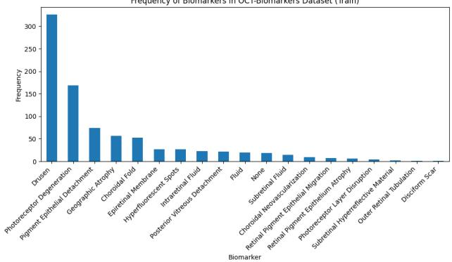  
(a) Training data distribution.

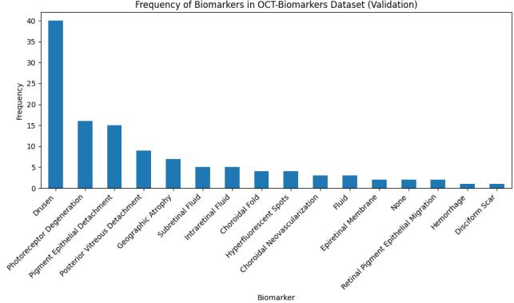  
(b) Validation data distribution.

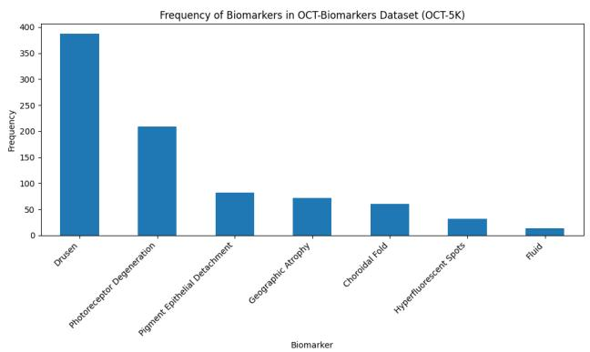  
(c) OCT-5K dataset distribution.

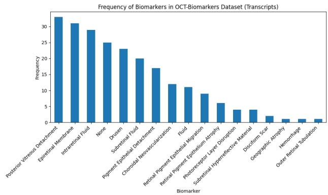  
(d) OCT transcript dataset distribution.

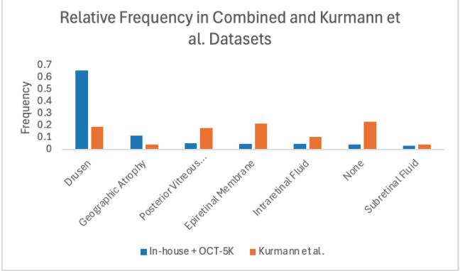  
(e) In-house vs. Kurmann et al. comparison.

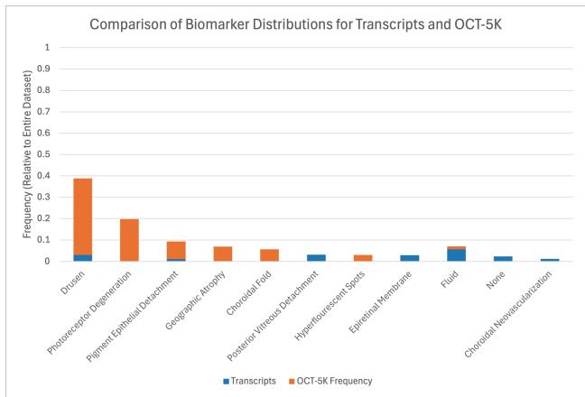  
(f) Transcript vs. OCT-5K distribution.  
Figure S1: Biomarker dataset distribution across all data splits and sources.

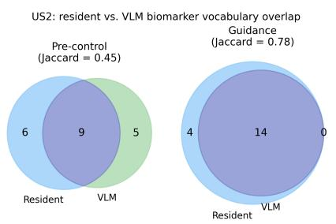  
(a) Biomarker vocabulary overlap (control vs. guidance).

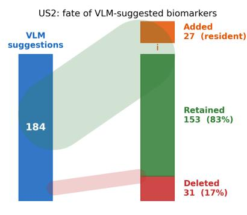  
(b) Fate of VLM-suggested biomarkers after resident review.

US2: biomarker documentation per wet AMD eye  
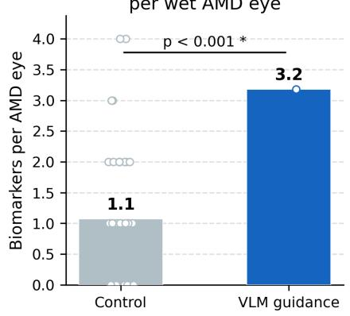  
(c) Biomarkers per AMD eye: control vs. guidance.

Figure S2: US2 VLM guidance: biomarker vocabulary and documentation analysis. Parallel to US3 results (Figure 7); retention rate (83.1%) is consistent across both studies.
<table><tr><td rowspan="7">AOI experiment Fixed effects</td><td>Variable</td><td>Coefficient</td><td>Std. Error</td><td>p</td></tr><tr><td>Intercept</td><td>22.553</td><td>2.295</td><td> $\overline { { 8 . 3 8 \times 1 0 ^ { - 1 6 } } }$ </td></tr><tr><td>AOI guidance</td><td>-6.237</td><td>2.720</td><td>0.022</td></tr><tr><td>post-guidance control</td><td>-11.351</td><td>2.806</td><td> $6 . 2 2 \times 1 0 ^ { - 5 }$ </td></tr><tr><td> ${ \bf G T } = { \bf w A M D }$ </td><td>8.847</td><td>1.091</td><td> $5 . 7 5 \times 1 0 ^ { - 1 5 }$ </td></tr><tr><td>within-block position</td><td>-0.915</td><td>0.212</td><td> $1 . 9 2 \times 1 0 ^ { - 5 }$ </td></tr><tr><td>AOI guidance:within-block position</td><td>0.585</td><td>0.299</td><td>0.051</td></tr><tr><td rowspan="3">Random effects Participant</td><td>post-guidance control:within-block position</td><td>0.595</td><td>0.308</td><td>0.054</td></tr><tr><td>Group</td><td>Name</td><td>Variance</td><td>Std. Dev.</td></tr><tr><td>Residual</td><td>Intercept</td><td>13.01 125.25</td><td>3.607</td></tr><tr><td rowspan="2">Model fit</td><td></td><td> $\overline { { R _ { m o d e l } ^ { 2 } } }$ </td><td> $\overline { { R _ { f i x e d } ^ { 2 } } }$ </td><td>11.91  $R _ { r a n d o m } ^ { 2 }$ </td></tr><tr><td></td><td>0.263</td><td>0.188</td><td>0.075</td></tr><tr><td>VLM experiment</td><td>Variable</td><td>Coefficient</td><td>Std. Error</td><td></td></tr><tr><td>Fixed effects</td><td>Intercept</td><td>26.478</td><td>6.333</td><td>p 8.44 × 10 4</td></tr><tr><td rowspan="6"></td><td>VLM guidance</td><td>-8.320</td><td></td><td></td></tr><tr><td>GT = wet AMD</td><td></td><td>6.691</td><td>0.216</td></tr><tr><td></td><td>13.036</td><td>3.296</td><td>1.34 × 10−4</td></tr><tr><td>within-block position VLM guidance:within-block position</td><td>-0.172</td><td>0.521</td><td>0.742</td></tr><tr><td></td><td>0.636</td><td>0.735</td><td>0.389</td></tr><tr><td>Group</td><td>Name</td><td>Variance</td><td>Std. Dev.</td></tr><tr><td rowspan="3">Random effects Model fit</td><td>Participant</td><td>Intercept</td><td>60.98</td><td>7.81</td></tr><tr><td>Residual</td><td></td><td>302.80</td><td>14.40</td></tr><tr><td></td><td> $\overline { { R _ { m o d e l } ^ { 2 } } }$ </td><td> $\overline { { R _ { f i x e d } ^ { 2 } } }$ </td><td> $R _ { r a n d o m } ^ { 2 }$ </td></tr></table>

Table S10: Mixed efects modeling of time spent per eye in each experimental condition of US2. “GT" = Ground Truth, $^ { 6 \bullet } \bullet \ " =$ interaction between.

## G VLM Comment Analysis

Figure S3 shows vocabulary overlap across three sets: VLM-provided biomarkers, user-provided biomarkers (control block), and usermodified VLM-provided biomarkers.

## H User Survey Questions

The following items were queried during the post-experiment surveys in US2.

## Participant Demographics

(1) Participant level of experience

(2) Participant confidence in reading OCT scans [1,4]

General UI & Control Comments

(1) What were your impressions of the system’s interface and usability?

(2) Any comments about your experience interpreting the images in the first block today?

## AOI-specific Questions

(1) How helpful was the guidance provided by the heatmaps? [1,5]

(2) Did the heatmap guidance assist you in identifying potential cases of wet AMD more eficiently? Please provide specific examples or scenarios if possible.

(3) Do you have any suggestions on how the guidance could be improved?

(4) Which of the following changes to the guidance method do you feel could improve its ability to help you interpret OCT scans? (A graphical change in how the heatmaps are presented, Heatmaps with fewer highlighted areas, Heatmaps with more highlighted areas, An auto-generated text summary of the OCT images, Ability to change the heatmap in real time)

(5) Any additional comments or feedback you would like to provide about the system and experiment?

## VLM-specific Questions

(1) How would you rate the accuracy of the text summaries? [1,5]

(2) What comments do you have about the accuracy of the text summaries?

(3) How did your workflow change when text summaries were provided?

(4) Could you see yourself using a system that auto-generates text summaries in clinical practice? Why or why not?

(5) How would the following changes to the text prompt method change its ability to help you interpret OCT scans? [1,5]: More succinct descriptions; More verbose descriptions; A confidence score on the description; Highlighted areas of relevance from which the descriptions are drawn; A conversational AI agent to interactively clarify and update the description.

(6) Any additional comments or feedback you would like to provide about the text system and experiment?

## Post-Guidance Questions

(1) In the unguided block (after the guided block), what diference did you feel in reading the OCT images?

(2) To what extent did you want the guidance back? [1,5]

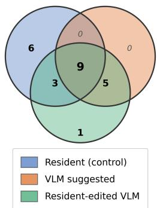  
Figure S3: Overlap of unique identified biomarkers across all VLM user study conditions.

(3) How do you feel about your eficiency in reading the OCT images in the unguided condition again?

## I US3 Post-Study Survey Questions

The following items were queried during the post-experiment survey in US3 (combined VLM+AOI guidance), administered after all three blocks.

## Likert Items (1–7 scale)

(1) The guidance was accurate enough that I felt comfortable acting on it.

(2) Compared to earlier blocks, I relied on the on-screen guidance when deciding what to do.

(3) Compared to the block right before this one, I felt less supported.

(4) Even without guidance in this block, I used things I learned from the earlier block.

(5) If I could choose, I would want the guidance from the earlier block available here.

## Open-Ended Questions

(1) Describe a moment when the guidance felt helpful.

(2) Describe a moment when the guidance felt unhelpful.

(3) After the guidance was removed, what (if anything) did you do diferently comparing to before seeing the guidance?

(4) If you could change one thing about the guidance to better fit your workflow, what would it be?

## J Proposed Biomarker-to-AOI Linking

Motivated by residents’ requests in US3 (Section 7.3), Figure S4 shows a mock-up of per-biomarker, evidence-anchored guidance: selecting a biomarker token in the findings panel highlights only that biomarker’s feature region on the active B-scan, replacing the global AOI heatmap.

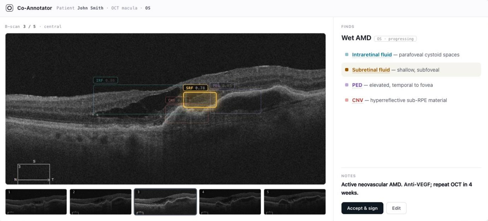  
Figure S4: Proposed per-biomarker, evidence-anchored guidance (design mock-up). Hovering or selecting a biomarker token in the findings panel (here, subretinal fluid) highlights only that biomarker’s feature region on the active B-scan, replacing the global AOI heatmap; each labeled finding is clickable and color-matched to its region. Residents requested this per-biomarker linking in US3. Biomarker locations in this figure are purely illustrative.