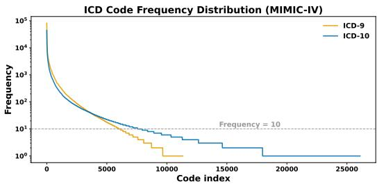
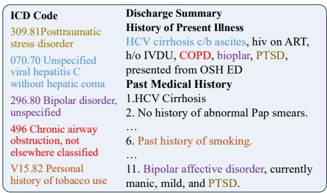
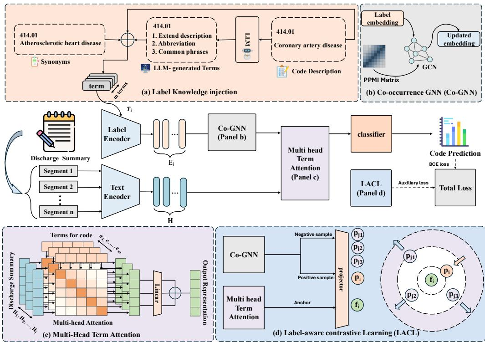
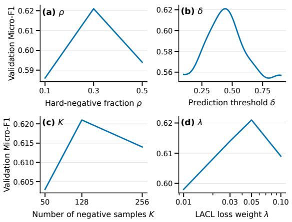

# CoLa-ICD: A Knowledge-Enhanced Framework for Long-Tail Automated Medical Coding

Yihang Cheng \* , Veronica Liesaputra , Andrew Trotman

University of Otago Dunedin, New Zealand yihang.cheng@postgrad.otago.ac.nz veronica.liesaputra@otago.ac.nz andrew.trotman@otago.ac.nz

## Abstract

Automatic medical coding assigns ICD codes to clinical notes, but it remains challenging due to long documents, imbalanced label distributions, and diverse terms. These challenges are especially severe for rare codes, which have limited training instances and are easily confused with semantically similar labels. We introduce CoLa-ICD, a knowledge-enhanced framework for long-tail prediction. CoLa-ICD enriches ICD labels with external terms, models dependencies among related codes, and learns stronger alignment between label semantics and clinical evidence for long-tail prediction. Experiments show that CoLa-ICD improves long-tail prediction with larger gains in larger and sparser label spaces and achieves state-of-the-art performance in AUC, F1, and P@k. Our code is available at https:// github.com/youwillbethebest/Cola-ICD.

## 1 Introduction

The International Classification of Diseases (ICD)1 creates a standard system for medical billing, epidemiology, and clinical analytics (Ellis et al., 2020; Feinstein et al., 2023). Automated medical coding (AMC) aims to assign multiple ICD codes to discharge summaries, posing a challenging multilabel classification problem (Stanfill et al., 2010). AMC remains difficult for two reasons (Edin et al., 2023; Huang et al., 2022). First, ICD codes follow a highly long-tailed distribution (Figure 1), with more than half appearing fewer than 10 times, making long-tail codes extremely hard to learn. Predicting long-tail ICD codes is vital for capturing rare diseases and precise clinical details that common codes overlook, ensuring equitable care and accurate medical billing. Second, clinical notes are long (1,500–2,000 words), but each ICD code is often supported by only a few localized, semantically dense cues, such as a diagnosis mention, procedure phrase, medication, or abnormal finding. Figure 2 illustrates another challenge: clinical notes may express the same concept using wording that differs from the official ICD description. For example, “History of tobacco use” could be written as “former smoker” or “quit tobacco”. This mismatch is particularly detrimental for long-tail codes, whose semantics must be inferred from a limited number of training instances.

  
Figure 1: Frequency distribution of ICD codes in MIMIC-IV: Most codes occur fewer than 10 times, illustrating the long-tailed nature of the ICD coding task.

Recent research (Ji et al., 2024; Li et al., 2025) leverages external medical knowledge to improve automated coding. Existing approaches fall into two groups: Large Language Models (LLMs) and static, task-specific methods. LLMs (e.g., Chat-GPT (Achiam et al., 2024) and Gemini (Anil et al., 2025)) provide strong medical knowledge and flexible generation. However, directly applying these generative models often leads to overfitting on highfrequency codes and generating hallucinated or incorrect codes (Falis et al., 2024; Soroush et al., 2024; Hou et al., 2025). Task-specific methods use fixed synonyms (Yuan et al., 2022; Gomes et al., 2024) or rigid hierarchical graphs (Yang et al., 2022; Zhang et al., 2025) to ground predictions. They fail to capture the diverse abbreviations, standard terms, and informal expressions found in realworld clinical notes. Furthermore, relying solely on static hierarchical distances offers limited improvement for long-tail labels, leaving models prone to confusing rare codes with similar frequent ones (Zhou et al., 2021).

  
Figure 2: A discharge summary with ICD-9 codes. Colored spans show the short evidence for each label.

To address these limitations, CoLa-ICD combines LLM-generated terms, co-occurrence relations, and label-aware contrastive learning to improve evidence-label alignment for long-tail codes.

Our contributions are summarized as follows:

• We propose a knowledge-enhanced framework that enriches label representations with LLM-generated terms, integrates a cooccurrence GNN to infuse code relations, and uses multi-head term attention to retrieve supporting evidence from clinical text. This is particularly beneficial for long-tail codes.

• We introduce a label-aware contrastive learning module that aligns clinical evidence with enriched label representations. This mechanism enforces evidence–label consistency and mitigates the bias toward high-frequency codes. This is critical for identifying long-tail and semantically similar labels.

• We achieve state-of-the-art performance on ICD-9 and ICD-10 benchmarks, with robust improvements on long-tail codes.

## 2 Related Work

## 2.1 Automatic Medical Coding

Automatic medical coding aims to assign ICD codes to discharge summaries with deep learning models. Early methods (Mullenbach et al., 2018; Chen et al., 2019; Li and Yu, 2020; Vu et al., 2020; Ji et al., 2020) use convolutional or recurrent neural networks. These approaches created strong and clear baselines.

Instead of pooling a document into a single embedding, label-wise attention measures the relevance of each token to a specific label (Mullenbach et al., 2018). LAAT (Vu et al., 2020) deepens label attention with multi-level layers, leading to better alignment between label semantics and evidence tokens in the clinical text. Follow-up works (Biswas et al., 2021; Wu et al., 2022; Edin et al., 2023) replace label-wise attention with cross-attention, enabling richer interactions between code and text.

## 2.2 Pretrained Language Models

Pretrained language models (PLMs), such as BioBERT (Lee et al., 2020) have been widely adopted for AMC (Huang et al., 2022; Yang et al., 2022). By pretraining on large-scale biomedical corpora (e.g., PubMed, MIMIC, UMLS), these models acquire domain-specific knowledge, improving the semantic representations for discharge summaries. A parallel line of work has focused on handling long clinical notes. Segment pooling (Zhang et al., 2020; Edin et al., 2024) and chunkbased strategies (Liu et al., 2023) solve the max token limitation of BERT encoders by dividing text into segments. However, while PLMs improve representation quality, they still struggle with aligning clinical evidence with ICD codes. More recently, LLMs have been explored for AMC through code generation. Although their broad biomedical knowledge and few-shot abilities make them attractive for clinical coding, recent studies show that LLMs remain unreliable for exact ICD assignment, especially on challenging MIMIC-IV cases (Soroush et al., 2024; Mustafa et al., 2025). Some studies (Hou et al., 2025; Motzfeldt et al., 2025) indicate that LLM can improve performance through task-specific adaptation, retrieval, or workflow constraints.

## 2.3 Knowledge Injection

With the development of representation learning (Zhang et al., 2026). Recent studies have improved AMC performance by enriching ICD labels with external knowledge in two ways.

For structure-based methods, MSATT-KG (Xie et al., 2019) uses Graph Convolutional Networks to capture hierarchical and semantic relationships across related codes. KEPTLongformer (Yang et al., 2022) improves representation via contrastive learning on knowledge graphs in the pretraining stage. For text-based methods, MSMN (Yuan et al., 2022) expands official ICD descriptions with multiple synonyms, each used as a unique query to match evidence in clinical texts. GKI-ICD (Zhang et al., 2025) flattens the hierarchical relations into textual label definitions, treating structure as semantic context. PLM-LLM (Wu et al., 2025) used GPT-4 to generate code synonyms, which are utilized as positive samples via contrastive learning. Different from injecting external knowledge, CoRelation (Luo et al., 2024) focuses on mining internal structural knowledge. It captures label correlations directly from clinical notes in order to enhance prediction consistency. However, the scarcity of training data hinders the model from learning stable and reliable rare code structures.

Although existing knowledge-injection methods can improve AMC performance by enriching label semantics, they only partially align with practical coding practices and often fail to address long-tail prediction. In particular, they often address either semantic sparsity in code descriptions or structural sparsity in code dependencies, but seldom model both within the same evidence-label matching process. This gap limits their ability to ground evidence, especially for long-tail cases and similar codes.

## 2.4 Contrastive Learning

Contrastive learning has been explored to enhance semantic representations for ICD labels. Hyper-Core (Cao et al., 2020) embeds documents and codes into a shared hyperbolic space to maintain hierarchical consistency between high-level codes and their subcategories. KEPTLongformer (Yang et al., 2022) uses contrastive learning that leverages the hierarchical structure of the ICD code. It treats synonyms as positive matches and hierarchical codes as negative matches to improve long-tail performance. Li et al. introduce a section-level contrastive learning method. They build groups of four samples and extract positive pairs from different sections of clinical notes. PLM-LLM (Wu et al., 2025) creates positives using LLM-generated paraphrases of the official ICD description.

These approaches enhance semantic representations and outperform non-contrastive baselines. However, most contrastive methods look at the text and label as a whole. They fail to notice short, specific pieces of evidence. These small details are necessary for accurate ICD coding (Mullenbach et al., 2018; Vu et al., 2020).

## 3 Problem Formulation

Assigning ICD codes to clinical documents can be framed as a multi-label text classification problem. Given a clinical document X, the goal is to automatically predict all relevant ICD codes from a large set of possible codes. Let $\begin{array} { r l } { \mathcal { C } } & { { } = } \end{array}$ $\{ c _ { 1 } , c _ { 2 } , \ldots , c _ { N } \}$ represent the set of all candidate ICD codes, where N is the total number of codes. Each document is associated with a binary vector

$$
Y = \{ y _ { i } \in \{ 0 , 1 \} \mid i \in \{ 1 , . . . , N \} \}\tag{1}
$$

where $y _ { i } = 1$ if code $c _ { i }$ applies to the document, and $y _ { i } = 0$ otherwise. The AMC task is challenging due to the large label space and the highly imbalanced, long-tailed distribution of code frequencies.

## 4 Methods

Our framework, illustrated in Figure 3 improves AMC from two perspectives. It strengthens label embeddings by leveraging external knowledge and code relations found in clinical documents. Furthermore, it improves semantic alignment between clinical evidence and ICD codes via contrastive learning.

## 4.1 Segment Pooling

We follow a segment method inspired by PLM-ICD (Huang et al., 2022). Given a discharge summary with $T$ tokens, we split it into $N _ { \mathrm { s e g } }$ segments. Each segment is encoded by SapBERT (Liu et al., 2021). SapBERT is pre-trained to align synonymous medical entities in UMLS, which is well-suited to handling term variation between clinical notes and ICD codes. We then concatenate the segment-level hidden states along the token dimension:

$$
H = \mathrm { c o n c a t } ( H _ { 1 } , \dots , H _ { N _ { \mathrm { s e g } } } ) \in \mathbb { R } ^ { T \times d }\tag{2}
$$

This strategy preserves all tokens in the discharge summary without truncation and enables the model to attend to evidence scattered across long documents.

## 4.2 Label Knowledge Injection

We enrich each ICD code with multiple knowledge sources to bridge the gap between sparse training data and diverse clinical expressions. Specifically, we use the Unified Medical Language System (UMLS, 2024AB release) (Bodenreider, 2004) to obtain the official ICD description $\ell _ { i }$ and synonyms $s _ { i } .$ . In addition, we query a large language model (Gemini 2.5 Flash (Comanici et al., 2025)) to generate augmented terms for each code, including abbreviations, extended definitions, and common clinical phrases. We select the term-generation strategy using the MIMIC-III validation split and keep it fixed across all datasets. The prompts and selection procedure are provided in Appendix C and D. For each code $c _ { i }$ , we build a fixed-length term list $T _ { i }$ of size m containing the description, LLM-generated expressions (abbreviations, extended descriptions, common phrases) and synonyms.

  
Figure 3: Overall architecture of CoLa-ICD. (a) Label Knowledge Injection constructs the label knowledge set $T _ { i }$ for each ICD code. The encoded terms are passed to the (b) Co-occurrence GNN, which produces knowledgeenhanced label representations $p _ { i } .$ . The GNN-updated label-term representations are then used by (c) Multi-Head Term Attention over contextual token representations to extract an evidence representation $f _ { i }$ for classification. During training, (d) Label-Aware Contrastive Learning receives $f _ { i }$ from (c) Multi-Head Term Attention as anchor and $p _ { i }$ from the (b) Co-occurrence GNN, and optimizes an auxiliary contrastive loss that pulls $f _ { i }$ toward its positive label embedding while pushing it away from negative label embeddings.

$$
T _ { i } = [ t _ { 1 } ^ { i } , \dots , t _ { m } ^ { i } ]\tag{3}
$$

Then, for each code $c _ { i }$ , we encode the term list into $E _ { i } \in \mathbb { R } ^ { m \times d }$ and flatten all code-term embeddings into $E \in \mathbb { R } ^ { ( N m ) \times d }$ for the co-occurrence graph module.

## 4.3 Co-occurrence Graph Neural Network

To capture the pattern of ICD codes in real clinical notes, we use a co-occurrence GNN module. Based on a multi-hot label matrix $Y$ over training set, we compute a co-occurrence matrix $R = \bar { Y } ^ { \top } Y ,$ where $R _ { i j }$ denotes how frequently codes $c _ { i }$ and $c _ { j }$ co-occur in the training set. Raw co-occurrence counts are often dominated by common codes that appear frequently by chance. We transform R into a PPMI matrix $A \in \mathbb { R } ^ { N \times N }$ to down-weight such frequency-driven associations and highlight meaningful dependencies.

$$
\mathrm { P P M I } ( i , j ) = \operatorname* { m a x } \left( \log \frac { \mathrm { P r } ( i , j ) } { \mathrm { P r } ( i ) \mathrm { P r } ( j ) } , 0 \right)\tag{4}
$$

where $\Pr ( i )$ and $\operatorname* { P r } ( j )$ denote the marginal probabilities of codes $c _ { i }$ and $c _ { j }$ , and $\operatorname* { P r } ( i , j )$ denotes their joint probability. For each code node, we retain the top 10 edges with the highest PPMI values, based on validation performance. To convert the PPMI matrix into an adjacency matrix suitable for GNN, we expand A into a term-level matrix $A ~ \in ~ \mathbb { R } ^ { ( N m ) \times ( N \hat { m } ) }$ . For each head $h ,$ , edges are added only between the corresponding $h ^ { \mathrm { t h } }$ terms of co-occurring codes. We then add self-loops:

$$
\hat { A } = D ^ { - \frac { 1 } { 2 } } ( A + I ) D ^ { - \frac { 1 } { 2 } }\tag{5}
$$

where I is the identity matrix and $D$ denotes the degree matrix. Then, we use term embedding E as input for a two-layer GCN.

$$
Z = \hat { A } \sigma \Big ( \hat { A } E W _ { 0 } \Big ) W _ { 1 }\tag{6}
$$

where $W _ { 0 }$ and $W _ { 1 }$ are trainable weights. The updated embedding $Z$ is subsequently fed into the Multi-head term attention module.

## 4.4 Multi-head Term Attention

To extract evidence with multiple semantic views, we adopt a multi-head mechanism. The key idea is to treat m terms associated with code $c _ { i }$ as distinct queries to extract relevant information from clinical notes. Given the document representation $H \in \mathbb { R } ^ { T \times d }$ , we split it into m heads based on the number of terms. Each head corresponds to a subspace representation $H ^ { ( h ) } \in \mathbb { R } ^ { T \times \frac { d } { m } }$

Let $E _ { i } = \{ e _ { 1 } ^ { i } , \ldots , e _ { m } ^ { i } \}$ denote the embeddings of the m terms for code $c _ { i }$ , where $e _ { h } ^ { i } \in \mathbb { R } ^ { d }$ . The projection $W _ { Q } e _ { h } ^ { i } \in \mathbb { R } ^ { d / m }$ matches the dimensionality of the corresponding head representation $H ^ { ( h ) }$ . For the $h ^ { \mathrm { t h } }$ head, which corresponds to $e _ { h } ^ { i }$ , we compute the attention scores over the document tokens.

$$
\alpha _ { i } ^ { ( h ) } = \mathrm { s o f t m a x } \big ( W _ { Q } e _ { h } ^ { i } \cdot \operatorname { t a n h } ( W _ { H } H ^ { ( h ) } ) ^ { \top } \big )\tag{7}
$$

The evidence representation for head h is then obtained by aggregating the subspace information

$$
v _ { i } ^ { ( h ) } = \alpha _ { i } ^ { ( h ) } H ^ { ( h ) } \in \mathbb { R } ^ { d / m }\tag{8}
$$

We then concatenate evidence from all heads to form the final evidence representation $f _ { i }$

$$
f _ { i } = \mathrm { c o n c a t } ( v _ { i } ^ { 1 } , v _ { i } ^ { 2 } , . . . , v _ { i } ^ { m } ) \in \mathbb { R } ^ { d }\tag{9}
$$

Finally, $f _ { i }$ is passed through a multi-layer perceptron (MLP) followed by a sigmoid activation to produce the prediction score for code $c _ { i } { : }$

$$
\hat { y } _ { i } = \sigma \big ( \mathrm { M L P } ( f _ { i } ) \big ) .\tag{10}
$$

and the same evidence embedding $f _ { i }$ is used as the anchor representation in the label-aware contrastive learning.

## 4.5 Label-Aware Contrastive Learning

To align clinical evidence with the semantics of ICD labels, we introduce a Label-Aware Contrastive Learning (LACL) module. Given a discharge summary X and a candidate label $c _ { i }$ , the multi-head term attention module extracts an evidence embedding $f _ { i }$ that serves as the anchor. We obtain a knowledge-enhanced embedding $p _ { i }$ for each code based on the GCN-updated representations derived from the label knowledge $T _ { i }$

For each pair $( f _ { i } , p _ { i } )$ , we construct a contrastive candidate set $P ,$ consisting of all positive labels and K negative labels. We first compute the cosine similarities between the anchor $f _ { i }$ and all candidate label embeddings. To identify hard negatives $\mathcal { N } _ { i } ^ { \mathrm { h a r d } }$ , we exclude positive label $p _ { i }$ and select the top $\lfloor \rho K \rfloor$ with the highest similarity scores. These codes are semantically close to the anchor, but they are incorrect. The remaining $K - \lfloor \rho K \rfloor$ negatives are uniformly sampled. This hard-negative mining strategy forces the model to distinguish evidence representations for semantically similar codes.

The LACL loss is:

$$
\mathcal { L } _ { L A C L } = - \log \frac { \exp \left( { \sin ( f _ { i } , p _ { i } ) / \tau } \right) } { \sum _ { j \in P } \exp \left( { \sin ( f _ { i } , p _ { j } ) / \tau } \right) }\tag{11}
$$

where sim $( \cdot , \cdot )$ denotes cosine similarity and τ is a temperature hyperparameter. This evidence–label contrast regularizes the attention-extracted evidence $f _ { i }$ to be consistent with the corresponding knowledge-enhanced label embedding $p _ { i }$ , while pushing it away from other label semantics.

## 4.6 Training Objective

Our model performs multi-label classification with one sigmoid output per ICD code. For a document with ground-truth label vector $y \in \{ 0 , 1 \} ^ { N }$ and predicted probabilities $\hat { y } \in [ 0 , 1 ] ^ { N }$ , we use the binary cross-entropy loss:

$$
\mathcal { L } _ { \mathrm { B C E } } = - \frac { 1 } { N } \sum _ { i = 1 } ^ { N } \Big [ y _ { i } \log ( \hat { y } _ { i } ) + ( 1 - y _ { i } ) \log ( 1 - \hat { y } _ { i } ) \Big ] ,\tag{12}
$$

where $\hat { y } _ { i }$ is the predicted probability that code $c _ { i }$ applies to the document and $y _ { i }$ is its ground-truth label.

To further enforce semantic consistency between textual evidence and enriched label representations, we add the label-aware contrastive learning loss defined in Section 4.5. The overall training objective is

$$
\begin{array} { r } { \mathcal { L } = \mathcal { L } _ { \mathrm { B C E } } + \lambda \mathcal { L } _ { \mathrm { L A C L } } , } \end{array}\tag{13}
$$

where $\lambda$ is the weight of the contrastive learning. In our experiments, we set λ = 0.05 based on performance on validation set. This value was selected

<table><tr><td>Dataset</td><td>Code Freq.</td><td>Code Num.</td><td>PLM-CA</td><td>MSMN</td><td>GKI-ICD</td><td>CoLa-ICD (Ours)</td></tr><tr><td rowspan="5">MIMIC-III ICD-9</td><td>&gt;500</td><td>(283)</td><td>0.684</td><td>0.658</td><td>0.687</td><td>0.693*</td></tr><tr><td>101-500</td><td>(737)</td><td>0.508</td><td>0.461</td><td>0.509</td><td> $\mathbf { 0 . 5 1 3 } ^ { \ast }$ </td></tr><tr><td>51-100</td><td>(513)</td><td>0.413</td><td>0.332</td><td>0.420</td><td> $\mathbf { 0 . 4 2 7 } ^ { * }$ </td></tr><tr><td>11-50</td><td>(1823)</td><td>0.293</td><td>0.227</td><td>0.322</td><td> $\mathbf { 0 . 3 3 8 } ^ { * }$ </td></tr><tr><td>1-10</td><td>(5336)</td><td>0.029</td><td>0.070</td><td>0.132</td><td> $\mathbf { 0 . 1 9 4 } ^ { \ast }$ </td></tr><tr><td rowspan="5">MIMIC-IV ICD-10</td><td>&gt;500</td><td>(480)</td><td>0.598</td><td>0.618</td><td>0.632</td><td>0.659*</td></tr><tr><td>101-500</td><td>(1067)</td><td>0.425</td><td>0.451</td><td>0.466</td><td> $\mathbf { 0 . 4 9 8 } ^ { \ast }$ </td></tr><tr><td>51-100</td><td>(960)</td><td>0.273</td><td>0.354</td><td>0.398</td><td> $\mathbf { 0 . 4 2 6 } ^ { \ast }$ </td></tr><tr><td>11-50</td><td>(3906)</td><td>0.153</td><td>0.272</td><td>0.303</td><td>0.359 8</td></tr><tr><td>1-10</td><td>(19532)</td><td>0.023</td><td>0.095</td><td>0.127</td><td>0.204 业</td></tr></table>

Table 1: Across both MIMIC-III and IV, our CoLa-ICD significantly outperforms existing approaches in frequencybucket Micro-F1. \* denotes $p < 0 . 0 5$ after Holm-Bonferroni correction under the Wilcoxon signed-rank test.

to balance the magnitude differences between the two loss terms.

## 5 Experiments

## 5.1 Datasets

We focus on the commonly used MIMIC-III ICD-9 (Johnson et al., 2016) and MIMIC-IV ICD-10 (Johnson et al., 2023) datasets, and follow Mullenbach et al.; Edin et al.’s protocol to obtain all datasets (dataset statistics are provided in Appendix B.1). MIMIC-IV ICD-10 contains a larger and sparser code space than MIMIC-III ICD-9, intensifying the long-tail challenge. We report MIMIC-III Top50 and MIMIC-IV ICD-9 results in Appendix B for comparability with prior work.

## 5.2 Metrics

We report Micro-F1 and Macro-F1 as classification metrics, Micro-AUC and Macro-AUC as discrimination metrics, and Precision@k as ranking metrics. Following prior work on ICD coding (Mullenbach et al., 2018), we set $k = 8$ and 15 for evaluation on the full MIMIC-III dataset. For the MIMIC-IV ICD-10, we use $k = 8$

## 5.3 Implementation Details

We implement CoLa-ICD using PyTorch (Paszke et al., 2019) on a single NVIDIA A100 80GB GPU. We optimize the model with AdamW, using an initial learning rate of $2 \times 1 0 ^ { - 5 }$ , a batch size of 6, cosine annealing with 2,000 warm-up steps, and early stopping over at most 20 epochs. For LACL, we set the hard-negative fraction $\rho = 0 . 3 { \mathrm { : } }$ , temperature $\tau = 0 . 1$ , and number of negative samples K = 128 for the main full-label experiments. The prediction threshold is selected on the validation set by maximizing Micro-F1. All experiments are repeated with ten random seeds, and we report the average performance. Additional hyperparameter details are provided in Appendix A.

We compare CoLa-ICD against two categories of baselines. The first category includes models without knowledge injection, including CAML (Mullenbach et al., 2018), PLM-ICD (Huang et al., 2022), and PLM-CA (Edin et al., 2024). The second category includes knowledge-enhanced methods, including MSMN (Yuan et al., 2022), KEPTLongformer (Yang et al., 2022), CoRelation (Luo et al., 2024), and GKI-ICD (Zhang et al., 2025).

## 5.4 Results

## 5.4.1 Performance on Long-tailed Codes

Because CoLa-ICD is designed to improve coding under label sparsity, we first evaluate Micro-F1 across five training-frequency buckets. Table 1 shows that CoLa-ICD achieves the highest Micro-F1 across all frequency buckets on both MIMIC-III ICD-9 and MIMIC-IV ICD-10. This result indicates that the proposed framework remains effective not only on the standard ICD-9 benchmark, but also under the larger ICD-10 label space.

The improvements are particularly clear in longtail codes. On MIMIC-IV ICD-10, CoLa-ICD improves over GKI-ICD by 0.056 and 0.077 in the 11– 50 and 1–10 buckets, respectively. A similar pattern appears on MIMIC-III ICD-9, where CoLa-ICD improves the 1–10 bucket from 0.132 to 0.194. These results suggest that knowledge-enhanced evidencelabel alignment helps the model distinguish rare codes.

## 5.4.2 Overall Performance

We report overall performance to assess whether the long-tail gains come at the cost of standard fulllabel evaluation. Table 2 reports the main results on ICD-9 and ICD-10. Overall, CoLa-ICD achieves the best performance on both datasets. On ICD-9,

<table><tr><td rowspan="3">Models</td><td colspan="6">MIMIC-III ICD-9</td><td colspan="6">MIMIC-IV ICD-10</td></tr><tr><td colspan="2">AUC</td><td colspan="2">F1</td><td colspan="2">P@K</td><td colspan="2">AUC</td><td colspan="2">F1</td><td rowspan="2">P@8</td></tr><tr><td>Macro</td><td>Micro</td><td>Macro</td><td>Micro</td><td>P@8</td><td>P@15</td><td>Macro</td><td>Micro</td><td>Macro</td><td>Micro</td></tr><tr><td>CAML (Mullenbach et al., 2018)</td><td>0.895</td><td>0.986</td><td>0.088</td><td>0.539</td><td>0.709</td><td>0.561</td><td>0.899</td><td>0.988</td><td>0.046</td><td>0.527</td><td>0.644</td></tr><tr><td>MSMN (Yuan et al., 2022)</td><td>0.950</td><td>0.992</td><td>0.103</td><td>0.584</td><td>0.752</td><td>0.599</td><td>0.971</td><td>0.996</td><td>0.054</td><td>0.559</td><td>0.677</td></tr><tr><td>KEPTLongformer (Yang et al., 2022)</td><td></td><td></td><td>0.118</td><td>0.599</td><td>0.771</td><td>0.615</td><td></td><td></td><td></td><td></td><td></td></tr><tr><td>PLM-ICD (Huang et al., 2022)</td><td>0.926</td><td>0.989</td><td>0.104</td><td>0.598</td><td>0.771</td><td>0.613</td><td>0.919</td><td>0.990</td><td>0.049</td><td>0.567</td><td>0.695</td></tr><tr><td>PLM-CA (Edin et al., 2024)</td><td>0.916</td><td>0.989</td><td>0.103</td><td>0.599</td><td>0.772</td><td>0.616</td><td>0.920</td><td>0.990</td><td>0.052</td><td>0.570</td><td>0.699</td></tr><tr><td>CoRelation (Luo et al., 2024)</td><td>0.952</td><td>0.992</td><td>0.102</td><td>0.591</td><td>0.762</td><td>0.607</td><td>0.972</td><td>0.996</td><td>0.063</td><td>0.578</td><td>0.700</td></tr><tr><td>GKI-ICD (Zhang et al., 2025)</td><td>0.962</td><td>0.993</td><td>0.123</td><td>0.612</td><td>0.777</td><td>0.624</td><td>0.971</td><td>0.997</td><td>0.069</td><td>0.579</td><td>0.702</td></tr><tr><td>CoLa-ICD (Ours)</td><td>0.969*</td><td>0.998</td><td>0.135</td><td>0.621</td><td>0.781*</td><td>0.633</td><td>0.977*</td><td>0.997</td><td>0.108*</td><td>0.600*</td><td>0.723*</td></tr></table>

Table 2: Results on MIMIC-III and MIMIC-IV. The best scores among all models for each metric are highlighted in bold and underlined numbers denote the second-best. \* denotes p < 0.05 after Holm-Bonferroni correction under the Wilcoxon signed-rank test.

CoLa-ICD obtains the highest Macro-F1 (0.135), Micro-F1 (0.621), P@8 (0.781), and P@15 (0.633), outperforming the strongest knowledge-enhanced baseline.

MIMIC-IV ICD-10 evaluates CoLa-ICD under a larger and sparser label space. CoLa-ICD obtains the best Macro-F1 (0.108), Micro-F1 (0.600), and P@8 (0.723), improving over the strongest baseline by 0.039, 0.021, and 0.021 absolute points, respectively. These results provide additional evidence under an ICD-10 label space. Nevertheless, the Macro-F1 remains low and should be interpreted with care, as MIMIC datasets are strongly affected by long-tailed label distributions and rarecode sparsity (Edin et al., 2023).

## 6 Analysis & Discussion

## 6.1 Ablation Study

We conduct ablation studies on both MIMIC-III ICD-9 and MIMIC-IV ICD-10 to examine whether each component contributes consistently across different ICD label spaces. Table 3 shows that the full CoLa-ICD model achieves the best F1 and rare-code performance on both datasets. Removing any component reduces Macro-F1, Micro-F1, P@8, and Rare Micro-F1, indicating that label knowledge, evidence-label alignment, and code-relation provide gains.

Effect of Knowledge Injection. Knowledge injection makes the largest contribution to rare-code prediction. Removing it reduces Rare Micro-F1 from 0.194 to 0.153 on ICD-9 and from 0.204 to 0.155 on ICD-10. The larger drop in ICD-10 suggests that enriched label semantics become more important as the label space grows.

Effect of Label-Aware Contrastive Learning. Removing LACL consistently degrades F1 and rare-code performance on both datasets. For Rare Micro-F1, removing LACL produces drops of 0.027 on ICD-9 and 0.031 on ICD-10. This result supports the role of LACL in improving alignment between evidence and labels. LACL helps the model distinguish clinically similar ICD codes.

Effect of the Co-occurrence GNN. Removing the co-occurrence GNN leads to drops across the reported metrics. For Rare Micro-F1, removing it produces drops of 0.02 on ICD-9 and 0.023 on ICD-10. This suggests that code relation provides structural information, thereby improving prediction among correlated ICD codes.

## 6.2 Evidence Utility of Attention-Selected Spans

To investigate whether CoLa-ICD selects relevant evidence, we conduct a span removal test. If the selected span supports evidence-label alignment, removing it should result in a larger decrease in the target-code predicted probability than removing a random span. For each target code, we remove the span with the highest attention weight for that code and measure the resulting drop in the target code predicted probability. In our implementation, a span is defined as a contiguous 5 token window in the tokenized input. We select the window with the largest attention scores and measure the decrease in the probability after removing it. As a control, we remove a window of the same length as the one sampled in the document

Table 4 shows that attention-selected spans are more prediction-relevant than arbitrary text. For CoLa-ICD, removing the Top-1 attended span causes a larger drop in target-code predicted probability than removing a random span. This result suggests that the attention module selects spans that are helpful for the ICD decisions.

<table><tr><td rowspan="2">Model</td><td colspan="4">MIMIC-III ICD-9</td><td colspan="4">MIMIC-IV ICD-10</td></tr><tr><td>Macro-F1 Micro-F1</td><td></td><td>P@8</td><td>Rare Micro-F1 Macro-F1 Micro-F1</td><td></td><td></td><td>P@8</td><td>Rare Micro-F1</td></tr><tr><td>CoLa-ICD</td><td>0.135*</td><td>0.621</td><td>0.781*</td><td>0.194*</td><td>0.108*</td><td>0.600*</td><td>0.723*</td><td>0.204*</td></tr><tr><td>w/o LACL</td><td>0.121</td><td>0.600</td><td>0.760</td><td>0.167</td><td>0.087</td><td>0.583</td><td>0.708</td><td>0.173</td></tr><tr><td>w/o KI</td><td>0.105</td><td>0.588</td><td>0.754</td><td>0.153</td><td>0.070</td><td>0.569</td><td>0.697</td><td>0.155</td></tr><tr><td>w/o co-GNN</td><td>0.128</td><td>0.602</td><td>0.767</td><td>0.174</td><td>0.091</td><td>0.589</td><td>0.710</td><td>0.181</td></tr></table>

Table 3: Ablation study on MIMIC-III ICD-9 and MIMIC-IV ICD-10. Rare Micro-F1 denotes Micro-F1 computed on codes in the 1–10 training-frequency bucket. “w/o” denotes removing one component from CoLa-ICD. KI denotes knowledge injection, LACL denotes label-aware contrastive learning, and co-GNN denotes the co-occurrence GNN. denotes $p < 0 . 0 5$ after Holm-Bonferroni correction under the Wilcoxon signed-rank test.

<table><tr><td rowspan="2">Model</td><td colspan="3">All codes</td><td colspan="3">Rare codes</td></tr><tr><td>Top-1</td><td>Random</td><td>Gap</td><td>Top-1</td><td>Random</td><td>Gap</td></tr><tr><td>CoLa-ICD</td><td>0.097</td><td>0.023</td><td>+0.074*</td><td>0.113</td><td>0.037</td><td>+0.076*</td></tr><tr><td>w/o KI</td><td>0.073</td><td>0.025</td><td>+0.048*</td><td>0.091</td><td>0.031</td><td>+0.060*</td></tr><tr><td>w/o LACL</td><td>0.053</td><td>0.024</td><td>+0.029*</td><td>0.089</td><td>0.033</td><td>+0.056*</td></tr><tr><td>w/o co-GNN</td><td>0.046</td><td>0.019</td><td>+0.027*</td><td>0.075</td><td>0.029</td><td>+0.046*</td></tr></table>

Table 4: Span-removal intervention on attention-selected evidence. Values are drops in the target-code predicted probability after removing either the top-attended span (Top-1) or a random span (Random). Gap denotes Top-1 minus Random; larger gaps indicate stronger predictionrelevant evidence. \* denotes $p \ < \ 0 . 0 5$ after Holm-Bonferroni correction under the Wilcoxon signed-rank test.

The effect is stronger for rare codes. For CoLa-ICD, removing the top-attended rare-code span lowers the target-code predicted probability by 0.113, compared with 0.097 overall and 0.037 under random rare-code span removal. This suggests that rare-code predictions rely on code-specific evidence. This aligns with the long-tail setting, where rare labels benefit from precise evidencelabel alignment.

The Top-1–Random gap is also the largest for the full CoLa-ICD model. Removing KI, LACL, or the co-occurrence GNN reduces the overall gap from 0.074 to 0.048, 0.029, and 0.027, respectively. A similar pattern appears for rare codes. These results suggest that the proposed components do not merely improve classification scores but also help the model select spans with stronger predictive utility.

## 6.3 Case Study

We compare CoLa-ICD with GKI-ICD, the strongest baseline in our experiments, to examine whether the performance gains are accompanied by more prediction-relevant evidence selection. The selected case includes one frequent code and two long-tail codes, allowing us to compare evidence patterns across different label-frequency regimes.

<table><tr><td>Discharge Summary </td><td colspan="2">Assigned code Frequency</td></tr><tr><td></td><td>45.13</td><td>&gt;500</td></tr><tr><td></td><td>E950.7 983.9</td><td>&lt;10 &lt;10</td></tr><tr><td>Predicted code 983.9 Toxic effect of caustic 45.13 Other endoscopy of small intestine E950.7 Suicide and self-inflicted poisoning by corrosive and caustic substances</td><td colspan="2">Evidence ... actual drinking of bleach... ... EGD to stomach antrum... ...Suicidal attempt caustic gastritis.</td></tr><tr><td>Predicted code 45.13</td><td>Evidence</td><td>... EGD to stomach antrum...</td></tr><tr><td>300.4</td><td>Other endoscopy of small intestine dysthymic disorder</td><td>..depressed over past two months...</td></tr></table>

Figure 4: Case study on MIMIC-III dataset. Visualization of token-level evidence from our model and a knowledge-injection baseline (GKI-ICD). Highlighted tokens indicate those with the highest attention weights, serving as evidence.

For the frequent code 45.13, CoLa-ICD focuses on a broader range of clinical cues. This behavior indicates that the model aggregates multiple supportive signals. In contrast, GKI-ICD focuses on single tokens, such as "antrum", due to co-occurrence bias. However, these tokens have limited relevance to small intestine endoscopy.

For the long-tail code 983.9, CoLa-ICD identifies the key phrase "actual drinking of bleach". Our model connects it to the broader concept of caustic exposure. GKI-ICD failed to predict the correct code. For E950.7, CoLa-ICD uses the phrase “suicidal attempt” in the context to match self-inflicted poisoning. This procedure facilitates precise predictions for both frequent and long-tail codes.

## 7 Conclusion

We introduced CoLa-ICD, a knowledge-enhanced framework for long-tail automated medical coding. CoLa-ICD enriches ICD label representations with synonyms and LLM-generated terms, models code relations with a co-occurrence GNN, and aligns clinical evidence with label semantics through multi-head term attention and label-aware contrastive learning. Experiments on ICD-9 and ICD-

10 datasets show that CoLa-ICD improves overall coding performance. These findings suggest that knowledge-enhanced evidence-label alignment is a promising direction for rare-code prediction in automated medical coding.

## 8 Limitations

Although CoLa-ICD is evaluated on both ICD-9 and ICD-10, the experiments are limited to the MIMIC datasets. The MIMIC datasets are derived from a single medical center and primarily reflect ICU discharge summaries. Performance may vary across institutions, specialties, and note types. In addition, evaluation is affected by splits in prior work. Many codes appear only a few times in the training set, which makes performance sensitive to split composition. Finally, ICD coding is influenced by administrative and billing requirements, so the target labels may not always correspond perfectly to explicitly stated clinical evidence in the note.

## References

Josh Achiam, Sandhini Agarwal, Lama Ahmad, Ilge Akkaya, Florencia Leoni Aleman, Diogo Almeida, Janko Altenschmidt, Sam Altman, Shyamal Anadkat, Red Avila, Igor Babuschkin, Suchir Balaji, Valerie Balcom, Paul Baltescu, Haiming Bao, Mohammad Bavarian, Jeff Belgum, Irwan Bello, Jake Berdine, and 260 others. 2024. GPT-4 Technical Report. arXiv preprint. ArXiv:2303.08774 [cs].

Rohan Anil, Jean-Baptiste Alayrac, Jiahui Yu, Radu Soricut, Johan Schalkwyk, Andrew M. Dai, Anja Hauth, Katie Millican, David Silver, Melvin Johnson, Ioannis Antonoglou, Julian Schrittwieser, Amelia Glaese, Jilin Chen, Emily Pitler, Timothy Lillicrap, Angeliki Lazaridou, Orhan Firat, James Molloy, and 1330 others. 2025. Gemini: A Family of Highly Capable Multimodal Models. arXiv preprint. ArXiv:2312.11805 [cs].

Biplob Biswas, Thai-Hoang Pham, and Ping Zhang. 2021. TransICD: Transformer Based Code-Wise Attention Model for Explainable ICD Coding. In Artificial Intelligence in Medicine: 19th International Conference on Artificial Intelligence in Medicine, AIME 2021, Virtual Event, June 15–18, 2021, Proceedings, pages 469–478.

Olivier Bodenreider. 2004. The Unified Medical Language System (UMLS): integrating biomedical terminology. Nucleic Acids Research, 32(suppl\_1):D267– D270.

Pengfei Cao, Yubo Chen, Kang Liu, Jun Zhao, Shengping Liu, and Weifeng Chong. 2020. HyperCore:

Hyperbolic and Co-graph Representation for Automatic ICD Coding. In Proceedings of the 58th Annual Meeting ofthe Associationfor Computational Linguistics, pages 3105–3114, Online. Association for Computational Linguistics.

Jie Chen, Fei Teng, Zheng Ma, Li Chen, Lufei Huang, and Xuan Li. 2019. A Multi-channel Convolutional Neural Network for ICD Coding. In IEEE 14th International Conference on Intelligent Systems and Knowledge Engineering (ISKE), pages 1178–1184.

Gheorghe Comanici, Eric Bieber, Mike Schaekermann, Ice Pasupat, Noveen Sachdeva, Inderjit Dhillon, Marcel Blistein, Ori Ram, Dan Zhang, Evan Rosen, Luke Marris, Sam Petulla, Colin Gaffney, Asaf Aharoni, Nathan Lintz, Tiago Cardal Pais, Henrik Jacobsson, Idan Szpektor, Nan-Jiang Jiang, and 3290 others. 2025. Gemini 2.5: Pushing the Frontier with Advanced Reasoning, Multimodality, Long Context, and Next Generation Agentic Capabilities. arXiv preprint.

Joakim Edin, Alexander Junge, Jakob D. Havtorn, Lasse Borgholt, Maria Maistro, Tuukka Ruotsalo, and Lars Maaløe. 2023. Automated Medical Coding on MIMIC-III and MIMIC-IV: A Critical Review and Replicability Study. In Proceedings ofthe 46th International ACM SIGIR Conference on Research and Development in Information Retrieval, SIGIR ’23, pages 2572–2582.

Joakim Edin, Maria Maistro, Lars Maaløe, Lasse Borgholt, Jakob Drachmann Havtorn, and Tuukka Ruotsalo. 2024. An Unsupervised Approach to Achieve Supervised-Level Explainability in Healthcare Records. In Proceedings of the 2024 Conference on Empirical Methods in Natural Language Processing, pages 4869–4890.

Randall P. Ellis, Heather E. Hsu, Chenlu Song, Tzu-Chun Kuo, Bruno Martins, Jeffrey J. Siracuse, Ying Liu, and Arlene S. Ash. 2020. Diagnostic Category Prevalence in 3 Classification Systems Across the Transition to the International Classification of Diseases, Tenth Revision, Clinical Modification. JAMA network open, 3(4):e202280.

Matúš Falis, Aryo Pradipta Gema, Hang Dong, Luke Daines, Siddharth Basetti, Michael Holder, Rose S. Penfold, Alexandra Birch, and Beatrice Alex. 2024. Can GPT-3.5 generate and code discharge summaries? Journal ofthe American Medical Informatics Association, 31(10):2284–2293.

James A. Feinstein, Peter J. Gill, and Brett R. Anderson. 2023. Preparing for the International Classification of Diseases, 11th Revision (ICD-11) in the US Health Care System. JAMA healthforum, 4(7):e232253.

Tianyu Gao, Xingcheng Yao, and Danqi Chen. 2021. SimCSE: Simple Contrastive Learning of Sentence Embeddings. In Proceedings ofthe 2021 Conference on Empirical Methods in Natural Language Processing, pages 6894–6910.

Goncalo Gomes, Isabel Coutinho, and Bruno Martins. 2024. Accurate and Well-Calibrated ICD Code Assignment Through Attention Over Diverse Label Embeddings. In Proceedings of the 18th Conference of the European Chapter ofthe Associationfor Computational Linguistics (Volume 1: Long Papers), pages 2302–2315.

Zhen Hou, Hao Liu, Jiang Bian, Xing He, and Yan Zhuang. 2025. Enhancing medical coding efficiency through domain-specific fine-tuned large language models. npj Health Systems, 2(1):14.

Chao-Wei Huang, Shang-Chi Tsai, and Yun-Nung Chen. 2022. PLM-ICD: Automatic ICD Coding with Pretrained Language Models. In Proceedings of the 4th Clinical Natural Language Processing Workshop, pages 10–20.

Shaoxiong Ji, Erik Cambria, and Pekka Marttinen. 2020. Dilated Convolutional Attention Network for Medical Code Assignment from Clinical Text. In Proceedings ofthe 3rd Clinical Natural Language Processing Workshop, pages 73–78.

Shaoxiong Ji, Xiaobo Li, Wei Sun, Hang Dong, Ara Taalas, Yijia Zhang, Honghan Wu, Esa Pitkänen, and Pekka Marttinen. 2024. A Unified Review of Deep Learning for Automated Medical Coding. ACM Computing Surveys.

Alistair E. W. Johnson, Lucas Bulgarelli, Lu Shen, Alvin Gayles, Ayad Shammout, Steven Horng, Tom J. Pollard, Sicheng Hao, Benjamin Moody, and Brian Gow. 2023. MIMIC-IV, a freely accessible electronic health record dataset. Scientific Data, 10(1):1.

Alistair E. W. Johnson, Tom J. Pollard, Lu Shen, Li Wei H. Lehman, Mengling Feng, Mohammad Ghassemi, Benjamin Moody, Peter Szolovits, Leo Anthony Celi, and Roger G. Mark. 2016. MIMIC-III, a freely accessible critical care database. Scientific Data, 3.

Jinhyuk Lee, Wonjin Yoon, Sungdong Kim, Donghyeon Kim, Sunkyu Kim, Chan Ho So, and Jaewoo Kang. 2020. BioBERT: a pre-trained biomedical language representation model for biomedical text mining. Bioinformatics, 36(4):1234–1240.

Fei Li and Hong Yu. 2020. ICD coding from clinical text using multi-filter residual convolutional neural network. In Proceedings ofthe AAAI Conference on Artificial Intelligence, volume 34, pages 8180–8187.

Xiaobo Li, Yijia Zhang, Xiaodi Hou, Shilong Wang, and Hongfei Lin. 2025. Deep learning for automatic ICD coding: Review, opportunities and challenges. Artificial Intelligence in Medicine, 168:103187.

Xinhang Li, Xiangyu Zhao, Yong Zhang, and Chunxiao Xing. 2023. Towards Automatic ICD Coding via Knowledge Enhanced Multi-Task Learning. In Proceedings ofthe 32nd ACM International Conference on Information and Knowledge Management, pages 1238–1248.

Fangyu Liu, Ehsan Shareghi, Zaiqiao Meng, Marco Basaldella, and Nigel Collier. 2021. Self-Alignment Pretraining for Biomedical Entity Representations. In Proceedings of the 2021 Conference of the North American Chapter of the Association for Computational Linguistics: Human Language Technologies, pages 4228–4238.

Leibo Liu, Oscar Perez-Concha, Anthony Nguyen, Vicki Bennett, and Louisa Jorm. 2023. Automated ICD coding using extreme multi-label long text transformer-based models. Artificial Intelligence in Medicine, 144.

Junyu Luo, Xiaochen Wang, Jiaqi Wang, Aofei Chang, Yaqing Wang, and Fenglong Ma. 2024. CoRelation: Boosting Automatic ICD Coding through Contextualized Code Relation Learning. In Proceedings of the 2024 Joint International Conference on Computational Linguistics, Language Resources and Evaluation (LREC-COLING 2024), pages 3997–4007.

Andreas Geert Motzfeldt, Joakim Edin, Casper L. Christensen, Christian Hardmeier, Lars Maaløe, and Anna Rogers. 2025. Code like humans: A multi-agent solution for medical coding. In Findings ofthe Associationfor Computational Linguistics: EMNLP 2025, pages 22612–22627. Association for Computational Linguistics.

James Mullenbach, Sarah Wiegreffe, Jon Duke, Jimeng Sun, and Jacob Eisenstein. 2018. Explainable Prediction of Medical Codes from Clinical Text. In Proceedings of the 2018 Conference of the North American Chapter of the Association for Computational Linguistics: Human Language Technologies, Volume 1 (Long Papers), pages 1101–1111.

Akram Mustafa, Usman Naseem, and Mostafa Rahimi Azghadi. 2025. Large language models vs human for classifying clinical documents. International Journal ofMedical Informatics, 195:105800.

A. Paszke, S. Gross, F. Massa, A. Lerer, J. Bradbury, G. Chanan, T. Killeen, Z. Lin, N. Gimelshein, L. Antiga, A. Desmaison, A. Köpf, E. Z. Yang, Z. DeVito, M. Raison, A. Tejani, S. Chilamkurthy, B. Steiner, L. Fang, and 2 others. 2019. PyTorch: An Imperative Style, High-Performance Deep Learning Library. In Advances in Neural Information Processing Systems, pages 8024–8035.

Ali Soroush, Benjamin S. Glicksberg, Eyal Zimlichman, Yiftach Barash, Robert Freeman, Alexander W. Charney, Girish N Nadkarni, and Eyal Klang. 2024. Large Language Models Are Poor Medical Coders — Benchmarking of Medical Code Querying. NEJM AI, 1(5):AIdbp2300040.

Mary H Stanfill, Margaret Williams, Susan H Fenton, Robert A Jenders, and William R Hersh. 2010. A systematic literature review of automated clinical coding and classification systems. Journal ofthe American Medical Informatics Association, 17(6):646–651.

Thanh Vu, Dat Quoc Nguyen, and Anthony Nguyen. 2020. A Label Attention Model for ICD Coding from Clinical Text. In Proceedings of the Twenty-Ninth International Joint Conference on Artificial Intelligence, pages 3335–3341.

Yuzhou Wu, Zhigang Chen, Xin Yao, Xuechen Chen, Zeren Zhou, and Jinkai Xue. 2022. JAN: Joint Attention Networks for Automatic ICD Coding. IEEE Journal of Biomedical and Health Informatics, 26(10):5235–5246.

Yuzhou Wu, Jin Zhang, Xuechen Chen, Xin Yao, and Zhigang Chen. 2025. Contrastive learning with large language models for medical code prediction. Expert Systems with Applications, 277:127241.

Xiancheng Xie, Yun Xiong, Philip S. Yu, and Yangyong Zhu. 2019. EHR Coding with Multi-scale Feature Attention and Structured Knowledge Graph Propagation. In Proceedings ofthe 28th ACM International Conference on Information and Knowledge Management, pages 649–658.

Zhichao Yang, Shufan Wang, Bhanu Pratap Singh Rawat, Avijit Mitra, and Hong Yu. 2022. Knowledge Injected Prompt Based Fine-tuning for Multi-label Few-shot ICD Coding. In Findings of the Association for Computational Linguistics: EMNLP 2022, pages 1767–1781.

Zheng Yuan, Chuanqi Tan, and Songfang Huang. 2022. Code Synonyms Do Matter: Multiple Synonyms Matching Network for Automatic ICD Coding. In Proceedings of the 60th Annual Meeting of the Association for Computational Linguistics (Volume 2: Short Papers), pages 808–814.

Qian Zhang, Lech Szymanski, Haibo Zhang, and Jeremiah D. Deng. 2026. Faithful evaluation of semantic-id tokenizers for generative recommendation. In Proceedings ofthe 35th ACM International Conference on Information and Knowledge Management (CIKM).

Xu Zhang, Kun Zhang, Wenxin Ma, Rongsheng Wang, Chenxu Wu, Yingtai Li, and S Kevin Zhou. 2025. A General Knowledge Injection Framework for ICD Coding. In Findings ofthe Associationfor Computational Linguistics: ACL 2025, pages 7180–7189.

Zachariah Zhang, Jingshu Liu, and Narges Razavian. 2020. BERT-XML: Large Scale Automated ICD Coding Using BERT Pretraining. In Proceedings of the 3rd Clinical Natural Language Processing Workshop, pages 24–34.

Tong Zhou, Pengfei Cao, Yubo Chen, Kang Liu, Jun Zhao, Kun Niu, Weifeng Chong, and Shengping Liu. 2021. Automatic ICD Coding via Interactive Shared Representation Networks with Self-distillation Mechanism. In Proceedings of the 59th Annual Meeting ofthe Associationfor Computational Linguistics and the 11th International Joint Conference on Natural Language Processing (Volume 1: Long Papers), pages 5948–5957.

  
Figure 5: Hyperparameter tuning on the validation set. Each panel reports validation Micro-F1 when varying one hyperparameter while keeping the others fixed: (a) hard-negative fraction ρ, (b) prediction threshold δ, (c) number of negative samples K, and (d) LACL loss weight λ. Based on validation performance, we select $\rho = 0 . 3$ , K = 128, and $\lambda = 0 . 0 5 ;$ the prediction threshold δ is selected by maximizing validation Micro-F1.

## A Additional Hyperparameter Details

For the label-aware contrastive learning module, the hard-negative fraction $\rho$ was selected from $\{ 0 . 1 , 0 . 3 , 0 . 5 \}$ based on validation performance. The temperature parameter τ was set to 0.1 following previous contrastive learning work (Gao et al., 2021). The number of negative samples K was also tuned on the validation set: we set K = 128 for the main full-label experiments to cover the large label space and K = 50 for the supplementary MIMIC-III Top50 experiment to use all available negative codes. These settings provided a balance between performance and computational cost. The global prediction threshold δ was selected on the validation set by maximizing Micro-F1 over $\delta \in [ 0 . 1 , 0 . 9 ]$ with a step size of 0.01.

## B Supplementary Results

## B.1 Dataset Statistics

<table><tr><td colspan="2">MIMIC-III ICD-9 MIMIC-IV ICD-10</td></tr><tr><td>#Docs</td><td>52723 209326</td></tr><tr><td>#Patients</td><td>41126 97709</td></tr><tr><td>#Codes</td><td>8929 26096</td></tr></table>

Table 5: Dataset statistics of MIMIC-III(1.4) and MIMIC-IV(3.1).

## B.2 Knowledge-Source Ablation

To examine the contribution of different terminology sources, we compare four knowledge Injection settings: official ICD descriptions, descriptions with UMLS synonyms, descriptions with LLMgenerated terms, and the full Knowledge Injection. All other training and evaluation settings are fixed. Results are averaged over ten random seeds.

Both UMLS synonyms and LLM-generated terms improve over official ICD descriptions alone across both datasets. The two terminology sources show different strengths across metrics, while their combination achieves the highest value for every reported metric. The improvement is particularly pronounced for rare codes: Full KI increases Rare Micro-F1 from 0.153 to 0.194 on MIMIC-III and from 0.155 to 0.204 on MIMIC-IV. These results suggest that curated synonyms and generated clinical expressions provide complementary lexical coverage for ICD labels.

<table><tr><td>Knowledge Source Macro-F1 Micro-F1 P@8 Rare Micro-F1</td></tr><tr><td>MIMIC-III ICD-9</td></tr><tr><td></td></tr><tr><td>Description 0.105 0.588 0.754 0.153 + UMLS synonyms 0.118 0.605 0.759 0.168</td></tr><tr><td>+ LLM terms 0.113 0.608 0.767 0.173</td></tr><tr><td>Full KI 0.135 0.621 0.781 0.194</td></tr><tr><td>MIMIC-IV ICD-10</td></tr><tr><td></td></tr><tr><td>Description 0.070 0.569 0.697 0.155</td></tr><tr><td>+ UMLS synonyms 0.086 0.581 0.701 0.171 + LLM terms 0.083 0.586 0.703 0.173</td></tr><tr><td>Full KI 0.108 0.600 0.723 0.204</td></tr></table>

Table 6: Knowledge-source ablation on MIMIC-III ICD-9 and MIMIC-IV ICD-10.

## B.3 MIMIC-III Top50 Results

We report MIMIC-III Top50 results for comparability with prior automated medical coding work. This subset focuses on frequent labels and is therefore not used as the main evidence for long-tail ICD coding.

## B.4 MIMIC-IV ICD-9 Results

We report MIMIC-IV ICD-9 results as supplementary evidence for comparability with prior work. These results are not used as the main ICD-10 generalization evidence in the paper.

## C Prompts for Term Generation

We used the Gemini 2.5 Flash API to generate abbreviations, common expressions, and extended descriptions for ICD codes. Below we provide

Prompt Template for ICD Term Generation Prompt Template for ICD Term Generation   
You are a senior expert in medical terms and clinical   
documentation with extensive knowledge of ICD-9 or   
ICD-10 coding systems. Given the ICD code {icd\_code}   
with the description {icd\_desc},   
Task: For the ICD code below, generate three lists:   
1) "abbr": commonly used abbreviations for this diagno  
sis as they appear in clinical notes.   
2) "common": short, colloquial clinical expressions for the   
same diagnosis as typically written in EHR text.   
3) "extend": extended definitions that provide more de  
scriptive context.   
Guidelines   
1. Medical Accuracy: Maintain precise medical terms   
and accurate ICD-9 terms, standard abbreviations, and   
peer-reviewed nomenclature.   
2. Scope: Do not add other diagnoses, etiologies, stages,   
or qualifiers not implied by the original description. Use   
different sentence structures and medical phrasing ap  
proaches.   
3. Ambiguity: Omit highly ambiguous abbreviations that   
are not strongly associated with this diagnosis across   
routine practice.

<table><tr><td rowspan="2">Model</td><td colspan="2">AUC</td><td colspan="2">F1</td><td rowspan="2">P@5</td></tr><tr><td>Macro</td><td>Micro</td><td>Macro</td><td>Micro</td></tr><tr><td>CAML</td><td>0.875</td><td>0.909</td><td>0.532</td><td>0.614</td><td>0.609</td></tr><tr><td>MSMN</td><td>0.928</td><td>0.947</td><td>0.683</td><td>0.725</td><td>0.680</td></tr><tr><td>KEPTLongformer</td><td>0.926</td><td>0.947</td><td>0.689</td><td>0.728</td><td>0.672</td></tr><tr><td>PLM-ICD</td><td>0.910</td><td>0.934</td><td>0.663</td><td>0.719</td><td>0.660</td></tr><tr><td>PLM-CA</td><td>0.916</td><td>0.936</td><td>0.671</td><td>0.710</td><td>0.664</td></tr><tr><td>CoRelation</td><td>0.933</td><td>0.951</td><td>0.693</td><td>0.731</td><td>0.683</td></tr><tr><td>GKI-ICD</td><td>0.933</td><td>0.952</td><td>0.692</td><td>0.735</td><td>0.681</td></tr><tr><td>CoLa-ICD (Ours)</td><td>0.932</td><td>0.956</td><td>0.698*</td><td>0.741*</td><td>0.712</td></tr></table>

Table 7: Supplementary results on MIMIC-III Top50. Bold indicates the best result, underlining indicates the second best, and \* denotes $p < 0 . 0 5$ after Holm-Bonferroni correction under the Wilcoxon signed-rank test.
<table><tr><td rowspan="2">Model</td><td colspan="2">AUC</td><td colspan="2">F1</td><td rowspan="2">P@8</td></tr><tr><td>Macro</td><td>Micro</td><td>Macro</td><td>Micro</td></tr><tr><td>MSMN</td><td>0.972</td><td>0.993</td><td>0.277</td><td>0.618</td><td>0.691</td></tr><tr><td>PLM-CA</td><td>0.961</td><td>0.992</td><td>0.184</td><td>0.589</td><td>0.666</td></tr><tr><td>GKI-ICD</td><td>0.973</td><td>0.994</td><td>0.298</td><td>0.623</td><td>0.703</td></tr><tr><td>CoLa-ICD (Ours)</td><td>0.978</td><td>0.996</td><td>0.337 3</td><td>0.639*</td><td>0.720</td></tr></table>

Table 8: Supplementary results on MIMIC-IV ICD-9. Bold indicates the best result, underlining indicates the second best, and \* denotes $p < 0 . 0 5$ after Holm-Bonferroni correction under the Wilcoxon signed-rank test.

an example prompt template (the placeholders {icd\_code} and {icd\_desc} are replaced with the actual code and description at generation).

##

## D LLM-Generated Term Selection

This section provides additional details on how we evaluate the five LLM-generated candidate term sets and select the final terms for each ICD code. The procedure is carried out only on the MIMIC-III training and validation splits. The selected strategy is applied unchanged to MIMIC-IV. These implementation notes complement the brief description in Section 4.2 and are included here for reproducibility.

## D.1 Classifier architecture and inputs

We use the BioClinicalBERT encoder followed by a trainable two-layer MLP classification head. Given a discharge summary X, we obtain the text representations $H \in \mathbb { R } ^ { T \times d }$ . For each ICD code $c _ { i }$ and one candidate term set $T _ { i } ^ { ( r ) } ( r \in \{ 1 , . . . , 5 \} )$ we encode all terms in $T _ { i } ^ { ( r ) }$ with BioClinicalBERT and feed them into the classifier to get the result. BioClinicalBERT is kept frozen and only the termattention module and linear classifier are trainable.

## D.2 Training setup and objective.

For each candidate index $^ { r , }$ we instantiate one classifier that uses $\{ T _ { i } ^ { ( r ) } \} _ { i = 1 } ^ { N }$ as its term set. Each classifier is trained independently on the MIMIC-III training split with binary cross-entropy loss over all N labels, for 10 epochs, with batch size 8 and learning rate $2 \times 1 0 ^ { - 5 }$ . We tune and select terms only on the official validation split.

## D.3 Term Set Scoring and Selection

To determine the optimal term source, we evaluate the five candidate term sets on the validation split. Let $S _ { r }$ denote the r-th candidate set, which contains descriptions for all ICD codes generated by a specific prompt strategy. We select the best candidate set index $r ^ { \star }$ based on the overall Macro-F1 score:

$$
r ^ { \star } = \underset { r \in \{ 1 , \ldots , 5 \} } { \arg \operatorname* { m a x } } \mathrm { { M a c r o - F 1 } } ( \mathcal { D } _ { v a l } ; \mathcal { S } _ { r } ) .\tag{14}
$$

Once the optimal source $r ^ { \star }$ is identified, we use it to train the final CoLa-ICD model.