# DERELAB: Probing Defeasible Reasoning and Confirmation Bias in LLMs with a Generative Benchmark

Jayanta Sadhu1, Sayem Shahad2, Kenneth Marino1

1University of Utah

2Bangladesh University of Engineering and Technology {jayanta.sadhu, kenneth.marino}@utah.edu 1024052110@grad.cse.buet.ac.bd

## Abstract

Defeasible reasoning is a type of reasoning where inferences are drawn from plausible current evidence, but can be retracted upon the introduction of newer evidence. Although recent studies have examined language-model behaviors in defeasible reasoning, the datasets have been static and lack wide coverage of non-monotonic reasoning categories. We introduce DERELAB, a generative framework that produces multi-turn belief-updating conversations from parameterized graph structures across default and inheritance reasoning, with formally verified ground truth at every turn, enabling controlled measurement of how models respond to confirming and disconfirming evidence. This controlled generation process creates a testbed for experimental designs that isolate specific reasoning demands. Applying this capability to the study of confirmation bias, we evaluate nine open and proprietary large language models and find that nearly all exhibit a systematic tendency to accept congruent evidence while resisting incongruent updates, with several models correctly identifying a weakening update yet failing to revise their conclusion. We believe our work and findings will facilitate future research on evaluating language models in defeasible reasoning.

## 1 Introduction

Reasoning is a central capability for any intelligent agent, and it plays a decisive role in performing reliably in real-world applications. The majority of inferences humans make in real life are defeasible in nature (Chater et al., 2011). Unlike controlled environments, practical reasoning is rarely straightforward due to noisy data and incomplete information flow. With the integration of LLMs into many of our day-to-day activities, it has become important to study language model behaviors for defeasible reasoning, which has been relatively understudied to date.

Prior works on defeasible inference have evaluated language models using static datasets through multiple probing methods. Rudinger et al. (2020) created the first defeasible reasoning natural language dataset and Allaway and McKeown (2025) created a dataset grounded in generics and inheritance properties. These datasets are, however, susceptible to benchmark saturation as model capabilities improve. With the rapid growth of the field, evaluation datasets often become short-lived, and researchers must handcraft new versions or apply targeted modifications. Furthermore, static benchmarks report aggregate accuracy without revealing why a model fails or whether failures reflect genuine reasoning deficits rather than surface-level pattern matching.

We address these limitations with DERELAB (Defeasible Reasoning Lab), a generative framework that produces multi-turn belief-updating conversations from parameterized graph structures across two canonical non-monotonic reasoning paradigms — default reasoning and inheritance reasoning (Lifschitz, 1989; Horty et al., 1990) — with formally verified ground truth at every turn. DERE-LAB follows the generative evaluation paradigm of Liu et al. (2025) and extends it to defeasible reasoning, a fundamentally different setting that requires models to retract conclusions when new evidence defeats prior defaults — a capability that relational reasoning benchmarks do not test. Finegrained configuration parameters over property chaining, branching factor, distractor density, and source-priority structure enable controlled diagnostic experiments at arbitrary difficulty levels without collecting a new dataset.

Using DERELAB, we evaluate nine base models under ten model-inference configurations and report three findings. First, no model achieves strong performance across all conditions: defeasible reasoning is genuinely hard, and accuracy degrades systematically as reasoning complexity increases. Second, confirmation bias (Nickerson, 1998) — the tendency to accept evidence that confirms a prior belief while resisting evidence that contradicts it — is near-universal among models on default reasoning, revealing that LLMs exhibit a well-documented human cognitive bias when updating beliefs under new evidence. Third, several models correctly identify that an update weakens the hypothesis yet still fail to revise their conclusion — suggesting that belief revision and not factual understanding is the locus of failure.

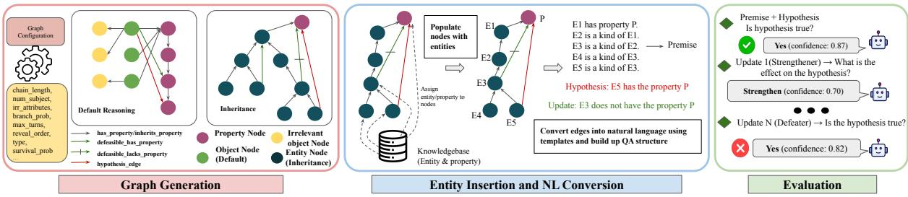  
Figure 1: Overview of the generation and evaluation process of DERELAB.

In this paper, we: (1) introduce DERELAB, a flexible dataset generation framework for scalable evaluation and cognitive science-inspired probes of LLMs on defeasible reasoning; (2) demonstrate systematic evaluation across default and inheritance reasoning at multiple difficulty tiers, revealing that reasoning complexity and task type jointly determine model failure; and (3) show how the framework enables cognitive science-inspired probes, uncovering near-universal confirmation bias and a know-but-don’t-output dissociation across current LLMs.

## 2 Related Work

Defeasible and Non-monotonic Reasoning Preliminary studies on AI and defeasible reasoning focused on formal logics (e.g., Reiter (1978, 1980); Poole (1988)). In recent times, research has been done to construct datasets built upon these principles and evaluate non-monotonic reasoning ability in language models. Xiu et al. (2022) constructed a dataset for non-monotonic proofs and Parmar et al. (2024) used patterns of default reasoning from Lifschitz (1989) to construct a QA dataset. Nonmonotonic reasoning has also been studied within the context of natural language inference (NLI) (Yanaka et al., 2019b,a; Gubelmann et al., 2023). Although these datasets focused on evaluating nonmonotonic reasoning, these formulations did not support incremental information updates. Subsequent work (e.g., Zhao et al. (2023); Rudinger et al. (2020)) addressed this limitation by introducing additional information that can alter an inference. Evaluating the defeasibility of reasoning is a more nuanced way of evaluating non-monotonic reasoning. A formal modal framework for defeasibility in non-monotonic reasoning was proposed by Asher and Morreau (1991). Allaway et al. (2023) discussed generics and instantiations in logical programming, and Allaway and McKeown (2025) created a dataset for defeasible reasoning with the inheritance reasoning category.

Cognitive biases in LLMs The use of Large Language Models (LLMs) in high-stakes decisionmaking (e.g., Wu et al. (2023); Singhal et al. (2022)) has made it imperative to broaden the study of biases beyond traditional ethical and social concerns (e.g., Gallegos et al. (2023)). Specifically, there is a growing need to account for cognitive biases and heuristics, which directly impact the rationality of LLMs’ judgments (Hagendorff et al. (2022)). Early research in this area focused on detecting these effects at the level of individual prompts (Talboy and Fuller (2023); Macmillan-Scott and Musolesi (2024)). Other works have investigated the challenge of detection and mitigation, but were limited to particular LLM roles (Pilli (2024); Ye et al. (2025)), or specific domains (Schmidgall et al. (2024); Opedal et al. (2024)). To address the need for large-scale evaluation, followup works have proposed comprehensive frameworks, such as those by Echterhoff et al. (2024) and Xie et al. (2024), which aim to systematically benchmark and mitigate these cognitive limitations (e.g., Zhong et al. (2024)).

Sandbox Evaluation Toolkit To take evaluation beyond simple pattern matching, Clark et al. (2020) introduced the concept of transformers emulating a reasoning algorithm by concluding explicit rules provided in natural language. Tafjord et al. (2021) extended it by enabling iterative 1-hop generation to build a proof reflecting the model’s decisions. Later, Kiela et al. (2021) and Thrush et al. (2022) added human annotation in the evaluation loop to address the rapid saturation of static benchmarks. Recognizing human annotation as a bottleneck, Liu et al. (2025) proposed a framework to generate reasoning datasets given tunable input configurations and seeds. Our framework draws inspiration from their work, but significantly differs in the generation and evaluation paradigms.

## 3 The DERELAB Framework

DERELAB is a generative evaluation framework for defeasible reasoning that overcomes three limitations of existing benchmarks. First, unlike static datasets that become obsolete as model capabilities advance (Kiela et al., 2021), DERELAB generates evaluation problems on demand from a scalable configuration space, allowing difficulty to grow with model capability without collecting new data. Second, unlike prior defeasible datasets that vary primarily at the semantic level, DERELAB spans a rich distribution of reasoning structures — linear default chains, branching inheritance hierarchies, multi-source priority graphs, and quantified uncertainty — covering structural variation that surfacelevel rephrasing cannot capture. Third, fine-grained configuration parameters across both default and inheritance reasoning (chain depth, branching factor, exception density, source count, hierarchy depth, sibling structure) make controlled diagnostic ablation a first-class capability. The implementation details are in Appendix A.

## 3.1 Defeasibility: Scope and Induction

Defeasible reasoning is inherently non-monotonic: conclusions warranted by the current information may need to be retracted when new evidence arrives. DERELAB operationalizes this directly by presenting information incrementally rather than all at once. Each conversation begins with a partially specified reasoning structure and then reveals additional facts one update at a time. As the premise set evolves, previously supported conclusions may be reinforced, defeated, reinstated, or left unchanged, depending on the structural role of the new information.

This incremental construction induces a dynamic belief trajectory over the course of the conversation. An ideal defeasible reasoner should revise its belief state precisely when new evidence changes the underlying inferential structure, while remaining stable under irrelevant or out-of-scope updates.

## 3.2 Reasoning Types

DERELAB implements the two canonical paradigms of non-monotonic reasoning identified in the formal literature (Lifschitz, 1989), each targeting a structurally distinct mode of defeasible inference.

Default Reasoning. Default reasoning concerns general rules that hold in the absence of specific contradicting information (Reiter, 1980): conclusions are drawn by default and retracted when exceptions arise. In DERELAB, this is instantiated as a parameterized chain of default rules over objects, with updates that introduce confirmations, defeaters, distractors, and source-priority conflicts.

Inheritance Reasoning. Inheritance reasoning concerns the propagation of properties through a taxonomic hierarchy (Lifschitz, 1989; Horty et al., 1990): a property attributed to a class is inherited by its subclasses and instances unless explicitly blocked at some node. In DERELAB, this is instantiated as a configurable taxonomy with both linear and tree structures, where updates introduce inheritance-blocking exceptions or properties of sibling branches that must be correctly scoped to the hypothesis subject.

## 3.3 Default Reasoning: Configuration and Question Types

Configuration. We generate default reasoning examples through parameterized graphs controlled by chain length, number of object instantiations, distractor density, and a sparsity factor controlling defeat-edge injection. Two difficulty tiers are defined: Easy (shorter chains, fewer objects) and Hard (longer chains, more objects and distractors), with full parameter ranges in Appendix A.1. The order in which graph edges are revealed across turns is separately configurable, allowing the belief trajectory to be shaped by design: for instance, placing a defeating update early tests whether a model correctly reinstates a conclusion when subsequent confirming evidence arrives.

Question Types. Drawing on the taxonomy of default reasoning patterns in Lifschitz (1989), we identify three structural question types that cover the principal modes of defeasible inference; Appendix B details how this taxonomy maps onto our graph structures.

• Type 1—Direct chain manipulation. Positive or negative assertions about related properties test basic belief updating; exceptions test defeat of default rules.

• Type 2—Irrelevant information. An update concerns a property outside the default chain, making this variant irrelevant to the original default rules. This category checks the reasoning ability of isolating irrelevant property information.

• Type 3—Source priority. Competing claims from sources of differing reliability test whether models apply priority relations correctly, including when a higher-priority rule bypasses rather than directly overrides a prior defeat.

In Figure 12, a default reasoning example generation procedure is shown in detail.

## 3.4 Inheritance Reasoning: Configuration and Question Types

Following Lifschitz (1989), we distinguish two structural variants of inheritance reasoning and explicitly considering them as two different categories from here. Linear inheritance arranges categories in a single chain from root to entity; tree inheritance extends this with branching, where multiple sibling subcategories share a parent. The key diagnostic introduced by branching is scope: an update about a sibling branch must not affect the hypothesis subject, which belongs to a different branch entirely.

Configuration. Both variants are parameterized by hierarchy depth; tree inheritance is additionally parameterized by branching factor, controlling how many sibling subcategories share each parent node. Blocking edges are scoped to individual nodes: blocking inheritance at a node severs the chain for that node only, leaving all sibling and cousin nodes unaffected. The model must therefore track whether the hypothesis subject’s specific path to the root carries an active block, rather than whether any path in the graph does. Full parameter ranges appear in Appendix A.1.

Question Types. Unlike default reasoning, inheritance conversations pose only the entailment question (yes / no / unknown) after each update. The belief-update question is omitted because the direction of change is directly recoverable from consecutive entailment answers: a transition from yes to no is by definition a weakening, making a separate effect question redundant. The primary diagnostic is therefore whether the model correctly identifies which updates fall within the scope of the hypothesis subject’s inheritance path and which do not.

In Figures 13 and 14, the generation procedure for two inheritance reasoning examples (linear and tree) is shown in detail.

## 3.5 Graph Resolution

Ground truth labels in DERELAB are produced deterministically by a path-based resolution procedure grounded in the inheritance theory of Horty et al. (1990). Given the accumulated premise set at any conversational turn, the resolver traverses the knowledge graph and returns one of three verdicts for the target hypothesis: ENTAILED (yes), DEFEATED (no), or UNDETERMINED (unknown). This mechanism produces formally correct, annotation-free labels at every conversational turn when new information is revealed. The full resolution procedure is described in Appendix A.3.

## 3.6 Conversation Structure

Across all categories, each conversation contains: (i) a pretext section presenting background default rules and entity instantiations; (ii) a hypothesis stating the entailment question under evaluation; and (iii) a sequence of update turns, each delivering one new fact followed by the entailment question. For default reasoning, each update turn is followed by a second effect question eliciting whether the update strengthened, weakened, or had no effect on hypothesis support. Default reasoning conversations may chain multiple hypothesis sections via a new hypothesis turn that changes the active subject while preserving the full set of accumulated premises. Furthermore, default reasoning can have multiple competing sources with priority rankings, from which an update originates, where a higherpriority source will supersede an update from a lower-priority one. For our experimental purpose, we construct an alternate version where the effect question comes prior to the entailment question. (see Appendices E and I.1 for details)

<table><tr><td>Cond.</td><td>Prior</td><td>GT effect</td><td>Meaning</td><td>What it tests</td></tr><tr><td>C1</td><td>yes</td><td>strengthening</td><td>dence supports it</td><td>Model believes hypothesis; new evi- Whether models correctly accept congruent evidence (control condition)</td></tr><tr><td>C2</td><td>yes</td><td>weakening</td><td>dence defeats it</td><td>Model believes hypothesis; new evi- Whether models revise beliefs against their prior conclusion — the primary confirmation bias signal</td></tr><tr><td>C3</td><td>no</td><td>no effect (neg.)</td><td>Hypothesisalready negative-sounding update arrives</td><td>defeated; Whether models react to surface negation rather than logical scope (semantic override)</td></tr><tr><td>C4</td><td>no</td><td>tral)</td><td>update arrives</td><td>no effect (neu- Hypothesis already defeated; neutral Whether a logically irrelevant distractor causes spu- rious belief revision (neutral baseline)</td></tr><tr><td>C5</td><td>unk.</td><td>str./ weak.</td><td>dence arrives</td><td>Model is uncertain; directional evi- Whether models correctly resolve from an indeter- minate state (anchoring under uncertainty)</td></tr></table>

Table 1: Congruence conditions assigned to each update turn. Prior is the model’s own predicted answer at the immediately preceding turn, not the ground truth. GT effect is the formally verified effect of the incoming update on the hypothesis. Confirmation bias is evidenced by a systematic accuracy gap between C2 and C1 turns within the same conversation.

## 3.7 Entity Design and Contamination Prevention

The overlap between benchmark content and pretraining corpora is a recognized threat to the validity of LLM evaluation (Magar and Schwartz, 2022; Al-Lawati et al., 2026; Zhou et al., 2023). Although our proposed framework is flexible to use any type of entity, we present results keeping all entities in the primary DERELAB dataset as pseudowords (logatomes) pronounceable but semantically null strings generated programmatically (e.g., Kitylu, Atool, Deraw) (see Appendix D.1 for pseudoword generation details). For defeasible reasoning, a model may produce the correct answer by retrieving a memorized real-world fact (penguins cannotfly) rather than by executing the defeasible inference the benchmark intends to measure. Because pseudoword entities carry no prior semantics in any trained model, correct responses can only arise from reasoning over the premises supplied in context.

## 3.8 Cognitive Bias Probing

A key capability of DERELAB is the ability to embed cognitive science-inspired experiments directly into the evaluation structure. Because the framework controls the content of information updates, it can construct controlled experimental conditions.

As a primary instantiation, we measure confirmation bias in defeasible belief updating: the tendency of LLMs to accept evidence congruent with their current belief while resisting contradicting evidence (Nickerson, 1998). Each update turn is assigned a congruence condition based on the model’s own prior predicted answer and the ground truth effect of the update. Table 1 defines the con-

gruence conditions.

We use two complementary metrics to measure confirmation bias. The Bias Gap measures the accuracy difference between congruent and incongruent conditions:

$$
\mathrm { B i a s G a p } = \mathrm { A c c } ( \mathbf { C } 1 ) - \mathrm { A c c } ( \mathbf { C } 2 )\tag{1}
$$

A positive BiasGap indicates the model handles supporting evidence more accurately than defeating evidence — the hallmark of confirmation bias. The Odds Ratio (OR) provides a scale-invariant effect size:

$$
\mathrm { O R } = { \frac { \mathrm { C 1 } _ { \mathrm { c o r r e c t } } \times \mathrm { C 2 } _ { \mathrm { w r o n g } } } { \mathrm { C 1 } _ { \mathrm { w r o n g } } \times \mathrm { C 2 } _ { \mathrm { c o r r e c t } } } }\tag{2}
$$

OR > 1 indicates confirmation bias; OR = 1 indicates no asymmetry between conditions. Bootstrap 95 % confidence intervals are computed at the conversation level. Full operationalization details appear in Appendix H.

## 4 Experimental Setup

## 4.1 Dataset

<table><tr><td>Topology</td><td>Difficulty Configuration</td><td>Conver- sations</td><td>Question Turns</td></tr><tr><td>Default reasoning</td><td>Easy</td><td>150</td><td>1,905</td></tr><tr><td>Default reasoning</td><td>Hard</td><td>150</td><td>9,325</td></tr><tr><td>Linear inheritance</td><td>Easy</td><td>150</td><td>646</td></tr><tr><td>Linear inheritance</td><td>Hard</td><td>150</td><td>2,483</td></tr><tr><td>Tree inheritance</td><td>Easy</td><td>150</td><td>963</td></tr><tr><td>Tree inheritance</td><td>Hard</td><td>150</td><td>3,068</td></tr><tr><td>Total</td><td>一</td><td>900</td><td>18,390</td></tr></table>

Table 2: Canonical DERELAB evaluation set. “Questions” refers to the total number of answer-bearing turns evaluated across all conversations in each split.

<table><tr><td rowspan=1 colspan=1>Qwen3-32B*</td><td rowspan=1 colspan=1>88.1</td><td rowspan=1 colspan=1>88.7</td><td rowspan=1 colspan=1>65.1</td><td rowspan=1 colspan=1>61.7</td><td rowspan=1 colspan=1>99.9</td><td rowspan=1 colspan=1>90.6</td><td rowspan=1 colspan=1>99.8</td><td rowspan=1 colspan=1>94.1</td><td rowspan=1 colspan=1>86.0</td></tr><tr><td rowspan=1 colspan=1>GPT-5-mini*</td><td rowspan=1 colspan=1>70.6</td><td rowspan=1 colspan=1>62.3</td><td rowspan=1 colspan=1>71.5</td><td rowspan=1 colspan=1>65.4</td><td rowspan=1 colspan=1>100.0</td><td rowspan=1 colspan=1>99.7</td><td rowspan=1 colspan=1>100.0</td><td rowspan=1 colspan=1>99.9</td><td rowspan=1 colspan=1>83.7</td></tr><tr><td rowspan=1 colspan=1>Gemma-4-31B</td><td rowspan=1 colspan=1>90.6</td><td rowspan=1 colspan=1>90.6</td><td rowspan=1 colspan=1>64.7</td><td rowspan=1 colspan=1>61.4</td><td rowspan=1 colspan=1>94.3</td><td rowspan=1 colspan=1>73.7</td><td rowspan=1 colspan=1>98.3</td><td rowspan=1 colspan=1>85.7</td><td rowspan=1 colspan=1>82.4</td></tr><tr><td rowspan=1 colspan=1>Gemma-4-12B</td><td rowspan=1 colspan=1>87.2</td><td rowspan=1 colspan=1>79.1</td><td rowspan=1 colspan=1>61.6</td><td rowspan=1 colspan=1>53.4</td><td rowspan=1 colspan=1>93.2</td><td rowspan=1 colspan=1>74.6</td><td rowspan=1 colspan=1>95.9</td><td rowspan=1 colspan=1>81.1</td><td rowspan=1 colspan=1>78.3</td></tr><tr><td rowspan=1 colspan=1>Gemma-4-MoE</td><td rowspan=1 colspan=1>79.3</td><td rowspan=1 colspan=1>75.3</td><td rowspan=1 colspan=1>65.5</td><td rowspan=1 colspan=1>54.2</td><td rowspan=1 colspan=1>88.1</td><td rowspan=1 colspan=1>59.1</td><td rowspan=1 colspan=1>94.7</td><td rowspan=1 colspan=1>71.8</td><td rowspan=1 colspan=1>73.5</td></tr><tr><td rowspan=1 colspan=1>GPT-5.1</td><td rowspan=1 colspan=1>64.3</td><td rowspan=1 colspan=1>55.1</td><td rowspan=1 colspan=1>64.2</td><td rowspan=1 colspan=1>56.2</td><td rowspan=1 colspan=1>93.0</td><td rowspan=1 colspan=1>70.5</td><td rowspan=1 colspan=1>96.6</td><td rowspan=1 colspan=1>80.3</td><td rowspan=1 colspan=1>72.5</td></tr><tr><td rowspan=1 colspan=1>Qwen3-32B</td><td rowspan=1 colspan=1>78.8</td><td rowspan=1 colspan=1>65.3</td><td rowspan=1 colspan=1>58.6</td><td rowspan=1 colspan=1>50.7</td><td rowspan=1 colspan=1>90.7</td><td rowspan=1 colspan=1>62.5</td><td rowspan=1 colspan=1>91.0</td><td rowspan=1 colspan=1>68.8</td><td rowspan=1 colspan=1>70.8</td></tr><tr><td rowspan=1 colspan=1>Llama-3.1-70B</td><td rowspan=1 colspan=1>50.8</td><td rowspan=1 colspan=1>31.4</td><td rowspan=1 colspan=1>52.8</td><td rowspan=1 colspan=1>41.5</td><td rowspan=1 colspan=1>85.8</td><td rowspan=1 colspan=1>53.9</td><td rowspan=1 colspan=1>73.2</td><td rowspan=1 colspan=1>36.4</td><td rowspan=1 colspan=1>53.2</td></tr><tr><td rowspan=1 colspan=1>Gemma-4-E4B</td><td rowspan=1 colspan=1>53.7</td><td rowspan=1 colspan=1>60.6</td><td rowspan=1 colspan=1>33.0</td><td rowspan=1 colspan=1>34.4</td><td rowspan=1 colspan=1>67.8</td><td rowspan=1 colspan=1>47.8</td><td rowspan=1 colspan=1>46.9</td><td rowspan=1 colspan=1>31.9</td><td rowspan=1 colspan=1>47.0</td></tr><tr><td rowspan=1 colspan=1>Llama-3.1-8B</td><td rowspan=1 colspan=1>47.8</td><td rowspan=1 colspan=1>39.3</td><td rowspan=1 colspan=1>42.6</td><td rowspan=1 colspan=1>29.0</td><td rowspan=1 colspan=1>67.3</td><td rowspan=1 colspan=1>43.8</td><td rowspan=1 colspan=1>60.2</td><td rowspan=1 colspan=1>39.7</td><td rowspan=1 colspan=1>46.2</td></tr><tr><td rowspan=1 colspan=1></td><td rowspan=1 colspan=1>EntailEasy</td><td></td><td></td><td></td><td></td><td></td><td></td><td></td><td></td></tr></table>

Figure 2: Turn-level model performance across reasoning topologies and difficulty levels. Each cell reports accuracy for a model under one topology–difficulty condition. (\*) represents reasoning-enabled inference.

We evaluate models on three DERELAB reasoning topologies: default reasoning, linear inheritance, and tree inheritance. For each topology, we generate easy and hard splits, with 150 conversations per topology-difficulty combination. This gives 900 canonical evaluation conversations in total (Table 2). All canonical examples use pseudoword entities to avoid contamination from memorized real-world facts. The easy and hard splits differ in graph size, distractor attributes, density, and reasoning depth (see Table 6 and 7 in Appendix A). We additionally construct a robustness dataset: a reseeding set of 1,200 examples to test whether results are stable across random seeds. This set contains 20 seeds, 2 topologies, and 30 conversations per topology per seed.

## 4.2 Models

<table><tr><td>Model</td><td>Type</td></tr><tr><td>gpt-5.1</td><td>Closed, standard</td></tr><tr><td>gpt-5-mini</td><td>Closed, compact reasoning</td></tr><tr><td>Gemma-4-31B-it</td><td>Open, instruction-tuned</td></tr><tr><td>Gemma-4-26B-A4B</td><td>Open, Mixture of Expert (MoE)</td></tr><tr><td>Gemma-4-12B-it</td><td>Open, instruction-tuned</td></tr><tr><td>Gemma-4-E4B</td><td>Open, instruction-tuned</td></tr><tr><td>Llama-3.1-70B</td><td>Open, instruction-tuned</td></tr><tr><td>Llama-3.1-8B</td><td>Open, instruction-tuned</td></tr><tr><td>Qwen3-32B (*)</td><td>Open, non-thinking and thinking</td></tr></table>

Table 3: Models evaluated in our experiments. (\*) We use Qwen3-32B model in both thinking and nonthinking mode for inference. Further details about the models are documented in Appendix L.

We evaluate both closed and open-weight models, covering different model families, sizes, and architectures. The closed GPT models provide a strong frontier-model reference point. The Llama and Gemma-4 models provide open-weight comparisons across model families and scales. For architectural diversity, we also include a mixture-of-experts (MoE) model from the Gemma 4 (Gemma-4-26B-A4B, hereafter referred to as Gemma-4-MoE) family alongside dense models. Furthermore, for direct comparison between thinking and non-thinking modes, we utilize the dual capability of Qwen3-32B model (Table 3). We evaluate models in a multi-turn chat setting.

## 5 Results and Discussion

In the following sections, we analyze our findings about model performance and behavior using data generated through DERELAB.

## 5.1 Overall Reasoning Accuracy

How capable are current LLMs at defeasible reasoning, and does capability vary systematically across reasoning type and task difficulty?

We evaluate all the models on the generated dataset for both default and inheritance reasoning at easy and hard difficulty levels. We report turnlevel accuracy against ground-truth labels and performance with respect to reasoning complexity in Figure 2.

We notice a significant performance gap between reasoning-enabled and standard instruction-tuned configurations, where reasoning models clearly outperform the latter. Within task type, default reasoning is consistently harder than inheritance reasoning, and the belief-update task (strengthening/weakening/no effect) is the most demanding of all conditions. Larger models perform better within each family: Gemma-4-31B > Gemma-4-12B > Gemma-4-E4B and Llama-3.1-70B > Llama-3.1- 8B across all conditions, consistent with the general scaling trend observed in reasoning benchmarks. For Qwen3-32B, performance decreases substantially when extended thinking is disabled.

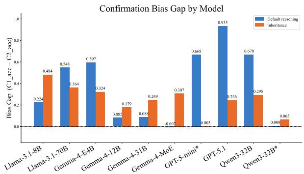  
(a) Confirmation bias gap (C1 acc − C2 acc) per model and reasoning type. Gemma-4-MoE on default reasoning and Qwen3- 32B\* on inheritance are non-significant after Holm correction. OR undefined for GPT-5-mini inheritance (C1 errors = 0).

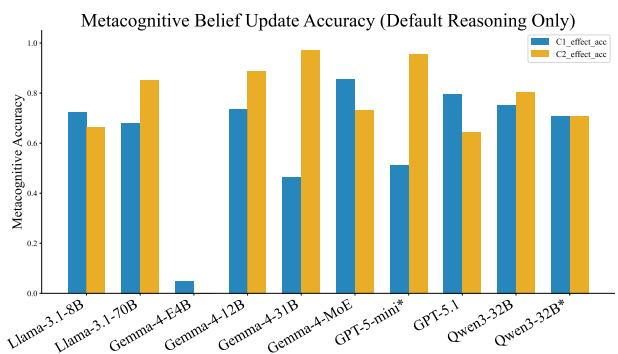  
(b) Metacognitive accuracy on the belief-update task (default reasoning only). C1-effect: fraction of congruent turns correctly labeled strengthening. C2-effect: fraction of incongruent turns correctly labeled weakening.  
Figure 3: Confirmation bias magnitude and metacognitive awareness across models. Left: BiasGap (C1 acc − C2 acc) measures how much more accurately a model handles congruent than incongruent updates, broken down by reasoning type. Right: Accuracy on the separate effect-of-update question for the same turns, distinguishing whether models that fail the entailment question nonetheless correctly identify the direction of the update.

## 5.2 Confirmation Bias in Belief Updating

Do LLMs exhibit confirmation bias when updating beliefs under incongruent evidence, and what does this reveal about the nature of their belief revision?

We apply the congruence-condition framework (§3.8) to all Phase 1 inference results, yielding between 9,029 and 11,682 labeled turns per model across all reasoning types and difficulty tiers. Statistical methodology and full supplementary results appear in Appendix H and I respectively.

Confirmation bias is near-universal. Confirmation bias is near-universal: 17 of 19 model– reasoning-type cells are statistically significant after Holm–Bonferroni correction (Table 4, Figure 3a). Bias magnitude spans a wide range: Gemma-4-12B shows a small but reliable gap (BiasGap = 0.082, OR = 2.9), while GPT-5.1 reaches near-total incongruent failure (BiasGap = 0.935, OR = 891, 95 % CI [586, 1498]) — a C2 accuracy of just 3.5 % means the model almost never correctly revises from yes to no when faced with a weakening update. Two cells are nonsignificant after correction: Gemma-4-MoE default (Gap = −0.007) and Qwen3-32B\* inheritance (Gap = 0.065). As we show below, the Gemma-4- MoE result is an artifact of question ordering rather than a genuine absence of bias.

<table><tr><td rowspan="2">Model</td><td colspan="2">Default</td><td colspan="2">Inheritance</td></tr><tr><td>Gap OR</td><td>Anch.</td><td>Gap OR</td><td>Anch.</td></tr><tr><td>GPT-5.1 GPT-5-mini</td><td>.94 891</td><td>.43</td><td>.25 9.3 .00</td><td>.05</td></tr><tr><td>Qwen3-32B</td><td>.67 26.5 .67 93.3</td><td>.02 .48</td><td>.30 6.8</td><td>.00 .22</td></tr><tr><td>Gemma-4-E4B</td><td>.60 72.7</td><td>.40</td><td>.32 4.0</td><td>.64</td></tr><tr><td>Llama-3.1-70B</td><td>.55 13.2</td><td>.19</td><td>.36 7.8</td><td>.07</td></tr><tr><td>Llama-3.1-8B</td><td>.22 2.8</td><td>.12</td><td>.48 8.3</td><td>.34</td></tr><tr><td>Gemma-4-31B</td><td>.09 18.1</td><td>.05</td><td>.25 6.6</td><td>.05</td></tr><tr><td>Gemma-4-12B</td><td>.08 2.9</td><td>.12</td><td>.18 2.8</td><td>.14</td></tr><tr><td></td><td></td><td></td><td></td><td></td></tr><tr><td>Qwen3-32B*</td><td>.01 1.1</td><td>.03</td><td>.07 3.7</td><td>.00</td></tr><tr><td>Gemma-4-MoE</td><td>-.01 0.8</td><td>.03</td><td>.31 16.7</td><td>.02</td></tr></table>

Table 4: Confirmation-bias metrics across default and inheritance reasoning. Gap = C1 acc − C2 acc. OR = odds ratio. Anch. = anchoring rate on ground-truthflipping sections. Qwen3-32B\* denotes the extendedthinking variant. OR undefined (—) when C1 contains zero errors.

Bias is stronger on default reasoning than inheritance. For most models, the BiasGap is larger on default reasoning than inheritance (Table 4). The contrast is sharpest for GPT-5-mini (0.668 → 0.003) and GPT-5.1 (0.935 → 0.246). We attribute this to the richer update vocabulary of default reasoning — source-priority conflicts, trap distractors, and multi-turn exception chains create more opportunities for prior-belief anchoring than the structurally simpler inheritance updates. Two exceptions to this phenomenon are Llama-3.1-8B (default 0.224, inheritance 0.484) and Gemma-4- MoE (default −0.007, inheritance 0.307).

Metacognitive dissociation: Each update turn contains two distinct questions: the entailment question (reported as C1 acc and C2 acc) and the effect-of-update question (strengthening/weakening/no-effect, reported as C1-eff and C2-eff). A pattern emerges when we examine them together (Figure 3): several models correctly label a C2 update as weakening at high rates yet simultaneously answer yes to the entailment question on the same turn. The largest absolute dissociation are in GPT-5-mini (C2-eff= 95.4 %, C2 acc = 20.3 %) and Llama-3.1-70B (C2-eff= 85.1 %, C2 acc = 14.9 %): both models correctly identify weakening on the majority of C2 turns yet almost never revise their entailment answer accordingly. We refer to this discrepancy as a know-but-don’t-output pattern: the model produces the correct effect label but an inconsistent entailment judgment on the same turn.

Reversed question order reveals scaffolded causal labeling. We reverse the order of the entailment and effect questions to test whether high C2-eff reflects independent causal understanding or is scaffolded by prior engagement with the entailment judgment. C2-eff dropped substantially across all tested models: Gemma-4-31B (0.970 → 0.264), Gemma-4-12B (0.887 → 0.209), Gemma-4-MoE (0.732 → 0.288), and Qwen3-32B (0.803 → 0.414). Gemma-4-E4B is the lone exception (0.000 → 0.349): its near-zero original score reflected a vocabulary failure rather than a dissociation. Entailment accuracy on C2 turns also worsened under reversal for most models, with the BiasGap rising substantially — most strikingly for Qwen3-32B (0.670 → 0.816) and Gemma-4-MoE (−0.007 → 0.259, exposing the near-zero default gap as an ordering artifact). Together, these results show the entailment question acts as a broad cognitive scaffold: engaging with the yes/no/unknown judgment first triggers reasoning that benefits both the effect label and the entailment answer itself. The know-but-don’t-output dissociation observed in the standard order is therefore a weaker form of the same effect — the scaffold is strong enough to enable correct effect labeling but insufficient to overcome the entailment bias on most models. Full comparison tables appear in Appendix I.1.

Thinking mode suppresses bias. Qwen3-32B\* (Qwen3-32B with extended thinking) achieves near-zero default bias in the standard evaluation order (Gap = 0.008, OR = 1.07; Holm p = 0.015 but effect negligible) and the lowest anchoring rates of any model on both topologies (default: 0.032; inheritance: 0.004). The standard Qwen3-32B, by contrast, shows a default BiasGap of 0.670 — one of the largest in the evaluation, and its gap rises further to 0.816 under reversed question order. This suggests that the thinking scaffold has a substantial effect on both the entailment and effect questions, which could be attributed to figuring out the structure of the graph over which the information is presented.

Anchoring and semantic override. At the conversation level, GPT-5.1 and Qwen3-32B exhibit the highest default anchoring rates (0.433 and 0.483): in nearly half of conversations where the ground-truth answer changed, these models maintained their initial prediction. Gemma-4-E4B shows the most persistent anchoring on inheritance (0.635), consistent with its strong prior-preserving behavior across both metrics. By contrast, Gemma-4-31B and GPT-5-mini show near-zero anchoring (≤ 5 %), indicating per-turn bias does not accumulate into global belief fixation for these models. Llama-3.1-70B shows the highest semantic override rate on default (83.9 %): it mislabels C3 turns as weakening even when the chain is already defeated, reflecting strong sensitivity to surface-level negative language regardless of logical scope. Full results are in Appendix I.

## 5.3 Confidence and Inference Path Length

Does model confidence in the correct answer decay as the inference chain between the updated node and the hypothesis grows longer?

We analyze tree-inheritance turns along two dimensions: on-path turns, where the update is causally relevant to the hypothesis, and off-path turns, where the update concerns a node outside the hypothesis subject’s inheritance path and should have no effect on confidence. We measure ∆gold\_conf — the change in probability assigned to the correct label relative to the model’s initial answer — as our primary confidence signal. Full statistical details appear in Appendix G.

On-path, correct-answer confidence declines significantly with distance for most models (Table 5) — most steeply for Gemma-4-31B (ρ = −0.298, p < 0.001), Llama-3.1-8B (ρ = −0.255, p < 0.001), and Llama-3.1-70B (ρ = −0.207, p < 0.001) — while GPT-5.1 shows the opposite $( \rho = + 0 . 1 3 0 $ $p \ = \ 0 . 0 2 6 )$ , consistent with successfully accumulating evidence over longer chains. Off-path, Llama-3.1-8B changes its answer incorrectly on more than one in three irrelevant turns (36 %), whereas GPT-5.1 and Gemma-4-31B do so on fewer than 1 %: the models that maintain confidence along longer chains are also those that correctly ignore updates that should not affect them.

<table><tr><td></td><td>On-path  $\rho$ </td><td colspan="2">Off-path  $\rho$ </td></tr><tr><td>Model</td><td>Hard</td><td>Easy</td><td>Hard</td></tr><tr><td>GPT-5.1</td><td> $+ . 1 3 ^ { * }$ </td><td> $+ . 0 9 ^ { * }$ </td><td>+.01</td></tr><tr><td>Qwen3-32B</td><td> $- . 0 3$ </td><td> $+ . 0 6$ </td><td>+.01</td></tr><tr><td>Gemma-4-12B</td><td> $- . 1 6 ^ { * * }$ </td><td> $- . 0 1$ </td><td>+.01</td></tr><tr><td>Gemma-4-MoE</td><td> $. 1 8 ^ { * * }$ </td><td> $\boldsymbol { \cdot } . 1 2 ^ { * * }$ </td><td>-.04</td></tr><tr><td>Qwen3-32B*</td><td> $- . 0 1$ </td><td> $- . 1 3 ^ { * * * }$ </td><td>-.03</td></tr><tr><td>Gemma-4-31B</td><td> $- . 3 0 ^ { * * * }$ </td><td>-.01</td><td>-.03</td></tr><tr><td>Llama-3.1-8B</td><td> $- . 2 6 ^ { * * * }$ </td><td>-.06</td><td>-.01</td></tr><tr><td>Llama-3.1-70B</td><td> $- . 2 1 ^ { * * * }$ </td><td> $+ . 0 2$ </td><td> $- . 0 3$ </td></tr><tr><td>Gemma-4-E4B</td><td> $+ . 0 7$ </td><td> $+ . 0 1$ </td><td> $+ . 1 0 ^ { * * * }$ </td></tr></table>

Table 5: Spearman $\rho$ between update-to-hypothesis distance and correct-answer confidence. On-path: hard tree-inheritance turns only; easy omitted because of insufficient distance variation. Off-path: model’s response to causally irrelevant updates; values near zero indicate correct suppression. Negative on-path $\rho = \mathrm { c o n } \cdot$ fidence decays with distance; positive = accumulation. $^ { * } p < . 0 5 , ^ { * * } p < . 0 1 , ^ { * * * } p < . 0 0 1$

## 5.4 Seeded Sample Variance Analysis

Are DERELAB evaluations reproducible across independent random seeds, and does stability hold across model tiers?

We evaluate eight models on 20 independently seeded draws of the evaluation data (default and linear inheritance, easy difficulty) and measure variability. Three statistics are reported: the intraclass correlation coefficient (ICC, two-way random effects, absolute agreement), Kruskal–Wallis tests for per-sample accuracy distributions, and the coefficient of variation (CV = SD / mean × 100). Figure 4 shows the resulting boxplots; full statistical details appear in Appendix F.

Scores are highly reproducible across seeds. The ICC across all model–condition cells is 0.949 (95 % CI [0.938, 0.963]), indicating that over 94 % of the variance in turn-level accuracy is shared across seeded draws, confirming that the benchmark captures consistent model behavior. Kruskal– Wallis tests yield no significant differences across the 20 seeds for any model–condition pair (all $p > 0 . 0 6$ , after accounting for multiple comparisons), confirming that seed choice does not systematically alter the ranking or magnitude of scores.

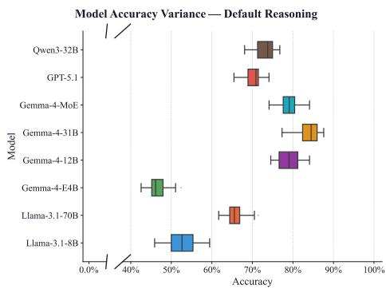

(a) Variance in accuracy by property chain length category for default reasoning.  
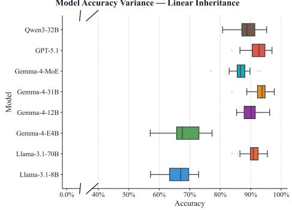  
(b) Variance in accuracy by inheritance hierarchy depth for inheritance reasoning (linear).  
Figure 4: Reseeding robustness analysis.

Our results also show that within-model variance is low for most models. The CV is below 4 % for five out of eight models on both default and linearinheritance conditions. (Appendix F, Table 11). These results confirm that the benchmark scores reported throughout this paper reflect stable model properties rather than sampling variability.

## 6 Conclusion

We introduced DERELAB, a structural framework for evaluating defeasible reasoning in LLMs through formally verified, multi-turn benchmarks. Our experiments reveal that current models are brittle under belief-updating conditions: confirmation bias is near-universal, confidence degrades with inference-path length, and structural relevance is rarely tracked reliably. Future work can extend the framework with additional non-monotonic reasoning structures and further cognitive scienceinspired probes to deepen understanding of where and why defeasible reasoning fails.

## Limitations

The current framework evaluates the default and inheritance topologies, which can be further expanded to support a broader spectrum of defeasible reasoning structures. Moreover, DERELAB didn’t evaluate models’ consistency against human performance, leaving it an open question whether human reasoning diverges from algorithmic conclusions.

Our evaluation includes only two explicitly reasoning-enabled configurations—GPT-5-mini and Qwen3-32B in extended-thinking mode. More models could help us find patterns. We found biases exist but didn’t discuss why they were found.

## References

Ali Al-Lawati, Jason Lucas, Dongwon Lee, and Suhang Wang. 2026. Llm benchmark datasets should be contamination-resistant. Preprint, arXiv:2605.19999.

Emily Allaway, Jena D. Hwang, Chandra Bhagavatula, Kathleen McKeown, Doug Downey, and Yejin Choi. 2023. Penguins don’t fly: Reasoning about generics through instantiations and exceptions. In Proceedings of the 17th Conference of the European Chapter of the Association for Computational Linguistics, pages 2618–2635, Dubrovnik, Croatia. Association for Computational Linguistics.

Emily Allaway and Kathleen McKeown. 2025. Evaluating defeasible reasoning in LLMs with DEFREAS-ING. In Proceedings of the 2025 Conference of the Nations ofthe Americas Chapter ofthe Association for Computational Linguistics: Human Language Technologies (Volume 1: Long Papers), pages 10540– 10558, Albuquerque, New Mexico. Association for Computational Linguistics.

Nicholas Asher and Michael Morreau. 1991. Commonsense entailment: A modal theory of nonmonotonic reasoning. In Logics in AI, pages 1–30, Berlin, Heidelberg. Springer Berlin Heidelberg.

Nick Chater, Mike Oaksford, Ulrike Hahn, and Evan Heit. 2011. Inductive logic and empirical psychology. In Dov M. Gabbay, Stephan Hartmann, and John Woods, editors, Inductive Logic, volume 10 of Handbook of the History of Logic, pages 553–624. North-Holland.

Stanley F Chen and Joshua Goodman. 1999. An empirical study of smoothing techniques for language modeling. Computer Speech & Language, 13(4):359– 394.

Peter Clark, Oyvind Tafjord, and Kyle Richardson. 2020. Transformers as soft reasoners over language. arXiv preprint arXiv:2002.05867.

Jessica Maria Echterhoff, Yao Liu, Abeer Alessa, Julian McAuley, and Zexue He. 2024. Cognitive bias in decision-making with LLMs. In Findings of the Association for Computational Linguistics: EMNLP 2024, pages 12640–12653, Miami, Florida, USA. Association for Computational Linguistics.

Isabel O. Gallegos, Ryan A. Rossi, Joe Barrow, Md. Mehrab Tanjim, Sungchul Kim, Franck Dernoncourt, Tong Yu, Ruiyi Zhang, and Nesreen Ahmed. 2023. Bias and fairness in large language models: A survey. Computational Linguistics, 50:1097–1179.

Aaron Grattafiori, Abhimanyu Dubey, Abhinav Jauhri, Abhinav Pandey, Abhishek Kadian, Ahmad Al-Dahle, Aiesha Letman, Akhil Mathur, Alan Schelten, Alex Vaughan, Amy Yang, Angela Fan, Anirudh Goyal, Anthony Hartshorn, Aobo Yang, Archi Mitra, Archie Sravankumar, Artem Korenev, Arthur Hinsvark, and 542 others. 2024. The llama 3 herd of models. Preprint, arXiv:2407.21783.

Reto Gubelmann, Ioannis Katis, Christina Niklaus, and Siegfried Handschuh. 2023. Capturing the varieties of natural language inference: A systematic survey of existing datasets and two novel benchmarks. J. of Logic, Lang. and Inf., 33(1):21–48.

Thilo Hagendorff, Sarah Fabi, and Michal Kosinski. 2022. Human-like intuitive behavior and reasoning biases emerged in large language models but disappeared in chatgpt. Nature Computational Science, 3:833 – 838.

John F. Horty, Richmond H. Thomason, and David S. Touretzky. 1990. A skeptical theory of inheritance in nonmonotonic semantic networks. Artificial Intelligence, 42(2):311–348.

Erik Jones and Jacob Steinhardt. 2022. Capturing failures of large language models via human cognitive biases. In Proceedings of the 36th International Conference on Neural Information Processing Systems, NIPS ’22, Red Hook, NY, USA. Curran Associates Inc.

Douwe Kiela, Max Bartolo, Yixin Nie, Divyansh Kaushik, Atticus Geiger, Zhengxuan Wu, Bertie Vidgen, Grusha Prasad, Amanpreet Singh, Pratik Ringshia, Zhiyi Ma, Tristan Thrush, Sebastian Riedel, Zeerak Waseem, Pontus Stenetorp, Robin Jia, Mohit Bansal, Christopher Potts, and Adina Williams. 2021. Dynabench: Rethinking benchmarking in NLP. In Proceedings of the 2021 Conference of the North American Chapter of the Association for Computational Linguistics: Human Language Technologies, pages 4110–4124, Online. Association for Computational Linguistics.

Jemma König, Andreea S Calude, and Averil Coxhead. 2020. Using character-grams to automatically generate pseudowords and how to evaluate them. Applied Linguistics, 41(6):878–900.

Terry K Koo and Mae Y Li. 2016. A guideline of selecting and reporting intraclass correlation coefficients for reliability research. Journal ofchiropractic medicine, 15(2):155–163.

Vladimir Lifschitz. 1988. Benchmark problems for formal nonmonotonic reasoning: Version 2.00. In International Workshop on Non-Monotonic Reasoning, pages 202–219. Springer.

Vladimir Lifschitz. 1989. Benchmark problems for formal nonmonotonic reasoning. In Proceedings ofthe 2nd International Workshop on Non-Monotonic Reasoning, page 202–219, Berlin, Heidelberg. Springer-Verlag.

Andrew Liu, Henry Prior, Gargi Balasubramaniam, Rivka Moroshko, Amir Zait, Ilia Labzovsky, Danny Karmon, Ishita Dasgupta, Kimberly Stachenfeld, and Kenneth Marino. 2025. Recoglab: a framework testing relational reasoning &amp; cognitive hypotheses on llms. In International Conference on Representation Learning, volume 2025, pages 45077–45106.

Olivia Macmillan-Scott and Mirco Musolesi. 2024. (ir)rationality and cognitive biases in large language models. Preprint, arXiv:2402.09193.

Inbal Magar and Roy Schwartz. 2022. Data contamination: From memorization to exploitation. In Proceedings ofthe 60th Annual Meeting ofthe Association for Computational Linguistics (Volume 2: Short Papers), pages 157–165, Dublin, Ireland. Association for Computational Linguistics.

Boris New, Jessica Bourgin, Julien Barra, and Christophe Pallier. 2024. Unipseudo: A universal pseudoword generator. Quarterly Journal of Experimental Psychology, 77(2):278–286.

Raymond Nickerson. 1998. Confirmation bias: A ubiquitous phenomenon in many guises. Review of General Psychology, 2:175–220.

Andreas Opedal, Alessandro Stolfo, Haruki Shirakami, Ying Jiao, Ryan Cotterell, Bernhard Schölkopf, Abulhair Saparov, and Mrinmaya Sachan. 2024. Do language models exhibit the same cognitive biases in problem solving as human learners? In Proceedings of the 41st International Conference on Machine Learning, ICML’24. JMLR.org.

Mihir Parmar, Nisarg Patel, Neeraj Varshney, Mutsumi Nakamura, Man Luo, Santosh Mashetty, Arindam Mitra, and Chitta Baral. 2024. LogicBench: Towards systematic evaluation of logical reasoning ability of large language models. In Proceedings ofthe 62nd Annual Meeting of the Association for Computational Linguistics (Volume 1: Long Papers), pages 13679– 13707, Bangkok, Thailand. Association for Computational Linguistics.

Stephen Pilli. 2024. Exploring conversational agents as an effective tool for measuring cognitive biases in decision-making. Preprint, arXiv:2401.06686.

David Poole. 1988. A logical framework for default reasoning. Artificial Intelligence, 36(1):27–47.

R. Reiter. 1980. A logic for default reasoning. Artificial Intelligence, 13(1):81–132. Special Issue on Non-Monotonic Logic.

Raymond Reiter. 1978. On Closed World Data Bases, pages 55–76. Springer US, Boston, MA.

Rachel Rudinger, Vered Shwartz, Jena D. Hwang, Chandra Bhagavatula, Maxwell Forbes, Ronan Le Bras, Noah A. Smith, and Yejin Choi. 2020. Thinking like a skeptic: Defeasible inference in natural language. In Findings ofthe Associationfor Computational Linguistics: EMNLP 2020, pages 4661–4675, Online. Association for Computational Linguistics.

Samuel Schmidgall, Carl Harris, Ime Essien, Daniel Olshvang, Tawsifur Rahman, Ji Woong Kim, Rojin Ziaei, Jason Eshraghian, Peter Abadir, and Rama Chellappa. 2024. Addressing cognitive bias in medical language models. Preprint, arXiv:2402.08113.

Karan Singhal, Shekoofeh Azizi, Tao Tu, S. Sara Mahdavi, Jason Wei, Hyung Won Chung, Nathan Scales, Ajay Tanwani, Heather Cole-Lewis, Stephen Pfohl, Perry Payne, Martin Seneviratne, Paul Gamble, Chris Kelly, Nathaneal Scharli, Aakanksha Chowdhery, Philip Mansfield, Blaise Aguera y Arcas, Dale Webster, and 11 others. 2022. Large language models encode clinical knowledge. Preprint, arXiv:2212.13138.

Oyvind Tafjord, Bhavana Dalvi, and Peter Clark. 2021. Proofwriter: Generating implications, proofs, and abductive statements over natural language. In Findings ofthe Associationfor Computational Linguistics: ACL-IJCNLP 2021, pages 3621–3634.

Alaina N. Talboy and Elizabeth Fuller. 2023. Challenging the appearance of machine intelligence: Cognitive bias in llms and best practices for adoption. Preprint, arXiv:2304.01358.

Gemma Team. 2026. Gemma 4 technical report. Preprint, arXiv:2607.02770.

Qwen Team. 2025. Qwen3 technical report. Preprint, arXiv:2505.09388.

Tristan Thrush, Kushal Tirumala, Anmol Gupta, Max Bartolo, Pedro Rodriguez, Tariq Kane, William Gaviria Rojas, Peter Mattson, Adina Williams, and Douwe Kiela. 2022. Dynatask: A framework for creating dynamic ai benchmark tasks. In Proceedings of the 60th Annual Meeting of the Association for Computational Linguistics: System Demonstrations, pages 174–181.

Shijie Wu, Ozan Irsoy, Steven Lu, Vadim Dabravolski, Mark Dredze, Sebastian Gehrmann, Prabhanjan Kambadur, David Rosenberg, and Gideon Mann. 2023. Bloomberggpt: A large language model for finance. Preprint, arXiv:2303.17564.

Zhentao Xie, Jiabao Zhao, Yilei Wang, Jinxin Shi, Yanhong Bai, Xingjiao Wu, and Liang He. 2024. Mindscope: Exploring cognitive biases in large language models through multi-agent systems. In European Conference on Artificial Intelligence.

Yeliang Xiu, Zhanhao Xiao, and Yongmei Liu. 2022. LogicNMR: Probing the non-monotonic reasoning ability of pre-trained language models. In Findings of the Association for Computational Linguistics: EMNLP 2022, pages 3616–3626, Abu Dhabi, United Arab Emirates. Association for Computational Linguistics.

Hitomi Yanaka, Koji Mineshima, Daisuke Bekki, Kentaro Inui, Satoshi Sekine, Lasha Abzianidze, and Johan Bos. 2019a. Can neural networks understand monotonicity reasoning? In Proceedings of the 2019 ACL Workshop BlackboxNLP: Analyzing and Interpreting Neural Networks for NLP, pages 31–40, Florence, Italy. Association for Computational Linguistics.

Hitomi Yanaka, Koji Mineshima, Daisuke Bekki, Kentaro Inui, Satoshi Sekine, Lasha Abzianidze, and Johan Bos. 2019b. HELP: A dataset for identifying shortcomings of neural models in monotonicity reasoning. In Proceedings of the Eighth Joint Conference on Lexical and Computational Semantics (\*SEM 2019), pages 250–255, Minneapolis, Minnesota. Association for Computational Linguistics.

Jiayi Ye, Yanbo Wang, Yue Huang, Dongping Chen, Qihui Zhang, Nuno Moniz, Tian Gao, Werner Geyer, Chao Huang, Pin-Yu Chen, Nitesh V Chawla, and Xiangliang Zhang. 2025. Justice or prejudice? quantifying biases in LLM-as-a-judge. In The Thirteenth International Conference on Learning Representations.

Wenting Zhao, Justin Chiu, Claire Cardie, and Alexander Rush. 2023. Abductive commonsense reasoning exploiting mutually exclusive explanations. In Proceedings of the 61st Annual Meeting of the Associationfor Computational Linguistics (Volume 1: Long Papers), pages 14883–14896, Toronto, Canada. Association for Computational Linguistics.

Hanyang Zhong, Liman Wang, Wenting Cao, and Zeyuan Sun. 2024. Balancing rigor and utility: Mitigating cognitive biases in large language models for multiple-choice questions.

Kun Zhou, Yutao Zhu, Zhipeng Chen, Wentong Chen, Wayne Xin Zhao, Xu Chen, Yankai Lin, Ji-Rong Wen, and Jiawei Han. 2023. Don’t make your llm an evaluation benchmark cheater. Preprint, arXiv:2311.01964.

## A DERELAB Framework

We discuss the different modules of DERELAB in the following sections. The logical flow is depicted in Figure 5.

## A.1 Graph Generation

Our reasoning structure contains two node types: entity and property nodes. The graph contains four primary edge types. These are:

• Hypothesis Edge: Represents the target query or tentative conclusion that is currently under evaluation.

• Has Attribute: Denotes factual and monotonic assignment of a property to an entity.

• Defeasible Has Property: Represents a nonmonotonic implication indicating that an entity “generally” or “typically” possesses a certain property. For example, “Red objects are generally cubic”.

• Defeasible Lack Property: Represents a nonmonotonic implication indicating that an entity “generally” does not possess a specific trait. For example, “Cubic objects generally do not roll”.

The graph generator module could construct three distinct topologies:

Linear Inheritance: The graph formed a single, unbranched entity chain from a root concept down to a terminal subclass. The root concept was assigned a base target property. To introduce nonmonotonicity, defeasible edges were probabilistically injected at intermediate nodes in the chain. The final hypothesis strictly queried the leaf node.

Tree Inheritance: The tree expanded from a root node where the maximum branching factor exponentially decayed with depth. Branches also underwent random survival checks, resulting in asymmetrical structures. Defeasible edges were randomly added across intermediate nodes, and the hypothesis edge targeted a leaf node.

In Table 6, the parameters tuned to set the difficulty of Inheritance Reasoning topologies across different presets are listed: easy (fewer nodes, less depth and breadth) and hard.

Default Reasoning: This topology modeled a main property chain. Multiple entities could be connected to a root property. This root property implied subsequent properties. To evaluate robustness against noise, irrelevant properties (distractor nodes) were attached directly to random entities. Defeasible edges were injected onto intermediate property nodes and assigned a depth-based serial number. This serialization ensured logical order from general to specific used later translating into conversation. The hypothesis then queried a terminal property leaf.

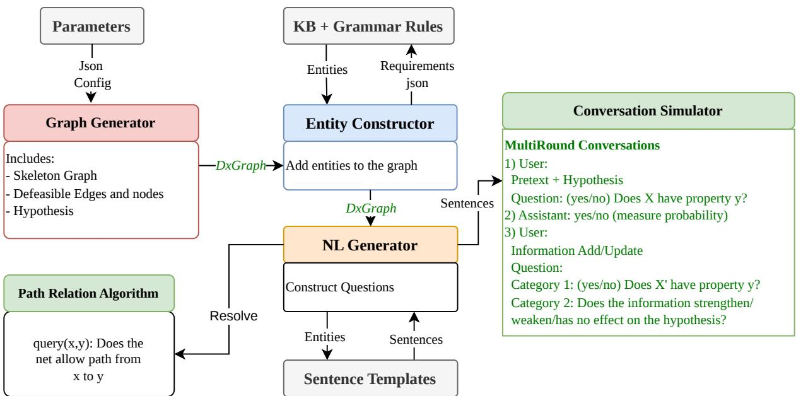  
Figure 5: Modules of DERELAB framework used for data generation.

In Table 7, the parameters tuned to set the difficulty of default reasoning topology are listed: easy (fewer properties, objects, and hypotheses) and hard.

## A.2 Entity Construction

The abstract graph nodes and edges from the graph generator module were populated with nonce entities and coherent attributes. The nonce entities are pronounceable but semantically null pseudowords (for example, “Kitylu”, “Atool”, and “Deraw” can be different types of “Tool”). Entity and attribute preparations have been discussed in Appendix D.

The property sampling was domain-aware. A root concept dictated the pool of valid attributes (e.g., a “Tool” domain permits attributes like material and utility, whereas an “Animal” domain would permit habitat).

Additionally, for default reasoning, we sampled attributes that were distant from the attributes in the reasoning chain. These attributes were used to construct irrelevant updates. Although they described the same entity, they did not participate in any inference path leading to the hypothesis. Therefore, they should not affect its entailment.

Template Structures: To generate grammatically sound sentences, properties were represented using a structured template. Each attribute category contained a pool of candidate values along with two linguistic templates (singular and plural) to support different relational contexts.

The abstract template structure was defined as follows:

Attribute Category: <String>

Template: "<Plural Verb Phrase> [value]" Object Template: "<Singular Verb Phrase> [value]"

An Example: To illustrate the property instantiation, consider a graph requiring an entity assignment and a property implication within the “Tool” domain.

At first, the “material” attribute was sampled for the “Tool” domain.

Example Value Selected: Titanium Template: are made of [value] Object Template: is made of [value]

Then, the placeholders in Template and Object Template were replaced with the Example Value, generating Filled Template and Filled Object Template respectively. Finally, the exact predicate structure was passed to the graph populator.

<table><tr><td>Parameter</td><td>Easy</td><td>Hard</td></tr><tr><td>Global Settings</td><td></td><td></td></tr><tr><td>Sparsity factor range</td><td>0.50–0.80</td><td>0.40-0.60</td></tr><tr><td>Serial random</td><td>True</td><td>True</td></tr><tr><td>Jellyfish Preset</td><td></td><td></td></tr><tr><td>Max depth</td><td>4</td><td>8</td></tr><tr><td>Root breadth</td><td>5</td><td>13</td></tr><tr><td>Branching (min-max)</td><td>1-1</td><td>1-1</td></tr><tr><td>Survival probability</td><td>0.40</td><td>0.60</td></tr><tr><td>Branching decay</td><td>1.0</td><td>1.0</td></tr><tr><td>Expected nodes</td><td>4-8</td><td>24-50</td></tr><tr><td>Balanced Preset</td><td></td><td></td></tr><tr><td>Max depth</td><td>3</td><td>4</td></tr><tr><td>Root breadth</td><td>2</td><td>3</td></tr><tr><td>Branching (min-max)</td><td>2-2</td><td>2-2</td></tr><tr><td>Survival probability</td><td>1.0</td><td>1.0</td></tr><tr><td>Branching decay</td><td>1.0</td><td>1.0</td></tr><tr><td>Expected nodes</td><td>7</td><td>46</td></tr><tr><td>Bushy Preset</td><td></td><td></td></tr><tr><td>Max depth</td><td>2</td><td>4</td></tr><tr><td>Root breadth</td><td>3</td><td>4</td></tr><tr><td>Branching (min-max)</td><td>1-2</td><td>1-4</td></tr><tr><td>Survival probability</td><td>0.70</td><td>0.80</td></tr><tr><td>Branching decay</td><td>1.0</td><td>0.75</td></tr><tr><td>Expected nodes</td><td>5-9</td><td>20-60</td></tr></table>

Table 6: Configuration Parameters for Easy and Hard Difficulties in Inheritance Reasoning Topology
<table><tr><td>Parameter</td><td>Easy</td><td>Hard</td></tr><tr><td>Chain length</td><td>5–10 nodes</td><td>10–20 nodes</td></tr><tr><td>Num objects</td><td>2-3</td><td>4-6</td></tr><tr><td>Irrelevant attributes</td><td>1-2</td><td>2-4</td></tr><tr><td>Sparsity factor</td><td>0.30–0.50</td><td>0.40-0.70</td></tr><tr><td>Max hypothesis sections</td><td>2</td><td>3</td></tr></table>

Table 7: Comparison of Easy and Hard Parameters in Default Reasoning Topology

Attribute Name: material

Selected Value: Titanium

Filled Template: are made of Titanium

Filled Object Predicate: is made of Titanium

## A.3 Path Resolver Algorithm

To determine the ground-truth entailment of each hypothesis, the framework employed a path-based resolver adapted from (Horty et al., 1990). In this formulation, conclusions are determined by which positive or negative inheritance paths are permitted by the network. When conflicting paths support opposing conclusions, the resolver applies the principle of preemption: information inherited through a more specific class can preempt a conflicting path based on more general information. If opposing compound paths remain unpreempted, the skeptical interpretation withholds the corresponding conclusion rather than arbitrarily selecting one.

Before resolution, the logical topology was abstracted into a signed Directed Acyclic Graph (DAG), where edges denoted either positive support (supporting links) or negative evidence (defeating links). The resolver excluded hypothesis and irrelevant-property edges from logical propagation.

• Supporting Links(+): “inheritance”, “is\_a”, “implies”, “has\_property”, and “defeasible\_has\_property” edges.

• Defeating Links(-): “defeasible\_lacks\_property” edges.

• Ignored Links(o): “hypothesis” and “irrelevant\_property” edges.

The evaluation then proceeded through the following core phases:

• Trimming: The graph was first pruned to isolate the relevant nodes and edges to the specific query. The algorithm first performed a forward search from the source entity along strictly positive paths, followed by a backward search from the target property. Only nodes residing in the intersection of these valid paths were retained for evaluation.

• Propagation: The trimmed network was then evaluated in a strict topological order. This ensured that every intermediate node was fully resolved before its logical state was propagated forward. The algorithm maintained states of proven and defeated properties, carrying the deductive logic upward from the source entity.

• Direct Preemption: Any evidence directly attached to the root subject entity was treated as absolute, immediately overriding any longer, inherited reasoning chains.

• Specificity Based Conflict Resolution: When an intermediate node received conflicting logics (e.g., inheriting both a property and its negation from different parent nodes), the algorithm inspected the hierarchical relationship between the conflicting sources. If a positive path existed from source A to source B, A was identified as a more specific subclass of B. The logic originating from a more specific subclass strictly preempted the signal from a superclass.

• Skeptical Inference: If conflicting deductive paths were completely symmetric, meaning neither source node was a subclass of the other, the algorithm classified the property’s state as unknown.

• Default Chain Resolution: For graphs representing linear property chains, the algorithm applied a "defaults carry through" rule. Entailment flowed through the chain unless explicitly blocked by negative defeasible evidence. Furthermore, the framework supported synthetic bypass rules, allowing the logic to skip intermediate nodes if sufficient, unblocked entry points were established earlier in the chain.

The execution of the formal PMPM strategy from (Horty et al., 1990) is detailed throughout Algorithm 1.

The resolver returns one of three states for the target property node: entailed (True), defeated (False), or undetermined (Unknown).

## A.4 Natural Language Generation

To translate the populated graph into readable text, a natural language generation module mapped each directed edge to a coherent English sentence. This was achieved using predefined structural templates that defined the grammatical interaction between a source node and a target node based on the edge type.

Common sentence templates include:

During sentence generation, the module injected the instantiated entity labels and filled property predicates into these sentence templates. For example, given a nonce entity (Zibber), a base concept (Tool), and an instantiated property (made ofTitanium), the graph edges are translated as follows:

## • Inheritance Edge Translation:

Mapping: {subject: Zibber} is a {object: Tool}.

Final Output: “The Zibber is a Tool.”

## • Property Assignment Edge Translation: Property Assignment E

Mapping: {subject: Zibber} {object\_predicate: is made of Titanium}. Final Output: “The Zibber is made of Titanium.”

## • Implication Edge Translation:

Mapping: Objects that {subject\_predicate: are Tools} generally {object\_predicate\_plural:

Table 8: Natural language templates used for different edge types.
<table><tr><td>Edge Type</td><td>Template</td></tr><tr><td>is_a</td><td>{subject} is a {object}.</td></tr><tr><td>implies</td><td>Objects that {subject_predicate} gener- ally {object_predicate}.</td></tr><tr><td>conflict</td><td>However, {subject} does not {object}.</td></tr><tr><td>has_attribute {subject}</td><td>also {object_predicate}.</td></tr><tr><td>inheritance</td><td>{subject} is a kind of {object}.</td></tr><tr><td>defeasible has property</td><td>{subject} {object_predicate}.</td></tr><tr><td>defeasible lacks property</td><td>{subject} is not {object}.</td></tr><tr><td>hypothesis edge</td><td>Does {subject} {object_predicate}?</td></tr></table>

are made of Titanium}.

Final Output: “Objects that are Tools generally are made of Titanium.”

## A.5 Conversation Simulation

After the natural language realization of every graph edge, the conversation simulator determines the order in which edges of the reasoning structure are disclosed. After each disclosure, the resolver reevaluates the hypothesis.

An initial premise was first constructed from the deterministic backbone of the graph: consisting of the “inheritance” and “has-attribute” edges. This premise, along with the hypothesis, was presented to the resolver before any defeasible evidence was introduced. It established the base structure against which all subsequent updates would be evaluated.

Defeasible edges were then revealed according to a controlled schedule. Each defeasible edge was assigned a serial index according to its position in the reasoning structure, so that lower indices corresponded to more general information and higher indices to more specific information. Two reveal strategies were used for defeasible edges: serial reveal and randomized reveal.

• Serial Reveal: In this configuration, edges were disclosed in ascending order of their assigned serial indices. That means the revealed information became more and more specific.

• Randomized Reveal: An alternative randomized reveal mode was also supported to mitigate the risk of models exploiting positional patterns rather than inferential reasoning. In that mode, defeasible edges for a given subject were shuffled into a random reveal order. The resolver was supplied only with the edges explicitly revealed up to that point.

After each defeasible edge was introduced, the hypothesis was re-evaluated using all evidence revealed up to that turn. For inheritance reasoning, this produced only the updated entailment label: yes, no, or unknown. The effect of an update was determined by comparing the hypothesis state before and after the reveal. An update was strengthening if it increased support for the hypothesis, weakening if it reduced support, and no effect if the resolved hypothesis state remained unchanged.

Moreover, a positive or negative defeasible edge did not necessarily imply strengthening or weakening by itself. For example, a negative defeasible edge introduced on a path whose inheritance had already been solved would leave the hypothesis unchanged (no effect).

Inheritance conversations used only the entailment label, while the explicit strengthening, weakening, and no-effect labels were used for the beliefupdate questions in default reasoning.

## B Default Reasoning

In this section, we have discussed which of the benchmark problems from (Lifschitz, 1988) have been addressed by every question type in Default reasoning.

Type 1: Direct Chain Manipulation

Consider an initial premise:

“Heavy blocks are normally located on the table.”

• In Basic Default Reasoning (Benchmark A1), introducing the fact:

“Block A is heavy”

leads to the conclusion:

“Block A is on the table.”

• Default Reasoning with Several Defaults (Benchmark A3) extends it for several defaults.

• Default Reasoning with a Disabled Default (Benchmark A4) tests the revocation of this conclusion by introducing an overriding fact:

“Block A is an exception to this rule.”

The NL Generator traced the primary logical chain. Introducing new facts either reinforced the current hypothesis or broke the chain. When generating a negative update, NL Generator randomly alternated between a direct negation (“The object does not have the property”) and exception phrasing (“The object is an exception to the rule”). If the parent category has already been established as negative earlier in the chat, the system forcefully overrode the exception phrasing to prevent contradiction.

## Type 2: Irrelevant Information

To understand Default Reasoning with Irrelevant Information (Benchmark A2), consider the generator has concluded:

“Block A is on the table”.

Introducing a new, unrelated fact such as

“Block A is red”,

should not affect the prior conclusion.

The NL Generator generated two distinct variants of irrelevance to probe the model’s robustness. “Safe” irrelevance introduced completely benign and unrelated traits. “Trap” irrelevance dynamically scanned the active logic graph and synthesized distractor properties that share overlapping vocabulary or negative prefixes with valid chain nodes. In all Type 2 updates, the programmed ground-truth registered “no effect” on the underlying hypothesis.

Type 3: Source-Priority Conflicts

• Priorities between Defaults (Benchmark A9) involves conflicting sources(Jack and Mary). If Jack asserts,

“Block A is not on the table,”

while Mary asserts,

“Block A is on the table.”

Because the environment dictates that Mary is a more reliable source than Jack, her claim takes precedence, and the final conclusion must side with her.

NL Generator evaluated complex belief revision by orchestrating disputes between simulated agents (“Expert A” and “Expert B”). A known priority ordering was announced in the pretext once:

"Expert A is generally more reliable than Expert B."

The implementation had several mechanisms:

• Dual Conflict Topologies: Realization of two distinct shapes of disagreement:

The first is a direct contradiction, where the high-priority and low-priority agents argued over the exact same node.

The second is a structural bypass. In a bypass, the low-priority agent claimed that a critical connective rule is blocked.

Rather than arguing the point, the highpriority agent introduced a “shortcut” rule that logically routed around the blocked node (ensuring the bypass source index was strictly before the block, and the target index was strictly after), successfully restoring the hypothesis path.

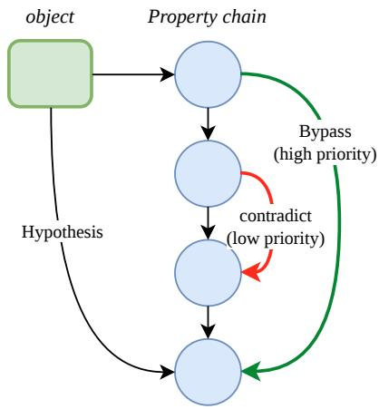  
Figure 6: Conflict: Contradict and Bypass

• Temporal Ordering: Randomizing the order in which the agents speak:

If the low-priority agent spoke first, the resolver registered a drop in confidence, followed by a nonmonotonic recovery when the high-priority agent corrected the record.

Conversely, if the high-priority agent spoke first, the system acted as an epistemic shield. When the low-priority agent disagreed, the resolver computed “no effect”.

• Redundancy Filtering: If a lower-priority source subsequently echoed a confirmation already established by a higher-priority source, the algorithm enforced a strict “no effect”.

• Subject Isolation: Entities subjected to Type 3 source-priority conflicts were disjoint from entities undergoing Type 1 or 2 scenarios to ensure the model’s success or failure is a function of priority resolution.

In Table 9, we have briefly discussed the mapping.

Table 9: Mapping of Question Types to (Lifschitz, 1988)’s Benchmark Equivalents
<table><tr><td>Question Type</td><td>Benchmark Equivalents</td></tr><tr><td>Type 1: Direct Chain Ma- nipulation</td><td>A1 (Basic Default Reasoning) A3 (Default Reasoning with Several Defaults) A4 (Disabled Default)</td></tr><tr><td>Type 2: Irrelevant Informa- tion</td><td>A2 (Default Reasoning with Ir- relevant Information)</td></tr><tr><td>Type 3: Source-Priority Conflicts</td><td>A9, A10 (Priorities between Defaults)</td></tr></table>

## C Inheritance Reasoning

In Inheritance reasoning, a target property was implied by the root entity/domain and was inherited by its descendants. A negative defeasible update (defeasible\_lack\_property edge) could block a property inherited from a more general entity. Whereas, a positive update to a more specific entity could again restore the property.

Figure 7 shows the real-life hierarchy mimics we have used as presets.

## D Data Creation Process

This section contains the overall architecture of the whole data creation process.

## D.1 Nonce Word Generation

There was the possibility that if we used real and sensical words as entity, models could answer using memorized real-world knowledge instead of reasoning over the premises provided in the conversation. Because nonce entities carry no predefined semantic associations, the resulting examples directly tested the defeasible reasoning process.

To populate the entity nodes of the reasoning structure, we generated the nonce words using character-level Markov n-gram models trained on different seed corpora following the UniPseudo paradigm of (New et al., 2024). We followed the CGCA approach of (König et al., 2020) to avoid bleed between word-initial and word-final contexts.

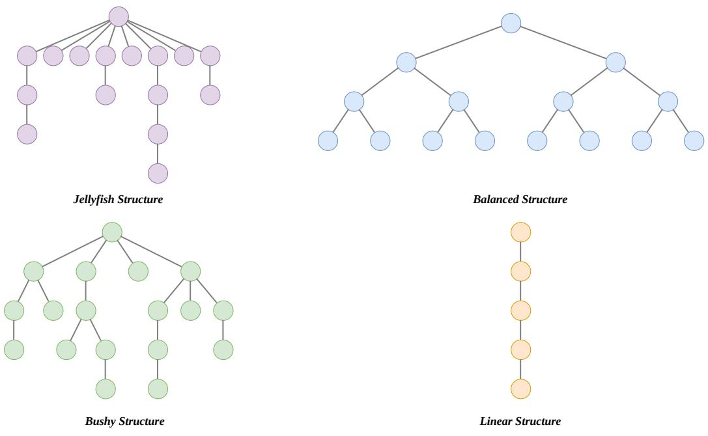  
Figure 7: Inheritance: Real Life Hierarchy Mimic

In this approach, the model’s transitions were bucketed by relative position (initial, medial, final).

Afterwards, transition probabilities were smoothed using interpolated Kneser–Ney following (Chen and Goodman, 1999), which prevents zero-probability assignments on unseen continuations and supports candidate scoring. Each candidate was additionally subject to a legality check (König et al., 2020).

To train the model, we prepared different reference corpora: reference nouns and adjectives, synthetic phonotactic syllables, domains with Datamuse expansion, etc. We also sampled nonce words, locking the suffix for noun and adjectiveshaped nonce words. Finally, we filtered out real English words, repeated characters, and unpronounceable consonant strings.

## D.2 Property Fetching and Enrichment

At first, we prepared a list of domain names. To fetch properties given the domain names, we queried the normalized ConceptNet DB2, Wiki-Data3, and Datamuse API4. Then we categorized the properties into groups. For instance, if a domain animal” has two properties named fly” and swim”, we assigned them to the group of capability”. Moreover, we used a Large Language Model to augment more properties under each group, augment new property groups, and enrich the domain-attribute mapping.

We represented each such group as “attribute” and properties under a group as “values”. To use these properties in a sentence, we need to prepare templates. For instance, “fly” is a value under the attribute “capability”. Now, the sentence should be “[Subject] can fly”. Here, the object predicate was stored as a template (“can [value]”). Values can be different capabilities in this case. Table 10 lists attribute counts and sample attributes for each domain.

## E Data Examples

## E.1 Default Reasoning

In Figure 12, an example graph on default reasoning is shown.

## E.2 Linear Inheritance

In Figure 13, an example graph on linear inheritance is shown.

## E.3 Tree Inheritance

In Figure 14, an example graph on tree inheritance is shown.

<table><tr><td rowspan=1 colspan=1>DomainName</td><td rowspan=1 colspan=1>Attr.Count</td><td rowspan=1 colspan=1>Sample Attributes</td></tr><tr><td rowspan=1 colspan=1>Animal</td><td rowspan=1 colspan=1>32</td><td rowspan=1 colspan=1>Sound,    Behavior,Size, Weight</td></tr><tr><td rowspan=1 colspan=1>Plant</td><td rowspan=1 colspan=1>30</td><td rowspan=1 colspan=1>Location, Origin, Age</td></tr><tr><td rowspan=1 colspan=1>Tool</td><td rowspan=1 colspan=1>25</td><td rowspan=1 colspan=1>Material, Utility, Af-fordance</td></tr><tr><td rowspan=1 colspan=1>Food</td><td rowspan=1 colspan=1>24</td><td rowspan=1 colspan=1>Texture, Flavor, Ap-pearance</td></tr><tr><td rowspan=1 colspan=1>Vehicle</td><td rowspan=1 colspan=1>25</td><td rowspan=1 colspan=1>Sound, Origin, State</td></tr><tr><td rowspan=1 colspan=1>Compound</td><td rowspan=1 colspan=1>21</td><td rowspan=1 colspan=1>Color, Shape, Size</td></tr><tr><td rowspan=1 colspan=1>Object</td><td rowspan=1 colspan=1>24</td><td rowspan=1 colspan=1>State, Utility, Role</td></tr><tr><td rowspan=1 colspan=1>Material</td><td rowspan=1 colspan=1>22</td><td rowspan=1 colspan=1>Composition, Tem-perature, Age</td></tr><tr><td rowspan=1 colspan=1>Micro organ-ism</td><td rowspan=1 colspan=1>18</td><td rowspan=1 colspan=1>Origin, Size, State</td></tr><tr><td rowspan=1 colspan=1>Infrastructure</td><td rowspan=1 colspan=1>24</td><td rowspan=1 colspan=1>Location,     Shape,Weight</td></tr></table>

Table 10: Domain Names and their corresponding Attribute Counts (Attr. Count).

## F Seeded Sample Variance: Statistical Details

This section provides full statistical details for the seeded sample variance analysis. We report the Intraclass Correlation Coefficient (ICC) pooled across all configurations and per-configuration Kruskal– Wallis tests of seed-level accuracy distributions.

## Experimental Setup

We run 20 independent random seeds per configuration, generating 30 conversations per seed. Eight models are evaluated: gpt-5.1, Qwen3-32B, Gemma-4 family (Gemma-4-E4B, Gemma-4-12B, Gemma-4-26B-A4B MoE, Gemma-4-31B), Llama-3.1-70B-Instruct and Llama-3.1-8B-Instruct, representing frontier closed, open large-scale to small model tiers, and a family of newer architecture models. Two configurations are tested: Default Reasoning and Linear Inheritance against the easy tier difficulty. Accuracy is computed at the turn level against formally verified ground truth labels for each seed independently.

## Intraclass Correlation Coefficient

To quantify the consistency of accuracy scores across seeds, we compute the two-way randomeffects ICC(2,1) treating seeds as the replicate factor and configurations as the grouping factor. The

ICC is estimated on a 16 × 20 matrix (16 cells = 8 models × 2 configurations; 20 seeds), with bootstrap confidence intervals computed over 1,000 resamples.

As shown in Table 12, the pooled ICC of 0.949 (95 % CI [0.9382, 0.9631]) indicates excellent consistency across seeds under all tested configurations (Koo and Li, 2016). The upper bound of the CI does not fall below 0.93, confirming that this conclusion is robust to bootstrap sampling variability.

## Kruskal–Wallis Tests

For each model–configuration cell, we additionally run a Kruskal–Wallis H-test with the null hypothesis that the 20 per-seed accuracy scores are drawn from the same distribution. Unlike the ICC, which measures overall consistency, the Kruskal–Wallis test is sensitive to any systematic ordering or drift across seeds within a cell. A non-significant result $( p > 0 . 0 5 )$ provides direct evidence that no seed produces systematically higher or lower accuracy than others.

All 16 cells are non-significant (minimum $p =$ 0.07, maximum $H \ = \ 2 8 . 7 5 )$ considering $\alpha =$ 0.05, providing no evidence that any seed produces systematically different results within a given configuration. The coefficient of variation remains below 8 % in all cells, with Gemma-4-31B showing the lowest variance $( \mathrm { C V } \leq 3 . 1 0 \% )$ ) and Gemma-4-E4B on linear inheritance showing the highest (CV $= 7 . 8 6 \%$ , still well within the range expected from sampling variability alone at n = 30 conversations per seed.

Taken together, the ICC and Kruskal–Wallis results confirm that DERELAB evaluations are statistically reproducible under reseeding: different seeds generate statistically equivalent datasets from the same configuration, and no seed produces a systematically advantaged or disadvantaged evaluation.

## G Path Confidence Analysis: Full Statistical Details

This appendix provides complete statistical results for the inference-path confidence analysis summarized in §5.3 of the main paper. This analysis is restricted to the tree inheritance paradigm where we want to check if there is a correlation between the graph structural distance of an incoming update and the hypothesis node and its effect on the model

<table><tr><td>Model</td><td>Config</td><td>Mean</td><td>Std</td><td>CV(%)</td><td>H</td><td>p</td><td>Sig.</td></tr><tr><td colspan="8">Default Reasoning, Easy</td></tr><tr><td>Qwen3-32B</td><td>Default</td><td>0.733</td><td>0.025</td><td>3.36</td><td>16.41</td><td>0.630</td><td>No</td></tr><tr><td>Gemma-4-12B</td><td>Default</td><td>0.791</td><td>0.027</td><td>3.47</td><td>20.63</td><td>0.358</td><td>No</td></tr><tr><td>Gemma-4-26B-A4B</td><td>Default</td><td>0.790</td><td>0.026</td><td>3.24</td><td>16.72</td><td>0.609</td><td>No</td></tr><tr><td>Gemma-4-31B</td><td>Default</td><td>0.842</td><td>0.026</td><td>3.10</td><td>28.75</td><td>0.070</td><td>No</td></tr><tr><td>Gemma-4-E4B</td><td>Default</td><td>0.467</td><td>0.028</td><td>5.96</td><td>12.46</td><td>0.865</td><td>No</td></tr><tr><td>gpt-5.1</td><td>Default</td><td>0.702</td><td>0.026</td><td>3.73</td><td>16.59</td><td>0.617</td><td>No</td></tr><tr><td>Llama-3.1-70B</td><td>Default</td><td>0.659</td><td>0.024</td><td>3.57</td><td>17.64</td><td>0.546</td><td>No</td></tr><tr><td>Llama-3.1-8B</td><td>Default</td><td>0.528</td><td>0.036</td><td>6.90</td><td>21.19</td><td>0.327</td><td>No</td></tr><tr><td colspan="8">Linear Inheritance, Easy</td></tr><tr><td>Qwen3-32B</td><td>Linear</td><td>0.893</td><td>0.036</td><td>4.01</td><td>22.99</td><td>0.238</td><td>No</td></tr><tr><td>Gemma-4-12B</td><td>Linear</td><td>0.897</td><td>0.029</td><td>3.25</td><td>17.95</td><td>0.526</td><td>No</td></tr><tr><td>Gemma-4-26B-A4B</td><td>Linear</td><td>0.867</td><td>0.034</td><td>3.93</td><td>13.95</td><td>0.787</td><td>No</td></tr><tr><td>Gemma-4-31B</td><td>Linear</td><td>0.932</td><td>0.032</td><td>3.44</td><td>19.29</td><td>0.439</td><td>No</td></tr><tr><td>Gemma-4-E4B</td><td>Linear</td><td>0.683</td><td>0.054</td><td>7.86</td><td>17.26</td><td>0.572</td><td>No</td></tr><tr><td>gpt-5.1</td><td>Linear</td><td>0.921</td><td>0.033</td><td>3.62</td><td>18.74</td><td>0.474</td><td>No</td></tr><tr><td>Llama-3.1-70B</td><td>Linear</td><td>0.908</td><td>0.029</td><td>3.20</td><td>14.98</td><td>0.724</td><td>No</td></tr><tr><td>Llama-3.1-8B</td><td>Linear</td><td>0.665</td><td>0.046</td><td>6.88</td><td>21.16</td><td>0.328</td><td>No</td></tr></table>

Table 11: Per-cell Kruskal–Wallis results across 20 seeds. Mean and Std are computed over per-seed accuracy scores. CV = coefficient of variation (Std / Mean × 100). H = Kruskal–Wallis statistic; $p = \mathrm { a s y }$ mptotic p-value under $\chi ^ { 2 }$ approximation with 19 degrees of freedom. No cell is significant at $\alpha = 0 . 0 5$

<table><tr><td>Statistic</td><td>Value</td></tr><tr><td>ICC(2,1)</td><td>0.949</td></tr><tr><td>95 % CI lower bound</td><td>0.9382</td></tr><tr><td>95 % CI upper bound</td><td>0.9631</td></tr><tr><td>Number of cells</td><td>16</td></tr><tr><td>Number of seeds per cell</td><td>20</td></tr><tr><td>Bootstrap resamples</td><td>1,000</td></tr></table>

Table 12: Pooled ICC(2,1) across all model– configuration cells.

confidence.

## Metrics and Statistical Tests

Structural distance d. Each update\_answer turn is annotated with d, the shortest-path distance in the tree between the update node and the hypothesis node. Distance d=1 means the update directly modifies a property the hypothesis entails; larger values require more inferential hops to reach the hypothesis.

On-path vs. off-path turns. A turn is on-path if the update’s logical effect is strengthen or weaken — it is causally relevant to the hypothesis. It is $o f f$ path if the effect is no effect — the update belongs to a sibling branch whose changes do not propagate to the hypothesis node. These conditions are nonoverlapping and form two separate analyses.

Gold confidence (gold\_conf). Each model response includes a constrained probability distribution $\mathbf { p _ { \lambda } } \in \Delta ^ { | \mathcal { V } | }$ over the answer label set Y. We

define

$$
\mathrm { g o l d \_ c o n f } \ = \ p _ { y ^ { * } } ,
$$

where $y ^ { * }$ is the ground-truth label. This measures how much probability mass the model places on the correct answer, regardless of which label it actually chose.

Predicted confidence (pred\_conf).

$$
\mathrm { p r e d } _ { - } \mathrm { c o n f } \ = \ p _ { \hat { y } } ,
$$

where $\hat { y } = \arg \operatorname* { m a x } _ { y } p _ { y }$ is the model’s predicted label. This measures the model’s self-assessed certainty in its own answer.

Confidence delta (∆gold\_conf). Raw gold confidence conflates per-sample baseline difficulty with path-length effects. We normalise by subtracting the initial confidence before any updates in the conversation:

$$
\Delta \mathrm { g o l d \_ c o n f } ( t ) = \mathrm { g o l d \_ c o n f } ( t ) \mathrm { - g o l d \_ c o n f } ( t _ { 0 } ) ,
$$

where $t _ { 0 }$ is the first initial\_answer turn in the conversation. Negative $\Delta$ indicates confidence erosion relative to baseline.

Entropy and margin. We track two complementary uncertainty measures. Shannon entropy $\begin{array} { r } { H ( \mathbf { p } ) = - \sum _ { y } p _ { y } \log p _ { y } } \end{array}$ (in nats) captures overall spread across the label set. The decision margin $m = p _ { ( 1 ) } - p _ { ( 2 ) }$ , where $p _ { ( k ) }$ is the k-th largest probability, captures the strength of the model’s top preference. High entropy and low margin both indicate uncertainty; they can diverge when the distribution has a long tail.

<table><tr><td rowspan="2">Model</td><td rowspan="2">Diff</td><td rowspan="2">n</td><td colspan="2">Distance effect</td><td colspan="2">Per-hop  $\hat { \beta }$ </td><td rowspan="2">Calibration</td></tr><tr><td> $\rho$ </td><td> $p$ </td><td> $\hat { \beta }$ </td><td>p ∆Brier</td></tr><tr><td>Llama-3.1-8B</td><td>Easy</td><td>150</td><td>-0.230</td><td>0.005</td><td>-0.069</td><td>&lt;0.001</td><td>+0.112</td></tr><tr><td>Llama-3.1-8B</td><td>Hard</td><td>294</td><td>-0.255</td><td>&lt;0.001</td><td>-0.069</td><td>&lt;0.001</td><td>+0.131</td></tr><tr><td>Llama-3.1-70B</td><td>Easy</td><td>150</td><td>-0.153</td><td>0.062</td><td>-0.056</td><td>&lt;0.001</td><td>+0.080</td></tr><tr><td>Llama-3.1-70B</td><td>Hard</td><td>294</td><td>-0.207</td><td>&lt;0.001</td><td>-0.056</td><td>&lt;0.001</td><td>+0.100</td></tr><tr><td>Gemma-4-E4B</td><td>Easy</td><td>150</td><td>-0.037</td><td>0.651</td><td>-0.021</td><td>0.114</td><td>-0.078</td></tr><tr><td>Gemma-4-E4B</td><td>Hard</td><td>294</td><td>+0.072</td><td>0.217</td><td>-0.021</td><td>0.114</td><td>-0.067</td></tr><tr><td>Gemma-4-12B</td><td>Easy</td><td>150</td><td>-0.140</td><td>0.087</td><td>-0.064</td><td>&lt;0.001</td><td>-0.032</td></tr><tr><td>Gemma-4-12B</td><td>Hard</td><td>294</td><td>-0.156</td><td>0.007</td><td>-0.064</td><td>&lt;0.001</td><td>+0.146</td></tr><tr><td>Gemma-4-31B</td><td>Easy</td><td>150</td><td>-0.273</td><td>&lt;0.001</td><td>-0.061</td><td>&lt;0.001</td><td>-0.028</td></tr><tr><td>Gemma-4-31B</td><td>Hard</td><td>294</td><td>-0.298</td><td>&lt;0.001</td><td>-0.061</td><td>&lt;0.001</td><td>+0.157</td></tr><tr><td>Gemma-4-MoE</td><td>Easy</td><td>150</td><td>-0.203</td><td>0.013</td><td>-0.039</td><td>0.014</td><td>+0.131</td></tr><tr><td>Gemma-4-MoE</td><td>Hard</td><td>294</td><td>-0.184</td><td>0.002</td><td>-0.039</td><td>0.014</td><td>+0.128</td></tr><tr><td>GPT-5.1</td><td>Easy</td><td>150</td><td>+0.015</td><td>0.860</td><td>+0.029</td><td>0.138</td><td>-0.031</td></tr><tr><td>GPT-5.1</td><td>Hard</td><td>294</td><td>+0.130</td><td>0.026</td><td>+0.029</td><td>0.138</td><td>-0.170</td></tr><tr><td>Qwen3-32B</td><td>Easy</td><td>150</td><td>-0.105</td><td>0.203</td><td>-0.026</td><td>0.095</td><td>+0.068</td></tr><tr><td>Qwen3-32B</td><td>Hard</td><td>294</td><td>-0.030</td><td>0.607</td><td>-0.026</td><td>0.095</td><td>-0.005</td></tr><tr><td>Qwen3-32B*</td><td>Easy</td><td>150</td><td>-0.042</td><td>0.609</td><td>-0.017</td><td>0.207</td><td>-0.003</td></tr><tr><td>Qwen3-32B*</td><td>Hard</td><td>151</td><td>-0.010</td><td>0.903</td><td>-0.017</td><td>0.207</td><td>+0.049</td></tr></table>

Table 13: On-path confidence analysis. $\rho$ is the Spearman correlation between update distance and gold-answer confidence (negative = confidence erodes with distance). $\hat { \beta }$ is the mixed-effects coefficient giving expected ∆gold\_conf per additional hop, controlling for conversation-level baseline. ∆Brier is the change in Brier score from short (d≤2) to long (d>2) chains; positive values indicate worsening calibration at greater depth. Qwen3-32B\* uses extended thinking mode.

Intrusion error. On an off-path turn, an intrusion error occurs when the model changes its answer from the previous turn and the new answer is wrong:

$$
\begin{array} { l } { \mathrm { i n t r u s i o n } ( t ) = \mathbf { 1 } [ \mathrm { e f f e c t } = \mathrm { n o } \mathrm { e f f e c t } ] } \\ { \cdot \mathbf { 1 } [ \hat { y } _ { t } \neq \hat { y } _ { t - 1 } ] } \\ { \cdot \mathbf { 1 } [ \hat { y } _ { t } \neq y _ { t } ^ { \ast } ] } \end{array}
$$

The intrusion rate is the fraction of off-path turns in a group that satisfy this condition. It directly measures how often a model revises its belief in response to causally irrelevant evidence.

Statistical tests. We use three tests to measure how confidence changes with path length. Spearman $\rho$ captures whether confidence rises or falls monotonically as d increases. Mixed-effects regression fits $\Delta \mathrm { g o l d } .$ \_conf against $d$ with a perconversation random intercept, so the coefficient $\hat { \beta }$ gives the expected confidence change per additional hop while controlling for each conversation’s baseline difficulty. Brier scores compare calibration quality on short $( d \leq 2 )$ versus long $( d > 2 )$

chains — a rising score means the model’s probability estimates become less reliable as chains grow.

## G.1 On-Path Results

Table 13 shows three measures of how reasoning quality changes as the update moves further from the hypothesis in the inheritance tree: the Spearman correlation $\rho$ between distance and gold-answer confidence, the per-hop regression coefficient ${ \hat { \beta } } ,$ and the change in Brier score from short to long chains (∆Brier).

Five of nine models degrade with distance. Llama-3.1-8B, Llama-3.1-70B, Gemma-4-12B, Gemma-4-31B, and Gemma-4-MoE all show consistent negative $\rho$ and significant negative $\hat { \beta } ( p <$ 0.05 after controlling for difficulty). The effect is strongest for Gemma-4-31B $( \rho ~ = ~ - 0 . 2 9 8 .$ $\hat { \beta } ~ = ~ - 0 . 0 6 1$ on hard) and the Llama models $( \hat { \beta } = - 0 . 0 6 9$ and −0.056 respectively), meaning each additional inferential hop costs these models up to 6–7 percentage points of correct-label confidence. Gemma-4-MoE shows a similar but weaker pattern $( \hat { \beta } = - 0 . 0 3 9 )$ .

GPT-5.1, Qwen3, and Gemma-4-E4B are robust. None of these three show a significant distance effect, and their ∆Brier values are zero or negative — meaning calibration does not degrade and, for GPT-5.1 on the hard split, actually improves at longer chains (∆Brier = −0.170). Gemma-4-E4B is a special case: it is distance-robust but has the worst absolute Brier scores in the table (0.715 shortpath, hard), indicating that its probability estimates are unreliable throughout, not just at depth.

Hard chains amplify calibration degradation. For most models, the easy split shows moderate or even negative ∆Brier, while the hard split is consistently positive and substantially larger. Gemma-4-31B, for example, has near-zero Brier on both short and long easy chains, but its long-chain hard Brier rises to 0.201 (∆ = +0.157), suggesting that the compounding difficulty of harder graphs accelerates the breakdown of calibrated confidence at depth.

<table><tr><td>Model</td><td>Diff</td><td>Intrus.</td><td>SR</td><td>Off-path acc.</td></tr><tr><td>Llama-3.1-8B</td><td>Easy</td><td>36.2 %</td><td>0.68×</td><td>47.8 %</td></tr><tr><td>Llama-3.1-8B</td><td>Hard</td><td>31.9 %</td><td>0.82×</td><td>36.3 %</td></tr><tr><td>Llama-3.1-70B</td><td>Easy</td><td>15.2 %</td><td>0.80×</td><td>63.0 %</td></tr><tr><td>Llama-3.1-70B</td><td>Hard</td><td>8.1 %</td><td>0.83×</td><td>32.0 %</td></tr><tr><td>Gemma-4-E4B Gemma-4-E4B</td><td>Easy</td><td>4.2 %</td><td>0.98×</td><td>45.1 %</td></tr><tr><td></td><td>Hard</td><td>5.6 %</td><td>1.00×</td><td>31.1 %</td></tr><tr><td>Gemma-4-12B</td><td>Easy</td><td>1.1 %</td><td>1.03×</td><td>94.7 %</td></tr><tr><td>Gemma-4-12B</td><td>Hard</td><td>1.4 %</td><td>0.99×</td><td>80.7 %</td></tr><tr><td>Gemma-4-31B</td><td>Easy</td><td>0.3 %</td><td>0.97×</td><td>98.2 %</td></tr><tr><td>Gemma-4-31B</td><td>Hard</td><td>1.4 %</td><td>0.90×</td><td>84.6 %</td></tr><tr><td>Gemma-4-MoE</td><td>Easy</td><td>1.5 %</td><td>0.85×</td><td>93.2 %</td></tr><tr><td>Gemma-4-MoE</td><td>Hard</td><td>3.3 %</td><td>0.89×</td><td>70.0 %</td></tr><tr><td>GPT-5.1</td><td>Easy</td><td>0.9 %</td><td>1.29×</td><td>95.9 %</td></tr><tr><td>GPT-5.1</td><td>Hard</td><td>1.2 %</td><td>1.33×</td><td>79.4 %</td></tr><tr><td>Qwen3-32B</td><td>Easy</td><td>1.4 %</td><td>1.19×</td><td>89.3 %</td></tr><tr><td>Qwen3-32B</td><td>Hard</td><td>1.3 %</td><td>1.07×</td><td>68.3 %</td></tr><tr><td>Qwen3-32B*</td><td></td><td></td><td></td><td></td></tr><tr><td></td><td>Easy</td><td>0.2 %</td><td>0.94×</td><td>99.8 %</td></tr><tr><td>Qwen3-32B*</td><td>Hard</td><td>2.6 %</td><td>1.01×</td><td>93.9 %</td></tr></table>

Table 14: Off-path analysis. Intrus. (Intrusion): fraction of off-path turns where the model incorrectly changes its answer. SR (Signal ratio): mean |∆gold\_conf| on causally relevant (on-path) turns divided by off-path turns; values below 1× indicate the model is more perturbed by irrelevant updates than relevant ones. Off-path acc.: accuracy on turns where the update should have no effect.

## G.2 Off-Path Results

Table 14 reports three off-path metrics: the fraction of turns where the model incorrectly changes its answer to an irrelevant update (intrusion rate), how strongly it reacts to irrelevant versus relevant updates (signal ratio), and its raw accuracy on off-path turns.

Intrusion rates expose a two-tier split. Llama-3.1-8B intrudes on 36.2 % of easy off-path turns and 31.9 % of hard turns — more than one in three structurally irrelevant updates causes an incorrect answer change. Llama-3.1-70B is better but still high at 15.2 % on easy. All other models stay below 6 %, with Gemma-4-31B (0.3 %), Qwen3-32B\* (0.2 %), and GPT-5.1 (0.9 %) the most reliable.

Only GPT-5.1 and Qwen3-32B consistently discriminate relevant from irrelevant evidence. The signal ratio compares how much confidence shifts on causal updates versus irrelevant ones. GPT-5.1 is the only model with a ratio above 1× in every condition (1.29× easy, 1.33× hard), and Qwen3-32B matches this on both splits (1.19×, 1.07×). Every other model shows ratio inversion in at least one condition, meaning off-path updates perturb their confidence at least as much as on-path ones. The worst cases are Llama-3.1-8B (0.68× easy) and Llama-3.1-70B (0.80× easy): these models are more reactive to irrelevant information than to information that actually matters.

Gemma-4-E4B presents a distinct failure mode. Despite a low intrusion rate (4–6 %), Gemma-4- E4B achieves only 31–45 % off-path accuracy and a near-unity signal ratio (≈ 1.00×). Rather than incorrectly revising answers, it simply holds wrong answers throughout, unable to reason correctly on off-path turns regardless of whether it changes its response.

## Discussion

The results reveal two distinct failure modes that do not co-occur systematically.

Chain-length sensitivity affects five of nine models: as the inheritance chain between the update and hypothesis grows longer, confidence in the correct answer erodes and calibration worsens. This is not simply an accuracy problem — models can still produce the right discrete answer while becoming progressively less certain that it is correct.

Structural blindness affects a separate set of models: rather than using graph structure to filter which updates are logically relevant, they treat offpath sibling-branch updates with the same weight as causally connected ones. The clearest signal is ratio inversion — off-path evidence perturbing confidence more than on-path evidence — combined with high intrusion rates.

The two failure modes are empirically dissociable. Gemma-4-31B is the most distance-sensitive model on-path (βˆ = −0.061, ρ = −0.298) yet has the lowest easy-split intrusion rate (0.3 %) and nearperfect off-path accuracy (98.2 %). It degrades gracefully along relevant chains but correctly ignores irrelevant ones. GPT-5.1 shows neither failure: no distance effect, negative ∆Brier, and the only consistently positive signal ratio. Llama-3.1- 8B sits at the opposite extreme, combining significant on-path degradation with catastrophic structural blindness. Gemma-4-E4B represents a third, rarer pattern — robust to distance and resistant to intrusion, yet poorly calibrated throughout and unable to reason correctly on off-path turns.

Taken together, chain-length sensitivity and structural blindness are separable properties of the reasoning process, and improving one does not imply progress on the other.

## H Confirmation Bias Experiment

## Theoretical Background

Confirmation bias is the tendency to search for, interpret, and recall information in a way that confirms one’s prior beliefs. It is one of the most robust and widely replicated findings in cognitive psychology (Nickerson, 1998). Its relevance to language model evaluation arises from the multi-turn nature of defeasible reasoning: a model that has committed to a belief at turn t must be willing to revise that belief at turn t + 1 if new evidence warrants it. A model exhibiting confirmation bias will systematically fail to revise, treating incongruent evidence as less compelling than its logical weight justifies.

Prior work has documented content effects in LLM reasoning and susceptibility to cognitive biases more broadly (Jones and Steinhardt, 2022), but defeasible belief updating under formally verified ground truth has not previously been studied in this framework. DERELAB is the first benchmark to provide the controlled conditions necessary to measure confirmation bias as a structural property of belief updating rather than a surface-level sensitivity to semantic content.

## Operationalization

Prior belief. The model’s prior belief at turn t is defined as its predicted answer at the immediately preceding update\_answer or initial\_answer turn. Critically, we use the model’s own predicted answer, not the ground truth, as the prior. Confirmation bias is a property of what the model resists updating away from, regardless of whether that prior belief was correct.

Prior reset. At every hypothesis change turn, the prior belief tracker resets. The new section’s prior is initialized from the ground truth of the initial answer turn for the new hypothesis subject, not from the model’s answer in the preceding section. This prevents cross-subject contamination of the congruence labels.

Congruence conditions. Each update\_answer turn is assigned exactly one label from the following mutually exclusive taxonomy:

• C1 — Congruent, live chain. Prior belief = yes; ground-truth effect = strengthening. The update aligns with the model’s current belief.

• C2 — Incongruent, live chain. Prior belief = yes; ground-truth effect = weakening. The update should defeat the current conclusion. This is the primary confirmation-bias signal.

• C3 — Saturated semantic negative. Prior belief = no; ground-truth effect = no effect; update type ∈ {neg, exception}. The chain is already defeated; the update sounds negative but is logically inert. A model that labels this as weakening is responding to surface form rather than logical scope — a phenomenon we term semantic override.

• C3inh — Sibling-branch semantic negative. Prior belief = yes; ground-truth effect = no effect; negation in update content (inheritance only). The update concerns a sibling branch that cannot affect the hypothesis subject. A model that answers no is confusing topological adjacency with logical scope.

• C4 — Neutral distractor. Prior belief = no; ground-truth effect = no effect. For default reasoning, further restricted to update\_type = safe\_irr (explicitly harmless updates; other types go to C0). For inheritance reasoning, no update-type restriction applies — any off-path update with a nonsupporting prior qualifies. Logically irrelevant regardless of semantic content.

• C5 — From unknown prior. Prior belief = unknown; ground-truth effect ∈ {strengthening, weakening}. Directional updates from an indeterminate state; analyzed separately from C1–C4.

• C0 — Excluded. All remaining combinations that do not fit C1–C5 unambiguously. Logged with reason; excluded from all analyses.

Metrics We already mentioned the metrics in §3.8. The two metrics we employ are BiasGap and Odds Ratio. BiasGap, the difference in accuracy between congruent and incongruent updates, measures the extent to which models exhibit confirmation bias. On the other hand, Odds Ratio (OR) is a scale-invariant measure of effect size.

Statistical tests. We use McNemar’s test (with continuity correction) rather than a proportion test because C1 and C2 turns are not independent: both arise from the same hypothesis section, the same subject, and the same conversational context. McNemar asks whether the model’s error pattern is asymmetric between C1 and C2 within the same section, which is a more sensitive and bettercontrolled test than comparing aggregate proportions across sections. One C1–C2 pair is selected per section to avoid pseudoreplication from sections with multiple C1 or multiple C2 turns. Because we run one test per model–reasoning-type cell (19 tests in total, excluding GPT-5-mini inheritance where OR is undefined), Holm–Bonferroni correction is applied to control the family-wise error rate across the full set of comparisons. A significant result with positive BiasGap constitutes evidence of confirmation bias for that model.

Belief update dissociation. For default reasoning, where the belief-update question is also asked, we additionally measure $\operatorname { A c c } _ { \mathrm { e f f e c t } } ( \mathbf { C } 2 )$ : accuracy on the strengthen / weaken / no effect question specifically on C2 turns. A model where $\operatorname { A c c } _ { \mathrm { e f f e c t } } ( \mathbf { C } 2 )$ is high but BiasGap is also high exhibits the phenomenon that the model correctly identifies that the update weakens the hypothesis but fails to update its entailment answer accordingly.

A potential confound is that in the standard format, the entailment question (update\_answer) appears before the belief-update question (effect\_of\_update). A model that has already committed to a particular entailment answer may use that commitment as a cue to produce a consistent effect label, inflating $\operatorname { A c c } _ { \mathrm { e f f } }$ without any genuine prior understanding of the update’s logical role. To test whether the metacognitive signal is genuine or post-hoc, we re-ran six models with the question order reversed: the effect question was posed first, and the entailment question followed. Results and their implications are discussed in Section I.1.

Anchoring analysis. For each hypothesis section in which the ground-truth label changes between the initial and final turn, we compute the anchoring rate:

$$
A = \frac { \left| \left\{ s \in \mathcal { S } : \hat { y } _ { \mathrm { f i n a l } } ^ { ( s ) } = \hat { y } _ { \mathrm { i n i t } } ^ { ( s ) } \neq y _ { \mathrm { f i n a l } } ^ { ( s ) } \right\} \right| } { \left| \left\{ s \in \mathcal { S } : y _ { \mathrm { i n i t } } ^ { ( s ) } \neq y _ { \mathrm { f i n a l } } ^ { ( s ) } \right\} \right| }\tag{3}
$$

Here, $\boldsymbol { \mathcal { S } }$ denotes the set of hypothesis sections, $\hat { y } _ { \mathrm { i n i t } }$ and $\hat { y } _ { \mathrm { f i n a l } }$ are the model’s initial and final predictions, and $y _ { \mathrm { i n i t } }$ and $y _ { \mathrm { f i n a l } }$ are the corresponding ground-truth labels. A section counts as anchored when the model preserves its initial prediction despite the correct answer changing over the course of the conversation.

A high anchoring rate indicates that the model maintains its initial conclusion, even after a sequence of updates that should have revised it.

## I Confirmation Bias: Full Statistical Results

This appendix provides complete statistical tables and figures for the confirmation bias analysis. All metrics follow the operationalization in Appendix H.

## Primary Bias Metrics

Table 15 reports the full bias metrics for all model– reasoning-type cells. 17 of 19 valid tests are significant after Holm–Bonferroni correction. The two exceptions are Gemma-4-MoE on default reasoning $( \mathrm { G a p } = - 0 . 0 0 7 , p = . 2 3 5 )$ , which shows no measurable bias, and Qwen3-32B\* on inheritance reasoning $( \mathrm { G a p } = 0 . 0 6 5 , p = . 2 3 5 )$ .

Scale of the effect. GPT-5.1 shows the most extreme default-reasoning bias $( \mathrm { G a p } = 0 . 9 3 5 , \mathrm { O R } =$ 891), meaning the odds of correct updating on congruent turns are nearly 900 times those on incongruent turns. Qwen3-32B and GPT-5-mini have comparable default gaps (≈ 0.67 each), though OR magnitudes differ because C1 accuracy differs (0.976 vs. 0.871): a high C1 floor inflates the OR independently of the gap.

<table><tr><td>Model</td><td>Type</td><td>C1 acc</td><td>C2 acc</td><td>Gap</td><td>OR</td><td>OR lo</td><td>OR hi</td><td>Holm p</td></tr><tr><td colspan="9">Default reasoning (sorted by Gap ↓)</td></tr><tr><td>GPT-5.1</td><td>def</td><td>0.970</td><td>0.035</td><td>0.935</td><td>891.2</td><td>585.9</td><td>1497.7</td><td>&lt; .001</td></tr><tr><td>Qwen3-32B</td><td>def</td><td>0.976</td><td>0.307</td><td>0.670</td><td>93.3</td><td>61.7</td><td>155.7</td><td>&lt; .001</td></tr><tr><td>GPT-5-mini</td><td>def def</td><td>0.871</td><td>0.203</td><td>0.668</td><td>26.5</td><td>19.2</td><td>37.9</td><td>&lt; .001</td></tr><tr><td>Gemma-4-E4B</td><td>def</td><td>0.978 0.697</td><td>0.381 0.149</td><td>0.597 0.548</td><td>72.7 13.2</td><td>45.6 9.3</td><td>132.6 19.2</td><td>&lt; .001 &lt; .001</td></tr><tr><td>Llama-3.1-70B Llama-3.1-8B</td><td>def</td><td>0.773</td><td>0.549</td><td>0.224</td><td>2.8</td><td>1.8</td><td>4.6</td><td></td></tr><tr><td>Gemma-4-31B</td><td>def</td><td>0.994</td><td>0.907</td><td>0.088</td><td></td><td></td><td></td><td>&lt; .001</td></tr><tr><td>Gemma-4-12B</td><td></td><td></td><td></td><td></td><td>18.1</td><td>8.9</td><td>83.0</td><td>&lt; .001</td></tr><tr><td>Qwen3-32B*</td><td>def</td><td>0.950 0.881</td><td>0.868</td><td>0.082</td><td>2.9</td><td>2.0</td><td>4.4</td><td>&lt; .001</td></tr><tr><td></td><td>def def</td><td>0.954</td><td>0.873 0.961</td><td>0.008 -0.007</td><td>1.1</td><td>0.8</td><td>1.5</td><td>.015</td></tr><tr><td>Gemma-4-MoE</td><td></td><td></td><td></td><td></td><td>0.8</td><td>0.5</td><td>1.6</td><td>.235</td></tr><tr><td colspan="9">Inheritance reasoning (sorted by Gap ↓)</td></tr><tr><td>Llama-3.1-8B</td><td>inh</td><td>0.738</td><td>0.255</td><td>0.484</td><td>8.3</td><td>5.9</td><td>11.9</td><td>&lt; .001</td></tr><tr><td>Llama-3.1-70B</td><td>inh</td><td>0.899</td><td>0.535</td><td>0.364</td><td>7.8</td><td>4.7</td><td>14.1</td><td>&lt; .001</td></tr><tr><td>Gemma-4-E4B</td><td>inh</td><td>0.741</td><td>0.417</td><td>0.324</td><td>4.0</td><td>3.1</td><td>5.2</td><td>&lt; .001</td></tr><tr><td>Gemma-4-MoE</td><td>inh</td><td>0.971</td><td>0.664</td><td>0.307</td><td>16.7</td><td>9.0</td><td>43.6</td><td>&lt; .001</td></tr><tr><td>Qwen3-32B</td><td>inh</td><td>0.918</td><td>0.623</td><td>0.295</td><td>6.8</td><td>4.4</td><td>11.9</td><td>&lt; .001</td></tr><tr><td>Gemma-4-31B</td><td>inh</td><td>0.935</td><td>0.686</td><td>0.249</td><td>6.6</td><td>4.4</td><td>11.3</td><td>&lt; .001</td></tr><tr><td>GPT-5.1</td><td>inh</td><td>0.958</td><td>0.712</td><td>0.246</td><td>9.3</td><td>5.4</td><td>21.6</td><td>&lt; .001</td></tr><tr><td>Gemma-4-12B</td><td>inh</td><td>0.854</td><td>0.675</td><td>0.179</td><td>2.8</td><td>2.2</td><td>3.8</td><td>&lt; .001</td></tr><tr><td>Qwen3-32B*</td><td>inh</td><td>0.973</td><td>0.908</td><td>0.065</td><td>3.7</td><td>2.1</td><td>7.6</td><td>.235</td></tr><tr><td>GPT-5-mini</td><td>inh</td><td>1.000</td><td>0.997</td><td>0.003</td><td></td><td>一</td><td></td><td></td></tr><tr><td></td><td></td><td></td><td></td><td></td><td></td><td></td><td></td><td></td></tr></table>

Table 15: Full primary bias metrics for all model–reasoning-type cells. OR = odds ratio; OR lo and OR hi are the lower and upper bounds of the 95 % bootstrap confidence interval (10,000 resamples, conversation-level). ${ \mathrm { G a p } } = { \mathrm { C l } } { \mathrm { a c c } } - { \mathrm { C } } 2 { \mathrm { a c c } }$ . Holm–Bonferroni correction applied across all 19 cells with defined OR. Italic p-values indicate non-significant results $\left( \boldsymbol { p } \geq . 0 5 \right.$ after correction). GPT-5-mini inheritance OR is undefined (C1 errors = 0). Qwen3-32B\* default $( p = . 0 1 5 )$ is statistically significant but the effect size is negligible $( \mathrm { G a p } = 0 . 0 0 8 , \mathrm { O R } = 1 . 1 )$ Llama model paired counts on default reasoning are limited by high unknown-response rates (Llama-3.1-70B: 127 pairs; Llama-3.1-8B: 68 pairs).

Thinking variant eliminates default bias. The contrast between Qwen3-32B and its extendedreasoning variant Qwen3-32B\* is the strongest finding in the new model set. On default reasoning, Qwen3-32B achieves Gap = 0.670 (OR = 93.3); Qwen3-32B\* reduces this to Gap = 0.008 (OR = 1.1, p = .015), a statistically detectable but substantively negligible effect driven by the large sample size. Extended chain-of-thought reasoning virtually eliminates confirmation bias on this topology. The benefit is partial on inheritance: Qwen3-32B\* still shows $\mathrm { G a p } = 0 . 0 6 5$ , though this is non-significant $\left( p = . 2 3 5 \right)$ .

Llama evasion bias. Llama-3.1-70B and Llama-3.1-8B produce unknown responses at high rates on default reasoning (C5 turns: 1,693 and 875 respectively), reducing the number of turns with a yes prior that qualify as C1 or C2. This evasion artificially lowers paired counts for McNemar testing (Llama-3.1-70B: 127 pairs; Llama-3.1-8B: 68 pairs) and should be read as an additional failure mode alongside their measured bias gap.

## Anchoring and Semantic Override

Table 16 reports anchoring rates on ground-truthflipping sections and semantic override rates on $\mathrm { C } 3 / \mathrm { C } 3 _ { \mathrm { i n h } }$ turns.

Anchoring splits models cleanly. On default reasoning, Qwen3-32B (0.483) and GPT-5.1 (0.433) show the highest anchoring rates — the model preserves its initial prediction in roughly 40-50% of conversations where the correct answer changes. Despite being the most entailment-biased model, GPT-5.1’s anchoring is concentrated on default reasoning and drops to 0.051 on inheritance. Qwen3- 32B\* (0.032) and GPT-5-mini (0.020) show nearzero anchoring on both types, consistent with their generally compliant updating behavior. On inheritance reasoning, Gemma-4-E4B stands apart with an anchoring rate of 0.635 — the model maintains its initial prediction in nearly two-thirds of flipping sections. Llama-3.1-8B is second at 0.338.

Semantic override is topology-specific. Llama-3.1-70B (default reasoning, C3: 0.839) and Qwen3- 32B (default reasoning, C3: 0.786) respond to logically inert negative updates on defeated chains as if the chain were still active. Crucially, both models show near-zero $\mathrm { C } 3 _ { \mathrm { i n h } }$ override on inheritance (Llama-3.1-70B: 0.062; Qwen3-32B: 0.036), indicating the error is specific to the topology in which the belief-update negations are presented, not a general surface-form sensitivity. Gemma-4-E4B shows the opposite extreme on default C3: exactly 0.000 — it never over-responds to a saturated semantic negative. Combined with its high anchoring, this points to strong persistence in initial predictions as its primary failure mode rather than surface-form reactivity.

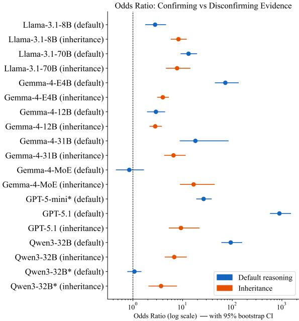  
Figure 8: Forest plot of odds ratios (log scale) with 95 % bootstrap confidence intervals per model–reasoningtype cell. $\mathrm { O R } > 1$ indicates confirmation bias. Nonsignificant cells (Gemma-4-MoE default, Qwen3-32B\* inheritance) are shown with open markers. GPT-5-mini inheritance is excluded (OR undefined).

## Metacognitive Dissociation

Each conversation turn contains two questions: the entailment question (yes / no / unknown, reported as C1 acc and C2 acc throughout the paper) and the effect-of-update question (strengthening / weakening / no-effect). C1-eff and C2-eff reported here are accuracy on this second. Table 17 reports this effect-labeling accuracy (default reasoning only). The metacognitive gap (C1-eff − C2-eff) measures whether a model better recognizes strengthening or weakening; a negative gap indicates the model is better at labeling weakening despite showing entailment confirmation bias.

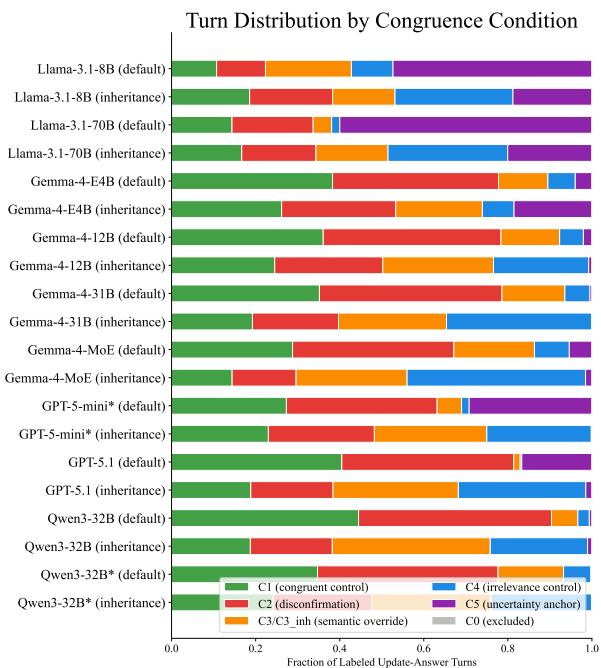  
Figure 9: Distribution of congruence conditions per model and reasoning type (fraction of total turns). Large C5 segments for Llama-3.1-70B and Llama-3.1-8B on default reasoning reflect evasion bias. Large C0 segments reflect turns excluded due to prior-belief state not meeting C1–C5 criteria.

Know-but-don’t-output. Four models show a clear dissociation between metacognitive accuracy and entailment accuracy on C2 turns. GPT-5-mini is the most extreme case: C2- $\cdot \mathrm { e f f } = 0 . 9 5 4$ (correctly labels weakening on 95 % of C2 turns) but entailment accuracy on the same turns is only 0.203 — a 75-point gap. Llama-3.1-70B correctly identifies weakening on 85 % of C2 turns but updates its entailment answer only 14.9 % of the time. Qwen3- 32B shows the same pattern more mildly (C2- eff= 0.803, C2 acc = 0.307). Gemma-4-31B’s gap is smaller in absolute terms $( \mathbf { C 2 - e f f } = 0 . 9 7 0 $ C2 acc = 0.907) but the dissociation is still present.

Symmetric and reversed profiles. Qwen3-32B\* shows a symmetric metacognitive profile (C1-eff ≈ C2-eff ≈ 0.708), consistent with its near-zero bias gap: neither entailment nor metacognition displays a C1/C2 asymmetry. GPT-5.1 is the only model with a reversed metacognitive gap (C1- $\mathrm { e f f } = 0 . 7 9 7 > \mathrm { C } 2 \mathrm { - e f f } = 0 . 6 4 3 )$ : it is better at recognising strengthening than weakening. This does not indicate absence of bias — GPT-5.1’s entailment C2 accuracy remains 0.035 — but the metacognitive asymmetry runs in the opposite direction from the entailment asymmetry.

<table><tr><td rowspan="2">Model</td><td colspan="2">Default reasoning</td><td colspan="2">Inheritance reasoning</td></tr><tr><td>Anch.</td><td>C3-ovr</td><td>Anch.</td><td> $\mathbf { C } 3 _ { \mathrm { i n h } } \mathbf { - } \mathbf { 0 } \mathbf { v } \mathbf { r }$ </td></tr><tr><td>Qwen3-32B</td><td>0.483</td><td>0.786</td><td>0.220</td><td>0.036</td></tr><tr><td>GPT-5.1</td><td>0.433</td><td>0.125</td><td>0.051</td><td>0.026</td></tr><tr><td>Gemma-4-E4B</td><td>0.396</td><td>0.000</td><td>0.635</td><td>0.095</td></tr><tr><td>Llama-3.1-70B</td><td>0.189</td><td>0.839</td><td>0.068</td><td>0.062</td></tr><tr><td>Gemma-4-12B</td><td>0.122</td><td>0.678</td><td>0.142</td><td>0.034</td></tr><tr><td>Llama-3.1-8B</td><td>0.119</td><td>0.492</td><td>0.338</td><td>0.408</td></tr><tr><td>Gemma-4-31B</td><td>0.047</td><td>0.204</td><td>0.047</td><td>0.041</td></tr><tr><td>Gemma-4-MoE</td><td>0.035</td><td>0.251</td><td>0.024</td><td>0.092</td></tr><tr><td>Qwen3-32B*</td><td>0.032</td><td>0.349</td><td>0.004</td><td>0.027</td></tr><tr><td>GPT-5-mini</td><td>0.020</td><td>0.071</td><td>0.003</td><td>0.002</td></tr></table>

Table 16: Anchoring rate on ground-truth-flipping hypothesis sections and semantic override rate on C3 turns, per reasoning type. Anch.: fraction of flipping sections where model maintains its initial prediction despite the correct answer changing. C3-ovr (default): fraction of C3 turns where model labels a logically inert negative update as weakening (chain already defeated). $\mathbf { C 3 _ { i n h } \cdot }$ ovr (inheritance): fraction of $\mathrm { C } 3 _ { \mathrm { i n h } }$ turns where model answers no on a sibling-branch update that cannot affect the hypothesis. Rows sorted by default anchoring rate descending.  
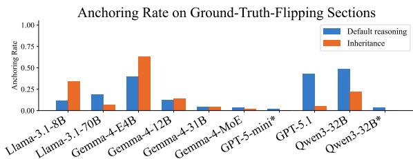  
Figure 10: Anchoring rate on ground-truth-flipping sections per model and reasoning type. The Qwen3- 32B/Qwen3-32B\* contrast (0.483 vs. 0.032 on default) and the Gemma-4-E4B inheritance spike (0.635) are the key features.

## I.1 Reversed Question Order: Addressing the Metacognitive Confound

Motivation. In the standard format, the entailment question (update\_answer) precedes the belief-update question (effect\_of\_update). A model that has already committed to an answer — say, maintaining yes despite a weakening update — may then produce weakening on the effect question as post-hoc rationalization rather than genuine prior understanding. This would inflate $\operatorname { A c c } _ { \mathrm { e f f } } ( \mathbf { C } 2 )$ and overstate the know-but-don’t-output dissociation: the model is not knowing in the relevant sense if its metacognitive label is produced retroactively. To control for this, we re-ran six models on the same dataset with the order reversed: the effect question was posed first, and the entailment question followed. If the original $\operatorname { A c c } _ { \mathrm { e f f } } ( \mathbf { C } 2 )$ values were genuine — reflecting knowledge available before the entailment commitment — they should be stable across both orderings. If they were inflated by post-hoc rationalization, they should drop in the reversed condition.

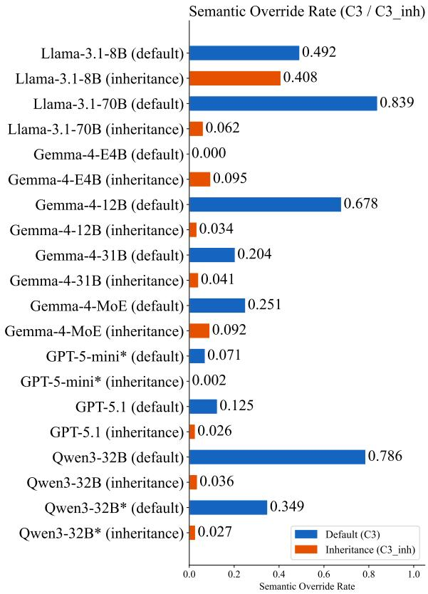  
Figure 11: Semantic override rate per model. Default C3 (solid): fraction of turns where model incorrectly labels a logically inert negative update as weakening (chain already defeated). Inheritance $\mathrm { C } 3 _ { \mathrm { i n h } }$ (hatched): fraction where model answers no on a sibling-branch update that cannot affect the hypothesis subject. Llama-3.1-70B shows an extreme default override (0.839) that does not carry over to inheritance (0.062), indicating sensitivity to surface negation that is specific to the belief-update task format. Gemma-4-E4B shows exactly 0.000 default override.

Models tested. The reversed-order experiment was run on six models for default reasoning (easy and hard): Qwen3-32B, Gemma-4-12B, Gemma-4- MoE, Gemma-4-31B, Gemma-4-E4B, and Llama-3.1-8B. These were chosen to span a range of original $\operatorname { A c c } _ { \mathrm { e f f } }$ profiles, from near-zero (Gemma-4-E4B) to near-perfect (Gemma-4-31B).

Results. Table 18 reports the key comparisons.   
Two patterns emerge cleanly.

(1) The confirmation bias gap is robust to order. BiasGap is unchanged or larger in the reversed condition for all six models. Gemma-4-

<table><tr><td>Model</td><td>C1-eff</td><td>n</td><td>C2-eff</td><td>n</td><td>Gap</td></tr><tr><td>Gemma-4-31B</td><td>0.464</td><td>886</td><td>0.970</td><td>1094</td><td>-0.506</td></tr><tr><td>GPT-5-mini</td><td>0.513</td><td>799</td><td>0.954</td><td>1049</td><td>-0.441</td></tr><tr><td>Llama-3.1-70B</td><td>0.680</td><td>406</td><td>0.851</td><td>545</td><td>-0.172</td></tr><tr><td>Gemma-4-12B</td><td>0.737</td><td>907</td><td>0.887</td><td>1063</td><td>-0.151</td></tr><tr><td>Qwen3-32B</td><td>0.753</td><td>1226</td><td>0.803</td><td>1265</td><td>-0.050</td></tr><tr><td>Qwen3-32B*</td><td>0.708</td><td>849</td><td>0.708</td><td>1050</td><td>0.000</td></tr><tr><td>Gemma-4-E4B</td><td>0.049</td><td>870</td><td>0.000</td><td>897</td><td>+0.049</td></tr><tr><td>Llama-3.1-8B</td><td>0.722</td><td>198</td><td>0.665</td><td>215</td><td>+0.057</td></tr><tr><td>Gemma-4-MoE</td><td>0.855</td><td>653</td><td>0.732</td><td>870</td><td>+0.122</td></tr><tr><td>GPT-5.1</td><td>0.797</td><td>1270</td><td>0.643</td><td>1282</td><td> $+ 0 . 1 5 3$ </td></tr></table>

Table 17: Metacognitive accuracy on the belief-update question (default reasoning only). C1-eff: fraction of C1 turns correctly labeled strengthening. C2-eff: fraction of C2 turns correctly labeled weakening. $\mathbf { G a p } = \mathbf { C l } .$ eff − C2-eff: negative = model recognizes weakening better than strengthening. Rows sorted by gap ascending to surface the dissociation pattern. Gemma-4-E4B nearzero on both columns indicates failure to use the beliefupdate label vocabulary.

31B’s gap is essentially identical (0.088 → 0.082). The others increase, in some cases substantially: $\mathrm { Q w e n 3 - 3 2 B ~ ( 0 . 6 7 0 ~  ~ 0 . 8 1 6 ) }$ , Gemma-4-E4B $( 0 . 5 9 7  0 . 8 4 0 )$ , and most strikingly Gemma-4- MoE, which showed no bias in the original order $( \mathrm { G a p } = - 0 . 0 0 7 )$ but a clear and significant bias in the reversed order $( \mathrm { G a p } = 0 . 2 5 9 , \mathrm { O R } = 2 4 . 8 )$ . The core phenomenon — models handling congruent updates better than incongruent ones — is not an artifact of question ordering.

(2) Metacognitive accuracy is orderdependent for most models. $\operatorname { A c c } _ { \mathrm { e f f } } ( \mathbf { C } 2 )$ drops substantially in the reversed condition for Gemma-4-31B (0.970 → 0.264), Gemma-4-12B (0.887 → 0.209), and Qwen3-32B $( 0 . 8 0 3  0 . 4 1 4 )$ . These were the models with the largest original $\operatorname { A c c } _ { \mathrm { e f f } } ( \mathbf { C } 2 )$ values and the most prominent know-but-don’t-output pattern. The drop confirms that a substantial portion of their original effect-label accuracy was post-hoc: having already said no to the entailment question, producing weakening on the effect question required little additional reasoning.

Gemma-4-E4B is the exception: its near-zero original $\operatorname { A c c } _ { \mathrm { e f f } } ( \mathbf { C } 2 )$ rises to 0.349 in the reversed condition. In the original order, this model’s entailment answers are strongly biased (it usually maintains yes on C2 turns), and having committed to yes made it harder, not easier, to subsequently label the effect as weakening. The reversed order removed this interference, allowing its genuine — though limited — ability to recognise weakening

<table><tr><td>Model</td><td colspan="2">BiasGap</td><td colspan="2">C2-eff</td><td colspan="2">C1-eff</td></tr><tr><td></td><td>Orig</td><td>Rev</td><td>Orig</td><td>Rev</td><td>Orig</td><td>Rev</td></tr><tr><td>Gemma-4-31B</td><td>0.088</td><td>0.082</td><td>0.970</td><td>0.264</td><td>0.464</td><td>0.112</td></tr><tr><td>Gemma-4-12B</td><td>0.082</td><td>0.105</td><td>0.887</td><td>0.209</td><td>0.737</td><td>0.222</td></tr><tr><td>Qwen3-32B</td><td>0.670</td><td>0.816</td><td>0.803</td><td>0.414</td><td>0.753</td><td>0.311</td></tr><tr><td>Llama-3.1-8B</td><td>0.224</td><td>0.305</td><td>0.665</td><td>0.533</td><td>0.722</td><td>0.390</td></tr><tr><td>Gemma-4-MoE</td><td>-0.007</td><td>0.259</td><td>0.732</td><td>0.288</td><td>0.855</td><td>0.242</td></tr><tr><td>Gemma-4-E4B</td><td>0.597</td><td>0.840</td><td>0.000</td><td>0.349</td><td>0.049</td><td>0.374</td></tr></table>

Table 18: Comparison of standard (Orig) and reversed question order (Rev) for six models on default reasoning. BiasGap: C1 acc − C2 acc on the entailment question; the primary confirmation-bias measure. C2-eff: accuracy at labeling the update’s effect as weakening on C2 turns. C1-eff: accuracy at labeling the effect as strengthening on C1 turns. Rows sorted by original C2- eff descending to highlight the post-hoc rationalization pattern. BiasGap is unchanged or increases in every model under reversal; C2-eff drops substantially for the three models that showed the strongest original knowbut-don’t-output dissociation.

to surface.

Implications. The reversed-order results call for a qualified reading of the know-but-don’t-output claim. The bias itself is genuine and robust: confirmation bias persists at equal or greater magnitude when the entailment judgment is made after the metacognitive one. However, the original $\operatorname { A c c } _ { \mathrm { e f f } } ( \mathbf { C } 2 )$ values for Gemma-4-31B, Gemma-4- 12B, and Qwen3-32B overstated how much these models know about the logical role of an incongruent update at the time of the entailment decision. A more accurate characterisation for these models is that they systematically fail to update on incongruent evidence regardless of whether they can label its effect, and that this failure is not mediated by a prior correct understanding of the update’s direction.

## J Real-Entity Robustness Check

In our main benchmark, we used pseudowords (e.g. flurp, zandel) to prevent models from exploiting world-knowledge shortcuts. To test whether entity naming affects reasoning quality, we ran a controlled comparison for seven models using the same real-world property chains under two conditions: pseudoword — entities are unfamiliar pseudowords embedded in the chain (e.g. viatud, romsan); and real entity — entities are replaced with real-world objects from the same domain (e.g. concert guitar, mandolin). The graph structure, property chain, and update sequence are identical across both conditions; only the entity names differ.

<table><tr><td></td><td colspan="6">Update-answer accuracy</td><td colspan="2">Effect-of-update acc.</td></tr><tr><td></td><td colspan="2">Default</td><td colspan="2">Linear</td><td colspan="2">Tree</td><td colspan="2">Default</td></tr><tr><td>Model</td><td>Pseudo</td><td>Real</td><td>Pseudo</td><td>Real</td><td>Pseudo</td><td>Real</td><td>Pseudo</td><td>Real</td></tr><tr><td>Qwen3-32B*</td><td>0.616</td><td>0.587</td><td>0.837</td><td>0.779</td><td>0.793</td><td>0.814</td><td>0.826</td><td>0.808</td></tr><tr><td> $\mathrm { G e m m a } { \cdot } 4 { \cdot } 3 1 \mathrm { B }$ </td><td>0.688</td><td>0.683</td><td>0.861</td><td>1.000</td><td>0.895</td><td>0.949</td><td>0.792</td><td>0.795</td></tr><tr><td> $\mathrm { G e m m a } { \cdot } 4 { \cdot } 1 2 \mathrm { B }$ </td><td>0.553</td><td>0.530</td><td>0.884</td><td>0.837</td><td>0.659</td><td>0.901</td><td>0.777</td><td>0.751</td></tr><tr><td> $_ \mathrm { G e m m a - } 4 { \mathrm { - } } \mathrm { M o E }$ </td><td>0.522</td><td>0.540</td><td>0.814</td><td>0.756</td><td>0.747</td><td>0.910</td><td>0.784</td><td>0.774</td></tr><tr><td>Gemma-4-E4B</td><td>0.566</td><td>0.561</td><td>0.674</td><td>0.674</td><td>0.422</td><td>0.564</td><td>0.803</td><td>0.813</td></tr><tr><td>Llama-3.1-70B</td><td>0.634</td><td>0.590</td><td>0.802</td><td>0.837</td><td>0.806</td><td>0.895</td><td>0.829</td><td>0.813</td></tr><tr><td>Llama-3.1-8B</td><td>0.470</td><td>0.478</td><td>0.605</td><td>0.535</td><td>0.493</td><td>0.550</td><td>0.558</td><td>0.582</td></tr></table>

Table 19: Update-answer and effect-of-update accuracy under pseudoword entity names (Pseudo) and real entity names (Real), across three topologies. Both conditions use the same real-world property chain and graph structure; only entity names differ. Each condition contains 385 / 86 / 1072 update turns for default / linear / tree respectively. Effect-of-update accuracy is only defined for default-reasoning turns. Qwen3-32B\* is the extended-thinking variant.

In the case of Default Reasoning and Linear Inheritance, differences between conditions are small and inconsistent across models, with no systematic advantage for either naming convention. On default reasoning, most models change by less than 0.05 in either direction; Llama-3.1-70B shows the largest single drop $( 0 . 6 3 4  0 . 5 9 0 )$ and Gemma-4-MoE the largest gain $( 0 . 5 2 2  0 . 5 4 0 )$ , neither of which constitutes a clear pattern. Under linear inheritance topologies, results are similarly mixed. Gemma-4-31B shows the largest improvement of 0.139 with real entities. In contrast, Llama-3.1-8B faces a drop of 0.07. Effect-of-update accuracy likewise shows no consistent direction $( | \Delta | < 0 . 0 3$ for five of seven models).

On the other hand, Tree Inheritance shows improvements with real entities across all seven models. For this topology, Gemma-4-12B improves by 0.24, which is the highest among all configurations. Qwen3-32B\* improves by 0.02, indicating the lowest improvement for tree inheritance.

Overall, replacing pseudoword entity names with real-world names does not reliably improve or degrade reasoning accuracy when the underlying graph structure is held constant. Although tree inheritance doesn’t show any degradation, improvements aren’t significant either. Models do not appear to exploit the semantic identity of entity names as a reasoning shortcut, which supports the validity of the pseudoword design: the benchmark results are not an artifact of unfamiliar naming.

## K Evaluation Prompts

Table 22 lists the system prompts used for evaluation.

<table><tr><td>Model</td><td>Developer</td><td>Access</td></tr><tr><td>GPT-5.1</td><td>OpenAI</td><td>Proprietary</td></tr><tr><td>GPT-5-mini</td><td>OpenAI</td><td>Proprietary</td></tr><tr><td>Gemma-4-31B-IT (Team, 2026)</td><td>Google</td><td>Open Weight</td></tr><tr><td>Gemma-4-26B-A4B-IT (Team, 2026)</td><td>Google</td><td>Open Weight</td></tr><tr><td>Gemma-4-12B-IT (Team, 2026)</td><td>Google</td><td>Open Weight</td></tr><tr><td>Gemma-4-E4B-IT (Team, 2026)</td><td>Google</td><td>Open Weight</td></tr><tr><td>Llama-3.1-70B (Grattafiori et al., 2024)</td><td>Meta</td><td>Open Weight</td></tr><tr><td>Llama-3.1-8B (Grattafiori et al., 2024)</td><td>Meta</td><td>Open Weight</td></tr><tr><td>Qwen3-32B (Team, 2025)</td><td>Alibaba</td><td>Open Weight</td></tr></table>

Table 20: Overview of the language models used in the experiments, including their developers and access types.
<table><tr><td>Model</td><td>Parameters</td><td>Architecture</td><td>Context</td></tr><tr><td>GPT-5.1</td><td>Undisclosed</td><td>Proprietary</td><td>400K</td></tr><tr><td>GPT-5-mini</td><td>Undisclosed</td><td>Proprietary</td><td>400K</td></tr><tr><td>Gemma-4-31B-IT (Team, 2026)</td><td>31B</td><td>Dense</td><td>256K</td></tr><tr><td>Gemma-4-26B-A4B-IT (Team, 2026)</td><td>25.2B (3.8B active)</td><td>MoE</td><td>256K</td></tr><tr><td>Gemma-4-12B-IT (Team, 2026)</td><td>12B</td><td>Dense</td><td>256K</td></tr><tr><td>Gemma-4-E4B-IT (Team, 2026)</td><td>~4.5B effective</td><td>Dense</td><td>128K</td></tr><tr><td>Llama-3.1-70B (Grattafiori et al., 2024)</td><td>70B</td><td>Dense</td><td>128K</td></tr><tr><td>Llama-3.1-8B (Grattafiori et al., 2024)</td><td>8B</td><td>Dense</td><td>128K</td></tr><tr><td>Qwen3-32B (Team, 2025)</td><td>32B</td><td>Dense</td><td>32K*</td></tr></table>

Table 21: Model specifications, including parameter counts, architectures, and context-window sizes.

## L Resource Information

Table 20 and 21 cover the information about LLMs used in experiments. We evaluate nine base models under ten model–inference configurations, including standard and extended-thinking variants of Qwen3-32B. For proprietary/closed models (GPT-5.1 and GPT-5-mini), we kept the temperature at 0.1. For open-weighted models, we used constrained decoding. We ran 3 A40 GPUs $( 4 8 \times 3 =$ 144 GB) for approximately 180 hours.

We used Claude $\mathrm { C o d e } ^ { 5 }$ for coding purposes and ChatGPT 6 for refining our writing.

Algorithm 1 Skeptical Inference with Graph Trimming and Degree Ordering   
1: function TRIMFORQUERY(Γ, x, y)   
2: ForwardSet ← nodes reachable from x via strictly positive links   
3: BackwardSet ← nodes from which y can be reached   
4: Γ′ ← ForwardSet ∩ BackwardSet   
5: return Γ′   
6: end function   
7: function SELECTNEXTDEGREE(Γ′, P)   
8: N ← ∅   
9: for all node v ∈ Γ′ such that v /∈ P do   
10: if all predecessors of v are contained in P then   
11: N ← N ∪ {v}   
12: end if   
13: end for   
14: return N   
15: end function   
16: function QUERY(Γ, x, y)   
17: Γ′ ← TRIMFORQUERY(Γ, x, y)   
18: P ← ∅   
19: State(x) ← True   
20: while P ̸= Γ′ do   
21: N ← SELECTNEXTDEGREE(Γ′, P)   
22: for all node w ∈ N do   
▷ 1. Direct evidence overrides inherited evidence   
23: if direct positive link (x → w) exists in Γ then   
24: State(w) ← True   
25: else if direct negative link (x ̸→ w) exists in Γ then   
26: State(w) ← False   
27: else ▷ 2. Collect inherited evidence from valid parents   
28: PosParents ← {p | State(p) = True ∧ (p → w) exists}   
29: NegP arents ← {p | State(p) = True ∧ (p ̸→ w) exists}   
30: if PosParents ̸= ∅ and NegParents = ∅ then   
31: State(w) ← True   
32: else if NegParents ̸= ∅ and PosParents = ∅ then   
33: State(w) ← False   
34: else if PosParents ̸= ∅ and NegParents ̸= ∅ then   
▷ 3. More specific information defeats more general information   
35: State(w) ← RESOLVESPECIFICITY(PosParents, NegParents)   
36: else   
37: State(w) ← Unknown   
38: end if   
39: end if   
40: end for   
41: P ← P ∪ N   
42: end while   
43: return State(y)   
44: end function

<table><tr><td rowspan=1 colspan=1>Prompt Title/Name</td><td rowspan=1 colspan=1>Prompt</td></tr><tr><td rowspan=1 colspan=1>System Prompt A: Inher-itance Defeasible Reason-ing</td><td rowspan=1 colspan=1>You are an expert in defeasible reasoning. You will be given a categoryhierarchy where entities belong to categories, and categories can belongto other categories. A property that applies to a category generallyapplies to all entities and subcategories within it, unless explicitly statedotherwise for a specific entity or subcategory.All previously given information remains active throughout theconversation. You will then receive a series of information updatesone at a time. After each update you will be asked whether all theinformation so far supports the hypothesis.Answer yes if the hierarchy and facts support the hypothesisand nothing blocks inheritance for the specific entity in question, noif inheritance is explicitly blocked for that entity, or unknown if youcannot determine either way.Output only the answer word and nothing else. Do not explain,justify, or add any additional text.</td></tr><tr><td rowspan=1 colspan=1>System Prompt B: Defea-sible Reasoning with Ef-fect Turns</td><td rowspan=1 colspan=1>You are an expert in defeasible reasoning. You will be given a set ofgeneral rules and specific facts about objects. The rules are defaults:they hold generally unless specific information contradicts them fora particular object. All previously given information remains activeunless explicitly overridden.You will then receive a series of information updates one at atime. After each update you will be asked one of two questions:Support: Does the information support the hypothesis? Answer yes,no, or unknown.Effect: Does the update strengthen, weaken, or have no effect on thesupport for the hypothesis?When information comes from multiple sources, rely on the mostreliable source when sources contradict each other. If a less reliablesource makes a claim and a more reliable source makes a different butnon-contradicting claim, both claims remain active independently. Amore reliable source speaking does not undo what a less reliable sourceestablished unless they are making opposite claims about exactly thesame fact.Output only the answer word and nothing else. Do not explain,justify, or add any additional text.</td></tr></table>

Table 22: System Prompts for Evaluation

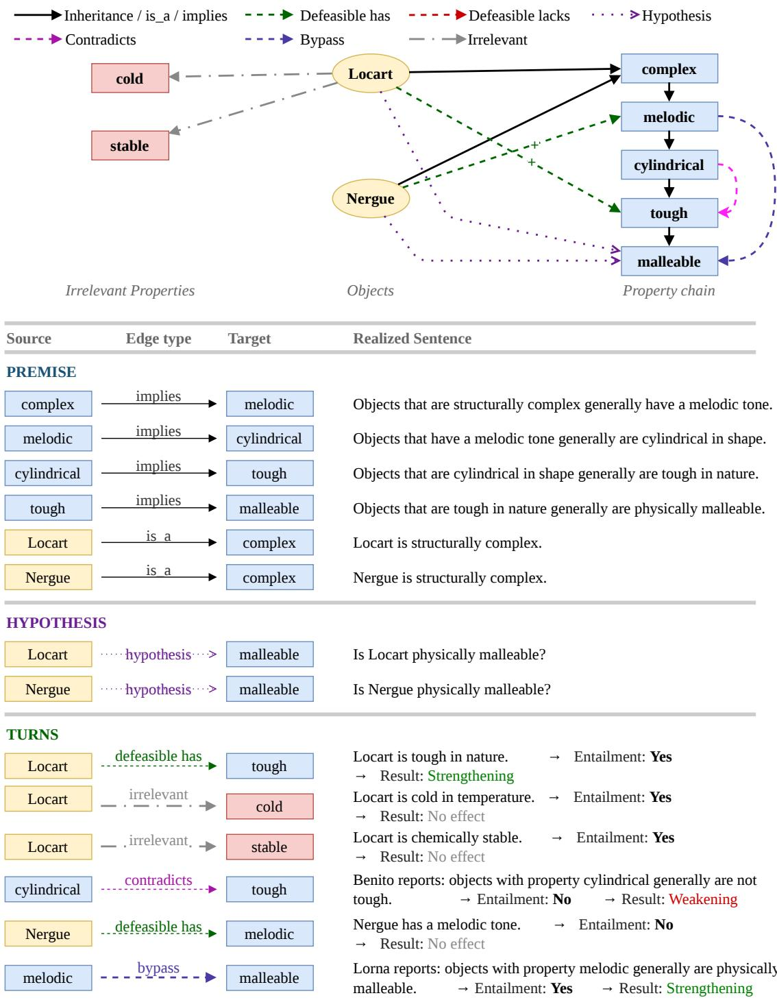  
Figure 12: Default Reasoning Example

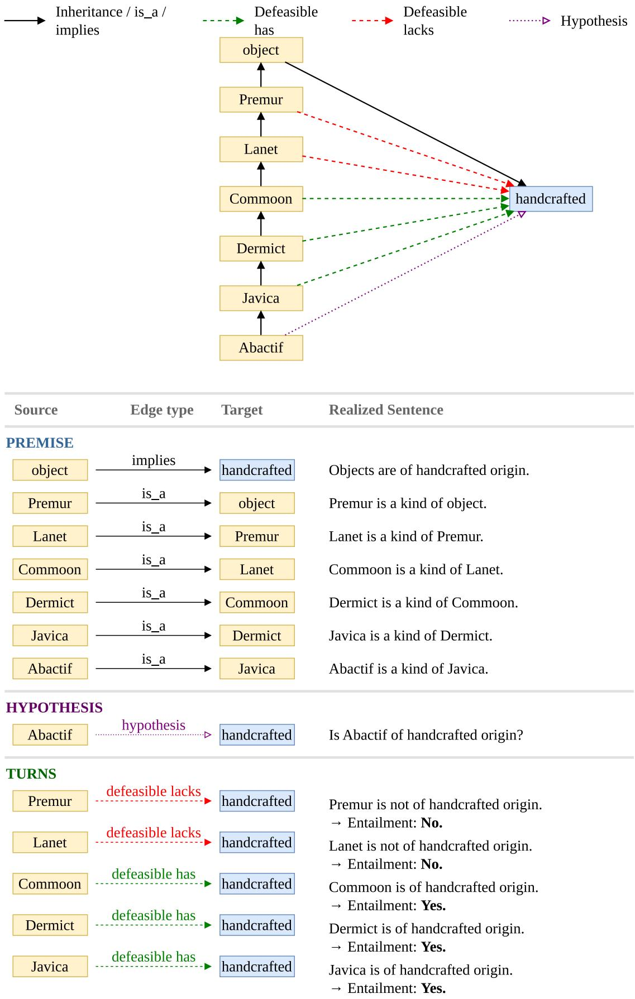  
Figure 13: Linear Inheritance Example

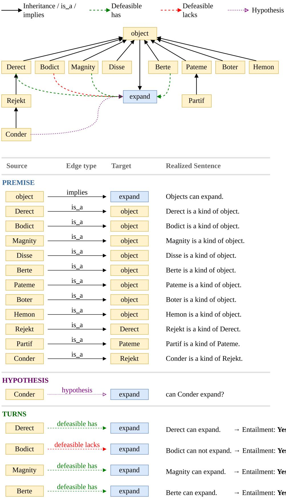  
Figure 14: Tree Inheritance Example