# Dense Clinical Contrasts Enhance Medical Knowledge Updating in Large Language Models

Yangmin Huang1,2,\*,†, Shu Quan1,\*, He Geng1, Xin Ye1,†, Qianyun Du1,

Zhiyang He1, Jiaxue Hu1, Xiaodong Tao1

1 Xunfei Healthcare Technology Co., Ltd.

2 USTC-Xunfei Healthcare Digital and Health Joint Laboratory

{ymhuang9, shuquan, hegeng2, xinye6, qydu, zyhe, jxhu2, xdtao}@iflytek.com

## Abstract

Medical knowledge changes continually, making large language models vulnerable to relying on outdated yet clinically plausible information. We study whether the format of supervision affects medical knowledge updating under a matched training-budget setting. We introduce SEER-Bench, a temporally anchored oncologystaging benchmark curated from the latest versioned SEER Research Data release, and render identical medical update events from NCCN oncology guidelines into four supervision formats: EMQ, MSQ, FITB, and SAQ. Across SEER-Bench and HealthBench Professional, EMQ gives the most stable external transfer and retention among same-budget SFT variants. With EMQ supervision, the updated 4B model produces competitive results on temporally anchored oncology staging, reaching 64.8% answer accuracy and 59.6% rationale accuracy on SEER-Bench. Diagnostic analyses suggest that EMQ exposes denser clinical contrast signals while preserving discriminative representations with smaller movement from the base model. These results show that medical knowledge updating depends not only on the update algorithm, but also on how knowledge is structured as supervision.

## 1 Introduction

Large language models (LLMs) are increasingly used for medical question answering and clinical decision support (Thirunavukarasu et al., 2023; Singhal et al., 2023; Nori et al., 2023), yet their parametric knowledge can become stale as medical standards update (Lazaridou et al., 2021; Dhingra et al., 2022). This challenge is especially critical in oncology, where staging criteria, treatment guidelines, and drug labels are frequently revised (Strobl et al., 2023). These revisions are often incremental and highly conditional; even narrowly scoped guideline revisions can substantially alter clinical decision pathways. For instance, the latest NCCN updates prioritize immediate EBRT or systemic therapy for unresectable, locoregional invasive thyroid cancer, rendering the previous routine standard of 131I whole-body imaging obsolete (NCCN, 2026). When such updates are not incorporated, LLMs may assign an outdated stage that changes eligibility for surgery, radiotherapy, or systemic treatment; recommend a superseded management pathway that delays appropriate care; or support an obsolete recommendation with an overconfident rationale that makes the error difficult to detect; Appendix J gives a versioned guideline example of each potential failure mode. These failures may occur unevenly across cancer populations, particularly when certain cancer types, clinical presentations, languages, or guideline regions are underrepresented in training or update supervision.

Although various methods address LLM knowledge staleness—ranging from retrieval to parametric editing (Wang et al., 2024)—one question remains underexplored in temporally evolving medical adaptation: how should knowledge updates be represented as supervision before adaptation? Moreover, systematically evaluating how these supervision formats affect model adaptation requires an explicit temporal anchor to determine whether performance reflects pre-existing parametric knowledge or the successful incorporation of newly revised guidance. Yet existing medical benchmarks primarily assess long-stable textbook knowledge (Jin et al., 2021; Pal et al., 2022), while temporal benchmarks focus on general-domain facts (Vu et al., 2024), leaving a gap for a benchmark with a well-defined clinical time boundary for evaluating period-specific medical updates.

In this paper, we bridge this gap by introducing SEER-Bench, a temporally anchored oncology staging benchmark curated from the latest released SEER Research Data (Surveillance, Epidemiology, and End Results (SEER) Program, 2026), which contains staging information that strictly aligns with up-to-date NCCN guidelines. The benchmark contains 1,992 curated cases across 16 cancer types. We conduct a format-varied study that renders identical NCCN medical update events into four supervision formats (National Comprehensive Cancer Network, 2025) (Figure 1), using a shared adaptation setup. Among same-budget SFT variants, EMQ yields the strongest external generalization, reaching 64.8% SEER-Bench answer accuracy with Qwen3-4B (Qwen Team, 2025d) and, in a descriptive rather than controlled comparison, falling within the range of several much larger external reference systems evaluated under the same protocol. Input-density, representationpreservation, and cost-benefit analyses provide diagnostic evidence consistent with this advantage.

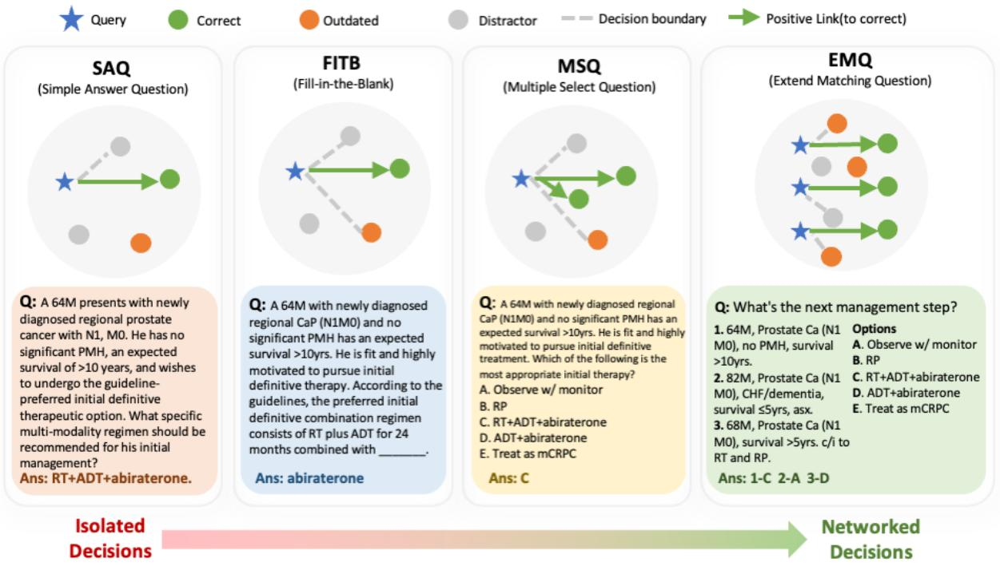  
Figure 1: Overview of supervision formats repurposed for SFT. SAQ, FITB, and MSQ rely on isolated, one-to-one or one-to-few decision structures. EMQ introduces a networked structure, requiring the model to resolve many-to-many correspondences within a shared answer pool.

Our contributions are as follows:

• We introduce SEER-Bench, a real-world oncology staging benchmark with an explicit temporal anchor for evaluating time-sensitive medical reasoning in LLMs.

• We show that EMQ provides the strongest external transfer and retention among samebudget SFT variants.

• We provide input-density, representationpreservation, and cost-benefit analyses that link EMQ’s advantage to dense clinical contrast signals and more economical representational change.

• We release SEER-Bench, related code and prompts at https://github.com/Iflytek-Medical-SouthChina/SeerBench.

## 2 Related Work

Medical QA benchmarks and knowledge temporality. Medical QA benchmarks commonly use licensing-exam formats such as MCQs, extended matching items, and clinical vignettes (Jin et al., 2021, 2019; Pal et al., 2022; Kung et al., 2023; Singhal et al., 2025; Geng et al., 2026). Most, however, evaluate long-stable textbook knowledge rather than temporally versioned guideline transitions. Newer benchmarks improve task realism or contamination control (Arora et al., 2025; Yan et al., 2026; Quan et al., 2026), but do not directly target clinical update events; temporal QA studies further show that LLMs can rely on stale pretraining facts (Vu et al., 2024; Mousavi et al., 2024). SEER-Bench addresses this gap by evaluating oncology staging from the latest versioned SEER Research Data release (Surveillance, Epidemiology, and End

Results (SEER) Program, 2026), with versioned registry fields, cohort filtering, and tumor-site coverage.

Mechanisms for updating LLM knowledge. LLM knowledge updating has been studied through retrieval-augmented generation, which surfaces external evidence at inference time (Lewis et al., 2020; Vu et al., 2024); continual pretraining, which refreshes parameters at high computational cost (Jang et al., 2022); knowledge editing, which modifies model behavior locally (Meng et al., 2022; Zheng et al., 2023); and parameter-efficient finetuning such as LoRA (Hu et al., 2021; Ge et al., 2024). These lines mainly differ in how updates are injected. Our study asks a complementary question: under a shared updating setup, how does the supervision format used to present the update affect downstream transfer?

Supervision format in medical training. Knowledge-centric medical training data is often rendered as MCQs with distractors (Sileo et al., 2024), mixed QA formats (Qiu et al., 2025), or cloze-style probes (Petroni et al., 2019). EMQs, a standard medical-exam format (Frey et al., 2022; Case and Swanson, 1993), require many-to-many matching within a shared candidate space. Prior training-data studies often change content, difficulty, format, and optimization objectives together (Wang et al., 2023; Mukherjee et al., 2023), making the role of format difficult to inspect. We therefore compare the same update events rendered as SAQ, MSQ, FITB, and EMQ under a same-budget updating protocol.

## 3 Same-Budget Updating Protocol

## 3.1 Medical Update Events

The atomic unit of supervision is a medical update event, represented as a triplet $( a _ { \mathrm { b a s e } } , a _ { \mathrm { n e w } } , d )$ Here, $a _ { \mathrm { n e w } }$ denotes the recommendation supported by the current guideline standard, $a _ { \mathrm { b a s e } }$ denotes the alternative recommendation elicited from the target base model when it rejects $a _ { \mathrm { n e w } }$ , and d describes the clinically relevant contrast between them. Thus, $a _ { \mathrm { b a s e } }$ operationalizes the model’s non-current medical knowledge, rather than requiring every alternative to be traceable to a historical guideline version.

As illustrated in the top panel of Figure 2, in the first stage, model-conditioned triplet construction, we derive current recommendations $a _ { \mathrm { n e w } }$ from NCCN clinical practice guideline in oncology (National Comprehensive Cancer Network, 2025) and query the target base model to identify non-current medical knowledge. For each $a _ { \mathrm { n e w } }$ , the model judges whether the recommendation is correct; when it rejects the current recommendation, we elicit its alternative answer as $a _ { \mathrm { b a s e } }$ and ask it to explain the clinical contrast d. The resulting triplets therefore target cases where the base model does not reliably encode the current recommendation. The full construction prompt is shown in Figure 5.

In the second stage, format rendering, we use Gemini 3.1 Pro (Google DeepMind, 2026) with format-specific prompts (Appendix A) to instantiate the model-conditioned triplets as training items. We denote by $\mathcal { R } _ { f }$ the prompt-specified rendering rule for format $f .$ For each format f ∈ {SAQ, FITB, MSQ, EMQ}, each item is generated as

$$
\begin{array} { r } { q _ { i } ^ { ( f ) } = \mathcal { R } _ { f } ( a _ { \mathrm { n e w } , i } , B _ { i } , D _ { i } , s _ { i } ) , } \end{array}\tag{1}
$$

where $a _ { \mathrm { n e w } , i }$ is the unique current recommendation targeted by item $q _ { i }$ , $B _ { i }$ is the set of elicited basemodel alternatives, $D _ { i }$ contains the corresponding clinical contrasts, and $s _ { i }$ is the source reference material. The prompt requires each item to reflect the contrast between $a _ { \mathrm { n e w } , i }$ and $B _ { i }$ so that supervision remains anchored to the intended update. Duplicate $a _ { \mathrm { n e w } }$ targets are removed before rendering; thus each training item targets one current recommendation, although it may contain multiple base-model alternatives.

## 3.2 Human-in-the-Loop Quality Verification

Quality verification follows an iterative humanin-the-loop process. After each rendering round, we sample a stratified 10% subset of generated items for expert review. Clinical reviewers assess whether the item correctly reflects the intended update target, whether the clinical vignette is plausible, whether the answer and rationale are consistent with the source recommendation, and whether the distractors or non-current alternatives are clinically meaningful. Reviewer feedback is then incorporated into the rendering process, and the revised prompts are used in the next generation round.

We repeat this review-and-revision cycle until the generated items reach a stable quality level. In the final audit, 94.8% of reviewed items pass human quality inspection. Items that fail the audit are either revised or removed before training. Details on expert profiles, annotation protocols, and the iterative verification procedure are provided in Appendix B and Algorithm 1. All formats are constructed from the same pool of 2,530 unique vignettes; Appendix D provides token-budget and matched-vignette controls.

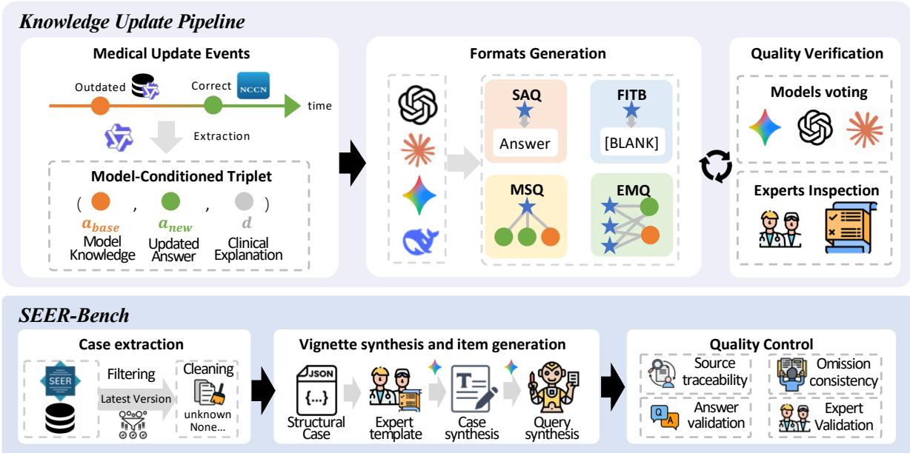  
Figure 2: Construction pipeline for update supervision and SEER-Bench. The top panel converts NCCN guideline changes into structured update units and four verified supervision formats. The bottom panel selects SEER Research Data cases, constructs clinical vignettes, and applies multi-stage quality control.

## 3.3 Supervision Formats

All formats are generated from the same update targets and source references, using format-specific prompts that require clinical case analysis rather than isolated factual recall. Each item is anchored to the contrast between the current recommendation $a _ { \mathrm { n e w } }$ , the base-model alternatives $B _ { i }$ and the clinical contrast explanations $D _ { i } .$ Thus, all formats expose both the target update and clinically plausible non-current alternatives; the controlled variable is how these contrasts are structured within the training instance. The full rendering prompts are provided in Appendix A.

• SAQ (Short Answer Question): presents a clinical case and asks for the current recommendation, the rationale, and the contrast with non-current alternatives.

• MSQ (Multiple Select Question): presents a clinical case with item-specific answer options, including clinically plausible alternatives, and asks the model to select all options supported by the current recommendation.

• FITB (Fill-in-the-Blank): masks the critical updated medical entity in a clinical narrative and asks the model to complete it, with explanation reflecting the clinical contrast.

• EMQ (Extended Matching Question): groups related clinical vignettes into a shared option space and asks the model to match each vignette to the current recommendation.

The key structural distinction is therefore not whether a format contains contrastive information, but how that information is organized. In SAQ, MSQ, and FITB, contrast is local to a single clinical vignette: SAQ expresses it in the rationale, MSQ expresses it through item-specific alternatives, and FITB expresses it through the masked entity and explanation. EMQ instead jointly presents multiple related vignettes and candidate answers in a shared option space, requiring cross-vignette discrimination among clinically similar alternatives and creating a many-to-many relational supervision signal.

## 3.4 Co-Presented Contrast Structure

We formalize the structural difference among formats by the contrastive alternatives co-presented within a training instance. For item i, let $a _ { \mathrm { n e w } , i }$ be the current recommendation and let $\mathcal { N } _ { i } ^ { ( f ) }$ denote the non-current or clinically plausible alternatives exposed by format f through the vignette, rationale, answer options, or explanation. The co-presented contrast set is

$$
\mathcal { Z } _ { i } ^ { ( f ) } = \{ a _ { \mathrm { n e w } , i } \} \cup \mathcal { N } _ { i } ^ { ( f ) } ,\tag{2}
$$

All formats expose contrastive information, but they differ in the scope over which this contrast is organized.

In SAQ, FITB, and MSQ, the contrast set is local to one clinical vignette. SAQ expresses the contrast through the rationale, FITB through the masked updated entity and explanation, and MSQ through item-specific answer options. Although MSQ may contain multiple correct or incorrect options, these alternatives are still organized around a single vignette.

EMQ changes the scope of contrast. For a block G of related update items, it jointly presents multiple vignettes and a shared option space, yielding the block-level contrast set

$$
{ \mathcal { Z } } _ { G } ^ { ( \mathrm { E M Q } ) } = \bigcup _ { j \in G } { \mathcal { Z } } _ { j } ^ { ( \mathrm { E M Q } ) } ,\tag{3}
$$

Thus each vignette is interpreted not only against its own local alternatives, but also against alternatives tied to adjacent clinical updates in the same block. This produces a denser relational supervision signal: clinically similar recommendations are co-presented within a single instance, forcing cross-vignette discrimination among updated and non-current alternatives.

This view motivates the diagnostics in Section 6: if EMQ’s advantage comes from networked contrast rather than merely longer text, it should expose more clinically relevant entities, place related entities closer together, and preserve discriminative representations with less unnecessary movement. A candidate-level gradient interpretation is provided in Appendix C.

## 4 SEER-Bench

Evaluating the format-controlled updating protocol above requires a benchmark with an explicit knowledge temporal anchor: the model must reason under a versioned clinical time boundary rather than merely rely on long-stable textbook knowledge. To this end, we construct SEER-Bench (Figure 2, bottom panel), which evaluates structured staging reasoning on cases curated from the latest released SEER Research Data (Surveillance, Epidemiology, and End Results (SEER) Program, 2026). The benchmark contains 1,992 cases across 16 cancertype groups, and every item undergoes doubleblind expert review in alignment with the latest NCCN guideline to verify case fidelity, staging correctness, and rationale validity; disagreements are resolved by adjudication before inclusion. We report two complementary metrics: answer accuracy, the proportion of cases whose predicted staging/- classification label is completely correct, and rationale accuracy, the stricter proportion whose final answer and supporting clinical rationale are both correct. The complete construction pipeline, cohort filtering, tumor-site distribution, expert-review protocol, metric definitions, and rationale-grading prompt are detailed in Appendix E.

## 5 Experiments

This section evaluates whether the supervision format affects external generalization after medical knowledge updating under a shared adaptation setup and matched training budget, using Qwen3-4B (Qwen Team, 2025d) as the primary backbone. We focus primarily on two newer English-language external evaluations: SEER-Bench tests transfer to temporally anchored oncology staging, whereas HealthBench Professional (hereafter, HealthBench) (Hicks et al., 2026) tests post-update retention on real clinician-chat tasks. MedGUIDE (Li et al., 2025) serves strictly as a narrow diagnostic rather than a global benchmark. Its HCC slice remains unchanged over time, serving as a static stability check. Conversely, the NSCLC slice has changed drastically, acting as a knowledge-conflict check where up-to-date models are penalized by outdated ground truth. Additional experimental details are provided in Appendix F, and the Base RAG inference prompt is in Appendix G; the auxiliary Chinese-language transfer evaluation and representative MedGUIDE cases are in Appendices H and I.

## 5.1 External Transfer and Retention

In the controlled SFT rows of Table 1, the same update content yields substantially different externalgeneralization outcomes when rendered in different supervision formats. Among the SFT supervision formats, EMQ gives the strongest transfer to temporally anchored oncology staging, improving SEER-Bench answer accuracy from 57.6 to 64.8 and rationale accuracy from 50.7 to 59.6, while modestly increasing the HealthBench score from

<table><tr><td>System / update</td><td colspan="2">SEER-Bench</td><td>HealthBench</td><td colspan="2">MedGUIDE</td></tr><tr><td></td><td>Acc. ↑</td><td>Rat. Acc. ↑</td><td>Score ↑</td><td>HCC↑</td><td>NSCLC</td></tr><tr><td colspan="6">A. Same-budget Qwen3-4B updates</td></tr><tr><td>Base model</td><td>57.6</td><td>50.7</td><td>0.247</td><td>63.1</td><td>32.7</td></tr><tr><td>SFT, EMQ</td><td>64.8</td><td>59.6</td><td>0.263</td><td>82.1</td><td>23.2</td></tr><tr><td>SFT, MSQ</td><td>61.7</td><td>55.1</td><td>0.243</td><td>72.6</td><td>24.7</td></tr><tr><td>SFT, FITB</td><td>61.5</td><td>50.9</td><td>0.237</td><td>66.4</td><td>28.7</td></tr><tr><td>SFT, SAQ</td><td>62.7</td><td>52.1</td><td>0.253</td><td>67.9</td><td>26.8</td></tr><tr><td>RAG, Base RAG</td><td>59.6</td><td>47.2</td><td>0.177</td><td>66.3</td><td>25.0</td></tr><tr><td>RAG, CARE</td><td>60.0</td><td>52.0</td><td>0.195</td><td>69.8</td><td>20.2</td></tr><tr><td>Editing, RECIPE</td><td>63.8</td><td>49.2</td><td>0.099</td><td>65.5</td><td>25.6</td></tr><tr><td>Editing, AlphaEdit</td><td>57.9</td><td>48.0</td><td>0.087</td><td>55.7</td><td>20.8</td></tr><tr><td colspan="6">B. External systems without task-specific updating</td></tr><tr><td>Qwen3-235B</td><td>59.3</td><td>52.3</td><td>0.297</td><td>78.6</td><td>47.0</td></tr><tr><td>Kimi-2.5</td><td>60.6</td><td>51.9</td><td>0.463</td><td>66.7</td><td>25.0</td></tr><tr><td>GLM-5</td><td>63.2</td><td>55.7</td><td>0.439</td><td>77.4</td><td>58.6</td></tr><tr><td>DeepSeek-R1</td><td>62.3</td><td>58.5</td><td>0.377</td><td>75.0</td><td>65.8</td></tr><tr><td>Claude-Opus-4.6</td><td>67.3</td><td>64.2</td><td>0.503</td><td>73.8</td><td>50.6</td></tr><tr><td>Gemini-3.1-Pro</td><td>65.6</td><td>62.0</td><td>0.509</td><td>90.5</td><td>85.1</td></tr><tr><td>GPT-5.4</td><td>65.1</td><td>63.4</td><td>0.538</td><td>89.3</td><td>82.1</td></tr><tr><td>+ MediTron-70B</td><td>58.1</td><td>49.5</td><td>0.262</td><td>56.3</td><td>23.6</td></tr><tr><td>+ HuatuoGPT-O1-70B</td><td>60.2</td><td>57.4</td><td>0.354</td><td>68.5</td><td>36.0</td></tr></table>

Table 1: Full English benchmark results. Panel A reports same-budget Qwen3-4B update results across supervision formats. Panel B provides descriptive external-system context without task-specific updating, and + marks medical LLMs. Within the MedGUIDE slices, HCC represents the only subset with unchanged NCCN guideline, while NSCLC reflects a largely outdated knowledge base and is excluded from the best/second-best performance rankings. Bold and underline denote the best and second-best values within each panel.

0.247 to 0.263. By contrast, MSQ, FITB, and SAQ yield smaller SEER-Bench gains and less favorable HealthBench retention than EMQ, suggesting that the supervision format influences whether medical updates translate into stable, transferable model behavior.

The retrieval and knowledge-editing baselines reveal a failure mode of medical knowledge updating. Base RAG and CARE yield only modest SEER-Bench changes while reducing the Health-Bench score to 0.177 and 0.195, respectively; RECIPE and AlphaEdit similarly reduce it to 0.099 and 0.087. These results suggest an unfavorable transfer-retention trade-off: in-context evidence injection and highly localized parameter edits provide limited SEER-Bench transfer while degrading broader clinician-facing medical performance.

The reference-model rows further reveal a mismatch between broad clinician-facing medical capability on HealthBench and temporally anchored oncology performance on SEER-Bench. The reference LLMs obtain higher HealthBench scores than the controlled Qwen3-4B variants, ranging from 0.297 to 0.538, but their SEER-Bench answer accuracy does not increase monotonically with

HealthBench performance. As descriptive context rather than a controlled model-scale comparison, the reference-model rows provide a scale for interpreting the magnitude of the controlled-format gains: Qwen3-4B updated with EMQ reaches 64.8 SEER-Bench answer accuracy, which falls within the range of several much larger reference systems evaluated under the same prompting protocol. These results suggest that gains from formatcontrolled medical updating only partially overlap with broader clinician-facing medical performance.

We also repeat the controlled protocol on Llama-3.1-8B-Instruct (Grattafiori et al., 2024) as an additional backbone check (Appendix K). The same qualitative pattern holds: EMQ is again the strongest SFT format on SEER-Bench, improving answer accuracy from 58.0 to 65.2 and rationale accuracy from 51.1 to 60.0, while slightly increasing HealthBench from 0.260 to 0.276. MedGUIDE again shows a boundary condition, with FITB performing best on the NSCLC slice. Statistical tests for the main controlled comparisons are reported in Appendix L.

<table><tr><td rowspan="2">Format</td><td colspan="2">SEER-Bench</td><td colspan="2">MedGUIDE</td></tr><tr><td>HCC↑</td><td>NSCLC ↑</td><td>HCC↑</td><td>NSCLC</td></tr><tr><td>Base</td><td>63.9</td><td>44.8</td><td>63.1</td><td>32.7</td></tr><tr><td>EMQ</td><td>80.8</td><td>58.4</td><td>82.1</td><td>23.2</td></tr><tr><td>MSQ</td><td>78.6</td><td>56.5</td><td>72.6</td><td>24.7</td></tr><tr><td>FITB</td><td>72.3</td><td>55.1</td><td>66.4</td><td>28.7</td></tr><tr><td>SAQ</td><td>74.2</td><td>53.2</td><td>67.9</td><td>26.8</td></tr></table>

Table 2: Cancer-type slice accuracy on SEER-Bench and MedGUIDE. The SEER-Bench columns and the MedGUIDE HCC column are keyed to current NCCN standards, whereas the MedGUIDE NSCLC answer key is largely outdated and is excluded from the ranking.

## 5.2 Older Direct-Acquisition Benchmarks Can Be Misleading

While SEER-Bench and HealthBench characterize external transfer and retention, MedGUIDE provides a view of direct acquisition on earlier update slices. Despite being published during the same historical period, its expert-selected HCC and NSCLC slices differ in their temporal stability: after expertverification, HCC slice remains mostly unchanged between the historical and latest versions, whereas the NSCLC slice changes drastically. We therefore treat MedGUIDE not as a global ranking of supervision formats, but as a diagnostic tool for understanding how direct-acquisition scores interact with the volatility and age of specific benchmark slices.

The two slices show different patterns. On HCC, EMQ achieves the highest score, consistent with its stronger transfer behavior on SEER-Bench. On NSCLC, however, FITB obtains the highest score. Rather than indicating a general advantage of FITB, this result suggests that masked-span supervision may leave the model more compatible with older, locally memorized knowledge. In other words, a high score on an older slice can partly reflect persistence of non-current knowledge rather than successful updating toward the current standard.

Table 2 quantifies this contrast and extends the same cancer-type slices to SEER-Bench. An expert disease-level audit finds that the NCCN guideline for HCC updates about 1–3 times per year, and 92.2% of MedGUIDE HCC questions remain concordant with the latest NCCN version. While NSCLC guideline updates 4–6 versions per year and only 43.8% of questions remaining concordant. On the three slices keyed to current knowledge (SEER-Bench HCC/NSCLC and MedGUIDE HCC), EMQ leads consistently, whereas on the outdated-keyed MedGUIDE NSCLC slice every updated model scores below the base model. Such persistence of stale associations is precisely what makes outdated knowledge clinically hazardous: a staging error can change treatment intensity, and a stale recommendation or an overconfident rationale can delay or misdirect appropriate care (Appendix J presents concrete guideline-versioned cases).

<table><tr><td>Format</td><td>Overall</td><td>Reversion (2.5%)</td><td>Frequent (59.9%)</td><td>Lower-upd. (37.6%)</td></tr><tr><td>Base</td><td>57.6</td><td>56.0</td><td>54.5</td><td>62.6</td></tr><tr><td>EMQ</td><td>64.8</td><td>62.0</td><td>62.4</td><td>68.9</td></tr><tr><td>MSQ</td><td>61.7</td><td>62.0</td><td>60.9</td><td>63.2</td></tr><tr><td>FITB</td><td>61.5</td><td>54.0</td><td>58.9</td><td>66.1</td></tr><tr><td>SAQ</td><td>62.7</td><td>56.0</td><td>60.1</td><td>67.3</td></tr></table>

Table 3: SEER-Bench answer accuracy by temporalupdate stratum. Reversion: a return to an earlier staging rule would change the current case’s stage. Frequent: the applicable staging rules changed in at least three successive revisions. Lower-upd.: all remaining cases that changed in fewer revisions.

Thus, the mixed MedGUIDE results highlight a limitation of older direct-acquisition benchmarks: they can reward formats that preserve or recover stale local associations. MedGUIDE therefore complements the main results by showing why external, temporally anchored evaluations such as SEER-Bench are necessary for assessing whether medical updates generalize beyond direct slice acquisition.

## 5.3 Effect of Knowledge-Update Frequency

A natural question for a temporally anchored benchmark is whether the observed format effects vary with how frequently the underlying knowledge changes. We therefore conduct an expertverified post-hoc stratification of all 1,992 SEER-Bench cases into three mutually exclusive temporalupdate strata (Table 3). To keep this audit independent of the LLM-generated alternatives, the strata are assigned from the versioned revision history of the applicable staging rules rather than from the generated candidates.

EMQ achieves the highest or tied-highest point estimate in every stratum. Frequent-update cases are substantially harder before adaptation (base accuracy 54.5% against 62.6% on lower-updatedensity cases), yet the adaptation gains are not attenuated there and remain strongly formatdependent, with EMQ strongest on this stratum covering 59.9% of the benchmark. On reversionsensitive cases, EMQ and MSQ both reach 62.0%, against 56.0% for both base model and SAQ, and 54.0% for FITB, consistent with explicit candidate sets helping distinguish competing current and noncurrent associations; MSQ, however, gains little on lower-update-density cases, whereas EMQ remains effective across all strata, suggesting that its shared candidate pool induces more transferable decision boundaries than discrimination tied to a single local option set.

<table><tr><td>Format</td><td colspan="6">Training supervision</td><td colspan="5">SEER-Bench inference</td></tr><tr><td></td><td>Q tok.</td><td>A tok.</td><td></td><td></td><td>Q ent. ↑ A ent. ↑ Step share ↑</td><td>Ent. dist. ↓</td><td>A ent. ↑</td><td>Step share ↑</td><td>Ent. dist. ↓</td><td>1024-tok Acc. ↑</td><td>1024-tok Rat. ↑</td></tr><tr><td>Base</td><td>一</td><td></td><td>一</td><td>一</td><td>一</td><td>一</td><td>22.2</td><td>1.27%</td><td>60.12</td><td>56.5</td><td>49.8</td></tr><tr><td>EMQ</td><td>258.7</td><td>398.4</td><td>11.4</td><td>12.6</td><td>2.03%</td><td>52.58</td><td>29.6</td><td>3.44%</td><td>31.04</td><td>62.9</td><td>57.8</td></tr><tr><td>MSQ</td><td>260.2</td><td>393.9</td><td>10.7</td><td>10.6</td><td>1.07%</td><td>61.71</td><td>28.2</td><td>2.36%</td><td>38.71</td><td>59.8</td><td>53.7</td></tr><tr><td>FITB</td><td>254.3</td><td>388.8</td><td>5.8</td><td>8.9</td><td>1.51%</td><td>72.26</td><td>25.2</td><td>1.49%</td><td>58.06</td><td>58.4</td><td>49.5</td></tr><tr><td>SAQ</td><td>261.5</td><td>401.1</td><td>8.9</td><td>11.3</td><td>1.27%</td><td>58.64</td><td>27.3</td><td>2.69%</td><td>34.78</td><td>61.2</td><td>51.3</td></tr></table>

Table 4: Diagnostic clinical-relation signal density in training supervision and SEER-Bench inference. Q tok. and A tok. denote average prompt and answer length; Q ent. and A ent. denote the average number of cancer-related entities per item; Step share is the percentage of period-delimited reasoning steps containing cancer-related answer entities; Ent. dist. is the average token distance between adjacent cancer-related entities, where lower indicates denser local relations. The 1024-token columns are computed in a separate SEER-Bench run with the same generation-token limit and therefore may differ from Table 1.

## 6 Understanding the EMQ Advantage

Section 5 shows that EMQ provides the strongest external transfer and retention among the samebudget SFT variants. We examine this pattern through a diagnostic input-to-representation chain: EMQ exposes denser clinical contrast signals while preserving discriminative representations with less movement from the base model. Implementation details for the representation probes are provided in Appendix M.

## 6.1 Clinical Relation Signal Density

Table 4 provides a diagnostic check of whether EMQ’s structural differences are visible before representation-level analysis. The four training corpora have comparable prompt and answer lengths, but EMQ exposes the most tumor-related entities in both prompts and answers, has the largest share of reasoning steps containing tumor-related answer entities, and yields the shortest average distance between related entities. This pattern is consistent with the view that EMQ’s shared option pool does not merely add text, but organizes isolated update facts into a denser local clinical-relation structure.

A similar signal-density pattern appears in

SEER-Bench outputs after updating. Compared with the base model, all format-updated variants generally increase the number of tumor-related entities in the response, but EMQ produces the largest increase and the shortest distance between related entities. With the same 1024-token generation limit, EMQ still achieves the best answer and rationale accuracy. These diagnostics make a pure length-based explanation less likely: EMQ is associated with responses that concentrate a fixed reasoning budget into a denser structure of mutually constraining oncology entities. Appendix N further probes this potential confound with densitymatched MSQ and shuffled-EMQ controls. To further rule out the possibility that EMQ’s gains are driven merely by more unique vignettes or a larger token budget, Appendix D reports vignette/token accounting and two matched-vignette controls. All formats are rendered from the same pool of 2,530 unique vignettes, and EMQ remains strongest when vignette exposure is matched or when singlevignette EMQ instances are constructed.

## 6.2 Representation Economy

Table 5 connects the input- and output-side patterns above to representation-level diagnostics. EMQ has the smallest mean L2 displacement across evaluated layers, the smallest final-layer L2 displacement, and the highest mean CKA, while retaining tied-best final-layer linear-probe accuracy. This pattern suggests that denser clinical relation signals are associated with transfer gains without broad representational displacement; instead, EMQ preserves more of the base model’s class-discriminative structure as measured by the probe.

Figure 3 shows that this representational preservation holds across layers and is most visible in the deep layers. EMQ’s L2 ratio is 0.058 over layers 28–35 versus 0.084 for SAQ, and 0.097 at the final layer versus 0.127 for SAQ, a 24% reduction. This pattern is consistent with the view that dense matching supervision guides the update toward task-relevant directions while avoiding broad representational drift.

<table><tr><td>Format</td><td>L2 avg. ↓</td><td>L2 final ↓</td><td>CKA avg. ↑</td><td>Probe ↑</td></tr><tr><td>EMQ</td><td>0.039</td><td>0.097</td><td>0.9943</td><td>0.9848</td></tr><tr><td>MSQ</td><td>0.049</td><td>0.111</td><td>0.9914</td><td>0.9848</td></tr><tr><td>FITB</td><td>0.047</td><td>0.114</td><td>0.9932</td><td>0.9834</td></tr><tr><td>SAQ</td><td>0.055</td><td>0.127</td><td>0.9902</td><td>0.9779</td></tr></table>

Table 5: Representation-level mechanism summary. L2 avg. is averaged over all evaluated layers; L2 final and Probe are computed at the final layer.

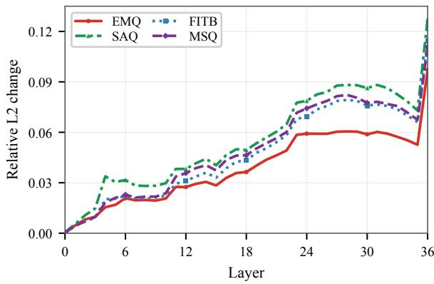  
Figure 3: Layer-wise L2 ratio relative to the Qwen3-4B. Lower indicates a smaller representational change.

The clustering diagnostics in Appendix O reveal a useful ranking conflict: unsupervised compactness metrics favor FITB or SAQ, whereas the linear probe favors EMQ and MSQ. This suggests that tighter unsupervised clusters are not necessarily better for knowledge updating; excessive compression of intra-class variance may remove fine-grained clinical substructure needed for downstream discrimination.

## 6.3 Cross-Scale Cost-Benefit View

Figure 4 extends the final-layer cost-benefit comparison across 1.7B, 4B, 8B, and 14B Qwen3 backbones (Yang et al., 2025). Across all evaluated scales, EMQ lies in the low-movement, positivegain region, whereas SAQ more often occupies a higher-movement, lower-gain region, especially for smaller backbones. MSQ can also yield positive probe gains, but generally requires larger representational movement than EMQ.

Appendix P reports the corresponding SEER-Bench task results. The same qualitative pattern holds at the task level: EMQ gives the best answer and rationale accuracy for every evaluated backbone, improving answer accuracy from 54.2 to 60.5 on Qwen3-1.7B and from 58.7 to 67.8 on Qwen3-14B. These cross-scale results suggest that the EMQ advantage is not an artifact of the 4B main setting, but a consistent supervision-format pattern across model capacities.

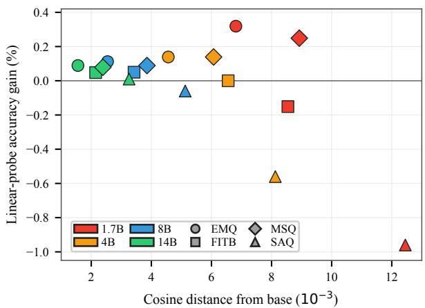  
Figure 4: Final-layer cost-benefit comparison. X-axis is cosine distance from the base model; Y-axis is the change in linear-probe accuracy over the base model.

## 7 Conclusion

We studied an often-overlooked variable in medical knowledge updating: whether the supervision format affects generalization under a shared adaptation setup and matched training budget. We introduced SEER-Bench as a temporally anchored oncology-staging benchmark and rendered medical update events into four supervision formats. Across same-budget SFT comparisons, EMQ gives the most stable external transfer and retention, producing competitive SEER-Bench results with an updated 4B model. Our diagnostics suggest that EMQ’s advantage is associated with denser clinical contrast signals and more economical representational movement. Overall, medical knowledge updating should not be treated only as a choice of update algorithm; the structure used to present knowledge as supervision also shapes whether the update transfers to external tasks.

## Limitations

This study has several limitations. First, SEER-Bench and the update items rely partly on LLMassisted construction; although we apply source tracing, answer-space validation, and expert spot checks, residual clinical or linguistic errors may remain. Second, the experiments focus on oncology and mainly on a 4B base model with LoRA-based adaptation, so the observed format effects may differ across medical domains, model scales, and update algorithms. Third, although we hold update content and training budget fixed, the formats differ in length, candidate-set size, and surface complexity, which may partially contribute to the observed gaps. Finally, our representation analyses are diagnostic rather than causal, and the NSCLC slice suggests that EMQ is not uniformly optimal: slotlike molecular updates may benefit more from the focused autoregressive signal provided by FITB.

## Ethical Considerations and Data Statement

This work studies medical knowledge updating as an offline evaluation and model-adaptation problem, not as a deployed clinical decision-support system. The reported models should not be used to make diagnosis, staging, treatment, or medication decisions without qualified clinical oversight.

SEER-Bench is constructed from de-identified, versioned SEER records and is intended solely for developing and evaluating questions related to tumor staging using real-world oncology cases. To reduce construction errors, we employ multiple quality-control procedures, including source tracing, answer-space validation, model-based consensus voting, and expert review. Human involvement was limited to professional annotation and quality verification of de-identified research materials. Complete annotation guidelines, risk disclaimers (explicitly staging minimal risk limited to professional time commitment) and confidentiality agreements are also provided in the annotation process. Reviewers with clinical or biomedical expertise were compensated for their annotation time, as documented in our annotation records. The annotation task did not involve patient contact, intervention, or real-time clinical decision-making, and revieweridentifying information will not be released.

We integrate references to the National Comprehensive Cancer Network (NCCN) Guidelines® and the Chinese Guideline/ Expert Consensus. These external knowledge sources are utilized under openuse principles solely for academic research, benchmarking, and pedagogical evaluation.

We publicly release SEER-Bench, and the construction and evaluation prompts and code of the four format supervision at https://github.com/Iflytek-Medical-SouthChina/SeerBench, subject to sourceresource licenses and data-use restrictions. Provenance and use conditions are documented in the accompanying data card.

We also acknowledge the use of Gemini-3.1-Pro for linguistic refinement and editorial suggestions during the manuscript revision.

## Acknowledgments

This work was supported by the Noncommunicable Chronic Diseases-National Science and Technology Major Project (Grant No. 2023ZD0509100).

## References

Anthropic. 2026. Introducing Claude Opus 4.6.

Rahul K Arora, Jason Wei, Rebecca Soskin Hicks, Preston Bowman, Joaquin Quiñonero-Candela, Foivos Tsimpourlas, Michael Sharman, Meghan Shah, Andrea Vallone, Alex Beutel, et al. 2025. Healthbench: Evaluating large language models towards improved human health. arXiv preprint arXiv:2505.08775.

Susan M Case and David B Swanson. 1993. Extendedmatching items: a practical alternative to freeresponse questions. Teaching and Learning in Medicine: An International Journal, 5(2):107–115.

Junying Chen, Zhenyang Cai, Ke Ji, Xidong Wang, Wanlong Liu, Rongsheng Wang, and Benyou Wang. 2025. Towards medical complex reasoning with llms through medical verifiable problems. In Findings of the Associationfor Computational Linguistics: ACL 2025, pages 14552–14573.

Zeming Chen, Alejandro Hernández Cano, Angelika Romanou, Antoine Bonnet, Kyle Matoba, Francesco Salvi, Matteo Pagliardini, Simin Fan, Andreas Köpf, Amirkeivan Mohtashami, et al. 2023. Meditron-70b: Scaling medical pretraining for large language models. arXiv preprint arXiv:2311.16079.

Frank C. Detterbeck, Gavitt A. Woodard, Anna S. Bader, Sanja Dacic, Michael J. Grant, Henry S. Park, and Lynn T. Tanoue. 2024. The proposed ninth edition TNM classification of lung cancer. Chest, 166(4):882–895.

Bhuwan Dhingra, Jeremy R. Cole, Julian Martin Eisenschlos, Daniel Gillick, Jacob Eisenstein, and William W. Cohen. 2022. Time-aware language models as temporal knowledge bases. Transactions of the Associationfor Computational Linguistics, 10:257– 273.

Anna Frey, Tobias Leutritz, Joy Backhaus, Alexander Hörnlein, and Sarah König. 2022. Item format statistics and readability of extended matching questions as an effective tool to assess medical students. Scientific Reports, 12(1):20982.

Xiou Ge, Ali Mousavi, Edouard Grave, Armand Joulin, Kun Qian, Benjamin Han, Mostafa Arefiyan, and Yunyao Li. 2024. Time sensitive knowledge editing through efficient finetuning. In Proceedings of the 62nd Annual Meeting ofthe Associationfor Computational Linguistics (Volume 2: Short Papers), pages 583–593.

He Geng, Yangmin Huang, Lixian Lai, Qianyun Du, Hui Chu, Zhiyang He, Jiaxue Hu, and Xiaodong Tao. 2026. ProMedical: Hierarchical fine-grained criteria modeling for medical LLM alignment via explicit injection. In Proceedings of the 64th Annual Meeting of the Association for Computational Linguistics (Volume 1: Long Papers), pages 36955–36994, San Diego, California, United States. Association for Computational Linguistics.

Google DeepMind. 2026. Gemini 3.1 Pro model card.

Aaron Grattafiori, Abhimanyu Dubey, Abhinav Jauhri, Abhinav Pandey, Abhishek Kadian, Ahmad Al-Dahle, Aiesha Letman, Akhil Mathur, Alan Schelten, Alex Vaughan, et al. 2024. The llama 3 herd of models. arXiv preprint arXiv:2407.21783.

Daya Guo, Dejian Yang, Haowei Zhang, Junxiao Song, Peiyi Wang, Qihao Zhu, Runxin Xu, Ruoyu Zhang, Shirong Ma, Xiao Bi, et al. 2025. Deepseek-r1: Incentivizing reasoning capability in llms via reinforcement learning. arXiv preprint arXiv:2501.12948.

Robert I. Haddad, Lindsay Bischoff, Megan Applewhite, Victor Bernet, Erik Blomain, Maria Brito, Naifa Lamki Busaidy, Michael Campbell, Olivia De-Lozier, Quan-Yang Duh, Hormoz Ehya, Erin Grady, Theresa Guo, Megan Haymart, Jason P. Hunt, Fouad Kandeel, Anupam Kotwal, Dominick M. Lamonica, Jochen Lorch, and 22 others. 2025. NCCN Guidelines® Insights: Thyroid Carcinoma, Version 1.2025. Journal ofthe National Comprehensive Cancer Network, 23(7):e250033.

Rebecca Soskin Hicks, Mikhail Trofimov, Dominick Lim, Rahul K Arora, Foivos Tsimpourlas, Preston Bowman, Michael Sharman, Chi Tong, Kavin Karthik, Arnav Dugar, et al. 2026. Healthbench professional: Evaluating large language models on real clinician chats. arXiv preprint arXiv:2604.27470.

Edward J Hu, Yelong Shen, Phillip Wallis, Zeyuan Allen-Zhu, Yuanzhi Li, Shean Wang, Lu Wang, and Weizhu Chen. 2021. Lora: Low-rank adaptation of large language models. arXiv preprint arXiv:2106.09685.

Joel Jang, Seonghyeon Ye, Changho Lee, Sohee Yang, Joongbo Shin, Janghoon Han, Gyeonghun Kim, and Minjoon Seo. 2022. Temporalwiki: A lifelong benchmark for training and evaluating ever-evolving language models. In Proceedings of the 2022 Conference on Empirical Methods in Natural Language Processing, pages 6237–6250.

Di Jin, Eileen Pan, Nassim Oufattole, Wei-Hung Weng, Hanyi Fang, and Peter Szolovits. 2021. What disease

does this patient have? a large-scale open domain question answering dataset from medical exams. Applied Sciences, 11(14).

Qiao Jin, Bhuwan Dhingra, Zhengping Liu, William Cohen, and Xinghua Lu. 2019. Pubmedqa: A dataset for biomedical research question answering. In Proceedings of the 2019 conference on empirical methods in natural language processing and the 9th international joint conference on natural language processing (EMNLP-IJCNLP), pages 2567–2577.

Tiffany H Kung, Morgan Cheatham, Arielle Medenilla, Czarina Sillos, Lorie De Leon, Camille Elepaño, Maria Madriaga, Rimel Aggabao, Giezel Diaz-Candido, James Maningo, et al. 2023. Performance of chatgpt on usmle: potential for ai-assisted medical education using large language models. PLoS digital health, 2(2):e0000198.

Leila Kutob and Frank Schneider. 2020. Lung cancer staging. Surgical Pathology Clinics, 13(1):57–71.

Angeliki Lazaridou, Adhi Kuncoro, Elena Gribovskaya, Devang Agrawal, Adam Liska, Tayfun Terzi, Mai Gimenez, Cyprien de Masson d’Autume, Tomas Kocisky, Sebastian Ruder, et al. 2021. Mind the gap: Assessing temporal generalization in neural language models. Advances in Neural Information Processing Systems, 34:29348–29363.

Patrick Lewis, Ethan Perez, Aleksandra Piktus, Fabio Petroni, Vladimir Karpukhin, Naman Goyal, Heinrich Küttler, Mike Lewis, Wen-tau Yih, Tim Rocktäschel, et al. 2020. Retrieval-augmented generation for knowledge-intensive nlp tasks. Advances in neural information processing systems, 33:9459–9474.

Xiaomin Li, Mingye Gao, Yuexing Hao, Taoran Li, Guangya Wan, Zihan Wang, and Yijun Wang. 2025. Medguide: Benchmarking clinical decisionmaking in large language models. arXiv preprint arXiv:2505.11613.

Kevin Meng, Arnab Sen Sharma, Alex Andonian, Yonatan Belinkov, and David Bau. 2022. Massediting memory in a transformer. arXiv preprint arXiv:2210.07229.

Moonshot AI. 2026. Kimi K2.5: Open visual agentic model for real work.

Seyed Mahed Mousavi, Simone Alghisi, and Giuseppe Riccardi. 2024. Dyknow: Dynamically verifying time-sensitive factual knowledge in llms. In Findings of the Association for Computational Linguistics: EMNLP 2024, pages 8014–8029.

Subhabrata Mukherjee, Arindam Mitra, Ganesh Jawahar, Sahaj Agarwal, Hamid Palangi, and Ahmed Awadallah. 2023. Orca: Progressive learning from complex explanation traces of gpt-4. arXiv preprint arXiv:2306.02707.

National Comprehensive Cancer Network. 2025. NCCN clinical practice guidelines in oncology (nccn guidelines®).

NCCN. 2026. NCCN Clinical Practice Guidelines in Oncology (NCCN Guidelines®): Thyroid Carcinoma, version 1.2026 edition.

Harsha Nori, Nicholas King, Scott Mayer McKinney, Dean Carignan, and Eric Horvitz. 2023. Capabilities of gpt-4 on medical challenge problems. arXiv preprint arXiv:2303.13375.

OpenAI. 2026. Introducing GPT-5.4.

Ankit Pal, Logesh Kumar Umapathi, and Malaikannan Sankarasubbu. 2022. Medmcqa: A large-scale multisubject multi-choice dataset for medical domain question answering. In Proceedings of the Conference on Health, Inference, and Learning, volume 174 of Proceedings of Machine Learning Research, pages 248–260. PMLR.

Pediatric Infection Group, Chinese Society of Infectious Diseases, Chinese Medical Association, Infection Group, Pediatric Expert Committee of National Health Commission Capacity Building and Continuing Education, and China Clinical Practice Guidelines Alliance Methodology Committee. 2024. Practice guideline of influenza vaccination and antiviral drugs use in children (2024 edition). Zhonghua Yi Xue Za Zhi, 104(40):3705–3725.

Fabio Petroni, Tim Rocktäschel, Sebastian Riedel, Patrick Lewis, Anton Bakhtin, Yuxiang Wu, and Alexander Miller. 2019. Language models as knowledge bases? In Proceedings of the 2019 Conference on Empirical Methods in Natural Language Processing and the 9th International Joint Conference on Natural Language Processing (EMNLP-IJCNLP), pages 2463–2473, Hong Kong, China. Association for Computational Linguistics.

Yue Qiu, Yujan Ting, Pei Dong, Terrence Chen, and Weijing Huang. 2025. Training medical QA models based on mixed rewards from multiple-choice and open-ended questions. In Findings of the Association for Computational Linguistics: EMNLP 2025, pages 8721–8729, Suzhou, China. Association for Computational Linguistics.

Shu Quan, Tianfang Hao, Sitong Fang, He Geng, Jiayi Zhou, Boyuan Chen, Kaile Wang, Donghai Hong, Juntao Dai, Yaodong Yang, et al. 2026. A blind spot in alignment: Quantifying biosecurity risks in large language models. arXiv preprint arXiv:2608.02684.

Qwen Team. 2025a. Qwen3-14B. Hugging Face model card.

Qwen Team. 2025b. Qwen3-1.7B. Hugging Face model card.

Qwen Team. 2025c. Qwen3-235B-A22B-Instruct-2507. Hugging Face model card.

Qwen Team. 2025d. Qwen3-4B-Instruct-2507. Hugging Face model card.

Qwen Team. 2025e. Qwen3-8B. Hugging Face model card.

Rabies Prevention and Control Committee of the Chinese Preventive Medicine Association, Branch of Animal Injury Treatment, and China Association for Disaster and Emergency Rescue Medicine. 2026. Expert consensus on rabies post-exposure prophylaxis in children (2025 edition). Zhonghua Liu Xing Bing Xue Za Zhi, 47(3):381–392.

Damien Sileo, Kanimozhi Uma, and Marie Francine Moens. 2024. Generating multiple-choice questions for medical question answering with distractors and cue-masking. In Proceedings of the 2024 Joint International Conference on Computational Linguistics, Language Resources and Evaluation (LREC-COLING 2024), pages 7647–7653, Torino, Italia. ELRA and ICCL.

Karan Singhal, Shekoofeh Azizi, Tao Tu, S Sara Mahdavi, Jason Wei, Hyung Won Chung, Nathan Scales, Ajay Tanwani, Heather Cole-Lewis, Stephen Pfohl, et al. 2023. Large language models encode clinical knowledge. Nature, 620(7972):172–180.

Karan Singhal, Tao Tu, Juraj Gottweis, Rory Sayres, Ellery Wulczyn, Mohamed Amin, Le Hou, Kevin Clark, Stephen R Pfohl, Heather Cole-Lewis, et al. 2025. Toward expert-level medical question answering with large language models. Nature medicine, 31(3):943–950.

MAR Strobl, J Gallaher, M Robertson-Tessi, J West, and ARA Anderson. 2023. Treatment of evolving cancers will require dynamic decision support. Annals of Oncology, 34(10):867–884.

Surveillance, Epidemiology, and End Results (SEER) Program. 2026. SEER\*Stat Database: Incidence – SEER Research Data, 17 Registries, Nov 2025 Sub (2000–2023).

Arun James Thirunavukarasu, Darren Shu Jeng Ting, Kabilan Elangovan, Laura Gutierrez, Ting Fang Tan, and Daniel Shu Wei Ting. 2023. Large language models in medicine. Nature medicine, 29(8):1930– 1940.

A. G. van der Heijden, H. M. Bruins, A. Carrión, R. Cathomas, E. M. Compérat, K. Dimitropoulos, J. A. Efstathiou, R. Fietkau, A. Lorch, P. Mariappan, R. P. Meijer, L. S. Mertens, M. I. Milowsky, Y. Neuzillet, V. Panebianco, M. Rink, and G. N. Thalmann. 2025. EAU Guidelines on Muscle-invasive and Metastatic Bladder Cancer. European Association of Urology, Arnhem, The Netherlands. Limited update, March 2025.

Tu Vu, Mohit Iyyer, Xuezhi Wang, Noah Constant, Jerry Wei, Jason Wei, Chris Tar, Yun-Hsuan Sung, Denny Zhou, Quoc Le, and Thang Luong. 2024. Fresh-LLMs: Refreshing large language models with search engine augmentation. In Findings ofthe Association for Computational Linguistics: ACL 2024, pages 13697–13720, Bangkok, Thailand. Association for Computational Linguistics.

Peng Wang, Ningyu Zhang, Bozhong Tian, Zekun Xi, Yunzhi Yao, Ziwen Xu, Mengru Wang, Shengyu Mao, Xiaohan Wang, Siyuan Cheng, Kangwei Liu, Yuansheng Ni, Guozhou Zheng, and Huajun Chen. 2024. Easyedit: An easy-to-use knowledge editing framework for large language models. In Proceedings of the 62nd Annual Meeting ofthe Associationfor Computational Linguistics (Volume 3: System Demonstrations), pages 82–93.

Yizhong Wang, Hamish Ivison, Pradeep Dasigi, Jack Hessel, Tushar Khot, Khyathi Raghavi Chandu, David Wadden, Kelsey MacMillan, Noah A. Smith, Iz Beltagy, and Hannaneh Hajishirzi. 2023. How far can camels go? exploring the state of instruction tuning on open resources. Advances in Neural Information Processing Systems, 36:74764–74786.

J. A. Witjes, H. M. Bruins, A. Carrión, R. Cathomas, E. M. Compérat, J. A. Efstathiou, R. Fietkau, G. Gakis, A. G. van der Heijden, A. Lorch, P. Mari appan, R. P. Meijer, M. I. Milowsky, Y. Neuzillet, V. Panebianco, M. Rink, M. Rouanne, and G. N. Thalmann. 2024. EAU Guidelines on Muscle-invasive and Metastatic Bladder Cancer. European Association of Urology, Arnhem, The Netherlands. Limited update, April 2024.

Zhiling Yan, Dingjie Song, Zhe Fang, Yisheng Ji, Xiang Li, Quanzheng Li, and Lichao Sun. 2026. Livemedbench: A contamination-free medical benchmark for llms with automated rubric evaluation. arXiv preprint arXiv:2602.10367.

An Yang, Anfeng Li, Baosong Yang, Beichen Zhang, Binyuan Hui, Bo Zheng, Bowen Yu, Chang Gao, Chengen Huang, Chenxu Lv, et al. 2025. Qwen3 technical report. arXiv preprint arXiv:2505.09388.

Aohan Zeng, Xin Lv, Zhenyu Hou, Zhengxiao Du, Qinkai Zheng, Bin Chen, Da Yin, Chendi Ge, Chenghua Huang, Chengxing Xie, et al. 2026. Glm-5: from vibe coding to agentic engineering. arXiv preprint arXiv:2602.15763.

Ce Zheng, Lei Li, Qingxiu Dong, Yuxuan Fan, Zhiyong Wu, Jingjing Xu, and Baobao Chang. 2023. Can we edit factual knowledge by in-context learning? In Proceedings of the 2023 Conference on Empirical Methods in Natural Language Processing, pages 4862–4876.

## A Data Construction Prompts

The data construction follows a two-stage prompting pipeline. In the first stage (Figure 5), we use the current authoritative guideline text together with the target base model’s judgment of the current recommendation to construct structured triplets: the guideline-supported current recommendation, the non-current alternative produced by the base model when it rejects that recommendation, and a clinical explanation of the contrast. In the second stage, each extracted triplet and its source reference material are rendered by Gemini 3.1 Pro into training items in four supervision formats (SAQ, MSQ, FITB, and EMQ; Figures 6, 7, 8, and 9). All format-rendering prompts require clinical case analysis rather than pure factual recall and dual-perspective answering, with both the current-standard answer and the base-model alternative. After generation, candidate items undergo model voting and expert inspection; the manual audit covers a stratified random 10% sample, and item-construction quality labels achieve Cohen’s κ = 0.85.

The first-stage prompt turns guideline passages into old/new/difference triplets, which are the atomic update units used by the later format renderers. The negative constraints avoid superficial artifacts such as trial-name memorization or metareferences to the source text.

SAQ provides direct open-ended supervision for one clinical shift at a time. Its strength is concise answer-and-rationale training, but it does not force the model to compare several nearby old/new decision boundaries within the same item.

MSQ increases answer-space complexity by placing old-knowledge and new-knowledge options in the same choice set. This makes the supervision more contrastive than SAQ, although each instance still centers on a single scenario.

FITB targets a specific entity, threshold, or management decision. This makes the update signal highly localized, which is useful for slot-like facts but may provide less context for broader clinical reasoning.

EMQ groups multiple related vignettes under a shared option pool. The resulting supervision asks the model to distinguish which cases truly changed and which cases should remain stable, matching the stability–plasticity issue analyzed below.

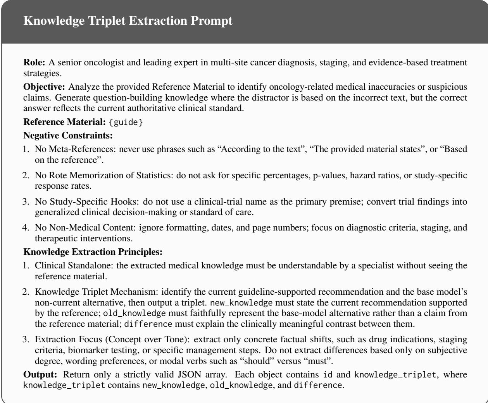  
Figure 5: Prompt template for knowledge triplet extraction (Stage 1). Given authoritative guideline text, Gemin 3.1 Pro identifies outdated or erroneous claims and outputs structured triplets used to construct clinically grounded distractors and updated answers.

## B Expert Profile and Annotation Protocols

We used an iterative human-in-the-loop process to verify the generated update-supervision items. After each rendering round, a stratified 10% subset of generated items was reviewed by clinical experts. Reviewer feedback was incorporated into the prompt and rendering process before the next generation round.

The expert review team consisted of 10 reviewers with clinical or biomedical expertise. Reviewers were compensated at approximately \$2 USD per annotated item. In the final audit, 94.8% of reviewed items passed human quality inspection. Inter-annotator agreement for binary item-quality labels was Cohen’s κ = 0.85. Items that failed the audit were revised or removed before training.

## C Candidate-Level View of Format Structure

This appendix provides an analytical view of how different supervision formats organize contrastive information. All models in our experiments are trained with the same token-level autoregressive SFT objective. The candidate-level formulation below is therefore not an additional training loss; it is a diagnostic abstraction for comparing which clinically relevant alternatives are co-presented within each training instance.

Autoregressive scoring. For an input x and an answer string y, the autoregressive model assigns the length-normalized sequence score

$$
\ell _ { \theta } ( x , y ) = { \frac { 1 } { | y | } } \sum _ { t = 1 } ^ { | y | } \log p _ { \theta } ( y _ { t } \mid x , y _ { < t } ) ,\tag{4}
$$

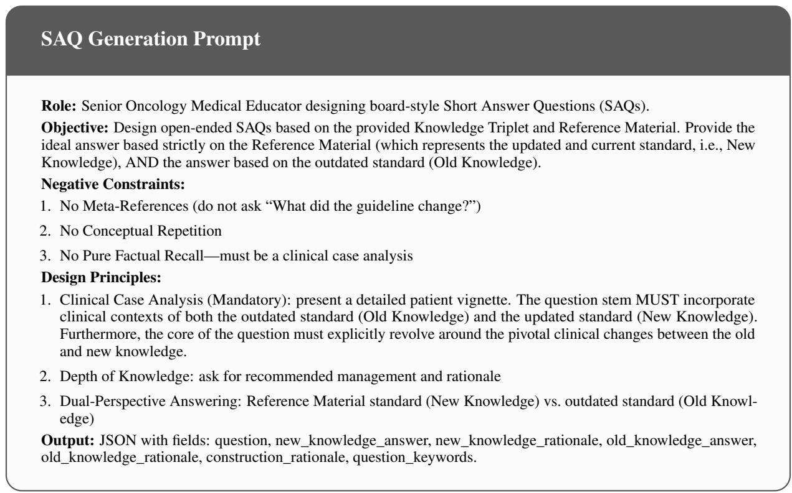  
Figure 6: Prompt template for SAQ (Short Answer Question) generation.

Given an analytical candidate set Y, these scores induce a candidate-level distribution

$$
p _ { \theta } ( y \mid x , y ) = \frac { \exp \ell _ { \theta } ( x , y ) } { \sum _ { y ^ { \prime } \in \mathcal { V } } \exp \ell _ { \theta } ( x , y ^ { \prime } ) } ,\tag{5}
$$

This distribution is used only to formalize how answer strings would compete under the same autoregressive model when they are considered together.

Co-presented alternatives. For update item i, let $a _ { \mathrm { n e w } , i }$ denote the current guideline-supported recommendation. Let $\mathcal { N } _ { i } ^ { ( f ) }$ denote the non-current or clinically plausible alternatives exposed by format f through the vignette, rationale, answer options, blank completion context, or explanation. The copresented contrast set for item i under format f is

$$
\mathcal { Z } _ { i } ^ { ( f ) } = \{ a _ { \mathrm { n e w } , i } \} \cup \mathcal { N } _ { i } ^ { ( f ) } ,\tag{6}
$$

For SAQ, FITB, and MSQ, this contrast is local to a single clinical vignette:

$$
\mathcal { Y } _ { i } ^ { ( f ) } = \mathcal { Z } _ { i } ^ { ( f ) } , \qquad f \in \{ \mathrm { S A Q } , \mathrm { F I T B } , \mathrm { M S Q } \} ,\tag{7}
$$

The formats differ in how the local alternatives are expressed: SAQ exposes them through the rationale, FITB through the masked entity and explanation, and MSQ through item-specific answer options.

EMQ changes the scope of co-presentation. For a block G of related update items, multiple vignettes are presented together with a shared answer space. The analytical contrast set for each vignette in the block is therefore

$$
\mathcal { V } _ { i , G } ^ { ( \mathrm { E M Q } ) } = \bigcup _ { j \in G } \mathcal { Z } _ { j } ^ { ( \mathrm { E M Q } ) } , \qquad i \in G .\tag{8}
$$

Thus each vignette is interpreted not only against its own local alternatives, but also against clinically related alternatives from adjacent update items in the same block.

Representation-space surrogate. Let $h _ { \theta } ( x ) \in$ $\mathbb { R } ^ { d }$ be the hidden representation of input x, and let $e _ { \theta } ( y ) \in \mathbb { R } ^ { d }$ be a representation of answer string y. We define a compatibility score

$$
\begin{array} { r } { s _ { \theta } ( x , y ) = h _ { \theta } ( x ) ^ { \top } e _ { \theta } ( y ) , } \end{array}\tag{9}
$$

For a candidate set $\mathcal { V }$ containing the correct current recommendation $a _ { \mathrm { n e w } , i } .$ , the corresponding surrogate contrastive loss is

$$
\widetilde { \mathcal { L } } ( i ; \mathcal { Y } ) = - \log \frac { \exp s _ { \theta } ( x _ { i } , a _ { \mathrm { n e w } , i } ) } { \sum _ { y \in \mathcal { Y } } \exp s _ { \theta } ( x _ { i } , y ) } ,\tag{10}
$$

For an EMQ block G, this gives

$$
\widetilde { \mathcal { L } } _ { \mathrm { E M Q } } ( G ) = \frac { 1 } { | G | } \sum _ { i \in G } \widetilde { \mathcal { L } } \left( i ; \mathcal { y } _ { i , G } ^ { ( \mathrm { E M Q } ) } \right) ,\tag{11}
$$

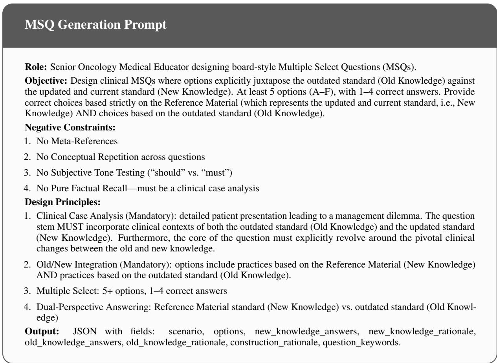  
Figure 7: Prompt template for MSQ (Multiple Select Question) generation.

Gradient interpretation. Let $p _ { \theta } ( y \mid x _ { i } , \mathcal { Y } )$ denote the softmax distribution induced by the surrogate compatibility scores. The gradient of $\widetilde { \mathcal { L } } ( i ; \mathcal { y } )$ with respect to the query representation is

$$
\begin{array} { c } { { \nabla _ { h _ { \theta } ( x _ { i } ) } \widetilde { \mathcal { L } } ( i ; \mathcal { V } ) = \displaystyle \sum _ { y \in \mathcal { V } } p _ { \theta } ( y \mid x _ { i } , \mathcal { V } ) e _ { \theta } ( y ) } } \\ { { - e _ { \theta } ( a _ { \mathrm { n e w } , i } ) , } } \end{array}\tag{12}
$$

Equivalently,

$$
\nabla _ { h _ { \theta } ( x _ { i } ) } \widetilde { \mathcal { L } } ( i ; \mathcal { V } ) = \sum _ { y \in \mathcal { V } \backslash \{ a _ { \mathrm { n e w } , i } \} } p _ { \theta } ( y \mid x _ { i } , \mathcal { V } )\tag{13}
$$

This expression shows that the representation update is shaped by the alternatives co-presented with the current recommendation. Local formats expose alternatives tied to one vignette, whereas EMQ exposes alternatives across related vignettes in the same block. The resulting supervision signal is therefore broader and more relational, because clinically similar recommendations are contrasted within a shared instance.

Connection to diagnostics. This view motivates the diagnostics in Section 6. If EMQ’s advantage comes from networked clinical contrast rather than merely from longer text, then EMQ should expose more clinically relevant entities, place related entities closer together, and improve transfer under a fixed generation budget. If the shared structure guides updates toward task-relevant distinctions, it should also preserve discriminative representations with less unnecessary movement from the base model. The signal-density and representation analyses test these observable implications.

## D Vignette and Token-Budget Controls

This appendix examines whether the advantage of EMQ can be attributed mainly to larger vignette exposure or prompt-token efficiency. All supervision formats are rendered from the same pool of 2,530 unique clinical vignettes. Thus, the comparison uses the same vignette pool across formats; what differs is how the vignettes and their associated update contrasts are organized within training instances.

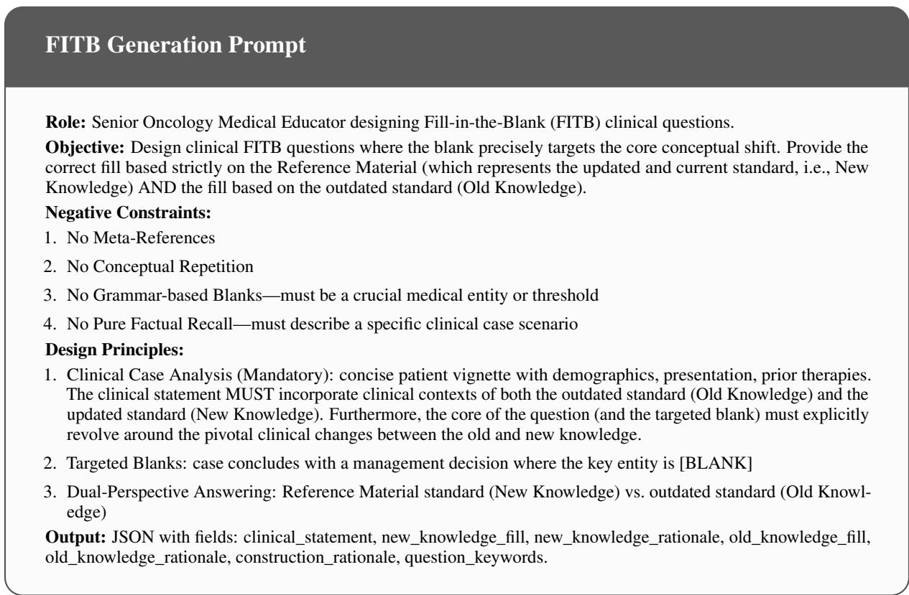

Figure 8: Prompt template for FITB (Fill-in-the-Blank) generation.
<table><tr><td>Format</td><td>Avg. prompt tok./item Avg. vign./item</td><td></td><td></td><td></td><td>Unique vign. Prompt tok./vign. Vign./1k prompt tok.</td></tr><tr><td>SAQ</td><td>261.5</td><td>1.00</td><td>2,530</td><td>261.5</td><td>3.82</td></tr><tr><td>MSQ</td><td>260.2</td><td>1.00</td><td>2,530</td><td>260.2</td><td>3.84</td></tr><tr><td>FITB</td><td>254.3</td><td>1.00</td><td>2,530</td><td>254.3</td><td>3.93</td></tr><tr><td>EMQ</td><td>258.7</td><td>2.72</td><td>2,530</td><td>95.1</td><td>10.51</td></tr></table>

Table 6: Token and vignette accounting across supervision formats. All formats are rendered from the same pool of 2,530 unique vignettes. Vignette density measures how efficiently a format exposes clinical vignettes under a fixed prompt-token budget.

Vignette and token accounting. Table 6 summarizes the training-token and vignette accounting for each format. We report the average number of training tokens per item, the average number of vignettes per item, the number of unique vignettes covered by the format, and the average prompttoken cost per vignette. Let $\bar { v } _ { f }$ be the average number of vignettes per item and $\bar { t } _ { f }$ be the average number of prompt tokens per item for format $f .$ We define vignette density as

$$
\mathrm { V D } ( f ) = 1 0 0 0 \frac { \bar { v } _ { f } } { \bar { t } _ { f } } ,\tag{14}
$$

where higher values indicate that more clinical vignettes are exposed per 1,000 prompt tokens.

The accounting shows that EMQ does not introduce additional unique clinical information. Instead, it packages multiple related vignettes into shared-answer training instances, allowing the model to integrate more vignette-level contrasts per unit of prompt budget.

Exposure-matched scaling control. We further test whether the EMQ advantage can be matched by simply increasing the amount of single-vignette supervision. Since the full EMQ corpus contains 2,530 training instances with an average of 2.72 vignettes per instance, it exposes approximately 6,882 vignette-level decisions in total. We therefore construct expanded SAQ, MSQ, and FITB corpora with 6,882 training instances each, while preserving their original single-vignette rendering rules. These expanded controls match EMQ’s vignette-level exposure but require substantially more supervised training tokens because each vignette is serialized as a separate training item.

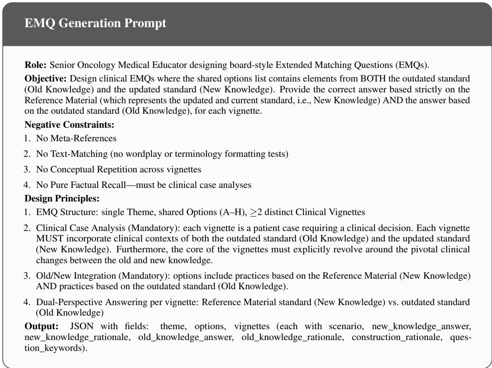  
Figure 9: Prompt template for EMQ (Extended Matching Question) generation.

Table 7 reports the resulting token cost and SEER-Bench performance. Total training tokens count both the prompt and supervised target tokens. Even after expanding the single-vignette formats to 6,882 instances, none matches the full EMQ result. The expanded controls require 2.66–2.74 times more training tokens than EMQ, yet remain lower on both SEER-Bench answer accuracy and rationale accuracy.

Together, these controls show that EMQ’s advantage is not explained by larger unique clinical content or by greater vignette-level exposure alone. Matching EMQ’s vignette exposure with singlevignette formats requires substantially more training tokens and still yields weaker SEER-Bench transfer. This supports the interpretation that EMQ is more token-efficient because it organizes related clinical vignettes and answer contrasts within shared training instances, rather than presenting each vignette as an isolated decision.

## E SEER-Bench Construction

SEER-Bench is designed for temporal evaluation of medical knowledge: we curate cases from the latest versioned SEER Research Data release (Surveillance, Epidemiology, and End Results (SEER) Program, 2026). This appendix documents the cohort filtering, cancer-site distribution, and qualitycontrol details.

## E.1 Construction Pipeline

The construction proceeds through three stages:

Stratified raw sampling and initial filtering. We first construct a raw candidate pool by randomly sampling SEER patient records across the 16 targeted cancer-site groups. To ensure data viability prior to generation, we apply strict initial exclusion criteria: (1) cases with any missing or unknown NCCN staging variable (T, N, M, or Overall Stage); (2) histopathologic types that cannot be unambiguously mapped to the NCCN staging scheme(National Comprehensive Cancer Network, 2025); and (3) cases that are in situ or non-invasive.

<table><tr><td>Format</td><td>Train items</td><td>Exposed vign.</td><td>Train tok. (M)</td><td>Tok. mult.</td><td>SEER Acc.</td><td>Rat. Acc.</td></tr><tr><td>Expanded SAQ</td><td>6,882</td><td>6,882</td><td>4.56</td><td>2.74×</td><td>63.4</td><td>53.4</td></tr><tr><td>Expanded MSQ</td><td>6,882</td><td>6,882</td><td>4.50</td><td>2.71×</td><td>62.9</td><td>56.2</td></tr><tr><td>Expanded FITB</td><td>6,882</td><td>6,882</td><td>4.43</td><td>2.66×</td><td>62.2</td><td>51.6</td></tr><tr><td>Full EMQ</td><td>2,530</td><td>6,882</td><td>1.66</td><td>1.00×</td><td>64.8</td><td>59.6</td></tr></table>

Table 7: Exposure-matched scaling control. The single-vignette formats are expanded to 6,882 training instances, matching the approximate number of vignette-level exposures in the full EMQ corpus. Token multiplier is computed relative to full EMQ.

Algorithm 1 Human-in-the-loop quality verifica  
tion for update-supervision items.   
Require: Update triplets U; format renderers   
{Rf }f∈{SAQ,MSQ,FITB,EMQ}; source references S;   
sampling rate $\rho = 0 . 1 0$   
Ensure: Verified training corpora $\{ \mathcal { D } _ { f } \}$   
1: Initialize format-specific rendering prompts and con  
straints.   
2: repeat   
3: for all formats $f \in \{ \mathrm { S A Q } ,$ MSQ, FITB, EMQ} do   
4: Render candidate items $\tilde { \mathcal { D } } _ { f } = R _ { f } ( \mathcal { U } , S )$   
5: Apply automatic checks for schema validity, du  
plicate targets, source traceability, answer-space validity,   
and old/new consistency.   
6: Revise or discard items that fail deterministic   
checks.   
7: Draw a stratified sample $\mathcal { A } _ { f } \subset \tilde { \mathcal { D } } _ { f }$ with $| { \mathcal { A } } _ { f } | =$   
$\rho | \tilde { \mathcal { D } } _ { f } | .$   
8: end for   
9: Clinical reviewers independently assess sampled   
items for update-target alignment, vignette plausibility,   
answer correctness, rationale consistency, and clinically   
meaningful distractors or alternatives.   
10: Aggregate reviewer labels and adjudicate disagree  
ments.   
11: Summarize recurrent failure modes and update the   
rendering prompts and constraints.   
12: until review pass rates stabilize across formats   
13: Conduct a final expert audit on the revised candidate   
corpora.   
14: Revise correctable failures and remove unrecoverable   
failures.   
15: Return the verified corpora $\{ \mathcal { D } _ { f } \}$ used for supervised   
fine-tuning.

This filtering yields a pre-review pool of 3,200 qualified raw candidates (200 cases per cancer-site group), representing the candidate pool before text synthesis and expert validation.

Vignette synthesis and item generation. Both steps are performed jointly in a single Gemini 3.1 Pro call (full prompt in Figure11 ). The model receives coded SEER patient records (including cancer size code tables and regional node coding rules), converts them into coherent clinical narratives, randomly omits one staging variable (T, N, M, or Overall Stage) as the inference target, and provides an answer with rationale grounded in NCCN criteria. The synthesis is carefully constrained to prevent label leakage while ensuring the narrative contains sufficient clinical evidence for staging derivation.

Physician review and final inclusion. Physician reviewers then rigorously screen the 3,200 generated items. Crucially, the gold labels are strictly derived from the structured fields of the source SEER records. An item is permanently discarded if: (1) any conflict arises between the model-generated text and these structured gold standard fields; or (2) the underlying SEER database records lack sufficient clinical details to robustly support a definitive TNM staging diagnosis. Following this expert filtering process, the final SEER-Bench dataset comprises 1,992 highly reliable cases across the 16 cancer-site groups.

## E.2 Statistics and Quality Control

Figure 10 summarizes the cancer-site composition of the curated subset. The distribution is intentionally broad rather than dominated by a single malignancy, which helps test whether updated models transfer staging knowledge across heterogeneous oncology settings.

This design keeps the benchmark temporally explicit: all items come from the same diagnosis-year cohort, each case masks exactly one staging target, and the final set is a physician-reviewed subset of the 3,200 stratified random candidates. As a result, the benchmark separates final-label prediction from rationale-level reasoning without mixing multiple temporal anchors.

Quality control (QC) is strictly enforced to mitigate specific dataset failure modes: (i) source traceability, maintaining unbroken provenance to versioned SEER data; (ii) answer-space validation, ensuring all target labels are grammatically and medically valid NCCN categories; (iii) omission consistency, programmatically verifying that the masked variable remains unambiguously inferable from the unmasked text; and (iv)full double-blinded physician review, in which physician reviewers are randomly assigned to independent review panels and conduct a stratified 100% review of all candidate items by cancer-site group and masked variable. All reviews are performed double-blind to eliminate annotation bias, verifying consistency among the generated vignette, gold answer, and rationale. Only items that pass this rigorous expert review are included in the final 1,992-case SEER-Bench set; failed items are permanently excluded. Across physician verification labels, raw inter-rater agreement was 96.9%, with Cohen’s $\kappa = 0 . 8 7$

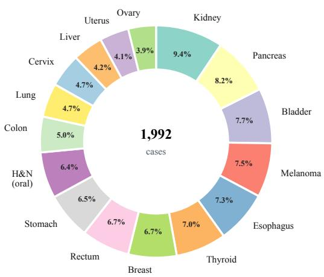  
Figure 10: Cancer-site distribution in SEER-Bench. Donut slices report the percentage of cases in the 1,992- case curated subset. The H&N (oral) group aggregates oral-cavity sub-sites; the Colon and Rectum categories are reported separately.

## E.3 Evaluation Protocol

SEER-Bench reports two metrics. Answer accuracy measures whether the extracted final staging/classification label matches the ground-truth masked target after case-insensitive normalization and common semantic variants (e.g., “Stage $\mathrm { I A } ^ { \prime \prime }$ and “Stage 1A”). Rationale accuracy is stricter: a response is correct only when the final answer is correct and the explanation demonstrates the same key clinical reasoning as the reference rationale, including the relevant T/N/M logic, staging criteria, and interpretation of the clinical findings. The GPT-5.4 judge achieved 98.2% raw agreement with human annotations, corresponding to Cohen’s $\kappa = 0 . 8 8$

Let $m _ { i }$ be the model response, $a _ { i } = \operatorname { a n s } ( m _ { i } )$ the extracted answer, $g _ { i }$ the ground-truth answer, and $r _ { i }$ the rationale-correctness judgment produced by GPT-5.4 using the grading prompt in Figure 12. Operationally, Acc averages $\mathbf { 1 } [ a _ { i } \ = \ g _ { i } ]$ over all items, and RatAcc averages ${ \bf 1 } [ a _ { i } = g _ { i } \land r _ { i } = 1 ]$ If the final answer is incorrect, rationale correctness is forced to false.

The vignette-generation prompt is where structured SEER codes are converted into naturallanguage clinical cases. Its constraints reduce label leakage while still requiring enough clinical evidence for the omitted T, N, M, or overall-stage target to be inferred.

The rationale grader makes rationale accuracy stricter than answer accuracy: once the final staging label is wrong, the rationale is automatically treated as incorrect. This prevents fluent but clinically misaligned explanations from being counted as successful reasoning.

## F Experimental Setup

Training data. The main English experiments construct 2,530 SFT instances from the 2026 NCCN oncology guidelines for each of the four supervision formats (EMQ, MSQ, FITB, and SAQ). Each model variant is updated exclusively on the 2,530-instance corpus corresponding to its assigned format. A separate supplementary Chinese transfer check uses 168 SFT instances constructed from recent updated public vaccine guidance(Rabies Prevention and Control Committee of the Chinese Preventive Medicine Association et al., 2026; Pediatric Infection Group, Chinese Society of Infectious Diseases, Chinese Medical Association et al., 2024). Within each setting, the four supervision formats share the same update content and differ only in item structure.

Base model and adaptation. The base model is Qwen3-4B (qwen3-4B-2507). We evaluate SFT-LoRA and trained on the update content rendered into EMQ, MSQ, FITB, and SAQ. Within the adaptation route, we use the same training budget and LoRA configuration across formats.

Comparison methods. We compare the unmodified Qwen3-4B base model with retrieval-based updating (Base RAG and CARE), knowledgeediting baselines (RECIPE and AlphaEdit), formatcontrolled LoRA updates, and larger reference LLMs. The Base RAG inference prompt is provided in Figure 13; method-specific hyperparameters are reported in Tables 9–11.

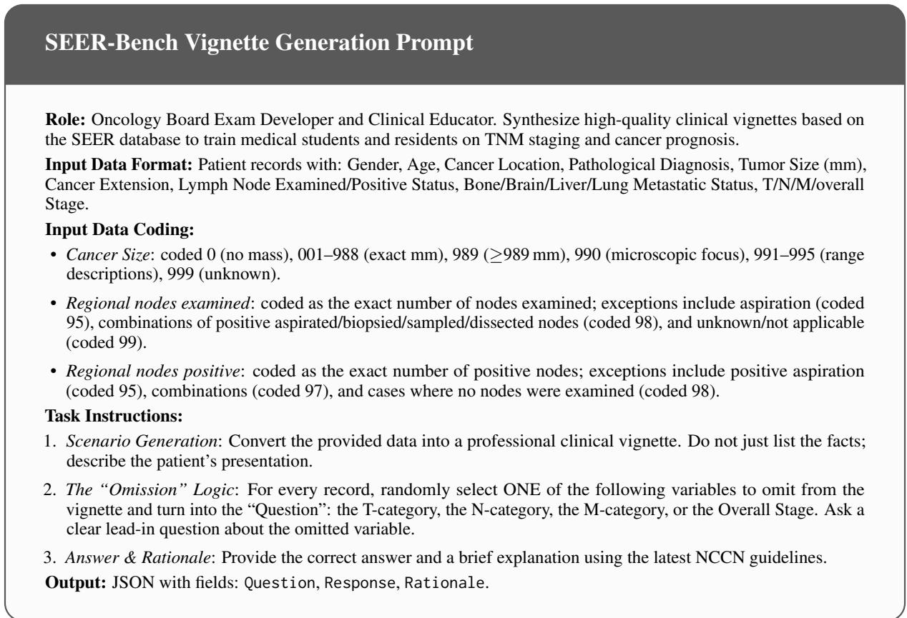  
Figure 11: Prompt template for SEER-Bench vignette generation and item construction. The model receives coded SEER patient records, synthesizes clinical narratives, and constructs masked staging inference items.

Evaluation benchmarks. MedGUIDE-English contains HCC and NSCLC update slices built from historical NCCN guideline in 2024. SEER-Bench evaluates temporally anchored oncology staging with answer accuracy and rationale accuracy, defined in Appendix E.3. HealthBench Professional evaluates external professional medical-QA generalization. The auxiliary Chinese transfer evaluation is reported separately and uses the vaccinerelated subset of LLM-EvalMed (39 items) and the vaccine-related subset of LiveMedBench (204 items).

Automatic scoring and LLM judges. To keep comparisons controlled within each benchmark, we fix the same judge across all evaluated models and methods for a given benchmark. SEER-Bench rationale accuracy are graded with GPT-5.4 and MedGUIDE-English with Gemini 3.1 Pro; Health-Bench Professional, LiveMedBench, and LLM-EvalMed are graded with GPT-5.4. For Chinese benchmarks whose original reports use different judges, LiveMedBench with GPT-OSS and LLM-EvalMed with GPT-4o.

Table 8 lists the foundation and API models used for updating, cross-scale validation, reference evaluation, data generation, and automatic grading. Qwen3-4B is the main controlled backbone; Qwen3-1.7B, Qwen3-8B, and Qwen3-14B are used for the cross-scale SEER-Bench check; Llama-3.1-8B-Instruct is used as an additional backbone validation; and MediTron-70B and HuatuoGPT-O1-70B are included as medical reference systems. API-based models were accessed via their default inference endpoints with no custom system prompts for evaluation; temperature was set to 0 when the endpoint exposes this parameter, and default settings were used otherwise. Open-weight experiments were run locally in bf16. References point to technical reports, official model cards, or provider documentation.

The table separates the roles of backbone model, medical reference model, general reference model, data-generation model, and automatic judge. Controlled rows share the same foundation checkpoint within each backbone, while external reference systems provide descriptive context rather than directly comparable training-controlled variants.

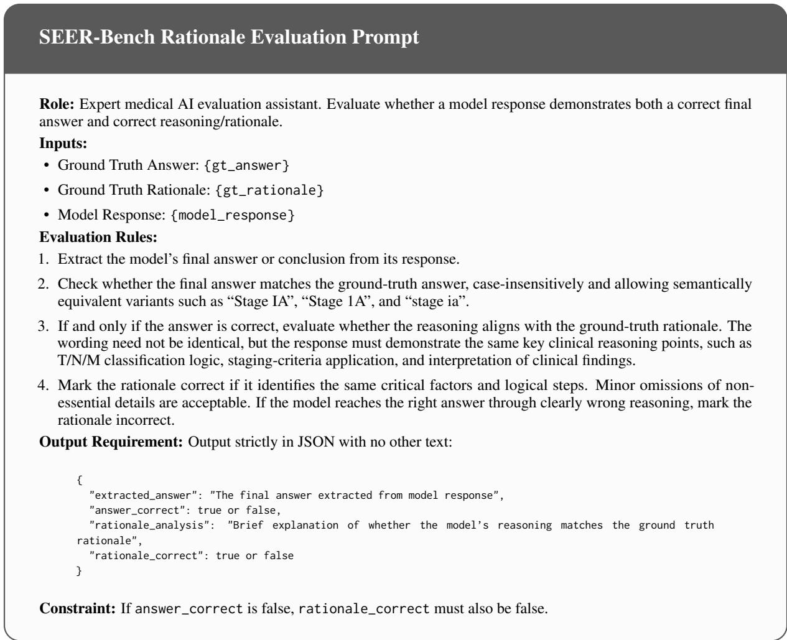  
Figure 12: Prompt template for SEER-Bench rationale-accuracy grading. The judge first verifies the final staging answer, then evaluates rationale correctness only for answer-correct responses.

Table 8: Full model specifications for the foundation and API models used in the experiments.
<table><tr><td>Model</td><td>Provider</td><td>Version / Checkpoint</td><td>Params</td><td>Access</td><td>Role</td><td>Ref.</td></tr><tr><td>Qwen3-1.7B</td><td>Alibaba</td><td>Qwen/Qwen3-1.7B</td><td>1.7B</td><td>HF/local</td><td>Cross-scale backbone</td><td>(Qwen Team, 2025b)</td></tr><tr><td>Qwen3-4B</td><td>Alibaba</td><td>Qwen/Qwen3-4B-Instruct-2507</td><td>4.0B</td><td>HF/local</td><td>Main/update backbone</td><td>(Qwen Team, 2025d)</td></tr><tr><td>Qwen3-8B</td><td>Alibaba</td><td>Qwen/Qwen3-8B</td><td>8.2B</td><td>HF/local</td><td>Cross-scale backbone</td><td>(Qwen Team, 2025e)</td></tr><tr><td>Qwen3-14B</td><td>Alibaba</td><td>Qwen/Qwen3-14B</td><td>14.8B</td><td>HF/local</td><td>Cross-scale backbone</td><td>(Qwen Team, 2025a)</td></tr><tr><td>Qwen3-235B</td><td>Alibaba</td><td>Qwen/Qwen3-235B-A22B-Instruct-2507</td><td>235B</td><td>API</td><td>Reference system</td><td>(Qwen Team, 2025c)</td></tr><tr><td>Llama-3.1-8B-Instruct</td><td>Meta</td><td>meta-llama/Llama-3.1-8B-Instruct</td><td>8B</td><td>HF/local</td><td>Backbone validation</td><td>(Grattafiori et al., 2024)</td></tr><tr><td>MediTron-70B</td><td>EPFL</td><td>epfl-llm/meditron-70b</td><td>70B</td><td>HF/local</td><td>Medical reference</td><td>(Chen et al., 2023)</td></tr><tr><td>HuatuoGPT-O1-70B</td><td>FreedomIntelligence</td><td>FreedomIntelligence/HuatuoGPT-o1-70B</td><td>70B</td><td>HF/local</td><td>Medical reference</td><td>(Chen et al., 2025)</td></tr><tr><td>Kimi-2.5</td><td>Moonshot AI</td><td>kimi-k2.5</td><td></td><td>API</td><td>Reference system</td><td>(Moonshot AI, 2026)</td></tr><tr><td>GLM-5</td><td>Zhipu AI</td><td>glm-5</td><td>1</td><td>API</td><td>Reference system</td><td>(Zeng et al., 2026)</td></tr><tr><td>DeepSeek-R1</td><td>DeepSeek</td><td>deepseek-r1</td><td>671B</td><td>API</td><td>Reference system</td><td>(Guo et al., 2025)</td></tr><tr><td>Claude-Opus-4.6</td><td>Anthropic</td><td>claude-opus-4-6</td><td></td><td>API</td><td>Reference system</td><td>(Anthropic, 2026)</td></tr><tr><td>Gemini-3.1-Pro</td><td>Google DeepMind</td><td>gemini-3.1-pro</td><td></td><td>API</td><td>Reference/generation/judge</td><td>(Google DeepMind, 2026)</td></tr><tr><td>GPT-5.4</td><td>OpenAI</td><td>gpt-5.4</td><td></td><td>API</td><td>Reference/judge</td><td>(OpenAI, 2026)</td></tr></table>

## F.1 Implementation Hyperparameters

Tables 9–11 list the implementation hyperparameters used for the reported LoRA, retrieval, and knowledge-editing baselines. Within each adaptation route, the same settings are held fixed across supervision formats.

The LoRA settings are fixed within each adaptation route, and the retrieval baseline uses the same encoder and top-k setting across questions. Consequently, differences among EMQ, MSQ, FITB, and SAQ are intended to reflect supervision structure rather than extra tuning budget.

These settings document the editing baselines as reproducibility controls. They also clarify that the comparison is between different update mechanisms, not between independently optimized hidden-size or batch-size choices.

<table><tr><td>Method</td><td>Hyperparameter</td><td>Value</td></tr><tr><td rowspan="5">SFT-LoRA</td><td>LoRA rank / alpha / dropout</td><td>128 / 256 / 0.1</td></tr><tr><td>Training epochs</td><td>3</td></tr><tr><td>Batch size</td><td>16</td></tr><tr><td>Warmup ratio</td><td>0.05</td></tr><tr><td>Learning rate</td><td>5e-5</td></tr><tr><td rowspan="2">Base RAG</td><td>Embedding model</td><td>MedEmbed-large-v0.1</td></tr><tr><td>Retrieved passages</td><td>Top 3</td></tr></table>

Table 9: Hyperparameters for LoRA-based adaptation and the Base RAG retrieval baseline.
<table><tr><td>Hyperparameter</td><td>Value</td></tr><tr><td>AlphaEdit</td><td></td></tr><tr><td>layers</td><td>[4, 5, 6, 7, 8]</td></tr><tr><td>v_num_grad_steps</td><td>25</td></tr><tr><td>v_1r</td><td>1e-1</td></tr><tr><td>v_loss_layer</td><td>35</td></tr><tr><td>v_weight_decay</td><td>0.5</td></tr><tr><td>clamp_norm_factor</td><td>0.75</td></tr><tr><td>kl_factor</td><td>0.0625</td></tr><tr><td>mom2_adjustment</td><td>true</td></tr><tr><td>mom2_update_weight</td><td>15000</td></tr><tr><td>mom2_n_samples</td><td>10,000</td></tr><tr><td>rewrite_module_tmp</td><td>model.layers.{}.mlp.down_proj</td></tr><tr><td>1m_head_module</td><td>model.embed_tokens</td></tr><tr><td>nullspace_threshold</td><td>2e-2</td></tr><tr><td>L2</td><td>10</td></tr><tr><td>RECIPE</td><td></td></tr><tr><td>edit_model_name</td><td>qwen3-4b</td></tr><tr><td>model_hidden_size</td><td>2560</td></tr><tr><td>knowledge_rep_dim</td><td>2560</td></tr><tr><td>know_rep_prot_token_n</td><td>10</td></tr><tr><td>prompt_token_n</td><td>3</td></tr><tr><td>krm_1r</td><td>1e-5</td></tr><tr><td>pt_1r</td><td>1e-5</td></tr><tr><td>batch_size</td><td>2</td></tr><tr><td>grad_accum_steps</td><td>8</td></tr><tr><td>max_epochs</td><td>1000</td></tr><tr><td>early_stop_patience</td><td>7</td></tr><tr><td>contra_lambda/relia_lambda</td><td>2/1</td></tr></table>

Table 10: Hyperparameters for the AlphaEdit and RECIPE knowledge-editing baselines on Qwen3-4B. For RECIPE, pt\_lr is listed for completeness but the implementation uses krm\_lr; batch size 2 with 8 accumulation steps gives an effective batch size of 16.

The CARE configuration is reported separately because it includes both pretraining and finetuning phases. This distinction matters when comparing it with LoRA-only updates, which do not add an additional retrieval-compression pretraining stage.

## G Inference Prompt

Figure 13 shows the inference prompt used for the Base RAG baseline. The prompt supplies the retrieved background knowledge and the target question, without exposing the supervision-format labels used in training.

The inference prompt intentionally exposes retrieved background knowledge but not the supervision-format labels used during training. This makes Base RAG a test-time knowledgeaccess baseline rather than another formatcontrolled update method.

<table><tr><td>Hyperparameter</td><td>Value</td></tr><tr><td>CARE pretraining</td><td></td></tr><tr><td>Learning rate</td><td>2e-4</td></tr><tr><td>Number of training epochs</td><td>1</td></tr><tr><td>Total batch size</td><td>384 (8 × 8 × 6)</td></tr><tr><td>Max sequence length</td><td>336</td></tr><tr><td>Retrieval context length</td><td>180</td></tr><tr><td>ICAE memory size</td><td>16</td></tr><tr><td>Memory hidden size</td><td>2560</td></tr><tr><td>αNLL</td><td>1.0</td></tr><tr><td>LR scheduler / warmup ratio</td><td>linear / 0.03</td></tr><tr><td>Weight decay</td><td>0.0</td></tr><tr><td>Seed</td><td>980406</td></tr><tr><td>LoRA rank / alpha / dropout</td><td>8 / 16 / 0.05</td></tr><tr><td>LoRA targets</td><td>q/k/v/o/gate/up/down_proj</td></tr><tr><td>CARE finetuning</td><td></td></tr><tr><td>Learning rate</td><td>3e-4</td></tr><tr><td>Number of training epochs</td><td>1</td></tr><tr><td>Total batch size</td><td>48 (8 × 6 × 1)</td></tr><tr><td>Max sequence length</td><td>512</td></tr><tr><td>αNLL /αKL</td><td>1.0 / 2.0</td></tr><tr><td>KL temperature</td><td>1.0</td></tr><tr><td>ICAE memory size</td><td>16</td></tr><tr><td>Context teacher / student</td><td>adaptive / gt</td></tr><tr><td>Selection criterion / context selection</td><td>closed_book_correct / nn</td></tr></table>

Table 11: CARE hyperparameters for Qwen3-4B. Pretraining uses 8 Ascend 910B devices; finetuning uses the best configuration from run\_finetune\_full.sh.

## H Auxiliary Chinese Evaluation

Table 12 reports an auxiliary Chinese transfer check on LLM-EvalMed and LiveMedBench, including both full-benchmark averages and vaccine-related subsets.

This auxiliary transfer check should be interpreted separately from the main oncology update evaluation. It uses vaccine-guidance updates and Chinese benchmarks, so it tests whether formatcontrolled updating carries cross-lingual signal rather than directly replicating the NCCN English setting. The large reference models provide external context rather than format-controlled variants of the same update procedure.

## I Case Study: Knowledge Updating Challenges

We present two representative cases from MedGUIDE that illustrate the dual challenges of medical knowledge updating: stability maintenance and update learning. For each case, we show the clinical vignette, the correct answers from the outdated and latest versions, and the key guideline change that distinguishes the two versions. Figures 14 and 15 present the detailed case analyses. We then add a SEER-Bench renal cell carcinoma (RCC) staging case to illustrate the intended outputlength and correctness pattern across the four supervision formats.

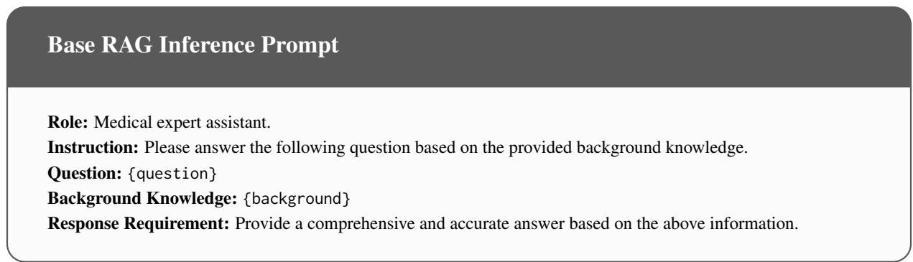

Figure 13: Prompt template for the Base RAG baseline.
<table><tr><td>Model / method</td><td>LLM-EvalMed-All ↑</td><td>LLM-EvalMed-Sub. ↑</td><td>LiveMedBench-Sub. ↑</td><td>LiveMedBench-All ↑</td></tr><tr><td>Qwen3-4B</td><td>3.479</td><td>3.558</td><td>0.4489</td><td>0.4023</td></tr><tr><td>SFT-LoRA + EMQ</td><td>3.559</td><td>3.967</td><td>0.5111</td><td>0.4213</td></tr><tr><td>SFT-LoRA + MSQ</td><td>3.490</td><td>3.806</td><td>0.4860</td><td>0.3903</td></tr><tr><td>SFT-LoRA + FITB</td><td>3.459</td><td>3.664</td><td>0.4405</td><td>0.3873</td></tr><tr><td>SFT-LoRA + SAQ</td><td>3.519</td><td>3.750</td><td>0.4991</td><td>0.4133</td></tr><tr><td>Qwen3-235B</td><td>3.814</td><td>4.114</td><td>0.5507</td><td>0.4616</td></tr><tr><td>Kimi-2.5</td><td>3.841</td><td>3.897</td><td>0.5644</td><td>0.5518</td></tr><tr><td>GLM-5</td><td>3.791</td><td>3.930</td><td>0.5208</td><td>0.5419</td></tr><tr><td>DeepSeek-R1</td><td>3.933</td><td>3.943</td><td>0.5077</td><td>0.4697</td></tr><tr><td>Claude-Opus-4.6</td><td>3.927</td><td>3.956</td><td>0.5634</td><td>0.5531</td></tr><tr><td>Gemini-3.1-Pro</td><td>3.975</td><td>4.297</td><td>0.5032</td><td>0.5596</td></tr><tr><td>GPT-5.4</td><td>3.941</td><td>3.973</td><td>0.5203</td><td>0.4697</td></tr></table>

Table 12: Auxiliary Chinese transfer evaluation results. This supplementary setting uses vaccine-guidance updates and is separate from the main NCCN English experiments. LLM-EvalMed-All reports the full 667-item average, and LLM-EvalMed-Sub. reports the 39-item vaccine-related subset. LiveMedBench-Sub. reports the vaccine-related subset, and LiveMedBench-All reports the full benchmark average. Both Chinese benchmarks are re-scored with GPT-5.4; original benchmark reports use different judges, so scores are not directly interchangeable.

This case isolates stability: the surrounding guideline context changes, but the downstream answer should not. A model that changes away from C is not simply outdated; it is over-applying the update signal to an unchanged clinical decision path.

This plasticity case tests whether the model can override the plausible outdated answer A and adopt B only when the guideline decision rule truly changes.

## I.1 Analysis

These cases jointly illustrate why supervision format matters for medical knowledge updating:

Figure 16 holds the clinical vignette fixed and compares the outputs induced by the four supervision formats. The panels show highlighted excerpts, while the parenthetical word counts refer to the full original outputs. The example separates verbosity from correctness: EMQ, MSQ, and SAQ preserve the decisive renal-vein/perinephricfat invasion cue and therefore recover T3aN0M0 and Stage III, whereas FITB produces the longest rationale but over-relies on the 9.0 cm tumor size, consequently overlooking the vein invasion to misclassify the case as T2aN0M0, and selects Stage II.

Stability vs. Plasticity Dilemma. Case 1 requires the model to maintain its existing correct answer despite peripheral guideline revisions, while Case 2 requires the model to change its answer when the recommendation genuinely shifts. Balancing these two demands is the core challenge of knowledge updating.

Failure Modes of Isolated Formats. Under SAQ, MSQ, and FITB supervision, each training sample establishes only a single knowledge correspondence. This makes it difficult for models to learn the boundary between “what has changed” and “what has not.” Empirically, such models can under-update on Case 2 (persisting with the plausible outdated answer A), over-update on Case 1 (unnecessarily shifting away from the stable answer C), or produce long but incorrect slot-centered rationales as in the RCC FITB example.

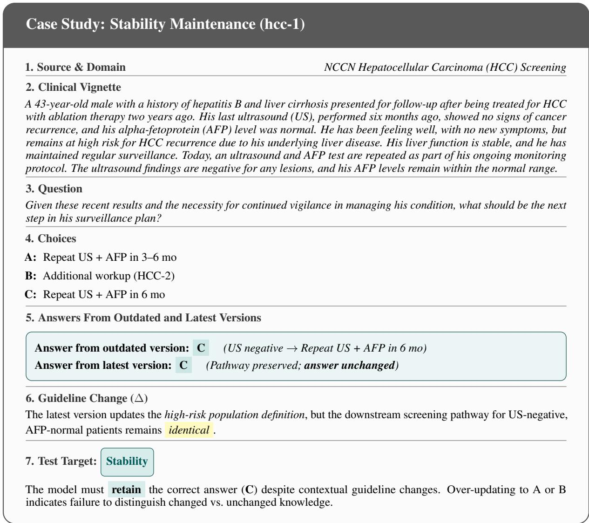  
Figure 14: Case hcc-1: The guideline revision changes population criteria but not the screening pathway. A correctly updated model should maintain answer C across both versions.

Why EMQ Helps. The EMQ format places multiple related clinical scenarios (including both changed and unchanged cases) within a single training instance, requiring the model to jointly assign each scenario to its correct answer from a shared candidate pool. This contrastive structure encourages simultaneous discrimination between stable and updated knowledge, making useful decision boundaries more likely to emerge.

## J Clinical Decision Failure Modes Under Guideline Obsolescence

Medical knowledge obsolescence can manifest as output-level failures with distinct downstream clinical consequences. These failure modes differ in how an LLM translates outdated knowledge into unsafe outputs. Incorrect staging can alter the model’s clinical conclusion and, in turn, redirect downstream treatment planning. Outdated treatment recommendations may preserve superseded interventions or treatment sequences, leading the model to recommend choices that are no longer supported by current guidelines. Overconfident rationales, by contrast, can make outdated recommendations harder to detect by presenting them with evidence that was valid under earlier clinical standards. Together, these failure modes motivate temporally anchored evaluation of both model answers and their rationales, as well as supervision that explicitly captures contrasts between historical and revised clinical conditions. Persistent underrepresentation of specific cancer types, languages, and guideline regions further poses a deployment risk, as limited exposure to relevant update events may reduce the model’s ability to recognize and correct knowledge that has become outdated.

<table><tr><td>Failure Mode</td><td>Clinical Vignette</td><td>Clinical Consequence</td></tr><tr><td>Incorrect staging</td><td>Case: A patient has a 3.5-cm non-small cell lung cancer primary (T2a), metas- tases in multiple ipsilateral mediastinal nodal stations (N2b), and no distant metastasis (M0). AJCC 8th Edition: Under the eighth edition of the AJCC Cancer Staging Manual, which remained applicable to lung cancer through 2024, N2 disease was not subdivided into single- and multistation categories. The corresponding T2N2M0 presentation was therefore classified as stage IIIA (Kutob and Schneider, 2020). AJCC 9th Edition: Effective January 1, 2025, the lung protocol distinguishes</td><td>Inappropriate treatment-pathway selection: Ac- cording to 8th edition protocol, stage IIIA is cat- egorized and thus neoadjuvant therapy followed by resection is an expected option. Recognition of multistation N2b disease and the updated stage IIIB grouping instead makes a definitive nonsurgi- cal pathway, commonly concurrent chemoradiation followed by consolidation systemic therapy when appropriate. The stale conclusion could therefore expose a patient to a potentially nonbeneficial tho-</td></tr><tr><td>tion</td><td>with visceral locoregional invasion or rapid progression after surgery. NCCN Thyroid Carcinoma Version 5.2024: The guideline did not contain an explicit upfront-treatment instruction for this subgroup. The clinical deci- sion relying on this version could be TSH-stimulated iodine-123 or iodine-131 whole-body imaging and defer treatment selection until radioiodine uptake was established (Haddad et al., 2025). NCCN Thyroid Carcinoma Version 1.2025: The guideline added that, for viscerally locoregional invasive disease or rapid progression, upfront EBRT,</td><td>Undertreatment or treatment delay: Treating radioiodine imaging as a prerequisite may delay EBRT or systemic therapy while invasive neck dis- ease progresses toward the airway, esophagus, or major neurovascular structures. The result may be reduced local control and an increased risk of critical-structure compromise.</td></tr><tr><td>nale</td><td>Case: A patient with metastatic urothelial carcinoma experiences progression after platinum chemotherapy and checkpoint-inhibitor therapy. 2024 EAU guideline: The guideline gave a recommendation to consider sac- ituzumab govitecan. It described a 27% objective response rate in previously treated metastatic urothelial carcinoma and noted the drug&#x27;s accelerated FDA approval (Witjes et al., 2024).</td><td>Inappropriate and potentially toxic treatment: A stale model could generate a persuasive ratio- nale by selectively recalling the earlier response rate and recommendation while omitting the sub sequent withdrawal and negative confirmatory evi- dence. This error could expose the patient to toxici- ties such as severe neutropenia or diarrhea without confirmed survival benefit and delay an appropriate alternative or clinical trial.</td></tr></table>

Table 13: Clinical failure modes caused by stale oncology knowledge. Each case contrasts original, versioned guidelines used before and after a temporally bounded update. The examples show how an outdated staging conclusion, treatment pathway, or rationale can change a clinically relevant recommendation and how the resulting risk may vary across cancer subtypes.

## K Additional Backbone Results on Llama-3.1-8B-Instruct

To check whether the controlled-format pattern is specific to Qwen3-4B, we repeat the same update protocol on Llama-3.1-8B-Instruct. Table 14 shows that EMQ remains the strongest SFT format on SEER-Bench and HealthBench, while MedGUIDE again exhibits slice-specific behavior: EMQ is strongest on HCC, whereas FITB is strongest on NSCLC.

## L Statistical Significance Testing

We assess statistical significance using paired tests over evaluation items. For SEER-Bench answer accuracy and rationale accuracy, we compute paired bootstrap confidence intervals with 10,000 resamples over the shared evaluation set. For HealthBench, we apply the same paired bootstrap procedure to item-level scores. For each comparison, we report the observed difference, a two-sided 95% confidence interval, and a Holm-Bonferroni adjusted p-value within each metric family. MedGUIDE NSCLC is excluded from monotonic improvement testing because it is used as an older diagnostic slice rather than as a primary current-knowledge metric.

Table 15 shows that the main SEER-Bench gains of EMQ over other SFT formats are statistically significant across both Qwen3-4B and Llama-3.1- 8B-Instruct. The gains are especially consistent for rationale accuracy, where all confidence intervals are well above zero. Answer-accuracy gains are smaller but remain significant after correction, including the closest comparison against SAQ. The HealthBench comparison in the Qwen3-4B setting shows a smaller but positive retention gain over MSQ, supporting the view that EMQ’s transfer gains do not come at the cost of broader clinicalchat performance.

<table><tr><td rowspan="2">System / update</td><td colspan="2">SEER-Bench</td><td>HealthBench</td><td colspan="2">MedGUIDE</td></tr><tr><td>Acc. ↑</td><td>Rat. Acc. ↑</td><td>Score ↑</td><td>HCC↑</td><td>NSCLC</td></tr><tr><td>Base model</td><td>58.0</td><td>51.1</td><td>0.260</td><td>67.1</td><td>36.4</td></tr><tr><td>SFT, EMQ</td><td>65.2</td><td>60.0</td><td>0.276</td><td>86.1</td><td>26.9</td></tr><tr><td>SFT, MSQ</td><td>62.1</td><td>55.5</td><td>0.256</td><td>76.6</td><td>28.4</td></tr><tr><td>SFT, FITB</td><td>61.9</td><td>51.3</td><td>0.250</td><td>70.4</td><td>42.4</td></tr><tr><td>SFT, SAQ</td><td>63.1</td><td>52.5</td><td>0.266</td><td>71.9</td><td>30.5</td></tr><tr><td>RAG, Base RAG</td><td>60.0</td><td>47.6</td><td>0.160</td><td>70.3</td><td>28.7</td></tr><tr><td>RAG, CARE</td><td>60.4</td><td>52.4</td><td>0.108</td><td>73.8</td><td>23.9</td></tr><tr><td>Editing, RECIPE</td><td>64.2</td><td>49.6</td><td>0.112</td><td>69.5</td><td>29.3</td></tr><tr><td>Editing, AlphaEdit</td><td>58.3</td><td>48.4</td><td>0.100</td><td>59.7</td><td>24.5</td></tr></table>

Table 14: Controlled update results on Llama-3.1-8B-Instruct. Best and second-best values among updated rows are shown in bold and underlined, respectively; the base-model row is reported for reference.
<table><tr><td>Backbone</td><td>Comparison</td><td>Metric</td><td>∆</td><td>95% CI</td><td>Adjusted p</td></tr><tr><td>Qwen3-4B</td><td>EMQ - MSQ</td><td>SEER Acc.</td><td>+3.1</td><td> $[ + 1 . 4 , + 4 . 9 ]$ </td><td>0.006</td></tr><tr><td>Qwen3-4B</td><td>EMQ - MSQ</td><td>Rat. Acc.</td><td>+4.5</td><td> $[ + 2 . 4 , + 6 . 6 ]$ </td><td>&lt; 0.001</td></tr><tr><td>Qwen3-4B</td><td>EMQ - MSQ</td><td>HealthBench</td><td>+0.020</td><td> $[ + 0 . 0 0 5 , + 0 . 0 \dot { 3 } 6 ]$ </td><td>0.024</td></tr><tr><td>Qwen3-4B</td><td>EMQ – FITB</td><td>SEER Acc.</td><td>+3.3</td><td> $[ + 1 . 5 , + 5 . 1 ]$ </td><td>0.004</td></tr><tr><td>Qwen3-4B</td><td>EMQ – FITB</td><td>Rat. Acc.</td><td>+8.7</td><td> $[ + 6 . 4 , + 1 0 . 9 ]$ </td><td>&lt; 0.001</td></tr><tr><td>Qwen3-4B</td><td>EMQ - SAQ</td><td>SEER Acc.</td><td>+2.1</td><td> $[ + 0 . 4 , + 3 . 9 ]$ </td><td>0.041</td></tr><tr><td>Qwen3-4B</td><td>EMQ - SAQ</td><td>Rat. Acc.</td><td>+7.5</td><td> $[ + 5 . 2 , + 9 . 8 ]$ </td><td>&lt; 0.001</td></tr><tr><td>Llama-3.1-8B-Instruct</td><td>EMQ - MSQ</td><td>SEER Acc.</td><td>+2.8</td><td> $[ + 1 . 0 , + 4 . 7 ]$ </td><td>0.013</td></tr><tr><td>Llama-3.1-8B-Instruct</td><td>EMQ - MSQ</td><td>Rat. Acc.</td><td>+4.1</td><td> $[ + 1 . 9 , + 6 . 4 ]$ </td><td>0.003</td></tr><tr><td>Llama-3.1-8B-Instruct</td><td>EMQ - FITB</td><td>SEER Acc.</td><td>+3.6</td><td> $[ + 1 . 7 , + 5 . 5 ]$ </td><td>0.003</td></tr><tr><td>Llama-3.1-8B-Instruct</td><td>EMQ – FITB</td><td>Rat. Acc.</td><td>+8.3</td><td> $[ + 5 . 9 , + 1 0 . 7 ]$ </td><td>&lt; 0.001</td></tr><tr><td>Llama-3.1-8B-Instruct</td><td>EMQ - SAQ</td><td>SEER Acc.</td><td>+1.8</td><td> $[ + 0 . 2 , + 3 . 6 ]$ </td><td>0.047</td></tr><tr><td>Llama-3.1-8B-Instruct</td><td>EMQ - SAQ</td><td>Rat. Acc.</td><td>+6.8</td><td> $[ + 4 . 4 , + 9 . 3 ]$ </td><td>&lt; 0.001</td></tr></table>

Table 15: Paired significance tests for the main controlled-format comparisons. ∆ reports the absolute performance difference between EMQ and the comparison format. Confidence intervals are two-sided 95% paired bootstrap intervals over evaluation items, and p-values are adjusted within each metric family using the Holm-Bonferroni procedure. Positive values indicate higher performance for EMQ.  
wise L2 ratio, layer-wise linear CKA, layer-wise linear-probe accuracy for cancer-type prediction, and final-layer clustering geometry.

## M Implementation Details

This appendix lists the hyperparameters and computational details for the representation-level analysis in §6. All computations use the Qwen3-4B (qwen3- 4B-2507) base model and its four LoRA-updated variants.

Representation probes. For the base model and the four format-updated variants, we extract lastnon-padding hidden states from all 36 layers on a SEER cancer-type classification of 1,992 samples covering 16 cancer types. We compute layer-

Table 16 summarizes the fixed extraction and probing settings; the metric definitions are given below in prose.

M.1 Representation Extraction and Probing
<table><tr><td>Item</td><td>Setting</td></tr><tr><td>Backbone</td><td>Qwen3-4B (qwen3-4B-2507); 36 layers total; hidden size  $\begin{array} { r } { \bar { d } = 2 5 6 0 ; \mathrm { b f } 1 6 . } \end{array}$ </td></tr><tr><td>Variants</td><td>Base model plus four LoRA-updated variants.</td></tr><tr><td>Probe set</td><td>SEER 16-class cancer-type subset; 1,992 sam- ples; separate from SEER-Bench.</td></tr><tr><td></td><td>Hidden states Max length 512; batch size  $4 ;$  last non- padding token at each layer; tensor shape (1992, 36, 2560) per model.</td></tr><tr><td>Linear probe</td><td>Logistic regression; max_iter=300,  $C = 1 . 0 ,$  1bfgs; stratified 80/20 split with seed 42; trained per layer and model.</td></tr><tr><td>UMAP</td><td>umap-learn;  $n _ { \mathrm { n b r } } = 3 0 ,$  min dist = 0.1, co- sine metric, seed 42,  $n _ { \mathrm { j o b s } } = - 1 ;$  final, -2, -4, and -8 layers.</td></tr><tr><td>Sensitivity</td><td> $n _ { \mathrm { n { b r } } } \in \{ 1 5 , 3 0 , 5 0 \} \ \rangle$  &lt; min dist  $\in \{ 0 . 0 , 0 . 1 \}$  with the same metric and seed.</td></tr></table>

Table 16: Fixed implementation settings for hidden-state extraction, linear probing, and UMAP visualization.

The probe set is explicitly separate from SEER-Bench, so these diagnostics characterize representation geometry rather than tune or train on the benchmark. The fixed extraction settings make the layer-wise comparisons meaningful across the base and updated variants.

## M.2 Representation Metrics

Layer-wise drift. Cosine distance is computed as $1 - \cos ( h _ { \ell } ^ { ( f ) } , h _ { \ell } ^ { ( 0 ) } )$ and averaged over the 1,992 samples. The L2 ratio is $\| h _ { \ell } ^ { ( f ) } - h _ { \ell } ^ { ( 0 ) } \| _ { 2 } / \| h _ { \ell } ^ { ( 0 ) } \| _ { 2 }$ also averaged over samples.

CKA. Layer-wise CKA uses the linear HSIC formulation,

$$
\begin{array} { r } { \mathrm { C K A } ( X , Y ) = \frac { \mathrm { H S I C } ( X X ^ { \top } , Y Y ^ { \top } ) } { \sqrt { A _ { X } A _ { Y } } } , } \\ { A _ { X } = \mathrm { H S I C } ( X X ^ { \top } , X X ^ { \top } ) , } \\ { A _ { Y } = \mathrm { H S I C } ( Y Y ^ { \top } , Y Y ^ { \top } ) , ~ } \end{array}
$$

implemented as torch tensor operations in float32.

Clustering and compactness. Cosine silhouette is computed in the high-dimensional space with sklearn.metrics.silhouette\_score, metric=cosine, and a 2,000-point subsample using random\_state=42. UMAP silhouette is computed with Euclidean distance on the 2D UMAP embedding. Davies-Bouldin and Calinski-Harabasz use the standard scikit-learn implementations on all 1,992 samples. Intra-class cosine distance averages pairwise cosine distances within each class using up to 50 samples per class; inter-class cosine distance averages 5,000 random cross-class pairs.

Aggregated quantities. L2 mean (all 36) averages the per-layer L2 ratio over layers 1 to 36. L2 deep avg averages layers 29 to 36, i.e., the eight deepest transformer layers excluding the final layer. L2 last is the L2 ratio at the final layer (layer 36), and CKA std is the standard deviation of layer-wise CKA over all 36 layers.

## N Diagnostic Controls for Entity Density and Networked Structure

Section 6.1 shows that EMQ exposes denser clinical signals than the single-decision formats. A potential confound is that entity density and networked structure co-vary in EMQ: the shared candidate pool both increases exposure to related clinical entities and creates many-to-many correspondences across vignettes. We therefore construct two diagnostic controls to partially separate entity exposure from clinically coherent networked grouping.

Density-matched MSQ. This control increases the entity exposure of MSQ without introducing a shared multi-vignette answer pool. For each MSQ item, we augment the option set with clinically related distractors sampled from the same update cluster until the average number of cancer-related entities in the prompt and answer approximately matches EMQ. The item remains a single-vignette decision, so this control increases density while preserving the non-networked structure of MSQ.

Shuffled EMQ. This control preserves the surface form, candidate-pool size, and approximate entity density of EMQ, but disrupts clinically coherent grouping. We construct each shuffled block by combining vignettes and answer options from different update clusters while preserving the number of vignettes, options, and old/new answer types. This keeps the high-density shared-pool format but weakens the local clinical relation network.

Training and evaluation. Both controls use the same base model, update source, number of SFT instances, LoRA configuration, and training budget as the main format-controlled experiments. Evaluation follows the same SEER-Bench answeraccuracy and rationale-accuracy protocol. Table 17 reports training-side entity counts and SEER-Bench performance.

Interpretation. Increasing entity density alone yields only modest gains over standard MSQ:

<table><tr><td>Variant</td><td>Entity density</td><td>Networked structure</td><td>Q ent. ↑</td><td>A ent. ↑</td><td>SEER Acc. ↑</td><td>Rat. Acc. ↑</td></tr><tr><td>MSQ</td><td>Medium</td><td>No</td><td>10.7</td><td>10.6</td><td>61.7</td><td>55.1</td></tr><tr><td>Density-matched MSQ</td><td>High</td><td>No</td><td>11.3</td><td>12.4</td><td>62.3</td><td>55.8</td></tr><tr><td>Shuffled EMQ</td><td>High</td><td>Disrupted</td><td>11.4</td><td>12.5</td><td>62.5</td><td>56.1</td></tr><tr><td>Full EMQ</td><td>High</td><td>Yes</td><td>11.4</td><td>12.6</td><td>64.8</td><td>59.6</td></tr></table>

Table 17: Diagnostic controls for partially decoupling entity density from networked structure. Q ent. and A ent. denote training-side cancer-related entity counts. Density-matched MSQ increases entity exposure without introducing many-to-many matching. Shuffled EMQ preserves high entity density and shared-pool surface form but disrupts clinically coherent grouping.

density-matched MSQ improves SEER-Bench answer accuracy from 61.7 to 62.3 and rationale accuracy from 55.1 to 55.8. Preserving high density and shared-pool surface form while disrupting coherent grouping also remains below full EMQ: shuffled EMQ reaches 62.5 answer accuracy and 56.1 rationale accuracy, compared with 64.8 and 59.6 for full EMQ. These controls suggest that the EMQ advantage is not explained by entity density alone; it depends on the combination of dense entity exposure and clinically coherent networked structure.

## O Additional Analysis Tables

Table 18 reports final-layer clustering metrics used to examine the ranking disagreement between unsupervised compactness and linear-probe discriminability.

<table><tr><td>Model</td><td>Sil. (Cos)</td><td>Sil. (UMAP)</td><td>DB↓</td><td>CH↑</td><td>Probe Acc. ↑</td></tr><tr><td>Base</td><td>-0.024</td><td>-0.013</td><td>4.451</td><td>47.88</td><td>0.9834</td></tr><tr><td>EMQ</td><td>0.002</td><td>0.014</td><td>4.130</td><td>55.26</td><td>0.9848</td></tr><tr><td>SAQ</td><td>0.008</td><td>0.020</td><td>4.042</td><td>57.61</td><td>0.9779</td></tr><tr><td>FITB</td><td>0.011</td><td>0.023</td><td>3.994</td><td>57.25</td><td>0.9834</td></tr><tr><td>MSQ</td><td>0.008</td><td>0.020</td><td>4.018</td><td>56.89</td><td>0.9848</td></tr></table>

Table 18: Final-layer clustering and probe metrics on the SEER 16-class subset of 1,992 samples. Sil. (Cos) is cosine silhouette in the high-dimensional space; Sil. (UMAP) is Euclidean silhouette on a 2D UMAP embedding. Probe Acc. is the final-layer linear-probe accuracy.

The updated models generally improve clustering compactness over the base model, but the best compactness scores do not perfectly align with the best probe accuracy. This supports the main-text caution that unsupervised geometry and discriminative utility capture related but non-identical properties.

Table 19 reports UMAP silhouette values for selected layers among the last 8 layers, allowing inspection of whether the clustering trend is consistent in the deep layers.

The gains are largest at the final layer and shrink in earlier deep layers, suggesting that formatspecific updates mainly reshape late representations rather than uniformly reorganizing the full stack.

<table><tr><td>Layer</td><td>Base</td><td>EMQ</td><td>SAQ</td><td>FITB</td><td>MSQ</td></tr><tr><td>Final (L36)</td><td>-0.013</td><td>0.014</td><td>0.020</td><td>0.023</td><td>0.020</td></tr><tr><td>2nd-to-last</td><td>-0.026</td><td>-0.001</td><td>0.007</td><td>0.007</td><td>0.006</td></tr><tr><td>4th-to-last</td><td>-0.077</td><td>-0.065</td><td>-0.060</td><td>-0.062</td><td>-0.063</td></tr><tr><td>8th-to-last</td><td>-0.094</td><td>-0.090</td><td>-0.087</td><td>-0.089</td><td>-0.089</td></tr></table>

Table 19: UMAP silhouette across selected layers among the last 8 layers.

## P Cross-Scale SEER-Bench Results

Table 20 reports SEER-Bench answer and rationale accuracy across Qwen3 backbones from 1.7B to 14B. All format-controlled rows use the same update content, adaptation procedure, and training budget within each backbone.

<table><tr><td>Backbone</td><td>Method</td><td>Acc. ↑</td><td>Rat. ↑</td></tr><tr><td rowspan="5">Qwen3-1.7B</td><td>Base</td><td>54.2</td><td>46.5</td></tr><tr><td>EMQ</td><td>60.5</td><td>55.1</td></tr><tr><td>MSQ</td><td>58.0</td><td>51.2</td></tr><tr><td>FITB</td><td>57.5</td><td>47.5</td></tr><tr><td>SAQ</td><td>58.6</td><td>48.2</td></tr><tr><td rowspan="5">Qwen3-4B</td><td>Base</td><td>57.6</td><td>50.7</td></tr><tr><td>EMQ</td><td>64.8</td><td>59.6</td></tr><tr><td>MSQ</td><td>61.7</td><td>55.1</td></tr><tr><td>FITB</td><td>61.5</td><td>50.9</td></tr><tr><td>SAQ</td><td>62.7</td><td>52.1</td></tr><tr><td rowspan="5">Qwen3-8B</td><td>Base</td><td>58.2</td><td>51.2</td></tr><tr><td>EMQ</td><td>65.9</td><td>61.0</td></tr><tr><td>MSQ</td><td>63.8</td><td>57.6</td></tr><tr><td>FITB</td><td>62.5</td><td>52.8</td></tr><tr><td>SAQ</td><td>63.6</td><td>54.2</td></tr><tr><td rowspan="5">Qwen3-14B</td><td>Base</td><td>58.7</td><td>51.8</td></tr><tr><td>EMQ</td><td>67.8</td><td>62.3</td></tr><tr><td>MSQ</td><td>64.6</td><td>55.5</td></tr><tr><td>FITB</td><td>63.2</td><td>54.2</td></tr><tr><td>SAQ</td><td>63.5</td><td>57.8</td></tr></table>

Table 20: Cross-scale SEER-Bench results. Within each Qwen3 backbone, rows are compared under the same adaptation setup and training budget. Boldface marks the best value per backbone and metric.

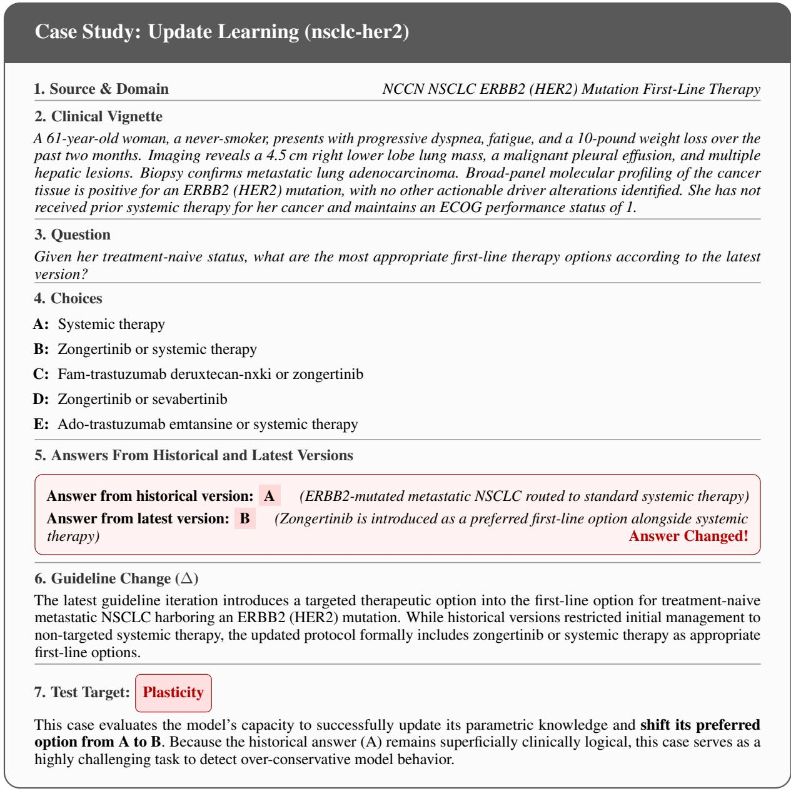  
Figure 15: Case nsclc-her2: The guideline revision substantively changes the correct answer from A to B. A correctly updated model must adopt the latest recommendation.

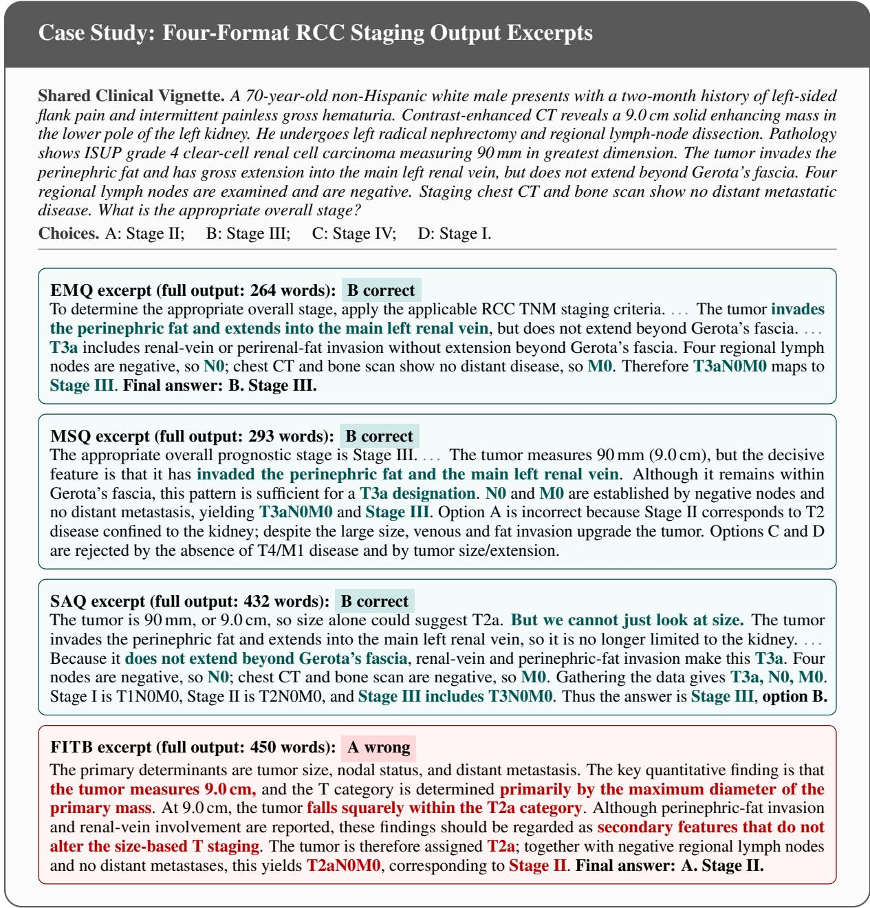  
Figure 16: Representative RCC staging case rendered across four supervision formats. Each panel shows a highlighted excerpt, with parenthetical word counts reporting the full original output length. Green highlights mark the decisive T3aN0M0 reasoning preserved by EMQ, MSQ, and SAQ; red highlights mark the tumor-size shortcut that makes the FITB response select Stage II incorrectly.