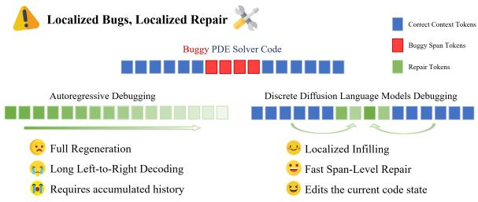
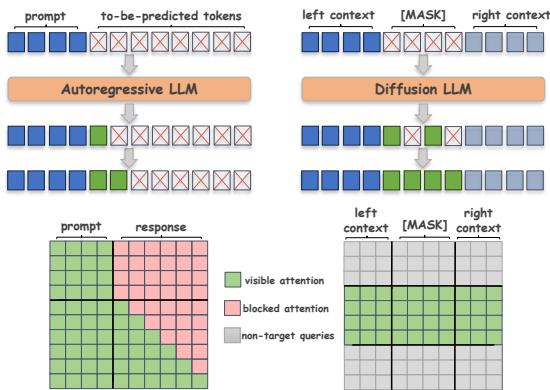
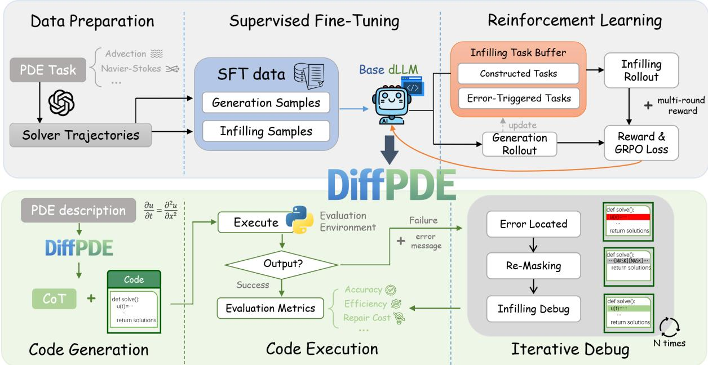
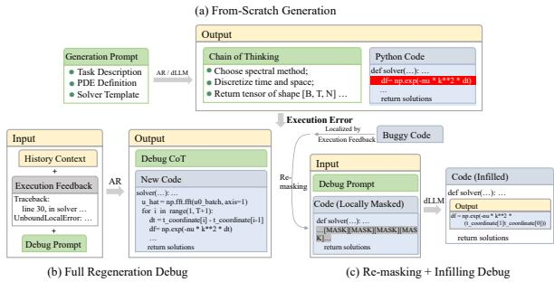
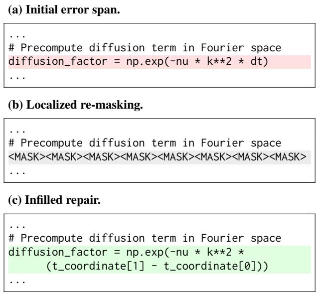

# DiffPDE: Masked Diffusion Language Models as PDE Solver

Wenxuan Guo<sup>1,2</sup> Yuyang Hong<sup>1,2</sup> Lubin Fan<sup>3†</sup>

Zhaojin Fu<sup>1,2</sup> Lin Chen<sup>1,2</sup> Kun Ding<sup>1,2†</sup> Shiming Xiang<sup>1,2</sup>

<sup>1</sup>School of Artificial Intelligence, University of Chinese Academy of Sciences

<sup>2</sup>MAIS, Institute of Automation, Chinese Academy of Sciences <sup>3</sup>Independent Researcher

{guowenxuan2024, kun.ding}@ia.ac.cn lubinfan@gmail.com

## Abstract

Existing approaches for synthesizing Partial Differential Equation (PDE) solvers predominantly rely on autoregressive models, yet their global left-to-right decoding incurs substantial redundancy when addressing inherently localized bugs. In this work, we challenge this inefficient paradigm and propose DiffPDE, a framework leveraging discrete diffusion language models for targeted code repair. By introducing a localized re-masking and infilling strategy, DiffPDE regenerates only erroneous regions while preserving correct context, naturally aligning generation with the sparse nature of PDE errors. Furthermore, to handle coupled bugs requiring sequential interventions, we present Iterative Debugging GRPO (ID-GRPO), a reinforcement learning scheme that enables multi-round debugging within single trajectories via intermediate rewards. Experiments on PDEBench show that DiffPDE achieves competitive accuracy, outperforms same-scale AR models, and significantly accelerates repair. The project repository is available at https://github.com/GU0vvx/DiffPDE.

## 1 Introduction

Partial Differential Equations govern a broad range of physical phenomena, from fluid dynamics to reaction-diffusion processes, and serve as a cornerstone of computational science (Cao et al., 2024; Li et al., 2024; Meuris et al., 2023). Despite their centrality, implementing correct and efficient numerical solvers remains a significant challenge, requiring deep domain expertise in discretization schemes, boundary condition handling, and solver stability. Recent advances in large language models (LLMs) have opened new avenues toward automating this process through code generation (Jiang et al., 2025; Soroco et al., 2025), yet reliable solver synthesis in practice demands not just initial generation, but also iterative debugging under real execution feedback.

  
Figure 1: Comparison of debugging paradigms. AR models repair buggy solvers by sequential full-context regeneration, while DiffPDE re-masks only the erroneous region and repairs it through infilling under full surrounding context.

Existing LLM-based (Li et al., 2025b; Chen et al., 2023; Jiang et al., 2025) approaches predominantly adopt autoregressive (AR) architectures for both generation and repair. While powerful, AR models are fundamentally constrained by left-to-right decoding: when an execution error is localized to a specific code span, the model must nonetheless consume the full preceding context and regenerate subsequent tokens sequentially. As repair rounds accumulate, this full-context sequential decoding introduces substantial redundant computation, since large portions of the surrounding code are already correct and need not be reconsidered. As shown in Figure 1, the mismatch between the locality of most debugging actions and the global nature of AR generation represents a core inefficiency in iterative code repair.

However, as shown in Figure 2, discrete diffusion language models (dLLMs) (Li et al., 2025a; Austin et al., 2021; Sahoo et al., 2024; Nie et al., 2026) overcome this limitation through their inherent bidirectional decoding. Unlike AR models, dLLMs utilize all unmasked tokens to predict masked tokens simultaneously at each reverse step. Therefore, leveraging dLLMs, we propose a novel debugging strategy termed localized remasking and infilling. Specifically, this strategy entails masking only the suspected erroneous regions for parallel regeneration, while retaining the surrounding correct code as conditional context. Such localized editing is highly effective for debugging PDE solvers, where errors often manifest as sparse anomalies within otherwise correct logic. Based on this alignment, we propose DiffPDE, a framework for PDE solving tasks. DiffPDE uses dLLMs to identify and infill erroneous code segments. It substantially accelerates debugging while maintaining accuracy comparable to autoregressive models.

Furthermore, authentic PDE solver failures often involve coupled bugs that require multiple sequential repairs, making reinforcement learning difficult due to sparse feedback. At the same time, effective training must bridge from-scratch generation and localized infilling within a unified process. To address these challenges, we propose Iterative Debugging GRPO (ID-GRPO), which combines a task allocation and dynamic buffer mechanism with a multi-round reward design. These design choices not only improve training stability, but also translate into competitive empirical behavior in both solver generation and iterative repair. Extensive expertimental results validate the effectiveness of DiffPDE with ID-GRPO, showing that localized infilling supports high-quality solver synthesis and more efficient, robust debugging than same-scale autoregressive baselines. In summary, our main contributions are as follows:

• We propose DiffPDE, a framework for PDE solver synthesis and repair that employs a localized re-masking and infilling strategy to regenerate only erroneous regions while preserving correct context.

• We introduce ID-GRPO, an RL training scheme that addresses sparse feedback in coupled bug repair via multi-round debugging trajectories and dense intermediate rewards.

• Comprehensive experiments on benchmark PDE tasks show that DiffPDE with ID-GRPO achieves competitive accuracy, stronger robustness than same-scale AR baselines, and lower repair latency.

## 2 Related Work

Classical and Neural PDE Solvers. Classical PDE solvers, including finite difference (LeVeque,

  
Figure 2: AR vs. diffusion debugging. AR repair typically regenerates the full solver left-to-right, whereas diffusion repair re-masks only the target span and regenerates it via iterative infilling.

2007; Strikwerda, 2004), finite element (Brenner and Scott, 2008; Hughes, 2003; Buitrago Ruiz et al., 2025), and spectral methods (Trefethen, 2000; Canuto et al., 2006), provide rigorous convergence guarantees but demand substantial domain expertise to implement correctly for each problem setting. Meanwhile, neural surrogates have emerged as a compelling data-driven alternative (Cao, 2021; Shen et al., 2024; Brandstetter et al., 2022). PINNs (Raissi et al., 2019) incorporate the PDE residual directly into the training objective, while neural operators such as FNO (Li et al., 2020) and DeepONet (Lu et al., 2019) learn function-space mappings that generalize across varying initial and boundary conditions. While empirically effective, existing approaches tend to fit specific tasks rather than learning universal principles, resulting in limited generalization to unseen data. Conversely, our methodology employs large language models to facilitate solution synthesis, capitalizing on their encoded knowledge to achieve enhanced reasoning fidelity.

LLMs for PDE Solving. Large Language Models (LLMs) have increasingly become instrumental in scientific discovery, enabling automated reasoning across domains ranging from computational biology (Tang et al., 2024; Chen et al., 2023) to materials science (Hong et al., 2025; Feng et al., 2026). This momentum extends prominently to scientific code generation, where agentic frameworks leveraging iterative refinement and tree search have significantly improved the robustness of synthesized programs (Romera-Paredes et al., 2024; Ma et al., 2024). In the specific context of numerical analysis, recent work has begun exploring LLMs to generate solvers for PDEs, typically via prompting proprietary models to produce finite-difference or finite-element implementations (Jiang et al., 2025; Soroco et al., 2025). However, the autoregressive nature of LLMs incurs latency by sequentially processing full error contexts. In contrast, diffusion models enable efficient parallel refinement. Consequently, in this work, we leverage diffusion models for PDE solving.

  
Figure 3: Overview of DiffPDE. The framework consists of a two-stage training pipeline and an inference-time iterative repair loop based on error localization, re-masking, and infilling debug.

## 3 Preliminaries

## 3.1 PDE Task Formulation

The numerical PDE solving is formulated as a code generation task. Let u denote the unknown field over domain Ω, a PDE is expressed as:

$$
\left\{ \begin{array} { l l } { \mathcal { L } u ( \tilde { \mathbf { x } } ) = \phi ( \tilde { \mathbf { x } } ) , } & { \tilde { \mathbf { x } } \in \Omega , } \\ { B u ( \tilde { \mathbf { x } } ) = \psi ( \tilde { \mathbf { x } } ) , } & { \tilde { \mathbf { x } } \in \partial \Omega , } \end{array} \right.\tag{1}
$$

where L is the differential operator encoding the governing physics, B denotes boundary or initial conditions, ϕ and ψ are the source and constraint terms, respectively. Closed-form solutions are unavailable for most PDEs. In practice, the continuous domain is discretized into spatial grids and time steps, and numerical solvers produce spatiotemporal tensors as reference solutions.

## 3.2 Diffusion LLM Generation

Consider a masked diffusion language model defined over a discrete vocabulary V that includes the special token [MASK]. Let the target code sequence be $x _ { 0 } = ( x _ { 0 , 1 } , \ldots , x _ { 0 , N } ) \in \mathcal { V } ^ { \bar { N } }$ , where N is the sequence length. The forward process q(·) progressively corrupts $x _ { 0 }$ by replacing tokens with [MASK]:

$$
x _ { t } \sim q ( x _ { t } \mid x _ { 0 } ) ,\tag{2}
$$

while the reverse process is parameterized by the model as:

$$
x _ { t - 1 } \sim p _ { \theta } ( x _ { t - 1 } \mid x _ { t } ) ,\tag{3}
$$

which predicts a lower-noise sequence conditioned on $x _ { t }$

## 4 Method

We formulate numerical PDE solving as a code generation problem with a diffusion language model. As illustrated in Figure 3, DiffPDE consists of a training stage and an inference stage. In the training stage, after preparing high-quality solver trajectories and corresponding supervision, we train the model in two phases: supervised fine-tuning (SFT) and reinforcement learning (RL). SFT equips the model with both from-scratch solver synthesis and localized infilling-based repair, while RL further improves these capabilities under real execution feedback through our Iterative Debugging GRPO (ID-GRPO), which integrates generation rollouts, infilling-task optimization, and multi-round reward modeling. In the inference stage, we adopt a generate–execute–debug loop for solver construction and repair. The model first generates a solver from the PDE description, then executes and evaluates the resulting code; if the solver fails or does not meet the target accuracy, execution feedback is used to localize the problematic region, re-mask the corresponding span, and trigger an infilling-based repair step. This loop continues until an executable solver is found or the repair budget is exhausted.

## 4.1 Code Generation and Localized Infilling

From-scratch Generation. At each reverse step, the dLLM predicts all masked positions in parallel and iteratively refines the output. To balance generation quality and efficiency for long code sequences, we adopt a semi-autoregressive decoding strategy similar to LLaDA (Nie et al., 2026): blocks are generated sequentially, while diffusion refinement is performed within each block. Specifically, for the PDE solver synthesis task, our model is trained to generate a Chain-of-Thought (CoT) reasoning path that plans the numerical scheme and spatial-temporal discretization first, followed by generating the actual executable PDE solver code block.

Span Infilling under Full Context. Unlike autoregressive models, the dLLM predicts masked tokens under full left and right context, making it naturally suitable for span-level code editing. For the same base sequence $x _ { 0 } .$ , let $[ l , r ]$ denote a contiguous span to be repaired, which is formatted as [Left Context] [MASK] [Right Context]. The infilling objective is:

$$
p _ { \theta } ( x _ { 0 , l : r } \mid x _ { 0 , < l } , x _ { 0 , > r } ) ,\tag{4}
$$

where $x _ { 0 , < l }$ and $x _ { 0 , > r }$ denote the left and right context, respectively. This bidirectional conditioning is the key reason why the dLLM is well matched to localized debugging. Because numerical variables, tensor shapes, and iterative updates in PDE solvers are often tightly coupled, access to both left and right context makes the dLLM particularly suitable for repairing local code regions while preserving the surrounding correct implementation. This is especially important in our setting, where the autoregressive baseline performs full regeneration rather than localized infilling.

## 4.2 Supervised Fine-Tuning of DiffPDE

During the Supervised Fine-Tuning (SFT) stage, we train the model to reverse the diffusion process

by minimizing the conditional masked-diffusion objective:

$$
\mathcal { L } _ { \mathrm { S F T } } = - \mathbb { E } _ { ( q , x _ { 0 } ) } \mathbb { E } _ { t \sim \mathcal { U } [ 0 , 1 ] } \left[ \sum _ { i \in \mathcal { M } _ { t } } \log p _ { \theta } \big ( x _ { 0 , i } \mid x _ { t } , q \big ) \right] ,\tag{5}
$$

where $x _ { 0 }$ denotes the ground-truth solver code, q is the PDE description, and $x _ { t }$ represents the corrupted sequence at noise level t with masked positions $\mathcal { M } _ { t }$ . By sampling t uniformly, the model learns to recover code from varying degrees of corruption: high noise levels (t → 1) correspond to from-scratch generation, while low noise levels (t → 0) simulate localized infilling. This unified objective effectively equips the model with versatile capabilities for both synthesizing new solvers and repairing existing code segments.

## 4.3 Iterative Debugging GRPO

To stabilize reinforcement learning for PDE solver synthesis, we introduce a dynamic task allocation mechanism that progressively shifts training from simple code infilling to challenging error-driven debugging, coupled with a multi-round reward scheme that provides dense optimization signals through execution feedback and intermediate improvement credits.

Task Allocation and Dynamic Buffer. To integrate solver generation with repair capabilities while adaptively modulating task complexity, we propose the task allocation and dynamic buffer mechanism. Within the ID-GRPO framework, each reinforcement learning iteration initiates with a generation rollout to sample multiple candidate solvers for every PDE task. Subsequently, we construct a heterogeneous infilling buffer: successful solvers (i.e., executable candidates whose normalized root mean square error, nRMSE, is below a threshold τ ) are repurposed into synthetic infilling tasks via random span masking, whereas suboptimal outputs are designated as error-driven infilling tasks to emulate realistic debugging scenarios. For each error-driven infilling task, we identify the repair span from execution feedback using the deterministic traceback-anchored procedure described in Appendix A.

This success/failure-based task construction populates the buffer with both constructive and corrective challenges. By dynamically adjusting the sampling ratio between these task types, the mechanism facilitates a curriculum learning transition from straightforward infilling to complex error rectification. Consequently, tasks sampled from this buffer undergo infilling rollouts, which are optimized jointly with generation rollouts at each RL step.

Multi-Round Reward. During reinforcement learning optimization, we observe that errortriggered infilling tasks inherently exhibit higher complexity, as they often involve multiple coupled error patterns that render the binary success signal excessively sparse and hinder effective policy learning. To mitigate this optimization challenge, we introduce an intermediate reward mechanism that provides dense feedback signals by crediting progressive improvements throughout the repair trajectory. Specifically, let $\mathsf { r u n } ( c ) \in \{ 0 , 1 \}$ indicate whether code c executes successfully. We define the base positive reward $r ^ { + } ( c ; \alpha )$ as:

$$
r ^ { + } ( c ; \alpha ) = \left\{ \begin{array} { l l } { 1 . 0 , } & { \mathsf { r u n } ( c ) = 1 , \mathrm { ~ n R M S E } ( c ) \le \tau , } \\ { \alpha , } & { \mathsf { r u n } ( c ) = 1 , \mathrm { ~ n R M S E } ( c ) > \tau , } \\ { 0 , } & { \mathsf { r u n } ( c ) = 0 , } \end{array} \right.\tag{6}
$$

where τ denotes the accuracy threshold and α scales partial success, with −1.0 for invalid syntax. For the debugging process constrained to R repair attempts, Let $e ^ { ( j ) }$ denote the execution feedback after the j-th attempt. The intermediate reward is activated only for error-driven infilling tasks and is not used for constructed infilling tasks. We extract normalized error signatures from $e ^ { ( j - 1 ) }$ and $e ^ { ( j ) }$ and set Improve $( e ^ { ( { \bar { j } } - 1 ) } , e ^ { ( j ) } ) = 1$ if and only if the new signature set is a strict subset of the previous one. Any newly introduced syntax error, or any new non-syntax error signature under the default configuration, invalidates the reward. When signature extraction is unavailable, the reward is triggered only if the new error message is meaningfully shorter, measured by either an absolute length threshold or a relative shortening ratio. The accumulated intermediate reward is:

$$
r _ { \mathrm { i n t e r } } = \sum _ { j = 2 } ^ { R } \beta \cdot \mathbb { I } \biggl [ \mathrm { I m p r o v e } \Bigl ( e ^ { ( j - 1 ) } , e ^ { ( j ) } \Bigr ) \biggr ] .\tag{7}
$$

Evaluated upon completion of the single rollout trajectory, the final multi-round reward r<sub>MR</sub> aggregates the best outcome across all attempts with the accumulated intermediate progress:

$$
r _ { \mathrm { M R } } = \operatorname* { m a x } _ { j \in \{ 1 , \ldots , R \} } r ( c ^ { ( j ) } ) + r _ { \mathrm { i n t e r } } ,\tag{8}
$$

  
Figure 4: Illustration of from-scratch generation and debugging. (a) In from-scratch generation, models produce a CoT reasoning path and executable solver code from a generation prompt. (b) Autoregressive (AR) models repair the buggy code by full regeneration conditioned on history context and execution feedback. (c) dLLMs instead localize the buggy span from execution feedback, re-mask only the erroneous region, and repair it by infilling under full context.

where $c ^ { ( j ) }$ denotes the code generated after the j-th repair attempt. This formulation balances outcome and process: the maximum operator ensures credit is assigned for any successful repair, while r<sub>inter</sub> provides denser optimization signals to guide learning even when all attempts fail. Additional implementation details are provided in Appendix A.

## 4.4 Data Construction

To maintain consistency across Supervised Fine-Tuning (SFT), Reinforcement Learning (RL) rollouts, and final benchmarking, we employ a unified sampling protocol. For each PDE family and parameter configuration, we uniformly sample three disjoint subsets of 100 instances dedicated to SFT training, RL reward computation, and evaluation. High-quality solver trajectories are generated by querying a high-capacity teacher model across diverse PDE tasks, retaining only those that are executable and satisfy an nRMSE threshold τ .

As shown in Figure 4, from these verified trajectories, we derive two training objectives: (i) Generation pairs, mapping PDE descriptions to complete solvers, and (ii) Infilling examples, which require reconstructing masked contiguous code spans. To preserve semantic integrity, these masked spans are sampled with bounded lengths and strictly aligned with natural code boundaries.

## 5 Experiments

## 5.1 Datasets

Our evaluation utilizes the PDEBench dataset (Takamoto et al., 2022), which encompasses diverse PDE families characterized by distinct physical and coefficient configurations. We focus on five representative families: Advection, Burgers, 1D Reaction–Diffusion, 1D Compressible Navier– Stokes (CNS), and Darcy Flow. These families cover 1D linear transport, 1D nonlinear conservation laws, 1D nonlinear reaction–diffusion, multifield 1D compressible flow, and 2D steady-state elliptic flow, spanning different output structures, time-dependent and steady-state settings, and characteristic failure modes. For each family, we curate a compact yet representative subset of discrete parameter values, termed the representative parameter set. Each parameter configuration yields a dataset of ground-truth solutions maintained under a consistent discretization scheme.

<table><tr><td>Method</td><td>Advection↓</td><td>Burgers↓</td><td>React-Diff↓</td><td>CNS↓</td><td>Darcy↓</td></tr><tr><td colspan="6">Expert &amp; Neural Baselines</td></tr><tr><td>Human Expert</td><td> $1 . 0 \times 1 0 ^ { - 3 }$ </td><td> $3 . 6 \times 1 0 ^ { - 4 }$ </td><td> $2 . 3 \times 1 0 ^ { - 3 }$ </td><td> $1 . 9 \times 1 0 ^ { - 2 }$ </td><td> $4 . 8 \times 1 0 ^ { - 3 }$ </td></tr><tr><td>FNO (Li et al., 2020)</td><td> $7 . 7 \times 1 0 ^ { - 3 }$ </td><td> $7 . 8 \times 1 0 ^ { - 3 }$ </td><td> $1 . 4 \times 1 0 ^ { - 3 }$ </td><td> $9 . 5 \times 1 0 ^ { - 2 }$ </td><td> $9 . 8 \times 1 0 ^ { - 3 }$ </td></tr><tr><td>PINN (Raissi et al., 2019)</td><td> $7 . 8 \times 1 0 ^ { - 3 }$ </td><td> $8 . 5 \times 1 0 ^ { - 1 }$ </td><td> $8 . 0 \times 1 0 ^ { - 2 }$ </td><td></td><td></td></tr><tr><td>ORCA (Shen et al., 2023)</td><td> $9 . 8 \times 1 0 ^ { - 3 }$ </td><td> $1 . 2 \times 1 0 ^ { - 2 }$ </td><td> $3 . 0 \times 1 0 ^ { - 3 }$ </td><td> $6 . 2 \times 1 0 ^ { - 2 }$ </td><td></td></tr><tr><td>PDEformer (Ye et al., 2024)</td><td> $4 . 3 \times 1 0 ^ { - 3 }$ </td><td> $1 . 5 \times 1 0 ^ { - 2 }$ </td><td></td><td></td><td></td></tr><tr><td>UPS (Shen et al., 2024)</td><td> $2 . 2 \times 1 0 ^ { - 3 }$ </td><td> $3 . 7 \times 1 0 ^ { - 1 }$ </td><td> $5 . 6 \times 1 0 ^ { - 2 }$ </td><td> $4 . 5 \times 1 0 ^ { - 3 }$ </td><td></td></tr><tr><td colspan="6">Large-parameter LLMs</td></tr><tr><td>GPT-5.2</td><td> $5 . 4 \times 1 0 ^ { - 3 }$ </td><td> $7 . 8 \times 1 0 ^ { - 4 }$ </td><td> $3 . 0 \times 1 0 ^ { - 2 }$ </td><td> $1 . 8 \times 1 0 ^ { - 2 }$ </td><td> $8 . 0 \times 1 0 ^ { - 2 }$ </td></tr><tr><td>Gemini-3.1-Pro</td><td> $5 . 4 \times 1 0 ^ { - 3 }$ </td><td> $6 . 1 \times 1 0 ^ { - 4 }$ </td><td> $3 . 0 \times 1 0 ^ { - 2 }$ </td><td> $6 . 4 \times 1 0 ^ { - 2 }$ </td><td> $8 . 0 \times 1 0 ^ { - 2 }$ </td></tr><tr><td>Claude-Sonnet-4.6</td><td> $5 . 4 \times 1 0 ^ { - 3 }$ </td><td> $7 . 8 \times 1 0 ^ { - 4 }$ </td><td> $3 . 0 \times 1 0 ^ { - 2 }$ </td><td> $1 . 7 \times 1 0 ^ { - 2 }$ </td><td> $3 . 8 \times 1 0 ^ { - 2 }$ </td></tr><tr><td>Deepseek-v3.2 (Liu et al., 2025)</td><td> $5 . 4 \times 1 0 ^ { - 3 }$ </td><td> $7 . 7 \times 1 0 ^ { - 4 }$ </td><td> $3 . 0 \times 1 0 ^ { - 2 }$ </td><td> $5 . 6 \times 1 0 ^ { - 2 }$ </td><td> $7 . 1 \times 1 0 ^ { - 2 }$ </td></tr><tr><td>Qwen3-Max (Yang et al., 2025)</td><td> $5 . 3 \times 1 0 ^ { - 3 }$ </td><td> $5 . 6 \times 1 0 ^ { - 4 }$ </td><td> $3 . 0 \times 1 0 ^ { - 2 }$ </td><td> $7 . 1 \times 1 0 ^ { - 2 }$ </td><td> $8 . 0 \times 1 0 ^ { - 2 }$ </td></tr><tr><td colspan="6">Small-parameter LLMs</td></tr><tr><td>Qwen2.5-Coder-7B (Hui et al., 2024)</td><td> $3 . 7 \times 1 0 ^ { - 1 }$ </td><td>1.5</td><td> $5 . 6 \times 1 0 ^ { - 1 }$ </td><td> $9 . 9 \times 1 0 ^ { - 1 }$ </td><td>1.0</td></tr><tr><td>Qwen3-8B (Yang et al., 2025)</td><td> $1 . 9 \times 1 0 ^ { - 2 }$ </td><td>1.3</td><td> $1 . 6 \times 1 0 ^ { - 1 }$ </td><td> $4 . 4 \times 1 0 ^ { - 1 }$ </td><td>1.0</td></tr><tr><td>DiffPDE-7B (Ours)</td><td> $\mathbf { 4 . 5 \times 1 0 ^ { - 3 } }$ </td><td> $\mathbf { 9 . 7 \times 1 0 ^ { - 4 } }$ </td><td> $\mathbf { 3 . 0 \times 1 0 ^ { - 2 } }$ </td><td> $\mathbf { 1 . 8 \times 1 0 ^ { - 1 } }$ </td><td>1.0</td></tr></table>

Table 1: Solver accuracy (nRMSE) across five PDE families. Results are grouped into Expert/Neural baselines, Large-parameter LLMs, and Small-parameter LLMs. Underline highlights cases where our 7B model matches or outperforms Large-parameter models.

## 5.2 Evaluation Metrics

We adopt the normalized Root Mean Square Error (nRMSE) as the primary metric for solution quality, formulated as:

$$
\mathrm { n R M S E } = \frac { 1 } { S } \sum _ { s = 1 } ^ { S } \frac { \left\| \mathbf { U } ^ { ( s ) } - \hat { \mathbf { U } } ^ { ( s ) } \right\| _ { 2 } } { \left\| \mathbf { U } ^ { ( s ) } \right\| _ { 2 } } ,\tag{9}
$$

where S denotes the number of test samples, $\mathbf { U } ^ { ( s ) }$ represents the ground-truth solution, and $\hat { \textbf { U } } ^ { ( s ) }$ responds to the predicted solution.

For LLM-based approaches, we generate N = 32 candidates per PDE family, comprising an initial generation followed by a maximum of k = 3 iterative debugging attempts. The best-of-32 nRMSE is reported to reflect the optimal performance achievable within the budget. We assess efficiency and robustness using the Executable Rate, defined as the proportion of candidates successfully executed within the debugging budget, and Generation Time, measured as token generation latency excluding code execution overhead.

## 5.3 Baselines

We compare against three baseline categories aligned with our evaluation table: (1) Expert & Neural Solvers, including standard discretizationbased methods and representative scientific-ML surrogates from PDEBench (Takamoto et al., 2022); (2) Large-Parameter LLMs, instantiated via the CodePDE framework (Li et al., 2025b) using state-of-the-art proprietary and open-source models; and (3) Small-Parameter LLMs, covering efficient open-weight models in the 7B–8B range, which are comparable in scale to our method. For fair comparison, all LLM-based methods share identical candidate budgets (N = 32), debugging limits $( k = 3 )$ , prompts, and execution environments, with the repair mechanism being the sole differentiating factor.

## 5.4 Implementation Details

Our implementation builds on Dream-Coder-7B (Xie et al., 2025), a diffusion-based model initialized from Qwen2.5-Coder. For supervised finetuning, we construct a dataset of approximately 1K trajectories. The SFT process comprises two stages: 2 epochs of generation-from-scratch with random masking augmentation, followed by 30× random masking augmentation per sample and mask ratios uniformly sampled from [0.1, 0.9]. For reinforcement learning, the TraceRL framework (Wang et al., 2026) is adopted, and training is performed for 60 update steps. At each step, two PDE families are sampled for generation rollouts, followed by 5 infilling tasks drawn from a dynamic buffer. To implement a curriculum learning strategy, the ratio of constructed infilling tasks is annealed from 0.8 to 0.5 after step 30, thereby progressively increasing task difficulty. All training is conducted on 8 × NVIDIA A800 GPUs, consuming approximately 350 GPU-hours. For inference, we accelerate DiffPDE’s from-scratch generation using FastdLLM-style block-wise approximate KV caching and confidence-aware parallel decoding (Wu et al., 2026).

<table><tr><td>Method</td><td>Advection↑</td><td>Burgers↑</td><td>React-Diff↑</td><td>CNS↑</td><td>Darcy↑</td></tr><tr><td colspan="6">Large-parameter LLMs</td></tr><tr><td>GPT-5.2</td><td>1.0</td><td>1.0</td><td>1.0</td><td>1.0</td><td>0.66</td></tr><tr><td>Gemini-3.1-Pro</td><td>1.0</td><td>1.0</td><td>1.0</td><td>1.0</td><td>0.34</td></tr><tr><td>Claude-Sonnet-4.6</td><td>1.0</td><td>0.94</td><td>1.0</td><td>0.44</td><td>1.0</td></tr><tr><td>Deepseek-v3.2</td><td>1.0</td><td>0.69</td><td>0.91</td><td>0.50</td><td>0.84</td></tr><tr><td>Qwen3-Max</td><td>1.0</td><td>0.50</td><td>1.0</td><td>0.44</td><td>0.94</td></tr><tr><td colspan="6">Small-parameter LLMs</td></tr><tr><td>Qwen2.5-Coder-7B</td><td>0.50</td><td>0.15</td><td>0.34</td><td>0.03</td><td>0.03</td></tr><tr><td>Qwen3-8B</td><td>0.59</td><td>0.16</td><td>0.31</td><td>0.16</td><td>0.44</td></tr><tr><td>DiffPDE-7B (Ours)</td><td>0.78</td><td>0.66</td><td>0.28</td><td>0.78</td><td>0.09</td></tr></table>

Table 2: Executable Rate (Pass@32) for LLM-based methods across five PDE tasks. Results are grouped by model parameter scale.

## 5.5 Main Results

Solver Accuracy Across PDE Tasks. Table 1 reports the best-of-32 solution accuracy (nRMSE) across the five evaluated PDE families. While DiffPDE does not universally surpass specialized expert solvers or neural surrogates (e.g., FNO, PDEformer), it achieves performance within the same order of magnitude on most tasks. In comparison with LLM-based approaches, the advantages of our dLLM framework are evident. DiffPDE competes effectively with large-parameter models, outperforming GPT-5.2 on 1D Advection $( 4 . 5 \times 1 0 ^ { - 3 } )$ and matching state-of-the-art results on 1D Reaction-Diffusion $( 3 . 0 \times 1 0 ^ { - 2 } )$ . Crucially, DiffPDE exhibits a substantial performance gain over same-scale LLMs. Whereas generalist coders such as Qwen2.5-Coder-7B and Qwen3-8B exhibit significant instability on complex PDEs (e.g., errors > 1.3 on Burgers), DiffPDE reliably reduces the error to $9 . 7 \times 1 0 ^ { - 4 }$ . Taken together, these results show that DiffPDE delivers clear accuracy gains over same-scale autoregressive baselines, supporting the effectiveness of dLLMs for PDE solving.

<table><tr><td>Method</td><td>Advection↓</td><td>Burgers↓</td><td>React-Diff↓</td><td>CNS↓</td><td>Darcy↓</td></tr><tr><td colspan="6">Large-parameter LLMs</td></tr><tr><td>GPT-5.2</td><td>24.2</td><td>35.0</td><td>28.7</td><td>51.3</td><td>37.0</td></tr><tr><td>Gemini-3.1-Pro</td><td>177.7</td><td>191.4</td><td>123.9</td><td>163.9</td><td>173.5</td></tr><tr><td>Claude-Sonnet-4.6</td><td>33.4</td><td>49.5</td><td>43.0</td><td>60.8</td><td>36.9</td></tr><tr><td>Deepseek-v3.2</td><td>68.2</td><td>70.1</td><td>65.6</td><td>97.5</td><td>73.9</td></tr><tr><td>Qwen3-Max</td><td>36.8</td><td>52.4</td><td>59.2</td><td>66.0</td><td>57.1</td></tr><tr><td colspan="6">Small-parameter LLMs</td></tr><tr><td>Qwen2.5-Coder-7B</td><td>20.0</td><td>23.7</td><td>26.1</td><td>28.2</td><td>20.9</td></tr><tr><td>Qwen3-8B</td><td>27.0</td><td>22.2</td><td>11.3</td><td>37.3</td><td>10.1</td></tr><tr><td>DiffPDE-7B (Ours)</td><td>36.6</td><td>43.9</td><td>50.4</td><td>85.6</td><td>49.4</td></tr></table>

Table 3: Average wall-clock time (seconds) per solver candidate for from-scratch generation.

Generation Success Rate (Pass@32). Table 2 presents the Executable Rate (Pass@32) for LLMbased methods. While best-of-32 nRMSE assesses peak accuracy, Pass@32 quantifies generation stability and the likelihood of producing syntactically valid code. Large-parameter models consistently achieve high executable rates (often ≈ 1.0), indicating that generating structurally sound Python is a foundational capability at this scale. Conversely, small-parameter models (e.g., Qwen2.5-Coder-7B) exhibit marked degradation on complex PDE tasks. DiffPDE mitigates this reliability gap; leveraging execution-guided RL, our 7B model substantially enhances stability over generalist baselines. Notably, on 1D Compressible Navier-Stokes, DiffPDE achieves a pass rate of 0.78, outperforming not only its parameter class but also large-parameter models such as Claude-Sonnet-4.6 (0.44) and Deepseekv3.2 (0.50).

It is worth noting that minor performance tradeoffs are evident. On 1D Reaction–Diffusion, Diff-PDE attains a Pass@32 of 0.28, trailing the samescale baselines by only one or two candidates, a difference consistent with sampling variability. When successful, however, it achieves substantially lower nRMSE (Table 1). Furthermore, 2D Darcy Flow remains challenging, with a Pass@32 of 0.09. Unlike the time-dependent PDEs, it involves elliptic global coupling, an input-dependent permeability field, and the joint satisfaction of equation and boundary constraints. The similarly low Pass@32 of Qwen2.5-Coder-7B (0.03), together with the substantially stronger performance of more recent, larger-scale models, suggests that limited elliptic-PDE priors are an important bottleneck.

<table><tr><td>Method</td><td>Advection↓</td><td>Burgers↓</td><td>React-Diff↓</td><td>CNS↓</td><td>Darcy↓</td></tr><tr><td colspan="6">Large-parameter LLMs</td></tr><tr><td>GPT-5.2</td><td>一</td><td>43.1</td><td>30.5</td><td>56.5</td><td>38.9</td></tr><tr><td>Gemini-3.1-Pro</td><td>一</td><td>106.1</td><td>73.0</td><td>122.8</td><td></td></tr><tr><td>Claude-Sonnet-4.6</td><td>1</td><td>49.2</td><td>39.8</td><td>68.5</td><td>28.9</td></tr><tr><td>Deepseek-v3.2</td><td>71.7</td><td>82.4</td><td>72.7</td><td>119.2</td><td>87.9</td></tr><tr><td>Qwen3-Max</td><td>31.0</td><td>59.3</td><td>41.5</td><td>68.9</td><td>55.6</td></tr><tr><td colspan="6">Small-parameter LLMs</td></tr><tr><td>Qwen2.5-Coder-7B</td><td>23.5</td><td>25.6</td><td>26.0</td><td>31.7</td><td>23.8</td></tr><tr><td>Qwen3-8B</td><td>31.2</td><td>41.3</td><td>13.3</td><td>66.8</td><td>10.2</td></tr><tr><td>DiffPDE-7B (Ours)</td><td>0.65</td><td>0.99</td><td>0.78</td><td>0.88</td><td>0.60</td></tr></table>

Table 4: Average wall-clock time (seconds) per solver candidate for infilling debug generation.

From-Scratch Generation Efficiency. Table 3 reports the wall-clock time for the initial fromscratch generation stage. For DiffPDE, we apply Fast-dLLM-style block-wise approximate KV caching and confidence-aware parallel decoding (Wu et al., 2026). Under this setting, DiffPDE achieves an average latency of 53.17 s across the five PDE families, including 36.55 s on Advection. Initial generation remains slower than the same-scale AR baselines, reflecting the cost of block-wise diffusion decoding for long code sequences. We therefore separately examine whether the efficiency of localized repair offsets this initial overhead during iterative debugging.

Infilling Debug Generation Efficiency. Table 4 presents the efficiency metrics for the infilling debug phase. When execution errors occur, AR models must sequentially regenerate large chunks of code under the full preceding context, costing roughly 20 to 120 seconds per repair attempt. In contrast, DiffPDE leverages its bidirectional modeling capability to re-mask and infill only the localized error span. This approach reduces the debugging generation time to consistently less than 1 second (e.g., 0.65 s to 0.99 s) across all evaluated PDE families. Representing a 30× to 100× acceleration, this improvement effectively mitigates the latency bottleneck of multi-round trial-and-error.

To determine whether this repair-stage advantage compensates for the slower initial generation, we report the worst-case end-to-end cost under the shared debugging budget k = 3, calculated as the initial generation latency plus the total latency of three repair attempts. As shown in Table 5, Diff-PDE reduces the average end-to-end cost to 55.5 s, compared with 102.1 s for Qwen2.5-Coder-7B and 119.3 s for Qwen3-8B. These results demonstrate that efficient localized repair enables DiffPDE to achieve a substantially lower average end-to-end cost in iterative debugging.

<table><tr><td>Task</td><td>Qwen2.5-7B</td><td>Qwen3-8B</td><td>DiffPDE</td></tr><tr><td>Advection</td><td>90.5</td><td>120.6</td><td>38.6</td></tr><tr><td>Burgers</td><td>100.5</td><td>146.1</td><td>46.9</td></tr><tr><td>React-Diff</td><td>104.1</td><td>51.2</td><td>52.8</td></tr><tr><td>CNS</td><td>123.3</td><td>237.7</td><td>88.2</td></tr><tr><td>Darcy</td><td>92.3</td><td>40.7</td><td>51.3</td></tr><tr><td>Average</td><td>102.1</td><td>119.3</td><td>55.5</td></tr></table>

Table 5: Worst-case end-to-end debugging cost per candidate under the shared debugging budget k = 3. All values are in seconds.

## 5.6 Analysis

Ablation Study. Table 6 shows the stage-wise contribution of SFT and RL. Compared with the base dLLM, SFT already provides a substantial improvement in both solution quality and executability, reducing the average nRMSE from 0.80 to 0.28 and increasing the average executable rate from 0.24 to 0.35. Building on SFT, RL further improves both metrics. Relative to standard RL without intermediate rewards, the full DiffPDE design reduces nRMSE from 0.24 to 0.23 and increases Pass@32 from 0.37 to 0.52, demonstrating the benefit of intermediate rewards. Compared with the variant without task allocation and the dynamic buffer, it reduces nRMSE from 0.25 to 0.23 and increases Pass@32 from 0.38 to 0.52. Together, these results show that both components of our RL design contribute meaningfully to solver quality and reliable iterative debugging.

<table><tr><td>Model Variant</td><td>Avg. nRMSE ↓</td><td>Avg. Pass@32 ↑</td></tr><tr><td>(A) Base dLLM</td><td>0.80</td><td>0.24</td></tr><tr><td>(B) + SFT (w/o RL)</td><td>0.28</td><td>0.35</td></tr><tr><td>(C) + SFT + RL (w/o intermediate reward)</td><td>0.24</td><td>0.37</td></tr><tr><td>(D) + SFT + RL (w/o dynamic buffer)</td><td>0.25</td><td>0.38</td></tr><tr><td>(E) + SFT + RL (full DiffPDE)</td><td>0.23</td><td>0.52</td></tr></table>

Table 6: Ablation studies on the training pipeline.

<table><tr><td>Task</td><td>Full regen.</td><td>Local infill</td></tr><tr><td>Advection</td><td>0.7813</td><td>0.7813</td></tr><tr><td>Burgers</td><td>0.6875</td><td>0.6875</td></tr><tr><td>React-Diff</td><td>0.7500</td><td>0.7813</td></tr><tr><td>CNS</td><td>0.1563</td><td>0.1875</td></tr><tr><td>Darcy</td><td>0.0938</td><td>0.0938</td></tr><tr><td>Avg. Pass@32</td><td>0.4938</td><td>0.5063</td></tr><tr><td>Latency (s/attempt)</td><td>64.85</td><td>0.748</td></tr></table>

Table 7: Pass@32 across different PDE tasks and perattempt latency of full regeneration and localized infilling under the same DiffPDE checkpoint.

To disentangle the contribution of localized infilling from the diffusion backbone, we compare the two repair operations using the same DiffPDE checkpoint, identical initial candidates, execution feedback, and debugging budget. As shown in Table 7, localized infilling matches or exceeds full regeneration on every PDE family, improving the average Pass@32 from 0.4938 to 0.5063. It also reduces the average per-attempt latency from 64.85 s to 0.748 s, corresponding to an approximately 86× speedup.

Case Study. We further illustrate the repair behavior of DiffPDE on a Burgers task with viscosity ν = 0.1. The initial solver fails with an UnboundLocalError, because the diffusion factor is constructed using dt before dt is defined inside the time loop. Given this execution feedback, Diff-PDE does not regenerate the full solver. Instead, it localizes the faulty span around the diffusionfactor construction, re-masks only that region, and infills a corrected expression while leaving the rest of the program unchanged. As shown in Figure 5, the repair consists of a minimal edit that replaces the invalid reference to dt with a valid expression derived from adjacent output times. The repaired solver becomes executable and attains an nRMSE of 0.1, showing that localized infilling can recover a usable solver from a concrete runtime failure without full regeneration. A full version of this example is provided in Appendix E.

  
Figure 5: A localized repair example on Burgers solver.

Failure Locality. To examine the scope of localized repair, we classify initially failing candidates into Local, Global, and Format/no-solver failures. As shown in Table 8, 76.8% of the initial failures are local, whereas only 5.4% are global and 17.9% are format-level or contain no extractable solver. This result shows that localized errors constitute the dominant failure mode in the evaluated setting, while global structural revision remains outside the current scope.

<table><tr><td>Failure type</td><td>Local</td><td>Global</td><td>Format/no-solver</td></tr><tr><td>Proportion (%)</td><td>76.8</td><td>5.4</td><td>17.9</td></tr></table>

Table 8: Trajectory-level distribution of initial failure modes.

## 6 Conclusion

In this work, we present DiffPDE, a diffusion-LLM framework designed for automated PDE solver generation and repair. By leveraging the bidirectional modeling capabilities of dLLMs, DiffPDE replaces costly full-regeneration debugging with a re-masking and localized infilling strategy, establishing a more efficient paradigm for code-based PDE solving. Moreover, we introduce a two-stage training pipeline combining supervised fine-tuning with ID-GRPO, a repair-aware RL strategy that jointly optimizes generation and debugging via dual-source infilling tasks and intermediate reward signals. Experiments across five PDE families from PDEBench show that DiffPDE remains competitive with larger AR baselines, substantially improves over same-scale AR models, and delivers much faster localized repair.

## Limitations

The current study focuses on PDE solver generation and repair in a localized debugging setting, where execution feedback can be used to identify and revise specific code spans. A limited subset of failures requires global structural revisions and remains beyond the scope of the current localized infilling framework. An important direction for future work is to extend this paradigm to more global program revisions, where solver correctness may depend on broader structural changes across multiple code regions. It would also be valuable to study the scaling behavior of DiffPDE with larger diffusion backbones and more advanced decoding strategies, especially for improving from-scratch generation efficiency. Finally, while our experiments cover representative PDE families, future work can further evaluate the framework on more diverse PDE regimes, more realistic scientific programming environments, and richer interactive debugging workflows.

## Ethical Statement

This work involves model-generated solver code, which may be unstable. We mitigate this risk through execution-based verification and quantitative filtering. Our experiments use PDEBench, a publicly available scientific benchmark dataset, and automatically constructed solver trajectories derived from benchmark PDE tasks. These data consist of synthetic scientific problems and code. To the best of our knowledge, they do not contain personally identifying information or offensive content. AI assistants were used only for limited language support of the paper.

## Acknowledgments

This work was supported by the Strategic Priority Research Program of the Chinese Academy of Sciences (Grant No. XDA0480200), and the 2035 Innovation Mission Project of CASIA (No. E4J10102).

## References

Jacob Austin, Daniel D Johnson, Jonathan Ho, Daniel Tarlow, and Rianne Van Den Berg. 2021. Structured denoising diffusion models in discrete state-spaces. Advances in neural information processing systems, 34:17981–17993.

Johannes Brandstetter, Daniel Worrall, and Max Welling. 2022. Message passing neural pde solvers. arXiv preprint arXiv:2202.03376.

Susanne C Brenner and L Ridgway Scott. 2008. The mathematical theory offinite element methods. Springer.

Ricardo Buitrago Ruiz, Tanya Marwah, Albert Gu, and Andrej Risteski. 2025. On the benefits of memory for modeling time-dependent pdes. In International Conference on Learning Representations, volume 2025, pages 54972–55002.

Claudio Canuto, M Youssuff Hussaini, Alfio Quarteroni, and Thomas A Zang. 2006. Spectral methods, volume 285. Springer.

Lulu Cao, Yufei Liu, Zhenzhong Wang, Dejun Xu, Kai Ye, Kay Chen Tan, and Min Jiang. 2024. An interpretable approach to the solutions of highdimensional partial differential equations. In Proceedings ofthe AAAI Conference on Artificial Intelligence, volume 38, pages 20640–20648.

Shuhao Cao. 2021. Choose a transformer: Fourier or galerkin. Advances in neural information processing systems, 34:24924–24940.

Xinyun Chen, Maxwell Lin, Nathanael Schärli, and Denny Zhou. 2023. Teaching large language models to self-debug. In The Twelfth International Conference on Learning Representations.

Shengyu Feng, Weiwei Sun, Shanda Li, Ameet Talwalkar, and Yiming Yang. 2026. Frontierco: Realworld and large-scale evaluation of machine learning solvers for combinatorial optimization. In The Fourteenth International Conference on Learning Representations.

Pengfei Hong, Navonil Majumder, Deepanway Ghosal, Somak Aditya, Rada Mihalcea, and Soujanya Poria. 2025. Evaluating llms’ mathematical and coding competency through ontology-guided interventions. In Findings of the Association for Computational Linguistics: ACL 2025, pages 22811–22849.

Thomas JR Hughes. 2003. Thefinite element method: linear static and dynamic finite element analysis. Courier Corporation.

Binyuan Hui, Jian Yang, Zeyu Cui, Jiaxi Yang, Dayiheng Liu, Lei Zhang, Tianyu Liu, Jiajun Zhang, Bowen Yu, Keming Lu, et al. 2024. Qwen2. 5-coder technical report. arXiv preprint arXiv:2409.12186.

Zhengyao Jiang, Dominik Schmidt, Dhruv Srikanth, Dixing Xu, Ian Kaplan, Deniss Jacenko, and Yuxiang Wu. 2025. Aide: Ai-driven exploration in the space of code. arXiv preprint arXiv:2502.13138.

Randall J LeVeque. 2007. Finite difference methodsfor ordinary and partial differential equations: steadystate and time-dependent problems. SIAM.

Chengze Li, Yitong Zhang, Jia Li, Liyi Cai, and Ge Li. 2025a. Beyond autoregression: An empirical study of diffusion large language models for code generation. arXiv preprint arXiv:2509.11252.

Shanda Li, Tanya Marwah, Junhong Shen, Weiwei Sun, Andrej Risteski, Yiming Yang, and Ameet Talwalkar. 2025b. Codepde: An inference framework for llm-driven pde solver generation. arXiv preprint arXiv:2505.08783.

Ye Li, Ting Du, Yiwen Pang, and Zhongyi Huang. 2024. Component fourier neural operator for singularly perturbed differential equations. In Proceedings of the AAAI Conference on Artificial Intelligence, volume 38, pages 13691–13699.

Zongyi Li, Nikola Kovachki, Kamyar Azizzadenesheli, Burigede Liu, Kaushik Bhattacharya, Andrew Stuart, and Anima Anandkumar. 2020. Fourier neural operator for parametric partial differential equations. In International Conference on Learning Representations.

Aixin Liu, Aoxue Mei, Bangcai Lin, Bing Xue, Bingxuan Wang, Bingzheng Xu, Bochao Wu, Bowei Zhang, Chaofan Lin, Chen Dong, et al. 2025. Deepseek-v3. 2: Pushing the frontier of open large language models. arXiv preprint arXiv:2512.02556.

Lu Lu, Pengzhan Jin, and George Em Karniadakis. 2019. Deeponet: Learning nonlinear operators for identifying differential equations based on the universal approximation theorem of operators. arXiv preprint arXiv:1910.03193.

Pingchuan Ma, Tsun-Hsuan Wang, Minghao Guo, Zhiqing Sun, Joshua B Tenenbaum, Daniela Rus, Chuang Gan, and Wojciech Matusik. 2024. Llm and simulation as bilevel optimizers: A new paradigm to advance physical scientific discovery. arXiv preprint arXiv:2405.09783.

Brek Meuris, Saad Qadeer, and Panos Stinis. 2023. Machine-learning-based spectral methods for partial differential equations. Scientific Reports, 13(1):1739.

Shen Nie, Fengqi Zhu, Zebin You, Xiaolu Zhang, Jingyang Ou, Jun Hu, Jun Zhou, Yankai Lin, Ji-Rong Wen, and Chongxuan Li. 2026. Large language diffusion models. Advances in Neural Information Processing Systems, 38:50608–50646.

Maziar Raissi, Paris Perdikaris, and George E Karniadakis. 2019. Physics-informed neural networks: A deep learning framework for solving forward and inverse problems involving nonlinear partial differential equations. Journal of Computational physics, 378:686–707.

Bernardino Romera-Paredes, Mohammadamin Barekatain, Alexander Novikov, Matej Balog, M Pawan Kumar, Emilien Dupont, Francisco JR Ruiz, Jordan S Ellenberg, Pengming Wang, Omar Fawzi, et al. 2024. Mathematical discoveries from program search with large language models. Nature, 625(7995):468–475.

Subham S Sahoo, Marianne Arriola, Yair Schiff, Aaron Gokaslan, Edgar Marroquin, Justin T Chiu, Alexander Rush, and Volodymyr Kuleshov. 2024. Simple and effective masked diffusion language models. Advances in Neural Information Processing Systems, 37:130136–130184.

Junhong Shen, Liam Li, Lucio M Dery, Corey Staten, Mikhail Khodak, Graham Neubig, and Ameet Talwalkar. 2023. Cross-modal fine-tuning: Align then refine. In International Conference on Machine Learning, pages 31030–31056. PMLR.

Junhong Shen, Tanya Marwah, and Ameet Talwalkar. 2024. Ups: Efficiently building foundation models for pde solving via cross-modal adaptation. In ICML 2024 AIfor Science Workshop.

Mauricio Soroco, Jialin Song, Mengzhou Xia, Kye Emond, Weiran Sun, and Wuyang Chen. 2025. Pdecontroller: Llms for autoformalization and reasoning of pdes. In International Conference on Machine Learning, pages 56499–56530. PMLR.

John C Strikwerda. 2004. Finite difference schemes and partial differential equations. SIAM.

Makoto Takamoto, Timothy Praditia, Raphael Leiteritz, Daniel MacKinlay, Francesco Alesiani, Dirk Pflüger, and Mathias Niepert. 2022. Pdebench: An extensive benchmark for scientific machine learning. Advances in neural information processing systems, 35:1596– 1611.

Xiangru Tang, Bill Qian, Rick Gao, Jiakang Chen, Xinyun Chen, and Mark B Gerstein. 2024. Biocoder: a benchmark for bioinformatics code generation with large language models. Bioinformatics, 40(Suppl 1):i266.

Lloyd N Trefethen. 2000. Spectral methods in MATLAB. SIAM.

Yinjie Wang, Ling Yang, Bowen Li, Ye Tian, Ke Shen, and Mengdi Wang. 2026. Revolutionizing reinforcement learning framework for diffusion large language models. In International Conference on Learning Representations, volume 2026, pages 101476– 101501.

Chengyue Wu, Hao Zhang, Shuchen Xue, Zhijian Liu, Shizhe Diao, Ligeng Zhu, Ping Luo, Song Han, and Enze Xie. 2026. Fast-dllm: Training-free acceleration of diffusion llm by enabling kv cache and parallel decoding. In International Conference on Learning Representations, volume 2026, pages 57027–57051.

Zhihui Xie, Jiacheng Ye, Lin Zheng, Jiahui Gao, Jingwei Dong, Zirui Wu, Xueliang Zhao, Shansan Gong, Xin Jiang, Zhenguo Li, et al. 2025. Dream-coder 7b: An open diffusion language model for code. arXiv preprint arXiv:2509.01142.

An Yang, Anfeng Li, Baosong Yang, Beichen Zhang, Binyuan Hui, Bo Zheng, Bowen Yu, Chang Gao, Chengen Huang, Chenxu Lv, et al. 2025. Qwen3 technical report. arXiv preprint arXiv:2505.09388.

Zhanhong Ye, Xiang Huang, Leheng Chen, Hongsheng Liu, Zidong Wang, and Bin Dong. 2024. Pdeformer: Towards a foundation model for one-dimensional partial differential equations. In ICLR 2024 Workshop on AI4DifferentialEquations In Science.

## A Additional Method Details

Deterministic Error Localization. Given an execution trace, DiffPDE applies the following deterministic traceback-anchored procedure:

1. Parse the execution error message and extract the failing line number L in solver.py.

2. Expand outward from L and terminate at the first natural boundary above and below, defined as a blank line, a comment-only line, or a line with indentation strictly shallower than that of L.

3. Map the expanded block back to its token span, replace only that span with mask tokens, and perform localized infilling under the preserved left and right context.

Intermediate-Reward Construction. The intermediate reward is used exclusively for error-driven infilling tasks and is never activated for constructed infilling tasks. For two consecutive error states, we first extract their normalized error-signature sets. A positive intermediate reward is assigned if and only if the new signature set is a strict subset of the previous one. Any newly introduced syntax error invalidates the reward, and any new non-syntax error signature also invalidates it under the default configuration. When signature extraction is unavailable, we use a text-based fallback: the reward is triggered only if the new error message is meaningfully shorter than the previous one, as determined by an absolute length threshold or a relative shortening ratio.

## B Benchmark and Data Details

Benchmark. We evaluate on PDEBench (Takamoto et al., 2022), a large-scale collection of PDE solution datasets stored in HDF5 format. To cover both time-dependent and steady-state regimes, we focus on five representative PDE families: Advection, Burgers, Reaction–Diffusion, Compressible Navier–Stokes (CNS), and Darcy Flow. For each test instance, we assess a generated solver by executing it in a standardized evaluation harness and comparing its predicted solution trajectories/fields to the corresponding ground-truth data from PDEBench.

PDE task definitions. Below we summarize the PDE families and their canonical boundary/initial conditions used in our evaluation.

(1) 1D Advection (periodic).

$$
\begin{array} { r } { \partial _ { t } u ( t , x ) + \beta \partial _ { x } u ( t , x ) = 0 , \qquad } \\ { u ( 0 , x ) = u _ { 0 } ( x ) , } \end{array}
$$

with periodic boundary conditions in x, where $x \in$ (0, 1) and $t \in ( 0 , T ]$

(2) 1D Burgers (periodic).

$$
\partial _ { t } u ( t , x ) + \partial _ { x } \bigg ( \frac { u ^ { 2 } ( t , x ) } { 2 } \bigg ) = \nu \partial _ { x x } u ( t , x ) ,
$$

with periodic boundary conditions in x, where $x \in$ $( 0 , 1 )$ and $t \in ( 0 , T ]$

(3) 1D Reaction–Diffusion (periodic).

$$
\begin{array} { c } { { \partial _ { t } u ( t , x ) - \nu \partial _ { x x } u ( t , x ) = \rho u ( t , x ) \bigl ( 1 - u ( t , x ) \bigr ) , } } \\ { { u ( 0 , x ) = u _ { 0 } ( x ) , } } \end{array}
$$

with periodic boundary conditions in x, where $x \in$ $( 0 , 1 )$ and $t \in ( 0 , T ]$

(4) 1D Compressible Navier–Stokes (periodic). We consider the 1D compressible Navier–Stokes system in conservative form:

$$
\begin{array} { r l } & { \quad \partial _ { t } \rho + \partial _ { x } ( \rho v ) = 0 , } \\ & { \quad \rho \big ( \partial _ { t } v + v \partial _ { x } v \big ) = - \partial _ { x } p + \eta \partial _ { x x } v } \\ & { \qquad + \left( \zeta + \frac { \eta } { 3 } \right) \partial _ { x } ( \partial _ { x } v ) , } \\ & { \quad \partial _ { t } \bigg ( \epsilon + \frac { 1 } { 2 } \rho v ^ { 2 } \bigg ) \ + \ \partial _ { x } \bigg [ \bigg ( \epsilon + p + \frac { 1 } { 2 } \rho v ^ { 2 } \bigg ) \ v - v \sigma ^ { \prime } \bigg ] } \\ & { \qquad = 0 , } \end{array}
$$

where $\rho$ denotes density, v velocity, p pressure, ϵ internal energy, and $\eta , \zeta$ the shear and bulk viscosity coefficients, respectively. We assume periodic boundary conditions and predict the temporal evolution of multiple physical fields (e.g., velocity, density, and pressure).

(5) 2D Darcy Flow (Dirichlet).

$$
\begin{array} { r } { - \nabla \cdot \big ( a ( x ) \nabla u ( x ) \big ) = 1 , \quad x \in ( 0 , 1 ) ^ { 2 } , } \\ { u ( x ) = 0 , \quad x \in \partial ( 0 , 1 ) ^ { 2 } , } \end{array}
$$

where $a ( x )$ is an input coefficient field.

Solver Interfaces and Tensor Shapes. For evaluation, each model is required to generate a Python solver function with a task-specific signature and output shape. This allows direct execution and uniform scoring across PDE families. Throughout this section, B denotes the batch size, N denotes the number of spatial grid points in 1D problems or the grid size per dimension in 2D problems, and T denotes the number of queried future time steps. Accordingly, the output shape uses $( T + 1 )$ to include both the initial frame at $t _ { 0 }$ and the subsequent T predicted steps.

Table 9: Representative parameter sets, discretization, and data splits for the PDE families used in this work. Here $N _ { s }$ denotes spatial resolution and $N _ { t }$ denotes the number of stored temporal frames, $\mathrm { i } . \mathrm { e } . , T + 1$ , including the initial frame. Each parameter setting contributes three disjoint subsets of 100 instances for SFT, RL, and testing.
<table><tr><td>PDE family</td><td>Representative parameter set</td><td> $N _ { s }$ </td><td> $N _ { t } = T + 1$ </td><td>Split size / setting</td></tr><tr><td>Advection</td><td> $\beta \in \{ 0 . 1 , 1 . 0 , 4 . 0 \}$ </td><td>1024</td><td>201</td><td>100/100/100</td></tr><tr><td>Burgers</td><td> $\nu \in \{ 0 . 0 1 , 0 . 1 , 1 . 0 \}$ </td><td>1024</td><td>201</td><td>100/100/100</td></tr><tr><td>Reaction-Diffusion</td><td> $( \nu , \rho ) \in \{ ( 0 . 5 , 1 . 0 ) , ( 0 . 5 , 1 0 . 0 ) , ( 2 . 0 , 1 . 0 ) , ( 2 . 0 , 1 0 . 0 ) \}$ </td><td>1024</td><td>101</td><td>100/100/100</td></tr><tr><td>1D CNS</td><td> $( \eta , \zeta ) \in \{ ( 1 0 ^ { - 8 } , 1 0 ^ { - 8 } ) , ( 0 . 0 1 , 0 . 0 1 ) , ( 0 . 1 , 0 . 1 ) \}$ </td><td>1024</td><td>101</td><td>100/100/100</td></tr><tr><td>Darcy Flow</td><td> $\beta \in \{ 0 . 0 1 , 1 . 0 , 1 0 0 \}$ </td><td> $1 2 8 \times 1 2 8$ </td><td>1</td><td>100/100/100</td></tr></table>

Time-dependent 1D PDEs. For Advection, Burgers, and 1D Reaction–Diffusion, the solver takes batched initial conditions together with a vector of time coordinates, and returns the full trajectory:

$$
\begin{array} { r } { s \circ \mathsf { l v e r } ( \mathsf { u } \theta _ { - } \mathsf { b a t c h } , \mathsf { t } _ { - } \mathsf { c o o r d i n a t e } , \mathsf { \Omega } , \mathsf { \Omega } . \mathsf { \Omega } . \mathsf { \Omega } . \mathsf { \Omega } ) } \\ { \to \mathsf { s o l u t i o n s } \in \mathbb { R } ^ { B \times ( T + 1 ) \times N } . } \end{array}
$$

In the datasets used here, these 1D tasks are discretized with $N = 1 0 2 4$ spatial grid points and temporal resolution $N _ { t } = 2 0 0$

1D Compressible Navier–Stokes. For CNS, the solver takes multiple initial fields and returns multiple predicted trajectories:

$$
\begin{array} { r } { s \circ \mathsf { l v e r } ( \mathsf { u } \theta _ { - } \mathsf { b a t c h } , \mathsf { t } _ { - } \mathsf { c o o r d i n a t e } , \mathsf { \Omega } , \mathsf { \Omega } . \mathsf { \Omega } . \mathsf { \Omega } . \mathsf { \Omega } ) } \\ { \to \mathsf { s o l u t i o n s } \in \mathbb { R } ^ { B \times ( T + 1 ) \times N } . } \end{array}
$$

Each physical field is predicted over the same temporal and spatial grid. The 1D CNS setting uses N = 1024 spatial grid points and temporal resolution $N _ { t } = 1 0 0$

2D Darcy Flow. For Darcy flow, the solver maps a batch of coefficient fields to steady-state solutions:

$$
\begin{array} { r } { s \circ { \mathrm { l v e r } } ( \mathsf { a } ) , \mathsf { a } \in \mathbb { R } ^ { B \times N \times N } } \\ { \to \mathsf { s o l u t i o n s } \in \mathbb { R } ^ { B \times N \times N } . } \end{array}
$$

Since Darcy flow is a steady-state problem, there is no temporal dimension in the output. Darcy flow is discretized on a $1 2 8 \times 1 2 8$ spatial grid.

In all cases, the generated solutions are treated as the solver predictions and are compared against the corresponding ground-truth arrays.

Representative Parameter Sets and Discretization. For each PDE family, PDEBench provides multiple datasets under different discrete physical or coefficient settings. To keep training and evaluation tractable while preserving diversity, we select a small representative parameter set for each PDE family. Each selected setting corresponds to one HDF5 tensor of ground-truth solution instances under a fixed discretization. We then perform disjoint sampling from each (PDE family, parameter) tensor to construct the SFT pool, the RL reward pool, and the final test set.

In Table 9, the split size is reported in the order SFT / RL / Test. All three subsets are mutually exclusive and are sampled with a fixed random seed. For time-dependent PDEs, the output tensor has shape $\mathbb { R } ^ { B \times \mathbf { \dot { ( } } T + 1 ) \times N }$ , where the first frame corresponds to the initial condition; Darcy flow is steady-state and therefore has no temporal dimension.

Table 10: Training environment and implementation details.
<table><tr><td>Item</td><td>Value</td></tr><tr><td>Base model</td><td>Dream-Coder-7B</td></tr><tr><td>Model size</td><td>7B</td></tr><tr><td>GPUs</td><td>8×A800</td></tr><tr><td>GPU memory</td><td>80 GB each</td></tr><tr><td>Distributed setup</td><td>DeepSpeed ZeRO-3</td></tr><tr><td>Precision Gradient checkpointing</td><td>bf16 enabled</td></tr><tr><td>TF32</td><td>enabled</td></tr><tr><td>OS</td><td>Ubuntu 22.04</td></tr><tr><td>Python</td><td>3.10.19</td></tr><tr><td>CUDA</td><td>12.6</td></tr><tr><td></td><td>2.6.0</td></tr><tr><td>PyTorch</td><td></td></tr><tr><td>Seed</td><td>42</td></tr><tr><td>Max prompt / generation length</td><td>4096 / 4096</td></tr><tr><td>Total training time</td><td>350 GPU-hours</td></tr></table>

Table 11: Essential RL configuration, rollout setup, and reward-related hyperparameters.  
Item Value   
RL algorithm ID-GRPO (random-masking)   
Initialization Infilling-aware SFT checkpoint   
Optimization data pde\_rl\_data   
PDE families used {burgers, advection, darcy, cns1d, reacdiff1d}   
Total RL steps 60   
PDE families sampled / step 2   
Generation rollouts / family 16   
Infilling tasks / step 5   
Infilling rollouts / task 16   
Generation sampling temperature=0.7, top-p=0.95, top-k=40   
Infilling sampling temperature=1.0, top-p=0.95, top-k=40   
Rollout diffusion steps 4096   
Remasking strategy low\_confidence\_dynamic   
Dynamic threshold 0.9   
Refine mask block tokens 256   
Refine max steps 2   
Infilling task buffer size 1024   
Constructed-task ratio 0.8 (steps 0–30) → 0.5 (steps 30–60)   
Optimizer / LR AdamW $/ \phantom { 0 } 5 . \theta \times 1 \theta ^ { - 7 }$   
LM batch size 4   
Gradient accumulation 1   
Max grad norm 1.0   
Policy clip ϵ 0.2   
KL coefficient β 0.01   
Reward normalization group-wise   
nRMSE threshold 0.1   
High-nRMSE executable reward 0.5   
Partial-improvement reward 0.2

## C Training Environment and Hyperparameters

DiffPDE is trained in three stages: generation SFT, infilling-aware SFT, and reinforcement learning (RL). Starting from Dream-Coder-7B checkpoint, generation SFT optimizes from-scratch solver synthesis. Infilling-aware SFT then continues with mixed generation and infilling objectives tailored to localized repair, followed by RL over multi-PDE generation rollouts and infilling tasks.

Table 10 summarizes the common hardware/software environment.Table 11 summarizes the RL rollout, optimization, and reward configuration used in the final model, and Table 12 lists the essential hyperparameters for the two SFT stages.

## D Prompt Templates

This appendix summarizes the prompt templates used in our experiments. To enable a fair comparison with the autoregressive full-regeneration baseline instantiated under the CodePDE framework, we use the same prompt structure as it for both from-scratch solver generation and AR-based debugging. In contrast, our DiffPDE framework introduces a different debugging prompt tailored to diffusion-based localized repair via re-masking and span-level infilling.

For clarity, we present all prompts using one representative PDE task (1D Advection); the same format is used for the other PDE families, with only the task-specific PDE description, solver signature, and tensor shape changed.

Table 12: Essential hyperparameters for generation SFT and infilling-aware SFT.
<table><tr><td>Item</td><td>Generation SFT</td><td>Infilling-aware SFT</td></tr><tr><td>Initialization</td><td>Dream-Coder checkpoint</td><td>Generation-SFT checkpoint</td></tr><tr><td>Dataset</td><td> $\mathsf { S F T - A }$ </td><td>SFT-A</td></tr><tr><td>Num. epochs</td><td>2</td><td>2</td></tr><tr><td>LM batch size</td><td>8</td><td>8</td></tr><tr><td>Gradient accumulation</td><td>1</td><td>1</td></tr><tr><td>Optimizer / LR</td><td>AdamW  $/ 5 . 0 \times 1 0 ^ { - 6 }$ </td><td>AdamW  $/ 5 . 0 \times 1 0 ^ { - 6 }$ </td></tr><tr><td>Scheduler</td><td>cosine,  $\mathsf { w a r m u p { = } } 3 0 0$ </td><td>cosine, warmup=300</td></tr><tr><td>Max grad norm</td><td>1.0</td><td>1.0</td></tr><tr><td>Masking method</td><td>random_masking</td><td>random_masking</td></tr><tr><td>Mask ratio range</td><td>0.1-0.9</td><td>0.1-0.9</td></tr><tr><td>Masking augmentation / sample</td><td>35</td><td>15</td></tr><tr><td>Base mask block size</td><td>16</td><td>一</td></tr><tr><td>Refine masks / sample</td><td>一</td><td>5</td></tr><tr><td>Refine mask attempts</td><td>一</td><td>8</td></tr><tr><td>Refine block window</td><td>1</td><td> $k _ { \uparrow } = 4 , k _ { \downarrow } = 4$ </td></tr><tr><td>Refine mask block tokens</td><td></td><td>256</td></tr></table>

## System Prompt (From-Scratch Generation)

You are an intelligent AI researcher for coding, numerical algorithms, and scientific   
computing.   
Your goal is to solve PDEs by generating efficient and accurate Python solvers under execution  
based evaluation.   
Follow the user's requirements carefully and make sure you understand them.   
Always document your code with concise comments explaining the key design choices.   
Always return a complete solver implementation in Python.

## Debug Prompt (AR LLMs, Full-Regeneration)

Thank you for your implmentation! When running the code, I got the following output and error   
message:   
Code output: {code\_output}   
Error message: {error\_message}   
Can you think step-by-step to identify the root cause of the error and provide a solution   
to fix it? Please provide a detailed explanation of the error and the solution you propose.   
You can refer to the code implementation you provided earlier and analyze the error message   
to identify the issue.   
Your response should be in the following format:   
[Your rationale for debugging (think step-by-step)]   
\`\`\`python   
[Your bug-free implementation]

## Debug Prompt (Diffusion LLMs, Localized Repair via Re-masking and Infilling)

You are an intelligent AI researcher for coding, numerical algorithms,   
and scientific computing, with a special focus on code infilling.   
Your goal is to improve and complete existing PDE-solving code by carefully filling in missing   
pieces while preserving correct logic, structure, and intent of the surrounding solution.   
You are given a PDE problem description and an existing answer that already contains reasoning   
and \`\`\`python\`\`\` code blocks, where some code spans are replaced by MASK tokens.   
Your job is to infill only these masked code spans, without rewriting the rest of the answer or   
generating a completely new solution from scratch.   
If a MASK span is longer than the code that is actually needed, stop once the necessary code is   
complete and conceptually treat the remaining masked positions as padding.   
(Do not add extra code or comments there.)   
{masked\_massage}

```prolog
PDE Description (Advection, β = 1.0)
Your task is to solve a partial differential equation (PDE) using Python in
batch mode.
The PDE is the 1D advection equation, given by
\[
\begin{cases}
\partial_t u(t, x) + \beta \partial_x u(t, x) = 0,
& x \in (0,1), \; t \in (0,2] \\
u(0, x) = u_0(x),
& x \in (0,1)
\end{cases}
\]
where $\beta$ is a constant representing the advection speed. In our task, we
assume the periodic boundary condition.
Given the discretization of $u_0(x)$ of shape [batch_size, N], where $N$ is the
number of spatial points, you need to implement a solver to predict
$u(t, \cdot)$ for the specified subsequent time steps ($t = t_1, \ldots, t_T$).
The solution is of shape [batch_size, T+1, N] (with the initial time frame and
the subsequent steps). Note that although the required time steps are specified,
you should consider using smaller time steps internally to obtain more stable
simulation.
In particular, your code should be tailored to the case where $\beta = 1.0$,
i.e., optimizing it particularly for this use case.
You will be completing the following code skeleton provided below:
```python
import numpy as np
def solver(u0_batch, t_coordinate, beta):
"""Solves the Advection equation for all times in t_coordinate.
Args:
u0_batch (np.ndarray): Initial condition [batch_size, N],
where batch_size is the number of different initial conditions,
and N is the number of spatial grid points.
t_coordinate (np.ndarray): Time coordinates of shape [T+1].
It begins with t_0=0 and follows the time steps t_1, ..., t_T.
beta (float): Constant advection speed.
Returns:
solutions (np.ndarray): Shape [batch_size, T+1, N].
solutions[:, 0, :] contains the initial conditions (u0_batch),
solutions[:, i, :] contains the solutions at time t_coordinate[i].
1n n 1
# TODO: Implement the solver for the Advection equation
# Hints:
# 1. Consider using PyTorch or JAX with GPU acceleration for improved
# performance
# 2. Remember to handle data types and device placement appropriately
return solutions
```

## E Additional Case Study: Localized Repair on Burgers

We provide a complete repair example on a Burgers task with viscosity ν = 0.1. This example illustrates how DiffPDE uses execution feedback to localize an error, re-mask the corresponding span, and repair the solver via infilling rather than full regeneration.

Initial solver and runtime error. The initial solver fails during execution with the following runtime error:

UnboundLocalError: local variable ’dt’ referenced before assignment

The error is triggered because the code constructs the diffusion factor using dt before dt is defined inside the time loop. The relevant part of the initial solver is shown below.

Initial Burgers solver with a runtime error. ne error.

```python
import numpy as np
def solver(u0_batch, t_coordinate, nu):
batch_size, N = u0_batch.shape
T = len(t_coordinate) - 1
# Spatial grid setup
dx = 1.0 / N
x = np.linspace(0, 1, N, endpoint=False)
# Wave numbers for FFT (angular frequency)
k = 2 * np.pi * np.fft.fftfreq(N, d=dx)
# Runtime error: dt is referenced before
assignment
diffusion_factor = np.exp(-nu * k**2 * dt)
u_hat = np.fft.fft(u0_batch, axis=1)
solutions = np.zeros((batch_size, T+1, N),
dtype=np.float64)
solutions[:, 0, :] = u0_batch
for i in range(1, T+1):
dt = t_coordinate[i] - t_coordinate[i-1]
u_hat = np.fft.ifft(u_hat, axis=1).real
u_hat = np.fft.fft(u_hat, axis=1)
u_hat *= diffusion_factor
solutions[:, i, :] = np.fft.ifft(u_hat,
axis=1).real
return solutions
```

Localized re-masking for infilling repair. Instead of regenerating the full solver, DiffPDE remasks only the error-localized span around the diffusion-factor construction and keeps the remaining code unchanged. In the actual prompt, the masked span is represented by a sequence of mask tokens. For readability, we show the simplified masked target below.

Simplified view of the localized masked span.

```python
# Wave numbers for FFT (angular frequency)
k = 2 * np.pi * np.fft.fftfreq(N, d=dx)
# Precompute diffusion term in Fourier space
<MASK><MASK><MASK><MASK><MASK><MASK><MASK><MASK>
u_hat = np.fft.fft(u0_batch, axis=1)
```

Repaired solver. After infilling, the model replaces the faulty line with a valid expression that computes the diffusion factor from adjacent output times. The repaired code is shown below.

Repaired Burgers solver after localized infilling.

```python
import numpy as np
def solver(u0_batch, t_coordinate, nu):
batch_size, N = u0_batch.shape
T = len(t_coordinate) - 1
# Spatial grid setup
dx = 1.0 / N
x = np.linspace(0, 1, N, endpoint=False)
# Wave numbers for FFT (angular frequency)
k = 2 * np.pi * np.fft.fftfreq(N, d=dx)
# Precompute diffusion term in Fourier space
(implicit treatment)
diffusion_factor = np.exp(-nu * k**2 * (
t_coordinate[1]-t_coordinate[0]))
u_hat = np.fft.fft(u0_batch, axis=1)
solutions = np.zeros((batch_size, T+1, N),
dtype=np.float64)
solutions[:, 0, :] = u0_batch
for i in range(1, T+1):
dt = t_coordinate[i] - t_coordinate[i-1]
u_hat = np.fft.ifft(u_hat, axis=1).real
u_hat = np.fft.fft(u_hat, axis=1)
u_hat *= diffusion_factor
solutions[:, i, :] = np.fft.ifft(u_hat,
axis=1).real
return solutions
```

Outcome. The repaired solver executes successfully and reaches an nRMSE of 0.1. It demonstrates that localized infilling can recover a usable solver from a concrete runtime failure with only a minimal code edit. This example highlights the practical advantage of DiffPDE: execution-guided repair can be performed through span-level modification rather than expensive full regeneration.