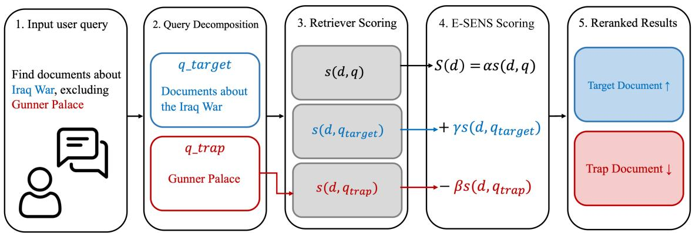
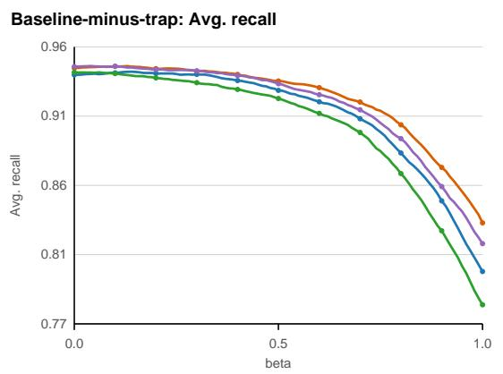
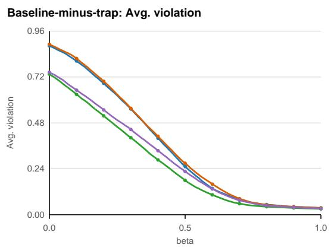
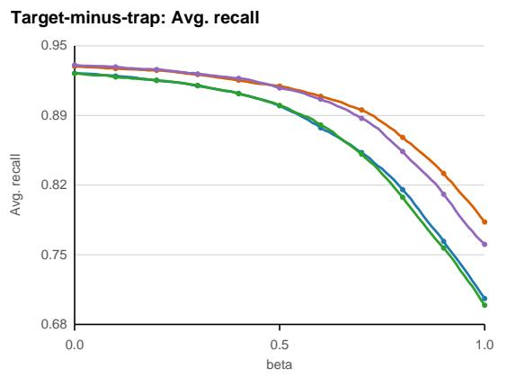
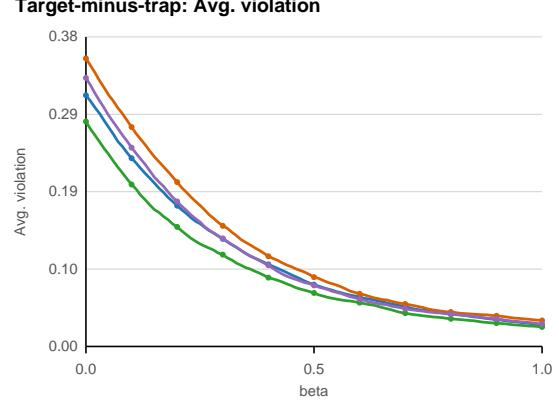
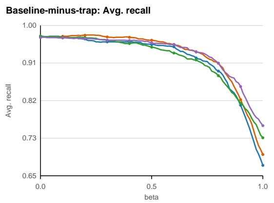
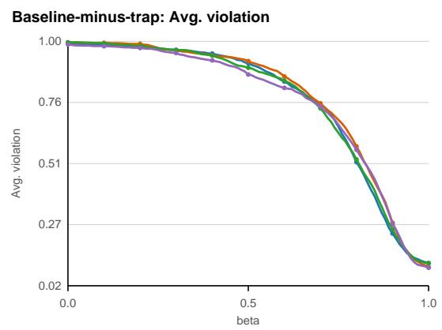
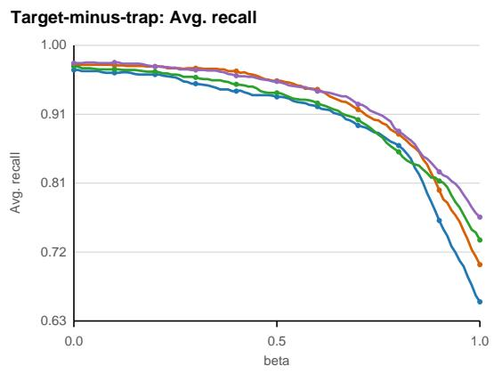
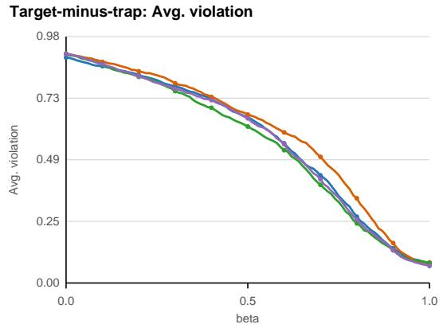

# E-SENS: Exclusion-Sensitive Penalization for Negative-Constraint Retrieval

Yerang Kim Jiyoon Myung Joohyung Han Independent Researchers hs01151116@korea.ac.kr

## Abstract

Retrieval-augmented language models can fail to respect negative constraints when the retriever supplies evidence about concepts the user explicitly excluded. Beyond explicit negation, queries may ask for answers that include one concept while excluding another, or for entities that belong to a category but differ from a closely related instance. Because the excluded concept still appears in the query text, dense retrievers may assign high similarity to documents about that concept even when the user asks to avoid it. We introduce E-SENS, a training-free reranking method for negationsensitive retrieval. E-SENS extracts a compact trap query for the excluded side and subtracts trap-query similarity from the original-query retrieval score. On ExcluIR, E-SENS shows a clear recall–violation trade-off across four embedding models and reduces trap retrieval at recall-preserving settings.

## 1 Introduction

Users often express information needs by specifying not only what should be retrieved, but also what should be avoided. A query may ask for documents about one topic while excluding a related entity, or for items that belong to a category but differ from a particular instance. For example, “training methods for language models, excluding reinforcement learning” asks the retriever to preserve the broad topic while avoiding a specific, highly related training paradigm. In retrieval-augmented generation, returning such excluded material can place constraint-violating evidence directly into the generator context. This creates an evidence-selection failure: the retriever supplies material that is topically similar to the request but invalid under the user’s exclusion constraint.

This setting is difficult for dense retrieval because the excluded concept is both salient and present in the query. The retriever may assign high similarity to a document precisely because it matches the term the user asked to avoid, reflecting the lexical and semantic signals retained in dense representations (Ram et al., 2023). The core issue is not merely that the query contains negation, but that standard retrievers treat included and excluded terms as undifferentiated semantic evidence. Negative queries with exclusion constraints therefore require a distinction between inclusion and exclusion semantics that standard retrievers often do not encode reliably (Lee et al., 2026).

Recent benchmarks and systems study this weakness across minimally different negated pairs, realistic exclusion queries, and negative-constraint retrieval (Weller et al., 2024; Zhang et al., 2024a; Xu et al., 2025). We ask whether an existing retriever can better respect exclusion constraints at inference time, without retraining.

We propose E-SENS, a training-free reranking method that penalizes excluded intent in negative queries with exclusion constraints. Given a negative query, a large language model produces two short rewrites: a target query for what should be retrieved and a trap query for the excluded intent. E-SENS penalizes documents similar to the trap intent; retrieval of the excluded-side document is treated as a violation.

Our contributions are as follows.

• We introduce E-SENS, a training-free excluded-intent penalty that changes only inference-time scores and requires no retriever retraining.

• We formulate exclusion-aware evidence retrieval as a recall–violation trade-off, where systems must retrieve relevant evidence while avoiding evidence the user intended to exclude.

• We analyze when document-level trap penalties succeed or fail, identifying cases where relevant documents contain incidental trap evidence or lie close to trap documents in embedding space.

## 2 Related Work

Negative constraints in retrieval. Language models can be insensitive to negation and struggle to reason under negated statements (Truong et al., 2023). This weakness also appears in retrieval: NevIR tests minimally different negated pairs (Weller et al., 2024), ExcluIR studies exclusion constraints with answer and trap documents (Zhang et al., 2024a), BoolQuestions probes Boolean logic in dense retrieval (Zhang et al., 2024b), and Neg-Constraint applies neural-symbolic reranking for negative constraints (Xu et al., 2025). Unlike neural-symbolic reranking approaches that require explicit logical constraint handling, E-SENS relies only on query-side decomposition and continuous retriever scores. Similar support/contradiction confusion appears in biomedical QA and visionlanguage retrieval when negation is central to the evidence (Sahoo et al., 2026; Alhamoud et al., 2025).

Embedding-level approaches to negation. DEO optimizes query embeddings at inference time for negation-aware retrieval (Lee et al., 2026); E-SENS instead keeps retriever and document embeddings fixed and applies a score-level trap penalty. This makes E-SENS applicable when document embeddings are precomputed or served through closed embedding APIs, where direct embedding optimization or retriever updates are impractical.

Rank fusion for reranking. RRF combines ranked lists through reciprocal-rank contributions when raw scores are incomparable (Cormack et al., 2009). We considered an anti-RRF variant that subtracts trap-query rank evidence, but use dense scores because they provide a smoother penalty signal and allow a continuous recall–violation frontier.

## 3 E-SENS

E-SENS is a retrieval-time reranking method for exclusion queries. It operates on fixed retriever scores by decomposing the query into target and trap intents, then lowering the rank of documents similar to the trap query. The main variant uses the original query as the positive signal and the trap rewrite as a penalty signal; a target-minus-trap variant is reported in the appendix.

## 3.1 Query Decomposition

Let $q$ be the original user- or dataset-provided query that contains an exclusion constraint. E-SENS uses GPT-4o mini to produce $q _ { \mathrm { t a r g e t } } .$ , a positive query with the exclusion removed, and $q _ { \mathrm { t r a p } } .$ , a compact query for the excluded intent. Although many traps are named entities or titles, $q _ { \mathrm { t r a p } }$ is not limited to entities: it may refer to an excluded concept, attribute, condition, or constraint. For example, the query “location of Friday Harbor Airport without bringing up Dayton International $\mathrm { { A i r p o r t } } ^ { \prime \prime }$ is decomposed into target intent “location of Friday Harbor Airport” and trap intent “Dayton International Airport”. The LLM only produces these strings; it does not score documents, inspect the corpus, or use gold labels. Appendix B provides the decomposition prompt.

## 3.2 Score Transformation

Let $s ( d , q )$ be the retriever similarity score between document d and query q. All dense scores use L2- normalized embeddings, so dot product is cosine similarity; for each query rewrite, scores are minmax normalized over the scored document set before combination. In the main E-SENS variant, we retain the original exclusion query as the positive retrieval signal and use only the trap rewrite as a penalty signal:

$$
S _ { \operatorname* { m a i n } } ( d ) = s ( d , q ) - \beta s ( d , q _ { \mathrm { t r a p } } ) .\tag{1}
$$

We use the original query as the main positive signal because target rewrites can remove contextual cues useful for recall. The target rewrite is used in a target-minus-trap variant, reported in the appendix, to isolate the cost of replacing the positive signal. More generally, the two scoring variants can be written as

$$
S ( d ) = \alpha s ( d , q ) + \gamma s ( d , q _ { \mathrm { t a r g e t } } ) - \beta s ( d , q _ { \mathrm { t r a p } } ) ,\tag{2}
$$

where baseline-minus-trap uses $( \alpha , \gamma ) = ( 1 , 0 )$ and target-minus-trap uses (0, 1). The penalty weight $\beta$ controls how strongly trap-similar documents are demoted. Table 1 reports fixed beta checkpoints for the main variant, and the appendix reports both scoring variants across beta values. This formulation requires scores to be comparable across query rewrites; in this paper, we evaluate it with dense retriever scores. At inference time, E-SENS can rerank either the full corpus or a candidate set: it computes original-query and trap-query scores for the same documents, then applies the transformed score. Thus, it leaves document embeddings and the retrieval index unchanged; $q _ { \mathrm { t r a p } }$ is the only additional retrieval signal.

  
Figure 1: Overview of E-SENS. A negative query with an exclusion constraint is decomposed into target and trap intents. The main score uses the original query as the positive signal and subtracts trap-query similarity. The target-query path is optional and is evaluated as an appendix variant.

## 4 Experimental Setup

Dataset. We evaluate on 3,452 negative queries with exclusion constraints from ExcluIR (Zhang et al., 2024a). Each example contains an original exclusion query, a gold answer document, and a trap document corresponding to the excluded intent. We score against the full 90,406-document corpus; the original query is $q ,$ the answer-side document is $d _ { \mathrm { t a r g e t } }$ , and the excluded-side document is $d _ { \mathrm { t r a p } }$ . The decomposer generates qtarget and $q _ { \mathrm { t r a p } }$ only from $q ;$ gold document indices are used only for evaluation. We use ExcluIR because its document-level target/trap annotations make recall and violation directly measurable, and report a smaller BoolQuestions-not set in the appendix. Appendix C details the mapping from dataset fields to qtarget, qtrap, $d _ { \mathrm { t a r g e t } }$ , and $d _ { \mathrm { t r a p } }$

Retrievers and Decomposition. We test four embedding models: OpenAI text-embedding-3- small, OpenAI text-embedding-3-large, Qwen3- Embedding-0.6B, and Qwen3-Embedding-4B (Zhang et al., 2025). For the main variant, we use the original query as the positive retrieval signal and $q _ { \mathrm { t r a p } }$ only as a penalty signal: $S ( d ) =$ $s ( d , q ) - \beta s ( d , q _ { \mathrm { t r a p } } )$ . We vary $\beta \in [ 0 , 1 ]$ at intervals of 0.01 to characterize the recall–violation trade-off rather than to claim a deployment-ready tuned hyperparameter. Table 1 reports fixed checkpoints $\beta \in \{ 0 . 0 , 0 . 1 , 0 . 2 , 0 . 3 \}$ , shared across all retrievers rather than selected per retriever. Appendix Figures 2–3 plot the full sweep.

Metrics. Recall@k measures whether the gold answer document appears in the top $k ;$ Violation@k measures whether the trap document appears in the top k. Higher recall and lower violation are better. We report R@5 and V@5 in the main table as representative top-k metrics, while Avg. R and Avg. V average over $k \in \{ 3 , 5 , 7 , 9 \}$ to summarize the overall trade-off without selecting a favorable k.

## 5 Results

Table 1 summarizes the recall–violation trade-off for E-SENS across fixed beta checkpoints. The $\beta ~ = ~ 0 . 0 0$ rows correspond to the original retriever scores, which achieve high recall but often retrieve the trap document as well, with violation@5 ranging from 0.728 to 0.886. As $\beta$ increases, trap retrieval decreases consistently across retrievers while recall remains close to the baseline over moderate penalty strengths, showing that the gains are not confined to a single tuned beta. $\mathrm { A t } ~ \beta ~ = ~ 0 . 1 0 $ , average recall changes by only −0.0009 to +0.0014, while average violation drops by 0.074–0.106; at $\beta = 0 . 2 0$ , average violation drops by 0.193–0.217 with at most 0.0038 recall loss. The $\beta = 0 . 3 0$ checkpoint further reduces average violation by 0.297–0.333, with a larger but still modest recall decrease for Qwen3-Embedding-$0 . 6 \mathrm { B } . \mathrm { A t } \beta = 1 . 0$ , average violation drops to 0.030– 0.036, but average recall falls to 0.779–0.835, illustrating the cost of over-penalizing the trap intent. Appendix curves show the full frontier for both scoring variants and make the same pattern visible across the complete sweep.

<table><tr><td>Retriever</td><td> $\beta$ </td><td>R@5↑</td><td>V@5↓</td><td>Avg. R↑</td><td>∆Avg. R</td><td>Avg. V↓</td><td>∆Avg. V↓</td></tr><tr><td>text-embedding-3-small</td><td>0.00</td><td>0.9377</td><td>0.8789</td><td>0.9366</td><td></td><td>0.8788</td><td></td></tr><tr><td></td><td>0.10</td><td>0.9377</td><td>0.7961</td><td>0.9379</td><td>+0.0014</td><td>0.8001</td><td>-0.0787</td></tr><tr><td></td><td>0.20</td><td>0.9377</td><td>0.6753</td><td>0.9375</td><td>+0.0009</td><td>0.6842</td><td>-0.1946</td></tr><tr><td></td><td>0.30</td><td>0.9366</td><td>0.5426</td><td>0.9369</td><td>+0.0004</td><td>0.5502</td><td>-0.3286</td></tr><tr><td>text-embedding-3-large</td><td>0.00</td><td>0.9400</td><td>0.8862</td><td>0.9412</td><td></td><td>0.8871</td><td></td></tr><tr><td></td><td>0.10</td><td>0.9415</td><td>0.8108</td><td>0.9424</td><td>+0.0012</td><td>0.8132</td><td>-0.0739</td></tr><tr><td></td><td>0.20</td><td>0.9392</td><td>0.6889</td><td>0.9408</td><td>-0.0004</td><td>0.6943</td><td>-0.1928</td></tr><tr><td></td><td>0.30</td><td>0.9389</td><td>0.5437</td><td>0.9391</td><td>-0.0021</td><td>0.5537</td><td>-0.3334</td></tr><tr><td>Qwen3-Embedding-0.6B</td><td>0.00</td><td>0.9360</td><td>0.7277</td><td>0.9383</td><td></td><td>0.7320</td><td></td></tr><tr><td></td><td>0.10</td><td>0.9354</td><td>0.6202</td><td>0.9374</td><td>-0.0009</td><td>0.6262</td><td>-0.1058</td></tr><tr><td></td><td>0.20</td><td>0.9334</td><td>0.5061</td><td>0.9345</td><td>-0.0038</td><td>0.5147</td><td>-0.2173</td></tr><tr><td></td><td>0.30</td><td>0.9305</td><td>0.3931</td><td>0.9312</td><td>-0.0071</td><td>0.4007</td><td>-0.3313</td></tr><tr><td>Qwen3-Embedding-4B</td><td>0.00</td><td>0.9421</td><td>0.7361</td><td>0.9422</td><td></td><td>0.7412</td><td></td></tr><tr><td></td><td>0.10</td><td>0.9421</td><td>0.6446</td><td>0.9424</td><td>+0.0002</td><td>0.6485</td><td>-0.0928</td></tr><tr><td></td><td>0.20</td><td>0.9403</td><td>0.5411</td><td>0.9402</td><td>-0.0020</td><td>0.5456</td><td>-0.1957</td></tr><tr><td></td><td>0.30</td><td>0.9377</td><td>0.4348</td><td>0.9393</td><td>-0.0029</td><td>0.4438</td><td>-0.2974</td></tr></table>

Table 1: Fixed beta checkpoints for the main baseline-minus-trap variant on ExcluIR. R is recall, V is trap violation, Avg. averages over $k \in \{ 3 , 5 , 7 , 9 \}$ , and deltas are relative to $\beta = 0 . 0 0$ for the same retriever. Bold marks the best value within each retriever block; ties are bolded.

Appendix Tables 6–9 clarify why we use the original query, rather than the target rewrite, as the main positive signal. $\mathbf { A } \mathbf { t } \ \beta = 0$ , target-minustrap already lowers violation substantially, but with lower recall than the original-query baseline, suggesting that target rewrites can discard answerretrieval context. The main baseline-minus-trap variant is therefore conservative: it preserves the original retrieval signal and uses the trap query only to demote constraint-violating documents.

## 6 Failure Analysis

We manually inspected cases where the trap penalty affects answer ranks and found two recurring patterns. Some target documents mention the excluded entity incidentally, such as a film page listing an excluded actor, while other answer and trap documents are close embedding neighbors, such as sibling entities or adaptations. These failures reflect document-level granularity: a valid answer may briefly mention the excluded side, whereas a trap document is primarily about it.

## 7 Conclusion

We presented E-SENS, a training-free excludedintent penalty for negative queries with exclusion constraints. By extracting a compact excluded-side query and subtracting its similarity score, E-SENS turns exclusion into a score-level penalty that can be applied without retraining or changing the corpus. Across retrievers, moderate $\beta$ values preserve answer recall while reducing trap retrieval, showing that negative constraints are better treated as retrieval-time selection constraints than only as surface negation in the query. This matters in retrievalaugmented generation because a high-ranked trap document can steer the generator toward excluded evidence, and the consistent pattern across four embedding models suggests a shared dense-retrieval failure. The recall–violation frontier offers a practical way to choose $\beta \colon$ lower values favor recall, while higher values more aggressively suppress excluded-side documents. Future work can extend E-SENS with passage- or span-level verification to distinguish incidental mentions from truly constraint-violating evidence.

## Limitations

E-SENS adds inference cost because it requires query decomposition, an additional trap-query score, and reranking. It assumes that the decomposition reliably isolates the excluded side and that scores from different query rewrites remain comparable after normalization. Our experiments tune $\beta$ on validation data and do not report statistical uncertainty estimates, so small recall differences should be interpreted cautiously. Finally, the document-level penalty cannot distinguish a valid answer that only mentions the excluded entity incidentally from a document that is mainly about the excluded side.

## References

Kumail Alhamoud, Shaden Alshammari, Yonglong Tian, Guohao Li, Philip H. S. Torr, Yoon Kim, and Marzyeh Ghassemi. 2025. Vision-language models do not understand negation. In Proceedings of the IEEE/CVF Conference on Computer Vision and Pattern Recognition, pages 29612–29622.

Gordon V. Cormack, Charles L. A. Clarke, and Stefan Buettcher. 2009. Reciprocal rank fusion outperforms condorcet and individual rank learning methods. In Proceedings of the 32nd International ACM SIGIR Conference on Research and Development in Information Retrieval, pages 758–759. ACM.

Taegyeong Lee, Jiwon Park, Seunghyun Hwang, and JooYoung Jang. 2026. DEO: Training-free direct embedding optimization for negation-aware retrieval. Preprint, arXiv:2603.09185.

Ori Ram, Liat Bezalel, Adi Zicher, Yonatan Belinkov, Jonathan Berant, and Amir Globerson. 2023. What are you token about? dense retrieval as distributions over the vocabulary. In Proceedings of the 61st Annual Meeting of the Association for Computational Linguistics (Volume 1: Long Papers), pages 2481– 2498, Toronto, Canada. Association for Computational Linguistics.

Soumya Ranjan Sahoo, N. Gagan, Sanand Sasidharan, and Divya Bharti. 2026. Negation is not semantic: Diagnosing dense retrieval failure modes for tradeoffs in contradiction-aware biomedical qa. Preprint, arXiv:2603.17580.

Thinh Hung Truong, Timothy Baldwin, Karin Verspoor, and Trevor Cohn. 2023. Language models are not naysayers: an analysis of language models on negation benchmarks. In Proceedings of the 12th Joint Conference on Lexical and Computational Semantics (\*SEM 2023), pages 101–114, Toronto, Canada. Association for Computational Linguistics.

Orion Weller, Dawn Lawrie, and Benjamin Van Durme. 2024. NevIR: Negation in neural information retrieval. In Proceedings ofthe 18th Conference ofthe European Chapter of the Association for Computational Linguistics (Volume 1: Long Papers), pages 2274–2287, St. Julian’s, Malta. Association for Computational Linguistics.

Ganlin Xu, Zhoujia Zhang, Wangyi Mei, Jiaqing Liang, Weijia Lu, Xiaodong Zhang, Zhifei Yang, Xiaofeng Ma, Yanghua Xiao, and Deqing Yang. 2025. Logical consistency is vital: Neural-symbolic information retrieval for negative-constraint queries. In Findings of the Associationfor Computational Linguistics: ACL 2025, pages 1828–1847, Vienna, Austria. Association for Computational Linguistics.

Wenhao Zhang, Mengqi Zhang, Shiguang Wu, Jiahuan Pei, Zhaochun Ren, Maarten de Rijke, Zhumin Chen, and Pengjie Ren. 2024a. ExcluIR: Exclusionary neural information retrieval. Preprint, arXiv:2404.17288.

Yanzhao Zhang, Mingxin Li, Dingkun Long, Xin Zhang, Huan Lin, Baosong Yang, Pengjun Xie, An Yang, Dayiheng Liu, Junyang Lin, Fei Huang, and Jingren Zhou. 2025. Qwen3 embedding: Advancing text embedding and reranking through foundation models. Preprint, arXiv:2506.05176.

Zongmeng Zhang, Jinhua Zhu, Wengang Zhou, Xiang Qi, Peng Zhang, and Houqiang Li. 2024b. BoolQuestions: Does dense retrieval understand boolean logic in language? Preprint, arXiv:2411.12235.

## A Experimental Details

Compute. All experiments were run on a single RTX 4090 GPU with 16 vCPUs (AMD Ryzen 9 7950X 16-Core Processor), 61 GB memory, and a 20 GB container disk.

## B Query Decomposition Prompt

The template below was used with GPT-4o mini at temperature 0 to generate qtarget and $q _ { \mathrm { t r a p } }$

## Query Decomposition Prompt Template

Role: You are a recall-preserving query decomposition module for exclusion-aware information retrieval.

Task: Given only the original query, produce two retrieval queries: qtarget, the positive information need, and qtrap, a short high-precision anchor for the unwanted, excluded, contrastive, or constraint-violating side. Do not use gold documents, trap documents, answers, relevance labels, dataset annotations, or external knowledge beyond what is directly implied by the query.

Decomposition Rules: Preserve the main search intent in qtarget and remove only phrases that point to the unwanted side. $q _ { \mathrm { t a r g e t } }$ should remain independently useful for retrieval and should not encode the exclusion with wrappers such as “not”, “without”, “excluding”, “except”, “instead $\mathrm { o f } ^ { \mathrm { > } } .$ , or “rather than”, unless the negated phrase is the natural name of the desired concept. $q _ { \mathrm { t r a p } }$ should be the strongest compact retrieval anchor for the unwanted side: preferably an explicitly excluded named entity, title, organization, person, work, place, product, event, date, object, attribute, condition, relation, role, or category. Strip exclusion wrappers from qtrap and avoid broad anchors such as “career”, “film”, “country”, or “person” unless the unwanted side is exactly that broad. If the query contains a direct contrast, use the obvious counterpart when available (e.g., legal ↔ illegal, allowed ↔ forbidden, paid ↔ unpaid, present ↔ absent, won ↔ lost). If no direct counterpart is obvious, use the explicit unwanted phrase. Set $q _ { \mathrm { t r a p } }$ to an empty string only when no excluded, negative, contrastive, exception, or undesired side is present.

Output Format: Return only valid JSON with exactly two fields:

{   
"q\_target": "...",   
"q\_trap": "..."   
}   
User Message Template:   
Now decompose the following query.   
Original query:   
{original\_query}   
Return only valid JSON. Do not include markdown, comments,   
explanations, or extra fields.   
{   
"q\_target": "...",   
"q\_trap": "..."   
}

## C Dataset Mapping and BoolQuestions-not Set

ExcluIR provides a natural four-part structure for our setting. The original exclusion query is $q ,$ the answer-side corpus index is $d _ { \mathrm { t a r g e t } }$ , and the excluded-side corpus index is $d _ { \mathrm { t r a p } }$ . Its paired construction also makes oracle-style query strings recoverable: the original positive question can be viewed as $q _ { \mathrm { t a r g e t } }$ , and the title or short identifier of the excluded document can be viewed as $q _ { \mathrm { t r a p } }$ . In the reported E-SENS experiments, however, qtarget and $q _ { \mathrm { t r a p } }$ are generated only from $q$ by GPT-4o mini; gold document indices are used only for evaluation.

For other negative-constraint retrieval datasets, qtarget is the positive information need after removing the exclusion, $q _ { \mathrm { t r a p } }$ is the compact excludedside query, $d _ { \mathrm { t a r g e t } }$ is a document satisfying the positive need, and $d _ { \mathrm { t r a p } }$ is a plausible but constraintviolating document. When a dataset provides positive and negative passages, we map them to $d _ { \mathrm { t a r g e t } }$ and $d _ { \mathrm { t r a p } }$ respectively. When it provides only documents, $q _ { \mathrm { t a r g e t } }$ and $q _ { \mathrm { t r a p } }$ can be produced by the same query-only decomposer.

As an additional check, we evaluate the subset of BoolQuestions (Zhang et al., 2024b) with question\_type = not. Each example includes a positive passage and a negative passage that can be treated as $d _ { \mathrm { t a r g e t } }$ and $d _ { \mathrm { t r a p } }$ . This yields 323 examples, 195 from MS MARCO and 128 from Natural Questions, over a 646-document evaluation corpus. Because BoolQuestions does not provide explicit $q _ { \mathrm { t a r g e t } }$ and $q _ { \mathrm { t r a p } }$ fields, we generate them with the same GPT-4o mini decomposer and report results across penalty-weight settings in Figure 3 and Tables 10–17.

The full $\beta$ results are included to show the recall– violation trade-off across penalty strengths rather than to imply that $\beta$ should be selected on the test set.

## D Additional Results

Figures 2 and 3 plot the full $\beta = 0 . 0 0 – 1 . 0 0$ sweep at 0.01 intervals. Tables 2–17 report 0.10 beta checkpoints in portrait tables, split by dataset, scoring variant, and retriever for readability.

## D.1 Beta Trade-off Curves

ExcluIR: beta trade-off curves text-embedding-3-smal Qwen/Qwen3-Embedding-0.6B

  
text-embedding-3-large Qwen/Qwen3-Embedding-4B

  
Figure 2: ExcluIR recall–violation trade-off curves over the full beta sweep. The top row uses the baseline-minustrap score, and the bottom row uses the target-minus-trap score.

## BoolQuestions-not: beta trade-off curves

text-embedding-3-smal Qwen/Qwen3-Embedding-0.6B

  
text-embedding-3-large Qwen/Qwen3-Embedding-4B

  
Figure 3: BoolQuestions-not recall–violation trade-off curves over the full beta sweep. The top row uses the baseline-minus-trap score, and the bottom row uses the target-minus-trap score.

<table><tr><td rowspan="2"> $\beta$ </td><td colspan="2"> $k = 3$ </td><td colspan="2"> $k = 5$ </td><td colspan="2"> $k = 7$ </td><td colspan="2"> $k = 9$ </td></tr><tr><td>R</td><td>V</td><td>R</td><td>V</td><td>R</td><td>V</td><td>R</td><td>V</td></tr><tr><td>0.0</td><td>0.9166</td><td>0.8250</td><td>0.9377</td><td>0.8789</td><td>0.9447</td><td>0.8992</td><td>0.9473</td><td>0.9119</td></tr><tr><td>0.1</td><td>0.9206</td><td>0.7228</td><td>0.9377</td><td>0.7961</td><td>0.9441</td><td>0.8308</td><td>0.9493</td><td>0.8508</td></tr><tr><td>0.2</td><td>0.9224</td><td>0.5982</td><td>0.9377</td><td>0.6753</td><td>0.9426</td><td>0.7176</td><td>0.9473</td><td>0.7457</td></tr><tr><td>0.3</td><td>0.9241</td><td>0.4612</td><td>0.9366</td><td>0.5426</td><td>0.9409</td><td>0.5817</td><td>0.9461</td><td>0.6153</td></tr><tr><td>0.4</td><td>0.9195</td><td>0.3140</td><td>0.9308</td><td>0.3885</td><td>0.9383</td><td>0.4311</td><td>0.9421</td><td>0.4603</td></tr><tr><td>0.5</td><td>0.9134</td><td>0.1819</td><td>0.9250</td><td>0.2390</td><td>0.9296</td><td>0.2787</td><td>0.9357</td><td>0.3059</td></tr><tr><td>0.6</td><td>0.9073</td><td>0.1034</td><td>0.9163</td><td>0.1283</td><td>0.9221</td><td>0.1501</td><td>0.9267</td><td>0.1669</td></tr><tr><td>0.7</td><td>0.8946</td><td>0.0663</td><td>0.9050</td><td>0.0788</td><td>0.9108</td><td>0.0869</td><td>0.9154</td><td>0.0913</td></tr><tr><td>0.8</td><td>0.8688</td><td>0.0463</td><td>0.8801</td><td>0.0527</td><td>0.8867</td><td>0.0559</td><td>0.8963</td><td>0.0576</td></tr><tr><td>0.9</td><td>0.8291</td><td>0.0371</td><td>0.8476</td><td>0.0414</td><td>0.8592</td><td>0.0429</td><td>0.8644</td><td>0.0455</td></tr><tr><td>1.0</td><td>0.7743</td><td>0.0313</td><td>0.7987</td><td>0.0362</td><td>0.8134</td><td>0.0371</td><td>0.8201</td><td>0.0379</td></tr></table>

Table 2: ExcluIR beta checkpoint results for text-embedding-3-small with the baseline-minus-trap score. Columns report recall (R) and trap violation (V) at $k \in \{ 3 , 5 , 7 , 9 \}$ ; rows use 0.10 beta checkpoints. The score is $S ( d ) =$ $s ( d , q ) - \beta s ( d , q _ { \mathrm { t r a p } } )$
<table><tr><td rowspan="2"> $\beta$ </td><td> $k = 3$ </td><td></td><td> $k = 5$ </td><td></td><td> $k = 7$ </td><td></td><td> $k = 9$ </td><td></td></tr><tr><td>R</td><td>V</td><td>R</td><td>V</td><td>R</td><td>V</td><td>R</td><td>V</td></tr><tr><td>0.0</td><td>0.9270</td><td>0.8323</td><td>0.9400</td><td>0.8862</td><td>0.9467</td><td>0.9082</td><td>0.9510</td><td>0.9218</td></tr><tr><td>0.1</td><td>0.9284</td><td>0.7396</td><td>0.9415</td><td>0.8108</td><td>0.9476</td><td>0.8415</td><td>0.9522</td><td>0.8607</td></tr><tr><td>0.2</td><td>0.9273</td><td>0.5999</td><td>0.9392</td><td>0.6889</td><td>0.9452</td><td>0.7294</td><td>0.9516</td><td>0.7590</td></tr><tr><td>0.3</td><td>0.9256</td><td>0.4568</td><td>0.9389</td><td>0.5437</td><td>0.9438</td><td>0.5921</td><td>0.9481</td><td>0.6220</td></tr><tr><td>0.4</td><td>0.9238</td><td>0.3224</td><td>0.9360</td><td>0.3972</td><td>0.9418</td><td>0.4421</td><td>0.9458</td><td>0.4719</td></tr><tr><td>0.5</td><td>0.9195</td><td>0.1973</td><td>0.9311</td><td>0.2590</td><td>0.9380</td><td>0.2955</td><td>0.9409</td><td>0.3195</td></tr><tr><td>0.6</td><td>0.9148</td><td>0.1156</td><td>0.9276</td><td>0.1506</td><td>0.9319</td><td>0.1758</td><td>0.9368</td><td>0.1950</td></tr><tr><td>0.7</td><td>0.9073</td><td>0.0658</td><td>0.9157</td><td>0.0785</td><td>0.9218</td><td>0.0895</td><td>0.9270</td><td>0.1005</td></tr><tr><td>0.8</td><td>0.8864</td><td>0.0437</td><td>0.9006</td><td>0.0504</td><td>0.9087</td><td>0.0545</td><td>0.9134</td><td>0.0559</td></tr><tr><td>0.9</td><td>0.8569</td><td>0.0368</td><td>0.8705</td><td>0.0411</td><td>0.8801</td><td>0.0432</td><td>0.8847</td><td>0.0452</td></tr><tr><td>1.0</td><td>0.8129</td><td>0.0316</td><td>0.8308</td><td>0.0345</td><td>0.8439</td><td>0.0374</td><td>0.8525</td><td>0.0385</td></tr></table>

Table 3: ExcluIR beta checkpoint results for text-embedding-3-large with the baseline-minus-trap score. Columns report recall (R) and trap violation (V) at $k \in \{ 3 , 5 , 7 , 9 \}$ ; rows use 0.10 beta checkpoints. The score is $S ( d ) =$ $s ( d , q ) - \beta s ( d , q _ { \mathrm { t r a p } } )$
<table><tr><td rowspan="2"> $\beta$ </td><td colspan="2"> $k = 3$ </td><td colspan="2"> $k = 5$ </td><td colspan="2"> $k = 7$ </td><td colspan="2"> $k = 9$ </td></tr><tr><td>R</td><td>V</td><td>R</td><td>V</td><td>R</td><td>V</td><td>R</td><td>V</td></tr><tr><td>0.0</td><td>0.9238</td><td>0.6654</td><td>0.9360</td><td>0.7277</td><td>0.9450</td><td>0.7598</td><td>0.9484</td><td>0.7749</td></tr><tr><td>0.1</td><td>0.9238</td><td>0.5556</td><td>0.9354</td><td>0.6202</td><td>0.9426</td><td>0.6541</td><td>0.9479</td><td>0.6747</td></tr><tr><td>0.2</td><td>0.9203</td><td>0.4458</td><td>0.9334</td><td>0.5061</td><td>0.9395</td><td>0.5420</td><td>0.9447</td><td>0.5649</td></tr><tr><td>0.3</td><td>0.9166</td><td>0.3346</td><td>0.9305</td><td>0.3931</td><td>0.9363</td><td>0.4293</td><td>0.9415</td><td>0.4458</td></tr><tr><td>0.4</td><td>0.9145</td><td>0.2306</td><td>0.9250</td><td>0.2798</td><td>0.9316</td><td>0.3045</td><td>0.9351</td><td>0.3268</td></tr><tr><td>0.5</td><td>0.9082</td><td>0.1350</td><td>0.9189</td><td>0.1712</td><td>0.9250</td><td>0.1952</td><td>0.9293</td><td>0.2141</td></tr><tr><td>0.6</td><td>0.8966</td><td>0.0797</td><td>0.9093</td><td>0.0988</td><td>0.9160</td><td>0.1127</td><td>0.9186</td><td>0.1228</td></tr><tr><td>0.7</td><td>0.8786</td><td>0.0484</td><td>0.8948</td><td>0.0565</td><td>0.9050</td><td>0.0614</td><td>0.9096</td><td>0.0649</td></tr><tr><td>0.8</td><td>0.8470</td><td>0.0374</td><td>0.8670</td><td>0.0411</td><td>0.8772</td><td>0.0435</td><td>0.8841</td><td>0.0455</td></tr><tr><td>0.9</td><td>0.8048</td><td>0.0319</td><td>0.8259</td><td>0.0351</td><td>0.8389</td><td>0.0371</td><td>0.8488</td><td>0.0382</td></tr><tr><td>1.0</td><td>0.7500</td><td>0.0258</td><td>0.7758</td><td>0.0298</td><td>0.7906</td><td>0.0322</td><td>0.7990</td><td>0.0333</td></tr><tr><td></td><td>R</td><td>V</td><td>R</td><td>V</td><td>R</td><td>V</td><td>R</td><td>V</td></tr><tr><td>0.0</td><td>0.9282</td><td>0.6816</td><td>0.9421</td><td>0.7361</td><td>0.9467</td><td>0.7665</td><td>0.9519</td><td>0.7807</td></tr><tr><td>0.1</td><td>0.9296</td><td>0.5834</td><td>0.9421</td><td>0.6446</td><td>0.9476</td><td>0.6732</td><td>0.9505</td><td>0.6926</td></tr><tr><td>0.2</td><td>0.9267</td><td>0.4780</td><td>0.9403</td><td>0.5411</td><td>0.9447</td><td>0.5724</td><td>0.9490</td><td>0.5907</td></tr><tr><td>0.3</td><td>0.9270</td><td>0.3780</td><td>0.9377</td><td>0.4348</td><td>0.9429</td><td>0.4710</td><td>0.9496</td><td>0.4913</td></tr><tr><td>0.4</td><td>0.9247</td><td>0.2732</td><td>0.9337</td><td>0.3276</td><td>0.9403</td><td>0.3566</td><td>0.9455</td><td>0.3763</td></tr><tr><td>0.5</td><td>0.9189</td><td>0.1758</td><td>0.9273</td><td>0.2173</td><td>0.9348</td><td>0.2436</td><td>0.9409</td><td>0.2648</td></tr><tr><td>0.6</td><td>0.9105</td><td>0.1002</td><td>0.9203</td><td>0.1283</td><td>0.9282</td><td>0.1469</td><td>0.9328</td><td>0.1614</td></tr><tr><td>0.7</td><td>0.8980</td><td>0.0594</td><td>0.9099</td><td>0.0727</td><td>0.9186</td><td>0.0831</td><td>0.9238</td><td>0.0875</td></tr><tr><td>0.8</td><td>0.8769</td><td>0.0406</td><td>0.8919</td><td>0.0458</td><td>0.8989</td><td>0.0504</td><td>0.9035</td><td>0.0539</td></tr><tr><td>0.9</td><td>0.8418</td><td>0.0333</td><td>0.8578</td><td>0.0382</td><td>0.8670</td><td>0.0408</td><td>0.8731</td><td>0.0426</td></tr><tr><td>1.0</td><td>0.7992</td><td>0.0287</td><td>0.8175</td><td>0.0319</td><td>0.8288</td><td>0.0348</td><td>0.8375</td><td>0.0371</td></tr></table>

Table 4: ExcluIR beta checkpoint results for Qwen/Qwen3-Embedding-0.6B with the baseline-minus-trap score. Columns report recall (R) and trap violation (V) at $k \in \{ 3 , 5 , 7 , 9 \}$ ; rows use 0.10 beta checkpoints. The score is $S ( d ) = s ( d , q ) - \beta s ( d , q _ { \mathrm { t r a p } } )$

Table 5: ExcluIR beta checkpoint results for Qwen/Qwen3-Embedding-4B with the baseline-minus-trap score. Columns report recall (R) and trap violation (V) at $k \in \{ 3 , 5 , 7 , 9 \}$ ; rows use 0.10 beta checkpoints. The score is $S ( d ) = s ( d , q ) - \beta s ( d , q _ { \mathrm { t r a p } } )$
<table><tr><td rowspan="2"> $\beta$ </td><td colspan="2"> $k = 3$ </td><td colspan="2"> $k = 5$ </td><td colspan="2"> $k = 7$ </td><td colspan="2"> $k = 9$ </td></tr><tr><td>R</td><td>V</td><td>R</td><td>V</td><td>R</td><td>V</td><td>R</td><td>V</td></tr><tr><td>0.0</td><td>0.9148</td><td>0.2422</td><td>0.9267</td><td>0.3013</td><td>0.9340</td><td>0.3340</td><td>0.9368</td><td>0.3598</td></tr><tr><td>0.1</td><td>0.9122</td><td>0.1813</td><td>0.9241</td><td>0.2257</td><td>0.9299</td><td>0.2509</td><td>0.9351</td><td>0.2697</td></tr><tr><td>0.2</td><td>0.9061</td><td>0.1370</td><td>0.9209</td><td>0.1689</td><td>0.9267</td><td>0.1877</td><td>0.9302</td><td>0.1999</td></tr><tr><td>0.3</td><td>0.9012</td><td>0.1054</td><td>0.9154</td><td>0.1301</td><td>0.9215</td><td>0.1428</td><td>0.9256</td><td>0.1521</td></tr><tr><td>0.4</td><td>0.8922</td><td>0.0826</td><td>0.9082</td><td>0.0973</td><td>0.9145</td><td>0.1092</td><td>0.9189</td><td>0.1153</td></tr><tr><td>0.5</td><td>0.8775</td><td>0.0634</td><td>0.8946</td><td>0.0750</td><td>0.9035</td><td>0.0808</td><td>0.9105</td><td>0.0855</td></tr><tr><td>0.6</td><td>0.8520</td><td>0.0516</td><td>0.8728</td><td>0.0603</td><td>0.8830</td><td>0.0637</td><td>0.8925</td><td>0.0672</td></tr><tr><td>0.7</td><td>0.8265</td><td>0.0420</td><td>0.8468</td><td>0.0487</td><td>0.8612</td><td>0.0524</td><td>0.8699</td><td>0.0530</td></tr><tr><td>0.8</td><td>0.7853</td><td>0.0345</td><td>0.8120</td><td>0.0397</td><td>0.8256</td><td>0.0423</td><td>0.8375</td><td>0.0437</td></tr><tr><td>0.9</td><td>0.7303</td><td>0.0278</td><td>0.7616</td><td>0.0327</td><td>0.7775</td><td>0.0348</td><td>0.7903</td><td>0.0362</td></tr><tr><td>1.0</td><td>0.6698</td><td>0.0229</td><td>0.7063</td><td>0.0261</td><td>0.7245</td><td>0.0278</td><td>0.7370</td><td>0.0295</td></tr></table>

Table 6: ExcluIR beta checkpoint results for text-embedding-3-small with the target-minus-trap score. Columns report recall (R) and trap violation (V) at $k \in \{ 3 , 5 , 7 , 9 \}$ ; rows use 0.10 beta checkpoints. The score is $S ( d ) =$ ${ s ( d , q _ { \mathrm { t a r g e t } } ) - \beta s ( d , q _ { \mathrm { t r a p } } ) }$
<table><tr><td rowspan="2"> $\beta$ </td><td colspan="2"> $k = 3$ </td><td colspan="2"> $k = 5$ </td><td colspan="2"> $k = 7$ </td><td colspan="2"> $k = 9$ </td></tr><tr><td>R</td><td>V</td><td>R</td><td>V</td><td>R</td><td>V</td><td>R</td><td>V</td></tr><tr><td>0.0</td><td>0.9203</td><td>0.2816</td><td>0.9325</td><td>0.3462</td><td>0.9406</td><td>0.3815</td><td>0.9452</td><td>0.4099</td></tr><tr><td>0.1</td><td>0.9183</td><td>0.2103</td><td>0.9299</td><td>0.2622</td><td>0.9392</td><td>0.2908</td><td>0.9429</td><td>0.3178</td></tr><tr><td>0.2</td><td>0.9189</td><td>0.1567</td><td>0.9290</td><td>0.1932</td><td>0.9357</td><td>0.2196</td><td>0.9397</td><td>0.2402</td></tr><tr><td>0.3</td><td>0.9140</td><td>0.1170</td><td>0.9258</td><td>0.1437</td><td>0.9316</td><td>0.1608</td><td>0.9357</td><td>0.1729</td></tr><tr><td>0.4</td><td>0.9085</td><td>0.0924</td><td>0.9198</td><td>0.1075</td><td>0.9270</td><td>0.1191</td><td>0.9299</td><td>0.1254</td></tr><tr><td>0.5</td><td>0.9038</td><td>0.0718</td><td>0.9134</td><td>0.0831</td><td>0.9203</td><td>0.0901</td><td>0.9244</td><td>0.0965</td></tr><tr><td>0.6</td><td>0.8902</td><td>0.0548</td><td>0.9053</td><td>0.0640</td><td>0.9119</td><td>0.0681</td><td>0.9151</td><td>0.0727</td></tr><tr><td>0.7</td><td>0.8740</td><td>0.0461</td><td>0.8914</td><td>0.0519</td><td>0.8983</td><td>0.0548</td><td>0.9061</td><td>0.0565</td></tr><tr><td>0.8</td><td>0.8456</td><td>0.0379</td><td>0.8627</td><td>0.0417</td><td>0.8734</td><td>0.0446</td><td>0.8815</td><td>0.0455</td></tr><tr><td>0.9</td><td>0.8065</td><td>0.0339</td><td>0.8276</td><td>0.0371</td><td>0.8389</td><td>0.0391</td><td>0.8499</td><td>0.0408</td></tr><tr><td>1.0</td><td>0.7590</td><td>0.0293</td><td>0.7801</td><td>0.0316</td><td>0.7940</td><td>0.0333</td><td>0.8016</td><td>0.0339</td></tr><tr><td>0.0</td><td>0.9137</td><td>0.2173</td><td>0.9256</td><td>0.2720</td><td>0.9340</td><td>0.3007</td><td>0.9377</td><td>0.3184</td></tr><tr><td>0.1</td><td>0.9105</td><td>0.1587</td><td>0.9221</td><td>0.1906</td><td>0.9302</td><td>0.2147</td><td>0.9348</td><td>0.2341</td></tr><tr><td>0.2</td><td>0.9096</td><td>0.1208</td><td>0.9198</td><td>0.1428</td><td>0.9256</td><td>0.1573</td><td>0.9302</td><td>0.1680</td></tr><tr><td>0.3</td><td>0.9024</td><td>0.0944</td><td>0.9160</td><td>0.1127</td><td>0.9215</td><td>0.1191</td><td>0.9250</td><td>0.1263</td></tr><tr><td>0.4</td><td>0.8931</td><td>0.0713</td><td>0.9079</td><td>0.0829</td><td>0.9140</td><td>0.0898</td><td>0.9177</td><td>0.0953</td></tr><tr><td>0.5</td><td>0.8760</td><td>0.0565</td><td>0.8960</td><td>0.0658</td><td>0.9044</td><td>0.0689</td><td>0.9105</td><td>0.0724</td></tr><tr><td>0.6</td><td>0.8523</td><td>0.0455</td><td>0.8775</td><td>0.0536</td><td>0.8876</td><td>0.0574</td><td>0.8943</td><td>0.0594</td></tr><tr><td>0.7</td><td>0.8213</td><td>0.0359</td><td>0.8470</td><td>0.0391</td><td>0.8595</td><td>0.0429</td><td>0.8699</td><td>0.0461</td></tr><tr><td>0.8</td><td>0.7755</td><td>0.0307</td><td>0.8033</td><td>0.0339</td><td>0.8207</td><td>0.0351</td><td>0.8311</td><td>0.0368</td></tr><tr><td>0.9</td><td>0.7242</td><td>0.0252</td><td>0.7538</td><td>0.0287</td><td>0.7729</td><td>0.0301</td><td>0.7830</td><td>0.0310</td></tr><tr><td>1.0</td><td>0.6648</td><td>0.0214</td><td>0.6979</td><td>0.0238</td><td>0.7181</td><td>0.0246</td><td>0.7309</td><td>0.0264</td></tr></table>

Table 7: ExcluIR beta checkpoint results for text-embedding-3-large with the target-minus-trap score. Columns report recall (R) and trap violation (V) at $k \in \{ 3 , 5 , 7 , 9 \}$ ; rows use 0.10 beta checkpoints. The score is $S ( d ) =$ ${ s ( d , q _ { \mathrm { t a r g e t } } ) - \beta s ( d , q _ { \mathrm { t r a p } } ) }$

Table 8: ExcluIR beta checkpoint results for Qwen/Qwen3-Embedding-0.6B with the target-minus-trap score. Columns report recall (R) and trap violation (V) at $k \in \{ 3 , 5 , 7 , 9 \}$ ; rows use 0.10 beta checkpoints. The score is $S ( d ) = s ( d , q _ { \mathrm { t a r g e t } } ) - \beta s ( d , q _ { \mathrm { t r a p } } )$
<table><tr><td rowspan="2"> $\beta$ </td><td> $k = 3$ </td><td></td><td> $k = 5$ </td><td></td><td> $k = 7$ </td><td></td><td> $k = 9$ </td><td></td></tr><tr><td>R</td><td>V</td><td>R</td><td>V</td><td>R</td><td>V</td><td>R</td><td>V</td></tr><tr><td>0.0</td><td>0.9232</td><td>0.2613</td><td>0.9345</td><td>0.3213</td><td>0.9409</td><td>0.3560</td><td>0.9452</td><td>0.3844</td></tr><tr><td>0.1</td><td>0.9221</td><td>0.1915</td><td>0.9316</td><td>0.2361</td><td>0.9397</td><td>0.2656</td><td>0.9432</td><td>0.2865</td></tr><tr><td>0.2</td><td>0.9192</td><td>0.1437</td><td>0.9308</td><td>0.1715</td><td>0.9363</td><td>0.1929</td><td>0.9403</td><td>0.2063</td></tr><tr><td>0.3</td><td>0.9143</td><td>0.1110</td><td>0.9253</td><td>0.1292</td><td>0.9331</td><td>0.1411</td><td>0.9368</td><td>0.1509</td></tr><tr><td>0.4</td><td>0.9102</td><td>0.0817</td><td>0.9218</td><td>0.0976</td><td>0.9284</td><td>0.1066</td><td>0.9319</td><td>0.1141</td></tr><tr><td>0.5</td><td>0.8980</td><td>0.0646</td><td>0.9125</td><td>0.0747</td><td>0.9192</td><td>0.0794</td><td>0.9250</td><td>0.0823</td></tr><tr><td>0.6</td><td>0.8853</td><td>0.0490</td><td>0.9027</td><td>0.0559</td><td>0.9087</td><td>0.0629</td><td>0.9148</td><td>0.0655</td></tr><tr><td>0.7</td><td>0.8624</td><td>0.0408</td><td>0.8824</td><td>0.0455</td><td>0.8925</td><td>0.0492</td><td>0.8998</td><td>0.0507</td></tr><tr><td>0.8</td><td>0.8253</td><td>0.0351</td><td>0.8499</td><td>0.0394</td><td>0.8618</td><td>0.0408</td><td>0.8711</td><td>0.0435</td></tr><tr><td>0.9</td><td>0.7804</td><td>0.0287</td><td>0.8076</td><td>0.0333</td><td>0.8230</td><td>0.0359</td><td>0.8314</td><td>0.0377</td></tr><tr><td>1.0</td><td>0.7306</td><td>0.0235</td><td>0.7610</td><td>0.0272</td><td>0.7740</td><td>0.0287</td><td>0.7822</td><td>0.0310</td></tr></table>

Table 9: ExcluIR beta checkpoint results for Qwen/Qwen3-Embedding-4B with the target-minus-trap score. Columns report recall (R) and trap violation (V) at $k \in \{ 3 , 5 , 7 , 9 \}$ ; rows use 0.10 beta checkpoints. The score is $S ( d ) = s ( d , q _ { \mathrm { t a r g e t } } ) - \beta s ( d , q _ { \mathrm { t r a p } } )$
<table><tr><td rowspan="2"> $\beta$ </td><td colspan="2"> $k = 3$ </td><td colspan="2"> $k = 5$ </td><td colspan="2"> $k = 7$ </td><td colspan="2"> $k = 9$ </td></tr><tr><td>R</td><td>V</td><td>R</td><td>V</td><td>R</td><td>V</td><td>R</td><td>V</td></tr><tr><td>0.0</td><td>0.9567</td><td>0.9814</td><td>0.9721</td><td>0.9938</td><td>0.9783</td><td>0.9969</td><td>0.9845</td><td>0.9969</td></tr><tr><td>0.1</td><td>0.9598</td><td>0.9752</td><td>0.9721</td><td>0.9876</td><td>0.9752</td><td>0.9876</td><td>0.9876</td><td>0.9938</td></tr><tr><td>0.2</td><td>0.9567</td><td>0.9659</td><td>0.9659</td><td>0.9783</td><td>0.9690</td><td>0.9845</td><td>0.9814</td><td>0.9876</td></tr><tr><td>0.3</td><td>0.9474</td><td>0.9474</td><td>0.9628</td><td>0.9659</td><td>0.9659</td><td>0.9752</td><td>0.9690</td><td>0.9752</td></tr><tr><td>0.4</td><td>0.9474</td><td>0.9226</td><td>0.9628</td><td>0.9536</td><td>0.9659</td><td>0.9628</td><td>0.9690</td><td>0.9659</td></tr><tr><td>0.5</td><td>0.9412</td><td>0.8638</td><td>0.9567</td><td>0.9102</td><td>0.9598</td><td>0.9319</td><td>0.9628</td><td>0.9443</td></tr><tr><td>0.6</td><td>0.9288</td><td>0.7833</td><td>0.9536</td><td>0.8359</td><td>0.9567</td><td>0.8638</td><td>0.9598</td><td>0.8762</td></tr><tr><td>0.7</td><td>0.9040</td><td>0.6656</td><td>0.9195</td><td>0.7399</td><td>0.9288</td><td>0.7833</td><td>0.9412</td><td>0.7895</td></tr><tr><td>0.8</td><td>0.8669</td><td>0.4211</td><td>0.8885</td><td>0.5046</td><td>0.9009</td><td>0.5418</td><td>0.9133</td><td>0.6037</td></tr><tr><td>0.9</td><td>0.7740</td><td>0.1765</td><td>0.8050</td><td>0.2260</td><td>0.8235</td><td>0.2570</td><td>0.8452</td><td>0.2724</td></tr><tr><td>1.0</td><td>0.6192</td><td>0.0836</td><td>0.6563</td><td>0.1176</td><td>0.6935</td><td>0.1269</td><td>0.7121</td><td>0.1269</td></tr><tr><td></td><td>R</td><td>V</td><td>R</td><td>V</td><td>R</td><td>V</td><td>R</td><td>V</td></tr><tr><td>0.0</td><td>0.9536</td><td>0.9907</td><td>0.9752</td><td>0.9969</td><td>0.9783</td><td>0.9969</td><td>0.9876</td><td>0.9969</td></tr><tr><td>0.1</td><td>0.9567</td><td>0.9845</td><td>0.9752</td><td>0.9969</td><td>0.9783</td><td>0.9969</td><td>0.9876</td><td>0.9969</td></tr><tr><td>0.2</td><td>0.9536</td><td>0.9752</td><td>0.9783</td><td>0.9907</td><td>0.9876</td><td>0.9969</td><td>0.9876</td><td>0.9969</td></tr><tr><td>0.3</td><td>0.9536</td><td>0.9381</td><td>0.9721</td><td>0.9690</td><td>0.9814</td><td>0.9690</td><td>0.9845</td><td>0.9721</td></tr><tr><td>0.4</td><td>0.9505</td><td>0.9164</td><td>0.9752</td><td>0.9505</td><td>0.9814</td><td>0.9567</td><td>0.9814</td><td>0.9567</td></tr><tr><td>0.5</td><td>0.9474</td><td>0.8885</td><td>0.9659</td><td>0.9164</td><td>0.9721</td><td>0.9350</td><td>0.9752</td><td>0.9443</td></tr><tr><td>0.6</td><td>0.9257</td><td>0.7895</td><td>0.9567</td><td>0.8700</td><td>0.9690</td><td>0.8885</td><td>0.9690</td><td>0.8916</td></tr><tr><td>0.7</td><td>0.9195</td><td>0.6780</td><td>0.9319</td><td>0.7492</td><td>0.9443</td><td>0.7802</td><td>0.9567</td><td>0.8019</td></tr><tr><td>0.8</td><td>0.8824</td><td>0.4768</td><td>0.9009</td><td>0.5697</td><td>0.9257</td><td>0.6254</td><td>0.9350</td><td>0.6502</td></tr><tr><td>0.9</td><td>0.7771</td><td>0.1950</td><td>0.8266</td><td>0.2508</td><td>0.8452</td><td>0.3189</td><td>0.8514</td><td>0.3375</td></tr><tr><td>1.0</td><td>0.6440</td><td>0.0836</td><td>0.6904</td><td>0.0960</td><td>0.7121</td><td>0.1053</td><td>0.7368</td><td>0.1084</td></tr></table>

Table 10: BoolQuestions-not beta checkpoint results for text-embedding-3-small with the baseline-minus-trap score. Columns report recall (R) and trap violation (V) at $k \in \{ 3 , 5 , 7 , 9 \}$ ; rows use 0.10 beta checkpoints. The score is $S ( d ) = s ( d , q ) - \beta s ( d , q _ { \mathrm { t r a p } } )$

Table 11: BoolQuestions-not beta checkpoint results for text-embedding-3-large with the baseline-minus-trap score. Columns report recall (R) and trap violation (V) at $k \in \{ 3 , 5 , 7 , 9 \}$ ; rows use 0.10 beta checkpoints. The score is $S ( d ) = s ( d , q ) - \beta s ( d , q _ { \mathrm { t r a p } } )$
<table><tr><td rowspan="2"> $\beta$ </td><td colspan="2"> $k = 3$ </td><td colspan="2"> $k = 5$ </td><td colspan="2"> $k = 7$ </td><td colspan="2"> $k = 9$ </td></tr><tr><td>R</td><td>V</td><td>R</td><td>V</td><td>R</td><td>V</td><td>R</td><td>V</td></tr><tr><td>0.0</td><td>0.9505</td><td>0.9845</td><td>0.9814</td><td>1.0000</td><td>0.9814</td><td>1.0000</td><td>0.9876</td><td>1.0000</td></tr><tr><td>0.1</td><td>0.9443</td><td>0.9814</td><td>0.9752</td><td>0.9876</td><td>0.9845</td><td>0.9969</td><td>0.9845</td><td>1.0000</td></tr><tr><td>0.2</td><td>0.9474</td><td>0.9659</td><td>0.9721</td><td>0.9845</td><td>0.9783</td><td>0.9845</td><td>0.9876</td><td>0.9907</td></tr><tr><td>0.3</td><td>0.9474</td><td>0.9443</td><td>0.9598</td><td>0.9659</td><td>0.9721</td><td>0.9752</td><td>0.9814</td><td>0.9752</td></tr><tr><td>0.4</td><td>0.9350</td><td>0.9102</td><td>0.9567</td><td>0.9443</td><td>0.9628</td><td>0.9567</td><td>0.9752</td><td>0.9628</td></tr><tr><td>0.5</td><td>0.9257</td><td>0.8514</td><td>0.9443</td><td>0.8947</td><td>0.9598</td><td>0.9102</td><td>0.9659</td><td>0.9226</td></tr><tr><td>0.6</td><td>0.9133</td><td>0.7864</td><td>0.9288</td><td>0.8452</td><td>0.9443</td><td>0.8607</td><td>0.9536</td><td>0.8793</td></tr><tr><td>0.7</td><td>0.8947</td><td>0.6563</td><td>0.9164</td><td>0.7245</td><td>0.9288</td><td>0.7647</td><td>0.9350</td><td>0.7864</td></tr><tr><td>0.8</td><td>0.8545</td><td>0.4272</td><td>0.8762</td><td>0.5139</td><td>0.8916</td><td>0.5697</td><td>0.9040</td><td>0.6037</td></tr><tr><td>0.9</td><td>0.7833</td><td>0.1734</td><td>0.8173</td><td>0.2508</td><td>0.8266</td><td>0.2663</td><td>0.8390</td><td>0.3096</td></tr><tr><td>1.0</td><td>0.6935</td><td>0.0898</td><td>0.7399</td><td>0.1084</td><td>0.7492</td><td>0.1269</td><td>0.7585</td><td>0.1331</td></tr></table>

Table 12: BoolQuestions-not beta checkpoint results for Qwen/Qwen3-Embedding-0.6B with the baseline-minustrap score. Columns report recall (R) and trap violation (V) at $k \in \{ 3 , 5 , 7 , 9 \}$ ; rows use 0.10 beta checkpoints. The score is $S ( d ) = s ( d , q ) - \beta s ( d , q _ { \mathrm { t r a p } } )$
<table><tr><td rowspan="2"> $\beta$ </td><td colspan="2"> $k = 3$ </td><td colspan="2"> $k = 5$ </td><td colspan="2"> $k = 7$ </td><td colspan="2"> $k = 9$ </td></tr><tr><td>R</td><td>V</td><td>R</td><td>V</td><td>R</td><td>V</td><td>R</td><td>V</td></tr><tr><td>0.0</td><td>0.9536</td><td>0.9783</td><td>0.9721</td><td>0.9876</td><td>0.9783</td><td>0.9907</td><td>0.9814</td><td>0.9938</td></tr><tr><td>0.1</td><td>0.9536</td><td>0.9721</td><td>0.9721</td><td>0.9814</td><td>0.9752</td><td>0.9845</td><td>0.9814</td><td>0.9845</td></tr><tr><td>0.2</td><td>0.9474</td><td>0.9505</td><td>0.9721</td><td>0.9814</td><td>0.9752</td><td>0.9814</td><td>0.9814</td><td>0.9814</td></tr><tr><td>0.3</td><td>0.9505</td><td>0.9319</td><td>0.9659</td><td>0.9536</td><td>0.9690</td><td>0.9628</td><td>0.9752</td><td>0.9659</td></tr><tr><td>0.4</td><td>0.9474</td><td>0.8885</td><td>0.9659</td><td>0.9257</td><td>0.9690</td><td>0.9412</td><td>0.9752</td><td>0.9412</td></tr><tr><td>0.5</td><td>0.9474</td><td>0.8235</td><td>0.9598</td><td>0.8700</td><td>0.9628</td><td>0.8793</td><td>0.9659</td><td>0.8978</td></tr><tr><td>0.6</td><td>0.9443</td><td>0.7771</td><td>0.9505</td><td>0.8111</td><td>0.9598</td><td>0.8297</td><td>0.9659</td><td>0.8390</td></tr><tr><td>0.7</td><td>0.9195</td><td>0.6687</td><td>0.9381</td><td>0.7430</td><td>0.9443</td><td>0.7678</td><td>0.9474</td><td>0.7802</td></tr><tr><td>0.8</td><td>0.8824</td><td>0.4768</td><td>0.9040</td><td>0.5480</td><td>0.9257</td><td>0.5975</td><td>0.9319</td><td>0.6471</td></tr><tr><td>0.9</td><td>0.8111</td><td>0.1950</td><td>0.8607</td><td>0.2539</td><td>0.8700</td><td>0.2941</td><td>0.8824</td><td>0.3406</td></tr><tr><td>1.0</td><td>0.7430</td><td>0.0867</td><td>0.7585</td><td>0.0898</td><td>0.7709</td><td>0.1022</td><td>0.7833</td><td>0.1053</td></tr><tr><td>0.0</td><td>0.9412</td><td>0.8545</td><td>0.9690</td><td>0.8947</td><td>0.9752</td><td>0.9071</td><td>0.9814</td><td>0.9195</td></tr><tr><td>0.1</td><td>0.9381</td><td>0.8173</td><td>0.9628</td><td>0.8638</td><td>0.9721</td><td>0.8731</td><td>0.9783</td><td>0.8854</td></tr><tr><td>0.2</td><td>0.9350</td><td>0.7771</td><td>0.9598</td><td>0.8204</td><td>0.9721</td><td>0.8452</td><td>0.9752</td><td>0.8545</td></tr><tr><td>0.3</td><td>0.9226</td><td>0.7337</td><td>0.9443</td><td>0.7771</td><td>0.9598</td><td>0.7988</td><td>0.9659</td><td>0.8080</td></tr><tr><td>0.4</td><td>0.9164</td><td>0.6873</td><td>0.9381</td><td>0.7245</td><td>0.9443</td><td>0.7461</td><td>0.9536</td><td>0.7616</td></tr><tr><td>0.5</td><td>0.9071</td><td>0.6006</td><td>0.9288</td><td>0.6533</td><td>0.9412</td><td>0.6780</td><td>0.9443</td><td>0.6935</td></tr><tr><td>0.6</td><td>0.8947</td><td>0.4799</td><td>0.9164</td><td>0.5480</td><td>0.9288</td><td>0.5728</td><td>0.9288</td><td>0.6161</td></tr><tr><td>0.7</td><td>0.8700</td><td>0.3653</td><td>0.8854</td><td>0.4211</td><td>0.9009</td><td>0.4458</td><td>0.9102</td><td>0.4768</td></tr><tr><td>0.8</td><td>0.8328</td><td>0.1920</td><td>0.8607</td><td>0.2570</td><td>0.8793</td><td>0.2848</td><td>0.8854</td><td>0.3220</td></tr><tr><td>0.9</td><td>0.7090</td><td>0.1084</td><td>0.7492</td><td>0.1331</td><td>0.7895</td><td>0.1455</td><td>0.8050</td><td>0.1672</td></tr><tr><td>1.0</td><td>0.5944</td><td>0.0557</td><td>0.6440</td><td>0.0774</td><td>0.6780</td><td>0.0836</td><td>0.6966</td><td>0.0898</td></tr></table>

Table 13: BoolQuestions-not beta checkpoint results for Qwen/Qwen3-Embedding-4B with the baseline-minus-trap score. Columns report recall (R) and trap violation (V) at $k \in \{ 3 , 5 , 7 , 9 \}$ ; rows use 0.10 beta checkpoints. The score is $S ( d ) = s ( d , q ) - \beta s ( d , q _ { \mathrm { t r a p } } )$

Table 14: BoolQuestions-not beta checkpoint results for text-embedding-3-small with the target-minus-trap score. Columns report recall (R) and trap violation (V) at $k \in \{ 3 , 5 , 7 , 9 \}$ ; rows use 0.10 beta checkpoints. The score is $S ( d ) = s ( d , q _ { \mathrm { t a r g e t } } ) - \beta s ( d , q _ { \mathrm { t r a p } } )$
<table><tr><td rowspan="2"> $\beta$ </td><td> $k = 3$ </td><td></td><td> $k = 5$ </td><td></td><td> $k = 7$ </td><td></td><td> $k = 9$ </td><td></td></tr><tr><td>R</td><td>V</td><td>R</td><td>V</td><td>R</td><td>V</td><td>R</td><td>V</td></tr><tr><td>0.0</td><td>0.9536</td><td>0.8731</td><td>0.9721</td><td>0.9071</td><td>0.9845</td><td>0.9164</td><td>0.9876</td><td>0.9319</td></tr><tr><td>0.1</td><td>0.9536</td><td>0.8297</td><td>0.9690</td><td>0.8793</td><td>0.9845</td><td>0.8947</td><td>0.9845</td><td>0.9009</td></tr><tr><td>0.2</td><td>0.9474</td><td>0.7957</td><td>0.9690</td><td>0.8390</td><td>0.9845</td><td>0.8545</td><td>0.9845</td><td>0.8669</td></tr><tr><td>0.3</td><td>0.9474</td><td>0.7368</td><td>0.9659</td><td>0.7957</td><td>0.9783</td><td>0.8111</td><td>0.9845</td><td>0.8235</td></tr><tr><td>0.4</td><td>0.9412</td><td>0.6749</td><td>0.9628</td><td>0.7245</td><td>0.9721</td><td>0.7678</td><td>0.9845</td><td>0.7833</td></tr><tr><td>0.5</td><td>0.9226</td><td>0.6192</td><td>0.9536</td><td>0.6656</td><td>0.9628</td><td>0.6842</td><td>0.9690</td><td>0.7028</td></tr><tr><td>0.6</td><td>0.9195</td><td>0.5356</td><td>0.9350</td><td>0.5913</td><td>0.9474</td><td>0.6254</td><td>0.9598</td><td>0.6378</td></tr><tr><td>0.7</td><td>0.8793</td><td>0.4334</td><td>0.9071</td><td>0.4830</td><td>0.9288</td><td>0.5325</td><td>0.9381</td><td>0.5542</td></tr><tr><td>0.8</td><td>0.8576</td><td>0.2632</td><td>0.8762</td><td>0.3220</td><td>0.8885</td><td>0.3715</td><td>0.8978</td><td>0.3901</td></tr><tr><td>0.9</td><td>0.7678</td><td>0.1331</td><td>0.7926</td><td>0.1517</td><td>0.8173</td><td>0.1641</td><td>0.8390</td><td>0.1889</td></tr><tr><td>1.0</td><td>0.6656</td><td>0.0805</td><td>0.6997</td><td>0.0836</td><td>0.7152</td><td>0.0836</td><td>0.7337</td><td>0.0836</td></tr></table>

Table 15: BoolQuestions-not beta checkpoint results for text-embedding-3-large with the target-minus-trap score. Columns report recall (R) and trap violation (V) at $k \in \{ 3 , 5 , 7 , 9 \}$ ; rows use 0.10 beta checkpoints. The score is $S ( d ) = s ( d , q _ { \mathrm { t a r g e t } } ) - \beta s ( d , q _ { \mathrm { t r a p } } )$
<table><tr><td rowspan="2"> $\beta$ </td><td colspan="2"> $k = 3$ </td><td colspan="2"> $k = 5$ </td><td colspan="2"> $k = 7$ </td><td colspan="2"> $k = 9$ </td></tr><tr><td>R</td><td>V</td><td>R</td><td>V</td><td>R</td><td>V</td><td>R</td><td>V</td></tr><tr><td>0.0</td><td>0.9598</td><td>0.8731</td><td>0.9721</td><td>0.9071</td><td>0.9752</td><td>0.9257</td><td>0.9783</td><td>0.9319</td></tr><tr><td>0.1</td><td>0.9536</td><td>0.8142</td><td>0.9690</td><td>0.8576</td><td>0.9721</td><td>0.8824</td><td>0.9752</td><td>0.9071</td></tr><tr><td>0.2</td><td>0.9474</td><td>0.7616</td><td>0.9659</td><td>0.8173</td><td>0.9721</td><td>0.8421</td><td>0.9721</td><td>0.8483</td></tr><tr><td>0.3</td><td>0.9381</td><td>0.6997</td><td>0.9598</td><td>0.7647</td><td>0.9628</td><td>0.7833</td><td>0.9659</td><td>0.7957</td></tr><tr><td>0.4</td><td>0.9319</td><td>0.6409</td><td>0.9443</td><td>0.6873</td><td>0.9536</td><td>0.7121</td><td>0.9598</td><td>0.7399</td></tr><tr><td>0.5</td><td>0.9164</td><td>0.5666</td><td>0.9350</td><td>0.6161</td><td>0.9412</td><td>0.6409</td><td>0.9505</td><td>0.6594</td></tr><tr><td>0.6</td><td>0.9102</td><td>0.4520</td><td>0.9195</td><td>0.5201</td><td>0.9195</td><td>0.5573</td><td>0.9381</td><td>0.5789</td></tr><tr><td>0.7</td><td>0.8854</td><td>0.3375</td><td>0.8978</td><td>0.3746</td><td>0.9040</td><td>0.4087</td><td>0.9102</td><td>0.4396</td></tr><tr><td>0.8</td><td>0.8359</td><td>0.1920</td><td>0.8576</td><td>0.2291</td><td>0.8607</td><td>0.2570</td><td>0.8700</td><td>0.2724</td></tr><tr><td>0.9</td><td>0.7864</td><td>0.1115</td><td>0.8173</td><td>0.1238</td><td>0.8297</td><td>0.1393</td><td>0.8328</td><td>0.1548</td></tr><tr><td>1.0</td><td>0.6935</td><td>0.0588</td><td>0.7368</td><td>0.0805</td><td>0.7461</td><td>0.0929</td><td>0.7709</td><td>0.0929</td></tr><tr><td></td><td>R</td><td>V</td><td>R</td><td>V</td><td>R</td><td>V</td><td>R</td><td>V</td></tr><tr><td>0.0</td><td>0.9567</td><td>0.8669</td><td>0.9783</td><td>0.9133</td><td>0.9845</td><td>0.9226</td><td>0.9845</td><td>0.9288</td></tr><tr><td>0.1</td><td>0.9628</td><td>0.8142</td><td>0.9752</td><td>0.8700</td><td>0.9845</td><td>0.8885</td><td>0.9845</td><td>0.9009</td></tr><tr><td>0.2</td><td>0.9598</td><td>0.7678</td><td>0.9659</td><td>0.8204</td><td>0.9752</td><td>0.8421</td><td>0.9845</td><td>0.8514</td></tr><tr><td>0.3</td><td>0.9536</td><td>0.7276</td><td>0.9659</td><td>0.7709</td><td>0.9690</td><td>0.7802</td><td>0.9783</td><td>0.7988</td></tr><tr><td>0.4</td><td>0.9350</td><td>0.6842</td><td>0.9628</td><td>0.7183</td><td>0.9690</td><td>0.7399</td><td>0.9690</td><td>0.7585</td></tr><tr><td>0.5</td><td>0.9319</td><td>0.5913</td><td>0.9505</td><td>0.6440</td><td>0.9598</td><td>0.6811</td><td>0.9628</td><td>0.6966</td></tr><tr><td>0.6</td><td>0.9257</td><td>0.4830</td><td>0.9350</td><td>0.5232</td><td>0.9412</td><td>0.5851</td><td>0.9505</td><td>0.6130</td></tr><tr><td>0.7</td><td>0.8978</td><td>0.3375</td><td>0.9164</td><td>0.4025</td><td>0.9319</td><td>0.4458</td><td>0.9350</td><td>0.4613</td></tr><tr><td>0.8</td><td>0.8576</td><td>0.1858</td><td>0.8793</td><td>0.2415</td><td>0.8916</td><td>0.2817</td><td>0.9071</td><td>0.2972</td></tr><tr><td>0.9</td><td>0.8019</td><td>0.1053</td><td>0.8204</td><td>0.1207</td><td>0.8421</td><td>0.1393</td><td>0.8514</td><td>0.1579</td></tr><tr><td>1.0</td><td>0.7337</td><td>0.0588</td><td>0.7585</td><td>0.0681</td><td>0.7802</td><td>0.0712</td><td>0.7988</td><td>0.0774</td></tr></table>

Table 16: BoolQuestions-not beta checkpoint results for Qwen/Qwen3-Embedding-0.6B with the target-minus-trap score. Columns report recall (R) and trap violation (V) at $k \in \{ 3 , 5 , 7 , 9 \}$ ; rows use 0.10 beta checkpoints. The score is $S ( d ) = s ( d , q _ { \mathrm { t a r g e t } } ) - \beta s ( d , q _ { \mathrm { t r a p } } )$

Table 17: BoolQuestions-not beta checkpoint results for Qwen/Qwen3-Embedding-4B with the target-minus-trap score. Columns report recall (R) and trap violation (V) at $k \in \{ 3 , 5 , 7 , 9 \}$ ; rows use 0.10 beta checkpoints. The score is $S ( d ) = s ( d , q _ { \mathrm { t a r g e t } } ) - \beta s ( d , q _ { \mathrm { t r a p } } )$