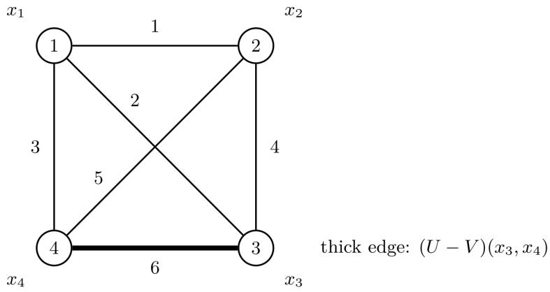

# EXPONENTIAL RANDOM GRAPH MODELS WITH SOFT CLIQUE CONSTRAINTS

YASMIN TOUSINEJAD AND VERA KOPONEN

Abstract. Let $r \geq$ 3 be fixed, and let ${ \bf G } _ { n }$ be the set of all simple graphs with vertex set $[ n ] = \{ 1 , \dots , n \}$ . We consider an exponential random graph model which gives higher probability to $G \in { \bf G } _ { n }$ than to $H \in \mathbf { G } _ { n }$ if G has fewer r-cliques than H. But all graphs in Gn have positive probability. The degree to which graphs with fewer r-cliques are given higher probability is determined by a positive weight w. We prove that, asymptotically almost surely as $n  \infty ,$ a random graph from $\mathbf { G } _ { r }$ has a vertex partition into $r - 1$ parts of roughly equal size, the density of edges between the parts is close to $1 / 2 ,$ and for every $\varepsilon > 0$ the density of edges within any part is less than ε. The asymptotic structural properties are independent of the weight w as long as it is positive. We also extend the result to the context of several clique sizes, each one with its own weight.

## 1. Introduction

Studies of large graphs, or other structures, subject to certain hard constraints have a long history in the field of random structures. The classical result of Erdős, Kleitman and Rothschild [12] states that the proportion of bipartite graphs among all triangle-free graphs with vertices $1 , \ldots , n$ tends to 1 as $n  \infty$ . More generally, Kolaitis, Prömel and Rothschild [19] proved that, for every fixed $r \geq 3$ , the proportion of (r − 1)-partite graphs among all $K _ { r }$ -free graphs with vertices $1 , \ldots , n$ tends to 1 as $n  \infty$ We can say that asymptotically almost surely (a.a.s.) a $K _ { r }$ -free graph is (r − 1)-partite. Later studies have considered the a.a.s. structure of H-free graphs for other “forbidden” subgraphs H (e.g. [2, 3, 15]), and yet other investigations have considered forbidding certain induced subgraphs (e.g. [4, 17, 24, 25]). Some studies have considered the a.a.s. structure under constraints other than forbidding a finite number of subgraph or induced subgraph configurations (e.g. [6, 5, 20, 31]), and some have considered structures other than graphs (e.g. [18, 29]).

In all mentioned examples, the probability distribution on structures with vertex set $[ n ] : = \{ 1 , \dots , n \}$ that satisfy the given constraints is the uniform one. One can reformulate the problem by considering all graphs (or some other kind of structure) with vertex set [n], assigning probability 0 to graphs that do not satisfy the constraints and equal probability to the other graphs. An alternative is to not assign probability 0 to graphs that violate the constraints, but to instead consider a probability distribution on graphs with vertex set [n] with the following property: A graph with more violations of the constraints is less likely than a graph with fewer violations of the constraints, but graphs with violations can still have positive probability. Since the constraints may be violated in this setting, it is more appropriate to call them soft constraints. This idea is present in so-called exponential random graph models (ERGMs) [27, 9]. The same idea also underlies probability distributions defined by so-called Markov logic networks (MLNs) [26], which are formal specification models in the field of Statistical Relational Artificial Intelligence (SRAI) [8, 11, 13]. MLNs can be defined for finite relational structures, not just graphs, but when restricted to graphs, they are special cases of ERGMs. Not much is known about structural properties of large random structures defined by fixed-weight MLNs. The investigations most directly related to this topic that we are aware of are [21, 30].

Our main result concerns an ERGM, or equivalently an MLN, on random graphs which “penalizes” (for any fixed $r \geq 3 )$ r-cliques, that is, copies of the complete graph on r vertices, denoted $K _ { r }$ . In other words, a graph with more r-cliques will be less likely than a graph with fewer r-cliques, but all graphs have positive probability. The strength of the penalization is expressed by a positive weight w. The precise definition of the distribution is given in Definition 2.2. Informally speaking, our main result, Theorem 2.7, shows that, for every fixed positive weight w and every $\varepsilon > 0$ , with probability tending to 1 as the number n of vertices tends to infinity, the following holds for a random graph:

(1) There is a partition of the vertex set into $r - 1$ parts, each of size close to $\frac { n } { r - 1 }$

(2) The density of edges between any two diferent parts is close to $\textstyle { \frac { 1 } { 2 } }$ (3) For every $\varepsilon > 0$ , if n is large enough then the density of edges within any part is less than ε.

Note that the asymptotic almost sure structure of a random graph does not depend on the weight $w$ (as long as $w > 0 )$ .

We also prove (Corollary 6.6) that if $r \geq 4$ then the probability that a random graph is $( r - 2 )$ -partite tends to 0 exponentially fast as the number of vertices tends to infinity. A further consequence of our results is a stochastic block model limit for fixed induced subgraphs (Corollary 6.2). Informally speaking, for every fixed $m$ , as n tends to infinity, the subgraph induced by [m] converges in distribution to a stochastic block model with $r - 1$ classes such that each of the $m$ vertices is assigned independently and uniformly to one of these classes. Given these assignments, there are no edges within a class, and each possible edge between diferent classes is included independently with probability ${ \frac { 1 } { 2 } } .$ . The limiting distribution depends on $^ { r , }$ but not on $w$

We can refine the probability model considered so that we consider some integers $3 \leq r _ { 1 } < . . . < r _ { k }$ and for each $r _ { i }$ we penalize an $r _ { i ^ { - } } \mathrm { c l i q u e }$ with weight $w _ { i } > 0$ . (The larger $w _ { i }$ is, the more strongly ri-cliques are penalized.) We show (Theorem 6.7) that, for all choices of weights $w _ { 1 } , \ldots , w _ { k } > 0 .$ , the asymptotic behaviour of random graphs under this model is determined by $r _ { 1 }$ . More precisely, with probability tending to 1 as the number n of vertices tends to infinity, a random graph will satisfy conditions (1) – (3) above if we let $r : = r _ { 1 }$

Our main results are proved by using graphons [7, 22, 16], which are analytic objects used to represent limits of sequences of dense graphs. The article is organized as follows. Just below we introduce the general notation and terminology that will be used. In Section 2 we define the probability model and state the main results (in Theorem 2.7). Section 3 defines the concept of graphon, as well as related concepts, and proves some basic results that will be used later. In Section 4 we work with the concepts of entropy of graphons, homomorphism density of $K _ { r }$ in graphons, and the cut distance of a graphon from a “balanced (r − 1)-partite graphon”, and show how they are related. In Section 5 we prove Theorem 2.7. Section 6 derives some consequences of Theorem 2.7 which were briefly described above.

General notation and terminology. By N we denote the set of positive integers. For $n \in \mathbb { N } , [ n ] : = \{ 1 , \dots , n \}$ . For $n \in \mathbb { N }$ , let ${ \bf G } _ { n }$ be the set of all undirected graphs without loops (i.e. simple graphs) with vertex set [n]. For every finite graph $G ,$ let $E ( G )$ denote its edge set and let $\chi ( G )$ denote its chromatic number.

If $n \in \mathbb { N } , G \in \mathbf { G } _ { n } ,$ and $A \subseteq [ n ]$ , set

$$
e _ { G } ( A ) : = { \big | } \{ \{ u , v \} \in E ( G ) : \ u , v \in A \} { \big | } .
$$

If in addition $B \subseteq [ n ]$ is disjoint from A, define

$$
e _ { G } ( A , B ) : = \big | \{ \{ u , v \} \in E ( G ) : \ | \{ u , v \} \cap A | = 1 , \ | \{ u , v \} \cap B | = 1 \} \big | .
$$

For $n \in \mathbb { N }$ and graphs $G , H \in \mathbf { G } _ { n }$ , define the n2-normalized edge-edit distance between G and H by

$$
d _ { \mathrm { e d i t } } ( G , H ) : = { \frac { 1 } { n ^ { 2 } } } | E ( G ) \triangle E ( H ) | .
$$

Here $\triangle$ denotes symmetric diference. Thus $d _ { \mathrm { e d i t } } ( G , H )$ is the number of edge insertions and deletions needed to turn G into $H$ , normalized by $n ^ { 2 }$

For $n \in \mathbb { N }$ and $p \in [ 0 , 1 ]$ , the notation

$$
\mathsf { H } _ { n } \sim G ( n , p )
$$

means that $\mathsf { H } _ { n }$ is a random element of ${ \bf G } _ { n }$ sampled by including an unordered pair $\{ i , j \}$ as an edge with probability $p ,$ independently of whether other pairs have been included or not. In particular, ${ \mathsf { H } } _ { n } \sim G ( n , { \frac { 1 } { 2 } } )$ means that every graph in ${ \bf G } _ { n }$ has probability $2 ^ { - { \binom { n } { 2 } } }$ so $\mathsf { H } _ { n }$ is uniformly distributed on ${ \bf G } _ { n }$

For every integer $s \geq 2 , K _ { s }$ denotes a complete graph with s vertices. For every finite graph G, let $K _ { s } ( G )$ denote the number of unordered copies of $K _ { s }$ in $G ,$ in other words, the number of subgraphs of G that are isomorphic to $K _ { s }$

## 2. The probability model and the main results

Throughout this article $r \ \geq \ 3$ is a fixed integer and $w > 0$ is a fixed real number interpreted as the “weight” that will be associated to every r-tuple of vertices of a graph that does not form an r-clique.

## 2.1. The probability distribution.

Definition 2.1. For every $n \in \mathbb { N }$ and $G \in \mathbf { G } _ { n }$ , let

$$
N _ { r } ( G ) : = n ^ { r } - r ! K _ { r } ( G ) ,\tag{2.1}
$$

so $N _ { r } ( G )$ is the number of ordered r-tuples $( v _ { 1 } , \ldots , v _ { r } ) \in [ n ] ^ { r }$ (with repetitions allowed) that do not consist of r distinct vertices that form an r-clique in $G$

Definition 2.2. For each $n \in \mathbb { N }$ and $G \in \mathbf { G } _ { n }$ , we define its unnormalized mass by

$$
\begin{array} { r } { \mu _ { n , r } ( G ) : = \exp \bigl ( w N _ { r } ( G ) \bigr ) . } \end{array}
$$

We then define the partition function (or normalizing constant) by

$$
Z _ { n , r } : = \sum _ { J \in \mathbf { G } _ { n } } \mu _ { n , r } ( J ) .
$$

Finally, we define the probability measure of the model by

$$
\mathbb { P } _ { n , r } ( A ) : = { \frac { 1 } { Z _ { n , r } } } \sum _ { G \in A } \mu _ { n , r } ( G ) \qquad { \mathrm { ~ f o r ~ a l l ~ } } A \subseteq \mathbf { G } _ { n } .
$$

For a single graph $G \in \mathbf { G } _ { n } .$ we also set

$$
\mathbb { P } _ { n , r } \mathopen { } \mathclose \bgroup \left( G \aftergroup \egroup \right) : = \mathbb { P } _ { n , r } \mathopen { } \mathclose \bgroup \left( \{ G \} \aftergroup \egroup \right) = \frac { \mu _ { n , r } \mathopen { } \mathclose \bgroup \left( G \aftergroup \egroup \right) } { Z _ { n , r } } .
$$

Since w is fixed in the model, we suppress the dependence on w in the notation $\mu _ { n , r } , Z _ { n , r } ,$ and $\mathbb { P } _ { n , r }$ . Note that if $G , H \in \mathbf { G } _ { n }$ and $K _ { r } ( G ) < K _ { r } ( H )$ , then $\mathbb { P } _ { n , r } ( G ) > \mathbb { P } _ { n , r } ( \dot { H } )$ . The distribution $\mathbb { P } _ { n , r }$ is exactly the probability distribution on ${ \bf G } _ { n }$ obtained from a Markov logic network [26] with one soft constraint of the form

$$
\bigvee _ { 1 \leq i < j \leq r } \neg E ( x _ { i } , x _ { j } ) \quad { \mathrm { ~ w i t h ~ w e i g h t ~ } } w ,
$$

where $\neg E ( x _ { i } , x _ { j } )$ expresses that there is no edge between $x _ { i }$ and $x _ { j }$ .

Remark 2.3. (On counting only tuples without repetitions) In Definition 2.2 we count all ordered r-tuples (also those with repetitions)

$$
( x _ { 1 } , \ldots , x _ { r } ) \in [ n ] ^ { r } .
$$

Another natural convention is to count only those ordered tuples whose entries are pairwise distinct. Under that convention, the total number of allowed ordered tuples is

$$
n ( n - 1 ) \cdots ( n - r + 1 ) ,
$$

and the falsifying tuples are still exactly the r! orderings of the vertices of each copy of $K _ { r }$ . So the number of satisfied groundings becomes

$$
N _ { r } ^ { \mathrm { d i s t } } ( G ) = n ( n - 1 ) \cdots ( n - r + 1 ) - r ! K _ { r } ( G ) .
$$

If we use the same weight w, then the corresponding unnormalized mass is

$$
\mu _ { n , r } ^ { \mathrm { d i s t } } ( G ) : = \exp \bigl ( w N _ { r } ^ { \mathrm { d i s t } } ( G ) \bigr ) = \exp \Bigl ( w \bigl [ n ( n - 1 ) \cdot \cdot \cdot ( n - r + 1 ) - r ! K _ { r } ( G ) \bigr ] \Bigr ) .
$$

Compare this with our present convention,

$$
\mu _ { n , r } ( G ) = \exp \bigl ( w [ n ^ { r } - r ! K _ { r } ( G ) ] \bigr ) .
$$

Subtracting the exponents gives

$$
\mu _ { n , r } ( G ) = \exp \Bigl ( w \big [ n ^ { r } - n ( n - 1 ) \cdots ( n - r + 1 ) \big ] \Bigr ) \mu _ { n , r } ^ { \mathrm { d i s t } } ( G ) .
$$

The factor

$$
\exp \Big ( w \big [ n ^ { r } - n ( n - 1 ) \cdot \cdot \cdot ( n - r + 1 ) \big ] \Big )
$$

is deterministic in the sense that it depends only on n, r, and $w ,$ , and not on the graph $G$ Therefore this factor changes the partition function, but it disappears when we normalize to obtain probabilities. Indeed, if

$$
Z _ { n , r } ^ { \mathrm { d i s t } } : = \sum _ { J \in \mathbf { G } _ { n } } \mu _ { n , r } ^ { \mathrm { d i s t } } ( J ) ,
$$

then

$$
Z _ { n , r } = \exp \Bigl ( w \bigl [ n ^ { r } - n ( n - 1 ) \cdots ( n - r + 1 ) \bigr ] \Bigr ) Z _ { n , r } ^ { \mathrm { d i s t } } ,
$$

and hence

$$
\mathbb { P } _ { n , r } ( G ) = \frac { \mu _ { n , r } ( G ) } { Z _ { n , r } } = \frac { \mu _ { n , r } ^ { \mathrm { d i s t } } ( G ) } { Z _ { n , r } ^ { \mathrm { d i s t } } } .
$$

$\mathrm { S o } ,$ for the same clause weight $w ,$ the two counting conventions define exactly the same probability measure on ${ \bf G } _ { n }$ . Thus the choice between these two conventions does not afect which graphs are more or less likely.

2.2. The equivalent exponential random graph model. The distribution $\mathbb { P } _ { n , r }$ can be defined in the setting of exponential random graph models [27].

Definition 2.4. Fix $n , k \in \mathbb { N }$ . An Exponential Random Graph Model (ERGM) on ${ \bf G } _ { n }$ is a probability distribution of the form

$$
\mathbb { P } _ { n , \vartheta } ( G ) : = \frac { \exp \bigl ( \sum _ { i = 1 } ^ { k } \vartheta _ { i } T _ { i } ( G ) \bigr ) } { Z _ { n } ^ { \mathrm { E R G M } } ( \vartheta ) } \qquad \mathrm { f o r ~ a l l } \ : \ : G \in \mathbf { G } _ { n } ,
$$

where $T _ { 1 } , \dots , T _ { k }$ are real-valued functions on $\bigcup _ { n \in \mathbb { N } } \mathbf { G } _ { n } , \ \vartheta \ = \ ( \vartheta _ { 1 } , \ldots , \vartheta _ { k } ) \ \in \ \mathbb { R } ^ { k }$ is a parameter vector, and

$$
Z _ { n } ^ { \mathrm { E R G M } } ( \vartheta ) : = \sum _ { J \in \mathbf { G } _ { n } } \exp \bigl ( \sum _ { i = 1 } ^ { k } \vartheta _ { i } T _ { i } ( J ) \bigr )
$$

is the normalizing constant. All else being equal, a positive value of $\vartheta _ { i }$ rewards larger values of $T _ { i } ( G )$ in the exponent, while a negative value penalizes them.

Note that if $k = 1 , \vartheta _ { 1 } = w$ , and $T _ { 1 } ( G ) = N _ { r } ( G )$ , then

$$
\mathbb { P } _ { n , r } ( G ) = \mathbb { P } _ { n , \vartheta } ( G ) \quad \mathrm { ~ f o r ~ a l l ~ } G \in \mathbf { G } _ { n } .
$$

Hence $\mathbb { P } _ { n , r }$ is an ERGM.

2.3. The reduced partition function. It will be convenient to work with the quantities defined below.

Definition 2.5. (a) For all $n \in \mathbb { N }$ , let

$$
\widetilde { Z } _ { n , r } : = \widetilde { Z } _ { n , r } ( w ) : = \sum _ { J \in \mathbf { G } _ { n } } \exp \bigl ( - r ! w K _ { r } ( J ) \bigr ) \ \mathrm { ~ a n d ~ }\tag{2.2}
$$

$$
F _ { n , r } : = F _ { n , r } ( w ) : = \frac { 1 } { n ^ { 2 } } \ln \widetilde { Z } _ { n , r } .
$$

We call ${ \widetilde { Z } } _ { n , r }$ the reduced partition function and $F _ { n , r } ( w )$ the reduced free energy.

(b) For a graph $G \in { \mathbf { G } } _ { n }$ , we call

$$
\exp { \left( - r ! w K _ { r } ( G ) \right) }
$$

the reduced mass of G. Thus ${ \widetilde { Z } } _ { n , r }$ is the sum of the reduced masses of all graphs in $\mathbf { G } _ { n } .$

The partition function $Z _ { n , r }$ sums the unnormalized masses of all graphs in ${ \bf G } _ { n }$ . As the next lemma shows, its logarithm contains the graph-independent term $w n ^ { r }$ . This term changes the normalizing constant but not the probability measure, so we will often remove it and work with the reduced partition function and reduced free energy.

Lemma 2.6. For every $n \in \mathbb { N }$ and every $G \in { \mathbf { G } } _ { n }$

$$
\begin{array} { r } { \mu _ { n , r } ( G ) = \exp \bigl ( w n ^ { r } \bigr ) \exp \bigl ( - r ! w K _ { r } ( G ) \bigr ) . } \end{array}
$$

Moreover,

$$
Z _ { n , r } = \exp \left( w n ^ { r } \right) \widetilde { Z } _ { n , r } ,
$$

and

$$
\mathbb { P } _ { n , r } \left( G \right) = \frac { \exp \left( - r ! w K _ { r } \left( G \right) \right) } { \sum _ { J \in \mathbf { G } _ { n } } \exp \left( - r ! w K _ { r } \left( J \right) \right) } = \frac { \exp \left( - r ! w K _ { r } \left( G \right) \right) } { \widetilde { Z } _ { n , r } } .\tag{2.3}
$$

Proof. Insert (2.1) into the definition of $\mu _ { n , r } ( G )$

$$
\mu _ { n , r } ( G ) = \exp \bigl ( w \left[ n ^ { r } - r ! K _ { r } ( G ) \right] \bigr ) .
$$

Now factor out the deterministic term $e ^ { w n ^ { r } }$ . The formulas for $Z _ { n , r }$ and $\mathbb { P } _ { n , r }$ follow immediately. □

2.4. Main results. Recall that we have fixed an integer $r \geq 3$ and a real $w > 0$ . The notation

$$
{ \sf G } _ { n } \sim { \mathbb P } _ { n , r }
$$

means that ${ \sf G } _ { n }$ is a random graph from ${ \bf G } _ { n }$ under the distribution $\mathbb { P } _ { n , r }$ . (So if $J \in { \bf G } _ { n }$ then $\mathbb { P } ( \mathsf { G } _ { n } = J ) = \mathbb { P } _ { n , r } ( J ) . )$ Recall also notation introduced in Section 1. Some of the notions appearing in the main result below are defined only later: A graphon is defined in Definition 3.1. For a graph $G \in \mathbf { G } _ { n } .$ , its empirical graphon $W _ { G }$ is defined in Definition 3.2. The cut distance $\delta _ { \bigsqcup }$ between two graphons is defined in Definition 3.6, and the cut distance from a graphon to a family is defined in Definition 3.7. The family $B _ { q } ^ { \star }$ is defined in Definition 4.1; informally, it consists of the balanced q-block graphons that are equal to 0 on the diagonal blocks and equal to $\frac { 1 } { 2 }$ on the of-diagonal blocks.

Theorem 2.7. Fix $r \geq 3 ,$ , set $q = r - 1$ . Let ${ \sf G } _ { n } \sim { \mathbb P } _ { n , r }$ . Then the following hold.

(i) The reduced free energy satisfies

$$
\operatorname* { l i m } _ { n \to \infty } F _ { n , r } ( w ) = { \frac { \ln 2 } { 2 } } \left( 1 - { \frac { 1 } { q } } \right) .
$$

(ii) For every $\varepsilon > 0$ , there are constants $c = c ( \varepsilon , r ) > 0$ and $N = N ( \varepsilon , r , w )$ such that, for every $n \geq N$

$$
\begin{array} { r } { \mathbb { P } \left( \delta _ { \Pi } ( W _ { \mathsf { G } _ { n } } , B _ { q } ^ { \star } ) \ge \varepsilon \right) \le e ^ { - c n ^ { 2 } } . } \end{array}
$$

(iii) For every $\varepsilon > 0$ , there are constants $c = c ( \varepsilon , r ) > 0$ and $n _ { 0 } = n _ { 0 } ( \varepsilon , r , w )$ such that, for every $n \geq n _ { 0 }$ , with probability at least $1 - e ^ { - c n ^ { 2 } }$ , the graph ${ \sf G } _ { n }$ has a partition

$$
[ n ] = V _ { 1 } \sqcup \cdots \sqcup V _ { q }
$$

with the following properties:

(a) Each part is almost balanced:

$$
\left| | V _ { i } | - n / q \right| \leq \varepsilon n f o r \ e v e r y \ i \in [ q ] .
$$

(b) Each between-part edge density is close to ${ \frac { 1 } { 2 } } .$

$$
\left| \frac { e _ { \mathsf { G } _ { n } } ( V _ { i } , V _ { j } ) } { | V _ { i } | | V _ { j } | } - \frac 1 2 \right| \le \varepsilon \qquad f o r \ a l l \ d i s t i n c t \ i , j \in [ q ] .
$$

(c) The total number of edges inside the parts satisfies

$$
\sum _ { i = 1 } ^ { q } e _ { \mathsf { G } _ { n } } ( V _ { i } ) \leq \frac { \varepsilon n ^ { 2 } } { 1 0 q } .
$$

(d) The total density of edges inside the parts is at most ε:

$$
\frac { \sum _ { i = 1 } ^ { q } e _ { \mathsf { G } _ { n } } ( V _ { i } ) } { \sum _ { i = 1 } ^ { q } { \binom { | V _ { i } | } { 2 } } } \leq \varepsilon .
$$

In particular, ${ i f } \mathsf { G } _ { n } ^ { \prime }$ is obtained from ${ \sf G } _ { n }$ by deleting all edges whose endpoints lie in the same part, then $\mathsf { G } _ { n } ^ { \prime }$ is q-partite and

$$
d _ { \mathrm { e d i t } } ( \mathsf { G } _ { n } , \mathsf { G } _ { n } ^ { \prime } ) \leq \frac { \varepsilon } { 1 0 q } \leq \frac { \varepsilon } { 2 } .
$$

2.5. Related work. In the introduction we mentioned several studies of graphs, or other relational structures, subject to “hard” constraints. We also mentioned [21, 30] about structures subject to “soft” constraints defined by Markov logic networks. As we use graphons to prove our main results we like to mention [1] which considers Markov logic networks and a multi-relational analogue of a graphon in the context when one considers several diferent edge relations. However, the results in [1], which generalize the basic theory of graphons, are not of help in the present context as far as we can see.

In [9] Chatterjee and Diaconis consider ERGM distributions on ${ \bf G } _ { n }$ of the form

$$
\mathbb { P } _ { n } ^ { T } ( G ) = \frac { \exp \left( n ^ { 2 } T ( G ) \right) } { \sum _ { J \in \mathbf { G } _ { n } } \exp \left( n ^ { 2 } T ( J ) \right) }
$$

where $T$ is a function from $\textstyle \bigcup _ { n \in \mathbb { N } } \mathbf { G } _ { n }$ into the reals. If we rewrite the distribution $\mathbb { P } _ { n , r }$ so that, for an appropriate choice of T and all $n , \mathbb { P } _ { n , r } = \mathbb { P } _ { n } ^ { T }$ then, for all n and all $G \in { \mathbf { G } } _ { n }$ 2 we must have

$$
T ( G ) : = { \frac { w N _ { r } ( G ) } { n ^ { 2 } } } .
$$

Recall that $N _ { r } ( G )$ is the number of r-tuples of vertices of G that do not form an r-clique. So if $G \in \mathbf { G } _ { n }$ does not have an r-clique (e.g. if G is $( r - 1 ) – \mathrm { p a r t i t e } )$ , then $N _ { r } ( G ) = n ^ { r }$

where $r \geq 3$ . It follows that ma $\operatorname { x } _ { G \in \mathbf { G } _ { n } } T ( G )$ is unbounded as $n  \infty$ . But the results of [9] assume that $\operatorname* { m a x } _ { G \in \mathbf { G } _ { n } } T ( G )$ is bounded as $n \to \infty$ . Therefore their results do not apply to the present context.

## 3. Graphon preliminaries

## 3.1. Basic definitions.

Definition 3.1 (Graphon). A graphon is a measurable function

$$
W : [ 0 , 1 ] ^ { 2 }  [ 0 , 1 ]
$$

such that $W ( x , y ) = W ( y , x )$ for almost every $( x , y ) \in [ 0 , 1 ] ^ { 2 }$ . Let W denote the family of these measurable functions.

Let λ denote Lebesgue measure on [0, 1]. For each integer $m \geq 1$ , let $\lambda ^ { m }$ denote the product Lebesgue measure on $[ 0 , 1 ] ^ { m }$

Graphons are the standard limit objects for dense graphs. They also define random graph models. Let W be a graphon and let $n \in \mathbb N$ . Choose $X _ { 1 } , \ldots , X _ { n }$ independently and uniformly from [0, 1]. Conditional on $X _ { 1 } , \ldots , X _ { n }$ , put each edge $\{ i , j \}$ with $i < j$ into the graph independently with probability

$$
W ( X _ { i } , X _ { j } ) .
$$

Definition 3.2 (Empirical graphon). Let $n \in \mathbb { N }$ , and let G be a graph with vertex set [n] and adjacency matrix $( a _ { i j } ) _ { 1 \leq i , j \leq n }$ , where

$$
a _ { i j } = a _ { j i } \qquad \mathrm { a n d } \qquad a _ { i i } = 0 .
$$

Split [0, 1] into n intervals of equal length by setting

$$
I _ { i } = \left[ { \frac { i - 1 } { n } } , { \frac { i } { n } } \right) \quad { \mathrm { f o r ~ } } 1 \leq i < n , \qquad I _ { n } = \left[ { \frac { n - 1 } { n } } , 1 \right] .
$$

The empirical graphon of $G$ is the graphon $W _ { G } : [ 0 , 1 ] ^ { 2 } \to [ 0 , 1 ]$ defined as follows. If $x \in I _ { i }$ and $y \in I _ { j }$ , then

$$
W _ { G } ( x , y ) : = a _ { i j } .
$$

Thus $W _ { G }$ records the adjacency matrix of G on the $n ^ { 2 }$ rectangles $I _ { i } \times I _ { j }$ . It is measurable, symmetric, and takes only the values 0 and 1. Also, $W _ { G } = 0$ on each rectangle $I _ { i } \times I _ { i }$ 2 because $a _ { i i } = 0$

Definition 3.3 (Homomorphism density). Let H be a finite simple graph with vertex set $V ( H ) = \{ 1 , \dots , k \}$ . For a graphon W, the homomorphism density of H in $W$ is

$$
t ( H , W ) : = \int _ { [ 0 , 1 ] ^ { k } } \prod _ { \{ i , j \} \in E ( H ) } W ( x _ { i } , x _ { j } ) d x _ { 1 } \cdot \cdot \cdot d x _ { k } .
$$

Remark 3.4. For $H = K _ { r }$ this becomes

$$
t ( K _ { r } , W ) = \int _ { [ 0 , 1 ] ^ { r } } \prod _ { 1 \leq a < b \leq r } W ( x _ { a } , x _ { b } ) d x _ { 1 } \cdot \cdot \cdot d x _ { r } .
$$

The integrand is nonnegative. So if $t ( K _ { r } , W ) = 0$ , then the product inside the integral must vanish almost everywhere.

From now on, a graphon W is called a graphon of zero $K _ { r }$ -density if

$$
t ( K _ { r } , W ) = 0 ,
$$

that is, if its $K _ { r }$ -homomorphism density is zero.

Definition 3.5 (Cut norm). For an integrable function $U : [ 0 , 1 ] ^ { 2 } \to \mathbb { R }$ , the cut norm is

$$
\| U \| _ { \Sigma } : = \operatorname* { s u p } _ { S , T \subseteq [ 0 , 1 ] } \quad \left| \int _ { S \times T } U ( x , y ) d x d y \right| .
$$

Definition 3.6 (Cut distance). A measurable map $\phi : [ 0 , 1 ] \ \to \ [ 0 , 1 ]$ is measurepreserving if

$$
\lambda ( \phi ^ { - 1 } ( A ) ) = \lambda ( A ) \qquad { \mathrm { f o r ~ e v e r y ~ L e b e s g u e - m e a s u r a b l e ~ } } A \subseteq [ 0 , 1 ] .
$$

A measure-preserving bijection is a bijection $\phi : [ 0 , 1 ]  [ 0 , 1 ]$ such that both $\phi$ and $\phi ^ { - 1 }$ are Lebesgue-measurable and $\phi$ is measure-preserving.

If W is a graphon and $\phi$ is a measure-preserving map, define

$$
W ^ { \phi } ( x , y ) : = W ( \phi ( x ) , \phi ( y ) ) .
$$

Thus $W ^ { \phi }$ is obtained from W by applying $\phi$ to both variables. When $\phi$ is a measurepreserving bijection, we call $W ^ { \phi } \mathrm {  ~ a ~ }$ relabeling of $W$

For graphons $W _ { 1 }$ and $W _ { 2 }$ , their cut distance is

$$
\delta _ { \sharp } ( W _ { 1 } , W _ { 2 } ) : = \operatorname* { i n f } _ { \phi } \| W _ { 1 } - W _ { 2 } ^ { \phi } \| _ { \mathsf { D } } ,
$$

where the infimum is taken over all measure-preserving bijections $\phi : [ 0 , 1 ]  [ 0 , 1 ]$

Relabeling by a measure-preserving bijection does not change the cut norm. Indeed, let $F : [ 0 , 1 ] ^ { 2 } \to \mathbb { R }$ be a measurable function with

$$
\int _ { [ 0 , 1 ] ^ { 2 } } | F ( x , y ) | d x d y < \infty ,
$$

and let $\phi$ be a measure-preserving bijection. Define

$$
F ^ { \phi } ( x , y ) : = F ( \phi ( x ) , \phi ( y ) ) .
$$

Then

$$
\| F ^ { \phi } \| _ { \Gamma } = \| F \| _ { \Gamma } .
$$

This follows by changing variables in the integral over $S \times T$ . Since $\phi$ is measurepreserving and bijective, the sets $\phi ( S )$ and $\phi ( T )$ run through the same measurable subsets of [0, 1] as S and $T .$ Thus the supremum in the cut norm is unchanged.

Definition 3.7. Let $W$ be a graphon, and let $\mathcal { F }$ be a nonempty family of graphons. The cut distance from W to $\mathcal { F }$ is

$$
\delta _ { \Pi } ( W , { \mathcal F } ) : = \operatorname* { i n f } _ { V \in { \mathcal F } } \delta _ { \Pi } ( W , V ) .
$$

The cut distance $\delta _ { \square }$ is a pseudometric on $\mathcal { W } .$ . Indeed, let $U , V , W \in \mathcal { W }$ . To see symmetry, let $\phi$ be a measure-preserving bijection. By invariance of the cut norm under relabeling,

$$
\| \boldsymbol { U } - \boldsymbol { V } ^ { \phi } \| _ { \boldsymbol { \Pi } } = \| \boldsymbol { U } ^ { \phi ^ { - 1 } } - \boldsymbol { V } \| _ { \boldsymbol { \Pi } } = \| \boldsymbol { V } - \boldsymbol { U } ^ { \phi ^ { - 1 } } \| _ { \boldsymbol { \Pi } } .
$$

Taking the infimum over $\phi$ gives $\delta _ { \Pi } ( U , V ) = \delta _ { \Pi } ( V , U )$ . For the triangle inequality, if $\phi$ and $\psi$ are measure-preserving bijections, then

$$
\begin{array} { r l } & { \| U - W ^ { \psi \circ \phi } \| _ { \Sigma } \leq \| U - V ^ { \phi } \| _ { \Sigma } + \| V ^ { \phi } - ( W ^ { \psi } ) ^ { \phi } \| _ { \Sigma } } \\ & { \qquad = \| U - V ^ { \phi } \| _ { \Sigma } + \| V - W ^ { \psi } \| _ { \Sigma } . } \end{array}
$$

Taking the infimum over $\phi$ and $\psi$ proves the triangle inequality. Nonnegativity and $\delta _ { \perp } ( U , U ) = 0$ are immediate.

Notation 3.8 (Reduced graphon space). Define

$$
W \sim V \qquad \iff \qquad \delta _ { \sqsubseteq } ( W , V ) = 0 ,
$$

and let

$$
\widetilde { \mathcal { W } } : = \mathcal { W } / \sim , \qquad \pi : \mathcal { W } \to \widetilde { \mathcal { W } }
$$

be the quotient space and quotient map. We use $\widetilde { W } : = \pi ( W )$ and, for $n \in \mathbb { N }$ and $G \in \mathbf { G } _ { n }$ $\widetilde { W } _ { G } : = \pi ( W _ { G } )$ . For reduced graphons define

$$
d _ { \Pi } ( \widetilde { U } , \widetilde { V } ) : = \delta _ { \Pi } ( U , V ) ,
$$

where $U$ and $V$ are arbitrary representatives. This definition does not depend on the chosen representatives. Indeed, if $U ^ { \prime } \sim U$ and $V ^ { \prime } \sim V$ , then

$$
\delta _ { \perp } ( U ^ { \prime } , V ^ { \prime } ) \leq \delta _ { \perp } ( U ^ { \prime } , U ) + \delta _ { \perp } ( U , V ) + \delta _ { \perp } ( V , V ^ { \prime } ) = \delta _ { \perp } ( U , V ) .
$$

The same argument with $( U , V )$ and $( U ^ { \prime } , V ^ { \prime } )$ interchanged gives

$$
\delta _ { \perp } ( U , V ) \leq \delta _ { \perp } ( U ^ { \prime } , V ^ { \prime } ) .
$$

Hence

$$
\delta _ { \Pi } ( U ^ { \prime } , V ^ { \prime } ) = \delta _ { \Pi } ( U , V ) .
$$

Thus $d _ { \bigsqcup }$ is well defined on $\widetilde { \mathcal { W } } .$ . It is a metric because nonnegativity, symmetry, and the triangle inequality are inherited from $\delta _ { \boxed { \boxed { \boxed { \box} { \boxed { \box} { \boxed { \box} { \boxed { \box} { \boxed { } \boxed { } \boxed { } \boxed { } } } } } } } }$ . Also,

$$
d _ { \Pi } ( \widetilde { U } , \widetilde { V } ) = 0
$$

holds exactly when $U \sim V$ , which means $\widetilde U = \widetilde V$ . The metric space $( \widetilde { \mathcal { W } } , d _ { \perp } )$ is compact; see [22, Thm. 9.23]. For ${ \mathcal { F } } \subseteq { \mathcal { W } } .$ , we use

$$
\pi ( { \mathcal { F } } ) : = \{ \pi ( W ) : W \in { \mathcal { F } } \} \subseteq { \widetilde { \mathcal { W } } }
$$

for its quotient image.

Remark 3.9 (Zero cut distance). For graphons $U$ and $V ,$ , the condition

$$
\delta _ { \Pi } ( U , V ) = 0
$$

means that $U$ and $V$ represent the same graph limit. Equivalently, there exist measurepreserving maps $\phi , \psi : [ 0 , 1 ] \to [ 0 , 1 ]$ such that

$$
U ^ { \phi } = V ^ { \psi } \qquad \mathrm { a l m o s t ~ e v e r y w h e r e } ;
$$

see [22, Cor. 10.34 and Cor. 10.35(a)].

The maps in this characterization need not be bijections. Consequently, the condition $\delta _ { \Pi } ( U , V ) = 0$ is weaker than almost-everywhere equality after a single measure-preserving relabeling.

By Notation 3.8, graphons at zero cut distance represent the same point of $\widetilde { \mathcal { W } } .$ This quotient space is the reduced graphon space used in [10, Sec. 1.3].

Notation 3.10. For an integrable function $U : [ 0 , 1 ] ^ { 2 } \to \mathbb { R }$ , the $L ^ { 1 }$ -norm is defined as

$$
\| U \| _ { 1 } : = \int _ { [ 0 , 1 ] ^ { 2 } } | U ( x , y ) | d x d y .
$$

Notation 3.11 (Indicator functions). For any set or event $A , \mathbf { 1 } _ { A }$ denotes its indicator.   
Thus $\mathbf { 1 } _ { A } ( z ) = 1$ when $z \in A$ and $\mathbf { 1 } _ { A } ( z ) = 0$ otherwise.

Lemma 3.12. We will use the following two forms of the Cauchy-Schwarz inequality. (i) $I f S \subseteq [ 0 , 1 ] ^ { 2 }$ is measurable and $f : S  \mathbb { R }$ is measurable with

$$
\int _ { S } f ^ { 2 } < \infty ,
$$

then

$$
\left( \int _ { S } | f | \right) ^ { 2 } \leq \lambda ^ { 2 } ( S ) \int _ { S } f ^ { 2 } .
$$

(ii) If $m \geq 1$ is an integer and $x _ { 1 } , \ldots , x _ { m } \in \mathbb { R }$ , then

$$
\left( \sum _ { a = 1 } ^ { m } x _ { a } \right) ^ { 2 } \leq m \sum _ { a = 1 } ^ { m } x _ { a } ^ { 2 } .
$$

Equivalently,

$$
\sum _ { a = 1 } ^ { m } x _ { a } ^ { 2 } \geq \frac { 1 } { m } \left( \sum _ { a = 1 } ^ { m } x _ { a } \right) ^ { 2 } .
$$

Consequently, if $q \in \mathbb { N } , n \in \mathbb { Z } _ { \geq 0 } , m _ { 1 } , . . . , m _ { q } \in \mathbb { Z } _ { \geq 0 }$ , and

$$
\sum _ { a = 1 } ^ { q } m _ { a } = n ,
$$

then

$$
\sum _ { a = 1 } ^ { q } { \binom { m _ { a } } { 2 } } = \frac 1 2 \left( \sum _ { a = 1 } ^ { q } m _ { a } ^ { 2 } - n \right) \ge \frac 1 2 \left( \frac { n ^ { 2 } } { q } - n \right) .
$$

Proof. For (i), apply [28, Thm. 11.35] to the functions $| f |$ and 1 on S. We get

$$
\int _ { S } | f | \leq \left( \int _ { S } f ^ { 2 } \right) ^ { 1 / 2 } \left( \int _ { S } 1 \right) ^ { 1 / 2 } .
$$

Since

$$
\int _ { S } 1 = \lambda ^ { 2 } ( S ) ,
$$

it follows that

$$
\left( \int _ { S } | f | \right) ^ { 2 } \leq \lambda ^ { 2 } ( S ) \int _ { S } f ^ { 2 } .
$$

For (ii), apply [28, Thm. 1.35] to the two lists

$$
x _ { 1 } , \ldots , x _ { m } \qquad \mathrm { a n d } \qquad 1 , \ldots , 1 .
$$

This gives

$$
\left( \sum _ { a = 1 } ^ { m } x _ { a } \right) ^ { 2 } \leq \left( \sum _ { a = 1 } ^ { m } x _ { a } ^ { 2 } \right) \left( \sum _ { a = 1 } ^ { m } 1 \right) = m \sum _ { a = 1 } ^ { m } x _ { a } ^ { 2 } .
$$

Dividing by m, we obtain

$$
\sum _ { a = 1 } ^ { m } x _ { a } ^ { 2 } \geq \frac { 1 } { m } \left( \sum _ { a = 1 } ^ { m } x _ { a } \right) ^ { 2 } .
$$

Now apply (ii) with $m = q$ and $x _ { a } = m _ { a }$ . Since

$$
\sum _ { a = 1 } ^ { q } m _ { a } = n ,
$$

we have

$$
\sum _ { a = 1 } ^ { q } m _ { a } ^ { 2 } \geq { \frac { n ^ { 2 } } { q } } .
$$

Therefore

$$
\sum _ { a = 1 } ^ { q } { \binom { m _ { a } } { 2 } } = \frac 1 2 \sum _ { a = 1 } ^ { q } m _ { a } ( m _ { a } - 1 ) = \frac 1 2 \left( \sum _ { a = 1 } ^ { q } m _ { a } ^ { 2 } - n \right) \ge \frac 1 2 \left( \frac { n ^ { 2 } } { q } - n \right) .
$$

Lemma 3.13. Let $F : [ 0 , 1 ] ^ { 2 } $ R be bounded and measurable, and let $f , g : [ 0 , 1 ] \to [ 0 , 1 ]$ be measurable. Then

$$
\left| \int _ { [ 0 , 1 ] ^ { 2 } } F ( x , y ) f ( x ) g ( y ) d x d y \right| \leq \| F \| _ { \mathsf { D } } .
$$

Proof. By [16, Eq. (4.2) and Rem. 4.1],

$$
\| F \| _ { \Pi } = \operatorname* { s u p } _ { \phi , \psi : [ 0 , 1 ] \to [ 0 , 1 ] } \left| \int _ { [ 0 , 1 ] ^ { 2 } } F ( x , y ) \phi ( x ) \psi ( y ) d x d y \right| .
$$

Taking $\phi = f$ and $\psi = g$ gives

$$
\left| \int _ { [ 0 , 1 ] ^ { 2 } } F ( x , y ) f ( x ) g ( y ) d x d y \right| \leq \| F \| _ { \mathsf { D } } .
$$

Lemma 3.14 (Clique density is Lipschitz in cut distance). Let $r \geq 2$ . For all graphons U and $V ,$

$$
| t ( K _ { r } , U ) - t ( K _ { r } , V ) | \leq \binom { r } { 2 } \| U - V \| _ { \Sigma } .
$$

Consequently,

$$
| t ( K _ { r } , U ) - t ( K _ { r } , V ) | \leq \binom { r } { 2 } \delta _ { \sharp } ( U , V ) .
$$

In particular, the map $W \mapsto t ( K _ { r } , W )$ is continuous with respect to cut distance.

Proof. By [16, Rem. 2.1], every Lebesgue-measurable graphon on $[ 0 , 1 ] ^ { 2 }$ is equal almost everywhere to a Borel-measurable one. Such a replacement changes neither homomorphism densities nor cut norms. We may therefore replace U and $V$ by Borel-measurable representatives and continue to denote them by $U$ and $V .$ . In particular, whenever all but one of the variables are fixed below, the resulting one-variable function is measurable.

Let

$$
m : = { \binom { r } { 2 } } , \qquad D : = U - V .
$$

Choose once and for all an ordering of the $\binom { r } { 2 }$ edges of $K _ { r }$ . Equivalently, choose an ordering of the pairs

$$
( i _ { 1 } , j _ { 1 } ) , \ldots , ( i _ { m } , j _ { m } ) , \qquad 1 \leq i _ { \ell } < j _ { \ell } \leq r ,
$$

so that every pair appears exactly once.

Vertex s carries the single variable $x _ { s } \in [ 0 , 1 ]$

The symbols $i _ { \ell }$ and $j _ { \ell }$ record which two vertices form the ℓ-th edge in the chosen list. For example, when $r = 4 .$ , one possible ordering is

$$
( i _ { 1 } , j _ { 1 } ) = ( 1 , 2 ) , ( i _ { 2 } , j _ { 2 } ) = ( 1 , 3 ) , ( i _ { 3 } , j _ { 3 } ) = ( 1 , 4 ) ,
$$

$$
( i _ { 4 } , j _ { 4 } ) = ( 2 , 3 ) , ( i _ { 5 } , j _ { 5 } ) = ( 2 , 4 ) , ( i _ { 6 } , j _ { 6 } ) = ( 3 , 4 ) .
$$

By Remark 3.4,

$$
t ( K _ { r } , W ) = \int _ { [ 0 , 1 ] ^ { r } } \prod _ { \ell = 1 } ^ { m } W ( x _ { i _ { \ell } } , x _ { j _ { \ell } } ) d x _ { 1 } \cdot \cdot \cdot d x _ { r } .
$$

This means that we choose numbers

$$
x _ { 1 } , \ldots , x _ { r } \in [ 0 , 1 ] ,
$$

one number for each vertex of the clique. For every edge $\{ i , j \}$ of the clique, we include the factor $W ( x _ { i } , x _ { j } )$ . Then we multiply all these factors together. Finally, we average over all choices of $( x _ { 1 } , \ldots , x _ { r } ) \in [ 0 , 1 ] ^ { r }$ . Since the set $[ 0 , 1 ] ^ { r }$ has total measure 1, the integral here is literally an average.

Applying this formula to U and to $V ,$ , we obtain

$$
t ( K _ { r } , U ) - t ( K _ { r } , V ) = \int _ { [ 0 , 1 ] ^ { r } } \left( \prod _ { \ell = 1 } ^ { m } U ( x _ { i _ { \ell } } , x _ { j _ { \ell } } ) - \prod _ { \ell = 1 } ^ { m } V ( x _ { i _ { \ell } } , x _ { j _ { \ell } } ) \right) d x _ { 1 } \cdots d x _ { r } .
$$

To compare the two products, it is helpful to change the edge factors one at a time. For a fixed point $( x _ { 1 } , \ldots , x _ { r } ) \in [ 0 , 1 ] ^ { r }$ , use

$$
U _ { \ell } : = U ( x _ { i _ { \ell } } , x _ { j _ { \ell } } ) , \qquad V _ { \ell } : = V ( x _ { i _ { \ell } } , x _ { j _ { \ell } } ) .
$$

Now define

$$
P _ { 0 } : = \prod _ { \ell = 1 } ^ { m } V _ { \ell } ,
$$

and for $s = 1 , \ldots , m$ define

$$
P _ { s } : = \left( \prod _ { \ell = 1 } ^ { s } U _ { \ell } \right) \left( \prod _ { \ell = s + 1 } ^ { m } V _ { \ell } \right) .
$$

Thus $P _ { 0 }$ is the product built entirely from $V$ , while $P _ { m }$ is the product built entirely from $U .$

Therefore

$$
\prod _ { \ell = 1 } ^ { m } U _ { \ell } - \prod _ { \ell = 1 } ^ { m } V _ { \ell } = P _ { m } - P _ { 0 } = \sum _ { s = 1 } ^ { m } ( P _ { s } - P _ { s - 1 } ) .
$$

For each $s ,$ only the s-th factor changes when one passes from $P _ { s - 1 }$ to $P _ { s }$ , so

$$
P _ { s } - P _ { s - 1 } = \left( \prod _ { \ell < s } U _ { \ell } \right) ( U _ { s } - V _ { s } ) \left( \prod _ { \ell > s } V _ { \ell } \right) .
$$

Substituting back the definitions of $U _ { \ell }$ and $V _ { \ell } .$ , we get

$$
\prod _ { \ell = 1 } ^ { m } U ( x _ { i _ { \ell } } , x _ { j _ { \ell } } ) - \prod _ { \ell = 1 } ^ { m } V ( x _ { i _ { \ell } } , x _ { j _ { \ell } } ) = \sum _ { s = 1 } ^ { m } \left( \prod _ { \ell < s } U ( x _ { i _ { \ell } } , x _ { j _ { \ell } } ) \right) D ( x _ { i _ { s } } , x _ { j _ { s } } ) \left( \prod _ { \ell > s } V ( x _ { i _ { \ell } } , x _ { j _ { \ell } } ) \right) .
$$

If $s = 1$ or $s = m$ , one of the products is empty; by convention, an empty product is equal to 1.

Substituting this into the integral and using the triangle inequality, we obtain

$$
| t ( K _ { r } , U ) - t ( K _ { r } , V ) | \leq \sum _ { s = 1 } ^ { m } I _ { s } ,
$$

where

$$
I _ { s } : = \left| \int _ { [ 0 , 1 ] ^ { r } } \left( \prod _ { \ell < s } U ( x _ { i _ { \ell } } , x _ { j _ { \ell } } ) \right) D ( x _ { i _ { s } } , x _ { j _ { s } } ) \left( \prod _ { \ell > s } V ( x _ { i _ { \ell } } , x _ { j _ { \ell } } ) \right) d x _ { 1 } \cdot \cdot \cdot d x _ { r } \right| .\tag{3.1}
$$

We now estimate one such term.

Fix $s \in \{ 1 , \ldots , m \}$ and use

$$
( i _ { s } , j _ { s } ) = ( a , b ) .
$$

Let

$$
\widehat { x } = ( x _ { t } ) _ { t \in [ r ] \backslash \{ a , b \} } , \qquad d \widehat { x } : = \prod _ { t \in [ r ] \backslash \{ a , b \} } d x _ { t } ,
$$

where the coordinates are taken in increasing order. Thus $\widehat { x }$ denotes all variables except $x _ { a }$ and $x _ { b }$ . When $r \ = \ 2 , \ [ 0 , 1 ] ^ { 0 }$ is interpreted as a one-point probability space, so integration with respect to dxb means evaluation at that point.

Because every graphon takes values in [0, 1], the integrand in (3.1) is measurable and bounded in absolute value by 1. Thus it is integrable on $[ 0 , 1 ] ^ { r }$ . We can therefore write the integral by first averaging over the two variables $x _ { a }$ and $x _ { b }$ , and then averaging over the remaining $r - 2$ variables, which we collect in ${ \widehat { x } } .$

The distinguished edge $\{ a , b \}$ contributes the factor

$$
D ( x _ { a } , x _ { b } ) .
$$

Every other edge of $K _ { r }$ falls into exactly one of the following three types.

An edge of the form $\{ a , c \}$ with $c \notin \{ a , b \}$ contributes a factor that depends on $x _ { a }$ but not on $x _ { b }$

An edge of the form $\{ b , c \}$ with $c \notin \{ a , b \}$ contributes a factor that depends on $x _ { b }$ but not on $x _ { a }$

An edge of the form $\{ c , d \}$ with $c , d \notin \{ a , b \}$ contributes a factor that depends on neither $x _ { a }$ nor $x _ { b } ;$ once $\widehat { x }$ is fixed, it is constant.

Because $K _ { r }$ is a simple graph, there is only one edge joining a and $b .$ So the factor

$$
D ( x _ { a } , x _ { b } )
$$

is the only factor that depends on both variables at the same time.

Figure 1 illustrates this factorization in the case $K _ { 4 }$

  
Figure 1. In the integral defining $t ( K _ { 4 } , W )$ , vertex i carries the variable $x _ { i } ,$ , and the edge $\{ i , j \}$ contributes the factor $W ( x _ { i } , x _ { j } )$ If the distinguished edge is $\{ 3 , 4 \}$ , then that edge contributes the factor $( U -$ $V ) ( x _ { 3 } , x _ { 4 } )$ . Once $x _ { 1 }$ and $x _ { 2 }$ are fixed, the remaining factors split into a function of $x _ { 3 } .$ , a function of $x _ { 4 } .$ , and a constant.

Therefore, for each fixed choice of ${ \widehat { x } } ,$ the whole integrand in (3.1) can be written in the form

$$
C ( \widehat { x } ) D ( x _ { a } , x _ { b } ) A _ { \widehat { x } } ( x _ { a } ) B _ { \widehat { x } } ( x _ { b } ) ,
$$

where $A _ { \widehat { x } } , B _ { \widehat { x } } : [ 0 , 1 ] \to [ 0 , 1 ]$ are measurable and $C ( \widehat { x } ) \in [ 0 , 1 ]$ . More concretely, $A _ { \widehat { x } }$ is the product of all remaining factors coming from edges that touch a but not $b , B _ { \widehat { x } }$ is the product of all remaining factors coming from edges that touch b but not $^ { a , }$ and $C ( \widehat { x } )$ is the product of all remaining factors coming from edges that touch neither a nor $b .$ Empty products are interpreted as 1. These functions take values in [0, 1] because every graphon factor does.

Using this factorization and averaging first in $x _ { a }$ and $x _ { b } .$ , we get

$$
\begin{array} { l } { \displaystyle { I _ { s } = \left| \int _ { [ 0 , 1 ] ^ { r - 2 } } \int _ { [ 0 , 1 ] ^ { 2 } } C ( \widehat { x } ) D ( x _ { a } , x _ { b } ) A _ { \widehat { x } } ( x _ { a } ) B _ { \widehat { x } } ( x _ { b } ) d x _ { a } d x _ { b } d \widehat { x } \right| } } \\ { \displaystyle { \ \leq \int _ { [ 0 , 1 ] ^ { r - 2 } } \left| \int _ { [ 0 , 1 ] ^ { 2 } } D ( x _ { a } , x _ { b } ) \left( C ( \widehat { x } ) A _ { \widehat { x } } ( x _ { a } ) \right) B _ { \widehat { x } } ( x _ { b } ) d x _ { a } d x _ { b } \right| d \widehat { x } . } } \end{array}\tag{3.2}
$$

For each fixed ${ \widehat { x } } ,$ define

$$
f _ { \widehat { x } } ( x _ { a } ) : = C ( \widehat { x } ) A _ { \widehat { x } } ( x _ { a } ) , \qquad g _ { \widehat { x } } ( x _ { b } ) : = B _ { \widehat { x } } ( x _ { b } ) .
$$

Then $f _ { \widehat { x } } , g _ { \widehat { x } } : [ 0 , 1 ] \to [ 0 , 1 ]$ are measurable, so Lemma 3.13 applies and gives

$$
\left| \int _ { [ 0 , 1 ] ^ { 2 } } D ( x _ { a } , x _ { b } ) f _ { \widehat { x } } ( x _ { a } ) g _ { \widehat { x } } ( x _ { b } ) d x _ { a } d x _ { b } \right| \leq \| D \| _ { \Omega } .
$$

Substituting this bound into (3.2) yields

$$
I _ { s } \leq \int _ { [ 0 , 1 ] ^ { r - 2 } } \| D \| _ { \Pi } d \widehat { x } = \| D \| _ { \Pi } ,
$$

because the set $[ 0 , 1 ] ^ { r - 2 }$ has total measure 1.

This bound is the same for every $s \in [ m ]$ . Hence

$$
| t ( K _ { r } , U ) - t ( K _ { r } , V ) | \leq \sum _ { s = 1 } ^ { m } I _ { s } \leq \sum _ { s = 1 } ^ { m } \| D \| _ { \Sigma } = m \| D \| _ { \Sigma } = \left( \binom { r } { 2 } \| U - V \| _ { \Sigma } . \right.
$$

This proves the first inequality.

We now pass from cut norm to cut distance. Let $\phi$ be any measure-preserving bijection of [0, 1]. By Definition 3.6,

$$
V ^ { \phi } ( x , y ) = V ( \phi ( x ) , \phi ( y ) ) .
$$

Define

$$
\Phi : [ 0 , 1 ] ^ { r } \to [ 0 , 1 ] ^ { r } , \qquad \Phi ( x _ { 1 } , \ldots , x _ { r } ) : = ( \phi ( x _ { 1 } ) , \ldots , \phi ( x _ { r } ) ) .
$$

Since $\phi$ preserves Lebesgue measure on [0, 1], the map $\Phi$ preserves the product measure on $[ 0 , 1 ] ^ { r }$

Therefore

$$
t ( K _ { r } , V ^ { \phi } ) = t ( K _ { r } , V ) .
$$

Applying the inequality already proved to $U$ and $V ^ { \phi }$ , we obtain

$$
| t ( K _ { r } , U ) - t ( K _ { r } , V ) | = | t ( K _ { r } , U ) - t ( K _ { r } , V ^ { \phi } ) | \leq \binom { r } { 2 } \| U - V ^ { \phi } \| _ { \Sigma } .
$$

Now take the infimum over all measure-preserving bijections $\phi$ . By the definition of $\delta _ { \square } ,$

$$
| t ( K _ { r } , U ) - t ( K _ { r } , V ) | \leq \binom { r } { 2 } \delta _ { \sharp } ( U , V ) .
$$

Thus $W \mapsto t ( K _ { r } , W )$ is Lipschitz with respect to cut distance, and in particular it is continuous. □

3.2. Entropy. Entropy tells us, on the logarithmic scale, how many ways there are to choose edges and non-edges so that the edge density has a fixed value. The relevant one-variable function is the binary entropy

$$
h ( p ) : = - p \ln p - ( 1 - p ) \ln ( 1 - p ) , \qquad p \in [ 0 , 1 ] ,
$$

with the convention 0 ln $0 : = 0$ . If $p N$ is an integer, then the number of 0–1 strings of length N with exactly $p N$ ones is $\scriptstyle { \dot { \binom { N } { p N } } }$ , and for large N the logarithm of this number has leading term $N h ( p )$ . Thus $h ( p )$ measures the entropy contribution per possible edge when the edge density is $p .$ In particular,

$$
h ( 0 ) = h ( 1 ) = 0 , \qquad 0 \leq h ( p ) \leq \ln 2 , \qquad h \Big ( \frac { 1 } { 2 } \Big ) = \ln 2 .
$$

So the entropy is zero when the presence or absence of an edge is completely determined, and it is largest at $\begin{array} { r } { p = \frac { 1 } { 2 } } \end{array}$ , where the two possibilities are most evenly balanced.

Definition 3.15 (Graphon entropy). For a graphon W, define

$$
\operatorname { E n t } ( W ) : = { \frac { 1 } { 2 } } \int _ { [ 0 , 1 ] ^ { 2 } } h { \big ( } W ( x , y ) { \big ) } d x d y .\tag{3.3}
$$

The factor $\begin{array} { l } { { \frac { 1 } { 2 } } } \end{array}$ is needed because the square $[ 0 , 1 ] ^ { 2 }$ counts both $( x , y )$ and $( y , x )$ , while an edge is an unordered pair.

Lemma 3.16. For every $p \in [ 0 , 1 ]$

$$
h ( p ) \leq \ln 2 - 2 { \biggl ( } p - { \frac { 1 } { 2 } } { \biggr ) } ^ { 2 } .\tag{3.4}
$$

Proof. Set

$$
\psi ( p ) : = \ln 2 - h ( p ) - 2 \Big ( p - \frac { 1 } { 2 } \Big ) ^ { 2 } .
$$

For $p \in ( 0 , 1 )$ 2

$$
h ^ { \prime } ( p ) = \ln \frac { 1 - p } { p } ,
$$

so

$$
\psi ^ { \prime } ( p ) = \ln \frac { p } { 1 - p } - 4 \Big ( p - \frac { 1 } { 2 } \Big ) .
$$

Also,

$$
\psi ^ { \prime \prime } ( p ) = { \frac { 1 } { p ( 1 - p ) } } - 4 \geq 0 ,
$$

because $p ( 1 - p ) \leq 1 / 4$ . Thus $\psi$ is convex on $( 0 , 1 )$ and extends continuously to $[ 0 , 1 ]$ Since

$$
\psi \Big ( \frac 1 2 \Big ) = 0 , \qquad \psi ^ { \prime } \Big ( \frac 1 2 \Big ) = 0 ,
$$

the point $p = 1 / 2$ is a global minimizer. Hence $\psi ( p ) \geq 0$ for every $p \in [ 0 , 1 ]$ , which gives (3.4). □

Lemma 3.17. $I f U , V \in \mathcal { W }$ satisfy $\delta _ { \Pi } ( U , V ) = 0$ , then

$$
\operatorname { E n t } ( U ) = \operatorname { E n t } ( V ) .
$$

Consequently,

$$
\operatorname { E n t } ( \widetilde { W } ) : = \operatorname { E n t } ( W ) , \qquad \widetilde { W } = \pi ( W ) ,
$$

is a well-defined function on $\widetilde { \mathcal W }$

Proof. By Remark 3.9, there are measure-preserving maps $\phi , \psi : [ 0 , 1 ] \to [ 0 , 1 ]$ such that $U ^ { \phi } = V ^ { \psi }$ almost everywhere. The product maps $\phi \times \phi$ and $\psi \times \psi$ preserve $\bar { \lambda ^ { 2 } }$ , hence

$$
\operatorname { E n t } ( U ) = \operatorname { E n t } ( U ^ { \phi } ) = \operatorname { E n t } ( V ^ { \psi } ) = \operatorname { E n t } ( V ) .
$$

Graphon entropy controls the number of finite graphs with prescribed large-scale structure. More precisely, for a cut-closed family ${ \mathcal { F } } ,$ , the ${ \bar { n } } ^ { 2 }$ -scale upper bound is governed by $\operatorname* { s u p } _ { W \in { \mathcal { F } } } \operatorname { E n t } ( W )$ , rather than by the entropy of an arbitrarily chosen member of $\mathcal { F }$ . In Section 5, Lemma 5.9 uses such an entropy supremum to bound the number of graphs whose empirical graphons lie in a given family. We combine this result with Lemma 4.12 in the proof of Theorem $2 . 7 ( \mathrm { i i } )$ to show that the probability of staying a fixed cut distance away from $B _ { q } ^ { \star }$ decreases exponentially in $n ^ { 2 }$ . Lemma 4.5 shows that, among graphons with zero $K _ { r ^ { - } } \mathrm { { d e n s i t y } . }$ entropy is maximized exactly by the graphons at zero cut distance from $B _ { q } ^ { \star }$

Lemma 3.18. For every $n \in \mathbb { N } ,$ , every graph G with vertex set $[ n ]$ , and every integer $r \geq 2$

$$
t ( K _ { r } , W _ { G } ) = \frac { r ! K _ { r } ( G ) } { n ^ { r } } .
$$

Proof. Let $( a _ { i j } ) _ { 1 \leq i , j \leq n }$ be the adjacency matrix of $G ,$ and let $I _ { 1 } , \ldots , I _ { n }$ be the intervals from Definition 3.2. Splitting $[ 0 , 1 ] ^ { r }$ into the boxes

$$
I _ { v _ { 1 } } \times \cdot \cdot \cdot \times I _ { v _ { r } } , \qquad v _ { 1 } , \dotsc , v _ { r } \in [ n ] ,
$$

gives

$$
t ( K _ { r } , W _ { G } ) = \frac { 1 } { n ^ { r } } \sum _ { v _ { 1 } , \ldots , v _ { r } \in [ n ] } \prod _ { 1 \leq s < t \leq r } a _ { v _ { s } , v _ { t } } .\tag{3.5}
$$

Since every entry of the adjacency matrix is either 0 or 1, the summand corresponding to $( v _ { 1 } , \ldots , v _ { r } )$ is equal to 1 exactly when the vertices $v _ { 1 } , \ldots , v _ { r }$ are pairwise distinct and form a copy of $K _ { r }$ in $G .$ . Indeed, if $v _ { s } = v _ { t }$ for some $s < t ,$ then the product contains the factor

$$
a _ { v _ { s } , v _ { t } } = a _ { v _ { s } , v _ { s } } = 0 ,
$$

because G has no loops.

Thus the sum in (3.5) counts the ordered r-tuples obtained by ordering the vertices of copies of $K _ { r }$ in G. Every unordered copy has exactly r! such orderings, and therefore

$$
\sum _ { v _ { 1 } , \ldots , v _ { r } \in [ n ] } \prod _ { 1 \leq s < t \leq r } a _ { v _ { s } , v _ { t } } = r ! K _ { r } ( G ) .\tag{3.6}
$$

Combining (3.5) and (3.6) gives

$$
t ( K _ { r } , W _ { G } ) = \frac { r ! K _ { r } ( G ) } { n ^ { r } } ,
$$

as required.

Remark 3.19. For $n \geq r ,$ , Lemma 3.18 gives

$$
t ( K _ { r } , W _ { G } ) = { \frac { n ( n - 1 ) \cdots ( n - r + 1 ) } { n ^ { r } } } { \frac { K _ { r } ( G ) } { \binom { n } { r } } } .
$$

Thus the graphon homomorphism-density normalization difers from the usual clique density based on unordered copies by the factor

$$
{ \frac { n ( n - 1 ) \cdots ( n - r + 1 ) } { n ^ { r } } } .
$$

For fixed $^ { r , }$

$$
\operatorname* { l i m } _ { n \to \infty } { \frac { n ( n - 1 ) \cdots ( n - r + 1 ) } { n ^ { r } } } = 1 .
$$

## 4. Entropy maximizers and stability

In this section we define a family of “balanced q-partite graphons” (recall $q : = r - 1 )$ and prove results which relate the distance of a graphon $W$ to a balanced q-partite graphon to the homomorphism density of $K _ { r }$ in $W$ and the entropy of $W .$ . In particular, we show that the balanced q-partite graphons are the graphons that maximize entropy among the graphons with $K _ { r }$ -homomorphism density 0. This will be used in the proof of Theorem 2.7 in Section 5.

## 4.1. The family $B _ { q } ^ { \star }$ and the balanced Turán graphons.

Definition 4.1. Let $q \geq 2$ . The family $B _ { q } ^ { \star }$ consists of all graphons $W : [ 0 , 1 ] ^ { 2 }  [ 0 , 1 ]$ for which there exists a measurable partition

$$
[ 0 , 1 ] = A _ { 1 } \sqcup \cdot \cdot \cdot \sqcup A _ { q } , \qquad \lambda ( A _ { i } ) = { \frac { 1 } { q } } \quad { \mathrm { f o r ~ e v e r y ~ } } i \in [ q ] ,
$$

such that

$$
W ( x , y ) = 0 \quad { \mathrm { f o r ~ a l m o s t ~ e v e r y ~ } } ( x , y ) \in A _ { i } \times A _ { i } \qquad { \mathrm { f o r ~ e v e r y ~ } } i ,
$$

and

$$
\begin{array} { r } { W ( x , y ) = \frac { 1 } { 2 } \quad \mathrm { f o r ~ a l m o s t ~ e v e r y } ~ ( x , y ) \in A _ { i } \times A _ { j } \qquad \mathrm { f o r ~ a l l ~ d i s t i n c t } ~ i , j \in [ q ] . } \end{array}
$$

Equivalently, the values of $W$ on the $q ^ { 2 }$ block products are given by the following block value matrix:

$$
\left[ \begin{array} { l l l l } { 0 } & { { \frac { 1 } { 2 } } } & { \cdots } & { { \frac { 1 } { 2 } } } \\ { { \frac { 1 } { 2 } } } & { 0 } & { \cdots } & { { \frac { 1 } { 2 } } } \\ { \vdots } & { \vdots } & { \ddots } & { \vdots } \\ { { \frac { 1 } { 2 } } } & { { \frac { 1 } { 2 } } } & { \cdots } & { 0 } \end{array} \right]
$$

with blocks of equal size.

So $B _ { q } ^ { \star }$ is the graphon analogue of the family of balanced complete q-partite graphs, except that the of-diagonal blocks have value $\begin{array} { l } { { \frac { 1 } { 2 } } } \end{array}$ instead of 1.

Notation 4.2 (Balanced complete q-partite graphons). Define

$$
\mathcal { U } _ { q } ^ { \star } : = \left\{ \begin{array} { l l } { \hfill } & { \hfill ~ A _ { 1 } , \ldots , A _ { q } \subseteq [ 0 , 1 ] \mathrm { ~ a r e ~ m e a s u r a b l e , } } \\ { \hfill \bigcup _ { \substack { 1 \leq i , j \leq q } } A _ { i } \times A _ { j } } & { \hfill [ 0 , 1 ] = A _ { 1 } \sqcup \cdots \sqcup A _ { q } , } \\ { \hfill \sum _ { i \neq j } \sum _ { q } \hfill } & { \lambda ( A _ { i } ) = \frac { 1 } { q } \mathrm { ~ f o r ~ e v e r y ~ } i \in [ q ] } \end{array} \right\} .
$$

These are the balanced complete q-partite {0, 1}-valued graphons. By construction,

$$
B _ { q } ^ { \star } = \left\{ W \in { \mathcal { W } } : W = { \frac { 1 } { 2 } } U { \mathrm { ~ a l m o s t ~ e v e r y w h e r e ~ f o r ~ s o m e ~ } } U \in \mathcal { U } _ { q } ^ { \star } \right\}
$$

Notation 4.3 (Canonical representative of $B _ { q } ^ { \star } )$ . We fix one balanced partition of [0, 1] by setting

$$
A _ { a } : = \Bigl [ \frac { a - 1 } { q } , \frac { a } { q } \Bigr ) \mathrm { f o r } a = 1 , \ldots , q - 1 , \qquad A _ { q } : = \Bigl [ \frac { q - 1 } { q } , 1 \Bigr ] .
$$

Thus

$$
[ 0 , 1 ] = A _ { 1 } \sqcup \cdot \cdot \cdot \sqcup A _ { q } , \qquad \lambda ( A _ { a } ) = { \frac { 1 } { q } } \quad { \mathrm { f o r ~ e v e r y ~ } } a \in [ q ] .
$$

Define the canonical element $W _ { q } ^ { \star } \in B _ { q } ^ { \star }$ by

$$
W _ { q } ^ { \star } ( x , y ) : = \left\{ \begin{array} { l l } { 0 , } & { \mathrm { i f ~ } x , y \in A _ { a } \mathrm { ~ f o r ~ s o m e ~ } a \in [ q ] , } \\ { \frac { 1 } { 2 } , } & { \mathrm { i f ~ } x \in A _ { a } , \mathrm { ~ } y \in A _ { b } \mathrm { ~ f o r ~ s o m e ~ d i s t i n c t ~ } a , b \in [ q ] . } \end{array} \right.
$$

Equivalently,

$$
W _ { q } ^ { \star } = \frac { 1 } { 2 } \mathbf { 1 } \bigcup _ { 1 \leq a , b \leq q \atop a \neq b } A _ { a } \times A _ { b } .
$$

Every graphon in $B _ { q } ^ { \star }$ is equal almost everywhere to a relabeling of $W _ { q } ^ { \star }$ . Indeed, suppose that $V \in B _ { q } ^ { \star }$ corresponds to a balanced partition $[ 0 , 1 ] = B _ { 1 } \sqcup \cdots \sqcup B _ { q } ^ { ' } .$ . For each $i \in [ q ]$ both $B _ { i }$ and $A _ { i }$ are measurable subsets of [0, 1] with Lebesgue measure $1 / q .$ . Equip these sets with their normalized restricted Lebesgue measures. By [16, Cor. A.11], there is a measure-preserving bijection

$$
\phi _ { i } : B _ { i } \to A _ { i } .
$$

Since the same normalization factor q is used on both sets, $\phi _ { i }$ also preserves the original Lebesgue measure. Pasting $\phi _ { 1 } , . . . , \phi _ { q }$ gives a measure-preserving bijection $\phi : [ 0 , 1 ] $ [0, 1] such that

$$
\phi ( B _ { i } ) = A _ { i } \quad \mathrm { u p ~ t o ~ n u l l ~ s e t s ~ f o r ~ e v e r y ~ } i \in [ q ] .
$$

Therefore

$$
V = ( W _ { q } ^ { \star } ) ^ { \phi } \qquad \mathrm { a l m o s t ~ e v e r y w h e r e } .
$$

In particular,

$$
\delta _ { \Pi } ( V , W _ { q } ^ { \star } ) = 0 \qquad \mathrm { f o r ~ e v e r y ~ } V \in { \cal B } _ { q } ^ { \star } .
$$

Define

$$
\widetilde { W } _ { q } ^ { \star } : = \pi ( W _ { q } ^ { \star } ) , \qquad \widetilde { B } _ { q } ^ { \star } : = \pi ( B _ { q } ^ { \star } ) .
$$

Then

$$
\widetilde { B } _ { q } ^ { \star } = \{ \widetilde { W } _ { q } ^ { \star } \} .
$$

Consequently, for every graphon $W$

$$
\delta _ { \perp } ( W , B _ { q } ^ { \star } ) = \delta _ { \perp } ( W , W _ { q } ^ { \star } ) .
$$

Lemma 4.4. Fix $r \geq 3$ and set $q = r - 1$ . Let U be $a \left\{ 0 , 1 \right\}$ -valued graphon and assume

$$
t ( K _ { r } , U ) = 0 .
$$

Then

$$
\int _ { [ 0 , 1 ] ^ { 2 } } U ( x , y ) d x d y \leq 1 - \frac { 1 } { q } .
$$

Moreover, equality holds if and only if

$$
\delta _ { \sqsupseteq } ( U , \mathcal { U } _ { q } ^ { \star } ) = 0 .
$$

Proof. This is the $K _ { r } .$ -free case of the graphon Turán theorem; see [22, Cor. 16.11]. In the present notation, its equality case is exactly the condition

$$
\delta _ { \perp } ( U , { \mathcal U } _ { q } ^ { \star } ) = 0 .
$$

Lemma 4.5 (Entropy maximizers among graphons of zero $K _ { r } { \mathrm { - d e n s i t y } } )$ . Fix $r \geq 3$ and set $q = r - 1$ . Then

$$
\operatorname* { s u p } \{ \operatorname { E n t } ( W ) : \ t ( K _ { r } , W ) = 0 \} = { \frac { \ln 2 } { 2 } } { \Big ( } 1 - { \frac { 1 } { q } } { \Big ) } .
$$

A graphon W with $t ( K _ { r } , W ) = 0$ attains this supremum if and only if

$$
\delta _ { \perp } ( W , B _ { q } ^ { \star } ) = 0 .
$$

Equivalently, the reduced maximizer set is the singleton $\widetilde { B } _ { q } ^ { \star } = \{ \widetilde { W } _ { q } ^ { \star } \}$

Remark 4.6. Lemma 4.5 can also be deduced from [9, Thm. 8.2]. In that theorem, take $H = K _ { r }$ and $p = 1 / 2$ . Since $\chi ( K _ { r } ) = r$ , the graphon g appearing there is the balanced $( r - 1 )$ -partite $\{ 0 , 1 \}$ -valued graphon. Hence $\begin{array} { r } { p g = \frac { 1 } { 2 } g } \end{array}$ is a representative of the reduced class $\widetilde { W } _ { q } ^ { \star }$ ; equivalently,

$$
\pi ( p g ) = \widetilde { W } _ { q } ^ { \star } .
$$

The of-diagonal support of $g$ has measure $1 - 1 / q$ . Therefore

$$
\operatorname { E n t } \left( { \frac { 1 } { 2 } } g \right) = { \frac { \ln 2 } { 2 } } \left( 1 - { \frac { 1 } { q } } \right) ,
$$

which also gives the value of the constrained maximum.

For $p = 1 / 2$ , the Erdős-Rényi rate function $I _ { \frac { 1 } { 2 } }$ , defined in (5.9) below, satisfies

$$
I _ { \frac { 1 } { 2 } } ( W ) = \frac { \ln 2 } { 2 } - \operatorname { E n t } ( W ) .
$$

Thus minimizing $I _ { \frac { 1 } { 2 } }$ under the constraint $t ( K _ { r } , W ) = 0$ is the same as maximizing Ent(W) under the same constraint. We nevertheless give a direct proof below, using the graphon Turán theorem, because it is short and makes the equality cases explicit.

Proof of Lemma 4.5. Let W be a graphon satisfying

$$
t ( K _ { r } , W ) = 0 .
$$

Set

$$
S : = \{ ( x , y ) \in [ 0 , 1 ] ^ { 2 } : W ( x , y ) > 0 \} , \qquad U : = { \bf 1 } _ { S } .
$$

Since $W$ is measurable and symmetric almost everywhere, the function U is also measurable and symmetric almost everywhere. Also, U only takes the values 0 and 1. Hence $U$ is a graphon.

We first show that U has zero $K _ { r } { \mathrm { - d e n s i t y } }$ . By Remark 3.4, the integrand defining $t ( K _ { r } , W )$ is nonnegative. Since $t ( K _ { r } , W ) = 0$ , we have

$$
\prod _ { 1 \leq a < b \leq r } W ( x _ { a } , x _ { b } ) = 0
$$

for almost every $( x _ { 1 } , \ldots , x _ { r } ) \in [ 0 , 1 ] ^ { r }$ . If

$$
\prod _ { 1 \leq a < b \leq r } U ( x _ { a } , x _ { b } ) = 1 ,
$$

then every factor $U ( x _ { a } , x _ { b } )$ is equal to 1. By the definition of $U$ , this means that every corresponding factor $W ( x _ { a } , x _ { b } )$ is strictly positive. Thus

$$
\prod _ { 1 \leq a < b \leq r } W ( x _ { a } , x _ { b } ) > 0 .
$$

This can happen only on a null set. Therefore

$$
t ( K _ { r } , U ) = 0 .
$$

We now bound the entropy of W. Since $W = 0$ on $S ^ { c }$ and $h ( 0 ) = 0$ , Definition 3.15 gives

$$
\operatorname { E n t } ( W ) = { \frac { 1 } { 2 } } \int _ { S } h ( W ( x , y ) ) d x d y .
$$

By Lemma 3.16, we have $h ( p ) \leq \ln 2$ for every $p \in [ 0 , 1 ]$ . Hence

$$
\mathrm { E n t } ( W ) \leq { \frac { \ln 2 } { 2 } } \lambda ^ { 2 } ( S ) = { \frac { \ln 2 } { 2 } } \int _ { [ 0 , 1 ] ^ { 2 } } U ( x , y ) d x d y .\tag{4.1}
$$

Since $U$ is a $\{ 0 , 1 \}$ -valued graphon and $t ( K _ { r } , U ) = 0$ , Lemma 4.4 gives

$$
\int _ { [ 0 , 1 ] ^ { 2 } } U ( x , y ) d x d y \leq 1 - \frac { 1 } { q } .\tag{4.2}
$$

Combining (4.1) and (4.2), we get

$$
\operatorname { E n t } ( W ) \leq { \frac { \ln 2 } { 2 } } \left( 1 - { \frac { 1 } { q } } \right) .
$$

Therefore

$$
\operatorname* { s u p } \{ \operatorname { E n t } ( W ) : t ( K _ { r } , W ) = 0 \} \leq { \frac { \ln 2 } { 2 } } \left( 1 - { \frac { 1 } { q } } \right) .
$$

Next we show that this upper bound is attained. Consider the canonical graphon $W _ { q } ^ { \star }$ from Notation 4.3. The graphon $W _ { q } ^ { \star }$ has value 0 on the diagonal blocks and value $1 / 2$ on the of-diagonal blocks. Since $\bar { q ^ { \mathrm { ~ ~ } } } = r - 1$ , any choice of r points in [0, 1] contains two points in the same canonical block. For that pair, the corresponding factor in the $K _ { r } .$ -integrand is 0. Hence

$$
t ( K _ { r } , W _ { q } ^ { \star } ) = 0 .\tag{4.3}
$$

The diagonal blocks have total measure $1 / q ,$ and the of-diagonal blocks have total measure $1 - 1 / q$ . Using Definition 3.15, together with

$$
h ( 0 ) = 0 \qquad \mathrm { a n d } \qquad h \left( { \frac { 1 } { 2 } } \right) = \ln 2 ,
$$

we obtain

$$
\operatorname { E n t } ( W _ { q } ^ { \star } ) = \frac { 1 } { 2 } \left( 1 - \frac { 1 } { q } \right) h \left( \frac { 1 } { 2 } \right) = \frac { \ln 2 } { 2 } \left( 1 - \frac { 1 } { q } \right) .\tag{4.4}
$$

Thus

$$
\operatorname* { s u p } \{ \operatorname { E n t } ( W ) : t ( K _ { r } , W ) = 0 \} = { \frac { \ln 2 } { 2 } } \left( 1 - { \frac { 1 } { q } } \right) .
$$

It remains to identify the graphons that attain this value.

Suppose first that W is an entropy maximizer under the constraint

$$
t ( K _ { r } , W ) = 0 .
$$

Use the same notation as above,

$$
S = \{ ( x , y ) \in [ 0 , 1 ] ^ { 2 } : W ( x , y ) > 0 \} , \qquad U = \mathbf { 1 } _ { S } .
$$

Since $W$ attains the value in (4.4), both inequalities (4.1) and (4.2) must be equalities.

Equality in (4.2), by the equality case in Lemma 4.4, gives

$$
\delta _ { \perp } ( U , { \mathcal U } _ { q } ^ { \star } ) = 0 .
$$

Equality in (4.1) gives

$$
h ( W ( x , y ) ) = \ln 2 \qquad { \mathrm { f o r ~ a l m o s t ~ e v e r y ~ } } ( x , y ) \in S .
$$

By Lemma 3.16, equality $h ( p ) =$ ln 2 is possible only when $p = 1 / 2$ . Hence

$$
W ( x , y ) = \frac { 1 } { 2 } \qquad \mathrm { f o r ~ a l m o s t ~ e v e r y ~ } ( x , y ) \in S .
$$

Also, by the definition of $S ,$ we have $W = 0$ almost everywhere on $S ^ { c }$ . Therefore

$$
W = { \frac { 1 } { 2 } } U \qquad { \mathrm { a l m o s t ~ e v e r y w h e r e . } }
$$

By Notation 4.2, the family $B _ { q } ^ { \star }$ consists exactly of the graphons ${ \frac { 1 } { 2 } } V$ with $V \in \mathcal { U } _ { q } ^ { \star }$ , up to almost-everywhere equality. Since

$$
\delta _ { \perp } ( U , { \mathcal U } _ { q } ^ { \star } ) = 0 ,
$$

we get

$$
\delta _ { \perp } \left( \frac { 1 } { 2 } U , B _ { q } ^ { \star } \right) = 0 .
$$

Indeed, for every $\eta > 0$ , choose $V _ { \eta } \in \mathcal { U } _ { q } ^ { \star }$ such that

$$
\delta _ { \Pi } ( U , V _ { \eta } ) < 2 \eta .
$$

Then $\frac { 1 } { 2 } V _ { \eta } \in B _ { q } ^ { \star }$ , and by homogeneity of the cut norm,

$$
\delta _ {  } ( \frac 1 2 U , \frac 1 2 V _ { \eta } ) \leq \frac 1 2 \delta _ {  } ( U , V _ { \eta } ) < \eta .
$$

Since $\begin{array} { r } { W = \frac { 1 } { 2 } U } \end{array}$ almost everywhere, it follows that

$$
\delta _ { \perp } ( W , B _ { q } ^ { \star } ) = 0 .
$$

Conversely, suppose that

$$
\delta _ { \perp } ( W , B _ { q } ^ { \star } ) = 0 .
$$

By Notation 4.3, this is equivalent to

$$
\delta _ { \perp } ( W , W _ { q } ^ { \star } ) = 0 .
$$

Using Lemma 3.14 and (4.3), we get

$$
t ( K _ { r } , W ) = t ( K _ { r } , W _ { q } ^ { \star } ) = 0 .
$$

Using Lemma 3.17 and (4.4), we get

$$
\operatorname { E n t } ( W ) = \operatorname { E n t } ( W _ { q } ^ { \star } ) = { \frac { \ln 2 } { 2 } } \left( 1 - { \frac { 1 } { q } } \right) .
$$

Thus W satisfies the constraint $t ( K _ { r } , W ) = 0$ and attains the maximum entropy.

We have shown that the entropy maximizers are exactly the graphons W satisfying

$$
\delta _ { \perp } ( W , B _ { q } ^ { \star } ) = 0 .
$$

Finally, Notation 4.3 gives

$$
\widetilde { B } _ { q } ^ { \star } = \{ \widetilde { W } _ { q } ^ { \star } \} ,
$$

so the reduced maximizer set is the singleton $\{ \widetilde { W } _ { q } ^ { \star } \}$

Remark 4.7. By Lemma 3.18, the reduced mass of $G \in \mathbf { G } _ { n }$ is

$$
\exp \bigl ( - r ! w K _ { r } ( G ) \bigr ) = \exp \left( - n ^ { 2 } L _ { n } t ( K _ { r } , W _ { G } ) \right) , \qquad L _ { n } : = w n ^ { r - 2 } .
$$

The corresponding graphon functional is therefore

$$
T _ { n } ( W ) = - L _ { n } t ( K _ { r } , W ) .
$$

For fixed $L > 0$ , let

$$
\widetilde { \mathcal { F } } _ { L } ^ { \star } : = \pi \left( \underset { W \in \mathcal { W } } { \arg \operatorname* { m a x } } \left\{ \mathrm { E n t } ( W ) - L t ( K _ { r } , W ) \right\} \right) .
$$

For the ERGM with zero edge coeficient and clique coeficient −L, [9, Thm. 3.2] gives exponential concentration around $\mathcal { \tilde { F } } _ { L } ^ { \star }$ . The concentration rate is not given uniformly in L. Moreover, [9, Thm. 7.1] gives

$$
\operatorname* { l i m } _ { L  \infty } \operatorname* { s u p } _ { \widetilde { W } \in \widetilde { \mathcal { F } } _ { L } ^ { \star } } d _ { \Pi } ( \widetilde { W } , \widetilde { W } _ { q } ^ { \star } ) = 0 .
$$

These results describe an iterated limit in which one first lets $n \to \infty$ with L fixed and then lets $L \to \infty$ . In the fixed-weight MLN considered here,

$$
L _ { n } = w n ^ { r - 2 } , \qquad \operatorname* { l i m } _ { n \to \infty } L _ { n } = + \infty .
$$

Thus n and $L _ { n }$ grow together. Since the concentration rate for fixed L is not uniform in $L ,$ the fixed-coeficient theorem does not directly give a bound of the form $e ^ { - c n ^ { 2 } }$ with $c > 0$ independent of n along this sequence.

4.2. Entropy gap away from the maximizers. The next two lemmas show that once we stay a fixed cut distance away from the reduced maximizer class represented by $B _ { q } ^ { \star }$ the entropy drops.

Lemma 4.8. Fix $r \geq 3$ and set $q = r - 1$ . For every $\varepsilon > 0$ there exists $\gamma _ { r } ( \varepsilon ) > 0$ such that the following holds.

If U is a {0, 1}-valued graphon and satisfies

$$
t ( K _ { r } , U ) = 0 , \qquad \delta _ { \Pi } ( U , { \mathcal U } _ { q } ^ { \star } ) \ge \varepsilon ,
$$

then

$$
\int _ { [ 0 , 1 ] ^ { 2 } } U \leq \Big ( 1 - \frac { 1 } { q } \Big ) - \gamma _ { r } ( \varepsilon ) .
$$

Proof. Fix $\varepsilon > 0$ and define

$$
m _ { \varepsilon } : = \operatorname* { s u p } \left\{ \int _ { [ 0 , 1 ] ^ { 2 } } U : \begin{array} { l } { U \mathrm { ~ i s ~ a ~ } \{ 0 , 1 \} \mathrm { - v a l u e d ~ g r a p h o n , } } \\ { t ( K _ { r } , U ) = 0 , } \\ { \delta _ { \Pi } ( U , \mathcal { U } _ { q } ^ { \star } ) \geq \varepsilon } \end{array} \right\} .
$$

If the set inside the supremum is empty, take

$$
\gamma _ { r } ( \varepsilon ) = \frac { 1 } { 2 } \left( 1 - \frac { 1 } { q } \right) .
$$

The conclusion then holds automatically. Hence assume that the set is nonempty.

By Lemma 4.4,

$$
m _ { \varepsilon } \leq 1 - \frac { 1 } { q } .
$$

We claim that the inequality is strict.

Assume instead that

$$
m _ { \varepsilon } = 1 - \frac { 1 } { q } .
$$

By the definition of the supremum, there exists a sequence $\left( U _ { n } \right)$ of {0, 1}-valued graphons such that

$$
t ( K _ { r } , U _ { n } ) = 0 , \qquad \delta _ { \sharp } ( U _ { n } , \mathcal { U } _ { q } ^ { \star } ) \geq \varepsilon , \qquad \operatorname* { l i m } _ { n \to \infty } \int _ { [ 0 , 1 ] ^ { 2 } } U _ { n } = 1 - \frac { 1 } { q } .
$$

Let $\widetilde { U } _ { n } \in \widetilde { \mathcal { W } }$ be the equivalence class of $U _ { n }$ . By Notation 3.8, the metric space $( \widetilde { \mathcal { W } } , d _ { \perp } )$ is compact; see [22, Thm. 9.23]. Hence, after passing to a subsequence, we may assume that

$$
\operatorname* { l i m } _ { n  \infty } d _ { \Pi } ( \widetilde { U } _ { n } , \widetilde { U } ) = 0
$$

for some $\widetilde { U } \in \widetilde { \mathcal { W } } .$ . Choose any representative $U \in \widetilde { U }$ . Since the metric on $\widetilde { \mathcal W }$ is induced by $\delta _ { \bigsqcup }$ , this means exactly that

$$
\operatorname* { l i m } _ { n  \infty } \delta _ { \perp } ( U _ { n } , U ) = 0 .
$$

By Lemma 3.14, the map $t ( K _ { r } , \cdot )$ is continuous with respect to cut distance. Therefore

$$
\operatorname* { l i m } _ { n  \infty } t ( K _ { r } , U _ { n } ) = t ( K _ { r } , U ) = 0 .
$$

Also, the limit still stays at least ε away from $\mathcal { U } _ { q } ^ { \star }$ . Indeed,

$$
\delta _ { \Pi } ( U , \mathcal { U } _ { q } ^ { \star } ) \geq \delta _ { \Pi } ( U _ { n } , \mathcal { U } _ { q } ^ { \star } ) - \delta _ { \Pi } ( U _ { n } , U ) ,
$$

and letting $n \to \infty$ gives

$$
\delta _ { \Pi } ( U , { \mathcal { U } } _ { q } ^ { \star } ) \geq \varepsilon .\tag{4.5}
$$

We also need the edge density to pass to the limit. For graphons $W$ and $V ,$ and for any measure-preserving bijection $\phi ,$

$$
\int _ { [ 0 , 1 ] ^ { 2 } } V = \int _ { [ 0 , 1 ] ^ { 2 } } V ^ { \phi }
$$

by a change of variables. Therefore

$$
\left| \int _ { [ 0 , 1 ] ^ { 2 } } ( W - V ) \right| = \left| \int _ { [ 0 , 1 ] ^ { 2 } } ( W - V ^ { \phi } ) \right| .
$$

By Definition 3.5, we may choose $S = T = [ 0 , 1 ]$ in the supremum defining the cut norm, so

$$
\left| \int _ { [ 0 , 1 ] ^ { 2 } } ( W - V ^ { \phi } ) \right| \leq \| W - V ^ { \phi } \| _ { \Sigma } .
$$

Taking the infimum over all measure-preserving bijections $\phi$ gives

$$
\left| \int _ { [ 0 , 1 ] ^ { 2 } } ( W - V ) \right| \le \delta _ { \perp } ( W , V ) .
$$

Apply this to $( W , V ) = ( U _ { n } , U )$ and let $n \to \infty ;$

$$
\int _ { [ 0 , 1 ] ^ { 2 } } U = \operatorname* { l i m } _ { n \to \infty } \int _ { [ 0 , 1 ] ^ { 2 } } U _ { n } = 1 - { \frac { 1 } { q } } .\tag{4.6}
$$

Now define the positivity set of U by

$$
S : = \{ ( x , y ) \in [ 0 , 1 ] ^ { 2 } : \ U ( x , y ) > 0 \} , \qquad V : = { \bf 1 } _ { S } .
$$

The function V is measurable, {0, 1}-valued, and symmetric almost everywhere; hence it is a graphon. Moreover,

$$
0 \leq U \leq V \leq 1 .
$$

We show first that V is a graphon of zero $K _ { r }$ -density. If

$$
\prod _ { 1 \leq a < b \leq r } V ( x _ { a } , x _ { b } ) = 1 ,
$$

then each factor $U ( x _ { a } , x _ { b } )$ is strictly positive, so

$$
\prod _ { 1 \leq a < b \leq r } U ( x _ { a } , x _ { b } ) > 0 .
$$

But the integrand defining $t ( K _ { r } , U )$ is nonnegative and has integral 0. So this can happen only on a set of measure 0. Hence

$$
t ( K _ { r } , V ) = 0 .
$$

Because $U \leq V$ , equation (4.6) gives

$$
\int _ { [ 0 , 1 ] ^ { 2 } } V \geq \int _ { [ 0 , 1 ] ^ { 2 } } U = 1 - { \frac { 1 } { q } } .
$$

On the other hand, V is a {0, 1}-valued graphon of zero $K _ { r }$ -density, so Lemma 4.4 gives

$$
\int _ { [ 0 , 1 ] ^ { 2 } } V \leq 1 - { \frac { 1 } { q } } .
$$

Thus

$$
\int _ { [ 0 , 1 ] ^ { 2 } } V = 1 - \frac { 1 } { q } .
$$

By the equality case in Lemma 4.4, this implies

$$
\delta _ { \sqsupseteq } ( V , \mathcal { U } _ { q } ^ { \star } ) = 0 .
$$

Finally,

$$
V - U \geq 0
$$

pointwise and

$$
\int _ { [ 0 , 1 ] ^ { 2 } } ( V - U ) = \int _ { [ 0 , 1 ] ^ { 2 } } V - \int _ { [ 0 , 1 ] ^ { 2 } } U = 0 .
$$

A nonnegative integrable function with integral 0 is zero almost everywhere. So

$$
U = V \qquad { \mathrm { a l m o s t ~ e v e r y w h e r e . } }
$$

Therefore

$$
\delta _ { \perp } ( U , { \mathcal U } _ { q } ^ { \star } ) = 0 ,
$$

contradicting the earlier bound $\delta _ { \perp } ( U , \mathcal { U } _ { q } ^ { \star } ) \geq \varepsilon$ in (4.5).

This contradiction shows that

$$
m _ { \varepsilon } < 1 - \frac { 1 } { q } .
$$

Now define

$$
\gamma _ { r } ( \varepsilon ) : = \Big ( 1 - \frac { 1 } { q } \Big ) - m _ { \varepsilon } > 0 .
$$

This is exactly the desired gap.

Lemma 4.9 (Entropy gap away from $B _ { q } ^ { \star } )$ . Fix $r \geq 3$ and set $q = r - 1$ . For every $\varepsilon > 0$ there exists $c _ { r , \varepsilon } > 0$ such that every graphon W satisfying

$$
t ( K _ { r } , W ) = 0 , \qquad \delta _ { \square } ( W , B _ { q } ^ { \star } ) \geq \varepsilon
$$

also satisfies

$$
\operatorname { E n t } ( W ) \leq { \frac { \ln 2 } { 2 } } { \Big ( } 1 - { \frac { 1 } { q } } { \Big ) } - c _ { r , \varepsilon } .
$$

Proof. Fix $\varepsilon > 0$ and let W be a graphon with

$$
t ( K _ { r } , W ) = 0 , \qquad \delta _ { \Pi } ( W , B _ { q } ^ { \star } ) \geq \varepsilon .
$$

As before, set

$$
S : = \{ ( x , y ) \in [ 0 , 1 ] ^ { 2 } : \ W ( x , y ) > 0 \} , \qquad U : = { \bf 1 } _ { S } .
$$

The function U is measurable, {0, 1}-valued, and symmetric almost everywhere; hence it is a graphon.

Since $t ( K _ { r } , W ) = 0$ , Remark 3.4 implies that

$$
\prod _ { 1 \leq a < b \leq r } W ( x _ { a } , x _ { b } ) = 0
$$

for almost every $( x _ { 1 } , \ldots , x _ { r } ) \in [ 0 , 1 ] ^ { r }$ . If

$$
\prod _ { 1 \leq a < b \leq r } U ( x _ { a } , x _ { b } ) = 1 ,
$$

then every factor $W ( x _ { a } , x _ { b } )$ is strictly positive, and therefore

$$
\prod _ { 1 \leq a < b \leq r } W ( x _ { a } , x _ { b } ) > 0 .
$$

This can happen only on a null set. Hence

$$
t ( K _ { r } , U ) = 0 .
$$

Moreover, $W = 0$ on $S ^ { c }$ , while $h ( u ) \leq$ ln 2 for every $u \in [ 0 , 1 ]$ . Therefore

$$
\mathrm { E n t } ( W ) = \frac { 1 } { 2 } \int _ { S } h ( W ( x , y ) ) d x d y \leq \frac { \ln 2 } { 2 } \lambda ^ { 2 } ( S ) = \frac { \ln 2 } { 2 } \int _ { [ 0 , 1 ] ^ { 2 } } U .
$$

We now split into two cases.

Case 1: $\delta _ { \perp } ( U , \mathcal { U } _ { a } ^ { \star } ) \geq \varepsilon / 2$

Then Lemma 4.8 gives

$$
\int _ { [ 0 , 1 ] ^ { 2 } } U \leq \Big ( 1 - \frac { 1 } { q } \Big ) - \gamma _ { r } ( \varepsilon / 2 ) .
$$

Hence

$$
\operatorname { E n t } ( W ) \leq { \frac { \ln 2 } { 2 } } { \Big ( } 1 - { \frac { 1 } { q } } { \Big ) } - { \frac { \ln 2 } { 2 } } \gamma _ { r } ( \varepsilon / 2 ) .
$$

Thus, in Case 1, the claimed bound holds with entropy loss $\begin{array} { r l } {  { \frac { \ln 2 } { 2 } \gamma _ { r } ( \varepsilon / 2 ) } } \end{array}$

Case 2: $\delta _ { \perp } ( U , \mathcal { U } _ { q } ^ { \star } ) < \varepsilon / 2$

Choose $U ^ { \star } \in \grave { { M } } _ { q } ^ { \star }$ such that

$$
\delta _ { \perp } ( U , U ^ { \star } ) < \frac { \varepsilon } { 2 } .
$$

Set

$$
V ^ { \star } : = \frac 1 2 U ^ { \star } .
$$

By Notation 4.2, the family $B _ { q } ^ { \star }$ consists exactly of graphons that are equal almost everywhere to ${ \scriptstyle { \frac { 1 } { 2 } } } U$ for some $U \in \mathcal { U } _ { q } ^ { \star }$ . Since $U ^ { \star } \in \mathcal { U } _ { q } ^ { \star }$ and $\begin{array} { r } { V ^ { \star } = \frac { 1 } { 2 } U ^ { \star } } \end{array}$ , it follows that ${ V } ^ { \star } \in { B } _ { q } ^ { \star }$ Since $\delta _ { \perp } ( \bar { W } , B _ { q } ^ { \star } ) \geq \varepsilon .$ , we have

$$
\delta _ { \Pi } ( W , V ^ { \star } ) \geq \varepsilon .
$$

Also, by homogeneity of the cut distance,

$$
\delta _ { \perp } \Bigl ( \frac { 1 } { 2 } U , V ^ { \star } \Bigr ) = \delta _ { \perp } \Bigl ( \frac { 1 } { 2 } U , \frac { 1 } { 2 } U ^ { \star } \Bigr ) = \frac { 1 } { 2 } \delta _ { \perp } ( U , U ^ { \star } ) < \frac { \varepsilon } { 4 } .
$$

So the triangle inequality gives

$$
\delta _ { \perp } \Bigl ( W , \frac { 1 } { 2 } U \Bigr ) \geq \delta _ { \perp } ( W , V ^ { \star } ) - \delta _ { \perp } \Bigl ( \frac { 1 } { 2 } U , V ^ { \star } \Bigr ) > \frac { 3 \varepsilon } { 4 } .
$$

Since

$$
\delta _ { \perp } \Big ( W , \frac { 1 } { 2 } U \Big ) \leq \Big \| W - \frac { 1 } { 2 } U \Big \| _ { \Pi } \leq \Big \| W - \frac { 1 } { 2 } U \Big \| _ { 1 } ,
$$

it follows that

$$
\left. W - \frac { 1 } { 2 } U \right. _ { 1 } > \frac { 3 \varepsilon } { 4 } .
$$

Because $U = \mathbf { 1 } _ { S }$ and $W = 0$ on $S ^ { c }$ , this means

$$
\int _ { S } \left. W - \frac { 1 } { 2 } \right. > \frac { 3 \varepsilon } { 4 } .
$$

Since $U$ is {0, 1}-valued and is a graphon of zero $K _ { r }$ -density, Lemma 4.4 gives

$$
\lambda ^ { 2 } ( S ) = \int _ { [ 0 , 1 ] ^ { 2 } } U \leq 1 - \frac { 1 } { q } .
$$

By Lemma 3.12(i),

$$
\left( \int _ { S } \left| W - \frac 1 2 \right| \right) ^ { 2 } \leq \lambda ^ { 2 } ( S ) \int _ { S } \left( W - \frac 1 2 \right) ^ { 2 } .
$$

Therefore

$$
\int _ { S } \left( W - \frac { 1 } { 2 } \right) ^ { 2 } \geq \frac { \left( \frac { 3 \varepsilon } { 4 } \right) ^ { 2 } } { 1 - \frac { 1 } { q } } .
$$

For every $( x , y ) \in S$ , we also have $W ( x , y ) \in [ 0 , 1 ]$ . Hence Lemma 3.16 gives

$$
h ( W ( x , y ) ) \leq \ln 2 - 2 \Bigl ( W ( x , y ) - { \frac { 1 } { 2 } } \Bigr ) ^ { 2 } \qquad \mathrm { f o r ~ e v e r y ~ } ( x , y ) \in S .
$$

Using this inequality in the entropy identity above, we obtain

$$
\begin{array} { l } { \displaystyle \mathrm { E n t } ( W ) \leq \frac { 1 } { 2 } \int _ { S } \left( \ln 2 - 2 \Big ( W ( x , y ) - \frac { 1 } { 2 } \Big ) ^ { 2 } \right) d x d y } \\ { \displaystyle = \frac { \ln 2 } { 2 } \lambda ^ { 2 } ( S ) - \int _ { S } \left( W ( x , y ) - \frac { 1 } { 2 } \right) ^ { 2 } d x d y } \\ { \displaystyle \leq \frac { \ln 2 } { 2 } \Big ( 1 - \frac { 1 } { q } \Big ) - \frac { 9 } { 1 6 } \frac { \varepsilon ^ { 2 } } { ( 1 - \frac { 1 } { q } ) } . } \end{array}
$$

Here the last inequality uses the two estimates already proved above:

$$
\lambda ^ { 2 } ( S ) \leq 1 - { \frac { 1 } { q } } \qquad { \mathrm { a n d } } \qquad \int _ { S } \left( W ( x , y ) - { \frac { 1 } { 2 } } \right) ^ { 2 } d x d y \geq { \frac { 9 } { 1 6 } } { \frac { \varepsilon ^ { 2 } } { ( 1 - { \frac { 1 } { q } } ) } } .
$$

Combine the two cases and define

$$
c _ { r , \varepsilon } : = \operatorname* { m i n } \left\{ \frac { \ln 2 } { 2 } \gamma _ { r } ( \varepsilon / 2 ) , \frac { 9 } { 1 6 } \frac { \varepsilon ^ { 2 } } { ( 1 - \frac { 1 } { q } ) } \right\} > 0 .
$$

Then

$$
\operatorname { E n t } ( W ) \leq { \frac { \ln 2 } { 2 } } { \Big ( } 1 - { \frac { 1 } { q } } { \Big ) } - c _ { r , \varepsilon } .
$$

The graphon removal lemma in [14, Lem. 2.3] is stated with the strict assumption $t ( K _ { r } , W ) < \delta$ . We will use the following non-strict version, obtained by applying that lemma with a smaller threshold.

Lemma 4.10 (Graphon $K _ { r }$ removal). Fix $r \geq 3$ . For every $\eta > 0$ there exists $\delta =$ $\delta _ { K _ { r } } ( \eta ) > 0$ such that whenever a graphon W satisfies

$$
t ( K _ { r } , W ) \leq \delta ,
$$

there exists a graphon $W ^ { \prime }$ with

$$
t ( K _ { r } , W ^ { \prime } ) = 0 , \qquad \| W - W ^ { \prime } \| _ { 1 } \leq \eta .
$$

Proof. $\mathrm { A p p l y ~ [ 1 4 }$ , Lem. 2.3] with $F = K _ { \ i }$ r and error η. This gives a number $\delta _ { 0 } > 0$ such that, whenever

$$
t ( K _ { r } , W ) < \delta _ { 0 } ,
$$

there is a graphon $W ^ { \prime }$ satisfying

$$
t ( K _ { r } , W ^ { \prime } ) = 0 \qquad \mathrm { a n d } \qquad \| W - W ^ { \prime } \| _ { 1 } \leq \eta .
$$

Now define

$$
\delta _ { K _ { r } } ( \eta ) : = \frac { \delta _ { 0 } } { 2 } .
$$

If $t ( K _ { r } , W ) \le \delta _ { K _ { r } } ( \eta )$ , then

$$
t ( K _ { r } , W ) \leq \frac { \delta _ { 0 } } { 2 } < \delta _ { 0 } .
$$

Thus W satisfies the strict hypothesis of [14, Lem. 2.3], applied with $F = K _ { \tau }$ and error η. Hence there exists a graphon $W ^ { \prime }$ such that

$$
t ( K _ { r } , W ^ { \prime } ) = 0 \qquad \mathrm { a n d } \qquad \| W - W ^ { \prime } \| _ { 1 } \leq \eta .
$$

This is the required graphon.

Lemma 4.11 (Entropy is continuous in $L ^ { 1 } )$ . For graphons U and $V ,$ and for every $\alpha > 0$

$$
| \operatorname { E n t } ( U ) - \operatorname { E n t } ( V ) | \leq { \frac { 1 } { 2 } } \omega ( \alpha ) + { \frac { \ln 2 } { 2 } } { \frac { \| U - V \| _ { 1 } } { \alpha } } ,\tag{4.7}
$$

where

$$
\omega ( \alpha ) : = \operatorname* { s u p } \{ | h ( x ) - h ( y ) | : \ x , y \in [ 0 , 1 ] , \ | x - y | \leq \alpha \} .
$$

In particular, Ent is uniformly continuous on W with respect to $\| \cdot \| _ { 1 }$ . For every $\tau > 0$ there exists $\eta > 0$ such that, for all graphons U and $V$

$$
\| U - V \| _ { 1 } \leq \eta \qquad \Longrightarrow \qquad | \operatorname { E n t } ( U ) - \operatorname { E n t } ( V ) | \leq \tau .
$$

Proof. Fix $\alpha > 0$ and define the two sets

$$
A : = \{ ( x , y ) \in [ 0 , 1 ] ^ { 2 } : \ | U ( x , y ) - V ( x , y ) | \leq \alpha \} ,
$$

$$
B : = \{ ( x , y ) \in [ 0 , 1 ] ^ { 2 } : \ | U ( x , y ) - V ( x , y ) | > \alpha \} .
$$

Then

$$
\begin{array} { l } { | \ \mathrm { E n t } ( U ) - \mathrm { E n t } ( V ) | = \displaystyle \frac 1 2 \left| \int _ { [ 0 , 1 ] ^ { 2 } } ( h ( U ) - h ( V ) ) \right| } \\ { \displaystyle \qquad \leq \frac 1 2 \int _ { A } | h ( U ) - h ( V ) | + \frac 1 2 \int _ { B } | h ( U ) - h ( V ) | . } \end{array}
$$

On the set A we have

$$
| h ( U ) - h ( V ) | \leq \omega ( \alpha ) ,
$$

so

$$
\int _ { A } \left| h ( U ) - h ( V ) \right| \leq \omega ( \alpha ) .
$$

On the set $B$ we use only the bound $0 \leq h \leq \ln 2$ , and since $B \subseteq [ 0 , 1 ] ^ { 2 }$ , we $\mathrm { g e t }$

$$
\int _ { B } | h ( U ) - h ( V ) | \leq \left( \ln 2 \right) \lambda ^ { 2 } ( B ) .
$$

Also, since $| U - V | > \alpha$ on $B$ ,

$$
\| U - V \| _ { 1 } \geq \alpha \lambda ^ { 2 } ( B ) , \qquad \mathrm { s o } \qquad \lambda ^ { 2 } ( B ) \leq \frac { \| U - V \| _ { 1 } } { \alpha } .
$$

Putting these estimates together yields (4.7).

Finally, h is uniformly continuous on the compact interval $[ 0 , 1 ]$ , and therefore

$$
\operatorname* { l i m } _ { \alpha \to 0 } \omega ( \alpha ) = 0 .
$$

Fix $\tau > 0$ . Choose $\alpha > 0$ such that

$$
\frac { 1 } { 2 } \omega ( \alpha ) \leq \frac { \tau } { 2 } ,
$$

and then choose $\eta > 0$ such that

$$
\frac { \ln 2 } { 2 } \frac { \eta } { \alpha } \leq \frac { \tau } { 2 } .
$$

If $\| U - V \| _ { 1 } \leq \eta$ , then (4.7) gives

$$
| \operatorname { E n t } ( U ) - \operatorname { E n t } ( V ) | \leq \tau .
$$

This proves the uniform continuity statement.

Lemma 4.12. Fix $r \geq 3$ and set $q = r - 1$ . For every $\varepsilon > 0$ there exist $\delta _ { r , \varepsilon } > 0$ and $c _ { r , \varepsilon } ^ { \prime } > 0$ such that every graphon W satisfying

$$
t ( K _ { r } , W ) \leq \delta _ { r , \varepsilon } { \quad a n d \quad } \delta _ { \square } ( W , B _ { q } ^ { \star } ) \geq \varepsilon ,
$$

also satisfies

$$
\operatorname { E n t } ( W ) \leq { \frac { \ln 2 } { 2 } } { \Big ( } 1 - { \frac { 1 } { q } } { \Big ) } - c _ { r , \varepsilon } ^ { \prime } .
$$

Proof. Fix $\varepsilon > 0$ . Apply Lemma 4.9 with $\varepsilon / 2 .$ . This gives a constant $c _ { r , \varepsilon / 2 } > 0$ such that every V that is a graphon of zero $K _ { r }$ -density and satisfies

$$
\delta _ { \perp } ( V , B _ { q } ^ { \star } ) \geq \frac { \varepsilon } { 2 }
$$

satisfies

$$
\operatorname { E n t } ( V ) \leq { \frac { \ln 2 } { 2 } } { \Big ( } 1 - { \frac { 1 } { q } } { \Big ) } - c _ { r , \varepsilon / 2 } .
$$

Choose $\eta > 0$ so small that

$$
\eta \leq \frac { \varepsilon } { 2 }
$$

and

$$
\operatorname* { s u p } _ { U , V \in \mathcal { W } } | \operatorname { E n t } ( U ) - \operatorname { E n t } ( V ) | \leq \frac { 1 } { 2 } c _ { r , \varepsilon / 2 } .
$$

This is possible by Lemma 4.11.

Now apply Lemma 4.10 with this η. We obtain $\delta _ { r , \varepsilon } > 0$ such that every graphon $W$ with

$$
t ( K _ { r } , W ) \le \delta _ { r , \varepsilon }
$$

admits a graphon $W ^ { \prime }$ of zero $K _ { r }$ -density satisfying

$$
\| W - W ^ { \prime } \| _ { 1 } \leq \eta .
$$

Suppose that

$$
t ( K _ { r } , W ) \leq \delta _ { r , \varepsilon } \quad \mathrm { a n d } \quad \delta _ { \square } ( W , B _ { q } ^ { \star } ) \geq \varepsilon .
$$

Choose a corresponding graphon $W ^ { \prime }$ such that $\| W - W ^ { \prime } \| _ { 1 } \leq \eta$ . Since

$$
\delta _ { \perp } ( W , W ^ { \prime } ) \leq \| W - W ^ { \prime } \| _ { \perp } \leq \| W - W ^ { \prime } \| _ { 1 } \leq \eta ,
$$

the triangle inequality gives

$$
\delta _ { \perp } ( W ^ { \prime } , B _ { q } ^ { \star } ) \geq \delta _ { \perp } ( W , B _ { q } ^ { \star } ) - \delta _ { \perp } ( W , W ^ { \prime } ) \geq \varepsilon - \eta \geq \frac { \varepsilon } { 2 } .
$$

So Lemma 4.9 implies

$$
\operatorname { E n t } ( W ^ { \prime } ) \leq { \frac { \ln 2 } { 2 } } { \Big ( } 1 - { \frac { 1 } { q } } { \Big ) } - c _ { r , \varepsilon / 2 } .
$$

Also,

$$
| \operatorname { E n t } ( W ) - \operatorname { E n t } ( W ^ { \prime } ) | \leq { \frac { 1 } { 2 } } c _ { r , \varepsilon / 2 }
$$

by our choice of $\eta .$ Therefore

$$
\mathrm { E n t } ( W ) \leq \mathrm { E n t } ( W ^ { \prime } ) + \frac { 1 } { 2 } c _ { r , \varepsilon / 2 } \leq \frac { \ln 2 } { 2 } \Big ( 1 - \frac { 1 } { q } \Big ) - \frac { 1 } { 2 } c _ { r , \varepsilon / 2 } .
$$

Thus the lemma holds with

$$
c _ { r , \varepsilon } ^ { \prime } : = \frac 1 2 c _ { r , \varepsilon / 2 } > 0 .
$$

## 5. Proof of Theorem 2.7

Recall that we have fixed $r \geq 3$ and $w > 0$ and we continue to let $q : = r - 1$ . We first prove some technical results in sections 5.1 – 5.3. Then we prove parts (i), (ii), and (iii) of Theorem 2.7, in this order, in sections 5.4 – 5.7.

Notation 5.1 (Balanced q-partite entropy level). We write

$$
s _ { q } : = \frac { \ln 2 } { 2 } \left( 1 - \frac { 1 } { q } \right) .\tag{5.1}
$$

Corollary 2.6 shows that the graph-independent factor $e ^ { w n ^ { r } }$ disappears after normal ization. Thus the probability measure $\mathbb { P } _ { n , r }$ is determined by the reduced masses

$$
\exp \bigl ( - r ! w K _ { r } ( G ) \bigr ) , \qquad G \in \mathbf { G } _ { n } .
$$

By Lemma 3.18,

$$
t ( K _ { r } , W _ { G } ) = \frac { r ! K _ { r } ( G ) } { n ^ { r } } .
$$

Consequently,

$$
\exp \bigl ( - r ! w K _ { r } ( G ) \bigr ) = \exp \bigl ( - w t ( K _ { r } , W _ { G } ) n ^ { r } \bigr ) .\tag{5.2}
$$

This identity connects the finite-graph penalty with the graphon arguments in this section.

5.1. A general vanishing lemma. The next lemma records the counting estimate that the graphon $K _ { r }$ -homomorphism density $t ( K _ { r } , W _ { { \mathsf { G } } _ { n } } ) = r ! K _ { r } ( { \mathsf { G } } _ { n } ) / n ^ { r }$ goes to zero in probability for every fixed $r \geq 3$ and every fixed w $> 0$ , where ${ \sf G } _ { n } \sim { \mathbb P } _ { n , r }$

Lemma 5.2. Fix $r \geq 3$ and $w > 0$ . For every $\varepsilon > 0$ and every $n \in \mathbb { N }$ , define

$$
\begin{array} { r } { \mathcal { A } _ { n , \varepsilon } ^ { \left( r \right) } : = \{ G \in \mathbf { G } _ { n } : ~ K _ { r } ( G ) \geq \varepsilon n ^ { r } \} . } \end{array}
$$

Then

$$
\mathbb { P } _ { n , r } \big ( \boldsymbol { A } _ { n , \varepsilon } ^ { ( r ) } \big ) \leq | \mathbf { G } _ { n } | e ^ { - r ! w \varepsilon n ^ { r } } = \exp \Big ( \binom { n } { 2 } \ln 2 - r ! w \varepsilon n ^ { r } \Big ) .
$$

In particular, for every $\varepsilon > 0$

$$
\operatorname* { l i m } _ { n  \infty } \mathbb { P } _ { n , r } \big ( \mathcal { A } _ { n , \varepsilon } ^ { ( r ) } \big ) = 0 .
$$

Equivalently, $i f \mathsf { G } _ { n } \sim \mathbb { P } _ { n , r }$ , then for every $\delta > 0$

$$
\operatorname* { l i m } _ { n  \infty } \mathbb { P } ( t ( K _ { r } , W _ { \mathsf { G } _ { n } } ) \geq \delta ) = 0 ,
$$

because this event is $\{ \mathsf { G } _ { n } \in \mathcal { A } _ { n , \delta / r ! } ^ { ( r ) } \}$ . Thus $t ( K _ { r } , W _ { \mathsf { G } _ { n } } )$ converges to 0 in probability.

Proof. By (2.3),

$$
\mathbb { P } _ { n , r } ( G ) = \frac { e ^ { - r ! w K _ { r } ( G ) } } { \widetilde { Z } _ { n , r } } .
$$

The denominator is at least 1, because a graph with no edges has no copy of $K _ { r }$ and contributes 1. So for every event ${ \mathcal { A } } \subseteq \mathbf { G } _ { n }$ 2

$$
\mathbb { P } _ { n , r } ( { \cal A } ) = \sum _ { G \in { \cal A } } \mathbb { P } _ { n , r } ( G ) \le \sum _ { G \in { \cal A } } e ^ { - r ! w K _ { r } ( G ) } .
$$

Apply this with $\mathcal { A } = \mathcal { A } _ { n , \varepsilon } ^ { ( r ) }$ . On this event we have $K _ { r } ( G ) \geq \varepsilon n ^ { r }$ , hence

$$
\begin{array} { r } { \mathbb { P } _ { n , r } \left( \mathcal { A } _ { n , \varepsilon } ^ { ( r ) } \right) \leq | \mathcal { A } _ { n , \varepsilon } ^ { ( r ) } | e ^ { - r ! w \varepsilon n ^ { r } } \leq | \mathbf { G } _ { n } | e ^ { - r ! w \varepsilon n ^ { r } } . } \end{array}
$$

Since $| \mathbf { G } _ { n } | = 2 ^ { \binom { n } { 2 } }$ , we have

$$
\left| { { \bf { G } } _ { n } } \right| e ^ { - r ! w \varepsilon n ^ { r } } = \exp \Bigl ( { \binom { n } { 2 } \ln 2 - r ! w \varepsilon n ^ { r } } \Bigr ) .
$$

Because $r \geq 3$ , the term $- r ! w \varepsilon n ^ { r }$ is of strictly higher order than $\textstyle { \binom { n } { 2 } } \ln 2 = O ( n ^ { 2 } )$ , so the exponent has limit $- \infty$ □

5.2. Graphs with a fixed positive clique density. A fixed positive lower bound on $t ( K _ { r } , W _ { G } )$ gives a negative term of order $n ^ { r }$ in the exponent. The total number of labeled graphs is only $\exp ( O ( n ^ { 2 } ) )$ . Since $r \geq 3 .$ , the penalty is stronger than this counting term.

Lemma 5.3 (Fixed positive clique density is negligible). Fix $0 < \delta \leq 1$ . For every $M > 0$ , there exists $N = N ( M , \delta , r , w )$ such that, for every $n \geq N$

$$
\sum _ { \stackrel { G \in \mathbf { G } _ { n } } { t ( K _ { r } , W _ { G } ) \geq \delta } } \exp \bigl ( - r ! w K _ { r } ( G ) \bigr ) \leq \exp ( - M n ^ { 2 } ) .\tag{5.3}
$$

Proof. If $t ( K _ { r } , W _ { G } ) \geq \delta$ , then (5.2) gives

$$
\exp \bigl ( - r ! w K _ { r } ( G ) \bigr ) \leq \exp ( - w \delta n ^ { r } ) .
$$

Since $| \mathbf { G } _ { n } | = 2 ^ { \binom { n } { 2 } }$ , the total contribution of graphs satisfying $t ( K _ { r } , W _ { G } ) \geq \delta$ is bounded by

$$
\sum _ { \stackrel { G \in \mathbf { G } _ { n } } { t ( K _ { r } , W _ { G } ) \geq \delta } } \exp \bigl ( - r ! w K _ { r } ( G ) \bigr ) \leq \exp ( E _ { n } ) ,\tag{5.4}
$$

where

$$
E _ { n } : = { \binom { n } { 2 } } \ln 2 - w \delta n ^ { r } .\tag{5.5}
$$

We now compare $E _ { n }$ with the $n ^ { 2 }$ scale. By (5.5),

$$
{ \frac { E _ { n } } { n ^ { 2 } } } = { \frac { \binom { n } { 2 } } { n ^ { 2 } } } \ln 2 - w \delta n ^ { r - 2 } .
$$

Since

$$
{ \frac { \binom { n } { 2 } } { n ^ { 2 } } } = { \frac { n ( n - 1 ) } { 2 n ^ { 2 } } } = { \frac { 1 } { 2 } } - { \frac { 1 } { 2 n } } ,
$$

we get

$$
{ \frac { E _ { n } } { n ^ { 2 } } } = { \frac { \ln 2 } { 2 } } - { \frac { \ln 2 } { 2 n } } - w \delta n ^ { r - 2 } .\tag{5.6}
$$

Because $r \geq 3$ and w $\xi > 0$

$$
\operatorname* { l i m } _ { n \to \infty } \left( { \frac { \ln 2 } { 2 } } - { \frac { \ln 2 } { 2 n } } - w \delta n ^ { r - 2 } \right) = - \infty .
$$

Therefore, by (5.6), there is $N = N ( M , \delta , r , w )$ such that, for every $n \geq N$

$$
\frac { E _ { n } } { n ^ { 2 } } \leq - M .
$$

Equivalently,

$$
E _ { n } \leq - M n ^ { 2 } .
$$

Combining this with (5.4), we obtain, for every $n \geq N$

$$
\sum _ { \stackrel { G \in \mathbf { G } _ { n } } { t ( K _ { r } , W _ { G } ) \geq \delta } } \exp \bigl ( - r ! w K _ { r } ( G ) \bigr ) \leq \exp ( E _ { n } ) \leq \exp ( - M n ^ { 2 } ) .
$$

This proves the lemma.

Thus graphs with $t ( K _ { r } , W _ { G } ) \geq \delta$ have negligible total reduced mass on the $n ^ { 2 }$ scale, for every fixed $\delta > 0$ . The main contribution must come from graphs with small empirical $K _ { r } { \mathrm { - d e n s i t y } }$ . Lemma 4.5 identifies the largest entropy at zero $K _ { r ^ { - } } \mathrm { d e n s i t y } .$ , and Lemma 4.12 gives a strict entropy loss away from $B _ { q } ^ { \star }$ when the $K _ { r } { \mathrm { - d e n s i t y } }$ is suficiently small.

5.3. Counting cut-closed families. We next convert entropy bounds for graphons into counting bounds for labeled graphs.

Definition 5.4 (Cut-closed family of graphons). A family $\mathcal { F } \subseteq \mathcal { W }$ is called cut-closed if, whenever $W _ { m } \in \mathcal { F }$ for every m and

$$
\operatorname* { l i m } _ { m  \infty } \delta _ { \perp } ( W _ { m } , W ) = 0 ,
$$

then $W \in { \mathcal { F } }$

Lemma 5.5. Let $\mathcal { F } \subseteq \mathcal { W }$ be cut-closed, and let $\widetilde { \mathcal F }$ be its image in $\widetilde { \mathcal W }$ . Then the following statements hold.

(1) If $\cdot W \in { \mathcal { F } } , V \in { \mathcal { W } }$ , and $\delta _ { \perp } ( W , V ) = 0$ , then $V \in { \mathcal { F } }$

(2) For every $n \in \mathbb { N }$ and every $G \in \mathbf { G } _ { n }$

$$
W _ { G } \in \mathcal { F } \quad \Longleftrightarrow \quad \widetilde { W } _ { G } \in \widetilde { \mathcal { F } } .
$$

(3) The set $\widetilde { \mathcal F }$ is closed in the metric $d _ { \mathsf { L } }$ .

Proof. For the first statement, take the constant sequence $W _ { m } = W$ . Then

$$
\operatorname* { l i m } _ { m  \infty } \delta _ { \perp } ( W _ { m } , V ) = 0 ,
$$

so cut-closedness gives $V \in { \mathcal { F } }$

The forward implication in the second statement follows from the definition of $\widetilde { \mathcal F }$ Conversely, suppose that $\widetilde { W } _ { G } \in \widetilde { \mathcal { F } } .$ . Then some $V \in { \mathcal { F } }$ satisfies $\delta _ { \Pi } ( W _ { G } , V ) = 0$ . The first statement gives $W _ { G } \in { \mathcal { F } }$

For the third statement, let $\widetilde { W } _ { m } \in \widetilde { \mathcal { F } }$ and suppose that

$$
\operatorname* { l i m } _ { m \to \infty } d _ { \Pi } ( \widetilde { W } _ { m } , \widetilde { W } ) = 0 .
$$

Choose a representative W of $\widetilde { W }$ . For each $m ,$ choose a representative $V _ { m } \in \mathcal { F }$ of $\widetilde { W } _ { m }$ By the definition of $d _ { \bigsqcup }$

$$
\delta _ { \perp } ( V _ { m } , W ) = d _ { \perp } ( \widetilde { W } _ { m } , \widetilde { W } ) .
$$

Hence

$$
\operatorname* { l i m } _ { m  \infty } \delta _ { \perp } ( V _ { m } , W ) = 0 .
$$

Cut-closedness gives $W \in { \mathcal { F } } .$ , and therefore $\widetilde { W } \in \widetilde { \mathcal { F } } .$

Notation 5.6 (Uniform measure on labeled graphs). For each $n \in \mathbb N$ , let $\mathbb { P } _ { n } ^ { \mathrm { u n i f } }$ be the uniform probability measure on ${ \bf G } _ { n }$ . Since ${ \bf G } _ { n }$ contains $2 ^ { \binom { n } { 2 } }$ graphs, we have

$$
\mathbb { P } _ { n } ^ { \mathrm { u n i f } } ( A ) = 2 ^ { - { \binom { n } { 2 } } } | A | , \qquad A \subseteq \mathbf { G } _ { n } .\tag{5.7}
$$

We consider ${ \bf G } _ { n }$ as a probability space equipped with $\mathbb { P } _ { n } ^ { \mathrm { u n i f } }$ , and let $\mathsf { R } _ { n }$ be the canonical random graph on this space; thus

$$
\mathsf { R } _ { n } ( G ) = G \qquad \mathrm { f o r ~ e v e r y ~ } G \in \mathbf { G } _ { n } .
$$

Equivalently, each possible edge is present independently with probability $\textstyle { \frac { 1 } { 2 } }$ . Hence

$$
{ \sf R } _ { n } \sim G \left( n , \frac { 1 } { 2 } \right) .
$$

For every ${ \widetilde { A } } \subseteq { \widetilde { \mathcal { W } } } _ { \mathrm { { } } }$ the event $\widetilde { W } _ { \mathsf { R } _ { n } } \in \widetilde { \mathcal { A } }$ consists exactly of the graphs whose empirical graphon class belongs to ${ \mathcal { \tilde { A } } } .$ Hence

$$
\mathbb { P } _ { n } ^ { \mathrm { u n i f } } \left( \widetilde { W } _ { \mathsf { R } _ { n } } \in \widetilde { \mathcal { A } } \right) = \mathbb { P } _ { n } ^ { \mathrm { u n i f } } \left( \left\{ G \in \mathbf { G } _ { n } : \widetilde { W } _ { G } \in \widetilde { \mathcal { A } } \right\} \right) .\tag{5.8}
$$

Theorem 5.7. For a graphon $W \in { \mathcal { W } }$ , define

$$
I _ { \frac { 1 } { 2 } } ( W ) : = \frac { 1 } { 2 } \int _ { [ 0 , 1 ] ^ { 2 } } \left[ W \ln ( 2 W ) + ( 1 - W ) \ln \bigl ( 2 ( 1 - W ) \bigr ) \right] d x d y ,\tag{5.9}
$$

where 0 ln $0 = 0$

The functional $I _ { \frac { 1 } { 2 } }$ is constant on zero-cut-distance classes. Thus, $i f \widetilde { W } = \pi ( W )$ , then

$$
I _ { \frac { 1 } { 2 } } ( \widetilde { W } ) : = I _ { \frac { 1 } { 2 } } ( W )
$$

is well-defined. Moreover,

$$
I _ { \frac { 1 } { 2 } } ( \widetilde { W } ) = \frac { \ln 2 } { 2 } - \mathrm { E n t } ( \widetilde { W } ) .\tag{5.10}
$$

If ${ \widetilde { \mathcal { F } } } \subseteq { \widetilde { \mathcal { W } } }$ is closed, then

$$
\operatorname* { l i m } _ { n \to \infty } \operatorname* { s u p } _ { n ^ { 2 } } \ln \mathbb { P } _ { n } ^ { \mathrm { u n i f } } \left( \left\{ G \in \mathbf { G } _ { n } : \widetilde { W } _ { G } \in \widetilde { \mathcal { F } } \right\} \right) \leq - \operatorname* { i n f } _ { \widetilde { W } \in \widetilde { \mathcal { F } } } I _ { \frac { 1 } { 2 } } ( \widetilde { W } ) .\tag{5.11}
$$

Here inf $\begin{array} { r } { \varnothing = + \infty , } \end{array}$ sup $\varnothing = - \infty$ , and ln $0 = - \infty$

Proof. Recall that the binary entropy function is defined by

$$
h ( u ) = - u \ln u - ( 1 - u ) \ln ( 1 - u ) , \qquad u \in [ 0 , 1 ] ,
$$

with the convention 0 ln $0 = 0$ . For $0 < u < 1$ , we have

$$
\begin{array} { c } { u \ln ( 2 u ) + ( 1 - u ) \ln \bigl ( 2 ( 1 - u ) \bigr ) = u \bigl ( \ln 2 + \ln u \bigr ) + ( 1 - u ) \bigl ( \ln 2 + \ln ( 1 - u ) \bigr ) } \\ { = \bigl ( u + ( 1 - u ) \bigr ) \ln 2 + u \ln u + ( 1 - u ) \ln ( 1 - u ) } \\ { = \ln 2 - h ( u ) . } \end{array}
$$

The same identity holds for $u = 0$ and $u = 1$ under the convention 0 ln $0 = 0$ . Hence it holds for every $u \in [ 0 , 1 ]$ . Integrating this identity gives

$$
I _ { \frac { 1 } { 2 } } ( W ) = \frac { \ln 2 } { 2 } - \operatorname { E n t } ( W ) .
$$

By Lemma 3.17, entropy is unchanged under zero cut distance. Hence $I _ { \frac { 1 } { 2 } }$ is also unchanged under zero cut distance, so $I _ { \frac { 1 } { 2 } } ( \widetilde { W } )$ is well-defined and (5.10) follows.

Under the measure $\mathbb { P } _ { n } ^ { \mathrm { u n i f } }$ from Notation 5.6, the random graph $\mathsf { R } _ { n }$ has distribution $G ( n , { \textstyle \frac { 1 } { 2 } } )$ . We may therefore apply [10, Thm. 2.3] with $\begin{array} { r } { p = \frac { 1 } { 2 } } \end{array}$ . The graphon associated with a finite graph in [10, Eq. (4)] agrees almost everywhere with the empirical graphon from Definition 3.2. By Remark 3.9, the reduced graphon space used here is the same reduced cut-metric space as the one used in [10]. Finally, for $\begin{array} { r } { p = \frac { 1 } { 2 } } \end{array}$ , the rate function in [10, Eq. (7)] is exactly (5.9). The closed-set upper bound in [10, Thm. 2.3], together with (5.8), therefore gives (5.11). □

Lemma 5.8. Let ${ \widetilde { \mathcal { F } } } \subseteq { \widetilde { \mathcal { W } } }$ be closed. For every $n \in \mathbb { N }$

$$
\mathbb { P } _ { n } ^ { \mathrm { u n i f } } \left( \left\{ G \in \mathbf { G } _ { n } : \widetilde { W } _ { G } \in \widetilde { \mathcal { F } } \right\} \right) = 2 ^ { - \binom { n } { 2 } } \left| \left\{ G \in \mathbf { G } _ { n } : \widetilde { W } _ { G } \in \widetilde { \mathcal { F } } \right\} \right| .\tag{5.12}
$$

Consequently,

$$
\operatorname* { l i m } _ { n \to \infty } \operatorname* { s u p } _ { n ^ { 2 } } \ln \left| \left\{ G \in \mathbf { G } _ { n } : \widetilde { W } _ { G } \in \widetilde { \mathcal { F } } \right\} \right| \leq \operatorname* { s u p } _ { \widetilde { W } \in \widetilde { \mathcal { F } } } \mathrm { E n t } ( \widetilde { W } ) .\tag{5.13}
$$

If $\widetilde { \mathcal { F } } \neq \varnothing$ , then for every $\gamma > 0$ there is $N = N ( \widetilde { \mathcal { F } } , \gamma )$ such that, for every $n \geq N$

$$
\left| \left\{ G \in \mathbf { G } _ { n } : \widetilde { W } _ { G } \in \widetilde { \mathcal { F } } \right\} \right| \leq \exp \left( \left[ \operatorname* { s u p } _ { \widetilde { W } \in \widetilde { \mathcal { F } } } \mathrm { E n t } ( \widetilde { W } ) + \gamma \right] n ^ { 2 } \right) .\tag{5.14}
$$

Proof. Equation (5.12) follows immediately from the definition (5.7).

Set

$$
N _ { n } ( \widetilde { \mathcal { F } } ) : = \left| \left\{ G \in \mathbf { G } _ { n } : \widetilde { W } _ { G } \in \widetilde { \mathcal { F } } \right\} \right| .
$$

Using (5.12), with ln $0 = - \infty$ when $N _ { n } ( \widetilde { \mathcal { F } } ) = 0$ , we obtain

$$
\frac { 1 } { n ^ { 2 } } \ln N _ { n } ( \widetilde { \mathcal { F } } ) = \frac { \binom { n } { 2 } } { n ^ { 2 } } \ln 2 + \frac { 1 } { n ^ { 2 } } \ln \mathbb { P } _ { n } ^ { \mathrm { u n i f } } \left( \left\{ G \in \mathbf { G } _ { n } : \widetilde { W } _ { G } \in \widetilde { \mathcal { F } } \right\} \right) .
$$

Taking the upper limit and applying (5.11) gives

$$
\operatorname* { l i m } _ { n \to \infty } \operatorname* { s u p } _ { n ^ { 2 } } \ln N _ { n } ( \widetilde { \mathcal { F } } ) \leq \frac { \ln 2 } { 2 } - \operatorname* { i n f } _ { \widetilde { W } \in \widetilde { \mathcal { F } } } I _ { \frac { 1 } { 2 } } ( \widetilde { W } ) .
$$

By (5.10), the right-hand side equals

$$
\operatorname* { s u p } _ { \widetilde W \in \widetilde { \mathcal { F } } } \mathrm { E n t } ( \widetilde { W } ) .
$$

This proves (5.13).

Finally, suppose that $\widetilde { \mathcal { F } } \neq \varnothing$ and fix $\gamma > 0$ . By (5.13), for all suficiently large $n ,$

$$
\frac { 1 } { n ^ { 2 } } \ln N _ { n } ( \widetilde { \mathcal { F } } ) \le \operatorname* { s u p } _ { \widetilde { W } \in \widetilde { \mathcal { F } } } \mathrm { E n t } ( \widetilde { W } ) + \gamma .
$$

Exponentiating proves (5.14).

Lemma 5.9. Let $\mathcal { F } \subseteq \mathcal { W }$ be a nonempty cut-closed family. For every $\gamma > 0$ , there exists $N = N ( \mathcal { F } , \gamma )$ such that, for every $n \geq N$

$$
| \{ G \in \mathbf { G } _ { n } : ~ W _ { G } \in \mathcal { F } \} | \leq \exp \left( \left[ \operatorname* { s u p } _ { W \in \mathcal { F } } \operatorname { E n t } ( W ) + \gamma \right] n ^ { 2 } \right) .\tag{5.15}
$$

Equivalently, there is a nonnegative sequence $\alpha _ { n } ( \mathcal { F } )$ satisfying

$$
\operatorname* { l i m } _ { n \to \infty } \alpha _ { n } ( { \mathcal { F } } ) = 0
$$

such that

$$
| \{ G \in \mathbf { G } _ { n } : \ W _ { G } \in { \mathcal { F } } \} | \leq \exp \left( \left[ \operatorname* { s u p } _ { W \in { \mathcal { F } } } \operatorname { E n t } ( W ) + \alpha _ { n } ( { \mathcal { F } } ) \right] n ^ { 2 } \right)\tag{5.16}
$$

for every suficiently large n.

Proof. Let $\widetilde { \mathcal F }$ be the image of $\mathcal { F }$ in ${ \widetilde { \mathcal { W } } } .$ Lemma 5.5 shows that $\widetilde { \mathcal F }$ is closed and that

$$
W _ { G } \in \mathcal { F } \quad \Longleftrightarrow \quad \widetilde { W } _ { G } \in \widetilde { \mathcal { F } } .
$$

Therefore

$$
\left| \left\{ G \in \mathbf { G } _ { n } : \ W _ { G } \in \mathcal { F } \right\} \right| = \left| \left\{ G \in \mathbf { G } _ { n } : \ \widetilde { W } _ { G } \in \widetilde { \mathcal { F } } \right\} \right| .
$$

Entropy is constant on every zero-cut-distance class by Lemma 3.17, so

$$
\operatorname* { s u p } _ { \widetilde { W } \in \widetilde { \mathcal { F } } } \operatorname { E n t } ( \widetilde { W } ) = \operatorname* { s u p } _ { W \in \mathcal { F } } \operatorname { E n t } ( W ) .
$$

Now apply (5.14) to ${ \widetilde { \mathcal { F } } } .$ This proves (5.15).

For the second form, set

$$
S _ { \mathcal { F } } : = \operatorname* { s u p } _ { W \in \mathcal { F } } \operatorname { E n t } ( W )
$$

and

$$
N _ { n } ( { \mathcal { F } } ) : = | \{ G \in \mathbf { G } _ { n } : \ W _ { G } \in { \mathcal { F } } \} | .
$$

If $N _ { n } ( { \mathcal { F } } ) = 0$ , set $b _ { n } = 0 . { \mathrm { ~ I f ~ } } N _ { n } ( { \mathcal { F } } ) > 0 .$ , set

$$
b _ { n } : = \operatorname* { m a x } \left\{ 0 , \frac { 1 } { n ^ { 2 } } \ln N _ { n } ( \mathcal { F } ) - S _ { \mathcal { F } } \right\} .
$$

We now show that lim $\iota _ { n \to \infty } b _ { n } = 0$ . Fix $\gamma > 0$ . By (5.15), for all suficiently large $n ,$

$$
N _ { n } ( \mathcal { F } ) \leq \exp \left( ( S _ { \mathcal { F } } + \gamma ) n ^ { 2 } \right) .
$$

If $N _ { n } ( { \mathcal { F } } ) = 0$ , then $b _ { n } = 0$ . If $N _ { n } ( { \mathcal { F } } ) > 0$ , the last inequality gives

$$
\frac { 1 } { n ^ { 2 } } \ln N _ { n } ( \mathcal { F } ) - S _ { \mathcal { F } } \leq \gamma ,
$$

and therefore

$$
0 \leq b _ { n } \leq \gamma .
$$

Since $\gamma > 0$ was arbitrary, it follows that

$$
\operatorname* { l i m } _ { n \to \infty } b _ { n } = 0 .
$$

Set

Then

$$
\alpha _ { n } ( { \mathcal { F } } ) : = b _ { n } + { \frac { 1 } { n } } .
$$

$$
\operatorname* { l i m } _ { n \to \infty } \alpha _ { n } ( { \mathcal { F } } ) = 0 .
$$

If $N _ { n } ( { \mathcal { F } } ) > 0 .$ , the definition of $b _ { n }$ gives

$$
\frac { 1 } { n ^ { 2 } } \ln N _ { n } ( \mathcal { F } ) \le S _ { \mathcal { F } } + b _ { n } \le S _ { \mathcal { F } } + \alpha _ { n } ( \mathcal { F } ) .
$$

Exponentiating gives (5.16). If $N _ { n } ( { \mathcal { F } } ) = 0$ , then (5.16) is trivial. Thus (5.16) holds for every suficiently large n. □

Lemma 5.10. Fix $r \geq 3$ and set $q = r - 1$ . The following subsets of W are cut-closed.

(1) For every $\delta \in [ 0 , 1 ]$

$$
\mathcal { F } _ { \delta } ^ { ( r ) } : = \{ W \in \mathcal { W } : t ( K _ { r } , W ) \leq \delta \} .
$$

(2) For every $\varepsilon > 0$

$$
\mathcal { D } _ { \varepsilon , q } : = \{ W \in \mathcal { W } : \delta _ { \Pi } ( W , B _ { q } ^ { \star } ) \geq \varepsilon \} .
$$

(3) For every $\delta \in [ 0 , 1 ]$ and $\varepsilon > 0$

$$
\mathcal { F } _ { \delta , \varepsilon } ^ { ( r , q ) } : = \mathcal { F } _ { \delta } ^ { ( r ) } \cap \mathcal { D } _ { \varepsilon , q } .
$$

Proof. (1) Fix $\delta \in [ 0 , 1 ]$ . We show that

$$
\mathcal { F } _ { \delta } ^ { ( r ) } = \{ W \in \mathcal { W } : t ( K _ { r } , W ) \leq \delta \}
$$

is cut-closed.

Let $( W _ { m } ) _ { m \geq 1 }$ be a sequence of graphons in $\mathcal { F } _ { \delta } ^ { ( r ) }$ , and suppose that

$$
\operatorname* { l i m } _ { m  \infty } \delta _ { \perp } ( W _ { m } , W ) = 0
$$

for some graphon $W \in { \mathcal { W } }$

Since each $W _ { m }$ belongs to $\mathcal { F } _ { \delta } ^ { ( r ) }$ , we have

$$
t ( K _ { r } , W _ { m } ) \leq \delta \qquad \mathrm { f o r ~ e v e r y ~ } m .
$$

By Lemma 3.14, the map

$$
W \mapsto t ( K _ { r } , W )
$$

is continuous in cut distance. Hence

$$
\operatorname* { l i m } _ { m  \infty } t ( K _ { r } , W _ { m } ) = t ( K _ { r } , W ) .
$$

Taking the limit in

$$
t ( K _ { r } , W _ { m } ) \leq \delta
$$

gives

$$
t ( K _ { r } , W ) \leq \delta .
$$

Therefore

$$
W \in \mathcal { F } _ { \delta } ^ { ( r ) } .
$$

So $\mathcal { F } _ { \delta } ^ { ( r ) }$ is cut-closed.

(2) Fix $\varepsilon > 0$ . We prove that

$$
{ \mathcal { D } } _ { \varepsilon , q } = \{ W \in { \mathcal { W } } : \delta _ { \square } ( W , B _ { q } ^ { \star } ) \geq \varepsilon \}
$$

is cut-closed.

If H is a nonempty family of graphons, then the function

$$
W \mapsto \delta _ { \perp } ( W , { \mathcal { H } } )
$$

is continuous in cut distance. Indeed, let $U , V \in \mathcal { W }$ . For every $H \in { \mathcal { H } }$ , the triangle inequality gives

$$
\delta _ { \sharp } ( U , H ) \leq \delta _ { \sharp } ( U , V ) + \delta _ { \sharp } ( V , H ) .
$$

Taking the infimum over all $H \in { \mathcal { H } }$ gives

$$
\delta _ { \varTheta } ( U , \mathcal { H } ) \leq \delta _ { \varTheta } ( U , V ) + \delta _ { \varTheta } ( V , \mathcal { H } ) .
$$

So

$$
\delta _ { \Pi } ( U , { \mathcal { H } } ) - \delta _ { \Pi } ( V , { \mathcal { H } } ) \leq \delta _ { \Pi } ( U , V ) .
$$

Now if we switch the roles of U and V, we get

$$
\delta _ { \Pi } ( V , { \mathcal { H } } ) - \delta _ { \Pi } ( U , { \mathcal { H } } ) \leq \delta _ { \Pi } ( U , V ) .
$$

Therefore

$$
| \delta _ { \Pi } ( U , \mathcal { H } ) - \delta _ { \Pi } ( V , \mathcal { H } ) | \leq \delta _ { \Pi } ( U , V ) .
$$

Thus $W \mapsto \delta _ { \Pi } ( W , { \mathcal { H } } )$ is continuous.

Now apply this with

$$
\mathcal { H } = B _ { q } ^ { \star } .
$$

This family is nonempty, because $W _ { q } ^ { \star } \in B _ { q } ^ { \star }$ by Notation 4.3. Hence

$$
W \mapsto \delta _ { \varPi } ( W , B _ { q } ^ { \star } )
$$

is continuous in cut distance.

Now let $( W _ { m } ) _ { m \geq 1 }$ be a sequence of graphons in $\mathcal { D } _ { \varepsilon , q }$ , and suppose that

$$
\operatorname* { l i m } _ { m  \infty } \delta _ { \perp } ( W _ { m } , W ) = 0
$$

for some graphon $W \in { \mathcal { W } } .$

Since each $W _ { m }$ belongs to $\mathcal { D } _ { \varepsilon , q }$ we have

$$
\delta _ { \Pi } ( W _ { m } , B _ { q } ^ { \star } ) \geq \varepsilon \qquad \mathrm { f o r ~ e v e r y ~ } m .
$$

By the continuity established above, we have

$$
\operatorname* { l i m } _ { m \to \infty } \delta _ { \Pi } ( W _ { m } , B _ { q } ^ { \star } ) = \delta _ { \Pi } ( W , B _ { q } ^ { \star } ) .
$$

Taking the limit in

$$
\delta _ { \perp } ( W _ { m } , B _ { q } ^ { \star } ) \ge \varepsilon
$$

gives

$$
\delta _ { \Pi } ( W , B _ { q } ^ { \star } ) \geq \varepsilon .
$$

Therefore

$$
W \in { \mathcal { D } } _ { \varepsilon , q } .
$$

So $\mathcal { D } _ { \varepsilon , q }$ is cut-closed.

(3) Fix $\delta \in [ 0 , 1 ]$ and $\varepsilon > 0$ . We show that

$$
\mathcal { F } _ { \delta , \varepsilon } ^ { ( r , q ) } = \mathcal { F } _ { \delta } ^ { ( r ) } \cap \mathcal { D } _ { \varepsilon , q }
$$

is cut-closed.

Let $( W _ { m } ) _ { m \geq 1 }$ be a sequence of graphons in $\mathcal { F } _ { \delta , \varepsilon } ^ { ( r , q ) }$ , and suppose that

$$
\operatorname* { l i m } _ { m  \infty } \delta _ { \perp } ( W _ { m } , W ) = 0
$$

for some graphon $W \in { \mathcal { W } }$

Since

$$
{ \cal W } _ { m } \in \mathcal { F } _ { \delta , \varepsilon } ^ { \left( r , q \right) } = \mathcal { F } _ { \delta } ^ { \left( r \right) } \cap \mathcal { D } _ { \varepsilon , q } ,
$$

we have

$$
W _ { m } \in \mathcal { F } _ { \delta } ^ { ( r ) } \qquad \mathrm { a n d } \qquad W _ { m } \in \mathcal { D } _ { \varepsilon , q }
$$

for every m.

By item (1), $\mathcal { F } _ { \delta } ^ { ( r ) }$ is cut-closed. Hence

$$
W \in \mathcal { F } _ { \delta } ^ { ( r ) } .
$$

By item (2), $\mathcal { D } _ { \varepsilon , q }$ is cut-closed. Hence

$$
W \in { \mathcal { D } } _ { \varepsilon , q } .
$$

Therefore

$$
\begin{array} { r } { W \in \mathcal { F } _ { \delta } ^ { ( r ) } \cap \mathcal { D } _ { \varepsilon , q } = \mathcal { F } _ { \delta , \varepsilon } ^ { ( r , q ) } . } \end{array}
$$

So $\mathcal { F } _ { \delta , \varepsilon } ^ { ( r , q ) }$ is cut-closed.

## 5.4. The reduced free-energy limit.

Lemma 5.11 (Balanced multipartite lower bound). Let $n \in \mathbb { N }$ , and use

$$
n = q m + a , \qquad m , a \in \mathbb { Z } _ { \geq 0 } , \qquad 0 \leq a < q .
$$

Then, with $s _ { q }$ as in Notation 5.1,

$$
\widetilde { Z } _ { n , r } \ge \exp \left( s _ { q } n ^ { 2 } - \frac { \ln 2 } { 2 } a \left( 1 - \frac { a } { q } \right) \right) \ge \exp \left( s _ { q } n ^ { 2 } - \frac { q \ln 2 } { 8 } \right) .\tag{5.17}
$$

Proof. Write [n] as the disjoint union of q possibly empty sets

$$
[ n ] = V _ { 1 } \sqcup \cdots \sqcup V _ { q }
$$

whose sizes difer by at most one. Thus a sets have size $m + 1$ , and the remaining $q - a$ sets have size $m .$ . Put

$$
n _ { i } : = | V _ { i } | , \qquad i = 1 , \ldots , q .
$$

Let M be the number of unordered pairs of vertices lying in diferent parts. Then

$$
M = \sum _ { 1 \leq i < j \leq q } n _ { i } n _ { j } .
$$

Since

$$
\left( \sum _ { i = 1 } ^ { q } n _ { i } \right) ^ { 2 } = \sum _ { i = 1 } ^ { q } n _ { i } ^ { 2 } + 2 \sum _ { 1 \leq i < j \leq q } n _ { i } n _ { j } ,
$$

we have

$$
M = \frac { 1 } { 2 } \left( n ^ { 2 } - \sum _ { i = 1 } ^ { q } n _ { i } ^ { 2 } \right) .\tag{5.18}
$$

We now compute the sum of the squared part sizes. By the choice of the partition,

$$
\begin{array} { c } { { \displaystyle \sum _ { i = 1 } ^ { q } n _ { i } ^ { 2 } = ( q - a ) m ^ { 2 } + a ( m + 1 ) ^ { 2 } } } \\ { { = q m ^ { 2 } + 2 a m + a . } } \end{array}
$$

On the other hand, since $n = q m + a$

$$
\frac { n ^ { 2 } } { q } = q m ^ { 2 } + 2 a m + \frac { a ^ { 2 } } { q } .
$$

Therefore

$$
\sum _ { i = 1 } ^ { q } n _ { i } ^ { 2 } = \frac { n ^ { 2 } } { q } + a \left( 1 - \frac { a } { q } \right) .\tag{5.19}
$$

Substituting (5.19) into (5.18) gives

$$
M = { \frac { 1 } { 2 } } \left( 1 - { \frac { 1 } { q } } \right) n ^ { 2 } - { \frac { 1 } { 2 } } a \left( 1 - { \frac { a } { q } } \right) .\tag{5.20}
$$

Now choose an arbitrary subset of these $M$ possible between-part edges, and put no edges inside the parts. This gives exactly $2 ^ { M }$ labeled graphs on $[ n ]$

Every graph constructed in this way is q-partite. Hence every clique in such a graph uses at most one vertex from each part, so every clique has size at most $q .$ Since $q = r - 1$ none of these graphs contains a copy of $K _ { r }$ . Therefore each of these graphs has reduced mass

$$
\exp ( - r ! w K _ { r } ( G ) ) = 1 .
$$

Thus all these graphs contribute 1 each to ${ \widetilde { Z } } _ { n , r }$ , and so

$$
{ \widetilde { Z } } _ { n , r } \geq 2 ^ { M } .
$$

Multiplying (5.20) by ln 2 and then using (5.1), we obtain

$$
\begin{array} { c } { { ( \ln 2 ) M = \displaystyle \frac { \ln 2 } { 2 } \left( 1 - \frac { 1 } { q } \right) n ^ { 2 } - \frac { \ln 2 } { 2 } a \left( 1 - \frac { a } { q } \right) } } \\ { { = s _ { q } n ^ { 2 } - \displaystyle \frac { \ln 2 } { 2 } a \left( 1 - \frac { a } { q } \right) . } } \end{array}
$$

Consequently,

$$
2 ^ { M } = \exp \left( s _ { q } n ^ { 2 } - \frac { \ln 2 } { 2 } a \left( 1 - \frac { a } { q } \right) \right) .
$$

Together with $\widetilde { Z } _ { n , r } \geq 2 ^ { M }$ , this proves the first inequality in (5.17).

Finally, the function

$$
x \left( 1 - { \frac { x } { q } } \right)
$$

is maximized on $[ 0 , q ]$ at $x = q / 2$ , where its value is $q / 4$ . Since $0 \leq a < q$ , we have

$$
0 \leq a \left( 1 - { \frac { a } { q } } \right) \leq { \frac { q } { 4 } } .
$$

Hence

$$
- { \frac { \ln 2 } { 2 } } a \left( 1 - { \frac { a } { q } } \right) \geq - { \frac { q \ln 2 } { 8 } } .
$$

This gives the second inequality in (5.17).

□

We now prove Theorem 2.7(i). We first fix an auxiliary clique coeficient L, then let $n \to \infty$ , and only afterward let $L \to \infty$

Proof of Theorem $\it { 2 . 7 ( i ) }$ . We prove the upper and lower bounds separately.

Upper bound. Fix $L > 0$ and define

$$
\widetilde { Z } _ { n , r } ^ { ( L ) } : = \sum _ { G \in { \bf G } _ { n } } \exp \left( - L n ^ { 2 } t ( K _ { r } , W _ { G } ) \right) .
$$

This is an auxiliary partition function in which the clique penalty L remains fixed as n grows.

For every graphon W,

$$
0 \leq t ( K _ { r } , W ) \leq 1 .
$$

Moreover, $t ( K _ { r } , W )$ is continuous in cut distance by Lemma 3.14. Hence the functional

$$
W \longmapsto - L t ( K _ { r } , W )
$$

is bounded and continuous. We may therefore apply [9, Thm. 3.1], which gives

$$
\operatorname * { l i m } _ { n  \infty } \frac { 1 } { n ^ { 2 } } \ln \widetilde { \cal Z } _ { n , r } ^ { ( L ) } = \operatorname * { s u p } _ { W \in { \mathscr W } } \{ \mathrm { E n t } ( W ) - L t ( K _ { r } , W ) \} .\tag{5.21}
$$

We next determine what happens to the right-hand side when L becomes large. In the notation of [9, Thm. 7.1], take

$$
H = K _ { r } , \qquad \beta _ { 1 } = 0 , \qquad \beta _ { 2 } = - L .
$$

The rate functional I used there satisfies

$$
I ( W ) = \frac { 1 } { 2 } \int _ { [ 0 , 1 ] ^ { 2 } } \bigl [ W \ln W + ( 1 - W ) \ln ( 1 - W ) \bigr ] d x d y = - \mathrm { E n t } ( W ) ,
$$

with the usual convention at 0 and 1. Thus, at $\beta _ { 2 } = - L$ , their variational value is exactly

$$
\operatorname* { s u p } _ { W \in { \mathcal W } } \left\{ \operatorname { E n t } ( W ) - L t ( K _ { r } , W ) \right\} .
$$

Moreover,

$$
\chi ( K _ { r } ) = r \qquad \mathrm { a n d } \qquad p = \frac { e ^ { 2 \beta _ { 1 } } } { 1 + e ^ { 2 \beta _ { 1 } } } = \frac { 1 } { 2 } .
$$

Theorem 7.1 of that paper therefore gives the limiting value

$$
{ \frac { r - 2 } { 2 ( r - 1 ) } } \ln 2 = { \frac { \ln 2 } { 2 } } \left( 1 - { \frac { 1 } { q } } \right) = s _ { q } ,
$$

where we used $q = r - 1$ . It follows that

$$
\operatorname* { l i m } _ { L  \infty } \operatorname* { s u p } _ { W \in \mathcal { W } } \{ \operatorname { E n t } ( W ) - L t ( K _ { r } , W ) \} = s _ { q } .\tag{5.22}
$$

We now compare the auxiliary model with the model in the theorem. Write

$$
L _ { n } : = w n ^ { r - 2 } .
$$

By (5.2), the reduced mass of a graph G is

$$
\exp \bigl ( - r ! w K _ { r } ( G ) \bigr ) = \exp \bigl ( - n ^ { 2 } L _ { n } t ( K _ { r } , W _ { G } ) \bigr ) .
$$

Since $r \geq 3$ and $w > 0 .$ , we have

$$
\operatorname* { l i m } _ { n \to \infty } L _ { n } = + \infty .
$$

Thus, for every fixed $L > 0$ , we have $L _ { n } \geq L$ for all suficiently large n. Since $t ( K _ { r } , W _ { G } ) \geq$ 0, this gives

$$
\exp \left( - n ^ { 2 } L _ { n } t ( K _ { r } , W _ { G } ) \right) \leq \exp \left( - n ^ { 2 } L t ( K _ { r } , W _ { G } ) \right) .
$$

Summing this inequality over all $G \in { \mathbf { G } } _ { n }$ yields

$$
\widetilde { Z } _ { n , r } \leq \widetilde { Z } _ { n , r } ^ { ( L ) }
$$

for all suficiently large n. Taking logarithms, dividing by $n ^ { 2 }$ , and using (5.21), we obtain

$$
\begin{array} { r l r } {  { \operatorname* { l i m } _ { n \to \infty } F _ { n , r } ( w ) \le \operatorname* { l i m } _ { n \to \infty } \frac { 1 } { n ^ { 2 } } \ln \widetilde { Z } _ { n , r } ^ { ( L ) } } } \\ & { } & { = \operatorname* { s u p } _ { W \in \mathscr { W } } \{ \mathrm { E n t } ( W ) - L t ( K _ { r } , W ) \} . } \end{array}
$$

This holds for every fixed $L > 0$ . We may therefore let $L  \infty$ . Equation (5.22) then gives

$$
\operatorname* { l i m } _ { n \to \infty } F _ { n , r } ( w ) \leq s _ { q } .
$$

Lower bound. A graph whose edges lie only between the parts of a q-partite partition contains no copy of $K _ { r }$ , because $q = r - 1$ . Such a graph therefore has reduced mass 1. Lemma 5.11 counts these graphs and gives

$$
F _ { n , r } ( w ) \geq s _ { q } - \frac { q \ln 2 } { 8 n ^ { 2 } } .
$$

Taking the lower limit gives

$$
\operatorname* { l i m } _ { n \to \infty } \operatorname* { i n f } F _ { n , r } ( w ) \geq s _ { q } .
$$

The upper and lower bounds now agree. Therefore

$$
\operatorname* { l i m } _ { n \to \infty } F _ { n , r } ( w ) = s _ { q } = { \frac { \ln 2 } { 2 } } \left( 1 - { \frac { 1 } { q } } \right) .
$$

5.5. Exponential concentration in cut distance. We now prove Theorem 2.7(ii). Fix $\varepsilon > 0$ . The event we need to estimate is

$$
\delta _ { \Pi } ( W _ { { \sf G } _ { n } } , B _ { q } ^ { \star } ) \geq \varepsilon .
$$

After choosing a small number $\delta > 0$ , we separate this event according to the empirical clique density $t ( K _ { r } , W _ { \mathsf { G } _ { n } } )$ . The part with

$$
t ( K _ { r } , W _ { \mathsf { G } _ { n } } ) \geq \delta
$$

has very small total reduced mass by Lemma 5.3. The remaining part has

$$
t ( K _ { r } , W _ { \mathsf { G } _ { n } } ) < \delta \qquad \mathrm { a n d } \qquad \delta _ { \sharp } ( W _ { \mathsf { G } _ { n } } , B _ { q } ^ { \star } ) \geq \varepsilon .
$$

For this part, Lemma 4.12 gives an entropy loss, and the counting bound in Lemma 5.9 turns that entropy loss into an exponential probability bound.

As explained in Remark 4.7, [9, Thm. 3.2] gives concentration for each fixed clique coeficient L, but it does not provide concentration constants uniform in L. Since the present model follows the diagonal sequence $L _ { n } = w n ^ { r - 2 }$ , for which limn→∞ $L _ { n } = + \infty$ the proof below establishes the required uniform diagonal estimate directly.

Proof of Theorem 2.7(ii). Fix $\varepsilon > 0$ , and let ${ \sf G } _ { n } \sim { \mathbb P } _ { n , r }$ . Choose

$$
\delta _ { 0 } = \delta _ { r , \varepsilon } > 0 \qquad \mathrm { a n d } \qquad c ^ { \prime } = c _ { r , \varepsilon } ^ { \prime } > 0
$$

from Lemma 4.12, and set

$$
\delta : = \operatorname* { m i n } \{ \delta _ { 0 } , 1 \} .
$$

The conclusion of Lemma 4.12 still holds under the stronger condition $t ( K _ { r } , W ) \le \delta$ Define

$$
\begin{array} { r } { \mathcal { A } _ { n , \varepsilon } : = \left\{ G \in \mathbf { G } _ { n } : \delta _ { \Pi } ( W _ { G } , B _ { q } ^ { \star } ) \geq \varepsilon \right\} . } \end{array}
$$

By (2.3),

$$
\mathbb { P } ( \mathsf { G } _ { n } \in \mathcal { A } _ { n , \varepsilon } ) = \frac { R _ { n , \varepsilon } } { \widetilde { Z } _ { n , r } } ,
$$

where

$$
R _ { n , \varepsilon } : = \sum _ { G \in { \mathcal A } _ { n , \varepsilon } } \exp \bigl ( - r ! w K _ { r } ( G ) \bigr ) .
$$

Using (5.2), set

where

$$
R _ { n , \varepsilon } = R _ { n , \varepsilon } ^ { \mathrm { l a r g e } } + R _ { n , \varepsilon } ^ { \mathrm { s m a l l } } ,
$$

$$
R _ { n , \varepsilon } ^ { \mathrm { l a r g e } } : = \sum _ { \stackrel { G \in \mathcal { A } _ { n , \varepsilon } } { t ( K _ { r } , W _ { G } ) \geq \delta } } \exp \bigl ( - w t ( K _ { r } , W _ { G } ) n ^ { r } \bigr )
$$

and

$$
R _ { n , \varepsilon } ^ { \mathrm { s m a l l } } : = \sum _ { \begin{array} { c } { G \in \mathcal { A } _ { n , \varepsilon } } \\ { t ( K _ { r } , W _ { G } ) < \delta } \end{array} } \exp \bigl ( - w t ( K _ { r } , W _ { G } ) n ^ { r } \bigr ) .
$$

For every $M > 0$ , Lemma 5.3 gives, for all suficiently large $n _ { : }$

$$
R _ { n , \varepsilon } ^ { \mathrm { l a r g e } } \leq \exp ( - M n ^ { 2 } ) .\tag{5.23}
$$

Every summand in $R _ { n , \varepsilon } ^ { \mathrm { s m a l l } }$ is at most 1, and every graph in this sum satisfies

$$
W _ { G } \in \mathcal { F } _ { \delta , \varepsilon } ^ { ( r , q ) } .
$$

Hence

$$
R _ { n , \varepsilon } ^ { \mathrm { s m a l l } } \leq \left| \left\{ G \in { \bf G } _ { n } : \ W _ { G } \in \mathcal { F } _ { \delta , \varepsilon } ^ { ( r , q ) } \right\} \right| .
$$

If $\mathcal { F } _ { \delta , \varepsilon } ^ { ( r , q ) }$ is empty, this upper bound is 0. If it is nonempty, then it is cut-closed by Lemma 5.10, and Lemma 4.12 gives

$$
\operatorname* { s u p } _ { W \in \mathcal { F } _ { \delta , \varepsilon } ^ { ( r , q ) } } \mathrm { E n t } ( W ) \leq s _ { q } - c ^ { \prime } .
$$

Lemma 5.9, with counting error $c ^ { \prime } / 4$ , now gives, for every suficiently large $n ,$

$$
R _ { n , \varepsilon } ^ { \mathrm { s m a l l } } \leq \exp \left( \left( s _ { q } - \frac { 3 c ^ { \prime } } { 4 } \right) n ^ { 2 } \right) .\tag{5.24}
$$

Set

$$
C _ { q } : = \frac { q \ln 2 } { 8 } .
$$

Lemma 5.11 gives

$$
\widetilde { Z } _ { n , r } \geq \exp ( s _ { q } n ^ { 2 } - C _ { q } ) .
$$

Choose $M = 1 + c ^ { \prime }$ . Combining this estimate with (5.23) and (5.24) gives

$$
\mathbb { P } ( \mathsf { G } _ { n } \in \mathcal { A } _ { n , \varepsilon } ) \leq \exp \bigl ( - ( M + s _ { q } ) n ^ { 2 } + C _ { q } \bigr ) + \exp \left( - \frac { 3 c ^ { \prime } } { 4 } n ^ { 2 } + C _ { q } \right) .
$$

For every suficiently large n, both terms on the right are at most $\exp ( - c ^ { \prime } n ^ { 2 } / 2 )$ . Increasing the threshold for n once more gives

$$
2 \exp ( - c ^ { \prime } n ^ { 2 } / 2 ) \leq \exp ( - c ^ { \prime } n ^ { 2 } / 4 ) .
$$

Therefore, for every suficiently large $n ,$

$$
\begin{array} { r } { \mathbb { P } \big ( \delta _ { \Pi } ( W _ { \mathsf { G } _ { n } } , B _ { q } ^ { \star } ) \ge \varepsilon \big ) \le \exp ( - c ^ { \prime } n ^ { 2 } / 4 ) . } \end{array}
$$

The theorem follows with $c = c ^ { \prime } / 4$ . The constant c depends only on $\varepsilon$ and $r .$ The threshold for n may also depend on w, through Lemma 5.3. □

## 5.6. Probability bounds needed for the rounding argument.

Lemma 5.12. The following probability bounds hold:

(i) Markov’s inequality. $I f Y \geq 0$ almost surely and $t > 0$ , then

$$
\mathbb { P } ( Y \geq t ) \leq \frac { \mathbb { E } [ Y ] } { t } .
$$

(ii) Hoefding’s inequality. Let $m \geq 1$ , and let $Y _ { 1 } , \dots , Y _ { m }$ be independent random variables. Suppose that, for each $i \in [ m ]$ , there are real numbers $a _ { i } \leq b _ { i }$ such that

$$
a _ { i } \leq Y _ { i } \leq b _ { i }
$$

almost surely. Set

$$
V : = \sum _ { i = 1 } ^ { m } ( b _ { i } - a _ { i } ) ^ { 2 } .
$$

If $V > 0$ , then, for every $t \geq 0$

$$
\mathbb { P } \left( \left| \sum _ { i = 1 } ^ { m } Y _ { i } - \sum _ { i = 1 } ^ { m } \mathbb { E } [ Y _ { i } ] \right| \geq t \right) \leq 2 \exp \left( - { \frac { 2 t ^ { 2 } } { V } } \right) .
$$

If $V = 0$ , then

$$
\sum _ { i = 1 } ^ { m } Y _ { i } = \sum _ { i = 1 } ^ { m } \mathbb { E } [ Y _ { i } ]
$$

almost surely. Consequently, for every $t > 0$

$$
\mathbb { P } \left( \left| \sum _ { i = 1 } ^ { m } Y _ { i } - \sum _ { i = 1 } ^ { m } \mathbb { E } [ Y _ { i } ] \right| \geq t \right) = 0 .
$$

In particular, if $0 \leq Y _ { i } \leq 1$ almost surely for every $i \in [ m ]$ , and if

$$
S : = \sum _ { i = 1 } ^ { m } Y _ { i } ,
$$

then, for every $t \geq 0$

$$
\mathbb { P } \big ( | S - \mathbb { E } [ S ] | \ge t \big ) \le 2 \exp \left( - \frac { 2 t ^ { 2 } } { m } \right) .
$$

(iii) McDiarmid’s inequality. Let $m \geq 1$ , let $S _ { 1 } , \ldots , S _ { m }$ be finite sets, and let $X _ { 1 } , \ldots , X _ { m }$ be independent random variables such that

$$
X _ { i } \in S _ { i }
$$

almost surely for every $i \in [ m ]$ . Let

$$
f : S _ { 1 } \times \dots \times S _ { m } \to \mathbb { R }
$$

be a function. Assume that there is a number $L > 0$ such that changing only one coordinate can change the value of f by at most L. More precisely,

$$
\left| f ( x _ { 1 } , \dots , x _ { i } , \dots , x _ { m } ) - f ( x _ { 1 } , \dots , x _ { i } ^ { \prime } , \dots , x _ { m } ) \right| \le L
$$

for every $i \in [ m ]$ , every $x _ { i } , x _ { i } ^ { \prime } \in S _ { i }$ , and every fixed choice ofthe other coordinates. Then, for every $t \geq 0$

$$
\mathbb { P } \left( \lvert f ( X _ { 1 } , \ldots , X _ { m } ) - \mathbb { E } [ f ( X _ { 1 } , \ldots , X _ { m } ) ] \rvert \ge t \right) \le 2 \exp \left( - \frac { 2 t ^ { 2 } } { m L ^ { 2 } } \right) .
$$

Proof. Item (i) is Markov’s inequality; see [23, Thm. 3.1], with the notation there renamed as $X = Y$ and $a = t$

For item (ii), first assume that $V > 0$

If $t > 0$ , Hoefding’s inequality [23, Thm. 4.14] gives

$$
\mathbb { P } \left( \left| \sum _ { i = 1 } ^ { m } Y _ { i } - \sum _ { i = 1 } ^ { m } \mathbb { E } [ Y _ { i } ] \right| \geq t \right) \leq 2 \exp \left( - { \frac { 2 t ^ { 2 } } { V } } \right) .
$$

If $t = 0 ,$ , the same bound is also true, because the probability on the left is at most 1, while the right-hand side is 2.

Now assume that

Then

$$
V = 0 .
$$

$$
\sum _ { i = 1 } ^ { m } ( b _ { i } - a _ { i } ) ^ { 2 } = 0 .
$$

Each term in this sum is nonnegative, so

$$
b _ { i } - a _ { i } = 0 \qquad \mathrm { f o r ~ e v e r y ~ } i \in [ m ] .
$$

Thus $a _ { i } = b _ { i }$ for every i. Since

$$
a _ { i } \leq Y _ { i } \leq b _ { i }
$$

almost surely, each Yi is almost surely constant. Hence

$$
Y _ { i } = \mathbb { E } [ Y _ { i } ] \qquad { \mathrm { a l m o s t ~ s u r e l y ~ f o r ~ e v e r y ~ } } i \in [ m ] .
$$

Adding over $i = 1 , \ldots , m$ gives

$$
\sum _ { i = 1 } ^ { m } Y _ { i } = \sum _ { i = 1 } ^ { m } \mathbb { E } [ Y _ { i } ]
$$

almost surely. Therefore, for every $t > 0$

$$
\mathbb { P } \left( \left| \sum _ { i = 1 } ^ { m } Y _ { i } - \sum _ { i = 1 } ^ { m } \mathbb { E } [ Y _ { i } ] \right| \geq t \right) = 0 .
$$

For the last part of item (ii), assume that

$0 \leq Y _ { i } \leq 1$ almost surely for every $i \in [ m ]$

and set

$$
S : = \sum _ { i = 1 } ^ { m } Y _ { i } .
$$

Taking

$$
a _ { i } = 0 \qquad \mathrm { a n d } \qquad b _ { i } = 1
$$

for every i gives

$$
V = \sum _ { i = 1 } ^ { m } ( b _ { i } - a _ { i } ) ^ { 2 } = \sum _ { i = 1 } ^ { m } 1 = m .
$$

The bound already proved therefore gives, for every $t \geq 0$

$$
\mathbb { P } \left( | S - \mathbb { E } [ S ] | \geq t \right) \leq 2 \exp \left( - \frac { 2 t ^ { 2 } } { m } \right) .
$$

For item (iii), the bounded-diference condition is exactly the hypothesis of McDiarmid’s inequality in [23, Sec. 13.5.1, Thm. 13.7]. Applying that theorem with $n = m$ $c = L$ , and $\lambda = t$ gives the stated bound for $t > 0$ . The theorem applies here because the random variables take values in finite sets. For $t = 0$ , the bound is immediate, since the right-hand side is 2. □

5.7. Transforming cut-distance closeness to a vertex partition. The next lemma turns cut-distance closeness to $B _ { q } ^ { \star }$ into a partition of the finite vertex set. It controls the part sizes, the edge density between every pair of parts, and the total number of edges inside the parts.

Lemma 5.13. Let $q \geq 2$ and $0 < \varepsilon \le 1$ , and set

$$
\rho : = \frac { \varepsilon } { 1 0 0 q ^ { 2 } } .
$$

There exists $N _ { \mathrm { d e t } } = N _ { \mathrm { d e t } } ( \varepsilon , q )$ such that the following holds for every $n \geq N _ { \mathrm { d e t } }$ . If G is a graph on [n] and

$$
\delta _ { \Pi } ( W _ { G } , B _ { q } ^ { \star } ) < \rho ,
$$

then there is a partition

$$
[ n ] = V _ { 1 } \sqcup \cdots \sqcup V _ { q }
$$

with

$$
\big | | V _ { \alpha } | - n / q \big | \le \varepsilon n f o r \ e v e r y \ \alpha \in [ q ] ,
$$

each $V _ { \alpha }$ has size at least 2,

$$
\left| \frac { e _ { G } ( V _ { \alpha } , V _ { \beta } ) } { | V _ { \alpha } | | V _ { \beta } | } - \frac { 1 } { 2 } \right| \le \varepsilon \qquad f o r \ a l l \ d i s t i n c t \alpha , \beta \in [ q ] ,
$$

$$
\sum _ { \alpha = 1 } ^ { q } e _ { G } ( V _ { \alpha } ) \leq \frac { \varepsilon n ^ { 2 } } { 1 0 q } ,
$$

and

$$
\frac { \sum _ { \alpha = 1 } ^ { q } e _ { G } ( V _ { \alpha } ) } { \sum _ { \alpha = 1 } ^ { q } \binom { | V _ { \alpha } | } { 2 } } \leq \varepsilon .
$$

Moreover, $i f G ^ { \prime }$ is obtained from G by deleting all edges whose endpoints lie in the same part, then $G ^ { \prime }$ is q-partite and

$$
d _ { \mathrm { e d i t } } ( G , G ^ { \prime } ) \leq \frac { \varepsilon } { 1 0 q } .
$$

Proof. We use a random coloring argument and color the vertices independently using probabilities obtained from the graphon relabeling. We then show that the desired properties hold with positive probability and fix one coloring for which they hold.

Let $( a _ { i j } ) _ { i , j = 1 } ^ { n }$ be the adjacency matrix of G. Thus

$$
a _ { i j } = a _ { j i } , \qquad a _ { i i } = 0 .
$$

Let $W _ { q } ^ { \star }$ and its canonical blocks $A _ { 1 } , \ldots , A _ { q }$ be as in Notation 4.3. By that notation,

$$
\delta _ { \square } ( W _ { G } , B _ { q } ^ { \star } ) = \delta _ { \square } ( W _ { G } , W _ { q } ^ { \star } ) < \rho .
$$

Since the infimum in the definition of cut distance is strictly smaller than $\rho ,$ there is a measure-preserving bijection $\psi : [ 0 , 1 ]  [ 0 , 1 ]$ such that

$$
\| W _ { G } - ( W _ { q } ^ { \star } ) ^ { \psi } \| _ { \varGamma } < \rho .
$$

Set

$$
\phi : = \psi ^ { - 1 } .
$$

Since the cut norm is invariant under measure-preserving relabelings, we get

$$
\begin{array} { r l } & { \| \boldsymbol { W } _ { G } ^ { \phi } - \boldsymbol { W } _ { q } ^ { \star } \| _ { \Pi } = \| ( \boldsymbol { W } _ { G } - ( \boldsymbol { W } _ { q } ^ { \star } ) ^ { \psi } ) ^ { \phi } \| _ { \Pi } } \\ & { \qquad = \| \boldsymbol { W } _ { G } - ( \boldsymbol { W } _ { q } ^ { \star } ) ^ { \psi } \| _ { \Pi } } \\ & { \qquad < \rho . } \end{array}\tag{5.25}
$$

Let $I _ { 1 } , \ldots , I _ { n }$ be the intervals from Definition 3.2. These intervals form a measurable partition of [0, 1].

Define

$$
J _ { i } : = \phi ^ { - 1 } ( I _ { i } ) , \qquad i \in [ n ] .
$$

Then $J _ { 1 } , \ldots , J _ { n }$ form a measurable partition of $[ 0 , 1 ]$ , and

$$
\lambda ( J _ { i } ) = { \frac { 1 } { n } } \qquad \mathrm { f o r ~ e v e r y } ~ i \in [ n ] .
$$

For $i \in [ n ]$ and $\alpha \in [ q ]$ , set

$$
p _ { i , \alpha } : = n \lambda ( J _ { i } \cap A _ { \alpha } ) .
$$

For each fixed i, these numbers can be used as probabilities:

$$
0 \leq p _ { i , \alpha } \leq 1 \qquad \mathrm { a n d } \qquad \sum _ { \alpha = 1 } ^ { q } p _ { i , \alpha } = 1 .
$$

Also, for each fixed $\alpha .$

$$
\sum _ { i = 1 } ^ { n } p _ { i , \alpha } = n \lambda ( A _ { \alpha } ) = \frac { n } { q } .
$$

We now define an auxiliary random coloring of the vertices. Let

$$
\Sigma : = ( \xi _ { 1 } , \ldots , \xi _ { n } )
$$

be an $[ q ] ^ { n } .$ -valued random vector whose coordinates are independent and satisfy

$$
\mathbb { P } _ { \mathrm { c o l } } ( \xi _ { i } = \alpha ) = p _ { i , \alpha } , \qquad i \in [ n ] , \ \alpha \in [ q ] .
$$

Equivalently, for every $C = ( C _ { 1 } , \ldots , C _ { n } ) \in [ q ] ^ { n }$ ，

$$
\mathbb { P } _ { \mathrm { c o l } } ( \Sigma = C ) = \prod _ { i = 1 } ^ { n } p _ { i , C _ { i } } .
$$

Here $\mathbb { P } _ { \mathrm { c o l } }$ and $\mathbb { E } _ { \mathrm { c o l } }$ denote probability and expectation with respect to this product probability measure on $[ q ] ^ { n }$

For a coloring $C = ( C _ { 1 } , \ldots , C _ { n } ) \in [ q ] ^ { n }$ , define its color classes by

$$
V _ { \alpha } ( C ) : = \{ i \in [ n ] : C _ { i } = \alpha \} , \qquad \alpha \in [ q ] .
$$

The parts are almost balanced. For every $\alpha \in [ q ]$ and $i \in [ n ]$ , set

$$
Z _ { i } ^ { ( \alpha ) } : = \mathbf { 1 } _ { \{ \xi _ { i } = \alpha \} } .
$$

For each fixed $\alpha ,$ the random variables $Z _ { 1 } ^ { ( \alpha ) } , \ldots , Z _ { n } ^ { ( \alpha ) }$ are independent and satisfy

$$
0 \leq Z _ { i } ^ { ( \alpha ) } \leq 1 \qquad \mathrm { a l m o s t ~ s u r e l y } .
$$

Moreover,

$$
| V _ { \alpha } ( \Sigma ) | = \sum _ { i = 1 } ^ { n } Z _ { i } ^ { ( \alpha ) }
$$

and

$$
\mathbb { E } _ { \mathrm { c o l } } [ | V _ { \alpha } ( \Sigma ) | ] = \sum _ { i = 1 } ^ { n } \mathbb { E } _ { \mathrm { c o l } } [ Z _ { i } ^ { ( \alpha ) } ] = \sum _ { i = 1 } ^ { n } p _ { i , \alpha } = \frac { n } { q } .
$$

Applying Lemma 5.12(ii) to $Z _ { 1 } ^ { ( \alpha ) } , \ldots , Z _ { n } ^ { ( \alpha ) }$ , with $m = n$ and

$$
t = { \frac { \varepsilon n } { 1 0 q } } ,
$$

gives

$$
\mathbb { P } _ { \mathrm { c o l } } \left( \Big | | V _ { \alpha } ( \Sigma ) | - \frac { n } { q } \Big | \geq \frac { \varepsilon n } { 1 0 q } \right) \leq 2 \exp \left( - \frac { \varepsilon ^ { 2 } } { 5 0 q ^ { 2 } } n \right) .
$$

Define

$$
\Omega _ { \mathrm { b a l } } : = \{ C \in [ q ] ^ { n } : | | V _ { \alpha } ( C ) | - { \frac { n } { q } } | \le { \frac { \varepsilon n } { 1 0 q } } { \mathrm { ~ f o r ~ e v e r y ~ } } \alpha \in [ q ]  \} .
$$

By the union bound,

$$
\mathbb { P } _ { \mathrm { c o l } } ( \Omega _ { \mathrm { b a l } } ^ { c } ) \leq 2 q \exp \left( - \frac { \varepsilon ^ { 2 } } { 5 0 q ^ { 2 } } n \right) .\tag{5.26}
$$

If $C \in \Omega _ { \mathrm { b a l } }$ , then for every $\alpha \in [ q ]$

$$
\left| | V _ { \alpha } ( C ) | - \frac { n } { q } \right| \leq \frac { \varepsilon n } { 1 0 q } \leq \varepsilon n .
$$

Moreover, since $\varepsilon \leq 1$ ，

$$
| V _ { \alpha } ( C ) | \geq \frac { n } { q } - \frac { \varepsilon n } { 1 0 q } \geq \frac { 9 n } { 1 0 q } .
$$

Thus, if $n \geq 2 q$ , then $| V _ { \alpha } ( C ) | \ge 9 / 5$ . Since $| V _ { \alpha } ( C ) |$ is an integer, every part has at least two vertices.

After relabeling by $\phi ,$ the empirical graphon $\boldsymbol { W } _ { G } ^ { \phi }$ is equal to $a _ { i j }$ on $J _ { i } \times J _ { j }$ , except possibly on a null set. Hence, for all $\alpha , \beta \in [ q ]$ 2

$$
\begin{array} { l } { \displaystyle \int _ { A _ { \alpha } \times A _ { \beta } } W _ { G } ^ { \phi } ( x , y ) d x d y = \sum _ { i , j = 1 } ^ { n } a _ { i j } \lambda ( J _ { i } \cap A _ { \alpha } ) \lambda ( J _ { j } \cap A _ { \beta } ) } \\ { \displaystyle \qquad = \frac { 1 } { n ^ { 2 } } \sum _ { i , j = 1 } ^ { n } a _ { i j } p _ { i , \alpha } p _ { j , \beta } . } \end{array}\tag{5.27}
$$

Edges inside the parts. Fix $\alpha \in [ q ]$ . Then

$$
2 e _ { G } ( V _ { \alpha } ( \Sigma ) ) = \sum _ { i , j = 1 } ^ { n } a _ { i j } \mathbf { 1 } _ { \{ \xi _ { i } = \alpha \} } \mathbf { 1 } _ { \{ \xi _ { j } = \alpha \} } .
$$

The diagonal terms vanish because $a _ { i i } = 0$ . For $i \neq j$ , independence gives

$$
\mathbb { E } _ { \mathrm { c o l } } \left[ \mathbf { 1 } _ { \{ \xi _ { i } = \alpha \} } \mathbf { 1 } _ { \{ \xi _ { j } = \alpha \} } \right] = p _ { i , \alpha } p _ { j , \alpha } .
$$

Using (5.27), we obtain

$$
\frac { 2 } { n ^ { 2 } } \mathbb { E } _ { \mathrm { c o l } } [ e _ { G } ( V _ { \alpha } ( \Sigma ) ) ] = \int _ { A _ { \alpha } \times A _ { \alpha } } W _ { G } ^ { \phi } .
$$

The graphon $W _ { q } ^ { \star }$ is 0 on $A _ { \alpha } \times A _ { \alpha }$ . Therefore

$$
0 \leq \int _ { A _ { \alpha } \times A _ { \alpha } } W _ { G } ^ { \phi } = \int _ { A _ { \alpha } \times A _ { \alpha } } ( W _ { G } ^ { \phi } - W _ { q } ^ { \star } ) \leq \| W _ { G } ^ { \phi } - W _ { q } ^ { \star } \| _ { \Pi } < \rho .
$$

Hence

$$
\mathbb { E } _ { \mathrm { c o l } } [ e _ { G } ( V _ { \alpha } ( \Sigma ) ) ] \le \frac { \rho n ^ { 2 } } { 2 } .
$$

Summing over all $\alpha \in [ q ]$ , we get

$$
\mathbb { E } _ { \mathrm { c o l } } \left[ \sum _ { \alpha = 1 } ^ { q } e _ { G } ( V _ { \alpha } ( \Sigma ) ) \right] \leq \frac { q \rho n ^ { 2 } } { 2 } .
$$

For $C \in [ q ] ^ { n }$ , set

$$
Y ( C ) : = \sum _ { \alpha = 1 } ^ { q } e _ { G } ( V _ { \alpha } ( C ) ) .
$$

Define

$$
\Omega _ { \mathrm { i n } } : = \left\{ C \in [ q ] ^ { n } : Y ( C ) \leq \frac { \varepsilon n ^ { 2 } } { 1 0 q } \right\} .
$$

By Lemma 5.12(i),

$$
\begin{array} { r l } & { \mathbb { P } _ { \mathrm { c o l } } ( \Omega _ { \mathrm { i n } } ^ { c } ) \leq \frac { \mathbb { E } _ { \mathrm { c o l } } \left[ Y ( \Sigma ) \right] } { \varepsilon n ^ { 2 } / \left( 1 0 q \right) } } \\ & { \qquad \leq \frac { q \rho n ^ { 2 } / 2 } { \varepsilon n ^ { 2 } / \left( 1 0 q \right) } } \\ & { \qquad = \frac { 5 q ^ { 2 } \rho } { \varepsilon } } \\ & { \qquad = \frac { 1 } { 2 0 } . } \end{array}\tag{5.28}
$$

Here the last equality uses $\rho = \varepsilon / ( 1 0 0 q ^ { 2 } )$

Lemma 3.12(ii) gives

$$
\sum _ { \alpha = 1 } ^ { q } { \binom { | V _ { \alpha } ( C ) | } { 2 } } = \frac { 1 } { 2 } \left( \sum _ { \alpha = 1 } ^ { q } | V _ { \alpha } ( C ) | ^ { 2 } - n \right) \geq \frac { 1 } { 2 } \left( \frac { n ^ { 2 } } { q } - n \right) .
$$

If $n \geq 2 q$ , then

$$
\sum _ { \alpha = 1 } ^ { q } { \binom { | V _ { \alpha } ( C ) | } { 2 } } \geq \frac { n ^ { 2 } } { 4 q } .
$$

Thus every $C \in \Omega _ { \mathrm { i n } }$ satisfies

$$
\frac { \sum _ { \alpha = 1 } ^ { q } e _ { G } ( V _ { \alpha } ( C ) ) } { \sum _ { \alpha = 1 } ^ { q } \binom { | V _ { \alpha } ( C ) | } { 2 } } \leq \frac { \varepsilon n ^ { 2 } / ( 1 0 q ) } { n ^ { 2 } / ( 4 q ) } = \frac { 2 \varepsilon } { 5 } < \varepsilon .
$$

Edges between distinct parts. For $1 \leq \alpha < \beta \leq q$ and $C \in [ q ] ^ { n }$ , define

$$
F _ { \alpha , \beta } ( C ) : = e _ { G } ( V _ { \alpha } ( C ) , V _ { \beta } ( C ) ) .
$$

Fix $1 \leq \alpha < \beta \leq q$ . Since $V _ { \alpha } ( \Sigma )$ and $V _ { \beta } ( \Sigma )$ are disjoint,

$$
F _ { \alpha , \beta } ( \Sigma ) = \sum _ { i , j = 1 } ^ { n } a _ { i j } \mathbf { 1 } _ { \{ \xi _ { i } = \alpha \} } \mathbf { 1 } _ { \{ \xi _ { j } = \beta \} } .
$$

Each edge between the two color classes is counted exactly once. The diagonal terms vanish because $a _ { i i } = 0$ . For $i \neq j ,$ , independence gives

$$
\mathbb { E } _ { \mathrm { c o l } } \left[ \mathbf { 1 } _ { \{ \xi _ { i } = \alpha \} } \mathbf { 1 } _ { \{ \xi _ { j } = \beta \} } \right] = p _ { i , \alpha } p _ { j , \beta } .
$$

Therefore

$$
\mathbb { E } _ { \mathrm { c o l } } [ F _ { \alpha , \beta } ( \Sigma ) ] = \sum _ { i , j = 1 } ^ { n } a _ { i j } p _ { i , \alpha } p _ { j , \beta } .
$$

Using (5.27), we obtain

$$
\frac { 1 } { n ^ { 2 } } \mathbb { E } _ { \mathrm { c o l } } [ F _ { \alpha , \beta } ( \Sigma ) ] = \int _ { A _ { \alpha } \times A _ { \beta } } W _ { G } ^ { \phi } ( x , y ) d x d y .
$$

On $A _ { \alpha } \times A _ { \beta }$ , the graphon $W _ { q } ^ { \star }$ equals $1 / 2$ . Since

$$
\lambda ^ { 2 } ( A _ { \alpha } \times A _ { \beta } ) = \frac { 1 } { q ^ { 2 } } ,
$$

we have

$$
\int _ { A _ { \alpha } \times A _ { \beta } } W _ { q } ^ { \star } ( x , y ) d x d y = \frac { 1 } { 2 q ^ { 2 } } .
$$

By Definition 3.5, applied with $S = A _ { \alpha }$ and $T = A _ { \beta }$ , and by (5.25),

$$
\begin{array} { r l } & { \displaystyle \int _ { A _ { \alpha } \times A _ { \beta } } W _ { G } ^ { \phi } - \int _ { A _ { \alpha } \times A _ { \beta } } W _ { q } ^ { \star } } \\ & { \displaystyle = \left| \int _ { A _ { \alpha } \times A _ { \beta } } ( W _ { G } ^ { \phi } - W _ { q } ^ { \star } ) \right| } \\ & { \displaystyle \le \| W _ { G } ^ { \phi } - W _ { q } ^ { \star } \| _ { \Sigma } } \\ & { \displaystyle < \rho . } \end{array}
$$

Consequently,

$$
\left| \mathbb { E } _ { \mathrm { c o l } } [ F _ { \alpha , \beta } ( \Sigma ) ] - \frac { n ^ { 2 } } { 2 q ^ { 2 } } \right| \le \rho n ^ { 2 } .\tag{5.29}
$$

Thus $n ^ { 2 } / ( 2 q ^ { 2 } )$ is the deterministic target value; in general it is not the exact value of $\mathbb { E } _ { \mathrm { c o l } } [ F _ { \alpha , \beta } ( \Sigma ) ]$

Changing one coordinate of $C$ can change the counted status only of edges incident to the corresponding vertex. There are at most $n - 1$ such edges, and each contributes at most 1 to the change. Hence $F _ { \alpha , \beta }$ changes by at most $n - 1$ , and therefore by at most n. By Lemma 5.12(iii), with

$$
t = \frac { \varepsilon n ^ { 2 } } { 4 0 q ^ { 2 } } ,
$$

we obtain

$$
\mathbb { P } _ { \mathrm { c o l } } \left( | F _ { \alpha , \beta } ( \Sigma ) - \mathbb { E } _ { \mathrm { c o l } } [ F _ { \alpha , \beta } ( \Sigma ) ] | > \frac { \varepsilon n ^ { 2 } } { 4 0 q ^ { 2 } } \right) \le 2 \exp \left( - \frac { \varepsilon ^ { 2 } } { 8 0 0 q ^ { 4 } } n \right) .
$$

Define

$$
\Omega _ { \mathrm { c r o s s } } : = \left\{ C \in [ q ] ^ { n } : \begin{array} { l } { | F _ { \alpha , \beta } ( C ) - \mathbb { E } _ { \mathrm { c o l } } [ F _ { \alpha , \beta } ( \Sigma ) ] | \leq \frac { \varepsilon n ^ { 2 } } { 4 0 q ^ { 2 } } } \\ { \mathrm { f o r ~ e v e r y ~ } 1 \leq \alpha < \beta \leq q } \end{array} \right\} .
$$

By the union bound,

$$
\mathbb { P } _ { \mathrm { c o l } } ( \Omega _ { \mathrm { c r o s s } } ^ { c } ) \leq q ( q - 1 ) \exp \left( - \frac { \varepsilon ^ { 2 } } { 8 0 0 q ^ { 4 } } n \right) .\tag{5.30}
$$

If $C \in \Omega _ { \mathrm { c r o s s } }$ , then for every $\alpha < \beta ,$ the definition of $\Omega _ { \mathrm { c r o s s } } .$ , (5.29), and the triangle inequality give

$$
\begin{array} { r l } & { \boldsymbol { \mathscr { e } } _ { G } ( V _ { \alpha } ( C ) , V _ { \beta } ( C ) ) - \frac { n ^ { 2 } } { 2 q ^ { 2 } } \bigg | } \\ & { \le | F _ { \alpha , \beta } ( C ) - \mathbb { E } _ { \mathrm { c o l } } [ F _ { \alpha , \beta } ( \boldsymbol { \Sigma } ) ] | + \left| \mathbb { E } _ { \mathrm { c o l } } [ F _ { \alpha , \beta } ( \boldsymbol { \Sigma } ) ] - \frac { n ^ { 2 } } { 2 q ^ { 2 } } \right| } \\ & { \le \frac { \varepsilon n ^ { 2 } } { 4 0 q ^ { 2 } } + \rho n ^ { 2 } } \\ & { = \frac { 7 \varepsilon n ^ { 2 } } { 2 0 0 q ^ { 2 } } } \\ & { \le \frac { \varepsilon n ^ { 2 } } { 2 0 q ^ { 2 } } . } \end{array}\tag{5.31}
$$

Assume also that $C \in \Omega _ { \mathrm { b a l } }$ . Let

$$
| V _ { \alpha } ( C ) | = { \frac { n } { q } } + \Delta _ { \alpha } , \qquad | V _ { \beta } ( C ) | = { \frac { n } { q } } + \Delta _ { \beta } .
$$

Then

Hence

$$
\vert \Delta _ { \alpha } \vert , \vert \Delta _ { \beta } \vert \leq \frac { \varepsilon n } { 1 0 q } .
$$

$$
\begin{array} { r l } { \displaystyle  V _ { \alpha } ( C )  \displaystyle  V _ { \beta } ( C )  - \frac { n ^ { 2 } } { q ^ { 2 } }  \leq \frac { n } { q } \big ( \displaystyle  \Delta _ { \alpha }  + \displaystyle  \Delta _ { \beta }  \big ) + \displaystyle  \Delta _ { \alpha } \Delta _ { \beta }  } & { } \\ { \displaystyle \leq \frac { \varepsilon n ^ { 2 } } { 5 q ^ { 2 } } + \frac { \varepsilon ^ { 2 } n ^ { 2 } } { 1 0 0 q ^ { 2 } } } & { } \\ { \displaystyle \leq \frac { 2 1 \varepsilon n ^ { 2 } } { 1 0 0 q ^ { 2 } } } & { } \\ { \displaystyle \leq \frac { \varepsilon n ^ { 2 } } { 4 q ^ { 2 } } . } & { } \end{array}
$$

Therefore

$$
\left| { \frac { 1 } { 2 } } | V _ { \alpha } ( C ) | | V _ { \beta } ( C ) | - { \frac { n ^ { 2 } } { 2 q ^ { 2 } } } \right| \leq { \frac { \varepsilon n ^ { 2 } } { 8 q ^ { 2 } } } .\tag{5.32}
$$

Combining (5.31) and (5.32), and using the triangle inequality, gives

$$
\begin{array} { r l } & { \displaystyle \left. e _ { G } ( V _ { \alpha } ( C ) , V _ { \beta } ( C ) ) - \frac { 1 } { 2 } | V _ { \alpha } ( C ) | | V _ { \beta } ( C ) | \right| } \\ & { \le \displaystyle \left| e _ { G } ( V _ { \alpha } ( C ) , V _ { \beta } ( C ) ) - \frac { n ^ { 2 } } { 2 q ^ { 2 } } \right| + \displaystyle \left| \frac { n ^ { 2 } } { 2 q ^ { 2 } } - \frac { 1 } { 2 } | V _ { \alpha } ( C ) | | V _ { \beta } ( C ) | \right| } \\ & { \le \displaystyle \frac { \varepsilon n ^ { 2 } } { 2 0 q ^ { 2 } } + \frac { \varepsilon n ^ { 2 } } { 8 q ^ { 2 } } = \frac { 7 \varepsilon n ^ { 2 } } { 4 0 q ^ { 2 } } . } \end{array}
$$

The balance event also gives

$$
| V _ { \alpha } ( C ) | | V _ { \beta } ( C ) | \geq \frac { 8 1 } { 1 0 0 } \frac { n ^ { 2 } } { q ^ { 2 } } \geq \frac { 4 } { 5 } \frac { n ^ { 2 } } { q ^ { 2 } } .
$$

Thus

$$
\begin{array} { r } { \left| \frac { e _ { G } ( V _ { \alpha } ( C ) , V _ { \beta } ( C ) ) } { | V _ { \alpha } ( C ) | | V _ { \beta } ( C ) | } - \frac { 1 } { 2 } \right| \le \frac { 7 \varepsilon n ^ { 2 } / ( 4 0 q ^ { 2 } ) } { ( 4 / 5 ) n ^ { 2 } / q ^ { 2 } } } \\ { = \frac { 7 \varepsilon } { 3 2 } \qquad } \\ { < \varepsilon . } \end{array}
$$

By symmetry, the same estimate holds for every ordered pair of distinct parts.

Fixing a coloring with the desired properties. Choose $N _ { \mathrm { d e t } } ( \varepsilon , q )$ so large that, for every $n \geq N _ { \mathrm { d e t } }$ 2

$$
2 q \exp \left( - \frac { \varepsilon ^ { 2 } } { 5 0 q ^ { 2 } } n \right) \leq \frac { 1 } { 4 0 } ,\tag{5.33}
$$

$$
q ( q - 1 ) \exp \left( - \frac { \varepsilon ^ { 2 } } { 8 0 0 q ^ { 4 } } n \right) \leq \frac { 1 } { 4 0 } .
$$

It follows from (5.26), (5.28), (5.30), and (5.33) that

$$
\mathbb { P } _ { \mathrm { c o l } } ( \Omega _ { \mathrm { b a l } } ^ { c } ) \leq \frac { 1 } { 4 0 } , \qquad \mathbb { P } _ { \mathrm { c o l } } ( \Omega _ { \mathrm { i n } } ^ { c } ) \leq \frac { 1 } { 2 0 } , \qquad \mathbb { P } _ { \mathrm { c o l } } ( \Omega _ { \mathrm { c r o s s } } ^ { c } ) \leq \frac { 1 } { 4 0 } .
$$

Therefore

$$
\begin{array} { c l l } { { \displaystyle { \mathbb P } _ { \mathrm { c o l } } \big ( \Omega _ { \mathrm { b a l } } \cap \Omega _ { \mathrm { i n } } \cap \Omega _ { \mathrm { c r o s s } } \big ) \geq 1 - \frac { 1 } { 4 0 } - \frac { 1 } { 2 0 } - \frac { 1 } { 4 0 } } } \\ { { \displaystyle = \frac { 9 } { 1 0 } > 0 . } } \end{array}
$$

So there exists a coloring

$$
C \in \Omega _ { \mathrm { b a l } } \cap \Omega _ { \mathrm { i n } } \cap \Omega _ { \mathrm { c r o s s } } .
$$

Set

$$
V _ { \alpha } : = V _ { \alpha } ( C ) , \qquad \alpha \in [ q ] .
$$

The estimates above show that this partition has the required part sizes, the required between-part edge densities, and the required bound on the number of edges inside the parts.

Finally, let $G ^ { \prime }$ be obtained from G by deleting all edges inside the parts $V _ { 1 } , \ldots , V _ { q } .$ Then $G ^ { \prime }$ is q-partite, and

$$
| E ( G ) \triangle E ( G ^ { \prime } ) | = \sum _ { \alpha = 1 } ^ { q } e _ { G } ( V _ { \alpha } ) \le \frac { \varepsilon n ^ { 2 } } { 1 0 q } .
$$

By the definition of $d _ { \mathrm { e d i t } }$ in Section 1,

$$
d _ { \mathrm { e d i t } } ( G , G ^ { \prime } ) = { \frac { | E ( G ) \triangle E ( G ^ { \prime } ) | } { n ^ { 2 } } } \leq { \frac { \varepsilon } { 1 0 q } } .
$$

□

We now use the cut-distance concentration theorem to prove the finite-graph structure theorem.

Proof of Theorem $\it { 2 . 7 ( i i i ) }$ . Fix $\varepsilon > 0$ . Since Lemma 5.13 is stated for parameters at most 1, set

$$
\eta : = \displaystyle \operatorname* { m i n } \{ \varepsilon , 1 \} , \quad \quad \rho : = \frac { \eta } { 1 0 0 q ^ { 2 } } .
$$

Let ${ \sf G } _ { n } \sim { \mathbb P } _ { n , r }$ . Applying Theorem 2.7(ii) with the parameter $\rho ,$ we get constants

$$
c _ { 0 } = c _ { 0 } ( \rho , r ) > 0 \qquad \mathrm { a n d } \qquad N _ { 0 } = N _ { 0 } ( \rho , r , w )
$$

such that, for every $n \geq N _ { 0 }$ ),

$$
\begin{array} { r } { \mathbb { P } \left( \delta _ { \Pi } ( W _ { \mathsf { G } _ { n } } , B _ { q } ^ { \star } ) \ge \rho \right) \le \exp ( - c _ { 0 } n ^ { 2 } ) . } \end{array}
$$

Let

$$
N _ { \mathrm { d e t } } = N _ { \mathrm { d e t } } ( \eta , q )
$$

be the threshold from Lemma 5.13, and define

$$
n _ { 0 } : = \operatorname* { m a x } \{ N _ { 0 } , N _ { \mathrm { d e t } } \} .
$$

Then, for every $n \geq n _ { 0 }$ , with probability at least $1 - \exp ( - c _ { 0 } n ^ { 2 } )$ , we have

$$
\delta _ { \Pi } ( W _ { { \mathsf { G } } _ { n } } , B _ { q } ^ { \star } ) < \rho .
$$

On this event, Lemma 5.13, applied with $\eta$ in place of $\varepsilon ,$ gives a partition

$$
[ n ] = V _ { 1 } \sqcup \cdots \sqcup V _ { q }
$$

satisfying all the conclusions of that lemma with parameter η. Since

$$
\eta \leq \varepsilon ,
$$

the same partition satisfies the required bounds in Theorem 2.7(iii) with parameter $\varepsilon .$

In particular, if $\mathsf { G } _ { n } ^ { \prime }$ is obtained from ${ \sf G } _ { n }$ by deleting all edges whose endpoints lie in the same part, then $\mathsf { G } _ { n } ^ { \prime }$ is q-partite and

$$
d _ { \mathrm { e d i t } } ( \mathsf { G } _ { n } , \mathsf { G } _ { n } ^ { \prime } ) \leq \frac { \eta } { 1 0 q } \leq \frac { \varepsilon } { 1 0 q } \leq \frac { \varepsilon } { 2 } ,
$$

because $q \geq 2 .$

Thus the theorem holds with

$$
c : = c _ { 0 } .
$$

Since $\rho = \eta / ( 1 0 0 q ^ { 2 } )$ , and since $q = r - 1$ , the constant c depends only on ε and $r .$ The threshold n0 may also depend on w. □

## 6. Examples and consequences

We first discuss the boundary case $r \ = 2$ and the first case covered by Theorem 2.7, namely $r = 3$ . We then show that the induced subgraph on any fixed number of labeled vertices converges in distribution to a stochastic block model, derive the limiting clique densities, and give an exponential bound for colorability with fewer than $r - 1$ colors. Finally, we extend the model to several fixed clique penalties.

6.1. The case $r = 2$ . The notions defined in Section 2 are straightforwardly extended to the case $r = 2 .$ , and we get

$$
N _ { 2 } ( G ) = n ^ { 2 } - 2 | E ( G ) | ,
$$

and

$$
\widetilde { Z } _ { n , 2 } = \left( 1 + e ^ { - 2 w } \right) ^ { { \binom { n } { 2 } } } .
$$

The possible edges are therefore independent, and each is present with probability

$$
{ \frac { e ^ { - 2 w } } { 1 + e ^ { - 2 w } } } = { \frac { 1 } { 1 + e ^ { 2 w } } } .
$$

Thus $\mathbb { P } _ { n , 2 }$ is exactly the $G \left( n , 1 / ( 1 + e ^ { 2 w } ) \right)$ distribution. In particular, the (r − 1)-partite behavior in Theorem 2.7 begins at $r = 3$

6.2. The case $r = 3$ . Here $q = r - 1 = 2$ . By Corollary 2.6, the reduced mass of a graph G is

$$
e ^ { - 6 w K _ { 3 } ( G ) } .
$$

Thus triangles are penalized. By Theorem $2 . 7 ( \mathrm { i i } )$ , the empirical graphon converges in probability, in cut distance, to the class represented by $W _ { 2 } ^ { \star }$ . The canonical representative $W _ { 2 } ^ { \star }$ has two equal blocks and takes value 0 within each block and $1 / 2$ between the blocks.

6.3. A stochastic block model limit. For $m \in \mathbb { N }$ and probability measures α and $\beta$ on $\mathbf { G } _ { m }$ , their total variation distance is

$$
d _ { \mathrm { T V } } ( \alpha , \beta ) : = \frac { 1 } { 2 } \sum _ { J \in \mathbf { G } _ { m } } | \alpha ( J ) - \beta ( J ) | .
$$

Definition 6.1. For $m \in  { \mathbb { N } } , J \in  { \mathbf { G } } _ { m }$ , and a graphon W, define the induced density of J in W by

$$
t _ { \mathrm { i n d } } ( J , W ) : = \int _ { [ 0 , 1 ] ^ { m } } \prod _ { \{ i , j \} \in E ( J ) } W ( x _ { i } , x _ { j } ) \prod _ { \stackrel { 1 \leq i < j \leq m } { \{ i , j \} \notin E ( J ) } } \bigl ( 1 - W ( x _ { i } , x _ { j } ) \bigr ) d x _ { 1 } \cdot \cdot \cdot d x _ { m } .
$$

This is the induced-density formula in [22, Sec. 7.2, Eq. (7.3)]. Under the graphon sampling construction from Section 3, it equals the probability of obtaining the labeled graph $J ;$ see [22, Sec. 10.1, immediately before Eq. (10.3)].

Corollary 6.2 (Stochastic block model limit for fixed induced subgraphs). Fix an integer $r \geq 3$ , set $q = r - 1$ , and let $w > 0$ and $m \in \mathbb { N }$ . For every $n \geq m ,$ , let ${ \sf G } _ { n } \sim { \mathbb P } _ { n , r }$ , and let $\mathsf { H } _ { n , m }$ be the subgraph of ${ \sf G } _ { n }$ induced by $[ m ]$

Define a random graph $\mathsf { S } _ { m } ^ { ( q ) }$ on $[ m ]$ as follows. Choose $C _ { 1 } , \ldots , C _ { m }$ independently and uniformly from [q]. Given these labels, include the possible edges independently, with probability

$$
\mathbb { P } _ { \mathrm { S B M } } \bigl ( \{ i , j \} \in E ( \mathsf { S } _ { m } ^ { ( q ) } ) \mid C _ { 1 } , \ldots , C _ { m } \bigr ) = \left\{ \begin{array} { l l } { 0 , } & { C _ { i } = C _ { j } , } \\ { \frac { 1 } { 2 } , } & { C _ { i } \neq C _ { j } , } \end{array} \right. \qquad 1 \leq i < j \leq m .
$$

Here $\mathbb { P } _ { \mathrm { S B M } } ( S _ { m } ^ { ( q ) } )$ denotes probability of getting $S _ { m } ^ { ( p ) }$ under this construction. Define probability measures $\nu _ { n , m }$ and $\nu _ { m } ^ { ( q ) }$ on $\mathbf { G } _ { m }$ by

$$
\nu _ { n , m } ( J ) : = \mathbb { P } ( \mathsf { H } _ { n , m } = J ) , \qquad \nu _ { m } ^ { ( q ) } ( J ) : = \mathbb { P } _ { \mathrm { S B M } } ( \mathsf { S } _ { m } ^ { ( q ) } = J ) \quad \mathrm { ~ } f o r ~ J \in \mathbf { G } _ { m } .
$$

Then

$$
\operatorname* { l i m } _ { n \to \infty } d _ { \mathrm { T V } } \big ( \nu _ { n , m } , \nu _ { m } ^ { ( q ) } \big ) = 0 .
$$

The limiting measure $\nu _ { m } ^ { ( q ) }$ depends on $q = r - 1$ but not on w.

Proof. Fix $J \in { \bf G } _ { m }$ . For the induced density from Definition 6.1, inclusion-exclusion gives [22, Sec. 7.2, Eq. (7.4)]

$$
t _ { \mathrm { i n d } } ( J , W ) = \sum _ { \stackrel { F \in \mathbf { G } _ { m } } { E ( J ) \subseteq E ( F ) } } ( - 1 ) ^ { | E ( F ) \backslash E ( J ) | } t ( F , W ) .
$$

By [7, Thm. $3 . 7 ( \mathrm { a } ) ]$ , each homomorphism density in this sum is continuous in cut distance. Therefore $t _ { \mathrm { i n d } } ( J , \cdot )$ is also continuous in cut distance.

Theorem 2.7(ii) and the final identity in Notation 4.3 give, for every $\varepsilon > 0$

$$
\operatorname* { l i m } _ { n \to \infty } \mathbb { P } \left( \left| t _ { \mathrm { i n d } } ( J , W _ { \mathsf { G } _ { n } } ) - t _ { \mathrm { i n d } } ( J , W _ { q } ^ { \star } ) \right| \geq \varepsilon \right) = 0 .
$$

Since the absolute diference is bounded by 1, for every $\varepsilon > 0$ , its expectation is at most ε plus the probability that it is at least ε. Hence,

$$
\operatorname* { l i m } _ { n \to \infty } \mathbb { E } \left[ \left| t _ { \mathrm { i n d } } ( J , W _ { \mathsf { G } _ { n } } ) - t _ { \mathrm { i n d } } ( J , W _ { q } ^ { \star } ) \right| \right] = 0 .\tag{6.1}
$$

Define a probability measure $\bar { \nu } _ { n , m }$ on $\mathbf { G } _ { m }$ by

$$
\begin{array} { r } { \bar { \nu } _ { n , m } ( J ) : = \mathbb { E } \left[ t _ { \mathrm { i n d } } ( J , W _ { \mathsf { G } _ { n } } ) \right] . } \end{array}
$$

By (2.3), the probability assigned to a graph G depends only on $K _ { r } ( G )$ , which is invariant under vertex relabeling. Hence the distribution of ${ \sf G } _ { n }$ is invariant under vertex relabeling. Consequently, if $\iota : [ m ]  [ n ]$ is an independent uniformly chosen injection, then $\mathsf { H } _ { n , m }$ has the same distribution as the graph on [m] in which $\{ i , j \}$ is an edge exactly when $\{ \iota ( i ) , \iota ( j ) \} \in E ( \mathsf { G } _ { n } )$

On the other hand, sampling from $W _ { G }$ corresponds to choosing vertices of G independently, so the same vertex may be chosen more than once. The probability of choosing the same vertex more than once is at most ${ \binom { m } { 2 } } / n$ . Therefore, by [22, Eq. (10.1)],

$$
d _ { \mathrm { T V } } ( \nu _ { n , m } , \bar { \nu } _ { n , m } ) \leq \frac { { \binom { m } { 2 } } } { n } .
$$

By Notation 4.3, graphon sampling from $W _ { q } ^ { \star }$ is exactly the construction of $\mathsf { S } _ { m } ^ { ( q ) }$ , therefore

$$
t _ { \mathrm { i n d } } ( J , W _ { q } ^ { \star } ) = \nu _ { m } ^ { ( q ) } ( J ) .
$$

It follows that

$$
\begin{array} { l } { \displaystyle { d _ { \mathrm { T V } } \left( \nu _ { n , m } , \nu _ { m } ^ { \left( q \right) } \right) \leq \frac { \binom { m } { 2 } } { n } + d _ { \mathrm { T V } } \left( \bar { \nu } _ { n , m } , \nu _ { m } ^ { \left( q \right) } \right) } \ ~ } \\ { \displaystyle { \leq \frac { \binom { m } { 2 } } { n } + \frac { 1 } { 2 } \sum _ { J \in \mathbf { G } _ { m } } \mathbb { E } \left[ \left| t _ { \mathrm { i n d } } ( J , W _ { \mathsf { G } _ { n } } ) - t _ { \mathrm { i n d } } ( J , W _ { q } ^ { \star } ) \right| \right] } . } \end{array}
$$

The sum is finite, and each term tends to zero by (6.1). This proves the result. □

Remark 6.3 (The limiting model is not Erdős-Rényi). Let $q \geq 2$ and $m \geq 2$ , and consider the model $\mathsf { S } _ { m } ^ { ( q ) }$ defined above. For $1 \leq i < j \leq m .$ let

$$
X _ { i j } : = \mathbf { 1 } _ { \{ \{ i , j \} \in E ( \mathsf { S } _ { m } ^ { ( q ) } ) \} } .
$$

For each edge,

$$
\mathbb { P } _ { \mathrm { S B M } } ( X _ { i j } = 1 ) = \mathbb { P } _ { \mathrm { S B M } } ( C _ { i } \neq C _ { j } ) \frac { 1 } { 2 } = \frac { q - 1 } { q } \cdot \frac { 1 } { 2 } = \frac { q - 1 } { 2 q } .
$$

Any two distinct edge indicators are independent. This is immediate for vertex-disjoint edges because they use diferent labels and diferent edge choices. If the edges share a vertex, say $\{ i , j \}$ and $\{ i , k \}$ , then

$$
\mathbb { P } _ { \mathrm { S B M } } ( X _ { i j } = X _ { i k } = 1 ) = \left( \frac { q - 1 } { q } \right) ^ { 2 } \frac { 1 } { 4 } = \left( \frac { q - 1 } { 2 q } \right) ^ { 2 } ,
$$

which is the product of their individual probabilities.

However, if $m \geq 3$ , the three indicators associated with the triangle on $\{ 1 , 2 , 3 \}$ are not independent as a triple, since

$$
\mathbb { P } _ { \mathrm { S B M } } ( X _ { 1 2 } = X _ { 1 3 } = X _ { 2 3 } = 1 ) = \frac { ( q - 1 ) ( q - 2 ) } { 8 q ^ { 2 } } ,
$$

whereas independence would give

$$
\left( { \frac { q - 1 } { 2 q } } \right) ^ { 3 } .
$$

Indeed,

$$
\left( \frac { q - 1 } { 2 q } \right) ^ { 3 } - \frac { ( q - 1 ) ( q - 2 ) } { 8 q ^ { 2 } } = \frac { q - 1 } { 8 q ^ { 3 } } > 0 .
$$

Thus any two edge indicators are independent, but the three triangle indicators are not independent as a triple. In particular, $\mathsf { S } _ { m } ^ { ( q ) }$ is not an Erdős-Rényi graph when $m \geq 3$

6.4. Limiting clique densities. For any fixed integer $r \geq 3$ we now determine the limiting density, with respect to $\mathbb { P } _ { n , r }$ , of $K _ { s }$ for all $s > 2$

Corollary 6.4. Fix an integer $r \geq 3$ and let $w > 0$ . Let $\mathsf { G } _ { n } \sim \mathbb { P } _ { n , r }$ , and set $q = r - 1$ For every fixed integer $s \geq 2$

$$
t ( K _ { s } , W _ { q } ^ { \star } ) = \left\{ \begin{array} { l l } { \displaystyle \frac { q ( q - 1 ) \cdot \cdot \cdot ( q - s + 1 ) } { q ^ { s } 2 ^ { \binom { s } { 2 } } } , } & { 2 \leq s \leq q , } \\ { 0 , } & { s > q . } \end{array} \right.\tag{6.2}
$$

Moreover, for every $\eta > 0$ , there are constants $c = c ( \eta , r , s ) > 0$ and $N = N ( \eta , r , s , w ) \ge$ s such that, for every $n \geq N$

$$
\mathbb { P } _ { n , r } \left( \left\{ G \in \mathbf { G } _ { n } : \left| \frac { s ! K _ { s } ( G ) } { n ^ { s } } - t ( K _ { s } , W _ { q } ^ { \star } ) \right| \geq \eta \right\} \right) \leq e ^ { - c n ^ { 2 } } .\tag{6.3}
$$

Consequently, for every $\eta > 0$

$$
\operatorname* { l i m } _ { n \to \infty } \mathbb { P } \left( \left| \frac { K _ { s } ( \mathsf { G } _ { n } ) } { \binom { n } { s } } - t ( K _ { s } , W _ { q } ^ { \star } ) \right| \geq \eta \right) = 0 .\tag{6.4}
$$

Thus every fixed clique $K _ { s }$ with $2 \leq s \leq r - 1$ has a positive limiting density, while every fixed clique $K _ { s }$ with $s \geq r$ has limiting density zero.

Proof. Suppose first that $2 \leq s \leq q$ . By Definition 3.3,

$$
t ( K _ { s } , W _ { q } ^ { \star } ) = \int _ { [ 0 , 1 ] ^ { s } } \prod _ { 1 \leq i < j \leq s } W _ { q } ^ { \star } ( x _ { i } , x _ { j } ) d x _ { 1 } \cdot \cdot \cdot d x _ { s } .
$$

Equivalently, choose $x _ { 1 } , \ldots , x _ { s }$ independently and uniformly at random from [0, 1]. By Notation 4.3, the index of the canonical block containing each $x _ { i }$ is uniform on [q], and these block indices are independent. Since $W _ { q } ^ { \star }$ is zero within each block, the integrand is nonzero only when $x _ { 1 } , \ldots , x _ { s }$ lie in distinct blocks. The set of such points has measure

$$
{ \frac { q ( q - 1 ) \cdot \cdot \cdot ( q - s + 1 ) } { q ^ { s } } } .
$$

On this set, every factor in the integrand is equal to $1 / 2$ . Since $K _ { s }$ has $\binom { s } { 2 }$ edges, it follows that

$$
t ( K _ { s } , W _ { q } ^ { \star } ) = \frac { q ( q - 1 ) \cdots ( q - s + 1 ) } { q ^ { s } 2 ^ { \binom { s } { 2 } } } .
$$

If $s > q$ , then among any s points $x _ { 1 } , \ldots , x _ { s } ,$ at least two lie in the same canonical block. The corresponding factor in the defining integral is zero. Hence

$$
t ( K _ { s } , W _ { q } ^ { \star } ) = 0 .
$$

This proves (6.2).

By Lemma 3.18, with s in place of r, every graph $G \in \mathbf { G } _ { n }$ satisfies

$$
t ( K _ { s } , W _ { G } ) = \frac { s ! K _ { s } ( G ) } { n ^ { s } } .
$$

Lemma 3.14 and Notation 4.3 therefore give

$$
\Big | \frac { s ! K _ { s } ( G ) } { n ^ { s } } - t ( K _ { s } , W _ { q } ^ { \star } ) \Big | \leq \binom { s } { 2 } \delta _ { \square } ( W _ { G } , B _ { q } ^ { \star } ) .
$$

Thus, if the left-hand side is at least $\eta ,$ then

$$
\delta _ { \perp } ( W _ { G } , B _ { q } ^ { \star } ) \geq \frac { \eta } { { \binom { s } { 2 } } } .
$$

Applying Theorem 2.7(ii) with $\eta / { \overset { s } { \scriptscriptstyle ( 2 ) } }$ in place of ε proves (6.3).

Finally, for $n \geq s .$ , set

$$
X _ { n } : = { \frac { s ! K _ { s } ( \mathsf { G } _ { n } ) } { n ^ { s } } } , \qquad a _ { n } : = { \frac { n ( n - 1 ) \cdots ( n - s + 1 ) } { n ^ { s } } } .
$$

Then

$$
{ \frac { K _ { s } ( \mathsf { G } _ { n } ) } { { \binom { n } { s } } } } = { \frac { X _ { n } } { a _ { n } } } .
$$

Equation (6.3) says that $X _ { n }$ converges in probability to $t ( K _ { s } , W _ { q } ^ { \star } )$ . Since $a _ { n } > 0$ and

$$
\operatorname* { l i m } _ { n \to \infty } a _ { n } = 1 ,
$$

the quotient $X _ { n } / a _ { n }$ converges in probability to the same limit. This is exactly (6.4). □

Example 6.5. For example, let $r = 4 .$ , so that $q = 3$ , and let ${ \sf G } _ { n } \sim { \mathbb P } _ { n , 4 }$ . Then

$$
t ( K _ { 3 } , W _ { 3 } ^ { \star } ) = \frac { 3 \cdot 2 \cdot 1 } { 3 ^ { 3 } 2 ^ { 3 } } = \frac { 1 } { 3 6 } , \qquad t ( K _ { 4 } , W _ { 3 } ^ { \star } ) = 0 .
$$

Hence, for every $\eta > 0$

$$
\operatorname* { l i m } _ { n \to \infty } \mathbb { P } \left( \left| \frac { K _ { 3 } ( \mathsf { G } _ { n } ) } { \binom { n } { 3 } } - \frac { 1 } { 3 6 } \right| \geq \eta \right) = 0 , \qquad \operatorname* { l i m } _ { n \to \infty } \mathbb { P } \left( \frac { K _ { 4 } ( \mathsf { G } _ { n } ) } { \binom { n } { 4 } } \geq \eta \right) = 0 .
$$

Thus a positive proportion of triples still form triangles, even though the proportion of four-element sets that form a copy of $K _ { 4 }$ tends to zero.

## 6.5. Colorability with fewer than $r - 1$ colors.

Corollary 6.6. Fix an integer $r \geq 3$ and let $w > 0$ . Set $q = r - 1$ , and let ${ \sf G } _ { n } \sim { \mathbb P } _ { n , r }$ Recall that $\chi ( \mathsf { G } _ { n } )$ denotes the chromatic number of ${ \sf G } _ { n }$ . For every $n \in \mathbb { N }$ and every integer k with $1 \leq k < q$

$$
\mathbb { P } \big ( \chi ( \mathsf { G } _ { n } ) \leq k \big ) \leq \exp \left( - \frac { ( q - k ) \ln 2 } { 2 k q } n ^ { 2 } + n \ln k + \frac { q \ln 2 } { 8 } \right) .\tag{6.5}
$$

Consequently, there are constants $c = c ( r , k ) > 0$ and $N = N ( r , k ) \in \mathbb { N }$ such that

$$
\mathbb { P } \big ( \chi ( \mathsf { G } _ { n } ) \le k \big ) \le e ^ { - c n ^ { 2 } } \qquad f o r \ e v e r y \ n \ge N .
$$

In particular, when $r \geq 4$ , the probability that ${ \sf G } _ { n }$ is $( r - 2 )$ -partite tends to zero exponentially in $n ^ { 2 }$

Proof. Fix a map from $[ n ]$ to a set of k colors, and let $m _ { 1 } , \ldots , m _ { k }$ be the sizes of its color classes. A graph for which this map is a proper coloring can have edges only between diferent classes. The number of pairs in diferent classes is

$$
\frac { 1 } { 2 } \left( n ^ { 2 } - \sum _ { i = 1 } ^ { k } m _ { i } ^ { 2 } \right) \leq \frac { 1 } { 2 } \left( 1 - \frac { 1 } { k } \right) n ^ { 2 } ,
$$

where the inequality follows from Lemma 3.12(ii). Hence at most

$$
2 ^ { ( 1 - 1 / k ) n ^ { 2 } / 2 }
$$

graphs have this fixed proper coloring. Since there are $k ^ { n }$ such maps,

$$
\left| \left\{ G \in \mathbf { G } _ { n } : \chi ( G ) \leq k \right\} \right| \leq k ^ { n } 2 ^ { ( 1 - 1 / k ) n ^ { 2 } / 2 } .\tag{6.6}
$$

A k-colorable graph has no clique with more than k vertices. Since $k < q < r$ , every graph counted in (6.6) is $K _ { r }$ -free and has reduced mass 1. Hence (6.6) and (5.17) give

$$
\mathbb { P } \big ( \chi ( \mathsf { G } _ { n } ) \le k \big ) \le \exp \left( \frac { \ln 2 } { 2 } \left( 1 - \frac { 1 } { k } \right) n ^ { 2 } + n \ln k - s _ { q } n ^ { 2 } + \frac { q \ln 2 } { 8 } \right) .
$$

Using (5.1) gives (6.5). Since $q - k > 0$ , the coeficient of $n ^ { 2 }$ is negative, which proves the final estimate. □

6.6. Several fixed clique penalties. We now consider a set-up with soft constraints for several clique sizes. Fix an integer $\ell \geq 3$ . For each $k \in \{ 3 , \ldots , \ell \}$ let a weight $w _ { k } \geq 0$ be fixed. Assume that at least one of these $w _ { k }$ is positive and set

$$
r : = \operatorname* { m i n } \{ k \in \{ 3 , \ldots , \ell \} : w _ { k } > 0 \} , \qquad q : = r - 1 .
$$

Thus $w _ { k } = 0$ for $k < r$ . For all $k \in \{ 3 , \ldots , \ell \}$ and every $G \in \mathbf { G } _ { n }$ , define

$$
N _ { k } ( G ) : = n ^ { k } - k ! K _ { k } ( G ) .
$$

Hence $N _ { k } ( G )$ is the number of k-tuples of vertices of G that do not form a k-clique in G. We now define the “unnormalized mass” of $G \in \mathbf { G } _ { n }$ as the number

$$
\exp \left( \sum _ { k = 3 } ^ { \ell } w _ { k } N _ { k } ( G ) \right) = \exp \left( \sum _ { k = r } ^ { \ell } w _ { k } n ^ { k } \right) \exp \left( - \sum _ { k = r } ^ { \ell } k ! w _ { k } K _ { k } ( G ) \right) .
$$

The first factor is independent of $G$ and cancels after normalization. We therefore define the “reduced mass” of $G \in \mathbf { G } _ { n }$ by

$$
M _ { n } ^ { \mathrm { m c } } ( G ) : = \exp \left( - \sum _ { k = r } ^ { \ell } k ! w _ { k } K _ { k } ( G ) \right) ,
$$

and then the corresponding reduced partition function, probability measure, and reduced free energy are defined by

$$
\begin{array} { r l } & { \qquad \widetilde { Z } _ { n } ^ { \mathrm { m c } } : = \displaystyle \sum _ { G \in { \bf G } _ { n } } { \cal M } _ { n } ^ { \mathrm { m c } } ( G ) , } \\ & { \qquad \mathbb { P } _ { n } ^ { \mathrm { m c } } ( A ) : = \displaystyle \frac { 1 } { \widetilde { Z } _ { n } ^ { \mathrm { m c } } } \displaystyle \sum _ { G \in { \cal A } } { \cal M } _ { n } ^ { \mathrm { m c } } ( G ) , \quad \mathrm { ~ f o r ~ } A \subseteq { \bf G } _ { n } , \quad \mathrm { a n d } } \\ & { \qquad F _ { n } ^ { \mathrm { m c } } : = \displaystyle \frac { 1 } { n ^ { 2 } } \ln \widetilde { Z } _ { n } ^ { \mathrm { m c } } . } \end{array}\tag{6.7}
$$

Theorem 6.7 (The smallest positively weighted clique determines the limit structure). Let ${ \mathsf { G } } _ { n } ^ { \mathrm { m c } } \sim \mathbb { P } _ { n } ^ { \mathrm { m c } }$ , that is, ${ \sf G } _ { n }$ is a random graph from ${ \bf G } _ { n }$ under the probability distribution $\mathbb { P } _ { n } ^ { \mathrm { m c } }$ . Then the following statements hold:

(i) lim $\begin{array} { r } { \mathfrak { l } _ { n \to \infty } F _ { n } ^ { \mathrm { m c } } = \frac { \ln 2 } { 2 } \left( 1 - \frac { 1 } { r - 1 } \right) } \end{array}$

(ii) For every $\varepsilon > 0$ , there are constants

$$
c = c ( \varepsilon , r ) > 0 \qquad a n d \qquad N = N ( \varepsilon , r , w _ { r } )
$$

such that, for every $n \geq N$

$$
\begin{array} { r } { \mathbb { P } \left( \delta _ { \varPi } \left( W _ { \mathsf { G } _ { n } ^ { \mathrm { m c } } } , B _ { q } ^ { \star } \right) \geq \varepsilon \right) \leq e ^ { - c n ^ { 2 } } . } \end{array}
$$

(iii) For every $\varepsilon > 0$ , there are constants

$$
c = c ( \varepsilon , r ) > 0 \qquad a n d \qquad N = N ( \varepsilon , r , w _ { r } )
$$

such that, for every $n \geq N .$ , with probability at least $1 - e ^ { - c n ^ { 2 } }$ , there is a partition

$$
[ n ] = V _ { 1 } \sqcup \cdots \sqcup V _ { q }
$$

with the following properties:

(a) For every $i \in [ q ]$

$$
\left| \left| V _ { i } \right| - n / q \right| \leq \varepsilon n .
$$

(b) For all distinct $i , j \in [ q ]$ 2

$$
\left| \frac { e _ { \mathsf { G } _ { n } ^ { \mathrm { m c } } } ( V _ { i } , V _ { j } ) } { | V _ { i } | | V _ { j } | } - \frac { 1 } { 2 } \right| \leq \varepsilon .
$$

(c) The total number of edges inside parts is

$$
\sum _ { i = 1 } ^ { q } e _ { { \mathsf { G } } _ { n } ^ { \mathrm { m c } } } ( V _ { i } ) \leq \frac { \varepsilon n ^ { 2 } } { 1 0 q } .
$$

(d) The total density of edges inside the parts is at most ε:

$$
\frac { \sum _ { i = 1 } ^ { q } e _ { \mathsf { G } _ { n } ^ { \mathrm { m c } } } ( V _ { i } ) } { \sum _ { i = 1 } ^ { q } { \binom { | V _ { i } | } { 2 } } } \leq \varepsilon .
$$

${ \cal { I } } f { \sf G } _ { n } ^ { \prime }$ is obtained by deleting all edges whose endpoints lie in the same part, then $\mathsf { G } _ { n } ^ { \prime }$ is q-partite and

$$
d _ { \mathrm { e d i t } } \left( \mathsf { G } _ { n } ^ { \mathrm { m c } } , \mathsf { G } _ { n } ^ { \prime } \right) \leq \frac { \varepsilon } { 1 0 q } \leq \frac { \varepsilon } { 2 } .
$$

In particular, the reduced free-energy limit and the cut-distance limit depend on the weight vector $( w _ { 3 } , \ldots , w _ { \ell } )$ only through r. Once r and $w _ { r }$ are fixed, the constants in parts (ii) and (iii) can be chosen independently of ℓ and of the weights $w _ { r + 1 } , \ldots , w _ { \ell }$

Proof. Let $\widetilde { Z } _ { n , r } , F _ { n , r } ( w _ { r } )$ , and $\mathbb { P } _ { n , r }$ denote the reduced partition function, reduced free energy, and probability measure of the single- $K _ { r }$ model with weight $w _ { r }$ , and set

$$
C _ { q } : = \frac { q \ln 2 } { 8 } .
$$

Since the higher weights are nonnegative, every $G \in \mathbf { G } _ { n }$ satisfies

$$
0 < M _ { n } ^ { \mathrm { m c } } ( G ) \leq \exp \bigl ( - r ! w _ { r } K _ { r } ( G ) \bigr ) \leq 1 .\tag{6.8}
$$

Every graph in the balanced q-partite family used in the proof of Lemma 5.11 is $K _ { r }$ -free and hence $K _ { k } .$ -free for every $k \geq r$ . Its multi-clique reduced mass is therefore 1. Let

$$
s _ { q } : = \frac { \ln 2 } { 2 } \left( 1 - \frac { 1 } { q } \right) .
$$

The same lower-bound construction, together with (6.8), gives

$$
\exp \bigl ( s _ { q } n ^ { 2 } - C _ { q } \bigr ) \leq \widetilde { Z } _ { n } ^ { \mathrm { m c } } \leq \widetilde { Z } _ { n , r } .\tag{6.9}
$$

This comparison explains the role of the smallest positively weighted clique; the lower bound is unafected by any clique penalty, while the upper bound retains only the $K _ { r }$ penalty.

For part (i), taking logarithms in (6.9) and dividing by $n ^ { 2 }$ gives

$$
s _ { q } - \frac { C _ { q } } { n ^ { 2 } } \leq F _ { n } ^ { \mathrm { m c } } \leq F _ { n , r } ( w _ { r } ) .
$$

The conclusion follows from Theorem 2.7(i).

For parts (ii) and (iii), set

$$
R _ { n } : = \frac { \widetilde { Z } _ { n , r } } { \widetilde { Z } _ { n } ^ { \mathrm { m c } } } .
$$

By (6.8), every event ${ \mathcal { A } } \subseteq \mathbf { G } _ { n }$ satisfies

$$
\mathbb { P } _ { n } ^ { \mathrm { m c } } ( \mathcal { A } ) \leq R _ { n } \mathbb { P } _ { n , r } ( \mathcal { A } ) .\tag{6.10}
$$

Moreover, (6.9) implies

$$
0 \leq \frac { 1 } { n ^ { 2 } } \ln R _ { n } \leq F _ { n , r } ( w _ { r } ) - s _ { q } + \frac { C _ { q } } { n ^ { 2 } } ,
$$

and hence, by Theorem 2.7(i),

$$
\operatorname* { l i m } _ { n \to \infty } { \frac { 1 } { n ^ { 2 } } } \ln R _ { n } = 0 .\tag{6.11}
$$

The upper bound depends only on n, r, and $w _ { r }$ , and it tends to 0. Since the same bound holds simultaneously for every $\ell \geq r$ and every choice of $w _ { r + 1 } , \dotsc , w _ { \ell } \geq 0$ , the convergence is uniform in those parameters.

Consequently, suppose that a sequence of events $\left( { \mathcal { A } } _ { n } \right)$ satisfies

$$
\mathbb { P } _ { n , r } ( \mathcal { A } _ { n } ) \le e ^ { - a n ^ { 2 } }
$$

for some $a > 0$ and all suficiently large n. After increasing the threshold if necessary, (6.11) gives $R _ { n } \leq e ^ { a n ^ { 2 } / 2 }$ , and (6.10) gives

$$
\mathbb { P } _ { n } ^ { \mathrm { m c } } ( \mathcal { A } _ { n } ) \leq e ^ { - a n ^ { 2 } / 2 } .
$$

For part (ii), apply this observation to

$$
\begin{array} { r } { A _ { n } = \left\{ G \in \mathbf { G } _ { n } : \delta _ { \Pi } ( W _ { G } , B _ { q } ^ { \star } ) \geq \varepsilon \right\} } \end{array}
$$

and use Theorem $2 . 7 ( \mathrm { i i } )$

For part (iii), let $B _ { n , \varepsilon }$ be the set of graphs that admit no partition satisfying the five properties stated there. Theorem $2 . 7 ( \mathrm { i i i } )$ gives an exponential bound for $\mathbb { P } _ { n , r } ( B _ { n , \varepsilon } )$ , so the same observation gives the required bound under $\mathbb { P } _ { n } ^ { \mathrm { m c } }$ . The edit-distance conclusion follows from any partition satisfying those five properties, exactly as in Theorem 2.7(iii).

For each of parts (ii) and (iii), one may choose $c = c ( \varepsilon , r ) > 0$ and $N = N ( \varepsilon , r , w _ { r } )$ Neither choice depends on ℓ or on the higher weights $w _ { r + 1 } , \ldots , w _ { \ell }$ □

## References

[1] Juan Alvarado, Yuyi Wang, Jan Ramon, Limits of multi-relational graphs, Machine Learning, Vol. 112 (2023) 177–216.

[2] Balogh, J., Bollobás, B., and Simonovits, M., The typical structure of graphs without given excluded subgraphs, Random Structures and Algorithms, Vol. 34 (2009) 305–318.

[3] Balogh, J., Bollobás, B., and Simonovits, M., The fine structure of octahedron-free graphs, Journal of Combinatorial Theory, Series B, Vol. 101 (2011) 67–84.

[4] J. Balogh and J. Butterfield, Excluding induced subgraphs: Critical graphs, Random Structures and Algorithms, Vol. 38 (2011) 100–120.

[5] József Balogh, Robert Morris, Wojciech Samotij and Lutz Warnke, The typical structure of sparse Kr+1-free graphs, Transactions of the American Mathematical Society, Vol. 368 (2016), 6439–6485.

[6] József Balogh, Neal Bushaw, Maurício Collares, Hong Liu, Robert Morris, and Maryam Sharifzadeh, The typical structure of graphs with no large cliques, Combinatorica, Vol. 37 (2017) 617–632.

[7] C. Borgs, J. T. Chayes, L. Lovász, V. T. Sós, and K. Vesztergombi, Convergent sequences of dense graphs I: Subgraph frequencies, metric properties and testing, Adv. Math. 219 (2008), no. 6, 1801– 1851, DOI: 10.1016/j.aim.2008.07.008.

[8] Guy Van den Broeck, Kristian Kersting, Sriraam Natarajan, David Poole (editors), An Introduction to Lifted Probabilistic Inference, MIT Press (2021).

[9] S. Chatterjee and P. Diaconis, Estimating and understanding exponential random graph models, Ann. Statist. 41 (2013), no. 5, 2428–2461, DOI: 10.1214/13-AOS1155.

[10] S. Chatterjee and S. R. S. Varadhan, The large deviation principle for the Erdős–Rényi random graph, European J. Combin. 32 (2011), no. 7, 1000–1017, DOI: 10.1016/j.ejc.2011.03.014.

[11] Luc De Raedt, Kristian Kersting, Sriraam Natarajan, David Poole, Statistical Relational Artificial Intelligence: Logic, Probability, and Computation, Morgan & Claypool Publishers (2016).

[12] P. Erdős, D. J. Kleitman, and B. L. Rothschild, Asymptotic enumeration of Kn-free graphs, in Colloquio Internazionale sulle Teorie Combinatorie (Rome, 1973), Tomo II, Atti dei Convegni Lincei, no. 17, Accademia Nazionale dei Lincei, Rome, 1976, 19–27.

[13] Lise Getoor, Ben Taskar (editors), Introduction to Statistical Relational Learning, MIT Press (2007).

[14] J. Hladký, P. Hu, and D. Piguet, Tilings in graphons, European J. Combin. 93 (2021), 103284, DOI: 10.1016/j.ejc.2020.103284.

[15] Hundack, C., Prömel, H. J., and Steger, A., Extremal graph problems for graphs with a color-critical vertex, Combinatorics, Probability and Computing, Vol. 2 (1993) 465–477.

[16] S. Janson, Graphons, cut norm and distance, couplings and rearrangements, New York J. Math. Monographs 4 (2013), 1–76.

[17] J. Kim, D. Kühn, D. Osthus, T. Townsend, Forbidding induced even cycles in a graph: typical structure and counting, Journal of Combinatorial Theory, Ser. B, Vol. 131 (2018) 170–219.

[18] D. J. Kleitman, B. L. Rothschild, Asymptotic enumeration of partial orders on a finite set, Transactions of the American Mathematical Society, Vol. 205 (1975) 205–220.

[19] Ph. G. Kolaitis, H. J. Prömel, and B. L. Rothschild, $K _ { \ell + 1 } { \mathrm { - f r e e } }$ graphs: asymptotic structure and a 0–1 law, Trans. Amer. Math. Soc. 303 (1987), no. 2, 637–671, DOI: 10.1090/S0002-9947-1987- 0902790-6.

[20] Koponen, V., Random graphs with bounded maximum degree: asymptotic structure and a logical limit law, Discrete Mathematics and Theoretical Computer Science, Vol. 14 (2012) 229–254.

[21] V. Koponen, Domain size asymptotics for Markov logic networks, arXiv:2509.04192v2 [cs.AI], 2026, DOI: 10.48550/arXiv.2509.04192.

[22] L. Lovász, Large Networks and Graph Limits, American Mathematical Society Colloquium Publications, vol. 60, American Mathematical Society, Providence, RI, 2012, DOI: 10.1090/coll/060.

[23] M. Mitzenmacher and E. Upfal, Probability and Computing: Randomization and Probabilistic Techniques in Algorithms and Data Analysis, 2nd ed., Cambridge University Press, Cambridge, 2017, DOI: 10.1017/9781316651124.

[24] Hans Jürgen Prömel, Angelika Steger, Excluding induced subgraphs: quadrilaterals, Random Structures and Algorithms, Vol. 2 (1991) 55–71.

[25] Bruce Reed, The Global Structure of a Typical Graph Without H as an Induced Subgraph when H is a Cycle, https://arxiv.org/abs/2506.03544.

[26] M. Richardson and P. Domingos, Markov logic networks, Machine Learning 62 (2006), no. 1–2, 107–136, DOI: 10.1007/s10994-006-5833-1.

[27] G. Robins, P. Pattison, Y. Kalish, and D. Lusher, An introduction to exponential random graph (p∗) models for social networks, Social Networks 29 (2007), no. 2, 173–191, DOI: 10.1016/j.socnet.2006.08.002.

[28] W. Rudin, Principles of Mathematical Analysis, 3rd ed., International Series in Pure and Applied Mathematics, McGraw-Hill, Inc., New York, 1976.

[29] Caroline Terry, Structure and enumeration theorems for hereditary properties in finite relational languages, Annals of Pure and Applied Logic, Vol. 169 (2018) 413–449.

[30] Y. Tousinejad and V. Koponen, Random coloured digraphs defined by a Markov logic network, arXiv:2606.23715 [math.LO], 2026, DOI: 10.48550/arXiv.2606.23715.

[31] N. C. Wormald, Models of random regular graphs, in J. Lamb and D. Preece (editors), Surveys in Combinatorics, 1999, Vol. 267 of London Mathematical Society Lecture Note Series, 239–298, Cambridge University Press (1999).

Department of Mathematics, Uppsala University, Sweden.