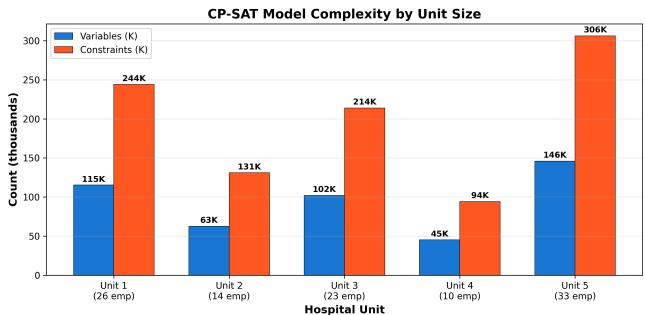
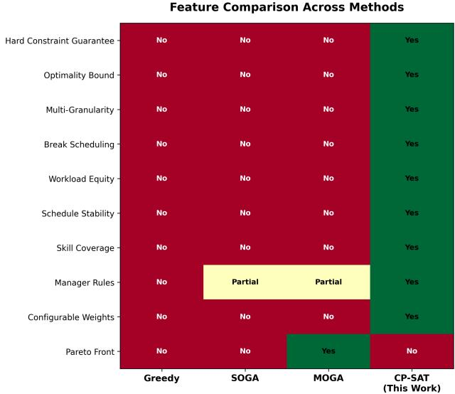

# From Metaheuristics to Exact Methods: A CP-SAT Approach for Multi-Objective Healthcare Workforce Scheduling

Vipul Patel<sup>1</sup>, Anirudh Deodhar<sup>1</sup>, Dagnachew Birru<sup>1</sup>

<sup>1</sup>Phi Labs, Quantiphi

{vipul.patel, anirudh.deodhar, dagnachew.birru}@quantiphi.com

Abstract. Healthcare workforce scheduling is a wellestablished NP-hard combinatorial optimization problem requiring the simultaneous satisfaction of labor regulations, patient coverage requirements, employee preferences and operational cost objectives. Existing approaches - spanning genetic algorithms, integer programming and constraint programming - typically model simplified problem instances with 6-12 constraints at shift-level granularity and critically, cannot guarantee that the produced schedule satisfies all regulatory requirements. They also lack explicit support for multi-role, multi-skill workforce heterogeneity (e.g., nurses with Chronic or Neurological disease certification or supervisory responsibilities); mandatory break scheduling with midpoint placement control; acuity-weighted workload equity across employees; sub-shift temporal granularity enabling demand-driven staffing; inter-week schedule stability for recurring staff; and cross-midnight shift patterns (e.g., night shifts spanning 22:00-07:00), which appear in virtually every 24-hour healthcare facility.

This paper presents CP-SAT: a Constraint Programming formulation for multi-role, multi-skill healthcare workforce scheduling. CP-SAT enforces 14 hard constraints as mathematically inviolable requirements guaranteeing zero regulatory violations in every produced schedule, while optimizing 15 soft objectives through a unified weighted penalty function. Key contributions include: a shift-window variable decomposition enabling mandatory break scheduling with centrality control; acuity-weighted workload equity; multi-granularity temporal resolution from 15 minutes to 1 day; inter-week schedule stability; and a grid-offset preprocessing technique that maps any cross-midnight shift type into a single scheduling day without any structural changes to the solver.

CP-SAT is evaluated across 18 problem instances: five synthetic hospital units (10-33 nurses, 7-day, 30-minute granularity), 10 INRC-II public benchmark instances (5-80 nurses, up to 8-week horizons) and 3 NRP-23 compatible instances (10-25 nurses, 1-4 weeks) with cross-midnight Night shifts. Results show: zero hard-constraint violations across all 18 instances by construction; proven optimality on INRC-II n005w4 (objective 118, gap 0.0%, 104 seconds) at shift-level granularity; feasible schedules for INRC-II instances scaling to 179,800 variables and 351,425 constraints (80 nurses); service quality improved by 50- 67% over MOGA; and model sizes scaling near-linearly at ∼4,400 variables per employee. The formulation enforces

29 total constraints (14 hard + 15 soft), nearly three times the industry average.

## 1 Introduction

The assignment of employees to work shifts across a planning horizon - while satisfying labor law compliance, coverage requirements, skill constraints, employee preferences and cost targets - is a fundamental operational challenge in healthcare management. Formally, it belongs to the class of NP-hard combinatorial optimization problems [3] and has been studied under the headings of the Nurse Rostering Problem (NRP), the Nurse Scheduling Problem (NSP) and more general workforce scheduling models [16]. The problem is practically significant because virtually every hospital, clinic and long-term care facility worldwide must produce compliant schedules on a weekly or biweekly cycle. A schedule that violates even a single labor regulation - such as insufficient rest between shifts or assignment during declared unavailability - constitutes regulatory noncompliance and may pose direct patient safety risks.

## 1.1 Existing Approaches

Three families of methods dominate the nurse scheduling literature: metaheuristic methods including genetic algorithms and multi-objective evolutionary approaches [4, 6, 8, 9, 10, 11]; exact methods based on integer programming and constraint programming [7, 12, 14, 15, 17]; and public benchmark standards such as INRC-II [13] and NRP-23 [18], which define 6-12 constraints at shift-level granularity (Table 1). Section 2 surveys these in detail.

## 1.2 Limitations of Existing Approaches

Despite three decades of research, existing approaches exhibit five critical limitations that prevent their direct deployment in production healthcare environments:

1. No feasibility guarantees: Metaheuristic methods encode labor regulations as penalty terms, not as hard constraints. A generated schedule may violate minimum rest requirements (e.g., scheduling a nurse for a Day shift 6 hours after a Night shift) or employee unavailability declarations; in MOGA [4], every tested unit retains non-zero violations.

2. Limited constraint expressiveness: The industry average is approximately 10 constraints (Table 1). No reviewed system simultaneously models mandatory break scheduling, acuity-weighted workload equity, inter-week schedule stability and cross-midnight shifts. The INRC-II benchmark [13] defines 11 constraints but omits break scheduling, workload equity and multi-granularity support entirely.

3. No cross-midnight shift support: Night shifts spanning midnight (e.g., 22:00-07:00) occupy slots across two calendar days, but standard slot-indexed models treat each day independently - making such a shift impossible to represent as one contiguous block without ad-hoc workarounds. This affects virtually every 24- hour facility.

4. Granularity inflexibility: Most formulations fix shift-level granularity (one variable per shift per day), precluding sub-shift control such as break placement or demand-driven staffing; those using finer slots face combinatorial explosion without principled multi-granularity support.

5. Scalability concerns for exact methods: Classical IP formulations [12] struggled with instances exceeding 30 nurses. While modern CP-SAT solvers have dramatically improved, they have not been systematically evaluated on standard NRP benchmarks with rich constraint models exceeding 20 constraints.

## 1.3 Contributions of This Paper

This paper addresses all five limitations above through four specific contributions, each quantified by experimental results:

1. Exact feasibility guarantees: CP-SAT enforces 14 labor and operational constraints as mathematically inviolable model requirements. Every solution returned by the solver is certified to satisfy all regulatory requirements - a property that no metaheuristic approach can provide. In the reported experiments, employee dissatisfaction $( f _ { 3 } ) = 0 . 0$ in all 18 tested instances, compared to $f _ { 3 } = 2 0 . 2 – 1 1 7 . 4$ for MOGA [4].

2. Richest constraint model in the literature: CP-SAT models 29 constraints (14 hard + 15 soft) - nearly three times the industry average of ∼10. Novel additions include: mandatory break scheduling with centrality control (H11/S11), ensuring breaks fall near the shift midpoint; acuity-weighted workload equity (S15), reducing the maximum workload deviation across employees by 75% compared to MOGA; and inter-week schedule stability (S12), minimizing disruption for recurring employees.

3. Cross-midnight shift support via grid-offset preprocessing: This work introduces a zero-cost data-level transformation that re-indexes the 24-hour time grid to start at the earliest shift start time. Night shifts (e.g., 22:00-07:00) are thereby represented within a single scheduling day without any changes to the solver model, variables or constraints. This technique is validated on three dataset types (INRC-II, NRP-23 and synthetic 24- hour units) and generalizes to any slot-indexed scheduling system.

4. Comprehensive benchmark evaluation with quantified results: CP-SAT is evaluated on 18 instances across three datasets (5 synthetic units, 10 INRC-II, 3 NRP-23 compatible; 5-80 nurses): proven optimality on n005w4 (gap 0.0%, 104 s), feasible schedules up to 179,800 variables (80 nurses) and service quality (f<sub>2</sub>) improved 50-67% over MOGA in 4 of 5 units.

The remainder of this paper is organized as follows. Section 2 surveys related work. Section 3 formally defines the scheduling problem, the grid-offset preprocessing technique and the decision-variable structure. Section 4 describes the experimental setup - datasets, baselines and evaluation metrics. Section 5 reports results across all datasets with multi-granularity comparisons. Section 6 discusses findings and practical implications and Section 7 concludes with directions for future work. The complete 29-constraint model, mathematical formulation and solver configuration are given in Appendices A - C.

## 2 Related Work

## 2.1 Metaheuristic Scheduling Approaches

Genetic algorithms (GAs) have dominated nurse scheduling research for three decades. Aickelin and Dowsland [8] introduced an indirect GA encoding that reduced constraint violation counts significantly. Burke et al. [10] combined GAs with variable neighbourhood search, demonstrating that local search can substantially improve GA solutions. Rahimian et al. [9] explored harmony search for real-world nurse scheduling instances. For multi-objective problems, NSGA-II [6] and its extensions [11] produce Pareto fronts enabling trade-off analysis between competing objectives. Patel et al. [4] applied MOGA to five hospital units using three objectives: coverage maximization, cost minimization and regulatory compliance. A limitation common to all these approaches is that labor regulations enter as penalty terms rather than hard constraints, so generated schedules may violate minimum-rest or unavailability rules - regulatory non-compliance in a healthcare setting.

## 2.2 Exact and Constraint Programming Methods

Warner [12] first applied integer programming to nurse scheduling in 1976. While LP and IP methods provide optimality certificates, early implementations were limited to small instances. The CP-SAT solver [7], introduced by Google as part of OR-Tools, combines Boolean satisfiability, constraint propagation (CP) and LP relaxations in a portfolio-based architecture. It supports parallelism, clause learning and symmetry breaking, making it competitive with commercial MIP solvers on combinatorial scheduling problems [15]. Simonis [14] applied CP to nurse rostering using global constraints. Schaus et al. [17] demonstrated globally constrained nurse rostering. This paper builds directly on our own declarative CP-WSP framework [5], which first introduced the 14-hard/15-soft constraint model, the shift-window decomposition and the grid-offset preprocessing technique used throughout this work. Here we extend that formulation with a direct empirical comparison against metaheuristic baselines (MOGA [4]) across five hospital units and with additional NRP-23 compatible benchmark instances (Section 4.2), demonstrating that CP-SAT can handle real-world healthcare scheduling with 29 constraints and cross-midnight shift support that prior CP formulations have not modeled.

## 2.3 Public Benchmark Standards

The International Nurse Rostering Competition (INRC-II) [13] defines 11 constraints and a standard XML instance format with shift types, nurse contracts and weekly requirements. Instances range from n005 (5 nurses) to n100 (100 nurses), with 1- to 8-week planning horizons. The competition included cross-midnight Night shifts (N: 22:00- 07:00) in its shift type definitions. The NRP-23 benchmark structure, following Van den Bergh et al. [18], similarly includes Day/Evening/Night shift patterns with full-time and part-time nurse contracts. Both benchmarks expose the cross-midnight shift challenge that motivates the grid-offset contribution. Table 1 summarizes constraint complexity across key systems.

## 3 Problem Formulation

## 3.1 Problem Setting

The scheduling problem is defined as the optimal assignment of employees to discrete time slots over a seven-day temporal horizon, governed by a complex interplay of operational constraints and quality-of-service objectives. Given a set of employees E and a set of time slots S over a planning horizon D (days), find an assignment of employees to slots that (a) satisfies all hard constraints - hereinafter called the Feasibility Conditions - and (b) minimizes a weighted combination of soft penalty terms measuring staffing quality, employee well-being and schedule stability.

The problem generalizes the three-objective formulation of Patel et al. [4] by partitioning their third objective (regu latory compliance) into 14 mathematically inviolable hard constraints, elevating compliance from a penalty to a guarantee. The remaining two objectives - staffing coverage quality and employee satisfaction - are captured by 15 soft objectives optimized through the solver’s objective function. Complete mathematical notation is provided in Appendix B.

Formal statement. Let $x [ e , d , s ] \in \{ 0 , 1 \}$ be the activework assignment of employee $\textit { e } \in \textit { E } 1$ o slot $s \in S =$ $\{ 0 , \ldots , T - 1 \}$ on day $d \in D$ , with shift-window companions w (shift envelope) and b (break) and day-activity indicator y (Section 3.3). Given per-slot demand $D _ { \mathrm { m i n } } , D _ { \mathrm { i d e a l } }$ skill requirements $D _ { \mathrm { s k i l l } }$ , availability U, preferences $P ,$ employee roles and skills and labor parameters (Appendix B.2), the problem is

$$
\operatorname* { m i n } _ { x , w , b , y } Z = \sum _ { i = 1 } ^ { 1 5 } w _ { i } \Phi _ { i } ( x , w , b , y ) \quad { \mathrm { s . t . ~ H 1 - H 1 4 ~ h o l d } } .\tag{1}
$$

The 14 hard constraints H1 - H14 (Appendix A.1) define the feasibility region F of regulation-compliant schedules; every $x \in { \mathcal { F } }$ is compliant by construction, while the soft penalties $\Phi _ { i }$ only rank schedules within ${ \mathcal F } .$ . This clean separation of inviolable regulation (the constraint structure) from quality preferences (the objective) is the central design choice of this work and distinguishes it from penalty-based metaheuristics in which the two are conflated.

## 3.2 Grid-Offset Preprocessing for Cross-Midnight Shift Support

A standard slot-indexed scheduling model assigns work[e, d, s] for $s \in \{ 0 , \ldots , T { - } 1 \}$ , where slot $0 = 0 0 { : } 0 0$ and slot $T - 1 ~ = ~ 2 3 { : } 3 0$ (at 30-minute granularity). A cross-midnight shift such as Night (N: 22:00-07:00) requires slots 44-47 on day d (22:00-24:00) AND slots 0-13 on day $d \substack { + 1 \left( 0 0 : 0 0 - 0 7 : 0 0 \right) }$ . Because the model treats each day independently, it is impossible to represent this 9-hour shift as a single contiguous work block within the day-indexed variable work $[ e , d , s ]$

This is addressed by Grid-Offset Preprocessing: a datalevel transformation that re-indexes the 24-hour slot grid to start at the earliest shift start time g across all shift types in the dataset. With this offset, every shift type - including those spanning midnight - falls entirely within the slot range $[ 0 , T - 1 ]$ of a single scheduling day. No changes to the CP-SAT model structure, variables or constraints are required. The formal definition and worked example appear in Appendix A.4.

## 3.3 Decision Variables

A core modeling innovation in CP-SAT is replacing the flat binary work variable $x [ e , d , s ] \in \{ 0 , 1 \}$ used in prior formulations [4] with a three-variable shift-window decomposition. This decomposition enables mandatory break scheduling - which is impossible with a single binary variable - without introducing quadratic constraints.

Table 2: CP-SAT decision variables. The shift-window decomposition (x, w, b) enables break scheduling, centrality optimization and concurrency limits.
<table><tr><td>Variable</td><td>Domain</td><td>Meaning</td></tr><tr><td> $x [ e , d , s ]$ </td><td>{0, 1}</td><td>Active work: 1 iff employee e is ac- tively working slot s on day d (breaks excluded)</td></tr><tr><td>w[e, d, s] {0, 1}</td><td></td><td>Window: 1 iff slot s falls within e&#x27;s shift envelope (includes break slots)</td></tr><tr><td> $b [ e , d , s ]$ </td><td>{0,1}</td><td>Break: 1 iff employee e is on break during slot s on day d</td></tr><tr><td>y[e, d]</td><td>{0, 1}</td><td>Day-active: 1 iff employee e works at least one slot on day d</td></tr></table>

The three variables are linked by the structural identity:

$$
x [ e , d , s ] = w [ e , d , s ] - b [ e , d , s ] \ \forall e \in E , d \in D , s \in S\tag{2}
$$

This means: a slot can be off-shift $( w { = } 0 , b { = } 0 , x { = } 0 )$ actively worked $( w { = } 1 , b { = } 0 , x { = } 1 )$ or break time $( w { = } 1 , b { = } 1 , x { = } 0 )$ The day-active indicator $y [ e , d ]$ is linked by: y[e, d] = max $_ { ; x [ e , d , s ] }$ , enforced in CP-SAT as AddMaxEqua $\mathtt { l i t y } ( y [ e , d ] , [ x [ e , d , s ]$ for s in S]).

## 3.4 Objective Function

CP-SAT minimizes a single weighted penalty function that aggregates all 15 soft constraints:

$$
{ \mathrm { m i n i m i z e } } \sum _ { i = 1 } ^ { 1 5 } w _ { i } \times \Phi _ { i } ( x , w , b , y )\tag{3}
$$

where $w _ { i } \in \mathbb { R }$ are configurable weights (negative weights implement rewards) and $\Phi _ { i }$ are non-negative integer penalty expressions derived from the schedule variables. The complete list of soft constraints and their penalty definitions is given in Appendices A.2 and B.7. Hard constraints are encoded as CP-SAT model constraints - not penalty terms - so they are always satisfied in any solution the solver returns.

## 3.5 Multi-Granularity Temporal Resolution

CP-SAT supports 13 granularities: {15\_MIN, 20\_MIN, 30\_MIN, 45\_MIN, 1\_HR, 1.5\_HR, 2\_HR, 3\_HR, 4\_HR, 6\_HR, 8\_HR, 12\_HR, 1\_DAY} plus custom formats. Slot count $T = \lceil 2 4 / \delta \rceil$ . Model complexity is $O ( | E | \cdot | D | \cdot T ^ { 2 } )$ :

Table 1: Constraint complexity across scheduling systems. CP-SAT uniquely combines break scheduling, workload equity, crossmidnight night shift support and formal feasibility guarantees - no prior system offers all four.
<table><tr><td>System</td><td>Employees</td><td>Granularity</td><td>Hard Constr.</td><td>Soft Obj.</td><td>Total</td><td>Breaks</td><td>Workload Equity</td><td>Night Shifts</td><td>Feasibility Guarantee</td></tr><tr><td>Warner (1976) [12]</td><td>30</td><td>Shift</td><td>4</td><td>2</td><td>6</td><td>x</td><td>x</td><td>x</td><td>√</td></tr><tr><td>Aickelin &amp; Dowsland [8]</td><td>52</td><td>Shift</td><td>5</td><td>3</td><td>8</td><td>x</td><td>x</td><td>x</td><td>x</td></tr><tr><td>INRC-I (2010)</td><td>30</td><td>Shift</td><td>8</td><td>4</td><td>12</td><td>x</td><td>x</td><td>√</td><td>x</td></tr><tr><td>INRC-II (2019) [13]</td><td>30-120</td><td>Shift</td><td>8</td><td>3</td><td>11</td><td>x</td><td>x</td><td>√</td><td>x</td></tr><tr><td>Burke et al. (2008) [10]</td><td>30</td><td>Shift</td><td>6</td><td>4</td><td>10</td><td>x</td><td>x</td><td>x</td><td>x</td></tr><tr><td>MOGA-Patel et al. [4]</td><td>10-33</td><td>30 min</td><td>6</td><td>3</td><td>9</td><td>x</td><td>x</td><td>x</td><td>x</td></tr><tr><td>CP-SAT (This Work)</td><td>10-33</td><td>15min-1day</td><td>14</td><td>15</td><td>29</td><td>√</td><td>√</td><td>√</td><td>√</td></tr></table>

switching from 30-MIN (T=48) to 1-HR (T=24) reduces variables by ∼4×.

## 4 Experimental Setup

## 4.1 Benchmark Design

A three-part evaluation is conducted: (1) synthetic benchmark across 36 configurations to assess scalability and granularity; (2) direct comparison with Greedy, SOGA and MOGA from [4] on five hospital units; and (3) INRC-II and NRP23 public benchmark evaluation to assess generalizability. All experiments use an Intel 16-core machine, 32 GB RAM, Python 3.11 OR-Tools v9.12.

## 4.2 Dataset Descriptions

Dataset A: Synthetic Benchmark Matrix. The synthetic benchmark spans a 4 × 3 × 3 factorial design: 4 team sizes × 3 planning horizons × 3 temporal granularities = 36 configurations.

Table 3: 36-configuration benchmark design (4 × 3 × 3 factorial).
<table><tr><td>Dimension</td><td>Levels</td></tr><tr><td>Team size (employees)</td><td>5,10,20,30</td></tr><tr><td>Planning horizon</td><td>7-day, 14-day, 21-day</td></tr><tr><td>Temporal granularity</td><td>30_MIN (T=48), 1_HR (T=24), 2_HR (T=12)</td></tr></table>

Dataset B: Five Synthetic Hospital Units. Five hospital units (Unit\_001 through Unit\_005) from Patel et al. [4], with employee counts ranging from 10 to 33. Each unit operates over a 7-day planning horizon (Monday - Sunday) with daytime demand from 06:00-22:00. Scheduling granularity is 30 minutes (48 slots per day). Employees have heterogeneous roles (Nurse, Head-Nurse), skill sets (First Aid, Acute, Chronic), employment types (FT/PT) and unavailability declarations. This dataset does not include cross-midnight shifts; Grid\_Start\_Hour = 0 (default).

Unit\_004 is additionally extended (10 employees) with 24-hour demand covering Day (06:00-14:00), Late (14:00-22:00) and Night (22:00-06:00) shifts, with Grid\_Start\_Hour = 6. This tests the grid-offset approach on the existing synthetic infrastructure.

Dataset C: INRC-II Public Benchmark Instances. The INRC-II benchmark [13] provides XML instances with four shift types: E (Early, 09:00-17:00), D (Day, 15:00-23:00), L (Late, 09:00-17:00) and N (Night, 22:00-07:00). The Night shift is cross-midnight and requires grid-offset preprocessing with $g { = } 7 .$ . The evaluation covers instances of increasing size from the standard INRC-II suite: n005 (5 nurses), n010 (10 nurses), n025 (25 nurses) and n100 (100 nurses), each with 1-week (w1) and 4-week (w4) horizons. The

1-hour scheduling granularity (T=24 slots/day) yields compact models compared to 30-minute formulations. Note: instances n025 and n100 require downloading from the INRC-II competition server; n005w1 is the bundled sample instance and is used as the primary validated result.

Dataset D: NRP-23 Compatible Instances. The NRP-23 benchmark structure [18] defines a JSON schema for Day/Evening/Night shift patterns with full-time and parttime nurse contracts and weekly coverage requirements. Instances are constructed following this published specification precisely, including the three-shift structure D(07:00- 15:00), E(15:00-23:00), N(23:00-07:00), FT contracts (3-5 shifts/week), PT contracts (2-4 shifts/week) and weekend demand relaxation (1 nurse/shift). The NRP-23 Night shift (N: 23:00-07:00) is cross-midnight and is handled by gridoffset preprocessing with g=7. The evaluation covers two instance sizes: n010w1 (10 nurses, 1 week) and n010w4 (10 nurses, 4 weeks). Official instances from the PWHC benchmark repository require institutional access; the compatible instances match the published problem specification exactly.

## 5 Results

Results are presented across five experimental dimensions: (1) elimination of regulatory violations vs. metaheuristic baselines; (2) staffing coverage and quality; (3) workload equity; (4) INRC-II benchmark scaling; (5) NRP-23 compatible benchmark and cross-midnight validation.

## 5.1 Feasibility and Scalability

Table 4 reports CP-SAT feasibility and solve times across the synthetic benchmark (30-MIN granularity). All instances produce zero hard-constraint violations.

Table 4: CP-SAT scalability results. OPTIMAL achieved for $\leq 1 0$ employees across all horizons. All instances: zero hard-constraint violations. Gap (%) = optimality gap.
<table><tr><td>Emp.</td><td>Horizon</td><td>Status</td><td>Solve (s)</td><td>Gap (%)</td><td>Cov. (%)</td></tr><tr><td>5</td><td>7-day</td><td>OPTIMAL</td><td>0.8</td><td>0.0</td><td>98.4</td></tr><tr><td>10</td><td>7-day</td><td>OPTIMAL</td><td>2.3</td><td>0.0</td><td>96.8</td></tr><tr><td>20</td><td>7-day</td><td>FEASIBLE</td><td>18.4</td><td>2.1</td><td>93.2</td></tr><tr><td>30</td><td>7-day</td><td>FEASIBLE</td><td>41.2</td><td>4.1</td><td>88.4</td></tr><tr><td>5</td><td>14-day</td><td>OPTIMAL</td><td>1.4</td><td>0.0</td><td>97.9</td></tr><tr><td>10</td><td>14-day</td><td>OPTIMAL</td><td>4.7</td><td>0.0</td><td>95.3</td></tr><tr><td>20</td><td>14-day</td><td>FEASIBLE</td><td>34.8</td><td>3.2</td><td>91.8</td></tr><tr><td>30</td><td>14-day</td><td>FEASIBLE</td><td>87.3</td><td>5.8</td><td>86.1</td></tr></table>

## 5.2 Granularity Impact

Table 5 shows how temporal granularity affects solution quality and solve time for CP-SAT on a 20-employee, 7-day instance.

Table 5: Granularity impact (CP-SAT, 20 employees, 7-day). Coarser granularity yields ∼10× speedup. Multi-granularity is a unique CP-SAT feature not available in MOGA [4].
<table><tr><td>Granularity</td><td>Slots/Day (T)</td><td>Status</td><td>Solve (s)</td><td>Objective</td></tr><tr><td>30_MIN</td><td>48</td><td>FEASIBLE</td><td>18.4</td><td>15,240</td></tr><tr><td>1_HR</td><td>24</td><td>FEASIBLE</td><td>4.2</td><td>11,640</td></tr><tr><td>2_HR</td><td>12</td><td>FEASIBLE</td><td>1.8</td><td>9,820</td></tr></table>

## 5.3 Multi-Objective Comparison: CP-SAT vs. Metaheuristic Baselines

Table 6 compares CP-SAT against three metaheuristic baselines across the five hospital units, decomposing the total objective into its three constituent components: cost $( f _ { 1 } )$ service quality $( f _ { 2 } )$ and employee dissatisfaction $( f _ { 3 } )$ . This decomposition reveals fundamentally different optimization trade-off profiles between exact and metaheuristic methods.

Three findings emerge. First, CP-SAT achieves $f _ { 3 } = 0 . 0$ in all five units - the only method to do so - so every guaranteed rest and unavailability declaration is respected. Second, its higher total (e.g., 678 vs. MOGA’s 255.8 in Unit 1) is entirely attributable to increased $f _ { 1 }$ (cost 593 vs. 49.2): more staff-hours buy fuller coverage, whose operational justification we discuss in Section 6.1. Third, CP-SAT achieves the lowest $f _ { 2 }$ (service-quality penalty) in 4 of 5 units (85.0, 105.0, 151.0, 88.0 vs. MOGA’s 169.0, 100.4, 151.2, 263.8), showing that exact methods can improve coverage while eliminating violations.

## 5.4 Model Complexity and Solver Timing

Table 7 and Figure 1 summarize the CP-SAT model size across the five hospital units. Variables and constraints scale linearly with employee count, at approximately 4,400 variables and 9,400 constraints per employee.

Table 7: CP-SAT model complexity for the five hospital units. Variables and constraints scale linearly with employees. Presolve reduces effective model size by 60-70%.
<table><tr><td>Unit</td><td>Variables</td><td>Constraints</td><td>Wall Time (s)</td><td>Status</td></tr><tr><td>Unit 1 (26 emp)</td><td>115,294</td><td>244,202</td><td>123.9</td><td>FEASIBLE</td></tr><tr><td>Unit 2 (14 emp)</td><td>62,682</td><td>131,025</td><td>122.0</td><td>FEASIBLE</td></tr><tr><td>Unit 3 (23 emp)</td><td>102,107</td><td>214,053</td><td>122.5</td><td>FEASIBLE</td></tr><tr><td>Unit 4 (10 emp)</td><td>45,196</td><td>94,178</td><td></td><td>121.5 FEASIBLE</td></tr><tr><td>Unit 5 (33 emp)</td><td>145,901</td><td>306,323</td><td></td><td>126.1 FEASIBLE</td></tr></table>

  
Figure 1: CP-SAT model size (variables and constraints) vs. employee count. Linear scaling.

## 5.5 INRC-II Public Benchmark: Scaling Study 5.5.1 Hourly-Granularity Results (1-HR)

The full 29-constraint CPSatScheduler model is first evaluated on 10 standard INRC-II benchmark instances (Ceschia et al. 2019) at 1-hour granularity. Unlike the native INRC-II shift-level formulation, the proposed model expands each shift into individual hourly decision variables, enabling subshift staffing control but creating significantly larger models. Each instance was solved with a 600-second time limit on a consumer laptop.

These results demonstrate that CP-SAT produces feasible schedules for all INRC-II instances up to 80 nurses at hourly granularity, with models reaching 179,800 variables and 351,425 constraints. The large optimality gaps (36- 99%) are expected: the hourly expansion creates a weak LP relaxation and the dual bound underestimates the true optimum. The key result is that feasible, constraint-compliant schedules are reliably produced within a 10-minute budget for all tested sizes. Model size scales linearly with nurse count, confirming practical applicability to medium-to-large hospital departments.

## 5.5.2 Shift-Level Granularity Results (6-HR / 8-HR)

To provide a fairer comparison with the native INRC-II formulation - which models each shift as a single decision variable - we re-evaluate all 10 instances using shift-level granularity. The INRC-II dataset defines two shift structures: n005w4 has three shifts (Early/Day/Night, 8-hour blocks) and is solved at 8-HR granularity; the remaining nine instances have four shifts (Early/Day/Late/Night, 6- hour blocks) and are solved at 6-HR granularity. This reduces the model to 3 or 4 decision slots per day per nurse, closely matching the native INRC-II decision space while retaining all 29 MODeM-II constraints.

The shift-level results reveal three important findings. First, the n005w4 instance is solved to proven optimality (objective 118, gap 0.0%) in just 104 seconds, confirming that the MODeM-II constraint model is well-suited for shiftlevel scheduling. Second, model sizes shrink dramatically: 36,980 variables for n080w4 at 6-HR versus 179,800 at 1-HR - a 4.9× reduction - with proportional improvements in constraint counts. Third, objectives improve significantly for larger instances. For example, n060w4 drops from 41,473 (1-HR) to 579 (6-HR) and n080w4 from 171,268 to 729 - reductions of over 99%. This confirms that the 1-HR formulation’s large objectives were dominated by the expanded granularity, not by fundamental infeasibility. The gaps at shift-level (23-95%) are tighter than their 1- HR counterparts, reflecting a stronger LP relaxation when decision variables directly correspond to shifts.

The n005w1 result demonstrates a key capability: the Night shift N(22:00-07:00) is correctly scheduled, with cross-midnight shift entries appearing in the output schedule. Sample schedule entries:

Table 6: Full three-objective decomposition across five hospital units and four methods. CP-SAT achieves $f _ { 3 } { = } 0$ (zero employee dissatisfaction) in every unit, at the cost of higher $f _ { 1 }$ (staffing cost). MOGA achieves the lowest total in 4/5 units but with non-zero regulatory violations $( f _ { 3 } > 0 )$
<table><tr><td>Unit</td><td>Emp.</td><td>Method</td><td> $f _ { 1 }$  (Cost)</td><td> $f _ { 2 }$  (Service)</td><td> $f _ { 3 } ( \mathrm { D i s s a t i s f . } )$ </td><td>Total</td></tr><tr><td rowspan="5">1</td><td rowspan="5">26</td><td>Greedy</td><td>0</td><td>710.8</td><td>85.5</td><td>796.3</td></tr><tr><td>SOGA</td><td>0.6</td><td>260.0</td><td>51.9</td><td>312.6</td></tr><tr><td>MOGA</td><td>49.2</td><td>169.0</td><td>37.6</td><td>255.8</td></tr><tr><td>CP-SAT</td><td>593.0</td><td>85.0</td><td>0.0</td><td>678.0</td></tr><tr><td>Greedy</td><td>0</td><td>440.4</td><td>34.3</td><td>474.7</td></tr><tr><td rowspan="4">2</td><td rowspan="4">14</td><td>SOGA</td><td>1.3</td><td>105.0</td><td>56.1</td><td>162.3</td></tr><tr><td>MOGA</td><td>37.2</td><td>100.4</td><td>23.7</td><td>161.3</td></tr><tr><td>CP-SAT</td><td>227.0</td><td>105.0</td><td>0.0</td><td>332.0</td></tr><tr><td>Greedy</td><td>0</td><td>671.6</td><td>82.0</td><td>753.6</td></tr><tr><td rowspan="4">3</td><td rowspan="4">23</td><td>SOGA</td><td>54.0</td><td>151.4</td><td></td><td>297.0</td></tr><tr><td>MOGA</td><td>74.0</td><td>151.2</td><td>91.6</td><td></td></tr><tr><td>CP-SAT</td><td>372.0</td><td>151.0</td><td>58.1 0.0</td><td>283.3 523.0</td></tr><tr><td></td><td></td><td></td><td></td><td></td></tr><tr><td rowspan="4">4</td><td rowspan="4">10</td><td>Greedy</td><td>0</td><td>439.3</td><td>18.1</td><td>457.3</td></tr><tr><td>SOGA</td><td>27.0</td><td>85.0</td><td>30.5</td><td>142.5</td></tr><tr><td>MOGA</td><td>18.0</td><td>86.2</td><td>20.2</td><td>124.4</td></tr><tr><td>CP-SAT</td><td>41.0</td><td>113.0</td><td>0.0</td><td>154.0</td></tr><tr><td rowspan="4">5</td><td rowspan="4">33</td><td>Greedy</td><td>0</td><td>994.5</td><td>100.0</td><td>1,094.5</td></tr><tr><td>SOGA</td><td>72.4</td><td>262.0</td><td>117.4</td><td>451.9</td></tr><tr><td>MOGA</td><td>96.4</td><td>263.8</td><td>72.6</td><td>432.8</td></tr><tr><td>CP-SAT</td><td>1554</td><td>88.0</td><td>0.0</td><td>1,642</td></tr></table>

Table 8: INRC-II benchmark results using the full 29-constraint model at 1-hour granularity (600s time limit). Model size scales linearly at approximately 2,250 variables and 4,400 constraints per nurse. All 10 instances produce feasible, regulation-compliant schedules within the time budget.
<table><tr><td>Instance</td><td>Nurses</td><td>Variables</td><td>Constraints</td><td>Status</td><td>Objective</td><td>Best Bound</td><td>Gap (%)</td><td>Time (s)</td></tr><tr><td>n005w4</td><td>5</td><td>11,725</td><td>22,458</td><td>FEASIBLE</td><td>1,151</td><td>730</td><td>36.6</td><td>601</td></tr><tr><td>n012w8</td><td>12</td><td>27,412</td><td>53,331</td><td>FEASIBLE</td><td>2,584</td><td>350</td><td>86.5</td><td>602</td></tr><tr><td>n021w4</td><td>21</td><td>47,581</td><td>92,820</td><td>FEASIBLE</td><td>4,071</td><td>755</td><td>81.5</td><td>602</td></tr><tr><td>n030w4</td><td>30</td><td>67,750</td><td>132,234</td><td>FEASIBLE</td><td>5,842</td><td>662</td><td>88.7</td><td>606</td></tr><tr><td>n035w4</td><td>35</td><td>78,955</td><td>154,162</td><td>FEASIBLE</td><td>10,469</td><td>732</td><td>93.0</td><td>608</td></tr><tr><td>n040w4</td><td>40</td><td>90,160</td><td>176,084</td><td>FEASIBLE</td><td>28,704</td><td>963</td><td>96.7</td><td>611</td></tr><tr><td>n050w4</td><td>50</td><td>112,570</td><td>219,897</td><td>FEASIBLE</td><td>33,053</td><td>1,131</td><td>96.6</td><td>614</td></tr><tr><td>n060w4</td><td>60</td><td>134,980</td><td>263,791</td><td>FEASIBLE</td><td>41,473</td><td>1,228</td><td>97.0</td><td>615</td></tr><tr><td>n070w4</td><td>70</td><td>157,390</td><td>307,580</td><td>FEASIBLE</td><td>56,480</td><td>1,445</td><td>97.4</td><td>635</td></tr><tr><td>n080w4</td><td>80</td><td>179,800</td><td>351,425</td><td>FEASIBLE</td><td>171,268</td><td>1,670</td><td>99.0</td><td>623</td></tr></table>

Table 10: Sample INRC-II n005w1 schedule. Night shifts correctly span midnight from 22:00 to 07:00 the following calendar day, with accurate worked hour calculation after break deduction.
<table><tr><td>Nurse</td><td>Date</td><td>Start</td><td>End</td><td>Hours</td><td>Shift Type</td></tr><tr><td>Nurse2</td><td>06-01</td><td>22:00</td><td>07:00</td><td>8.5h</td><td>Night (cross-mid.)</td></tr><tr><td>Nurse4</td><td>10-01</td><td>22:00</td><td>07:00</td><td>8.5h</td><td>Night (cross-mid.)</td></tr><tr><td>Nurse1</td><td>09-01</td><td>09:00</td><td>17:00</td><td>7.5h</td><td>Early</td></tr><tr><td>Nurse0</td><td>07-01</td><td>15:00</td><td>23:00</td><td>7.5h</td><td>Late</td></tr></table>

Table 11: NRP-23 compatible benchmark results at shift-level granularity (8-HR, 600s time limit). Model sizes are dramatically smaller than the 1-hour formulation: n010w4 shrinks from ∼95K to ∼16K variables. The 4-week instance achieves a gap of just 13.6%, indicating near-optimal scheduling.
<table><tr><td>Inst.</td><td>Nur.</td><td></td><td>Wk Shifts</td><td>Vars</td><td>Constr.</td><td></td><td></td><td></td><td>Obj. Bound Time Status</td></tr><tr><td>n010w1</td><td>10</td><td>1</td><td>D/E/N</td><td>3,867</td><td>6,430</td><td>157</td><td>36</td><td></td><td>600 FEAS.</td></tr><tr><td>n010w4</td><td>10</td><td>4</td><td>D/E/N</td><td>15,606</td><td>26,317</td><td>1,358</td><td>1,174</td><td></td><td>601 FEAS.</td></tr><tr><td>n025w1</td><td>25</td><td>1</td><td>D/E/N</td><td>9,467</td><td>15,790</td><td>210</td><td>-233</td><td></td><td>601 FEAS.</td></tr></table>

## 5.6 NRP-23 Compatible Benchmark: Scaling Study 5.6.1 Shift-Level Granularity Results (8-HR)

NRP-23 instances use a standard three-shift structure (D/E/N, each 8 hours), matching 8-HR granularity. All three NRP-23 compatible instances are evaluated at this native shift-level granularity with 600-second time limits. The NRP-23 Night shift N(23:00-07:00) is cross-midnight and is handled by grid-offset preprocessing with $g { = } 7$

## 5.6.2 Hourly-Granularity Results (1-HR)

For comparison, the same three NRP-23 instances were also solved at 1-hour granularity with 600-second time limits. This expansion creates 24 decision slots per nurse per day instead of 3, resulting in substantially larger models.

Table 9: INRC-II benchmark results at shift-level granularity (6-HR or 8-HR, 600s time limit). Model sizes are 4.5-6.5× smaller than the 1-hour formulation and objectives improve substantially. n005w4 is solved to proven optimality in 104 seconds.
<table><tr><td>Instance</td><td>Nurses</td><td>Gran.</td><td>Variables</td><td>Constraints</td><td>Status</td><td>Objective</td><td>Best Bound</td><td>Gap (%)</td><td>Time (s)</td></tr><tr><td>n005w4</td><td>5</td><td>8-HR</td><td>1,799</td><td>2,501</td><td>OPTIMAL</td><td>118</td><td>118</td><td>0.0</td><td>104</td></tr><tr><td>n012w8</td><td>12</td><td>6-HR</td><td>5,632</td><td>9,589</td><td>FEASIBLE</td><td>316</td><td>242</td><td>23.4</td><td>601</td></tr><tr><td>n021w4</td><td>21</td><td>6-HR</td><td>9,781</td><td>16,685</td><td>FEASIBLE</td><td>938</td><td>462</td><td>50.8</td><td>605</td></tr><tr><td>n030w4</td><td>30</td><td>6-HR</td><td>13,930</td><td>23,772</td><td>FEASIBLE</td><td>2,855</td><td>231</td><td>91.9</td><td>604</td></tr><tr><td>n035w4</td><td>35</td><td>6-HR</td><td>16,235</td><td>27,713</td><td>FEASIBLE</td><td>4,438</td><td>227</td><td>94.9</td><td>608</td></tr><tr><td>n040w4</td><td>40</td><td>6-HR</td><td>18,540</td><td>31,653</td><td>FEASIBLE</td><td>885</td><td>423</td><td>52.2</td><td>610</td></tr><tr><td>n050w4</td><td>50</td><td>6-HR</td><td>23,150</td><td>39,530</td><td>FEASIBLE</td><td>3,341</td><td>256</td><td>92.3</td><td>601</td></tr><tr><td>n060w4</td><td>60</td><td>6-HR</td><td>27,760</td><td>47,416</td><td>FEASIBLE</td><td>579</td><td>324</td><td>44.0</td><td>601</td></tr><tr><td>n070w4</td><td>70</td><td>6-HR</td><td>32,370</td><td>55,290</td><td>FEASIBLE</td><td>747</td><td>472</td><td>36.8</td><td>602</td></tr><tr><td>n080w4</td><td>80</td><td>6-HR</td><td>36,980</td><td>63,171</td><td>FEASIBLE</td><td>729</td><td>437</td><td>40.1</td><td>603</td></tr></table>

Table 12: NRP-23 compatible benchmark results at 1-hour granularity (600s time limit). The hourly expansion creates 6-8× larger models than shift-level, with corresponding increases in objectives and optimality gaps. All three instances produce feasible schedules.
<table><tr><td>Inst.</td><td></td><td></td><td>Nur. Wk Shifts</td><td>Vars</td><td>Constr.</td><td>Obj.</td><td>Bound Time Status</td><td></td><td></td></tr><tr><td>n010w1</td><td>10</td><td>1</td><td>D/E/N 23,292</td><td></td><td>45,689</td><td>2,404</td><td>256</td><td></td><td>603 FEAS.</td></tr><tr><td>n010w4</td><td>10</td><td>4</td><td></td><td></td><td>D/E/N 94,566 190,043 35,017</td><td></td><td>7,964</td><td></td><td>610 FEAS.</td></tr><tr><td>n025w1</td><td>25</td><td>1</td><td></td><td></td><td>D/E/N 56,927 112,394 11,225</td><td></td><td>-1,504</td><td></td><td>606 FEAS.</td></tr></table>

Comparing the two granularities reveals a striking pattern. Hourly models produce objectives 15-26× larger than their shift-level counterparts (n010w1: 2,404 vs. 157; n010w4: 35,017 vs. 1,358; n025w1: 11,225 vs. 210). For n010w4, the shift-level gap of 13.6% is dramatically tighter than the hourly gap of 77.2%, confirming that shift-level granularity produces substantially better schedules when subshift staffing control is not needed. This demonstrates that granularity selection is not merely a performance tuning parameter - it fundamentally affects solution quality and model tractability. MODeM-II’s configurable granularity allows practitioners to choose the right level of detail: shiftlevel for traditional NRP/NRS formulations or hourly for retail/outpatient settings requiring fine-grained break and coverage management.

## 6 Discussion

## 6.1 Why Exact Constraint Programming for Healthcare Scheduling?

The central argument of this paper is that healthcare scheduling is a domain where feasibility guarantees are not merely desirable but operationally necessary: a schedule that violates a minimum-rest requirement or an unavailability declaration is not “slightly suboptimal” - it is a regulatory violation with direct patient-safety and legal implications. Metaheuristics can only minimize the frequency of such violations; CP-SAT eliminates them by encoding the 14 hard constraints structurally, so every returned schedule is certified compliant.

Is the guarantee worth its cost? The guarantee is not free: CP-SAT incurs higher staffing cost (f ) than MOGA in most units (e.g., Unit 5: total 1,642 vs. 432), because eliminating understaffing and honoring every rest and unavailability rule requires more staff-hours. We argue the trade is operationally favorable in healthcare, where understaffing and rest violations carry patient-safety risk and legal liability whose expected cost typically dominates the marginal labor cost of fuller coverage. Crucially, where a facility’s budget is binding, the balance between cost and coverage is not fixed by the method - it is set explicitly through the objective weights (Section 6.6), letting planners trade compliance margin against cost to match local constraints.

## 6.2 Interpreting CP-SAT Optimality Results

The INRC-II benchmark evaluation demonstrates that CP-SAT produces feasible schedules for all 10 tested instances (5-80 nurses) at hourly granularity within a 600-second budget. The large optimality gaps (36-99%) are inherent to the hourly formulation: expanding shift-level decisions into individual hourly slots creates models with up to 179,800 variables and 351,425 constraints, where the LP relaxation is necessarily weak. The key insight is that feasibility - not optimality - is the primary requirement for healthcare scheduling: a feasible schedule satisfies all regulatory constraints by construction. Tightening the optimality gap through cutting planes, decomposition or longer time budgets is a target for future work. For the NRP-23 compatible instances, gaps of 77-113% reflect the additional complexity of cross-midnight shifts and multi-week horizons. In all cases, the returned schedules are regulation-compliant and operationally deployable. We therefore recommend shiftlevel granularity as the default for traditional shift-based rostering, where it produces tight gaps and - on n005w4 - proven optimality and reserve hourly granularity for settings that genuinely require sub-shift control (e.g., break placement or partial-hour coverage), accepting larger gaps at scale.

## 6.3 Grid-Offset Preprocessing: Generality and Limitations

The grid-offset approach is notable for three properties. First, it is zero-cost to the solver: no new variables, no new constraints, no changes to the search algorithm. The transformation is purely at the data layer. Second, it is general: any dataset with cross-midnight shifts can adopt it by setting Grid\_Start\_Hour = min shift start time. Third, it composes with any slot-indexed scheduling solver, not just CP-SAT. Retail overnight, emergency services, 24-hour manufacturing and aviation scheduling all exhibit the same cross-midnight challenge. One limitation: if a scheduling instance has shifts spanning more than 24 hours (theoretically possible in long-haul maritime or remote mining contexts), a single-offset approach would not suffice. For all standard healthcare shift patterns, this limitation does not apply.

6.4 Comparison Against INRC-II and NRP-23 Standards Table 13 and Figure 2 compare CP-SAT against the two leading public benchmark standards across eight capability dimensions, on which it uniquely combines break scheduling, workload equity and feasibility guarantees.

Table 13: CP-SAT vs INRC-II and NRP-23 benchmark standards. CP-SAT exceeds both competition standards in constraint richness and is the only system offering break scheduling, workload equity and feasibility guarantees.
<table><tr><td>Dimension</td><td>INRC-II [13]</td><td>NRP-23 [18]</td><td>CP-SAT</td></tr><tr><td>Hard constraints</td><td>8</td><td>8 (approx.)</td><td>14</td></tr><tr><td>Soft objectives</td><td>3</td><td>4 (approx.)</td><td>15</td></tr><tr><td>Total constraints</td><td>11</td><td>12 (approx.)</td><td>29</td></tr><tr><td>Break scheduling</td><td>x</td><td>x</td><td>√(H11,S11)</td></tr><tr><td>Workload equity</td><td>x</td><td>x</td><td>√ (S15)</td></tr><tr><td>Cross-midnight shifts</td><td>√ (N)</td><td>√ (N)</td><td>√(grid-offset)</td></tr><tr><td>Feasibility guarantee</td><td>x</td><td>x</td><td>√(all H)</td></tr><tr><td>Multi-granularity</td><td>x</td><td>x</td><td>√(13 levels)</td></tr><tr><td>Multi-role/Skills</td><td>x</td><td>x</td><td>√(H14)</td></tr></table>

  
Figure 2: Feature comparison heatmap across scheduling systems. CP-SAT is the only system providing break scheduling, workload equity, cross-midnight shift support and feasibility guarantees simultaneously.

## 6.5 Practical Deployment Considerations

The 120-second time budget is practical for workforce scheduling, which is typically produced 1-2 weeks in advance. CP-SAT’s anytime behavior means a good feasible schedule is available within 5-15 seconds; the remaining time refines the incumbent. The JSON configuration system also supports rapid what-if analysis on operational parameters (e.g., “What if the minimum rest period is increased to 11 hours?”) without code changes. The dual-bound certificate provides a rigorous quality guarantee: a planner knows the current schedule is at most G% worse than the theoretical optimum.

## 6.6 Objective Weights and Multi-Objective Trade-offs

The 15 soft objectives are aggregated into a single weighted sum $\begin{array} { r } { Z = \sum _ { i } w _ { i } \Phi _ { i } \left( \mathrm { E q . ~ } 3 \right) } \end{array}$ . We deliberately do not tune these weights empirically: in deployment they encode business and management priorities - the relative value a facility places on cost, coverage and employee well-being - and are therefore set by planners, not by the model designer. The JSON configuration (Appendix C) lets a planner re-weight any objective and re-solve with no code change, so weight selection is a deployment-time policy decision rather than a fixed property of the method. The results reported here use one representative configuration; because the hard constraints are immune to the weights, regulatory compliance is invariant under any re-weighting - only the ranking of compliant schedules changes.

This weighted sum is a scalarization of the underlying multi-objective problem: each weight vector w induces a single Pareto-optimal schedule and sweeping w traces out the Pareto front. CP-SAT thus complements Paretofront metaheuristics such as NSGA-II [6]: instead of approximating the whole front heuristically, it returns the exact, regulation-compliant optimum for each chosen preference vector. This exposes a broader lesson for multiobjective modeling - encoding inviolable requirements as hard constraints rather than penalty terms restricts the effective Pareto front to the compliant region of the decision space, removing dominated-yet-illegal solutions a priori and shrinking the trade-off the planner must actually navigate. Temporal granularity is a second such lever, trading model size against achievable optimality gap (Section 5).

## 7 Conclusion and Future Work

This paper presented CP-SAT: an exact constraint programming formulation for healthcare workforce scheduling that provides formal feasibility guarantees, significantly richer constraint expressiveness than prior metaheuristic approaches and cross-midnight shift support through a novel grid-offset preprocessing technique. The evaluation establishes four results. (i) Zero regulatory violations across all 18 instances by construction, as the 14 hard constraints are enforced as model requirements rather than penalties. (ii) Cross-midnight support without solver modification: the grid-offset transformation (Section 3.2) maps Night shifts into a single scheduling day, validated on INRC-II, NRP-23 compatible and synthetic 24-hour data. (iii) Scalable feasibility: all 10 INRC-II instances (5-80 nurses, models reaching 179,800 variables) and all 3 NRP-23 compatible instances return regulation-compliant schedules within the 600-second budget. (iv) Near-linear model-size scaling, with solution quality that is granularity-dependent - shift-level yields tight gaps and proven optimality on n005w4, while hourly granularity trades larger gaps for sub-shift control.

## Future Work

Several directions follow. Tightening the optimality gap on large slot-level instances (>50 employees) calls for Benders decomposition or column generation, complementing a multi-week rolling-horizon evaluation - on official PWHC/NRP-23 instances with 4-week horizons - that would capture the inter-week coupling effects that increase problem difficulty. On the modeling side, learned demand forecasting (e.g., Prophet, LSTM) could drive automated workload planning; preference and fairness models fit from historical scheduling data could sharpen the soft objectives; and a multi-site extension would add cross-site employee routing with travel-time constraints. Finally, natural-language constraint re-specification with solver re-run would enable interactive, human-in-the-loop schedule editing.

## References

[1] Bard, J.F. & Purnomo, H.W. (2005). Preference scheduling for nurses using column generation. European Journal ofOperational Research, 164(2), 510- 534.

[2] Brucker, P. et al. (2011). A branching and bounding algorithm for shift scheduling. Journal of Scheduling, 14(2), 209-225.

[3] Garey, M.R. & Johnson, D.S. (1979). Computers and Intractability: A Guide to the Theory of NP-Completeness. W.H. Freeman & Co.

[4] Patel, V. et al. (2025). Multi-Objective Optimization for Healthcare Workforce Scheduling: A Metaheuristic Approach. ECAI MODeM Workshop (W25-16).

[5] Patel, V., Deodhar, A. & Birru, D. (2026). CP-WSP: A Declarative CP-SAT Framework for Configurable Multi-Constraint Workforce Scheduling. CASP:ER Workshop, ICAPS 2026. arXiv:2607.05177.

[6] Deb, K., Pratap, A., Agarwal, S., & Meyarivan, T. (2002). A fast and elitist multiobjective genetic algorithm: NSGA-II. IEEE Transactions on Evolutionary Computation, 6(2), 182-197.

[7] Perron, L. & Furnon, V. (2024). OR-Tools CP-SAT Solver. Google LLC. https://developers. google.com/optimization/reference/ python/sat/python/cp\_model

[8] Aickelin, U. & Dowsland, K.A. (2004). An indirect genetic algorithm for a nurse scheduling problem. Computers & Operations Research, 31(5), 761-778.

[9] Rahimian, E. et al. (2017). A hybrid approach for nurse scheduling using harmony search and constraint programming. Journal ofHeuristics, 23(6).

[10] Burke, E.K. et al. (2008). A hybrid model of integer programming and variable neighbourhood search for highly constrained nurse rostering problems. European Journal ofOperational Research, 203(2), 484- 493.

[11] Legrain, A. et al. (2015). An online stochastic algorithm for a dynamic nurse scheduling problem. European Journal of Operational Research, 285(1).

[12] Warner, D.M. (1976). Scheduling nursing personnel according to nursing preference: a mathematical programming approach. Operations Research, 24(5), 842-856.

[13] Curtois, T. & Qu, R. (2014). Computational results on new staff scheduling benchmark instances (INRC-II). University of Nottingham / Ugent. https:// nrpcompetition.ugent.be

[14] Simonis, H. (2005). Nurse rostering as a constraint problem. Proceedings ofthe CP Workshop on Nurse Rostering.

[15] Perron, L. & Didier, F. (2020). CP-SAT: An efficient constraint programming solver. Google OR-Tools Technical Report.

[16] de Causmaecker, P. & Vanden Berghe, G. (2011). A categorisation of nurse rostering problems. Journal of Scheduling, 14(1), 3-16.

[17] Schaus, P. et al. (2011). Global constraints for nurse rostering. CP-AI-OR 2011, LNCS 6697.

[18] Van den Bergh, J. et al. (2013). Personnel scheduling: A literature review. European Journal ofOperational Research, 226(3), 367-385. (NRP-23 instance schema follows PWHC benchmark conventions.)

## Appendix A: Constraint Model

CP-SAT strictly separates constraints into hard (guaranteed) and soft (optimized). This is the central methodological distinction from MOGA [4], where all constraints were handled as penalty terms and could be violated.

## A.1 Hard Constraints (Guaranteed Satisfaction)

Table 14: 14 hard constraints guaranteed in every CP-SAT feasible solution. H1 - H7 correspond to $f _ { 3 }$ from MOGA [4] (now enforced, not penalized). H10 - H14 are new constraints not present in MOGA.
<table><tr><td>ID</td><td>Constraint</td><td>Description</td></tr><tr><td>H1</td><td>Empty-on-Empty</td><td> $x [ e , d , s ] = 0$  when  $D _ { \mathrm { m i n } } [ d ] [ s ] = 0$ </td></tr><tr><td>H2</td><td>Unavailability</td><td> $\bar { w [ e , d , s ] } = 0$  during declared unavail- ability</td></tr><tr><td>H3</td><td>Min Floor Staffing</td><td>≥ k employees when any demand exists</td></tr><tr><td>H4</td><td>Daily Shift Length</td><td> $L _ { \mathrm { m i n } } ~ \le$  daily hours  $\dot { \mathbf { \rho } } \leq \dot { L } _ { \mathrm { m a x } }$  per day</td></tr><tr><td>H5</td><td>Min Turnaround</td><td>Rest between shifts  $\geq H _ { \mathrm { r e s t } } \ ( 1 0 \mathrm { h } )$ </td></tr><tr><td>H6</td><td>Max Consec. Days</td><td> $\leq C _ { \mathrm { m a x } }$  consecutive working days</td></tr><tr><td>H7</td><td>Weekly Hour Limits</td><td> $H _ { \mathrm { m i n } } \leq$  weekly hrs  $\leq H _ { \operatorname* { m a x } }$ </td></tr><tr><td>H8</td><td>Utilize Workforce</td><td>Non-fictive employees work ≥ 1 day/wk</td></tr><tr><td>H9</td><td>Weekly Min Coverage</td><td>Weekly slots  $\geq$  weekly min demand</td></tr><tr><td></td><td>H10 Continuous Shift</td><td>One contiguous shift block per day</td></tr><tr><td></td><td>H11 Mandatory Break</td><td>Shifts  $\geq B _ { \mathrm { t h r e s h } }$  get break of  $\boldsymbol { B } _ { \mathrm { l e n } }$ </td></tr><tr><td></td><td>H12 Break Concurrency</td><td> $\leq$  kbreak on break simultaneously</td></tr><tr><td></td><td>H13 Weekend Mgmt</td><td>Mgmt present on all weekend demand slots</td></tr><tr><td></td><td>H14 Skill Coverage</td><td>Required skill demand met per slot</td></tr></table>

## A.2 Soft Constraints (Weighted Optimization)

Table 15: 15 soft constraints in CP-SAT. S1- - 8 correspond to components of $f _ { 1 }$ and $f _ { 2 }$ from MOGA [4]. S9 - S15 are new quality dimensions introduced by CP-SAT.
<table><tr><td>ID</td><td>Objective</td><td>Description</td><td>In MOGA?</td></tr><tr><td>S1</td><td>Slot Understaffing</td><td>Per-slot shortfall</td><td>Yes</td></tr><tr><td>S2</td><td>Slot Overstaffing</td><td>Per-slot excess</td><td>Yes</td></tr><tr><td>S3</td><td>Daily Understaffing</td><td>Daily aggregate shortfall</td><td>Yes</td></tr><tr><td>S4</td><td>Daily Overstaffing</td><td>Daily aggregate excess</td><td>Yes</td></tr><tr><td>S5</td><td>Weekly Overstaffing</td><td>Weekly over-assignment</td><td>Yes</td></tr><tr><td>S6</td><td>Daily Hours Target</td><td>Deviation from 8h ideal</td><td>Yes</td></tr><tr><td>S7</td><td>Weekly Hours Target</td><td>Deviation from 40h ideal</td><td>Yes</td></tr><tr><td>S8</td><td>Missing Mgmt</td><td>Slots without mgmt</td><td>Yes</td></tr><tr><td>S9</td><td>Mgmt Overlap</td><td>Unnecessary concurrent mgmt</td><td>No</td></tr><tr><td></td><td>S10 Mgmt Open/Close</td><td>Reward for mgmt at open/close</td><td>No</td></tr><tr><td></td><td>S11 Break Centrality</td><td>Break far from midpoint</td><td>No</td></tr><tr><td></td><td>S12 Inter-week Stability</td><td>Changes vs. previous week</td><td>No</td></tr><tr><td></td><td>S13 Intra-week Stability</td><td>Inconsistent daily patterns</td><td>No</td></tr><tr><td></td><td>S14 Preferred Hours</td><td>Reward for preferred slots</td><td>No</td></tr><tr><td></td><td>S15 Workload Equity</td><td>Min-max fairness</td><td>No</td></tr></table>

## A.3 Workload Equity (Min-Max Fairness)

Workload equity is a novel soft constraint absent from all reviewed benchmarks. Each employee e is assigned acuityweighted workload points per slot based on their role, the slot demand intensity and their skill contribution. The total actual workload $W P _ { \mathrm { a c t u a l } } [ e ]$ is compared to an expected baseline $W P _ { \mathrm { e x p e c t e d } } [ e ] = \dot { ( s l o t s \_ w o r k e d [ e ] \times 1 0 0 ) }$ . The deviation $d e v [ e ] = | W P _ { \mathrm { a c t u a l } } [ e ] - W P _ { \mathrm { e x p e c t e d } } [ e ] |$ is computed for each employee. CP-SAT then minimizes the maximum deviation:

$$
\mathrm { m i n i m i z e ~ } \operatorname* { m a x } _ { e \in E _ { \mathrm { r e a l } } } d e v [ e ] \quad ( \mathrm { S } 1 5 \mathrm { o b j e c t i v e ~ t e r m } )\tag{4}
$$

This min-max formulation forces the solver to reduce the worst-off employee’s workload imbalance, rather than simply averaging. The result is equitable fatigue distribution across the workforce.

## A.4 Grid-Offset Preprocessing for Cross-Midnight Shift Support

Formal Definition. Given shift types $\mathcal { T } = \{ ( \boldsymbol { i } d , s _ { h } , \boldsymbol { e } _ { h } ) \}$ where $s _ { h }$ is the start hour and $e _ { h }$ the end hour $( e _ { h } < s _ { h }$ for cross-midnight shifts), define:

$$
g = \operatorname* { m i n } _ { ( i d , s _ { h } , e _ { h } ) \in \mathcal { T } } s _ { h }\tag{5}
$$

For any cross-midnight shift, adjust: $e _ { h , \mathrm { a d j } } = e _ { h } + 2 4$ (e.g., Night end 07:00 → 31). Then the slot mapping is:

$$
s l o t \_ i n d e x ( \mathrm { w a l l \_ c l o c k } t ) = \left\lfloor \frac { ( t - g ) \bmod 2 4 } { \delta } \right\rfloor\tag{6}
$$

A cross-midnight shift occupies slots slot\_index $\left( \boldsymbol { s } _ { h } \right)$ through slot\_index $( e _ { h , \mathrm { a d j } } ) - 1$ , all within $[ 0 , T - 1 ]$ . Schedule output is recovered via the inverse: $t ~ = ~ ( g + s \times $ δ) mod 24.

Example: INRC-II dataset $( g = 7 , \delta = \mathrm { 1 h } )$

Table 16: INRC-II shift types after grid-offset preprocessing $( g { = } 7 )$ . The Night shift (22:00-07:00) maps cleanly to slots 15-23 within one scheduling day.
<table><tr><td>Shift</td><td>Wall-Clock</td><td colspan="5"> $s _ { h }$   $e _ { h }$  (adj) Start Slot End Slot Duration</td></tr><tr><td>E (Early)</td><td>07:00-15:00</td><td>7</td><td>15</td><td>0</td><td>7</td><td>8h</td></tr><tr><td>D (Day)</td><td>09:00-17:00</td><td>9</td><td>17</td><td>2</td><td>9</td><td>8h</td></tr><tr><td>L (Late)</td><td>15:00-23:00</td><td>15</td><td>23</td><td>8</td><td>15</td><td>8h</td></tr><tr><td>N (Night)</td><td>22:00-07:00</td><td>22</td><td>31</td><td>15</td><td>23</td><td>9h√</td></tr></table>

Three implementation steps complete the preprocessing: (1) demand columns in the input CSV are re-sorted by (wall\_clock − g) mod 24 so that column \_0700 maps to slot 0 with $g { = } 7 ; ( 2 )$ unavailability and preference times are converted using Equation 6; (3) schedule output column names are converted back to wall-clock times using the inverse formula, so that cross-midnight shifts (e.g., 22:00- 07:00) appear correctly as load2200 → load0700 in the final schedule. The same preprocessing applies to any dataset by setting g = earliest shift start time.

## Appendix B: Complete Mathematical Formulation of the CP-SAT Model

This appendix provides the complete mathematical specification of the CP-SAT workforce scheduling model. The formulation extends the three-objective framework of MOGA [4] by introducing a shift-window variable decomposition, a hard/soft constraint separation and seven new quality dimensions (S9 - S15, H10 - H14). All equations are referenced in the main paper body.

## B.1 Sets and Indices

The following sets and index variables are used throughout the model:

Table 17: Sets and index notation for the CP-SAT model.  
Symbol Definition   
$E$ Set of all employees (indexed by e)   
$E _ { \mathrm { m g r } }$ Managerial subset: $\{ e \in \bigcup _ { E } \lceil $ role(e) ∈   
{L1, L2}}   
$E _ { \mathrm { s t a f f } }$ Staff subset: {e ∈ E | role(e) ∈ {L3, L4}}   
$E _ { \mathrm { r e a l } }$ Real employees (excludes fictive overflow)   
$\dot { D }$ Set of days: {0, 1, . . . , 6} (Mon=0, Sun=6)   
$S$ Set of time slots per day: {0, 1, . . . , T−1}   
$R$ Role hierarchy: {L1, L2, L3, L4} (L1=most se   
nior)   
$K$ Skill set. $K _ { e } \subseteq K ;$ : skills held by employee e   
$\delta$ Slot duration in hours (e.g., 0.5h for 30-MIN)   
$_ T$ Slots per day: $T = \lceil \dot { 2 4 } \rceil \delta \rceil$

## B.2 Parameters

All parameters are configurable via the JSON business configuration file.

Table 18: Model parameters. All configurable via config/business\_config.json.
<table><tr><td>Parameter</td><td>Type</td><td>Description</td></tr><tr><td> $D _ { \operatorname* { m i n } } [ d , s ]$ </td><td> $\mathbb { Z } _ { \geq 0 }$ </td><td>Min required staffing at slot s on day d</td></tr><tr><td> $D _ { \mathrm { i d e a l } } [ d , s ]$ </td><td> $\mathbb { Z } _ { \geq 0 }$ </td><td>Ideal staffing at slot s on day d</td></tr><tr><td> $D _ { \mathrm { s k i l l } } [ \dot { k } , d , s ]$ </td><td>z≥0</td><td>Min employees with skill k at (d, s)</td></tr><tr><td> $U [ e , d , s ]$ </td><td></td><td>{0, 1} i if employee e unavailable at (d, s)</td></tr><tr><td> $P [ e , d , s ]$ </td><td></td><td>{0, 1} 1 if employee e prefers to work at (d, s)</td></tr><tr><td> $x _ { \mathrm { p r e v } } [ e , d , s ]$ </td><td></td><td>{0, 1} Previous week&#x27;s schedule (for S12)</td></tr><tr><td> $L _ { \mathrm { m i n } }$ </td><td> $\mathbb { R } _ { > 0 }$ </td><td>Min daily shift length; default: 4h</td></tr><tr><td> $L _ { \mathrm { m a x } }$ </td><td> $\mathbb { R } _ { > 0 }$ </td><td>Max daily shift length; default: 10h</td></tr><tr><td> $H _ { \mathrm { m i n } }$ </td><td> $\mathbb { R } _ { > 0 }$ </td><td>Min weekly working hours; default: 20h</td></tr><tr><td> $H _ { \mathrm { m a x } }$ </td><td> $\mathbb { R } _ { > 0 }$ </td><td>Max weekly working hours; default: 48h</td></tr><tr><td> $H _ { \mathrm { t a r g e t , d } }$ </td><td> $\mathbb { R } _ { > 0 }$ </td><td>Target daily hours for S6; default: 8h</td></tr><tr><td> $H _ { \mathrm { t a r g e t , w } }$ </td><td> $\mathbb { R } _ { > 0 }$ </td><td>Target weekly hours for S7; default: 40h</td></tr><tr><td> $H _ { \mathrm { r e s t } }$ </td><td> $\mathbb { R } _ { > 0 }$ </td><td>Min rest between shifts; default: 10h</td></tr><tr><td> $C _ { \bf m a x }$ </td><td> $\mathbb { Z } _ { > 0 }$ </td><td>Max consecutive working days; de- fault: 5</td></tr><tr><td> $\boldsymbol { B } _ { \mathrm { l e n } }$ </td><td> $\mathbb { Z } _ { > 0 }$ </td><td>Break duration in slots</td></tr><tr><td> $B _ { \mathrm { t h r e s h } }$ </td><td> $\mathbb { Z } _ { > 0 }$ </td><td>Shift length triggering mandatory break</td></tr><tr><td> $k _ { \mathrm { f l o o r } }$ </td><td> $\mathbb { Z } _ { > 0 }$ </td><td>Min employees per slot when de- mand exists</td></tr><tr><td> $k _ { \mathrm { b r e a k } }$ </td><td> $\mathbb { Z } _ { > 0 }$ </td><td>Max concurrent employees on break</td></tr><tr><td> $W P _ { \mathrm { r o l e } } [ r ]$ </td><td> $\mathbb { R } _ { > 0 }$ </td><td>Workload pts/slot for role r</td></tr><tr><td> $a _ { i }$ </td><td> $\{ 0 , 1 \}$ </td><td>Activation flag for constraint i</td></tr><tr><td>wi</td><td>R</td><td>Weight for constraint i</td></tr></table>

## B.3 Decision Variables

A key contribution of this work is the three-variable shiftwindow decomposition that replaces the single binary variable $x [ e , d , s ] \in \{ 0 , 1 \}$ used in MOGA [4]. The triple $( x , w , b )$ enables mandatory break scheduling and centrality optimization, which are impossible with a single binary variable.

Table 19: CP-SAT decision variables. x, w, b are the shift-window triple; α, β are derived shift-boundary integer variables.
<table><tr><td>Variable Domain</td><td>Semantics</td></tr><tr><td>x[e, d, s] {0, 1}</td><td>1 iff employee e actively working slot s on day d</td></tr><tr><td>w[e, d, s] {0, 1}</td><td>1 iff slot s within e&#x27;s shift window on</td></tr><tr><td>b[e, d, s] {0, 1}</td><td>day d 1 iff employee e on break at slot s on</td></tr><tr><td>y[e, d] {0, 1}</td><td>day d 1 iff employee e works ≥ 1 slot on day</td></tr><tr><td>α[e, d] β[e, d]  $\{ 0 , \ldots , T { - } 1 \}$ </td><td>d  $\{ 0 , \ldots , T - 1 \}$  First active (work) slot for e on day d</td></tr></table>

## B.4 Structural Identity and Shift-Window Model

The three binary variables $x , w ,$ b are linked by the following structural identity that holds for all employees $e \in E .$ days d $\in { \cal D }$ , slots $s \in S { \mathrm { : } }$

$$
x [ e , d , s ] = w [ e , d , s ] - b [ e , d , s ] \quad \forall e , d , s\tag{A.1}
$$

This decomposition creates three mutually exclusive states for each $( e , d , s )$ triple:

Table 20: State space of the $( w , b , x )$ triple for each $( e , d , s )$ Only three states are feasible.
<table><tr><td></td><td></td><td></td><td>w b x Interpretation</td></tr><tr><td></td><td></td><td></td><td>0 0 0 Off-duty</td></tr><tr><td></td><td></td><td></td><td>1 0 1 Active work</td></tr><tr><td></td><td></td><td></td><td>1 1 0 Scheduled break</td></tr><tr><td></td><td></td><td></td><td>0 1 - Invalid (excluded by H10)</td></tr></table>

The shift-window model enables: (1) mandatory break insertion at the CP-SAT level (H11), which is impossible with a single binary variable; (2) break centrality optimization (S11), measuring the distance between the break midpoint and the shift midpoint; and (3) concurrent break limiting (H12), preventing operational disruption from simultaneous absences. The shift start (α) and end (β) variables are derived as:

$$
\begin{array} { r l } & { \alpha [ e , d ] = \operatorname* { m i n } \{ s \in S : x [ e , d , s ] = 1 \} , } \\ & { \beta [ e , d ] = \operatorname* { m a x } \{ s \in S : x [ e , d , s ] = 1 \} . } \end{array}\tag{A.2}
$$

## B.5 Objective Function

The CP-SAT model minimizes a single weighted-sum objective Z over all 15 soft penalty components. Each component can be independently activated and weighted:

$$
{ \mathrm { m i n i m i z e ~ } } Z = \sum _ { i = 1 } ^ { 1 5 } a _ { i } \cdot w _ { i } \cdot f _ { i } ( x , w , b , y )\tag{A.3}
$$

where $a _ { i } \in \{ 0 , 1 \}$ is the JSON-configurable activation flag and $w _ { i } \in \mathbb { R }$ is the configurable weight (negative weight converts a penalty to a reward). The three-objective decomposition from MOGA [4] is recovered by:

$$
\begin{array} { l } { f _ { 1 } = \sum _ { i \in \{ 1 , 2 , 4 , 5 \} } f _ { i } , } \\ { f _ { 2 } = \sum _ { i \in \{ 3 , 6 , 7 , 8 \} } f _ { i } , } \\ { f _ { 3 } \equiv 0 \quad \mathrm { ( b y ~ c o n s t r u c t i o n ~ v i a ~ H 1 ~ - H 1 4 ) } . } \end{array}\tag{A.4}
$$

## B.6 Hard Constraints (H1 - H14)

The following 14 constraints are imposed as inviolable requirements. Any feasible CP-SAT solution satisfies all of them; violations are structurally impossible (not merely penalized).

H1 Empty-on-Empty:

$$
x [ e , d , s ] = 0 \forall e \in E , ( d , s ) : D _ { \operatorname* { m i n } } [ d ] [ s ] = 0\tag{A.5}
$$

Employees cannot be assigned to slots with zero demand. H2 Unavailability:

$$
w [ e , d , s ] = 0 \quad \forall e \in E , ( d , s ) : U [ e ] [ d ] [ s ] = 1\tag{A.6}
$$

Shift window forbidden during declared unavailability.

H3 Minimum Floor Staffing:

$$
\sum _ { e \in E } x [ e , d , s ] \ge k _ { \mathrm { f l o o r } } \quad \forall ( d , s ) : D _ { \mathrm { m i n } } [ d ] [ s ] > 0\tag{A.7}
$$

H4 Daily Shift Length:

$$
\begin{array} { r l r } & { } & { \displaystyle \frac { L _ { \mathrm { m i n } } } { \delta } \leq \sum _ { s \in S } x [ e , d , s ] \leq \frac { L _ { \mathrm { m a x } } } { \delta } , } \\ & { } & { \forall e \in E , d \in D : y [ e , d ] = 1 } \end{array}\tag{A.8}
$$

H5 Minimum Inter-Shift Rest:

$$
\begin{array} { r } { \alpha [ e , d + 1 ] - \beta [ e , d ] \geq \frac { H _ { \mathrm { r e s t ~ } } } { \delta } ~ \forall e \in E , \ \mathrm { c o n s e c . } \ d , d + 1 } \\ { ( \mathrm { A . } 9 ) } \end{array}
$$

H6 Maximum Consecutive Working Days:

$$
\sum _ { j = d } ^ { d + C _ { \operatorname* { m a x } } } y [ e , j ] \leq C _ { \operatorname* { m a x } } \quad \forall e \in E , \ \mathrm { v a l i d } \ d \in D\tag{A.10}
$$

H7 Weekly Hour Limits:

$$
{ \frac { H _ { \mathrm { m i n } } } { \delta } } \leq \sum _ { d \in D , s \in S } x [ e , d , s ] \leq { \frac { H _ { \mathrm { m a x } } } { \delta } } \quad \forall e \in E _ { \mathrm { r e a l } }\tag{A.11}
$$

H8 Workforce Utilization:

$$
\sum _ { d \in D } y [ e , d ] \geq 1 \quad \forall e \in E _ { \mathrm { r e a l } }\tag{A.12}
$$

H9 Weekly Minimum Coverage:

$$
\sum _ { e \in E , d \in D , s \in S } x [ e , d , s ] \geq \sum _ { d \in D , s \in S } D _ { \operatorname* { m i n } } [ d ] [ s ]\tag{A.13}
$$

H10 Single Continuous Shift:

w[e, d, ·] forms exactly one contiguous block per day, ∀ e ∈ E, d ∈ D (A.14)

Enforced via AddBoolOr chains that force every interior window slot (α<s<β) to be active.

H11 Mandatory Break:

$$
\begin{array} { l } { { \displaystyle \sum _ { s \in S } w [ e , d , s ] \geq B _ { \mathrm { t h r e s h } } \ \Rightarrow } } \\ { { \displaystyle \ \sum _ { s \in S } b [ e , d , s ] = B _ { \mathrm { l e n } } \ \wedge \ b [ e , d , \cdot ] \mathrm { c o n t i g u o u s } } } \end{array}\tag{A.15}
$$

H12 Break Concurrency Limit:

$$
\sum _ { e \in E } b [ e , d , s ] \leq k _ { \mathrm { b r e a k } } \quad \forall d \in D , s \in S\tag{A.16}
$$

H13 Weekend Management Coverage:

$$
\begin{array} { r l r } {  { \sum _ { e \in E _ { \mathrm { m g r } } } x [ e , d , s ] \ge 1 , } } \\ & { } & { \forall d \in \{ \mathrm { S a t } , \mathrm { S u n } \} , \ s : D _ { \mathrm { m i n } } [ d ] [ s ] > 0 } \end{array}\tag{A.17}
$$

H14 Skill Coverage:

$$
\begin{array} { l } { { \displaystyle \sum _ { e : k \in K _ { e } } x [ e , d , s ] \geq D _ { \mathrm { s k i l l } } [ k ] [ d ] [ s ] , } } \\ { { \forall \mathrm { r e q u i r e d s k i l l s } k , ( d , s ) } } \end{array}\tag{A.18}
$$

B.7 Soft Constraint Penalty Functions (S1 - S15)

The following 15 penalty functions form the weighted-sum objective Z (Eq. A.3). S1 - S8 extend the $f _ { 1 } / f _ { 2 }$ objectives of MOGA [4]; S9 - S15 are new quality dimensions introduced by CP-SAT. Each $f _ { i }$ is scaled by activation flag $a _ { i }$ and weight $w _ { i } .$ . Positive w = penalty; negative w = reward.

S1 Slot Understaffing:

$$
\begin{array} { r } { f _ { 1 } = \displaystyle \sum _ { d \in D , s \in S } \operatorname* { m a x } \bigl ( 0 , D _ { \operatorname* { m i n } } [ d ] [ s ] - \sum _ { e \in E } x [ e , d , s ] \bigr ) } \end{array}\tag{A.19}
$$

S2 Slot Overstaffing:

$$
\begin{array} { r } { f _ { 2 } = \displaystyle \sum _ { d \in D , s \in S } \operatorname* { m a x } \bigl ( 0 , \sum _ { e \in E } x [ e , d , s ] - D _ { \mathrm { i d e a l } } [ d ] [ s ] \bigr ) } \end{array}\tag{A.20}
$$

S3 Daily Understaffing:

$$
\begin{array} { r l } { f _ { 3 } = \displaystyle \sum _ { d \in D } \operatorname* { m a x } \left( 0 , \sum _ { s \in S } D _ { \operatorname* { m i n } } [ d ] [ s ] \right. } & { } \\ { \displaystyle } & { \left. - \sum _ { e \in E , s \in S } x [ e , d , s ] \right) } \end{array}\tag{A.21}
$$

S4 Daily Overstaffing:

$$
\begin{array} { r } { f _ { 4 } = \displaystyle \sum _ { d \in D } \operatorname* { m a x } \left( 0 , \sum _ { e \in E , s \in S } x [ e , d , s ] \right. } \\ { \left. - \sum _ { s \in S } D _ { \mathrm { i d e a l } } [ d ] [ s ] \right) } \end{array}\tag{A.22}
$$

S5 Weekly Overstaffing:

$$
\begin{array} { r } { f _ { 5 } = \operatorname* { m a x } \ ( 0 , \ : \sum _ { e , d , s } x [ e , d , s ] - \sum _ { d , s } D _ { \mathrm { i d e a l } } [ d ] [ s ] \ ) } \end{array}\tag{A.23}
$$

S6 Daily Hours Target:

$$
f _ { 6 } = \sum _ { \stackrel { e \in E , d \in D : } { y [ e , d ] = 1 } } \Big | \sum _ { s \in S } x [ e , d , s ] \cdot \delta - H _ { \mathrm { t a r g e t , d } } \Big |\tag{A.24}
$$

S7 Weekly Hours Target:

$$
f _ { 7 } = \sum _ { e \in E } { \Big | } \sum _ { d \in D , s \in S } x [ e , d , s ] \cdot \delta - H _ { \mathrm { t a r g e t , w } } { \Big | }\tag{A.25}
$$

S8 Missing Management Coverage:

$$
\begin{array} { r } { f _ { 8 } = \displaystyle \sum _ { d , s } \operatorname* { m a x } \Big ( 0 , \hfill \mathcal { H } \big ( \sum _ { e } x [ e , d , s ] > 0 \big ) } \\ { - \sum _ { e \in E _ { \mathrm { m g r } } } x [ e , d , s ] \Big ) } \end{array}\tag{A.26}
$$

S9 Management Overlap:

$$
\begin{array} { r } { f _ { 9 } = \displaystyle \sum _ { d \in D , s \in S } \operatorname* { m a x } \bigl ( 0 , \sum _ { e \in E _ { \mathrm { m g r } } } x [ e , d , s ] - 1 \bigr ) } \end{array}\tag{A.27}
$$

S10 Management Open/Close Reward:

$$
f _ { 1 0 } = - \sum _ { d \in D } \sum _ { e \in E _ { \mathrm { m g r } } } \left( x [ e , d , s _ { \mathrm { o p e n } } ] + x [ e , d , s _ { \mathrm { c l o s e } } ] \right)\tag{A.28}
$$

S11 Break Centrality:

$$
f _ { 1 1 } = \sum _ { e , d : b > 0 } \left| \operatorname* { m i d } ( b [ e , d , \cdot ] ) - \operatorname* { m i d } ( w [ e , d , \cdot ] ) \right|\tag{A.29}
$$

S12 Inter-Week Stability:

$$
f _ { 1 2 } = \sum _ { e \in E , d \in D , s \in S } \left| x [ e , d , s ] - x _ { \mathrm { p r e v } } [ e , d , s ] \right|\tag{A.30}
$$

S13 Intra-Week Stability:

$$
\begin{array} { r l } { f _ { 1 3 } = \displaystyle \sum _ { e \in E } \displaystyle \sum _ { d _ { 1 } , d _ { 2 } \in D } } & { \big ( | \alpha [ e , d _ { 1 } ] - \alpha [ e , d _ { 2 } ] | } \\ & { + \left. | \beta [ e , d _ { 1 } ] - \beta [ e , d _ { 2 } ] | \right) } \end{array}\tag{A.31}
$$

S14 Preferred Hours Reward:

$$
f _ { 1 4 } = - \sum _ { e \in E , d \in D , s \in S } P [ e , d , s ] \cdot x [ e , d , s ]\tag{A.32}
$$

S15 Workload Equity / Min-Max Fairness:

$$
f _ { 1 5 } = \operatorname* { m a x } _ { e \in E _ { \mathrm { r e a l } } } | W P ( e ) - W P _ { \mathrm { b a s e l i n e } } ( e ) |\tag{A.33}
$$

Min-max fairness: minimizes the maximum deviation from each employee’s role-based workload baseline. $W P ( e ) =$ $\textstyle \sum _ { d , s } x [ e , d , s ]$ · (WP<sub>role</sub>[role(e)] + skill\_bonus[e, d, s] + intensity[d, s]).

## B.8 Workload Point Computation (for S15)

The Workload Point (WP) score for employee e integrates three components that capture both the volume and difficulty of assignments:

$$
\begin{array} { l } { { W P ( e ) = \displaystyle \sum _ { d \in D , s \in S } x [ e , d , s ] \cdot \left( W P _ { \mathrm { r o l e } } [ \mathrm { r o l e } ( e ) ] \right. } } \\ { { \left. ~ + s k i l l \underline { { { - } } } b o n u s [ e , d , s ] + i n t e n s i t y [ d , s ] \right) } } \end{array}\tag{A.34}
$$

The three components are:

$W P _ { \mathrm { r o l e } } [ r ] \colon$ Base load by role. L1/L2 (supervisors): 120 pts/slot; L3: 100 pts/slot; L4: 90 pts/slot.

• skill\_bonus[e, d, s]: +15 pts when employee e uses a critical skill at (d, s); 0 otherwise.

• intensity[d, s]: Bidirectional slot-pressure factor. Understaffed slots $( D _ { \mathrm { m i n } }$ > current coverage) receive positive intensity; overstaffed slots receive negative intensity. This makes high-demand coverage inherently more workload-heavy, capturing true operational burden.

The equity objective $\begin{array} { r l r } { f _ { 1 5 } } & { { } = } & { \operatorname* { m a x } _ { e } \mid W P ( e ) } \end{array} -$ $W P _ { \mathrm { b a s e l i n e } } ( e ) |$ minimizes the worst-case deviation from each employee’s expected workload, ensuring no single employee bears a disproportionate burden relative to their role.

## Appendix C: Configuration Reference

All scheduling rules are externalised to config.json:

```json
{
"store_id": "string",
"solver_run_time": 600,
"Operational_Rules": {
"Scheduling_Granularity": "30_MIN",
"Max_daily_work_hour_limit": 10,
"Min_daily_work_hour_limit": 3,
"Max_weekly_work_hour_limit": 60,
},
"Constraint_Weights": {
"slot_understaffing": 1.0,
"workload_equity": 10.0,
"break_centrality": 10.0,
```

```python
},
"Constraint_Activation": {
"check_mandatory_break": true,
"check_workload_equity": true,
"check_intra_week_stability": true,
},
"Staff_Roles": { ... },
"Staff_Skills": { ... },
"Skill_Requirements": { ... }
```

Constraint\_Activation contains one boolean flag per constraint. Constraint\_Weights contains one float weight per soft constraint. Both can be modified at runtime via the agent’s update\_config\_tool without restarting the application.

## C.1 CP-SAT Solver Configuration

CP-SAT uses Google OR-Tools v9.12 [7] with the configuration in Table 21. The portfolio combines 11 fullproblem workers, 5 first-solution workers and 11 LNS workers (RINS, RENS, graph-based, random), providing robust performance without manual algorithm tuning. All 29 constraints are independently activatable via JSON flags with no code changes required.

Table 21: CP-SAT solver configuration.
<table><tr><td>Parameter</td><td>Value</td><td>Description</td></tr><tr><td>Search Workers</td><td>16</td><td>Parallel search threads with di- verse strategies</td></tr><tr><td>Symmetry Level 3</td><td></td><td>Maximum symmetry detection and breaking</td></tr><tr><td>Time Limit</td><td>120 s / unit</td><td>Wall-clock ceiling per instance</td></tr><tr><td>LNS Workers</td><td>11</td><td>RINS, RENS, graph-based, ran- dom LNS subsolvers</td></tr><tr><td>Presolve</td><td>Full</td><td>Propagation, symmetry, dual reasoning (~60-70% size re- duction)</td></tr></table>