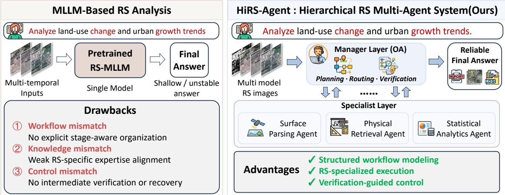
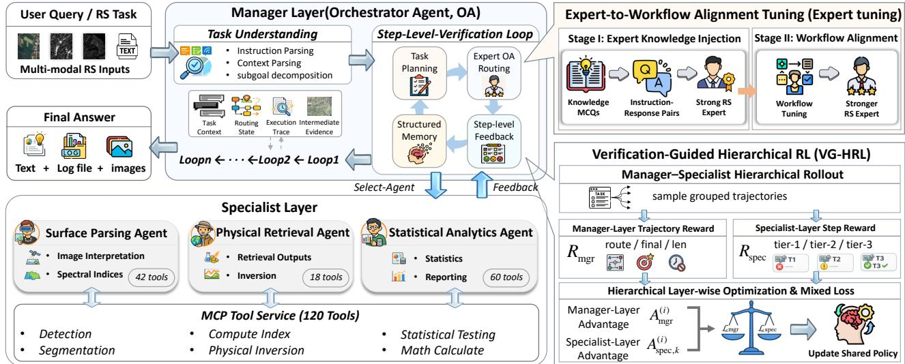
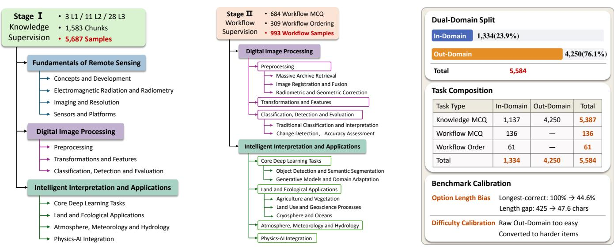

# HiRS-Agent: A Hierarchical Multi-Agent System for Reliable Long-Horizon Remote Sensing Task Solving

Boyang Mu   
Beijing University of Posts   
and Telecommunications State Key Laboratory of   
Networking and Switching Technology Beijing, China   
muboyang@bupt.edu.cn   
Zhiwei Wei   
Hunan Normal University   
School of Geographic   
Sciences   
Changsha, Hunan, China   
2011301130108@whu.edu.cn Mugen Peng   
Beijing University of Posts   
and Telecommunications State Key Laboratory of   
Networking and Switching Technology Beijing, China hy\_wang@bupt.edu.cn Wenjia Xu∗   
Beijing University of Posts   
and Telecommunications State Key Laboratory of   
Networking and Switching Technology Beijing, China xuwenjia@bupt.edu.cn

  
Figure 1: Overview of HiRS-Agent. Generic MLLM-based RS agents (left) sufer from workflow, knowledge, and control mismatches in long-horizon tasks, while HiRS-Agent (right) enables structured and reliable execution via a Manager–Specialist hierarchy with verification-guided control.

## Abstract

Recent advances in large language models and multimodal models have pushed remote sensing (RS) processing from simple perception models to agentic systems designed to tackle complex, long horizon RS tasks. However, existing systems often rely on monolithic decision-making frameworks, which fail to accommodate the multi-stage, interdependent nature of RS tasks. This centralized ap proach leads to challenges such as unstable task execution, incorrect tool usage, and error propagation across stages. To address these issues, we propose HiRS-Agent, a hierarchical multi-agent system for long-horizon RS task solving. HiRS-Agent adopts a two-level collaborative architecture: the Manager Layer handles dynamic routing, step-level verification, replanning, and termination control, while the Specialist Layer organizes domain-specific tools according to the RS workflow and is responsible for subtask reasoning and tool execution. To further enhance the system’s capability, we introduce a two-stage supervised tuning strategy and a verificationguided hierarchical reinforcement learning stage to jointly optimize coordination and tool-use policies. Experiments on Earth-Agent Benchmark and ThinkGeo show that HiRS-Agent substantially improves long-horizon tool-use capability and final-task correctness, demonstrating the efectiveness of structured multi-agent collaboration for reliable RS agents. The code is publicly available at https://github.com/IntelliSensing/HiRS-Agent.

## CCS Concepts

• Computing methodologies → Multi-agent systems; Planning and scheduling; Reinforcement learning; Computer vision.

∗Corresponding author.

## Keywords

Multi-agent System, Multimodal Remote Sensing, Hierarchical Reinforcement Learning, Supervised Fine-Tuning, Self-Verification

## ACM Reference Format:

Boyang Mu, Zhiwei Wei, Mugen Peng, and Wenjia Xu. 2026. HiRS-Agent: A Hierarchical Multi-Agent System for Reliable Long-Horizon Remote Sensing Task Solving. In Proceedings of the 34th ACM International Conference on Multimedia (MM ’26), November 10–14, 2026, Rio de Janeiro, Brazil. ACM, New York, NY, USA, 10 pages. https://doi.org/10.1145/3767308.3835311

## 1 Introduction

Remote sensing (RS) has become a fundamental infrastructure for earth observation, environmental monitoring, disaster assessment, and geospatial intelligence. With the rapid growth of observation platforms and sensor modalities, modern RS applications increasingly rely on large-scale, heterogeneous, and multimodal data, making analysis workflows more complex and labor-intensive [27, 37]. In parallel, multimodal large language models (MLLMs) have shown strong capabilities in perception-oriented RS tasks, such as visual question answering [12, 19], scene understanding [14, 17, 29, 36], object detection [38], and semantic segmentation [5, 18]. How ever, many real-world RS applications go far beyond one-shot per ception. They often require multi-step reasoning, tool invocation, intermediate-result interpretation, and iterative decision making across a long processing chain. This trend is pushing RS systems from static perception models toward agentic frameworks capable of autonomously organizing and executing RS workflows.

Recent eforts in this direction can be roughly viewed from two complementary perspectives. The first line focuses on RS-oriented multimodal assistants and foundation models, which strengthen RS-specific perception, language grounding, and instruction following [5, 19]. The second line moves further toward executable RS agents and tool-augmented systems, exploring structured tool use, multi-step planning, geospatial reasoning, and workflow-oriented evaluation [4, 33]. Nevertheless, existing progress mainly demonstrates the feasibility of agentizing RS tasks, while reliable longhorizon execution in realistic RS workflows remains insuficiently addressed. The main dificulty is that many existing RS agents are mainly adapted from general-purpose agent paradigms rather than designed around the intrinsic structure of RS workflows [33]. In practice, RS tasks often consist of multiple interdependent stages, forming long processing chains with strong upstream–downstream coupling. For instance, in a flood-mapping task, an error in the early parsing stage, such as mistaking cloud shadows for water, can directly afect downstream water-index computation, inundationarea estimation, and final reporting. This stage-dependent nature makes RS task solving especially sensitive to the quality of intermediate results, which must remain consistent with physical, spectral, and spatial constraints throughout the workflow.

Against this background, existing RS-agent systems sufer from three major mismatches. Workflow mismatch: although RS tasks follow structured processing chains, many current systems still rely on generic agent designs that do not explicitly model stage dependency or long-horizon workflow organization. Knowledge mismatch: the LLM serving as the “brain” of the agent is usually not suficiently aligned with RS expertise, and therefore does not truly understand RS-specific physical mechanisms, spectral constraints, or professional data-processing procedures. Control mismatch: existing frameworks mainly emphasize local action selection or final-answer evaluation, while providing limited support for intermediate-state verification and recovery from execution failures. These limitations make reliable long-horizon RS task solving fundamentally challenging.

To address these three mismatches, we propose HiRS-Agent, a Hierarchical Remote Sensing Multi-Agent System for reliable long-horizon RS task solving. Unlike generic agent templates, HiRS-Agent is designed around the structured and stage-dependent nature of RS workflows. It adopts a two-level architecture with a Manager Layer for global planning and workflow control, and a Specialist Layer for domain-specialized RS reasoning and tool execution. To improve reliability, the Manager Layer further verifies intermediate results under RS-specific constraints and can reroute, replan, or repair the workflow when necessary. And the Specialist Layer is structured according to the RS processing chain (spectral parsing → physical retrieval → spatial analytics), with tools grouped into stage-aligned subsets. In this way, HiRS-Agent provides workflow-aware organization, RS-specialized execution, and verification-guided control for long-horizon RS tasks.

Beyond the architecture, we further optimize HiRS-Agent with a dedicated training pipeline. To address the knowledge mismatch between natural-language instructions and professional RS procedures, we construct an RS-agent instruction corpus and introduce Expert-to-Workflow Alignment Tuning (Expert-tuning), a two-stage supervised tuning strategy that first injects RS expertise and then aligns high-level task intent with executable RS workflows. Building on this architecture, we further develop Verification-Guided Hierarchical Reinforcement Learning (VG-HRL) to jointly optimize global orchestration and local tool execution under sparse long-horizon supervision. Together, these designs improve the stability and reliability of RS-agent execution.

In summary, our main contributions are as follows:

• A hierarchical multi-agent framework for long horizon RS task solving. We propose HiRS-Agent, a two-level multiagent system tailored to the structured and stage-dependent nature of RS workflows.

• Verification-guided workflow control. We introduce a memory-aware step-level verification mechanism that supports rerouting, replanning, and recovery under RS-specific constraints during multi-stage execution.

• Workflow-aware training for RS agents. We develop Expert-tuning for RS expertise injection and workflow alignment, and further propose VG-HRL to jointly optimize global coordination and local tool execution.

• Systematic evaluation on representative benchmarks. Experiments on Earth-Agent Benchmark (Earth-Bench) [4] and ThinkGeo [21] show that HiRS-Agent improves longhorizon RS task execution and final-task correctness, especially on lightweight open-source backbones.

## 2 Related Work

## 2.1 LLM Agents and RS Agents

Recent LLM agents have extended language models from one-shot generation to iterative reasoning, planning, tool use, and feedback refinement. ReAct [35] demonstrated the efectiveness of interleaving reasoning and acting, while Reflexion [24] improved agent behavior through feedback-conditioned verbal reflection.

  
Figure 2: Overview of HiRS-Agent: A Hierarchical Multi-Agent System for Long-Horizon RS Task Solving.

Related methods such as plan-first reasoning [28] and Tree-of-Thoughts [34] further show that explicit process modeling can improve long-horizon decision quality beyond direct prompting.

Building on these advancements, RS-oriented MLLMs have significantly enhanced perception and instruction following in Earth observation. Representative systems such as RS ChatGPT [5], LHRS-Bot [19], SkyEyeGPT [36], EarthGPT [38], and RingMo-Agent [7] explored RS-specific multimodal alignment, instruction tuning, and unified reasoning across heterogeneous sensors and platforms [9– 11]. More recent work extended this line toward executable RS agents and tool-augmented workflows, exploring multi-step tool use [33], geospatial reasoning [8], interactive change interpretation [16], workflow management [1], tool creation [40], and reasoning trace alignment [22], while Earth-Agent [4] and ThinkGeo [21] provided benchmark evaluation for structured tool use and multistep planning in RS.

Despite this progress, reliable long-horizon execution remains insuficiently addressed. Existing RS systems have made advances in perception, workflow coverage, and tool integration, yet many still rely on shallow execution chains, static prompts, fixed templates, or limited recovery mechanisms. Even when hierarchical decomposition is introduced, step-level verification and state-adaptive rerouting are rarely treated as first-class control signals [13]. As a result, early errors can still propagate across the workflow and compromise downstream analytical validity, leaving a critical gap for long-horizon RS task solving.

## 2.2 Multi-Agent and RL Optimization

Multi-agent architectures have been increasingly adopted to improve modularity, role specialization, and coordination in complex reasoning and task-solving systems. Prior work on debate-style collaboration [2] showed that multiple agents can improve reasoning diversity and factuality, while geospatial studies such as GeoAgent [8] demonstrated the usefulness of hierarchical coordinator– worker organizations for spatial analysis. HTAM [13] further argued that agents in specialized domains should be organized according to intrinsic task dependency graphs rather than loosely mimicking human social roles. For RS tasks, the key issue is therefore not simply whether multiple agents are used, but whether the system can maintain execution coherence under evolving intermediate states [1, 31]. These observations suggest that long-horizon RS workflows require hierarchical and state-adaptive coordination mechanisms that can route subtasks to specialized experts and maintain consistency across stages.

Recent RL studies on tool-using LLMs suggest that final-answer supervision is too coarse for complex agent behavior [39]. ToolRL [20], ReTool [3], AgentPO [25], and related work [32] showed that processlevel optimization can improve strategic tool invocation, collaboration behavior, and hierarchical decision policies. This need is especially strong in RS, where efective long-horizon execution depends not only on final correctness, but also on routing quality, tool validity, parameter accuracy, execution eficiency, and recovery behavior across the full trajectory. However, few existing studies combine hierarchical coordination, process-level verification, and fine-grained RL optimization within a unified framework for reliable long-horizon RS task execution. HiRS-Agent is designed to address this gap through a workflow-aware hierarchical architecture and verification-guided optimization.

## 3 Methodology

HiRS-Agent is designed to address the three mismatches identified in Sec. 1, namely workflow mismatch, knowledge mismatch, and control mismatch. To this end, our methodology comprises three components. First, we introduce a hierarchical agent architecture that organizes RS task solving according to the dependency structure of RS workflows. Second, we develop Expert-to-Workflow Alignment Tuning to align the foundation model with RS expertise and executable processing procedures. Third, we propose Verification-Guided Hierarchical Reinforcement Learning to optimize global orchestration and local tool execution under long-horizon supervision.

RS tasks generally unfold as structured processing workflows in which early-stage decisions directly afect downstream outcomes. Following the canonical RS progression from spectral parsing to physical retrieval and then to statistical analytics, we design HiRS-Agent as a two-level collaborative system composed of a Manager Layer and a Specialist Layer, as illustrated in Fig. 2. The Manager Layer maintains global workflow coherence through planning, routing, and verification, while the Specialist Layer performs domain-specialized reasoning and tool execution at diferent workflow stages.

A typical execution of HiRS-Agent proceeds as follows. Given a user instruction and multimodal RS inputs, the Manager Layer formulates sub-goals and constraints, routes each sub-goal to an appropriate specialist agent, and verifies the returned intermediate result under RS-specific constraints. The workflow then proceeds through iterative execution, verification, and adaptive correction until task completion. The following subsections detail these components.

## 3.1 Hierarchical Agent Architecture

3.1.1 Manager Layer: Memory-Aware Control and Verification. The Manager Layer is instantiated as a single Orchestrator Agent (OA), which serves as the core controller of HiRS-Agent. Beyond conventional task planning, the OA is designed to support task decomposition, history-aware verification, and adaptive execution control, which are essential for handling inter-stage dependencies and preventing error propagation. This design is motivated by the nature of RS tasks, where early-stage decisions (e.g., spectral parsing or band selection) can directly afect downstream physical inversion and statistical analysis.

Global Memory for Long-Horizon Dependency Modeling. To explicitly model long-horizon dependencies in RS workflows, the OA maintains a structured global state

$$
s _ { t } = \{ x , d , g _ { t } , \mathcal { H } _ { t } , C _ { t } \} ,\tag{1}
$$

where � denotes the instruction, � represents multimodal RS input data, $g _ { t }$ is the current sub-goal, $\mathcal { H } _ { t }$ is a structured global memory, and $C _ { t }$ represents dynamic constraints. Unlike conventional execution logs, $\mathcal { H } _ { t }$ is organized as a structured and queryable memory that stores: (i) task context, (ii) routing states, (iii) execution traces, and (iv) intermediate evidence.

Task Planning and History-Aware Verification under RS Constraints. To support both task planning and history-aware verification under RS constraints, the OA outputs routing and control decisions

$$
( r _ { t } , c _ { t } ) \gets \pi _ { \theta } ( s _ { t } ; \rho _ { \mathrm { O A } } ) ,\tag{2}
$$

where $\rho _ { \mathrm { { O A } } }$ denotes the OA role prompt, $r _ { t }$ selects the appropriate specialist agent in the Specialist Layer, and $c _ { t }$ determines the next action (e.g., continue, replan, verify, or terminate). Since HiRS-Agent adopts a shared-parameter architecture, the OA and specialist agents are prompt-conditioned role instantiations of the same backbone policy $\pi _ { \theta } .$ , distinguished only by role-specific prompts. In addition to sub-goal decomposition and routing, the OA performs history-aware verification, which constitutes its core functionality.

After each specialist-agent execution, the OA receives structured step-level feedback, including tool calls, outputs, and execution evidence. Instead of validating results solely based on local outputs, the OA retrieves relevant global memory

$$
m _ { t } = \mathrm { R e t r i e v e } ( \mathcal { H } _ { t } , g _ { t } , C _ { t } ) ,\tag{3}
$$

and evaluates the current step by jointly considering the intermediate result, prior execution traces, and domain constraints.

To enforce RS-specific constraints during intermediate execution, the verification process is defined as

$$
z _ { t } = V ( g _ { t } , o _ { t } , C _ { t } , m _ { t } ) , \qquad z _ { t } \in \{ \mathrm { p a s s , u n c e r t a i n , f a i l } \} ,\tag{4}
$$

where $o _ { t }$ is the current step output. The verifier performs three complementary checks: (i) schema validity, ensuring required fields and types are satisfied, (ii) sub-goal consistency, ensuring the output advances or fulfills the current objective, and (iii) constraint satisfaction, ensuring that the result remains physically, spectrally, and statistically plausible under $C _ { t }$ and prior memory $m _ { t }$ . In RS workflows, this includes verifying physical consistency, such as valid inversion relationships and reasonable value ranges, spectral correctness, such as proper band usage and index computation, and statistical plausibility, such as reasonable aggregation patterns and output distributions.

Verification-Guided Adaptive Control. Based on the verification outcome, the OA performs adaptive control to maintain workflow consistency and correct execution errors. Specifically, FAIL triggers replan-on-failure, including tool repair, alternative routing, or sub-goal adjustment; UNCERTAIN triggers cross-checking through re-execution or alternative reasoning paths; and PASS commits the result into memory and proceeds to the next step.

Importantly, all intermediate results, including failures and recovery traces, are stored in $\mathcal { H } _ { t } ,$ enabling subsequent decisions to be history-aware rather than myopic. This closed-loop design of global memory, history-aware verification, and adaptive control directly addresses the long-horizon dependency and constraintdriven nature of RS tasks, allowing the OA to dynamically adjust execution strategies, explicitly model inter-stage dependencies, and efectively mitigate error accumulation.

3.1.2 Specialist Layer: Domain-Specialized Planning and Tool Use. The Specialist Layer consists of domain-specialized agents that transform OA-issued sub-goals into tool-level actions. Given $( g _ { t } , \mathcal { H } _ { t } , C _ { t } )$ each specialist agent outputs a structured tool call $u _ { t } = ( { \tt t o o l } , { \tt a r g s } )$ whose execution returns an output $o _ { t }$ for verification and an optional step summary for $\mathcal { H } _ { t }$ . The OA dynamically routes among specialist families and applies step-level verification after each execution.

To support stable long-horizon execution and efective routing, the Specialist Layer is organized into three function-oriented expert families: Surface Parsing Agent (SPA), Physical Retrieval Agent (PRA), and Statistical Analytics Agent (SAA). This design follows the functional progression of RS workflows from spectral parsing and physical inversion to statistical analysis. By partitioning the tool space, each specialist operates over a focused and domain-consistent set of tools, reducing cross-domain confusion and improving execution reliability. Incorrect tool invocation, including wrong tool selection and malformed arguments, further motivates the step-level verification and repair loop described in Sec. 3.1.1.

  
(a) Knowledge Supervision  
(b) Workflow Supervision  
(c) RS-EXPERT-BENCHMARK  
Figure 3: Taxonomy-aligned composition of the two-stage Expert-tuning supervision data and the statistics of RS-EXPERT-BENCHMARK.

SPA handles perception- and parsing-oriented sub-goals, including object detection, segmentation, ROI or mask generation, and spectral-index-oriented parsing (e.g., NDVI/NDWI cues). Its tool space focuses on vision parsing, spatial region processing, and index computation primitives, making it suitable for early-stage scene understanding and region-level RS image analysis. SPA returns �� = (tool, args) with optional summaries such as region statistics or mask quality indicators. Typical failure modes include cloud or shadow interference, boundary ambiguity, and spatial misalignment across modalities.

PRA handles physical retrieval and inversion sub-goals, such as LST-oriented tasks and quantitative RS product generation. Its tool space covers physically grounded retrieval operators, calibration and normalization routines, and lightweight quality-control checks. PRA returns �� = (tool, args) and optional diagnostics (e.g., confidence or quality flags) for downstream verification. Typical failure modes include unit or range inconsistency, sensitivity to atmospheric artifacts, and unstable estimates under low-quality observations.

SAA handles data-centric sub-goals such as data aggregation and cleaning, statistical testing and correlation analysis, and reportlevel metric computation and comparison. Its tool set focuses on tabular and time-series processing, statistical inference, and con trolled file I/O for intermediate artifacts, thereby supporting higherlevel result summarization and decision making. SAA returns �� = (tool, args) and may provide structured summaries (e.g., tables, test results, or comparative indicators). Typical failure modes in clude schema mismatches across intermediate outputs, missingvalue propagation, and violated test assumptions.

## 3.2 Expert-to-Workflow Alignment Tuning

To align general large language models with workflow-driven RS tasks, we propose Expert-tuning, a two-stage supervised finetuning strategy. Stage I injects structured RS domain knowledge, while Stage II aligns natural language instructions with executable RS processing procedures.

Stage I: Basic Knowledge Alignment. We first construct a structured RS knowledge system for agent-oriented reasoning. The knowledge space follows a three-level taxonomy with 3 L1 topics, 11 L2 modules, and 28 L3 domains, covering Fundamentals ofRS, Digital Image Processing, and Intelligent Interpretation and Applications. We collect and curate knowledge from four authoritative RS textbooks and map the extracted content onto the predefined L1–L3 structure. Based on this taxonomy, we build the RS-EXPERT corpus through five stages: content extraction, normalization, chunking, rewriting, and annotation, resulting in 1,583 semantically coherent knowledge chunks. From this corpus, we further construct 5,687 knowledgecentric training samples, as shown in Fig. 3a.

Stage II: Workflow Alignment. Stage II constructs workflow supervision from real RS application pipelines collected from multiagent demo logs and verified by two experts. It focuses on two workflow-relevant taxonomy branches, Digital Image Processing and Intelligent Interpretation and Applications, which involve multi step tool invocation and procedural reasoning. As illustrated in Fig. 3b, the data comprise two formats: Workflow MCQ for selecting correct processing plans and Workflow Order for recovering tool-use sequences. Stage II contains 684 Workflow MCQ and 309 Workflow Order samples (993 in total), spanning 14 task families. Each workflow is tagged with its taxonomy branch to connect the Stage I knowledge system with executable procedures.

For supervised fine-tuning, 80% of the data are converted into instruction-response pairs, with the remaining 20% reserved for evaluation. To assess knowledge acquisition and workflow awareness beyond format memorization, we further construct RS-EXPERT-BENCHMARK. It evaluates knowledge grounding and workflow generalization using held-out in-domain data and additional outof-domain samples from unseen RS Handbook sources. The dualdomain split, task composition, and benchmark calibration are summarized in Fig. 3c.

## 3.3 Verification-Guided Hierarchical RL

To further improve workflow-level decision quality beyond imitation learning, we introduce VG-HRL, a verification-guided post-SFT reinforcement learning strategy for HiRS-Agent. The key idea is to jointly optimize the Manager and Specialist Layer according to their distinct roles in long-horizon RS workflows. Specifically, we design (1) a hierarchical reward scheme that separates trajectory-level coordination from step-level tool execution, and (2) a role-aware grouped optimization strategy that aligns credit assignment and advantage estimation with the two-level collaboration. In implementation, we instantiate this optimization with Group Relative Policy Optimization (GRPO) [23].

Hierarchical Reward Design. The Manager Layer is responsible for trajectory-level coordination, while the Specialist Layer performs step-level tool execution. To avoid signal confusion and credit-assignment mismatch, we define separate rewards for the two levels and combine them only at the loss level. Throughout this section, quantities marked with a hat denote normalized or scaled reward components, while unmarked terms denote raw feedback signals.

For the Manager Layer, we use a trajectory-level reward:

$$
\begin{array} { r } { R _ { \mathrm { m g r } } = \omega _ { \mathrm { r o u t e } } \hat { R } _ { \mathrm { r o u t e } } + \omega _ { \mathrm { f i n a l } } \hat { R } _ { \mathrm { f i n a l } } + \omega _ { \mathrm { l e n } } \hat { R } _ { \mathrm { l e n } } , } \end{array}\tag{5}
$$

where $\hat { R } _ { \mathrm { r o u t e } }$ measures normalized routing correctness, $\hat { R } _ { \mathrm { f i n a l } }$ evaluates normalized final task success, and $\hat { R } _ { \mathrm { l e n } }$ penalizes unnecessarily long trajectories after scaling. Their explicit definitions are provided in the supplementary material.

For the Specialist Layer, we replace binary failure gating with a domain-aware graded gating reward. Each specialist agent is associated with a domain tool registry, and each tool call is categorized into one of three tiers, for the �-th tool call in the �-th rollout:

$$
R _ { \mathrm { s p e c } , k } ^ { \left( i \right) } = \left\{ \begin{array} { l l } { - 1 . 0 , } & { \tau _ { k } = 0 , } \\ { - 0 . 5 + 0 . 2 R _ { \mathrm { e x e c } } , } & { \tau _ { k } = 1 , } \\ { 0 . 5 + 0 . 2 R _ { \mathrm { e x e c } } + 0 . 3 \hat { R } _ { \mathrm { a r g s } } , } & { \tau _ { k } = 2 , } \end{array} \right.\tag{6}
$$

Here, $\tau _ { k } = 0 , 1$ , and 2 correspond to Tier 1 (hallucinated out-ofdomain tool), Tier 2 (wrong but in-domain tool), and Tier 3 (correct tool), respectively. In $\mathrm { E q . } ~ ( 6 ) , R _ { \mathrm { e x e c } } \in \{ - 1 , 0 , + 1 \}$ denotes raw execution feedback, and $\hat { R } _ { \mathrm { a r g s } } \in [ 0 , 1 ]$ denotes the normalized argumentquality score, computed only when the predicted tool is correct. By distinguishing hallucinated out-of-domain tools from semantically closer in-domain mistakes, this reward preserves more informative within-group variance for stable relative optimization and improves local credit assignment. Intermediate normalization details are deferred to the supplementary material.

Role-Aware Grouped Optimization. To match the hierarchical structure of HiRS-Agent, we estimate relative advantages at two diferent granularities. For the Manager Layer, all rollouts of the

Algorithm 1 VG-HRL Optimization for HiRS-Agent   
Require: Shared policy ��, reference policy $\pi _ { \mathrm { r e f } } ,$ task set D, group size   
�, weight $\alpha = 0 . 5$   
1: for each minibatch ${ \mathcal { B } } \subset { \mathcal { D } }$ do   
2: $\mathcal { L } _ { \mathrm { m g r } } , \mathcal { L } _ { \mathrm { s p e c } }  0$   
3: for each task $x \in { \mathcal { B } }$ do   
4: Sample � complete trajectories $\{ \boldsymbol y ^ { ( i ) } \} _ { i = 1 } ^ { G }$ using HiRS-Agent   
5: Compute Manager-Layer rewards $\{ R _ { \mathrm { m g r } } ^ { ( i ) } \} _ { i = 1 } ^ { G }$   
6: Compute Specialist-Layer step rewards $\{ R _ { \mathrm { s p e c } , k } ^ { ( i ) } \}$   
7: Compute Manager-Layer advantages $\{ A _ { \mathrm { m g r } } ^ { ( i ) } \} _ { i = 1 } ^ { G }$ by grouping   
rollouts of the same task   
8: Compute Specialist-Layer advantages $\{ A _ { \mathrm { s p e c } , k } ^ { ( i ) } \}$ by grouping   
rewards with the same $( x , k )$   
9: Accumulate manager loss ${ \mathcal { L } } _ { \mathrm { m g r } }$   
10: Accumulate specialist loss $\mathcal { L } _ { \mathrm { s p e c } }$   
11: end for   
12: $\mathcal { L } _ { \mathrm { m i x e d } }  \lambda \mathcal { L } _ { \mathrm { m g r } } + ( 1 - \lambda ) \mathcal { L } _ { \mathrm { s p e c } }$   
13: Update � by minimizing Lmixed   
14: end for   
15: return optimized shared policy ��

same task form one group:

$$
A _ { \mathrm { m g r } } ^ { ( i ) } = \frac { R _ { \mathrm { m g r } } ^ { ( i ) } - \mathrm { m e a n } ( \{ R _ { \mathrm { m g r } } ^ { ( j ) } \} _ { j = 1 } ^ { G } ) } { \mathrm { s t d } ( \{ R _ { \mathrm { m g r } } ^ { ( j ) } \} _ { j = 1 } ^ { G } ) + \epsilon } .\tag{7}
$$

For the Specialist Layer, rewards are grouped by (task, step index), so that tool calls at the same execution position are compared against each other:

$$
A _ { \mathrm { s p e c } , k } ^ { ( i ) } = \frac { R _ { \mathrm { s p e c } , k } ^ { ( i ) } - \mathrm { m e a n } ( \{ R _ { \mathrm { s p e c } , k } ^ { ( j ) } \} _ { j = 1 } ^ { G } ) } { \mathrm { m a x } \left( \mathrm { s t d } ( \{ R _ { \mathrm { s p e c } , k } ^ { ( j ) } \} _ { j = 1 } ^ { G } ) , \epsilon _ { \mathrm { t h } } \right) } .\tag{8}
$$

Here, $\epsilon _ { \mathrm { t h } }$ is a fallback threshold for low-variance groups; further details are deferred to the supplementary material.

HiRS-Agent adopts a shared-parameter single-backbone architecture, where the Manager-Layer OA and all Specialist-Layer agents share the same LLM backbone and LoRA adapters and are distinguished only by role-specific prompts. Accordingly, ${ \mathcal { L } } _ { \mathrm { m g r } }$ and $\mathcal { L } _ { \mathrm { s p e c } }$ denote the objectives computed from $A _ { \mathrm { m g r } } ^ { ( i ) }$ and $A _ { \mathrm { s p e c } , k } ^ { ( i ) } .$ . Under this setting, the two levels are jointly optimized through

$$
\begin{array} { r } { \mathcal { L } _ { \mathrm { m i x e d } } = \lambda \mathcal { L } _ { \mathrm { m g r } } + \left( 1 - \lambda \right) \mathcal { L } _ { \mathrm { s p e c } } . } \end{array}\tag{9}
$$

Importantly, the combination is performed at the loss level rather than the reward level, so that the two levels maintain independent normalization and stable optimization dynamics. In all HRL experiments, we set the mixed-loss weight to $\lambda = 0 . 5$ as a balanced default, so that the Manager-Layer and Specialist-Layer losses contribute equally during joint optimization. Algorithm 1 summarizes the proposed VG-HRL optimization, where trajectory-level coordination and step-level tool execution are jointly optimized under a shared-parameter backbone.

## 4 Experiments

## 4.1 Experimental Setup

We evaluate HiRS-Agent using the oficial protocols of Earth-Bench and ThinkGeo [4, 21], and additionally report domain adaptation on

Table 1: Main results on Earth-Bench. Bold / underline denote best / second-best. Unless noted, all reproduced rows share the same Qwen3-4B checkpoint (Expert-tuned + VG-HRL), tool registry, and evaluation setup.
<table><tr><td rowspan="2">Model</td><td colspan="2">Tool-Any-Order↑</td><td colspan="2">Tool-In-Order↑</td><td colspan="2">Tool-Exact-Match↑</td><td colspan="2">Param-Match↑</td><td colspan="2">Efficiency↓</td><td colspan="2">Accuracy↑</td></tr><tr><td>AP</td><td>IF</td><td>AP</td><td>IF</td><td>AP</td><td>IF</td><td>AP</td><td>IF</td><td>AP</td><td>IF</td><td>AP</td><td>IF</td></tr><tr><td colspan="10">Closed-source models</td><td></td><td></td><td></td><td></td></tr><tr><td>GPT-5</td><td>69.11</td><td>71.16</td><td>58.25</td><td>60.68</td><td>45.57</td><td>45.79</td><td>26.10</td><td>25.80</td><td>2.4146</td><td>2.8428</td><td>65.59</td><td>63.16</td></tr><tr><td>Gemini-2.5</td><td>57.96</td><td>61.80</td><td>45.44</td><td>50.78</td><td>31.86</td><td>40.92</td><td>17.49</td><td>23.54</td><td>3.0246</td><td>2.4709</td><td>54.66</td><td>55.06</td></tr><tr><td>GPT-40</td><td>65.73</td><td>66.88</td><td>50.70</td><td>53.20</td><td>46.17</td><td>47.47</td><td>26.71</td><td>27.77</td><td>2.1579</td><td>2.6088</td><td>45.34</td><td>44.94</td></tr><tr><td colspan="10">Open-source models</td><td colspan="3"></td></tr><tr><td>DeepSeek-V3.1 (37B)</td><td>78.40</td><td>77.98</td><td>63.25</td><td>64.33</td><td>48.89</td><td>50.01</td><td>30.76</td><td>31.34</td><td>2.6283</td><td>2.6624</td><td>50.20</td><td>52.23</td></tr><tr><td>Qwen3-32B</td><td>39.76</td><td>42.39</td><td>21.56</td><td>33.79</td><td>9.51</td><td>26.10</td><td>8.13</td><td>17.73</td><td>2.7274</td><td>1.9010</td><td>20.62</td><td>24.80</td></tr><tr><td>Qwen3-8B</td><td>36.19</td><td>44.95</td><td>16.73</td><td>31.05</td><td>5.26</td><td>19.10</td><td>2.96</td><td>10.49</td><td>5.5726</td><td>5.0779</td><td>18.55</td><td>14.92</td></tr><tr><td>Qwen3-4B</td><td>20.47</td><td>29.69</td><td>1.32</td><td>10.89</td><td>0.00</td><td>8.63</td><td>0.00</td><td>4.21</td><td>3.9747</td><td>5.4554</td><td>15.73</td><td>10.08</td></tr><tr><td colspan="10">Generic agent architectures (shared Qwen3-4B checkpoint)</td><td colspan="3"></td></tr><tr><td>CoT [30]</td><td>25.97</td><td>27.90</td><td>20.96</td><td>27.97</td><td>5.83</td><td>8.78</td><td>16.76</td><td>22.58</td><td>7.0321</td><td>6.7015</td><td>4.84</td><td>6.05</td></tr><tr><td>ReAct [35]</td><td>27.45</td><td>35.82</td><td>16.65</td><td>18.92</td><td>6.84</td><td>19.42</td><td>4.12</td><td>11.20</td><td>4.8214</td><td>4.9125</td><td>16.53</td><td>20.16</td></tr><tr><td>Plan&amp;Execute [28]</td><td>57.76</td><td>57.88</td><td>36.24</td><td>36.18</td><td>24.29</td><td>24.58</td><td>10.82</td><td>10.90</td><td>1.3011</td><td>1.1771</td><td>30.01</td><td>30.65</td></tr><tr><td>Debate [2]</td><td>47.50</td><td>47.53</td><td>34.26</td><td>35.79</td><td>1.53</td><td>1.81</td><td>16.33</td><td>10.95</td><td>13.3459</td><td>11.9874</td><td>23.08</td><td>22.67</td></tr><tr><td colspan="10">RS-specific agent architectures (shared Qwen3-4B checkpoint)</td><td colspan="2"></td><td></td><td></td></tr><tr><td>RS-Agent [33]</td><td>22.68</td><td>27.25</td><td>15.84</td><td>18.61</td><td>15.17</td><td>17.74</td><td>8.90</td><td>9.18</td><td>2.3385</td><td>2.2295</td><td>29.44</td><td>33.06</td></tr><tr><td>OpenEarthAgent [22]</td><td>46.55</td><td>50.21</td><td>39.01</td><td>41.68</td><td>28.59</td><td>30.75</td><td>18.98</td><td>20.75</td><td>2.7099</td><td>2.7778</td><td>18.15</td><td>19.76</td></tr><tr><td colspan="10">Proposed hierarchical multi-role system</td><td colspan="2"></td><td colspan="2"></td></tr><tr><td>HiRS-Agent (Qwen3-8B)</td><td>58.08</td><td>63.69</td><td>45.94</td><td>53.10</td><td>37.50</td><td>43.98</td><td>20.82</td><td>26.83</td><td>2.5248</td><td>3.0848</td><td>48.39</td><td>53.62</td></tr><tr><td>HiRS-Agent (Qwen3-4B)</td><td>50.95</td><td>53.79</td><td>41.10</td><td>46.34</td><td>31.67</td><td>34.64</td><td>19.54</td><td>20.81</td><td>2.5059</td><td>3.3013</td><td>43.95</td><td>45.56</td></tr></table>

Table 2: Main results on ThinkGeo. Bold and underline mark the best and second-best results. Step and E2E denote stepby-step and end-to-end metrics, respectively.
<table><tr><td>Model</td><td colspan="3">Step Metrics↑</td><td colspan="2">E2E Metrics↑</td></tr><tr><td></td><td>Inst.</td><td>Tool.</td><td>Arg.</td><td>Ans.</td><td>Ans_I</td></tr><tr><td>Closed-source models</td><td></td><td></td><td></td><td></td><td></td></tr><tr><td>GPT-40</td><td>73.31</td><td>63.75</td><td>33.31</td><td>11.51</td><td>20.02</td></tr><tr><td>GPT-4-1106</td><td>82.44</td><td>73.21</td><td>37.74</td><td>9.46</td><td>16.91</td></tr><tr><td>Claude-3.7-Sonnet</td><td>21.35</td><td>26.21</td><td>0.33</td><td>8.95</td><td>11.42</td></tr><tr><td>Open-source models</td><td></td><td></td><td></td><td></td><td></td></tr><tr><td>Qwen2.5-7b-Instruct</td><td>57.38</td><td>45.63</td><td>18.84</td><td>6.91</td><td>9.28</td></tr><tr><td>Phi-3-mini-4k-Instruct</td><td>18.40</td><td>16.88</td><td>9.65</td><td>7.16</td><td>6.12</td></tr><tr><td>Qwen3-8B</td><td>20.98</td><td>13.36</td><td>3.26</td><td>7.67</td><td>8.68</td></tr><tr><td>Qwen3-4B</td><td>18.35</td><td>8.54</td><td>1.24</td><td>6.07</td><td>7.79</td></tr><tr><td colspan="6">Proposed multi-agent system</td></tr><tr><td>HiRS-Agent (Qwen3-8B)</td><td>77.97</td><td>59.57</td><td>11.70</td><td>12.09</td><td>14.75</td></tr><tr><td>HiRS-Agent (Qwen3-4B)</td><td>73.73</td><td>47.87</td><td>8.51</td><td>11.28</td><td>13.77</td></tr></table>

RS expertise and general-capability splits. Earth-Bench emphasizes long-horizon tool trajectories and end-to-end correctness, while ThinkGeo focuses on step-wise execution fidelity and final-answer quality. Following the benchmarks, we report two evaluation modes (AP and IF) and use the same tool interface, argument schema, and execution constraints across all methods. Baselines include both proprietary and open-source LLMs, and all methods are evaluated with the oficial scripts and metrics.

Table 3: RS expertise gains and general capability retention after domain adaptation. Bold denote the best performance.
<table><tr><td>Metric</td><td>Qwen3-4B Base</td><td>Qwen3-4B Prompt</td><td>Qwen3-4B Expert-tuning</td></tr><tr><td>RS-EXPERT-BENCHMARK</td><td></td><td></td><td></td></tr><tr><td>IN-Domain</td><td>76.43</td><td>80.13</td><td>95.84</td></tr><tr><td>OUT-Domain</td><td>72.42</td><td>76.54</td><td>85.13</td></tr><tr><td>Overall</td><td>73.35</td><td>77.37</td><td>87.60</td></tr><tr><td>General Benchmarks</td><td></td><td></td><td></td></tr><tr><td>MMLU-Redux [26]</td><td>66.57</td><td>66.53</td><td>66.80</td></tr><tr><td>MATH-500 [15]</td><td>67.80</td><td>67.60</td><td>66.20</td></tr><tr><td>Multi-IF [6]</td><td>58.35</td><td>58.30</td><td>55.53</td></tr></table>

For training, HiRS-Agent uses a shared-parameter backbone, where all roles share the same Qwen3-4B or Qwen3-8B model and are diferentiated only by role-specific system prompts and decoding settings. Both Expert-tuning and VG-HRL are implemented with LoRA and applied sequentially. Expert-tuning uses LoRA rank 8 and is trained for 3 epochs, while VG-HRL uses LoRA rank 64 with LoRA alpha 128 and is instantiated with GRPO using rollout group size � = 4 and 3 training epochs per round. The mixed-loss weight is set to � = 0.5. Training is conducted on 2×RTX 4090 24GB for Qwen3-4B and 4×RTX 4090 24GB for Qwen3-8B. Additional qualitative results and detailed case studies are provided in the supplementary material.

## 4.2 Main Results

Tables 1 and 2 present the main results on Earth-Bench and ThinkGeo. Overall, HiRS-Agent consistently improves small open-source backbones on long-horizon RS agent tasks, showing that the gains mainly come from hierarchical specialization, verification-guided control, and post-SFT optimization rather than simply scaling up the backbone. As the backbone capacity increases from 4B to 8B, the proposed framework further narrows the gap to strong proprietary models, indicating a favorable scaling trend.

On Earth-Bench, HiRS-Agent substantially outperforms the corresponding vanilla Qwen3 backbones under both AP and IF. For Qwen3-4B, it improves Accuracy from 15.73/10.08 to 43.95/45.56, Tool-Exact-Match from 0.00/8.63 to 31.67/34.64, and Param-Match from 0.00/4.21 to 19.54/20.81, while reducing Eficiency from 3.9747/ 5.4554 to 2.5059/3.3013. Similar gains are observed on Qwen3-8B, where HiRS-Agent reaches 48.39/53.62 Accuracy.

On ThinkGeo, Table 2 reports a compact subset of the most representative metrics for comparison, including three step-level metrics (Inst., Tool., and Arg.) and two end-to-end metrics (Ans. and Ans\_I); the full metric set is provided in the supplementary material. Under the oficial evaluation protocol and tool library, HiRS-Agent consistently improves the corresponding Qwen3 backbones even without task-specific optimization on ThinkGeo. For Qwen3-4B, Inst./Tool./Arg. improve from 18.35/8.54/1.24 to 73.73/47.87/8.51, while Ans./Ans\_I increase from 6.07/7.79 to 11.28/13.77. For Qwen3- 8B, the corresponding metrics improve from 20.98/13.36/3.26 and 7.67/8.68 to 77.97/59.57/11.70 and 12.09/14.75, respectively. Notably, HiRS-Agent achieves the best Ans. score among all compared methods.

Overall, the results on both benchmarks show that HiRS-Agent provides strong system-level gains for long-horizon RS agents and remains efective across diferent tool environments.

## 4.3 RS Domain Adaptation Result

We evaluate whether Expert-tuning improves RS expertise while preserving general capability. Table 3 reports results on RS-EXPERT-BENCHMARK and three general benchmarks.

Expert-tuning yields clear gains over both the Base model and the Prompt variant on RS-EXPERT-BENCHMARK. For Qwen3-4B, the overall score improves from 73.35 to 87.60, with consistent gains on both the in-domain and out-of-domain splits. This indicates that Expert-tuning improves RS knowledge and workflow understanding rather than merely benefiting from prompt reformulation.

At the same time, general capability is largely preserved. MMLU-Redux remains nearly unchanged, while MATH-500 and Multi-IF show only moderate drops. Overall, Expert-tuning achieves a favorable specialization–retention trade-of, substantially improving RS expertise without severely sacrificing general reasoning ability. Results on Qwen3-8B are provided in the supplementary material.

## 4.4 Ablation Studies

Training Ablation. We evaluate each training stage under the fixed HiRS-Agent architecture. As shown in Table 4(a), Experttuning improves Exact from 11.47/12.85 to 18.07/19.78 and Accuracy from 35.48/33.06 to 40.73/39.52, indicating that supervised workflow alignment improves both exact tool execution and finaltask correctness. VG-HRL further improves all reported metrics, achieving 41.10/46.34 In-Order, 31.67/34.64 Exact, and 43.95/45.56 Accuracy. These results show that hierarchical policy optimization complements Expert-tuning by further improving ordered and exact execution.

Table 4: Core ablation results on Earth-Bench using Qwen3- 4B. Complete metrics are provided in the supplementary material.
<table><tr><td rowspan="2">Config.</td><td colspan="2">In-Order↑</td><td colspan="2">Exact↑</td><td colspan="2">Accuracy↑</td></tr><tr><td>AP</td><td>IF</td><td>AP</td><td>IF</td><td>AP</td><td>IF</td></tr><tr><td colspan="7">(a) Training stages</td></tr><tr><td>Base</td><td>22.31</td><td>19.43</td><td>11.47</td><td>12.85</td><td>35.48</td><td>33.06</td></tr><tr><td>Base + ET</td><td>19.73</td><td>23.68</td><td>18.07</td><td>19.78</td><td>40.73</td><td>39.52</td></tr><tr><td>Base + ET + VG</td><td>41.10</td><td>46.34</td><td>31.67</td><td>34.64</td><td>43.95</td><td>45.56</td></tr><tr><td colspan="7">(b) Architecture components</td></tr><tr><td>Flat</td><td>16.65</td><td>18.92</td><td>6.84</td><td>19.42</td><td>16.53</td><td>20.16</td></tr><tr><td>Flat + V</td><td>28.77</td><td>30.71</td><td>29.05</td><td>30.14</td><td>35.89</td><td>31.45</td></tr><tr><td>Generic + V</td><td>32.47</td><td>34.92</td><td>23.82</td><td>23.32</td><td>30.24</td><td>33.47</td></tr><tr><td>RS-Hier. w/o V</td><td>21.13</td><td>23.23</td><td>20.37</td><td>22.21</td><td>39.92</td><td>42.74</td></tr><tr><td>Full HiRS-Agent</td><td>41.10</td><td>46.34</td><td>31.67</td><td>34.64</td><td>43.95</td><td>45.56</td></tr></table>

Note. ET, VG, V, and RS-Hier. denote Expert-tuning, VG-HRL, the verifier, and the RS-specialist hierarchy, respectively; bold and underline mark the best and second-best results per panel.

Architecture Ablation. We isolate the architectural components using the same trained checkpoint and toolset. As shown in Table 4(b), adding verification to the flat agent improves Exact from 6.84/19.42 to 29.05/30.14, demonstrating its efectiveness in correcting intermediate execution errors. The generic hierarchy with verification improves In-Order to 32.47/34.92, while further introducing RS-specialist grouping raises Accuracy from 30.24/33.47 to 43.95/45.56. Conversely, removing verification from the full system reduces Exact by 11.30/12.43 and Accuracy by 4.03/2.82, confirming that hierarchical specialization and step-level verification provide distinct and complementary benefits.

## 5 Conclusion

In this paper, we present HiRS-Agent, a hierarchical multi-agent framework for long-horizon RS task solving. By organizing the system into a Manager Layer and a Specialist Layer, HiRS-Agent enables structured task decomposition, dynamic coordination, and domain-specialized tool execution aligned with the multi-stage, interdependent nature of RS workflows. To improve reliability, HiRS-Agent aligns RS expertise with workflows and optimizes policies through step-level verification, expert-tuning, and verification guided HRL. Experiments on Earth-Bench and ThinkGeo show that HiRS-Agent consistently improves long-horizon tool-use capability and final-task performance on lightweight open-source backbones. Notably, even when built on a lightweight 4B open-source backbone, HiRS-Agent is able to outperform the strongest closed-source models in certain settings. These results highlight that, rather than relying on model scale alone, explicit modeling of RS workflow structure and stage dependency is critical for achieving reliable long-horizon execution. Future work will extend HiRS-Agent toward broader tools and more realistic scenarios.

## Acknowledgments

This work has been funded by the National Natural Science Foundation of China under Grant 62301063.

## References

[1] Zhengchao Chen, Haoran Wang, Jing Yao, Pedram Ghamisi, Jun Zhou, Peter M. Atkinson, and Bing Zhang. 2026. CangLing-KnowFlow: A Unified Knowledge-and-Flow-fused Agent for Comprehensive Remote Sensing Applica tions. arXiv:2512.15231 [cs.AI] https://arxiv.org/abs/2512.15231

[2] Yilun Du, Shuang Li, Antonio Torralba, Joshua B. Tenenbaum, and Igor Mordatch. 2024. Improving Factuality and Reasoning in Language Models through Multiagent Debate. In Forty-first International Conference on Machine Learning. https://openreview.net/forum?id=zj7YuTE4t8

[3] Jiazhan Feng, Shijue Huang, Xingwei Qu, Ge Zhang, Yujia Qin, Baoquan Zhong, Chengquan Jiang, Jinxin Chi, and Wanjun Zhong. 2026. ReTool: Reinforcement Learning for Strategic Tool Use in LLMs. In The Fourteenth International Conference on Learning Representations. https://openreview.net/forum?id=tRk1nofSmz

[4] Peilin Feng, Zhutao Lv, Junyan Ye, Xiaolei Wang, Xinjie Huo, Jinhua Yu, Wanghan Xu, Wenlong Zhang, LEI BAI, Conghui He, and Weijia Li. 2026. Earth-Agent: Unlocking the Full Landscape ofEarth Observation with Agents. In The Fourteenth International Conference on Learning Representations. https://openreview.net/ forum?id=dkIXAbWuxO

[5] Haonan Guo, Xin Su, Chen Wu, Bo Du, Liangpei Zhang, and Deren Li. 2024. Remote Sensing ChatGPT: Solving Remote Sensing Tasks with ChatGPT and Visual Models. In IGARSS 2024 - 2024 IEEE International Geoscience and Remote Sensing Symposium. 11474–11478. doi:10.1109/IGARSS53475.2024.10640736

[6] Yun He, Di Jin, Chaoqi Wang, Chloe Bi, Karishma Mandyam, Hejia Zhang, Chen Zhu, Ning Li, Tengyu Xu, Hongjiang Lv, et al. 2024. Multi-IF: Benchmarking LLMs on Multi-Turn and Multilingual Instructions Following. arXiv preprint arXiv:2410.15553 (2024).

[7] Huiyang Hu, Peijin Wang, Yingchao Feng, Kaiwen Wei, Wenxin Yin, Wenhui Diao, Mengyu Wang, Hanbo Bi, Kaiyue Kang, Tong Ling, et al. 2025. RingMo-Agent: A unified remote sensing foundation model for multi-platform and multi-moda reasoning. arXiv preprint arXiv:2507.20776 (2025).

[8] Chenghua Huang, Shisong Chen, Zhixu Li, Jianfeng Qu, Yanghua Xiao, Jiaxin Liu, and Zhigang Chen. 2024. Geoagent: To empower llms using geospatial tools for address standardization. In Findings of the association for computational linguistics: ACL 2024. 6048–6063.

[9] Yiran Huang, Karsten Roth, Quentin Bouniot, Wenjia Xu, and Zeynep Akata. 2026. Dissecting Multimodal In-Context Learning: Modality Asymmetries and Circuit Dynamics in modern Transformers. In Forty-third International Conference on Machine Learning. https://openreview.net/forum?id=fhPu6dCiwt

[10] Yiran Huang, Lukas Thede, Massimiliano Mancini, Wenjia Xu, and Zeynep Akata. 2025. Investigating structural pruning and recovery techniques for compressing multimodal large language models: An empirical study. In DAGM german conference on pattern recognition. Springer, 320–336.

[11] Yiran Huang, Lukas Thede, Massimiliano Mancini, Wenjia Xu, and Zeynep Akata. 2026. Structural Pruning of Large Vision Language Models: A Comprehensive Study on Pruning Dynamics, Recovery, and Data Eficiency. International Journal of Computer Vision 134, 6 (2026), 313.

[12] Kartik Kuckreja, Muhammad Sohail Danish, Muzammal Naseer, Abhijit Das, Salman Khan, and Fahad Shahbaz Khan. 2024. GeoChat: Grounded Large Vision-Language Model for Remote Sensing. In Proceedings ofthe IEEE/CVF Conference on Computer Vision and Pattern Recognition (CVPR). 27831–27840.

[13] Kaiyu Li, Jiayu Wang, Zhi Wang, Hui Qiao, Weizhan Zhang, Deyu Meng, and Xiangyong Cao. 2025. Designing Domain-Specific Agents via Hierarchical Task Abstraction Mechanism. arXiv:2511.17198 [cs.AI] https://arxiv.org/abs/2511. 17198

[14] Yujie Li, Wenjia Xu, Yuanben Zhang, Zhiwei Wei, and Mugen Peng. 2026. BTC-Chat: Advancing remote sensing bi-temporal change captioning with multimodal large language model. In ICASSP 2026-2026 IEEE International Conference on Acoustics, Speech and Signal Processing (ICASSP). IEEE, 4596–4600.

[15] Hunter Lightman, Vineet Kosaraju, Yuri Burda, Harrison Edwards, Bowen Baker, Teddy Lee, Jan Leike, John Schulman, Ilya Sutskever, and Karl Cobbe. 2024. Let’s Verify Step by Step. In The Twelfth International Conference on Learning Representations. https://openreview.net/forum?id=v8L0pN6EOi

[16] Chenyang Liu, Keyan Chen, Haotian Zhang, Zipeng Qi, Zhengxia Zou, and Zhenwei Shi. 2024. Change-Agent: Toward Interactive Comprehensive Remote Sensing Change Interpretation and Analysis. IEEE Transactions on Geoscience and Remote Sensing 62 (2024), 1–16. doi:10.1109/TGRS.2024.3425815

[17] Fan Liu, Delong Chen, Zhangqingyun Guan, Xiaocong Zhou, Jiale Zhu, Qiaolin Ye, Liyong Fu, and Jun Zhou. 2024. RemoteCLIP: A Vision Language Foundation Model for Remote Sensing. IEEE Transactions on Geoscience and Remote Sensing 62 (2024), 1–16. doi:10.1109/TGRS.2024.3390838

[18] Utkarsh Mall, Cheng Perng Phoo, Meilin Kelsey Liu, Carl Vondrick, Bharath Hariharan, and Kavita Bala. 2024. Remote Sensing Vision-Language Foundation Models without Annotations via Ground Remote Alignment. In The Twelfth International Conference on Learning Representations. https://openreview.net forum?id=w9tc699w3Z

[19] Dilxat Muhtar, Zhenshi Li, Feng Gu, Xueliang Zhang, and Pengfeng Xiao. 2025. LHRS-Bot: Empowering Remote Sensing with VGI-Enhanced Large Multimodal Language Model. In Computer Vision – ECCV2024, Aleš Leonardis, Elisa Ricci, Stefan Roth, Olga Russakovsky, Torsten Sattler, and Gül Varol (Eds.). Springer Nature Switzerland, Cham, 440–457.

[20] Cheng Qian, Emre Can Acikgoz, Qi He, Hongru Wang, Xiusi Chen, Dilek Hakkani-Tür, Gokhan Tur, and Heng Ji. 2025. ToolRL: Reward is All Tool Learning Needs. arXiv:2504.13958 [cs.LG] https://arxiv.org/abs/2504.13958

[21] Akashah Shabbir, Muhammad Akhtar Munir, Akshay Dudhane, Muham mad Umer Sheikh, Muhammad Haris Khan, Paolo Fraccaro, Juan Bernabe Moreno, Fahad Shahbaz Khan, and Salman Khan. 2025. ThinkGeo: Evaluat ing Tool-Augmented Agents for Remote Sensing Tasks. arXiv:2505.23752 [cs.CV] https://arxiv.org/abs/2505.23752

[22] Akashah Shabbir, Muhammad Umer Sheikh, Muhammad Akhtar Munir, Hiyam Debary, Mustansar Fiaz, Muhammad Zaigham Zaheer, Paolo Fraccaro, Fa had Shahbaz Khan, Muhammad Haris Khan, Xiao Xiang Zhu, and Salman Khan. 2026. OpenEarthAgent: A Unified Framework for Tool-Augmented Geospatial Agents. arXiv:2602.17665 [cs.CV] https://arxiv.org/abs/2602.17665

[23] Zhihong Shao, Peiyi Wang, Qihao Zhu, Runxin Xu, Junxiao Song, Xiao Bi, Haowei Zhang, Mingchuan Zhang, Y. K. Li, Y. Wu, and Daya Guo. 2024. DeepSeek Math: Pushing the Limits of Mathematical Reasoning in Open Language Models. arXiv:2402.03300 [cs.CL] https://arxiv.org/abs/2402.03300

[24] Noah Shinn, Federico Cassano, Ashwin Gopinath, Karthik Narasimhan, and Shunyu Yao. 2023. Reflexion: language agents with verbal reinforcement learn ing. In Advances in Neural Information Processing Systems, A. Oh, T. Naumann, A. Globerson, K. Saenko, M. Hardt, and S. Levine (Eds.), Vol. 36. Curran Associates, Inc., 8634–8652. https://proceedings.neurips.cc/paper\_files/paper/2023/ file/1b44b878bb782e6954cd888628510e90-Paper-Conference.pdf

[25] Lin Sun, Chuang Liu, Can Zhang, Yubin Wu, Weijia Lu, and Ning Wu. 2026. AgentPO: Enhancing Multi-Agent Collaboration via Reinforcement Learning. In The Fourteenth International Conference on Learning Representations. https: //openreview.net/forum?id=5L8uyzjn2l

[26] Joshua Vendrow, Edward Vendrow, Sara Beery, and Aleksander Madry. 2025. Do Large Language Model Benchmarks Test Reliability? arXiv:2502.03461 [cs.LG] https://arxiv.org/abs/2502.03461

[27] Gemine Vivone, Liang-Jian Deng, Shangqi Deng, Danfeng Hong, Menghui Jiang, Chenyu Li, Wei Li, Huanfeng Shen, Xiao Wu, Jin-Liang Xiao, Jing Yao, Mengmeng Zhang, Jocelyn Chanussot, Salvador García, and Antonio Plaza. 2025. Deep Learning in Remote Sensing Image Fusion: Methods, protocols, data, and future perspectives. IEEE Geoscience and Remote Sensing Magazine 13, 1 (2025), 269–310. doi:10.1109/MGRS.2024.3495516

[28] Lei Wang, Wanyu Xu, Yihuai Lan, Zhiqiang Hu, Yunshi Lan, Roy Ka-Wei Lee, and Ee-Peng Lim. 2023. Plan-and-Solve Prompting: Improving Zero-Shot Chain-of-Thought Reasoning by Large Language Models. In Proceedings ofthe 61st Annual Meeting of the Association for Computational Linguistics (Volume 1: Long Papers), Anna Rogers, Jordan Boyd-Graber, and Naoaki Okazaki (Eds.). Association for Computational Linguistics, Toronto, Canada, 2609–2634. doi:10.18653/v1/2023. acl-long.147

[29] Zhecheng Wang, Rajanie Prabha, Tianyuan Huang, Jiajun Wu, and Ram Rajagopal. 2024. SkyScript: A Large and Semantically Diverse Vision-Language Dataset for Remote Sensing. Proceedings ofthe AAAI Conference on Artificial Intelligence 38, 6 (Mar. 2024), 5805–5813. doi:10.1609/aaai.v38i6.28393

[30] Jason Wei, Xuezhi Wang, Dale Schuurmans, Maarten Bosma, Fei Xia, Ed Chi, Quoc V Le, Denny Zhou, et al. 2022. Chain-of-thought prompting elicits reasoning in large language models. Advances in neural information processing systems 35 (2022), 24824–24837.

[31] Huayi Wu, Haoyue Jiao, Shuyang Hou, Jianyuan Liang, Zhangxiao Shen, Anqi Zhao, Yaxian Qing, Fengying Jin, Xuefeng Guan, and Zhipeng Gui. 2025. GeoColab: an LLM-based multi-agent collaborative framework for geospatial code generation. International Journal of Digital Earth 18, 2 (2025), 2569405. arXiv:https://doi.org/10.1080/17538947.2025.2569405 doi:10.1080/17538947.2025. 2569405

[32] Wantong Xie, Yi-Xiang Hu, Jieyang Xu, Feng Wu, and Xiangyang Li. 2025. MURKA: Multi-Reward Reinforcement Learning with Knowledge Alignment for Optimization Tasks. In The Thirty-ninth Annual Conference on Neural Information Processing Systems. https://openreview.net/forum?id=f4pvPNf9ox

[33] Wenjia Xu, Zijian Yu, Boyang Mu, Jiuniu Wang, Zhiwei Wei, and Peng Mugen. 2026. RS-Agent: automating remote sensing tasks through intelligent agent. SCIENCE CHINA Information Sciences 69, 8 (2026), 180302–.

[34] Shunyu Yao, Dian Yu, Jefrey Zhao, Izhak Shafran, Tom Grifiths, Yuan Cao, and Karthik Narasimhan. 2023. Tree of Thoughts: Deliberate Problem Solving with Large Language Models. In Advances in Neural Information Processing Systems, A. Oh, T. Naumann, A. Globerson, K. Saenko, M. Hardt, and S. Levine (Eds.), Vol. 36.

Curran Associates, Inc., 11809–11822. https://proceedings.neurips.cc/paper\_files paper/2023/file/271db9922b8d1f4dd7aaef84ed5ac703-Paper-Conference.pdf

[35] Shunyu Yao, Jefrey Zhao, Dian Yu, Nan Du, Izhak Shafran, Karthik R Narasimhan, and Yuan Cao. 2023. ReAct: Synergizing Reasoning and Acting in Language Models. In The Eleventh International Conference on Learning Representations. https://openreview.net/forum?id=WE\_vluYUL-X

[36] Yang Zhan, Zhitong Xiong, and Yuan Yuan. 2025. SkyEyeGPT: Unifying remote sensing vision-language tasks via instruction tuning with large language model. ISPRS Journal ofPhotogrammetry and Remote Sensing 221 (2025), 64–77. doi:10. 1016/j.isprsjprs.2025.01.020

[37] Bing Zhang, Yuanfeng Wu, Boya Zhao, Jocelyn Chanussot, Danfeng Hong, Jing Yao, and Lianru Gao. 2022. Progress and Challenges in Intelligent Remote Sensing Satellite Systems. IEEE Journal ofSelected Topics in Applied Earth Observations

and Remote Sensing 15 (2022), 1814–1822. doi:10.1109/JSTARS.2022.3148139

[38] Wei Zhang, Miaoxin Cai, Tong Zhang, Yin Zhuang, and Xuerui Mao. 2024. Earth-GPT: A Universal Multimodal Large Language Model for Multisensor Image Comprehension in Remote Sensing Domain. IEEE Transactions on Geoscience and Remote Sensing 62 (2024), 1–20. doi:10.1109/TGRS.2024.3409624

[39] Yanfei Zhang. 2025. Agent-as-Tool: A Study on the Hierarchical Decision Making with Reinforcement Learning. arXiv:2507.01489 [cs.AI] https://arxiv.org/abs/ 2507.01489

[40] Siyuan Zhao, Qiang Wang, Xiaolin Zhao, Yong Kang, Chiben Zhang, and Ying Luo. 2026. Frequency-Adaptive Disentanglement and Topological Graph Alignment for Cross-Modal Optical-SAR Ship Re-Identification. IEEE Journal ofSelected Topics in Applied Earth Observations and Remote Sensing (2026).