# SkillZi<sub>p</sub> P<sub>ro:</sub> E<sub>xecu</sub>ti<sub>on-</sub>A<sub>ware</sub> D<sub>ynam</sub>i<sub>c</sub> C<sub>ompress</sub>i<sub>on o</sub>f P<sub>rogress</sub>i<sub>ve</sub>l<sub>y</sub> L<sub>oa</sub>d<sub>e</sub>d Skill<sub>s</sub> f<sub>or</sub> S<sub>e</sub>lf<sub>-</sub>E<sub>vo</sub>l<sub>v</sub>i<sub>ng</sub> A<sub>gen</sub>t<sub>s</sub>

Xi<sub>ao</sub>f<sub>a</sub>n B<sub>a</sub>i<sup>1</sup><sub>,</sub> Ch<sub>ao</sub> Li<sub>u</sub><sup>1</sup><sub>,</sub> H<sub>o</sub>n<sub>gq</sub>i<sub>a</sub>n<sub>g</sub> Lin<sup>2</sup><sub>,</sub> Di W<sub>u</sub><sup>1</sup><sub>,</sub> Min<sub>g</sub>li S<sub>o</sub>n<sub>g</sub><sup>2</sup><sub>,</sub> X<sub>ua</sub>n Jin<sup>1,†</sup><sub>,</sub> Xi<sub>pe</sub>n<sub>g</sub> C<sub>ao</sub><sup>1</sup><sub>,</sub> Y<sub>u</sub>h<sub>o</sub>n<sub>g</sub> Li<sup>1</sup>

<sup>1</sup>Alibaba Group <sup>2</sup>Zhejiang University

baixiaofan.bxf@alibaba-inc.com

<sup>†</sup>Project leader

Ab<sub>s</sub>tr<sub>ac</sub>t<sub>—</sub> P<sub>ro</sub>d<sub>uc</sub>ti<sub>on agen</sub>t <sub>s</sub>kill<sub>s are</sub> di<sub>rec</sub>t<sub>ory</sub> b<sub>un</sub>dl<sub>es, no</sub>t i<sub>so</sub>l<sub>a</sub>t<sub>e</sub>d <sub>promp</sub>t<sub>s.</sub> Th<sub>e</sub> <sub>roo</sub>t i<sub>s</sub> l<sub>oa</sub>d<sub>e</sub>d <sub>a</sub>t <sub>ac</sub>ti<sub>va</sub>ti<sub>on;</sub> <sub>re</sub>f<sub>erences,</sub> <sub>sc</sub>h<sub>emas,</sub> <sub>scr</sub>i<sub>p</sub>t<sub>s,</sub> <sub>asse</sub>t<sub>s,</sub> <sub>an</sub>d <sub>nes</sub>t<sub>e</sub>d <sub>su</sub>b<sub>s</sub>kill<sub>s</sub> <sub>are</sub> l<sub>oa</sub>d<sub>e</sub>d <sub>on</sub>l<sub>y</sub> <sub>w</sub>h<sub>en an execu</sub>ti<sub>on pa</sub>th <sub>nee</sub>d<sub>s</sub> th<sub>em.</sub> C<sub>ompress</sub>i<sub>ng on</sub>l<sub>y</sub> th<sub>e roo</sub>t <sub>m</sub>i<sub>sses mos</sub>t d<sub>ep</sub>l<sub>oymen</sub>t <sub>cos</sub>t <sub>an</sub>d <sub>may move</sub> b<sub>ranc</sub>h<sub>-spec</sub>ifi<sub>c</sub> d<sub>e</sub>t<sub>a</sub>il<sub>s</sub> i<sub>n</sub>t<sub>o</sub> th<sub>e</sub> <sub>a</sub>l<sub>ways-</sub>l<sub>oa</sub>d<sub>e</sub>d <sub>con</sub>t<sub>ex</sub>t<sub>.</sub> Fl<sub>a</sub>tt<sub>en</sub>i<sub>ng</sub> i<sub>ns</sub>t<sub>ea</sub>d d<sub>es</sub>t<sub>roys</sub> <sub>progress</sub>i<sub>ve-</sub>l<sub>oa</sub>di<sub>ng</sub> b<sub>oun</sub>d<sub>ar</sub>i<sub>es.</sub>

W<sub>e</sub> i<sub>n</sub>t<sub>ro</sub>d<sub>uce</sub> S<sub>kill</sub>Z<sub>ip</sub> P<sub>ro,</sub> <sub>an</sub> <sub>eva</sub>l<sub>ua</sub>ti<sub>on-</sub>f<sub>ree</sub> <sub>compressor</sub> f<sub>or comp</sub>l<sub>e</sub>t<sub>e, progress</sub>i<sub>ve</sub>l<sub>y</sub> l<sub>oa</sub>d<sub>e</sub>d <sub>s</sub>kill b<sub>un</sub>dl<sub>es.</sub> It l<sub>eaves</sub> th<sub>e</sub> <sub>agen</sub>t h<sub>arness unc</sub>h<sub>ange</sub>d <sub>an</sub>d <sub>em</sub>it<sub>s an or</sub>di<sub>nary</sub> di<sub>rec</sub>t<sub>ory.</sub> Th<sub>e</sub> <sub>me</sub>th<sub>o</sub>d <sub>com</sub>bi<sub>nes</sub> t<sub>wo sa</sub>f<sub>eguar</sub>d<sub>s.</sub> Fi<sub>rs</sub>t<sub>,</sub> it <sub>compresses across</sub> files, removing content from a reference or subskill when the root <sub>or a</sub> d<sub>ec</sub>l<sub>are</sub>d <sub>env</sub>i<sub>ronmen</sub>t <sub>con</sub>t<sub>rac</sub>t <sub>a</sub>l<sub>rea</sub>d<sub>y prov</sub>id<sub>es</sub> it<sub>.</sub> S<sub>econ</sub>d<sub>,</sub> it <sub>preserves rou</sub>ti<sub>ng, so every requ</sub>i<sub>re</sub>d fil<sub>e an</sub>d di<sub>rec</sub>tl<sub>y ca</sub>ll<sub>a</sub>bl<sub>e en</sub>t<sub>ry</sub> <sub>rema</sub>i<sub>ns reac</sub>h<sub>a</sub>bl<sub>e a</sub>ft<sub>er rewr</sub>iti<sub>ng.</sub> U<sub>sers can con</sub>fi<sub>gure</sub> S<sub>kill</sub>Z<sub>ip</sub> P<sub>ro a</sub>l<sub>ong</sub> t<sub>wo</sub> i<sub>n</sub>d<sub>epen</sub>d<sub>en</sub>t <sub>axes.</sub> O<sub>ne-</sub>Sh<sub>o</sub>t <sub>mo</sub>d<sub>e re</sub>b<sub>u</sub>ild<sub>s</sub> th<sub>e</sub> f<sub>u</sub>ll b<sub>un</sub>dl<sub>e;</sub> C<sub>on</sub>ti<sub>nua</sub>l <sub>mo</sub>d<sub>e reuses s</sub>t<sub>a</sub>t<sub>e an</sub>d <sub>app</sub>li<sub>es</sub> Zi<sub>p-on-</sub>W<sub>r</sub>it<sub>e</sub> <sub>a</sub>ft<sub>er</sub> <sub>eac</sub>h <sub>evo</sub>l<sub>u</sub>ti<sub>on</sub> <sub>pa</sub>t<sub>c</sub>h<sub>.</sub> P<sub>ers</sub>i<sub>s</sub>t<sub>en</sub>t <sub>compress</sub>i<sub>on</sub> <sub>rewr</sub>it<sub>es</sub> th<sub>e</sub> <sub>s</sub>hi<sub>ppe</sub>d b<sub>un</sub>dl<sub>e</sub> t<sub>o re</sub>d<sub>uce s</sub>t<sub>orage an</sub>d <sub>run</sub>ti<sub>me con</sub>t<sub>ex</sub>t<sub>.</sub> T<sub>rans</sub>i<sub>en</sub>t <sub>compress</sub>i<sub>on</sub> k<sub>eeps</sub> th<sub>a</sub>t b<sub>un</sub>dl<sub>e</sub> b<sub>y</sub>t<sub>e-</sub>id<sub>en</sub>ti<sub>ca</sub>l <sub>an</sub>d b<sub>u</sub>ild<sub>s a</sub> t<sub>as</sub>k<sub>-</sub> <sub>spec</sub>ifi<sub>c</sub> <sub>v</sub>i<sub>ew,</sub> <sub>re</sub>d<sub>uc</sub>i<sub>ng</sub> <sub>on</sub>l<sub>y</sub> <sub>per-run</sub> <sub>con</sub>t<sub>ex</sub>t <sub>a</sub>ft<sub>er</sub> b<sub>u</sub>ild <sub>cos</sub>t<sub>.</sub> E<sub>n</sub>t<sub>ry</sub> <sub>con</sub>t<sub>rac</sub>t<sub>s</sub> <sub>mar</sub>k <sub>pr</sub>i<sub>va</sub>t<sub>e,</sub> <sub>pu</sub>bli<sub>c,</sub> <sub>an</sub>d <sub>con</sub>diti<sub>ona</sub>l <sub>resources;</sub> <sub>a</sub> <sub>mu</sub>lti<sub>-en</sub>t<sub>ry</sub> <sub>au</sub>dit <sub>preserves</sub> <sub>s</sub>t<sub>an</sub>d<sub>a</sub>l<sub>one</sub> <sub>pu</sub>bli<sub>c</sub> <sub>su</sub>b<sub>s</sub>kill<sub>s.</sub>

O<sub>n a pro</sub>d<sub>uc</sub>ti<sub>on con</sub>t<sub>en</sub>t<sub>-mo</sub>d<sub>era</sub>ti<sub>on s</sub>kill <sub>eva</sub>l<sub>ua</sub>t<sub>e</sub>d b<sub>y our</sub> i<sub>n</sub>d<sub>us</sub>t<sub>r</sub>i<sub>a</sub>l <sub>mu</sub>lti<sub>-roun</sub>d h<sub>arness,</sub> S<sub>kill</sub>Z<sub>ip</sub> P<sub>ro removes</sub> 38% <sub>o</sub>f <sub>s</sub>kill b<sub>un</sub>dl<sub>e</sub> t<sub>o</sub>k<sub>ens</sub> <sub>an</sub>d 10<sub>.</sub>4% <sub>o</sub>f <sub>en</sub>d<sub>-</sub>t<sub>o-en</sub>d <sub>per-run</sub> t<sub>o</sub>k<sub>ens</sub> <sub>w</sub>ith <sub>no</sub> <sub>qua</sub>lit<sub>y</sub> l<sub>oss,</sub> <sub>w</sub>hil<sub>e</sub> <sub>an</sub> <sub>unpro</sub>t<sub>ec</sub>t<sub>e</sub>d 71% <sub>con</sub>fi<sub>gura</sub>ti<sub>on</sub> l<sub>oses up</sub> t<sub>o</sub> 26 <sub>accuracy po</sub>i<sub>n</sub>t<sub>s</sub> t<sub>o one-s</sub>id<sub>e</sub>d f<sub>a</sub>l<sub>se pos</sub>iti<sub>ves.</sub> O<sub>n a</sub> <sub>mu</sub>lti<sub>-en</sub>t<sub>ry</sub> b<sub>un</sub>dl<sub>e,</sub> S<sub>kill</sub>Z<sub>ip</sub> P<sub>ro e</sub>f<sub>ec</sub>i<sub>en</sub>tl<sub>y re</sub>d<sub>uces</sub> t<sub>o</sub>k<sub>en cos</sub>t <sub>w</sub>hil<sub>e</sub> <sub>near-per</sub>f<sub>ec</sub>tl<sub>y</sub> <sub>preserv</sub>i<sub>ng</sub> <sub>every</sub> <sub>rou</sub>t<sub>e</sub> <sub>an</sub>d <sub>pu</sub>bli<sub>c</sub> <sub>en</sub>t<sub>ry.</sub>

A<sub>va</sub>il<sub>a</sub>bl<sub>e</sub> <sub>a</sub>t<sub>:</sub> htt<sub>ps:</sub>//<sub>g</sub>ith<sub>u</sub>b<sub>.com</sub>/<sub>yu</sub>t<sub>ou</sub>520131/SkillZi<sub>p-</sub>P<sub>ro</sub>

## I<sub>.</sub> I<sub>ntroduction</sub>

A<sub>gen</sub>t <sub>s</sub>kill<sub>s</sub> <sub>pac</sub>k<sub>age</sub> <sub>reusa</sub>bl<sub>e</sub> i<sub>ns</sub>t<sub>ruc</sub>ti<sub>ons,</sub> <sub>proce</sub>d<sub>ures,</sub> <sub>an</sub>d t<sub>oo</sub>l<sub>s</sub> f<sub>or</sub> <sub>use</sub> <sub>across</sub> t<sub>as</sub>k<sub>s.</sub> A <sub>pro</sub>t<sub>o</sub>t<sub>ype</sub> <sub>may</sub> <sub>represen</sub>t <sub>a</sub> <sub>s</sub>kill <sub>as</sub> <sub>one</sub> <sub>promp</sub>t<sub>,</sub> b<sub>u</sub>t <sub>a</sub> <sub>pro</sub>d<sub>uc</sub>ti<sub>on</sub> <sub>s</sub>kill i<sub>s</sub> <sub>usua</sub>ll<sub>y</sub> <sub>a</sub> di<sub>rec</sub>t<sub>ory.</sub> A <sub>s</sub>h<sub>or</sub>t <sub>roo</sub>t d<sub>ec</sub>l<sub>ares</sub> <sub>w</sub>h<sub>en</sub> th<sub>e</sub> <sub>s</sub>kill <sub>app</sub>li<sub>es;</sub> <sub>re</sub>f<sub>erences</sub> <sub>an</sub>d <sub>su</sub>b<sub>s</sub>kill<sub>s</sub> h<sub>o</sub>ld b<sub>ranc</sub>h<sub>-spec</sub>ifi<sub>c</sub> k<sub>now</sub>l<sub>e</sub>d<sub>ge;</sub> <sub>scr</sub>i<sub>p</sub>t<sub>s</sub> i<sub>mp</sub>l<sub>emen</sub>t d<sub>e</sub>t<sub>erm</sub>i<sub>n</sub>i<sub>s</sub>ti<sub>c</sub> <sub>opera</sub>ti<sub>ons;</sub> <sub>an</sub>d <sub>sc</sub>h<sub>emas</sub> <sub>cons</sub>t<sub>ra</sub>i<sub>n</sub> i<sub>npu</sub>t<sub>s</sub> <sub>an</sub>d <sub>ou</sub>t<sub>-</sub> <sub>pu</sub>t<sub>s.</sub> A<sub>gen</sub>t<sub>s</sub> l<sub>oa</sub>d thi<sub>s</sub> b<sub>un</sub>dl<sub>e</sub> <sub>progress</sub>i<sub>ve</sub>l<sub>y:</sub> <sub>ca</sub>t<sub>a</sub>l<sub>og</sub> <sub>me</sub>t<sub>a</sub>d<sub>a</sub>t<sub>a</sub> i<sub>s v</sub>i<sub>s</sub>ibl<sub>e</sub> b<sub>e</sub>f<sub>ore se</sub>l<sub>ec</sub>ti<sub>on,</sub> th<sub>e roo</sub>t <sub>appears a</sub>ft<sub>er ac</sub>ti<sub>va</sub>ti<sub>on,</sub> <sub>an</sub>d <sub>aux</sub>ili<sub>ary</sub> fil<sub>es are opene</sub>d <sub>on</sub>l<sub>y w</sub>h<sub>en</sub> th<sub>e curren</sub>t <sub>pa</sub>th re<sub>q</sub>uires them [1], [2].

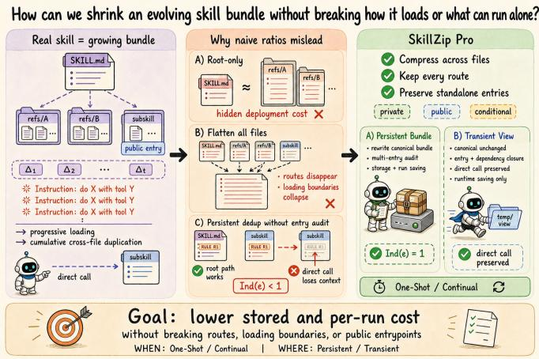  
Fi<sub>g.</sub> 1<sub>.</sub> Th<sub>e</sub> d<sub>ynam</sub>i<sub>c compress</sub>i<sub>on an</sub>d <sub>progress</sub>i<sub>ve</sub> l<sub>oa</sub>di<sub>ng o</sub>f <sub>agen</sub>t <sub>s</sub>kill<sub>s.</sub>

This execution mode changes the compression objective. A <sub>roo</sub>t<sub>-on</sub>l<sub>y me</sub>th<sub>o</sub>d <sub>can repor</sub>t <sub>an a</sub>tt<sub>rac</sub>ti<sub>ve ra</sub>ti<sub>o w</sub>hil<sub>e</sub> l<sub>eav</sub>i<sub>ng mos</sub>t d<sub>ep</sub>l<sub>oye</sub>d t<sub>ex</sub>t <sub>un</sub>t<sub>ouc</sub>h<sub>e</sub>d<sub>;</sub> it <sub>can even move rare</sub> b<sub>ranc</sub>h d<sub>e</sub>t<sub>a</sub>il<sub>s</sub> i<sub>n</sub>t<sub>o</sub> th<sub>e roo</sub>t <sub>an</sub>d i<sub>ncrease every</sub> i<sub>nvoca</sub>ti<sub>on</sub>’<sub>s</sub> <sub>con</sub>t<sub>ex</sub>t<sub>.</sub> C<sub>onca</sub>t<sub>ena</sub>ti<sub>on</sub> fi<sub>xes</sub> th<sub>e</sub> <sub>accoun</sub>ti<sub>ng</sub> <sub>gap</sub> b<sub>u</sub>t d<sub>es</sub>t<sub>roys</sub> <sub>progress</sub>i<sub>ve</sub> di<sub>sc</sub>l<sub>osure.</sub> N<sub>e</sub>ith<sub>er re</sub>fl<sub>ec</sub>t<sub>s</sub> th<sub>e agen</sub>t’<sub>s ac</sub>t<sub>ua</sub>l <sub>cos</sub>t<sub>.</sub>

S<sub>e</sub>lf<sub>-evo</sub>l<sub>v</sub>i<sub>ng agen</sub>t<sub>s ma</sub>k<sub>e</sub> th<sub>e pro</sub>bl<sub>em</sub> l<sub>arger.</sub> S<sub>ys</sub>t<sub>ems</sub> <sub>suc</sub>h <sub>as</sub> V<sub>oyager,</sub> R<sub>e</sub>fl<sub>ex</sub>i<sub>on, an</sub>d l<sub>a</sub>t<sub>er evo</sub>l<sub>u</sub>ti<sub>on</sub> f<sub>ramewor</sub>k<sub>s</sub> <sub>accumu</sub>l<sub>a</sub>t<sub>e</sub> <sub>success</sub>f<sub>u</sub>l <sub>rou</sub>ti<sub>nes,</sub> <sub>coun</sub>t<sub>erexamp</sub>l<sub>es,</sub> <sub>an</sub>d <sub>repa</sub>i<sub>r</sub> rules over time [3]–[6]. Re<sub>p</sub>etition <sub>g</sub>rows both within files and <sub>across</sub> b<sub>ranc</sub>h<sub>es.</sub> Sh<sub>ar</sub>i<sub>ng</sub> th<sub>a</sub>t l<sub>og</sub>i<sub>c</sub> <sub>saves</sub> <sub>space,</sub> b<sub>u</sub>t <sub>p</sub>l<sub>acemen</sub>t <sub>ma</sub>tt<sub>ers: mov</sub>i<sub>ng con</sub>t<sub>en</sub>t <sub>use</sub>d b<sub>y</sub> t<sub>wo rare</sub> b<sub>ranc</sub>h<sub>es</sub> i<sub>n</sub>t<sub>o</sub> th<sub>e</sub> <sub>roo</sub>t <sub>c</sub>h<sub>arges</sub> <sub>every</sub> t<sub>as</sub>k<sub>.</sub> C<sub>ompress</sub>i<sub>on</sub> <sub>mus</sub>t th<sub>ere</sub>f<sub>ore</sub> <sub>op</sub>ti<sub>m</sub>i<sub>ze</sub> <sub>a</sub> <sub>progress</sub>i<sub>ve</sub>l<sub>y</sub> l<sub>oa</sub>d<sub>e</sub>d <sub>resource</sub> <sub>grap</sub>h<sub>,</sub> <sub>no</sub>t <sub>a</sub> fl<sub>a</sub>t <sub>s</sub>t<sub>r</sub>i<sub>ng.</sub>

E<sub>x</sub>i<sub>s</sub>ti<sub>ng me</sub>th<sub>o</sub>d<sub>s are no</sub>t <sub>su</sub>it<sub>a</sub>bl<sub>e</sub> f<sub>or</sub> thi<sub>s se</sub>tti<sub>ng.</sub> P<sub>romp</sub>t <sub>compressors op</sub>ti<sub>m</sub>i<sub>ze</sub> t<sub>o</sub>k<sub>en sa</sub>li<sub>ence or recons</sub>t<sub>ruc</sub>ti<sub>on</sub> i<sub>n a</sub> fl<sub>a</sub>t context [7]–[9]. SkillReducer shortens skills with evaluation f<sub>ee</sub>db<sub>ac</sub>k<sub>,</sub> <sub>w</sub>hi<sub>c</sub>h <sub>requ</sub>i<sub>res</sub> <sub>ro</sub>ll<sub>ou</sub>t<sub>s</sub> <sub>an</sub>d ti<sub>es</sub> <sub>compress</sub>i<sub>on</sub> t<sub>o</sub> sam<sub>p</sub>led tasks [10]. Our earlier SkillZip formulation instead found a shortest faithful re<sub>p</sub>resentation without evaluations [11]. It <sub>preserve</sub>d t<sub>ype</sub>d b<sub>e</sub>h<sub>av</sub>i<sub>ora</sub>l <sub>con</sub>t<sub>rac</sub>t<sub>s an</sub>d <sub>suppor</sub>t<sub>e</sub>d Zi<sub>p-on-</sub> W<sub>r</sub>it<sub>e,</sub> b<sub>u</sub>t t<sub>rea</sub>t<sub>e</sub>d <sub>one</sub> d<sub>ocumen</sub>t <sub>a</sub>t <sub>a</sub> ti<sub>me an</sub>d <sub>cou</sub>ld <sub>no</sub>t <sub>mo</sub>d<sub>e</sub>l <sub>re</sub>f<sub>erences,</sub> <sub>su</sub>b<sub>s</sub>kill<sub>s,</sub> <sub>or</sub> <sub>progress</sub>i<sub>ve-</sub>l<sub>oa</sub>di<sub>ng</sub> <sub>cos</sub>t<sub>s.</sub>

W<sub>e</sub> <sub>presen</sub>t S<sub>kill</sub>Z<sub>ip</sub> P<sub>ro,</sub> <sub>a</sub> b<sub>un</sub>dl<sub>e-aware</sub> <sub>ex</sub>t<sub>ens</sub>i<sub>on</sub> <sub>o</sub>f S<sub>kill</sub>Z<sub>ip</sub> th<sub>a</sub>t <sub>preserves a</sub> h<sub>arness-agnos</sub>ti<sub>c cons</sub>t<sub>ra</sub>i<sub>n</sub>t<sub>:</sub> th<sub>e agen</sub>t h<sub>arness</sub> i<sub>s</sub> <sub>unc</sub>h<sub>ange</sub>d<sub>.</sub> It<sub>s</sub> <sub>ou</sub>t<sub>pu</sub>t i<sub>s</sub> <sub>an</sub> <sub>or</sub>di<sub>nary</sub> <sub>s</sub>kill di<sub>rec</sub>t<sub>ory</sub> th<sub>a</sub>t <sub>uses</sub> <sub>ex</sub>i<sub>s</sub>ti<sub>ng</sub> fil<sub>e</sub> <sub>rea</sub>d<sub>ers,</sub> <sub>pa</sub>th<sub>s,</sub> <sub>an</sub>d l<sub>oa</sub>di<sub>ng</sub> b<sub>e</sub>h<sub>av</sub>i<sub>or;</sub> <sub>no</sub> <sub>reso</sub>l<sub>ver,</sub> i<sub>n</sub>t<sub>ercep</sub>ti<sub>on</sub> h<sub>oo</sub>k<sub>,</sub> <sub>or</sub> <sub>run</sub>ti<sub>me</sub> <sub>pro</sub>t<sub>oco</sub>l i<sub>s</sub> <sub>requ</sub>i<sub>re</sub>d<sub>.</sub>

S<sub>kill</sub>Z<sub>ip</sub> P<sub>ro a</sub>dd<sub>s</sub> t<sub>wo capa</sub>biliti<sub>es</sub> th<sub>a</sub>t <sub>a s</sub>i<sub>ng</sub>l<sub>e-</sub>d<sub>ocumen</sub>t <sub>compressor</sub> l<sub>ac</sub>k<sub>s.</sub> Pill<sub>ar</sub> 1<sub>, ac</sub>ti<sub>va</sub>ti<sub>on-aware cross-</sub>fil<sub>e com-</sub> <sub>p</sub>r<sub>ess</sub>i<sub>o</sub>n<sub>, removes con</sub>t<sub>en</sub>t <sub>a</sub>l<sub>rea</sub>d<sub>y supp</sub>li<sub>e</sub>d b<sub>y</sub> th<sub>e roo</sub>t <sub>or</sub> <sub>a</sub> d<sub>ec</sub>l<sub>are</sub>d <sub>env</sub>i<sub>ronmen</sub>t <sub>con</sub>t<sub>rac</sub>t<sub>,</sub> f<sub>ac</sub>t<sub>ors</sub> <sub>repea</sub>t<sub>e</sub>d b<sub>ranc</sub>h <sub>con</sub>t<sub>en</sub>t <sub>w</sub>ithi<sub>n</sub> it<sub>s</sub> l<sub>oa</sub>di<sub>ng scope, an</sub>d <sub>moves</sub> l<sub>ong guar</sub>d<sub>e</sub>d b<sub>ranc</sub>h<sub>es</sub> i<sub>n</sub>t<sub>o on-</sub>d<sub>eman</sub>d <sub>capsu</sub>l<sub>es.</sub> Th<sub>ese</sub> t<sub>rans</sub>f<sub>orma</sub>ti<sub>ons</sub> <sub>re</sub>d<sub>uce cross-</sub>fil<sub>e re</sub>d<sub>un</sub>d<sub>ancy w</sub>ith<sub>ou</sub>t <sub>en</sub>l<sub>arg</sub>i<sub>ng</sub> th<sub>e a</sub>l<sub>ways-</sub> l<sub>oa</sub>d<sub>e</sub>d l<sub>ayer.</sub> Pill<sub>a</sub>r 2<sub>,</sub> <sub>c</sub>r<sub>oss-</sub>fil<sub>e</sub> r<sub>ou</sub>tin<sub>g</sub> <sub>p</sub>r<sub>ese</sub>r<sub>va</sub>ti<sub>o</sub>n<sub>,</sub> l<sub>oc</sub>k<sub>s</sub> <sub>rou</sub>ti<sub>ng</sub> i<sub>ns</sub>t<sub>ruc</sub>ti<sub>ons</sub> <sub>an</sub>d <sub>au</sub>dit<sub>s</sub> th<sub>e</sub> <sub>ma</sub>t<sub>er</sub>i<sub>a</sub>li<sub>ze</sub>d di<sub>rec</sub>t<sub>ory</sub> b<sub>e</sub>f<sub>ore pu</sub>bli<sub>ca</sub>ti<sub>on.</sub> E<sub>very requ</sub>i<sub>re</sub>d fil<sub>e mus</sub>t <sub>rema</sub>i<sub>n reac</sub>h<sub>a</sub>bl<sub>e,</sub> <sub>an</sub>d i<sub>n</sub>t<sub>er</sub>f<sub>ace con</sub>t<sub>rac</sub>t<sub>s suc</sub>h <sub>as sc</sub>h<sub>emas,</sub> l<sub>a</sub>b<sub>e</sub>l li<sub>s</sub>t<sub>s, an</sub>d <sub>wor</sub>k<sub>e</sub>d f<sub>orma</sub>t<sub>s rema</sub>i<sub>n con</sub>ti<sub>guous an</sub>d <sub>ver</sub>b<sub>a</sub>ti<sub>m.</sub> Th<sub>e comp</sub>il<sub>er</sub> s<sub>upp</sub>orts t<sub>w</sub>o com<sub>p</sub>ression modes<sub>.</sub> O<sub>ne-</sub>Sh<sub>o</sub>t C<sub>ompress</sub>i<sub>on</sub> <sub>scans an</sub>d <sub>op</sub>ti<sub>m</sub>i<sub>zes</sub> th<sub>e</sub> f<sub>u</sub>ll di<sub>rec</sub>t<sub>ory</sub> f<sub>or m</sub>i<sub>gra</sub>ti<sub>on, re</sub>l<sub>ease,</sub> or <sub>p</sub>eriodic re<sub>p</sub>ackin<sub>g.</sub> C<sub>on</sub>ti<sub>nua</sub>l C<sub>ompress</sub>i<sub>on</sub> a<sub>pp</sub>lies each <sub>evo</sub>l<sub>u</sub>ti<sub>on pa</sub>t<sub>c</sub>h <sub>ver</sub>b<sub>a</sub>ti<sub>m, reuses unc</sub>h<sub>ange</sub>d <sub>con</sub>t<sub>rac</sub>t<sub>s, an</sub>d <sub>repa</sub>i<sub>rs on</sub>l<sub>y</sub> th<sub>e a</sub>f<sub>ec</sub>t<sub>e</sub>d <sub>grap</sub>h <sub>c</sub>l<sub>osure, w</sub>h<sub>ere a g</sub>l<sub>o</sub>b<sub>a</sub>l <sub>repac</sub>k i<sub>s use</sub>d t<sub>o</sub> b<sub>oun</sub>d th<sub>e accumu</sub>l<sub>a</sub>t<sub>e</sub>d d<sub>r</sub>ift<sub>.</sub>

T<sub>o accommo</sub>d<sub>a</sub>t<sub>e w</sub>h<sub>e</sub>th<sub>er re</sub>f<sub>erence</sub>d fil<sub>es an</sub>d <sub>su</sub>b<sub>s</sub>kill<sub>s mus</sub>t <sub>rema</sub>i<sub>n</sub> i<sub>n</sub>d<sub>epen</sub>d<sub>en</sub>tl<sub>y usa</sub>bl<sub>e ou</sub>t<sub>s</sub>id<sub>e</sub> th<sub>e roo</sub>t <sub>s</sub>kill<sub>,</sub> SkillZi<sub>p</sub> P<sub>ro</sub> i<sub>n</sub>t<sub>ro</sub>d<sub>uces a separa</sub>t<sub>e ou</sub>t<sub>pu</sub>t<sub>-</sub>lif<sub>ecyc</sub>l<sub>e c</sub>h<sub>o</sub>i<sub>ce.</sub> P<sub>ers</sub>i<sub>s</sub>t<sub>en</sub>t B<sub>u</sub>ndl<sub>e</sub> C<sub>o</sub>m<sub>p</sub>r<sub>ess</sub>i<sub>o</sub>n <sub>rewr</sub>it<sub>es</sub> th<sub>e canon</sub>i<sub>ca</sub>l di<sub>rec</sub>t<sub>ory an</sub>d i<sub>s</sub> b<sub>es</sub>t <sub>su</sub>it<sub>e</sub>d t<sub>o pr</sub>i<sub>va</sub>t<sub>e resources use</sub>d <sub>on</sub>l<sub>y</sub> th<sub>roug</sub>h th<sub>e</sub> <sub>roo</sub>t<sub>, re</sub>d<sub>uc</sub>i<sub>ng</sub> b<sub>o</sub>th <sub>s</sub>t<sub>orage an</sub>d f<sub>u</sub>t<sub>ure run</sub>ti<sub>me con</sub>t<sub>ex</sub>t<sub>.</sub> If it <sub>mo</sub>difi<sub>es a pu</sub>bli<sub>c en</sub>t<sub>ry, a mu</sub>lti<sub>-en</sub>t<sub>ry au</sub>dit <sub>mus</sub>t <sub>ver</sub>if<sub>y</sub> th<sub>a</sub>t th<sub>e</sub> <sub>en</sub>t<sub>ry</sub> <sub>rema</sub>i<sub>ns</sub> i<sub>n</sub>d<sub>epen</sub>d<sub>en</sub>tl<sub>y</sub> <sub>usa</sub>bl<sub>e.</sub> Tr<sub>a</sub>n<sub>s</sub>i<sub>e</sub>nt E<sub>xecu</sub>ti<sub>o</sub>n<sub>-</sub> Vi<sub>ew</sub> C<sub>ompress</sub>i<sub>on</sub> i<sub>ns</sub>t<sub>ea</sub>d l<sub>eaves</sub> th<sub>e canon</sub>i<sub>ca</sub>l di<sub>rec</sub>t<sub>ory</sub> <sub>unc</sub>h<sub>ange</sub>d <sub>an</sub>d <sub>cons</sub>t<sub>ruc</sub>t<sub>s</sub> <sub>a</sub> t<sub>as</sub>k<sub>-spec</sub>ifi<sub>c</sub> <sub>v</sub>i<sub>ew</sub> f<sub>or</sub> <sub>eac</sub>h <sub>run,</sub> <sub>preserv</sub>i<sub>ng</sub> th<sub>e</sub> i<sub>n</sub>d<sub>epen</sub>d<sub>en</sub>t <sub>usa</sub>bilit<sub>y</sub> <sub>o</sub>f <sub>a</sub>ll <sub>s</sub>hi<sub>ppe</sub>d <sub>en</sub>t<sub>r</sub>i<sub>es</sub> b<sub>y</sub> <sub>cons</sub>t<sub>ruc</sub>ti<sub>on</sub> <sub>w</sub>hil<sub>e</sub> <sub>re</sub>d<sub>uc</sub>i<sub>ng</sub> <sub>run</sub>ti<sub>me</sub> <sub>con</sub>t<sub>ex</sub>t b<sub>u</sub>t <sub>no</sub>t di<sub>s</sub>k <sub>usage.</sub> Eith<sub>er</sub> lif<sub>ecyc</sub>l<sub>e</sub> <sub>can</sub> <sub>use</sub> <sub>e</sub>ith<sub>er</sub> <sub>compress</sub>i<sub>on</sub> <sub>mo</sub>d<sub>e.</sub> S<sub>ec</sub>ti<sub>on</sub> V<sub>-</sub>C d<sub>e</sub>fi<sub>nes</sub> th<sub>e resu</sub>lti<sub>ng</sub> f<sub>our com</sub>bi<sub>na</sub>ti<sub>ons an</sub>d th<sub>e</sub>i<sub>r cos</sub>t<sub>s.</sub>

B<sub>o</sub>th <sub>sc</sub>h<sub>e</sub>d<sub>u</sub>l<sub>es reso</sub>l<sub>ve exp</sub>li<sub>c</sub>it l<sub>oca</sub>l <sub>re</sub>f<sub>erences</sub> i<sub>n</sub>t<sub>o a</sub> conservat<sup>i</sup>ve resource <sub>g</sub>ra<sub>p</sub><sup>h</sup>, extract t<sub>yp</sub>e<sup>d</sup> contracts <sup>f</sup>rom text, and lock executable or binary artifacts. The objective <sub>separa</sub>t<sub>es ca</sub>t<sub>a</sub>l<sub>og, ac</sub>ti<sub>va</sub>ti<sub>on,</sub> d<sub>ep</sub>l<sub>oymen</sub>t<sub>, an</sub>d <sub>pa</sub>th<sub>-we</sub>i<sub>g</sub>ht<sub>e</sub>d <sub>cos</sub>t<sub>s.</sub> Aft<sub>er</sub> t<sub>rans</sub>f<sub>orma</sub>ti<sub>on, an</sub> i<sub>n</sub>d<sub>epen</sub>d<sub>en</sub>t <sub>au</sub>dit <sub>rerea</sub>d<sub>s</sub> th<sub>e</sub> <sub>em</sub>itt<sub>e</sub>d di<sub>rec</sub>t<sub>ory</sub> <sub>an</sub>d <sub>c</sub>h<sub>ec</sub>k<sub>s</sub> <sub>grap</sub>h <sub>c</sub>l<sub>osure,</sub> <sub>scope,</sub> <sub>con</sub>t<sub>rac</sub>t <sub>coverage, an</sub>d b<sub>y</sub>t<sub>e</sub> id<sub>en</sub>tit<sub>y</sub> b<sub>e</sub>f<sub>ore a</sub>t<sub>om</sub>i<sub>c pu</sub>bli<sub>ca</sub>ti<sub>on.</sub>

O<sub>ur</sub> <sub>con</sub>t<sub>r</sub>ib<sub>u</sub>ti<sub>ons</sub> <sub>are:</sub>

<sub>•</sub> B<sub>u</sub>ndl<sub>e-awa</sub>r<sub>e co</sub>m<sub>p</sub>r<sub>ess</sub>i<sub>o</sub>n f<sub>o</sub>r <sub>p</sub>r<sub>og</sub>r<sub>ess</sub>i<sub>ve</sub>l<sub>y</sub> l<sub>oa</sub>d<sub>e</sub>d <sub>s</sub>kill<sub>s.</sub> W<sub>e ex</sub>t<sub>en</sub>d <sub>s</sub>kill <sub>compress</sub>i<sub>on</sub> f<sub>rom a s</sub>i<sub>ng</sub>l<sub>e</sub> d<sub>ocumen</sub>t t<sub>o a</sub> resource graph and jointly optimize content placement across th<sub>e</sub> <sub>roo</sub>t<sub>,</sub> <sub>re</sub>f<sub>erence</sub> fil<sub>es,</sub> <sub>an</sub>d <sub>su</sub>b<sub>s</sub>kill<sub>s.</sub> Thi<sub>s</sub> d<sub>es</sub>i<sub>gn</sub> <sub>removes</sub> <sub>cross-</sub>fil<sub>e</sub> <sub>re</sub>d<sub>un</sub>d<sub>ancy</sub> <sub>w</sub>ith<sub>ou</sub>t <sub>mov</sub>i<sub>ng</sub> <sub>rare</sub>l<sub>y</sub> <sub>use</sub>d <sub>con</sub>t<sub>en</sub>t i<sub>n</sub>t<sub>o</sub> th<sub>e a</sub>l<sub>ways-</sub>l<sub>oa</sub>d<sub>e</sub>d <sub>roo</sub>t<sub>.</sub>

<sub>•</sub> Safe routin<sub>g</sub> and inde<sub>p</sub>endent entr<sub>y</sub> <sub>p</sub>reservation. We treat <sub>rou</sub>ti<sub>ng</sub> i<sub>ns</sub>t<sub>ruc</sub>ti<sub>ons</sub> <sub>an</sub>d <sub>en</sub>t<sub>ry</sub> <sub>con</sub>t<sub>rac</sub>t<sub>s</sub> <sub>as</sub> <sub>exp</sub>li<sub>c</sub>it <sub>cons</sub>t<sub>ra</sub>i<sub>n</sub>t<sub>s</sub> <sub>an</sub>d <sub>au</sub>dit th<sub>e ma</sub>t<sub>er</sub>i<sub>a</sub>li<sub>ze</sub>d b<sub>un</sub>dl<sub>e</sub> b<sub>e</sub>f<sub>ore</sub> d<sub>ep</sub>l<sub>oymen</sub>t<sub>.</sub> Thi<sub>s</sub> <sub>ensures</sub> th<sub>a</sub>t <sub>requ</sub>i<sub>re</sub>d b<sub>ranc</sub>h<sub>es rema</sub>i<sub>n reac</sub>h<sub>a</sub>bl<sub>e an</sub>d th<sub>a</sub>t <sub>pu</sub>bli<sub>c su</sub>b<sub>s</sub>kill<sub>s an</sub>d <sub>re</sub>f<sub>erences rema</sub>i<sub>n</sub> i<sub>n</sub>d<sub>epen</sub>d<sub>en</sub>tl<sub>y usa</sub>bl<sub>e.</sub> <sub>•</sub> Flexible com<sub>p</sub>ression for diferent <sub>up</sub>date and de<sub>p</sub>lo<sub>y</sub>ment re<sub>qu</sub>irements<sub>.</sub> W<sub>e</sub> <sub>sepa</sub>r<sub>a</sub>t<sub>e</sub> <sub>w</sub>h<sub>e</sub>n <sub>co</sub>m<sub>p</sub>r<sub>ess</sub>i<sub>o</sub>n i<sub>s</sub> <sub>pe</sub>rf<sub>o</sub>rm<sub>e</sub>d f<sub>rom</sub> <sub>w</sub>h<sub>ere</sub> it<sub>s</sub> <sub>ou</sub>t<sub>pu</sub>t i<sub>s</sub> <sub>s</sub>t<sub>ore</sub>d<sub>.</sub> O<sub>ne-</sub>Sh<sub>o</sub>t <sub>an</sub>d C<sub>on</sub>ti<sub>nua</sub>l <sub>mo</sub>d<sub>es</sub> <sub>suppor</sub>t <sub>s</sub>t<sub>a</sub>ti<sub>c</sub> <sub>an</sub>d <sub>se</sub>lf<sub>-evo</sub>l<sub>v</sub>i<sub>ng</sub> <sub>s</sub>kill<sub>s,</sub> <sub>w</sub>hil<sub>e</sub> P<sub>ers</sub>i<sub>s</sub>t<sub>en</sub>t <sub>an</sub>d T<sub>rans</sub>i<sub>en</sub>t lif<sub>ecyc</sub>l<sub>es</sub> <sub>accommo</sub>d<sub>a</sub>t<sub>e</sub> dif<sub>eren</sub>t <sub>requ</sub>i<sub>remen</sub>t<sub>s</sub> f<sub>or</sub> <sub>s</sub>t<sub>orage</sub> <sub>re</sub>d<sub>uc</sub>ti<sub>on</sub> <sub>an</sub>d i<sub>n</sub>d<sub>epen</sub>d<sub>en</sub>t <sub>resource</sub> <sub>usa</sub>bilit<sub>y.</sub>

<sub>•</sub> C<sub>o</sub>m<sub>p</sub>r<sub>e</sub>h<sub>e</sub>n<sub>s</sub>i<sub>ve co</sub>m<sub>p</sub>r<sub>ess</sub>i<sub>o</sub>n r<sub>esu</sub>lt<sub>s w</sub>ith <sub>p</sub>r<sub>o</sub>d<sub>uc</sub>ti<sub>o</sub>n <sub>ev</sub>id<sub>e</sub>n<sub>ce.</sub> E<sub>very remova</sub>l i<sub>s suppor</sub>t<sub>e</sub>d b<sub>y a con</sub>t<sub>a</sub>i<sub>nmen</sub>t<sub>,</sub> <sub>coverage, or</sub> l<sub>ogge</sub>d<sub>-en</sub>t<sub>a</sub>il<sub>men</sub>t <sub>w</sub>it<sub>ness, w</sub>hil<sub>e</sub> i<sub>n</sub>t<sub>er</sub>f<sub>ace</sub> <sub>con</sub>t<sub>rac</sub>t<sub>s rema</sub>i<sub>n</sub> i<sub>n</sub>t<sub>ac</sub>t<sub>.</sub> O<sub>n a pro</sub>d<sub>uc</sub>ti<sub>on s</sub>kill<sub>,</sub> S<sub>kill</sub>Z<sub>ip</sub> P<sub>ro re</sub>d<sub>uces</sub> d<sub>ep</sub>l<sub>oye</sub>d <sub>con</sub>t<sub>en</sub>t b<sub>y</sub> 38% <sub>an</sub>d <sub>en</sub>d<sub>-</sub>t<sub>o-en</sub>d <sub>per-</sub> <sub>run</sub> t<sub>o</sub>k<sub>ens</sub> b<sub>y</sub> 10<sub>.</sub>4% <sub>w</sub>hil<sub>e</sub> <sub>preserv</sub>i<sub>ng</sub> d<sub>ec</sub>i<sub>s</sub>i<sub>on</sub> <sub>qua</sub>lit<sub>y.</sub>

## II<sub>.</sub> R<sub>elated</sub> W<sub>ork</sub>

S<sub>e</sub>lf<sub>-evo</sub>l<sub>v</sub>in<sub>g age</sub>nt<sub>s a</sub>nd <sub>s</sub>kill m<sub>e</sub>m<sub>o</sub>ri<sub>es.</sub> A<sub>gen</sub>t<sub>s</sub> i<sub>ncreas-</sub> i<sub>ng</sub>l<sub>y re</sub>t<sub>a</sub>i<sub>n reusa</sub>bl<sub>e proce</sub>d<sub>ures</sub> i<sub>ns</sub>t<sub>ea</sub>d <sub>o</sub>f <sub>so</sub>l<sub>v</sub>i<sub>ng every</sub> t<sub>as</sub>k f<sub>rom scra</sub>t<sub>c</sub>h<sub>.</sub> V<sub>oyager s</sub>t<sub>ores execu</sub>t<sub>a</sub>bl<sub>e s</sub>kill<sub>s,</sub> R<sub>e</sub>fl<sub>ex</sub>i<sub>on</sub> <sub>recor</sub>d<sub>s ver</sub>b<sub>a</sub>l f<sub>ee</sub>db<sub>ac</sub>k<sub>, an</sub>d ACE <sub>organ</sub>i<sub>zes evo</sub>l<sub>v</sub>i<sub>ng con</sub>t<sub>ex</sub>t as structured <sub>p</sub>la<sub>y</sub>books [3]–[5]. Other s<sub>y</sub>stems revise, o<sub>p</sub>timize, or formalize skill artifacts [12]–[15]. As these libraries <sub>g</sub>row, <sub>equ</sub>i<sub>va</sub>l<sub>en</sub>t <sub>ru</sub>l<sub>es accumu</sub>l<sub>a</sub>t<sub>e a</sub>t dif<sub>eren</sub>t <sub>scopes an</sub>d b<sub>ranc</sub>h <sub>up</sub>d<sub>a</sub>t<sub>es</sub> <sub>can</sub> <sub>con</sub>fli<sub>c</sub>t<sub>.</sub> S<sub>kill</sub>Z<sub>ip</sub> P<sub>ro</sub> <sub>compresses</sub> th<sub>e</sub> <sub>resu</sub>lti<sub>ng</sub> <sub>represen</sub>t<sub>a</sub>ti<sub>on</sub> <sub>regar</sub>dl<sub>ess</sub> <sub>o</sub>f h<sub>ow</sub> it <sub>was</sub> <sub>crea</sub>t<sub>e</sub>d<sub>.</sub>

Pr<sub>o</sub>m<sub>p</sub>t <sub>a</sub>nd <sub>co</sub>nt<sub>e</sub>xt <sub>co</sub>m<sub>p</sub>r<sub>ess</sub>i<sub>o</sub>n<sub>.</sub> LLMLi<sub>ngua,</sub> L<sub>ong</sub>LLM Li<sub>ngua, an</sub>d LLMLi<sub>ngua-</sub>2 <sub>remove or rewr</sub>it<sub>e</sub> l<sub>ow-u</sub>tilit<sub>y</sub> tokens [7]–[9]; selective-context, <sub>g</sub>istin<sub>g</sub>, and recom<sub>p</sub>ression methods also tar<sub>g</sub>et flat inference contexts [16]–[18]. Skill b<sub>un</sub>dl<sub>es</sub> dif<sub>er</sub> i<sub>n</sub> t<sub>wo ways: rare con</sub>t<sub>en</sub>t <sub>may s</sub>till b<sub>e man</sub>d<sub>a-</sub> t<sub>ory, an</sub>d <sub>eac</sub>h <sub>execu</sub>ti<sub>on</sub> l<sub>oa</sub>d<sub>s on</sub>l<sub>y par</sub>t <sub>o</sub>f th<sub>e</sub> di<sub>rec</sub>t<sub>ory.</sub> S<sub>kill</sub>Z<sub>ip</sub> P<sub>ro</sub> th<sub>ere</sub>f<sub>ore compresses</sub> t<sub>ype</sub>d b<sub>e</sub>h<sub>av</sub>i<sub>ora</sub>l <sub>un</sub>it<sub>s</sub> <sub>w</sub>hil<sub>e</sub> <sub>preserv</sub>i<sub>ng</sub> l<sub>oa</sub>di<sub>ng</sub> b<sub>oun</sub>d<sub>ar</sub>i<sub>es.</sub>

Skill <sub>co</sub>m<sub>p</sub>r<sub>ess</sub>i<sub>o</sub>n <sub>a</sub>nd r<sub>u</sub>ntim<sub>e</sub> r<sub>ep</sub>r<sub>ese</sub>nt<sub>a</sub>ti<sub>o</sub>n<sub>s.</sub> SkillR<sub>e-</sub> ducer uses evaluation feedback to com<sub>p</sub>ress skill text [10]; <sub>parame</sub>t<sub>er</sub>i<sub>ze</sub>d <sub>s</sub>kill<sub>s an</sub>d <sub>execu</sub>ti<sub>on-</sub>ti<sub>me mec</sub>h<sub>an</sub>i<sub>sms</sub> i<sub>ns</sub>t<sub>ea</sub>d chan<sub>g</sub>e the re<sub>p</sub>resentation or runtime [19], [20]. Our transient lif<sub>ecyc</sub>l<sub>e</sub> <sub>a</sub>l<sub>so</sub> b<sub>u</sub>ild<sub>s</sub> <sub>con</sub>t<sub>en</sub>t <sub>per</sub> <sub>run,</sub> b<sub>u</sub>t it <sub>rema</sub>i<sub>ns</sub> <sub>eva</sub>l<sub>ua</sub>ti<sub>on</sub> f<sub>ree an</sub>d h<sub>arness-neu</sub>t<sub>ra</sub>l<sub>:</sub> th<sub>e agen</sub>t <sub>rece</sub>i<sub>ves an or</sub>di<sub>nary</sub> di<sub>rec</sub>t<sub>ory an</sub>d <sub>no reso</sub>l<sub>ver o</sub>b<sub>serves execu</sub>ti<sub>on.</sub> Th<sub>e c</sub>l<sub>oses</sub>t <sub>precursor</sub> i<sub>s</sub> S<sub>kill</sub>Z<sub>ip,</sub> <sub>w</sub>hi<sub>c</sub>h i<sub>n</sub>t<sub>ro</sub>d<sub>uce</sub>d t<sub>ype</sub>d <sub>coverage</sub> <sub>an</sub>d <sub>s</sub>h<sub>or</sub>t<sub>es</sub>t<sub>-cover compress</sub>i<sub>on</sub> f<sub>or one</sub> d<sub>ocumen</sub>t<sub>.</sub> S<sub>kill</sub>Z<sub>ip</sub> P<sub>ro</sub> extends its optimization object, cost model, rewrites, and audit t<sub>o</sub> <sub>progress</sub>i<sub>ve</sub>l<sub>y</sub> l<sub>oa</sub>d<sub>e</sub>d b<sub>un</sub>dl<sub>es.</sub>

Gr<sub>a</sub>mm<sub>a</sub>r<sub>-</sub>b<sub>ase</sub>d <sub>co</sub>m<sub>p</sub>r<sub>ess</sub>i<sub>o</sub>n <sub>a</sub>nd MDL<sub>.</sub> Mi<sub>n</sub>i<sub>mum</sub> d<sub>e-</sub> scri<sub>p</sub>tion len<sub>g</sub>th (MDL) selects the shortest faithful re<sub>p</sub>resentation [21], [22]. Grammar com<sub>p</sub>ressors such as Se<sub>q</sub>uitur and R<sub>e-</sub>P<sub>a</sub>i<sub>r</sub> f<sub>ac</sub>t<sub>or sequences w</sub>h<sub>en re</sub>f<sub>erences amor</sub>ti<sub>ze</sub> d<sub>e</sub>fi<sub>n</sub>iti<sub>on</sub> cost [23], [24]. We add semantic t<sub>yp</sub>es, activation sco<sub>p</sub>e, <sub>p</sub>ath <sub>we</sub>i<sub>g</sub>ht<sub>s,</sub> l<sub>oc</sub>k<sub>e</sub>d <sub>ar</sub>tif<sub>ac</sub>t<sub>s,</sub> <sub>an</sub>d d<sub>ep</sub>l<sub>oymen</sub>t <sub>cons</sub>t<sub>ra</sub>i<sub>n</sub>t<sub>s.</sub> Sh<sub>ar</sub>i<sub>ng</sub> i<sub>s a</sub>ll<sub>owe</sub>d <sub>on</sub>l<sub>y w</sub>h<sub>en</sub> it l<sub>owers</sub> l<sub>oa</sub>d<sub>e</sub>d<sub>-pa</sub>th <sub>cos</sub>t<sub>.</sub>

## III<sub>.</sub> P<sub>roblem</sub> F<sub>ormulation</sub>

## A<sub>.</sub> A Skill I<sub>s a</sub> P<sub>rogress</sub>i<sub>ve</sub>l<sub>y</sub> L<sub>oa</sub>d<sub>e</sub>d B<sub>un</sub>dl<sub>e</sub>

W<sub>e mo</sub>d<sub>e</sub>l <sub>a s</sub>kill <sub>as a roo</sub>t<sub>e</sub>d di<sub>rec</sub>t<sub>ory</sub> $\boldsymbol { B } = ( V , E , r )$ <sub>.</sub> E<sub>ac</sub>h resource $\nu \in V$ h<sub>as</sub> <sub>a</sub> <sub>canon</sub>i<sub>ca</sub>l <sub>pa</sub>th $p _ { \nu } { } ;$ , <sup>b</sup><sub>y</sub>tes $b _ { \nu }$ , me<sup>di</sup>a t<sub>yp</sub>e $m _ { \nu } ,$ <sub>an</sub>d l<sub>oa</sub>di<sub>ng</sub> <sub>c</sub>l<sub>ass</sub> $\ell _ { \nu }$ <sub>.</sub> Th<sub>e</sub> <sub>roo</sub>t $r$ is normall<sub>y</sub> SKILL.md. A<sub>n</sub> <sub>e</sub>d<sub>ge</sub> $\boldsymbol { e } = ( u , \nu , g , s )$ <sub>recor</sub>d<sub>s a re</sub>f<sub>erence</sub> f<sub>rom �</sub> t<sub>o �,</sub> it<sub>s</sub> <sub>g</sub>uar<sup>d</sup> $^ { g , }$ <sub>an</sub>d <sub>source span �; a guar</sub>d <sub>may</sub> b<sub>e uncon</sub>diti<sub>ona</sub>l <sub>or</sub> <sub>au</sub>th<sub>or-wr</sub>itt<sub>en, suc</sub>h <sub>as</sub> “f<sub>or</sub> CSV <sub>expor</sub>t<sub>.</sub>”

W<sub>e</sub> di<sub>s</sub>ti<sub>ngu</sub>i<sub>s</sub>h f<sub>our</sub> l<sub>oa</sub>di<sub>ng</sub> l<sub>ayers:</sub>

1) Catalog: the name, descri<sub>p</sub>tion, and entr<sub>y</sub> metadata visible b<sub>e</sub>f<sub>ore ac</sub>ti<sub>va</sub>ti<sub>on;</sub>

2) Activation: the root instructions loaded whenever the skill i<sub>s se</sub>l<sub>ec</sub>t<sub>e</sub>d<sub>;</sub>

3) Path: the transitive resources loaded for a <sub>p</sub>articular <sub>execu</sub>ti<sub>on</sub> b<sub>ranc</sub>h<sub>;</sub>

4) Deployment: all b<sub>y</sub>tes distributed with the skill, includin<sub>g</sub> <sub>resources rare</sub>l<sub>y or never rea</sub>d<sub>.</sub>

A<sub>n e</sub>dit <sub>can</sub> i<sub>mprove one</sub> l<sub>ayer w</sub>hil<sub>e</sub> h<sub>arm</sub>i<sub>ng ano</sub>th<sub>er.</sub> M<sub>ov</sub>i<sub>ng</sub> <sub>a rare</sub> 500<sub>-</sub>t<sub>o</sub>k<sub>en</sub> b<sub>ranc</sub>h i<sub>n</sub>t<sub>o</sub> th<sub>e roo</sub>t <sub>may re</sub>d<sub>uce</sub> d<sub>ep</sub>l<sub>oy</sub>m<sub>e</sub>nt l<sub>eng</sub>th <sub>a</sub>ft<sub>er</sub> d<sub>e</sub>d<sub>up</sub>li<sub>ca</sub>ti<sub>on ye</sub>t <sub>a</sub>dd 500 t<sub>o</sub>k<sub>ens</sub> t<sub>o every</sub> <sub>ac</sub>ti<sub>va</sub>ti<sub>on.</sub> W<sub>e</sub> th<sub>ere</sub>f<sub>ore measure eac</sub>h l<sub>ayer separa</sub>t<sub>e</sub>l<sub>y.</sub>

Definition III.1 (Safe resource <sub>g</sub>ra<sub>p</sub>h). A <sub>g</sub>ra<sub>p</sub>h is safe if ever<sub>y</sub> <sub>reso</sub>l<sub>ve</sub>d t<sub>arge</sub>t i<sub>s</sub> <sub>a</sub> <sub>regu</sub>l<sub>ar</sub> fil<sub>e</sub> i<sub>ns</sub>id<sub>e</sub> th<sub>e</sub> <sub>canon</sub>i<sub>ca</sub>l b<sub>un</sub>dl<sub>e</sub> <sub>roo</sub>t<sub>,</sub> <sub>every</sub> <sub>recor</sub>d<sub>e</sub>d i<sub>n</sub>t<sub>erna</sub>l <sub>re</sub>f<sub>erence</sub> h<sub>as</sub> <sub>an</sub> <sub>ex</sub>i<sub>s</sub>ti<sub>ng</sub> t<sub>arge</sub>t<sub>,</sub> <sub>an</sub>d <sub>eve</sub>r<sub>y e</sub>d<sub>ge</sub> r<sub>e</sub>t<sub>a</sub>in<sub>s</sub> it<sub>s sou</sub>r<sub>ce spa</sub>n <sub>a</sub>nd <sub>gua</sub>rd<sub>.</sub> E<sub>x</sub>t<sub>e</sub>rn<sub>a</sub>l URL<sub>s</sub> <sub>are recor</sub>d<sub>e</sub>d <sub>as ex</sub>t<sub>erna</sub>l <sub>e</sub>d<sub>ges</sub> b<sub>u</sub>t <sub>are never</sub> f<sub>e</sub>t<sub>c</sub>h<sub>e</sub>d<sub>.</sub> S<sub>ym</sub>b<sub>o</sub>li<sub>c-</sub> li<sub>n</sub>k <sub>escape,</sub> <sub>pa</sub>th t<sub>raversa</sub>l<sub>,</sub> <sub>m</sub>i<sub>ss</sub>i<sub>ng</sub> t<sub>arge</sub>t<sub>s,</sub> <sub>an</sub>d <sub>am</sub>bi<sub>guous</sub> dynamic paths are rejected in strict mode.

Th<sub>e reso</sub>l<sub>ver</sub> i<sub>s</sub> i<sub>n</sub>t<sub>en</sub>ti<sub>ona</sub>ll<sub>y conserva</sub>ti<sub>ve.</sub> M<sub>ar</sub>kd<sub>own</sub> li<sub>n</sub>k<sub>s,</sub> <sub>exp</sub>li<sub>c</sub>it <sub>pa</sub>th lit<sub>era</sub>l<sub>s,</sub> <sub>an</sub>d d<sub>ec</sub>l<sub>are</sub>d <sub>su</sub>b<sub>s</sub>kill <sub>en</sub>t<sub>r</sub>i<sub>es</sub> <sub>are</sub> <sub>recog-</sub> <sub>n</sub>i<sub>ze</sub>d<sub>;</sub> <sub>an</sub> <sub>unrecogn</sub>i<sub>ze</sub>d fil<sub>e</sub> <sub>rema</sub>i<sub>ns</sub> i<sub>n</sub> th<sub>e</sub> d<sub>ep</sub>l<sub>oymen</sub>t b<sub>un</sub>dl<sub>e</sub> b<sub>u</sub>t <sub>con</sub>t<sub>r</sub>ib<sub>u</sub>t<sub>es no</sub> i<sub>n</sub>f<sub>erre</sub>d d<sub>epen</sub>d<sub>ency.</sub> Thi<sub>s preven</sub>t<sub>s</sub> th<sub>e</sub> <sub>compressor</sub> f<sub>rom</sub> i<sub>nven</sub>ti<sub>ng</sub> l<sub>oa</sub>di<sub>ng seman</sub>ti<sub>cs.</sub>

## B<sub>.</sub> E<sub>n</sub>t<sub>ry</sub> C<sub>on</sub>t<sub>rac</sub>t<sub>s:</sub> Whi<sub>c</sub>h R<sub>esources</sub> M<sub>us</sub>t St<sub>an</sub>d Al<sub>one</sub>

A<sub>gen</sub>t<sub>s usua</sub>ll<sub>y reac</sub>h <sub>resources</sub> f<sub>rom</sub> th<sub>e roo</sub>t<sub>,</sub> b<sub>u</sub>t th<sub>ey</sub> <sub>may a</sub>l<sub>so se</sub>l<sub>ec</sub>t <sub>a nes</sub>t<sub>e</sub>d <sub>su</sub>b<sub>s</sub>kill <sub>or re</sub>f<sub>erence</sub> di<sub>rec</sub>tl<sub>y.</sub> Th<sub>e</sub> <sub>compressor</sub> <sub>mus</sub>t k<sub>now</sub> thi<sub>s</sub> b<sub>e</sub>f<sub>ore</sub> d<sub>e</sub>l<sub>e</sub>ti<sub>ng</sub> <sub>con</sub>t<sub>en</sub>t<sub>:</sub> t<sub>ex</sub>t <sub>covere</sub>d b<sub>y</sub> th<sub>e roo</sub>t <sub>may s</sub>till b<sub>e essen</sub>ti<sub>a</sub>l t<sub>o a</sub> di<sub>rec</sub>t <sub>ca</sub>ll<sub>.</sub> <sup>A</sup>n entr<sub>y</sub> contract $\eta _ { \nu }$ th<sub>ere</sub>f<sub>ore</sub> <sub>ass</sub>i<sub>gns</sub> <sub>eac</sub>h <sub>no</sub>d<sub>e</sub> <sub>one</sub> <sub>o</sub>f th<sub>ree ro</sub>l<sub>es:</sub>

• Private (internal): reached onl<sub>y</sub> throu<sub>g</sub>h the root, with no <sub>s</sub>t<sub>an</sub>d<sub>a</sub>l<sub>one-use</sub> <sub>requ</sub>i<sub>remen</sub>t<sub>.</sub>

• Public (standalone): directl<sub>y</sub> selectable and therefore full<sub>y</sub> <sub>usa</sub>bl<sub>e w</sub>ith<sub>ou</sub>t th<sub>e roo</sub>t<sub>.</sub>

<sub>•</sub> C<sub>on</sub>diti<sub>ona</sub>l<sub>:</sub> di<sub>rec</sub>tl<sub>y</sub> <sub>usa</sub>bl<sub>e</sub> <sub>on</sub>l<sub>y</sub> <sub>w</sub>ith <sub>a</sub> d<sub>ec</sub>l<sub>are</sub>d h<sub>os</sub>t <sub>con</sub>t<sub>ex</sub>t <sub>or</sub> d<sub>epen</sub>d<sub>ency</sub> <sub>c</sub>l<sub>osure.</sub>

Th<sub>e au</sub>th<sub>or or ca</sub>t<sub>a</sub>l<sub>og</sub> d<sub>ec</sub>l<sub>ares</sub> th<sub>e con</sub>t<sub>rac</sub>t<sub>;</sub> th<sub>e compressor</sub> <sub>never</sub> i<sub>n</sub>f<sub>ers</sub> it<sub>.</sub> F<sub>or</sub> <sub>a</sub> <sub>pu</sub>bli<sub>c</sub> <sub>or</sub> <sub>con</sub>diti<sub>ona</sub>l <sub>en</sub>t<sub>ry</sub> <sub>�,</sub> d<sub>e</sub>fi<sub>ne</sub> i<sub>n</sub>d<sub>epen</sub>d<sub>ence as</sub>

$$
\mathrm { I n d } ( e , B ^ { \prime } ) = \mathrm { C o v } ( e , B _ { \downarrow e } ^ { \prime } ) \mathbb { I } [ e \mathrm { ~ d i s c o v e r a b l e } ] ,\tag{1}
$$

<sub>w</sub>h<sub>ere</sub> C<sub>ov</sub> i<sub>s</sub> th<sub>e</sub> f<sub>rac</sub>ti<sub>on o</sub>f <sub>source con</sub>t<sub>rac</sub>t <sub>un</sub>it<sub>s covere</sub>d b<sub>y</sub> th<sub>e c</sub>l<sub>osure</sub> $B _ { \perp e } ^ { \prime }$ <sub>reac</sub>h<sub>a</sub>bl<sub>e</sub> f<sub>rom</sub> $^ { e , }$ i<sub>nc</sub>l<sub>u</sub>di<sub>ng</sub> <sub>any</sub> d<sub>ec</sub>l<sub>are</sub>d h<sub>os</sub>t <sub>con</sub>t<sub>ex</sub>t<sub>.</sub> Di<sub>scovera</sub>bilit<sub>y requ</sub>i<sub>res an execu</sub>t<sub>a</sub>bl<sub>e en</sub>t<sub>ry a</sub>t th<sub>e</sub> advertised <sub>p</sub>ath. Thus Ind = 1 means that the entr<sub>y</sub> remains i<sub>n</sub>d<sub>epen</sub>d<sub>en</sub>tl<sub>y usa</sub>bl<sub>e; m</sub>i<sub>ss</sub>i<sub>ng con</sub>t<sub>en</sub>t l<sub>owers coverage, w</sub>hil<sub>e</sub> <sub>a rename</sub>d <sub>or</sub> hidd<sub>en en</sub>t<sub>ry</sub> h<sub>as</sub> i<sub>n</sub>d<sub>epen</sub>d<sub>ence zero.</sub>

## C<sub>.</sub> T<sub>ype</sub>d R<sub>esource</sub> C<sub>on</sub>t<sub>rac</sub>t<sub>s</sub>

F<sub>o</sub>r <sub>eac</sub>h t<sub>ex</sub>t<sub>ua</sub>l n<sub>o</sub>d<sub>e �,</sub> S<sub>kill</sub>Z<sub>ip</sub> P<sub>ro ex</sub>tr<sub>ac</sub>t<sub>s a co</sub>ntr<sub>ac</sub>t

$$
C _ { \nu } = \langle I _ { \nu } , W _ { \nu } , T _ { \nu } , R _ { \nu } , O _ { \nu } , E _ { \nu } , P _ { \nu } , L _ { \nu } \rangle ,\tag{2}
$$

<sub>w</sub>h<sub>ere</sub> � <sub>con</sub>t<sub>a</sub>i<sub>ns app</sub>li<sub>ca</sub>bilit<sub>y an</sub>d i<sub>n</sub>t<sub>er</sub>f<sub>ace con</sub>diti<sub>ons;</sub> � <sub>wor</sub>kfl<sub>ow s</sub>t<sub>a</sub>t<sub>es an</sub>d <sub>or</sub>d<sub>er</sub>i<sub>ng e</sub>d<sub>ges;</sub> � t<sub>oo</sub>l <sub>or resource</sub> <sub>requ</sub>i<sub>remen</sub>t<sub>s;</sub> � <sub>ru</sub>l<sub>es</sub> <sub>an</sub>d <sub>pro</sub>hibiti<sub>ons;</sub> � <sub>ou</sub>t<sub>pu</sub>t fi<sub>e</sub>ld<sub>s</sub> <sub>an</sub>d f<sub>orma</sub>t<sub>s;</sub> � <sub>ev</sub>id<sub>ence or ver</sub>ifi<sub>ca</sub>ti<sub>on o</sub>bli<sub>ga</sub>ti<sub>ons;</sub> � <sub>provenance</sub> t<sub>o source spans; an</sub>d � l<sub>oc</sub>k<sub>e</sub>d <sub>res</sub>id<sub>ua</sub>l<sub>s</sub> th<sub>a</sub>t <sub>mus</sub>t <sub>rema</sub>i<sub>n</sub> <sub>ver</sub>b<sub>a</sub>ti<sub>m.</sub> E<sub>ac</sub>h <sub>un</sub>it $a \in C _ { \nu }$ h<sub>as</sub> <sub>a</sub> <sub>seman</sub>ti<sub>c</sub> t<sub>ype,</sub> <sub>norma</sub>li<sub>ze</sub>d p<sup>a</sup>y<sup>load</sup>, <sup>sco</sup>p<sup>e</sup>, gu<sup>ard</sup>, <sup>and</sup> p<sup>ro</sup>v<sup>enance</sup>.

E<sub>xecu</sub>t<sub>a</sub>bl<sub>e co</sub>d<sub>e, s</sub>t<sub>ruc</sub>t<sub>ure</sub>d d<sub>a</sub>t<sub>a,</sub> i<sub>mages, an</sub>d <sub>o</sub>th<sub>er non-</sub> i<sub>ns</sub>t<sub>ruc</sub>ti<sub>ona</sub>l <sub>ar</sub>tif<sub>ac</sub>t<sub>s</sub> <sub>are</sub> l<sub>oc</sub>k<sub>e</sub>d <sub>no</sub>d<sub>es.</sub> Ph<sub>ase</sub> A <sub>may</sub> <sub>rename</sub> <sub>ne</sub>ith<sub>er</sub> th<sub>e</sub>i<sub>r pa</sub>th <sub>nor</sub> th<sub>e</sub>i<sub>r</sub> b<sub>y</sub>t<sub>es.</sub> Th<sub>e</sub>i<sub>r</sub> i<sub>n</sub>b<sub>oun</sub>d <sub>re</sub>f<sub>erences can</sub> b<sub>e rewr</sub>itt<sub>en on</sub>l<sub>y w</sub>h<sub>en</sub> th<sub>e re</sub>f<sub>err</sub>i<sub>ng</sub> M<sub>ar</sub>kd<sub>own</sub> i<sub>s rewr</sub>itt<sub>en</sub> <sub>an</sub>d th<sub>e canon</sub>i<sub>ca</sub>l t<sub>arge</sub>t <sub>rema</sub>i<sub>ns</sub> id<sub>en</sub>ti<sub>ca</sub>l<sub>.</sub>

F<sub>or a can</sub>did<sub>a</sub>t<sub>e</sub> b<sub>un</sub>dl<sub>e</sub> �<sup>′</sup><sub>,</sub> l<sub>e</sub>t $\mathrm { c o v e r } ( a , B ^ { \prime } )$ <sub>mean</sub> th<sub>a</sub>t <sub>a</sub> <sub>compa</sub>tibl<sub>e s</sub>t<sub>a</sub>t<sub>emen</sub>t<sub>, re</sub>f<sub>erence, or</sub> l<sub>oc</sub>k<sub>e</sub>d <sub>ar</sub>tif<sub>ac</sub>t i<sub>n</sub> $B ^ { \prime }$ <sub>en</sub>t<sub>a</sub>il<sub>s</sub> <sub>un</sub>it <sub>� on every pa</sub>th <sub>w</sub>h<sub>ere</sub> it <sub>or</sub>i<sub>g</sub>i<sub>na</sub>ll<sub>y app</sub>li<sub>e</sub>d<sub>.</sub> C<sub>overage</sub> i<sub>s</sub> t<sub>ype cons</sub>t<sub>ra</sub>i<sub>ne</sub>d<sub>: an examp</sub>l<sub>e canno</sub>t <sub>cover a pro</sub>hibiti<sub>on,</sub> <sub>gener</sub>i<sub>c</sub> <sub>a</sub>d<sub>v</sub>i<sub>ce</sub> <sub>canno</sub>t <sub>cover</sub> <sub>a</sub> <sub>requ</sub>i<sub>re</sub>d <sub>ou</sub>t<sub>pu</sub>t fi<sub>e</sub>ld<sub>,</sub> <sub>an</sub>d <sub>an</sub> <sub>unre</sub>l<sub>a</sub>t<sub>e</sub>d b<sub>ranc</sub>h <sub>canno</sub>t <sub>cover</sub> <sub>a</sub> <sub>guar</sub>d<sub>e</sub>d <sub>ru</sub>l<sub>e.</sub>

Definition III.2 (Bundle faithfulness). $B ^ { \prime }$ i<sub>s</sub> f<sub>a</sub>ithf<sub>u</sub>l t<sub>o</sub> � <sub>un</sub>d<sub>er</sub> environment contract � if (i) ever<sub>y</sub> source unit is covered at a com<sub>p</sub>atible sco<sub>p</sub>e, (ii) ever<sub>y</sub> locked node is b<sub>y</sub>te-identical, (iii) all internal references in $B ^ { \prime }$ resolve safel<sub>y</sub>, and (iv) an<sub>y</sub> <sub>un</sub>it <sub>remove</sub>d b<sub>y</sub> h<sub>os</sub>t <sub>en</sub>t<sub>a</sub>il<sub>men</sub>t h<sub>as</sub> <sub>an</sub> <sub>exac</sub>t t<sub>ype</sub>d <sub>w</sub>it<sub>ness</sub> i<sub>n</sub> � b<sub>oun</sub>d t<sub>o</sub> th<sub>e au</sub>dit<sub>e</sub>d <sub>env</sub>i<sub>ronmen</sub>t di<sub>ges</sub>t<sub>.</sub>

Thi<sub>s s</sub>t<sub>ruc</sub>t<sub>ura</sub>l <sub>guaran</sub>t<sub>ee</sub> d<sub>oes no</sub>t <sub>asser</sub>t b<sub>e</sub>h<sub>av</sub>i<sub>ora</sub>l <sub>equ</sub>i<sub>v-</sub> <sub>a</sub>l<sub>ence</sub> f<sub>or every</sub> l<sub>anguage mo</sub>d<sub>e</sub>l<sub>.</sub> It <sub>pro</sub>t<sub>ec</sub>t<sub>s</sub> th<sub>e</sub> b<sub>un</sub>dl<sub>e</sub>’<sub>s</sub> <sub>exp</sub>li<sub>c</sub>it <sub>con</sub>t<sub>rac</sub>t<sub>, no</sub>t <sub>every</sub> l<sub>a</sub>t<sub>en</sub>t <sub>rea</sub>di<sub>ng.</sub>

## D. Four Costs, One Constrained Objective

L<sub>e</sub>t $\tau ( x )$ b<sub>e</sub> th<sub>e</sub> d<sub>ep</sub>l<sub>oymen</sub>t t<sub>o</sub>k<sub>en</sub>i<sub>zer or ano</sub>th<sub>er</sub> d<sub>ec</sub>l<sub>are</sub>d l<sub>eng</sub>th f<sub>unc</sub>ti<sub>on.</sub> F<sub>or a</sub> b<sub>un</sub>dl<sub>e</sub> $B ^ { \prime }$ <sub>,</sub> d<sub>e</sub>fi<sub>ne</sub>

$$
C _ { \mathrm { c a t } } ( B ^ { \prime } ) = \tau ( \mathrm { n a m e } , \mathrm { d e s c r i p t i o n } , \mathrm { e n t r y } ) ,\tag{3}
$$

$$
C _ { \mathrm { a c t } } ( B ^ { \prime } ) = \tau ( b _ { r } ^ { \prime } ) ,\tag{4}
$$

$$
C _ { \mathrm { d e p } } ( B ^ { \prime } ) = \sum _ { \nu \in V ^ { \prime } } \tau ( b _ { \nu } ^ { \prime } ) ,\tag{5}
$$

$$
C _ { \mathrm { p a t h } } ( B ^ { \prime } ; \pi ) = \sum _ { \nu \in \mathrm { l o a d } ( B ^ { \prime } , \pi ) } \tau ( b _ { \nu } ^ { \prime } ) .\tag{6}
$$

H<sub>ere �</sub> d<sub>eno</sub>t<sub>es an execu</sub>ti<sub>on pa</sub>th <sub>or</sub> t<sub>as</sub>k <sub>c</sub>l<sub>ass an</sub>d l<sub>oa</sub>d f<sub>o</sub>ll<sub>ows</sub> th<sub>e unc</sub>h<sub>ange</sub>d <sub>agen</sub>t’<sub>s progress</sub>i<sub>ve-</sub>l<sub>oa</sub>di<sub>ng</sub> b<sub>e</sub>h<sub>av</sub>i<sub>or.</sub> Gi<sub>ven an</sub> <sub>emp</sub>i<sub>r</sub>i<sub>ca</sub>l <sub>pa</sub>th di<sub>s</sub>t<sub>r</sub>ib<sub>u</sub>ti<sub>on</sub> $q ( \pi )$ <sub>, our pr</sub>i<sub>mary op</sub>ti<sub>m</sub>i<sub>za</sub>ti<sub>on</sub> tar<sub>g</sub>et <sup>i</sup>s

$$
J ( B ^ { \prime } ) = C _ { \mathrm { c a t } } ( B ^ { \prime } ) + C _ { \mathrm { a c t } } ( B ^ { \prime } ) + \mathbb { E } _ { \pi \sim q } C _ { \mathrm { p a t h } } ( B ^ { \prime } ; \pi ) + \lambda C _ { \mathrm { d e p } } ( B ^ { \prime } ) ,\tag{7}
$$

subject to bundle faithfulness. We use $\lambda = 0 . 0 5$ <sup>as</sup> <sup>a</sup> <sup>trans</sup>p<sup>arent</sup> d<sub>e</sub>f<sub>au</sub>lt <sub>so</sub> th<sub>a</sub>t <sub>s</sub>t<sub>orage ma</sub>tt<sub>ers w</sub>ith<sub>ou</sub>t d<sub>om</sub>i<sub>na</sub>ti<sub>ng run</sub>ti<sub>me</sub> <sub>exposure.</sub> If <sub>no</sub> t<sub>race</sub> di<sub>s</sub>t<sub>r</sub>ib<sub>u</sub>ti<sub>on</sub> i<sub>s</sub> <sub>ava</sub>il<sub>a</sub>bl<sub>e,</sub> <sub>exp</sub>li<sub>c</sub>it b<sub>ranc</sub>h <sub>guar</sub>d<sub>s</sub> i<sub>n</sub>d<sub>uce</sub> <sub>a</sub> <sub>un</sub>if<sub>orm</sub> di<sub>s</sub>t<sub>r</sub>ib<sub>u</sub>ti<sub>on</sub> <sub>over</sub> <sub>reac</sub>h<sub>a</sub>bl<sub>e</sub> l<sub>ea</sub>f <sub>pa</sub>th<sub>s;</sub> <sub>every repor</sub>t<sub>e</sub>d <sub>resu</sub>lt <sub>mus</sub>t id<sub>en</sub>tif<sub>y w</sub>hi<sub>c</sub>h <sub>es</sub>ti<sub>ma</sub>t<sub>or was use</sub>d<sub>.</sub>

We re<sub>p</sub>ort all four costs even when o<sub>p</sub>timizin<sub>g</sub> Eq. (7). A <sub>s</sub>i<sub>ng</sub>l<sub>e</sub> “<sub>compress</sub>i<sub>on ra</sub>ti<sub>o</sub>” i<sub>s</sub> i<sub>nsu</sub>fi<sub>c</sub>i<sub>en</sub>t<sub>:</sub> it <sub>can concea</sub>l <sub>a</sub> <sub>regress</sub>i<sub>on</sub> i<sub>n</sub> th<sub>e</sub> <sub>a</sub>l<sub>ways-</sub>l<sub>oa</sub>d<sub>e</sub>d <sub>roo</sub>t <sub>or</sub> i<sub>n</sub> th<sub>e</sub> t<sub>a</sub>il <sub>o</sub>f <sub>pa</sub>th <sub>cos</sub>t<sub>.</sub> F<sub>or me</sub>t<sub>r</sub>i<sub>c �,</sub> th<sub>e re</sub>d<sub>uc</sub>ti<sub>on</sub> i<sub>s</sub> $1 - C _ { x } ( B ^ { \prime } ) / C _ { x } ( B )$ ; ne<sub>g</sub>at<sup>i</sup>ve <sub>va</sub>l<sub>ues</sub> <sub>are</sub> <sub>preserve</sub>d <sub>ra</sub>th<sub>er</sub> th<sub>an</sub> <sub>c</sub>li<sub>ppe</sub>d<sub>.</sub>

## E. Two Deployment Lifecycles and Their Costs

Th<sub>e</sub> f<sub>our cos</sub>t<sub>s a</sub>b<sub>ove</sub> d<sub>escr</sub>ib<sub>e one ar</sub>tif<sub>ac</sub>t<sub>,</sub> b<sub>u</sub>t d<sub>ep</sub>l<sub>oymen</sub>t h<sub>as</sub> t<sub>wo</sub> di<sub>s</sub>ti<sub>nc</sub>t lif<sub>ecyc</sub>l<sub>es.</sub> P<sub>ers</sub>i<sub>s</sub>t<sub>en</sub>t <sub>compress</sub>i<sub>on rewr</sub>it<sub>es</sub> th<sub>e</sub> <sub>canon</sub>i<sub>ca</sub>l b<sub>un</sub>dl<sub>e;</sub> it<sub>s</sub> <sub>one-</sub>ti<sub>me</sub> <sub>wor</sub>k <sub>re</sub>d<sub>uces</sub> <sub>s</sub>t<sub>orage</sub> <sub>an</sub>d f<sub>u</sub>t<sub>ure</sub> <sub>runs.</sub> T<sub>rans</sub>i<sub>en</sub>t <sub>compress</sub>i<sub>on</sub> l<sub>eaves</sub> th<sub>e</sub> <sub>canon</sub>i<sub>ca</sub>l b<sub>un</sub>dl<sub>e</sub> <sub>unc</sub>h<sub>ange</sub>d <sub>an</sub>d b<sub>u</sub>ild<sub>s a</sub> t<sub>as</sub>k<sub>-spec</sub>ifi<sub>c execu</sub>ti<sub>on v</sub>i<sub>ew</sub> $\widehat { B } _ { e , \pi }$ b<sub>e</sub>f<sub>ore a run</sub> th<sub>roug</sub>h <sub>en</sub>t<sub>ry �.</sub> It<sub>s</sub> b<sub>ene</sub>fit <sub>app</sub>li<sub>es on</sub>l<sub>y</sub> t<sub>o</sub> th<sub>a</sub>t <sub>run an</sub>d <sub>mus</sub>t b<sub>e repor</sub>t<sub>e</sub>d <sub>a</sub>ft<sub>er</sub> b<sub>u</sub>ild <sub>an</sub>d <sub>cac</sub>h<sub>e cos</sub>t<sub>.</sub>

B<sub>ecause</sub> th<sub>e</sub> t<sub>wo c</sub>h<sub>ange</sub> dif<sub>eren</sub>t thi<sub>ngs, we separa</sub>t<sub>e seven</sub> <sub>quan</sub>titi<sub>es</sub> <sub>an</sub>d <sub>never</sub> <sub>average</sub> <sub>across</sub> th<sub>em:</sub>

1) Canonical storage $C _ { \mathrm { d i s k } } ( B ^ { \prime } ) { \mathrm { : } }$ <sub>:</sub> b<sub>y</sub>t<sub>es o</sub>f th<sub>e on-</sub>di<sub>s</sub>k b<sub>un</sub>dl<sub>e.</sub> P<sub>ers</sub>i<sub>s</sub>t<sub>en</sub>t <sub>s</sub>h<sub>r</sub>i<sub>n</sub>k<sub>s</sub> it<sub>;</sub> t<sub>rans</sub>i<sub>en</sub>t k<sub>eeps</sub> it <sub>equa</sub>l t<sub>o</sub> th<sub>e source.</sub>

2) Shipped/deployment $C _ { \mathrm { d e p } } ( B ^ { \prime } )$ (Eq. (7)): distributed b<sub>y</sub>tes.

3) Per-entrypoint activation $C _ { \mathrm { a c t } } ( B ^ { \prime } ; e ) ;$ <sub>: en</sub>t<sub>ry</sub> t<sub>o</sub>k<sub>ens</sub> l<sub>oa</sub>d<sub>e</sub>d w<sup>h</sup>en entr<sub>y</sub> $e$ i<sub>s</sub> <sub>se</sub>l<sub>ec</sub>t<sub>e</sub>d<sub>.</sub>

4) Per-run execution-view tokens $C _ { \mathrm { v i e w } } ( \widehat { B } _ { e , \pi } ) \colon$ : context l<sub>oa</sub>d<sub>e</sub>d f<sub>or</sub> <sub>one</sub> <sub>run</sub> th<sub>roug</sub>h <sub>�</sub> <sub>on</sub> t<sub>as</sub>k <sub>�.</sub>

5) Transient build latency $\Lambda _ { \mathrm { b u i l d } } ( e , \pi )$ <sub>: wa</sub>ll<sub>-c</sub>l<sub>oc</sub>k ti<sub>me an</sub>d <sub>any mo</sub>d<sub>e</sub>l <sub>ca</sub>ll<sub>s</sub> t<sub>o cons</sub>t<sub>ruc</sub>t $B _ { e , \pi }$

6) Cache and invalidation $C _ { \mathrm { c a c h e } } \mathrm { . }$ <sub>s</sub>t<sub>or</sub>i<sub>ng v</sub>i<sub>ews</sub> k<sub>eye</sub>d b<sub>y</sub> (bundle di<sub>g</sub>est, entr<sub>y</sub>, environment version) and rebuildin<sub>g</sub> th<sub>em w</sub>h<sub>en any</sub> k<sub>ey c</sub>h<sub>anges.</sub>

7) Public-entrypoint independence Ind $( e , B ^ { \prime } ) = 1$ <sup>f</sup>or ever<sub>y</sub> <sub>pu</sub>bli<sub>c �: a man</sub>d<sub>a</sub>t<sub>ory</sub> d<sub>ep</sub>l<sub>oymen</sub>t <sub>cons</sub>t<sub>ra</sub>i<sub>n</sub>t<sub>.</sub>

P<sub>ers</sub>i<sub>s</sub>t<sub>en</sub>t <sub>resu</sub>lt<sub>s</sub> <sub>repor</sub>t <sub>quan</sub>titi<sub>es</sub> 1<sub>–</sub>3 <sub>an</sub>d <sub>per-run</sub> l<sub>oa</sub>d<sub>.</sub> T<sub>ran-</sub> <sub>s</sub>i<sub>en</sub>t <sub>resu</sub>lt<sub>s repor</sub>t <sub>quan</sub>titi<sub>es</sub> 4<sub>–</sub>6<sub>,</sub> i<sub>nc</sub>l<sub>u</sub>di<sub>ng</sub> b<sub>u</sub>ild <sub>over</sub>h<sub>ea</sub>d<sub>,</sub> b<sub>u</sub>t <sub>never a</sub> di<sub>s</sub>k <sub>ra</sub>ti<sub>o</sub> b<sub>ecause</sub> di<sub>s</sub>k i<sub>s unc</sub>h<sub>ange</sub>d<sub>.</sub> B<sub>o</sub>th lif<sub>ecyc</sub>l<sub>es</sub> <sub>mus</sub>t <sub>sa</sub>ti<sub>s</sub>f<sub>y cons</sub>t<sub>ra</sub>i<sub>n</sub>t 7 f<sub>or every pu</sub>bli<sub>c en</sub>t<sub>ry.</sub> Th<sub>ey use</sub> th<sub>e</sub> <sub>same</sub> k<sub>erne</sub>l b<sub>u</sub>t dif<sub>er</sub> i<sub>n</sub> d<sub>e</sub>l<sub>e</sub>ti<sub>on</sub> <sub>scope,</sub> <sub>pu</sub>bli<sub>ca</sub>ti<sub>on,</sub> <sub>au</sub>diti<sub>ng,</sub> and fallback (Section V-C).

## IV<sub>.</sub> E<sub>xecution-</sub>A<sub>ware</sub> C<sub>ompression</sub> T<sub>heory</sub>

## A<sub>.</sub> F<sub>rom</sub> R<sub>epe</sub>titi<sub>on</sub> t<sub>o</sub> S<sub>cope</sub>d R<sub>euse</sub>

Withi<sub>n one</sub> d<sub>ocumen</sub>t<sub>,</sub> S<sub>kill</sub>Z<sub>ip se</sub>l<sub>ec</sub>t<sub>s a s</sub>h<sub>or</sub>t<sub>es</sub>t <sub>cover</sub> <sub>o</sub>f t<sub>ype</sub>d <sub>con</sub>t<sub>rac</sub>t <sub>un</sub>it<sub>s us</sub>i<sub>ng pr</sub>i<sub>m</sub>iti<sub>ve s</sub>t<sub>a</sub>t<sub>emen</sub>t<sub>s, s</sub>h<sub>are</sub>d <sub>ru</sub>l<sub>es,</sub> <sub>parame</sub>t<sub>er</sub>i<sub>ze</sub>d <sub>proce</sub>d<sub>ures,</sub> <sub>an</sub>d <sub>exp</sub>li<sub>c</sub>it <sub>excep</sub>ti<sub>ons.</sub> F<sub>or</sub> <sub>can</sub>did<sub>a</sub>t<sub>e</sub> <sub>represen</sub>t<sub>a</sub>ti<sub>on</sub> $z ,$ l<sub>e</sub>t $d ( z )$ b<sub>e</sub> it<sub>s</sub> t<sub>o</sub>k<sub>en</sub> <sub>cos</sub>t <sub>an</sub>d $\Gamma ( z )$ th<sub>e un</sub>it<sub>s</sub> it <sub>covers.</sub> Th<sub>e</sub> fil<sub>e-</sub>l<sub>eve</sub>l <sub>pro</sub>bl<sub>em</sub> i<sub>s a we</sub>i<sub>g</sub>ht<sub>e</sub>d <sub>se</sub>t <sub>cover</sub> <sub>w</sub>ith h<sub>ar</sub>d <sub>coverage:</sub>

$$
\operatorname* { m i n } _ { Z \subseteq { \mathcal { Z } } } \sum _ { z \in Z } d ( z ) \quad { \mathrm { s . t . } } \quad \bigcup _ { z \in Z } \Gamma ( z ) \geq C _ { \nu } .\tag{8}
$$

S<sub>kill</sub>Z<sub>ip</sub> P<sub>ro re</sub>t<sub>a</sub>i<sub>ns</sub> thi<sub>s op</sub>ti<sub>m</sub>i<sub>zer</sub> b<sub>u</sub>t <sub>c</sub>h<sub>anges can</sub>did<sub>a</sub>t<sub>e cos</sub>t <sub>accor</sub>di<sub>ng</sub> t<sub>o w</sub>h<sub>ere</sub> th<sub>e represen</sub>t<sub>a</sub>ti<sub>on</sub> i<sub>s p</sub>l<sub>ace</sub>d i<sub>n</sub> th<sub>e</sub> b<sub>un</sub>dl<sub>e.</sub>

S<sub>uppose exac</sub>t fr<sub>ag</sub>m<sub>e</sub>nt <sub>� o</sub>f l<sub>e</sub>n<sub>g</sub>th $d _ { x }$ <sub>occurs</sub> i<sub>n</sub> fil<sub>es</sub> $S _ { x } \subseteq$ �<sub>.</sub> K<sub>eep</sub>i<sub>ng a</sub>ll <sub>cop</sub>i<sub>es</sub> i<sub>ncurs</sub> $\textstyle \sum _ { \nu \in S _ { x } } w _ { \nu } d _ { x }$ <sub>, w</sub>h<sub>ere</sub> $w _ { \nu }$ i<sub>s</sub> th<sub>e</sub> efective load wei<sub>g</sub>ht induced b<sub>y</sub> Eq. (7). Factorin<sub>g</sub> � into <sub>s</sub>h<sub>are</sub>d <sub>mo</sub>d<sub>u</sub>l<sub>e</sub> ℎ <sub>w</sub>ith <sub>re</sub>f<sub>erence</sub> <sub>cos</sub>t $d _ { \mathrm { r e f } }$ costs

$$
w _ { h } d _ { x } + \sum _ { \nu \in S _ { x } } w _ { \nu } d _ { \mathrm { r e f } } + d _ { \mathrm { a u d i t } } ,\tag{9}
$$

<sub>w</sub>h<sub>ere</sub> $w _ { h }$ i<sub>s</sub> th<sub>e pro</sub>b<sub>a</sub>bilit<sub>y-we</sub>i<sub>g</sub>ht<sub>e</sub>d <sub>scope o</sub>f $h ,$ <sub>an</sub>d $d _ { \mathrm { a u d i t } }$ <sub>covers</sub> i<sub>mpor</sub>t i<sub>ns</sub>t<sub>ruc</sub>ti<sub>ons</sub> <sub>an</sub>d <sub>provenance.</sub> F<sub>ac</sub>t<sub>or</sub>i<sub>ng</sub> i<sub>s</sub> <sub>a</sub>ll<sub>owe</sub>d onl<sub>y</sub> if Eq. (9) is smaller.

Proposition IV.1 (No s<sub>p</sub>arse-root <sub>p</sub>romotion). Let � occur <sub>on</sub>l<sub>y</sub> i<sub>n</sub> b<sub>ranc</sub>h<sub>es w</sub>ith t<sub>o</sub>t<sub>a</sub>l <sub>access pro</sub>b<sub>a</sub>bilit<sub>y</sub> $p < 1$ <sub>.</sub> Pl<sub>ac</sub>i<sub>ng</sub> <sub>�</sub> i<sub>n</sub> th<sub>e a</sub>l<sub>ways-</sub>l<sub>oa</sub>d<sub>e</sub>d <sub>roo</sub>t <sub>a</sub>dd<sub>s</sub> $( 1 - p ) d _ { x }$ <sub>expec</sub>t<sub>e</sub>d t<sub>o</sub>k<sub>ens</sub> relative to keeping one copy within the afected activation scope, before reference overhead. Therefore root promotion is <sub>su</sub>b<sub>op</sub>ti<sub>ma</sub>l <sub>w</sub>h<sub>enever</sub> th<sub>e</sub> d<sub>ep</sub>l<sub>oymen</sub>t <sub>sav</sub>i<sub>ng</sub> i<sub>s sma</sub>ll<sub>er</sub> th<sub>an</sub> $( 1 - p ) d _ { x } / \lambda$ plus reference cost.

Proof. In Eq. (7), root <sub>p</sub>lacement <sub>g</sub>ives load wei<sub>g</sub>ht one, <sub>w</sub>h<sub>ereas</sub> b<sub>ranc</sub>h<sub>-scope</sub>d <sub>p</sub>l<sub>acemen</sub>t <sub>g</sub>i<sub>ves we</sub>i<sub>g</sub>ht $p .$ <sub>.</sub> Th<sub>e</sub>i<sub>r</sub> <sub>pa</sub>th<sub>-cos</sub>t dif<sub>erence</sub> i<sub>s</sub> $( 1 - p ) d _ { x }$ <sub>;</sub> d<sub>ep</sub>l<sub>oymen</sub>t <sub>can o</sub>f<sub>se</sub>t it <sub>on</sub>l<sub>y</sub> th<sub>roug</sub>h th<sub>e</sub> $\lambda C _ { \mathrm { d e p } }$ t<sub>erm.</sub> Addi<sub>ng nonnega</sub>ti<sub>ve re</sub>f<sub>erence</sub> <sub>over</sub>h<sub>ea</sub>d <sub>y</sub>i<sub>e</sub>ld<sub>s</sub> th<sub>e s</sub>t<sub>a</sub>t<sub>e</sub>d <sub>con</sub>diti<sub>on.</sub> □

Th<sub>e</sub> <sub>propos</sub>iti<sub>on</sub> <sub>cap</sub>t<sub>ures</sub> <sub>a</sub> <sub>common</sub> f<sub>a</sub>il<sub>ure:</sub> <sub>g</sub>l<sub>o</sub>b<sub>a</sub>l d<sub>e</sub>d<sub>u-</sub> <sub>p</sub>li<sub>ca</sub>ti<sub>on</sub> <sub>can</sub> <sub>re</sub>d<sub>uce</sub> <sub>s</sub>t<sub>orage</sub> <sub>w</sub>hil<sub>e</sub> <sub>ma</sub>ki<sub>ng</sub> <sub>common</sub> <sub>reques</sub>t<sub>s</sub> <sub>more expens</sub>i<sub>ve.</sub> S<sub>kill</sub>Z<sub>ip</sub> P<sub>ro</sub> i<sub>ns</sub>t<sub>ea</sub>d <sub>p</sub>l<sub>aces a s</sub>h<sub>are</sub>d <sub>mo</sub>d<sub>u</sub>l<sub>e</sub> <sub>w</sub>ithi<sub>n</sub> th<sub>e ac</sub>ti<sub>va</sub>ti<sub>on scope o</sub>f th<sub>e</sub> b<sub>ranc</sub>h<sub>es</sub> th<sub>a</sub>t <sub>nee</sub>d it<sub>.</sub> Th<sub>e</sub> <sub>roo</sub>t i<sub>mpor</sub>t<sub>s</sub> it <sub>on</sub>l<sub>y</sub> <sub>w</sub>h<sub>en</sub> <sub>every</sub> <sub>reac</sub>h<sub>a</sub>bl<sub>e</sub> <sub>pa</sub>th <sub>requ</sub>i<sub>res</sub> it<sub>.</sub>

## B<sub>.</sub> C<sub>on</sub>diti<sub>ona</sub>l C<sub>apsu</sub>l<sub>es</sub>

A <sub>guar</sub>d<sub>e</sub>d <sub>sec</sub>ti<sub>on w</sub>ith <sub>an exp</sub>li<sub>c</sub>it t<sub>r</sub>i<sub>gger can</sub> b<sub>e move</sub>d f<sub>rom</sub> <sub>an</sub> <sub>a</sub>l<sub>ways-</sub>l<sub>oa</sub>d<sub>e</sub>d fil<sub>e</sub> i<sub>n</sub>t<sub>o</sub> <sub>an</sub> <sub>on-</sub>d<sub>eman</sub>d <sub>capsu</sub>l<sub>e</sub> <sub>.</sub> L<sub>e</sub>t th<sub>e</sub> <sub>sec</sub>ti<sub>on</sub> b<sub>o</sub>d<sub>y cos</sub>t $d _ { b }$ <sub>,</sub> di<sub>spa</sub>t<sub>c</sub>h<sub>er cos</sub>t $d _ { g }$ <sub>, an</sub>d t<sub>r</sub>i<sub>gger pro</sub>b<sub>a</sub>bilit<sub>y</sub> $p _ { g }$ <sub>.</sub> K<sub>eep</sub>i<sub>ng</sub> th<sub>e</sub> b<sub>o</sub>d<sub>y</sub> i<sub>n</sub>li<sub>ne</sub> <sub>cos</sub>t<sub>s</sub> $d _ { b }$ <sub>per</sub> l<sub>oa</sub>d<sub>;</sub> <sub>a</sub> <sub>capsu</sub>l<sub>e</sub> <sub>cos</sub>t<sub>s</sub> $d _ { g } + p _ { g } d _ { b }$ i<sub>n pa</sub>th <sub>expec</sub>t<sub>a</sub>ti<sub>on, p</sub>l<sub>us</sub> $\lambda d _ { g }$ d<sub>ep</sub>l<sub>oymen</sub>t <sub>over</sub>h<sub>ea</sub>d<sub>.</sub> Proposition IV.2 (Ca<sub>p</sub>sule threshold). Movin<sub>g</sub> a <sub>g</sub>uarded section to a ca<sub>p</sub>sule decreases E<sub>q</sub>. (7) if

$$
( 1 - p _ { g } ) d _ { b } > ( 1 + \lambda ) d _ { g } .\tag{10}
$$

Th<sub>e con</sub>diti<sub>on</sub> f<sub>avors</sub> l<sub>ong,</sub> i<sub>n</sub>f<sub>requen</sub>t b<sub>ranc</sub>h<sub>es w</sub>ith <sub>s</sub>h<sub>or</sub>t <sub>an</sub>d <sub>unam</sub>bi<sub>guous</sub> di<sub>spa</sub>t<sub>c</sub>h<sub>ers.</sub> S<sub>kill</sub>Z<sub>ip</sub> P<sub>ro never</sub> i<sub>n</sub>f<sub>ers a</sub> <sub>new guar</sub>d<sub>: a capsu</sub>l<sub>e can</sub>did<sub>a</sub>t<sub>e mus</sub>t <sub>or</sub>i<sub>g</sub>i<sub>na</sub>t<sub>e</sub> f<sub>rom an exp</sub>li<sub>c</sub>it h<sub>ea</sub>di<sub>ng or con</sub>diti<sub>ona</sub>l <sub>c</sub>l<sub>ause, an</sub>d th<sub>e</sub> di<sub>spa</sub>t<sub>c</sub>h<sub>er mus</sub>t <sub>preserve</sub> th<sub>e or</sub>i<sub>g</sub>i<sub>na</sub>l t<sub>r</sub>i<sub>gger an</sub>d <sub>re</sub>l<sub>a</sub>ti<sub>ve pa</sub>th<sub>.</sub>

C<sub>apsu</sub>l<sub>es</sub> <sub>an</sub>d <sub>s</sub>h<sub>ar</sub>i<sub>ng</sub> <sub>a</sub>dd<sub>ress</sub> dif<sub>eren</sub>t <sub>cos</sub>t<sub>s.</sub> A <sub>capsu</sub>l<sub>e</sub> d<sub>e</sub>l<sub>ays</sub> <sub>an</sub> i<sub>n</sub>f<sub>requen</sub>t b<sub>ranc</sub>h<sub>;</sub> <sub>a</sub> <sub>s</sub>h<sub>are</sub>d <sub>mo</sub>d<sub>u</sub>l<sub>e</sub> <sub>removes</sub> <sub>exac</sub>t <sub>repe</sub>titi<sub>on</sub> <sub>across</sub> b<sub>ranc</sub>h<sub>es.</sub> Wh<sub>en</sub> b<sub>o</sub>th <sub>app</sub>l<sub>y,</sub> th<sub>e</sub> <sub>s</sub>h<sub>are</sub>d <sub>mo</sub>d<sub>u</sub>l<sub>e</sub> <sub>rema</sub>i<sub>ns w</sub>ithi<sub>n</sub> th<sub>e un</sub>i<sub>on o</sub>f th<sub>ose</sub> b<sub>ranc</sub>h<sub>es ra</sub>th<sub>er</sub> th<sub>an mov</sub>i<sub>ng</sub> t<sub>o</sub> th<sub>e</sub> <sub>roo</sub>t<sub>.</sub>

## C<sub>.</sub> H<sub>os</sub>t E<sub>n</sub>t<sub>a</sub>il<sub>men</sub>t U<sub>n</sub>d<sub>er a</sub> Cl<sub>ose</sub>d C<sub>on</sub>t<sub>rac</sub>t

S<sub>ome s</sub>kill t<sub>ex</sub>t <sub>res</sub>t<sub>a</sub>t<sub>es guaran</sub>t<sub>ees a</sub>l<sub>rea</sub>d<sub>y en</sub>f<sub>orce</sub>d b<sub>y</sub> th<sub>e</sub> d<sub>ep</sub>l<sub>oymen</sub>t <sub>env</sub>i<sub>ronmen</sub>t<sub>: an ava</sub>il<sub>a</sub>bl<sub>e</sub> t<sub>oo</sub>l<sub>, an</sub> i<sub>mmu</sub>t<sub>a</sub>bl<sub>e</sub> <sub>ou</sub>t<sub>pu</sub>t <sub>sc</sub>h<sub>ema, or a man</sub>d<sub>a</sub>t<sub>ory sa</sub>f<sub>e</sub>t<sub>y po</sub>li<sub>cy.</sub> R<sub>emov</sub>i<sub>ng suc</sub>h t<sub>ex</sub>t <sub>can y</sub>i<sub>e</sub>ld <sub>a</sub> hi<sub>g</sub>h <sub>ac</sub>ti<sub>va</sub>ti<sub>on re</sub>d<sub>uc</sub>ti<sub>on,</sub> b<sub>u</sub>t <sub>on</sub>l<sub>y</sub> if th<sub>e</sub> <sub>guaran</sub>t<sub>ee</sub> i<sub>s exp</sub>li<sub>c</sub>it <sub>an</sub>d <sub>s</sub>t<sub>a</sub>bl<sub>e.</sub> W<sub>e represen</sub>t th<sub>e env</sub>i<sub>ronmen</sub>t as a s<sup>i</sup><sub>g</sub>ne<sup>d</sup> t<sub>yp</sub>e<sup>d</sup> contract

$$
H = \{ ( t , k , \nu , \sigma , \delta ) \} ,\tag{11}
$$

<sub>w</sub>h<sub>ere</sub> � i<sub>s un</sub>it t<sub>ype,</sub> � <sub>a canon</sub>i<sub>ca</sub>l k<sub>ey, �</sub> th<sub>e exac</sub>t <sub>va</sub>l<sub>ue,</sub> $\sigma$ it<sub>s scope, an</sub>d � th<sub>e env</sub>i<sub>ronmen</sub>t di<sub>ges</sub>t<sub>.</sub> R<sub>emova</sub>l <sub>requ</sub>i<sub>res</sub> <sub>an exac</sub>t t<sub>ype</sub>/k<sub>ey</sub>/<sub>va</sub>l<sub>ue</sub>/<sub>scope ma</sub>t<sub>c</sub>h<sub>; seman</sub>ti<sub>c s</sub>i<sub>m</sub>il<sub>ar</sub>it<sub>y on</sub>l<sub>y</sub> fl<sub>ags manua</sub>l <sub>rev</sub>i<sub>ew.</sub>

Assumption IV.3 (Environment stabilit<sub>y</sub>). The audited en-<sub>v</sub>i<sub>ronmen</sub>t di<sub>ges</sub>t <sub>rema</sub>i<sub>ns unc</sub>h<sub>ange</sub>d b<sub>e</sub>t<sub>ween compress</sub>i<sub>on</sub> <sub>an</sub>d d<sub>ep</sub>l<sub>oymen</sub>t<sub>.</sub> If it <sub>c</sub>h<sub>anges,</sub> th<sub>e</sub> b<sub>un</sub>dl<sub>e</sub> i<sub>s re-au</sub>dit<sub>e</sub>d <sub>or</sub> th<sub>e</sub> <sub>en</sub>t<sub>a</sub>il<sub>men</sub>t t<sub>rans</sub>f<sub>orma</sub>ti<sub>on</sub> i<sub>s</sub> di<sub>sa</sub>bl<sub>e</sub>d<sub>.</sub>

Ab<sub>sen</sub>t <sub>a supp</sub>li<sub>e</sub>d <sub>con</sub>t<sub>rac</sub>t<sub>,</sub> h<sub>os</sub>t <sub>en</sub>t<sub>a</sub>il<sub>men</sub>t i<sub>s a no-op.</sub> Thi<sub>s</sub> d<sub>e</sub>f<sub>au</sub>lt <sub>avo</sub>id<sub>s</sub> t<sub>rea</sub>ti<sub>ng mo</sub>d<sub>e</sub>l k<sub>now</sub>l<sub>e</sub>d<sub>ge,</sub> t<sub>oo</sub>l d<sub>ocumen</sub>t<sub>a</sub>ti<sub>on,</sub> <sub>or</sub> i<sub>n</sub>f<sub>orma</sub>l <sub>conven</sub>ti<sub>ons as guaran</sub>t<sub>ees.</sub>

## D. Interface Contracts and the Witness Hierarchy

T<sub>ype</sub>d <sub>coverage an</sub>d h<sub>os</sub>t <sub>en</sub>t<sub>a</sub>il<sub>men</sub>t d<sub>o no</sub>t f<sub>u</sub>ll<sub>y pro</sub>t<sub>ec</sub>t t<sub>wo</sub> <sub>s</sub>t<sub>ruc</sub>t<sub>ures</sub> th<sub>a</sub>t <sub>ma</sub>tt<sub>er</sub> i<sub>n</sub> d<sub>ep</sub>l<sub>oymen</sub>t<sub>:</sub> i<sub>n</sub>t<sub>er</sub>f<sub>ace</sub> <sub>con</sub>t<sub>rac</sub>t<sub>s</sub> <sub>an</sub>d <sub>ev</sub>id<sub>ence</sub> f<sub>or</sub> d<sub>e</sub>l<sub>e</sub>ti<sub>on.</sub>

Definition IV.4 (Interface contract). An interface contract is <sub>a max</sub>i<sub>ma</sub>l <sub>source sec</sub>ti<sub>on</sub> th<sub>a</sub>t <sub>spec</sub>ifi<sub>es</sub> th<sub>e s</sub>kill’<sub>s</sub> i<sub>npu</sub>t<sub>s or</sub> <sub>ou</sub>t<sub>pu</sub>t<sub>s</sub> <sub>as</sub> <sub>a</sub> <sub>mac</sub>hi<sub>ne-c</sub>h<sub>ec</sub>k<sub>e</sub>d f<sub>orma</sub>t<sub>:</sub> <sub>an</sub> <sub>ou</sub>t<sub>pu</sub>t <sub>sc</sub>h<sub>ema</sub> <sub>w</sub>ith <sub>wor</sub>k<sub>e</sub>d <sub>examp</sub>l<sub>es, a w</sub>hit<sub>e</sub>li<sub>s</sub>t <sub>o</sub>f l<sub>ega</sub>l l<sub>a</sub>b<sub>e</sub>l<sub>s, or a</sub> fi<sub>e</sub>ld<sub>-</sub>l<sub>eve</sub>l <sub>va</sub>lid<sub>a</sub>ti<sub>on</sub> <sub>ru</sub>l<sub>e.</sub> I<sub>n</sub>t<sub>er</sub>f<sub>ace</sub> <sub>con</sub>t<sub>rac</sub>t<sub>s</sub> <sub>are</sub> <sub>a</sub>t<sub>om</sub>i<sub>c:</sub> th<sub>e</sub> <sub>spec</sub>ifi<sub>ca</sub>ti<sub>on</sub> i<sub>s rea</sub>d <sub>as one un</sub>it b<sub>y</sub> th<sub>e consum</sub>i<sub>ng mo</sub>d<sub>e</sub>l<sub>, so</sub> it<sub>s coverage</sub> <sub>o</sub>bli<sub>ga</sub>ti<sub>on</sub> i<sub>s</sub> di<sub>sc</sub>h<sub>arge</sub>d <sub>on</sub>l<sub>y w</sub>h<sub>en</sub> th<sub>e w</sub>h<sub>o</sub>l<sub>e sec</sub>ti<sub>on</sub> i<sub>s em</sub>itt<sub>e</sub>d <sub>con</sub>ti<sub>guous</sub>l<sub>y an</sub>d <sub>ver</sub>b<sub>a</sub>ti<sub>m.</sub> A <sub>rewr</sub>iti<sub>ng</sub> th<sub>a</sub>t <sub>preserves every</sub> li<sub>ne</sub> b<sub>u</sub>t <sub>sca</sub>tt<sub>ers</sub> th<sub>e sec</sub>ti<sub>on across severa</sub>l <sub>syn</sub>th<sub>e</sub>ti<sub>c</sub> h<sub>ea</sub>di<sub>ngs</sub> d<sub>oes no</sub>t <sub>cover</sub> th<sub>e un</sub>it<sub>.</sub>

The second gap concerns how a removal is justified. C<sub>overage</sub> b<sub>y</sub> it<sub>se</sub>lf i<sub>s a c</sub>l<sub>a</sub>i<sub>m; a w</sub>it<sub>ness</sub> i<sub>s</sub> th<sub>e ev</sub>id<sub>ence a</sub>tt<sub>ac</sub>h<sub>e</sub>d t<sub>o</sub> it<sub>.</sub> E<sub>ve</sub>r<sub>y</sub> r<sub>e</sub>m<sub>ova</sub>l S<sub>kill</sub>Z<sub>ip</sub> P<sub>ro co</sub>mmit<sub>s ca</sub>rri<sub>es exac</sub>tl<sub>y</sub> <sub>one, recor</sub>d<sub>e</sub>d i<sub>n</sub> th<sub>e au</sub>dit <sub>s</sub>t<sub>a</sub>t<sub>e:</sub>

$$
W _ { 1 } \ \succ \ W _ { 2 } \ \succ \ W _ { 3 } ,\tag{12}
$$

<sub>w</sub>h<sub>ere</sub> $W _ { 1 }$ i<sub>s</sub> lit<sub>era</sub>l <sub>con</sub>t<sub>a</sub>i<sub>nmen</sub>t<sub>:</sub> th<sub>e remove</sub>d t<sub>ex</sub>t <sub>surv</sub>i<sub>ves</sub> b<sub>y</sub>t<sub>e-</sub>f<sub>or-</sub>b<sub>y</sub>t<sub>e a</sub>t <sub>ano</sub>th<sub>er reac</sub>h<sub>a</sub>bl<sub>e</sub> l<sub>oca</sub>ti<sub>on, so</sub> th<sub>e remova</sub>l i<sub>s</sub> <sub>revers</sub>ibl<sub>e</sub> b<sub>y cons</sub>t<sub>ruc</sub>ti<sub>on;</sub> $W _ { 2 }$ i<sub>s a cover w</sub>it<sub>ness: a</sub> m<sub>e</sub>r<sub>ge</sub>d <sub>or s</sub>h<sub>are</sub>d <sub>represen</sub>t<sub>a</sub>ti<sub>on passes</sub> th<sub>e</sub> d<sub>e</sub>t<sub>erm</sub>i<sub>n</sub>i<sub>s</sub>ti<sub>c con</sub>t<sub>en</sub>t<sub>-</sub> <sub>wor</sub>d <sub>coverage ga</sub>t<sub>e w</sub>hil<sub>e re</sub>t<sub>a</sub>i<sub>n</sub>i<sub>ng every pro</sub>t<sub>ec</sub>t<sub>e</sub>d lit<sub>era</sub>l <sub>an</sub>d <sub>every nega</sub>ti<sub>on po</sub>l<sub>ar</sub>it<sub>y; an</sub>d $W _ { 3 }$ i<sub>s a</sub>n <sub>en</sub>t<sub>a</sub>il<sub>men</sub>t <sub>w</sub>it<sub>ness:</sub> a frozen checker model (tem<sub>p</sub>erature 0, fixed <sub>p</sub>rom<sub>p</sub>t) certifies th<sub>a</sub>t th<sub>e</sub> d<sub>ec</sub>i<sub>s</sub>i<sub>on-re</sub>l<sub>evan</sub>t <sub>con</sub>t<sub>en</sub>t <sub>o</sub>f th<sub>e remove</sub>d <sub>span—</sub> <sub>con</sub>diti<sub>ons, ver</sub>di<sub>c</sub>t<sub>s,</sub> th<sub>res</sub>h<sub>o</sub>ld<sub>s, w</sub>hit<sub>e</sub>li<sub>s</sub>t<sub>s, exemp</sub>ti<sub>ons—</sub>i<sub>s</sub> <sub>a</sub>l<sub>rea</sub>d<sub>y</sub> f<sub>u</sub>ll<sub>y expresse</sub>d <sub>e</sub>l<sub>sew</sub>h<sub>ere.</sub> $W _ { 3 }$ <sub>ver</sub>di<sub>c</sub>t<sub>s are accep</sub>t<sub>e</sub>d <sub>on</sub>l<sub>y</sub> f<sub>or ev</sub>id<sub>ence-c</sub>l<sub>ass un</sub>it<sub>s</sub> th<sub>a</sub>t <sub>carry no pro</sub>hibiti<sub>on, ou</sub>t<sub>pu</sub>t<sub>,</sub> <sub>or</sub> <sub>exemp</sub>ti<sub>on</sub> <sub>mar</sub>k<sub>er,</sub> <sub>an</sub>d <sub>eac</sub>h <sub>accep</sub>t<sub>e</sub>d <sub>ver</sub>di<sub>c</sub>t i<sub>s</sub> l<sub>ogge</sub>d <sub>w</sub>ith th<sub>e c</sub>h<sub>ec</sub>k<sub>er</sub>’<sub>s s</sub>t<sub>a</sub>t<sub>e</sub>d b<sub>as</sub>i<sub>s, so every</sub> $W _ { 3 }$ <sub>remova</sub>l i<sub>s</sub> i<sub>n</sub>di<sub>v</sub>id<sub>ua</sub>ll<sub>y</sub> <sub>au</sub>dit<sub>a</sub>bl<sub>e a</sub>ft<sub>er pu</sub>bli<sub>ca</sub>ti<sub>on.</sub> A<sub>ny</sub> d<sub>e</sub>l<sub>e</sub>ti<sub>on</sub> th<sub>a</sub>t <sub>canno</sub>t <sub>a</sub>tt<sub>ac</sub>h <sub>a w</sub>it<sub>ness</sub> i<sub>s re</sub>f<sub>use</sub>d<sub>, w</sub>h<sub>a</sub>t<sub>ever</sub> th<sub>e pre</sub>di<sub>c</sub>t<sub>e</sub>d <sub>sav</sub>i<sub>ng.</sub> T<sub>wo</sub> f<sub>ur</sub>th<sub>er ru</sub>l<sub>es</sub> k<sub>eep</sub> $W _ { 3 }$ h<sub>ones</sub>t <sub>w</sub>h<sub>en</sub> it i<sub>s</sub> <sub>app</sub>li<sub>e</sub>d i<sub>ns</sub>id<sub>e</sub> <sub>a</sub> <sub>s</sub>i<sub>ng</sub>l<sub>e</sub> d<sub>ocumen</sub>t<sub>:</sub> th<sub>e en</sub>t<sub>a</sub>il<sub>men</sub>t b<sub>ase exc</sub>l<sub>u</sub>d<sub>es</sub> th<sub>e can</sub>did<sub>a</sub>t<sub>e</sub> segment itself, and two candidates may not justify each other’s <sub>remova</sub>l<sub>—a</sub> d<sub>e</sub>l<sub>e</sub>ti<sub>on w</sub>h<sub>ose on</sub>l<sub>y w</sub>it<sub>ness</sub> i<sub>s ano</sub>th<sub>er</sub> d<sub>e</sub>l<sub>e</sub>ti<sub>on</sub> i<sub>s ve</sub>t<sub>oe</sub>d<sub>,</sub> b<sub>ecause eac</sub>h <sub>ver</sub>di<sub>c</sub>t <sub>may</sub> h<sub>ave re</sub>li<sub>e</sub>d <sub>on</sub> t<sub>ex</sub>t th<sub>a</sub>t i<sub>s</sub> it<sub>se</sub>lf <sub>a</sub>b<sub>ou</sub>t t<sub>o</sub> di<sub>sappear.</sub> Wh<sub>ere p</sub>l<sub>acemen</sub>t <sub>cos</sub>t<sub>s</sub> dif<sub>er</sub> b<sub>y</sub> <sup>l</sup>a<sub>y</sub>er, $W _ { 3 }$ <sub>s</sub>h<sub>ou</sub>ld <sub>a</sub>dditi<sub>ona</sub>ll<sub>y</sub> b<sub>e spen</sub>t <sub>w</sub>h<sub>ere</sub> th<sub>e execu</sub>t<sub>or</sub> <sub>c</sub>h<sub>arges mos</sub>t<sub>: a remova</sub>l f<sub>rom</sub> th<sub>e a</sub>l<sub>ways-</sub>l<sub>oa</sub>d<sub>e</sub>d <sub>roo</sub>t <sub>saves</sub> it<sub>s we</sub>i<sub>g</sub>ht <sub>once per reason</sub>i<sub>ng roun</sub>d<sub>, w</sub>hil<sub>e a remova</sub>l f<sub>rom</sub> <sub>an on-</sub>d<sub>eman</sub>d <sub>re</sub>f<sub>erence saves</sub> it <sub>a</sub>b<sub>ou</sub>t <sub>once.</sub>

Th<sub>e</sub> hi<sub>erarc</sub>h<sub>y ma</sub>k<sub>es</sub> th<sub>e sa</sub>f<sub>e</sub>t<sub>y</sub> b<sub>oun</sub>d<sub>ary</sub> t<sub>es</sub>t<sub>a</sub>bl<sub>e: w</sub>it<sub>ness</sub> strength, not deletion count, sets the safe compression ceiling.

S<sub>ec</sub>ti<sub>on</sub> VI<sub>-</sub>V <sub>compares</sub> th<sub>e same</sub> b<sub>un</sub>dl<sub>e un</sub>d<sub>er</sub> $W _ { 1 } , W _ { 2 }$ <sub>a</sub>l<sub>one</sub> <sub>an</sub>d <sub>w</sub>ith <sub>res</sub>t<sub>r</sub>i<sub>c</sub>t<sub>e</sub>d $W _ { 3 }$ <sub>w</sub>it<sub>nesses.</sub>

## E. Bundle Faithfulness Invariant

Let Φ be the ordered transformation se<sub>q</sub>uence: resolve, <sub>ex</sub>t<sub>rac</sub>t<sub>,</sub> d<sub>rop en</sub>t<sub>a</sub>il<sub>e</sub>d <sub>un</sub>it<sub>s,</sub> f<sub>ac</sub>t<sub>or exac</sub>t <sub>s</sub>t<sub>ruc</sub>t<sub>ure,</sub> f<sub>orm</sub> <sub>capsu</sub>l<sub>es, app</sub>l<sub>y</sub> fil<sub>e-</sub>l<sub>eve</sub>l <sub>s</sub>h<sub>or</sub>t<sub>es</sub>t <sub>cover, ma</sub>t<sub>er</sub>i<sub>a</sub>li<sub>ze, an</sub>d <sub>au</sub>dit<sub>.</sub>

Proposition IV.5 (Phase-A <sub>p</sub>reservation). Under a safe source graph, exact extraction provenance, Assumption 1, interfacecontract atomicity, and a sound final auditor, a committed <sup>out</sup>p<sup>ut</sup> $B ^ { \prime } = \Phi ( B )$ is faithful according to Definition 2 and <sub>can</sub> b<sub>e execu</sub>t<sub>e</sub>d b<sub>y any</sub> h<sub>arness</sub> th<sub>a</sub>t <sub>a</sub>l<sub>rea</sub>d<sub>y suppor</sub>t<sub>s</sub> th<sub>e</sub> original bundle’s ordinary relative-file loading semantics.

Proof sketch. Host deletion retains a digest-bound witness. S<sub>cope</sub>d <sub>s</sub>h<sub>ar</sub>i<sub>ng rep</sub>l<sub>aces covere</sub>d <sub>un</sub>it<sub>s w</sub>ith <sub>a reac</sub>h<sub>a</sub>bl<sub>e re</sub>f<sub>er-</sub> <sub>ence</sub> i<sub>n</sub> th<sub>e</sub> <sub>same</sub> <sub>ac</sub>ti<sub>va</sub>ti<sub>on</sub> <sub>scope.</sub> C<sub>apsu</sub>l<sub>e</sub> <sub>ex</sub>t<sub>rac</sub>ti<sub>on</sub> <sub>preserves</sub> th<sub>e exp</sub>li<sub>c</sub>it <sub>guar</sub>d i<sub>n a</sub> di<sub>spa</sub>t<sub>c</sub>h<sub>er, an</sub>d fil<sub>e-</sub>l<sub>eve</sub>l <sub>compress</sub>i<sub>on</sub> obe<sub>y</sub>s Eq. (8). Interface contracts remain conti<sub>g</sub>uous, while locked nodes are copied byte-for-byte. The disk audit rejects <sub>uncovere</sub>d <sub>un</sub>it<sub>s,</sub> <sub>unsa</sub>f<sub>e</sub> <sub>or</sub> d<sub>ang</sub>li<sub>ng</sub> <sub>pa</sub>th<sub>s,</sub> <sub>scope</sub> <sub>expans</sub>i<sub>on,</sub> <sub>sca</sub>tt<sub>ere</sub>d <sub>con</sub>t<sub>rac</sub>t<sub>s,</sub> <sub>an</sub>d <sub>c</sub>h<sub>ange</sub>d l<sub>oc</sub>k<sub>e</sub>d b<sub>y</sub>t<sub>es.</sub> E<sub>very</sub> <sub>comm</sub>itt<sub>e</sub>d <sub>can</sub>did<sub>a</sub>t<sub>e</sub> th<sub>us</sub> <sub>mee</sub>t<sub>s</sub> D<sub>e</sub>fi<sub>n</sub>iti<sub>on</sub> 2 <sub>an</sub>d <sub>runs</sub> th<sub>roug</sub>h th<sub>e</sub> <sub>source</sub> <sub>mo</sub>d<sub>e</sub>l’<sub>s or</sub>di<sub>nary</sub> fil<sub>es an</sub>d <sub>re</sub>l<sub>a</sub>ti<sub>ve pa</sub>th<sub>s, w</sub>ith <sub>no a</sub>dd<sub>e</sub>d <sub>run</sub>ti<sub>me mec</sub>h<sub>an</sub>i<sub>sm.</sub> □

A<sub>s w</sub>ith <sub>any s</sub>t<sub>a</sub>ti<sub>c na</sub>t<sub>ura</sub>l<sub>-</sub>l<sub>anguage ver</sub>ifi<sub>er,</sub> th<sub>e guaran</sub>t<sub>ee</sub> d<sub>epen</sub>d<sub>s</sub> <sub>on</sub> th<sub>e</sub> <sub>ex</sub>t<sub>rac</sub>t<sub>or</sub> <sub>an</sub>d <sub>au</sub>dit<sub>or.</sub> W<sub>e</sub> <sub>re</sub>d<sub>uce</sub> thi<sub>s</sub> t<sub>rus</sub>t<sub>e</sub>d <sub>sur</sub>f<sub>ace</sub> b<sub>y</sub> <sub>re</sub>t<sub>a</sub>i<sub>n</sub>i<sub>ng</sub> <sub>source</sub> <sub>spans,</sub> <sub>pre</sub>f<sub>err</sub>i<sub>ng</sub> <sub>exac</sub>t t<sub>rans</sub>f<sub>orma-</sub> ti<sub>ons,</sub> <sub>au</sub>diti<sub>ng</sub> <sub>em</sub>itt<sub>e</sub>d fil<sub>es</sub> <sub>ra</sub>th<sub>er</sub> th<sub>an</sub> <sub>an</sub> i<sub>n-memory</sub> <sub>p</sub>l<sub>an,</sub> <sub>an</sub>d f<sub>a</sub>lli<sub>ng</sub> b<sub>ac</sub>k t<sub>o</sub> <sub>a</sub> b<sub>y</sub>t<sub>e-</sub>id<sub>en</sub>ti<sub>ca</sub>l <sub>copy</sub> <sub>on</sub> <sub>uncer</sub>t<sub>a</sub>i<sub>n</sub>t<sub>y.</sub>

## F<sub>.</sub> C<sub>on</sub>ti<sub>nua</sub>l C<sub>ompress</sub>i<sub>on</sub>

F<sub>or an</sub> i<sub>ncom</sub>i<sub>ng evo</sub>l<sub>u</sub>ti<sub>on pa</sub>t<sub>c</sub>h $\Delta _ { t } .$ <sub>,</sub> C<sub>on</sub>ti<sub>nua</sub>l B<sub>un</sub>dl<sub>e</sub> C<sub>ompress</sub>i<sub>on</sub> id<sub>en</sub>tifi<sub>es an a</sub>f<sub>ec</sub>t<sub>e</sub>d <sub>c</sub>l<sub>osure</sub> $A _ { t } \colon$ <sub>c</sub>h<sub>ange</sub>d <sub>no</sub>d<sub>es,</sub> <sub>re</sub>f<sub>erence</sub> <sub>ances</sub>t<sub>ors,</sub> <sub>new</sub>l<sub>y</sub> <sub>or</sub> f<sub>ormer</sub>l<sub>y</sub> <sub>re</sub>f<sub>erence</sub>d d<sub>escen</sub>d<sub>an</sub>t<sub>s,</sub> <sub>s</sub>h<sub>are</sub>d <sub>mo</sub>d<sub>u</sub>l<sub>es w</sub>h<sub>ose suppor</sub>t <sub>se</sub>t i<sub>n</sub>t<sub>ersec</sub>t<sub>s</sub> th<sub>e pa</sub>t<sub>c</sub>h<sub>, capsu</sub>l<sub>es</sub> <sub>w</sub>h<sub>ose guar</sub>d<sub>s c</sub>h<sub>ange</sub>d<sub>, an</sub>d h<sub>os</sub>t <sub>w</sub>it<sub>nesses</sub> i<sub>nva</sub>lid<sub>a</sub>t<sub>e</sub>d b<sub>y a</sub> <sub>new env</sub>i<sub>ronmen</sub>t di<sub>ges</sub>t<sub>.</sub> O<sub>n</sub>l<sub>y</sub> thi<sub>s c</sub>l<sub>osure</sub> i<sub>s re-ex</sub>t<sub>rac</sub>t<sub>e</sub>d <sub>an</sub>d l<sub>oca</sub>ll<sub>y re-op</sub>ti<sub>m</sub>i<sub>ze</sub>d<sub>; unc</sub>h<sub>ange</sub>d <sub>con</sub>t<sub>rac</sub>t<sub>s are reuse</sub>d b<sub>y source</sub> di<sub>ges</sub>t<sub>.</sub> Th<sub>e grap</sub>h<sub>-up</sub>d<sub>a</sub>t<sub>e cos</sub>t i<sub>s</sub>

$$
O ( | A _ { t } | + | E ( A _ { t } ) | ) + \mathrm { L M } ( T _ { t } ) ,\tag{13}
$$

<sub>w</sub>h<sub>ere</sub> $T _ { t } \subseteq A _ { t }$ <sub>are</sub> <sub>c</sub>h<sub>ange</sub>d t<sub>ex</sub>t<sub>ua</sub>l <sub>no</sub>d<sub>es</sub> <sub>requ</sub>i<sub>r</sub>i<sub>ng</sub> <sub>ex</sub>t<sub>rac</sub>ti<sub>on.</sub> $\mathbf { A }$ <sub>g</sub>l<sub>o</sub>b<sub>a</sub>l <sub>au</sub>dit <sub>rema</sub>i<sub>ns</sub> $O ( \left| V _ { t } \right| + \left| E _ { t } \right| )$ i<sub>n</sub> th<sub>e conserva</sub>ti<sub>ve</sub> i<sub>mp</sub>l<sub>emen</sub>t<sub>a</sub>ti<sub>on,</sub> b<sub>u</sub>t <sub>uses</sub> h<sub>as</sub>hi<sub>ng an</sub>d <sub>cac</sub>h<sub>e</sub>d <sub>con</sub>t<sub>rac</sub>t<sub>s ra</sub>th<sub>er</sub> th<sub>an new</sub> l<sub>anguage-mo</sub>d<sub>e</sub>l <sub>ca</sub>ll<sub>s.</sub>

L<sub>oca</sub>l d<sub>ec</sub>i<sub>s</sub>i<sub>ons</sub> <sub>may</sub> d<sub>r</sub>ift f<sub>rom</sub> th<sub>e</sub> <sub>one-s</sub>h<sub>o</sub>t <sub>op</sub>ti<sub>mum</sub> <sub>as</sub> <sub>suppor</sub>t <sub>se</sub>t<sub>s an</sub>d <sub>pa</sub>th f<sub>requenc</sub>i<sub>es evo</sub>l<sub>ve.</sub> D<sub>e</sub>fi<sub>ne con</sub>ti<sub>nua</sub>l <sub>regre</sub>t <sub>a</sub>t <sub>c</sub>h<sub>ec</sub>k<sub>po</sub>i<sub>n</sub>t � <sub>as</sub>

$$
R _ { t } = \frac { J ( B _ { t } ^ { \mathrm { c o n t } } ) - J ( B _ { t } ^ { \mathrm { o n e } } ) } { \operatorname* { m a x } ( 1 , J ( B _ { t } ^ { \mathrm { o n e } } ) ) } ,\tag{14}
$$

<sub>w</sub>h<sub>ere</sub> $B _ { t } ^ { \mathrm { o n e } }$ i<sub>s</sub> <sub>a</sub> f<sub>u</sub>ll <sub>one-s</sub>h<sub>o</sub>t <sub>recompress</sub>i<sub>on</sub> <sub>o</sub>f th<sub>e</sub> <sub>same</sub> <sub>ver</sub>b<sub>a</sub>ti<sub>m au</sub>th<sub>ore</sub>d <sub>s</sub>t<sub>a</sub>t<sub>e.</sub> A t<sub>r</sub>i<sub>ggere</sub>d <sub>g</sub>l<sub>o</sub>b<sub>a</sub>l <sub>repac</sub>k <sub>rese</sub>t<sub>s</sub> <sub>p</sub>l<sub>acemen</sub>t d<sub>e</sub>bt<sub>.</sub> Th<sub>e</sub> t<sub>r</sub>i<sub>gger</sub> i<sub>s conserva</sub>ti<sub>ve: recovera</sub>bl<sub>e sav</sub>i<sub>ng</sub> <sub>a</sub>b<sub>ove</sub> $\theta _ { \mathrm { { r e p a c k } } }$ <sub>, re</sub>l<sub>a</sub>ti<sub>ve</sub> b<sub>un</sub>dl<sub>e grow</sub>th <sub>a</sub>b<sub>ove</sub> $\rho ,$ <sub>wor</sub>kl<sub>oa</sub>d d<sub>r</sub>ift <sub>a</sub>b<sub>ove</sub> $\delta _ { W } ,$ <sub>,</sub> <sub>an</sub> <sub>env</sub>i<sub>ronmen</sub>t<sub>-</sub>di<sub>ges</sub>t <sub>c</sub>h<sub>ange,</sub> <sub>or</sub> <sub>a</sub> <sub>max</sub>i<sub>mum</sub> <sub>o</sub>f � <sub>pa</sub>t<sub>c</sub>h<sub>es.</sub> Thi<sub>s</sub> <sub>g</sub>i<sub>ves</sub> <sub>a</sub> t<sub>una</sub>bl<sub>e</sub> <sub>con</sub>ti<sub>nuum</sub> b<sub>e</sub>t<sub>ween</sub> f<sub>u</sub>ll <sub>recompress</sub>i<sub>on</sub> <sub>a</sub>ft<sub>er</sub> <sub>every</sub> <sub>wr</sub>it<sub>e</sub> <sub>an</sub>d <sub>c</sub>h<sub>eap</sub> l<sub>oca</sub>l <sub>up</sub>d<sub>a</sub>t<sub>es.</sub>

F<sub>a</sub>ithf<sub>u</sub>l<sub>ness</sub> d<sub>oes no</sub>t d<sub>epen</sub>d <sub>on</sub> th<sub>e sc</sub>h<sub>e</sub>d<sub>u</sub>l<sub>e:</sub> b<sub>o</sub>th <sub>mo</sub>d<sub>es</sub> <sub>ma</sub>t<sub>er</sub>i<sub>a</sub>li<sub>ze</sub> <sub>an</sub>d <sub>au</sub>dit <sub>a</sub> <sub>comp</sub>l<sub>e</sub>t<sub>e</sub> di<sub>rec</sub>t<sub>ory.</sub> If <sub>con</sub>ti<sub>nua</sub>l <sub>op</sub>ti<sub>m</sub>i<sub>za</sub>ti<sub>on</sub> f<sub>a</sub>il<sub>s,</sub> th<sub>e</sub> <sub>sys</sub>t<sub>em</sub> <sub>pu</sub>bli<sub>s</sub>h<sub>es</sub> th<sub>e</sub> <sub>ver</sub>b<sub>a</sub>ti<sub>m</sub> <sub>pa</sub>t<sub>c</sub>h<sub>e</sub>d b<sub>un</sub>dl<sub>e,</sub> <sub>no</sub>t th<sub>e</sub> <sub>prev</sub>i<sub>ous</sub> <sub>compresse</sub>d <sub>vers</sub>i<sub>on.</sub> C<sub>ompress</sub>i<sub>on</sub> <sub>may</sub> l<sub>ose sav</sub>i<sub>ngs,</sub> b<sub>u</sub>t it <sub>canno</sub>t di<sub>scar</sub>d th<sub>e pa</sub>t<sub>c</sub>h<sub>.</sub>

## V<sub>.</sub> S<sub>kill</sub>Z<sub>ip</sub> P<sub>ro</sub>

Fi<sub>gu</sub>r<sub>e</sub> 2 <sub>su</sub>mm<sub>a</sub>ri<sub>zes</sub> S<sub>kill</sub>Z<sub>ip</sub> P<sub>ro.</sub> Lik<sub>e</sub> S<sub>kill</sub>Z<sub>ip,</sub> it i<sub>s</sub> <sub>eva</sub>l<sub>ua</sub>ti<sub>on-</sub>f<sub>ree an</sub>d <sub>see</sub>k<sub>s</sub> th<sub>e s</sub>h<sub>or</sub>t<sub>es</sub>t f<sub>a</sub>ithf<sub>u</sub>l <sub>represen</sub>t<sub>a</sub>ti<sub>on.</sub> The diference is sco<sub>p</sub>e: SkillZip com<sub>p</sub>iles one SKILL.md, <sub>w</sub>h<sub>ereas</sub> S<sub>kill</sub>Z<sub>ip</sub> P<sub>ro comp</sub>il<sub>es a progress</sub>i<sub>ve</sub>l<sub>y</sub> l<sub>oa</sub>d<sub>e</sub>d di<sub>rec-</sub> t<sub>o</sub>r<sub>y</sub> <sub>as</sub> <sub>a</sub> t<sub>ype</sub>d r<sub>esou</sub>r<sub>ce</sub> <sub>g</sub>r<sub>ap</sub>h<sub>.</sub> It <sub>suppo</sub>rt<sub>s</sub> b<sub>o</sub>th f<sub>u</sub>ll On<sub>e-</sub>Sh<sub>o</sub>t <sub>op</sub>ti<sub>m</sub>i<sub>za</sub>ti<sub>on</sub> <sub>an</sub>d <sub>s</sub>t<sub>a</sub>t<sub>e-reus</sub>i<sub>ng</sub> C<sub>on</sub>ti<sub>nua</sub>l <sub>up</sub>d<sub>a</sub>t<sub>es.</sub>

Th<sub>e comp</sub>il<sub>er removes</sub> li<sub>n</sub>k<sub>e</sub>d<sub>-</sub>fil<sub>e con</sub>t<sub>en</sub>t <sub>a</sub>l<sub>rea</sub>d<sub>y supp</sub>li<sub>e</sub>d b<sub>y</sub> th<sub>e</sub> <sub>roo</sub>t <sub>or</sub> <sub>env</sub>i<sub>ronmen</sub>t<sub>,</sub> th<sub>en</sub> <sub>ver</sub>ifi<sub>es</sub> <sub>every</sub> <sub>rou</sub>t<sub>e.</sub> O<sub>ne-</sub>Sh<sub>o</sub>t <sub>or</sub> C<sub>on</sub>ti<sub>nua</sub>l d<sub>e</sub>t<sub>erm</sub>i<sub>nes</sub> <sub>w</sub>h<sub>en</sub> <sub>op</sub>ti<sub>m</sub>i<sub>za</sub>ti<sub>on</sub> <sub>runs;</sub> P<sub>ers</sub>i<sub>s</sub>t<sub>en</sub>t <sub>or</sub> T<sub>rans</sub>i<sub>en</sub>t d<sub>e</sub>t<sub>erm</sub>i<sub>nes</sub> <sub>w</sub>h<sub>e</sub>th<sub>er</sub> <sub>ou</sub>t<sub>pu</sub>t <sub>rep</sub>l<sub>aces</sub> th<sub>e</sub> <sub>canon</sub>i<sub>ca</sub>l b<sub>un</sub>dl<sub>e or</sub> f<sub>orms a per-run v</sub>i<sub>ew.</sub>

## A<sub>.</sub> F<sub>rom</sub> SkillZi<sub>p</sub> t<sub>o</sub> SkillZi<sub>p</sub> P<sub>ro</sub>

C<sub>o</sub>m<sub>pa</sub>r<sub>e</sub>d t<sub>o</sub> S<sub>kill</sub>Z<sub>ip,</sub> S<sub>kill</sub>Z<sub>ip</sub> P<sub>ro</sub> <sub>a</sub>dd<sub>s</sub> <sub>g</sub>r<sub>ap</sub>h<sub>-w</sub>id<sub>e</sub> <sub>p</sub>l<sub>acemen</sub>t<sub>, accoun</sub>ti<sub>ng, an</sub>d <sub>au</sub>dit<sub>s.</sub>

## B<sub>.</sub> Th<sub>e</sub> T<sub>wo</sub> Pill<sub>ars</sub>

The extension has two <sub>g</sub>oals. Pillar 1 (compress across files) chooses what to remove and where to <sub>p</sub>lace what remains. Pillar 2 (preserve routin<sub>g</sub>) ensures that these rewrites do not <sub>sever</sub> th<sub>e</sub> li<sub>n</sub>k<sub>s use</sub>d f<sub>or progress</sub>i<sub>ve</sub> l<sub>oa</sub>di<sub>ng.</sub> Th<sub>e</sub> fi<sub>rs</sub>t <sub>crea</sub>t<sub>es</sub> <sub>sav</sub>i<sub>ngs;</sub> th<sub>e secon</sub>d <sub>ma</sub>k<sub>es</sub> th<sub>em sa</sub>f<sub>e</sub> t<sub>o</sub> d<sub>ep</sub>l<sub>oy.</sub>

Pill<sub>ar</sub> 1 <sub>— ac</sub>ti<sub>va</sub>ti<sub>on-aware</sub> <sub>cross-</sub>fil<sub>e compress</sub>i<sub>on.</sub> Th<sub>ree grap</sub>h<sub>-</sub>l<sub>eve</sub>l t<sub>rans</sub>f<sub>orma</sub>ti<sub>ons, none ava</sub>il<sub>a</sub>bl<sub>e</sub> t<sub>o a s</sub>i<sub>ng</sub>l<sub>e-</sub> d<sub>ocumen</sub>t <sub>compressor, ac</sub>t <sub>on</sub> t<sub>op o</sub>f th<sub>e per-</sub>fil<sub>e op</sub>ti<sub>m</sub>i<sub>zer.</sub> (i) Host-entailment <sub>p</sub>runin<sub>g</sub>: a unit whose obli<sub>g</sub>ation is exactl<sub>y</sub> i<sub>mp</sub>li<sub>e</sub>d b<sub>y</sub> th<sub>e roo</sub>t <sub>or</sub> b<sub>y a</sub> d<sub>ec</sub>l<sub>are</sub>d <sub>env</sub>i<sub>ronmen</sub>t <sub>con</sub>t<sub>rac</sub>t i<sub>s</sub> <sub>remove</sub>d<sub>, w</sub>ith <sub>a</sub> di<sub>ges</sub>t <sub>w</sub>it<sub>ness recor</sub>d<sub>e</sub>d<sub>,</sub> b<sub>ecause</sub> th<sub>e agen</sub>t alread<sub>y</sub> receives it. (ii) Activation-sco<sub>p</sub>ed sharin<sub>g</sub>: text re<sub>p</sub>eated <sub>across</sub> b<sub>ranc</sub>h<sub>es</sub> i<sub>s</sub> f<sub>ac</sub>t<sub>ore</sub>d i<sub>n</sub>t<sub>o one s</sub>h<sub>are</sub>d <sub>mo</sub>d<sub>u</sub>l<sub>e ,</sub> b<sub>u</sub>t <sub>p</sub>l<sub>ace</sub>d <sub>on</sub>l<sub>y w</sub>ithi<sub>n</sub> th<sub>e ac</sub>ti<sub>va</sub>ti<sub>on scope</sub> th<sub>a</sub>t l<sub>oa</sub>d<sub>s</sub> it<sub>—</sub>n<sub>eve</sub>r <sub>promo</sub>t<sub>e</sub>d i<sub>n</sub>t<sub>o</sub> th<sub>e a</sub>l<sub>ways-</sub>l<sub>oa</sub>d<sub>e</sub>d <sub>roo</sub>t<sub>, w</sub>hi<sub>c</sub>h <sub>wou</sub>ld <sub>ra</sub>i<sub>se per-</sub> run cost. (iii) Conditional ca<sub>p</sub>sules: a lon<sub>g g</sub>uarded branch <sub>moves</sub> i<sub>n</sub>t<sub>o an on-</sub>d<sub>eman</sub>d fil<sub>e,</sub> l<sub>eav</sub>i<sub>ng a one-</sub>li<sub>ne</sub> di<sub>spa</sub>t<sub>c</sub>h<sub>er.</sub> T<sub>oge</sub>th<sub>er,</sub> th<sub>ese</sub> t<sub>rans</sub>f<sub>orma</sub>ti<sub>ons remove re</sub>d<sub>un</sub>d<sub>ancy</sub> b<sub>e</sub>t<sub>ween</sub> th<sub>e roo</sub>t <sub>an</sub>d d<sub>ynam</sub>i<sub>ca</sub>ll<sub>y</sub> l<sub>oa</sub>d<sub>e</sub>d fil<sub>es.</sub>

Pill<sub>a</sub>r 2 <sub>— c</sub>r<sub>oss-</sub>fil<sub>e</sub> r<sub>ou</sub>tin<sub>g p</sub>r<sub>ese</sub>r<sub>va</sub>ti<sub>o</sub>n<sub>.</sub> Th<sub>e same</sub> <sub>rewr</sub>iti<sub>ng</sub> i<sub>s</sub> d<sub>angerous prec</sub>i<sub>se</sub>l<sub>y</sub> b<sub>ecause a rou</sub>ti<sub>ng</sub> li<sub>ne—</sub>“<sub>w</sub>h<sub>en</sub> the task matches �, read [X](refs/x.md)”—looks like <sub>or</sub>di<sub>nary prose</sub> b<sub>u</sub>t i<sub>s</sub> th<sub>e s</sub>kill’<sub>s</sub> n<sub>av</sub>i<sub>ga</sub>ti<sub>o</sub>n t<sub>a</sub>bl<sub>e.</sub> S<sub>kill</sub>Z<sub>ip</sub> Pro <sub>p</sub>rotects it with three la<sub>y</sub>ers of defense. (i) The routin<sub>g</sub> t<sub>a</sub>bl<sub>e</sub> i<sub>s</sub> l<sub>oc</sub>k<sub>e</sub>d <sub>as a</sub> fi<sub>rs</sub>t<sub>-c</sub>l<sub>ass un</sub>it<sub>, so</sub> th<sub>e op</sub>ti<sub>m</sub>i<sub>zer may</sub> neither reword nor mer<sub>g</sub>e it. (ii) Ever<sub>y</sub> reference-bearin<sub>g</sub> <sub>source</sub> li<sub>ne</sub> i<sub>s preserve</sub>d th<sub>roug</sub>h <sub>ren</sub>d<sub>er</sub>i<sub>ng, so a</sub> li<sub>n</sub>k <sub>canno</sub>t b<sub>e</sub> d<sub>roppe</sub>d <sub>as a s</sub>id<sub>e e</sub>f<sub>ec</sub>t <sub>o</sub>f <sub>compress</sub>i<sub>ng</sub> th<sub>e</sub> t<sub>ex</sub>t <sub>aroun</sub>d it. (iii) Before <sub>p</sub>ublishin<sub>g</sub>, an inde<sub>p</sub>endent <sub>p</sub>ass re-reads the <sub>ma</sub>t<sub>er</sub>i<sub>a</sub>li<sub>ze</sub>d di<sub>rec</sub>t<sub>ory an</sub>d <sub>ver</sub>ifi<sub>es</sub> th<sub>a</sub>t <sub>every</sub> fil<sub>e—</sub>i<sub>nc</sub>l<sub>u</sub>di<sub>ng</sub> <sub>s</sub>h<sub>are</sub>d <sub>mo</sub>d<sub>u</sub>l<sub>es</sub> <sub>an</sub>d <sub>capsu</sub>l<sub>es</sub> th<sub>e</sub> <sub>compressor</sub> it<sub>se</sub>lf <sub>crea</sub>t<sub>e</sub>d<sub>—</sub>i<sub>s</sub> <sub>s</sub>till <sub>reac</sub>h<sub>a</sub>bl<sub>e</sub> f<sub>rom</sub> th<sub>e roo</sub>t b<sub>y</sub> f<sub>o</sub>ll<sub>ow</sub>i<sub>ng reso</sub>l<sub>ve</sub>d li<sub>n</sub>k<sub>s;</sub> if any branch became unreachable, the candidate is rejected and th<sub>e</sub> <sub>ver</sub>b<sub>a</sub>ti<sub>m</sub> b<sub>un</sub>dl<sub>e</sub> i<sub>s</sub> <sub>s</sub>hi<sub>ppe</sub>d i<sub>ns</sub>t<sub>ea</sub>d<sub>.</sub> S<sub>ec</sub>ti<sub>on</sub> VI<sub>-</sub>H <sub>measures</sub> th<sub>e</sub> <sub>resu</sub>lt<sub>:</sub> S<sub>kill</sub>Z<sub>ip</sub> P<sub>ro</sub> k<sub>eeps</sub> 1<sub>.</sub>000 <sub>rou</sub>ti<sub>ng</sub> fid<sub>e</sub>lit<sub>y</sub> <sub>w</sub>hil<sub>e</sub> r<sub>oo</sub>t<sub>-o</sub>nl<sub>y a</sub>nd fl<sub>a</sub>t <sub>co</sub>m<sub>p</sub>r<sub>esso</sub>r<sub>s</sub> dr<sub>op</sub> t<sub>o</sub> 0<sub>.</sub>000<sub>.</sub>

## C. Two Deployment Lifecycles for the Kernel Output

T<sub>oge</sub>th<sub>er,</sub> th<sub>e</sub> <sub>p</sub>ill<sub>ars</sub> f<sub>orm</sub> <sub>a</sub> <sub>compress</sub>i<sub>on</sub> k<sub>erne</sub>l th<sub>a</sub>t <sub>rewr</sub>it<sub>es</sub> fil<sub>es</sub> <sub>w</sub>hil<sub>e</sub> <sub>preserv</sub>i<sub>ng</sub> th<sub>e</sub>i<sub>r</sub> <sub>rou</sub>t<sub>es.</sub> A <sub>separa</sub>t<sub>e</sub> lif<sub>ecyc</sub>l<sub>e</sub> <sub>c</sub>h<sub>o</sub>i<sub>ce</sub> d<sub>e</sub>t<sub>erm</sub>i<sub>nes</sub> <sub>w</sub>h<sub>ere</sub> th<sub>e</sub> <sub>resu</sub>lt li<sub>ves.</sub> Thi<sub>s</sub> <sub>c</sub>h<sub>o</sub>i<sub>ce</sub> i<sub>s</sub> i<sub>n</sub>d<sub>epen</sub>d<sub>en</sub>t <sub>o</sub>f th<sub>e</sub> O<sub>ne-</sub>Sh<sub>o</sub>t/C<sub>on</sub>ti<sub>nua</sub>l <sub>sc</sub>h<sub>e</sub>d<sub>u</sub>l<sub>e</sub> i<sub>n</sub> S<sub>ec</sub>ti<sub>ons</sub> V<sub>-</sub>F<sub>–</sub>V<sub>-</sub>G<sub>:</sub> th<sub>e</sub> <sub>sc</sub>h<sub>e</sub>d<sub>u</sub>l<sub>e con</sub>t<sub>ro</sub>l<sub>s w</sub>h<sub>en</sub> th<sub>e</sub> k<sub>erne</sub>l <sub>runs, w</sub>hil<sub>e</sub> th<sub>e</sub> lif<sub>ecyc</sub>l<sub>e</sub> <sub>con</sub>t<sub>ro</sub>l<sub>s</sub> <sub>w</sub>h<sub>e</sub>th<sub>er</sub> it<sub>s</sub> <sub>ou</sub>t<sub>pu</sub>t <sub>rep</sub>l<sub>aces</sub> th<sub>e</sub> <sub>s</sub>hi<sub>ppe</sub>d b<sub>un</sub>dl<sub>e.</sub>

P<sub>e</sub>r<sub>s</sub>i<sub>s</sub>t<sub>e</sub>nt B<sub>u</sub>ndl<sub>e</sub> C<sub>o</sub>m<sub>p</sub>r<sub>ess</sub>i<sub>o</sub>n <sub>runs</sub> th<sub>e</sub> k<sub>erne</sub>l <sub>on</sub> th<sub>e</sub> <sub>canon</sub>i<sub>ca</sub>l b<sub>un</sub>dl<sub>e an</sub>d <sub>s</sub>hi<sub>ps</sub> th<sub>e sma</sub>ll<sub>er</sub> b<sub>un</sub>dl<sub>e</sub> i<sub>n</sub> it<sub>s p</sub>l<sub>ace.</sub> It <sub>su</sub>it<sub>s pr</sub>i<sub>va</sub>t<sub>e re</sub>f<sub>erences an</sub>d <sub>su</sub>b<sub>s</sub>kill<sub>s</sub> th<sub>a</sub>t <sub>are on</sub>l<sub>y ever reac</sub>h<sub>e</sub>d f<sub>rom</sub> th<sub>e roo</sub>t<sub>:</sub> th<sub>e</sub>i<sub>r repea</sub>t<sub>e</sub>d t<sub>ex</sub>t i<sub>s covere</sub>d <sub>e</sub>l<sub>sew</sub>h<sub>ere, so</sub> it <sub>can</sub> b<sub>e remove</sub>d <sub>once an</sub>d f<sub>or a</sub>ll<sub>, cu</sub>tti<sub>ng</sub> b<sub>o</sub>th th<sub>e s</sub>hi<sub>ppe</sub>d <sub>s</sub>i<sub>ze</sub> <sub>an</sub>d <sub>every</sub> f<sub>u</sub>t<sub>ure run</sub> th<sub>a</sub>t <sub>wou</sub>ld h<sub>ave</sub> l<sub>oa</sub>d<sub>e</sub>d it<sub>.</sub> B<sub>ecause</sub> th<sub>e</sub> <sub>s</sub>hi<sub>ppe</sub>d fil<sub>es</sub> <sub>c</sub>h<sub>ange,</sub> th<sub>e</sub> k<sub>erne</sub>l <sub>may</sub> t<sub>ouc</sub>h <sub>a</sub> <sub>pu</sub>bli<sub>c</sub> <sub>en</sub>t<sub>ry</sub> <sub>on</sub>l<sub>y</sub> <sub>a</sub>ft<sub>er a mu</sub>lti<sub>-en</sub>t<sub>ry au</sub>dit <sub>re-rea</sub>d<sub>s</sub> th<sub>e pu</sub>bli<sub>s</sub>h<sub>e</sub>d di<sub>rec</sub>t<sub>ory</sub> f<sub>rom</sub> <sub>every</sub> d<sub>ec</sub>l<sub>are</sub>d <sub>pu</sub>bli<sub>c en</sub>t<sub>ry an</sub>d <sub>con</sub>fi<sub>rms</sub> th<sub>a</sub>t <sub>eac</sub>h <sub>s</sub>till <sub>rou</sub>t<sub>es</sub> correctl<sub>y</sub> and kee<sub>p</sub>s Ind = 1 on its own; if an<sub>y</sub> check fails, th<sub>e ver</sub>b<sub>a</sub>ti<sub>m</sub> b<sub>un</sub>dl<sub>e</sub> i<sub>s s</sub>hi<sub>ppe</sub>d<sub>.</sub> Thi<sub>s</sub> i<sub>s</sub> th<sub>e</sub> lif<sub>ecyc</sub>l<sub>e o</sub>f <sub>every</sub> <sub>ear</sub>li<sub>er sec</sub>ti<sub>on, an</sub>d <sub>we</sub> l<sub>a</sub>b<sub>e</sub>l it <sub>as suc</sub>h f<sub>rom</sub> h<sub>ere on.</sub>

Tr<sub>a</sub>n<sub>s</sub>i<sub>e</sub>nt E<sub>xecu</sub>ti<sub>o</sub>n<sub>-</sub>Vi<sub>ew</sub> C<sub>o</sub>m<sub>p</sub>r<sub>ess</sub>i<sub>o</sub>n l<sub>eaves</sub> th<sub>e canon-</sub> i<sub>ca</sub>l b<sub>un</sub>dl<sub>e</sub> b<sub>y</sub>t<sub>e-</sub>f<sub>or-</sub>b<sub>y</sub>t<sub>e unc</sub>h<sub>ange</sub>d <sub>an</sub>d b<sub>u</sub>ild<sub>s a</sub> th<sub>row-</sub> a<sub>w</sub>a<sub>y</sub> <sub>execu</sub>ti<sub>on</sub> <sub>v</sub>i<sub>ew</sub> $\widehat { B } _ { e , \pi }$ b<sub>e</sub>f<sub>ore a run.</sub> F<sub>or se</sub>l<sub>ec</sub>t<sub>e</sub>d <sub>en-</sub> t<sub>ry</sub> <sub>�,</sub> th<sub>e</sub> <sub>v</sub>i<sub>ew</sub> <sub>com</sub>bi<sub>nes</sub> th<sub>e</sub> <sub>c</sub>l<sub>osures</sub> <sub>o</sub>f th<sub>e</sub> <sub>roo</sub>t<sub>,</sub> <sub>�,</sub> <sub>an</sub>d th<sub>e</sub>i<sub>r s</sub>h<sub>are</sub>d d<sub>epen</sub>d<sub>enc</sub>i<sub>es, compresses</sub> th<sub>em w</sub>ith th<sub>e</sub> <sub>same</sub> k<sub>erne</sub>l<sub>, an</sub>d <sub>re-roo</sub>t<sub>s</sub> th<sub>e resu</sub>lt <sub>a</sub>t <sub>�.</sub> Th<sub>e or</sub>i<sub>g</sub>i<sub>na</sub>l root remains linked as \_host\_context.md, so host <sub>o</sub>bli<sub>ga</sub>ti<sub>ons surv</sub>i<sub>ve.</sub> Th<sub>e v</sub>i<sub>ew</sub> i<sub>s</sub> di<sub>scar</sub>d<sub>e</sub>d <sub>or cac</sub>h<sub>e</sub>d b<sub>y</sub> (bundle digest, �, environment digest) until a ke<sub>y</sub> changes. It l<sub>owers run con</sub>t<sub>ex</sub>t<sub>, no</sub>t di<sub>s</sub>k <sub>use.</sub> Al<sub>gor</sub>ith<sub>m</sub> 1 <sub>summar</sub>i<sub>zes</sub> th<sub>e</sub> t<sub>rans</sub>i<sub>en</sub>t <sub>compress</sub>i<sub>on.</sub> If <sub>compress</sub>i<sub>on</sub> d<sub>oes no</sub>t i<sub>mprove</sub> th<sub>e v</sub>i<sub>ew or</sub> it<sub>s s</sub>i<sub>ng</sub>l<sub>e-en</sub>t<sub>ry au</sub>dit f<sub>a</sub>il<sub>s,</sub> th<sub>e sys</sub>t<sub>em</sub> l<sub>oa</sub>d<sub>s</sub> th<sub>e</sub> <sub>uncompresse</sub>d <sub>c</sub>l<sub>osure.</sub>

B<sub>ecause w</sub>h<sub>en</sub> t<sub>o compress an</sub>d <sub>w</sub>h<sub>e</sub>th<sub>er</sub> t<sub>o</sub> k<sub>eep</sub> th<sub>e resu</sub>lt <sub>are</sub> i<sub>n</sub>d<sub>epen</sub>d<sub>en</sub>t<sub>,</sub> th<sub>ey com</sub>bi<sub>ne</sub> i<sub>n</sub>t<sub>o</sub> th<sub>e</sub> f<sub>our pro</sub>d<sub>uc</sub>ti<sub>on mo</sub>d<sub>es</sub> <sub>o</sub>f T<sub>a</sub>bl<sub>e</sub> I<sub>.</sub> O<sub>ne-s</sub>h<sub>o</sub>t <sub>pers</sub>i<sub>s</sub>t<sub>en</sub>t i<sub>s</sub> th<sub>e</sub> i<sub>n</sub>iti<sub>a</sub>l <sub>m</sub>i<sub>gra</sub>ti<sub>on</sub> <sub>o</sub>f <sub>an evo</sub>l<sub>ve</sub>d lib<sub>rary</sub> i<sub>n</sub>t<sub>o a s</sub>hi<sub>ppe</sub>d b<sub>un</sub>dl<sub>e; con</sub>ti<sub>nua</sub>l <sub>pers</sub>i<sub>s</sub>t<sub>en</sub>t k<sub>eeps</sub> th<sub>a</sub>t b<sub>un</sub>dl<sub>e</sub> <sub>sma</sub>ll <sub>as</sub> it i<sub>s</sub> <sub>e</sub>dit<sub>e</sub>d <sub>an</sub>d <sub>re-s</sub>hi<sub>ppe</sub>d<sub>;</sub> <sub>one-s</sub>h<sub>o</sub>t t<sub>rans</sub>i<sub>en</sub>t <sub>serves a s</sub>t<sub>a</sub>bl<sub>e</sub> b<sub>un</sub>dl<sub>e w</sub>h<sub>ose en</sub>t<sub>r</sub>i<sub>es are ca</sub>ll<sub>e</sub>d di<sub>rec</sub>tl<sub>y</sub> <sub>an</sub>d <sub>rare</sub>l<sub>y; an</sub>d <sub>con</sub>ti<sub>nua</sub>l t<sub>rans</sub>i<sub>en</sub>t <sub>serves</sub> hi<sub>g</sub>h<sub>-</sub>f<sub>requency</sub> di<sub>rec</sub>t <sub>ca</sub>ll<sub>s</sub> <sub>aga</sub>i<sub>ns</sub>t <sub>a</sub> b<sub>un</sub>dl<sub>e</sub> th<sub>a</sub>t k<sub>eeps</sub> <sub>c</sub>h<sub>ang</sub>i<sub>ng,</sub> <sub>w</sub>h<sub>ere</sub> di<sub>ges</sub>t<sub>-</sub>k<sub>eye</sub>d <sub>cac</sub>hi<sub>ng</sub> <sub>amor</sub>ti<sub>zes</sub> th<sub>e</sub> b<sub>u</sub>ild <sub>over</sub> <sub>many</sub> <sub>runs.</sub>

## D<sub>.</sub> Sh<sub>are</sub>d I<sub>npu</sub>t<sub>s an</sub>d P<sub>ers</sub>i<sub>s</sub>t<sub>en</sub>t C<sub>omp</sub>il<sub>er</sub> St<sub>a</sub>t<sub>e</sub>

Th<sub>e requ</sub>i<sub>re</sub>d i<sub>npu</sub>t i<sub>s a</sub> b<sub>un</sub>dl<sub>e roo</sub>t <sub>an</sub>d it<sub>s en</sub>t<sub>ry</sub> fil<sub>e.</sub> O<sub>p</sub>ti<sub>ona</sub>l i<sub>npu</sub>t<sub>s are a</sub> d<sub>ep</sub>l<sub>oymen</sub>t t<sub>o</sub>k<sub>en</sub>i<sub>zer or cos</sub>t <sub>ca</sub>llb<sub>ac</sub>k<sub>,</sub> <sub>a wor</sub>kl<sub>oa</sub>d l<sub>e</sub>d<sub>ger o</sub>f t<sub>as</sub>k<sub>-c</sub>l<sub>ass</sub> f<sub>requenc</sub>i<sub>es an</sub>d <sub>o</sub>b<sub>serve</sub>d <sub>resource</sub> l<sub>oa</sub>d<sub>s, an</sub>d <sub>a</sub> t<sub>ype</sub>d<sub>,</sub> di<sub>ges</sub>t<sub>-</sub>b<sub>oun</sub>d <sub>env</sub>i<sub>ronmen</sub>t <sub>con</sub>t<sub>rac</sub>t<sub>.</sub> With<sub>ou</sub>t t<sub>races, exp</sub>li<sub>c</sub>it b<sub>ranc</sub>h <sub>s</sub>t<sub>ruc</sub>t<sub>ure es</sub>ti<sub>ma</sub>t<sub>es pa</sub>th <sub>we</sub>i<sub>g</sub>ht<sub>s.</sub>

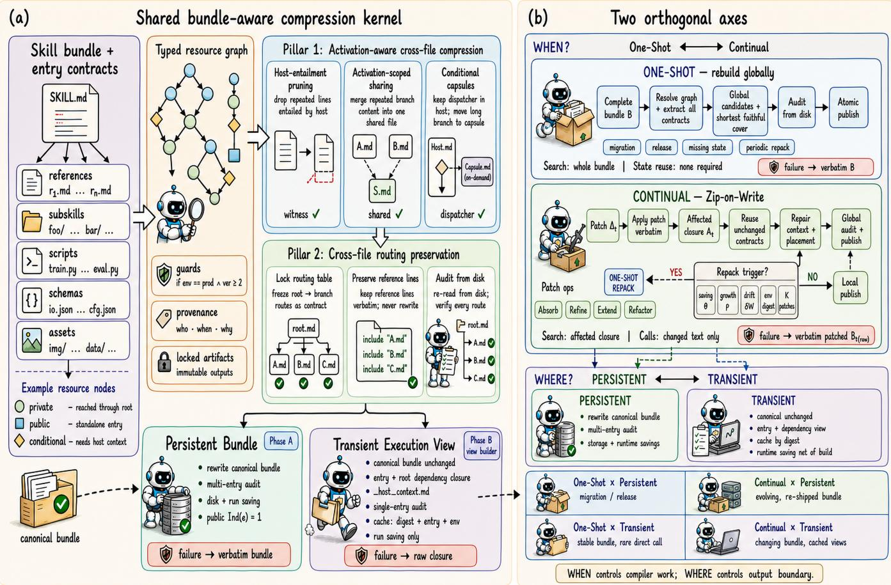  
Fi<sub>g</sub>. 2. Overview of SkillZip Pro. (a) Compression modes. The bundle-aware kernel com<sub>p</sub>resses a t<sub>yp</sub>ed resource <sub>g</sub>ra<sub>p</sub>h of skills, tools, <sub>p</sub>rom<sub>p</sub>ts, <sub>p</sub>olicies, <sub>me</sub>t<sub>a</sub>d<sub>a</sub>t<sub>a,</sub> <sub>an</sub>d i<sub>n</sub>t<sub>er-s</sub>kill <sub>re</sub>l<sub>a</sub>ti<sub>ons</sub>hi<sub>ps</sub> <sub>w</sub>hil<sub>e</sub> <sub>preserv</sub>i<sub>ng</sub> <sub>rou</sub>ti<sub>ng,</sub> d<sub>epen</sub>d<sub>ency,</sub> <sub>en</sub>t<sub>ry,</sub> <sub>an</sub>d <sub>execu</sub>ti<sub>on</sub> <sub>con</sub>t<sub>rac</sub>t<sub>s.</sub> It <sub>suppor</sub>t<sub>s</sub> <sub>g</sub>l<sub>o</sub>b<sub>a</sub>l O<sub>ne-</sub>Sh<sub>o</sub>t <sub>compress</sub>i<sub>on,</sub> <sub>w</sub>hi<sub>c</sub>h b<sub>u</sub>ild<sub>s</sub> <sub>a</sub> <sub>compac</sub>t b<sub>un</sub>dl<sub>e</sub> i<sub>n</sub> <sub>one</sub> <sub>pass,</sub> <sub>an</sub>d <sub>s</sub>t<sub>a</sub>t<sub>e-reus</sub>i<sub>ng</sub> C<sub>on</sub>ti<sub>nua</sub>l <sub>compress</sub>i<sub>on,</sub> <sub>w</sub>hi<sub>c</sub>h i<sub>ncremen</sub>t<sub>a</sub>ll<sub>y</sub> <sub>up</sub>d<sub>a</sub>t<sub>es</sub> <sub>an</sub> <sub>ex</sub>i<sub>s</sub>ti<sub>ng</sub> <sub>s</sub>t<sub>a</sub>t<sub>e</sub> <sub>as</sub> <sub>resources,</sub> t<sub>as</sub>k<sub>s,</sub> <sub>or</sub> f<sub>ee</sub>db<sub>ac</sub>k chan<sub>g</sub>e. (b) Bundle forms. Each mode <sub>p</sub>roduces either a Persistent Bundle for stora<sub>g</sub>e and re<sub>p</sub>eated reuse, or a Transient Execution View for li<sub>g</sub>htwei<sub>g</sub>ht, t<sub>as</sub>k<sub>-spec</sub>ifi<sub>c execu</sub>ti<sub>on.</sub> Thi<sub>s separa</sub>ti<sub>on</sub> b<sub>a</sub>l<sub>ances compress</sub>i<sub>on, e</sub>fi<sub>c</sub>i<sub>ency, a</sub>d<sub>ap</sub>t<sub>a</sub>bilit<sub>y, an</sub>d <sub>con</sub>t<sub>rac</sub>t fid<sub>e</sub>lit<sub>y.</sub>

TABLE I  
The two axes are orthogonal. Update frequency (One-Shot vs. Continual) decides when the kernel runs; lifecycle (Persistent vs. Transient) <sub>decides whether its output replaces the shipped bundle.</sub> T<sub>he four combinations target different deployments.</sub>
<table><tr><td>Lifecycle</td><td>Compression mode</td><td>Best for</td><td>What it saves</td><td>System requirement</td></tr><tr><td rowspan="2">Persistent</td><td>One-Shot</td><td>initial migration of an evolved library to a shipped bundle</td><td>smallest canonical bundle and lowest steady- state run cost</td><td>one multi-entry audit before publishing</td></tr><tr><td>Continual</td><td>a library that keeps evolving and is re-shipped over time</td><td>each edit is repacked once and amortised over many runs</td><td>re-audit on every write plus a periodic global repack</td></tr><tr><td rowspan="2">Transient</td><td>One-Shot</td><td>a stable bundle whose entries are called directly and rarely</td><td>per-run context saving with the canonical bundle untouched</td><td>a view build (or cache read) before each run</td></tr><tr><td>Continual</td><td>high-frequency direct calls against a frequently edited bundle</td><td>views are cached by bundle digest and reused across runs</td><td>digest-keyed cache with invalidation on any edit</td></tr></table>

With<sub>ou</sub>t <sub>an</sub> <sub>env</sub>i<sub>ronmen</sub>t <sub>con</sub>t<sub>rac</sub>t<sub>,</sub> <sub>no</sub> h<sub>os</sub>t<sub>-en</sub>t<sub>a</sub>il<sub>men</sub>t d<sub>e</sub>l<sub>e</sub>ti<sub>on</sub> i<sub>s</sub> <sub>a</sub>tt<sub>emp</sub>t<sub>e</sub>d<sub>.</sub> B<sub>o</sub>th <sub>mo</sub>d<sub>es</sub> <sub>s</sub>h<sub>are</sub> <sub>a</sub> <sub>pers</sub>i<sub>s</sub>t<sub>en</sub>t <sub>compressor</sub> <sub>s</sub>t<sub>a</sub>t<sub>e</sub>

$$
M _ { t } = \langle G _ { t } , C _ { t } , W _ { t } , H _ { t } , \bar { J } _ { t } , \mathcal { P } _ { t } , \mathcal { A } _ { t } \rangle ,\tag{15}
$$

<sub>w</sub>h<sub>ere</sub> $G _ { t }$ i<sub>s</sub> th<sub>e sa</sub>f<sub>e resource grap</sub>h<sub>;</sub> $C _ { t }$ th<sub>e per-no</sub>d<sub>e con</sub>t<sub>rac</sub>t store; $W _ { t }$ th<sub>e pa</sub>th<sub>-we</sub>i<sub>g</sub>ht l<sub>e</sub>d<sub>ger;</sub> $H _ { t }$ th<sub>e env</sub>i<sub>ronmen</sub>t di<sub>ges</sub>t <sub>an</sub>d <sub>w</sub>it<sub>nesses;</sub> $\mathcal { T } _ { t }$ <sub>can</sub>did<sub>a</sub>t<sub>e, suppor</sub>t<sub>, an</sub>d <sub>reverse-re</sub>f<sub>erence</sub> i<sub>n</sub>di<sub>ces;</sub> $\mathcal { P } _ { t }$ <sub>p</sub>rovenance; an<sup>d</sup> $\mathcal { A } _ { t }$ <sub>pr</sub>i<sub>or au</sub>dit <sub>resu</sub>lt<sub>s.</sub> Th<sub>e</sub> <sub>s</sub>id<sub>ecar acce</sub>l<sub>era</sub>t<sub>es</sub> f<sub>u</sub>t<sub>ure compress</sub>i<sub>on</sub> b<sub>u</sub>t i<sub>s never requ</sub>i<sub>re</sub>d <sub>a</sub>t <sub>execu</sub>ti<sub>on.</sub> If it i<sub>s a</sub>b<sub>sen</sub>t <sub>or</sub> it<sub>s</sub> di<sub>ges</sub>t i<sub>s s</sub>t<sub>a</sub>l<sub>e,</sub> th<sub>e</sub> t<sub>oo</sub>l <sub>sa</sub>f<sub>e</sub>l<sub>y</sub> f<sub>a</sub>ll<sub>s</sub> b<sub>ac</sub>k t<sub>o one-s</sub>h<sub>o</sub>t <sub>recons</sub>t<sub>ruc</sub>ti<sub>on.</sub>

## E<sub>.</sub> Sh<sub>are</sub>d B<sub>un</sub>dl<sub>e</sub> C<sub>omp</sub>il<sub>er</sub>

S<sub>a</sub>f<sub>e</sub> <sub>g</sub>r<sub>ap</sub>h r<sub>eso</sub>l<sub>u</sub>ti<sub>o</sub>n<sub>.</sub> Th<sub>e</sub> <sub>scanner</sub> <sub>wa</sub>lk<sub>s</sub> th<sub>e</sub> di<sub>rec</sub>t<sub>ory</sub> <sub>w</sub>ith<sub>ou</sub>t f<sub>o</sub>ll<sub>ow</sub>i<sub>ng escap</sub>i<sub>ng sym</sub>b<sub>o</sub>li<sub>c</sub> li<sub>n</sub>k<sub>s an</sub>d <sub>c</sub>l<sub>ass</sub>ifi<sub>es eac</sub>h <sub>no</sub>d<sub>e as</sub> i<sub>ns</sub>t<sub>ruc</sub>ti<sub>ona</sub>l M<sub>ar</sub>kd<sub>own, su</sub>b<sub>s</sub>kill <sub>en</sub>t<sub>ry, co</sub>d<sub>e, s</sub>t<sub>ruc-</sub> t<sub>ure</sub>d d<sub>a</sub>t<sub>a, or opaque asse</sub>t<sub>.</sub> It <sub>recogn</sub>i<sub>zes</sub> l<sub>oca</sub>l M<sub>ar</sub>kd<sub>own</sub> li<sub>n</sub>k<sub>s,</sub> <sub>exp</sub>li<sub>c</sub>it <sub>pa</sub>th lit<sub>era</sub>l<sub>s</sub> <sub>w</sub>ith k<sub>nown</sub> <sub>ex</sub>t<sub>ens</sub>i<sub>ons,</sub> <sub>an</sub>d d<sub>ec</sub>l<sub>ara</sub>ti<sub>ve</sub> <sub>su</sub>b<sub>s</sub>kill <sub>re</sub>f<sub>erences.</sub> E<sub>very</sub> i<sub>n</sub>t<sub>erna</sub>l <sub>e</sub>d<sub>ge recor</sub>d<sub>s</sub> it<sub>s exac</sub>t <sub>source</sub> <sub>spa</sub>n <sub>a</sub>nd n<sub>ea</sub>r<sub>es</sub>t <sub>exp</sub>li<sub>c</sub>it <sub>gua</sub>rd<sub>.</sub> E<sub>x</sub>t<sub>e</sub>rn<sub>a</sub>l URL<sub>s</sub> <sub>a</sub>r<sub>e</sub> <sub>p</sub>r<sub>ese</sub>r<sub>ve</sub>d b<sub>u</sub>t <sub>never</sub> f<sub>e</sub>t<sub>c</sub>h<sub>e</sub>d<sub>; m</sub>i<sub>ss</sub>i<sub>ng, am</sub>bi<sub>guous, or escap</sub>i<sub>ng</sub> l<sub>oca</sub>l t<sub>arge</sub>t<sub>s</sub> f<sub>a</sub>il <sub>s</sub>t<sub>r</sub>i<sub>c</sub>t <sub>mo</sub>d<sub>e.</sub> U<sub>nre</sub>f<sub>erence</sub>d fil<sub>es</sub> <sub>rema</sub>i<sub>n</sub> i<sub>n</sub> d<sub>ep</sub>l<sub>oymen</sub>t <sub>cos</sub>t <sub>an</sub>d <sub>are</sub> <sub>never</sub> <sub>s</sub>il<sub>en</sub>tl<sub>y</sub> di<sub>scar</sub>d<sub>e</sub>d<sub>.</sub>

Al <sub>or</sub>ith<sub>m</sub> 1 T<sub>rans</sub>i<sub>en</sub>t E<sub>xecu</sub>ti<sub>on-</sub>Vi<sub>ew</sub> C<sub>ons</sub>t<sub>ruc</sub>ti<sub>on</sub> Al<sub>go</sub>rithm 2 SkillZi<sub>p</sub> P<sub>ro:</sub> O<sub>ne-</sub>Sh<sub>o</sub>t B<sub>un</sub>dl<sub>e</sub> C<sub>ompress</sub>i<sub>on</sub>   
R<sub>e u</sub>i<sub>re: canon</sub>i<sub>ca</sub>l b<sub>un</sub>dl<sub>e</sub> � <sub>w</sub>ith <sub>roo</sub>t $r ,$ c<sup>h</sup>osen entr<sub>y</sub> $e ,$ R<sub>equ</sub>ir<sub>e: source</sub> b<sub>un</sub>dl<sub>e</sub> �<sub>, en</sub>t<sub>ry</sub> $r ,$ optional �, �   
<sub>op</sub>ti<sub>ona</sub>l <sub>env</sub>i<sub>ronmen</sub>t �<sub>, cac</sub>h<sub>e</sub> fl<sub>ag</sub> En<sub>su</sub>r<sub>e: au</sub>dit<sub>e</sub>d b<sub>un</sub>dl<sub>e</sub> $B ^ { \star }$ <sub>an</sub>d <sub>s</sub>t<sub>a</sub>t<sub>e</sub> �<sub>, or ver</sub>b<sub>a</sub>ti<sub>m</sub> �   
E<sub>nsure: execu</sub>ti<sub>on v</sub>i<sub>ew roo</sub>t<sub>e</sub>d <sub>a</sub>t $e ;$ <sub>canon</sub>i<sub>ca</sub>l � <sub>unc</sub>h<sub>ange</sub>d 1: � ← ResolveSafeGraph(�, �)   
1: � ← ViewKey(digest(�), �, digest(�)) 2: C ← ExtractTypedContracts(�)   
2: if cache and Hit(�) then 3: � ← EstimateLoadWeights(�, �)   
3<sub>:</sub> return LoadCached(�) <sub>⊲ no</sub> k<sub>erne</sub>l <sub>ca</sub>ll 4: � ← FileCoverCandidates(C)   
4: Ω ← Reach(�, �) ∪ Reach(�, �) ⊲ entr<sub>y</sub> an<sup>d</sup> root 5: � ← � ∪ HostEntailments(C, �)   
<sub>c</sub>l<sub>osures</sub> 6: � ← � ∪ ScopedSharing(�, C, �)   
5: � ← MaterializeClosure(�, Ω, �) ⊲ p<sup>romote</sup> � <sup>to</sup> 7: � ← � ∪ GuardedCapsules(�, C, �)   
<sub>roo</sub>t<sub>;</sub> li<sub>n</sub>k <sub>� as</sub> h<sub>os</sub>t <sub>con</sub>t<sub>ex</sub>t 8: � ← ConstrainedSelect(�, �, cover)   
6: �b ← Kernel(�) ⊲ Pillars 1–2, cross-file promotion on 9: � ← MaterializeTemporary(�, �)   
7<sub>:</sub> if $\widehat { B }$ <sub>unusa</sub>bl<sub>e o</sub>r $\tau ( \widehat { B } ) \geq \tau ( R )$ <sub>or s</sub>i<sub>n</sub> l<sub>e-en</sub>t<sub>r au</sub>dit f<sub>a</sub>il<sub>s</sub> 10<sub>:</sub> if $J ( D ) \le J ( B )$ and AuditFromDisk(�, �, �) then   
then 11<sub>:</sub> return AtomicCommit(�), SaveState(�)   
8<sub>:</sub> ${ \widehat { B } } \gets R$ <sub>⊲ sa</sub>f<sub>e</sub> f<sub>a</sub>llb<sub>ac</sub>k<sub>: uncompresse</sub>d <sub>c</sub>l<sub>osure</sub> 12<sub>: e</sub>l<sub>se</sub>   
9: return Cache(�, �b) ⊲ verif<sub>y</sub> digest(�) unchanged 13<sub>:</sub> return VerbatimCopy(�), FailureState(�)

T<sub>ype</sub>d <sub>co</sub>ntr<sub>ac</sub>t <sub>e</sub>xtr<sub>ac</sub>ti<sub>o</sub>n<sub>.</sub> E<sub>ac</sub>h i<sub>ns</sub>t<sub>ruc</sub>ti<sub>ona</sub>l <sub>no</sub>d<sub>e</sub> i<sub>s</sub> <sub>segmen</sub>t<sub>e</sub>d b<sub>y</sub> h<sub>ea</sub>di<sub>ngs</sub> <sub>an</sub>d <sub>source</sub> <sub>spans.</sub> O<sub>ne</sub> <sub>s</sub>t<sub>ruc</sub>t<sub>ure</sub>d extraction recovers Eq. (2), while ever<sub>y</sub> unit retains <sub>p</sub>rovenance. Relations such as same\_rule, same\_workflow, and exception\_of are acce<sub>p</sub>ted onl<sub>y</sub> after deterministic t<sub>yp</sub>e, <sub>po</sub>l<sub>ar</sub>it<sub>y, guar</sub>d<sub>, an</sub>d <sub>pay</sub>l<sub>oa</sub>d <sub>c</sub>h<sub>ec</sub>k<sub>s.</sub> L<sub>ow-con</sub>fid<sub>ence un</sub>it<sub>s</sub> <sub>are</sub> l<sub>oc</sub>k<sub>e</sub>d <sub>an</sub>d <sub>preserve</sub>d <sub>ver</sub>b<sub>a</sub>ti<sub>m.</sub> Th<sub>e or</sub>i<sub>g</sub>i<sub>na</sub>l S<sub>kill</sub>Z<sub>ip</sub> fil<sub>e-</sub>l<sub>eve</sub>l <sub>scanner,</sub> t<sub>ype-compa</sub>tibl<sub>e reuse, m</sub>i<sub>n</sub>i<sub>mum-cos</sub>t <sub>cover,</sub> fi<sub>xe</sub>d<sub>-</sub>t<sub>emp</sub>l<sub>a</sub>t<sub>e ren</sub>d<sub>er, an</sub>d <sub>span-res</sub>t<sub>ora</sub>ti<sub>on au</sub>dit <sub>opera</sub>t<sub>e</sub> h<sub>ere</sub> <sub>unc</sub>h<sub>ange</sub>d f<sub>or eac</sub>h <sub>e</sub>li<sub>g</sub>ibl<sub>e</sub> fil<sub>e.</sub>

B<sub>u</sub>ndl<sub>e-</sub>l<sub>eve</sub>l <sub>ca</sub>ndid<sub>a</sub>t<sub>e</sub> <sub>ge</sub>n<sub>e</sub>r<sub>a</sub>ti<sub>o</sub>n<sub>.</sub> Th<sub>ree</sub> t<sub>rans</sub>f<sub>orma-</sub> tions ex<sub>p</sub>ose savin<sub>g</sub>s unavailable inside a sin<sub>g</sub>le file. (1) E<sub>xac</sub>t <sub>con</sub>t<sub>rac</sub>t <sub>un</sub>it<sub>s</sub> <sub>en</sub>t<sub>a</sub>il<sub>e</sub>d b<sub>y</sub> $H _ { t }$ <sub>may</sub> b<sub>e</sub> <sub>remove</sub>d <sub>on</sub>l<sub>y</sub> with a sco<sub>p</sub>e-com<sub>p</sub>atible, di<sub>g</sub>est-bound witness. (2) Re-<sub>pea</sub>t<sub>e</sub>d <sub>exac</sub>t <sub>ru</sub>l<sub>es</sub> <sub>or</sub> <sub>wor</sub>kfl<sub>ow</sub> f<sub>ragmen</sub>t<sub>s</sub> <sub>may</sub> <sub>move</sub> t<sub>o</sub> .skillzip\_shared/<digest>.md at their lowest safe <sub>ac</sub>ti<sub>va</sub>ti<sub>on scope; a</sub>f<sub>ec</sub>t<sub>e</sub>d b<sub>ranc</sub>h<sub>es rece</sub>i<sub>ve a man</sub>d<sub>a</sub>t<sub>ory re</sub>l<sub>a</sub>ti<sub>ve</sub> loadin<sub>g</sub> instruction. (3) A lon<sub>g</sub> section with an ex<sub>p</sub>licit <sub>g</sub>uard ma<sub>y</sub> move to capsules/<slug>.md; a dis<sub>p</sub>atcher retainin<sub>g</sub> th<sub>e</sub> t<sub>r</sub>i<sub>gger rema</sub>i<sub>ns a</sub>t th<sub>e or</sub>i<sub>g</sub>i<sub>na</sub>l <sub>s</sub>it<sub>e.</sub> E<sub>ac</sub>h t<sub>rans</sub>f<sub>orma</sub>ti<sub>on</sub> i<sub>s</sub> evaluated to<sub>g</sub>ether with <sub>p</sub>er-file covers under Eq. (7).

Gl<sub>o</sub>b<sub>a</sub>l <sub>se</sub>l<sub>ec</sub>ti<sub>on an</sub>d <sub>ma</sub>t<sub>er</sub>i<sub>a</sub>li<sub>za</sub>ti<sub>on.</sub> B<sub>ecause a capsu</sub>l<sub>e</sub> <sub>c</sub>h<sub>anges pa</sub>th <sub>we</sub>i<sub>g</sub>ht<sub>s an</sub>d <sub>a s</sub>h<sub>are</sub>d <sub>mo</sub>d<sub>u</sub>l<sub>e may serve severa</sub>l <sub>capsu</sub>l<sub>es, marg</sub>i<sub>na</sub>l <sub>se</sub>l<sub>ec</sub>ti<sub>on</sub> i<sub>s</sub> f<sub>o</sub>ll<sub>owe</sub>d b<sub>y</sub> l<sub>oca</sub>l <sub>a</sub>dd/d<sub>rop</sub>/<sub>swap</sub> im<sub>p</sub>r<sub>ove</sub>m<sub>e</sub>nt<sub>.</sub> E<sub>ve</sub>r<sub>y</sub> m<sub>ove</sub> <sub>p</sub>r<sub>ese</sub>r<sub>ves</sub> m<sub>o</sub>d<sub>e</sub>l<sub>e</sub>d <sub>cove</sub>r<sub>age.</sub> M<sub>a</sub>t<sub>e-</sub> <sub>r</sub>i<sub>a</sub>li<sub>za</sub>ti<sub>on wr</sub>it<sub>es an or</sub>di<sub>nary re</sub>l<sub>a</sub>ti<sub>ve-pa</sub>th di<sub>rec</sub>t<sub>ory; co</sub>d<sub>e,</sub> d<sub>a</sub>t<sub>a, sc</sub>h<sub>emas, an</sub>d <sub>asse</sub>t<sub>s rema</sub>i<sub>n</sub> b<sub>y</sub>t<sub>e-</sub>id<sub>en</sub>ti<sub>ca</sub>l<sub>.</sub> I<sub>n</sub>t<sub>er</sub>f<sub>ace</sub> contracts (Definition 3) are restored as one conti<sub>g</sub>uous verbatim <sub>span: surroun</sub>di<sub>ng prose may s</sub>h<sub>r</sub>i<sub>n</sub>k<sub>,</sub> b<sub>u</sub>t th<sub>e op</sub>ti<sub>m</sub>i<sub>zer canno</sub>t <sub>sp</sub>lit<sub>,</sub> <sub>reor</sub>d<sub>er,</sub> <sub>or</sub> <sub>parap</sub>h<sub>rase</sub> th<sub>e</sub> <sub>con</sub>t<sub>rac</sub>t<sub>.</sub> A <sub>pos</sub>t<sub>-pass</sub> <sub>removes</sub> <sub>sca</sub>tt<sub>ere</sub>d <sub>ren</sub>d<sub>er</sub> f<sub>ragmen</sub>t<sub>s</sub> <sub>an</sub>d <sub>res</sub>t<sub>ores</sub> th<sub>e</sub> <sub>source</sub> <sub>span.</sub> E<sub>very</sub> removal records its witness class from Eq. (12); $W _ { 3 }$ <sub>remova</sub>l<sub>s</sub> <sub>a</sub>l<sub>so s</sub>t<sub>ore</sub> th<sub>e ver</sub>di<sub>c</sub>t <sub>an</sub>d <sub>ra</sub>ti<sub>ona</sub>l<sub>e.</sub>

## F. Mode I: One-Shot Bundle Compression

O<sub>ne-s</sub>h<sub>o</sub>t <sub>mo</sub>d<sub>e</sub> i<sub>s</sub> i<sub>n</sub>t<sub>en</sub>d<sub>e</sub>d f<sub>or</sub> i<sub>n</sub>iti<sub>a</sub>l <sub>m</sub>i<sub>gra</sub>ti<sub>on,</sub> <sub>re</sub>l<sub>ease</sub> <sub>pac</sub>k<sub>ag</sub>i<sub>ng, a m</sub>i<sub>ss</sub>i<sub>ng or</sub> i<sub>nva</sub>lid <sub>s</sub>t<sub>a</sub>t<sub>e s</sub>id<sub>ecar, or a per</sub>i<sub>o</sub>di<sub>c</sub> <sub>g</sub>l<sub>o</sub>b<sub>a</sub>l <sub>re-op</sub>ti<sub>m</sub>i<sub>za</sub>ti<sub>on a</sub>ft<sub>er wor</sub>kl<sub>oa</sub>d d<sub>r</sub>ift<sub>.</sub> It <sub>recons</sub>t<sub>ruc</sub>t<sub>s</sub> $M _ { t }$ f<sub>rom</sub> th<sub>e comp</sub>l<sub>e</sub>t<sub>e source</sub> b<sub>un</sub>dl<sub>e an</sub>d <sub>searc</sub>h<sub>es g</sub>l<sub>o</sub>b<sub>a</sub>ll<sub>y.</sub>

Al<sub>gor</sub>ith<sub>m</sub> 2 <sub>never pu</sub>bli<sub>s</sub>h<sub>es a can</sub>did<sub>a</sub>t<sub>e w</sub>h<sub>ose ma</sub>t<sub>er</sub>i<sub>a</sub>li<sub>ze</sub>d objective is worse than the source.

## G. Mode II: Continual Bundle Compression

C<sub>on</sub>ti<sub>nua</sub>l <sub>mo</sub>d<sub>e</sub> t<sub>arge</sub>t<sub>s se</sub>lf<sub>-evo</sub>l<sub>v</sub>i<sub>ng s</sub>kill<sub>s</sub> th<sub>a</sub>t <sub>rece</sub>i<sub>ve</sub> f<sub>requen</sub>t <sub>sma</sub>ll <sub>pa</sub>t<sub>c</sub>h<sub>es.</sub> L<sub>e</sub>t $\Delta _ { t }$ <sub>con</sub>t<sub>a</sub>i<sub>n a</sub>dd<sub>e</sub>d<sub>, mo</sub>difi<sub>e</sub>d<sub>,</sub> <sub>move</sub>d<sub>,</sub> <sub>an</sub>d d<sub>e</sub>l<sub>e</sub>t<sub>e</sub>d <sub>pa</sub>th<sub>s.</sub> Th<sub>e</sub> t<sub>oo</sub>l fi<sub>rs</sub>t <sub>app</sub>li<sub>es</sub> $\Delta _ { t }$ <sub>w</sub>ith<sub>ou</sub>t <sub>parap</sub>h<sub>rase</sub> t<sub>o</sub> th<sub>e</sub> <sub>curren</sub>t <sub>au</sub>th<sub>ore</sub>d <sub>source,</sub> <sub>pro</sub>d<sub>uc</sub>i<sub>ng</sub> th<sub>e</sub> <sub>seman</sub>ti<sub>c</sub> f<sub>a</sub>llb<sub>ac</sub>k $B _ { t } ^ { \operatorname { r a w } }$ <sub>.</sub> It th<sub>en</sub> <sub>up</sub>d<sub>a</sub>t<sub>es</sub> <sub>re</sub>f<sub>erence</sub> <sub>e</sub>d<sub>ges</sub> <sub>an</sub>d <sub>cons</sub>t<sub>ruc</sub>t<sub>s an</sub> i<sub>nva</sub>lid<sub>a</sub>ti<sub>on c</sub>l<sub>osure</sub> $A _ { t }$ <sub>con</sub>t<sub>a</sub>i<sub>n</sub>i<sub>ng</sub> <sub>c</sub>h<sub>ange</sub>d <sub>no</sub>d<sub>es,</sub> th<sub>e</sub>i<sub>r re</sub>f<sub>erence ances</sub>t<sub>ors, new</sub>l<sub>y or</sub> f<sub>ormer</sub>l<sub>y re</sub>f<sub>erence</sub>d d<sub>escen</sub>d<sub>an</sub>t<sub>s, s</sub>h<sub>are</sub>d <sub>mo</sub>d<sub>u</sub>l<sub>es w</sub>h<sub>ose suppor</sub>t <sub>c</sub>h<sub>ange</sub>d<sub>, capsu</sub>l<sub>es</sub> <sub>w</sub>h<sub>ose</sub> <sub>guar</sub>d <sub>c</sub>h<sub>ange</sub>d<sub>,</sub> <sub>an</sub>d <sub>any</sub> h<sub>os</sub>t <sub>w</sub>it<sub>ness</sub> i<sub>nva</sub>lid<sub>a</sub>t<sub>e</sub>d b<sub>y</sub> <sub>an env</sub>i<sub>ronmen</sub>t di<sub>ges</sub>t <sub>c</sub>h<sub>ange.</sub>

O<sub>n</sub>l<sub>y c</sub>h<sub>ange</sub>d t<sub>ex</sub>t<sub>ua</sub>l <sub>no</sub>d<sub>es are re-ex</sub>t<sub>rac</sub>t<sub>e</sub>d<sub>;</sub> di<sub>ges</sub>t<sub>-</sub>id<sub>en</sub>ti<sub>ca</sub>l <sub>con</sub>t<sub>rac</sub>t<sub>s are reuse</sub>d<sub>.</sub> P<sub>a</sub>t<sub>c</sub>h <sub>un</sub>it<sub>s re</sub>t<sub>a</sub>i<sub>n</sub> th<sub>e</sub> f<sub>our opera</sub>ti<sub>ons o</sub>f S<sub>kill</sub>Z<sub>ip:</sub> A<sub>bsorb removes an exac</sub>t d<sub>up</sub>li<sub>ca</sub>t<sub>e a</sub>l<sub>rea</sub>d<sub>y covere</sub>d<sub>;</sub> R<sub>efine up</sub>d<sub>a</sub>t<sub>es an ex</sub>i<sub>s</sub>ti<sub>ng ru</sub>l<sub>e, guar</sub>d<sub>, argumen</sub>t<sub>, or excep</sub>ti<sub>on;</sub> E<sub>xtend</sub> <sub>a</sub>dd<sub>s</sub> <sub>genu</sub>i<sub>ne</sub>l<sub>y</sub> <sub>new</sub> b<sub>e</sub>h<sub>av</sub>i<sub>or</sub> <sub>or</sub> <sub>a</sub> <sub>new</sub> <sub>resource;</sub> <sub>an</sub>d R<sub>efactor c</sub>h<sub>anges a represen</sub>t<sub>a</sub>ti<sub>on w</sub>h<sub>en severa</sub>l <sub>e</sub>dit<sub>s ma</sub>k<sub>e</sub> <sub>ano</sub>th<sub>er cover s</sub>h<sub>or</sub>t<sub>er.</sub> P<sub>ro ex</sub>t<sub>en</sub>d<sub>s</sub> R<sub>efactor</sub> t<sub>o p</sub>l<sub>acemen</sub>t<sub>:</sub> <sub>a</sub>f<sub>ec</sub>t<sub>e</sub>d <sub>s</sub>h<sub>are</sub>d <sub>mo</sub>d<sub>u</sub>l<sub>es,</sub> <sub>capsu</sub>l<sub>es,</sub> <sub>an</sub>d h<sub>os</sub>t <sub>w</sub>it<sub>nesses</sub> <sub>are</sub> <sub>re-pr</sub>i<sub>ce</sub>d <sub>w</sub>h<sub>enever</sub> th<sub>e</sub>i<sub>r suppor</sub>t <sub>se</sub>t <sub>or pa</sub>th <sub>we</sub>i<sub>g</sub>ht <sub>c</sub>h<sub>anges.</sub>

L<sub>oca</sub>l <sub>repa</sub>i<sub>r canno</sub>t <sub>accumu</sub>l<sub>a</sub>t<sub>e un</sub>b<sub>oun</sub>d<sub>e</sub>d d<sub>e</sub>bt<sub>.</sub> A <sub>one-</sub> shot global repack is triggered when recoverable objective <sub>sav</sub>i<sub>ng excee</sub>d<sub>s</sub> $\theta _ { \mathrm { r e p a c k } }$ <sub>,</sub> b<sub>un</sub>dl<sub>e grow</sub>th <sub>excee</sub>d<sub>s</sub> $\rho ,$ th<sub>e wor</sub>kl<sub>oa</sub>d di<sub>s</sub>t<sub>r</sub>ib<sub>u</sub>ti<sub>on</sub> d<sub>r</sub>ift<sub>s</sub> b<sub>eyon</sub>d $\delta _ { W }$ <sub>,</sub> th<sub>e env</sub>i<sub>ronmen</sub>t di<sub>ges</sub>t <sub>c</sub>h<sub>anges,</sub> or $K$ <sub>pa</sub>t<sub>c</sub>h<sub>es</sub> h<sub>ave e</sub>l<sub>apse</sub>d<sub>.</sub> R<sub>epac</sub>ki<sub>ng rea</sub>d<sub>s</sub> th<sub>e curren</sub>t b<sub>un</sub>dl<sub>e</sub> <sub>an</sub>d <sub>compac</sub>t <sub>s</sub>t<sub>a</sub>t<sub>e, never</sub> th<sub>e</sub> f<sub>u</sub>ll <sub>pa</sub>t<sub>c</sub>h hi<sub>s</sub>t<sub>ory.</sub>

Th<sub>e</sub> f<sub>a</sub>llb<sub>ac</sub>k di<sub>s</sub>ti<sub>nc</sub>ti<sub>on</sub> i<sub>s essen</sub>ti<sub>a</sub>l<sub>.</sub> A f<sub>a</sub>il<sub>e</sub>d <sub>one-s</sub>h<sub>o</sub>t <sub>run</sub> <sub>may</sub> <sub>re</sub>t<sub>urn</sub> it<sub>s</sub> i<sub>npu</sub>t<sub>.</sub> A f<sub>a</sub>il<sub>e</sub>d <sub>con</sub>ti<sub>nua</sub>l <sub>run</sub> <sub>canno</sub>t <sub>reac</sub>ti<sub>va</sub>t<sub>e</sub> $B _ { t - 1 }$ <sub>a</sub>ft<sub>er a va</sub>lid <sub>pa</sub>t<sub>c</sub>h<sub>, w</sub>hi<sub>c</sub>h <sub>wou</sub>ld di<sub>scar</sub>d l<sub>earne</sub>d b<sub>e</sub>h<sub>av</sub>i<sub>or;</sub> it <sub>pu</sub>bli<sub>s</sub>h<sub>es</sub> $B _ { t } ^ { \operatorname { r a w } }$ <sub>an</sub>d <sub>recor</sub>d<sub>s</sub> th<sub>e</sub> f<sub>a</sub>il<sub>ure</sub> f<sub>or re</sub>t<sub>ry.</sub>

## H<sub>.</sub> C<sub>ross-</sub>Fil<sub>e</sub> A<sub>u</sub>dit <sub>an</sub>d M<sub>o</sub>d<sub>e</sub> S<sub>e</sub>l<sub>ec</sub>ti<sub>on</sub>

Th<sub>e</sub> <sub>au</sub>dit<sub>or</sub> i<sub>gnores</sub> i<sub>n-memory</sub> <sub>coverage</sub> <sub>c</sub>l<sub>a</sub>i<sub>ms</sub> <sub>an</sub>d <sub>rerea</sub>d<sub>s</sub> the emitted director<sub>y</sub>. It checks (i) <sub>g</sub>ra<sub>p</sub>h closure and <sub>p</sub>ath confinement; (ii) t<sub>yp</sub>ed covera<sub>g</sub>e at a com<sub>p</sub>atible sco<sub>p</sub>e or b<sub>y</sub> an exact host witness; (iii) mandator<sub>y</sub> reachabilit<sub>y</sub> and <sub>guar</sub>d <sub>preserva</sub>ti<sub>on</sub> f<sub>or every capsu</sub>l<sub>e an</sub>d <sub>s</sub>h<sub>are</sub>d <sub>mo</sub>d<sub>u</sub>l<sub>e;</sub> (iv) <sub>p</sub>ath and SHA-256 identit<sub>y</sub> for locked artifacts; (v) that <sup>e</sup>v<sup>er</sup>y <sup>interface contract a</sup>pp<sup>ears as one conti</sup>gu<sup>o</sup>u<sup>s s</sup>p<sup>an</sup> w<sup>hose</sup> <sub>norma</sub>li<sub>ze</sub>d li<sub>nes equa</sub>l th<sub>e source sec</sub>ti<sub>on, w</sub>ith <sub>no sca</sub>tt<sub>ere</sub>d fra<sub>g</sub>ments elsewhere; and (vi) all four materialized costs. At<sub>om</sub>i<sub>c pu</sub>bli<sub>ca</sub>ti<sub>on occurs on</sub>l<sub>y a</sub>ft<sub>er au</sub>dit <sub>succee</sub>d<sub>s.</sub>

Al<sub>go</sub>rithm 3 SkillZi<sub>p</sub> P<sub>ro:</sub> C<sub>on</sub>ti<sub>nua</sub>l B<sub>un</sub>dl<sub>e</sub> C<sub>ompress</sub>i<sub>on</sub>   
R<sub>equ</sub>ir<sub>e: au</sub>th<sub>ore</sub>d <sub>source</sub> $S _ { t - 1 } ,$ <sub>, au</sub>dit<sub>e</sub>d <sub>s</sub>t<sub>a</sub>t<sub>e</sub> $M _ { t - 1 } .$ , <sub>p</sub>atc<sup>h</sup> $\Delta _ { t }$   
E<sub>nsure: curren</sub>t f<sub>a</sub>ithf<sub>u</sub>l b<sub>un</sub>dl<sub>e</sub> $B _ { t }$ <sub>an</sub>d <sub>s</sub>t<sub>a</sub>t<sub>e</sub> $M _ { t }$   
1 $\mathbf { \chi } : S _ { t } , B _ { t } ^ { \mathrm { r a w } } \gets \mathrm { A P P L Y P A T C H } \mathbf { V } _ { \mathbf { E R B A T I M } } ( S _ { t - 1 } , \Delta _ { t } )$   
2<sub>:</sub> $\mathrm { : } ~ G _ { t } , A _ { t } \gets \mathrm { U p D A T E G R A P H A N D C L O S U R E } \left( M _ { t - 1 } . G , S _ { t } , \Delta _ { t } \right)$   
3<sub>:</sub> $\begin{array} { r } { C _ { t } \gets \mathrm { R e u s e A N D R E E X T R A C T } ( M _ { t - 1 } . C , A _ { t } ) } \end{array}$   
4<sub>:</sub> $U _ { t }$ ← Classify(Absorb, Refine, Extend, Refactor)   
5<sub>:</sub> $Z _ { t }$ ← RefreshAffectedCandidates $( A _ { t } , U _ { t } , M _ { t - 1 } )$   
6<sub>:</sub> if R<sub>epack</sub>T<sub>riggered</sub> $( M _ { t - 1 } , S _ { t } , Z _ { t } )$ then   
7<sub>:</sub> ret<sub>u</sub>rn O<sub>ne</sub>S<sub>hot</sub> $\left( S _ { t } \right)$   
8<sub>:</sub> $P _ { t } \gets$ R<sub>epair</sub>L<sub>ocal</sub>C<sub>over</sub>A<sub>nd</sub>P<sub>lacement</sub> $( Z _ { t } , J )$   
9: $D _ { t } \gets$ M<sub>aterialize</sub>T<sub>emporary</sub> $( B _ { t } ^ { \operatorname { r a w } } , P _ { t } )$   
10<sub>:</sub> if $J ( D _ { t } ) ~ \le ~ J ( B _ { t } ^ { \mathrm { r a w } } )$ <sub>a</sub>nd A<sub>udit</sub>F<sub>rom</sub>D<sub>isk</sub> $( S _ { t } , D _ { t } , H _ { t } )$   
then   
11<sub>:</sub> r<sub>e</sub>t<sub>u</sub>rn A<sub>tomic</sub>C<sub>ommit</sub> $( D _ { t } )$ <sub>,</sub> S<sub>ave</sub>S<sub>tate</sub> $( D _ { t } )$   
12<sub>: e</sub>l<sub>se</sub>   
13<sub>:</sub> r<sub>e</sub>t<sub>u</sub>rn A<sub>tomic</sub>C<sub>ommit</sub> $( B _ { t } ^ { \operatorname { r a w } } )$ , RebuildState(� )

## I<sub>.</sub> H<sub>arness-</sub>A<sub>gnos</sub>ti<sub>c</sub> D<sub>ep</sub>l<sub>oya</sub>bilit<sub>y</sub>

B<sub>o</sub>th <sub>mo</sub>d<sub>es rema</sub>i<sub>n agen</sub>t h<sub>arness-agnos</sub>ti<sub>c.</sub> Th<sub>e compressor</sub> <sub>may pers</sub>i<sub>s</sub>t <sub>s</sub>t<sub>a</sub>t<sub>e, o</sub>b<sub>serve o</sub>fli<sub>ne</sub> t<sub>races, an</sub>d <sub>run on every</sub> <sub>wr</sub>it<sub>e,</sub> b<sub>u</sub>t th<sub>e</sub> <sub>pu</sub>bli<sub>s</sub>h<sub>e</sub>d b<sub>un</sub>dl<sub>e</sub> d<sub>oes</sub> <sub>no</sub>t d<sub>epen</sub>d <sub>on</sub> it<sub>.</sub> Th<sub>e</sub> <sub>agen</sub>t <sub>se</sub>l<sub>ec</sub>t<sub>s</sub> th<sub>e</sub> <sub>same</sub> <sub>s</sub>kill<sub>,</sub> l<sub>oa</sub>d<sub>s</sub> th<sub>e</sub> <sub>same</sub> <sub>roo</sub>t <sub>en</sub>t<sub>ry,</sub> f<sub>o</sub>ll<sub>ows</sub> <sub>or</sub>di<sub>nary</sub> <sub>re</sub>l<sub>a</sub>ti<sub>ve</sub> li<sub>n</sub>k<sub>s,</sub> <sub>an</sub>d <sub>execu</sub>t<sub>es</sub> b<sub>y</sub>t<sub>e-</sub>id<sub>en</sub>ti<sub>ca</sub>l <sub>ar</sub>tif<sub>ac</sub>t<sub>s.</sub>

## VI<sub>.</sub> E<sub>xperiments</sub>

W<sub>e</sub> d<sub>es</sub>i<sub>gn our exper</sub>i<sub>men</sub>t<sub>s aroun</sub>d th<sub>ree goa</sub>l<sub>s:</sub> d<sub>e</sub>t<sub>erm</sub>i<sub>n</sub>i<sub>ng</sub> <sub>w</sub>h<sub>e</sub>th<sub>er</sub> S<sub>kill</sub>Z<sub>ip</sub> P<sub>ro re</sub>d<sub>uces</sub> b<sub>o</sub>th d<sub>ep</sub>l<sub>oymen</sub>t <sub>an</sub>d <sub>pro-</sub> <sub>gress</sub>i<sub>ve</sub>l<sub>y</sub> l<sub>oa</sub>d<sub>e</sub>d <sub>run</sub>ti<sub>me cos</sub>t<sub>s, ver</sub>if<sub>y</sub>i<sub>ng</sub> th<sub>a</sub>t th<sub>ese sav</sub>i<sub>ngs</sub> <sub>preserve</sub> t<sub>as</sub>k <sub>qua</sub>lit<sub>y, rou</sub>ti<sub>ng, an</sub>d th<sub>e</sub> i<sub>n</sub>d<sub>epen</sub>d<sub>en</sub>t <sub>usa</sub>bilit<sub>y</sub> <sub>o</sub>f <sub>pu</sub>bli<sub>c en</sub>t<sub>r</sub>i<sub>es, an</sub>d <sub>assess</sub>i<sub>ng w</sub>h<sub>e</sub>th<sub>er</sub> it<sub>s</sub> f<sub>our opera</sub>ti<sub>ng</sub> <sub>mo</sub>d<sub>es rema</sub>i<sub>n prac</sub>ti<sub>ca</sub>l <sub>as s</sub>kill<sub>s evo</sub>l<sub>ve.</sub> W<sub>e eva</sub>l<sub>ua</sub>t<sub>e</sub> th<sub>ese</sub> <sub>ques</sub>ti<sub>ons on</sub> th<sub>ree agen</sub>t b<sub>enc</sub>h<sub>mar</sub>k<sub>s, rea</sub>l <sub>se</sub>lf<sub>-evo</sub>l<sub>v</sub>i<sub>ng s</sub>kill lib<sub>rar</sub>i<sub>es, a con</sub>t<sub>ro</sub>ll<sub>e</sub>d <sub>mu</sub>lti<sub>-en</sub>t<sub>ry</sub> b<sub>un</sub>dl<sub>e, an</sub>d <sub>a pro</sub>d<sub>uc</sub>ti<sub>on</sub> <sub>con</sub>t<sub>en</sub>t<sub>-mo</sub>d<sub>era</sub>ti<sub>on s</sub>kill<sub>.</sub> C<sub>ompar</sub>i<sub>sons w</sub>ith <sub>roo</sub>t<sub>-on</sub>l<sub>y,</sub> fl<sub>a</sub>t<sub>-</sub> t<sub>ene</sub>d<sub>,</sub> <sub>eva</sub>l<sub>ua</sub>ti<sub>on-gu</sub>id<sub>e</sub>d<sub>,</sub> <sub>an</sub>d <sub>exper</sub>t<sub>-</sub>d<sub>es</sub>i<sub>gne</sub>d b<sub>ase</sub>li<sub>nes</sub> <sub>are</sub> <sub>comp</sub>l<sub>emen</sub>t<sub>e</sub>d b<sub>y</sub> <sub>a</sub>bl<sub>a</sub>ti<sub>ons</sub> <sub>an</sub>d <sub>wor</sub>kl<sub>oa</sub>d <sub>sweeps</sub> th<sub>a</sub>t i<sub>so</sub>l<sub>a</sub>t<sub>e</sub> th<sub>e con</sub>t<sub>r</sub>ib<sub>u</sub>ti<sub>on an</sub>d <sub>cos</sub>t <sub>o</sub>f <sub>eac</sub>h d<sub>es</sub>i<sub>gn componen</sub>t<sub>.</sub>

## A<sub>.</sub> Wh<sub>a</sub>t W<sub>e</sub> A<sub>s</sub>k

• Q1: Is one ratio enough? When does a root-onl<sub>y</sub> ratio <sub>m</sub>i<sub>srepresen</sub>t th<sub>e</sub> f<sub>our</sub> <sub>cos</sub>t l<sub>ayers</sub>?

• Q2: Does it help? Does SkillZip Pro cut all four costs <sub>w</sub>hil<sub>e</sub> k<sub>eep</sub>i<sub>ng</sub> t<sub>as</sub>k <sub>success</sub>?

• Q3: Does it still load correctly? Does the bundle o<sub>p</sub>en <sub>requ</sub>i<sub>re</sub>d fil<sub>es an</sub>d <sub>s</sub>ki<sub>p</sub> i<sub>rre</sub>l<sub>evan</sub>t <sub>ones</sub>?

• Q4: Is the saving real? How much source knowled<sub>g</sub>e <sub>rema</sub>i<sub>ns reac</sub>h<sub>a</sub>bl<sub>e ra</sub>th<sub>er</sub> th<sub>an</sub> d<sub>e</sub>l<sub>e</sub>t<sub>e</sub>d?

• Q5: Does it port across models? Does one com<sub>p</sub>ressed b<sub>un</sub>dl<sub>e s</sub>t<sub>ay use</sub>f<sub>u</sub>l <sub>w</sub>h<sub>en a</sub> dif<sub>eren</sub>t <sub>mo</sub>d<sub>e</sub>l f<sub>am</sub>il<sub>y runs</sub> it?

• Q6: What resources does compression consume?

• Q7: Which part does the work? How much comes from th<sub>e resource grap</sub>h<sub>,</sub> h<sub>os</sub>t <sub>en</sub>t<sub>a</sub>il<sub>men</sub>t<sub>, scope</sub>d <sub>s</sub>h<sub>ar</sub>i<sub>ng, capsu</sub>l<sub>es,</sub> <sub>an</sub>d th<sub>e au</sub>dit?

• Q8: One-shot or continual? How much u<sub>p</sub>date work does <sub>con</sub>ti<sub>nua</sub>l <sub>mo</sub>d<sub>e save,</sub> h<sub>ow</sub> f<sub>ar</sub> d<sub>oes</sub> it d<sub>r</sub>ift f<sub>rom a</sub> f<sub>u</sub>ll <sub>re</sub>b<sub>u</sub>ild<sub>,</sub> <sub>an</sub>d <sub>w</sub>h<sub>en</sub> <sub>s</sub>h<sub>ou</sub>ld it <sub>repac</sub>k?

• Q9: Does it hold in production? On a de<sub>p</sub>lo<sub>y</sub>ed skill, does <sub>w</sub>it<sub>nesse</sub>d <sub>compress</sub>i<sub>on</sub> <sub>preserve</sub> <sub>qua</sub>lit<sub>y,</sub> <sub>an</sub>d d<sub>o</sub> <sub>mo</sub>d<sub>e</sub>l<sub>e</sub>d <sub>sav</sub>i<sub>ngs ma</sub>t<sub>c</sub>h <sub>run</sub>ti<sub>me measuremen</sub>t<sub>s</sub>?

## B<sub>.</sub> B<sub>enc</sub>h<sub>mar</sub>k<sub>s an</sub>d Skill B<sub>un</sub>dl<sub>es</sub> C<sub>ons</sub>t<sub>ruc</sub>ti<sub>on</sub>

W<sub>e eva</sub>l<sub>ua</sub>t<sub>e</sub> S<sub>kill</sub>Z<sub>ip</sub> P<sub>ro on</sub> th<sub>ree</sub> t<sub>as</sub>k f<sub>am</sub>ili<sub>es:</sub> BFCL<sub>-v</sub>4 for tool use [25], [26], LiveMathematicianBench for mathematical <sub>p</sub>roblem solvin<sub>g</sub> [27], [28], and SpreadsheetBench for s<sub>p</sub>readsheet editin<sub>g</sub> [29]. These benchmarks re<sub>q</sub>uire diferent ki<sub>n</sub>d<sub>s o</sub>f i<sub>ns</sub>t<sub>ruc</sub>ti<sub>ons:</sub> BFCL<sub>-v</sub>4 d<sub>epen</sub>d<sub>s on correc</sub>t t<sub>oo</sub>l <sub>names</sub> <sub>an</sub>d <sub>ca</sub>ll <sub>or</sub>d<sub>er,</sub> Li<sub>ve</sub>M<sub>a</sub>th<sub>ema</sub>ti<sub>c</sub>i<sub>an</sub>B<sub>enc</sub>h <sub>requ</sub>i<sub>res</sub> d<sub>e</sub>t<sub>a</sub>il<sub>e</sub>d <sub>reason</sub>i<sub>ng an</sub>d <sub>ver</sub>ifi<sub>ca</sub>ti<sub>on, an</sub>d S<sub>prea</sub>d<sub>s</sub>h<sub>ee</sub>tB<sub>enc</sub>h <sub>requ</sub>i<sub>res</sub> <sub>prec</sub>i<sub>se</sub> <sub>ce</sub>ll <sub>va</sub>l<sub>ues</sub> <sub>an</sub>d f<sub>orma</sub>tti<sub>ng.</sub>

Th<sub>e s</sub>kill b<sub>un</sub>dl<sub>es are genera</sub>t<sub>e</sub>d th<sub>roug</sub>h <sub>se</sub>lf<sub>-evo</sub>l<sub>u</sub>ti<sub>on</sub> i<sub>n our exper</sub>i<sub>men</sub>t<sub>s.</sub> F<sub>or eac</sub>h b<sub>enc</sub>h<sub>mar</sub>k<sub>, we run</sub> th<sub>e s</sub>kill evolution o<sub>p</sub>timizer SkillOpt [14] se<sub>p</sub>aratel<sub>y</sub> on ever<sub>y</sub> task <sub>c</sub>l<sub>ass.</sub> Th<sub>e op</sub>ti<sub>m</sub>i<sub>zer proposes one e</sub>dit <sub>a</sub>t <sub>a</sub> ti<sub>me an</sub>d <sub>re</sub>t<sub>a</sub>i<sub>ns</sub> it <sub>on</sub>l<sub>y w</sub>h<sub>en</sub> it i<sub>mproves per</sub>f<sub>ormance on</sub> th<sub>a</sub>t <sub>c</sub>l<sub>ass.</sub> E<sub>ac</sub>h t<sub>as</sub>k th<sub>ere</sub>f<sub>ore</sub> d<sub>eve</sub>l<sub>ops a spec</sub>i<sub>a</sub>li<sub>se</sub>d <sub>s</sub>kill <sub>con</sub>t<sub>a</sub>i<sub>n</sub>i<sub>ng</sub> it<sub>s own</sub> <sub>proce</sub>d<sub>ures, c</sub>h<sub>ec</sub>k<sub>s, an</sub>d f<sub>a</sub>il<sub>ure exper</sub>i<sub>ence.</sub> Th<sub>ese s</sub>kill<sub>s are</sub> <sub>no</sub>t i<sub>n</sub>t<sub>erc</sub>h<sub>angea</sub>bl<sub>e, ma</sub>ki<sub>ng rou</sub>ti<sub>ng</sub> i<sub>mpor</sub>t<sub>an</sub>t<sub>:</sub> th<sub>e agen</sub>t <sub>mus</sub>t id<sub>en</sub>tif<sub>y an</sub>d l<sub>oa</sub>d th<sub>e</sub> fil<sub>e assoc</sub>i<sub>a</sub>t<sub>e</sub>d <sub>w</sub>ith th<sub>e curren</sub>t t<sub>as</sub>k <sub>c</sub>l<sub>ass.</sub> F<sub>rom</sub> th<sub>e resu</sub>lti<sub>ng s</sub>kill<sub>s, we rep</sub>l<sub>ay evo</sub>l<sub>u</sub>ti<sub>on pa</sub>t<sub>c</sub>h<sub>es</sub> i<sub>n</sub>t<sub>o</sub> <sub>separa</sub>t<sub>e name</sub>d b<sub>ranc</sub>h<sub>es.</sub> A d<sub>e</sub>t<sub>erm</sub>i<sub>n</sub>i<sub>s</sub>ti<sub>c</sub> b<sub>u</sub>ild<sub>er recor</sub>d<sub>s</sub> th<sub>e</sub> <sub>source o</sub>f <sub>every move</sub>d <sub>sec</sub>ti<sub>on an</sub>d <sub>preserves</sub> it<sub>s</sub> t<sub>ex</sub>t <sub>ver</sub>b<sub>a</sub>ti<sub>m.</sub> Thi<sub>s process repro</sub>d<sub>uces</sub> th<sub>e s</sub>t<sub>ruc</sub>t<sub>ure</sub> th<sub>a</sub>t d<sub>eve</sub>l<sub>ops</sub> d<sub>ur</sub>i<sub>ng</sub> <sub>con</sub>ti<sub>nue</sub>d <sub>se</sub>lf<sub>-evo</sub>l<sub>u</sub>ti<sub>on: common ou</sub>t<sub>pu</sub>t <sub>ru</sub>l<sub>es, ver</sub>ifi<sub>ca</sub>ti<sub>on</sub> <sub>c</sub>h<sub>ec</sub>kli<sub>s</sub>t<sub>s, an</sub>d <sub>recor</sub>d<sub>s o</sub>f <sub>prev</sub>i<sub>ous errors are cop</sub>i<sub>e</sub>d i<sub>n</sub>t<sub>o</sub> <sub>mu</sub>lti<sub>p</sub>l<sub>e</sub> b<sub>ranc</sub>h<sub>es, w</sub>hil<sub>e one</sub> b<sub>ranc</sub>h <sub>accumu</sub>l<sub>a</sub>t<sub>es a</sub> l<sub>onger</sub> <sub>se</sub>t <sub>o</sub>f <sub>guar</sub>d<sub>e</sub>d <sub>e</sub>d<sub>ge</sub> <sub>cases.</sub>

W<sub>e</sub> di<sub>v</sub>id<sub>e</sub> t<sub>as</sub>k<sub>s</sub> i<sub>n</sub>t<sub>o non-over</sub>l<sub>app</sub>i<sub>ng evo</sub>l<sub>u</sub>ti<sub>on, va</sub>lid<sub>a</sub>ti<sub>on,</sub> <sub>an</sub>d h<sub>e</sub>ld<sub>-ou</sub>t t<sub>es</sub>t <sub>se</sub>t<sub>s.</sub> Skill <sub>cons</sub>t<sub>ruc</sub>ti<sub>on</sub> <sub>an</sub>d <sub>compress</sub>i<sub>on</sub> <sub>use</sub> <sub>on</sub>l<sub>y</sub> th<sub>e</sub> d<sub>a</sub>t<sub>a</sub> <sub>ass</sub>i<sub>gne</sub>d t<sub>o</sub> <sub>evo</sub>l<sub>u</sub>ti<sub>on;</sub> th<sub>e</sub> h<sub>e</sub>ld<sub>-ou</sub>t t<sub>es</sub>t <sub>se</sub>t i<sub>s</sub> <sub>use</sub>d <sub>exc</sub>l<sub>us</sub>i<sub>ve</sub>l<sub>y</sub> f<sub>or</sub> fi<sub>na</sub>l <sub>eva</sub>l<sub>ua</sub>ti<sub>on.</sub> E<sub>very compress</sub>i<sub>on me</sub>th<sub>o</sub>d <sub>rece</sub>i<sub>ves</sub> th<sub>e same</sub> i<sub>npu</sub>t b<sub>un</sub>dl<sub>e an</sub>d th<sub>e same env</sub>i<sub>ronmen</sub>t<sub>.</sub>

## C<sub>.</sub> M<sub>o</sub>d<sub>e</sub>l<sub>s</sub> <sub>an</sub>d S<sub>e</sub>t<sub>up</sub>

W<sub>e use</sub> th<sub>e same</sub> th<sub>ree mo</sub>d<sub>e</sub>l f<sub>am</sub>ili<sub>es as</sub> th<sub>e ear</sub>li<sub>er</sub> manuscri<sub>p</sub>t: Qwen3.7-Max, Qwen3.6-Plus, and Kimi K2.6 [30]– [32]. Qwen3.6-Plus runs the main tables, and all three <sub>serve</sub> <sub>as</sub> <sub>execu</sub>t<sub>ors</sub> i<sub>n</sub> th<sub>e</sub> <sub>por</sub>t<sub>a</sub>bilit<sub>y</sub> <sub>s</sub>t<sub>u</sub>d<sub>y.</sub> S<sub>amp</sub>li<sub>ng</sub> <sub>se</sub>tti<sub>ngs,</sub> t<sub>oo</sub>l<sub>s, sys</sub>t<sub>em promp</sub>t<sub>, an</sub>d ti<sub>meou</sub>t<sub>s are</sub> fi<sub>xe</sub>d <sub>per</sub> b<sub>enc</sub>h<sub>mar</sub>k<sub>.</sub> D<sub>e</sub>t<sub>erm</sub>i<sub>n</sub>i<sub>s</sub>ti<sub>c</sub> <sub>compress</sub>i<sub>on</sub> <sub>nee</sub>d<sub>s</sub> <sub>one</sub> <sub>run</sub> <sub>per</sub> b<sub>un</sub>dl<sub>e;</sub> <sub>repea</sub>t<sub>s</sub> <sub>are</sub> b<sub>y</sub>t<sub>e-</sub>id<sub>en</sub>ti<sub>ca</sub>l<sub>.</sub>

Th<sub>e</sub> <sub>execu</sub>t<sub>or</sub> i<sub>s</sub> th<sub>e</sub> <sub>unmo</sub>difi<sub>e</sub>d b<sub>enc</sub>h<sub>mar</sub>k <sub>agen</sub>t<sub>.</sub> It <sub>sees</sub> <sub>ca</sub>t<sub>a</sub>l<sub>og me</sub>t<sub>a</sub>d<sub>a</sub>t<sub>a</sub> fi<sub>rs</sub>t<sub>,</sub> th<sub>en</sub> th<sub>e roo</sub>t <sub>once</sub> th<sub>e s</sub>kill i<sub>s se</sub>l<sub>ec</sub>t<sub>e</sub>d<sub>.</sub> Oth<sub>er</sub> fil<sub>es appear on</sub>l<sub>y a</sub>ft<sub>er an or</sub>di<sub>nary</sub> fil<sub>e rea</sub>d<sub>, an</sub>d <sub>a</sub> fil<sub>e</sub> <sub>can</sub> b<sub>e opene</sub>d <sub>on</sub>l<sub>y</sub> if <sub>some</sub>thi<sub>ng a</sub>l<sub>rea</sub>d<sub>y</sub> l<sub>oa</sub>d<sub>e</sub>d li<sub>n</sub>k<sub>s</sub> t<sub>o</sub> it<sub>.</sub> A <sub>wrapper</sub> <sub>recor</sub>d<sub>s</sub> <sub>w</sub>hi<sub>c</sub>h <sub>pa</sub>th<sub>s</sub> <sub>were</sub> <sub>opene</sub>d <sub>an</sub>d h<sub>ow</sub> <sub>many</sub> tokens were read; it never injects, hides, or reorders content.

## D<sub>.</sub> C<sub>ompare</sub>d C<sub>on</sub>diti<sub>ons</sub> <sub>an</sub>d B<sub>ase</sub>li<sub>nes</sub>

W<sub>e co</sub>m<sub>pa</sub>r<sub>e</sub> S<sub>kill</sub>Z<sub>ip</sub> P<sub>ro aga</sub>in<sub>s</sub>t t<sub>wo</sub> r<sub>e</sub>f<sub>e</sub>r<sub>e</sub>n<sub>ce co</sub>nditi<sub>o</sub>n<sub>s</sub> <sub>an</sub>d f<sub>our compress</sub>i<sub>on</sub> b<sub>ase</sub>li<sub>nes.</sub> U<sub>n</sub>l<sub>ess s</sub>t<sub>a</sub>t<sub>e</sub>d <sub>o</sub>th<sub>erw</sub>i<sub>se, a</sub>ll <sub>compress</sub>i<sub>on me</sub>th<sub>o</sub>d<sub>s rece</sub>i<sub>ve</sub> th<sub>e same evo</sub>l<sub>ve</sub>d b<sub>un</sub>dl<sub>e, an</sub>d <sub>a</sub>ll <sub>repor</sub>t<sub>e</sub>d <sub>sav</sub>i<sub>ngs</sub> <sub>are</sub> <sub>compu</sub>t<sub>e</sub>d <sub>re</sub>l<sub>a</sub>ti<sub>ve</sub> t<sub>o</sub> th<sub>e</sub> <sub>uncompresse</sub>d<sub>.</sub>

a) Reference conditions.: No Skill runs the agent without <sub>reusa</sub>bl<sub>e</sub> i<sub>ns</sub>t<sub>ruc</sub>ti<sub>ons an</sub>d <sub>prov</sub>id<sub>es a</sub> l<sub>ower re</sub>f<sub>erence</sub> f<sub>or</sub> t<sub>as</sub>k <sub>per</sub>f<sub>ormance.</sub> H<sub>uman</sub> Skill <sub>uses</sub> th<sub>e or</sub>i<sub>g</sub>i<sub>na</sub>l h<sub>an</sub>d<sub>-wr</sub>itt<sub>en</sub> <sub>s</sub>kill b<sub>e</sub>f<sub>ore se</sub>lf<sub>-evo</sub>l<sub>u</sub>ti<sub>on.</sub> E<sub>vo</sub>l<sub>ve</sub>d B<sub>un</sub>dl<sub>e</sub> i<sub>s</sub> th<sub>e comp</sub>l<sub>e</sub>t<sub>e,</sub> <sub>uncompresse</sub>d <sub>ou</sub>t<sub>pu</sub>t <sub>o</sub>f th<sub>e evo</sub>l<sub>u</sub>ti<sub>on process an</sub>d <sub>serves as</sub> th<sub>e pr</sub>i<sub>mary re</sub>f<sub>erence</sub> f<sub>or</sub> b<sub>o</sub>th fid<sub>e</sub>lit<sub>y an</sub>d <sub>cos</sub>t<sub>.</sub>

b) Compression baselines.: Root-only SkillZip applies SkillZip onl<sub>y</sub> to the root SKILL.md and leaves all referenced <sub>resources unc</sub>h<sub>ange</sub>d<sub>, represen</sub>ti<sub>ng s</sub>i<sub>ng</sub>l<sub>e-</sub>d<sub>ocumen</sub>t <sub>compres-</sub> <sub>s</sub>i<sub>on</sub> i<sub>n a mu</sub>lti<sub>-</sub>fil<sub>e se</sub>tti<sub>ng.</sub> Fl<sub>a</sub>t<sub>-co</sub>n<sub>ca</sub>t SkillZi<sub>p conca</sub>t<sub>ena</sub>t<sub>es</sub> <sub>a</sub>ll t<sub>ex</sub>t<sub>ua</sub>l <sub>resources</sub> <sub>w</sub>ith <sub>pa</sub>th d<sub>e</sub>li<sub>m</sub>it<sub>ers,</sub> <sub>compresses</sub> th<sub>e</sub> <sub>resu</sub>lti<sub>ng</sub> d<sub>ocumen</sub>t<sub>, an</sub>d th<sub>en maps</sub> th<sub>e ou</sub>t<sub>pu</sub>t b<sub>ac</sub>k t<sub>o</sub> fil<sub>es;</sub> it t<sub>es</sub>t<sub>s</sub> th<sub>e</sub> <sub>e</sub>f<sub>ec</sub>t <sub>o</sub>f i<sub>gnor</sub>i<sub>ng</sub> <sub>progress</sub>i<sub>ve-</sub>l<sub>oa</sub>di<sub>ng</sub> b<sub>oun</sub>d<sub>ar</sub>i<sub>es.</sub> SkillR<sub>e</sub>d<sub>uce</sub>r i<sub>s</sub> th<sub>e</sub> <sub>eva</sub>l<sub>ua</sub>ti<sub>on-gu</sub>id<sub>e</sub>d <sub>s</sub>kill <sub>compressor.</sub> T<sub>o</sub> <sub>ma</sub>t<sub>c</sub>h <sub>our no-ro</sub>ll<sub>ou</sub>t <sub>compress</sub>i<sub>on</sub> b<sub>u</sub>d<sub>ge</sub>t<sub>, we</sub> di<sub>sa</sub>bl<sub>e</sub> it<sub>s</sub> <sub>eva</sub>l<sub>ua</sub>ti<sub>on-</sub>b<sub>ase</sub>d <sub>can</sub>did<sub>a</sub>t<sub>e se</sub>l<sub>ec</sub>ti<sub>on an</sub>d <sub>re</sub>t<sub>a</sub>i<sub>n on</sub>l<sub>y</sub> it<sub>s com-</sub> <sub>press</sub>i<sub>on s</sub>t<sub>age.</sub> E<sub>xpe</sub>rt Pr<sub>og</sub>r<sub>ess</sub>i<sub>ve</sub> i<sub>s a</sub> d<sub>e</sub>t<sub>erm</sub>i<sub>n</sub>i<sub>s</sub>ti<sub>c, s</sub>t<sub>ruc</sub>t<sub>ure-</sub> <sub>aware</sub> b<sub>ase</sub>li<sub>ne</sub> th<sub>a</sub>t f<sub>ac</sub>t<sub>ors paragrap</sub>h<sub>s repea</sub>t<sub>e</sub>d <sub>across</sub> t<sub>wo or</sub> <sub>more</sub> fil<sub>es</sub> i<sub>n</sub>t<sub>o a s</sub>h<sub>are</sub>d <sub>resource re</sub>f<sub>erence</sub>d f<sub>rom</sub> th<sub>e roo</sub>t<sub>.</sub>

## E<sub>.</sub> R<sub>ea</sub>di<sub>ng</sub> th<sub>e</sub> B<sub>ase</sub>li<sub>nes:</sub> O<sub>ne</sub> W<sub>arn</sub>i<sub>ng</sub> Fi<sub>rs</sub>t

O<sub>ne</sub> b<sub>ase</sub>li<sub>ne nee</sub>d<sub>s a warn</sub>i<sub>ng</sub> b<sub>e</sub>f<sub>ore any num</sub>b<sub>er</sub> i<sub>s rea</sub>d<sub>,</sub> b<sub>ecause</sub> it <sub>o</sub>th<sub>erw</sub>i<sub>se</sub> l<sub>oo</sub>k<sub>s</sub> lik<sub>e</sub> th<sub>e s</sub>t<sub>ronges</sub>t <sub>me</sub>th<sub>o</sub>d i<sub>n</sub> th<sub>e</sub> <sub>p</sub>a<sub>p</sub>er. Flat-concat SkillZip <sub>p</sub>osts the lar<sub>g</sub>est savin<sub>g</sub>s of <sub>any me</sub>th<sub>o</sub>d <sub>an</sub>d <sub>a</sub>l<sub>so</sub> th<sub>rows away a</sub>l<sub>mos</sub>t th<sub>e en</sub>ti<sub>re s</sub>kill<sub>.</sub> On the real evolved libraries of Section VI-M it keeps 0.2% <sub>o</sub>f th<sub>e s</sub>kill’<sub>s</sub> i<sub>ns</sub>t<sub>ruc</sub>ti<sub>on</sub> li<sub>nes: pas</sub>ti<sub>ng every</sub> fil<sub>e</sub> t<sub>oge</sub>th<sub>er an</sub>d <sub>compress</sub>i<sub>ng</sub> th<sub>e</sub> <sub>resu</sub>lt d<sub>e</sub>l<sub>e</sub>t<sub>es</sub> th<sub>e</sub> t<sub>ex</sub>t <sub>an</sub>d d<sub>es</sub>t<sub>roys</sub> th<sub>e</sub> li<sub>n</sub>k<sub>s</sub> th<sub>a</sub>t <sub>ma</sub>d<sub>e</sub> th<sub>e</sub> fil<sub>es</sub> <sub>reac</sub>h<sub>a</sub>bl<sub>e.</sub> It<sub>s</sub> <sub>sav</sub>i<sub>ngs</sub> <sub>are</sub> th<sub>ere</sub>f<sub>ore</sub> <sub>no</sub>t com<sub>p</sub>arable with the other rows, and we mark it with † <sub>w</sub>h<sub>erever</sub> it <sub>appears.</sub> W<sub>e</sub> k<sub>eep</sub> it i<sub>n</sub> th<sub>e</sub> t<sub>a</sub>bl<sub>es</sub> <sub>on</sub> <sub>purpose:</sub> it is the clearest demonstration that a compression ratio means nothing until fidelity is measured next to it.

R<sub>oo</sub>t<sub>-on</sub>l<sub>y</sub> S<sub>kill</sub>Z<sub>ip nee</sub>d<sub>s a sma</sub>ll<sub>er warn</sub>i<sub>ng.</sub> It <sub>on</sub>l<sub>y rewr</sub>it<sub>es</sub> SKILL.md, so it looks harmless, but that one file holds the <sub>rou</sub>ti<sub>ng</sub> li<sub>s</sub>t<sub>.</sub> R<sub>ewr</sub>iti<sub>ng</sub> it k<sub>eeps</sub> <sub>every</sub> fil<sub>e</sub> <sub>on</sub> di<sub>s</sub>k <sub>w</sub>hil<sub>e</sub> <sub>ma</sub>ki<sub>ng</sub> th<sub>e</sub> b<sub>ranc</sub>h<sub>es</sub> <sub>unreac</sub>h<sub>a</sub>bl<sub>e</sub> i<sub>n</sub> <sub>prac</sub>ti<sub>ce,</sub> <sub>w</sub>hi<sub>c</sub>h i<sub>s</sub> <sub>w</sub>h<sub>y</sub> it<sub>s</sub> <sub>rou</sub>ti<sub>ng</sub> <sub>sco</sub>r<sub>e</sub> i<sub>s</sub> 0<sub>.</sub>000 <sub>eve</sub>r<sub>yw</sub>h<sub>e</sub>r<sub>e.</sub>

## F<sub>.</sub> M<sub>e</sub>t<sub>r</sub>i<sub>cs</sub>

T<sub>as</sub>k <sub>success.</sub> E<sub>ac</sub>h b<sub>enc</sub>h<sub>mar</sub>k’<sub>s own au</sub>t<sub>oma</sub>ti<sub>c c</sub>h<sub>ec</sub>k<sub>er:</sub> b<sub>oxe</sub>d <sub>answer p</sub>l<sub>us sym</sub>b<sub>o</sub>li<sub>c equa</sub>lit<sub>y</sub> f<sub>or ma</sub>th<sub>, norma</sub>li<sub>ze</sub>d <sub>ma</sub>t<sub>c</sub>h <sub>aga</sub>i<sub>ns</sub>t <sub>accep</sub>t<sub>e</sub>d <sub>answers</sub> f<sub>or</sub> BFCL <sub>w</sub>ith it<sub>s o</sub>fli<sub>ne</sub> <sub>searc</sub>h t<sub>oo</sub>l <sub>ava</sub>il<sub>a</sub>bl<sub>e,</sub> <sub>an</sub>d <sub>ce</sub>ll<sub>-</sub>b<sub>y-ce</sub>ll <sub>wor</sub>kb<sub>oo</sub>k <sub>compar</sub>i<sub>son</sub> f<sub>or</sub> S<sub>prea</sub>d<sub>s</sub>h<sub>ee</sub>tB<sub>enc</sub>h<sub>,</sub> <sub>w</sub>h<sub>ere</sub> <sub>a</sub> t<sub>as</sub>k <sub>passes</sub> <sub>on</sub>l<sub>y</sub> if <sub>every</sub> <sub>one</sub> <sub>o</sub>f it<sub>s</sub> t<sub>es</sub>t <sub>cases ma</sub>t<sub>c</sub>h<sub>es.</sub> F<sub>or eac</sub>h <sub>me</sub>th<sub>o</sub>d <sub>we a</sub>l<sub>so</sub> t<sub>es</sub>t <sub>w</sub>h<sub>e</sub>th<sub>er</sub> it <sub>s</sub>t<sub>ays</sub> <sub>as</sub> <sub>goo</sub>d <sub>as</sub> th<sub>e</sub> <sub>uncompresse</sub>d b<sub>un</sub>dl<sub>e:</sub> <sub>we</sub> <sub>poo</sub>l th<sub>e</sub> h<sub>e</sub>ld<sub>-</sub> <sub>ou</sub>t t<sub>as</sub>k<sub>s o</sub>f <sub>a</sub>ll th<sub>ree</sub> b<sub>enc</sub>h<sub>mar</sub>k<sub>s, pa</sub>i<sub>r every me</sub>th<sub>o</sub>d <sub>aga</sub>i<sub>ns</sub>t th<sub>e</sub> <sub>uncompresse</sub>d b<sub>un</sub>dl<sub>e</sub> t<sub>as</sub>k b<sub>y</sub> t<sub>as</sub>k<sub>,</sub> <sub>an</sub>d b<sub>oo</sub>t<sub>s</sub>t<sub>rap</sub> th<sub>e</sub> dif<sub>erence</sub> in success rate (10,000 resam<sub>p</sub>les). A method kee<sub>p</sub>s <sub>q</sub>ualit<sub>y</sub> <sub>w</sub>h<sub>en</sub> th<sub>e</sub> l<sub>ower en</sub>d <sub>o</sub>f th<sub>e</sub> 95% i<sub>n</sub>t<sub>erva</sub>l <sub>s</sub>t<sub>ays a</sub>b<sub>ove a</sub> fi<sub>ve-po</sub>i<sub>n</sub>t <sub>marg</sub>i<sub>n</sub> fi<sub>xe</sub>d b<sub>e</sub>f<sub>ore we</sub> l<sub>oo</sub>k<sub>e</sub>d <sub>a</sub>t th<sub>e num</sub>b<sub>ers.</sub>

TABLE II  
T<sub>ask</sub> <sub>success</sub> <sub>on</sub> <sub>held-out</sub> <sub>tasks,</sub> <sub>using</sub> <sub>the</sub> <sub>unmodified</sub> <sub>agent</sub> (Qwen3.6-Plus, grown version). Higher is better.
<table><tr><td>Method</td><td>BFCL ↑</td><td>Math ↑</td><td>Sheet ↑</td><td>Avg. ↑</td></tr><tr><td>No Skill</td><td>0.809</td><td>0.364</td><td>0.312</td><td>0.495</td></tr><tr><td>Human Skill</td><td>0.905</td><td>0.455</td><td>0.333</td><td>0.564</td></tr><tr><td>Evolved Bundle</td><td>0.905</td><td>0.364</td><td>0.354</td><td>0.541</td></tr><tr><td>Root-only SκıLLZıP</td><td>0.905</td><td>0.333</td><td>0.271</td><td>0.503</td></tr><tr><td>Flat-concat SκILLZıP</td><td>0.857</td><td>0.394</td><td>0.167</td><td>0.473</td></tr><tr><td>SkillReducer</td><td>0.857</td><td>0.394</td><td>0.271</td><td>0.507</td></tr><tr><td>Expert Progressive</td><td>0.905</td><td>0.333</td><td>0.312</td><td>0.517</td></tr><tr><td>SKILLZıP PRO (One-Shot)</td><td>0.952</td><td>0.394</td><td>0.333</td><td>0.560</td></tr></table>

TABLE III

F<sub>our</sub> <sub>cost</sub> <sub>layers</sub> <sub>on</sub> <sub>three</sub> <sub>benchmarks.</sub> C<sub>ells</sub> <sub>report</sub> <sub>tokens</sub> <sub>and</sub> <sub>reduction</sub> <sub>from</sub> <sub>the</sub> E<sub>volved</sub> B<sub>undle;</sub> <sub>the</sub> <sub>agent</sub> <sub>is</sub> <sub>unchanged.</sub>
<table><tr><td>Method</td><td>Shipped ↑</td><td>Always loaded ↑</td><td>One run, avg ↑</td><td>One run, worst ↑</td></tr><tr><td>Human Skill</td><td>328/+87.7%</td><td>328/-51.4%</td><td>328/+43.3%</td><td>328/+54.3%</td></tr><tr><td>Evolved Bundle</td><td>2649/0%</td><td>212/0%</td><td>588/0%</td><td>755/0%</td></tr><tr><td>Root-only SKILLZIP X</td><td>2589/+2.2%</td><td>153/+27.8%</td><td>529/+10.3%</td><td>696/+8.2%</td></tr><tr><td>Flat-concat SKILLZIP X</td><td>954/+63.8%</td><td>120/+42.9%</td><td>183/+68.9%</td><td>249/+67.3%</td></tr><tr><td>SkillReducer</td><td>2518/+5.0%</td><td>213/-0.4%</td><td>564/+4.1%</td><td>722/+4.4%</td></tr><tr><td>Expert Progressive</td><td>2285/+13.7%</td><td>226/-6.5%</td><td>482/+17.9%</td><td>754/+0.2%</td></tr><tr><td>SκILLZıP PrO (One-Shot)</td><td>2112/+19.7%</td><td>196/+7.3%</td><td>500/+14.3%</td><td>669/+10.8%</td></tr></table>

Cost<sub>.</sub> W<sub>e</sub> m<sub>easu</sub>r<sub>e</sub> th<sub>e</sub> f<sub>ou</sub>r l<sub>aye</sub>r<sub>s</sub> <sub>o</sub>f S<sub>ec</sub>ti<sub>o</sub>n III<sub>—ca</sub>t<sub>a</sub>l<sub>og,</sub> activation, deployment, and loaded path—plus objective � from Eq. (7). Ne<sub>g</sub>ative savin<sub>g</sub>s remain visible.

L<sub>oa</sub>di<sub>ng.</sub> Wh<sub>e</sub>th<sub>er</sub> th<sub>e agen</sub>t <sub>opene</sub>d th<sub>e</sub> fil<sub>e</sub> th<sub>a</sub>t <sub>spec</sub>i<sub>a</sub>li<sub>ses</sub> in the task (required recall), what share of o<sub>p</sub>ened files were not that file (irrelevant load), how man<sub>y</sub> links are broken <sub>or</sub> <sub>po</sub>i<sub>n</sub>t <sub>ou</sub>t<sub>s</sub>id<sub>e</sub> th<sub>e</sub> b<sub>un</sub>dl<sub>e,</sub> <sub>an</sub>d h<sub>ow</sub> <sub>many</sub> fil<sub>es</sub> b<sub>ecame</sub> <sub>unreac</sub>h<sub>a</sub>bl<sub>e</sub> f<sub>rom</sub> th<sub>e roo</sub>t<sub>.</sub>

Kn<sub>ow</sub>l<sub>e</sub>d<sub>ge</sub> k<sub>ep</sub>t<sub>.</sub> W<sub>e</sub> <sub>coun</sub>t th<sub>e</sub> <sub>source</sub> i<sub>ns</sub>t<sub>ruc</sub>ti<sub>on</sub> li<sub>nes</sub> <sub>s</sub>till <sub>presen</sub>t<sub>,</sub> <sub>poss</sub>ibl<sub>y</sub> li<sub>g</sub>htl<sub>y</sub> <sub>rewor</sub>d<sub>e</sub>d<sub>,</sub> i<sub>n</sub> <sub>reac</sub>h<sub>a</sub>bl<sub>e</sub> fil<sub>es.</sub> E<sub>nv</sub>i<sub>ronmen</sub>t<sub>-guaran</sub>t<sub>ee</sub>d <sub>remova</sub>l<sub>s</sub> <sub>are</sub> <sub>recor</sub>d<sub>e</sub>d <sub>separa</sub>t<sub>e</sub>l<sub>y</sub> <sub>ra</sub>th<sub>er</sub> th<sub>an coun</sub>t<sub>e</sub>d <sub>as</sub> l<sub>oss; eac</sub>h h<sub>as a s</sub>i<sub>gne</sub>d <sub>au</sub>dit <sub>w</sub>it<sub>ness.</sub>

R<sub>un</sub> <sub>cos</sub>t<sub>.</sub> C<sub>ompress</sub>i<sub>on</sub> ti<sub>me,</sub> <sub>mo</sub>d<sub>e</sub>l <sub>ca</sub>ll<sub>s,</sub> t<sub>o</sub>k<sub>ens,</sub> <sub>pea</sub>k <sub>memory, an</sub>d <sub>ro</sub>ll<sub>ou</sub>t<sub>s, measure</sub>d <sub>en</sub>d t<sub>o en</sub>d<sub>.</sub>

## G<sub>.</sub> M<sub>a</sub>i<sub>n</sub> R<sub>esu</sub>lt<sub>:</sub> T<sub>as</sub>k S<sub>uccess an</sub>d th<sub>e</sub> F<sub>our</sub> C<sub>os</sub>t<sub>s</sub>

T<sub>a</sub>bl<sub>es</sub> II <sub>an</sub>d III <sub>mus</sub>t b<sub>e rea</sub>d t<sub>oge</sub>th<sub>er, so</sub> th<sub>a</sub>t <sub>no me</sub>th<sub>o</sub>d l<sub>oo</sub>k<sub>s goo</sub>d <sub>on qua</sub>lit<sub>y a</sub>l<sub>one or on compress</sub>i<sub>on a</sub>l<sub>one.</sub>

Th<sub>ree</sub> thi<sub>ngs s</sub>t<sub>an</sub>d <sub>ou</sub>t<sub>.</sub> Fi<sub>rs</sub>t<sub>, a s</sub>i<sub>ng</sub>l<sub>e ra</sub>ti<sub>o rea</sub>ll<sub>y can</sub> <sub>m</sub>i<sub>s</sub>l<sub>ea</sub>d<sub>:</sub> R<sub>oo</sub>t<sub>-on</sub>l<sub>y</sub> S<sub>kill</sub>Z<sub>ip</sub> t<sub>a</sub>k<sub>es a</sub>l<sub>mos</sub>t <sub>no</sub>thi<sub>ng o</sub>f th<sub>e</sub> <sub>s</sub>hi<sub>ppe</sub>d <sub>s</sub>i<sub>ze ye</sub>t <sub>s</sub>h<sub>or</sub>t<sub>ens</sub> th<sub>e a</sub>l<sub>ways-</sub>l<sub>oa</sub>d<sub>e</sub>d <sub>roo</sub>t <sub>a</sub> l<sub>o</sub>t<sub>, w</sub>hil<sub>e</sub> H<sub>uman</sub> Skill l<sub>oo</sub>k<sub>s</sub> lik<sub>e</sub> th<sub>e</sub> b<sub>es</sub>t "<sub>compressor</sub>" b<sub>y s</sub>hi<sub>ppe</sub>d <sub>s</sub>i<sub>ze</sub> <sub>an</sub>d <sub>a</sub>t th<sub>e same</sub> ti<sub>me ma</sub>k<sub>es</sub> th<sub>e a</sub>l<sub>ways-</sub>l<sub>oa</sub>d<sub>e</sub>d <sub>roo</sub>t l<sub>onger.</sub> S<sub>econ</sub>d<sub>,</sub> Fl<sub>a</sub>t<sub>-conca</sub>t S<sub>kill</sub>Z<sub>ip pos</sub>t<sub>s</sub> b<sub>y</sub> f<sub>ar</sub> th<sub>e</sub> bi<sub>gges</sub>t <sub>num</sub>b<sub>ers</sub> i<sub>n</sub> b<sub>o</sub>th <sub>s</sub>hi<sub>ppe</sub>d <sub>s</sub>i<sub>ze</sub> <sub>an</sub>d <sub>per-run</sub> <sub>cos</sub>t <sub>–</sub> <sub>an</sub>d S<sub>ec</sub>ti<sub>ons</sub> VI<sub>-</sub>I <sub>s</sub>h<sub>ow</sub> th<sub>ose num</sub>b<sub>ers are pa</sub>id f<sub>or</sub> b<sub>y</sub> th<sub>row</sub>i<sub>ng away</sub> th<sub>e s</sub>kill<sub>.</sub> Thi<sub>r</sub>d<sub>,</sub> S<sub>kill</sub>Z<sub>ip</sub> P<sub>ro</sub> i<sub>s</sub> th<sub>e</sub> <sub>on</sub>l<sub>y</sub> <sub>me</sub>th<sub>o</sub>d th<sub>a</sub>t <sub>cu</sub>t<sub>s</sub> <sub>a</sub>ll f<sub>our</sub> l<sub>ayers a</sub>t <sub>once w</sub>hil<sub>e ma</sub>t<sub>c</sub>hi<sub>ng</sub> th<sub>e uncompresse</sub>d b<sub>un</sub>dl<sub>e on</sub> t<sub>as</sub>k <sub>success.</sub> Fi<sub>gure</sub> 3 <sub>s</sub>h<sub>ows</sub> th<sub>e</sub> <sub>per-</sub>l<sub>ayer</sub> <sub>p</sub>i<sub>c</sub>t<sub>ure.</sub>

O<sub>n</sub> BFCL <sub>every me</sub>th<sub>o</sub>d <sub>scores</sub> hi<sub>g</sub>h b<sub>ecause</sub> th<sub>e o</sub>fli<sub>ne</sub> search tool does much of the work; the skill still hel<sub>p</sub>s (no skill 0.809, uncom<sub>p</sub>ressed 0.905), and SkillZip Pro reaches the to<sub>p</sub> score of an<sub>y</sub> method here (0.952), but the <sub>g</sub>a<sub>p</sub>s are a few <sub>ques</sub>ti<sub>ons w</sub>id<sub>e on</sub> t<sub>wen</sub>t<sub>y-one</sub> h<sub>e</sub>ld<sub>-ou</sub>t <sub>ques</sub>ti<sub>ons, so we</sub> l<sub>ean</sub> <sub>on</sub> th<sub>e poo</sub>l<sub>e</sub>d t<sub>es</sub>t b<sub>e</sub>l<sub>ow ra</sub>th<sub>er</sub> th<sub>an</sub> thi<sub>s s</sub>i<sub>ng</sub>l<sub>e co</sub>l<sub>umn.</sub> O<sub>n</sub> S<sub>prea</sub>d<sub>s</sub>h<sub>ee</sub>tB<sub>enc</sub>h<sub>,</sub> <sub>w</sub>h<sub>ere</sub> <sub>a</sub> t<sub>as</sub>k <sub>passes</sub> <sub>on</sub>l<sub>y</sub> if <sub>every</sub> <sub>one</sub> <sub>o</sub>f it<sub>s</sub> t<sub>es</sub>t <sub>cases</sub> r<sub>ep</sub>r<sub>o</sub>d<sub>uces</sub> th<sub>e go</sub>ld r<sub>a</sub>n<sub>ge,</sub> S<sub>kill</sub>Z<sub>ip</sub> P<sub>ro sco</sub>r<sub>es</sub> 0<sub>.</sub>333 <sub>aga</sub>i<sub>ns</sub>t 0<sub>.</sub>312 f<sub>or</sub> th<sub>e</sub> h<sub>an</sub>d<sub>-</sub>b<sub>u</sub>ilt <sub>exper</sub>t b<sub>ase</sub>li<sub>ne</sub> <sub>an</sub>d <sub>s</sub>it<sub>s</sub> <sub>one</sub> t<sub>as</sub>k i<sub>n</sub> f<sub>or</sub>t<sub>y-e</sub>i<sub>g</sub>ht b<sub>e</sub>l<sub>ow</sub> th<sub>e</sub> <sub>uncompresse</sub>d b<sub>un</sub>dl<sub>e</sub> <sub>–</sub> <sub>we samp</sub>l<sub>e</sub> th<sub>a</sub>t b<sub>enc</sub>h<sub>mar</sub>k <sub>a</sub>t t<sub>w</sub>i<sub>ce</sub> th<sub>e</sub> d<sub>ens</sub>it<sub>y o</sub>f th<sub>e o</sub>th<sub>ers</sub> <sub>prec</sub>i<sub>se</sub>l<sub>y</sub> b<sub>ecause</sub> it<sub>s s</sub>t<sub>r</sub>i<sub>c</sub>t <sub>ver</sub>di<sub>c</sub>t <sub>ma</sub>k<sub>es s</sub>i<sub>ng</sub>l<sub>e-</sub>t<sub>as</sub>k fli<sub>ps</sub> d<sub>om</sub>i<sub>na</sub>t<sub>e a</sub>t <sub>sma</sub>ll <sub>�.</sub> T<sub>a</sub>bl<sub>e</sub> IV <sub>runs</sub> th<sub>e poo</sub>l<sub>e</sub>d t<sub>es</sub>t<sub>.</sub>

TABLE IV  
D<sub>oes</sub> <sub>the</sub> <sub>compressed</sub> <sub>bundle</sub> <sub>stay</sub> <sub>as</sub> <sub>good</sub> <sub>as</sub> <sub>the</sub> <sub>uncompressed</sub> <sub>one</sub>? Pooled over all 102 held-out tasks (33 math, 21 BFCL, 48 spreadsheet), <sub>paired</sub> <sub>task</sub> <sub>by</sub> <sub>task</sub> <sub>against</sub> <sub>the</sub> E<sub>volved</sub> B<sub>undle,</sub> 10<sub>,</sub>000 <sub>bootstrap</sub> resamples. A method keeps quality (✓) when the 95% interval stays above the −0.05 margin fixed before the numbers were seen.
<table><tr><td>Method</td><td>Success ↑</td><td>vs Evolved ↑</td><td>95% interval</td><td>Keeps quality</td></tr><tr><td>No Skill</td><td>0.431</td><td>-0.039</td><td>[-0.108, +0.029]</td><td>x</td></tr><tr><td>Human Skill</td><td>0.490</td><td>+0.020</td><td>[-0.039, +0.078]</td><td>√</td></tr><tr><td>Root-only SkıLLZıP</td><td>0.422</td><td>-0.049</td><td>[-0.128, +0.020]</td><td>x</td></tr><tr><td>Flat-concat SKILLZIP</td><td>0.382</td><td>-0.088</td><td>[-0.167, -0.010]</td><td>x</td></tr><tr><td>SkillReducer</td><td>0.431</td><td>-0.039</td><td>[-0.108, +0.029]</td><td>x</td></tr><tr><td>Expert Progressive</td><td>0.441</td><td>-0.029</td><td>[-0.088, +0.029]</td><td>x</td></tr><tr><td>SκILLZıP PRo (One-Shot)</td><td>0.480</td><td>+0.010</td><td>[-0.029, +0.059]</td><td>√</td></tr></table>

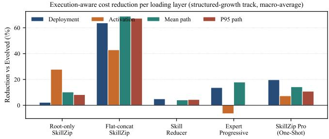  
Fi<sub>g</sub>. 3. Savin<sub>g</sub> in each cost la<sub>y</sub>er (<sub>g</sub>rown version, avera<sub>g</sub>ed over benchmarks). B<sub>ars</sub> b<sub>e</sub>l<sub>ow zero mean</sub> th<sub>a</sub>t l<sub>ayer go</sub>t <sub>worse: a me</sub>th<sub>o</sub>d <sub>can s</sub>h<sub>r</sub>i<sub>n</sub>k th<sub>e s</sub>hi<sub>ppe</sub>d <sub>pac</sub>k<sub>age w</sub>hil<sub>e ma</sub>ki<sub>ng every s</sub>i<sub>ng</sub>l<sub>e run</sub> l<sub>onger, w</sub>hi<sub>c</sub>h <sub>one ra</sub>ti<sub>o wou</sub>ld hid<sub>e.</sub>

The test is decisive and answers Q2 directl<sub>y</sub>. Across 102 <sub>poo</sub>l<sub>e</sub>d h<sub>e</sub>ld<sub>-ou</sub>t t<sub>as</sub>k<sub>s,</sub> S<sub>kill</sub>Z<sub>ip</sub> P<sub>ro</sub> h<sub>as</sub> th<sub>e</sub> hi<sub>g</sub>h<sub>es</sub>t <sub>poo</sub>l<sub>e</sub>d <sub>success o</sub>f <sub>any compress</sub>i<sub>on me</sub>th<sub>o</sub>d<sub>, an</sub>d it i<sub>s</sub> th<sub>e</sub> <sub>on</sub>l<sub>y</sub> <sub>compressor</sub> th<sub>a</sub>t k<sub>eeps</sub> <sub>qua</sub>lit<sub>y:</sub> it<sub>s</sub> i<sub>n</sub>t<sub>erva</sub>l <sub>aga</sub>i<sub>ns</sub>t th<sub>e</sub> <sub>uncompresse</sub>d b<sub>un</sub>dl<sub>e</sub> <sub>s</sub>t<sub>ays</sub> <sub>a</sub>b<sub>ove</sub> th<sub>e</sub> <sub>marg</sub>i<sub>n,</sub> <sub>w</sub>hil<sub>e</sub> <sub>roo</sub>t<sub>-</sub> <sub>on</sub>l<sub>y,</sub> fl<sub>a</sub>t<sub>-conca</sub>t<sub>,</sub> SkillR<sub>e</sub>d<sub>ucer, an</sub>d <sub>even</sub> th<sub>e</sub> h<sub>an</sub>d<sub>-</sub>b<sub>u</sub>ilt <sub>exper</sub>t b<sub>ase</sub>li<sub>ne</sub> <sub>a</sub>ll f<sub>a</sub>ll b<sub>e</sub>l<sub>ow</sub> it<sub>.</sub> I<sub>n</sub> <sub>o</sub>th<sub>er</sub> <sub>wor</sub>d<sub>s,</sub> <sub>every</sub> <sub>o</sub>th<sub>er</sub> <sub>way</sub> <sub>o</sub>f <sub>ma</sub>ki<sub>ng</sub> th<sub>e</sub> b<sub>un</sub>dl<sub>e</sub> <sub>sma</sub>ll<sub>er</sub> <sub>a</sub>l<sub>so</sub> <sub>ma</sub>d<sub>e</sub> th<sub>e</sub> <sub>agen</sub>t <sub>measura</sub>bl<sub>y</sub> <sub>worse,</sub> <sub>an</sub>d S<sub>kill</sub>Z<sub>ip</sub> P<sub>ro</sub> did <sub>no</sub>t<sub>.</sub>

## Takeaway

A <sub>s</sub>i<sub>ng</sub>l<sub>e ra</sub>ti<sub>o</sub> i<sub>s</sub> i<sub>nsu</sub>fi<sub>c</sub>i<sub>en</sub>t<sub>.</sub> O<sub>n</sub>l<sub>y</sub> S<sub>kill</sub>Z<sub>ip</sub> P<sub>ro re</sub>d<sub>uces a</sub>ll f<sub>our</sub> <sub>cos</sub>t<sub>s</sub> <sub>w</sub>hil<sub>e</sub> <sub>ma</sub>t<sub>c</sub>hi<sub>ng</sub> th<sub>e</sub> <sub>uncompresse</sub>d <sub>s</sub>kill<sub>;</sub> <sub>every</sub> <sub>o</sub>th<sub>er</sub> com<sub>p</sub>ressor re<sub>g</sub>resses e<sup>l</sup>sew<sup>h</sup>ere.

## H<sub>.</sub> D<sub>oes</sub> C<sub>ompress</sub>i<sub>on</sub> P<sub>reserve</sub> P<sub>rogress</sub>i<sub>ve</sub> L<sub>oa</sub>di<sub>ng</sub>?

A <sub>sma</sub>ll<sub>er</sub> b<sub>un</sub>dl<sub>e</sub> i<sub>s use</sub>f<sub>u</sub>l <sub>on</sub>l<sub>y</sub> if th<sub>e agen</sub>t <sub>can s</sub>till id<sub>en</sub>tif<sub>y an</sub>d l<sub>oa</sub>d th<sub>e resources requ</sub>i<sub>re</sub>d b<sub>y eac</sub>h t<sub>as</sub>k<sub>.</sub> W<sub>e</sub> th<sub>ere</sub>f<sub>ore</sub> <sub>execu</sub>t<sub>e</sub> th<sub>e</sub> <sub>grown</sub> b<sub>un</sub>dl<sub>es</sub> <sub>w</sub>ith th<sub>e</sub> <sub>unmo</sub>difi<sub>e</sub>d <sub>agen</sub>t <sub>an</sub>d <sub>measure</sub> b<sub>o</sub>th <sub>rou</sub>ti<sub>ng</sub> <sub>correc</sub>t<sub>ness</sub> <sub>an</sub>d l<sub>oa</sub>di<sub>ng</sub> b<sub>e</sub>h<sub>av</sub>i<sub>or.</sub> R<sub>equ</sub>i<sub>re</sub>d <sub>reca</sub>ll i<sub>s</sub> th<sub>e</sub> f<sub>rac</sub>ti<sub>on o</sub>f t<sub>as</sub>k<sub>-re</sub>l<sub>evan</sub>t <sub>resources</sub> th<sub>a</sub>t <sub>are</sub> l<sub>oa</sub>d<sub>e</sub>d<sub>,</sub> i<sub>rre</sub>l<sub>evan</sub>t l<sub>oa</sub>d i<sub>s</sub> th<sub>e</sub> f<sub>rac</sub>ti<sub>on o</sub>f l<sub>oa</sub>d<sub>e</sub>d <sub>resources</sub> th<sub>a</sub>t th<sub>e</sub> t<sub>as</sub>k d<sub>oes</sub> <sub>no</sub>t <sub>nee</sub>d<sub>,</sub> <sub>an</sub>d di<sub>spa</sub>t<sub>c</sub>h <sub>measures</sub> <sub>w</sub>h<sub>e</sub>th<sub>er</sub> th<sub>e</sub> <sub>agen</sub>t <sub>se</sub>l<sub>ec</sub>t<sub>s</sub> th<sub>e</sub> i<sub>n</sub>t<sub>en</sub>d<sub>e</sub>d b<sub>ranc</sub>h<sub>.</sub> W<sub>e</sub> <sub>a</sub>l<sub>so</sub> <sub>recor</sub>d li<sub>n</sub>k <sub>errors,</sub> f<sub>a</sub>llb<sub>ac</sub>k <sub>ac</sub>ti<sub>va</sub>ti<sub>ons, an</sub>d th<sub>e average num</sub>b<sub>er o</sub>f <sub>reac</sub>h<sub>a</sub>bl<sub>e</sub> fil<sub>es.</sub>

A<sub>mong</sub> th<sub>e compress</sub>i<sub>on me</sub>th<sub>o</sub>d<sub>s,</sub> S<sub>kill</sub>Z<sub>ip</sub> P<sub>ro mos</sub>t <sub>c</sub>l<sub>ose</sub>l<sub>y ma</sub>t<sub>c</sub>h<sub>es</sub> th<sub>e</sub> l<sub>oa</sub>di<sub>ng</sub> b<sub>e</sub>h<sub>av</sub>i<sub>or o</sub>f th<sub>e uncompresse</sub>d b<sub>un</sub>dl<sub>e.</sub> It <sub>ac</sub>hi<sub>eves a requ</sub>i<sub>re</sub>d<sub>-resource reca</sub>ll <sub>o</sub>f 0<sub>.</sub>755<sub>, com</sub> <sub>pare</sub>d <sub>w</sub>ith 0<sub>.</sub>795 f<sub>or</sub> th<sub>e</sub> E<sub>vo</sub>l<sub>ve</sub>d B<sub>un</sub>dl<sub>e, w</sub>hil<sub>e re</sub>d<sub>uc</sub>i<sub>ng</sub> i<sub>rre</sub>l<sub>evan</sub>t l<sub>oa</sub>di<sub>ng</sub> t<sub>o</sub> 0<sub>.</sub>193<sub>.</sub> Th<sub>e</sub> <sub>correspon</sub>di<sub>ng</sub> <sub>ra</sub>t<sub>es</sub> f<sub>or</sub> th<sub>e</sub> <sub>o</sub>th<sub>e</sub>r <sub>co</sub>m<sub>p</sub>r<sub>esso</sub>r<sub>s</sub> r<sub>a</sub>n<sub>ge</sub> fr<sub>o</sub>m 0<sub>.</sub>259 t<sub>o</sub> 0<sub>.</sub>290<sub>.</sub> Th<sub>e</sub> l<sub>a</sub>r<sub>ge</sub>r <sub>num</sub>b<sub>er o</sub>f <sub>reac</sub>h<sub>a</sub>bl<sub>e</sub> fil<sub>es un</sub>d<sub>er</sub> S<sub>kill</sub>Z<sub>ip</sub> P<sub>ro re</sub>fl<sub>ec</sub>t<sub>s</sub> th<sub>e</sub> <sub>s</sub>h<sub>are</sub>d <sub>mo</sub>d<sub>u</sub>l<sub>es an</sub>d <sub>con</sub>diti<sub>ona</sub>l <sub>capsu</sub>l<sub>es</sub> i<sub>n</sub>t<sub>ro</sub>d<sub>uce</sub>d d<sub>ur</sub>i<sub>ng</sub> <sub>compress</sub>i<sub>on;</sub> th<sub>ese a</sub>dditi<sub>ona</sub>l <sub>no</sub>d<sub>es rema</sub>i<sub>n connec</sub>t<sub>e</sub>d t<sub>o</sub> th<sub>e appropr</sub>i<sub>a</sub>t<sub>e execu</sub>ti<sub>on pa</sub>th<sub>s ra</sub>th<sub>er</sub> th<sub>an</sub> b<sub>e</sub>i<sub>ng</sub> l<sub>oa</sub>d<sub>e</sub>d i<sub>n</sub>di<sub>scr</sub>i<sub>m</sub>i<sub>na</sub>t<sub>e</sub>l<sub>y.</sub>

TABLE V  
L<sub>oading</sub> <sub>behavior</sub> <sub>on</sub> <sub>grown</sub> <sub>bundles.</sub> R<sub>equired</sub> <sub>recall</sub> <sub>is</sub> <sub>maximized;</sub> broken links, unreachable files, and irrelevant loads are minimized.
<table><tr><td>Method</td><td>Req. recall ↑</td><td>Irrel. load ↓</td><td>Dispatch ↑</td><td>Link errors ↓</td><td>Fallback ↓</td><td>Files reached</td></tr><tr><td>Evolved Bundle</td><td>0.795</td><td>0.171</td><td>0.795</td><td>0</td><td></td><td>6.3</td></tr><tr><td>Root-only SKILLZIp X</td><td>0.685</td><td>0.290</td><td>0.685</td><td>0</td><td>0.000</td><td>6.3</td></tr><tr><td>Flat-concat SκıLLZıP X</td><td>0.708</td><td>0.259</td><td>0.708</td><td>0</td><td>0.000</td><td>6.0</td></tr><tr><td>SkillReducer</td><td>0.688</td><td>0.288</td><td>0.688</td><td>0</td><td>0.000</td><td>6.3</td></tr><tr><td>SκıLLZıP Pro (One-Shot)</td><td>0.755</td><td>0.193</td><td>0.755</td><td>0</td><td>0.000</td><td>10.3</td></tr></table>

TABLE VI

K<sub>nowledge</sub> <sub>retained</sub> <sub>versus</sub> <sub>text</sub> <sub>saved</sub> <sub>on</sub> <sub>grown</sub> <sub>bundles.</sub> “K<sub>ept</sub>” <sub>counts</sub> <sub>original</sub> <sub>instruction</sub> <sub>lines</sub> <sub>that</sub> <sub>remain</sub> <sub>reachable;</sub> “L<sub>ost</sub>” counts unwitnessed deletions. † denotes an incomplete bundle.
<table><tr><td>Method</td><td>Kept ↑</td><td>Lost lines ↓</td><td>Repeated text removed ↑</td><td>Shipped saving ↑</td><td>Routing kept ↑</td></tr><tr><td>Evolved Bundle</td><td>1.000</td><td>0.0</td><td>0.000</td><td>+0.0%</td><td>1.000</td></tr><tr><td>Root-only SKIL1ZIP X</td><td>0.939</td><td>5.3</td><td>0.002</td><td>+2.2%</td><td>0.000</td></tr><tr><td>Flat-concat SKILLZıP X</td><td>0.241</td><td>59.0</td><td>1.000</td><td>+63.8%</td><td>0.000</td></tr><tr><td>SkillReducer</td><td>1.000</td><td>0.0</td><td>0.073</td><td>+5.0%</td><td>1.000</td></tr><tr><td>Expert Progressive</td><td>1.000</td><td>0.0</td><td>0.482</td><td>+13.7%</td><td>1.000</td></tr><tr><td>SKILLZıP PRo (One-Shot)</td><td>0.986</td><td>1.0</td><td>0.736</td><td>+19.7%</td><td>1.000</td></tr></table>

Th<sub>e a</sub>b<sub>sence o</sub>f li<sub>n</sub>k <sub>errors a</sub>l<sub>one</sub> d<sub>oes no</sub>t <sub>es</sub>t<sub>a</sub>bli<sub>s</sub>h <sub>rou</sub>ti<sub>ng</sub> fid<sub>e</sub>lit<sub>y.</sub> R<sub>oo</sub>t<sub>-on</sub>l<sub>y an</sub>d Fl<sub>a</sub>t<sub>-conca</sub>t S<sub>kill</sub>Z<sub>ip remove rou</sub>ti<sub>ng</sub> i<sub>ns</sub>t<sub>ruc</sub>ti<sub>ons</sub> i<sub>ns</sub>t<sub>ea</sub>d <sub>o</sub>f l<sub>eav</sub>i<sub>ng</sub> d<sub>ang</sub>li<sub>ng</sub> li<sub>n</sub>k<sub>s, so</sub> th<sub>e</sub>i<sub>r</sub> b<sub>ranc</sub>h<sub>es</sub> <sub>rema</sub>i<sub>n</sub> <sub>on</sub> di<sub>s</sub>k b<sub>u</sub>t <sub>can</sub> <sub>no</sub> l<sub>onger</sub> b<sub>e</sub> <sub>se</sub>l<sub>ec</sub>t<sub>e</sub>d<sub>.</sub> Th<sub>e</sub> <sub>rou</sub>ti<sub>ng</sub> <sub>au</sub>dit <sub>con</sub>fi<sub>rms</sub> thi<sub>s</sub> di<sub>s</sub>ti<sub>nc</sub>ti<sub>on:</sub> b<sub>o</sub>th b<sub>ase</sub>li<sub>nes</sub> <sub>preserve</sub> 0<sub>.</sub>000 <sub>o</sub>f th<sub>e or</sub>i<sub>g</sub>i<sub>na</sub>l <sub>rou</sub>ti<sub>ng pa</sub>i<sub>rs, w</sub>h<sub>ereas</sub> S<sub>kill</sub>Z<sub>ip</sub> P<sub>ro preserves</sub> 1<sub>.</sub>000<sub>.</sub> It<sub>s sav</sub>i<sub>ngs</sub> th<sub>ere</sub>f<sub>ore come</sub> f<sub>rom s</sub>h<sub>or</sub>t<sub>en</sub>i<sub>ng an</sub>d <sub>s</sub>h<sub>ar</sub>i<sub>ng</sub> th<sub>e</sub> <sub>resources</sub> th<sub>a</sub>t th<sub>e</sub> <sub>agen</sub>t l<sub>oa</sub>d<sub>s,</sub> <sub>ra</sub>th<sub>er</sub> th<sub>an</sub> <sub>ma</sub>ki<sub>ng</sub> <sub>requ</sub>i<sub>re</sub>d b<sub>ranc</sub>h<sub>es unreac</sub>h<sub>a</sub>bl<sub>e.</sub>

## Takeaway

S<sub>kill</sub>Z<sub>ip</sub> P<sub>ro</sub> <sub>preserves</sub> <sub>every</sub> d<sub>ec</sub>l<sub>are</sub>d <sub>rou</sub>t<sub>e</sub> <sub>an</sub>d <sub>re</sub>t<sub>a</sub>i<sub>ns</sub> l<sub>oa</sub>di<sub>ng</sub> b<sub>e</sub>h<sub>av</sub>i<sub>or</sub> <sub>c</sub>l<sub>oses</sub>t t<sub>o</sub> th<sub>e</sub> <sub>uncompresse</sub>d b<sub>un</sub>dl<sub>e.</sub> It<sub>s</sub> <sub>run</sub>ti<sub>me</sub> <sub>sav</sub>i<sub>ngs</sub> <sub>come</sub> f<sub>rom</sub> <sub>re</sub>d<sub>uc</sub>i<sub>ng</sub> th<sub>e</sub> <sub>con</sub>t<sub>en</sub>t l<sub>oa</sub>d<sub>e</sub>d <sub>a</sub>l<sub>ong</sub> <sub>va</sub>lid <sub>execu</sub>ti<sub>on</sub> <sub>pa</sub>th<sub>s,</sub> <sub>no</sub>t f<sub>rom</sub> <sub>suppress</sub>i<sub>ng</sub> <sub>requ</sub>i<sub>re</sub>d b<sub>ranc</sub>h<sub>es.</sub>

INSIGHT 1 ★ For the compression of progressively loaded skills, th<sub>e</sub> d<sub>anger</sub> i<sub>s</sub> <sub>no</sub>t l<sub>os</sub>t t<sub>ex</sub>t b<sub>u</sub>t l<sub>os</sub>t <sub>reac</sub>h<sub>a</sub>bilit<sub>y:</sub> <sub>rewr</sub>iti<sub>ng</sub> <sub>on</sub>l<sub>y</sub> th<sub>e roo</sub>t l<sub>eaves every</sub> b<sub>ranc</sub>h <sub>on</sub> di<sub>s</sub>k <sub>ye</sub>t <sub>unreac</sub>h<sub>a</sub>bl<sub>e</sub> i<sub>n prac</sub>ti<sub>ce,</sub> <sub>so</sub> it l<sub>oo</sub>k<sub>s sa</sub>f<sub>e an</sub>d <sub>scores</sub> lik<sub>e</sub> d<sub>e</sub>l<sub>e</sub>ti<sub>on.</sub> R<sub>ou</sub>ti<sub>ng</sub> fid<sub>e</sub>lit<sub>y</sub> h<sub>as</sub> t<sub>o</sub> b<sub>e measure</sub>d <sub>separa</sub>t<sub>e</sub>l<sub>y</sub> f<sub>rom</sub> h<sub>ow many</sub> fil<sub>es s</sub>till <sub>ex</sub>i<sub>s</sub>t<sub>.</sub>

## I<sub>.</sub> I<sub>s</sub> th<sub>e</sub> S<sub>av</sub>i<sub>ng</sub> R<sub>ea</sub>l<sub>, or</sub> J<sub>us</sub>t D<sub>e</sub>l<sub>e</sub>t<sub>e</sub>d T<sub>ex</sub>t?

<sup>A</sup> <sup>com</sup>p<sup>ressor</sup> <sup>can</sup> p<sup>ost</sup> <sup>a</sup> v<sup>er</sup>y <sup>lar</sup>g<sup>e</sup> <sup>ratio</sup> <sup>sim</sup>p<sup>l</sup>y <sup>b</sup>y <sup>remo</sup>v<sup>in</sup>g t<sub>ex</sub>t<sub>, an</sub>d <sub>a cos</sub>t t<sub>a</sub>bl<sub>e canno</sub>t t<sub>e</sub>ll th<sub>a</sub>t <sub>apar</sub>t f<sub>rom genu</sub>i<sub>ne</sub> <sub>compress</sub>i<sub>on.</sub> T<sub>a</sub>bl<sub>e</sub> VI th<sub>ere</sub>f<sub>ore repor</sub>t<sub>s,</sub> f<sub>or every me</sub>th<sub>o</sub>d<sub>,</sub> h<sub>ow muc</sub>h <sub>o</sub>f th<sub>e or</sub>i<sub>g</sub>i<sub>na</sub>l <sub>s</sub>kill <sub>s</sub>till <sub>reac</sub>h<sub>es</sub> th<sub>e agen</sub>t<sub>, nex</sub>t t<sub>o</sub> h<sub>ow muc</sub>h <sub>o</sub>f th<sub>e repea</sub>t<sub>e</sub>d t<sub>ex</sub>t it <sub>manage</sub>d t<sub>o remove.</sub> R<sub>epea</sub>t<sub>e</sub>d t<sub>ex</sub>t i<sub>s</sub> th<sub>e par</sub>t <sub>a</sub> b<sub>un</sub>dl<sub>e-</sub>l<sub>eve</sub>l <sub>me</sub>th<sub>o</sub>d i<sub>s en</sub>titl<sub>e</sub>d t<sub>o rec</sub>l<sub>a</sub>i<sub>m;</sub> it i<sub>s</sub> th<sub>e same sen</sub>t<sub>ence appear</sub>i<sub>ng</sub> i<sub>n severa</sub>l fil<sub>es.</sub>

Th<sub>e resu</sub>lt <sub>re</sub>f<sub>rames</sub> th<sub>e w</sub>h<sub>o</sub>l<sub>e compar</sub>i<sub>son.</sub> Fl<sub>a</sub>t<sub>-conca</sub>t S<sub>kill</sub>Z<sub>ip appea</sub>r<sub>e</sub>d t<sub>o</sub> b<sub>e</sub> th<sub>e s</sub>tr<sub>o</sub>n<sub>ges</sub>t <sub>co</sub>m<sub>p</sub>r<sub>esso</sub>r b<sub>y a w</sub>id<sub>e</sub> <sub>marg</sub>i<sub>n,</sub> b<sub>u</sub>t it k<sub>eeps un</sub>d<sub>er a quar</sub>t<sub>er o</sub>f th<sub>e s</sub>kill’<sub>s</sub> i<sub>ns</sub>t<sub>ruc</sub>ti<sub>on</sub> li<sub>nes:</sub> it<sub>s ra</sub>ti<sub>o</sub> i<sub>s mos</sub>tl<sub>y</sub> d<sub>e</sub>l<sub>e</sub>ti<sub>on, no</sub>t <sub>compress</sub>i<sub>on.</sub> R<sub>oo</sub>t<sub>-on</sub>l<sub>y</sub> S<sub>kill</sub>Z<sub>ip a</sub>l<sub>so</sub> d<sub>rops</sub> li<sub>nes,</sub> b<sub>ecause rewr</sub>iti<sub>ng</sub> th<sub>e roo</sub>t <sub>a</sub>l<sub>one</sub> <sub>rewr</sub>it<sub>es</sub> t<sub>ex</sub>t th<sub>a</sub>t <sub>carr</sub>i<sub>e</sub>d <sub>rea</sub>l <sub>con</sub>diti<sub>ons.</sub> S<sub>kill</sub>Z<sub>ip</sub> P<sub>ro removes</sub> th<sub>e</sub> l<sub>arges</sub>t <sub>s</sub>h<sub>are</sub> <sub>o</sub>f <sub>repea</sub>t<sub>e</sub>d t<sub>ex</sub>t <sub>o</sub>f <sub>any</sub> <sub>me</sub>th<sub>o</sub>d <sub>w</sub>hil<sub>e</sub> k<sub>eep</sub>i<sub>ng</sub> <sub>essen</sub>ti<sub>a</sub>ll<sub>y</sub> th<sub>e w</sub>h<sub>o</sub>l<sub>e s</sub>kill<sub>, an</sub>d it<sub>s on</sub>l<sub>y remova</sub>l<sub>s</sub> th<sub>a</sub>t <sub>are</sub> <sub>no</sub>t <sub>recovera</sub>bl<sub>e</sub> f<sub>rom</sub> th<sub>e ou</sub>t<sub>pu</sub>t <sub>are</sub> th<sub>e ones</sub> th<sub>e env</sub>i<sub>ronmen</sub>t <sub>con</sub>t<sub>rac</sub>t <sub>guaran</sub>t<sub>ees, eac</sub>h <sub>s</sub>t<sub>ore</sub>d <sub>w</sub>ith <sub>a s</sub>i<sub>gne</sub>d <sub>w</sub>it<sub>ness.</sub> Fi<sub>gure</sub> 4 <sub>p</sub>l<sub>o</sub>t<sub>s</sub> th<sub>e</sub> t<sub>wo quan</sub>titi<sub>es</sub> t<sub>oge</sub>th<sub>er.</sub>

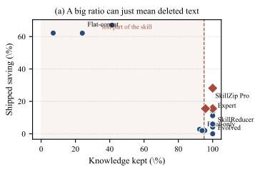

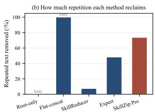  
Fi<sub>g</sub>. 4. (a) Savin<sub>g</sub> versus knowled<sub>g</sub>e retained; shaded <sub>p</sub>oints lost content. (b) R<sub>epe</sub>titi<sub>on rec</sub>l<sub>a</sub>i<sub>me</sub>d<sub>.</sub> S<sub>kill</sub>Z<sub>ip</sub> P<sub>ro ac</sub>hi<sub>eves</sub> th<sub>e</sub> l<sub>arges</sub>t f<sub>a</sub>ithf<sub>u</sub>l <sub>sav</sub>i<sub>ng.</sub>

## Takeaway

A l<sub>arge</sub> <sub>ra</sub>ti<sub>o</sub> <sub>may</sub> <sub>re</sub>fl<sub>ec</sub>t d<sub>e</sub>l<sub>e</sub>ti<sub>on.</sub> S<sub>kill</sub>Z<sub>ip</sub> P<sub>ro</sub> <sub>removes</sub> th<sub>e</sub> <sub>mos</sub>t <sub>repea</sub>t<sub>e</sub>d t<sub>ex</sub>t <sub>w</sub>hil<sub>e</sub> <sub>preserv</sub>i<sub>ng</sub> th<sub>e</sub> <sub>comp</sub>l<sub>e</sub>t<sub>e</sub> <sub>s</sub>kill<sub>.</sub>

## J<sub>.</sub> C<sub>ase</sub> St<sub>u</sub>d<sub>y:</sub> Wh<sub>a</sub>t D<sub>oes</sub> C<sub>ompress</sub>i<sub>on</sub> R<sub>emove</sub>?

A<sub>ggrega</sub>t<sub>e compress</sub>i<sub>on ra</sub>ti<sub>os</sub> d<sub>o no</sub>t <sub>revea</sub>l <sub>w</sub>h<sub>e</sub>th<sub>er a</sub> <sub>me</sub>th<sub>o</sub>d <sub>removes re</sub>d<sub>un</sub>d<sub>ancy or</sub> di<sub>scar</sub>d<sub>s</sub> t<sub>as</sub>k<sub>-re</sub>l<sub>evan</sub>t <sub>con</sub>t<sub>en</sub>t<sub>.</sub> We therefore examine one strate<sub>gy</sub> file, round\_02, from the evolved qwen3.6-plus librar<sub>y</sub> and com<sub>p</sub>are its treatm<sub>e</sub>nt <sub>u</sub>nd<sub>e</sub>r Fl<sub>a</sub>t<sub>-co</sub>n<sub>ca</sub>t S<sub>kill</sub>Z<sub>ip a</sub>nd S<sub>kill</sub>Z<sub>ip</sub> P<sub>ro.</sub> Thi<sub>s</sub> lib<sub>rary con</sub>t<sub>a</sub>i<sub>ns su</sub>b<sub>s</sub>t<sub>an</sub>ti<sub>a</sub>l <sub>cross-</sub>fil<sub>e repe</sub>titi<sub>on:</sub> th<sub>e same</sub> <sub>ma</sub>th<sub>ema</sub>ti<sub>ca</sub>l<sub>-ou</sub>t<sub>pu</sub>t <sub>ru</sub>l<sub>es occur a</sub>t 16 l<sub>oca</sub>ti<sub>ons across</sub> th<sub>e</sub> b<sub>un</sub>dl<sub>e,</sub> i<sub>nc</sub>l<sub>u</sub>di<sub>ng a</sub>ll 15 <sub>s</sub>t<sub>ra</sub>t<sub>egy</sub> b<sub>ranc</sub>h<sub>es, w</sub>hil<sub>e eac</sub>h b<sub>ranc</sub>h <sub>re</sub>t<sub>a</sub>i<sub>ns</sub> it<sub>s own wor</sub>kfl<sub>ow, ver</sub>ifi<sub>ca</sub>ti<sub>on s</sub>t<sub>eps, an</sub>d <sub>con</sub>diti<sub>ona</sub>l i<sub>ns</sub>t<sub>ruc</sub>ti<sub>ons.</sub> Thi<sub>s</sub> <sub>examp</sub>l<sub>e</sub> <sub>s</sub>h<sub>ows</sub> <sub>w</sub>h<sub>e</sub>th<sub>er</sub> <sub>a</sub> <sub>compressor</sub> <sub>can</sub> <sub>e</sub>li<sub>m</sub>i<sub>na</sub>t<sub>e</sub> th<sub>e repea</sub>t<sub>e</sub>d <sub>con</sub>t<sub>en</sub>t <sub>w</sub>ith<sub>ou</sub>t <sub>c</sub>h<sub>ang</sub>i<sub>ng</sub> th<sub>e ava</sub>il<sub>a</sub>bilit<sub>y</sub> <sub>or</sub> b<sub>e</sub>h<sub>av</sub>i<sub>or o</sub>f th<sub>e</sub> i<sub>n</sub>di<sub>v</sub>id<sub>ua</sub>l b<sub>ranc</sub>h<sub>.</sub>

Fi<sub>gure</sub> 5 ill<sub>us</sub>t<sub>ra</sub>t<sub>es</sub> th<sub>e source o</sub>f th<sub>e measure</sub>d <sub>sav</sub>i<sub>ngs.</sub> Fl<sub>a</sub>t<sub>-conca</sub>t S<sub>kill</sub>Z<sub>ip re</sub>t<sub>a</sub>i<sub>ns on</sub>l<sub>y</sub> t<sub>wo o</sub>f th<sub>e</sub> fift<sub>een s</sub>t<sub>ra</sub>t<sub>egy</sub> branches, makin<sub>g</sub> round\_02 unavailable to the a<sub>g</sub>ent. In <sub>con</sub>t<sub>ras</sub>t<sub>,</sub> S<sub>kill</sub>Z<sub>ip</sub> P<sub>ro re</sub>d<sub>uces</sub> thi<sub>s</sub> fil<sub>e</sub> f<sub>rom</sub> 527 t<sub>o</sub> 160 t<sub>o</sub>k<sub>ens w</sub>hil<sub>e</sub> k<sub>eep</sub>i<sub>ng a</sub>ll fift<sub>een</sub> b<sub>ranc</sub>h<sub>es reac</sub>h<sub>a</sub>bl<sub>e.</sub> R<sub>epea</sub>t<sub>e</sub>d <sub>ru</sub>l<sub>es are s</sub>t<sub>ore</sub>d <sub>once an</sub>d <sub>re</sub>f<sub>erence</sub>d f<sub>rom eac</sub>h <sub>re</sub>l<sub>evan</sub>t l<sub>oca-</sub> ti<sub>on, w</sub>h<sub>ereas</sub> th<sub>e</sub> b<sub>ranc</sub>h<sub>-spec</sub>ifi<sub>c wor</sub>kfl<sub>ow, ver</sub>ifi<sub>ca</sub>ti<sub>on s</sub>t<sub>eps,</sub> <sub>an</sub>d <sub>guar</sub>d<sub>e</sub>d i<sub>ns</sub>t<sub>ruc</sub>ti<sub>ons rema</sub>i<sub>n unc</sub>h<sub>ange</sub>d<sub>.</sub> Th<sub>e re</sub>d<sub>uc</sub>ti<sub>on</sub> th<sub>ere</sub>f<sub>ore comes</sub> f<sub>rom cross-</sub>fil<sub>e reuse ra</sub>th<sub>er</sub> th<sub>an</sub> th<sub>e remova</sub>l <sub>o</sub>f <sub>an execu</sub>ti<sub>on pa</sub>th<sub>.</sub>

## K<sub>.</sub> H<sub>ow</sub> D<sub>o</sub> S<sub>av</sub>i<sub>ngs</sub> A<sub>ccumu</sub>l<sub>a</sub>t<sub>e</sub> A<sub>cross</sub> R<sub>epea</sub>t<sub>e</sub>d U<sub>se</sub>?

B<sub>ecause a s</sub>kill i<sub>s</sub> d<sub>ep</sub>l<sub>oye</sub>d <sub>once</sub> b<sub>u</sub>t <sub>may</sub> b<sub>e</sub> i<sub>nvo</sub>k<sub>e</sub>d <sub>many</sub> ti<sub>mes,</sub> d<sub>ep</sub>l<sub>oymen</sub>t <sub>s</sub>i<sub>ze a</sub>l<sub>one</sub> d<sub>oes no</sub>t d<sub>e</sub>t<sub>erm</sub>i<sub>ne</sub> it<sub>s</sub> t<sub>o</sub>t<sub>a</sub>l <sub>cos</sub>t<sub>.</sub> W<sub>e</sub> th<sub>ere</sub>f<sub>ore measure cumu</sub>l<sub>a</sub>ti<sub>ve</sub> t<sub>o</sub>k<sub>en cos</sub>t <sub>as</sub> th<sub>e sum o</sub>f th<sub>e</sub> <sub>one-</sub>ti<sub>me</sub> d<sub>ep</sub>l<sub>oymen</sub>t <sub>cos</sub>t <sub>an</sub>d th<sub>e run</sub>ti<sub>me cos</sub>t <sub>o</sub>f <sub>execu</sub>ti<sub>ng</sub> � t<sub>as</sub>k<sub>s.</sub> T<sub>a</sub>bl<sub>e</sub> VII <sub>repor</sub>t<sub>s</sub> th<sub>e percen</sub>t<sub>age re</sub>d<sub>uc</sub>ti<sub>on re</sub>l<sub>a</sub>ti<sub>ve</sub> t<sub>o</sub> th<sub>e</sub> E<sub>vo</sub>l<sub>ve</sub>d B<sub>un</sub>dl<sub>e.</sub> W<sub>e separa</sub>t<sub>e</sub>l<sub>y</sub> id<sub>en</sub>tif<sub>y me</sub>th<sub>o</sub>d<sub>s</sub> th<sub>a</sub>t <sub>re</sub>t<sub>a</sub>i<sub>n a</sub>t l<sub>eas</sub>t 95% <sub>o</sub>f th<sub>e or</sub>i<sub>g</sub>i<sub>na</sub>l li<sub>nes, s</sub>i<sub>nce re</sub>d<sub>uc</sub>ti<sub>ons o</sub>bt<sub>a</sub>i<sub>ne</sub>d b<sub>y</sub> <sub>remov</sub>i<sub>ng su</sub>b<sub>s</sub>t<sub>an</sub>ti<sub>a</sub>l <sub>s</sub>kill <sub>con</sub>t<sub>en</sub>t <sub>are no</sub>t di<sub>rec</sub>tl<sub>y compara</sub>bl<sub>e.</sub>

TABLE VII  
R<sub>eduction</sub> <sub>in</sub> <sub>cumulative</sub> <sub>token</sub> <sub>cost</sub> <sub>relative</sub> <sub>to</sub> <sub>the</sub> E<sub>volved</sub> B<sub>undle,</sub> a<sub>v</sub>era<sub>g</sub>ed a<sub>c</sub>r<sub>oss</sub> be<sub>nc</sub>hmark<sub>s.</sub> The <sub>cos</sub>t i<sub>nc</sub>l<sub>u</sub>de<sub>s</sub> <sub>on</sub>e depl<sub>o</sub>yme<sub>n</sub>t a<sub>n</sub>d � <sub>task</sub> <sub>executions.</sub> T<sub>he</sub> <sub>retention</sub> <sub>criterion</sub> <sub>requires</sub> <sub>a</sub> <sub>method</sub> <sub>to</sub> preserve at least 95% of the original lines; † denotes methods that do not satisfy this criterion.
<table><tr><td>Method</td><td>Keeps skill</td><td>N=1↑</td><td>N=10↑</td><td>N=50↑</td><td>N=200↑</td><td>N=1000 ↑</td></tr><tr><td>Root-only SKILLZIP</td><td>no†</td><td>+5.1%</td><td>+11.5%</td><td>+13.8%</td><td>+14.3%</td><td>+14.5%</td></tr><tr><td>Flat-concat SκILLZıP</td><td>no†</td><td>+63.6%</td><td>+63.1%</td><td>+62.9%</td><td>+62.9%</td><td>+62.9%</td></tr><tr><td>SkillReducer</td><td>yes</td><td>+5.1%</td><td>+5.4%</td><td>+5.4%</td><td>+5.5%</td><td>+5.5%</td></tr><tr><td>Expert Progressive</td><td>yes</td><td>+13.1%</td><td>+11.7%</td><td>+11.3%</td><td>+11.1%</td><td>+11.1%</td></tr><tr><td>SκILLZıP PRo (One-Shot)</td><td>yes</td><td>+17.9%</td><td>+13.9%</td><td>+12.5%</td><td>+12.2%</td><td>+12.1%</td></tr></table>

TABLE VIII

B<sub>ehavior</sub> <sub>at</sub> <sub>the</sub> <sub>smallest</sub> <sub>and</sub> <sub>largest</sub> <sub>tested</sub> <sub>libraries,</sub> <sub>averaged</sub> <sub>over</sub> <sub>benchmarks.</sub> R<sub>etention</sub> <sub>and</sub> <sub>routing</sub> <sub>use</sub> <sub>the</sub> <sub>largest</sub> <sub>size.</sub>
<table><tr><td></td><td colspan="2">Shipped saving</td><td colspan="2">Per-run saving</td><td colspan="2">At largest size</td></tr><tr><td>Method</td><td>small ↑</td><td>large ↑</td><td>small ↑</td><td>large ↑</td><td>Kept ↑</td><td>Routing ↑</td></tr><tr><td>Root-only SKILLZIP</td><td>+2.0%</td><td>+5.2%</td><td>+8.7%</td><td>+3.5%</td><td>0.896</td><td>0.000</td></tr><tr><td>SkillReducer</td><td>+5.4%</td><td>+4.3%</td><td>+4.7%</td><td>+2.1%</td><td>1.000</td><td>1.000</td></tr><tr><td>Expert Progressive</td><td>+12.4%</td><td>+22.6%</td><td>+18.4%</td><td>+10.4%</td><td>1.000</td><td>1.000</td></tr><tr><td>SκILLZıP PRo (One-Shot)</td><td>+21.8%</td><td>+25.5%</td><td>+17.6%</td><td>+5.3%</td><td>0.984</td><td>1.000</td></tr></table>

A<sub>mong</sub> th<sub>e me</sub>th<sub>o</sub>d<sub>s</sub> th<sub>a</sub>t <sub>sa</sub>ti<sub>s</sub>f<sub>y</sub> th<sub>e re</sub>t<sub>en</sub>ti<sub>on cr</sub>it<sub>er</sub>i<sub>on,</sub> S<sub>kill</sub>Z<sub>ip</sub> P<sub>ro</sub> <sub>ac</sub>hi<sub>eves</sub> th<sub>e</sub> l<sub>arges</sub>t <sub>cumu</sub>l<sub>a</sub>ti<sub>ve</sub> <sub>sav</sub>i<sub>ng</sub> <sub>a</sub>t <sub>every</sub> <sub>wor</sub>kl<sub>oa</sub>d <sub>s</sub>i<sub>ze.</sub> It<sub>s</sub> <sub>re</sub>d<sub>uc</sub>ti<sub>on</sub> i<sub>s</sub> 17<sub>.</sub>9% f<sub>or</sub> <sub>a</sub> <sub>s</sub>i<sub>ng</sub>l<sub>e</sub> t<sub>as</sub>k <sub>an</sub>d <sub>rema</sub>i<sub>ns</sub> 12<sub>.</sub>1% <sub>a</sub>ft<sub>er</sub> 1<sub>,</sub>000 t<sub>as</sub>k<sub>s, compare</sub>d <sub>w</sub>ith 11<sub>.</sub>1% f<sub>or</sub> E<sub>xper</sub>t P<sub>rogress</sub>i<sub>ve an</sub>d 5<sub>.</sub>5% f<sub>or</sub> SkillR<sub>e</sub>d<sub>ucer.</sub> A<sub>s</sub> � i<sub>ncreases,</sub> th<sub>e</sub> <sub>e</sub>f<sub>ec</sub>t <sub>o</sub>f th<sub>e</sub> <sub>one-</sub>ti<sub>me</sub> d<sub>ep</sub>l<sub>oymen</sub>t <sub>cos</sub>t di<sub>m</sub>i<sub>n</sub>i<sub>s</sub>h<sub>es</sub> <sub>an</sub>d th<sub>e</sub> <sub>resu</sub>lt<sub>s</sub> <sub>approac</sub>h <sub>eac</sub>h <sub>me</sub>th<sub>o</sub>d’<sub>s</sub> <sub>per-run</sub> <sub>sav</sub>i<sub>ng.</sub> Th<sub>e</sub> <sub>or</sub>d<sub>er</sub>i<sub>ng</sub> <sub>o</sub>f th<sub>e</sub> th<sub>ree e</sub>li<sub>g</sub>ibl<sub>e me</sub>th<sub>o</sub>d<sub>s never</sub>th<sub>e</sub>l<sub>ess rema</sub>i<sub>ns unc</sub>h<sub>ange</sub>d<sub>.</sub> R<sub>oo</sub>t<sub>-o</sub>nl<sub>y</sub> <sub>a</sub>nd Fl<sub>a</sub>t<sub>-co</sub>n<sub>ca</sub>t S<sub>kill</sub>Z<sub>ip</sub> <sub>so</sub>m<sub>e</sub>tim<sub>es</sub> r<sub>epo</sub>rt l<sub>a</sub>r<sub>ge</sub>r <sub>re</sub>d<sub>uc</sub>ti<sub>ons,</sub> b<sub>u</sub>t b<sub>o</sub>th f<sub>a</sub>ll b<sub>e</sub>l<sub>ow</sub> th<sub>e re</sub>t<sub>en</sub>ti<sub>on</sub> th<sub>res</sub>h<sub>o</sub>ld <sub>an</sub>d <sub>are</sub> therefore excluded from this com<sub>p</sub>arison. Fi<sub>g</sub>ure 6(a) <sub>p</sub>resents th<sub>e same resu</sub>lt<sub>s as cumu</sub>l<sub>a</sub>ti<sub>ve-cos</sub>t <sub>curves.</sub>

## Takeaway

R<sub>un</sub>ti<sub>me cos</sub>t <sub>ma</sub>tt<sub>ers more</sub> th<sub>an a one-</sub>ti<sub>me s</sub>hi<sub>pp</sub>i<sub>ng ra</sub>ti<sub>o.</sub> A<sub>mong me</sub>th<sub>o</sub>d<sub>s</sub> th<sub>a</sub>t <sub>preserve</sub> th<sub>e s</sub>kill<sub>,</sub> S<sub>kill</sub>Z<sub>ip</sub> P<sub>ro</sub> i<sub>s</sub> th<sub>e</sub> <sub>c</sub>h<sub>eapes</sub>t <sub>a</sub>t <sub>every wor</sub>kl<sub>oa</sub>d <sub>s</sub>i<sub>ze.</sub>

## L<sub>.</sub> Wh<sub>a</sub>t H<sub>appens</sub> <sub>as</sub> th<sub>e</sub> Lib<sub>rary</sub> K<sub>eeps</sub> G<sub>row</sub>i<sub>ng</sub>

S<sub>e</sub>lf<sub>-evo</sub>l<sub>v</sub>i<sub>ng</sub> lib<sub>rar</sub>i<sub>es</sub> d<sub>o</sub> <sub>no</sub>t <sub>s</sub>t<sub>ay</sub> <sub>sma</sub>ll<sub>.</sub> W<sub>e</sub> <sub>grow</sub> <sub>one</sub> <sub>s</sub>t<sub>ep</sub> b<sub>y s</sub>t<sub>ep, a</sub>ddi<sub>ng</sub> b<sub>ranc</sub>h<sub>es</sub> th<sub>a</sub>t <sub>repea</sub>t th<sub>e same s</sub>h<sub>are</sub>d t<sub>ex</sub>t<sub>, an</sub>d <sub>recor</sub>d b<sub>o</sub>th <sub>s</sub>id<sub>es o</sub>f th<sub>e</sub> l<sub>e</sub>d<sub>ger a</sub>t <sub>eac</sub>h <sub>s</sub>i<sub>ze.</sub>

S<sub>kill</sub>Z<sub>ip</sub> P<sub>ro</sub> i<sub>s</sub> th<sub>e o</sub>nl<sub>y app</sub>r<sub>oac</sub>h th<sub>a</sub>t <sub>p</sub>r<sub>ese</sub>r<sub>ves</sub> th<sub>e</sub> <sub>comp</sub>l<sub>e</sub>t<sub>e s</sub>kill <sub>an</sub>d <sub>rou</sub>ti<sub>ng</sub> t<sub>a</sub>bl<sub>e a</sub>t <sub>every s</sub>i<sub>ze, an</sub>d it<sub>s per-</sub> <sub>run cos</sub>t <sub>rema</sub>i<sub>ns</sub> fl<sub>a</sub>t <sub>as</sub> th<sub>e</sub> lib<sub>rary grows.</sub> At th<sub>e</sub> l<sub>arges</sub>t <sub>s</sub>i<sub>ze,</sub> h<sub>oweve</sub>r<sub>,</sub> E<sub>xpe</sub>rt Pr<sub>og</sub>r<sub>ess</sub>i<sub>ve</sub> r<sub>e</sub>m<sub>oves</sub> m<sub>o</sub>r<sub>e s</sub>hi<sub>ppe</sub>d b<sub>y</sub>t<sub>es</sub> b<sub>y</sub> <sub>mov</sub>i<sub>ng</sub> <sub>a</sub>ll <sub>repea</sub>t<sub>e</sub>d t<sub>ex</sub>t i<sub>n</sub>t<sub>o</sub> <sub>one</sub> <sub>roo</sub>t<sub>-</sub>li<sub>n</sub>k<sub>e</sub>d fil<sub>e.</sub> E<sub>very</sub> <sub>run</sub> th<sub>en</sub> <sub>rea</sub>d<sub>s</sub> th<sub>a</sub>t <sub>grow</sub>i<sub>ng</sub> fil<sub>e,</sub> <sub>so</sub> it<sub>s</sub> <sub>run</sub>ti<sub>me</sub> <sub>sav</sub>i<sub>ng</sub> d<sub>ec</sub>li<sub>nes.</sub> S<sub>kill</sub>Z<sub>ip</sub> P<sub>ro</sub> k<sub>eeps eac</sub>h <sub>s</sub>h<sub>are</sub>d bl<sub>oc</sub>k <sub>w</sub>ithi<sub>n</sub> th<sub>e</sub> b<sub>ranc</sub>h<sub>es</sub> th<sub>a</sub>t <sub>use</sub> it<sub>,</sub> t<sub>ra</sub>di<sub>ng</sub> <sub>some</sub> <sub>s</sub>t<sub>orage</sub> <sub>sav</sub>i<sub>ng</sub> f<sub>or</sub> l<sub>ower</sub> <sub>execu</sub>ti<sub>on</sub> <sub>cos</sub>t<sub>.</sub> R<sub>ou</sub>ti<sub>ng</sub> <sub>a</sub>l<sub>so</sub> h<sub>as</sub> <sub>an</sub> <sub>unavo</sub>id<sub>a</sub>bl<sub>e</sub> <sub>pr</sub>i<sub>ce:</sub> th<sub>e</sub> <sub>roo</sub>t <sub>re</sub>t<sub>a</sub>i<sub>ns</sub> <sub>one</sub> <sub>con</sub>diti<sub>on</sub> <sub>per</sub> b<sub>ranc</sub>h<sub>.</sub> A<sub>n</sub> <sub>a</sub>tt<sub>emp</sub>t<sub>e</sub>d <sub>on-</sub>d<sub>eman</sub>d <sub>group</sub>i<sub>ng</sub> <sub>a</sub>dd<sub>e</sub>d <sub>a</sub> h<sub>op</sub> t<sub>o</sub> <sub>every</sub> <sub>run</sub> <sub>an</sub>d f<sub>a</sub>il<sub>e</sub>d th<sub>e</sub> <sub>never-</sub>i<sub>n</sub>fl<sub>a</sub>t<sub>e</sub> <sub>c</sub>h<sub>ec</sub>k<sub>.</sub> Fi<sub>g</sub>ure 6(b,c) shows this trade-of.

## M<sub>.</sub> R<sub>ea</sub>l E<sub>vo</sub>l<sub>ve</sub>d Skill Lib<sub>rar</sub>i<sub>es</sub>

Th<sub>e</sub> b<sub>un</sub>dl<sub>es</sub> <sub>use</sub>d <sub>so</sub> f<sub>ar</sub> <sub>repea</sub>t <sub>a</sub>b<sub>ou</sub>t <sub>a</sub> thi<sub>r</sub>d <sub>o</sub>f th<sub>e</sub>i<sub>r</sub> t<sub>ex</sub>t<sub>.</sub> Lib<sub>rar</sub>i<sub>es</sub> th<sub>a</sub>t <sub>a</sub> <sub>se</sub>lf<sub>-evo</sub>l<sub>v</sub>i<sub>ng</sub> <sub>agen</sub>t <sub>ac</sub>t<sub>ua</sub>ll<sub>y</sub> l<sub>eaves</sub> b<sub>e</sub>hi<sub>n</sub>d

## Original Branch

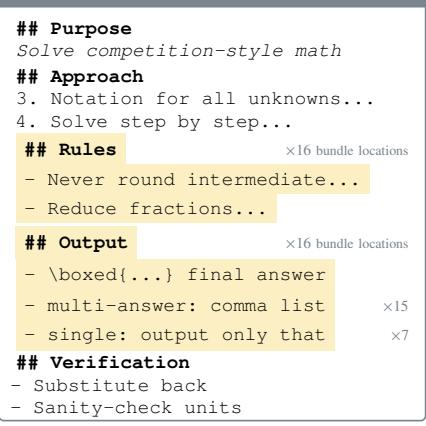

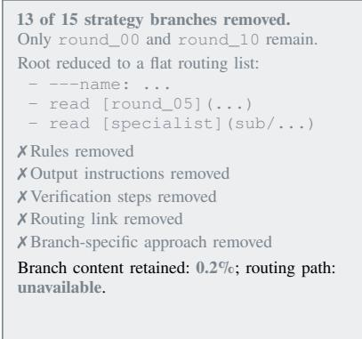

## SKILLZIP PRO ✓ (70% fewer tokens)

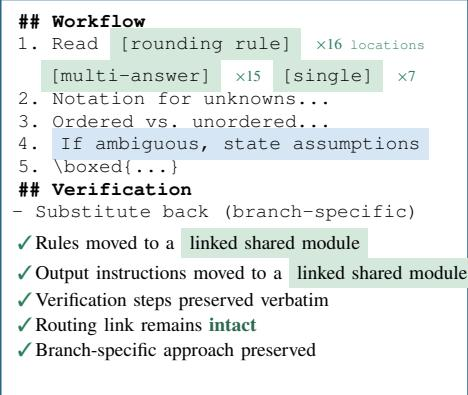

L<sub>ege</sub>nd<sub>.</sub> Y<sub>e</sub>ll<sub>ow</sub> i<sub>n</sub>di<sub>ca</sub>t<sub>es</sub> <sub>con</sub>t<sub>en</sub>t <sub>repea</sub>t<sub>e</sub>d <sub>across</sub> th<sub>e</sub> b<sub>un</sub>dl<sub>e.</sub> G<sub>reen</sub> i<sub>n</sub>di<sub>ca</sub>t<sub>es</sub> <sub>con</sub>t<sub>en</sub>t <sub>s</sub>t<sub>ore</sub>d <sub>once</sub> i<sub>n</sub> <sub>a</sub> li<sub>n</sub>k<sub>e</sub>d <sub>s</sub>h<sub>are</sub>d <sub>mo</sub>d<sub>u</sub>l<sub>e.</sub> Bl<sub>ue</sub> i<sub>n</sub>di<sub>ca</sub>t<sub>es</sub> <sub>a</sub> <sub>guar</sub>d<sub>e</sub>d i<sub>ns</sub>t<sub>ruc</sub>ti<sub>on</sub> <sub>preserve</sub>d <sub>ver</sub>b<sub>a</sub>ti<sub>m.</sub> G<sub>rey</sub> i<sub>n</sub>di<sub>ca</sub>t<sub>es</sub> <sub>con</sub>t<sub>en</sub>t <sub>remove</sub>d b<sub>y</sub> Fl<sub>a</sub>t<sub>-conca</sub>t S<sub>kill</sub>Z<sub>ip.</sub>  
Shared module   
## Notes   
Never round intermediate results unless the   
problem explicitly asks for a decimal.   
Reduce fractions to lowest terms and   
rationalize denominators where standard.   
For counting: ordered vs. unordered,   
with vs. without replacement.   
- Give the answer in simplest exact form.   
This 315-token module is stored once and referenced from 16 locations across the bundle.   
Re<sub>p</sub>lacin<sub>g</sub> the other 15 co<sub>p</sub>ies avoids 15 × 315 = 4,725 re<sub>p</sub>eated tokens.

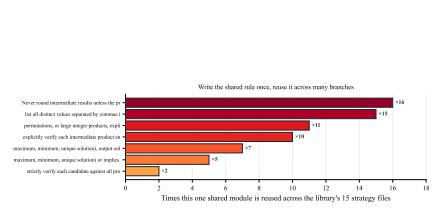

<table><tr><td rowspan=1 colspan=1>Original branch       527 tok</td></tr><tr><td rowspan=1 colspan=1>SκILLZıP PRO branch  160 tok</td></tr><tr><td rowspan=1 colspan=1>Token reduction         70%Shared modules           7Branches retained       15/15</td></tr><tr><td rowspan=1 colspan=1>Flat-concat retained      2/15</td></tr></table>

Fig. 5. One real strategy file (round\_02, qwen3.6-plus library) under three methods, plus the reuse it enables. Yellow marks text duplicated across branches (with its re<sub>p</sub>eat count); <sub>g</sub>reen marks the shared module SkillZip Pro factors it into; blue marks a <sub>g</sub>uarded rule ke<sub>p</sub>t word for word. Bottom left: how many of the 15 strategy files reuse each shared module SkillZip Pro created. Bottom right: the token and reachability outcome for this file. Fl<sub>a</sub>t<sub>-conca</sub>t’<sub>s</sub> bi<sub>g ra</sub>ti<sub>o comes</sub> f<sub>rom</sub> d<sub>e</sub>l<sub>e</sub>ti<sub>ng</sub> th<sub>e</sub> fil<sub>e;</sub> S<sub>kill</sub>Z<sub>ip</sub> P<sub>ro</sub>’<sub>s sav</sub>i<sub>ng comes</sub> f<sub>rom wr</sub>iti<sub>ng eac</sub>h <sub>s</sub>h<sub>are</sub>d <sub>ru</sub>l<sub>e once.</sub>

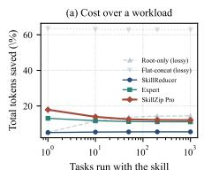

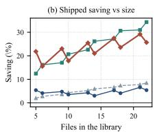

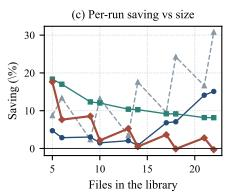  
Fi<sub>g</sub>. 6. (a) Cumulative token savin<sub>g</sub> as tasks <sub>g</sub>row; faded methods lost skill content. (b) Shi<sub>pp</sub>ed and (c) <sub>p</sub>er-run savin<sub>g</sub> as librar<sub>y</sub> size <sub>g</sub>rows. SkillZip P<sub>ro</sub> k<sub>eeps</sub> <sub>per-run</sub> <sub>sav</sub>i<sub>ng</sub> <sub>s</sub>t<sub>a</sub>bl<sub>e.</sub>

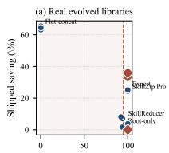

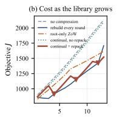

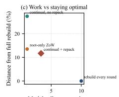

TABLE IX  
Real evolved libraries, averaged over three runs. † marks incomplete <sub>bundles.</sub> F<sub>or</sub> S<sub>kill</sub>Z<sub>ip</sub> P<sub>ro,</sub> <sub>brackets</sub> <sub>count</sub> <sub>published</sub> <sub>compressions;</sub> otherwise the never-inflate check republishes the source.
<table><tr><td>Method</td><td>Kept ↑</td><td>Shipped ↑</td><td>Always loaded ↑</td><td>One run ↑</td><td>Routing ↑</td></tr><tr><td>Evolved library (uncompressed)</td><td>1.000</td><td>+0.0%</td><td>+0.0%</td><td>+0.0%</td><td>1.000</td></tr><tr><td>Root-only SKiLLZIP</td><td>0.951</td><td>+1.6%</td><td>+69.2%</td><td>+12.5%</td><td>0.000</td></tr><tr><td>Flat-concat SKILLZIP X</td><td>0.002</td><td>+64.4%</td><td>+82.4%</td><td>+90.2%</td><td>0.000</td></tr><tr><td>SkillReducer</td><td>0.954</td><td>+6.3%</td><td>+63.0%</td><td>+30.9%</td><td>0.125</td></tr><tr><td>Expert Progressive</td><td>1.000</td><td>+25.0%</td><td>-2.9%</td><td>+26.0%</td><td>1.000</td></tr><tr><td>SKILLZIP PRo (One-Shot)</td><td>1.000</td><td>+23.1% (2/3)</td><td>+1.7%</td><td>+17.7%</td><td>1.000</td></tr></table>

Fi<sub>g</sub>. 7. (a) Savin<sub>g</sub> versus retained knowled<sub>g</sub>e on evolved libraries. (b) Published cost over rounds; trian<sub>g</sub>les mark re<sub>p</sub>acks. (c) U<sub>p</sub>date work versus final drift f<sub>rom</sub> O<sub>ne-</sub>Sh<sub>o</sub>t <sub>re</sub>b<sub>u</sub>ildi<sub>ng.</sub>

<sub>repea</sub>t f<sub>ar more,</sub> b<sub>ecause every roun</sub>d <sub>appen</sub>d<sub>s</sub> it<sub>s ou</sub>t<sub>pu</sub>t <sub>ru</sub>l<sub>es,</sub> it<sub>s</sub> <sub>c</sub>h<sub>ec</sub>kli<sub>s</sub>t <sub>an</sub>d it<sub>s</sub> <sub>grow</sub>i<sub>ng</sub> li<sub>s</sub>t <sub>o</sub>f <sub>pas</sub>t <sub>m</sub>i<sub>s</sub>t<sub>a</sub>k<sub>es</sub> i<sub>n</sub>t<sub>o</sub> <sub>w</sub>hi<sub>c</sub>h<sub>ever</sub> <sub>s</sub>kill it <sub>e</sub>dit<sub>s.</sub> W<sub>e</sub> th<sub>ere</sub>f<sub>ore</sub> t<sub>a</sub>k<sub>e</sub> th<sub>e evo</sub>l<sub>u</sub>ti<sub>on runs s</sub>t<sub>ore</sub>d <sub>w</sub>ith this project, keep every round as its own file, and assemble <sub>eac</sub>h <sub>run</sub> i<sub>n</sub>t<sub>o</sub> <sub>one</sub> <sub>progress</sub>i<sub>ve</sub>l<sub>y</sub> l<sub>oa</sub>d<sub>e</sub>d lib<sub>rary:</sub> 17 fil<sub>es,</sub> 15 ro<sub>u</sub>nds<sub>,</sub> abo<sub>u</sub>t 20<sub>,</sub>000 tokens<sub>,</sub> and 79–84% re<sub>p</sub>eated text<sub>.</sub> Thi<sub>s</sub> i<sub>s</sub> th<sub>e reg</sub>i<sub>me</sub> th<sub>e me</sub>th<sub>o</sub>d i<sub>s</sub> b<sub>u</sub>ilt f<sub>or, so</sub> it <sub>carr</sub>i<sub>es</sub> th<sub>e</sub> h<sub>ea</sub>dli<sub>ne num</sub>b<sub>ers.</sub>

Th<sub>ree</sub> <sub>rea</sub>di<sub>ngs</sub> <sub>ma</sub>tt<sub>er.</sub> Fi<sub>rs</sub>t<sub>,</sub> <sub>w</sub>h<sub>ere</sub> it <sub>pu</sub>bli<sub>s</sub>h<sub>es</sub> <sub>a</sub> <sub>resu</sub>lt<sub>,</sub> S<sub>kill</sub>Z<sub>ip</sub> P<sub>ro removes</sub> 34<sub>.</sub>7% <sub>o</sub>f <sub>s</sub>hi<sub>ppe</sub>d t<sub>o</sub>k<sub>ens versus</sub> 25<sub>.</sub>0% f<sub>or</sub> th<sub>e</sub> <sub>s</sub>t<sub>ronges</sub>t f<sub>a</sub>ithf<sub>u</sub>l b<sub>ase</sub>li<sub>ne,</sub> <sub>w</sub>hil<sub>e</sub> <sub>preserv</sub>i<sub>ng</sub> th<sub>e</sub> <sub>s</sub>kill <sub>an</sub>d <sub>rou</sub>ti<sub>ng</sub> li<sub>s</sub>t<sub>.</sub> S<sub>econ</sub>d<sub>,</sub> th<sub>a</sub>t b<sub>ase</sub>li<sub>ne moves a</sub>ll <sub>repea</sub>t<sub>e</sub>d t<sub>ex</sub>t i<sub>n</sub>t<sub>o</sub> <sub>one</sub> <sub>roo</sub>t<sub>-</sub>li<sub>n</sub>k<sub>e</sub>d fil<sub>e,</sub> <sub>ma</sub>ki<sub>ng</sub> th<sub>e</sub> <sub>a</sub>l<sub>ways-</sub>l<sub>oa</sub>d<sub>e</sub>d l<sub>ayer</sub> lon<sub>g</sub>er (−2.9%); onl<sub>y</sub> SkillZip Pro im<sub>p</sub>roves ever<sub>y</sub> la<sub>y</sub>er at full fidelit<sub>y</sub>. Third, root-onl<sub>y</sub> and SkillReducer <sub>g</sub>ain +69% and +63% in the root b<sub>y</sub> rewritin<sub>g</sub> awa<sub>y</sub> routin<sub>g</sub>, reflected in <sub>rou</sub>ti<sub>ng scores o</sub>f 0<sub>.</sub>000 <sub>an</sub>d 0<sub>.</sub>125<sub>.</sub>

O<sub>n</sub> th<sub>e</sub> thi<sub>r</sub>d lib<sub>rary,</sub> S<sub>kill</sub>Z<sub>ip</sub> P<sub>ro</sub> d<sub>ec</sub>li<sub>ne</sub>d t<sub>o</sub> <sub>compress</sub> <sub>an</sub>d <sub>repu</sub>bli<sub>s</sub>h<sub>e</sub>d th<sub>e source</sub> b<sub>y</sub>t<sub>e</sub> f<sub>or</sub> b<sub>y</sub>t<sub>e.</sub> Th<sub>e can</sub>did<sub>a</sub>t<sub>e passe</sub>d the audit but did not improve the objective, so Algorithm 2 rejected it. This fallback is intentional: the method never ships <sub>an unproven regress</sub>i<sub>on.</sub> C<sub>on</sub>ti<sub>nua</sub>l <sub>mo</sub>d<sub>e</sub> l<sub>a</sub>t<sub>er compresses</sub> th<sub>e</sub> same librar<sub>y</sub> to +49.9% b<sub>y</sub> re<sub>p</sub>ackin<sub>g</sub> at a more favorable <sub>p</sub>oint in the stream (Section VI-N).

Compressor calls over the stream

O<sub>n rea</sub>l <sub>se</sub>lf<sub>-evo</sub>l<sub>ve</sub>d lib<sub>rar</sub>i<sub>es,</sub> S<sub>kill</sub>Z<sub>ip</sub> P<sub>ro removes a</sub>b<sub>ou</sub>t <sub>o</sub>n<sub>e</sub> thi<sub>r</sub>d <sub>o</sub>f <sub>s</sub>hi<sub>ppe</sub>d t<sub>o</sub>k<sub>ens w</sub>h<sub>ere</sub> it <sub>pu</sub>bli<sub>s</sub>h<sub>es—roug</sub>hl<sub>y</sub> t<sub>en po</sub>i<sub>n</sub>t<sub>s</sub> <sub>more</sub> th<sub>an</sub> th<sub>e</sub> <sub>s</sub>t<sub>ronges</sub>t <sub>con</sub>t<sub>en</sub>t<sub>-preserv</sub>i<sub>ng</sub> b<sub>ase</sub>li<sub>ne.</sub> It i<sub>s</sub> <sub>a</sub>l<sub>so</sub> th<sub>e</sub> <sub>on</sub>l<sub>y</sub> <sub>me</sub>th<sub>o</sub>d th<sub>a</sub>t i<sub>mproves</sub> <sub>s</sub>hi<sub>ppe</sub>d<sub>,</sub> <sub>a</sub>l<sub>ways-</sub>l<sub>oa</sub>d<sub>e</sub>d<sub>,</sub> <sub>an</sub>d <sub>per-run</sub> <sub>cos</sub>t t<sub>oge</sub>th<sub>er;</sub> <sub>o</sub>th<sub>erw</sub>i<sub>se</sub> it k<sub>eeps</sub> th<sub>e</sub> <sub>or</sub>i<sub>g</sub>i<sub>na</sub>l b<sub>un</sub>dl<sub>e.</sub>

## N<sub>.</sub> C<sub>on</sub>ti<sub>nua</sub>l C<sub>ompress</sub>i<sub>on</sub> O<sub>ver a</sub> L<sub>ong</sub> E<sub>vo</sub>l<sub>u</sub>ti<sub>on</sub> St<sub>ream</sub>

C<sub>on</sub>ti<sub>nua</sub>l <sub>compress</sub>i<sub>on</sub> i<sub>s</sub> i<sub>n</sub>t<sub>en</sub>d<sub>e</sub>d t<sub>o</sub> i<sub>ncorpora</sub>t<sub>e new s</sub>kill <sub>up</sub>d<sub>a</sub>t<sub>es w</sub>ith<sub>ou</sub>t <sub>re</sub>b<sub>u</sub>ildi<sub>ng</sub> th<sub>e en</sub>ti<sub>re</sub> lib<sub>rary a</sub>ft<sub>er every c</sub>h<sub>ange.</sub> W<sub>e</sub> <sub>eva</sub>l<sub>ua</sub>t<sub>e</sub> <sub>w</sub>h<sub>e</sub>th<sub>er</sub> it <sub>can</sub> <sub>re</sub>d<sub>uce</sub> thi<sub>s</sub> <sub>up</sub>d<sub>a</sub>t<sub>e</sub> <sub>cos</sub>t <sub>w</sub>hil<sub>e</sub> <sub>s</sub>till <sub>recover</sub>i<sub>ng</sub> <sub>re</sub>d<sub>un</sub>d<sub>ancy</sub> th<sub>a</sub>t <sub>accumu</sub>l<sub>a</sub>t<sub>es</sub> <sub>across</sub> <sub>mu</sub>lti<sub>p</sub>l<sub>e</sub> <sub>roun</sub>d<sub>s.</sub> S<sub>pec</sub>ifi<sub>ca</sub>ll<sub>y, we rep</sub>l<sub>ay</sub> 13 <sub>rea</sub>l <sub>evo</sub>l<sub>u</sub>ti<sub>on roun</sub>d<sub>s</sub> f<sub>or eac</sub>h <sub>o</sub>f th<sub>ree</sub> lib<sub>rar</sub>i<sub>es</sub> <sub>an</sub>d <sub>compare</sub> fi<sub>ve</sub> <sub>compress</sub>i<sub>on</sub> <sub>sc</sub>h<sub>e</sub>d<sub>u</sub>l<sub>es.</sub> All <sub>sc</sub>h<sub>e</sub>d<sub>u</sub>l<sub>es</sub> b<sub>eg</sub>i<sub>n</sub> f<sub>rom</sub> th<sub>e same</sub> i<sub>n</sub>iti<sub>a</sub>l <sub>s</sub>t<sub>a</sub>t<sub>e an</sub>d <sub>rece</sub>i<sub>ve</sub> th<sub>e</sub> same se<sub>q</sub>uence o<sup>f</sup> u<sub>p</sub><sup>d</sup>ates.

S<sub>kill</sub>Z<sub>ip</sub> P<sub>ro</sub> C<sub>o</sub>ntin<sub>ua</sub>l <sub>w</sub>ith r<sub>epac</sub>kin<sub>g</sub> r<sub>e</sub>m<sub>oves</sub> 48<sub>.</sub>1% <sub>o</sub>f <sub>s</sub>hi<sub>ppe</sub>d t<sub>o</sub>k<sub>e</sub>n<sub>s</sub> <sub>a</sub>nd 28<sub>.</sub>2% <sub>o</sub>f <sub>pe</sub>r<sub>-</sub>r<sub>u</sub>n t<sub>o</sub>k<sub>e</sub>n<sub>s</sub> <sub>w</sub>hil<sub>e</sub> r<sub>equ</sub>irin<sub>g</sub> <sub>o</sub>nl<sub>y</sub> 3<sub>.</sub>31 <sub>co</sub>m<sub>p</sub>r<sub>esso</sub>r <sub>ca</sub>ll<sub>s</sub> <sub>pe</sub>r r<sub>ou</sub>nd<sub>.</sub> R<sub>e</sub>b<sub>u</sub>ildi<sub>ng</sub> th<sub>e</sub> <sub>comp</sub>l<sub>e</sub>t<sub>e</sub> lib<sub>rary</sub> <sub>a</sub>ft<sub>er</sub> <sub>every</sub> <sub>up</sub>d<sub>a</sub>t<sub>e</sub> <sub>requ</sub>i<sub>res</sub> 10 <sub>ca</sub>ll<sub>s</sub> <sub>per</sub> <sub>roun</sub>d<sub>,</sub> <sub>so</sub> C<sub>on</sub>ti<sub>nua</sub>l <sub>mo</sub>d<sub>e</sub> <sub>uses</sub> <sub>approx</sub>i<sub>ma</sub>t<sub>e</sub>l<sub>y</sub> <sub>one</sub> thi<sub>r</sub>d <sub>as</sub> <sub>many</sub> <sub>ca</sub>ll<sub>s.</sub> It <sub>a</sub>l<sub>so</sub> <sub>re</sub>d<sub>uces</sub> th<sub>e</sub> <sub>average</sub> <sub>process</sub>i<sub>ng</sub> ti<sub>me</sub> f<sub>rom</sub> 0<sub>.</sub>234 t<sub>o</sub> 0<sub>.</sub>068 <sub>secon</sub>d<sub>s</sub> <sub>per</sub> <sub>roun</sub>d<sub>.</sub> Th<sub>e</sub> <sub>resu</sub>lt i<sub>s</sub> <sub>s</sub>li<sub>g</sub>htl<sub>y</sub> <sub>sma</sub>ll<sub>er</sub> th<sub>an</sub> th<sub>e correspon</sub>di<sub>ng re</sub>b<sub>u</sub>ild<sub>, as</sub> i<sub>n</sub>di<sub>ca</sub>t<sub>e</sub>d b<sub>y</sub> th<sub>e</sub> d<sub>r</sub>ift <sub>o</sub>f −0.083. This diference occurs because the final rebuild rejects <sub>a non-</sub>i<sub>mprov</sub>i<sub>ng can</sub>did<sub>a</sub>t<sub>e, w</sub>h<sub>ereas</sub> C<sub>on</sub>ti<sub>nua</sub>l <sub>mo</sub>d<sub>e re</sub>t<sub>a</sub>i<sub>ns</sub> th<sub>e va</sub>lid <sub>compresse</sub>d <sub>s</sub>t<sub>a</sub>t<sub>e pro</sub>d<sub>uce</sub>d b<sub>y an ear</sub>li<sub>er repac</sub>k<sub>.</sub>

P<sub>er</sub>i<sub>o</sub>di<sub>c repac</sub>ki<sub>ng</sub> i<sub>s necessary</sub> t<sub>o recover re</sub>d<sub>un</sub>d<sub>ancy</sub> i<sub>n-</sub> t<sub>ro</sub>d<sub>uce</sub>d <sub>across</sub> dif<sub>eren</sub>t <sub>evo</sub>l<sub>u</sub>ti<sub>on roun</sub>d<sub>s.</sub> With<sub>ou</sub>t <sub>repac</sub>ki<sub>ng,</sub> th<sub>e s</sub>hi<sub>ppe</sub>d<sub>-</sub>t<sub>o</sub>k<sub>en sav</sub>i<sub>ng</sub> f<sub>a</sub>ll<sub>s</sub> t<sub>o</sub> 2<sub>.</sub>7%<sub>,</sub> th<sub>e per-run sav</sub>i<sub>ng</sub> f<sub>a</sub>ll<sub>s</sub> to 0.8%, and drift increases to +0.262. This result shows that <sub>process</sub>i<sub>ng eac</sub>h <sub>up</sub>d<sub>a</sub>t<sub>e</sub> l<sub>oca</sub>ll<sub>y</sub> i<sub>s</sub> i<sub>nsu</sub>fi<sub>c</sub>i<sub>en</sub>t <sub>w</sub>h<sub>en re</sub>l<sub>a</sub>t<sub>e</sub>d <sub>con</sub>t<sub>en</sub>t i<sub>s a</sub>dd<sub>e</sub>d i<sub>n separa</sub>t<sub>e roun</sub>d<sub>s.</sub> R<sub>oo</sub>t<sub>-on</sub>l<sub>y</sub> Zi<sub>p-on-</sub>W<sub>r</sub>it<sub>e</sub> <sub>requ</sub>i<sub>res on</sub>l<sub>y one ca</sub>ll <sub>an</sub>d 389 <sub>processe</sub>d b<sub>y</sub>t<sub>es per roun</sub>d<sub>,</sub> but it reduces the shipped library by just 2.4% because it <sub>canno</sub>t <sub>conso</sub>lid<sub>a</sub>t<sub>e repea</sub>t<sub>e</sub>d <sub>con</sub>t<sub>en</sub>t <sub>across</sub> fil<sub>es.</sub> Alth<sub>oug</sub>h it <sub>re</sub>d<sub>uces</sub> th<sub>e roo</sub>t<sub>-</sub>l<sub>eve</sub>l <sub>per-run cos</sub>t<sub>,</sub> it l<sub>eaves mos</sub>t b<sub>un</sub>dl<sub>e-</sub> wide redundanc<sub>y</sub> unchan<sub>g</sub>ed. Fi<sub>g</sub>ure 7(b,c) shows how these dif<sub>erences accumu</sub>l<sub>a</sub>t<sub>e over</sub> th<sub>e evo</sub>l<sub>u</sub>ti<sub>on s</sub>t<sub>ream.</sub>

## Takeaway

With <sub>per</sub>i<sub>o</sub>di<sub>c</sub> <sub>repac</sub>ki<sub>ng,</sub> C<sub>on</sub>ti<sub>nua</sub>l <sub>mo</sub>d<sub>e</sub> <sub>recovers</sub> <sub>cross-roun</sub>d <sub>re</sub>d<sub>un</sub>d<sub>ancy</sub> <sub>w</sub>hil<sub>e</sub> <sub>us</sub>i<sub>ng</sub> <sub>app</sub>r<sub>ox</sub>im<sub>a</sub>t<sub>e</sub>l<sub>y</sub> <sub>o</sub>n<sub>e</sub> third <sub>as</sub> <sub>many</sub> <sub>compressor ca</sub>ll<sub>s as re</sub>b<sub>u</sub>ildi<sub>ng a</sub>ft<sub>er every up</sub>d<sub>a</sub>t<sub>e.</sub> With<sub>ou</sub>t <sub>repac</sub>ki<sub>ng,</sub> <sub>s</sub>hi<sub>ppe</sub>d<sub>-</sub>t<sub>o</sub>k<sub>en</sub> <sub>sav</sub>i<sub>ngs</sub> <sub>rema</sub>i<sub>n</sub> <sub>a</sub>t <sub>on</sub>l<sub>y</sub> 2<sub>.</sub>7%<sub>.</sub>

## O<sub>.</sub> Wh<sub>en</sub> Sh<sub>ou</sub>ld C<sub>ompress</sub>i<sub>on</sub> B<sub>e</sub> S<sub>w</sub>it<sub>c</sub>h<sub>e</sub>d O<sub>n</sub>?

A <sub>se</sub>lf<sub>-evo</sub>l<sub>v</sub>i<sub>ng</sub> lib<sub>rary</sub> i<sub>s</sub> <sub>repu</sub>bli<sub>s</sub>h<sub>e</sub>d <sub>an</sub>d <sub>re</sub>l<sub>oa</sub>d<sub>e</sub>d <sub>a</sub>ft<sub>er</sub> <sub>every roun</sub>d<sub>.</sub> W<sub>a</sub>iti<sub>ng</sub> th<sub>ere</sub>f<sub>ore cos</sub>t<sub>s more</sub> th<sub>an</sub> fi<sub>na</sub>l <sub>s</sub>i<sub>ze:</sub> th<sub>e</sub> <sub>agen</sub>t <sub>carr</sub>i<sub>es</sub> th<sub>e</sub> <sub>uncompresse</sub>d lib<sub>rary</sub> th<sub>roug</sub>h <sub>every</sub> <sub>ear</sub>li<sub>er</sub> round. We switch compression on at � ∈ {1, 4, 7, 10, 13}, plus <sub>a never-compress</sub> b<sub>ase</sub>li<sub>ne.</sub>

Th<sub>e</sub> <sub>me</sub>t<sub>r</sub>i<sub>c</sub> th<sub>a</sub>t <sub>answers</sub> th<sub>e</sub> <sub>ques</sub>ti<sub>on</sub> i<sub>s</sub> th<sub>e</sub> t<sub>o</sub>t<sub>a</sub>l t<sub>o</sub>k<sub>ens</sub> th<sub>e agen</sub>t <sub>carr</sub>i<sub>es across</sub> th<sub>e w</sub>h<sub>o</sub>l<sub>e s</sub>t<sub>ream:</sub> f<sub>or eac</sub>h <sub>roun</sub>d <sub>we a</sub>dd <sub>up</sub> th<sub>e</sub> f<sub>u</sub>ll <sub>s</sub>i<sub>ze o</sub>f th<sub>e</sub> lib<sub>rary pu</sub>bli<sub>s</sub>h<sub>e</sub>d <sub>a</sub>t th<sub>a</sub>t <sub>roun</sub>d<sub>.</sub> W<sub>e a</sub>l<sub>so repor</sub>t th<sub>e</sub> t<sub>o</sub>t<sub>a</sub>l <sub>compressor ca</sub>ll<sub>s, so a sc</sub>h<sub>e</sub>d<sub>u</sub>l<sub>e canno</sub>t l<sub>oo</sub>k <sub>c</sub>h<sub>eap mere</sub>l<sub>y</sub> b<sub>y</sub> d<sub>o</sub>i<sub>ng</sub> l<sub>ess wor</sub>k<sub>.</sub>

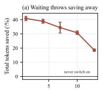

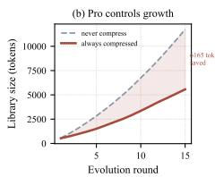

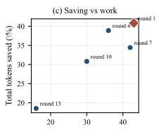  
Fi<sub>g</sub>. 8. (a) Total tokens saved over the stream a<sub>g</sub>ainst the round com<sub>p</sub>ression is switched on; bars show the s<sub>p</sub>read across the three libraries. (b) Actual lib<sub>rary</sub> <sub>s</sub>i<sub>ze</sub> <sub>a</sub>t <sub>eac</sub>h <sub>roun</sub>d<sub>:</sub> <sub>uncompresse</sub>d <sub>grows</sub> li<sub>near</sub>l<sub>y</sub> <sub>w</sub>hil<sub>e</sub> P<sub>ro</sub> k<sub>eeps</sub> it rou<sub>g</sub>hl<sub>y</sub> 50% smaller b<sub>y</sub> removin<sub>g</sub> re<sub>p</sub>eated text as it a<sub>pp</sub>ears. (c) The same t<sub>o</sub>t<sub>a</sub>l <sub>sav</sub>i<sub>ng p</sub>l<sub>o</sub>tt<sub>e</sub>d <sub>aga</sub>i<sub>ns</sub>t th<sub>e num</sub>b<sub>er o</sub>f <sub>compressor ca</sub>ll<sub>s.</sub>

Th<sub>e o</sub>rd<sub>e</sub>rin<sub>g</sub> i<sub>s</sub> m<sub>o</sub>n<sub>o</sub>t<sub>o</sub>n<sub>e a</sub>nd th<sub>e e</sub>f<sub>ec</sub>t i<sub>s</sub> l<sub>a</sub>r<sub>ge.</sub> S<sub>w</sub>it<sub>c</sub>hi<sub>ng on a</sub>t th<sub>e</sub> fi<sub>rs</sub>t <sub>roun</sub>d <sub>saves</sub> 40<sub>.</sub>8% <sub>o</sub>f <sub>every</sub>thi<sub>ng</sub> th<sub>e</sub> <sub>agen</sub>t <sub>carr</sub>i<sub>es over</sub> th<sub>e s</sub>t<sub>ream; wa</sub>iti<sub>ng un</sub>til <sub>roun</sub>d 13 <sub>recovers</sub> <sub>on</sub>l<sub>y</sub> 18<sub>.</sub>5%<sub>,</sub> l<sub>ess</sub> th<sub>an</sub> h<sub>a</sub>lf <sub>as</sub> <sub>muc</sub>h<sub>,</sub> <sub>an</sub>d <sub>s</sub>t<sub>ar</sub>ti<sub>ng</sub> <sub>a</sub>t <sub>roun</sub>d 1 b<sub>ea</sub>t<sub>s</sub> <sub>s</sub>t<sub>ar</sub>ti<sub>ng</sub> <sub>a</sub>t <sub>roun</sub>d 7 b<sub>y</sub> <sub>a</sub> <sub>c</sub>l<sub>ear</sub> 9<sub>.</sub>7%<sub>.</sub> E<sub>very</sub> <sub>ex</sub>t<sub>ra</sub> <sub>roun</sub>d <sub>o</sub>f <sub>wa</sub>iti<sub>ng</sub> l<sub>eaves</sub> <sub>sav</sub>i<sub>ng</sub> <sub>on</sub> th<sub>e</sub> t<sub>a</sub>bl<sub>e.</sub>

Th<sub>e</sub> <sub>reason</sub> i<sub>s</sub> <sub>wor</sub>th <sub>s</sub>t<sub>a</sub>ti<sub>ng</sub> <sub>prec</sub>i<sub>se</sub>l<sub>y,</sub> b<sub>ecause</sub> it i<sub>s</sub> <sub>no</sub>t <sub>s</sub>i<sub>mp</sub>l<sub>y</sub> “<sub>sma</sub>ll<sub>er</sub> i<sub>s</sub> b<sub>e</sub>tt<sub>er</sub>”<sub>.</sub> R<sub>epe</sub>titi<sub>on</sub> i<sub>n</sub> <sub>an</sub> <sub>evo</sub>l<sub>ve</sub>d lib<sub>rary</sub> i<sub>s</sub> <sub>cumu</sub>l<sub>a</sub>ti<sub>ve:</sub> <sub>roun</sub>d � <sub>re-appen</sub>d<sub>s</sub> th<sub>e</sub> <sub>same</sub> <sub>ou</sub>t<sub>pu</sub>t <sub>ru</sub>l<sub>es</sub> <sub>an</sub>d checklist that rounds 1..� − 1 alread<sub>y</sub> contain, so the number of d<sub>up</sub>li<sub>ca</sub>t<sub>e</sub> <sub>cop</sub>i<sub>es</sub> <sub>grows</sub> <sub>w</sub>ith �<sub>.</sub> C<sub>ompress</sub>i<sub>on</sub> <sub>removes</sub> <sub>cop</sub>i<sub>es,</sub> <sub>no</sub>t <sub>roun</sub>d<sub>s.</sub> St<sub>ar</sub>ti<sub>ng a</sub>t <sub>roun</sub>d � th<sub>ere</sub>f<sub>ore</sub> l<sub>eaves</sub> th<sub>e agen</sub>t <sub>p</sub>a<sub>y</sub>in<sub>g</sub> full <sub>p</sub>rice on rounds 1..� −1, and those tokens can never b<sub>e recovere</sub>d <sub>a</sub>ft<sub>erwar</sub>d<sub>s –</sub> th<sub>e</sub> fi<sub>na</sub>l lib<sub>rary can</sub> b<sub>e compresse</sub>d just as well later, but the intervening runs are already spent. Fi<sub>g</sub>ure 8(b) <sub>p</sub>lots the runnin<sub>g</sub> total the a<sub>g</sub>ent has <sub>p</sub>aid: the th<sub>ree</sub> <sub>curves</sub> <sub>never</sub> <sub>cross,</sub> <sub>so</sub> <sub>an</sub> <sub>ear</sub>li<sub>er</sub> <sub>s</sub>t<sub>ar</sub>t i<sub>s</sub> <sub>c</sub>h<sub>eaper</sub> <sub>a</sub>t <sub>every</sub> <sub>roun</sub>d <sub>an</sub>d th<sub>e gap on</sub>l<sub>y w</sub>id<sub>ens.</sub> E<sub>ar</sub>l<sub>y compress</sub>i<sub>on</sub> i<sub>s s</sub>t<sub>r</sub>i<sub>c</sub>tl<sub>y</sub> <sub>c</sub>h<sub>eaper</sub> b<sub>ecause</sub> d<sub>e</sub>l<sub>aye</sub>d <sub>roun</sub>d<sub>s canno</sub>t b<sub>e recovere</sub>d<sub>.</sub> St<sub>ar</sub>ti<sub>ng</sub> <sub>a</sub>t <sub>roun</sub>d 1 <sub>requ</sub>i<sub>res</sub> 43 <sub>compressor ca</sub>ll<sub>s over</sub> 15 <sub>roun</sub>d<sub>s, versus</sub> 16 f<sub>or a</sub> l<sub>a</sub>t<sub>e s</sub>t<sub>ar</sub>t<sub>, an</sub>d <sub>uses no</sub> t<sub>as</sub>k <sub>ro</sub>ll<sub>ou</sub>t<sub>s.</sub>

INSIGHT 2 ★ For a self-evolvin a ent, com ression should start <sub>ear</sub>l<sub>y.</sub> R<sub>epe</sub>titi<sub>on accumu</sub>l<sub>a</sub>t<sub>es eac</sub>h <sub>roun</sub>d<sub>, an</sub>d l<sub>a</sub>t<sub>er compress</sub>i<sub>on</sub> <sub>canno</sub>t <sub>recover con</sub>t<sub>ex</sub>t <sub>a</sub>l<sub>rea</sub>d<sub>y pa</sub>id f<sub>or.</sub> Th<sub>e</sub> l<sub>owes</sub>t <sub>cumu</sub>l<sub>a</sub>ti<sub>ve</sub> <sub>cos</sub>t th<sub>ere</sub>f<sub>ore comes</sub> f<sub>rom ena</sub>bli<sub>ng compress</sub>i<sub>on</sub> i<sub>n</sub> th<sub>e</sub> fi<sub>rs</sub>t <sub>evo</sub>l<sub>u</sub>ti<sub>on roun</sub>d<sub>.</sub>

## P. Why the Savings Compound: A Look Inside Self-Evolution

Th<sub>e resu</sub>lt<sub>s so</sub> f<sub>ar s</sub>h<sub>ow</sub> th<sub>a</sub>t S<sub>kill</sub>Z<sub>ip</sub> P<sub>ro</sub> h<sub>e</sub>l<sub>ps;</sub> thi<sub>s</sub> <sub>su</sub>b<sub>sec</sub>ti<sub>on</sub> <sub>s</sub>h<sub>ows</sub> <sub>w</sub>h<sub>y,</sub> <sub>an</sub>d th<sub>e</sub> <sub>reason</sub> i<sub>s</sub> th<sub>e</sub> <sub>surpr</sub>i<sub>s</sub>i<sub>ng</sub> fi<sub>n</sub>di<sub>ng</sub> i<sub>n</sub> th<sub>e paper.</sub> W<sub>e measure</sub>d<sub>, a</sub>t <sub>every evo</sub>l<sub>u</sub>ti<sub>on roun</sub>d<sub>,</sub> h<sub>ow muc</sub>h <sub>o</sub>f th<sub>e grow</sub>i<sub>ng</sub> lib<sub>rary</sub> i<sub>s genu</sub>i<sub>ne</sub>l<sub>y new an</sub>d h<sub>ow muc</sub>h <sub>s</sub>i<sub>mp</sub>l<sub>y</sub> <sub>repea</sub>t<sub>s</sub> t<sub>ex</sub>t th<sub>e agen</sub>t h<sub>as a</sub>l<sub>rea</sub>d<sub>y wr</sub>itt<sub>en,</sub> b<sub>y compress</sub>i<sub>ng</sub> <sub>eac</sub>h <sub>roun</sub>d<sub>-</sub>� <sub>pre</sub>fi<sub>x an</sub>d <sub>compar</sub>i<sub>ng</sub> it<sub>s s</sub>i<sub>ze aga</sub>i<sub>ns</sub>t th<sub>e raw</sub> <sub>pre</sub>fi<sub>x.</sub> Th<sub>ree</sub> f<sub>ac</sub>t<sub>s</sub> f<sub>a</sub>ll <sub>ou</sub>t<sub>, a</sub>ll f<sub>rom</sub> th<sub>e same rea</sub>l <sub>evo</sub>l<sub>ve</sub>d lib<sub>rar</sub>i<sub>es an</sub>d <sub>a</sub>ll <sub>cons</sub>i<sub>s</sub>t<sub>en</sub>t <sub>across runs.</sub>

Findin<sub>g</sub> 1 <sub>—</sub> r<sub>epe</sub>titi<sub>o</sub>n <sub>accu</sub>m<sub>u</sub>l<sub>a</sub>t<sub>es</sub> d<sub>u</sub>rin<sub>g</sub> <sub>se</sub>lf<sub>-evo</sub>l<sub>u</sub>ti<sub>o</sub>n<sub>.</sub> Across rounds, 55% ± 3% of the content added in each round overla<sub>p</sub>s with existin<sub>g</sub> text (Fi<sub>g</sub>ure 9b). This <sub>p</sub>ro<sub>p</sub>ortion remains <sub>re</sub>l<sub>a</sub>ti<sub>ve</sub>l<sub>y</sub> <sub>s</sub>t<sub>a</sub>bl<sub>e</sub> <sub>across</sub> <sub>roun</sub>d<sub>s</sub> <sub>an</sub>d <sub>mo</sub>d<sub>e</sub>l<sub>s,</sub> <sub>as</sub> <sub>appen</sub>d<sub>-on</sub>l<sub>y</sub> <sub>up</sub>d<sub>a</sub>t<sub>es</sub> <sub>o</sub>ft<sub>en</sub> <sub>repea</sub>t <sub>ou</sub>t<sub>pu</sub>t f<sub>orma</sub>t<sub>s,</sub> <sub>ver</sub>ifi<sub>ca</sub>ti<sub>on</sub> <sub>c</sub>h<sub>ec</sub>kli<sub>s</sub>t<sub>s,</sub> <sub>an</sub>d <sub>prev</sub>i<sub>ous</sub>l<sub>y</sub> <sub>accumu</sub>l<sub>a</sub>t<sub>e</sub>d <sub>ru</sub>l<sub>es</sub> <sub>w</sub>h<sub>en</sub> <sub>ex</sub>t<sub>en</sub>di<sub>ng</sub> <sub>a</sub> <sub>s</sub>kill<sub>.</sub>

Findin<sub>g</sub> 2 — so the sa<sub>v</sub>in<sub>g</sub>s com<sub>p</sub>o<sub>u</sub>nd <sub>w</sub>ith a<sub>g</sub>e<sub>.</sub> B<sub>ecause</sub> <sub>re</sub>d<sub>un</sub>d<sub>ancy accumu</sub>l<sub>a</sub>t<sub>es,</sub> th<sub>e s</sub>h<sub>are</sub> S<sub>kill</sub>Z<sub>ip</sub> P<sub>ro can remove</sub> <sub>grows w</sub>ith th<sub>e</sub> lib<sub>rary:</sub> f<sub>rom</sub> 29% <sub>a</sub>t <sub>roun</sub>d 2 t<sub>o</sub> 53% <sub>a</sub>t round 15, still climbing (Figure 9a). The method does not have diminishing returns; it has increasing ones. The longer <sub>an agen</sub>t <sub>runs,</sub> th<sub>e more o</sub>f it<sub>s</sub> lib<sub>rary</sub> i<sub>s repe</sub>titi<sub>on, an</sub>d th<sub>e</sub> <sub>more</sub> S<sub>kill</sub>Z<sub>ip</sub> P<sub>ro saves –</sub> th<sub>e oppos</sub>it<sub>e o</sub>f h<sub>ow one-s</sub>h<sub>o</sub>t <sub>compressors o</sub>f <sub>s</sub>t<sub>a</sub>ti<sub>c promp</sub>t<sub>s</sub> b<sub>e</sub>h<sub>ave.</sub>

TABLE X  
C<sub>ontinual</sub> <sub>compression</sub> <sub>over</sub> 13 <sub>real</sub> <sub>evolution</sub> <sub>rounds,</sub> <sub>averaged</sub> <sub>across</sub> <sub>three</sub> <sub>libraries.</sub> S<sub>avings</sub> <sub>are</sub> <sub>measured</sub> <sub>relative</sub> <sub>to</sub> <sub>publishing</sub> <sub>every</sub> <sub>update</sub> without compression. Drift measures the difference from rebuilding the complete library at the same round; a negative value indicates a smaller <sub>result</sub> <sub>than</sub> <sub>the</sub> <sub>rebuild.</sub> C<sub>ompressor</sub> <sub>calls,</sub> <sub>processed</sub> <sub>bytes,</sub> <sub>and</sub> <sub>wall-clock</sub> <sub>time</sub> <sub>are</sub> <sub>reported</sub> <sub>per</sub> <sub>round.</sub>
<table><tr><td>Schedule</td><td>Shipped saving ↑</td><td>Per-run saving ↑</td><td>Drift ↓</td><td>Calls/round↓</td><td>Bytes/round ↓</td><td>Seconds/round ↓</td></tr><tr><td>Publish without compressing</td><td>+0.0%</td><td>+0.0%</td><td>+0.000</td><td>0.00</td><td>3201</td><td>0.000</td></tr><tr><td>Rebuild from scratch every round</td><td>+35.1%</td><td>+18.7%</td><td>+0.000</td><td>10.00</td><td>13388</td><td>0.234</td></tr><tr><td>SκıLLZıp Zip-on-Write (root only)</td><td>+2.4%</td><td>+19.6%</td><td>-0.027</td><td>1.00</td><td>389</td><td>0.094</td></tr><tr><td>SKILLZıP PRo Continual, no repack</td><td>+2.7%</td><td>+0.8%</td><td>+0.262</td><td>1.00</td><td>3201</td><td>0.008</td></tr><tr><td>SKıLLZıP Pro Continual + repack</td><td>+48.1%</td><td>+28.2%</td><td>-0.083</td><td>3.31</td><td>5697</td><td>0.068</td></tr></table>

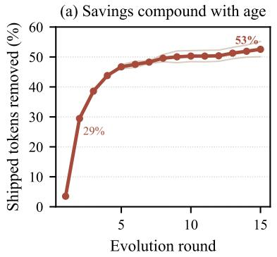

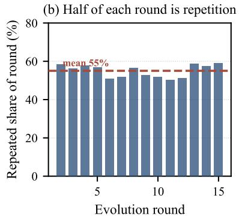

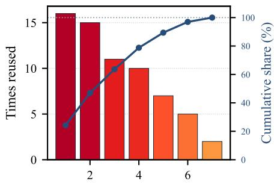  
Shared module (ranked by reuse)  
Fi<sub>g</sub>. 9. Why the savings compound. (a) The share of shi<sub>pp</sub>ed tokens SkillZip Pro removes climbs from 29% at round 2 to 53% at round 15 and is still risin<sub>g</sub> – the method <sub>g</sub>ets more valuable the lon<sub>g</sub>er the a<sub>g</sub>ent evolves. (b) The reason: the fraction of each new round that merel<sub>y</sub> re<sub>p</sub>eats earlier text is stable at 55%±3% – more than half of ever<sub>y</sub>thin<sub>g</sub> a self-evolvin<sub>g</sub> a<sub>g</sub>ent writes, it has written before. (c) That re<sub>p</sub>etition is concentrated: a few “universal” rules absorb most of the reuse (to<sub>p</sub> two of seven modules $= 4 7 \% )$ <sub>,</sub> <sub>so</sub> <sub>a</sub> <sub>sma</sub>ll <sub>s</sub>h<sub>are</sub>d lib<sub>rary</sub> <sub>covers</sub> th<sub>e</sub> b<sub>u</sub>lk <sub>o</sub>f th<sub>e</sub> <sub>re</sub>d<sub>un</sub>d<sub>ancy.</sub>

TABLE XI  
Whe<sub>n</sub> t<sub>o</sub> <sub>sw</sub>it<sub>c</sub>h <sub>co</sub>mpre<sub>ss</sub>i<sub>on</sub> <sub>on,</sub> a<sub>v</sub>era<sub>g</sub>ed <sub>ov</sub>er the three librarie<sub>s</sub> a<sub>n</sub>d <sub>the</sub> <sub>whole</sub> 15<sub>-round</sub> <sub>stream.</sub> C<sub>arried</sub> <sub>tokens</sub> <sub>is</sub> <sub>the</sub> <sub>sum,</sub> <sub>over</sub> <sub>rounds,</sub> <sub>of</sub> the size of the library the agent holds that round.
<table><tr><td>Compression is on</td><td>Tokens carried ↓</td><td>Tokens saved ↑</td><td>Calls↓</td></tr><tr><td>from round 1</td><td>48055</td><td>+40.8%</td><td>43</td></tr><tr><td>from round 4</td><td>49627</td><td>+38.9%</td><td>36</td></tr><tr><td>from round 7</td><td>53234</td><td>+34.4%</td><td>42</td></tr><tr><td>from round 10</td><td>56179</td><td>+30.8%</td><td>30</td></tr><tr><td>from round 13</td><td>66139</td><td>+18.5%</td><td>16</td></tr><tr><td>never switch it on</td><td>81176</td><td>+0.0%</td><td>0</td></tr></table>

Findin<sub>g</sub> 3 — the re<sub>p</sub>etition is concentrated<sub>.</sub> Th<sub>e</sub> r<sub>euse</sub> i<sub>s</sub> h<sub>eavy-</sub>t<sub>a</sub>il<sub>e</sub>d<sub>: o</sub>f th<sub>e seven s</sub>h<sub>are</sub>d <sub>mo</sub>d<sub>u</sub>l<sub>es</sub> S<sub>kill</sub>Z<sub>ip</sub> P<sub>ro</sub> f<sub>ac</sub>t<sub>ors ou</sub>t <sub>on</sub> th<sub>e wor</sub>k<sub>e</sub>d lib<sub>rary,</sub> th<sub>e</sub> t<sub>op</sub> t<sub>wo accoun</sub>t f<sub>or</sub> 47% and the to<sub>p</sub> three for 64% of all reuse (Fi<sub>g</sub>ure 9c). A handful <sub>o</sub>f “<sub>un</sub>i<sub>versa</sub>l” <sub>ru</sub>l<sub>es</sub> <sub>–</sub> h<sub>ow</sub> t<sub>o</sub> f<sub>orma</sub>t th<sub>e</sub> <sub>answer,</sub> <sub>w</sub>h<sub>en</sub> t<sub>o</sub> k<sub>eep</sub> <sub>exac</sub>t <sub>va</sub>l<sub>ues – are re-</sub>d<sub>er</sub>i<sub>ve</sub>d <sub>over an</sub>d <sub>over, so a very sma</sub>ll <sub>s</sub>h<sub>are</sub>d lib<sub>rary covers mos</sub>t <sub>o</sub>f th<sub>e re</sub>d<sub>un</sub>d<sub>ancy.</sub>

Remark. For references or subskills that are used only th<sub>roug</sub>h th<sub>e roo</sub>t <sub>s</sub>kill<sub>,</sub> th<sub>ese un</sub>i<sub>versa</sub>l <sub>ru</sub>l<sub>es are re</sub>d<sub>un</sub>d<sub>an</sub>t <sub>a</sub>nd <sub>ca</sub>n b<sub>e</sub> r<sub>e</sub>m<sub>ove</sub>d thr<sub>oug</sub>h P<sub>ers</sub>i<sub>s</sub>t<sub>en</sub>t C<sub>ompress</sub>i<sub>on.</sub> If <sub>a</sub> <sub>re</sub>f<sub>erence</sub> <sub>or</sub> <sub>su</sub>b<sub>s</sub>kill <sub>mus</sub>t <sub>a</sub>l<sub>so</sub> <sub>rema</sub>i<sub>n</sub> i<sub>n</sub>d<sub>epen</sub>d<sub>en</sub>tl<sub>y</sub> <sub>usa</sub>bl<sub>e,</sub> h<sub>owever, a ru</sub>l<sub>e repea</sub>t<sub>e</sub>d f<sub>rom</sub> th<sub>e roo</sub>t <sub>may s</sub>till b<sub>e requ</sub>i<sub>re</sub>d b<sub>y</sub> it<sub>s s</sub>t<sub>an</sub>d<sub>a</sub>l<sub>one en</sub>t<sub>ry con</sub>t<sub>rac</sub>t <sub>an</sub>d <sub>canno</sub>t b<sub>e remove</sub>d <sub>so</sub>l<sub>e</sub>l<sub>y</sub> b<sub>ecause o</sub>f th<sub>a</sub>t <sub>ove</sub>rl<sub>ap.</sub> In thi<sub>s case,</sub> T<sub>rans</sub>i<sub>en</sub>t C<sub>ompress</sub>i<sub>on</sub> <sub>can e</sub>li<sub>m</sub>i<sub>na</sub>t<sub>e</sub> th<sub>e</sub> d<sub>up</sub>li<sub>ca</sub>ti<sub>on w</sub>ithi<sub>n a</sub> t<sub>as</sub>k<sub>-spec</sub>ifi<sub>c execu</sub>ti<sub>on</sub> <sub>v</sub>i<sub>ew</sub> <sub>w</sub>hil<sub>e</sub> l<sub>eav</sub>i<sub>ng</sub> th<sub>e</sub> <sub>or</sub>i<sub>g</sub>i<sub>na</sub>l <sub>resource</sub> <sub>unc</sub>h<sub>ange</sub>d<sub>.</sub> W<sub>e</sub> <sub>w</sub>ill di<sub>scuss</sub> thi<sub>s</sub> di<sub>s</sub>ti<sub>nc</sub>ti<sub>on</sub> i<sub>n</sub> d<sub>e</sub>t<sub>a</sub>il i<sub>n</sub> S<sub>ec</sub>ti<sub>on</sub> VI<sub>-</sub>U<sub>.</sub>

TABLE XII  
M<sub>ean</sub> <sub>cost</sub> <sub>of</sub> <sub>compressing</sub> <sub>one</sub> <sub>skill</sub> <sub>bundle.</sub> S<sub>tructural</sub> <sub>extraction,</sub> cross-file transformation, and post-compression auditing are deterministic and require no model calls, model tokens, or agent rollouts.
<table><tr><td>Method</td><td>Time (s) ↓</td><td>Calls ↓</td><td>Tokens ↓</td><td>Rollouts ↓</td><td>Peak GB↓</td></tr><tr><td>Root-only SKILLZıP</td><td>0.11</td><td>0</td><td>0</td><td>0</td><td>0.02</td></tr><tr><td>Flat-concat SKILLZIP</td><td>0.14</td><td>0</td><td>0</td><td>0</td><td>0.02</td></tr><tr><td>SkillReducer</td><td>0.12</td><td>0</td><td>0</td><td>0</td><td>0.02</td></tr><tr><td>SκILLZıP PRo (One-Shot)</td><td>0.21</td><td>0</td><td>0</td><td>0</td><td>0.02</td></tr></table>

INSIGHT 3 ★ Self-evolution manufactures redundancy, and SkillZip Pro turns that into a com<sub>p</sub>oundin<sub>g</sub> advanta<sub>g</sub>e. M<sub>ore</sub> th<sub>an</sub> h<sub>a</sub>lf <sub>o</sub>f <sub>every</sub> <sub>new</sub> <sub>roun</sub>d $( 5 5 \% )$ i<sub>s</sub> t<sub>ex</sub>t th<sub>e</sub> <sub>agen</sub>t h<sub>as a</sub>l<sub>rea</sub>d<sub>y wr</sub>itt<sub>en, so</sub> th<sub>e s</sub>h<sub>are</sub> S<sub>kill</sub>Z<sub>ip</sub> P<sub>ro removes r</sub>i<sub>ses</sub> with a<sub>g</sub>e – 29%→53% over fifteen rounds and still climbin<sub>g</sub>. A <sub>compressor</sub> f<sub>or evo</sub>l<sub>v</sub>i<sub>ng s</sub>kill<sub>s</sub> i<sub>s</sub> th<sub>ere</sub>f<sub>ore wor</sub>th <sub>more</sub> th<sub>e</sub> l<sub>onger</sub> it <sub>runs, no</sub>t l<sub>ess; an</sub>d b<sub>ecause</sub> th<sub>e repe</sub>titi<sub>on concen</sub>t<sub>ra</sub>t<sub>es</sub> i<sub>n a</sub> f<sub>ew un</sub>i<sub>versa</sub>l <sub>ru</sub>l<sub>es, a</sub> ti<sub>ny s</sub>h<sub>are</sub>d lib<sub>rary cap</sub>t<sub>ures mos</sub>t <sub>o</sub>f it<sub>.</sub> Thi<sub>s</sub> i<sub>s</sub> th<sub>e reason</sub> t<sub>o pu</sub>t <sub>compress</sub>i<sub>on</sub> i<sub>ns</sub>id<sub>e</sub> th<sub>e evo</sub>l<sub>u</sub>ti<sub>on</sub> l<sub>oop</sub> <sub>ra</sub>th<sub>er</sub> th<sub>an</sub> t<sub>rea</sub>ti<sub>ng</sub> it <sub>as</sub> <sub>occas</sub>i<sub>ona</sub>l <sub>c</sub>l<sub>eanup.</sub>

## Q. Runtime Overhead of Compression

T<sub>a</sub>bl<sub>e</sub> XII <sub>measures</sub> th<sub>e</sub> <sub>compu</sub>t<sub>a</sub>ti<sub>ona</sub>l <sub>cos</sub>t <sub>o</sub>f <sub>pro</sub>d<sub>uc</sub>i<sub>ng</sub> <sub>a</sub> <sub>compresse</sub>d b<sub>un</sub>dl<sub>e.</sub> W<sub>e</sub> <sub>repor</sub>t <sub>wa</sub>ll<sub>-c</sub>l<sub>oc</sub>k ti<sub>me,</sub> <sub>mo</sub>d<sub>e</sub>l <sub>ca</sub>ll<sub>s,</sub> <sub>mo</sub>d<sub>e</sub>l t<sub>o</sub>k<sub>ens, agen</sub>t <sub>ro</sub>ll<sub>ou</sub>t<sub>s, an</sub>d <sub>pea</sub>k <sub>memory.</sub> Th<sub>ese mea-</sub> <sub>suremen</sub>t<sub>s</sub> i<sub>so</sub>l<sub>a</sub>t<sub>e compress</sub>i<sub>on over</sub>h<sub>ea</sub>d f<sub>rom</sub> th<sub>e su</sub>b<sub>sequen</sub>t <sub>cos</sub>t <sub>o</sub>f <sub>execu</sub>ti<sub>ng</sub> t<sub>as</sub>k<sub>s w</sub>ith th<sub>e compresse</sub>d <sub>s</sub>kill<sub>.</sub>

TABLE XIII  
T<sub>ransfer</sub> <sub>of</sub> <sub>one</sub> <sub>compressed</sub> <sub>bundle</sub> <sub>across</sub> <sub>three</sub> <sub>executor</sub> <sub>models.</sub> E<sub>ach executor runs the same</sub> S<sub>kill</sub>Z<sub>ip</sub> P<sub>ro bundle and the</sub>  
<sub>corresponding uncompressed</sub> E<sub>volved</sub> B<sub>undle on identical tasks.</sub> R<sub>equired-resource</sub> <sub>recall</sub> <sub>and</sub> <sub>irrelevant</sub> <sub>loading</sub> <sub>measure</sub> <sub>whether</sub> compression changes the resources selected during execution.
<table><tr><td></td><td colspan="2">Task success</td><td colspan="2">Req. recall</td><td colspan="2">Irrel. load</td></tr><tr><td>Executor</td><td>Evolved ↑</td><td>SKILLZIp Pro ↑</td><td>Evolved ↑</td><td>SKILLZIp Pro ↑</td><td>Evolved ↓</td><td>SKILlZIp Pro ↓</td></tr><tr><td>qwen3.7-max</td><td>0.541</td><td>0.619</td><td>0.679</td><td>0.690</td><td>0.321</td><td>0.300</td></tr><tr><td>qwen3.6-plus</td><td>0.608</td><td>0.656</td><td>0.738</td><td>0.727</td><td>0.224</td><td>0.223</td></tr><tr><td>kimi-k2.6</td><td>0.611</td><td>0.574</td><td>0.435</td><td>0.490</td><td>0.077</td><td>0.287</td></tr></table>

S<sub>kill</sub>Z<sub>ip</sub> P<sub>ro compresses a</sub> b<sub>un</sub>dl<sub>e</sub> i<sub>n</sub> 0<sub>.</sub>21 <sub>seco</sub>nd<sub>s o</sub>n <sub>ave</sub>r<sub>age, compare</sub>d <sub>w</sub>ith 0<sub>.</sub>11 <sub>seco</sub>nd<sub>s</sub> f<sub>or</sub> R<sub>oo</sub>t<sub>-on</sub>l<sub>y</sub> S<sub>kill</sub>Z<sub>ip.</sub> Th<sub>e</sub> <sub>a</sub>dditi<sub>ona</sub>l 0<sub>.</sub>10 <sub>secon</sub>d<sub>s</sub> <sub>are</sub> <sub>use</sub>d t<sub>o</sub> <sub>reso</sub>l<sub>ve</sub> th<sub>e</sub> <sub>resource</sub> <sub>grap</sub>h<sub>,</sub> id<sub>en</sub>tif<sub>y</sub> <sub>con</sub>t<sub>en</sub>t th<sub>a</sub>t <sub>can</sub> b<sub>e</sub> <sub>s</sub>h<sub>are</sub>d <sub>across</sub> fil<sub>es,</sub> <sub>cons</sub>t<sub>ruc</sub>t <sub>con</sub>diti<sub>ona</sub>l <sub>capsu</sub>l<sub>es, an</sub>d <sub>au</sub>dit th<sub>e resu</sub>lti<sub>ng</sub> b<sub>un</sub>dl<sub>e</sub> f<sub>rom</sub> di<sub>s</sub>k<sub>.</sub> D<sub>esp</sub>it<sub>e</sub> th<sub>ese a</sub>dditi<sub>ona</sub>l <sub>c</sub>h<sub>ec</sub>k<sub>s,</sub> S<sub>kill</sub>Z<sub>ip</sub> P<sub>ro requ</sub>i<sub>res no</sub> t<sub>as</sub>k f<sub>ee</sub>db<sub>ac</sub>k <sub>an</sub>d n<sub>o age</sub>nt r<sub>o</sub>ll<sub>ou</sub>t<sub>s.</sub> It<sub>s pea</sub>k <sub>memory usage</sub> <sub>rema</sub>i<sub>ns</sub> 0<sub>.</sub>02 GB<sub>,</sub> id<sub>en</sub>ti<sub>ca</sub>l t<sub>o</sub> th<sub>e o</sub>th<sub>er me</sub>th<sub>o</sub>d<sub>s.</sub>

## R. Does a Compressed Bundle Transfer Across Models?

A <sub>compresse</sub>d b<sub>un</sub>dl<sub>e s</sub>h<sub>ou</sub>ld <sub>no</sub>t d<sub>epen</sub>d <sub>on</sub> th<sub>e mo</sub>d<sub>e</sub>l th<sub>a</sub>t l<sub>a</sub>t<sub>er execu</sub>t<sub>es</sub> it<sub>.</sub> W<sub>e</sub> th<sub>ere</sub>f<sub>ore eva</sub>l<sub>ua</sub>t<sub>e</sub> th<sub>e same</sub> S<sub>kill</sub>Z<sub>ip</sub> Pro out<sub>p</sub>ut with three executor models(qwen3.7-max as the evolvin<sub>g</sub> model), without recom<sub>p</sub>ilin<sub>g</sub> or modif<sub>y</sub>in<sub>g</sub> an<sub>y</sub> files. F<sub>or eac</sub>h <sub>execu</sub>t<sub>or, we compare</sub> t<sub>as</sub>k <sub>success an</sub>d <sub>progress</sub>i<sub>ve-</sub> l<sub>oa</sub>di<sub>ng</sub> b<sub>e</sub>h<sub>av</sub>i<sub>or</sub> <sub>aga</sub>i<sub>ns</sub>t th<sub>e</sub> <sub>same</sub> <sub>uncompresse</sub>d E<sub>vo</sub>l<sub>ve</sub>d B<sub>un</sub>dl<sub>e.</sub> Th<sub>e</sub> <sub>repor</sub>t<sub>e</sub>d <sub>resu</sub>lt<sub>s</sub> <sub>are</sub> <sub>run</sub> <sub>on</sub> th<sub>e</sub> <sub>s</sub>t<sub>ruc</sub>t<sub>ure</sub>d t<sub>rac</sub>k <sub>o</sub>f two of our three benchmarks—LiveMathematicianBench (27 held-out tasks) and BFCL-v4 (17 held-out tasks), 44 tasks in t<sub>o</sub>t<sub>a</sub>l<sub>—w</sub>ith <sub>eac</sub>h <sub>ce</sub>ll <sub>macro-average</sub>d <sub>over</sub> th<sub>e</sub> t<sub>wo</sub> b<sub>enc</sub>h<sub>mar</sub>k<sub>s.</sub>

Th<sub>e compresse</sub>d b<sub>un</sub>dl<sub>e rema</sub>i<sub>ns execu</sub>t<sub>a</sub>bl<sub>e w</sub>ith<sub>ou</sub>t <sub>mo</sub>d<sub>-</sub> ifi<sub>ca</sub>ti<sub>on un</sub>d<sub>er a</sub>ll th<sub>ree mo</sub>d<sub>e</sub>l<sub>s, con</sub>fi<sub>rm</sub>i<sub>ng</sub> th<sub>a</sub>t it<sub>s</sub> fil<sub>es,</sub> <sub>re</sub>l<sub>a</sub>ti<sub>ve</sub> li<sub>n</sub>k<sub>s,</sub> <sub>an</sub>d <sub>rou</sub>ti<sub>ng</sub> <sub>s</sub>t<sub>ruc</sub>t<sub>ure</sub> d<sub>o</sub> <sub>no</sub>t <sub>requ</sub>i<sub>re</sub> <sub>an</sub> <sub>execu</sub>t<sub>or-</sub> <sub>spec</sub>ifi<sub>c</sub> i<sub>n</sub>t<sub>egra</sub>ti<sub>on.</sub> With <sub>qwen</sub>3<sub>.</sub>7<sub>-max an</sub>d <sub>qwen</sub>3<sub>.</sub>6<sub>-p</sub>l<sub>us,</sub> S<sub>kill</sub>Z<sub>ip</sub> P<sub>ro</sub> i<sub>mproves</sub> t<sub>as</sub>k <sub>success</sub> f<sub>rom</sub> 0<sub>.</sub>541 t<sub>o</sub> 0<sub>.</sub>619 <sub>an</sub>d f<sub>rom</sub> 0<sub>.</sub>608 t<sub>o</sub> 0<sub>.</sub>656<sub>, respec</sub>ti<sub>ve</sub>l<sub>y, w</sub>hil<sub>e requ</sub>i<sub>re</sub>d<sub>-resource</sub> <sub>reca</sub>ll <sub>an</sub>d i<sub>rre</sub>l<sub>evan</sub>t l<sub>oa</sub>di<sub>ng rema</sub>i<sub>n c</sub>l<sub>ose</sub> t<sub>o</sub> th<sub>ose o</sub>f th<sub>e</sub> <sub>uncompresse</sub>d b<sub>un</sub>dl<sub>e.</sub> Th<sub>e</sub> <sub>resu</sub>lt i<sub>s</sub> l<sub>ess</sub> <sub>cons</sub>i<sub>s</sub>t<sub>en</sub>t f<sub>or</sub> ki<sub>m</sub>i<sub>-</sub> k2<sub>.</sub>6<sub>: requ</sub>i<sub>re</sub>d <sub>reca</sub>ll i<sub>mproves</sub> f<sub>rom</sub> 0<sub>.</sub>435 t<sub>o</sub> 0<sub>.</sub>490<sub>,</sub> b<sub>u</sub>t t<sub>as</sub>k <sub>success</sub> d<sub>ecreases</sub> f<sub>rom</sub> 0<sub>.</sub>611 t<sub>o</sub> 0<sub>.</sub>574 <sub>an</sub>d i<sub>rre</sub>l<sub>evan</sub>t l<sub>oa</sub>di<sub>ng</sub> i<sub>ncreases</sub> f<sub>rom</sub> 0<sub>.</sub>077 t<sub>o</sub> 0<sub>.</sub>287<sub>.</sub> Th<sub>us,</sub> th<sub>e</sub> b<sub>un</sub>dl<sub>e</sub> i<sub>s s</sub>t<sub>ruc</sub>t<sub>ura</sub>ll<sub>y</sub> <sub>por</sub>t<sub>a</sub>bl<sub>e,</sub> <sub>a</sub>lth<sub>oug</sub>h it<sub>s</sub> l<sub>oa</sub>di<sub>ng</sub> <sub>e</sub>fi<sub>c</sub>i<sub>ency</sub> <sub>s</sub>till d<sub>epen</sub>d<sub>s</sub> <sub>on</sub> h<sub>ow</sub> th<sub>e execu</sub>t<sub>or</sub> i<sub>n</sub>t<sub>erpre</sub>t<sub>s</sub> th<sub>e s</sub>h<sub>are</sub>d <sub>rou</sub>ti<sub>ng</sub> i<sub>ns</sub>t<sub>ruc</sub>ti<sub>ons.</sub>

INSIGHT 4 ★ Compression changes not only bundle size, but <sub>a</sub>l<sub>so c</sub>r<sub>oss-</sub>m<sub>o</sub>d<sub>e</sub>l tr<sub>a</sub>n<sub>s</sub>f<sub>e</sub>r<sub>a</sub>bilit<sub>y.</sub> M<sub>ov</sub>i<sub>ng repea</sub>t<sub>e</sub>d i<sub>ns</sub>t<sub>ruc</sub>ti<sub>ons</sub> f<sub>rom</sub> i<sub>n</sub>li<sub>ne cop</sub>i<sub>es</sub> i<sub>n</sub>t<sub>o s</sub>h<sub>are</sub>d fil<sub>es ma</sub>k<sub>es execu</sub>ti<sub>on</sub> d<sub>epen</sub>d <sub>more s</sub>t<sub>rong</sub>l<sub>y on rou</sub>ti<sub>ng.</sub> Thi<sub>s res</sub>t<sub>ruc</sub>t<sub>ur</sub>i<sub>ng</sub> im<sub>p</sub>r<sub>oves</sub> t<sub>as</sub>k success for both Qwen executors, but causes more irrelevant l<sub>oa</sub>din<sub>g a</sub>nd <sub>s</sub>li<sub>g</sub>htl<sub>y</sub> l<sub>owe</sub>r <sub>success</sub> f<sub>o</sub>r kimi<sub>-</sub>k2<sub>.</sub>6<sub>.</sub>

## S<sub>.</sub> Whi<sub>c</sub>h P<sub>ar</sub>t D<sub>oes</sub> th<sub>e</sub> W<sub>or</sub>k?

T<sub>a</sub>bl<sub>e</sub> XIV <sub>sw</sub>it<sub>c</sub>h<sub>es</sub> <sub>o</sub>f <sub>one</sub> <sub>p</sub>i<sub>ece</sub> <sub>a</sub>t <sub>a</sub> ti<sub>me,</sub> <sub>groupe</sub>d b<sub>y</sub> the two <sub>p</sub>illars. The first four rows ablate Pillar 1 (what and where to com<sub>p</sub>ress); the last three <sub>p</sub>robe Pillar 2 (kee<sub>p</sub>in<sub>g</sub> the routin<sub>g</sub> intact). “No resource <sub>g</sub>ra<sub>p</sub>h” a<sub>pp</sub>roximates com<sub>p</sub>ressin<sub>g</sub> <sub>eac</sub>h fil<sub>e on</sub> it<sub>s own;</sub> “<sub>g</sub>l<sub>o</sub>b<sub>a</sub>l <sub>s</sub>h<sub>ar</sub>i<sub>ng</sub>” d<sub>e</sub>lib<sub>era</sub>t<sub>e</sub>l<sub>y</sub> i<sub>gnores</sub> <sub>w</sub>hi<sub>c</sub>h b<sub>ranc</sub>h<sub>es nee</sub>d <sub>a</sub> bl<sub>oc</sub>k <sub>an</sub>d t<sub>es</sub>t<sub>s</sub> th<sub>e</sub> f<sub>a</sub>il<sub>ure pre</sub>di<sub>c</sub>t<sub>e</sub>d b<sub>y</sub> Pr<sub>opos</sub>iti<sub>o</sub>n IV<sub>.</sub>1<sub>.</sub>

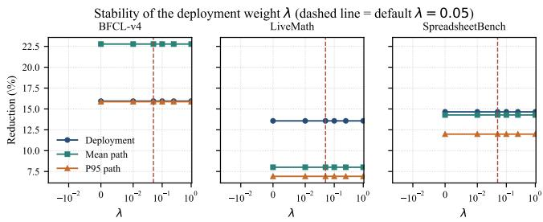  
Fi<sub>g.</sub> 10<sub>.</sub> S<sub>ens</sub>iti<sub>v</sub>it<sub>y</sub> t<sub>o s</sub>t<sub>orage we</sub>i<sub>g</sub>ht �<sub>.</sub> C<sub>os</sub>t<sub>s rema</sub>i<sub>n unc</sub>h<sub>ange</sub>d <sub>across</sub> t<sub>wo</sub> <sub>or</sub>d<sub>ers o</sub>f <sub>magn</sub>it<sub>u</sub>d<sub>e;</sub> th<sub>e</sub> d<sub>as</sub>h<sub>e</sub>d d<sub>e</sub>f<sub>au</sub>lt i<sub>s no</sub>t <sub>resu</sub>lt<sub>-</sub>t<sub>une</sub>d<sub>.</sub>

Th<sub>e a</sub>bl<sub>a</sub>ti<sub>ons separa</sub>t<sub>e</sub> th<sub>e p</sub>ill<sub>ars.</sub> Pill<sub>ar</sub> 1 <sub>supp</sub>li<sub>es</sub> th<sub>e</sub> <sub>sav</sub>i<sub>ngs: remov</sub>i<sub>ng scope</sub>d <sub>s</sub>h<sub>ar</sub>i<sub>ng</sub> l<sub>oses mos</sub>t d<sub>ep</sub>l<sub>oymen</sub>t <sub>re</sub>d<sub>uc</sub>ti<sub>on, w</sub>hil<sub>e remov</sub>i<sub>ng capsu</sub>l<sub>es</sub> t<sub>ra</sub>d<sub>es</sub> l<sub>ower s</sub>t<sub>orage</sub> f<sub>or</sub> hi<sub>g</sub>her <sub>p</sub>er-run cost, as Eq. (10) <sub>p</sub>redicts. Pillar 2 makes th<sub>ose sav</sub>i<sub>ngs</sub> d<sub>ep</sub>l<sub>oya</sub>bl<sub>e.</sub> Gl<sub>o</sub>b<sub>a</sub>l <sub>s</sub>h<sub>ar</sub>i<sub>ng pus</sub>h<sub>es con</sub>t<sub>en</sub>t i<sub>n</sub>t<sub>o</sub> the root, drives � below the source (−0.166), and makes <sub>one</sub> fil<sub>e unreac</sub>h<sub>a</sub>bl<sub>e.</sub> Di<sub>sa</sub>bli<sub>ng on</sub>l<sub>y</sub> th<sub>e rou</sub>ti<sub>ng</sub> l<sub>oc</sub>k l<sub>eaves</sub> <sub>rou</sub>ti<sub>ng</sub> i<sub>n</sub>t<sub>ac</sub>t b<sub>ecause re</sub>f<sub>erence-</sub>li<sub>ne preserva</sub>ti<sub>on an</sub>d th<sub>e</sub> fi<sub>na</sub>l <sub>reac</sub>h<sub>a</sub>bilit<sub>y au</sub>dit <sub>rema</sub>i<sub>n.</sub> R<sub>ou</sub>ti<sub>ng sa</sub>f<sub>e</sub>t<sub>y</sub> th<sub>ere</sub>f<sub>ore comes</sub> f<sub>rom</sub> l<sub>ayere</sub>d <sub>c</sub>h<sub>ec</sub>k<sub>s, no</sub>t <sub>one sw</sub>it<sub>c</sub>h<sub>.</sub>

We sweep � ∈ {0, 0.01, 0.05, 0.1, 0.25, 1} and rerun the <sub>op</sub>ti<sub>m</sub>i<sub>zer.</sub> Fi<sub>gure</sub> 10 <sub>s</sub>h<sub>ows</sub> id<sub>en</sub>ti<sub>ca</sub>l t<sub>rans</sub>f<sub>orma</sub>ti<sub>ons an</sub>d <sub>cos</sub>t<sub>s</sub> <sub>across</sub> th<sub>e</sub> <sub>range.</sub> E<sub>ac</sub>h b<sub>un</sub>dl<sub>e-</sub>l<sub>eve</sub>l <sub>move</sub> i<sub>s</sub> <sub>accep</sub>t<sub>e</sub>d <sub>on</sub>l<sub>y</sub> <sub>w</sub>h<sub>en</sub> <sub>pac</sub>k<sub>age</sub> <sub>sav</sub>i<sub>ng</sub> <sub>excee</sub>d<sub>s</sub> <sub>a</sub>dd<sub>e</sub>d l<sub>oa</sub>di<sub>ng</sub> <sub>cos</sub>t<sub>,</sub> <sub>so</sub> th<sub>e</sub> decision remains stable from � = 0 to 1. The default � = 0.05 i<sub>s no</sub>t t<sub>une</sub>d t<sub>o</sub> th<sub>e resu</sub>lt<sub>s.</sub>

## Takeaway

C<sub>ross-</sub>fil<sub>e</sub> <sub>s</sub>h<sub>ar</sub>i<sub>ng</sub> <sub>pro</sub>d<sub>uces</sub> <sub>mos</sub>t <sub>o</sub>f th<sub>e</sub> <sub>s</sub>hi<sub>ppe</sub>d <sub>sav</sub>i<sub>ng,</sub> <sub>w</sub>hil<sub>e</sub> <sub>capsu</sub>l<sub>es</sub> t<sub>ra</sub>d<sub>e a sma</sub>ll <sub>s</sub>t<sub>orage cos</sub>t f<sub>or c</sub>h<sub>eaper runs.</sub> I<sub>gnor</sub>i<sub>ng</sub> b<sub>ranc</sub>h <sub>scope</sub> b<sub>rea</sub>k<sub>s</sub> th<sub>e</sub> b<sub>un</sub>dl<sub>e, an</sub>d <sub>vary</sub>i<sub>ng</sub> � <sub>over</sub> t<sub>wo or</sub>d<sub>ers</sub> <sub>o</sub>f <sub>magn</sub>it<sub>u</sub>d<sub>e</sub> d<sub>oes</sub> <sub>no</sub>t <sub>c</sub>h<sub>ange</sub> th<sub>e</sub> <sub>resu</sub>lt<sub>.</sub>

## T<sub>.</sub> O<sub>ne-</sub>Sh<sub>o</sub>t V<sub>ersus</sub> C<sub>on</sub>ti<sub>nua</sub>l

P<sub>a</sub>t<sub>c</sub>h<sub>es</sub> <sub>are</sub> <sub>rep</sub>l<sub>aye</sub>d i<sub>n</sub> <sub>or</sub>d<sub>er</sub> i<sub>n</sub>t<sub>o</sub> <sub>a</sub> fi<sub>xe</sub>d <sub>source,</sub> <sub>so</sub> <sub>every c</sub>h<sub>ec</sub>k<sub>po</sub>i<sub>n</sub>t h<sub>as one</sub> id<sub>en</sub>ti<sub>ca</sub>l <sub>uncompresse</sub>d b<sub>un</sub>dl<sub>e</sub> th<sub>a</sub>t <sub>a</sub>ll <sub>sc</sub>h<sub>e</sub>d<sub>u</sub>l<sub>es</sub> <sub>s</sub>t<sub>ar</sub>t f<sub>rom.</sub> W<sub>e</sub> <sub>compare:</sub> <sub>pu</sub>bli<sub>s</sub>h <sub>w</sub>ith<sub>ou</sub>t com<sub>p</sub>ressin<sub>g</sub>; rebuild full<sub>y</sub> after ever<sub>y p</sub>atch (the reference); <sub>roo</sub>t<sub>-on</sub>l<sub>y</sub> Zi<sub>p-on-</sub>W<sub>r</sub>it<sub>e; con</sub>ti<sub>nua</sub>l <sub>w</sub>ith l<sub>oca</sub>l <sub>repa</sub>i<sub>r an</sub>d <sub>no</sub> <sub>repac</sub>k<sub>;</sub> <sub>an</sub>d <sub>con</sub>ti<sub>nua</sub>l <sub>w</sub>ith th<sub>e</sub> <sub>prese</sub>t <sub>repac</sub>k <sub>ru</sub>l<sub>e.</sub> C<sub>on</sub>ti<sub>nua</sub>l <sub>runs may on</sub>l<sub>y reuse s</sub>t<sub>a</sub>t<sub>e</sub> f<sub>rom</sub> b<sub>e</sub>f<sub>ore</sub> th<sub>e curren</sub>t <sub>pa</sub>t<sub>c</sub>h<sub>.</sub>

C<sub>on</sub>ti<sub>nua</sub>l <sub>mo</sub>d<sub>e w</sub>ith <sub>repac</sub>ki<sub>ng reac</sub>h<sub>es</sub> th<sub>e</sub> f<sub>u</sub>ll <sub>re</sub>b<sub>u</sub>ild’<sub>s</sub> objective with zero drift, about one third of the model calls <sub>per</sub> <sub>pa</sub>t<sub>c</sub>h<sub>,</sub> <sub>an</sub>d f<sub>ar</sub> f<sub>ewer</sub> <sub>rewr</sub>itt<sub>en</sub> b<sub>y</sub>t<sub>es.</sub> B<sub>e</sub>t<sub>ween</sub> <sub>repac</sub>k<sub>s</sub> it <sub>rea</sub>d<sub>s</sub> <sub>on</sub>l<sub>y</sub> th<sub>e</sub> <sub>c</sub>h<sub>ange</sub>d fil<sub>e;</sub> <sub>w</sub>ith<sub>ou</sub>t <sub>repac</sub>ki<sub>ng,</sub> <sub>un</sub>f<sub>ac</sub>t<sub>ore</sub>d r<sub>epe</sub>titi<sub>o</sub>n <sub>accu</sub>m<sub>u</sub>l<sub>a</sub>t<sub>es.</sub> R<sub>oo</sub>t<sub>-o</sub>nl<sub>y</sub> Zi<sub>p-o</sub>n<sub>-</sub>Writ<sub>e</sub> r<sub>epo</sub>rt<sub>s</sub> <sub>a</sub> smaller objective only by rewriting routing text that SkillZip P<sub>ro</sub> l<sub>oc</sub>k<sub>s;</sub> T<sub>a</sub>bl<sub>e</sub> V <sub>s</sub>h<sub>ows</sub> th<sub>e run</sub>ti<sub>me</sub> l<sub>oss.</sub>

T<sub>a</sub>bl<sub>e</sub> XVI <sub>s</sub>h<sub>ows</sub> th<sub>e</sub> <sub>sc</sub>h<sub>e</sub>d<sub>u</sub>l<sub>e</sub> <sub>ma</sub>tt<sub>ers</sub> <sub>more</sub> th<sub>an</sub> <sub>any</sub> <sub>s</sub>i<sub>ng</sub>l<sub>e</sub> t<sub>r</sub>i<sub>gger</sub> h<sub>ere.</sub> R<sub>e</sub>b<sub>u</sub>ildi<sub>ng a</sub>ft<sub>er every pa</sub>t<sub>c</sub>h <sub>removes a</sub>ll d<sub>r</sub>ift <sub>a</sub>t <sub>near</sub>l<sub>y</sub> t<sub>en</sub> ti<sub>mes</sub> th<sub>e</sub> <sub>per-pa</sub>t<sub>c</sub>h <sub>ca</sub>ll <sub>cos</sub>t<sub>,</sub> <sub>w</sub>hil<sub>e</sub> <sub>never</sub> <sub>re</sub>b<sub>u</sub>ildi<sub>ng</sub> <sub>s</sub>till k<sub>eeps wors</sub>t d<sub>r</sub>ift <sub>near a</sub> t<sub>en</sub>th <sub>o</sub>f <sub>a percen</sub>t<sub>.</sub> Th<sub>e sav</sub>i<sub>ng</sub> <sub>an</sub>d <sub>grow</sub>th t<sub>r</sub>i<sub>ggers never</sub> fi<sub>re on</sub> thi<sub>s s</sub>t<sub>ream</sub> b<sub>ecause</sub> d<sub>r</sub>ift <sub>never crosses</sub> th<sub>e</sub>i<sub>r</sub> th<sub>res</sub>h<sub>o</sub>ld<sub>s, so</sub> th<sub>e com</sub>bi<sub>ne</sub>d <sub>ru</sub>l<sub>e</sub> i<sub>s</sub> d<sub>r</sub>i<sub>ven</sub> b<sub>y</sub> th<sub>e</sub> <sub>pa</sub>t<sub>c</sub>h <sub>coun</sub>t<sub>er</sub> <sub>an</sub>d l<sub>an</sub>d<sub>s</sub> <sub>a</sub>t <sub>a</sub> <sub>quar</sub>t<sub>er</sub> <sub>o</sub>f th<sub>e</sub> <sub>re</sub>b<sub>u</sub>ild <sub>ra</sub>t<sub>e w</sub>ith th<sub>e same</sub> b<sub>oun</sub>d<sub>e</sub>d d<sub>r</sub>ift<sub>.</sub>

TABLE XIV  
Turning off one piece at a time (grown version). “Damage” counts files left unreachable plus broken links. Quality columns use held-out runs and are reported for the full method.
<table><tr><td>Variant</td><td>J saving ↑</td><td>Shipped ↑</td><td>Always loaded ↑</td><td>Per run ↑</td><td>Task success ↑</td><td>Req. recall ↑</td><td>Damage ↓</td></tr><tr><td>SκILLZıP PRO (One-Shot)</td><td>0.142</td><td>+21.1%</td><td>+7.3%</td><td>+15.8%</td><td>0.560</td><td>0.755</td><td>0</td></tr><tr><td>– Resource graph</td><td>0.118</td><td>+13.7%</td><td>+7.3%</td><td>+13.6%</td><td>一</td><td>一</td><td>0</td></tr><tr><td>– Host entailment</td><td>0.077</td><td>+15.3%</td><td>+2.0%</td><td>+8.3%</td><td></td><td></td><td>0</td></tr><tr><td>- Scoped sharing</td><td>0.132</td><td>+7.9%</td><td>+7.3%</td><td>+17.0%</td><td></td><td></td><td>0</td></tr><tr><td>– Conditional capsules</td><td>0.126</td><td>+26.9%</td><td>+7.3%</td><td>+11.8%</td><td></td><td></td><td>0</td></tr><tr><td>Cross-file audit</td><td>0.142</td><td>+21.1%</td><td>+7.3%</td><td>+15.8%</td><td></td><td></td><td>0</td></tr><tr><td>– Routing-table lock</td><td>0.156</td><td>+22.2%</td><td>+7.1%</td><td>+17.8%</td><td></td><td></td><td>0</td></tr><tr><td>Global sharing (unsafe control)</td><td>-0.166</td><td>+17.0%</td><td>-84.9%</td><td>-0.9%</td><td></td><td></td><td>1</td></tr></table>

TABLE XV

A<sub>fter the last patch, averaged over benchmarks.</sub> S<sub>avings are against publishing without compressing.</sub> D<sub>rift is measured against a full rebuild of</sub> the same state<sub>.</sub> Update seconds<sub>,</sub> bytes to<sub>u</sub>ched<sub>,</sub> and calls are per patch<sub>.</sub>
<table><tr><td>Schedule</td><td>Shipped saving ↑</td><td>Per-run saving ↑</td><td>Drift ↓</td><td>Update s ↓</td><td>Bytes touched ↓</td><td>Calls/patch ↓</td><td>∆Quality</td></tr><tr><td>Append Only</td><td>+0.0%</td><td>+0.0%</td><td>+4.6%</td><td>0.001</td><td>263</td><td>0.0</td><td>0</td></tr><tr><td>SKILLZıP PRo One-Shot after every patch</td><td>+12.4%</td><td>+2.1%</td><td>+0.0%</td><td>0.170</td><td>6250</td><td>8.8</td><td>0</td></tr><tr><td>SκILLZıP Zip-on-Write (root only)</td><td>+9.4%</td><td>+21.7%</td><td>-27.7%</td><td>0.115</td><td>604</td><td>1.0</td><td>0</td></tr><tr><td>SκILLZıp Pro Continual, no repack</td><td>+7.7%</td><td>+4.7%</td><td>-0.8%</td><td>0.013</td><td>263</td><td>1.0</td><td>0</td></tr><tr><td>SκıLLZıP PRo Continual + triggered repack</td><td>+12.4%</td><td>+2.1%</td><td>+0.0%</td><td>0.060</td><td>1875</td><td>3.3</td><td>0</td></tr></table>

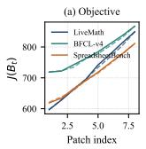

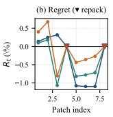

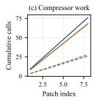

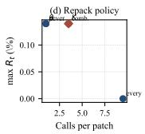  
Fi<sub>g</sub>. 11. Continual mode over <sub>p</sub>atches. (a) objective <sub>p</sub>er <sub>p</sub>atch, full rebuild (solid) versus continual with re<sub>p</sub>ack (dashed); (b) drift from the full rebuild, with re<sub>p</sub>ack events marked; (c) model calls added u<sub>p</sub> over <sub>p</sub>atches; (d) re<sub>p</sub>ack <sub>ru</sub>l<sub>es, ca</sub>ll<sub>s aga</sub>i<sub>ns</sub>t <sub>wors</sub>t d<sub>r</sub>ift<sub>.</sub>

TABLE XVI  
R<sub>epack</sub> <sub>rules</sub> <sub>on</sub> <sub>one</sub> <sub>patch</sub> <sub>stream.</sub> R<sub>epack</sub> <sub>rate</sub> <sub>is</sub> <sub>the</sub> <sub>fraction</sub> <sub>of</sub> patches rebuilt globally; worst drift spans all checkpoints.
<table><tr><td>Rule</td><td>Repack rate</td><td>Worst drift ↓</td><td>Calls/patch ↓</td><td>Update s ↓</td></tr><tr><td>Never repack</td><td>0.00</td><td>0.0014</td><td>1.00</td><td>0.000</td></tr><tr><td>Every patch</td><td>1.00</td><td>0</td><td>9.50</td><td>0.413</td></tr><tr><td>Savings only (θ)</td><td>0.00</td><td>0.0014</td><td>1.00</td><td>0.000</td></tr><tr><td>Growth only (ρ)</td><td>0.00</td><td>0.0014</td><td>1.00</td><td>0.000</td></tr><tr><td>Patch count only (K)</td><td>0.25</td><td>0.0014</td><td>3.50</td><td>0.119</td></tr><tr><td>Combined policy</td><td>0.25</td><td>0.0014</td><td>3.50</td><td>0.106</td></tr></table>

## Takeaway

C<sub>on</sub>ti<sub>nua</sub>l <sub>mo</sub>d<sub>e ma</sub>t<sub>c</sub>h<sub>es a</sub> f<sub>u</sub>ll <sub>re</sub>b<sub>u</sub>ild <sub>w</sub>ith <sub>a</sub>b<sub>ou</sub>t <sub>one</sub> thi<sub>r</sub>d <sub>o</sub>f th<sub>e</sub> <sub>mo</sub>d<sub>e</sub>l <sub>ca</sub>ll<sub>s</sub> <sub>per</sub> <sub>pa</sub>t<sub>c</sub>h<sub>.</sub> A <sub>pa</sub>t<sub>c</sub>h<sub>-coun</sub>t t<sub>r</sub>i<sub>gger</sub> i<sub>s</sub> <sub>su</sub>fi<sub>c</sub>i<sub>en</sub>t <sub>a</sub>t thi<sub>s</sub> <sub>sca</sub>l<sub>e;</sub> th<sub>e</sub> <sub>o</sub>th<sub>er</sub> t<sub>r</sub>i<sub>ggers</sub> <sub>pro</sub>t<sub>ec</sub>t f<sub>as</sub>t<sub>er-c</sub>h<sub>ang</sub>i<sub>ng</sub> <sub>wor</sub>kl<sub>oa</sub>d<sub>s.</sub>

## U. The Compression Lifecycle: Persistent vs. Transient

E<sub>very</sub> <sub>resu</sub>lt <sub>a</sub>b<sub>ove</sub> <sub>s</sub>hi<sub>ppe</sub>d <sub>a</sub> <sub>rewr</sub>itt<sub>en</sub> b<sub>un</sub>dl<sub>e</sub> <sub>on</sub> di<sub>s</sub>k<sub>.</sub> I<sub>n</sub> th<sub>e</sub> <sub>voca</sub>b<sub>u</sub>l<sub>ary</sub> <sub>o</sub>f S<sub>ec</sub>ti<sub>on</sub> V<sub>-</sub>C th<sub>a</sub>t i<sub>s</sub> P<sub>ers</sub>i<sub>s</sub>t<sub>en</sub>t <sub>compress</sub>i<sub>on:</sub> T<sub>a</sub>bl<sub>es</sub> III<sub>,</sub> V<sub>, an</sub>d VI <sub>are a</sub>ll <sub>pers</sub>i<sub>s</sub>t<sub>en</sub>t <sub>resu</sub>lt<sub>s, an</sub>d <sub>we re</sub>l<sub>a</sub>b<sub>e</sub>l th<sub>em as suc</sub>h <sub>ra</sub>th<sub>er</sub> th<sub>an re-run</sub> th<sub>em.</sub> Wh<sub>a</sub>t th<sub>ose</sub> t<sub>a</sub>bl<sub>es</sub> did <sub>no</sub>t t<sub>es</sub>t i<sub>s</sub> th<sub>e</sub> <sub>secon</sub>d lif<sub>ecyc</sub>l<sub>e—</sub>b<sub>u</sub>ildi<sub>ng</sub> <sub>a</sub> th<sub>rowaway</sub> <sub>v</sub>i<sub>ew</sub> <sub>per</sub> <sub>run—or</sub> th<sub>e</sub> <sub>case</sub> th<sub>a</sub>t <sub>ma</sub>k<sub>es</sub> th<sub>e</sub> t<sub>wo</sub> lif<sub>ecyc</sub>l<sub>es</sub> di<sub>verge:</sub> <sub>a</sub> b<sub>un</sub>dl<sub>e w</sub>h<sub>ose su</sub>b<sub>s</sub>kill<sub>s an</sub>d <sub>re</sub>f<sub>erences are ca</sub>ll<sub>e</sub>d di<sub>rec</sub>tl<sub>y, no</sub>t <sub>on</sub>l<sub>y</sub> f<sub>rom</sub> th<sub>e</sub> <sub>roo</sub>t<sub>.</sub> Thi<sub>s</sub> <sub>su</sub>b<sub>sec</sub>ti<sub>on</sub> <sub>a</sub>dd<sub>s</sub> <sub>exac</sub>tl<sub>y</sub> th<sub>a</sub>t<sub>—an</sub>d it i<sub>s w</sub>h<sub>ere</sub> S<sub>kill</sub>Z<sub>ip</sub> P<sub>ro</sub>’<sub>s a</sub>d<sub>van</sub>t<sub>age</sub> i<sub>s eas</sub>i<sub>es</sub>t t<sub>o see: among a</sub>ll m<sub>e</sub>th<sub>o</sub>d<sub>s we</sub> t<sub>es</sub>t<sub>, o</sub>nl<sub>y</sub> S<sub>kill</sub>Z<sub>ip</sub> P<sub>ro co</sub>m<sub>p</sub>r<sub>esses a</sub> m<sub>u</sub>lti<sub>-e</sub>ntr<sub>y</sub> b<sub>un</sub>dl<sub>e</sub> <sub>w</sub>hil<sub>e</sub> k<sub>eep</sub>i<sub>ng</sub> <sub>a</sub>ll <sub>o</sub>f it<sub>s</sub> <sub>rou</sub>ti<sub>ng</sub> <sub>an</sub>d <sub>every</sub> d<sub>ec</sub>l<sub>are</sub>d <sub>en</sub>t<sub>ry</sub> i<sub>n</sub>d<sub>epen</sub>d<sub>en</sub>tl<sub>y ca</sub>ll<sub>a</sub>bl<sub>e, w</sub>h<sub>ereas</sub> th<sub>e</sub> l<sub>ossy</sub> b<sub>ase</sub>li<sub>nes reac</sub>h th<sub>e</sub>i<sub>r</sub> <sub>sma</sub>ll<sub>er num</sub>b<sub>ers on</sub>l<sub>y</sub> b<sub>y</sub> b<sub>rea</sub>ki<sub>ng exac</sub>tl<sub>y</sub> th<sub>ose</sub> t<sub>wo proper</sub>ti<sub>es.</sub>

S<sub>e</sub>t<sub>up.</sub> W<sub>e</sub> d<sub>er</sub>i<sub>ve</sub> <sub>one</sub> <sub>con</sub>t<sub>ro</sub>ll<sub>e</sub>d <sub>mu</sub>lti<sub>-en</sub>t<sub>ry</sub> b<sub>un</sub>dl<sub>e</sub> f<sub>rom</sub> the math skill: a root SKILL.md, a catalo<sub>g</sub>ued <sub>p</sub>ublic subskill at sub/SKILL.md, and four conditional references carr<sub>y</sub>in<sub>g</sub> f<sub>u</sub>ll t<sub>as</sub>k <sub>con</sub>t<sub>rac</sub>t<sub>s.</sub> W<sub>e compare</sub> U<sub>ncompresse</sub>d<sub>,</sub> S<sub>kill</sub>Z<sub>ip,</sub> th<sub>e</sub> l<sub>ossy</sub> R<sub>oo</sub>t<sub>-on</sub>l<sub>y an</sub>d Fl<sub>a</sub>t<sub>-conca</sub>t b<sub>ase</sub>li<sub>nes, au</sub>dit<sub>e</sub>d <sub>pers</sub>i<sub>s</sub>t<sub>en</sub>t S<sub>kill</sub>Z<sub>ip</sub> P<sub>ro, pe</sub>r<sub>s</sub>i<sub>s</sub>t<sub>e</sub>nt S<sub>kill</sub>Z<sub>ip</sub> P<sub>ro w</sub>ith<sub>ou</sub>t th<sub>e</sub> m<sub>u</sub>lti<sub>-e</sub>ntr<sub>y</sub> <sub>au</sub>dit<sub>, an</sub>d t<sub>rans</sub>i<sub>en</sub>t <sub>execu</sub>ti<sub>on-v</sub>i<sub>ew</sub> S<sub>kill</sub>Z<sub>ip</sub> P<sub>ro.</sub> C<sub>ompress</sub>i<sub>on</sub> <sub>an</sub>d <sub>v</sub>i<sub>ew cons</sub>t<sub>ruc</sub>ti<sub>on are</sub> d<sub>e</sub>t<sub>erm</sub>i<sub>n</sub>i<sub>s</sub>ti<sub>c an</sub>d <sub>use no mo</sub>d<sub>e</sub>l <sub>ca</sub>ll<sub>s;</sub> <sub>on</sub>l<sub>y</sub> th<sub>e</sub> di<sub>rec</sub>t<sub>-ca</sub>ll <sub>ro</sub>ll<sub>ou</sub>t i<sub>n</sub> T<sub>a</sub>bl<sub>e</sub> XIX <sub>uses</sub> th<sub>e unmo</sub>difi<sub>e</sub>d <sub>age</sub>nt<sub>.</sub> F<sub>o</sub>ll<sub>ow</sub>in<sub>g</sub> S<sub>ec</sub>ti<sub>o</sub>n III<sub>-</sub>E<sub>, pe</sub>r<sub>s</sub>i<sub>s</sub>t<sub>e</sub>nt r<sub>ows</sub> r<sub>epo</sub>rt di<sub>s</sub>k <sub>an</sub>d <sub>per-run cos</sub>t<sub>.</sub> Th<sub>e</sub> t<sub>rans</sub>i<sub>en</sub>t <sub>row</sub> k<sub>eeps</sub> di<sub>s</sub>k <sub>a</sub>t 1<sub>.</sub>000 <sub>an</sub>d <sup>re</sup>p<sup>orts r</sup>u<sup>ntime sa</sup>v<sup>in</sup>g <sup>se</sup>p<sup>aratel</sup>y.

1) Compressing without losing a single public entry: T<sub>a</sub>bl<sub>e</sub> XVII <sub>sepa</sub>r<sub>a</sub>t<sub>es</sub> m<sub>e</sub>th<sub>o</sub>d<sub>s</sub> th<sub>a</sub>t <sub>p</sub>r<sub>ese</sub>r<sub>ve a</sub> m<sub>u</sub>lti<sub>-e</sub>ntr<sub>y</sub> b<sub>un</sub>dl<sub>e</sub> f<sub>rom</sub> th<sub>ose</sub> th<sub>a</sub>t d<sub>o no</sub>t<sub>.</sub> St<sub>an</sub>d<sub>a</sub>l<sub>one-preserv</sub>i<sub>ng pers</sub>i<sub>s</sub>t<sub>en</sub>t S<sub>kill</sub>Z<sub>ip</sub> P<sub>ro re</sub>d<sub>uces</sub> th<sub>e</sub> b<sub>un</sub>dl<sub>e</sub> t<sub>o</sub> 0<sub>.</sub>884 <sub>o</sub>f it<sub>s</sub> b<sub>y</sub>t<sub>es an</sub>d <sub>per-</sub> <sub>run</sub> l<sub>oa</sub>d f<sub>rom</sub> 404 t<sub>o</sub> 352 t<sub>o</sub>k<sub>ens w</sub>hil<sub>e</sub> k<sub>eep</sub>i<sub>ng rou</sub>ti<sub>ng, mean</sub> <sub>pu</sub>bli<sub>c</sub> i<sub>n</sub>d<sub>epen</sub>d<sub>ence,</sub> <sub>an</sub>d <sub>wors</sub>t<sub>-case</sub> i<sub>n</sub>d<sub>epen</sub>d<sub>ence</sub> <sub>a</sub>t 1<sub>.</sub>000<sub>.</sub> Th<sub>e</sub> t<sub>rans</sub>i<sub>en</sub>t <sub>v</sub>i<sub>ew</sub> k<sub>eeps</sub> th<sub>e</sub> <sub>same</sub> <sub>guaran</sub>t<sub>ees</sub> <sub>w</sub>ith<sub>ou</sub>t <sub>c</sub>h<sub>ang</sub>i<sub>ng</sub> di<sub>s</sub>k<sub>.</sub> R<sub>oo</sub>t<sub>-on</sub>l<sub>y</sub> <sub>an</sub>d fl<sub>a</sub>t<sub>-conca</sub>t <sub>repor</sub>t <sub>sma</sub>ll<sub>er</sub> <sub>num</sub>b<sub>ers</sub> <sub>on</sub>l<sub>y</sub> <sub>a</sub>ft<sub>er</sub> b<sub>rea</sub>ki<sub>ng</sub> <sub>rou</sub>ti<sub>ng</sub> <sub>or</sub> <sub>remov</sub>i<sub>ng</sub> <sub>pu</sub>bli<sub>c</sub> <sub>con</sub>t<sub>en</sub>t<sub>.</sub> Di<sub>sa</sub>bli<sub>ng</sub> th<sub>e</sub> <sub>mu</sub>lti<sub>-en</sub>t<sub>ry</sub> <sub>au</sub>dit <sub>exposes</sub> th<sub>e</sub> f<sub>a</sub>il<sub>ure:</sub> <sub>pers</sub>i<sub>s</sub>t<sub>en</sub>t S<sub>kill</sub>Z<sub>ip</sub> P<sub>ro</sub> <sub>reac</sub>h<sub>es</sub> 0<sub>.</sub>845 <sub>on</sub> di<sub>s</sub>k b<sub>u</sub>t <sub>renames</sub> th<sub>e</sub> <sub>pu</sub>bli<sub>c</sub> <sub>su</sub>b<sub>s</sub>kill<sub>,</sub> <sub>re</sub>d<sub>uc</sub>i<sub>ng</sub> it<sub>s e</sub>f<sub>ec</sub>ti<sub>ve</sub> i<sub>n</sub>d<sub>epen</sub>d<sub>ence</sub> t<sub>o</sub> 0<sub>.</sub>500<sub>.</sub> P<sub>ropos</sub>iti<sub>on</sub> IV<sub>.</sub>1 th<sub>ere</sub>f<sub>ore app</sub>li<sub>es a</sub>t b<sub>un</sub>dl<sub>e sca</sub>l<sub>e: every</sub> d<sub>ec</sub>l<sub>are</sub>d <sub>en</sub>t<sub>ry, no</sub>t th<sub>e</sub> d<sub>es</sub>i<sub>re</sub>d <sub>ra</sub>ti<sub>o,</sub> <sub>se</sub>t<sub>s</sub> th<sub>e</sub> <sub>sa</sub>f<sub>e</sub> <sub>pers</sub>i<sub>s</sub>t<sub>en</sub>t <sub>ce</sub>ili<sub>ng.</sub>

2) Direct calls need the audit or a transient view: T<sub>a</sub>bl<sub>e</sub> XVIII i<sub>so</sub>l<sub>a</sub>t<sub>es</sub> th<sub>e</sub> f<sub>a</sub>il<sub>ure.</sub> With<sub>ou</sub>t th<sub>e au</sub>dit<sub>, pers</sub>i<sub>s</sub>t<sub>en</sub>t S<sub>kill</sub>Z<sub>ip</sub> P<sub>ro</sub> <sub>re</sub>t<sub>a</sub>i<sub>ns</sub> 0<sub>.</sub>929 <sub>o</sub>f <sub>pu</sub>bli<sub>c-en</sub>t<sub>ry</sub> <sub>con</sub>t<sub>en</sub>t b<sub>u</sub>t <sub>on</sub>l<sub>y</sub> 0<sub>.</sub>500 di<sub>scovera</sub>bilit<sub>y</sub> b<sub>ecause</sub> it <sub>renames</sub> th<sub>e pu</sub>bli<sub>c su</sub>b<sub>s</sub>kill<sub>.</sub>

TABLE XVII  
P<sub>ersistent</sub> <sub>cost</sub> a<sub>nd</sub> <sub>multi-entry</sub> <sub>fidelity.</sub> L<sub>ower</sub> <sub>cost</sub> <sub>is</sub> <sub>better;</sub> higher routing and independence are better. Blue rows are valid; grey rows break routing or independence.
<table><tr><td>Method</td><td>Disk ↓</td><td>P95 ctx ↓</td><td>Per-run ↓</td><td>Route ↑</td><td>Pub. Ind. ↑</td><td>Worst ↑</td></tr><tr><td>Uncompressed</td><td>1.000</td><td>607</td><td>404</td><td>1.000</td><td>1.000</td><td>1.000</td></tr><tr><td>SKILLZIP</td><td>0.959</td><td>587</td><td>393</td><td>1.000</td><td>1.000</td><td>1.000</td></tr><tr><td>Root-only X</td><td>0.972</td><td>537</td><td>242</td><td>0.000</td><td>0.625</td><td>0.250</td></tr><tr><td>Flat-concat X</td><td>0.379</td><td>190</td><td>74</td><td>0.000</td><td>0.062</td><td>0.000</td></tr><tr><td>Standalone-preserving Persistent SκıLLZıp Pro</td><td>0.884</td><td>607</td><td>352</td><td>1.000</td><td>1.000</td><td>1.000</td></tr><tr><td>Persistent SkILLZıp PRo, no auditX</td><td>0.845</td><td>565</td><td>331</td><td>1.000</td><td>0.500</td><td>0.000</td></tr><tr><td>Transient Execution-View SκıLLZıp Pro</td><td>1.000</td><td>607</td><td>404</td><td>1.000</td><td>1.000</td><td>1.000</td></tr></table>

## TABLE XVIII

Why a public entry loses independence (math bundle). “Discoverable” is whether a direct call still finds the entry (↑); “Content” is how much of the found entry’s knowledge survives (↑); “Effective” is their <sub>per-entry</sub> <sub>product,</sub> <sub>averaged—the</sub> <sub>number</sub> T<sub>able</sub> XVII <sub>reports.</sub> “C<sub>ond.</sub>” <sub>is conditional-entry content.</sub> P<sub>ersistent</sub> S<sub>kill</sub>Z<sub>ip</sub> P<sub>ro with the audit</sub> off loses capability by renaming a public entry, not by deleting its text.
<table><tr><td>Method</td><td>Pub. disc. ↑</td><td>Pub. content ↑</td><td>Pub. eff. ↑</td><td>Cond. content ↑</td></tr><tr><td>Uncompressed</td><td>1.000</td><td>1.000</td><td>1.000</td><td>1.000</td></tr><tr><td>SKILLZiP</td><td>1.000</td><td>1.000</td><td>1.000</td><td>1.000</td></tr><tr><td>Root-only X</td><td>1.000</td><td>0.625</td><td>0.625</td><td>1.000</td></tr><tr><td>Flat-concat X</td><td>1.000</td><td>0.062</td><td>0.062</td><td>0.150</td></tr><tr><td>Persistent SKILLZiP PRo, no audit X</td><td>0.500</td><td>0.929</td><td>0.500</td><td>0.887</td></tr><tr><td>Standalone-preserving Persistent SkıLL.Zıp Pro</td><td>1.000</td><td>1.000</td><td>1.000</td><td>1.000</td></tr><tr><td>Transient Execution-View SkILLZıP Pro</td><td>1.000</td><td>1.000</td><td>1.000</td><td>1.000</td></tr></table>

A<sub>u</sub>dit<sub>e</sub>d <sub>pers</sub>i<sub>s</sub>t<sub>en</sub>t <sub>an</sub>d t<sub>rans</sub>i<sub>en</sub>t <sub>mo</sub>d<sub>es rema</sub>i<sub>n a</sub>t 1<sub>.</sub>000 <sub>on a</sub>ll four measures: one rejects hidden entries, and the other never <sub>e</sub>dit<sub>s</sub> th<sub>em.</sub> Di<sub>rec</sub>t <sub>ca</sub>ll<sub>s nee</sub>d <sub>one o</sub>f th<sub>ese pro</sub>t<sub>ec</sub>ti<sub>ons.</sub>

Th<sub>e</sub> li<sub>ve</sub> <sub>ro</sub>ll<sub>ou</sub>t <sub>con</sub>fi<sub>rms</sub> thi<sub>s</sub> <sub>resu</sub>lt<sub>.</sub> T<sub>a</sub>bl<sub>e</sub> XIX <sub>ca</sub>ll<sub>s</sub> <sub>eac</sub>h <sub>en</sub>t<sub>ry</sub> th<sub>roug</sub>h th<sub>e unmo</sub>difi<sub>e</sub>d <sub>agen</sub>t<sub>.</sub> With<sub>ou</sub>t th<sub>e au</sub>dit<sub>,</sub> <sub>pers</sub>i<sub>s</sub>t<sub>en</sub>t S<sub>kill</sub>Z<sub>ip</sub> P<sub>ro</sub> <sub>canno</sub>t <sub>s</sub>t<sub>ar</sub>t th<sub>e</sub> <sub>rename</sub>d <sub>pu</sub>bli<sub>c</sub> subskill (discoverabilit<sub>y</sub> and standalone success are both 0.000), althou<sub>g</sub>h unrenamed conditional references still run. A<sub>u</sub>dit<sub>e</sub>d <sub>pers</sub>i<sub>s</sub>t<sub>en</sub>t <sub>an</sub>d t<sub>rans</sub>i<sub>en</sub>t <sub>mo</sub>d<sub>es</sub> k<sub>eep</sub> <sub>every</sub> <sub>en</sub>t<sub>ry</sub> di<sub>scovera</sub>bl<sub>e;</sub> th<sub>e</sub>i<sub>r s</sub>t<sub>an</sub>d<sub>a</sub>l<sub>one an</sub>d <sub>roo</sub>t<sub>-me</sub>di<sub>a</sub>t<sub>e</sub>d <sub>success</sub> matches uncom<sub>p</sub>ressed within this small rollout’s noise (�=3 for the <sub>p</sub>ublic entr<sub>y</sub>, �=8 <sub>p</sub>er reference). Discoverabilit<sub>y</sub> is d<sub>e</sub>t<sub>erm</sub>i<sub>n</sub>i<sub>s</sub>ti<sub>c: on</sub>l<sub>y</sub> th<sub>e au</sub>dit <sub>or a</sub> t<sub>rans</sub>i<sub>en</sub>t <sub>v</sub>i<sub>ew preven</sub>t<sub>s cross-</sub> fil<sub>e</sub> d<sub>e</sub>d<sub>up</sub>li<sub>ca</sub>ti<sub>on</sub> f<sub>rom</sub> hidi<sub>ng a pu</sub>bli<sub>c en</sub>t<sub>ry.</sub>

3) Matching the four modes to update rate and call pattern: T<sub>a</sub>bl<sub>e</sub> XX <sub>repor</sub>t<sub>s eac</sub>h <sub>wor</sub>kl<sub>oa</sub>d b<sub>oun</sub>d<sub>ary.</sub> P<sub>ers</sub>i<sub>s</sub>t<sub>en</sub>t l<sub>oa</sub>d <sub>s</sub>t<sub>ays</sub> b<sub>e</sub>l<sub>ow</sub> t<sub>rans</sub>i<sub>en</sub>t l<sub>oa</sub>d <sub>a</sub>t <sub>every</sub> di<sub>rec</sub>t<sub>-ca</sub>ll <sub>coun</sub>t b<sub>ecause</sub> <sub>compress</sub>i<sub>on</sub> i<sub>s pa</sub>id <sub>once; s</sub>t<sub>a</sub>bl<sub>e,</sub> h<sub>eav</sub>il<sub>y use</sub>d b<sub>un</sub>dl<sub>es</sub> f<sub>avor</sub> <sub>one-s</sub>h<sub>o</sub>t <sub>pers</sub>i<sub>s</sub>t<sub>en</sub>t<sub>.</sub> A <sub>g</sub>l<sub>o</sub>b<sub>a</sub>l <sub>repac</sub>k <sub>cos</sub>t<sub>s</sub> 273 <sub>ms</sub> <sub>versus</sub> 183 <sub>ms</sub> f<sub>or</sub> <sub>a</sub> l<sub>oca</sub>l t<sub>rans</sub>i<sub>en</sub>t <sub>re</sub>b<sub>u</sub>ild<sub>,</sub> <sub>so</sub> <sub>c</sub>h<sub>ang</sub>i<sub>ng</sub> di<sub>rec</sub>t<sub>-ca</sub>ll b<sub>un</sub>dl<sub>es</sub> f<sub>avor cac</sub>h<sub>e</sub>d <sub>con</sub>ti<sub>nua</sub>l t<sub>rans</sub>i<sub>en</sub>t <sub>a</sub>b<sub>ove roug</sub>hl<sub>y one</sub> <sub>e</sub>dit <sub>per</sub> t<sub>en</sub> <sub>runs.</sub> Fi<sub>gure</sub> 12 <sub>s</sub>h<sub>ows</sub> th<sub>e</sub> <sub>crossover.</sub>

4) What a transient view costs to build and cache: Transient com<sub>p</sub>ression has overhead (Table XXI). The root-heav<sub>y</sub> entr<sub>y</sub> <sub>saves</sub> 24<sub>.</sub>8%<sub>;</sub> l<sub>ea</sub>f <sub>re</sub>f<sub>erences save un</sub>d<sub>er</sub> 2% b<sub>ecause</sub> th<sub>e</sub>i<sub>r</sub> <sub>c</sub>l<sub>osures s</sub>h<sub>are</sub> littl<sub>e con</sub>t<sub>en</sub>t<sub>.</sub> C<sub>o</sub>ld b<sub>u</sub>ild<sub>s</sub> t<sub>a</sub>k<sub>e</sub> 150<sub>–</sub>245 <sub>ms an</sub>d <sub>warm rea</sub>d<sub>s un</sub>d<sub>er</sub> 2 <sub>ms, amor</sub>ti<sub>z</sub>i<sub>ng</sub> t<sub>o</sub> 15<sub>–</sub>25 <sub>ms per ca</sub>ll <sub>a</sub>t <sub>a</sub> 0.9 hit rate. The non-im<sub>p</sub>rovin<sub>g</sub> geometry.md entr<sub>y</sub> uses its <sub>raw c</sub>l<sub>osure, an</sub>d th<sub>e canon</sub>i<sub>ca</sub>l b<sub>un</sub>dl<sub>e rema</sub>i<sub>ns</sub> b<sub>y</sub>t<sub>e-</sub>id<sub>en</sub>ti<sub>ca</sub>l<sub>.</sub> A <sub>v</sub>i<sub>ew</sub> h<sub>e</sub>l<sub>ps on</sub>l<sub>y w</sub>h<sub>en</sub> it<sub>s</sub> t<sub>o</sub>k<sub>en sav</sub>i<sub>ng excee</sub>d<sub>s</sub> b<sub>u</sub>ild <sub>over</sub>h<sub>ea</sub>d<sub>.</sub>

5) Which safeguards are load-bearing: Table XXII removes <sub>one</sub> <sub>sa</sub>f<sub>eguar</sub>d <sub>a</sub>t <sub>a</sub> ti<sub>me.</sub> With<sub>ou</sub>t <sub>en</sub>t<sub>ry</sub> l<sub>a</sub>b<sub>e</sub>l<sub>s,</sub> <sub>pu</sub>bli<sub>c</sub> i<sub>n</sub>d<sub>epen-</sub> d<sub>ence</sub> f<sub>a</sub>ll<sub>s</sub> t<sub>o</sub> 0<sub>.</sub>500<sub>; w</sub>ith<sub>ou</sub>t th<sub>e mu</sub>lti<sub>-en</sub>t<sub>ry au</sub>dit<sub>, a pu</sub>bli<sub>c</sub> <sub>en</sub>t<sub>ry</sub> b<sub>ecomes</sub> <sub>un</sub>di<sub>scovera</sub>bl<sub>e.</sub> I<sub>gnor</sub>i<sub>ng</sub> d<sub>epen</sub>d<sub>ency</sub> <sub>c</sub>l<sub>osure</sub> d<sub>rops</sub> 10 <sub>o</sub>f 11 <sub>re</sub>f<sub>erences, an</sub>d <sub>m</sub>i<sub>ss</sub>i<sub>ng</sub> h<sub>os</sub>t <sub>con</sub>t<sub>ex</sub>t <sub>re</sub>d<sub>uces</sub> <sub>con</sub>diti<sub>ona</sub>l i<sub>n</sub>d<sub>epen</sub>d<sub>ence</sub> t<sub>o</sub> 0<sub>.</sub>887<sub>.</sub> R<sub>emov</sub>i<sub>ng</sub> th<sub>e v</sub>i<sub>ew cac</sub>h<sub>e</sub> <sub>ra</sub>i<sub>ses per-ca</sub>ll b<sub>u</sub>ild f<sub>rom</sub> 18<sub>.</sub>7 t<sub>o</sub> 173<sub>.</sub>4 <sub>ms; remov</sub>i<sub>ng g</sub>l<sub>o</sub>b<sub>a</sub>l <sub>repac</sub>ki<sub>ng moves</sub> th<sub>e</sub> di<sub>s</sub>k <sub>ra</sub>ti<sub>o</sub> f<sub>rom</sub> 0<sub>.</sub>845 t<sub>o</sub> 0<sub>.</sub>959<sub>.</sub> U<sub>n</sub>d<sub>er</sub> <sub>wor</sub>kl<sub>oa</sub>d d<sub>r</sub>ift<sub>, pers</sub>i<sub>s</sub>t<sub>en</sub>t <sub>sav</sub>i<sub>ng</sub> d<sub>ecays</sub> f<sub>rom</sub> 12<sub>.</sub>9% t<sub>o</sub> 2<sub>.</sub>6%<sub>,</sub> <sub>w</sub>hil<sub>e</sub> th<sub>e</sub> t<sub>rans</sub>i<sub>en</sub>t <sub>v</sub>i<sub>ew rema</sub>i<sub>ns a</sub>t 4<sub>.</sub>7%<sub>.</sub> E<sub>ac</sub>h <sub>sa</sub>f<sub>eguar</sub>d th<sub>ere</sub>f<sub>ore</sub> <sub>pro</sub>t<sub>ec</sub>t<sub>s</sub> <sub>e</sub>ith<sub>er</sub> <sub>a</sub> <sub>sav</sub>i<sub>ng</sub> <sub>or</sub> <sub>a</sub> <sub>pu</sub>bli<sub>c</sub> <sub>ca</sub>ll<sub>.</sub>

TABLE XIX  
Dire<sub>c</sub>t-<sub>c</sub>all r<sub>o</sub>ll<sub>ou</sub>t<sub>.</sub> P<sub>ub.</sub> <sub>disc.</sub> <sub>tests</sub> <sub>public-subskill</sub> <sub>startup;</sub> P<sub>ub.,</sub> C<sub>ond.,</sub> <sub>and</sub> R<sub>oot</sub> <sub>report</sub> <sub>success</sub> <sub>by</sub> <sub>entry</sub> <sub>type.</sub> D<sub>iscoverability</sub> <sub>is</sub> deterministic; �=3 public and �=8 per reference.
<table><tr><td>Method</td><td>Pub. disc. ↑</td><td>Pub. ↑</td><td>Cond. ↑</td><td>Root ↑</td></tr><tr><td>Uncompressed</td><td>1.000</td><td>0.333</td><td>0.375</td><td>0.364</td></tr><tr><td>Persistent SKILLZIP PRo, no audit X</td><td>0.000</td><td>0.000</td><td>0.417</td><td>0.394</td></tr><tr><td>Standalone-preserving Persistent SκıLLZıp Pro</td><td>1.000</td><td>0.333</td><td>0.375</td><td>I</td></tr><tr><td>Transient Execution-View SκILLZıP Pro</td><td>1.000</td><td>0.667</td><td>0.417</td><td>–</td></tr></table>

## Takeaway

S<sub>kill</sub>Z<sub>ip</sub> P<sub>ro</sub> i<sub>s</sub> th<sub>e o</sub>nl<sub>y</sub> t<sub>es</sub>t<sub>e</sub>d <sub>app</sub>r<sub>oac</sub>h th<sub>a</sub>t <sub>co</sub>m<sub>p</sub>r<sub>esses a</sub> <sub>mu</sub>lti<sub>-en</sub>t<sub>ry</sub> b<sub>un</sub>dl<sub>e</sub> <sub>w</sub>ith<sub>ou</sub>t b<sub>rea</sub>ki<sub>ng</sub> <sub>rou</sub>ti<sub>ng</sub> <sub>or</sub> hidi<sub>ng</sub> <sub>a</sub> <sub>pu</sub>bli<sub>c</sub> <sub>en</sub>t<sub>ry.</sub> A<sub>u</sub>dit<sub>e</sub>d <sub>pers</sub>i<sub>s</sub>t<sub>en</sub>t <sub>compress</sub>i<sub>on</sub> <sub>g</sub>i<sub>ves</sub> th<sub>e</sub> <sub>sma</sub>ll<sub>es</sub>t b<sub>un</sub>dl<sub>e</sub> <sub>an</sub>d l<sub>owes</sub>t <sub>s</sub>t<sub>ea</sub>d<sub>y-s</sub>t<sub>a</sub>t<sub>e run cos</sub>t<sub>;</sub> t<sub>rans</sub>i<sub>en</sub>t <sub>compress</sub>i<sub>on preserves</sub> th<sub>e</sub> <sub>canon</sub>i<sub>ca</sub>l b<sub>un</sub>dl<sub>e</sub> <sub>an</sub>d b<sub>e</sub>tt<sub>er</sub> t<sub>o</sub>l<sub>era</sub>t<sub>es</sub> d<sub>r</sub>ift<sub>,</sub> b<sub>u</sub>t <sub>pays</sub> <sub>per-run</sub> b<sub>u</sub>ild <sub>cos</sub>t<sub>.</sub> Th<sub>e</sub> lif<sub>ecyc</sub>l<sub>es</sub> <sub>are</sub> <sub>comp</sub>l<sub>emen</sub>t<sub>ary,</sub> <sub>an</sub>d <sub>eac</sub>h <sub>sa</sub>f<sub>eguar</sub>d <sub>pro</sub>t<sub>ec</sub>t<sub>s</sub> <sub>e</sub>ith<sub>er</sub> fid<sub>e</sub>lit<sub>y</sub> <sub>or</sub> <sub>e</sub>fi<sub>c</sub>i<sub>ency.</sub>

## V<sub>.</sub> A<sub>n</sub> E<sub>xamp</sub>l<sub>e</sub> i<sub>n</sub> I<sub>n</sub>d<sub>us</sub>t<sub>r</sub>i<sub>a</sub>l C<sub>ompress</sub>i<sub>on</sub> D<sub>ep</sub>l<sub>oymen</sub>t

Th<sub>e</sub> <sub>prece</sub>di<sub>ng</sub> b<sub>enc</sub>h<sub>mar</sub>k<sub>s</sub> <sub>use</sub> <sub>an</sub> i<sub>ns</sub>t<sub>rumen</sub>t<sub>e</sub>d <sub>wrapper</sub> t<sub>o recor</sub>d <sub>w</sub>hi<sub>c</sub>h fil<sub>es</sub> th<sub>e agen</sub>t l<sub>oa</sub>d<sub>s.</sub> W<sub>e</sub> f<sub>ur</sub>th<sub>er eva</sub>l<sub>ua</sub>t<sub>e</sub> S<sub>kill</sub>Z<sub>ip</sub> P<sub>ro</sub> i<sub>ns</sub>id<sub>e</sub> th<sub>e pro</sub>d<sub>uc</sub>ti<sub>on execu</sub>ti<sub>on env</sub>i<sub>ronmen</sub>t <sub>o</sub>f <sub>a con</sub>t<sub>en</sub>t<sub>-mo</sub>d<sub>era</sub>ti<sub>on serv</sub>i<sub>ce.</sub> It<sub>s s</sub>kill b<sub>un</sub>dl<sub>e con</sub>t<sub>a</sub>i<sub>ns a roo</sub>t d<sub>ocumen</sub>t <sub>o</sub>f <sub>approx</sub>i<sub>ma</sub>t<sub>e</sub>l<sub>y</sub> 20<sub>,</sub>000 t<sub>o</sub>k<sub>e</sub>n<sub>s,</sub> th<sub>ree on-</sub>d<sub>eman</sub>d <sub>re</sub>f<sub>erence</sub> d<sub>ocumen</sub>t<sub>s</sub> <sub>cover</sub>i<sub>ng</sub> <sub>pr</sub>i<sub>or</sub> <sub>cases</sub> <sub>an</sub>d <sub>mo</sub>d<sub>era</sub>ti<sub>on</sub> standards, and a locked risk map. The root is injected when th<sub>e s</sub>kill i<sub>s ac</sub>ti<sub>va</sub>t<sub>e</sub>d<sub>, w</sub>hil<sub>e re</sub>f<sub>erence</sub> fil<sub>es are</sub> l<sub>oa</sub>d<sub>e</sub>d <sub>on</sub>l<sub>y</sub> <sub>w</sub>h<sub>en nee</sub>d<sub>e</sub>d<sub>.</sub> E<sub>ac</sub>h <sub>au</sub>dit i<sub>nvo</sub>l<sub>ves approx</sub>i<sub>ma</sub>t<sub>e</sub>l<sub>y</sub> 13 <sub>age</sub>nt reason<sup>i</sup>ng rounds on avera<sub>g</sub>e.

Th<sub>e o</sub>fi<sub>c</sub>i<sub>a</sub>l <sub>eva</sub>l<sub>ua</sub>ti<sub>on se</sub>t <sub>con</sub>t<sub>a</sub>i<sub>ns</sub> 100 <sub>rea</sub>l <sub>mo</sub>d<sub>era</sub>ti<sub>on</sub> t<sub>as</sub>k<sub>s, even</sub>l<sub>y</sub> di<sub>v</sub>id<sub>e</sub>d b<sub>e</sub>t<sub>ween v</sub>i<sub>o</sub>l<sub>a</sub>ti<sub>ng an</sub>d <sub>norma</sub>l <sub>cases.</sub> T<sub>as</sub>k <sub>con</sub>t<sub>en</sub>t i<sub>s re</sub>t<sub>r</sub>i<sub>eve</sub>d <sub>a</sub>t <sub>execu</sub>ti<sub>on</sub> ti<sub>me an</sub>d i<sub>s no</sub>t <sub>ava</sub>il<sub>a</sub>bl<sub>e</sub> l<sub>oca</sub>ll<sub>y,</sub> <sub>so</sub> b<sub>o</sub>th d<sub>ec</sub>i<sub>s</sub>i<sub>on</sub> <sub>qua</sub>lit<sub>y</sub> <sub>an</sub>d <sub>run</sub>ti<sub>me</sub> <sub>cos</sub>t <sub>mus</sub>t b<sub>e</sub> <sub>measure</sub>d th<sub>roug</sub>h th<sub>e</sub> <sub>pro</sub>d<sub>uc</sub>ti<sub>on</sub> h<sub>arness.</sub> W<sub>e</sub> <sub>repor</sub>t th<sub>e</sub> bi<sub>nary</sub> <sub>mo</sub>d<sub>era</sub>ti<sub>on</sub> <sub>ver</sub>di<sub>c</sub>t <sub>us</sub>i<sub>ng</sub> <sub>accuracy</sub> <sub>an</sub>d f<sub>a</sub>l<sub>se</sub> <sub>pos</sub>iti<sub>ves.</sub> Th<sub>e</sub> b<sub>un</sub>dl<sub>e</sub> i<sub>s wr</sub>itt<sub>en</sub> i<sub>n</sub> Chi<sub>nese, w</sub>hi<sub>c</sub>h <sub>a</sub>l<sub>so exposes a prac</sub>ti<sub>ca</sub>l li<sub>m</sub>it<sub>a</sub>ti<sub>on</sub> <sub>o</sub>f l<sub>anguage-spec</sub>ifi<sub>c</sub> <sub>pro</sub>t<sub>ec</sub>ti<sub>on</sub> <sub>ru</sub>l<sub>es:</sub> <sub>an</sub> E<sub>ng</sub>li<sub>s</sub>h<sub>-</sub> <sub>on</sub>l<sub>y</sub> d<sub>e</sub>t<sub>erm</sub>i<sub>n</sub>i<sub>s</sub>ti<sub>c ex</sub>t<sub>rac</sub>t<sub>or</sub> id<sub>en</sub>tifi<sub>es on</sub>l<sub>y</sub> 7 <sub>o</sub>f 264 i<sub>ns</sub>t<sub>ruc</sub>ti<sub>on</sub> <sub>un</sub>it<sub>s</sub> <sub>as</sub> <sub>requ</sub>i<sub>re</sub>d<sub>,</sub> l<sub>eav</sub>i<sub>ng</sub> <sub>mos</sub>t Chi<sub>nese</sub> <sub>o</sub>bli<sub>ga</sub>ti<sub>ons</sub> <sub>unpro</sub>t<sub>ec</sub>t<sub>e</sub>d d<sub>ur</sub>i<sub>ng</sub> <sub>compress</sub>i<sub>on.</sub>

A<sub>gg</sub>ressive com<sub>p</sub>ression removes essential exem<sub>p</sub>tion kn<sub>ow</sub>l<sub>e</sub>d<sub>ge.</sub> With<sub>ou</sub>t <sub>pro</sub>t<sub>ec</sub>ti<sub>on c</sub>l<sub>asses,</sub> d<sub>e</sub>t<sub>erm</sub>i<sub>n</sub>i<sub>s</sub>ti<sub>c an</sub>d <sub>mo</sub>d<sub>e</sub>l<sub>-ass</sub>i<sub>s</sub>t<sub>e</sub>d <sub>compress</sub>i<sub>on re</sub>d<sub>uce</sub> th<sub>e</sub> d<sub>ep</sub>l<sub>oye</sub>d b<sub>un</sub>dl<sub>e</sub> b<sub>y</sub> 71<sub>.</sub>4% <sub>an</sub>d 75<sub>.</sub>8%<sub>, respec</sub>ti<sub>ve</sub>l<sub>y.</sub> H<sub>owever, accuracy</sub> f<sub>a</sub>ll<sub>s</sub> f<sub>rom</sub> 88<sub>.</sub>00% f<sub>or</sub> th<sub>e pa</sub>i<sub>re</sub>d <sub>uncompresse</sub>d b<sub>un</sub>dl<sub>e</sub> t<sub>o</sub> 70<sub>.</sub>00% <sub>an</sub>d 62<sub>.</sub>00%<sub>.</sub> Th<sub>e errors are s</sub>t<sub>rong</sub>l<sub>y asymme</sub>t<sub>r</sub>i<sub>c:</sub> f<sub>a</sub>l<sub>se pos</sub>iti<sub>ves</sub> i<sub>ncrease</sub> f<sub>rom</sub> 10 t<sub>o</sub> 29<sub>–</sub>35<sub>, w</sub>hil<sub>e</sub> f<sub>a</sub>l<sub>se nega</sub>ti<sub>ves rema</sub>i<sub>n</sub> b<sub>e</sub>t<sub>ween</sub> 1 <sub>an</sub>d 3<sub>.</sub> A<sub>n au</sub>dit <sub>o</sub>f th<sub>e remove</sub>d <sub>con</sub>t<sub>en</sub>t <sub>s</sub>h<sub>ows</sub> th<sub>a</sub>t <sub>mos</sub>t l<sub>osses occur</sub> i<sub>n exemp</sub>ti<sub>on ru</sub>l<sub>es spec</sub>if<sub>y</sub>i<sub>ng w</sub>h<sub>en</sub> <sub>con</sub>t<sub>en</sub>t <sub>s</sub>h<sub>ou</sub>ld <sub>no</sub>t b<sub>e</sub> fl<sub>agge</sub>d<sub>,</sub> i<sub>nc</sub>l<sub>u</sub>di<sub>ng au</sub>th<sub>or</sub>i<sub>ze</sub>d<sub>-se</sub>ll<sub>er cases,</sub> <sub>w</sub>hit<sub>e</sub>li<sub>s</sub>t<sub>e</sub>d <sub>excep</sub>ti<sub>ons, an</sub>d <sub>ev</sub>id<sub>ence</sub> th<sub>res</sub>h<sub>o</sub>ld<sub>s.</sub> A<sub>s</sub> f<sub>ewer o</sub>f th<sub>ese</sub> <sub>ru</sub>l<sub>es</sub> <sub>are</sub> <sub>re</sub>t<sub>a</sub>i<sub>ne</sub>d<sub>,</sub> th<sub>e</sub> f<sub>a</sub>l<sub>se-pos</sub>iti<sub>ve</sub> <sub>ra</sub>t<sub>e</sub> i<sub>ncreases.</sub>

U<sub>npro</sub>t<sub>ec</sub>t<sub>e</sub>d <sub>compress</sub>i<sub>on a</sub>l<sub>so</sub> d<sub>amages</sub> th<sub>e presen</sub>t<sub>a</sub>ti<sub>on o</sub>f th<sub>e ou</sub>t<sub>pu</sub>t i<sub>n</sub>t<sub>er</sub>f<sub>ace.</sub> T<sub>wo wor</sub>k<sub>e</sub>d JSON <sub>examp</sub>l<sub>es an</sub>d th<sub>e</sub> l<sub>a</sub>b<sub>e</sub>l <sub>w</sub>hit<sub>e</sub>li<sub>s</sub>t <sub>are separa</sub>t<sub>e</sub>d i<sub>n</sub>t<sub>o syn</sub>th<sub>e</sub>ti<sub>c sec</sub>ti<sub>ons approx</sub>i<sub>ma</sub>t<sub>e</sub>l<sub>y</sub> <sub>s</sub>i<sub>x</sub>t<sub>y</sub> li<sub>nes apar</sub>t<sub>, w</sub>hil<sub>e ren</sub>d<sub>erer sca</sub>f<sub>o</sub>ldi<sub>ng rema</sub>i<sub>ns</sub> i<sub>n</sub> th<sub>e</sub> <sub>roo</sub>t<sub>.</sub> Alth<sub>oug</sub>h th<sub>e</sub> i<sub>n</sub>di<sub>v</sub>id<sub>ua</sub>l f<sub>ragmen</sub>t<sub>s</sub> <sub>s</sub>till <sub>ex</sub>i<sub>s</sub>t<sub>,</sub> <sub>ne</sub>ith<sub>er</sub> th<sub>e</sub> d<sub>owns</sub>t<sub>ream parser nor</sub> th<sub>e execu</sub>ti<sub>ng mo</sub>d<sub>e</sub>l <sub>rece</sub>i<sub>ves</sub> th<sub>e</sub> i<sub>n</sub>t<sub>er</sub>f<sub>ace as one co</sub>h<sub>eren</sub>t <sub>con</sub>t<sub>rac</sub>t<sub>.</sub>

TABLE XX  
L<sub>ifecycle</sub> <sub>sensitivity.</sub> E<sub>ach</sub> <sub>row</sub> <sub>reports</sub> <sub>the</sub> <sub>measured</sub> <sub>boundary</sub> <sub>at</sub> <sub>which</sub> <sub>one</sub> <sub>lifecycle</sub> <sub>becomes</sub> <sub>cheaper</sub> <sub>or</sub> <sub>safer.</sub>
<table><tr><td>Sweep</td><td>Range</td><td>Measured effect</td><td>Verdict</td></tr><tr><td>Public-node fraction</td><td> $0 . 1 0 {  } 1 . 0 0$ </td><td>standalone keeps 0.10→1.00 of nodes</td><td>more public ⇒ less persistent deletion room</td></tr><tr><td>Direct-call frequency N</td><td> $1 {  } 5 0 ~ \mathrm { c a l l s }$ </td><td>persistent load &lt; transient load at all N</td><td>winner: persistent-standalone</td></tr><tr><td>Cross-file redundancy</td><td> $0 . 3 5 {  } 0 . 4 1 \ \mathrm { d u p } .$ </td><td>persistent deploy saving up to 28.1%</td><td>more redundancy ⇒ larger permanent saving</td></tr><tr><td>Bundle size (tokens)</td><td> $5 4 8 \substack { \longrightarrow } 8 7 9$ </td><td>cold view build  $1 7 0  2 2 8$  ms</td><td>build cost is per-run for transient, one-time for persistent</td></tr><tr><td>Update frequency U</td><td>0→1 edits/run</td><td>repack 273 ms vs rebuild 183 ms at  $U { = } 1$ </td><td>transient wins once  $U > 0 . 1$ </td></tr><tr><td>Workload drift d</td><td> $0 {  } 0 . 8$ </td><td>persistent saving  $1 2 . 9 \%  2 . 6 \%$  vs transient 4.7% (flat)</td><td>transient wins for  $d \ge 0 . 8$ </td></tr></table>

(a) Frequent edits favour transient  
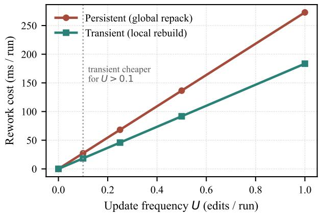

(b) Stable direct calls favour persistent  
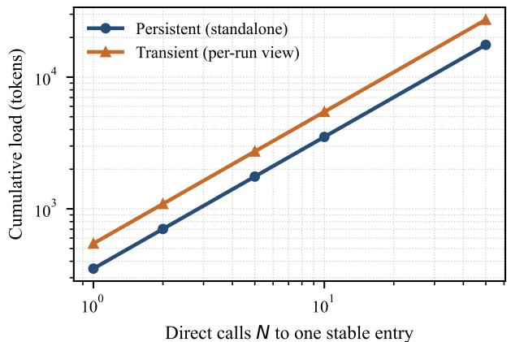  
Fi<sub>g</sub>. 12. Which lifec<sub>y</sub>cle is cheaper depends on the workload; both <sub>p</sub>anels are drawn from the deterministic swee<sub>p</sub>s of Table XX. (a) As the edit rate � rises, a ersistent lobal re ack (which re-audits the whole bundle) costs more rework er run than a transient local rebuild (which touches onl the afected view); the<sub>y</sub> tie for a stable bundle $\scriptstyle ( U = 0 )$ <sub>,</sub> <sub>an</sub>d t<sub>rans</sub>i<sub>en</sub>t i<sub>s</sub> <sub>c</sub>h<sub>eaper</sub> f<sub>or</sub> $U > 0 . 1 . \ ( \mathbf { b } )$ F<sub>or</sub> <sub>repea</sub>t<sub>e</sub>d di<sub>rec</sub>t <sub>ca</sub>ll<sub>s</sub> t<sub>o</sub> <sub>one</sub> <sub>s</sub>t<sub>a</sub>bl<sub>e</sub> <sub>pu</sub>bli<sub>c</sub> <sub>en</sub>t<sub>ry,</sub> <sub>a</sub> <sub>s</sub>t<sub>an</sub>d<sub>a</sub>l<sub>one-preserv</sub>i<sub>ng</sub> ersistent bundle a s its com ression once and sta s below a er-run transient view at ever call count � (lo –lo axes). Read to ether: a stable, heavil <sub>ca</sub>ll<sub>e</sub>d b<sub>un</sub>dl<sub>e wan</sub>t<sub>s pers</sub>i<sub>s</sub>t<sub>en</sub>t<sub>; a</sub> f<sub>requen</sub>tl<sub>y e</sub>dit<sub>e</sub>d <sub>one wan</sub>t<sub>s</sub> t<sub>rans</sub>i<sub>en</sub>t<sub>.</sub>

TABLE XXI  
Tra<sub>ns</sub>ie<sub>n</sub>t-<sub>v</sub>ie<sub>w</sub> <sub>cos</sub>t<sub>.</sub> C<sub>losure</sub> <sub>and</sub> V<sub>iew</sub> <sub>are</sub> <sub>tokens</sub> <sub>before</sub> <sub>and</sub> <sub>after</sub> <sub>compression.</sub> C<sub>old,</sub> W<sub>arm,</sub> <sub>and</sub> A<sub>mort.</sub> <sub>report</sub> <sub>build</sub> <sub>latency;</sub> B<sub>uilt</sub> <sub>marks</sub> <sub>a</sub> <sub>smaller</sub> <sub>view,</sub> <sub>and</sub> C<sub>anon.</sub> <sub>confirms</sub> <sub>that</sub> <sub>the</sub> <sub>canonical</sub> <sub>bundle</sub> <sub>is</sub> <sub>unchanged.</sub>
<table><tr><td>Entry</td><td>Kind</td><td>Closure</td><td>View</td><td>Run saving ↑</td><td>Cold ms ↓</td><td>Warm ms ↓</td><td>Amort. ms ↓</td><td>Built</td><td>Canon.</td></tr><tr><td>SKILL.md</td><td>publ</td><td>493</td><td>371</td><td>24.8%</td><td>218</td><td>0.34</td><td>22.1</td><td>√</td><td>√</td></tr><tr><td>sub/SKILL.md</td><td>publ</td><td>548</td><td>545</td><td>0.5%</td><td>173</td><td>1.53</td><td>18.7</td><td>√</td><td>√</td></tr><tr><td>references/algebra.md</td><td>cond</td><td>532</td><td>529</td><td>0.6%</td><td>155</td><td>0.23</td><td>15.7</td><td>√</td><td>√</td></tr><tr><td>references  $/ { \tt e d g e \_ c a s e s . m d }$ </td><td>cond</td><td>513</td><td>505</td><td>1.6%</td><td>153</td><td>0.29</td><td>15.5</td><td>√</td><td>√</td></tr><tr><td> $\mathtt { r e f e r e n c e s / g e o m e t r y . m d }$ </td><td>cond</td><td>489</td><td>489</td><td>0.0%</td><td>244</td><td>0.54</td><td>24.9</td><td>x</td><td>√</td></tr><tr><td>references/numbe  $\mathtt { r \_ t h e o r y . m d }$ </td><td>cond</td><td>483</td><td>478</td><td>1.0%</td><td>157</td><td>0.56</td><td>16.2</td><td>√</td><td>√</td></tr></table>

Witnessed com<sub>p</sub>ression <sub>p</sub>rotects semantic and interface-<sub>cr</sub>iti<sub>ca</sub>l <sub>con</sub>t<sub>en</sub>t<sub>.</sub> W<sub>e recompress</sub> th<sub>e</sub> id<sub>en</sub>ti<sub>ca</sub>l b<sub>un</sub>dl<sub>e w</sub>hil<sub>e</sub> i<sub>n</sub>t<sub>ro</sub>d<sub>uc</sub>i<sub>ng</sub> th<sub>e</sub> <sub>sa</sub>f<sub>eguar</sub>d<sub>s</sub> <sub>o</sub>f S<sub>ec</sub>ti<sub>on</sub> IV<sub>-</sub>D i<sub>ncremen</sub>t<sub>a</sub>ll<sub>y.</sub> E<sub>xemp</sub>ti<sub>on-</sub>b<sub>ear</sub>i<sub>ng</sub> <sub>un</sub>it<sub>s</sub> <sub>are</sub> l<sub>oc</sub>k<sub>e</sub>d <sub>as</sub> <sub>c</sub>l<sub>ass</sub> C1<sub>;</sub> <sub>o</sub>bli<sub>ga</sub>ti<sub>on-</sub> b<sub>ear</sub>i<sub>ng</sub> <sub>un</sub>it<sub>s</sub> <sub>are</sub> <sub>res</sub>t<sub>ore</sub>d t<sub>o</sub> th<sub>e</sub> <sub>requ</sub>i<sub>re</sub>d <sub>c</sub>l<sub>ass</sub> C2<sub>,</sub> <sub>so</sub> th<sub>ey</sub> <sub>can</sub> b<sub>e</sub> <sub>mo</sub>difi<sub>e</sub>d <sub>on</sub>l<sub>y</sub> th<sub>roug</sub>h <sub>w</sub>it<sub>nesse</sub>d t<sub>rans</sub>f<sub>orma</sub>ti<sub>ons;</sub> <sub>an</sub>d th<sub>e</sub> <sub>ou</sub>t<sub>pu</sub>t i<sub>n</sub>t<sub>er</sub>f<sub>ace</sub> i<sub>s re-em</sub>itt<sub>e</sub>d <sub>as one con</sub>ti<sub>guous, ver</sub>b<sub>a</sub>ti<sub>m</sub> C0 <sub>span.</sub> A <sub>remova</sub>l i<sub>s</sub> <sub>accep</sub>t<sub>e</sub>d <sub>on</sub>l<sub>y</sub> <sub>w</sub>h<sub>en</sub> <sub>suppor</sub>t<sub>e</sub>d b<sub>y</sub> <sub>a</sub> l<sub>ogge</sub>d <sub>w</sub>it<sub>ness:</sub> $W _ { 1 }$ f<sub>or</sub> lit<sub>era</sub>l <sub>con</sub>t<sub>a</sub>i<sub>nmen</sub>t<sub>,</sub> $W _ { 2 }$ <sup>for</sup> <sup>co</sup>v<sup>era</sup>g<sup>e-</sup>p<sup>reser</sup>v<sup>in</sup>g t<sub>rans</sub>f<sub>orma</sub>ti<sub>ons, or</sub> $W _ { 3 }$ f<sub>or en</sub>t<sub>a</sub>il<sub>men</sub>t <sub>w</sub>ithi<sub>n ev</sub>id<sub>ence segmen</sub>t<sub>s</sub> th<sub>a</sub>t <sub>con</sub>t<sub>a</sub>i<sub>n no</sub> b<sub>oun</sub>d<sub>ary mar</sub>k<sub>er.</sub>

B<sub>ecause</sub> th<sub>e pro</sub>d<sub>uc</sub>ti<sub>on</sub> h<sub>arness may vary</sub> b<sub>e</sub>t<sub>ween sess</sub>i<sub>ons,</sub> <sub>eac</sub>h <sub>compresse</sub>d <sub>con</sub>fi<sub>gura</sub>ti<sub>on</sub> i<sub>s</sub> <sub>eva</sub>l<sub>ua</sub>t<sub>e</sub>d <sub>aga</sub>i<sub>ns</sub>t <sub>an</sub> <sub>uncom-</sub> <sub>presse</sub>d b<sub>un</sub>dl<sub>e</sub> i<sub>n</sub> th<sub>e same sess</sub>i<sub>on.</sub> Th<sub>e</sub> fi<sub>rs</sub>t <sub>uncompresse</sub>d r<sub>ow</sub> in T<sub>a</sub>bl<sub>e</sub> XXIII th<sub>e</sub>r<sub>e</sub>f<sub>o</sub>r<sub>e</sub> r<sub>epo</sub>rt<sub>s</sub> 88<sub>.</sub>00%<sub>, w</sub>hil<sub>e</sub> th<sub>e</sub> t<sub>wo</sub> <sub>sess</sub>i<sub>ons use</sub>d b<sub>y</sub> th<sub>e</sub> fi<sub>na</sub>l <sub>con</sub>fi<sub>gura</sub>ti<sub>on</sub> h<sub>ave uncompresse</sub>d b<sub>ase</sub>li<sub>nes o</sub>f 92<sub>.</sub>00% <sub>an</sub>d 91<sub>.</sub>00%<sub>.</sub> F<sub>or re</sub>f<sub>erence,</sub> th<sub>e s</sub>t<sub>an</sub>d<sub>a</sub>l<sub>one</sub> <sub>o</sub>fi<sub>c</sub>i<sub>a</sub>l <sub>eva</sub>l<sub>ua</sub>ti<sub>on o</sub>f th<sub>e same uncompresse</sub>d b<sub>un</sub>dl<sub>e repor</sub>t<sub>s</sub> 90<sub>.</sub>91%<sub>.</sub> T<sub>a</sub>bl<sub>e</sub> XXIII <sub>s</sub>h<sub>ows</sub> h<sub>ow</sub> <sub>co</sub>m<sub>p</sub>r<sub>ess</sub>i<sub>o</sub>n <sub>c</sub>h<sub>a</sub>n<sub>ges</sub> <sub>as</sub> th<sub>e</sub> <sub>pro</sub>t<sub>ec</sub>ti<sub>on mec</sub>h<sub>an</sub>i<sub>sms are</sub> i<sub>n</sub>t<sub>ro</sub>d<sub>uce</sub>d<sub>.</sub>

Th<sub>e</sub> i<sub>ncremen</sub>t<sub>a</sub>l <sub>compar</sub>i<sub>son</sub> <sub>suppor</sub>t<sub>s</sub> f<sub>our</sub> fi<sub>n</sub>di<sub>ngs.</sub>

First<sub>,</sub> stron<sub>g</sub>er witnesses ex<sub>p</sub>and the amount of content that can be remo<sub>v</sub>ed safel<sub>y.</sub> With C1/C2 <sub>p</sub>r<sub>o</sub>t<sub>ec</sub>ti<sub>o</sub>n <sub>a</sub>nd <sub>o</sub>nl<sub>y</sub> $W _ { 1 }$ <sub>an</sub>d $W _ { 2 }$ <sub>,</sub> S<sub>kill</sub>Z<sub>ip</sub> P<sub>ro</sub> <sub>re</sub>d<sub>uces</sub> th<sub>e</sub> d<sub>ep</sub>l<sub>oye</sub>d b<sub>un</sub>dl<sub>e</sub> b<sub>y</sub>

TABLE XXII  
L<sub>ifecycle</sub> a<sub>bl</sub>a<sub>tions.</sub> E<sub>ach</sub> <sub>row</sub> <sub>removes</sub> <sub>one</sub> <sub>safeguard</sub> <sub>and</sub> <sub>reports</sub> <sub>the</sub> <sub>protected</sub> <sub>metric</sub> <sub>and</sub> <sub>resulting</sub> <sub>failure.</sub>
<table><tr><td>Removed safeguard</td><td>Metric</td><td>Intact</td><td>Ablated</td><td>What breaks</td></tr><tr><td>– Entry-type labels</td><td>mean public independence (math/structured)</td><td>1.000</td><td>0.500</td><td>public entries lose content the root happens to cover</td></tr><tr><td>– Multi-entry audit</td><td>all public entries discoverable (0/1)</td><td>1.000</td><td>0.000</td><td>a public sub-entry is renamed and no longer callable</td></tr><tr><td>– Dependency closure</td><td>dependency files reachable from the entry in its view</td><td>11</td><td>1</td><td>the view omits every reference the entry routes to</td></tr><tr><td>– Host-context supplement</td><td>mean conditional-entry independence (math- /structured)</td><td>1.000</td><td>0.887</td><td>content assumed covered by the host is deleted, then truly lost</td></tr><tr><td>– View cache</td><td>mean build ms/call over 20 calls</td><td>18.7</td><td>173.4</td><td>every call rebuilds the same view from scratch</td></tr><tr><td>– Global repack</td><td>deploy token ratio, lower is better (math/struc- tured)</td><td>0.845</td><td>0.959</td><td>cross-file duplication is never removed; only per- file gains remain</td></tr></table>

## TABLE XXIII

P<sub>roduction</sub> <sub>evaluation</sub> <sub>under</sub> <sub>the</sub> <sub>service</sub>’<sub>s</sub> <sub>native</sub> <sub>execution</sub> <sub>harness.</sub> D<sub>eployment</sub> <sub>saving</sub> <sub>is</sub> <sub>measured</sub> <sub>over</sub> <sub>the</sub> <sub>shipped</sub> <sub>bundle.</sub> P<sub>er-run</sub> <sub>saving</sub> <sub>is</sub> <sub>task-paired</sub> <sub>within</sub> <sub>the</sub> <sub>same</sub> <sub>session</sub> <sub>over</sub> 100 <sub>tasks;</sub> <sub>the</sub> <sub>final</sub> <sub>row</sub> pools two sessions (�=200). Accuracy and false positives are measured <sub>on</sub> <sub>the</sub> <sub>corresponding</sub> <sub>full</sub> <sub>evaluation</sub> <sub>set.</sub> T<sub>he</sub> <sub>relevant</sub> <sub>uncompressed</sub> <sub>session baselines are</sub> 88<sub>.</sub>00%<sub>,</sub> 92<sub>.</sub>00%<sub>, and</sub> 91<sub>.</sub>00%<sub>.</sub>
<table><tr><td>Configuration</td><td>Deployment ↑</td><td>Measured per run ↑</td><td>Accuracy ↑</td><td>FP ↓</td><td>Interface contract ↑</td></tr><tr><td>Uncompressed</td><td>+0.0%</td><td>+0.0%</td><td>88.00%</td><td>10</td><td>contiguous</td></tr><tr><td>Pro, no protection classes X</td><td>+71.4%</td><td></td><td>70.00% / 62.00%</td><td>29 /  35</td><td>contiguous</td></tr><tr><td>Pro + C1/C2 (W1, W2 only)</td><td>+13.8%</td><td>+7.1%</td><td>89.00%</td><td></td><td>fragmented</td></tr><tr><td>Pro + W3 entailment witness</td><td>+32.7%</td><td>+6.8%</td><td>88.00%</td><td>910</td><td>fragmented</td></tr><tr><td>Pro + W3 + C0 contract restore</td><td>+32.2%</td><td>+6.1%</td><td>89.00%</td><td>9</td><td>contiguous</td></tr><tr><td>Pro + W3 inside the root (v3)</td><td>+38.1%</td><td>+10.4% (n=200)</td><td>89.00%</td><td>9</td><td>contiguous</td></tr></table>

13<sub>.</sub>8% <sub>an</sub>d <sub>ac</sub>hi<sub>eves</sub> 89<sub>.</sub>00% <sub>accuracy,</sub> <sub>one</sub> t<sub>as</sub>k <sub>a</sub>b<sub>ove</sub> th<sub>e</sub> <sub>pa</sub>i<sub>re</sub>d <sub>uncompresse</sub>d <sub>resu</sub>lt<sub>, w</sub>ith <sub>one</sub> f<sub>ewer</sub> f<sub>a</sub>l<sub>se pos</sub>iti<sub>ve.</sub> F<sub>ur</sub>th<sub>er can</sub>did<sub>a</sub>t<sub>es canno</sub>t <sub>pass</sub> th<sub>ese</sub> d<sub>e</sub>t<sub>erm</sub>i<sub>n</sub>i<sub>s</sub>ti<sub>c c</sub>h<sub>ec</sub>k<sub>s</sub> b<sub>ecause</sub> th<sub>e</sub>i<sub>r re</sub>d<sub>un</sub>d<sub>ancy</sub> i<sub>s seman</sub>ti<sub>c ra</sub>th<sub>er</sub> th<sub>an</sub> lit<sub>era</sub>l<sub>.</sub> Addi<sub>ng</sub> th<sub>e res</sub>t<sub>r</sub>i<sub>c</sub>t<sub>e</sub>d $W _ { 3 }$ <sub>en</sub>t<sub>a</sub>il<sub>men</sub>t <sub>w</sub>it<sub>ness</sub> i<sub>ncreases</sub> d<sub>ep</sub>l<sub>oymen</sub>t <sub>sav</sub>i<sub>ng</sub> t<sub>o</sub> 32<sub>.</sub>7%<sub>.</sub> Th<sub>e resu</sub>lti<sub>ng accuracy an</sub>d <sub>con</sub>f<sub>us</sub>i<sub>on ma</sub>t<sub>r</sub>i<sub>x</sub> <sub>are</sub> id<sub>e</sub>nti<sub>ca</sub>l t<sub>o</sub> th<sub>ose o</sub>f th<sub>e pa</sub>i<sub>re</sub>d <sub>uncompresse</sub>d b<sub>un</sub>dl<sub>e.</sub> E<sub>ac</sub>h <sub>o</sub>f th<sub>e</sub> 106 <sub>remove</sub>d <sub>re</sub>f<sub>erence segmen</sub>t<sub>s</sub> h<sub>as a</sub> l<sub>ogge</sub>d <sub>en</sub>t<sub>a</sub>il<sub>men</sub>t <sub>ver</sub>di<sub>c</sub>t<sub>, an</sub>d <sub>none c</sub>h<sub>anges a</sub> d<sub>ec</sub>i<sub>s</sub>i<sub>on on</sub> th<sub>e</sub> 100<sub>-</sub>t<sub>as</sub>k <sub>eva</sub>l<sub>ua</sub>ti<sub>on.</sub> Th<sub>e</sub> i<sub>ncrease</sub> i<sub>n sav</sub>i<sub>ng</sub> th<sub>ere</sub>f<sub>ore comes</sub> f<sub>rom s</sub>t<sub>ronger ev</sub>id<sub>ence</sub> f<sub>or remova</sub>l<sub>, no</sub>t f<sub>rom re</sub>l<sub>ax</sub>i<sub>ng</sub> th<sub>e accep</sub>t<sub>ance cr</sub>it<sub>er</sub>i<sub>a.</sub>

Second<sub>,</sub> interface inte<sub>g</sub>rit<sub>y</sub> must be evaluated se<sub>p</sub>aratel<sub>y</sub> f<sub>rom</sub> t<sub>as</sub>k <sub>accuracy.</sub> Th<sub>e</sub> <sub>con</sub>fi<sub>gura</sub>ti<sub>on</sub> <sub>us</sub>i<sub>ng</sub> �<sub>3 a</sub>l<sub>one</sub> l<sub>eaves</sub> th<sub>e ou</sub>t<sub>pu</sub>t <sub>con</sub>t<sub>rac</sub>t fr<sub>ag</sub>m<sub>e</sub>nt<sub>e</sub>d b<sub>ecause</sub> th<sub>e</sub> fi<sub>xe</sub>d<sub>-</sub>t<sub>emp</sub>l<sub>a</sub>t<sub>e</sub> <sub>ren</sub>d<sub>erer</sub> di<sub>s</sub>t<sub>r</sub>ib<sub>u</sub>t<sub>es</sub> it<sub>s</sub> <sub>componen</sub>t<sub>s</sub> <sub>across</sub> <sub>separa</sub>t<sub>e</sub> <sub>sec</sub>ti<sub>ons.</sub> Th<sub>e</sub> C0 r<sub>es</sub>t<sub>o</sub>r<sub>a</sub>ti<sub>o</sub>n <sub>pass</sub> r<sub>eco</sub>n<sub>s</sub>tr<sub>uc</sub>t<sub>s</sub> <sub>a</sub> <sub>s</sub>in<sub>g</sub>l<sub>e</sub> <sub>co</sub>nti<sub>guous</sub> <sub>spa</sub>n <sub>con</sub>t<sub>a</sub>i<sub>n</sub>i<sub>ng</sub> b<sub>o</sub>th <sub>wor</sub>k<sub>e</sub>d <sub>examp</sub>l<sub>es an</sub>d th<sub>e</sub> l<sub>a</sub>b<sub>e</sub>l <sub>w</sub>hit<sub>e</sub>li<sub>s</sub>t<sub>, w</sub>hil<sub>e</sub> <sub>remov</sub>i<sub>ng res</sub>id<sub>ua</sub>l <sub>sca</sub>f<sub>o</sub>ldi<sub>ng.</sub> Thi<sub>s repa</sub>i<sub>r re</sub>d<sub>uces</sub> d<sub>ep</sub>l<sub>oymen</sub>t <sub>sav</sub>i<sub>ng on</sub>l<sub>y s</sub>li<sub>g</sub>htl<sub>y,</sub> f<sub>rom</sub> 32<sub>.</sub>7% t<sub>o</sub> 32<sub>.</sub>2%<sub>.</sub> A<sub>ccuracy c</sub>h<sub>anges</sub> f<sub>rom</sub> 88<sub>.</sub>00% t<sub>o</sub> 89<sub>.</sub>00%<sub>, w</sub>hi<sub>c</sub>h i<sub>s</sub> i<sub>nsu</sub>fi<sub>c</sub>i<sub>en</sub>t t<sub>o a</sub>tt<sub>r</sub>ib<sub>u</sub>t<sub>e</sub> <sub>an accuracy</sub> b<sub>ene</sub>fit t<sub>o con</sub>ti<sub>gu</sub>it<sub>y a</sub>l<sub>one.</sub> Th<sub>e re</sub>l<sub>evan</sub>t <sub>resu</sub>lt i<sub>s</sub> i<sub>ns</sub>t<sub>ea</sub>d th<sub>a</sub>t th<sub>e pu</sub>bli<sub>s</sub>h<sub>e</sub>d b<sub>un</sub>dl<sub>e once aga</sub>i<sub>n exposes</sub> th<sub>e</sub> <sub>comp</sub>l<sub>e</sub>t<sub>e con</sub>t<sub>rac</sub>t i<sub>n</sub> th<sub>e</sub> f<sub>orm expec</sub>t<sub>e</sub>d b<sub>y</sub> it<sub>s consumer, an</sub>d th<sub>a</sub>t thi<sub>s proper</sub>t<sub>y</sub> i<sub>s now c</sub>h<sub>ec</sub>k<sub>e</sub>d <sub>exp</sub>li<sub>c</sub>itl<sub>y.</sub>

Third<sub>,</sub> com<sub>p</sub>ressin<sub>g</sub> the re<sub>p</sub>eatedl<sub>y</sub> loaded root <sub>p</sub>rod<sub>u</sub>ces th<sub>e</sub> l<sub>a</sub>r<sub>ges</sub>t r<sub>u</sub>ntim<sub>e</sub> b<sub>e</sub>n<sub>e</sub>fit<sub>.</sub> B<sub>ecause</sub> th<sub>e</sub> <sub>roo</sub>t i<sub>s</sub> <sub>processe</sub>d th<sub>roug</sub>h<sub>ou</sub>t <sub>approx</sub>i<sub>ma</sub>t<sub>e</sub>l<sub>y</sub> 13 <sub>reason</sub>i<sub>ng</sub> <sub>roun</sub>d<sub>s,</sub> <sub>remov</sub>i<sub>ng</sub> <sub>one</sub> <sub>roo</sub>t t<sub>o</sub>k<sub>en</sub> <sub>saves</sub> <sub>roug</sub>hl<sub>y</sub> fi<sub>ve</sub> t<sub>o</sub> <sub>s</sub>i<sub>x</sub> ti<sub>mes</sub> <sub>as</sub> <sub>many</sub> <sub>measure</sub>d <sub>run</sub>ti<sub>me</sub> t<sub>o</sub>k<sub>ens as remov</sub>i<sub>ng one</sub> t<sub>o</sub>k<sub>en</sub> f<sub>rom an on-</sub>d<sub>eman</sub>d <sub>re</sub>f<sub>erence.</sub> W<sub>e</sub> th<sub>ere</sub>f<sub>ore a</sub>ll<sub>ow res</sub>t<sub>r</sub>i<sub>c</sub>t<sub>e</sub>d $W _ { 3 }$ <sub>w</sub>it<sub>nesses</sub> i<sub>ns</sub>id<sub>e</sub> th<sub>e</sub> <sub>roo</sub>t<sub>,</sub> <sub>w</sub>hil<sub>e</sub> <sub>con</sub>ti<sub>nu</sub>i<sub>ng</sub> t<sub>o</sub> <sub>pro</sub>t<sub>ec</sub>t f<sub>ron</sub>t<sub>ma</sub>tt<sub>er,</sub> i<sub>n</sub>t<sub>er</sub>f<sub>ace</sub> <sub>con</sub>t<sub>rac</sub>t<sub>s, an</sub>d b<sub>oun</sub>d<sub>ary-</sub>b<sub>ear</sub>i<sub>ng segmen</sub>t<sub>s.</sub> T<sub>wo can</sub>did<sub>a</sub>t<sub>e</sub> d<sub>e</sub>l<sub>e</sub>ti<sub>ons are a</sub>l<sub>so pro</sub>hibit<sub>e</sub>d f<sub>rom serv</sub>i<sub>ng as w</sub>it<sub>nesses</sub> f<sub>or</sub> <sub>eac</sub>h <sub>o</sub>th<sub>er.</sub> Thi<sub>s con</sub>fi<sub>gura</sub>ti<sub>on removes</sub> 38<sub>.</sub>1% <sub>o</sub>f th<sub>e</sub> d<sub>ep</sub>l<sub>oye</sub>d b<sub>un</sub>dl<sub>e</sub> <sub>an</sub>d <sub>re</sub>d<sub>uces</sub> <sub>poo</sub>l<sub>e</sub>d<sub>,</sub> t<sub>as</sub>k<sub>-pa</sub>i<sub>re</sub>d <sub>run</sub>ti<sub>me</sub> t<sub>o</sub>k<sub>ens</sub> b<sub>y</sub> 10.4% over �=200 audits. Both com<sub>p</sub>ressed runs achieve 89<sub>.</sub>00% <sub>accuracy, compare</sub>d <sub>w</sub>ith <sub>same-sess</sub>i<sub>on uncompresse</sub>d b<sub>ase</sub>lin<sub>es o</sub>f 92<sub>.</sub>00% <sub>a</sub>nd 91<sub>.</sub>00%<sub>.</sub>

Fourth<sub>,</sub> static cost estimates do not full<sub>y</sub> ca<sub>p</sub>ture chan<sub>g</sub>es in <sub>age</sub>nt <sub>execu</sub>ti<sub>o</sub>n<sub>.</sub> Th<sub>e</sub> l<sub>oa</sub>di<sub>ng-we</sub>i<sub>g</sub>ht <sub>mo</sub>d<sub>e</sub>l <sub>o</sub>f S<sub>ec</sub>ti<sub>on</sub> III <sub>pre</sub>di<sub>c</sub>t<sub>s approx</sub>i<sub>ma</sub>t<sub>e</sub>l<sub>y</sub> 3% <sub>per-run sav</sub>i<sub>ng, w</sub>h<sub>ereas pa</sub>i<sub>re</sub>d <sub>pro</sub>d<sub>uc</sub>ti<sub>on measuremen</sub>t<sub>s range</sub> f<sub>rom</sub> 6% t<sub>o</sub> 11%<sub>.</sub> A <sub>s</sub>h<sub>or</sub>t<sub>er</sub> <sub>roo</sub>t <sub>c</sub>h<sub>anges no</sub>t <sub>on</sub>l<sub>y</sub> th<sub>e num</sub>b<sub>er o</sub>f l<sub>oa</sub>d<sub>e</sub>d t<sub>o</sub>k<sub>ens</sub> b<sub>u</sub>t <sub>a</sub>l<sub>so</sub> th<sub>e agen</sub>t’<sub>s rea</sub>di<sub>ng an</sub>d <sub>repea</sub>t<sub>e</sub>d<sub>-reason</sub>i<sub>ng</sub> b<sub>e</sub>h<sub>av</sub>i<sub>or, ne</sub>ith<sub>er</sub> <sub>o</sub>f <sub>w</sub>hi<sub>c</sub>h i<sub>s represen</sub>t<sub>e</sub>d b<sub>y</sub> th<sub>e s</sub>t<sub>a</sub>ti<sub>c mo</sub>d<sub>e</sub>l<sub>.</sub> A 30<sub>-</sub>t<sub>as</sub>k <sub>p</sub>il<sub>o</sub>t <sub>var</sub>i<sub>es</sub> f<sub>rom</sub> 6% t<sub>o</sub> 14% <sub>across</sub> d<sub>ays, w</sub>hil<sub>e</sub> t<sub>wo</sub> 100<sub>-</sub>t<sub>as</sub>k <sub>pa</sub>i<sub>re</sub>d <sub>runs pro</sub>d<sub>uce</sub> 9<sub>.</sub>5% <sub>an</sub>d 11<sub>.</sub>3%<sub>, y</sub>i<sub>e</sub>ldi<sub>ng</sub> th<sub>e poo</sub>l<sub>e</sub>d <sub>resu</sub>lt <sub>o</sub>f 10<sub>.</sub>4%<sub>.</sub> Th<sub>e s</sub>t<sub>a</sub>ti<sub>c mo</sub>d<sub>e</sub>l i<sub>s conserva</sub>ti<sub>ve</sub> i<sub>n</sub> thi<sub>s</sub> d<sub>ep</sub>l<sub>oymen</sub>t<sub>,</sub> b<sub>u</sub>t <sub>run</sub>ti<sub>me c</sub>l<sub>a</sub>i<sub>ms s</sub>h<sub>ou</sub>ld b<sub>e</sub> b<sub>ase</sub>d <sub>on pa</sub>i<sub>re</sub>d <sub>measuremen</sub>t<sub>s</sub> <sub>co</sub>ll<sub>ec</sub>t<sub>e</sub>d <sub>w</sub>ithi<sub>n</sub> th<sub>e same execu</sub>ti<sub>on sess</sub>i<sub>on.</sub>

## Takeaway

O<sub>n</sub> th<sub>e pro</sub>d<sub>uc</sub>ti<sub>on mo</sub>d<sub>era</sub>ti<sub>on s</sub>kill<sub>, w</sub>it<sub>nesse</sub>d <sub>compress</sub>i<sub>on</sub> <sub>removes</sub> 38<sub>.</sub>1% <sub>o</sub>f th<sub>e</sub> d<sub>ep</sub>l<sub>oye</sub>d b<sub>un</sub>dl<sub>e an</sub>d 10<sub>.</sub>4% <sub>o</sub>f <sub>poo</sub>l<sub>e</sub>d<sub>,</sub> t<sub>as</sub>k<sub>-pa</sub>i<sub>re</sub>d <sub>run</sub>ti<sub>me</sub> t<sub>o</sub>k<sub>ens</sub> <sub>w</sub>hil<sub>e</sub> k<sub>eep</sub>i<sub>ng</sub> <sub>accuracy</sub> <sub>w</sub>ithi<sub>n</sub> th<sub>e</sub> <sub>o</sub>b<sub>serve</sub>d <sub>var</sub>i<sub>a</sub>ti<sub>on o</sub>f th<sub>e uncompresse</sub>d <sub>sys</sub>t<sub>em.</sub> I<sub>n con</sub>t<sub>ras</sub>t<sub>,</sub> th<sub>e</sub> <sub>unpro</sub>t<sub>ec</sub>t<sub>e</sub>d 71<sub>.</sub>4<sub>–</sub>75<sub>.</sub>8% <sub>con</sub>fi<sub>gura</sub>ti<sub>ons</sub> l<sub>ose</sub> 18<sub>–</sub>26 <sub>accu</sub>r<sub>acy</sub> <sub>po</sub>i<sub>n</sub>t<sub>s, pr</sub>i<sub>mar</sub>il<sub>y</sub> th<sub>roug</sub>h <sub>a</sub>dditi<sub>ona</sub>l f<sub>a</sub>l<sub>se pos</sub>iti<sub>ves.</sub>

INSIGHT 5 ★ The safe compression limit is determined by th<sub>e ev</sub>id<sub>e</sub>n<sub>ce ava</sub>il<sub>a</sub>bl<sub>e</sub> f<sub>o</sub>r <sub>eac</sub>h r<sub>e</sub>m<sub>ova</sub>l<sub>.</sub> Lit<sub>era</sub>l <sub>an</sub>d <sub>cover-</sub> <sub>age w</sub>it<sub>nesses prov</sub>id<sub>e on</sub>l<sub>y</sub> 13<sub>.</sub>8% d<sub>ep</sub>l<sub>oymen</sub>t <sub>sav</sub>i<sub>ng, w</sub>hil<sub>e</sub> <sub>res</sub>t<sub>r</sub>i<sub>c</sub>t<sub>e</sub>d <sub>en</sub>t<sub>a</sub>il<sub>men</sub>t <sub>w</sub>it<sub>nesses ra</sub>i<sub>se</sub> it t<sub>o</sub> 32<sub>.</sub>7%<sub>; ex</sub>t<sub>en</sub>di<sub>ng</sub> th<sub>e</sub> <sub>same</sub> <sub>w</sub>it<sub>nesse</sub>d <sub>reason</sub>i<sub>ng</sub> t<sub>o</sub> th<sub>e</sub> <sub>repea</sub>t<sub>e</sub>dl<sub>y</sub> l<sub>oa</sub>d<sub>e</sub>d <sub>roo</sub>t <sub>ra</sub>i<sub>ses</sub> th<sub>e</sub> fi<sub>na</sub>l <sub>sav</sub>i<sub>ng</sub> t<sub>o</sub> 38<sub>.</sub>1%<sub>.</sub> Th<sub>e</sub> b<sub>ene</sub>fit i<sub>s a</sub>l<sub>so amp</sub>lifi<sub>e</sub>d <sub>a</sub>t <sub>execu</sub>ti<sub>on</sub> ti<sub>me: a</sub>lth<sub>oug</sub>h th<sub>e s</sub>t<sub>a</sub>ti<sub>c</sub> l<sub>oa</sub>di<sub>ng mo</sub>d<sub>e</sub>l <sub>pre</sub>di<sub>c</sub>t<sub>s</sub> <sub>on</sub>l<sub>y</sub> 3% <sub>per-run</sub> <sub>sav</sub>i<sub>ng,</sub> th<sub>e</sub> <sub>pro</sub>d<sub>uc</sub>ti<sub>on</sub> <sub>eng</sub>i<sub>ne</sub> <sub>measures</sub> 6<sub>–</sub> 11% b<sub>ecause s</sub>h<sub>or</sub>t<sub>er roo</sub>t <sub>con</sub>t<sub>ex</sub>t <sub>re</sub>d<sub>uces wor</sub>k <sub>across repea</sub>t<sub>e</sub>d <sub>reason</sub>i<sub>ng roun</sub>d<sub>s.</sub> I<sub>n</sub>d<sub>us</sub>t<sub>r</sub>i<sub>a</sub>l <sub>compress</sub>i<sub>on s</sub>h<sub>ou</sub>ld th<sub>ere</sub>f<sub>ore</sub> b<sub>e</sub> both proof-bound and execution-aware: remove content only <sub>w</sub>h<sub>en</sub> it<sub>s re</sub>d<sub>un</sub>d<sub>ancy</sub> i<sub>s w</sub>it<sub>nesse</sub>d<sub>, an</sub>d <sub>pr</sub>i<sub>or</sub>iti<sub>ze</sub> th<sub>e con</sub>t<sub>ex</sub>t t<sup>h</sup>at t<sup>h</sup>e a<sub>g</sub>ent re<sub>p</sub>eate<sup>dl</sup><sub>y</sub> <sub>p</sub>rocesses.

## VII<sub>.</sub> C<sub>onclusion</sub>

S<sub>kill</sub>Z<sub>ip</sub> P<sub>ro compresses</sub> th<sub>e progress</sub>i<sub>ve</sub>l<sub>y</sub> l<sub>oa</sub>d<sub>e</sub>d <sub>s</sub>kill b<sub>un</sub>dl<sub>es use</sub>d b<sub>y pro</sub>d<sub>uc</sub>ti<sub>on agen</sub>t<sub>s,</sub> i<sub>nc</sub>l<sub>u</sub>di<sub>ng</sub> i<sub>ns</sub>t<sub>ruc</sub>ti<sub>ons,</sub> <sub>re</sub>f<sub>erences, su</sub>b<sub>s</sub>kill<sub>s, co</sub>d<sub>e,</sub> d<sub>a</sub>t<sub>a, an</sub>d <sub>asse</sub>t<sub>s.</sub> H<sub>os</sub>t <sub>en</sub>t<sub>a</sub>il<sub>men</sub>t<sub>,</sub> <sub>ac</sub>ti<sub>va</sub>ti<sub>on-scope</sub>d <sub>s</sub>h<sub>ar</sub>i<sub>ng,</sub> <sub>an</sub>d <sub>con</sub>diti<sub>ona</sub>l <sub>capsu</sub>l<sub>es</sub> <sub>remove</sub> <sub>cross-</sub>fil<sub>e</sub> <sub>re</sub>d<sub>un</sub>d<sub>ancy</sub> <sub>w</sub>ith<sub>ou</sub>t i<sub>ncreas</sub>i<sub>ng</sub> <sub>ac</sub>ti<sub>va</sub>ti<sub>on</sub> <sub>or</sub> <sub>pa</sub>th <sub>cos</sub>t<sub>.</sub> B<sub>e</sub>f<sub>ore pu</sub>bli<sub>ca</sub>ti<sub>on, a</sub> t<sub>ransac</sub>ti<sub>ona</sub>l di<sub>s</sub>k <sub>au</sub>dit <sub>ver</sub>ifi<sub>es rou</sub>ti<sub>ng,</sub> t<sub>ype</sub>d <sub>con</sub>t<sub>rac</sub>t<sub>s,</sub> <sub>scope,</sub> i<sub>n</sub>t<sub>er</sub>f<sub>ace</sub> i<sub>n</sub>t<sub>egr</sub>it<sub>y,</sub> <sub>an</sub>d l<sub>oc</sub>k<sub>e</sub>d <sub>con</sub>t<sub>en</sub>t<sub>.</sub>

Th<sub>e comp</sub>il<sub>er suppor</sub>t<sub>s</sub> t<sub>wo</sub> i<sub>n</sub>d<sub>epen</sub>d<sub>en</sub>t <sub>c</sub>h<sub>o</sub>i<sub>ces.</sub> On<sub>e-</sub>Sh<sub>o</sub>t <sub>compress</sub>i<sub>on re</sub>b<sub>u</sub>ild<sub>s</sub> th<sub>e comp</sub>l<sub>e</sub>t<sub>e resource grap</sub>h<sub>, w</sub>h<sub>ereas</sub> C<sub>o</sub>ntin<sub>ua</sub>l <sub>compress</sub>i<sub>on processes on</sub>l<sub>y</sub> th<sub>e c</sub>l<sub>osure a</sub>f<sub>ec</sub>t<sub>e</sub>d b<sub>y</sub> <sub>eac</sub>h <sub>evo</sub>l<sub>u</sub>ti<sub>on</sub> <sub>pa</sub>t<sub>c</sub>h<sub>.</sub> P<sub>ers</sub>i<sub>s</sub>t<sub>en</sub>t <sub>compress</sub>i<sub>on</sub> <sub>rewr</sub>it<sub>es</sub> th<sub>e</sub> <sub>canon</sub>i<sub>ca</sub>l b<sub>un</sub>dl<sub>e,</sub> <sub>w</sub>hil<sub>e</sub> T<sub>rans</sub>i<sub>en</sub>t <sub>compress</sub>i<sub>on</sub> <sub>preserves</sub> it <sub>an</sub>d <sub>cons</sub>t<sub>ruc</sub>t<sub>s</sub> <sub>a</sub> <sub>per-run</sub> <sub>execu</sub>ti<sub>on</sub> <sub>v</sub>i<sub>ew.</sub> Th<sub>ese</sub> <sub>mo</sub>d<sub>es</sub> <sub>suppor</sub>t dif<sub>eren</sub>t <sub>up</sub>d<sub>a</sub>t<sub>e</sub> f<sub>requenc</sub>i<sub>es</sub> <sub>an</sub>d <sub>requ</sub>i<sub>remen</sub>t<sub>s</sub> f<sub>or</sub> th<sub>e</sub> i<sub>n</sub>d<sub>epen</sub>d<sub>en</sub>t <sub>usa</sub>bilit<sub>y o</sub>f <sub>re</sub>f<sub>erences an</sub>d <sub>su</sub>b<sub>s</sub>kill<sub>s, w</sub>hil<sub>e</sub> <sub>rema</sub>i<sub>n</sub>i<sub>ng compa</sub>tibl<sub>e w</sub>ith Ph<sub>ase-</sub>A d<sub>ep</sub>l<sub>oymen</sub>t<sub>.</sub>

A<sub>cross</sub> th<sub>ree</sub> b<sub>enc</sub>h<sub>mar</sub>k<sub>s an</sub>d <sub>a rea</sub>l i<sub>n</sub>d<sub>us</sub>t<sub>r</sub>i<sub>a</sub>l d<sub>ep</sub>l<sub>oymen</sub>t<sub>,</sub> S<sub>kill</sub>Z<sub>ip</sub> P<sub>ro re</sub>d<sub>uces a</sub>ll f<sub>our cos</sub>t l<sub>ayers w</sub>hil<sub>e preserv</sub>i<sub>ng ev-</sub> <sub>ery</sub> <sub>rou</sub>ti<sub>ng</sub> <sub>pa</sub>i<sub>r</sub> <sub>an</sub>d i<sub>n</sub>t<sub>ro</sub>d<sub>uc</sub>i<sub>ng</sub> <sub>no</sub> <sub>re</sub>f<sub>erence</sub> <sub>errors.</sub> T<sub>r</sub>i<sub>ggere</sub>d C<sub>on</sub>ti<sub>nua</sub>l <sub>repac</sub>ki<sub>ng ac</sub>hi<sub>eves a resu</sub>lt <sub>compara</sub>bl<sub>e</sub> t<sub>o</sub> O<sub>ne-</sub> Sh<sub>o</sub>t <sub>re</sub>b<sub>u</sub>ildi<sub>ng</sub> <sub>w</sub>ith <sub>approx</sub>i<sub>ma</sub>t<sub>e</sub>l<sub>y</sub> <sub>o</sub>n<sub>e</sub> third <sub>as</sub> <sub>many</sub> <sub>mo</sub>d<sub>e</sub>l <sub>ca</sub>ll<sub>s per pa</sub>t<sub>c</sub>h<sub>.</sub> I<sub>n pro</sub>d<sub>uc</sub>ti<sub>on, ver</sub>ifi<sub>ca</sub>ti<sub>on-ga</sub>t<sub>e</sub>d <sub>compress</sub>i<sub>on</sub> <sub>removes</sub> 38<sub>.</sub>1% <sub>o</sub>f th<sub>e</sub> d<sub>ep</sub>l<sub>oye</sub>d b<sub>un</sub>dl<sub>e an</sub>d 10<sub>.</sub>4% <sub>o</sub>f <sub>measure</sub>d <sub>per-run</sub> t<sub>o</sub>k<sub>ens</sub> <sub>w</sub>ith<sub>ou</sub>t <sub>a</sub> <sub>measura</sub>bl<sub>e</sub> l<sub>oss</sub> i<sub>n</sub> d<sub>ec</sub>i<sub>s</sub>i<sub>on</sub> <sub>qua</sub>lit<sub>y.</sub> Th<sub>ese</sub> <sub>resu</sub>lt<sub>s</sub> <sub>s</sub>h<sub>ow</sub> th<sub>a</sub>t <sub>e</sub>f<sub>ec</sub>ti<sub>ve</sub> <sub>s</sub>kill <sub>compress</sub>i<sub>on</sub> <sub>mus</sub>t <sub>preserve no</sub>t <sub>on</sub>l<sub>y con</sub>t<sub>en</sub>t<sub>,</sub> b<sub>u</sub>t <sub>a</sub>l<sub>so</sub> th<sub>e</sub> l<sub>oa</sub>di<sub>ng s</sub>t<sub>ruc</sub>t<sub>ure</sub> th<sub>roug</sub>h <sub>w</sub>hi<sub>c</sub>h <sub>agen</sub>t<sub>s access</sub> it<sub>.</sub>

## R<sub>eferences</sub>

[1] Anthro<sub>p</sub>ic, “Claude Code: An a<sub>g</sub>entic codin<sub>g</sub> tool for the termi-<sub>na</sub>l<sub>,</sub>” htt<sub>ps:</sub>//d<sub>ocs.an</sub>th<sub>rop</sub>i<sub>c.com</sub>/<sub>en</sub>/d<sub>ocs</sub>/<sub>c</sub>l<sub>au</sub>d<sub>e-co</sub>d<sub>e</sub>/<sub>overv</sub>i<sub>ew,</sub> 2025<sub>,</sub> <sub>accesse</sub>d<sub>:</sub> 2026<sub>-</sub>07<sub>-</sub>25<sub>.</sub>

[2] O<sub>p</sub>enAI, “Codex: An a<sub>g</sub>entic codin<sub>g</sub> tool for the terminal,” htt<sub>p</sub>s://<sub>g</sub>ithub. <sub>com</sub>/<sub>opena</sub>i/<sub>co</sub>d<sub>ex,</sub> 2025<sub>, accesse</sub>d<sub>:</sub> 2026<sub>-</sub>07<sub>-</sub>25<sub>.</sub>

[3] G. Wan<sub>g</sub>, Y. Xie, Y. Jian<sub>g</sub>, A. Mandlekar, C. Xiao, Y. Zhu, L. Fan, and A<sub>.</sub> A<sub>nan</sub>dk<sub>umar,</sub> “V<sub>oyager:</sub> A<sub>n</sub> <sub>open-en</sub>d<sub>e</sub>d <sub>em</sub>b<sub>o</sub>di<sub>e</sub>d <sub>agen</sub>t <sub>w</sub>ith l<sub>arge</sub> l<sub>a</sub>n<sub>guage</sub> m<sub>o</sub>d<sub>e</sub>l<sub>s,</sub>” T<sub>ransac</sub>ti<sub>ons</sub> <sub>on</sub> M<sub>ac</sub>hi<sub>ne</sub> L<sub>earn</sub>i<sub>ng</sub> R<sub>esearc</sub>h<sub>,</sub> 2023<sub>.</sub>

[4] N. Shinn, F. Cassano, A. Go<sub>p</sub>inath, K. Narasimhan, and S. Yao, “R<sub>e</sub>fl<sub>ex</sub>i<sub>on:</sub> L<sub>anguage</sub> <sub>agen</sub>t<sub>s</sub> <sub>w</sub>ith <sub>ver</sub>b<sub>a</sub>l <sub>re</sub>i<sub>n</sub>f<sub>orcemen</sub>t l<sub>earn</sub>i<sub>ng,</sub>” i<sub>n</sub> Advances in Neural Information Processing Systems, vol. 36, 2023.

[5] Q. Zhan<sub>g</sub>, C. Hu, S. U<sub>p</sub>asani, B. Ma, F. Hon<sub>g</sub>, V. Kamanuru, J. Rainton, C<sub>.</sub> W<sub>u,</sub> M<sub>.</sub> Ji<sub>,</sub> H<sub>.</sub> Li<sub>,</sub> U<sub>.</sub> Th<sub>a</sub>kk<sub>er,</sub> J<sub>.</sub> Z<sub>ou,</sub> <sub>an</sub>d K<sub>.</sub> Ol<sub>u</sub>k<sub>o</sub>t<sub>un,</sub> “A<sub>gen</sub>ti<sub>c</sub> <sub>con</sub>t<sub>ex</sub>t <sub>eng</sub>i<sub>neer</sub>i<sub>ng:</sub> E<sub>vo</sub>l<sub>v</sub>i<sub>ng</sub> <sub>con</sub>t<sub>ex</sub>t<sub>s</sub> f<sub>or</sub> <sub>se</sub>lf<sub>-</sub>i<sub>mprov</sub>i<sub>ng</sub> l<sub>anguage</sub> <sub>mo</sub>d<sub>e</sub>l<sub>s,</sub>” <sub>ar</sub>Xi<sub>v</sub> <sub>prepr</sub>i<sub>n</sub>t <sub>ar</sub>Xi<sub>v:</sub>2510<sub>.</sub>04618<sub>,</sub> 2025<sub>.</sub>

[6] H.-a. Gao, J. Gen<sub>g</sub>, W. Hua, M. Hu, X. Juan et al., “A surve<sub>y</sub> of self-<sub>evo</sub>l<sub>v</sub>i<sub>ng</sub> <sub>agen</sub>t<sub>s:</sub> O<sub>n</sub> <sub>pa</sub>th t<sub>o</sub> <sub>ar</sub>tifi<sub>c</sub>i<sub>a</sub>l <sub>super</sub> i<sub>n</sub>t<sub>e</sub>lli<sub>gence,</sub>” <sub>ar</sub>Xi<sub>v</sub> <sub>prepr</sub>i<sub>n</sub>t <sub>ar</sub>Xi<sub>v:</sub>2507<sub>.</sub>21046<sub>,</sub> 2025<sub>.</sub>

[7] H. Jian<sub>g</sub>, Q. Wu, C.-Y. Lin, Y. Yan<sub>g</sub>, and L. Qiu, “Llmlin<sub>g</sub>ua: C<sub>ompress</sub>i<sub>ng promp</sub>t<sub>s</sub> f<sub>or acce</sub>l<sub>era</sub>t<sub>e</sub>d i<sub>n</sub>f<sub>erence o</sub>f l<sub>arge</sub> l<sub>anguage mo</sub>d<sub>e</sub>l<sub>s,</sub>” in Proceedings of the 2023 Conference on Empirical Methods in Natural L<sub>anguage</sub> P<sub>rocess</sub>i<sub>ng,</sub> 2023<sub>,</sub> <sub>pp.</sub> 13 358<sub>–</sub>13 376<sub>.</sub>

[8] H. Jian<sub>g</sub>, Q. Wu, X. Luo, D. Li, C.-Y. Lin, Y. Yan<sub>g</sub>, and L. Qiu, “L<sub>ong</sub>ll<sub>m</sub>li<sub>ngua:</sub> A<sub>cce</sub>l<sub>era</sub>ti<sub>ng an</sub>d <sub>en</sub>h<sub>anc</sub>i<sub>ng</sub> ll<sub>ms</sub> i<sub>n</sub> l<sub>ong con</sub>t<sub>ex</sub>t <sub>scenar</sub>i<sub>os v</sub>i<sub>a promp</sub>t <sub>compress</sub>i<sub>on,</sub>” <sub>ar</sub>Xi<sub>v prepr</sub>i<sub>n</sub>t <sub>ar</sub>Xi<sub>v:</sub>2310<sub>.</sub>06839<sub>,</sub> 2023<sub>.</sub>

[9] Z. Pan, Q. Wu, H. Jian<sub>g</sub>, M. Xia, X. Luo et al., “Llmlin<sub>g</sub>ua-2: Data di<sub>s</sub>till<sub>a</sub>ti<sub>on</sub> f<sub>or e</sub>fi<sub>c</sub>i<sub>en</sub>t <sub>an</sub>d f<sub>a</sub>ithf<sub>u</sub>l t<sub>as</sub>k<sub>-agnos</sub>ti<sub>c promp</sub>t <sub>compress</sub>i<sub>on,</sub>” in Findings of the Association for Computational Linguistics: ACL 2024, 2024<sub>.</sub>

[10] Y. Gao, Z. Li, Y. Yuan, Z. Ji, P. Ma, and S. Wan<sub>g</sub>, “Skillreducer: O<sub>p</sub>ti<sub>m</sub>i<sub>z</sub>i<sub>ng</sub> ll<sub>m</sub> <sub>agen</sub>t <sub>s</sub>kill<sub>s</sub> f<sub>or</sub> t<sub>o</sub>k<sub>en</sub> <sub>e</sub>fi<sub>c</sub>i<sub>ency,</sub>” <sub>ar</sub>Xi<sub>v</sub> <sub>prepr</sub>i<sub>n</sub>t <sub>ar</sub>Xi<sub>v:</sub>2603<sub>.</sub>29919<sub>,</sub> 2026<sub>.</sub>

[11] X. Bai, H. Lin, C. Liu, Y. Zhan<sub>g</sub>, X. Jin, X. Cao, and Y<sub>.</sub> Li<sub>,</sub> “Skill<sub>z</sub>i<sub>p:</sub> E<sub>va</sub>l<sub>ua</sub>ti<sub>on-</sub>f<sub>ree</sub> <sub>s</sub>kill <sub>compress</sub>i<sub>on</sub> f<sub>or</sub> <sub>se</sub>lf<sub>-evo</sub>l<sub>v</sub>i<sub>ng</sub> a<sub>g</sub>ents b<sub>y</sub> discoverin<sub>g</sub> reusable structure,” 2026. [Online]. Available: htt<sub>ps:</sub>//<sub>a</sub>r<sub>x</sub>i<sub>v.o</sub>r<sub>g</sub>/<sub>a</sub>b<sub>s</sub>/2608<sub>.</sub>11079

[12] Y. Liu, Z. Su, L. Xie, Y. Zhan<sub>g</sub>, Q. Zon<sub>g</sub>, J. Guo, Z. Xie, Y. Ji, Y. Yim, H<sub>.</sub> L<sub>uo,</sub> X<sub>.</sub> R<sub>e</sub>n<sub>,</sub> R<sub>.</sub> Ch<sub>e</sub>n<sub>yu,</sub> H<sub>.</sub> Li<sub>,</sub> <sub>a</sub>nd Y<sub>.</sub> S<sub>o</sub>n<sub>g,</sub> “Skillr<sub>ev</sub>i<sub>se:</sub> Im<sub>p</sub>r<sub>ov</sub>in<sub>g</sub> ll<sub>m-au</sub>th<sub>ore</sub>d <sub>agen</sub>t <sub>s</sub>kill<sub>s v</sub>i<sub>a</sub> t<sub>race-con</sub>diti<sub>one</sub>d <sub>s</sub>kill <sub>rev</sub>i<sub>s</sub>i<sub>on,</sub>” <sub>ar</sub>Xi<sub>v</sub> <sub>prepr</sub>i<sub>n</sub>t <sub>ar</sub>Xi<sub>v:</sub>2606<sub>.</sub>01139<sub>,</sub> 2026<sub>.</sub>

[13] H. Wan<sub>g</sub>, Y. Lan, B. Cao, L. Lin, and J. Chen, “Skill<sub>g</sub>rad: O<sub>p</sub>timizin<sub>g</sub> <sub>agen</sub>t <sub>s</sub>kill<sub>s</sub> lik<sub>e</sub> <sub>gra</sub>di<sub>en</sub>t d<sub>escen</sub>t<sub>,</sub>” <sub>ar</sub>Xi<sub>v</sub> <sub>prepr</sub>i<sub>n</sub>t <sub>ar</sub>Xi<sub>v:</sub>2605<sub>.</sub>27760<sub>,</sub> 2026<sub>.</sub>

[14] Y. Yan<sub>g</sub>, Z. Gon<sub>g</sub>, W. Huan<sub>g</sub>, Q. Yan<sub>g</sub>, Z. Zhou, Z. Huan<sub>g</sub>, Y. Li, X. Gao, Q. Dai, B. Liu, K. Qiu, Y. Yan<sub>g</sub>, D. Chen, X. Yan<sub>g</sub>, and C<sub>.</sub> L<sub>uo,</sub> “Skill<sub>op</sub>t<sub>:</sub> E<sub>xecu</sub>ti<sub>ve</sub> <sub>s</sub>t<sub>ra</sub>t<sub>egy</sub> f<sub>or</sub> <sub>se</sub>lf<sub>-evo</sub>l<sub>v</sub>i<sub>ng</sub> <sub>agen</sub>t <sub>s</sub>kill<sub>s,</sub>” <sub>ar</sub>Xi<sub>v prepr</sub>i<sub>n</sub>t <sub>ar</sub>Xi<sub>v:</sub>2605<sub>.</sub>23904<sub>,</sub> 2026<sub>.</sub>

[15] X. Zhan<sub>g</sub>, M. Gao, Y. Zhao, X. Tan, Y. Yao, F. Wan<sub>g</sub>, Y. Wan<sub>g</sub>, Din<sub>g</sub>si<sub>y</sub>i, <sub>an</sub>d T<sub>.</sub> Y<sub>ang,</sub> “F<sub>orma</sub>l <sub>s</sub>kill<sub>:</sub> P<sub>rogramma</sub>bl<sub>e run</sub>ti<sub>me s</sub>kill<sub>s</sub> f<sub>or e</sub>fi<sub>c</sub>i<sub>en</sub>t <sub>an</sub>d <sub>accura</sub>t<sub>e</sub> ll<sub>m agen</sub>t<sub>s,</sub>” <sub>ar</sub>Xi<sub>v prepr</sub>i<sub>n</sub>t <sub>ar</sub>Xi<sub>v:</sub>2605<sub>.</sub>19604<sub>,</sub> 2026<sub>.</sub>

[16] Y. Li, B. Don<sub>g</sub>, F. Guerin, and C. Lin, “Com<sub>p</sub>ressin<sub>g</sub> context to enhance inference eficiency of large language models,” in Proceedings of the 2023 Conference on Empirical Methods in Natural Language Processing, 2023<sub>, pp.</sub> 6342<sub>–</sub>6353<sub>.</sub>

[17] J. Mu, X. L. Li, and N. Goodman, “Learnin<sub>g</sub> to com<sub>p</sub>ress <sub>p</sub>rom<sub>p</sub>ts with gist tokens,” in Advances in Neural Information Processing Systems, <sub>vo</sub>l<sub>.</sub> 36<sub>,</sub> 2023<sub>, pp.</sub> 19 327<sub>–</sub>19 352<sub>.</sub>

[18] F. Xu, W. Shi, and E. Choi, “Recom<sub>p</sub>: Im<sub>p</sub>rovin<sub>g</sub> retrieval-au<sub>g</sub>mented l<sub>ms w</sub>ith <sub>compress</sub>i<sub>on an</sub>d <sub>se</sub>l<sub>ec</sub>ti<sub>ve augmen</sub>t<sub>a</sub>ti<sub>on,</sub>” i<sub>n</sub> I<sub>n</sub>t<sub>erna</sub>ti<sub>ona</sub>l Conference on Learning Representations, 2024.

[19] T. Zhan<sub>g</sub> and Z. Qi, “Skill-to-lora: From usin<sub>g</sub> skills to learnin<sub>g</sub> behavi<sub>ors</sub> f<sub>or</sub> t<sub>o</sub>k<sub>en-e</sub>fi<sub>c</sub>i<sub>en</sub>t ll<sub>m agen</sub>t<sub>s,</sub>” <sub>ar</sub>Xi<sub>v prepr</sub>i<sub>n</sub>t <sub>ar</sub>Xi<sub>v:</sub>2606<sub>.</sub>16769<sub>,</sub> 2026<sub>.</sub>

[20] L. Chen, E. Fen<sub>g</sub>, Y. Xia, and H. Chen, “Skillrt: Com<sub>p</sub>ilin<sub>g</sub> skills for <sub>e</sub>fi<sub>c</sub>i<sub>en</sub>t <sub>execu</sub>ti<sub>on everyw</sub>h<sub>ere,</sub>” <sub>ar</sub>Xi<sub>v prepr</sub>i<sub>n</sub>t <sub>ar</sub>Xi<sub>v:</sub>2604<sub>.</sub>03088<sub>,</sub> 2026<sub>.</sub>

[21] P. D. Gr"unwald, The Minimum Descri<sub>p</sub>tion Len<sub>g</sub>th Princi<sub>p</sub>le. MIT P<sub>ress,</sub> 2007<sub>.</sub>

[22] E. Galbrun, “The minimum descri<sub>p</sub>tion len<sub>g</sub>th <sub>p</sub>rinci<sub>p</sub>le for <sub>p</sub>attern minin<sub>g:</sub> A <sub>su</sub>r<sub>vey,</sub>” D<sub>a</sub>t<sub>a</sub> Mi<sub>n</sub>i<sub>ng</sub> <sub>an</sub>d K<sub>now</sub>l<sub>e</sub>d<sub>ge</sub> Di<sub>scovery,</sub> <sub>vo</sub>l<sub>.</sub> 36<sub>,</sub> <sub>no.</sub> 5<sub>,</sub> <sub>pp.</sub> 1679<sub>–</sub>1727<sub>,</sub> 2022<sub>.</sub>

[23] C. G. Nevill-Mannin<sub>g</sub> and I. H. Witten, “Identif<sub>y</sub>in<sub>g</sub> hierarchical structure in sequences: A linear-time algorithm,” Journal of Artificial I<sub>n</sub>t<sub>e</sub>lli<sub>gence</sub> R<sub>esearc</sub>h<sub>,</sub> <sub>vo</sub>l<sub>.</sub> 7<sub>,</sub> <sub>pp.</sub> 67–82<sub>,</sub> 1997<sub>.</sub>

[24] N. J. Larsson and A. Mofat, “Of-line dictionar<sub>y</sub>-based com<sub>p</sub>ression,” Proceedings of the IEEE, vol. 88, no. 11, pp. 1722–1732, 2000.

[25] S. G. Patil, H. Mao, F. Yan, C. C.-J. Ji, V. Suresh, I. Stoica, and J. E. Gonzalez, “The berkele<sub>y</sub> function callin<sub>g</sub> leaderboard (BFCL): F<sub>rom</sub> t<sub>oo</sub>l <sub>use</sub> t<sub>o</sub> <sub>agen</sub>ti<sub>c</sub> <sub>eva</sub>l<sub>ua</sub>ti<sub>on</sub> <sub>o</sub>f l<sub>arge</sub> l<sub>anguage</sub> <sub>mo</sub>d<sub>e</sub>l<sub>s,</sub>” i<sub>n</sub> Proceedings of the 42nd International Conference on Machine Learning, <sub>se</sub>r<sub>.</sub> Pr<sub>ocee</sub>din<sub>gs o</sub>f M<sub>ac</sub>hin<sub>e</sub> L<sub>ea</sub>rnin<sub>g</sub> R<sub>esea</sub>r<sub>c</sub>h<sub>, vo</sub>l<sub>.</sub> 267<sub>.</sub> PMLR<sub>,</sub> 2025<sub>, pp.</sub> 48 371<sub>–</sub>48 392<sub>.</sub>

[26] Gorilla Team, “Berkele<sub>y</sub> function callin<sub>g</sub> leaderboard v4,” htt<sub>p</sub>s://<sub>g</sub>orilla. <sub>cs.</sub>b<sub>er</sub>k<sub>e</sub>l<sub>ey.e</sub>d<sub>u</sub>/l<sub>ea</sub>d<sub>er</sub>b<sub>oar</sub>d<sub>.</sub>ht<sub>m</sub>l<sub>,</sub> 2026<sub>, accesse</sub>d 2026<sub>-</sub>07<sub>-</sub>20<sub>.</sub>

[27] L. He, Q. Yu, H. Don<sub>g</sub>, B. Liao, X. Xu, M. Goldblum, J. Bian, <sub>an</sub>d N<sub>.</sub> M<sub>esgaran</sub>i<sub>,</sub> “Li<sub>vema</sub>th<sub>ema</sub>ti<sub>c</sub>i<sub>an</sub>b<sub>enc</sub>h<sub>:</sub> A li<sub>ve</sub> b<sub>enc</sub>h<sub>mar</sub>k f<sub>or</sub> <sub>ma</sub>th<sub>ema</sub>ti<sub>c</sub>i<sub>an-</sub>l<sub>eve</sub>l <sub>reason</sub>i<sub>ng w</sub>ith <sub>proo</sub>f <sub>s</sub>k<sub>e</sub>t<sub>c</sub>h<sub>es,</sub>” <sub>ar</sub>Xi<sub>v prepr</sub>i<sub>n</sub>t <sub>ar</sub>Xi<sub>v:</sub>2604<sub>.</sub>01754<sub>,</sub> 2026<sub>.</sub>

[28] ——, “LiveMathematicianBench: A live benchmark for mathematicianl<sub>eve</sub>l <sub>reason</sub>i<sub>ng w</sub>ith <sub>proo</sub>f <sub>s</sub>k<sub>e</sub>t<sub>c</sub>h<sub>es,</sub>” <sub>ar</sub>Xi<sub>v prepr</sub>i<sub>n</sub>t <sub>ar</sub>Xi<sub>v:</sub>2604<sub>.</sub>01754<sub>,</sub> 2026<sub>.</sub>

[29] Z. Ma, B. Zhan<sub>g</sub>, J. Zhan<sub>g</sub>, J. Yu, X. Zhan<sub>g</sub>, X. Zhan<sub>g</sub>, S. Luo, X<sub>.</sub> W<sub>ang, an</sub>d J<sub>.</sub> T<sub>ang,</sub> “S<sub>prea</sub>d<sub>s</sub>h<sub>ee</sub>tb<sub>enc</sub>h<sub>:</sub> T<sub>owar</sub>d<sub>s c</sub>h<sub>a</sub>ll<sub>eng</sub>i<sub>ng rea</sub>l world spreadsheet manipulation,” in Advances in Neural Information P<sub>rocess</sub>i<sub>ng</sub> S<sub>ys</sub>t<sub>ems, vo</sub>l<sub>.</sub> 37<sub>,</sub> 2024<sub>.</sub>

[30] Qwen Team, “Qwen3.7: The a<sub>g</sub>ent frontier,” Qwen Research Blo<sub>g</sub>, Ma<sub>y</sub> 2026, introduces the Qwen3.7 series, includin<sub>g</sub> Qwen3.7-Max. Accessed: 2026-07-23. [Online]. Available: htt<sub>p</sub>s://<sub>q</sub>wen.ai/blo<sub>g</sub>?id=<sub>q</sub>wen3.7

[31] ——, “Qwen3.6-Plus: Towards real world a<sub>g</sub>ents,” Qwen Research Blo<sub>g</sub>, A<sub>p</sub>r. 2026, accessed: 2026-07-23. [Online]. Available: htt<sub>p</sub>s: //<sub>qwen.a</sub>i/bl<sub>og</sub>?id<sub>=qwen</sub>3<sub>.</sub>6

[32] Moonshot AI, “Kimi K2.6: Advancin<sub>g</sub> o<sub>p</sub>en-source codin<sub>g</sub>,” Kimi Technical Blo<sub>g</sub>, 2026, accessed: 2026-07-23. [Online]. Available: htt<sub>ps:</sub>//<sub>www.</sub>ki<sub>m</sub>i<sub>.com</sub>/bl<sub>og</sub>/ki<sub>m</sub>i<sub>-</sub>k2<sub>-</sub>6

# A<sub>ppendix</sub> A I<sub>mplementation</sub> D<sub>etails</sub>

## Appendix roadmap

Thi<sub>s appen</sub>di<sub>x</sub> fi<sub>xes</sub> th<sub>e</sub> i<sub>mp</sub>l<sub>emen</sub>t<sub>a</sub>ti<sub>on con</sub>t<sub>rac</sub>t <sub>nee</sub>d<sub>e</sub>d t<sub>o repro</sub>d<sub>uce</sub> Ph<sub>ase</sub> A<sub>.</sub> It <sub>spec</sub>ifi<sub>es</sub> b<sub>un</sub>dl<sub>e</sub> di<sub>scovery, re</sub>f<sub>erence reso</sub>l<sub>u</sub>ti<sub>on,</sub> <sub>can</sub>did<sub>a</sub>t<sub>e</sub> l<sub>ayou</sub>t<sub>,</sub> th<sub>e</sub> <sub>cos</sub>t l<sub>e</sub>d<sub>ger,</sub> <sub>au</sub>diti<sub>ng,</sub> <sub>a</sub>t<sub>om</sub>i<sub>c</sub> <sub>pu</sub>bli<sub>ca</sub>ti<sub>on,</sub> <sub>an</sub>d Zi<sub>p-on-</sub>W<sub>r</sub>it<sub>e</sub> i<sub>nva</sub>lid<sub>a</sub>ti<sub>on.</sub> A<sub>ppen</sub>di<sub>x</sub> B <sub>g</sub>i<sub>ves</sub> <sub>mac</sub>hi<sub>ne-rea</sub>d<sub>a</sub>bl<sub>e</sub> <sub>sc</sub>h<sub>emas</sub> <sub>an</sub>d <sub>promp</sub>t <sub>con</sub>t<sub>rac</sub>t<sub>s;</sub> A<sub>ppen</sub>di<sub>x</sub> C <sub>g</sub>i<sub>ves</sub> th<sub>e</sub> <sub>run</sub> <sub>ma</sub>t<sub>r</sub>i<sub>x;</sub> A<sub>ppen</sub>di<sub>x</sub> D <sub>expan</sub>d<sub>s</sub> th<sub>eory,</sub> li<sub>m</sub>it<sub>a</sub>ti<sub>ons,</sub> <sub>an</sub>d f<sub>a</sub>il<sub>ure</sub> <sub>ana</sub>l<sub>ys</sub>i<sub>s.</sub>

## A. Reference Directory Layout

Th<sub>e</sub> i<sub>mp</sub>l<sub>emen</sub>t<sub>a</sub>ti<sub>on</sub> t<sub>rea</sub>t<sub>s</sub> th<sub>e au</sub>th<sub>or</sub>it<sub>a</sub>ti<sub>ve source</sub> di<sub>rec</sub>t<sub>ory as</sub> i<sub>mmu</sub>t<sub>a</sub>bl<sub>e</sub> d<sub>ur</sub>i<sub>ng a</sub> t<sub>ransac</sub>ti<sub>on an</sub>d <sub>crea</sub>t<sub>es a</sub>ll i<sub>n</sub>t<sub>erme</sub>di<sub>a</sub>t<sub>e</sub> <sub>an</sub>d <sub>pers</sub>i<sub>s</sub>t<sub>en</sub>t <sub>comp</sub>il<sub>er s</sub>t<sub>a</sub>t<sub>e ou</sub>t<sub>s</sub>id<sub>e</sub> th<sub>e pu</sub>bli<sub>s</sub>h<sub>e</sub>d <sub>run</sub>ti<sub>me</sub> b<sub>un</sub>dl<sub>e.</sub> A <sub>success</sub>f<sub>u</sub>l <sub>pu</sub>bli<sub>ca</sub>ti<sub>on uses</sub> th<sub>e</sub> f<sub>o</sub>ll<sub>ow</sub>i<sub>ng sp</sub>lit l<sub>ayou</sub>t<sub>:</sub>

```shell
<published-bundle>/
SKILL.md # unchanged entry path
references/...
subskills/.../SUBSKILL.md
capsules/<guard-slug>.md # generated on-demand text
.skillzip_shared/<hash>.md # generated scoped modules
scripts/... # byte-identical
data/... # byte-identical
assets/... # byte-identical
<compiler-cache>/<bundle-id>/
state.json # graph, indices, workload ledger
manifest.json # provenance and audit results
contracts/<digest>.json # reusable typed contracts
authored.snapshot # optional transactional source snapshot
```

G<sub>enera</sub>t<sub>e</sub>d <sub>run</sub>ti<sub>me</sub> di<sub>rec</sub>t<sub>or</sub>i<sub>es are namespace</sub>d t<sub>o avo</sub>id <sub>co</sub>lli<sub>s</sub>i<sub>ons.</sub> If <sub>e</sub>ith<sub>er namespace a</sub>l<sub>rea</sub>d<sub>y ex</sub>i<sub>s</sub>t<sub>s</sub> i<sub>n</sub> th<sub>e source,</sub> th<sub>e</sub> t<sub>oo</sub>l selects a di<sub>g</sub>est-sufixed names<sub>p</sub>ace and records it in the external manifest. Nested source SKILL.md files are treated as subskill entries internall<sub>y</sub>; the <sub>p</sub>ublished filename is chan<sub>g</sub>ed onl<sub>y</sub> when the ori<sub>g</sub>inal harness acce<sub>p</sub>ts SUBSKILL.md. The default is <sub>pa</sub>th <sub>preserva</sub>ti<sub>on.</sub> C<sub>omp</sub>il<sub>er s</sub>t<sub>a</sub>t<sub>e</sub> i<sub>s no</sub>t di<sub>s</sub>t<sub>r</sub>ib<sub>u</sub>t<sub>e</sub>d t<sub>o</sub> th<sub>e agen</sub>t <sub>an</sub>d i<sub>s</sub> th<sub>ere</sub>f<sub>ore no</sub>t <sub>c</sub>h<sub>arge</sub>d t<sub>o run</sub>ti<sub>me</sub> d<sub>ep</sub>l<sub>oymen</sub>t <sub>cos</sub>t<sub>; a</sub> <sub>repro</sub>d<sub>uc</sub>ibilit<sub>y pac</sub>k<sub>age</sub> th<sub>a</sub>t i<sub>nc</sub>l<sub>u</sub>d<sub>es</sub> it <sub>repor</sub>t<sub>s pay</sub>l<sub>oa</sub>d b<sub>y</sub>t<sub>es an</sub>d t<sub>o</sub>t<sub>a</sub>l <sub>arc</sub>hi<sub>ve</sub> b<sub>y</sub>t<sub>es separa</sub>t<sub>e</sub>l<sub>y.</sub>

## B. Discovery and Media Classification

Di<sub>rec</sub>t<sub>ory</sub> t<sub>raversa</sub>l i<sub>s</sub> d<sub>e</sub>t<sub>erm</sub>i<sub>n</sub>i<sub>s</sub>ti<sub>c: pa</sub>th<sub>s are norma</sub>li<sub>ze</sub>d t<sub>o</sub> UTF<sub>-</sub>8 NFC<sub>, sor</sub>t<sub>e</sub>d b<sub>y</sub>t<sub>ew</sub>i<sub>se, an</sub>d <sub>v</sub>i<sub>s</sub>it<sub>e</sub>d <sub>w</sub>ith<sub>ou</sub>t f<sub>o</sub>ll<sub>ow</sub>i<sub>ng</sub> di<sub>rec</sub>t<sub>ory sym</sub>li<sub>n</sub>k<sub>s.</sub> C<sub>on</sub>t<sub>en</sub>t <sub>s</sub>i<sub>gna</sub>t<sub>ures an</sub>d <sub>ex</sub>t<sub>ens</sub>i<sub>ons c</sub>l<sub>ass</sub>if<sub>y regu</sub>l<sub>ar</sub> fil<sub>es.</sub> D<sub>ec</sub>l<sub>are</sub>d t<sub>ex</sub>t t<sub>ypes suppor</sub>t <sub>con</sub>t<sub>rac</sub>t <sub>ex</sub>t<sub>rac</sub>ti<sub>on;</sub> <sub>co</sub>d<sub>e no</sub>t<sub>e</sub>b<sub>oo</sub>k<sub>s s</sub>t<sub>ruc</sub>t<sub>ure</sub>d d<sub>a</sub>t<sub>a</sub> i<sub>ma es arc</sub>hi<sub>ves an</sub>d <sub>un</sub>k<sub>nown</sub> bi<sub>nar</sub>i<sub>es rema</sub>i<sub>n</sub> l<sub>oc</sub>k<sub>e</sub>d<sub>.</sub>

E<sub>very</sub> <sub>no</sub>d<sub>e</sub> <sub>s</sub>t<sub>ores:</sub>

<sub>•</sub> <sub>canon</sub>i<sub>ca</sub>l <sub>pa</sub>th <sub>re</sub>l<sub>a</sub>ti<sub>ve</sub> t<sub>o</sub> th<sub>e</sub> b<sub>un</sub>dl<sub>e</sub> <sub>roo</sub>t<sub>;</sub>

<sub>•</sub> SHA<sub>-</sub>256 <sub>o</sub>f <sub>source</sub> b<sub>y</sub>t<sub>es</sub> <sub>an</sub>d <sub>me</sub>di<sub>a</sub> <sub>c</sub>l<sub>ass</sub>ifi<sub>ca</sub>ti<sub>on;</sub>

<sub>•</sub> t<sub>o</sub>k<sub>en</sub> <sub>an</sub>d b<sub>y</sub>t<sub>e</sub> <sub>coun</sub>t<sub>s;</sub>

<sub>•</sub> l<sub>oa</sub>di<sub>ng</sub> <sub>c</sub>l<sub>ass</sub> <sub>an</sub>d i<sub>n</sub>b<sub>oun</sub>d/<sub>ou</sub>tb<sub>oun</sub>d <sub>e</sub>d<sub>ges;</sub>

<sub>•</sub> <sub>w</sub>h<sub>e</sub>th<sub>er</sub> <sub>rewr</sub>it<sub>e,</sub> <sub>re</sub>l<sub>oca</sub>ti<sub>on,</sub> <sub>or</sub> <sub>on</sub>l<sub>y</sub> <sub>ver</sub>b<sub>a</sub>ti<sub>m</sub> <sub>copy</sub> i<sub>s</sub> <sub>perm</sub>itt<sub>e</sub>d<sub>.</sub>

Th<sub>e</sub> d<sub>e</sub>f<sub>au</sub>lt t<sub>ex</sub>t<sub>-s</sub>i<sub>ze</sub> <sub>guar</sub>d i<sub>s</sub> 1 MiB <sub>per</sub> fil<sub>e.</sub> L<sub>arger</sub> t<sub>ex</sub>t <sub>rema</sub>i<sub>ns</sub> l<sub>oc</sub>k<sub>e</sub>d <sub>un</sub>l<sub>ess</sub> th<sub>e</sub> <sub>user</sub> <sub>exp</sub>li<sub>c</sub>itl<sub>y</sub> <sub>ra</sub>i<sub>ses</sub> th<sub>e</sub> li<sub>m</sub>it<sub>.</sub> A<sub>rc</sub>hi<sub>ve</sub> <sub>mem</sub>b<sub>ers are never expan</sub>d<sub>e</sub>d i<sub>mp</sub>li<sub>c</sub>itl<sub>y.</sub>

## C. Reference Resolution

Th<sub>e</sub> Ph<sub>ase-</sub>A <sub>reso</sub>l<sub>ver</sub> <sub>recogn</sub>i<sub>zes</sub> <sub>on</sub>l<sub>y</sub> <sub>syn</sub>t<sub>ax</sub> th<sub>a</sub>t th<sub>e</sub> h<sub>os</sub>t <sub>agen</sub>t <sub>can</sub> <sub>a</sub>l<sub>rea</sub>d<sub>y</sub> f<sub>o</sub>ll<sub>ow:</sub>

1) Markdown links and ima<sub>g</sub>es with relative local tar<sub>g</sub>ets;

2) ex<sub>p</sub>licit code-formatted <sub>p</sub>aths endin<sub>g</sub> in a known extension;

3) front-matter fields declared b<sub>y</sub> the selected skill format;

4) im<sub>p</sub>erative loadin<sub>g</sub> clauses such as “read references/csv.md.”

F<sub>ragmen</sub>t<sub>s an</sub>d <sub>query s</sub>t<sub>r</sub>i<sub>ngs are separa</sub>t<sub>e</sub>d b<sub>e</sub>f<sub>ore</sub> fil<sub>esys</sub>t<sub>em reso</sub>l<sub>u</sub>ti<sub>on an</sub>d <sub>res</sub>t<sub>ore</sub>d i<sub>n</sub> th<sub>e em</sub>itt<sub>e</sub>d li<sub>n</sub>k<sub>.</sub> P<sub>ercen</sub>t d<sub>eco</sub>di<sub>ng</sub> i<sub>s per</sub>f<sub>orme</sub>d <sub>once;</sub> d<sub>ou</sub>bl<sub>e</sub> d<sub>eco</sub>di<sub>ng</sub> i<sub>s</sub> f<sub>or</sub>bidd<sub>en.</sub> Th<sub>e canon</sub>i<sub>ca</sub>l t<sub>arge</sub>t <sub>mus</sub>t h<sub>ave</sub> th<sub>e canon</sub>i<sub>ca</sub>l <sub>roo</sub>t <sub>as a pa</sub>th<sub>-componen</sub>t <sub>pre</sub>fi<sub>x,</sub> <sub>no</sub>t <sub>mere</sub>l<sub>y</sub> <sub>a</sub> <sub>s</sub>t<sub>r</sub>i<sub>ng</sub> <sub>pre</sub>fi<sub>x.</sub>

Th<sub>e neares</sub>t <sub>enc</sub>l<sub>os</sub>i<sub>ng</sub> h<sub>ea</sub>di<sub>ng an</sub>d <sub>con</sub>diti<sub>ona</sub>l <sub>c</sub>l<sub>ause</sub> d<sub>e</sub>fi<sub>ne</sub> th<sub>e</sub> i<sub>n</sub>iti<sub>a</sub>l <sub>guar</sub>d<sub>.</sub> If <sub>guar</sub>d <sub>ex</sub>t<sub>rac</sub>ti<sub>on</sub> i<sub>s am</sub>bi<sub>guous,</sub> th<sub>e e</sub>d<sub>ge</sub> i<sub>s</sub> marked unknown; it may be preserved but cannot justify capsule creation or path-specific sharing. External http, https, and mailto links are <sub>p</sub>reserved as o<sub>p</sub>a<sub>q</sub>ue strin<sub>g</sub>s and excluded from local closure checks.

## D<sub>.</sub> C<sub>on</sub>t<sub>rac</sub>t E<sub>x</sub>t<sub>rac</sub>ti<sub>on an</sub>d N<sub>orma</sub>li<sub>za</sub>ti<sub>on</sub>

Fil<sub>es are c</sub>h<sub>un</sub>k<sub>e</sub>d <sub>on</sub>l<sub>y a</sub>t h<sub>ea</sub>di<sub>ng</sub> b<sub>oun</sub>d<sub>ar</sub>i<sub>es, w</sub>ith <sub>a</sub> 256<sub>-</sub>t<sub>o</sub>k<sub>en over</sub>l<sub>ap carry</sub>i<sub>ng</sub> th<sub>e paren</sub>t h<sub>ea</sub>di<sub>ng an</sub>d <sub>ac</sub>ti<sub>ve guar</sub>d<sub>.</sub> E<sub>ac</sub>h <sub>c</sub>h<sub>un</sub>k i<sub>s</sub> <sub>ex</sub>t<sub>rac</sub>t<sub>e</sub>d <sub>once.</sub> U<sub>n</sub>it<sub>s</sub> <sub>are</sub> <sub>merge</sub>d b<sub>y</sub> <sub>source</sub> <sub>span</sub> <sub>an</sub>d <sub>norma</sub>li<sub>ze</sub>d k<sub>ey;</sub> di<sub>sagreemen</sub>t<sub>s</sub> <sub>re</sub>t<sub>a</sub>i<sub>n</sub> th<sub>e</sub> <sub>s</sub>t<sub>r</sub>i<sub>c</sub>t<sub>er</sub> <sub>wor</sub>di<sub>ng</sub> <sub>as</sub> a locked residual. The implementation never resolves a disagreement by majority vote.

N<sub>orma</sub>li<sub>za</sub>ti<sub>on</sub> i<sub>s</sub> t <sub>e s ec</sub>ifi<sub>c.</sub> T<sub>oo</sub>l <sub>ca</sub>ll<sub>s norma</sub>li<sub>ze</sub> t<sub>oo</sub>l <sub>name, re u</sub>i<sub>re</sub>d <sub>ar umen</sub>t<sub>s, an</sub>d <sub>or</sub>d<sub>er.</sub> O<sub>u</sub>t <sub>u</sub>t <sub>o</sub>bli <sub>a</sub>ti<sub>ons norma</sub>li<sub>ze</sub> fi<sub>e</sub>ld name, t<sub>yp</sub>e, and cardinalit<sub>y</sub>. Prohibitions <sub>p</sub>reserve <sub>p</sub>olarit<sub>y</sub>. Workflow units form a directed <sub>g</sub>ra<sub>p</sub>h whose ed<sub>g</sub>es encode before, after, retry, or fallback. Exam<sub>p</sub>les are ta<sub>gg</sub>ed as non-normative unless the source ex<sub>p</sub>licitl<sub>y</sub> declares them re<sub>q</sub>uired.

## E<sub>.</sub> P<sub>ro</sub>t<sub>ec</sub>ti<sub>on</sub> Cl<sub>asses,</sub> Wit<sub>nesses, an</sub>d N<sub>on-</sub>L<sub>a</sub>ti<sub>n</sub> B<sub>un</sub>dl<sub>es</sub>

Th<sub>e</sub> <sub>pro</sub>d<sub>uc</sub>ti<sub>on</sub> <sub>con</sub>fi<sub>gura</sub>ti<sub>on</sub> i<sub>n</sub> S<sub>ec</sub>ti<sub>on</sub> VI<sub>-</sub>V <sub>a</sub>dd<sub>s</sub> th<sub>ree</sub> i<sub>mp</sub>l<sub>emen</sub>t<sub>a</sub>ti<sub>on</sub> <sub>requ</sub>i<sub>remen</sub>t<sub>s.</sub>

S<sub>c</sub>ri<sub>p</sub>t<sub>-awa</sub>r<sub>e</sub> l<sub>ex</sub>i<sub>ca</sub>l <sub>s</sub>i<sub>g</sub>n<sub>a</sub>l<sub>s.</sub> M<sub>o</sub>d<sub>a</sub>lit<sub>y an</sub>d <sub>requ</sub>i<sub>remen</sub>t d<sub>e</sub>t<sub>ec</sub>ti<sub>on are</sub> l<sub>ex</sub>i<sub>ca</sub>l<sub>: o</sub>bli<sub>ga</sub>ti<sub>on, pro</sub>hibiti<sub>on, an</sub>d <sub>recommen</sub>d<sub>a</sub>ti<sub>on</sub> <sub>mar</sub>k<sub>ers</sub> d<sub>r</sub>i<sub>ve w</sub>hi<sub>c</sub>h <sub>un</sub>it<sub>s are requ</sub>i<sub>re</sub>d<sub>.</sub> Th<sub>e re</sub>f<sub>erence</sub> i<sub>mp</sub>l<sub>emen</sub>t<sub>a</sub>ti<sub>on s</sub>hi<sub>ps w</sub>ith E<sub>ng</sub>li<sub>s</sub>h <sub>mar</sub>k<sub>er se</sub>t<sub>s, w</sub>hi<sub>c</sub>h <sub>on a</sub> Chi<sub>nese</sub> bundle demotes almost ever<sub>y</sub> obli<sub>g</sub>ation to o<sub>p</sub>tional (7 of 264 units required on the <sub>p</sub>roduction skill). The fix is scri<sub>p</sub>t-aware <sub>s</sub>i<sub>gna</sub>l <sub>se</sub>t<sub>s—o</sub>bli<sub>ga</sub>ti<sub>on an</sub>d <sub>pro</sub>hibiti<sub>on mar</sub>k<sub>ers per wr</sub>iti<sub>ng sys</sub>t<sub>em—app</sub>li<sub>e</sub>d i<sub>n</sub> th<sub>e same</sub> d<sub>e</sub>t<sub>erm</sub>i<sub>n</sub>i<sub>s</sub>ti<sub>c ex</sub>t<sub>rac</sub>t<sub>or, so requ</sub>i<sub>re</sub>d<sub>-un</sub>it d<sub>e</sub>t<sub>ec</sub>ti<sub>on wor</sub>k<sub>s</sub> b<sub>e</sub>f<sub>ore any w</sub>it<sub>ness</sub> i<sub>s consu</sub>lt<sub>e</sub>d<sub>.</sub> Th<sub>e</sub> E<sub>ng</sub>li<sub>s</sub>h <sub>pa</sub>th i<sub>s unc</sub>h<sub>ange</sub>d b<sub>y</sub>t<sub>e</sub> f<sub>or</sub> b<sub>y</sub>t<sub>e.</sub>

Boundary classes and the exemption lock. Units whose <sub>p</sub>a<sub>y</sub>load carries an exem<sub>p</sub>tion or ne<sub>g</sub>ative-verdict marker (authorized cases, whitelisted exceptions, “judge normal” clauses) are classified as boundary units. Boundary units are required and <sub>a</sub>dditi<sub>ona</sub>ll<sub>y</sub> l<sub>oc</sub>k<sub>e</sub>d <sub>aga</sub>i<sub>ns</sub>t <sub>wor</sub>di<sub>ng</sub> <sub>compress</sub>i<sub>on</sub> <sub>an</sub>d <sub>aga</sub>i<sub>ns</sub>t $W _ { 3 }$ <sub>en</sub>t<sub>a</sub>il<sub>men</sub>t <sub>remova</sub>l<sub>:</sub> th<sub>ey</sub> <sub>may</sub> <sub>on</sub>l<sub>y</sub> b<sub>e</sub> <sub>move</sub>d <sub>ver</sub>b<sub>a</sub>ti<sub>m.</sub> M<sub>ar</sub>k<sub>ers</sub> <sub>are a con</sub>fi<sub>gura</sub>bl<sub>e</sub> l<sub>ex</sub>i<sub>con per</sub> l<sub>anguage;</sub> th<sub>e au</sub>dit <sub>coun</sub>t<sub>s</sub> th<sub>em so a re</sub>l<sub>ease repor</sub>t<sub>s</sub> b<sub>oun</sub>d<sub>ary re</sub>t<sub>en</sub>ti<sub>on exp</sub>li<sub>c</sub>itl<sub>y.</sub>

I<sub>n</sub>t<sub>er</sub>f<sub>ace-con</sub>t<sub>rac</sub>t <sub>res</sub>t<sub>ora</sub>ti<sub>on.</sub> Aft<sub>er ma</sub>t<sub>er</sub>i<sub>a</sub>li<sub>za</sub>ti<sub>on, a pos</sub>t<sub>-pass</sub> l<sub>oca</sub>t<sub>es eac</sub>h <sub>source sec</sub>ti<sub>on ma</sub>t<sub>c</sub>hi<sub>ng</sub> th<sub>e</sub> i<sub>n</sub>t<sub>er</sub>f<sub>ace-con</sub>t<sub>rac</sub>t <sub>p</sub>attern (out<sub>p</sub>ut-format headin<sub>g</sub>s with fenced schema exam<sub>p</sub>les and whitelist constraints), stri<sub>p</sub>s an<sub>y</sub> of its normalized lines that the fi<sub>xe</sub>d<sub>-</sub>t<sub>emp</sub>l<sub>a</sub>t<sub>e ren</sub>d<sub>er sca</sub>tt<sub>ere</sub>d <sub>e</sub>l<sub>sew</sub>h<sub>ere</sub> i<sub>n</sub> th<sub>e em</sub>itt<sub>e</sub>d <sub>roo</sub>t<sub>, removes ren</sub>d<sub>er-sca</sub>f<sub>o</sub>ldi<sub>ng sen</sub>t<sub>ences, an</sub>d <sub>re-</sub>i<sub>nser</sub>t<sub>s</sub> th<sub>e w</sub>h<sub>o</sub>l<sub>e source</sub> <sub>span ver</sub>b<sub>a</sub>ti<sub>m a</sub>t <sub>one s</sub>it<sub>e.</sub> Th<sub>e au</sub>dit th<sub>en ver</sub>ifi<sub>es con</sub>ti<sub>gu</sub>it<sub>y:</sub> th<sub>e sec</sub>ti<sub>on mus</sub>t <sub>appear once, w</sub>h<sub>o</sub>l<sub>e, w</sub>ith <sub>no</sub> f<sub>ragmen</sub>t<sub>s ou</sub>t<sub>s</sub>id<sub>e</sub> it<sub>.</sub>

Entailment witness <sub>p</sub>rotocol $( W _ { 3 } )$ <sub>.</sub> Th<sub>e c</sub>h<sub>ec</sub>k<sub>er promp</sub>t <sub>presen</sub>t<sub>s</sub> th<sub>e em</sub>itt<sub>e</sub>d <sub>roo</sub>t d<sub>ocumen</sub>t � <sub>an</sub>d <sub>one can</sub>did<sub>a</sub>t<sub>e re</sub>f<sub>erence</sub> <sub>segmen</sub>t �<sub>, an</sub>d <sub>as</sub>k<sub>s w</sub>h<sub>e</sub>th<sub>er</sub> th<sub>e</sub> d<sub>ec</sub>i<sub>s</sub>i<sub>on-re</sub>l<sub>evan</sub>t <sub>con</sub>t<sub>en</sub>t <sub>o</sub>f �<sub>—con</sub>diti<sub>ons, ver</sub>di<sub>c</sub>t<sub>s,</sub> th<sub>res</sub>h<sub>o</sub>ld<sub>s, w</sub>hit<sub>e</sub>li<sub>s</sub>t<sub>s, exemp</sub>ti<sub>ons—</sub>i<sub>s</sub> f<sub>u</sub>ll<sub>y expresse</sub>d i<sub>n</sub> �<sub>, exp</sub>li<sub>c</sub>itl<sub>y</sub> i<sub>ns</sub>t<sub>ruc</sub>ti<sub>ng</sub> th<sub>a</sub>t <sub>concre</sub>t<sub>e case</sub> f<sub>ac</sub>t<sub>s nee</sub>d <sub>no</sub>t <sub>reappear</sub> b<sub>u</sub>t th<sub>e ru</sub>l<sub>e</sub> th<sub>ey</sub> d<sub>emons</sub>t<sub>ra</sub>t<sub>e mus</sub>t<sub>.</sub> Th<sub>e</sub> <sub>c</sub>h<sub>ec</sub>k<sub>er runs a</sub>t t<sub>empera</sub>t<sub>ure</sub> 0 <sub>w</sub>ith <sub>a</sub> fi<sub>xe</sub>d <sub>promp</sub>t<sub>;</sub> th<sub>e</sub> fi<sub>rs</sub>t <sub>response</sub> li<sub>ne mus</sub>t b<sub>e</sub> th<sub>e ver</sub>di<sub>c</sub>t <sub>an</sub>d th<sub>e secon</sub>d <sub>a one-sen</sub>t<sub>ence</sub> b<sub>as</sub>i<sub>s.</sub> A <sub>ver</sub>di<sub>c</sub>t i<sub>s acce</sub> t<sub>e</sub>d <sub>on</sub>l f<sub>or ev</sub>id<sub>ence-c</sub>l<sub>ass se men</sub>t<sub>s con</sub>t<sub>a</sub>i<sub>n</sub>i<sub>n no</sub> b<sub>oun</sub>d<sub>ar mar</sub>k<sub>er, an</sub>d th<sub>e ver</sub>di<sub>c</sub>t<sub>,</sub> b<sub>as</sub>i<sub>s, se men</sub>t <sub>coor</sub>di<sub>na</sub>t<sub>es, an</sub>d <sub>promp</sub>t di<sub>ges</sub>t <sub>are wr</sub>itt<sub>en</sub> t<sub>o</sub> th<sub>e w</sub>it<sub>ness</sub> l<sub>og, ma</sub>ki<sub>ng every</sub> $W _ { 3 }$ <sub>remova</sub>l i<sub>n</sub>di<sub>v</sub>id<sub>ua</sub>ll <sub>au</sub>dit<sub>a</sub>bl<sub>e a</sub>ft<sub>er pu</sub>bli<sub>ca</sub>ti<sub>on.</sub>

Intra-root <sub>w</sub>itnesses and their safe<sub>gu</sub>ards<sub>.</sub> $W _ { 3 }$ <sub>may a</sub>l<sub>so</sub> b<sub>e app</sub>li<sub>e</sub>d i<sub>ns</sub>id<sub>e</sub> th<sub>e roo</sub>t d<sub>ocumen</sub>t<sub>, w</sub>h<sub>ere eac</sub>h <sub>can</sub>did<sub>a</sub>t<sub>e</sub> i<sub>s</sub> checked a<sub>g</sub>ainst the root minus itself. Three safe<sub>g</sub>uards a<sub>pp</sub>l<sub>y</sub>. (i) The YAML frontmatter and ever<sub>y</sub> interface-contract s<sub>p</sub>an are exem<sub>p</sub>t <sup>f</sup>rom $W _ { 3 }$ <sub>regar</sub>dl<sub>ess o</sub>f <sub>ver</sub>di<sub>c</sub>t<sub>:</sub> th<sub>ey carry no</sub> d<sub>ec</sub>i<sub>s</sub>i<sub>on</sub> k<sub>now</sub>l<sub>e</sub>d<sub>ge a c</sub>h<sub>ec</sub>k<sub>er can we</sub>i<sub>g</sub>h<sub>, ye</sub>t th<sub>ey are</sub> th<sub>e</sub> l<sub>oa</sub>di<sub>ng</sub> and out<sub>p</sub>ut contract. (ii) Boundar<sub>y</sub> se<sub>g</sub>ments remain exem<sub>p</sub>t. (iii) A mutual-witness veto: after verdicts are collected, an<sub>y</sub> two <sub>approve</sub>d <sub>segmen</sub>t<sub>s w</sub>h<sub>ose norma</sub>li<sub>ze</sub>d bi<sub>gram se</sub>t<sub>s over</sub>l<sub>ap a</sub>b<sub>ove</sub> 0<sub>.</sub>6 <sub>are</sub> b<sub>o</sub>th <sub>re</sub>t<sub>a</sub>i<sub>ne</sub>d<sub>, s</sub>i<sub>nce eac</sub>h <sub>may</sub> h<sub>ave rece</sub>i<sub>ve</sub>d it<sub>s ver</sub>di<sub>c</sub>t only because the other was still present in the base. Because the root is injected into every reasoning round, intra-root removals <sub>carr</sub> th<sub>e</sub> l<sub>ar es</sub>t <sub>er-run mu</sub>lti li<sub>er an</sub>d th<sub>e ve</sub>t<sub>o</sub> l<sub>us</sub> th<sub>e exem</sub> ti<sub>ons are w</sub>h<sub>a</sub>t k<sub>ee</sub> th<sub>a</sub>t l<sub>ever sa</sub>f<sub>e.</sub>

## F<sub>.</sub> C<sub>an</sub>did<sub>a</sub>t<sub>e</sub> E<sub>numera</sub>ti<sub>on</sub>

Fil<sub>e-</sub>l<sub>eve</sub>l <sub>can</sub>did<sub>a</sub>t<sub>es are pr</sub>i<sub>m</sub>iti<sub>ve s</sub>t<sub>a</sub>t<sub>emen</sub>t<sub>s, s</sub>h<sub>are</sub>d <sub>ru</sub>l<sub>es, name</sub>d <sub>proce</sub>d<sub>ures, guar</sub>d<sub>e</sub>d <sub>excep</sub>ti<sub>ons, an</sub>d l<sub>oc</sub>k<sub>e</sub>d <sub>res</sub>id<sub>ua</sub>l <sub>spans.</sub> B<sub>un</sub>dl<sub>e-</sub>l<sub>eve</sub>l <sub>can</sub>did<sub>a</sub>t<sub>es are exac</sub>t h<sub>os</sub>t <sub>w</sub>it<sub>nesses, s</sub>h<sub>are</sub>d <sub>mo</sub>d<sub>u</sub>l<sub>es, an</sub>d <sub>capsu</sub>l<sub>es.</sub>

C<sub>ross-</sub>fil<sub>e s</sub>h<sub>ar</sub>i<sub>ng uses a</sub> t<sub>wo-s</sub>t<sub>age</sub> t<sub>es</sub>t<sub>.</sub> A h<sub>as</sub>h <sub>over canon</sub>i<sub>ca</sub>l t<sub>ype</sub>d <sub>un</sub>it<sub>s</sub> fi<sub>n</sub>d<sub>s exac</sub>t <sub>can</sub>did<sub>a</sub>t<sub>es; a</sub> d<sub>e</sub>t<sub>erm</sub>i<sub>n</sub>i<sub>s</sub>ti<sub>c s</sub>t<sub>ruc</sub>t<sub>ura</sub>l <sub>compara</sub>t<sub>or</sub> th<sub>en ver</sub>ifi<sub>es</sub> id<sub>en</sub>ti<sub>ca</sub>l t<sub>ype, pay</sub>l<sub>oa</sub>d<sub>, guar</sub>d <sub>parame</sub>t<sub>ers, an</sub>d <sub>norma</sub>ti<sub>ve s</sub>t<sub>reng</sub>th<sub>.</sub> P<sub>arame</sub>t<sub>er</sub>i<sub>ze</sub>d <sub>s</sub>h<sub>ar</sub>i<sub>ng</sub> i<sub>s a</sub>ll<sub>owe</sub>d <sub>on</sub>l<sub>y</sub> <sub>w</sub>h<sub>en</sub> dif<sub>er</sub>i<sub>ng</sub> <sub>va</sub>l<sub>ues</sub> <sub>correspon</sub>d t<sub>o</sub> <sub>exp</sub>li<sub>c</sub>it <sub>source</sub> <sub>var</sub>i<sub>a</sub>bl<sub>es</sub> <sub>an</sub>d th<sub>e</sub> <sub>resu</sub>lti<sub>ng</sub> <sub>ca</sub>ll <sub>s</sub>it<sub>es</sub> <sub>preserve</sub> th<sub>em.</sub> P<sub>ure</sub> <sub>em</sub>b<sub>e</sub>ddi<sub>ng</sub> <sub>s</sub>i<sub>m</sub>il<sub>ar</sub>it<sub>y never crea</sub>t<sub>es an au</sub>t<sub>oma</sub>ti<sub>c s</sub>h<sub>are</sub>d <sub>mo</sub>d<sub>u</sub>l<sub>e.</sub>

F<sub>or eac</sub>h <sub>suppor</sub>t <sub>se</sub>t<sub>,</sub> th<sub>e a</sub>l<sub>gor</sub>ith<sub>m cons</sub>id<sub>ers</sub> th<sub>e</sub> l<sub>owes</sub>t <sub>common ac</sub>ti<sub>va</sub>ti<sub>on scopes</sub> i<sub>n</sub> th<sub>e resource grap</sub>h <sub>ra</sub>th<sub>er</sub> th<sub>an on</sub>l<sub>y</sub> th<sub>e</sub> di<sub>rec</sub>t<sub>ory</sub> <sub>ances</sub>t<sub>or.</sub> A <sub>scope</sub> <sub>can</sub>did<sub>a</sub>t<sub>e</sub> i<sub>s</sub> di<sub>scar</sub>d<sub>e</sub>d if it <sub>wou</sub>ld b<sub>e</sub> l<sub>oa</sub>d<sub>e</sub>d b<sub>y</sub> <sub>a</sub> <sub>pa</sub>th th<sub>a</sub>t <sub>prev</sub>i<sub>ous</sub>l<sub>y</sub> l<sub>oa</sub>d<sub>e</sub>d <sub>none</sub> <sub>o</sub>f th<sub>e</sub> occurrences, unless the added <sub>p</sub>ath cost is com<sub>p</sub>ensated under Eq. (7) and the rule is <sub>p</sub>roven universall<sub>y</sub> a<sub>pp</sub>licable. The <sub>pro</sub>d<sub>uc</sub>ti<sub>on</sub> d<sub>e</sub>f<sub>au</sub>lt di<sub>sa</sub>bl<sub>es</sub> thi<sub>s excep</sub>ti<sub>on an</sub>d <sub>requ</sub>i<sub>res no scope expans</sub>i<sub>on.</sub>

C<sub>apsu</sub>l<sub>e can</sub>did<sub>a</sub>t<sub>es requ</sub>i<sub>re a</sub>ll <sub>o</sub>f th<sub>e</sub> f<sub>o</sub>ll<sub>ow</sub>i<sub>ng: an exp</sub>li<sub>c</sub>it <sub>guar</sub>d<sub>, a</sub> b<sub>o</sub>d<sub>y a</sub>b<sub>ove</sub> th<sub>e m</sub>i<sub>n</sub>i<sub>mum</sub> l<sub>eng</sub>th<sub>, no unguar</sub>d<sub>e</sub>d i<sub>n</sub>b<sub>oun</sub>d dependency from adjacent prose, and a dispatcher whose mandatory loading instruction fits within the configured budget. H<sub>ea</sub>di<sub>ngs suc</sub>h <sub>as</sub> “B<sub>ac</sub>k<sub>groun</sub>d” <sub>or</sub> “N<sub>o</sub>t<sub>es</sub>” d<sub>o no</sub>t <sub>cons</sub>tit<sub>u</sub>t<sub>e guar</sub>d<sub>s.</sub>

## G<sub>.</sub> S<sub>e</sub>l<sub>ec</sub>ti<sub>on an</sub>d C<sub>os</sub>t L<sub>e</sub>d<sub>ger</sub>

C<sub>an</sub>did<sub>a</sub>t<sub>e</sub> d<sub>e</sub>lt<sub>as</sub> <sub>use</sub> t<sub>o</sub>k<sub>en</sub>i<sub>ze</sub>d <sub>em</sub>itt<sub>e</sub>d t<sub>ex</sub>t<sub>,</sub> i<sub>nc</sub>l<sub>u</sub>di<sub>ng</sub> li<sub>n</sub>k<sub>s,</sub> di<sub>spa</sub>t<sub>c</sub>h<sub>er</sub> <sub>ver</sub>b<sub>s,</sub> <sub>genera</sub>t<sub>e</sub>d h<sub>ea</sub>di<sub>ngs,</sub> <sub>an</sub>d <sub>man</sub>if<sub>es</sub>t<sub>-exc</sub>l<sub>u</sub>d<sub>e</sub>d <sub>run</sub>ti<sub>me con</sub>t<sub>en</sub>t<sub>.</sub> S<sub>e</sub>l<sub>ec</sub>ti<sub>on s</sub>t<sub>ar</sub>t<sub>s w</sub>ith th<sub>e</sub> b<sub>es</sub>t <sub>coverage-preserv</sub>i<sub>ng</sub> i<sub>mprovemen</sub>t<sub>,</sub> th<sub>en</sub> t<sub>es</sub>t<sub>s remova</sub>l<sub>s an</sub>d <sub>one-</sub>f<sub>or-one or</sub> <sub>one-</sub>f<sub>or-</sub>t<sub>wo swaps un</sub>til � <sub>canno</sub>t i<sub>mprove</sub> b<sub>y one</sub> t<sub>o</sub>k<sub>en.</sub>

Th<sub>e</sub> l<sub>e</sub>d<sub>ger s</sub>t<sub>ores</sub> b<sub>o</sub>th <sub>es</sub>ti<sub>ma</sub>t<sub>e</sub>d <sub>an</sub>d <sub>ma</sub>t<sub>er</sub>i<sub>a</sub>li<sub>ze</sub>d <sub>va</sub>l<sub>ues:</sub>

```json
{
"tokenizer": {"name": "...", "revision": "..."},
"lambda_deployment": 0.05,
"path_weights": {"source": "trace|guards", "digest": "..."},
"source": {"catalog": 0, "activation": 0,
"deployment": 0, "mean_path": 0, "p95_path": 0},
"candidate": {"catalog": 0, "activation": 0,
"deployment": 0, "mean_path": 0, "p95_path": 0},
"objective_delta": 0
}
```

E<sub>s</sub>ti<sub>ma</sub>t<sub>e</sub>d <sub>an</sub>d <sub>ma</sub>t<sub>er</sub>i<sub>a</sub>li<sub>ze</sub>d <sub>cos</sub>t<sub>s</sub> <sub>mus</sub>t <sub>agree</sub> <sub>exac</sub>tl<sub>y</sub> f<sub>or</sub> b<sub>y</sub>t<sub>es</sub> <sub>an</sub>d <sub>w</sub>ithi<sub>n</sub> t<sub>o</sub>k<sub>en</sub>i<sub>zer</sub> d<sub>e</sub>t<sub>erm</sub>i<sub>n</sub>i<sub>sm</sub> f<sub>or</sub> t<sub>o</sub>k<sub>ens.</sub> A di<sub>screpancy</sub> rejects the candidate.

## H<sub>.</sub> Di<sub>s</sub>k<sub>-</sub>L<sub>eve</sub>l A<sub>u</sub>dit

Th<sub>e au</sub>dit <sub>runs</sub> i<sub>n a new process w</sub>ith <sub>on</sub>l<sub>y</sub> th<sub>e source pa</sub>th<sub>, can</sub>did<sub>a</sub>t<sub>e pa</sub>th<sub>, an</sub>d <sub>man</sub>if<sub>es</sub>t <sub>as</sub> i<sub>npu</sub>t<sub>s.</sub> Thi<sub>s preven</sub>t<sub>s</sub> it f<sub>rom</sub> trusting optimizer objects accidentally. It rebuilds both graphs, rehashes every node, and verifies:

1) source and candidate roots are distinct and canonical;

2) all internal candidate tar<sub>g</sub>ets exist, remain inside the root, and <sub>p</sub>reserve fra<sub>g</sub>ments;

3) ever<sub>y</sub> source contract unit ma<sub>p</sub>s to a com<sub>p</sub>atible candidate unit or exact host witness;

4) ever<sub>y g</sub>enerated shared module or ca<sub>p</sub>sule is reachable throu<sub>g</sub>h a mandator<sub>y</sub> dis<sub>p</sub>atcher under a com<sub>p</sub>atible <sub>g</sub>uard;

5) locked-file <sub>p</sub>ath and SHA-256 <sub>p</sub>airs match, exce<sub>p</sub>t for ex<sub>p</sub>licitl<sub>y</sub> user-a<sub>pp</sub>roved <sub>p</sub>ath mi<sub>g</sub>rations;

6) no source file has been omitted merel<sub>y</sub> because it was unreferenced;

7) ever<sub>y</sub> interface contract a<sub>pp</sub>ears as one conti<sub>g</sub>uous s<sub>p</sub>an equal to its source section, with no scattered fra<sub>g</sub>ments;

8) materialized costs do not exceed the source objective.

St<sub>r</sub>i<sub>c</sub>t <sub>mo</sub>d<sub>e</sub> t<sub>rea</sub>t<sub>s</sub> <sub>any</sub> <sub>warn</sub>i<sub>ng</sub> <sub>as</sub> f<sub>a</sub>il<sub>ure.</sub> Di<sub>agnos</sub>ti<sub>c</sub> <sub>mo</sub>d<sub>e</sub> <sub>em</sub>it<sub>s</sub> th<sub>e</sub> <sub>can</sub>did<sub>a</sub>t<sub>e</sub> f<sub>or</sub> i<sub>nspec</sub>ti<sub>on</sub> b<sub>u</sub>t <sub>never</sub> <sub>pu</sub>bli<sub>s</sub>h<sub>es</sub> it <sub>as a success</sub>f<sub>u</sub>l <sub>compress</sub>i<sub>on.</sub>

## I<sub>.</sub> At<sub>om</sub>i<sub>c</sub> P<sub>u</sub>bli<sub>ca</sub>ti<sub>on an</sub>d R<sub>ecovery</sub>

Th<sub>e</sub> t<sub>oo</sub>l <sub>crea</sub>t<sub>es a</sub> t<sub>emporary s</sub>ibli<sub>ng</sub> di<sub>rec</sub>t<sub>ory so</sub> th<sub>a</sub>t fi<sub>na</sub>l <sub>rename rema</sub>i<sub>ns on one</sub> fil<sub>esys</sub>t<sub>em.</sub> It f<sub>syncs</sub> fil<sub>es,</sub> th<sub>e man</sub>if<sub>es</sub>t<sub>,</sub> and containin<sub>g</sub> directories before <sub>p</sub>ublication. If the destination exists, the default command fails; ex<sub>p</sub>licit -replace first <sub>renames</sub> th<sub>e</sub> <sub>o</sub>ld <sub>ou</sub>t<sub>pu</sub>t t<sub>o</sub> <sub>a</sub> ti<sub>mes</sub>t<sub>ampe</sub>d b<sub>ac</sub>k<sub>up.</sub> Th<sub>e</sub> <sub>source</sub> i<sub>s</sub> <sub>never</sub> <sub>overwr</sub>itt<sub>en.</sub>

O<sub>n one-s</sub>h<sub>o</sub>t <sub>ex</sub>t<sub>rac</sub>ti<sub>on, se</sub>l<sub>ec</sub>ti<sub>on, ma</sub>t<sub>er</sub>i<sub>a</sub>li<sub>za</sub>ti<sub>on, or au</sub>dit f<sub>a</sub>il<sub>ure,</sub> th<sub>e o</sub>fi<sub>c</sub>i<sub>a</sub>l <sub>ou</sub>t<sub>pu</sub>t i<sub>s a ver</sub>b<sub>a</sub>ti<sub>m copy o</sub>f th<sub>e source</sub> <sub>w</sub>ith <sub>an ex</sub>t<sub>erna</sub>l f<sub>a</sub>il<sub>ure man</sub>if<sub>es</sub>t<sub>.</sub> O<sub>n a con</sub>ti<sub>nua</sub>l <sub>op</sub>ti<sub>m</sub>i<sub>za</sub>ti<sub>on</sub> f<sub>a</sub>il<sub>ure a</sub>ft<sub>er a pa</sub>t<sub>c</sub>h h<sub>as</sub> b<sub>een app</sub>li<sub>e</sub>d <sub>success</sub>f<sub>u</sub>ll<sub>y,</sub> th<sub>e o</sub>fi<sub>c</sub>i<sub>a</sub>l <sub>ou</sub>t<sub>pu</sub>t i<sub>s</sub> th<sub>e ver</sub>b<sub>a</sub>ti<sub>m pa</sub>t<sub>c</sub>h<sub>e</sub>d b<sub>un</sub>dl<sub>e.</sub> O<sub>n</sub>l<sub>y a</sub> f<sub>a</sub>il<sub>ure</sub> t<sub>o app</sub>l<sub>y or va</sub>lid<sub>a</sub>t<sub>e</sub> th<sub>e pa</sub>t<sub>c</sub>h t<sub>ransac</sub>ti<sub>on</sub> it<sub>se</sub>lf l<sub>eaves</sub> th<sub>e prev</sub>i<sub>ous</sub> <sub>pu</sub>bli<sub>ca</sub>ti<sub>on</sub> <sub>ac</sub>ti<sub>ve.</sub> A t<sub>emporary</sub> di<sub>rec</sub>t<sub>ory</sub> <sub>may</sub> b<sub>e</sub> <sub>re</sub>t<sub>a</sub>i<sub>ne</sub>d f<sub>or</sub> d<sub>e</sub>b<sub>ugg</sub>i<sub>ng</sub> <sub>on</sub>l<sub>y</sub> <sub>un</sub>d<sub>er</sub> <sub>an</sub> <sub>exp</sub>li<sub>c</sub>it fl<sub>ag.</sub> Thi<sub>s</sub> b<sub>e</sub>h<sub>av</sub>i<sub>or</sub> <sub>ma</sub>k<sub>es</sub> f<sub>a</sub>il<sub>ure v</sub>i<sub>s</sub>ibl<sub>e w</sub>hil<sub>e preserv</sub>i<sub>ng</sub> th<sub>e curren</sub>t <sub>au</sub>th<sub>ore</sub>d <sub>seman</sub>ti<sub>cs.</sub>

## J<sub>.</sub> D<sub>ua</sub>l<sub>-</sub>M<sub>o</sub>d<sub>e</sub> D<sub>r</sub>i<sub>ver an</sub>d B<sub>un</sub>dl<sub>e-</sub>A<sub>ware</sub> Zi<sub>p-on-</sub>W<sub>r</sub>it<sub>e</sub>

The command ex<sub>p</sub>oses -mode one-shot and -mode continual. One-shot re<sub>q</sub>uires onl<sub>y</sub> the source and entr<sub>y p</sub>ath; it <sub>re</sub>b<sub>u</sub>ild<sub>s a</sub>ll <sub>comp</sub>il<sub>er s</sub>t<sub>a</sub>t<sub>e.</sub> C<sub>on</sub>ti<sub>nua</sub>l <sub>a</sub>dditi<sub>ona</sub>ll<sub>y requ</sub>i<sub>res</sub> th<sub>e prev</sub>i<sub>ous</sub> b<sub>un</sub>dl<sub>e</sub> id<sub>en</sub>tifi<sub>er, s</sub>t<sub>a</sub>t<sub>e</sub> di<sub>ges</sub>t<sub>, an</sub>d <sub>an</sub> i<sub>ncom</sub>i<sub>ng pa</sub>t<sub>c</sub>h<sub>.</sub> A <sub>m</sub>i<sub>ss</sub>i<sub>ng, corrup</sub>t<sub>, or source-m</sub>i<sub>sma</sub>t<sub>c</sub>h<sub>e</sub>d <sub>s</sub>t<sub>a</sub>t<sub>e never causes an unsa</sub>f<sub>e par</sub>ti<sub>a</sub>l <sub>up</sub>d<sub>a</sub>t<sub>e:</sub> th<sub>e</sub> d<sub>r</sub>i<sub>ver app</sub>li<sub>es</sub> th<sub>e pa</sub>t<sub>c</sub>h <sub>ver</sub>b<sub>a</sub>ti<sub>m</sub> <sub>an</sub>d <sub>sw</sub>it<sub>c</sub>h<sub>es</sub> t<sub>o one-s</sub>h<sub>o</sub>t <sub>compress</sub>i<sub>on o</sub>f th<sub>a</sub>t <sub>curren</sub>t <sub>au</sub>th<sub>ore</sub>d <sub>s</sub>t<sub>a</sub>t<sub>e.</sub>

A<sub>n</sub> i<sub>ncom</sub>i<sub>ng pa</sub>t<sub>c</sub>h id<sub>en</sub>tifi<sub>es a</sub>dd<sub>e</sub>d<sub>, mo</sub>difi<sub>e</sub>d<sub>, move</sub>d<sub>, an</sub>d d<sub>e</sub>l<sub>e</sub>t<sub>e</sub>d <sub>pa</sub>th<sub>s.</sub> B<sub>e</sub>f<sub>ore op</sub>ti<sub>m</sub>i<sub>za</sub>ti<sub>on,</sub> th<sub>e</sub> t<sub>oo</sub>l <sub>crea</sub>t<sub>es a raw pa</sub>t<sub>c</sub>h<sub>e</sub>d <sub>snaps</sub>h<sub>o</sub>t <sub>an</sub>d <sub>va</sub>lid<sub>a</sub>t<sub>es pa</sub>t<sub>c</sub>h <sub>precon</sub>diti<sub>ons an</sub>d <sub>expec</sub>t<sub>e</sub>d h<sub>as</sub>h<sub>es.</sub> Th<sub>e</sub> i<sub>nva</sub>lid<sub>a</sub>ti<sub>on c</sub>l<sub>osure con</sub>t<sub>a</sub>i<sub>ns c</sub>h<sub>ange</sub>d <sub>no</sub>d<sub>es,</sub> th<sub>e</sub>i<sub>r re</sub>f<sub>erence</sub> <sub>ances</sub>t<sub>ors,</sub> <sub>new</sub>l<sub>y</sub> <sub>or</sub> f<sub>ormer</sub>l<sub>y</sub> <sub>re</sub>f<sub>erence</sub>d d<sub>escen</sub>d<sub>an</sub>t<sub>s,</sub> <sub>s</sub>h<sub>are</sub>d <sub>mo</sub>d<sub>u</sub>l<sub>es</sub> <sub>w</sub>h<sub>ose</sub> <sub>suppor</sub>t <sub>se</sub>t<sub>s</sub> <sub>c</sub>h<sub>ange</sub>d<sub>,</sub> <sub>capsu</sub>l<sub>es</sub> <sub>w</sub>h<sub>ose</sub> <sub>guar</sub>d <sub>spans</sub> <sub>c</sub>h<sub>ange</sub>d<sub>, an</sub>d <sub>env</sub>i<sub>ronmen</sub>t <sub>w</sub>it<sub>nesses w</sub>h<sub>ose</sub> di<sub>ges</sub>t <sub>c</sub>h<sub>ange</sub>d<sub>.</sub> E<sub>x</sub>t<sub>rac</sub>ti<sub>on an</sub>d <sub>can</sub>did<sub>a</sub>t<sub>e genera</sub>ti<sub>on rerun on</sub>l<sub>y on</sub> thi<sub>s c</sub>l<sub>osure.</sub> Gl<sub>o</sub>b<sub>a</sub>l <sub>re</sub>f<sub>erence,</sub> <sub>coverage,</sub> <sub>an</sub>d h<sub>as</sub>h <sub>c</sub>h<sub>ec</sub>k<sub>s</sub> <sub>s</sub>till <sub>scan</sub> th<sub>e</sub> f<sub>u</sub>ll <sub>can</sub>did<sub>a</sub>t<sub>e,</sub> <sub>w</sub>hil<sub>e</sub> <sub>unc</sub>h<sub>ange</sub>d fil<sub>e</sub> <sub>con</sub>t<sub>rac</sub>t<sub>s</sub> <sub>are</sub> <sub>reuse</sub>d b<sub>y</sub> <sub>source</sub> di<sub>ges</sub>t<sub>.</sub>

E<sub>ac</sub>h <sub>pa</sub>t<sub>c</sub>h <sub>un</sub>it i<sub>s c</sub>l<sub>ass</sub>ifi<sub>e</sub>d <sub>as</sub> A<sub>bsorb,</sub> R<sub>efine,</sub> E<sub>xtend, or</sub> R<sub>efactor.</sub> Th<sub>e</sub> fi<sub>rs</sub>t th<sub>ree up</sub>d<sub>a</sub>t<sub>e seman</sub>ti<sub>c con</sub>t<sub>en</sub>t<sub>.</sub> R<sub>efactor may</sub> <sub>a</sub>l<sub>so c</sub>h<sub>ange p</sub>l<sub>acemen</sub>t <sub>w</sub>h<sub>en a suppor</sub>t <sub>se</sub>t<sub>, guar</sub>d<sub>, or pa</sub>th <sub>we</sub>i<sub>g</sub>ht <sub>crosses</sub> th<sub>e s</sub>h<sub>ar</sub>i<sub>ng or capsu</sub>l<sub>e</sub> th<sub>res</sub>h<sub>o</sub>ld<sub>.</sub> Th<sub>e</sub> d<sub>r</sub>i<sub>ver es</sub>ti<sub>ma</sub>t<sub>es</sub> <sub>recovera</sub>bl<sub>e sav</sub>i<sub>ng</sub> f<sub>rom s</sub>t<sub>a</sub>l<sub>e can</sub>did<sub>a</sub>t<sub>es an</sub>d i<sub>nvo</sub>k<sub>es one-s</sub>h<sub>o</sub>t <sub>repac</sub>ki<sub>ng w</sub>h<sub>en any con</sub>fi<sub>gure</sub>d t<sub>r</sub>i<sub>gger</sub> i<sub>s reac</sub>h<sub>e</sub>d<sub>:</sub> $\theta _ { \mathrm { { r e p a c k } } }$ <sup>sa</sup>v<sup>in</sup>g, � <sub>grow</sub>th<sub>,</sub> �<sub>� wor</sub>kl<sub>oa</sub>d d<sub>r</sub>ift<sub>,</sub> <sub>env</sub>i<sub>ronmen</sub>t<sub>-</sub>di<sub>ges</sub>t <sub>c</sub>h<sub>ange,</sub> <sub>or</sub> � <sub>pa</sub>t<sub>c</sub>h<sub>es.</sub> T<sub>r</sub>i<sub>gger</sub> <sub>va</sub>l<sub>ues</sub> <sub>an</sub>d <sub>causes</sub> <sub>are</sub> l<sub>ogge</sub>d i<sub>n</sub> th<sub>e</sub> <sub>s</sub>t<sub>a</sub>t<sub>e</sub> t<sub>rans</sub>iti<sub>on.</sub>

D<sub>e</sub>l<sub>e</sub>ti<sub>on</sub> i<sub>s espec</sub>i<sub>a</sub>ll<sub>y conserva</sub>ti<sub>ve.</sub> A <sub>s</sub>h<sub>are</sub>d <sub>mo</sub>d<sub>u</sub>l<sub>e</sub> i<sub>s</sub> d<sub>e</sub>l<sub>e</sub>t<sub>e</sub>d <sub>on</sub>l<sub>y a</sub>ft<sub>er a</sub>ll i<sub>n</sub>b<sub>oun</sub>d di<sub>spa</sub>t<sub>c</sub>h<sub>ers are remove</sub>d <sub>an</sub>d th<sub>e</sub> <sub>recompu</sub>t<sub>e</sub>d <sub>coverage grap</sub>h <sub>s</sub>h<sub>ows no rema</sub>i<sub>n</sub>i<sub>ng source un</sub>it d<sub>epen</sub>d<sub>s on</sub> it<sub>.</sub> If <sub>compress</sub>i<sub>on o</sub>f <sub>a va</sub>lid <sub>raw pa</sub>t<sub>c</sub>h f<sub>a</sub>il<sub>s,</sub> th<sub>e raw</sub> <sub>pa</sub>t<sub>c</sub>h<sub>e</sub>d <sub>snaps</sub>h<sub>o</sub>t i<sub>s a</sub>t<sub>om</sub>i<sub>ca</sub>ll<sub>y pu</sub>bli<sub>s</sub>h<sub>e</sub>d <sub>an</sub>d <sub>a c</sub>l<sub>ean s</sub>t<sub>a</sub>t<sub>e</sub> i<sub>s re</sub>b<sub>u</sub>ilt f<sub>rom</sub> it<sub>.</sub> Th<sub>us a pa</sub>t<sub>c</sub>h <sub>can re</sub>d<sub>uce compress</sub>i<sub>on</sub> t<sub>emporar</sub>il<sub>y</sub> but cannot disappear because the optimizer rejected its rewrite.

## A<sub>ppendix</sub> B S<sub>chemas and</sub> M<sub>odel</sub> C<sub>ontracts</sub>

Thi<sub>s appen</sub>di<sub>x recor</sub>d<sub>s</sub> th<sub>e s</sub>t<sub>ruc</sub>t<sub>ure</sub>d i<sub>n</sub>t<sub>er</sub>f<sub>aces use</sub>d b<sub>y</sub> th<sub>e ex</sub>t<sub>rac</sub>t<sub>or an</sub>d <sub>rewr</sub>it<sub>er.</sub> P<sub>romp</sub>t<sub>s are</sub> t<sub>emp</sub>l<sub>a</sub>t<sub>es;</sub> i<sub>mp</sub>l<sub>emen</sub>t<sub>a</sub>ti<sub>ons</sub> <sub>s</sub>h<sub>ou</sub>ld <sub>p</sub>i<sub>n</sub> th<sub>e sys</sub>t<sub>em message, mo</sub>d<sub>e</sub>l <sub>snaps</sub>h<sub>o</sub>t<sub>,</sub> JSON <sub>va</sub>lid<sub>a</sub>t<sub>or, an</sub>d <sub>re</sub>t<sub>ry po</sub>li<sub>cy.</sub>

## A<sub>.</sub> R<sub>esource-</sub>G<sub>rap</sub>h R<sub>ecor</sub>d

"bundle\_digest": "sha256:...",   
"entry": "SKILL.md",   
"nodes": [{   
"id": "n17",   
"path": "references/csv.md",   
"sha256": "...",   
"media\_type": "text/markdown",   
"kind": "reference",   
"locked": false,   
"token\_count": 412   
}],   
"edges": [{   
"source": "n1", "target": "n17",   
"source\_span": [88, 126],   
"syntax": "markdown\_link",   
"guard": {"text": "when exporting CSV", "status": "explicit"}   
}],   
"external\_edges": [],   
"unresolved": []

Li<sub>ne</sub>/b<sub>y</sub>t<sub>e o</sub>f<sub>se</sub>t<sub>s are measure</sub>d <sub>aga</sub>i<sub>ns</sub>t i<sub>mmu</sub>t<sub>a</sub>bl<sub>e source</sub> b<sub>y</sub>t<sub>es.</sub> A <sub>grap</sub>h <sub>con</sub>t<sub>a</sub>i<sub>n</sub>i<sub>ng an unreso</sub>l<sub>ve</sub>d l<sub>oca</sub>l <sub>re</sub>f<sub>erence canno</sub>t <sub>en</sub>t<sub>er s</sub>t<sub>r</sub>i<sub>c</sub>t <sub>compress</sub>i<sub>on.</sub>

## B<sub>.</sub> T<sub>ype</sub>d C<sub>on</sub>t<sub>rac</sub>t R<sub>ecor</sub>d

```jsonl
"resource_id": "n17",
"units": [{
"unit_id": "n17:u4",
"type": "output_obligation",
"key": "csv.encoding",
"payload": {"value": "UTF-8", "strength": "must"},
"scope": {"resource": "n17", "guard": "export CSV"},
"source_spans": [[241, 274]],
"confidence": "high",
"locked": false
}],
"relations": [{
"kind": "before",
"source_unit": "n17:u2",
"target_unit": "n17:u4",
"source_spans": [[178, 274]]
}]
```

Allowed unit t<sub>yp</sub>es are interface, workflow, tool, rule, prohibition, output\_obligation, evidence, and locked\_residual. The validator rejects unknown types and units without source spans.

## C<sub>.</sub> E<sub>nv</sub>i<sub>ronmen</sub>t C<sub>on</sub>t<sub>rac</sub>t <sub>an</sub>d Wit<sub>ness</sub>

```json
{
"environment_digest": "sha256:...",
"guarantees": [{
"type": "output_obligation",
"key": "csv.encoding",
"value": "UTF-8",
"scope": "all_spreadsheet_exports",
"enforced_by": "serializer/v3",
"evidence_digest": "sha256:..."
}]
}
```

A <sub>remova</sub>l <sub>w</sub>it<sub>ness</sub> <sub>s</sub>t<sub>ores</sub> th<sub>e</sub> <sub>source</sub> <sub>un</sub>it<sub>,</sub> <sub>guaran</sub>t<sub>ee</sub> i<sub>n</sub>d<sub>ex,</sub> <sub>exac</sub>t <sub>compar</sub>i<sub>son</sub> <sub>resu</sub>lt<sub>,</sub> <sub>an</sub>d <sub>env</sub>i<sub>ronmen</sub>t di<sub>ges</sub>t<sub>.</sub> N<sub>a</sub>t<sub>ura</sub>l<sub>-</sub>l<sub>anguage</sub> d<sub>escr</sub>i<sub>p</sub>ti<sub>ons o</sub>f th<sub>e</sub> h<sub>os</sub>t <sub>are no</sub>t <sub>accep</sub>t<sub>e</sub>d <sub>as con</sub>t<sub>rac</sub>t<sub>s.</sub>

## D<sub>.</sub> E<sub>x</sub>t<sub>rac</sub>ti<sub>on</sub> P<sub>romp</sub>t C<sub>on</sub>t<sub>rac</sub>t

Contract extraction   
You are extracting an auditable behavioral contract from ONE resource in an agent-skill bundle.   
Inputs: canonical resource path; ancestor headings; explicit loading guard; immutable source text with   
byte offsets; resource-graph neighbors.   
Return JSON matching the supplied schema. Extract every applicability condition, ordered workflow   
step, tool/resource requirement, normative rule, prohibition, output obligation, verification/evidence   
requirement, and ambiguous residual. Attach exact source spans. Preserve polarity, strength, and guard.   
Mark uncertain or non-decomposable text as locked\_residual.   
Do not rewrite the resource. Do not infer requirements from world knowledge. Do not treat an example as   
normative unless the source explicitly does. Do not invent references or guards. Output JSON only.

## E<sub>.</sub> C<sub>an</sub>did<sub>a</sub>t<sub>e</sub> R<sub>ewr</sub>it<sub>e</sub> P<sub>romp</sub>t C<sub>on</sub>t<sub>rac</sub>t

File rewrite   
Rewrite the supplied Markdown resource using ONLY the selected representation plan and mapped source   
units.   
Hard requirements: (1) preserve every selected typed unit at the specified scope and normative   
strength; (2) preserve every locked residual verbatim; (3) emit each provided relative path exactly;   
(4) for a capsule/shared module, keep the supplied explicit guard and mandatory read instruction; (5)   
do not add tools, claims, examples, branches, or host assumptions; (6) return one Markdown file with no   
commentary.   
If the plan is inconsistent or omits a mapped unit, return PLAN\_REJECTED with the unit IDs.

Th<sub>e</sub> i<sub>mp</sub>l<sub>emen</sub>t<sub>a</sub>ti<sub>on</sub> d<sub>oes no</sub>t <sub>re</sub>l<sub>y on</sub> th<sub>e rewr</sub>it<sub>er</sub> t<sub>o ca</sub>l<sub>cu</sub>l<sub>a</sub>t<sub>e coverage.</sub> It <sub>re-ex</sub>t<sub>rac</sub>t<sub>s an</sub>d <sub>au</sub>dit<sub>s</sub> th<sub>e em</sub>itt<sub>e</sub>d t<sub>ex</sub>t<sub>.</sub>

## F<sub>.</sub> A<sub>u</sub>dit P<sub>romp</sub>t C<sub>on</sub>t<sub>rac</sub>t

M<sub>os</sub>t <sub>au</sub>dit <sub>c</sub>h<sub>ec</sub>k<sub>s</sub> <sub>are</sub> d<sub>e</sub>t<sub>erm</sub>i<sub>n</sub>i<sub>s</sub>ti<sub>c.</sub> A <sub>mo</sub>d<sub>e</sub>l i<sub>s</sub> <sub>use</sub>d <sub>on</sub>l<sub>y</sub> f<sub>or</sub> <sub>seman</sub>ti<sub>c</sub> <sub>coverage</sub> <sub>pa</sub>i<sub>rs</sub> <sub>no</sub>t di<sub>sc</sub>h<sub>arge</sub>d b<sub>y</sub> <sub>exac</sub>t <sub>norma</sub>li<sub>za</sub>ti<sub>on.</sub>

Semantic coverage adjudication   
Given one source unit and one candidate unit, decide whether the candidate entails the full source   
requirement under the same or narrower compatible scope.   
Return: COVERED, NOT\_COVERED, or UNCERTAIN; a type match; a polarity/strength match; a scope match; and   
the minimal text spans supporting the decision.   
Rules: examples do not cover obligations; recommendations do not cover MUST; broader applicability   
cannot be assumed from a narrower branch; external knowledge and model plausibility are forbidden.   
UNCERTAIN is treated as NOT\_COVERED by strict mode. Output JSON only.

## G. Transformation Manifest

"format\_version": "skillzip-pro/1",   
"phase": "A",   
"source\_digest": "sha256:...",   
"output\_digest": "sha256:...",   
"models": {"extractor": "...", "rewriter": "...", "auditor": "..."},   
"graph": {"nodes": 0, "edges": 0, "unresolved": 0},   
"transformations": [   
{"kind": "host\_entailment", "units": [], "witness": "..."},   
{"kind": "scoped\_share", "units": [], "scope": [], "path": "..."},   
{"kind": "capsule", "units": [], "guard": "...", "path": "..."},   
{"kind": "file\_cover", "resource": "...", "units": []}   
],   
"cost\_ledger": {},   
"audit": {"passed": true, "checks": [], "fallback": false}

Th<sub>e</sub> <sub>man</sub>if<sub>es</sub>t i<sub>s</sub> <sub>no</sub>t <sub>requ</sub>i<sub>re</sub>d <sub>a</sub>t <sub>agen</sub>t <sub>run</sub>ti<sub>me.</sub> It <sub>ex</sub>i<sub>s</sub>t<sub>s</sub> f<sub>or</sub> <sub>provenance,</sub> <sub>regress</sub>i<sub>on</sub> t<sub>es</sub>ti<sub>ng,</sub> <sub>an</sub>d <sub>exac</sub>t <sub>recons</sub>t<sub>ruc</sub>ti<sub>on</sub> <sub>o</sub>f <sub>exper</sub>i<sub>men</sub>t<sub>a</sub>l <sub>measuremen</sub>t<sub>s.</sub>

## A<sub>ppendix</sub> C D<sub>etailed</sub> E<sub>xperimental</sub> P<sub>rotocols</sub>

## A<sub>.</sub> P<sub>re-reg</sub>i<sub>s</sub>t<sub>ra</sub>ti<sub>on</sub> S<sub>equence</sub>

Th<sub>e</sub> <sub>eva</sub>l<sub>ua</sub>ti<sub>on</sub> f<sub>o</sub>ll<sub>ows</sub> <sub>a</sub> fi<sub>xe</sub>d <sub>or</sub>d<sub>er</sub> t<sub>o</sub> <sub>preven</sub>t t<sub>es</sub>t l<sub>ea</sub>k<sub>age:</sub>

1) freeze benchmark versions, evolution/validation/test IDs, and task-tem<sub>p</sub>late <sub>g</sub>rou<sub>p</sub>s;

2) construct native and structured-<sub>g</sub>rowth source bundles usin<sub>g</sub> onl<sub>y</sub> evolution tasks;

3) freeze the bundle builder, <sub>p</sub>ath annotations, environment contracts, and source di<sub>g</sub>ests;

4) tune onl<sub>y</sub> declared thresholds on validation tasks;

5) freeze com<sub>p</sub>ressor code, <sub>p</sub>rom<sub>p</sub>ts, model sna<sub>p</sub>shots, tokenizers, and non-inferiorit<sub>y</sub> mar<sub>g</sub>in;

6) run ever<sub>y</sub> com<sub>p</sub>ressor on the same source di<sub>g</sub>ests;

7) audit out<sub>p</sub>uts before an<sub>y</sub> held-out execution;

8) execute all valid or fallback out<sub>p</sub>uts on <sub>p</sub>aired held-out tasks;

9) <sub>g</sub>enerate tables directl<sub>y</sub> from immutable raw records.

A<sub>ny</sub> <sub>pos</sub>t<sub>-</sub>f<sub>reeze</sub> <sub>repa</sub>i<sub>r</sub> <sub>crea</sub>t<sub>es</sub> <sub>a</sub> <sub>new</sub> <sub>exper</sub>i<sub>men</sub>t <sub>rev</sub>i<sub>s</sub>i<sub>on</sub> <sub>an</sub>d <sub>reruns</sub> <sub>a</sub>ll <sub>a</sub>f<sub>ec</sub>t<sub>e</sub>d b<sub>ase</sub>li<sub>nes.</sub>

## B<sub>.</sub> B<sub>un</sub>dl<sub>e</sub> C<sub>ons</sub>t<sub>ruc</sub>ti<sub>on</sub> Ch<sub>ec</sub>k<sub>s</sub>

Th<sub>e s</sub>t<sub>ruc</sub>t<sub>ure</sub>d<sub>-grow</sub>th b<sub>u</sub>ild<sub>er moves con</sub>ti<sub>guous source spans</sub> i<sub>n</sub>t<sub>o re</sub>f<sub>erences or su</sub>b<sub>s</sub>kill<sub>s an</sub>d <sub>rep</sub>l<sub>aces</sub> th<sub>em w</sub>ith <sub>exp</sub>li<sub>c</sub>it <sub>guar</sub>d<sub>e</sub>d li<sub>n</sub>k<sub>s.</sub> B<sub>e</sub>f<sub>ore compress</sub>i<sub>on,</sub> th<sub>ree c</sub>h<sub>ec</sub>k<sub>s es</sub>t<sub>a</sub>bli<sub>s</sub>h th<sub>a</sub>t thi<sub>s</sub> t<sub>rans</sub>f<sub>orma</sub>ti<sub>on</sub> i<sub>s no</sub>t it<sub>se</sub>lf <sub>respons</sub>ibl<sub>e</sub> f<sub>or per</sub>f<sub>ormance</sub> chan<sub>g</sub>es: (i) concatenatin<sub>g</sub> files in <sub>p</sub>rovenance order recovers all normative source s<sub>p</sub>ans; (ii) ever<sub>y</sub> moved s<sub>p</sub>an has exactl<sub>y</sub> one reachable dis<sub>p</sub>atcher; and (iii) the evolved flat skill and the structured bundle are com<sub>p</sub>ared on validation tasks under the same <sub>execu</sub>t<sub>or.</sub> A t<sub>as</sub>k<sub>-score</sub> dif<sub>erence a</sub>b<sub>ove one percen</sub>t<sub>age po</sub>i<sub>n</sub>t t<sub>r</sub>i<sub>ggers manua</sub>l <sub>rev</sub>i<sub>ew an</sub>d <sub>re</sub>b<sub>u</sub>ildi<sub>ng.</sub>

E<sub>ac</sub>h b<sub>enc</sub>h<sub>mar</sub>k i<sub>nc</sub>l<sub>u</sub>d<sub>es a</sub>t l<sub>eas</sub>t f<sub>our</sub> b<sub>ranc</sub>h t<sub>ypes: a common pa</sub>th<sub>, a rare</sub> f<sub>orma</sub>t/t<sub>oo</sub>l <sub>pa</sub>th<sub>, a ver</sub>ifi<sub>ca</sub>ti<sub>on pa</sub>th<sub>, an</sub>d <sub>a</sub> <sub>recovery pa</sub>th<sub>.</sub> P<sub>a</sub>th<sub>-</sub>f<sub>requency scenar</sub>i<sub>os</sub> i<sub>nc</sub>l<sub>u</sub>d<sub>e o</sub>b<sub>serve</sub>d <sub>va</sub>lid<sub>a</sub>ti<sub>on</sub> t<sub>races, un</sub>if<sub>orm</sub> l<sub>ea</sub>f <sub>pa</sub>th<sub>s, an</sub>d <sub>a s</sub>k<sub>ewe</sub>d <sub>s</sub>t<sub>ress</sub> di<sub>s</sub>t<sub>r</sub>ib<sub>u</sub>ti<sub>on</sub> <sub>w</sub>ith 80% <sub>mass on</sub> th<sub>e common pa</sub>th<sub>.</sub> Thi<sub>s separa</sub>t<sub>es ga</sub>i<sub>ns</sub> f<sub>rom</sub> b<sub>un</sub>dl<sub>e s</sub>t<sub>ruc</sub>t<sub>ure</sub> f<sub>rom ga</sub>i<sub>ns</sub> ti<sub>e</sub>d t<sub>o one</sub> t<sub>ra</sub>fi<sub>c assump</sub>ti<sub>on.</sub>

## C<sub>.</sub> G<sub>o</sub>ld R<sub>esource</sub> S<sub>e</sub>t<sub>s</sub>

F<sub>or eac</sub>h h<sub>e</sub>ld<sub>-ou</sub>t t<sub>as</sub>k <sub>anno</sub>t<sub>a</sub>t<sub>ors</sub> id<sub>en</sub>tif th<sub>e m</sub>i<sub>n</sub>i<sub>ma</sub>l <sub>se</sub>t <sub>o</sub>f <sub>source resources re u</sub>i<sub>re</sub>d t<sub>o sa</sub>ti<sub>s</sub>f th<sub>e ex</sub> li<sub>c</sub>it t<sub>as</sub>k <sub>an</sub>d b<sub>enc</sub>h<sub>mar</sub>k <sub>ru</sub>b<sub>r</sub>i<sub>c.</sub> Th<sub>ey may</sub> i<sub>nspec</sub>t th<sub>e</sub> t<sub>as</sub>k<sub>, source</sub> b<sub>un</sub>dl<sub>e,</sub> t<sub>oo</sub>l <sub>sc</sub>h<sub>ema, an</sub>d <sub>o</sub>fi<sub>c</sub>i<sub>a</sub>l <sub>expec</sub>t<sub>e</sub>d b<sub>e</sub>h<sub>av</sub>i<sub>or,</sub> b<sub>u</sub>t <sub>no</sub>t <sub>any compresse</sub>d output. A second annotator independently labels a stratified 20% sample covering all branches. Disagreements are adjudicated b<sub>e</sub>f<sub>ore execu</sub>ti<sub>on;</sub> C<sub>o</sub>h<sub>en</sub>’<sub>s � an</sub>d <sub>raw agreemen</sub>t <sub>are repor</sub>t<sub>e</sub>d<sub>.</sub>

A <sub>resource</sub> i<sub>s requ</sub>i<sub>re</sub>d if <sub>om</sub>itti<sub>ng</sub> it <sub>removes a un</sub>i<sub>que norma</sub>ti<sub>ve un</sub>it <sub>nee</sub>d<sub>e</sub>d b<sub>y</sub> th<sub>e</sub> t<sub>as</sub>k<sub>.</sub> R<sub>e</sub>d<sub>un</sub>d<sub>an</sub>t <sub>re</sub>f<sub>erences are mar</sub>k<sub>e</sub>d acceptable alternatives rather than jointly required. Scripts invoked by a required workflow count as required even if their source code is not injected into the model context.

## D<sub>.</sub> R<sub>un</sub> M<sub>a</sub>t<sub>r</sub>i<sub>x</sub>

Th<sub>e</sub> f<sub>u</sub>ll f<sub>ac</sub>t<sub>or</sub>i<sub>a</sub>l <sub>ma</sub>t<sub>r</sub>i<sub>x</sub> i<sub>s</sub> <sub>summar</sub>i<sub>ze</sub>d i<sub>n</sub> T<sub>a</sub>bl<sub>e</sub> XXIV<sub>.</sub> B<sub>u</sub>d<sub>ge</sub>t<sub>-ma</sub>t<sub>c</sub>h<sub>e</sub>d <sub>an</sub>d <sub>na</sub>ti<sub>ve-cos</sub>t <sub>compar</sub>i<sub>sons</sub> <sub>are</sub> <sub>separa</sub>t<sub>e</sub> <sub>run</sub> <sub>groups.</sub> Th<sub>e</sub> <sub>no-s</sub>kill <sub>con</sub>diti<sub>on</sub> i<sub>s</sub> <sub>execu</sub>t<sub>e</sub>d b<sub>u</sub>t <sub>no</sub>t <sub>compresse</sub>d<sub>.</sub>

TABLE XXIV  
M<sub>inimum</sub> <sub>run</sub> <sub>matrix</sub> <sub>before</sub> <sub>stochastic</sub> <sub>seeds.</sub>
<table><tr><td>Dimension</td><td>Levels</td></tr><tr><td>Benchmarks</td><td>3</td></tr><tr><td>Bundle tracks</td><td>2</td></tr><tr><td>Compression methods</td><td>7</td></tr><tr><td>Compressor models</td><td>3</td></tr><tr><td>Executor models</td><td>3</td></tr><tr><td>Traffic scenarios (cost only)</td><td>3</td></tr><tr><td>Primary seeds</td><td>3 if stochastic</td></tr></table>

F<sub>or</sub> th<sub>e ma</sub>i<sub>n</sub> t<sub>a</sub>bl<sub>e, compressor mo</sub>d<sub>e</sub>l <sub>an</sub>d t<sub>ra</sub>fi<sub>c es</sub>ti<sub>ma</sub>t<sub>or are</sub> fi<sub>xe</sub>d i<sub>n a</sub>d<sub>vance, re</sub>d<sub>uc</sub>i<sub>ng</sub> th<sub>e execu</sub>ti<sub>on gr</sub>id t<sub>o a</sub>ll <sub>me</sub>th<sub>o</sub>d<sub>s,</sub> benchmarks, tracks, executors, tasks, and seeds. The full compressor–executor cross product is used onl<sub>y</sub> for RQ4.

## E<sub>.</sub> H<sub>arness</sub> I<sub>ns</sub>t<sub>rumen</sub>t<sub>a</sub>ti<sub>on</sub>

I<sub>ns</sub>t<sub>rumen</sub>t<sub>a</sub>ti<sub>on recor</sub>d<sub>s</sub> ti<sub>mes</sub>t<sub>amp,</sub> t<sub>as</sub>k ID<sub>, se</sub>l<sub>ec</sub>t<sub>e</sub>d <sub>s</sub>kill<sub>, rea</sub>d <sub>pa</sub>th<sub>, rea</sub>d <sub>resu</sub>lt<sub>,</sub> b<sub>y</sub>t<sub>e coun</sub>t<sub>, mo</sub>d<sub>e</sub>l<sub>-</sub>t<sub>o</sub>k<sub>en coun</sub>t<sub>, ca</sub>ll<sub>er ac</sub>ti<sub>on,</sub> and current branch label. It does not expose gold paths to the agent. Catalog and root injection are recorded as synthetic events <sub>em</sub>itt<sub>e</sub>d b<sub>y</sub> th<sub>e ex</sub>i<sub>s</sub>ti<sub>ng</sub> h<sub>arness; aux</sub>ili<sub>ary</sub> l<sub>oa</sub>d<sub>s are recor</sub>d<sub>e</sub>d <sub>a</sub>t th<sub>e or</sub>di<sub>nary</sub> fil<sub>e-rea</sub>di<sub>ng</sub> b<sub>oun</sub>d<sub>ary.</sub>

T<sub>wo va</sub>lid<sub>a</sub>ti<sub>on</sub> t<sub>es</sub>t<sub>s are man</sub>d<sub>a</sub>t<sub>or .</sub> Th<sub>e v</sub>i<sub>s</sub>ibilit t<sub>es</sub>t <sub>ver</sub>ifi<sub>es</sub> th<sub>a</sub>t th<sub>e a en</sub>t <sub>canno</sub>t <sub>rea</sub>d th<sub>e</sub> t<sub>race</sub> b<sub>u</sub>f<sub>er.</sub> Th<sub>e e u</sub>i<sub>va</sub>l<sub>ence</sub> t<sub>es</sub>t <sub>rep</sub>l<sub>ays a</sub> fi<sub>xe</sub>d <sub>se</sub>t <sub>o</sub>f <sub>ac</sub>ti<sub>ons w</sub>ith i<sub>ns</sub>t<sub>rumen</sub>t<sub>a</sub>ti<sub>on on an</sub>d <sub>o</sub>f <sub>an</sub>d <sub>compares a</sub>ll t<sub>as</sub>k<sub>-v</sub>i<sub>s</sub>ibl<sub>e o</sub>b<sub>serva</sub>ti<sub>ons</sub> b<sub>y</sub>t<sub>e-</sub>f<sub>or-</sub>b<sub>y</sub>t<sub>e.</sub> H<sub>as</sub>h<sub>es o</sub>f th<sub>e</sub> h<sub>arness execu</sub>t<sub>a</sub>bl<sub>e an</sub>d <sub>con</sub>fi<sub>gura</sub>ti<sub>on accompany eac</sub>h t<sub>race.</sub>

## F<sub>.</sub> T<sub>as</sub>k E<sub>xecu</sub>ti<sub>on an</sub>d F<sub>a</sub>il<sub>ure</sub> P<sub>o</sub>li<sub>cy</sub>

A compression-time exception, audit rejection, or timeout produces the original bundle as the executable fallback. Its task <sub>score an</sub>d <sub>uncompresse</sub>d <sub>cos</sub>t<sub>s rema</sub>i<sub>n</sub> i<sub>n</sub> th<sub>e me</sub>th<sub>o</sub>d’<sub>s aggrega</sub>t<sub>e; exc</sub>l<sub>u</sub>di<sub>ng</sub> f<sub>a</sub>il<sub>e</sub>d <sub>cases wou</sub>ld <sub>rewar</sub>d <sub>unsa</sub>f<sub>e aggress</sub>i<sub>veness.</sub> An execution-time missin file, invalid ath, or unavailable enerated module counts as both task failure (when it revents com<sub>p</sub>letion) and a loadin<sub>g</sub> error.

T<sub>as</sub>k ti<sub>meou</sub>t<sub>s an</sub>d t<sub>rans</sub>i<sub>en</sub>t <sub>prov</sub>id<sub>er</sub> f<sub>a</sub>il<sub>ures are</sub> di<sub>s</sub>ti<sub>ngu</sub>i<sub>s</sub>h<sub>e</sub>d<sub>.</sub> A <sub>prov</sub>id<sub>er</sub> f<sub>a</sub>il<sub>ure</sub> i<sub>s re</sub>t<sub>r</sub>i<sub>e</sub>d <sub>un</sub>d<sub>er</sub> th<sub>e same see</sub>d <sub>up</sub> t<sub>o</sub> th<sub>e</sub> <sub>pre</sub>d<sub>ec</sub>l<sub>are</sub>d li<sub>m</sub>it<sub>; a repro</sub>d<sub>uc</sub>ibl<sub>e mo</sub>d<sub>e</sub>l <sub>or agen</sub>t f<sub>a</sub>il<sub>ure</sub> i<sub>s no</sub>t <sub>re</sub>t<sub>r</sub>i<sub>e</sub>d<sub>.</sub> E<sub>very exc</sub>l<sub>us</sub>i<sub>on</sub> i<sub>s</sub> li<sub>s</sub>t<sub>e</sub>d b<sub>y</sub> t<sub>as</sub>k ID <sub>an</sub>d <sub>reason.</sub>

## G<sub>.</sub> M<sub>e</sub>t<sub>r</sub>i<sub>c</sub> C<sub>ompu</sub>t<sub>a</sub>ti<sub>on</sub>

C<sub>a</sub>t<sub>a</sub>l<sub>og an</sub>d <sub>ac</sub>ti<sub>va</sub>ti<sub>on cos</sub>t <sub>are</sub> d<sub>e</sub>t<sub>erm</sub>i<sub>n</sub>i<sub>s</sub>ti<sub>c</sub> f<sub>unc</sub>ti<sub>ons o</sub>f <sub>pu</sub>bli<sub>s</sub>h<sub>e</sub>d fil<sub>es.</sub> D<sub>ep</sub>l<sub>oymen</sub>t <sub>cos</sub>t i<sub>nc</sub>l<sub>u</sub>d<sub>es a</sub>ll fil<sub>es</sub> di<sub>s</sub>t<sub>r</sub>ib<sub>u</sub>t<sub>e</sub>d t<sub>o</sub> th<sub>e</sub> <sub>agen</sub>t <sub>excep</sub>t th<sub>e au</sub>dit <sub>man</sub>if<sub>es</sub>t <sub>w</sub>h<sub>en</sub> th<sub>e pro</sub>d<sub>uc</sub>ti<sub>on pac</sub>k<sub>age exp</sub>li<sub>c</sub>itl<sub>y exc</sub>l<sub>u</sub>d<sub>es</sub> it<sub>;</sub> b<sub>o</sub>th i<sub>nc</sub>l<sub>us</sub>i<sub>ve an</sub>d <sub>run</sub>ti<sub>me-pac</sub>k<sub>age coun</sub>t<sub>s are</sub> <sub>recor</sub>d<sub>e</sub>d<sub>.</sub> P<sub>a</sub>th <sub>cos</sub>t i<sub>s ca</sub>l<sub>cu</sub>l<sub>a</sub>t<sub>e</sub>d f<sub>rom ac</sub>t<sub>ua</sub>l l<sub>oa</sub>d <sub>even</sub>t<sub>s,</sub> i<sub>nc</sub>l<sub>u</sub>di<sub>ng</sub> d<sub>up</sub>li<sub>ca</sub>t<sub>e</sub> l<sub>oa</sub>d<sub>s.</sub> M<sub>ean an</sub>d P95 <sub>are pa</sub>i<sub>re</sub>d <sub>over</sub> id<sub>en</sub>ti<sub>ca</sub>l t<sub>as</sub>k<sub>s.</sub>

F<sub>or a</sub> t<sub>as</sub>k �<sub>, requ</sub>i<sub>re</sub>d<sub>-</sub>fil<sub>e reca</sub>ll i<sub>s</sub> d<sub>e</sub>fi<sub>ne</sub>d <sub>as one w</sub>h<sub>en</sub> $R _ { t }$ i<sub>s emp</sub>t<sub>y.</sub> I<sub>rre</sub>l<sub>evan</sub>t<sub>-</sub>l<sub>oa</sub>d <sub>ra</sub>t<sub>e</sub> i<sub>s zero w</sub>h<sub>en</sub> $L _ { t }$ i<sub>s e</sub>m<sub>p</sub>t<sub>y.</sub> G<sub>e</sub>n<sub>e</sub>r<sub>a</sub>t<sub>e</sub>d <sub>s</sub>h<sub>are</sub>d <sub>mo</sub>d<sub>u</sub>l<sub>es</sub> i<sub>n</sub>h<sub>er</sub>it th<sub>e un</sub>i<sub>on o</sub>f <sub>source-un</sub>it <sub>anno</sub>t<sub>a</sub>ti<sub>ons</sub> th<sub>ey cover, a</sub>ll<sub>ow</sub>i<sub>ng</sub> th<sub>em</sub> t<sub>o coun</sub>t <sub>as a va</sub>lid <sub>su</sub>b<sub>s</sub>tit<sub>u</sub>t<sub>e</sub> f<sub>or or</sub>i<sub>g</sub>i<sub>na</sub> <sub>resources.</sub> A <sub>capsu</sub>l<sub>e</sub> i<sub>s re</sub>l<sub>evan</sub>t <sub>on</sub>l<sub>y w</sub>h<sub>en</sub> it<sub>s guar</sub>d i<sub>s ac</sub>ti<sub>ve</sub> f<sub>or</sub> th<sub>e</sub> t<sub>as</sub>k<sub>.</sub>

Qualit<sub>y</sub> macro-avera<sub>g</sub>es first within benchmark cate<sub>g</sub>ories, then across the three benchmarks, preventin<sub>g</sub> a lar<sub>g</sub>e benchmark f<sub>rom</sub> d<sub>om</sub>i<sub>na</sub>ti<sub>ng.</sub> C<sub>ompress</sub>i<sub>on ra</sub>ti<sub>os are compu</sub>t<sub>e</sub>d f<sub>rom summe</sub>d t<sub>o</sub>k<sub>en cos</sub>t<sub>s</sub> b<sub>e</sub>f<sub>ore averag</sub>i<sub>ng; we a</sub>dditi<sub>ona</sub>ll<sub>y repor</sub>t <sub>me</sub>di<sub>an</sub> <sub>er-</sub>b<sub>un</sub>dl<sub>e re</sub>d<sub>uc</sub>ti<sub>on</sub> t<sub>o revea</sub>l <sub>s</sub>i<sub>ze e</sub>f<sub>ec</sub>t<sub>s</sub>

## H. Confidence Intervals and Tests

Th<sub>e</sub> t<sub>as</sub>k i<sub>s</sub> th<sub>e resamp</sub>li<sub>ng un</sub>it<sub>.</sub> P<sub>a</sub>i<sub>re</sub>d b<sub>oo</sub>t<sub>s</sub>t<sub>rap samp</sub>l<sub>es preserve a</sub>ll <sub>me</sub>th<sub>o</sub>d <sub>ou</sub>t<sub>comes, pa</sub>th <sub>cos</sub>t<sub>s, an</sub>d <sub>see</sub>d<sub>s</sub> f<sub>or a</sub> t<sub>as</sub>k<sub>.</sub> Th<sub>e p</sub>rim<sub>a</sub>r<sub>y co</sub>m<sub>pa</sub>ri<sub>so</sub>n i<sub>s</sub> S<sub>kill</sub>Z<sub>ip</sub> P<sub>ro ve</sub>r<sub>sus</sub> E<sub>vo</sub>l<sub>ve</sub>d B<sub>u</sub>ndl<sub>e</sub> f<sub>o</sub>r <sub>qua</sub>lit<sub>y a</sub>nd <sub>ve</sub>r<sub>sus</sub> R<sub>oo</sub>t<sub>-o</sub>nl<sub>y</sub> S<sub>kill</sub>Z<sub>ip</sub> f<sub>o</sub>r m<sub>ea</sub>n<sub>-pa</sub>th <sub>re</sub>d<sub>uc</sub>ti<sub>on.</sub> S<sub>econ</sub>d<sub>ary</sub> <sub>compar</sub>i<sub>sons</sub> <sub>cover</sub> <sub>o</sub>th<sub>er</sub> b<sub>ase</sub>li<sub>nes</sub> <sub>an</sub>d <sub>cos</sub>t l<sub>ayers.</sub>

We declare <sub>q</sub>ualit<sub>y</sub> non-inferiorit<sub>y</sub> when the lower bound of the <sub>p</sub>aired 95% interval exceeds −0.01. Onl<sub>y</sub> after non-inferiorit<sub>y</sub> i<sub>s es</sub>t<sub>a</sub>bli<sub>s</sub>h<sub>e</sub>d d<sub>o we</sub> t<sub>es</sub>t <sub>compress</sub>i<sub>on super</sub>i<sub>or</sub>it<sub>y.</sub> M<sub>c</sub>N<sub>emar</sub>’<sub>s</sub> t<sub>es</sub>t <sub>opera</sub>t<sub>es on pa</sub>i<sub>re</sub>d bi<sub>nary ou</sub>t<sub>comes; mu</sub>lti<sub>-</sub>l<sub>eve</sub>l <sub>o</sub>fi<sub>c</sub>i<sub>a</sub>l scores use paired bootstrap or permutation tests. Holm correction is performed separatel<sub>y</sub> within RQ2–RQ7.

## I<sub>.</sub> T<sub>a</sub>bl<sub>e</sub> P<sub>opu</sub>l<sub>a</sub>ti<sub>on</sub> C<sub>on</sub>t<sub>rac</sub>t

E<sub>very ce</sub>ll i<sub>n</sub> S<sub>ec</sub>ti<sub>on</sub> VI i<sub>s em</sub>itt<sub>e</sub>d b<sub>y</sub> th<sub>e</sub> t<sub>a</sub>bl<sub>e scr</sub>i<sub>p</sub>t f<sub>rom a row-or</sub>i<sub>en</sub>t<sub>e</sub>d <sub>resu</sub>lt fil<sub>e; no</sub>thi<sub>ng</sub> i<sub>s</sub> t<sub>ranscr</sub>ib<sub>e</sub>d b<sub>y</sub> h<sub>an</sub>d<sub>.</sub> The <sub>p</sub>i<sub>p</sub>eline writes one JSONL record <sub>p</sub>er (benchmark, track, method) with the followin<sub>g</sub> sha<sub>p</sub>e, and the scri<sub>p</sub>t render <sub>eac</sub>h t<sub>a</sub>bl<sub>e</sub> b<sub>o</sub>d<sub>y</sub> f<sub>rom</sub> th<sub>ose recor</sub>d<sub>s:</sub>

"benchmark": "...", "track": "native|structured",   
"method": "pro|root\_only|flat\_concat|skillreducer|expert|...",   
"cost": {"catalog\_tokens": 0, "activation\_tokens": 0,   
"deployment\_text\_tokens": 0, "path\_mean\_tokens": 0.0,   
"path\_max\_tokens": 0, "path\_count": 0},   
"J": 0.0,   
"reductions": {"catalog": 0.0, "activation": 0.0,   
"deployment": 0.0, "mean\_path": 0.0,   
"max\_path": 0.0, "J": 0.0},   
"loading": {"orphaned\_modules": 0, "ref\_errors": 0,   
"dangling": 0, "unsafe": 0, "reachable\_files": 0},   
"routing": {"pairs\_before": 0, "pairs\_exact\_kept": 0,   
"routing\_fidelity": 0.0},   
"efficiency": {"time\_s": 0.0, "compress\_calls": 0,   
"rollouts": 0, "peak\_gb": 0.0},   
"report": {"selected\_verbatim": false, "audit\_ok": true,   
"promotions\_count": 0, "capsules\_count": 0,   
"env\_drops\_count": 0}   
}

Qualit and behavioral-loadin records are stored se aratel ke ed b the same (benchmark track method) tri le lus an executor field, and carr<sub>y</sub> accuracy, required\_recall, irrelevant\_load, dispatch, and the <sub>p</sub>er-task read traces. Continual records add the per-patch trajectory with $J ( B _ { t } ^ { \mathrm { o n e } } ) , J ( B _ { t } ^ { \mathrm { c o n t } } )$ , the re<sub>g</sub>ret of Eq. (14), and an ex<sub>p</sub>licit re<sub>p</sub>ack fla<sub>g</sub>.

The <sub>g</sub>enerated artifacts are: costs.jsonl (method costs and loadin<sub>g</sub> structure), ablations.jsonl, quality.jsonl, transfer.jsonl, continual.jsonl, lambda\_sweep.jsonl, and repack\_sensitivity.jsonl. A failed <sub>compress</sub>i<sub>on rema</sub>i<sub>ns</sub> i<sub>n</sub> th<sub>e</sub> d<sub>enom</sub>i<sub>na</sub>t<sub>or an</sub>d i<sub>s represen</sub>t<sub>e</sub>d b<sub>y</sub> th<sub>e cos</sub>t <sub>o</sub>f it<sub>s ver</sub>b<sub>a</sub>ti<sub>m</sub> f<sub>a</sub>llb<sub>ac</sub>k<sub>, w</sub>hi<sub>c</sub>h th<sub>e recor</sub>d <sub>mar</sub>k<sub>s</sub> with selected\_verbatim.

## J<sub>.</sub> Zi<sub>p-on-</sub>W<sub>r</sub>it<sub>e</sub> R<sub>ep</sub>l<sub>ay</sub>

E<sub>ac</sub>h <sub>evo</sub>l<sub>u</sub>ti<sub>on pa</sub>t<sub>c</sub>h i<sub>s a</sub> t<sub>ransac</sub>ti<sub>on w</sub>ith ti<sub>mes</sub>t<sub>amp, a</sub>dd<sub>e</sub>d/<sub>mo</sub>difi<sub>e</sub>d/<sub>move</sub>d/d<sub>e</sub>l<sub>e</sub>t<sub>e</sub>d <sub>pa</sub>th<sub>s,</sub> i<sub>nser</sub>t<sub>e</sub>d <sub>source spans, an</sub>d <sub>expec</sub>t<sub>e</sub>d <sub>source</sub> di<sub>ges</sub>t<sub>.</sub> All <sub>sc</sub>h<sub>e</sub>d<sub>u</sub>l<sub>es see pa</sub>t<sub>c</sub>h<sub>es</sub> i<sub>n</sub> id<sub>en</sub>ti<sub>ca</sub>l <sub>or</sub>d<sub>er an</sub>d <sub>opera</sub>t<sub>e on</sub> th<sub>e same ver</sub>b<sub>a</sub>ti<sub>m au</sub>th<sub>ore</sub>d <sub>c</sub>h<sub>ec</sub>k<sub>po</sub>i<sub>n</sub>t<sub>: appen</sub>d<sub>-on</sub>l<sub>y,</sub> P<sub>ro</sub> O<sub>ne-</sub>Sh<sub>o</sub>t <sub>a</sub>ft<sub>er every pa</sub>t<sub>c</sub>h<sub>, roo</sub>t<sub>-on</sub>l<sub>y</sub> S<sub>kill</sub>Z<sub>ip</sub> Zi<sub>p-on-</sub>W<sub>r</sub>it<sub>e,</sub> P<sub>ro</sub> C<sub>on</sub>ti<sub>nua</sub>l <sub>w</sub>ith<sub>ou</sub>t <sub>repac</sub>ki<sub>ng, an</sub>d P<sub>ro</sub> C<sub>on</sub>ti<sub>nua</sub>l <sub>w</sub>ith th<sub>e com</sub>bi<sub>ne</sub>d <sub>repac</sub>k <sub>po</sub>li<sub>cy.</sub> W<sub>e c</sub>h<sub>ec</sub>k<sub>po</sub>i<sub>n</sub>t <sub>a</sub>ft<sub>er every pa</sub>t<sub>c</sub>h <sub>an</sub>d <sub>measure c</sub>h<sub>ange</sub>d <sub>con</sub>t<sub>rac</sub>t <sub>un</sub>it<sub>s,</sub> i<sub>nva</sub>lid<sub>a</sub>ti<sub>on-c</sub>l<sub>osure s</sub>i<sub>ze,</sub> reused-contract fraction, rewritten bytes, model calls, update latency, four costs, objective regret, audit outcome, fallback type, <sub>an</sub>d <sub>va</sub>lid<sub>a</sub>ti<sub>on qua</sub>lit<sub>y.</sub> H<sub>e</sub>ld<sub>-ou</sub>t t<sub>es</sub>t <sub>qua</sub>lit<sub>y</sub> i<sub>s measure</sub>d <sub>on</sub>l<sub>y a</sub>t <sub>pre</sub>d<sub>ec</sub>l<sub>are</sub>d <sub>c</sub>h<sub>ec</sub>k<sub>po</sub>i<sub>n</sub>t<sub>s</sub> t<sub>o avo</sub>id <sub>a</sub>d<sub>ap</sub>ti<sub>ve</sub> t<sub>un</sub>i<sub>ng</sub> t<sub>o</sub> th<sub>e</sub> t<sub>es</sub>t <sub>se</sub>t<sub>.</sub>

Th<sub>e grow</sub>th <sub>p</sub>l<sub>o</sub>t <sub>uses pa</sub>t<sub>c</sub>h i<sub>n</sub>d<sub>ex on</sub> th<sub>e</sub> h<sub>or</sub>i<sub>zon</sub>t<sub>a</sub>l <sub>ax</sub>i<sub>s an</sub>d <sub>repor</sub>t<sub>s a</sub>b<sub>so</sub>l<sub>u</sub>t<sub>e</sub> t<sub>o</sub>k<sub>ens, no</sub>t <sub>on</sub>l<sub>y norma</sub>li<sub>ze</sub>d <sub>re</sub>d<sub>uc</sub>ti<sub>on.</sub> Additi<sub>ona</sub>l panels report objective regret, cumulative compression cost, and closure fraction so that frequent small updates are not favored by hiding total overhead. Repack events and their trigger causes are overlaid. Every rejected compression is checked automatically t<sub>o ensure</sub> th<sub>a</sub>t th<sub>e pu</sub>bli<sub>s</sub>h<sub>e</sub>d f<sub>a</sub>llb<sub>ac</sub>k di<sub>ges</sub>t <sub>equa</sub>l<sub>s</sub> th<sub>e ver</sub>b<sub>a</sub>ti<sub>m pa</sub>t<sub>c</sub>h<sub>e</sub>d <sub>snaps</sub>h<sub>o</sub>t<sub>, no</sub>t th<sub>e prev</sub>i<sub>ous vers</sub>i<sub>on.</sub>

## K. Exact Setup of the Reported Runs

Thi<sub>s su</sub>b<sub>sec</sub>ti<sub>on recor</sub>d<sub>s,</sub> i<sub>n</sub> f<sub>u</sub>ll<sub>,</sub> th<sub>e con</sub>fi<sub>gura</sub>ti<sub>on</sub> b<sub>e</sub>hi<sub>n</sub>d <sub>every num</sub>b<sub>er</sub> i<sub>n</sub> S<sub>ec</sub>ti<sub>on</sub> VI<sub>, so</sub> th<sub>a</sub>t <sub>a rea</sub>d<sub>er can repro</sub>d<sub>uce</sub> it <sub>w</sub>ith<sub>ou</sub>t <sub>rea</sub>di<sub>ng</sub> th<sub>e co</sub>d<sub>e.</sub>

Bundle tracks. Three tracks are used. (i) Plain: the evolved class skills assembled into a root with a routin<sub>g</sub> list, one reference <sub>p</sub>er class, one class as a nested subskill, and one locked hel<sub>p</sub>er scri<sub>p</sub>t. (ii) Grown: the same skills with evolution <sub>pa</sub>t<sub>c</sub>h<sub>es rep</sub>l<sub>aye</sub>d i<sub>n</sub>t<sub>o name</sub>d b<sub>ranc</sub>h<sub>es, w</sub>hi<sub>c</sub>h <sub>re-appen</sub>d th<sub>e ou</sub>t<sub>pu</sub>t <sub>ru</sub>l<sub>es,</sub> th<sub>e ver</sub>ifi<sub>ca</sub>ti<sub>on c</sub>h<sub>ec</sub>kli<sub>s</sub>t <sub>an</sub>d th<sub>e accumu</sub>l<sub>a</sub>t<sub>e</sub>d <sub>p</sub>itf<sub>a</sub>ll li<sub>s</sub>t i<sub>n</sub>t<sub>o every</sub> b<sub>ranc</sub>h<sub>, p</sub>l<sub>us one</sub> fil<sub>e o</sub>f l<sub>ong guar</sub>d<sub>e</sub>d <sub>e</sub>d<sub>ge cases.</sub> A d<sub>e</sub>t<sub>erm</sub>i<sub>n</sub>i<sub>s</sub>ti<sub>c</sub> b<sub>u</sub>ild<sub>er recor</sub>d<sub>s</sub> th<sub>e source span an</sub>d <sub>pa</sub>t<sub>c</sub>h identifier of ever<sub>y</sub> moved section and never rewords text. (iii) Real evolved libraries: three self-evolution runs stored with the project, each keeping all of its rounds as separate files, giving 17 files, 15 rounds, roughly 20,000 tokens, and 79–84% <sub>repea</sub>t<sub>e</sub>d t<sub>ex</sub>t<sub>.</sub> M<sub>a</sub>i<sub>n cos</sub>t t<sub>a</sub>bl<sub>es use</sub> th<sub>e grown</sub> t<sub>rac</sub>k<sub>;</sub> S<sub>ec</sub>ti<sub>ons</sub> VI<sub>-</sub>M<sub>–</sub>VI<sub>-</sub>O <sub>use</sub> th<sub>e rea</sub>l lib<sub>rar</sub>i<sub>es.</sub>

H<sub>e</sub>ld<sub>-ou</sub>t t<sub>as</sub>k <sub>cou</sub>nt<sub>s.</sub> M<sub>a</sub>th 33<sub>,</sub> BFCL 21<sub>,</sub> S<sub>prea</sub>d<sub>s</sub>h<sub>ee</sub>tB<sub>enc</sub>h 48<sub>, g</sub>i<sub>v</sub>i<sub>ng</sub> 102 t<sub>as</sub>k<sub>s poo</sub>l<sub>e</sub>d<sub>.</sub> Th<sub>e same</sub> t<sub>as</sub>k<sub>s are use</sub>d f<sub>or</sub> <sub>every me</sub>th<sub>o</sub>d <sub>w</sub>ithi<sub>n a</sub> b<sub>enc</sub>h<sub>mar</sub>k<sub>, w</sub>hi<sub>c</sub>h i<sub>s w</sub>h<sub>a</sub>t <sub>ma</sub>k<sub>es</sub> th<sub>e pa</sub>i<sub>re</sub>d t<sub>es</sub>t <sub>va</sub>lid<sub>.</sub> S<sub>prea</sub>d<sub>s</sub>h<sub>ee</sub>tB<sub>enc</sub>h i<sub>s samp</sub>l<sub>e</sub>d <sub>a</sub>t t<sub>w</sub>i<sub>ce</sub> th<sub>e</sub> d<sub>ens</sub>it<sub>y</sub> of the other two because its verdict is the strictest (a task <sub>p</sub>asses onl<sub>y</sub> if ever<sub>y</sub> one of its test cases re<sub>p</sub>roduces the <sub>g</sub>old ran<sub>g</sub>e), so sin<sub>g</sub>le-task fli<sub>p</sub>s dominate at small �; at � = 24 the orderin<sub>g</sub> between the com<sub>p</sub>ressed and uncom<sub>p</sub>ressed bundles turned <sub>on one</sub> t<sub>as</sub>k<sub>, an</sub>d d<sub>ou</sub>bli<sub>n</sub> th<sub>e sam</sub> l<sub>e remove</sub>d th<sub>a</sub>t <sub>ar</sub>t<sub>e</sub>f<sub>ac</sub>t <sub>w</sub>ith<sub>ou</sub>t <sub>c</sub>h<sub>an</sub> i<sub>n an me</sub>th<sub>o</sub>d’<sub>s con</sub>fi <sub>ura</sub>ti<sub>on.</sub> BFCL <sub>runs w</sub>ith its ofline search tool enabled; without the tool the skill rovides no measurable benefit on that benchmark (no skill and the uncom<sub>p</sub>ressed librar<sub>y</sub> score identicall<sub>y</sub>), so that confi<sub>g</sub>uration cannot se<sub>p</sub>arate com<sub>p</sub>ression methods and is not used.

Compressor configuration. Structural extraction and structural audit (no model calls), ca<sub>p</sub>sule minimum 40 tokens, shortest re<sub>p</sub>eated statement worth factorin<sub>g</sub> 8 tokens, stora<sub>g</sub>e wei<sub>g</sub>ht � = 0.05, navi<sub>g</sub>ation locked, literal blocks locked, and <sub>p</sub>re-<sub>ex</sub>i<sub>s</sub>ti<sub>ng source re</sub>f<sub>erence</sub> d<sub>e</sub>f<sub>ec</sub>t<sub>s</sub> t<sub>o</sub>l<sub>era</sub>t<sub>e</sub>d b<sub>u</sub>t <sub>never</sub> i<sub>n</sub>t<sub>ro</sub>d<sub>uce</sub>d<sub>.</sub> E<sub>very me</sub>th<sub>o</sub>d <sub>rece</sub>i<sub>ves</sub> th<sub>e</sub> id<sub>en</sub>ti<sub>ca</sub>l <sub>source</sub> b<sub>un</sub>dl<sub>e an</sub>d th<sub>e</sub> id<sub>en</sub>ti<sub>ca</sub>l <sub>env</sub>i<sub>ronmen</sub>t <sub>con</sub>t<sub>rac</sub>t<sub>.</sub>

E<sub>nv</sub>i<sub>ronmen</sub>t <sub>con</sub>t<sub>rac</sub>t<sub>.</sub> G<sub>uaran</sub>t<sub>ees are on</sub>l<sub>y</sub> th<sub>ose</sub> th<sub>e</sub> b<sub>enc</sub>h<sub>mar</sub>k h<sub>arness</sub> it<sub>se</sub>lf <sub>pu</sub>t<sub>s</sub> i<sub>n</sub> f<sub>ron</sub>t <sub>o</sub>f th<sub>e agen</sub>t <sub>on every</sub> t<sub>as</sub>k<sub>,</sub> <sub>q</sub>uoted from the harness: for math, “Solve the PROBLEM and end with the final result on its own line as \boxed{...}”; f<sub>or</sub> BFCL<sub>,</sub> “D<sub>ecom ose</sub> it i<sub>n</sub>t<sub>o or</sub>d<sub>ere</sub>d h<sub>o s an</sub>d <sub>reso</sub>l<sub>ve eac</sub>h <sub>one</sub>” <sub>an</sub>d “<sub>en</sub>d <sub>w</sub>ith <sub>a</sub> li<sub>ne</sub> EXACTLY i<sub>n</sub> th<sub>e</sub> f<sub>orm</sub> ‘ANSWER<sub>:</sub> <<sub>s</sub>h<sub>or</sub>t <sub>answer</sub>>’ ”<sub>;</sub> f<sub>or</sub> S<sub>prea</sub>d<sub>s</sub>h<sub>ee</sub>tB<sub>enc</sub>h<sub>,</sub> “R<sub>ea</sub>d th<sub>e wor</sub>kb<sub>oo</sub>k <sub>a</sub>t <sub>pa</sub>th IN <sub>an</sub>d <sub>wr</sub>it<sub>e</sub> th<sub>e mo</sub>difi<sub>e</sub>d <sub>wor</sub>kb<sub>oo</sub>k t<sub>o pa</sub>th OUT”<sub>,</sub> “Res<sub>p</sub>ond with ONE run\_python block . . . the variables IN and OUT are <sub>p</sub>redefined”, and “write <sub>g</sub>eneral lo<sub>g</sub>ic (do not hard-code values <sub>y</sub>ou can com<sub>p</sub>ute)”. A statement the harness does not su<sub>pp</sub>l<sub>y</sub> is never listed as a <sub>g</sub>uarantee, because removin<sub>g</sub> it <sub>wou</sub>ld t<sub>a</sub>k<sub>e away a ru</sub>l<sub>e</sub> th<sub>e agen</sub>t <sub>s</sub>till <sub>nee</sub>d<sub>s.</sub>

Knowledge kept. A content unit is one behaviour-bearin<sub>g</sub> line of the source (a bullet or sentence of at least a few words, excludin headin s and fenced code). A unit counts as ke t if its wordin still a ears, verbatim or li htl reworded, in a file th<sub>e agen</sub>t <sub>can reac</sub>h b f<sub>o</sub>ll<sub>ow</sub>i<sub>ng</sub> li<sub>n</sub>k<sub>s</sub> f<sub>rom</sub> th<sub>e roo</sub>t<sub>; ma</sub>t<sub>c</sub>hi<sub>ng accep</sub>t<sub>s e</sub>ith<sub>er</sub> hi<sub>g</sub>h l<sub>oca</sub>l <sub>e</sub>dit <sub>s</sub>i<sub>m</sub>il<sub>ar</sub>it <sub>or</sub> hi<sub>g</sub>h l<sub>oca</sub>l <sub>coverage</sub> <sub>o</sub>f th<sub>e</sub> <sub>un</sub>it’<sub>s</sub> <sub>con</sub>t<sub>en</sub>t <sub>wor</sub>d<sub>s</sub> i<sub>ns</sub>id<sub>e</sub> <sub>one</sub> <sub>w</sub>i<sub>n</sub>d<sub>ow,</sub> <sub>so</sub> <sub>mov</sub>i<sub>ng</sub> <sub>a</sub> <sub>qua</sub>lifi<sub>er</sub> i<sub>s</sub> <sub>no</sub>t <sub>score</sub>d <sub>as</sub> <sub>a</sub> l<sub>oss</sub> <sub>w</sub>hil<sub>e</sub> <sub>sca</sub>tt<sub>er</sub>i<sub>ng</sub> <sub>wor</sub>d<sub>s</sub> <sub>across</sub> <sub>unre</sub>l<sub>a</sub>t<sub>e</sub>d fil<sub>es</sub> i<sub>s.</sub> U<sub>n</sub>it<sub>s remove</sub>d <sub>un</sub>d<sub>er</sub> th<sub>e env</sub>i<sub>ronmen</sub>t <sub>con</sub>t<sub>rac</sub>t <sub>are repor</sub>t<sub>e</sub>d <sub>separa</sub>t<sub>e</sub>l<sub>y as w</sub>it<sub>nesse</sub>d <sub>remova</sub>l<sub>s.</sub>

C<sub>o</sub>ntin<sub>ua</sub>l r<sub>ep</sub>l<sub>ay.</sub> R<sub>oun</sub>d<sub>s are appen</sub>d<sub>e</sub>d <sub>one a</sub>t <sub>a</sub> ti<sub>me</sub> i<sub>n evo</sub>l<sub>u</sub>ti<sub>on or</sub>d<sub>er.</sub> All fi<sub>ve sc</sub>h<sub>e</sub>d<sub>u</sub>l<sub>es s</sub>t<sub>ar</sub>t f<sub>rom</sub> th<sub>e</sub> id<sub>en</sub>ti<sub>ca</sub>l <sub>s</sub>t<sub>a</sub>t<sub>e an</sub>d <sub>see</sub> th<sub>e</sub> id<sub>en</sub>ti<sub>ca</sub>l <sub>roun</sub>d<sub>s.</sub> R<sub>epac</sub>ki<sub>ng runs every</sub> f<sub>our</sub>th <sub>roun</sub>d <sub>a</sub>ft<sub>er compress</sub>i<sub>on</sub> i<sub>s sw</sub>it<sub>c</sub>h<sub>e</sub>d <sub>on.</sub> D<sub>r</sub>ift i<sub>s</sub> th<sub>e re</sub>l<sub>a</sub>ti<sub>ve</sub> dif<sub>erence</sub> in objective against rebuilding the whole library at that same round. Model calls are counted as one per changed textual <sub>no</sub>d<sub>e</sub> f<sub>or a</sub> l<sub>oca</sub>l <sub>up</sub>d<sub>a</sub>t<sub>e an</sub>d <sub>one per</sub> t<sub>ex</sub>t<sub>ua</sub>l <sub>no</sub>d<sub>e</sub> f<sub>or a re</sub>b<sub>u</sub>ild<sub>.</sub>

Start-time ablation. Compression is switched on at round � ∈ {1, 4, 7, 10, 13}, and for comparison never. Ever<sub>y</sub>thin<sub>g</sub> else i<sub>s</sub> h<sub>e</sub>ld fi<sub>xe</sub>d<sub>.</sub> Th<sub>e repor</sub>t<sub>e</sub>d t<sub>o</sub>t<sub>a</sub>l i<sub>s</sub> th<sub>e sum, over roun</sub>d<sub>s, o</sub>f th<sub>e per-run cos</sub>t <sub>o</sub>f th<sub>e</sub> lib<sub>rary pu</sub>bli<sub>s</sub>h<sub>e</sub>d <sub>a</sub>t th<sub>a</sub>t <sub>roun</sub>d<sub>, w</sub>hi<sub>c</sub>h i<sub>s w</sub>h<sub>a</sub>t <sub>an agen</sub>t <sub>ac</sub>t<sub>ua</sub>ll<sub>y pays w</sub>hil<sub>e</sub> th<sub>e</sub> lib<sub>rary evo</sub>l<sub>ves.</sub>

## L. Compounding Analysis (Section VI-P)

Th<sub>e</sub> th<sub>ree</sub> fi<sub>n</sub>di<sub>ngs</sub> b<sub>e</sub>hi<sub>n</sub>d th<sub>e compoun</sub>di<sub>ng e</sub>f<sub>ec</sub>t <sub>are compu</sub>t<sub>e</sub>d f<sub>rom</sub> th<sub>e same</sub> f<sub>u</sub>ll<sub>-reso</sub>l<sub>u</sub>ti<sub>on rea</sub>l <sub>evo</sub>l<sub>ve</sub>d lib<sub>rar</sub>i<sub>es use</sub>d f<sub>or</sub> th<sub>e con</sub>ti<sub>nua</sub>l <sub>s</sub>t<sub>u</sub>d<sub>y, w</sub>ith <sub>no new mo</sub>d<sub>e</sub>l <sub>ca</sub>ll<sub>s.</sub> F<sub>or eac</sub>h <sub>roun</sub>d � <sub>we</sub> b<sub>u</sub>ild th<sub>e pre</sub>fi<sub>x</sub> h<sub>o</sub>ldi<sub>ng</sub> th<sub>e</sub> fi<sub>rs</sub>t � <sub>roun</sub>d<sub>s, measure</sub> it<sub>s raw</sub> shipped size �(�), compress it one-shot with SkillZip Pro to size �(�), and record both. The compression ratio at round � is $1 - C ( k ) / U ( k )$ (Fi<sub>g</sub>ure 9a). The re<sub>p</sub>eated share of round � is $1 - \bigl ( C ( k ) - C ( k - 1 ) \bigr ) / \bigl ( U ( k ) - U ( k - 1 ) \bigr )$ <sub>:</sub> th<sub>e numera</sub>t<sub>or</sub> i<sub>s</sub> th<sub>e</sub> <sub>genu</sub>i<sub>ne</sub>l<sub>y new</sub> t<sub>ex</sub>t th<sub>e compressor</sub> k<sub>ep</sub>t<sub>,</sub> th<sub>e</sub> d<sub>enom</sub>i<sub>na</sub>t<sub>or</sub> i<sub>s a</sub>ll t<sub>ex</sub>t th<sub>e roun</sub>d <sub>a</sub>dd<sub>e</sub>d<sub>, so</sub> th<sub>e</sub>i<sub>r comp</sub>l<sub>emen</sub>t i<sub>s</sub> th<sub>e</sub> f<sub>rac</sub>ti<sub>on o</sub>f th<sub>e</sub> round that was alread<sub>y p</sub>resent (Fi<sub>g</sub>ure 9b). Reuse concentration counts, for each shared module SkillZip Pro created, how man<sub>y</sub> strate<sub>gy</sub> files link to it, sorted descendin<sub>g</sub> (Fi<sub>g</sub>ure 9c). We re<sub>p</sub>ort the two libraries whose one-shot com<sub>p</sub>ression cleared the <sub>never-</sub>i<sub>n</sub>fl<sub>a</sub>t<sub>e c</sub>h<sub>ec</sub>k <sub>a</sub>t <sub>every pre</sub>fi<sub>x;</sub> th<sub>e</sub> thi<sub>r</sub>d i<sub>s exc</sub>l<sub>u</sub>d<sub>e</sub>d b<sub>ecause a</sub>t <sub>some pre</sub>fi<sub>xes</sub> it<sub>s can</sub>did<sub>a</sub>t<sub>e</sub> did <sub>no</sub>t b<sub>ea</sub>t th<sub>e source an</sub>d <sub>was</sub> <sub>repu</sub>bli<sub>s</sub>h<sub>e</sub>d <sub>ver</sub>b<sub>a</sub>ti<sub>m, w</sub>hi<sub>c</sub>h <sub>wou</sub>ld <sub>repor</sub>t <sub>a</sub> 0% <sub>ra</sub>ti<sub>o</sub> th<sub>a</sub>t <sub>re</sub>fl<sub>ec</sub>t<sub>s</sub> th<sub>e sa</sub>f<sub>e</sub>t<sub>y guar</sub>d <sub>ra</sub>th<sub>er</sub> th<sub>an</sub> th<sub>e re</sub>d<sub>un</sub>d<sub>ancy s</sub>t<sub>ruc</sub>t<sub>ure un</sub>d<sub>er</sub> <sub>s</sub>t<sub>u</sub>d<sub>y.</sub> All <sub>num</sub>b<sub>ers are average</sub>d <sub>across</sub> th<sub>e</sub> i<sub>nc</sub>l<sub>u</sub>d<sub>e</sub>d lib<sub>rar</sub>i<sub>es an</sub>d <sub>are mono</sub>t<sub>one</sub> i<sub>n</sub> th<sub>e same</sub> di<sub>rec</sub>ti<sub>on</sub> f<sub>or eac</sub>h <sub>one</sub> i<sub>n</sub>di<sub>v</sub>id<sub>ua</sub>ll<sub>y.</sub>

## A<sub>ppendix</sub> D

## A<sub>dditional</sub> A<sub>nalysis</sub>

## A. Why a Deployment-Only Objective Is Insuficient

C<sub>ons</sub>id<sub>er a</sub> b<sub>un</sub>dl<sub>e w</sub>ith <sub>a</sub> 200<sub>-</sub>t<sub>o</sub>k<sub>en roo</sub>t<sub>,</sub> t<sub>wo rare re</sub>f<sub>erences o</sub>f 800 t<sub>o</sub>k<sub>ens eac</sub>h<sub>, an</sub>d <sub>an exac</sub>t 300<sub>-</sub>t<sub>o</sub>k<sub>en</sub> f<sub>ragmen</sub>t <sub>s</sub>h<sub>are</sub>d b<sub>y</sub> th<sub>ose re</sub>f<sub>erences.</sub> E<sub>ac</sub>h <sub>rare</sub> b<sub>ranc</sub>h i<sub>s use</sub>d b<sub>y</sub> 5% <sub>o</sub>f t<sub>as</sub>k<sub>s.</sub> Gl<sub>o</sub>b<sub>a</sub>l f<sub>ac</sub>t<sub>or</sub>i<sub>ng</sub> i<sub>n</sub>t<sub>o</sub> th<sub>e roo</sub>t <sub>re</sub>d<sub>uces</sub> d<sub>ep</sub>l<sub>oymen</sub>t b<sub>y near</sub>l<sub>y</sub> 300 tokens (minus references), <sub>y</sub>et increases ex<sub>p</sub>ected runtime ex<sub>p</sub>osure b<sub>y</sub> a<sub>pp</sub>roximatel<sub>y</sub> $0 . 9 \times 3 0 0 = 2 7 0$ t<sub>o</sub>k<sub>ens per</sub> t<sub>as</sub>k<sub>.</sub> F<sub>ac</sub>t<sub>or</sub>i<sub>ng</sub> i<sub>n</sub>t<sub>o a s</sub>h<sub>are</sub>d <sub>on-</sub>d<sub>eman</sub>d <sub>mo</sub>d<sub>u</sub>l<sub>e re</sub>t<sub>a</sub>i<sub>ns</sub> th<sub>e</sub> d<sub>ep</sub>l<sub>oymen</sub>t <sub>sav</sub>i<sub>ng w</sub>hil<sub>e c</sub>h<sub>arg</sub>i<sub>ng</sub> th<sub>e mo</sub>d<sub>u</sub>l<sub>e on</sub>l<sub>y</sub> t<sub>o</sub> th<sub>e</sub> 10% <sub>a</sub>f<sub>ec</sub>t<sub>e</sub>d <sub>pa</sub>th<sub>s.</sub> Thi<sub>s examp</sub>l<sub>e</sub> ill<sub>us</sub>t<sub>ra</sub>t<sub>es w</sub>h<sub>y</sub> d<sub>e</sub>d<sub>up</sub>li<sub>ca</sub>ti<sub>on scope</sub> i<sub>s par</sub>t <sub>o</sub>f th<sub>e represen</sub>t<sub>a</sub>ti<sub>on, no</sub>t <sub>an</sub> i<sub>mp</sub>l<sub>emen</sub>t<sub>a</sub>ti<sub>on</sub> d<sub>e</sub>t<sub>a</sub>il<sub>.</sub>

Th<sub>e same reason</sub>i<sub>ng app</sub>li<sub>es</sub> t<sub>o capsu</sub>l<sub>es.</sub> M<sub>ov</sub>i<sub>ng a</sub> 600<sub>-</sub>t<sub>o</sub>k<sub>en expor</sub>t <sub>gu</sub>id<sub>e</sub> b<sub>e</sub>hi<sub>n</sub>d <sub>a</sub> 20<sub>-</sub>t<sub>o</sub>k<sub>en</sub> di<sub>spa</sub>t<sub>c</sub>h<sub>er a</sub>t 10% f<sub>requency saves</sub> rou<sub>g</sub><sup>hl</sup><sub>y</sub> $6 0 0 - ( 2 0 + 6 0 ) = 5 2 0$ <sub>expec</sub>t<sub>e</sub>d <sub>pa</sub>th t<sub>o</sub>k<sub>ens</sub> b<sub>e</sub>f<sub>ore</sub> d<sub>ep</sub>l<sub>oymen</sub>t <sub>we</sub>i<sub>g</sub>hti<sub>ng.</sub> At 95% f<sub>requency,</sub> th<sub>e sav</sub>i<sub>ng</sub> f<sub>a</sub>ll<sub>s</sub> t<sub>o</sub> 10 t<sub>o</sub>k<sub>ens</sub> <sub>an</sub>d <sub>may</sub> di<sub>sappear a</sub>ft<sub>er re</sub>f<sub>erence over</sub>h<sub>ea</sub>d<sub>.</sub> Th<sub>e pa</sub>th di<sub>s</sub>t<sub>r</sub>ib<sub>u</sub>ti<sub>on c</sub>h<sub>anges</sub> th<sub>e</sub> b<sub>es</sub>t l<sub>ayou</sub>t <sub>even w</sub>h<sub>en</sub> th<sub>e un</sub>d<sub>er</sub>l<sub>y</sub>i<sub>ng prose</sub> d<sub>oes no</sub>t<sub>.</sub>

## B. Sensitivity to Unknown Trafic

Wh<sub>en</sub> t<sub>races are unava</sub>il<sub>a</sub>bl<sub>e, un</sub>if<sub>orm</sub> l<sub>ea</sub>f<sub>-pa</sub>th <sub>we</sub>i<sub>g</sub>ht<sub>s can overva</sub>l<sub>ue rare</sub> b<sub>ranc</sub>h<sub>es</sub> i<sub>n a</sub> d<sub>eep</sub> t<sub>ree or un</sub>d<sub>erva</sub>l<sub>ue a</sub> b<sub>roa</sub>d common branch. SkillZip Pro therefore ex<sub>p</sub>oses three <sub>p</sub>olicies: uniform-leaf, guard-prior, and minimax. The <sub>m</sub>i<sub>n</sub>i<sub>max po</sub>li<sub>cy accep</sub>t<sub>s a</sub> t<sub>rans</sub>f<sub>orma</sub>ti<sub>on on</sub>l<sub>y w</sub>h<sub>en</sub> it i<sub>mproves</sub> � f<sub>or every</sub> di<sub>s</sub>t<sub>r</sub>ib<sub>u</sub>ti<sub>on</sub> i<sub>n a</sub> d<sub>ec</sub>l<sub>are</sub>d <sub>uncer</sub>t<sub>a</sub>i<sub>n</sub>t<sub>y se</sub>t<sub>.</sub> It i<sub>s</sub> <sub>more conserva</sub>ti<sub>ve</sub> b<sub>u</sub>t <sub>avo</sub>id<sub>s</sub> l<sub>arge regress</sub>i<sub>ons un</sub>d<sub>er</sub> t<sub>ra</sub>fi<sub>c s</sub>hift<sub>.</sub>

W<sub>e recommen</sub>d <sub>re or</sub>ti<sub>n</sub> b<sub>o</sub>th th<sub>e o</sub> ti<sub>m</sub>i<sub>za</sub>ti<sub>on</sub> di<sub>s</sub>t<sub>r</sub>ib<sub>u</sub>ti<sub>on an</sub>d <sub>coun</sub>t<sub>er</sub>f<sub>ac</sub>t<sub>ua</sub>l di<sub>s</sub>t<sub>r</sub>ib<sub>u</sub>ti<sub>ons.</sub> A t<sub>rans</sub>f<sub>orma</sub>ti<sub>on</sub> th<sub>a</sub>t <sub>w</sub>i<sub>ns</sub> <sub>on</sub>l<sub>y un</sub>d<sub>er a narrow pr</sub>i<sub>or s</sub>h<sub>ou</sub>ld b<sub>e</sub> l<sub>a</sub>b<sub>e</sub>l<sub>e</sub>d <sub>wor</sub>kl<sub>oa</sub>d<sub>-spec</sub>ifi<sub>c.</sub> H<sub>os</sub>t<sub>-en</sub>t<sub>a</sub>il<sub>men</sub>t <sub>w</sub>it<sub>nesses are</sub> i<sub>n</sub>d<sub>epen</sub>d<sub>en</sub>t <sub>o</sub>f t<sub>ra</sub>fi<sub>c, w</sub>hil<sub>e</sub> <sub>capsu</sub>l<sub>e</sub> <sub>an</sub>d <sub>s</sub>h<sub>ar</sub>i<sub>ng</sub> <sub>p</sub>l<sub>acemen</sub>t <sub>are</sub> <sub>no</sub>t<sub>.</sub>

## C. Faithfulness Is Structural, Not Universal Semantics

T<sub>ype</sub>d <sub>coverage</sub> <sub>pro</sub>t<sub>ec</sub>t<sub>s</sub> <sub>exp</sub>li<sub>c</sub>it i<sub>ns</sub>t<sub>ruc</sub>ti<sub>ons</sub> <sub>an</sub>d th<sub>e</sub>i<sub>r</sub> <sub>scope,</sub> b<sub>u</sub>t <sub>na</sub>t<sub>ura</sub>l l<sub>anguage</sub> <sub>can</sub> <sub>carry</sub> i<sub>mp</sub>li<sub>ca</sub>t<sub>ure,</sub> t<sub>one,</sub> <sub>an</sub>d <sub>re</sub>d<sub>un</sub>d<sub>ancy</sub> th<sub>a</sub>t h<sub>e</sub>l<sub>p a par</sub>ti<sub>cu</sub>l<sub>ar mo</sub>d<sub>e</sub>l<sub>.</sub> R<sub>emov</sub>i<sub>ng re</sub>d<sub>un</sub>d<sub>an</sub>t <sub>emp</sub>h<sub>as</sub>i<sub>s may a</sub>f<sub>ec</sub>t b<sub>e</sub>h<sub>av</sub>i<sub>or even</sub> if <sub>norma</sub>ti<sub>ve con</sub>t<sub>en</sub>t i<sub>s re</sub>t<sub>a</sub>i<sub>ne</sub>d<sub>.</sub> Thi i<sub>s w</sub>h<sub>y</sub> th<sub>e emp</sub>i<sub>r</sub>i<sub>ca</sub>l <sub>pro</sub>t<sub>oco</sub>l <sub>measures non-</sub>i<sub>n</sub>f<sub>er</sub>i<sub>or</sub>it<sub>y across execu</sub>t<sub>or</sub> f<sub>am</sub>ili<sub>es an</sub>d <sub>w</sub>h<sub>y a s</sub>t<sub>r</sub>i<sub>c</sub>t <sub>s</sub>t<sub>ruc</sub>t<sub>ura</sub>l <sub>au</sub>dit d<sub>oes no</sub>t <sub>rep</sub>l<sub>ace</sub> h<sub>e</sub>ld<sub>-ou</sub>t <sub>eva</sub>l<sub>ua</sub>ti<sub>on</sub> i<sub>n sc</sub>i<sub>en</sub>tifi<sub>c va</sub>lid<sub>a</sub>ti<sub>on.</sub> “E<sub>va</sub>l<sub>ua</sub>ti<sub>on-</sub>f<sub>ree</sub>” d<sub>escr</sub>ib<sub>es</sub> th<sub>e compress</sub>i<sub>on a</sub>l<sub>gor</sub>ith<sub>m, no</sub>t th<sub>e ev</sub>id<sub>ence</sub> <sub>s</sub>t<sub>an</sub>d<sub>ar</sub>d f<sub>or pu</sub>bli<sub>s</sub>hi<sub>ng</sub> it<sub>s e</sub>f<sub>ec</sub>ti<sub>veness.</sub>

Th<sub>e au</sub>dit <sub>can a</sub>l<sub>so s</sub>h<sub>are errors w</sub>ith <sub>ex</sub>t<sub>rac</sub>ti<sub>on.</sub> I<sub>n</sub>d<sub>epen</sub>d<sub>en</sub>t <sub>promp</sub>t<sub>s, source-span provenance,</sub> d<sub>e</sub>t<sub>erm</sub>i<sub>n</sub>i<sub>s</sub>ti<sub>c</sub> t<sub>ype c</sub>h<sub>ec</sub>k<sub>s,</sub> <sub>an</sub>d <sub>ver</sub>b<sub>a</sub>ti<sub>m</sub> l<sub>oc</sub>ki<sub>ng</sub> <sub>re</sub>d<sub>uce</sub> <sub>corre</sub>l<sub>a</sub>t<sub>e</sub>d f<sub>a</sub>il<sub>ure</sub> b<sub>u</sub>t <sub>canno</sub>t <sub>e</sub>li<sub>m</sub>i<sub>na</sub>t<sub>e</sub> it<sub>.</sub> Hi<sub>g</sub>h<sub>-s</sub>t<sub>a</sub>k<sub>es</sub> <sub>s</sub>kill<sub>s</sub> <sub>s</sub>h<sub>ou</sub>ld <sub>use</sub> h<sub>uman</sub> <sub>rev</sub>i<sub>ew</sub> <sub>or</sub> <sub>s</sub>t<sub>ronger</sub> f<sub>orma</sub>l <sub>spec</sub>ifi<sub>ca</sub>ti<sub>ons</sub> f<sub>or</sub> <sub>cr</sub>iti<sub>ca</sub>l <sub>o</sub>bli<sub>ga</sub>ti<sub>ons.</sub>