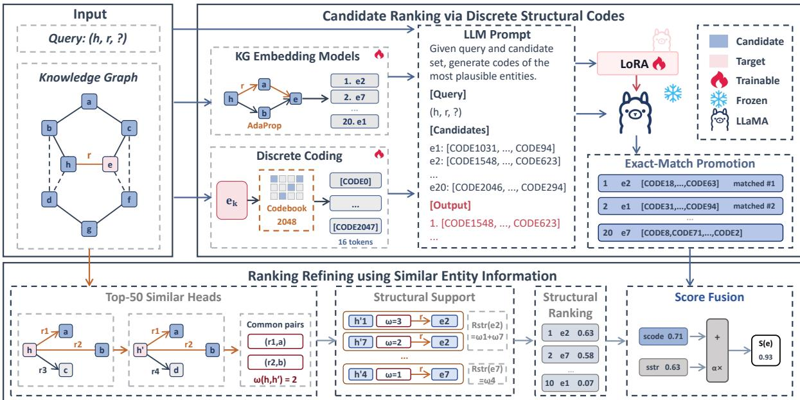

# LLM-Based Knowledge Graph Completion Combining Discrete Structural Coding with Similar Entity Information

Jiaqi Wang1,†, Dongying Lin1,†, Yang Yang2, Yinan Liu1,\*, Bin Wang1 and Xiaochun Yang1

1School of Computer Science and Engineering, Northeastern, University, Shenyang 110819, China 2University of Galway, Galway, Ireland

## Abstract

Knowledge graph completion requires models to use both textual descriptions and relational structure. Existing LLM-based methods either encode KG structure as discrete tokens or refine a restricted set of candidate entities, and these two directions have largely been studied separately. We propose CoSC for LLM-based KGC, which combines discrete structural coding with similar entity information. Specifically, an LLM generates an initial candidate entity ranking from discrete structural codes, after which information from entities with structures similar to that of the query entity refines the ranking. Experiments on FB15k-237 show that CoSC outperforms existing baselines on MRR and Hits@10 while remaining competitive on Hits@1.

## Keywords

Knowledge graph completion, Large language models, Discrete structural coding

## 1. Introduction

A knowledge graph represents factual knowledge as a set of entity–relation triples � = (�, �, �) [1, 2, 3]. Since the observed triple set is incomplete, knowledge graph completion (KGC) aims to predict the missing entity in a query $( h , r , ? )$ or (?, �, �) [4]. In recent years, large language models (LLMs) have been applied to a wide range of KG-related tasks, e.g., KG construction [5, 6], KG enrichment [7, 8], KG question answering [9] and KG alignment [10, 11, 12]. LLM-based KGC has consequently attracted growing attention. This work focuses on the task of LLM-based KGC.

Existing LLM-based KGC methods can be broadly grouped into two categories. The first category represents entity structure as discrete tokens for language models. SSQR [13] follows this direction, while ReaLM [14] and GS-Quant [15] similarly transform structural representations into compact token sequences. These methods determine how KG information is represented in an LLM. The second category of methods restricts prediction to candidate entities and introduces retrieval, filtering, verification, or structural evidence into the decision process. KICGPT [16], KC-GenRe [17], FtG [18], and KGR3 [19] follow candidate-based prediction pipelines, whereas OMNIA [20] combines graph-derived candidates with embedding-based filtering and LLM verification. This category determines how the final entity is selected from a constrained set. Although the two categories address complementary aspects of KGC, their mechanisms have largely been studied in isolation.

To obtain better results, we present CoSC, which combines discrete entity codes with similar entity information for LLM-based KGC. Specifically, AdaProp retrieves a ranked set of candidate entities, and an LLM generates an initial candidate entity ranking from their names and discrete structural codes. CoSC then identifies entities whose structures are similar to that of the query entity. The relation-specific information of these similar entities provides local evidence for refining the initial ranking. Through this process, CoSC obtains a better candidate entity ranking.

Our contributions are listed as follows:

• We propose CoSC, which integrates discrete structural coding with similar entity information for LLM-based KGC.

• Experiments on FB15k-237 show that CoSC outperforms existing baselines on MRR and Hits@10 while remaining competitive on Hits@1.

## 2. Related Work

Language-model-based KGC initially focused on the textual descriptions of entities and relations. KG-BERT [21] converts triples into text and predicts their plausibility, while SimKGC [22] learns text-based entity representations through contrastive training. Later methods explicitly connect graph representations to language models. KoPA [23] transforms knowledge graph embeddings into learnable prefixes, KG-Adapter [24] introduces parameter-eficient graph adapters, and MAKI [25] aligns linguistic and structural representations across multiple layers. Discrete coding provides an alternative to continuous representation injection. SSQR [13] learns self-supervised quantized entity codes that can be included in LLM inputs, ReaLM [14] applies residual quantization to pretrained knowledge graph embeddings, and GS-Quant [15] models semantic and structural information with discrete representations. These methods provide compact structural representations, although the generated codes do not directly express the neighborhood evidence associated with a specific query. Our method is inspired by SSQR [13] and can be adapted to more advanced discrete coding methods. We leave this extension to future work.

Candidate-constrained methods reduce open-ended generation to decisions over a retrieved set of entities. KICGPT [16] retrieves candidate entities and constructs graph-aware contexts for LLM reranking, while KC-GenRe [17] incorporates candidate knowledge into generative reranking. FtG [18] applies structural filtering before generation, and KGR3 [19] organizes retrieval, reasoning, and reranking as successive operations. OMNIA [20] constructs candidate triples from the graph, applies embeddingbased filtering, and uses an LLM to verify the remaining alternatives. These methods improve candidate selection but do not use discrete structural codes as the entity representation for LLM ranking. CoSC connects the two research directions by using discrete entity codes to produce an initial order and local neighborhood evidence to correct the leading candidate entities.

## 3. Method

CoSC comprises two components: (1) Candidate Ranking via Discrete Structural Codes and (2) Ranking Refining using Similar Entity Information. Figure 1 presents the complete procedure.

## 3.1. Candidate Ranking via Discrete Structural Codes

For a query $q = ( h , r , ? )$ , AdaProp [26] retrieves an ordered candidate list $C _ { q } = ( e _ { 1 } , \ldots , e _ { N } )$ . Inspired by SSQR [13], each candidate entity is represented by its name and a sequence of � code tokens drawn from a codebook of size �. The query, candidate names, and corresponding codes are provided to Meta-Llama-3.1-8B-Instruct [27]. We extend its tokenizer with � code tokens and adapt the model through supervised LoRA training. The embed\_tokens and lm\_head modules are trained and saved with the adapters to support the added tokens at both input and output. Restricting prediction to the retrieved set prevents out-of-graph outputs and reduces the decision space to � candidate entities.

The LLM generates at most $P$ target code sequences in ranked order. Candidates whose codes exactly match these sequences are placed at the front of the list in the same order as the generated sequences. The unmatched candidates are appended afterward while preserving their relative positions in the AdaProp ranking. Code matching therefore updates the leading positions while retaining the retrieval order of the remaining entities. For a candidate $e _ { k }$ at position � in the top � of the resulting list, we define its normalized code-based rank score as

$$
s _ { \mathrm { c o d e } } ( e _ { k } ) = \frac { K - k } { K - 1 } .\tag{1}
$$

  
Figure 1: Overview of our framework CoSC.

The score maps the code-based order to [0, 1]. The next component supplements this order with neighborhood evidence from the training graph.

## 3.2. Ranking Refining using Similar Entity Information

Inspired by the structural-clustering intuition used in OMNIA [20], CoSC defines a candidate-entity structural support score using local evidence from the training graph to correct the code-based candidate order. The intuition is that head entities with similar neighborhoods may exhibit similar behavior under a particular relation. For example, consider a query $( h .$ , nationality, ?) and a candidate entity such as United Kingdom. If several entities representing people whose neighborhoods resemble that of ℎ are connected to United Kingdom via the nationality relation, then these triples support this candidate. An entity sharing more neighborhood patterns with ℎ provides stronger evidence than a less similar entity.

We construct this evidence from the training graph $T ^ { \pm }$ , which also contains inverse relations. Let $\mathcal { N } ( h )$ denote the set of outgoing relation–tail pairs of query head ℎ. For each query head $h ,$ we find the � other head entities $h ^ { \prime } { . }$ , which share the largest number of outgoing relation–tail pairs with ℎ. These entities form the similar-head set ℋ $M \left( h \right)$ . For a candidate entity �, we define its raw structural support under query relation � as follows:

$$
R _ { \mathrm { s t r } } ( e \mid h , r ) = \sum _ { h ^ { \prime } \in \mathcal { H } _ { M } ( h ) } \left| \mathcal { N } ( h ) \cap \mathcal { N } ( h ^ { \prime } ) \right| \mathbf { 1 } [ ( h ^ { \prime } , r , e ) \in T ^ { \pm } ] .\tag{2}
$$

Each similar head $h ^ { \prime }$ contributes only when the training triple $( h ^ { \prime } , r , e )$ occurs in $T ^ { \pm }$ . Its contribution is weighted by $| { \mathcal { N } } ( h ) \cap { \mathcal { N } } ( h ^ { \prime } ) |$ , the number of relation–tail pairs it shares with the query head. A candidate entity therefore receives greater support when several similar heads connect to it through the query relation. We normalize the accumulated count to limit the efect of large values.

$$
s _ { \mathrm { s t r } } ( e ) = 1 - \exp \left( - \frac { R _ { \mathrm { s t r } } ( e \mid h , r ) } { \tau } \right) , \qquad \tau > 0 .\tag{3}
$$

This component evaluates the retrieved entities directly and does not require additional LLM generation. For each candidate entity $e _ { k }$ in the initial top $K ,$ CoSC combines the code-based rank score with the

Table 1  
Link-prediction performance on FB15k-237. The baseline results are taken from SSQR [13] and ReaLM [14]. CoSC is evaluated on all 22,850 test queries. The best results are shown in bold, and a dash indicates that the corresponding metric was not reported.
<table><tr><td>Method</td><td>MRR</td><td>Hits@1</td><td>Hits@10</td></tr><tr><td>NodePiece [28] (ICLR’22)</td><td>0.256</td><td></td><td>0.420</td></tr><tr><td>NodePiece+RandomEQ [29] (EMNLP’23)</td><td>0.263</td><td></td><td>0.425</td></tr><tr><td>EARL [30] (AAAI&#x27;23)</td><td>0.310</td><td></td><td>0.501</td></tr><tr><td>EARL+RandomEQ [31] (EMNLP&#x27;23)</td><td>0.308</td><td></td><td>0.502</td></tr><tr><td>TransE [32] (NeurIPS&#x27;13)</td><td>0.330</td><td>0.231</td><td>0.528</td></tr><tr><td>RotatE [33] (ICLR&#x27;19)</td><td>0.338</td><td>0.241</td><td>0.533</td></tr><tr><td>ConvE [34] (AAAI&#x27;18)</td><td>0.316</td><td>0.239</td><td>0.491</td></tr><tr><td>HyConvE [35] (WWW&#x27;23)</td><td>0.339</td><td>0.212</td><td>0.458</td></tr><tr><td>CompGCN [36] (ICLR’20)</td><td>0.355</td><td>0.264</td><td>0.535</td></tr><tr><td>HittER [37] (EMNLP&#x27;21)</td><td>0.373</td><td>0.279</td><td>0.558</td></tr><tr><td>AdaProp [26] (KDD&#x27;23)</td><td>0.417</td><td>0.331</td><td>0.585</td></tr><tr><td>MA-GNN [38] (ACL&#x27;23)</td><td>0.379</td><td>0.282</td><td>0.569</td></tr><tr><td>DiffusionE [39] (KDD&#x27;24)</td><td>0.376</td><td>0.294</td><td>0.539</td></tr><tr><td>TCRA [40] (ACL&#x27;24)</td><td>0.367</td><td>0.275</td><td>0.554</td></tr><tr><td>KICGPT [16] (EMNLP’23)</td><td>0.412</td><td>0.327</td><td>0.554</td></tr><tr><td>KG-FIT [41] (NeurIPS&#x27;24)</td><td>0.362</td><td>0.275</td><td>0.572</td></tr><tr><td>MKGL [42] (NeurIPS&#x27;24)</td><td>0.415</td><td>0.325</td><td>0.591</td></tr><tr><td>SSQR-LLaMA3.1 [13] (ACL&#x27;25)</td><td>0.459</td><td>0.393</td><td>0.597</td></tr><tr><td>ReaLM [14] (WWW&#x27;26)</td><td>0.467</td><td>0.402</td><td>0.603</td></tr><tr><td>CoSC</td><td>0.502</td><td>0.367</td><td>0.743</td></tr></table>

normalized neighborhood support.

$$
S ( e _ { k } ; \alpha ) = s _ { \mathrm { c o d e } } ( e _ { k } ) + \alpha s _ { \mathrm { s t r } } ( e _ { k } ) ,\tag{4}
$$

where � controls the contribution ofneighborhood support and is selected on validation data. Candidates are sorted by $S ( e _ { k } ; \boldsymbol { \alpha } )$ to produce the final ranking. CoSC reorders the retrieved entities without expanding the candidate set.

## 4. Experiments

We evaluate CoSC on all 22,850 FB15k-237 test queries using MRR, Hits@1, and Hits@10. We set the retrieved candidate count � = 20, code length $L = 1 6$ , codebook size $V = 2 0 4 8$ , maximum number of generated code sequences $P = 3 .$ , fusion candidate count � = 10, number of similar heads $M = 5 0$ and normalization scale $\tau = 5$ . A query contributes zero when none of its correct entities occurs in the retrieved set.

AdaProp retrieves at least one correct entity for 79.72% of the test queries. Including the queries not covered by retrieval, CoSC obtains an MRR of 0.5021, Hits@1 of 0.3674, and Hits@10 of 0.7434. These values measure the complete candidate retrieval and reranking procedure. Overall, combining discrete structural coding with similar entity information yields better performance than the existing baselines on MRR and Hits@10 while remaining competitive on Hits@1. These results demonstrate the efectiveness of integrating the two components for KGC.

## 5. Conclusion

We presented CoSC for LLM-based KGC, which integrates discrete structural coding with similar entity information. Experiments on FB15k-237 show that CoSC outperforms existing baselines on MRR and Hits@10 while remaining competitive on Hits@1. Future work will evaluate the method on additional datasets and under fully controlled baseline settings.

## Acknowledgments

The work was partially supported by the National Key Research and Development Program of China (No. 2024YFF0617702); the National Natural Science Foundation of China (Nos. U22A2025, 62402097, 62232007, and U23A20309); the Joint Funds of the Natural Science Foundation of Liaoning Province (No. 2023-BSBA-132); the 111 Project (No. B16009); and the Fundamental Research Funds for the Central Universities (No. N2417007).

## Declaration of use of Generative AI

During the preparation of this work, the authors used OpenAI Codex to paraphrase and reword authorprepared text, assist with section restructuring, improve writing style, check grammar and spelling, and assist with LaTeX formatting. After using this tool, the authors reviewed, verified, and edited the content as needed and take full responsibility for the publication’s content. No scientific figures or experimental results were generated using this tool.

## References

[1] A. Hogan, E. Blomqvist, M. Cochez, et al., Knowledge graphs, ACM Computing Surveys 54 (2021).

[2] Y. Liu, H. Chen, W. Shen, J. Chen, Low-resource personal attribute prediction from conversations, in: AAAI, 2023.

[3] Y. Liu, H. Chen, W. Shen, Personal attribute prediction from conversations, in: WWW, 2022, p. 223–227.

[4] H. Paulheim, Knowledge graph refinement: A survey of approaches and evaluation methods, Semantic Web 8 (2017) 489–508.

[5] G. Xiao, L. Ren, G. Qi, H. Xue, M. Di Panfilo, D. Lanti, LLM4VKG: Leveraging large language models for virtual knowledge graph construction, in: Proceedings of IJCAI, 2024, pp. 4715–4723. doi:10.24963/ijcai.2024/525.

[6] R. Kondo, T. Watanabe, T. Yoshida, K. Yamasawa, R. Hisano, Collaborative system synergizing human expertise and large-scale language models for legal knowledge graph construction, in: Posters, Demos, and Industry Tracks at ISWC, volume 3828 of CEUR Workshop Proceedings, 2024. URL: https://ceur-ws.org/Vol-3828/paper9.pdf.

[7] M. Nayebi Kerdabadi, A. Hadizadeh Moghaddam, C. Chen, D. Wang, Z. Yao, Text-attributed knowledge graph enrichment with large language models for medical concept representation, in: Proceedings of ACL, 2026, pp. 16544–16560. doi:10.18653/v1/2026.acl-long.753.

[8] Y. Lu, W. Wu, X. Zhao, R. Peng, J. Wang, KARMA: Leveraging multi-agent LLMs for automated knowledge graph enrichment, in: Advances in Neural Information Processing Systems, 2025. doi:10.48550/arXiv.2502.06472. arXiv:2502.06472.

[9] Y. Liu, D. Lin, S. Luo, X. Yang, B. Wang, Joint knowledge base completion and question answering by combining large language models and small language models, in: ACL, 2026, pp. 36756–36775.

[10] R. Zhang, Y. Su, B. D. Trisedya, X. Zhao, M. Yang, H. Cheng, J. Qi, AutoAlign: Fully automatic and efective knowledge graph alignment enabled by large language models, IEEE Transactions on Knowledge and Data Engineering 36 (2024) 2357–2371. doi:10.1109/TKDE.2023.3325484.

[11] S. Chen, Q. Zhang, J. Dong, W. Hua, Q. Li, X. Huang, Entity alignment with noisy annotations from large language models, in: Advances in Neural Information Processing Systems, volume 37, 2024, pp. 15097–15120.

[12] Y. Liu, Z. Zhang, B. Wang, X. Yang, Sefel: A simple yet efective framework for fast event linking, in: AAAI, 2026, p. 15377–15385.

[13] Q. Lin, T. Zhao, K. He, X. Han, J. Chen, L. Chen, Y. Xiao, Self-supervised quantized representation for seamlessly integrating knowledge graphs with large language models, in: Proceedings of ACL, 2025, pp. 13587–13602. doi:10.18653/v1/2025.acl-long.667.

[14] W. Guo, X. Wang, J. Chen, L. Guo, Z. Li, H. Chen, ReaLM: Residual quantization bridges knowledge graph embeddings and large language models, in: Proceedings of the ACM Web Conference 2026, 2026, pp. 3996–4007. doi:10.1145/3774904.3792437.

[15] Q. Xie, Y. Liu, Y. Xing, Q. Hou, X. Jin, T. Zheng, T. He, GS-Quant: Granular semantic and generative structural quantization for knowledge graph completion, in: Proceedings of ACL 2026, 2026, pp. 16782–16797. doi:10.18653/v1/2026.acl-long.765.

[16] Y. Wei, Q. Huang, Y. Zhang, J. Kwok, KICGPT: Large language model with knowledge in context for knowledge graph completion, in: Findings of EMNLP, 2023, pp. 8667–8683.

[17] Y. Wang, M. Hu, Z. Huang, D. Li, D. Yang, X. Lu, KC-GenRe: A knowledge-constrained generative reranking method based on large language models for knowledge graph completion, in: Proceedings of LREC-COLING, 2024, pp. 9668–9680. doi:10.18653/v1/2024.lrec-main.845.

[18] B. Liu, J. Zhang, F. Lin, C. Yang, M. Peng, Filter-then-generate: Large language models with structure-text adapter for knowledge graph completion, in: Proceedings of COLING, 2025, pp. 11181–11195. doi:10.18653/v1/2025.coling-main.746.

[19] M. Li, C. Yang, C. Xu, et al., Retrieval, reasoning, re-ranking: A context-enriched framework for knowledge graph completion, in: Proceedings of NAACL, 2025, pp. 4349–4363. doi:10.18653/ v1/2025.naacl-long.221.

[20] F. Ieng, S. Sahri, M. Ouzzani, M. Hammaz, S. Benbernou, H. Khorashadizadeh, S. Groppe, F. Benamara, OMNIA: Closing the loop by leveraging LLMs for knowledge graph completion, 2026. doi:10.48550/arXiv.2603.11820. arXiv:2603.11820.

[21] L. Yao, C. Mao, Y. Luo, KG-BERT: BERT for knowledge graph completion, 2019. arXiv:1909.03193.

[22] L. Wang, W. Zhao, Z. Wei, J. Liu, SimKGC: Simple contrastive knowledge graph completion with pre-trained language models, in: Proceedings of ACL, 2022, pp. 4281–4294.

[23] Y. Zhang, Z. Chen, L. Guo, Y. Xu, W. Zhang, H. Chen, Making large language models perform better in knowledge graph completion, in: Proceedings of ACM Multimedia, 2024, pp. 233–242. doi:10.1145/3664647.3681327.

[24] S. Tian, Y. Luo, T. Xu, et al., KG-Adapter: Enabling knowledge graph integration in large language models through parameter-eficient fine-tuning, in: Findings of ACL, 2024, pp. 3813–3828. doi:10. 18653/v1/2024.findings-acl.229.

[25] Z. Xie, X. Wang, G. Zhou, D. F. Wong, MAKI: Multi-layer aligned knowledge injection for structureaware knowledge graph completion with large language models, in: Findings of ACL, 2026, pp. 28527–28539. doi:10.18653/v1/2026.findings-acl.1423.

[26] Y. Zhang, Z. Zhou, Q. Yao, X. Chu, B. Han, AdaProp: Learning adaptive propagation for graph neural network based knowledge graph reasoning, in: Proceedings of KDD, 2023, pp. 3446–3457.

[27] A. Grattafiori, A. Dubey, A. Jauhri, et al., The llama 3 herd of models, 2024. arXiv:2407.21783.

[28] Various authors, NodePiece: Compositional and parameter-eficient representations of large knowledge graphs, in: Proceedings of ICLR, 2022.

[29] Various authors, Nodepiece+randomeq, in: Proceedings of EMNLP, 2023.

[30] Various authors, Earl: Eficient entity and relation learning for knowledge graph completion, in: Proceedings of AAAI, 2023.

[31] Various authors, Earl+randomeq, in: Proceedings of EMNLP, 2023.

[32] A. Bordes, N. Usunier, A. Garcia-Duran, J. Weston, O. Yakhnenko, Translating embeddings for modeling multi-relational data, in: Advances in Neural Information Processing Systems, 2013.

[33] Z. Sun, Z.-H. Deng, J.-Y. Nie, J. Tang, RotatE: Knowledge graph embedding by relational rotation in complex space, in: Proceedings of ICLR, 2019.

[34] T. Dettmers, P. Minervini, P. Stenetorp, S. Riedel, Convolutional 2d knowledge graph embeddings, in: Proceedings of AAAI, 2018.

[35] Various authors, HyConvE: A hybrid convolutional model for knowledge graph completion, in: Proceedings of the Web Conference, 2023.

[36] S. Vashishth, S. Sanyal, V. Nitin, P. Talukdar, Composition-based multi-relational graph convolutional networks, in: Proceedings of ICLR, 2020.

[37] Various authors, HittER: Hierarchical transformers for knowledge graph embeddings, in: Proceedings of EMNLP, 2021.

[38] Various authors, MA-GNN: Multi-attention graph neural network for knowledge graph completion, in: Proceedings of ACL, 2023.

[39] Various authors, Difusione: Difusion-based knowledge graph embedding, in: Proceedings of KDD, 2024.

[40] Various authors, Tcra: Text- and context-aware relation aggregation for knowledge graph completion, in: Proceedings of ACL, 2024.

[41] Various authors, KG-FIT: Knowledge graph fine-tuning for link prediction, in: Advances in Neural Information Processing Systems, 2024.

[42] Various authors, MKGL: Multi-modal knowledge graph learning, in: Advances in Neural Information Processing Systems, 2024.