# Learning Action Models with Conditional and Quantified Efects via Uncertainty-Guided Exploration

Jefrey Jewett1,William Solow1, Sandhya Saisubramanian1

1Oregon State University

jewettje@oregonstate.edu, soloww@oregonstate.edu, sandhya.sai@oregonstate.edu

## Abstract

Accurate action models are critical for efective planning. Ex- isting action-model learning methods largely assume simple action representations or become computationally intractable when learning conditional and quantified efects. We present Online Hypothesis-Driven Conditional Action Model Learn- ing (OHCAM), an online approach for learning action models with conditional and quantified efects from limited interac- tions with the environment. OHCAM maintains a belief over hypothesized action models and actively selects informative actions to reduce uncertainty by maximizing disagreement among competing hypotheses, while being robust to noisy observations. To enable scalability, OHCAM begins with a small set of simple action model hypotheses and expands to more complex conditions only when the current hypotheses become inconsistent with the data. Experiments on six bench- mark planning domains demonstrate that OHCAM is sam- ple eficient in learning action models that solve substantially more tasks than baselines, even with observation noise. We validate OHCAM on two tasks using a Kinova Gen3 robot, demonstrating the real-world applicability of our approach.

## Introduction

Autonomous agents require accurate action models for re- liable high-level task planning. In complex, real-world en- vironments, actions often have context-dependent outcomes that afect nearby objects. Capturing such behavior requires ex ressive action models with conditional and uantified ef- fects (Mao et al. 2023). While recent works have demon-strated the feasibility of learning conditional action mod- els (Zhuo et al. 2010; Mordoch et al. 2024), scalability and robustness to noise remains a significant challenge, due to the combinatorial space of possible conditional and quantified efects, hindering real world applicability.

Consider a robot tasked with cleaning plates (Fig. 1). A robot wiping a stained plate with a sponge expects to clean it, but instead makes it worse if the sponge is already dirty. When a soda can is on the plate, the wiping action knocks it of the plate. Correctly modeling these behaviors require learning both when (conditional) the efect occurs and what additional objects (quantified) could be afected as a result of the action. Many conditional and quantified efects depend on environment-specific interactions that are unknown before deployment and cannot be fully captured in an ofline dataset or anticipated by a human designer. Consequently, the agent must identify and refine these efects online through interaction. (Lamanna et al. 2021). This inference task becomes more challenging under noisy observations, where incorrect state estimates obscure the true action dynamics, which is common in the deployment of robots (Barfoot 2024).

Most existing action model learning methods target learn- ing STRIPS (Fikes, Hart, and Nilsson 1972), where successful actions apply every learned efect regardless of the con- text (Yang, Wu, and Jiang 2007; Aineto, Jiménez Celorrio, and Onaindia 2019; Aineto, Jiménez, and Onaindia 2022). Recent approaches for learning conditional action models learn ofline and reason over the full hypothesis space, but impose restrictions on the number of learnable conditions to address the combinatorial space of efects (Oates and Cohen 1996; Zhuo et al. 2010; Mordoch et al. 2024). In contrast, an online learner must continually update its action model from a limited number of noisy interactions while remain- ing computationally tractable. Achieving this requires three key properties: (1) scalability, to learn eficiently in larger domains without pre-defined limits on the maximum com- plexity; (2) robustness to noisy observations, since real-world state transitions are often imperfectly observed; and (3) sam-ple eficiency, as real-world executions are time consuming.

We present Online Hypothesis-Driven Conditional Ac- tion Model Learning (OHCAM) that integrates hypothesis refinement and active exploration for online learning of ac- tion models with conditional and quantified efects. OHCAM maintains a posterior (belief) over a compact set of candidate hypotheses using a soft-consistency likelihood that is robust to noisy observations. To infer the maximum a posteriori hypothesis, OHCAM uses a branch-and-bound search that begins with few simple action-model hypotheses and dynamically expands to more complex conditions only when sup-ported by the data. This avoids reasoning over the combinato- rial hypothesis space, enabling scalability. Further, OHCAM supports sample-eficient exploration by selecting actions that maximize disagreement among plausible hypotheses.

Evaluation on six benchmark planning domains with con- ditional efects and quantified variables show that OHCAM achieves substantially higher task completion rates and im- proved sample eficiency over state-of-the-art action model learning methods. We further validate OHCAM on two tasks with a Kinova Gen3 robot, demonstrating its practical appli- cability for learning models online in noisy environments.

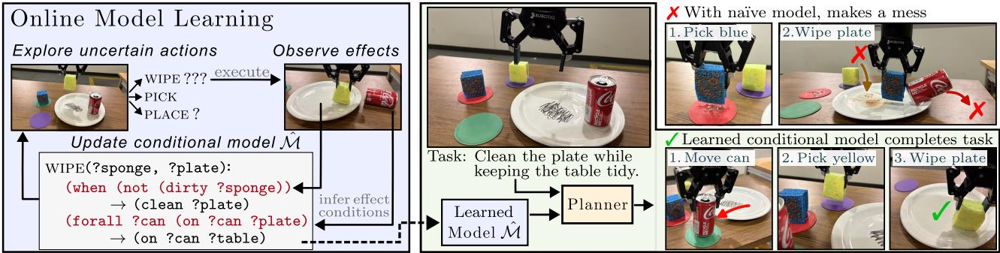  
Figure 1: An overview of the online conditional action model learning setting. The agent is given a brief period to interact with the environment before it is evaluated on unseen tasks. By observing when an efect occurs, it learns a model with conditional and quantified efects (left) to then efectively plan to move the can before wiping the plate with the clean sponge (right).

## Related Works

Action Model Learning (AML) The AML problem seeks to infer the preconditions and efects ofparameterized actions in symbolic models from observed executions. Most existing AML approaches learn STRIPS action models (Fikes, Hart, and Nilsson 1972), where the efects are applied unconditionally and are restricted to the objects in the action parameters (Yang, Wu, and Jiang 2007; Amir and Chang 2008; Aineto, Jiménez Celorrio, and Onaindia 2019; Juba, Le, and Stern 2021; Lin et al. 2025). AML algorithms search over logical hypotheses by eliminating candidate preconditions and efects that are inconsistent with observations (Aineto, Jiménez, and Onaindia 2022). Noise in real-world obser-vations is a significant limitation of this logical induction as these methods will prune the ground truth formula after a sin- gle noisy observation. Several works designed for robustness to noise are restricted to STRIPS efects (Zhuo and Kambhampati 2013; Lamanna and Serafini 2024). While efective for many planning domains, these methods cannot capture conditional behaviors or efects on additional objects, limiting their applicability to complex environments.

Models with Conditional Efects and Quantified Variables Deictic references (Pasula, Zettlemoyer, and Kaelbling 2007) implicitly model conditional efects and a limited number of quantified efects with multiple actions. Chit- nis et al. (2022) learn such references though clustering, although it learns overly permissive preconditions under noisy observations. LAMP (Zhuo et al. 2010) explicitly models conditional and quantified formulas but the resulting hypoth- esis space grows rapidly, limiting LAMP to just one quantified variable. Conditional-SAM (Mordoch et al. 2024) learns conditional efects with a pre-specified number of quantified variables, but reasons over exponentially many hypotheses. These ofline approaches remain fundamentally limited by the complexity of reasoning over large hypothesis spaces. They are also brittle to noisy observations, where a single inconsistent transition may eliminate the correct hypothesis. Our approach addresses both challenges by maintaining a be- lief over conditional hypotheses and dynamically expanding only the most promising conditions.

<table><tr><td colspan="6">Conditional Quantified Noise Robust Online Scalable</td></tr><tr><td>Lamanna et al. (2024)</td><td>X</td><td>X</td><td></td><td></td><td></td></tr><tr><td>Lamanna et al. (2021)</td><td></td><td></td><td></td><td></td><td></td></tr><tr><td>Zhuo et al. (2010)</td><td></td><td></td><td></td><td>X</td><td></td></tr><tr><td>Pasula et al. (2007)</td><td></td><td></td><td></td><td>X</td><td></td></tr><tr><td>Chitnis et al. (2022)</td><td></td><td></td><td></td><td>X</td><td></td></tr><tr><td>Mordoch et al. (2024)</td><td></td><td></td><td></td><td>X</td><td></td></tr><tr><td>OHCAM (Ours)</td><td></td><td></td><td></td><td></td><td></td></tr></table>

Table 1: Comparing action model learning approaches across key capabilities required for use in real-world environments.

Online AML Online AML agents select actions to execute and incrementally update the model with the observed out- come (Čertický 2014). As real world data are time consuming to collect, sample eficiency is critical, requiring active ex- ploration of informative actions. Rather than exploring my- opically (Rodrigues et al. 2012), a recent approach constructs multi-step plans to reach any state that distinguishes compet- ing STRIPS hypotheses (Lamanna et al. 2021). We adapt this idea to support active learning of conditional efects under noise in observations. Table 1 summarizes the key capabili- ties of the existing action-model learning approaches.

## Problem Formulation

We consider the problem of learning a symbolic action model with conditional and quantified efects from limited online interactions in an environment. A planning domain $\mathcal { M } = ( \mathcal { P } , A )$ consists of a set of predicates P describing object attributes and relations, and a set of parameterized actions A. Action models specify preconditions pre(a) (when the action is applicable) and efects ef(a) (what the action changes in the state). Each action takes a tuple of typed parameters params $( a ) = ( ? p _ { 1 } , \dotsc , ? p _ { n } )$ . A planning task $\boldsymbol { \tau } _ { \mathcal { M } } = ( \mathcal { O } , s _ { 0 } , g )$ consists of a set of objects O, an initial state s0 and a goal condition g. An action is grounded by instantiating its parameters with a tuple of unique objects $o \subseteq \mathcal { O }$ , denoted by $a ( o )$ , where $o _ { i } \neq o _ { j }$ for all $i \neq j$

The agent interacts with an environment given the pred- icates $\mathcal { P }$ and parameterized action schema, but the precon- ditions and efects of each action must be learned online. Such scenarios are common in robotics settings where we know what (macro) actions are available but do not know in advance exactly how they afect the environment.

Conditional and Quantified Efects To model complex action behaviors, we need an expressive representation of action efects. Unlike STRIPS, we allow actions to have conditional efects which depend on the execution context and quantified efects which can influence objects beyond the action parameters through universally quantified variables (UQVs). A literal $\ell ( ? p _ { i _ { 1 } } , \ldots , ? p _ { i _ { m } } )$ binds action parame- ters to a predicate $\rho \in \mathcal P$ . Let $\mathcal { L } _ { a }$ be the set of all literals bound by $\mathrm { p a r a m s } ( a )$ . We define ef $( a )$ by associating each $\ell \in \mathcal L _ { a }$ with a conditional efect $( C \stackrel { \cdot } { \to } E ) _ { \ell } ^ { a }$ , where the $C$ is a conjunction of predicate literals and E denotes an add or delete efect on $\ell .$ When a grounded action $a ( o )$ is executed in state s, the efect is applied to the next state $s ^ { \prime }$ only if all terms $\ell ^ { c } \in C _ { \ell }$ are satisfied: $\ell ^ { c } ( o ) \models s .$ A quantified efect extends this representation by introducing UQVs that influence objects outside of params(a) and applied to all objects satisfying the corresponding condition.

Online Action Model Learning Given an environment $\Delta$ with states grounded in predicates $\mathcal { P }$ and a set of actions $a \in A$ with known parameters params(a), the objective is to learn an action model $\hat { \mathcal { M } } = \{ \mathrm { p } \hat { \mathrm { r e } } ( a ) , \hat { \mathrm { e f f } } ( a ) \} _ { a \in A }$ where $\hat { \mathrm { e f f } } ( a )$ may contain conditional and quantified efects. Dur- ing learning, the agent interacts with the environment by executing actions $a ( o )$ and observes $( s , a ( o ) , s ^ { \prime } , v )$ where $s , s ^ { \prime }$ denote the states before and after action execution, and $v \in \{ \top , \bot \}$ denotes whether the action succeeded $( \top )$ or not (⊥). Without an ofline dataset, the agent must actively select informative actions that reduce model uncertainty, under a limited budget B and noisy observations.

## Hypothesis-Driven Action Model Learning

This section outlines our approach, Online Hypothesis- Driven Conditional Action Model Learning (OHCAM), to incrementally learn action models with conditional and quan- tified efects (Fig. 2). OHCAM is made up of two tightly coupled algorithmic components (Alg. 1): (i) dynamic $h y -$ pothesis expansion which maintains a belief over plausible action models and expands the hypothesis space only when simpler models become inconsistent with the observed data, thereby avoiding exhaustive reasoning over exponen- tially many candidates, and (ii) belief-guided exploration that enables sample-eficient learning by planning to reach regions that maximally reduce uncertainty over competing hypotheses, while remaining robust to noisy observations. We describe each component in detail below.

## Dynamic Hypothesis Expansion

Let $\mathcal { H } ^ { \mathcal { M } }$ be the space of models of the form $\{ \mathrm { p } \hat { \mathrm { r e } } ( a ) , \hat { \mathrm { e f f } } ( a ) \} _ { a \in A }$ . Learning action models with condi- tional and quantified efects requires reasoning over an expo- nentially large space of candidate hypotheses, as each efect may depend on an arbitrary conjunction of predicates. Our objective is to find the hypothesis in $\mathcal { H } ^ { \mathcal { M } }$ that best explains the observed execution data D. We first discuss this in the ofline data setting and then extend it to the online setting.

Estimating Hypothesis Likelihood With an ofline dataset D, the roblem reduces to searchin for the maximum a posteriori (MAP) hypothesis $h _ { \mathrm { m a p } } = \arg \operatorname* { m a x } _ { h } P ( h \mid \mathcal { D } )$ . Directly evaluating this posterior is not scalable as it requires jointly reasoning over all preconditions and conditional effects. Therefore, we factor each model action into a precon- dition hypothesis set $\mathcal { H } _ { \mathrm { p r e } } ^ { a }$ and a hypothesis set $\mathcal { H } _ { \ell } ^ { a }$ for each potential efect literal $\ell \in \mathcal L _ { a }$ . The space of hypotheses $\mathcal { H } _ { \ell } ^ { a }$ is defined over efect conditions of the form $h \stackrel { \sim } { = } ( C _ { h } \stackrel { \sim } { \to } E _ { h } ^ { \top } ) _ { \ell } ^ { a }$ where the antecedent $C _ { h }$ is a conjunction of literals from ${ \mathcal { L } } _ { a } \ \backslash \ \{ \ell \}$ . Deterministic action efects apply independently given applicability, yielding an approximate factorization:

$$
P ( h ^ { \mathcal { M } } \mid \mathcal { D } ) \approx \prod _ { a \in A } P ( h _ { \mathrm { p r e } } ^ { a } \mid \mathcal { D } _ { a } ) \prod _ { \ell \in \mathcal { L } _ { a } } P ( h _ { \ell } ^ { a } \mid \mathcal { D } _ { a } ^ { v = \top } ) ,
$$

conditioned on successful executions, $\mathcal { D } _ { a } ^ { v = \top }$ . Preconditions learn from all executions $\mathcal { D } _ { a }$ as they determine applicability. $\mathbf { A } s$ both $h _ { \ell } ^ { a }$ and $h _ { \mathrm { p r e } } ^ { a }$ have the same form, our discussion applies to both and we omit the subscripts: $P ( h \mid D )$

To estimate the probability of a hypothesis given D, we compare the observed efect of each execution $( s , o , s ^ { \prime } )$ with the hypothesis’ prediction. Specifically, each h predicts whether a literal ℓ will be added, deleted, or unchanged in the next state, and we compare this prediction with whether $\ell ( o )$ changes between s and $s ^ { \prime } .$ . Aggregating these compar- isons over all execution-literal pairs in D yields the number of true positives $( \mathrm { T P } _ { h } )$ , true negatives $( \mathrm { T N } _ { h } )$ , false positives $( \mathrm { F P } _ { h } )$ , and false negatives $( \mathrm { F N } _ { h } )$

To account for observation noise, we use a soft-consistency likelihood so that an incorrect prediction decreases, without eliminating, a hypothesis’ posterior probability:

$$
P ( \boldsymbol { \mathcal { D } } \mid h ) = \epsilon ^ { \mathrm { F P } _ { h } + \mathrm { F N } _ { h } } , 0 < \epsilon < 1 ,
$$

where ϵ is a hyper-parameter denoting how strongly prediction errors are penalized, with larger values tolerating noisier observations. $\mathbf { A } \mathbf { s }$ multiple hypotheses may explain the data equally, we define a simplicity prior $P ( h ) = \bar { \alpha } ^ { | C _ { h } | }$ penaliz- ing complex antecedent terms. The hypothesis score $L ( h )$ is defined as the unnormalized log-posterior $L ( h ) \propto \log \dot { P } ( h \mid$ $D )$ , to balance predictive fit and model complexity:

$$
L ( h ) = | C _ { h } | \log \alpha + ( \mathrm { F P } _ { h } + \mathrm { F N } _ { h } ) \log \epsilon .\tag{1}
$$

While $L ( h )$ measures a hypothesis’ consistency with D, identifying the MAP hypothesis $\begin{array} { r l } { h _ { \operatorname* { m a p } } } & { { } = } \end{array}$ ar $\operatorname { g m a x } _ { h \in \mathcal { H } } L ( h ; \mathcal { D } )$ remains challenging as each hypoth esis set scales combinatorially in the number of literals.

Dynamic Expansion To address the combinatorial nature of the hypothesis set, OHCAM performs dynamic hypothesis expansion, which incrementally refines candidate hypotheses by adding one literal to the antecedent at a time, expanding only those that have the highest potential to improve over the current best hypothesis score (Lines 13-20, Alg. 1). Let $H _ { \ell }$ be a set of expanded hypotheses for potential efect ℓ. We initialize $H _ { \ell }$ with the simplest hypotheses: false → null (no efect), $\emptyset $ add (unconditional add), $\emptyset  { \mathrm { ~ d e l } }$ (unconditional delete) (Line 1; Alg. 1). A conditional hypothesis $h : C _ { h } \to E _ { h }$ is refined by adding a literal $\ell ^ { \prime }$ (or its negation $\neg \ell ^ { \prime } )$ to the antecedent, $h ^ { \prime } : C _ { h } \cup \ell ^ { \prime } \to E _ { h }$ (Line 20). These refinements define a tree in which each node represents a con- ditional hypothesis and each edge corresponds to adding one antecedent literal. Dynamic hypothesis expansion performs a best-first branch-and-bound search over the tree, bounding $| H _ { \ell } |$ by the complexity of the MAP condition $| C _ { h _ { \mathrm { m a p } } } | .$

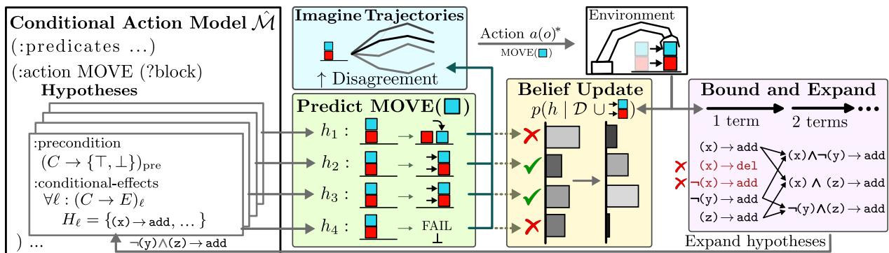  
Figure 2: Overview of OHCAM with four hypotheses in a blocks domain: $h _ { 1 }$ predicts the blue block will move, $h _ { 2 }$ and $h _ { 3 }$ predict both blocks will move, and $h _ { 4 }$ predicts a failure. OHCAM imagines trajectory rollouts under its current belief and executes the action that produces the highest predictive disagreement. Observing that both blocks move, the posterior probability shifts toward $h _ { 2 }$ and $\dot { h } _ { 3 }$ , while $h _ { 1 }$ is reduced, but not eliminated. A more complex hypothesis replaces $h _ { 4 }$ to maintain diversity.

To guide this search and determine which hypotheses should be refined, each hypothesis is associated with an ad- missible upper bound on the score attainable by any of its descendants. Adding an antecedent literal makes a condition more specific, so the number of false positives cannot in- crease and the number of false negatives cannot decrease. Optimistically, a sequence of refinements $h  \cdots  h ^ { \prime }$ eliminates all false positives without introducing false nega- tives. Every refinement $h ^ { \prime } \succ h$ is thus upper-bounded by

$$
\begin{array} { r } { U ( h ) = ( | C _ { h } | + 1 ) \log \alpha + \mathrm { F N } _ { h } \log \epsilon \geq L ( h ^ { \prime } ) . } \end{array}\tag{2}
$$

The search prioritizes refining hypotheses with the max- imal $U ( h )$ . It terminates when no frontier hypothesis has an upper bound exceeding the score $\hat { L }$ of the current best hypothesis, $\begin{array} { r } { \operatorname* { m a x } _ { h \in H _ { \ell } } U ( h ) \leq \hat { L } . } \end{array}$ , thereby returning a MAP hypothesis (Line 19; Alg. 1). While this establishes the cor-rectness, eficiency depends on minimizing the number of hypotheses explored.

Since the search depth is determined by the complexity of the target condition, the branching factor, which is the num- ber of literals considered for refinement, must be minimized to the extent possible. Rather than refining with every literal in $\mathcal { L } _ { a } , \mathrm { O H C A M }$ considers only literals that could plausibly improve the current best hypothesis, as not every literal can produce a child hypothesis whose score exceeds the current best hypothesis (e.g. when it predicts too many false negatives). Adding a literal also incurs an additional simplicity penalty, since Eqn. 1 favors simpler explanations. A refine- ment can improve the score only by eliminating enough false positives to ofset this penalty. We therefore restrict the refinement literal set R to only those literals that have an upper bound above the current best score and predict suficient true negatives. This restricts the branching only to literals that cor- relate with the efect, which is often much smaller than $\vert { \mathcal { L } } _ { a } \vert .$ Appendix A includes theoretical analysis of these properties.

Algorithm 1: OHCAM   
Input: Environment ∆; interaction budget $B ;$ rollouts N;   
horizon k; hypothesis pool size n   
1 Initialize $\mathcal { H } ^ { \mathcal { M } }  \{ \mathcal { \dot { H } } _ { \ell } ^ { a } \ | \ a \in \Delta . A , \ \ell \in \mathcal { L } _ { a } \cup \{ \mathrm { p r e } \} \}$   
2 s ← rese ${ \mathrm { \Omega } } _ { : ( \Delta ) ; \mathrm { \Omega } } { \mathcal { D } } \gets \emptyset$   
3 for b = 1 to B do   
4 // Belief-guided exploration   
5 for $m = 1$ to N do // imagine trajectory rollouts   
6 $s _ { 1 } \gets s ; \tilde { \mathcal { M } } \sim P ( h \mid \mathcal { D } )$ // sample model   
7 for $i = 1$ to k do   
8 $a ( o ) _ { i } \sim \operatorname { S o f t m a x } ( U ( s , a ( o ) _ { 1 : \eta } ) )$   
9 $s _ { i + 1 } \gets \tilde { \mathcal { M } } ( s _ { i } , a ( o ) _ { i } )$   
10 $G _ { m } \gets G ( s _ { 1 : k } , a ( o ) _ { 1 : k } )$ // Eq. 5   
11 $a ( o ) ^ { \star } \gets a ( o ) _ { 1 } ^ { m ^ { \star } }$ // first action of best rollout   
12 $\mathcal { D } \gets \mathcal { D } \cup \{ ( s , a ( o ) ^ { \star } , s ^ { \prime } , v ) \} ; s \gets s ^ { \prime }$   
13 // Dynamic hypothesis expansion   
14 for $( \ell ^ { q } , Q , C _ { Q } ) \in$ get-new-quantified $( s , a ( o ) , s ^ { \prime } )$ do   
15 $\mathcal { H } ^ { \mathcal { M } }  \dot { \mathcal { H } } ^ { \mathcal { M } } \cup \mathcal { H } _ { \ell ^ { q } } ^ { Q }$ ; initialize with $C _ { Q }$   
16 forall $\mathcal { H } _ { \ell } ^ { a } \in \mathcal { H } ^ { M }$ do   
17 update $L ( h ; \mathcal { D } ^ { v = \top } )$ for $h \in \mathcal { H } _ { \ell } ^ { a } \ \mathrm { ~ / / ~ E q . ~ }$ 1   
18 $\hat { L }  n \cdot$ th best $L ( h ; \mathcal { D } ^ { v = \top } )$ // active bound   
19 while $\exists h \in { \mathcal { H } } _ { \ell } ^ { a } : U ( h ) > { \hat { L } }$ do   
20 $\lfloor \ \mathcal { H } _ { \ell } ^ { a } \gets \mathcal { H } _ { \ell } ^ { a ^ { \prime } } \cup \{ ( \dot { C } _ { h } ^ { \prime } \cup \{ \ell ^ { \prime } \}  E _ { h } ) \}$ // expand   
21 return ˆpre , ˆefa ← arg max Pa(h | D)for a ∈ ∆.A

Quantified Efects So far, we discussed dynamic expan-sion for conditional efects under a static set of literals $\mathcal { L } _ { a }$ bound only to the parameters of the action. However, actions in complex environments can produce efects involving ob- jects outside of params(a) that must be explained with universally quantified variables (UQVs). The addition of UQVs not only expands $\mathcal { L } _ { a }$ with more variables, but multiple candi- date UQVs might explain the efect, compounding the complexity of the quantified hypothesis space. To keep UQV learning tractable with our dynamic hypothesis expansion method, we make two assumptions: (i) identifiability—all efects matching a quantified literal have a single explana- tion, and (ii) locality (Mao et al. 2023)—there exists some relationship, direct or indirect, between the afected object and params(a). In our cleaning example in Fig. 1, a soda can gets knocked over in the wipe(sponge, plate) action because it relates to the plate by on(can, plate).

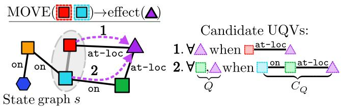  
Figure 3: A state graph for UQVs. If an action that intends to move red and blue also afects purple, then we propose sets of UQVs that connect purple to {red, blue}.

Formally, consider a grounded action $a ( o _ { 1 } ^ { a } , \dots . o _ { n } ^ { a } )$ , where $o ^ { a }$ denotes the objects bound to the action parameters. Let $\rho ( o _ { 1 } ^ { e } , \ldots . o _ { m } ^ { e } )$ be the action efect involving objects $o _ { i } ^ { e }$ . If any afected object lies outside the action parameters, $\bar { o _ { i } ^ { e } } \notin o ^ { a }$ the efect is represented as a quantified literal ℓq with one or more parameters unbound. Let $\mathbf { Q } = \{ Q _ { 1 } , Q _ { 2 } , \dots \}$ be the set of candidate UQV sets that could explain the quantified efect. We must bind the unbound parameters of $\ell ^ { q }$ toUQVsQ in $\mathbf { Q }$ with corresponding conditions $C _ { Q }$ that only the afected objects satisfy. Under the identifiability assumption, the full space of hypotheses is $\begin{array} { r } { \mathcal { H } _ { \ell ^ { q } } ^ { \mathbf { Q } } = \bigcup _ { Q \in \mathbf { Q } } \dot { \mathcal { H } } _ { \ell ^ { q } } ^ { Q } } \end{array}$ . For a given UQV set $Q ,$ the hypothesis space $\mathcal { H } _ { \ell } ^ { Q }$ is defined over conjunctions of literals $\dot { \mathcal { L } } _ { a } ^ { \bar { Q } }$ bound to variables params(a) ∪ Q.

We perform dynamic expansion over sets of hypotheses, favoring simple UQV hypotheses by extending the simplicity prior to penalize more UQVs: $P ( \dot { h } ) = \alpha ^ { | C _ { h } | } \cdot \beta ^ { | Q | }$ , where $\beta \in \mathsf { \Gamma } ( 0 , 1 )$ is a penalty parameter on the the hypothesis. We rely on the locality assumption to avoid enumerating every possible quantified variable assignment. We formalize the relationship between objects with a hypergraph over the observed state s: each object is a vertex, and each grounded predicate $\rho ( o _ { 1 } ^ { e } , \ldots , o _ { k } ^ { e } ) \in \mathfrak { s }$ induces a hyperedge over its arguments (Fig. 3). Then, $q = o ^ { e } \setminus o ^ { a }$ is the set of objects that must be explained by a UQV.

We enumerate all trees in the state graph that connect every object in q (afected objects) to any object in $o ^ { a }$ (action parameters), starting with the simplest. A UQV set Q is formed from the nodes of a tree, excluding $o ^ { a }$ , and the edges become conditions $C _ { Q }$ . If an efect cannot be matched to an existing hypothesis set, we initialize the next simplest quantified hy- pothesis set $\mathcal { H } _ { \ell q } ^ { Q }$ with antecedent $C _ { Q }$ . We perform dynamic expansion on each quantified hypothesis set to further refine the antecedent and select the MAP hypothesis from the sets.

## Belief-Guided Exploration

So far, we have discussed identifying the MAP hypothesis from an ofline dataset D. We now extend this to learning online. Since multiple hypotheses can explain the ob- servations seen so far, subsequent action executions should be chosen to maximally distinguish among these compet- ing hypotheses. OHCAM achieves this by selecting actions expected to provide the greatest reduction in posterior un- certainty using Bayesian Active Learning by Disagreement (BALD) (Houlsby et al. 2011) (Lines 4-11 in Alg. 1). BALD was introduced for classification tasks and seeks to reduce the space of possible models in as few samples as possible. We adopt the objective to our setting. With a finite set of deterministic hypotheses, the BALD utility is the entropy of a weighted vote of predicted outcomes:

$$
Z ( s , a ( o ) ) = \mathbb { H } [ \sum _ { h } P ( v , s ^ { \prime } \mid s , a ( o ) , h ) \cdot P _ { a } ( h \mid \mathcal { D } ) ] .\tag{3}
$$

The utility is maximized when plausible hypotheses make diferent predictions for executing a(o) in state $s ,$ either about action applicability v or about the resulting state $s ^ { \prime }$ . Assum- ing independence among diferent literals, the predictive en- tropy decomposes into uncertainty over action applicability and uncertainty over individual efects:

$$
\begin{array} { r l } & { \mathbb { H } [ P ( v , s ^ { \prime } \mid s , a ( o ) ) ] = \mathbb { H } [ P ( v \mid s , a ( o ) ) ] } \\ & { \quad + P ( v = \top \mid s , a ( o ) ) \cdot \displaystyle \sum _ { \ell } \mathbb { H } [ P ( s ^ { \prime } \ell ^ { ( o ) } \mid s , a ( o ) ) ] , } \end{array}\tag{4}
$$

where the efect entropies are discounted by the uncertainty of whether the action is applicable, since the efects are ob- served only when the action executes successfully. BALD requires multiple plausible hypotheses to quantify disagree- ment. Therefore, we relax the branch-and-bound criterion to maintain the top-n active hypotheses, expanding any hypoth-esis satisfying $\bar { U } ( h ) > L ^ { ( \bar { n } ) }$ , where $L ^ { ( \bar { n } ) }$ is the score of the current n-th best hypothesis (Line 18; Alg. 1).

Planning Over Imagined Rollouts Since informative states may require multiple actions to reach, we optimize cumula- tive information gain over imagined trajectories. Unlike standard rollouts under a fixed dynamics model, imagined tra- jectories are simulated under posterior-sampled hypotheses to evaluate information gain rather than task reward. Starting from the current state, we simulate k-step trajectory by recur-sively selecting actions and predicting their outcomes using $\tilde { M } \sim P ( h \mid \mathcal { D } )$ (Line 6; Alg. 1). At each step, we sample η actions applicable in M˜ , and select one to execute accord- ing to a soft greedy bias $a ( o ) _ { i } \sim$ Softmax $\left( Z ( s , a ( o ) _ { 1 : \eta } ) \right)$ to favor informative trajectories while preserving exploration (Line 8; Alg. 1). The sampled model predicts the successor state, $s _ { i + 1 } \gets \tilde { M } ( s _ { i } , a _ { i } ( o _ { i } ) )$ (Line 9; Alg. 1).

Each imagined trajectory is scored by its expected cumulative information gain, with each state’s contribution weighted by the probability of reaching it. Let $\Lambda _ { i }$ denote the probabil- ity of reaching state $s _ { i }$ along the imagined trajectory, with $\Lambda _ { 1 } = 1$ . For $i \geq 2 $

$$
\Lambda _ { i } = \prod _ { j = 1 } ^ { i - 1 } P ( v _ { j } = \top \mid s _ { j } , a ( o ) _ { j } ) P ( s _ { j + 1 } \mid s _ { j } , a ( o ) _ { j } ) .
$$

Using Eqn. 3, the trajectory score is then (Line 10; Alg. 1):

$$
G ( s _ { 1 : k } , a ( o ) _ { 1 : k } ) = \sum _ { i = 1 } ^ { k } \Lambda _ { i } \cdot Z ( s _ { i } , a ( o ) _ { i } ) .\tag{5}
$$

Given a budget B, OHCAM repeatedly plans an informative action using receding-horizon rollouts scored by Eq. 5, executes the selected action in the environment, and updates the corresponding action’s belief by reweighting the posterior (Eq. 1) and dynamically expanding hypotheses according to Eq. 2. This process repeats until B is exhausted, at which point OHCAM returns the MAP action model M′.

## Experiment Setup

We evaluate OHCAM on six benchmark planning domains and on two real-world tasks using a Kinova Gen 3 robot.

Baselines We compare OHCAM with five action model learning methods that support conditional and quantified ef- fects or online learning: (1) LAMP (Zhuo et al. 2010); (2) Conditional-SAM (Mordoch et al. 2024) with maximum antecedents set to three (maximum depth in our benchmark domains) and ground truth UQV type provided; (3) Cluster&Intersect (Chitnis et al. 2022); and (4) OLAM (Lamanna et al. 2021). Baselines (1)-(3) are ofline methods which learn conditional and quantified efects. OLAM is an online active learning method but only learns STRIPS efects. Hyperpa- rameters and additional details in Appendix B.

To enable comparison with the ofline methods and further study how the dataset afects the downstream performance, we consider three types of data collection: (1) OHCAM dataset collected with our active learning approach; (2) Random dataset collected by uniformly selecting actions; and (3) Expert dataset that contains demonstration trajectories gathered by a planner with access to the ground truth model, with 20% random actions for diversity (Stern et al. 2025).

Domains We perform evaluations in simulation using benchmark planning domains with conditional and quanti- fied efects, from Mordoch et al. (2024): Satellite (Long and Fox 2003), Briefcase, Miconic (Bacchus 2001), and Maintenance, CityCar, and Nurikabe (Vallati et al. 2015). We additionally introduce two new domains for our hardware evaluation. MagnetBlocks which is a variant of BlocksWorld with the additional of magnetic blocks that stick together when stacked on top of one another. SpongeWorld which is the cleaning task outlined in Figure 1 where the robot is tasked with cleaning a plate in the presence of obstructions on the plate and dirty sponges. Additional details for both experiments can be found in Appendix C.

Training and Evaluation For each domain, we use available problem file generators (Seipp, Torralba, and Hofmann 2022) to generate ten train and evaluation problems, similar to Stern et al. (2025) (see Appendix C). The evaluation problems are harder, involving more objects or longer plans. We give each method up to one hour per domain for learning.

Our primary evaluation metrics are task completion rate and sample eficiency. Task completion rate is the aver-age fraction of evaluation tasks solved with plans from the learned models. A task is completed when a plan executed open-loop in the environment reaches a goal state without any failed actions. Plans are generated using Fast Downward. For sample eficiency, we learn OHCAM and OLAM online and evaluate the completion rate at 10-step intervals. For ofline methods, we evaluate on increasing subsets of the data.

<table><tr><td>Domain</td><td>OHCAM</td><td>OLAM</td><td>Cond-SAM</td><td>C&amp;I</td><td>LAMP</td></tr><tr><td>Satellite Maintenance Briefcase</td><td>96.0±4.9 100.0±0.0 100.0±0.0</td><td>20.0±40.0 0.0±0.0 0.0±0.0</td><td>100.0±0.0 98.0±4.0 60.0±48.9</td><td>98.0±4.0 0.0±0.0 0.0±0.0</td><td>0.0±0.0</td></tr></table>

Table 2: Task completion rate (%), averaged over 10 problem instances per domain, along with std. deviation. Models were trained over five trials with 100 actions each. OHCAM and OLAM learn online and ofline approaches use expert dataset. Bold values are the best for the domain.

## Simulation Results and Discussion

Task Completion Results in Table 2 show that OHCAM consistently performs better than or similar to the base- lines. OHCAM completed >95% of tasks on five of six domains with its online active exploration while the next best approach only completed two domains even with ex- pert data. Conditional-SAM learned overly restrictive con- ditions in larger domains because its strict safety threshold demands more data than the budget. LAMP, which exhaus- tively enumerates hypotheses, learned extremely slowly, ex- ceeding the training time limit of one hour on many domains. Cluster&Intersect learned an action for each combination of objects seen in training. However, due to its lack of UQVs, it was unable to generalize to more objects in evaluation tasks. OLAM only succeeded in the Satellite domain without conditional efects, highlighting its limits as a STRIPS method to learn expressive models.

Sample Eficiency We investigate the sample eficiency of OHCAM compared to the baselines in Figure 4 using data collected from random, expert, and OHCAM. Results are averaged over 10 problem instances and standard deviation is included over five trials. Across the three data regimens, OHCAM learning from OHCAM-collected data far exceeds the performance of random data, and within 100 actions, OHCAM recovers the performance of models trained on expert demonstrations without the benefit of prior domain knowledge, demonstrating OHCAM’s ability to plan to exe- cute informative actions. The quality of OHCAM’s actively gathered data is also evident when used by other baselines. Across domains, the baselines trained on OHCAM’s online data reach higher problem solving rates than the same base- lines trained on random data, indicating OHCAM data collec- tion approach is useful regardless of the learning approach.

Robustness to Noise In real-world settings, there is noise in perception and robot execution. To evaluate robustness to noise, we compare the approaches that can learn conditional efects on the six domains, by randomly corrupting atoms in the observation (Lamanna and Serafini 2024). In Figure 5, we vary the noise from zero to 40% and report the task completion rate relative to learning without noise, averaged over domains. As noise is not limited to objects in the action parameters, this introduces the illusion of quantified efects. Thus, we increase the budget to 250 samples so that the learn- ing approaches can discern between illusory and real efects. Our results show that OHCAM performance degrades grace- fully with increasing noise across the six simulation domains. Under 10% noise, the random fluctuations were insuficient to overcome OHCAM’s simplicity prior, preventing false ef- fects. In contrast, the baselines decline sharply with increased noise. Further, OHCAM data collection was more robust to noise than expert data, supporting the claim that OHCAM actively explores to reduce uncertainty.

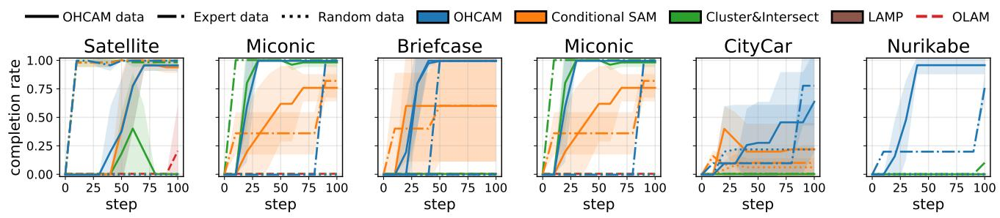  
Figure 4: Average problems solved versus number of actions for the six benchmark domains. The color shows the approach and the line type shows the data used. Shading shows standard deviation.

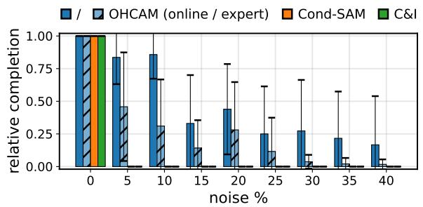  
Figure 5: Task completion rate of each approach over 250 samples with increasing noise, relative to noise-less case.

## Robot Hardware Results

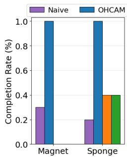

We use a Kinova Gen3 7 DoF arm for manipulation and an Intel RealSense D435i camera to capture RGB and depth images. We use SAM3 (Carion et al. 2026) to obtain seg- mentation masks and localize object centers for grasping. Actions are implemented as manipulation skills parameter- ized by the object locations. More details are in Appendix D. We compare OHCAM with the two baselines that showed success learning conditional efects in simulation, i.e. Clus- ter&Intersect and Conditional-SAM. Figure 6 reports the task completion rate of diferent approaches, across 10 evaluation tasks in MagnetBlocks and five evaluation tasks in Sponge-World. Given the perception and execution noise inherent to robot systems (about 5% in our system), we collect 250 action samples in both domains using data collected by OHCAM online. Our results show that OHCAM is robust to percep- tion noise, solving all evaluation tasks, compared to the naïve model without conditional efects which is only capable of solving 20% and 40% of the task, respectively. The baselines fail as they are unable to address the noise in the data. In MagnetBlocks they learn a model that is incapable of finding a plan for any task due to the higher rate of noise compared to SpongeWorld. A video showcasing robot data collection and evaluation is included in the supplemental materials.

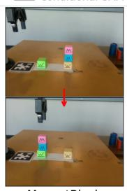

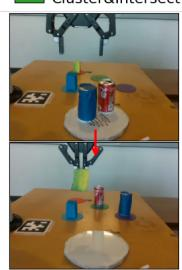  
Figure 6: Task completion rate in the two tabletop manipu- lation tasks, along with an example of start (top) and goal (bottom) configurations.

## Conclusion

We present OHCAM to learn action models with conditional efects and quantified variables. By combining dynamic hy- pothesis expansion with belief-guided exploration, OHCAM learns expressive action models from limited interactions while remaining robust to noisy observations. Experiments on benchmark planning domains and a Kinova Gen3 robot demonstrate that OHCAM outperforms state-of-the-art base- lines in terms of sample eficiency and downstream planning performance. Future work will extend the framework to par- tially observable settings and investigate scaling OHCAM to larger relational domains.

## References

AI-Planning. 2026. Classical Planning Domains. https:// github.com/AI-Planning/classical-domains. Accessed July 29, 2026.

Aineto, D.; Jiménez, S.; and Onaindia, E. 2022. A Compre- hensive Framework for Learning Declarative Action Models. Journal ofArtificial Intelligence Research, 74: 1091–1123.

Aineto, D.; Jiménez Celorrio, S.; and Onaindia, E. 2019. Learning action models with minimal observability. Artificial Intelligence, 275: 104–137.

Amir, E.; and Chang, A. 2008. Learning Partially Observable Deterministic Action Models. Journal of Artificial Intelligence Research, 33: 349–402.

Bacchus, F. 2001. AIPS 2000 planning competition: the fifth international conference on artificial intelligence planning and scheduling systems. AI Magazine, 22(3): 47–47.

Barfoot, T. D. 2024. State estimation for robotics. Cambridge University Press.

Carion, N.; Gustafson, L.; Hu, Y.-T.; Debnath, S.; Hu, R.; Suris, D.; Ryali, C.; Alwala, K. V.; Khedr, H.; Huang, A.; Lei, J.; Ma, T.; Guo, B.; Kalla, A.; Marks, M.; Greer, J.; Wang, M.; Sun, P.; Rädle, R.; Afouras, T.; Mavroudi, E.; Xu, K.; Wu, T.-H.; Zhou, Y.; Momeni, L.; Hazra, R.; Ding, S.; Vaze, S.; Porcher, F.; Li, F.; Li, S.; Kamath, A.; Cheng, H. K.; Dollár, P.; Ravi, N.; Saenko, K.; Zhang, P.; and Feicht- enhofer, C. 2026. SAM 3: Segment Anything with Concepts. arXiv:2511.16719.

Čertický, M. 2014. Real-Time Action Model Learning with Online Algorithm 3SG. AppliedArtificial Intelligence, 28(7): 690–711.

Chitnis, R.; Silver, T.; Tenenbaum, J. B.; Lozano-Pérez, T.; and Kaelbling, L. P. 2022. Learning Neuro-Symbolic Re- lational Transition Models for Bilevel Planning. In 2022 IEEE/RSJ International Conference on Intelligent Robots and Systems (IROS), 4166–4173.

Fikes, R. E.; Hart, P. E.; and Nilsson, N. J. 1972. Learning and executing generalized robot plans. Artificial Intelligence, 3: 251–288.

Houlsby, N.; Huszár, F.; Ghahramani, Z.; and Lengyel, M. 2011. Bayesian Active Learning for Classification and Pref- erence Learning. arXiv:1112.5745.

Juba, B.; Le, H. S.; and Stern, R. 2021. Safe Learning of Lifted Action Models. ArXiv:2107.04169.

Lamanna, L.; Saetti, A.; Serafini, L.; Gerevini, A.; and Traverso, P. 2021. Online Learning of Action Models for PDDL Planning. In Proceedings of the Thirtieth International Joint Conference on Artificial Intelligence, 4112– 4118. ISBN 978-0-9992411-9-6.

Lamanna, L.; and Serafini, L. 2024. Action Model Learning from Noisy Traces: A Probabilistic Approach. Proceedings of the International Conference on Automated Planning and Scheduling, 34: 342–350.

Lin, S.; Grastien, A.; Shome, R.; and Bercher, P. 2025. Told You That Will Not Work: Optimal Corrections to Planning Domains Using Counter-Example Plans. Proceedings ofthe

AAAI Conference on Artificial Intelligence, 39(25): 26596– 26604.

Long, D.; and Fox, M. 2003. The 3rd international plan- ning competition: results and analysis. Journal ofArtificial Intelligence Research, 20: 1–59.

Mao, J.; Lozano-Pérez, T.; Tenenbaum, J. B.; and Kaelbling, L. P. 2023. PDSketch: Integrated Planning Domain Program- ming and Learning. arXiv preprint arXiv:2303.05501.

Mordoch, A.; Scala, E.; Stern, R.; and Juba, B. 2024. Safe Learning of PDDL Domains with Conditional Efects. Proceedings of the International Conference on Automated Planning and Scheduling, 34: 387–395.

Oates, T.; and Cohen, P. R. 1996. Learning Planning Op- erators with Conditional and Probabilistic Efects. In Proceedings of the AAAI Spring Symposium on Planning with Incomplete Informationfor Robot Problems, 86–94.

Pasula, H. M.; Zettlemoyer, L. S.; and Kaelbling, L. P. 2007. Learning Symbolic Models of Stochastic Domains. Journal ofArtificial Intelligence Research, 29: 309–352.

Potassco. 2026. PDDL Benchmark Instances. https: //github.com/potassco/pddl-instances/blob/master/ipc- 2002/domains/satellite-strips-automatic/additional- notes/domain-adl.pddl. Accessed July 29, 2026.

Rodrigues, C.; Gérard, P.; Rouveirol, C.; and Soldano, H. 2012. Active Learning of Relational Action Models. In Muggleton, S. H.; Tamaddoni-Nezhad, A.; and Lisi, F. A., eds., Inductive Logic Programming, 302–316. ISBN 978-3- 642-31951-8.

Seipp, J.; Torralba, Á.; and Hofmann, J. 2022. PDDL gen- erators.

Stern, R.; Lamanna, L.; Mordoch, A.; Benyamin, Y.; Lauer, P.; Behnke, G.; Muise, C.; Bercher, P.; Vallati, M.; Xi, K.; and Eliyahu, O. 2025. Evaluating Planning Model-Learning Algorithms. In Proceedings of the Workshop on Knowledge Engineeringfor Planning and Scheduling (KEPS 2025).

Vallati, M.; Chrpa, L.; Grześ, M.; McCluskey, T. L.; Roberts, M.; and Sanner, S. 2015. The 2014 international planning competition: progress and trends. AI Magazine, 36(3): 90– 98.

Yang, Q.; Wu, K.; and Jiang, Y. 2007. Learning ActionModels from Plan Examples Using Weighted MAX-SAT.Artificial Intelligence, 171(2-3): 107–143.

Zhuo, H. H.; and Kambhampati, S. 2013. Action-model acquisition from noisy plan traces. In Proceedings of the twenty-third international joint conference on artificial intelligence, Guide Proceedings, 2444–2450. ISBN 978-1- 57735-633-2.

Zhuo, H. H.; Yang, Q.; Hu, D. H.; and Li, L. 2010. Learning Complex Action Models with Quantifiers and Logical Implications. Artificial Intelligence, 174(18): 1540–1569.

## Appendix A: Theoretical Results and Proofs

In this work, we presented dynamic hypothesis expansion, an algorithm to find the MAP hypothesis of a conditional efect. Here, we establish the correctness of the algorithm.

Proposition 1. For afixed dataset D andfinite literals $| { \mathcal { L } } _ { a } | ,$ best-first dynamic hypothesis expansion with Eq. 2 returns a MAP hypothesis.

Proof. We aim to show in three parts that the hypothesis returned by best-first dynamic hypothesis expansion identifies a MAP hypothesis. First, we show that the MAP hypothesis always remains refinable during branch-and-bound search until it is generated. Second, we show that the MAP hypoth- esis will eventually be generated. Third, we show that the termination criterion establishes that the returned hypothesis is the MAP.

To begin with, let $\begin{array} { r } { h _ { \operatorname* { m a p } } ~ = ~ \operatorname * { a r g m a x } _ { h \in \mathcal { H } } L ( h ; \mathcal { D } ) ~ = ~ } \end{array}$ $( C _ { \mathrm { m a p } } \stackrel { \cdot } {  } E _ { \mathrm { m a p } } )$ be a MAP hypothesis. Let $G = L ( h _ { \mathrm { m a p } } )$ be the corresponding hypothesis score. Let each frontier hy- pothesis have an admissible bound

$$
U ( h ) \geq \operatorname* { m a x } _ { h ^ { \prime } \succ h } L ( h ^ { \prime } )
$$

for any descendant $h ^ { \prime } \succ h .$ . Let $H _ { \ell }$ be the set of generated hy- potheses. The branch-and-bound algorithm maintains a fron- tier of generated hypotheses that have not yet been selected for refinement, a current best score $\hat { L } = \operatorname* { m a x } _ { h \in H _ { \ell } } L ( h )$ , and only refines nodes that satisfy $U ( h ) > \hat { L }$

Let $h ^ { 0 } = ( \emptyset  E _ { \mathrm { m a p } } )$ be the unconditional hypothesis with consequent $E _ { \mathrm { m a p } } . \mathrm { { \dot { A } l l } }$ conse uents are initialized at the start, so $h ^ { 0 } \in H$ . By a series of refinements with each $\ell ^ { \prime } \in$ $C _ { \mathrm { m a p } } , h ^ { 0 }  h ^ { 1 }  \dot { \cdots }  h ^ { | C _ { \mathrm { m a p } } | - 1 }  h _ { \mathrm { m a p } } ,$ each $h ^ { i }$ is an ancestor of $h _ { \mathrm { m a p } } .$ , which means that $U ( h ^ { i } ) \geq \bar { L } ( h _ { \operatorname* { m a p } } ) = G$ Until $h _ { \mathrm { m a p } }$ has been generated, there will always remain one of $h ^ { i }$ in the frontier, since before $h _ { \mathrm { m a p } }$ is generated, ${ \hat { L } } < G \leq U ( h ^ { i } )$

Next, under the assumption of a finite set of literals $\vert { \mathcal { L } } _ { a } \vert ,$ the hypothesis space is finite. Because $h _ { \mathrm { m a p } }$ is reachable by $| C _ { \mathrm { m a p } } |$ single-literal refinements and there is always a fron- tier ancestor on this path, $h _ { \mathrm { m a p } }$ is eventually generated. Then since the MAP hypothesis by definition has the best score, then $\hat { L }  G$ , so the new current best is a MAP hypothesis.

Finally, we use the termination criteria to show that $h _ { \mathrm { m a p } }$ will remain the current best. The search terminates when all frontier hypotheses have the potential for refinement no greater than the current best hypothesis, $U ( h ) \leq { \hat { L } }$ . By admissibility, every ungenerated descendant of every frontier node, $h ^ { \prime } \succ h$ satisfies $L ( h ^ { \prime } ) \leq U ( h ) \leq \hat { L }$ , and the current best is only replaced when some $L ( h ) > \hat { L }$ . Therefore, no ungenerated hypothesis can become the new best, so when the algorithm terminates, a MAP hypothesis is returned.

Next, we establish that the hypotheses generated are bounded in depth by the MAP hypothesis, meaning the search will automatically be bounded by complexity suggested by the data rather than according to some pre-defined maxi- mum depth hyperparameter. Further, we show that we can safely reduce the branching factor to a refinement literal set thresholded by the current best hypothesis.

Proposition 2. For a fixed dataset D, let $h _ { \mathrm { m a p } }$ be the hypothesis returned by dynamic hypothesis expansion, $\zeta =$ log α/ log ϵ be the complexity-to-noise log ratio, and $R _ { W } =$ $\{ \ell ^ { r } \in \mathcal { L } _ { a } \vert U ( h _ { \ell ^ { r } } ) > \hat { L } _ { W } \wedge \mathrm { T N } _ { h _ { \ell ^ { r } } } > \zeta \}$ be the refinement literal set after a warm-up period of W hypotheses are expanded with best score $\hat { L } _ { W }$ . Then the maximum depth of an expanded hypothesis is $d _ { \mathrm { m a p } } =$ $\left\lfloor C _ { h _ { \mathrm { m a p } } } \right. + ( \mathrm { F P } _ { h _ { \mathrm { m a p } } } + \mathrm { F N } _ { h _ { \mathrm { m a p } } } ) \zeta ^ { - 1 } \rfloor$ . Consequently, the total number ofhypotheses expanded is

$$
| H _ { \ell } | \leq W + \sum _ { d = 0 } ^ { \operatorname* { m i n } \{ d _ { \operatorname* { m a p } } , | R _ { W } | \} } { \binom { | R _ { W } | } { d } } .
$$

Proof. We bound the number of expanded hypotheses in three steps. First, we show that every expanded hypothesis has depth at most $d _ { \mathrm { m a p } } .$ Second, we show that restricting refinement to the literal set $R _ { W }$ preserves the MAP hypoth- esis. Finally, we count the number of hypotheses that can be generated under these two restrictions to obtain the bound. Step 1: Let $G = L ( h _ { \mathrm { m a p } } )$ denote the MAP score. The search expands hypotheses in decreasing order of $U ( h )$ and main- tains the current best hypothesis score $\hat { L } .$ Since $\hat { L }$ increases monotonically and only hypotheses satisfying $U ( h ) > \hat { L }$ are expanded, every hypothesis selected for refinement satisfies $U { \bar { ( } } h ) \geq G$ . Consider a hypothesis h whose refinement produces a child of depth $d = | C _ { h } | + 1$ . Let $\begin{array} { r } { \zeta = \frac { \log \alpha } { \log \epsilon } } \end{array}$ denote the complexity-to-noise log ratio, i.e. minimum number of prediction errors that must be eliminated to justify adding one literal. Since $\mathrm { F N } _ { h } \log \epsilon \leq 0$ , using Eqn. 2:

$$
G \leq U ( h ) = d \log \alpha + \mathrm { F N } _ { h } \log \epsilon \leq d \log \alpha .
$$

Since log $\alpha \quad < \quad 0$ and substituting $G$ and $\zeta ,$ ev-ery generated child has depth at most $\begin{array} { r l } { d _ { \operatorname* { m a p } } } & { { } = } \end{array}$ $\left\lfloor \right. { C } _ { h _ { \mathrm { m a p } } } \vert + ( \mathrm { F P } _ { h _ { \mathrm { m a p } } } + \mathrm { F N } _ { h _ { \mathrm { m a p } } } ) \bar { \zeta } ^ { - 1 } \rfloor$   
Step 2: Let $R _ { W } = \{ \ell ^ { r } \in \mathcal { L } _ { a } \mid U ( h ^ { r } ) > \hat { L } _ { W } \land \mathrm { T N } _ { h _ { \ell ^ { r } } } > \zeta \}$ be the refinement literal set after W hypotheses have been expanded, with single-literal hypothesis $\dot { h } ^ { r } = ( \ell ^ { r } \to E _ { \mathrm { m a p } } )$ For every $\ell ^ { r } \in C _ { \mathrm { m a p } } , h ^ { r }$ is an ancestor of $h _ { \mathrm { m a p } } , \mathrm { s o } U ( h ^ { r } ) \dot { \geq }$ $L ( h _ { \mathrm { m a p } } )$ . Now consider the hypothesis with $\hat { h } ^ { - } = ( \hat { C } _ { \mathrm { m a p } } \backslash$ $\{ \ell ^ { r } \} \stackrel { \cdot } {  } E _ { \mathrm { m a p } } )$ . Since $| C _ { \mathrm { m a p } } | ^ { 2 } - | C _ { h ^ { - } } | = 1$ , the inequality $\dot { L } ( \dot { h _ { \mathrm { m a p } } } ) - \dot { L ( h ^ { - } ) } > \dot { 0 }$ implies that $( \mathrm { \dot { F } P } _ { h ^ { - } } \mathrm { ~ - ~ } \mathrm { F P } _ { h _ { \mathrm { m a p } } } ) \dot { \mathrm { ~ - ~ } }$ $( \mathrm { F N } _ { h _ { \mathrm { m a p } } } - \mathrm { F N } _ { h ^ { - } } ) > \zeta$ . Therefore, $\mathrm { F P } _ { h ^ { - } } - \mathrm { F P } _ { h _ { \mathrm { m a p } } } > \zeta$ Thus removing $\ell ^ { r }$ decreases the number of true negatives by at least $\zeta .$ . Therefore, $C _ { h _ { \operatorname* { m a p } } } \subseteq R _ { W }$

Step 3: Every remaining hypothesis corresponds to a conjunction of literals from $R _ { W }$ with depth at most $d _ { \mathrm { m a p } } .$ . The number of such conjunctions is at most $\sum _ { d = 0 } ^ { \operatorname* { m i n } \{ D _ { \operatorname* { m a p } } , | R _ { W } | \} } \binom { | R _ { W } | } { d }$ . Any hypothesis in W that contains a literal $\ell ^ { \prime }$ not in $R _ { W }$ will not be refined, so there are at most W extra hypotheses expanded containing literals not in R , yielding at most

$$
| H _ { \ell } | \leq W + \sum _ { d = 0 } ^ { d _ { \mathrm { m a p } } } { \binom { | R _ { W } | } { d } } .
$$

Finally, we bound the complexity of the MAP hypothesis by the true conditional efect in the environment. This means that it will not needlessly search for complex explanations of simple conditional or unconditional efects.

Corollary 1. In the noiseless case, the hypothesis returned by dynamic hypothesis expansion $h _ { \mathrm { m a p } }$ is bounded in complexity by the complexity of the true environment conditional efect h∗, $| C _ { \mathrm { m a p } } | ^ { \cdot } \leq | \dot { C } ^ { * } | .$ Consequently, dynamic hypothesis expansion does not generate any hypothesis deeper than $d ^ { * } = | C ^ { * } |$ . With refinement literal set $R _ { W }$ , then

$$
\left| H _ { \ell } \right| \leq W + \sum _ { d = 0 } ^ { d ^ { * } } { \binom { \left| R _ { W } \right| } { d } } .
$$

Proof. Assume there is no noise in observation or execution. Let $\bar { h } ^ { * } : ( C ^ { * } \to E ^ { * } ) _ { \rho } ^ { a }$ be the simplest hypothesis (minimal $| C ^ { * } | )$ that perfectly predicts every action execution in the environment, $( s ^ { \ell } , \dot { a } ( \dot { o } ) , s ^ { \prime \ell } ) \gets \Delta$ from every state reachable by any initial task state $s _ { 0 } ^ { \tau }$ . Let $h _ { \mathrm { m a p } }$ be the hypothesis returned by dynamic hypothesis expansion, which is MAP by Proposition 1. By the definition of the MAP hypothesis, $\bar { L ( h _ { \operatorname* { m a p } } ) } \geq L ( h ^ { * } )$ . Let $\mathcal { E } _ { h } = \mathrm { F P } _ { h } + \mathrm { F N } _ { h }$ . Expanding it out and simplifying:

$$
\begin{array} { r } { \left| C _ { \mathrm { m a p } } \right| \log \alpha + \mathcal { E } _ { \mathrm { m a p } } \log \epsilon \geq \left| C ^ { * } \right| \log \alpha + \mathcal { E } ^ { * } \log \epsilon } \end{array}
$$

since $h ^ { * }$ is defined as a perfect prediction, then $\varepsilon ^ { * } = 0$ Dividing by log α,

$$
| C _ { \mathrm { m a p } } | + \mathcal { E } _ { \mathrm { m a p } } \log \epsilon / \log \alpha \leq | C ^ { * } |\tag{A1}
$$

Since log $\epsilon < 0 ,$ the hypothesis returned by dynamic hy- pothesis expansion is bounded in complexity by the true environment conditional efect $| C _ { \mathrm { m a p } } | \leq | C ^ { * } |$

By Proposition 2, the depth of hypotheses generated in the search is bounded by $| \dot { C _ { \mathrm { m a p } } } |$ . We now establish that the maximum depth of a generated hypothesis is no more than $| C ^ { * } |$

From Proposition $2 , d _ { \mathrm { m a p } } = \lfloor \lvert C _ { \mathrm { m a p } } + \mathcal { E } _ { \mathrm { m a p } } \log \epsilon / \log \alpha \rfloor$ Straightforwardly from Eq. A1, then $d ^ { * } = \mathbf { \hat { \vert } } C ^ { * } \vert \geq d _ { \operatorname* { m a p } } .$ Therefore, dynamic hypothesis expansion will generate no hypothesis deeper than $d ^ { * }$ and the number of hypotheses generated with respect to the refinement literal set $\dot { R } _ { W }$ after W hypotheses have been expanded, is

$$
\left| H _ { \ell } \right| \leq W + \sum _ { d = 0 } ^ { d ^ { * } } { \binom { \left| R _ { W } \right| } { d } } .
$$

## Appendix B: Hyperparameters and Additional Results

## Appendix B.1: Algorithm Hyperparameters

1. Likelihood and prior: The parameter ϵ in the soft-consistency likelihood has a natural interpretation in terms

of prediction noise. Let ξ be the probability that any hypoth-esis will make a false prediction due to noise. Then a natural likelihood is

$$
P ( \mathcal { D } \mid h ) \propto ( 1 - \xi ) ^ { \mathrm { T P } _ { h } + \mathrm { T N } _ { h } } \xi ^ { \mathrm { F P } _ { h } + \mathrm { F N } _ { h } } .
$$

Each hypothesis in a set has the same amount of data, $| D | = T \dot { P } + T N + F P + F N$ , so we can substitute and divide of a common term, $( 1 - \xi ) ^ { | \mathcal { D } | }$ . Then with $\begin{array} { r } { \epsilon = \frac { \xi } { 1 - \xi } } \end{array}$

$$
P ( D | h ) \propto \left( \frac { \xi } { 1 - \xi } \right) ^ { F P _ { h } + F N _ { h } } = \epsilon ^ { F P _ { h } + F N _ { h } }
$$

So for an expected amount of noise $\xi ,$ choose $\begin{array} { r } { \epsilon = \frac { \xi } { 1 - \xi } } \end{array}$ . For hardware experiments, we use $\epsilon = 0 . 1$ , which corresponds to 11% noise, a reasonable upper limit. For our noiseless exper- iments, setting ϵ to any very small value $\epsilon \ll \alpha$ efectively prunes hypotheses after a single missed prediction.

The simplicity prior α captures how much less probable a conditional hypothesis is compared to a hypothesis with one fewer antecedent. Across planning domains, conditional efects tend to be uncommon, and efects with two antecedent terms are even much less so. It is dificult to empirically estimate the frequency of conditional efects in a domain of interest in advance, but we set $\alpha = 0 . 1$ to represent that conditional efects are sparse but not too unlikely.

2. Online Planning Budget: In active learning, there is a tradeof between spending more time searching for an infor- mative action and executing a less informative action quicker. We therefore use a maximum time budget $T _ { \mathrm { m a x } }$ to imagine rollouts and plan, after which the agent must make a deci- sion. In manipulation domains, a skill execution typically takes five to 20 seconds, so we set $T _ { \mathrm { m a x } } = 5 \mathrm { s }$ . We addi- tionally cap planning at $N = 1 0 0 0$ imagined trajectories, and OHCAM returns the best action available when either budget is exhausted.

3. Rollouts: The rollout parameters balance planning depth against exploration. Longer rollouts reason about richer in- teractions but reduce the total number of trajectories that can be evaluated within the planning budget. We set the rollout length to $k = 4$ which is enough for a manipulation agent to pick and place two objects. This allows the agent to plan and test certain interactions between objects such as placing the can on the plate and wiping. At each rollout state, $\eta = 6 \mathrm { c a n } \cdot$ didate actions are sampled, providing several opportunities for informative actions to be selected while maintaining fast rollout generation. Additionally we add a small amount of Gaussian noise to the cumulative score with scale $\gamma = 1 0 ^ { - 4 }$ to avoid biased action selection when no rollout finds signif- icant disagreement.

4. Hypothesis diversity: OHCAM expands the top n hypothe-ses to have a diverse set of hypotheses for disagreement. Having a higher n means that more of the hypothesis space is represented in the active set, giving a better estimation of the probability and more disagreement signal at the cost of expanding. But since the BALD utility is a function of n, it can impact performance. We use $n = 1 2 8$ which allows the agent to roll out many trajectories within the limit.

<table><tr><td>Approach</td><td>OHCAM</td><td>OLAM</td><td> $\mathrm { C o n d - S A M }$ </td><td>C&amp;I</td><td>LAMP</td></tr><tr><td>Satellite</td><td> $\mathbf { 1 0 0 . 0 \pm 0 . 0 }$ </td><td>100.0±0.0</td><td> ${ \bf 1 0 0 . 0 { \pm } 0 . 0 }$ </td><td>100.0±0.0</td><td>一</td></tr><tr><td>APdp. (on (%) Maintenance</td><td> $\mathbf { 1 0 0 . 0 \pm 0 . 0 }$ </td><td> ${ \bf 1 0 0 } \pm { \bf 0 . 0 }$ </td><td> ${ \bf 1 0 0 . 0 { \pm } 0 . 0 }$ </td><td>尝</td><td>一</td></tr><tr><td>Briefcase</td><td> $\mathbf { 1 0 0 . 0 \pm 0 . 0 }$ </td><td> $9 5 . 9 2 0 . 8 $ </td><td> ${ \bf 1 0 0 . 0 { \pm } 0 . 0 }$ </td><td>誉</td><td>100.0±0.0</td></tr><tr><td>CityCar</td><td> $\mathbf { 1 0 0 . 0 \pm 0 . 0 }$ </td><td> ${ \bf 1 0 0 . 0 { \pm } 0 . 0 }$ </td><td> $9 9 . 9 2 0 . 1 $ </td><td>尝</td><td>一</td></tr><tr><td>Miconic</td><td> $\mathbf { 1 0 0 . 0 \pm 0 . 0 }$ </td><td> ${ \bf 1 0 0 . 0 { \pm } 0 . 0 }$ </td><td> ${ \bf 1 0 0 . 0 { \pm } 0 . 0 }$ </td><td>尝</td><td>一</td></tr><tr><td>Nurikabe</td><td> $\mathbf { 1 0 0 . 0 \pm 0 . 0 }$ </td><td> ${ \bf 1 0 0 . 0 { \pm } 0 . 0 }$ </td><td> ${ \bf 1 0 0 . 0 { \pm } 0 . 0 }$ </td><td>*</td><td>一</td></tr><tr><td>Satellite</td><td> $\mathbf { 1 0 0 . 0 \pm 0 . 0 }$ </td><td> $6 0 . 0 { \pm } 0 . 0 \ \AA$ </td><td> $8 0 . 3 { \pm } 2 . 1 $ </td><td>80.0±0.0</td><td>一</td></tr><tr><td>Maintenance</td><td> $\mathbf { 1 0 0 . 0 \pm 0 . 0 }$ </td><td> ${ \bf 1 0 0 . 0 { \pm } 0 . 0 }$ </td><td> ${ \bf 1 0 0 . 0 { \pm } 0 . 0 }$ </td><td>兴</td><td></td></tr><tr><td>Briefcase</td><td> $\mathbf { 1 0 0 . 0 \pm 0 . 0 }$ </td><td> $9 7 . 3 { \pm } 0 . 5 $ </td><td> ${ \bf 1 0 0 . 0 { \pm } 0 . 0 }$ </td><td>尝</td><td>1  $0 . 0 { \pm } 0 . 0 \ $ </td></tr><tr><td>A.l ()  $\mathrm { C i t y C a r }$ </td><td> $9 7 . 6 { \pm } 2 . 8 $ </td><td> $0 . 0 { \pm } 0 . 0 \ $ </td><td> $\mathbf { 9 8 . 7 \pm 2 . 0 }$ </td><td>尝</td><td>一</td></tr><tr><td>Miconic</td><td> $\mathbf { 1 0 0 . 0 \pm 0 . 0 }$ </td><td> ${ \bf 1 0 0 . 0 { \pm } 0 . 0 }$ </td><td> ${ \bf 1 0 0 . 0 { \pm } 0 . 0 }$ </td><td>营</td><td>一</td></tr><tr><td>Nurikabe</td><td> $\mathbf { 1 0 0 . 0 \pm 0 . 0 }$ </td><td> ${ \bf 0 . 0 \pm 0 . 0 }$ </td><td> ${ \bf 1 0 0 . 0 { \pm } 0 . 0 }$ </td><td>*</td><td>二</td></tr><tr><td>E no) Satellite</td><td> $\mathbf { 1 0 0 . 0 \pm 0 . 0 }$ </td><td> ${ \bf 1 0 0 . 0 { \pm } 0 . 0 }$ </td><td> ${ \bf 1 0 0 . 0 { \pm } 0 . 0 }$ </td><td> ${ \bf 1 0 0 . 0 { \pm } 0 . 0 }$ </td><td>一</td></tr><tr><td>Maintenance</td><td> $\mathbf { 1 0 0 . 0 \pm 0 . 0 }$ </td><td> ${ \bf 1 0 0 . 0 { \pm } 0 . 0 }$ </td><td> ${ \bf 1 0 0 . 0 { \pm } 0 . 0 }$ </td><td>*</td><td>一</td></tr><tr><td>Briefcase</td><td> $\mathbf { 1 0 0 . 0 \pm 0 . 0 }$ </td><td> $8 8 . 6 { \pm } 1 0 . 3 $ </td><td> ${ \bf 1 0 0 . 0 { \pm } 0 . 0 }$ </td><td>曾</td><td> ${ \bf 1 0 0 . 0 { \pm } 0 . 0 }$ </td></tr><tr><td>CityCar</td><td> $\mathbf { 1 0 0 . 0 \pm 0 . 0 }$ </td><td> ${ \bf 1 0 0 . 0 { \pm } 0 . 0 }$ </td><td> ${ \bf 1 0 0 . 0 { \pm } 0 . 0 }$ </td><td>营</td><td>一</td></tr><tr><td>Miconic</td><td> $\mathbf { 1 0 0 . 0 \pm 0 . 0 }$ </td><td> ${ \bf 1 0 0 . 0 { \pm } 0 . 0 }$ </td><td> ${ \bf 1 0 0 . 0 { \pm } 0 . 0 }$ </td><td>尝</td><td>一</td></tr><tr><td>Nurikabe</td><td> $\mathbf { 1 0 0 . 0 \pm 0 . 0 }$ </td><td> ${ \bf 1 0 0 . 0 { \pm } 0 . 0 }$ </td><td> ${ \bf 1 0 0 . 0 { \pm } 0 . 0 }$ </td><td>*</td><td>二</td></tr><tr><td>Satellite</td><td> $9 9 . 6 { \pm } 0 . 0 \ $ </td><td> $6 0 . 0 { \pm } 0 . 0 \ \AA$ </td><td> ${ \bf 1 0 0 . 0 { \pm } 0 . 0 }$ </td><td> $7 9 . 6 { \pm } 0 . 0 $ </td><td>一</td></tr><tr><td>Maintenance</td><td> $\mathbf { 1 0 0 . 0 \pm 0 . 0 }$ </td><td> $4 3 . 0 { \pm } 0 . 0 \ \qquad $ </td><td> ${ \bf 1 0 0 . 0 { \pm } 0 . 0 }$ </td><td>*</td><td></td></tr><tr><td>Briefcase</td><td> $\mathbf { 1 0 0 . 0 \pm 0 . 0 }$ </td><td> $6 9 . 3 { \pm } 1 0 . 7 \ $ </td><td> ${ \bf 1 0 0 . 0 { \pm } 0 . 0 }$ </td><td>营</td><td>一  $0 . 0 { \pm } 0 . 0 \ $ </td></tr><tr><td> $\mathrm { C i t y C a r }$ </td><td> ${ \bf 9 9 . 5 { \pm 1 . 0 } }$ </td><td> $0 . 0 { \pm } 0 . 0 \ $ </td><td> $0 . 0 { \pm } 0 . 0 \ $ </td><td>营</td><td></td></tr><tr><td>Miconic</td><td> $\mathbf { 1 0 0 . 0 \pm 0 . 0 }$ </td><td> $6 6 . 6 { \pm } 0 . 0 \ \AA$ </td><td> ${ \bf 1 0 0 . 0 { \pm } 0 . 0 }$ </td><td>尝</td><td>一 一</td></tr><tr><td>E  (%) Nurikabe</td><td> $\mathbf { 1 0 0 . 0 \pm 0 . 0 }$ </td><td> $0 . 0 { \pm } 0 . 0 \ $ </td><td> ${ \bf 1 0 0 . 0 { \pm } 0 . 0 }$ </td><td>水</td><td>一</td></tr></table>

Table 3: Applicability and efect predictive power metrics scored by precision (%) and recall (%) across six benchmark domains. OHCAM and OLAM use online data, while the ofline methods use the expert dataset. Results are reported as mean±std. deviation over five trials. A dash (–) indicates the method timed out on that domain. An asterisk (\*) indicates the score could not be computed due to non-determinism.

## Appendix B.2: Additional Results

This section presents results with two metrics, in addition to the evaluation metrics and results reported in the main text: (1) predictive power metrics (Stern et al. 2025), and (2) number ofhypotheses expanded.

Predictive power Predictive power estimates how well each learned model predicts action outcomes. This metric is important because a model might make false predictions and yet succeed. For example, Cluster&Intersect on the Miconic domain underestimated the amount of passengers that would board, yet still succeeded because there was no penalty for visiting the same floor multiple times. Predictive power is measured against a set of evaluation transitions, and fac- tored into predicted applicability and predicted efects, cor- responding to preconditions and efects. In Table 3, we report the predictive power for both action applicability and efects.

Applicability prediction: Using the true positives $( \mathrm { T P \top } )$ , true negatives $( \mathrm { T N } _ { \top } )$ , false positives $( \mathrm { F P _ { \top } } )$ , and false negatives $( \mathrm { F N } _ { \top } ) .$ , the precision and recall for preconditions are defined as follows.

$$
P _ { \mathsf { T } } ( a ) = \frac { \mathsf { T P _ { \mathsf { T } } } } { \mathsf { T P _ { \mathsf { T } } } + \mathsf { F P _ { \mathsf { T } } } } ; \quad R _ { \mathsf { T } } ( a ) = \frac { \mathsf { T P _ { \mathsf { T } } } } { \mathsf { T P _ { \mathsf { T } } } + \mathsf { F N _ { \mathsf { T } } } } ,
$$

with $P _ { \mathsf { T } } ( a ) = 1 , R _ { \mathsf { T } } ( a ) = 0 { \mathrm { ~ w h e n ~ T P _ { \mathsf { T } } = F P _ { \mathsf { T } } = 0 . } }$

Efect prediction: True positives for action efects are defined over the number of ground atoms that were correctly predicted to change. True negatives, false positives, and false negatives are defined analogously.

$$
\mathrm { T P _ { e f f } } ( s , a ) = | ( \hat { s } ^ { \prime } \setminus s ) \cap ( s ^ { \prime } \setminus s ) |
$$

$$
\mathrm { T N } _ { \mathrm { e f f } } ( s , a ) = | ( s \cap \hat { s } ^ { \prime } \cap s ^ { \prime } ) |
$$

$$
\mathrm { F P } _ { \mathrm { e f f } } ( s , a ) = | ( \hat { s } ^ { \prime } \setminus s ) \setminus s ^ { \prime } |
$$

$$
\mathrm { F N } _ { \mathrm { e f f } } ( s , a ) = | ( \hat { s } ^ { \prime } \cap s ) \setminus s ^ { \prime } | .
$$

The efect precision and recall are defined as with applica- bility.

Finally, we average the applicable and efect precisions and recalls over all states and actions.

We were unable to reliably measure the predictive power of Cluster&Intersect with this metric because it learns mul- tiple action branches per action without mutually exclusive preconditions. This means that at planning time the agent can choose between outcomes, inducing non-determinism, whereas the true environment has a single deterministic outcome. On Satellite, there were no conditional efects, so it learned a deterministic model. Additionally, despite Conditional-SAM predicting 100% of the evaluation dataset on multiple domains, it often timed out due to complex, quantified learned preconditions.

Number of hypothesis expanded As we scale to harder domains, the exploding hypothesis space limits how many conditions and quantified variables can be learned, limiting the expressiveness. A good approach should enumerate as few hypotheses as possible. In Corollary 1, we establish that OHCAM expands hypotheses with respect to the depth of the true environment conditional efect, rather than instantiating all hypotheses within a fixed antecedent depth. To validate this empirically, Fig. 7 reports the total number of hypothe- ses, across all efects, generated by OHCAM versus the lat- est conditional action model-learning method, Conditional- SAM. To simulate not knowing the complexity of an envi- ronment in advance, we report results for Conditional-SAM with a maximum of d = 1, 2, 3 antecedent terms. OHCAM is trained ofline with n = 1 to find only the MAP hypothesis.

Our results show that OHCAM generates fewer hypothe- ses in every domain, despite not originally being given the ground truth quantified variables. This is most notable on the Nurikabe domain, where OHCAM learned a depth-3 conditional efect and still generated fewer hypotheses than depth-1 Conditional-SAM. Conditional-SAM exploded to 637 thou- sand hypotheses with $d = 3 ,$ , showing that full enumeration of the hypothesis space quickly becomes intractable. These results reinforce the theoretical results in Corollary 1.

## Appendix B.3: Description of Baselines

For our baselines, we selected action model learning methods that support conditional efects, quantified efects, or online active learning.

1. LAMP (Zhuo et al. 2010) learns complex action models with expressive model features using Markov Logic Net- works. For fair comparison, we restrict it to only learn conditional and quantified efects. We use the recom- mended threshold of 0.5. We were unable to find a publicly available implementation, so we re-implemented it as described in the paper. The prohibitively slow perfor- mance observed in our experiments may be attributed in part due to a lack of optimization, but even the learning in the original paper takes substantially longer than any other baseline.

2. Conditional-SAM (Mordoch et al. 2024) extends safe action model learning to conditional and quantified efects.

3. Cluster&Intersect is the symbolic learning component of Chitnis et al. (2022) that partitions the dataset by ob-served efect, creating multiple action branches. During execution, we map these action branches back to the en- vironment action.

4. OLAM (Lamanna et al. 2021) is a STRIPS-only online learning method that constructs plans to reach informative states.

Except for LAMP, we use oficial implementations by the authors.

## Appendix C: Data Generation and PDDL Domains

## Appendix C.1: Data Generation

Data for learning action models are generated by adapting the data generation procedure from Stern et al. (2025) to the online setting, which we outline here.

For each domain, we create a dataset of 10 training and 10 evaluation problem instances. The evaluation instances se- lected are harder to solve than the training instances. We use existing generators (Seipp, Torralba, and Hofmann 2022) to generate problem instances until we get 10 problems that can be solved within a 60 second budget by Fast Downward on a machine with 32GB RAM with the greedy heuristic used by Stern et al. (2025). We reference problem files in AI-Planning (2026) for guidance on selecting problem-generation parameters.

Online learning agents interact with each training problem for 25 steps. Therefore, ifthe training budget is 100 steps, then the agent interacts with four problem instances. Experiments with 250 steps use all problem instances. Similarly, a random dataset is created by selecting random actions with the same budget as online agents.

Additionally, we gather an expert dataset by following plans generated with the ground truth model over the train- ing problems. In order to gather diverse data, we interleave random applicable actions with 20% probability, replan, and continue execution.

## Appendix C.2: Simulation Domains

In order to make state-of-the-art comparisons, we use the suite of classic planning domains compiled by Mordoch et al. (2024), which is the most recent work in learning action models with conditional efects and quantified variables. The domains include Satellite (Long and Fox 2003), Briefcase and Miconic (Bacchus 2001), and Maintenance, CityCar, and Nurikabe (Vallati et al. 2015). These domains range in number of actions, predicates, and conditional and quantified efects. We summarize the features of the domains in Table 4.

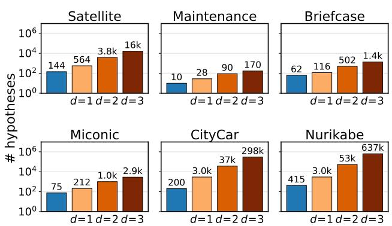  
Figure 7: Total number of hypotheses generated by OHCAM’s dynamic expansion compared to Conditional- SAM at fixed depth values d = 1, 2, 3. y-axis is log-scale.

Satellite models a collection of satellites that must rotate towards targets and allocate power to on-board instruments to take images. All conditions are of the form (when (not (x)) (x)), which is behaviorally identical to an unconditional efect. Thus, this domain supports comparisons to STRIPS-only learning methods (e.g. OLAM).

Briefcase models the transportation of objects by putting them in a briefcase. Moving involves universally quantifying over all objects in the briefcase to place them in the location specified in the action parameters. This domain has a maximum of three action parameter-bound literals, making it simple for learning conditions.

Miconic defines actions for an elevator that must move between floors and allow passengers to board. The stop ac- tion involves multiple quantified efects, involving conditions such as only deboarding passengers when they reach their destination.

Maintenance is the smallest domain, featuring only a sin-gle action with only three possible condition literals. The do- main involves scheduling when and where mechanics should work. A quantified variable selects all airplanes at that loca- tion on that day to be repaired.

CityCar is a domain where the agent works as a city plan-ner managing road infrastructure and trafic. The domain is more complex, with seven actions, 14 possible conjunctive terms, and two quantified efects. This domain turned out to be the most challenging for learners because of a quantified efect that only happens when a road is destroyed while a car is on it, which is a rare interaction to encounter. Ad- ditionally, in our testing we observed that overly complex preconditions afect task completion rate: there were some tasks that OHCAM, which learns minimal precondition sets, was able to solve, where the same model with a safe overap- proximation timed out.

Nurikabe is a simplified planning version of a tile puzzle of the same name. This domain has the largest predicate space, with a maximum of 31 possible conjunctive terms. The maximum condition involves three literals, which Mordoch et al. (2024) highlights as a significant scaling challenge.

<table><tr><td rowspan=1 colspan=1></td><td rowspan=1 colspan=1>|A|</td><td rowspan=1 colspan=1>max $\overline { { | \mathcal { L } _ { a } | } }$ </td><td rowspan=1 colspan=1>max $\underline { { \overline { { \vert \mathcal { L } _ { a } ^ { Q } } } } }$ </td><td rowspan=1 colspan=1>max $\overline { { | C _ { \ell } | } }$ </td><td rowspan=1 colspan=1>Total CE</td><td rowspan=1 colspan=1>Total UQV</td><td rowspan=1 colspan=1>Max UQV</td></tr><tr><td rowspan=1 colspan=1>Satellite</td><td rowspan=1 colspan=1>5</td><td rowspan=1 colspan=1>8</td><td rowspan=1 colspan=1>8</td><td rowspan=1 colspan=1> $\overline { { 0 ^ { * } } }$ </td><td rowspan=1 colspan=1> $\overline { { 0 ^ { * } } }$ </td><td rowspan=1 colspan=1>0</td><td rowspan=1 colspan=1>0</td></tr><tr><td rowspan=1 colspan=1>Maintenance</td><td rowspan=1 colspan=1>1</td><td rowspan=1 colspan=1>1</td><td rowspan=1 colspan=1>3</td><td rowspan=1 colspan=1>1</td><td rowspan=1 colspan=1>1</td><td rowspan=1 colspan=1>1</td><td rowspan=1 colspan=1>1</td></tr><tr><td rowspan=1 colspan=1>Briefcase</td><td rowspan=1 colspan=1>3</td><td rowspan=1 colspan=1>3</td><td rowspan=1 colspan=1>5</td><td rowspan=1 colspan=1>1</td><td rowspan=1 colspan=1>1</td><td rowspan=1 colspan=1>1</td><td rowspan=1 colspan=1>1</td></tr><tr><td rowspan=1 colspan=1>Miconic</td><td rowspan=1 colspan=1>3</td><td rowspan=1 colspan=1>4</td><td rowspan=1 colspan=1>5</td><td rowspan=1 colspan=1>2</td><td rowspan=1 colspan=1>3</td><td rowspan=1 colspan=1>3</td><td rowspan=1 colspan=1>1</td></tr><tr><td rowspan=1 colspan=1>CityCar</td><td rowspan=1 colspan=1>7</td><td rowspan=1 colspan=1>14</td><td rowspan=1 colspan=1>14</td><td rowspan=1 colspan=1>1</td><td rowspan=1 colspan=1>2</td><td rowspan=1 colspan=1>2</td><td rowspan=1 colspan=1>1</td></tr><tr><td rowspan=1 colspan=1>Nurikabe</td><td rowspan=1 colspan=1>4</td><td rowspan=1 colspan=1>21</td><td rowspan=1 colspan=1>31</td><td rowspan=1 colspan=1>3</td><td rowspan=1 colspan=1>3</td><td rowspan=1 colspan=1>3</td><td rowspan=1 colspan=1>1</td></tr></table>

Table 4: Benchmark domain conditional efect and quantified variable features: # actions |A|, maximum # action-bound literals max $| L _ { a } | .$ , # literals with optimal quantified variables max $| L _ { a } ^ { Q } |$ , maximum # antecedent terms max $| C _ { \ell } | _ { \ell }$ , total conditional efects CE, total UQVs, and maximum # UQVs in one efect, and number of disjunctive efects. Satellite conditions are redundant.

All domains are available in AI-Planning (2026), except the conditional version of Satellite is found at Potassco (2026). As in Mordoch et al. (2024), we ignore action costs.

## Appendix C.3: Robot Hardware Domains

We evaluate OHCAM and the baselines on two domains on real robot hardware. We detail the specifics of these domains and their conditional efects below. The naïve action models we use and the learned action models can all be found in the models folder of the supplemental materials.

MagnetBlocks The magnet blocks domain is similar to the BlocksWorld classical planning domain in which the agent is tasked with achieving block stack configurations with vary- ing number of blocks. In this domain, we have four classes of objects: (i) a table, (ii) wooden blocks, (iii) magnetic blocks, and (iv) locations. Magnet blocks will stick to other mag- netic blocks, resulting in both blocks moving as the result of a pick action. Locations denote the workspace of available locations that a block can reside in.

There are two actions, pick and place. Our pick and place actions are parameterized by the target object to act on, the object to pick the object from or place it on, and the corresponding locations of both of those objects. The parameters are suficient to perform standard block-stacking tasks, but magnetic interactions between blocks necessitate quantifica- tion.

A naïve action model is unaware of those interactions. A model learning algorithm must learn from the data to understand that when it picks up a magnetic block that sits upon another magnetic block, both blocks will be lifted. Likewise, when placing down a stack, the bottommost block is going to be placed at the target location instead of the grasped block. Learning agents must be able to model the quantified relationships between the blocks and locations.

The magnet domain features an additional complexity: disjunctive conditions. The agent must reason about whether either block is non-magnetic, which involves a disjunctive condition. We extend OHCAM to handle disjunctions with a greedy set cover approach: it selects conjunctive hypothe-ses with zero false positives until every observed efect in the dataset is explained by a true positive from at least one selected hypothesis. This produces a condition in disjunctive normal form. This approach is suficient to learn a simple disjunction, but could be extended in the future to support more complex case-by-case reasoning.

We show an excerpt of the model learned online in the MagneticBlocks robot hardware environment by OHCAM in Listing 1.

SpongeWorld The sponge world domain simulates a household cleaning task in which the primary objective is to clean a dirty plate. In this domain, we have a variety of objects: a table, targets or ‘coasters’ that objects rest on, sponges, cans, messes, and water spills. A blue sponge is always soaked, and wiping a plate with the wet sponge will result in excess water being on the plate. Furthermore, wip- ing the plate when the can is on the plate will result in the can being knocked on to the table.

In addition to the pick and place actions, we add a third action wipe with three predicates: the mess to wipe, the object with which to wipe the mess, and the surface that the mess sits on.

A naïve action model is unaware that wiping with a wet sponge will leave the water spill on the plate and that wiping the plate with a can on the plate will move the can to the table. Both of these are examples of efects that might be dificult for an expert to foresee or predict ahead of time, or may be accidentally omitted because they are seen as ‘common knowledge’. An online learning agent can increase task performance by inferring such efects from executed actions. We show the model learned by OHCAM in Listing 2.

## Appendix D: Real World Hardware Setup and Evaluation

This section outlines the components of our robot system that enable model learning and evaluation. Our real world experi- ments were conducted on a Kinova Gen3 7 DoF manipulator arm with a Robotiq 2F85 two finger gripper, using an Intel RealSense D435i mounted on the side of the workspace for object localization. Figure 8 shows our setup.

## Appendix D.1: Hardware Setup

Perception and Object Localization Perception of the objects on the table top is performed using the Intel Re-alsense D435i camera which we interface with through the realsensepy package, accessing both the RGB and depth

1 (:action pick-block 2 :parameters ( ?target ?support 3 ?targetloc ?supportloc) 4 :precondition (and 5 (on ?target ?support) 6 7 ) 8 :effect (and 9 ; regular blocks world 10 (grasping ?target) (gripper-full) 11 (not (at-loc ?target ?targetloc)) 12 ; conditional effect when both magnetic 13 (when (and (plastic ?target) 14 (plastic ?support)) 15 (not (at-loc ?support ? supportloc))) 16 ; disjunction: one of them is not magnetic 17 (when (or (not (plastic ?target)) 18 (not (plastic ?support))) 19 (not (on ?target ?support))) 20 ; UQV for the block below the support 21 (forall (?uqv0 - block) 22 (when (and (plastic ?target) 23 (not (wooden ?support))) 24 (not (on ?support ?uqv0)))) 25 ; UQV for the location below the support when magnetic 26 (forall (?uqv0 - location) 27 (when (and 28 (loc-above ?supportloc 29 ?uqv0) 30 (plastic ?support) 31 (plastic ?target)) 32 (not (obstructed-above ?uqv0 )))) 33

Listing 1: Abbreviated and annotated excerpt oflearned Mag- netBlocks pick action with conditional and quantified efects.

streams at 30 frames per second. AM3 (Carion et al. 2026) segmentation model is used to identify the objects in the scene. To support robust object tracking via language concepts, we assume that there is only one instance of each object per concept in the scene.

After identifying each concept in the RGB image, we use the segmentation masks returned from SAM3 along with the calibrated D435i camera intrinsics to reconstruct the point cloud for each object in the scene. We make one of two assumptions to compute the centroid of the object from the point cloud: (i) the majority of the points lie on the front face which applies to cubes, cans and sponges, or (ii) the majority of the points lie on the top face which applies to plates, cans, water spills, and messes. To obtain the poses of the object in the robot frame, we place a 100mm AprilTag at the base of the robot with an ofset along the x-axis of 14cm and use the AprilTags package to compute the camera pose and transform object centroids into the robot frame for manipulation.

1 (:action wipe 2 :parameters (?grasped ?mess ?target) 3 :precondition (and 4 (grasping ?grasped) 5 (on ?mess ?target) 6 7 ) 8 :effect (and 9 ; cleans original mess 10 (not (dirty ?target)) 11 (not (on ?mess ?target)) 12 ; adds spill when sponge is wet 13 (forall (?uqv0 - spill) 14 (when (wet ?grasped) 15 (on ?uqv0 ?target))) 16 ; knocks cans off plate 17 (forall (?uqv0 - can) 18 (when (on ?uqv0 ?target) 19 (not (on ?uqv0 ?target)))) 20 ; knocks cans onto table 21 (forall (?uqv0 - table ?uqv1 - can) 22 (when 23 (and (on ?uqv1 ?target)) 24 (on ?uqv1 ?uqv0)))))

Listing 2: Annotated excerpt of learned SpongeWorld wipe action with conditional and quantified efects.

By computing the centroids in this manner, we have made the following assumptions: (i) the orientation of each object is static and (ii) the ideal grasp position can be parameterized solely by the centroid. Given that the aim of our robot system is not to demonstrate complex grasping or perception behav- ior, we believe that these assumptions are not limiting, and instead serve to demonstrate the performance of our online model learning algorithm in the real world.

Predicate Grounding from Perception The majority of the predicates in our PDDL evaluation domains denote spa- tial relations among objects. We perform predicate grounding programatically by comparing the centroids of the objects. As an example, for the ‘on’ predicate, if the XY center of object A is within the XY bounding box of object B (plus a little slack) and the Z center of object A rests above the Z center of object B plus the size of object A (plus a little slack), then we say that object A is ‘on’ object B.

In this manner, we are able to ground all the predicates in evaluation domains programatically using the centroids computed with SAM3. On an NVIDIA 5070 GPU with 12GB of VRAM, we are able to run the SAM3 segmentation model at 5Hz. Given the execution time of our robot skills, this inference speed was suficient to ensure that all predicates were accurately grounded during action selection.

Parameterized Manipulation Skills In both of our do-mains, the model has parameterized actions such as ‘pick(object A, object B)’, interpreted as ‘Pick object A from object B’. However, these actions from the action plan are agnostic to the position of the object in the real world. With our perception system, we track each object in the real world at 5Hz. Then, when an action is called, we resolve the object names to their centroids and use these centroids to parame- terize the pick, place and wipe skills that are present in our two real world domains.

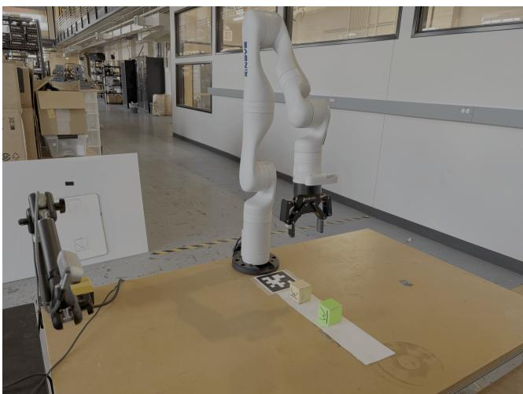  
Figure 8: A picture of of tabletop manipulation setup pictur- ing the Intel RealSense D435i camera (left) and the Kinova Gen3 Arm with Robotiq 2F85 gripper (center) and AprilTag for camera localization.

All of our robot manipulation skills are stateful: we com- bine a series of motions together to achieve the desired result. These motions are open loop once the skill is parameterized and initiated. To communicate with the Kinova Gen3 robot, we used the Kinova Kortex API Python bindings which en- able control at 20Hz over TCP protocol. The Kinova Kortex API exposes a cartesian end efector controller, enabling lin- ear motion between poses of the end efector. The inverse kinematics are resolved on the robot hardware, which in turn controls the necessary joint torques to achieve the desired pose subject to position and orientation velocity limits.

Noise in Perception and Execution When an object is misidentified or unidentified by SAM3, the predicate ground- ing may be erroneous. This can also occur due to partial oc- clusion of the gripper, although we designed our environment to result in minimal occlusion. The majority of this noise did not impact the successful execution of skills, but was noise that our learning algorithms had to deal with when diferen- tiating between noise and observed conditional efects.

Execution noise was rarely observed within the system. Infrequently, a sponge would slip out of the gripper if it was too wet, resulting in the pick or place actions to fail prema- turely. Most execution failures could be traced to perception failures, either resulting from a noisy depth map and incor- rect centroid, or a misidentified object. Overall, we observed around 5% action failures during data collection resulting from perception noise. This noise represents realistic con- ditions and challenges in the real world that these learning algorithms must overcome.

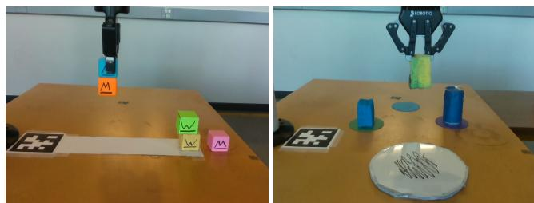  
Figure 9: Data collection in the MagnetBlocks world (left) and the SpongeWorld (right) domains viewed through the Intel RealSense D435i camera which is used for perception. Both cases are showcasing an unmodeled conditional efect.

## Appendix D.2: Robot Data Collection and Evaluation

Data Collection: Using our robot system described in Appendix D.1, we collected data in the MagnetBlocks and SpongeWorld domains (see Figure 9). Given that the robot can observe irreversible conditional efects which can result in potentially unsafe actions to the robot hardware (placing a block on another block with a magnet block in between results in excessive torque applied to the joints), all of our hardware experiments are conducted with a human supervi- sor.

In this setup, the importance of online active learning be- comes very clear: data collection is time consuming and so an agent must take actions that maximally reduce uncertainty about the presence of conditional efects within the environ- ment. We collect 250 skill executions in the MagnetBlocks and SpongeWorld domains. Data collection takes around 45 minutes to 1.25 hours, primarily due to skill execution and environment resetting rather than action selection. We ob- served 5% noise present during data collection, resulting in execution failures or perception failures that were outside the action preconditions.

Robot Evaluation: Using data collected by OHCAM, each of the baselines and OHCAM learned a PDDL model to asses their ability to learn conditional efects from noisy, real- world data. With these learned models, we then evaluated each model on a suite of ten tasks in MagnetBlocks, seven of which require knowledge of conditional efects to solve, and five tasks in SpongeWorld, four of which require knowledge of conditional efects to solve. We use the FastDownward planner to plan over these learned models and then execute the plan on robot hardware.

We run each task once per learned model. If a task fails due to perception or execution noise, we rerun the plan, oth- erwise we report the success of failure of the plan execution. We take this approach to evaluate OHCAM’s ability to learn in the presence of noisy observations and sample eficiently on real world hardware; not to evaluate the accuracy of our robot system’s execution. Nonetheless, during data collec- tion across both domains, we only had to intervene and rerun twice for a skill execution failure, indicating that our robot system is relatively reliable. The learned models and hard- ware video can be found in the supplemental material folder.