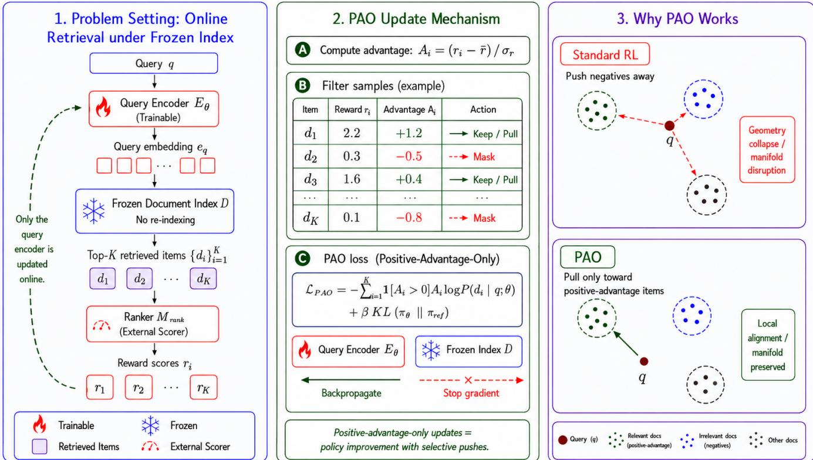
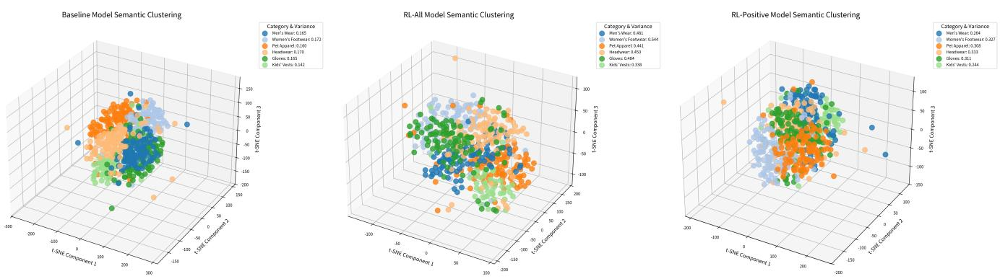

# Learning from What You Retrieve: Online RL Fine-Tuning for Semantic Retrieval

Shaowei Wei∗   
leqian.wsw@taobao.com   
Alibaba Group   
Hangzhou, China   
Jin Zhang   
zj146372@alibaba-inc.com   
Alibaba Group   
Hangzhou, China   
Chong Huang   
caiyu.hc@alibaba-inc.com   
Alibaba Group   
Hangzhou, China   
Zhuojun Wang   
jerry.wangzj@taobao.com   
Alibaba Group   
Hangzhou, China

Songtao Fang fangsongtao.fst@taobao.com Alibaba Group Hangzhou, China

Chengfu Huo   
chengfu.huocf@taobao.com   
Alibaba Group   
Hangzhou, China

## Abstract

In large-scale e-commerce retrieval, dual-encoder retrievers are optimized for contrastive similarity, whereas downstream rerankers capture finer-grained relevance preferences; this objective mismatch limits end-to-end retrieval quality. Reinforcement Learning ofers a way to use reward-model feedback for retriever adaptation, but we observe that standard policy-gradient updates can degrade embedding geometry, especially when the document index must remain frozen due to industrial constraints.

To address this, we propose PAO (Positive-Advantage-Only), a selective RL optimization method. Our analysis reveals that indiscriminate penalization of negative samples (pushing away) in a frozen high-dimensional space disrupts pre-trained semantic manifolds. PAO selectively applies gradient updates only to retrieved items with positive advantages, efectively pulling query embeddings toward high-reward regions while preserving global topological stability. Experiments on both a massive industrial dataset and public benchmarks demonstrate that PAO significantly outperforms standard RL and distillation baselines.

## CCS Concepts

• Information systems → Retrieval systems; • Computing methodologies → Reinforcement learning.

## Keywords

Semantic Retrieval, Reinforcement Learning, E-Commerce, Representation Learning, Recommendation System

## ACM Reference Format:

Shaowei Wei, Chong Huang, Songtao Fang, Jin Zhang, Zhuojun Wang, and Chengfu Huo. 2026. Learning from What You Retrieve: Online RL Fine-Tuning for Semantic Retrieval. In Proceedings ofthe 35th ACM International Conference on Information andKnowledge Management(CIKM’26), November 07–11, 2026, Rome, Italy. ACM, New York, NY, USA, 6 pages. https://doi.org/ 10.1145/3799682.3839929

## 1 Introduction

Modern retrieval systems commonly use a two-stage architecture: retrieval followed by ranking [7]. Dual-encoder models [9] retrieve candidates eficiently with approximate nearest-neighbor search [10], but often miss the complex, fine-grained relevance signals modeled by heavy downstream rerankers [3, 16].

Bridging this gap via online fine-tuning is challenging in industrial settings, where optimization must operate with a frozen document index. Re-indexing billions of item vectors after every model update is computationally prohibitive, so optimization is constrained to the query encoder alone. We formulate this alignment task as a Reinforcement Learning [24] problem, where the query encoder acts as an agent and receives reward signals from the downstream reranker [1, 5].

However, we identify a critical failure mode: standard Policy Gradient (PG) algorithms lead to severe performance deterioration, a phenomenon we term as Geometry Collapse. Our investigation suggests that the point-wise optimization of RL—specifically pushing away queries from low-reward items—acts destructively when the document space is immutable. Unlike contrastive learning where negatives are pushed relative to positives [6, 8], pure RL pushing in a frozen space often displaces query embeddings into semantically ambiguous regions, shattering the distribution established by pre-training [25, 28].

To resolve this, we propose PAO, a selective update mechanism for applying positive-advantage-only RL under the frozen-index constraint. We hypothesize that strictly pulling queries toward candidates with positive advantages (rewards above the baseline) allows for fine-grained local alignment, while masking negative signals prevents structural disruption.

Our contributions are:

(1) We identify the geometric degradation caused by standard RL when fine-tuning query encoders against a frozen index.

(2) We propose PAO, a selective update mechanism that harmonizes retrieval-ranking consistency without compromising embedding space generalization.

(3) Extensive experiments on industrial and public datasets confirm PAO’s superiority in both standard metrics and semantic alignment.

  
Figure 1: The Query Encoder interacts with the frozen Document Index. Only gradients from positive advantage samples are back-propagated, while negative signals are masked to prevent manifold disruption.

## 2 Related Work

Dense retrieval has been advanced by pre-trained language models and contrastive objectives [13, 25, 28], with representative systems improving negative mining, embedding structure, and retrieval eficiency [11, 12, 29, 32]. However, most methods assume that both query and document encoders can be updated, or that document embeddings can be rebuilt after training. This assumption is often infeasible in industrial retrieval, where the document index is frozen and only the query encoder can be adapted online.

Retriever-reranker alignment is commonly approached through knowledge distillation, where cross-encoder or reranker scores supervise a dual encoder [4, 19, 21, 31]. Such methods typically distill static teacher distributions over fixed candidate sets, whereas our setting uses feedback on the candidates retrieved by the current query policy. RL has also been studied for search and ranking [1, 5, 17, 23], and recent work explores reinforcement learning for dense retrieval or reranker optimization [14, 15, 30, 33]. In contrast, we focus on query-only RL under a frozen document index, where negative policy-gradient updates can distort the embedding geometry.

## 3 Methods

We formulate the fine-tuning of the Query Encoder $E _ { Q } ( \cdot ; \theta )$ against a frozen Document Index D and an external reward model $M _ { \mathrm { r a n k } }$ as an episodic Markov Decision Process (MDP). The proposed frame work is depicted in Figure 1.

## 3.1 RL Formulation

Policy (��): Defined by the Query Encoder. Given query �, it generates $e _ { q } = E _ { Q } ( q ; \theta )$

Action (�): The retrieval of a Top-K list $L _ { q } = \{ d _ { 1 } , \ldots , d _ { k } \}$ from D via MIPS. This list is treated as a macro-action sampled from the policy.

Sampling Probability: The probability of sampling document �� is proportional to the similarity score $s _ { i } = e _ { q } ^ { \top } e _ { d _ { i } }$ . We model the intra-list distribution via Softmax:

$$
P ( d _ { i } | q ; \theta ) = \frac { \exp ( s _ { i } / \tau ) } { \sum _ { j \in L _ { q } } \exp ( s _ { j } / \tau ) }\tag{1}
$$

where � is the temperature coeficient.

## 3.2 Reward and The Geometry Collapse

The ranker supplies the relevance reward $r _ { i } = M _ { \mathrm { r a n k } } ( q , d _ { i } )$ . We utilize standardized advantage $A _ { i } = { \left( { r _ { i } - \bar { r } } \right) } / { \sigma _ { r } }$ to reduce variance [22]. The standard REINFORCE objective [27] minimizes:

$$
\mathcal { L } _ { a l l } = - \sum _ { i = 1 } ^ { k } A _ { i } \log P ( d _ { i } | q ; \theta )\tag{2}
$$

Observation: When $A _ { i } < 0 ,$ the gradient drives $e _ { q }$ away from $e _ { d _ { i } }$ . In a frozen high-dimensional space, this pushing operation has infinite degrees offreedom. Unlike contrastive learning (which pulls negatives towards other defined clusters), pure RL pushing often displaces $e _ { q }$ into semantic voids, disrupting the cluster structure required for recall.

## 3.3 Positive-Advantage-Only (PAO) Strategy

To incorporate ranking knowledge without destroying semantic structure, we propose PAO. We mask negative updates and enforce a KL-divergence constraint relative to the pre-trained reference policy $\pi _ { r e f } \colon$

$$
\mathcal { L } _ { p o s } ( \theta ) = - \sum _ { i = 1 } ^ { k } \mathbb { I } ( A _ { i } > 0 ) \cdot A _ { i } \cdot \log P ( d _ { i } | q ; \theta ) + \beta \cdot \mathrm { K L } ( \pi _ { \theta } | | \pi _ { r e f } )\tag{3}
$$

Here, I(·) is the indicator function. By optimizing only when $A _ { i } > 0 ,$ we efectively pull the query embedding towards items that the reward model considers better than average. This constitutes a constructive local adjustment, whereas the KL term [18] (weighted by �) acts as a global anchor to prevent policy drift.

## 4 Experiments

## 4.1 Experimental Setup

Dataset: We evaluate our method on a proprietary, anonymized search log from a top-tier e-commerce platform, consisting of 1M training queries and 50k test queries.

Model Configurations: The query and document encoders are initialized with GTE-Base [12, 32]. For reinforcement learning, we employ an online fine-tuned BGE-Reranker [4] as the reward model. Training Settings: For PAO, we freeze the document index, update only the query encoder, and retrieve top-100 candidates per query. We train for two epochs with batch size 16, learning rate $2 \times 1 0 ^ { - 5 }$ 100 warmup steps, and $\beta = 0 . 3$

Compared Methods: We compare the following strategies:

• Baseline: The GTE-Base model fine-tuned using standard contrastive learning (InfoNCE) on in-domain querydocument pairs.

• RL-All: A reinforcement learning baseline using the standard Listwise Policy Gradient on all document samples.

• RL-Pos (PAO): The proposed selective RL method that applies updates only from positive-advantage samples.

## 4.2 Main Results: Industrial Dataset

We evaluate all methods on standard information retrieval metrics.   
Table 1 presents the results on our industrial dataset.

Consistent with our hypothesis, RL-All sufers a catastrophic drop (e.g., -13.6pt in NDCG@5). This confirms that unselective optimization harms representation quality. When negative gradients push the query vector, they do so blindly without knowledge of the manifold structure, often pushing the query into a region of the vector space that corresponds to no meaningful semantic concept.

In contrast, RL-Pos (PAO) achieves robust improvements (+9.0pt in NDCG@5 over Baseline). By relying solely on pull operations, PAO ensures that the query vector is always moving towards a valid document vector (a known point in the semantic manifold), thereby implicitly preserving the validity of the query representation.

## 4.3 Semantic Consistency Analysis via LLM-Judge

We further use Qwen3-235b-a22b [20] as an LLM judge to assess whether retrieved items fully satisfy query intent. Hits@K counts relevant items within the top-K results, while Matchment measures average demand-point satisfaction across the retrieved list.

As shown in Table 2, RL-All degrades across all judged metrics, confirming that unconstrained negative updates blur fine-grained intent matching. By contrast, RL-Pos (PAO) improves deep retrieval (Hits@20 +2.1pt) and Matchment (+1.4pt), suggesting that PAO retrieves harder relevant items without drifting into irrelevant regions.

## 4.4 Visual Analysis of Geometry

To visualize the impact of fine-tuning on Query Embedding space geometry, we conducted a t-SNE [26] analysis. We randomly sampled hundreds of queries from 6 item categories and projected Query Embeddings from Baseline, RL-All, and RL-Pos (PAO) models into 3D space, as shown in Figure 2.

The Baseline exhibits a robust semantic structure with compact query clusters, a direct result of contrastive pre-training. In stark contrast, RL-All displays significant representation degradation, characterized by dispersed category clusters and a sharp increase in intra-class variance. This empirically confirms that the unconstrained penalization of negative samples destructively distorts the embedding space. Crucially, RL-Pos (PAO) largely preserves the Baseline’s macro-structure, demonstrating a non-destructive optimization process. We interpret the observed slight increase in intra-cluster variance not as degradation, but as beneficial adaptation: query embeddings are finely shifted from general category centroids toward high-reward sub-regions within the frozen document space, yielding more discriminative representations.

## 4.5 Generalization on Public Benchmarks

To verify the robustness of PAO beyond proprietary data, we conducted experiments on MS MARCO passage ranking [2], a largescale public retrieval benchmark. We initialize the retriever from GTE-Base [12, 32] and use BGE-Reranker [4] as the reward model, using the same frozen-index, query-only setup and training settings as in the industrial experiments described in Section 4.1.

As shown in Table 3, PAO improves all reported metrics on MS MARCO, including +2.03pt on NDCG@5 and +4.23pt on Recall@50 over the baseline retriever. This indicates that PAO transfers beyond the proprietary setting and remains efective when aligning a general-purpose retriever with a strong reranker reward model on a large public benchmark.

## 4.6 Ablation Study

We investigate two complementary factors: whether PAO is preferable to directly distilling reranker scores on the public benchmark, and how the KL penalty weight (�) and temperature (�) afect the industrial setting.

Comparison with KL Distillation: KL-Distill uses the same top-100 candidates, BGE-Reranker teacher, and training settings, but matches the retriever distribution to the reranker-induced soft distribution. As Table 3 shows, PAO remains stronger, especially at deeper cutofs (+2.31pt Recall@50 and +0.56pt NDCG@50), indicating that positive-advantage filtering converts reranker feedback more stably than direct KL matching under a frozen index.

Table 1: Retrieval Performance on Industrial Dataset
<table><tr><td>Model</td><td>Recall@5</td><td>Recall@10</td><td>Recall@20</td><td>Recall@50</td><td>NDCG@5</td><td>NDCG@10</td><td>NDCG@20</td><td>NDCG@50</td></tr><tr><td>Baseline</td><td>0.7929</td><td>0.8530</td><td>0.9002</td><td>0.9431</td><td>0.7000</td><td>0.7196</td><td>0.7316</td><td>0.7402</td></tr><tr><td>RL-All</td><td>0.6547 (-13.8pt)</td><td>0.7222 (-13.1pt)</td><td>0.7825 (-11.8pt)</td><td>0.8496 (-9.4pt)</td><td>0.5635 (-13.6pt)</td><td>0.5854 (-13.4pt)</td><td>0.6006 (-13.1pt)</td><td>0.6141 (-12.6pt)</td></tr><tr><td>RL-Pos (PAO)</td><td>0.8618 (+6.9pt)</td><td>0.9030 (+5.0pt)</td><td>0.9341 (+3.4pt)</td><td>0.9623 (+1.9pt)</td><td>0.7896 (+9.0pt)</td><td>0.8030 (+8.3pt)</td><td>0.8109 (+7.9pt)</td><td>0.8165 (+7.6pt)</td></tr></table>

  
Figure 2: Left: Baseline clusters. Middle: RL-All showing dispersed/collapsed clusters. Right: RL-Pos (PAO) retaining macrostructure with beneficial intra-cluster variance.

Table 2: Objective Retrieval Quality Evaluation Under Diferent Fine-Tuning Approaches
<table><tr><td>Model</td><td>Hits@5</td><td>Hits@10</td><td>Hits@20</td><td>Matchment</td></tr><tr><td>Baseline</td><td>0.3289</td><td>0.2631</td><td>0.2130</td><td>0.6764</td></tr><tr><td>RL-All</td><td>0.2822</td><td>0.2306</td><td>0.1901</td><td>0.6558</td></tr><tr><td rowspan="3">RL-Pos (PAO)</td><td>(-4.7pt)</td><td>(-3.2pt)</td><td>(-2.3pt)</td><td>(-2.1pt)</td></tr><tr><td>0.3458</td><td>0.2831</td><td>0.2337</td><td>0.6900</td></tr><tr><td>(+1.7pt)</td><td>(+2.0pt)</td><td>(+2.1pt)</td><td>(+1.4pt)</td></tr></table>

Impact of KL Weight (�): Table 4 shows that a moderate � = 0.3 is optimal. Lower values lead to overfitting ranking noise, while higher values (� = 1.0) overly constrain the policy.

Impact of Temperature (�): Table 5 indicates � = 1.0 provides the best trade-of. Lower � reduces exploration, while higher � dilutes the gradient signal.

## 4.7 Discussion & Limitations

While PAO successfully mitigates embedding space degradation, it operates under the assumption that the frozen index covers the recall target. The method optimizes retrievability but cannot generate new knowledge; if relevant documents are absent from the index, PAO serves limited utility. Additionally, our framework assumes the Reward Model is a reliable proxy for user satisfaction. In scenarios where the ranker exhibits bias (e.g., favoring click-bait), PAO may eficiently propagate these biases into the retrieval stage. Addressing this reward hacking via multi-objective optimization remains a direction for future work.

## 5 Conclusion

This paper presents a novel online fine-tuning framework for retrieval models under the strict constraint of a frozen document index. We demonstrate that the Positive-Advantage-Only strategy efectively prevents the geometry collapse associated with standard RL by avoiding destructive updates from negative samples. Beyond immediate performance gains, PAO suggests a potential path toward closed-loop retriever-ranker adaptation: query-side retriever updates may expose harder and more relevant candidates to the ranker, while future ranker updates may provide sharper reward signals for subsequent retriever fine-tuning. We leave a full validation of this iterative loop to future work.

## GenAI Usage Disclosure

The authors used generative AI tools to assist with language polishing, manuscript organization, visualization prototyping, and code debugging. The authors reviewed and validated all technical claims, references, figures, and experimental results. Generative AI was not used to fabricate data or alter evaluation outcomes.

## References

[1] Qingyao Ai, Keping Bi, Jiafeng Guo, and W. Bruce Croft. 2018. Learning a deep listwise context model for ranking refinement. In Proceedings ofthe 41st

Table 3: MS MARCO Results with Baseline and Distillation Comparisons
<table><tr><td>Model</td><td>Recall@5</td><td>Recall@10</td><td>Recall@20</td><td>Recall@50</td><td>NDCG@5</td><td>NDCG@10</td><td>NDCG@20</td><td>NDCG@50</td></tr><tr><td>Baseline</td><td>0.3579</td><td>0.4572</td><td>0.5683</td><td>0.6922</td><td>0.2533</td><td>0.2860</td><td>0.3145</td><td>0.3396</td></tr><tr><td>KL-Distill</td><td>0.3803</td><td>0.4945</td><td>0.5951</td><td>0.7114</td><td>0.2727</td><td>0.3102</td><td>0.3360</td><td>0.3595</td></tr><tr><td>RL-Pos (PAO)</td><td>0.3850</td><td>0.5040</td><td>0.6100</td><td>0.7345</td><td>0.2736</td><td>0.3125</td><td>0.3398</td><td>0.3651</td></tr><tr><td>∆ vs. Baseline</td><td> $( + 2 . 7 1 \mathrm { p t } )$ </td><td> $\left( + 4 . 6 8 \mathrm { p t } \right)$ </td><td> $\mathrm { ( + 4 . 1 7 p t ) }$ </td><td> $( + 4 . 2 3 \mathrm { p t } )$ </td><td> $( + 2 . 0 3 \mathrm { p t } )$ </td><td> $( + 2 . 6 5 \mathrm { p t } )$ </td><td> $( + 2 . 5 3 \mathrm { p t } )$ </td><td> $( + 2 . 5 5 \mathrm { p t } )$ </td></tr><tr><td>∆ vs. KL-Distill</td><td> $\mathrm { ( + 0 . 4 7 p t ) }$ </td><td> $( + 0 . 9 5 \mathrm { p t } )$ </td><td>(+1.49pt)</td><td> $( + 2 . 3 1 \mathrm { p t } )$ </td><td> $( + 0 . 0 9 \mathrm { p t ) }$ </td><td> $( + 0 . 2 3 \mathrm { p t } )$ </td><td> $( + 0 . 3 8 \mathrm { p t } )$ </td><td> $( + 0 . 5 6 \mathrm { p t } )$ </td></tr></table>

Table 5: Sensitivity to Temperature (�)

Table 4: Sensitivity to KL Weight (�)
<table><tr><td>β</td><td>0</td><td>0.1</td><td>0.3</td><td>0.5</td><td>0.7</td><td>1.0</td></tr><tr><td>Recall@5</td><td>0.813</td><td>0.834</td><td>0.862</td><td>0.820</td><td>0.810</td><td>0.803</td></tr></table>

International ACM SIGIR Conference on Research and Development in Information Retrieval. ACM, 135–144. doi:10.1145/3209978.3209985

[2] Payal Bajaj, Daniel Campos, Nick Craswell, Li Deng, Jianfeng Gao, Xiaodong Liu, Rangan Majumder, Andrew McNamara, Bhaskar Mitra, Tri Nguyen, Mir Rosenberg, Xia Song, Alina Stoica, Saurabh Tiwary, and Tong Wang. 2016. MS MARCO: A Human Generated Machine Reading Comprehension Dataset. arXiv preprint arXiv:1611.09268 (2016). arXiv:1611.09268 [cs.CL]

[3] Chris Burges, Tal Shaked, Erin Renshaw, Ari Lazier, Matt Deeds, Nicole Hamilton, and Greg Hullender. 2005. Learning to Rank Using Gradient Descent. In Proceedings ofthe 22nd International Conference on Machine Learning. ACM, 89–96.

[4] Jianlv Chen, Shitao Xiao, Peitian Zhang, Kun Luo, Defu Lian, and Zheng Liu. 2024. BGE M3-Embedding: Multi-Lingual, Multi-Functionality, Multi-Granularity Text Embeddings Through Self-Knowledge Distillation. arXiv preprint arXiv:2402.03216 (2024). arXiv:2402.03216 [cs.CL]

[5] Minmin Chen, Alex Beutel, Paul Covington, Sagar Jain, Francois Belletti, and Ed H. Chi. 2019. Top-K Of-Policy Correction for a REINFORCE Recommender System. In Proceedings of the 12th ACM International Conference on Web Search and Data Mining. ACM, 456–464. doi:10.1145/3289600.3290994

[6] Xinlei Chen and Kaiming He. 2021. Exploring simple siamese representation learning. In Proceedings of the IEEE/CVF Conference on Computer Vision and Pattern Recognition. IEEE, 15750–15758.

[7] Paul Covington, Jay Adams, and Emre Sargin. 2016. Deep Neural Networks for YouTube Recommendations. In Proceedings ofthe 10th ACM Conference on Recommender Systems. ACM, 191–198. doi:10.1145/2959100.2959190

[8] Kaiming He, Haoqi Fan, Yuxin Wu, Saining Xie, and Ross Girshick. 2020. Momentum contrast for unsupervised visual representation learning. In Proceedings of the IEEE/CVF Conference on Computer Vision and Pattern Recognition. IEEE, 9729–9738.

[9] Po-Sen Huang, Xiaodong He, Jianfeng Gao, Li Deng, Alex Acero, and Larry P. Heck. 2013. Learning Deep Structured Semantic Models for Web Search Using Clickthrough Data. In Proceedings ofthe 22nd ACM International Conference on Information and Knowledge Management. ACM, 2333–2338. doi:10.1145/2505515. 2505665

[10] Jef Johnson, Matthijs Douze, and Hervé Jégou. 2021. Billion-scale similarity search with GPUs. IEEE Transactions on Big Data 7, 3 (2021), 535–547. doi:10. 1109/TBDATA.2019.2921572

[11] Vladimir Karpukhin, Barlas Oguz, Sewon Min, Patrick Lewis, Ledell Wu, Sergey Edunov, Danqi Chen, and Wen tau Yih. 2020. Dense Passage Retrieval for Open Domain Question Answering. In Proceedings ofthe 2020 Conference on Empirical Methods in Natural Language Processing. Association for Computational Linguis tics, 6769–6781.

[12] Zehan Li, Xin Zhang, Yanzhao Zhang, Dingkun Long, Pengjun Xie, and Meishan Zhang. 2023. Towards General Text Embeddings with Multi-stage Contrastive Learning. arXiv preprint arXiv:2308.03281 (2023). arXiv:2308.03281 [cs.CL]

[13] Jimmy Lin, Rodrigo Nogueira, and Andrew Yates. 2021. Pretrained Transformers for Text Ranking: BERT and Beyond. Morgan & Claypool.

[14] Zhijie Lin, Zhuofeng Li, Chenglei Dai, Wentian Bao, Shuai Lin, Enyun Yu, Haoxiang Zhang, and Liang Zhao. 2025. GReF: A Unified Generative Framework for Eficient Reranking via Ordered Multi-token Prediction. In Proceedings ofthe 34th ACM International Conference on Information and Knowledge Management. ACM, 5879–5887. doi:10.1145/3746252.3761540

[15] Xingxian Liu, Dongshuai Li, Jiahui Wan, Tao Wen, Gui Ling, Yuliang Yan, Fuyu Lv, Dan Ou, Haihong Tang, and Bo Zheng. 2025. Retrieval-GRPO: A Multi-Objective Reinforcement Learning Framework for Dense Retrieval in Taobao Search. arXiv preprint arXiv:2511.13885 (2025). arXiv:2511.13885 [cs.IR]

<table><tr><td>τ</td><td>0.3</td><td>0.5</td><td>1.0</td><td>1.5</td><td>2.0</td></tr><tr><td>Recall@5</td><td>0.854</td><td>0.850</td><td>0.862</td><td>0.858</td><td>0.843</td></tr></table>

[16] Rodrigo Nogueira and Kyunghyun Cho. 2019. Passage Re-ranking with BERT. arXiv preprint arXiv:1901.04085 (2019). arXiv:1901.04085 [cs.IR]

[17] Harrie Oosterhuis and Maarten de Rijke. 2018. Diferentiable unbiased online learning to rank. In Proceedings of the 27th ACM International Conference on Information and Knowledge Management. ACM, 1293–1302.

[18] Long Ouyang, Jef Wu, Xu Jiang, Diogo Almeida, Carroll L. Wainwright, Pamela Mishkin, Chong Zhang, Sandhini Agarwal, Katarina Slama, Alex Ray, John Schul man, Jacob Hilton, Fraser Kelton, Luke Miller, Maddie Simens, Amanda Askell, Peter Welinder, Paul Christiano, Jan Leike, and Ryan Lowe. 2022. Training Language Models to Follow Instructions with Human Feedback. Advances in Neural Information Processing Systems 35 (2022), 27730–27744.

[19] Yingqi Qu, Yuchen Ding, Jing Liu, Kai Liu, Ruiyang Ren, Wayne Xin Zhao, Daxiang Dong, Hua Wu, and Haifeng Wang. 2021. RocketQA: An Optimized Training Approach to Dense Passage Retrieval for Open-Domain Question Answering. In Proceedings of the 2021 Conference of the North American Chapter of the Association for Computational Linguistics: Human Language Technologies. Association for Computational Linguistics, 5835–5847.

[20] Qwen Team. 2025. Qwen3 Technical Report. arXiv preprint arXiv:2505.09388 (2025). arXiv:2505.09388 [cs.CL] doi:10.48550/arXiv.2505.09388

[21] Ruiyang Ren, Yingqi Qu, Jing Liu, Wayne Xin Zhao, Qiaoqiao She, Hua Wu, Haifeng Wang, and Ji-Rong Wen. 2021. RocketQAv2: A Joint Training Method for Dense Passage Retrieval and Passage Re-ranking. In Proceedings ofthe 2021 Conference on Empirical Methods in Natural Language Processing. Association fo Computational Linguistics, 2825–2835.

[22] Zhihong Shao, Peiyi Wang, Qihao Zhu, Runxin Xu, Junxiao Song, Xiao Bi, Haowei Zhang, Mingchuan Zhang, Y. K. Li, Y. Wu, and Daya Guo. 2024. DeepSeekMath: Pushing the Limits of Mathematical Reasoning in Open Language Models. arXiv preprint arXiv:2402.03300 (2024). arXiv:2402.03300 [cs.CL]

[23] A. Singh and T. Joachims. 2018. Fairness of Exposure in Rankings. In Proceedings ofthe 24th ACM SIGKDD International Conference on Knowledge Discovery & Data Mining. ACM, 2219–2228. doi:10.1145/3219819.3220078

[24] Richard S. Sutton and Andrew G. Barto. 2018. Reinforcement Learning: An Introduction (2nd ed.). MIT Press.

[25] Aaron van den Oord, Yazhe Li, and Oriol Vinyals. 2018. Representation Learning with Contrastive Predictive Coding. arXiv preprint arXiv:1807.03748 (2018). arXiv:1807.03748 [cs.LG]

[26] Laurens van der Maaten and Geofrey Hinton. 2008. Visualizing Data Using t-SNE. Journal ofMachine Learning Research 9 (Nov 2008), 2579–2605.

[27] Ronald J. Williams. 1992. Simple statistical gradient-following algorithms for connectionist reinforcement learning. Machine Learning 8, 3 (1992), 229–256.

[28] Shitao Xiao, Zheng Liu, Peitian Zhang, Niklas Muennighof, Defu Lian, and Jian-Yun Nie. 2023. C-Pack: Packed Resources For General Chinese Embeddings. arXiv preprint arXiv:2309.07597 (2023). arXiv:2309.07597 [cs.CL]

[29] Lee Xiong, Chenyan Xiong, Ye Li, Kwok-Fung Tang, Jialin Liu, Paul Bennett, Junaid Ahmed, and Arnold Overwijk. 2021. Approximate Nearest Neighbor Neg ative Contrastive Learning for Dense Text Retrieval. In International Conference on Learning Representations. arXiv:2007.00808 [cs.IR]

[30] Bo Xu, Yicen Tian, Xiaokun Zhang, Erchen Yu, Dailin Li, Linlin Zong, and Hongfei Lin. 2025. Reinforcement Learning-Driven Generative Retrieval with Semanticaligned Multi-Layer Identifiers. In Proceedings of the 34th ACM International Conference on Information and Knowledge Management. ACM, 3592–3601. doi:10. 1145/3746252.3761136

[31] Hansi Zeng, Hamed Zamani, and W. Bruce Croft. 2020. Curriculum Learning for Dense Retrieval Distillation. In Proceedings ofthe 43rd International ACM SIGIR Conference on Research and Development in Information Retrieval. ACM,

[32] Xin Zhang, Yanzhao Zhang, Dingkun Long, Wen Xie, Ziqi Dai, Jialong Tang, Huan Lin, Baosong Yang, Pengjun Xie, Fei Huang, Meishan Zhang, Wenjie Li, and Min Zhang. 2024. mGTE: Generalized Long-Context Text Representation and Reranking Models for Multilingual Text Retrieval. arXiv preprint arXiv:2407.19669 (2024). arXiv:2407.19669 [cs.CL]

1979–1982.

[33] Shengyao Zhuang, Xueguang Ma, Zheng Yao, Shuai Wang, Bevan Koopman, Jimmy Lin, and Guido Zuccon. 2026. Rank-R1: Enhancing Reasoning in LLM based Document Rerankers via Reinforcement Learning. In Proceedings ofthe 49th International ACM SIGIR Conference on Research and Development in Information Retrieval. ACM, 1–7. doi:10.1145/3805712.3809961